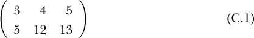

## 第十七章：**C

矩阵、数据框和因子转换**

在 R 的世界中，R 在数据类型方面的极大灵活性意味着要进行严谨使用需要一些类型转换的技巧。本附录将确保读者掌握这一技能。

### C.1 矩阵

尽管 R 的*矩阵*类可能被视为比数据框更为基础，但现在有些 R 用户并不了解它。由于 R 中任何 serious 的机器学习使用都需要掌握此类，本附录将提供一个简短的教程。

本书的主题是限制数学工具的使用，因此我们不会讨论矩阵的数学性质。

R 矩阵本质上是一个数据框，其中所有列都是数值型的。它使用相同的 [i,j] 表示法。两者之间可以进行转换。以下是一些示例：

```
> library(regtools)
> data(mlb)
> head(mlb)
             Name Team       Position Height Weight   Age PosCategory
1   Adam_Donachie  BAL        Catcher     74    180 22.99     Catcher
2       Paul_Bako  BAL        Catcher     74    215 34.69     Catcher
3 Ramon_Hernandez  BAL        Catcher     72    210 30.78     Catcher
4    Kevin_Millar  BAL  First_Baseman     72    210 35.43   Infielder
```

### C.2 转换：在 R 因子与虚拟变量之间、在数据框与矩阵之间

在 R 中，分类变量有一个正式的类：*factor*。这实际上是 R 最有用的方面之一，但必须熟练掌握因子和相应的虚拟变量之间的转换。

类似地，尽管本书中我们主要使用数据框，但有些算法需要矩阵，比如，因为它们计算行之间的距离并进行矩阵乘法和逆运算。你不需要知道矩阵逆运算是什么，但某些软件包要求你只提供矩阵输入，而非数据框。在本附录的开头有一个关于矩阵的简短教程。

一些非常流行的 R 机器学习包会自动从因子生成虚拟变量，但其他的则不会。例如，LASSO 模型的 `glmnet` 要求分类特征必须是虚拟变量的形式，而 `ranger`（用于随机森林）则接受因子。

所以，能够自己生成虚拟变量非常重要。`regtools` 包中的函数 `factorToDummies()` 和 `factorsToDummies()` 就是用来做这件事的。我们在第 1.9 节中讨论了 `factorToDummies()` 函数。我们在整本书中，包括本附录，都使用虚拟变量。

我们还使用内置的 R 函数 `as.matrix()` 将数据框转换为矩阵。

```
5     Chris_Gomez  BAL  First_Baseman     73    188 35.71   Infielder
6   Brian_Roberts  BAL Second_Baseman     69    176 29.39   Infielder
> hwa <- mlb[,4:6]
> head(hwa)
  Height Weight   Age
1     74    180 22.99
2     74    215 34.69
3     72    210 30.78
4     72    210 35.43
5     73    188 35.71
6     69    176 29.39
> class(hwa)
[1] "data.frame"
> hwam <- as.matrix(hwa)
> class(hwam)
[1] "matrix" "array"
> head(hwam)
  Height Weight   Age
1     74    180 22.99
2     74    215 34.69
3     72    210 30.78
4     72    210 35.43
5     73    188 35.71
6     69    176 29.39
> hwam[2,3]
[1] 34.69
> mean(hwam[,3])  # mean age
[1] 28.70835
> mean(hwam$age)  # illegal
Error in hwam$age : $ operator is invalid for atomic vectors
# rbind(), "row bind", combines rows
> m <- rbind(3:5,c(5,12,13))
> m
     [,1] [,2] [,3]
[1,]    3    4    5
[2,]    5   12   13
> class(m)
[1] "matrix" "array"
> m[2,3]
[1] 13
> md <- as.data.frame(m)
> md
  V1 V2 V3
1  3  4  5
2  5 12 13
> class(md)
[1] "data.frame"
> md[2,3]
[1] 13
# the apply() function can be a nice shortcut
> apply(m,1,sum)  # apply sum() to each row (argument 1) of m
[1] 12 30
> apply(m,2,sum)  # apply sum() to each column (argument 2) of m
[1]  8 16 18
```

在数学中，我们将矩阵表示为矩形数组。例如，对于上面的矩阵 `m`：


