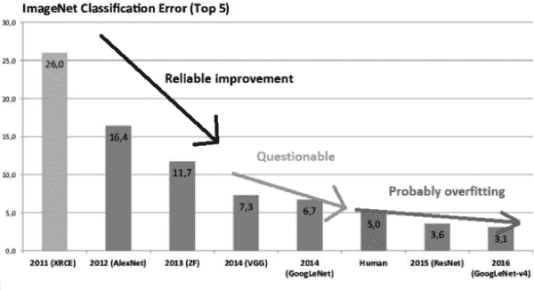

## 第十八章：**D

陷阱：小心“P-HACKING”！**

近年来，人们对被称为*p-hacking*的问题表示了极大的关注。尽管这些问题一直为人所知并被讨论，但在约翰·伊奥安尼迪斯（John Ioannidis）那篇标题极具挑衅性的论文《为什么大多数已发布的研究结果是错误的》（*PLOS Medicine*，2005 年 8 月 30 日）发表后，事情真正到了一个高潮。这个争议的一个方面可以这样描述。

假设我们有 250 枚硬币，并且怀疑其中一些是偏的。（任何硬币都至少会有某种程度的不平衡，但我们暂且不提这个。）我们抛每一枚硬币 100 次，如果一枚硬币出现的正面少于 40 次或多于 60 次，我们就认为它是不平衡的。对于懂一些统计学的人来说，这个范围的选择是为了确保一枚平衡硬币有 5%的概率出现超过 50 次正面偏差超过 10 次。所以，虽然每枚硬币的这个概率只有 5%，但有 250 枚硬币时，至少有一枚硬币很可能会落在[40,60]范围之外，*即使没有一枚硬币是不平衡的*。我们会错误地宣称一些硬币是不平衡的。实际上，这只是巧合，那些硬币看起来不平衡。

或者，举个稍微轻松一点的例子，但仍能说明问题，假设我们正在研究幽默感是否与遗传有关。有没有幽默基因？有许多许多基因需要考虑——实际上超过了 250 个。测试每一个基因与幽默感的关系，就像检查每一枚硬币是否不平衡：即使没有幽默基因，最终我们也可能偶然发现一个看似与幽默相关的基因。

在一项复杂的科学研究中，分析员测试了许多基因，或者许多与癌症相关的风险因素，或者许多外星行星是否有生命的可能，或者许多经济通胀因素，等等。术语*p-hacking*指的是分析员考虑了如此多的不同因素，以至于其中一个很可能会被认为是“统计学显著”的，即使没有任何因素对结果有真正的影响。一句常见的笑话是，分析员“逼迫数据直到它们承认”，暗指研究人员测试了太多的因素，最终有一个因素会被判定为“显著”。

谷歌决策智能部门负责人 Cassie Kozyrkov 说得很好：

人类对墨迹的处理方式，正如同它处理数据的方式一样。复杂的数据集几乎在要求你在其中找到虚假的意义。

*这对机器学习分析有重大影响。* 例如，机器学习社区中有一种流行的做法，就是举办竞赛，许多分析员对机器学习方法进行调整，试图在某一数据集上超越对方。通常这些是分类问题，“获胜”意味着获得最低的错误分类率。

问题在于，拥有 250 个机器学习分析师攻克同一数据集，就像我们上面举例的 250 个硬币。即使他们尝试的 250 种方法都同样有效，其中某一个方法也会偶然成为赢家，并被誉为“技术进步”。

当然，可能确实有 250 种方法中的某一种是优越的。但如果没有对这 250 个数据点进行仔细的统计分析，就无法确定什么是真实的，什么只是偶然的。还要注意，即使 250 种方法中确实有一种优越的方法，由于随机变异，它很可能不会在比赛中获胜。

问题的严重性在于，参赛者很可能不会提交自己的作品，如果看起来不太可能创造新的记录。这进一步加剧了结果的偏差。

如前所述，这个概念对统计学家来说是第二天性，但在机器学习圈子中很少提及。一个例外是 Lauren Oakden-Rayner 的博客文章《AI 竞赛无法产生有用的模型》，她的精彩图表在图 D-1 中得到再现，并且得到了 Oakden-Rayner 博士的许可。^(1)

*图 D-1：AI p-hacking*

Rayner 使用简单的统计功效分析来分析 ImageNet，这是一个机器学习图像分类比赛。他认为，至少从 2014 年开始的那些“新记录”都是过拟合，或者只是噪声。如果使用更复杂的统计工具，可以做更精细的分析，但原理是明确的。

这对调优参数的设定也有很大影响。假设我们在一个机器学习方法中有四个调优参数，并且每个参数尝试 10 个不同的值。那就有 10⁴ = 10000 种可能的组合，比 250 多得多！所以，再次强调，看似“最佳”的调优参数设定可能是虚幻的。

`regtools`函数`fineTuning()`采取措施以应对在搜索最佳调优参数组合时可能出现的 p-hacking 问题。
