# 使用Python构建机器学习系统

通过真实用例实践训练预测模型并分析机器学习结果


迪普蒂·乔普拉

# 使用Python构建机器学习系统

通过真实用例实践训练预测模型并分析机器学习结果

迪普蒂·乔普拉


[www.bpbonline.com](http://www.bpbonline.com)

2021年第一版

版权所有 © BPB Publications, India

ISBN: 978-93-89423-617

保留所有权利。未经出版商事先书面许可，不得以任何形式或任何方式复制、分发或传播本出版物的任何部分，也不得将其存储在数据库或检索系统中，但程序清单除外，这些清单可以在计算机系统中输入、存储和执行，但不能通过出版、影印、录音或任何电子和机械手段进行复制。

## 责任限制和免责声明

本书所含信息根据作者和出版商的最佳知识判断是真实准确的。作者已尽一切努力确保这些出版物的准确性，但出版商对因本书中任何信息引起的任何损失或损害不承担责任。

本书中提及的所有商标均被确认为其各自所有者的财产，但BPB Publications无法保证这些信息的准确性。

分销商：

## BPB PUBLICATIONS

20, Ansari Road, Darya Ganj

New Delhi-110002

电话: 23254990/23254991

## MICRO MEDIA

Shop No. 5, Mahendra Chambers,

150 DN Rd. Next to Capital Cinema,

V.T. (C.S.T.) Station, MUMBAI-400 001

电话: 22078296/22078297

## DECCAN AGENCIES

4-3-329, Bank Street,

Hyderabad-500195

电话: 24756967/24756400

## BPB BOOK CENTRE

376 Old Lajpat Rai Market,

Delhi-110006

电话: 23861747


由Manish Jain为BPB Publications出版，地址：20 Ansari Road, Darya Ganj, New Delhi-110002，并由他安排在Mumbai的Repro India Ltd印刷

[www.bpbonline.com](http://www.bpbonline.com)

## 献给

我的家人和朋友
他们始终与我同在，给予我爱、支持和关怀。

## 关于作者

**迪普蒂·乔普拉博士** 在德里的Lal Bahadur Shastri管理学院担任助理教授（IT）。她拥有约7年的教学经验。她的研究兴趣包括自然语言处理、计算语言学和人工智能。她是3本书的作者，并在多个国际会议和期刊上发表了多篇研究论文。

## 关于审稿人

**Anmol** 在软件行业拥有3年经验。他磨练了自己在机器学习、深度学习、构建和维护ETL/ELT数据管道以及数据驱动系统方面的技能。Anmol曾工作过的行业包括航空、电子商务、人力资源和医疗保健。他的日常工作涉及分析和解决复杂的业务问题，将工作分解为可行的可操作任务，并与他的团队和项目经理合作，规划并向我们的业务客户传达交付承诺。

当不工作时，Anmol大部分时间都在阅读、环游世界、玩Fifa以及观看他最喜欢的百老汇演出。作为一个公认的体育迷，他通过在周日下午观看皇家马德里的比赛来满足自己对足球的痴迷。

## 致谢

我首先要感谢上帝，因为没有上帝，我无法完成这一切。

我怀着感激之情，衷心感谢我所有的家人和朋友，感谢他们给予我的祝福和美好祝愿，使我能够实现出版这本基于机器学习的书籍的目标。

我衷心感谢本书的几位朋友/技术审稿人，他们每次都在鼓励和激励我，并证明他们始终在我身边。这样的关系是“质量胜于数量”的完美例证。

如果没有BPB Publications内容编辑的支持，这本书就不会问世。我感谢BPB Publications的编辑和出版专业人士，感谢他们对出版本书的浓厚兴趣和支持。

最后，我要感谢BPB Publications的Manish Jain先生，感谢他给我这个机会为他们写我的第一本书。

## 前言

随着来自不同来源的数据可用性增加，对数据分析和机器学习等数据驱动领域的需求日益增长。本书旨在涵盖机器学习的基本概念、各种学习范式以及这些范式中使用的不同架构和算法。

本书面向希望详细了解机器学习的初学者。本书也可供机器学习用户快速参考机器学习基础知识。

以下是本书涵盖的章节：

[第1章：机器学习简介](Chapter 1: Introduction to Machine Learning)

**描述：** 本章涵盖机器学习的基本概念、执行ML的领域、输入-输出函数

**涵盖的主题：**

- 什么是机器学习？
- ML的效用
- ML的应用

## 第2章：线性回归

**描述：** 本章讨论线性回归

**涵盖的主题：** 本章涵盖的主题列表：

- 单变量线性回归
- 多变量线性回归
- 梯度下降
- 多项式回归

## 第3章：使用逻辑回归进行分类

**描述：** 本章讨论使用逻辑回归进行分类

**涵盖的主题：** 本书涵盖的主题列表：

- 二元分类
- 逻辑回归
- 多类分类

## 第4章：过拟合与正则化

**描述：** 本章讨论过拟合和正则化

**涵盖的主题：** 本章涵盖的主题列表：

- 线性回归中的过拟合和正则化
- 逻辑回归中的过拟合和正则化

## 第5章：学习的可行性

**描述：** 本章讨论学习的可行性

**涵盖的主题：** 本章涵盖的主题：

- 学习未知目标函数的可行性
- 样本内误差
- 样本外误差

## 第6章：支持向量机

**描述：** 本章讨论支持向量机

**涵盖的主题：** 请提供本书涵盖的主题列表：

简介

1.1 间隔

1.2 大间隔方法

核方法

## 第7章：神经网络

**描述：** 本章讨论神经网络

**涵盖的主题：** 本章涵盖的主题列表：

简介

早期模型

感知器学习

反向传播

随机梯度下降

## 第8章：决策树

**描述：** 本章讨论决策树

**涵盖的主题：** 本章涵盖的主题列表：

- 决策树
- 回归树
- 决策树中的停止准则和剪枝损失函数
- 决策树中的分类属性、多路分裂和缺失值
- 决策树的不稳定性

## 第9章：无监督学习

**描述：** 本章讨论无监督学习

**涵盖的主题：** 本章涵盖的主题列表：

- 简介
- 聚类
  - 2.1 K-means聚类
  - 2.2 层次聚类
- 主成分分析

## 第10章：泛化理论

**描述：** 本章讨论泛化理论

**涵盖的主题：** 本章涵盖的主题列表：

- 训练与测试
- 测试误差的界限
- Vapnik Chervonenkis不等式
- VC维
- VC不等式的证明

## 第11章：机器学习中的偏差与公平性

**描述：** 本章讨论机器学习中的偏差和公平性

**涵盖的主题：** 本章涵盖的主题列表：

### 引言

如何检测偏差？

如何在机器学习中修正偏差或实现公平性？

## 下载代码包和彩色图片：

请通过以下链接下载本书的**代码包**和**彩色图片**：

[https://rebrand.ly/34fca5](https://rebrand.ly/34fca5)

## 勘误

我们BPB出版社对我们的工作深感自豪，并遵循最佳实践以确保内容的准确性，为我们的读者提供沉浸式的阅读体验。我们的读者是我们的镜子，我们利用他们的反馈来反思并改进出版过程中可能出现的任何人为错误。为了让我们保持质量并帮助我们联系到任何可能因任何不可预见的错误而遇到困难的读者，请通过以下方式联系我们：

[errata@bpbonline.com](mailto:errata@bpbonline.com)

BPB出版社大家庭非常感谢您的支持、建议和反馈。

您知道吗？BPB提供每本已出版书籍的电子书版本，提供PDF和ePub文件？您可以在[www.bpbonline.com](http://www.bpbonline.com)升级到电子书版本，作为纸质书客户，您有权享受电子书副本的折扣。请通过[business@bpbonline.com](mailto:business@bpbonline.com)联系我们了解更多详情。

您还可以阅读一系列免费技术文章，注册各种免费通讯，并获得BPB书籍和电子书的独家折扣和优惠。

## BPB正在寻找像您这样的作者

如果您有兴趣成为BPB的作者，请访问[www.bpbonline.com](http://www.bpbonline.com)并立即申请。我们已经与成千上万的开发者和技术专业人士合作，就像您一样，帮助他们与全球技术社区分享他们的见解。您可以提交通用申请，申请我们正在招募作者的特定热门主题，或提交您自己的想法。

本书的代码包也托管在GitHub上。如果代码有任何更新，它将在现有的GitHub仓库中更新。

我们还有其他来自我们丰富的书籍和视频目录的代码包可供查看。请查看它们！

## 盗版

如果您在互联网上以任何形式发现我们作品的任何非法副本，如果您能向我们提供位置地址或网站名称，我们将不胜感激。请通过[business@bpbonline.com](mailto:business@bpbonline.com)联系我们，并提供指向该材料的链接。

## 如果您有兴趣成为作者

如果您有专长的主题，并且有兴趣撰写或参与一本书，请访问

## 评论

请留下评论。一旦您阅读并使用了本书，为什么不在您购买它的网站上留下评论呢？潜在的读者可以看到并使用您的公正意见来做出购买决定，我们BPB可以了解您对我们产品的看法，我们的作者可以看到您对他们书籍的反馈。谢谢！

有关BPB的更多信息，请访问

## 目录

+   1. 引言
   - 结构
   - 目标
   - 机器学习的历史
   - 机器学习的分类
   - 采用机器学习面临的挑战
   - 应用
   - 结论
   - 问题

+   2. 线性回归
   - 结构
   - 目标
   - 单变量线性回归
   - 多变量线性回归
   - 梯度下降
   - 多项式回归
   - 结论
   - 问题

+   3. 使用逻辑回归进行分类
   - 引言
   - 结构
   - 目标
   - 二元分类
   - 逻辑回归
   - 多类分类
   - 结论
   - 问题

## 4. 过拟合与正则化

+   - 结构
- 目标
- 线性回归中的过拟合与正则化
- 逻辑回归中的过拟合与正则化
- 结论
- 问题

## 5. 学习的可行性

+   - 引言
- 结构
- 目标
- 学习未知目标函数的可行性
- 样本内误差与样本外误差
- 结论
- 问题

## 6. 支持向量机

+   - 引言
- 结构
- 目标
- 间隔与大间隔方法
- 核方法
- 结论
- 问题

## 7. 神经网络

+   - [引言](Introduction)
- [结构](Structure)
- [目标](Objectives)
- [早期模型](Early models)
- [感知器学习](Perceptron learning)
- [反向传播](Back propagation)
- [随机梯度下降](Stochastic Gradient Descent)
- [结论](Conclusion)
- [问题](Questions)

## 8. 决策树

+   - [引言](Introduction)
- [结构](Structure)
- [目标](Objectives)
- [决策树](Decision trees)
- [回归树](Regression trees)
- [决策树中的停止准则与剪枝损失函数](Stopping criterion and pruning loss functions in decision trees)
- [决策树中的类别属性、多路分裂与缺失值](Categorical attributes, multiway splits, and missing values in decision trees)
- [决策树的不稳定性](Instability in decision trees)
- [结论](Conclusion)
- [问题](Questions)

## 9. 无监督学习

+   - [引言](Introduction)
- [结构](Structure)
- [目标](Objectives)
- [聚类](Clustering)
- [K-均值聚类](K-means clustering)
- [层次聚类](Hierarchical clustering)
- [主成分分析 (PCA)](Principal_Component_Analysis_(PCA))
- [结论](Conclusion)
- [问题](Questions)

## 10. 泛化理论

+   - [引言](Introduction)
- [结构](Structure)
- [目标](Objectives)
- [训练与测试](Training_versus_testing)
- [测试误差的界定](Bounding_the_testing_error)
- [VC维](VC_dimension)
- [结论](Conclusion)
- [问题](Questions)

## 11. 机器学习中的偏差与公平性

+   - [引言](Introduction)
- [结构](Structure)
- [目标](Objectives)
- [引言](Introduction)
- [如何检测偏差？](How_to_detect_bias?)
- [如何在机器学习中修正偏差或实现公平性？](How_to_fix_biases_or_achieve_fairness_in_ML?)
- [结论](Conclusion)
- [问题](Questions)

## 索引

# 第1章

### 引言

机器学习是人工智能的应用之一。机器学习可以定义为系统在没有明确编程的情况下，通过经验自动学习的能力。它基于能够访问数据并利用这些数据自行执行学习的程序开发。在本章中，我们将讨论机器学习的分类、机器学习面临的各种挑战以及机器学习的应用。

### 结构

机器学习的历史

机器学习的分类

采用机器学习面临的挑战

应用

### 目标

理解机器学习的起源

理解机器学习算法的分类

机器学习面临的挑战

机器学习的应用

### 机器学习的历史

在20世纪40年代，第一台手动操作的计算机，**ENIAC数值积分器**被发明。此时，使用了*计算机*一词，意为“*一台具有密集数值计算能力的机器*”。自20世纪40年代以来，人们的想法是制造一台能够模仿人类学习和思考行为的机器。在20世纪50年代，第一个能够击败跳棋世界冠军的计算机游戏程序被开发出来。这帮助跳棋选手提高了他们的技能。此时，*弗兰克·罗森布拉特*发明了感知器，这是一个非常简单的分类器。机器学习在20世纪90年代变得流行，当时人工智能的概率方法作为统计学和计算机科学结合的产物诞生了。由于可用数据量巨大，科学家们开始构建能够分析和学习大量数据的智能系统。例如，IBM的深蓝能够击败世界国际象棋冠军*加里·卡斯帕罗夫*。机器学习是一种算法，其中的软件应用程序可以在没有明确编程的情况下准确预测结果。机器学习的基本本质是构建算法，在接收到输入数据时，使用统计分析预测输出，并在新数据可用时更新输出。*机器学习*一词由美国科学家*亚瑟·塞缪尔*在1959年创造，他在计算机游戏和人工智能方面具有专业知识。根据*亚瑟·塞缪尔*的说法，*机器学习是赋予计算机在没有被明确编程的情况下学习的能力*。根据*汤姆·米切尔*在1997年的说法，*一个计算机程序被称为从经验E中学习，关于某类任务T和性能度量P，如果它在T上的性能，由P衡量，随着经验E而提高*。

### 机器学习的分类

根据学习的本质以及学习系统可用的响应或输出，机器学习实现分为三种类型：

**监督学习：** 在监督学习中，学习是使用示例数据及其对应的目标响应来执行的。在测试阶段，当提供新的示例时，它会预测相应的响应。这种学习类似于学生从老师那里学习的方式。老师为学生提供一些好的示例来记忆。然后学生能够制定通用规则来解决问题并得出有用的结论。

**无监督学习：** 在无监督学习中，学习是使用没有关联目标响应的示例数据来执行的。在这类算法中，会对数据进行重组，将数据分割成不同的类别。属于同一类别的对象具有高度的相似性。

**强化学习：** 强化学习类似于无监督学习，其中对于示例数据，没有目标响应，每个示例都伴随着正面或负面的反馈。在测试期间，当针对示例数据获得正确的响应时，会给予正面反馈或奖励。在负面反馈中，会给予错误或惩罚，因为在测试期间，针对示例数据获得了不正确的响应。

**半监督学习：** 在半监督学习中，在训练期间，我们拥有示例数据，但其中一些对应的目标响应缺失。它是监督学习和无监督学习的结合。

根据期望的输出，机器学习实现分为以下类型：

**分类：** 在这种类型的学习中，将两个或多个类别分配给训练数据中存在的输入。在测试阶段，当我们提供输入时，它会被分类到两个或多个类别中。例如，在垃圾邮件过滤中，它会分类一封电子邮件是垃圾邮件还是非垃圾邮件。

**回归：** 回归是在监督学习期间执行的。在这种类型的学习中，输出是连续的而不是离散的。

**聚类：** 聚类是在无监督学习期间执行的，其中测试数据被分类成组，并且与分类任务不同，这些组或类别事先是未知的。

不同类型的机器学习算法如图1.1所示：

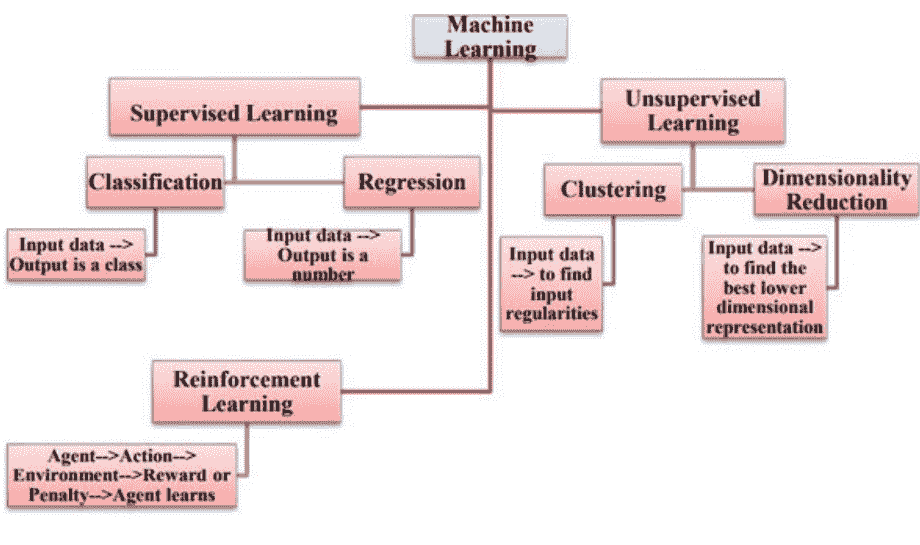

**图1.1：** *机器学习算法的分类*

### 采用机器学习面临的挑战

在采用机器学习开发项目时，存在各种挑战。其中一些如下：

**需要适当的实验和测试：** 我们需要在机器学习系统中进行频繁测试，以便通过适当的实验获得期望的结果。用于测试机器学习算法的方法称为分层。在这种方法中，我们主要将数据集随机分成两个子集：训练集和测试集。

**不灵活的业务模型：** 在实施机器学习时，我们应该遵循敏捷和灵活的业务策略。如果其中一个机器学习策略不起作用，那么我们需要进行更多的实验，从而构建一个新的、稳健的机器学习模型。

**伦理问题：** 机器学习的结果是否符合伦理？谷歌正在开发用于一个名为*Project Maven*的军事项目的软件。该项目使用无人机并将制造自主武器。因此，谷歌的12名员工辞职以示抗议，超过4000名员工以及1000多名著名科学家签署了一份请愿书，要求公司放弃该项目。

**机器学习对人类的影响：** 基于机器学习的系统，如电影推荐系统，会随着时间的推移改变人类的选择，并使其范围变窄。有趣的是，人们没有注意到他们是如何被算法操纵的。例子包括电影推荐系统、新闻、宣传等。

**虚假相关性：** 当两个完全独立的参数表现出相似的行为时，就会出现虚假相关性。这会产生一种错觉，认为这些参数之间以某种方式相互关联。它们也被称为**伪相关**。例如，如果汽车安全带的数量增加，宇航员死亡人数就会减少。这是一个虚假相关性，因为汽车安全带与太空事故无关。

**反馈循环：** 反馈循环比虚假相关性更糟糕。这是一种算法的决策影响现实，同时让人相信结论是正确的情况。例如，一个犯罪预防程序建议根据犯罪率的上升向特定区域派遣更多警察。这导致当地居民更频繁地报告犯罪，因为有人就在那里，他们可以报告。这也导致警察官员撰写更多报告并实施协议，从而导致更高的犯罪率，这意味着必须向该地区派遣更多警察。早些时候，当该地区没有警察官员时，人们并不经常报告犯罪。

**被污染或受污染的参考数据：** 机器学习算法的结果完全取决于机器学习的参考数据或训练数据。如果训练数据或参考数据被污染或受污染，那么机器学习的结果也将是不正确的。例如，如果我们想开发一个机器翻译系统，并且训练文件包含不正确的翻译，那么输出也将是不正确的。

**欺骗：** 即使机器学习算法运行完美，它也可能被欺骗。噪声或失真可以完全改变算法的结果。在不久的将来，如果使用机器学习算法分析机场行李发出的X射线，并且在枪支旁边放置一个物体，那么该算法将无法检测到枪支。

**掌握机器学习：** 数据科学家是精通机器学习的人。非数据科学家可能无法掌握所有与机器学习相关的知识。他们需要找到机器学习特定领域的关键问题，然后尝试克服这些问题。例如，从事预测建模的人可能没有**自然语言处理**任务的完整知识。

**得出错误的假设：** 基于机器学习的系统需要处理数据集中的缺失值。例如，缺失值问题可以通过使用平均值作为缺失值的替代来解决。这里，需要就缺失值的替代做出可靠的假设。因此，我们必须确保数据没有缺失值，并且得出的假设具有实质性。

**基于机器学习的系统仍然不智能：** 虽然基于机器学习的系统在不断发展，但当前基于机器学习的系统也存在失败。例如，作为一项实验，微软的聊天机器人Tay在Twitter上发布，模仿一个十几岁的女孩。这是一个失败，因此公司不得不关闭实验，并为聊天机器人Tay发布的伤人和冒犯性推文向整个互联网人群道歉。

**计算需求昂贵：** 为了进行大数据处理，使用GPU而不是CPU。一些公司没有GPU，因此传统CPU处理大量数据需要更长的时间。在某些情况下，即使使用GPU，也可能需要数天或数周才能完成处理，而传统软件开发可能只需要几分钟或几小时就能完成任务。

### 应用

机器学习是当今的热门词汇。机器学习的应用非常广泛。其中一些应用如图1.2所示。

**图1.2：** *机器学习的应用*

**虚拟个人助理：** 当今使用的一些最受欢迎的虚拟个人助理示例包括Alexa、Siri和Google Now。这些虚拟个人助理在通过语音询问时，有助于查找信息。我们可以激活这些虚拟个人助理，并提出诸如*从伦敦到...的航班有哪些？*或*需要执行哪些任务？*之类的问题。为了回答此类查询，虚拟个人助理会收集信息或搜索之前询问过的查询，或从手机应用程序中收集信息。机器学习是虚拟个人助理不可或缺的一部分，因为它们收集信息并根据先前的信息进行提炼，然后用于根据给定的偏好生成结果。虚拟个人助理集成到各种平台中，例如移动应用程序（例如，Google Allo）、智能手机（例如，三星S8上的Samsung Bixby）、智能音箱（例如，Amazon Echo、Google Home）等。虚拟个人助理是小型、便携的设备。图1.3展示了Google Home。

**图1.3：** Google Home

**交通预测：** 为了管理交通，使用了GPS导航设备。GPS设备跟踪车辆的当前位置和速度，并将信息存储在中央服务器中。此信息用于生成当前的交通报告。这可以防止交通拥堵并有助于拥堵分析。图1.4展示了一辆汽车中配备的GPS设备。因此，机器学习用于根据每日GPS报告估算可能发生拥堵的区域。

*图1.4：汽车中配备的GPS设备*

**在线交通网络：** 当我们使用应用程序预订出租车时，它会估算行程价格。机器学习用于最小化绕行。它在预测行程时间、行程价格和减少绕行方面发挥着非常重要的作用。

**视频监控系统：** 单个人无法监控多个摄像头。视频监控系统在其后端使用机器学习来检测人们的异常行为，如打瞌睡、绊倒、站立等。视频监控系统在检测到异常行为时会提醒人类值班员，并防止任何事故的发生。

**社交媒体服务：** 机器学习在社交媒体平台上被广泛用于个性化新闻推送和定向投放更精准的广告。机器学习在社交媒体服务中的其他应用包括以下内容：

- **你可能认识的人：** 机器学习基于通过经验获取知识的概念。Facebook会关注我们联系的人、我们经常访问的个人资料、我们的工作场所、我们共享的群组、我们的兴趣等。基于所有这些信息，Facebook会建议我们可能想成为朋友的人的列表。

- **人脸识别：** 当我们上传一张自己和朋友的照片时，Facebook可以立即识别出那位朋友。这是因为Facebook会识别独特的特征、姿势和投影，并将其与我们朋友列表中的人的照片进行匹配。这是一个在后端非常复杂的应用，因为它考虑了精确度因素，但在前端，它是一个非常简单的机器学习应用。Facebook使用DeepFace，这是一个深度学习项目，负责识别图像中的人脸。Facebook还为已上传到Facebook的图像提供了替代标签功能。

- **相似图钉：** 计算机视觉涉及从视频和图像中提取有用信息。机器学习是计算机视觉的应用之一。Pinterest利用计算机视觉来检测图像中的图钉或物体，并推荐与之相似的图钉。

- **情感分析：** 情感分析是机器学习的应用之一。它是一个从给定文本中确定个人情绪或观点的过程。它也被称为意见挖掘或情感分类。情感分析的应用见于决策应用、基于评论的网站等。

**电子邮件垃圾邮件和恶意软件过滤：** 电子邮件客户端使用多种垃圾邮件过滤技术。为了确保这些方法持续更新，使用了机器学习。基于规则的垃圾邮件过滤技术无法跟踪垃圾邮件发送者采用的最新技巧。受机器学习影响的垃圾邮件过滤技术示例包括多层感知器、C4.5决策树归纳等。每天检测到近325,000个恶意软件，其中约90-98%的代码与其先前版本相似。基于机器学习的系统安全程序能够学习编码模式。因此，它们能够发现具有2-10%变异的恶意软件，并提供相应的防护。

**在线客户支持：** 如今许多网站提供在用户浏览网站时与公司客户支持代表聊天的功能。但并非所有网站都提供实时客服来回答查询。在某些网站中，用户与聊天机器人对话。这些聊天机器人从网站中提取有用信息，并将其作为对用户查询的响应呈现给客户。聊天机器人随着时间的推移而进步。它们基于一种从过去经验中获取知识的机器学习算法。聊天机器人试图理解用户查询，然后每次提供更好的响应。

**搜索引擎结果优化：** 谷歌和许多其他搜索引擎利用机器学习来提高搜索能力。每当我们进行搜索时，后端会运行一个算法，查看我们如何响应搜索引擎提供的结果。如果我们打开最顶部的结果并在页面上停留很长时间，那么搜索引擎会假设显示的结果与查询相符。此外，如果我们到达搜索结果的第二页或第三页但没有打开任何页面，那么搜索引擎会假设显示的结果与查询不符。通过这种方式，后端运行的算法试图提高搜索结果的性能。

**产品推荐：** 当我们从网站购买在线产品时，我们会注意到开始收到包含购物建议的电子邮件。此外，应用程序或购物网站会推荐符合我们选择的商品。产品推荐是基于过去的购买记录、浏览过或添加到购物车的商品，或品牌偏好来显示的。这种神奇的购物体验归功于机器学习。

**在线欺诈检测：** 借助机器学习，我们可以追踪在线金融欺诈。例如，为了防止洗钱，Paypal使用了机器学习方法。使用某些工具，Paypal可以比较买家和卖家之间发生的数百万笔交易，并能够区分合法和非法交易。

**在线游戏：** 机器学习应用于在线游戏中。例如，在国际象棋中，它使用了机器学习。基于之前带来胜利局面的走法，后端运行的算法试图提高其性能，并做出它认为最佳的类似走法。通过这种方式，机器学习试图将类似人类的智能注入计算机，使其能够像任何人类国际象棋冠军一样下棋。

**金融服务：** 据专家称，在线信用卡欺诈在2020年已上升至320亿美元。与金融相关的公司可以查看金融数据的流动并防止金融欺诈。这通过机器学习成为可能。机器学习有助于识别交易和投资中的机会。借助网络监控，我们可以识别那些面临金融风险的机构和个人，并采取及时行动防止任何网络欺诈。

**医疗保健：** 通过引入机器学习，医疗保健领域的技术取得了进步。可穿戴传感器和设备可以提供实时## 一个人的整体健康状况，如心跳、血压等。医生可以利用这些信息分析个人的健康状况，利用患者病史绘制模式图，并预测未来可能出现的任何疾病。机器也可以被训练得具有类似人类的智能。机器可以像医生一样，根据过去的健康状况记录来预测疾病或建议用药。

**石油和天然气：** 这个行业最需要机器学习。机器学习在石油和天然气行业的应用非常广泛。它不仅包括石油的流动分配，还包括寻找新的能源以及分析地下矿物。

**自动驾驶汽车：** 自动驾驶汽车是机器学习最新、最令人兴奋的应用之一。特斯拉是一家著名的汽车制造公司，正在致力于开发自动驾驶汽车。它正在使用一种无监督机器学习算法来制造自动驾驶汽车，该算法能够在驾驶过程中检测物体和行人。

**自动文本翻译：** 如今，如果你去任何新的地方，语言不再是理解当地人想法或与他们分享想法的障碍。借助机器学习，我们可以将一种语言翻译成另一种语言，还可以实现文本到语音以及语音到文本的转换。**GNMT 神经机器**基于神经机器学习，可将文本从一种语言翻译成另一种语言。GNMT 也被称为自动翻译系统。谷歌翻译器提供的复杂英语到印地语翻译如*图 1.5*所示。


*图 1.5：谷歌翻译器的复杂英语到印地语翻译*

**动态定价：** 动态定价是指完全取决于客观思考的定价策略。例如，机票、电影票、出租车费等都是动态定价的。利用机器学习，可以找出购买趋势并确定产品的动态价格。Uber 使用一种名为 *Geosurge* 的机器学习模型来执行单次行程的动态定价。

**新闻分类：** 机器学习有助于将海量新闻分为不同类别，如国内新闻、国际新闻、体育新闻、娱乐新闻等。这有助于读者从他们想要的类别中选择新闻。用于新闻分类的机器学习方法有：支持向量机、朴素贝叶斯、K-近邻等。

**信息检索：** 这是机器学习的重要应用之一，因为它涉及从非结构化数据中提取知识或结构化数据。信息检索在大数据领域扮演着至关重要的角色。在机器学习方法中，非结构化数据作为输入，知识或结构化数据作为输出。

**机器人控制：** 机器学习的应用之一是机器人控制。最近，有研究致力于实现对直升机特技飞行和飞行的控制。在由 Darpa 赞助的基于机器人控制的比赛中，一辆在沙漠中行驶了一百英里的机器人战胜了能够识别远处物体的机器人。

### 结论

机器学习是人工智能的应用之一，它允许系统在没有明确编程的情况下自动学习并改进其性能。机器学习涉及开发能够访问数据并利用这些数据自行执行学习的计算机系统。在本章中，我们讨论了机器学习、机器学习的应用以及机器学习的挑战。在下一章中，我们将讨论监督学习和线性回归，这是监督学习技术的一种类型。

### 问题

- 举例说明监督学习和无监督学习之间的区别。
- 采用机器学习技术面临哪些挑战？
- 举例说明机器学习在医疗保健领域的应用。
- 举例说明机器学习在社交媒体服务中的应用。

# 第 2 章

## 线性回归

监督学习是一种机器学习任务，它基于标记的输入-输出示例对将输入映射到输出。监督学习可以分为两种类型：分类和回归。在本章中，我们将讨论单变量线性回归、多变量线性回归、梯度下降和多项式回归。

### 结构

- 单变量线性回归
- 多变量线性回归
- 梯度下降
- 多项式回归

### 目标

- 理解单变量线性回归
- 理解多变量线性回归
- 了解梯度下降
- 理解多项式回归

### 单变量线性回归

线性回归是一种描述自变量 $x$ 和因变量之间关系的技术。线性回归指出，一个或多个输入特征与相对输出或目标向量之间存在的关系大致是线性的。线性回归找到输入特征的加权和以及一个称为偏置项或截距的常数。线性回归有许多实际应用。这些应用分为两类：

- 如果应用包括预测、预报或误差减少，那么可以将线性回归应用于数据集值并对响应进行预测。
- 当需要解释响应中的变化时，这可以归因于其他解释变量的存在。

线性回归用于在行为、生物和社会科学领域中寻找变量之间可能存在的关系。在单变量线性回归中，假设定义为：

$h_{\theta}(x) = \theta_0 + \theta_1x$

这里，$x$ 被称为自变量，我们的假设依赖于它。例如，以毫米为单位测量的*降雨量*可以是 $x$，而我们试图预测的*雨伞数量*可以是假设。$\theta_0$ 和 $\theta_1$ 分别被称为偏置变量和权重变量，它们共同构成权重矩阵。

代价函数是一个方程，它估计我们离假设有多近。代价函数的值越小，我们离所需的曲线就越近。因此，我们试图最小化代价函数以减少误差。均方误差代价函数定义如下：

$$J(\theta_0, \theta_1) = \frac{1}{2m} \sum_{i=1}^{m} (h_{\theta}(x^i) - y^i)^2$$

这里，$J$ 是代价函数，$m$ 指的是我们数据集中的数据点数量，$y$ 指的是我们希望预测的实际值。为了给代价函数添加归一化，我们引入一个常数 $1/2m$。

Python 中单变量线性回归的代码如下：

```python
import numpy as np
import matplotlib.pyplot as plt
import pandas as pd
import __future__
df=pd.read_csv("C:\Users\computer\Desktop\umbrella.csv") # 数据已上传，并使用 Pandas pd 对象创建了一个 DataFrame
df
```

| 月份 | 降雨量 | 售出雨伞数 |
|---|---|---|
| 一月 | 81.0 | 17 |
| 二月 | 91.5 | 27 |
| 三月 | 84.0 | 18 |
| 四月 | 96.5 | 29 |
| 五月 | 132.4 | 43 |
| 六月 | 143.5 | 49 |
| 七月 | 167.9 | 51 |
| 八月 | 142.0 | 47 |
| 九月 | 128.3 | 38 |
| 十月 | 98.2 | 23 |
| 十一月 | 86.3 | 21 |
| 十二月 | 99.3 | 33 |

```python
# 找出降雨量和售出雨伞数之间的关系强度
X = np.asarray(df.Rainfall.values)
y = np.asarray(df.UmbrellasSold.values)
# 执行特征的缩放和归一化
def FeatureScalingNormalization(X):
    # Xnorm 是 X 向量的副本
    Xnorm = X
    # avgx 将包含训练集中 x 的平均值
    avgx = np.zeros(X.shape[0])
    # rangex 将包含 x 的标准差值
    rangex = np.zeros(X.shape[0])
    avgx = X.mean()
    rangex = X.std(ddof=1) # 使用 NumPy 计算。它需要自由度=1
    # 训练样本的数量存储在 p 中
    p = X.shape[0]
```

# 一个大小为 p 的向量，包含 x 的平均值
avgx_matrix = np.multiply(np.ones(p), avgx).T
# 一个大小为 p 的向量，包含标准差值
rangex_matrix = np.multiply(np.ones(p), rangex).T
# 对 x 值进行归一化处理
Xnorm = np.subtract(X, avgx).T
Xnorm = Xnorm / rangex.T
return [Xnorm, avgx, rangex]

featuresNormalizeresults = FeatureScalingNormalization(X)
# 获得归一化后的 X 矩阵
X = np.asarray(featuresNormalizeresults[0]).T
# 获得平均值
avgx = featuresNormalizeresults[1]
# 获得标准差值
rangex = featuresNormalizeresults[2]
X

```
array([-1.09702635, -0.73221949, -0.99279582, -0.55850193,  0.6887901 ,
        1.07444307,  1.92218473,  1.0223278 ,  0.54634171, -0.49943797,
       -0.91288574, -0.4612201 ])
```

p = len(y) # 训练样本数量
X = np.vstack((np.ones(p), X.T)).T # 训练样本，在 X 中添加一列 1
X

```
array([[ 1.        , -1.09702635],
       [ 1.        , -0.73221949],
       [ 1.        , -0.99279582],
       [ 1.        , -0.55850193],
       [ 1.        ,  0.6887901 ],
       [ 1.        ,  1.07444307],
       [ 1.        ,  1.92218473],
       [ 1.        ,  1.0223278 ],
       [ 1.        ,  0.54634171],
       [ 1.        , -0.49943797],
       [ 1.        , -0.91288574],
       [ 1.        , -0.4612201 ]])
```

plt.scatter(X[:,[1]], y, color='blue') # 绘制数据并得到散点图
plt.xlabel("Rainfall")
plt.ylabel("Umbrellas Sold")

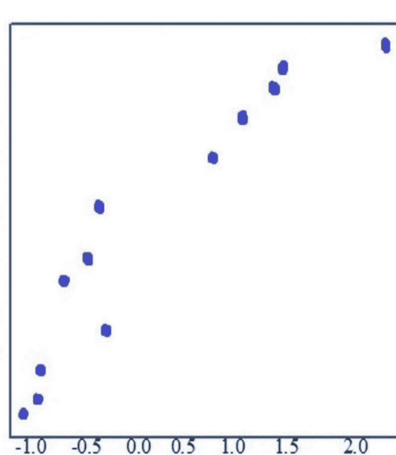

**图 2.1：** *显示雨伞销量与降雨量之间关系的线性回归图*

在上图中，我们可以观察到降雨量与雨伞销量之间存在一种递增的关系模式。

# 当两个参数 Theta 随机选择为 [140.0,5.0] 时，我们计算该图
theta_0 = 140.0
theta_1 = 5.0
theta = np.asarray([theta_0,theta_1]).astype(float)

# 绘制数据
plt.scatter(X[:,[1]], y, color='black')

# 对应于假设模型，绘制红线。
plt.plot(X[:,[1]], np.sum(np.multiply(X,theta), axis=1), color='red', linewidth=1)
plt.xlabel("Rainfall")
plt.ylabel("Umbrellas Sold")

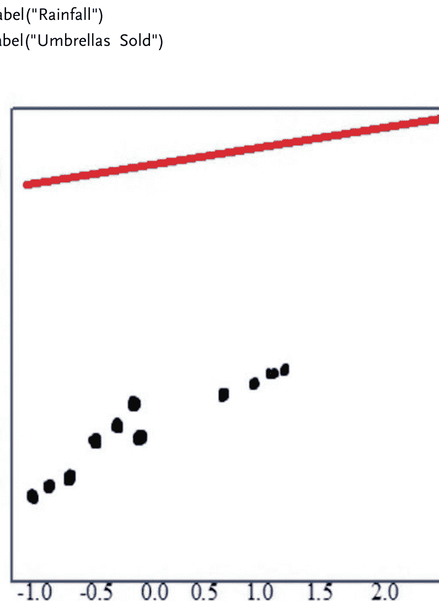

**图 2.2：** *theta 随机选择时的线性回归图*

# 使用数据集中的 3 个值计算代价函数。我们取 theta 的随机值为 [120.0, 10.0]。
X1=X[0:3]
y1=y[0:3]
m1=3
theta_0 = 120.0
theta_1 = 10.0
theta = np.asarray([theta_0,theta_1]).astype(float)
plt.scatter(X1[:,[1]], y1, color='blue')
plt.plot(X1[:,[1]], np.sum(np.multiply(X1,theta), axis=1), color='red', linewidth=1)
# 绘制对应于预测值的红点。
plt.scatter(X1[:,[1]], np.sum(np.multiply(X1,theta), axis=1), color='red')
plt.xlabel("Rainfall")
plt.ylabel("Umbrellas Sold")

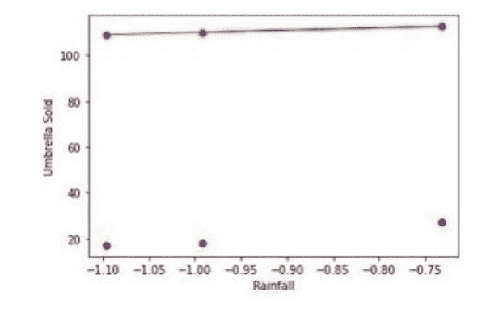

**图 2.3：** *用于计算代价函数的线性回归图*

如上图所示，蓝点显示了 y 的值为

# 计算代价函数
def calcCostFunction(X, y, theta):
    # 训练样本数量
    p = len(y)
    # 初始化代价 J
    J = 0
    # 计算 h = X * theta
    h = np.sum(np.multiply(X, theta), axis=1)
    # 平方误差 = (h - y)^2 (向量化)
    SquaredError = np.power(np.subtract(h,y), 2)
    # 计算代价 J
    J = 1/(2*p) * np.sum(SquaredError)
    return J

calcCostFunction(X,y,theta)
3791.297245862391

# 以下代码计算 10 个随机 theta 值并生成相应的代价函数值。
import random # 导入 random 库
print("[Th0 Th1]", "\t")
for x in range(10):
    theta_0 = random.randint(1,101)
    theta_1 = random.randint(1,101)
    theta = np.asarray([theta_0, theta_1]).astype(float)
    # 计算 J 并打印表格
    print(theta, calcCostFunction(X, y, theta))

```
[Th0 Th1]       J
[98. 97.] 5438.033284865192
[98. 81.] 4307.024358152033
[10. 35.] 514.5403605183667
[25. 89.] 2762.695488175276
[19. 82.] 2356.337416071602
[99. 96.] 5425.970226945618
[50. 91.] 3018.404937347754
[65. 87.] 3103.1527056694654
[17. 43.] 576.8781572082792
[ 6. 10.] 371.2972458623904
```

在上面的输出中，我们找到了 10 个随机选择的 theta 值对应的 10 个 J 值。我们需要一个算法，能够为给定的 theta 值最小化 J 的值。我们可以使用梯度下降算法来找到 J 的最小值。

### 多变量线性回归

多变量线性回归解释了一个因变量 $y$ 与多个自变量之间的关系。它可以表示如下：

$Y = \theta_0 + \theta_1X_1 + \theta_2X_2 + \theta_3X_3 \dots \dots \theta_nX_n$

Y 的值将是一个数字，而不是“是”或“否”的回答。它是一个连续的因变量。这里，theta 值被称为回归权重，其计算方式旨在最小化偏差平方和。

考虑以下使用 scikitlearn 实现多变量线性回归的代码：

import pandas as pd
from sklearn import linear_model
import statsmodels.api as sm

Stock_Market = {'Year':
[2018,2019,2018,2017,2017,2016,2017,2019,2018,2018,2019,2019,2016,2017,2017,2018,2018,2018,2018,2018,2016,2016,2016,2016], 'Month':
[10, 12,10,9,8,4,6,5,7,5,1,2,12,10,11,12,8,9,6,4,5,1,3,2], 'RateofInterest':
[3.25,4.5,3.5,5.5,4.5,4.5,3.5,5.25,6.25,4.25,5,5,6,5.75, 4.75,
5.75,5.75,4.75,5.75,4.75,3.75,4.75,5.75,5.75], 'RateofUnemployment':
[7.3,4.3,3.3,4.3,6.4,5.6,4.5,5.5,6.5,4.6,6.7,5.9,6,4.9,6.8,5.1,7.2,5.1,6.1,7.1,6.9,5.2,7.2,5.1],'Stock_price_index':
[1764,1594,1457,1493,1756,1244,1254,1175,1329,1547,1230,1375,1057,945,947,958,918,935,834,786,815,852,724,749]}

df = pd.DataFrame(Stock_Market,columns=
['Year','Month','Rateofinterest',
'RateofUnemployment','Stock_price_index'])
X = df[['Rateofinterest','RateofUnemployment']] # 这里我们在使用多变量的线性回归中使用了 2 个变量
Y = df['Stock_price_index']

# 使用 sklearn
regr = linear_model.LinearRegression()
regr.fit(X, Y)
print('Intercept: \n', regr.intercept_)
print('Coefficients: \n', regr.coef_)
# 使用 sklearn 进行预测
New_Rateofinterest = 3.25
New_RateofUnemployment = 7.3
print ('Predicted Stock Price Index: \n',
regr.predict([[New_Rateofinterest, New_RateofUnemployment]]))
# 使用 statsmodels
X = sm.add_constant(X) # 添加一个常数项
model = sm.OLS(Y, X).fit()
predictions = model.predict(X)
printmodel = model.summary()
print(printmodel)

上述代码的输出如下所示：

```
Intercept:
2270.912813383781
Coefficients:
[-158.95784362  -57.90074501]
Predicted Stock Price Index:
[1331.62438306]
```

```
                            OLS Regression Results                            
==============================================================================
Dep. Variable:      Stock_price_index   R-squared:                       0.242
Model:                            OLS   Adj. R-squared:                  0.170
Method:                 Least Squares   F-statistic:                     3.355
Date:                Wed, 13 May 2020   Prob (F-statistic):              0.0544
Time:                        13:34:40   Log-Likelihood:                -169.00
No. Observations:                  24   AIC:                             344.0
Df Residuals:                      21   BIC:                             347.5
Df Model:                           2                                         
Covariance Type:            nonrobust                                         
==============================================================================
                 coef    std err          t      P>|t|      [0.025      0.975]
------------------------------------------------------------------------------
const       2270.9128    446.069      5.091      0.000    1343.261    3198.564
Rateofinterest -158.9578     73.156     -2.173      0.041    -311.093     -6.822
RateofUnemployment -57.9007     56.269     -1.029      0.315    -174.919      59.117
==============================================================================
Omnibus:                        1.697   Durbin-Watson:                   0.673
Prob(Omnibus):                  0.428   Jarque-Bera (JB):                1.267
Skew:                           0.344   Prob(JB):                        0.531
Kurtosis:                       2.109   Cond. No.                         57.4
==============================================================================
```

在上面的输出中，它显示了使用 sklearn 和 statsmodels 得到的截距、系数和预测的股票价格指数的值。

StockPrice_Index = Intercept + (Rate of Interest * Coefficient1) + (Rate of Unemployment * Coefficient2)

从上面的表格中，我们推断出使用 sklearn 和 statsmodels 得到的截距、系数和预测的股票价格指数的值是相同的。

### 梯度下降

梯度下降是一种最小化代价函数值的方法。它可以根据代价函数曲线的斜率或梯度，改变一个点的 Theta 0 和 Theta 1 的值。Theta 0 和 Theta 1 值的改变也会带来假设函数的变化，从而更好地拟合数据。梯度下降估计代价函数的导数。它由以下公式表示：

$$\theta^{new} = \theta^{old} - \alpha \frac{1}{m} \sum_{i=1}^{m} [(h_{\theta}(X) - y)X^T]$$

这里，$X-y$ 被称为误差。$\alpha$ 被称为学习率。在这种方法中，我们首先获取并清理数据，然后进行分析。接着，我们定义假设函数、回归参数和代价函数。然后，我们在所有数据点上运行梯度下降算法并更新假设函数。该算法的 Python 实现如下：

```python
def gradientDescent(X, y, theta, alpha, numiters):
    # number of training examples
    p = len(y)
    # Initialize J_history and Theta_history
    Jhistory = []
    Thetahistory = []
    for i in range(numiters):
        # Calculate h = X * theta
        h = np.sum(np.multiply(X, theta), axis=1)
        # Calculate the error = (h - y)
        error = np.subtract(h, y)
        # Calculate the new theta
        thetanew = alpha * (1/p) * np.sum(np.multiply(X.T, error), axis=1)
        # Update theta
        theta = np.subtract(theta, thetanew)
        # Collect all the theta and J
        Thetahistory.append(theta.tolist())
        Jhistory.append(calcCostFunction(X, y, theta).tolist())
    return theta, Thetahistory, Jhistory

# Running the Gradient Descent
# Initialize theta
theta = np.asarray([0, 0]).astype(float)
# Set the number of iterations for the Gradient Descent
iterations = 2000
# Set the Learning Rate
alpha = 0.01
# Run the gradientDescent() function, and collect the output in "results"
results = gradientDescent(X, y, theta, alpha, iterations)
# Get the theta from the results
theta = results[0]  # new theta
# Get the theta history
Thetahistory = results[1]  # Theta history
# Get the J history
Jhistory = results[2]  # Cost function history

plt.scatter(X[:, [1]], y, color='blue')
# Plot Hypothesis (theta as calculated with the Gradient Descent)
plt.plot(X[:, [1]], np.sum(np.multiply(X, theta), axis=1), color='red', linewidth=1)
plt.xlabel("Rainfall")
plt.ylabel("Umbrellas Sold")
```

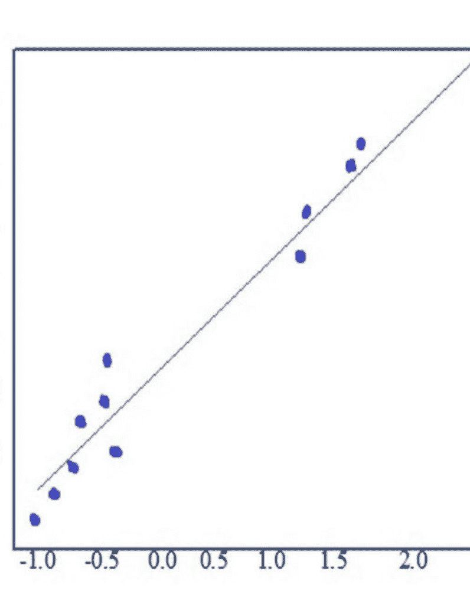

**图 2.4：** *降雨量与雨伞销量关系图*

现在，我们将绘制 Theta 历史记录，如下所示：

```python
theta_0 = np.asarray(Thetahistory)[:, [0]]
theta_1 = np.asarray(Thetahistory)[:, [1]]
plt.plot(theta_0[0:len(theta_0)], color='red', linewidth=1)
plt.plot(theta_1[0:len(theta_1)], color='green', linewidth=1)
plt.xlabel("Iterations")
plt.ylabel("theta")
```

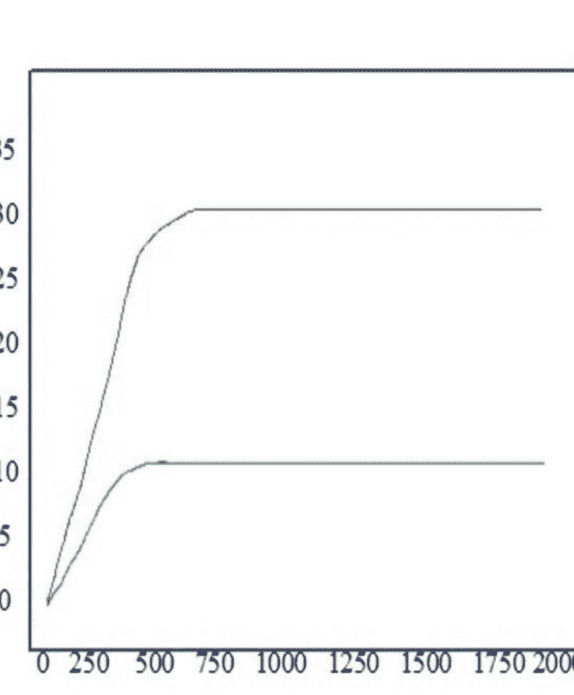

**图 2.5：** Theta0 和 Theta1 值的绘图

我们已经执行了 2000 次迭代。在上图中，红色曲线代表 θ₀，绿色曲线代表 θ₁。经过 2000 次迭代后，θ 的值为。接下来，我们将绘制 J 历史记录，如下所示：

```python
plt.plot(Jhistory[0:len(Jhistory)], color='blue', linewidth=1)
# Put labels
plt.xlabel("Iterations")
plt.ylabel("J")
```

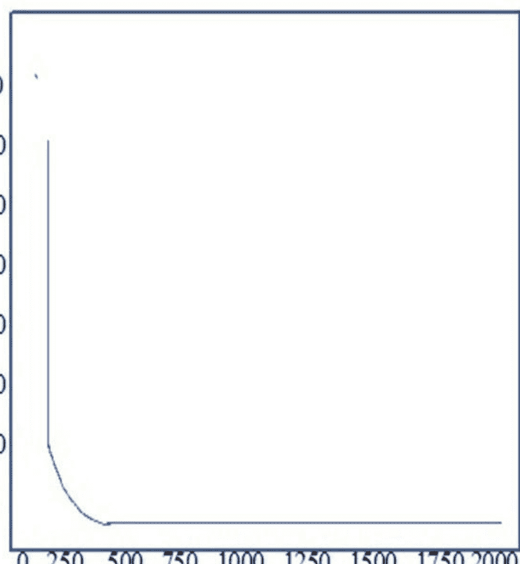

**图 2.6：** *J* 历史记录图

上图是 J 历史记录图，显示了代价函数的值在 200 次迭代后下降，然后在 1500 次迭代前保持稳定。J 的最小值为

现在，如果我们预测降雨量为 82mm，我们预测相应的雨伞销量。

```python
query = [1, 82]
# Scale and Normalize the query
queryNormalized = [1, ((query[1] - avgx) / rangex)]
prediction = np.sum(np.multiply(queryNormalized, theta))
prediction
```

20.373966510153515

所以，大约售出了 20 把雨伞：

```python
# Drawing a contour plot of J and θ
nslice = 50
theta0_vals = np.linspace(-100, 200, num=nslice)
theta1_vals = np.linspace(-400, 400, num=nslice)
# Initialize J_val that will collect all the J values
# calculated by calcCostFunction()
J_vals = []
for i in range(len(theta0_vals)):
    for j in range(len(theta1_vals)):
        t = np.asarray([theta0_vals[i], theta1_vals[j]]).astype(float)
        J_vals.append(calcCostFunction(X, y, t).tolist())
J_vals = np.asarray(J_vals)
J_vals = J_vals.reshape((nslice, nslice)).T
levels = nslice
s = 1
# plot the contour with theta and the J values
plt.contour(theta0_vals, theta1_vals, J_vals, levels)
# Draw the path of the Gradient Descent convergence
for k in range(0, iterations, 10):
    plt.scatter(np.asarray(Thetahistory)[k][0],
                np.asarray(Thetahistory)[k][1], color='blue', s=s)
# Draw a red dot in correspondence of the theta associated to the minimum J
plt.scatter(theta[0], theta[1], color='red', s=10)
plt.xlabel("theta_0")
plt.ylabel("theta_1")
```

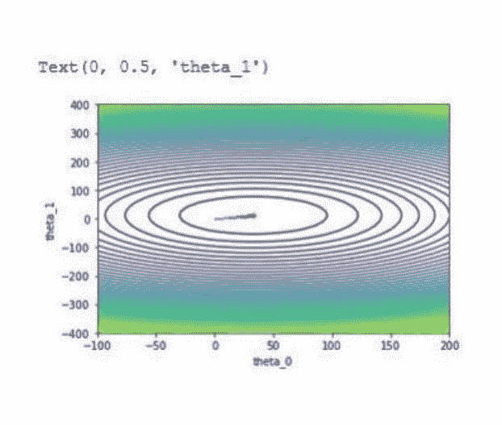

**图 2.7：** J 和 Theta 的等高线图

在上图中，中心的红点代表 J 的最小值 57.5，对应于

### 多项式回归

多项式回归是一种回归分析类型，其中因变量 y 和自变量 x 之间的关系由多项式的 n 次方建模。它拟合 x 及其对应的 y 的条件均值之间存在的非线性关系。这表示为 E(y|x)。在某些情况下，对于从数据中收集的未知参数，E(y|x) 是线性的。因此，多项式回归被称为具有多个变量的线性回归的特例。

多项式回归表示如下：

$Y = \beta_0 + \beta_1 X + \beta_2 X^2 + ... + \beta_n X^n + \epsilon$

考虑以下关于多项式回归的 Python 代码：

```python
import operator
import numpy as np
import matplotlib.pyplot as plt
from sklearn.linear_model import LinearRegression
from sklearn.metrics import mean_squared_error, r2_score
from sklearn.preprocessing import PolynomialFeatures

np.random.seed(0)
x = 1 - 3 * np.random.normal(0, 1, 50)
y = x - 3 * (x ** 2) + 0.5 * (x ** 3) + np.random.normal(-3, 3, 50)

# Data is transformed to include another axis
x = x[:, np.newaxis]
y = y[:, np.newaxis]

polyfeatures = PolynomialFeatures(degree=3)
xpoly = polyfeatures.fit_transform(x)
model = LinearRegression()
model.fit(xpoly, y)
ypoly_pred = model.predict(xpoly)
rmse = np.sqrt(mean_squared_error(y, ypoly_pred))
r2 = r2_score(y, ypoly_pred)
print(rmse)
print(r2)

plt.scatter(x, y, s=20)
# The values of x are sorted according to the degree before the line plot
sort_axis = operator.itemgetter(0)
sorted_zip = sorted(zip(x, ypoly_pred), key=sort_axis)
x, y_poly_pred = zip(*sorted_zip)
plt.plot(x, ypoly_pred, color='m')
plt.show()
```

在上面的代码中，我们执行了多项式回归，其中自变量 $x$ 的次数为 3。我们还绘制了图形，并生成了结果曲线的 RMSE 和 $R_2$ 分数。上述代码的输出如下：

2.5898697824172037
0.9974338440099649

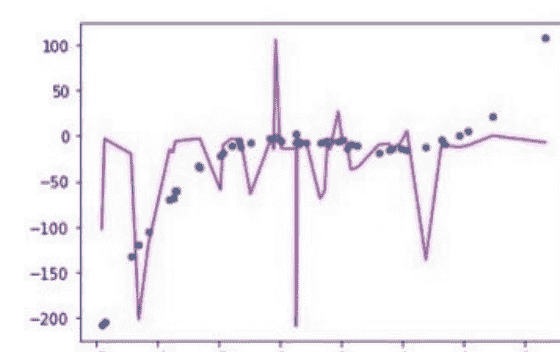

**图 2.8：** 多项式回归图

获得的 RMSE 分数和 R2 分数分别为 2.5898697824172037 和 0.9974338440099649。

### 结论

在本章中，我们讨论了单变量线性回归、多变量线性回归、梯度下降和多项式回归。我们还讨论了它们在 Python 中的实现等。在下一章中，我们将讨论使用逻辑回归进行分类。

### 问题

- 用一个例子解释单变量线性回归。
- 用一个例子解释多变量线性回归。
- 用一个例子解释多项式回归。
- 用一个例子解释梯度下降。

# 第 3 章

## 使用逻辑回归进行分类

### 简介

逻辑回归是一种回归分析，当因变量是二元时，它就会发挥作用。它是一种预测分析，解释了一个因变量和一个或多个名义、区间、有序或比率水平自变量之间的关系。在本章中，我们将讨论二元分类、逻辑回归和多类分类。

### 结构

二分类

逻辑回归

多分类

### 目标

- 理解二分类
- 理解逻辑回归
- 理解多分类

### 二分类

二分类，也称为二项分类，可以定义为根据分类规则将元素分为两组的过程。它出现在以下领域：

在医疗领域，用于测试患者是否患有某种疾病。

在工厂中，用于决定产品是否符合质量标准，或检查是否满足某些规格。

在信息检索中，用于根据文章的相关性或对用户的有用性，决定给定页面或文章是否应出现在搜索结果集中。

在垃圾邮件过滤中，用于决定收到的电子邮件是否为垃圾邮件。

它也用于信用卡欺诈交易检测。

用于学习二分类器的一些技术包括：

- 决策树
- 神经网络
- 支持向量机
- 贝叶斯分类

考虑以下执行二分类的Python代码。这里，我们使用了`sklearn`中预定义的乳腺癌数据集。该数据集包含569个肿瘤实例，30个特征或属性，如纹理、半径、面积和肿瘤的平滑度。它包含两类肿瘤：恶性（用0表示）和良性（用1表示）：

```python
from sklearn.datasets import load_breast_cancer
from sklearn.model_selection import train_test_split
from sklearn.naive_bayes import GaussianNB
from sklearn.metrics import accuracy_score
# 从sklearn加载预定义的乳腺癌数据集
data = load_breast_cancer()
# 整理数据
labelnames = data['target_names']
labels = data['target']
featurenames = data['feature_names']
features = data['data']
# data
```

```python
print(labelnames)
print('Class label = ', labels[0])
print(featurenames)
print(features[0])
# 划分数据
train, test, train_labels, test_labels = 
train_test_split(features,labels,test_size=0.33,random_state=42)
# 初始化分类器
gnb = GaussianNB()
# 训练分类器
model = gnb.fit(train, train_labels)
# 进行预测
prediction = gnb.predict(test)
print(prediction)

# 评估准确率
print(accuracy_score(test_labels, prediction))
```

上述代码的输出如下：

```
['malignant' 'benign']
Class label =  0
['mean radius' 'mean texture' 'mean perimeter' 'mean area'
 'mean smoothness' 'mean compactness' 'mean concavity'
 'mean concave points' 'mean symmetry' 'mean fractal dimension'
 'radius error' 'texture error' 'perimeter error' 'area error'
 'smoothness error' 'compactness error' 'concavity error'
 'concave points error' 'symmetry error' 'fractal dimension error'
 'worst radius' 'worst texture' 'worst perimeter' 'worst area'
 'worst smoothness' 'worst compactness' 'worst concavity'
 'worst concave points' 'worst symmetry' 'worst fractal dimension']
[1.799e+01 1.038e+01 1.228e+02 1.001e+03 1.184e-01 2.776e-01 3.001e-01
 1.471e-01 2.419e-01 7.871e-02 1.095e+00 9.053e-01 8.589e+00 1.534e+02
 6.399e-03 4.904e-02 5.373e-02 1.587e-02 3.003e-02 6.193e-03 2.538e+01
 1.733e+01 1.846e+02 2.019e+03 1.622e-01 6.656e-01 7.119e-01 2.654e-01
 4.601e-01 1.189e-01]
[1 0 0 1 1 0 0 0 1 1 1 0 1 0 1 0 1 1 1 0 1 1 1 1 1 1 0 1 1 1 1 1 0
 1 0 1 1 0 1 1 1 1 1 1 1 1 0 0 1 1 1 1 0 0 1 1 0 0 1 1 0 0 1 0 0 1 0
 1 1 1 1 1 1 0 1 1 0 0 0 0 1 1 1 1 1 1 0 0 1 0 0 1 1 0 1 1 0
 1 1 0 0 0 1 1 1 0 0 1 1 0 1 0 0 1 1 0 0 1 1 0 1 0 1 0 0
 1 1 1 1 1 1 0 0 1 1 1 1 1 1 1 1 0 0 1 1 0 1 1 1 1 1 1 0 0
 0 1 1]
0.9414893617021277
```

从上述代码中，我们推断第一个数据实例代表0。因此，它是一个恶性肿瘤，其平均半径为17.99。二分类中使用了不同的测试分析方法。考虑以下测试数据，我们将对其应用测试分析方法：

| 方法： |
| --- |
| 方法： |
| 方法： |
| 方法： |
| 方法： |
| 方法： |
| 方法： |
| 方法： |
| 方法： |
| 方法： |
| 方法： |
| 方法： |
| 方法： |
| 方法： |
| 方法： |
| 方法： |
| 方法： |
| 方法： |
| 方法： |
| 方法： |
| 方法： |
| 方法： |
| 方法： |
| 方法： |
| 方法： |
| 方法： |
| 方法： |
| 方法： |
| 方法： |
| 方法： |
| 方法： |
| 方法： |
| 方法： |
| 方法： |
| 方法： |
| 方法： |
| 方法： |
| 方法： |
| 方法： |
| 方法： |
| 方法： |
| 方法： |
| 方法： |
| 方法： |
| 方法： |
| 方法： |
| 方法： |
| 方法： |
| 方法： |
| 方法： |
| 方法： |
| 方法： |
| 方法： |
| 方法： |
| 方法： |
| 方法： |
| 方法： |
| 方法： |
| 方法： |
| 方法： |
| 方法： |
| 方法： |
| 方法： |
| 方法： |
| 方法： |
| 方法： |
| 方法： |
| 方法： |
| 方法： |
| 方法： |
| 方法： |
| 方法： |
| 方法： |
| 方法： |
| 方法： |
| 方法： |
| 方法： |
| 方法： |
| 方法： |
| 方法： |
| 方法： |
| 方法： |
| 方法： |
| 方法： |
| 方法： |
| 方法： |
| 方法： |
| 方法： |
| 方法： |
| 方法： |
| 方法： |
| 方法： |
| 方法： |
| 方法： |
| 方法： |
| 方法： |
| 方法： |
| 方法： |
| 方法： |
| 方法： |
| 方法： |
| 方法： |
| 方法： |
| 方法： |
| 方法： |
| 方法： |
| 方法： |
| 方法： |
| 方法： |
| 方法： |
| 方法： |
| 方法： |
| 方法： |
| 方法： |
| 方法： |
| 方法： |
| 方法： |
| 方法： |
| 方法： |
| 方法： |
| 方法： |
| 方法： |
| 方法： |
| 方法： |
| 方法： |
| 方法： |
| 方法： |
| 方法： |
| 方法： |
| 方法： |
| 方法： |
| 方法： |
| 方法： |
| 方法： |
| 方法： |
| 方法： |
| 方法： |
| 方法： |
| 方法： |
| 方法： |
| 方法： |
| 方法： |
| 方法： |
| 方法： |
| 方法： |
| 方法： |
| 方法： |
| 方法： |
| 方法： |
| 方法： |
| 方法： |
| 方法： |
| 方法： |
| 方法： |
| 方法： |
| 方法： |
| 方法： |
| 方法： |
| 方法： |
| 方法： |
| 方法： |
| 方法： |
| 方法： |
| 方法： |
| 方法： |
| 方法： |
| 方法： |
| 方法： |
| 方法： |
| 方法： |
| 方法： |
| 方法： |
| 方法： |
| 方法： |
| 方法： |
| 方法： |
| 方法： |
| 方法： |
| 方法： |
| 方法： |
| 方法： |
| 方法： |
| 方法： |
| 方法： |
| 方法： |
| 方法： |
| 方法： |
| 方法： |
| 方法： |
| 方法： |
| 方法： |
| 方法： |
| 方法： |
| 方法： |
| 方法： |
| 方法： |
| 方法： |
| 方法： |
| 方法： |
| 方法： |
| 方法： |
| 方法： |
| 方法： |
| 方法： |
| 方法： |
| 方法： |
| 方法： |
| 方法： |
| 方法： |
| 方法： |
| 方法： |
| 方法： |
| 方法： |
| 方法： |
| 方法： |
| 方法： |
| 方法： |
| 方法： |
| 方法： |
| 方法： |
| 方法： |
| 方法： |
| 方法： |
| 方法： |
| 方法： |
| 方法： |
| 方法： |
| 方法： |
| 方法： |
| 方法： |
| 方法： |
| 方法： |
| 方法： |
| 方法： |
| 方法： |
| 方法： |
| 方法： |
| 方法： |
| 方法： |
| 方法： |
| 方法： |
| 方法： |
| 方法： |
| 方法： |
| 方法： |
| 方法： |
| 方法： |
| 方法： |
| 方法： |
| 方法： |
| 方法： |
| 方法： |
| 方法： |
| 方法： |
| 方法： |
| 方法： |
| 方法： |
| 方法： |
| 方法： |
| 方法： |
| 方法： |
| 方法： |
| 方法： |
| 方法： |
| 方法： |
| 方法： |
| 方法： |
| 方法： |
| 方法： |
| 方法： |
| 方法： |
| 方法： |
| 方法： |
| 方法： |
| 方法： |
| 方法： |
| 方法： |
| 方法： |
| 方法： |
| 方法： |
| 方法： |
| 方法： |
| 方法： |
| 方法： |
| 方法： |
| 方法： |
| 方法： |
| 方法： |
| 方法： |
| 方法： |
| 方法： |
| 方法： |
| 方法： |
| 方法： |
| 方法： |
| 方法： |
| 方法： |
| 方法： |
| 方法： |
| 方法： |
| 方法： |
| 方法： |
| 方法： |
| 方法： |
| 方法： |
| 方法： |
| 方法： |
| 方法： |
| 方法： |
| 方法： |
| 方法： |
| 方法： |
| 方法： |
| 方法： |
| 方法： |
| 方法： |
| 方法： |
| 方法： |
| 方法： |
| 方法： |
| 方法： |
| 方法： |
| 方法： |
| 方法： |
| 方法： |
| 方法： |
| 方法： |
| 方法： |
| 方法： |
| 方法： |
| 方法： |
| 方法： |
| 方法： |
| 方法： |
| 方法： |
| 方法： |
| 方法： |
| 方法： |
| 方法： |
| 方法： |
| 方法： |
| 方法： |
| 方法： |
| 方法： |
| 方法： |
| 方法： |
| 方法： |
| 方法： |
| 方法： |
| 方法： |
| 方法： |
| 方法： |
| 方法： |
| 方法： |
| 方法： |
| 方法： |
| 方法： |
| 方法： |
| 方法： |
| 方法： |
| 方法： |
| 方法： |
| 方法： |
| 方法： |
| 方法： |
| 方法： |
| 方法： |
| 方法： |
| 方法： |
| 方法： |
| 方法： |
| 方法： |
| 方法： |
| 方法： |
| 方法： |
| 方法： |
| 方法： |
| 方法： |
| 方法： |
| 方法： |
| 方法： |
| 方法： |
| 方法： |
| 方法： |
| 方法： |
| 方法： |
| 方法： |
| 方法： |
| 方法： |
| 方法： |
| 方法： |
| 方法： |
| 方法： |
| 方法： |
| 方法： |
| 方法： |
| 方法： |
| 方法： |
| 方法： |
| 方法： |
| 方法： |
| 方法： |
| 方法： |
| 方法： |
| 方法： |
| 方法： |
| 方法： |
| 方法： |
| 方法： |
| 方法： |
| 方法： |
| 方法： |
| 方法： |
| 方法： |
| 方法： |
| 方法： |
| 方法： |
| 方法： |
| 方法： |
| 方法： |
| 方法： |
| 方法： |
| 方法： |
| 方法： |
| 方法： |
| 方法： |
| 方法： |
| 方法： |
| 方法： |
| 方法： |
| 方法： |
| 方法： |
| 方法： |
| 方法： |
| 方法： |
| 方法： |
| 方法： |
| 方法： |
| 方法： |
| 方法： |
| 方法： |
| 方法： |
| 方法： |
| 方法： |
| 方法： |
| 方法： |
| 方法： |
| 方法： |
| 方法： |
| 方法： |
| 方法： |
| 方法： |
| 方法： |
| 方法： |
| 方法： |
| 方法： |
| 方法： |
| 方法： |
| 方法： |
| 方法： |
| 方法： |
| 方法： |
| 方法： |
| 方法： |
| 方法： |
| 方法： |
| 方法： |
| 方法： |
| 方法： |
| 方法： |
| 方法： |
| 方法： |
| 方法： |
| 方法： |
| 方法： |
| 方法： |
| 方法： |
| 方法： |
| 方法： |
| 方法： |
| 方法： |
| 方法： |
| 方法： |
| 方法： |
| 方法： |
| 方法： |
| 方法： |
| 方法： |
| 方法： |
| 方法： |
| 方法： |
| 方法： |
| 方法： |
| 方法： |
| 方法： |
| 方法： |
| 方法： |
| 方法： |
| 方法： |
| 方法： |
| 方法： |
| 方法： |
| 方法： |
| 方法： |
| 方法： |
| 方法： |
| 方法： |
| 方法： |
| 方法： |
| 方法： |
| 方法： |
| 方法： |
| 方法： |
| 方法： |
| 方法： |
| 方法： |
| 方法： |
| 方法： |
| 方法： |
| 方法： |
| 方法： |
| 方法： |
| 方法： |
| 方法： |
| 方法： |
| 方法： |
| 方法： |
| 方法： |
| 方法： |
| 方法： |
| 方法： |
| 方法： |
| 方法： |
| 方法： |
| 方法： |
| 方法： |
| 方法： |
| 方法： |
| 方法： |
| 方法： |
| 方法： |
| 方法： |
| 方法： |
| 方法： |
| 方法： |
| 方法： |
| 方法： |
| 方法： |
| 方法： |
| 方法： |
| 方法： |
| 方法： |
| 方法： |
| 方法： |
| 方法： |
| 方法： |
| 方法： |
| 方法： |
| 方法： |
| 方法： |
| 方法： |
| 方法： |
| 方法： |
| 方法： |
| 方法： |
| 方法： |
| 方法： |
| 方法： |
| 方法： |
| 方法： |
| 方法： |
| 方法： |
| 方法： |
| 方法： |
| 方法： |
| 方法： |
| 方法： |
| 方法： |
| 方法： |
| 方法： |
| 方法： |
| 方法： |
| 方法： |
| 方法： |
| 方法： |
| 方法： |
| 方法： |
| 方法： |
| 方法： |
| 方法： |
| 方法： |
| 方法： |
| 方法： |
| 方法： |
| 方法： |
| 方法： |
| 方法： |
| 方法： |
| 方法： |
| 方法： |
| 方法： |
| 方法： |
| 方法： |
| 方法： |
| 方法： |
| 方法： |
| 方法： |
| 方法： |
| 方法： |
| 方法： |
| 方法： |
| 方法： |
| 方法： |
| 方法： |
| 方法： |
| 方法： |
| 方法： |
| 方法： |
| 方法： |
| 方法： |
| 方法： |
| 方法： |
| 方法： |
| 方法： |
| 方法： |
| 方法： |
| 方法： |
| 方法： |
| 方法： |
| 方法： |
| 方法： |
| 方法： |
| 方法： |
| 方法： |
| 方法： |
| 方法： |
| 方法： |
| 方法： |
| 方法： |
| 方法： |
| 方法： |
| 方法： |
| 方法： |
| 方法： |
| 方法： |
| 方法： |
| 方法： |
| 方法： |
| 方法： |
| 方法： |
| 方法： |
| 方法： |
| 方法： |
| 方法： |
| 方法： |
| 方法： |
| 方法： |
| 方法： |
| 方法： |
| 方法： |
| 方法： |
| 方法： |
| 方法： |
| 方法： |
| 方法： |
| 方法： |
| 方法： |
| 方法： |
| 方法： |
| 方法： |
| 方法： |
| 方法： |
| 方法： |
| 方法： |
| 方法： |
| 方法： |
| 方法： |
| 方法： |
| 方法： |
| 方法： |
| 方法： |
| 方法： |
| 方法： |
| 方法： |
| 方法： |
| 方法： |
| 方法： |
| 方法： |
| 方法： |
| 方法： |
| 方法： |
| 方法： |
| 方法： |
| 方法： |
| 方法： |
| 方法： |
| 方法： |
| 方法： |
| 方法： |
| 方法： |
| 方法： |
| 方法： |
| 方法： |
| 方法： |
| 方法： |
| 方法： |
| 方法： |
| 方法： |
| 方法： |
| 方法： |
| 方法： |
| 方法： |
| 方法： |
| 方法： |
| 方法： |
| 方法： |
| 方法： |
| 方法： |
| 方法： |
| 方法： |
| 方法： |
| 方法： |
| 方法： |
| 方法： |
| 方法： |
| 方法： |
| 方法： |
| 方法： |
| 方法： |
| 方法： |
| 方法： |
| 方法： |
| 方法： |
| 方法： |
| 方法： |
| 方法： |
| 方法： |
| 方法： |
| 方法： |
| 方法： |
| 方法： |
| 方法： |
| 方法： |
| 方法： |
| 方法： |
| 方法： |
| 方法： |
| 方法： |
| 方法： |
| 方法： |
| 方法： |
| 方法： |
| 方法： |
| 方法： |
| 方法： |
| 方法： |
| 方法： |
| 方法： |
| 方法： |
| 方法： |
| 方法： |
| 方法： |
| 方法： |
| 方法： |
| 方法： |
| 方法： |
| 方法： |
| 方法： |
| 方法： |
| 方法： |
| 方法： |
| 方法： |
| 方法： |
| 方法： |
| 方法： |
| 方法： |
| 方法： |
| 方法： |
| 方法： |
| 方法： |
| 方法： |
| 方法： |
| 方法： |
| 方法： |
| 方法： |
| 方法： |
| 方法： |
| 方法： |
| 方法： |
| 方法： |
| 方法： |
| 方法： |
| 方法： |
| 方法： |
| 方法： |
| 方法： |
| 方法： |
| 方法： |
| 方法： |
| 方法： |
| 方法： |
| 方法： |
| 方法： |
| 方法： |
| 方法： |
| 方法： |
| 方法： |
| 方法： |
| 方法： |
| 方法： |
| 方法： |
| 方法： |
| 方法： |
| 方法： |
| 方法： |
| 方法： |
| 方法： |
| 方法： |
| 方法： |
| 方法： |
| 方法： |
| 方法： |
| 方法： |
| 方法： |
| 方法： |
| 方法： |
| 方法： |
| 方法： |
| 方法： |
| 方法： |
| 方法： |
| 方法： |
| 方法： |
| 方法： |
| 方法： |
| 方法： |
| 方法： |
| 方法： |
| 方法： |
| 方法： |
| 方法： |
| 方法： |
| 方法： |
| 方法： |
| 方法： |
| 方法： |
| 方法： |
| 方法： |
| 方法： |
| 方法： |
| 方法： |
| 方法： |
| 方法： |
| 方法： |
| 方法： |
| 方法： |
| 方法： |
| 方法： |
| 方法： |
| 方法： |
| 方法： |
| 方法： |
| 方法： |
| 方法： |
| 方法： |
| 方法： |
| 方法： |
| 方法： |
| 方法： |
| 方法： |
| 方法： |
| 方法： |
| 方法： |
| 方法： |
| 方法： |
| 方法： |
| 方法： |
| 方法： |
| 方法： |
| 方法： |
| 方法： |
| 方法： |
| 方法： |
| 方法： |
| 方法： |
| 方法： |
| 方法： |
| 方法： |
| 方法： |
| 方法： |
| 方法： |
| 方法： |
| 方法： |
| 方法： |
| 方法： |
| 方法： |
| 方法： |
| 方法： |
| 方法： |
| 方法： |
| 方法： |
| 方法： |
| 方法： |
| 方法： |
| 方法： |
| 方法： |
| 方法： |
| 方法： |
| 方法： |
| 方法： |
| 方法： |
| 方法： |
| 方法： |
| 方法： |
| 方法： |
| 方法： |
| 方法： |
| 方法： |
| 方法： |
| 方法： |
| 方法： |
| 方法： |
| 方法： |
| 方法： |
| 方法： |
| 方法： |
| 方法： |
| 方法： |
| 方法： |
| 方法： |
| 方法： |
| 方法： |
| 方法： |
| 方法： |
| 方法： |
| 方法： |
| 方法： |
| 方法： |
| 方法： |
| 方法： |
| 方法： |
| 方法： |
| 方法： |
| 方法： |
| 方法： |
| 方法： |
| 方法： |
| 方法： |
| 方法： |
| 方法： |
| 方法： |
| 方法： |
| 方法： |
| 方法： |
| 方法： |
| 方法： |
| 方法： |
| 方法： |
| 方法： |
| 方法： |
| 方法： |
| 方法： |
| 方法： |
| 方法： |
| 方法： |
| 方法： |
| 方法： |
| 方法： |
| 方法： |
| 方法： |
| 方法： |
| 方法： |
| 方法： |
| 方法： |
| 方法： |
| 方法： |
| 方法： |
| 方法： |
| 方法： |
| 方法： |
| 方法： |
| 方法： |
| 方法： |
| 方法： |
| 方法： |
| 方法： |
| 方法： |
| 方法： |
| 方法： |
| 方法： |
| 方法： |
| 方法： |
| 方法： |
| 方法： |
| 方法： |
| 方法： |
| 方法： |
| 方法： |
| 方法： |
| 方法： |
| 方法： |
| 方法： |
| 方法： |
| 方法： |
| 方法： |
| 方法： |
| 方法： |
| 方法： |
| 方法： |
| 方法： |
| 方法： |
| 方法： |
| 方法： |
| 方法： |
| 方法： |
| 方法： |
| 方法： |
| 方法： |
| 方法： |
| 方法： |
| 方法： |
| 方法： |
| 方法： |
| 方法： |
| 方法： |
| 方法： |
| 方法： |
| 方法： |
| 方法： |
| 方法： |
| 方法： |
| 方法： |
| 方法： |
| 方法： |
| 方法： |
| 方法： |
| 方法： |
| 方法： |
| 方法： |
| 方法： |
| 方法： |
| 方法： |
| 方法： |
| 方法： |
| 方法： |
| 方法： |
| 方法： |
| 方法： |
| 方法： |
| 方法： |
| 方法： |
| 方法： |
| 方法： |
| 方法： |
| 方法： |
| 方法： |
| 方法： |
| 方法： |
| 方法： |
| 方法： |
| 方法： |
| 方法： |
| 方法： |
| 方法： |
| 方法： |
| 方法： |
| 方法： |
| 方法： |
| 方法： |
| 方法： |
| 方法： |
| 方法： |
| 方法： |
| 方法： |
| 方法： |
| 方法： |
| 方法： |
| 方法： |
| 方法： |
| 方法： |
| 方法： |
| 方法： |
| 方法： |
| 方法： |
| 方法： |
| 方法： |
| 方法： |
| 方法： |
| 方法： |
| 方法： |
| 方法： |
| 方法： |
| 方法： |
| 方法： |
| 方法： |
| 方法： |
| 方法： |
| 方法： |
| 方法： |
| 方法： |
| 方法： |
| 方法： |
| 方法： |
| 方法： |
| 方法： |
| 方法： |
| 方法： |
| 方法： |
| 方法： |
| 方法： |
| 方法： |
| 方法： |
| 方法： |
| 方法： |
| 方法： |
| 方法： |
| 方法： |
| 方法： |
| 方法： |
| 方法： |
| 方法： |
| 方法： |
| 方法： |
| 方法： |
| 方法： |
| 方法： |
| 方法： |
| 方法： |
| 方法： |
| 方法： |
| 方法： |
| 方法： |
| 方法： |
| 方法： |
| 方法： |
| 方法： |
| 方法： |
| 方法： |
| 方法： |
| 方法： |
| 方法： |
| 方法： |
| 方法： |
| 方法： |
| 方法： |
| 方法： |
| 方法： |
| 方法： |
| 方法： |
| 方法： |
| 方法： |
| 方法： |
| 方法： |
| 方法： |
| 方法： |
| 方法： |
| 方法： |
| 方法： |
| 方法： |
| 方法： |
| 方法： |
| 方法： |
| 方法： |
| 方法： |
| 方法： |
| 方法： |
| 方法： |
| 方法： |
| 方法： |
| 方法： |
| 方法： |
| 方法： |
| 方法： |
| 方法： |
| 方法： |
| 方法： |
| 方法： |
| 方法： |
| 方法： |
| 方法： |
| 方法： |
| 方法： |
| 方法： |
| 方法： |
| 方法： |
| 方法： |
| 方法： |
| 方法： |
| 方法： |
| 方法： |
| 方法： |
| 方法： |
| 方法： |
| 方法： |
| 方法： |
| 方法： |
| 方法： |
| 方法： |
| 方法： |
| 方法： |
| 方法： |
| 方法： |
| 方法： |
| 方法： |
| 方法： |
| 方法： |
| 方法： |
| 方法： |
| 方法： |
| 方法： |
| 方法： |
| 方法： |
| 方法： |
| 方法： |
| 方法： |
| 方法： |
| 方法： |
| 方法： |
| 方法： |
| 方法： |
| 方法： |
| 方法： |
| 方法： |
| 方法： |
| 方法： |
| 方法： |
| 方法： |
| 方法： |
| 方法： |
| 方法： |
| 方法： |
| 方法： |
| 方法： |
| 方法： |
| 方法： |
| 方法： |
| 方法： |
| 方法： |
| 方法： |
| 方法： |
| 方法： |
| 方法： |
| 方法： |
| 方法： |
| 方法： |
| 方法： |
| 方法： |
| 方法： |
| 方法： |
| 方法： |
| 方法： |
| 方法： |
| 方法： |
| 方法： |
| 方法： |
| 方法： |
| 方法： |
| 方法： |
| 方法： |
| 方法： |
| 方法： |
| 方法： |
| 方法： |
| 方法： |
| 方法： |
| 方法： |
| 方法： |
| 方法： |
| 方法： |
| 方法： |
| 方法： |
| 方法： |
| 方法： |
| 方法： |
| 方法： |
| 方法： |
| 方法： |
| 方法： |
| 方法： |
| 方法： |
| 方法： |
| 方法： |
| 方法： |
| 方法： |
| 方法： |
| 方法： |
| 方法： |
| 方法： |
| 方法： |
| 方法： |
| 方法： |
| 方法： |
| 方法： |
| 方法： |
| 方法： |
| 方法： |
| 方法： |
| 方法： |
| 方法： |
| 方法： |
| 方法： |
| 方法： |
| 方法： |
| 方法： |
| 方法： |
| 方法： |
| 方法： |
| 方法： |
| 方法： |
| 方法： |
| 方法： |
| 方法： |
| 方法： |
| 方法： |
| 方法： |
| 方法： |
| 方法： |
| 方法： |
| 方法： |
| 方法： |
| 方法： |
| 方法： |
| 方法： |
| 方法： |
| 方法： |
| 方法： |
| 方法： |
| 方法： |
| 方法： |
| 方法： |
| 方法： |
| 方法： |
| 方法： |
| 方法： |
| 方法： |
| 方法： |
| 方法： |
| 方法： |
| 方法： |
| 方法： |
| 方法： |
| 方法： |
| 方法： |
| 方法： |
| 方法： |
| 方法： |
| 方法： |
| 方法： |
| 方法： |
| 方法： |
| 方法： |
| 方法： |
| 方法： |
| 方法： |
| 方法： |
| 方法： |
| 方法： |
| 方法： |
| 方法： |
| 方法： |
| 方法： |
| 方法： |
| 方法： |
| 方法： |
| 方法： |
| 方法： |
| 方法： |
| 方法： |
| 方法： |
| 方法： |
| 方法： |
| 方法： |
| 方法： |
| 方法： |
| 方法： |
| 方法： |
| 方法： |
| 方法： |
| 方法： |
| 方法： |
| 方法： |
| 方法： |
| 方法： |
| 方法： |
| 方法： |
| 方法： |
| 方法： |
| 方法： |
| 方法： |
| 方法： |
| 方法： |
| 方法： |
| 方法： |
| 方法： |
| 方法： |
| 方法： |
| 方法： |
| 方法： |
| 方法： |
| 方法： |
| 方法： |
| 方法： |
| 方法： |
| 方法： |
| 方法： |
| 方法： |
| 方法： |
| 方法： |
| 方法： |
| 方法： |
| 方法： |
| 方法： |
| 方法： |
| 方法： |
| 方法： |
| 方法： |
| 方法： |
| 方法： |
| 方法： |
| 方法： |
| 方法： |
| 方法： |
| 方法： |
| 方法： |
| 方法： |
| 方法： |
| 方法： |
| 方法： |
| 方法： |
| 方法： |
| 方法： |
| 方法： |
| 方法： |
| 方法： |
| 方法： |
| 方法： |
| 方法： |
| 方法： |
| 方法： |
| 方法： |
| 方法： |
| 方法： |
| 方法： |
| 方法： |
| 方法： |
| 方法： |
| 方法： |
| 方法： |
| 方法： |
| 方法： |
| 方法： |
| 方法： |
| 方法： |
| 方法： |
| 方法： |
| 方法： |
| 方法： |
| 方法： |
| 方法： |
| 方法： |
| 方法： |
| 方法： |
| 方法： |
| 方法： |
| 方法： |
| 方法： |
| 方法： |
| 方法： |
| 方法： |
| 方法： |
| 方法： |
| 方法： |
| 方法： |
| 方法： |
| 方法： |
| 方法： |
| 方法： |
| 方法： |
| 方法： |
| 方法： |
| 方法： |
| 方法： |
| 方法： |
| 方法： |
| 方法： |
| 方法： |
| 方法： |
| 方法： |
| 方法： |
| 方法： |
| 方法： |
| 方法： |
| 方法： |
| 方法： |
| 方法： |
| 方法： |
| 方法： |
| 方法： |
| 方法： |
| 方法： |
| 方法： |
| 方法： |
| 方法： |
| 方法： |
| 方法： |
| 方法： |
| 方法： |
| 方法： |
| 方法： |
| 方法： |
| 方法： |
| 方法： |
| 方法： |
| 方法： |
| 方法： |
| 方法： |
| 方法： |
| 方法： |
| 方法： |
| 方法： |
| 方法： |
| 方法： |
| 方法： |
| 方法： |
| 方法： |
| 方法： |
| 方法： |
| 方法： |
| 方法： |
| 方法： |
| 方法： |
| 方法： |
| 方法： |
| 方法： |
| 方法： |
| 方法： |
| 方法： |
| 方法： |
| 方法： |
| 方法： |
| 方法： |
| 方法： |
| 方法： |
| 方法： |
| 方法： |
| 方法： |
| 方法： |
| 方法： |
| 方法： |
| 方法： |
| 方法： |
| 方法： |
| 方法： |
| 方法： |
| 方法： |
| 方法： |
| 方法： |
| 方法： |
| 方法： |
| 方法： |
| 方法： |
| 方法： |
| 方法： |
| 方法： |
| 方法： |
| 方法： |
| 方法： |
| 方法： |
| 方法： |
| 方法： |
| 方法： |
| 方法： |
| 方法： |
| 方法： |
| 方法： |
| 方法： |
| 方法： |
| 方法： |
| 方法： |
| 方法： |
| 方法： |
| 方法： |
| 方法： |
| 方法： |
| 方法： |
| 方法： |
| 方法： |
| 方法： |
| 方法： |
| 方法： |
| 方法： |
| 方法： |
| 方法： |
| 方法： |
| 方法： |
| 方法： |
| 方法： |
| 方法： |
| 方法： |
| 方法： |
| 方法： |
| 方法： |
| 方法： |
| 方法： |
| 方法： |
| 方法： |
| 方法： |
| 方法： |
| 方法： |
| 方法： |
| 方法： |
| 方法： |
| 方法： |
| 方法： |
| 方法： |
| 方法： |
| 方法： |
| 方法： |
| 方法： |
| 方法： |
| 方法： |
| 方法： |
| 方法： |
| 方法： |
| 方法： |
| 方法： |
| 方法： |
| 方法： |
| 方法： |
| 方法： |
| 方法： |
| 方法： |
| 方法： |
| 方法： |
| 方法： |
| 方法： |
| 方法： |
| 方法： |
| 方法： |
| 方法： |
| 方法： |
| 方法： |
| 方法： |
| 方法： |
| 方法： |
| 方法： |
| 方法： |
| 方法： |
| 方法： |
| 方法： |
| 方法： |
| 方法： |
| 方法： |
| 方法： |
| 方法： |
| 方法： |
| 方法： |
| 方法： |
| 方法： |
| 方法： |
| 方法： |
| 方法： |
| 方法： |
| 方法： |
| 方法： |
| 方法： |
| 方法： |
| 方法： |
| 方法： |
| 方法： |
| 方法： |
| 方法： |
| 方法： |
| 方法： |
| 方法： |
| 方法： |
| 方法： |
| 方法： |
| 方法： |
| 方法： |
| 方法： |
| 方法： |
| 方法： |
| 方法： |
| 方法： |
| 方法： |
| 方法： |
| 方法： |
| 方法： |
| 方法： |
| 方法： |
| 方法： |
| 方法： |
| 方法： |
| 方法： |
| 方法： |
| 方法： |
| 方法： |
| 方法： |
| 方法： |
| 方法： |
| 方法： |
| 方法： |
| 方法： |
| 方法： |
| 方法： |
| 方法： |
| 方法： |
| 方法： |
| 方法： |
| 方法： |
| 方法： |
| 方法： |
| 方法： |
| 方法： |
| 方法： |
| 方法： |
| 方法： |
| 方法： |
| 方法： |
| 方法： |
| 方法： |
| 方法： |
| 方法： |
| 方法： |
| 方法： |
| 方法： |
| 方法： |
| 方法： |
| 方法： |
| 方法： |
| 方法： |
| 方法： |
| 方法： |
| 方法： |
| 方法： |
| 方法： |
| 方法： |
| 方法： |
| 方法： |
| 方法： |
| 方法： |
| 方法： |
| 方法： |
| 方法： |
| 方法： |
| 方法： |
| 方法： |
| 方法： |
| 方法： |
| 方法： |
| 方法： |
| 方法： |
| 方法： |
| 方法： |
| 方法： |
| 方法： |
| 方法： |
| 方法： |
| 方法： |
| 方法： |
| 方法： |
| 方法： |
| 方法： |
| 方法： |
| 方法： |
| 方法： |
| 方法： |
| 方法： |
| 方法： |
| 方法： |
| 方法： |
| 方法： |
| 方法： |
| 方法： |
| 方法： |
| 方法： |
| 方法： |
| 方法： |
| 方法： |
| 方法： |
| 方法： |
| 方法： |
| 方法： |
| 方法： |
| 方法： |
| 方法： |
| 方法： |
| 方法： |
| 方法： |
| 方法： |
| 方法： |
| 方法： |
| 方法： |
| 方法： |
| 方法： |
| 方法： |
| 方法： |
| 方法： |
| 方法： |
| 方法： |
| 方法： |
| 方法： |
| 方法： |
| 方法： |
| 方法： |
| 方法： |
| 方法： |
| 方法： |
| 方法： |
| 方法： |
| 方法： |
| 方法： |
| 方法： |
| 方法： |
| 方法： |
| 方法： |
| 方法： |
| 方法： |
| 方法： |
| 方法： |
| 方法： |
| 方法： |
| 方法： |
| 方法： |
| 方法： |
| 方法： |
| 方法： |
| 方法： |
| 方法： |
| 方法： |
| 方法： |
| 方法： |
| 方法： |
| 方法： |
| 方法： |
| 方法： |
| 方法： |
| 方法： |
| 方法： |
| 方法： |
| 方法： |
| 方法： |
| 方法： |
| 方法： |
| 方法： |
| 方法： |
| 方法： |
| 方法： |
| 方法： |
| 方法： |
| 方法： |
| 方法： |
| 方法： |
| 方法： |
| 方法： |
| 方法： |
| 方法： |
| 方法： |
| 方法： |
| 方法： |
| 方法： |
| 方法： |
| 方法： |
| 方法： |
| 方法： |
| 方法： |
| 方法： |
| 方法： |
| 方法： |
| 方法： |
| 方法： |
| 方法： |
| 方法： |
| 方法： |
| 方法： |
| 方法： |
| 方法： |
| 方法： |
| 方法： |
| 方法： |
| 方法： |
| 方法： |
| 方法： |
| 方法： |
| 方法： |
| 方法： |
| 方法： |
| 方法： |
| 方法： |
| 方法： |
| 方法： |
| 方法： |
| 方法： |
| 方法： |
| 方法： |
| 方法： |
| 方法： |
| 方法： |
| 方法： |
| 方法： |
| 方法： |
| 方法： |
| 方法： |
| 方法： |
| 方法： |
| 方法： |
| 方法： |
| 方法： |
| 方法： |
| 方法： |
| 方法： |
| 方法： |
| 方法： |
| 方法： |
| 方法： |
| 方法： |
| 方法： |
| 方法： |
| 方法： |
| 方法： |
| 方法： |
| 方法： |
| 方法： |
| 方法： |
| 方法： |
| 方法： |
| 方法： |
| 方法： |
| 方法： |
| 方法： |
| 方法： |
| 方法： |
| 方法： |
| 方法： |
| 方法： |
| 方法： |
| 方法： |
| 方法： |
| 方法： |
| 方法： |
| 方法： |
| 方法： |
| 方法： |
| 方法： |
| 方法： |
| 方法： |
| 方法： |
| 方法： |
| 方法： |
| 方法： |
| 方法： |
| 方法： |
| 方法： |
| 方法： |
| 方法： |
| 方法： |
| 方法： |
| 方法： |
| 方法： |
| 方法： |
| 方法： |
| 方法： |
| 方法： |
| 方法： |
| 方法： |
| 方法： |
| 方法： |
| 方法： |
| 方法： |
| 方法： |
| 方法： |
| 方法： |
| 方法： |
| 方法： |
| 方法： |
| 方法： |
| 方法： |
| 方法： |
| 方法： |
| 方法： |
| 方法： |
| 方法： |
| 方法： |
| 方法： |
| 方法： |
| 方法： |
| 方法： |
| 方法： |
| 方法： |
| 方法： |
| 方法： |
| 方法： |
| 方法： |
| 方法： |
| 方法： |
| 方法： |
| 方法： |
| 方法： |
| 方法： |
| 方法： |
| 方法： |
| 方法： |
| 方法： |
| 方法： |
| 方法： |
| 方法： |
| 方法： |
| 方法： |
| 方法： |
| 方法： |
| 方法： |
| 方法： |
| 方法： |
| 方法： |
| 方法： |
| 方法： |
| 方法： |
| 方法： |
| 方法： |
| 方法： |
| 方法： |
| 方法： |
| 方法： |
| 方法： |
| 方法： |
| 方法： |
| 方法： |
| 方法： |
| 方法： |
| 方法： |
| 方法： |
| 方法： |
| 方法： |
| 方法： |
| 方法： |
| 方法： |
| 方法： |
| 方法： |
| 方法： |
| 方法： |
| 方法： |
| 方法： |
| 方法： |
| 方法： |
| 方法： |
| 方法： |
| 方法： |
| 方法： |
| 方法： |
| 方法： |
| 方法： |
| 方法： |
| 方法： |
| 方法： |
| 方法： |
| 方法： |
| 方法： |
| 方法： |
| 方法： |
| 方法： |
| 方法： |
| 方法： |
| 方法： |
| 方法： |
| 方法： |
| 方法： |
| 方法： |
| 方法： |
| 方法： |
| 方法： |
| 方法： |
| 方法： |
| 方法： |
| 方法： |
| 方法： |
| 方法： |
| 方法： |
| 方法： |
| 方法： |
| 方法： |
| 方法： |
| 方法： |
| 方法： |
| 方法： |
| 方法： |
| 方法： |
| 方法： |
| 方法： |
| 方法： |
| 方法： |
| 方法： |
| 方法： |
| 方法： |
| 方法： |
| 方法： |
| 方法： |
| 方法： |
| 方法： |
| 方法： |
| 方法： |
| 方法： |
| 方法： |
| 方法： |
| 方法： |
| 方法： |
| 方法： |
| 方法： |
| 方法： |
| 方法： |
| 方法： |
| 方法： |
| 方法： |
| 方法： |
| 方法： |
| 方法： |
| 方法： |
| 方法： |
| 方法： |
| 方法： |
| 方法： |
| 方法： |
| 方法： |
| 方法： |
| 方法： |
| 方法： |
| 方法： |
| 方法： |
| 方法： |
| 方法： |
| 方法： |
| 方法： |
| 方法： |
| 方法： |
| 方法： |
| 方法： |
| 方法： |
| 方法： |
| 方法： |
| 方法： |
| 方法： |
| 方法： |
| 方法： |
| 方法： |
| 方法： |
| 方法： |
| 方法： |
| 方法： |
| 方法： |
| 方法： |
| 方法： |
| 方法： |
| 方法： |
| 方法： |
| 方法： |
| 方法： |
| 方法： |
| 方法： |
| 方法： |
| 方法： |
| 方法： |
| 方法： |
| 方法： |
| 方法： |
| 方法： |
| 方法： |
| 方法： |
| 方法： |
| 方法： |
| 方法： |
| 方法： |
| 方法： |
| 方法： |
| 方法： |
| 方法： |
| 方法： |
| 方法： |
| 方法： |
| 方法： |
| 方法： |
| 方法： |
| 方法： |
| 方法： |
| 方法： |
| 方法： |
| 方法： |
| 方法： |
| 方法： |
| 方法： |
| 方法： |
| 方法： |
| 方法： |
| 方法： |
| 方法： |
| 方法： |
| 方法： |
| 方法： |
| 方法： |
| 方法： |
| 方法： |
| 方法： |
| 方法： |
| 方法： |
| 方法： |
| 方法： |
| 方法： |
| 方法： |
| 方法： |
| 方法： |
| 方法： |
| 方法： |
| 方法： |
| 方法： |
| 方法： |
| 方法： |
| 方法： |
| 方法： |
| 方法： |
| 方法： |
| 方法： |
| 方法： |
| 方法： |
| 方法： |
| 方法： |
| 方法： |
| 方法： |
| 方法： |
| 方法： |
| 方法： |
| 方法： |
| 方法： |
| 方法： |
| 方法： |
| 方法： |
| 方法： |
| 方法： |
| 方法： |
| 方法： |
| 方法： |
| 方法： |
| 方法： |
| 方法： |
| 方法： |
| 方法： |
| 方法： |
| 方法： |
| 方法： |
| 方法： |
| 方法： |
| 方法： |
| 方法： |
| 方法： |
| 方法： |
| 方法： |
| 方法： |
| 方法： |
| 方法： |
| 方法： |
| 方法： |
| 方法： |
| 方法： |
| 方法： |
| 方法： |
| 方法： |
| 方法： |
| 方法： |
| 方法： |
| 方法： |
| 方法： |
| 方法： |
| 方法： |
| 方法： |
| 方法： |
| 方法： |
| 方法： |
| 方法： |
| 方法： |
| 方法： |
| 方法： |
| 方法： |
| 方法： |
| 方法： |
| 方法： |
| 方法： |
| 方法： |
| 方法： |
| 方法： |
| 方法： |
| 方法： |
| 方法： |
| 方法： |
| 方法： |
| 方法： |
| 方法： |
| 方法： |
| 方法： |
| 方法： |
| 方法： |
| 方法： |
| 方法： |
| 方法： |
| 方法： |
| 方法： |
| 方法： |
| 方法： |
| 方法： |
| 方法： |
| 方法： |
| 方法： |
| 方法： |
| 方法： |
| 方法： |
| 方法： |
| 方法： |
| 方法： |
| 方法： |
| 方法： |
| 方法： |
| 方法： |
| 方法： |
| 方法： |
| 方法： |
| 方法： |
| 方法： |
| 方法： |
| 方法： |
| 方法： |
| 方法： |
| 方法： |
| 方法： |
| 方法： |
| 方法： |
| 方法： |
| 方法： |
| 方法： |
| 方法： |
| 方法： |
| 方法： |
| 方法： |
| 方法： |
| 方法： |
| 方法： |
| 方法： |
| 方法： |
| 方法： |
| 方法： |
| 方法： |
| 方法： |
| 方法： |
| 方法： |
| 方法： |
| 方法： |
| 方法： |
| 方法： |
| 方法： |
| 方法： |
| 方法： |
| 方法： |
| 方法： |
| 方法： |
| 方法： |
| 方法： |
| 方法： |
| 方法： |
| 方法： |
| 方法： |
| 方法： |
| 方法： |
| 方法： |
| 方法： |
| 方法： |
| 方法： |
| 方法： |
| 方法： |
| 方法： |
| 方法： |
| 方法： |
| 方法： |
| 方法： |
| 方法： |
| 方法： |
| 方法： |
| 方法： |
| 方法： |
| 方法： |
| 方法： |
| 方法： |
| 方法： |
| 方法： |
| 方法： |
| 方法： |
| 方法： |
| 方法： |
| 方法： |
| 方法： |
| 方法： |
| 方法： |
| 方法： |
| 方法： |
| 方法： |
| 方法： |
| 方法： |
| 方法： |
| 方法： |
| 方法： |
| 方法： |
| 方法： |
| 方法： |
| 方法： |
| 方法： |
| 方法： |
| 方法： |
| 方法： |
| 方法： |
| 方法： |
| 方法： |
| 方法： |
| 方法： |
| 方法： |
| 方法： |
| 方法： |
| 方法： |
| 方法： |
| 方法： |
| 方法： |
| 方法： |
| 方法： |
| 方法： |
| 方法： |
| 方法： |
| 方法： |
| 方法： |
| 方法： |
| 方法： |
| 方法： |
| 方法： |
| 方法： |
| 方法： |
| 方法： |
| 方法： |
| 方法： |
| 方法： |
| 方法： |
| 方法： |
| 方法： |
| 方法： |
| 方法： |
| 方法： |
| 方法： |
| 方法： |
| 方法： |
| 方法： |
| 方法： |
| 方法： |
| 方法： |
| 方法： |
| 方法： |
| 方法： |
| 方法： |
| 方法： |
| 方法： |
| 方法： |
| 方法： |
| 方法： |
| 方法： |
| 方法： |
| 方法： |
| 方法： |
| 方法： |
| 方法： |
| 方法： |
| 方法： |
| 方法： |
| 方法： |
| 方法： |
| 方法： |
| 方法： |
| 方法： |
| 方法： |
| 方法： |
| 方法： |
| 方法： |
| 方法： |
| 方法： |
| 方法： |
| 方法： |
| 方法： |
| 方法： |
| 方法： |
| 方法： |
| 方法： |
| 方法： |
| 方法： |
| 方法： |
| 方法： |
| 方法： |
| 方法： |
| 方法： |
| 方法： |
| 方法： |
| 方法： |
| 方法： |
| 方法： |
| 方法： |
| 方法： |
| 方法： |
| 方法： |
| 方法： |
| 方法： |
| 方法： |
| 方法： |
| 方法： |
| 方法： |
| 方法： |
| 方法： |
| 方法： |
| 方法： |
| 方法： |
| 方法： |
| 方法： |
| 方法： |
| 方法： |
| 方法： |
| 方法： |
| 方法： |
| 方法： |
| 方法： |
| 方法： |
| 方法： |
| 方法： |
| 方法： |
| 方法： |
| 方法： |
| 方法： |
| 方法： |
| 方法： |
| 方法： |
| 方法： |
| 方法： |
| 方法： |
| 方法： |
| 方法： |
| 方法： |
| 方法： |
| 方法： |
| 方法： |
| 方法： |
| 方法： |
| 方法： |
| 方法： |
| 方法： |
| 方法： |
| 方法： |
| 方法： |
| 方法： |
| 方法： |
| 方法： |
| 方法： |
| 方法： |
| 方法： |
| 方法： |
| 方法： |
| 方法： |
| 方法： |
| 方法： |
| 方法： |
| 方法： |
| 方法： |
| 方法： |
| 方法： |
| 方法： |
| 方法： |
| 方法： |
| 方法： |
| 方法： |
| 方法： |
| 方法： |
| 方法： |
| 方法： |
| 方法： |
| 方法： |
| 方法： |
| 方法： |
| 方法： |
| 方法： |
| 方法： |
| 方法： |
| 方法： |
| 方法： |
| 方法： |
| 方法： |
| 方法： |
| 方法： |
| 方法： |
| 方法： |
| 方法： |
| 方法： |
| 方法： |
| 方法： |
| 方法： |
| 方法： |
| 方法： |
| 方法： |
| 方法： |
| 方法： |
| 方法： |
| 方法： |
| 方法： |
| 方法： |
| 方法： |
| 方法： |
| 方法： |
| 方法： |
| 方法： |
| 方法： |
| 方法： |
| 方法： |
| 方法： |
| 方法： |
| 方法： |
| 方法： |
| 方法： |
| 方法： |
| 方法： |
| 方法： |
| 方法： |
| 方法： |
| 方法： |
| 方法： |
| 方法： |
| 方法： |
| 方法： |
| 方法： |
| 方法： |
| 方法： |
| 方法： |
| 方法： |
| 方法： |
| 方法： |
| 方法： |
| 方法： |
| 方法： |
| 方法： |
| 方法： |
| 方法： |
| 方法： |
| 方法： |
| 方法： |
| 方法： |
| 方法： |
| 方法： |
| 方法： |
| 方法： |
| 方法： |
| 方法： |
| 方法： |
| 方法： |
| 方法： |
| 方法： |
| 方法： |
| 方法： |
| 方法： |
| 方法： |
| 方法： |
| 方法： |
| 方法： |
| 方法： |
| 方法： |
| 方法： |
| 方法： |
| 方法： |
| 方法： |
| 方法： |
| 方法： |
| 方法： |
| 方法： |
| 方法： |
| 方法： |
| 方法： |
| 方法： |
| 方法： |
| 方法： |
| 方法： |
| 方法： |
| 方法： |
| 方法： |
| 方法： |
| 方法： |
| 方法： |
| 方法： |
| 方法： |
| 方法： |
| 方法： |
| 方法： |
| 方法： |
| 方法： |
| 方法： |
| 方法： |
| 方法： |
| 方法： |
| 方法： |
| 方法： |
| 方法： |
| 方法： |
| 方法： |
| 方法： |
| 方法： |
| 方法： |
| 方法： |
| 方法： |
| 方法： |
| 方法： |
| 方法： |
| 方法： |
| 方法： |
| 方法： |
| 方法： |
| 方法： |
| 方法： |
| 方法： |
| 方法： |
| 方法： |
| 方法： |
| 方法： |
| 方法： |
| 方法： |
| 方法： |
| 方法： |
| 方法： |
| 方法： |
| 方法： |
| 方法： |
| 方法： |
| 方法： |
| 方法： |
| 方法： |
| 方法： |
| 方法： |
| 方法： |
| 方法： |
| 方法： |
| 方法： |
| 方法： |
| 方法： |
| 方法： |
| 方法： |
| 方法： |
| 方法： |
| 方法： |
| 方法： |
| 方法： |
| 方法： |
| 方法： |
| 方法： |
| 方法： |
| 方法： |
| 方法： |
| 方法： |
| 方法： |
| 方法： |
| 方法： |
| 方法： |
| 方法： |
| 方法： |
| 方法： |
| 方法： |
| 方法： |
| 方法： |
| 方法： |
| 方法： |
| 方法： |
| 方法： |
| 方法： |
| 方法： |
| 方法： |
| 方法： |
| 方法： |
| 方法： |
| 方法： |
| 方法： |
| 方法： |
| 方法： |
| 方法： |
| 方法： |
| 方法： |
| 方法： |
| 方法： |
| 方法： |
| 方法： |
| 方法： |
| 方法： |
| 方法： |
| 方法： |
| 方法： |
| 方法： |
| 方法： |
| 方法： |
| 方法： |
| 方法： |
| 方法： |
| 方法： |
| 方法： |
| 方法： |
| 方法： |
| 方法： |
| 方法： |
| 方法： |
| 方法： |
| 方法： |
| 方法： |
| 方法： |
| 方法： |
| 方法： |
| 方法： |
| 方法： |
| 方法： |
| 方法： |
| 方法： |
| 方法： |
| 方法： |
| 方法： |
| 方法： |
| 方法： |
| 方法： |
| 方法： |
| 方法： |
| 方法： |
| 方法： |
| 方法： |
| 方法： |
| 方法： |
| 方法： |
| 方法： |
| 方法： |
| 方法： |
| 方法： |
| 方法： |
| 方法： |
| 方法： |
| 方法： |
| 方法： |
| 方法： |
| 方法： |
| 方法： |
| 方法： |
| 方法： |
| 方法： |
| 方法： |
| 方法： |
| 方法： |
| 方法： |
| 方法： |
| 方法： |
| 方法： |
| 方法： |
| 方法： |
| 方法： |
| 方法： |
| 方法： |
| 方法： |
| 方法： |
| 方法： |
| 方法： |
| 方法： |
| 方法： |
| 方法： |
| 方法： |
| 方法： |
| 方法： |
| 方法： |
| 方法： |
| 方法： |
| 方法： |
| 方法： |
| 方法： |
| 方法： |
| 方法： |
| 方法： |
| 方法： |
| 方法： |
| 方法： |
| 方法： |
| 方法： |
| 方法： |
| 方法： |
| 方法： |
| 方法： |
| 方法： |
| 方法： |
| 方法： |
| 方法： |
| 方法： |
| 方法： |
| 方法： |
| 方法： |
| 方法： |
| 方法： |
| 方法： |
| 方法： |
| 方法： |
| 方法： |
| 方法： |
| 方法： |
| 方法： |
| 方法： |
| 方法： |
| 方法： |
| 方法： |
| 方法： |
| 方法： |
| 方法： |
| 方法： |
| 方法： |
| 方法： |
| 方法： |
| 方法： |
| 方法： |
| 方法： |
| 方法： |
| 方法： |
| 方法： |
| 方法： |
| 方法： |
| 方法： |
| 方法： |
| 方法： |
| 方法： |
| 方法： |
| 方法： |
| 方法： |
| 方法： |
| 方法： |
| 方法： |
| 方法： |
| 方法： |
| 方法： |
| 方法： |
| 方法： |
| 方法： |
| 方法： |
| 方法： |
| 方法： |
| 方法： |
| 方法： |
| 方法： |
| 方法： |
| 方法： |
| 方法： |
| 方法： |
| 方法： |
| 方法： |
| 方法： |
| 方法： |
| 方法： |
| 方法： |
| 方法： |
| 方法： |
| 方法： |
| 方法： |
| 方法： |
| 方法： |
| 方法： |
| 方法： |
| 方法： |
| 方法： |
| 方法： |
| 方法： |
| 方法： |
| 方法： |
| 方法： |
| 方法： |
| 方法： |
| 方法： |
| 方法： |
| 方法： |
| 方法： |
| 方法： |
| 方法： |
| 方法： |
| 方法： |
| 方法： |
| 方法： |
| 方法： |
| 方法： |
| 方法： |
| 方法： |
| 方法： |
| 方法： |
| 方法： |
| 方法： |
| 方法： |
| 方法： |
| 方法： |
| 方法： |
| 方法： |
| 方法： |
| 方法： |
| 方法： |
| 方法： |
| 方法： |
| 方法： |
| 方法： |
| 方法： |
| 方法： |
| 方法： |
| 方法： |
| 方法： |
| 方法： |
| 方法： |
| 方法： |
| 方法： |
| 方法： |
| 方法： |
| 方法： |
| 方法： |
| 方法： |
| 方法： |
| 方法： |
| 方法： |
| 方法： |
| 方法： |
| 方法： |
| 方法： |
| 方法： |
| 方法： |
| 方法： |
| 方法： |
| 方法： |
| 方法： |
| 方法： |
| 方法： |
| 方法： |
| 方法： |
| 方法： |
| 方法： |
| 方法： |
| 方法： |
| 方法： |
| 方法： |
| 方法： |
| 方法： |
| 方法： |
| 方法： |
| 方法： |
| 方法： |
| 方法： |
| 方法： |
| 方法： |
| 方法： |
| 方法： |
| 方法： |
| 方法： |
| 方法： |
| 方法： |
| 方法： |
| 方法： |
| 方法： |
| 方法： |
| 方法： |
| 方法： |
| 方法： |
| 方法： |
| 方法： |
| 方法： |
| 方法： |
| 方法： |
| 方法： |
| 方法： |
| 方法： |
| 方法： |
| 方法： |
| 方法： |
| 方法： |
| 方法： |
| 方法： |
| 方法： |
| 方法： |
| 方法： |
| 方法： |
| 方法： |
| 方法： |
| 方法： |
| 方法： |
| 方法： |
| 方法： |
| 方法： |
| 方法： |
| 方法： |
| 方法： |
| 方法： |
| 方法： |
| 方法： |
| 方法： |
| 方法： |
| 方法： |
| 方法： |
| 方法： |
| 方法： |
| 方法： |
| 方法： |
| 方法： |
| 方法： |
| 方法： |
| 方法： |
| 方法： |
| 方法： |
| 方法： |
| 方法： |
| 方法： |
| 方法： |
| 方法： |
| 方法： |
| 方法： |
| 方法： |
| 方法： |
| 方法： |
| 方法： |
| 方法： |
| 方法： |
| 方法： |
| 方法： |
| 方法： |
| 方法： |
| 方法： |
| 方法： |
| 方法： |
| 方法： |
| 方法： |
| 方法： |
| 方法： |
| 方法： |
| 方法： |
| 方法： |
| 方法： |
| 方法： |
| 方法： |
| 方法： |
| 方法： |
| 方法： |
| 方法： |
| 方法： |
| 方法： |
| 方法： |
| 方法： |
| 方法： |
| 方法： |
| 方法： |
| 方法： |
| 方法： |
| 方法： |
| 方法： |
| 方法： |
| 方法： |
| 方法： |
| 方法： |
| 方法： |
| 方法： |
| 方法： |
| 方法： |
| 方法： |
| 方法： |
| 方法： |
| 方法： |
| 方法： |
| 方法： |
| 方法： |
| 方法： |
| 方法： |
| 方法： |
| 方法： |
| 方法： |
| 方法： |
| 方法： |
| 方法： |
| 方法： |
| 方法： |
| 方法： |
| 方法： |
| 方法： |
| 方法： |
| 方法： |
| 方法： |
| 方法： |
| 方法： |
| 方法： |
| 方法： |
| 方法： |
| 方法： |
| 方法： |
| 方法： |
| 方法： |
| 方法： |
| 方法： |
| 方法： |
| 方法： |
| 方法： |
| 方法： |
| 方法： |
| 方法： |
| 方法： |
| 方法： |
| 方法： |
| 方法： |
| 方法： |
| 方法： |
| 方法： |
| 方法： |
| 方法： |
| 方法： |
| 方法： |
| 方法： |
| 方法： |
| 方法： |
| 方法： |
| 方法： |
| 方法： |
| 方法： |
| 方法： |
| 方法： |
| 方法： |
| 方法： |
| 方法： |
| 方法： |
| 方法： |
| 方法： |
| 方法： |
| 方法： |
| 方法： |
| 方法： |
| 方法： |
| 方法： |
| 方法： |
| 方法： |
| 方法： |
| 方法： |
| 方法： |
| 方法： |
| 方法： |
| 方法： |
| 方法： |
| 方法： |
| 方法： |
| 方法： |
| 方法： |
| 方法： |
| 方法： |
| 方法： |
| 方法： |
| 方法： |
| 方法： |
| 方法： |
| 方法： |
| 方法： |
| 方法： |
| 方法： |
| 方法： |
| 方法： |
| 方法： |
| 方法： |
| 方法： |
| 方法： |
| 方法： |
| 方法： |
| 方法： |
| 方法： |
| 方法： |
| 方法： |
| 方法： |
| 方法： |
| 方法： |
| 方法： |
| 方法： |
| 方法： |
| 方法： |
| 方法： |
| 方法： |
| 方法： |
| 方法： |
| 方法： |
| 方法： |
| 方法： |
| 方法： |
| 方法： |
| 方法： |
| 方法： |
| 方法： |
| 方法： |
| 方法： |
| 方法： |
| 方法： |
| 方法： |
| 方法： |
| 方法： |
| 方法： |
| 方法： |
| 方法： |
| 方法： |
| 方法： |
| 方法： |
| 方法： |
| 方法： |
| 方法： |
| 方法： |
| 方法： |
| 方法： |
| 方法： |
| 方法： |
| 方法： |
| 方法： |
| 方法： |
| 方法： |
| 方法： |
| 方法： |
| 方法： |
| 方法： |
| 方法： |
| 方法： |
| 方法： |
| 方法： |
| 方法： |
| 方法： |
| 方法： |
| 方法： |
| 方法： |
| 方法： |
| 方法： |
| 方法： |
| 方法： |
| 方法： |
| 方法： |
| 方法： |
| 方法： |
| 方法： |
| 方法： |
| 方法： |
| 方法： |
| 方法： |
| 方法： |
| 方法： |
| 方法： |
| 方法： |
| 方法： |
| 方法： |
| 方法： |
| 方法： |
| 方法： |
| 方法： |
| 方法： |
| 方法： |
| 方法： |
| 方法： |
| 方法： |
| 方法： |
| 方法： |
| 方法： |
| 方法： |
| 方法： |
| 方法： |
| 方法： |
| 方法： |
| 方法： |
| 方法： |
| 方法： |
| 方法： |
| 方法： |
| 方法： |
| 方法： |
| 方法： |
| 方法： |
| 方法： |
| 方法： |
| 方法： |
| 方法： |
| 方法： |
| 方法： |
| 方法： |
| 方法： |
| 方法： |
| 方法： |
| 方法： |
| 方法： |
| 方法： |
| 方法： |
| 方法： |
| 方法： |
| 方法： |
| 方法： |
| 方法： |
| 方法： |
| 方法： |
| 方法： |
| 方法： |
| 方法： |
| 方法： |
| 方法： |
| 方法： |
| 方法： |
| 方法： |
| 方法： |
| 方法： |
| 方法： |
| 方法： |
| 方法： |
| 方法： |
| 方法： |
| 方法： |
| 方法： |
| 方法： |
| 方法： |
| 方法： |
| 方法： |
| 方法： |
| 方法： |
| 方法： |
| 方法： |
| 方法： |
| 方法： |
| 方法： |
| 方法： |
| 方法： |
| 方法： |
| 方法： |
| 方法： |
| 方法： |
| 方法： |
| 方法： |
| 方法： |
| 方法： |
| 方法： |
| 方法： |
| 方法： |
| 方法： |
| 方法： |
| 方法： |
| 方法： |
| 方法： |
| 方法： |
| 方法： |
| 方法： |
| 方法： |
| 方法： |
| 方法： |
| 方法： |
| 方法： |
| 方法： |
| 方法： |
| 方法： |
| 方法： |
| 方法： |
| 方法： |
| 方法： |
| 方法： |
| 方法： |
| 方法： |
| 方法： |
| 方法： |
| 方法： |
| 方法： |
| 方法： |
| 方法： |
| 方法： |
| 方法： |
| 方法： |
| 方法： |
| 方法： |
| 方法： |
| 方法： |
| 方法： |
| 方法： |
| 方法： |
| 方法： |
| 方法： |
| 方法： |
| 方法： |
| 方法： |
| 方法： |
| 方法： |
| 方法： |
| 方法： |
| 方法： |
| 方法： |
| 方法： |
| 方法： |
| 方法： |
| 方法： |
| 方法： |
| 方法： |
| 方法： |
| 方法： |
| 方法： |
| 方法： |
| 方法： |
| 方法： |
| 方法： |
| 方法： |
| 方法： |
| 方法： |
| 方法： |
| 方法： |
| 方法： |
| 方法： |
| 方法： |
| 方法： |
| 方法： |
| 方法： |
| 方法： |
| 方法： |
| 方法： |
| 方法： |
| 方法： |
| 方法： |
| 方法： |
| 方法： |
| 方法： |
| 方法： |
| 方法： |
| 方法： |
| 方法： |
| 方法： |
| 方法： |
| 方法： |
| 方法： |
| 方法： |
| 方法： |
| 方法： |
| 方法： |
| 方法： |
| 方法： |
| 方法： |
| 方法： |
| 方法： |
| 方法： |
| 方法： |
| 方法： |
| 方法： |
| 方法： |
| 方法： |
| 方法： |
| 方法： |
| 方法： |
| 方法： |
| 方法： |
| 方法： |
| 方法： |
| 方法： |
| 方法： |
| 方法： |
| 方法： |
| 方法： |
| 方法： |
| 方法： |
| 方法： |
| 方法： |
| 方法： |
| 方法： |
| 方法： |
| 方法： |
| 方法： |
| 方法： |
| 方法： |
| 方法： |
| 方法： |
| 方法： |
| 方法： |
| 方法： |
| 方法： |
| 方法： |
| 方法： |
| 方法： |
| 方法： |
| 方法： |
| 方法： |
| 方法： |
| 方法： |
| 方法： |
| 方法： |
| 方法： |
| 方法： |
| 方法： |
| 方法： |
| 方法： |
| 方法： |
| 方法： |
| 方法： |
| 方法： |
| 方法： |
| 方法： |
| 方法： |
| 方法： |
| 方法： |
| 方法： |
| 方法： |
| 方法： |
| 方法： |
| 方法： |
| 方法： |
| 方法： |
| 方法： |
| 方法： |
| 方法： |
| 方法： |
| 方法： |
| 方法： |
| 方法： |
| 方法： |
| 方法： |
| 方法： |
| 方法： |
| 方法： |
| 方法： |
| 方法： |
| 方法： |
| 方法： |
| 方法： |
| 方法： |
| 方法： |
| 方法： |
| 方法： |
| 方法： |
| 方法： |
| 方法： |
| 方法： |
| 方法： |
| 方法： |
| 方法： |
| 方法： |
| 方法： |
| 方法： |
| 方法： |
| 方法： |
| 方法： |
| 方法： |
| 方法： |
| 方法： |
| 方法： |
| 方法： |
| 方法： |
| 方法： |
| 方法： |
| 方法： |
| 方法： |
| 方法： |
| 方法： |
| 方法： |
| 方法： |
| 方法： |
| 方法： |
| 方法： |
| 方法： |
| 方法： |
| 方法： |
| 方法： |
| 方法： |
| 方法： |
| 方法： |
| 方法： |
| 方法： |
| 方法： |
| 方法： |
| 方法： |
| 方法： |
| 方法： |
| 方法： |
| 方法： |
| 方法： |
| 方法： |
| 方法： |
| 方法： |
| 方法： |
| 方法： |
| 方法： |
| 方法： |
| 方法： |
| 方法： |
| 方法： |
| 方法： |
| 方法： |
| 方法： |
| 方法： |
| 方法： |
| 方法： |
| 方法： |
| 方法： |
| 方法： |
| 方法： |
| 方法： |
| 方法： |
| 方法： |
| 方法： |
| 方法： |
| 方法： |
| 方法： |
| 方法： |
| 方法： |
| 方法： |
| 方法： |
| 方法： |
| 方法： |
| 方法： |
| 方法： |
| 方法： |
| 方法： |
| 方法： |
| 方法： |
| 方法： |
| 方法： |
| 方法： |
| 方法： |
| 方法： |
| 方法： |
| 方法： |
| 方法： |
| 方法： |
| 方法： |
| 方法： |
| 方法： |
| 方法： |
| 方法： |
| 方法： |
| 方法： |
| 方法： |
| 方法： |
| 方法： |
| 方法： |
| 方法： |
| 方法： |
| 方法： |
| 方法： |
| 方法： |
| 方法： |
| 方法： |
| 方法： |
| 方法： |
| 方法： |
| 方法： |
| 方法： |
| 方法： |
| 方法： |
| 方法： |
| 方法： |
| 方法： |
| 方法： |
| 方法： |
| 方法： |
| 方法： |
| 方法： |
| 方法： |
| 方法： |
| 方法： |
| 方法： |
| 方法： |
| 方法： |
| 方法： |
| 方法： |
| 方法： |
| 方法： |
| 方法： |
| 方法： |
| 方法： |
| 方法： |
| 方法： |
| 方法： |
| 方法： |
| 方法： |
| 方法： |
| 方法： |
| 方法： |
| 方法： |
| 方法： |
| 方法： |
| 方法： |
| 方法： |
| 方法： |
| 方法： |
| 方法： |
| 方法： |
| 方法： |
| 方法： |
| 方法： |
| 方法： |
| 方法： |
| 方法： |
| 方法： |
| 方法： |
| 方法： |
| 方法： |
| 方法： |
| 方法： |
| 方法： |
| 方法： |
| 方法： |
| 方法： |
| 方法： |
| 方法： |
| 方法： |
| 方法： |
| 方法： |
| 方法： |
| 方法： |
| 方法： |
| 方法： |
| 方法： |
| 方法： |
| 方法： |
| 方法： |
| 方法： |
| 方法： |
| 方法： |
| 方法： |
| 方法： |
| 方法： |
| 方法： |
| 方法： |
| 方法： |
| 方法： |
| 方法： |
| 方法： |
| 方法： |
| 方法： |
| 方法： |
| 方法： |
| 方法： |
| 方法： |
| 方法： |
| 方法： |
| 方法： |
| 方法： |
| 方法： |
| 方法： |
| 方法： |
| 方法： |
| 方法： |
| 方法： |
| 方法： |
| 方法： |
| 方法： |
| 方法： |
| 方法： |
| 方法： |
| 方法： |
| 方法： |
| 方法： |
| 方法： |
| 方法： |
| 方法： |
| 方法： |
| 方法： |
| 方法： |
| 方法： |
| 方法： |
| 方法： |
| 方法： |
| 方法： |
| 方法： |
| 方法： |
| 方法： |
| 方法： |
| 方法： |
| 方法： |
| 方法： |
| 方法： |
| 方法： |
| 方法： |
| 方法： |
| 方法： |
| 方法： |
| 方法： |
| 方法： |
| 方法： |
| 方法： |
| 方法： |
| 方法： |
| 方法： |
| 方法： |
| 方法： |
| 方法： |
| 方法： |
| 方法： |
| 方法： |
| 方法： |
| 方法： |
| 方法： |
| 方法： |
| 方法： |
| 方法： |
| 方法： |
| 方法： |
| 方法： |
| 方法： |
| 方法： |
| 方法： |
| 方法： |
| 方法： |
| 方法： |
| 方法： |
| 方法： |
| 方法： |
| 方法： |
| 方法： |
| 方法： |
| 方法： |
| 方法： |
| 方法： |
| 方法： |
| 方法： |
| 方法： |
| 方法： |
| 方法： |
| 方法： |
| 方法： |
| 方法： |
| 方法： |
| 方法： |
| 方法： |
| 方法： |
| 方法： |
| 方法： |
| 方法： |
| 方法： |
| 方法： |
| 方法： |
| 方法： |
| 方法： |
| 方法： |
| 方法： |
| 方法： |
| 方法： |
| 方法： |
| 方法： |
| 方法： |
| 方法： |
| 方法： |
| 方法： |
| 方法： |
| 方法： |
| 方法： |
| 方法： |
| 方法： |
| 方法： |
| 方法： |
| 方法： |
| 方法： |
| 方法： |
| 方法： |
| 方法： |
<,,,,,
,
 the,, the,,,,,的,:


**** `,的** ,，,
，，,  ,是一个是一个:


 (。 | |

 |K  ( | |L  


  


| || --- |
 |回归。方法： |
| 方法： |
| 方法： |
| 方法： |
| 方法： |
| 方法： |
| 方法： |
| 方法： |
| 方法： |
| 方法： |
| 方法： |
| 方法： |
| 方法： |
| 方法： |
| 方法： |
| 方法： |
| 方法： |
| 方法： |
| 方法： |
| 方法： |
| 方法： |
| 方法： |
|方法：方法：方法方法 方法：方法 |
方法 方法：方法 方法：方法 方法：方法 |
方法 方法：方法方法方法方法方法方法方法方法方法方法方法方法方法方法方法方法方法方法方法方法方法方法方法方法方法方法方法方法方法方法 |
方法方法 方法方法：。方法| 方法： |
方法| 方法： |
方法| 方法： |
方法 方法： |
方法| 方法： |
方法| 方法 |
方法| 方法：方法 |
方法 方法 方法：方法 |
方法 | 方法 方法 |
方法：方法 |
方法0方法 方法：方法：方法 |
方法|方法：方法 |
方法： |
| 方法： |
| 方法： |
| 方法： |
| 方法： |
| 方法： |
| 方法： |
| 方法： |
| 方法： |
| 方法： |
| 方法： |
| 方法： |
| 方法： |
| 方法： |
| 方法： |
| 方法： |
| 方法： |
| 方法： |
| 方法： |
| 方法： |
| 方法： |
| 方法： |
| 方法： |
| 方法： |
| 方法： |
| 方法： |
| 方法： |
| 方法： |
| 方法： |
| 方法： |
| 方法： |
| 方法： |
| 方法： |
| 方法： |
| 方法： |
| 方法： |
| 方法： |
| 方法： |
| 方法： |
| 方法： |
| 方法： |
| 方法： |
| 方法： |
| 方法： |
| 方法： |
| 方法： |
| 方法： |
| 方法： |
| 方法： |
| 方法： |
| 方法： |
| 方法： |
| 方法： |
| 方法： |
| 方法： |
| 方法： |
| 方法： |
| 方法： |
| 方法： |
| 方法： |
| 方法： |
| 方法： |
| 方法： |
| 方法： |
| 方法： |
| 方法： |
| 方法： |
| 方法： |
| 方法： |
| 方法： |
| 方法： |
| 方法： |
| 方法： |
| 方法： |
| 方法： |
| 方法： |
| 方法： |
| 方法： |
| 方法： |
| 方法： |
| 方法： |
| 方法： |
| 方法： |
| 方法： |
| 方法： |
| 方法： |
| 方法： |
| 方法： |
| 方法： |
| 方法： |
| 方法： |
| 方法： |
| 方法： |
| 方法： |
| 方法： |
| 方法： |
| 方法： |
| 方法： |
| 方法： |
| 方法： |
| 方法： |
| 方法： |
| 方法： |
| 方法： |
| 方法： |
| 方法： |
| 方法： |
| 方法： |
| 方法： |
| 方法： |
| 方法： |
| 方法： |
| 方法： |
| 方法： |
| 方法： |
| 方法： |
| 方法： |
| 方法： |
| 方法： |
| 方法： |
| 方法： |
| 方法： |
| 方法： |
| 方法： |
| 方法： |
| 方法： |
| 方法： |
| 方法： |
| 方法： |
| 方法： |
| 方法： |
| 方法： |
| 方法： |
| 方法： |
| 方法： |
| 方法： |
| 方法： |
| 方法： |
| 方法： |
| 方法： |
| 方法： |
| 方法： |
| 方法： |
| 方法： |
| 方法： |
| 方法： |
| 方法： |
| 方法： |
| 方法： |
| 方法： |
| 方法： |
| 方法： |
| 方法： |
| 方法： |
| 方法： |
| 方法： |
| 方法： |
| 方法： |
| 方法： |
| 方法： |
| 方法： |
| 方法： |
| 方法： |
| 方法： |
| 方法： |
| 方法： |
| 方法： |
| 方法： |
| 方法： |
| 方法： |
| 方法： |
| 方法： |
| 方法： |
| 方法： |
| 方法： |
| 方法： |
| 方法： |
| 方法： |
| 方法： |
| 方法： |
| 方法： |
| 方法： |
| 方法： |
| 方法： |
| 方法： |
| 方法： |
| 方法： |
| 方法： |
| 方法： |
| 方法： |
| 方法： |
| 方法： |
| 方法： |
| 方法： |
| 方法： |
| 方法： |
| 方法： |
| 方法： |
| 方法： |
| 方法： |
| 方法： |
| 方法： |
| 方法： |
| 方法： |
| 方法： |
| 方法： |
| 方法： |
| 方法： |
| 方法： |
| 方法： |
| 方法： |
| 方法： |
| 方法： |
| 方法： |
| 方法： |
| 方法： |
| 方法： |
| 方法： |
| 方法： |
| 方法： |
| 方法： |
| 方法： |
| 方法： |
| 方法： |
| 方法： |
| 方法： |
| 方法： |
| 方法： |
| 方法： |
| 方法： |
| 方法： |
| 方法： |
| 方法： |
| 方法： |
| 方法： |
| 方法： |
| 方法： |
| 方法： |
| 方法： |
| 方法： |
| 方法： |
| 方法： |
| 方法： |
| 方法： |
| 方法： |
| 方法： |
| 方法： |
| 方法： |
| 方法： |
| 方法： |
| 方法： |
| 方法： |
| 方法： |
| 方法： |
| 方法： |
| 方法： |
| 方法： |
| 方法： |
| 方法： |
| 方法： |
| 方法： |
| 方法： |
| 方法： |
| 方法： |
| 方法： |
| 方法： |
| 方法： |
| 方法： |
| 方法： |
| 方法： |
| 方法： |
| 方法： |
| 方法： |
| 方法： |
| 方法： |
| 方法： |
| 方法： |
| 方法： |
| 方法： |
| 方法： |
| 方法： |
| 方法： |
| 方法： |
| 方法： |
| 方法： |
| 方法： |
| 方法： |
| 方法： |
| 方法： |
| 方法： |
| 方法： |
| 方法： |
| 方法： |
| 方法： |
| 方法： |
| 方法： |
| 方法： |
| 方法： |
| 方法： |
| 方法： |
| 方法： |
| 方法： |
| 方法： |
| 方法： |
| 方法： |
| 方法： |
| 方法： |
| 方法： |
| 方法： |
| 方法： |
| 方法： |
| 方法： |
| 方法： |
| 方法： |
| 方法： |
| 方法： |
| 方法： |
| 方法： |
| 方法： |
| 方法： |
| 方法： |
| 方法： |
| 方法： |
| 方法： |
| 方法： |
| 方法： |
| 方法： |
| 方法： |
| 方法： |
| 方法： |
| 方法： |
| 方法： |
| 方法： |
| 方法： |
| 方法： |
| 方法： |
| 方法： |
| 方法： |
| 方法： |
| 方法： |
| 方法： |
| 方法： |
| 方法： |
| 方法： |
| 方法： |
| 方法： |
| 方法： |
| 方法： |
| 方法： |
| 方法： |
| 方法： |
| 方法： |
| 方法： |
| 方法： |
| 方法： |
| 方法： |
| 方法： |
| 方法： |
| 方法： |
| 方法： |
| 方法： |
| 方法： |
| 方法： |
| 方法： |
| 方法： |
| 方法： |
| 方法： |
| 方法： |
| 方法： |
| 方法： |
| 方法： |
| 方法： |
| 方法： |
| 方法： |
| 方法： |
| 方法： |
| 方法： |
| 方法： |
| 方法： |
| 方法： |
| 方法： |
| 方法： |
| 方法： |
| 方法： |
| 方法： |
| 方法： |
| 方法： |
| 方法： |
| 方法： |
| 方法： |
| 方法： |
| 方法： |
| 方法： |
| 方法： |
| 方法： |
| 方法： |
| 方法： |
| 方法： |
| 方法： |
| 方法： |
| 方法： |
| 方法： |
| 方法： |
| 方法： |
| 方法： |
| 方法： |
| 方法： |
| 方法： |
| 方法： |
| 方法： |
| 方法： |
| 方法： |
| 方法： |
| 方法： |
| 方法： |
| 方法： |
| 方法： |
| 方法： |
| 方法： |
| 方法： |
| 方法： |
| 方法： |
| 方法： |
| 方法： |
| 方法： |
| 方法： |
| 方法： |
| 方法： |
| 方法： |
| 方法： |
| 方法： |
| 方法： |
| 方法： |
| 方法： |
| 方法： |
| 方法： |
| 方法： |
| 方法： |
| 方法： |
| 方法： |
| 方法： |
| 方法： |
| 方法： |
| 方法： |
| 方法： |
| 方法： |
| 方法： |
| 方法： |
| 方法： |
| 方法： |
| 方法： |
| 方法： |
| 方法： |
| 方法： |
| 方法： |
| 方法： |
| 方法： |
| 方法： |
| 方法： |
| 方法： |
| 方法： |
| 方法： |
| 方法： |
| 方法： |
| 方法： |
| 方法： |
| 方法： |
| 方法： |
| 方法： |
| 方法： |
| 方法： |
| 方法： |
| 方法： |
| 方法： |
| 方法： |
| 方法： |
| 方法： |
| 方法： |
| 方法： |
| 方法： |
| 方法： |
| 方法： |
| 方法： |
| 方法： |
| 方法： |
| 方法： |
| 方法： |
| 方法： |
| 方法： |
| 方法： |
| 方法： |
| 方法： |
| 方法： |
| 方法： |
| 方法： |
| 方法： |
| 方法： |
| 方法： |
| 方法： |
| 方法： |
| 方法： |
| 方法： |
| 方法： |
| 方法： |
| 方法： |
| 方法： |
| 方法： |
| 方法： |
| 方法： |
| 方法： |
| 方法： |
| 方法： |
| 方法： |
| 方法： |
| 方法： |
| 方法： |
| 方法： |
| 方法： |
| 方法： |
| 方法： |
| 方法： |
| 方法： |
| 方法： |
| 方法： |
| 方法： |
| 方法： |
| 方法： |
| 方法： |
| 方法： |
| 方法： |
| 方法： |
| 方法： |
| 方法： |
| 方法： |
| 方法： |
| 方法： |
| 方法： |
| 方法： |
| 方法： |
| 方法： |
| 方法： |
| 方法： |
| 方法： |
| 方法： |
| 方法： |
| 方法： |
| 方法： |
| 方法： |
| 方法： |
| 方法： |
| 方法： |
| 方法： |
| 方法： |
| 方法： |
| 方法： |
| 方法： |
| 方法： |
| 方法： |
| 方法： |
| 方法： |
| 方法： |
| 方法： |
| 方法： |
| 方法： |
| 方法： |
| 方法： |
| 方法： |
| 方法： |
| 方法： |
| 方法： |
| 方法： |
| 方法： |
| 方法： |
| 方法： |
| 方法： |
| 方法： |
| 方法： |
| 方法： |
| 方法： |
| 方法： |
| 方法： |
| 方法： |
| 方法： |
| 方法： |
| 方法： |
| 方法： |
| 方法： |
| 方法： |
| 方法： |
| 方法： |
| 方法： |
| 方法： |
| 方法： |
| 方法： |
| 方法： |
| 方法： |
| 方法： |
| 方法： |
| 方法： |
| 方法： |
| 方法： |
| 方法： |
| 方法： |
| 方法： |
| 方法： |
| 方法： |
| 方法： |
| 方法： |
| 方法： |
| 方法： |
| 方法： |
| 方法： |
| 方法： |
| 方法： |
| 方法： |
| 方法： |
| 方法： |
| 方法： |
| 方法： |
| 方法： |
| 方法： |
| 方法： |
| 方法： |
| 方法： |
| 方法： |
| 方法： |
| 方法： |
| 方法： |
| 方法： |
| 方法： |
| 方法： |
| 方法： |
| 方法： |
| 方法： |
| 方法： |
| 方法： |
| 方法： |
| 方法： |
| 方法： |
| 方法： |
| 方法： |
| 方法： |
| 方法： |
| 方法： |
| 方法： |
| 方法： |
| 方法： |
| 方法： |
| 方法： |
| 方法： |
| 方法： |
| 方法： |
| 方法： |
| 方法： |
| 方法： |
| 方法： |
| 方法： |
| 方法： |
| 方法： |
| 方法： |
| 方法： |
| 方法： |
| 方法： |
| 方法： |
| 方法： |
| 方法： |
| 方法： |
| 方法： |
| 方法： |
| 方法： |
| 方法： |
| 方法： |
| 方法： |
| 方法： |
| 方法： |
| 方法： |
| 方法： |
| 方法： |
| 方法： |
| 方法： |
| 方法： |
| 方法： |
| 方法： |
| 方法： |
| 方法： |
| 方法： |
| 方法： |
| 方法： |
| 方法： |
| 方法： |
| 方法： |
| 方法： |
| 方法： |
| 方法： |
| 方法： |
| 方法： |
| 方法： |
| 方法： |
| 方法： |
| 方法： |
| 方法： |
| 方法： |
| 方法： |
| 方法： |
| 方法： |
| 方法： |
| 方法： |
| 方法： |
| 方法： |
| 方法： |
| 方法： |
| 方法： |
| 方法： |
| 方法： |
| 方法： |
| 方法： |
| 方法： |
| 方法： |
| 方法： |
| 方法： |
| 方法： |
| 方法： |
| 方法： |
| 方法： |
| 方法： |
| 方法： |
| 方法： |
| 方法： |
| 方法： |
| 方法： |
| 方法： |
| 方法： |
| 方法： |
| 方法： |
| 方法： |
| 方法： |
| 方法： |
| 方法： |
| 方法： |
| 方法： |
| 方法： |
| 方法： |
| 方法： |
| 方法： |
| 方法： |
| 方法： |
| 方法： |
| 方法： |
| 方法： |
| 方法： |
| 方法： |
| 方法： |
| 方法： |
| 方法： |
| 方法： |
| 方法： |
| 方法： |
| 方法： |
| 方法： |
| 方法： |
| 方法： |
| 方法： |
| 方法： |
| 方法： |
| 方法： |
| 方法： |
| 方法： |
| 方法： |
| 方法： |
| 方法： |
| 方法： |
| 方法： |
| 方法： |
| 方法： |
| 方法： |
| 方法： |
| 方法： |
| 方法： |
| 方法： |
| 方法： |
| 方法： |
| 方法： |
| 方法： |
| 方法： |
| 方法： |
| 方法： |
| 方法： |
| 方法： |
| 方法： |
| 方法： |
| 方法： |
| 方法： |
| 方法： |
| 方法： |
| 方法： |
| 方法： |
| 方法： |
| 方法： |
| 方法： |
| 方法： |
| 方法： |
| 方法： |
| 方法： |
| 方法： |
| 方法： |
| 方法： |
| 方法： |
| 方法： |
| 方法： |
| 方法： |
| 方法： |
| 方法： |
| 方法： |
| 方法： |
| 方法： |
| 方法： |
| 方法： |
| 方法： |
| 方法： |
| 方法： |
| 方法： |
| 方法： |
| 方法： |
| 方法： |
| 方法： |
| 方法： |
| 方法： |
| 方法： |
| 方法： |
| 方法： |
| 方法： |
| 方法： |
| 方法： |
| 方法： |
| 方法： |
| 方法： |
| 方法： |
| 方法： |
| 方法： |
| 方法： |
| 方法： |
| 方法： |
| 方法： |
| 方法： |
| 方法： |
| 方法： |
| 方法： |
| 方法： |
| 方法： |
| 方法： |
| 方法： |
| 方法： |
| 方法： |
| 方法： |
| 方法： |
| 方法： |
| 方法： |
| 方法： |
| 方法： |
| 方法： |
| 方法： |
| 方法： |
| 方法： |
| 方法： |
| 方法： |
| 方法： |
| 方法： |
| 方法： |
| 方法： |
| 方法： |
| 方法： |
| 方法： |
| 方法： |
| 方法： |
| 方法： |
| 方法： |
| 方法： |
| 方法： |
| 方法： |
| 方法： |
| 方法： |
| 方法： |
| 方法： |
| 方法： |
| 方法： |
| 方法： |
| 方法： |
| 方法： |
| 方法： |
| 方法： |
| 方法： |
| 方法： |
| 方法： |
| 方法： |
| 方法： |
| 方法： |
| 方法： |
| 方法： |
| 方法： |
| 方法： |
| 方法： |
| 方法： |
| 方法： |
| 方法： |
| 方法： |
| 方法： |
| 方法： |
| 方法： |
| 方法： |
| 方法： |
| 方法： |
| 方法： |
| 方法： |
| 方法： |
| 方法： |
| 方法： |
| 方法： |
| 方法： |
| 方法： |
| 方法： |
| 方法： |
| 方法： |
| 方法： |
| 方法： |
| 方法： |
| 方法： |
| 方法： |
| 方法： |
| 方法： |
| 方法： |
| 方法： |
| 方法： |
| 方法： |
| 方法： |
| 方法： |
| 方法： |
| 方法： |
| 方法： |
| 方法： |
| 方法： |
| 方法： |
| 方法： |
| 方法： |
| 方法： |
| 方法： |
| 方法： |
| 方法： |
| 方法： |
| 方法： |
| 方法： |
| 方法： |
| 方法： |
| 方法： |
| 方法： |
| 方法： |
| 方法： |
| 方法： |
| 方法： |
| 方法： |
| 方法： |
| 方法： |
| 方法： |
| 方法： |
| 方法： |
| 方法： |
| 方法： |
| 方法： |
| 方法： |
| 方法： |
| 方法： |
| 方法： |
| 方法： |
| 方法： |
| 方法： |
| 方法： |
| 方法： |
| 方法： |
| 方法： |
| 方法： |
| 方法： |
| 方法： |
| 方法： |
| 方法： |
| 方法： |
| 方法： |
| 方法： |
| 方法： |
| 方法： |
| 方法： |
| 方法： |
| 方法： |
| 方法： |
| 方法： |
| 方法： |
| 方法： |
| 方法： |
| 方法： |
| 方法： |
| 方法： |
| 方法： |
| 方法： |
| 方法： |
| 方法： |
| 方法： |
| 方法： |
| 方法： |
| 方法： |
| 方法： |
| 方法： |
| 方法： |
| 方法： |
| 方法： |
| 方法： |
| 方法： |
| 方法： |
| 方法： |
| 方法： |
| 方法： |
| 方法： |
| 方法： |
| 方法： |
| 方法： |
| 方法： |
| 方法： |
| 方法： |
| 方法： |
| 方法： |
| 方法： |
| 方法： |
| 方法： |
| 方法： |
| 方法： |
| 方法： |
| 方法： |
| 方法： |
| 方法： |
| 方法： |
| 方法： |
| 方法： |
| 方法： |
| 方法： |
| 方法： |
| 方法： |
| 方法： |
| 方法： |
| 方法： |
| 方法： |
| 方法： |
| 方法： |
| 方法： |
| 方法： |
| 方法： |
| 方法： |
| 方法： |
| 方法： |
| 方法： |
| 方法： |
| 方法： |
| 方法： |
| 方法： |
| 方法： |
| 方法： |
| 方法： |
| 方法： |
| 方法： |
| 方法： |
| 方法： |
| 方法： |
| 方法： |
| 方法： |
| 方法： |
| 方法： |
| 方法： |
| 方法： |
| 方法： |
| 方法： |
| 方法： |
| 方法： |
| 方法： |
| 方法： |
| 方法： |
| 方法： |
| 方法： |
| 方法： |
| 方法： |
| 方法： |
| 方法： |
| 方法： |
| 方法： |
| 方法： |
| 方法： |
| 方法： |
| 方法： |
| 方法： |
| 方法： |
| 方法： |
| 方法： |
| 方法： |
| 方法： |
| 方法： |
| 方法： |
| 方法： |
| 方法： |
| 方法： |
| 方法： |
| 方法： |
| 方法： |
| 方法： |
| 方法： |
| 方法： |
| 方法： |
| 方法： |
| 方法： |
| 方法： |
| 方法： |
| 方法： |
| 方法： |
| 方法： |
| 方法： |
| 方法： |
| 方法： |
| 方法： |
| 方法： |
| 方法： |
| 方法： |
| 方法： |
| 方法： |
| 方法： |
| 方法： |
| 方法： |
| 方法： |
| 方法： |
| 方法： |
| 方法： |
| 方法： |
| 方法： |
| 方法： |
| 方法： |
| 方法： |
| 方法： |
| 方法： |
| 方法： |
| 方法： |
| 方法： |
| 方法： |
| 方法： |
| 方法： |
| 方法： |
| 方法： |
| 方法： |
| 方法： |
| 方法： |
| 方法： |
| 方法： |
| 方法： |
| 方法： |
| 方法： |
| 方法： |
| 方法： |
| 方法： |
| 方法： |
| 方法： |
| 方法： |
| 方法： |
| 方法： |
| 方法： |
| 方法： |
| 方法： |
| 方法： |
| 方法： |
| 方法： |
| 方法： |
| 方法： |
| 方法： |
| 方法： |
| 方法： |
| 方法： |
| 方法： |
| 方法： |
| 方法： |
| 方法： |
| 方法： |
| 方法： |
| 方法： |
| 方法： |
| 方法： |
| 方法： |
| 方法： |
| 方法： |
| 方法： |
| 方法： |
| 方法： |
| 方法： |
| 方法： |
| 方法： |
| 方法： |
| 方法： |
| 方法： |
| 方法： |
| 方法： |
| 方法： |
| 方法： |
| 方法： |
| 方法： |
| 方法： |
| 方法： |
| 方法： |
| 方法： |
| 方法： |
| 方法： |
| 方法： |
| 方法： |
| 方法： |
| 方法： |
| 方法： |
| 方法： |
| 方法： |
| 方法： |
| 方法： |
| 方法： |
| 方法： |
| 方法： |
| 方法： |
| 方法： |
| 方法： |
| 方法： |
| 方法： |
| 方法： |
| 方法： |
| 方法： |
| 方法： |
| 方法： |
| 方法： |
| 方法： |
| 方法： |
| 方法： |
| 方法： |
| 方法： |
| 方法： |
| 方法： |
| 方法： |
| 方法： |
| 方法： |
| 方法： |
| 方法： |
| 方法： |
| 方法： |
| 方法： |
| 方法： |
| 方法： |
| 方法： |
| 方法： |
| 方法： |
| 方法： |
| 方法： |
| 方法： |
| 方法： |
| 方法： |
| 方法： |
| 方法： |
| 方法： |
| 方法： |
| 方法： |
| 方法： |
| 方法： |
| 方法： |
| 方法： |
| 方法： |
| 方法： |
| 方法： |
| 方法： |
| 方法： |
| 方法： |
| 方法： |
| 方法： |
| 方法： |
| 方法： |
| 方法： |
| 方法： |
| 方法： |
| 方法： |
| 方法： |
| 方法： |
| 方法： |
| 方法： |
| 方法： |
| 方法： |
| 方法： |
| 方法： |
| 方法： |
| 方法： |
| 方法： |
| 方法： |
| 方法： |
| 方法： |
| 方法： |
| 方法： |
| 方法： |
| 方法： |
| 方法： |
| 方法： |
| 方法： |
| 方法： |
| 方法： |
| 方法： |
| 方法： |
| 方法： |
| 方法： |
| 方法： |
| 方法： |
| 方法： |
| 方法： |
| 方法： |
| 方法： |
| 方法： |
| 方法： |
| 方法： |
| 方法： |
| 方法： |
| 方法： |
| 方法： |
| 方法： |
| 方法： |
| 方法： |
| 方法： |
| 方法： |
| 方法： |
| 方法： |
| 方法： |
| 方法： |
| 方法： |
| 方法： |
| 方法： |
| 方法： |
| 方法： |
| 方法： |
| 方法： |
| 方法： |
| 方法： |
| 方法： |
| 方法： |
| 方法： |
| 方法： |
| 方法： |
| 方法： |
| 方法： |
| 方法： |
| 方法： |
| 方法： |
| 方法： |
| 方法： |
| 方法： |
| 方法： |
| 方法： |
| 方法： |
| 方法： |
| 方法： |
| 方法： |
| 方法： |
| 方法： |
| 方法： |
| 方法： |
| 方法： |
| 方法： |
| 方法： |
| 方法： |
| 方法： |
| 方法： |
| 方法： |
| 方法： |
| 方法： |
| 方法： |
| 方法： |
| 方法： |
| 方法： |
| 方法： |
| 方法： |
| 方法： |
| 方法： |
| 方法： |
| 方法： |
| 方法： |
| 方法： |
| 方法： |
| 方法： |
| 方法： |
| 方法： |
| 方法： |
| 方法： |
| 方法： |
| 方法： |
| 方法： |
| 方法： |
| 方法： |
| 方法： |
| 方法： |
| 方法： |
| 方法： |
| 方法： |
| 方法： |
| 方法： |
| 方法： |
| 方法： |
| 方法： |
| 方法： |
| 方法： |
| 方法： |
| 方法： |
| 方法： |
| 方法： |
| 方法： |
| 方法： |
| 方法： |
| 方法： |
| 方法： |
| 方法： |
| 方法： |
| 方法： |
| 方法： |
| 方法： |
| 方法： |
| 方法： |
| 方法： |
| 方法： |
| 方法： |
| 方法： |
| 方法： |
| 方法： |
| 方法： |
| 方法： |
| 方法： |
| 方法： |
| 方法： |
| 方法： |
| 方法： |
| 方法： |
| 方法： |
| 方法： |
| 方法： |
| 方法： |
| 方法： |
| 方法： |
| 方法： |
| 方法： |
| 方法： |
| 方法： |
| 方法： |
| 方法： |
| 方法： |
| 方法： |
| 方法： |
| 方法： |
| 方法： |
| 方法： |
| 方法： |
| 方法： |
| 方法： |
| 方法： |
| 方法： |
| 方法： |
| 方法： |
| 方法： |
| 方法： |
| 方法： |
| 方法： |
| 方法： |
| 方法： |
| 方法： |
| 方法： |
| 方法： |
| 方法： |
| 方法： |
| 方法： |
| 方法： |
| 方法： |
| 方法： |
| 方法： |
| 方法： |
| 方法： |
| 方法： |
| 方法： |
| 方法： |
| 方法： |
| 方法： |
| 方法： |
| 方法： |
| 方法： |
| 方法： |
| 方法： |
| 方法： |
| 方法： |
| 方法： |
| 方法： |
| 方法： |
| 方法： |
| 方法： |
| 方法： |
| 方法： |
| 方法： |
| 方法： |
| 方法： |
| 方法： |
| 方法： |
| 方法： |
| 方法： |
| 方法： |
| 方法： |
| 方法： |
| 方法： |
| 方法： |
| 方法： |
| 方法： |
| 方法： |
| 方法： |
| 方法： |
| 方法： |
| 方法： |
| 方法： |
| 方法： |
| 方法： |
| 方法： |
| 方法： |
| 方法： |
| 方法： |
| 方法： |
| 方法： |
| 方法： |
| 方法： |
| 方法： |
| 方法： |
| 方法： |
| 方法： |
| 方法： |
| 方法： |
| 方法： |
| 方法： |
| 方法： |
| 方法： |
| 方法： |
| 方法： |
| 方法： |
| 方法： |
| 方法： |
| 方法： |
| 方法： |
| 方法： |
| 方法： |
| 方法： |
| 方法： |
| 方法： |
| 方法： |
| 方法： |
| 方法： |
| 方法： |
| 方法： |
| 方法： |
| 方法： |
| 方法： |
| 方法： |
| 方法： |
| 方法： |
| 方法： |
| 方法： |
| 方法： |
| 方法： |
| 方法： |
| 方法： |
| 方法： |
| 方法： |
| 方法： |
| 方法： |
| 方法： |
| 方法： |
| 方法： |
| 方法： |
| 方法： |
| 方法： |
| 方法： |
| 方法： |
| 方法： |
| 方法： |
| 方法： |
| 方法： |
| 方法： |
| 方法： |
| 方法： |
| 方法： |
| 方法： |
| 方法： |
| 方法： |
| 方法： |
| 方法： |
| 方法： |
| 方法： |
| 方法： |
| 方法： |
| 方法： |
| 方法： |
| 方法： |
| 方法： |
| 方法： |
| 方法： |
| 方法： |
| 方法： |
| 方法： |
| 方法： |
| 方法： |
| 方法： |
| 方法： |
| 方法： |
| 方法： |
| 方法： |
| 方法： |
| 方法： |
| 方法： |
| 方法： |
| 方法： |
| 方法： |
| 方法： |
| 方法： |
| 方法： |
| 方法： |
| 方法： |
| 方法： |
| 方法： |
| 方法： |
| 方法： |
| 方法： |
| 方法： |
| 方法： |
| 方法： |
| 方法： |
| 方法： |
| 方法： |
| 方法： |
| 方法： |
| 方法： |
| 方法： |
| 方法： |
| 方法： |
| 方法： |
| 方法： |
| 方法： |
| 方法： |
| 方法： |
| 方法： |
| 方法： |
| 方法： |
| 方法： |
| 方法： |
| 方法： |
| 方法： |
| 方法： |
| 方法： |
| 方法： |
| 方法： |
| 方法： |
| 方法： |
| 方法： |
| 方法： |
| 方法： |
| 方法： |
| 方法： |
| 方法： |
| 方法： |
| 方法： |
| 方法： |
| 方法： |
| 方法： |
| 方法： |
| 方法： |
| 方法： |
| 方法： |
| 方法： |
| 方法： |
| 方法： |
| 方法： |
| 方法： |
| 方法： |
| 方法： |
| 方法： |
| 方法： |
| 方法： |
| 方法： |
| 方法： |
| 方法： |
| 方法： |
| 方法： |
| 方法： |
| 方法： |
| 方法： |
| 方法： |
| 方法： |
| 方法： |
| 方法： |
| 方法： |
| 方法： |
| 方法： |
| 方法： |
| 方法： |
| 方法： |
| 方法： |
| 方法： |
| 方法： |
| 方法： |
| 方法： |
| 方法： |
| 方法： |
| 方法： |
| 方法： |
| 方法： |
| 方法： |
| 方法： |
| 方法： |
| 方法： |
| 方法： |
| 方法： |
| 方法： |
| 方法： |
| 方法： |
| 方法： |
| 方法： |
| 方法： |
| 方法： |
| 方法： |
| 方法： |
| 方法： |
| 方法： |
| 方法： |
| 方法： |
| 方法： |
| 方法： |
| 方法： |
| 方法： |
| 方法： |
| 方法： |
| 方法： |
| 方法： |
| 方法： |
| 方法： |
| 方法： |
| 方法： |
| 方法： |
| 方法： |
| 方法： |
| 方法： |
| 方法： |
| 方法： |
| 方法： |
| 方法： |
| 方法： |
| 方法： |
| 方法： |
| 方法： |
| 方法： |
| 方法： |
| 方法： |
| 方法： |
| 方法： |
| 方法： |
| 方法： |
| 方法： |
| 方法： |
| 方法： |
| 方法： |
| 方法： |
| 方法： |
| 方法： |
| 方法： |
| 方法： |
| 方法： |
| 方法： |
| 方法： |
| 方法： |
| 方法： |
| 方法： |
| 方法： |
| 方法： |
| 方法： |
| 方法： |
| 方法： |
| 方法： |
| 方法： |
| 方法： |
| 方法： |
| 方法： |
| 方法： |
| 方法： |
| 方法： |
| 方法： |
| 方法： |
| 方法： |
| 方法： |
| 方法： |
| 方法： |
| 方法： |
| 方法： |
| 方法： |
| 方法： |
| 方法： |
| 方法： |
| 方法： |
| 方法： |
| 方法： |
| 方法： |
| 方法： |
| 方法： |
| 方法： |
| 方法： |
| 方法： |
| 方法： |
| 方法： |
| 方法： |
| 方法： |
| 方法： |
| 方法： |
| 方法： |
| 方法： |
| 方法： |
| 方法： |
| 方法： |
| 方法： |
| 方法： |
| 方法： |
| 方法： |
| 方法： |
| 方法： |
| 方法： |
| 方法： |
| 方法： |
| 方法： |
| 方法： |
| 方法： |
| 方法： |
| 方法： |
| 方法： |
| 方法： |
| 方法： |
| 方法： |
| 方法： |
| 方法： |
| 方法： |
| 方法： |
| 方法： |
| 方法： |
| 方法： |
| 方法： |
| 方法： |
| 方法： |
| 方法： |
| 方法： |
| 方法： |
| 方法： |
| 方法： |
| 方法： |
| 方法： |
| 方法： |
| 方法： |
| 方法： |
| 方法： |
| 方法： |
| 方法： |
| 方法： |
| 方法： |
| 方法： |
| 方法： |
| 方法： |
| 方法： |
| 方法： |
| 方法： |
| 方法： |
| 方法： |
| 方法： |
| 方法： |
| 方法： |
| 方法： |
| 方法： |
| 方法： |
| 方法： |
| 方法： |
| 方法： |
| 方法： |
| 方法： |
| 方法： |
| 方法： |
| 方法： |
| 方法： |
| 方法： |
| 方法： |
| 方法： |
| 方法： |
| 方法： |
| 方法： |
| 方法： |
| 方法： |
| 方法： |
| 方法： |
| 方法： |
| 方法： |
| 方法： |
| 方法： |
| 方法： |
| 方法： |
| 方法： |
| 方法： |
| 方法： |
| 方法： |
| 方法： |
| 方法： |
| 方法： |
| 方法： |
| 方法： |
| 方法： |
| 方法： |
| 方法： |
| 方法： |
| 方法： |
| 方法： |
| 方法： |
| 方法： |
| 方法： |
| 方法： |
| 方法： |
| 方法： |
| 方法： |
| 方法： |
| 方法： |
| 方法： |
| 方法： |
| 方法： |
| 方法： |
| 方法： |
| 方法： |
| 方法： |
| 方法： |
| 方法： |
| 方法： |
| 方法： |
| 方法： |
| 方法： |
| 方法： |
| 方法： |
| 方法： |
| 方法： |
| 方法： |
| 方法： |
| 方法： |
| 方法： |
| 方法： |
| 方法： |
| 方法： |
| 方法： |
| 方法： |
| 方法： |
| 方法： |
| 方法： |
| 方法： |
| 方法： |
| 方法： |
| 方法： |
| 方法： |
| 方法： |
| 方法： |
| 方法： |
| 方法： |
| 方法： |
| 方法： |
| 方法： |
| 方法： |
| 方法： |
| 方法： |
| 方法： |
| 方法： |
| 方法： |
| 方法： |
| 方法： |
| 方法： |
| 方法： |
| 方法： |
| 方法： |
| 方法： |
| 方法： |
| 方法： |
| 方法： |
| 方法： |
| 方法： |
| 方法： |
| 方法： |
| 方法： |
| 方法： |
| 方法： |
| 方法： |
| 方法： |
| 方法： |
| 方法： |
| 方法： |
| 方法： |
| 方法： |
| 方法： |
| 方法： |
| 方法： |
| 方法： |
| 方法： |
| 方法： |
| 方法： |
| 方法： |
| 方法： |
| 方法： |
| 方法： |
| 方法： |
| 方法： |
| 方法： |
| 方法： |
| 方法： |
| 方法： |
| 方法： |
| 方法： |
| 方法： |
| 方法： |
| 方法： |
| 方法： |
| 方法： |
| 方法： |
| 方法： |
| 方法： |
| 方法： |
| 方法： |
| 方法： |
| 方法： |
| 方法： |
| 方法： |
| 方法： |
| 方法： |
| 方法： |
| 方法： |
| 方法： |
| 方法： |
| 方法： |
| 方法： |
| 方法： |
| 方法： |
| 方法： |
| 方法： |
| 方法： |
| 方法： |
| 方法： |
| 方法： |
| 方法： |
| 方法： |
| 方法： |
| 方法： |
| 方法： |
| 方法： |
| 方法： |
| 方法： |
| 方法： |
| 方法： |
| 方法： |
| 方法： |
| 方法： |
| 方法： |
| 方法： |
| 方法： |
| 方法： |
| 方法： |
| 方法： |
| 方法： |
| 方法： |
| 方法： |
| 方法： |
| 方法： |
| 方法： |
| 方法： |
| 方法： |
| 方法： |
| 方法： |
| 方法： |
| 方法： |
| 方法： |
| 方法： |
| 方法： |
| 方法： |
| 方法： |
| 方法： |
| 方法： |
| 方法： |
| 方法： |
| 方法： |
| 方法： |
| 方法： |
| 方法： |
| 方法： |
| 方法： |
| 方法： |
| 方法： |
| 方法： |
| 方法： |
| 方法： |
| 方法： |
| 方法： |
| 方法： |
| 方法： |
| 方法： |
| 方法： |
| 方法： |
| 方法： |
| 方法： |
| 方法： |
| 方法： |
| 方法： |
| 方法： |
| 方法： |
| 方法： |
| 方法： |
| 方法： |
| 方法： |
| 方法： |
| 方法： |
| 方法： |
| 方法： |
| 方法： |
| 方法： |
| 方法： |
| 方法： |
| 方法： |
| 方法： |
| 方法： |
| 方法： |
| 方法： |
| 方法： |
| 方法： |
| 方法： |
| 方法： |
| 方法： |
| 方法： |
| 方法： |
| 方法： |
| 方法： |
| 方法： |
| 方法： |
| 方法： |
| 方法： |
| 方法： |
| 方法： |
| 方法： |
| 方法： |
| 方法： |
| 方法： |
| 方法： |
| 方法： |
| 方法： |
| 方法： |
| 方法： |
| 方法： |
| 方法： |
| 方法： |
| 方法： |
| 方法： |
| 方法： |
| 方法： |
| 方法： |
| 方法： |
| 方法： |
| 方法： |
| 方法： |
| 方法： |
| 方法： |
| 方法： |
| 方法： |
| 方法： |
| 方法： |
| 方法： |
| 方法： |
| 方法： |
| 方法： |
| 方法： |
| 方法： |
| 方法： |
| 方法： |
| 方法： |
| 方法： |
| 方法： |
| 方法： |
| 方法： |
| 方法： |
| 方法： |
| 方法： |
| 方法： |
| 方法： |
| 方法： |
| 方法： |
| 方法： |
| 方法： |
| 方法： |
| 方法： |
| 方法： |
| 方法： |
| 方法： |
| 方法： |
| 方法： |
| 方法： |
| 方法： |
| 方法： |
| 方法： |
| 方法： |
| 方法： |
| 方法： |
| 方法： |
| 方法： |
| 方法： |
| 方法： |
| 方法： |
| 方法： |
| 方法： |
| 方法： |
| 方法： |
| 方法： |
| 方法： |
| 方法： |
| 方法： |
| 方法： |
| 方法： |
| 方法： |
| 方法： |
| 方法： |
| 方法： |
| 方法： |
| 方法： |
| 方法： |
| 方法： |
| 方法： |
| 方法： |
| 方法： |
| 方法： |
| 方法： |
| 方法： |
| 方法： |
| 方法： |
| 方法： |
| 方法： |
| 方法： |
| 方法： |
| 方法： |
| 方法： |
| 方法： |
| 方法： |
| 方法： |
| 方法： |
| 方法： |
| 方法： |
| 方法： |
| 方法： |
| 方法： |
| 方法： |
| 方法： |
| 方法： |
| 方法： |
| 方法： |
| 方法： |
| 方法： |
| 方法： |
| 方法： |
| 方法： |
| 方法： |
| 方法： |
| 方法： |
| 方法： |
| 方法： |
| 方法： |
| 方法： |
| 方法： |
| 方法： |
| 方法： |
| 方法： |
| 方法： |
| 方法： |
| 方法： |
| 方法： |
| 方法： |
| 方法： |
| 方法： |
| 方法： |
| 方法： |
| 方法： |
| 方法： |
| 方法： |
| 方法： |
| 方法： |
| 方法： |
| 方法： |
| 方法： |
| 方法： |
| 方法： |
| 方法： |
| 方法： |
| 方法： |
| 方法： |
| 方法： |
| 方法： |
| 方法： |
| 方法： |
| 方法： |
| 方法： |
| 方法： |
| 方法： |
| 方法： |
| 方法： |
| 方法： |
| 方法： |
| 方法： |
| 方法： |
| 方法： |
| 方法： |
| 方法： |
| 方法： |
| 方法： |
| 方法： |
| 方法： |
| 方法： |
| 方法： |
| 方法： |
| 方法： |
| 方法： |
| 方法： |
| 方法： |
| 方法： |
| 方法： |
| 方法： |
| 方法： |
| 方法： |
| 方法： |
| 方法： |
| 方法： |
| 方法： |
| 方法： |
| 方法： |
| 方法： |
| 方法： |
| 方法： |
| 方法： |
| 方法： |
| 方法： |
| 方法： |
| 方法： |
| 方法： |
| 方法： |
| 方法： |
| 方法： |
| 方法： |
| 方法： |
| 方法： |
| 方法： |
| 方法： |
| 方法： |
| 方法： |
| 方法： |
| 方法： |
| 方法： |
| 方法： |
| 方法： |
| 方法： |
| 方法： |
| 方法： |
| 方法： |
| 方法： |
| 方法： |
| 方法： |
| 方法： |
| 方法： |
| 方法： |
| 方法： |
| 方法： |
| 方法： |
| 方法： |
| 方法： |
| 方法： |
| 方法： |
| 方法： |
| 方法： |
| 方法： |
| 方法： |
| 方法： |
| 方法： |
| 方法： |
| 方法： |
| 方法： |
| 方法： |
| 方法： |
| 方法： |
| 方法： |
| 方法： |
| 方法： |
| 方法： |
| 方法： |
| 方法： |
| 方法： |
| 方法： |
| 方法： |
| 方法： |
| 方法： |
| 方法： |
| 方法： |
| 方法： |
| 方法： |
| 方法： |
| 方法： |
| 方法： |
| 方法： |
| 方法： |
| 方法： |
| 方法： |
| 方法： |
| 方法： |
| 方法： |
| 方法： |
| 方法： |
| 方法： |
| 方法： |
| 方法： |
| 方法： |
| 方法： |
| 方法： |
| 方法： |
| 方法： |
| 方法： |
| 方法： |
| 方法： |
| 方法： |
| 方法： |
| 方法： |
| 方法： |
| 方法： |
| 方法： |
| 方法： |
| 方法： |
| 方法： |
| 方法： |
| 方法： |
| 方法： |
| 方法： |
| 方法： |
| 方法： |
| 方法： |
| 方法： |
| 方法： |
| 方法： |
| 方法： |
| 方法： |
| 方法： |
| 方法： |
| 方法： |
| 方法： |
| 方法： |
| 方法： |
| 方法： |
| 方法： |
| 方法： |
| 方法： |
| 方法： |
| 方法： |
| 方法： |
| 方法： |
| 方法： |
| 方法： |
| 方法： |
| 方法： |
| 方法： |
| 方法： |
| 方法： |
| 方法： |
| 方法： |
| 方法： |
| 方法： |
| 方法： |
| 方法： |
| 方法： |
| 方法： |
| 方法： |
| 方法： |
| 方法： |
| 方法： |
| 方法： |
| 方法： |
| 方法： |
| 方法： |
| 方法： |
| 方法： |
| 方法： |
| 方法： |
| 方法： |
| 方法： |
| 方法： |
| 方法： |
| 方法： |
| 方法： |
| 方法： |
| 方法： |
| 方法： |
| 方法： |
| 方法： |
| 方法： |
| 方法： |
| 方法： |
| 方法： |
| 方法： |
| 方法： |
| 方法： |
| 方法： |
| 方法： |
| 方法： |
| 方法： |
| 方法： |
| 方法： |
| 方法： |
| 方法： |
| 方法： |
| 方法： |
| 方法： |
| 方法： |
| 方法： |
| 方法： |
| 方法： |
| 方法： |
| 方法： |
| 方法： |
| 方法： |
| 方法： |
| 方法： |
| 方法： |
| 方法： |
| 方法： |
| 方法： |
| 方法： |
| 方法： |
| 方法： |
| 方法： |
| 方法： |
| 方法： |
| 方法： |
| 方法： |
| 方法： |
| 方法： |
| 方法： |
| 方法： |
| 方法： |
| 方法： |
| 方法： |
| 方法： |
| 方法： |
| 方法： |
| 方法： |
| 方法： |
| 方法： |
| 方法： |
| 方法： |
| 方法： |
| 方法： |
| 方法： |
| 方法： |
| 方法： |
| 方法： |
| 方法： |
| 方法： |
| 方法： |
| 方法： |
| 方法： |
| 方法： |
| 方法： |
| 方法： |
| 方法： |
| 方法： |
| 方法： |
| 方法： |
| 方法： |
| 方法： |
| 方法： |
| 方法： |
| 方法： |
| 方法： |
| 方法： |
| 方法： |
| 方法： |
| 方法： |
| 方法： |
| 方法： |
| 方法： |
| 方法： |
| 方法： |
| 方法： |
| 方法： |
| 方法： |
| 方法： |
| 方法： |
| 方法： |
| 方法： |
| 方法： |
| 方法： |
| 方法： |
| 方法： |
| 方法： |
| 方法： |
| 方法： |
| 方法： |
| 方法： |
| 方法： |
| 方法： |
| 方法： |
| 方法： |
| 方法： |
| 方法： |
| 方法： |
| 方法： |
| 方法： |
| 方法： |
| 方法： |
| 方法： |
| 方法： |
| 方法： |
| 方法： |
| 方法： |
| 方法： |
| 方法： |
| 方法： |
| 方法： |
| 方法： |
| 方法： |
| 方法： |
| 方法： |
| 方法： |
| 方法： |
| 方法： |
| 方法： |
| 方法： |
| 方法： |
| 方法： |
| 方法： |
| 方法： |
| 方法： |
| 方法： |
| 方法： |
| 方法： |
| 方法： |
| 方法： |
| 方法： |
| 方法： |
| 方法： |
| 方法： |
| 方法： |
| 方法： |
| 方法： |
| 方法： |
| 方法： |
| 方法： |
| 方法： |
| 方法： |
| 方法： |
| 方法： |
| 方法： |
| 方法： |
| 方法： |
| 方法： |
| 方法： |
| 方法： |
| 方法： |
| 方法： |
| 方法： |
| 方法： |
| 方法： |
| 方法： |
| 方法： |
| 方法： |
| 方法： |
| 方法： |
| 方法： |
| 方法： |
| 方法： |
| 方法： |
| 方法： |
| 方法： |
| 方法： |
| 方法： |
| 方法： |
| 方法： |
| 方法： |
| 方法： |
| 方法： |
| 方法： |
| 方法： |
| 方法： |
| 方法： |
| 方法： |
| 方法： |
| 方法： |
| 方法： |
| 方法： |
| 方法： |
| 方法： |
| 方法： |
| 方法： |
| 方法： |
| 方法： |
| 方法： |
| 方法： |
| 方法： |
| 方法： |
| 方法： |
| 方法： |
| 方法： |
| 方法： |
| 方法： |
| 方法： |
| 方法： |
| 方法： |
| 方法： |
| 方法： |
| 方法： |
| 方法： |
| 方法： |
| 方法： |
| 方法： |
| 方法： |
| 方法： |
| 方法： |
| 方法： |
| 方法： |
| 方法： |
| 方法： |
| 方法： |
| 方法： |
| 方法： |
| 方法： |
| 方法： |
| 方法： |
| 方法： |
| 方法： |
| 方法： |
| 方法： |
| 方法： |
| 方法： |
| 方法： |
| 方法： |
| 方法： |
| 方法： |
| 方法： |
| 方法： |
| 方法： |
| 方法： |
| 方法： |
| 方法： |
| 方法： |
| 方法： |
| 方法： |
| 方法： |
| 方法： |
| 方法： |
| 方法： |
| 方法： |
| 方法： |
| 方法： |
| 方法： |
| 方法： |
| 方法： |
| 方法： |
| 方法： |
| 方法： |
| 方法： |
| 方法： |
| 方法： |
| 方法： |
| 方法： |
| 方法： |
| 方法： |
| 方法： |
| 方法： |
| 方法： |
| 方法： |
| 方法： |
| 方法： |
| 方法： |
| 方法： |
| 方法： |
| 方法： |
| 方法： |
| 方法： |
| 方法： |
| 方法： |
| 方法： |
| 方法： |
| 方法： |
| 方法： |
| 方法： |
| 方法： |
| 方法： |
| 方法： |
| 方法： |
| 方法： |
| 方法： |
| 方法： |
| 方法： |
| 方法： |
| 方法： |
| 方法： |
| 方法： |
| 方法： |
| 方法： |
| 方法： |
| 方法： |
| 方法： |
| 方法： |
| 方法： |
| 方法： |
| 方法： |
| 方法： |
| 方法： |
| 方法： |
| 方法： |
| 方法： |
| 方法： |
| 方法： |
| 方法： |
| 方法： |
| 方法： |
| 方法： |
| 方法： |
| 方法： |
| 方法： |
| 方法： |
| 方法： |
| 方法： |
| 方法： |
| 方法： |
| 方法： |
| 方法： |
| 方法： |
| 方法： |
| 方法： |
| 方法： |
| 方法： |
| 方法： |
| 方法： |
| 方法： |
| 方法： |
| 方法： |
| 方法： |
| 方法： |
| 方法： |
| 方法： |
| 方法： |
| 方法： |
| 方法： |
| 方法： |
| 方法： |
| 方法： |
| 方法： |
| 方法： |
| 方法： |
| 方法： |
| 方法： |
| 方法： |
| 方法： |
| 方法： |
| 方法： |
| 方法： |
| 方法： |
| 方法： |
| 方法： |
| 方法： |
| 方法： |
| 方法： |
| 方法： |
| 方法： |
| 方法： |
| 方法： |
| 方法： |
| 方法： |
| 方法： |
| 方法： |
| 方法： |
| 方法： |
| 方法： |
| 方法： |
| 方法： |
| 方法： |
| 方法： |
| 方法： |
| 方法： |
| 方法： |
| 方法： |
| 方法： |
| 方法： |
| 方法： |
| 方法： |
| 方法： |
| 方法： |
| 方法： |
| 方法： |
| 方法： |
| 方法： |
| 方法： |
| 方法： |
| 方法： |
| 方法： |
| 方法： |
| 方法： |
| 方法： |
| 方法： |
| 方法： |
| 方法： |
| 方法： |
| 方法： |
| 方法： |
| 方法： |
| 方法： |
| 方法： |
| 方法： |
| 方法： |
| 方法： |
| 方法： |
| 方法： |
| 方法： |
| 方法： |
| 方法： |
| 方法： |
| 方法： |
| 方法： |
| 方法： |
| 方法： |
| 方法： |
| 方法： |
| 方法： |
| 方法： |
| 方法： |
| 方法： |
| 方法： |
| 方法： |
| 方法： |
| 方法： |
| 方法： |
| 方法： |
| 方法： |
| 方法： |
| 方法： |
| 方法： |
| 方法： |
| 方法： |
| 方法： |
| 方法： |
| 方法： |
| 方法： |
| 方法： |
| 方法： |
| 方法： |
| 方法： |
| 方法： |
| 方法： |
| 方法： |
| 方法： |
| 方法： |
| 方法： |
| 方法： |
| 方法： |
| 方法： |
| 方法： |
| 方法： |
| 方法： |
| 方法： |
| 方法： |
| 方法： |
| 方法： |
| 方法： |
| 方法： |
| 方法： |
| 方法： |
| 方法： |
| 方法： |
| 方法： |
| 方法： |
| 方法： |
| 方法： |
| 方法： |
| 方法： |
| 方法： |
| 方法： |
| 方法： |
| 方法： |
| 方法： |
| 方法： |
| 方法： |
| 方法： |
| 方法： |
| 方法： |
| 方法： |
| 方法： |
| 方法： |
| 方法： |
| 方法： |
| 方法： |
| 方法： |
| 方法： |
| 方法： |
| 方法： |
| 方法： |
| 方法： |
| 方法： |
| 方法： |
| 方法： |
| 方法： |
| 方法： |
| 方法： |
| 方法： |
| 方法： |
| 方法： |
| 方法： |
| 方法： |
| 方法： |
| 方法： |
| 方法： |
| 方法： |
| 方法： |
| 方法： |
| 方法： |
| 方法： |
| 方法： |
| 方法： |
| 方法： |
| 方法： |
| 方法： |
| 方法： |
| 方法： |
| 方法： |
| 方法： |
| 方法： |
| 方法： |
| 方法： |
| 方法： |
| 方法： |
| 方法： |
| 方法： |
| 方法： |
| 方法： |
| 方法： |
| 方法： |
| 方法： |
| 方法： |
| 方法： |
| 方法： |
| 方法： |
| 方法： |
| 方法： |
| 方法： |
| 方法： |
| 方法： |
| 方法： |
| 方法： |
| 方法： |
| 方法： |
| 方法： |
| 方法： |
| 方法： |
| 方法： |
| 方法： |
| 方法： |
| 方法： |
| 方法： |
| 方法： |
| 方法： |
| 方法： |
| 方法： |
| 方法： |
| 方法： |
| 方法： |
| 方法： |
| 方法： |
| 方法： |
| 方法： |
| 方法： |
| 方法： |
| 方法： |
| 方法： |
| 方法： |
| 方法： |
| 方法： |
| 方法： |
| 方法： |
| 方法： |
| 方法： |
| 方法： |
| 方法： |
| 方法： |
| 方法： |
| 方法： |
| 方法： |
| 方法： |
| 方法： |
| 方法： |
| 方法： |
| 方法： |
| 方法： |
| 方法： |
| 方法： |
| 方法： |
| 方法： |
| 方法： |
| 方法： |
| 方法： |
| 方法： |
| 方法： |
| 方法： |
| 方法： |
| 方法： |
| 方法： |
| 方法： |
| 方法： |
| 方法： |
| 方法： |
| 方法： |
| 方法： |
| 方法： |
| 方法： |
| 方法： |
| 方法： |
| 方法： |
| 方法： |
| 方法： |
| 方法： |
| 方法： |
| 方法： |
| 方法： |
| 方法： |
| 方法： |
| 方法： |
| 方法： |
| 方法： |
| 方法： |
| 方法： |
| 方法： |
| 方法： |
| 方法： |
| 方法： |
| 方法： |
| 方法： |
| 方法： |
| 方法： |
| 方法： |
| 方法： |
| 方法： |
| 方法： |
| 方法： |
| 方法： |
| 方法： |
| 方法： |
| 方法： |
| 方法： |
| 方法： |
| 方法： |
| 方法： |
| 方法： |
| 方法： |
| 方法： |
| 方法： |
| 方法： |
| 方法： |
| 方法： |
| 方法： |
| 方法： |
| 方法： |
| 方法： |
| 方法： |
| 方法： |
| 方法： |
| 方法： |
| 方法： |
| 方法： |
| 方法： |
| 方法： |
| 方法： |
| 方法： |
| 方法： |
| 方法： |
| 方法： |
| 方法： |
| 方法： |
| 方法： |
| 方法： |
| 方法： |
| 方法： |
| 方法： |
| 方法： |
| 方法： |
| 方法： |
| 方法： |
| 方法： |
| 方法： |
| 方法： |
| 方法： |
| 方法： |
| 方法： |
| 方法： |
| 方法： |
| 方法： |
| 方法： |
| 方法： |
| 方法： |
| 方法： |
| 方法： |
| 方法： |
| 方法： |
| 方法： |
| 方法： |
| 方法： |
| 方法： |
| 方法： |
| 方法： |
| 方法： |
| 方法： |
| 方法： |
| 方法： |
| 方法： |
| 方法： |
| 方法： |
| 方法： |
| 方法： |
| 方法： |
| 方法： |
| 方法： |
| 方法： |
| 方法： |
| 方法： |
| 方法： |
| 方法： |
| 方法： |
| 方法： |
| 方法： |
| 方法： |
| 方法： |
| 方法： |
| 方法： |
| 方法： |
| 方法： |
| 方法： |
| 方法： |
| 方法： |
| 方法： |
| 方法： |
| 方法： |
| 方法： |
| 方法： |
| 方法： |
| 方法： |
| 方法： |
| 方法： |
| 方法： |
| 方法： |
| 方法： |
| 方法： |
| 方法： |
| 方法： |
| 方法： |
| 方法： |
| 方法： |
| 方法： |
| 方法： |
| 方法： |
| 方法： |
| 方法： |
| 方法： |
| 方法： |
| 方法： |
| 方法： |
| 方法： |
| 方法： |
| 方法： |
| 方法： |
| 方法： |
| 方法： |
| 方法： |
| 方法： |
| 方法： |
| 方法： |
| 方法： |
| 方法： |
| 方法： |
| 方法： |
| 方法： |
| 方法： |
| 方法： |
| 方法： |
| 方法： |
| 方法： |
| 方法： |
| 方法： |
| 方法： |
| 方法： |
| 方法： |
| 方法： |
| 方法： |
| 方法： |
| 方法： |
| 方法： |
| 方法： |
| 方法： |
| 方法： |
| 方法： |
| 方法： |
| 方法： |
| 方法： |
| 方法： |
| 方法： |
| 方法： |
| 方法： |
| 方法： |
| 方法： |
| 方法： |
| 方法： |
| 方法： |
| 方法： |
| 方法： |
| 方法： |
| 方法： |
| 方法： |
| 方法： |
| 方法： |
| 方法： |
| 方法： |
| 方法： |
| 方法： |
| 方法： |
| 方法： |
| 方法： |
| 方法： |
| 方法： |
| 方法： |
| 方法： |
| 方法： |
| 方法： |
| 方法： |
| 方法： |
| 方法： |
| 方法： |
| 方法： |
| 方法： |
| 方法： |
| 方法： |
| 方法： |
| 方法： |
| 方法： |
| 方法： |
| 方法： |
| 方法： |
| 方法： |
| 方法： |
| 方法： |
| 方法： |
| 方法： |
| 方法： |
| 方法： |
| 方法： |
| 方法： |
| 方法： |
| 方法： |
| 方法： |
| 方法： |
| 方法： |
| 方法： |
| 方法： |
| 方法： |
| 方法： |
| 方法： |
| 方法： |
| 方法： |
| 方法： |
| 方法： |
| 方法： |
| 方法： |
| 方法： |
| 方法： |
| 方法： |
| 方法： |
| 方法： |
| 方法： |
| 方法： |
| 方法： |
| 方法： |
| 方法： |
| 方法： |
| 方法： |
| 方法： |
| 方法： |
| 方法： |
| 方法： |
| 方法： |
| 方法： |
| 方法： |
| 方法： |
| 方法： |
| 方法： |
| 方法： |
| 方法： |
| 方法： |
| 方法： |
| 方法： |
| 方法： |
| 方法： |
| 方法： |
| 方法： |
| 方法： |
| 方法： |
| 方法： |
| 方法： |
| 方法： |
| 方法： |
| 方法： |
| 方法： |
| 方法： |
| 方法： |
| 方法： |
| 方法： |
| 方法： |
| 方法： |
| 方法： |
| 方法： |
| 方法： |
| 方法： |
| 方法： |
| 方法： |
| 方法： |
| 方法： |
| 方法： |
| 方法： |
| 方法： |
| 方法： |
| 方法： |
| 方法： |
| 方法： |
| 方法： |
| 方法： |
| 方法： |
| 方法： |
| 方法： |
| 方法： |
| 方法： |
| 方法： |
| 方法： |
| 方法： |
| 方法： |
| 方法： |
| 方法： |
| 方法： |
| 方法： |
| 方法： |
| 方法： |
| 方法： |
| 方法： |
| 方法： |
| 方法： |
| 方法： |
| 方法： |
| 方法： |
| 方法： |
| 方法： |
| 方法： |
| 方法： |
| 方法： |
| 方法： |
| 方法： |
| 方法： |
| 方法： |
| 方法： |
| 方法： |
| 方法： |
| 方法： |
| 方法： |
| 方法： |
| 方法： |
| 方法： |
| 方法： |
| 方法： |
| 方法： |
| 方法： |
| 方法： |
| 方法： |
| 方法： |
| 方法： |
| 方法： |
| 方法： |
| 方法： |
| 方法： |
| 方法： |
| 方法： |
| 方法： |
| 方法： |
| 方法： |
| 方法： |
| 方法： |
| 方法： |
| 方法： |
| 方法： |
| 方法： |
| 方法： |
| 方法： |
| 方法： |
| 方法： |
| 方法： |
| 方法： |
| 方法： |
| 方法： |
| 方法： |
| 方法： |
| 方法： |
| 方法： |
| 方法： |
| 方法： |
| 方法： |
| 方法： |
| 方法： |
| 方法： |
| 方法： |
| 方法： |
| 方法： |
| 方法： |
| 方法： |
| 方法： |
| 方法： |
| 方法： |
| 方法： |
| 方法： |
| 方法： |
| 方法： |
| 方法： |
| 方法： |
| 方法： |
| 方法： |
| 方法： |
| 方法： |
| 方法： |
| 方法： |
| 方法： |
| 方法： |
| 方法： |
| 方法： |
| 方法： |
| 方法： |
| 方法： |
| 方法： |
| 方法： |
| 方法： |
| 方法： |
| 方法： |
| 方法： |
| 方法： |
| 方法： |
| 方法： |
| 方法： |
| 方法： |
| 方法： |
| 方法： |
| 方法： |
| 方法： |
| 方法： |
| 方法： |
| 方法： |
| 方法： |
| 方法： |
| 方法： |
| 方法： |
| 方法： |
| 方法： |
| 方法： |
| 方法： |
| 方法： |
| 方法： |
| 方法： |
| 方法： |
| 方法： |
| 方法： |
| 方法： |
| 方法： |
| 方法： |
| 方法： |
| 方法： |
| 方法： |
| 方法： |
| 方法： |
| 方法： |
| 方法： |
| 方法： |
| 方法： |
| 方法： |
| 方法： |
| 方法： |
| 方法： |
| 方法： |
| 方法： |
| 方法： |
| 方法： |
| 方法： |
| 方法： |
| 方法： |
| 方法： |
| 方法： |
| 方法： |
| 方法： |
| 方法： |
| 方法： |
| 方法： |
| 方法： |
| 方法： |
| 方法： |
| 方法： |
| 方法： |
| 方法： |
| 方法： |
| 方法： |
| 方法： |
| 方法： |
| 方法： |
| 方法： |
| 方法： |
| 方法： |
| 方法： |
| 方法： |
| 方法： |
| 方法： |
| 方法： |
| 方法： |
| 方法： |
| 方法： |
| 方法： |
| 方法： |
| 方法： |
| 方法： |
| 方法： |
| 方法： |
| 方法： |
| 方法： |
| 方法： |
| 方法： |
| 方法： |
| 方法： |
| 方法： |
| 方法： |
| 方法： |
| 方法： |
| 方法： |
| 方法： |
| 方法： |
| 方法： |
| 方法： |
| 方法： |
| 方法： |
| 方法： |
| 方法： |
| 方法： |
| 方法： |
| 方法： |
| 方法： |
| 方法： |
| 方法： |
| 方法： |
| 方法： |
| 方法： |
| 方法： |
| 方法： |
| 方法： |
| 方法： |
| 方法： |
| 方法： |
| 方法： |
| 方法： |
| 方法： |
| 方法： |
| 方法： |
| 方法： |
| 方法： |
| 方法： |
| 方法： |
| 方法： |
| 方法： |
| 方法： |
| 方法： |
| 方法： |
| 方法： |
| 方法： |
| 方法： |
| 方法： |
| 方法： |
| 方法： |
| 方法： |
| 方法： |
| 方法： |
| 方法： |
| 方法： |
| 方法： |
| 方法： |
| 方法： |
| 方法： |
| 方法： |
| 方法： |
| 方法： |
| 方法： |
| 方法： |
| 方法： |
| 方法： |
| 方法： |
| 方法： |
| 方法： |
| 方法： |
| 方法： |
| 方法： |
| 方法： |
| 方法： |
| 方法： |
| 方法： |
| 方法： |
| 方法： |
| 方法： |
| 方法： |
| 方法： |
| 方法： |
| 方法： |
| 方法： |
| 方法： |
| 方法： |
| 方法： |
| 方法： |
| 方法： |
| 方法： |
| 方法： |
| 方法： |
| 方法： |
| 方法： |
| 方法： |
| 方法： |
| 方法： |
| 方法： |
| 方法： |
| 方法： |
| 方法： |
| 方法： |
| 方法： |
| 方法： |
| 方法： |
| 方法： |
| 方法： |
| 方法： |
| 方法： |
| 方法： |
| 方法： |
| 方法： |
| 方法： |
| 方法： |
| 方法： |
| 方法： |
| 方法： |
| 方法： |
| 方法： |
| 方法： |
| 方法： |
| 方法： |
| 方法： |
| 方法： |
| 方法： |
| 方法： |
| 方法： |
| 方法： |
| 方法： |
| 方法： |
| 方法： |
| 方法： |
| 方法： |
| 方法： |
| 方法： |
| 方法： |
| 方法： |
| 方法： |
| 方法： |
| 方法： |
| 方法： |
| 方法： |
| 方法： |
| 方法： |
| 方法： |
| 方法： |
| 方法： |
| 方法： |
| 方法： |
| 方法： |
| 方法： |
| 方法： |
| 方法： |
| 方法： |
| 方法： |
| 方法： |
| 方法： |
| 方法： |
| 方法： |
| 方法： |
| 方法： |
| 方法： |
| 方法： |
| 方法： |
| 方法： |
| 方法： |
| 方法： |
| 方法： |
| 方法： |
| 方法： |
| 方法： |
| 方法： |
| 方法： |
| 方法： |
| 方法： |
| 方法： |
| 方法： |
| 方法： |
| 方法： |
| 方法： |
| 方法： |
| 方法： |
| 方法： |
| 方法： |
| 方法： |
| 方法： |
| 方法： |
| 方法： |
| 方法： |
| 方法： |
| 方法： |
| 方法： |
| 方法： |
| 方法： |
| 方法： |
| 方法： |
| 方法： |
| 方法： |
| 方法： |
| 方法： |
| 方法： |
| 方法： |
| 方法： |
| 方法： |
| 方法： |
| 方法： |
| 方法： |
| 方法： |
| 方法： |
| 方法： |
| 方法： |
| 方法： |
| 方法： |
| 方法： |
| 方法： |
| 方法： |
| 方法： |
| 方法： |
| 方法： |
| 方法： |
| 方法： |
| 方法： |
| 方法： |
| 方法： |
| 方法： |
| 方法： |
| 方法： |
| 方法： |
| 方法： |
| 方法： |
| 方法： |
| 方法： |
| 方法： |
| 方法： |
| 方法： |
| 方法： |
| 方法： |
| 方法： |
| 方法： |
| 方法： |
| 方法： |
| 方法： |
| 方法： |
| 方法： |
| 方法： |
| 方法： |
| 方法： |
| 方法： |
| 方法： |
| 方法： |
| 方法： |
| 方法： |
| 方法： |
| 方法： |
| 方法： |
| 方法： |
| 方法： |
| 方法： |
| 方法： |
| 方法： |
| 方法： |
| 方法： |
| 方法： |
| 方法： |
| 方法： |
| 方法： |
| 方法： |
| 方法： |
| 方法： |
| 方法： |
| 方法： |
| 方法： |
| 方法： |
| 方法： |
| 方法： |
| 方法： |
| 方法： |
| 方法： |
| 方法： |
| 方法： |
| 方法： |
| 方法： |
| 方法： |
| 方法： |
| 方法： |
| 方法： |
| 方法： |
| 方法： |
| 方法： |
| 方法： |
| 方法： |
| 方法： |
| 方法： |
| 方法： |
| 方法： |
| 方法： |
| 方法： |
| 方法： |
| 方法： |
| 方法： |
| 方法： |
| 方法： |
| 方法： |
| 方法： |
| 方法： |
| 方法： |
| 方法： |
| 方法： |
| 方法： |
| 方法： |
| 方法： |
| 方法： |
| 方法： |
| 方法： |
| 方法： |
| 方法： |
| 方法： |
| 方法： |
| 方法： |
| 方法： |
| 方法： |
| 方法： |
| 方法： |
| 方法： |
| 方法： |
| 方法： |
| 方法： |
| 方法： |
| 方法： |
| 方法： |
| 方法： |
| 方法： |
| 方法： |
| 方法： |
| 方法： |
| 方法： |
| 方法： |
| 方法： |
| 方法： |
| 方法： |
| 方法： |
| 方法： |
| 方法： |
| 方法： |
| 方法： |
| 方法： |
| 方法： |
| 方法： |
| 方法： |
| 方法： |
| 方法： |
| 方法： |
| 方法： |
| 方法： |
| 方法： |
| 方法： |
| 方法： |
| 方法： |
| 方法： |
| 方法： |
| 方法： |
| 方法： |
| 方法： |
| 方法： |
| 方法： |
| 方法： |
| 方法： |
| 方法： |
| 方法： |
| 方法： |
| 方法： |
| 方法： |
| 方法： |
| 方法： |
| 方法： |
| 方法： |
| 方法： |
| 方法： |
| 方法： |
| 方法： |
| 方法： |
| 方法： |
| 方法： |
| 方法： |
| 方法： |
| 方法： |
| 方法： |
| 方法： |
| 方法： |
| 方法： |
| 方法： |
| 方法： |
| 方法： |
| 方法： |
| 方法： |
| 方法： |
| 方法： |
| 方法： |
| 方法： |
| 方法： |
| 方法： |
| 方法： |
| 方法： |
| 方法： |
| 方法： |
| 方法： |
| 方法： |
| 方法： |
| 方法： |
| 方法： |
| 方法： |
| 方法： |
| 方法： |
| 方法： |
| 方法： |
| 方法： |
| 方法： |
| 方法： |
| 方法： |
| 方法： |
| 方法： |
| 方法： |
| 方法： |
| 方法： |
| 方法： |
| 方法： |
| 方法： |
| 方法： |
| 方法： |
| 方法： |
| 方法： |
| 方法： |
| 方法： |
| 方法： |
| 方法： |
| 方法： |
| 方法： |
| 方法： |
| 方法： |
| 方法： |
| 方法： |
| 方法： |
| 方法： |
| 方法： |
| 方法： |
| 方法： |
| 方法： |
| 方法： |
| 方法： |
| 方法： |
| 方法： |
| 方法： |
| 方法： |
| 方法： |
| 方法： |
| 方法： |
| 方法： |
| 方法： |
| 方法： |
| 方法： |
| 方法： |
| 方法： |
| 方法： |
| 方法： |
| 方法： |
| 方法： |
| 方法： |
| 方法： |
| 方法： |
| 方法： |
| 方法： |
| 方法： |
| 方法： |
| 方法： |
| 方法： |
| 方法： |
| 方法： |
| 方法： |
| 方法： |
| 方法： |
| 方法： |
| 方法： |
| 方法： |
| 方法： |
| 方法： |
| 方法： |
| 方法： |
| 方法： |
| 方法： |
| 方法： |
| 方法： |
| 方法： |
| 方法： |
| 方法： |
| 方法： |
| 方法： |
| 方法： |
| 方法： |
| 方法： |
| 方法： |
| 方法： |
| 方法： |
| 方法： |
| 方法： |
| 方法： |
| 方法： |
| 方法： |
| 方法： |
| 方法： |
| 方法： |
| 方法： |
| 方法： |
| 方法： |
| 方法： |
| 方法： |
| 方法： |
| 方法： |
| 方法： |
| 方法： |
| 方法： |
| 方法： |
| 方法： |
| 方法： |
| 方法： |
| 方法： |
| 方法： |
| 方法： |
| 方法： |
| 方法： |
| 方法： |
| 方法： |
| 方法： |
| 方法： |
| 方法： |
| 方法： |
| 方法： |
| 方法： |
| 方法： |
| 方法： |
| 方法： |
| 方法： |
| 方法： |
| 方法： |
| 方法： |
| 方法： |
| 方法： |
| 方法： |
| 方法： |
| 方法： |
| 方法： |
| 方法： |
| 方法： |
| 方法： |
| 方法： |
| 方法： |
| 方法： |
| 方法： |
| 方法： |
| 方法： |
| 方法： |
| 方法： |
| 方法： |
| 方法： |
| 方法： |
| 方法： |
| 方法： |
| 方法： |
| 方法： |
| 方法： |
| 方法： |
| 方法： |
| 方法： |
| 方法： |
| 方法： |
| 方法： |
| 方法： |
| 方法： |
| 方法： |
| 方法： |
| 方法： |
| 方法： |
| 方法： |
| 方法： |
| 方法： |
| 方法： |
| 方法： |
| 方法： |
| 方法： |
| 方法： |
| 方法： |
| 方法： |
| 方法： |
| 方法： |
| 方法： |
| 方法： |
| 方法： |
| 方法： |
| 方法： |
| 方法： |
| 方法： |
| 方法： |
| 方法： |
| 方法： |
| 方法： |
| 方法： |
| 方法： |
| 方法： |
| 方法： |
| 方法： |
| 方法： |
| 方法： |
| 方法： |
| 方法： |
| 方法： |
| 方法： |
| 方法： |
| 方法： |
| 方法： |
| 方法： |
| 方法： |
| 方法： |
| 方法： |
| 方法： |
| 方法： |
| 方法： |
| 方法： |
| 方法： |
| 方法： |
| 方法： |
| 方法： |
| 方法： |
| 方法： |
| 方法： |
| 方法： |
| 方法： |
| 方法： |
| 方法： |
| 方法： |
| 方法： |
| 方法： |
| 方法： |
| 方法： |
| 方法： |
| 方法： |
| 方法： |
| 方法： |
| 方法： |
| 方法： |
| 方法： |
| 方法： |
| 方法： |
| 方法： |
| 方法： |
| 方法： |
| 方法： |
| 方法： |
| 方法： |
| 方法： |
| 方法： |
| 方法： |
| 方法： |
| 方法： |
| 方法： |
| 方法： |
| 方法： |
| 方法： |
| 方法： |
| 方法： |
| 方法： |
| 方法： |
| 方法： |
| 方法： |
| 方法： |
| 方法： |
| 方法： |
| 方法： |
| 方法： |
| 方法： |
| 方法： |
| 方法： |
| 方法： |
| 方法： |
| 方法： |
| 方法： |
| 方法： |
| 方法： |
| 方法： |
| 方法： |
| 方法： |
| 方法： |
| 方法： |
| 方法： |
| 方法： |
| 方法： |
| 方法： |
| 方法： |
| 方法： |
| 方法： |
| 方法： |
| 方法： |
| 方法： |
| 方法： |
| 方法： |
| 方法： |
| 方法： |
| 方法： |
| 方法： |
| 方法： |
| 方法： |
| 方法： |
| 方法： |
| 方法： |
| 方法： |
| 方法： |
| 方法： |
| 方法： |
| 方法： |
| 方法： |
| 方法： |
| 方法： |
| 方法： |
| 方法： |
| 方法： |
| 方法： |
| 方法： |
| 方法： |
| 方法： |
| 方法： |
| 方法： |
| 方法： |
| 方法： |
| 方法： |
| 方法： |
| 方法： |
| 方法： |
| 方法： |
| 方法： |
| 方法： |
| 方法： |
| 方法： |
| 方法： |
| 方法： |
| 方法： |
| 方法： |
| 方法： |
| 方法： |
| 方法： |

它从训练数据中移除异常值和错误分类的实例。逻辑回归假设输出变量中不存在误差。

考虑一个逻辑回归的例子，给定学生为考试学习的小时数和学生睡眠的小时数。我们需要预测学生是否会通过（用1表示）或失败（用0表示）。它由以下Python代码表示：

```python
import pandas as pd
import numpy as np
from sklearn import metrics
from sklearn.linear_model import LogisticRegression
from sklearn.model_selection import train_test_split

df = pd.read_csv("C:\Users\computer\Desktop\student.csv")
df.head()
```

| | No_of_hours_studied | No_of_hours_slept | PassorFail |
|---|---|---|---|
| 0 | 8 | 5 | 1 |
| 1 | 4 | 6 | 0 |
| 2 | 12 | 3 | 1 |
| 3 | 2 | 4 | 0 |
| 4 | 1 | 7 | 0 |

```python
x = df.drop("PassorFail", axis=1)
y = df.PassorFail
```

在上面的代码中，drop方法用于从x中移除PassorFail属性，x被赋值给其他属性。PassorFail属性被赋值给y。

```python
x_train, x_test, y_train, y_test = train_test_split(x, y, random_state=4)
```

上面的代码将数据集分为75%的训练数据和25%的测试数据：

```python
logistic_regression = LogisticRegression()
logistic_regression.fit(x_train, y_train)
```

这里，fit方法用于训练模型。predict方法用于对x_test值进行预测。预测的输出存储在y_prediction中。metrics类的accuracy_score方法用于估计模型的准确性。逻辑回归模型中获得的准确性为50%。

```python
y_prediction = logistic_regression.predict(x_test)
accuracy = metrics.accuracy_score(y_test, y_prediction)
accuracy_percentage = 100 * accuracy
```

```python
accuracy_percentage
50.0
first_student = logistic_regression.predict((np.array([7, 5]).reshape(1, -1)))
first_student
array([1], dtype=int64)
```

在上面的代码中，我们根据学习的小时数和睡眠的小时数（分别为7和5）预测第一个学生是否会通过或失败。预测结果是第一个学生将通过，如array([1])所示。此外，我们根据学习的小时数和睡眠的小时数（分别为2和10）预测第二个学生是否会通过或失败。预测结果是第二个学生将失败，如array([0])所示。

```python
second_student = logistic_regression.predict((np.array([2, 10]).reshape(1, -1)))
second_student
array([0], dtype=int64)
```

### 多类分类

多项式或多类分类可以定义为将实例分类到两个或更多类别中的问题。多类分类确保每个样本只被分配一个标签。

考虑以下关于多类分类的Python代码。这里，我们使用sklearn中预定义的数据集wine。该数据集包含178个葡萄酒实例和13个与葡萄酒相关的特征或属性，例如酒精含量、苹果酸、灰分、灰分碱度、镁含量、总酚、类黄酮、非类黄酮酚、颜色强度、色调等。

```python
from sklearn.datasets import load_wine
from sklearn.model_selection import train_test_split
from sklearn.naive_bayes import GaussianNB
from sklearn.metrics import accuracy_score

# 加载预定义的Sklearn Wine数据集
data = load_wine()
# 组织数据
labelnames = data['target_names']
labels = data['target']
featurenames = data['feature_names']
features = data['data']
# 查看我们的数据
print(labelnames)
print('Class label = ', labels[0])
```

```python
print(featurenames)
print(features[0])
# 分割我们的数据
train, test, train_labels, test_labels = train_test_split(features, labels, test_size=0.33, random_state=42)
# 初始化我们的分类器
gnb = GaussianNB()
# 训练我们的分类器
model = gnb.fit(train, train_labels)
# 进行预测
prediction = gnb.predict(test)
print(prediction)
# 评估准确性
print(accuracy_score(test_labels, prediction))
```

以下是上面代码的输出：

```
['class_0' 'class_1' 'class_2']
Class label = 0
['alcohol', 'malic_acid', 'ash', 'alcalinity_of_ash', 'magnesium', 'total_phenols', 'flavanoids', 'nonflavanoid_phenols', 'proanthocyanins', 'color_intensity', 'hue', 'od280/od315_of_diluted_wines', 'proline']
[1.423e+01 1.710e+00 2.430e+00 1.560e+01 1.270e+02 2.800e+00 3.060e+00
 2.800e-01 2.290e+00 5.640e+00 1.040e+00 3.920e+00 1.065e+03]
[0 0 2 0 1 0 1 2 1 2 0 2 0 1 0 1 1 1 0 1 1 1 2 2 2 1 1 1 0 0 0 2]
[2 1 2 0 1 1 1 2 0 1 1 2 0 1 0 0 2 2 1 1 0 1]
1.0
```

在上面的代码中，它显示样本1属于类别0，其中的酒精含量为1.423e+01。这里，样本被分类为3个葡萄酒类别，例如类别0、类别1和类别2。

考虑另一个关于多类分类的代码。这里，我们使用了sklearn中预定义的数据集iris。iris数据集包含150个iris（一种花）实例和4个iris特征或属性，例如花萼长度、花萼宽度、花瓣长度和花瓣宽度：

```python
from sklearn.datasets import load_iris
from sklearn.model_selection import train_test_split
from sklearn.naive_bayes import GaussianNB
from sklearn.metrics import accuracy_score

# 从Sklearn加载预定义的iris数据集
data = load_iris()
# 组织数据
labelnames = data['target_names']
labels = data['target']
featurenames = data['feature_names']
features = data['data']
# 数据
print(labelnames)
print('Class label = ', labels[0])
print(featurenames)
print(features[0])
# 分割数据
train, test, train_labels, test_labels = train_test_split(features, labels,
test_size=0.33, random_state=42)
# 初始化分类器
gnb = GaussianNB()
# 训练分类器
model = gnb.fit(train, train_labels)
# 进行预测
prediction = gnb.predict(test)
print(prediction)
# 评估准确性
print(accuracy_score(test_labels, prediction))
```

```
['setosa' 'versicolor' 'virginica']
Class label = 0
['sepal length (cm)', 'sepal width (cm)', 'petal length (cm)', 'petal width (cm)']
[5.1 3.5 1.4 0.2]
[1 0 2 1 1 0 1 2 1 1 2 0 0 0 0 2 2 1 1 2 0 2 0 2 2 2 2 2 0 0 0 0 1 0 0 2 1
 0 0 0 2 1 1 0 0 1 1 2 1 2]
0.96
```

上面的代码将样本分为3个iris类别，例如setosa、versicolor和virginica。它显示第一个iris样本是setosa类型，其花萼长度为5.1厘米。

### 结论

在本章中，我们讨论了二元分类、逻辑回归和多类分类。我们还讨论了它们在Python中使用scikit-learn的实现。在下一章中，我们将讨论线性回归中的过拟合和正则化，以及逻辑回归中的过拟合和正则化。

### 问题

- 用一个例子解释二元分类。
- 用一个例子解释逻辑回归。
- 用一个例子解释多类分类。

# 第4章

## 过拟合与正则化

逻辑回归是一种当因变量为二元时发生的回归分析。二元分类涉及根据分类规则将元素分类到两组中。在上一章中，我们讨论了二元分类、逻辑回归和多类分类，以及它们在Python中使用scikit-learn的实现。过拟合是机器学习中的常见问题之一，可以使用正则化来处理。在本章中，我们将讨论线性回归中的过拟合和正则化，以及逻辑回归中的过拟合和正则化。

### 结构

- 线性回归中的过拟合与正则化
- 逻辑回归中的过拟合与正则化

### 目标

- 理解线性回归中的过拟合与正则化
- 理解逻辑回归中的过拟合与正则化

### 线性回归中的过拟合与正则化

在线性模型中，会在预测模型中绘制一条直线。线性模型可以使用单个属性来预测一个值，也可以使用多个属性来预测一个值。其方程如下所示：

单变量情况：

```
h(X) = X
```

多变量情况：

```
h(X)= Xn
```

在上述方程中，是截距，到是各属性从到的斜率。考虑以下基于线性模型的两个图表：

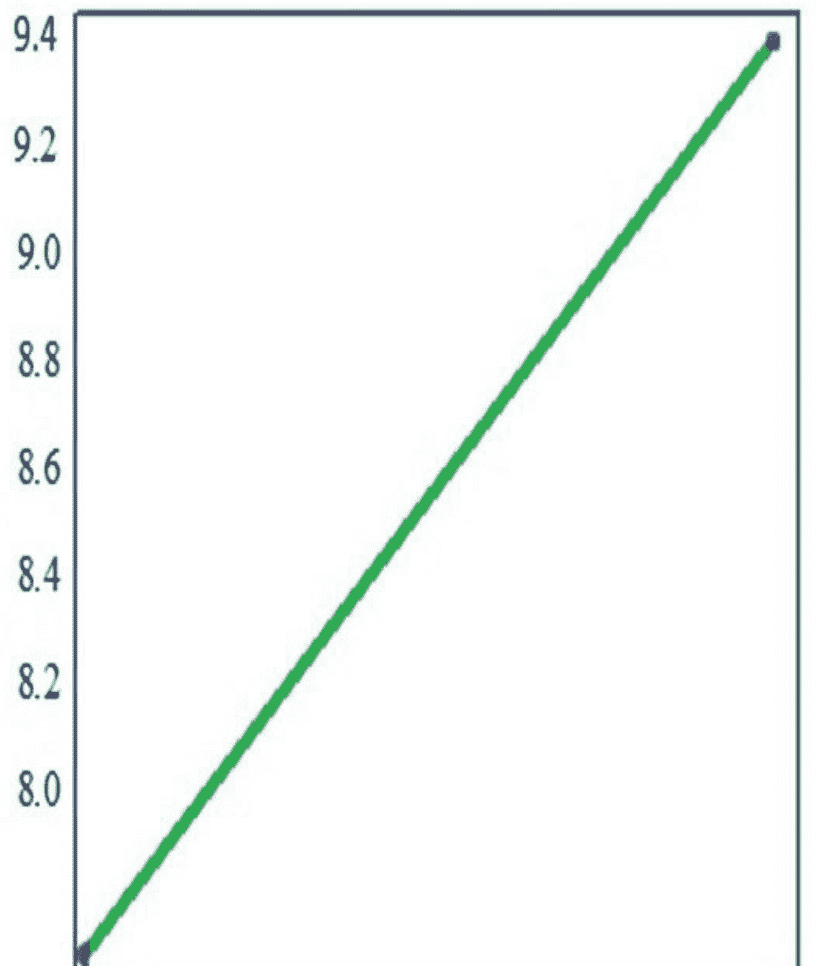

图 4.1：具有两个点的线性模型

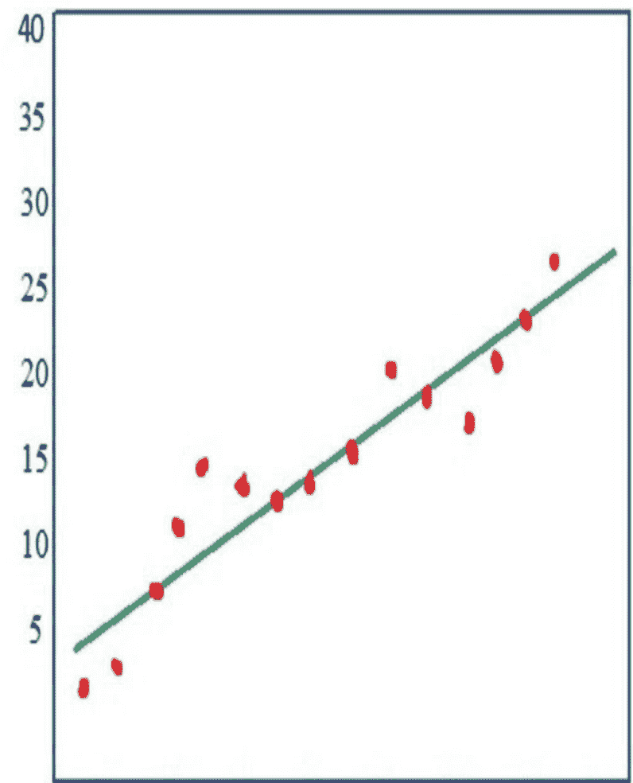

**图 4.2：** *具有多个点的线性模型*

*图 4.1* 代表两个点，*图 4.2* 代表多个点。考虑以下可用于表示许多可能拟合直线的方程：

$h(X) = X+$

下图 4.3 可能代表上述方程：

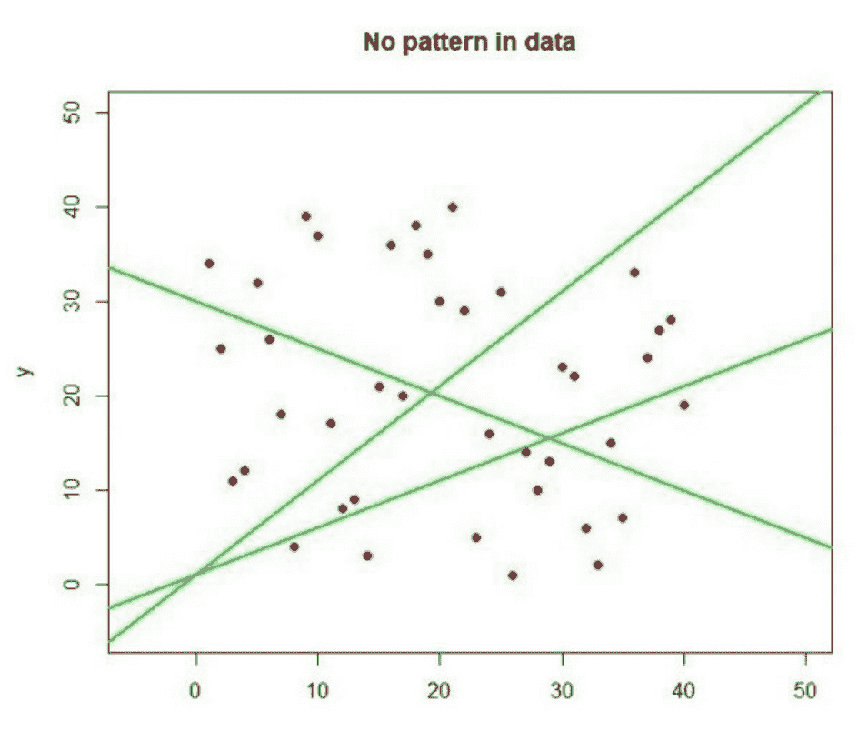

**图 4.3：** 具有多个点和多条直线的线性模型

如果只有一个 theta，则它代表一个方向斜率，我们得到一条直线。如果有多个 theta，则它们代表多个方向斜率，我们得到一条曲线。图中展示了一个具有多个点、多条曲线和多个 theta 值的线性模型

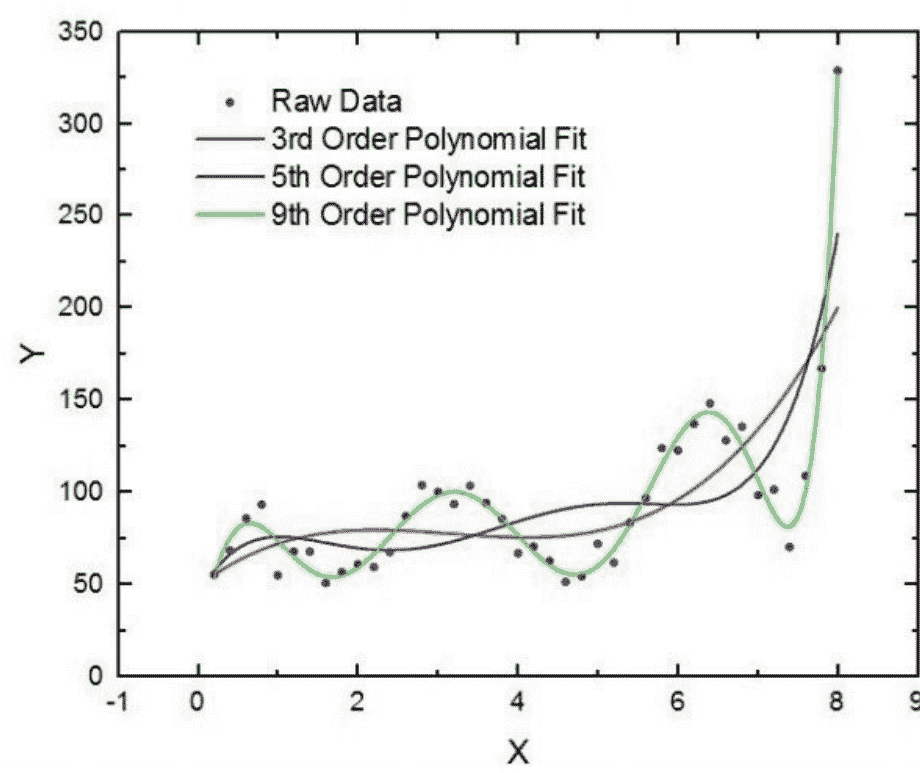

**图 4.4：** *具有多个点和多条曲线的线性模型*

我们需要正则化来防止模型中的过拟合。我们的模型可能处于以下状态之一：

- 过拟合
- 适当拟合或良好拟合
- 欠拟合

过拟合、适当拟合和欠拟合分别如图、图和图所示。在分类问题中，当我们处理数据集以执行预测任务时，我们通过在训练数据和测试数据上实施来计算准确率。如果获得令人满意的性能，我们尝试通过添加或移除某些特征集来增强性能。有时，设计的模型可能表现不佳。当设计的模型过于简单或过于复杂而无法处理目标时，它会显示出较差的性能：

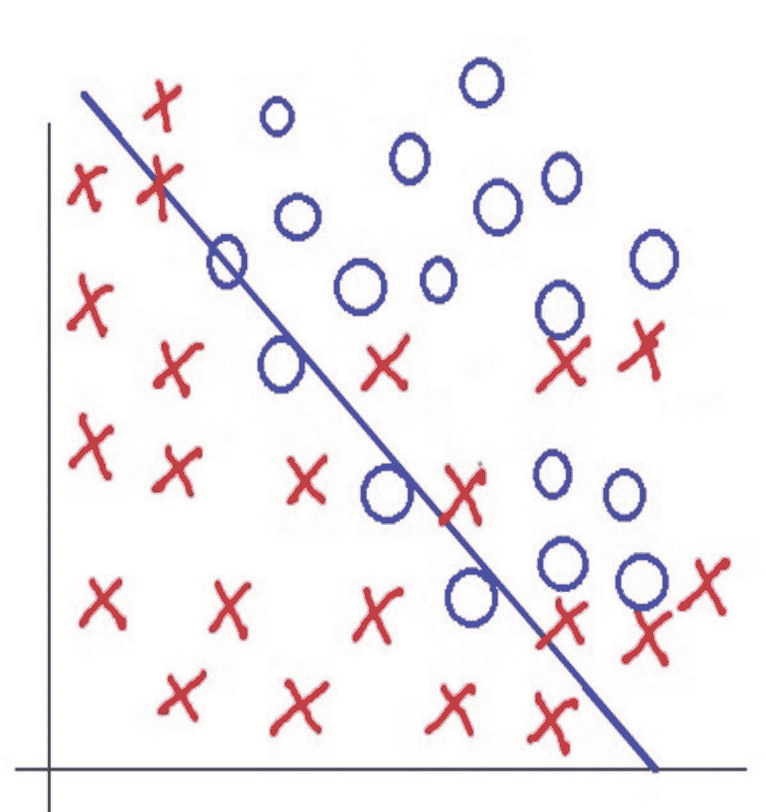

### 图 4.5：欠拟合

在图中，数据发生欠拟合，因为所有点都没有被直线覆盖。这也被称为高偏差。我们可以通过使用多项式方程生成曲线而不是直线来避免欠拟合：

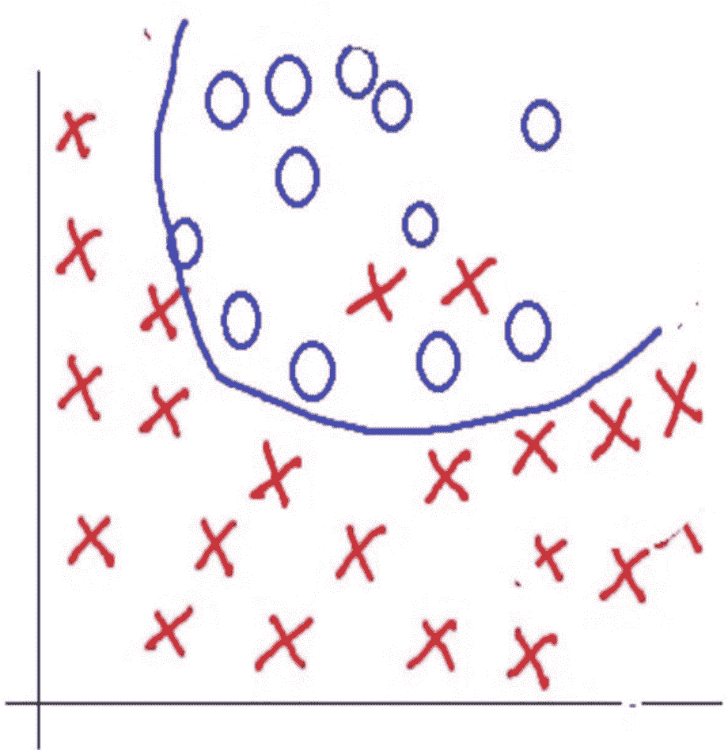

### 图 4.6：适当拟合或良好拟合

在图中，几乎所有点都被直线覆盖。因此，它被称为良好拟合或适当拟合。此外，它在方差和偏差之间保持了平衡：

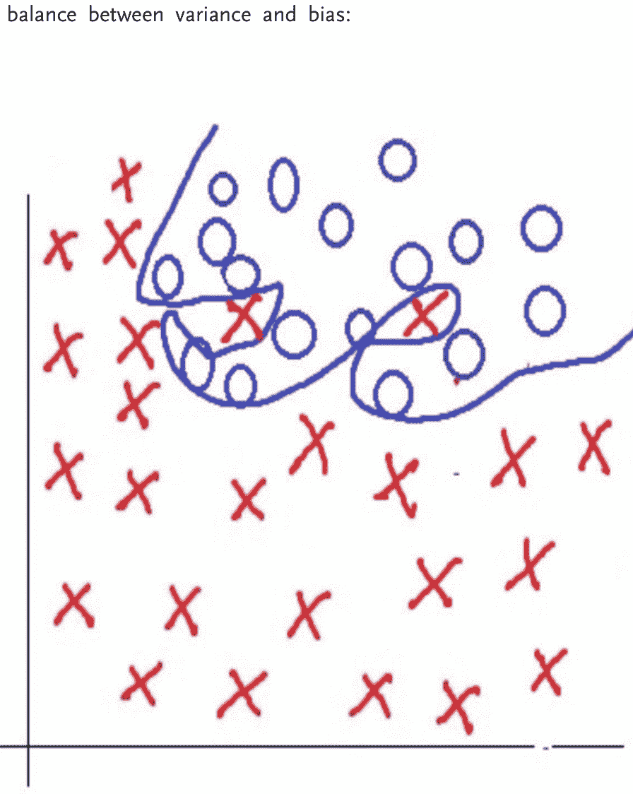

### 图 4.7：过拟合

在图中，包括异常值和噪声在内的所有点都被直线覆盖。因此，它也被称为过拟合。由于此模型过于复杂，它给出了较差的结果。它也被称为**高**。为了避免过拟合，我们必须使用正则化。正则化通过增加偏差来减少方差，从而降低预期误差。

线性回归的一般方程如下所示：

$h(X)=$

这里，θ 代表自变量的系数。残差平方和用于减少系数中存在的误差。残差平方和可以定义如下：

岭回归可以定义为一种可用于分析呈现多重共线性的多元回归数据的技术。岭回归可以定义如下：

Ridge =

λ 的值对我们的结果至关重要。如果 λ 的值为零，则对结果没有影响，但如果它等于无穷大，则会影响结果，这是不可取的。

Lasso 回归有助于将系数缩减为零，从而将其从模型中移除。如果存在许多看似不相关且可以忽略的特征，则使用 Lasso 回归。Lasso 回归在计算上更为密集。弹性网络回归是 Lasso 回归和岭回归的组合。

岭回归有助于将系数缩减到几乎为零，但并非完全为零。

考虑以下关于 Lasso 回归的代码：

```
import numpy as np
import pandas as pd
import matplotlib.pyplot
%matplotlib inline
import seaborn as sns
from sklearn.linear_model import Lasso
url 1= 'http://archive.ics.uci.edu/ml/machine-learning-databases/communities/communities.data'

data = pd.read_csv(url1, header=None, na_values=['?'])
X = data.drop(127, axis=1)
y = data[127]
from sklearn.model_selection import train_test_split
X_train, X_test, y_train, y_test = train_test_split(X, y,test_size = 0.3, random_state=1)
from sklearn.linear_model import LinearRegression
linearreg = LinearRegression()
linearreg.fit(X_train, y_train)
from sklearn import metrics
```

```
print("R-Square Value",r2_score(y_test,y_pred))
print ("\nmean_absolute_error :",metrics.mean_absolute_error(y_test, y_pred))
print ("\nmean_squared_error : ",metrics.mean_squared_error(y_test, y_pred))
print ("\nroot_mean_squared_error : ",np.sqrt(metrics.mean_squared_error(y_test, y_pred)))
```

```
R-Square Value 0.19704456295408967

mean_absolute_error : 0.1672515582488843

mean_squared_error :  0.04986345422693413

root_mean_squared_error :  0.22330126337961936
```

```
lassoregre = Lasso(alpha=0.005, normalize=True)
lassoregre.fit(X_train, y_train)
print(lassoregre.coef_)
```

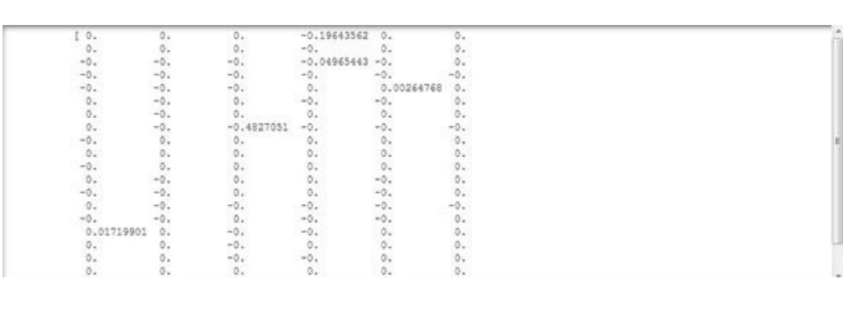

```
lassoregre = Lasso(alpha=0.05, normalize=True)
lassoregre.fit(X_train, y_train)
print(lassoregre.coef_)
```

```
[ 0.  0.  0. -0. -0.  0.  0.  0.  0. -0.  0.  0. -0. -0. -0. -0.  0.  0.
 -0. -0. -0. -0. -0. -0. -0. -0. -0.  0.  0.  0.  0. -0.  0. -0. -0.  0.
  0. -0.  0.  0.  0.  0.  0. -0. -0. -0. -0. -0. -0.  0.  0.  0.  0.  0.
  0.  0.  0.  0.  0.  0. -0.  0.  0.  0.  0.  0.  0. -0.  0.  0. -0.  0.
 -0. -0.  0.  0. -0.  0.  0. -0. -0. -0. -0. -0. -0. -0.  0. -0. -0.  0.
  0.  0.  0. -0.  0.  0.  0.  0. -0.  0.  0.  0.  0.  0. -0. -0.  0.  0.
  0.  0.  0.  0.  0.  0.  0.  0.  0.  0. -0.  0.  0.  0.]
```

```
# compute RMSE (for alpha=0.01)
y_pred = lassoregre.predict(X_test)
# compute MAE, MSE, RMSE
# compute R square value, MAE, MSE, RMSE
from sklearn.metrics import r2_score
from sklearn import metrics
print("R-Square Value",r2_score(y_test,y_pred))
print ("mean_absolute_error :",metrics.mean_absolute_error(y_test,
y_pred))
print ("\nmean_squared_error : ",metrics.mean_squared_error(y_test,
y_pred))
print ("\nroot_mean_squared_error : ",np.sqrt(metrics.mean_squared_error(y_test, y_pred)))
```

```
R-Square Value -0.008975208612771235

mean_absolute_error : 0.2062429932735426

mean_squared_error :  0.06265726192211787

root_mean_squared_error :  0.2503143262422626
```

```
from sklearn.linear_model import LassoCV
```

```
lassoregrecv = LassoCV(n_alphas=100, normalize=True,
    random_state=1)
lassoregrecv.fit(X_train, y_train)
print('alpha : ',lassoregrecv.alpha_)
alpha : 0.001687868294707203
print(lassoregrecv.coef_)
```

```
[ 0.          0.          0.         -0.26320105  0.          0.        ]
 0.          0.          0.          0.          0.          0.        ]
-0.         -0.         -0.         -0.1285917   0.          0.        ]
-0.         -0.         -0.         -0.         -0.         -0.        ]
-0.          0.          0.          0.          0.11511909  0.        ]
 0.         -0.          0.          0.         -0.          0.        ]
 0.         -0.          0.04667596  0.          0.          0.08875875]
 0.         -0.09735466 -0.3276063   0.         -0.         -0.        ]
-0.          0.          0.          0.          0.          0.        ]
 0.          0.          0.          0.          0.          0.        ]
-0.          0.          0.          0.          0.          0.        ]
 0.         -0.          0.          0.         -0.          0.        ]
-0.         -0.          0.          0.         -0.         -0.        ]
 0.         -0.         -0.         -0.         -0.         -0.        ]
 0.         -0.         -0.         -0.         -0.         -0.        ]
-0.         -0.          0.         -0.         -0.          0.        ]
 0.14776487  0.         -0.         -0.         -0.         -0.        ]
 0.          0.         -0.          0.          0.          0.        ]
 0.00639313  0.         -0.         -0.          0.          0.        ]
 0.          0.          0.          0.         -0.          0.        ]
 0.          0.          0.02772175  0.         -0.          0.        ]
-0.          0.         ]
```

```
# the best alpha value is predicted using the predict method
y_pred = lassoregrecv.predict(X_test)
# Compute R square value, MAE, MSE, RMS
print("R-Square Value",r2_score(y_test,y_pred))
```

```
print("\n")
print ("\nmean_absolute_error :",metrics.mean_absolute_error(y_test,
    y_pred))
print ("\nmean_squared_error : ",metrics.mean_squared_error(y_test,
    y_pred))
print ("\nroot_mean_squared_error : ",np.sqrt(metrics.mean_squared_error(y_test, y_pred)))
```

## R平方值 0.5506049113488305

平均绝对误差 : 0.13416628182873494

均方误差 : 0.0279073911189985

均方根误差 : 0.16705505415580368

在上述代码中，alpha的值应为正数。可以增大alpha的值以实现更强的正则化。在上述代码中，normalize被设置为true。它用于缩放特征。当我们应用正则化时，R平方值会增加。当我们应用正则化时，平均绝对误差、均方误差和均方根误差的值会降低。

考虑以下岭回归代码：

```python
from sklearn.linear_model import Ridge
ridgereg = Ridge(alpha=0, normalize=True)
ridgereg.fit(X_train, y_train)
y_pred = ridgereg.predict(X_test)
# calculate R square value, MAE, MSE, RMSE
from sklearn import metrics
print("R-Square Value",r2_score(y_test,y_pred))

print ("\nmean_absolute_error :",metrics.mean_absolute_error(y_test, y_pred))
print ("\nmean_squared_error : ",metrics.mean_squared_error(y_test, y_pred))
print ("\nroot_mean_squared_error : ",np.sqrt(metrics.mean_squared_error(y_test, y_pred)))
```

R平方值 0.1970445629549733

平均绝对误差 : 0.16725155824883509

均方误差 : 0.04986345422687926

均方根误差 : 0.2233012633794965

```python
ridgeregre = Ridge(alpha=0.1, normalize=True)
ridgeregre.fit(X_train, y_train)
y_pred = ridgeregre.predict(X_test)
# calculate R square value, MAE, MSE, RMSE
from sklearn import metrics
print("R-Square Value",r2_score(y_test,y_pred))
print ("\nmean_absolute_error :",metrics.mean_absolute_error(y_test,
y_pred))
print ("\nmean_squared_error : ",metrics.mean_squared_error(y_test,
y_pred))
print ("\nroot_mean_squared_error : ",np.sqrt(metrics.mean_squared_error(y_test, y_pred)))
```

R平方值 0.5347697501566351

平均绝对误差 : 0.12769772972161883

均方误差 : 0.028890753082631376

均方根误差 : 0.16997280100837125

在上述代码中，我们可以看到，当应用正则化时，R平方值增加，而均方误差、平均绝对误差和均方根误差的值降低。

### 逻辑回归中的过拟合与正则化

逻辑回归可以被定义为一个广义线性模型，但它产生的不是连续输出，而是分类输出。机器学习中常见的问题之一是过拟合，即模型在训练数据上表现良好，但在测试数据上表现不佳。当模型由于观测值数量相对于参数数量过多而变得复杂时，就会发生过拟合。

正则化是处理过拟合的一种方法。正则化可以处理各种特征之间的高相关性，从数据中过滤噪声并防止过拟合。正则化项可以表示如下：

$\frac{\lambda}{2} ||w||^2 = \frac{\lambda}{2} \sum_{j=1}^{m} w_j^2$

这里，$\lambda$是正则化参数。为了将正则化应用于逻辑回归，需要将正则化项添加到代价函数中以收缩权重。

正则化的倒数由参数C表示为：

$C = 1/\lambda$

如果我们减小参数C的值，那么正则化强度λ会增加，而权重系数或复杂度会降低。考虑以下关于逻辑回归中正则化的Python代码：

```python
%pylab inline
from sklearn import datasets
import numpy as np
iris = datasets.load_iris()
X = iris.data[:, [2, 3]]

y = iris.target

from sklearn.model_selection import train_test_split
X_train, X_test, y_train, y_test = train_test_split(X, y, test_size=0.3,
random_state=0)

from sklearn.preprocessing import StandardScaler
ssc = StandardScaler()
ssc.fit(X_train)
X_train_std = ssc.transform(X_train)
X_test_std = ssc.transform(X_test)

from sklearn.linear_model import LogisticRegression

weights, params = [], []
for c in np.arange(1, 5):
lrr = LogisticRegression(C=10**c, random_state=0)
lrr.fit(X_train_std, y_train)
weights.append(lrr.coef_[1])
```

```python
params.append(10**c)

weights = np.array(weights)

# Decision region drawing
import matplotlib.pyplot as plt

plt.plot(params, weights[:, 0], color='blue', marker='x', label='petal length')
plt.plot(params, weights[:, 1], color='green', marker='o', label='petal width')
plt.ylabel('weight coefficient')
plt.xlabel('C')
plt.legend(loc='right')
plt.xscale('log')
plt.show()
```

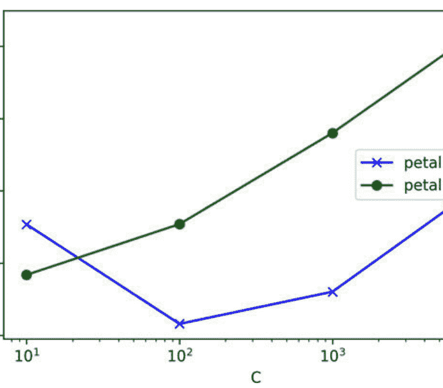

## 图 4.8

在上述代码中，我们使用了10个具有不同C值的逻辑回归模型。上图显示，随着C值（正则化的倒数）减小，权重系数的值也减小。

### 结论

在本章中，我们讨论了线性回归中的过拟合与正则化，以及逻辑回归中的过拟合与正则化。我们讨论了应用正则化后，R平方、平均绝对误差、均方误差和均方根误差如何变化。在下一章中，我们将讨论学习未知目标函数的可行性、样本内误差和样本外误差。

### 问题

举例解释线性回归中的过拟合与正则化。

举例解释逻辑回归中的过拟合与正则化。

# 第5章

## 学习的可行性

### 引言

正则化是处理过拟合的一种方法。正则化可以处理各种特征之间的高相关性，从数据中过滤噪声并防止过拟合。在上一章中，我们讨论了线性回归中的过拟合与正则化，以及逻辑回归中的过拟合与正则化。在本章中，我们将讨论学习未知目标函数的可行性、样本内误差和样本外误差。

### 结构

在本章中，我们将学习以下主题：

- 学习未知目标函数的可行性
- 样本内误差
- 样本外误差

### 目标

了解构建机器学习模型所涉及的步骤

理解使用霍夫丁不等式学习的可行性

理解样本内误差

理解泛化误差

### 学习未知目标函数的可行性

构建机器学习模型时，遵循以下层次结构：

**数据收集** 它涉及根据我们期望构建的机器学习项目收集数据。数据可以从各种来源收集，例如文件、传感器、数据库等。

**数据预处理** 为构建机器学习模型而从不同来源收集的数据不能直接用于分析目的，因为它可能包含大量噪声数据、无组织的文本、缺失值、大值或无关文本。所有这些不需要的数据都应被清除以获得干净的数据。在开发机器学习模型时，我们必须遵循80/20规则。根据此规则，我们必须将80%的时间花在数据预处理上，20%的时间花在分析上。数据可以分为以下几类：

例如，年龄、工资等。

例如，国籍、性别等。

例如，高、中、低等。

数据预处理可以通过以下方式进行：

**处理缺失值** 我们可以通过删除包含缺失值的行和列，或者使用插补（一种用某些替代值替换缺失值的过程）来解决缺失值问题。

**标准化** 这是一个涉及操作值的过程，使得所有值的均值为0，标准差为1。

**处理分类变量** 分类变量是离散的而非连续的变量。

**特征缩放** 这是一种通过缩放不重要且值范围大的特征，使所有特征的值保持一致的技术。

**划分数据集** 在机器学习中，我们通常将数据按70:30的比例划分，即70%的数据用于训练，30%的数据用于测试。

**寻找最适合数据的模型：** 找到最适合我们问题的机器学习模型。

**模型的训练与测试**

**评估**

图5.1展示了构建机器学习模型的步骤。

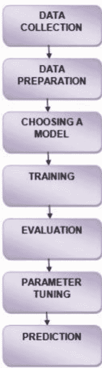

**图5.1：** *构建机器学习模型*

在上图中，数据准备指的是数据预处理，预测指的是已开发机器学习模型的测试阶段。机器学习的可行性也可以用霍夫丁不等式来表示。根据霍夫丁不等式，对于给定的样本大小$M$和容差$\epsilon$，样本内估计值（$\mu$）与期望结果之差小于某个常数的概率。

其定义如下：

在一个给定的二元分类问题中，输出为1或-1。这里，$\mu$代表样本外误差，它是首选假设$h$导致的期望误差；$\nu$代表样本内误差，它是假设对数据点进行分类所产生的误差。

其表示如下：

- $\epsilon) <=$

### 样本内误差与样本外误差

用于构建模型的数据点被称为样本内数据。样本内误差可以定义为在用于构建机器学习模型的同一数据集上获得的误差。

新的且不属于任何训练数据样本的数据点被称为样本外数据。样本外误差可以定义为在新数据集上获得的误差。它也被称为泛化误差。

在上一章中，我们讨论了过拟合和欠拟合。考虑下表，它从训练误差和测试误差的角度区分了欠拟合、过拟合和恰到好处的拟合状态：

| 状态 | 训练误差 | 测试误差 |
| --- | --- | --- |
| 欠拟合 | 高 | 高 |
| 过拟合 | 低 | 高 |
| 恰到好处的拟合 | 低 | 低 |

**表5.1：** 欠拟合、过拟合和恰到好处的拟合的比较

考虑以下关于样本内误差和样本外误差的代码：

```python
print(__doc__)

import numpy as np
from sklearn import linear_model
train_samples, test_samples, n_features = 80, 200, 700
np.random.seed(0)
coefficient = np.random.randn(n_features)
coefficient[50:] = 0.0
X = np.random.randn(train_samples + test_samples, n_features)
y = np.dot(X, coefficient)

# Splitting train and test data
train_X, test_X = X[:train_samples], X[train_samples:]
train_y, test_y = y[:train_samples], y[train_samples:]
# Finding train and test errors
alphas = np.logspace(-5, 1, 60)
enet = linear_model.ElasticNet(l1_ratio=0.7, max_iter=10000)
train_errors = list()
test_errors = list()
for alpha in alphas:
    enet.set_params(alpha=alpha)
    enet.fit(train_X, train_y)
    train_errors.append(enet.score(train_X, train_y))
    test_errors.append(enet.score(test_X, test_y))

i_alpha_optimum = np.argmax(test_errors)
alphaoptimum = alphas[i_alpha_optimum]
print("Optimal regularization parameter is: %s" % alphaoptimum)
```

```python
# Finding the coefficient on full data with optimal regularization parameter

enet.set_params(alpha=alphaoptimum)
coefficient1 = enet.fit(X, y).coef_
```

```python
# Plotting results functions

import matplotlib.pyplot as plt
plt.subplot(2, 1, 1)
plt.semilogx(alphas, train_errors, label='Train')
plt.semilogx(alphas, test_errors, label='Test')
plt.vlines(alphaoptimum, plt.ylim()[0], np.max(test_errors), color='k', linewidth=3, label='Optimum on test')
plt.legend(loc='lower left')
plt.ylim([0, 1.2])
plt.xlabel('Regularization parameter')
plt.ylabel('Performance')
```

```python
# Show the estimated coef_ versus true coef
plt.subplot(2, 1, 2)
plt.plot(coefficient, label='True coef')
plt.plot(coefficient1, label='Estimated coef')
plt.legend()
plt.subplots_adjust(0.07, 0.05, 0.87, 0.87, 0.22, 0.29)
plt.show()
```

上述代码产生以下输出：

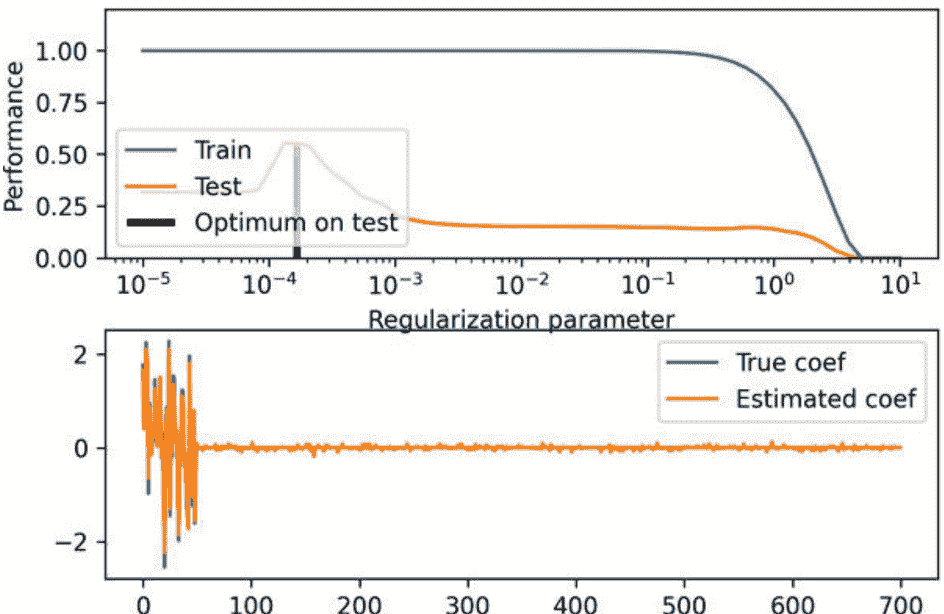

**图5.2：** *测试误差与训练误差*

上述代码说明，在未见过的数据或测试数据上的性能与在训练数据上的性能是不同的。可以看出，随着正则化的增加，训练数据上的性能会下降，而测试数据上的性能在给定的值范围内达到最优。

### 结论

在本章中，我们讨论了学习未知目标函数的可行性，以及样本内误差和样本外误差，并通过其值如何受正则化增加影响的例子进行了说明。

在下一章中，我们将讨论支持向量机、间隔、大间隔方法以及从支持向量机角度的核方法。

### 问题

举例说明学习未知目标函数的可行性。

举例说明样本外误差。

举例说明样本内误差。

# 第6章

## 支持向量机

### 简介

**支持向量机**可以定义为一种可用于回归和分类的机器学习算法。它通常用于分类目的。在本章中，我们将讨论间隔与大间隔方法以及核方法。

### 结构

- 间隔与大间隔方法
- 核方法

### 目标

- 了解间隔与大间隔方法的意义
- 理解核方法

### 间隔与大间隔方法

在SVM中，数据项被绘制在n维空间中，其中n代表特征的数量。通过找到可以区分两个类别的超平面来进行分类。考虑图6.1。这里，通过找到超平面来执行两种不同形状的分类：

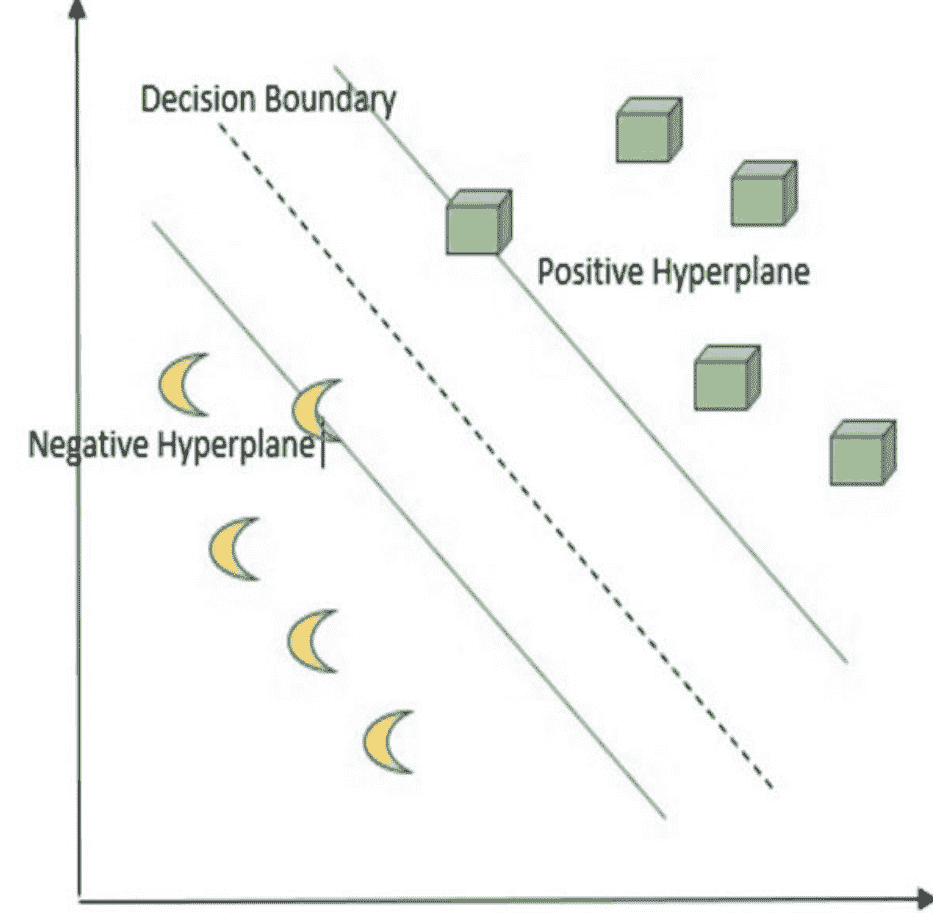

**图6.1：** *SVM中使用超平面进行形状分类*

为给定问题选择正确的超平面可以通过以下方式完成：

选择能更好分类数据点的超平面。考虑图6.2。这里有三个超平面，即**A**、**B**和**C**。我们需要从中选择一个超平面。我们选择超平面**A**，因为它比其他超平面更有效地分类数据点：

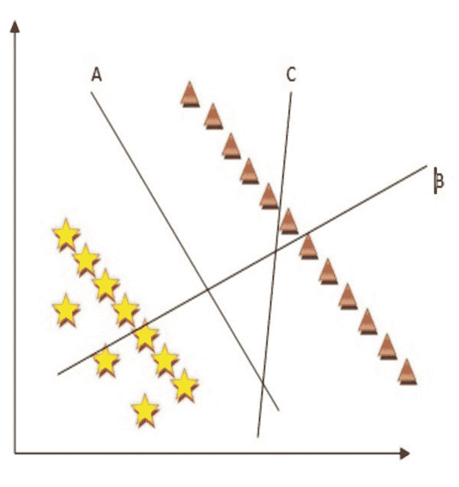

**图6.2：** *超平面A有效地分类数据点*

使用间隔与大间隔方法来找到合适的超平面。最近的数据点与超平面之间的距离被称为间隔。我们必须选择具有较大间隔的超平面；这可以防止误分类的可能性。考虑图6.3。这里，超平面**B**的间隔与超平面**A**和**C**的间隔相比是最大的。因此，我们选择超平面**B**来分类我们的数据点：


**图6.3：** *间隔与大间隔方法*

识别能够正确分类所有数据点且无任何错误的正确超平面。考虑图6.4。这里，如果我们选择超平面**B**而不是超平面**A**，因为超平面**B**比超平面**A**具有更大的间隔，那么超平面**B**不能正确分类所有数据点，从而导致错误。超平面**A**的间隔较小，但它能正确分类所有数据点。因此，SVM会选择超平面**A**而不是超平面**B**。

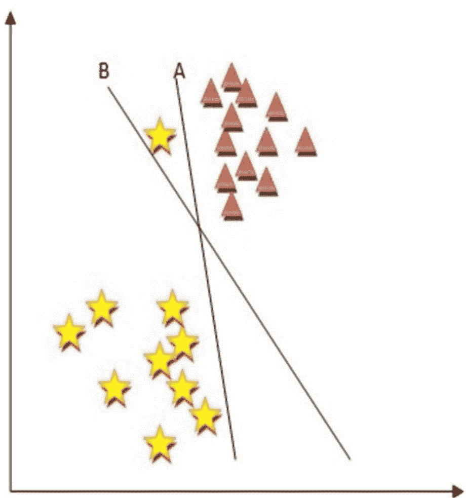

**图6.4：** *选择超平面A而非超平面B进行分类*

SVM具有忽略异常值或噪声的特性。考虑图6.5。这里，所选的超平面具有较大的间隔，同时SVM忽略了位于另一个边界内的星形点，该星形点被视为噪声或异常值。

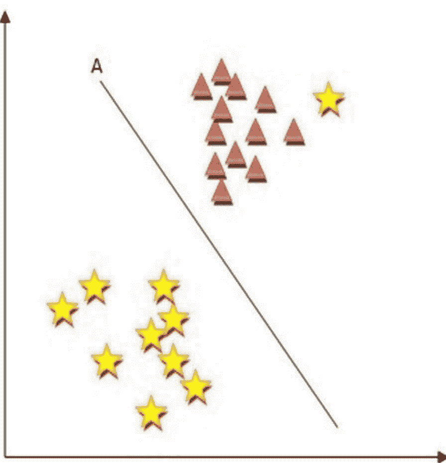

**图6.5：** *SVM的分类对异常值具有鲁棒性*

考虑以下代码，它描绘了使用SVM正确分类的数据点：

### 核核方法

支持向量机核函数是一种接受低维输入空间并将其转换为更高维空间的函数。SVM 将不可分问题转换为可分问题。它通常用于非线性分离问题。考虑下图。这里，我们有一个圆形超平面，它将星形和三角形分开。我们可以通过引入一个新特征将圆形超平面转换为线性超平面。这在图中有所展示。

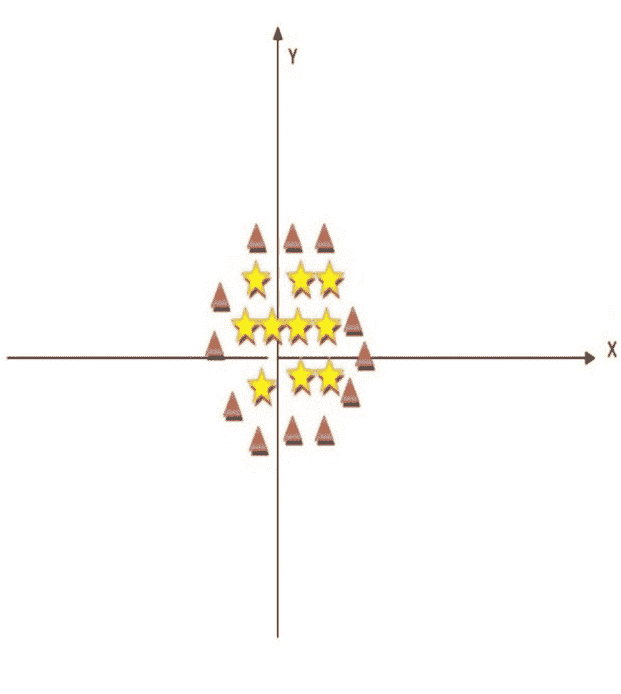

**图 6.12：** *分离星形和三角形的圆形超平面*

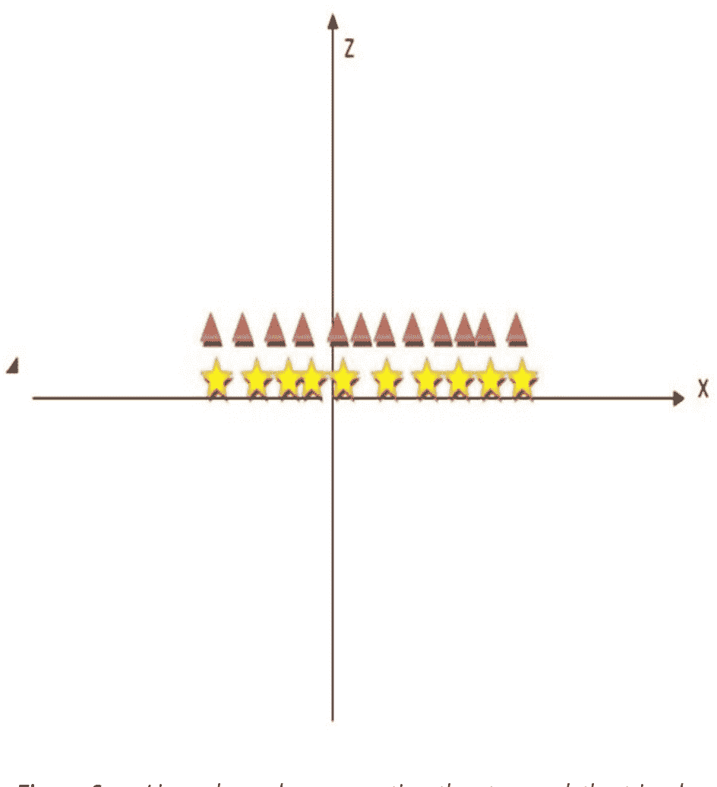

**图 6.13：** 分离星形和三角形的线性超平面

### 结论

在本章中，我们讨论了学习未知目标函数的可行性，以及样本内误差和样本外误差，并通过其值如何受正则化增加影响的例子进行了说明。

### 问题

解释 SVM 中大间隔的意义。

解释 SVM 核函数。

# 第 7 章

## 神经网络

### 简介

支持向量机用于分类和回归。在上一章中，我们讨论了支持向量机、间隔和大间隔方法以及核方法。神经网络指的是试图模拟大脑模型的并行计算设备。在接下来的章节中，我们将讨论神经网络的早期模型，以及感知器学习模型、反向传播和随机梯度下降。我们讨论了在 Python 中实现感知器学习、反向传播和随机梯度下降。

### 结构

神经网络指的是识别数据集中关系并模拟人脑工作的一组算法。在本章中，我们将涵盖以下主题：

- 早期模型
- 感知器学习
- 反向传播
- 随机梯度下降

### 目标

神经网络是执行机器学习任务的一种手段，计算机通过分析训练示例进行学习。以下是本章涵盖的目标：

- 了解早期模型和感知器学习
- 理解反向传播
- 理解随机梯度下降

### 早期模型

神经网络是机器学习的一个子领域。神经网络接受输入数据，对数据进行训练，并根据执行的训练产生输出。1943 年，*Warren Mc Culloch* 和 *Walter Pits* 描述了神经元的工作原理。他们借助电路对神经网络进行建模，以解释大脑中神经元的工作方式。1949 年，*Donald Hebb* 撰写了《组织》一书，其中指出如果两个神经元同时被激发，它们之间的连接就会增强。1959 年，斯坦福大学的 *Bernard Widrow* 和 *Marcian Hoff* 开发了基于神经网络的模型，称为 '**ADALINE**'，**ADALINE** 代表 **自适应线性元件**，**MADALINE** 代表 **多自适应线性**。ADALINE 用于二进制模式的识别。对于给定的比特流，它可以预测下一个比特的出现。MADALINE 代表多自适应线性元件。它是第一个应用于现实世界问题的神经网络，目前仍用于商业目的。

### 感知机学习

感知机基于神经元，神经元是大脑的基本处理单元。神经元由树突、细胞体和轴突组成。信号从轴突流向树突。当细胞达到特定阈值时，神经元会触发一个动作信号。这个动作要么发生，要么不发生。神经元没有部分触发的概念。请看图7.1所示的感知机模型：

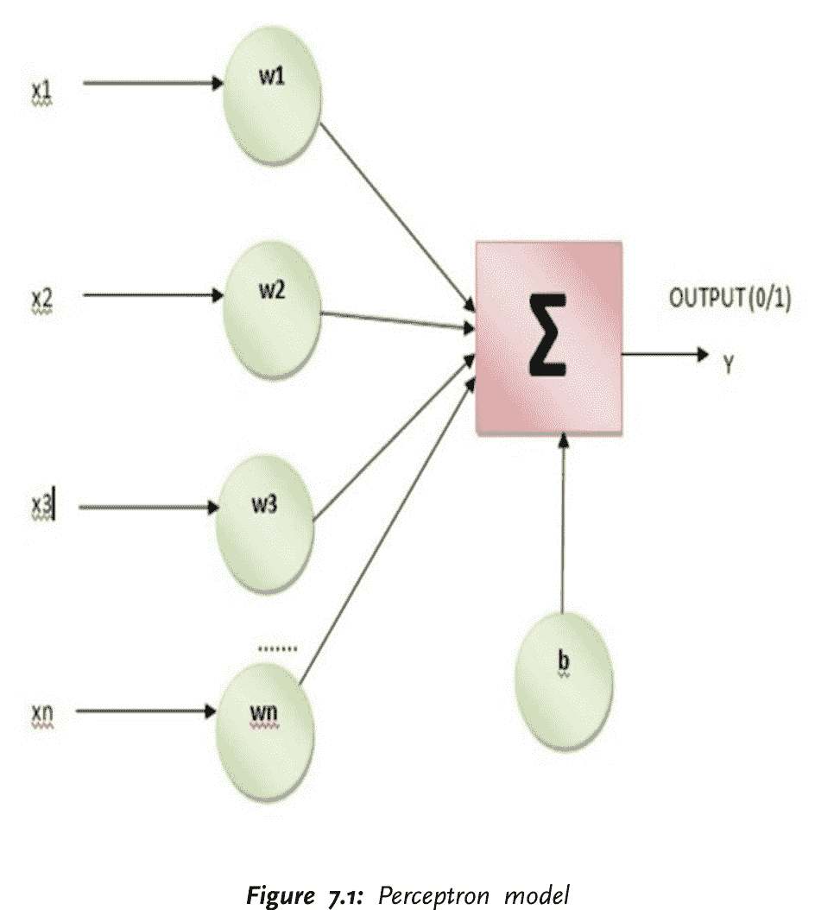

**图7.1：** *感知机模型*

感知机可用于解决二元分类问题，其中需要识别的样本属于两个类别。许多特征或输入被发送到感知机的线性单元，它生成一个二元输出。请看以下关于感知机学习的代码。在此代码中，我们在input_size上加1，以便在权重向量中包含偏置：

```python
import numpy as np

class Perceptronlearning(object):
    """Implementation of a perceptron learning network"""
    def __init__(self, input_size, lr=1, epochs=10):
        self.W = np.zeros(input_size+1)
        # add one for bias
        self.epochs = epochs
        self.lr = lr

    def activation_fn(self, p):
        """ 1 is returned if p>=0 otherwise it returns 0"""
        return 1 if p >= 0 else 0

    def predict(self, p):
        """ Prediction is a process of sending an input to the perceptron
        and returning an output. Bias is added to the input vector. We
        can compute the inner product, and the activation function is
        applied """
        p = np.insert(p, 0, 1)
        q = self.W.T.dot(p)
        r = self.activation_fn(q)
        return r

    def fit(self, P, d):
        for _ in range(self.epochs):
            for i in range(d.shape[0]):
                y = self.predict(P[i])
                e = d[i] - y
                self.W = self.W + self.lr * e * np.insert(P[i], 0, 1)
```

因此，单个神经元的神经网络被称为感知机。它接受输入和权重，执行输入的加权和，并对其应用激活函数。它只接受和生成二元值。感知机学习模型的一个局限性是它只能解决线性可分的问题。

### 反向传播

反向传播也称为梯度计算。反向传播学习算法包含两个阶段，即：梯度计算阶段和权重更新阶段。第一个阶段是传播阶段。它涉及以下步骤：

**前向传播** - 在此阶段，训练输入模式被发送到神经网络，并生成传播的输出激活。

**反向传播** – 在此阶段，输入是传播的输出激活，它被发送到神经网络，并生成所有输出和隐藏神经元的增量。

第二个阶段是权重更新阶段。它涉及以下步骤：

通过将输出增量与输入激活相乘来计算权重的梯度。

从权重中减去梯度的一个比例或百分比。这个比例或百分比会影响学习的质量和速度。它被称为学习率。如果学习率较高，神经元能够更快地训练。如果学习率较低，则认为训练更准确。

请看以下关于反向传播的代码。

```python
import numpy as np

def sigmoidfun(x):
    return 1.0/(1.0 + np.exp(-x))

def sigmoid_primefun(x):
    return sigmoidfun(x)*(1.0-sigmoidfun(x))

def tanh(x):
    return np.tanh(x)

def tanh_prime(x):
    return 1.0 - x**2

class NeuralNetwork:
    def __init__(self, layers, activation='tanh'):
        if activation == 'sigmoid':
            self.activation = sigmoidfun
            self.activation_prime = sigmoid_primefun
        elif activation == 'tanh':
            self.activation = tanh
            self.activation_prime = tanh_prime
        # Setting weights
        self.weights = []
        # let layers is [2,2,1]
        # weight values range= (-1,1)
        # hidden and input layers - random((2+1, 2+1)) : 3 x 3
        for i in range(1, len(layers) - 1):
            r = 2*np.random.random((layers[i-1] + 1, layers[i] + 1)) -1
            self.weights.append(r)
        # output layer - random
        r = 2*np.random.random((layers[i] + 1, layers[i+1])) - 1
        self.weights.append(r)

    def fit(self, P, q, learning_rate=0.2, epochs=100000):
        # Adding the column of ones to P
        # This is to add the bias unit to the input layer
        ones = np.atleast_2d(np.ones(P.shape[0]))
        P = np.concatenate((ones.T, P), axis=1)
        for k in range(epochs):
            i = np.random.randint(P.shape[0])
            a = [P[i]]
            for l in range(len(self.weights)):
                dot_value = np.dot(a[l], self.weights[l])
                activation = self.activation(dot_value)
                a.append(activation)
            # output layer
            error = q[i] - a[-1]
            deltas = [error * self.activation_prime(a[-1])]
            # we need to begin at the second to last layer
            # (a layer before the output layer)
            for l in range(len(a) - 2, 0, -1):
                deltas.append(deltas[-1].dot(self.weights[l].T)*self.activation_prime(a[l]))
            # reverse
            # [level3(output)->level2(hidden)] => [level2(hidden)->level3(output)]
            deltas.reverse()
            # backpropagation
            # 1. Multiply its output delta and input activation
            #    to get the gradient of the weight.
            # 2. Subtract a ratio (percentage) of the gradient from the weight.
            for i in range(len(self.weights)):
                layer = np.atleast_2d(a[i])
                delta = np.atleast_2d(deltas[i])
                self.weights[i] += learning_rate * layer.T.dot(delta)
            if k % 10000 == 0: print('epochs:', k)

    def predict(self, x):
        c = np.concatenate((np.ones(1).T, np.array(x)))
        for l in range(0, len(self.weights)):
            c = self.activation(np.dot(c, self.weights[l]))
        return c

if __name__ == '__main__':
    neu = NeuralNetwork([2,2,1])
    P = np.array([[0, 0],
                  [0, 1],
                  [1, 0],
                  [1, 1]])
    q = np.array([0, 1, 1, 0])
    neu.fit(P, q)
    for x in P:
        print(x, neu.predict(x))
```

epochs: 0
epochs: 10000
epochs: 20000
epochs: 30000
epochs: 40000
epochs: 50000
epochs: 60000
epochs: 70000
epochs: 80000
epochs: 90000
[0 0] [4.28817961e-05]
[0 1] [0.99667242]
[1 0] [0.99666444]
[1 1] [4.62864326e-05]

### 随机梯度下降

随机梯度下降被称为一种迭代方法，可用于优化具有必要性质（次可微或可微）的目标函数。随机梯度下降可用于最小化要执行的计算量。它在给定的迭代中随机选择一个数据点，从而极大地减少计算量。请看以下使用随机梯度下降的代码。这里，我们取两个数组P和Q。数组P包含训练样本。数组Q保存目标值。

```python
import numpy as np
from sklearn import linear_model

P = np.array([[-1, 2], [1, -1], [2, 1], [2, 2]])
Q = np.array([1, 2, 1, 1])

SGDClassif = linear_model.SGDClassifier(max_iter=1000, tol=1e-3, penalty="elasticnet")
SGDClassif.fit(P, Q)
SGDClassifier(alpha=0.0001, average=False, class_weight=None,
              early_stopping=False, epsilon=0.1, eta0=0.0, fit_intercept=True,
              l1_ratio=0.15, learning_rate='optimal', loss='hinge',
              max_iter=1000, n_iter_no_change=5, n_jobs=None,
              penalty='elasticnet', power_t=0.5, random_state=None,
              shuffle=True, tol=0.001, validation_fraction=0.1, verbose=0,
              warm_start=False)

SGDClassif.predict([[3., 3.]])
array([1])
```

### 结论

在本章中，我们学习了神经网络的早期模型、感知机模型、反向传播和随机梯度下降。在下一章中，我们将讨论决策树和回归树，以及它们在Python中的实现。

### 问题

解释反向传播涉及的步骤。

解释随机梯度下降。

解释早期的神经元模型。

写出感知机模型的缺点。

# 第8章

### 决策树

### 引言

神经网络是模拟人脑工作方式的一种方法。决策树是指一种决策支持结构，它使用树来进行决策并推导所有可能的结果。决策树是显示条件控制语句的一种方式。在接下来的章节中，我们将讨论决策树、回归树、决策树中的停止准则和剪枝损失函数、分类属性、多路分裂以及决策树中的缺失值，还有决策树的不稳定性。

### 结构

决策树可用于表示决策和决策过程。本章将包含以下主题：

- 决策树
- 回归树
- 决策树中的停止准则和剪枝损失函数
- 决策树中的分类属性、多路分裂和缺失值
- 决策树的不稳定性

### 目标

决策树是指用于预测和分类目的的一种流行且强大的工具。以下是本章的目标：

- 了解决策树和回归树
- 理解决策树中的停止准则和剪枝损失函数
- 理解决策树中的分类属性、多路分裂和缺失值
- 理解决策树的不稳定性

### 决策树

决策树是指监督学习的非参数方法。决策树用于回归和分类目的。

考虑以下使用scikit learn编写的决策树代码。这里，`DecisionTreeClassifier`是一个可以在给定数据集上执行多类分类的类。`DecisionTreeClassifier`接受两个数组作为输入，即P和

```python
from sklearn import tree
P = [[0, 0], [1, 1]]
Q = [0, 1]
DTclf = tree.DecisionTreeClassifier()
DTclf = DTclf.fit(P, Q)
DTclf.predict([[2., 2.]])
array([1])
```

```python
DTclf.predict_proba([[2., 2.]])
array([[0., 1.]])
from sklearn.datasets import load_iris
from sklearn import tree
P, q = load_iris(return_X_y=True)
DTclf = tree.DecisionTreeClassifier()
DTclf = DTclf.fit(P, q)
tree.plot_tree(DTclf)
```

```python
from sklearn.datasets import load_iris
from sklearn.tree import DecisionTreeClassifier
from sklearn.tree import export_text
iris = load_iris()
decisiontree = DecisionTreeClassifier(random_state=0, max_depth=2)

decisiontree = decisiontree.fit(iris.data, iris.target)
er = export_text(decisiontree, feature_names=iris['feature_names'])
print(er)
```

```
|--- petal width (cm) <= 0.80
|   |--- class: 0
|--- petal width (cm) > 0.80
|   |--- petal width (cm) <= 1.75
|   |   |--- class: 1
|   |--- petal width (cm) > 1.75
|   |   |--- class: 2
```

```python
from sklearn import tree
X = [[0, 0], [2, 2]]
y = [0.5, 2.5]
DTclf = tree.DecisionTreeRegressor()
DTclf = DTclf.fit(X, y)
DTclf.predict([[1, 1]])
array([0.5])
```

在上面的代码中，`DTclf.predict()`用于预测样本的类别。`DTclf.predict_proba()`用于查找每个类别的概率。`DecisionTreeClassifier`可用于二元分类和多类分类。`plot_tree`函数可用于绘制树。

### 回归树

决策树算法可用于基于给定数据预测结果的过程。决策树算法有两种类型，即：分类树和回归树算法。**分类与回归树**方法论于1984年出现。它由*Leo Jerome Richard*和*Charles*提出。在分类树算法中，结果变量是分类的或固定的。例如，使用分类树算法，我们可以决定客户将购买哪种类型的汽车。在回归树算法中，目标结果值是一个实数。例如，可以使用回归树算法预测住宅的售价。在分类树算法中，数据集被分为是或否等类别。在回归树算法中，目标变量是连续的，例如温度、价格等。决策树算法的分类如[图](figure)所示。

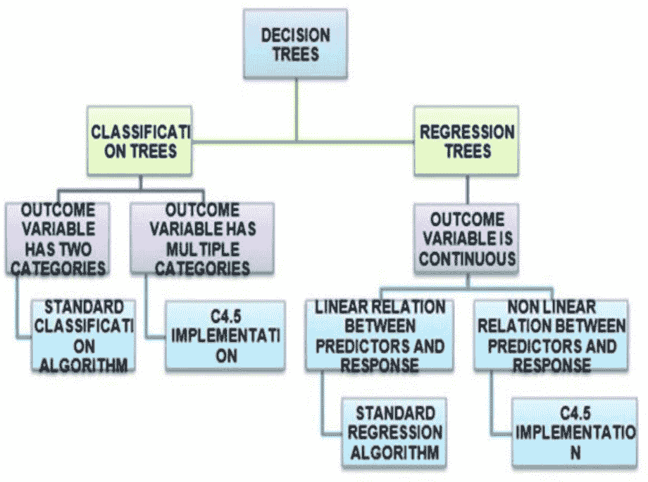

图8.1：决策树算法的分类

### 决策树中的停止准则和剪枝损失函数

剪枝技术与决策树相关，它可以通过消除树中不分类实例的部分来减小决策树的大小。通过在决策树中加入剪枝可以防止过拟合。当训练进行得如此彻底，以至于它不仅学习了模式，还学习了噪声时，就会发生过拟合。当训练量不足，以至于无法识别所有模式时，就会发生欠拟合。剪枝意味着树被修剪。*Quinlan*在1987年提出了一种简单的决策树剪枝方法，称为错误减少剪枝。在错误减少剪枝中，从下到上遍历内部节点，并且仅在不会降低树的准确性时才进行剪枝。*Olaru*和*Wehenkel*在2003年提出了最小错误剪枝的使用。在最小错误剪枝中，对于每个节点，我们比较不剪枝和剪枝时的1-概率错误率估计。悲观剪枝是一种快速的剪枝方法，其中节点以从上到下的方式遍历。如果给定的内部节点被剪枝，那么该内部节点的所有后代都不会被送入剪枝过程。最优剪枝用于保证最优性，并基于动态规划的概念。在最优剪枝中，剪枝后获得的树比原始树小得多，并且内部节点的数量比叶节点的数量少得多。

### 决策树中的分类属性、多路分裂和缺失值

CART是指一种决策树算法，它根据目标变量是数值型还是分类型生成二元回归树或分类树。在执行决策树分区时，必须遵循最优分区。在CART中，相同的变量可以在决策树的不同部分重复使用。分裂可以是二元的或多路的。

在二元分裂中，每个节点进一步分为最多两个子组，而在多路分裂的情况下，每个节点进一步分为多个子组。如果我们遵循多路分裂，决策树非常容易理解，因为在从根到叶遍历路径时，特定属性很少重新出现。

有几种方法用于处理决策树中的缺失值。缺失值可以被忽略，也可以被分配到其他类别。

缺失值实例可以按如下方式分配到子节点：

所有实例都进入拥有最多实例的节点。

在所有子节点之间进行分配，但权重最小，权重与来自每个子节点。

根据类别分布随机分配到单个子节点。

排序、构建并使用输入特征来决定实例在子节点中的分配方式。

### 决策树中的不稳定性

决策树分类器中的不稳定性问题意味着，如果训练样本发生修改，最终构建的规则可能与原始或实际规则不同。这种不稳定性是由于分裂候选选择无效造成的。分裂候选是通过分裂评估函数找到的，该函数可用于划分数据。如果在特定阶段没有找到主导分裂，则使用分裂候选来划分节点。如果在任何阶段选择了不同的分裂，则会导致生成的树与原始树完全不同。因此，选择正确的分裂候选对于防止决策树中的不准确或不稳定非常重要。

### 结论

在本章中，我们学习了决策树、回归树和分类树的区别、决策树中的停止标准和剪枝损失函数、类别属性、多路分裂和决策树中的缺失值，以及决策树中的不稳定性。在下一章中，我们将讨论无监督学习、聚类和主成分分析。

### 问题

- 解释分类树和回归树之间的区别。
- 解释决策树中的停止标准和剪枝损失函数。
- 什么是决策树中的多路分裂？
- 解释决策树中的不稳定性。

# 第9章

## 无监督学习

### 简介

决策树是显示条件控制语句的一种方式。在上一章中，我们讨论了决策树、回归树、决策树中的停止标准和剪枝损失函数、类别属性、决策树中的多路分裂和缺失值，以及决策树中的不稳定性。无监督学习是一种机器学习算法，可以在输入数据中没有标记响应的情况下得出有用的结论。在接下来的章节中，我们将讨论聚类（K-means聚类、层次聚类）和主成分分析。

### 结构

无监督学习是一项复杂的处理任务，涉及识别数据集中既未标记也未分类的数据点的模式。本章将包括以下主题：

- 聚类
- 主成分分析

### 目标

在无监督学习中，未分类和未标记的数据被发送到AI系统，算法在没有任何先前训练的情况下对这些数据进行操作。以下是本章的目标：

- 了解无监督学习
- 理解聚类和聚类算法（K-means聚类、层次聚类）
- 理解主成分分析

### 聚类

聚类一词最早于1932年在人类学中由*Driver*使用，1938年在心理学中由*Joseph Zubin*使用，1939年由*Robert*使用。1943年，它被用于人格心理学中的特质理论分类。聚类也称为聚类分析，是将相似对象分组到同一组（称为簇）的过程，使得一个簇中的对象与另一个簇中的对象不相似。聚类分析用于许多领域，如数据压缩、模式识别和图像处理、机器学习、计算机图形学、信息检索和生物信息学。在接下来的章节中，我们将讨论聚类算法，如k-means聚类算法和层次聚类算法。

### K-means聚类

K-means聚类涉及将观测值划分为k个簇，其中给定观测值属于具有最近均值的簇。考虑以下使用k-means聚类的Python代码：

```python
print(__doc__)
import numpy as np
import matplotlib.pyplot as plt
from mpl_toolkits.mplot3d import Axes3D
from sklearn.cluster import KMeans
from sklearn import datasets
```

```python
np.random.seed(5)
```

```python
irisdata = datasets.load_iris()
P = irisdata.data
q = irisdata.target
```

在以下代码中，n_init被设置为1而不是默认值10。因此，这种不良初始化会影响分类过程，因为它减少了算法使用不同质心种子运行的次数。

```python
estimatorskmeans = [('k_means_iris_8', KMeans(n_clusters=8)),
('k_means_iris_3', KMeans(n_clusters=3)),
('k_means_iris_bad_init', KMeans(n_clusters=3, n_init=1,
init='random'))]
fignum=1
titles = ['8 clusters', '3 clusters', '3 clusters, bad initialization']
for name, est in estimatorskmeans:
    fig = plt.figure(fignum,figsize=(4,3))
    px = Axes3D(fig, rect=[0, 0, .82,1], elev=52,azim=147)

    est.fit(P)
    labels = est.labels_

    px.scatter(P[:, 3], P[:, 0], P[:, 2], c=labels.astype(np.float),
    edgecolor='k')
    px.w_xaxis.set_ticklabels([])
    px.w_yaxis.set_ticklabels([])
    px.w_zaxis.set_ticklabels([])
    px.set_xlabel('Petal width')
    px.set_ylabel('Sepal length')
    px.set_zlabel('Petal length')
    px.set_title(titles[figno-1])
    px.dist = 12
    fignum=fignum+1
```

绘制真实值：

```python
fig = plt.figure(fignum, figsize=(4, 3))
px = Axes3D(fig, rect=[0, 0, .95, 1], elev=48, azim=134)

for name, label in [('Setosa', 0),
('Versicolour', 1),
('Virginica', 2)]:
    px.text3D(P[q == label, 3].mean(),
    P[q == label, 0].mean(),
    P[q == label, 2].mean() + 2, name,
    horizontalalignment='center',
    bbox=dict(alpha=.2, edgecolor='w', facecolor='w'))
```

重新排序标签以使颜色与聚类结果匹配：

```python
q= np.choose(q,[1, 3, 0]).astype(np.float)
pc.scatter(P[:, 3], P[:, 0], P[:, 2], c=q, edgecolor='k')
```

```python
px.w_xaxis.set_ticklabels([])
px.w_yaxis.set_ticklabels([])
pc.w_zaxis.set_ticklabels([])
pc.set_xlabel('Petal width')
pc.set_ylabel('Sepal length')
pc.set_zlabel('Petal length')
pc.set_title('Ground Truth')
pc.dist = 12
```

```python
fig.show()
```

上述代码的输出如[图](figure)所示

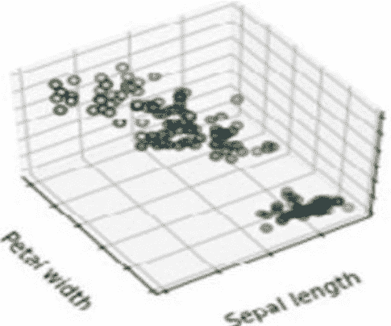

### 3个簇，不良初始化

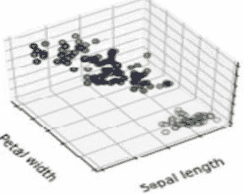

### 真实值

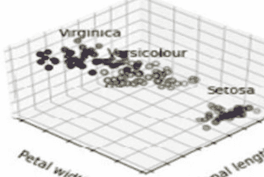

**图9.1：** K-means聚类

### 层次聚类

层次聚类也称为层次聚类分析。此方法涉及构建簇的层次结构。层次聚类分析中使用的两种方法包括：

- 凝聚聚类
- 分裂聚类

凝聚聚类是一种“自下而上”的方法，涉及每个单独的簇，簇对合并并在层次结构中向上移动。分裂聚类是一种“自上而下”的方法，其中单个簇在层次结构中向下进行时进一步分裂为多个簇。

簇相异性是衡量观测值对之间距离的度量，链接准则指定观测值对之间的相异性。簇相异性用于凝聚聚类以决定哪些簇将合并形成更大的簇。它也用于分裂聚类以决定哪个簇最终会分裂。

### 主成分分析（PCA）

PCA是指一种降维方法，可用于将大型数据集的维度减少到较小的维度，同时尽可能保留更多信息。

PCA中执行的步骤包括：

- 标准化
- 计算协方差矩阵
- 通过计算协方差矩阵的特征值和特征向量来识别主成分
- 创建特征向量
- 重新投影数据

在第一步中，标准化很重要，因为如果存在一些值很大而一些值很小，那么较大的范围将主导较小的范围。因此，执行标准化以解决此问题。标准化可以通过从值中减去均值并除以标准差来完成。这表示如下：

## 主成分分析

Z=(value-mean)/standard deviation

在第二步中，计算协方差矩阵以确定输入数据中是否存在冗余信息。在第三步中，生成主成分，这些主成分本质上是由初始变量线性组合形成的变量。在第四步中，通过考虑那些比低显著性成分具有更高显著性的主成分来创建特征向量。

考虑以下关于PCA的Python代码。我们考虑一个包含600个点的二维数据集：

```python
import numpy as np
import matplotlib.pyplot as plt
import seaborn as sns; sns.set()
ranstat = np.random.RandomState(1)
P = np.dot(ranstat.rand(2, 2), ranstat.randn(2, 600)).T
plt.scatter(P[:, 0], P[:, 1])
plt.axis('equal');
```

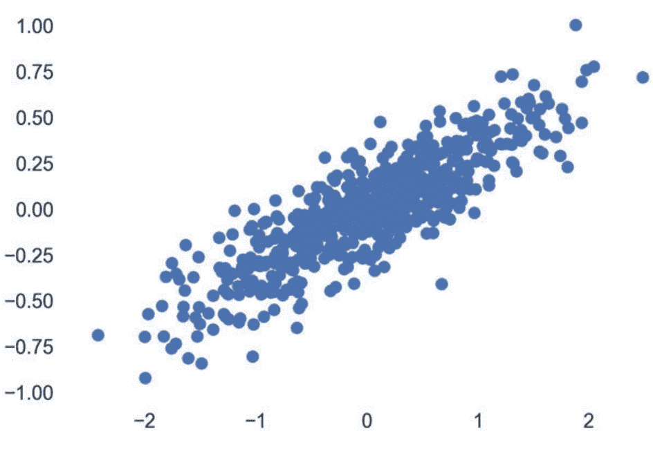

**图 9.2：** *主成分分析示例*

在上图中，X和Y之间存在线性关系。在主成分分析中，会找到一系列主轴，并使用这些轴来描述数据集。我们可以使用以下方法计算主轴：

```python
from sklearn.decomposition import PCA
principalaxis = PCA(n_components=2)
principalaxis.fit(P)
PCA(copy=True, iterated_power='auto', n_components=2,
random_state=None,
svd_solver='auto', tol=0.0, whiten=False)
```

主轴拟合学习成分和解释方差如下：

```python
print(principalaxis.components_)
[[0.9513521 0.3081058]
 [0.3081058 -0.9513521]]
```

```python
print(principalaxis.explained_variance_)
[0.70649509 0.02104542]
```

```python
def draw_vector(n0, n1, px=None):
    px = px or plt.gca()
    arrowprops=dict(arrowstyle='->', linewidth=2, shrinkA=0, shrinkB=0)
    px.annotate('', n1, n0, arrowprops=arrowprops)
```

```python
# plot data
plt.scatter(P[:, 0], P[:, 1], alpha=0.2)
for length, vector in zip(principalaxis.explained_variance_,
                         principalaxis.components_):
    p = vector * 3 * np.sqrt(length)
    draw_vector(principalaxis.mean_, principalaxis.mean_ + p)
plt.axis('equal');
```

我们可以将输入数据定义为向量，并使用成分表示向量的方向，向量的平方长度则使用解释方差来定义。主轴由数据表示。数据的方差由向量的长度表示。这在下面给出的代码中有所展示：

```python
def draw_vector(n0, n1, px=None):
    px = px or plt.gca()
    arrowprops=dict(arrowstyle='->',
        linewidth=2,
        shrinkA=0, shrinkB=0)
    px.annotate('', n1, n0, arrowprops=arrowprops)
# plot data
plt.scatter(P[:, 0], P[:, 1], alpha=0.2)
for length, vector in zip(principalaxis.explained_variance_,
                         principalaxis.components_):
    p = vector * 3 * np.sqrt(length)
    draw_vector(principalaxis.mean_, principalaxis.mean_ + p)
plt.axis('equal');
```

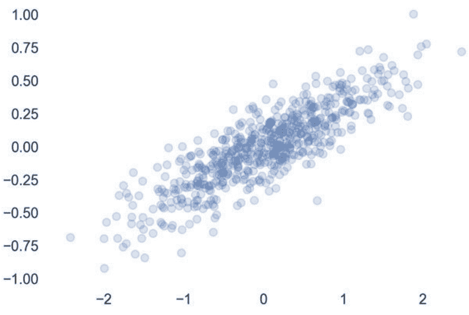

**图 9.3：** *方差表示为向量的长度*

为了进行降维，一个或多个主成分的值被设为“零”。可以对降维后的数据进行逆变换，并在原始数据上绘制图形。

```python
principalaxis = PCA(n_components=1)
principalaxis.fit(P)
X_principalaxis = principalaxis.transform(P)
```

```python
print("original shape: ", P.shape)
print("transformed shape:", X_principalaxis.shape)
original shape: (600, 2)
transformed shape: (600, 1)
P_new = principalaxis.inverse_transform(X_principalaxis)
plt.scatter(P[:, 0], P[:, 1], alpha=0.2)
plt.scatter(P_new[:, 0], P_new[:, 1], alpha=0.8)
plt.axis('equal');
```

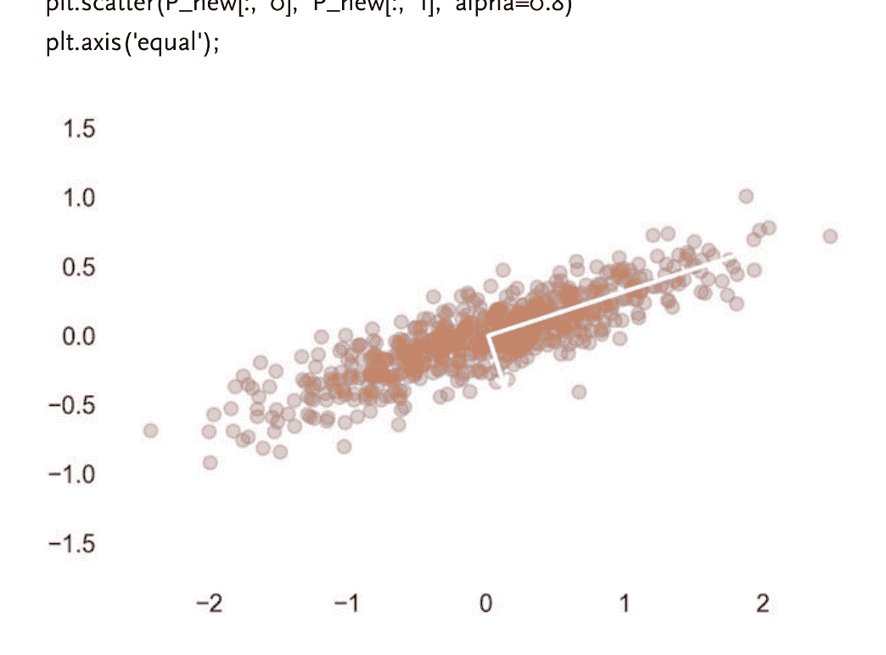

**图 9.4：** *对降维数据进行逆变换*

### 结论

在本章中，我们学习了聚类、k-means聚类、层次聚类和主成分分析。在下一章中，我们将讨论泛化理论、训练与测试、测试误差的界限、Vapnik Chervonenkis不等式、VC维以及VC不等式的证明。

### 问题

用一个例子解释k-means聚类。

解释层次聚类。

用一个例子解释主成分分析。

# 第10章

## 泛化理论

### 引言

无监督学习是一种机器学习算法，可以在输入数据中没有标记响应的情况下得出有用的结论。在上一章中，我们讨论了聚类（k-means聚类、层次聚类）和主成分分析。在接下来的章节中，我们将讨论训练与测试、测试误差的界限以及VC维。

### 结构

无监督学习是一个复杂的处理任务，涉及在数据点既未标记也未分类的数据集中识别模式。本章将包括以下主题：

- 训练与测试
- 测试误差的界限
- VC维

### 目标

在无监督学习中，未分类和未标记的数据被发送到AI系统，算法在没有任何先前训练的情况下对这些数据进行操作。以下是本章的目标：

- 了解机器学习中训练与测试的区别
- 理解VC维

### 训练与测试

训练数据帮助算法从经验中学习。在监督学习中，每个观测值包含输入变量和相应的目标变量。为了构建模型，需要实施训练集；为了验证测试集，需要测试集。数据集被分为训练集和测试集。

在机器学习中，创建模型是为了在测试数据上进行测试。为了拟合模型，使用训练数据；为了进行测试，使用测试数据。不一定需要使用数据集的70%来开发训练集，其余用于测试。这取决于所使用的数据集和需要完成的任务。

### 测试误差的界限

主成分分析是一种降维方法，可用于将大型数据集的维度减少到更小的维度，同时仍然保留尽可能多的信息。

主成分分析中执行的步骤包括：

- 标准化
- 计算协方差矩阵
- 通过计算协方差矩阵的特征值和特征向量来识别主成分
- 创建特征向量
- 重新投影数据

第一步，标准化很重要，因为如果存在一些值很大，一些值很小，那么较大的范围将主导较小的范围。因此，执行标准化来解决这个问题。标准化可以通过从值中减去均值并除以标准差来完成。这表示如下：

*Z=(value-mean)/standard deviation*

在第二步中，计算协方差矩阵以确定是否存在冗余信息。

### VC维

VC维最初由*弗拉基米尔·瓦普尼克*和*阿列克谢*提出。VC维可以定义为使用统计二元分类算法可能学习的函数集的复杂性、灵活性、丰富性或表达能力的某些特征的度量。

VC维的用途包括：

- VC维在统计学习理论中用于预测分类模型测试误差的概率上界。
- VC维也用于样本复杂性界限。样本复杂性可以定义为假设空间VC维的线性函数。
- VC维在计算几何中用于预测近似算法的复杂性。

### 结论

在本章中，我们学习了训练与测试、测试误差的界定以及VC维度。在下一章中，我们将讨论如何检测偏差，以及如何在机器学习中修正偏差或实现公平性。

### 问题

解释机器学习中训练与测试的区别。

解释测试误差的界定。

# 第11章

## 机器学习中的偏差与公平性

### 引言

在机器学习和人工智能中，未来的预测基于过去的观察，而偏差则基于先验信息。有害偏差的产生源于人类偏见，而算法从训练数据中学习了这些偏见。在上一章中，我们讨论了训练与测试、测试误差的界定以及VC维度。在接下来的章节中，我们将讨论偏差与公平性。

### 结构

人类偏见最常见于医疗、教育、犯罪、文本、金融等数据集中。人类偏见对天气数据的影响很小或几乎没有。本章将包含以下主题：

- 偏差简介
- 如何检测偏差？
- 如何在机器学习中修正偏差或实现公平性？

### 目标

在机器学习中，算法偏差被称为无根据的关联。算法偏差是可能对业务和人员造成危害的缺陷。以下是本章的目标：

- 理解如何识别偏差。
- 理解如何在机器学习中实现公平性。

### 引言

偏差指的是对特定事物或想法不成比例的偏见或倾向。偏差可能存在于以下不同领域：

- 研究
- 统计学
- 社会科学

### 如何检测偏差？

偏差是构建基于人工智能模型时遇到的热门话题之一。在人工智能模型开发的以下阶段，可能会发现许多不常见和常见的偏差：

- 数据收集
- 数据预处理
- 数据分析
- 建模

在数据收集过程中，可能会发生偏差。这是由于在收集数据时出现的异常值和错误导致的。

在数据收集过程中发现的偏差包括以下几种：

**选择偏差** 在准备样本数据时，必须以适当的方式选择数据以避免偏差。例如，如果参与者是需要接受测试的学生，那么他们可能会包含有偏差的结果。

**框架效应** 调查问题的构建方式旨在避免偏差并在句子中显示积极性，否则偏差就会产生。

**系统性偏差** 它是由于设备故障引起的。它会导致可重复且一致的错误。

**响应偏差** 它是由于参与者错误回答问题而引起的。

在数据预处理期间，可以采取以下步骤：

- 异常值检测
- 缺失值处理
- 数据过滤

异常值会对许多进行的分析产生不成比例的影响。

在处理缺失值时，如果所有缺失值都用平均值替换，那么这意味着对更接近平均值的特定群体存在偏差。

在数据分析过程中可能会发现偏差。可以使用以下方法发现偏差：

**遗漏偏差** 从提供错误信息的扭曲图表中可能会得出不正确的结论。

**确认偏差** 它涉及关注和确认与某人先入之见相关的信息的倾向。

在执行数据建模时，检测偏差非常重要。例如，亚马逊创建了一个招聘算法，该算法显示出性别偏见，倾向于将男性视为高潜力候选人。具有高方差的模型专注于训练数据，泛化能力不佳。在高偏差的情况下，数据总是以相同的方式表现。当我们增加偏差时，方差会减少，反之亦然。在监督机器学习中，对输入变量进行训练的方式使得预测值与实际值之间具有接近性。误差指的是实际值与预测值之间的差异。监督机器学习中有三种类型的误差：

- 偏差误差
- 方差误差
- 噪声

偏差和方差是可减少的误差，我们可以在很大程度上将其最小化。噪声被认为是不可减少的误差，无法消除。

### 如何在机器学习中修正偏差或实现公平性？

根据文献，已经有许多关于公平性的定义，这些定义涵盖了以下要素：

- 均等机会
- 无知性
- 个体公平性
- 人口统计学均等
- 反事实公平性
- 预测率均等

我们应避免将敏感属性作为训练数据中的特征之一。有许多方法可以减轻偏差。其中一些技术包括：

- 预处理
- 过程中处理
- 后处理

预处理方法在模型开发之前进行。其主要目的是在建模之前消除数据集中的潜在偏差。这是从数据中消除偏差的基本方法之一。过程中处理是在训练阶段消除偏差的过程。在后处理中，偏差的消除发生在训练阶段结束后。

### 结论

在本章中，我们学习了偏差、如何检测偏差以及如何修正偏差并实现公平性。

### 问题

解释我们如何检测偏差。

解释我们如何修正偏差。

## 索引

### A

- ADALINE 80
- 自适应线性元件。*参见* ADALINE
- 凝聚聚类 102
- 算法偏差 112
- 机器学习的应用
  - 关于 7
  - 自动文本翻译 12
  - 新闻分类 13
  - 动态定价 13
  - 电子邮件垃圾邮件和恶意软件过滤 10
  - 金融服务 12
  - 医疗保健 12
  - 信息检索 13
  - 石油和天然气 12
  - 在线客户支持 11
  - 在线欺诈检测 11
  - 在线游戏 11
  - 在线交通网络 9
  - 产品推荐 11
  - 搜索引擎结果优化 11
  - 机器人控制 13
  - 自动驾驶汽车 12
  - 社交媒体服务 10
  - 交通预测 8
  - 视频监控系统 9
  - 虚拟个人助理 8

### B

- 反向传播 84
- 反向传播学习算法
  - 梯度计算阶段 83
  - 权重更新阶段 83
- 偏差
  - 关于 112
  - 检测 112
  - 修正 114
- 数据分析中的偏差
  - 确认偏差 113
  - 遗漏图表 113
- 数据收集过程中的偏差
  - 框架效应 112
  - 响应偏差 113
  - 选择偏差 112
  - 系统性偏差 113
- 数据建模中的偏差 113
- 数据预处理中的偏差
  - 数据过滤 113
  - 缺失值 113
  - 异常值检测 113
- 二元分类
  - 关于 34
  - 执行
  - 二元分类器的技术 34
  - 测试分析方法 37
  - 用途 34
- 二元分类测试
  - 关于 38
  - 分类准确率 38
  - 错误率 38
  - 灵敏度 38
  - 特异性 38
- 二项分类。*参见* 二元分类

### C

- 循环超平面
  - 转换为线性超平面 76
- 分类与回归树（CART）方法论 92
- 簇间相异性 102
- 聚类
  - 关于 98
  - 层次聚类 101
  - k均值聚类
- 混淆矩阵
  - 关于 37
  - 假阴性（FN） 37
  - 假阳性（FP） 37
  - 真阴性（TN） 37
  - 真阳性（TP） 37

### D

- 机器学习模型的数据预处理
  - 处理分类变量 61
  - 数据分割 61
  - 特征缩放 61
  - 处理空值 60
  - 标准化 61
- 决策树算法
  - 分类树 92
  - 回归树算法 92
- 决策树
  - 关于
  - 分类属性 93
  - 停止标准 93
  - 不稳定性 94
  - 损失函数，剪枝 93
  - 缺失值 94
  - 多路分裂 94
- 分裂聚类 102

### E

- ENIAC（电子数字积分计算机） 2
- 误差
  - 偏差误差 113
  - 噪声 114
  - 方差误差 113

### G

- GNMT（谷歌神经机器翻译） 13
- 梯度下降 25
- 梯度下降算法

### H

层次聚类
- 约 101 页
- 凝聚型聚类 102
- 分裂型聚类 102

层次结构，机器学习模型
- 数据收集 60
- 数据预处理 60
- 开发模型，测试 61
- 开发模型，训练 61
- 评估 61
- 模型，寻找 61

高方差 50
霍夫丁不等式 62
人类偏见 111

### I

样本内误差 63

### K

核方法 76
K均值聚类

### L

Lasso回归

线性回归
- 约 16 页
- 多变量情况
- 单变量情况
- 线性模型，多点情况 47
- 线性模型，多点多曲线情况 48
- 线性模型，两点情况 46
- 过拟合 49
- 正则化 55
- 欠拟合 49

逻辑回归
- 约 45 页
- 假设 39
- 示例
- 过拟合
- 正则化

### M

机器学习
- 约 1 页
- 应用 7
- 挑战
- 分类 3
- 学习的可行性
- 历史 2

机器学习实现
- 分类 4
- 聚类 4
- 回归 4
- 强化学习 3
- 半监督学习 3
- 监督学习 3
- 无监督学习 3

机器学习模型构建 62
- 层次结构，用于构建 60

MADALINE 80

间隔与大间隔方法
- 用于，数据点分类 75
- 用于，寻找合适的超平面 69
- 用于，用直线分隔不同数据集 72
- 使用

最小误差剪枝 93

多类别分类
- 多项式分类。参见多类别分类

多自适应线性元件。参见 MADALINE

### N

自然语言处理 (NLP) 6

神经网络
- 约 80 页
- 早期模型 80
- 感知器学习

### O

最优剪枝 93
样本外误差 63
过拟合
- 在线性回归中 46
- 在逻辑回归中 55

### P

感知器学习
悲观剪枝 93

多项式回归
- 约 30 页
- 执行 31

主成分分析 (PCA)
- 约 102 页
- 协方差矩阵计算 103
- 示例 103
- 特征向量，创建 103
- 对降维数据的逆变换 105
- 主轴，计算 104
- 主成分，识别 103
- 标准化 102
- 方差，作为向量长度 105

Maven项目 5

传播阶段
- 反向传播 83
- 前向传播 83

决策树剪枝 93

剪枝技术 93
- 最小误差剪枝 93
- 最优剪枝 93
- 悲观剪枝 93
- 减少误差剪枝 93

### R

回归树算法 92

正则化
- 约 59 页
- 在线性回归中 46
- 在逻辑回归中 55

强化学习 3
残差平方和 (R) 50
岭回归 55

### S

半监督学习 3
分裂候选 94
标准差 109

随机梯度下降
- 约 87 页
- 使用 87

监督学习 15

支持向量机 (SVM)
- 约 67 页
- 形状分类，使用超平面 68
- 核 76
- 间隔与大间隔方法，使用 68
- 用于，数据点分类 71

SVM模型
- 训练，使用 Scikit Learn 73

### T

测试误差 65

测试分析方法，二分类
- 二分类测试 38
- 混淆矩阵 38

测试误差
- 界定 109

训练误差 65

训练
- 与，测试对比 108

### U

无监督学习 107

### V

VC维
- 约 109 页
- 用途 109

### W

权重更新阶段 84