# 使用 Python 和 JAX 构建推荐系统

大规模生产系统实战

Bryan Bischof & Hector Yee

# 使用 Python 和 JAX 构建推荐系统

实现和设计向用户提供建议的系统，是当前最流行且必不可少的机器学习应用之一。无论您是希望客户在您的在线商店中找到最具吸引力的商品，还是希望为他们提供丰富和娱乐性的视频，抑或是他们需要了解的新闻，推荐系统（RecSys）都能提供相应的解决方案。

在这本实用书籍中，作者 Bryan Bischof 和 Hector Yee 阐述了核心概念并提供了示例，以帮助您为任何行业或规模创建推荐系统。您将学习成功所需的数学、理念和实现细节。本书涵盖了推荐系统平台组件、技术栈中相关的 MLOps 工具，以及 PySpark、SparkSQL、FastAPI 和 Weights & Biases 的代码示例和实用建议。

您将学到：

- 构建推荐系统所需的关键数据
- 如何将您的数据和业务构建为推荐系统问题
- 适合您系统的模型评估方法
- 实现、训练、测试和部署所选模型的方法
- 需要跟踪的指标，以确保系统按计划运行
- 如何随着对用户、产品和业务案例的深入了解来改进系统

> “对于渴望构建真实世界系统（而不仅仅是训练模型）的从业者来说，这是一本必读之作。”
—Jacopo Tagliabue
Bauplan 联合创始人，RecList 和 evalRS 联合创建者

> “从现在起，这本书将作为该主题的标准参考书摆在我的书架上。”
—Will Kurt
AI 工程师，《贝叶斯统计：有趣的方式》和《Haskell 编程入门》的作者

Bryan Bischof 在 Hex 领导 AI 团队，并在罗格斯大学商业与分析硕士项目中担任兼职教授，教授数据科学课程。此前，他曾担任 Weights and Biases 的数据科学主管，负责组建数据科学、机器学习和数据工程团队。

Hector Yee 是 Google 的一名资深软件工程师，曾参与过包括图像搜索中首个基于内容的排序器和自动驾驶汽车感知在内的项目。

机器学习

美国售价 79.99 美元 加拿大售价 99.99 美元
ISBN:978-1-492-09799-0

Twitter: @oreillymedia
linkedin.com/company/oreilly-media
youtube.com/oreillymedia

# 对《使用 Python 和 JAX 构建推荐系统》的赞誉

> Bryan 和 Hector 在这里创造了特别的东西，他们介绍了在推荐系统领域大多数人需要多年才能掌握的概念，然后提供了清晰的代码示例来将这些概念付诸实践。我希望在我开始推荐系统之旅时就能拥有这本书。

—Even Oldridge，NVIDIA 推荐系统工程总监

> 这是我一直在等待的一本书，它使用 JAX 让推荐系统变得触手可及。你唯一需要的就是你的笔记本电脑。

—Shaked Zychlinski，Lightricks 前推荐负责人

> Bryan 和 Hector 将数十年的推荐系统进展提炼成了一本简洁而实用的指南。这本书弥合了理论与应用之间的鸿沟，充满了易于理解的 Python 和 JAX 示例。对于从新手到专家的各级推荐系统从业者来说，这都是一本不可或缺的指南。

—Eugene Yan，亚马逊应用科学家

> 这本书采用了一种整体方法来构建推荐系统，综合了数学、代码、系统设计和商业应用。它涵盖了从业者在实施现实世界解决方案时需要考虑的所有细微差别。使用公开数据集的直观示例使读者能够将抽象概念转化为具体的学习成果。

—Eric Colson，AI 顾问，Stitch Fix 前首席算法官，Netflix 前数据科学与工程副总裁

> 推荐系统是有史以来部署的最具影响力的机器学习系统之一。这本书出色地平衡了原则性建模、清晰的代码示例和架构最佳实践。对于渴望构建真实世界系统（而不仅仅是训练模型）的从业者来说，这是一本必读之作。

—Jacopo Tagliabue，Bauplan 联合创始人，纽约大学机器学习系统兼职教授，RecList 和 evalRS 联合创建者

> 多年来，我发现教科书中描述的推荐系统与实践中应用的推荐系统之间存在巨大差距。Yee 和 Bischof 的优秀著作《使用 Python 和 JAX 构建推荐系统》弥合了这一差距，并将使读者最终感觉被引入了数据科学的这一重要领域。

—Will Kurt，AI 工程师，《贝叶斯统计：有趣的方式》和《Haskell 编程入门》的作者

> 这本书是任何对信息检索（IR）领域感兴趣的人的必备资源。作者特别注意做好极其重要且细致的工作，为读者解决该领域的问题做好准备。以这本书为参考，您将能够思考如何设置 IR 问题，思考要采取的实际步骤，然后开始构建。

—Eric Schles，约翰斯·霍普金斯大学研究科学家

# 使用 Python 和 JAX 构建推荐系统

大规模生产系统实战

Bryan Bischof 和 Hector Yee

# 使用 Python 和 JAX 构建推荐系统

作者：Bryan Bischof 和 Hector Yee

版权所有 © 2024 Bryan Bischof 和 Resonant Intelligence LLC。保留所有权利。

印刷于美国。

由 O'Reilly Media, Inc. 出版，地址：1005 Gravenstein Highway North, Sebastopol, CA 95472。

O'Reilly 图书可用于教育、商业或销售推广用途。大多数图书也提供在线版本（http://oreilly.com）。欲了解更多信息，请联系我们的企业/机构销售部门：800-998-9938 或 corporate@oreilly.com。

**策划编辑：** Nicole Butterfield
**开发编辑：** Jill Leonard
**制作编辑：** Aleeya Rahman
**文字编辑：** Sharon Wilkey
**校对：** Piper Editorial Consulting, LLC

**索引编制：** Judith McConville
**内页设计：** David Futato
**封面设计：** Karen Montgomery
**插图：** Kate Dullea

2023年12月：第一版

# 第一版修订历史

2023-12-04：首次发布

有关发布详情，请参见 http://oreilly.com/catalog/errata.csp?isbn=9781492097990。

O'Reilly 标志是 O'Reilly Media, Inc. 的注册商标。《使用 Python 和 JAX 构建推荐系统》、封面图片及相关商业外观是 O'Reilly Media, Inc. 的商标。

本书所表达的观点为作者个人观点，不代表出版商观点。虽然出版商和作者已尽最大努力确保本书所含信息和说明的准确性，但出版商和作者对任何错误或遗漏不承担任何责任，包括但不限于因使用或依赖本书而造成的损害责任。使用本书所含信息和说明的风险由您自行承担。如果本书包含或描述的任何代码示例或其他技术受开源许可或他人知识产权约束，您有责任确保您的使用符合此类许可和/或权利。

978-1-492-09799-0
[LSI]

# 目录

前言 ........................................................................ xiii

# 第一部分：热身

1. 引言 ........................................................................ 3
    推荐系统的关键组件 4
        收集器 4
        排序器 4
        服务器 4
    最简单的推荐器 5
        简单推荐器 5
        最热门物品推荐器 6
    JAX 简介 7
        基本类型、初始化和不可变性 7
        索引和切片 9
        广播 9
        随机数 10
        即时编译 11
    总结 12

2. 用户-物品评分与问题定义 ........................................ 13
    用户-物品矩阵 13
    基于用户的协同过滤与基于物品的协同过滤 16
    Netflix 挑战赛 17
    软评分 19
    数据收集与用户日志 19
        记录什么 20

## 3. 数学考量

- 推荐系统中的齐普夫定律与马太效应 29
- 稀疏性 32
- 协同过滤中的用户相似度 34
- 皮尔逊相关系数 35
- 基于相似度的评分 36
- 探索-利用作为推荐系统 37
- $\epsilon$-贪心算法 38
- $\epsilon$ 应取何值？ 39
- 自然语言处理与推荐系统的关系 40
- 向量搜索 40
- 最近邻搜索 42
- 总结 42

## 4. 推荐系统设计

- 在线与离线 43
- 收集器 44
- 离线收集器 44
- 在线收集器 45
- 排序器 45
- 离线排序器 46
- 在线排序器 46
- 服务器 46
- 离线服务器 47
- 在线服务器 47
- 总结 47

## 5. 综合实践：基于内容的推荐系统

- 版本控制软件 50
- Python 构建系统 51
- 随机物品推荐器 52
- 获取 STL 数据集图像 54
- 卷积神经网络定义 55
- 在 JAX、Flax 和 Optax 中进行模型训练 56
- 输入管道 58
- 总结 70

# 第二部分：检索

## 6. 数据处理

- 为你的系统填充数据
    - PySpark
    - 示例：PySpark 中的用户相似度
    - 数据加载器
    - 数据库快照
- 用于学习和推理的数据结构
    - 向量搜索
    - 近似最近邻
    - 布隆过滤器
    - 趣闻：布隆过滤器作为推荐系统
    - 特征存储
- 总结

## 7. 模型服务与架构

- 按推荐结构划分的架构
    - 物品到用户推荐
    - 基于查询的推荐
    - 基于上下文的推荐
    - 基于序列的推荐
    - 为何要费心使用额外特征？
- 编码器架构与冷启动
- 部署
    - 模型即 API
    - 启动模型服务
    - 工作流编排
- 告警与监控
    - 模式与先验
    - 集成测试
    - 可观测性
- 生产环境中的评估
    - 滞后反馈
    - 模型指标
- 持续训练与部署
    - 模型漂移
    - 部署拓扑
- 评估飞轮
    - 每日热启动
    - Lambda 架构与编排
    - 日志记录
- 主动学习 122
- 总结 125

## 8. 综合实践：数据处理与计数推荐器

- 技术栈 128
- 数据表示 129
- 大数据框架 130
- 集群框架 132
- PySpark 示例 132
- GloVE 模型定义 142
- 在 JAX 和 Flax 中的 GloVE 模型规范 143
- 使用 Optax 训练 GloVE 模型 145
- 总结 146

# 第三部分：排序

## 9. 基于特征和基于计数的推荐

- 双线性因子模型（度量学习） 149
- 基于特征的热启动 153
- 分割模型与混合模型 155
- 基于标签的推荐器 155
- 混合化 157
- 双线性模型的局限性 157
- 计数推荐器 159
- 回到最受欢迎物品推荐器 159
- 相关性挖掘 160
- 基于共现的点互信息 162
- 基于共现的相似度 163
- 基于相似度的推荐 164
- 总结 165

## 10. 低秩方法

- 潜在空间 167
- 点积相似度 169
- 共现模型 171
- 降低推荐问题的秩 172
- 使用 ALS 优化矩阵分解 174
- 矩阵分解的正则化 176
- 正则化矩阵分解实现 177
- WSABIE 199
- 降维 199
- 等距嵌入 203
- 非线性局部可度量化嵌入 204
- 中心核对齐 206
- 亲和性与 p-sale 206
- 推荐系统评估中的倾向加权 208
- 倾向 209
- 辛普森悖论与缓解混杂因素 210
- 总结 212

## 11. 个性化推荐指标 213

- 环境 214
- 在线与离线 214
- 用户指标与物品指标 215
- A/B 测试 215
- 召回率与精确率 216
- @ k 218
- 精确率@k 219
- 召回率@k 219
- R-精确率 220
- mAP、MMR、NDCG 220
- mAP 220
- MRR 221
- NDCG 222
- mAP 与 NDCG？ 223
- 相关系数 223
- 基于亲和性的 RMSE 224
- 积分形式：AUC 和 cAUC 224
- 推荐概率到 AUC-ROC 225
- 与其他指标的比较 225
- BPR 226
- 总结 227

## 12. 排序训练 229

- 排序在推荐系统中的位置？ 229
- 学习排序 230
- 训练 LTR 模型 231
- 用于排序的分类 231
- 用于排序的回归 231
- 用于排序的分类与回归 232
- WARP 233
- k 阶统计量 234
- BM25 236
- 多模态检索 238
- 总结 238

## 13. 综合实践：实验与排序 241

- 实验技巧 241
    - 保持简单 242
    - 调试打印语句 242
    - 推迟优化 243
    - 跟踪变更 244
    - 使用特征工程 244
    - 理解指标与业务指标 245
    - 快速迭代 245
- Spotify 百万播放列表数据集 246
    - 构建 URI 字典 248
    - 构建训练数据 249
    - 读取输入 252
    - 建模问题 254
    - 构建损失函数 257
- 练习 261
- 总结 262

# 第四部分：服务

## 14. 业务逻辑 265

- 硬排序 266
- 学习到的规避 266
- 手动调整的权重 267
- 库存健康度 268
- 实现规避 269
- 基于模型的规避 271
- 总结 272

## 15. 推荐系统中的偏差 273

- 推荐多样化 274
    - 提升多样性 274
    - 应用投资组合优化 276
- 多目标函数 277
- 谓词下推 278
- 公平性 279
- 总结 280

## 16. 加速结构

- 分片
- 局部敏感哈希
- k-d 树
- 层次 k-means
- 更廉价的检索方法
- 总结

# 第五部分：推荐系统的未来

## 17. 序列推荐器

- 马尔可夫链
    - 二阶马尔可夫链
    - 其他马尔可夫模型
- RNN 和 CNN 架构
- 注意力架构
    - 自注意力序列推荐
    - BERT4Rec
    - 近期性采样
    - 融合静态与序列
- 总结

## 18. 推荐系统的下一步？

- 多模态推荐
- 基于图的推荐器
    - 神经消息传递
    - 应用
    - 随机游走
    - 元路径与异构性
- 大语言模型应用
    - 大语言模型推荐器
    - 大语言模型训练
    - 用于推荐的指令微调
    - 大语言模型排序器
    - 为人工智能推荐
- 总结

# 索引

# 前言

你是如何找到这本书的？是在某个网站上看到了它的广告吗？也许是朋友或导师推荐的；或者你在社交媒体上看到了提及它的帖子。有没有可能你是在书店的书架上发现它的——而那个书店是你信赖的地图应用带你去的？无论你是如何找到它的，你几乎可以肯定是通过一个推荐系统来到这本书面前的。

实现和设计为用户提供推荐的系统，是机器学习（ML）在任何业务中最流行和最基本的应用之一。无论你是想帮助用户找到最符合他们品味的服装、在线商店中最吸引人的商品、丰富和娱乐他们的视频、从他们的社交网络中呈现最具吸引力的内容，还是他们当天需要了解的新闻亮点，推荐系统都提供了实现这些目标的途径。

现代推荐系统设计与其服务的领域一样多样化。这些系统包括实现和执行产品目标的计算机软件架构，以及排序的算法组件。排序推荐的方法可以来自传统的统计学习算法、线性代数的启发、几何考量，当然还有基于梯度的方法。正如算法方法的多样性一样，推荐的建模和评估考量也是多样化的：个性化排序、搜索推荐、序列建模，以及所有这些的评分，现在都是从事推荐系统的 ML 工程师需要掌握的知识。

从业者常用缩写 RecSys 来描述推荐系统领域。因此，在本书中，我们使用 RecSys 指代该领域，使用 recommendation system 指代我们构建的系统。

如果你是一名机器学习从业者，你可能对推荐系统有所了解，或许知道一两种最简单的建模方法，并能就相关的数据结构和模型架构进行有见地的讨论；然而，推荐系统（RecSys）常常不在数据科学和机器学习的核心课程范围内。许多拥有多年行业经验的资深数据科学家对实际构建推荐系统知之甚少，当这个话题出现时可能会感到畏惧。尽管借鉴了与其他机器学习问题相似的基础和技能，但推荐系统拥有一个充满活力的社区，其关注点变化迅速，这很容易让人将构建推荐系统的工作推给*其他*已经投入时间或愿意掌握最新信息的数据科学家。

本书存在的意义，就是要打破这些认知壁垒。从实践层面理解推荐系统，不仅对于需要向用户提供内容的业务场景非常有用，而且推荐系统的底层思想常常能弥合其他各类机器学习之间巨大的鸿沟。以文章推荐系统为例，它可能利用自然语言处理（NLP）来寻找文章的表示，利用序列建模来促进更长的用户参与度，并利用上下文组件来让用户查询引导结果。如果你是从纯粹的学术兴趣出发来接触这个领域，无论你对数学的哪个方面感兴趣，迟早都会在推荐系统中发现其联系或应用！

最后，如果与其他领域的联系、几乎所有数学的应用，或者明显的商业效用*还不足以*让你对推荐系统产生兴趣，那么令人惊叹的尖端技术可能会：推荐系统始终处于机器学习的前沿甚至超越前沿。拥有明显收入影响的一个好处是，公司和从业者需要不断突破可能性的边界以及实现方式。最先进的深度学习架构和最佳的代码基础设施都被应用到这个领域。考虑到FAANG（代表Meta（前身为Facebook）、苹果、亚马逊、Netflix和谷歌）这五个字母中的四个核心都依赖于一个或多个推荐系统，这也就不足为奇了。¹

作为一名从业者，你需要理解如何完成以下工作：

-   将你的数据和业务问题构建为一个推荐系统问题
-   确定构建推荐系统所需的基本数据
-   为你的推荐系统问题确定合适的模型，以及如何评估它们
-   实现、训练、测试和部署上述模型
-   跟踪指标以确保你的系统按计划运行
-   随着你对用户、产品和业务案例的了解加深，逐步改进你的系统

本书将阐述完成这些步骤所需的核心概念和示例，无论行业或规模如何。我们将引导你了解构建推荐系统的数学、思想和实现细节——无论这是你的第一次还是第五十次。我们将向你展示如何使用Python和JAX来构建这些系统。

如果你还不熟悉，JAX是Google的一个Python框架，旨在使自动微分和函数式编程范式成为一等对象。此外，它使用了一种对来自不同背景的机器学习从业者特别方便的NumPy API风格。

我们将展示代码示例和架构模型，这些模型涵盖了必要的核心概念，并提供了将这些系统扩展到生产应用的方法。

¹ 有些人可能会挑剔说，苹果公司的核心也拥有推荐系统。虽然App Store对公司来说确实是一个至关重要的战略产品，但我们在“五分之四”的评估中仍然保持保守，认为推荐系统并非苹果公司的主要创收能力。

## 本书使用的约定

本书使用以下排版约定：

*斜体*
表示新术语、URL、电子邮件地址、文件名和文件扩展名。

等宽字体
用于程序清单，以及在段落中引用程序元素，如变量或函数名、数据库、数据类型、环境变量、语句和关键字。

**等宽粗体**
显示用户应按原样输入的命令或其他文本。

*等宽斜体*
显示应替换为用户提供的值或由上下文确定的值的文本。


此元素表示提示或建议。


此元素表示一般性说明。


此元素表示警告或注意事项。

## 使用代码示例

包含的代码片段引用了可在中等规模且大多数情况下免费的资源上运行的笔记本。为了便于轻松实验和探索，我们通过Google Colab笔记本提供代码。

补充材料（代码示例、练习等）可在[GitHub上的ESRecsys](https://github.com/ESRecsys)下载。

如果你对代码示例有技术问题或遇到问题，请发送电子邮件至[bookquestions@oreilly.com](mailto:bookquestions@oreilly.com)。

本书旨在帮助你完成工作。通常，如果本书提供了示例代码，你可以在你的程序和文档中使用它。除非你复制了代码的大部分，否则你不需要联系我们获取许可。例如，编写一个使用本书中几个代码块的程序不需要许可。销售或分发O'Reilly书籍中的示例则需要许可。通过引用本书和引用示例代码来回答问题不需要许可。将本书中大量的示例代码纳入你的产品文档则需要许可。

我们感谢但通常不要求署名。署名通常包括书名、作者、出版商和ISBN。例如：“*Building Recommendation Systems in Python and JAX* by Bryan Bischof and Hector Yee. Copyright 2024 Bryan Bischof and Resonant Intelligence LLC, 978-1-492-09799-0.”

如果你觉得你对代码示例的使用超出了合理使用或上述许可的范围，请随时通过[permissions@oreilly.com](mailto:permissions@oreilly.com)联系我们。

## O'Reilly在线学习


40多年来，*O'Reilly Media*一直提供技术和业务培训、知识和见解，以帮助公司取得成功。

我们独特的专家和创新者网络通过书籍、文章和我们的在线学习平台分享他们的知识和专业知识。O'Reilly的在线学习平台为你提供按需访问的直播培训课程、深入的学习路径、交互式编码环境，以及来自O'Reilly和200多家其他出版商的大量文本和视频。欲了解更多信息，请访问http://oreilly.com。

## 如何联系我们

请将有关本书的评论和问题寄给出版商：

O'Reilly Media, Inc.
1005 Gravenstein Highway North
Sebastopol, CA 95472
800-889-8969（美国或加拿大）
707-829-7019（国际或本地）
707-829-0104（传真）
support@oreilly.com
https://www.oreilly.com/about/contact.html

我们为本书设有一个网页，上面列出了勘误、示例和任何其他信息。你可以通过https://oreil.ly/build_rec_sys_python_jax访问此页面。

有关我们书籍和课程的新闻和信息，请访问https://oreilly.com。

在LinkedIn上找到我们：https://linkedin.com/company/oreilly-media

在Twitter上关注我们：https://twitter.com/oreillymedia

在YouTube上观看我们：https://youtube.com/oreillymedia

## 致谢

Hector要感谢他的丈夫Donald在本书写作期间给予的关爱支持，以及他姐姐Serena一直寄来的零食。他还要将本书献给已故的亲属。非常感谢Google的审稿人Ed Chi、Courtney Hohne、Sally Goldman、Richa Nigam、Mingliang Jiang和Anselm Levskaya。感谢Bryan Hughes审阅了维基百科的代码。

布莱恩希望感谢他在Stitch Fix的同事们，他在那里学到了本书的许多关键思想——特别是，伊恩·霍恩在迁移学习方面的耐心指导，莫莉·戴维斯博士在实验和效果估计方面的指导，马克·韦斯在理解可用性与推荐之间关系方面的深度合作，礼萨·索拉比博士对Transformer模型的介绍，陈曦博士对图神经网络用于推荐的鼓励，以及利兰·麦金尼斯博士在降维和近似最近邻方面的细致建议。布莱恩从与娜塔莉亚·加迪奥尔博士、丹尼尔·弗莱施曼博士、安德鲁·霍博士、刘杰森、丹·马萨勒博士、克里斯·穆迪博士、奥兹·拉扎、安娜·施奈德博士、乌杰瓦尔·萨林、阿格涅什卡·谢法尔、丹尼尔·塔塞博士、唐迪阳、扎克·温斯顿以及其他他几乎肯定已经忘记的人的交谈中获益良多。除了他了不起的Stitch Fix同事，他特别要感谢埃里克·邦奇博士、李格尔博士、威尔·切尔诺夫博士、利奥·罗森伯格和贾努·维尔马多年来的合作。布莱恩·阿马迪奥博士作为一位优秀的同事，最初建议他写这本书。埃文·奥尔德里奇博士鼓励他真正尝试。尤金·严和卡尔·希格利——他从未见过他们，但深受其启发。他要感谢林忠柱博士和亚历山大·罗森伯格博士，他们对他的职业生涯都产生了深远的影响。奇安娜·萨尔瓦托拉协助了早期的文献综述，瓦伦蒂娜·贝斯普罗兹万尼赫在阅读早期草稿笔记和提供指导方面给予了极大帮助。

两位作者感谢托比亚斯·茨温曼、泰德·邓宁、维基·博伊斯、埃里克·施莱斯、沙凯德·齐克林斯基和威尔·库尔特，他们花费大量时间对书稿给予细致的技术反馈——没有这些反馈，这本书将难以理解。丽贝卡·诺瓦克，她敦促我们签约参与这个项目。还有吉尔·伦纳德，她从手稿中删除了近100处错误的“utilize”一词，并在书稿文本方面提供了大量耐心的合作。

## 第一部分

## 热身

> 我们如何将所有数据放在正确的位置来训练推荐系统，并实现实时推理？

那么，你已经决定投身于推荐系统的世界了！你是否希望在浩瀚的选择海洋中，根据用户独特的偏好推荐恰到好处的东西？如果是这样，你给自己设定了一个相当大的挑战！表面上看，这些系统似乎很简单：如果用户A和用户B有相似的品味，那么A喜欢的东西，B可能也会喜欢。但是，就像所有看似简单的事情一样，其背后有待探索的深度。

我们如何捕捉用户历史的本质并将其输入模型？我们将这个模型存放在哪里，以便它能随时提供推荐？我们如何确保它不会推荐出格或违反业务规则的东西？协同过滤是我们的起点，一盏指路明灯。但其背后还有一个完整的宇宙让这些系统运转起来，我们将一起探索它。

## 第1章
引言

推荐系统是我们今天所知的互联网发展的核心，也是新兴科技公司的核心功能。除了让网络广度向所有人开放的搜索排名、你所有朋友都在看的新颖有趣的电影，或者公司花大价钱向你展示的最相关广告之外，推荐系统的应用每年都在增加。TikTok令人上瘾的“为你推荐”页面、Spotify的“每周发现”播放列表、Pinterest的图板建议以及苹果的应用商店，都是由推荐系统驱动的热门技术。如今，序列Transformer模型、多模态表示和图神经网络是机器学习（ML）研发中最活跃的领域——所有这些都被应用于推荐系统。

任何技术的普及通常都会引发关于该技术如何工作、为何如此普遍以及我们能否参与其中的问题。对于推荐系统，*如何*工作相当复杂。我们需要理解品味的几何结构，以及用户仅需少量交互如何能在那个抽象空间中为我们提供*GPS信号*。你将看到如何快速收集一组优秀的候选推荐，以及如何将其精炼为一组连贯的推荐。最后，你将学习如何评估你的推荐器、构建提供推理服务的端点，并记录其行为。

我们将制定推荐系统需要解决的核心问题的变体，但最终，驱动性的问题框架如下：

> 给定一组可能被推荐的物品，为当前上下文和用户选择一个有序的、根据某个目标最匹配的子集。

### 推荐系统的关键组件

随着我们增加复杂性和精细度，让我们记住系统的组件。我们将使用*字符串图*来跟踪我们的组件，但在文献中，这些图以多种方式呈现。

我们将识别并基于推荐系统的三个核心组件进行构建：收集器、排序器和服务器。

## 收集器

收集器的角色是了解可能被推荐的物品集合中有什么，以及这些物品的必要特征或属性。请注意，这个集合通常是基于上下文或状态的子集。

## 排序器

排序器的角色是获取收集器提供的集合，并根据上下文和用户的模型，对其部分或全部元素进行排序。

## 服务器

服务器的角色是获取排序器提供的有序子集，确保满足必要的数据模式——包括基本的业务逻辑——并返回请求数量的推荐。

以一个有服务员的酒店场景为例：

> 当你坐在餐桌旁，看着菜单，不确定该点什么。你问服务员：“你觉得我应该点什么甜点？”

服务员查看他们的记录说：“我们的青柠派卖完了，但人们真的很喜欢我们的香蕉奶油派。如果你喜欢石榴，我们会用新鲜石榴制作石榴冰淇淋；而且点甜甜圈配冰淇淋通常不会错——这是我们最受欢迎的甜点。”

在这段简短的交流中，服务员首先充当收集器：识别菜单上的甜点，考虑当前的库存状况，并通过查看记录准备谈论甜点的特点。

接下来，服务员充当排序器；他们提到了受欢迎度高的物品（香蕉奶油派和甜甜圈配冰淇淋），以及基于顾客特征的高匹配度物品（如果他们喜欢石榴）。

最后，服务员口头提供推荐，包括他们算法的解释性特征和多种选择。

虽然这看起来有点卡通化，但请记住将推荐系统的讨论基于现实世界的应用。在推荐系统领域工作的一个优势是，灵感总是近在咫尺。

### 最简单的推荐器

我们已经建立了推荐器的组件，但要使其真正实用，我们需要看到它的实际运作。虽然本书的大部分内容致力于实用的推荐系统，但首先我们将从一个玩具模型开始，并以此为基础构建。

#### 平凡推荐器

最简单的推荐器并不十分有趣，但仍然可以在框架中演示。它被称为*平凡推荐器*（TR），因为它几乎不包含任何逻辑：

```
def get_trivial_recs() -> Optional[List[str]]:
    item_id = random.randint(0, MAX_ITEM_INDEX)

    if get_availability(item_id):
        return [item_id]
    return None
```

请注意，这个推荐器可能返回一个特定的`item_id`或`None`。还要观察这个推荐器不接受任何参数，并且`MAX_ITEM_INDEX`引用了一个作用域外的变量。忽略软件原则，让我们思考一下三个组件：

*收集器*
生成一个随机的`item_id`。TR通过检查`item_id`的可用性来进行收集。我们可以说，访问`item_id`也是收集器职责的一部分。根据可用性，可推荐的物品集合要么是`[item_id]`，要么是`None`（*回想一下，`None`在集合论意义上也是一个集合*）。

*排序器*
TR使用空操作进行排序；也就是说，对集合中1个或0个对象的排序是该集合上的恒等函数，所以我们只需不做任何操作，然后进入下一步。

*服务器*
TR通过其`return`语句提供推荐。本示例中唯一指定的模式是返回类型为`Optional[List[str]]`。

这个推荐器本身并不有趣或实用，但它提供了一个骨架，我们将在后续开发中不断丰富。

### 最受欢迎物品推荐器

*最受欢迎物品推荐器*（MPIR）是最简单的、具有实用价值的推荐器。你可能不会想围绕它来构建应用，但它与其他组件结合使用时很有用，同时也为进一步开发提供了基础。

MPIR 的工作原理正如其名；它返回最受欢迎的物品：

```python
def get_item_popularities() -> Optional[Dict[str, int]]:
    ...
    # 字典对：(物品标识符，物品被选择的次数)
    return item_choice_counts
    return None

def get_most_popular_recs(max_num_recs: int) -> Optional[List[str]]:
    items_popularity_dict = get_item_popularities()
    if items_popularity_dict:
        sorted_items = sorted(
            items_popularity_dict.items(),
            key=lambda item: item[1],
            reverse=True,
        )
        return [i[0] for i in sorted_items][:max_num_recs]
    return None
```

这里我们假设 `get_item_popularities` 知道所有可用物品以及它们被选择的次数。

这个推荐器试图返回可用的 *k* 个最受欢迎的物品。虽然简单，但它是一个有用的推荐器，是构建推荐系统时一个很好的起点。此外，我们将反复看到这个示例，因为其他推荐器使用这个核心并迭代改进其内部组件。

让我们再次审视我们系统的三个组件：

- **收集器**：MPIR 首先调用 `get_item_popularities`，该函数通过数据库或内存访问，知道哪些物品可用以及它们被选择了多少次。为方便起见，我们假设物品以字典形式返回，键是标识物品的字符串，值表示该物品被选择的次数。我们隐含地假设，未出现在此列表中的物品是不可用的。

- **排序器**：这里我们看到了第一个简单的排序器：通过对值进行排序来排名。因为收集器组织数据的方式使得字典的值是计数，所以我们使用 Python 内置的排序函数 `sorted`。注意我们使用 `key` 来指示我们希望按元组的第二个元素排序——在这种情况下，等同于按值排序——并且我们设置 `reverse` 标志以进行降序排序。

- **服务器**：最后，我们需要满足我们的 API 模式，这再次通过返回类型提示提供：`Optional[List[str]]`。它期望返回类型是我们推荐的物品标识符字符串的可空列表，因此我们使用列表推导式来获取元组的第一个元素。但是等等！我们的函数有这个 `max_num_recs` 字段——它可能是做什么的？当然，这表明我们的 API 模式期望响应中不超过 `max_num_recs` 个结果。我们通过切片操作符来处理这一点，但请注意我们的返回结果在 0 到 `max_num_recs` 之间。

考虑一下你手头配备 MPIR 的可能性；推荐每个顶级类别中客户最喜欢的物品，可以为电子商务提供一个简单但有用的初步推荐方案。每日最受欢迎的视频可以为你的视频网站提供良好的首页体验。

### JAX 简介

既然本书标题中有 JAX，我们将在这里提供一个 JAX 的简要介绍。其官方文档可以在 JAX 网站上找到。

JAX 是一个用于编写数学代码的 Python 框架，支持即时编译。即时编译允许相同的代码在 CPU、GPU 和 TPU 上运行。这使得编写能够利用向量处理器并行处理能力的高性能代码变得容易。

此外，JAX 的设计理念之一是支持张量和梯度作为核心概念，使其成为利用基于梯度的学习处理张量形状数据的机器学习系统的理想工具。体验 JAX 最简单的方式可能是通过 Google Colab，这是一个基于网络的托管 Python 笔记本。

#### 基本类型、初始化和不可变性

让我们从了解 JAX 类型开始。我们将在 JAX 中构建一个小型三维向量，并指出 JAX 和 NumPy 之间的一些差异：

```python
import jax.numpy as jnp
import numpy as np

x = jnp.array([1.0, 2.0, 3.0], dtype=jnp.float32)

print(x)
[1. 2. 3.]

print(x.shape)
(3,)

print(x[0])
1.0

x[0] = 4.0
TypeError: '<class 'jaxlib.xla_extension.ArrayImpl'>' object does not support item assignment. JAX arrays are immutable.
```

JAX 的接口与 NumPy 大致相似。按照惯例，我们将 JAX 版本的 NumPy 导入为 `jnp`，以区别于 NumPy (`np`)，这样我们就知道想要使用哪个版本的数学函数。这是因为有时我们可能想在 GPU 或 TPU 等向量处理器上运行代码，这时可以使用 JAX；或者我们可能更喜欢在 CPU 上使用 NumPy 运行某些代码。

首先要注意的是 JAX 数组有类型。典型的浮点类型是 `float32`，它使用 32 位来表示一个浮点数。还存在其他类型，例如精度更高的 `float64`，以及通常只在某些 GPU 上运行的半精度类型 `float16`。

另一个需要注意的点是 JAX 张量有形状。这通常是一个元组，所以 `(3,)` 表示沿第一个轴的三维向量。矩阵有两个轴，张量有三个或更多轴。

现在我们来到 JAX 与 NumPy 不同的地方。关注“JAX—The Sharp Bits”以理解这些差异非常重要。JAX 的理念是关于速度和纯粹性。通过使函数纯粹（无副作用）并使数据不可变，JAX 能够对其用于与 GPU 通信的底层加速线性代数库做出一些保证。JAX 保证这些应用于数据的函数可以并行运行，并且具有确定性的结果而没有副作用，因此 XLA 能够编译这些函数并使其运行速度比仅在 NumPy 上运行快得多。

你可以看到修改 `x` 中的一个元素会导致错误。JAX 更倾向于替换数组 `x` 而不是修改它。修改数组中元素的一种方法是在 NumPy 中而不是在 JAX 中进行，然后在后续代码需要在不可变数据上快速运行时，将 NumPy 数组转换为 JAX 数组——例如，使用 `jnp.array(np_array)`。

#### 索引和切片

另一个需要学习的重要技能是数组的索引和切片：

```python
x = jnp.array([[1, 2, 3], [4, 5, 6], [7, 8, 9]], dtype=jnp.int32)

# 打印整个矩阵。
print(x)
[[1 2 3]
 [4 5 6]
 [7 8 9]]

# 打印第一行。
print(x[0])
[1 2 3]

# 打印最后一行。
print(x[-1])
[7 8 9]

# 打印第二列。
print(x[:, 1])
[2 5 8]

# 打印每隔一个元素
print(x[::2, ::2])
[[1 3]
 [7 9]]
```

NumPy 引入了索引和切片操作，允许我们访问数组的不同部分。通常，符号遵循 `start:end:stride` 约定。第一个元素表示从哪里开始，第二个表示在哪里结束（不包含），步长表示要跳过的元素数量。语法类似于 Python 的 `range` 函数。

切片允许我们优雅地访问张量的视图。切片和索引是需要掌握的重要技能，特别是当我们开始批量处理张量时，我们通常这样做是为了充分利用加速硬件。

#### 广播

广播是 NumPy 和 JAX 的另一个需要注意的特性。当二元运算（如加法或乘法）应用于两个不同大小的张量时，大小为 1 的轴的张量会被提升秩以匹配较大张量的秩。例如，如果一个形状为 `(3,3)` 的张量乘以一个形状为 `(3,1)` 的张量，在运算之前，第二个张量的行会被复制，使其看起来像一个形状为 `(3,3)` 的张量：

##### 标量广播

```python
x = jnp.array([[1, 2, 3], [4, 5, 6], [7, 8, 9]], dtype=jnp.int32)

# 标量广播。
y = 2 * x
print(y)
[[ 2  4  6]
 [ 8 10 12]
 [14 16 18]]

# 向量广播。形状为1的轴会被复制。
vec = jnp.reshape(jnp.array([0.5, 1.0, 2.0]), [3, 1])
y = vec * x
print(y)
[[ 0.5  1.   1.5]
 [ 4.   5.   6. ]
 [14.  16.  18. ]]

vec = jnp.reshape(vec, [1, 3])
y = vec * x
print(y)
[[ 0.5  2.   6. ]
 [ 2.   5.  12. ]
 [ 3.5  8.  18. ]]
```

第一种情况是最简单的标量乘法。标量与矩阵中的每个元素相乘。在第二种情况下，我们有一个形状为 (3,1) 的向量与矩阵相乘。第一行乘以 0.5，第二行乘以 1.0，第三行乘以 2.0。然而，如果向量被重塑为 (1,3)，那么矩阵的列将依次与向量的各个元素相乘。

#### 随机数

伴随着 JAX 纯函数的哲学，它处理随机数的方式也独具特色。由于纯函数不会产生副作用，随机数生成器不能像其他生成器那样修改随机数种子。相反，JAX 使用随机数密钥来处理，其状态是显式更新的：

```python
import jax.random as random

key = random.PRNGKey(0)
x = random.uniform(key, shape=[3, 3])
print(x)
[[0.35490513 0.60419905 0.4275843 ]
 [0.23061597 0.6735498  0.43953657]
 [0.25099766 0.27730572 0.7678207 ]]

key, subkey = random.split(key)
x = random.uniform(key, shape=[3, 3])
print(x)
[[0.0045197  0.5135027  0.8613342 ]
 [0.06939673 0.93825936 0.85599923]
 [0.706004   0.50679076 0.6072922 ]]

y = random.uniform(subkey, shape=[3, 3])
print(y)
[[0.34896135 0.48210478 0.02053976]
 [0.53161216 0.48158717 0.78698325]
 [0.07476437 0.04522789 0.3543167 ]]
```

JAX 首先要求你从一个种子创建一个随机数密钥。然后，这个密钥被传递给像 `uniform` 这样的随机数生成函数，以创建 0 到 1 范围内的随机数。

然而，要生成更多的随机数，JAX 要求你将密钥拆分为两部分：一个新的密钥用于生成其他密钥，以及一个子密钥用于生成新的随机数。这使得 JAX 即使在许多并行操作调用随机数生成器时，也能确定性地、可靠地重现随机数。我们只需根据需要将密钥拆分为多个并行操作，生成的随机数虽然是随机分布的，但也是可重现的。当你想要可靠地重现实验时，这是一个很好的特性。

#### 即时编译

当我们开始使用 JIT 编译时，JAX 在执行速度上开始与 NumPy 分道扬镳。JIT 代码——将代码转换为即时编译的形式——允许相同的代码在 CPU、GPU 或 TPU 上运行：

```python
import jax

x = random.uniform(key, shape=[2048, 2048]) - 0.5

def my_function(x):
    x = x @ x
    return jnp.maximum(0.0, x)

%timeit my_function(x).block_until_ready()
302 ms ± 9 ms per loop (mean ± std. dev. of 7 runs, 1 loop each)

my_function_jitted = jax.jit(my_function)

%timeit my_function_jitted(x).block_until_ready()
294 ms ± 5.45 ms per loop (mean ± std. dev. of 7 runs, 1 loop each)
```

JIT 编译后的代码在 CPU 上并没有快多少，但在 GPU 或 TPU 后端上会显著加快。编译在函数首次调用时也会带来一些开销，这可能会扭曲首次调用的计时。可以进行 JIT 编译的函数有一些限制，例如内部主要调用 JAX 操作，并且对循环操作有限制。可变长度的循环会触发频繁的重新编译。“使用 JAX 进行即时编译”文档涵盖了使函数能够 JIT 编译的许多细节。

## 总结

虽然我们还没有进行太多的数学运算，但我们已经达到了可以开始提供建议并在这些组件中实现更深层次逻辑的阶段。我们很快就会开始做一些看起来像机器学习的事情。

到目前为止，我们已经定义了什么是推荐问题，搭建了推荐系统的核心架构——收集器、排序器和服务器——并展示了一些简单的推荐器来说明这些部分是如何组合在一起的。

接下来，我们将解释推荐系统试图利用的核心关系：用户-物品矩阵。这个矩阵让我们能够构建一个个性化模型，从而实现排序。

# 第 2 章
## 用户-物品评分与问题建模

如果有人请你为当地一家咖啡馆策划奶酪拼盘，你可能会从你最喜欢的奶酪开始。你也可能会花点时间询问朋友的喜好。在为咖啡馆大量订购这些奶酪之前，你可能想做一个小实验——也许让一群朋友品尝你选择的奶酪，并告诉你他们的偏好。

除了收到朋友的反馈，你还会了解你的朋友和奶酪。你会知道你的朋友喜欢哪种奶酪，以及哪些朋友的口味相似。你还可以了解哪些奶酪最受欢迎，以及哪些奶酪被同一群人喜欢。

这些数据将开始为你提供关于你的第一个奶酪推荐器的线索。在本章中，我们将讨论如何将这个想法转化为推荐系统所需的正确内容。通过这个例子，我们将讨论推荐器的一个基本概念：如何预测用户对他们从未见过的事物的喜好程度。

### 用户-物品矩阵

经常听到从事推荐系统工作的人谈论矩阵，特别是用户-物品矩阵。虽然线性代数在数学上以及在推荐系统中的应用都很深奥，但我们将从简单的关系开始。

在讨论矩阵形式之前，让我们先写下用户集合和物品集合之间的一些二元关系。为了这个例子，想象一群五个朋友（神秘地命名为 *A*、*B*、*C*、*D*、*E*）和一个盲品四种奶酪（*高达*、*山羊奶酪*、*埃门塔尔*、*布里*）的活动。朋友们被要求对奶酪进行 1-4 分的评分：

1.  *A* 开始说：“好的，我真的很喜欢*高达*，所以给它打 5 分；*山羊奶酪*和*埃门塔尔*也很美味，4 分；而*布里*很糟糕，1 分。”
2.  *B* 回答：“什么？！*布里*是我的最爱！4.5 分！*山羊奶酪*和*埃门塔尔*还不错，3 分；而*高达*一般般，2 分。”
3.  *C* 分别给出了 3、2、3 和 4 分。
4.  *D* 给出了 4、4、5 分，但在 *D* 尝试之前*布里*就用完了。
5.  *E* 开始感觉不舒服，只尝了*高达*，给了它 3 分。

你可能首先注意到的是，这种说明性的文字读起来和解析起来有点乏味。让我们把这些结果总结在一个方便的表格中（表 2-1）：

表 2-1. 奶酪与评分

| 品尝者 | 高达 | 山羊奶酪 | 埃门塔尔 | 布里 |
| :--- | :---: | :---: | :---: | :---: |
| A | 5 | 4 | 4 | 1 |
| B | 2 | 3 | 3 | 4.5 |
| C | 3 | 2 | 3 | 4 |
| D | 4 | 4 | 5 | - |
| E | 3 | - | - | - |

你的第一反应可能是以更适合计算机的形式来写。你可能会创建一个列表集合：

```
A : [5, 4, 4, 1]
B : [2, 3, 3, 4.5]
C : [3, 2, 3, 4]
D : [4, 4, 5, -]
E : [3, -, -, -]
```

这在某些场景下可能有效，但你可能想更清楚地表明每个列表中的位置含义。你可以简单地用热力图来可视化这些数据（图 2-1）：

```python
import seaborn as sns

_ = np.nan
scores = np.array([[5,4,4,1],
                   [2,3,3,4.5],
                   [3,2,3,4],
                   [4,4,5,_],
                   [3,_,_,_]])
sns.heatmap(
    scores,
    annot=True,
    fmt=".1f",
    xticklabels=['Gouda', 'Chevre', 'Emmentaler', 'Brie',],
    yticklabels=['A','B','C','D','E',]
)
```

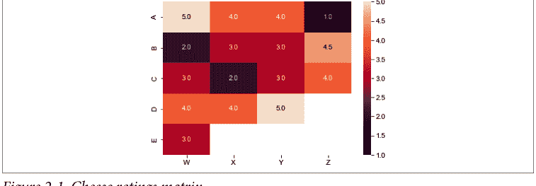

当我们观察具有海量用户或物品的数据集，并且数据越来越稀疏时，我们将需要采用一种更适合仅表示必要数据的数据结构。存在各种所谓的*稠密表示*，但目前我们将使用最简单的形式：由 user_id、item_id 和 rating 组成的元组。在实践中，这种结构通常是一个以 ID 为索引的字典。

> **稠密表示与稀疏表示**
>
> 这类数据有两种结构类型：稠密表示和稀疏表示。粗略地说，*稀疏表示*是指每个非平凡观测值都对应一个数据点。*稠密表示*则总是为每个可能性（即使是平凡的，即空值或零）都包含一个数据点。

让我们看看这些数据以字典形式呈现的样子：

```
'indices': [
    (0,0),(0,1),(0,2),(0,3),
    (1,0),(1,1),(1,2),(1,3),
    (2,0),(2,1),(2,2),(2,3),
    (3,0),(3,1),(3,2),
    (4,0)
]
'values': [
    5,4,4,1,
    2,3,3,4.5,
    3,2,3,4,
    4,4,5,
    3
]
```

由此自然产生几个问题：

1.  最受欢迎的奶酪是什么？从目前的观察来看，*埃门塔尔奶酪* 可能是最受欢迎的，但 *E* 并没有尝试过 *埃门塔尔奶酪*。
2.  *D* 会喜欢 *布里奶酪* 吗？这似乎是一种有争议的奶酪。
3.  如果只让你买两种奶酪，你应该买哪两种才能最好地满足所有人？

这个例子及相关问题都特意设计得很简单，但其要点很明确：这种矩阵表示法至少对于捕捉这些评分来说是方便的。

可能不太明显的是，除了这种数据可视化的便利性之外，这种表示法还具有数学上的实用性。问题2暗示了一个固有的推荐系统问题：“预测用户会有多喜欢一个他们尚未见过的物品。”这个问题也可能被识别为线性代数课程中的一个问题：“我们如何根据已知的矩阵元素来填充未知的元素？”这被称为 *矩阵补全*。

在创造满足用户需求的用户体验与建模这些数据和需求的数学公式之间来回切换，正是推荐系统的核心所在。

### 用户-用户与物品-物品协同过滤

在深入探讨线性代数之前，让我们先考虑一种纯粹的数据科学视角，称为 *协同过滤*（CF），这个术语最初由 David Goldberg 等人在其1992年的论文《使用协同过滤编织信息挂毯》中使用。

协同过滤的基本思想是，品味相似的人可以帮助其他人了解他们喜欢什么，而无需亲自尝试。*协同* 这个术语最初意指在品味相似的用户之间进行，而 *过滤* 最初意指过滤掉人们不会喜欢的选择。

你可以从两个方面来理解这种协同过滤策略：

-   两个品味相似的用户将继续保持相似的品味。
-   两个拥有相似用户粉丝的物品将继续受到与这些粉丝相似的其他用户的欢迎。

这些听起来可能相同，但在数学解释中它们表现不同。从高层次来看，区别在于决定你的推荐系统应该优先考虑哪种相似性：用户相似性还是物品相似性。

如果你优先考虑 *用户相似性*，那么要为用户 *A* 提供推荐，你需要找到一个相似的用户 *B*，然后从 *B* 喜欢的内容列表中选择一个 *A* 尚未见过的推荐项。

如果你优先考虑 *物品相似性*，那么要为用户 *A* 提供推荐，你需要找到一个 *A* 喜欢的物品，*山羊奶酪*，然后找到一个与 *山羊奶酪* 相似且 *A* 尚未见过的物品，*埃门塔尔奶酪*，并将其推荐给 *A*。

稍后我们将更深入地探讨相似性，但让我们先快速将这些概念与我们之前的讨论联系起来。*相似用户* 是用户-物品矩阵中作为向量相似的行；*相似物品* 是用户-物品矩阵中作为向量相似的列。


**向量相似性**

*点积相似性* 在第10章中有更精确的定义。目前，可以认为相似性是通过归一化向量然后计算它们的余弦相似性来得出的。对于任何你已将其关联到向量（数字列表）的实体，*向量相似性* 比较哪些实体在由这些数字列表（称为 *潜在空间*）捕获的特征方面最为相似。

### Netflix 挑战赛

2006年，Netflix 发起了一项名为 Netflix Prize 的在线竞赛。这项竞赛挑战参赛团队在 Netflix 作为开源发布的一个数据集上，改进其协同过滤算法的性能。虽然如今通过 Kaggle 网站或会议举办此类竞赛已很常见，但在当时，对于那些对推荐系统感兴趣的人来说，这非常令人兴奋且新颖。

该竞赛包含几个中间轮次，颁发了进展奖，最终的 Netflix Prize 于2009年颁发。提供的数据是2,817,131个三元组的集合，包含（用户，电影，评分日期）。其中一半还额外包含了评分本身。请注意，正如我们之前的例子所示，用户-物品信息几乎足以定义问题。在这个特定数据集中，提供了日期。稍后，我们将深入探讨时间如何成为一个因素，特别是对于序列推荐系统。

这场比赛的赌注相当高。击败内部性能的要求是将均方根误差（RMSE）提高10%；我们稍后将讨论这个损失函数。而奖金总额超过110万美元。最终的获胜者是 BellKor's Pragmatic Chaos（顺便提一下，他们也赢得了之前的两个进展奖），测试 RMSE 为0.8567。最终，仅因为提前20分钟提交，BellKor 才领先于竞争对手 The Ensemble。

要详细了解获胜提交方案，请查阅 Andreas Töscher 和 Michael Jahrer 的《The BigChaos Solution to the Netflix Grand Prize》以及同一作者的《The Big-Chaos Solution to the Netflix Prize 2008》。同时，让我们回顾一下这次竞赛的几个重要教训：

首先，我们看到我们讨论过的用户-物品矩阵在这些解决方案中作为关键的数学数据结构出现。模型选择和训练很重要，但参数调优在几种算法中带来了巨大的改进。我们将在后面的章节中回到参数调优。作者指出，一些模型创新来自于反思业务用例和人类行为，并试图在模型架构中捕捉这些模式。接下来，线性代数方法产生了第一个性能尚可的解决方案，而在此基础上构建则产生了获胜模型。最后，为了达到 Netflix 最初要求的赢得比赛所需的性能提升花了太长时间，以至于业务环境发生了变化，该解决方案不再有用。

最后一点可能是机器学习开发者需要了解的关于推荐系统的 *最重要* 的事情；请参阅以下提示。


**从简单开始**

快速构建一个可用的工作模型，并在模型仍然与业务需求相关时进行迭代。

### 软评分

在我们的奶酪品尝例子中，每种奶酪要么获得了数字评分，要么没有被客人尝试。这些是 *硬评分*：无论奶酪是布里奶酪还是山羊奶酪，评分都是明确的，而评分的缺失表示用户与物品之间缺乏互动。在某些情况下，我们需要处理用户确实与物品互动但未提供评分的数据。

一个常见的例子是电影应用；用户可能通过该应用观看了一部电影，但没有提供星级评分。这表明该物品（在这种情况下是电影）已被观察到，但我们没有评分供算法学习。然而，我们仍然可以使用这些隐式数据来执行以下操作：

-   在未来的推荐中排除此物品
-   在我们的学习器中将此数据作为一个单独的项使用
-   分配一个默认评分值，表示“有趣到足以观看，但不重要到需要评分”

事实证明，隐式评分对于训练有效的推荐系统至关重要，不仅因为用户通常不给出硬评分，还因为隐式评分提供了不同层次的信号。稍后，当我们希望训练多层模型来预测点击可能性和购买可能性时，这两个层次将被证明极其重要。

总结如下：

-   当用户直接响应关于物品的反馈提示时，就会产生 *硬评分*。
-   当用户的行为在没有响应直接提示的情况下隐式传达了对物品的反馈时，就会产生 *软评分*。

## 数据收集与用户日志

我们已经确定我们可以从显式评分和隐式评分中学习，那么我们如何以及从哪里获得这些数据呢？要深入探讨这一点，我们需要开始关注应用程序代码。在许多企业中，数据科学家和机器学习工程师与软件工程师是分开的，但使用推荐系统需要这两个职能之间的协调。

### 记录什么

最简单、最明显的数据收集是用户评分。如果为用户提供评分选项，甚至是点赞或点踩，那么就需要构建该组件并存储这些数据。这些评分不仅需要存储，以便有机会构建推荐系统，还要防止出现这样的糟糕用户体验：用户刚评完分，不久后重访页面时却发现评分消失了。

同样，了解其他一些关键交互也很有用，这些交互可以改进和扩展你的推荐系统：页面加载、页面浏览、点击和加入购物车。

对于这类数据，我们来看一个稍复杂的例子：电子商务网站 [Bookshop.org](https://bookshop.org)。这个网站应用了多种推荐系统，几乎所有的我们稍后都会涉及。现在，我们先关注一些交互（图 2-2）。


### 页面加载

当你首次加载 Bookshop.org 时，页面会显示一些商品。本周畅销书都是可点击的图片，链接到相应的图书列表。尽管用户无法选择加载这个初始页面，但记录这个初始页面加载的内容实际上非常重要。

这些选项代表了用户看到的书籍总体。如果用户看到了某个选项，他们就有机会点击它，这最终将成为一个重要的隐式信号。


### 倾向得分

考虑用户看到的所有物品总体，与倾向得分匹配密切相关。在数学中，*倾向得分*是指一个观测单元被分配到处理组而非对照组的概率。

将这种设置与简单的 50-50 A/B 测试进行比较：每个单元有 50% 的概率接触到你的处理。在特征分层 A/B 测试中，你根据某个特征或特征集合（在此上下文中通常称为*协变量*）有意改变接触概率。这些接触概率就是倾向得分。

为什么在这里提到 A/B 测试？稍后，我们将有兴趣从我们的软评分中挖掘用户偏好的信号，但我们必须考虑缺乏软评分并非隐式差评的可能性。回想一下奶酪的例子：品尝者 *D* 从未有机会品尝 *布里奶酪*，因此没有理由认为 *D* 对 *布里奶酪* 有厌恶偏好。这是因为 *D* 没有接触到 *布里奶酪*。

现在回想一下 Bookshop.org：着陆页没有显示《银河系漫游指南》，因此用户无法点击它并隐式传达对该书的兴趣。用户可以使用搜索选项，但那是另一种信号——我们稍后会讨论，实际上是一种强得多的信号。

在理解像“用户是否查看了某物”这样的隐式评分时，我们需要正确考虑他们接触到的所有选择总体，并使用该总体大小的倒数来衡量点击的重要性。因此，理解*所有*页面加载都很重要。

### 页面浏览和悬停

网站变得越来越复杂，现在用户必须应对各种交互。图 2-3 演示了如果用户点击本周畅销书轮播图中的右箭头，然后将鼠标悬停在“家庭烹饪”选项上会发生什么。


图 2-3. Bookshop.org 畅销书

用户揭示了一个新选项，并通过悬停使其变大并赋予其视觉效果。这些是向用户传达更多信息的方式，并提醒用户这些选项是可点击的。对于推荐系统来说，这些点击可以用作更多的隐式反馈。

首先，用户点击了轮播图滚动——所以他们在轮播图中看到的一些内容足够有趣，值得进一步探索。其次，他们悬停在 *家庭烹饪* 上，他们可能会点击，也可能只是想看看悬停时是否会显示更多信息。许多网站使用悬停交互来提供弹出详情。虽然 Bookshop.org 没有实现类似功能，但互联网用户已被所有实现此功能的网站训练得期望这种行为，因此该信号仍然有意义。第三，用户现在在轮播图滚动中发现了一个新的潜在物品——我们应该将其添加到页面加载中，但给予更高的评分，因为它需要交互才能发现。

所有这些以及更多内容都可以编码到网站的日志记录中。丰富而详尽的日志记录是改进推荐系统的最重要方式之一。拥有比你需要的更多的日志数据几乎总是比相反的情况要好。

### 点击

如果你认为悬停意味着兴趣，那么请考虑点击！并非所有情况，但在绝大多数情况下，点击是产品兴趣的强烈指标。对于电子商务，点击通常被计算为推荐团队核心关键绩效指标（KPI）的一部分。

这有两个原因：

- 点击几乎总是购买所必需的，因此它是大多数业务交易的上游过滤器。
- 点击需要用户明确的操作，因此它是衡量意图的好方法。

当然，噪声总会存在，但点击是客户兴趣的首选指标。许多生产环境中的推荐系统是基于点击数据训练的——而不是评分数据——因为数据量大得多，而且点击行为与购买行为之间存在强相关性。


### 点击流数据

有时在推荐系统中，你会听到人们谈论 *点击流* 数据。这种对点击数据的重要视角还考虑了用户在单个 *会话* 中点击的顺序。现代推荐系统投入大量精力利用用户点击物品的顺序，称之为 *序列推荐*，并通过这一额外维度显示出显著的改进。我们将在 [第 7 章](#) 中讨论基于序列的推荐。

### 加入购物车

我们终于到了这一步；用户已将物品加入他们的购物袋、购物车或队列。这是兴趣的极强指标，并且通常与购买高度相关。甚至有理由认为加入购物车是比购买/下单/观看更好的信号。加入购物车本质上是软评分的终点，通常在此之后，你会希望开始收集评分和评论。

### 展示

我们可能还希望记录未被点击的物品的 *展示*。这为推荐系统提供了用户不感兴趣的物品的负反馈。例如，如果向用户提供了 *高达奶酪*、*山羊奶酪* 和 *埃门塔尔奶酪*，但用户只品尝了 *山羊奶酪*，也许用户不喜欢 *高达奶酪*。另一方面，他们可能还没来得及品尝 *埃门塔尔奶酪*，因此这些展示可能只带有噪声信号。

### 收集与检测

Web 应用程序通常通过事件来检测我们讨论过的所有交互。如果你还不知道事件是什么，也许可以问问你工程部门的同事——但我们也会给你简要说明。与日志记录类似，*事件* 是应用程序在执行特定代码块时发出的特殊格式消息。

以点击为例，应用程序需要调用以获取下一个要显示给用户的内容，此时通常也会“触发一个事件”，指示有关用户的信息、他们点击了什么、用于后续参考的会话 ID、时间以及其他各种有用细节。这个事件可以在下游以多种方式处理，但一种日益普遍的模式是路径分叉到以下目标：

- 一个日志数据库，比如与服务绑定的 mySQL 应用程序数据库
- 一个用于实时处理的事件流

后者会很有趣：事件流通常通过 Apache Kafka 等技术连接到监听器。这种基础设施可能很快变得复杂（请咨询你本地的数据工程师或 MLOps 人员），但一个简单的模型是，所有特定类型的日志都被发送到几个你认为可以利用这些事件的目的地。

在推荐系统的情况下，事件流可以连接到一系列转换，以处理数据用于下游学习任务。如果你想构建一个使用这些日志的推荐系统，这将非常有用。其他重要用途是实时指标日志记录，用于记录网站上任何给定时间发生的情况。

### 漏斗

我们刚刚完成了第一个漏斗示例，这是任何优秀的数据科学家都无法回避思考的。无论喜欢与否，漏斗分析对于评估你的网站以及进而评估你的推荐系统都至关重要。


**点击流**

*漏斗* 是用户从一个状态到另一个状态必须采取的一系列步骤的集合；之所以称为漏斗，是因为在每个离散步骤中，用户可能停止前进，即 *流失*，从而减少每一步的总体规模。

在我们对事件和用户日志记录的讨论中，每一步都与前一步的子集相关。这意味着该过程是一个漏斗，如图 2-4 所示。理解每一步的流失率可以揭示你的网站和推荐系统的重要特征。

### 2.4 引导漏斗

在图2-4中，可以考虑三个重要的漏斗分析：

1.  页面浏览到加入购物车的用户流程
2.  按推荐项划分的页面浏览到加入购物车
3.  加入购物车到完成购买

第一个漏斗仅仅是从宏观层面识别，在流程中执行每一步的用户百分比。这是对你网站优化程度、产品吸引力以及用户线索质量的一个宏观衡量。

第二个漏斗则更为精细，它考虑了推荐项本身。正如之前在倾向性评分方面提到的，用户只有在看到某个特定商品时，才可能通过该商品的漏斗。这个概念与漏斗的使用相交，因为你既想从宏观上理解某些推荐与漏斗流失之间的关联，又想在使用推荐系统时，确保推荐的置信度与漏斗指标有良好的相关性。我们将在第三部分更详细地讨论这一点，但现在你应该记住，要思考不同类别的推荐-用户对，以及它们的漏斗与平均水平相比可能呈现的样子。

最后，我们可以考虑从加入购物车到完成购买。这实际上不属于推荐系统问题的范畴，但作为数据科学家或机器学习工程师，你应该将其放在心上，以改进产品。*无论你的推荐有多好，这个漏斗都可能毁掉你所有的辛勤工作。* 在着手解决推荐问题之前，你几乎总是应该先调查从用户加入购物车到完成结账的漏斗表现。如果这个流程存在繁琐或困难之处，那么修复它几乎肯定比改进推荐能带来更大的收益。调查流失点，进行用户研究以理解可能令人困惑的地方，并在开始为电子商务构建推荐系统之前，与产品和工程团队合作，确保每个人都对这个流程达成共识。

### 商业洞察与用户喜好

在之前Bookshop.org的例子中，“本周畅销书”是页面上的主要轮播图。回想我们之前关于`get_most_popular_recs`的工作；驱动这个轮播图的正是那个推荐器，但应用于一个特定的集合——仅查看过去一周的数据。

这个轮播图是一个推荐器提供商业洞察并驱动推荐的典型例子。增长团队的一个常见使命是理解每周趋势和关键绩效指标，通常是像每周活跃用户和新注册用户这样的指标。对于许多数字优先的公司，增长团队还对理解参与度的主要驱动因素感兴趣。

让我们举个例子：在撰写本文时，Netflix剧集《鱿鱼游戏》成为该公司有史以来最受欢迎的剧集，打破了大量记录。《鱿鱼游戏》在第一个月就达到了1.11亿观众。最明显的是，《鱿鱼游戏》需要出现在“本周热门剧集”或“最热门剧集”轮播图中，但像这样的爆款剧集还应该在哪些地方产生影响？

公司几乎总是要求的第一个重要洞察是*归因*：如果一周内数字上升了，是什么导致的？发布活动是否有重要或特别之处，从而推动了额外的增长？我们如何从这些信号中学习，以便未来做得更好？以《鱿鱼游戏》为例——这部非英语剧集引起了英语观众的巨大兴趣——高管们可能会倾向于投资更多来自韩国的剧集或具有高度戏剧性的字幕剧。这个问题的另一面也很重要：当增长指标滞后时，高管们几乎总会问为什么。能够指出最受欢迎的内容是什么，以及它可能如何偏离预期，这很有帮助。

另一个重要的洞察可以反馈到推荐中；在像《鱿鱼游戏》这样激动人心的首播期间，当你看到所有指标都在上升时，很容易沉浸在兴奋中，但这是否也可能对指标产生负面影响？如果你有一部剧集与《鱿鱼游戏》在同一周或两周内首播，你对所有这些成功的热情就会降低。总的来说，像这样的成功通常会推动*增量*增长，这对业务有利，而且总体上，所有指标可能都会上升。然而，其他内容可能由于核心用户群中的零和游戏而发布不那么成功。这可能对长期指标产生负面影响，甚至使后续的推荐效果降低。

稍后，你将了解推荐的多样性；关心推荐多样性的原因有很多，但这里我们观察到一点：多样性可以提高将用户与商品匹配的整体能力。当你保持广泛的用户群高度参与时，你就增加了未来增长的机会。

#### 增量收益

*增量收益*是一个经济学术语，现在用于增长营销和增长分析。增量收益指的是在付出努力所预期的收益之外，额外增加的边际收益。

一个简单的例子是，一家企业通常每花费100美元营销费用就能获得一个用户，后来获得了一些正面报道，接下来一周每花费80美元就能获得一个用户。通过将该周的营销预算固定在1600美元，企业将获得20个新用户，而不是16个——增量收益为4个用户。这种框架在测试新方案或项目时尤其常见。

最后，除了发现热门趋势外，了解你的平台或服务上真正热门内容的另一个好处是广告。当一个现象开始时，通过“推波助澜”——制造声势并宣传其成功——可以获得巨大优势。这有时会导致网络效应，在当今病毒式内容和易于传播的时代，这可以对你的平台增长产生乘数效应。

## 总结

以上构成了制定推荐问题并准备解决它们的最基本方面。

用户-商品矩阵为我们提供了一个工具，用于在最简单的数值评分情况下总结用户和商品之间的关系，并将在以后推广到更复杂的模型。我们看到了向量相似性的第一个概念，这将扩展为一种深刻的几何相关性概念。接下来，我们了解了用户可以通过显式和隐式行为提供的信号类型。最后，我们学习了如何捕获这些行为以训练模型。

既然我们已经完成了问题框架，我们为你准备了一些数学复习。别担心，你可以把你的直尺和圆规收起来，你不需要证明任何东西或计算任何积分。然而，你将看到一些重要的数学概念，这些概念将帮助你清晰地思考推荐系统的期望，并确保你提出正确的问题。

# 第3章 数学考量

本书的大部分内容侧重于实现以及使推荐系统工作所需的实践考量。在本章中，你将找到本书中最抽象和理论性的概念。本章的目的是涵盖支撑该领域的一些基本思想。理解这些思想很重要，因为它们会导致推荐系统中的病态行为，并推动许多架构决策。

我们将首先讨论你在推荐系统中经常看到的数据形状，以及为什么这种形状需要仔细思考。接下来，我们将讨论驱动大多数现代推荐系统的潜在数学思想——相似性。对于那些有统计倾向的人，我们将简要介绍一种关于推荐器功能的不同思考方式。最后，我们将使用与自然语言处理的类比来阐述流行的方法。

## 推荐系统中的齐普夫定律与马太效应

在许多机器学习应用中，早期会给出一个警告：大型语料库中唯一项目的观测分布遵循齐普夫定律——出现频率呈指数下降。在推荐系统中，马太效应出现在热门商品的点击率或活跃用户的反馈率中。例如，热门商品的点击量显著高于平均水平，而更活跃的用户给出的评分也远多于平均水平。

**马太效应**

马太效应——或称*流行度偏差*——指出，最受欢迎的商品继续吸引最多的注意力，并与其他商品的差距不断扩大。

以MovieLens数据集为例，这是一个用于基准测试推荐系统的极受欢迎的数据集。Jenny Sheng观察了图3-1所示的若干电影评分行为：

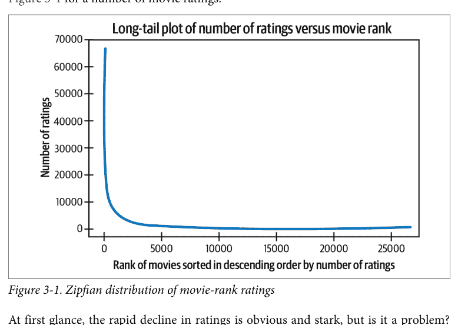

图3-1. 电影评分排名的Zipf分布

乍一看，评分的快速下降是明显而显著的，但这是否是个问题？假设我们的推荐器将基于用户协同过滤（CF）模型构建——正如第2章所提及的。那么这些分布会如何影响推荐器呢？

我们将考虑这种现象的分布影响。令概率质量函数由简单的Zipf定律描述：

$$f(k, M) = \frac{1/k}{\sum_{n=1}^{M} (1/n)}$$

对于语料库中的$M$个标记（在我们的例子中，是电影的数量），$k$是按出现次数排序时某个标记的排名。

考虑用户$A$和$B$，分别有$N_A = |\mathcal{I}_A|$和$N_B = |\mathcal{I}_B|$个评分。观察第$i$个最受欢迎的视频$V_i$出现在用户$X$的评分集$\mathcal{I}_X$中的概率由以下公式给出：

$$P(i) = \frac{f(i, M)}{\sum_{j=1}^{M} f(j, M)} = \frac{1/i}{\sum_{j=1}^{M} 1/j}$$

因此，一个物品同时出现在两个用户评分中的联合概率如下所示：

$$P(i^2) = \left( \frac{1/i}{\sum_{j=1}^M 1/j} \right)^2$$

换句话说，两个用户共享一个物品在其评分集中的概率随着其流行度排名的平方而下降。

当我们考虑到我们尚未明确的基于用户的CF定义是基于用户评分集的相似性时，这一点变得尤为重要。这种相似性是*两个用户共同评分的物品数量，除以任一用户评分的物品总数*。

根据这个定义，例如，我们可以计算$A$和$B$之间共享一个物品的相似度分数：

$$\sum_{i=1}^M \frac{P(i^2)}{\| \mathcal{I}_A \cup \mathcal{I}_B \|}$$

两个用户的平均相似度分数随后通过重复应用前述公式推广如下：

$$\min(N_A, N_B) \sum_{t=1} \left( \prod_{i_k = i_{k-1}+1}^{t-1} \sum_{i=1}^M \left( \frac{P(i_k^2)}{\| \mathcal{I}_A \cup \mathcal{I}_B \|} \right) \right)$$

通过重复应用前述观察。

这些组合公式不仅表明了Zipf分布在我们算法中的相关性，而且我们还看到它对分数输出的几乎直接影响。考虑Hao Wang等人在Last.fm数据集上进行的“推荐系统马太效应与稀疏性问题的定量分析”实验。Last.fm是一个音乐收听追踪器，允许用户跟踪他们收听的所有歌曲；对于Last.fm用户，作者展示了用户对的平均相似度分数，并发现这种马太效应持续存在于相似度矩阵中（图3-2）。

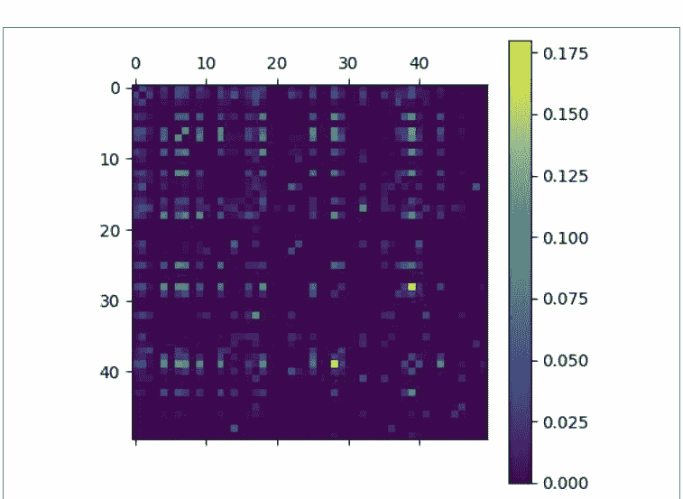

图3-2. 在Last.fm数据集上观察到的马太效应

观察“热门”单元格与其他所有单元格之间的巨大差异。明亮的单元格在大多数黑暗中是少数，表明一些极其流行的物品与更常见的接近零的频率之间存在困难的组合。虽然这些结果可能看起来很可怕，但稍后我们将考虑能够缓解马太效应的多样性感知损失函数。一种更简单的方法是使用下游采样方法，我们将在探索-利用算法部分进行讨论。最后，马太效应只是这种Zipf分布的两个主要影响中的第一个；让我们将注意力转向第二个。

## 稀疏性

我们现在必须面对稀疏性。随着评分越来越偏向最受欢迎的物品，最不受欢迎的物品因数据和推荐而匮乏，这被称为*数据稀疏性*。这与线性代数定义相关：向量中大部分为零或未填充的元素。当你再次考虑我们的用户-物品矩阵时，较不受欢迎的物品构成了条目很少的列；这些是稀疏向量。同样，在大规模情况下，我们看到马太效应将越来越多的总评分推入某些列，矩阵在传统数学意义上变得稀疏。因此，稀疏性是推荐系统一个极其知名的挑战。

像以前一样，让我们考虑这些稀疏评分对我们CF算法的影响。再次观察第$i$个最受欢迎的物品$V_i$出现在用户$X$的评分集$\mathcal{I}_X$中的概率由以下公式给出：

$$P(i) = \frac{f(i, M)}{\sum_{j=1}^M f(j, M)} = \frac{1/i}{\sum_{j=1}^M 1/j}$$

那么

$$(M - 1) * P(i)$$

是点击第$i$个最受欢迎物品的其他用户的预期数量，因此对所有$i$求和，得到将与$X$共享评分的其他用户总数：

$$\sum_{i=1}^M (M - 1) * P(i)$$

同样，当我们退后一步观察整体趋势时，我们观察到这种稀疏性悄悄渗入我们CF算法的实际计算中，考虑不同排名用户的趋势，并查看他们的排名在多大程度上被用于与其他用户的排名进行*协作*（图3-3）。

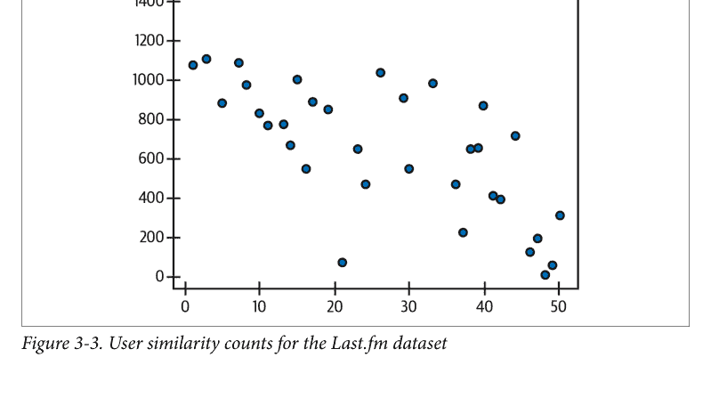

我们看到这是一个需要始终意识到的重要结果：稀疏性将重点推到最受欢迎的用户身上，并有使你的推荐器变得短视的风险。


## 基于物品的协同过滤

虽然公式不同，但在本节中，它们同样适用于基于物品的CF。物品之间的相似性表现出相同的Zipf分布在分数中的继承性，并且在CF过程中被考虑的物品按排名递减。

## 协同过滤的用户相似性

在数学中，经常听到关于*距离*的讨论。甚至可以追溯到勾股定理，我们被教导将点之间的关系视为距离或不相似性。确实，这个基本思想在数学中被规范化为度量定义的一部分：

$$d(a, c) \leq d(a, b) + d(b, c)$$

在机器学习中，我们通常更关注相似性的概念——这是一个极其相关的话题。在许多情况下，我们可以计算相似性或不相似性，因为它们是彼此的补数；当$d: X \times X \rightarrow [0, 1] \subset \mathbb{R}$是一个*不相似性函数*时，我们通常定义如下：

$$Sim(a, b) := 1 - d(a, b)$$

这看起来可能是一个不必要的精确陈述，但事实上你会看到有多种选择可用于构建相似性。此外，有时我们甚至制定相似性度量，其中相关的距离度量并未在对象集合上建立度量。这些所谓的伪空间仍然可能极其重要，我们将在第10章展示它们出现的地方。

在文献中，你会发现论文通常首先介绍一个新的相似性度量，然后在该新度量上训练你以前见过的模型。正如你将看到的，你选择关联对象（用户、物品、特征等）的方式会对你的算法学习到的内容产生很大影响。

现在，让我们专注于一些特定的相似性度量。考虑一个经典的机器学习聚类问题：我们有一个空间（通常是$\mathbb{R}^n$），我们的数据在其中被表示，并被要求将数据划分为总体的子集合并为这些集合命名。通常，这些集合旨在捕捉某种意义，或者至少对总结集合元素的特征有用。

当你进行聚类时，你经常考虑该空间中彼此接近的点。此外，如果你被给予一个新的观察结果并被要求将其分配给一个集合作为推理任务，你通常会计算新观察结果的*最近邻*。这可能是*k*最近邻，或者仅仅是聚类中心之间的最近邻；无论哪种方式，你的任务都是使用相似性的概念来关联——从而进行分类。在CF中，同样的概念用于将你希望为其提供建议的用户与你已有数据的用户关联起来。


### 最近邻

*最近邻*是一个通用术语，源于一个简单的几何思想：给定某个空间（由特征向量定义的点）和该空间中的一个点，你可以找到离它最近的其他点。这在机器学习的所有领域都有应用，包括分类、排序/推荐和聚类。第87页的“近似最近邻”提供了更多细节。

那么，我们如何在CF中为用户定义相似性呢？他们显然不在同一个空间中，因此我们通常的工具似乎有所欠缺。

### 皮尔逊相关系数

我们最初的CF公式表明，具有相似品味的用户相互协作，为彼此推荐物品。让两个用户*A*和*B*有一组共同评分的物品——简单来说就是每个用户都有评分的物品集合——记为$\mathcal{R}_{A,B}$，用户*A*对物品*x*的评分记为$r_{A,x}$。那么以下是用户*A*在其与*B*的所有共同评分物品上相对于其平均评分的偏差之和：

$$\sum_{x \in \mathcal{R}_{A,B}} (r_{A,x} - \bar{r}_A)$$

如果我们把这些评分看作一个随机变量，并考虑*B*的类似情况，那么联合分布变量之间的相关性（总体协方差）就是我们的*皮尔逊相关系数*：

$$\text{USim}_{A,B} = \frac{\sum_{x \in \mathcal{R}_{A,B}} (r_{A,x} - \bar{r}_A)(r_{B,x} - \bar{r}_B)}{\sqrt{\sum_{x \in \mathcal{R}_{A,B}} (r_{A,x} - \bar{r}_A)^2} \sqrt{\sum_{x \in \mathcal{R}_{A,B}} (r_{B,x} - \bar{r}_B)^2}}$$

在此处牢记几个细节极为重要：

- 这是描述用户评分的联合分布变量的相似性。
- 我们通过所有共同评分的项目来计算此相似性，因此用户相似性是通过项目评分来定义的。
- 这是一种成对相似性度量，其值在 $[-1,1] \in \mathbb{R}$ 范围内。


## 相关性与相似性

在第三部分，你将了解到*相关性*和*相似性*的更多定义，这些定义更适合处理排名数据，特别是能够容纳隐式排名。

## 通过相似性进行评分

既然我们已经介绍了用户相似性，那就让我们来使用它！对于用户 $A$ 和项目 $x$，我们可以通过相似用户的评分来估计评分：

$$Aff_{A,i} = \bar{r}_A + \frac{\sum_{U \in \mathcal{N}(A)} USim_{A,U} * (r_{U,i} - \bar{r}_A)}{\sum_{U \in \mathcal{N}(A)} USim_{A,U}}$$

这是对用户 $A$ 对项目 $x$ 评分的预测，它取 $A$ 的平均调整评分与所有 $A$ 的邻居的相似性加权平均评分。换句话说：$A$ 的评分很可能与那些评分与 $A$ 相似的人的平均值相同，并根据 $A$ 通常评分的慷慨程度进行了调整。我们将此估计称为*用户-项目亲和度分数*。

但是等等！$\mathcal{N}(A)$ 是什么？它是 $A$ 的邻域，基于我们上一节定义的 USim。这里的想法是，我们正在聚合由先前的 USim 度量确定为与目标用户相似的用户局部区域的评分。有多少邻居？如何选择这些邻居？这些将是后续章节的主题；目前，假设它们是 $k$-近邻，并假设使用一些超参数调整来确定 $k$ 的合适值。

> **相关性度量空间**
>
> 你可能会想，“这个皮尔逊相关性在变换下是否会产生一个度量空间？”答案是肯定的，但明确定义度量空间比我们简单的定义要复杂一些。虽然前面的方程可以给我们一个距离，但没有更巧妙的变换，它不足以给我们一个度量空间。
>
> 特别是，对于 $P(A, B)$，先前定义的相关性，$1 - P(A, B)$ 产生一个满足所有度量性质*除了*三角不等式的距离。不过，有几种已知的方法可以调整这一点：$\sqrt{1 - P(A, B)^2}$ 是最常见的。有关综述，请参阅 Stijn van Dongen 和 Anton J. Enright 的“从余弦相似性和皮尔逊及斯皮尔曼相关性导出的度量距离”。

## 探索-利用作为推荐系统

到目前为止，我们提出了两个相互之间略有冲突的想法：

- MPIR，一个简单、易于理解的推荐器
- 推荐系统中的马太效应及其在评分分布中的失控行为

到现在，你可能已经意识到 MPIR 会放大马太效应，而马太效应最终会将 MPIR 驱动到平凡的推荐器。这是最大化损失函数而没有随机化的经典难题：它很快就会稳定在一个模态状态。

这个问题——以及许多类似的问题——鼓励对算法进行一些修改，以防止这种失败模式，并继续让算法和用户接触其他选项。*探索-利用方案*，或称为*多臂老虎机*的基本策略是，不仅采用结果最大化的推荐，还采用一系列替代*变体*，并随机决定使用哪一个作为响应。

退一步说：给定一组变体推荐，或称为*臂*，$A$，其中每个推荐的结果是 $y_l$，我们有一个先验奖励函数 $R(y_l)$。老虎机（在此文献中称为*代理*）希望最大化 $R(y_l)$，但不知道结果 $Y_{a \in A}$ 的分布。因此，代理假设 $Y_{a \in A}$ 的一些先验分布，然后收集数据来更新这些分布；经过足够的观察，代理可以估计每个分布的期望值，$\mu_{a \in A} = \mathbb{E}(\mathscr{R}(Y_a))$。

如果代理能够自信地估计这些奖励值，那么推荐问题就解决了：在推理时，代理只需估计所有变体对用户的奖励值，并选择奖励最大化的*臂*。当然，这在整体上是荒谬的，但基本思想仍然有用：对什么将带来最大期望奖励持有先验假设，并以一定的频率探索替代方案，以持续更新分布并完善你的估计器。

即使没有明确使用多臂老虎机，这一见解也是理解推荐系统目标的强大而有用的框架。利用良好推荐的先验估计和探索其他选项以获取信号的思想是一个反复出现的核心思想。让我们看看这种方法的一个实际应用。

### ε-greedy

你应该多久探索一次，而不是使用你的奖励最大化臂？第一个最佳算法是 ε-greedy：对于 ε ∈ (0, 1)，在每个请求中，代理有概率 ε 选择一个随机臂，有概率 1 − ε 选择当前估计奖励最高的臂。

让我们采用 MPIR 并稍作修改以包含一些探索：

```python
from jax import random
key = random.PRNGKey(0)

def get_item_popularities() -> Optional[Dict[str, int]]:
    ...
    # Dict of pairs: (item-identifier, count item chosen)
    return item_choice_counts
    return None

def get_most_popular_recs_ep_greedy(
    max_num_recs: int,
    epsilon: float
) -> Optional[List[str]]:
    assert epsilon<1.0
    assert epsilon>0

    items_popularity_dict = get_item_popularities()
    if items_popularity_dict:
        sorted_items = sorted(
            items_popularity_dict.items(),
            key=lambda item: item[1]),
            reverse=True,
        )
        top_items = [i[0] for i in sorted_items]
        recommendations = []
        for i in range(max_num_recs): # we wish to return max_num_recs
            if random.uniform(key)>epsilon: # if greater than epsilon, exploit
                recommendations.append(top_items.pop(0))
            else: # otherwise, explore
                explore_choice = random.randint(1,len(top_items))
                recommendations.append(top_items.pop(explore_choice))
        return recommendations

    return None
```

对 MPIR 的唯一修改是，现在对于 max_num_recs 中的每个潜在推荐，我们有两种情况。如果随机概率小于我们的 ϵ，我们像以前一样继续并选择最受欢迎的；否则，我们选择一个随机推荐。


### 最大化奖励

我们将奖励最大化解释为选择最受欢迎的项目。这是一个重要的假设，随着我们进入更复杂的推荐器，这将是我们修改以获得不同算法和方案的关键假设。

现在让我们再次总结我们的推荐器组件：

*收集器*
这里的收集器不需要改变；我们仍然希望首先获取项目流行度。

*排序器*
排序器也没有改变！我们首先按流行度对可能的推荐进行排序。

*服务器*
如果收集器和排序器保持不变，显然服务器必须为这个新的推荐器进行调整。情况确实如此；我们不再取前 max_num_recs 个项目，而是利用我们的 ϵ 在每一步确定添加到我们列表中的下一个推荐应该是来自排序器的下一个，还是随机选择。否则，我们遵循相同的 API 模式并返回相同形状的数据。

### ϵ 应该是多少？

在前面的讨论中，ϵ 是整个调用的固定值，但这个值应该是多少？这实际上是一个研究广泛的领域，普遍的智慧是从较大的 ϵ 开始（以鼓励更多探索），然后随时间减少。确定减少的速率、起始值等需要认真的思考和研究。此外，这个值可以与你的预测循环绑定，并成为训练过程的一部分。有关更深入的探讨，请参阅 Joseph Rocca 的“探索-利用权衡：直觉与策略”。

其他——通常更好的——采样技术也存在用于优化。*重要性采样*可以利用我们稍后构建的排名函数，将探索-利用与我们的数据所能教授的内容结合起来。

## NLP与推荐系统的关系

让我们借鉴机器学习另一领域——自然语言处理的一些直觉。NLP的基础模型之一是*word2vec*：一种基于序列的语言理解模型，它利用句子中共同出现的词语。

对于*skipgram-word2vec*模型，它接收句子，并试图通过句子中词语与其他词语的共现关系来学习词语的隐含意义。每一对共现词语构成一个样本，该样本经过独热编码后被送入一个词汇表大小的神经元层，通过一个瓶颈层和一个词汇表大小的输出层来预测词语出现的概率。

通过这个网络，我们将表示的维度降低到瓶颈层的维度，从而得到一个比原始语料库大小的独热嵌入维度更小的词语表示。其思路是，词语的相似性现在可以通过这个新表示空间中的向量相似性来计算。

这与推荐系统有何关系？嗯，因为如果我们把用户-物品交互的有序序列（例如，用户评分过的电影序列）看作输入，我们就可以利用word2vec的相同思想来寻找物品相似性，而不是词语相似性。在这个类比中，用户历史就是*句子*。

之前，使用我们的协同过滤相似性，我们认为相似的用户可以帮助确定什么是好的推荐。在这个模型中，我们寻找的是物品与物品的相似性，因此我们假设用户会喜欢与他们之前喜欢的物品相似的物品。


**物品即词语**

你可能已经注意到，自然语言模型将词语视为序列，事实上，我们的用户历史也是一个序列！现在，请记住这个知识点。稍后，这将引导我们走向基于序列的推荐系统方法。

### 向量搜索

我们已经构建了一个物品向量表示的集合，并且我们声称在这个空间（通常称为*潜在空间*、*表示空间*或*环境空间*）中的相似性意味着对用户*喜爱程度*的相似性。

要将这种相似性转化为推荐，考虑一个用户 $A$，他有一组之前喜欢的物品 $\mathscr{R}_A$，并考虑 $\mathscr{A} = \{v_x | x \in \mathscr{R}_A\}$ 是这些物品在该潜在空间中关联的向量集合。我们正在寻找一个新的物品 $y$，我们认为它对 $A$ 是好的。


### 旧的诅咒

这些潜在空间往往是高维的，而欧几里得距离在高维空间中表现不佳是出了名的。随着区域变得稀疏，距离函数的性能会下降；局部距离是有意义的，但全局距离不可信。相反，余弦距离表现出更好的性能，但这是一个需要深入探讨的话题。此外，在实践中，与其最小化距离，不如最大化相似性。

使用相似性产生推荐的一个简单方法是，取与 $A$ 喜欢的物品的平均值最接近的物品：

$$\arg\max_{y} \{ \text{USim}(v_y, avg(\cdot A)) \mid y \in \text{Items} \}$$

这里，$d(-, -)$ 是潜在空间中的距离函数（通常是余弦距离）。
argmax 本质上将 $A$ 的所有评分视为同等重要，并推荐接近这些物品的东西。在实践中，这个过程往往充满问题。首先，你可以根据评分对项进行加权：

$$\arg\max_{y} \left\{ \text{USim}\left(v_y, \frac{\sum_{v_x \in \cdot A} r_x}{|\mathcal{R}_{\cdot A}|}\right) \mid y \in \text{Items} \right\}$$

这有可能提高用户反馈在推荐中的代表性。或者，你可能会发现用户对各种类型和主题的电影都进行了评分。在这里取平均值肯定会导致更差的结果，所以也许你想简单地找到与用户喜欢的某部电影相似的推荐，并根据该评分进行加权：

$$\arg\max_{y} \left\{ \frac{\text{USim}(v_y, v_x)}{r_x} \mid y \in \text{Items}, v_x \in \cdot A \right\}$$

最后，你甚至可能想对用户喜欢的不同物品多次执行此过程，以获得 $k$ 个推荐：

$$\min -k \left\{ \arg\max_{y} \left\{ \frac{\text{USim}(v_y, v_x)}{r_x} \mid y \in \text{Items} \right\} \mid v_x \in \cdot A \right\}$$

现在我们有了 $k$ 个推荐；每一个都与用户喜欢的某个物品相似，并根据他们喜欢的程度进行加权。这种方法仅利用了由物品共现形成的隐式几何结构。

潜在空间及其带来的几何能力用于推荐，将是本书后续内容的一条主线。我们通常会通过这些几何结构来构建损失函数，并利用几何直觉来头脑风暴下一步技术扩展的方向。

### 最近邻搜索

一个合理的问题是“我如何获得这些最小化距离的向量？”在所有前面的方案中，我们计算许多距离，然后找到最小值。一般来说，最近邻问题是一个极其重要且被广泛研究的问题。

虽然找到精确的最近邻有时可能很慢，但在近似最近邻搜索方面已经取得了很大进展。这些算法不仅返回非常接近实际最近邻的结果，而且其复杂度性能也快了几个数量级。通常，当你看到我们（或其他出版物）在某些距离上计算argmin（使函数最小化的参数）时，很有可能在实践中使用的是ANN。

## 总结

上一章讨论的推荐系统涉及数据分布原则，如齐普夫定律和马太效应。这些原则带来了挑战，例如用户相似性分数偏斜和数据稀疏。在机器学习领域，虽然传统数学关注距离，但重点在于相似性的概念。不同的相似性度量会极大地改变算法学习结果，聚类是其主要应用。

在推荐领域，物品通常在高维潜在空间中表示。这些空间中的相似性暗示了用户偏好。方法包括推荐接近用户平均喜欢物品的物品，并且可以通过按用户评分加权来改进。然而，个体偏好需要多样化的推荐。潜在空间继续发挥着影响力，推动着推荐技术的发展。

有效地定位这些向量需要最近邻搜索。虽然精确方法资源消耗大，但近似最近邻提供了一种快速、精确的解决方案，为本章讨论的推荐系统奠定了基础。

# 第四章

## 推荐系统设计

既然你已经对推荐系统的工作原理有了基本的了解，让我们更仔细地看看所需的元素，以及设计一个能够在工业规模上提供推荐的系统。我们语境中的*工业规模*主要指*合理规模*（由Ciro Greco、Andrea Polonioli和Jacopo Tagliabue在“ML and MLOps at a Reasonable Scale”中引入的术语）——指拥有数十到数百名工程师参与产品开发的公司的生产应用，而非数千名。

理论上，推荐系统是一组数学公式，可以接收关于用户-物品交互的历史数据，并返回用户-物品对亲和力的概率估计。实际上，推荐系统是5个、10个，或者可能是20个软件系统，它们实时通信，在有限的信息、受限的物品可用性和永远超出样本范围的行为下工作，所有这一切都是为了确保用户看到*某些东西*。

本章深受Eugene Yan的“System Design for Recommendations and Search”以及Even Oldridge和Karl Byleen-Higley的“Recommender Systems, Not Just Recommender Models”的影响。

## 在线与离线

机器学习系统由你提前完成的部分和你即时完成的部分组成。这种在线与离线的划分，是关于执行不同类型任务所需信息的实际考虑。为了观察和学习大规模模式，系统需要访问大量数据；这是离线组件。然而，执行推理只需要训练好的模型和相关的输入数据。这就是为什么许多机器学习系统架构是这样构建的

你会经常遇到*批处理*和*实时*这两个术语，它们用来描述在线-离线范式的两个方面（图4-1）。

*图4-1. 实时与批处理*

*批处理*不需要用户输入，通常预期完成时间较长，并且能够同时获取所有必要的数据。批处理通常包括诸如在历史数据上训练模型、用额外的特征集合增强一个数据集，或转换计算成本高昂的数据等任务。你在批处理中更常见的一个特点是，它们处理的是完整的相关数据集，而不仅仅是按时间或其他方式切片的数据实例。

*实时处理*在请求时进行；换句话说，它在推理过程中被评估。示例包括在页面加载时提供推荐、在用户看完上一集后更新下一集，以及在某个推荐被标记为*不感兴趣*后重新排序推荐。实时处理通常受到资源限制，因为需要快速响应，但就像这个领域的许多事情一样，随着全球计算资源的扩展，我们对资源受限的定义也在改变。

让我们回到第1章介绍的组件——收集器、排序器和服务器——并思考它们在离线和在线系统中的角色。

## 收集器

收集器的角色是了解可能被推荐的物品集合中包含什么，以及这些物品的必要特征或属性。

### 离线收集器

*离线收集器*可以访问并负责最大的数据集。理解所有用户-物品交互、用户相似性、物品相似性、用户和物品的特征存储，以及用于最近邻查找的索引，都属于离线收集器的职责范围。离线收集器需要能够极其快速地访问相关数据，有时是大批量地访问。为此，离线收集器通常实现亚线性搜索函数或专门调优的索引结构。它们也可能利用分布式计算来进行这些转换。

重要的是要记住，离线收集器不仅需要访问和了解这些数据集，还将负责编写必要的下游数据集，以供实时使用。

### 在线收集器

*在线收集器*使用离线收集器索引和准备的信息，提供对推理所需数据部分的实时访问。这包括诸如搜索最近邻、用特征存储中的特征增强观察值，以及了解完整库存目录等技术。在线收集器还需要处理最近的用户行为；当我们看到[第17章](#)中的序列推荐器时，这一点将变得尤为重要。

在线收集器可能承担的另一个角色是编码请求。在搜索推荐器的上下文中，我们希望获取查询并通过嵌入模型将其编码到*搜索空间*中。对于上下文推荐器，我们也需要通过嵌入模型将上下文编码到*潜在空间*中。

**嵌入模型**

收集器工作中一个流行的子组件将涉及嵌入步骤；参见Valliappa Lakshmanan等人的《机器学习设计模式》（O'Reilly）。离线端的嵌入步骤包括训练嵌入模型和构建潜在空间以供后续使用。在线端，嵌入转换需要将查询嵌入到正确的空间中。这样，嵌入模型就作为你包含在模型架构中的一部分转换。

## 排序器

排序器的角色是获取收集器提供的集合，并根据上下文和用户的模型对其部分或所有元素进行排序。排序器本身实际上包含两个组件：过滤和评分。

*过滤*可以看作是对适合推荐的物品进行粗略的包含和排除。这个过程的特点通常是快速削减大量我们绝对不希望展示的潜在推荐。一个简单的例子是不推荐我们知道用户过去已经选择过的物品。

*评分*是更传统的排序理解：根据所选的目标函数创建潜在推荐的排序。

### 离线排序器

*离线排序器*的目标是促进过滤和评分。它与在线排序器的区别在于它如何运行验证，以及其输出如何被用来构建在线排序器可以利用的快速数据结构。此外，离线排序器可以与人工审查过程集成，用于*人在回路中的机器学习*。

稍后将讨论的一项重要技术是*布隆过滤器*。布隆过滤器允许离线排序器批量处理工作，从而使实时过滤能够更快地进行。这个过程的一个过度简化是使用请求的几个特征来快速选择所有可能候选者的子集。如果这一步能够快速完成——在计算复杂度方面，力求低于候选者数量的二次方——那么下游的复杂算法就可以变得更加高效。

仅次于过滤步骤的是排序步骤。在离线组件中，排序是训练学习如何对物品进行排序的模型。正如你稍后将看到的，学习对物品进行排序以在目标函数方面表现最佳，是推荐模型的核心。训练这些模型并准备其输出的各个方面，是排序器批处理职责的一部分。

### 在线排序器

*在线排序器*获得了许多赞誉，但实际上利用了其他组件的辛勤工作。在线排序器首先进行过滤，利用离线构建的过滤基础设施——例如，索引查找或布隆过滤器应用。过滤之后，候选推荐的数量得到了控制，因此我们实际上可以进入最臭名昭著的任务：对推荐进行排序。

在在线排序阶段，通常会访问特征存储，用必要的细节来修饰候选者，然后应用评分和排序模型。评分或排序可能在几个独立的维度上进行，然后合并成一个最终的排序。在多目标范式中，你可能有多个这样的排序与排序器返回的候选列表相关联。

## 服务器

服务器的角色是获取排序器提供的有序子集，确保满足必要的数据模式（包括基本业务逻辑），并返回请求数量的推荐。

### 离线服务器

*离线服务器*负责系统返回推荐的硬性要求的高层对齐。除了建立和执行模式外，这些规则可以是更细微的事情，比如“当推荐这件上衣时，永远不要返回这条裤子。”通常被轻描淡写为“业务逻辑”，离线服务器负责创建有效的方法来对返回的推荐施加顶层优先级。

离线服务器的另一个职责是处理诸如实验之类的任务。在某个时候，你可能想要运行在线实验来测试你用本书构建的所有出色的推荐系统。离线服务器是你将实现实验决策所需逻辑的地方，并以在线服务器可以实时使用的方式提供其含义。

### 在线服务器

*在线服务器*获取已建立的规则、要求和配置，并将其最终应用于排序后的推荐。一个简单的例子是多样化规则；正如你稍后将看到的，推荐的多样化可以对用户体验的质量产生重大影响。在线服务器可以从离线服务器读取多样化要求，并将其应用于排序列表，以返回预期数量的多样化推荐。

## 总结

重要的是要记住，在线服务器是其他系统将从中获取响应的端点。虽然它通常是消息的来源，但系统中许多最复杂的组件都在上游。请小心地对这个系统进行检测，以便当响应缓慢时，每个系统都足够可观测，你可以识别出性能下降来自何处。

现在我们已经建立了框架，并且你理解了核心组件的功能，接下来我们将讨论机器学习系统的各个方面以及与之相关的技术类型。

在下一章中，我们将亲手实践上述组件，并看看我们如何实现关键方面。我们将通过将所有内容整合到一个仅使用每个物品内容的生产级推荐器中来结束。开始吧！

# 第五章
融会贯通：
基于内容的推荐系统

在本书的这一部分，我们已经介绍了推荐系统中一些最基本的组件。在本章中，我们将进行实践操作。我们将为Pinterest的图片设计并实现一个推荐系统。本章以及书中其他“融会贯通”章节将向你展示如何使用开源工具处理数据集。这类章节的材料指的是托管在GitHub上的代码，你需要下载并运行这些代码，才能充分体验其中的内容。

由于这是第一个实践操作章节，这里提供一些关于开发环境的额外设置说明。我们是在运行于Windows子系统Linux（WSL）Ubuntu虚拟机的Windows系统上开发此代码的。代码在Linux机器上应该能正常运行，在macOS上需要更多技术适配，在Windows上则需要更多适配，这种情况下最好在WSL2 Ubuntu虚拟机上运行。你可以查看[微软Windows文档](https://docs.microsoft.com/en-us/windows/wsl/install)了解WSL的设置。我们选择了Ubuntu作为镜像。如果你有NVIDIA GPU并希望使用它，你还需要安装NVIDIA CUDA和cuDNN。

我们将使用Wang-Cheng Kang等人所著论文《Complete the Look: Scene-Based Complementary Product Recommendation》中的[Shop the Look (STL)数据集](https://github.com/pinterest/complete_the_look)。

在本章中，我们将向你展示如何构建一个基于内容的推荐系统。回顾一下，基于内容的推荐系统使用的是你希望表示的物品的间接、可泛化的表示。例如，想象一下你想推荐一个蛋糕，但不能使用蛋糕的名称。相反，你可能会使用蛋糕的描述或其成分作为内容特征。

使用STL数据集，我们将尝试将场景（即一个人在特定环境中的图片）与可能与该场景相配的产品进行匹配。训练集包含场景与单个产品的配对，我们希望使用内容推荐器将推荐扩展到整个产品目录，并以某种排序顺序对它们进行排序。内容推荐器由于使用间接的内容特征进行推荐，可用于推荐尚未进入推荐系统的新产品，或在用户开始使用推荐系统并建立反馈循环之前，使用手动策划的数据来预热推荐系统。在STL数据集的情况下，我们将重点关注场景和产品的视觉外观。

我们将通过卷积神经网络（CNN）架构生成内容嵌入，然后通过三元组损失训练嵌入，并展示如何创建内容推荐系统。

本章涵盖以下主题：

-   版本控制软件
-   Python构建系统
-   随机物品推荐器
-   获取STL数据集图像
-   CNN的定义
-   在JAX、Flax和Optax中进行模型训练
-   输入管道

## 版本控制软件

*版本控制软件*是一种跟踪代码变更的软件系统。可以将其视为一个数据库，跟踪你编写的代码版本，同时提供额外功能，如显示每个代码版本之间的差异，并允许你回退到之前的版本。

有许多种版本控制系统。我们将本书的代码托管在[GitHub](https://github.com)上。

我们使用的版本控制软件叫做**Git**。代码变更以称为*补丁*的批次进行，每个补丁都上传到像GitHub这样的源代码控制仓库，以便可以被克隆并由多人同时处理。

你可以使用以下命令克隆本书的代码示例仓库：

```
git clone git@github.com:BBischof/ESRecsys.git
```

关于本章，请查看目录*ESRecsys/pinterest*中的说明，了解如何详细运行代码。本章将主要关注描述和指向仓库的指引，以便你能够在实践中体验这些系统。

## Python构建系统

Python*包*是提供超出标准Python库功能的库。这些包括像TensorFlow和JAX这样的ML包，也包括更实用的包，如absl flags库或机器学习操作（MLOps）库，如Weights & Biases。

这些包通常托管在Python包索引上。

查看文件*requirements.txt*：

```
absl-py==1.1.0
tensorflow==2.9.1
typed-ast==1.5.4
typing_extensions==4.2.0
jax==0.3.25
flax==0.5.2
optax==0.1.2
wandb==0.13.4
```

你可以看到我们选择了一小组Python包作为依赖项进行安装。格式是包名、两个等号，然后是包的版本。

其他适用于Python的构建系统包括：

-   pip
-   Bazel
-   Anaconda

对于本章，我们将使用pip。

然而，在安装包之前，你可能需要了解Python虚拟环境。Python虚拟环境是一种按项目跟踪Python包依赖关系的方式，这样如果不同项目使用同一包的不同版本，它们不会相互干扰，因为每个项目都有自己的Python虚拟环境来运行。

你可以通过在Unix shell中输入以下命令来创建和激活Python虚拟环境：

```
python -m venv pinterest_venv
source pinterest_venv/bin/activate
```

第一个命令创建一个Python虚拟环境，第二个命令激活它。每次打开新的shell时，你都必须激活虚拟环境，以便Python知道在哪个环境中工作。

创建虚拟环境后，你可以使用pip将包安装到虚拟环境中，这些新安装的包不会影响系统级的包。

你可以通过在*ESRecsys/pinterest*目录中运行以下命令来完成此操作：

```
pip install -r requirements.txt
```

这将把指定的包及其可能依赖的任何子包安装到虚拟环境中。

## 随机物品推荐器

我们将查看的第一个程序是一个随机物品推荐器（示例5-1）。

*示例5-1. 设置标志*

```
FLAGS = flags.FLAGS
_INPUT_FILE = flags.DEFINE_string(
    "input_file", None, "Input cat json file.")
_OUTPUT_HTML = flags.DEFINE_string(
    "output_html", None, "The output html file.")
_NUM_ITEMS = flags.DEFINE_integer(
    "num_items", 10, "Number of items to recommend.")

# Required flag.
flags.mark_flag_as_required("input_file")
flags.mark_flag_as_required("output_html")

def read_catalog(catalog: str) -> Dict[str, str]:
    """
    Reads in the product to category catalog.
    """
    with open(catalog, "r") as f:
        data = f.read()
    result = json.loads(data)
    return result

def dump_html(subset, output_html:str) -> None:
    """
    Dumps a subset of items.
    """
    with open(output_html, "w") as f:
        f.write("<HTML>\n")
        f.write("""
        <TABLE><tr>
        <th>Key</th>
        <th>Category</th>
        <th>Image</th>
        </tr>""")
        for item in subset:
            key, category = item
            url = pin_util.key_to_url(key)
            img_url = "" % url
            out = "<tr><td>%s</td><td>%s</td><td>%s</td></tr>\n" % (
                (key, category, img_url))
            f.write(out)
        f.write("</TABLE></HTML>")

def main(argv):
    """
    Main function.
    """
    del argv  # Unused.

    catalog = read_catalog(_INPUT_FILE.value)
    catalog = list(catalog.items())
    random.shuffle(catalog)
    dump_html(catalog[:_NUM_ITEMS.value], _OUTPUT_HTML.value)
```

这里我们使用absl flags库向程序传递参数，例如包含STL场景和产品对的JSON目录文件的路径。

标志可以有不同的类型，如字符串和整数，你可以将它们标记为必需。如果必需的标志未传递给程序，它会报错并停止运行。可以通过它们的value方法访问标志。

我们使用JSON Python库加载和解析STL数据集，然后随机打乱目录，并将前几个结果以HTML格式输出。

你可以通过以下命令运行随机物品推荐器：

```
python3 random_item_recommender.py \
--input_file=STL-Dataset/fashion-cat.json --output_html=output.html
```

完成后，你可以用网页浏览器打开output.html文件，查看目录中的一些随机物品。图5-1显示了一个示例。

## 获取 STL 数据集图像

创建基于内容的推荐系统的第一步是获取内容。在本例中，STL 数据集的内容主要是图像，以及一些关于图像的元数据（例如产品类型）。本章我们将仅使用图像内容。

你可以查看 *fetch_images.py* 中的代码，了解如何使用 Python 标准库 urllib 来获取图像。请注意，在他人网站上进行过多抓取可能会触发其机器人防御机制，导致你的 IP 地址被列入黑名单，因此明智的做法是限制抓取频率或寻找其他方式获取数据。

我们已经下载了数千个图像文件，并将它们打包成一个归档文件，作为 Weights & Biases 的一个制品。由于归档文件已包含在此制品中，你无需自行抓取图像，但我们提供的代码允许你这样做。

你可以在 [Weights & Biases 文档](https://docs.wandb.ai/) 中了解有关制品的详细信息。制品是 MLOps 中的一个概念，用于对数据归档进行版本控制和打包，并跟踪数据的生产者和消费者。

你可以通过运行以下命令下载图像制品：

```
wandb artifact get building-recsys/recsys-pinterest/shop_the_look:latest
```

图像随后将位于本地目录 *artifacts/shop_the_look:v1* 中。

## 卷积神经网络定义

现在我们有了图像，下一步是确定如何表示数据。图像尺寸各异，且是一种复杂的内容类型，难以分析。我们可以使用原始像素作为内容的表示，但缺点是像素值的微小变化可能导致图像间距离的巨大差异。我们不希望这样。相反，我们希望以某种方式学习图像中重要的部分，并忽略图像中可能不太重要的部分，例如背景颜色。

为此任务，我们将使用卷积神经网络（CNN）来计算图像的嵌入向量。*嵌入向量*是一种从数据中学习到的、固定大小的图像特征向量。我们使用嵌入向量作为表示，因为我们希望数据库小巧紧凑，易于对大量图像进行评分，并且与当前任务（即将产品与给定场景图像匹配）相关。

我们使用的神经网络架构是残差网络（Resnet）的一种变体。有关架构的详细信息以及 CNN 的参考资料，请参阅何恺明等人的论文《Deep Residual Learning for Image Recognition》。简而言之，卷积层在图像上重复应用一个通常为 3 × 3 大小的小型滤波器。如果步幅为 (1, 1)（即在 x 方向和 y 方向均以 1 像素的步长应用滤波器），则生成与输入分辨率相同的特征图；如果步幅为 (2, 2)，则生成四分之一大小的特征图。残差跳跃连接只是从上一个输入层到下一个层的快捷方式，因此实际上，网络的非线性部分学习的是线性跳跃部分的残差，因此得名残差网络。

此外，我们使用了 BatchNorm 层，其详细信息可在 Sergey Ioffe 和 Christian Szegedy 的论文《Batch Normalization: Accelerating Deep Network Training by Reducing Internal Covariate Shift》以及 Prajit Ramachandran、Barret Zoph 和 Quoc V. Le 的论文《Searching for Activation Functions》中找到。

一旦我们指定了模型，还需要针对任务对其进行优化。

## 在 JAX、Flax 和 Optax 中进行模型训练

在任何机器学习框架中优化模型都应该相当简单。这里我们展示如何使用 JAX、Flax 和 Optax 轻松完成。JAX 是一个更底层的、类似 NumPy 的机器学习库，而 Flax 是一个更高级的神经网络库，提供神经网络模块和嵌入层等功能。Optax 是一个用于优化的库，我们将用它来最小化损失函数。

如果你熟悉 NumPy，JAX 会很容易上手。JAX 与 NumPy 共享相同的 API，但能够通过 JIT 编译在向量处理器（如 GPU 或 TPU）上运行生成的代码。JAX 设备数组和 NumPy 数组可以轻松相互转换，这使得在 GPU 上开发变得容易，同时在 CPU 上调试也很方便。

除了学习如何表示图像外，我们还需要指定它们彼此之间的关系。

由于嵌入向量具有固定维度，最简单的相似度分数就是两个向量的点积。关于其他类型的相似度度量，请参见第 163 页的“基于共现的相似度”。因此，给定一个场景图像，我们计算场景嵌入，并对产品进行相同操作以获得产品嵌入，然后取两者的点积，得到场景 $\vec{s}$ 与产品 $\vec{p}$ 匹配紧密度的分数：

$score(\vec{s}, \vec{p}) = \vec{s} * \vec{p}$

我们使用 CNN 来获取图像的嵌入。

然而，我们为场景和产品使用不同的 CNN，因为它们来自不同类型的图像。场景通常显示我们匹配产品的上下文，包含人物和环境，而产品通常是带有空白背景的鞋子和手袋的目录图像，因此我们需要不同的神经网络来确定图像中重要的部分。

然而，仅有分数是不够的。我们需要确保场景与产品的良好匹配（我们称为正样本产品）的得分高于负样本产品。正样本产品是场景的良好匹配，负样本产品是场景的不太好的匹配。正样本产品来自训练数据，负样本产品来自目录的随机采样。能够捕捉正场景-产品对 (A, B) 和负场景-产品对 (A, C) 之间关系的损失函数称为三元组损失。让我们详细定义三元组损失。

假设我们希望正场景-产品对的得分比负场景-产品对高出 1。那么我们有以下不等式：

$$score(scene, pos_{product}) > score(scene, neg_{product}) + 1$$

这里的 1 只是我们使用的一个任意常数，称为 *间隔*，以确保正场景-产品得分大于负场景-产品得分。

由于梯度下降过程是最小化一个函数，我们将上述不等式转换为损失函数，方法是将所有项移到一侧：

$$0 > 1 + score(scene, neg_{product}) - score(scene, pos_{product})$$

只要右侧的量大于 0，我们就希望最小化它；但如果它已经小于 0，我们就不需要了。因此，我们将该量编码在修正线性单元中，该单元由函数 $\max(0, x)$ 表示。因此，我们可以将损失函数写为：

$$loss(scene, pos_{product}, neg_{product}) = \max(0, 1 + score(scene, neg_{product}) - score(scene, pos_{product}))$$

由于我们通常最小化损失函数，这确保了只要 score(scene, neg_product) 比 score(scene, pos_product) 高出 1，优化过程就会尝试最小化负样本对的得分，同时增加正样本对的得分。

下一个示例按顺序涵盖以下模块，以便它们按照从读取数据到训练再到进行推荐的数据流顺序合理呈现：

- *input_pipeline.py*：数据如何被读取
- *models.py*：神经网络如何被指定
- *train_shop_the_look.py*：如何使用 Optax 拟合神经网络
- *make_embeddings.py*：如何创建场景和产品的紧凑数据库

### 输入管道

示例5-2展示了*input_pipeline.py*的代码。我们使用机器学习库TensorFlow来构建其数据管道。

示例5-2. TensorFlow数据管道

```python
import tensorflow as tf

def normalize_image(img):
    img = tf.cast(img, dtype=tf.float32)
    img = (img / 255.0) - 0.5
    return img

def process_image(x):
    x = tf.io.read_file(x)
    x = tf.io.decode_jpeg(x, channels=3)
    x = tf.image.resize_with_crop_or_pad(x, 512, 512)
    x = normalize_image(x)
    return x

def process_image_with_id(id):
    image = process_image(id)
    return id, image

def process_triplet(x):
    x = (process_image(x[0]), process_image(x[1]), process_image(x[2]))
    return x

def create_dataset(
    triplet: Sequence[Tuple[str, str, str]]):
    """Creates a triplet dataset.
    Args:
        triplet: filenames of scene, positive product, negative product.
    """
    ds = tf.data.Dataset.from_tensor_slices(triplet)
    ds = ds.map(process_triplet)
    return ds
```

你可以看到，`create_dataset`接收三个文件名：一个场景文件名，然后是一个正匹配和一个负匹配。在这个例子中，负匹配只是从目录中随机选择的。我们将在第12章介绍更复杂的负样本选择方法。图像文件名通过读取文件、解码图像、将其裁剪为固定大小，然后重新缩放数据来处理，使其成为以0为中心、值在-1到1之间的小值的浮点图像。我们这样做是因为大多数神经网络在初始化时假设其接收的数据大致呈正态分布，因此如果你传入过大的值，它将远超出预期输入范围的规范。

示例5-3展示了如何使用Flax指定我们的CNN和STL模型。

### 示例5-3. 定义CNN模型

```python
from flax import linen as nn
import jax.numpy as jnp

class CNN(nn.Module):
    """Simple CNN."""
    filters : Sequence[int]
    output_size : int

    @nn.compact
    def __call__(self, x, train: bool = True):
        for filter in self.filters:
            # Stride 2 downsamples 2x.
            residual = nn.Conv(filter, (3, 3), (2, 2))(x)
            x = nn.Conv(filter, (3, 3), (2, 2))(x)
            x = nn.BatchNorm(
                use_running_average=not train, use_bias=False)(x)
            x = nn.swish(x)
            x = nn.Conv(filter, (1, 1), (1, 1))(x)
            x = nn.BatchNorm(
                use_running_average=not train, use_bias=False)(x)
            x = nn.swish(x)
            x = nn.Conv(filter, (1, 1), (1, 1))(x)
            x = nn.BatchNorm(
                use_running_average=not train, use_bias=False)(x)
            x = x + residual
            # Average pool downsamples 2x.
            x = nn.avg_pool(x, (3, 3), strides=(2, 2), padding="SAME")
        x = jnp.mean(x, axis=(1, 2))
        x = nn.Dense(self.output_size, dtype=jnp.float32)(x)
        return x

class STLModel(nn.Module):
    """Shop the look model that takes in a scene
       and item and computes a score for them.
    """
    output_size : int

    def setup(self):
        default_filter = [16, 32, 64, 128]
        self.scene_cnn = CNN(
            filters=default_filter, output_size=self.output_size)
        self.product_cnn = CNN(
            filters=default_filter, output_size=self.output_size)

    def get_scene_embed(self, scene):
        return self.scene_cnn(scene, False)

    def get_product_embed(self, product):
        return self.product_cnn(product, False)

    def __call__(self, scene, pos_product, neg_product,
                 train: bool = True):
        scene_embed = self.scene_cnn(scene, train)

        pos_product_embed = self.product_cnn(pos_product, train)
        pos_score = scene_embed * pos_product_embed
        pos_score = jnp.sum(pos_score, axis=-1)

        neg_product_embed = self.product_cnn(neg_product, train)
        neg_score = scene_embed * neg_product_embed
        neg_score = jnp.sum(neg_score, axis=-1)

        return pos_score, neg_score, scene_embed,
            pos_product_embed, neg_product_embed
```

这里我们使用了Flax的神经网络类Module。注解`nn.compact`的存在使得我们不必为像这样简单的神经网络架构指定setup函数，而可以在call函数中直接指定层。call函数接受两个参数：一个图像`x`和一个布尔值`train`，它告诉模块我们是否在训练模式下调用它。我们需要布尔值训练参数的原因是BatchNorm层仅在训练期间更新，而在网络完全学习后则不更新。

如果你查看CNN规范代码，你可以看到我们如何设置残差网络。我们可以自由地将神经网络函数（如`swish`）与JAX函数（如`mean`）混合使用。`swish`函数是神经网络的非线性激活函数，它以某种方式转换输入，使得某些激活值的权重高于其他值。

另一方面，STL模型的设置更复杂，因此我们必须指定setup代码来创建两个CNN塔：一个用于场景，另一个用于产品。CNN塔只是相同架构的副本，但针对不同的图像类型具有不同的权重。如前所述，我们为每种图像类型使用不同的塔，因为每种图像代表不同的事物；一个塔用于场景（提供我们匹配产品的上下文），另一个单独的塔用于产品。因此，我们添加了两个不同的方法，用于将场景和产品图像转换为场景和产品嵌入。

调用也不同。它没有注解`compact`，因为我们有更复杂的设置。在STL模型的call函数中，我们首先计算场景嵌入，然后是正产品嵌入，接着是正分数。之后，我们对负分数执行相同的操作。然后我们返回正分数、负分数以及所有三个嵌入向量。我们返回嵌入向量以及分数，因为我们希望确保模型能够泛化到新的、未见过的数据（如在保留的验证集中），所以我们希望确保嵌入向量不会太大。限制其大小的概念称为*正则化*。

现在让我们看看`train_shop_the_look.py`（示例5-4）。我们将把它分解成单独的函数调用，并逐一讨论。

### 示例5-4. 为训练生成三元组

```python
def generate_triplets(
    scene_product: Sequence[Tuple[str, str]],
    num_neg: int) -> Sequence[Tuple[str, str, str]]:
    """Generate positive and negative triplets."""
    count = len(scene_product)
    train = []
    test = []
    key = jax.random.PRNGKey(0)
    for i in range(count):
        scene, pos = scene_product[i]
        is_test = i % 10 == 0
        key, subkey = jax.random.split(key)
        neg_indices = jax.random.randint(subkey, [num_neg], 0, count - 1)
        for neg_idx in neg_indices:
            _, neg = scene_product[neg_idx]
            if is_test:
                test.append((scene, pos, neg))
            else:
                train.append((scene, pos, neg))
    return train, test

def shuffle_array(key, x):
    """Deterministic string shuffle."""
    num = len(x)
    to_swap = jax.random.randint(key, [num], 0, num - 1)
    return [x[t] for t in to_swap]
```

这段代码片段读取场景-产品JSON数据库，并为输入管道生成场景、正产品和负产品的三元组。这里值得注意的是JAX如何处理随机数。JAX的哲学本质上是函数式的，这意味着函数是纯函数且没有副作用。随机数生成器携带状态，因此为了使JAX随机数生成器工作，你必须将状态传递给随机数生成器。实现此目的的机制是使用一个伪随机数生成器密钥，

### 示例 5-5. 训练与评估步骤

```python
def train_step(state, scene, pos_product,
              neg_product, regularization, batch_size):
    def loss_fn(params):
        result, new_model_state = state.apply_fn(
            params,
            scene, pos_product, neg_product, True,
            mutable=['batch_stats'])
        triplet_loss = jnp.sum(nn.relu(1.0 + result[1] - result[0]))
        def reg_fn(embed):
            return nn.relu(
                jnp.sqrt(jnp.sum(jnp.square(embed), axis=-1)) - 1.0)
        reg_loss = reg_fn(result[2]) + \
                   reg_fn(result[3]) + reg_fn(result[4])
        reg_loss = jnp.sum(reg_loss)
        return (triplet_loss + regularization * reg_loss) / batch_size

    grad_fn = jax.value_and_grad(loss_fn)
    loss, grads = grad_fn(state.params)
    new_state = state.apply_gradients(grads=grads)
    return new_state, loss

def eval_step(state, scene, pos_product, neg_product):
    def loss_fn(params):
        result, new_model_state = state.apply_fn(
            state.params,
            scene, pos_product, neg_product, True,
            mutable=['batch_stats'])
        # 使用固定的间隔进行评估。
        triplet_loss = jnp.sum(nn.relu(1.0 + result[1] - result[0]))
        return triplet_loss
```

Flax 构建在 JAX 之上，其设计哲学同样是函数式的，因此使用现有状态来计算损失函数的梯度，应用梯度后会返回一个新的状态变量。这确保了函数保持纯粹性，而状态变量是可变的。

正是这种函数式设计哲学，使得 JAX 能够进行即时编译或使用即时编译函数，从而在 CPU、GPU 或 TPU 上快速运行。

相比之下，评估步骤则相当简单。它只计算三元组损失，不包含正则化损失，作为我们的评估指标。同样，我们将在第 11 章介绍更复杂的评估指标。

最后，让我们来看一下训练程序的主体部分，如示例 5-6 所示。我们将学习率、正则化系数和输出维度等超参数存储在一个配置字典中。这样做是为了能够将配置字典传递给 Weights & Biases MLOps 服务进行保存，同时也便于进行超参数扫描。

### 示例 5-6. 模型训练的主体代码

```python
def main(argv):
    """主函数。"""
    del argv  # 未使用。
    config = {
        "learning_rate" : _LEARNING_RATE.value,
        "regularization" : _REGULARIZATION.value,
        "output_size" : _OUTPUT_SIZE.value
    }

    run = wandb.init(
        config=config,
        project="recsys-pinterest"
    )

    tf.config.set_visible_devices([], 'GPU')
    tf.compat.v1.enable_eager_execution()
    logging.info("Image dir %s, input file %s",
        _IMAGE_DIRECTORY.value, _INPUT_FILE.value)
    scene_product = pin_util.get_valid_scene_product(
        _IMAGE_DIRECTORY.value, _INPUT_FILE.value)
    logging.info("Found %d valid scene product pairs." % len(scene_product))

    train, test = generate_triplets(scene_product, _NUM_NEG.value)
    num_train = len(train)
    num_test = len(test)
    logging.info("Train triplets %d", num_train)
    logging.info("Test triplets %d", num_test)

    # 随机打乱训练集。
    key = jax.random.PRNGKey(0)
    train = shuffle_array(key, train)
    test = shuffle_array(key, test)
    train = np.array(train)
    test = np.array(test)

    train_ds = input_pipeline.create_dataset(train).repeat()
    train_ds = train_ds.batch(_BATCH_SIZE.value).prefetch(
        tf.data.AUTOTUNE)

    test_ds = input_pipeline.create_dataset(test).repeat()
    test_ds = test_ds.batch(_BATCH_SIZE.value)

    stl = models.STLModel(output_size=wandb.config.output_size)
    train_it = train_ds.as_numpy_iterator()
    test_it = test_ds.as_numpy_iterator()
    x = next(train_it)
    key, subkey = jax.random.split(key)
    params = stl.init(subkey, x[0], x[1], x[2])
    tx = optax.adam(learning_rate=wandb.config.learning_rate)
    state = train_state.TrainState.create(
        apply_fn=stl.apply, params=params, tx=tx)
    if _RESTORE_CHECKPOINT.value:
        state = checkpoints.restore_checkpoint(_WORKDIR.value, state)

    train_step_fn = jax.jit(train_step)
    eval_step_fn = jax.jit(eval_step)

    losses = []
    init_step = state.step
    logging.info("Starting at step %d", init_step)
    regularization = wandb.config.regularization
    batch_size = _BATCH_SIZE.value
    eval_steps = int(num_test / batch_size)
    for i in range(init_step, _MAX_STEPS.value + 1):
        batch = next(train_it)
        scene = batch[0]
        pos_product = batch[1]
        neg_product = batch[2]

        state, loss = train_step_fn(
            state, scene, pos_product, neg_product,
            regularization, batch_size)
        losses.append(loss)
        if i % _CHECKPOINT_EVERY_STEPS.value == 0 and i > 0:
            logging.info("Saving checkpoint")
            checkpoints.save_checkpoint(
                _WORKDIR.value, state, state.step, keep=3)
        metrics = {
            "step" : state.step
        }
        if i % _EVAL_EVERY_STEPS.value == 0 and i > 0:
            eval_loss = []
            for j in range(eval_steps):
                ebatch = next(test_it)
                escene = ebatch[0]
                epos_product = ebatch[1]
                eneg_product = ebatch[2]
                loss = eval_step_fn(
                    state, escene, epos_product, eneg_product)
                eval_loss.append(loss)
            eval_loss = jnp.mean(jnp.array(eval_loss)) / batch_size
            metrics.update({"eval_loss" : eval_loss})
        if i % _LOG_EVERY_STEPS.value == 0 and i > 0:
            mean_loss = jnp.mean(jnp.array(losses))
            losses = []
            metrics.update({"train_loss" : mean_loss})
            wandb.log(metrics)
            logging.info(metrics)

    logging.info("Saving as %s", _MODEL_NAME.value)
    data = flax.serialization.to_bytes(state)
    metadata = { "output_size" : wandb.config.output_size }
    artifact = wandb.Artifact(
        name=_MODEL_NAME.value,
        metadata=metadata,
        type="model")
    with artifact.new_file("pinterest_stl.model", "wb") as f:
        f.write(data)
    run.log_artifact(artifact)

if __name__ == "__main__":
    app.run(main)
```

*超参数扫描*是一项调优服务，它通过运行多次不同值的试验来帮助你找到学习率等超参数的最佳值。将配置存储为字典，使我们能够通过运行超参数扫描来复现最佳参数，然后将最佳参数保存用于最终模型。

在图5-2中，你可以看到Weights & Biases超参数扫描的示例。左侧展示了扫描中的所有运行；每次运行都尝试我们在配置字典中指定的不同参数值。中间部分显示了最终评估损失如何随着扫描试验次数的增加而变化。右侧的图表则表明了各超参数对评估损失的影响程度。从这里可以看出，学习率对评估损失的影响最大，其次是正则化强度。


在图的右下角，平行坐标图展示了每个参数如何影响评估损失。要解读此图，请追踪每条线，观察其最终落在评估损失的哪个位置。通过从右下角的评估损失目标值向左追溯，穿过所选的超参数值，可以找到最优超参数。在本例中，选定的最优值为：学习率`learning_rate`为0.0001618，正则化强度`regularization`为0.2076，输出维度`output_size`为64。

其余代码主要是设置模型并将输入管道连接到模型。决定何时记录指标和模型序列化，这些大多不言自明。详细信息可查阅Flax文档。

在保存模型时，注意使用了两种方法。一种是检查点，另一种是Flax序列化。我们同时使用两者，是因为检查点用于训练任务被取消时，我们需要恢复任务被取消时的步骤以便继续训练。最终的序列化则在训练完成时使用。

我们还将模型的副本保存为Weights & Biases制品。这样，Weights & Biases平台可以跟踪创建模型的超参数、生成模型的确切代码和确切的Git哈希值，以及模型的谱系。该谱系包括用于生成模型的上游制品（如训练数据）、用于创建模型的任务状态，以及指向所有可能使用该制品的未来任务的回溯链接。这使得在特定时间点重现模型，或追溯在生产环境中使用了哪个模型以及何时使用变得更加容易。当你的组织规模较大，人们四处寻找关于模型如何创建的信息时，这非常方便。通过使用制品，他们只需在一个地方查找代码和训练数据制品即可重现模型。

既然我们已经训练好了模型，现在我们想为场景和产品数据库生成嵌入向量。使用点积作为评分函数（而不是使用模型）的好处在于，你可以独立地生成场景和产品嵌入向量，然后在推理时扩展这些计算。这种扩展将在第8章介绍，但现在`make_embeddings.py`的相关部分如示例5-7所示。

示例5-7. 寻找top-k推荐

```
model = models.STLModel(output_size=_OUTPUT_SIZE.value)
state = None
logging.info("Attempting to read model %s", _MODEL_NAME.value)
with open(_MODEL_NAME.value, "rb") as f:
    data = f.read()
    state = flax.serialization.from_bytes(model, data)
assert(state != None)

@jax.jit
def get_scene_embed(x):
    return model.apply(state["params"], x, method=models.STLModel.get_scene_embed)
@jax.jit
def get_product_embed(x):
    return model.apply(
        state["params"],
        x,
        method=models.STLModel.get_product_embed
    )

ds = tf.data.Dataset
    .from_tensor_slices(unique_scenes)
    .map(input_pipeline.process_image_with_id)
ds = ds.batch(_BATCH_SIZE.value, drop_remainder=True)
it = ds.as_numpy_iterator()
scene_dict = {}
count = 0
for id, image in it:
    count = count + 1
    if count % 100 == 0:
        logging.info("Created %d scene embeddings", count * _BATCH_SIZE.value)
    result = get_scene_embed(image)
    for i in range(_BATCH_SIZE.value):
        current_id = id[i].decode("utf-8")
        tmp = np.array(result[i])
        current_result = [float(tmp[j]) for j in range(tmp.shape[0])]
        scene_dict.update({current_id : current_result})
scene_filename = os.path.join(_OUTDIR.value, "scene_embed.json")
with open(scene_filename, "w") as scene_file:
    json.dump(scene_dict, scene_file)
```

如你所见，我们只需使用相同的Flax序列化库加载模型，然后通过`apply`函数调用模型的相应方法。接着，我们将向量保存在JSON文件中，因为我们已经在场景和产品数据库中使用了JSON格式。

最后，我们将使用*make_recommendations.py*中的评分为示例场景生成产品推荐（示例5-8）。

### 示例5-8. 核心检索定义

```
def find_top_k(
    scene_embedding,
    product_embeddings,
    k):
    """
    查找与场景嵌入向量最接近的K个产品嵌入向量。
    参数:
        scene_embedding: 场景的嵌入向量
        product_embedding: 产品的嵌入向量。
        k: 要返回的top结果数量。
    """

    scores = scene_embedding * product_embeddings
    scores = jnp.sum(scores, axis=-1)
    scores_and_indices = jax.lax.top_k(scores, k)
    return scores_and_indices

top_k_finder = jax.jit(find_top_k, static_argnames=["k"])
```

最相关的代码片段是评分部分，这里我们有一个场景嵌入向量，并希望使用JAX对所有产品嵌入向量进行评分，而不是单个场景嵌入向量。这里我们使用Lax，它是JAX的一个子库，提供对XLA（JAX底层的机器学习编译器）的直接API调用，以便访问像`top_k`这样的加速函数。此外，我们使用JAX的JIT编译`find_top_k`函数。你可以将包含JAX命令的纯Python函数传递给`jax.jit`，以便使用XLA将其编译到特定的目标架构（如GPU）。注意我们有一个特殊参数`static_argnames`；这允许我们告知JAX，`k`是固定的且变化不大，以便JAX能够为固定的`k`值编译一个专门的`top_k_finder`。

图5-3展示了一个场景的示例产品推荐，该场景中一位女士穿着红色衬衫。推荐的产品包括红色天鹅绒和深色裤子。


图5-4展示了另一个场景：一位女士在户外穿着红色外套，搭配的配饰是黄色手提包和黄色裤子。

我们预先生成了一些结果，这些结果存储为一个制品，你可以通过输入以下命令查看：

```
wandb artifact get building-recsys/recsys-pinterest/scene_product_results:v0
```

你可能注意到的一点是，黄色包和裤子被推荐的次数很多。可能是黄色包的嵌入向量很大，因此它与许多场景匹配。这被称为*热门物品问题*，是推荐系统中的一个常见问题。我们将在后面的章节中介绍一些处理多样性和流行度的业务逻辑，但这是推荐系统中可能出现的问题，你可能需要留意。


图5-4. 户外场景的推荐物品

## 总结

至此，我们结束了第一个“综合应用”章节。我们介绍了如何使用JAX和Flax读取真实世界数据、训练模型，并为一种造型找到最推荐的物品。如果你还没有尝试过代码，请前往GitHub仓库试用吧！我们希望提供一个端到端的基于内容的推荐系统的真实工作示例，能让你更好地理解理论如何转化为实践。享受玩转代码的乐趣吧！

# 第二部分

# 检索

我们如何将所有数据放在正确的位置来训练推荐系统？我们如何构建和部署用于实时推理的系统？

阅读关于推荐系统的研究论文，常常会给人一种印象：它们是通过一堆数学方程构建的，而使用推荐系统的所有真正困难工作在于将这些方程与你的问题特征连接起来。更现实地说，构建生产级推荐系统的最初几个步骤属于系统工程范畴。理解你的数据如何进入系统、如何被处理成正确的结构，然后如何在训练流程的每个相关步骤中可用，通常构成了初始推荐系统的大部分工作。但即使在这个初始阶段之后，确保所有必要的组件足够快且足够健壮以适应生产环境，也需要在平台基础设施上进行又一次重大投入。

通常，你会构建一个负责处理各种类型数据并将其存储为方便格式的组件。接下来，你会构建一个模型，该模型接收这些数据并将其编码到潜在空间或其他表示模型中。最后，你需要将输入请求转换为该空间中的查询表示。这些步骤通常以工作流管理平台中的作业形式，或作为端点部署的服务形式出现。接下来的几章将引导你了解构建和部署这些系统所需的相关技术和概念——以及关于可靠性、可扩展性和效率的重要方面的认识。

你可能会想，“我是数据科学家！我不需要知道所有这些！”但你应该知道，推荐系统有一个不便的二元性：模型架构的改变

# 第六章
数据处理

在第一章我们定义的简单推荐器中，我们使用了`get_availability`方法；而在MPIR中，我们使用了`get_item_popularities`方法。我们希望命名的选择能提供关于其功能的充分背景，但我们并未关注实现细节。现在，我们将开始剖析其中一些复杂性的细节，并介绍在线和离线收集器的工具集。

## 为你的系统注入数据

将数据输入管道被戏称为*注入*。机器学习和数据领域有很多与水相关的命名约定；Pardis Noorzad的《(Data ∩ Water) Terms》一文涵盖了这个主题。

### PySpark

Spark是一个极其通用的计算库，提供Java、Python、SQL和Scala的API。PySpark在许多机器学习管道中的作用是处理和转换大规模数据集。

让我们回到为推荐问题引入的数据结构；回想一下，用户-物品矩阵是所有用户、物品以及用户对物品评分的三元组的线性代数表示。这些三元组并非自然存在于野外。最常见的情况是，你从系统的日志文件开始；例如，Bookshop.org可能有类似这样的内容：

```
'page_view_id': 'd15220a8e9a8e488162af3120b4396a9ca1',
'anonymous_id': 'e455d516-3c08-4b6f-ab12-77f930e2661f',
'view_tstamp': 2020-10-29 17:44:41+00:00,
'page_url': 'https://bookshop.org/lists/best-sellers-of-the-week',
'page_url_host': 'bookshop.org',
'page_url_path': '/lists/bookshop-org-best-sellers-of-the-week',
'page_title': 'Best Sellers of the Week',
'page_url_query': None,
'authenticated_user_id': 15822493.0,
'url_report_id': 511629659.0,
'is_profile_page': False,
'product_viewed': 'list',
```

这是一个虚构的日志文件，可能看起来类似于Bookshop.org每周畅销书的后端数据。这些是你从工程部门接收的事件类型，很可能存储在你的列式数据库中。对于这类数据，使用SQL语法将是我们的切入点。

PySpark提供了一个便捷的SQL API。根据你的基础设施，这个API允许你编写看起来像SQL查询的语句，针对可能非常庞大的数据集进行操作。


### 示例模式

这些示例数据库模式只是对Bookshop.org可能使用的模式的猜测，但它们是基于作者多年在多家公司查看数百个数据库模式的经验建立的。此外，我们试图将这些模式提炼到与我们主题相关的组件。在实际系统中，你会期望更复杂，但基本部分相同。每个数据仓库和事件流都会有其独特之处。请咨询你身边的数据工程师。

让我们使用Spark查询前面的日志：

```
user_item_view_counts_qry = """
SELECT
  page_views.authenticated_user_id
  , page_views.page_url_path
  , COUNT(DISTINCT page_views.page_view_id) AS count_views

FROM prod.page_views
JOIN prod.dim_users
      ON page_views.authenticated_user_id = dim_users.authenticated_user_id

WHERE DATE page_views.view_tstamp >= '2017-01-01'
      AND dim_users.country_code = 'US'

GROUP BY
  page_views.authenticated_user_id
  , page_views.page_url_path

ORDER BY 3, page_views.authenticated_user_id
"""

user_item_view_counts_sdf = spark.sql(user_item_view_counts_qry)
```

这是一个简单的SQL查询，假设使用前面的日志模式，它将允许我们查看每个用户-物品对，该用户查看该对的次数。在这里编写纯SQL的便利性意味着我们可以利用在列式数据库中的经验，快速上手Spark。

然而，Spark的主要优势尚未展现。在Spark会话中执行前面的代码时，此查询不会立即运行。它将被暂存以待执行，但Spark会等到你在下游以*需要立即执行*的方式使用此数据时才开始执行。这被称为*惰性求值*，它允许你在不立即应用每次更改和交互的情况下处理数据对象。有关更多细节，值得查阅更深入的指南，如Jules Damji等人（O'Reilly）的《Learning Spark》，但Spark范式的另一个重要特性也值得讨论。

Spark本质上是一种分布式计算语言。特别是，这意味着前面的查询——即使在我们强制执行之后——也会将其数据存储在多台计算机上。Spark通过你程序或笔记本中的*驱动程序*工作，该驱动程序驱动一个*集群管理器*，而集群管理器又协调*工作节点*上的*执行器*。当我们使用Spark查询数据时，所有数据并非全部返回到我们正在使用的计算机内存中的DataFrame中，而是部分数据被发送到执行器的内存中。当我们对DataFrame进行转换时，它会适当地应用于存储在每个执行器上的DataFrame片段。

如果这听起来有点像魔法，那是因为它在几个便利层后面隐藏了许多技术细节。Spark是一层技术，允许机器学习工程师像在一台机器上工作一样编程，并让这些更改在整个机器集群上生效。在查询时理解网络结构并不重要，但了解其中一些细节很重要，以防出现问题；理解错误输出所指内容的能力对于故障排除至关重要。这一切都在图6-1中进行了总结，这是来自Spark文档的图表。

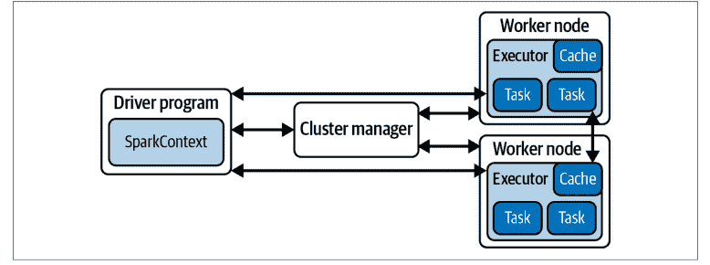

图6-1. Spark 3.0的组件架构

需要注意的是，所有这些并非免费；惰性求值和分布式DataFrame都需要在编写程序时进行额外思考。尽管Spark使许多工作变得容易得多，但理解如何在这种范式下编写高效代码，既能与架构协同工作，又能实现复杂目标，可能需要一年的经验。

回到推荐系统——特别是离线收集器——我们希望使用PySpark构建训练模型所需的数据集类型。使用PySpark可以做的一件简单事情是将我们的日志数据转换为适合训练模型的适当形式。在我们的简单查询中，我们对数据应用了一些过滤器，并按用户和物品分组以获取查看次数。许多其他任务可能自然地适合这种范式——也许是添加存储在其他数据库中的用户或物品特征，或高级聚合。

在我们的MPIR中，我们请求了`get_item_popularities`；并且我们假设了几点：

- 这将返回每个物品被选择的次数。
- 此方法将很快。

如果端点将被实时调用，第二点很重要。那么Spark如何发挥作用呢？

首先，让我们假设我们有大量数据，多到无法全部放入我们小小的MacBook Pro内存中。此外，让我们继续使用前面的模式。我们可以编写一个更简单的查询：

```
item_popularity_qry = """
SELECT
    page_views.page_url_path
    , COUNT(DISTINCT page_views.authenticated_user_id) AS count_viewers

FROM prod.page_views
JOIN prod.dim_users
    ON page_views.authenticated_user_id = dim_users.authenticated_user_id

WHERE DATE page_views.view_tstamp >= '2017-01-01'
    AND dim_users.country_code = 'US'

GROUP BY
    page_views.page_url_path

ORDER BY 2
"""

item_view_counts_sdf = spark.sql(item_popularity_qry)
```

我们现在可以将这个聚合后的（项目，计数）对列表写入应用数据库，以服务于`get_item_popularities`（这个函数在被调用时不需要我们做任何解析），或者我们可以取这个列表的前N个子集，将其存储在内存中，以获取针对特定排名的最佳项目。无论哪种方式，我们都将解析所有日志数据和执行聚合的工作，与实时调用`get_item_popularities`函数分离开来。

这个例子使用了过于简单的数据聚合，这种聚合在PostgreSQL之类的东西中同样容易完成，那么为什么还要费心呢？第一个原因是可扩展性。Spark确实是为水平扩展而构建的，这意味着随着我们需要访问的数据增长，我们只需添加更多的工作节点。

第二个原因是PySpark不仅仅是SparkSQL；任何做过复杂SQL查询的人可能都会同意，SQL的强大和灵活性是巨大的，但通常你想实现的某些任务在完全SQL环境中需要很多创造力才能完成。PySpark为你提供了pandas DataFrames、Python函数和类的所有表现力，以及一个简单的接口，可以将Python代码应用于PySpark数据结构的用户定义函数（UDFs）。UDFs类似于你在pandas中使用的lambda函数，但它们是为PySpark DataFrames构建和优化的。正如你在较小数据集上编写ML程序时可能体验过的那样，在某个时候你会从只使用SQL切换到使用pandas API函数来执行数据转换——你也会在Spark数据规模上欣赏到这种能力。

PySpark允许你编写看起来非常像Python和pandas的代码，并让这些代码以分布式方式执行！你不需要编写代码来指定操作应该在哪些工作节点上发生；PySpark会为你处理。这个框架并不完美；你期望能工作的一些事情可能需要一点注意，代码的优化可能需要额外的抽象层次，但总的来说，PySpark为你提供了一种快速的方法，将你的代码从一个节点移动到一个集群并利用其能力。

为了说明PySpark中一些更有用的东西，让我们回到协同过滤（CF），并计算一些与排名更相关的特征。

### 示例：PySpark中的用户相似度

用户相似度表允许你将用户映射到与推荐相关的其他用户。这回想起一个假设：两个相似的用户喜欢相似的东西，因此你可以向两个用户推荐其中一个尚未看到的项目。构建这个用户相似度表是PySpark作业的一个例子，你可能会看到它是离线收集器职责的一部分。尽管在许多情况下，评分会持续不断地流入，但为了大规模离线作业的目的，我们通常考虑每日批处理来更新我们模型的基本表。在实践中，在许多情况下，这种每日批处理作业足以提供足够好的特征，用于下游的大多数ML工作。其他重要的范式也存在，但它们通常将更频繁的更新与这些每日批处理作业*结合*起来，而不是完全消除它们。

这种每日批处理作业与更小、更频繁的批处理作业相结合的架构称为*lambda架构*，我们稍后将更详细地介绍其方式和原因。简而言之，这两层——批处理层和速度层——通过处理频率和每次运行处理的数据量（反向）来区分。请注意，速度层可能具有不同的频率，并且可以为每小时作业设置不同的速度层，为分钟频率作业设置另一个速度层，这些作业执行不同的任务。图6-2提供了该架构的概述。

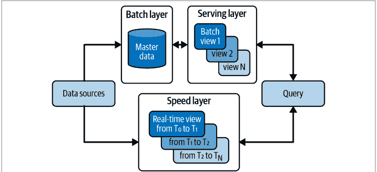

*图6-2. Lambda架构概述*

在用户相似度的情况下，让我们来实现一个计算每日表的批处理作业。首先，我们需要从今天的模式中获取评分。我们还将包括一些其他过滤器，以模拟此查询在现实生活中的样子：

```sql
user_item_ratings_qry = """
SELECT
    book_ratings.book_id
    book_ratings.user_id
    , book_ratings.rating_value
    , book_ratings.rating_tstamp

FROM prod.book_ratings
JOIN prod.dim_users
    ON book_ratings.user_id = dim_users.user_id
JOIN prod.dim_books
    ON book_ratings.book_id = dim_books.dim_books

WHERE
    DATE book_ratings.rating_tstamp
    BETWEEN (DATE '2017-01-01')
    AND (CAST(current_timestamp() as DATE)
    AND book_ratings.rating_value IS NOT NULL
    AND dim_users.country_code = 'US'
    AND dim_books.book_active
"""
```

```python
user_item_ratings_sdf = spark.sql(user_item_ratings_qry)
```

和之前一样，利用SQL语法将数据集获取到Spark DataFrame是第一步，但现在我们在PySpark端有额外的工作。一个常见的模式是通过简单的SQL语法和逻辑获取你想要处理的数据集，然后使用PySpark API进行更详细的数据处理。

让我们首先观察，我们对用户-项目评分的唯一性没有假设。为了这个表，我们决定使用一对的最新评分：

```python
from pyspark.sql.window import Window

windows = Window().partitionBy(
    ['book_id', 'user_id']
).orderBy(
    col("rating_tstamp").desc()
)

user_item_ratings_sdf.withColumn(
    "current_rating",
    first(
        user_item_ratings_sdf("rating_tstamp")
    ).over(windows).as("max_rating_tstamp")
).filter("rating_tstamp = max_rating_tstamp")
```

现在，我们将使用`current_rating`作为我们的评分列，用于下游计算。回顾我们之前基于评分的用户相似度定义：

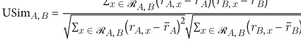

我们需要的重要值如下：

- $r_{(-, -)}$ 对应于用户-项目对的评分
- $\bar{r}_{(-)}$ 用户所有项目的平均评分

行已经是$r_{(-, -)}$值，所以让我们计算用户平均评分$\bar{r}_{(-)}$和评分偏差：

```python
from pyspark.sql.window import Window
from pyspark.sql import functions as F

user_partition = Window.partitionBy('user_id')

user_item_ratings_sdf = user_item_ratings_sdf.withColumn(
    "user_average_rating",
    F.avg("current_rating").over(user_partition)
)

user_item_ratings_sdf = user_item_ratings_sdf.withColumn(
    "rating_deviation_from_user_mean",
    F.col("current_rating") - F.col("user_average_rating")
)
```

现在我们的模式应该如下所示（我们将其格式化得比默认Spark输出稍好一些）：

```
+---------+---------+--------------+--------------+
| book_id | user_id | rating_value | rating_tstamp |
+---------+---------+--------------+--------------+
+---------+---------+--------------+--------------+
| current_rating | user_average_rating | rating_deviation_from_user_mean |
+---------+---------+--------------+--------------+
```

让我们完成创建一个包含用户相似度计算的数据集：

```python
user_pair_item_rating_deviations = user_item_ratings_sdf.alias("left_ratings")
.join(user_item_ratings_sdf.alias("right_ratings"),
    (
        F.col("left_ratings.book_id") == F.col("right_ratings.book_id") &
        F.col("left_ratings.user_id") != F.col("right_ratings.user_id")
    ),
    "inner"
).select(
    F.col("left_ratings.book_id"),
    F.col("left_ratings.user_id").alias("user_id_1"),
    F.col("right_ratings.user_id").alias("user_id_2"),
    F.col("left_ratings.rating_deviation_from_user_mean").alias("dev_1"),
    F.col("right_ratings.rating_deviation_from_user_mean").alias("dev_2")
).withColumn(
    'dev_product',
    F.col("dev_1")*F.col("dev_2")
)

user_similarities_sdf = user_pair_item_rating_deviations.groupBy(
    "user_id_1", "user_id_2"
).agg(
    sum('dev_product').alias("dev_product_sum"),
    sum(F.pow(F.col("dev_1"),2)).alias("sum_of_sqrd_devs_1"),
```

### 数据加载器

数据加载器是一种源自 PyTorch 的编程范式，但也被其他梯度优化的机器学习工作流所采用。随着我们开始将基于梯度的学习集成到推荐系统架构中，我们的 MLOps 工具将面临挑战。第一个挑战与训练数据大小和可用内存有关。数据加载器是一种规定如何高效地将数据分批并发送到训练循环的方法；随着数据集变大，对这些训练集的仔细调度会对学习产生重大影响。但我们为什么必须考虑*批次*数据？那是因为我们将使用适合大量数据的梯度下降变体。

首先，让我们回顾一下*小批量梯度下降*的基础知识。在通过梯度下降进行训练期间，我们将训练样本通过模型进行前向传播以产生预测，然后计算误差并通过模型反向传播适当的梯度以更新参数。批量梯度下降在单次传递中获取所有数据以计算训练集的梯度并将其推回；这意味着你需要将整个训练数据集保存在内存中。随着数据集规模扩大，这从昂贵变得不可能；为避免这种情况，我们可以改为一次仅计算数据集子集的损失函数梯度。最简单的范式称为*随机梯度下降*，它一次计算一个样本的这些梯度和参数更新。小批量版本执行我们的批量梯度下降，但通过一系列子集形成数据集的划分。用数学符号表示，我们用较小批次上的雅可比矩阵来写更新规则：

$$\theta = \theta - \eta * \nabla_{\theta} J(\theta; x^{(i:i+n)}; y^{(i:i+n)})$$

这种优化有几个目的。首先，它只需要在步骤中将可能较小的数据子集保存在内存中。其次，它比 SGD 中的纯迭代版本需要更少的传递次数。第三，作用于这些小批量的梯度可以组织为雅可比矩阵，因此我们拥有可以高度优化的线性代数运算。

### 雅可比矩阵

雅可比矩阵的数学概念最简单的理解是，它是一组具有相关索引的向量导数的组织工具。你可能记得，对于多变量函数，你可以对每个变量*求导*。对于单个多变量标量函数，雅可比矩阵就是函数的一阶导数行向量——这恰好是梯度的转置。

这是最简单的情况；多变量标量函数的梯度可以写成雅可比矩阵。然而，一旦我们有了一个（向量）导数向量，我们就可以将其写成矩阵；这里的实用性实际上只体现在符号表示上。当你将一系列多变量标量函数收集到一个函数向量中时，相关的梯度向量是导数向量的向量。这称为*雅可比矩阵*，它将梯度推广到向量值函数。正如你可能已经意识到的，神经网络的层是向量值函数的绝佳来源，而你希望对其进行求导。

如果你确信小批量是有用的，那么是时候讨论*数据加载器*了——一个简单的 PyTorch API，用于方便地从大型数据集访问小批量。数据加载器的关键参数是 `batch_size`、`shuffle` 和 `num_workers`。批量大小很容易理解：它是每个批次中包含的样本数量（通常是数据集总大小的整数因子）。通常在提供这些批次时会应用洗牌操作；洗牌允许每个批次的网络以随机顺序显示；这旨在提高鲁棒性。最后，`num_workers` 是 CPU 批次生成的并行化参数。

数据加载器的实用性最好通过演示来理解：

```python
params = {
    'batch_size': _,
    'shuffle': _,
    'num_workers': _
}

training_generator = torch.utils.data.DataLoader(training_set, params)

validation_generator = torch.utils.data.DataLoader(validation_set, params)

# Loop over epochs
for epoch in range(max_epochs):
    # Training
    for local_batch, local_labels in training_generator:

        # Model computations
        [...]

    # Validation
    with torch.set_grad_enabled(False):
        for local_batch, local_labels in validation_generator:

            # Model computations
            [...]
```

这段代码的第一个重要细节是，它的任何生成器都将从你的总数据集中读取小批量，并且可以指示它们并行加载这些批次。还要注意，模型计算中的任何微分步骤现在都将作用于这些小批量。

很容易将数据加载器仅仅视为代码整洁的工具（诚然，它确实改善了这一点），但重要的是不要低估批次顺序、并行化和形状的控制对于训练模型的重要性。最后，你的代码结构现在看起来像批量梯度下降，但它利用了小批量，进一步暴露了你的代码实际做了什么，而不是执行它所需的步骤。

### 数据库快照

让我们通过从这些花哨的技术中退一步来讨论一些重要且经典的内容，从而结束本节：生产数据库的快照。

一个极有可能的情况是，构建推荐服务器的工程师（可能也包括你）正在将日志和其他应用程序数据写入 SQL 数据库。很可能，该数据库架构和部署是针对应用程序在其最常见用例中的快速查询而优化的。正如我们所讨论的，这些日志可能采用事件模式，其他表可能需要聚合和汇总才能有意义。例如，*当前库存*表可能需要了解当天开始时的库存，然后汇总购买事件列表。

总而言之，生产 SQL 数据库通常是针对特定用途优化的技术栈中的关键组件。作为该数据的下游消费者，你可能会发现自己需要不同的模式，需要大量访问此数据库，并对此数据执行重要操作。最常见的范式是*数据库快照*。快照是各种 SQL 提供的功能，用于高性能地克隆数据库。虽然这种快照可能以多种方式呈现，但让我们专注于几种有助于简化系统并确保其拥有必要数据的方法：

- 每日表快照可能与 *as_of* 字段相关联，即*此表在当天的状态*。

### 用于学习和推理的数据结构

本节将介绍三种重要的数据结构，它们将使我们的推荐系统能够快速执行复杂操作。每种结构的目标都是在尽可能少地牺牲精度的前提下，加速对数据的实时访问。正如你将看到的，这些数据结构构成了实时推理管道的骨干，并尽可能精确地近似批处理管道中发生的过程。

这三种数据结构如下：

- 向量搜索/近似最近邻索引
- 用于候选过滤的布隆过滤器
- 特征存储

到目前为止，我们已经讨论了让数据在系统中流动所需的必要组件。这些组件有助于组织数据，使其在学习和推理过程中更易于访问。此外，我们将在检索过程中找到一些加速推理的捷径。向量搜索将使我们能够大规模地识别相似物品。布隆过滤器将使我们能够快速评估许多排除结果的标准。特征存储将为我们提供推荐推理所需的用户数据。

每日表快照可能受限于时间，无法查看*今天添加了哪些记录*。
事件表快照可用于将一组事件馈送到像 Segment 这样的事件流处理器（请注意，你也可以设置像 Kafka 这样的实时事件流）。
每小时聚合表可用于状态记录或监控。

通常，范式是操作快照以进行下游数据处理。我们之前提到的许多数据处理类型——比如计算用户相似度——都是可能需要大量数据读取的操作。*重要的是不要构建需要在生产数据库上进行大量查询的机器学习应用程序*，因为这样做可能会降低应用程序的性能并导致更慢的用户体验。这种性能下降会削弱你的推荐所带来的改进。

一旦你对感兴趣的表进行了快照，你通常会发现一系列数据管道很有用，可以将这些数据转换为*数据仓库*中更具体的表（无论如何，你应该在那里完成大部分工作）。像 Dagster、dbt、Apache Airflow、Argo 和 Luigi 这样的工具是用于提取、转换、加载（ETL）操作的流行数据管道和工作流编排工具。

### 向量搜索

我们已经从理解这些实体之间关系的角度讨论了用户相似度和物品相似度，但我们还没有讨论这些过程的任何*加速结构*。

首先让我们讨论一些术语：如果我们考虑一组向量，这些向量代表具有由距离函数提供的相似度度量的实体，我们将其称为*潜在空间*。简单的目标是利用我们的潜在空间及其相关的相似度度量（或互补的距离度量），以便能够快速检索*相似*物品。在我们之前关于相似度的例子中，我们讨论了用户的邻域以及如何利用它们来构建用户与未见物品之间的亲和度分数。但如何找到邻域呢？

要理解这一点，请回想一下我们将元素 $x$ 的邻域定义为 $\mathcal{N}(x)$，即潜在空间中具有最大相似度的 $k$ 个元素的集合；或者换句话说，从与 $x$ 的物品相似度样本中，$j \le k$ 的 $j$ 阶统计量的集合。这些通常被称为 *k-近邻*，将被视为与 $x$ 相似的元素集合。

来自协同过滤的这些向量还产生了一些其他有用的副作用：

- 一个简单的推荐器，从用户邻域喜欢的物品中随机采样未见物品
- 根据邻域中已知用户的特征，预测用户的特征
- 通过品味相似性进行用户细分

那么我们如何加速这些过程呢？这个领域最早的重大改进之一来自倒排索引。利用倒排索引的核心是仔细构建一个大型哈希表，将查询的标记（对于基于文本的搜索）与候选项连接起来。

这种方法非常适合可标记化的实体，如句子或小型词表集合。鉴于能够查找与查询共享一个或多个标记的物品，你甚至可以使用通用的潜在嵌入来按相似度对候选响应进行排序。这种方法在扩展时值得特别考虑：它会产生速度成本，因为它涉及两个步骤，并且因为相似度分布可能与标记相似度相关性不高，从而需要返回比我们需要的更多的候选项。

构建搜索系统的经典方法基于大型查找表，并且感觉是确定性的。当我们转向近似最近邻查找时，我们希望放松一些这种强确定性行为，并引入一些数据结构，这些结构通过假设来*修剪*这些大型索引。你不必仅为元素的可标记化部分构建索引，而是可以预计算 $k$-d 树，并将这些索引用作索引。$k$-d 树将在批处理过程中预计算最近邻（这可能很慢），以填充用于快速查找的 top-$k$ 响应。$k$-d 树是编码前述邻域的高效数据结构，但在高维空间中读取速度非常慢。然而，使用它们来构建倒排索引可能是一个很大的改进。

最近，显式地使用带有向量搜索的向量数据库变得越来越可行。Elasticsearch 已经添加了此功能；Faiss 是一个 Python 库，可帮助你在系统中实现此功能；Pinecone 是一个明确针对此目标的向量数据库系统；Weaviate 是一个原生向量数据库架构，允许你叠加先前的基于标记的倒排索引和向量相似度搜索。

### 近似最近邻

这个元素的 $k$-近邻是什么？令人难以置信的是，近似最近邻（ANN）与实际最近邻相比可以获得非常高的准确性，并且你可以以令人眼花缭乱的速度提升更快地达到目标。你通常对这些问题的近似解感到满意。

一个专门从事这些近似的开源库是 PyNNDescent，它通过优化的实现和巧妙的数学技巧使用了聪明的加速方法。通过 ANN，你可以采用前面讨论的两种策略：

- 预索引可以得到显著改进。
- 对于没有预索引选项的查询，你仍然可以期望获得良好的性能。

在实践中，这些相似度查找对于使你的应用程序真正工作至关重要。虽然我们主要讨论了针对完整已知物品目录的推荐，但我们不能在其他推荐场景中假设这一点。这些场景包括：

- 基于查询的推荐（如搜索）
- 上下文推荐
- 新物品的冷启动

随着我们的进行，你将看到越来越多关于空间中相似度和最近邻的引用；在每一个这样的时刻，想想：“我知道如何让它变快！”

### 布隆过滤器

*布隆过滤器*是一种概率数据结构，允许我们非常高效地测试集合成员资格，但有一个缺点：集合排除是确定性的，但集合成员资格是概率性的。*在实践中，这意味着询问“x 是否在这个集合中”永远不会导致假阴性，但可能导致假阳性！*请注意，随着布隆过滤器大小的增加，这种第一类错误会增加。

通过向量搜索，我们已经为用户识别了一大池潜在的推荐。从这个池中，我们需要进行一些立即的消除。最基本且必要的高级过滤类型是移除那些*用户之前未表现出兴趣或已经购买过的*物品。你可能有过这样的经历：被反复推荐同一个物品，然后想：“我不想要这个；别再给我看这个了。”从我们介绍的简单协同过滤模型中，你现在可能明白为什么会发生这种情况。

系统通过协同过滤识别了一组你更有可能选择的物品。没有任何外部影响，这些计算将继续返回相同的结果，你将永远无法摆脱这些推荐。作为系统设计者，你可能会从一个启发式方法开始：

> 如果用户已经看到这个物品被推荐了三次并且从未点击过，我们就不再向他们展示它了。

这是一个完全合理的策略，可以提高推荐系统的*新鲜度*（确保用户看到新物品推荐的理念）。虽然这是一个改进推荐的简单策略，但你如何在大规模上实现它呢？

可以通过定义以下集合来使用布隆过滤器：“这个用户是否已经看到这个物品被推荐了三次并且从未点击过？”布隆过滤器有一个注意事项：它们只能是累加的；一旦某物进入布隆过滤器，你就无法移除它。当观察像这个启发式方法这样的二元状态时，这不是问题。

让我们构建一个用户-物品 ID 作为我们在布隆过滤器中使用的哈希值。请记住，布隆过滤器的关键特征是快速确定哈希项是否在布隆过滤器中。当我们观察到满足前述条件的用户-物品对时，将该对作为 ID 并对其进行哈希。现在，因为该哈希对可以很容易地从用户的物品列表中重建，所以我们有一种非常快速的过滤方法。

让我们讨论一下这个主题的一些技术细节。首先，你可能想要进行各种类型的过滤——也许新鲜度是一个，另一个可能是用户已经购买的物品，第三个可以排除已售罄的物品。

在这里，最好独立实现每个过滤器；前两个可以像以前一样遵循我们的用户-物品 ID 哈希，第三个可以仅对物品 ID 进行哈希。

另一个考虑因素是填充布隆过滤器。最佳实践是在离线批处理作业期间从数据库构建这些布隆过滤器。无论你的批处理训练按何种计划运行，都应从记录存储中重建布隆过滤器，以确保其保持准确。请记住，布隆过滤器不允许删除操作，因此在前面的例子中，如果一个商品从售罄变为重新上架，你的布隆过滤器批处理刷新可以再次捕获其可用性。在批处理重训练之间，向布隆过滤器添加数据也非常高效，因此你可以随着观察到更多需要实时考虑过滤的数据而继续向其中添加。不过，请确保这些事务被记录到表中！当你想要刷新时，这些日志将非常重要。

### 趣闻：布隆过滤器作为推荐系统

布隆过滤器不仅提供了一种基于包含条件来排除某些推荐的有效方式，还可以用于执行推荐本身！特别是，Manuel Pozo 等人的论文《基于布隆过滤器的推荐系统项/用户表示》表明，对于具有大量稀疏性的高维特征集（正如我们在第3章讨论的），布隆过滤器使用的哈希类型有助于克服定义良好相似性函数时的一些关键挑战！

让我们观察一下，我们可以通过布隆过滤器数据结构对集合执行两个自然操作。首先，考虑两个集合 $A$ 和 $B$，并将它们与布隆过滤器 $\mathcal{BF}_A$ 和 $\mathcal{BF}_B$ 关联起来。那么 $A \cap B$ 的定义是什么？我们能为这个交集设计一个布隆过滤器吗？可以！回想一下，我们的布隆过滤器保证能告诉我们一个元素是否不在集合中，但如果一个元素在集合中，布隆过滤器只能以一定的概率响应。在这种情况下，我们只需查找根据 $\mathcal{BF}_A$ *在* 且根据 $\mathcal{BF}_B$ *在* 的元素。当然，作为*在*每个集合中返回的元素集合大于实际集合（即 $A \subset \mathcal{BF}_A$），因此交集也会更大：

$$A \cap B \subset \mathcal{BF}_A \cap \mathcal{BF}_B$$

请注意，你可以通过关于哈希函数选择的信息来计算基数的精确差异。还要注意，该方程是一种符号滥用，将 $\mathcal{BF}_A$ 称为与 $A$ 对应的布隆过滤器返回的事物集合。

其次，我们还需要构造并集。这同样简单，只需考虑根据 $\mathcal{BF}_A$ *在* 或根据 $\mathcal{BF}_B$ *在* 的元素。因此，类似地：

$$A \cup B \subset \mathcal{BF}_A \cup \mathcal{BF}_B$$

现在，如果我们考虑项目 $X$ 和 $Y$ 作为可能包含许多特征的连接向量，并对这些连接特征进行哈希处理，我们就是将它们各自表示为布隆过滤器的位向量。从前面我们知道，两个布隆过滤器的交集是有意义的，实际上等同于它们布隆表示的按位 $AND$。这意味着两个项目的特征相似性可以通过它们布隆哈希的按位 $and$ 相似性来表示：

$$\text{sim}(X, Y) = |\mathcal{B}\mathcal{F}(X) \cap \mathcal{B}\mathcal{F}(Y)| = \mathcal{B}\mathcal{F}(X) \text{ bitwise } \mathcal{B}\mathcal{F}(X)$$

对于静态数据集，这种方法具有真正的优势，包括速度、可扩展性和性能。其局限性基于各种特征以及更改可能项目集的能力。稍后我们将讨论 $局部敏感哈希$，它进一步迭代了查找速度，并降低了高维空间中的冲突风险，一些类似的想法将重新出现。

### 特征存储

到目前为止，我们一直专注于可能被称为 $纯协同过滤$ 的推荐系统。我们仅在尝试做出良好推荐时才利用用户或项目相似性数据。如果你一直在想，“嘿，关于实际用户和项目的信息呢？”你的好奇心现在将得到满足。

除了之前的协同过滤方法之外，你可能对特征感兴趣的原因有很多。让我们列出一些高层次的关注点：

- 你可能希望首先向新用户展示一组特定的项目。
- 你可能希望在推荐中考虑地理边界。
- 区分儿童和成人可能对他们获得的推荐类型很重要。
- 项目特征可用于确保推荐的高层次多样性（更多内容见第15章）。
- 用户特征可以支持各种实验测试。
- 项目特征可用于将项目分组为集合，以进行上下文推荐（更多内容见第15章）。

除了这些问题，另一种特征通常至关重要：实时特征。虽然特征存储的要点是提供对所有必要特征的实时访问，但值得区分那些变化不频繁的稳定特征和我们预期会经常变化的实时特征。

实时特征存储的一些重要示例包括动态价格、当前项目可用性、*趋势*状态、愿望清单状态等。这些特征可能在一天中发生变化，我们希望它们在特征存储中的值能够通过其他服务和系统实时更改。因此，实时特征存储需要提供用于特征变更的 API 访问。这可能是你不想为*稳定*特征提供的。

当我们设计特征存储时，我们可能希望稳定特征通过 ETL 和转换从数据仓库表构建，我们也可能希望实时特征以这种方式构建，但速度更快或允许 API 访问进行变更。无论哪种情况，特征存储的关键质量是*非常快的读取访问*。通常，为模型的离线训练单独构建特征存储是一个好主意，可以在测试中构建以确保对新模型的支持。

那么架构和实现可能是什么样子？参见图 6-3。

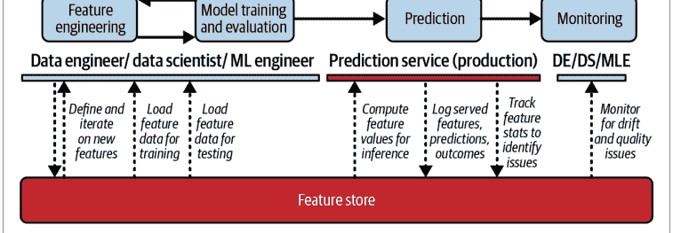

设计特征存储涉及设计管道，这些管道定义并*将特征转换到该存储中*（通过 Airflow、Luigi、Argo 等工具协调），并且通常看起来类似于构建我们的收集器时使用的数据管道类型。特征存储需要关注的一个额外复杂性是速度层。在本章前面关于 lambda 架构的讨论中，我们提到我们可以考虑收集器的批处理数据处理和用于中间更新的更快速度层，但这对于特征存储更为重要。特征存储可能还需要一个*流处理层*。这一层处理连续的数据流，并可以对这些数据执行转换；然后它将适当的输出实时写入在线特征存储。这增加了复杂性，因为对流数据的数据转换带来了一系列非常不同的挑战，通常需要不同的算法策略。这里的一些有用技术是 Spark Streaming 和 Kinesis。你还需要配置系统以正确处理数据流，其中最常见的是 Kafka。数据流层涉及许多组件和架构考虑，超出了我们的范围；如果你考虑开始使用 Kafka，请查看 Gwen Shapira 等人的《Kafka权威指南》（O'Reilly）。

特征存储还需要一个*存储层*；这里存在许多方法，但使用 NoSQL 数据库很常见，尤其是在在线特征存储中。原因是更快的检索和数据存储的性质。推荐系统的特征存储往往非常基于键（即，*获取此用户的特征*，或*获取此项目的特征*），这非常适合键值存储。这里的一些示例技术是 DynamoDB、Redis 和 Cassandra。离线特征存储的存储层可能只是 SQL 风格的数据库以降低复杂性，但你将为离线和在线之间的差异付出代价。这种差异和其他类似的差异被称为*训练服务偏差*。

特征存储的一个独特但必要的方面是*注册表*。注册表对于特征存储非常有用，因为它协调现有特征以及它们如何定义的信息。更复杂的注册表实例还包括带有类型、分布期望的输入和输出模式。这些是数据管道必须遵守和满足的契约，以避免用垃圾数据填充你的特征存储。此外，注册表的定义允许并行的数据科学家和 ML 工程师开发新特征、使用彼此的特征，并通常理解他们的模型可能使用的特征的假设。

这些注册表的一个重要优势是它们激励团队和开发者之间的一致性。特别是，如果你决定关心用户的*国家*，并且你在注册表中看到一个*国家*特征，你更有可能使用它（或询问注册表中负责此特征的开发者），而不是从头开始创建一个新的。实际上，数据科学家在定义模型时会做出数百个小决策和假设，这减轻了依赖现有资源的部分负担。


### 模型注册表

与特征注册表密切相关的一个概念是模型注册表。这两个概念有很多共同之处，但我们建议你以不同的方式思考它们。一个优秀的模型注册表可以为模型的输入和输出提供类型契约，并可以在一致性和清晰度方面提供许多相同的好处。特征注册表应真正专注于业务逻辑和特征的定义。因为特征工程也可以是模型驱动的，所以清楚地说明这两者之间的差异可能具有挑战性，所以总结一下，我们将专注于它们服务的对象：模型注册表关注 ML 模型和相关的元数据，而特征注册表关注模型将使用的特征。

最后，我们需要讨论如何*服务*这些特征。在具备相应性能的存储层支持下，我们需要通过API请求来提供必要的特征向量。这些特征向量是模型在提供推荐时所需的用户详细信息——例如，用户的位置或内容年龄限制。API可以返回该键对应的全部特征集，或允许更精确的指定。通常，响应会以JSON序列化格式传输以实现快速数据传输。重要的是，所提供的特征必须是*最新的特征集*，对于更严肃的工业应用，此处的延迟预计应低于100毫秒。

这里有一个重要的注意事项：对于离线训练，这些特征存储需要支持*时间回溯*。因为我们在训练期间的目标是以*最具泛化性的方式*为模型提供适当的数据，所以在训练模型时，至关重要的是不能让其访问超出时间范围的特征。这被称为*数据泄露*，可能导致训练和生产环境之间的性能出现巨大差异。因此，用于离线训练的特征存储必须具备随时间变化的特征知识，以便在训练期间，可以通过提供时间索引来获取当时的特征。这些*as_of*键可以与历史训练数据绑定，因为我们*重放*用户-物品交互历史记录。

有了这些组件——以及该系统所需的重要监控——你就能够为模型提供离线和在线特征。在**第三部分**，你将看到利用这些特征的模型架构。

### 数据泄露

基于你对机器学习的了解，你可能熟悉泄露的概念：由于模型训练时访问了本应保留用于模型性能评估的数据，导致性能指标失真。

机器学习中的数据泄露分为*特征泄露*和*训练样本泄露*。对于推荐系统，数据泄露还面临额外的挑战，即时间泄露或非平稳性泄露。真正的危险在于，在推荐系统中，我们反复观察同一个观测单元——用户，并在每次观察时获取一个数据点。当我们观察他们时，系统的其他方面可能已经发生了变化，而实际上我们希望在模型中使用的是截至该观测时间点的最新特征。无论是在特征还是训练样本中，为了避免泄露，我们需要始终考虑系统的时间线。这就是为什么推荐系统的数据准备本质上是时间相关的。你将在**第11章**中看到，我们的准确度指标需要明确考虑基于该时间轴的训练-测试划分，然后进一步按用户分组。这也意味着训练推荐系统通常比许多其他任务类型需要更多的资源。

## 总结

我们不仅讨论了充实系统和提供推荐所需的关键组件，还讨论了使这些组件成为现实所需的一些工程构建模块。有了数据加载器、嵌入、特征存储和检索机制，我们已准备好开始构建我们的流水线和系统拓扑。

在下一章中，我们将把目光聚焦于MLOps以及构建和迭代这些系统所需的其余工程工作。仔细思考部署和监控对我们来说将非常重要，这样我们的推荐系统才能避免局限于在IPython Notebooks中运行。

继续前进，了解转向生产环境的架构考量。

# 第7章

## 服务模型与架构

当我们思考推荐系统如何利用可用数据进行学习并最终提供推荐时，描述这些组件如何协同工作至关重要。数据流与可用于学习的联合数据的组合被称为*架构*。更正式地说，架构是系统或服务网络的连接和交互；对于数据应用，架构还包括每个子系统的可用特征和目标函数。定义架构通常涉及识别组件或单个服务、定义这些组件之间的关系和依赖关系，以及指定它们将进行通信的协议或接口。

在本章中，我们将详细阐述一些最受欢迎且最重要的推荐系统架构。

## 按推荐结构划分的架构

我们已多次回到收集器、排序器和服务器的概念，并且看到它们可以通过两种范式来理解：在线模式和离线模式。此外，我们已经看到第6章中的许多组件如何满足这些功能的一些核心要求。

设计这样的大型系统需要考虑多种架构因素。在本节中，我们将展示这些概念如何根据你正在构建的推荐系统类型进行调整。我们将比较一个基本标准的物品到用户推荐系统、一个基于查询的推荐系统、基于上下文的推荐系统和基于序列的推荐系统。

### 物品到用户推荐

我们将从描述本书迄今为止一直在构建的系统架构开始。如第4章所提议的，我们离线构建收集器来摄取和处理我们的推荐。我们利用表示来编码物品、用户或用户-物品对之间的关系。

在线收集器接收请求（通常以用户ID的形式），并在该表示空间中找到一个物品邻域，传递给排序器。这些物品在适当时被过滤，然后发送进行评分。

离线排序器学习用于评分和排序的相关特征，在历史数据上进行训练。然后，它使用该模型，在某些情况下还使用物品特征进行推理。

在推荐系统的情况下，此推理计算与潜在推荐集中每个物品相关的分数。我们通常按此分数排序，你将在第三部分了解更多。最后，我们整合基于某些业务逻辑（在第14章描述）的最后一轮排序。这最后一步是服务的一部分，我们在其中施加诸如测试标准或推荐多样性要求等约束。

图7-1是检索、排序和服务结构的一个极好概述，尽管它描绘了四个阶段并使用了略有不同的术语。在本书中，我们将此处显示的过滤阶段合并到检索中。

### 基于查询的推荐

为了启动我们的流程，我们想要进行查询。查询最明显的例子是基于文本搜索引擎的文本查询；然而，查询可能更通用！例如，你可能希望允许按图像搜索或按标签搜索的选项。请注意，一种重要的基于查询的推荐器使用*隐式*查询：用户通过UI选择或行为提供搜索查询。虽然这些系统在整体结构上与物品到用户系统非常相似，但让我们探索如何修改它们以适应我们的用例。

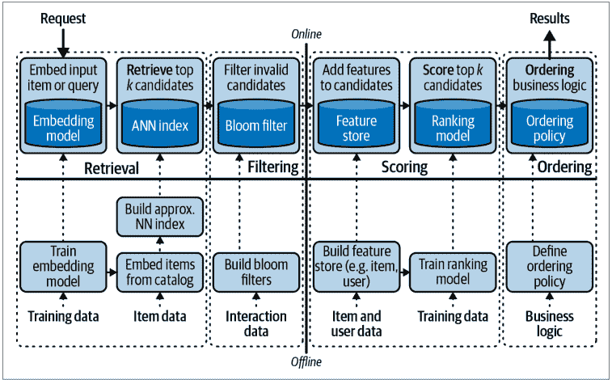

我们希望将更多关于查询的上下文集成到请求的第一步中。请注意，我们不想丢弃该系统的用户-物品匹配组件。即使用户正在执行搜索，根据他们的品味个性化推荐也是有用的。相反，我们需要同时利用查询；稍后我们将讨论各种技术策略，但目前的一个简单总结是也为查询生成一个嵌入。请注意，查询类似于物品或用户，但又有足够的不同。

一些策略可能包括查询与物品之间的相似性，或查询与物品的共现。无论哪种方式，我们现在都有了查询表示和用户表示，我们希望同时利用两者进行推荐。一种简单的方法是使用查询表示进行检索，但在评分时，通过查询-物品和用户-物品进行评分，并通过多目标损失将它们组合起来。另一种方法是使用用户进行检索，然后使用查询进行过滤。

### 不同的嵌入空间

遗憾的是，尽管我们希望同一个嵌入空间（用于最近邻查找）能同时适用于我们的查询和文档（项目等），但情况往往并非如此。最简单的例子是提出问题并希望找到相关的维基百科文章。这个问题通常被称为查询与文档“分布外”。

维基百科文章采用的是陈述性、信息性的文章风格，而问题通常简短且随意。如果你使用一个专注于捕捉语义意义的嵌入模型，你可能会天真地认为查询会位于与文章显著不同的子空间中。这意味着你的距离计算会受到影响。这通常*不是*一个大问题，因为你是通过相对距离进行检索的，并且你可以期望共享的子空间足以提供良好的检索效果。然而，很难预测这些方法在何时表现不佳。

最佳实践是仔细检查常见查询和目标结果上的嵌入效果。这些问题在隐式查询上可能*尤其*严重，例如在一天中的特定时间执行一系列操作来查找食物推荐。在这种情况下，我们预期查询与文档会大相径庭。

### 基于上下文的推荐

上下文与查询非常相似，但往往更明显地基于特征，并且通常与项目/用户分布的相似度较低。*上下文*通常是指代表系统外部特征的术语，这些特征可能对系统产生影响——即辅助信息，如时间、天气或位置。基于上下文的推荐与基于查询的推荐类似，因为上下文是系统在推荐过程中需要考虑的额外信号，但通常情况下，查询应该主导推荐信号，而上下文则不应该。

让我们以一个简单的点餐例子来说明。对于一个外卖推荐系统，查询可能类似于*墨西哥食物*；这是用户寻找墨西哥卷饼或墨西哥夹饼的极其重要的信号，它决定了推荐应该是什么样子。对于一个外卖推荐系统，上下文可能类似于*快到午餐时间了*。这个信号很有用，但可能不会超过用户个性化的重要性。对此权重制定硬性规定可能很困难，所以我们通常不这样做，而是通过实验来学习参数。

上下文特征融入架构的方式与查询类似，通过作为目标函数一部分的学习权重。你的模型将学习上下文特征和项目之间的表示，然后将这种亲和力添加到其余的流程中。同样，你可以在检索阶段早期、排序阶段后期，甚至在服务阶段利用这一点。

### 基于序列的推荐

*基于序列的推荐*建立在基于上下文的推荐之上，但使用的是特定类型的上下文。序列推荐基于这样一个理念：用户最近接触过的项目应该对推荐产生重大影响。这里一个常见的例子是音乐流媒体服务，因为最近播放的几首歌曲可以极大地提示用户接下来可能想听什么。为了确保这组*自回归*或序列预测特征对推荐产生影响，我们可以将序列中的每个项目视为推荐的加权上下文。

通常，项目-项目表示相似度被加权以提供一组推荐，并使用各种策略来组合这些推荐。在这种情况下，我们通常期望用户在推荐中具有高度重要性，但序列也具有高度重要性。一个简单的模型是将项目序列视为一个标记序列，并为该序列形成一个单一的嵌入——就像在自然语言处理应用中一样。这个嵌入可以用作基于上下文的推荐架构中的上下文。

#### 朴素序列嵌入

每个序列一个嵌入的组合数学在基数上会爆炸；每个序列位置的潜在项目数量非常大，而序列中的每个项目都会将这些可能性相乘。例如，想象一下五个词的序列，其中每个项目的可能性数量接近英语词汇表的大小，因此它将是该大小的五次方。我们在第17章提供了处理这个问题的简单策略。

### 为什么要费心使用额外特征？

有时退一步问问一项新技术是否真的值得关注是有用的。到目前为止，在本节中，我们介绍了思考推荐问题的四种新范式。这种程度的细节可能看起来令人惊讶，甚至可能不必要。

像基于上下文和基于查询的推荐这样的东西变得相关的核心原因之一，是为了解决前面提到的一些关于稀疏性和冷启动的问题。稀疏性使得那些并非冷门的东西看起来冷门，因为学习者对它们接触不足，但真正的冷启动也存在，因为在大多数应用中，新项目被频繁添加到目录中。我们将详细讨论冷启动，但现在，可以说热启动的一个策略是使用即使在这种情况下*也*可用的其他特征。

在明确基于特征的机器学习应用中，我们很少如此程度地与冷启动问题作斗争，因为在推理时，我们确信对预测有用的模型参数与那些可用的特征是良好对齐的。通过这种方式，包含特征的推荐系统是从一个潜在较弱的学习者引导而来的，该学习者通过始终可用的特征获得了更有保证的性能。

前面架构反映的第二个类比是提升（boosting）。提升模型通过观察较弱学习者的集成可以达到更好的性能来运作。在这里，我们要求一些额外的特征来帮助这些网络与弱学习者集成，以提升它们的性能。

### 编码器架构与冷启动

前面各种类型推荐问题的问题框架指出了四种模型架构，每一种都符合我们收集器、排序器和服务器的通用框架。有了这个理解，让我们更详细地讨论模型架构如何与服务架构交织在一起。特别是，我们还需要讨论特征编码器。

编码器增强系统的关键机会在于，对于数据不多的用户、项目或上下文，我们仍然可以即时形成嵌入。回想一下，我们的嵌入使系统的其余部分成为可能，但冷启动推荐是一个巨大的挑战。

由Xinyang Yi等人在《针对大规模语料库项目推荐的采样偏差校正神经建模》中引入的*双塔架构*——或双编码器网络——如图7-2所示。这种显式的模型架构旨在在为推荐系统构建评分模型时，优先考虑用户和项目的特征。我们将看到更多关于矩阵分解（MF）的讨论，这是一种从用户-项目矩阵和一些线性代数算法派生出来的潜在协同过滤（CF）。在前面的部分中，我们解释了为什么额外特征很重要。将这些*辅助*特征添加到MF范式中是可能的，并且已被证明是成功的——例如，CF在隐式反馈中的应用、分解机和SVDFeature。然而，在这个模型中，我们将采取更直接的方法。

图7-2. 负责两个嵌入的双塔

在这个架构中，我们让左塔负责项目，右塔负责用户，并在适当时负责上下文。这两种塔架构的灵感来自自然语言处理文献，特别是Paul Neculoiu等人的《使用孪生循环网络学习文本相似性》。

让我们详细说明这个模型架构如何应用于YouTube上的视频推荐。关于这个架构首次引入的完整概述，请参阅Paul Covington等人的《用于YouTube推荐的深度神经网络》。训练标签将由点击给出，但带有一个额外的回归特征$r_i \in \{0, 1\}$，其中最小值对应于点击但观看时间很短，而范围的最大值对应于完整观看。

正如我们提到的，这个模型架构将明确包含来自用户和项目的特征。视频特征将包括分类和连续特征，如VideoId、ChannelId、VideoTopic等。许多分类特征使用嵌入层转换为密集表示。用户特征包括通过词袋模型表示的观看历史和标准用户特征。

这个模型结构结合了你之前见过的许多想法，但对我们的系统架构有相关的启示。首先是序列训练的想法。每个*时间批次*的样本应该按顺序训练，以确保模型漂移被模型感知；我们将在第197页的“预序列验证”中讨论预序列数据集。接下来，我们介绍一个对这类模型生产化很重要的想法：编码器。

在这些模型中，我们在两个塔中都使用了特征编码器作为早期层，当进行推理时，我们仍然需要这些编码器。在执行在线推荐时，我们会获得UserId和VideoId，首先需要收集它们的特征。正如第90页“特征存储”中所讨论的，特征存储对于获取这些原始特征很有用，但我们也需要将特征编码为推理所需的密集表示。对于已知实体，这可以存储在特征存储中，但对于未知实体，我们需要在推理时进行特征嵌入。

编码层充当将一组特征映射到密集表示的简单模型。当将编码层作为神经网络的第一步进行拟合时，常见的策略是取前$k$层并将其重用为编码器模型。更具体地说，如果$\mathscr{L}^i, 0 \le i \le k$是负责特征编码的层，则称$Emb(\hat{V}) = \mathscr{L}^k(\mathscr{L}^{k-1}(...\mathscr{L}^0(\hat{V})))$为将特征向量$\hat{V}$映射到其密集表示的函数。

在我们之前的系统架构中，我们会在从特征存储获取特征后，将此编码器作为快速层的一部分。同样重要的是要注意，我们仍然希望利用向量搜索；这些特征嵌入层用于向量搜索和最近邻搜索的上游。


### 编码器即服务

编码器和检索是多阶段推荐管道的关键部分。我们已经简要讨论了相关的潜在空间（更多细节请参见第167页“潜在空间”），并且我们提到了*编码器*。简而言之，编码器是将用户、物品、查询等转换为将执行最近邻搜索的潜在空间的模型。这些模型可以通过多种过程进行训练，其中许多将在后面讨论，但讨论它们训练完成后的位置很重要。

编码器通常是简单的API端点，接受要嵌入的内容并返回一个向量（一个浮点数列表）。编码器通常在批处理层工作，以编码所有将被检索的文档/物品，但它们也*必须*连接到实时层，以在查询到达时进行编码。一个常见的模式是设置一个批处理端点和一个单个查询端点，以促进两种模式的优化。这些端点应该快速且高度可用。

如果你正在处理文本数据，一个很好的起点是使用基于BERT或GPT的嵌入。目前最简单的是由OpenAI作为托管服务提供的。

## 部署

与许多机器学习应用程序一样，推荐系统的最终输出本身就是一个持续运行的小程序，并暴露一个API与之交互；批量推荐通常是一个强大的起点，可以提前执行所有必要的推荐。在本章中，我们已经看到了嵌入我们后端系统的各个部分，但现在我们将讨论更接近用户的组件。

在我们相对通用的架构中，服务器负责在之前的所有工作完成后交付推荐，并且应该遵循预设的模式。但这种部署是什么样子的？

### 模型即API

让我们讨论两种可能适合在生产环境中提供模型的系统架构：微服务和单体架构。

在Web应用程序中，这种二分法从许多角度和特殊用例中得到了很好的涵盖。作为机器学习工程师、数据科学家，以及可能的数据平台工程师，没有必要深入研究这个领域，但了解基础知识至关重要：

*微服务架构*
管道的每个组件都应该是自己的小程序，具有清晰的API和输出模式。组合这些API调用可以实现灵活且可预测的管道。

*单体架构*
一个应用程序应包含模型预测所需的所有必要逻辑和组件。保持应用程序自包含意味着需要保持一致的接口更少，并且在管道中的某个位置资源不足时，需要深入挖掘的“兔子洞”更少。

无论你选择什么策略，你都需要做出一些决定：

*必要的应用程序有多大？*
如果你的应用程序在推理时需要快速访问大型数据集，你需要仔细考虑内存需求。

*你的应用程序需要什么访问权限？*
我们之前讨论过使用布隆过滤器和特征存储等技术。这些资源可能与你的应用程序紧密耦合（通过在应用程序中构建内存），或者可能只需一次API调用。确保你的部署考虑了这些关系。

*你的模型应该部署到单个节点还是集群？*
对于某些模型类型，即使在推理步骤，我们也希望利用分布式计算。这将需要额外的配置以实现快速并行化。

*你需要多少副本？*
水平扩展允许你同时运行同一服务的多个副本，以减少对任何特定实例的需求。这对于确保可用性和性能非常重要。随着我们水平扩展，每个服务可以独立运行，并且存在各种策略来协调这些服务和API请求。每个副本通常是自己的容器化应用程序，像CoreOS和Kubernetes这样的API用于管理这些。请求本身也必须通过像nginx这样的东西平衡到不同的副本。

*暴露了哪些相关API？*
堆栈中的每个应用程序都应该有一组清晰的暴露模式，并明确说明可能调用API的其他应用程序的类型。

### 启动模型服务

那么，你可以用什么来将你的模型放入应用程序中？各种应用程序开发框架都很有用；Python中一些最受欢迎的是Flask、FastAPI和Django。每个都有不同的优势，但我们将在这里讨论FastAPI。

FastAPI是一个针对API应用程序的框架，使其特别适合提供机器学习模型。它自称是一个异步服务器网关接口（ASGI）框架，其专用性带来了极大的简洁性。

让我们以一个简单的例子，使用FastAPI框架将一个训练好的PyTorch模型转换为服务。首先，让我们利用一个制品存储来拉取我们训练好的模型。这里我们使用Weights & Biases制品存储：

```python
import wandb, torch
run = wandb.init(project=Prod_model, job_type="inference")

model_dir = run.use_artifact(
    'bryan-wandb/recsys-torch/model:latest',
    type='model'
).download()

model = torch.load(model_dir)
model.eval(user_id)
```

这看起来就像你的笔记本工作流程，所以让我们看看将其与FastAPI集成有多容易：

```python
from fastapi import FastAPI # FastAPI code

import wandb, torch

app = FastAPI() # FastAPI code

run = wandb.init(project=Prod_model, job_type="inference")

model_dir = run.use_artifact(
    'bryan-wandb/recsys-torch/model:latest',
    type='model'
).download()

model = torch.load(model_dir)

@app.get("/recommendations/{user_id}") # FastAPI code
def make_recs_for_user(user_id: int): # FastAPI code
    endpoint_name = 'make_recs_for_user_v0'
    logger.info(
        "{'type': 'recommendation_request',"
        f"'arguments': {'user_id': {user_id}},"
        f"'response': {None}},"
        f"'endpoint_name': {endpoint_name}"
    )
    recommendation = model.eval(user_id)
    logger.log(
        "{'type': 'model_inference',"
        f"'arguments': {'user_id': {user_id}},"
        f"'response': {recommendation}},"
        f"'endpoint_name': {endpoint_name}"
    )
    return { # FastAPI code
        "user_id": user_id,
        "endpoint_name": endpoint_name,
        "recommendation": recommendation
    }
```

我希望你和我一样热情，我们现在只需五行额外的代码就拥有了一个模型即服务。虽然这个场景包含了简单的日志记录示例，但我们将在本章后面更详细地讨论日志记录，以帮助你提高应用程序的可观察性。

### 工作流编排

你的部署系统所需的另一个组件是工作流编排。模型服务负责接收请求和提供结果，但许多系统组件需要到位才能使此服务发挥作用。这些工作流有几个组件，因此我们将按顺序讨论它们：容器化、调度和CI/CD。

### 容器化

我们已经讨论了如何构建一个能够返回结果的简单服务，并建议使用 FastAPI；然而，环境问题现在变得相关。在执行 Python 代码时，保持环境一致（即使不完全相同）非常重要。FastAPI 是一个用于设计接口的库；而 Docker 是管理代码运行环境的软件。Docker 常被描述为容器或容器化工具：这是因为你可以将一堆应用程序——或代码的可执行组件——加载到一个共享环境中。

此时我们需要注意几个微妙之处。*环境*的含义既包括 Python 包依赖的环境，也包括更大的环境，包括操作系统或 GPU 驱动程序。环境通常从一个预定义的*镜像*初始化，该镜像安装了你将需要访问的最基本方面，并且在许多情况下，为了促进一致性和标准化，跨服务的变异性较小。最后，容器通常配备了一组必要的基础设施代码，以便在其部署的任何地方工作。

在实践中，你通过 *requirements* 文件指定 Python 环境的详细信息，该文件由 Python 包列表组成。请注意，一些库依赖项在 Python 之外，需要额外的配置机制。操作系统和驱动程序通常作为基础镜像的一部分构建；你可以在 DockerHub 或类似平台上找到这些。最后，*基础设施即代码*是一种范式，你编写代码来编排必要的步骤，使你的容器配置为在将要部署的基础设施中运行。Dockerfile 和 Docker Compose 专门用于 Docker 容器与基础设施的接口，但你可以进一步将这些概念推广到包括基础设施的其他细节。这种基础设施即代码开始封装云中资源的配置、为网络通信设置开放端口、通过安全角色进行访问控制等。编写此代码的一种常见方式是使用 Terraform。本书不深入探讨基础设施规范，但基础设施即代码正成为机器学习从业者越来越重要的工具。许多公司正开始尝试简化训练和部署系统的这些方面，包括 Weights & Biases 或 Modal。

### 调度

调度作业存在两种范式：cron 和触发器。稍后我们将更详细地讨论持续训练循环和主动学习过程，但在这些之前是你的机器学习工作流。机器学习工作流是一组有序的步骤，用于为模型推理做准备。我们已经介绍了收集器、排序器和服务器的概念，它们被组织成推荐系统的序列阶段——但这些是系统拓扑中最粗略的三个元素。

在机器学习系统中，我们经常假设工作流中有一个上游阶段对应于数据转换，如第 6 章所述。无论该阶段在何处发生，这些转换的输出都会产生我们的向量存储——以及可能的额外特征存储。这些步骤与工作流中下一步骤之间的交接是作业调度器的结果。如前所述，像 Dagster 和 Airflow 这样的工具可以运行具有依赖资产的作业序列。需要这类工具来编排转换并确保它们及时完成。

*Cron* 指的是工作流应开始的时间表——例如，每小时整点或每天四次。*触发器*指的是当另一个事件发生时启动作业运行——例如，如果端点收到请求，或一组数据获得新版本，或响应数量超过限制。这些旨在捕获下一个作业阶段和触发器之间更临时的关系。这两种范式都非常重要。

### CI/CD

你的工作流执行系统是机器学习系统的支柱，通常是数据收集过程、训练过程和部署过程之间的桥梁。现代工作流执行系统还包括自动验证和跟踪，以便你可以审计通往生产环境的步骤。

*持续集成*（CI）是软件工程中的一个术语，用于对新代码强制执行一组检查，以加速开发过程。在传统软件工程中，这包括自动化单元和集成测试，通常在将代码检入版本控制后运行。对于机器学习系统，CI 可能意味着针对模型运行测试脚本、检查数据转换的类型化输出，或通过模型运行验证集并将性能与之前的模型进行基准测试。

*持续部署*（CD）也是软件工程中流行的一个术语，指的是将新的打包代码推送到现有系统的过程自动化。在软件工程中，当代码通过相关检查后部署代码可以加速开发并降低系统过时的风险。在机器学习中，CD 可能涉及诸如自动将你的新模型部署到服务端点后面进行影子测试（我们将在第 115 页的“影子测试”中讨论）的策略，以测试其在实际流量下是否按预期工作。它也可能意味着将模型部署到 A/B 测试或多臂老虎机处理的非常小的分配后面，以开始衡量对目标结果的影响。CD 通常需要在满足其要求后才能被推送的有效触发。通常听到 CD 使用模型注册表，你可以在其中存储和索引模型的变体。

### 告警和监控

告警和监控从软件工程的 DevOps 世界中汲取了很多灵感。以下是一些将指导我们思考的高级原则：

- 明确定义的模式和先验
- 可观察性

### 模式和先验

在设计软件系统时，你几乎总是对组件如何组合在一起有期望。就像你在编写代码时预期函数的输入和输出一样，在软件系统中，你在每个接口处都预期这些。这不仅与微服务架构相关；即使在单体架构中，系统的组件也需要协同工作，并且通常在其定义的职责之间存在边界。

让我们通过一个例子来具体说明。你已经构建了一个用户-物品潜在空间、一个用户特征的特征存储、一个用于客户端避免（客户端明确告诉你的他们不想要的东西）的布隆过滤器，以及一个定义应使用两个模型中的哪一个进行评分的实验索引。首先让我们检查潜在空间；当提供 user_id 时，我们需要查找其表示，并且我们已经有一些假设：

- 提供的 user_id 将是正确的类型。
- user_id 将在我们的空间中有一个表示。
- 返回的表示将是正确的类型和形状。
- 表示向量的分量值将在适当的域中。（你的潜在空间中表示的支撑集可能每天都在变化。）

从这里，我们需要查找 k 个近似最近邻，这会产生更多假设：

- 我们的潜在空间中有 ≥ k 个向量。
- 这些向量遵循潜在空间的预期分布行为。

虽然这些看起来像是单元测试的相对直接的应用，但将这些假设规范化很重要。以两个服务中的最后一个假设为例：你如何知道表示向量的适当域？作为训练过程的一部分，你需要计算这个，然后存储它以便在推理管道中访问。

在第二种情况下，在高维空间中寻找最近邻时，分布均匀性方面存在众所周知的困难，但这可能意味着推荐性能特别差。在实践中，我们观察到潜在空间中 *k*-最近邻行为的尖峰性质，导致在确保推荐多样性方面面临下游的困难挑战。这些分布可以估计为先验，并且可以在线使用简单的检查，如 KL 散度；我们可以估计嵌入的平均行为和局部几何之间的差异。

在这两种情况下，收集和记录此信息的输出可以提供系统正在发生什么的丰富历史。如果模型在生产中性能较低，这可以缩短以后的调试循环。

回到 user_id 在我们的空间中缺乏表示的可能性：这正是冷启动问题！在这种情况下，我们需要过渡到不同的预测管道：也许是基于用户特征的、探索-利用的，甚至是硬编码的推荐。在这种情况下，我们需要理解当模式条件不满足时的下一步，然后优雅地向前推进。

### 集成测试

让我们考虑一个更高层次的挑战，这种挑战可能在像这样的系统中在集成层面出现。有些人将这些问题称为*纠缠*。

通过实验，你了解到你应该在物品空间中为用户找到 *k* = 20 个近似最近邻以获得良好的推荐。你调用你的表示空间，获取你的 20 个项目，并将它们传递给过滤步骤。然而，这个用户非常挑剔；他们之前在他们的账户上对允许的推荐类型做了许多限制：不要鞋子、不要连衣裙、不要牛仔裤、不要帽子、不要手提包——一个挣扎的推荐系统该怎么办？

天真地，如果你取这 20 个邻居并将它们传递给布隆过滤器，你很可能会一无所获！你可以通过两种方式来应对这个挑战：

- 允许从过滤步骤回调到检索步骤（参见第 278 页的“谓词下推”）
- 构建用户分布并存储它以便在检索期间访问

在第一种方法中，你允许你的过滤步骤以更大的 *k* 调用检索步骤，直到布隆过滤器后满足要求。当然，这会导致显著的减速，因为它需要多次传递和不断增长的查询，并且有冗余！虽然这种方法很简单，但它需要防御性地构建，并提前知道可能出现的问题。

在第二种方法中，训练期间，你可以从用户空间中采样，以估算不同用户规避次数下合适的*k*值。然后，向收集器提供用户总规避次数的查询访问权限，有助于防范此类行为。


### 过度检索

有时，信息检索领域的从业者会进行*过度检索*，以缓解搜索请求中相互冲突的需求问题——当用户进行搜索并同时应用多个过滤器时，就可能出现这种情况。这同样适用于推荐系统。

如果你只检索恰好需要提供给用户的潜在推荐数量，下游规则或较差的个性化评分有时会导致推荐服务出现严重问题。这就是为什么通常会检索比预期展示给用户更多的项目。

### 可观测性

软件工程中的许多工具有助于实现可观测性——理解软件栈中正在发生的事情的*原因*。由于我们构建的系统变得相当分布式，接口成为关键的监控点，但路径也变得复杂。

### 跨度与追踪

该领域的常用术语是*跨度*和*追踪*，它们指代调用栈的两个维度，如图7-3所示。给定一组相互连接的服务，如我们前面的示例所示，单个推理请求将按顺序通过其中部分或全部服务。服务请求的序列就是*追踪*。这些服务可能并行的时间延迟就是*跨度*。

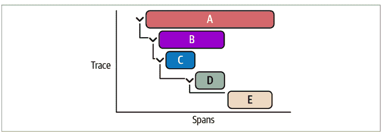

图7-3. 追踪的跨度

跨度的图形表示通常展示了一个服务的响应时间如何包含来自其他调用的多个延迟。

*可观测性*使你能够结合查看追踪、跨度和日志，以恰当地诊断系统的行为。在我们利用过滤步骤的回调从收集器获取更多邻居的示例中，我们可能会看到响应缓慢，并疑惑：“发生了什么？”通过查看跨度和追踪，我们能够看到对收集器的首次调用符合预期，然后过滤步骤对收集器进行了一次调用，接着又是一次调用，依此类推，这为过滤步骤累积了一个巨大的跨度。将此视图与日志记录相结合，将有助于我们快速诊断可能正在发生的情况。

### 超时

在前面的示例中，我们有一个可能导致非常糟糕用户体验的长流程。在大多数情况下，我们会对情况恶化的程度施加严格限制；这些被称为*超时*。

通常，我们对愿意等待推理响应的时间有一个上限，因此实现超时使我们的系统符合这些限制。在这些情况下，拥有一个*备用方案*非常重要。在推荐系统的设置中，备用方案通常包括诸如MPIR之类的准备，以使其产生最小的额外延迟。

### 生产环境中的评估

如果上一节是关于理解生产环境中进入模型的内容，那么这一节可以概括为理解生产环境中从模型输出的内容。从高层次来看，生产环境中的评估可以被视为将你所有的模型验证技术扩展到推理时间。具体来说，你是在观察*模型实际在做什么*！

一方面，我们已经有工具来进行这种评估。你可以使用与训练相同的方法来评估性能，但现在是在实时流式传入的真实观测数据上进行。然而，这个过程并不像我们最初猜测的那样简单。让我们讨论一些挑战。

### 慢反馈

推荐系统从根本上试图引导项目选择，在许多情况下，是引导购买。但如果我们退一步，更全面地思考将推荐系统集成到业务中的目的，那就是推动收入。如果你是一家电子商务商店，项目选择和收入似乎很容易关联：购买带来收入，因此好的项目推荐带来收入。然而，退货怎么办？或者一个更难的问题：这是增量收入吗？推荐系统的一个挑战是，很难在用于衡量模型性能的任何指标与面向业务的关键绩效指标之间建立因果箭头。

我们称之为*慢反馈*，因为有时从推荐到有意义的指标再返回到推荐器的循环可能需要数周甚至更长时间。当你想运行实验以了解是否应该推出新模型时，这尤其具有挑战性。测试的长度可能需要大幅延长才能获得有意义的结果。

通常，团队会就一个代理指标达成一致，数据科学家认为这是关键绩效指标的良好估计量，并且该代理指标是实时测量的。这种方法存在各种各样的挑战，但它通常足够用，并为更多测试提供了动力。相关性良好的代理通常是获取方向性信息的良好开端，这些信息指示了进一步迭代的方向。

### 模型指标

那么，在生产环境中，你的模型需要跟踪哪些关键指标？鉴于我们关注的是推理时间的推荐系统，我们应该寻求理解以下内容：

- 推荐在分类特征上的分布
- 亲和度分数的分布
- 候选数量
- 其他排名分数的分布

正如我们之前讨论的，在训练过程中，我们应该大致计算潜在空间中相似度分数的范围。无论我们是查看高级估计还是更精细的估计，我们都可以使用这些分布来获取可能存在问题的警告信号。简单地将我们模型在推理期间的输出，或在一组推理请求上的输出，与这些预先计算的分布进行比较，会非常有帮助。

比较分布可能是一个长篇话题，但一个标准方法是计算观测分布与训练中预期分布之间的*KL散度*。通过计算它们之间的KL散度，我们可以理解模型在给定日期的预测有多*令人惊讶*。

我们真正想了解的是模型预测相对于我们某种转化类型的接收者操作特征曲线。然而，这涉及到另一个集成以回溯到日志记录。由于我们的模型API只产生推荐，我们仍然需要连接到Web应用程序的日志记录以理解结果！为了回溯结果，我们必须将模型预测与日志输出连接起来以获得评估标签，这可以通过日志解析技术（如Grafana、ELK或Prometheus）完成。我们将在第8章中看到更多相关内容。


**接收者操作特征曲线**

如果我们假设相关性分数是在估计项目是否与用户相关，这就形成了一个二元分类问题。利用这些（归一化的）分数，我们可以构建一个ROC，以估计在查询分布中，相关性分数何时开始通过检索历史准确预测相关项目。因此，该曲线可用于估计诸如必要检索深度甚至有问题的查询等参数。

### 持续训练与部署

由于我们已经设置了模型跟踪和生产监控，可能会觉得这个故事已经结束了，但我们很少满足于“一劳永逸”的模型开发。机器学习产品的一个重要特征是，模型经常需要更新才能保持有用。之前，我们讨论了模型指标，有时生产环境中的性能可能与我们基于训练模型性能的预期不同。模型漂移可能会进一步加剧这种情况。

### 模型漂移

*模型漂移*是指同一个模型可能仅仅由于数据生成过程的变化而随时间表现出不同的预测行为。一个简单的例子是时间序列预测模型。当你构建时间序列预测模型时，对良好性能至关重要的一个特别独特的属性是*自回归*：函数的值与函数的先前值协变。我们不会深入探讨时间序列预测，但可以说：做出良好预测的最大希望是使用最新的数据！如果你想预测股票价格，你应该始终使用最近的价格作为预测的一部分。

这个简单的例子展示了模型如何漂移，预测模型与推荐模型并无太大不同——尤其是在考虑许多推荐问题的季节性现实时。两周前表现良好的模型需要用最近的数据重新训练，才能期望其继续表现良好。

对模型漂移的一种批评是“这是过拟合模型的铁证”，但实际上，这些模型需要一定程度的过参数化才能发挥作用。在推荐系统的背景下，我们已经看到，像马太效应这样的怪癖会对推荐模型的预期性能产生灾难性影响。如果我们不在推荐器中考虑新物品等因素，就注定会失败。模型漂移可能由多种原因引起，通常归结为生成过程中可能未被模型捕获的外生因素。

处理和预测模型过时的一种方法是在训练期间模拟这些场景。如果你怀疑模型过时主要是由于分布随时间变化，你可以采用序列交叉验证——在连续时间段上训练，在后续时间段上测试——但指定一个时间延迟块。例如，如果你认为你的模型性能会在两周后下降，因为它是在过时的观测数据上训练的，那么在训练期间，你可以特意构建评估，在测量性能之前加入两周的延迟。这被称为*两阶段预测比较*，通过比较性能，你可以估计漂移幅度，以便在生产中加以关注。

大量的统计方法可用于控制这些差异。在不深入探讨用于预测可变性和可靠性的变分建模的情况下，我们将讨论持续训练和部署，并用大锤砸开这颗花生。

### 部署拓扑

让我们考虑几种部署模型的结构，这些结构不仅能让你的模型保持良好调优，还能适应迭代、实验和优化。

### 集成

*集成*是一种模型结构，其中构建多个模型，并将这些模型的预测以多种方式之一汇集在一起。虽然集成的概念通常被封装在用于推理的模型中，但你可以将这个想法推广到你的部署拓扑中。

让我们以一个基于我们之前关于预测先验讨论的例子为例。如果我们有一组在任务上性能相当的模型，我们可以将它们部署为一个集成，根据它们偏离我们之前设定的预测先验分布的程度进行加权。这样，你就不必对模型输出范围进行简单的是/否过滤，而是可以更平滑地将潜在有问题的预测过渡到更符合预期的预测。

将集成视为部署拓扑而不仅仅是模型架构的另一个好处是，当你在观测特征空间的特定子领域进行改进时，你可以*热交换*集成的组件。以一个由三个组件组成的生命周期价值模型为例：一个对新客户预测良好，另一个对已激活客户预测良好，第三个对超级用户预测良好。你可能会发现通过投票机制进行汇集平均表现最好，因此你决定实施装袋方法。这效果很好，但后来你发现了一个对新客户更好的模型。通过使用集成的部署拓扑，你可以将新模型换入新客户部分，并开始在生产中比较集成中的性能。这引出了下一个策略，模型比较。


### 集成建模

*集成建模*在各种机器学习中都很流行，它基于一个简单的概念：专家意见的混合严格比单个估计器更有效。事实上，假设你有 $M$ 个错误率为 $\epsilon$ 的分类器；那么对于一个 $N$ 类分类问题，你的错误率将是 $P(y \ge k) = \sum_{k}^{n} \binom{n}{k} \epsilon^k * (1 - \epsilon)^{n-k}$，而令人兴奋的是，对于所有小于 0.5 的值，这个错误率都小于 $\epsilon$！

### 影子部署

部署两个模型，即使是针对同一任务，也能提供大量信息。当一个模型是“在线”的，而另一个模型也秘密地接收所有请求并进行推理（当然，还会记录结果）时，我们称之为*影子部署*。通过将流量影子到另一个模型，你可以在让你的模型上线之前，获得关于模型行为的最佳预期。当希望确保预测范围与预期一致时，这尤其有用。

在软件工程和 DevOps 中，有一个软件*预发布*的概念。关于“预发布环境应该看到多少真实基础设施”是一个激烈争论的问题，但影子部署就是机器学习模型的预发布。你基本上可以为整个基础设施构建一个并行管道来连接影子模型，或者你也可以将它们都放在火力线上，将请求发送给两者，但只使用一个响应。影子部署对于实施实验也至关重要。

### 实验

作为优秀的数据科学家，我们知道，如果没有适当的实验框架，就大肆宣传某个特性或模型的性能是有风险的。实验可以通过影子部署来处理，使用一个控制层来接收传入的请求，并协调哪个已部署的模型来处理响应。一个简单的 A/B 实验框架可能要求在每个请求时进行随机化，而像多臂老虎机这样的方法则需要控制层具有奖励函数的概念。

实验是一个深奥的话题，我们没有足够的知识或篇幅来充分阐述，但了解实验如何融入更大的部署管道是有用的。

### 模型级联

集成和影子部署概念的一个非常好的扩展是模型级联，如图 7-4 所示。模型级联的简化思想是，我们使用模型置信度来创建一个条件集成。具体来说，给定一个推理请求，模型提供一个带有置信度估计的预测；当模型置信度高时，返回该预测，但如果置信度低于某个阈值，则调用下游模型并启动集成。没有理由止步于两个模型；这种方法可用于迭代扩展集成层的数量，适用于任何在训练中显示集成性能有所提高的模型。

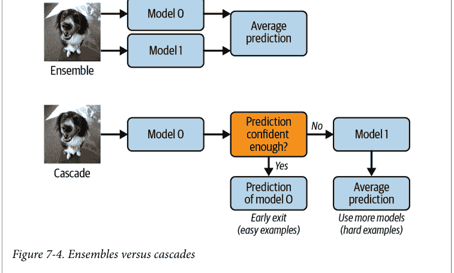

以下是这种方法的几个优点：

- 整体预期性能更好，因为集成通常能提高性能
- 集成性能具有更低的平均计算时间
- 在样本外场景中性能尤其更好

这种方法可以扩展到更大的模型池，虽然可能需要大量的训练工作，但找到正确的模型排序顺序可以对模型准确性和延迟产生显著影响。

### 评估飞轮

到现在，很可能已经很明显，生产环境中的机器学习模型远非静态对象。任何类型的生产机器学习系统都面临着与传统软件栈一样多的部署问题，此外还有数据集偏移和新用户/物品带来的额外挑战。在本节中，我们将仔细研究引入的反馈循环，并理解这些组件如何协同工作以持续改进我们的系统——即使数据科学家或机器学习工程师的输入很少。

### 每日热启动

正如我们已经多次讨论的，我们需要在模型的持续输出和重新训练之间建立联系。第一个最简单的例子是每日热启动，它本质上要求我们利用系统中每天看到的新数据。

可能已经很明显，一些表现出巨大成功的推荐模型相当庞大。重新训练其中一些可能是一项巨大的工程，而简单地*每天重新运行所有内容*通常是不可行的。那么，能做些什么呢？

让我们以我们一直在勾勒的用户-用户协同过滤示例为基础来讨论这个问题；第一步是通过我们的相似性定义构建嵌入。让我们回顾一下：

$$USim_{A,B} = \frac{\sum_{x \in \mathcal{R}_{A,B}} (r_{A,x} - \bar{r}_A)(r_{B,x} - \bar{r}_B)}{\sqrt{\sum_{x \in \mathcal{R}_{A,B}} (r_{A,x} - \bar{r}_A)^2} \sqrt{\sum_{x \in \mathcal{R}_{A,B}} (r_{B,x} - \bar{r}_B)^2}}$$

这里我们记住，两个用户之间的相似性取决于共享的评分和每个用户的平均评分。

在给定的一天，假设 $\widetilde{X} = \{\widetilde{x} \mid x \text{ was rated since yesterday by a user }\}$。那么我们需要更新用户相似性，但理想情况下，我们希望其他一切保持不变。为了更新用户数据，我们看到所有被两个用户 $A$ 和 $B$ 评分的 $\widetilde{x}$，$\bar{r}_A$ 和 $\bar{r}_B$ 都需要改变，但在许多情况下，我们可能可以跳过这些更新，其中那些用户的评分数量很大。总而言之，这意味着对于每个 $\tilde{x}$，我们应该查找哪些用户之前对 $x$ 进行过评分，并更新他们与新评分者之间的用户相似度。

这有点临时性，但对于许多方法，你可以利用这些技巧来减少完全重新训练。这将通过一个快速层来避免完全的批量重新训练。还存在其他方法，例如构建一个单独的模型来近似推荐低信号项。这可以通过特征模型来完成，并能显著降低这些快速重新训练的复杂性。

### Lambda 架构与编排

在这些策略的更极端端是 Lambda 架构；正如第 6 章所讨论的，Lambda 架构旨在拥有一个更频繁的管道，用于将新数据添加到系统中。*速度*层负责处理小批量数据以执行数据转换，并进行模型拟合以与核心模型结合。提醒一下，在这些快速层期间，管道的许多其他方面也应更新，例如最近邻图、特征存储和过滤器。

管道的不同组件可能需要不同的投入来保持更新，因此它们的调度是一个重要的考虑因素。你可能开始注意到，保持所有这些方面同步可能有点挑战性。如果你有模型训练、模型更新、特征存储更新、重新部署以及新项目/用户都可能在不同的时间表上到来，那么可能需要大量的协调。这就是*编排工具*可能变得相关的地方。存在多种方法，但这里一些有用的技术是 GoCD、MetaFlow 和 KubeFlow；后者更面向 Kubernetes 基础设施。另一个可以处理批量和流式管道的管道编排工具是 Apache Beam。

通常，对于 ML 部署管道，我们需要一个可靠的核心管道，以及在更多数据涌入时保持系统更新的能力。编排系统通常定义系统的拓扑结构、相关的基础设施配置以及需要运行的代码工件的映射——更不用说所有这些作业需要运行的 CRON 调度了。基础设施即代码是一个流行的范式，它将这些目标作为口号，使得即使所有这些配置本身也是可重现和可自动化的。

在所有这些编排考虑中，与容器化以及这些步骤*如何*部署有大量重叠。不幸的是，大部分讨论超出了本书的范围，但一个简单的概述是，使用 Docker 等工具进行容器化部署对 ML 服务非常有帮助，并且使用各种容器管理系统（如 Kubernetes）来管理这些部署也很流行。

### 日志记录

日志记录已经多次出现。在本章前面，你看到日志记录对于确保我们的系统按预期运行非常重要。让我们讨论一些日志记录的最佳实践以及它们如何融入我们的计划。

当我们之前讨论跟踪和跨度时，我们能够获得响应请求的服务的整个调用堆栈的快照。将服务链接在一起以查看更大的图景非常有用，当涉及到日志记录时，它给了我们关于如何定位思维的提示。回到我们最喜欢的 RecSys 架构，我们有以下内容：

- 收集器接收请求并查找与用户相关的嵌入
- 对该向量的项目计算 ANN
- 通过布隆过滤器应用过滤器以消除潜在的不良推荐
- 通过特征存储增强候选项目和用户的特征
- 通过排名模型对候选项目进行评分并估计潜在置信度
- 排序和应用业务逻辑或实验

这些元素中的每一个都有日志记录的潜在应用，但我们现在来思考如何将它们链接在一起。微服务中的相关概念是关联 ID；*关联 ID* 只是一个在调用堆栈中传递的标识符，以确保以后能够链接所有内容。正如此时可能显而易见的那样，这些服务中的每一个都将负责自己的日志记录，但服务几乎总是聚合起来更有用。

如今，Kafka 经常被用作日志流处理器，以监听管道中所有服务的日志并管理它们的处理和存储。Kafka 依赖于基于消息的架构；每个服务都是一个生产者，Kafka 帮助管理这些消息到消费者通道。在日志管理方面，Kafka 集群以相关格式接收所有日志，希望用关联 ID 增强，并将它们发送到 ELK 堆栈。*ELK 堆栈*——Elasticsearch、Logstash、Kibana——由一个 Logstash 组件处理传入的日志流并应用结构化处理，Elasticsearch 为日志存储构建搜索索引，Kibana 为日志记录添加 UI 和高级仪表板。

这堆技术专注于确保你可以访问和观察你的日志。其他技术专注于其他方面，但你应该记录什么？

#### 收集器日志

同样，我们希望在以下情况下记录日志：

- 收集器接收请求并查找与用户相关的嵌入
- 对该向量的项目计算 ANN

收集器接收一个请求，在我们最简单的例子中，由 user_id、requesting_timestamp 和任何可能需要的增强关键字元素（kwargs）组成。关联 ID 应该从请求者传递过来或在此步骤生成。应该触发一个包含这些基本键的日志，以及请求接收的时间戳。调用嵌入存储，收集器应该记录这个请求。然后嵌入存储在接收时应该记录这个请求，以及嵌入存储的响应。最后，收集器在返回时应该记录响应。这可能感觉像是很多冗余信息，但 API 调用中包含的显式参数在故障排除时变得极其有用。

收集器现在有了执行向量搜索所需的向量，因此它将调用 ANN 服务。记录这个调用以及选择 k 作为邻居数量的任何相关逻辑将很重要，以及 ANN 接收的 API 请求、计算 ANN 的相关状态和 ANN 的响应。回到收集器，记录响应以及为下游服务需求进行的任何潜在数据增强是下一步。

此时，至少已经发出了六个日志——这仅仅强化了需要一种方法将它们全部链接起来。实际上，你的服务中通常还有其他相关步骤应该被记录（例如，检查返回邻居的距离分布是否适合下游排名）。

请注意，如果嵌入查找未命中，记录该未命中显然很重要，以及记录后续对冷启动推荐管道的请求。冷启动管道将产生额外的日志。

#### 过滤和评分

现在我们需要监控以下步骤：

1. 通过布隆过滤器应用过滤器以消除潜在的不良推荐
2. 通过特征存储增强候选项目和用户的特征
3. 通过排名模型对候选项目进行评分，以及潜在的置信度估计

我们应该记录传入过滤服务的请求以及我们希望应用的过滤器集合。此外，当我们为每个项目搜索布隆过滤器并将其纳入或排除在布隆过滤器之外时，我们应该构建一些结构化日志，记录哪些项目被哪些过滤器捕获，然后将所有这些作为一个整体记录下来以供以后检查。响应和请求应作为特征增强的一部分被记录——我们应该记录对特征存储的请求和响应。

还要记录最终附加到项目实体的增强特征。这可能看起来与特征存储本身冗余，但当回顾时，了解在推荐管道中添加了哪些特征对于弄清楚为什么管道的行为可能与预期不同是*至关重要的*。

在评分时，整个候选集应与评分所需的特征和输出分数一起被记录。记录整个数据集极其强大，因为以后的训练可以使用这些数据来更好地了解真实的排名集。最后，响应与排名后的候选项目及其所有特征一起传递到下一步。

#### 排序

我们还有一步要走，但它是必不可少的：*排序和应用业务逻辑或实验*。这一步可能是最重要的日志记录步骤，因为这一步中的逻辑可能变得非常复杂和临时。

如果你有多个通过过滤器实现的相交业务需求，同时与实验集成，你可能会发现自己严重挣扎于如何将来自排名器的合理期望在响应时间之前变成一团糟。像记录传入候选项目、按其被消除的原因进行键控以及应用的业务规则顺序这样的技术将使重建行为变得更容易处理。

此外，实验路由可能由另一个服务处理，但在此步骤中看到的实验 ID 以及实验分配的使用方式是服务器的责任。当我们发送最终推荐，或决定再进行一轮时，对推荐状态的最后一次日志记录将确保应用日志可以与响应进行验证。

> **关于格式的说明**

结构化日志是你的朋友。实现一个数据结构来保存日志的相关数据，然后使用 `log-formatter object` 将显著降低解析和编写这些日志的难度。在代码中构建消息对象并在整个调用堆栈中将其用作运行数据结构的一个经常被低估的特性是日志与应用逻辑之间的紧密耦合。在服务架构讨论中，紧密耦合常被诟病，但当这种耦合存在于日志与实际执行对象之间时，却能为你省去诸多烦恼。当更换服务所使用的对象时，无需额外步骤确保日志同步更新，只需将对象与日志格式化器配合使用，变更便能自动传播。

这些流程也能充分利用测试，确保代码关注的对象在日志中可见，并且日志格式化器对象可通过单元测试强制匹配。最后，由于我们需要连接下游的日志解析与搜索，通过对象参数和日志数据结构中的键来建立日志栈与应用栈之间的清晰关联，将具有不可估量的价值。

### 主动学习

至此，我们已讨论了使用更新数据进行更频繁训练的方法，以及如何在模型尚未充分学习特定实体数据时仍能提供良好推荐。推荐与评分反馈循环的另一个重要机遇是主动学习。

我们无法深入探讨这个庞大且活跃的研究领域，但将围绕推荐系统讨论其核心思想。*主动学习*略微改变了学习范式，它主张学习者不应仅被动收集带标签（可能是隐式的）的观测数据，还应尝试从中挖掘关系与偏好。主动学习会确定哪些数据和观测对提升模型性能最有用，然后主动获取这些标签。在推荐系统（RecSys）的背景下，我们知道马太效应是最大挑战之一——许多潜在优质匹配可能因缺乏足够或合适的评分，无法在推荐中脱颖而出。

假设我们采用简单策略：每个新商品都作为前100位客户的第二推荐选项。这将导致两种结果：

- 我们能快速积累新商品数据，帮助其冷启动。
- 推荐系统性能可能下降。

在许多情况下，为实现前者而承受后者是值得的，但何时值得？这是否是解决问题的正确方式？主动学习为这些问题提供了系统化方法。

主动学习方案的另一个更具体优势是能拓宽观测数据的分布。除了冷启动商品，我们还能利用主动学习来拓展用户兴趣范围。这通常被描述为不确定性降低技术，因为它可用于提升更广泛商品类别推荐的置信度。举个简单例子：某用户只购买科幻书籍，某天你向其展示几本极受欢迎的西部小说，观察该用户是否愿意偶尔接收西部小说推荐。更多详情请参见第208页的“推荐系统评估中的倾向加权”。

主动学习系统通过继承自其试图增强模型的损失函数来实现——通常与某种不确定性相关——并试图最小化该损失。给定在观测集$\{x_i, y_i\}$上训练的模型$\mathcal{M}$，损失函数为$\mathcal{L}$，主动学习器会寻找新的观测$\bar{x}$，使得若获得标签$\bar{y}$，通过将该新数据对纳入模型训练，损失将降低。具体目标是近似每个可能新观测带来的边际损失减少，并找到使损失函数减少最大化的观测：

$$\text{Argmax}_{\bar{x}}\left(\mathcal{L}\left(\mathcal{M}_{\{x_i, y_i\}}\right) - \mathcal{L}\left(\mathcal{M}_{\{x_i, y_i\} \cup \{\bar{x}\}}\right)\right)$$

主动学习系统的结构大致遵循以下步骤：

1. 估算获取一组观测中某一个所带来的边际损失减少。
2. 选择影响最大的观测。
3. 查询用户；即提供推荐以获取标签。
4. 更新模型。

显然，这种范式需要比我们之前快速重训练方案更快的训练循环。主动学习可在与其他设置相同的基础设施中实现，也可拥有自己的机制集成到流程中。

### 优化类型

推荐系统中主动学习器执行的优化过程有两种方法：个性化与非个性化。由于推荐系统核心在于个性化，我们最终会希望将已掌握的用户详细信息整合进来，以进一步发挥主动学习效用，这不足为奇。

我们可以将这两种方法视为全局损失最小化与局部损失最小化。非个性化主动学习通常旨在最小化整个系统的损失，而非仅针对单个用户。（这种划分虽不能完美体现本体结构，但作为记忆辅助很有用）。实践中，优化方法十分精细，有时会使用复杂算法和训练流程。

让我们探讨非个性化主动学习的一些优化因素：

*用户评分方差*
考虑哪些商品的用户评分方差最大，以尝试获取更多关于这些在我们观测中最复杂商品的数据。

*熵*
考虑特定商品在有序特征上的评分分布离散度。这有助于理解我们对该商品的评分集是否均匀随机分布。

*贪婪扩展*
衡量哪些商品在当前模型中表现最差；这试图通过收集最难推荐好的商品数据来整体提升性能。

*代表性或范例*
挑选对大量商品群具有极高代表性的商品；我们可以这样理解：“如果我们对此商品有良好标签，那么对所有类似商品都有良好标签。”

*流行度*
选择用户最可能体验过的商品，以最大化其提供意见或评分的可能性。

*共覆盖*
尝试放大数据集中频繁出现的商品对的评分；这直接针对协同过滤结构，以最大化观测效用。

在个性化方面：

*二元预测*
为最大化用户提供所需评分的可能性，选择用户更可能体验过的商品。这可通过二元评分矩阵的矩阵分解（MF）实现。

*基于影响力*
估算商品评分对其他商品评分预测的影响，并选择影响力最大的商品。这试图直接衡量新商品评分对系统的影响。

*评分优化*
显然，可以简单使用最佳评分或某类别内最佳评分来执行主动学习查询，但这正是推荐系统中提供良好推荐的标准策略。

*用户细分*
在可用时，利用用户细分和用户内特征集群，通过用户相似性结构来预测用户何时对商品有意见和偏好。

通常，最大化全局模型提升的主动学习与最大化用户能够且愿意对特定商品评分可能性的主动学习之间存在软性权衡。让我们看一个结合两者的具体例子。

### 应用：用户注册

构建推荐系统时，一个常见障碍是新用户引导。根据定义，新用户将冷启动，没有任何评分，且可能从一开始就不期待优质推荐。

我们可能从所有新用户的MPIR（最流行物品推荐）开始——简单展示*某些内容*让用户入门，然后边用边学。但是否有更好的方法？

你可能体验过的一种方法是用户引导流程：许多网站采用的一组简单问题，用于快速获取用户基本信息，以指导早期推荐。如果讨论我们的书籍推荐系统，这可能是询问用户喜欢哪些类型；若是咖啡推荐系统，则是询问用户早晨如何冲泡咖啡。显然，这些问题构建的是基于知识的推荐系统，并不直接输入我们之前的流程，但仍能在早期推荐中提供帮助。

如果我们转而查看所有历史数据并问：“哪些特定书籍对确定用户品味最有用？”这就是主动学习方法。我们甚至可以为用户回答每个问题设计决策树，其中答案决定下一个最有用的问题。

## 总结

现在我们有信心能够提供推荐，更棒的是，我们已建立系统收集反馈。我们展示了如何在部署前建立信心，以及如何试验新模型或解决方案。集成与级联允许你将测试与迭代结合，数据飞轮为改进产品提供了强大机制。

你可能想知道如何将所有这些新知识付诸实践，下一章将对此进行阐述。让我们了解数据处理和简单计数如何构建一个高效且实用的推荐系统。

# 第八章
融会贯通：数据处理与计数推荐器

在讨论了推荐系统的整体框架后，本章将通过具体实现来探讨技术选择以及实际运作中的细节。

本章涵盖以下主题：

- 使用协议缓冲区进行数据表示
- 数据处理框架
- PySpark 示例程序
- GloVE 嵌入模型
- JAX、Flax 和 Optax 中的其他基础技术

我们将逐步展示如何从下载的维基百科数据集构建一个推荐系统，该系统能够根据维基百科文章中词语的共现关系推荐相关词语。我们选择自然语言示例是因为词语易于理解，其关系也容易把握——我们可以看到相关词语在句子中往往相邻出现。此外，维基百科语料库易于下载，任何联网用户都可浏览。这种共现概念可推广至任何共现物品集合，例如在同一会话中观看视频，或在同一购物袋中购买奶酪。

本章将演示物品-物品和特征-物品推荐器的具体实现。此处的物品指文章中的词语，特征则是词语计数相似度——一种针对词语的 MinHash 或局部敏感哈希。第 16 章将更详细地介绍局部敏感哈希，但目前我们将这些简单的哈希函数视为内容编码函数，使得具有相似属性的内容映射到相似的共域。这一通用概念可在缺乏日志数据时作为新语料库的热启动机制；若我们拥有用户-物品特征（如点赞），这些特征也可用于特征-物品推荐器。共现原理是相同的，但通过维基百科示例，你可以下载数据并使用提供的工具进行实践。

## 热启动与冷启动

*冷启动*发生在我们对语料库或用户偏好一无所知时，只能采用最佳猜测方法（如推荐热门物品）。另一方面，如果物品自然形成典型分组（如杂货店奶酪货架的选择与排列），则称为热启动：利用奶酪之间或奶酪与其他物品（如萨拉米香肠）的共现信息，更智能地启动推荐引擎。

在维基百科示例中，即使在用户点击文章之前，我们也能仅根据词语在句子中的接近程度来热启动词-词推荐器。类似地，如果你有一批自然属于某种层级分类的物品，可以通过将同一分类分支下的物品视为相互共现来热启动推荐器。

## 技术栈

一组共同使用的技术通常称为*技术栈*。技术栈的每个组件通常可被其他类似技术替代。我们将列出每个组件的几种替代方案，但不深入探讨其优缺点，因为可能的选择很多，且部署环境会影响组件选择。例如，你的公司可能已使用特定组件，出于熟悉度和支持考虑，你可能希望继续使用它。

本章涵盖处理数据以构建收集器具体实现的部分技术选择。

示例代码可在 [GitHub](https://github.com) 上获取。你可能需要将代码克隆到本地目录。

## 数据表示

我们需要做出的第一个技术选择将决定数据的表示方式。一些选择如下：

- 协议缓冲区
- Apache Thrift
- JSON
- XML
- CSV

在本实现中，我们主要使用协议缓冲区，因为它便于定义模式，随后进行序列化和反序列化。

### 协议缓冲区

在协议缓冲区发明之前，人们使用各种自定义格式存储二进制数据，这些格式涉及不同的语法和规范（如以魔数开头，随后是解析和存储整数、字符串、字节、浮点数等数据类型的规则）。协议缓冲区通过允许用户定义模式（即每个字段的命名表示及其类型，如 `first_name` 为字符串，年龄为整数）统一了自定义二进制数据的存储。这使我们能够轻松地以二进制格式读写结构化数据，数据解析由协议缓冲区库自动处理。

对于文件格式，我们使用序列化的协议缓冲区，经 uuencode 编码后每条记录写成一行，然后用 bzip 压缩。这只是为了方便，使我们无需依赖太多库即可轻松解析文件。你的公司可能选择将数据存储在可通过 SQL 访问的数据仓库中。

协议缓冲区通常比原始数据更易于解析和处理。在我们的实现中，我们将使用 `xml2proto.py` 将维基百科 XML 解析为协议缓冲区以便处理。从代码中可以看出，XML 解析很复杂，而协议缓冲区解析只需调用 `ParseFromString` 方法，所有数据随后即可作为便捷的 Python 对象使用。

截至 2022 年 6 月，维基百科转储文件大小约为 20 GB，转换为协议缓冲区格式大约需要 10 分钟。请按照 GitHub 仓库 README 中描述的步骤操作，以获取运行程序的最新说明。

在 *proto* 目录中，查看一些定义的协议消息。例如，以下是我们存储维基百科页面文本的方式：

```
// 通用文本文档。
message TextDocument {
  // 主实体，在维基百科中是标题。
  string primary = 1;
  // 次实体，在维基百科中是其他标题。
  repeated string secondary = 2;
  // 原始正文词元。
  repeated string tokens = 3;
  // URL。只有可见文档有 URL，例如某些重定向文档不应有。
  string url = 4;
}
```

支持的类型和模式定义可在协议缓冲区文档页面找到。此模式通过协议缓冲区编译器转换为代码。该编译器的任务是将模式转换为可在不同语言中调用的代码，在我们的案例中是 Python。协议缓冲区编译器的安装取决于平台，安装说明可在[协议缓冲区文档](https://developers.google.com/protocol-buffers/docs/downloads)中找到。

每次更改模式后，你都必须使用协议缓冲区编译器获取新版本的协议缓冲区代码。此步骤可通过 Bazel 等构建系统轻松自动化，但这超出了本书范围。为简化起见，本书中我们只需生成一次协议缓冲区代码并将其检入仓库。

按照 GitHub README 中的说明，下载维基百科数据集副本，然后运行 `xml2proto.py` 将数据转换为协议缓冲区格式。可选地，使用 `codex.py` 查看协议缓冲区格式的样子。这些步骤在使用 Windows Subsystem for Linux 的 Windows 工作站上耗时 10 分钟。所使用的 XML 解析器并行化效果不佳，因此此步骤本质上是串行的。接下来我们将讨论如何在多核本地环境或集群中并行分配工作。

## 大数据框架

我们选择的下一个技术将在多台机器上大规模处理数据。以下是一些选项：

- Apache Spark
- Apache Beam
- Apache Flink

在本实现中，我们使用的是基于Python的Apache Spark，即PySpark。仓库中的README文件展示了如何使用`pip install`在本地安装PySpark。

PySpark实现的第一步是分词和URL规范化。相关代码位于`tokenize_wiki_pyspark.py`，但此处我们不会详细讲解，因为其中大部分处理只是分布式的自然语言解析，并将数据写入协议缓冲区格式。我们将详细讨论第二步，即构建一个包含文章中*单词*及其词频统计的词典。不过，我们会运行代码以了解Spark的使用体验。Spark程序通过`spark-submit`程序运行，如下所示：

```
bin/spark-submit
--master=local[4]
--conf="spark.files.ignoreCorruptFiles=true"
tokenize_wiki_pyspark.py
--input_file=data/enwiki-latest-parsed --output_file=data/enwiki-latest-tokenized
```

运行Spark提交脚本允许你在本地机器上执行控制器程序（本例中为`tokenize_wiki_pyspark.py`），正如命令行所示——注意`local[4]`这一行表示使用最多四个核心。同样的命令也可以将作业提交到YARN集群，在数百台机器上运行。但就尝试PySpark而言，一台性能足够好的工作站应该能在几分钟内处理完所有数据。

这个分词程序将特定于源的格式（本例中为维基百科协议缓冲区）转换为用于自然语言处理的更通用的文本文档。通常，使用所有数据源都能转换成的通用格式是个好主意，因为这简化了下游的数据处理。数据转换可以从每个语料库进行，转换成一个标准格式，由流水线中的所有后续程序统一处理。

提交作业后，你可以在本地机器上访问Spark UI（如图8-1所示），地址为`localhost:4040/stages/`。你应该能看到作业在并行执行，使用了机器的所有核心。你可能想尝试`local[4]`参数；使用`local[*]`将使用机器上所有空闲核心。如果你可以访问集群，也可以指向相应的集群URL。


图8-1. Spark UI

## 集群框架

编写Spark程序的一大优点是，它可以轻松地从具有多个核心的单机扩展到拥有数千个核心的多机集群。完整的集群类型列表可以在[Spark "提交应用程序"文档](https://spark.apache.org/docs/latest/cluster-overview.html)中找到。

Spark可以在以下集群类型上运行：

- Spark独立集群
- Mesos集群
- YARN集群
- Kubernetes集群

根据你的公司或机构设置的集群类型，大多数情况下提交作业只需指向正确的URL即可。许多公司，如Databricks和Google，也提供完全托管的Spark解决方案，让你可以轻松设置Spark集群。

## PySpark示例

事实证明，词频统计是信息检索中的一个强大工具，因为我们可以使用诸如词频、逆文档频率（TF-IDF）等便捷技巧，后者简单来说就是文档中单词的出现次数除以该单词出现的文档数量。其表示如下：

$$tfidf_{word(i)} = \frac{\log_{10} (\text{number of times } word_i \text{ has occurred in corpus})}{\text{number of documents in corpus containing } word_i}$$

例如，因为单词*the*出现频繁，我们可能认为它是一个重要的单词。但通过除以文档频率，*the*就变得不那么特殊，其重要性也随之下降。这个技巧在简单的自然语言处理中非常有用，可以获得比随机更好的单词重要性权重。

因此，我们的下一步是运行`make_dictionary.py`。顾名思义，这个程序只是统计单词和文档，并构建一个包含单词出现次数的词典。

为了让你真正理解Spark如何帮助以分布式方式处理数据，我们需要介绍一些概念。大多数Spark程序的入口点是`SparkContext`。这个Python对象在控制器上创建。*控制器*是启动实际处理数据的工作节点的中央程序。工作节点可以在单机上作为进程本地运行，也可以在云上的多台机器上作为独立的工作节点运行。

`SparkContext`可用于创建弹性分布式数据集，即RDD。这些是对数据流的引用，可以在控制器上进行操作，并且对RDD的处理可以分派给所有工作节点。`SparkContext`允许你加载存储在分布式文件系统（如Hadoop分布式文件系统HDFS或云存储桶）上的数据文件。通过调用`SparkContext`的`textFile`方法，我们获得一个RDD的句柄。然后，可以对RDD应用或映射一个无状态函数，通过反复将该函数应用于RDD的内容，将其从一个RDD转换为另一个RDD。

例如，以下程序片段加载一个文本文件，并通过运行一个匿名lambda函数将所有行转换为小写：

```python
def lower_rdd(input_file: str,
              output_file: str):
    """Takes a text file and converts it to lowercase.."""
    sc = SparkContext()
    input_rdd = sc.textFile(input_file)
    input_rdd.map(lambda line: line.lower()).saveAsTextFile(output_file)
```

在单机实现中，我们只需加载每篇维基百科文章，在RAM中维护一个运行中的词典，统计每个词元，然后在词典中将该词元的计数加1。*词元*是文档被分割成的原子元素。在普通英语中，它就是一个单词，但维基百科文档还有其他实体，如文档引用本身，需要单独跟踪，因此我们将这种分割称为*分词*，原子元素称为*词元*。单机实现需要花费相当长的时间来处理维基百科上的数千篇文档，这就是为什么我们使用像Spark这样的分布式处理框架。在Spark范式中，计算被分解为映射，其中函数无状态地并行应用于每个文档。Spark还有一个归约函数，将不同映射的输出连接在一起。

例如，假设我们有一个词频列表，并希望对出现在不同文档中的单词的值求和。归约器的输入将类似于：

- (apple, 10)
- (orange, 20)
- (apple, 7)

然后我们调用Spark函数`reduceByKey(lambda a, b: a+ b)`，它将所有具有相同键的值相加，并返回以下结果：

- (orange, 20)
- (apple, 17)

如果你查看`make_dictionary.py`中的代码，*映射阶段*是我们以文档作为输入，然后将其分解为(词元, 1)元组的地方。在*归约阶段*，映射输出通过键（本例中是词元本身）连接，归约函数就是简单地对所有词元计数求和。

请注意，归约函数假设归约是结合的——即$(a + b + c) = (a + b) + c = a + (b + c)$。这使得Spark框架可以在映射阶段在内存中对词典的部分内容求和（在某些框架中，这称为*合并步骤*，你在映射器机器上对映射阶段的部分输出运行部分归约），然后在归约阶段通过多次传递对它们求和。

作为一种优化，我们使用Spark函数`mapPartitions`。`map`对每一行运行一次提供的函数（我们将整个维基百科文档编码为一个协议缓冲区，uu编码为单行文本），而`mapPartitions`对整个分区运行它，即许多文档，通常是64MB的数据。这种优化使我们能够在整个分区上构建一个小型Python词典，从而需要归约的词元-计数对要少得多。这节省了网络带宽，使得映射器发送给归约器的数据更少，这通常是这些数据处理流水线中减少网络带宽（与计算相比，这通常是数据处理中最耗时的部分）的一个好技巧。

### 群论

因为我们是数学爱好者，也因为群论在归约操作中经常出现，我们将简要介绍一种称为*群*的代数结构，以便你清楚地理解归约阶段使用的所有术语。

在导论章节中提到了集合的概念；*集合*是一组项目的集合。你需要知道的另一个概念是运算符。二元*运算符*接受两个项目并返回集合中的另一个项目。

常用的集合示例有整数、实数和矩阵。二元运算符的示例有加法、乘法和复合。

只有当满足群公理时，由元组（二元运算符，整数集合）表示的运算符和集合才构成一个群，即：存在一个单位元。
对于群中的每个元素 $x$，都存在一个元素 $e$，使得 $x + e = e + x = e$。对于加法运算，单位元是 0；对于乘法运算，单位元称为 1。这个概念在归约步骤中很重要，因为在某些框架中，归约步骤是以单位元初始化的。例如，求和通常以 0 初始化，而求积通常以 1 初始化。

运算满足结合律。
对于集合中的元素 $x, y, z$，有 $(x + y) + z = x + (y + z)$。

存在逆元。
对于群中的每个元素 $x$，群中都存在一个 $y$，使得 $x + y = e$。

运算也可以满足交换律。这不是成为群的必要条件，但具有此性质的群被称为*交换群*。满足交换律时，对于群中的元素 $x, y$，有 $x + y = y + x$。这个性质在归约步骤中很有帮助，因为它允许归约器并行执行操作，然后将它们一起归约，而无需担心操作发生的顺序。

需要注意的是，虽然实数上的加法满足结合律和交换律，但浮点数的加法并非如此。原因是浮点数是实数的近似表示。因此，当你在浮点数中将一个大数与一个小数相加时，小数可能无法精确表示，甚至可能被直接丢弃。一种更精确且一致的浮点数相加方法是先对待相加的数字列表进行排序，先将所有小数相加，然后再将它们与大数相加。先将两个小数相加得到一个较大的数，可以确保它们在被累加器（总和）吸收时不会丢失。因此，虽然数字加法在理论上对于实数满足结合律和交换律，但在实践中使用浮点数时，根据操作顺序的不同，你可能会得到不同的结果。

接下来，我们展示一个完整的 Spark 程序，它读取前一个代码块中所示的 `TextDocument` 协议缓冲区格式的文档，然后统计整个语料库中单词或词元出现的频率。GitHub 仓库中的文件是 `make_dictionary.py`。以下代码的呈现方式与仓库文件略有不同，它被分成了三个部分以提高可读性，并且为了清晰起见，主程序和子程序的顺序也进行了调换。这里，我们首先展示依赖项和标志，然后是主程序体，最后是主程序调用的函数，以便更清楚地说明函数的用途。

首先，让我们看看依赖项。主要的是表示维基百科文章文本文档的协议缓冲区，如前所述。这是我们期望的输入。对于输出，我们有 TokenDictionary 协议缓冲区，它主要统计文章中单词的出现次数。我们将使用单词的共现来形成文章的相似性图，然后可以将其用作热启动推荐系统的基础。我们还依赖于 PySpark（我们用于处理数据的数据处理框架）以及一个处理程序选项的标志库。absl flags 库对于解析和解释命令行标志的目的以及轻松检索标志的设置值非常方便。以下是依赖项和标志：

```python
#!/usr/bin/env python
# -*- coding: utf-8 -*-
#
#
"""
  This reads a doc.pb.b64.bz2 file and generates a dictionary.
"""
import base64
import bz2
import nlp_pb2 as nlp_pb
import re
from absl import app
from absl import flags
from pyspark import SparkContext
from token_dictionary import TokenDictionary

FLAGS = flags.FLAGS
flags.DEFINE_string("input_file", None, "Input doc.pb.b64.bz2 file.")
flags.DEFINE_string("title_output", None,
                    "The title dictionary output file.")
flags.DEFINE_string("token_output", None,
                    "The token dictionary output file.")
flags.DEFINE_integer("min_token_frequency", 20,
                     "Minimum token frequency")
flags.DEFINE_integer("max_token_dictionary_size", 500000,
                     "Maximum size of the token dictionary.")
flags.DEFINE_integer("max_title_dictionary_size", 500000,
                     "Maximum size of the title dictionary.")
flags.DEFINE_integer("min_title_frequency", 5,
                     "Titles must occur this often.")

# Required flag.
flags.mark_flag_as_required("input_file")
flags.mark_flag_as_required("token_output")
flags.mark_flag_as_required("title_output")
```

接下来，我们有程序的主程序体，所有子程序都在这里被调用。我们首先创建 SparkContext，这是进入 Spark 数据处理系统的入口点，然后调用其 textFile 方法读取经过 bzip2 压缩的维基百科文章。请阅读仓库中的 README 以了解它是如何生成的。接下来，我们解析文本文档，并将 RDD 发送到两个处理管道，一个用于为文章正文创建词典，另一个用于为标题创建词典。我们可以选择为两者创建一个统一的词典，但将它们分开允许我们使用词元词典创建基于内容的推荐器，并使用标题词典创建文章到文章的推荐器，因为标题是维基百科文章的标识符。以下是主程序体：

```python
def main(argv):
    """Main function."""
    del argv  # Unused.
    sc = SparkContext()
    input_rdd = sc.textFile(FLAGS.input_file)
    text_doc = parse_document(input_rdd)
    make_token_dictionary(
        text_doc,
        FLAGS.token_output,
        FLAGS.min_token_frequency,
        FLAGS.max_token_dictionary_size
    )
    make_title_dictionary(
        text_doc,
        FLAGS.title_output,
        FLAGS.min_title_frequency,
        FLAGS.max_title_dictionary_size
    )

if __name__ == "__main__":
    app.run(main)
```

最后，我们有主函数调用的子程序，所有子程序都分解为更小的子程序，用于统计文章正文和标题中的词元：

```python
def update_dict_term(term, dictionary):
    """Updates a dictionary with a term."""
    if term in dictionary:
        x = dictionary[term]
    else:
        x = nlp_pb.TokenStat()
        x.token = term
        dictionary[term] = x
    x.frequency += 1

def update_dict_doc(term, dictionary):
    """Updates a dictionary with the doc frequency."""
    dictionary[term].doc_frequency += 1
```

```python
def count_titles(doc, title_dict):
    """Counts the titles."""
    # Handle the titles.
    all_titles = [doc.primary]
    all_titles.extend(doc.secondary)
    for title in all_titles:
        update_dict_term(title, title_dict)
    title_set = set(all_titles)
    for title in title_set:
        update_dict_doc(title, title_dict)
```

```python
def count_tokens(doc, token_dict):
    """Counts the tokens."""
    # Handle the tokens.
    for term in doc.tokens:
        update_dict_term(term, token_dict)
    term_set = set(doc.tokens)
    for term in term_set:
        update_dict_doc(term, token_dict)
```

```python
def parse_document(rdd):
    """Parses documents."""
    def parser(x):
        result = nlp_pb.TextDocument()
        try:
            result.ParseFromString(x)
        except google.protobuf.message.DecodeError:
            result = None
        return result
    output = rdd.map(base64.b64decode).map(parser).filter(lambda x: x is not None)
    return output
```

```python
def process_partition_for_tokens(doc_iterator):
    """Processes a document partition for tokens."""
    token_dict = {}
    for doc in doc_iterator:
        count_tokens(doc, token_dict)
    for token_stat in token_dict.values():
        yield (token_stat.token, token_stat)
```

```python
def tokenstat_reducer(x, y):
    """Combines two token stats together."""
    x.frequency += y.frequency
    x.doc_frequency += y.doc_frequency
```

return x

def make_token_dictionary(
    text_doc,
    token_output,
    min_term_frequency,
    max_token_dictionary_size
):
    """构建词元字典。"""
    tokens = text_doc.mapPartitions(process_partition_for_tokens)
        .reduceByKey(tokenstat_reducer).values()
    filtered_tokens = tokens.filter(
        lambda x: x.frequency >= min_term_frequency)
    all_tokens = filtered_tokens.collect()
    sorted_token_dict = sorted(
        all_tokens, key=lambda x: x.frequency, reverse=True)
    count = min(max_token_dictionary_size, len(sorted_token_dict))
    for i in range(count):
        sorted_token_dict[i].index = i
    TokenDictionary.save(sorted_token_dict[:count], token_output)

def process_partition_for_titles(doc_iterator):
    """处理文档分区以提取标题。"""
    title_dict = {}
    for doc in doc_iterator:
        count_titles(doc, title_dict)
    for token_stat in title_dict.values():
        yield (token_stat.token, token_stat)

def make_title_dictionary(
    text_doc,
    title_output,
    min_title_frequency,
    max_title_dictionary_size
):
    """构建标题字典。"""
    titles = text_doc
        .mapPartitions(process_partition_for_titles)
        .reduceByKey(tokenstat_reducer).values()
    filtered_titles = titles.filter(
        lambda x: x.frequency >= min_title_frequency)
    all_titles = filtered_titles.collect()
    sorted_title_dict = sorted(
        all_titles, key=lambda x: x.frequency, reverse=True)
    count = min(max_title_dictionary_size, len(sorted_title_dict))
    for i in range(count):
        sorted_title_dict[i].index = i
    TokenDictionary.save(sorted_title_dict[:count], title_output)

如你所见，Spark 使得将程序从单机扩展到在包含多台机器的集群上运行变得轻而易举！从主函数开始，我们创建 SparkContext，将输入文件作为文本文件读入，解析它，然后构建词元和标题字典。RDD 作为处理函数的参数被传递，可以被多次使用并馈送给各种映射函数（例如词元和标题字典方法）。

构建字典方法中的繁重工作由分区处理函数完成，这些是应用于整个分区的映射函数。*分区*是输入数据的大块，通常大小约为 64 MB，并作为一个整体进行处理，这样我们可以通过在映射端进行合并来节省网络带宽。这是一种在映射分区上以及按键（在本例中是词元）连接并求和计数之后重复应用归约器的技术。我们这样做的原因是为了节省网络带宽，这通常是磁盘访问之后数据处理管道中最慢的部分。

你可以使用实用程序 *codex.py* 来查看 *make_dictionary* 阶段的输出，该程序会转储程序中注册的不同类型的协议缓冲区。由于我们所有的数据都序列化为 bzip 压缩和 uuencode 编码的文本文件，唯一的区别是用于解码序列化数据的协议缓冲区模式，因此我们可以只用一个程序来打印出数据的前几个元素以进行调试。虽然将数据存储为 JSON、XML 或 CSV 文件可能简单得多，但拥有模式可以让你免于未来的烦恼，因为协议缓冲区是可扩展的并支持可选字段。它们也是有类型的，这可以让你避免 JSON 中的意外错误，例如不知道一个值是字符串、浮点数还是整数，或者在某些文件中一个字段是字符串而在其他文件中是整数。拥有一个显式的类型化模式可以让我们避免许多此类错误。

管道中的下一步是 *make_cooccurrence.py*。顾名思义，这个程序只是计算每个词元与其他词元共同出现的次数。这本质上是图的一种稀疏表示方式。在 *nlp.proto* 中，稀疏共现矩阵的每一行如下所示：

```
// 共现矩阵行。
message CooccurrenceRow {
    uint64 index = 1;
    repeated uint64 other_index = 2;
    repeated float count = 3;
}
```

在*共现矩阵*中，每一行 *i* 在列 *j* 处有一个条目，表示词元 *j* 与词元 *i* 共同出现的次数。这是一种方便的方式来关联词元 *i* 和 *j* 之间的相似性，因为如果它们经常共同出现，那么它们一定比不共同出现的词元更相关。在协议缓冲区格式中，这些存储为两个并行数组 *other_index* 和 *count*。我们使用索引是因为它们比存储原始单词更小，特别是考虑到协议缓冲区使用的可变编码（即，由词元索引的行和列矩阵，以及表示索引共现的元素）。在这种编码中，小整数比大整数占用更少的位来表示；由于我们按频率对字典进行了逆序排序，最常出现的词元具有最小的索引。

在这个阶段，如果你想基于频繁项的相似性共现制作一个非常简单的推荐器，你可以查找词元 *i* 的行，并按计数顺序返回词元 *j*。这个简单的推荐器将作为前面章节中描述的热门项目推荐器的一个很好的变体。


**顾客还买了**

共现的概念将在第 9 章进一步展开，但让我们花点时间反思一下 MPIR 和共现的概念。当我们查看项目的共现矩阵时，我们可以取行和或列和来确定每个项目被看到（或购买）的次数。这就是我们在第 2 章构建 MPIR 的方式。如果我们查看对应于用户已看到的特定项目的 MPIR 行，那只是*条件 MPIR*——即，给定用户已看到项目 *i*，最受欢迎的项目。

然而，在这里我们可以选择对共现矩阵进行嵌入或低秩表示。矩阵的嵌入表示很方便，因为它允许我们将每个项目表示为一个向量。分解矩阵的一种方法是通过奇异值分解，或 SVD（参见第 167 页的“潜在空间”），但我们不会在这里这样做。相反，我们将学习 GloVE 嵌入，这是为 NLP 开发的。

GloVE 嵌入的目标函数是学习两个向量，使得它们的点积与两个向量之间共现的对数计数成正比。这个损失函数之所以有效，是因为点积将与共现的对数计数成正比；因此，经常一起出现的词将比不一起出现的词具有更大的点积。为了计算嵌入，我们需要手头有共现矩阵，幸运的是，管道中的前一步已经为我们生成了这样一个矩阵以供处理。

> **特征-项目 与 项目-项目**

我们在本节中通过从单词到词元 ID 的转换步骤引入了特征-项目推荐器。我们查找模型嵌入 ID 的方式是基于索引——无论是特征还是项目。对于前 *N* 个热门单词，我们有一个从字典索引到嵌入 ID 的一对一映射。然而，对于长尾单词，我们希望它们映射到相同的 *embedding_id* 值（如果可能的话）。

一种从单词计算特征的廉价方法称为 *最小哈希*：我们找到一个单词的 4 个连续字节，计算这些字节的哈希值，并找到重叠的 4 个字节的最小哈希值。这个过程使得将 *z*e*b*r*a* *h*a*s*h*e*s* 与 zebras 关联起来的可能性更大。然后，这个特征被用来将这些单词集表示为一个等价类。所有哈希到相同 MinHash 值的单词都在同一个等价类中。这允许我们目前自然地处理任何新的长尾单词，直到构建新的字典。它可能会在某些应用程序中导致不理想的错误，但在其他可以安全执行的应用程序中，项目的基于特征的表示可以像我们所做的那样混入嵌入系统。

另一种获取特征嵌入的替代方法是训练一个自动编码器或某种嵌入表示，该表示是从项目的特征中学习的，这样推荐器就可以泛化到新的、未见过的项目。然而，为了简单起见，在这个单词嵌入的情况下，我们只是使用 MinHash 以便于理解。MinHash 实现可以在 *wikipedia/token_dictionary.py* 中看到。

## GloVE 模型定义

关于本节，请参考 *train_coccurence.py* 中的代码。

假设我们从词元字典中有词元 *i* 和 *j*。我们知道它们彼此共同出现了 *N* 次。我们希望以某种方式生成一个嵌入空间，使得向量 *x(i)* * x(j)* 与 *log(N)* 成正比。对数计数的参数和精确方程在 Jeffrey Pennington 等人的“GloVe: Global Vectors for Word Representation”中推导。我们将只展示推导结果：

*y_predicted = x(i)x(j) + bias(i) + bias(j)*

这里，*x* 是嵌入查找。在代码中，我们使用 64 维向量，这个维度既不太小以至于没有足够的容量来表示嵌入空间，也不太大以至于当我们拥有整个字典的嵌入时会占用太多内存。偏置项的存在是为了吸收来自非常受欢迎的项目（如 *the*、*a* 和 *and*）的大量计数，这些项目与许多其他项共同出现。

我们希望最小化的损失是预测值与实际值之间的平方差：

```
y_target = 1 + log_{10}(N)
weight = min(1, N/100)^{0.75}
loss = weight * (y_{predicted} - y_{target})^2
```

损失函数中的加权项是为了防止非常常见的共现关系占据主导地位，同时降低罕见共现关系的权重。

## JAX 和 Flax 中的 GloVE 模型规范

让我们看看基于 JAX 和 Flax 的 GloVE 模型的实现。这位于 GitHub 仓库的 *wikipedia/models.py* 文件中：

```python
import flax
from flax import linen as nn
from flax.training import train_state
import jax
import jax.numpy as jnp

class Glove(nn.Module):
    """A simple embedding model based on glove.
    https://nlp.stanford.edu/projects/glove/
    """
    num_embeddings: int = 1024
    features: int = 64

    def setup(self):
        self._token_embedding = nn.Embed(self.num_embeddings,
                                         self.features)
        self._bias = nn.Embed(
            self.num_embeddings, 1, embedding_init=flax.linen.initializers.zeros)

    def __call__(self, inputs):
        """Calculates the approximate log count between tokens 1 and 2.
        Args:
            A batch of (token1, token2) integers representing co-occurence.
        Returns:
            Approximate log count between x and y.
        """
        token1, token2 = inputs
        embed1 = self._token_embedding(token1)
        bias1 = self._bias(token1)
        embed2 = self._token_embedding(token2)
        bias2 = self._bias(token2)
        dot_vmap = jax.vmap(jnp.dot, in_axes=[0, 0], out_axes=0)
        dot = dot_vmap(embed1, embed2)
        output = dot + bias1 + bias2
        return output

    def score_all(self, token):
        """Finds the score of token vs all tokens.
        Args:
            max_count: The maximum count of tokens to return.
            token: Integer index of token to find neighbors of.
        Returns:
            Scores of nearest tokens.
        """
        embed1 = self._token_embedding(token)
        all_tokens = jnp.arange(0, self.num_embeddings, 1, dtype=jnp.int32)
        all_embeds = self._token_embedding(all_tokens)
        dot_vmap = jax.vmap(jnp.dot, in_axes=[None, 0], out_axes=0)
        scores = dot_vmap(embed1, all_embeds)
        return scores
```

Flax 使用起来相当简单；所有网络都继承自 Flax 的 linen 神经网络库，并且都是模块。Flax 模块也是 Python 数据类，因此模块的任何超参数都在模块开始时定义为变量。对于这个简单模型，我们只有两个：我们想要的嵌入数量（对应于词典中的标记数量）和嵌入向量的维度。接下来，在模块的设置中，我们实际创建了想要的层，即每个标记的偏置项和嵌入。

定义的下一部分是当我们使用此模块时调用的默认方法。在这种情况下，我们希望传入一对标记 $i, j$；将它们转换为嵌入 $x(i), x(j)$；然后计算预测的 $\log(count(y_{predicted}))$。

在这段代码中，我们遇到了 JAX 和 NumPy 之间的第一个区别——即向量化映射或 `vmap`。`vmap` 接收一个函数并以相同的方式应用于张量的轴；这使得编码更容易，因为你只需要考虑原始函数如何在较低秩的张量（如向量）上操作。在这个例子中，由于我们传入的是成对标记的批次，然后对它们进行嵌入，我们实际上有一个向量批次，因此我们希望在批次维度上运行点积。我们传入 JAX 的点积函数，该函数接受向量，在批次维度（即轴 0）上运行它，并告诉 `vmap` 将输出作为另一个批次维度（轴 0）返回。这使我们能够高效且简单地为低维张量编写代码，并通过在额外轴上进行 vmap 获得一个可以操作高维张量的函数。从概念上讲，这就像我们循环遍历第一个维度并返回一个点积数组。然而，通过将此过程转换为函数，我们允许 JAX 将此循环推送到可 JIT 编译的代码中，以便在 GPU 上快速运行。

最后，我们还声明了辅助函数 `score_all`，它接受一个标记并将其与所有其他标记进行评分。同样，我们使用 `vmap` 将特定标记 $x(i)$ 与所有其他标记嵌入进行点积。这里的区别在于，由于 $x(i)$ 已经是一个向量，我们不需要对它进行 vmap。因此，在 `in_axes` 中，我们提供 `[None, 0]`，这意味着不对第一个参数的轴进行 vmap，而是对第二个参数（即所有标记的所有嵌入的批次）的轴 0 进行 vmap。然后我们返回结果，这是一个数组，是 $x(i)$ 与所有其他嵌入的点积，但不包括偏置项。我们在评分时不使用偏置项，因为它部分用于吸收非常常见标记的流行度，如果我们只使用点积部分进行评分，我们的评分函数会更有趣。

## 使用 Optax 进行 GloVE 模型训练

接下来，让我们看看 `wikipedia/train_cooccurrence.py`。让我们特别看看调用模型以深入了解一些 JAX 细节的部分：

```python
@jax.jit
def apply_model(state, inputs, target):
    """Computes the gradients and loss for a single batch."""

    # Define glove loss.
    def glove_loss(params):
        """The GloVe weighted loss."""
        predicted = state.apply_fn({'params': params}, inputs)
        ones = jnp.ones_like(target)
        weight = jnp.minimum(ones, target / 100.0)
        weight = jnp.power(weight, 0.75)
        log_target = jnp.log10(1.0 + target)
        loss = jnp.mean(jnp.square(log_target - predicted) * weight)
        return loss

    grad_fn = jax.value_and_grad(glove_loss)
    loss, grads = grad_fn(state.params)

    return grads, loss
```

你首先会注意到的是函数装饰器 `@jax.jit`。这告诉 JAX 函数中的所有内容都是可 JIT 编译的。函数要可 JIT 编译有一些要求——主要是它是纯函数，这是一个计算机科学术语，表示如果你用相同的参数调用一个函数，你会期望得到相同的结果。该函数不应有任何副作用，也不应依赖于缓存状态，例如私有计数器或具有隐式状态的随机数生成器。作为参数传入的张量可能还应该具有固定的形状，因为每个新形状都会触发新的 JIT 编译。你可以使用 `static_argnums` 向编译器提示某些参数是常量，但这些参数不应变化太频繁，否则将花费大量时间为每个这些常量编译程序。

这种纯函数哲学的一个结果是模型结构和模型参数是分离的。这样，模型函数是纯的，参数被传递给模型函数，允许模型函数被 JIT 编译。这就是为什么我们将模型的 `apply_fn` 应用于参数，而不是简单地将参数作为模型的一部分。

然后可以编译这个 `apply_model` 函数以实现我们之前描述的 GloVE 损失。JAX 在 NumPy 之上提供的另一个新功能是自动计算函数的梯度。JAX 函数 `value_and_grad` 计算损失相对于参数的梯度。由于梯度总是指向损失增加的方向，我们可以使用梯度下降朝相反方向走以最小化损失。Optax 库有几个优化器可供选择，包括 SGD（带动量的随机梯度下降）和 ADAM。

当你运行训练程序时，它将循环遍历共现矩阵，并尝试使用 GloVE 损失函数生成其简洁形式。大约一小时后，你应该能够看到得分最高的术语。

例如，“democracy”的最近邻如下：democracy:1.064498, liberal:1.024733, reform:1.000746, affairs:0.961664, socialist:0.952792, organizations:0.935910, political:0.919937, policy:0.917884, policies:0.907138, and --date:0.889342。

如你所见，查询标记本身通常是得分最高的邻居，但这并不一定总是如此，因为一个非常流行的标记实际上可能比查询标记本身得分更高。

## 总结

阅读本章后，你应该对构建推荐系统的基本要素有了很好的概述。你已经了解了如何设置基本的 Python 开发环境；管理包；使用标志指定输入和输出；以各种方式编码数据，包括使用协议缓冲区；以及使用 PySpark 的分布式框架处理数据。你还学习了如何将千兆字节的数据压缩成几兆字节的模型，该模型能够泛化并根据查询项快速评分项目。

花些时间玩转代码并阅读引用的各种包的文档，以很好地掌握基础知识。这些基础示例具有广泛的应用，牢固掌握它们将使你的生产环境更加准确。

## 第三部分
排名

对于给定的推荐，哪些是合适的候选对象？这些候选对象中哪个是最好的？那前10名呢？

有时最好的推荐系统仅仅是基于物品的可用性，但在大多数情况下，你希望捕捉用户偏好的微妙信号，以便在可能数百万的选项中提供出色的推荐。个性化是这场游戏的核心；虽然我们之前关注的是基于外部含义的物品-物品相似性，但现在我们需要开始尝试推断用户的品味和欲望。

我们也最好最终将此转化为一个机器学习任务。除了讨论特征和架构，我们还需要定义目标函数。乍一看，推荐的目标是简单的二元问题：“他们喜欢吗？”——所以也许我们只是在预测伯努利试验的结果。然而，正如我们在引言中讨论的，有多种方式可以获取他们喜欢程度的信号。此外，大多数推荐系统有一个共同的优势：你有多次尝试的机会。通常你可以推荐几个选项，因此我们非常关注预测哪些物品是他们最喜欢的。在本书的这一部分，我们将运用你所学的一切，开始得出具体的数值。我们还将讨论用于训练和评估模型的显式损失函数。

# 第九章
基于特征和基于计数的推荐

考虑这个过度简化的问题：给定一批新用户，预测谁会喜欢我们的新超级超级花哨新奇物品，简称MUFFIN。你可能会先问哪些老用户喜欢MUFFIN；这些用户是否有任何共同点？如果有，你可以构建一个模型，从这些相关的用户特征来预测对MUFFIN的喜好度。

或者，你可以问：“人们和MUFFIN一起购买的其他物品是什么？”如果你发现其他人也经常购买JAM（超棒商品），那么对于已经有JAM的人来说，MUFFIN可能是一个好的推荐。这将使用MUFFIN和JAM的共现作为预测因子。同样，如果你有一个品味与你相似的朋友——你们都喜欢SCONE、JAM、BISCUIT和TEA——但你的朋友还没有尝试过MUFFIN，如果你喜欢MUFFIN，那么它可能也是你朋友的一个好选择。这使用了你和你朋友之间物品的共现。

这些物品关系特征将构成本章我们的第一个排名方法；所以拿上美味的零食，让我们开始深入探讨吧。

## 双线性因子模型（度量学习）

按照关于“马前奔跑，车后步行”的惯常说法，让我们从可以被视为*朴素*机器学习方法开始我们的排名系统之旅。通过这些方法，我们将开始了解构建推荐系统时的难点所在，以及为什么后续的一些努力是必要的。

让我们再次从推荐问题的基本前提开始：估计用户$i$对物品$x$的评分，记为$r_{i,x}$。*注意这里的符号与之前略有变化，原因稍后会变得清晰。* 在通常的机器学习范式中，我们可能会声称这个分数的估计是通过物品和用户的属性来完成的，而这些属性通常被描述为特征，因此$\mathbf{i}$和$\mathbf{x}$可以分别是用户和物品的向量，由这些特征组成。

现在，考虑用户$i$及其之前交互过的物品集合$\mathcal{R}_i$，并考虑$\mathcal{I} = \{\mathbf{x} | \mathbf{x} \in \mathcal{R}_i\}$是这些物品在该特征空间中的向量集合。然后我们可以将这个向量集合映射到一个表示，从而得到一个*基于$i$的内容特征向量*。图9-1展示了一个映射示例。

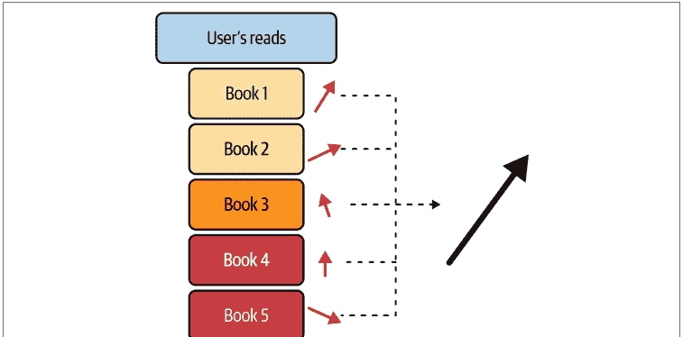

这种极其简单的方法可以将物品特征和用户-物品交互的集合转化为用户的特征。接下来的大部分内容将是越来越丰富的实现方式。深入思考映射、特征以及*交互*的要求，将引出本书其余部分的许多关键见解。

让我们将前面的映射$\mathbf{i} := F(\mathcal{I})$视为一个简单的聚合，比如按维度取平均值。然后认识到该映射将提供一个与物品维度相同的向量。现在我们有了一个与物品处于同一“空间”的用户向量，我们可以像在第3章讨论潜在空间时那样提出相似性问题。

我们需要回到数学框架来设置如何使用这些向量。最终，我们现在处于一个包含用户和物品的潜在空间中，但我们能用它做什么呢？你可能已经记得如何比较向量相似性。让我们定义相似性为*余弦相似度*：

$$sim(\mathbf{i}, \mathbf{x}) = \frac{\mathbf{i} \cdot \mathbf{x}}{|\mathbf{i}| * |\mathbf{x}|}$$

如果我们将相似性与向量归一化预先组合，这实际上就是内积——这是迈向推荐系统的关键第一步。为方便起见，让我们始终假设我们工作的空间是归一化后的空间，因此所有相似性度量都在单位球面上进行：

$$r_{i,x} \sim sim(\mathbf{i}, \mathbf{x}) = \sum_k \mathbf{i}_k * \mathbf{x}_k$$

这现在近似于我们的评分。但是等等，亲爱的读者，可学习的参数在哪里？让我们通过一个对角矩阵$A$将其变为加权求和：

$$r_{i,x} \sim sim^A(\mathbf{i}, \mathbf{x}) = \sum_k a_k * \mathbf{i}_k * \mathbf{x}_k$$

这个轻微的泛化已经将我们带入了统计学习的世界。你可能已经看到$A$如何用于学习这个空间中哪些维度对于近似评分最重要，但在我们精确化之前，让我们再泛化一次：

$$r_{i,x} \sim sim^A(\mathbf{i}, \mathbf{x}) = \sum_{k,l} a_{kl} * \mathbf{i}_k * \mathbf{x}_l$$

这给了我们更多的参数！我们看到现在$sim^A(\mathbf{i}, \mathbf{x}) = \mathbf{i}A\mathbf{x}$，我们距离熟悉的线性回归领域只有一步之遥。目前，我们的模型是双线性回归的形式，所以让我们利用一点线性代数。为了说明，设$\mathbf{i} \in \mathbb{R}^n$，$\mathbf{x} \in \mathbb{R}^m$，$A \in \mathbb{R}^{n \times m}$，那么我们有：

$$\mathbf{vect}(\mathbf{i} * \mathbf{x}^T) \in \mathbb{R}^{n * m}$$

我们可以简化为：

$$sim^A(\mathbf{i}, \mathbf{x}) = \mathbf{i}A\mathbf{x} = \mathbf{vect}(\mathbf{i} * \mathbf{x}^T) * \mathbf{vect}(A)$$

如果我们为右边部分引入符号，你会发现你的老朋友线性回归正在等着你：

$$\mathbf{v}_{ix} := \mathbf{vect}(\mathbf{i} * \mathbf{x}^T), \beta := \mathbf{vect}(A)$$

因此：

$r_{i,x} \sim sim^A(\mathbf{i}, \mathbf{x}) = \mathbf{v}_{ix}\beta$

有了这个计算，我们看到无论我们希望计算二元评分、序数评分还是似然估计，我们线性模型工具箱中的工具都可以参与进来。我们可以使用正则化、优化器以及线性模型世界中任何我们感兴趣的其他有趣方法。

如果这些方程让你感到沮丧或痛苦，让我尝试为你提供一个几何思维模型。每个物品和用户都处于一个高维空间中，最终我们试图找出哪些彼此最接近。人们经常误解这些几何结构，想象向量的尖端彼此靠近；事实并非如此。这些空间是极高维的，这使得这种类比远非事实。相反，要问的是*在某些向量索引上，值是否同样大*。这是一个更简单但也更准确的几何视角：在极高维空间中，存在一些子空间，其中的向量指向相同的方向。

这构成了我们前进的基础，但对于大规模推荐问题存在严重局限性。然而，你将看到，基于特征的学习在冷启动场景中仍然有其一席之地。

请注意，除了前面为用户构建基于内容特征的方法外，我们还可能有通过查询用户或其他数据收集隐式获得的明显用户特征；这些特征的例子包括位置、年龄范围和身高。

### 用户空间与物品空间相同吗？

在本节中，我们讨论了将用户和物品置于同一潜在空间的方法。我们声称可以通过向量运算在用户和物品之间进行比较。在数学中，向量是向量空间的元素，而（有限维）向量空间由其维度数和向量作为元素的值来定义。例如，如果我们说这是一个具有8位整数的三维向量空间，这就足以指定一个向量空间。

然而，魔鬼般的细节潜伏在周围。首先，在指定的向量空间中，*距离*意味着什么？我们有许多常规度量，但重要的是要确保两个空间之间的比较使用相同的距离定义。另一个考虑因素是你定义空间向量的过程；如果你的向量是通过从一个更大的空间进行降维得到的，那么你可能期望存在一些朴素情况下不存在的密度属性。这对于排名模型和推荐系统最相关的地方是我们经常分别进入用户空间和物品空间，并计算用户向量与物品向量之间的距离。

这样可以吗？在许多情况下，这缺乏坚实的理论基础，但效果却很好。一个*确实*具有坚实理论基础的特例是矩阵分解（MF）。与其长篇大论地讨论几何代数，我们不如给出以下指导：如果你有兴趣比较两个不在同一空间的向量，请先问自己：它们的维度是否相同？两个空间中距离的定义是否一致？以及密度先验是否相似？事实上，有时这些条件都不满足，你*仍然*可以进行比较。但对于每一个潜在的风险，都值得停下来思考一下。

一个关于两个潜在空间之间存在令人困扰的差异的明确例子，可以在Maximilian Nickel和Douwe Kiela的论文“Poincaré Embeddings for Learning Hierarchical Representations”中找到；这篇论文提供了一种有趣的方式，通过隐式几何来编码潜在空间中物品之间的关系。然而，你的用户可能并未被编码在双曲空间中。如果你计算这些向量与欧几里得嵌入向量之间的内积，请务必谨慎！

## 基于特征的热启动

正如你在第7章所看到的，有多种方法可以将特征与我们介绍的一些协同过滤（CF）和矩阵分解（MF）方法结合使用。特别是，你看到了如何通过双塔架构构建编码器，用于在冷启动场景中进行快速的基于特征的推荐。让我们深入探讨这一点，并仔细思考如何为新用户或新物品处理特征。

在第9章中，我们将双线性因子模型构建为一个简单的回归问题，并且实际上看到所有标准的机器学习建模方法都适用。然而，我们采用的用户嵌入是从物品交互中学习到的特征：即基于内容的特征向量。如果我们的目标是构建一个不需要用户评分历史的推荐算法，显然这种构造是不够的。

我们或许可以先问一下，前面的因子回归方法是否能在纯用户特征的设置下工作——暂且抛开对依赖于共同嵌入的内积的担忧，只将所有内容视为纯矩阵。虽然这是一个合理的想法，可以产生一些结果，但我们可能很快就会发现这个模型的粗糙之处：每个用户将需要回答查询 $q_k$，使得 $\mathbf{i} \in \mathbb{R}^{k}$。因为这些用户向量的维度与我们愿意且能够向用户提出的问题数量成线性关系，所以我们实际上是将问题的难度转嫁给了用户体验。

由于我们打算使用基于矩阵分解的协同过滤作为核心模型，我们非常希望找到一种方法，能够从基于特征的模型平滑地过渡到矩阵分解模型，确保我们能利用用户/物品评分的出现。在第117页的“评估飞轮”中，我们讨论了如何使用推理结果及其后续结果实时更新模型，但我们在建模范式中如何体现这一点呢？

在一个通过矩阵分解获得的潜在因子模型中，我们有如下形式：

$\mathbf{u}_i \mathbf{v}_x$

这里，$\mathbf{u}_i$ 具有零均值的高斯先验；这就是为什么新用户在拥有交互数据之前不会产生有用的评分。因此我们说，*用户矩阵*具有*集中于零的先验*。我们将特征纳入矩阵分解的第一个策略是简单地构建一个更好的先验分布。

更数学化地说：我们学习一个回归模型 $G(\mathbf{i}) \sim \mathbf{u}_i$ 来初始化我们学习到的因子矩阵，这意味着我们正在学习以下内容：

$s(i, x) \sim \mathbf{w}_{ix}\gamma + \alpha_i + \beta_x + \mathbf{u}_i \mathbf{v}_x$

这里，我们的 $\mathbf{w}_{ix}\gamma$ 现在是一个标准的基于用户和物品特征的双线性特征回归，偏置项被学习用来估计流行度或*排名膨胀*，而我们熟悉的矩阵分解项是 $\mathbf{u}_i \mathbf{v}_x$。

请注意，这种方法为将特征纳入矩阵分解模型提供了一个通用策略。我们如何拟合因子-特征模型完全由我们决定，我们希望采用的优化方法也是如此。

还要注意，除了基于回归的方法，还可以通过在纯基于特征的嵌入空间中使用*k*近邻来建立先验。Nor Aniza Abdullah等人在“Eliciting Auxiliary Information for Cold Start User Recommendation: A Survey”中详细探讨了这种建模策略。将其与第5章中的基于物品-物品内容的推荐器进行比较，其中查询是一个物品，物品空间中的相似性是连接上一个物品和下一个物品的纽带。

我们已经建立了一个策略和一系列通过特征构建模型的方法。我们甚至看到了我们的矩阵分解模型对于新用户会失效，只能由基于特征的模型来挽救。那么为什么不坚持使用特征呢？为什么要引入因子呢？

## 分段模型与混合模型

与我们之前讨论的通过特征进行热启动密切相关的是*基于人口统计的系统*这一概念。请注意，这里的*人口统计*不一定明确指个人身份信息，也可以指在注册过程中收集的用户数据。图书推荐中的简单例子可能包括用户喜欢的类型、自我认同的价格偏好、书籍长度偏好和最喜欢的作者。基于聚类的回归等标准方法有助于将一小部分用户特征转化为对新用户的推荐。对于这些粗糙的用户特征，构建简单的基于特征的模型，如朴素贝叶斯，可能特别有效。

更一般地说，给定用户特征向量，我们可以制定一个相似性度量，然后使用用户分段来进行新用户推荐。这应该让人感觉类似于基于特征的推荐器，但它不是要求使用用户特征，而是对用户属于某个分段进行建模，然后从该分段到不同物品构建我们的因子模型。

想象这种方法的一种方式是考虑建模问题，即为用户聚类 C 估计以下内容：

$r_{C,x} := \text{Avg}(r_{\mathbf{i},x} \mid \mathbf{i} \in C)$

然后我们估计 $P(\mathbf{j} \in C)$，即用户 $\mathbf{j}$ 是 $C$ 成员的概率。我们可以很容易地想到，我们可能希望使用与每个聚类相关的概率来构建一个装袋模型，让每个聚类贡献一个加权平均评分。

虽然这些想法可能看起来不像是对之前构建内容的有趣扩展，但在实践中，它们对于为新用户提供快速、可解释的推荐非常有用。

还要注意，这个构造中没有任何内容是特定于用户的；我们可以考虑*对偶模型*，将聚类放在物品层面并执行类似的过程。结合这些模型可以提供最粗略的模型，即简单的用户分段到物品组，同时利用多种建模方法可以提供重要且灵活的模型。

## 基于标签的推荐器

基于物品的推荐器的一个分段模型特例是*基于标签的推荐器*。当你有一些人工标签并需要快速将其转化为一个可用的推荐器时，这是一种非常常见的首选推荐器。

让我们通过一个简单的例子来说明：你有一个个人数字衣橱，你记录了个人衣橱中每件衣物的许多特征。你希望你的时尚推荐器在你选择了一件当天要穿的衣服后，给你提供其他穿着建议。你醒来后看到外面在下雨，所以你首先选择了一件舒适的开衫。你训练的模型发现这件开衫有标签*外套*和*舒适*，它知道这些标签与*下装*和*保暖*有很好的相关性——所以它今天很可能会推荐更厚的牛仔裤。

标签推荐器的优点在于推荐的可解释性和易理解性。缺点是性能直接与为物品打标签所投入的工作量相关。

让我们讨论一个稍微复杂一点的基于标签的推荐器例子，这是本书的一位作者与Ashraf Shaik和Eric Bunch合作构建的，用于推荐博客文章。

目标是通过利用将博客分类到不同主题的高质量标签来热启动博客文章推荐器。这个系统的一个特殊之处在于其由营销团队维护的丰富的层次化标签。具体来说，每个*标签类型*有多个值，共有11种标签类型，每种最多有10个值。博客对每种标签类型都有值，有时一个博客在单个标签类型中会有多个标签。这听起来可能有点复杂，但可以说每篇博客文章可能拥有47个标签中的一部分，而这些标签又进一步分组为类型。

最初的潜在任务之一是使用这些标签构建一个简单的推荐器，我们确实这样做了，但这样做意味着在拥有如此高质量的标签数据时，错过了一个重要的额外机会：评估我们的嵌入。

首先，我们需要理解如何构建用户嵌入。我们的计划是平均用户看过的博客嵌入，当你有清晰的物品嵌入时，这是一种简单的协同过滤方法。因此，我们希望为这些博客训练尽可能好的嵌入模型。我们开始考虑像BERT这样的模型，但不确定高度技术性的内容是否能被我们的嵌入模型有意义地捕捉到。这让我们意识到，我们可以使用标签作为嵌入模型的分类数据集。如果我们可以通过训练一个简单的多层感知器（MLP）来测试几个嵌入模型，为每个标签类型执行多标签多分类，其中输入特征是嵌入维度，那么我们的嵌入空间就能很好地捕捉内容。

一些嵌入模型具有不同的维度，有些相当大，因此我们在训练MLP之前，首先使用了降维（UMAP）到一个标准尺寸。我们使用F1分数来确定哪个嵌入模型能为标签带来最佳的分类模型，并使用目视检查来确保分组符合我们的预期。这效果相当好，并且表明一些嵌入模型比其他模型好得多。

## 混合方法

在上一节中，我们看到了如何通过从更简单的模型中获取先验知识并学习如何过渡，从而将我们的矩阵分解模型与更简单的模型进行融合。对于这种*混合*过程，存在一些更粗略的方法：

- *模型的加权组合*
  这种方法非常强大，其权重可以在标准的贝叶斯框架中学习得到。

- *多层建模*
  这种方法可以包括学习一个模型来选择应该使用哪个推荐模型，然后在每个机制中学习模型。例如，当用户的历史评分少于10条时，我们可以使用基于用户特征的树模型，之后再使用矩阵分解。存在多种多层方法，包括*切换*和*级联*，它们大致分别对应于投票和提升。

- *特征增强*
  这允许多个特征向量被拼接起来，并学习一个更大的模型。根据定义，如果我们希望将特征向量与来自协同过滤的因子向量结合起来，我们预计会有大量的空值。尽管存在这些空值，但通过学习，我们可以将不同类型的特征以一种相当朴素的方式组合起来，输入到模型中，并在用户活动的所有机制中进行操作。

我们可以用多种有用的方式组合这些模型。然而，我们的立场是，与其采用在不同范式下表现良好的多个模型的更复杂组合，不如尝试坚持一个相对简单的模型服务架构，具体做法如下：

- 使用基于矩阵分解的协同过滤训练我们能得到的最佳模型
- 使用基于用户和物品特征的模型来处理冷启动问题

让我们看看为什么我们认为基于特征的建模可能不是最佳策略，即使我们是通过神经网络和潜在因子模型来实现的。

## 双线性模型的局限性

本章开头我们描述了*双线性建模*方法，你立刻应该警惕——它们是线性关系。你可能会立刻想，“我的用户和物品特征与成对亲和力之间真的存在线性关系吗？”

这个问题的答案可能取决于特征的数量，也可能不取决于。无论哪种情况，持怀疑态度是合适的，而在实践中，答案绝大多数是否定的。你可能会想，“那么，既然它是线性近似，矩阵分解也不可能成功，”但这并非那么明确。事实上，矩阵分解表明线性关系存在于*潜在因子之间*，而不是实际特征之间。这种微妙的差异带来了天壤之别。

在我们转向更简单的想法之前，一个重要的提示是，具有非线性激活函数的神经网络可以用来构建基于特征的方法。这个领域取得了一些成功，但最终一个令人惊讶且重要的结果是，**神经协同过滤并未超越矩阵分解**。这并不意味着利用多层感知机的基于特征的模型没有有用的方法，但它确实减轻了我们对矩阵分解*过于线性*的一些担忧。那么，为什么不使用更多基于特征的方法呢？

对于基于内容、基于人口统计学以及任何其他基于特征的方法，第一个最明显的挑战是*获取特征*。让我们考虑一下这两个问题：

- *用户特征*
  如果我们想收集用户特征，我们需要要么询问他们一系列问题，要么隐式地推断这些特征。通过外部信号推断这些特征是嘈杂且有限的，但我们向用户提出的每一个问题都会增加用户流失的可能性。当我们考虑用户引导漏斗时，我们知道每一个额外的提示或问题都会增加用户无法完成引导的机会。这种效应会迅速累积，如果没有用户通过漏斗，推荐系统就不会非常有用。

- *物品特征*
  另一方面，为物品创建特征是一项繁重的手工任务。虽然许多企业也需要执行此任务以服务于其他目的，但在许多情况下，它仍然会产生巨大的成本。如果特征要有用，它们需要是高质量的，这会带来更多的负担。但最重要的是，如果物品数量极其庞大，成本可能会迅速变得难以承受。对于大规模推荐问题，手动添加特征根本不可行。这就是自动特征工程模型可以提供帮助的地方。

这些基于特征模型的另一个重要问题是*可分性*或*可区分性*。如果特征无法很好地分离物品或用户，这些模型就没有什么用处。随着基数的增加，这会导致问题复合化。

最后，在许多推荐问题中，我们从品味或偏好是极其个人化的这一假设出发。我们从根本上相信，我们对一本书的兴趣与其页数和出版日期的关系，远不如它与我们个人经历的联系（*对于那些仅根据页数和出版日期购买本书的读者，我们深表歉意*）。协同过滤——虽然在概念上很简单——通过*共享体验网络*更好地阐述了这些联系。

## 计数推荐器

在这里，我们将使用最简单的特征类型：简单计数。计算频率和成对频率将提供一组简单但有用的初始模型。

## 回到最热门物品推荐器

我们之前实现的超级简单方案，即MPIR，为我们提供了一个方便的玩具模型，但部署MPIR有哪些实际考虑因素呢？事实证明，MPIR为开始使用贝叶斯近似方法进行推荐提供了一个极好的框架。请注意，在本节中，我们甚至不考虑个性化推荐器；这里的一切都是针对整个用户群体的奖励最大化。我们遵循Deepak K. Agarwal和Bee-Chung Chen所著的《推荐系统统计方法》（剑桥大学出版社）中的处理方法。

为了简单起见，让我们考虑*点击率（CTR）*作为我们要优化的简单指标。我们的公式如下：我们有$\mathscr{I} = \{i\}$个可供推荐的物品，并且最初*只有一个时间段*来进行推荐，我们感兴趣的是一个*分配计划*，或者一组比例$x_i, \sum_{i \in \mathscr{I}} x_i = 1$，用于如何推荐物品。这可以看作是一个非常简单的多臂老虎机问题，其奖励由以下公式给出：

$R(\mathbf{x}, \mathbf{c}) = \sum_{i \in \mathscr{I}} c_i^* (N * x_i)$

这里，$c_i$代表每个物品的CTR的先验分布。很明显，通过将所有推荐分配给具有最大$p_i$的物品，即选择CTR最高的最热门物品，可以实现该奖励的最大化。

这个设置清楚地表明，如果我们对先验有很强的信心，这个问题似乎微不足道。那么，让我们转向一个信心不匹配的情况。

让我们考虑*两个时间段*，$N_0$和$N_1$，表示用户访问次数。请注意，在这个模型中，我们认为0代表过去，1代表未来。假设我们*只提供两个物品*，并且有点神秘的是，对于其中一个物品，我们在每个时间段对其CTR有100%的信心：$q_0$和$q_1$将分别表示这些比率。相比之下，我们对第二个物品只有先验知识：$p_0 \sim \mathscr{P}(\theta_0)$和$p_1 \sim \mathscr{P}(\theta_1)$将分别表示这些比率，我们将$\theta_i$视为状态向量。我们再次用$x_{i, t}$表示分配，其中第二个索引现在指时间段。那么我们可以简单地计算预期点击次数如下：

$\mathbb{E}[N_0 * x_0(p_0 - q_0) + N_1 * x_1(p_1 - q_1)] + q_0 N_0 + q_1 N_1$

通过假设$p_1$是$x_0$和$p_0$的函数的分布，可以实现该式的最大化。在$p_0$服从伽马分布且$p_1$服从正态分布的分布假设下，我们可以将其视为一个凸优化问题来最大化点击次数。完整的统计处理请参见《推荐系统统计方法》。

这个玩具示例在两个维度上扩展，以建模更大的物品集和更多的时间窗口，并为我们提供了关于每个物品的先验知识与时间步长之间关系的相对直观的理解，用于这种前向优化。

让我们将这个推荐器置于背景中：我们从物品流行度开始，并将其推广为一个根据用户反馈进行学习的贝叶斯推荐器。你可能会考虑在非常基于趋势的推荐环境中使用这样的推荐器，比如新闻；热门故事通常很重要，但这种情况可能迅速变化，我们希望从用户行为中学习。

## 相关性挖掘

我们已经看到了使用物品特征和推荐之间相关性的方法，但我们不应忘记使用物品本身之间的相关性。回想一下我们在第2章（图2-1）中关于奶酪的早期讨论；我们说过我们的协同过滤为我们提供了一种找到共同奶酪品味来推荐新奶酪的方法。这是建立在评分概念之上的，但我们可以抽象掉评分，只看用户选择的物品之间的相关性。你可以想象，对于一个电子商务书商来说，用户选择阅读一本书可能有助于推荐其他书——即使该用户选择不对第一本书评分。我们在第8章中也看到了这种现象，当时我们使用了维基百科条目中令牌的共现。

我们引入了共现矩阵，作为两个物品$i$和$j$共现的计数的多维数组。让我们花点时间更深入地讨论一下共现。

共现是依赖于上下文的；对于我们的维基百科文章，我们考虑的是文章中令牌的共现。在电子商务的情况下，共现可以是同一用户购买的两个物品。对于广告，共现可以是用户点击的两个东西，等等。从数学上讲，给定用户和物品，我们为每个用户构建一个*关联向量*，即他们交互过的每个物品的独热编码特征的二进制向量。这些向量被堆叠成一个向量，得到一个$\#(users) \times \#(items)$矩阵，其中每一行是一个用户，每一列是一个物品，当用户-物品对发生交互时，元素等于1。

从数学上精确地说，一个*用户-物品关联结构*是一组用户与物品交互的集合$\{y_u\}_{u \in U}$，其中$U$索引用户，$I$索引物品。

关联的*用户-物品关联矩阵* $\mathscr{U}$ 是一个二元矩阵，其行以集合为索引，列以节点为索引，元素定义如下：

$$e_{y_u, x_i} = \begin{cases} 1 & x_i \in y_u \\ 0 & \text{otherwise} \end{cases}$$

$x_a$ 和 $x_b$ 的*共现*是集合 $\{y_u \mid x_a \in y_u \text{ and } x_b \in y_u\}$ 的阶。我们也可以将其写成一个可通过简单公式计算的矩阵；令 $C_{\mathscr{I}}$ 为共现矩阵——即行和列以 $\{x_i\}_{i \in I}$ 为索引，元素为索引共现次数的矩阵。我们使用以下公式：

$$C_{\mathscr{I}} = \mathscr{I}^T * \mathscr{I}$$

### 高阶共现

你可以想象进一步推广此推荐器，以聚合用户看过的多个物品。在实践中，你可以考虑用户最近交互过的五个物品，然后为每个物品计算条件 MPIR 推荐，并将它们合并。

或者，你可以推广到*高阶*共现。换句话说，不是看成对出现的物品，而是看三元组、四元组或更多。要了解这种推广的一种方法，请查阅其中一位作者的论文《通过面分裂的超图高阶共现张量》。

如第 141 页“顾客也买了”中所述，我们可以通过考虑共现矩阵的行或列来构建 MPIR 的新变体。*条件 MPIR* 是指在给定用户上次交互的物品为 $x_i$ 的情况下，返回对应于 $x_j$ 的行中元素最大值的推荐器。

在实践中，我们通常将对应于 $x_i$ 的行视为*基向量*，即一个在 $x_i$ 位置有一个非零元素的向量 $q_{x_i}$：

$$q_{x_i, j} = \begin{cases} 1 & j = x_i \\ 0 & \text{otherwise} \end{cases} = \begin{bmatrix} 0 \\ \vdots \\ 1 \\ \vdots \\ 0 \end{bmatrix}$$

然后我们可以考虑前述点积的最大值——甚至是 softmax：

$$C_{\mathcal{I}} = \mathcal{I}^T \cdot \mathcal{I} * q_{x_i}$$

这得出了 $x_i$ 与其他每个物品之间的共现计数向量。这里我们经常将 $q_{x_i}$ 称为*查询*，以表明它是共现推荐模型的输入。


# 如何存储这些数据？

我们可以从*很多*角度思考共现数据。主要原因是，我们预计推荐系统的共现数据极其稀疏。这意味着前述的矩阵乘法方法——大约是 $O(n^3)$——在计算较少非零元素时会相对较慢。由于这一点以及对存储充满零的巨大矩阵的担忧，计算机科学家认真对待了稀疏矩阵的表示问题。

**Max Grossman** 声称有 101 种方法，但实际上只有几种。JAX 支持 **BCOO**，即*批量坐标格式*，它本质上是非零元素的坐标列表，然后是这些元素的值。

在我们的二元交互情况下，这些值是 1，而对于共现矩阵，这些值是计数。这些矩阵的结构可以写成如下形式：

```
{
    'indices': indices,
    'values': values,
    'shape': [user_dim, items_dim]
}
```

# 通过共现计算点互信息

早期的文章推荐系统使用了*点互信息*，即 PMI，它与共现密切相关。在自然语言处理的背景下，PMI 试图表达共现比随机偶然出现的频率高出多少。根据我们之前所学，你可以将其视为一个归一化的共现模型。计算语言学家经常使用 PMI 作为词相似性或词义的估计器，这源于分布假设：

> > 你可以通过一个词的伴生词来了解它。
> ——约翰·R·弗斯，英国语言学家

在推荐排序的背景下，具有非常高 PMI 的物品被认为具有高度有意义的共现。因此，这可以用来估计*互补*物品：如果你与其中一个物品交互过，你应该与另一个物品交互。

PMI 通过以下公式为两个物品 $x_i, x_j$ 计算：

$$\frac{p(x_i, x_j)}{p(x_i) * p(x_j)} = \frac{(C_{ij})_{x_i, x_j} * \#(\text{total interactions})}{\#(x_i) * \#(x_j)}$$

PMI 计算允许我们将所有关于共现的工作修改为更归一化的计算，因此更有意义。这个过程与我们在第 142 页“GloVE 模型定义”中学到的 GloVE 模型相关。负 PMI 值让我们了解两个事物不经常同时出现的情况。

这些 PMI 计算可用于在添加一个物品后推荐*购物车中的另一个物品*，当你发现那些具有非常高 PMI 的物品时。它可以用作检索方法，通过查看用户已经交互过的物品集，并找到与其中多个物品具有高 PMI 的物品。

让我们看看如何将共现转化为其他相似性度量。


# PMI 是距离度量吗？

此时一个值得考虑的好问题是“两个对象之间的 PMI 是距离的度量吗？我可以直接将相似性定义为两个物品之间的 PMI，从而产生一个考虑距离的便捷几何结构吗？”答案是否定的。回想一下，距离函数的公理之一是三角不等式；一个有用的练习是思考为什么三角不等式对 PMI 不成立。

但并非全无希望。在下一节中，我们将向你展示如何从共现结构中制定一些重要的相似性度量。此外，在下一章中，我们将讨论 Wasserstein 距离，它允许你直接将共现计数转化为距离度量。关键区别在于同时考虑所有其他物品的共现计数作为一个分布。

### 基于共现的相似性

早些时候，我们讨论了相似性度量以及它们如何来自皮尔逊相关系数。皮尔逊相关系数是当我们有明确评分时相似性的一个特例，所以让我们看看没有评分的情况。

考虑与用户关联的关联集 $\{y_u\}_{u \in U}$，我们定义三个距离度量：

*Jaccard 相似性，$Jac(-)$*
两个用户共享物品与这些用户交互过的总物品的比率

*Sørensen-Dice 相似性，$DSC(-)$*
两个用户共享物品与每个用户交互过的总物品之和的比率的两倍

*余弦相似性，$Cosim(-)$*
两个用户共享物品与每个用户交互过的总物品的乘积的比率

这些都是非常相关的度量，具有略微不同的优势。以下是一些需要考虑的点：

- Jaccard 相似性是一个真正的距离度量，具有一些很好的几何性质；其他两个则不是。
- 所有三个都在区间 $(0, 1)$ 上，但你经常会看到余弦通过包含负评分扩展到 $(-1, 1)$。
- 余弦可以通过将所有交互扩展为具有 $\pm 1$ 的极性来适应“点赞/点踩”。
- 余弦可以通过允许向量为非二元并计算用户与物品交互的次数来适应“多次交互”。
- Jaccard 和 Dice 通过简单方程 $S = 2J/(1 + J)$ 相关联，你可以轻松地从一个计算另一个。

请注意，我们已经定义了所有这些用户之间的相似性度量。我们将在下一节中展示如何将这些定义扩展到物品，以及如何将它们转化为推荐。

### 基于相似性的推荐

在前面的每个距离度量中，我们都定义了一个相似性度量，但我们还没有讨论相似性度量如何转化为推荐。正如我们在第 35 页“最近邻”中所讨论的，我们在检索步骤中使用相似性度量；我们希望找到一个空间，其中彼此*接近*的物品是好的推荐。在排序的背景下，我们的相似性度量可以直接用于根据推荐相关的可能性对推荐进行排序。在下一章中，我们将更多地讨论相关性度量。

在上一节中，我们探讨了三种相似度度量，但我们需要扩展对这些度量相关集合的概念。让我们以Jaccard相似度作为原型来思考。

给定一个用户 $y_u$ 和一个未见过的物品 $x_i$，让我们问：“这个用户和物品之间的Jaccard相似度是多少？”请记住，Jaccard相似度是两个集合之间的相似度，在定义中，这两个集合都是*用户交互的关联集*。以下是将此方法用于推荐的三种方式：

*用户-用户*
使用我们之前的定义，找到具有最大Jaccard相似度的 $k$ 个用户。计算这些用户中与 $x_i$ 有过交互的百分比。你可能还希望根据物品 $x_i$ 的流行度对此进行归一化。

*物品-物品*
计算每个物品交互过的用户集合，并根据这些物品-用户关联集的Jaccard相似度，计算与 $x_i$ 最相似的 $k$ 个物品。计算这些物品中在 $y_u$ 的交互集合中的百分比。你可能还希望根据 $y_u$ 的总交互次数或相似物品的流行度对此进行归一化。

*用户-物品*
计算用户 $y_u$ 交互过的物品集合，以及在任何用户的交互关联集中与 $x_i$ 共同出现的物品集合。计算这两个集合之间的Jaccard相似度。

在设计排序系统时，我们通常会指定*查询*，这指的是你正在寻找哪些最近邻。然后我们指定如何使用这些邻居来生成推荐。可能成为推荐的物品是候选物品，但正如你在前面的例子中看到的，邻居本身可能不是候选物品。另一个复杂之处在于，你通常需要同时计算许多候选物品的分数，这需要优化的计算，我们将在第16章中看到。

## 总结

在本章中，我们开始更深入地探讨相似性的概念——基于我们从检索中获得的直觉，即用户的偏好可能通过他们已经展示的交互来捕捉。

我们从基于用户特征的简单模型开始，并构建了将它们与我们的目标结果相关联的线性模型。然后我们将这些简单模型与特征建模和混合系统的其他方面相结合。

接下来，我们转向讨论计数——特别是计算物品、用户或购物篮的共同出现。通过观察频繁的共同出现，我们可以构建捕捉“如果你喜欢*a*，你可能喜欢*b*”的模型。这些模型易于理解，但我们可以使用这些基本的相关结构来构建相似度度量，从而构建潜在空间，使得基于ANN的检索能够为推荐提供良好的候选物品。

你可能已经注意到，关于所有物品的特征化和构建我们的共现矩阵的一个点是，特征的数量是天文数字般庞大的——每个物品一个维度！这就是我们将在下一章探讨的研究领域：如何降低你的*潜在空间*的维度。

# 第10章
低秩方法

在上一章中，我们感叹于处理如此多特征的挑战。通过让每个物品成为其自身的特征，我们能够表达关于用户偏好和物品亲和性相关的大量信息，但在维度灾难方面我们遇到了大麻烦。再加上特征非常稀疏的现实，你就处于危险之中。在本章中，我们将转向更小的特征空间。通过将用户和物品表示为低维向量，我们可以更高效、更有效地捕捉它们之间的复杂关系。这使我们能够为用户生成更个性化和相关的推荐，同时降低推荐过程的计算复杂性。

我们将探讨低维嵌入的使用，并讨论这种方法的好处和一些实现细节。我们还将查看使用现代基于梯度的优化来降低物品或用户表示维度的JAX代码。

## 潜在空间

你已经熟悉特征空间，它们通常是数据的分类或向量值直接表示。这可以是图像的原始红、绿、蓝值，直方图中的物品计数，或者对象的属性，如长度、宽度和高度。另一方面，潜在特征不代表物品的任何特定真实值特征，而是随机初始化，然后学习以适应任务。我们在第8章讨论的GloVe嵌入就是这样一个例子，它是一个学习来表示单词对数计数的潜在向量。在这里，我们将介绍更多生成这些潜在特征或嵌入的方法。


## 专注于你的“优势”

本章非常依赖线性代数，因此在继续之前，最好阅读有关向量、点积和向量范数的内容。了解矩阵和矩阵的秩也会很有用。可以参考Gilbert Strang的《线性代数及其应用》。

潜在空间如此受欢迎的原因之一是，它们的维度通常低于它们所代表的特征。例如，如果用户-物品评分矩阵或交互矩阵（其中矩阵条目为1表示用户与物品有过交互）是 $N \times M$ 维的，那么将矩阵分解为 $N \times K$ 和 $K \times M$ 的潜在因子，其中 $K$ 远小于 $N$ 或 $M$，是对缺失条目的近似，因为我们放宽了分解条件。$K$ 小于 $N$ 或 $M$ 通常被称为*信息瓶颈*——也就是说，我们强制矩阵由一个更小的矩阵组成。这意味着机器学习模型必须填补缺失的条目，这对于推荐系统来说可能是有益的。只要用户与足够多的相似物品有过交互，通过强制系统在自由度方面具有更少的容量，那么分解可以完全重构矩阵，缺失的条目往往会由相似的物品填充。

让我们看看，例如，当我们使用SVD将一个 $4 \times 4$ 的用户-物品矩阵分解为一个 $4 \times 2$ 和一个 $2 \times 4$ 的向量时会发生什么。

我们提供一个矩阵，其行是用户，列是物品。例如，第0行是 [1, 0, 0, 1]，这意味着用户0选择了物品0和物品3。这些可以是评分或购买。现在让我们看一些代码：

```python
import numpy as np

a = np.array([
    [1, 0, 0, 1],
    [1, 0, 0, 0],
    [0, 1, 1, 0],
    [0, 1, 0, 0]]
)

u, s, v = np.linalg.svd(a, full_matrices=False)

# 将最后两个特征值设为0。
s[2:4] = 0
print(s)
b = np.dot(u * s, v)
print(b)

# 这些是将最小的两个特征值设为0后的特征值。
s = [1.61803399 1.61803399 0.         0.        ]

# 这是新重构的矩阵。
b = [[1.17082039 0.         0.         0.7236068 ]
 [0.7236068  0.         0.         0.4472136 ]
 [0.         1.17082039 0.7236068  0.        ]
 [0.         0.7236068  0.4472136  0.        ]]
```

注意，第1行的用户现在对第3列的物品有了一个分数，第3行的用户现在对第2列的物品有了一个正分数。这种现象通常被称为*矩阵补全*，对于推荐系统来说是一个很好的特性，因为现在我们可以向用户推荐新的物品。强制机器学习通过一个比它试图重构的矩阵更小的瓶颈的一般方法被称为*低秩近似*，因为近似的秩是2，而原始用户-物品矩阵的秩是4。


## 什么是矩阵的秩？

一个 $N \times M$ 矩阵可以被视为 $N$ 个行向量（对应于用户）和 $M$ 个列向量（对应于物品）。当你考虑 $M$ 维的 $N$ 个向量时，*矩阵的秩*是这 $N$ 个向量在 $M$ 维空间中定义的多面体的体积。然而，这通常与我们谈论矩阵秩的方式不同。虽然这是最自然和精确的定义，但我们通常说它是“表示矩阵向量所需的最小维度数”。

我们将在本章后面更详细地介绍SVD。这只是为了激发你的兴趣，理解潜在空间如何与推荐系统相关联。

## 点积相似度

在第3章中，我们介绍了相似度度量，但现在我们回到点积在相似度背景下的重要性，因为它们在潜在空间中的重要性日益增加。毕竟，潜在空间是建立在距离即相似度的假设之上的。

点积相似度在推荐系统中是有意义的，因为它提供了潜在空间中用户和物品之间关系的几何解释（或者可能是物品与物品、用户与用户等）。在推荐系统的背景下，点积可以被视为一个向量在另一个向量上的投影，表示用户偏好和物品特征之间的相似度或对齐程度。

为了理解点积的几何意义，考虑两个向量 $u$ 和 $p$，分别代表潜在空间中的用户和产品。这两个向量的点积可以定义如下：$u \times p = ||u|| ||p|| cos(\theta)$

此处，$||u||$ 和 $||p||$ 分别表示用户向量和产品向量的模长，$\theta$ 是它们之间的夹角。因此，点积衡量的是一个向量在另一个向量上的投影，并由两个向量的模长进行缩放。

余弦相似度是推荐系统中另一种流行的相似度度量，它直接由点积推导得出：

$cosine\ similarity(u, p) = \frac{(u \times p)}{(||u|| ||p||)}$

余弦相似度的取值范围是 -1 到 1，其中 -1 表示偏好和特征完全不相似，0 表示没有相似性，1 表示用户偏好与产品特征完全一致。在推荐系统的背景下，余弦相似度提供了一种归一化的相似度度量，它对用户和产品向量的模长具有不变性。请注意，选择使用余弦相似度还是 L2 距离，取决于你使用的嵌入类型以及优化计算的方式。在实践中，唯一重要的特征通常是相对值。

点积（以及余弦相似度）在推荐系统中的几何解释是，它捕捉了用户偏好与产品特征之间的一致性。如果用户向量和产品向量之间的夹角很小，说明用户偏好与产品特征高度一致，从而得到更高的相似度分数。反之，如果夹角很大，则表明用户偏好与产品特征不相似，导致相似度分数较低。通过将用户向量和物品向量相互投影，点积相似度可以捕捉用户偏好与物品特征之间的一致程度，从而使推荐系统能够识别出最有可能与用户相关且具有吸引力的物品。

有趣的是，点积似乎能捕捉流行度，因为非常长的向量很容易投影到任何不完全垂直或不指向其反方向的向量上。因此，在频繁推荐具有较大向量长度的热门物品与具有较小余弦距离角度差的长尾物品之间，存在一种权衡。

**图 10-1** 考虑了两个向量 $a$ 和 $b$。使用余弦相似度时，向量是单位长度的，因此夹角就是相似度的度量。然而，使用点积时，一个非常长的向量 $c$ 可能被认为比 $b$ 与 $a$ 更相似，尽管 $a$ 和 $b$ 之间的夹角更小，这是因为 $c$ 的长度更长。这些长向量往往是与许多其他物品共同出现的非常流行的物品。

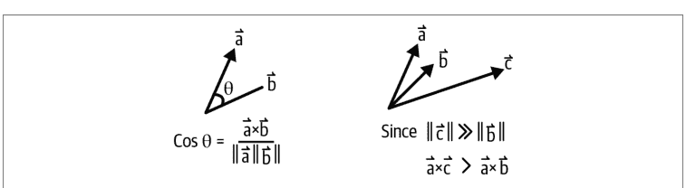

图 10-1. 余弦相似度与点积相似度

## 共现模型

在我们的维基百科共现示例中，我们确定了两个物品之间的共现结构可用于生成相似度度量。我们介绍了 PMI 如何利用共现计数，并基于购物车中物品与其他物品之间极高的互信息进行推荐。

正如我们所讨论的，PMI 不是一个距离度量，但它仍然基于共现提供了重要的相似度度量。让我们回到这个话题。

回顾一下，PMI 的定义如下：

$$\frac{p(x_i, x_j)}{p(x_i) * p(x_j)} = \frac{(C_{ij})_{x_i, x_j} * \#(\text{total interactions})}{\#(x_i) * \#(x_j)}$$

现在让我们考虑*离散共现分布* $CD_{x_i}$，它定义为所有其他 $x_j$ 上的共现集合：

$$CD_{x_i} = (C_{ij})_{x_i, x_1}, ..., (C_{ij})_{x_i, x_j}, ..., (C_{ij})_{x_i, x_N}$$

这里，$j \in 1...N$，$N$ 是物品总数。这表示 $x_i$ 与所有其他物品之间的共现直方图。通过引入这个离散分布，我们可以利用另一个工具：Hellinger 距离。

我们可以通过几种方式衡量分布距离，每种方式都有不同的优势。在我们的讨论中，我们将不深入探讨差异，而是坚持使用最简单但最合适的。Hellinger 距离定义如下：

$$H(P, Q) = \sqrt{1 - \sum_{i}^{n} \sqrt{p_i q_i}} = \frac{1}{\sqrt{2}} \| \sqrt{P} - \sqrt{Q} \|_2$$

$P = \langle p_i \rangle$ 和 $Q = \langle q_i \rangle$ 是两个概率密度向量。在我们的设定中，$P$ 和 $Q$ 可以是 $CD_{x_i}$ 和 $CD_{x_j}$。

这个过程背后的动机是，我们现在有了一个纯粹基于共现的、物品之间的合适距离。我们可以对这个几何结构应用任何维度变换或降维。稍后我们将展示降维技术，这些技术可以使用任意距离矩阵，并将其降维到一个近似的低维嵌入空间。


## 那么测度空间和信息论呢？

在我们讨论分布时，你可能会想：“是否存在一种分布之间的距离，使得分布成为潜在空间中的点？”哦，你没这么想？好吧，无论如何我们还是要讨论一下。

简短的回答是，我们可以衡量分布之间的差异。最流行的是 Kullback–Leibler (KL) 散度，它通常在贝叶斯意义上被描述为：当期望分布为 Q 时，看到分布 P 所带来的惊讶程度。然而，KL 不是一个合适的距离度量，因为它是非对称的。

另一个具有某些良好性质的对称距离度量是 Hellinger 距离。Hellinger 距离实际上是 2-范数测度论距离。此外，Hellinger 距离自然地推广到离散分布。

如果这仍然没有满足你对抽象的渴望，我们还可以考虑全变差距离，它是 Fisher 精确距离度量空间中的极限，这确实意味着它具有两个分布之间距离的所有良好性质，并且没有任何度量会认为它们更不相似。嗯，除了一个：它不是平滑的。如果你还需要可微性所需的平滑性，你需要通过偏移来近似它。

如果你需要分布之间的距离，就使用 Hellinger 距离。

## 降低推荐问题的秩

我们已经看到，随着物品和用户数量的增长，我们推荐问题的维度会迅速增加。因为我们用列或向量表示每个物品和用户，这以 $n^2$ 的规模增长。应对这一困难的一种方法是通过秩约简；回想一下我们之前关于通过分解进行秩约简的讨论。

像许多整数一样，许多矩阵可以被*分解*成更小的矩阵；对于整数，*更小*意味着数值更小，对于矩阵，*更小*意味着维度更小。当我们分解一个 $N \times M$ 矩阵时，我们将寻找两个矩阵 $U_{N \times d}$ 和 $V_{d \times M}$；请注意，当矩阵相乘时，它们必须共享一个维度，该维度被消除，留下另外两个维度。这里，我们将考虑 $d \le N$ 且 $d \le M$ 的矩阵分解。通过分解矩阵，我们要求两个矩阵共同等于或近似于原始矩阵：

$A_{i,j} \simeq \langle U_i, V_j \rangle$

我们寻求一个较小的 $d$ 值以减少潜在维度的数量。你可能已经注意到，矩阵 $U_{N \times d}$ 和 $V_{d \times M}$ 中的每一个都将对应于原始评分矩阵的行或列。然而，它们以更少的维度表示。这利用了*低维潜在空间*的概念。直观地说，潜在空间试图用两组关系来表示与完整 $N \times M$ 维关系相同的关系：物品与潜在特征，以及用户与潜在特征。

这些方法在其他类型的机器学习中也很流行，但在我们的案例中，我们主要关注分解评分或交互矩阵。

## 通过 SVD 进行矩阵分解

SVD 和 MF 密切相关，但 SVD 是一个重要的特例。关键区别在于分解的执行方式以及每种方法可以应用的矩阵类型。

图 10-2 展示了 SVD 的工作原理。特征向量 $e1$ 和 $e2$ 对应于最大的两个特征值。$e1$ 比 $e2$ 解释了更多的数据，并沿着点分布最广的方向。特征向量总是彼此垂直的，因此它们的点积总是 0。

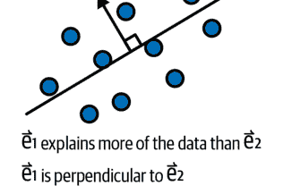

图 10-2. 奇异值分解

SVD 是 MF 的一种特定类型，它将一个矩阵分解为三个独立的矩阵：一个左奇异矩阵、一个对角矩阵和一个右奇异矩阵。SVD 可以应用于任何实值矩阵，但它特别适合具有许多非零元素的稠密矩阵；此外，SVD 矩阵具有有助于提取潜在特征之间特定关系的属性。奇异矩阵的列和行是特征向量，对角矩阵中的值是特征值。这种分解便于查看原始空间中有多少信息由特征向量解释，并且对应于特征值的大小，因此具有较大特征值的特征向量比具有相应较小特征值的特征向量解释更多的原始数据。

MF 将用户-物品矩阵分解为两个矩阵，分别代表用户的偏好和物品的特征。这使得推荐系统能够通过匹配用户的偏好和物品的特征来生成个性化推荐。

在考虑 MF 时，通常必须克服几个挑战：

- 你希望分解的矩阵是稀疏的，并且通常是非负的和/或是二元的。
- 正如我们在马太效应中看到的，每个物品向量中非零元素的数量可能差异很大。
- 矩阵分解的复杂度是立方级的。
- SVD 和其他全秩方法在没有插值的情况下无法工作，而插值本身就很复杂。

我们将通过一些替代优化方法来解决这些问题。

## 使用 ALS 优化 MF

我们希望执行的基本优化是近似如下：

$A_{i,j} \simeq \langle U_i, V_j \rangle$

值得注意的是，如果你希望直接优化矩阵条目，你需要同时优化 $d^2 * N * M$ 个元素，这些元素对应于这些分解中的参数数量。然而，通过交替调整一个矩阵或另一个矩阵，我们可以轻松实现显著的加速。这被称为*交替最小二乘法*，通常简称为 *ALS*，它是解决此问题的常用方法。你不必在每次迭代中反向传播更新到两个矩阵中的所有项，而是可以只更新两个矩阵中的一个，这大大减少了需要进行的计算量。

ALS 试图在 $U$ 和 $V$ 之间来回切换，在相同的损失函数上进行评估，但一次只更新一个矩阵中的权重：

```
$U \leftarrow U - \eta * U * \nabla U * \mathscr{D}(A, UV)$
$V \leftarrow V - \eta * V * \nabla V * \mathscr{D}(A, UV)$
```

这里，$\eta$ 是学习率，$\mathscr{D}$ 是我们选择的距离函数。我们稍后将介绍这个距离函数的更多细节。在继续之前，让我们考虑一下这里的一些复杂之处：

- 这些更新规则中的每一个都需要相对于相关因子矩阵的梯度。
- 我们一次更新整个因子矩阵，但我们评估的是因子矩阵的乘积与原始矩阵之间的损失。
- 我们有一个神秘的距离函数。
- 通过我们构建此优化的方式，我们隐含地假设我们将使用此过程来收敛到两个近似良好的矩阵（我们通常还会对迭代次数施加限制）。

在 JAX 中，这些优化将很容易实现，我们将看到等式形式和 JAX 代码看起来有多么相似。


## 矩阵之间的距离

我们可以通过多种方式确定两个矩阵之间的距离。正如我们之前看到的，对向量的不同距离度量会产生对底层空间的不同解释。对于这些计算，我们不会有那么多复杂情况，但这值得简要观察一下。最明显的方法是你已经见过的，*观测均方误差*：

```
$\frac{\sum_{\Omega}(A_{i,j} - \langle U_i, V_j \rangle)^2}{|\Omega|}$
```

观测均方误差的一个有用替代方法可以在你有一个用户向量的单个非零条目（或者，一个最大评分）时使用。在这种情况下，你可以改用交叉熵损失，这提供了*逻辑 MF*，从而提供概率估计。有关如何实现的更多细节，请参阅 Kyle Chung 的“矩阵分解用于推荐系统”教程。

在我们的观测评分中，我们期望（并且看到！）大量的缺失值和一些具有过多评分的物品向量。这表明我们应该考虑非均匀加权矩阵。接下来，我们将讨论如何通过正则化来解决这个问题和其他变体。

## MF 的正则化

*加权交替最小二乘法*（WALS）类似于 ALS，但试图更优雅地解决这两个数据问题。在 WALS 中，分配给每个观测评分的权重与用户或物品的观测评分数成反比。因此，在优化过程中，对于评分数较少的用户或物品的观测评分会给予更大的权重。

我们可以将这些权重作为正则化参数应用于最终的损失函数：

```
$$\frac{\sum_{\Omega}(A_{i,j} - < U_i, V_j >)^2}{|\Omega|} + \frac{1}{N} \sum |U|$$
```

其他正则化方法对于 MF 也很重要，并且也很流行。我们将讨论这两种强大的正则化技术：

- 权重衰减
- 格拉姆矩阵正则化

通常情况下，*权重衰减*是我们的 $l^2$ 正则化，在这种情况下，它是在 Frobenius 范数的层面上，即权重矩阵的大小。看待这种权重衰减的一种优雅方式是它最小化了*奇异值*的大小。

类似地，MF 有另一种看起来非常标准但在计算上相当不同的正则化技术。这是通过*格拉姆矩阵*——本质上是正则化单个矩阵条目的大小，但优化有一个巧妙的技巧。特别是，矩阵 $U$ 的格拉姆矩阵是乘积 $U^T U$。你们中眼尖的人可能认出这个术语，它与我们之前用于计算二元矩阵共现的术语相同。两者的联系在于，它们都只是试图找到矩阵行和列之间点积的有效表示。

这些正则化是 Frobenius 项：

```
$$R(U, V) = \frac{1}{N} \sum_{i}^{N} \left| U_i \right|_2^2 + \frac{1}{M} \sum_{j}^{M} \left| V_j \right|_2^2$$
```

或者展开后，方程如下所示：

$$R(U, V) = \frac{1}{N} \sum_{i}^{N} \sum_{k}^{d} U_{i,k}^2 + \frac{1}{M} \sum_{j}^{M} \sum_{l}^{d} V_{j,l}^2$$

以下是格拉姆矩阵项：

$$G(U, V) := \frac{1}{N \cdot M} \sum_{i}^{N} \sum_{j}^{M} \langle U_i, V_j \rangle^2$$
$$= \frac{1}{N \cdot M} * \sum_{k,l}^{d} (U^T U * V^T V)_{k,l}$$

最后，我们的损失函数是：

$$\frac{1}{|\Omega|} \sum_{(i,j) \in \Omega} (A_{ij} - \langle U_i, V_j \rangle)^2 + \lambda_R \left( \frac{1}{N} \sum_{i}^{N} \sum_{k}^{d} U_{i,k}^2 + \frac{1}{M} \sum_{j}^{M} \sum_{l}^{d} V_{j,l}^2 \right) + \lambda_G \left( \frac{1}{N \cdot M} * \sum_{k,l}^{d} (U^T U * V^T V)_{k,l} \right)$$

## 正则化 MF 的实现

到目前为止，我们已经写了很多数学符号，但所有这些符号都使我们能够得出一个极其强大的模型。*正则化矩阵分解*是解决中型推荐问题的有效模型。这种模型类型仍然在许多严肃的企业中投入生产。MF 实现的一个经典问题是性能，但因为我们使用的是 JAX，它具有极其原生的 GPU 支持，所以我们的实现实际上可以比你在 [PyTorch 示例](https://example.com) 中找到的更加紧凑。

让我们来研究一下这个模型如何通过这种带有格拉姆矩阵的双重正则化模型来预测用户-物品矩阵的评分。

首先，我们将进行简单的设置。这将假设你的评分矩阵已经在 wandb 上：

```
import jax
import jax.numpy as jnp
import numpy as np
import pandas as pd
import os, json, wandb, math

from jax import grad, jit
from jax import random
```

from jax.experimental import sparse

key = random.PRNGKey(0)

wandb.login()
run = wandb.init(
    # 设置实体以指定你的用户名或团队名称
    entity="wandb-un",
    # 设置此运行将记录到的项目
    project="jax-mf",
    # 将运行关联到正确的数据集
    config={
        "dataset": "MF-Dataset",
    }
)

# 注意，我们假设数据集是存储在wandb中的评分表
artifact = run.use_artifact('stored-dataset:latest')
ratings_artifact = artifact.download()
ratings_artifact_blob = json.load(
    open(
        os.path.join(
            ratings_artifact,
            'ratings.table.json'
        )
    )
)

ratings_artifact_blob.keys()
# ['_type', 'column_types', 'columns', 'data', 'ncols', 'nrows']

ratings = pd.DataFrame( # user_id, item_id, rating, unix_timestamp
    data=ratings_artifact_blob['data'],
    columns=ratings_artifact_blob['columns']
)

def start_pipeline(df):
    return df.copy()

def column_as_type(df, column: str, cast_type):
    df[column] = df[column].astype(cast_type)
    return df

def rename_column_value(df, target_column, prior_val, post_val):
    df[target_column] = df[target_column].replace({prior_val: post_val})
    return df

def split_dataframe(df, holdout_fraction=0.1):
    """将DataFrame分割为训练集和测试集。
    参数：
        df：一个数据框。
        holdout_fraction：用于测试集的数据框行比例。
    返回：
        train：用于训练的数据框
        test：用于测试的数据框
    """
    test = df.sample(frac=holdout_fraction, replace=False)
    train = df[~df.index.isin(test.index)]
    return train, test

all_rat = (ratings
    .pipe(start_pipeline)
    .pipe(column_as_type, column='user_id', cast_type=int)
    .pipe(column_as_type, column='item_id', cast_type=int)
)

def ratings_to_sparse_array(ratings_df, user_dim, item_dim):
    indices = (np.array(ratings_df['user_id']), np.array(ratings_df['item_id']))
    values = jnp.array(ratings_df['rating'])

    return {
        'indices': indices,
        'values': values,
        'shape': [user_dim, item_dim]
    }

def random_normal(pr_key, shape, mu=0, sigma=1, ):
    return (mu + sigma * random.normal(pr_key, shape=shape))

x = random_normal(
    pr_key = random.PRNGKey(1701),
    shape=(10000,),
    mu = 1.0,
    sigma = 3.0,
) # 这些超参数基本没有实际意义

def sp_mse_loss(A, params):
    U, V = params['users'], params['items']
    rows, columns = A['indices']
    estimator = -(U @ V.T)[(rows, columns)]
    square_err = jax.tree_map(
        lambda x: x**2,
        A['values']+estimator
    )
    return jnp.mean(square_err)

omse_loss = jit(sp_mse_loss)

注意，我们在这里不得不实现自己的损失函数。这是一个相对直接的均方误差（MSE）损失，但它利用了我们矩阵的稀疏特性。你可能在代码中注意到，我们将矩阵转换成了稀疏表示，因此重要的是，我们的损失函数不仅要能利用这种表示，还要被编写成能够利用JAX设备数组和映射/即时编译。


## 这个损失函数真的正确吗？

如果你对这个像变魔术一样出现的损失函数感到好奇，我们理解。在撰写本书时，我们对于利用JAX实现这个损失函数的最佳方式是什么也极其不确定。实际上，对于这类优化，有许多合理的方法。为此，我们编写了一个公开实验，在Colab上对几种方法进行了基准测试。

接下来，我们需要构建模型对象来处理我们训练过程中的矩阵分解状态。这段代码虽然本质上主要是模板代码，但它将为我们以相对内存高效的方式将模型输入训练循环做好准备。这个模型在MacBook Pro上用一亿条数据训练了几千个epoch，耗时不到一天：

```python
class CFModel(object):
    """表示协同过滤模型的简单类"""
    def __init__(
        self,
        metrics: dict,
        embeddings: dict,
        ground_truth: dict,
        embeddings_parameters: dict,
        prng_key=None
    ):
        """初始化一个CFModel。
        参数：
        """
        self._metrics = metrics
        self._embeddings = embeddings
        self._ground_truth = ground_truth
        self._embeddings_parameters = embeddings_parameters

        if prng_key is None:
            prng_key = random.PRNGKey(0)
        self._prng_key = prng_key

    @property
    def embeddings(self):
        """嵌入字典。"""
        return self._embeddings

    @embeddings.setter
    def embeddings(self, value):
        self._embeddings = value

    @property
    def metrics(self):
        """指标字典。"""
        return self._metrics

    @property
    def ground_truth(self):
        """训练/测试字典。"""
        return self._ground_truth

    def reset_embeddings(self):
        """清除嵌入状态。"""

        prng_key1, prng_key2 = random.split(self._prng_key, 2)

        self._embeddings['users'] = random_normal(
            prng_key1,
            [
                self._embeddings_parameters['user_dim'],
                self._embeddings_parameters['embedding_dim']
            ],
            mu=0,
            sigma=self._embeddings_parameters['init_stddev'],
        )
        self._embeddings['items'] = random_normal(
            prng_key2,
            [
                self._embeddings_parameters['item_dim'],
                self._embeddings_parameters['embedding_dim']],
            mu=0,
            sigma=self._embeddings_parameters['init_stddev'],
        )

def model_constructor(
    ratings_df,
    user_dim,
    item_dim,
    embedding_dim=3,
    init_stddev=1.,
    holdout_fraction=0.2,
    prng_key=None,
    train_set=None,
    test_set=None,
):
    if prng_key is None:
        prng_key = random.PRNGKey(0)

    prng_key1, prng_key2 = random.split(prng_key, 2)

    if (train_set is None) and (test_set is None):
        train, test = (ratings_df
            .pipe(start_pipeline)
            .pipe(split_dataframe, holdout_fraction=holdout_fraction))

        A_train = (train
            .pipe(start_pipeline)
            .pipe(ratings_to_sparse_array, user_dim=user_dim, item_dim=item_dim)
        )
        A_test = (test
            .pipe(start_pipeline)
            .pipe(ratings_to_sparse_array, user_dim=user_dim, item_dim=item_dim)
        )
    elif (train_set is None) ^ (test_set is None):
        raise('如果提供一个，必须同时提供训练集和测试集')
    else:
        A_train, A_test = train_set, test_set

    U = random_normal(
        prng_key1,
        [user_dim, embedding_dim],
        mu=0,
        sigma=init_stddev,
    )
    V = random_normal(
        prng_key2,
        [item_dim, embedding_dim],
        mu=0,
        sigma=init_stddev,
    )

    train_loss = omse_loss(A_train, {'users': U, 'items': V})
    test_loss = omse_loss(A_test, {'users': U, 'items': V})

    metrics = {
        'train_error': train_loss,
        'test_error': test_loss
    }
    embeddings = {'users': U, 'items': V}
    ground_truth = {
        "A_train": A_train,
        "A_test": A_test
    }
    return CFModel(
        metrics=metrics,
        embeddings=embeddings,
        ground_truth=ground_truth,
        embeddings_parameters={
            'user_dim': user_dim,
            'item_dim': item_dim,
            'embedding_dim': embedding_dim,
            'init_stddev': init_stddev,
        },
        prng_key=prng_key,
    )

mf_model = model_constructor(all_rat, user_count, item_count)
```

我们还应该将其设置为能很好地记录到wandb，以便轻松理解训练过程中发生的情况：

```python
def train():
    run_config = { # 这些将是我们通过wandb调整的超参数
        'emb_dim': 10, # 潜在维度
        'prior_std': 0.1, # 权重初始化时围绕0的标准差
        'alpha': 1.0, # 学习率
        'steps': 1500, # 训练步数
    }

    with wandb.init() as run:
        run_config.update(run.config)
        model_object = model_constructor(
            ratings_df=all_rat,
            user_dim=user_count,
            item_dim=item_count,
            embedding_dim=run_config['emb_dim'],
            init_stddev=run_config['prior_std'],
            prng_key=random.PRNGKey(0),
            train_set=mf_model.ground_truth['A_train'],
            test_set=mf_model.ground_truth['A_test']
        )
        model_object.reset_embeddings() # 确保我们从先验开始
        alpha, steps = run_config['alpha'], run_config['steps']
        print(run_config)
        grad_fn = jax.value_and_grad(omse_loss, 1)
        for i in range(steps):
            # 我们执行一次梯度更新
            loss_val, grads = grad_fn(
                model_object.ground_truth['A_train'],
                model_object.embeddings
            )
            model_object.embeddings = jax.tree_multimap(
                lambda p, g: p - alpha * g,
                # 基本更新规则；JAX为我们处理广播
                model_object.embeddings,
                grads
            )
            if i % 1000 == 0: # 大部分输出在wandb中；少量日志记录
                print(f'Loss step {i}: ', loss_val)
                print(f"""Test loss: {
                    omse_loss(
                        model_object.ground_truth['A_train'],
                        model_object.embeddings
                    )}""")

        wandb.log({
            "Train omse": loss_val,
```

## 测试 omse

```python
"Test omse": omse_loss(
    model_object.ground_truth['A_test'],
    model_object.embeddings
)
})
```

请注意，此代码使用 `tree_multimap` 来处理我们的更新规则的广播，并且我们在 `omse_loss` 调用中使用了之前编译的损失函数。此外，我们调用了 `value_and_grad`，这样我们就可以在训练过程中将损失记录到 wandb。这是一种常见的技巧，可以高效地同时完成这两项工作，而无需使用回调。

你可以完成这部分，并使用 sweep 开始训练：

```python
sweep_config = {
    "name" : "mf-test-sweep",
    "method" : "random",
    "parameters" : {
        "steps" : {
            "min": 1000,
            "max": 3000,
        },
        "alpha" :{
            "min": 0.6,
            "max": 1.75
        },
        "emb_dim" :{
            "min": 3,
            "max": 10
        },
        "prior_std" :{
            "min": .5,
            "max": 2.0
        },
    },
    "metric" : {
        'name': 'Test omse',
        'goal': 'minimize'
    }
}

sweep_id = wandb.sweep(sweep_config, project="jax-mf", entity="wandb-un")

wandb.init()
train()

count = 50
wandb.agent(sweep_id, function=train, count=count)
```

在这种情况下，超参数优化（HPO）针对的是我们的超参数，如嵌入维度和先验（随机矩阵）。到目前为止，我们已经在评分矩阵上训练了一些 MF 模型。现在让我们添加正则化和交叉验证。

让我们直接将前面的数学方程翻译成代码：

```python
def ell_two_regularization_term(params, dimensions):
    U, V = params['users'], params['items']
    N, M = dimensions['users'], dimensions['items']
    user_sq = jnp.multiply(U, U)
    item_sq = jnp.multiply(V, V)
    return (jnp.sum(user_sq)/N + jnp.sum(item_sq)/M)

l2_loss = jit(ell_two_regularization_term)

def gramian_regularization_term(params, dimensions):
    U, V = params['users'], params['items']
    N, M = dimensions['users'], dimensions['items']
    gr_user = U.T @ U
    gr_item = V.T @ V
    gr_square = jnp.multiply(gr_user, gr_item)
    return (jnp.sum(gr_square)/(N*M))

gr_loss = jit(gramian_regularization_term)

def regularized_omse(A, params, dimensions, hyperparams):
    lr, lg = hyperparams['ell_2'], hyperparams['gram']
    losses = {
        'omse': sp_mse_loss(A, params),
        'l2_loss': l2_loss(params, dimensions),
        'gr_loss': gr_loss(params, dimensions),
    }
    losses.update({
        'total_loss': losses['omse'] + lr*losses['l2_loss'] + lg*losses['gr_loss']
    })
    return losses['total_loss'], losses

reg_loss_observed = jit(regularized_omse)
```

我们不会深入探讨学习率调度器，但我们会做一个简单的衰减：

```python
def lr_decay(
    step_num,
    base_learning_rate,
    decay_pct = 0.5,
    period_length = 100.0
):
    return base_learning_rate * math.pow(
        decay_pct,
        math.floor((1+step_num)/period_length)
    )
```

我们更新后的训练函数将包含我们新的正则化项——这些项带有一些超参数——以及一些额外的日志记录设置。这段代码使得在训练过程中记录实验变得容易，并配置超参数以配合正则化工作：

```python
def train_with_reg_loss():
    run_config = { # 这些将是我们通过 wandb 调优的超参数
        'emb_dim': None,
        'prior_std': None,
        'alpha': None, # 学习率
        'steps': None,
        'ell_2': 1, #l2 正则化惩罚权重
        'gram': 1, #gramian 正则化惩罚权重
        'decay_pct': 0.5,
        'period_length': 100.0
    }

    with wandb.init() as run:
        run_config.update(run.config)
        model_object = model_constructor(
            ratings_df=all_rat,
            user_dim=942,
            item_dim=1681,
            embedding_dim=run_config['emb_dim'],
            init_stddev=run_config['prior_std'],
            prng_key=random.PRNGKey(0),
            train_set=mf_model.ground_truth['A_train'],
            test_set=mf_model.ground_truth['A_test']
        )
        model_object.reset_embeddings() # 确保我们从先验开始

        alpha, steps = run_config['alpha'], run_config['steps']
        print(run_config)

        grad_fn = jax.value_and_grad(
            reg_loss_observed,
            1,
            has_aux=True
        ) # 告诉 JAX 期望一个辅助字典作为输出

        for i in range(steps):
            (total_loss_val, loss_dict), grads = grad_fn(
                model_object.ground_truth['A_train'],
                model_object.embeddings,
                dimensions={'users': user_count, 'items': item_count},
                hyperparams={
                    'ell_2': run_config['ell_2'],
                    'gram': run_config['gram']
                } # JAX 会携带我们的损失字典用于日志记录
            )

            model_object.embeddings = jax.tree_multimap(
                lambda p, g: p - lr_decay(
                    i,
                    alpha,
                    run_config['decay_pct'],
                    run_config['period_length']
                ) * g, # 使用衰减进行更新
                model_object.embeddings,
                grads
            )
            if i % 1000 == 0:
                print(f'Loss step {i}:')
                print(loss_dict)
                print(f"""Test loss: {
                    omse_loss(model_object.ground_truth['A_test'],
                    model_object.embeddings)}""")

            loss_dict.update( # wandb 接受整个损失字典
                {
                    "Test omse": omse_loss(
                        model_object.ground_truth['A_test'],
                        model_object.embeddings
                    ),
                    "learning_rate": lr_decay(i, alpha),
                }
            )
            wandb.log(loss_dict)

sweep_config = {
    "name" : "mf-HPO-with-reg",
    "method" : "random",
    "parameters" : {
        "steps": {
            "value": 2000
        },
        "alpha" :{
            "min": 0.6,
            "max": 2.25
        },
        "emb_dim" :{
            "min": 15,
            "max": 80
        },
        "prior_std" :{
            "min": .5,
            "max": 2.0
        },
        "ell_2" :{
            "min": .05,
            "max": 0.5
        },
        "gram" :{
            "min": .1,
            "max": .75
        },
        "decay_pct" :{
            "min": .2,
            "max": .8
        },
        "period_length" :{
            "min": 50,
            "max": 500
        }
    },
    "metric" : {
        'name': 'Test omse',
        'goal': 'minimize'
    }
}

sweep_id = wandb.sweep(
    sweep_config,
    project="jax-mf",
    entity="wandb-un"
)

run_config = { # 这些将是我们通过 wandb 调优的超参数
    'emb_dim': 10, # 潜在维度
    'prior_std': 0.1,
    'alpha': 1.0, # 学习率
    'steps': 1000, # 训练步数
    'ell_2': 1, #l2 正则化惩罚权重
    'gram': 1, #gramian 正则化惩罚权重
    'decay_pct': 0.5,
    'period_length': 100.0
}

train_with_reg_loss()
```

最后一步是以一种让我们对所见模型有信心的方式进行。不幸的是，为 MF 问题设置交叉验证可能很棘手，因此我们需要对数据结构进行一些修改：

```python
def sparse_array_concatenate(sparse_array_iterable):
    return {
        'indices': tuple(
            map(
                jnp.concatenate,
                zip(*(x['indices'] for x in sparse_array_iterable)))
        ),
        'values': jnp.concatenate(
            [x['values'] for x in sparse_array_iterable]
        ),
    }

class jax_df_Kfold(object):
    """一个简单的类，用于处理矩阵作为数据框的 K 折分割，并将其存储为稀疏的 jax 数组"""
    def __init__(
        self,
        df: pd.DataFrame,
        user_dim: int,
        item_dim: int,
        k: int = 5,
        prng_key=random.PRNGKey(0)
    ):
        self._df = df
        self._num_folds = k
        self._split_idxes = jnp.array_split(
            random.permutation(
                prng_key,
                df.index.to_numpy(),
                axis=0,
                independent=True
            ),
            self._num_folds
        )

        self._fold_arrays = dict()

        for fold_index in range(self._num_folds):
            # 让我们为每个折叠部分创建稀疏的 jax 数组
            self._fold_arrays[fold_index] = (
                self._df[
                    self._df.index.isin(self._split_idxes[fold_index])
                ].pipe(start_pipeline)
                .pipe(
                    ratings_to_sparse_array,
                    user_dim=user_dim,
                    item_dim=item_dim
                )
            )

    def get_fold(self, fold_index: int):
        assert(self._num_folds > fold_index)
        test = self._fold_arrays[fold_index]
        train = sparse_array_concatenate(
            [v for k,v in self._fold_arrays.items() if k != fold_index]
        )
        return train, test
```

每个超参数设置都应该为每个折产生损失，因此在 `wandb.init` 内部，我们为每个折构建一个模型：

```python
for j in num_folds:
    train, test = folder.get_fold(j)
    model_object_dict[j] = model_constructor(
```

## HPO MF 的输出

让我们快速查看一下先前工作产生的结果。首先，图 10-3 显示我们的主要损失函数——观测均方误差（OMSE）正在快速下降。这很好，但我们应该更深入地观察。

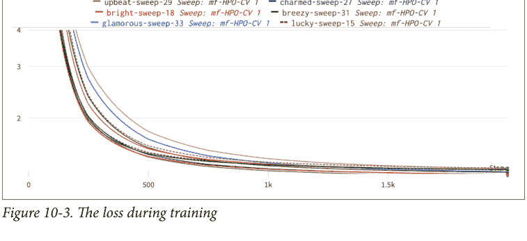

*图 10-3. 训练过程中的损失*

我们也快速查看一下，以确保我们的正则化参数（图 10-4）正在收敛。我们可以看到，如果继续更多的训练轮次，我们的 L2 正则化可能仍然会下降。

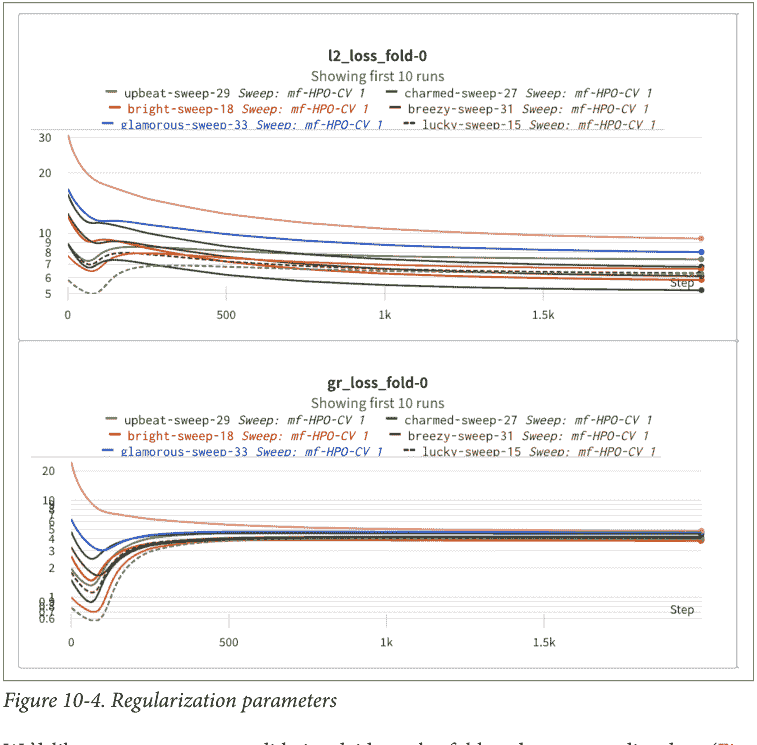

*图 10-4. 正则化参数*

我们希望看到交叉验证按折（fold）和相应的损失（图 10-5）进行展示。这是一个*平行坐标图*；其线条对应于不同的运行，这些运行与不同的参数选择相关联，其垂直轴是不同的指标。最右侧的热图轴对应于我们试图最小化的总体损失。在这种情况下，我们交替显示某一折的测试损失和该折的总损失。数值越低越好，我们希望看到单条线在各折的损失上保持一致（否则，我们可能有一个偏斜的数据集）。我们看到超参数的选择可能与折的行为相互作用，但在所有低损失场景（位于底部）中，我们看到不同折上的性能（图中的垂直轴）之间存在高度相关性。


*图 10-5. 训练过程中的损失*

接下来，哪些超参数的选择对性能有显著影响？图 10-6 是另一个平行坐标图，其垂直轴对应于不同的超参数。通常，我们寻找垂直轴上的哪些区域对应于最右侧热图上的低损失。我们看到，我们的一些超参数，如先验分布，以及有些出乎意料的 ell_2，几乎没有影响。然而，较小的嵌入维度和较小的格拉姆矩阵权重确实有影响。较大的 alpha 似乎也与良好的性能有很好的相关性。

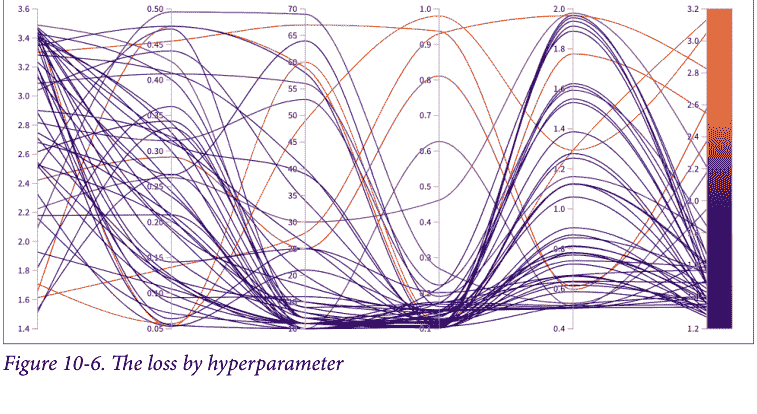

*图 10-6. 按超参数划分的损失*

最后，我们看到，随着进行贝叶斯超参数搜索，我们的性能确实随时间得到提升。图10-7是一个帕累托图，其中散点图中的每个点代表一次运行，从左到右是时间轴。纵轴是总体总损失，因此越低越好，这意味着我们通常正朝着更好的性能收敛。沿着散点凸包底部绘制的线是*帕累托前沿*，即该x值下的最佳性能。由于这是一个时间序列帕累托图，它仅跟踪随时间变化的最佳性能。

你可能想知道我们如何以及为何能够随时间收敛到更好的损失值。这是因为我们进行了贝叶斯超参数搜索，这意味着我们从独立高斯分布中选择超参数，并根据之前运行的性能更新每个参数的先验。关于此方法的介绍，请参阅Robert Mitson的《贝叶斯超参数优化——入门指南》。在实际场景中，我们在这张图中看到的单调性会少一些，但我们总是希望有所改进。

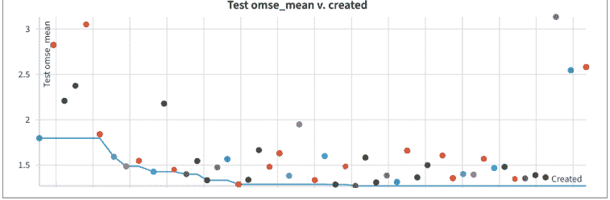

*图10-7. 损失值的帕累托前沿*

## 序贯验证

如果我们要将上述方法付诸实践，就需要将训练好的模型捕获到模型注册表中以供生产使用。最佳实践是建立一套明确的评估标准，用于测试一系列模型。在你的基础机器学习训练中，你可能被鼓励考虑验证数据集；这些数据集可以有多种形式，测试特定的实例子集、特征子集，甚至以已知方式分布在协变量中。

对于推荐系统，一个有用的框架是记住它们本质上是序列数据集。考虑到这一点，让我们再看一下我们的评分数据。稍后我们将更多地讨论序列推荐器，但在讨论验证时，提及如何妥善处理是很有用的。

注意我们所有的评分都有一个关联的时间戳。要构建一个合适的验证集，一个好主意是从数据末尾取那个时间戳。

然而，你可能想知道，“不同用户何时活跃？”以及“较后的时间戳是否可能是评分的有偏选择？”这些是重要的问题。为了解决这些问题，我们应该按用户进行留出。

为了创建这个*序贯数据集*，其中测试集在时间顺序上紧随训练集之后，首先决定所需的验证集大小，比如10%。接下来，按用户对数据分组。最后，采用拒绝采样，确保你不使用最近的时间戳作为拒绝标准。

这是一个使用拒绝采样的pandas简单实现。这不是计算效率最高的实现，但它能完成任务：

```
def prequential_validation_set(df, holdout_perc=0.1):
    '''
    We utilize rejection sampling.

    Assign a probability to all observations, if they lie below the
    sample percentage AND they're the most recent still in the set, include.

    Otherwise return them and repeat.
    Each time, take no more than the remaining necessary to fill the count.
    '''
    count = int(len(df)*holdout_perc)
    sample = []
    while count >0:
        df['p'] = np.random.rand(len(df),1) #generate probabilities
        x = list(
            df.loc[~df.index.isin(sample)] # exclude already selected
            .sort_values(['unix_timestamp'], ascending=False)
            .groupby('user_id').head(1) # only allow the first in each group
            .query("p < @holdout_perc").index # grab the indices
        )
        rnd.shuffle(x) # ensure our previous sorting doesn't bias the users subset
        sample += x[:count] # add observations up to the remaining needed
        count -= len(x[:count]) # decrement the remaining needed

    df.drop(columns=['p'], inplace=True)

    test = df.iloc[sample]
    train = df[~df.index.isin(test.index)]
    return train, test
```

对于本质上是序列的数据集，这是一个有效且重要的验证方案。

## WSABIE

让我们再次关注优化和修改。另一个优化是将矩阵分解问题视为单一优化。

Jason Weston等人的论文《WSABIE：扩展到大规模词汇图像标注》也包含一个仅针对物品矩阵的分解方案。在这个方案中，我们用用户有亲和力的物品的加权和来替换用户矩阵。我们在第233页的“WARP”中介绍了基于图像嵌入的网络规模标注（WSABIE）和Warp损失。将用户表示为他们喜欢的物品的平均值，是一种节省空间的方法，如果用户数量庞大，就不需要单独的用户矩阵。


## 潜在空间超参数优化

为推荐系统进行超参数优化的另一种完全不同的方式是通过潜在空间本身！Bruno Veloso等人的论文《动态推荐系统中潜在空间的超参数优化》试图在每一步修改相对嵌入，以优化嵌入模型。

## 降维

降维技术经常用于推荐系统，以降低计算复杂度并提高推荐算法的准确性。在此背景下，推荐系统降维的主要概念包括矩阵分解和奇异值分解。

*矩阵分解方法*将用户-物品交互矩阵 $(A \in \mathbb{R}^{(m \times n)})$ 分解为两个低维矩阵，分别表示用户 $(U \in \mathbb{R}^{(m \times r)})$ 和物品 $(V \in \mathbb{R}^{(n \times r)})$ 的潜在因子。这种技术可以揭示底层数据结构，并基于用户之前的交互提供推荐。数学上，MF可以表示如下：

```
$A \sim U \times V^{(T)}$
```

*奇异值分解*是一种线性代数技术，它将一个矩阵 $(A)$ 分解为三个矩阵——左奇异向量 $(U)$、奇异值 $(\Sigma)$ 和右奇异向量 $(V)$。SVD可用于推荐系统中的矩阵分解，其中用户-物品交互矩阵被分解为更少数量的潜在因子。SVD的数学表示如下：

```
$A = U \times \Sigma \times V^{(T)}$
```

然而在实践中，人们可能使用幂迭代法来近似地发现特征向量，而不是使用数学库来寻找特征向量。这种方法比为正确性和稠密向量优化的完整稠密SVD解决方案更具可扩展性：

```
import jax
import jax.numpy as jnp

def power_iteration(a: jnp.ndarray) -> jnp.ndarray:
    """Returns an eigenvector of the matrix a.
    Args:
        a: a n x m matrix
    """
    key = jax.random.PRNGKey(0)
    x = jax.random.normal(key, shape=(a.shape[1], 1))
    for i in range(100):
        x = a @ x
        x = x / jnp.linalg.norm(x)
    return x.T

key = jax.random.PRNGKey(123)
A = jax.random.normal(key, shape=[4, 4])
print(A)
[[ 0.52830553  0.3722206  -1.2219944  -0.10314374]
 [ 1.4722222   0.47889313 -1.2940298   1.0449569 ]
 [ 0.23724185  0.3545859  -0.172465   -1.8011322 ]
 [ 0.4864215   0.08039388 -1.2540827   0.72071517]]
S, _, _ = jnp.linalg.svd(A)
print(S)
[[-0.375782    0.40269807  0.44086716 -0.70870167]
 [-0.753597    0.0482972  -0.65527284  0.01940039]
 [ 0.2040088   0.91405433 -0.15798494  0.31293103]
 [-0.49925917 -0.00250015  0.5927009   0.6320123 ]]
x1 = power_iteration(A)
print(x1.T)
[[-0.35423845]
 [-0.8332922 ]
 [ 0.16189891]
 [-0.39233655]]
```

注意，幂迭代返回的特征向量接近 $S$ 的第一列，但不完全相同。这是因为该方法是近似的。它依赖于这样一个事实：特征向量在乘以矩阵时方向不变。因此，通过反复乘以矩阵，我们最终会迭代到一个特征向量上。还要注意，我们求解的是列特征向量而不是行特征向量。在这个例子中，列是用户，行是物品。玩转转置矩阵很重要，因为很多机器学习涉及重塑和转置矩阵，所以尽早习惯它们是一项重要技能。

### 特征向量示例

这里有一个不错的练习：第二个特征向量是通过在矩阵乘法后减去第一个特征向量来计算的。这告诉算法在计算第二个特征向量时，要忽略沿第一个特征向量的任何分量。作为一项有趣的练习，可以跳转到 Colab 并尝试计算第二个特征向量。将其扩展到稀疏向量表示是另一个有趣的练习，因为它允许你开始计算稀疏矩阵的特征向量，而这通常是推荐系统所使用的矩阵形式。

接下来，我们通过创建一个列向量，然后与所有特征向量进行点积并找到最接近的，来为用户构建推荐。然后，我们在用户未见过的特征向量中找到所有得分最高的条目，并将它们作为推荐返回。因此，在前面的例子中，如果特征向量 $x_1$ 是最接近用户列向量的，那么最佳推荐项目将是项目 3，因为它是特征向量中最大的分量，因此如果用户最接近特征向量 $x_1$，则该项目的评分最高。以下是代码中的实现：

```python
import jax
import jax.numpy as jnp

def recommend_items(eigenvectors: jnp.ndarray, user: jnp.ndarray) -> jnp.ndarray:
    """Returns an ordered list of recommend items for the user.
    Args:
        eigenvectors: a nxm eigenvector matrix
        user: a user vector of size m.
    """
    score_eigenvectors = jnp.matmul(eigenvectors.T, user)
    which_eigenvector = jnp.argmax(score_eigenvectors)
    closest_eigenvector = eigenvectors.T[which_eigenvector]
    scores, items = jax.lax.top_k(closest_eigenvector, 3)
    return scores, items

S = jnp.array(
[[-0.375782,    0.40269807],
 [-0.753597,    0.0482972],
 [ 0.2040088,   0.91405433],
 [-0.49925917, -0.00250015]])
u = jnp.array([-1, -1, 0, 0]).reshape(4, 1)
scores, items = recommend_items(S, u)
print(scores)
[ 0.2040088  -0.375782   -0.49925917]
print(items)
[2 0 3]
```

在这个例子中，一个用户对项目 0 和项目 1 进行了差评。因此，最接近的列特征向量是第 0 列。然后我们选择最接近用户的特征向量，对条目进行排序，并向用户推荐项目 2，这是用户未见过的得分最高的条目。

两种技术旨在从用户-项目交互矩阵中提取最相关的特征并降低其维度，从而提高性能：

### 主成分分析（PCA）

这种统计技术将原始高维数据转换为低维表示，同时保留最重要的信息。PCA 可以应用于用户-项目交互矩阵，以减少维度数量并提高推荐算法的计算效率。

### 非负矩阵分解（NMF）

这种技术将非负用户-项目交互矩阵（$A \in \mathbb{R}^{(m \times n)*+}$）分解为两个非负矩阵（$W \in \mathbb{R}^{(m \times r)*+}$ 和 $H \in \mathbb{R}^{(r \times n)*+}$）。NMF 可用于推荐系统中的降维，其中潜在因子是非负且可解释的。NMF 的数学表示为 $A \simeq W \times H$。

矩阵分解技术可以通过使用辅助信息进一步扩展，以纳入额外信息，例如项目内容或用户人口统计数据。辅助信息可用于增强用户-项目交互矩阵，从而实现更准确和个性化的推荐。

此外，矩阵分解模型可以扩展以处理隐式反馈数据，其中交互数据的缺失并不等同于缺乏兴趣。通过在目标函数中加入额外的正则化项，矩阵分解模型可以学习用户-项目交互矩阵的更稳健表示，从而为隐式反馈场景提供更好的推荐。

考虑一个采用矩阵分解来建模用户-项目交互矩阵的推荐系统。如果系统包含许多用户和项目，生成的因子矩阵可能是高维的，并且计算成本很高。然而，通过使用像 SVD 或 PCA 这样的降维技术，算法可以在保留用户-项目交互最重要信息的同时，降低因子矩阵的维度。这使得算法即使对于交互数据有限的新用户或新项目，也能生成更高效、更准确的推荐。

### 等距嵌入

*等距嵌入*是一种特定类型的嵌入，它在将高维空间中的点映射到低维空间时，保持点之间的距离。术语*等距*意味着高维空间中点之间的距离在低维空间中被精确地保留，直至一个缩放因子。

与其他类型的嵌入（如线性或非线性嵌入）相比，后者可能会扭曲点之间的距离，而等距嵌入在许多距离保持至关重要的应用中更受青睐。例如，在机器学习中，等距嵌入可用于将高维数据可视化为二维或三维，同时保留数据点之间的相对距离。在自然语言处理中，等距嵌入可用于表示单词或文档之间的语义相似性，同时保持它们在嵌入空间中的相对距离。

一种生成等距嵌入的流行技术是*多维缩放（MDS）*。MDS 通过计算高维空间中数据点之间的成对距离，然后确定一个保留这些距离的低维嵌入来工作。优化问题通常被表述为一个约束优化问题，其目标是最小化高维空间中的成对距离与低维嵌入中相应距离之间的差异。数学上，我们写作：$min_{(X)}\Sigma_{(i,j)}(d_{ij} - ||x_i - x_j||)^2$。

这里，$d_{ij}$ 表示高维空间中的成对距离，$x_i$ 和 $x_j$ 代表低维嵌入中的点。

生成等距嵌入的另一种方法是通过使用核方法，例如核 PCA 或核 MDS。核方法通过将数据点隐式映射到更高维的特征空间来工作，在该空间中点之间的距离更容易计算。然后在特征空间中计算等距嵌入，并将生成的嵌入映射回原始空间。

等距嵌入已被用于推荐系统中，以在低维空间中表示用户-项目交互矩阵，其中项目之间的距离得以保留。通过在嵌入空间中保留项目之间的距离，推荐算法可以更好地捕捉数据的底层结构，并提供更准确和多样化的推荐。

等距嵌入也可用于将额外信息纳入推荐算法，例如项目内容或用户人口统计数据。通过使用等距嵌入来表示项目和额外信息，算法可以基于用户-项目交互数据以及项目内容或用户人口统计数据来捕捉项目之间的相似性，从而提供更准确和多样化的推荐。

此外，等距嵌入也可用于解决推荐系统中的冷启动问题。通过使用等距嵌入来表示项目，算法可以根据新项目在嵌入空间中与现有项目的相似性来为其进行推荐，即使在没有用户交互的情况下也是如此。

总之，等距嵌入是推荐系统中一种有价值的技术，用于在低维空间中表示用户-项目交互矩阵，其中项目之间的距离得以保留。等距嵌入可以使用矩阵分解技术生成，并可用于纳入额外信息、解决冷启动问题以及提高推荐的准确性和多样性。

### 非线性局部可度量化嵌入

*非线性局部可度量化嵌入*是另一种在低维空间中表示用户-项目交互矩阵的方法，其中附近项目之间的局部距离得以保留。通过在嵌入空间中保留项目之间的局部距离，推荐算法可以更好地捕捉数据的局部结构，并提供更准确和多样化的推荐。

数学上，令 $X = x_1, x_2, \dots, x_n$ 为高维空间中的项目集合，$Y = y_1, y_2, \dots, y_n$ 为低维空间中的项目集合。非线性局部可度量化嵌入的目标是找到一个映射 $f: X \rightarrow Y$，该映射保留局部距离，即对于任何 $x_i, x_j \in X$，我们有：

$d_Y(f(x_i), f(x_j)) \simeq d_X(x_i, x_j)$

在推荐系统中生成非线性局部可度量化嵌入的一种流行方法是通过自编码器神经网络。自编码器通过编码器网络将高维用户-项目交互矩阵映射到低维空间，然后通过解码器网络将矩阵重构回高维空间。编码器和解码器网络被联合训练，以最小化输入数据和重构数据之间的差异，目标是在嵌入空间中捕捉数据的底层结构：

$min_{(\theta, \phi)} \sum_{(i=1)}^{n} ||x_i - g_{\phi}(f_{\theta}(x_i))||^2$

此处，$f_{\theta}$ 表示参数为 $\theta$ 的编码器网络，$g_{\theta}$ 表示参数为 $\theta$ 的解码器网络，$||\cdot||$ 表示欧几里得范数。

在推荐系统中生成非线性局部可度量化嵌入的另一种方法是使用 t-分布随机邻域嵌入（t-SNE）。t-SNE 通过建模高维空间中项目之间的成对相似性，然后找到一个保留这些相似性的低维嵌入来工作。

在现代，一种更流行的方法是 UMAP，它试图拟合一个在局部邻域中保留密度的最小流形。UMAP 是在复杂高维潜在空间中寻找低维表示的基本技术；其文档可在 https://oreil.ly/NLqDg 找到。优化问题通常被表述为一个代价函数 $C$，该函数衡量高维空间中的成对相似性与低维嵌入中相应相似性之间的差异：

$$C(Y) = \Sigma_{(i,j)} p_{ij} * \log\left(\frac{p_{ij}}{q_{ij}}\right)$$

此处，$p_{ij}$ 表示高维空间中的成对相似性，$q_{ij}$ 表示低维空间中的成对相似性，求和范围是所有项目对 $(i, j)$。

非线性局部可度量化嵌入也可用于将额外信息整合到推荐算法中，例如项目内容或用户人口统计数据。通过使用非线性局部可度量化嵌入来表示项目和额外信息，算法可以基于用户-项目交互数据以及项目内容或用户人口统计数据来捕捉项目之间的相似性，从而带来更准确和多样化的推荐。

此外，非线性局部可度量化嵌入也可用于解决推荐系统中的冷启动问题。通过使用非线性局部可度量化嵌入来表示项目，算法可以基于新项目在嵌入空间中与现有项目的相似性来为其做出推荐，即使在没有用户交互的情况下也是如此。

总之，非线性局部可度量化嵌入是推荐系统中一种有用的技术，用于在低维空间中表示用户-项目交互矩阵，其中附近项目之间的局部距离得以保留。非线性局部可度量化嵌入可以使用自编码器神经网络或 t-SNE 等技术生成，并可用于整合额外信息、解决冷启动问题以及提高推荐的准确性和多样性。

### 中心核对齐

在训练神经网络时，每一层的潜在空间表示被期望表达传入信号之间的相关结构。通常，这些中间表示包含从初始层到最终层的一系列状态。你可能会自然地想，“这些表示在网络的各层中如何变化？”以及“这些层有多相似？”。有趣的是，对于某些架构，这个问题可能深入揭示网络的行为。

这种比较层表示的过程称为*相关分析*。对于一个具有层 1, ..., $N$ 的 MLP，相关性可以用一个 $N \times N$ 的成对关系矩阵来表示。其思想是每一层包含一系列潜在因子，并且类似于数据集其他特征的相关分析，这些潜在特征之间的关系可以通过它们的协方差来简单概括。

## 亲和度与销售概率

正如你所看到的，矩阵分解是一种强大的降维技术，可以产生销售概率（通常简称为 *p-sale*）的估计量。在矩阵分解中，目标一直是将用户行为和产品销售矩阵的历史数据分解为两个低维矩阵：一个代表用户偏好，另一个代表产品特征。现在，让我们将这个矩阵分解模型转换为销售估计器。

令 $R \in \mathbb{R}^{(M \times N)}$ 为历史数据矩阵，其中 $M$ 是用户数量，$N$ 是产品数量。矩阵分解旨在找到两个矩阵 $U \in \mathbb{R}^{(M \times d)}$ 和 $V \in \mathbb{R}^{(N \times d)}$，其中 $d$ 是潜在空间的维度，使得：

$R \simeq U * V^T$

*销售概率*，或者等价地，阅读、观看、食用或点击的概率，可以使用矩阵分解来预测：首先将历史数据矩阵分解为用户和产品矩阵，然后计算一个分数，该分数代表用户购买给定产品的可能性。该分数可以使用用户矩阵中对应行和产品矩阵中对应列的点积来计算，然后通过一个逻辑函数将点积转换为概率分数。

从数学上讲，用户 $u$ 和产品 $p$ 的销售概率可以表示如下：

$P(u, p) = \text{sigmoid}(u * p^T)$

此处，sigmoid 是逻辑函数，它将用户和产品向量的点积映射到 0 到 1 之间的概率分数：

$sigmoid(x) = 1/(1 + exp(-x))$

$p^T$ 表示产品向量的转置。用户和产品向量的点积是用户偏好与产品特征之间相似性的度量，逻辑函数将此相似性分数映射为概率分数。

用户和产品矩阵可以通过使用各种矩阵分解算法（如 SVD、NMF 或 ALS）在历史数据上进行训练。一旦矩阵训练完成，点积和逻辑函数就可以应用于新的用户-产品对，以预测销售概率。然后，预测的概率可用于对产品进行排序并向用户推荐。

值得强调的是，由于 ALS 的损失函数是凸的（意味着存在一个全局最小值），当我们固定用户矩阵或项目矩阵时，收敛速度可以很快。在此方法中，固定用户矩阵并求解项目矩阵。然后固定项目矩阵并求解用户矩阵。该方法在两种解之间交替进行，并且由于损失在此情况下是凸的，因此方法收敛很快。

用户矩阵中对应行和产品矩阵中对应列的点积代表用户与产品之间的亲和度分数，或者用户偏好与产品特征的匹配程度。然而，仅凭此分数可能不足以预测用户是否会实际购买该产品。

应用于矩阵分解模型中点积的逻辑函数将亲和度分数转换为概率分数，该分数代表销售的可能性。这种转换考虑了超出用户偏好和产品特征之外的额外因素，例如产品的整体受欢迎程度、用户的购买行为以及任何其他相关的外部因素。通过整合这些额外因素，矩阵分解能够更好地预测销售概率，而不仅仅是亲和度分数。

一个用于线性计算潜在嵌入的比较库（然而，不是用 JAX 编写）是 libFM。因子分解机的公式类似于 GloVe 嵌入，因为它也建模两个向量之间的交互，但点积可用于回归或二元分类任务。该方法也可以扩展到推荐用户和项目之外的更多种类的项目。

总之，矩阵分解通过整合超出用户偏好和产品特征之外的额外因素，并使用逻辑函数将亲和度分数转换为概率分数，从而产生销售概率，而不仅仅是亲和度分数。

## 用于推荐系统评估的倾向加权

正如你所看到的，推荐系统是基于用户反馈进行评估的，这些反馈是从已部署的推荐系统中收集的。然而，这些数据在因果上受到已部署系统的影响，这创建了一个反馈循环，可能会使新模型的评估产生偏差。这个反馈循环可能导致混淆变量，使得难以区分用户偏好和已部署系统的影响。

如果这让你感到惊讶，让我们考虑一下，要使一个推荐系统*不*因果影响用户采取的行动和/或这些行动产生的结果，需要满足哪些条件。那将需要诸如“用户完全忽略推荐”和“系统随机进行推荐”之类的假设。倾向加权可以缓解这个问题的一些最坏影响。

推荐系统的性能取决于许多因素，包括用户-项目特征、上下文信息和趋势，这些因素会影响推荐的质量和用户参与度。然而，这种影响可能是相互的：用户交互影响推荐系统，反之亦然。因此，评估推荐系统对用户行为和满意度的因果效应是一项具有挑战性的任务，因为它需要控制潜在的混淆因素——那些可能同时影响处理分配（推荐策略）和感兴趣的结果（用户对推荐的反应）的因素。

因果推断提供了一个解决这些挑战的框架。在推荐系统的背景下，因果推断可以帮助回答以下问题：

- 推荐策略的选择如何影响用户参与度，例如点击率、购买率和满意度评分？
- 对于给定的用户细分、产品类别或上下文，最佳的推荐策略是什么？
- 推荐策略对用户留存率、忠诚度和生命周期价值的长期影响是什么？

我们将通过介绍因果推断中一个对推荐系统至关重要的方面来结束本章，这个方面基于倾向得分的概念。我们将引入倾向性来量化某些物品被展示给用户的调整后可能性。然后，我们将看到这与著名的辛普森悖论如何相互作用。

### 倾向性

在许多数据科学问题中，我们不得不应对混杂因素，尤其是这些混杂因素与目标结果之间的相关性。根据具体情况，混杂因素可能有多种形式。有趣的是，在推荐系统中，混杂因素可能就是系统本身！推荐系统的离线评估受到用户物品选择行为和已部署推荐系统所带来的混杂因素的影响。

如果这个问题看起来有点循环，那确实如此。这有时被称为*闭环反馈*。一种缓解方法是倾向性加权，它旨在通过基于估计的倾向性在相应的层中考虑每个反馈来解决这个问题。你可能还记得，*倾向性*指的是用户看到某个物品的可能性；通过对其进行反向加权，我们可以抵消选择偏差。与标准的离线留出评估相比，这种方法试图代表所考察推荐模型的实际效用。


### 利用反事实

另一种缓解选择偏差的方法是我们不会深入探讨的*反事实评估*，它使用更类似于强化学习（RL）中离线策略评估方法的倾向性加权技术来估计推荐模型的实际效用。然而，反事实评估通常依赖于在开环设置中准确记录倾向性，其中一些随机物品暴露给用户，这对于大多数推荐问题来说并不实用。如果你可以选择向用户展示随机推荐以供评分，这也有助于去偏。这些方法可以结合使用的一种场景是基于强化学习的推荐器，它们使用探索-利用方法，如多臂老虎机或其他结构化随机化。

*逆倾向性评分（IPS）*是一种基于倾向性的评估方法，它利用重要性采样来解释从已部署推荐系统收集的反馈并非均匀随机的事实。倾向性得分是一个平衡因子，它根据倾向性得分调整观察到的反馈分布。如果可以从所有可能的物品中均匀随机地采样开环反馈，IPS评估方法在理论上是无偏的。在第3章中，我们讨论了马太效应，或推荐系统中的“富者愈富”；IPS是应对此效应的一种方法。注意马太效应和辛普森悖论这两个概念之间的关系，当在不同层内时，选择效应会产生显著的偏差。

倾向性加权基于这样一个观点：物品通过已部署推荐系统暴露给用户的概率（倾向性得分）会影响从该用户收集到的反馈。通过对反馈基于倾向性得分进行重新加权，我们可以调整已部署系统引入的偏差，并获得对新推荐模型更准确的评估。

要应用IPS，我们需要估计收集到的反馈数据集中每个物品-用户交互的倾向性得分。这可以通过建模已部署系统在交互时将物品暴露给用户的概率来实现。一种简单的方法是使用物品的流行度作为其倾向性得分的代理。然而，可以使用更复杂的方法基于用户和物品特征以及交互上下文来建模倾向性得分。

一旦估计出倾向性得分，我们就可以通过使用重要性采样对反馈进行重新加权。具体来说，每个反馈以其倾向性得分的倒数进行加权，这样更可能被已部署系统暴露的物品被降权，而不太可能被暴露的物品被升权。这个重新加权过程近似于从均匀分布的流行度中呈现推荐所期望的反馈的反事实分布。

最后，我们可以使用重新加权的反馈，通过本章中看到的标准评估指标来评估新的推荐模型。然后，通过使用重新加权的反馈，将新模型的有效性与已部署系统的有效性进行比较，从而对新模型的性能提供更公平、更准确的评估。

### 辛普森悖论与缓解混杂

*辛普森悖论*基于一个混杂变量的概念，该变量建立了层，我们在其中看到（可能具有误导性的）协变。当研究两个变量之间的关联但这些变量受到混杂变量的强烈影响时，就会出现这种悖论。

在推荐系统的情况下，这个混杂变量是已部署模型的特征和选择倾向。倾向性得分被引入作为系统偏离无偏开环暴露场景的度量。该得分允许基于观察到的闭环反馈设计和分析推荐模型的离线评估，模拟开环场景的一些特定特征。

辛普森悖论的传统描述通常建议分层，这是一种众所周知的方法，通过首先识别底层层，然后在每层中研究因果效应来识别和估计因果效应。这种方法能够测量与混杂变量无关的潜在结果。对于推荐系统，这涉及根据混杂变量的可能值（即已部署模型的特征）对观察到的结果进行分层。

用户无关的倾向性得分通过两步生成过程估计，使用物品被已部署模型推荐的先验概率，以及给定物品被推荐时用户与物品交互的条件概率。基于一组温和的假设（但数学上过于技术性，此处不涵盖），可以使用最大似然法为每个数据集估计用户无关的倾向性得分。

我们需要定义用户倾向性得分 $p_{u, i}$，它表示已部署模型将物品 $i \in I$ 暴露给用户 $u \in U$ 的倾向或频率。在实践中，我们对用户进行边缘化以获得用户无关的倾向性得分 $p_{\cdot, i}$。正如Longqi Yang等人在《Unbiased Offline Recommender Evaluation for Missing-Not-at-Random Implicit Feedback》中所描述的，公式如下：

$$p_{\cdot, i} \propto (n_i^*)^{\frac{\gamma + 1}{2}}$$

这里，$n_i^*$ 是物品 $i$ 被交互的总次数，$\gamma$ 是一个影响不同观察流行度物品倾向性分布的参数。幂律参数 $\gamma$ 影响物品的倾向性分布，并取决于所考察的数据集；我们通过使用每个数据集的最大似然法来估计 $\gamma$ 参数。

有了这些倾向性估计，我们就可以在计算反馈效应时应用简单的逆加权 $w_i = \frac{1}{p_i}$。最后，我们可以将这些加权与倾向性匹配结合起来，生成反事实推荐；通过将倾向性大致相等的物品收集到层中，我们可以将这些层用作我们的混杂变量。


### 双重稳健估计

双重稳健估计（DRE）是一种结合两个模型的方法：一个建模接受处理（被已部署模型推荐一个物品）的概率，另一个建模感兴趣的结果（用户对物品的反馈）。DRE中使用的权重取决于两个模型的预测概率。这种方法的优点在于，即使其中一个模型设定错误，它仍然可以提供无偏估计。

具有倾向性得分加权和结果模型的双重稳健估计器的结构方程如下：

$$\Theta = \frac{\sum w_i(Y_i - f(X_i))}{\sum w_i(T_i - p_i) + \sum w_i(p_i(1 - p_i)^2(f(X_i) - f^*(X_i)))}$$

这里，$Y_i$ 是结果，$X_i$ 是协变量，$T_i$ 是处理，$p_i$ 是倾向性得分，$w_i$ 是权重，$f(X_i)$ 是结果模型，$f^*(X_i)$ 是估计的结果模型。

关于这些考虑的一个很好的介绍，请查看《Give Me a Robust Estimator—and Make It a Double!》。

## 总结

真是旋风般的一章！潜在空间是推荐系统*最*重要的方面之一。它们是我们用来编码用户和物品的表示。最终，潜在空间不仅仅是关于降维；它们是关于理解一种几何结构，其中距离度量编码了与你的机器学习任务相关的意义。

嵌入和编码器的世界博大精深。我们没有时间讨论CLIP嵌入（图像+文本）或庞加莱圆盘（自然层次化的距离度量）。我们没有深入探讨UMAP（一种非线性密度感知降维技术）或HNSW（一种在潜在空间中检索的方法，能很好地尊重局部几何结构）。相反，我们向你推荐Vicki Boykis关于嵌入的文章（同期发表），Karel Minařík关于构建嵌入的文章和指南，或者Cohere的Meor Amer关于文本嵌入的精美可视化指南。

我们现在有了表示，但接下来我们需要优化。我们正在构建*个性化*推荐系统，因此让我们定义衡量我们在任务上表现的指标。

# 第11章
个性化推荐指标

在深入探讨了矩阵分解和神经网络在个性化场景中的强大方法后，我们现在已掌握了构建复杂推荐系统的有力工具。然而，推荐列表中项目的排序可能对用户参与度和满意度产生深远影响。

我们迄今的旅程主要聚焦于使用潜在因子或深度学习架构来预测用户可能喜欢的内容。然而，我们呈现这些预测的方式，或者更正式地说，我们如何对这些推荐进行排序，具有至关重要的意义。因此，本章将把我们的视线从预测问题上移开，揭示推荐系统中排序的复杂图景。

本章致力于理解关键的排序指标，包括平均精度均值（mAP）、平均倒数排名（MRR）和归一化折损累积增益（NDCG）。这些指标各自采用独特的方法来量化我们排序的质量，以适应用户交互的不同方面。

我们将深入探讨这些指标的复杂性，揭示其计算细节，讨论其解释方法，涵盖其优缺点，并指出它们与各种个性化场景的具体关联。

这种探索构成了推荐系统评估过程中不可或缺的一部分。它不仅为我们提供了一个衡量系统性能的稳健框架，还为理解不同算法在线上环境中的表现提供了重要见解。这将为后续关于算法偏差、推荐多样性以及推荐系统多利益相关者方法的讨论奠定基础。

本质上，本章所获得的知识将有助于我们微调推荐系统，确保我们不仅预测得好，而且能以真正契合个体用户偏好和行为的方式进行推荐。

## 评估环境

在深入定义关键指标之前，我们将花一些时间讨论我们可以进行的评估类型。正如你很快会看到的，推荐系统的评估通常以推荐对用户的*相关性*为特征。这与搜索指标类似，但我们增加了额外的因素来考虑最相关项目在列表中的*位置*。

关于推荐系统评估的一个非常全面的视角，最近的项目RecList构建了一个有用的基于清单的框架来组织指标和评估。

通常你会听到在几种设置下评估推荐系统：

-   在线/离线
-   用户/物品
-   A/B测试

每种设置提供略有不同的评估类型，并告诉你不同的信息。让我们快速分解这些差异，以设定一些关于术语的假设。

## 在线与离线

当我们提到在线与离线推荐器时，我们指的是你*何时*运行评估。在*离线评估*中，你从生产系统之外的测试/评估数据集开始，并计算一组指标。这通常是最简单的推荐器设置方式，但对现有数据的要求最高。使用历史数据，你可以构建一组相关响应，然后在模拟推理中使用。这种方法与其他传统机器学习最为相似，尽管误差计算略有不同。

当我们训练大型模型时，这些数据集类似于离线数据集。我们之前看到的序列前推数据在推荐系统中比在许多其他机器学习应用中更为相关。有时你会听到人们说“所有推荐器都是序列推荐器”，因为历史曝光对推荐问题的重要性。

*在线评估*发生在推理期间，通常在生产环境中。棘手的部分是你基本上永远不知道反事实结果。你可以计算在线排序上的特定指标：协变量的频率和分布、点击率/成功率或平台停留时间，但最终这些与离线指标是不同的。


## 从历史评估数据中引导

从头开始构建推荐系统的人最常问的问题之一是“你从哪里获得初始训练数据？”这是一个难题。最终，你必须巧妙地想出一个有用的数据集。考虑我们在维基百科推荐器中的共现数据；我们不需要任何用户交互就能获得一组数据来构建推荐器。从物品到物品的引导是最流行的策略，但你也可以使用其他技巧。开始转向用户-物品推荐器的最简单方法是直接询问用户问题。如果你询问用户对一组物品特征的偏好信息，你可以构建简单的模型来开始整合这些信息。

## 用户指标与物品指标

因为推荐系统是个性化机器，很容易认为我们总是想为用户进行推荐并据此衡量性能。然而，存在一些微妙之处。我们需要确保单个物品获得公平的机会，有时从等式的另一侧看可以帮助评估这一点。换句话说，物品是否被推荐得足够频繁，以至于有机会找到它们的利基市场？我们应该明确地在用户*和*物品轴上计算我们的指标。

物品侧指标的另一个方面是针对基于集合的推荐器。在上下文中推荐的其他物品可能对推荐性能产生显著影响。因此，我们应该在大规模评估中仔细衡量成对的物品指标。

## A/B测试

使用随机对照试验来评估你的新推荐模型表现如何是很好的。对于推荐来说，这相当棘手。在本章末尾，你会看到一些细微差别，但现在，让我们快速回顾一下如何在闭环范式中思考A/B测试。

A/B测试最终试图估计用一个模型替换另一个模型的效果大小；效果大小估计是衡量干预对目标指标因果影响的过程。首先，我们需要部署两个推荐模型。我们还希望用户被合理地随机分配到每个推荐器中。然而，随机化单位是什么？很容易快速假设它是用户，但推荐器发生了什么变化？推荐器是否以与分布的某些属性协变的方式发生了变化——例如，你是否构建了一个对季节性电视特别节目不太友好的新推荐器，而此时正值十一月的第二周？

这种推荐系统测试的另一个考虑因素是长期复合效应。关于几年来一系列积极的A/B测试结果的一个常见反驳是“你是否将第一个推荐器与最后一个进行了测试？”这是因为人群在变化，包括用户和物品。当你同时改变推荐系统时，你经常会发现自己处于一种双重盲测的情况，即你从未在任何其他推荐器下见过这个用户或物品群体。如果每个A/B测试的所有效果大小在整个行业中都是可加的，那么世界GDP可能会是现在的两到三倍。

防范此类抗议的方法是通过*长期保留*，即一个随机的用户子集（持续添加），他们不会随着时间的推移升级到新模型。通过衡量这个集合与生产中最前沿模型的目标指标，你总是能够理解你工作的长期影响。长期保留的缺点是什么？它很难维护，而且很难牺牲你在部分人群上的工作效果。

现在，让我们终于进入指标部分吧！

## 召回率与精确率

让我们首先考虑四个推荐问题，以及每个问题可能对你想要的结果类型产生不同的影响。

首先，让我们考虑进入一家书店并寻找一位流行作家的书。我们会说这是推荐问题：

-   提供大量推荐
-   提供少量可能相关的结果

此外，如果书店有良好的选书，我们期望*所有*相关结果都包含在推荐中，因为一旦作家流行起来，书店通常会携带其大部分或全部作品。然而，许多推荐——书店里的书——对于这次搜索根本不相关。

其次，让我们考虑在大都市中使用地图应用寻找附近加油站的情况。我们预期附近会有许多加油站，但你可能只会考虑前几个——甚至可能只考虑第一个看到的加油站。因此，针对这个问题的推荐系统具有以下特点：

-   许多相关结果
-   少数有用的推荐

在第一种场景中，相关结果可能完全包含在推荐中；而在第二种场景中，推荐可能完全包含在相关结果中。

现在让我们来看一些更常见的场景。

对于我们的第三个例子，假设你正在流媒体视频平台上搜索今晚想看的浪漫内容。流媒体平台往往会展示大量推荐——一页又一页来自这个或那个主题的内容。但在这个晚上，在这个平台上，可能只有几部电影或电视剧真正符合你的需求。因此，我们的推荐系统执行以下操作：

-   提供大量推荐
-   只有少数真正相关

然而，重要的是，并非所有相关结果都会出现在推荐中！我们知道，不同平台拥有不同的媒体资源，因此无论我们查看多少推荐，一些相关结果都不会出现。

第四，也是最后一个例子，你是一位品味独特的高端咖啡爱好者，正前往当地的烘焙店品尝第三波精品单品咖啡。作为一名经验丰富的咖啡鉴赏家，你喜欢来自世界各地的高品质咖啡，享受大多数但并非所有产地的咖啡。在任何一天，你当地的咖啡馆只有几种单品手冲咖啡选项。尽管你拥有世界性的味蕾，但仍有一些流行的产区你并不喜欢。这个小小的推荐咖啡吧可以描述如下：

-   提供少量推荐
-   提供许多可能相关的推荐

在任何一天，只有少数推荐中的一部分可能与你相关。

这就是我们对应的四种场景。对于后两种场景，推荐与相关性之间的交集可能按比例较小或较大——甚至可能为空！主要思想是，较小样本的完整规模并不总是被使用。

既然我们已经通过几个例子进行了说明，让我们看看它们如何与推荐系统的核心指标相关联：精确率和召回率 @ *k*（图11-1）。重点关注例子3和4，我们可以看到只有一部分推荐与相关选项相交。也只有一部分相关选项与推荐相交。这一点常被忽视，但事实上*这两个比率定义了我们的指标*——让我们开始吧！

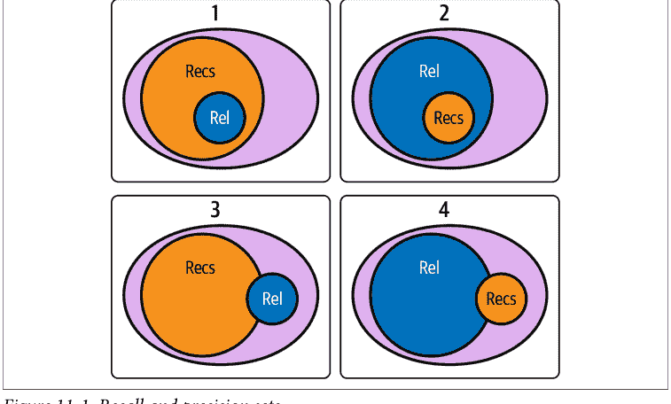

*图11-1. 召回率和精确率集合*

### @ *k*

在本章和推荐系统指标讨论的大部分内容中，我们使用类似 @ *k* 的表述。这表示“在 *k* 个中”，实际上应该是“在 *k* 个中”或“从 *k* 个中”。这些仅仅是推荐集合的大小。我们通常将客户体验锚定在我们能向用户展示多少推荐而不会损害体验上。我们还需要知道相关项目集合的基数，我们称之为 @ *r*。请注意，虽然可能感觉永远无法知道这个数字，但我们假设这指的是通过我们的训练或测试数据“已知相关”的选项。

### 精确率 at k

*精确率*是相关推荐集合大小与 *k*（推荐集合大小）的比率。

$$Precision@k = \frac{num_{relevant}}{(k)}$$

注意，相关项目的大小并未出现在公式中。这没关系；交集的大小仍然依赖于相关项目集合的大小。

查看我们的例子，从技术上讲，例子2具有最高的精确率，但由于相关结果的数量，这有点误导性。这是精确率不是评估推荐系统最常用指标的原因之一。

### 召回率 at k

*召回率*是相关推荐集合大小与 *r*（相关项目集合大小）的比率。

但是等等！如果比率是相关推荐除以相关项目，那么 *k* 在哪里？*k* 在这里仍然很重要，因为推荐集合的大小限制了交集的可能大小。回想一下，这些比率作用于始终依赖于 *k* 的交集。这意味着你通常需要考虑 *r* 和 *k* 中的最大值。

在场景3中，我们希望一些符合我们心意的电影会在正确的流媒体平台上。这些电影的数量除以任何地方所有媒体的总数就是*召回率*。如果你所有的相关电影都在这个平台上，你可能会称之为*完全召回*。

场景4的咖啡馆体验表明，召回率有时是避免概率的倒数；因为你喜欢这么多咖啡，我们可能更容易谈论你不喜欢什么。在这种情况下，供应中的避免数量将对召回率产生很大影响：

$$Recall@k = \frac{(k - Avoid@k)}{num_{relevant}}$$

这是召回率的核心数学定义，通常是我们首先考虑的测量指标之一，因为它是对你检索性能的纯粹估计。

### R-精确率

如果我们对推荐也有一个排序，我们可以取前 *r* 个推荐中相关推荐与 $r$ 的比率。这在 $r$ 非常小的情况下（如例子1和3）改进了该指标。

### mAP, MRR, NDCG

在深入探讨了精确率@$k$和召回率@$k$的可靠领域后，我们对推荐系统的质量有了宝贵的见解。然而，这些指标虽然至关重要，但有时在捕捉这些系统的一个重要方面时显得不足：*推荐的顺序*。

在推荐系统中，我们呈现建议的顺序具有重要意义，需要进行评估以确保其有效性。

这就是为什么我们现在将超越精确率@$k$和召回率@$k$，探索一些关键的排序敏感指标——即平均精度均值（mAP）、平均倒数排名（MRR）和归一化折损累积增益（NDCG）。这些指标不仅考虑我们的推荐是否相关，还考虑它们是否排序良好。

mAP指标赋予每个相关文档及其位置重要性，而MRR则专注于第一个相关项目的排名。NDCG则更重视排名较高的相关文档。通过理解这些指标，你将拥有更强大的工具集来评估和改进你的推荐系统。

那么，让我们继续探索，在精确率和可理解性之间取得平衡。在本节结束时，你将能够自信且知识渊博地处理这些基本的评估方法。

#### mAP

这个推荐系统中的关键指标特别擅长考虑相关项目的排名。如果在一个包含五个项目的列表中，相关项目出现在位置2、3和5，mAP将通过计算precision@2、precision@3和precision@5，然后取这些值的平均值来计算。mAP的优势在于它对相关项目排序的敏感性，当这些项目排名更高时，会提供更高的分数。

考虑一个包含两个推荐算法A和B的例子：

-   对于算法A，我们计算mAP如下：
    (precision@2 + precision@3 + precision@5) / 3 = (1/2 + 2/3 + 3/5) / 3 = 0.6
-   对于完美排序项目的算法B，我们计算mAP如下：
    mAP = (precision@1 + precision@2 + precision@3) / 3 = (1/1 + 2/2 + 3/3) / 3 = 1

mAP在查询集Q上的通用公式如下所示：

$$mAP = \frac{1}{|Q|} \sum_{q=1}^{|Q|} \frac{1}{m_q} \sum_{k=1}^{n} P(k) * rel(k)$$

这里，$|Q|$是查询总数，$m_q$是特定查询 $q$ 的相关文档数量，$P(k)$ 表示在第 _k_ 个截止点的精确率，$rel(k)$ 是一个指示函数，如果排名 $k$ 的项目相关则等于1，否则为0。

#### MRR

推荐系统中使用的另一个有效指标是MRR。与考虑所有相关项目的MAP不同，MRR主要关注推荐列表中第一个相关项目的位置。它被计算为第一个相关项目出现的排名的倒数。

因此，如果列表中的第一个项目相关，MRR可以达到其最大值1。如果第一个相关项目在列表中更靠后的位置找到，MRR的值将小于1。例如，如果第一个相关项目位于排名2，则MRR为1/2。

让我们在之前使用的推荐算法A和B的背景下来看这一点：

-   对于算法A，第一个相关项目在排名2，所以MRR等于1/2 = 0.5。
-   对于完美排序项目的算法B，第一个相关项目在排名1，所以MRR等于1/1 = 1。

将其扩展到多个查询，MRR的通用公式如下：

$$MRR = \frac{1}{|Q|} \sum_{i=1}^{|Q|} \frac{1}{rank_i}$$

这里，$|Q|$ 代表查询总数，$rank_i$ 是第 _i_ 个查询列表中第一个相关项目的位置。该指标提供了关于推荐算法如何在列表顶部提供相关推荐的宝贵见解。

#### NDCG

为了进一步深化我们对排序指标的理解，让我们进入NDCG的世界。与mAP和MRR类似，NDCG也承认相关项目的排序顺序，但它引入了一个转折。它会随着列表位置的下移而降低项目的相关性权重，这意味着列表中靠前的项目比排名靠后的项目更有价值。

NDCG始于累积增益（CG）的概念，它仅仅是列表中前$k$个项目相关性分数的总和。折损累积增益（DCG）更进一步，根据每个项目的位置对其相关性进行折损。而NDCG，则是DCG值除以理想DCG（IDCG）进行归一化后的结果，IDCG是如果所有相关项目都出现在列表最顶端时我们能得到的DCG值。

假设我们的列表中有五个项目，并且对于某个特定用户，相关项目位于第2和第3位，那么IDCG@$k$将是$(1/\log(1 + 1) + 1/\log(2 + 1)) = 1.5 + 0.63 = 2.13$。

让我们将这个概念应用到我们的示例算法A和B中。

*对于算法A*

- DCG@5 = 1/log(2 + 1) + 1/log(3 + 1) + 1/log(5 + 1) = 0.63 + 0.5 + 0.39 = 1.52
- NDCG@5 = DCG@5 / IDCG@5 = 1.52 / 2.13 = 0.71

*对于算法B*

- DCG@5 = 1/log(1 + 1) + 1/log(2 + 1) + 1/log(3 + 1) = 1 + 0.63 + 0.5 = 2.13
- NDCG@5 = DCG@5 / IDCG@5 = 2.13 / 2.13 = 1

NDCG的通用公式可以表示为

$$NDCG@k = \frac{DCG@k}{IDCG@k}$$

其中

- $DCG@k = \sum_{i=1}^{k} \frac{rel_i}{log_2(i+1)}$
- $IDCG@k = \sum_{i=1}^{|\mathcal{R}|} \frac{1}{log_2(i+1)}$

而$\mathcal{R}$是相关文档的集合。

这个指标为我们提供了一个归一化的分数，用于衡量我们的推荐算法对相关项目排序的优劣，并随着列表位置的下移而进行折损。

### mAP 与 NDCG 的比较？

mAP和NDCG都是整体性指标，通过纳入所有相关项目及其各自的排名，提供了对排序质量的全面视角。然而，这些指标的可解释性和应用场景可能因推荐上下文的具体情况和相关性的性质而异。

虽然MRR不考虑所有相关项目，但它确实提供了对算法性能的可解释性洞察，突出了第一个相关项目的平均排名。当最顶部的推荐具有重要价值时，这尤其有用。

另一方面，mAP是一种丰富的评估度量，它有效地表示了精确率-召回率曲线下的面积。其平均特性赋予了它与不同排名截断点上精确率和召回率之间权衡相关的直观解释。

NDCG引入了对每个项目相关性的稳健考虑，并对排序顺序敏感，采用对数折损因子来量化项目在列表中位置下移时重要性的递减。这使其能够处理项目具有不同程度相关性的场景，超越了mAP和MRR中常用的二元相关性。然而，NDCG的这种通用性也可能因其对数折损的复杂性而限制其可解释性。

此外，尽管NDCG非常适合项目具有不同相关性权重的用例，但在实际应用中获取准确的ground-truth相关性分数可能构成重大挑战。这限制了NDCG在现实世界中的实用性。

总的来说，这些指标构成了推荐算法离线评估方法论的支柱。随着我们探索的深入，我们将涵盖在线评估，讨论评估和缓解算法偏差的策略，理解确保推荐多样性的重要性，并优化推荐系统以满足生态系统中各方的利益。

## 相关系数

虽然像皮尔逊或斯皮尔曼这样的相关系数可以用来评估两个排名之间的相似性（例如，预测排名和ground-truth排名之间），但它们提供的信息与mAP、MRR或NDCG并不完全相同。

相关系数通常用于衡量两个连续变量之间的线性关联程度，在排名的上下文中，它们可以指示两个有序列表之间的整体相似性。然而，它们没有直接考虑诸如单个项目的相关性、相关项目的位置或项目间不同程度的相关性等方面，而这些方面是mAP、MRR和NDCG不可或缺的组成部分。

例如，假设一个用户过去与五个项目有过交互。一个推荐系统可能会预测用户将再次与这些项目交互，但以重要性相反的顺序对它们进行排序。即使系统正确识别了感兴趣的项目，这种反转的排名也会导致mAP、MRR或NDCG衡量的性能不佳，但由于线性关系，会获得较高的负相关系数。

因此，虽然相关系数可以提供对排名性能的高层次理解，但它们不足以替代mAP、MRR和NDCG等指标提供的更详细信息。

要在排名的上下文中使用相关系数，必须将它们与其他考虑推荐问题特定细微差别的指标配对，例如单个项目的相关性及其在排名中的位置。

## 基于亲和度的RMSE

均方根误差（RMSE）和像mAP、MRR、NDCG这样的排名指标，在评估输出亲和度分数的推荐系统时，提供了根本不同的视角。

RMSE是量化预测误差的常用指标。它计算预测亲和度分数与真实值之间差值的平方的平均值的平方根。较低的RMSE表示更好的预测准确性。然而，RMSE将问题视为标准的回归任务，忽略了推荐系统中固有的排名结构。

相反，mAP、MRR和NDCG是明确设计用来评估排名质量的，这在推荐系统中至关重要。本质上，虽然RMSE衡量预测亲和度分数与实际值的接近程度，但mAP、MRR和NDCG通过考虑相关项目的位置来评估排名质量。因此，如果你的主要关注点是对项目进行排序而不是预测精确的亲和度分数，这些排名指标通常更合适。

## 积分形式：AUC 和 cAUC

在推荐系统中，我们为每个用户生成一个项目的排序列表。正如你所看到的，这些排名是基于亲和度的，即用户对每个项目的偏好概率或程度。在这个框架下，已经开发了多种指标来评估这些排序列表的质量。其中一个指标是AUC-ROC，它与mAP、MRR和NDCG互为补充。让我们更深入地了解这些指标。

### 推荐概率与 AUC-ROC

在二元分类设置中，*受试者工作特征曲线下面积*（AUC-ROC）衡量推荐模型区分正例（相关）和负例（不相关）实例的能力。它是通过在不同的阈值设置下绘制真阳性率（TPR）与假阳性率（FPR）的关系图，然后计算该曲线下的面积来计算的。

在推荐的上下文中，你可以将这些“阈值”视为改变推荐给用户的顶部项目数量。AUC-ROC指标评估的是你的模型将相关项目排在不相关项目之上的能力，而不管实际的排名位置如何。换句话说，AUC-ROC有效地量化了模型将一个随机选择的相关项目排在随机选择的不相关项目之上的可能性。然而，这并没有考虑项目在列表中的实际位置或顺序，只考虑了正例与负例实例的相对排名。一个经过校准的项目的亲和度可以被模型解释为该项目相关的置信度度量，当考虑历史数据时，即使是未校准的亲和度分数也可能为找到有用内容所需的推荐数量提供很好的建议。

这些亲和度分数的一个严肃应用可能是只向用户展示超过特定分数的项目，否则告诉他们稍后再来或使用探索方法来改进数据。例如，如果你销售卫生用品，并考虑在结账时要求客户添加一些Aesop肥皂，你可能希望评估Aesop的ROC，并且仅在观察到的亲和度超过学习到的阈值时才提出这个建议。你稍后也会在第268页的“库存健康”中看到这些概念的应用。

### 与其他指标的比较

让我们将这些指标与其他指标进行比较：

*mAP*
该指标扩展了在排名列表中特定截断点处精确率的概念，以提供模型性能的整体度量。它是通过平均在每个相关项目被发现的排名处计算的精确率值来实现的。与AUC-ROC不同，mAP更强调排名靠前的项目，对排名顶部的变化更敏感。

*MRR*
与考虑列表中所有相关项目的AUC-ROC和mAP不同，MRR只关注列表中第一个相关项目的排名。它是

## BPR

贝叶斯个性化排序（BPR）为推荐系统中的物品排序任务提供了一种贝叶斯方法，有效地建立了一个概率框架来建模个性化排序过程。BPR 并未将物品推荐问题转化为二元分类问题（相关或不相关），而是专注于成对偏好：给定两个物品，用户更偏好哪一个？这种方法更符合推荐系统中常见的隐式反馈的本质。

BPR 模型使用成对损失函数，该函数考虑了特定用户对正样本物品和负样本物品的相对排序。它旨在最大化观测到的排序正确的后验概率。该模型通常使用随机梯度下降或其变体进行优化。需要注意的是，BPR（与我们讨论过的其他指标，包括 AUC-ROC、mAP、MRR 和 NDCG 不同）是一个模型训练目标，而非评估指标。因此，虽然上述指标评估的是模型训练后的性能，但 BPR 提供了一种机制，通过直接优化排序任务来指导模型学习过程。关于这些主题的更深入讨论，请参阅 Steffen Rendle 等人的论文《BPR: Bayesian Personalized Ranking from Implicit Feedback》。

## 总结

现在你已经了解了如何评估所训练推荐系统的性能，你可能想知道如何实际训练它们。你可能已经注意到，我们介绍的许多指标并不适合作为损失函数；它们涉及对物品集合和列表的大量同时观测。不幸的是，这将使推荐器学习的信号具有高度组合性。此外，我们提出的指标实际上有两个方面需要考虑：与召回率相关的二元指标，以及排序权重。

在下一章中，你将学习一些作为优秀训练目标的损失函数。我们相信，这些函数的重要性你不会忽视。

# 第 12 章
## 排序训练

典型的机器学习任务通常预测单一结果，例如分类任务中属于正类的概率，或回归任务中的期望值。而排序则提供物品集合的相对顺序。这类任务在搜索结果或推荐中很典型，其中呈现物品的顺序很重要。在这类问题中，物品的分数通常不会直接展示给用户，而是通过物品的序数排名来呈现（可能是隐式的）：列表顶部的物品编号低于下一个物品。

本章介绍了机器学习算法在训练过程中可以使用的各种损失函数。这些分数应估计列表排序，使得当它们相互比较时，产生的集合排序更接近于训练数据集中观察到的相关性排序。这里我们将重点介绍概念和计算方法，你将在下一章中应用它们。

## 排序在推荐系统中的位置？

在深入探讨排序损失函数的细节之前，我们应该先谈谈排序在整个推荐系统架构中的位置。典型的大规模推荐系统有一个检索阶段，在该阶段使用一个低成本函数将相当数量的候选物品收集到一个候选集中。通常，这个检索阶段仅基于物品。例如，候选集可能包括与用户最近消费或喜欢的物品相关的物品。或者，如果新鲜度很重要（例如新闻数据），该集合可能包括对用户来说最新、最热门且相关的物品。将物品收集到候选集后，我们对其应用排序。

此外，由于候选集通常比整个物品语料库小得多，我们可以使用更复杂的模型和辅助特征来帮助排序。

这些特征可以是用户特征或上下文特征。用户特征有助于确定物品对用户的有用性，例如最近消费物品的平均嵌入。上下文特征可以指示当前会话的详细信息，例如一天中的时间或用户最近输入的查询——这是一个区分当前会话与其他会话并有助于确定相关物品的特征。最后，我们有物品本身的表示，它可以是从内容特征到代表物品的学习嵌入的任何内容。

然后，将用户、上下文和物品特征连接成一个特征向量，我们将用它来表示物品；然后我们一次性对所有候选物品进行评分并排序。排序后的集合可能还会应用额外的过滤以符合业务逻辑，例如移除近似重复项或使排序集合中显示的物品类型更多样化。

在接下来的例子中，我们将假设所有物品都可以用用户、上下文和物品特征的连接特征向量来表示，并且模型可以简单到是一个线性模型，其权重向量 W 与物品向量点积以获得用于排序物品的分数。这些模型可以推广到深度神经网络，但最后一层的输出仍然是一个用于排序物品的标量。

现在我们已经为排序设定了背景，让我们考虑一下如何对由向量表示的物品集合进行排序。

## 学习排序

*学习排序*（LTR）是根据相关性或重要性对有序物品列表进行评分的模型的名称。这项技术是我们如何从检索的潜在原始输出转变为基于相关性排序的物品列表。

LTR 问题主要有三种类型：

- *单点法*
    模型单独处理每个文档，并为其分配分数或排名。任务变为回归或分类问题。
- *成对法*
    模型在损失函数中同时考虑文档对。目标是最小化排序错误的文档对数量。
- *列表法*
    模型在损失函数中考虑整个文档列表。目标是找到整个列表的最优排序。

## 训练 LTR 模型

LTR 模型的训练数据通常由物品列表组成，每个物品都有一组特征和一个标签（或真实值）。特征可能包括物品本身的信息，标签通常表示其相关性或重要性。例如，在我们的推荐系统中，我们有物品特征，在训练数据集中，标签将显示该物品是否与用户相关。此外，LTR 模型有时会利用查询或用户特征。

训练过程是通过使用这些特征和标签来学习一个排序函数。然后在服务前将这些排序函数应用于检索到的物品。

让我们看一些这些模型如何训练的例子。

### 用于排序的分类

提出排序问题的一种方式是将其视为多标签任务。训练集中与用户相关的每个物品都是一个正样本，而训练集之外的物品则是负样本。这实际上是在物品集合规模上的多标签方法。网络可以有一个架构，其中每个物品的特征作为输入节点，然后还有一些用户特征。输出节点与你希望标记的物品相对应。

对于线性模型，如果 $X$ 是物品向量，$Y$ 是输出，我们学习 $W$，其中如果 $X$ 是正样本集中的物品，则 $sigmoid(WX) = 1$；否则，$sigmoid(WX) = 0$。这对应于 Optax 中的二元交叉熵损失。

不幸的是，这种设置没有考虑物品的相对排序，因此由每个物品的 sigmoid 激活函数组成的损失函数无法很好地优化排序指标。实际上，这种排序仅仅是一个下游相关性模型，仅有助于过滤在前一步检索到的选项。

这种方法的另一个问题是，我们将训练集之外的所有内容都标记为负样本，但用户可能从未见过一个可能与查询相关的新物品——因此，当这个新物品只是未被观察到时，将其标记为负样本是不正确的。

你可能已经意识到排序需要考虑列表中的相对位置。接下来让我们考虑这一点。

### 用于排序的回归

对一组物品进行排序最简单的方法是简单地回归到类似 NDCG 或我们其他与排名相关的个性化指标的排名数字。

在实践中，这是通过将物品集合与查询进行条件化来实现的。例如，我们可以将问题设定为给定查询回归到 NDCG，即

### 排序的分类与回归

在排序的上下文中，我们可以将查询作为嵌入上下文向量提供给前馈网络，该网络与集合中项目的特征拼接，并回归到NDCG值。

查询作为上下文是必要的，因为一组项目的排序可能依赖于查询。例如，考虑在搜索栏中输入查询**flowers**。我们期望最能代表花朵的一组项目出现在顶部结果中。这表明查询是评分函数的重要考量因素。

使用线性模型时，如果$X$是项目向量，$Y$是输出，那么我们学习$W$，其中$WX(i) = NDCG(i)$，$NDCG(i)$是项目$i$的NDCG。回归可以使用Optax中的L2损失来学习。

最终，这种方法旨在学习导致个性化指标中更高排名分数的项目底层特征。不幸的是，这也未能明确考虑项目的相对排序。这是一个相当严重的局限性，我们稍后会探讨。

另一个考虑：对于未在top-$k$训练项目之外排名的项目，我们该如何处理？我们分配给它们的排名本质上是随机的，因为我们不知道该分配什么数字。因此，这种方法需要改进，我们将在下一节中探讨。

假设我们有一个网页，比如在线书店，用户必须浏览并点击项目才能购买。对于这样的漏斗，我们可以将排序分为两部分。第一个模型可以预测在给定一组展示项目的情况下，点击某个项目的概率。第二个模型可以基于点击行为，并可以是估计项目购买价格的回归模型。

然后，完整的排序模型可以是两个模型的乘积。第一个模型计算在给定一组竞争项目的情况下，点击某个项目的概率。第二个模型计算在给定已点击的情况下，购买的预期价值。请注意，第一个和第二个模型可能具有不同的特征，具体取决于用户在漏斗中的阶段。第一个模型可以访问竞争项目的特征，而第二个模型可能考虑运费和折扣，这些可能改变项目的价值。因此，在这种情况下，使用不同的模型对漏斗的两个阶段进行建模是有利的，以便利用漏斗每个阶段存在的最多信息。

## WARP

Jason Weston等人在“WSABIE: Scaling Up to Large Vocabulary Image Annotation”中介绍了一种随机生成排序损失的可能方法。该损失称为*加权近似排序对*（WARP）。在这种方案中，损失函数被分解为类似于成对损失的形式。更准确地说，如果一个排名较高的项目的分数没有超过排名较低项目的边距（任意选择为1），我们对该对项目应用*铰链损失*。这看起来像这样：

$max(0, 1 - score(pos) + score(neg))$

使用线性模型时，如果$X_{pos}$是正项目向量，$X_{neg}$是负项目向量，那么我们学习$W$，其中$WX_{pos} - WX_{neg} > 1$。这的损失是*铰链损失*，其中预测器输出是$WX_{pos} - WX_{neg}$，目标是1。

然而，为了补偿未观察到的项目可能不是真正的负例，而只是未观察到的东西这一事实，我们计算从负例集中采样以找到违反所选对排序的次数。也就是说，我们计算必须寻找满足以下条件的项目的次数：

$score(neg) > score(pos) - 1$

然后，我们构建一个关于从项目宇宙（减去正例）中采样以找到违反负例的次数的单调递减函数，并查找该次数的权重，并将损失乘以该权重。如果很难找到违反负例，那么梯度应该更低，因为要么我们已经接近一个好的解决方案，要么该项目以前从未见过，因此我们不应该仅仅因为该项目从未作为查询结果展示给用户就自信地给它分配低分。

请注意，WARP损失是在CPU是训练ML模型的主要计算形式时开发的。因此，使用了排序的近似来获得负项目的排名。*近似排名*定义为在项目宇宙（减去正例）中进行有放回采样的次数，直到我们找到一个分数比正例大任意常数（称为*边距*）1.0的负项目。

为了构建成对损失的WARP权重，我们需要一个函数将负项目的近似排名转换为WARP权重。计算此函数的相对简单的代码如下：

```python
import numpy as np

def get_warp_weights(n: int) -> np.ndarray:
    """Returns N weights to convert a rank to a loss weight."""

    # The alphas are defined as values that are monotonically decreasing.
    # We take the reciprocal of the natural numbers for the alphas.
    rank = np.arange(1.0, n + 1, 1)
    alpha = 1.0 / rank
    weights = alpha

    # This is the L in the paper, defined as the sum of all previous alphas.
    for i in range(1, n):
        weights[i] = weights[i] + weights[i - 1]

    # Divide by the rank.
    weights = weights / rank
    return weights

print(get_warp_weights(5))
# [1.          0.75        0.61111111 0.52083333 0.45666667]
```

如你所见，如果我们立即找到一个负例，WARP权重是1.0，但如果很难找到一个违反边距的负例，WARP权重会很小。

这个损失函数近似优化precision@k，因此是改进检索集中排名估计的良好一步。更好的是，WARP通过采样在计算上是高效的，因此更节省内存。

### k阶统计量

有没有办法改进WARP损失和直接的成对铰链损失？事实证明，有一系列方法。在“Learning to Rank Recommendations with the k-order Statistic Loss”中，Jason Weston等人（包括本书的一位合著者）展示了如何通过探索铰链损失和WARP损失之间的变体来实现这一点。该论文的作者在各种语料库上进行了实验，并展示了优化单个成对与选择更难的负例（如WARP）之间的权衡如何影响指标，包括平均排名和k处的精度和召回率。

关键的概括是，模型在梯度步骤中考虑了所有正项目，而不仅仅是一个。

再次回想一下，选择一个随机正例和一个随机负例对优化的是ROC或AUC。这对排序来说并不理想，因为它没有优化列表的顶部。另一方面，WARP损失优化了单个正项目的排名列表顶部，但没有指定如何选择正项目。

可以使用几种替代策略来对列表顶部进行排序，包括优化平均最大排名，该策略尝试将正项目分组，使得得分最低的正项目尽可能接近列表顶部。为了允许这种排序，我们提供了一个关于如何选择正样本的概率分布函数。如果概率偏向正项目列表的顶部，我们得到的损失更像WARP损失。如果概率是均匀的，我们得到AUC损失。如果概率偏向正项目列表的末尾，那么我们优化最坏情况，比如平均最大排名。NumPy函数np.random.choice提供了从分布$P$中采样的机制。

我们还有一个优化需要考虑：$K$，用于构建正集的正样本数量。如果$K = 1$，我们只从正集中选择一个随机正项目；否则，我们构建正集，按分数对样本排序，并使用概率分布$P$从大小为$K$的正列表中采样。这种优化在CPU时代是有意义的，当时计算成本高昂，但在GPU和TPU时代可能没有太大意义，我们将在下面的警告中讨论。


### 随机损失与GPU

关于前面的随机损失，有一点需要提醒。它们是为早期CPU时代开发的，当时采样并在找到负样本时退出是廉价且容易的。如今，使用现代GPU，进行这样的分支决策更加困难，因为GPU核心上的所有线程必须在不同数据上并行运行相同的代码。这通常意味着分支的两边都在批处理中执行，因此从这些早期退出中节省的计算较少。因此，近似随机损失（如WARP和$k$阶统计量损失）的分支代码效率较低。

我们该怎么办？我们将在第13章中展示如何在代码中近似这些损失。长话短说，由于像GPU这样的向量处理器倾向于通过并行均匀处理大量数据来工作，我们必须找到一种对GPU友好的方式来计算这些损失。在下一章中，我们通过生成一大批负例并要么将它们全部评分低于负例，要么寻找最严重的违反负例，或者两者结合作为损失函数的混合来近似负采样。

## BM25

虽然本书的大部分内容都侧重于向用户推荐物品，但搜索排序是一个密切相关的姊妹学科。在信息检索或文档搜索排序领域，*最佳匹配25*（BM25）是一个必不可少的工具。

BM25是一种用于信息检索系统的算法，它根据文档与给定查询的相关性对文档进行排序。这种相关性是通过考虑诸如TF-IDF等因素来确定的。它是一种词袋检索函数，根据查询词在每个文档中的出现情况对一组文档进行排序。它也是概率相关性框架的一部分，源自概率检索模型。

BM25排序函数根据查询为每个文档计算一个分数。得分最高的文档被认为与查询最相关。

以下是BM25公式的简化版本：

```
$$\text{score}(D, Q) = \sum_{i=1}^{n} \text{IDF}(q_i) * \frac{f(q_i, D) * (k1 + 1)}{f(q_i, D) + k1 * \left(1 - b + b * \frac{|D|}{\text{avgdl}}\right)}$$
```

该公式的元素如下：

- $D$ 代表一个文档。
- $Q$ 是由单词 $\{q_1, q_2, \dots, q_n\}$ 组成的查询。
- $f(q_i, D)$ 是查询词 $q_i$ 在文档 $D$ 中的频率。
- $|D|$ 是文档 $D$ 的长度（单词数量）。
- $\text{avgdl}$ 是集合中的平均文档长度。
- $k_1$ 和 $b$ 是超参数。$k_1$ 是一个正的调优参数，用于校准文档词频的缩放。$b$ 是一个参数，用于确定按文档长度进行缩放的程度：$b = 1$ 对应于完全按文档长度缩放词权重，而 $b = 0$ 对应于不进行长度归一化。
- $\text{IDF}(q_i)$ 是查询词 $q_i$ 的逆文档频率，它衡量该词提供的信息量（它在所有文档中是常见还是罕见）。BM25应用了IDF的一个变体，可以按如下方式计算：

```
$$\text{IDF}(q_i) = \log \left( \frac{N - n(q_i) + 0.5}{n(q_i) + 0.5} \right)$$
```

这里，$N$ 是集合中的文档总数，$n(q_i)$ 是包含 $q_i$ 的文档数量。

简单来说，BM25结合了词频（一个词在文档中出现的频率）和逆文档频率（一个词提供的独特信息量）来计算相关性分数。它还引入了文档长度归一化的概念，惩罚过长的文档，防止它们主导较短的文档，这是简单TF-IDF模型中的一个常见问题。自由参数 $k_1$ 和 $b$ 允许根据文档集的具体特征对模型进行调优。

在实践中，BM25为大多数信息检索任务提供了稳健的基线，包括临时关键词搜索和文档相似性。BM25被用于许多开源搜索引擎，如Lucene和Elasticsearch，并且是通常所说的*全文搜索*的事实标准。

那么，我们如何将BM25整合到本书讨论的问题中呢？BM25的输出是一个按与给定查询相关性排序的文档列表，然后学习排序（LTR）就派上用场了。你可以将BM25分数作为LTR模型中的一个特征，连同其他你认为可能影响文档与查询相关性的特征一起使用。

将BM25与LTR结合用于排序的一般步骤如下：

1.  *检索候选文档列表。* 给定一个查询，使用BM25检索一个候选文档列表。
2.  *为每个文档计算特征。* 计算BM25分数作为一个特征，以及其他潜在特征。这可能包括各种文档特定特征、查询-文档匹配特征、用户交互特征等。
3.  *训练/评估LTR模型。* 使用这些特征向量及其对应的标签（相关性判断）来训练你的LTR模型。或者，如果你已经有一个训练好的模型，用它来评估和排序检索到的文档。
4.  *排序。* LTR模型为每个文档生成一个分数。根据这些分数对文档进行排序。

这种检索（使用BM25）和排序（使用LTR）的结合，使你能够首先从可能非常大的集合中缩小潜在候选文档的范围（这是BM25的优势所在），然后使用一个可以考虑更复杂特征和交互的模型来微调这些候选文档的排序（这是LTR的优势所在）。

值得一提的是，BM25分数在文本文档检索中可以提供一个强有力的基线，并且根据问题的复杂性和你拥有的训练数据量，LTR可能会也可能不会带来显著的改进。

## 多模态检索

让我们再看看这种检索方法，因为我们可以找到一些强大的杠杆。回想第8章：我们构建了一个共现模型，它说明了在其他文章中共同引用的文章如何共享意义和相互关联性。但你如何将搜索整合到其中呢？

你可能会想，“哦，我可以搜索文章的名称。”但这并没有充分利用我们的共现模型；它低估了我们发现的这种联合意义。一种经典的方法可能是对文章标题或文章使用类似BM25的东西。更现代的方法可能是对查询和文章标题进行向量嵌入（使用类似BERT或其他Transformer模型）。然而，这两种方法都没有真正捕捉到我们所寻找的两个方面。

考虑以下方法：

1.  通过BM25使用初始查询进行搜索，得到一组初始的“锚点”。
2.  使用你的潜在模型，以每个锚点作为查询进行搜索。
3.  训练一个LTR模型来聚合和排序这些搜索的并集。

现在我们正在使用真正的多模态检索，利用多个潜在空间！这种方法的另一个亮点是，查询在基于编码器的潜在空间中通常与文档分布不同。这意味着当你输入**莫桑比克的领导人是谁？**时，这个问题看起来与文章标题（莫桑比克）或截至2023年夏天的相关句子（“由萨莫拉·马谢尔总统领导的新政府建立了一个基于马克思主义原则的一党制国家。”）相当不同。

当嵌入完全不是文本时，这种方法变得更加强大：考虑输入文本来搜索一件衣服，并希望看到与之搭配的整套服装。

## 总结

将事物按正确的顺序排列是推荐系统的一个重要方面。到现在为止，你知道排序并不是全部，但它是流程中必不可少的一步。我们已经收集了我们的物品并将它们按正确的顺序排列，剩下的就是将它们发送给用户。

我们从最基本的概念——学习排序开始，并将其与一些传统方法进行了比较。然后我们通过WARP和WSABIE得到了一个大的升级。这引导我们走向了 $k$ 阶统计量，它涉及利用更仔细的概率采样。最后，我们以BM25作为文本环境中的强大基线结束了讨论。

在我们征服服务之前，让我们把这些部分组合起来。在下一章中，我们将加大音量，构建一些播放列表。这将是迄今为止最密集的一章，所以去拿杯饮料，伸个懒腰吧。我们有一些工作要做。

# 第13章
融会贯通：
实验与排序

在过去的几章中，我们涵盖了排序的许多方面，包括各种损失函数以及衡量排序系统性能的指标。在本章中，我们将在Spotify百万播放列表数据集上展示一个排序损失和排序指标的例子。

本章鼓励更多的实验，并且比之前的章节更具开放性，之前章节的目标是介绍概念和基础设施。而本章的写作目的是鼓励你卷起袖子，直接参与损失函数和编写指标。

## 实验技巧

在我们开始深入研究数据和建模之前，让我们介绍一些实践，这些实践将使你在进行大量实验和快速迭代时更加轻松。这些是通用的指导原则，使我们的实验更快。因此，我们能够快速迭代，找到帮助我们实现目标的解决方案。

实验代码与工程代码不同，因为代码是为了探索想法而编写的，而不是为了健壮性。目标是在不牺牲太多代码质量的前提下实现最大速度。所以你应该考虑一段代码是否应该经过彻底测试，或者是否没有必要，因为代码只是为了测试一个假设而存在，然后就会被丢弃。考虑到这一点，这里有一些建议。请记住，这些建议是作者的观点，是随着时间的推移发展而来的，并不是硬性规定，只是一些可能有人不同意的个人见解。

### 保持简单

就研究代码的整体结构而言，最好尽可能保持简单。在探索生命周期的早期阶段，不要过多考虑继承和可重用性。在项目开始时，我们通常还不清楚需要什么，因此应该优先考虑让代码易于阅读和调试。这意味着你不必过于关注代码重用，因为在项目的早期阶段，随着模型结构、数据输入和系统各部分交互的调整，许多代码会发生变化。当不确定性解决后，你可以将代码重写成更健壮的形式，但过早重构实际上会减慢速度。

一个经验法则是，复制代码三次，然后在第四次时将其重构为库是可以的，因为你已经看到了足够多的用例来证明代码重用的合理性。如果过早进行重构，你可能没有看到足够多的代码用例来覆盖它可能需要处理的可能用例。

### 调试打印语句

如果你读过许多机器学习研究论文，你可能期望项目开始时数据相当干净有序。然而，现实世界的数据可能很混乱，存在缺失字段和意外值。拥有大量打印函数可以让你打印并直观检查数据样本，也有助于构建输入数据管道和转换以馈送模型。此外，打印模型的样本输出对于确保输出符合预期非常有用。

最重要的日志记录位置是系统组件之间的输入和输出模式；这些可以帮助你了解实际情况何时偏离预期。之后，你可以进行单元测试以确保模型重构不会破坏任何东西，但单元测试可以等到模型架构稳定时再进行。一个很好的经验法则是，当你想要重构代码或重用或优化代码以保留功能，或者当代码稳定且你想要确保它不会破坏构建时，添加单元测试。另一个添加打印语句的好用例是，当你在运行训练代码时不可避免地遇到非数字（NaN）错误时。

在 JAX 中，你可以使用以下代码启用 NaN 调试：

```python
from jax import config
config.update("jax_debug_nans", True)

@jax.jit
def f(x):
    jax.debug.print("Debugging {x}", x=x)
```

调试 NaN 配置设置会在发现任何 NaN 时重新运行 JIT 编译的函数，调试打印函数甚至会在 JIT 内部打印张量的值。常规打印在 JIT 内部不起作用，因为它不是可编译的命令，在跟踪期间会被跳过，因此你必须使用调试打印函数，它在 JIT 内部确实有效。

### 推迟优化

在研究代码中，过早优化的诱惑很大——特别是关注模型或系统的实现以确保它们计算高效或代码优雅。然而，研究代码是为了更高的实验速度而编写的，而不是执行速度。

我们的建议是不要过早优化，除非它阻碍了研究速度。一个原因是系统可能不完整，因此优化一部分可能没有意义，如果系统的另一部分更慢并且是实际瓶颈。另一个原因是你正在优化的部分可能不会进入最终模型，因此如果代码最终被重构掉，所有优化工作可能会浪费。

最后，优化实际上可能会阻碍修改或注入更新架构或功能设计选择的能力。优化的代码往往做出某些选择以适应当前的数据流结构，但可能不便于进一步更改。例如，在本章的代码中，一个可能的优化选择是将相同大小的播放列表批处理在一起，以便代码可以以更大的批次运行。然而，在实验的这个阶段，这种优化将是过早和分心的，因为它可能会使指标代码更复杂。我们温和的建议是推迟优化，直到大部分实验完成，并且架构、损失函数和指标已经选择并确定。

### 跟踪更改

在研究代码中，可能有太多变量在起作用，你无法一次改变一个来观察它们的效果。这个问题在需要大量运行来确定哪个更改导致哪个效果的大型数据集中尤为明显。因此，一般来说，固定一些参数并逐步更改代码仍然是一个好主意，这样你就可以跟踪导致最大改进的更改。参数必须跟踪，但代码更改也必须跟踪。

跟踪更改的一种方法是通过我们在第 5 章讨论的 Weights & Biases 等服务。跟踪导致更改的确切代码和参数是一个好主意，这样实验可以重现和分析。特别是对于频繁更改且有时未签入的研究代码，你必须勤奋地保存产生运行的代码副本，MLOps 工具允许你跟踪代码和超参数。

### 使用特征工程

与学术论文不同，大多数应用研究关注的是好的结果，而不是理论上漂亮的结果。我们不受纯粹主义者观点的束缚，即模型必须自己学习数据的所有内容。相反，我们是务实的，关注好的结果。

我们不应该放弃特征工程等实践，特别是当我们数据很少或时间紧迫并需要快速获得不错结果时。使用特征工程意味着，如果你知道手工制作的特征与结果（如项目排名）正相关或负相关，那么务必添加这些工程特征到数据中。推荐系统中的一个例子是，被评分项目的属性与用户配置文件中的某些内容匹配。因此，如果项目与用户播放列表中的艺术家或专辑相同，我们可以返回布尔值 True；否则，返回 False。这个额外的特征只是帮助模型更快收敛，如果手工工程特征效果不佳，模型仍然可以使用其他潜在特征（如嵌入）来补偿。

通常，偶尔消融手工工程特征是一个好习惯。为此，保留一个没有某些特征的实验，看看这些特征是否随着时间的推移已经过时，或者它们是否仍然有利于业务指标。

### 消融

机器学习应用中的消融是测量当特定特征被移除时模型性能变化的做法。在计算机视觉应用中，消融通常指阻止图像或视野的一部分，以查看它如何影响模型识别或分割数据的能力。在其他类型的机器学习中，它可能意味着战略性地移除某些特征。

消融的一个陷阱是用什么来替代该特征。简单地将特征归零会显著扭曲模型的输出。这称为零消融，它可能迫使模型将该特征视为分布外，从而产生不太可信的结果。相反，一些人主张平均消融，或取该特征的平均值或最常见值。这允许模型看到更预期的值，并减少这些风险。

然而，这未能考虑我们一直在处理的模型类型的最重要方面——潜在的高阶交互。其中一位作者研究了一种更深入的消融方法，称为因果擦洗，其中你将消融值固定为从其他特征值产生的后验分布中采样，即一个与模型当时将看到的其余值“有意义”的值。

### 理解指标与业务指标

有时，作为机器学习从业者，我们痴迷于模型可以达到的最佳指标。然而，我们应该克制这种热情，因为最佳的机器学习指标可能不能完全代表当前的业务利益。此外，包含业务逻辑的其他系统可能位于我们的模型之上并修改输出。因此，最好不要过度痴迷于机器学习指标，而是进行包含业务指标的适当 A/B 测试，因为这是衡量机器学习良好结果的主要标准。

最好的情况是找到一个与相关业务指标良好对齐或预测的损失函数。不幸的是，这通常不容易找到，特别是当业务指标微妙或具有竞争性优先级时。

### 执行快速迭代

不要害怕查看相当短的运行结果。在开始时，当你正在弄清楚模型架构和数据之间的交互时，没有必要对数据进行完整的遍历。进行一些快速运行并进行微小调整，看看它们如何在短时间内改变指标是可以的。在 Spotify 百万播放列表数据集中，我们通过使用 100,000

## Spotify 百万播放列表数据集

本节的代码可以在[本书的 GitHub 仓库](https://github.com/)中找到。数据的文档可以在 [Spotify 百万播放列表数据集挑战](https://www.kaggle.com/)中找到。

我们应该做的第一件事是查看数据：

```bash
less data/spotify_million_playlist_dataset/data/mpd.slice.0-999.json
```

这应该会产生以下输出：

```json
{
    "info": {
        "generated_on": "2017-12-03 08:41:42.057563",
        "slice": "0-999",
        "version": "v1"
    },
    "playlists": [
        {
            "name": "Throwbacks",
            "collaborative": "false",
            "pid": 0,
            "modified_at": 1493424000,
            "num_tracks": 52,
            "num_albums": 47,
            "num_followers": 1,
            "tracks": [
                {
                    "pos": 0,
                    "artist_name": "Missy Elliott",
                    "track_uri": "spotify:track:0UaMYEvWZi0ZqiD0oHU3YI",
                    "artist_uri": "spotify:artist:2wIVse2owClT7go1WT98tk",
                    "track_name": "Lose Control (feat. Ciara & Fat Man Scoop)",
                    "album_uri": "spotify:album:6V5UrXcfyQD1wu4Qo2I9K",
                    "duration_ms": 226863,
                    "album_name": "The Cookbook"
                }
            ]
        }
    ]
}
```

遇到新数据集时，查看数据并规划使用哪些特征来为数据生成推荐总是很重要的。Spotify 百万播放列表数据集挑战的一个可能目标是，看看是否可以从播放列表的前五首曲目预测播放列表中的后续曲目。

在这种情况下，有几个特征可能对这个任务有用。我们有曲目、艺术家和专辑的通用资源标识符（URI），它们分别是曲目、艺术家和专辑的唯一标识符。我们还有艺术家和专辑的名称以及播放列表的名称。数据集还包括数值特征，如曲目的时长和播放列表中的关注者数量。直观地说，播放列表的关注者数量不应该影响播放列表中曲目的排序，因此在使用这些可能信息量不大的特征之前，你可能需要寻找更好的特征。查看特征的整体统计数据，你也可以获得很多见解：

```
less data/spotify_million_playlist_dataset/stats.txt
number of playlists 1000000
number of tracks 66346428
number of unique tracks 2262292
number of unique albums 734684
number of unique artists 295860
number of unique titles 92944
number of playlists with descriptions 18760
number of unique normalized titles 17381
avg playlist length 66.346428

top playlist titles
10000 country
10000 chill
8493 rap
8481 workout
8146 oldies
8015 christmas
6848 rock
6157 party
5883 throwback
5063 jams
5052 worship
4907 summer
4677 feels
4612 new
4186 disney
4124 lit
4030 throwbacks
```

首先，注意曲目数量多于播放列表数量。这意味着相当多的曲目可能只有很少的训练数据。因此，`track_uri` 可能不是一个泛化能力很好的特征。另一方面，`album_uri` 和 `artist_uri` 会泛化，因为它们会在不同的播放列表中多次出现。为了代码清晰，我们将主要使用 `album_uri` 和 `artist_uri` 作为代表曲目的特征。

在之前的“综合运用”章节中，我们演示了可以使用基于内容的特征或基于文本标记的特征，但直接嵌入特征对于演示排序最为清晰。在实际应用中，嵌入特征和基于内容的特征可以连接在一起，形成一个泛化能力更好的特征，用于推荐排序。在本章中，我们将曲目表示为 `(track_id, album_id, artist_id)` 的元组，其中 ID 是表示 URI 的整数。我们将在下一节构建从 URI 到整数 ID 的映射字典。

### 构建 URI 字典

与第 8 章类似，我们将首先为所有 URI 构建一个字典。这个字典允许我们将文本 URI 表示为整数，以便在 JAX 端进行更快的处理，因为我们可以轻松地从整数查找嵌入，而不是从任意的 URI 字符串查找。

以下是 *make_dictionary.py* 的代码：

```python
import glob
import json
import os
from typing import Any, Dict, Tuple

from absl import app
from absl import flags
from absl import logging
import numpy as np
import tensorflow as tf

FLAGS = flags.FLAGS
_PLAYLISTS = flags.DEFINE_string("playlists", None, "Playlist json glob.")
_OUTPUT_PATH = flags.DEFINE_string("output", "data", "Output path.")

# Required flag.
flags.mark_flag_as_required("playlists")

def update_dict(dict: Dict[Any, int], item: Any):
    """Adds an item to a dictionary."""
    if item not in dict:
        index = len(dict)
        dict[item] = index

def dump_dict(dict: Dict[str, str], name: str):
    """Dumps a dictionary as json."""
    fname = os.path.join(_OUTPUT_PATH.value, name)
    with open(fname, "w") as f:
        json.dump(dict, f)

def main(argv):
    """Main function."""
    del argv  # Unused.

    tf.config.set_visible_devices([], 'GPU')
    tf.compat.v1.enable_eager_execution()
    playlist_files = glob.glob(_PLAYLISTS.value)
    track_uri_dict = {}
    artist_uri_dict = {}
    album_uri_dict = {}

    for playlist_file in playlist_files:
        print("Processing ", playlist_file)
        with open(playlist_file, "r") as file:
            data = json.load(file)
            playlists = data["playlists"]
            for playlist in playlists:
                tracks = playlist["tracks"]
                for track in tracks:
                    update_dict(track_uri_dict, track["track_uri"])
                    update_dict(artist_uri_dict, track["artist_uri"])
                    update_dict(album_uri_dict, track["album_uri"])

    dump_dict(track_uri_dict, "track_uri_dict.json")
    dump_dict(artist_uri_dict, "artist_uri_dict.json")
    dump_dict(album_uri_dict, "album_uri_dict.json")

if __name__ == "__main__":
    app.run(main)
```

每当遇到一个新的 URI 时，我们只需增加一个计数器并将该唯一标识符分配给该 URI。我们对曲目、艺术家和专辑都这样做，并将其保存为 JSON 文件。

虽然我们可以使用像 PySpark 这样的数据处理框架来完成这项工作，但注意数据规模很重要。如果数据规模较小，比如一百万播放列表，在单机上处理会更快。我们应该明智地决定何时使用大数据处理框架，对于小数据集，有时直接在一台机器上运行代码比编写在集群上运行的代码更快。

### 构建训练数据

现在我们有了字典，我们可以使用它们将原始的 JSON 播放列表日志转换为更适合机器学习训练的形式。相关代码在 *make_training.py* 中：

```python
import glob
import json
import os
from typing import Any, Dict, Tuple

from absl import app
from absl import flags
from absl import logging
import numpy as np
import tensorflow as tf
import input_pipeline

FLAGS = flags.FLAGS
_PLAYLISTS = flags.DEFINE_string("playlists", None, "Playlist json glob.")
_DICTIONARY_PATH = flags.DEFINE_string("dictionaries", "data/dictionaries",
                                       "Dictionary path.")
_OUTPUT_PATH = flags.DEFINE_string("output", "data/training", "Output path.")
_TOP_K = flags.DEFINE_integer("topk", 5, "Top K tracks to use as context.")
_MIN_NEXT = flags.DEFINE_integer("min_next", 10, "Min number of tracks.")

# Required flag.
flags.mark_flag_as_required("playlists")

def main(argv):
    """Main function."""
    del argv  # Unused.

    tf.config.set_visible_devices([], 'GPU')
    tf.compat.v1.enable_eager_execution()
    playlist_files = glob.glob(_PLAYLISTS.value)

    track_uri_dict = input_pipeline.load_dict(
        _DICTIONARY_PATH.value, "track_uri_dict.json")

    print("%d tracks loaded" % len(track_uri_dict))
    artist_uri_dict = input_pipeline.load_dict(
        _DICTIONARY_PATH.value, "artist_uri_dict.json")
    print("%d artists loaded" % len(artist_uri_dict))
    album_uri_dict = input_pipeline.load_dict(
        _DICTIONARY_PATH.value, "album_uri_dict.json")
    print("%d albums loaded" % len(album_uri_dict))
    topk = _TOP_K.value
    min_next = _MIN_NEXT.value
    print("Filtering out playlists with less than %d tracks" % min_next)

    raw_tracks = {}

    for pidx, playlist_file in enumerate(playlist_files):
        print("Processing ", playlist_file)
        with open(playlist_file, "r") as file:
            data = json.load(file)
            playlists = data["playlists"]
            tfrecord_name = os.path.join(
                _OUTPUT_PATH.value, "%05d.tfrecord" % pidx)
            with tf.io.TFRecordWriter(tfrecord_name) as file_writer:
                for playlist in playlists:
                    if playlist["num_tracks"] < min_next:
                        continue
                    tracks = playlist["tracks"]
                    # The first topk tracks are all for the context.
                    track_context = []
```

artist_context = []
# 其余部分用于预测。
next_track = []
next_artist = []
next_album = []
for tidx, track in enumerate(tracks):
    track_uri_idx = track_uri_dict[track["track_uri"]]
    artist_uri_idx = artist_uri_dict[track["artist_uri"]]
    album_uri_idx = album_uri_dict[track["album_uri"]]
    if track_uri_idx not in raw_tracks:
        raw_tracks[track_uri_idx] = track
    if tidx < topk:
        track_context.append(track_uri_idx)
        artist_context.append(artist_uri_idx)
        album_context.append(album_uri_idx)
    else:
        next_track.append(track_uri_idx)
        next_artist.append(artist_uri_idx)
        next_album.append(album_uri_idx)
assert(len(next_track) > 0)
assert(len(next_artist) > 0)
assert(len(next_album) > 0)
record = tf.train.Example(
    features=tf.train.Features(feature={
        "track_context": tf.train.Feature(
            int64_list=tf.train.Int64List(value=track_context)),
        "album_context": tf.train.Feature(
            int64_list=tf.train.Int64List(value=album_context)),
        "artist_context": tf.train.Feature(
            int64_list=tf.train.Int64List(value=artist_context)),
        "next_track": tf.train.Feature(
            int64_list=tf.train.Int64List(value=next_track)),
        "next_album": tf.train.Feature(
            int64_list=tf.train.Int64List(value=next_album)),
        "next_artist": tf.train.Feature(
            int64_list=tf.train.Int64List(value=next_artist)),
    }))
record_bytes = record.SerializeToString()
file_writer.write(record_bytes)

filename = os.path.join(_OUTPUT_PATH.value, "all_tracks.json")
with open(filename, "w") as f:
    json.dump(raw_tracks, f)

if __name__ == "__main__":
    app.run(main)
```

这段代码读取原始播放列表 JSON 文件，将 URI 从文本标识符转换为字典中的索引，并过滤掉低于最小大小的播放列表。此外，我们将播放列表进行划分，使得前五个元素被分组为*上下文*，即我们为其推荐项目的用户，而后续项目则是我们希望为给定用户预测的项目。我们称前五个元素为*上下文*，因为它们代表一个播放列表，并且如果一个用户有多个播放列表，播放列表和用户之间不会存在一对一的映射关系。然后，我们将每个播放列表作为 TensorFlow 示例写入 TensorFlow 记录文件，以供 TensorFlow 数据输入管道使用。记录将始终包含五个用于上下文的曲目、专辑和艺术家，以及至少五个用于学习预测下一个曲目推理任务的后续曲目。

> 我们在这里使用 TensorFlow 对象是因为它们与 JAX 兼容，并且可以引入一些非常方便的数据格式。

我们还存储了具有所有特征的唯一曲目行，这主要是为了调试和显示，以便在需要将 `track_uri` 转换为人类可读形式时使用。此曲目数据存储在 `all_tracks.json` 中。

### 读取输入

然后通过 `input_pipeline.py` 读取输入：

```
import glob
import json
import os
from typing import Sequence, Tuple, Set

import tensorflow as tf
import jax.numpy as jnp

_schema = {
    "track_context": tf.io.FixedLenFeature([5], dtype=tf.int64),
    "album_context": tf.io.FixedLenFeature([5], dtype=tf.int64),
    "artist_context": tf.io.FixedLenFeature([5], dtype=tf.int64),
    "next_track": tf.io.VarLenFeature(dtype=tf.int64),
    "next_album": tf.io.VarLenFeature(dtype=tf.int64),
    "next_artist": tf.io.VarLenFeature(dtype=tf.int64),
}

def _decode_fn(record_bytes):
    result = tf.io.parse_single_example(record_bytes, _schema)
    for key in _schema.keys():
        if key.startswith("next"):
            result[key] = tf.sparse.to_dense(result[key])
    return result

def create_dataset(
    pattern: str):
    """Creates a spotify dataset.
    Args:
        pattern: glob pattern of tfrecords.
    """
    filenames = glob.glob(pattern)
    ds = tf.data.TFRecordDataset(filenames)
    ds = ds.map(_decode_fn)
    return ds
```

我们使用 TensorFlow 数据的功能来读取和解码 TensorFlow 记录和示例。为此，我们需要提供一个模式（或字典），告诉解码器预期的特征名称和类型。由于我们为上下文选择了五个曲目，我们应该预期 `track_context`、`album_context` 和 `artist_context` 各有五个。然而，由于播放列表本身的长度是可变的，我们告诉解码器预期 `next_track`、`next_album` 和 `next_artist` 特征是可变长度的整数。

`input_pipeline.py` 的第二部分是用于可重用的输入代码，以加载字典和曲目元数据：

```
def load_dict(dictionary_path: str, name: str):
    """Loads a dictionary."""
    filename = os.path.join(dictionary_path, name)
    with open(filename, "r") as f:
        return json.load(f)

def load_all_tracks(all_tracks_file: str,
                    track_uri_dict, album_uri_dict, artist_uri_dict):
    """Loads all tracks."""
    with open(all_tracks_file, "r") as f:
        all_tracks_json = json.load(f)
    all_tracks_dict = {
        int(k): v for k, v in all_tracks_json.items()
    }
    all_tracks_features = {
        k: (track_uri_dict[v["track_uri"]],
            album_uri_dict[v["album_uri"]],
            artist_uri_dict[v["artist_uri"]])
        for k,v in all_tracks_dict.items()
    }
    return all_tracks_dict, all_tracks_features

def make_all_tracks_numpy(all_tracks_features):
    """Makes the entire corpus available for scoring."""
    all_tracks = []
    all_albums = []
    all_artists = []
    items = sorted(all_tracks_features.items())
    for row in items:
        k, v = row
        all_tracks.append(v[0])
        all_albums.append(v[1])
        all_artists.append(v[2])
    all_tracks = jnp.array(all_tracks, dtype=jnp.int32)
    all_albums = jnp.array(all_albums, dtype=jnp.int32)
    all_artists = jnp.array(all_artists, dtype=jnp.int32)
    return all_tracks, all_albums, all_artists
```

我们还提供了一个实用函数，将 *all_tracks.json* 文件转换为用于最终推荐中评分的整个曲目语料库。毕竟，目标是根据前五个上下文曲目对整个语料库进行排名，并查看它们与给定的下一个曲目数据的匹配程度。

### 问题建模

接下来，让我们思考如何对问题进行建模。我们有五个上下文曲目，每个曲目都有相关的艺术家和专辑。我们知道曲目比播放列表多，所以现在我们将简单地忽略 `track_id`，只使用 `album_id` 和 `artist_id` 作为特征。一种策略可以是使用独热编码（one-hot encoding）对专辑和艺术家进行编码，这会很有效，但独热编码往往会导致模型具有高精度但泛化能力较差。

表示标识符的另一种方式是嵌入它们——即创建一个查找表，映射到一个固定大小的嵌入，其维度低于标识符的基数。这个嵌入可以被视为标识符全秩矩阵的低秩近似。我们在前面的章节中介绍了低秩嵌入，并在这里使用该概念作为表示专辑和艺术家的特征。

看看 *models.py*，其中包含 SpotifyModel 的代码：

```
from functools import partial
from typing import Any, Callable, Sequence, Tuple

from flax import linen as nn
import jax.numpy as jnp

class SpotifyModel(nn.Module):
    """Spotify model that takes a context and predicts the next tracks."""
    feature_size : int

    def setup(self):
        # There are too many tracks and albums so limit by hashing.
        self.max_albums = 100000
        self.album_embed = nn.Embed(self.max_albums, self.feature_size)
        self.artist_embed = nn.Embed(295861, self.feature_size)

    def get_embeddings(self, album, artist):
        """
        Given track, album, artist indices return the embeddings.
        Args:
            album: ints of shape nx1
            artist: ints of shape nx1
        Returns:
            Embeddings representing the track.
        """
        album_modded = jnp.mod(album, self.max_albums)
        album_embed = self.album_embed(album_modded)
        artist_embed = self.artist_embed(artist)
        result = jnp.concatenate([album_embed, artist_embed], axis=-1)
        return result
```

在 `setup` 代码中，请注意我们有两个嵌入，分别用于专辑和艺术家。我们有很多专辑，所以我们展示了一种减少专辑嵌入内存占用的方法：取一个比嵌入数量小的数的模，这样多个专辑可能共享一个嵌入。如果有更多内存可用，你可以移除模运算，但这里演示了这种技术，作为从具有非常大基数的特征中获得嵌入好处的一种方式。

艺术家可能是最具信息量的特征，数据中包含的唯一艺术家要少得多，因此我们在 `artist_id` 和嵌入之间建立了一对一的映射。当我们将 `(album_id, artist_id)` 元组转换为嵌入时，我们对每个 ID 进行单独查找，然后连接嵌入并返回一个完整的嵌入来表示一个曲目。如果有更多播放列表数据可用，你可能还想嵌入 `track_id`。然而，鉴于我们拥有比播放列表更多的唯一曲目，`track_id` 特征在获得更多播放列表数据之前不会很好地泛化，并且 `track_id` 作为观察值出现的频率可能更高。一个一般的经验法则是，一个特征应该至少出现 100 次才有用；否则，该特征的梯度不会经常更新，它可能就像一个随机数一样，因为它是这样初始化的。

在 `__call__` 部分，我们执行计算上下文与其他曲目亲和度的主要工作：

```
def __call__(self,
            track_context, album_context, artist_context,
            next_track, next_album, next_artist,
            neg_track, neg_album, neg_artist):
    """Returns the affinity score to the context.
    Args:
        track_context: ints of shape n
        album_context: ints of shape n
        artist_context: ints of shape n
        next_track: int of shape m
        next_album: int of shape m
        next_artist: int of shape m
        neg_track: int of shape o
        neg_album: int of shape o
```

### 构建损失函数

现在，让我们来看一下 `train_spotify.py`。我们将跳过样板代码，只关注评估和训练步骤：

```python
def eval_step(state, y, all_tracks, all_albums, all_artists):
    result = state.apply_fn(
        state.params,
        y["track_context"], y["album_context"], y["artist_context"],
        y["next_track"], y["next_album"], y["next_artist"],
        all_tracks, all_albums, all_artists)
    all_affinity = result[1]
    top_k_scores, top_k_indices = jax.lax.top_k(all_affinity, 500)
    top_tracks = all_tracks[top_k_indices]
    top_artists = all_artists[top_k_indices]
    top_tracks_count = jnp.sum(jnp.isin(
        top_tracks, y["next_track"])).astype(jnp.float32)
    top_artists_count = jnp.sum(jnp.isin(
        top_artists, y["next_artist"])).astype(jnp.float32)

    top_tracks_recall = top_tracks_count / y["next_track"].shape[0]
    top_artists_recall = top_artists_count / y["next_artist"].shape[0]

    metrics = jnp.stack([top_tracks_recall, top_artists_recall])

    return metrics
```

第一段代码是评估步骤。为了计算整个语料库的亲和度，我们将语料库中每个可能曲目的专辑和艺术家索引传入模型，然后使用 `jax.lax.top_k` 进行排序。前两行是推荐过程中根据上下文推荐下一首曲目的评分代码。LAX 是 JAX 自带的一个实用工具库，包含 NumPy API 之外的一些函数，这些函数对于在 GPU 和 TPU 等向量处理器上工作非常方便。在 Spotify 百万播放列表数据集挑战赛中，其中一个指标是艺术家和曲目级别的 recall@k。对于曲目，`isin` 函数返回的正确指标是：下一首曲目与语料库中得分最高的 500 首曲目的交集大小，除以下一首曲目集合的大小。这是因为曲目在语料库中是唯一的。然而，JAX 的 `isin` 不支持对元素进行去重，因此对于艺术家召回率指标，我们可能会在召回集中多次计算同一个艺术家。为了计算效率，我们使用多次计数的方式，以便评估可以在 GPU 上快速完成，从而不会阻塞训练流程。在最终评估时，我们可能希望将数据集转移到 CPU 上以获得更准确的指标。

我们再次使用 Weights & Biases 来跟踪所有指标，如图 13-1 所示。你可以看到它们在多次实验中的表现如何：

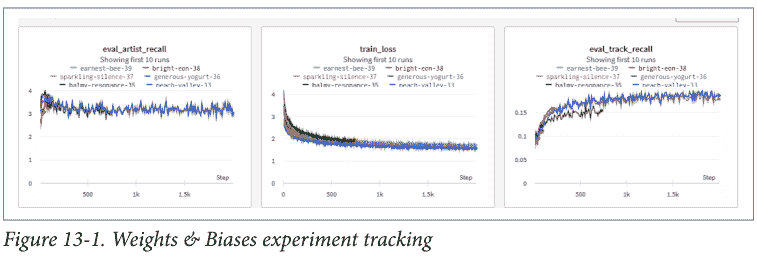

接下来，我们将看看损失函数，这是另一个你可以在本章末尾的练习中尝试的有趣部分：

```python
def train_step(state, x, regularization):
    def loss_fn(params):
        result = state.apply_fn(
            params,
            x["track_context"], x["album_context"], x["artist_context"],
            x["next_track"], x["next_album"], x["next_artist"],
            x["neg_track"], x["neg_album"], x["neg_artist"])
        pos_affinity = result[0]
        neg_affinity = result[1]
        context_self_affinity = result[2]
        next_self_affinity = result[3]
        neg_self_affinity = result[4]
        all_embeddings_l2 = result[5]

        mean_neg_affinity = jnp.mean(neg_affinity)
        mean_pos_affinity = jnp.mean(pos_affinity)
        mean_triplet_loss = nn.relu(1.0 + mean_neg_affinity - mean_pos_affinity)

        max_neg_affinity = jnp.max(neg_affinity)
        min_pos_affinity = jnp.min(pos_affinity)
        extremal_triplet_loss = nn.relu(
            1.0 + max_neg_affinity - min_pos_affinity
        )

        context_self_affinity_loss = jnp.mean(nn.relu(0.5 - context_self_affinity))
        next_self_affinity_loss = jnp.mean(nn.relu(
            0.5 - next_self_affinity)
        )
        neg_self_affinity_loss = jnp.mean(nn.relu(neg_self_affinity))

        reg_loss = jnp.sum(nn.relu(all_embeddings_l2 - regularization))
        loss = (extremal_triplet_loss + mean_triplet_loss + reg_loss +
                context_self_affinity_loss + next_self_affinity_loss +
                neg_self_affinity_loss)
        return loss

    grad_fn = jax.value_and_grad(loss_fn)
    loss, grads = grad_fn(state.params)
    new_state = state.apply_gradients(grads=grads)
    return new_state, loss
```

这里我们有几个损失项，一些与主要任务直接相关，另一些则有助于正则化和泛化。

我们最初从 `mean_triplet_loss` 开始，这只是一个简单的损失，它表明正亲和度（即上下文曲目与下一首曲目的亲和度）应该比负亲和度（即上下文曲目与负样本曲目的亲和度）大 1。我们将讨论我们如何通过实验获得其他辅助损失函数。

实验跟踪（如图 13-2 所示）在改进模型的过程中非常重要，可复现性也是如此。我们已尽可能通过使用 JAX 的随机数生成器（通过使用相同的初始随机数生成器种子来实现可复现性）使训练过程具有确定性。

### 图13-2. 轨道召回实验

我们从 `mean_triplet_loss` 和 `reg_loss`（即正则化损失）开始，这是一个很好的基线。这两个损失函数确保上下文到下一个轨道的平均正亲和力比上下文到负轨道的负亲和力大1，并且嵌入的L2范数不超过正则化阈值。这些对应于表现最差的指标。请注意，我们没有在整个数据集上运行实验。这是因为为了快速迭代，先在较小的步数上运行并进行比较，然后偶尔与使用整个数据集的较长运行交错进行，可能会更快。

我们添加的下一个损失是 `max_neg_affinity` 和 `min_pos_affinity`。这个损失部分受到Mark A. Stevens的“Efficient Coordinate Descent or Ranking with Domination Loss”和Jason Weston等人的“Learning to Rank Recommendations with the k-Order Statistic Loss”的启发。然而，我们没有使用整个负样本集，而只是使用了一个子样本。为什么？因为负样本集是有噪声的。仅仅因为用户没有将某个特定轨道添加到播放列表中，并不意味着该轨道与播放列表不相关。也许用户还没有听过该轨道，因此噪声是由于缺乏曝光造成的。我们也没有像k-order statistic loss论文中讨论的那样进行采样步骤，因为采样对CPU友好，但对GPU不友好。因此，我们结合了两篇论文的思想，取最大的负亲和力，并使其比最小的正亲和力小1。在我们的实验中，添加这个针对下一个和负样本集中极端轨道的损失，为我们带来了性能的下一次提升。

最后，我们添加了自亲和力损失。这些损失确保来自上下文和下一个轨道集的轨道亲和力至少为0.5，而负轨道亲和力最多为0。这些是点积亲和力，与使正亲和力比负亲和力大1的相对正负亲和力相比，它们更加绝对。从长远来看，它们并没有太大帮助，但它们确实帮助模型在开始时更快地收敛。我们保留了它们，因为它们在最后一个训练步骤的评估指标上仍然提供了一些改进。这结束了本章“综合运用”的解释部分。现在是有趣的部分，练习！

### 练习

我们提供了很多练习，因为玩转数据和代码有助于建立你对不同损失函数和用户建模方式的直觉。此外，思考如何编写代码可以提高你使用JAX的熟练程度。因此，我们列出了一些有用的练习，这些练习既有趣又能帮助你理解本书提供的材料。

为了结束本章，这里有一些有趣的练习供你尝试。做这些练习应该能让你对损失函数、JAX的工作方式以及实验过程有很好的直觉。

以下是一些简单的入门练习：

-   尝试不同的优化器（例如，ADAM，RMSPROP）。
-   尝试改变特征大小。
-   添加时长作为一个特征（注意归一化！）。
-   如果你使用余弦距离进行推理，而使用点积进行训练会怎样？
-   添加一个新的指标，比如NDCG。
-   在损失中玩转正负亲和力的分布。
-   使用铰链损失，针对最低的下一个轨道和最高的负轨道。

继续探索这些更困难的练习：

-   尝试使用轨道名称作为特征，看看它们是否有助于泛化。
-   如果你使用两层网络来计算亲和力会怎样？
-   如果你使用LSTM来计算亲和力会怎样？
-   用相关性替换轨道嵌入。
-   计算集合中所有轨道的自亲和力。

## 总结

用特征替换嵌入意味着什么？在我们正负亲和力的例子中，我们使用点积来计算两个实体（如两个轨道）$x$ 和 $y$ 之间的亲和力。与其让特征作为潜在表示（由嵌入表示），另一种方法是手动构建代表两个实体 $x$ 和 $y$ 之间亲和力的特征。如第9章所述，这可以是日志计数、Dice相关系数或互信息。

可以制作某种计数特征并将其存储在数据库中。在训练和推理时，为每个实体 $x$ 和 $y$ 查询数据库，然后使用亲和力分数来代替或结合正在学习的点积。这些特征往往更精确，但比嵌入表示的召回率低。嵌入表示由于是低秩的，具有更好的泛化能力和更高的召回率。拥有计数特征与嵌入特征是相辅相成的，因为我们可以同时通过使用精确的计数特征来提高精度，并借助像嵌入这样的低秩特征来提高召回率。

对于计算集合中所有轨道到其他所有轨道的 $n^2$ 个亲和力，可以考虑使用JAX的 `vmap` 函数。`vmap` 可以用来转换代码，例如，计算一个轨道与所有其他轨道的亲和力，并使其对所有轨道与所有其他轨道运行。

我们希望你喜欢玩转这些数据和代码，并且在尝试这些练习后，你用JAX编写推荐系统的技能有了显著提高！

# 第四部分
服务

好吧，你不能推荐那个！为什么有时最好的推荐并不合适。

作者之一Bryan对亚马逊推荐团队有一个大问题：“你认为我到底需要多少台吸尘器？”仅仅因为Bryan买了一台花哨的戴森来清理他的狗的毛发，并不意味着他很快就会买第二台，然而他的亚马逊主页似乎一心想推荐它。现实情况是，你总是需要包含业务逻辑——或基本的人类逻辑——你希望将其包含在推荐系统的流程中，以防止愚蠢的推荐。无论你面临的是上下文不合适的推荐、业务上不可行的推荐，还是仅仅需要让推荐集合不那么单一，最后一步的排序都可以极大地改善推荐效果。

但是等等！不要认为排序步骤只是开关案例和手动覆盖你的推荐系统。你的排序和服务之间需要存在协同作用。Bryan还有一个关于他为衣服构建的基于查询的推荐器的故事：他想在他的推荐中实现一个超级简单的多样性过滤器——检查推荐的衣服是否属于不同的商品类别。他让评分模型的输出按商品类别对推荐进行堆叠排序，这样他就可以从每个类别中挑选几个来提供服务。结果，上线的第一周，他在10个推荐中被推荐了3、4甚至5个背包。尽管用户可能很用功，但这似乎是错误的，需要进行一些质量检查。他的错误是什么？背包最多可以属于三个商品类别，所以它们潜入了几个多样性类别！

理论与生产推荐相遇的棘手问题是本书这一部分的主题。我们将讨论如本例中的多样化推荐，但也会讨论其他重要的业务优先级，这些优先级影响着推荐管道的服务部分。

# 第14章
业务逻辑

到现在，你可能在想，“是的，我们的算法排序和推荐已经到位了！为每个用户提供具有潜在理解的个性化服务，这就是我们经营业务的方式。”不幸的是，业务很少这么简单。

让我们举一个非常直接的例子，一个食谱推荐系统。考虑一个用户，他只是讨厌葡萄柚（本书的一位作者*真的*讨厌），但可能喜欢一组与葡萄柚搭配良好的其他食材：芦笋、牛油果、香蕉、黄油、腰果、香槟、鸡肉、椰子、螃蟹、鱼、生姜、榛子、蜂蜜、柠檬、青柠、甜瓜、薄荷、橄榄油、洋葱、橙子、山核桃、菠萝、覆盆子、朗姆酒、三文鱼、海藻、虾、八角、草莓、龙蒿、番茄、香草、葡萄酒和酸奶。这些食材是与葡萄柚搭配*最受欢迎*的，而用户几乎喜欢所有这些。

推荐器处理这种情况的正确方式是什么？这看起来像是协同过滤（CF）、潜在特征或混合推荐能够捕捉到的。然而，如果用户喜欢所有这些共同的风味，基于物品的CF模型可能无法很好地捕捉到这一点。同样，如果用户真的*讨厌*葡萄柚，潜在特征可能不足以真正避免它。

在这种情况下，简单的方法是一个很好的方法：*硬性避免*。在本章中，我们将讨论一些业务逻辑与推荐系统输出相交的复杂性。

与其试图将例外作为模型在进行推荐时使用的潜在特征的一部分来学习，不如将这些业务规则作为外部步骤通过确定性逻辑集成，这样更一致、更简单。例如：模型可以移除所有检索到的葡萄柚鸡尾酒，而不是试图学习将它们排在更低的位置。

## 硬性排序

当你开始思考类似我们葡萄柚场景的情况时，可以想出很多这类现象的例子。*硬性排序*通常指两种特殊的排序规则之一：

- 在排序前明确地从列表中移除某些项目。
- 使用分类特征按类别对结果进行排序。（注意，这甚至可以应用于多个特征，以实现分层硬性排序。）

你是否观察到以下任何情况？

- 用户购买了一张沙发。系统继续向该用户推荐沙发，尽管他们未来五年都不需要沙发。
- 用户为一位对园艺感兴趣的朋友购买了生日礼物。然后电子商务网站持续推荐园艺工具，尽管用户对此毫无兴趣。
- 一位家长想为孩子购买玩具。但当家长访问他们通常购买玩具的网站时，网站却推荐了几款适合更小年龄儿童的玩具——自孩子达到那个年龄后，家长就再未从该网站购买过。
- 一位跑步者经历了严重的膝盖疼痛，并确定他们不能再进行长跑。他们转而进行冲击较小的骑行。然而，他们当地的聚会推荐仍然全部以跑步为主。

所有这些情况都可以通过确定性逻辑相对容易地处理。对于这些情况，我们更倾向于*不*尝试通过机器学习来学习这些规则。我们应该假设，对于这类场景，我们关于这些偏好的信号会很弱：负面隐式反馈的相关性通常较低，而且列出的许多情况都涉及你希望系统一劳永逸地学习的细节。此外，在前面的一些例子中，如果不尊重这些偏好，可能会让用户感到不快或损害与用户的关系。

这些偏好的名称是*避免项*——有时也称为约束、覆盖或硬性规则。你应该将它们视为对系统的明确期望：“不要给我显示含有葡萄柚的食谱”，“不要再推荐沙发”，“我不喜欢园艺”，“我的孩子已经10岁以上了”，以及“不要给我显示越野跑路线”。

## 学习到的避免项

并非所有业务规则都是源自用户明确反馈的明显避免项，有些则源自与特定项目无直接关系的明确反馈。在考虑提供推荐时，包含各种各样的避免项非常重要。

为了简单起见，假设你正在构建一个时尚推荐系统。更微妙的避免项示例如下：

*已拥有的物品*
这些是用户实际上只需要购买一次的物品——例如，用户通过你的平台购买过的服装，或告知你他们已经拥有的服装。创建一个*虚拟衣橱*可能是询问用户他们拥有什么物品的一种方式，以协助这些避免项。

*不喜欢的特征*
这些是用户可以表示不感兴趣的物品特征。在入门问卷调查中，你可能会询问用户是否喜欢波点，或者他们是否有喜欢的配色方案。这些是明确表示的反馈，可用于避免项。

*被忽略的类别*
这是一个与用户不产生共鸣的物品类别或分组。这可能是隐式的，但在主要推荐模型之外学习到的。也许用户从未点击过你电子商务网站上的连衣裙类别，因为他们不喜欢穿连衣裙。

*低质量物品*
随着时间的推移，你会了解到某些物品对大多数用户来说就是低质量的。你可以通过高退货率或买家低评分来检测到这一点。这些物品最终应该从库存中移除，但与此同时，将它们作为所有匹配信号较弱的用户的避免项非常重要。

这些额外的避免项可以在服务阶段轻松实现，甚至可以包括简单的模型。训练线性模型来捕获其中一些规则，然后在服务期间应用它们，可以成为提高排名的有用且可靠的机制。请注意，小型模型推理速度非常快，因此将它们包含在管道中通常不会产生太大的负面影响。对于更大规模的行为趋势或高阶因素，我们期望我们的核心推荐模型能够学习这些概念。

## 手动调整权重

在避免项谱系的另一端是*手动调整排序*。这种技术在搜索排名的早期很流行，当时人们会使用分析和观察来确定他们认为排名中最重要的特征，然后设计一个多目标排序器。例如，花店在五月初可能会排名更高，因为许多用户在搜索母亲节礼物。由于可能有许多可变元素需要跟踪，这类方法扩展性不佳，在现代推荐排名中已基本不再被重视。

然而，手动调整排序作为*避免项*可能非常有用。虽然从技术上讲它不是避免项，但我们有时仍然这样称呼它。实践中的一个例子是，知道新用户在学习你的运输是否可靠时，喜欢从价格较低的物品开始。一个有用的技术是在第一次订单之前提升低价物品的排名。

虽然考虑构建手动调整排序可能感觉不太好，但重要的是不要排除这种技术。它有一席之地，通常是一个很好的起点。这种技术的一个有趣的人机协作应用是专家手动调整排序。回到我们的时尚推荐系统，一位风格专家可能知道今年夏天的流行色是淡紫色，尤其是在年轻一代中。如果专家为合适年龄画像的用户提升这些淡紫色物品的排名，这可以积极地影响用户满意度。

## 库存健康度

硬性排序的一个独特且有些争议的方面是库存健康度。*库存健康度*难以定义，它估计现有库存满足用户需求的程度。

让我们快速看一下定义库存健康度的一种方法，通过亲和度分数和预测。我们可以通过利用需求预测来做到这一点，这是一种极其强大且流行的优化业务的方式：在接下来的*N*个时间段内，每个类别的预期销售额是多少？构建这些预测模型超出了本书的范围，但核心思想在Rob Hyndman和George Athanasopoulos的著名著作《预测：原理与实践》（Otexts）中得到了很好的阐述。为了我们的讨论，假设你能够大致估算出下个月将售出的袜子数量，按尺寸和用途类型细分。这可以为你应该备货的各种类型袜子的数量提供一个非常有用的估算。

然而，事情不止于此；库存可能是有限的，在实践中，库存通常是销售实物商品企业的主要约束。考虑到这一点，我们必须转向市场需求的另一面。如果我们的需求超过了我们的可用性，我们最终会让无法获得所需物品的用户失望。

让我们以销售百吉饼为例；你已经计算了罂粟籽、洋葱、阿西亚戈奶酪和鸡蛋的平均需求。在任何一天，许多顾客会来购买百吉饼，心中有明确的偏好，但你是否有足够的那种百吉饼？你没有卖出的每一个百吉饼都是浪费；人们喜欢新鲜的百吉饼。这意味着你推荐给每个人的百吉饼取决于良好的库存。有些用户不那么挑剔；他们可以接受两三种选择中的任何一种，并且同样满意。在这种情况下，最好给他们另一个百吉饼选项，并将最低库存留给挑剔的人。这是一种称为*优化*的模型改进，它有大量的技术。我们不会深入探讨优化技术，但关于数学优化或运筹学的书籍将提供方向。Mykel J. Kochenderfer和Tim A. Wheeler的《优化算法》（MIT Press）是一个很好的起点。

库存健康度与硬性排序紧密相关，因为将库存管理作为推荐的一部分是一个极其重要且强大的工具。最终，库存优化会降低推荐的感知性能，但通过将其作为业务规则的一部分，你的业务和推荐系统的整体健康度会得到改善。这就是为什么它有时被称为*全局优化*。

这些方法引发激烈讨论的原因是，并非所有人都同意为了“更大的利益”而降低某些用户的推荐质量。市场健康度和平均满意度是有用的考虑指标，但要确保它们与整个推荐系统的北极星指标保持一致。

## 实现避免项

处理避免项的最简单方法是通过下游过滤。为此，你需要在推荐从排序器传递给用户之前，为用户应用避免项规则。实现这种方法看起来像这样：

```python
import pandas as pd

def filter_dataframe(df: pd.DataFrame, filter_dict: dict):
    """
    Filter a dataframe to exclude rows where columns have certain values.

    Args:
        df (pd.DataFrame): Input dataframe.
        filter_dict (dict): Dictionary where keys are column names
        and values are the values to exclude.

    Returns:
        pd.DataFrame: Filtered dataframe.
    """
    for col, val in filter_dict.items():
        df = df.loc[df[col] != val]
    return df

filter_dict = {'column1': 'value1', 'column2': 'value2', 'column3': 'value3'}
```

df = df.pipe(filter_dataframe, filter_dict)

诚然，这是一个简单但相对朴素的规避尝试。首先，完全在 pandas 中工作会限制推荐系统的一些可扩展性，因此让我们将其转换为 JAX：

```python
import jax
import jax.numpy as jnp

def filter_jax_array(arr: jnp.array, col_indices: list, values: list):
    """
    Filter a jax array to exclude rows where certain columns have certain values.

    Args:
        arr (jnp.array): Input array.
        col_indices (List): List of column indices to filter on.
        values (list): List of corresponding values to exclude.

    Returns:
        jnp.array: Filtered array.
    """
    assert len(col_indices) == len(values),

    masks = [arr[:, col] != val for col, val in zip(col_indices, values)]
    total_mask = jnp.logical_and(*masks)

    return arr[total_mask]
```

但还有更深层次的问题。你可能面临的下一个问题是，这些规避规则集合存储在哪里。一个显而易见的地方是像 NoSQL 数据库这样的地方，以用户为键，然后你可以通过简单的查找获取所有规避规则。正如你在第 90 页的“特征存储”中看到的，这是特征存储的一个自然用途。一些规避规则可能实时应用，而另一些则在用户注册时学习。特征存储是存放规避规则的绝佳场所。

我们朴素过滤器的下一个潜在陷阱是，它不能自然地扩展到协变量规避或更复杂的规避场景。有些规避规则实际上依赖于上下文——比如不在劳动节后穿白色衣服的用户、周五不吃肉的用户，或者与某些咖啡壶不匹配的咖啡处理方法。所有这些都需要条件逻辑。你可能会认为，你强大而有效的推荐系统模型当然可以学习这些细节，但这只是有时成立。现实情况是，许多这类考虑因素的信号强度低于你的推荐系统应该学习的大规模概念，因此很难持续学习。此外，这类规则通常是你应该强制要求的，而不是保持乐观态度的。因此，你通常应该明确指定此类限制。

这种规范通常可以通过施加这些要求的显式确定性算法来实现。对于咖啡问题，其中一位作者手动构建了一个决策树桩来处理咖啡烘焙特征和咖啡壶之间的一些不良组合——*厌氧浓缩咖啡？！恶心！*

然而，我们的另外两个例子（不在劳动节后穿白色衣服和周五不吃肉）则更为微妙。显式的算法方法可能难以处理。我们如何知道用户在一年中的某个时期不在周五吃肉？

对于这些用例，基于模型的规避可以施加这些要求。

## 基于模型的规避

在我们寻求纳入更复杂规则并可能学习它们的过程中，我们可能听起来像是回到了检索领域。不幸的是，即使像宽深模型这样拥有大量参数、同时进行用户建模和项目建模的模型，学习这种高层关系也可能很棘手。

虽然本书的大部分内容都集中在相当大规模和深度的工作上，但推荐系统的这一部分非常适合简单模型。对于基于特征的二元预测（是否应该推荐），我们当然有很多好的选择。最佳方法显然在很大程度上取决于实现你希望捕获的规避所涉及的特征数量。记住，我们在本节中考虑的许多规避最初都是假设或假设：我们认为有些用户可能不在劳动节后穿白色衣服，然后尝试找到能很好地模拟这一结果的特征。通过这种方式，使用极其简单的回归模型来寻找与所讨论结果协变的特征可能更易于处理。

这个谜题的另一个相关部分是潜在表示。对于我们的周五素食者，我们可能试图推断一个我们知道有此规则的特定人物角色。这个人物角色是一个潜在特征，我们希望从其他属性中映射出来。对这种建模要小心（通常，人物角色可能有点微妙，值得深思熟虑），但它可能非常有帮助。你的大型推荐模型的用户建模部分似乎应该学习这些——它们确实可以！一个有用的技巧是从该模型中提取学习到的人物角色，并将它们与假设的规避进行回归，以允许更多的信号。然而，另一个模型并不总是学习这些人物角色，因为我们用于检索相关性（以及下游排名）的损失函数试图从潜在人物角色特征中解析出单个用户的相关性——这些特征可能只在上下文特征中预测这些规避。

总而言之，实现规避既非常容易又非常困难。在构建生产推荐系统时，当达到服务阶段时，旅程并未结束；许多模型都参与了流程的最后一步。

## 总结

有时你需要依赖更经典的方法来确保你发送到下游的推荐满足业务的基本规则。从用户那里学习到的显式或微妙的经验教训可以转化为简单的策略，以继续取悦他们。

然而，这并不是我们服务挑战的终点。另一种下游考虑因素与我们在此进行的过滤有关，但源于用户偏好和人类行为。确保推荐不重复、不刻板、不冗余是下一章关于推荐多样性的主题。我们还将讨论在确定具体提供什么时如何同时平衡多个优先级。

# 第 15 章
## 推荐系统中的偏差

我们在本书中花了大量时间剖析如何改进我们的推荐，使其更具个性化并与单个用户更相关。在此过程中，你了解到用户和用户人物角色之间的潜在关系编码了关于共享偏好的重要信息。不幸的是，所有这些都有一个严重的缺点：偏差。

为了我们的讨论目的，我们将讨论对推荐系统最重要的两种偏差：

- 过度冗余或自我相似的推荐集
- AI 系统学习到的刻板印象

首先，我们将深入探讨推荐输出中多样性的关键要素。正如推荐系统为用户提供相关选择至关重要一样，确保推荐的多样性也至关重要。多样性不仅可以防止过度专业化，还可以促进新颖和意外的发现，丰富整体用户体验。

相关性和多样性之间的平衡是微妙的，可能很棘手。这种平衡挑战算法超越仅仅反映用户过去的行为，并鼓励探索新的领域，希望提供更全面积极的内容体验。

这种偏差主要是技术挑战；我们如何满足多样化推荐和高度相关推荐的多目标？

我们将考虑推荐系统中的内在和外在偏差，这通常是底层算法及其学习数据的意外但重要的后果。数据收集或算法设计中的系统性偏差可能导致有偏见的输出，从而引发伦理和公平问题。此外，它们可能创造回声室或过滤气泡，限制用户接触更广泛的内容，并无意中强化先前存在的信念。

在本章结束时，我们将讨论风险并提供资源以了解更多相关信息。我们不是人工智能公平性和偏差方面的专家，但所有机器学习从业者都应该理解并认真考虑这些主题。我们的目标是提供介绍和指引。

## 推荐的多样化

我们对抗偏差的第一个投资是明确针对推荐输出中更多的多样性。我们将简要介绍你可能追求的众多目标中的两个：列表内多样性和意外推荐。

*列表内多样性*试图确保单个推荐列表中存在各种类型的项目。其思想是尽量减少推荐项目之间的相似性，以减少过度专业化并鼓励探索。一组推荐中高度的列表内多样性增加了用户接触许多他们可能喜欢的项目的机会；然而，对于任何特定兴趣的推荐将会更浅，从而降低召回率。

*意外推荐*对用户来说既令人惊讶又有趣。这些通常是用户可能不会独立发现的项目，或者在系统中普遍不那么受欢迎的项目。可以通过注入非显而易见或意想不到的选择——即使这些选择与用户的亲和力得分相对较低——来将意外性引入推荐过程，以提高整体意外性。在理想情况下，这些意外选择相对于其受欢迎程度的其他项目具有较高的亲和力，因此它们是“外部选择中的最佳选择”。

### 提高多样性

现在我们有了多样性的度量标准，我们可以明确尝试提高它们。重要的是，通过将多样性度量作为我们的目标之一，我们可能会牺牲召回率或 NDCG 等方面的性能。将其视为帕累托问题，或者在追求多样性时对排名指标性能施加可接受的下限，可能会很有用。

> 在*帕累托问题*中，你有两个经常相互权衡的优先级。在机器学习的许多领域，以及更广泛的应用数学中，某些结果存在自然的张力。推荐中的多样性是推荐系统中帕累托问题的一个重要例子，但它不是唯一的。在第 14 章中，你简要了解了全局优化，这是权衡的一个极端案例。

### 应用投资组合优化

*投资组合优化*，这一借鉴自金融的概念，可以成为提升推荐系统多样性的有效方法。其目标在于创建一个推荐项目的“投资组合”，以平衡两个关键参数：相关性与多样性。

其核心在于风险（此处指相关性）与回报（多样性）。以下是将此优化应用于推荐系统的基本方法：

1.  构建项目表示，使得空间中的距离能良好地衡量相似性。这与我们之前关于何为良好潜在空间的讨论一致。
2.  计算项目间的成对距离。你可以使用任何能丰富你潜在空间的距离度量来完成此操作。重要的是，要计算所有被检索项目之间的成对距离，并为后续的返回考虑做好准备。请注意，如何聚合这些距离分布可能非常微妙。
3.  评估检索集合的亲和度。请注意，经过校准的亲和度分数表现会更好，因为它们提供了更现实的回报估计。
4.  求解优化问题。解决此问题将为每个项目生成一个权重，该权重平衡了相关性与多样性之间的权衡。权重较高的项目在多样性和相关性方面都更具价值，应在推荐列表中优先考虑。数学上，该问题如下所示：

> $Maximize(w^T * r - \lambda * w^T * C * w)$

此处，$w$ 是表示权重的向量（即每个项目在推荐列表中的比例），$r$ 是相关性分数向量，$C$ 是协方差矩阵（用于捕捉多样性），$\lambda$ 是平衡相关性与多样性的参数。这里的约束条件是权重之和等于1。

请记住，超参数 $\lambda$ 用于在相关性和多样性之间进行权衡。这使其成为此过程的关键部分，可能需要根据你的系统及其用户的具体需求进行实验或调整。通过Weights & Biases等众多包中的超参数优化功能，这将是直接了当的。

### 多目标函数

另一种与多样性相关的方法是基于多目标损失进行排序。与其在排序阶段纯粹考虑个性化亲和度，引入第二个（或更多！）排序项可以显著提升多样性。

这里最简单的方法类似于你在第14章学到的：硬排序。一个可能适用于多样性的业务规则是将每个项目类别限制为仅一个项目。这是多目标排序的最简单情况，因为按分类列排序并选择每个组中的最大值，就能实现相对于该协变量的显式多样性。让我们继续探讨更微妙的方法。

在《为基于查询的推荐拼接空间》一文中，本书的一位作者与合著者Ian Horn合作实现了一个多目标推荐系统，该系统在图像检索问题中平衡了个性化与相关性。

目标是提供与用户上传图像中服装相似的个性化服装推荐。这意味着存在两个潜在空间：

- 针对用户的个性化服装潜在空间
- 服装图像的潜在空间

为了解决这个问题，我们首先必须做出一个决定：对于相关性，什么更重要？个性化还是图像相似性？由于产品围绕照片上传体验构建，我们选择了图像相似性。然而，我们还有另一个事实需要考虑：每张上传的图像包含多件服装。正如计算机视觉领域所流行的，我们首先将模特分割成多个项目，然后将每个项目视为其自身的查询（我们称之为锚点项目）。这意味着我们的图像相似性检索是多模态的，因为我们使用多个不同的查询向量进行搜索。在收集完所有结果后，我们必须进行最终排序——一个针对图像相似性和个性化的多目标排序。我们优化的损失函数如下所示：

```
$s_i = \alpha \times (1 - d_i) + (1 - \alpha) \times a_i$
```

其中 $\alpha$ 是表示权重的超参数，$d_i$ 是图像距离，$a_i$ 是个性化分数。我们通过实验学习 $\alpha$。最后一步是施加一些硬排序，以确保每个锚点项目都有一条推荐。

所以让我们总结一下：

1.  我们使用了两个带有距离度量的潜在空间来提供排序。
2.  我们通过图像分割进行了多模态检索。
3.  我们仅使用其中一个排序结果进行检索。
4.  我们的最终排序是多目标的，利用了我们所有的潜在空间和业务逻辑进行硬排序。

这使得我们的推荐在*多样性*方面表现出色，因为它们在查询的多个对应于不同项目的领域都实现了相关性。

### 谓词下推

你可能很高兴也很习惯在服务阶段应用这些指标——毕竟，这是本书这部分的标题——但在我们结束这个话题之前，我们应该讨论一个可能产生相当严重后果的边缘情况。当你施加第14章的硬规则和本章前面讨论的多样性期望，并进行一些多目标排序时，有时你会得到……没有推荐。

假设你开始检索 *k* 个项目，但在满足业务规则的足够多样化的组合之后，已经没有剩余项目了。你可能会说，“那我就检索更多项目；让我们把 *k* 调大！”但这存在一些严重问题：它确实会增加延迟，降低匹配质量，并打乱你为较低基数集合调整得更好的排序模型。

一个常见的经验，尤其是在多样性方面，是检索的不同模式具有截然不同的匹配分数。以我们的时尚推荐世界为例：所有牛仔裤可能比我们拥有的任何衬衫都更匹配，但如果你正在寻找多样化的服装类别进行推荐，无论 *k* 有多大，你都可能错过衬衫。

这个问题的一个解决方案是*谓词下推*。这种优化技术用于数据库，特别是在数据检索的上下文中。谓词下推的主要思想是在数据检索过程中尽早过滤数据，以减少查询执行计划后期需要处理的数据量。

对于传统数据库，你会看到谓词下推的应用，例如，“在数据库中应用我的查询的 `where` 子句以减少 I/O。”它可以通过显式地先拉取相关列来检查 `where` 子句，然后从通过检查的行中获取行ID，再执行查询的其余部分来实现这一点。

提高多样性指标的一个简单方法是*重排序*：一个后处理步骤，其中初始检索的推荐列表被重新排序以增强多样性。各种重排序算法不仅考虑相关性分数，还考虑推荐列表中项目之间的不相似性。重排序是一种可以操作任何外部损失函数的策略，因此将其用于多样性是一种直接的方法。

另一种策略是打破我们在第208页“推荐系统评估中的倾向加权”一节中讨论的推荐反馈闭环。就像在多臂老虎机问题中一样，*探索-利用权衡*可以在利用模型知道用户会喜欢的内容和探索可能带来更高回报的不太确定的选项之间做出选择。这种权衡可用于推荐系统，通过偶尔选择*探索*并推荐不太明显的选择来确保多样性。要实现这样的系统，我们可以使用亲和度作为奖励估计，使用倾向作为利用度量。

除了使用这些后验策略，另一种方法是*在学习过程中将多样性作为目标*，或在损失函数中包含多样性正则化项。包括成对相似性作为正则化器的多目标损失可以帮助训练模型学习多样化的推荐集。你之前已经看到，各种正则化可以指导训练过程最小化某些行为。一个可以显式使用的正则化项是*推荐之间的相似性*；推荐中每个嵌入向量彼此之间的点积可以近似这种自相似性。令 $\mathscr{R} = (R_1, R_2, ..., R_k)$ 为推荐的嵌入列表，然后将 $\mathscr{R}$ 视为一个列矩阵——每行是一个推荐。计算 $\mathscr{R}$ 的格拉姆矩阵将得到我们所有的点积相似性计算，因此我们可以通过适当的超参数权重对此项进行正则化。请注意，这与我们之前的格拉姆正则化不同，因为在这种情况下我们只考虑单个查询的推荐。

最后，我们可以使用来自多个领域的排名来提升推荐多样性。通过整合各种排名度量，推荐系统可以建议用户“模式”之外的项目，从而扩大推荐范围。多模态推荐是一个蓬勃发展的领域，Pinterest的PinnerSage论文是一个特别令人印象深刻的实现。在许多关于多模态推荐的工作中，检索步骤返回了太多接近用户查询向量的推荐。这迫使检索列表内部产生自相似性。多模态性强制每个请求使用多个查询向量，从而内置了多样性。

让我们从另一个角度来看项目的自相似性，并思考如何利用项目之间的成对关系来实现这一目标。

这对我们的情况有何帮助？简单的思路是，如果你的向量存储也为向量提供了特征，那么你可以将特征比较作为检索的一部分。让我们举一个过于简单的例子：假设你的项目有一个名为“颜色”的分类特征，并且为了获得良好的多样化推荐，你希望在五个推荐中至少包含三种不同的颜色。为了实现这一点，你可以对存储中的每种颜色进行一次 top-$k$ 搜索（缺点是你的检索量会增加 $C$ 倍，其中 $C$ 是存在的颜色数量），然后对这些集合的并集进行排序和多样性处理。这样，最终推荐结果更有可能满足你的多样性规则。这很棒！我们预计检索的延迟相对较低，因此如果我们知道去哪里查找，这种额外检索的开销并不大。

如果你的向量存储针对你希望施加的过滤器类型设置得当，这种优化技术可以应用于相当复杂的谓词。

## 公平性

机器学习中的公平性通常是一个特别微妙的主题，简短的摘要难以充分阐述。以下主题很重要，我们邀请您参考此处包含的可靠文献：

*助推*
公平性不必仅仅是“所有结果的等概率”；它可以针对特定的协变量是公平的。通过推荐器进行助推——即推荐物品以强调某些行为或购买模式——可以提高公平性。请参考 Karlijn Dinnissen 和 Christine Bauer 在 Spotify 的工作：[使用助推改善音乐推荐中的性别代表性](https://dl.acm.org/doi/10.1145/3460231.3474244)。

*过滤气泡*
过滤气泡是极端协同过滤的一个缺点：一群用户开始喜欢相似的推荐，系统学习到他们应该收到相似的推荐，反馈循环使这种情况持续下去。要深入了解这个概念以及缓解策略，请参考 Zhaolin Gao 等人的[“在保持相关性的同时缓解过滤气泡”](https://dl.acm.org/doi/10.1145/3460231.3474244)。

*高风险*
并非所有人工智能应用的风险都相同。当人工智能系统缺乏适当的防护时，某些领域尤其有害。要了解最高风险情况和缓解措施的概述，请参阅 Patrick Hall 等人的 *Machine Learning for High-Risk Applications*（O’Reilly）。

*可信度*
可解释模型是应对高风险人工智能应用的流行缓解策略。虽然可解释性并不能*解决*问题，但它通常为识别和解决问题提供了一条途径。要深入了解这一点，Yada Pruksachatkun 等人的 *Practicing Trustworthy Machine Learning*（O’Reilly）提供了工具和技术。

*推荐中的公平性*
由于推荐系统显然容易受到人工智能公平性问题的影响，因此关于这个主题已有大量著述。每家主要的社交媒体巨头都雇佣了从事人工智能安全工作的团队。一个特别突出的例子是由 Rumman Chowdhury 领导的 Twitter 负责任人工智能团队。你可以在 Alfred Ng 的“审计能否消除算法中的偏见？”一文中阅读关于该团队工作的内容。

## 总结

虽然这些技术提供了增强多样性的途径，但重要的是要记住在多样性和相关性之间取得平衡。使用的确切方法或方法组合可能因具体用例、可用数据、用户群的复杂性以及你正在收集的反馈类型而异。在实施推荐系统时，请思考在你的多样性问题中哪些方面最为关键。

# 第 16 章

## 加速结构

那么什么是加速结构？用计算机科学术语来说，当你试图逐一评估语料库中的每个项目时，如果有 $N$ 个项目，典型所需时间与 $N$ 成正比。这被称为大 $O$ 表示法。因此，如果你有一个用户向量和一个包含 $N$ 个项目的语料库，为一个用户对语料库中的所有项目进行评分通常需要 $O(N)$ 时间。如果 $N$ 较小且可以放入 GPU 内存（通常 $N < 100$ 万个项目左右），这通常是可处理的。然而，如果我们有一个非常大的语料库，比如十亿个项目，并且我们还需要为十亿用户进行推荐，那么可能需要非常长的时间。那么用大 $O$ 表示法，为十亿用户中的每一个对十亿个项目进行评分将需要 $O(10^{18})$ 次点积运算。

在本章中，我们将尝试将 $O(N * M)$ 时间减少到与项目数量 $N$ 和用户数量 $M$ 呈次线性关系。我们将讨论包括以下内容的策略：

- 分片
- 局部敏感哈希
- $k$-d 树
- 层次 k-means
- 更廉价的检索方法

我们还将介绍每种策略的权衡及其可能的用途。对于以下所有示例，我们假设用户和项目由相同大小的嵌入向量表示，并且用户与项目之间的亲和度是简单的点积、余弦距离或欧几里得距离。如果我们使用像双塔模型这样的神经网络来为用户和项目评分，那么可能唯一能用来加速的方法是分片或某种更廉价的预过滤方法。

## 分片

*分片*可能是最简单的**分而治之**策略。假设你有 *k* 台机器、*N* 个项目和 *M* 个用户。使用分片策略，你可以将运行时间减少到 *O(N * M / k)*。你可以通过为每个项目分配一个唯一标识符来实现这一点，这样你就有了 (*unique_id*, *item_vector*) 元组。然后，只需取 *machine_id* = *unique_id* % *K*，我们就可以将语料库的一个子集分配给不同的机器。

当用户需要推荐时，我们可以通过将工作负载分配到 *k* 台机器上，提前计算或按需计算得分最高的推荐，从而使计算速度提高 *k* 倍，除了在服务器上收集顶部结果并共同排序的开销。请注意，如果你想要，比如 100 个得分最高的项目，你仍然需要从每个分片中获取前 100 个结果，将它们整理在一起，然后如果你想获得与对整个语料库进行暴力评分相同的结果，就需要对所有结果进行联合排序。

分片的有用之处在于它可以与任何其他加速方法结合使用，并且不依赖于表示形式具有任何特定形式，例如是单个向量。

## 局部敏感哈希

*局部敏感哈希*（LSH）是一种有趣的技术，它将向量转换为基于令牌的表示。这很强大，因为如果 CPU 容易获得，我们可以使用它们通过更廉价的整数算术运算（如 XOR 和使用专用汇编指令的位计数）而不是浮点运算来计算向量之间的相似性。整数运算在 CPU 上通常比浮点运算快得多，因此我们可以比使用向量运算更快地计算项目之间的相似性。

另一个好处是，一旦项目被表示为一系列令牌，常规搜索引擎数据库就能够通过使用令牌匹配来存储和检索这些项目。另一方面，常规哈希如果输入发生微小变化，往往会导致完全不同的哈希码。这不是对哈希函数的批评；它们只是对不同类型的数据有不同的用途。

让我们来看几种将向量转换为哈希的方法。LSH 与常规哈希的不同之处在于，向量的微小扰动应该产生与原始向量哈希相同的哈希位。这是一个重要的属性，因为它允许我们使用快速方法（如哈希映射）来查找向量的邻域。一种简单的哈希方法称为**比较推理的力量**。

## 胜者全拿哈希

在这种哈希方案中，向量首先使用一个已知的、可复现的排列进行置换。我们可以通过一个接受种子并能可靠地重现完全相同洗牌序列的随机数生成器，简单地打乱所有向量维度的索引来生成这个已知的排列。重要的是，该排列在不同版本的Python中必须是稳定的，因为我们希望在生成哈希值以及检索时都能重现哈希操作。由于我们使用的是JAX的随机库，并且JAX非常注重排列的可复现性，因此我们直接使用JAX中的排列函数。之后的哈希码计算仅仅是置换后向量相邻维度之间的比较，如示例16-1所示。

### 示例16-1. 胜者全拿

```python
def compute_wta_hash(x):
    """Example code to compute some Winner take all hash vectors
    Args:
        x: a vector
    Result:
        hash: a hash code
    """
    key = jax.random.PRNGKey(1337)
    permuted = jax.random.permutation(key, x)

    hash1 = permuted[0] > permuted[1]
    hash2 = permuted[1] > permuted[2]

    return (hash1, hash2)

x1 = jnp.array([1, 2, 3])
x2 = jnp.array([1, 2.5, 3])
x3 = jnp.array([3, 2, 1])
x1_hash = compute_wta_hash(x1)
x2_hash = compute_wta_hash(x2)
x3_hash = compute_wta_hash(x3)
print(x1_hash)
print(x2_hash)
print(x3_hash)

(Array(False, dtype=bool), Array(True, dtype=bool))
(Array(False, dtype=bool), Array(True, dtype=bool))
(Array(True, dtype=bool), Array(False, dtype=bool))
```

如你所见，向量x2与x1略有不同，但产生了相同的哈希码01，而x3不同，产生了哈希码10。然后使用哈希码的汉明距离来计算两个向量之间的距离，如示例16-2所示。该距离就是两个哈希码的异或运算，当位不一致时结果为1，然后进行位计数。

### 示例16-2. 汉明函数

```python
x = 16
y = 15
hamming_xy = int.bit_count(x ^ y)
print(hamming_xy)
5
```

使用此处所示的汉明距离可以在距离计算上带来一些加速，但主要的加速将来自于在哈希映射中使用哈希码。例如，我们可以将哈希码分成8位块，并将语料库存储在以每个8位块为键的分片中，这将带来256倍的加速，因为我们只需在与查询向量具有相同键的哈希映射中查找最近邻。

然而，这在召回率方面有一个缺点，因为必须匹配所有8位才能检索到与查询向量匹配的项。在哈希中使用的哈希码位数与汉明距离计算之间存在权衡。位数越多，搜索越快，因为语料库被分成越来越小的块。然而，缺点是需要匹配的位越来越多，因此原始空间中附近向量的所有哈希码位可能不匹配，从而可能无法被检索到。

解决方法是使用不同的随机数生成器生成多个哈希码，并使用不同的随机种子重复此过程几次。这个额外的步骤留给你作为练习。

另一种计算哈希位的常用方法使用Johnson-Lindenstrauss引理，这是一种花哨的说法，即两个向量在乘以相同的随机高斯矩阵时，往往会落在相似的位置。然而，L2距离得以保留，这意味着当使用欧几里得距离而不是点积来训练嵌入时，此哈希函数效果更好。在此方案中，只有哈希码计算不同；汉明距离的处理完全相同。

LSH带来的加速与必须精确匹配的哈希码位数成正比。假设哈希映射中只使用8位哈希码；那么加速比是2⁸，即原始速度的256倍。速度的代价是必须将哈希映射存储在内存中。

## k-d树

计算机科学中加速计算的一个常见策略是*分而治之*。在此方案中，数据被递归地分成两半，只搜索与搜索查询相关的那一半。与语料库中项目数量的线性*O(n)*方案相比，分治算法能够在*O(log2(n))*时间内查询语料库，如果*n*很大，这是一个显著的加速。

向量空间中的一种这样的二叉树称为*k-d树*。通常，要构建*k-d树*，我们计算集合中所有点的边界框，找到边界框的最长边，并在该边的中间沿分割维度进行分割，然后将集合分成两半。如果使用中位数，集合大致被分成数量相等的两部分；我们说*大致*是因为在该分割维度上可能存在平局。递归过程在叶节点中剩下少量项目时停止。存在许多*k-d树*的实现——例如，SciPy的*k-d树*。

尽管加速显著，但这种方法在向量的特征维度较低时效果最好。此外，与其他方法类似，*k-d树*在使用L2距离作为嵌入的度量时效果最佳。如果使用点积作为相似性度量，可能会发生检索损失，因为*k-d树*对于欧几里得空间分区更有意义。

### 示例16-3. 通过*k-d树*进行分区

```python
import jax
import jax.numpy as jnp

def kdtree_partition(x: jnp.ndarray):
    """Finds the split plane and value for a batch of vectors x."""
    # First, find the bounding box.
    bbox_min = jnp.min(x, axis=0)
    bbox_max = jnp.max(x, axis=0)
    # Return the largest split dimension and value.
    diff = bbox_max - bbox_min
    split_dim = jnp.argmax(diff)
    split_value = 0.5 * (bbox_min[split_dim] + bbox_max[split_dim])
    return split_dim, split_value

key = jax.random.PRNGKey(42)
x = jax.random.normal(key, [256, 3]) * jnp.array([1, 3, 2])
split_dim, split_value = kdtree_partition(x)
print("Split dimension %d at value %f" % (split_dim, split_value))

# Partition the points into two groups, the left subtree
# has all the elements left of the splitting plane.
left = jnp.where(x[:, split_dim] < split_value)
right = jnp.where(x[:, split_dim] >= split_value)

Split dimension 1 at value -0.352623
```

从代码中可以看出，*k*-d树分区代码可以像沿最长维度的中间进行分割一样简单。其他可能性包括沿最长维度的中位数进行分割或使用表面积启发式方法。

*k*-d树是通过一次只沿一个空间维度（通常沿与数据分布对齐的最大轴）重复分区数据来构建的；参见图16-1。

分区被递归地再次细分，通常沿最长轴，直到分区中的点数少于选定的小数字；参见图16-2。

*k*-d树的查找时间在*n*（语料库中的项目数量）上是*O(log2(n))*。该树还需要少量的内存开销来存储树本身，这主要由叶节点的数量决定，因此最好让叶节点中的项目数量最少，以防止分割过于精细。

从根节点开始，反复检查查询点（例如，我们正在寻找其最近邻的项目）是在根节点的左子节点还是右子节点中，如图16-3所示。例如，使用`go_left = x[split_dim] < value_split[dim]`。在二叉树约定中，左子节点包含所有在分割维度上的值小于分割值的点。因此，如果查询点在分割维度上的值小于分割值，我们就向左走，否则向右走。递归地向下遍历树，直到到达叶节点；然后详尽地计算到叶节点中所有项目的距离。

图16-3. k-d树查询

## 层次化k-means

另一种可扩展到更高特征维度的分治策略是*k-means聚类*。在此方案中，语料库被聚类为$k$个簇，然后递归地聚类为$k$个更多的簇，直到每个簇小于定义的限制。

$k$-means的一个实现可以在[scikit-learn的网页](https://scikit-learn.org/)上找到。
要构建聚类，首先从现有点中随机创建簇质心（图16-4）。

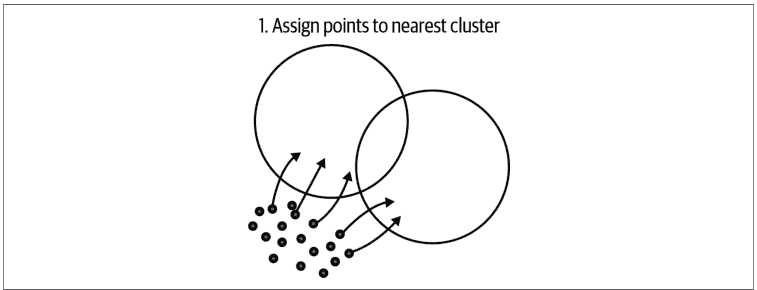

接下来，我们将所有点分配给它们最近的簇。然后对于每个簇，我们将所有分配点的平均值作为新的簇中心。我们重复此过程直到完成，这可以是固定的步数。图16-5说明了这个过程。输出是$k$个点的簇中心。该过程可以对每个簇中心再次重复，再次分裂为$k$个更多的簇。

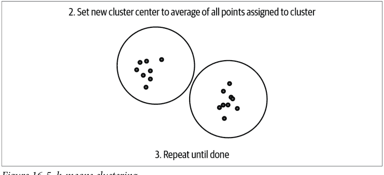

图16-5. *k*-means聚类

同样，加速比是*O*(log(*n*))，其中*n*是项目数量，但*k*-means比*k*-d树更适合聚类高维数据点。

*k*-means簇的查询相当直接。你可以找到离查询点最近的簇，然后对所有子簇重复此过程，直到找到叶节点；然后叶节点中的所有项目都会根据查询点进行评分。

*k*-means的一个替代方案是执行SVD并使用前*k*个特征向量作为聚类标准。SVD的使用很有趣，因为存在闭式和近似方法，如[幂迭代](https://example.com)来计算特征向量。使用点积计算亲和力可能更适合使用点积作为亲和力度量训练的向量。

要了解更多关于此主题的信息，你可以参考Jason Weston等人（包括本书的一位作者）的"[Label Partitioning for Sublinear Ranking](https://example.com)"。该论文比较了LSH、SVD和层次化*k*-means。你会发现加速比和检索损失的比较，以暴力搜索为基线。


## 基于图的ANN

ANN中的一个新兴趋势是使用基于图的方法。最近，*层次化可导航小世界*是一种特别流行的方法。这种[图算法](https://example.com)在多层结构中编码邻近性，然后依赖于一个常见的格言：“从一个节点到另一个节点的连接步骤数量通常出奇地小。”在基于图的ANN方法中，你通常找到一个邻居，然后遍历连接到该邻居的边以快速找到其他邻居。

## 更便宜的检索方法

如果你的语料库能够执行逐项的廉价检索方法，一种加速搜索的方法是使用廉价检索方法获取一小部分项目，然后使用更昂贵的基于向量的方法对子集进行排序。一种这样的廉价检索方法是制作一个项目与另一个项目共同出现的顶级倒排列表。然后，在生成排序候选时，收集所有顶级共同出现的项目（例如，从用户的偏好项目中），然后与ML模型一起对它们进行评分。这样，我们不必用ML模型对整个语料库进行评分，而只需对一小部分进行评分。

## 总结

在本章中，我们展示了几种在给定查询向量的情况下加速语料库中项目检索和评分的方法，同时不会在召回率方面损失太多，并且仍然保持精度。没有完美的ANN方法，因为加速结构依赖于数据的分布，而数据分布因数据集而异。我们希望本章为你提供一个跳板，让你探索各种方法，使检索更快，并且在语料库中的项目数量上实现亚线性。

# 第五部分

## 推荐的未来

*我渴望了解更多。公司在生产环境中做了什么？*

我们已经走了这么远，但还有更多！推荐系统发展迅速，了解明年会议上你将看到的概念是值得的。这些想法在某种程度上已经被证明——它们都不是纯粹的科幻小说——但它们还没有定型。

在我们深入探讨这几个非常现代的想法之前，也值得指出我们在本书中没有涵盖的所有主题。我们最严重的遗漏可能是强化学习技术和与保形方法相关的想法。两者都是推荐系统的重要方面，但两者也需要显著不同的背景和处理方式，因此不适合融入这里的结构。此外，两者都没有很好地引入JAX生态系统，因此它们更难搭建。

当你的规模足够大，前面的章节不再能满足你的需求时，后面的章节将向你展示如何提升。在撰写本文时，所有这些方法都在财富500强公司中投入生产，这些公司的估值超过100亿美元。学习这些概念，然后去构建下一个TikTok。

# 第17章

## 序列推荐器

到目前为止，在我们的旅程中，你已经了解了作为推荐问题中显式或潜在组件出现的各种特征。一种隐式出现的特征是先前推荐和交互的历史。你可能想在这里抗议：“我们到目前为止所做的所有工作都考虑了先前的推荐和交互！我们甚至学习了预序列训练数据。”

这是事实，但它没有考虑到*导致推理请求的推荐序列*之间更明确的关系。让我们看一个例子来区分两者。你的视频流媒体网站知道你之前看过达伦·阿罗诺夫斯基的所有电影，所以当*鲸鱼*上映时，网站很可能会推荐它。但这种类型的推荐不同于你在看完*继承*第10集后可能收到的推荐。你可能在很长一段时间内一直在看阿罗诺夫斯基的电影——多年前的*π*和今年早些时候的*黑天鹅*。但你本周每晚都在看一集*继承*，你最近的整个历史都是由Logan Roy组成的。后一个例子是一个序列推荐问题：使用最近的有序交互列表来预测你接下来会喜欢什么。

就建模目标而言，我们见过的推荐器使用潜在推荐和历史交互之间的成对关系。序列推荐旨在根据过去可能具有更高*阶*的序列交互来预测用户的下一个动作——即三个或更多项目之间的交互组合。大多数序列推荐模型涉及序列数据挖掘技术，如马尔可夫链、循环神经网络（RNN）和自注意力。这些模型通常考虑短期用户行为，对随时间稳定下来的全局用户偏好不太敏感，甚至完全忽略。

序列推荐的早期工作集中在建模连续项目之间的转换。这些使用了马尔可夫链和基于翻译的方法。随着深度学习方法在建模序列数据方面显示出越来越多的前景——例如它们在NLP中的最大成功——已经有许多尝试使用神经网络架构来建模用户交互历史的序列动态。这方面的早期成功包括使用RNN建模用户序列交互的GRU4Rec。最近，transformer架构在序列数据建模方面表现出卓越的性能。transformer架构有利于高效的并行化，并且在建模长程序列方面非常有效。

### 马尔可夫链

尽管挖掘与历史推荐的关系，我们一直在考虑的模型通常无法捕捉用户行为中的序列模式，从而忽略了用户交互的时间顺序。为了解决这个缺点，开发了序列推荐系统，结合了马尔可夫链等技术来建模项目之间的时间依赖性。

*马尔可夫链*是一种基于*无记忆性*原理运行的随机模型。它建模从一个状态转换到另一个状态的概率——给定当前状态——而不考虑前面事件的序列。马尔可夫链通过将每个状态视为一个项目，将转换概率视为用户在当前项目之后与某个项目交互的可能性，来建模用户的序列行为。

一阶马尔可夫链，其中未来状态仅取决于当前状态，是早期序列推荐器中的常见策略。尽管简单，但一阶马尔可夫链在捕捉短期、项目到项目的转换模式方面非常有效，提高了推荐质量，优于非序列方法。

以我们之前的*继承*为例。如果你只使用一阶马尔可夫链，一个真正好的启发式方法是“如果这是一个系列，那么下一集是什么；否则，回退到协同过滤（CF）模型。”你可以看到，对于很大比例的观看时间，这个简单的一阶链只会告诉用户观看节目的下一集。不是特别有启发性，但这是一个好迹象。当你进一步抽象时，你会开始得到更强大的方法。

一阶假设在现实世界的应用中并不总是成立，因为用户行为通常受到更长交互历史的影响。为了克服这个限制，高阶马尔可夫链会更早地回顾：下一个状态由一组先前的状态决定，提供了更丰富的用户行为模型。然而，选择合适的阶数至关重要，因为阶数过高可能导致过拟合和转移矩阵的稀疏性。

### 二阶马尔可夫链

让我们以一个使用天气的*二阶马尔可夫链*模型为例。假设我们有三种状态：晴天（$S$）、多云（$C$）和雨天（$R$）。

在二阶马尔可夫链中，今天（$t$）的天气将取决于昨天（$t-1$）和前天（$t-2$）的天气。转移概率可以表示为 $P(S_t | S_{t-1}, S_{t-2})$。

马尔可夫链可以由一个转移矩阵定义，该矩阵提供了从一个状态转移到另一个状态的概率。然而，由于我们处理的是二阶马尔可夫链，我们将有一个转移张量。为简单起见，假设我们有以下转移概率：

$P(S|S, S) = 0.7, P(C|S, S) = 0.2, P(R|S, S) = 0.1,$
$P(S|S, C) = 0.3, P(C|S, C) = 0.4, P(R|S, C) = 0.3,$
...

你可以在一个三维立方体中可视化这些概率。前两个维度代表今天和昨天的状态，第三个维度代表明天的可能状态。

如果过去两天都是晴天，我们想预测明天的天气，我们会查看以（$S, S$）开头的转移概率，即 $P(S|S, S) = 0.7$，$P(C|S, S) = 0.2$ 和 $P(R|S, S) = 0.1$。因此，根据我们的模型，有70%的概率是晴天，20%的概率是多云，10%的概率是雨天。

转移矩阵（或张量）中的概率通常是从数据中估计的。如果你有几年的天气历史记录，你可以计算每次转移发生的次数，然后除以总转移次数来估计概率。

这只是一个二阶马尔可夫链的基本演示。在实际应用中，状态可能要多得多，转移矩阵也大得多，但原理是相同的。

### 其他马尔可夫模型

一种更高级的马尔可夫方法是*马尔可夫决策过程（MDP）*，它通过引入动作和奖励来扩展马尔可夫链。在推荐系统的背景下，每个动作可以代表一个推荐，奖励可以是用户对推荐的响应。通过整合用户反馈，MDP可以学习更个性化的推荐策略。

MDP由一个元组 $(S, A, P, R)$ 定义，其中 $S$ 是状态集，$A$ 是动作集，$P$ 是状态转移概率矩阵，$R$ 是奖励函数。

让我们以一个用于电影推荐系统的简化MDP为例：

*状态（S）*
这些可以代表用户过去观看过的电影类型。为简单起见，假设我们有三种状态：喜剧（$C$）、剧情片（$D$）和动作片（$A$）。

*动作（A）*
这些可以代表可以推荐的电影。在这个例子中，假设我们有五个动作（电影）：电影1、2、3、4和5。

*转移概率（P）*
这代表了在给定特定动作的情况下，从一个状态转移到另一个状态的可能性。例如，如果用户刚刚看了一部剧情片（$D$），我们推荐电影3（这是一部动作片），转移概率 $P(A|D, Movie3)$ 可能是0.6，表示用户有60%的概率会观看另一部动作片。

*奖励（R）*
这是用户在执行动作（推荐）后的反馈。为简单起见，我们假设用户点击推荐的电影会得到+1的奖励，没有点击则奖励为0。

在这种情况下，推荐系统的目标是学习一个策略 $\pi: S \rightarrow A$，以最大化预期累积奖励。策略规定了智能体（推荐系统）在每个状态下应该采取哪个动作。

这个策略可以通过强化学习算法来学习，例如Q-learning或策略迭代，这些算法本质上学习在某个状态下采取一个动作的价值（即在用户观看了某种类型后推荐一部电影），同时考虑即时奖励和潜在的未来奖励。

现实世界推荐系统场景中的主要挑战是，状态和动作空间都极其庞大，转移动态和奖励函数可能很复杂且难以准确估计。但是，这个简单例子中展示的原理仍然相同。

尽管基于马尔可夫链的推荐系统表现出色，但仍存在一些挑战。马尔可夫链的*无记忆性*假设在某些存在长期依赖关系的场景中可能不成立。此外，大多数马尔可夫链模型将用户-物品交互视为二元事件（要么交互，要么不交互），这过度简化了用户可能与物品发生的各种交互，例如浏览、点击和购买。

接下来，我们将介绍神经网络。我们将看到一些你可能熟悉的架构如何与学习序列推荐任务相关。

### RNN和CNN架构

*循环神经网络*（RNN）是一种神经网络架构，旨在识别数据序列中的模式，例如文本、语音或时间序列数据。这些网络是*循环的*，因为序列中一步的输出在处理下一步时会作为输入反馈回网络。这赋予了RNN一种记忆形式，这对于语言建模等任务很有帮助，因为每个词都依赖于前面的词。

在每个时间步，RNN接收一个输入（如句子中的一个词）并产生一个输出（如对下一个词的预测）。它还更新其内部状态，这是对其在序列中“看到”的内容的表示。这个内部状态在处理下一个输入时会传回网络。因此，网络可以使用先前步骤的信息来影响其对当前步骤的预测。这就是RNN能够有效处理序列数据的原因。

**GRU4Rec** 使用循环神经网络来建模基于会话的推荐，这是神经网络架构应用于推荐问题的首批应用之一。*会话*指的是用户交互的单个连续时间段，例如用户在页面上停留的时间，期间没有导航离开或关闭计算机。

在这里，我们将看到序列推荐系统的一个显著优势：大多数传统推荐方法依赖于显式的用户ID来构建用户兴趣档案。然而，基于会话的推荐是在匿名用户会话上进行的，这些会话通常很短，无法进行档案建模。此外，不同会话中用户的动机可能存在很大差异。一种适用于这种推荐情况的与用户无关的推荐解决方案是基于物品的模型，其中基于单个会话内共同出现的物品计算物品-物品相似度矩阵。这个预计算的相似度矩阵在运行时用于推荐与最后点击的物品最相似的物品。这种方法有明显的局限性，例如仅依赖于最后点击的物品。为此，GRU4Rec使用会话中的所有物品，并将会话建模为物品序列。推荐要添加的物品的任务转化为预测序列中的下一个物品。

与语言的小型固定词汇表不同，推荐系统需要处理大量物品，这些物品随着更多物品的添加而不断增长。为了解决这个问题，考虑了成对排序损失（例如BPR）。GRU4Rec在GRU4Rec+中进一步扩展，它利用了一种专门为提高top-k推荐性能而设计的新损失函数。这些损失函数融合了深度学习和LTR（Learning to Rank），以解决神经推荐设置。

另一种用于推荐的神经网络方法采用CNN进行序列推荐。我们不会在这里介绍CNN的基础知识，但你可以参考Brandon Rohrer的“卷积神经网络是如何工作的？”来了解要点。

让我们讨论一种已经取得很多成功的方法，CosRec，如图17-1所示。这种方法（以及其他方法）从一个类似于我们整本书中使用的MF（矩阵分解）的结构开始：一个用户-物品矩阵。我们假设存在两个潜在因子矩阵，$E_U$ 和 $E_I$，但让我们首先关注物品矩阵。

物品矩阵中的每个向量都是单个物品的嵌入向量，但我们希望编码序列：取长度为 $L$ 的序列并收集这些嵌入向量。我们现在有一个 $L \times D$ 矩阵，序列中的每个物品对应一行。取相邻行作为对，并将它们连接成三元张量中的每个向量；这有效地将序列捕获为一系列成对转移。这个三元张量可以通过一个向量化的2D CNN，产生一个（长度为 $L$ 的）向量，该向量与原始用户向量连接并馈送到全连接层。最后，二元交叉熵是我们的损失函数，试图预测最佳推荐。

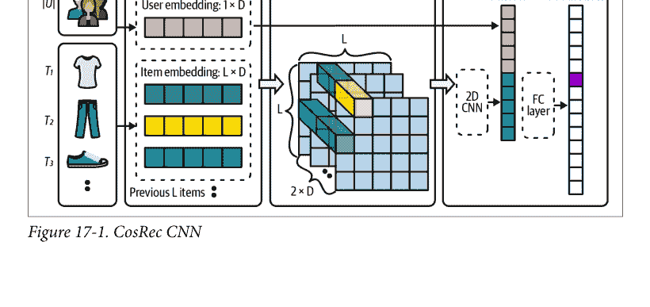

### 注意力架构

一个与神经网络紧密相关、现在你可能已经耳熟能详的术语是*注意力*。这是因为Transformer，特别是像通用预训练Transformer这类出现在大型语言模型（LLM）中的模型，已经成为AI用户关注的焦点。

我们将在此对自注意力和Transformer进行极其简短且技术性较低的介绍。如需更完整的Transformer指南，请参阅Brandon Rohrer所著的《从零开始的Transformer》中的精彩概述。

首先，我们来阐述Transformer模型的关键区别性假设：嵌入是位置性的。我们不仅希望为每个项目学习一个嵌入，还希望为每个项目-位置对学习一个嵌入。因此，当一篇文章是会话中的第一篇和最后一篇时，这两个实例被视为*两个独立的项目*。

另一个重要概念是堆叠。构建Transformer时，我们通常将架构想象成一个层蛋糕，各部分层层堆叠。关键组件包括嵌入、自注意力层、跳跃加法和前馈层。最复杂的操作发生在自注意力层，所以我们先聚焦于此。我们刚才讨论了位置嵌入，它们作为这些嵌入向量的序列被发送；回想一下，Transformer是一个序列到序列模型！跳跃加法意味着我们将嵌入*绕过*自注意力层（以及其上方的前馈层）向前传递，并将其加到注意力层的位置输出上。前馈层是一个平淡无奇的多层感知器，它保持在位置列中，并使用ReLU或GeLU激活函数。


### ReLU 与 GeLU

ReLU（修正线性单元）是一个定义为 $f(x) = \max(0, x)$ 的激活函数。GeLU（高斯误差线性单元）是另一个激活函数，近似为 $f(x) = 0.5x\left(1 + \tanh\left(\sqrt{\frac{2}{\pi}}(x + 0.044715x^3)\right)\right)$，其灵感来源于高斯累积分布函数。GeLU背后的直觉是，它倾向于让较小的 $x$ 值通过，同时平滑地饱和极端值，这可能为深度模型提供更好的梯度流。这两种函数都在神经网络中引入了非线性，而GeLU在某些场景下通常表现出比ReLU更好的学习动态。

以下是关于自注意力的一些快速提示：

- 自注意力背后的思想是，序列中的所有事物都以某种方式影响着其他所有事物。
- 自注意力层为每个头学习四个权重矩阵。
- 头与序列长度是一一对应的。
- 我们通常将权重矩阵称为 $Q, K, O, V$。$Q$ 和 $K$ 都与位置嵌入进行交叉运算，而 $O$ 和 $V$ 首先被交叉成一个嵌入维度大小的方阵，然后再与嵌入进行点积。$Q\dot{E}$ 和 $K\dot{E}$ 相乘生成同名的*注意力*矩阵，我们对其执行逐行softmax以获得注意力向量。
- 存在一些归一化操作，但为了理解方便，我们将忽略它们，认为它们不重要。

当我们想准确而简洁地谈论注意力时，我们通常会说：“它接收一个位置嵌入序列，并将它们全部混合在一起，以学习它们之间的关系。”

### 自注意力序列推荐

**SASRec** 是我们将考虑的第一个Transformer模型。这个自回归序列模型（类似于因果语言模型）根据过去的用户交互预测下一个用户交互。受Transformer模型在序列挖掘任务中成功的启发，基于自注意力的架构被用于序列推荐。

当我们说SASRec模型是以自回归方式训练时，我们的意思是自注意力只被允许关注序列中较早的位置；不允许展望未来。就我们之前提到的“混合”而言，可以将其视为只向前混合影响。有些人称之为“因果”，因为它尊重时间的因果箭头。该模型还允许可学习的位置编码，这意味着更新会传递到嵌入层。该模型使用了两个Transformer块。

### BERT4Rec

受NLP中BERT模型的启发，**BERT4Rec** 通过训练一个双向掩码序列（语言）模型来改进SASRec。

虽然BERT使用掩码语言模型来预训练词嵌入，但BERT4Rec使用这种架构来端到端地训练推荐系统。它试图预测用户交互序列中被掩码的项目。与原始BERT模型类似，自注意力是双向的：它可以查看动作序列中过去和未来的交互。为了防止未来信息泄露并模拟真实设置，在推理过程中只掩码序列中的最后一个项目。通过使用项目掩码，BERT4Rec的性能优于SASRec。然而，BERT4Rec模型的一个缺点是它计算密集，需要更多的训练时间。

### 近期性采样

序列推荐以及Transformer架构在这些任务中的应用最近引起了广泛关注。像BERT4Rec和SASRec这样的深度神经网络模型已经显示出比传统方法更好的性能。然而，这些模型存在训练缓慢的问题。最近发表的一篇论文——哈哈，你懂的——解决了在实现最先进性能的同时提高训练效率的问题。详情请参阅Aleksandr Petrov和Craig Macdonald的《使用近期性采样进行序列推荐的有效高效训练》。

我们刚才描述的两种序列模型训练范式是自回归式（试图预测用户交互序列中的下一个项目）和掩码式（试图预测交互序列中被掩码的项目）。自回归方法在训练过程中不使用序列的开头作为标签，因此丢失了有价值的信息。另一方面，掩码方法与序列推荐的最终目标仅存在弱相关性。

Petrov和Macdonald的论文提出了一种基于近期性的正样本采样方法，从序列中构建训练数据。该采样旨在给予较新的交互更高的被采样概率。然而，由于采样机制的概率性质，即使是最古老的交互也有非零的被选中机会。采用指数函数作为采样程序，它在基于掩码的采样（每个交互被采样的概率相等）和自回归采样（从序列末尾采样项目）之间进行插值。这在序列推荐任务中表现出优越的性能，同时所需的训练时间大大减少。将这种方法与我们之前看到的其他一些采样显著改进推荐系统训练的例子进行比较！

### 融合静态与序列

Pinterest最近发布了Jiajing Xu等人的《重新思考Pinterest的个性化排序：一种端到端方法》，描述了其个性化推荐系统，该系统旨在利用原始用户行为。推荐任务被分解为建模用户的长期和短期意图。

理解用户长期兴趣的过程是通过训练一个端到端的嵌入模型（称为PinnerFormer）来完成的，该模型从用户在平台上的历史行为中学习。这些行为随后被转换为用户嵌入，旨在根据预期的长期未来用户活动进行优化。

此过程采用一个改进的Transformer模型来处理用户的序列行为，意图是预测他们的长期未来活动。每个用户的活动被编译成一个序列，包含他们在特定时间窗口（例如一年）内的操作。基于图神经网络（GNN）的PinnerSage嵌入，结合相关元数据（例如，操作类型、时间戳等），用于为序列中的每个操作添加特征。

与传统的序列建模任务和序列推荐系统不同，PinnerFormer旨在预测长期的未来用户活动，而不是紧随其后的动作。这一目标是通过训练模型来预测用户在嵌入生成后14天窗口内的积极未来交互来实现的。相比之下，传统的序列模型只会预测下一个动作。

这种替代方法允许嵌入生成以批处理模式离线进行，从而显著降低了基础设施需求。与大多数实时运行并产生大量计算和基础设施成本的传统序列建模系统相比，这些嵌入可以批量生成（例如，每天一次），而不是在用户每次执行操作时都生成。

该方法中引入了密集全动作损失，以促进模型的批量训练。这里的目标不是预测紧随其后的下一个动作，而是预测用户在接下来的 $k$ 天内将要执行的所有动作。目的是预测用户在 $T + 3$、$T + 8$ 和 $T + 12$ 等时间间隔的所有积极交互事件，从而迫使系统学习长期意图。虽然传统上使用最后一个动作的嵌入来进行预测，但密集全动作损失使用动作序列中随机选择的位置，并使用相应的嵌入来预测每个位置的所有动作。

基于离线和在线实验结果，使用密集全动作损失来训练长期用户行为，显著缩小了批量生成和实时生成用户嵌入之间的差距。此外，为了适应用户的短期兴趣，Transformer模型实时检索每个用户的最新操作，并将其与长期用户嵌入一起处理。

## 总结

Transformer 和序列推荐系统确实是现代推荐器的前沿。如今，推荐系统领域的大多数研究都集中在序列数据集上，而最热门的推荐器正使用越来越长的序列进行预测。有两个重要项目值得关注：

*Transformers4Rec*
这个由 NVIDIA Merlin 团队开发的开源项目，专注于可扩展的 Transformer 模型。更多详情，请参阅 Gabriel de Souza Pereira Moreira 等人撰写的论文《Transformers4Rec: Bridging the Gap Between NLP and Sequential/Session-Based Recommendation》。

*Monolith*
也被称为 TikTok For You 页面推荐器，是目前最受欢迎和最令人兴奋的推荐系统之一。它本质上是一个序列推荐器，并采用了一些优雅的混合方法。Zhuoran Liu 等人的论文《Monolith: Real-Time Recommendation System with Collisionless Embedding Table》涵盖了其架构设计考量。

在本书结束前，我们的最后一步是探讨几种推荐方法。这些方法并非完全建立在我们已有内容的基础上，但会运用我们所学的部分知识，并引入一些新思路。让我们冲刺到终点吧！

# 第 18 章

## 推荐系统的未来

我们正处在推荐系统的转型期。然而，这对于这个领域来说相当正常，科技行业的许多领域也是如此。这个与商业目标紧密相连、并具有强大商业价值创造能力的领域，其现实之一就是它总是在不断寻找一切可能的机会向前发展。

在本章中，我们将简要介绍关于推荐系统未来走向的一些现代观点。一个需要考虑的重要点是，推荐系统作为一门科学，其发展是深度和广度并进的。关注该领域最前沿的研究，意味着你将看到在那些已被研究数十年或目前看似纯属幻想的领域中进行的深度优化。

我们选择在最后一章聚焦三个领域。第一个你在本书中已有所接触：多模态推荐。随着用户转向平台完成更多事情，这个领域正变得越来越重要。回想一下，当一个用户同时由多个潜在向量表示时，就出现了多模态推荐。

接下来是基于图的推荐器。我们已经讨论过共现模型，它们是基于图的推荐系统中最简单的模型。但它们可以深入得多！图神经网络（GNN）正成为一种极其强大的机制，用于编码实体之间的关系并利用这些表示，使其在推荐中非常有用。

最后，我们将关注大型语言模型和生成式 AI。在撰写本书期间，LLM 已从只有少数 ML 专家理解的东西，变成了 HBO 喜剧节目中都会提及的事物。虽然业界正急于寻找 LLM 在推荐系统中的相关应用，但已经对以特定方式应用这些工具充满信心。同样令人兴奋的是，推荐系统在 LLM 应用中的应用。

让我们看看接下来会发生什么！

### 多模态推荐

*多模态推荐器*承认*用户包含多重身份*：单一的用户偏好表示可能无法捕捉全貌。例如，在一个大型综合电商网站上购物的人，可能同时是以下所有角色：

- 一位经常需要为狗狗购买物品的狗主人
- 一位总是为成长中的宝宝更新衣橱的家长
- 一位购买零件以在赛道上驾驶赛车的业余赛车手
- 一位在衣橱里藏着数百盒未拆封星球大战乐高套装的乐高投资者

你在本书中学到的方法应该能很好地为所有这些用户提供推荐。然而，你可能会注意到这个列表中存在一些相互冲突的方面：

- 如果你的孩子还很小，为什么你已经购买乐高套装了？而且，你的狗不会啃咬它们吗？
- 如果你的车库堆满了乐高套装，你把这些汽车零件放在哪里？
- 你把你的狗放在那辆双座马自达 MX-5 Miata 的哪里？

你可能还能想到其他情况，其中你购买的某些方面与其他方面不太匹配。这就引出了多模态问题：你兴趣的潜在空间中有多个区域融合成了模式或中心点，但不止一个。

让我们回到之前的一些几何讨论：如果你使用用户向量的最近邻，那么哪个中心点将变得最重要？

我们处理这个问题的方法是通过多模态，即为单个用户提供多个向量。虽然考虑用户所有模式的朴素扩展方法是简单地增加物品侧模型的维度（以创建更多区域，使不同类型的物品可以不相交地嵌入），但这在训练和内存方面带来了严重的规模化挑战。

该领域最早的重要工作之一由本书的一位合著者共同撰写，并引入了矩阵分解的扩展来处理这个问题；参见 Jason Weston 等人的论文《Nonlinear Latent Factorization by Embedding Multiple User Interests》。目标是像我们在其他矩阵分解方法中所做的那样，同时构建多个潜在因子，每个因子有望代表用户的一个兴趣。

这是通过构建一个张量来实现的，该张量的第三维代表不同兴趣的各个潜在因子，而不是编码一个用户-物品分解矩阵。分解被推广到张量情况，并使用你之前看到的 WSABIE 损失进行训练。

在此工作基础上，几年后 Pinterest 发布了 PinnerSage，正如我们在第 15 章中提到的。它修改了 Weston 等人论文中的一些假设，不假设每个用户有已知数量的表示。此外，这种方法使用了基于图的特征表示，我们将在下一节中详细讨论。最后，该方法使用的最后一个重要的修改是聚类：它试图通过在物品空间中进行聚类来构建模式。

基本的 PinnerSage 方法如下：

1. 固定物品嵌入（他们称之为 *pins*）。
2. 聚类用户交互（无监督且基数未指定）。
3. 将聚类表示构建为聚类嵌入的中心点。
4. 使用以中心点为锚点的近似最近邻搜索进行检索。

PinnerSage 仍被认为是大规模多模态推荐器的近最先进水平。一些系统采用另一种方法，允许用户通过选择他们正在寻找的主题来更直接地修改他们的“模式”，而另一些系统则希望从交互序列中学习它。

接下来，我们将看看如何显式指定物品或用户之间的高阶关系。

### 基于图的推荐器

*图神经网络*（GNN）是一类利用数据的结构信息来构建更深层数据表示的神经网络。它们在处理关系型或网络型数据时已被证明特别有用，这两者都具有实用价值。

在继续之前，先澄清一点：我们在此使用的*图*概念指的是*节点*和*边*的集合。这些是纯粹的数学概念，但通常我们可以将节点视为感兴趣的对象，将它们之间的关系视为边。这些数学对象对于提炼你希望构建的表示类型的核心要素非常有用。虽然对象可能看起来很简单，但我们可以通过各种方式添加恰到好处的复杂性来捕捉更多细微差别。

在最简单的设置中，图中的每个节点代表一个物品或用户，每条边代表一种关系，例如用户与物品的交互。然而，用户到用户和物品到物品的网络也是非常强大的扩展。我们的共现模型是简单的图网络；然而，我们没有从中学习表示，而是直接将其作为我们的模型。

让我们考虑几个向图中添加更多结构以编码想法的例子：

*方向性*
可以在边的顶点上添加这种排序，以指示一个节点作用于另一个节点的严格关系；例如，用户*阅读*一本书，但反过来则不然。

*边装饰*
可以添加边标签等描述符来传达关系的特征；例如，两个用户共享账户凭据，*并且其中一个用户被标识为儿童*。

*多重边*
这些可以允许关系具有更高的重数，或者允许相同的两个实体具有多个关系。在一个以服装物品为节点的服装搭配图中，每条边可以是另一件使另外两件搭配得当的服装物品。

*超边*
更进一步的抽象层次可能会添加这些边，它们同时连接多个节点。对于视频场景，你可能会检测到各种类别的对象，你的图可能有这些类别的节点，但理解不仅哪些对象类别对出现，而且哪些高阶组合出现，可以通过超边来识别。

让我们探索 GNN 的基础及其表示方式有何不同。

#### 神经消息传递

在 GNN 中，我们感兴趣的对象被指定为图中的节点。通常，GNN 的主要目标是通过节点和边之间的关系，构建强大的节点和边表示，或两者兼而有之。

图神经网络（GNN）与传统神经网络的根本区别在于，训练过程中我们显式地使用了沿“边”在节点表示之间传输数据的算子。这被称为*消息传递*。让我们从一个例子开始，来理解这个基本概念。

假设节点代表用户，其特征是人口统计信息、入职调查问题等个人资料详情。边代表社交网络图：他们是否是朋友？我们还可以为边添加装饰，例如他们在平台上交换的私信数量。如果我们是希望在平台上引入广告购物的社交媒体公司，我们可能会从这些个人资料特征入手，但理想情况下，我们希望利用这种通信网络中的某些信息。理论上，频繁交流和分享内容的人可能有相似的品味。有点意味深长的是，我们引入了一个叫做*消息函数*的概念，它允许特征从一个节点发送到另一个节点。消息函数使用每个节点及其之间边的特征，数学上表示如下，其中 $h_i^{(k)}$ 和 $h_j^{(k)}$ 分别是节点 $i$ 和节点 $j$ 的特征：

$$m_{ij}^{(k)} = \mathcal{M}\left(h_i^{(k)}, h_j^{(k)}, e_{ij}\right)$$

边的特征是 $e_{ij}$，$\mathcal{M}$ 是某个可微函数。注意，上标 $(k)$ 指的是层，这是反向传播表示法中的标准做法。以下是两个简单的例子：

- $m_{ij}^{(k)} = h_i^{(k)}$ 意味着“从邻居节点获取特征”
- $m_{ij}^{(k)} = \frac{h_i^{(k)}}{c_{ij}}$ 意味着“按 $i$ 和 $j$ 之间的边数取平均”

许多强大的消息传递方案使用了机器学习其他领域的方法——例如在节点特征上添加注意力机制——但本书不会深入探讨这个理论。

接下来我们要介绍的是*聚合函数*，它以消息集合为输入并将其聚合。最常见的聚合函数类型执行以下操作：

- 连接所有消息
- 求和所有消息
- 平均所有消息
- 取消息的最大值

最后，我们将聚合函数的输出作为更新函数的一部分，该函数接收节点特征和聚合后的消息函数，然后应用额外的变换。如果你一直在想，“这个模型在哪里学习任何东西？”答案就在更新函数中。更新函数通常有一个关联的权重矩阵，因此当你训练这个神经网络时，你就是在学习更新函数中的权重。最简单的更新函数将权重矩阵乘以聚合的向量化输出，然后对每个向量应用一个激活函数。

这种消息传递、聚合和更新的链条是图神经网络的核心，并涵盖了广泛的能力。它们在各种机器学习任务中都很有用，包括推荐。让我们看看一些在推荐系统中的直接应用。

#### 应用

让我们重新审视图神经网络在推荐系统领域可能涉及的一些高层概念。

#### 建模用户-物品交互

在我们之前介绍的其他方法中，例如矩阵分解，考虑了用户和物品之间的交互，但没有利用用户或物品之间的复杂网络。相比之下，图神经网络可以捕捉用户-物品交互图中的复杂连接，然后利用该图的结构做出更准确的推荐。

回想一下我们的消息传递，它允许我们将某些节点（在这种情况下是用户和物品）的信息“传播”给它们的邻居。一个类比是，当用户越来越多地与具有特定特征的物品交互时，这些特征中的一些会被赋予到用户身上。这听起来可能类似于潜在特征，因为它确实是！这些最终帮助网络从将特征从物品传递给用户的消息中构建潜在表示。这可能比其他潜在嵌入方法更强大，因为你明确定义了结构关系以及它们如何传递这些特征。

#### 特征学习

图神经网络可以通过聚合邻居的特征信息，利用节点之间的连接，学习图中节点（用户或物品）更具表达力的特征表示。这些学习到的特征可以提供关于用户偏好或物品特征的丰富信息，从而极大地提升推荐系统的性能。

之前我们谈到过用户的表示如何从他们交互的物品中学习，但物品也可以相互学习。类似于物品-物品协同过滤（CF）允许物品从共享用户那里获取潜在特征，图神经网络允许我们添加物品之间可能存在的许多其他直接关系。

#### 冷启动问题

回想一下我们的冷启动问题：由于缺乏历史交互，为新用户或物品提供推荐很困难。通过使用节点的特征和图的结构，图神经网络可以学习新用户或物品的嵌入，从而可能缓解冷启动问题。

在我们用户图的一些图形表示中，边不仅存在于拥有大量先前推荐的用户之间。可以使用其他用户操作来*引导*一些早期的边。诸如“共享物理位置”、“被同一用户邀请”或“入职问题回答相似”之类的结构性边，足以快速引导出多个用户-用户边，从而允许我们为他们进行热启动推荐。

### 上下文感知推荐

图神经网络可以将上下文信息融入推荐过程。例如，在基于会话的推荐中，图神经网络可以将用户在会话中交互的物品序列建模为一个图，其中每个物品是一个节点，顺序形成边。然后，图神经网络可以学习物品之间动态而复杂的转换，以进行上下文感知推荐。

这些高层概念应该指出了图编码在推荐问题中的机会，但接下来让我们看两个具体应用：随机游走和元路径。

### 随机游走

图神经网络中的随机游走使得方法能够利用用户-物品交互图来学习有效的节点（即用户或物品）嵌入。然后使用这些嵌入进行推荐。在图的上下文中，随机游走是一个迭代过程，从一个特定节点开始，然后通过随机选择随机移动到另一个连接的节点。

一种流行的基于随机游走的网络嵌入算法是 DeepWalk，它已被针对各种任务（包括推荐系统）进行了许多方式的调整和扩展。

以下是随机游走图神经网络方法在推荐上下文中可能的工作方式：

1.  随机游走生成：首先在交互图上执行随机游走。从每个节点开始，进行一系列随机步骤到其他连接的节点。这会产生一组路径或“游走”，代表不同节点之间的关系。
2.  节点嵌入：随机游走生成的节点序列类似于文本语料库中的句子，每个节点被视为一个词。然后使用 Word2vec 或类似的语言建模技术来学习节点的嵌入（向量表示），使得在相似上下文中（在相同的游走中）出现的节点具有相似的嵌入。
3.  推荐：一旦你学习了节点嵌入，你就可以用它们来推荐。对于给定的用户，你可以根据距离度量，推荐在嵌入空间中与该用户“接近”的物品。这可以使用我们之前为潜在空间表示推荐开发的所有技术。

这种方法有一些很好的特性：

- 它可以捕捉图中的高阶连接。每次随机游走都可以探索与起始节点不直接连接的图的一部分。
- 它有助于解决推荐系统中的稀疏性问题，因为它利用图的结构来学习表示，这需要更少的交互数据。
- 它自然地尝试处理冷启动问题。对于交互较少的新用户或物品，可以从连接的节点学习它们的嵌入。

然而，这种方法也有一些挑战。随机游走在大型图上可能计算成本很高，并且可能难以选择合适的超参数，例如随机游走的长度。此外，这种方法对于动态图（交互随时间变化）可能效果不佳，因为它本质上不考虑时间信息。

这种方法隐式地假设节点是异构的，因此通过连接将它们共同嵌入是自然的。虽然这不是一个明确的要求，但 DeepWalk 构建的序列嵌入类型在结构上倾向于假设这一点。让我们打破这个规则，以适应我们下一个架构示例——元路径——中异构类型之间的学习。

### 元路径与异构性

元路径的引入旨在提升推荐的可解释性，并将知识图谱的思想与图神经网络相结合。

*元路径*是异构网络（或图）中连接不同类型节点、通过不同类型关系的一条路径。异构网络包含多种类型的节点和边，代表多种对象和交互。除了简单的用户和物品，节点类型可以是“购物车中的物品”、“浏览会话”或“用于购买的渠道”。

元路径可用于处理异构信息网络的图神经网络。这些网络提供了对现实世界更全面的表示。当在图神经网络中使用时，元路径提供了一种信息应如何在网络中聚合和传播的方案。它定义了在从节点邻域汇集信息时需要考虑的路径类型。

例如，在一个推荐系统中，你可能有一个包含用户、电影和类型作为节点类型，“观看”和“属于”作为边类型的异构网络。一条元路径可以定义为“用户 - 观看 → 电影 - 属于 → 类型 - 属于 → 电影 - 观看 → 用户”。这条元路径代表了一种通过用户观看的电影及其类型来连接两个用户的方式。

利用元路径的一种流行方法是异构图神经网络及其变体。这些模型利用元路径概念来捕获异构信息网络中的丰富语义，从而增强节点表示的学习。

基于元路径的模型在各种应用中都显示出有希望的结果，因为它们允许你将更抽象的关系显式地编码到我们之前提到的消息传递机制中。

如果你对高阶建模感兴趣，那么请系好安全带，准备迎接本书将涵盖的最后一个概念。这个主题是最新的，并且充满了高级抽象。基于语言模型的智能体处于机器学习建模的绝对前沿。

### 大语言模型应用

所有关于大语言模型的最高级形容词都已被用尽。因此，我们只说：大语言模型功能强大，且拥有数量惊人的应用。

大语言模型是通用模型，允许用户通过自然语言与之交互。从根本上说，这些模型是生成式的（它们生成文本）并且是自回归的（它们生成的内容取决于之前的内容）。因为大语言模型能够进行对话，它们被冠以通用人工智能*智能体*的称号。那么很自然地会问：“一个智能体能为我推荐东西吗？”让我们首先探讨如何使用大语言模型进行推荐。

#### 大语言模型推荐器

自然语言是请求推荐的绝佳界面。如果你想让同事推荐午餐，也许你会走到他们桌前一言不发——希望他们能记起对你偏好的潜在知识，识别出时间上下文，根据星期几回忆起餐厅的可用性，并且记得你昨天吃了熏牛肉三明治。

更有效的方法是，你可以简单地问：“午餐有什么建议吗？”

就像你敏锐的同事一样，如果你直接要求模型，它们可能更有效地提供推荐。这种方法还增加了更精确地定义你想要的推荐类型的能力。大语言模型的一个流行应用是让它们根据一组食材提供食谱。在我们构建的推荐器背景下思考这个问题，构建这种类型的推荐器存在一些障碍。它可能需要一些用户建模，但它非常依赖于指定的物品。这意味着对于指定物品的每种组合，信号都非常低。

另一方面，大语言模型在处理这种任务的自回归特性方面非常有效：给定几种食材，在食谱的上下文中，接下来最可能包含什么。通过这样生成多个物品，排序模型可以对此进行增强，以提供一个现实的推荐器。

#### 大语言模型训练

近年来流行起来的大型生成式语言模型分三个阶段进行训练：

1.  用于补全的预训练
2.  用于对话的监督微调
3.  基于人类反馈的强化学习

有时后两个步骤会合并为所谓的*指令微调*。要深入了解这个主题，请参阅Long Ouyang等人的原始InstructGPT论文《Training Language Models to Follow Instructions with Human Feedback》。

让我们回顾一下，文本补全任务等同于训练模型在看到前$k$个词后预测序列中的下一个词。这可能会让你想起第8章的GloVe，或者我们关于序列推荐器的讨论。

接下来是用于对话的微调；这一步是必要的，以教会模型“下一个词或短语”有时应该是对原始陈述的回应，而不是其延伸。

在此阶段，用于此训练的数据以*示范数据*的形式存在，即陈述和回应的配对。示例包括：

-   一个请求，然后是对该请求的回应
-   一个陈述，然后是该陈述的翻译
-   一段长文本，然后是该文本的摘要

对于推荐，你可以想象第一个示例与我们希望模型展示的任务高度相关。

最后，我们进入基于人类反馈的强化学习阶段；这里的目标是学习一个奖励函数，我们稍后可以用它来进一步优化我们的大语言模型。然而，奖励模型*本身*需要被训练。有趣的是，对于像你这样的推荐系统爱好者来说，AI工程师是通过一个排序数据集来完成这项工作的。

大量的元组——类似于我们见过的示范数据——提供了陈述和回应，尽管不是只有一个回应，而是有多个回应。它们被排序（通过人工标注者），然后对于每一对优劣回应（$x, sup, inf$），我们评估损失：

-   $r_{sup} = \Theta(x, sup)$ 是奖励模型对优等回应的评分。
-   $r_{inf} = \Theta(x, inf)$ 是奖励模型对劣等回应的评分。

最终损失计算为：$-log(\sigma(sup - inf))$。

然后使用这个奖励函数来微调模型。

OpenAI通过图18-1中的图表总结了这种方法。

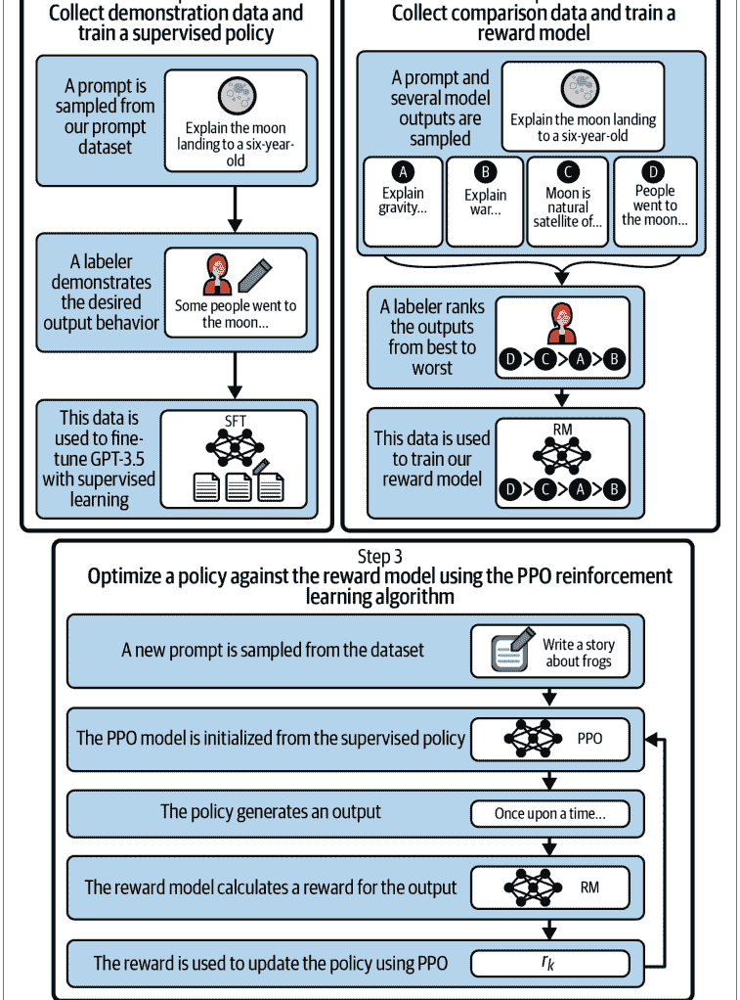

#### 用于推荐的指令微调

在之前关于指令对的讨论中，我们看到训练的最终目标是学习两个回应之间的排序比较。这种训练应该感觉相当熟悉。在Keqin Bao等人的论文《TALLRec: An Effective and Efficient Tuning Framework to Align Large Language Model with Recommendation》中，作者使用了类似的设置来教模型用户偏好。

正如论文所提到的，历史交互物品根据其评分被分为两组：用户喜欢的和用户不喜欢的。他们将这些信息收集到自然语言提示中，以格式化最终的“推荐输入”：

1.  用户偏好：$[item_1, \dots, item_n]$
2.  用户偏好：$[item_1, \dots, item_n]$
3.  用户会喜欢用户偏好，$[item_{n+1}]$吗？

这些遵循与之前提到的InstructGPT相同的训练模式。与未经训练的用于推荐的大语言模型相比，作者在推荐问题上实现了显著的性能提升；然而，这些应被视为基线，因为这不是它们的目标任务。

#### 大语言模型排序器

到目前为止，在本章中，我们将大语言模型视为一个完整的推荐器，但实际上，大语言模型也可以仅用作排序器。最简单的方法是直接向大语言模型提供用户的相关特征和一个物品列表，并要求它建议最佳选项。

虽然这种方法很朴素，但其变体在非常通用的场景中取得了有些令人惊讶的结果：“用户今晚想看一部恐怖片，如果不喜欢血腥场面，不确定哪部最好：movie-1, movie-2, 等等。”但我们可以做得更好。

最终，与学习排序方法一样，我们可以考虑单点、成对和列表排序。如果我们希望使用大语言模型进行单点排序，我们应该将我们的提示和响应限制在这些模型可能有用的设置中。以科学论文推荐器为例；用户可能希望写下他们正在研究的内容，并让大语言模型帮助建议相关的论文。虽然这是一个传统的搜索问题，但这是一个我们的现代工具可以带来很大效用的场景：大语言模型擅长摘要和语义匹配，这意味着可以从大型语料库中找到语义相似的结果，然后智能体能够将这些结果综合成一个连贯的回答。这里最大的挑战是幻觉问题，即推荐可能不存在的论文。

你可以将成对和列表式方法类比理解：将参考数据提炼成一种形式，使得这些大语言模型的独特能力能够利用它来提供显著的帮助。

既然我们谈到了搜索和检索的话题，有必要提及推荐系统帮助大语言模型应用的一种方式：检索增强。

### 对人工智能的推荐

我们已经了解了大语言模型如何用于生成推荐，但推荐系统如何改进大语言模型应用呢？大语言模型智能体在能力上极其通用，但在许多任务上缺乏特异性。如果你问智能体：“我今年读的哪些书是非西方作者写的？”智能体将无法成功回答。从根本上说，这是因为通用的预训练模型不知道你今年读了哪些书。

为了解决这个问题，你需要利用*检索增强*，即从现有的数据存储中向模型提供相关信息。数据存储可以是SQL数据库、查找表或向量数据库，但最终这里的关键组件是，通过某种方式，你能够根据请求找到相关信息，然后将其提供给智能体。

我们这里做了一个假设，即你的请求可以被你的检索系统理解。在前面的例子中，你希望系统能自动理解“我今年读的哪些书”这个短语，将其视为一个信息检索任务，等同于类似这样的操作：

```sql
SELECT * FROM read_books
WHERE CAST(finished_date, YEAR) = CAST(today(), YEAR)
```

这里我们只是虚构了一个SQL数据库，但你可以想象一个满足此请求的模式。将请求转换为这个SQL语句现在成了你需要建模的另一个任务——也许这是另一个智能体请求的工作。

在其他情况下，你需要一个完整的推荐系统来帮助检索：如果你想让用户向智能体询问今晚看什么电影，但同时继续利用你对每个用户品味的深刻理解，你可以先根据用户偏好过滤潜在的电影，然后只发送你的推荐模型认为非常适合他们的电影。智能体随后就可以从已经确定为优秀的电影子集中，为用户的文本请求提供服务。

大语言模型与推荐系统的交叉领域将在未来一段时间内主导推荐系统的许多讨论。将推荐系统的知识引入这个新领域，有很多唾手可得的成果。正如尤金·严最近所说：

我认为关键挑战和解决方案是在正确的时间为它们（大语言模型）提供正确的信息。拥有一个组织良好的文档存储会有所帮助。通过使用关键词搜索和语义搜索的混合方式，我们可以准确地检索大语言模型所需的上下文。

## 总结

推荐系统的未来是光明的，但技术将继续变得更加复杂。过去五年的一个主要变化是向基于GPU的训练以及能够使用这些GPU的架构的惊人转变。这就是本书倾向于使用JAX而非TensorFlow或Torch的主要原因。

本章中的方法拥抱更大的模型、更多的互联，以及可能在大多数组织中难以容纳的规模上进行推理。最终，推荐问题将始终通过以下方式解决：

-   仔细的问题定义
-   与用户和物品高度相关的表示
-   编码任务细微差别的周到损失函数
-   优秀的数据收集

# 索引

## 符号

@ k, 218

## A

-   A/B测试, 116, 215
-   消融研究, 245
-   加速结构
    -   更廉价的检索方法, 290
    -   术语定义, 281
    -   k-d树, 284-288
    -   k-means聚类, 288
    -   局部敏感哈希（LSH）, 282-284
    -   分片, 282
    -   策略, 281
    -   相关术语, 86
-   主动学习
    -   优势, 122
    -   核心思想, 122
    -   实现, 123
    -   优化, 123-125
    -   结构, 123
-   加入购物车操作，日志记录, 23
-   亲和性, 206, 256, 268
-   智能体, 37
-   聚合函数, 309
-   Airflow, 85, 107
-   告警与监控
    -   集成测试, 109
    -   可观测性, 110
    -   模式与先验, 108
-   分配计划, 159
-   交替最小二乘法（ALS）, 174
-   环境空间, 40
-   锚点物品, 277
-   近似最近邻（ANN）, 42, 87, 108, 289
-   近似排名, 233
-   架构
    -   告警与监控, 108-111
    -   持续训练与部署, 113-117
    -   术语定义, 95
    -   编码器架构与冷启动, 100-102
    -   评估飞轮, 117-125
    -   生产环境中的评估, 111-113
    -   模型部署, 103-107
    -   模型服务架构, 157
    -   按推荐结构划分, 95-100
-   受试者工作特征曲线下面积（AUC-ROC）, 225
-   人工智能（AI）, 318
-   异步服务器网关接口（ASGI）, 104
-   注意力架构
    -   BERT4Rec, 300
    -   介绍, 299
    -   合并静态与序列, 301
    -   近期性采样, 301
    -   自注意力序列推荐（SASRec）, 300
-   注意力矩阵, 300
-   归因, 26
-   AUC-ROC（受试者工作特征曲线下面积）, 225
-   自回归, 99, 113
-   避免
    -   替代术语, 266
    -   手动调整的排名作为, 268
    -   硬性避免, 265
    -   实现, 269-271
    -   基于模型的, 271
-   基于模型的避免, 271
-   排序与应用, 121
-   业务指标, 245

## B

-   基向量, 161
-   批处理, 44
-   批处理坐标格式, 162
-   BatchNorm层, 55
-   贝叶斯个性化排序（BPR）, 226
-   BERT4Rec模型, 300
-   最佳匹配25（BM25）算法, 236
-   偏差
    -   推荐多样性, 274-276
    -   公平性, 279
    -   多目标函数, 277
    -   谓词下推, 278
    -   类型, 273
-   大数据框架（另见PySpark）
    -   集群框架, 132
    -   选项, 130
-   双线性因子模型
    -   基础, 149-153
    -   局限性, 157
-   双线性回归, 151
-   二元交叉熵损失, 231
-   二元预测, 124
-   布隆过滤器, 46, 88-90
-   BM25（最佳匹配25）算法, 236
-   提升, 100
-   BPR（贝叶斯个性化排序）, 226
-   广播（在JAX中）, 9
-   业务洞察, 26
-   业务逻辑
    -   推荐系统的挑战, 265
    -   手动调整的权重, 267
    -   硬性排名, 19, 266
    -   实现避免, 269-271
    -   库存健康度, 268
    -   学习到的避免, 266

## C

-   级联, 157
-   因果清洗, 245
-   CD（持续部署）, 107
-   中心核对齐, 206
-   CF（见协同过滤）
-   CG（累积增益）, 222
-   CI（持续集成）, 107
-   分类，用于排序, 231
-   点击率（CTR）, 159
-   点击，日志记录, 22
-   点击流数据, 23, 24
-   闭环反馈, 209
-   集群框架, 132
-   集群管理器, 75
-   CNN塔, 60
-   共覆盖, 124
-   共现
    -   共现矩阵, 140
    -   共现模型, 171
    -   计算, 161
    -   依赖于上下文, 160
    -   高阶, 161
    -   通过共现计算点互信息, 162
    -   表示稀疏矩阵, 162
    -   从共现得到的相似度, 163-164
-   代码
    -   实验代码, 241-246
    -   获取和使用代码示例, xvi, 128, 246
-   冷启动, 99-102, 128, 311
-   协同过滤（CF）
    -   基础, 16
    -   过滤气泡, 279
    -   基于物品的, 34
    -   用户相似度, 34-37
    -   从中得到的向量, 86
-   收集（见数据收集与用户日志记录）
-   收集器
    -   收集器日志, 120
    -   在探索-利用系统中, 39
    -   离线与在线, 44
    -   在推荐系统中的角色, 4
-   合并步骤, 134
-   评论与问题, xvii
-   交换群, 135
-   互补物品，估计, 163
-   条件MPIR, 141, 161
-   混淆变量, 210
-   约束, 266
-   容器化, 106
-   基于内容的特征向量, 150
-   基于内容的推荐器
    -   卷积神经网络定义, 55
    -   使用的数据集, 49
    -   开发环境, 49
    -   输入管道, 58-70
    -   获取STL数据集图像, 54
    -   优化, 56-58
    -   Python构建系统, 51
    -   随机物品推荐器, 52-54
    -   版本控制软件, 50
-   上下文
    -   上下文感知推荐, 311
    -   基于上下文的推荐, 98
    -   术语定义, 98
-   持续部署（CD）, 107
-   持续集成（CI）, 107
-   持续训练与部署
    -   部署拓扑, 114-117
    -   模型漂移, 113
-   控制器程序, 132
-   卷积神经网络（CNN）
    -   定义, 55
    -   用于序列推荐, 298
-   相关性
    -   相关性分析, 206
    -   相关系数, 223
    -   相关性标识符, 119
    -   相关性度量空间, 36
    -   相关性挖掘, 160-162
    -   皮尔逊相关系数, 35
-   余弦相似度, 150, 164, 170
-   CosRec, 298
-   反事实评估, 209
-   计数推荐器
    -   相关性挖掘, 160-162
    -   最流行物品推荐器（MPIR）, 159
    -   通过共现计算点互信息, 162
-   协变量, 21
-   Cron, 107
-   交叉熵损失, 231
-   CTR（点击率）, 159
-   累积增益（CG）, 222
-   维度灾难, 167

## D

-   Dagster, 85, 107
-   每日热启动, 117
-   数据收集与用户日志记录
    -   收集与插桩, 23
    -   数据稀疏性, 32-34, 99
    -   漏斗, 24
    -   记录什么, 19-23
-   数据处理
    -   加速结构, 86
    -   近似最近邻, 87
    -   大数据框架, 130-142
    -   数据泄露, 93
    -   数据表示, 129
    -   数据仓库, 85
    -   调试打印语句, 242
    -   特征存储, 90-93
    -   使用PySpark导入数据, 73-77
    -   规定数据如何分批, 82-84
    -   生产数据库快照, 84
    -   技术栈, 128
    -   测试集合包含性, 88-89
-   DataLoaders, 82-84
-   DeepWalk算法, 311
-   需求预测, 268
-   基于人口统计的系统, 155
-   演示数据, 315
-   稠密全动作损失, 302
-   稠密表示, 15
-   部署
    -   持续训练与部署, 113-117
    -   模型即API, 103
    -   启动模型服务, 104
    -   工作流编排, 105
-   开发环境（见环境）
-   维度, 153, 167
-   降维

## 中心核对齐，206
提取最相关特征，202
分解，172
等距嵌入，203-204
非线性局部可度量化嵌入，204
使用ALS优化MF，174-176
主要概念，199-202
MF的正则化，176
正则化MF实现，177-198
WSABIE，199
方向性，308
离散共现分布，171
不相似性函数，34
距离，34
分布式计算，104
分布比较，112
推荐多样性，274-276
分而治之策略，284
Docker，106
点积相似度，169，275
双重稳健估计（DRE），212
驱动程序，75
流失，24
对偶模型，155
双编码器网络，100

熵，124
环境
- A/B测试，215
- 容器化与，106
- 开发环境，49
- 历史评估数据，215
- 在线与离线评估，214
- 用户与物品指标，215
- 虚拟环境，51
评估飞轮
- 主动学习，122-125
- 每日热启动，117
- Lambda架构与编排，118
- 日志记录，119-122
生产环境中的评估
- 模型指标，112
- 慢反馈，111
事件，术语定义，23
执行器，75
实验
- A/B测试，116
- 实验路由，121
- 技巧，241-246
探索-利用推荐器，37，275

## E

边装饰，308
边，308
特征向量，200，201
ELK技术栈（Elasticsearch，Logstash，Kibana），119
嵌入模型
- 提升模型，100
- GloVE嵌入，141-146
- 等距嵌入，203-204
- 朴素序列嵌入，99
- 非线性局部可度量化嵌入，204
- 在线与离线收集器，45
- 分布外查询，98
嵌入向量，55
编码器
- 术语定义，102
- 编码器即服务，102
集成建模，114

## F

FAANG（Meta [前身为Facebook]，Apple，Amazon，Netflix和Google），xiv
分解，100，172
公平性，279
回退，111
假阳性率（FPR），225
FastAPI，106
特征增强/工程，157，244，310
特征泄露，93
特征存储，90-93
基于特征的推荐
- 双线性因子模型，149-152
- 基于特征的热启动，153-154
- 混合化，157
- 双线性模型的局限性，157
- 细分模型，155-156
- 用户空间与物品空间，152
特征-物品推荐器，141
反馈，111，208
过滤气泡，279
过滤，45，120

Flax框架
- GloVE模型规范，143-146
- Module类，60
- 使用其优化模型，56-58

预测，268
日志格式化，121
FPR（假阳性率），225
新鲜度，88
Frobenius项，176
全文搜索，237
漏斗，24

## G

高斯误差线性单元（GeLU），299
GitHub/Git，50，128
全局优化，269
GloVE嵌入，141-146
Google Colab，7
基于GPU的训练，319
梯度下降
- 小批量梯度下降，82
- 随机梯度下降，82
Gramian正则化，176，275
图神经网络（GNNs），307-313
基于图的ANN，289
贪婪扩展，124
群论，134
GRU4Rec，297

## H

汉明距离，283
手工调整权重，267
硬性规避，265
硬性排名/评分，19，266
硬性规则，266
哈希
- 局部敏感哈希（LSH），282-284
- 最小哈希，142
Hellinger距离，172
异构信息网络（HINs），313
层次化k-means，288
层次化可导航小世界，289
高风险应用，279
铰链损失，233
HINs（异构信息网络），313
历史评估数据，215
水平扩展，104
悬停操作，日志记录，21
HPO（超参数优化），185
人在回路中的机器学习，46，315
混合化，157
数据填充，73
（另见数据处理）
超边，308
超参数优化（HPO），185
超参数扫描，65

## I

理想DCG（IDCG），222
镜像，106
隐式反馈，100
隐式查询，96
隐式评分，19
重要性采样，39
曝光，日志记录，23
关联向量，160
增量收益，27
索引（在JAX中），9
工业规模，43
基于影响的优化，124
信息瓶颈，168
信息检索任务，237
基础设施即代码，106
InstructGPT论文，314
集成测试，109
列表内多样性，274
库存健康度，268
逆倾向评分（IPS），209
等距嵌入，203-204
物品指标，215
物品相似度，17
物品空间，152
基于物品的协同过滤，34
物品-物品推荐，16，165
物品到用户推荐，96
迭代，快速，245

## J

Jaccard相似度，164
雅可比矩阵，83

JAX框架
- 简要描述，xv，7
- 广播特性，9
- 数据不可变性，8
- 设计哲学，7
- 文档，7
- 实验练习，261
- GloVE模型规范，143-146
- 在其中实现规避，270
- 索引与切片，9
- JAX类型，7
- 即时编译，11
- NaN调试，243
- 使用其优化模型，56-58
- 随机数，10
- 正则化MF实现，177-198
作业，调度，106
Johnson-Lindenstrauss引理，284
即时（JIT）编译，11

学习排序（LTR）模型，230
喜爱度，40
线性回归，151
列表式LTR模型，230
LLMs（见大型语言模型）
局部敏感哈希（LSH），282-284
日志记录（另见数据收集与用户日志记录）
- 最佳实践，119
- 收集器日志，120
- 调试打印语句，242
- 过滤与评分，120
- 格式化，121
- 排序，121
长期保留集，216
损失函数
- 二元交叉熵损失，231
- 密集全动作损失，302
- 为Spotify示例构建，257-261
- 在其中包含多样性正则化项，275
- k阶统计量损失，234
- L2损失函数，232
- 随机损失，235
- 加权近似排名对（WARP），233
低维潜在空间，173
低秩方法
- 亲和性与p尺度，206
- 共现模型，171
- 降维，199-206
- 点积相似度，169，275
- 低秩近似，169
- 低秩方法，167-169
- 用于评估的倾向加权，208-211
- 降低推荐问题的秩，172-199
LSH（局部敏感哈希），282-284
LTR（学习排序）模型，230

## K

k-d树，284-288
k-means聚类，288
k阶统计量损失，234
Kafka，91，119
核方法，203
Kullback-Leibler（KL）散度，112，172

## L

L2损失函数，232
Lambda架构，78，118
大型语言模型（LLMs）
- 基础，313
- 用于推荐的指令微调，317
- 排序器，317
- AI推荐，318
- 使用其的推荐器，314
- 训练，314-317
潜在空间
- 术语定义，17
- 超参数优化，199
- 潜在表示，271
- 低秩方法，167-169
- 利用，86
- 向量搜索与，40
LAX库，258
惰性求值，75

## M

机器学习（ML）
- 批处理与实时处理，43
- 公平性，279
- 人在回路中的机器学习，46
- 朴素机器学习方法，149
- 在推荐系统中的作用，xiii-xv
- Zipf定律，29-32
mAP（平均精度均值），225
映射阶段，134
间隔，57
马尔可夫链，294-297
马尔可夫决策过程（MDP），295
矩阵补全，16，169
矩阵分解（MF）
- 挑战，174
- 解释，100
- HPO输出，194
- 矩阵分解方法，199
- 使用ALS优化，174-176
- 正则化，176
- 正则化MF实现，177-198
- 通过SVD，173
马太效应，29-32，114，122，174，209
奖励最大化，39
MDP（马尔可夫决策过程），295
MDS（多维尺度分析），203
平均精度均值（mAP），220，225
平均倒数排名（MRR），221，225
均方误差（MSE）损失，179
无记忆性原则，294
消息函数，309
消息传递，309
Meta [前身为Facebook]，Apple，Amazon，
Netflix和Google（FAANG），xiv
元路径，313
度量学习，149-153
度量空间，36
指标（另见排名指标）
- 业务指标，245
- 模型指标，112
- 用户与物品指标，215
MF（见矩阵分解）
微服务架构，103
最小哈希，142
小批量梯度下降，82
MLP（多层感知机），156
模型
- BERT4Rec模型，300
- 双线性模型，149-153，157
- 部署，103-107
- 集成结构，114
- 生产环境评估，111-113
- 学习排序（LTR）模型，230
- 模型级联，116
- 模型漂移，113
- 模型注册表，92
- 基于模型的规避，271
- 多层建模，157
- PinnerFormer，302
- 相关性模型，231
- SASRec模型，300
- 影子部署，115
- 过时模型，114
- 加权组合，157
Module类（Flax），60
监控（见告警与监控）
Monolith，303
单体架构，103
最热门物品推荐器（MPIR），6，
141，159
激励性问题构建，3
MRR（平均倒数排名），225
MSE（均方误差）损失，179
多臂老虎机，37，159
多维尺度分析（MDS），203
多重边，308
多标签多分类，156
多标签任务，231
多层感知机（MLP），156
多层建模，157
多模态推荐，275，306
多模态检索，238
多目标函数，277

## N

朴素机器学习方法，149
朴素序列嵌入，99
NaN（非数字）错误，242
自然语言处理（NLP），40-42
NDCG（归一化折损累计增益），226
最近邻
- 在协同过滤中，35
- 术语定义，35
- 最近邻搜索，42
Netflix在线竞赛，17
新用户，引导，125
节点，308
非线性局部可度量化嵌入，204

## O

可观测性，110
观测均方误差（OMSE），175，194
离线评估，214
用户引导漏斗，24
引导新用户，125
在线评估，215
在线与离线机器学习系统，43-47
Optax库，56-58，145

### 优化
- 主动学习，123-125
- 基于内容的推荐器，56-58
- 延迟决策，243
- 使用ALS进行矩阵分解的降维，174-176
- 全局优化，269
- 潜在空间的超参数优化，199
- 基于影响的优化，124
- 投资组合优化，276
- 谓词下推，278

编排工具，118
二阶马尔可夫链，295
分布外查询，98
过度检索，110
过拟合，114
覆盖，266

### PySpark
- 集群类型，132
- 示例程序，132-142
- 使用PySpark导入数据，73-77
- 安装，131
- Spark UI，131
- 分词和URL规范化，131
- PySpark中的用户相似度，77-81

Python构建系统，51
Python包索引，51
Python虚拟环境，51

## P

p-sale（销售概率），206
包，51
页面加载，日志记录，21
页面浏览，日志记录，21
成对学习排序模型，230
平行坐标图，195
并行化，104
帕累托前沿，197
帕累托问题，274
分区，140

## Q

### 查询
- 隐式查询，96
- 分布外查询，98
- 基于查询的推荐，96

问题和评论，xvii

## R

r-精度，220
随机数（在JAX中），10
随机物品推荐器，52-54
基于随机游走的算法，311
排名膨胀，154
排名降低（参见降维）

## 排序器
- 在探索-利用系统中，39
- 过滤和评分组件，45
- 大语言模型排序器，317
- 离线与在线，46
- 在推荐系统中的作用，4

### 排序指标
- AUC和cAUC，224
- 贝叶斯个性化排序（BPR），226
- 与业务指标的对比，245
- 相关系数，223
- 评估推荐系统，214-216
- mAP与NDCG，223
- 平均精度均值（mAP），220
- 平均倒数排名（MRR），221
- 归一化折损累计增益（NDCG），222
- 推荐的排序，220，229
- 召回率和精确率，216-220
- 基于亲和度的RMSE，224

## 排序训练
- 最佳匹配25（BM25）算法，236
- 实验练习，261
- 实验技巧，241-246
- k阶统计量损失，234
- 学习排序（LTR）模型，230
- 多模态检索，238
- 概述，262
- 排序在推荐系统中的作用，229
- Spotify播放列表示例，246-261
- 随机损失，235
- 训练LTR模型，231
- 加权近似排名成对（WARP），233

快速迭代，245

### 评分（另见用户-物品评分）
- 硬评分和软评分，19，266
- 隐式评分，19
- 通过相似度，36

弹性分布式数据集（RDDs），133

实时处理，44

召回率，216-220

受试者工作特征曲线（ROC），112

最近采样，301

### 推荐系统
- 偏差，273-280
- 布隆过滤器作为推荐系统，89
- 挑战，265
- 基于内容的（参见基于内容的推荐器）
- 基于上下文的，98
- 计数推荐器，159-165
- 数据稀疏性，32-34，99
- 评估，208-211，214-216
- 探索-利用作为推荐系统，37
- 公平性，279
- 基于特征的（参见基于特征的推荐）
- 特征-物品推荐器，141
- 未来，319
- 基于图的推荐器，307-313
- 与大语言模型的交叉，318
- 物品到用户推荐，96
- 关键组件，4
- 马太效应，29-32
- 最热门物品推荐器（MPIR），6，141
- 多模态推荐，275，306
- 基于查询的推荐，96
- 排序指标，213-226
- 机器学习在其中的作用，xiii-xv
- 排序在其中的作用，229
- 基于序列的推荐，99
- 序列推荐器，293-303
- 解决推荐问题，319
- 构建步骤，xiv
- 系统设计，43-47
- 基于标签的推荐器，155
- 使能的技术，3
- 构建技巧，18，25，54，85
- 简单推荐器（TR），5
- 术语使用，xiii

### RecSys
- 术语定义，xiii
- 与自然语言处理的关系，40-42
- 机器学习在其中的作用，xiv

修正线性单元（ReLU），299

循环神经网络（RNNs），297

归约阶段，134

注册表，92

回归，用于排序，231
正则化，61，62，176，275
正则化矩阵分解，177-198
基于人类反馈的强化学习（RLHF），315
相关性模型，231
ReLU（修正线性单元），299
表示空间，40
重排序，275
残差网络（Resnet），55
弹性分布式数据集（RDDs），133

### 检索
- 更便宜的检索方法，290
- 信息检索任务，237
- 多模态检索，238
- 过度检索，110
- 检索增强，318

版本控制软件，50
RLHF（基于人类反馈的强化学习），315
RNNs（循环神经网络），297
ROC（受试者工作特征曲线），112
均方根误差（RMSE），224

## S

采样技术，39
SASRec（自注意力序列推荐），300
扩展，水平，104
调度作业，106
模式，108，129
评分，45，120
分段模型，155-157
自亲和度，257
自注意力，300
自注意力序列推荐（SAS-Rec），300

## 序列推荐器
- 注意力架构，299-302
- 挑战，293
- 近期曝光的影响，99
- 马尔可夫链，294-297
- Monolith，303
- 物品顺序，23
- RNN和CNN架构，297
- Transformers4Rec，303

序列训练，101
意外发现的推荐，274
序列化协议缓冲区，129

## 服务器
- 在探索-利用系统中，39
- 离线与在线，46
- 在推荐系统中的作用，4

会话，297
随机梯度下降（SGD），82
影子测试，115
分片，282
Shop the Look（STL）数据集，49
旁路特征，100
Sigmoid激活函数，231

### 相似度
- 推荐之间的相似度，275
- 基于共现的相似度，163-164
- 协同过滤中的相似度，31
- 计算，17
- 转换为推荐，40
- 余弦相似度，150，164，170
- 点积相似度，169，275
- 物品相似度，17
- 基于相似度的推荐，164
- 用户相似度，17，34-37，77-81
- 向量相似度，17

辛普森悖论，210
奇异值分解（SVD），173，199，289
Skipgram-word2vec模型，40
切片（在JAX中），9
反馈缓慢，111
快照，84
软评分，19
Sørensen-Dice相似度，164
跨度，110
Spark，73-77
稀疏性，15，32-34，99
速度层，118
溢出树，288

### Spotify播放列表示例
- 构建训练数据，249-252
- 构建URI字典，248
- 代码和文档，246
- 构建损失函数，257-261
- 建模问题，254-257
- 读取输入，252-254

### 选择特征，246-248
暂存，115
过时模型，114
STL模型，60
随机梯度下降（SGD），82
随机损失函数，235
存储层，92
流处理层，91
字符串图，4
结构化日志，121
SVD（参见奇异值分解）
切换，157

## T

### t-分布随机邻域嵌入（t-SNE），205
基于标签的推荐器，155
技术栈，128
时间批次，101
TensorFlow库，58
词频-逆文档频率（TF-IDF），132

### 测试
- A/B测试，116，215
- 集成测试，109
- 集合包含测试，88
- 单元测试，108

紧耦合，122
时间旅行，93
超时，111
分词，131，133
令牌，133
Top-R推荐，220
全召回，219
真阳性率（TPR），225
TR（简单推荐器），5
追踪，110

### 训练（另见持续训练和部署；排序训练）
- 基于GPU的训练，319
- 大语言模型（LLMs），314-317
- 序列训练，101
- 训练样本泄露，93

Transformers4Rec，303
趋势状态，91
三角不等式，37
触发调度，107
三元组损失，56
简单推荐器（TR），5
真阳性率（TPR），225
可信度，279
两阶段预测比较，114
双塔架构，100

## U

### 均匀流形近似与投影（UMAP），156，205
单元测试，108
URL规范化，131
用户指标，215
用户评分方差，124
用户分群，125
用户注册，125

### 用户相似度
- 在协同过滤中，17，34-37
- 在PySpark中，77-81
- 用户-用户推荐，165

用户空间，152
用户无关倾向得分，211
用户-物品亲和度得分，36
用户-物品关联矩阵，161
用户-物品关联结构，160

### 用户-物品评分
- 业务洞察和用户喜好，26
- 数据收集和用户日志，19-26
- 用于评分的图神经网络，310
- Netflix在线竞赛，17
- 软评分，19
- 用户-物品矩阵，13-16
- 用户-物品推荐，165
- 用户-用户与物品-物品协同过滤，16

用户矩阵，154

## V

### 向量搜索，40，86
向量相似度，17
向量化映射（vmap），144
虚拟衣橱，267

## W

### WALS（加权交替最小二乘），176
热启动，117，128，153-154

## X

XML 解析，129

## Z

零消融，245

零集中先验，154

齐普夫定律，29-32

# 关于作者

**布莱恩·比肖夫** 负责 Hex 入工智能业务，并在罗格斯大学商业分析硕士项目中担任兼职教授，教授数据科学课程。此前，他曾担任 Weights & Biases 的数据科学负责人，并组建了数据科学、机器学习和数据工程团队。他曾为服装（在 Stitch Fix）、技术博客文章（在 Weights & Biases）以及全球首个咖啡推荐系统（在 Blue Bottle Coffee）构建推荐系统；目前，他正在为 AI 智能体构建推荐系统。他的研究兴趣在于机器学习的几何方法，包括高阶图方法和拓扑方法。他的数据可视化作品出现在迈克·珀尔的畅销书《*The Day It Finally Happens*》中。他拥有纯数学博士学位。你可以在 LinkedIn 上找到布莱恩：[bryan-bischof](https://www.linkedin.com/in/bryan-bischof)，或在 Twitter 上关注他：[@bebischhof](https://twitter.com/bebischhof)。

**赫克托·叶** 是谷歌的首席软件工程师，参与过多个项目，包括在图像搜索中创建首个基于内容的排序器以及自动驾驶汽车感知系统。他还曾参与 YouTube 推荐系统的工作，并因在个性化视频排名技术方面的贡献，成为获得技术艾美奖团队的一员。他拥有计算机图形学硕士学位。你可以在 LinkedIn 上找到赫克托：[yecheetor](https://www.linkedin.com/in/yecheetor)，或在 Twitter 上关注他：[@eigenhector](https://twitter.com/eigenhector)。

# 版权页

*Building Recommendation Systems in Python and JAX* 封面上的动物是欧洲金翅雀（*Carduelis carduelis*）。这种雀形目鸟类（或栖息鸟类）以其色彩斑斓的羽毛而闻名，可在欧洲、北非以及中亚和西亚的开阔林地低地找到。多年来，它已被引入许多其他国家，包括美国、加拿大、墨西哥、秘鲁、阿根廷、澳大利亚和新西兰。特别是在美国，它们已在五大湖西部地区安家落户。

欧洲金翅雀的平均体长约为 4.7–5.1 英寸（12–13 厘米），翼展为 8.3–9.8 英寸（21–25 厘米）；体重约为 0.5–0.67 盎司。雄性和雌性欧洲金翅雀外观相似，面部为红色，头部黑白相间，翅膀黑黄相间，下体为白色，上体为中棕色。然而，仔细观察，雄性欧洲金翅雀可以通过其面部更大、更深的红色斑块以及肩部的黑色羽毛（而雌性的羽毛为棕色）来区分。繁殖季节过后，欧洲金翅雀会脱落旧羽毛以让位于新羽毛的生长；换羽后的鸟起初看起来颜色较暗淡，但一旦羽毛重新长出，它们就会恢复原来的色彩。

在饮食方面，欧洲金翅雀偏爱蓟草、矢车菊和起绒草的小种子；昆虫主要喂给幼鸟。这些鸟也经常造访欧洲和北美的住宅花园，被装有种子的喂鸟器所吸引。由于其悦耳的歌声，欧洲金翅雀常被捕捉并在圈养环境中繁殖；已有野生动物保护行动试图限制鸟类捕捉和开放空间栖息地的破坏，以保护欧洲金翅雀。

奥莱利封面上的许多动物都濒临灭绝；它们对世界都很重要。

封面插图由 Karen Montgomery 绘制，基于《*British Birds*》中的一幅古老线刻版画。封面字体为 Gilroy Semibold 和 Guardian Sans。正文字体为 Adobe Minion Pro；标题字体为 Adobe Myriad Condensed；代码字体为 Dalton Maag 的 Ubuntu Mono。

# O'REILLY®

### 向专家学习。
成为专家。

图书 | 在线直播课程
即时解答 | 虚拟活动
视频 | 互动学习

访问 oreilly.com 开始学习。