# 在Python中构建统计模型

为回归、分类、时间序列和生存分析开发实用模型

Huy Hoang Nguyen
Paul N Adams
Stuart J Miller

版权所有 © 2023 Packt Publishing

保留所有权利。未经出版商事先书面许可，不得以任何形式或任何方式复制、存储在检索系统中或传播本书的任何部分，除非在评论文章或评论中嵌入简短引文。

在准备本书时，我们已尽一切努力确保所呈现信息的准确性。然而，本书所含信息是按“原样”出售的，无论是明示还是暗示。作者、Packt Publishing 或其经销商和分销商均不对因本书直接或间接造成的任何损害或声称造成的损害负责。

Packt Publishing 已尽力通过适当使用大写字母提供本书中提及的所有公司和产品的商标信息。但是，Packt Publishing 无法保证此信息的准确性。

- **集团产品经理：** Ali Abidi
- **出版产品经理：** Sanjana Gupta
- **高级编辑：** Sushma Reddy
- **技术编辑：** Rahul Limbachiya
- **文字编辑：** Safis Editing
- **图书项目经理：** Kirti Pisat
- **项目协调员：** Farheen Fathima
- **校对员：** Safis Editing
- **索引员：** Hemangini Bari
- **制作设计师：** Prashant Ghare
- **市场协调员：** Nivedita Singh

首次出版：2023年8月
生产参考：3310823

由 Packt Publishing Ltd. 出版。
Grosvenor House
11 St Paul's Square
Birmingham
B3 1RB, UK.

ISBN 978-1-80461-428-0

www.packtpub.com

> 献给我的父母 Thieu 和 Tang，感谢他们巨大的支持和对我的信任。
献给我的妻子 Tam，感谢她无尽的爱、奉献和勇气。
- Huy Hoang Nguyen

> 献给我的女儿 Lydie，她展示了工作和奉献如何重新激发灵感和创造力。献给我的妻子 Helene，感谢她的爱和支持。
– Paul Adams

> 献给我的伴侣 Kate，她一直支持我的努力。
– Stuart Miller

## 贡献者

## 关于作者

**Huy Hoang Nguyen** 是一位数学家和数据科学家，在高等数学、战略领导力和应用机器学习研究方面拥有丰富经验。他拥有数学博士学位，以及应用数学和数据科学两个硕士学位。他之前的工作集中在偏微分方程、泛函分析及其在流体力学中的应用。从学术界转型到医疗保健行业后，他承担了各种数据科学项目，涵盖从传统机器学习到深度学习。

**Paul Adams** 是一位数据科学家，背景主要在医疗保健行业。Paul 在多个行业领域应用统计学和机器学习，专注于流程工程、流程改进、指标和业务规则开发、异常检测、预测、聚类和分类等项目。Paul 拥有南卫理公会大学数据科学硕士学位。

**Stuart Miller** 是一位经验丰富的机器学习工程师。Stuart 将机器学习方法应用于从保险到半导体制造等多个行业的各种项目。Stuart 拥有数据科学、电气工程和物理学学位。

## 关于审稿人

**Krishnan Raghavan** 是一位拥有超过20年经验的IT专业人士，涉及软件开发和交付卓越性，领域涵盖从C++到Java、Python、数据仓库以及大数据工具和技术。

工作之余，Krishnan 喜欢与妻子和女儿共度时光，阅读小说、非小说类书籍以及技术书籍。Krishnan 通过参与 GDG Pune 志愿者小组，帮助团队组织活动，尝试回馈社区。目前，他正在尝试学习弹吉他，但尚未成功。

您可以通过 `mailto:krishnan@gmail.com` 或通过 **LinkedIn**：`www.linkedin.com/in/krishnan-raghavan` 与 Krishnan 联系。

> 我要感谢我的妻子 Anita 和女儿 Ananya，感谢她们给予我时间和空间来审阅这本书。

**Karthik Dulam** 是 EDB 的首席数据科学家。他对所有数据相关的事物充满热情，特别关注数据工程、统计建模和机器学习。他拥有多元化的背景，为医疗保健、IT、汽车、电信、税务和咨询行业提供机器学习解决方案。他积极与学生互动，作为客座演讲者在知名大学发表关于机器学习用例的富有洞察力的演讲。

> 我要感谢我的妻子 Sruthi Anem，感谢她坚定不移的支持和耐心。我还要感谢我的家人、朋友和同事，他们在塑造今天的我方面发挥了重要作用。他们坚定不移的支持、鼓励和对我的信念一直是灵感的源泉。

## 目录

前言

xiii

## 第一部分：统计学导论

### 1. 抽样与泛化

3

- 软件和环境设置 3
- 总体与样本 6
- 从样本推断总体 8
  - 随机化实验 8
  - 观察性研究 9
- 抽样策略——随机、系统、分层和整群抽样 11
  - 概率抽样 11
  - 非概率抽样 16
- 总结 17

### 2. 数据分布

19

- 技术要求 19
- 理解数据类型 20
  - 名义数据 20
  - 有序数据 21
  - 区间数据 21
  - 比率数据 22
  - 可视化数据类型 22
- 测量和描述分布 26
  - 测量集中趋势 26
  - 测量变异性 33
  - 测量形状 38
- 正态分布和中心极限定理 42
  - 中心极限定理 45
- 自助法 45
  - 置信区间 46
  - 标准误差 51
  - 相关系数（皮尔逊相关） 51
- 排列 52
  - 排列与组合 52
  - 排列检验 55
- 变换 57
- 总结 59
- 参考文献 59

### 3. 假设检验

61

- 假设检验的目标 61
  - 均值假设检验概述 62
  - 推断范围 62
  - 假设检验步骤 63
- 第一类和第二类错误 63
  - 第一类错误 63
  - 第二类错误 64
- z检验基础——z分数、z统计量、临界值和p值 65
  - z分数和z统计量 65
  - 均值的z检验 72
  - 比例的z检验 78
  - 双总体合并z检验的功效分析 82
- 总结 85

### 4. 参数检验

87

- 参数检验的假设 87
  - 正态分布的总体数据 88
  - 相等的总体方差 99
- T检验——一种参数假设检验 102
  - 均值的T检验 103
  - 双样本t检验——合并t检验 108
  - 双样本t检验——Welch t检验 111
  - 配对t检验 112
- 超过两组的检验和方差分析 114
  - 多重显著性检验 114
  - 方差分析 117
  - 皮尔逊相关系数 118
  - 功效分析示例 123
- 总结 124
- 参考文献 124

### 5. 非参数检验

125

- 当参数检验假设被违反时 125
  - 排列检验 126
- 秩和检验 128
  - 检验统计量程序 128
  - 正态近似 129
  - 秩和检验示例 129
- 符号秩检验 130

# 第二部分：回归模型

## 6
# 简单线性回归

使用 OLS 的简单线性回归 145

残差的同方差性 154

样本独立性 155

相关系数与决定系数 148

相关系数 148

决定系数 151

显著性检验与模型验证 155

模型验证 169

所需的模型假设 152

总结 171

变量间的线性关系 152

残差的正态性 153

## 7
#### 多元线性回归

多元线性回归 173

岭回归 189

添加分类变量 175

LASSO 回归 192

评估模型拟合度 176

弹性网络 194

解释结果 181

降维 196

特征选择 184

PCA – 实践入门 196

特征选择的统计方法 184

PCR – 实践薪资预测研究 199

基于性能的特征选择方法 186

总结 202

递归特征消除 187

收缩方法 188

# 第三部分：分类模型

## 8
## 离散模型

- Probit 和 logit 模型 205
- 多项 logit 模型 210
- 泊松模型 213
  - 泊松分布 213
  - 建模计数数据 215
- 负二项回归模型 217
  - 负二项分布 217
- 总结 224

## 9
## 判别分析

- 贝叶斯定理 225
  - 概率 225
  - 条件概率 227
  - 讨论贝叶斯定理 228
- 线性判别分析 229
  - 有监督降维 236
- 二次判别分析 238
- 总结 244

# 第四部分：时间序列模型

## 10
## 时间序列简介

- 什么是时间序列？ 248
- 时间序列分析的目标 249
- 统计测量 249
  - 均值 249
  - 方差 251
  - 自相关 253
  - 互相关 257
- 白噪声模型 263
- 平稳性 265
- 总结 270
- 参考文献 270

## 11
### ARIMA 模型

- 技术要求 271
- 平稳时间序列模型 272
  - 自回归 (AR) 模型 272
  - 移动平均 (MA) 模型 283
  - 自回归移动平均 (ARMA) 模型 287
- 非平稳时间序列模型 295
  - ARIMA 模型 296
- 季节性 ARIMA 模型 304
- 关于模型评估的更多信息 311
- 总结 318
- 参考文献 319

## 12
## 多元时间序列

- 多元时间序列 321
  - 时间序列互相关 322
- ARIMAX 326
  - 预处理外生变量 328
  - 拟合模型 329
  - 评估模型性能 333
- VAR 建模 335
  - 步骤 1 – 可视化检查 338
  - 步骤 2 – 选择 AR(p) 的阶数 339
  - 步骤 3 – 评估互相关 340
  - 步骤 4 – 构建 VAR(p,q) 模型 344
  - 步骤 5 – 测试预测 346
  - 步骤 6 – 构建预测 347
- 总结 349
- 参考文献 349

# 第五部分：生存分析

## 13
## 事件发生时间变量 – 简介

- 什么是删失？ 354
  - 左删失 354
  - 右删失 354
  - 区间删失 355
  - I 型和 II 型删失 355
- 生存数据 356
- 生存函数、风险函数与风险比 357
- 总结 360

## 14
## 生存模型

- 技术要求 361
- Kaplan-Meier 模型 362
  - 模型定义 362
  - 模型示例 364
- 指数模型 368
  - 模型示例 370
- Cox 比例风险回归模型 372
  - 步骤 1 374
  - 步骤 2 375
  - 步骤 3 379
  - 步骤 4 380
  - 步骤 5 383
- 总结 384

## 索引

## 您可能感兴趣的其他书籍

## 前言

统计学是一门应用分析方法，利用数据来回答问题和解决问题的学科，适用于学术和工业环境。许多方法已存在数百年，而另一些则更为新近。统计分析和结果对于向技术和非技术受众展示都相当直观。此外，进行统计分析并不一定需要大量数据或计算资源，并且可以相当快速地完成，特别是使用像 Python 这样相对易于使用和实现的编程语言时。

虽然人工智能 (AI) 和高级机器学习 (ML) 工具近年来随着计算能力的普及而变得更加突出和流行，但在开发使用 AI 和 ML 的大规模项目之前，执行统计分析作为先决步骤，可以使从业者在投入更多计算资源和项目架构开发之前，评估其可行性和实用性。

本书提供了各种常用的工具，用于检验假设并为分析师和数据科学家提供基本的预测能力。读者将首先了解理解本书统计工具所需的基本概念和术语，然后再探索不同的测试及其适用条件。此外，读者将获得评估测试性能的知识。全书将提供 Python 编程语言的示例，帮助读者开始使用所介绍的工具来理解他们的数据，这些工具适用于数据分析行业面临的一些最常见问题。我们将探讨的主题包括：

- 统计学简介
- 回归模型
- 分类模型
- 时间序列模型
- 生存分析

理解这些部分提供的工具将为读者奠定坚实的基础，从而更容易在统计学领域实现进一步的独立成长。

## 本书适合谁

大多数行业的专业人士都可以从本书的工具中受益。提供的工具主要用于较高层次的推断分析，但也可以根据从业者希望应用的行业，应用于更深层次。本书的目标读者是：

- 具有有限统计或编程知识，希望学习使用数据来检验其业务领域假设的行业专业人士
- 希望拓宽统计知识，并寻找一套工具及其实施方法以执行各种数据导向任务的数据分析师和科学家

本书从基础入手的方法旨在为广泛的受众提供进入知识库的途径，因此既不应让初学者望而却步，也不应将高级从业者排除在所呈现材料的益处之外。

## 本书涵盖的内容

*第 1 章，抽样与泛化*，描述了抽样和泛化的概念。关于抽样的讨论涵盖了从总体中抽样数据的几种常见方法，并讨论了泛化的含义。本章还讨论了如何设置本书所需的软件。

*第 2 章，数据分布*，详细介绍了数据类型、用于描述数据的常见分布以及统计度量。本章还涵盖了用于改变分布的常见变换。

*第 3 章，假设检验*，介绍了统计检验作为回答感兴趣问题的方法的概念。本章涵盖了执行检验的步骤、检验中遇到的错误类型，以及如何使用 Z 检验选择功效。

*第 4 章，参数检验*，进一步讨论了统计检验，提供了常见参数统计检验的详细描述、参数检验的假设，以及如何评估参数检验的有效性。本章还介绍了多重检验的概念，并提供了关于多重检验校正的详细信息。

*第 5 章，非参数检验*，讨论了当参数检验的假设被违反时，如何使用一类称为非参数检验的无假设检验来执行统计检验。

*第 6 章，简单线性回归*，以简单线性回归模型为例介绍了统计模型的概念。本章首先讨论了简单线性回归的理论基础，然后讨论了如何解释模型结果并评估模型的有效性。

## 第7章，*多元线性回归*，在前一章的基础上，将简单线性回归模型扩展到更多维度。本章还讨论了使用多个解释变量建模时出现的问题，包括多重共线性、特征选择和降维。

## 第8章，*离散模型*，介绍了分类的概念，并开发了一个将变量分类到分类响应变量的离散水平的模型。本章首先开发了二元分类模型，然后将模型扩展到多元分类。最后，涵盖了泊松模型和负二项模型。

## 第9章，*判别分析*，讨论了几种用于分类的其他模型，包括线性判别分析和二次判别分析。本章还介绍了贝叶斯定理。

## 第10章，*时间序列简介*，介绍了时间序列数据，讨论了时间序列的自相关概念和时间序列的统计度量。本章还介绍了白噪声模型和平稳性。

## 第11章，*ARIMA模型*，讨论了单变量模型。本章首先讨论了平稳时间序列的模型，然后将讨论扩展到非平稳时间序列。最后，本章对模型评估进行了详细讨论。

## 第12章，*多元时间序列*，在前两章的基础上，介绍了多元时间序列的概念，并将ARIMA模型扩展到多个解释变量。本章还讨论了时间序列的互相关。

## 第13章，*生存分析*，介绍了生存数据，也称为事件发生时间数据。本章讨论了删失的概念以及删失对生存数据的影响。最后，本章讨论了生存函数、风险函数和风险比。

## 第14章，*生存模型*，在前一章的基础上，概述了几种用于生存数据的模型，包括Kaplan-Meier模型、指数模型和Cox比例风险模型。

# 充分利用本书

你需要下载并安装用Python编程语言实现的开源代码包，这些包可通过PyPi.org或Anaconda Python发行版获取。虽然统计学背景会有所帮助，但并非必需，本书假设你具备扎实的基础代数知识。本书的每个单元都是独立的，但每个单元内的章节是相互衔接的。因此，我们建议你从每个单元的第一章开始阅读，以理解内容。

| 本书涵盖的软件/硬件 | 操作系统要求 |
| :--- | :--- |
| Python版本 ≥ 3.8 | Windows、macOS或Linux |
| Statsmodels 0.13.2 | |
| SciPy 1.8.1 | |
| lifelines 0.27.4 | |
| scikit-learn 1.1.1 | |
| pmdarima 2.02 | |
| Sktime 0.15.0 | |
| Pandas 1.4.3 | |
| Matplotlib 3.5.2 | |
| Numpy 1.23.0 | |

如果你使用的是本书的数字版本，我们建议你亲自输入代码或从本书的GitHub仓库获取代码（链接在下一节中）。这样做将帮助你避免任何与复制粘贴代码相关的潜在错误。

# 下载示例代码文件

你可以从GitHub下载本书的示例代码文件，地址为 https://github.com/PacktPublishing/Building-Statistical-Models-in-Python。如果代码有更新，它将在GitHub仓库中更新。

我们还有其他来自我们丰富的书籍和视频目录的代码包，可在 https://github.com/PacktPublishing/ 获取。请查看它们！

# 使用的约定

本书中使用了许多文本约定。

文本中的代码：表示文本中的代码词、数据库表名、文件夹名、文件名、文件扩展名、路径名、虚拟URL、用户输入和Twitter句柄。例如：“将下载的WebStorm-10*.dmg磁盘映像文件作为另一个磁盘挂载到你的系统中。”

代码块设置如下：

```
A = [3,5,4]
B = [43,41,56,78,54]
permutation_testing(A,B,n_iter=10000)
```

任何命令行输入或输出都写成如下形式：

```
pip install SomePackage
```

**粗体**：表示新术语、重要词语或你在屏幕上看到的词语。例如，菜单或对话框中的词语以**粗体**显示。例如：“从**管理**面板中选择**系统信息**。”

> **提示或重要说明**
以这种形式出现。

# 联系我们

我们欢迎读者的反馈。

**一般反馈**：如果你对本书的任何方面有疑问，请发送电子邮件至 `customercare@packtpub.com`，并在邮件主题中提及书名。

**勘误**：尽管我们已尽一切努力确保内容的准确性，但错误仍会发生。如果你在本书中发现了错误，我们将非常感激你向我们报告。请访问 `www.packtpub.com/support/errata` 并填写表格。

**盗版**：如果你在互联网上以任何形式发现我们作品的非法副本，我们将非常感激你提供其位置地址或网站名称。请通过 `copyright@packtpub.com` 与我们联系，并附上该材料的链接。

**如果你有兴趣成为作者**：如果你有专长的主题，并且有兴趣撰写或参与一本书，请访问 `authors.packtpub.com`。

# 分享你的想法

阅读完《Building Statistical Models in Python》后，我们很想听听你的想法！请点击此处直接前往本书的亚马逊评论页面分享你的反馈。

你的评论对我们和技术社区都很重要，它将帮助我们确保提供高质量的内容。

# 下载本书的免费PDF副本

感谢购买本书！

你喜欢在旅途中阅读，但无法随身携带纸质书？你的电子书购买与你选择的设备不兼容？

别担心，现在每本Packt书籍都提供该书的无DRM PDF版本，免费获取。

随时随地，在任何设备上阅读。从你最喜欢的技术书籍中搜索、复制和粘贴代码，直接放入你的应用程序。

好处不止于此，你还可以独家访问折扣、新闻通讯和每日发送到你收件箱的精彩免费内容。

按照以下简单步骤获取福利：

1. 扫描二维码或访问下面的链接


https://packt.link/free-ebook/978-1-80461-428-0

2. 提交你的购买凭证

3. 就这样！我们将直接将你的免费PDF和其他福利发送到你的电子邮件

# 第1部分：统计学导论

本部分将涵盖统计建模的基础统计概念。
它包括以下章节：

- 第1章，抽样与泛化
- 第2章，数据分布
- 第3章，假设检验
- 第4章，参数检验
- 第5章，非参数检验

## 抽样与泛化

在本章中，我们将描述总体和从总体中抽样的概念，包括一些常见的抽样策略。对抽样的讨论将引出一个描述泛化的部分。泛化将被讨论，因为它涉及使用样本对其各自的总体做出结论。在为统计推断建模时，有必要确保样本可以泛化到总体。我们将通过本章的主题深入概述这座桥梁。

我们将涵盖以下主要主题：

- 软件和环境设置
- 总体与样本
- 从样本推断总体
- 抽样策略——随机、系统和分层

## 软件和环境设置

**Python** 是数据科学和机器学习领域最受欢迎的编程语言之一，这得益于推动这些库发展的庞大开源社区。Python的易用性和灵活性使其成为数据科学领域的首选，因为实验和迭代是开发周期的关键特征。虽然有新的语言正在为数据科学应用而开发，例如 **Julia**，但由于其广泛的开源项目，Python目前仍然是数据科学的关键语言，支持从统计建模到深度学习的应用。我们选择在本书中使用Python，因为它被定位为数据科学的重要语言，并且在就业市场上有需求。

Python可用于所有主要操作系统：Microsoft Windows、macOS和Linux。此外，安装程序和文档可在官方网站找到：https://www.python.org/。

## 抽样与泛化

本书基于 Python 3.8（或更高版本）编写。建议您使用当前可用的任何最新版本的 Python。本书中的代码很可能与 Python 2.7 不兼容，并且由于官方支持已于 2020 年结束，大多数活跃的库已经开始放弃对 Python 2.7 的支持。

本书中使用的库可以通过 Python 包管理器 `pip` 进行安装，`pip` 是现代版本 Python 标准库的一部分。有关 `pip` 的更多信息，请参阅此处：https://docs.python.org/3/installing/index.html。安装 `pip` 后，可以在命令行使用 `pip` 来安装包。以下是基本用法概览：

使用最新版本安装新包：

```
pip install SomePackage
```

安装特定版本的包，本例中为 2.1 版：

```
pip install SomePackage==2.1
```

已安装的包可以使用 `--upgrade` 标志进行升级：

```
pip install SomePackage --upgrade
```

通常建议在不同项目之间使用 Python 虚拟环境，并将项目依赖项与系统目录分开。Python 提供了一个虚拟环境工具 `venv`，与 `pip` 一样，它是现代版本 Python 标准库的一部分。虚拟环境允许您创建独立的 Python 二进制文件，每个 Python 二进制文件都有自己的一组已安装依赖项。使用虚拟环境可以防止在处理多个 Python 项目时出现包版本问题和冲突。有关设置和使用虚拟环境的详细信息，请参阅此处：https://docs.python.org/3/library/venv.html。

虽然我们推荐使用 Python 及其虚拟环境进行环境设置，但一个强烈推荐的替代方案是 **Anaconda**。Anaconda 是由 Anaconda Inc.（前身为 Continuum Analytics）提供的免费（企业就绪）分析型 Python 发行版。Anaconda 发行版包含许多核心数据科学包、常见的 IDE（如 **Jupyter** 和 **Visual Studio Code**）以及用于管理环境的图形用户界面。可以使用 Anaconda 网站上的安装程序安装 Anaconda，网址如下：https://www.anaconda.com/products/distribution。

Anaconda 自带其包管理器 `conda`，可以像 `pip` 一样用于安装新包。

使用最新版本安装新包：

```
conda install SomePackage
```

升级已安装的包：

```
conda upgrade SomePackage
```

在本书中，我们将使用 Python 数据科学生态系统中的几个核心库，例如用于数组操作的 NumPy、用于更高级数据操作的 pandas 以及用于数据可视化的 matplotlib。本书使用的包版本包含在以下列表中。请确保您环境中安装的版本等于或大于所列版本。这将有助于确保代码示例正确运行：

- statsmodels 0.13.2
- Matplotlib 3.5.2
- NumPy 1.23.0
- SciPy 1.8.1
- scikit-learn 1.1.1
- pandas 1.4.3

本书代码中使用的包如 *图 1.1* 所示。`__version__` 方法可用于在代码中打印包版本。

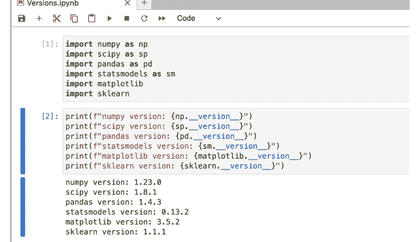

在为本书设置好技术环境后，让我们开始讨论统计学。在接下来的章节中，我们将讨论总体和抽样的概念。我们将通过代码实现来演示抽样策略。

## 总体与样本

通常，统计建模的目标是通过对一个群体进行推断来回答关于该群体的问题。我们进行推断的群体可以是生产工厂中的机器、选举中投票的人，或不同地块上的植物。整个群体，每一个个体项目或实体，被称为 **总体**。在大多数情况下，感兴趣的总体规模如此之大，以至于收集总体中每个实体的数据是不切实际甚至不可能的。例如，以投票为例，可能无法对选举中投票的每个人进行民意调查。即使有可能联系到所有相关选举的选民，许多选民也可能不同意接受调查，这将阻碍对整个总体的数据收集。另一个考虑因素是调查如此庞大群体的费用。这些因素使得在我们的投票调查示例中收集总体统计数据实际上是不可能的。在许多我们可能想要评估总体属性的情况下，都存在这类限制性因素。幸运的是，我们不需要收集整个感兴趣总体的数据。可以使用总体的一个子集对总体进行推断。这个总体的子集称为 **样本**。这是统计建模的主要思想。将使用样本创建一个模型，并对总体进行推断。

为了使用样本对感兴趣的总体进行有效推断，样本必须 *代表* 感兴趣的总体，这意味着样本应包含总体中存在的变异。例如，如果我们有兴趣对田地中的植物进行推断，仅从田地一角取样可能不足以对更大的总体进行推断。整个田地的植物特征可能存在变异。我们可以想到各种可能导致变异的原因。对于这个例子，我们将参考 *图 1.2* 中的一些示例。

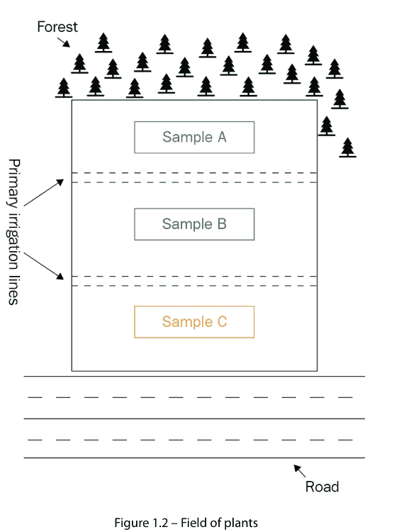

图 1.2 – 植物田地

该图显示 **样本 A** 靠近森林。该样本区域可能受到森林存在的影响；例如，该样本中的一些植物可能比其他样本中的植物接收到更少的阳光。**样本 B** 显示位于主要灌溉线之间。可以想象，该样本平均比其他两个样本接收更多的水，这可能对该样本中的植物产生影响。最后的 **样本 C** 靠近道路。该样本可能受到 **样本 A** 或 **B** 中未见的其他影响。

如果仅从其中一个区域取样，这些样本的推断将是 *有偏的*，并且无法提供关于总体的有效参考。因此，需要从整个田地取样，以创建一个更可能代表植物总体的样本。从总体中取样时，确保抽样方法对可能的问题具有稳健性至关重要，例如前例中的灌溉和遮荫影响。每当从总体中取样时，识别和减轻可能的偏差影响非常重要，因为数据中的偏差会影响您的模型并扭曲您的结论。

在下一节中，将讨论从数据集中抽样的各种方法。另一个考虑因素是样本量。样本量影响我们可以使用的统计工具类型、可以对样本做出的分布假设以及推断和预测的置信度。样本量的影响将在 *第 2 章，数据分布* 和 *第 3 章，假设检验* 中深入探讨。

## 从样本推断总体

当使用统计模型从总体的样本子集对总体进行推断性结论时，研究设计必须考虑其变量中与总体中相似的不确定性程度。这就是本章前面提到的变异。为了恰当地对总体得出推断性结论，任何统计模型都必须围绕一个随机机制构建。围绕这些随机机制构建的研究称为 **随机实验**，它们提供了对相关性和因果关系的理解。

## 随机实验

随机实验有两个主要特征：

- 随机抽样，通俗地称为随机选择
- 处理的随机分配，这是研究的本质

### 随机抽样

随机抽样（也称为随机选择）旨在创建一个代表整体总体的样本，以便统计模型能够很好地泛化总体，从而分配因果结果。为了使随机抽样成功，感兴趣的总体必须明确定义。从总体中抽取的所有样本都必须有被选中的机会。以选民民意调查为例，所有选民都必须愿意接受调查。一旦所有选民都进入抽签，就可以使用随机抽样来为建模选择选民子集。仅从愿意接受调查的选民中抽样会在统计建模中引入抽样偏差，从而导致结果扭曲。在只有部分选民愿意参与的情况下，抽样方法称为 **自选择**。从自选择样本或任何非随机样本中获得和建模的任何信息都不能用于推断。

### 处理的随机分配

处理的随机分配涉及两个动机：

- 第一个动机是了解特定输入变量及其对响应的影响——例如，了解将处理 A 分配给特定个体是否比安慰剂产生更有利的结果。

## 观察性研究

另一种常进行的统计研究类型是**观察性研究**，研究者通过观察已存在的数据来获取信息。观察性研究有助于理解输入变量及其与目标变量和彼此之间的关系，但无法像随机实验那样提供因果关系的理解。观察性研究可能包含随机实验的两个组成部分之一——随机抽样或随机分配处理——但若缺少其中一个组成部分，则无法直接得出推断。进行观察性研究而非随机实验的原因有很多，例如：

- 随机实验成本过高
- 实验存在伦理限制（例如，确定孕期吸烟导致出生缺陷率的实验）
- 使用先前随机实验的数据，从而无需再进行另一项实验

从观察性研究中推导出某种因果关系的一种方法是进行随机抽样和重复分析。重复的随机抽样和分析有助于随时间推移最小化混杂变量的影响。这一概念在*大数据*和*机器学习*的实用性中扮演着重要角色，而这两者在本世纪的许多行业中已变得至关重要。虽然几乎所有可用于观察性分析的工具也可用于随机实验，但本书主要关注观察性分析的工具，因为这在大多数行业中更为常见。

可以说，统计学是一门帮助在存在可量化不确定性时做出最佳决策的科学。所有统计检验都包含一个原假设和一个备择假设。也就是说，假设数据之间没有统计学显著差异（原假设），或者数据之间存在统计学显著差异（备择假设）。术语“统计学显著差异”意味着存在一个基准——或阈值——超过该基准则表明存在显著性。这个基准被称为**临界值**。

应用于该临界值的度量称为**检验统计量**。临界值是基于数据行为（如平均值和变异）量化的静态值，并基于假设。如果存在两种可能的途径来拒绝原假设——例如，我们相信某个输出要么低于平均值，要么高于平均值——则会有两个临界值（这种检验称为**双尾**假设检验），但如果只有一个反对原假设的论点，则只会有一个临界值（这称为**单尾**假设检验）。无论临界值的数量如何，在给定的假设检验中，每个组始终只有一个检验统计量测量值。如果检验统计量超过临界值，则存在统计学上的显著理由支持拒绝原假设，并得出数据中存在统计学显著差异的结论。

理解假设检验可以检验以下内容是有用的：

- 一个变量与另一个变量（例如，在t检验中）
- 多个变量与一个变量（例如，线性回归）
- 多个变量与多个变量（例如，多元方差分析）

在下图中，我们可以直观地看到双尾假设检验中检验统计量与临界值之间的关系。

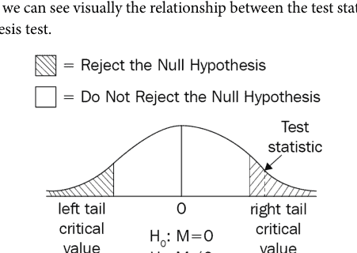

根据该图，我们现在直观地了解了检验统计量超过临界值如何表明应拒绝原假设。

然而，仅使用在假设中将检验统计量与临界值进行比较的方法存在一个问题，即检验统计量可能大得不切实际。当可能存在广泛的结果范围，且这些结果不被认为属于处理效应的范围内时，就可能发生这种情况。无法确定是否可能出现与检验统计量一样极端或更极端的结果。为防止误导性地拒绝原假设，使用了**p值**。p值表示仅由偶然因素导致出现与观察到的值（即表明应拒绝原假设的值）一样极端的值的概率。如果p值相对于显著性水平较低，则可以拒绝原假设。常见的显著性水平为0.01、0.05和0.10。在对假设做出决定之前，评估临界值与检验统计量的关系以及p值是有益的。在*第3章 假设检验*中，当我们开始讨论假设检验时，将对此进行更多讨论。

## 抽样策略——随机、系统、分层和整群抽样

在本节中，我们将讨论研究中使用的不同抽样方法。广义上讲，在现实世界中，由于许多原因，获取总体数据并不容易或不可能。例如，收集数据的成本在金钱和时间上都很昂贵。在许多情况下，收集所有数据是不切实际的，伦理问题也需要考虑。从总体中抽取样本可以帮助我们克服这些问题，并且是收集数据的一种更有效的方式。通过为研究收集适当的样本，我们可以对总体属性得出统计结论或统计推断。推断性统计分析是统计思维的一个基本方面。本节将讨论研究和行业中使用的从概率策略到非概率策略的不同抽样方法。

抽样方法基本上有两种类型：

- 概率抽样
- 非概率抽样

### 概率抽样

在*概率抽样*中，样本是基于概率理论从总体中选择的，或者使用随机选择随机选择。在*随机选择*中，总体中每个成员被选中的机会是相等的。例如，考虑一个游戏，有10张相似的纸片。我们写下数字1到10，每个数字一张纸片。然后将这些数字在一个盒子里打乱。游戏要求从这10张纸片中随机抽取三张。由于纸片是使用相同的过程准备的，任何一张纸片（或数字1到10）被选中的机会对每张纸片都是相等的。总的来说，这10张纸片被视为一个总体，而选出的3张纸片构成一个随机样本。这个例子是我们将在本章讨论的概率抽样方法之一。

### 简单随机抽样

首先，简单随机抽样是一种从总体中随机选择样本的方法。子集（或样本）中的每个成员都有同等机会通过无偏选择方法被选中。当总体的所有成员在重要变量（重要特征）方面具有相似属性时，使用此方法，它是概率抽样最直接的方法。此方法的优点是最大限度地减少偏差并最大化代表性。然而，虽然此方法有助于限制有偏方法，但简单随机抽样存在出错的风险。此方法也有一些局限性。例如，当总体非常大时，可能需要高昂的成本和大量时间。当样本不能代表总体时，需要考虑抽样误差，并且研究需要再次执行此抽样过程。此外，并非总体的每个成员都愿意自愿参与研究，这使得获取代表大总体的良好信息成为一个巨大挑战。之前从10张纸中选择3张纸的例子就是一个简单随机样本。

### 系统抽样

在这里，总体的成员从一个随机起点开始，以固定的抽样间隔进行选择。我们首先通过将总体中的成员数量除以研究进行的样本中的成员数量来选择固定的抽样间隔。然后，在1到抽样间隔的成员数量之间选择一个随机起点。最后，我们通过重复此抽样过程来选择后续成员，直到收集到足够的样本。当成本和时间是研究中需要考虑的主要因素时，此方法比简单随机抽样更快且更可取。另一方面，在简单随机抽样中，总体的每个成员都有同等机会被选中，而在系统抽样中，使用抽样间隔规则从总体中选择一个成员作为研究的样本。可以说，系统抽样比简单随机抽样随机性更低。同样，与简单随机抽样一样，总体的成员属性与重要变量/特征相似相关。让我们通过以下示例讨论如何进行系统抽样。在达拉斯一所高中的一个班级中，有50名学生，但只有10本书可以分发给这些学生。抽样间隔通过将班级中的学生数量除以书本数量（50/10 = 5）来固定。我们还需要生成一个1到50之间的随机数作为随机起点。例如，取数字18。因此，被选中获得书本的10名学生如下：

18, 23, 28, 33, 38, 43, 48, 3, 8, 13

自然会产生一个问题：间隔抽样是否是一个分数。例如，如果我们有13本书，那么抽样间隔将是50/13 ≈ 3.846。然而，我们不能选择这个分数作为代表学生数量的抽样间隔。在这种情况下，我们可以选择数字3或4作为抽样间隔（我们也可以选择3或4中的任何一个作为抽样间隔）。让我们假设生成的随机起点是17。那么，被选中的13名学生是：

17, 20, 24, 27, 31, 34, 38, 41, 45, 48, 2, 5, 9

观察前面的数字序列，在达到数字48之后，由于加4将产生一个大于学生数量（50名学生）的数字，序列在2处重新开始（48 + 4 = 52，但由于50是最大值，我们在2处重新开始）。因此，序列中的最后三个数字是2、5和9，抽样间隔分别为4、3和4（经过数字50并返回数字1，直到我们有13名被选中的学生作为系统样本）。

使用系统抽样时，如果总体的成员列表被组织成与抽样间隔匹配，则存在偏差风险。例如，回到50名学生的案例，研究人员想了解学生对数学课的感受。然而，如果数学最好的学生对应数字2、12、22、32和42，那么如果在随机起点为2且抽样间隔为10的情况下进行调查，则可能存在偏差。

### 分层抽样

这是一种概率抽样方法，基于将总体划分为称为**层**的同质子总体。每个层基于明显不同的属性进行划分，例如性别、年龄、颜色等。这些子总体必须是不同的，以便每个层中的每个成员都有同等机会通过简单随机抽样被选中。*图1.5*说明了如何进行分层抽样以从两个子总体（一组数字和一组字母）中选择样本：

以下代码示例显示了如何使用*图1.5*中所示的示例，使用numpy实现分层抽样。首先，实例被分成各自的层：数字和字母。然后，我们使用numpy从每个层中随机抽样。与之前的代码示例一样，我们使用choice方法进行随机抽样，但每个层的样本大小基于每个层中的实例总数，而不是整个总体中的实例总数；例如，抽样50%的数字和50%的字母：

```python
import numpy as np

# setup generator for reproducibility
random_generator = np.random.default_rng(2020)

population = [
    1, "A", 3, 4,
    5, 2, "D", 8,
    "C", 7, 6, "B"
]
# group strata
strata = {
    'number' : [],
    'string' : [],
}

for item in population:
    if isinstance(item, int):
        strata['number'].append(item)
    else:
        strata['string'].append(item)

# fraction of population to sample
sample_fraction = 0.5
# random sample from strata
sampled_strata = {}

for group in strata:
    sample_size = int(
        sample_fraction * len(strata[group])
    )
    sampled_strata[group] = random_generator.choice(
        strata[group],
        size=sample_size,
        replace=False
    )

print(sampled_strata)

# {'number': array([2, 8, 5, 1]), 'string': array(['D', 'C'],
dtype='<U1')}
```

此方法的主要优点是样本中的关键总体特征能更好地代表所研究的总体，并且与总体成比例。此方法有助于减少样本选择偏差。另一方面，当将总体的每个成员划分为不同的子总体不明显时，此方法变得不可用。

### 整群抽样

在这里，总体被划分为不同的子组，称为群。每个群具有同质特征。不是随机选择每个群中的单个成员，而是随机选择整个群，并且这些群中的每一个都有同等机会被选为样本的一部分。如果群很大，那么我们可以使用前面的一种抽样方法进行**多阶段抽样**，以选择每个群中的单个成员。现在讨论一个整群抽样的例子。一家当地披萨店计划在附近扩展业务。店主想知道有多少人从他的披萨店订购披萨，以及最受欢迎的披萨是什么。然后他将附近划分为不同的区域，并随机选择客户形成整群样本。向选定的客户发送调查问卷，用于他的业务研究。另一个例子与多阶段整群抽样有关。一家零售连锁店进行研究，以查看连锁店中每家商店的表现。商店根据位置划分为子组，然后随机选择样本形成群，并使用样本群作为其商店的绩效研究。此方法简单方便。然而，样本群不能保证代表整个总体。

## 非概率抽样

另一种抽样方法是非概率抽样，其中总体的部分或所有成员没有同等机会被选为样本参与研究。当随机概率抽样无法进行时，使用此方法，并且与概率抽样方法相比，获取数据更快更容易。使用此方法的原因之一是成本和时间考虑。它允许我们通过基于便利性或特定标准的非随机选择轻松收集数据。此方法可能导致比概率抽样方法更高的偏差风险。该方法通常用于探索性和定性研究。例如，如果一组研究人员想了解客户对公司某一产品的看法，他们向购买并使用该产品的客户发送调查问卷。这是获取意见的便捷方式，但这些意见仅来自已经使用过产品的客户。因此，样本数据仅代表一组客户，不能概括为公司所有客户的意见。

## 客户满意度

- [x] 优秀
- [ ] 非常好
- [ ] 好
- [ ] 一般

图 1.6 – 一项调查研究示例

上一个示例是我们在此要讨论的两种非概率抽样方法之一。这种方法是**便利抽样**。在便利抽样中，研究人员从总体中选择最容易接触到的成员来构成样本。这种方法简单且成本低，但将获得的结果推广到整个总体是值得商榷的。

**配额抽样**是另一种非概率抽样类型，它以非随机的方式选择一个样本组，使其代表一个更大的总体。例如，时间有限的招聘人员可以使用配额抽样方法从专业社交网络（LinkedIn、Indeed.com 等）中搜索潜在候选人并进行面试。这种方法具有成本效益且节省时间，但在选择过程中存在偏差。

在本节中，我们概述了概率抽样和非概率抽样。每种策略都有其优缺点，但它们有助于我们最小化风险，例如偏差。一个规划良好的抽样策略也有助于减少预测建模中的错误。

## 总结

在本章中，我们讨论了安装和设置 Python 环境以运行 `Statsmodels` API 和其他必要的开源包。我们还讨论了总体与样本，以及从样本中获得推断的要求。最后，我们解释了统计和机器学习模型中使用的几种不同的常见抽样方法。

在下一章中，我们将开始讨论统计分布及其对构建统计模型的影响。在*第 3 章，假设检验*中，我们将开始深入讨论假设检验，扩展本章*观察性研究*部分中讨论的概念。我们还将讨论功效分析，这是一种根据现有样本数据参数和所需的统计显著性水平来确定样本量的有用工具。

# 2 数据分布

在本章中，我们将涵盖数据和分布的基本方面。我们将首先介绍数据类型和数据分布。在介绍了分布的基本度量之后，我们将描述正态分布及其重要性质，包括中心极限定理。最后，我们将介绍重采样方法（如排列）和转换方法（如对数转换）。本章涵盖了开始统计建模所需的基础知识。

在本章中，我们将涵盖以下主要主题：

- 理解数据类型
- 测量和描述分布
- 正态分布和中心极限定理
- 自举法
- 排列
- 转换

## 技术要求

本章将使用 Python 3.8。

本章的代码可在此处找到 - https://github.com/PacktPublishing/Building-Statistical-Models-in-Python - 在 ch2 文件夹中。

请设置一个虚拟环境或 Anaconda 环境，并安装以下包：

- numpy==1.23.0
- scipy==1.8.1
- matplotlib==3.5.2
- pandas==1.4.2
- statsmodels==0.13.2

## 理解数据类型

在讨论数据分布之前，了解数据类型会很有用。理解数据类型至关重要，因为数据的类型决定了可以使用何种分析，因为数据的类型决定了可以对数据执行哪些操作（这将在本章的示例中变得更加清晰）。数据有四种不同的类型：

- 名义数据
- 顺序数据
- 区间数据
- 比率数据

这些数据类型也可以分为两组。前两种数据类型（名义和顺序）是**定性数据**，通常是数字类别。后两种数据类型（区间和比率）是**定量数据**，通常是数值。

让我们从名义数据开始。

### 名义数据

名义数据是用不同分组标记的数据。例如，以一家标识工厂中的机器为例。工厂从不同供应商采购机器是很常见的，这些机器也会有不同的型号。例如，示例工厂可能有 3 台 **A 型**机器和 5 台 **B 型**机器（见*图 2.1*）。这些机器构成了一组名义数据，其中 **A 型**和 **B 型**是不同的分组标签。对于名义数据，只能执行一种操作：相等。同一组中的每个成员是相等的，而不同组的成员是不相等的。在我们的工厂示例中，一台 **A 型**机器将等于另一台 **A 型**机器，而一台 **B 型**机器将不等于一台 **A 型**机器。

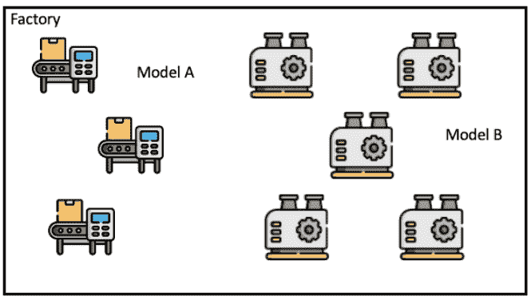

图 2.1 – 工厂中的两组机器

如我们所见，对于这种类型的数据，我们只能将项目分组到标签下。对于下一种数据类型，我们将引入一个新特征：顺序。

### 顺序数据

下一种数据类型类似于名义数据，但表现出顺序。数据可以标记为不同的组，并且这些组可以排序。我们称这种类型的数据为顺序数据。继续工厂示例，假设有一台 **C 型**机器，并且 **C 型**与 **B 型**由同一供应商提供。然而，**C 型**是高性能版本，产生更高的输出。在这种情况下，**B 型**和 **C 型**是顺序数据，因为 **B 型**是输出较低的机器，而 **C 型**是输出较高的机器，这创造了一个自然的顺序。例如，我们可以按性能升序排列型号标签：**B 型**、**C 型**。大学教育水平是顺序数据的另一个例子，包括学士、硕士和博士。如前所述，这种数据类型的新操作是排序，意味着数据可以排序。因此，顺序数据支持顺序和相等。虽然这种数据类型可以按升序或降序排序，但我们不能对数据进行加法或减法运算，这意味着 **B 型 + C 型**不是一个有意义的陈述。我们将讨论的下一种数据类型将支持加法和减法。

### 区间数据

下一种数据类型，区间数据，用于描述存在于区间尺度上但没有明确定义零点的数据。这意味着两个数据点之间的差异是有意义的。以摄氏温度尺度为例。数据点是数值，并且数据点以相等的间隔排列（例如，20 和 40 都与 30 相差 10 度）。

在这个温度尺度的例子中，0 的定义是任意的。对于摄氏度，0 恰好被设定在水的冰点，但这是尺度设计者做出的任意选择。因此，区间数据类型支持相等、顺序和加法/减法。

### 比率数据

最后一种数据类型是比率数据。与区间数据类似，比率数据是有序的数值数据，但与区间数据不同，比率数据具有绝对零点。绝对零点意味着如果比率类型变量的值为零，则该变量不存在或未出现。例如，考虑游乐园游乐设施的等待时间。如果没有人排队等待该游乐设施，则等待时间为 0；新游客可以立即乘坐游乐设施。等待时间没有有意义的负测量值。等待时间为 0 是绝对最小值。比率数据还支持有意义的乘法/除法，使得比率数据成为支持操作最多的数据类型。

## 可视化数据类型

数据可视化是理解分布和识别数据属性的关键步骤。在本章（以及本书中），我们将使用 `matplotlib` 来可视化数据。虽然其他 Python 库也可用于可视化数据，但 `matplotlib` 是 Python 的事实标准绘图库。在本节中，我们将开始使用 `matplotlib` 来可视化前面讨论的四种数据类型。

### 绘制定性数据类型

由于前两种数据类型是分类的，我们将使用条形图来可视化这些数据分布。示例条形图如*图 2.2*所示。

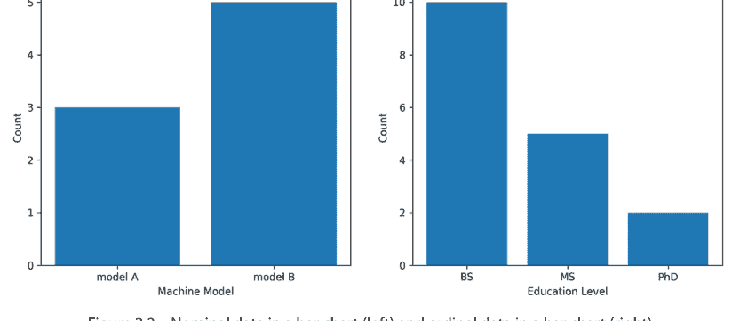

*图 2.2* 中的左侧条形图展示了工厂示例中 **Model A** 机器和 **Model B** 机器的分布情况。右侧条形图则展示了一个工程师团队教育水平的示例分布。请注意，在教育水平条形图中，*x* 轴标签是按照教育水平从低到高排序的。

接下来展示了生成 *图 2.2* 的代码。

该代码包含三个主要部分。

- **库导入：**
  在本例中，我们仅从 `matplotlib` 导入 `pyplot`，并约定俗成地将其导入为 `plt`。

- **数据创建代码：**
  在 `import` 语句之后，有几条语句用于创建我们将要绘制的数据。第一个图的数据存储在两个 Python 列表中：`label` 和 `counts`，它们分别包含机器标签和机器数量。值得注意的是，这两个列表包含相同数量的元素（两个元素）。教育数据的存储方式类似。虽然本例中我们使用的是简单的示例数据，但在后续章节中，我们将介绍检索和格式化数据的额外步骤。

- **数据绘图代码：**
  最后一步是绘制数据。由于本例中我们绘制两组数据，因此使用了 `subplots` 方法，该方法将创建一个绘图网格。`subplots` 的前两个参数是绘图网格的行数和列数。在我们的例子中，行数为 1，列数为 2。`subplots` 方法返回两个对象：图形对象 `fig` 和坐标轴对象 `ax`。第一个返回的对象 `fig` 提供对图形的高级控制，例如保存图形、在新窗口中显示图形等。第二个对象 `ax` 可以是单个坐标轴对象，也可以是坐标轴对象的数组。在我们的例子中，`ax` 是一个坐标轴对象数组——由于我们的网格有两个图，通过索引 `ax` 我们可以获取坐标轴对象。我们使用坐标轴对象的 `bar` 方法来创建条形图。`bar` 方法有两个必需参数。第一个必需参数是标签列表。第二个参数是与每个标签对应的条形高度，这就是为什么两个列表必须具有相同长度的原因。其他三个方法 `set_title`、`set_ylabel` 和 `set_xlabel` 用于设置相应绘图属性的值：`title`、`ylabel` 和 `x-label`。

最后，使用 `fig.show()` 创建图形：

```python
import matplotlib.pyplot as plt
label = ['model A', 'model B']
counts = [3, 5]
edu_label = ['BS', 'MS', 'PhD']
edu_counts = [10, 5, 2]
fig, ax = plt.subplots(1, 2, figsize=(12, 5))
ax[0].bar(label, counts)
ax[0].set_title('Counts of Machine Models')
ax[0].set_ylabel('Count')
ax[0].set_xlabel('Machine Model')
ax[1].bar(edu_label, edu_counts)
ax[1].set_title('Counts of Education Level')
ax[1].set_ylabel('Count')
ax[1].set_xlabel('Education Level')
fig.show()
```

现在让我们看看如何绘制来自其他两种数据类型的数据。

### 绘制定量数据类型

由于最后两种数据类型是数值型的，我们将使用直方图来可视化其分布。*图 2.3* 中展示了两个示例直方图。

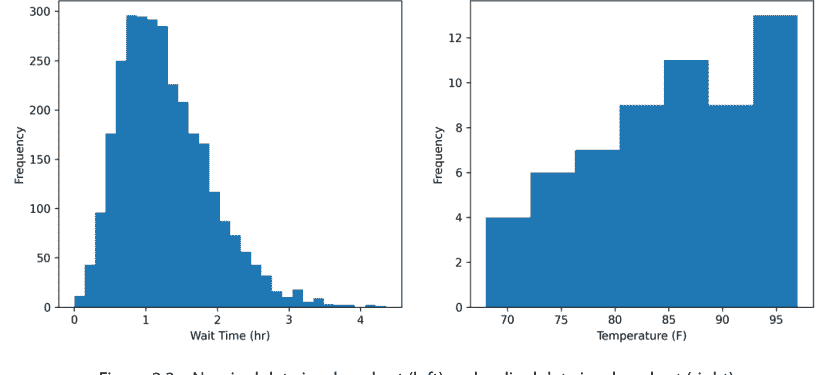

左侧直方图是合成的等待时间数据（比率数据），可能代表游乐园的等待时间。右侧直方图是达拉斯-沃斯堡地区 2022 年 4 月和 5 月的温度数据（区间数据）（数据来源于 https://www.iweathernet.com/texas-dfw-weather-records）。

接下来展示了生成 *图 2.3* 的代码。同样，该代码包含三个主要部分：库导入、数据创建代码和数据绘图代码。

与前面的示例一样，`matplotlib` 被导入为 `plt`。在本例中，我们还从 `scipy` 导入了一个函数；然而，该函数仅用于生成要处理的示例数据，我们在此不会详细讨论。就我们的目的而言，只需将 `skewnorm` 视为生成一个数字数组即可。此代码块与前一个代码块非常相似。

主要区别在于用于绘制数据的方法 `hist`，它创建一个直方图。`hist` 方法有一个必需参数，即要在直方图中绘制的数字序列。本例中使用的第二个参数是 `bins`，它有效地控制了直方图的粒度——分箱越多，粒度越高。直方图的分箱数量可以根据所需的视觉效果进行调整，通常根据绘制的数据通过实验来设置：

```python
from scipy.stats import skewnorm
import matplotlib.pyplot as plt

a = 4
x = skewnorm.rvs(a, size=3000) + 0.5
x = x[x > 0]

dfw_highs = [
    85, 87, 75, 88, 80, 86, 90, 94, 93, 92, 90, 92, 94,
    93, 97, 90, 95, 96, 96, 95, 92, 70, 79, 73, 88, 92,
    94, 93, 95, 76, 78, 86, 81, 95, 77, 71, 69, 88, 86,
    89, 84, 82, 77, 84, 81, 79, 75, 75, 91, 86, 86, 84,
    82, 68, 75, 78, 82, 83, 85]

fig, ax = plt.subplots(1, 2, figsize=(12, 5))
ax[0].hist(x, bins=30)
ax[0].set_xlabel('Wait Time (hr)')
ax[0].set_ylabel('Frequency')
ax[0].set_title('Wait Times');
ax[1].hist(dfw_highs, bins=7)
ax[1].set_title('High Temperatures for DFW (4/2022-5/2022)')
ax[1].set_ylabel('Frequency')
ax[1].set_xlabel('Temperature (F)')
fig.show()
```

在本节中，我们初步了解了数据和分布可能呈现的多样性。由于数据分布在现实世界中呈现出多种形状和大小，因此拥有描述分布的方法非常有用。在下一节中，我们将讨论可用于分布的度量、这些度量的执行方式，以及可以度量的数据类型。

## 度量和描述分布

现实世界中发现的数据分布呈现出多种形状和大小。本节将讨论如何度量分布，以及哪些度量适用于四种数据类型。这些度量将提供比较和对比不同分布的方法。本节讨论的度量可以分为以下几类：

- 集中趋势
- 离散程度
- 形状

这些度量被称为**描述性统计**。本节讨论的描述性统计在数据的统计摘要中常用。

### 度量集中趋势

集中趋势有三种度量类型：

- 众数
- 中位数
- 均值

让我们逐一讨论。

#### 众数

我们将讨论的第一个集中趋势度量是众数。数据集的众数就是最常出现的实例。以工厂中的机器为例（见 *图 2.1*），数据集的众数将是 Model B。在该示例中，有 3 台 Model A 和 5 台 Model B，因此 Model B 是最常见的——即众数。

数据集可以是以下类型之一：

- 单峰——有一个众数
- 多峰——有多个众数

在前面的示例中，数据是单峰的。

再次使用工厂示例，让我们假设存在 3 台 **Model A**、5 台 **Model B** 和 5 台 **Model D**（一种新型号）。那么，数据集将有两个众数：**Model B** 和 **Model D**，如 *图 2.4* 所示。

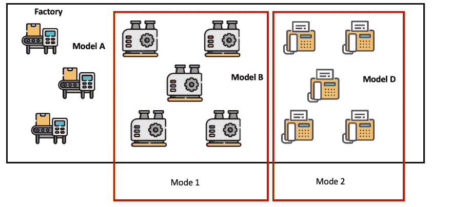

图 2.4 – 工厂中机器的多峰分布

因此，该数据集是多峰的。

> **众数与数据类型**
> 这些众数示例使用了名义数据，但所有四种数据类型都支持众数，因为所有四种数据类型都支持相等性操作。

虽然众数指的是最常见的实例，但在连续数据的多峰情况下，“众数”一词通常在不太严格的意义上使用。例如，*图 2.5* 中的分布通常会被称为多峰分布，即使分布的峰值幅度并不相同。然而，对于名义数据和顺序数据，在指代分布的峰态时，更常见的是使用更严格的“最常见”定义。

#### 中位数

下一个中心趋势度量是中位数。中位数是将数值按顺序排列后位于中间的值。

> **中位数与数据类型**
> 此度量可用于顺序数据、区间数据和比率数据，但不适用于名义数据。

我们将在此讨论两种情况。

##### 当实例数量为奇数时求中位数

在*图2.6*中展示了如何求某些数值数据的中位数。数据先被排序，然后确定中位数。

在前面的例子中，实例数量为奇数（7个实例），因此存在一个中心值。然而，如果实例数量为偶数，就无法简单地在排序后取中间的数字。

##### 当实例数量为偶数时求中位数

当实例数量为偶数时，取两个最中间值的平均值。与众数不同，同一组数据不存在多个中位数的概念。*图2.7*展示了一个实例数量为偶数（8个实例）的例子。

原始数据 85, 99, 70, 71, 86, 88, 94, 105
排序后 70, 71, 85, 86, 88, 94, 99, 105
最中间的两个数 86 88
平均值 87

现在，让我们看看如何使用numpy计算数据集的中位数。与scipy类似，numpy包含用于计算描述性统计量的函数。我们将计算前面例子中列出的八个数字的中位数：

```python
import numpy as np
values = [85, 99, 70, 71, 86, 88, 94, 105]
median = np.median(values)
print(f"The median value is {median:.2f}")
# The median value is 87.00
```

中位数的计算结果如预期为87。请注意，中位数函数返回一个单一值，这与前面代码示例中的众数函数不同。

#### 均值

下一个中心趋势度量是均值，通常被称为平均值。均值由以下公式定义：

$$\bar{x} = \frac{\sum_{i=0}^{n} x_i}{N}$$

让我用文字解释这个公式。要计算均值，我们必须将所有值相加，然后将总和除以值的数量。请参考以下示例。首先将7个数字相加，总和为593。然后将此总和除以实例数量，得到84.7的值。

请注意，这些值的均值和中位数（分别为84.7和86）并不相同。一般来说，均值和中位数不会是相同的值，但在某些特殊情况下，均值和中位数会趋于一致。

> **均值与数据类型**
> 关于支持的数据类型，均值对区间数据和比率数据有效，因为这些值可以相加。

现在，我们将看看如何使用numpy计算均值。以下代码示例展示了如何计算前面示例中数值的均值：

```python
import numpy as np
values = [85, 99, 70, 71, 86, 88, 94]
mean = np.mean(values)
print(f"The mean value is {mean:.1f}")
# The mean value is 84.7
```

与中位数函数类似，均值函数也返回一个单一数字。

在结束关于中心趋势度量的这一节之前，值得讨论一下均值和中位数在各种情况下的使用。如前所述，中位数和均值通常是不同的值。这是由分布形状驱动的一种效应。

> **形状对均值和中位数的影响**
> 如果分布是对称的，均值和中位数将趋于一致。然而，如果分布不对称，均值和中位数将会发散。

度量发散的程度取决于分布的不对称程度。*图2.6*给出了四个示例分布来展示这种效应。分布1和2显示均值被拉向比中位数更高的值。均值被拉向绝对值较大的值。这是均值的一个重要效应，当数据集包含（或可能包含）**异常值**（通常称为离群值或影响点）时需要注意，这些异常值往往会将均值拉向它们的方向。与均值不同，如果异常值占数据的比例较小，中位数不受异常值的影响。异常值将在*度量变异性*部分进一步讨论。

分布的下一个度量类别是变异性度量。

### 度量变异性

变异性，我们本质上指的是分布的宽度。此类别中的度量如下：

- 极差
- 四分位距
- 图基围栏
- 方差

让我们逐一讨论。

#### 极差

极差就是分布中最大值和最小值之间的差。与均值一样，极差会受到异常值的影响，因为它依赖于最大值和最小值。然而，还有另一种变异性方法，与中位数类似，对异常值的存在具有稳健性。

让我们看看如何使用numpy代码计算极差：

```python
import numpy as np
values = [85, 99, 70, 71, 86, 88, 94, 105]
max_value = np.max(values)
min_value = np.min(values)
range_ = max_value - min_value
print(f"The data have a range of {range_}"
      f" with max of {max_value}"
      f" and min of {min_value}")
# The data have a range of 35 with max of 105 and min of 70
```

虽然numpy没有一个range函数，但可以使用numpy提供的min和max函数来计算极差。

#### 四分位距

下一个变异性度量是通过排序数据，然后将数据分成四个相等的部分来确定的。这四个部分的边界是四分位数，分别称为：

- 下四分位数（Q1）
- 中四分位数（Q2）
- 上四分位数（Q3）

四分位数的示例如下所示。与中位数类似，只要异常值占数据集的比例较小，四分位数对异常值也具有稳健性。请注意，中四分位数实际上就是中位数。一个比*极差*部分讨论的普通极差对异常值更不敏感的调整范围度量是中四分位数，即**四分位距**（IQR）。IQR是上四分位数和下四分位数之差（Q3 - Q1）。虽然这个范围对异常值不那么敏感，但它只包含50%的数据。因此，四分位距可能*对数据的总变异性代表性较低*。

我们可以使用`numpy`和`scipy`来计算四分位数和IQR范围。在以下代码示例中，我们使用`quantiles`函数来计算四分位数。我们不会在此讨论`quantiles`，只是提到`quantiles`是一种泛化，可以将数据分成任意数量的相等部分。由于我们将数据分成四个相等部分以计算四分位数，因此用于计算的`quantiles`值为0.25、0.5和0.75。然后可以使用四分位数Q1和Q3来计算IQR。但是，我们也可以使用`scipy`中的`iqr`函数来进行计算：

```python
import numpy as np
from scipy import stats
values = [85, 99, 70, 71, 86, 88, 94]
quartiles = np.quantile(values, [0.25, 0.5, 0.75],
    method="closest_observation")
print(f"The quartiles are Q1: {quartiles[0]},"
    f" Q2: {quartiles[1]}, Q3: {quartiles[2]}")
iqr = stats.iqr(values, interpolation='closest_observation')
print(f"The interquartile range is {iqr}")
# The quartiles are Q1: 71, Q2: 85, Q3: 88
# The interquartile range is 17
```

请注意`quantiles`函数和`iqr`函数中分别使用了`method`和`interpolation`关键字参数。这些关键字参数可以使用多种选项，从而导致不同的结果。

四分位数通常用箱线图可视化。图2.11展示了箱线图的主要组成部分。箱线图由两个主要部分构成：

- 箱体
- 须线

箱体部分代表了由四分位距（IQR）包含的50%数据。须线从箱体边缘开始绘制，长度为 k * IQR，其中 k 通常选择为1.5。任何超出须线的值都被视为异常值。

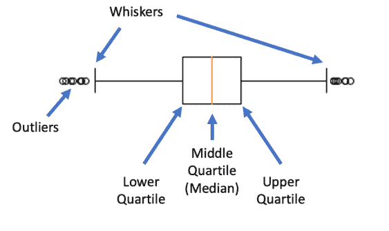

图2.12展示了直方图和箱线图如何可视化对称分布和非对称分布的变异性。注意非对称数据的箱线图在左侧被压缩，在右侧被拉伸，而另一个箱线图则明显对称。虽然箱线图对于可视化数据的对称性和异常值的存在很有用，但分布的模态（峰数）并不明显。

### 数据分布

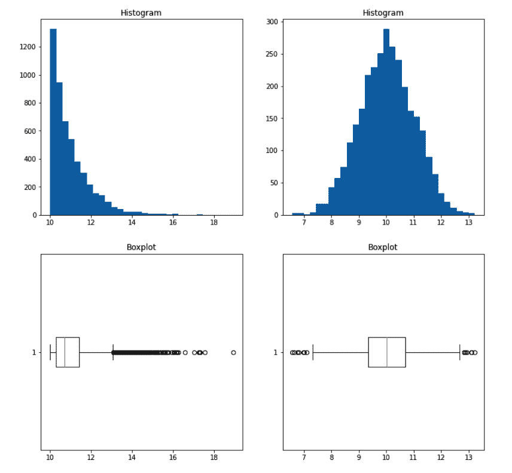

在探索性分析中，通常会使用多种可视化方法，因为每种可视化方法都有其自身的优缺点。使用多种可视化方法很常见，因为每种可视化方法都有其自身的优缺点。

## 图基围栏

在前面关于度量的几节中，异常值的概念已经出现了几次。异常值是与主要分布相比不典型的值，或异常值。虽然有方法将数据点分类为异常值，但没有一种普遍稳健的方法来将数据点分类为异常值。定义异常值通常应根据数据分析的用例来确定，因为根据应用领域会有不同的因素需要考虑。然而，值得一提的是箱线图示例中展示的常用技术，称为图基围栏。下图基围栏和上图基围栏基于四分位距（IQR），定义如下：

- 下围栏：$Q1 - k(IQR)$
- 上围栏：$Q3 + k(IQR)$

如前所述，k 通常选择为1.5作为默认值，但对于给定的应用领域，可能存在更合适的值。

现在让我们看看如何使用 numpy 和 scipy 计算图基围栏。这个代码示例将基于前面的示例，因为没有直接计算围栏的函数。我们将再次使用 numpy 和 scipy 计算四分位数和四分位距。然后，我们将这些操作应用于前面方程中列出的值：

```python
import numpy as np
from scipy import stats
values = stats.norm.rvs(10, size=3000)
q1, q3 = np.quantile(values, [.25, .75],
    method='closest_observation')
iqr = stats.iqr(values, interpolation='closest_observation')
lower_fence = q1 - iqr * 1.5
upper_fence = q3 + iqr * 1.5
# may vary due to randomness in data generation
print(f"The lower fence is {lower_fence:.2f} and the upper fence is {upper_fence:.2f}")
# The lower fence is 7.36 and the upper fence is 12.67
```

在这种情况下，我们同时使用了 numpy 和 scipy；然而，scipy 的计算可以用前面提到的 Q3-Q1 来替代。

## 方差

本节将介绍的最后一个变异性度量是方差。方差是一种离散度度量，可以理解为数字相对于平均值的*分散*程度。方差的公式，记为 $S^2$，如下所示：

$$S^2 = \frac{\sum(x_i - \bar{x})^2}{N - 1}$$

在这个方程中，项 $(x_i - \bar{x})$ 被视为与均值的偏差，这引出了另一个与方差密切相关的度量——标准差，它是方差的平方根。标准差的公式，记为 $\sigma$，如下所示：

$$\sigma = \sqrt{S^2} = \sqrt{\frac{\sum(x_i - \bar{x})^2}{N - 1}}$$

一般来说，更宽的分布会有更大的方差和更大的标准差，但这些值不像范围或四分位距那样容易解释。这些概念将在下一节中更详细地介绍，在正态分布的背景下，这将为这些值的度量提供更清晰的直观理解。

同样，这些值将使用 `numpy` 通过代码计算。方差和标准差的函数分别是 `var` 和 `std`：

```python
import numpy as np
values = [85, 99, 70, 71, 86, 88, 94]
variance = np.var(values)
standard_dev = np.std(values)
print(f"The variance is {variance:.2f} and the standard deviation is {standard_dev:.2f}")
# The variance is 101.06 and the standard deviation is 10.05
```

### 形状度量

下一类度量与分布的形状有关。它们如下：

- 偏度
- 峰度

让我们逐一讨论。

#### 偏度

第一个度量是偏度。简而言之，偏度是不对称性的度量[1]。偏态分布的一个例子如*图2.13*所示。

有两种类型的偏态分布：

- 左偏
- 右偏

分布向主导尾部的方向偏斜，这意味着具有右侧主导尾部的分布是右偏的，而具有左侧主导尾部的分布是左偏的（如*图2.13*所示）。

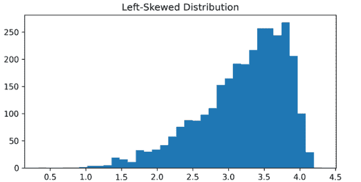

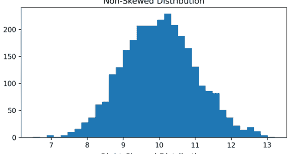

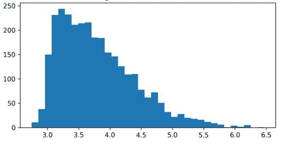

图2.13 – 展示偏度的分布

偏度的公式此处不展示，因为使用现代软件包可以轻松计算。偏度计算的输出可用于确定偏度和偏斜方向。如果偏度值为0或接近0，则分布不表现出强偏度。如果偏度为正，则分布为右偏；如果偏度值为负，则分布为左偏。偏度值的绝对值越大，分布表现出的偏度越强。以下代码示例展示了如何使用 *scipy* 计算偏度：

```python
from scipy.stats import skewnorm, norm
from scipy.stats import skew as skew_calc
# generate data
skew_left = -skewnorm.rvs(10, size=3000) + 4
skew_right = skewnorm.rvs(10, size=3000) + 3
symmetric = norm.rvs(10, size=3000)
# calculate skewness
skew_left_value = skew_calc(skew_left)
skew_right_value = skew_calc(skew_right)
symmetric_value = skew_calc(symmetric)
# Output may vary some due to randomness of generated data
print(f"The skewness value of this left skewed distribution is {skew_left_value:.3f}")
print(f"The skewness value of this right skewed distribution is {skew_right_value:.3f}")
print(f"The skewness value of this symmetric distribution is {symmetric_value:.3f}")
```

本节涵盖的另一个形状度量是峰度。

#### 峰度

峰度是衡量分布尾部相对于正态分布的轻重程度的度量[2]。虽然正态分布尚未深入介绍，但仍然可以讨论峰度的概念。轻尾分布意味着更多数据位于分布的众数附近或周围。相反，重尾分布意味着更多数据位于分布的边缘，而不是众数附近。轻尾分布、正态分布和重尾分布如*图2.14*所示。

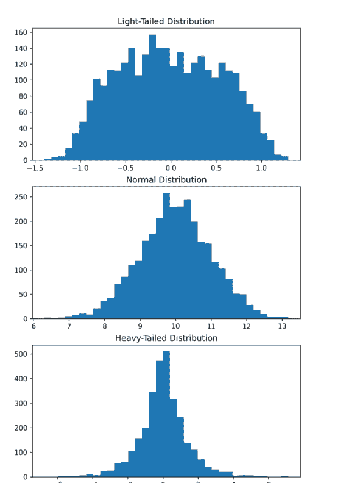

图2.14 – 展示相对于正态分布的尾部特征的分布

峰度的公式此处不展示，因为使用现代软件包可以轻松计算。如果峰度值为0或接近0，则分布不表现出峰度。如果峰度值为负，则分布表现出轻尾性；如果峰度值为正，则分布表现出重尾性。以下代码示例展示了如何使用 `scipy` 计算峰度：

```python
from scipy.stats import norm
from scipy.stats import gennorm
from scipy.stats import kurtosis
# generate data
```

light_tailed = gennorm.rvs(5, size=3000)
symmetric = norm.rvs(10, size=3000)
heavy_tailed = gennorm.rvs(1, size=3000)
# 计算峰度
light_tailed_value = kurtosis(light_tailed)
heavy_tailed_value = kurtosis(heavy_tailed)
symmetric_value = kurtosis(symmetric)
# 由于生成数据的随机性，输出结果可能会略有不同
print(f"该轻尾分布的峰度值为 {light_tailed_value:.3f}")
print(f"该重尾分布的峰度值为 {heavy_tailed_value:.3f}")
print(f"该正态分布的峰度值为 {symmetric_value:.3f}")

在本节中，我们介绍了用于衡量和描述数据分布的常用描述性统计量。这些度量提供了一种用于描述和比较分布的通用语言。本章讨论的概念是后续章节中许多概念的基础。在下一节中，我们将讨论正态分布，并使用这些度量来描述正态分布。

## 正态分布与中心极限定理

在讨论正态分布时，我们指的是钟形的**标准正态分布**，它在形式上与**高斯分布**同义，后者以18至19世纪的数学家和物理学家卡尔·弗里德里希·高斯的名字命名。高斯在众多贡献中，包括了近似概念，并于1795年发明了最小二乘法和正态分布，后者在统计建模技术（如最小二乘回归）中被广泛使用[3]。标准正态分布，也称为**参数**分布，其特征是数据点围绕均值对称分布，且离散概率一致——即数据出现在均值附近的频率高于远离均值的数据。由于该分布内的位置数据遵循概率定律，我们可以称之为**标准正态概率分布**。顺便提一下，统计学中非概率分布是通过基于非随机选择的非概率抽样生成的，而概率分布则基于随机抽样。基于概率和非概率的分布都可以具有标准正态分布。标准正态分布既不偏斜也不具有峰度。它在整个范围内方差相等，并且在自然界中频繁出现。**经验法则**用于描述该分布具有围绕均值μ的三个相关标准差。关于该分布有两个不同的假设：

- 第一、第二和第三个标准差分别包含68%、95%和99.7%的离散测量值
- 均值、中位数和众数彼此相等

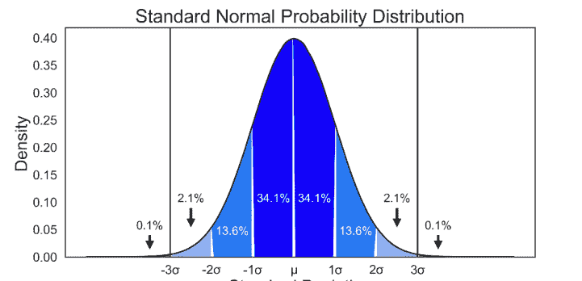

图2.15 – 标准正态分布

正态分布的两种常见形式如下：

- 概率密度分布
- 累积密度分布

如前所述，概率密度分布基于随机抽样，而累积密度分布基于累积数据，这些数据不一定是随机的。

标准正态分布的双尾概率密度函数如下：

$$f(x) = \frac{e^{-\frac{(x-\mu)^2}{2\sigma^2}}}{\sigma\sqrt{2\pi}}$$

标准正态分布的左尾累积函数如下：

$$f(x) = \int_{-\infty}^{x} \frac{e^{-\frac{x^2}{2}}}{\sqrt{2\pi}}$$

在统计建模方面，正态分布代表平衡和对称。这在构建统计模型时很重要，因为许多模型假设正态分布，并且对于偏离该假设的许多情况并不稳健，因为它们是围绕均值构建的。因此，如果此类模型中的变量不是正态分布的，模型的误差将会增加且不一致，从而降低模型的稳定性。在考虑统计模型中的多个变量时，当两者都是正态分布时，它们的交互作用更容易近似。

在下面的*图2.16*中，左侧图中，变量X和Y相互作用，并围绕均值产生集中的离散。在这种情况下，可以使用均值线或线性距离合理地使用X对Y进行建模。然而，如果两个变量的分布是偏斜的，如右侧图所示，这将导致两者之间的方差不恒定，从而导致误差分布不均和输出不可靠。

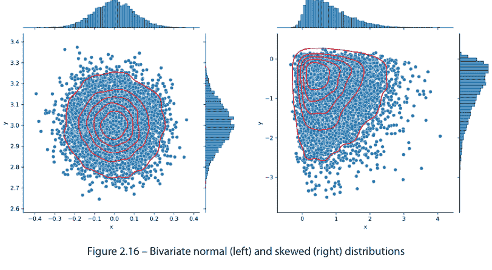

对于线性分类和回归模型，这意味着某些结果会比其他结果更好，而某些结果可能非常糟糕。有时使用基本模型指标很难评估这一点，需要更深入的模型分析，以防止信任可能最终具有误导性的结果。此外，部署到生产环境中将非常有风险。更多相关内容将在*第6章*中讨论。

### 中心极限定理

在抽样数据时，经常会遇到非正态数据的问题。这可能有多种原因，例如总体不具有正态分布或样本不能代表总体。中心极限定理在统计推断中很重要，它假设如果从具有特定均值μ和**标准差σ**的总体中抽取*n*个观测值的随机样本，则由随机选择的子样本分布的均值构建的抽样分布将近似于具有大致相同均值μ和标准差（计算为$\sqrt{\frac{\sum(x_i - \mu)^2}{N}}$）的正态分布。下一节将使用自助法来演示中心极限定理的实际应用。后面讨论转换的部分将提供重塑不符合正态分布的数据分布的技术，以便仍然可以有效地应用需要正态分布的工具。

### 自助法

自助法是一种重采样方法，它使用随机抽样——通常是有放回抽样——通过对抽样子集进行重采样来生成关于总体的统计估计，例如：

- 置信区间
- 标准误差
- 相关系数（皮尔逊相关系数）

其思想是，重复抽样样本分布的不同随机子集并每次取平均值，在足够多的重复次数下，将开始使用每个子样本的平均值来近似真实总体。这直接遵循中心极限定理的概念，重申一下，该定理断言，随着样本量和数量的增加，抽样均值开始近似于以原始分布均值为中心的正态抽样分布。当分布中相对于特定测试所需的样本数量有限，但需要推断时，自助法非常有用。

如*第1章，抽样与泛化*中所讨论的，时间和费用等限制是获取样本而非总体的常见原因。由于自助法的基本概念是使用样本对总体进行假设，因此将此技术应用于总体并无益处，因为总体的真实统计参数（如百分位数和方差）是已知的。关于样本准备，样本中的属性平衡应代表总体的真实近似。否则，结果可能会产生误导。例如，如果动物园内物种的总体是40%爬行动物和60%哺乳动物的划分，并且我们想要自助法分析它们的寿命以确定其寿命的置信区间，则有必要确保应用自助法的数据集包含40%爬行动物和60%哺乳动物的划分；例如，15%爬行动物和85%哺乳动物的划分将导致误导性结果。换句话说，样本分层应按比例与总体保持平衡。

### 置信区间

如前所述，自助法的一个有用应用是在数据稀疏或有限的数据集周围创建置信区间——也就是说，数据集的值范围很广但样本不多。考虑一个使用`statsmodels`中“Duncan”数据集进行假设检验的自助法示例，该数据集包含按职业、类型、教育和声望划分的收入。虽然这是完整的数据集，但由于未提及抽样方法，且不太可能考虑所有职业和类型的所有工人的所有收入，因此将此数据集视为样本。要获取数据集，我们首先加载`matplotlib`、`statsmodels`、`pandas`和`numpy`库。然后下载数据集并将其存储为`pandas` DataFrame，赋值给变量`df_duncan`。接着，我们将“prof”、“wc”和“bc”类型分别重新编码为“professional”、“white-collar”和“blue collar”。最后，我们创建两个独立的`pandas` DataFrame；一个用于专业工作类型，另一个用于蓝领工作类型，因为这两个子集将是我们使用自助法进行分析的对象：

```python
import matplotlib.pyplot as plt, statsmodels.api as sm, pandas as pd,
    numpy as np, scipy.stats
df_duncan = sm.datasets.get_rdataset("Duncan",
    "carData").data
df_duncan.loc[df_duncan['type'] == 'prof',
    'type'] = 'professional'
df_duncan.loc[df_duncan['type'] == 'wc',
    'type'] = 'white-collar'
df_duncan.loc[df_duncan['type'] == 'bc',
    'type'] = 'blue-collar'
df_professional = df_duncan.loc[(df_duncan['type'] == 'professional')]
df_blue_collar = df_duncan.loc[(df_duncan['type'] == 'blue-collar')]
```

| | 类型 | 收入 | 教育 | 声望 |
|---|---|---|---|---|
| 会计师 | 专业 | 62 | 86 | 82 |
| 飞行员 | 专业 | 72 | 76 | 83 |
| 建筑师 | 专业 | 75 | 92 | 90 |
| 作家 | 专业 | 55 | 90 | 76 |
| 化学家 | 专业 | 64 | 86 | 90 |

图 2.17 – 显示 statsmodels Duncan 数据前五行的表格

接下来，我们构建一组绘图函数。在`plot_distributions()`中，我们设定 p=5，这意味着 p 值在 0.05 的显著性水平下是显著的（1.00 - 0.05 = 0.95，因此是 95% 置信度）。然后我们将此值除以 2，因为这是一个双侧检验，意味着我们想知道完整的区间而不仅仅是一个边界（在*第 1 章*中作为代表性检验统计量讨论过）。关于绘图，我们使用 matplotlib 中的直方图（`hist()`函数）可视化数据，然后使用`axvline()`函数绘制 95% 的抽样置信区间，这些函数是使用 numpy 函数`percentile()`构建的。

> **自助法中的百分位数**
> 当应用于原始数据时，百分位数仅是百分位数本身，但当应用于自助抽样分布时，它就是置信区间。

简单来说，95% 的置信区间意味着每抽取 100 个样本均值，其中 95 个将落在此区间内。在 numpy 的`percentile()`函数中，我们使用 p=5 来支持 1-p 是置信水平，其中 *p* 是显著性水平（想想 *p 值*，任何等于或低于 *p* 的值都是显著的）。由于检验是双尾的，我们将 *p* 除以 2，并在左尾和右尾各分配 2.5，因为我们有一个对称的标准正态分布。`subplot(2, 1, ...)`代码创建两行一列。图形的轴 0 用于专业收入，轴 1 用于蓝领收入：

```python
def plot_distributions(n_replicas, professional_sample, blue_collar_sample, professional_label, blue_collar_label, p=5):
    fig, ax = plt.subplots(2, 1, figsize=(10,8))
    ax[0].hist(professional_sample, alpha=.3, bins=20)
    ax[0].axvline(professional_sample.mean(),
        color='black', linewidth=5)
# 抽样分布均值
    ax[0].axvline(np.percentile(professional_sample, p/2.),
        color='red', linewidth=3, alpha=0.99)
# 95% CI 下限（如果使用自助法）
    ax[0].axvline(np.percentile(professional_sample,
        100-p/2.), color='red', linewidth=3, alpha=0.99)
# 95% CI 上限（如果使用自助法）
    ax[0].title.set_text(str(professional_label) +
        "\nn = {} Resamples".format(n_replicas))
    ax[1].hist(blue_collar_sample, alpha=.3, bins=20)
    ax[1].axvline(blue_collar_sample.mean(), color='black',
        linewidth=5) # 抽样分布均值
    ax[1].axvline(np.percentile(blue_collar_sample, p/2.),
        color='red', linewidth=3, alpha=0.99)
# 95% CI 下限（如果使用自助法）
    ax[1].axvline(np.percentile(blue_collar_sample,
        100-p/2.), color='red', linewidth=3, alpha=0.99)
# 95% CI 上限（如果使用自助法）
    ax[1].title.set_text(str(blue_collar_label) +
        "\nn = {} Resamples".format(n_replicas))
    if n_replicas > 1:
        print("Lower confidence interval limit: ",
            np.percentile(round(professional_sample,4),
            p/2.))
        print("Upper confidence interval limit: ",
            np.percentile(round(professional_sample,4),
            100-p/2.))
        print("Mean: ", round(professional_sample,
            4).mean())
        print("Standard Error: ",
            round(professional_sample.std() /
            np.sqrt(n_replicas), 4) )
        print("Lower confidence interval limit: ",
            np.percentile(round(blue_collar_sample,4),
            p/2.))
        print("Upper confidence interval limit: ",
            np.percentile(round(blue_collar_sample,4),
            100-p/2.))
        print("Mean: ", round(blue_collar_sample,4).mean())
        print("Standard Error: ",
            round(blue_collar_sample.std() /
            np.sqrt(n_replicas), 4) )
    else:
        print("At least two samples required to create the following
statistics:\nConfidence Intervals\nMean\nStandard Error")
```

在原始数据集中，专业工作类型有 18 个收入数据点，蓝领工作类型有 21 个数据点。专业工作类型的 95% 置信区间范围是 29.50 到 79.15，平均值为 60.06。蓝领工作类型的区间范围是 7.00 到 64.00，平均值为 23.76。根据图 2.18，收入差异之间存在合理的重叠，这导致了置信区间的重叠。因此，可以合理地假设蓝领和专业工作类型之间的收入没有统计学上的显著差异。然而，这个数据集的样本量非常有限：

```python
n_replicas=0
plot_distributions(n_replicas=n_replicas,
professional_sample=df_professional['income'],
    blue_collar_sample=df_blue_collar['income'],
    professional_label="Professional",
    blue_collar_label="Blue Collar")
```

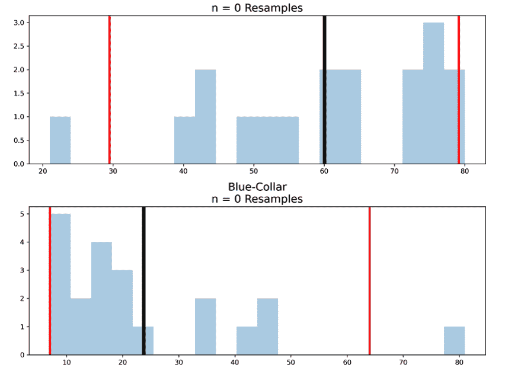

图 2.18 – 带有第 95 百分位线的原始数据分布

在接下来的代码中，使用`pandas`的`.sample()`函数，我们从每个分布中随机重采样 50%（`frac=0.5`）的收入值 1,000 次，并每次计算一个新的均值，将其附加到以`_bootstrap_means`结尾的 Python 列表中。使用这些列表，我们推导出新的 95% 置信区间。*图 2.19* 显示，考虑到数据集中的标准差和收入值，使用每个重采样子集的平均值绘制的新样本分布。`replace=True`参数允许重复采样同一条记录（如果随机发生这种情况），这是自助法的要求。

执行自助法程序后，我们可以看到收入开始大致呈标准正态（高斯）形式分布。值得注意的是，从这个实验来看，置信区间不再重叠。专业组和蓝领组之间置信区间的分离意味着，以 95% 的置信水平，可以证明两种工作类型的收入之间存在统计学上的显著差异。专业收入水平的置信区间现在是 48.66 到 69.89，平均值为 60.04，而蓝领的置信区间是 14.60 到 35.90，平均值为 23.69：

n_replicas = 1000
professional_bootstrap_means = pd.Series(
    [df_professional.sample(frac=0.5, replace=True)
    ['income'].mean() for i in range(n_replicas)])
blue_collar_bootstrap_means = pd.Series(
    [df_blue_collar.sample(frac=0.5, replace=True)
    ['income'].mean() for i in range(n_replicas)])

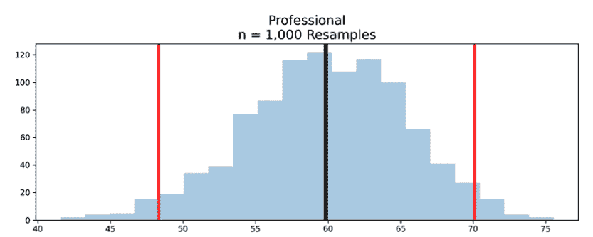

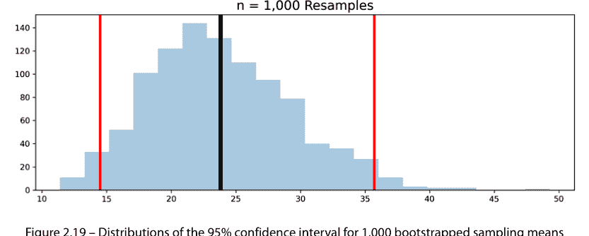

图 2.19 – 1,000 次自助抽样均值的 95% 置信区间分布

在这里，你可以注意到分布更紧密地聚集在均值周围，置信区间也更窄。

如前所述，自助法可用于获取分布的不同统计参数，而不仅仅是置信区间。

### 标准误差

另一个常用的指标是标准误差，$\frac{\sigma}{\sqrt{n}}$。我们可以使用最后的变量 `professional_bootstrap_means` 和 `blue_collar_bootstrap_means` 来计算它，因为这些变量包含了通过自助过程获得的新均值分布。我们还可以看到，标准误差——通过将标准差除以样本数量的平方根（在我们的例子中是 `n_replicas`，代表从每个随机重抽样中获得的平均值的数量）计算得出——随着重抽样数量的增加而减少。我们使用以下代码来计算专业和蓝领类型收入自助均值的标准误差。下表 *图 2.20* 显示了标准误差随着 $n$ 的增加而减少：

```
scipy.stats.sem(professional_bootstrap_means)
scipy.stats.sem(blue_collar_bootstrap_means)
```

| n | 专业标准误差 | 蓝领标准误差 |
|---|---|---|
| 10 次重抽样 | 0.93 | 2.09 |
| 10,000 次重抽样 | 0.03 | 0.04 |

图 2.20 – n = 10 和 n = 10,000 次自助重抽样的标准误差表

自助法的另一个用例是皮尔逊相关系数，我们将在下一节讨论。

### 相关系数（皮尔逊相关）

通常，使用小样本量很难找到相关性，因为相关性取决于两个变量的协方差。当变量重叠更显著时，它们的相关性更高。然而，如果重叠是小样本量或抽样误差的结果，这种相关性可能具有代表性。*图 2.21* 显示了不同自助子样本数量的相关性表。随着分布形成更自然的区分，相关性从弱正相关减弱到接近零的值。

要测试原始数据集中 10 条记录的样本的相关性，请参见以下内容：

```
df_prof_corr = df_professional.sample(n=10)
df_blue_corr = df_blue_collar.sample(n=10)
corr, _ = scipy.stats.pearsonr(df_prof_corr['income'],
    df_blue_corr['income'])
```

要测试自助均值样本的相关性：

```
n_replicas = n_replicas
professional_bootstrap_means = pd.Series([df_prof_corr.
sample(frac=0.5,replace=False).income.mean()for i in range(n_
replicas)])
blue_collar_bootstrap_means = pd.Series([df_blue_corr.sample(frac=0.5,
replace=False).income.mean() for i in range(n_replicas)])
corr, _ = scipy.stats.pearsonr(
    professional_bootstrap_means,
    blue_collar_bootstrap_means)
print(corr)
```

| n | 皮尔逊相关系数 |
| :--- | :---: |
| 原始数据中的 10 个样本 | 0.32 |
| 10 次重抽样 | 0.22 |
| 10,000 次重抽样 | -0.003 |

图 2.21 – 皮尔逊相关系数表及原始样本

通常运行大约 1,000 到 10,000 次自助重抽样。然而，这取决于被自助的数据类型。例如，如果对来自人类基因组序列数据集的数据进行自助，对样本进行 1000 万次自助可能很有用，但如果对简单数据集进行自助，进行 1,000 次或更少的自助可能就足够了。最终，研究人员应该对均值的分布进行目视检查，以确定结果是否与预期相符。与统计学一样，最好具备一些领域知识或主题专业知识来帮助验证发现，因为这很可能是决定自助重复次数的最佳依据。

自助法也用于机器学习，它是 **自助聚合**（也称为 **装袋**）概念的基础，该过程结合了基于自助子样本分布构建的预测模型的输出。**随机森林** 是执行此操作的一种流行算法。装袋算法中自助法的目的是保留非参数（稍后章节将讨论更多）分类的低偏差行为，同时减少方差，从而使用自助法作为最小化建模误差中偏差-方差权衡重要性的一种方式。

在下一节中，我们将考虑另一种非参数检验，称为使用重抽样数据的置换检验。

### 置换

在深入探讨这种检验分析之前，我们将回顾一些关于排列和组合的基础知识。

#### 排列和组合

排列和组合是两种数学技术，用于从总体中取出一组对象来创建子集，但方式不同。在排列中，对象的顺序很重要，而在组合中则不重要。

为了更容易理解这些概念，我们将考虑两个例子。晚会上有 10 个人。晚会的组织者想随机给 3 个人颁发 3 个奖品，分别是 1,000 美元、500 美元和 200 美元。问题是 *有多少种分配奖品的方式*？另一个例子是组织者将给晚会上的 10 个人中的 3 个人颁发 3 个价值 500 美元的相同奖品。组织者真的不在乎这 3 个被选中的人中谁得到哪个奖品。Huy、Paul 和 Stuart 是我们这两个例子中的获奖者，但在第一个例子中，可能会出现不同的情况，例如，如果 Paul 赢得 200 美元奖品、500 美元奖品或 1,000 美元奖品。

| $1,000 | $500 | $200 |
|---|---|---|
| Huy | Paul | Stuart |
| Paul | Huy | Stuart |
| Paul | Stuart | Huy |
| Huy | Stuart | Paul |
| Stuart | Huy | Paul |
| Stuart | Paul | Huy |

图 2.22 – 分配给 Huy、Paul 和 Stuart 的奖品表

然而，在第二个例子中，因为 3 个奖品的价值相同，都是 500 美元，所以奖品安排的顺序并不重要。

让我们仔细看看这两个排列和组合的例子。第一个例子是排列的例子。因为总共有 10 个人，我们有 10 种可能性从中选择一个人来颁发 1,000 美元的奖品。如果这个人被选中赢得 1,000 美元的奖品，那么选择另一个人来颁发 500 美元的奖品只有 9 种可能性，最后，我们有 8 种可能性从总人数中选择一个人来颁发 200 美元的奖品。那么，我们有 10*9*8 = 720 种分配奖品的方式。排列的数学公式如下：

```
$$P(n, r) = \frac{n!}{(n - r)!}$$
```

这里，$P(n, r)$ 是排列数，$n$ 是集合中对象的总数，$r$ 是可以从集合中选择的对象数量。在这个例子中，$n = 10$ 且 $r = 3$，所以我们看到：

```
$$P(10,3) = \frac{10!}{(10 - 3)!} = \frac{10*9*8*7*6*5*4*3*2*1}{7*6*5*4*3*2*1} = 10*9*8 = 720$$
```

从晚会上的 10 个人中选择 3 个人来分配 1,000 美元、500 美元和 200 美元的 3 个奖品，有 720 种方式。

在 Python 中，有一个名为 itertools 的包可以帮助我们直接找到排列。读者可以查看以下链接 – https://docs.python.org/3/library/itertools.html – 以获取有关此包的更多信息。我们需要将此包导入 Python 环境以进行排列：

```
from itertools import permutations
# 晚会上的 10 个人列表
people = ['P1','P2','P3','P4','P5','P6','P7','P8','P9','P10']
# 分配 3 个奖品的所有方式
perm = permutations(people, 3)
list_perm = list(perm)
print(f"There are {len(list_perm)} ways to distribute the prizes!")
```

在前面的 Python 代码中，我们创建了一个包含 10 个人（P1 到 P10）的列表 `people`，然后使用 itertools 中的 `permutations` 函数来获取分配奖品的所有方式。此方法接受一个包含 10 个人的列表作为输入，并返回一个元组对象列表，其中包含从这 10 个人中选择 3 个人来分配 1,000 美元、500 美元和 200 美元奖品的所有可能性。因为有 720 种分配奖品的方式，这里我们只打印 Python 代码生成的前 10 种方式：

```
print(f"The 10 first ways to distribute the prizes: \n
    {list_perm[:10]} ")
```

前面代码的输出是分配奖品的前 10 种方式：

[('P1', 'P2', 'P3'), ('P1', 'P2', 'P4'), ('P1', 'P2', 'P5'), ('P1', 'P2', 'P6'), ('P1', 'P2', 'P7')]

如果我们有 10 份不同的礼物，每个参加晚会的人都可以带一份礼物回家。有多少种分配这些礼物的方式？有 3,628,800 种方式。这是一个非常大的数字！读者可以用以下代码验证：

```
# 晚会上的 10 个人列表
people = ['P1','P2','P3','P4','P5','P6','P7','P8','P9','P10']
# 分配 10 份不同礼物的所有方式
perm = permutations(people)
list_perm = list(perm)
print(f"There are {len(list_perm)}
    ways to distributed the gifts!")
```

回到第二个例子，由于3个奖品的价值相同，均为500美元，因此3位被选中者的顺序无关紧要。那么，如果被选中的3人是Huy、Paul和Stuart，如图2.22所示，在第一个例子中有6种分配奖品的方式。而在此例中，将相同的500美元分配给Huy、Paul和Stuart只有1种方式。组合的数学公式如下：

$$C(n,r) = \frac{n!}{r!(n-r)!}$$

其中，$C(n,r)$ 是组合数，$n$ 是集合中对象的总数，$r$ 是可以从集合中选择的对象数量。类似地，我们可以计算出分配3个500美元奖品的方式有

$$\frac{10!}{3!(10-3)!} = \frac{10.9.8}{1.2.3} = \frac{720}{6} = 120$$

种。

在Python中，我们同样使用 `itertools` 包，但导入的是 `combinations` 函数，而非 `permutations` 函数：

```
from itertools import combinations
# list of 10 people in the party
people = ['P1','P2','P3','P4','P5','P6','P7','P8','P9','P10']
# all the ways that the 3 prizes are distributed
comb = combinations(people, 3)
list_comb = list(comb)
print(f"There are {len(list_comb)} ways to distribute the prizes!")
```

## 置换检验

置换检验是一种非参数检验，它不要求数据必须服从正态分布的假设。自助法和置换法都是有用的重采样技术，但适用于不同的用途：一个用于估计统计参数（自助法），另一个用于假设检验。置换检验用于检验来自同一总体的两个样本之间的零假设。它有不同的名称，如 **精确检验**、**随机化检验** 和 **再随机化检验**。

首先，在Python中实现代码之前，我们来看一个简单的例子以便更好地理解。假设有两组人，一组代表儿童（A），另一组代表40岁以上的人（B），如下所示：

$$A = [3,5,4] \text{ and } B = [43,41,56,78,54]$$

两个样本A和B之间的平均年龄差为

$$\frac{43 + 41 + 56 + 78 + 54}{5} - \frac{3 + 5 + 4}{3} = 50.4$$

我们将A和B合并为一个集合，记为P，如下：

P = [3,5,4,43,41,56,78,54].

然后，我们对P进行一次置换，例如：

P_new = [3, 54, 78, 41, 4, 43, 5, 56]

接下来，我们将P_new重新划分为两个子集，分别称为A_new和B_new，它们的大小分别与A和B相同：

A_new = [3,54,78] and B_new = [41,4,43,5,56]

那么，A_new和B_new之间的平均年龄差为15.2，低于A和B之间原始的平均年龄差（50.4）。换句话说，置换后的P_new对p值没有贡献。我们可以观察到，从P的所有可能置换中抽取的置换，只有一个大于或等于原始平均年龄差本身。现在我们将在Python中实现代码：

```
import numpy as np
# create permutation testing function
def permutation_testing(A,B,n_iter=1000):
    #A, B are 2 lists of samples to test the hypothesis,
    #n_iter is number of iterations with the default is 1000
    differences = []
    P = np.array(A+B)
    original_mean = np.array(A).mean() - np.array(B).mean()
    for i in range(n_iter):
        np.random.shuffle(P)#create a random permutation of P
        A_new = P[:len(A)] # having the same size of A
        B_new = P[-len(B):] # having the same size of B
        differences.append(A_new.mean()-B_new.mean())
    #Calculate p_value
    p_value = round(1-(float(len(np.where(
        differences<=original_mean)[0]))/float(n_iter)),2)
    return p_value
```

在前面的Python代码中，A和B是两个样本，我们想知道它们是否来自同一个更大的总体；n_iter是我们想要执行的迭代次数；这里，1000是默认的迭代次数。

让我们对示例中的两组人进行10,000次迭代的置换检验：

```
A = [3,5,4]
B = [43,41,56,78,54]
permutation_testing(A,B,n_iter=10000)
```

得到的p值为0.98。这意味着我们未能拒绝零假设，或者说没有足够的证据确认样本A和B来自同一个更大的总体。

接下来，我们将探讨许多需要正态分布假设的统计检验中一个重要且必要的步骤。

## 数据变换

在本节中，我们将考虑三种变换：

- 对数变换
- 平方根变换
- 立方根变换

首先，我们将导入numpy包，以创建一个从Beta分布中抽取的随机样本。关于Beta分布的文档可以在此处找到：

https://numpy.org/doc/stable/reference/random/generated/numpy.random.beta.html

样本df有10,000个值。我们还使用matplotlib.pyplot来创建不同的直方图。其次，我们使用对数变换、平方根变换和立方根变换对原始数据进行变换，并绘制四个直方图：

```
import numpy as np
import matplotlib.pyplot as plt
np.random.seed(42) # for reproducible purpose
# create a random data
df = np.random.beta(a=1, b=10, size = 10000)
df_log = np.log(df) #log transformation
df_sqrt = np.sqrt(df) # Square Root transformation
df_cbrt = np.cbrt(df) # Cube Root transformation

plt.figure(figsize = (10,10))
plt.subplot(2,2,1)
plt.hist(df)
plt.title("Original Data")
plt.subplot(2,2,2)
plt.hist(df_log)
plt.title("Log Transformation")
plt.subplot(2,2,3)
plt.hist(df_sqrt)
plt.title("Square Root Transformation")
plt.subplot(2,2,4)
plt.hist(df_cbrt)
plt.title("Cube Root Transformation")
plt.show()
```

以下是代码的输出：

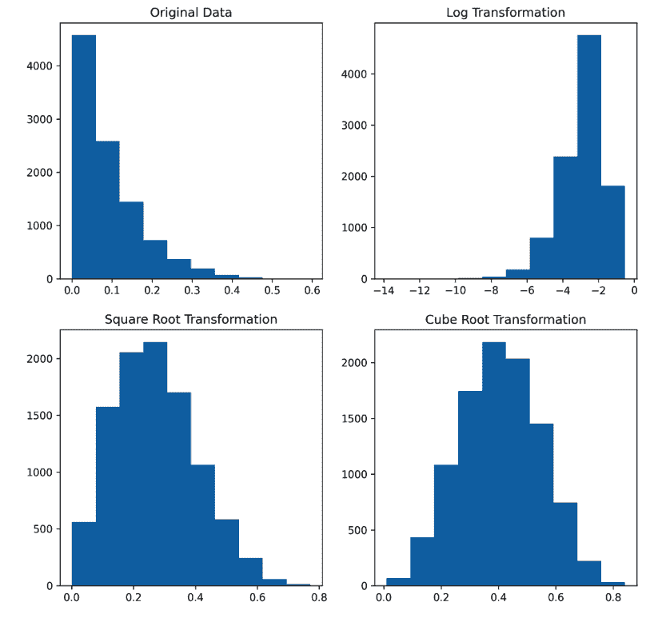

通过变换，我们可以看到变换后的直方图比原始直方图更接近正态分布。在这个例子中，似乎最好的变换是立方根变换。对于真实世界的数据，确定是否需要变换以及如果需要，应该使用哪种变换，这一点很重要。

其他数据变换方法，例如查找重复数据、处理缺失值和特征缩放，将在后续章节的Python实践案例中讨论。

## 总结

在本章的第一节中，我们学习了数据类型以及如何可视化这些类型的数据。然后，我们介绍了如何描述和度量数据分布的属性。我们学习了标准正态分布、它的重要性，以及中心极限定理如何通过演示自助法在实践中应用。我们还学习了自助法如何利用非正态分布的数据，通过置信区间来检验假设。接下来，我们介绍了排列和组合的数学知识，并引入了置换检验作为自助法之外的另一种非参数检验。最后，我们以不同的数据变换方法结束了本章，这些方法在许多需要正态分布数据进行统计检验的情况下非常有用。

在下一章中，我们将详细探讨假设检验，并讨论如何从检验结果中得出统计结论。我们还将探讨统计检验中可能出现的错误以及如何选择统计功效。

## 参考文献

- [1] 偏度 - https://www.itl.nist.gov/div898/handbook/eda/section3/eda35b.htm
- [2] 峰度 - https://www.itl.nist.gov/div898/handbook/eda/section3/eda35b.htm#:~:text=Kurtosis%20is%20a%20measure%20of,would%20be%20the%20extreme%20case.
- [3] 正态分布 - C.F. GAUSS AND THE METHOD OF LEAST SQUARES, ŚLĄSKI PRZEGLĄD STATYSTYCZNY Silesian Statistical Review, Nr 12(18), O. Sheynin, Sep. 1999

# 3 假设检验

在本章中，我们将开始讨论如何从数据中得出统计结论，结合 *第1章，抽样与泛化* 中的抽样和实验设计，以及 *第2章，数据分布* 中的分布知识。我们使用统计建模的主要目的是回答数据中感兴趣的问题。假设检验提供了一个*正式框架*，用于在不确定性度量下回答感兴趣的问题。首先，我们将介绍假设检验的目标和结构。然后，我们将讨论假设检验中可能出现的错误，并定义预期的错误率。接着，我们将利用z检验来演示假设检验的过程。最后，我们将讨论统计功效分析。

在本章中，我们将涵盖以下主要主题：

- 假设检验的目标
- 第一类和第二类错误
- z检验基础——z分数、z统计量、临界值和p值
- 均值和比例的单样本与双样本z检验
- 选择错误率和功效分析
- 将功效分析应用于z检验

## 假设检验的目标

简而言之，假设检验的目标是判断我们拥有的数据是否足以支持某个特定的假设。假设检验提供了一个*正式框架*，用于基于我们的数据检验假设，而不是试图基于目视检查来做出判断。在本节中，我们将讨论假设检验的过程。在下一节 *z检验基础——z分数、z统计量、临界值和p值* 中，我们将通过详细演练一个z检验的例子来实践这个过程。

## 均值假设检验概述

要理解假设检验的过程，让我们从一个简单的例子开始。假设我们有一家工厂，工厂里的机器生产小部件，我们期望机器以特定的速率（每小时30个小部件）生产。我们首先构建两个假设：**原假设**和**备择假设**。原假设和备择假设分别用以下符号表示：$H_0$ 和 $H_a$。为了建立原假设，我们将从假设我们想要检验的内容为真开始。在我们的例子中，原假设将是*机器平均每小时生产30个小部件*。一旦确定了原假设，我们接着创建备择假设，它只是原假设的矛盾。在我们的例子中，备择假设是*机器平均每小时生产的小部件数不是30个*。请注意，我们的假设没有指明任何方向性，也就是说，备择假设包含小于和大于预期值的值。这被称为**双侧检验**，意味着原假设有两个备择选项。我们也有**单侧检验**。例如，如果我们说原假设是*机器平均每小时生产的小部件数多于30个*，那么备择假设就是*机器平均每小时生产的小部件数少于30个*。这组假设将是单侧检验。

我们例子中的双侧原假设和备择假设可以用数学方式表述如下：

```
$H_0: \bar{x} = 30$
$H_a: \bar{x} \neq 30$
```

一旦我们有了原假设、备择假设和数据，我们将使用软件运行检验。现在让我们把检验的实现细节放在一边（这些将在下一节详细讨论）。统计检验有两种可能的结果：拒绝原假设或未能拒绝原假设。如果我们的机器平均产出在统计上不同于原假设中陈述的值，那么我们将*拒绝原假设*。这意味着，给定数据，原假设中陈述的值对于均值来说不是一个*合理的*值。然而，如果我们的机器平均产出在统计上与原假设中列出的值没有显著差异，我们*未能拒绝原假设*。这意味着，给定数据，原假设中陈述的值对于均值来说是一个*合理的*值。在运行原假设检验并确定结论后，我们将在下一节讨论置信区间，并确定推断范围。

### 推断范围

推断范围由*第1章*讨论的抽样设计决定。需要考虑两个问题——*总体是什么，以及样本是如何从总体中选出的？* 在这个例子中，让我们假设我们正在检验一家大型工厂（可能有数百台机器）的机器平均产出。那么总体就是工厂里的机器。如果我们对机器进行随机抽样，那么我们的结论就可以推广到整个总体。

虽然我们当前的例子是现实的，但它相当简单。在其他情况下，可能还有额外的考虑因素。例如，工厂里的机器可能有不同的型号和不同的使用年限，这可能会影响产出。在这种情况下，我们可以使用分层随机抽样，并对每个层进行推断。

### 假设检验步骤

本节概述了从创建假设到得出结论的假设检验过程。在我们继续学习本章时，请记住以下关键的假设检验步骤：

-   陈述原假设和备择假设
-   执行统计检验
-   确定结论：拒绝或未能拒绝原假设
-   提供统计结论、置信区间和推断范围

这些步骤适用于任何统计检验，我们将在假设检验中继续遵循这一系列步骤。在下一节中，我们将讨论假设检验可能导致的错误类型。

### 第一类错误和第二类错误

虽然数据可以让我们很好地了解分布的特征，但假设检验仍有可能导致错误。错误的发生是因为我们是从总体中抽取随机样本。虽然随机化使得样本包含抽样偏差的可能性降低，*但不能保证随机样本能代表总体*。假设检验可能导致两种可能的错误：

-   **第一类错误**：当原假设实际为真时拒绝原假设
-   **第二类错误**：当原假设实际为假时未能拒绝原假设

#### 第一类错误

当假设检验导致*拒绝原假设，但原假设实际为真*时，就发生了第一类错误。例如，假设我们有一个数据分布，其总体均值为30。我们将原假设陈述为 $H_0: \bar{x} = 30$。我们为检验抽取了一个随机样本，但样本中的随机值恰好位于分布的较高一侧。因此，检验结果表明我们应该拒绝原假设。在这种情况下，我们犯了第一类错误。这种错误也称为**假阳性**。

当我们进行统计检验时，由于从目标总体中抽取的样本，我们总是有可能得出错误的结论。*犯第一类错误的概率由α指定*。换句话说，α代表我们预期犯错的频率（预期错误率）。这是我们为检验选择的一个自由参数（α也称为*显著性水平*）。通常使用0.05作为α，但使用0.05没有实证依据；在其他情况下，不同的值可能更合适。在本章后面，我们将讨论如何选择第一类错误率。

#### 第二类错误

我们可以犯的另一种错误称为第二类错误。在这种情况下，*当原假设实际为假时，我们未能拒绝原假设*。让我们考虑另一个例子。假设我们有一个数据分布，我们想检验该分布的均值是否为30。我们为检验抽取了一个随机样本，检验表明我们不应该拒绝原假设。然而，真实的总体均值是35。在这种情况下，我们犯了第二类错误。这种错误也称为**假阴性**。

如前所述，统计检验总是可能导致错误的结论。因此，我们希望控制犯错的概率。然而，与α不同，第二类错误率β并不是一个我们可以简单选择的自由参数。为了理解犯第二类错误的可能性，我们通常会进行功效分析，这将显示各种因素（如样本量）如何影响第二类错误率。在下一节中，我们将讨论如何选择错误率和进行功效分析。

我们可以借助*图3.1*中的表格来总结假设检验的可能结果。

原假设为：
| 关于原假设的决策 | 真 | 假 |
| :--- | :--- | :--- |
| 不拒绝 | 正确推断 (1- α) | 第二类错误 (β) |
| 拒绝 | 第一类错误 (α) | 正确推断 (1-β) |

图3.1 – 假设检验的结果

在本节中，我们讨论了从统计检验中得出结论时可能发生的错误类型。在下一节中，我们将通过一个使用z检验进行假设检验的例子来讲解，在本章后面，我们将讨论如何选择错误率以及如何分析统计功效和相关因素。

## z检验基础——z分数、z统计量、临界值和p值

在本节中，我们将讨论一种称为z检验的假设检验。它是一种统计程序，使用假设为正态分布的样本数据来确定是否应拒绝与总体参数值相关的统计陈述。该检验可用于以下情况：

-   单样本（左侧z检验、右侧z检验或双侧z检验）
-   两样本（两样本z检验）
-   比例（单比例z检验或双比例z检验）

该检验假设标准差已知且样本量足够大。在实践中，应考虑大于30的样本量。

在讨论不同类型的z检验之前，我们将讨论z分数和z统计量。

### z分数和z统计量

为了衡量某个值与均值的距离，我们可以使用z分数或z统计量作为统计技术，结合均值和标准差来确定相对位置。

z分数使用以下公式计算：

```
$$z_i = \frac{x_i - \bar{x}}{\sigma}$$
```

这里，$z_i$ 是 $x_i$ 的z分数，$\bar{x}$ 是样本均值，$\sigma$ 是样本标准差。z分数也称为z值、标准化值或标准分数。让我们考虑几个例子。标准差告诉我们样本距离分布均值有多远。如果 $z_i = 1.8$，则该点距离均值1.8个标准差。类似地，如果 $z_i = -1.5$，则该点距离均值1.5个标准差。z分数的符号决定了它是大于还是小于样本均值。$z_i$ 为-1.5小于均值，$z_i$ 为1.8大于均值。现在让我们看一个例子。在美国达拉斯的一所高中，我们要求学生参加匿名的智商测试，用于一些统计研究。从该校收集的数据呈正态分布，智商分数的总体均值 $\mu = 98$，总体标准差 $\sigma = 12$。一名特定的学生参加了智商测试，他的分数是110。他的智商分数高于平均分，但他想知道他是否在前5%。首先，我们将使用z分数公式进行计算：

```
$$z_{student} = \frac{110 - 98}{12} = \frac{12}{12} = 1.$$
```

学生可以查阅z表（*图3.2*），例如，从网站 http://www.z-table.com 获取，得到值为0.8413。他处于学校智商分数的前1-0.8413 = 0.1587 或 15.87%。

| z | .00 | .01 | .02 | .03 | .04 | .05 | .06 | .07 | .08 | .09 |
|---|---|---|---|---|---|---|---|---|---|---|
| 0.0 | .5000 | .5040 | .5080 | .5120 | .5160 | .5199 | .5239 | .5279 | .5319 | .5359 |
| 0.1 | .5398 | .5438 | .5478 | .5517 | .5557 | .5596 | .5636 | .5675 | .5714 | .5753 |
| 0.2 | .5793 | .5832 | .5871 | .5910 | .5948 | .5987 | .6026 | .6064 | .6103 | .6141 |
| 0.3 | .6179 | .6217 | .6255 | .6293 | .6331 | .6368 | .6406 | .6443 | .6480 | .6517 |
| 0.4 | .6554 | .6591 | .6628 | .6664 | .6700 | .6736 | .6772 | .6808 | .6844 | .6879 |
| 0.5 | .6915 | .6950 | .6985 | .7019 | .7054 | .7088 | .7123 | .7157 | .7190 | .7224 |
| 0.6 | .7257 | .7291 | .7324 | .7357 | .7389 | .7422 | .7454 | .7486 | .7517 | .7549 |
| 0.7 | .7580 | .7611 | .7642 | .7673 | .7704 | .7734 | .7764 | .7794 | .7823 | .7852 |
| 0.8 | .7881 | .7910 | .7939 | .7967 | .7995 | .8023 | .8051 | .8078 | .8106 | .8133 |
| 0.9 | .8159 | .8186 | .8212 | .8238 | .8264 | .8289 | .8315 | .8340 | .8365 | .8389 |
| 1.0 | .8413 | .8438 | .8461 | .8485 | .8508 | .8531 | .8554 | .8577 | .8599 | .8621 |
| 1.1 | .8643 | .8665 | .8686 | .8708 | .8729 | .8749 | .8770 | .8790 | .8810 | .8830 |
| 1.2 | .8849 | .8869 | .8888 | .8907 | .8925 | .8944 | .8962 | .8980 | .8997 | .9015 |
| 1.3 | .9032 | .9049 | .9066 | .9082 | .9099 | .9115 | .9131 | .9147 | .9162 | .9177 |
| 1.4 | .9192 | .9207 | .9222 | .9236 | .9251 | .9265 | .9279 | .9292 | .9306 | .9319 |
| 1.5 | .9332 | .9345 | .9357 | .9370 | .9382 | .9394 | .9406 | .9418 | .9429 | .9441 |
| 1.6 | .9452 | .9463 | .9474 | .9484 | .9495 | .9505 | .9515 | .9525 | .9535 | .9545 |
| 1.7 | .9554 | .9564 | .9573 | .9582 | .9591 | .9599 | .9608 | .9616 | .9625 | .9633 |
| 1.8 | .9641 | .9649 | .9656 | .9664 | .9671 | .9678 | .9686 | .9693 | .9699 | .9706 |
| 1.9 | .9713 | .9719 | .9726 | .9732 | .9738 | .9744 | .9750 | .9756 | .9761 | .9767 |
| 2.0 | .9772 | .9778 | .9783 | .9788 | .9793 | .9798 | .9803 | .9808 | .9812 | .9817 |
| 2.1 | .9821 | .9826 | .9830 | .9834 | .9838 | .9842 | .9846 | .9850 | .9854 | .9857 |
| 2.2 | .9861 | .9864 | .9868 | .9871 | .9875 | .9878 | .9881 | .9884 | .9887 | .9890 |
| 2.3 | .9893 | .9896 | .9898 | .9901 | .9904 | .9906 | .9909 | .9911 | .9913 | .9916 |
| 2.4 | .9918 | .9920 | .9922 | .9925 | .9927 | .9929 | .9931 | .9932 | .9934 | .9936 |
| 2.5 | .9938 | .9940 | .9941 | .9943 | .9945 | .9946 | .9948 | .9949 | .9951 | .9952 |

图 3.2 – z表

在Python中，我们可以使用**累积分布函数**（CDF）来计算它：

```
import scipy
round(scipy.stats.norm.cdf(1), 4)
# 0.8413
```

我们在Python中也得到了与z表检查相同的值；在这个例子中，z-score = 1时，它是0.8413。

另一个例子是从智商调查中随机抽取的10个分数的简单随机样本：

90, 78, 110, 110, 99, 115, 130, 100, 95, 93

要计算样本中每个智商分数的z-score，我们需要计算这个样本的均值和标准差，然后应用z-score公式。幸运的是，我们可以再次使用`scipy`库，如下所示：

```
import pandas as pd
import numpy as np
import scipy.stats as stats

IQ = np.array([90, 78,110, 110, 99, 115,130, 100, 95, 93])
z_score = stats.zscore(IQ)

# Create dataframe

data_zscore = {
    "IQ score": IQ,
    "z-score": z_score
}

IQ_zscore = pd.DataFrame(data_zscore)
IQ_zscore
```

我们创建了一个名为IQ的智商分数数组，并使用scipy.stats中的z-score来计算z_score。最后，我们创建了以下输出DataFrame。

| | IQ score | z-score |
|---|---|---|
| 0 | 90 | -0.860663 |
| 1 | 78 | -1.721326 |
| 2 | 110 | 0.573775 |
| 3 | 110 | 0.573775 |
| 4 | 99 | -0.215166 |
| 5 | 115 | 0.932385 |
| 6 | 130 | 2.008214 |
| 7 | 100 | -0.143444 |
| 8 | 95 | -0.502053 |
| 9 | 93 | -0.645497 |

图 3.3 – 输出DataFrame

在讨论z统计量之前，我们将介绍抽样分布的概念。回到上一个例子，根据经验，我们反复从高中智商分数池中抽取35个智商分数的简单随机样本，次数根据研究需要而定。然后我们计算每个样本的平均分，称为$\bar{x}$。因为我们选择了不同的样本，所以$\bar{x}$也有各种可能的值。$\bar{x}$的期望值如下：

$$E(\bar{x}) = \mu$$

这里，$\mu$是总体均值。$\sigma_{\bar{x}}$表示$\bar{x}$的标准分布。实际上，在许多抽样情况下，总体相对于小样本量来说是相对较大的。那么，$\bar{x}$的标准差可以如下给出：

$$\sigma_{\bar{x}} = \frac{\sigma}{\sqrt{n}}$$

这里，$\sigma$是总体标准差，$n$是有限或无限总体的样本量，前提是总体较大而样本量相对较小。注意，$\sigma_{\bar{x}}$也称为均值的标准误差，以帮助我们确定样本均值与总体均值的距离。注意，$E(\bar{x}) = \mu$，与样本量无关。样本量和标准误差呈负相关：当样本量增加时，标准误差减小。由于假设$\bar{x}$的抽样分布是正态分布的，因此样本分布由以下公式给出：

$$z_{\bar{x}} = \frac{\bar{x} - \mu}{\sigma_{\bar{x}}}$$

在关于总体均值的假设检验中，我们使用检验统计量，其公式如下：

$$z = z_{\bar{x}} = \frac{\bar{x} - \mu}{\sigma / \sqrt{n}}$$

这里，$\bar{x}$是样本均值，$\mu$是总体均值，$\sigma$是总体标准差，$n$是样本量。

再次考虑智商测试的例子。智商分数数据的均值$\mu = 98$，标准差$\sigma = 12$。假设数据是正态分布的。设$x$是从智商数据中随机抽取的分数。$x$在95到104之间的概率是多少？我们将计算当$x = 95$和$x = 104$时的z-score，如下所示：

$$z_{95} = \frac{95 - 98}{12} = -0.25,$$
$$z_{100} = \frac{104 - 98}{12} = 0.5.$$

因此，抽取的分数在95到104之间的概率是：

$$P(95 < x < 104) = P(-0.25 < z < 0.5) = 0.6915 - 0.4013 = 0.2902.$$

那么，从数据中随机抽取的智商分数在95到104之间的概率约为29.02%。我们也可以从z表中获取值，如下所示。

| z | .00 | .01 | .02 | .03 | .04 | .05 | .06 | .07 | .08 | .09 |
|---|---|---|---|---|---|---|---|---|---|---|
| -3.4 | .0003 | .0003 | .0003 | .0003 | .0003 | .0003 | .0003 | .0003 | .0003 | .0002 |
| -3.3 | .0005 | .0005 | .0005 | .0004 | .0004 | .0004 | .0004 | .0004 | .0004 | .0003 |
| -3.2 | .0007 | .0007 | .0006 | .0006 | .0006 | .0006 | .0006 | .0005 | .0005 | .0005 |
| -3.1 | .0010 | .0009 | .0009 | .0009 | .0008 | .0008 | .0008 | .0008 | .0007 | .0007 |
| -3.0 | .0013 | .0013 | .0013 | .0012 | .0012 | .0011 | .0011 | .0011 | .0010 | .0010 |
| -2.9 | .0019 | .0018 | .0018 | .0017 | .0016 | .0016 | .0015 | .0015 | .0014 | .0014 |
| -2.8 | .0026 | .0025 | .0024 | .0023 | .0023 | .0022 | .0021 | .0021 | .0020 | .0019 |
| -2.7 | .0035 | .0034 | .0033 | .0032 | .0031 | .0030 | .0029 | .0028 | .0027 | .0026 |
| -2.6 | .0047 | .0045 | .0044 | .0043 | .0041 | .0040 | .0039 | .0038 | .0037 | .0036 |
| -2.5 | .0062 | .0060 | .0059 | .0057 | .0055 | .0054 | .0052 | .0051 | .0049 | .0048 |
| -2.4 | .0082 | .0080 | .0078 | .0075 | .0073 | .0071 | .0069 | .0068 | .0066 | .0064 |
| -2.3 | .0107 | .0104 | .0102 | .0099 | .0096 | .0094 | .0091 | .0089 | .0087 | .0084 |
| -2.2 | .0139 | .0136 | .0132 | .0129 | .0125 | .0122 | .0119 | .0116 | .0113 | .0110 |
| -2.1 | .0179 | .0174 | .0170 | .0166 | .0162 | .0158 | .0154 | .0150 | .0146 | .0143 |
| -2.0 | .0228 | .0222 | .0217 | .0212 | .0207 | .0202 | .0197 | .0192 | .0188 | .0183 |
| -1.9 | .0287 | .0281 | .0274 | .0268 | .0262 | .0256 | .0250 | .0244 | .0239 | .0233 |
| -1.8 | .0359 | .0351 | .0344 | .0336 | .0329 | .0322 | .0314 | .0307 | .0301 | .0294 |
| -1.7 | .0446 | .0436 | .0427 | .0418 | .0409 | .0401 | .0392 | .0384 | .0375 | .0367 |
| -1.6 | .0548 | .0537 | .0526 | .0516 | .0505 | .0495 | .0485 | .0475 | .0465 | .0455 |
| -1.5 | .0668 | .0655 | .0643 | .0630 | .0618 | .0606 | .0594 | .0582 | .0571 | .0559 |
| -1.4 | .0808 | .0793 | .0778 | .0764 | .0749 | .0735 | .0721 | .0708 | .0694 | .0681 |
| -1.3 | .0968 | .0951 | .0934 | .0918 | .0901 | .0885 | .0869 | .0853 | .0838 | .0823 |
| -1.2 | .1151 | .1131 | .1112 | .1093 | .1075 | .1056 | .1038 | .1020 | .1003 | .0985 |
| -1.1 | .1357 | .1335 | .1314 | .1292 | .1271 | .1251 | .1230 | .1210 | .1190 | .1170 |
| -1.0 | .1587 | .1562 | .1539 | .1515 | .1492 | .1469 | .1446 | .1423 | .1401 | .1379 |
| -0.9 | .1841 | .1814 | .1788 | .1762 | .1736 | .1711 | .1685 | .1660 | .1635 | .1611 |
| -0.8 | .2119 | .2090 | .2061 | .2033 | .2005 | .1977 | .1949 | .1922 | .1894 | .1867 |
| -0.7 | .2420 | .2389 | .2358 | .2327 | .2296 | .2266 | .2236 | .2206 | .2177 | .2148 |
| -0.6 | .2743 | .2709 | .2676 | .2643 | .2611 | .2578 | .2546 | .2514 | .2483 | .2451 |
| -0.5 | .3085 | .3050 | .3015 | .2981 | .2946 | .2912 | .2877 | .2843 | .2810 | .2776 |
| -0.4 | .3446 | .3409 | .3372 | .3336 | .3300 | .3264 | .3228 | .3192 | .3156 | .3121 |
| -0.3 | .3821 | .3783 | .3745 | .3707 | .3669 | .3632 | .3594 | .3557 | .3520 | .3483 |
| -0.2 | .4207 | .4168 | .4129 | .4090 | .4052 | .4013 | .3974 | .3936 | .3897 | .3859 |
| -0.1 | .4602 | .4562 | .4522 | .4483 | .4443 | .4404 | .4364 | .4325 | .4286 | .4247 |
| -0.0 | .5000 | .4960 | .4920 | .4880 | .4840 | .4801 | .4761 | .4721 | .4681 | .4641 |

图 3.4 – z表

### 假设检验

| z | .00 | .01 | .02 | .03 | .04 | .05 | .06 | .07 | .08 | .09 |
|---|---|---|---|---|---|---|---|---|---|---|
| 0.0 | .5000 | .5040 | .5080 | .5120 | .5160 | .5199 | .5239 | .5279 | .5319 | .5359 |
| 0.1 | .5398 | .5438 | .5478 | .5517 | .5557 | .5596 | .5636 | .5675 | .5714 | .5753 |
| 0.2 | .5793 | .5832 | .5871 | .5910 | .5948 | .5987 | .6026 | .6064 | .6103 | .6141 |
| 0.3 | .6179 | .6217 | .6255 | .6293 | .6331 | .6368 | .6406 | .6443 | .6480 | .6517 |
| 0.4 | .6554 | .6591 | .6628 | .6664 | .6700 | .6736 | .6772 | .6808 | .6844 | .6879 |
| 0.5 | .6915 | .6950 | .6985 | .7019 | .7054 | .7088 | .7123 | .7157 | .7190 | .7224 |
| 0.6 | .7257 | .7291 | .7324 | .7357 | .7389 | .7422 | .7454 | .7486 | .7517 | .7549 |
| 0.7 | .7580 | .7611 | .7642 | .7673 | .7704 | .7734 | .7764 | .7794 | .7823 | .7852 |
| 0.8 | .7881 | .7910 | .7939 | .7967 | .7995 | .8023 | .8051 | .8078 | .8106 | .8133 |
| 0.9 | .8159 | .8186 | .8212 | .8238 | .8264 | .8289 | .8315 | .8340 | .8365 | .8389 |
| 1.0 | .8413 | .8438 | .8461 | .8485 | .8508 | .8531 | .8554 | .8577 | .8599 | .8621 |
| 1.1 | .8643 | .8665 | .8686 | .8708 | .8729 | .8749 | .8770 | .8790 | .8810 | .8830 |
| 1.2 | .8849 | .8869 | .8888 | .8907 | .8925 | .8944 | .8962 | .8980 | .8997 | .9015 |
| 1.3 | .9032 | .9049 | .9066 | .9082 | .9099 | .9115 | .9131 | .9147 | .9162 | .9177 |
| 1.4 | .9192 | .9207 | .9222 | .9236 | .9251 | .9265 | .9279 | .9292 | .9306 | .9319 |
| 1.5 | .9332 | .9345 | .9357 | .9370 | .9382 | .9394 | .9406 | .9418 | .9429 | .9441 |
| 1.6 | .9452 | .9463 | .9474 | .9484 | .9495 | .9505 | .9515 | .9525 | .9535 | .9545 |
| 1.7 | .9554 | .9564 | .9573 | .9582 | .9591 | .9599 | .9608 | .9616 | .9625 | .9633 |
| 1.8 | .9641 | .9649 | .9656 | .9664 | .9671 | .9678 | .9686 | .9693 | .9699 | .9706 |
| 1.9 | .9713 | .9719 | .9726 | .9732 | .9738 | .9744 | .9750 | .9756 | .9761 | .9767 |
| 2.0 | .9772 | .9778 | .9783 | .9788 | .9793 | .9798 | .9803 | .9808 | .9812 | .9817 |
| 2.1 | .9821 | .9826 | .9830 | .9834 | .9838 | .9842 | .9846 | .9850 | .9854 | .9857 |
| 2.2 | .9861 | .9864 | .9868 | .9871 | .9875 | .9878 | .9881 | .9884 | .9887 | .9890 |
| 2.3 | .9893 | .9896 | .9898 | .9901 | .9904 | .9906 | .9909 | .9911 | .9913 | .9916 |
| 2.4 | .9918 | .9920 | .9922 | .9925 | .9927 | .9929 | .9931 | .9932 | .9934 | .9936 |
| 2.5 | .9938 | .9940 | .9941 | .9943 | .9945 | .9946 | .9948 | .9949 | .9951 | .9952 |
| 2.6 | .9953 | .9955 | .9956 | .9957 | .9959 | .9960 | .9961 | .9962 | .9963 | .9964 |
| 2.7 | .9965 | .9966 | .9967 | .9968 | .9969 | .9970 | .9971 | .9972 | .9973 | .9974 |
| 2.8 | .9974 | .9975 | .9976 | .9977 | .9977 | .9978 | .9979 | .9979 | .9980 | .9981 |
| 2.9 | .9981 | .9982 | .9982 | .9983 | .9984 | .9984 | .9985 | .9985 | .9986 | .9986 |
| 3.0 | .9987 | .9987 | .9987 | .9988 | .9988 | .9989 | .9989 | .9989 | .9990 | .9990 |
| 3.1 | .9990 | .9991 | .9991 | .9991 | .9992 | .9992 | .9992 | .9992 | .9993 | .9993 |
| 3.2 | .9993 | .9993 | .9994 | .9994 | .9994 | .9994 | .9994 | .9995 | .9995 | .9995 |
| 3.3 | .9995 | .9995 | .9995 | .9996 | .9996 | .9996 | .9996 | .9996 | .9996 | .9997 |
| 3.4 | .9997 | .9997 | .9997 | .9997 | .9997 | .9997 | .9997 | .9997 | .9997 | .9998 |

图 3.5 – z值表

在Python中，我们可以如下实现代码：

```python
#calculate z scores at x=95 and 104
zscore_95 = round((95-98)/12,2)
zscore_104 = round((104-98)/12,2)

#calculate cdf and probability
cdf_95 = stats.norm.cdf(zscore_95)
cdf_104 = stats.norm.cdf(zscore_104)
prob = abs(cdf_95-cdf_104)

#print the probability
print(f"The probability that the taken score between 95 and 104 is {round(prob*100,2)}%!")
```

另一个提出的问题是：随机抽取的四个分数的平均值 $\bar{x}$ 在95到104之间的概率是多少？为了解决这个问题，我们使用z统计量的概念。我们假设 $\bar{x}$ 的均值也是98，并且 $\bar{x}$ 服从正态分布。那么，$\bar{x}$ 的标准误为：

$$\sigma_{\bar{x}} = \frac{\sigma}{\sqrt{n}} = \frac{12}{\sqrt{4}} = 6,$$

然后：

$$z = \frac{\bar{x} - \mu_{\bar{x}}}{\sigma_{\bar{x}}} = \frac{\bar{x} - 98}{6}.$$

很容易计算出 $z_{95} = -0.5$ 和 $z_{104} = 1$。通过使用z值表，我们可以得到随机抽取的四个分数的平均值 $\bar{x}$ 在95到104之间的概率如下：

0.8413 - 0.3085 = 0.5328

或者，大约53.28%。为了使用这个想法，我们可以在Python中实现代码如下：

```python
import pandas as pd
import numpy as np
import scipy.stats as stats
import math

# standard error
n= 4
sigma = 12
se = sigma/math.sqrt(n)

#calculate z scores at x=95 and 104
zscore_95 = round((95-98)/se,2)
zscore_104 = round((104-98)/se,2)

#calculate cdf and probability
cdf_95 = stats.norm.cdf(zscore_95)
cdf_104 = stats.norm.cdf(zscore_104)
prob = abs(cdf_95-cdf_104)

#print the probability
print(f"The probability that the taken score between 95 and 104 is {round(prob*100,2)}%!")
```

请注意，在前面的代码中，我们还需要一个名为 `math` 的库来计算平方根函数 `math.sqrt()`。

在下一节中，我们将讨论均值的z检验。

### 均值的z检验

在这一部分，我们将考虑与总体均值或两个总体的均值相关的单样本和双样本z检验。

#### 单样本z检验

从总体中为研究选择的样本应服从正态分布。总体标准差应是已知的，至少在实际应用中是这样。

在无法假设总体服从正态分布但根据相关研究人员的经验，样本量需要被认为足够大的情况下，此检验仍然适用。为了进行假设检验，我们需要建立原假设和备择假设。下图说明了与左尾、右尾和双尾z检验相对应的三种原假设和备择假设。

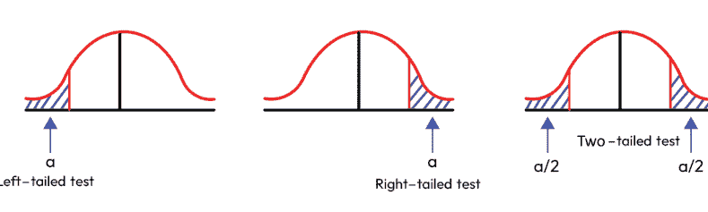

$H_0: \mu \ge \mu_0$

换句话说，这是用于判断是否应拒绝 $H_0$ 的概率。拒绝规则（拒绝 $H_0$）是 p 值小于或等于研究中指定的显著性水平 $\alpha$。为了在 Python 中根据检验统计量的值计算 p 值，我们使用以下语法：

```
scipy.stats.norm.sf(abs(x))
```

这里，x 是 z 分数。例如，我们想在左侧检验中找到与 z 分数 -2.67 相关的 p 值。Python 实现如下：

```
import scipy.stats

#find p-value
round(scipy.stats.norm.sf(abs(-2.67)),4)
```

输出结果将是 0.0038。对于右侧检验，使用类似的 Python 代码。对于双侧检验，我们需要将该值乘以 2：

```
#find p-value for two-tailed test
scipy.stats.norm.sf(abs(2.67))*2
```

下图说明了在每种检验类型中如何计算 p 值的概念。

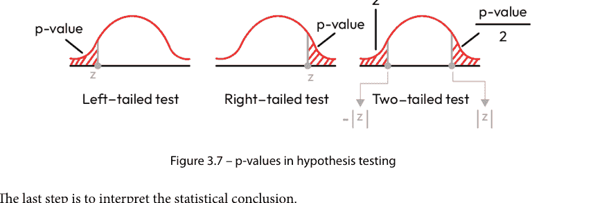

最后一步是解释统计结论。

另一方面，在临界值方法中，我们需要使用显著性水平来计算检验统计量的临界值。临界值是临界区域的边界，在该区域内我们可以拒绝原假设。

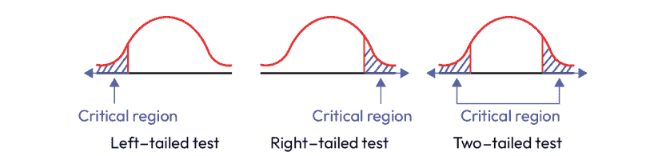

图 3.8 – 假设检验中的临界区域

要在 Python 中计算临界值，我们使用以下语法：

```
scipy.stats.norm.ppf(alpha)
```

这里，alpha 是要使用的显著性水平。以下是 Python 中针对左侧、右侧和双侧检验的代码实现：

```
import scipy.stats
alpha = 0.05 # level of significance

#find Z critical value for left-tailed test
print(f" The critical value is {scipy.stats.norm.ppf(alpha)}")

#find Z critical value for right-tailed test
print(f" The critical value is {scipy.stats.norm.ppf(1-alpha)}")

#find Z critical value for two-tailed test
print(f" The critical values are {-scipy.stats.norm.ppf(1-alpha/2)} and {scipy.stats.norm.ppf(1-alpha/2)}")
```

以下是上述代码的输出：

```
The critical value is -1.6448536269514729
The critical value is 1.6448536269514722
The critical values are -1.959963984540054 and 1.959963984540054
```

在显著性水平 α = 0.05 的左侧检验中，临界值约为 -1.64485。由于这是左侧检验，如果检验统计量小于或等于此临界值，我们则拒绝原假设。类似地，对于右侧检验，如果检验统计量大于或等于 1.64485，我们则拒绝原假设。对于双侧检验，如果检验统计量大于或等于 1.95996 或小于或等于 -1.95996，我们则拒绝原假设。

在确定是否拒绝原假设后，我们解释统计结论。

让我们再次讨论达拉斯高中的 IQ 测试分数。IQ 分数数据的均值为 $\mu = 98$，标准差为 $\sigma = 12$。一位研究人员想知道 IQ 分数是否会受到某些 IQ 训练的影响。他招募了 30 名学生，训练他们每天回答 IQ 问题 2 小时，持续 30 天，并记录他们在训练期结束后的 IQ 水平。30 名学生在训练后的 IQ 分数为 95、110、105、120、125、110、98、90、99、100、110、112、106、92、108、97、95、99、100、100、103、125、122、110、112、102、92、97、89 和 102。他们的平均分是 104.17。我们可以在 Python 中轻松实现计算如下：

```
IQscores = [95, 110, 105, 120, 125, 110, 98, 90, 99, 100,
           110, 112, 106, 92, 108, 97, 95, 99, 100, 100,
           103, 125, 122, 110, 112, 102, 92, 97, 89, 102]

IQmean = np.array(IQscores).mean()
```

我们定义原假设和备择假设：

$$H_0: \mu_{after} = \mu = 98$$
$$H_a: \mu_{after} > \mu = 98$$

我们选择显著性水平 $\alpha=0.05$。之前，右侧检验的临界值是 1.64485。我们现在计算该问题的检验统计量：

$$z = \frac{\bar{x} - \mu}{\sigma / \sqrt{n}} = \frac{104.17 - 98}{12 / \sqrt{30}} = 2.8162$$

在 Python 中实现如下：

```
n=30 #number of students
sigma =12 #population standard deviation
IQmean = 104.17 # IQ mean of 30 students after the training
mu = 98 # population mean

z = (IQmean-mu)/(sigma/math.sqrt(n))
```

由于检验统计量值 2.8162 > 1.64485，我们拒绝原假设。这意味着训练确实影响了这些学生的 IQ 水平，并帮助他们提高了 IQ 分数。

我们也可以使用 `statsmodels` 包（Seabold, Skipper, and Josef Perktold, "statsmodels: Econometric and statistical modeling with python." Proceedings of the 9th Python in Science Conference. 2010）中的 `ztest()` 函数来执行单样本或双样本 z 检验（我们将在下一部分讨论）。语法如下：

```
statsmodels.stats.weightstats.ztest(x1, x2=None,
    value=0, alternative='two-sided')
```

这里，我们看到以下内容：

- x1：两个独立样本中的第一个样本
- x2：两个独立样本中的第二个样本（如果执行双样本 z 检验）
- value：在单样本情况下，value 是原假设下 x1 的均值。在双样本情况下，value 是原假设下 x1 均值与 x2 均值之差。检验统计量为 x1_mean - x2_mean - value。
- alternative：备择假设：
  'two-sided'：双侧检验
  'larger'：右侧检验
  'smaller'：左侧检验

以下 Python 代码展示了如何执行单样本 z 检验：

```
from statsmodels.stats.weightstats import ztest as ztest

#IQ scores after training sections
IQscores = [95,110, 105, 120, 125, 110, 98, 90, 99, 100,
            110, 112, 106, 92, 108, 97, 95, 99, 100, 100,
            103, 125, 122, 110, 112, 102, 92, 97, 89, 102]

#perform one sample z-test
z_statistic, p_value = ztest(IQscores, value=98, alternative = 'larger')

print(f"The test statistic is {z_statistic} and the corresponding p-value is {p_value}.")
```

检验统计量为 3.3975，p 值 = 0.00034 < 0.05，其中 0.05 是显著性水平。因此，我们有足够的证据拒绝原假设。这意味着训练确实影响了这些学生的 IQ 水平。

#### 双样本 z 检验

我们考虑两个正态分布且独立的总体。设 Ω 为两个总体均值 μ₁ 和 μ₂ 之间的假设差值。与单样本 z 检验的情况类似，原假设和备择假设有三种形式：

$H_0: \mu_1 - \mu_2 \geq \Omega$ &nbsp;&nbsp;&nbsp;&nbsp; $H_0: \mu_1 - \mu_2 \leq \Omega$ &nbsp;&nbsp;&nbsp;&nbsp; $H_0: \mu_1 - \mu_2 = \Omega$

$H_a: \mu_1 - \mu_2 < \Omega$ &nbsp;&nbsp;&nbsp;&nbsp; $H_a: \mu_1 - \mu_2 > \Omega$ &nbsp;&nbsp;&nbsp;&nbsp; $H_a: \mu_1 - \mu_2 \neq \Omega$

在许多问题中，$\Omega = 0$。这意味着对于双侧检验的情况，原假设为零，换句话说，$\mu_1$ 和 $\mu_2$ 相等。假设检验的检验统计量计算如下：

$$z = \frac{(\bar{x}_1 - \bar{x}_2) - \Omega}{\sqrt{\frac{\sigma_1^2}{n_1} + \frac{\sigma_2^2}{n_2}}}$$

这里，$\bar{x}_1$ 和 $\bar{x}_2$ 是分别从均值为 $\mu_1$ 和 $\mu_2$ 的两个总体中随机抽取的样本量为 $n_1$ 和 $n_2$ 的样本均值。$\sigma_1$ 和 $\sigma_2$ 是这两个总体的标准差。对于两个独立的简单随机样本，点估计量 $\bar{x}_1 - \bar{x}_2$ 的标准误如下：

$$\sigma_{\bar{x}_1 - \bar{x}_2} = \sqrt{\frac{\sigma_1^2}{n_1} + \frac{\sigma_2^2}{n_2}}$$

当样本量足够大时，$\bar{x}_1 - \bar{x}_2$ 的分布可以视为正态分布。双样本 z 检验假设检验的逐步方法与单样本 z 检验类似。

现在让我们考虑一个例子。我们研究达拉斯两所名为 A 和 B 的学校学生的 IQ 分数，我们想知道这两所学校的平均 IQ 水平是否不同。记录了每所学校 30 名学生的简单随机样本。

A= [95,110, 105, 120, 125, 110, 98, 90, 99, 100,110, 112, 106, 92, 108, 97, 95, 99, 100, 100, 103, 125, 122, 110, 112, 102, 92, 97, 89, 102]

B = [98, 90, 100, 93, 91, 79, 90, 100, 121, 89, 101, 98, 75, 90, 95, 99, 100, 120, 121, 95, 96, 89, 115, 99, 95, 121, 122, 98, 97, 97]

原假设和备择假设是：

$$H_0: \mu_1 - \mu_2 = 0$$
$$H_a: \mu_1 - \mu_2 \neq 0$$

我们选择显著性水平 $\alpha=0.05$。在 Python 中，通过使用 `statsmodels` 包的 `ztest()` 函数，我们执行以下计算：

```
from statsmodels.stats.weightstats import ztest as ztest

#IQ score
A= [95,110, 105, 120, 125, 110, 98, 90, 99, 100,
    110, 112, 106, 92, 108, 97, 95, 99, 100, 100,
    103, 125, 122, 110, 112, 102, 92, 97, 89,102] #school A
B = [98, 90, 100, 93, 91, 79, 90, 100, 121, 89,
     101, 98, 75, 90, 95, 99, 100, 120, 121, 95,
```

#### 比例的 z 检验

我们也可以检验比例之间的差异。下面来看看如何进行比例的 z 检验。

##### 单比例 z 检验

单比例 z 检验用于比较样本比例 $\bar{p}$ 与假设比例 $p_0$ 之间的差异。与均值的 z 检验类似，对于原假设和备择假设，我们有三种形式——左侧检验、右侧检验和双侧检验：

$H_0: \bar{p} \geq p_0$

在前面的代码中，我们选择了 `alternative = 'two-sided'`，这与研究的原假设和备择假设相关。Python 代码产生的检验统计量和 p 值分别为 1.757 和 0.079。使用 0.05 的显著性水平，由于 p 值 > 0.05，我们未能拒绝原假设。换句话说，我们没有足够的证据表明两所学校学生的智商平均分存在差异。

```python
# school B
B = [96, 89, 115, 99, 95, 121, 122, 98, 97, 97]

# perform two-sample z-test
z_statistic, p_value = ztest(A, B, value=0, alternative='two-sided')

print(f"The test statistic is {z_statistic} and the corresponding p-value is {p_value}.")
```

##### 双比例 z 检验

此检验用于检验两个总体比例之间的差异。零假设和备择假设也有三种形式。检验统计量计算如下：

$$z = \frac{\bar{P}_1 - \bar{P}_2}{\sqrt{\bar{p}(1 - \bar{p})(\frac{1}{n_1} + \frac{1}{n_2})}}$$

其中，$\overline{p}_1$ 是来自总体 1 的简单随机样本的样本比例，$\overline{p}_2$ 是来自总体 2 的简单随机样本的样本比例，$n_1$ 和 $n_2$ 是样本量，$\overline{p}$ 是总合并比例，计算如下：

$$\overline{p} = \frac{n_1\overline{p}_1 + n_2\overline{p}_2}{n_1 + n_2}$$

我们考虑一个类似的例子：学校 A 的学生支持变革的比例与学校 B 的学生支持变革的比例是否存在差异。此处，$n_1 = 100$，$n_2 = 100$，$\overline{p}_1 = 0.8$，$\overline{p}_2 = 0.7$。你可以使用 `statsmodels` 库中的 `proportions_ztest`（Seabold, Skipper, and Josef Perktold, "statsmodels: Econometric and statistical modeling with python." *Proceedings of the 9th Python in Science Conference. 2010*）来执行假设检验。这里，我们将直接使用检验统计量计算 p 值。零假设和备择假设如下：

$$H_0: \overline{p}_1 = \overline{p}_2 \text{ （两个总体比例相等）}$$
$$H_a: \overline{p}_1 \neq \overline{p}_2 \text{ （两个总体比例不同）}$$

接下来，我们指定双尾检验的显著性水平为 $\alpha = 0.05$。然后我们计算检验统计量和 p 值如下：

```
scipy.stats.norm.sf(abs(z))*2
```

检验统计量为 1.633，双尾检验的 p 值为 0.10。由于 p 值大于指定的显著性水平 0.05，我们未能拒绝零假设。没有足够的证据表明学校 A 和学校 B 的学生支持变革的比例存在差异。

最后，上述计算的 Python 代码实现如下：

```
import math
import scipy
p_1bar = 0.8
p_2bar = 0.7
n1 = 100.0
n2 = 100.0

p= (p_1bar*n1 + p_2bar*n2)/(n1+n2)    # the total pooled proportion

z = (p_1bar-p_2bar)/math.sqrt(p*(1-p)*(1/n1+1/n2))
pval = scipy.stats.norm.sf(abs(z))*2

print(f"The test statistic is {z} and the p-value for two tailed test is {pval}.")
```

在本节中，我们探讨了不同的重要统计概念，如 z 分数、z 统计量、临界值、p 值以及用于均值和比例的 z 检验。我们将在下一节讨论选择错误率和功效分析。

## 选择错误率和功效分析

统计学概括了围绕数据行为形成可接受结论的近似值。因此，统计中的错误是不可避免的。统计模型发现的显著性本质上由错误率决定。一种可用于最小化建模错误的方法，特别是在样本量较低时，是功效检验。统计功效是正确拒绝零假设的概率，从而最小化第二类错误。其中 alpha ($\alpha$) 是第一类错误，beta ($\beta$) 是第二类错误，功效的公式为 $1 - \beta$。回顾一下，第一类错误是错误拒绝零假设的概率。

如前所述，功效在样本较小时更为重要，因为如果选择了适当的抽样方法，大数定律通常有助于随着样本量的增加而最小化错误。当比较的差异相对较小时，功效也很重要。功效分析可能特别有用的一种情况是抽样成本高昂时，例如在人体研究中。功效分析可用于在给定所需功效、第一类错误率和效应量的情况下，找到合适的最小样本量。可以根据需要探索这些参数之间的关系。效应量是假设检验中被比较数据的差异或相似性，例如均值的标准化差异或相关性。由于假设检验中常见的显著性水平（第一类错误）在 0.01 到 0.1 之间，常见的功效水平在 0.8 到 0.9 之间，尽管这些度量取决于具体情况 (https://www.ncbi.nlm.nih.gov/pmc/articles/PMC7745163/#:~:text=The%20ideal%20power%20of%20a,high%20as%200.8%20or%200.9)。

功效的一些显著特性如下：

- 必须有足够的功效才能检测到有意义的差异
- 功效随样本量增加而增加
- 功效随效应量增加而增加
- 标准差（以及方差和标准误）随功效增加而减小

在下图中，我们可以看到第一类错误 ($\alpha$) 是我们可能错误地假设零假设并得出没有统计学显著差异的结论，而实际上数据点不属于数据源 2（零假设），而是属于数据源 1。第二类错误 ($\beta$) 是我们可能错误地假设该区域的数据属于数据源 1（备择假设），而实际上它属于数据源 2。

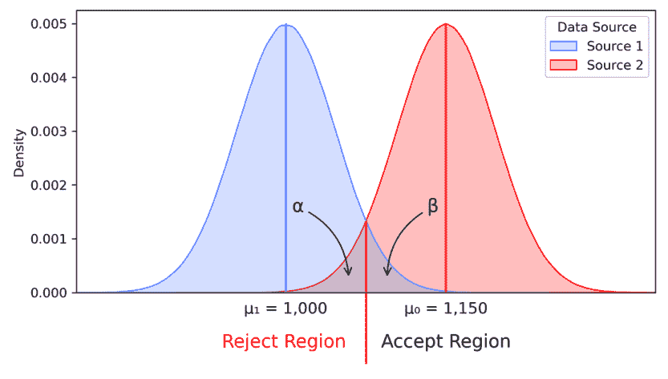

图 3.9 – 可视化左尾双总体 z 检验中的错误

如上图所示，我们看到一个左尾 t 检验，比较右侧的零分布和左侧的备择分布。在此图中，我们可以看到两个突出的概念：

- 随着 $\alpha$ 变小，临界值向左滑动，更接近分布的尾部，$\beta$ 变大，反之亦然
- 统计功效是数据源 2 在 $\beta$ 右侧的面积，因为 $power = (1-\beta)$

第一类错误是基于预先选择的阈值确定的；研究人员可能对 90%、95% 或 99% 的置信水平感到最放心。然而，第二类错误是基于参数化（标准差、效应量、样本量等）。因此，我们可以使用功效分析来确定样本量，反之亦然。各种假设检验的功效分析实现将在接下来的两章中进行。

### 双总体合并 z 检验的功效分析

让我们来看一个包含两个不同学科（学科 A 和学科 B）教授工资的数据集。我们想知道根据我们拥有的数据，两者之间是否存在统计学上的显著差异。首先，我们需要进行功效分析，以了解我们是否有足够的样本来信任我们可能进行的 z 检验的结果来检验这个假设。功效分析所需的组成部分包括效应量、第一类错误率、期望的第二类错误率、备择假设的方向（预期组 2 大于、小于或可能大于或小于组 1），以及较大样本中观察值相对于较小的那个。学科A有181个薪资数据，学科B有216个。因此，216将作为我们的分子，对应我们将视为*组1*（学科A将为*组2*）。

假设我们不确定一组是否会比另一组更大或更小；我们将此视为双侧假设检验。此z检验的效应量是两组之间的差异。我们将使用**科恩d**。要计算它，我们需要将两组均值之差除以合并标准差。此处计算的合并标准差是组1的样本数乘以组1的方差，加上组2的相同计算，然后除以两组的总样本量。以下是合并标准差的公式：

$$\sqrt{\frac{n_1 \sigma_1^2 + n_2 \sigma_2^2}{n_1 + n_2}}$$

对于效应量，我们需要将均值之差除以效应量，如下所示：

$$\frac{|\mu_1 - \mu_2|}{\sqrt{\frac{n_1 \sigma_1^2 + n_2 \sigma_2^2}{n_1 + n_2}}}$$

注意，在效应量的公式中，我们取均值之差的绝对值。这是因为对于科恩d，在此检验中我们始终需要一个正的均值之差。

如这里计算的，如果我们想要80%的统计功效（第二类错误率为20%）和0.05的I类错误率（显著性水平），我们需要组1中有172个样本，组2中有145个样本。然而，如果我们想要90%的统计功效和0.01的显著性水平（99%置信度），我们将需要组1中有325个样本，组2中有274个样本：

```python
import statsmodels.api as sm
import math

df_prof = sm.datasets.get_rdataset("Salaries", "carData").data

df_prof_A = df_prof.loc[df_prof['discipline'] == 'A']
df_prof_B = df_prof.loc[df_prof['discipline'] == 'B']

def pooled_standard_deviation(dataset1, dataset2, column) -> float:
    pooledSD = math.sqrt(((len(dataset1) - 1)*(dataset1[column].std()**2)+(len(dataset2) - 1)*(dataset2[column].std()**2))/(len(dataset1) + len(dataset2) - 2))
    return pooledSD;

stdDeviation = pooled_standard_deviation(
    dataset1 = df_prof_A, dataset2=df_prof_B,
    column='salary')
from statsmodels.stats.power import NormalIndPower
```

```python
effect = abs(df_prof_B['salary'].mean() -
    df_prof_A['salary'].mean() ) / stdDeviation
# 两个均值之差除以合并两样本的标准差
alpha = 0.05
power = 0.8
ratio=1.19 # 样本2的观测数相对于样本1的比例
analysis = NormalIndPower()
result = analysis.solve_power(effect, power=power, nobs1=None,
    ratio=ratio, alpha=alpha, alternative='two-sided')
print('Sample Size Required in Sample 1: {:.3f}'.format(
    result*ratio)) # nobs1是样本量。
print('Sample Size Required in Sample 2: {:.3f}'.format(
    result)) # nobs2是样本量。
```

此代码的输出如下：

```
Sample Size Required in Sample 1: 171.620
Sample Size Required in Sample 2: 144.218
```

```python
effect = abs(df_prof_B['salary'].mean() -
    df_prof_A['salary'].mean() ) / stdDeviation
alpha = 0.01
power = 0.9
ratio=1.19 # 样本2的观测数相对于样本1的比例
analysis = NormalIndPower()
result = analysis.solve_power(effect, power=power,
    nobs1=None, ratio=ratio, alpha=alpha,
    alternative='two-sided')
print('Sample Size Required in Sample 1: {:.3f}'.format(
    result*ratio)) # nobs1是样本量。
print('Sample Size Required in Sample 2: {:.3f}'.format(
    result)) # nobs2是样本量。
```

此代码的输出如下：

```
Sample Size Required in Sample 1: 325.346
Sample Size Required in Sample 2: 273.400
```

## 总结

在本章中，我们介绍了假设检验的概念。我们从假设检验的基本框架开始，包括四个关键步骤：

-   陈述假设
-   执行检验
-   决定是拒绝还是未能拒绝原假设
-   得出具有推断范围的统计结论

然后我们讨论了可能出现的潜在错误，包括假阳性和假阴性，并定义了检验的预期错误率（alpha）和检验的统计功效（beta）。

我们还讨论了称为z检验的统计程序。这是一种使用假设为正态分布的样本数据的假设检验。在关于不同类型z检验的部分，例如用于均值或比例的单样本或双样本z检验，也介绍了z分数和z统计量。

最后，我们讨论了统计功效分析的概念和动机，它可用于识别错误拒绝原假设的概率并选择样本量。我们还探讨了双总体合并z检验的分析参数。在此，我们简要考察了效应量，这是我们在执行假设检验时寻找的影响值（处理的效果）。我们将在接下来的两章中讨论统计功效分析，同时迭代假设检验的不同应用。

在下一章中，我们将讨论更多的参数假设检验。虽然这些检验仍然需要分布假设，但假设将比z检验的假设不那么严格。

# 4 参数检验

在上一章中，我们介绍了假设检验的概念，并展示了z检验的几种应用。z检验是假设检验家族中的一种，称为参数检验。参数检验是强大的假设检验，但参数检验的应用要求数据满足某些假设。虽然z检验是一个有用的检验，但它受限于所需的假设。在本章中，我们将讨论更多的参数检验，这将扩展我们的参数工具集。更具体地说，我们将讨论t检验的各种应用，当存在两个以上的数据子组时如何执行检验，以及皮尔逊相关系数的假设检验。我们将以参数检验的统计功效分析讨论结束本章。

在本章中，我们将涵盖以下主要主题：

-   **参数检验**的假设
-   **T检验**——一种参数假设检验
-   超过两组的检验和**方差分析（ANOVA）**
-   **皮尔逊相关系数**
-   **统计功效分析**示例

## 参数检验的假设

参数检验对总体数据做出假设，要求统计实践者在建模之前进行数据分析，特别是在使用样本数据时，因为当真实的总体参数未知时，样本统计量被用作总体参数的估计。以下是参数假设检验的三个主要假设：

-   总体数据正态分布
-   样本独立
-   总体方差相等（当比较两个或更多组时）

在本章中，我们讨论z检验、t检验、ANOVA和皮尔逊相关。这些检验用于连续数据。除了这些假设外，皮尔逊相关还要求数据包含配对样本。换句话说，被比较的每组中必须有相等数量的样本，因为皮尔逊相关基于成对比较。

虽然这些假设是理想的，但在许多情况下无法确保。因此，了解这些假设具有一定的稳健性是有用的，这取决于具体的检验。

### 总体数据正态分布

因为在参数假设检验中，我们关注的是获得关于总体参数（如均值或标准差）的推断，我们必须假设所选参数代表了分布，并且可以安全地假设数据具有集中趋势。我们还必须假设统计量（从样本或抽样分布中获取的参数值）代表其相应的总体参数。因此，由于我们在参数假设检验中假设总体是正态分布的，样本也应该是正态分布的。否则，假设样本代表总体是不安全的。

参数假设检验严重依赖均值，并假设它强烈代表数据的中心点（所有总体数据围绕均值集中分布）。考虑比较两个分布的均值以检验它们之间是否存在统计显著差异的情况。如果分布是偏斜的，均值将不是数据的中心点，因此不能很好地代表分布。由于这种情况，从比较均值的检验中获得的推断将不可靠。

### 对正态分布数据的稳健性

许多假设检验在使用样本对总体进行估计时指定了自由度。自由度迫使模型假设所使用的分布中存在比实际更多的额外方差。虽然分析中的统计参数保持不变，但假设的额外方差迫使集中趋势度量更接近。换句话说，使用自由度迫使集中趋势度量更集中地代表其计算所依据的分布。这样做的原因是假设样本——虽然代表其整体总体——但代表其总体时存在误差范围。因此，使用自由度的参数假设检验对违反正态分布数据要求具有一定的稳健性。

在图4.1所示的图中，我们有一个略微偏斜的分布。一个应用了自由度，另一个没有。我们可以看到，无论是否使用自由度，均值和中位数之间的距离是相同的。然而，使用自由度的分布承担了更多的误差（更多的方差）：

### 正态分布数据的检验

判断一个分布是否为正态分布，从而可用于参数假设检验的方法有多种。通常，对正态性的遵循程度取决于研究者的判断。本节介绍的方法在基于视觉检查和统计显著性水平方面，为正态性判断留下了一定的讨论空间。

#### 视觉检查

识别分布是否为正态分布的最佳方法是基于视觉检查。我们可以使用**分位数-分位数（QQ）图**和直方图——以及其他测试——来直观地检查分布情况。

在以下代码片段中，我们使用`scipy.stats`模块的`probplot`函数生成原始数据的图表以及QQ图：

```python
import matplotlib.pyplot as plt
import scipy.stats as stats
import numpy as np

mu, sigma = 0, 1.1
normally_distributed = np.random.normal(mu, sigma, 1000)
```

在*图4.2*中，我们可以在第一列看到指数分布数据的直方图及其下方的QQ图。由于这些点距离近似遵循代表纯正态分布的45度红线非常远，我们可以得出结论：该数据不是正态分布的。通过视觉检查第二列的数据，我们可以看到直方图呈现出一个近似正态分布的数据集。其下方的QQ图也证实了这一点，其中的点大部分近似于45度红线。关于QQ图的尾部，这些数据点代表了偏度的密度。对于正态分布的数据集，我们期望大部分数据点会趋向于红线的中心。对于指数分布，我们可以看到在红线的左下方尾部有很高的密度，而在线的右上方则有稀疏的点分布。QQ图可以从左向右阅读，反映了直方图中看到的分布情况，其中最小值出现在*x*轴的左侧，最大值出现在右侧。

对QQ图和直方图的视觉检查应该足以帮助研究者判断正态性假设是否被违反。然而，在某些情况下，例如构建数据科学流水线时，可能不希望进行视觉检查，此时有其他方法可以提供正态性的具体度量。最常用的三种测试是**Kolmogorov-Smirnov**、**Anderson-Darling**和**Shapiro-Wilk**检验。

Kolmogorov-Smirnov检验更侧重于数据的中心性。然而，如果数据在中心附近有较大的方差，该检验的功效就会降低。Anderson-Darling比中心更关注数据的尾部，如果数据具有重尾和极端异常值，它更有可能识别出不符合正态性的情况。这两种检验在大样本量时表现良好，但在样本量较小时功效不足。我们考虑的第三种检验，Shapiro-Wilk，比Kolmogorov-Smirnov和Anderson-Darling检验更通用，因此对小样本量更稳健。基于这些特点，在自动化流水线中使用Shapiro-Wilk检验可能更有用。或者，降低所应用检验的置信水平可能更好。

#### Kolmogorov-Smirnov

**Kolmogorov-Smirnov**检验可用于检验给定样本分布为正态分布的原假设。这个版本的Kolmogorov-Smirnov检验是单样本拟合优度检验，它针对基准累积密度分布进行分析。在运行`scipy.stats`模块中的`kstest`函数时，使用`stats.norm.cdf`（scipy的累积密度函数）执行此单样本版本的检验。双样本版本则针对指定分布进行检验，以确定两个分布是否匹配。在双样本情况下，待检验的分布必须作为`numpy`数组提供，而不是下面*图4.3*所示代码片段中使用的`stats.norm.cdf`函数。然而，这超出了正态性检验的范围，因此我们不在此讨论。

Kolmogorov-Smirnov将计算出的检验统计量与基于表格的临界值进行比较（`kstest`内部计算此值）。与其他假设检验一样，如果检验统计量大于临界值，则可以拒绝给定分布为正态分布的原假设。如果p值足够低以达到显著性，也可以据此进行评估。检验统计量计算为给定分布中所有数据点与累积密度函数之间最大距离的绝对值。

> **Kolmogorov-Smirnov特殊要求**
> Kolmogorov-Smirnov检验要求数据以零为中心，并缩放为标准差为一。所有数据都必须经过转换才能进行检验，但推断可以应用于转换前的分布；中心化和缩放后的分布不需要用于进一步的统计检验或分析。

在以下代码片段中，我们测试以确认一个正态分布的数据集`normally_distributed`是否为正态分布。该数据集的均值为0，标准差为1。输出确认数据是正态分布的。*图4.3*中的图表显示了以均值为0、标准差为1为中心的正态分布，其右侧是同一分布的指数变换版本：

```python
from scipy import stats
import numpy as np

mu, sigma = 0, 1
normally_distributed = np.random.normal(mu, sigma, 1000)
```

这里，我们运行Kolmogorov-Smirnov检验：

```python
stats.kstest(normally_distributed,
             stats.norm.cdf)
```

`statsmodels`的Kolmogorov-Smirnov检验对我们的数据产生了以下结果：

```
KstestResult(statistic=0.0191570377833315, pvalue=0.849436919292824)
```

如果我们使用相同的数据，但对其进行指数变换使其右偏，相同的检验表明数据不再呈正态分布：

```python
stats.kstest(np.exp(normally_distributed), stats.norm.cdf)
```

显著的p值证实了非正态性：

```
KstestResult(statistic=0.5375205782404135, pvalue=9.59979841227121e-271)
```

接下来，让我们取一个均值为100、标准差为2的1000个样本的分布。我们需要将其中心化到均值为0、单位方差（标准差为1）。在以下代码片段中，我们生成数据，然后执行缩放并将其保存到`normally_distributed_scaled`变量：

```python
mu, sigma = 100, 2
normally_distributed = np.random.normal(mu, sigma, 1000)
normally_distributed_scaled = (
    normally_distributed - normally_distributed.mean()) /
    normally_distributed.std()
)
```

现在数据已按要求中心化和缩放，我们使用Kolmogorov-Smirnov检验进行检查。正如预期，数据被确认为正态分布：

```python
stats.kstest(normally_distributed_scaled, stats.norm.cdf)
```

输出如下：

```
KstestResult(statistic=0.02597307287070466, pvalue=0.5016041053535877)
```

#### Anderson-Darling

与Kolmogorov-Smirnov检验类似，**Anderson-Darling**检验将给定分布与正态分布进行比较。在scipy的anderson检验中，我们可以针对其他分布进行检验，但默认参数指定正态分布`dist="norm"`，假设原假设是给定分布与正态分布在统计上相同。对于每个被检验的分布，必须计算一组不同的临界值。

#### Anderson-Darling 与 Kolmogorov-Smirnov 的比较

请注意，虽然 Anderson-Darling 和 Kolmogorov-Smirnov 检验都使用累积密度频率分布来检验正态性，但 Anderson-Darling 检验与 Kolmogorov-Smirnov 检验的不同之处在于，它对累积密度频率分布尾部的方差赋予的权重高于中间部分。这是因为尾部的方差可以比分布中间部分以更小的增量来测量。因此，Anderson-Darling 检验对尾部比 Kolmogorov-Smirnov 检验更敏感。与 Kolmogorov-Smirnov 检验类似，会计算一个检验统计量并与临界值进行比较。如果检验统计量大于临界值，则可以在指定的显著性水平下拒绝给定分布为正态分布的原假设。

在此，我们使用 Anderson-Darling 检验来检验一个均值为 19、标准差为 1.7 的随机正态概率分布。我们还检验了该数据的指数变换版本：

```python
import matplotlib.pyplot as plt
import seaborn as sns
import numpy as np
mu, sigma = 19, 1.7
normally_distributed = np.random.normal(mu, sigma, 1000)
not_normally_distributed = np.exp(normally_distributed);
```

图 4.4 显示了数据的绘图：

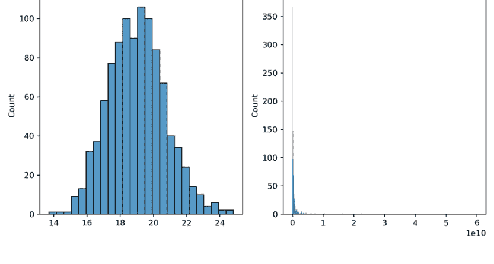

在接下来的代码和输出中，即*图 4.5*，我们可以看到该分布在所有显著性水平下都是正态分布的。回想一下，显著性水平就是 p 值（即，显著性水平 = 15.0 意味着 p 值 ≤ 0.15 是显著的）：

```python
from scipy import stats
import pandas as pd
import numpy as np
def anderson_test(data):
    data = np.array(data)
    test_statistic, critical_values, significance_levels = stats.anderson(normally_distributed, dist='norm')

    df_anderson = pd.DataFrame({'Test Statistic':np.repeat(test_statistic, len(critical_values)), 'Critical Value':critical_values, 'Significance Level': significance_levels})
    df_anderson.loc[df_anderson['Test Statistic'] >= df_anderson['Critical Value'], 'Normally Distributed'] = 'No'
    df_anderson.loc[df_anderson['Test Statistic'] < df_anderson['Critical Value'], 'Normally Distributed'] = 'Yes'
    return df_anderson;
mu, sigma = 19, 1.7
normally_distributed = np.random.normal(mu, sigma, 1000)
anderson_test(normally_distributed)
```

此处，通过 numpy `random.normal` 函数生成的数据经过 Anderson-Darling 方法检验，确认为正态分布：

| 检验统计量 | 临界值 | 显著性水平 | 是否正态分布 |
|---|---|---|---|
| 0.191482344 | 0.574 | 15 | 是 |
| 0.191482344 | 0.653 | 10 | 是 |
| 0.191482344 | 0.784 | 5 | 是 |
| 0.191482344 | 0.914 | 2.5 | 是 |
| 0.191482344 | 1.088 | 1 | 是 |

图 4.5 – 正态分布数据的 Anderson-Darling 结果

在此，我们检验正态分布数据的指数变换以检查其正态性。该数据呈指数分布，应在所有显著性水平下被拒绝。然而，我们在*图 4.6*中看到，它在 0.01 显著性水平（99% 置信度）下未能拒绝。因此，根据具体用例，谨慎的做法可能是检查所有显著性水平、使用不同的检验方法，或基于多次检验做出决定：

```python
not_normally_distributed = np.exp(normally_distributed)
anderson_test(not_normally_distributed)
```

我们对非正态分布数据的 Anderson-Darling 检验输出如下，见*图 4.6*：

| 检验统计量 | 临界值 | 显著性水平 | 是否正态分布 |
|---|---|---|---|
| 0.96277351 | 0.574 | 15 | 否 |
| 0.96277351 | 0.653 | 10 | 否 |
| 0.96277351 | 0.784 | 5 | 否 |
| 0.96277351 | 0.914 | 2.5 | 否 |
| 0.96277351 | 1.088 | 1 | 是 |

图 4.6 – 非正态分布数据的 Anderson-Darling 结果

#### Shapiro-Wilk

**Shapiro-Wilk** 检验是一种拟合优度检验，用于检查给定分布是否为正态分布。该检验检查一个以 0 为中心并缩放为单位方差 1 的观测值分布，与一个观测到的、经过中心化和缩放的标准正态分布的近似程度。这种中心化和缩放（称为**标准化**）在 `scipy.stats.shapiro` 模块的函数内部执行，因此输入数据在检验前无需修改。`scipy` 中此检验的显著性水平为 0.05。

> **Shapiro-Wilk 与 Kolmogorov-Smirnov 和 Anderson-Darling 的比较**
> 与 Kolmogorov-Smirnov 和 Anderson-Darling 相比，Shapiro-Wilk 非常适合检验样本量大致小于 50 的小样本。然而，一个缺点是，由于 Shapiro-Wilk 使用重复抽样并通过蒙特卡洛模拟应用来计算检验统计量，大数定律带来了一个风险：随着样本量的增加，遇到*第二类错误*（功效损失）并未能拒绝原假设（即原假设声称给定分布为正态分布）的内在风险也会增加。

使用与 Anderson-Darling 检验中相同的分布，我们用 Shapiro-Wilk 进行检验。我们可以看到，对于均值为 19、标准差为 1.7 的随机正态分布，Shapiro-Wilk 检验以 p 值为 0.99 确认不应拒绝输入分布为正态分布的原假设：

```python
mu, sigma = 19, 1.7
normally_distributed = np.random.normal(mu, sigma, 1000)
stats.shapiro(normally_distributed)
```

输出如下：

ShapiroResult(statistic=0.9993802905082703, pvalue=0.9900037050247192)

当使用正态分布数据的指数变换版本进行检验时，我们发现一个显著的 p 值（p = 0.0），表明我们有足够的证据拒绝原假设，并得出结论该分布不是正态分布：

```python
not_normally_distributed = np.exp(normally_distributed)
stats.shapiro(not_normally_distributed)
```

输出如下：

ShapiroResult(statistic=0.37320804595947266, pvalue=0.0)

## 独立样本

在参数假设检验中，样本的独立性是另一个重要的假设。非独立抽样可能导致两种效应。一种效应发生在进行子组抽样时。这里的问题是，总体中一个子组的响应可能与同一总体中另一个子组的响应不同，甚至与不同总体的响应更相似。然而，当抽取代表总体的样本时，这种子组差异可能对总体的代表性不强。

非独立抽样的另一个效应是，当样本在时间上足够接近地抽取时，一个事件的发生会排除或阻止另一个事件的发生。这被称为序列（或自）相关。

参数检验通常对违反此要求的情况不具有稳健性，因为它对检验结果的可解释性有直接的、绝对的影响。关于子组抽样，可以通过结构良好的抽样方法来防止，例如*第 1 章，抽样与泛化*中概述的方法。然而，关于序列效应，我们可以检验数据中的自回归相关性（也称为序列相关性）。

#### Durbin-Watson

评估抽样中缺乏独立性最常进行的检验之一是一阶（也称为滞后一阶）自回归检验，称为 **Durbin-Watson** 检验。**自回归**意味着使用先前的数据点来预测当前数据点。一阶意味着在抽样数据序列中，最后一个抽样数据点（滞后一阶）是与最近抽样数据点（滞后零阶）相关性最强的点。在一阶自相关中，每个数据点与前一个数据点的相关性最强。Durbin-Watson 检验并非检验任何值是否与其前一个值相关，而是检验整体上每个值与其前一个值之间是否存在足够强的关系，以得出存在显著自相关的结论。从这个意义上说，对于非独立抽样存在一定的稳健性，即一两次偶然事件可能不会完全使假设检验失效，但这种违规行为的持续重复则会。

Durbin-Watson 值为 2 表示没有显著的自相关，0 到 2 之间的值表示正（直接）自相关，2 到 4 之间的值表示负（反向）自相关。

在以下示例中，我们有两个分布，每个分布有 1,000 个样本。左侧的分布是正弦分布，表现出强烈的自回归相关性；右侧的分布是一组随机生成的数据，表现为白噪声方差（随机点围绕均值 0 分布）。使用 `statsmodels.stats` 模块中的 `durbin_watson()` 函数，我们能够确认正弦模式中存在直接的、正的一阶自相关（Durbin-Watson 值非常小），而随机噪声的 Durbin-Watson 统计量为 2.1，表明没有自相关。因此，在*图 4.7*中，左侧的图不是由独立样本组成的，而右侧的图是：

```python
from statsmodels.stats.stattools import durbin_watson
import matplotlib.pyplot as plt
import numpy as np
mu, sigma = 0, 1.1
independent_samples = np.random.normal(mu, sigma, 1000)
correlated_samples = np.linspace(-np.pi, np.pi, num=1000)
fig, ax = plt.subplots(1,2, figsize=(10,5))
ax[0].plot(correlated_samples, np.sin(correlated_samples))
ax[0].set_title('Durbin Watson = {}'.format(
    durbin_watson(correlated_samples)))
ax[1].plot(independent_samples)
ax[1].set_title('Durbin Watson = {}'.format(
    durbin_watson(independent_samples)))
```

### 总体方差相等

与数据正态分布的假设类似，总体方差相等的假设——也称为方差齐性——涉及所比较分布的物理属性的形状。假设总体方差相等有助于提高参数检验的效力。这是因为当均值被识别为不同时，我们不仅有信心，而且也知道潜在分布重叠的程度。当检验对完整分布的位置有直观把握——实际上，对效应量有真实了解时——效力就会增加。反之，随着方差差异增大，效力会降低。

### 对总体方差相等的稳健性

虽然总体方差相等在参数检验中很有用，但对这些检验的修改有助于使结果对偏离方差相等的情况保持稳健。这些检验的一个突出修改版本使用**Welch-Satterthwaite**调整来调整所使用的自由度。因为当每个组具有不同方差时，对每个组应用相同的自由度会导致数据的错误表示，所以Welch-Satterthwaite调整在分配自由度给假设方差相等的参数检验时，会考虑方差差异。使用Welch-Satterthwaite调整的两个常见检验是Welch t检验和Welch ANOVA检验。当用于小样本时，这些检验可能不可靠，但当用于样本量足够大以具有足够效力时，结果应与其非Welch对应检验大致相同。

### 检验方差相等

当检验分布间的方差相等时，我们有两个突出的检验：**Levene方差齐性检验**和**Fisher F检验**。

#### Levene方差齐性检验

Levene方差齐性检验在检验两个或多个组的方差齐性时很有用。在下面的代码片段*图4.8*中，我们使用三个分布进行检验，每个分布的样本量为100，均值为0，标准差分别为0.9、1.1和2。*图4.8*是使用*图4.8*上方代码的数据输出生成的三个分布的图。

```python
from scipy.stats import levene
np.random.seed(26)
mu1, sigma1, mu2, sigma2, mu3, sigma3 = 0, 0.9, 0, 1.1, 0, 2
distro1, distro2, distro3 = pd.DataFrame(), pd.DataFrame(), pd.DataFrame()
distro1['x'] = np.random.normal(mu1, sigma1, 100)
distro2['x'] = np.random.normal(mu2, sigma2, 100)
distro3['x'] = np.random.normal(mu3, sigma3, 100)
```

我们可以看到它们不同的标准差如何影响其范围。

我们可以看到该检验对违反方差齐性很敏感，因为其结果是一个统计显著的p值，表明方差不齐：

```python
f_statistic, p_value = levene(distro1['x'], distro2['x'], distro3['x'])
if p_value <= 0.05:
    print('The distributions do not have homogenous variance. P-value = %.4f, F-statistic = %.4f' % (p_value, f_statistic))
else:
    print('The distributions have homogenous variance. P-value = %.4f, F-statistic = %.4f' % (p_value, f_statistic))
```

输出如下：

The distributions do not have homogenous variance. P-value = 0.0000

#### Fisher F检验

Fisher F检验在一次检验两个组的方差齐性时很有用。该检验将检验统计量与临界值进行比较，以确定方差在统计上是否相同。计算出的F统计量是第一组的方差除以第二组的方差。第一组总是方差较大的组。使用前面的数据，让我们比较分布1和分布3。分布3的方差较大，为2，因此在计算F统计量时，该组的方差将作为分子。由于每个组的样本量为100，它们查表的自由度将各为99。然而，由于我们将使用`scipy` Python包来计算检验，这里不需要查表，因为`scipy`会用`f.cdf()`函数为我们完成。与Levene检验的结果一致，F检验表明分布1和分布3不具有方差齐性：

```python
from scipy.stats import f
def f_test(inputA, inputB):
    group1 = np.array(inputA)
    group2 = np.array(inputB)
    if np.var(group1) > np.var(group2):
        f_statistic = np.var(group1) / np.var(group2)
        numeratorDegreesOfFreedom = group1.shape[0] - 1
        denominatorDegreesOfFreedom = group2.shape[0] - 1
    else:
        f_statistic = np.var(group2)/np.var(group1)
        numeratorDegreesOfFreedom = group2.shape[0] - 1
        denominatorDegreesOfFreedom = group1.shape[0] - 1
    p_value = 1 - f.cdf(f_statistic, numeratorDegreesOfFreedom, denominatorDegreesOfFreedom)
    if p_value <= 0.05:
        print('The distributions do not have homogenous variance. P-value = %.4f, F-statistic = %.4f' % (p_value, f_statistic))
    else:
        print('The distributions have homogenous variance. P-value = %.4f, F-statistic = %.4f' % (p_value, f_statistic))
f_test(distro3['x'], distro1['x'])
```

此F检验的输出如下：

The distributions do not have homogenous variance. P-value = 0.0000, F-statistic = 102622.9745

## T检验——一种参数假设检验

在上一章中，当总体标准差已知时，应用了均值的z检验。然而，在现实世界中，获得总体标准差并不容易（或几乎不可能）。在本节中，我们将讨论另一种称为**t检验**的假设检验，它用于总体标准差未知的情况。总体的均值和标准差是通过取代表该总体的样本数据的均值和标准差来估计的。

广义上讲，均值的t检验方法与均值的z检验方法非常相似，但检验统计量和p值的计算与z检验不同。检验统计量通过以下公式计算：

$$t = \frac{\bar{x} - \mu}{s / \sqrt{n}}$$

这里，$\bar{x}$、$\mu$、$s$和$n$分别是样本均值、总体均值、样本标准差和样本量，当样本数据$x$正态分布时，它服从**t分布**。以下代码说明了具有1,000个样本的标准正态分布（蓝色曲线）和具有两个样本量——3个和16个样本——的t分布（绿色和红色曲线）：

```python
# libraries
import numpy as np
import scipy.stats as stats
# creating normal distribution
x = np.linspace(-5, 5, 1000) # create 1000 points from -5 to 5
y = stats.norm.pdf(x) # create probability density for each point x - normal distribution

# creating Student t distributions for 2 sample sizes n = 3 and n = 15
degree_freedom1 = 2
t_dis1 = stats.t.pdf(x, degree_freedom1)

degree_freedom2 = 15
t_dis2 = stats.t.pdf(x, degree_freedom2)
```

以下是考虑的这3个分布的可视化。

图4.9 – 正态分布和t分布

观察这三条曲线具有相似的对称性和形状，但较小样本量的样本具有更大的变异性（或者换句话说，尾部更重）。历史上，研究人员认为当样本量大于30时，样本标准差可以代表总体，即当$n > 30$时，红色曲线近似于蓝色曲线。如果样本分布与标准正态分布重叠，使用z检验也很常见。这种做法背后有一些道理，因为以前临界值表最多存储到样本量为50，但如今，凭借计算和互联网的力量，可以轻松获得任何样本量的$t$值。

### 均值的T检验

本部分将考虑与总体均值或两个总体的均值相关的单样本和双样本t检验，其中总体方差或总体标准差未知。

要进行t检验，需要满足以下假设：

**正态性：** 样本服从正态分布

**独立性：** 观察值是从总体中随机选择形成样本的，或者换句话说，它们是独立的

让我们在下一节中考虑单样本t检验。

#### 单样本t检验

与单样本z检验类似，为了进行假设检验，需要考虑原假设和备择假设。对应于左尾、右尾和双尾t检验的三种原假设和备择假设如下所示：

$H_0: \mu \geq \mu_0$ &nbsp;&nbsp;&nbsp;&nbsp; $H_0: \mu \leq \mu_0$ &nbsp;&nbsp;&nbsp;&nbsp; $H_0: \mu = \mu_0$

$H_a: \mu < \mu_0$ &nbsp;&nbsp;&nbsp;&nbsp; $H_a: \mu > \mu_0$ &nbsp;&nbsp;&nbsp;&nbsp; $H_a: \mu \neq \mu_0$

接下来，需要根据研究目的指定显著性水平 $\alpha$。有两种方法：p值法和临界值法。在p值法中，拒绝规则（拒绝原假设 $H_0$）是当p值小于或等于所选的指定显著性水平时。在临界值法中，拒绝规则是：对于左尾t检验，当检验统计量小于或等于临界值 $-t_{\alpha}$ 时；对于右尾t检验，当检验统计量大于或等于 $t_{\alpha}$ 时；对于双尾检验，当检验统计量小于或等于 $-t_{\alpha/2}$ 或大于或等于 $t_{\alpha/2}$ 时。最后一步是解释假设检验的统计结论。

为了基于学生t分布的值找到p值，我们可以使用以下语法：

```
scipy.stats.t.sf(abs(x), df)
```

这里，x是检验统计量，df是自由度（df = n-1，其中 $n$ 是样本量）。

例如，要找到在自由度为14的左尾检验中，t分数为1.9对应的p值，Python实现如下：

```
import scipy.stats
round(scipy.stats.t.sf(abs(1.9), df=14),4)
```

输出将是0.0391。如果显著性水平 $\alpha = 0.05$，那么我们拒绝原假设，因为p值小于 $\alpha$。对于右尾t检验，使用与左尾t检验类似的Python代码来找到p值。对于双尾检验，我们需要将值乘以2，如下所示：

```
scipy.stats.t.sf(abs(t), df)*2
```

这里，t是检验统计量，df是自由度（df = n-1，其中 $n$ 是样本量）。

要在Python中计算临界值，我们使用以下语法：

```
scipy.stats.t.ppf(q, df)
```

这里，q是显著性水平，df是公式中要使用的自由度。以下是左尾、右尾和双尾检验的Python代码实现：

```
import scipy.stats as stats
alpha = 0.05 # 显著性水平
df= 15 # 自由度
##### 查找左尾检验的t临界值
print(f" 临界值为 {stats.t.ppf(q= alpha, df =df)}")
##### 查找右尾检验的t临界值
print(f" 临界值为 {stats.t.ppf(q= 1-alpha, df =df)}")
##### 查找双尾检验的t临界值
print(f" 临界值为 {-stats.t.ppf(q= 1-alpha/2, df =df)}
和 {stats.t.ppf(q= 1-alpha/2, df =df)}")
```

上述代码的输出为：

- 临界值为 -1.7530503556925552
- 临界值为 1.7530503556925547
- 临界值为 -2.131449545559323 和 2.131449545559323

在显著性水平 α = 0.05 下，对于左尾检验，临界值约为 -1.753。由于这是左尾检验，如果检验统计量小于或等于此临界值，我们拒绝原假设。类似地，对于右尾检验，如果检验统计量大于或等于 1.753，我们拒绝原假设。对于双尾检验，如果检验统计量大于或等于 2.1314 或小于或等于 -2.1314，我们拒绝原假设。最后，我们解释假设检验的统计结论。

让我们从一所高中随机选择30名学生并测试他们的智商。我们想要检验的主张是：这所高中学生智商分数的总体均值高于100。这意味着我们将进行右尾t检验。30名学生的智商分数如下：

```
IQscores = [113, 107, 106, 115, 103, 103, 107, 102, 108, 107, 104,
104, 99, 102, 102, 105, 109, 97, 109, 103, 103, 100, 97, 107,116, 117,
105, 107, 104, 107]
```

在进行假设检验之前，我们将检查正态性和独立性假设。如果样本是从这所高中学生的总体中随机选择的，则满足独立性假设。对于正态性，我们将检查智商分数数据的直方图和QQ图：

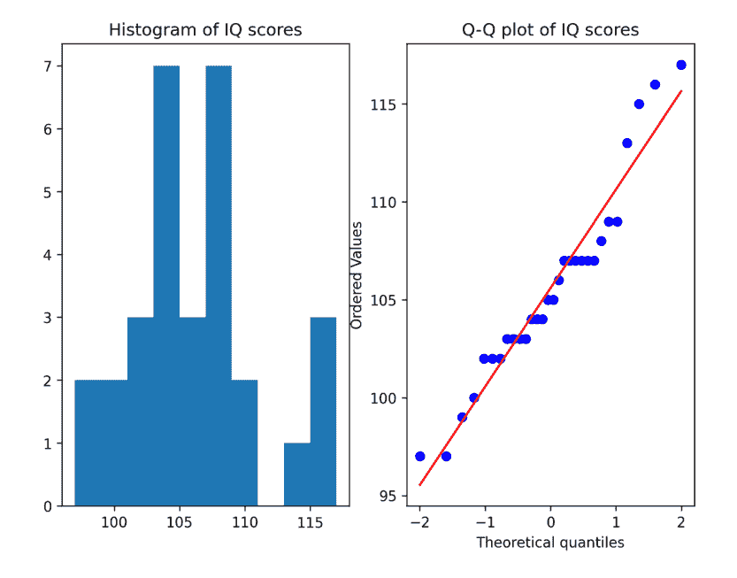

图 4.10 – 目视评估学生智商分数的正态性

从直方图和QQ图来看，几乎没有证据表明这所高中学生智商分数的总体分布不是正态的。由于假设分布是正态的，我们将继续进行t检验。

首先，我们定义原假设和备择假设：

$H_0: \mu \leq 100$
$H_a: \mu > 100$

我们选择显著性水平 $\alpha=0.05$。你可以通过其数学公式手动计算检验统计量，或者通过实现Python来计算。对于临界值和p值，前面部分已经展示了实现的代码。这里，我们将使用scipy库中的另一个函数来找到检验统计量和p值：

```
scipy.stats.ttest_1samp(data, popmean, alternative='greater')
```

这里，适用以下内容：

- data：样本中的观测值
- popmean：原假设中的期望值
- alternative：'two-sided' 用于双尾t检验，'less' 用于左尾t检验，'greater' 用于右尾t检验

Python代码实现如下：

```
import scipy.stats as stats
##### 执行单样本t检验
t_statistic, p_value = stats.ttest_1samp(IQscores, popmean =100,
axis=0,  alternative='greater')
print(f"检验统计量为 {t_statistic}，对应的p值为 {p_value}。")
```

输出如下：

检验统计量为 6.159178830896832，对应的p值为 5.15076734562176e-07。

因为p值 < 0.05（其中0.05是显著性水平），我们有足够的证据拒绝原假设，并得出结论：这所学校学生的真实平均智商分数高于100。

此外，我们有95%的把握认为，平均智商分数介于104.08和107.12之间。我们可以在Python中执行置信区间的计算，如下所示：

```
IQmean = np.array(IQscores).mean() # 样本均值
IQsd = np.array(IQscores).std() # 样本标准差
sample_size = len(np.array(IQscores)) # 样本量
df = sample_size-1 # 自由度
alpha = 0.05 # 显著性水平
t_crit = stats.t.ppf(q=1-alpha, df =df) # 临界值
confidence_interval = (IQmean-IQsd*t_crit/np.sqrt(sample_size),
IQmean+IQsd*t_crit/np.sqrt(sample_size))
```

在Python中使用左尾t检验执行假设检验的步骤与右尾和双尾t检验的步骤类似。

#### 双样本t检验 – 合并t检验

与*第3章 假设检验*（双样本z检验均值）中涵盖的内容类似，双样本t检验均值有三种形式的原假设和备择假设。在进行检验之前，需要满足一些假设，如下所示：

- **正态性**：两个样本均来自其正态分布的总体
- **独立性**：一个样本的观测值彼此独立
- **方差齐性**：假设两个总体具有相似的标准差

对于正态性，我们使用两个样本的可视化直方图和QQ图进行比较。让我们假设独立性得到满足。为了检查两个样本之间的标准差是否相等，我们可以通过观察它们的直方图进行可视化，如果可视化不明确，还可以使用F检验来获得额外的证据。这是一个检验两个样本方差是否相等的假设检验。

让我们看看两所高中A和B之间的智商分数。以下是每所学校随机选择的30名学生的分数：

```
IQscoresA=[113, 107, 106, 115, 103, 103, 107, 102,108, 107,
           104, 104, 99, 102, 102, 105, 109, 97, 109, 103,
           103, 100, 97, 107, 116, 117, 105, 107, 104, 107]

IQscoresB = [102, 108, 110, 101, 98, 98, 97, 102, 102, 103,
            100, 99, 97, 97, 94, 100, 104, 98, 92, 104,
            98, 95, 92, 111, 102, 112, 100, 103, 103, 100]
```

图4.11中显示的直方图和QQ图是由上述智商数据生成的。

#### 双样本t检验 – Welch's t检验

当数据呈正态分布但总体标准差未知且不相等时，这是一种实用的双样本t检验。我们对正态性的假设与合并t检验相同，但在进行Welch's t检验时，可以放宽对方差相等的假设。让我们考虑以下示例，其中有两个样本数据集：

```
sample1 = np.array([2,3,4,2,3,4,2,3,5,8,7,10])
sample2 = np.array([30,26,32,34,28,29,31,35,36,33,32,27])
```

我们假设独立性条件已满足，但我们将检查这两个样本的正态性和等标准差假设，如下所示：

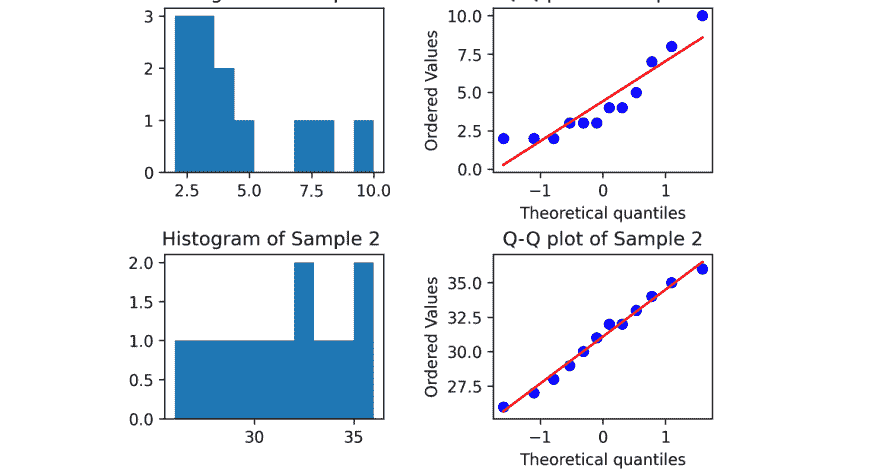

通过观察图4.12中直方图的x轴刻度，有强有力的视觉证据表明标准差不相等。让我们假设正态性假设成立。在这种情况下，双样本合并t检验不是一个好主意，但Welch's t检验就足够了。原假设和备择假设如下：

$H_0: \mu_1 = \mu_2$
$H_a: \mu_1 \neq \mu_2$

我们指定显著性水平为0.05。为了计算检验统计量和p值，我们实现如下代码：

```
import scipy.stats as stats
t_statistic, p_value = stats.ttest_ind(sample1, sample2,
    equal_var = False)
```

检验统计量为-22.47，p值小于0.05（显著性水平）。我们拒绝原假设。有强有力的证据表明样本数据1的均值与样本数据2的均值不同。

#### 配对t检验

配对t检验也称为匹配对或依赖t检验，用于每个样本中的元素被测试两次（前测和后测或重复测量）的研究中，并且当研究人员认为存在一些相似性（如家庭关系）时使用。假设如下：

- 差值呈正态分布
- 观察值之间的差值是独立的，但一次测试与另一次测试之间是相关的

配对t检验在许多研究中使用，特别是在与治疗前后相关的医学推理测试中。让我们回到智商测试分数——一名研究人员招募了一些学生，以查看培训前后分数是否存在差异，如下表所示：

| 学生 | 培训前分数 | 培训后分数 | 差值 |
| :--- | :--- | :--- | :--- |
| A | 95 | 95 | 0 |
| B | 98 | 110 | 12 |
| C | 90 | 97 | 7 |
| D | 115 | 112 | -3 |
| E | 112 | 117 | 5 |

图4.13 – 培训前和培训后分数

在这种情况下，我们不应该使用独立双样本t检验。这里应该检验差值的均值。我们可以通过使用直方图和QQ图来检查正态分布的假设，如下所示：

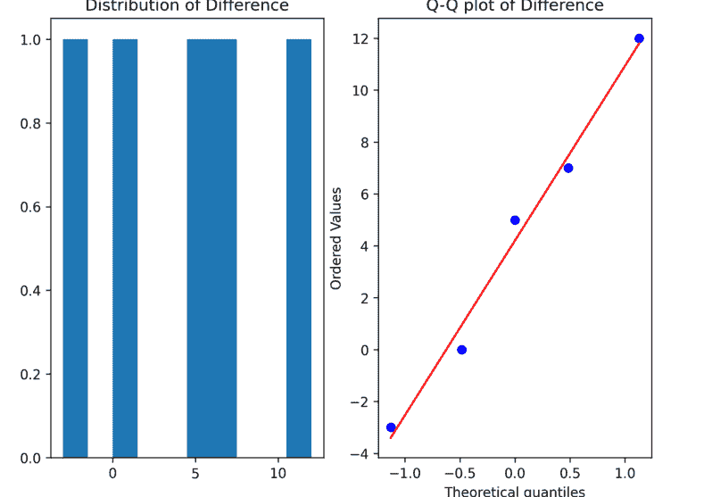

图4.14 – 检查配对t检验的正态性

通过观察QQ图，数据呈正态分布的证据比直方图更明显。

假设差值是独立的。原假设和备择假设如下：

$$H_0: \mu_{pos} - \mu_{pre} = 0$$
$$H_a: \mu_{pos} - \mu_{pre} > 0$$

$d_i$ 表示每个学生培训前分数和培训后分数之间的差值。原假设和备择假设可以改写如下：

$$H_0: \mu_d = 0$$
$$H_a: \mu_d > 0$$

然后，检验统计量计算如下：

$$t = \frac{\bar{d} - \mu_d}{\frac{s_d}{\sqrt{n}}}$$

这里，$\bar{d}$ 是差值的样本均值，$s_d$ 是差值的样本标准差。换句话说，配对t检验简化为单样本t检验。然而，我们可以直接使用scipy中的以下函数：

```
stats.ttest_rel(data_pos, data_pre, alternative = {'two-sided', 'less', 'greater'})
```

备择假设对应于左尾、右尾或双尾检验。以下是智商测试分数研究示例的Python实现：

```
from scipy import stats
IQ_pre = [95, 98, 90, 115, 112]
IQ_pos = [95, 110, 97, 112, 117]
t_statistic, p_value = stats.ttest_rel(IQ_pos, IQ_pre, alternative = 'greater')
```

检验统计量为1.594，p值为0.093。因此，鉴于p值小于0.05且显著性水平 $\alpha = 0.05$，我们拒绝原假设。有充分的证据表明培训对智商分数有显著影响。

## 多组检验和方差分析

在前一章和前面的章节中，我们涵盖了两组之间的检验。在本节中，我们将介绍两种检验组间差异的方法，如下：

- 使用 **Bonferroni校正** 的成对检验
- 方差分析

当检验两组以上的差异时，我们将不得不使用多次检验，这会影响我们的 *第一类* 错误率。有几种方法可以控制错误率。我们将了解如何利用Bonferroni校正来控制 *第一类* 错误率。我们还将在本节讨论方差分析，它用于检验多个组均值的差异。

### 显著性的多重检验

在前面的章节中，我们研究了两组之间的比较。在本节中，我们将考虑当存在两组以上时如何进行检验。让我们再次考虑工厂示例，其中有几种型号（型号A、型号B和型号C）的机器在

#### 邦费罗尼校正

调整p值以控制多重假设检验的一种方法是邦费罗尼校正。邦费罗尼校正通过统一降低检验族中每个单独检验的显著性水平来控制族错误率。假设我们有一个包含$m$个检验的检验族，每个检验的p值为$p_i$，则p值校正如下所示：

$$p_i \leq \frac{\alpha}{m}$$

以我们之前关于三种机器模型的例子为例，我们有一个包含三个检验的检验族，因此$m = 3$。如果我们设定族错误率为0.05，那么，根据邦费罗尼校正，这三个单独检验的显著性水平为：

$$\frac{0.05}{3} = 0.0167$$

因此，在这个例子中，任何一个单独检验都需要p值达到0.0167才能被认为具有统计显著性。

> **对第一类和第二类错误的影响**
如前所述，邦费罗尼校正通过降低单独检验的显著性水平来控制族水平的*第一类*错误率。我们还应考虑这种变化如何影响*第二类*错误率。通常，降低单独检验的显著性水平会增加该检验犯*第二类*错误的概率（邦费罗尼校正正是如此）。虽然本节我们只讨论了邦费罗尼校正，但还有其他p值校正方法，它们提供了不同的权衡。请查阅`statsmodels`中`multipletests`的文档，以了解`statsmodels`中实现的p值校正方法列表。

让我们看一个使用*UCI机器学习仓库*中*Auto MPG*数据集的每加仑英里数（MPG）数据的例子，该数据集可通过此链接找到：`https://archive.ics.uci.edu/ml/datasets/Auto+MPG` [1]。该数据集包含1970年至1982年间制造的各种车辆的属性，包括`origin`、`mpg`、`cylinders`和`displacement`。我们将在此展示分析的简化形式；完整分析包含在本章代码仓库的notebook中。

在这个例子中，我们将使用`mpg`和`origin`变量，并在0.01的显著性水平下检验不同产地的`mpg`是否存在差异。各组均值如下表所示（在此数据集中，`origin`是整数编码的标签）。

| 车辆产地 (`origin`) | MPG (`mpg`) |
| :---: | :---: |
| 1 | 20.0 |
| 2 | 27.9 |
| 3 | 30.5 |

*图4.15 – 各产地组的车辆MPG均值*

运行t检验比较每个均值，我们得到以下p值：

| 零假设 | 未校正p值 |
| :---: | :---: |
| $\mu_1 - \mu_2 = 0$ | 7.946116336281346e-12 |
| $\mu_1 - \mu_3 = 0$ | 4.608511957238898e-19 |
| $\mu_2 - \mu_3 = 0$ | 0.0420926104552266 |

*图4.16 – 各组间差异t检验的未校正p值*

对p值应用邦费罗尼校正，我们得到以下p值：

| 零假设 | 校正后p值（邦费罗尼） |
| :--- | :--- |
| $\mu_1 - \mu_2 = 0$ | 2.38383490e-11 |
| $\mu_1 - \mu_3 = 0$ | 1.38255359e-18 |
| $\mu_2 - \mu_3 = 0$ | 0.126277831 |

*图4.17 – 各组间差异t检验的校正后p值*

根据上述p值，在0.01的显著性水平下，我们拒绝第1组和第2组均值存在差异的零假设，也拒绝第1组和第3组均值存在差异的零假设，但未能拒绝第2组和第3组均值存在差异的零假设。

> **其他p值校正方法**
在本节中，我们只讨论了一种p值校正方法——邦费罗尼校正——以提供对p值校正原理的直观理解。然而，还有其他可用的校正方法可能更适合您的问题。要查看`statsmodels`中实现的p值校正方法列表，请查阅`statsmodels.stats.multitest.multipletests`的文档。

### 方差分析

在上一节关于多重显著性检验中，我们了解了如何进行多重检验以确定组间均值是否存在差异。在处理组均值时，一个有用的首要任务是进行方差分析。方差分析是一种统计检验，用于确定几个组的均值之间是否存在差异。零假设是均值之间没有差异，备择假设是均值不全相等。由于方差分析检验的是均值差异，它通常在使用成对假设检验检验均值差异之前使用。如果方差分析的零假设未能被拒绝，则无需进行成对检验。然而，如果方差分析的零假设被拒绝，则可以进行成对检验以确定哪些特定均值存在差异。

> **方差分析与成对检验**
虽然成对检验是检验组间差异的通用程序，但方差分析只能用于检验均值差异。

在这个例子中，我们将再次考虑*Auto MPG*数据集中车辆的MPG。由于我们已经进行了成对检验并发现基于产地的车辆平均MPG存在显著差异，我们预计方差分析将提供积极的检验结果（拒绝零假设）。进行方差分析计算，我们得到以下输出。较小的p值表明我们应该拒绝零假设：

```
anova = anova_oneway(data.mpg, data.origin, use_var='equal')
print(anova)
# statistic = 98.54179491075868
# pvalue = 1.915486418412936e-35
```

此处显示的方差分析是简化的。完整代码请参见本章代码仓库中的相关notebook。

在本节中，我们介绍了对两组以上数据进行假设检验的方法。第一种方法是带有p值校正的成对检验，这是一种可用于任何类型假设检验的通用方法。我们介绍的另一种方法是方差分析，这是一种专门检验组间均值差异的方法。它不是像成对检验那样的通用方法，但可以在进行均值差异的成对检验之前作为第一步使用。在下一节中，我们将介绍另一种参数检验，可用于确定两组数据是否相关。

## 皮尔逊相关系数

**皮尔逊相关系数**，也称为皮尔逊*r*（或应用于总体数据时称为皮尔逊rho (ρ)）或**皮尔逊积矩样本相关系数（PPMCC）**，是一种双变量检验，用于衡量两个变量之间的线性相关性。该系数产生的值范围从-1到1，其中-1表示强负相关，1表示强正相关。零值系数表示两个变量之间没有相关性。弱相关通常被认为在+/- 0.1到+/- 0.3之间，中等相关在+/- 0.3到+/- 0.5之间，强相关在+/- 0.5到+/- 1.0之间。

该检验被认为是参数检验，但不要求正态分布或方差齐性的假设。然而，要求数据是独立抽样的（随机选择且无序列相关），具有有限方差——例如具有非常重尾的分布——并且是连续数据类型。该检验不指明输入变量和响应变量；它只是衡量两个变量之间的线性关系。该检验使用标准化协方差来推导相关性。回想一下，标准化需要将一个值除以标准差。

总体皮尔逊相关系数 $\rho$ 的计算公式如下：

$$\rho = \frac{\sigma_{xy}}{\sigma_x \sigma_y}$$

其中，$\sigma_{xy}$ 是总体协方差，计算方法如下：

$$\sigma_{xy} = \frac{\sum_{i=1}^{N} (x_i - \mu_x)(y_i - \mu_y)}{N}$$

样本皮尔逊相关系数 $r$ 的计算公式如下：

$$r = \frac{S_{xy}}{S_x S_y}$$

其中，$S_{xy}$ 是样本协方差，计算方法如下：

$$S_{xy} = \frac{\sum_{i=1}^{n} (x_i - \bar{x})(y_i - \bar{y})}{n - 1}$$

在 Python 中，我们可以使用 `scipy.stats.pearsonr` 函数来执行此检验。在下面的代码片段中，我们使用 numpy 生成两个正态分布的随机数数据集。由于存在显著的重叠，我们想要检验这两组数据之间存在相关性的假设：

```python
from scipy.stats import pearsonr
import matplotlib.pyplot as plt
import scipy.stats as stats
import seaborn as sns
import pandas as pd
import numpy as np
mu1, sigma1 = 0, 1.1
normally_distributed_1 = np.random.normal(mu1, sigma1, 1000)
mu2, sigma2 = 0, 0.7
normally_distributed_2 = np.random.normal(mu2, sigma2, 1000)
df_norm = pd.DataFrame({'Distribution':['Distribution 1' for i in range(len(normally_distributed_1))] + ['Distribution 2' for i in range(len(normally_distributed_2))], 'X':np.concatenate([normally_distributed_1, normally_distributed_2])})
```

在*图 4.18*中，我们可以观察到两个相关分布的重叠方差：

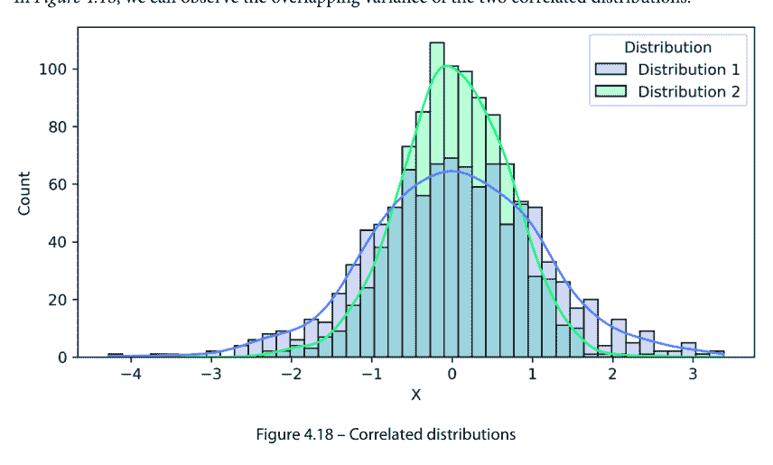

在*图 4.18*所示的图中，我们可以看到总体的重叠部分。现在，我们使用 `pearsonr()` 函数来检验相关性，如下所示：

```python
p, r = pearsonr(df_norm.loc[df_norm['Distribution'] ==
'Distribution 1', 'X'], df_norm.loc[df_norm['Distribution'] ==
'Distribution 2', 'X'])
print("p-value = %.4f"%p)
print("Correlation coefficient = %.4f"%r)
```

以下输出表明，在 0.05 的显著性水平下，我们得到 0.9327 的相关性水平（p 值为 0.0027）：

```
p-value = 0.0027

Correlation coefficient = 0.9327
```

换一种方式来描述相关性，假设我们知道分布 2 是对分布 1 的响应，我们可以说分布 1 解释了分布 2 中 $0.9327^2 = 87\%$ 的方差水平（$r^2$，也称为**拟合优度**或**决定系数**）。否则，我们可以说这两个变量之间的关系存在 0.93 的相关性，或者说解释了 87% 的方差水平。

现在，让我们来看一下来自 R 的 *Motor Trend Car Road Tests* 数据集，我们使用 `statsmodels.datasets.get_rdataset` 函数导入它。这里，我们展示了前五行数据，其中包含每加仑英里数（`mpg`）、气缸数（`cyl`）、发动机排量（`disp`）、马力（`hp`）、后轴齿轮比（`drat`）、重量（`wt`）、行驶四分之一英里最短时间（`qsec`）、发动机形状（`vs`=0 表示 V 型，`vs`=1 表示直列）、变速箱类型（`am`=0 表示自动，`am`=1 表示手动）、齿轮数（`gear`）和化油器数量（`carb`）（如果不是燃油喷射）等变量：

```python
import statsmodels.api as sm
df_cars = sm.datasets.get_rdataset("mtcars", "datasets").data
```

在图 4.19 中，我们可以看到数据集的前五行，该数据集包含适合进行皮尔逊相关分析的数据。

| mpg | cyl | disp | hp | drat | wt | qsec | vs | am | gear | carb |
|---|---|---|---|---|---|---|---|---|---|---|
| 21 | 6 | 160 | 110 | 3.9 | 2.62 | 16.46 | 0 | 1 | 4 | 4 |
| 21 | 6 | 160 | 110 | 3.9 | 2.875 | 17.02 | 0 | 1 | 4 | 4 |
| 22.8 | 4 | 108 | 93 | 3.85 | 2.32 | 18.61 | 1 | 1 | 4 | 1 |
| 21.4 | 6 | 258 | 110 | 3.08 | 3.215 | 19.44 | 1 | 0 | 3 | 1 |
| 18.7 | 8 | 360 | 175 | 3.15 | 3.44 | 17.02 | 0 | 0 | 3 | 2 |

图 4.19 – mtcars 数据集的前五行

使用该数据集，我们可以通过以下代码绘制相关矩阵，该矩阵显示了数据集中所有特征的两两相关性，以查看它们之间的关系：

```python
sns.set_theme(style="white")
corr = df_cars.corr()
f, ax = plt.subplots(figsize=(15, 10))
cmap = sns.diverging_palette(250, 20, as_cmap=True)
sns.heatmap(corr, cmap=cmap, vmax=.4, center=0,
            square=True, linewidths=.5, annot=True)
```

假设我们对四分之一英里时间（`qsec`）最有意义的变量感到好奇。在*图 4.20*中，通过查看 `qsec` 这一行，我们可以看到 `vs`（V 型）呈 0.74 的正相关。由于这是一个二元变量，我们可以根据此数据集假设直列发动机比 V 型发动机更快。然而，还有其他具有显著相关性的协变量。例如，马力与速度的相关性几乎与发动机形状一样强，即马力越高，四分之一英里运行时间越短：

## 参数检验

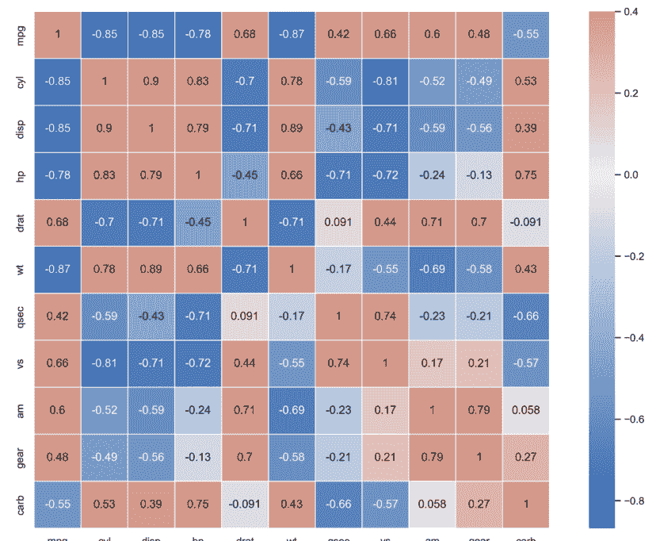

相关矩阵对于一次探索多个变量之间的关系非常有用。它也是在构建统计和**机器学习（ML）**模型（如线性回归）时进行特征选择的有用工具。

## 功效分析示例

功效分析是一种统计方法，用于确定假设检验为防止*第二类*错误（即在应该拒绝原假设时未能拒绝原假设）所需的适当样本量。功效分析也可用于根据样本量确定可检测的效应量（或差异）。换句话说，基于特定的样本量和分布，功效分析可以为分析人员提供一个特定的最小差异，研究人员可能能够通过给定的检验可靠地识别该差异。在本节中，我们将使用单样本 t 检验来演示功效分析。

### 单样本 t 检验

假设一家制造商销售一种机器，每月可生产 100,000 个单位，标准差为 2,800 个单位。一家公司购买了多台这样的机器，发现它们只能生产 90,000 个单位。该公司想知道需要多少台机器才能以高度的信心确定这些机器无法生产 100,000 个单位。以下功效分析表明，对于 t 检验，需要三个机器的样本，以 85% 的概率防止在实际与宣传的机器性能存在统计学显著差异时未能识别出来：

```python
from statsmodels.stats.power import TTestPower
import numpy as np
# 分布均值与待评估值之差除以分布标准差
effect_size = abs(100000-90000) / 2800
powersTT = TTestPower()
result = powersTT.solve_power(effect_size, nobs=3, alpha=0.05,
alternative='two-sided')
print('Power based on sample size:{}'.format(round(result,2)))
# Power based on sample size: 0.85
```

### 其他功效分析示例

要查看 Python 中功效分析的更多示例，请参阅本书的 GitHub 仓库。那里有额外的 t 检验和 F 检验的示例，这些检验侧重于分析样本组之间的方差。

## 总结

本章涵盖了参数检验的主题。从参数检验的假设开始，我们识别并应用了检验这些假设是否被违反的方法，并讨论了在所需假设不满足时可以假设稳健性的情景。然后，我们研究了 z 检验最受欢迎的替代方法之一——t 检验。我们迭代了该检验的多种应用，涵盖了使用合并、配对和 Welch 非合并版本的两样本分析的单样本和两样本版本。接下来，我们探讨了方差分析（ANOVA）技术，其中我们研究了使用来自多个组的数据来识别它们之间统计学显著差异的方法。这包括当存在大量组时对 p 值最受欢迎的调整之一——Bonferroni 校正，它有助于防止在执行多重检验时膨胀第一类错误。然后，我们研究了使用皮尔逊相关系数对连续数据进行相关性分析，以及如何使用相关矩阵和附带的热图可视化相关性。最后，我们简要概述了功效分析，并给出了使用单样本 t 检验执行此分析的示例。在下一章中，我们将讨论非参数假设检验，包括除了与本章参数检验配对的检验之外的新检验，用于无法安全假设假设的情况。

## 参考文献

[1] *Dua, D. and Graff, C. (2019). UCI Machine Learning Repository [http://archive.ics.uci.edu/ml]. Irvine, CA: University of California, School of Information and Computer Science.*

# 5 非参数检验

在上一章中，我们讨论了参数检验。当检验假设得到满足时，参数检验非常有用。然而，在某些情况下，这些假设并不成立。在本章中，我们将讨论几种针对上一章介绍的参数检验的非参数替代方法。我们首先介绍非参数检验的概念。然后，我们将讨论几种在 t 检验或 z 检验假设不满足时可以使用的非参数检验。

在本章中，我们将涵盖以下主要主题：

- 当参数检验假设被违反时
- 秩和检验
- 符号秩检验
- Kruskal-Wallis 检验
- 卡方检验
- Spearman 相关分析
- 卡方功效分析

## 当参数检验假设被违反时

在上一章中，我们讨论了参数检验。参数检验具有很强的统计功效，但也要求严格遵守假设条件。当假设不满足时，检验结果就无效。幸运的是，我们有替代检验方法，可以在参数检验的假设不满足时使用。这些检验被称为**非参数**检验，这意味着它们*不对数据的底层分布做任何假设*。虽然非参数检验不需要分布假设，但这些*检验仍然要求样本是独立的*。

## 置换检验

对于第一个非参数检验，让我们更深入地探讨 p 值的定义。p 值是在原假设成立的条件下，*获得至少与观测值一样极端的检验统计量的概率*。因此，要计算 p 值，我们需要原分布和一个观测统计量。p 值是检验统计量比观测统计量更极端的样本比例。事实证明，我们可以使用数据的置换来构建原分布。让我们看看如何使用以下数据集构建原分布。该数据集可以表示低温和高温下的机器故障次数。我们假设样本是独立的：

```
low_temp = np.array([0, 0, 0, 0, 0, 1, 1])
high_temp = np.array([1, 2, 3, 1])
```

要构建原假设，我们首先需要确定一个统计量。在这种情况下，我们将寻找两个分布均值的差异。因此，我们的统计量如下：

$\bar{x}_{lowtemp} - \bar{x}_{hightemp}$

现在，要计算分布值，需要计算数据集所有排列的统计量。以下是数据集排列的几个示例。

| 标签 | 观测值 | P1 | P2 | P3 | P4 | P5 | ... |
| :--- | :--- | :--- | :--- | :--- | :--- | :--- | :--- |
| low | 0 | 1 | 0 | 1 | 0 | 1 | ... |
| low | 0 | 1 | 3 | 0 | 3 | 0 | ... |
| low | 0 | 0 | 0 | 1 | 1 | 3 | ... |
| low | 0 | 1 | 1 | 0 | 2 | 0 | ... |
| low | 0 | 0 | 1 | 2 | 0 | 1 | ... |
| low | 1 | 1 | 1 | 3 | 0 | 1 | ... |
| low | 1 | 0 | 1 | 1 | 1 | 0 | ... |
| high | 1 | 0 | 2 | 0 | 1 | 2 | ... |
| high | 2 | 3 | 0 | 0 | 0 | 1 | ... |
| high | 3 | 0 | 0 | 1 | 1 | 0 | ... |
| high | 1 | 2 | 0 | 0 | 0 | 0 | ... |
| 均值差 | -1.46 | -0.68 | 0.5 | 0.89 | 0.5 | 0.11 | ... |

图 5.1 – 观测数据的前五次排列及均值差

该表显示了观测数据以及五个随机生成的值排列。我们计算每次排列的均值差。均值差就是原分布的值。一旦我们有了分布，就可以计算 p 值，即比观测值更极端的值的比例。

### 置换计算的规模

通常，置换检验的计算成本可能很高，因为排列的数量随着分布规模的增加而快速增长。例如，样本量为 3、5 和 7 的数据集对应的排列数量分别为 6、120 和 5,040。此处显示的数据集有超过 3900 万种排列！由于计算原分布所需的排列数量庞大，在大数据集上进行置换检验的运行时性能可能会很慢。

我们可以使用 `scipy` 中的 `permutation_test` 函数在 Python 中执行置换检验。该函数计算检验统计量、原分布和 p 值：

```
def statistic_function(set_one, set_two):
    return np.mean(set_one) - np.mean(set_two)

random_gen=42

perm_result = sp.stats.permutation_test(
    (low_temp, high_temp) ,
    statistic_function, random_state=random_gen,

)
```

此函数从数据集中生成以下分布。

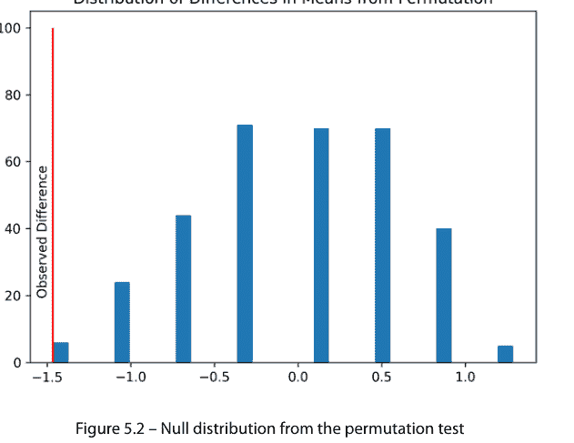

图 5.2 – 置换检验的原分布

置换检验的原分布和两组均值的观测差异如*图 5.2*所示。置换检验的 p 值为 0.036。置换检验是本节将介绍的几种非参数检验中的第一种。同样，当参数检验的假设不满足时，这类检验非常有用。*但是，如果可以使用参数检验，则应该使用参数检验*；非参数检验不应作为默认方法。

在本节中，我们通过置换检验介绍了非参数检验。置换检验是一种应用广泛的非参数检验，但置换的计算量随着数据集规模的增加而快速增长，这可能使其在某些情况下不实用。在接下来的几节中，我们将介绍几种其他不需要计算原分布的非参数检验。

## 秩和检验

当 t 检验的假设不满足时，秩和检验通常是一个很好的非参数替代检验。虽然 t 检验可用于检验*两个分布均值的差异*，但秩和检验用于检验*两个分布位置的差异*。这种检验用途上的差异是由于秩和检验缺乏参数假设。秩和检验的原假设是第一个样本的底层分布与第二个样本相同。如果样本分布看起来相似，这允许我们使用秩和检验来检验两个样本位置的差异。如前所述，秩和检验不能专门用于检验均值的差异，因为它不需要对样本分布做假设。

### 检验统计量程序

检验程序很简单。流程概述如下，并在下表中给出了示例：

1.  将所有样本值合并为一个集合，并按升序对样本进行排序，同时跟踪它们的标签。
2.  为所有样本分配秩，从最低样本值的秩 1 开始。
3.  当出现结时，用结值的平均秩替换结值的秩。
4.  对最小样本组的秩求和，即为检验统计量 *T*。

一旦计算出检验统计量，就可以计算 p 值。p 值可以通过正态近似或精确方法计算。通常，精确方法仅在样本量较小（少于 8 个样本）时使用。

### 正态近似

一旦计算出秩和检验的 $T$ 统计量，我们就可以通过精确方法或正态近似来确定 p 值。我们将在此介绍近似方法，因为精确方法需要置换检验，这将需要使用软件。我们用 z 分数（回顾*第 3 章，假设检验*中的 z 分数）来近似 p 值：

$$Z = \frac{T - \text{Mean}(T)}{\text{STDEV}(T)}$$

其中

$$\text{Mean}(T) = n_T \bar{R}$$

且

$$\text{STDEV}(T) = s_R \sqrt{\frac{n_T n_O}{n_T + n_O}}$$

在这些方程中，$n_T$ 是用于计算 $T$ 的组中的样本数，$n_O$ 是另一组中的样本数，$\bar{R}$ 是校正秩的平均值，$s_R$ 是校正秩的标准差。一旦计算出 $Z$，就可以查找 z 分布对应的 p 值。描述完方法后，让我们看一个例子。下表中显示的数据可以在随附的 Jupyter 笔记本中找到。

### 秩和检验示例

下表显示了对一组标记为“L”和“H”的两组数据执行此过程的结果，其中将使用秩和检验来检验两个样本分布位置的差异。该表的检验统计量为 42.5，即 L 组校正秩的总和。该检验统计量对应的近似 p 值为 0.00194（双侧检验）。该表的数据下载自 https://github.com/OpenIntroStat/openintro/raw/master/data/gpa_iq.rda。

| IQ | 组 | 秩 | 校正秩 |
|---|---|---|---|
| 77 | L | 1 | 1 |
| 79 | L | 2 | 2 |
| 93 | L | 3 | 3 |
| 96 | L | 4 | 4 |
| 104 | L | 5 | 5 |
| 105 | H | 6 | 6 |
| 106 | H | 7 | 7 |
| 107 | L | 8 | 8 |
| 109 | L | 9 | 9 |

| 智商 | 组别 | 排名 | 校正排名 |
|---|---|---|---|
| 111 | H | 10 | 10.5 |
| 111 | L | 11 | 10.5 |
| 112 | H | 12 | 12 |
| 116 | H | 13 | 13 |
| 118 | H | 14 | 14 |
| 124 | H | 15 | 15 |
| 126 | H | 16 | 16 |
| 127 | H | 17 | 17 |
| 128 | H | 18 | 18.5 |
| 128 | H | 19 | 18.5 |

图 5.3 – 秩和检验的校正排名

我们也可以使用软件，通过`scipy`中的`mannwhitneyu`函数来执行此检验。对于以下代码示例，上表中对应于L和H的值分别包含在`lower_score_iqs`和`higher_score_iqs`变量中：

```
mannwhitneyu(higher_score_iqs, lower_score_iqs).pvalue
# 0.00222925216588146
```

在本节中，我们讨论了秩和检验，它是t检验的一种非参数替代方法。秩和检验用于检验两个样本数据分布的位置是否存在差异。在下一节中，我们将探讨一种类似的基于秩的检验，它用于比较配对数据，类似于*第4章，参数检验*中的配对t检验。

## 符号秩检验

Wilcoxon符号秩检验是配对t检验的一种非参数替代版本，当正态性假设不满足时使用。由于在原假设和备择假设中使用了秩和中位数而非均值，该检验对异常值具有稳健性。正如检验名称所示，它使用了两个阶段之间差异的大小及其符号。

在研究中，原假设认为阶段1和阶段2之间的中位数差异为零。同样，与配对t检验类似，对于备择假设，在双尾检验中，认为阶段1和阶段2之间的中位数差异不为零；或者在单尾检验中，认为阶段1和阶段2之间的中位数差异大于（或小于）零。

尽管放宽了正态性要求，但该检验要求配对观测值之间相互独立，并且这些观测值来自同一总体。此外，要求因变量是连续的。

要计算检验统计量，需遵循以下步骤：

1.  计算两个阶段每对之间的差异。
2.  如果存在差异为零的配对，则将其剔除。
3.  取每对差异的绝对值，并按从小到大的顺序进行排名。
4.  通过将正号对应的秩相加，计算符号秩统计量S。

让我们考虑以下简单示例。我们考虑九个样本在两个阶段（治疗前和治疗后）的通用数据。

| 配对 | 治疗前 | 治疗后 | 绝对差值 | 符号 | 秩 |
| :---: | :---: | :---: | :---: | :---: | :---: |
| 1 | 37 | 38 | 1 | - | 1 |
| 2 | 14 | 17 | 3 | - | 2.5 |
| 3 | 22 | 19 | 3 | + | 2.5 |
| 4 | 12 | 7 | 5 | + | 4 |
| 5 | 24 | 15 | 9 | + | 5 |
| 6 | 35 | 25 | 10 | + | 6 |
| 7 | 35 | 24 | 11 | + | 7 |
| 8 | 51 | 38 | 13 | + | 8 |
| 9 | 39 | 19 | 20 | + | 9 |

图 5.4 – 符号秩检验的秩计算演示

通过观察上表，我们可以看到第二对和第三对具有相同的绝对差值。因此，它们的秩通过取其原始秩的平均值来计算，(2+3)/2 = 2.5。单侧检验的原假设和备择假设如下：

$H_0$：治疗前后的中位数差异为零

$H_a$：治疗前后的中位数差异为正

符号秩统计量是正差异秩的总和，计算如下：

$$S = 2.5 + 4 + 5 + 6 + 7 + 8 + 9 = 41.5.$$

$S$的均值为：

$$Mean(S) = \frac{n(n+1)}{4} = \frac{9 \cdot 10}{4} = 22.5$$

$S$的标准差为：

$$SD(S) = \sqrt{\frac{n(n+1)(2n+1)}{24}} = \sqrt{\frac{9 \cdot 10 \cdot 19}{24}} = 8.44.$$

然后，通过以下公式计算检验统计量：

$$Z_{statistic} = \frac{S - Mean(S)}{SD(S)} = \frac{41.5 - 22.5}{8.44} = 2.2511.$$

参考*第3章，假设检验*，我们可以使用`scipy.stats.norm.sf()`函数，根据$Z_{statistic}$计算近似的单侧p值0.012。

在$\alpha = 0.05$的显著性水平下，由于p值 < $\alpha$，我们拒绝原假设。有强有力的证据表明，治疗前的中位数大于治疗后的中位数。在Python中，可以简单地实现该检验，如下所示：

```
import scipy.stats as stats
import numpy as np

before_treatment = np.array([37, 14, 22, 12, 24, 35, 35, 51, 39])
after_treatment = np.array([38,17, 19, 7, 15, 25, 24, 38, 19])

# Signed Rank Test
stats.wilcoxon(before_treatment, after_treatment, alternative = 'greater')
```

该检验的文档可在以下链接找到：

https://docs.scipy.org/doc/scipy/reference/generated/scipy.stats.wilcoxon.html

## Kruskal-Wallis检验

我们现在要讨论的另一种非参数检验是Kruskal-Wallis检验。当正态性假设不满足时，它是单因素方差分析检验的一种替代方法。它使用中位数而非均值来检验两个或多个独立组之间是否存在统计学上的显著差异。让我们考虑一个包含三个独立组的通用示例：

```
group1 = [8, 13, 13, 15, 12, 10, 6, 15, 13, 9]
group2 = [16, 17, 14, 14, 15, 12, 9, 12, 11, 9]
group3 = [7, 8, 9, 9, 4, 15, 13, 9, 11, 9]
```

原假设和备择假设陈述如下。

$H_0$：这三个组的中位数相等

$H_a$：这三个组的中位数不相等

在Python中，使用`scipy.stats.kruskal`函数很容易实现。文档可在以下链接找到：

https://docs.scipy.org/doc/scipy/reference/generated/scipy.stats.kruskal.html

```
from scipy import stats
group1 = [8, 13, 13, 15, 12, 10, 6, 15, 13, 9]
group2 = [16, 17, 14, 14, 15, 12, 9, 12, 11, 9]
group3 = [7, 8, 9, 9, 4, 15, 13, 9, 11, 9]
#Kruskal-Wallis Test
stats.kruskal(group1, group2, group3)
```

上述代码的输出如下：

`KruskalResult(statistic=5.7342701722574905, pvalue=0.056861597028239855)`

在$\alpha = 0.05$的显著性水平下，由于p值 > $\alpha$，我们未能拒绝原假设。没有强有力的证据表明这三个组的中位数不相等。

## 卡方分布

研究人员经常需要对分类数据进行假设检验。*第4章，参数检验*中涵盖的参数检验通常对此类分析帮助不大。在上一章中，我们讨论了使用F检验来比较样本方差。扩展这一概念，我们可以考虑非参数且非对称的卡方概率分布，该分布可用于比较抽样分布方差的均值与其总体方差，特别是在原假设下，样本方差的抽样分布的均值预期等于总体方差。由于方差不能为负，该分布从原点0开始。这里，我们可以看到**卡方分布**：

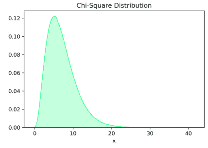

图 5.5 – 具有七个自由度的卡方分布

卡方分布的形状并不像标准正态分布那样假设百分位数固定于标准差；它预期会随着计算的每个额外样本方差而变化。当计算方差抽样分布的原始总体数据可假定为正态分布时，卡方标准化检验统计量计算如下：

$$\chi^2 = \frac{(n-1)s^2}{\sigma^2}$$

其中(n-1)用于计算自由度，自由度用于解释构建检验统计量时的抽样误差。临界值基于自由度和所需显著性水平的查表。原假设始终为$H_0: \sigma_{\chi}^2 = \sigma_0^2$，其中$\sigma_{\chi}^2$是观测到的分布方差，$\sigma_0^2$是预期方差。单尾检验的备择假设在检验右尾时为$H_a: \sigma_{\chi}^2 \geq \sigma_0^2$，在检验左尾时为$H_a: \sigma_{\chi}^2 \leq \sigma_0^2$。双尾检验的备择假设为$H_a: \sigma_{\chi}^2 \neq \sigma_0^2$。当总体数据可假定为正态分布时，此检验与F检验类似，因为两者都在比较两个方差，并且当两者相同时结果为1。区别在于卡方检验统计量考虑了自由度，因此对差异的敏感性较低。

理解此检验如何用于比较方差，有助于理解卡方分布如何也与分类数据的出现频率相关。在前面的卡方统计量中，我们可以将样本方差统计量视为观测值，而总体方差参数是我们预期会发生的情况。在确定分类因子水平的出现是否具有统计学意义时，我们可以*将观测到的出现次数与预期出现次数进行比较*。我们将在以下部分中说明两个最广泛使用的版本的示例，即**卡方拟合优度检验**和**卡方独立性检验**。这些检验被视为非参数检验，因为它们不需要*第4章，参数检验*第一节中所述的假设。

> **卡方拟合优度检验和独立性检验的尾部性**
以下两节中的卡方拟合优度检验和卡方独立性检验始终是右尾检验。这些检验中的原假设指出观测频率和预期频率之间的差异为零。备择假设是观测频率和预期频率不相同。$\chi^2$检验统计量越接近0，观测频率和预期频率彼此近似的可能性就越大。

### 卡方拟合优度检验

**卡方拟合优度检验**通过比较单个变量（因子）多个因子水平的出现次数，来判断这些水平在统计上是否相等。例如，某供应商向客户提供三种型号的手机——即单一因子（手机）的三个水平（品牌），客户每周平均购买90部手机。我们可以认为期望频率为1/3——即平均每周售出每种型号30部手机。皮尔逊卡方检验统计量通过比较观测频率与期望频率计算得出，是用于卡方拟合优度检验的统计量。该检验统计量的线性方程如下：

$$\chi^2 = \sum \frac{(O_i - E_i)^2}{E_i}, \text{自由度} = k-1$$

其中$O_i$为观测频率，$E_i$为期望频率，$k$为因子水平数。以我们的手机示例为例，从供应商处我们得知期望频率1/3实际上并非观测结果；供应商平均每周售出A、B、C型号手机分别为45部、30部和15部。假设我们想知道观测频率与期望频率是否存在统计显著性差异。零假设为频率相等。我们构建**皮尔逊卡方检验统计量**如下：

$$\chi^2 = \frac{(45 - 30)^2}{30} + \frac{(30 - 30)^2}{30} + \frac{(15 - 30)^2}{30} = 15$$

假设我们使用显著性水平为0.05的假设检验（右尾检验），从而形成备择假设：观测频率与期望频率不相等。卡方临界值表显示，在显著性水平0.05、自由度$df: 3 - 1 = 2$的条件下，临界值为5.9915。由于$15 > 5.9915$，我们可以根据临界值检验得出拒绝零假设的结论。

要在Python中执行此操作，可以使用`statsmodels.stats.gof`模块的`chisquare`函数。观测频率和期望频率都需要以列表或数组形式传入各组数据量。`statsmodels`的`chisquare`检验会根据观测（`f_obs`）列表中的值数量自动计算k-1自由度，但`scipy`的`chi2.ppf`函数（用于提供临界值）必须提供自由度，从而无需手动查表：

```
from statsmodels.stats.gof import chisquare
from scipy.stats import chi2

chi_square_stat, p_value = chisquare(f_obs=[45, 30, 15],
                                    f_exp=[30, 30, 30])
chi_square_critical_value = chi2.ppf(1-.05, df=2)
print('Chi-Square Test Statistic: %.4f'%chi_square_stat)
print('Chi-Square Critical Value: %.4f'%chi_square_critical_value)
print('P-Value: %.4f'%p_value)
```

如前所述，由于p值低于0.05的显著性水平且检验统计量大于临界值，我们可以认为有充分证据拒绝零假设，并得出结论：存在统计显著性表明各型号手机的购买量并不相等：

Chi-Square Test Statistic: 15.0000

Chi-Square Critical Value: 5.9915

P-Value: 0.0006

此时我们可以重新对两个频率进行检验，例如比较45与30或45与15，期望频率分别为37.5和37.5或30和30，以确定哪种手机可能是销售不平衡的最大影响因素。

### 卡方独立性检验

假设我们有一个2021年德克萨斯州观测到的车辆碰撞数据集《按伤害程度和座位位置划分的安全带使用情况》（https://www.txdot.gov/data-maps/crash-reports-records/motor-vehicle-crash-statistics.html），并想知道使用安全带是否导致死亡率存在统计显著性差异。我们有如下观测值表：

| | 使用安全带 | 未使用安全带 | 总计 |
|---|---|---|---|
| 致命 | 1,429 | 1,235 | 2,664 |
| 非致命 | 1,216,934 | 22,663 | 1,239,597 |
| 总计 | 1,218,363 | 23,898 | 1,242,261 |

图5.6 – 卡方独立性检验“观测”表

现在让我们使用以下公式创建期望值表：

$$E_{ij} = \frac{T_i T_j}{N}$$

其中$T_i$为第i行的总计，$T_j$为第j列的总计，$N$为观测总数。计算结果如下：

| | 使用安全带 | 未使用安全带 | 总计 |
|---|---|---|---|
| 致命 | (2,664 * 1,218,363) / 1,242,261 = 2,612.75 | (2,664 * 23,898) / 1,242,261 = 51.25 | 2,664 |
| 非致命 | (1,216,934 * 1,239,597) / 1,242,261 = 1,214,324.31 | (1,239,597 * 23,898) / 1,242,261 = 23,846.75 | 1,239,597 |
| 总计 | 1,218,363 | 23,898 | 1,242,261 |

图5.7 – 卡方独立性检验“期望”表

我们在拟合优度检验中使用的皮尔逊卡方检验统计量的扩展版本（适用于卡方独立性检验）如下：

$$\chi^2 = \sum \frac{(O_{ij} - E_{ij})^2}{E_{ij}}, \text{自由度} = (r-1)(c-1)$$

下标$j$对应列数据，下标$i$对应行数据，观测值和期望值分别表示为$O$和$E$。自由度计算中的$r$和$c$值对应表格的行数和列数（此处为2x2，因此自由度等于(2-1)(2-1)=1）。

使用观测表和期望表中的值，我们计算出卡方检验统计量等于：

$$\chi^2 = \frac{(1,429 - 2,612.75)^2}{2,612.75} + \frac{(1,216,934 - 1,214,324.31)^2}{1,214,324.31} + \frac{(1,235 - 51.25)^2}{51.25} + \frac{(22,663 - 23,846.75)^2}{23,846.75} = 27,942.43$$

使用此处计算的一个自由度查表得到的检验统计量为3.84。我们可以合理地得出结论：由于检验统计量27,942.43大于临界值3.84，因此在2021年的德克萨斯州，使用安全带与未使用安全带的车辆碰撞死亡率存在统计显著性差异。

> **卡方列联表**
我们执行的检验使用了两个2x2表格，称为列联表。卡方独立性检验通常被称为**卡方列联检验**。未能拒绝零假设**取决于**观测表的值在统计置信水平内与期望表的值匹配。然而，卡方独立性检验可以扩展到**任意行列组合的表格**。但是，随着行数和列数的增加，表格的可解释性可能会降低。

要在Python中执行此检验，可以使用`scipy.stats`模块的`chi2_contingency`函数。仅输入观测频率作为2x2 numpy数组，`chi2_contingency`检验会提供零假设成立时的期望频率——p值、使用的自由度以及卡方检验统计量：

```
from scipy.stats import chi2_contingency
from scipy.stats import chi2
import numpy as np

observed_frequencies = np.array([[1429, 1235], [1216934, 22663]])
chi_square_test_statistic, p_value, degrees_of_freedom, expected_frequencies = chi2_contingency(observed_frequencies)
chi_square_critical_value = chi2.ppf(1-.05, df=degrees_of_freedom)
print('Chi-Square Test Statistic: %.4f'%chi_square_test_statistic)
print('Chi-Square Critical Value: %.4f'%chi_square_critical_value)
print('P-Value: %.4f'%p_value)
```

此处我们看到卡方检验统计量远大于0.05显著性水平下的卡方临界值，且p值显著（p < 0.0000）。因此，我们可以得出结论：有强有力的统计证据表明，使用安全带与未使用安全带的汽车碰撞死亡率存在巨大差异：

Chi-Square Test Statistic: 27915.1221

Chi-Square Critical Value: 3.8415

P-Value: 0.0000

> **耶茨连续性校正**

可以向`chi2_contingency`检验添加一个可选参数`correction =`，并输入布尔值（True或False）。这将应用耶茨连续性校正，根据`scipy.stats`文档，该方法将每个观测值向相应的期望值调整0.5。调整的目的是避免因期望样本量小而错误检测到统计显著性。主观上，这对于期望频率单元格中少于10个样本的情况很有用。然而，许多从业者和研究者反对使用此方法。

### 卡方拟合优度检验功效分析

让我们以一个手机供应商销售四种流行型号手机（A、B、C、D）为例。我们想确定需要多少样本才能产生0.8的功效，以便了解不同手机的受欢迎程度是否存在统计显著性差异，从而使供应商能更合理地投资手机采购。在此例中，零假设断言每种型号手机的销售占比为25%。实际上，售出的手机中A型号占20%，B型号占30%，C型号占19%，D型号占31%。

测试`nobs`参数（观测数量）的不同值，我们发现至少需要224个样本才能产生略高于0.801的功效。增加样本量只会提高此功效。如果真实分布与假设的25%均等分布差异更大，则需要更少的样本。然而，由于各分布相对接近25%，因此需要大量样本：

```
from statsmodels.stats.power import GofChisquarePower
from statsmodels.stats.gof import chisquare_effectsize

# probs0断言每种品牌销售占比为25%
# 实际上，A品牌占12%，B品牌占25%，C品牌占33%，
# D品牌占1%。
```

effect_size = chisquare_effectsize(probs0=[25, 25, 25, 25],
probs1=[20, 30, 19, 31], cohen=True)
alpha = 0.05
n_bins=4 # 4 brands of phones

analysis = GofChisquarePower()
result = analysis.solve_power(effect_size, nobs=224, alpha=alpha, n_bins=n_bins)
print('Sample Size Required in Sample 1: {:.3f}'.format(result))

# Sample Size Required in Sample 1: 0.801

## 斯皮尔曼等级相关系数

在*第4章 参数检验*中，我们探讨了参数相关系数——皮尔逊相关系数，该系数基于独立抽样的连续数据计算。然而，**当我们拥有排序的、有序数据时**，例如来自满意度调查的数据，我们就不应使用皮尔逊相关系数，因为它无法保证顺序的保持。与皮尔逊相关系数类似，**斯皮尔曼相关系数**的结果也是一个系数 *r*，其范围从-1到1，其中-1表示强负相关，1表示强正相关。斯皮尔曼系数是通过将两个变量等级的协方差除以它们标准差的乘积得出的。相关系数 *r* 的公式如下：

$$r_s = \frac{S_{xy}}{\sqrt{S_{xx}S_{yy}}}$$

其中

$$S_{xy} = \sum(x_i - \bar{x})(y_i - \bar{y})$$
$$S_{xx} = \sum(x_i - \bar{x})^2$$
$$S_{yy} = \sum(y_i - \bar{y})$$

上述相关方程在所有排序场景下都是安全可用的。然而，当没有结（ties）或结的比例相对于总体样本量很小时，可以使用以下方程：

$$r_s = \frac{6\sum d_i^2}{n(n^2 - 1)}, \text{where } d_i = (x_i - y_i)$$

但是，我们将在Python中执行此检验。因此，无论结的情况如何，都将应用更复杂但更不易出错的公式，因为计算能力使我们能够完全绕过手动计算过程。

假设我们有一场比赛中的学生，由两位评委进行评判，并且担心其中一位评委可能基于混淆因素（如家庭关系）而非仅仅表现，对某些参赛者存在偏见。我们决定对分数进行相关分析，以检验两位评委对每位参赛者评分相似的假设：

```python
from scipy.stats import spearmanr
import pandas as pd
df_scores = pd.DataFrame({'Judge A': [1, 3, 5, 7, 8, 3, 9],
                          'Judge B': [2, 5, 3, 9, 6, 1, 7]})
```

我们有以下参赛者表格：

| | 学生1 | 学生2 | 学生3 | 学生4 | 学生5 | 学生6 | 学生7 |
|---|---|---|---|---|---|---|---|
| 评委A | 1 | 3 | 5 | 7 | 8 | 3 | 9 |
| 评委B | 2 | 5 | 3 | 9 | 6 | 1 | 7 |

图5.8 – 用于斯皮尔曼相关分析的学生参赛者评委排名

```python
correlation, p_value = spearmanr(df_scores['Judge A'],
                                df_scores['Judge B'])
print('Spearman Correlation Coefficient: %.4f'%correlation)
print('P-Value: %.4f'%p_value)
```

基于此处的p值为0.04，小于0.05的显著性水平，我们可以说产生的相关性在随机偶然性之外是显著的。如果p值大于0.05，我们可以说有95%的置信度认为该相关性可能纯粹是虚假的，并且可能没有足够的统计证据支持确定性。斯皮尔曼相关系数（r）为0.7748。因此，r_squared约为0.6003，意味着分数变异中约60.3%是由评委的评分决定的：

Spearman Correlation Coefficient: 0.7748

P-Value: 0.0408

由于p值显著且相关系数为0.77——而强相关系数大约从0.7开始——我们可以得出结论，评委的分数足够直接相关，可以假设评分中不存在偏见，前提是存在相对客观的排名方法；更主观的方法可能不太适合相关分析。

## 总结

在本章中，我们讨论了当参数假设检验所需的条件无法审慎保证时，最常用的一些非参数假设检验。我们讨论了双样本Wilcoxon秩和检验（也称为Mann-Whitney U检验），用于在无法进行双样本t检验时从中位数进行推断。接下来，我们介绍了当无法进行配对t检验比较均值时，Wilcoxon符号秩检验对中位数的配对比较。之后，我们探讨了非参数卡方拟合优度检验和卡方独立性检验，用于比较观察频率与期望频率，两者都有助于识别分类数据计数中是否存在统计显著差异。此外，我们讨论了Kruskal-Wallis检验，这是方差分析（ANOVA）的非参数替代方法。最后，我们讨论了斯皮尔曼相关系数以及当参数假设无法安全支持使用皮尔逊相关时，如何基于等级推导相关性。在本章结束时，我们提供了一个使用功效分析进行卡方检验的示例。

在下一章中，我们将开始讨论预测分析，从简单线性回归开始。在那里，我们将讨论拟合模型的方法、解释线性系数、理解线性回归所需的假设、评估模型性能以及考虑线性回归的修改版本。

# 第二部分：回归模型

在本部分中，我们讨论可以使用回归解决的问题类型、相关系数和决定系数、多元建模、模型选择以及使用正则化进行变量调整。

它包括以下章节：

- 第6章 简单线性回归
- 第7章 多元线性回归

# 简单线性回归

在前面的章节中，我们处理了单变量的分布。现在我们将讨论变量之间的关系。在本章和下一章中，我们将使用线性回归来研究两个或多个变量之间的关系。在本章中，我们将在**普通最小二乘法（OLS）**回归的框架内讨论简单线性回归。简单线性回归是从两个线性相关变量估计连续值的非常有用的工具。我们将概述回归误差背后的直觉和计算。接下来，我们将概述线性回归的相关假设。之后，我们将分析`statsmodels`中OLS的输出摘要，最后，我们将讨论序列相关和模型验证的场景。如前所述，本章的主要主题遵循以下框架：

- 使用OLS的简单线性回归
- 相关系数和决定系数
- 所需的模型假设
- 显著性检验
- 处理模型误差
- 验证模型

## 使用OLS的简单线性回归

我们将研究最简单的机器学习模型之一——简单线性回归。我们将在OLS的背景下概述它，其目标是最小化误差平方和。这是一个与因变量（定量响应）$y$及其自变量$x$相关的简单概念，它们的关系可以近似地画成一条直线。数学上，简单线性回归模型可以写成以下形式：

$$y = \beta_0 + \beta_1 x + \epsilon$$

这里，$\beta_0$是截距项，$\beta_1$是线性模型的斜率。误差项在前面的线性模型中表示为$\epsilon$。我们可以看到，在误差项为零的理想情况下，$\beta_0$表示当$x = 0$时因变量$y$的值。在自变量$x$的范围内，$\beta_1$表示对应于$x$单位变化的结果$y$的增加量。在文献中，自变量$x$可以称为解释变量、预测变量、输入或特征，因变量$y$可以称为响应变量、输出或目标。问题被提出：“如果我们有一个来自数据集$(x_i, y_i)$的样本，其中$i = 1, 2, \dots, n$个点），我们如何使用截距项和斜率确定最佳拟合线？”通过估计这些项，我们将拟合通过数据的最佳直线，以显示自变量和因变量之间的线性关系。

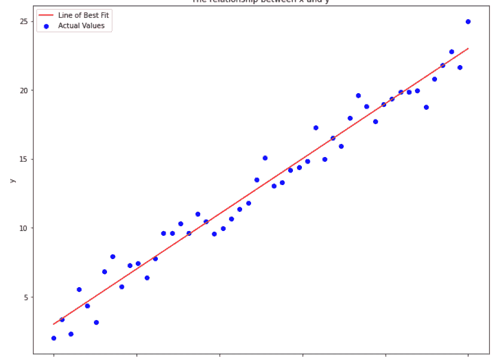

图6.1 – x与y之间的关系——最佳拟合线

在前面的绘图示例中，蓝点是代表自变量$x$和因变量$y$之间关系的实际值。红线是通过所有这些数据点的最佳拟合线。我们现在的目标是制定预测线（最佳拟合线）：

$$\hat{y} = \widehat{\beta}_0 + \widehat{\beta}_1 x$$

仔细观察预测值与真实值之间的关系。为了找到最佳拟合线，我们将最小化垂直距离，这意味着我们将最小化数据点与穿过数据的直线之间的误差。换句话说，我们将最小化平方误差之和，其计算公式如下：

$$\sum_{i=1}^{n} e_i^2$$

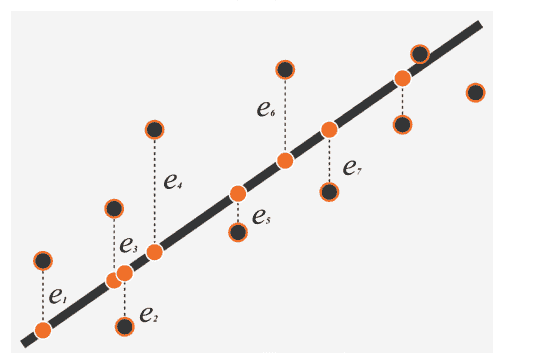

图 6.2 – 数据点与穿过数据的直线之间的误差

其中，

$$e_i = y_i - \widehat{y}_i,$$

这里，$y_i$ 是观测值，$\widehat{y}_i$ 是第 $i^{th}$ 个观测值的响应变量 $y$ 的预测值。平方误差之和由下式给出：

$$S = \sum_{i=1}^{n} (y_i - \widehat{\beta}_0 - \widehat{\beta}_1 x_i)^2$$

为了最小化 S，我们将对 $\widehat{\beta}_0$ 和 $\widehat{\beta}_1$ 求偏导数。然后，我们得到：

$$\frac{\partial S}{\partial \widehat{\beta}_0} = -2\sum(y_i - \widehat{\beta}_0 - \widehat{\beta}_1 x_i) = 0,$$

$$\frac{\partial S}{\partial \widehat{\beta}_1} = -2\sum x_i(y_i - \widehat{\beta}_0 - \widehat{\beta}_1 x_i) = 0.$$

因此，很容易看出：

$$n\widehat{\beta}_0 + (\sum_{i=1}^{n} x_i)\widehat{\beta}_1 = \sum_{i=1}^{n} y_i,$$

$$(\sum_{i=1}^{n} x_i)\widehat{\beta}_0 + (\sum_{i=1}^{n} x_i^2)\widehat{\beta}_1 = \sum_{i=1}^{n} x_i y_i,$$

这意味着：

$$\widehat{\beta_0} = \frac{\sum_{i=1}^n y_i}{n} - \widehat{\beta_1} \frac{\sum_{i=1}^n x_i}{n},$$

$$\frac{\sum_{i=1}^n x_i \sum_{i=1}^n y_i}{n} - \frac{(\sum_{i=1}^n x_i)^2}{n} \widehat{\beta_1} + (\sum_{i=1}^n x_i^2) \widehat{\beta_1} = \sum_{i=1}^n x_i y_i.$$

因为 $\bar{y} = \frac{\sum_{i=1}^n y_i}{n}$ 且 $\bar{x} = \frac{\sum_{i=1}^n x_i}{n}$，我们可以将斜率和截距重写如下：

$$\widehat{\beta_0} = \bar{y} - \widehat{\beta_1} \bar{x},$$

$$\widehat{\beta_1} = \frac{\sum (x_i - \bar{x})(y_i - \bar{y})}{\sum (x_i - \bar{x})^2}.$$

在 Python 中，我们可以实现以下代码来求 $\widehat{\beta_0}$ 和 $\widehat{\beta_1}$：

```python
def least_squares_method(x, y):
    x_mean = x.mean()
    y_mean = y.mean()
    beta1 = ((x - x_mean) * (y - y_mean)).sum(axis=0) / ((x - x.mean()) ** 2).sum(axis=0)
    beta0 = y_mean - (beta1 * x_mean)
    return beta0, beta1
```

## 相关系数与决定系数

在本节中，我们将讨论两个相关概念——相关系数和决定系数。

### 相关系数

相关系数是衡量两个变量之间统计线性关系的指标，可以使用以下公式计算：

$$r = \frac{1}{n-1} \sum_{i=1}^n \left( \frac{x_i - \bar{x}}{s_x} \right) \left( \frac{y_i - \bar{y}}{s_y} \right)$$

读者可以访问此处 – https://shiny.rit.albany.edu/stat/corrsim/ – 来模拟两个变量之间的相关关系。

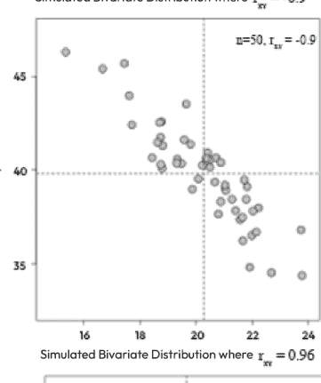

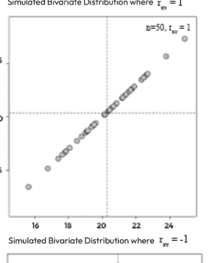

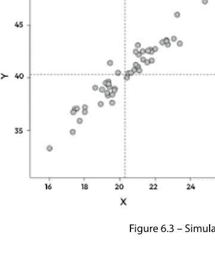

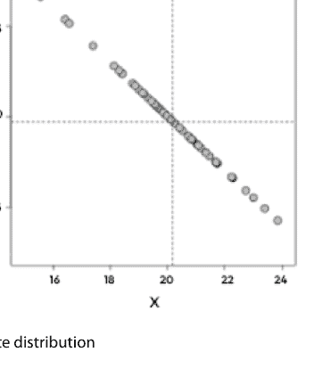

图 6.3 – 模拟的双变量分布

通过观察散点图，我们可以看到两个变量之间线性关系的方向和强度，以及它们的异常值。如果方向为正（r>0），则两个变量同时增加或减少。

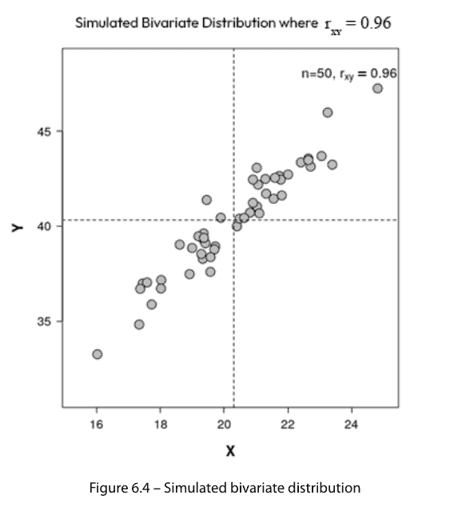

图 6.4 – 模拟的双变量分布

如果方向为负，则一个变量增加而另一个变量减少。我们在下面的散点图中说明这一点：

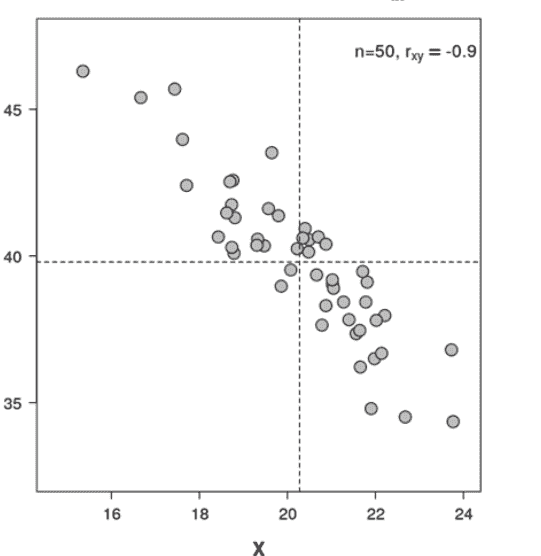

图 6.5 – 模拟的双变量分布

相关系数的值介于 -1 和 1 之间。当 r = 1 时，我们有完全正相关；当 r = -1 时，我们有完全负相关。请注意，如果例如变量 x 和变量 y 互换，或者任一变量的所有值进行线性缩放，相关系数的值不会改变。一般来说，相关性并不意味着因果关系。

### 决定系数

决定系数就是 r²，其中 r 是相关系数，它表示变量 y 的变异中可由变量 x 解释的比例。r² 的值介于 0 和 1 之间，当其值接近 1 时，两个变量之间的线性关系变得更强。r² 的值也可以使用以下公式计算：

$$r^2 = 1 - \frac{SS_{Res}}{SS_{Tot}}$$

这里，$SS_{Res}$ 是平方误差之和，$SS_{Tot}$ 是实际值与平均值之差的平方的总和。在 `statsmodels` 中，从 OLS 回归结果的输出中，可以获得决定系数的值。本章后续部分将讨论此输出。

## 所需的模型假设

与我们在 *第 4 章，参数检验* 中讨论的参数检验类似，线性回归是一种参数方法，需要满足某些假设才能使结果有效。对于线性回归，有四个假设：

- 变量之间存在线性关系
- 残差的正态性
- 残差的同方差性
- 独立样本

让我们逐一讨论这些假设。

### 变量之间的线性关系

在考虑将线性模型拟合到数据时，我们的首要考虑应该是该模型是否适合数据。在处理两个变量时，变量之间的关系应通过散点图进行评估。让我们看一个例子。*图 6.6* 中显示了三个散点图。数据被绘制出来，并在数据点上绘制了用于生成数据的实际函数。最左边的图显示数据呈现线性关系。中间的图显示数据呈现二次关系。最右边的图显示两个不相关的变量。

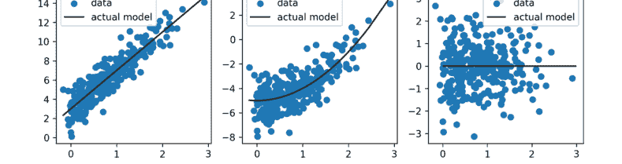

图 6.6 – 描绘两个变量之间三种不同关系的三个散点图

在 *图 6.6* 的示例数据中，线性模型仅适用于最左边的数据。在这个例子中，我们受益于知道两个变量的实际关系，但在实际问题中，你必须确定线性模型是否合适。一旦我们评估了线性模型是否合适并拟合了线性模型，我们就可以评估依赖于模型残差的两个假设。

## 残差的正态性

在前两章中，我们详细讨论了正态性，并查看了几个正态分布数据的例子和几个非正态分布数据的例子。在这种情况下，我们进行相同的评估，但它是针对模型残差而不是变量本身。事实上，与之前的参数方法不同，*变量本身不需要正态分布，只有残差需要*。让我们看一个例子。我们将在两个变量上拟合一个线性模型，每个变量都呈现偏态分布。如 *图 6.7* 所示，尽管每个变量都有偏态分布，但变量之间是线性相关的。

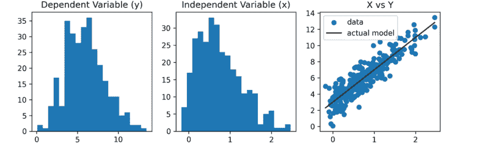

现在，让我们看看模型拟合的残差。模型拟合的残差如 *图 6.8* 所示。正如我们所料，该模型拟合的残差似乎呈正态分布。该模型似乎满足残差正态分布的假设。

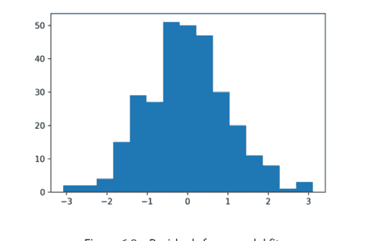

在验证了残差正态分布的假设后，让我们继续讨论残差同方差性的假设。

## 残差的同方差性

残差不仅应该正态分布，而且在整个线性模型中应具有恒定的方差。**同方差性**指的是残差具有相等的离散度。相反，不表现出相等离散度的残差被称为**异方差**。同方差性通常通过将残差与模型预测值绘制散点图来评估。残差应看起来随机分布，均值为 0，并且沿 *x* 轴均匀分散。*图 6.9* 显示了模型残差与 *Y* 的预测值的散点图。这些残差似乎表现出同方差性。

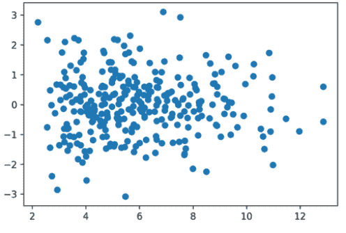

图 6.9 – 模型残差与预测值的散点图

有几种常见的违反残差同方差性的方式：

- 残差显示方差的系统性变化
- 存在极端异常值

*图 6.10* 显示了这些违反情况的两个例子。左图显示了一个极端异常值，右图显示了残差中的非常数方差。在这两种情况下，模型假设都被违反了。

### 样本独立性

我们在前面的章节中已经讨论过样本独立性。目前没有图形或统计方法可以用来判断样本是否独立。*评估样本独立性需要仔细分析抽样方法以及样本所来源的总体。* 例如，一种常见的违反独立性假设的数据类型是时间序列数据。时间序列数据是随时间采样的数据，因此具有序列相关性。我们将在后续章节中讨论时间序列数据的分析方法。

在本节中，我们讨论了线性回归模型的假设。在下一节中，我们将讨论如何验证线性模型，这将再次利用模型残差。

## 显著性检验与模型验证

到目前为止，本章已经讨论了普通最小二乘法线性回归建模的概念；线性模型中的系数；相关系数和决定系数；以及使用线性回归建模所需的假设。我们现在将开始讨论显著性检验和模型验证。

### 显著性检验

为了进行显著性检验，让我们加载 `statsmodels` 的宏观数据集，以便构建一个模型来检验实际国内私人总投资（`realinv`）与实际私人可支配收入（`realdpi`）之间的关系：

```python
import numpy as np
import pandas as pd
import seaborn as sns
import statsmodels.api as sm
import matplotlib.pyplot as plt
from statsmodels.nonparametric.smoothers_lowess import lowess
df = sm.datasets.macrodata.load().data
```

最小二乘回归需要一个常数系数来推导**截距**。在最小二乘方程 $X^T X \beta = X^T y$ 中，**设计矩阵** $X$ 的第一列需要一组1。然而，这个 `constant` 必须直接添加，我们在这里使用 `statsmodels` 的 `add_constant` 函数来完成：

```python
df = sm.add_constant(df, prepend=False)
df_mod = df[['realinv', 'realdpi', 'const']]
```

最小二乘回归的输入数据不需要服从正态分布。但是，假设模型的残差是正态分布的。然而，查看数据的分布有助于理解其统计特性，例如均值、中位数和范围，以及是否存在异常值。如果建模后的残差分析表明可能存在一些问题，检查模型变量将有助于分析师理解潜在的根本原因。

在可视化 *realinv* 和 *realdpi* 之间的关系时，我们可以看到强烈的线性关系，但数据中也存在潜在的序列相关性，因为数据似乎呈现出某种**周期性振荡**，这种振荡在极端值附近变得更强，如图右上角所示。

图 6.12 – 可视化 *realinv* 和 *realdpi* 变量之间的关系

我们将在几个步骤之后分析前面图中看到的潜在序列相关性。首先，让我们将输入变量和系数拟合到模型中：

```python
ols_model = sm.OLS(df_mod['realdpi'], df_mod[['const','realinv']])
compiled_model = ols_model.fit()
```

接下来，我们将打印模型性能摘要，以便开始评估所涉及项的显著性：

```python
print(compiled_model.summary())
```

参考 *图 6.13* 中的结果，我们可以看到截距 *const* 和输入变量 *realinv* 的 **95% 置信区间** 都不包含零。因此，除了这些变量的 **显著 p 值** 外，我们可以得出结论，它们在给定系数下是目标变量的显著贡献者。既然我们已经确认了截距和输入变量及其系数都具有统计显著性，我们想知道它们与目标变量的相关程度。我们可以看到 **R-squared** 统计量为 0.944。由于这两个变量是常数和输入变量，这个 R-squared 统计量仅解释了输入变量。

#### R-squared 与调整后的 r-squared

对于多元回归，我们会查看调整后的 r-squared 值，在单变量/简单回归的情况下，我们可以看到它与 r-squared 值相同。

**决定系数**（也称为拟合优度）为 0.944，意味着实际国内私人总投资解释了实际私人可支配收入 94.4% 的方差。

根据表格，我们可以看到截距和 `realinv` 变量在预测目标变量时都是显著的，p 值非常低。我们还可以看到，两个 95% 置信区间都不包含 0，这支持了它们 p 值的相关性。然而，常数（截距）的置信区间表明模型可能存在不确定性风险，可能需要更多变量来减少这种不确定性并提高模型性能。换句话说，我们可以说常数的不确定性水平较高表明模型仍有未解释的方差，并且当前模型存在过度偏差。

## 模型验证

#### Durbin-Watson 检验

必须承认，基于数据是在 50 年期间观察到的且未进行随机抽样的事实，残差可能存在**序列相关性**。我们在 **Durbin-Watson 检验** 统计量 0.095 中观察到序列相关性的可能性，这表明残差呈现正自相关。Durbin-Watson 统计量检验是否存在一阶滞后自相关。这意味着 Durbin-Watson 检验每个数据点之间的值变化是否与前一个数据点的值相关。如果存在这种相关性，则称为**一阶滞后自相关**。

#### Durbin-Watson 检验统计量

根据经验法则，Durbin-Watson 检验统计量低于大约 2.0（许多人认为 1.5 到 2.0 是合理的）被认为是正自相关的标志，而高于大约 2.0（许多人认为 2.0 到 2.5 是合理的）的值则表示可能存在负自相关。在程序上，需要查表来确定检验统计量应与之比较的临界值。该过程遵循任何假设检验的相同步骤，即将检验统计量与临界值进行比较。Durbin-Watson 检验通常被解释为单尾检验，因为双尾检验的推断不是特别有用。Durbin-Watson 表的一个版本可以在 https://www.real-statistics.com/statistics-tables/durbin-watson-table/ 找到。该表提供了**正自相关**的临界值。要找到**负自相关**的临界值，可以用 4 减去正临界值。

尽管我们的 Durbin-Watson 统计量表明数据中可能存在序列相关性，但我们将通过将 Durbin-Watson 统计量与使用前面链接中表格找到的相应正自相关**查表**进行比较来确认显著性。我们的数据集中有 n=203 个样本，但在查表时将使用 n=200，因为这个值可能足够准确进行评估，而且 203 在表中不存在。在 0.05 的显著性水平下（statsmodels 的 OLS 回归中默认使用），我们发现 k=1 个输入变量的边界为 [1.758, 1.779]。在此范围内的值应解释为**不确定**。小于下限的值表明有足够的证据拒绝原假设，从而得出存在统计显著的正自相关的结论。大于上限的值表明没有足够的证据拒绝原假设，因此不存在自相关。根据我们模型的结果，我们可以以 95% 的置信水平得出结论，有证据表明我们的残差中存在正序列相关性。

```
OLS Regression Results
==============================================================================
Dep. Variable:                realdpi   R-squared:                       0.944
Model:                            OLS   Adj. R-squared:                  0.944
Method:                 Least Squares   F-statistic:                     3384.
Date:                Sat, 01 Oct 2022   Prob (F-statistic):           1.01e-127
Time:                        15:53:00   Log-Likelihood:                -1577.1
No. Observations:                 203   AIC:                             3158.
Df Residuals:                     201   BIC:                             3165.
Df Model:                           1                                         
Covariance Type:            nonrobust                                         
==============================================================================
                 coef    std err          t      P>|t|      [0.025      0.975]
------------------------------------------------------------------------------
const       1234.5164     80.866     15.266      0.000    1075.062    1393.971
realinv       4.0243      0.069     58.175      0.000       3.888       4.161
==============================================================================
Omnibus:                       90.643   Durbin-Watson:                   0.095
Prob(Omnibus):                  0.000   Jarque-Bera (JB):              434.654
Skew:                           1.696   Prob(JB):                     4.13e-95
Kurtosis:                       9.316   Cond. No.                     2.34e+03
==============================================================================

Notes:
[1] Standard Errors assume that the covariance matrix of the errors is correctly specified.
[2] The condition number is large, 2.34e+03. This might indicate that there are
strong multicollinearity or other numerical problems
```

图 6.13 – *realdpi* 的 OLS 回归模型输出

此时，分析师可能希望在继续之前考虑解决序列相关性问题。然而，为了遵循端到端模型验证的流程，我们将继续进行下一步。

## 用于分析模型误差的诊断图

如前所述，$y_i = \beta_0 + \beta_1 x_i + e_i$，其中在回归中，$\beta_0 + \beta_1 x_i$ 是给定 $x_i$ 时 $y_i$ 的预测均值，而 $e_i$ 是误差项——也称为残差项，其计算方法是数据点的观测值减去该数据点的预测值。最小二乘线性回归中的残差必须近似服从以均值为中心、具有标准差的正态分布。为拟合模型推导残差的方法是从每个观测值的实际值中减去预测值。用于检查最小二乘回归模型拟合情况的四种常见可视化图表如下：

- **残差与拟合值图**，用于检查输入变量与目标变量之间存在线性关系的要求
- **分位数图**，用于检查残差服从正态分布的假设
- **尺度-位置图**，用于检查同方差性或方差均匀分布的假设
- **残差与杠杆影响图**，有助于识别异常值可能对模型拟合产生的影响

要生成这些图表，我们可以使用以下 Python 代码实现：

```python
model_residuals = compiled_model.resid
fitted_value = compiled_model.fittedvalues
standardized_residuals = compiled_model.resid_pearson # Residuals, normalized to have unit variance.
sqrt_standardized_residuals = np.sqrt(np.abs(compiled_model.get_influence().resid_studentized_internal))
influence = compiled_model.get_influence()
leverage = influence.hat_matrix_diag
cooks_distance = compiled_model.get_influence().cooks_distance[0]

fig, ax = plt.subplots(2, 2, figsize=(10,8))
# Residuals vs. Fitted
ax[0, 0].set_xlabel('Fitted Values')
ax[0, 0].set_ylabel('Residuals')
ax[0, 0].set_title('Residuals vs. Fitted')
locally_weighted_line1 = lowess(model_residuals, fitted_value)
sns.scatterplot(x=fitted_value, y=model_residuals, ax=ax[0, 0])
ax[0, 0].axhline(y=0, color='grey', linestyle='--')
ax[0,0].plot(locally_weighted_line1[:,0], locally_weighted_line1[:,1], color = 'red')
# Normal Q-Q
ax[0, 1].set_title('Normal Q-Q')
sm.qqplot(model_residuals, fit=True, line='45',ax=ax[0, 1], c='blue')

# Scale-Location
ax[1, 0].set_xlabel('Fitted Values')
ax[1, 0].set_ylabel('Square Root of Standardized Residuals')
ax[1, 0].set_title('Scale-Location')
locally_weighted_line2 = lowess(sqrt_standardized_residuals, fitted_value)
sns.scatterplot(x=fitted_value, y=sqrt_standardized_residuals, ax=ax[1, 0])
ax[1,0].plot(locally_weighted_line2[:,0], locally_weighted_line2[:,1], color = 'red')
# Residual vs. Leverage Influence
ax[1, 1].set_xlabel('Leverage')
ax[1, 1].set_ylabel('Standardized Residuals')
ax[1, 1].set_title('Residuals vs. Leverage Influence')
locally_weighted_line3 = lowess(standardized_residuals, leverage)
sns.scatterplot(x=leverage, y=standardized_residuals, ax=ax[1, 1])
ax[1, 1].plot(locally_weighted_line3[:,0], locally_weighted_line3[:,1], color = 'red')
ax[1, 1].axhline(y=0, color='grey', linestyle='--')
ax[1, 1].axhline(3, color='orange', linestyle='--', label='Outlier Demarkation')
ax[1, 1].axhline(-3, color='orange', linestyle='--')
ax[1, 1].legend(loc='upper right')
leverages = []
for i in range(len(cooks_distance)):
    if cooks_distance[i] > 0.5:
        leverages.append(leverage[i])
        ax[1, 1].annotate(str(i) + " Cook's D > 0.5",xy=(leverage[i], standardized_residuals[i]))
if leverages:
    ax[1, 1].axvline(min(leverages), color='red', linestyle='--', label="Cook's Distance")
for i in range(len(standardized_residuals)):
    if standardized_residuals[i] > 3 or standardized_residuals[i] < -3:
        ax[1, 1].annotate(i,xy=(leverage[i], standardized_residuals[i]))

fig.tight_layout()
```

以下输出包含四个常见的诊断图。

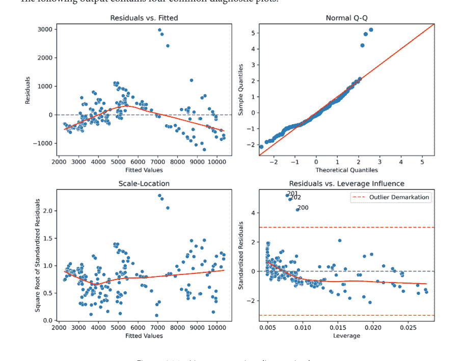

### 残差与拟合值

最小二乘回归的一个要求是输入变量与目标变量之间存在**线性关系**。简而言之，输入变量与目标变量之间存在强相关关系。此图有助于分析师评估两者之间的线性关系。

我们应期望代表模型的拟合线是水平的，这表示在所有数据点上，输入变量与目标变量之间的线性关系强度。残差应大致均匀地分布在直线周围，且距离合理。如果无法确认这些属性，则两个变量之间可能存在非线性关系。对至少一个变量进行转换——如果该变量是偏态的——可能有助于解决此类问题。然而，也可能是非参数模型更合适，这在存在分类特征或编码后的分类特征时通常是这种情况。

我们的模型生成的图并未显示残差均匀分布在一条水平线周围。相反，该线是向下凹的，这表明多项式或非参数回归可能更合适。此外，残差在线条右端形成一种模式，表明数据中可能存在一些序列相关性，因为它表现出一些正弦行为。我们能够使用 Durbin-Watson 统计量识别序列相关性的存在。这可能是由于数据并非随机抽样，而是在较长时间内收集的。

### 残差的 QQ 图

QQ 图的正态性评估与*第 4 章 参数检验*中使用 QQ 图评估正态性的程序相同。此图的主要目的是评估**误差正态分布**的必要假设。残差在图中偏离 45 度线的轻微偏差是正常的，但极端的偏态或偏离该线可能表明拟合不佳。这种情况可能表明统计功效较差。在出现偏态的情况下，数据转换（例如对数转换）可能有助于解决问题。删除异常值可能是另一个合适的解决方案。然而，与其直接删除异常值，建议确保数据处理中没有错误，可以通过解决该错误使异常值符合要求。

在我们模型残差的 QQ 图中，我们可以看到一些中等程度的左侧偏态和极端的右侧偏态，这表明右尾的三个值可能是极端异常值。除此之外，我们可以假设总体上残差误差近似服从正态分布。

### 尺度-位置

标准化残差平方根的尺度-位置图有助于分析师通过目视检查确定残差是否存在**同方差性**——或*非常数*方差，这是最小二乘回归模型所要求的。该图可视化了标准化残差绝对值的平方根。分析同方差性有时有助于识别与**样本独立性**相关的潜在问题，这是最小二乘回归的另一个要求。然而，对于检验此假设，应更重视 Durbin-Watson 检验。

在评估我们的模型时，我们可以看到该线与完全水平线有一些偏差。此外，残差虽然似乎具有大量的常数方差，但有时仍表现出模式，这与同方差性的行为相冲突。此外，似乎有三个非常显著的异常值。基于这些信息，我们可以合理地假设模型的残差中存在异方差性——或*常数*方差——的风险。

### 残差与杠杆影响

评估残差与杠杆影响是评估模型拟合的另一种方法。除了衡量杠杆作用外，该图还显示了**库克距离**何时超出合理水平。

**杠杆值**用于识别单个数据点与其他所有点之间的距离。残差的高杠杆值可能意味着对应的数据点是一个**异常值**，它强烈影响模型，使其对整体数据的拟合度降低，而更多地偏向该特定值。残差应在-2到2之间，才不被视为潜在异常值。介于±2.5到3之间的值表明数据点是极端异常值。总体而言，此图有助于区分那些对模型没有显著负面影响的异常值与那些有负面影响的异常值。

**库克距离**是一种同时使用观测值的杠杆值及其残差值的度量。杠杆值越高，计算出的库克距离就越高。通常，库克距离值大于0.5意味着残差的杠杆值通过过度代表对模型产生负面影响——本质上就是一个异常值。库克距离包含在代码中，并标记距离大于0.5的残差。库克距离特别有用，因为移除异常值可能不会对模型产生显著影响。然而，如果异常值的库克距离值很高，这强烈表明解决该异常值**将有利于**模型。库克距离的计算方法是：将某个数据点从模型中移除，计算误差的差异除以均方误差，再乘以模型系数数量加一。其公式如下：

$$D_i = \frac{\sum_{j=1}^{n} (\hat{y}_j - \hat{y}_{j(i)})^2}{(p+1)\hat{\sigma}^2}$$

其中 $\hat{y}_j$ 是响应变量的第j个估计值，$\hat{y}_{j(i)}$ 是移除第i个值后第j个拟合值。$p$ 是模型中的系数数量，$\hat{\sigma}^2$ 是所有观测值（包括被移除的）的残差方差，也称为平方误差。

在我们模型的图中，我们可以观察到三个极端异常值。然而，我们也可以看到没有库克距离值大于0.5。与尺度-位置图一样，标准化残差应围绕一条水平的平滑线均匀分布，这表示方差恒定。从我们模型的输出中可以看出，情况并非如此。

## 解决残差问题

单独来看，每个图都足以否定模型的有效性。然而，考虑所有图是有用的，因为如果诊断图中仅存在一些与预期的偏差，模型可能仍然有用。解决残差问题的一些方法如下：

-   调查并解决可能导致异常值或数据不一致的任何数据收集问题
-   直接移除异常值
-   使用随机抽样或分层抽样等方法改进抽样方法
-   执行数据转换，例如对数转换或平方根转换
-   包含可以帮助解释目标变量或可能存在的任何序列相关性的额外输入变量

### 处理序列相关性

如果不确定残差中是否存在序列相关性，一个有用的下一步是分析**偏自相关函数（PACF）**图，以评估模型中是否存在显著水平的序列相关性，这可以解释模型残差的问题。

> **ACF 和 PACF**

**PACF** 通过控制中间滞后值，提供了一个点的值与之前点（称为滞后）之间的偏相关性。控制中间滞后值是“偏”这个术语的由来。如果数据集中滞后为零的特定点与第三个滞后点的值高度相关，那么滞后为3时会有显著相关性，但滞后为2或1时则没有。在时间序列建模中，PACF 用于直接推导自回归阶数，记为 *AR(n)*，其中 *n* 是滞后阶数。**自相关函数（ACF）** 用于确定移动平均阶数，记为 *MA(n)*，它考虑了滞后为零的数据点与所有之前滞后点之间的相关性，而不控制它们之间的关系。换句话说，ACF 图中滞后为3的自相关性将提供从点0到点3的自相关性，而 PACF 图中滞后为3的相关性仅提供点0和点3之间的自相关性，排除了滞后1和2处值的影响。

我们可以执行以下代码，使用最近50个数据点（按索引位置排序，在本例中是按日期排序）生成带有95%置信区间的 PACF 图：

```
from statsmodels.graphics.tsaplots import plot_pacf
plot_pacf(compiled_model.resid, alpha=0.05, lags=50);
```

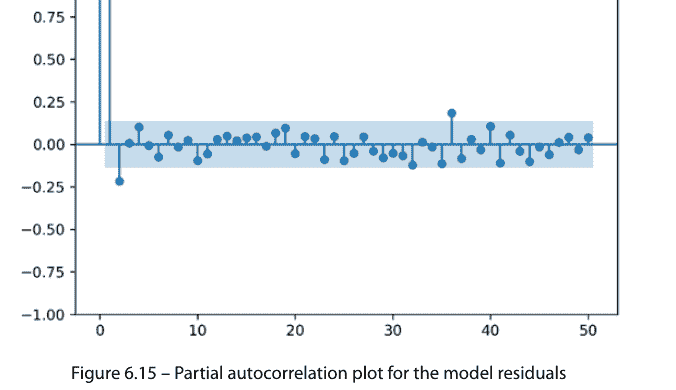

图6.15 – 模型残差的偏自相关图

在*图6.15*的 PACF 图中，我们看到滞后0和1处有非常强且显著的相关性。我们观察到滞后2和36处有低水平的显著相关性（约-0.25），超出了95%置信区间。这告诉我们，使用一阶自回归（**AR(1)**）时间序列模型可能比线性回归模型更适合对该数据集建模。

在存在显著自相关性的情况下，使用最小二乘法回答回归问题会产生固有风险。当检测到自相关性时，有方法可以调整模型结果，例如进行**一阶差分**——或其他类型的低通滤波器——或应用 Cochrane-Orcutt、Hildreth-Lu 或 Yule-Walker 调整。然而，理想的情况是进行时间序列分析，因为这类建模的结果对时间依赖性模式更稳健。我们将在*第10章，时间序列简介*中介绍时间序列，届时我们将讨论用于近似时间序列以产生更有用结果的简单和复杂方法。

让我们考虑数据的一阶差分。关于*图6.16*，我们首先查看输入变量 *realdpi* 的 ACF 图和原始数据。我们可以看到一条指数增长的线（原始数据），显示出指数衰减的 ACF 图。这种 ACF 行为是**趋势**数据的典型特征，通常受益于**一阶差分**。PACF 中识别出的低自回归阶数表明，对于回归模型继续进行可能已经足够。如果 ACF 显示出不同的行为，例如正弦（季节性）自相关，或者 PACF 显示出更多的偏自相关性，那么我们将有证据表明一阶差分不足以解决序列相关性并继续进行最小二乘回归。最小二乘回归的 ACF 和 PACF 理想情况下应没有显著相关的滞后。然而，当 ACF 表现出这种行为而 PACF 显示不显著，或者相关性水平非常低时，回归可能表现良好。最好在两个图中都没有模式或峰值。无论如何，在这两种情况下，除了残差的自相关性外，还应评估模型误差，以确定最小二乘回归是否按需执行。

使用 `diff()` numpy 函数，我们进行一阶低通差分，并绘制原始数据和差分数据的 ACF、PACF 和线图。我们可以看到自相关性因此显著降低。顺便提一下，差分后的自相关性表明，阶数为1的自回归和阶数为1的移动平均（**ARMA**）模型可能比最小二乘回归更合适。然而，我们将在本章忽略这一点并继续：

```
from statsmodels.graphics.tsaplots import plot_acf
from statsmodels.graphics.tsaplots import plot_pacf
fig, ax = plt.subplots(2,3, figsize=(15,10))
plot_acf(df_mod['realdpi'], alpha=0.05, lags=50, ax=ax[0,0])
ax[0,0].set_title('Original ACF')
plot_pacf(df_mod['realdpi'], alpha=0.05, lags=50, ax=ax[0,1])
ax[0,1].set_title('Original PACF')
ax[0,2].set_title('Original Data')
ax[0,2].plot(df_mod['realdpi'])
plot_acf(np.diff(df_mod['realdpi'], n=1), alpha=0.05, lags=50, ax=ax[1,0])
```

## 模型验证

假设分析师已经开发出一个模型，该模型基于前述图表产生了强劲的结果并显得有用，下一步就是测试该模型。一种常规方法是对用于原始模型（我们拟合了所有数据）的数据进行训练-测试划分。在以下代码中，我们执行一次划分，使训练数据集包含75%的数据，测试数据集包含25%。目的是评估两者之间以及与原始模型相比，性能是否存在显著差异。该过程遵循与之前相同的步骤。可接受的差异由分析师自行决定，但除了评估已讨论的指标之间的差异外，分析师还应记录斜率和输入变量的系数，因为这些将用于预测目标。

在此，我们划分数据。我们使用`shuffle`参数来*随机*打乱数据，这样如果数据存在某种顺序（例如按时间排序），数据将被随机划分：

```python
from sklearn.model_selection import train_test_split
train, test = train_test_split(df_mod, train_size=0.75, shuffle=True)
```

现在，我们使用训练数据构建模型：

```python
ols_model_train = sm.OLS(train['realdpi'], train[['const','realinv']])
compiled_model_train = ols_model_train.fit()
print(compiled_model_train.summary())
```

最后，我们使用测试数据构建模型：

```python
ols_model_test = sm.OLS(test['realdpi'], test[['const','realinv']])
compiled_model_test = ols_model_test.fit()
print(compiled_model_test.summary())
```

这里的想法是，两个模型应该在数据的两个不同分区上产生相似的结果。

另一种验证模型的方法是将某个指标与一个朴素模型进行比较。让我们使用**平均绝对误差（MAE）**。使用这个模型指标，我们可以将一个朴素线性模型的误差（误差是每个数据点减去平均值）与模型的预测进行比较。一个有用的模型的MAE需要低于朴素模型的MAE。在此，我们使用拟合模型来预测输入，然后将模型的预测与朴素模型的预测进行比较：

下面我们观察*训练*模型的MAE：

```python
from sklearn.metrics import mean_absolute_error
mae = mean_absolute_error(train['realdpi'], compiled_model_train.predict(train[['const','realinv']]))
mae
#438.5872081797031
```

这里我们可以看到*朴素*模型的MAE，该模型除了假设均值将继续保持真实值外，不做任何其他假设：

```python
import numpy as np
errors = []
for i in range(len(train)):
    errors.append(abs(train['realdpi'].iloc[i] - train['realdpi'].mean()))
np.mean(errors)
#2065.440235457064
```

我们可以看到该模型与朴素模型相比表现良好。

另一种流行的方法是在保留数据集上进行测试。为此，构建一个模型并在训练数据上进行训练。然后，使用该模型，我们将其应用于测试数据。然后，我们将该指标与训练数据的指标进行比较。使用训练模型的MAE 438，我们将其与以下进行比较：

```python
mae_test = mean_absolute_error(test['realdpi'], compiled_model_train.predict(test[['const','realinv']]))
mae_test
#408.0253171549187
```

我们可以看到测试数据的误差低于训练数据的误差。然而，由于训练和测试数据被假定具有不同的值和均值，我们应该重新评估朴素模型在测试数据上是否仍然产生更高的MAE：

```python
errors = []
for i in range(len(test)):
    errors.append(abs(test['realdpi'].iloc[i] - test['realdpi'].mean()))
np.mean(errors)
#1945.5873125720873
```

这里我们可以看到，该模型在测试数据上确实提供了比朴素模型更好的MAE，其改善率与在训练数据上大致相同。因此，我们预期线性回归模型优于朴素模型。

## 总结

在本章中，我们讨论了一个解释变量和一个响应变量之间简单线性回归的概述。我们涵盖的主题包括：

- 简单线性回归的OLS方法
- 相关系数和决定系数及其计算和意义
- 最小二乘回归所需的假设
- 模型和参数显著性的分析方法
- 模型验证

我们仔细研究了误差平方的概念，以及误差平方和对于构建和验证线性回归模型的意义。然后，我们逐步讲解了使线性回归成为稳定解决方案所需的四个相关假设。之后，我们概述了四种诊断图及其在评估与异方差性、线性、异常值和序列相关性相关问题存在情况方面的解释。接着，我们通过一个使用ACF和PACF评估序列相关的示例，以及一个使用一阶差分消除数据中的序列相关约束并使用差分数据构建OLS模型的示例进行了讲解。最后，我们提供了测试和验证最小二乘回归模型的方法。

在下一章中，我们将扩展这一概念，以包含多个解释变量，这种技术称为多元线性回归。我们还将讨论与多元线性回归相关的各种主题，例如变量选择和正则化。

#### 多元线性回归

在上一章中，我们讨论了使用单个变量来解释目标变量的**简单线性回归（SLR）**。在本章中，我们将讨论**多元线性回归（MLR）**，这是一种利用多个解释变量来建模响应变量的模型。多元建模面临的两个主要难题是多重共线性和偏差-方差权衡。在概述MLR之后，我们将介绍用于评估和最小化多重共线性的方法。然后，我们将讨论作为分析师如何利用偏差-方差权衡为我们带来好处。最后，我们将讨论使用**主成分回归（PCR）**来处理多重共线性，以在不移除特征而是对其进行转换的情况下最小化过拟合。

在本章中，我们将涵盖以下主要主题：

- 多元线性回归
- 特征选择
- 收缩方法
- 降维

#### 多元线性回归

在上一章中，我们讨论了SLR。通过SLR，我们能够使用另一个变量（通常称为解释变量，记为$x$）来预测一个变量（通常称为响应变量，记为$y$）的值。SLR模型由以下方程表示，其中$\beta_0$是截距项，$\beta_1$是线性模型的斜率。

$$y = \beta_0 + \beta_1 x + \epsilon$$

虽然这是一个有用的模型，但在许多问题中，可以使用多个解释变量来预测响应变量。例如，如果我们想预测房价，我们可能需要考虑许多变量，这些变量可能包括地块面积、卧室数量、浴室数量和总面积。在这种情况下，我们可以扩展之前的模型以包含这些额外的变量。这被称为MLR。MLR模型可以用以下方程表示。

$$y = \beta_0 + \beta_1 x_1 + \beta_2 x_2 + \dots + \beta_p x_p + \epsilon$$

与之前的方程类似，$\beta_0$代表截距。在这个方程中，除了截距值之外，我们为每个解释变量都有一个$\beta$参数。每个解释变量用带有数字下标的$x$表示。我们可以在模型中包含任意数量的解释变量，这就是为什么方程显示最终下标为$p$。

> **数据规模对MLR的影响**
通常，我们可以在模型中包含任意数量的解释变量。然而，存在一些现实的限制。其中一个潜在的限制是样本数量相对于解释变量数量的关系。当样本数量（N）远小于解释变量数量（P）时，MLR往往效果最好。当P接近N时，模型变得难以估计。如果P相对于N较大，那么考虑降维将是明智的，这将在本章后面讨论。

让我们看一个例子。Python包`scikit-learn`包含几个用于建模练习的数据集。我们将使用`diabetes`数据集，该数据集包含生命体征测量值和一年后疾病进展的定量测量值。有关此数据集的更多信息，请参见此链接：`https://scikit-learn.org/stable/datasets/toy_dataset.html#diabetes-dataset`。我们将尝试对生命体征与疾病进展之间的关系进行建模。

该数据集中的解释变量是`age`、`bmi`、`bp`、`s1`、`s2`、`s3`、`s4`、`s5`和`s6`。响应变量是疾病进展的测量值。这就是我们用数学方式表达该模型的方法：

$$progression = \beta_0 + \beta_1 x_{age} + \beta_2 x_{bmi} + \beta_3 x_{bp} + \beta_4 x_{s1} + \beta_5 x_{s2} + \beta_6 x_{s3} + \beta_7 x_{s4} + \beta_8 x_{s5} + \beta_9 x_{s6} + \epsilon$$

如前所述，我们为模型中的每个变量都有一个$\beta$。

> **对糖尿病数据集的转换**
该数据集中的解释变量已从原始测量值转换而来。参考数据集用户指南，我们可以看到每个变量都经过了均值中心化和缩放。此外，`sex`变量已从分类变量转换为数值变量。

### 添加分类变量

到目前为止，我们只在模型中考虑了连续变量，即可以在数轴上取任何值的变量。回想一下*第2章，数据分布*，我们之前考虑的变量都是比率数据。然而，线性回归模型不仅限于使用连续变量。我们可以在模型中包含分类变量。回想*第2章，数据分布*，分类变量与项目组相关联。在统计学习中，这些组通常被称为变量的**水平**。例如，如果我们有五名学生，三名拥有硕士学位，一名拥有博士学位，一名拥有学士学位，我们会说学生分类变量有三个水平：学士、硕士和博士。让我们看看如何在模型中包含分类变量。

我们将通过包含额外的$\beta$项来将分类变量纳入模型。具体来说，我们将添加水平数（$L$）减去一个额外的$\beta$项。对于有三个水平的学生示例，我们将添加两个额外的$\beta$项。使用比水平数少一个的项将允许我们选择一个水平作为参考（或基准），并将其他水平与该参考水平进行比较。我们像包含其他$\beta$项一样将$\beta$项包含在模型中。假设在这个例子中，我们正在建模收入水平，除了教育水平之外，我们还有个人的经验。那么，我们将这样构建我们的模型：

$$income = \beta_0 + \beta_1 x_{experience} + \beta_2 x_{ms} + \beta_3 x_{phd}$$

添加了beta项后，我们还必须进行数据转换。我们将不得不为分类变量中的每个*非参考*水平创建**虚拟变量**。这个过程被称为分类变量的虚拟化。在虚拟化中，我们为每个非参考水平创建一列，并在该水平出现在原始变量中的位置插入1，在未出现的位置插入0。这个过程在*图7.1*中进行了演示。

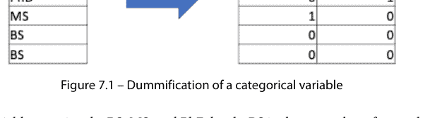

原始变量包含学士、硕士和博士水平。选择学士作为参考水平，并为硕士和博士水平创建了两个虚拟变量。为分类变量创建额外列的过程称为**编码**。变量编码有许多类型，编码是统计学习和机器学习中广泛使用的技术。

> **分类水平是常数偏移**

让我们更深入地了解一下分类变量对线性回归模型的影响。早些时候，我们讨论了分类变量如何用取值为零和一的虚拟变量进行编码。本质上，这意味着我们根据水平切换相关的$\beta$项，这将使响应产生一个常数偏移。例如，在收入模型中，当我们想计算拥有学士学位的个人的收入时，模型解析为以下形式：

$$income = \beta_0 + \beta_1 x_{experience}$$

而当我们想计算拥有硕士学位的个人的收入时，模型解析为以下形式：

$$income = \beta_0 + \beta_1 x_{experience} + \beta_2$$

这意味着分类的水平仅将模型的输出从参考水平偏移一个常数，即与该水平相关的beta。

回到我们之前的例子，我们的数据集包含一个分类变量：患者的性别。数据集包含两个性别水平。我们将选择一个水平作为参考，并为另一个水平创建一个虚拟变量。有了这些知识，让我们将这些数据拟合到线性回归模型，并讨论多元线性回归的假设。

### 评估模型拟合度

每当我们拟合一个参数模型时，我们都应该验证模型假设是否得到满足。如上一章所述，如果模型假设不满足，模型可能会提供误导性的结果。在上一章中，我们讨论了简单线性回归的四个假设：

- 响应变量和解释变量之间存在线性关系
- 残差的正态性
- 残差的同方差性
- 样本的独立性

这些假设在这里也适用，但在这种新的建模背景下，我们有一个额外的假设：没有或很少有**多重共线性**。当MLR模型中的两个或多个解释变量高度相关时，就会发生多重共线性。多重共线性的存在会影响自变量的统计显著性。理想情况下，所有解释变量都是不相关的（或线性独立的）。然而，我们可以接受少量的多重共线性，而不会对模型产生太大影响。

让我们根据这些假设中的每一个来评估模型。

## 线性关系

要检查响应变量与解释变量之间是否存在线性关系，我们可以查看每个变量相对于响应变量的散点图。根据*图7.2*中的图表，包括bmi、bp、s3、s4和s5在内的几个变量可能与响应变量呈现线性关系。

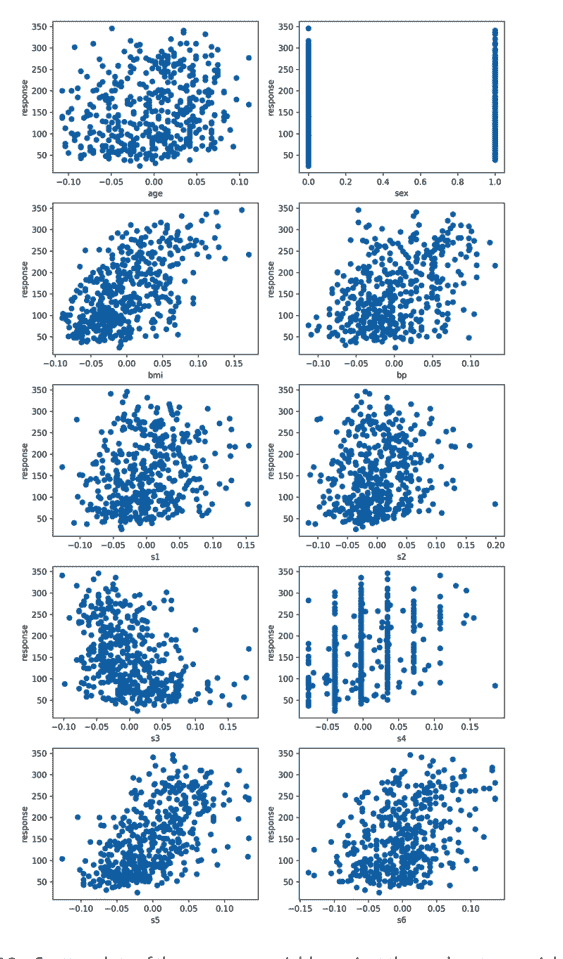

虽然如果任何变量与响应变量表现出强线性关系是理想的，但在多元线性回归模型中，我们受益于变量的组合。我们可以添加看起来更有用的变量，并移除看起来没有用的变量。这被称为**特征选择**，我们将在下一节中介绍。

## 残差的正态性

回顾上一章，我们期望拟合良好的模型的残差呈现随机分布。我们可以通过直方图或QQ图来观察这一点。我们模型的残差如*图7.3*所示。

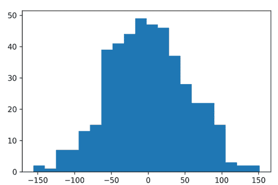

根据*图7.3*中的直方图，我们不能拒绝残差呈正态分布的可能性。通常，在评估此假设时，我们检查的是*严重*的违反情况。事实证明，线性回归对此假设相对稳健。然而，这并不意味着可以忽略此假设。

## 残差的同方差性

在上一章中，我们还讨论了同方差性。对于拟合良好的模型，我们期望残差应表现出同方差性。*图7.4*中的图表显示了残差相对于模型预测值的散点图。

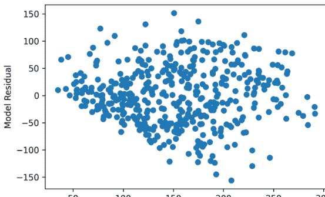

图7.4 – 模型残差的散点图：预测值与实际值

似乎没有明显的方差变化模式或显著的异常值会违反同方差性假设。如果存在模式，那将表明一个或多个变量可能需要进行变换，或者表明响应变量与解释变量之间存在非线性关系。

## 独立样本

在上一章中，我们讨论了独立抽样及其对此类模型的影响。然而，在不知道抽样方法的情况下，我们无法确定样本是否独立。由于我们不知道此数据集的抽样策略，我们将假设满足此假设并继续进行模型构建。在实际的建模环境中，绝不应理所当然地认为此假设成立。

## 多重共线性

多元线性回归的新假设是解释变量中几乎没有或没有多重共线性。多重共线性是当两个或多个变量具有强线性相关性时发生的情况。我们通常使用**方差膨胀因子**来检测多重共线性。VIF是衡量一个解释变量的系数受其他解释变量影响程度的指标。VIF越低越好，最小值为1，表示没有相关性。我们通常认为VIF为5或更高则过高。当在一组解释变量中检测到高VIF时，我们反复移除具有最高VIF的变量，直到每个变量的VIF值都低于5。让我们用当前数据看一个例子。移除高VIF变量的过程如*图7.5*所示。

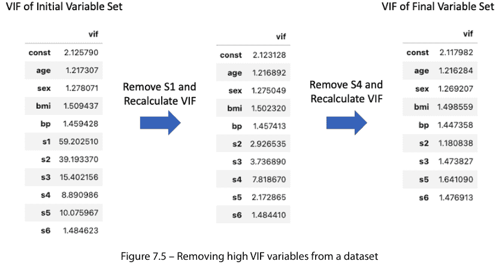

图7.5显示了从糖尿病数据集中移除高VIF变量的过程。图中最左边的表格显示了原始数据集，其中最高VIF为59.2，对应于变量S1。然后，我们从数据集中移除此变量并重新计算VIF。现在我们看到最高VIF为7.8，对应于变量s4。我们移除此变量并重新计算VIF。现在，所有VIF都低于5，表明剩余变量之间的相关性较低。移除这些变量后，我们需要重新拟合模型。

模型拟合完成并验证了模型假设后，让我们看看拟合结果并讨论如何解释结果。

## 解释结果

拟合模型后，我们从`statsmodels`得到以下结果。输出分为三个部分：

- 顶部部分包含关于模型的高级统计信息
- 中间部分包含关于模型系数的详细信息
- 底部部分包含关于数据和残差的诊断测试

让我们逐步介绍此模型的每个部分。

182 多元线性回归

```
OLS Regression Results
==============================================================================
Dep. Variable:                      y   R-squared:                       0.513
Model:                            OLS   Adj. R-squared:                  0.504
Method:                 Least Squares   F-statistic:                     57.12
Date:                Tue, 25 Oct 2022   Prob (F-statistic):           4.35e-63
Time:                        21:24:25   Log-Likelihood:                -2387.9
No. Observations:                 442   AIC:                             4794.
Df Residuals:                     433   BIC:                             4831.
Df Model:                           8                                         
Covariance Type:            nonrobust                                         
==============================================================================
                 coef    std err          t      P>|t|      [0.025      0.975]
------------------------------------------------------------------------------
const        162.5006      3.757     43.257      0.000     155.117     169.884
age           -8.5365     59.850     -0.143      0.887    -126.170     109.097
sex          -22.1366      5.828     -3.798      0.000     -33.591     -10.682
bmi          526.9864     66.433      7.933      0.000     396.415     657.558
bp           317.2370     65.288      4.859      0.000     188.915     445.559
s2          -109.9931     58.972     -1.865      0.063    -225.900       5.913
s3          -288.4990     65.883     -4.379      0.000    -417.989    -159.009
s5           480.2121     69.521      6.907      0.000     343.572     616.852
s6            71.3085     65.952      1.081      0.280     -58.317     200.934
==============================================================================
Omnibus:                        1.795   Durbin-Watson:                   2.016
Prob(Omnibus):                  0.408   Jarque-Bera (JB):                1.629
Skew:                           0.038   Prob(JB):                        0.443
Kurtosis:                       2.713   Cond. No.                         35.4
==============================================================================

Notes:
[1] Standard Errors assume that the covariance matrix of the errors is correctly specified.
```

图7.6 – 来自statsmodels OLS回归的结果

### 高级统计信息和指标（顶部部分）

在拟合结果的顶部部分，我们有模型级别的信息。顶部部分的左侧包含有关模型的信息，例如**自由度**和观测数量。顶部部分的右侧包含模型指标。模型指标对于比较模型很有用。我们将在特征选择部分讨论更多关于模型指标的内容。

### 模型系数详情

中间部分包含有关模型系数的详细信息（前面列出的方程中的$\beta$项）。在本节中，我们将重点关注中间部分的两列：`coef`和`P>|t|`。`coef`列是为模型方程估计的模型系数（$\beta$的估计值，或称为$\hat{\beta}$）。标记为`P>|t|`的列是系数显著性检验的p值。我们在解释模型时对这两列都感兴趣。让我们从p值列开始。

本次检验的**零假设是β参数的值等于零**。请回顾*第3章 假设检验*中的内容：

-   p值低于显著性阈值意味着我们拒绝零假设。
-   p值高于显著性阈值意味着我们未能拒绝零假设。

在此示例中，我们将拒绝`bmi`变量的零假设，但未能拒绝年龄变量的零假设。一旦确定了显著变量，我们就可以继续解释这些显著变量的含义。我们将无法解释其他变量，因为我们无法拒绝其系数值可能为零的假设。如果系数值为零，则该变量对模型没有贡献。让我们看看如何解释系数。

通常，当我们构建模型时，我们希望理解模型的各个部分如何影响输出。在多元线性回归模型中，这归结为理解模型的系数。我们有两种类型的变量：连续变量和分类变量，相关的系数具有不同的含义。

#### 解释连续变量系数

对于连续变量，例如BMI，随着变量值的增加，其对模型输出的重要性也随之增加。在保持所有其他变量不变的情况下，变量值每增加一个单位，因变量的平均值就会增加系数的大小。让我们以`bmi`变量为例。由于`bmi`变量的系数约为526，我们可以说：“在保持所有其他变量不变的情况下，`bmi`每增加一个单位，糖尿病测量值的平均值将增加526。”当然，系数也可以取负值。

#### 解释分类变量系数

对于分类变量，例如`sex`，请记住，与连续变量不同，分类变量的值是虚拟编码的，因此只能取两个值：零和一。此外，请记住，选择了一个水平作为参考水平。在这种情况下，`sex`水平0是参考水平，我们可以将此参考与`sex`水平1进行比较。当我们使用参考水平时，系数不会影响模型的输出。因此，在保持所有其他变量不变的情况下，分类水平的变化与因变量平均值的变化相关，变化量等于系数的大小。由于`sex`变量的系数约为-22，我们可以说：“在保持所有其他变量不变的情况下，与参考水平相比，`sex`水平与糖尿病测量值平均值降低22相关。”

## 诊断检验

拟合结果的底部部分包含数据和残差的诊断统计量。浏览列表，其中一些应该来自*第6章 简单线性回归*。Durbin-Watson检验用于检验序列相关性（随时间顺序采样的数据）。结果在2附近表明不存在序列相关性。偏度和峰度是残差分布形状的度量。这些结果表明几乎没有偏度，但可能存在一些峰度。这些可能是与正态分布的小偏差，正如我们之前在图中看到的那样，无需担心。

在本节中，我们研究了第一个可以使用多个解释变量来预测响应变量的模型。然而，我们注意到模型中包含的几个变量在统计上并不显著。对于这个模型，我们仅通过移除具有高VIF分数的特征来选择特征，但在选择特征时还有其他方法需要考虑。在下一节中，我们将讨论比较模型和特征选择。

## 特征选择

有许多因素会影响模型的成功或失败，例如抽样、数据质量、特征创建和模型选择，其中一些我们尚未涉及。其中一个关键因素是**特征选择**。特征选择只是从现有特征集中选择或系统确定模型最佳特征的过程。我们已经进行了一些简单的特征选择。在上一节中，我们移除了具有高VIF的特征。在本节中，我们将介绍一些特征选择方法。本节介绍的方法分为两类：基于统计的特征选择方法和基于性能的特征选择方法。让我们从统计方法开始。

### 基于统计的特征选择方法

基于统计的特征选择方法依赖于我们在前面章节中使用的主要工具：统计显著性。本小节介绍的方法将基于特征本身的统计属性。我们将介绍两种基于统计的特征选择方法：相关性和统计显著性。

#### 相关性

我们将讨论的第一个统计方法是**相关性**。我们在本章和前面的章节中讨论过相关性；请记住，相关性是对两个变量之间关系的描述。变量可以是正相关、不相关或负相关。就特征选择而言，我们希望*移除与响应变量不相关的特征*。与响应变量不相关的特征与响应变量没有关系。因此，不相关的特征不会是响应变量的良好预测因子。

请回顾*第4章 参数检验*，我们可以使用皮尔逊相关系数来衡量两个变量之间的线性相关性。实际上，我们可以计算所有特征与目标变量之间的相关系数。执行这些计算后，我们可以构建一个相关性排名，如*图7.7*所示。

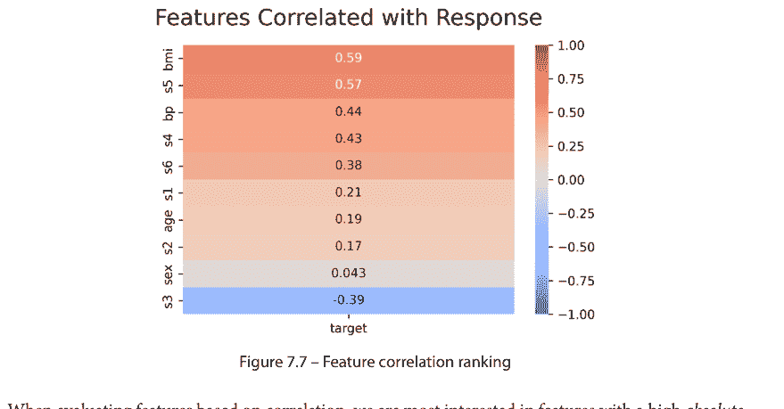

在基于相关性评估特征时，我们最感兴趣的是具有高*绝对*相关性的特征。例如，*图7.7*中的相关性排名显示：

-   `bmi`和`s5`与响应变量表现出强相关性。
-   `bp`、`s4`、`s6`和`s3`与响应变量表现出中等相关性。
-   `s1`、`age`和`s2`与响应变量表现出弱相关性。

虽然`sex`可能看起来与响应变量没有相关性，但皮尔逊相关系数不能用于分类特征。从这个相关性排名中，我们可以看到，至少`bmi`、`s5`和`bp`可能是该数据集中预测响应的最佳特征之一。事实上，这些特征在我们的模型中被认为是统计显著的。现在让我们讨论使用统计显著性进行选择。

#### 统计显著性

使用相关性评估特征通常是特征选择的一个良好第一步。我们可以轻松地消除与响应变量不相关的特征。然而，根据问题的不同，我们可能仍然会留下许多与响应相关的特征。我们可以进一步使用特征在模型上下文中的统计显著性来选择特征。然而，近年来，这些特征选择方法在社区中已有些失宠。因此，我们将不重点关注这些方法，而仅对其进行描述以供理解。

请记住，当我们拟合多元线性回归模型时，结果包括对模型中每个特征的统计显著性检验。我们可以使用该检验来选择特征。有三种著名的基于统计显著性选择特征的算法：**前向选择**、**后向选择**和**逐步回归**。在前向选择中，我们从模型中没有任何变量开始，然后迭代地一次添加一个变量，使用p值在每次迭代中选择要添加的最佳特征。一旦模型中任何特征的p值高于预定义的阈值（例如0.05），我们就停止。后向选择采取相反的方法。我们从模型中的所有特征开始，然后迭代地一次移除一个变量，使用p值来确定最不重要的特征。最后一种算法是逐步回归（也称为双向消除）。逐步回归使用前向和后向检验进行。从模型中没有特征开始，然后在每次迭代中，执行一次前向选择步骤，然后执行一次后向选择过程。

这些选择方法过去被广泛使用。然而，近年来，基于性能的方法得到了更广泛的使用。现在让我们讨论基于性能的方法。

### 基于性能的特征选择方法

前面提到的统计特征选择方法的主要问题是它们倾向于创建**过拟合**模型。过拟合模型是完全拟合给定数据但无法泛化到新数据的模型。基于性能的方法使用一种称为**交叉验证**的方法来克服过拟合。在交叉验证中，我们有两个数据集：一个用于拟合模型的**训练数据集**和一个用于评估模型的**测试数据集**。我们可以从多个特征集构建模型，在训练集上拟合所有这些潜在模型，最后根据模型在测试集上使用给定指标的表现对它们进行排名。

#### 比较模型

在我们深入特征选择方法之前，让我们首先讨论如何比较模型。我们使用指标来比较模型。在基本层面上，我们可以使用指标来帮助我们根据模型性能确定一组特征是否优于另一组特征。许多指标可用于比较模型。我们将讨论两个指标：**均方误差（MSE）**和**平均绝对百分比误差（MAPE）**，它们是迄今为止回归模型最常用的两个指标。

##### MSE

MSE由以下公式给出，其中$N$是样本数量，$y$是响应变量，$\hat{y}$是响应变量的预测值。

$$MSE = \frac{1}{N} \sum_{i=1}^{N} (y_i - \hat{y}_i)^2$$

换句话说，取响应值与预测响应值之间的差值，对差值求平方，最后取平方差的平均值。该指标的一个常用小扩展是**均方根误差（RMSE）**，它就是MSE的平方根。当希望指标与响应变量具有相同单位时，就会使用RMSE。

##### MAPE

MAPE由以下公式给出，其中$N$是样本数量，$y$是响应变量，$\hat{y}$是响应变量的预测值：

$$MAPE = \frac{100\%}{N} \sum_{i=1}^{N} \left| \frac{y_i - \hat{y}_i}{y_i} \right|$$

这个公式类似于MSE的公式，但我们不是取平方误差的平均值，而是取百分比误差的平均值。这使得MAPE比MSE更容易解释，这是相对于MSE的一个显著优势。

既然我们已经讨论了模型验证和评估指标，现在让我们将这些概念结合起来，使用模型性能作为指标来进行特征选择。

#### 递归特征消除

**递归特征消除（RFE）**是一种使用评估指标来选择模型中最佳特征数量的方法。与之前提到的向后选择法非常相似，RFE算法从模型中的所有特征开始，然后移除对模型影响最小的特征。在每一步，都会进行交叉验证。当RFE完成时，我们将能够看到模型在不同特征集上的交叉验证性能。

在这个例子中，我们使用scikit-learn（sklearn）中的线性回归实现和RFE实现，这是Python生态系统中用于机器学习的主要包。在下面的代码示例中，我们设置RFE使用MAPE作为评分指标（`make_scorer(mape, greater_is_better=False)`），每一步移除一个特征（`step=1`），并用`cv=2`表示它应该使用两个交叉验证集来对模型进行评分：

```
linear_model = LinearRegression()
linear_model.fit(X, y)
rfecv = RFECV(
    estimator=linear_model,
    step=1,
    cv=2,
    scoring=make_scorer(mape, greater_is_better=False),
    min_features_to_select=1
)
rfecv.fit(X,y)
```

一旦我们拟合了RFE对象，我们就可以查看结果，看看模型在不同特征集上的得分情况。使用MAPE的模型性能如*图7.8*所示。

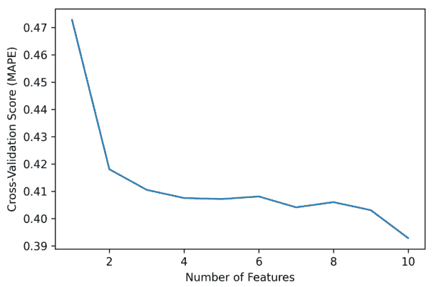

很明显，包含所有特征会产生性能最佳的模型，但包含全部10个特征相比仅使用5个特征，性能提升很小。虽然性能最佳的模型包含所有10个特征，但我们仍然需要考虑模型假设并验证模型是否拟合良好。

在本节中，我们研究了几种特征选择方法，包括统计方法和基于性能的方法。我们还讨论了评估指标以及如何比较模型，包括将数据划分为训练集和验证集的原因。在下一节中，我们将研究线性回归收缩方法。这类模型使用一种称为正则化的方法，在某些方面类似于基于模型的特征选择。

### 收缩方法

**偏差-方差权衡**是所有统计和机器学习从业者在进行建模时必须平衡的一个决策点。任何一方过多都会使结果变得无用。为了在它们成为问题时捕捉到这一点，我们会查看测试结果和残差。例如，假设已经选择了一组有用的特征和合适的模型，一个在验证集上表现良好但在测试集上表现不佳的模型可能表明方差过大；相反，一个完全表现不佳的模型可能偏差过大。在这两种情况下，模型都无法很好地泛化。然而，虽然模型中的偏差可以从一开始就在较差的模型性能中识别出来，但高方差可能具有欺骗性，因为它有可能在训练期间甚至在验证期间表现良好，这取决于数据。高方差模型经常使用不必要的高系数值，而使用非不必要的高系数值可以获得非常相似的结果。此外，使用非不必要的高系数值，模型更可能处于偏差-方差平衡状态，这为其在未来的数据上更好地泛化提供了更好的机会。此外，当模型系数没有被夸大时，可以提供关于当前因素对给定目标影响的更可靠的见解，这有助于进行更有用的描述性分析。这就引出了收缩的概念。

**收缩**是一种通过将模型参数系数向零收缩来减少模型方差的方法。系数是通过对模型考虑的所有变量应用最小二乘回归得出的。收缩量基于参数对最小二乘估计的贡献；对平方误差贡献大的参数，其系数将被推向零或完全归零。在这种情况下，收缩可用于变量消除。在模型拟合过程中，对高平方误差没有贡献的变量，其系数值将仅受到最小程度的减少，因此，如果其纳入的实际目的经过审查，它们对模型拟合是有用的。收缩——也称为**正则化**——之所以重要，是因为它有助于模型包含有用的变量，同时防止它们引入过多的方差，从而导致过拟合。防止过多的方差对于确保模型随时间推移良好泛化特别有用。让我们看一些最常见的收缩技术，**岭回归**和**最小绝对收缩和选择算子（LASSO）回归**。

#### 岭回归

回顾一下，使用最小二乘回归的多元线性回归的**残差平方和（RSS）**公式如下：

$$RSS = \sum_{i=1}^{n} \left( y_i - \widehat{\beta}_0 - \sum_{j=1}^{p} \widehat{\beta}_j x_{ij} \right)^2$$

其中$n$是样本数量，$p$是参数数量。岭回归添加一个标量$\lambda$，称为**调优参数**——它必须大于或等于0——该参数乘以模型参数系数估计值$\widehat{\beta}_j^2$，以创建一个**收缩惩罚项**。这被加回到RSS方程中，使得新的最小二乘回归拟合过程现在定义如下：

$$RSS + \lambda \sum_{j=1}^{p} \widehat{\beta}_j^2$$

当$\lambda=0$时，相应的岭回归**惩罚项**为0。然而，当$\lambda \longrightarrow \infty$时，模型系数向零收缩。新的拟合过程可以重写如下：

$$\|y - X\beta\|_2^2 + \lambda \|\beta\|_2^2$$

其中RSS = $\|y - X\beta\|_2^2$，$\|\beta\|_2^2$是回归系数数组的平方$L^2$**范数**（欧几里得范数），$X$是设计矩阵。进一步简化得到：

$$\|y - X\beta\|_2^2 + \lambda \beta^T \beta$$

这可以通过使用调优参数的标量乘以单位矩阵来推导**岭回归系数估计值**$\hat{\beta}^R$，从而写成闭式解，如下所示：

$$\hat{\beta}^R = (X^T X + \lambda I)^{-1} X^T y$$

简单来说，岭回归系数估计值是使最小二乘回归输出最小化的系数集，如下所示：

$$\hat{\beta}^R = argmin \left\{ \sum_{i=1}^n \left( y_i - \hat{\beta}_0 - \sum_{j=1}^p \hat{\beta}_j x_{ij} \right)^2 + \lambda \sum_{j=1}^p \hat{\beta}_j^2 \right\}$$

> **在应用岭回归之前对系数进行标准化**
> 因为岭回归旨在最小化整个数据集的误差，并且为此目的的调优参数是在$L^2$范数归一化过程中（即对平方和项取根）应用的，所以在应用岭回归之前，对模型中的每个变量应用标准缩放器，使所有变量处于相同的尺度，这一点很重要。如果不执行此操作，岭回归几乎肯定无法帮助模型在不同数据集上泛化。

总之，岭回归通过使用$L^2$**惩罚**来减少模型中的方差，该惩罚对系数的平方和进行惩罚。然而，重要的是要注意$L^2$**范数**，因此，岭回归**永远不会产生零值系数**。因此，当分析师希望使用模型中的所有项时，岭回归是减少方差的绝佳工具。然而，岭回归不能用于变量消除。对于变量消除，我们可以使用LASSO回归收缩方法，它使用$L^1$**惩罚**通过$L^1$**范数**对系数进行正则化，该范数使用绝对值将值收缩到零（包括零）。

让我们通过一个Python中岭回归实现的例子来说明。

首先，让我们从`scikit-learn`加载波士顿房价数据集。在最后一行，我们添加了截距的常数项。请注意，这个过程可以使用加利福尼亚住房数据集重复进行，结果类似，但输入变量不同，只需运行`from sklearn.datasets import fetch_california_housing`代替`from sklearn.datasets import load_boston`：

```
from sklearn.metrics import mean_squared_error as MSE
from sklearn.model_selection import train_test_split
from sklearn.preprocessing import StandardScaler
```

from sklearn.datasets import load_boston
import statsmodels.api as sm
import pandas as pd

boston_housing = load_boston()
df_boston = pd.DataFrame(boston_housing.data, columns=boston_housing.feature_names)
df_boston['PRICE'] = boston_housing.target
df_boston = sm.add_constant(df_boston, prepend=False)

这里给出了前三条记录：

| CRIM | ZN | INDUS | CHAS | NOX | RM | AGE | DIS | RAD | TAX | PTRATIO | B | LSTAT | PRICE | const |
|---|---|---|---|---|---|---|---|---|---|---|---|---|---|---|
| 0.00632 | 18 | 2.31 | 0 | 0.538 | 6.575 | 65.2 | 4.09 | 1 | 296 | 15.3 | 396.9 | 4.98 | 24 | 1 |
| 0.02731 | 0 | 7.07 | 0 | 0.469 | 6.421 | 78.9 | 4.9671 | 2 | 242 | 17.8 | 396.9 | 9.14 | 21.6 | 1 |
| 0.02729 | 0 | 7.07 | 0 | 0.469 | 7.185 | 61.1 | 4.9671 | 2 | 242 | 17.8 | 392.83 | 4.03 | 34.7 | 1 |

图 7.9 – 波士顿住房数据的前三条记录

我们将 PRICE 设为目标变量。回顾一下，当参数数量多于样本数量或存在过度方差时，岭回归最为有用。我们假设这两个条件都满足：

```
X = df_boston.drop('PRICE', axis=1)
y = df_boston['PRICE']
```

如前所述，**数据必须经过标准化**才能输入到 $L^2$ 范数中，因此我们使用 scikit-learn 的 StandardScaler 函数来应用此操作：

```
sc = StandardScaler()
X_scaled = sc.fit_transform(X)
```

接下来，我们将数据按 75/25 的比例划分为训练集和测试集。我们使用 shuffle=True 来随机打乱数据，这样我们使用随机样本进行测试，该样本更有可能代表总体：

```
X_train, X_test, y_train, y_test = train_test_split(
    X_scaled, y, test_size=0.25, shuffle=True)
```

现在我们可以比较**普通最小二乘法 (OLS)** 回归与使用岭回归正则化系数的 OLS 回归。在导入的函数 fit_regularized 中，我们将必需的 method 参数设置为 'elastic_net'。我们稍后将讨论弹性网络，但现在请注意，L1_wt 参数在**设置为 0** 时应用岭回归。Alpha 是岭回归惩罚项中的调节参数 λ。较小的 alpha 允许较大的系数，而较大的 alpha 会将系数推向零。这里，我们拟合训练数据以推导均方误差：

```
ols_model = sm.OLS(y_train, X_train)
compiled_model = ols_model.fit()
compiled_model_ridge = ols_model.fit_regularized(method='elastic_net', L1_wt=0, alpha=0.1, refit=True)
print('OLS Error: ', MSE(y_train, compiled_model.predict(X_train)))
print('Ridge Regression Error: ', MSE(y_train, compiled_model_ridge.predict(X_train)))
```

我们可以看到岭回归的误差略高

OLS Error: 530.7235449265926

Ridge Regression Error: 533.2278083730833

接下来，我们拟合测试数据，看看模型在未见过的数据上泛化能力如何。我们再次使用均方误差进行测量：

```
print('OLS Error: ', MSE(y_test, compiled_model.predict(X_test)))
print('Ridge Regression Error: ', MSE(y_test, compiled_model_ridge.predict(X_test)))
```

我们可以看到，两个模型在测试数据上的误差都增加了。然而，与岭回归方法相比，OLS 回归产生的误差比例略高：

OLS Error: 580.8138216493896

Ridge Regression Error: 575.5186673728349

在这里，我们可以在图 7.10 中观察到 OLS 回归系数和正则化后的系数：

| | CRIM | ZN | INDUS | CHAS | NOX | RM | AGE | DIS | RAD | TAX | PTRATIO | B | LSTAT | const |
|---|---|---|---|---|---|---|---|---|---|---|---|---|---|---|
| 岭回归之前 | -0.43 | -0.84 | 0.14 | 1.33 | -1.07 | 2.86 | -0.72 | -1.86 | -0.05 | 0.48 | -1.82 | 1.36 | -4.69 | 0.00 |
| 岭回归之后 | -0.47 | -0.69 | 0.04 | 1.29 | -0.76 | 2.85 | -0.62 | -1.41 | -0.01 | 0.10 | -1.62 | 1.28 | -4.08 | 0.00 |

图 7.10 – 岭回归正则化前后的 OLS 回归系数

#### LASSO 回归

在本节前面，我们提到了具有不必要高值的变量系数如何增加模型方差，从而削弱模型的泛化能力，使其无法达到系数合理时的水平。我们演示了应用岭回归来实现这一点。然而，岭回归的一个非常流行的替代方法是 LASSO 回归。LASSO 回归遵循类似的程序，即在模型的残差平方和误差中添加一个惩罚项，并试图最小化由此产生的值（误差）。然而，LASSO 使用 $L^1$ 范数而不是 $L^2$。因此，当调节参数达到足够大的值时，可以获得绝对为零的系数值，从而起到特征选择和收缩工具的作用。

LASSO 方程试图通过使用以下方法收缩每个变量的系数来最小化整体模型误差：

$$\hat{\beta}^L = argmin\left\{\sum_{i=1}^{n}\left(y_i - \hat{\beta}_0 - \sum_{j=1}^{p}\hat{\beta}_j x_{ij}\right)^2 + \lambda \sum_{j=1}^{p}|\hat{\beta}_j|\right\}$$

LASSO 和岭回归之间的唯一区别是惩罚项 $|\hat{\beta}_j|$。

> **选择 $\lambda$**
调节参数 $\lambda$ 的值最好使用交叉验证来选择。虽然调节参数理论上可以趋于无穷大，但通常从小于 1 的值开始，例如从 0.1 开始，以十分之一为增量增加到 1。之后，通常使用整数值。

使用与岭回归相同的数据，我们应用 LASSO 回归。这里，我们设置 L1_wt=1，表示将应用 $L^1$ 范数：

```
ols_model = sm.OLS(y_train, X_train)
compiled_model = ols_model.fit()
compiled_model_lasso = ols_model.fit_regularized(method='elastic_net',
L1_wt=1, alpha=0.1, refit=True)
```

我们将遵循与岭回归相同的步骤来处理 LASSO，即首先检查训练数据上的误差，然后再次检查测试数据上的误差，以查看模型的泛化能力：

```
print('OLS Error: ', MSE(y_train, compiled_model.predict(X_train)))
print('LASSO Regression Error: ', MSE(y_train, compiled_model_lasso.predict(X_train)))
```

输出显示 OLS 回归略优于 LASSO。这可能是由于更高的方差。然而，实际上，结果是相同的：

OLS Error: 530.7235449265926
LASSO Regression Error: 531.2440812254207

现在，我们需要检查模型在留出数据上的性能：

```
print('OLS Error: ', MSE(y_test, compiled_model.predict(X_test)))
print('LASSO Regression Error: ', MSE(y_test, compiled_model_lasso.predict(X_test)))
```

我们可以看到两个模型的误差再次基本相同。然而，由于特征较少，LASSO 模型可能更容易被信任能够在未来的数据上泛化。这可能取决于研究人员的主观知识水平：

```
OLS Error: 546.1338399374557

LASSO Regression Error: 546.716239805892
```

与岭回归一样，一些系数在 $L^1$ 范数正则化过程中已被最小化。然而，我们也看到，使用相同的 alpha 值，四个变量已被最小化为零，从而完全将它们从模型中移除。岭回归将三个特征相对地收缩到几乎为零，但 ZN 没有，我们在 *图 7.11* 中看到它已被减少到 0。模型误差略有改善，这可能看起来不显著，但考虑到消除了四个变量，我们可以认为模型具有更强的泛化能力，对外生变量的依赖更少。

| | CRIM | ZN | INDUS | CHAS | NOX | RM | AGE | DIS | RAD | TAX | PTRATIO | B | LSTAT | const |
|---|---|---|---|---|---|---|---|---|---|---|---|---|---|---|
| LASSO 回归之前 | -0.434 | -0.845 | 0.144 | 1.326 | -1.078 | 2.86 | -0.729 | -1.869 | -0.059 | 0.484 | -1.821 | 1.359 | -4.692 | 0.000 |
| LASSO 回归之后 | -0.428 | 0.000 | 0.000 | 1.321 | -0.826 | 2.731 | -0.643 | -2.382 | 0.000 | 0.000 | -1.473 | 1.327 | -4.722 | 0.000 |

图 7.11 – LASSO 回归正则化前后的 OLS 回归系数

#### 弹性网络

**弹性网络**是另一种常见的收缩方法，可用于管理偏差-方差权衡。该方法将调节参数应用于岭回归和 LASSO 回归的组合，其中两者的影响比例由超参数 $\alpha$ 决定。弹性网络最小化的方程如下：

$$(\widehat{\beta}_0, \widehat{\beta}) = argmin \left\{ \frac{1}{2n} \sum_{i=1}^{n} \left( y_i - \widehat{\beta}_0 - \sum_{j=1}^{p} \widehat{\beta}_j x_{ij} \right)^2 + \lambda \left( \frac{1-\alpha}{2} \sum_{j=1}^{p} \widehat{\beta}_j^2 + \alpha \sum_{j=1}^{p} |\widehat{\beta}_j| \right) \right\}$$

自然地，根据 $\alpha$ 的值，弹性网络也可以生成绝对为零的系数参数估计值，因为它抵消了岭回归惩罚项。当需要所有输入变量时——例如，如果它们已经按照本章 *特征选择* 部分概述的程序进行了修剪——弹性网络最有可能优于岭回归和 LASSO 回归，特别是当数据集中存在高度相关的特征且必须包含这些特征以捕获必要的方差时。在下一节中，我们将讨论降维。具体来说，我们将深入概述 PCR，它使用**主成分分析 (PCA)** 从包含评估目标所需的相关特征的系统中提取有用信息。

首先，让我们使用与岭回归和LASSO回归相同的数据，通过一个弹性网络回归示例进行讲解。根据之前的弹性网络最小化方程，我们设置L1_wt=0.5，这意味着在岭回归和LASSO回归之间保持50/50的平衡。然而，与我们在岭回归和LASSO回归中使用的alpha=0.1不同，我们应用了alpha=8，以期获得优于普通最小二乘回归系数的结果。回顾一下，当调节参数趋近于无穷大时，系数趋近于0。因此，根据弹性网络系数，我们可以得出结论：8是一个非常高的调节参数：

```python
ols_model = sm.OLS(y_train, X_train)
compiled_model = ols_model.fit()
compiled_model_elastic = ols_model.fit_regularized(method='elastic_net', L1_wt=0.5, alpha=8, refit=True)
```

让我们在训练数据上测试模型：

```python
print('OLS Error: ', MSE(y_train, compiled_model.predict(X_train)))
print('Elastic Net Regression Error: ', MSE(y_train, compiled_model_elastic.predict(X_train)))
```

这里，我们看到与普通最小二乘回归相比，弹性网络在模型中增加了误差：

OLS Error: 530.7235449265926

Elastic Net Regression Error: 542.678919923863

现在让我们检查模型在留出数据上的误差：

```python
print('OLS Error: ', MSE(y_test, compiled_model.predict(X_test)))
print('Elastic Net Regression Error: ', MSE(y_test, compiled_model_elastic.predict(X_test)))
```

观察图7.12中的结果，我们可以看到弹性网络如何以增加训练误差为代价（增加了方差）来换取偏差的降低，这使得模型在留出数据上泛化得更好。我们可以看到，在留出数据上，弹性网络的结果优于普通最小二乘回归。然而，误差的改善表明增加的偏差提供了降低误差的更好机会，但这并非必然：

OLS Error: 546.1338399374557

Elastic Net Regression Error: 514.8301731640446

这里我们可以看到弹性网络实施前后的系数：

| | CRIM | ZN | INDUS | CHAS | NOX | RM | AGE | DIS | RAD | TAX | PTRATIO | B | LSTAT | const |
|---|---|---|---|---|---|---|---|---|---|---|---|---|---|---|
| Before Elastic Net | -0.43 | -0.84 | 0.14 | 1.33 | -1.07 | 2.86 | -0.72 | -1.86 | -0.05 | 0.48 | -1.82 | 1.36 | -4.69 | 0.00 |
| After Elastic Net | 0.00 | 0.00 | 0.00 | 0.00 | 0.00 | 3.05 | 0.00 | 0.00 | 0.00 | 0.00 | 0.00 | 0.00 | -5.45 | 0.00 |

图7.12 – 弹性网络正则化前后的普通最小二乘回归系数

我们可以看到，使用足够大的调节参数值（alpha=8），平衡的弹性网络迫使大多数系数绝对值为零。唯一保留下来的系数在普通最小二乘回归中具有相对较大的值。值得注意的是，对于保留系数的变量（RM和LSTAT），弹性网络增加了这两个系数，而岭回归和LASSO回归则略微减小了它们。

### 降维

在本节中，我们将使用一种特定技术——**主成分回归**——来研究多元线性回归。当我们需要处理多重共线性数据问题时，这种技术非常有用。多重共线性发生在回归模型中，一个自变量与另一个自变量高度相关，或者一个自变量可以从另一个自变量预测出来时。高相关性在拟合模型时可能会对结果产生不良影响。

主成分回归技术基于无监督机器学习中用于数据压缩和探索性分析的主成分分析。其背后的思想是使用降维技术主成分分析，对这些原始变量进行处理，以创建新的不相关变量。从这些新变量中获得的信息有助于我们理解变量之间的关系，然后将多元线性回归算法应用于这些新变量。主成分分析技术也可用于分类问题，我们将在下一章讨论。

#### 主成分分析——实践入门

主成分分析是一种基于线性代数的降维技术，它通过使用原始变量的线性组合将数据线性变换到一个新的坐标系中。这些新的线性组合被称为**主成分**。主成分分析技术与前面章节提到的特征选择技术或收缩方法的区别在于，原始自变量被保留，但新的主成分变量被变换到一个新的坐标空间中。换句话说，主成分分析使用原始数据来获得一种新的表示或新的结构。主成分变量的数量与原始自变量的数量相同，但这些新的主成分变量彼此不相关。主成分变量是按照从最大到最小的变异性顺序创建和排序的。原始自变量和新变换的主成分变量的方差总和是相同的。

在进行主成分分析之前，我们对数据集进行预处理，从每个数据点中减去均值，并标准化每个自变量的标准差。从高层次结构来看，主成分分析技术的目标是找到向量 $v_1, v_2, \dots, v_k$，使得数据集中的任何数据点 $x$ 都可以近似表示为一个线性组合：

$$x = \sum_{i=1}^{k} a_i v_i$$

其中 $a_i$ 是常数，$i = \overline{1, k}$。假设我们有这 $k$ 个向量；那么，每个数据点都可以写成 $R^k$ 中的一个向量，对应于投影：

$$x = \langle x, v_1 \rangle \cdot v_1 + \langle x, v_2 \rangle \cdot v_2 + \dots + \langle x, v_k \rangle \cdot v_k$$

换句话说，如果我们有 $d$ 个原始自变量，我们将构建一个 $d \times k$ 维的变换矩阵，可以将任何数据点映射到一个新的 $k$ 维变量子空间，其中 $k$ 小于 $d$。这意味着我们通过对原始自变量进行线性变换实现了降维。主成分分析有多种应用，但这里我们将引用一篇发表在《自然》杂志（2008年）上的论文《欧洲内部的基因镜像地理》（https://pubmed.ncbi.nlm.nih.gov/18758442/）。作者考虑了一个包含3000名欧洲个体的样本，这些个体在人类基因组中超过50万个可变DNA位点进行了基因分型；然后，每个个体使用超过50万个遗传标记来表示。这意味着它产生了一个维度大于3000 x 500,000的矩阵。他们对数据集进行了主成分分析，以找到最有意义的向量 $v_1$ 和 $v_2$（第一和第二主成分），其中每个人只对应两个数字。作者根据这两个数字在二维平面上绘制了每个人，然后根据他们来自的国家为每个点着色。

#### 多元线性回归

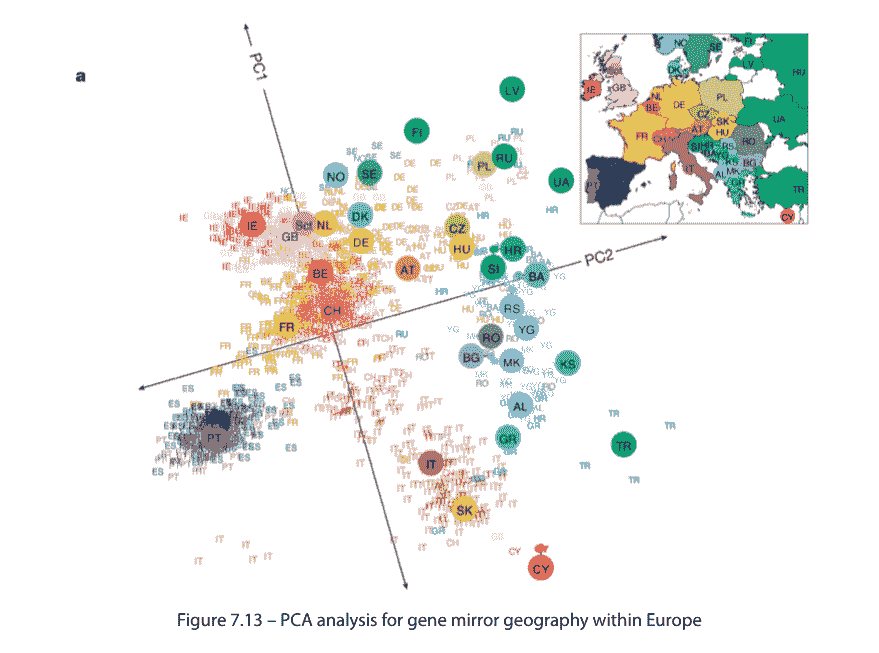


令人惊讶的是，主成分分析技术在图中表现良好，显示出与欧洲地图相似的遗传相似性。

在下一部分，我们将讨论如何在实践中使用主成分分析进行主成分回归分析。

#### 主成分回归——实践薪资预测研究

要进行主成分回归分析，我们首先执行主成分分析以获得主成分，然后决定保留包含最多可解释变异性的前 $k$ 个主成分。这里，$k$ 是新的主成分变量空间的维度。最后，我们在这些新变量上拟合多元线性回归。

我们将考虑一个来自开源Kaggle数据的实践薪资预测任务——https://www.kaggle.com/datasets/floser/hitters——来说明主成分回归方法。如果要跟随操作，请从Kaggle URL下载数据集：

##### 1. 设置和加载数据

导入本研究中将使用的必要库，并加载Hitters数据。为简单起见，我们将删除数据集中所有缺失值。有19个自变量（16个数值型和3个分类型），目标变量是'Salary'。分类型自变量'League'、'Division'和'NewLeague'被转换为虚拟变量。在执行主成分分析步骤之前，我们预处理并标准化特征，并创建训练集和测试集：

```python
# Import libraries
import numpy as np
import pandas as pd
import matplotlib.pyplot as plt
from sklearn.preprocessing import scale
from sklearn.linear_model import LinearRegression
from sklearn.model_selection import KFold, cross_val_score, train_test_split
from sklearn.metrics import mean_squared_error
from sklearn.decomposition import PCA
#location of dataset
url = "/content/Hitters.csv"
#read in data
data = pd.read_csv(url).dropna() # to simply the analysis, we drop all missing values
# create dummies variables
dummies_variables = pd.get_dummies(data[['League', 'Division', 'NewLeague']])
# create features and target
target = data['Salary']
feature_to_drop = data.drop(['Salary', 'League', 'Division', 'NewLeague'],axis=1).astype('float64')
X = pd.concat([feature_to_drop, dummies_variables[['League_N',
```

##### 2. 生成所有主成分

作为下一步，我们为训练集生成所有主成分。此操作会产生19个新的主成分变量，因为原始自变量有19个：

```python
# 首先生成所有主成分
pca = PCA()
X_pc_train = pca.fit_transform(X_train)
X_pc_train.shape
```

##### 3. 确定要使用的最佳主成分数量

下一步是执行10折交叉验证的多元线性回归，并使用RMSE选择要使用的最佳主成分数量：

```python
# 定义交叉验证折数
cv = KFold(n_splits=10, shuffle=True, random_state=42)
model = LinearRegression()
rmse_score = []
# 计算MSE分数 - 基于19个主成分
for i in range(1, X_pc_train.shape[1]+1):
    rmse = -cross_val_score(model, X_pc_train[:,:i], y_train,
    cv=cv, scoring='neg_root_mean_squared_error').mean()
    rmse_score.append(rmse)
# 绘制结果
plt.plot(rmse_score, '-o')
plt.xlabel('回归中主成分的数量')
plt.ylabel('RMSE')
plt.title('薪资')
plt.xlim(xmin=-1)
plt.xticks(np.arange(X_pc_train.shape[1]), np.arange(1, X_pc_train.shape[1]+1))
plt.show()
```

以下是生成的图表：

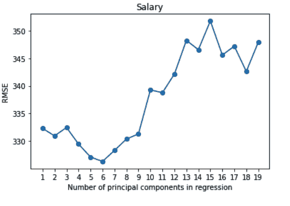

图 7.15 – 主成分数量

由此，我们看到最佳主成分数量是6，对应于最低的交叉验证RMSE。

##### 4. 重新训练模型并进行预测

我们将使用这个数量在训练数据上训练回归模型，并在测试数据上进行预测：

```python
# 在训练数据上训练回归模型
model = LinearRegression()
model.fit(X_pc_train[:,:6], y_train)

pcr_score_train = -cross_val_score(model, X_pc_train[:,:6], y_train, cv=cv, scoring='neg_root_mean_squared_error').mean()

# 使用测试数据进行预测
X_pc_test = pca.fit_transform(X_test)[:,:6]
pred = model.predict(X_pc_test)
pcr_score_test = mean_squared_error(y_test, pred, squared=False)
```

请注意，与特征选择或收缩方法相比，主成分回归分析的结果更难解释，并且如果前几个主成分捕获了大部分可解释的变异性，此分析性能会更好。

## 总结

在本章中，我们讨论了多元线性回归的概念以及有助于其实现的主题。这些主题包括特征选择方法、收缩方法和主成分回归。使用这些工具，我们能够演示降低建模过度方差风险的方法。这样做时，我们也能够引入模型偏差，以便模型在未见过的数据上泛化时，能够以最小的复杂性获得更好的机会，避免过拟合时经常遇到的问题。

在下一章中，我们将开始讨论分类问题，首先介绍逻辑回归，它在线性回归模型上拟合一个S形曲线来推导二元类别成员的概率。

# 第三部分：分类模型

在本部分中，我们讨论可以用分类解决的问题类型、相关系数和决定系数、多元建模、模型选择以及使用正则化的变量调整。

它包括以下章节：

- 第8章，离散模型
- 第9章，判别分析

# 8 离散模型

在前两章中，我们讨论了用于预测连续响应变量的模型。在本章中，我们将开始讨论用于预测离散响应变量的模型。我们将首先讨论用于预测二元结果变量（具有两个水平的分类变量）的probit和logit模型。然后，我们将把这个想法扩展到预测具有多个水平的分类变量。最后，我们将研究预测计数变量，它们类似于分类变量，但只取整数值，并且具有无限多个水平。

在本章中，我们将涵盖以下主要主题：

- Probit和logit模型
- 多项logit模型
- 泊松模型
- 负二项回归模型

## Probit和logit模型

之前，我们讨论了回归模型可以解决的不同类型的问题。特别是，因变量是连续的，例如房屋价格、工资等。一个自然的问题是，如果因变量不是连续的——换句话说，如果它们是分类的——我们将如何调整回归方程来预测分类响应变量？例如，公司的人力资源部门想要进行离职研究，以预测员工是否会留在公司，或者汽车经销商想要根据价格、车型、颜色等来了解一辆车是否能被售出。

首先，我们将研究**二元分类**。在这里，结果（因变量）是一个二元响应，例如是/否或做/不做。让我们回顾一下简单的线性回归模型：

$$y = \beta_0 + \beta_1x + \epsilon$$

这里，预测结果是一条穿过数据点的直线。使用这个模型，我们可以建立一个模型，基于不同的自变量（如区域、单元、楼层或距离）来预测房价（因变量）。同样的想法不能应用于二元分类问题。让我们考虑一个简单的例子，我们想仅根据价格预测房子是否售出。让我们基于线性回归建立一个模型：

$$Sold = \beta_0 + \beta_1 * Price + \epsilon \quad (1)$$

这里，如果房子售出，则$Sold = 1$，如果未售出，则$Sold=0$。通过使用线性回归进行可视化，我们可以在数据点之间画出一条最佳拟合线。看起来当价格增加时，房子售出的机会减少：

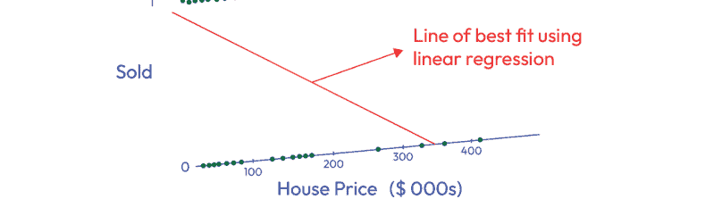

图 8.1 – 使用线性回归的最佳拟合线

因此，我们不考虑方程模型（1），而是考虑以下内容：

$$Prob(Sold) = \beta_0 + \beta_1 * Price + \epsilon$$

这里，$Prob(Sold)$是房子售出的概率。概率值将在0和1之间；当房子售出的概率等于未售出的概率时，其范围的中点是0.5。然而，当房子的价格非常高时，$Prob(Sold)$的值可能为负。为了避免这个问题，我们可以用以下方程来建模：

$$\frac{P}{1-P} = \beta_0 + \beta_1 * Price + \epsilon \quad (2)$$

这里，$P$是房子售出的概率，$1 - P$是房子未售出的概率。$\frac{P}{1-P}$的值在$[0, \infty)$范围内，当房子售出的概率与未售出的概率相同时（$P=0.5$），则$\frac{P}{1-P} = 1$，或者其范围的中点是1。这也被称为**优势比**。要解释优势比，当$\frac{P}{1-P} = 1$时，每售出一套房子，就有一套房子未售出。当$P = 0.75$时，优势比是3。在这种情况下，解释是能够售出房子的优势是不能售出房子优势的三倍。回到方程（2），优势比的范围是$[0, \infty)$，其下限是0，但正如我们之前对方程（1）的讨论，当房子的价格真的很高时，优势比的估计值可能为负，这与概率性质相矛盾。此外，因为中点是1，但优势比的范围是从0到无穷大，所以分布非常偏斜，有一个长的右尾。然而，根据线性回归的假设之一，我们期望它是正态分布的。因此，我们不使用方程（2），而是考虑以下内容：

$$\log(\frac{P}{1-P}) = \beta_0 + \beta_1 * Price + \epsilon$$

$\log(\frac{P}{1-P})$的值在$(-\infty, \infty)$范围内，中点是0。类似于线性回归，我们可以使用以下公式：

$$\log(odds) = \log(\frac{P}{1-P}) = \beta_0 + \beta_1 X_1 + \beta_2 X_2 + \dots = z \quad (3)$$

我们可以用这个来解释解释变量如何与分类结果相关联。我们可以将前面的方程（3）重写如下：

$$F(z) = P = \frac{e^z}{1 + e^z},$$

前面的公式下限为0，上限为1（预测概率P，表示结果发生），被称为logit模型。它是**逻辑分布**的累积分布函数。

另一种建模二元因变量概率的方法是**probit回归**。我们不使用逻辑回归的累积分布函数，而是使用标准正态分布的累积分布函数：

$$F(z) = \int_{-\infty}^{z} \phi(u)du = \phi(z).$$

前面的公式下限为0，上限为1（预测概率P，表示结果发生），被称为**probit模型**。请记住以下内容：

$$\phi(z) = P(Z \leq z), \quad Z \sim \mathcal{N}(0,1).$$

logit和probit模型都是使用**最大似然法**估计的。在statsmodels中，我们有probit和logit模型的类。这些类的文档可以在https://www.statsmodels.org/dev/generated/statsmodels.discrete.discrete_model.Probit.html和https://www.statsmodels.org/dev/generated/statsmodels.discrete.discrete_model.Logit.html找到。

现在，让我们创建一个训练数据集来说明如何使用statsmodels中的Logit类进行logit研究：

```python
import pandas as pd
# 创建gpa训练数据
train = pd.DataFrame({'Admitted': [1, 1, 1, 1, 1, 0, 1, 1, 0, 1, 1, 1,
       1, 1, 0, 1, 0, 0, 0, 0, 0, 0, 0, 0, 0, 0, 0, 0, 1, 1, 1, 1, 0],
       'GPA': [2.8, 3.3, 3.7, 3.7, 3.7, 3.3, 3.7, 3, 1.7,
       3.6, 3.3, 4, 3.2, 3.4, 2.8, 4, 1.5, 2.7, 2.3, 2.3, 2.7, 2.2, 3.3, 3.3,
```

## 多项Logit模型

在实践中，有许多情况的结果（因变量）不是二元的，而是具有两种以上的可能性。**多项逻辑回归**可以理解为我们在上一节研究的Logit模型的一般情况。在本节中，我们将通过使用statsmodels中的MNLogit类对鸢尾花数据进行实践研究：https://www.statsmodels.org/dev/generated/statsmodels.discrete.discrete_model.MNLogit.html。

鸢尾花数据（https://archive.ics.uci.edu/ml/datasets/iris）是教育领域最著名的统计和机器学习数据集之一。自变量是花萼长度（厘米）、花萼宽度（厘米）、花瓣长度（厘米）和花瓣宽度（厘米）。因变量是一个具有三个水平的分类变量：山鸢尾（0）、变色鸢尾（1）和维吉尼亚鸢尾（2）。以下Python代码展示了如何使用sklearn和statsmodels进行此操作：

```python
# import packages
import numpy as np
import pandas as pd
from sklearn import datasets
from sklearn.model_selection import train_test_split
from sklearn.linear_model import LogisticRegression
from sklearn.metrics import confusion_matrix, accuracy_score, ConfusionMatrixDisplay
import statsmodels.discrete.discrete_model as sm

# import Iris data
iris = datasets.load_iris()
print(iris.feature_names)
print(iris.target_names)

#create dataframe
df = pd.DataFrame(iris.data, columns = ['sepal_length', 'sepal_width', 'petal_length', 'petal_width'])
df['target'] = iris.target
df.head()

# check missing values
df.isna().sum()

# create train and test data
X = df.drop('target', axis=1)
y = df['target']
X_train, X_test, y_train, y_test = train_test_split(X, y, test_size =0.2, random_state =1)

# fit the model using sklearn
model_sk = LogisticRegression(solver = 'newton-cg', multi_class = 'multinomial')
model_sk.fit(X_train, y_train)
y_hat_sk = model_sk.predict(X_test)
pred_sk = list(map(round, y_hat_sk))
# confusion matrix
cm_sk = confusion_matrix(y_test, pred_sk)
ConfusionMatrixDisplay(cm_sk).plot()
# Accuracy
print('Test accuracy = ', accuracy_score(y_test, pred_sk))

#fit the model using statsmodels
model_stat = sm.MNLogit(y_train, X_train).fit(method='bfgs')
model_stat.summary()
y_hat_stat = model_stat.predict(X_test)
pred_stat = np.asarray(y_hat_stat).argmax(1)
# confusion matrix
cm_stat = confusion_matrix(y_test, pred_stat)
ConfusionMatrixDisplay(cm_stat).plot()
# Accuracy
print('Test accuracy = ', accuracy_score(y_test, pred_stat))
```

两种方法都给出了相同的测试准确率值（96.67%），产生的混淆矩阵如下：

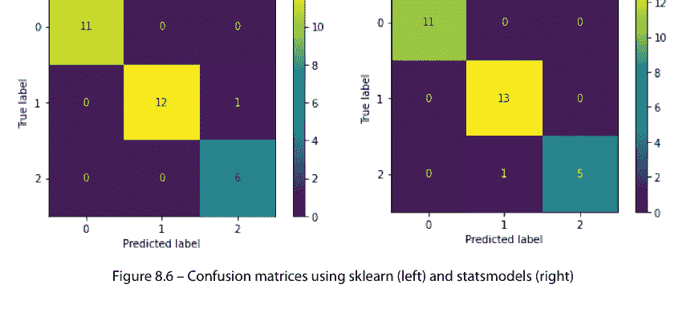

## 泊松模型

在上一节中，我们讨论了响应变量为分类变量的模型。在本节中，我们将研究一个用于计数数据的模型。计数数据类似于分类数据（类别是整数），但有无限多个水平（0, 1, 2, 3，等等）。我们使用**泊松分布**对计数数据建模。在本节中，我们将首先研究泊松分布及其性质。然后，我们将使用泊松模型对具有解释变量的计数变量进行建模。

### 泊松分布

泊松分布由以下公式给出：

$$P(k) = \frac{\lambda^k e^{-\lambda}}{k!}$$

这里，$\lambda$ 是事件的平均数量，$k$ 是我们想要计算概率的事件数量。$P(k)$ 是 $k$ 个事件发生的概率。该分布用于计算在固定时间间隔或定义空间内发生 $k$ 个事件的概率。

分布的形状随 $\lambda$ 的值而变化。当 $\lambda$ 大于10时，分布近似正态。然而，当 $\lambda$ 接近0时，分布变为右偏。这是因为计数数据不能为负。*图8.7*显示了三个示例泊松分布，其均值分别为12、5和2。请注意，均值为12的分布近似正态分布，而均值为5和2的分布是右偏的：

214 离散模型

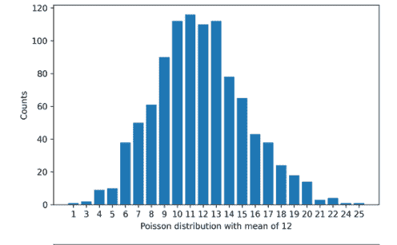

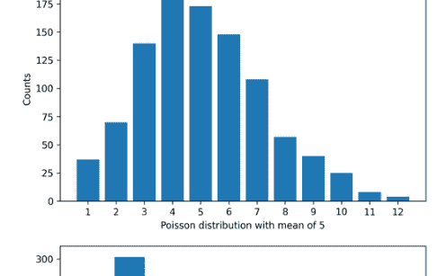

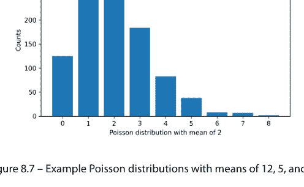

图8.7 – 均值为12、5和2的示例泊松分布

### 建模计数数据

现在，让我们看看如何使用泊松模型对计数类型的响应变量进行建模。如前所述，计数数据通常服从泊松分布。泊松模型的数学表达式如下：

$$y = e^{b_0 + b_1x_1 + ... + b_nx_n}$$

其中，*y* 是响应变量，*b* 值是模型系数，*x* 变量代表解释变量。这看起来应该与我们在上一章使用的方程相似，但增加了对解释变量的指数运算。这种类型的模型称为 **对数线性** 模型，即对响应变量的对数进行线性组合建模。我们可以通过对方程两边取自然对数来重写这个方程，使其更明确：

$$\ln(y) = b_0 + b_1x_1 + ... + b_nx_n$$

现在，我们将响应变量的对数（ $\ln(y)$ ）表示为解释变量的线性组合。

> **自然对数**
> 泊松模型使用一种特殊的对数，称为自然对数。一个数的自然对数是以数学常数 *e* 为底的对数。自然对数通常写作 $\ln(x)$、$\log_e(x)$ 或 $\log(x)$（前两种写法明确，但第三种可能产生歧义）。对数运算是指数运算的逆运算。在这种情况下，自然对数是指数函数的逆运算：$\ln(e^x) = x = e^{\ln(x)}$。自然对数和指数函数在统计学、数学和科学中被广泛使用。

让我们看一个例子。我们将使用来自 UCI 的自行车共享数据集（`https://archive.ics.uci.edu/ml/datasets/bike+sharing+dataset.`）。在这个数据集中，我们有每天租用自行车的数量。有两种类型的租赁：预先注册（注册用户）和现场按需（临时用户）。在这个例子中，我们将对给定年份内每周临时租赁自行车的平均数量进行建模。该数据集提供了几个解释变量，包括温度等环境因素以及是否为节假日等日历信息。

我们将首先建立模型的方程，然后查看使用 `statsmodels` 拟合模型的结果。模型方程遵循我们之前讨论的形式：

$$\ln(weekly\_mean\_rental\_count) = b_0 + b_1(temperature) + b_1(season) + b_2(weather\_situation) + b_3(humidity) + b_4(wind\_speed) + b_5(holiday)$$

我们可以使用 `statsmodels` 用给定的数据拟合这个模型，类似于我们在上一章所做的。这里展示了拟合模型的代码片段（有关预处理的详细信息，请参阅 Jupyter Notebook）：

```
# select variables
X = df.groupby('isoweek').mean()[['atemp', 'season',
    'weathersit', 'hum', 'windspeed', 'holiday']]
# transform holiday variable as an indicator that a holiday occurs
# within that week
X['holiday'] = X['holiday'].apply(lambda x: 1 if x > 0.1 else 0)
# add a constant for the model
X = sm.add_constant(X)
# get the response variable
y = df.groupby('isoweek').mean()['casual']
fit_model = sm.Poisson(y, X).fit()
fit_model.summary()
```

拟合模型后，我们可以使用 `summary()` 方法获取系数的详细信息。对于这个模型，我们得到以下系数输出：

| | coef | std err | z | P>|z| | [0.025 | 0.975] |
|---|---|---|---|---|---|---|
| const | 4.1252 | 0.072 | 57.096 | 0.000 | 3.984 | 4.267 |
| atemp | 3.0915 | 0.042 | 73.155 | 0.000 | 3.009 | 3.174 |
| season | 0.0427 | 0.007 | 6.179 | 0.000 | 0.029 | 0.056 |
| weathersit | -0.2387 | 0.032 | -7.422 | 0.000 | -0.302 | -0.176 |
| hum | 1.2369 | 0.100 | 12.345 | 0.000 | 1.040 | 1.433 |
| windspeed | 1.2132 | 0.177 | 6.856 | 0.000 | 0.866 | 1.560 |
| holiday | 0.0955 | 0.014 | 6.771 | 0.000 | 0.068 | 0.123 |

图 8.8 – 泊松模型摘要

就像线性回归的建模示例一样，这些系数值是我们模型中列出参数的估计值。模型中的所有解释变量似乎都是显著的。有趣的是，根据系数估计值，温度（atemp）似乎是最具影响力的因素，其次是湿度（hum）和风速。模型拟合良好，无需移除不显著的变量，我们可以评估模型的性能。该模型的平均绝对误差（MAE）为 155，对应的平均绝对百分比误差（MAPE）为 36%。

泊松模型强烈依赖于响应变量服从泊松分布的假设。在下一节中，我们将介绍一种用于计数数据的类似模型，但其分布假设更弱。

## 负二项回归模型

**离散回归** 的另一种有用方法是 **对数线性负二项回归** 模型，它使用负二项概率分布。从高层次来看，负二项回归适用于 *过度离散的计数数据*，其中 *计数的条件均值小于计数的条件方差*。模型 **过度离散** 是指目标变量的方差大于模型假设的均值。在回归模型中，均值就是回归线。我们根据目标变量计数分析（均值与方差）来决定是否使用负二项模型，并向负二项模型提供一个模型过度离散的度量来调整过度离散，我们将在下面讨论这一点。

需要注意的是，负二项模型并非用于简单地建模离散数据，而是专门用于建模与固定数量的 **随机** 试验相关的 **计数数据**，例如在随机抽样场景中建模事件发生（或未发生）之前的尝试次数。该模型仅适用于计数数据，其中目标变量的每个计数响应都基于一组有限的结果。此外，由于计数数据是重复二项试验的结果，因此计数排列的顺序无关紧要。

### 负二项分布

以下是条件均值为 17、条件方差为 52 的失败次数负二项分布示例：

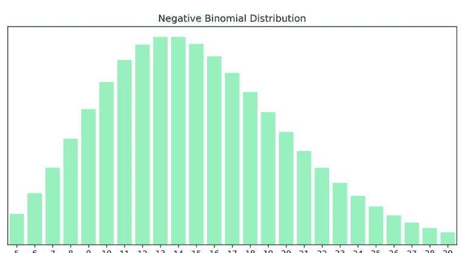

图 8.9 – 负二项分布示例

二项分布是伯努利随机变量（一种具有两个结果值：0 或 1 的变量）在固定次数随机试验（$X = (X_1, X_2, \dots)$）中成功次数的构造。负二项分布是伯努利随机变量在固定次数随机抽取中失败次数的构造。这一区别很重要，因为使用二项回归的模型对观测值的二元结果进行建模，而负二项回归模型对观测值的计数结果进行建模。负二项分布是二项分布的逆运算。负二项分布的概率质量函数如下：

$$P(X - x) = \binom{x + n - 1}{n - 1} p^n (1 - p)^x$$

其中，在 $x + n - 1$ 次试验中，有 $x$ 次失败和 $n - 1$ 次成功，并在第 $x + n$ 次试验时达到成功。

关于泊松分布，负二项分布 *不要求严格遵守条件方差等于条件均值的假设*，因为它包含一个额外的参数 $\alpha$ 来解释额外的方差，而泊松模型假设方差等于均值 $\mu$。负二项模型假设方差（这里基于泊松-伽马混合分布）等于以下公式：

$$\mu(1 + \alpha\mu)$$

这可以简化为：

$$(\mu + \alpha\mu^2)$$

### 负二项回归

以成功概率 $p$ 表示，负二项方差计算如下：

$$n \frac{1-p}{p^2}$$

其均值为：

$$n \frac{1-p}{p}$$

由于负二项模型的方差不等于均值，因此当计数足够大以至于响应的方差超过均值时，负二项模型很可能优于泊松方法。与泊松类似，负二项模型是一个对数线性模型，其置信区间基于 Wald 和偏差下降似然比。负二项模型的回归方程形式（如下所示）与泊松回归相同：

$$\ln(y) = b_0 + b_1 x_1 + \dots + b_n x_n$$

它可简化为：

$$y = e^{b_0} + e^{b_1 x_1} + \dots + e^{b_n x_n}$$

给定分布样本的成功概率的**最大似然估计**如下：

$$\frac{n}{n + \bar{x}'}$$

#### 最大似然估计

**最大似然估计 (MLE)** 是对数几率（或 logit）和对数似然统计建模方法的基础。似然是指在给定特定回归系数值的情况下，观察到回归模型已知结果的概率。默认情况下，如果一组变量比另一组变量提供更高的观察结果获得概率，则该组变量将具有更高的似然。似然的对数被用作回归模型拟合优度的度量。对于每个变量的一组潜在系数值中，具有每个变量最大对数似然值的系数集被称为**最大似然估计**。这些值通过迭代方法生成多个可能值来获得。如果样本量足够大并且为模型获得了适当的变量集，则最大似然估计可被视为无偏的。

计算负二项回归的置信区间与逻辑回归类似。**Wald** 方法利用 **z 比率** 进行计算。如果模型中有 $j$ 个变量，则 z 比率计算如下：

$$\frac{(\hat{\beta}_j - \beta_j)}{SE(\hat{\beta}_j)}$$

其中，$SE$ 是标准误。置信区间是变量的系数估计值加上和减去半宽置信区间百分位数乘以系数估计的标准误。可以使用 z 比率是因为假设估计具有标准正态抽样分布。因此，我们可以推导出变量估计系数的 95% 置信区间如下：

下限 95% 置信区间：

$$\widehat{\beta}_j - 0.475 \times SE(\widehat{\beta}_j)$$

上限 95% 置信区间：

$$\widehat{\beta}_j + 0.475 \times SE(\widehat{\beta}_j)$$

负二项回归有三个特定的必要假设：

1.  样本之间相互独立。
2.  目标变量的对数与输入变量之间存在线性关系（对数线性模型）。
3.  条件方差大于或等于条件均值。

样本之间相互独立意味着样本之间没有序列相关性，也没有任何聚类或其他条件依赖性。目标变量的对数与输入变量之间的线性关系意味着目标变量的对数与每个输入变量的变化之间的关系呈线性缩放。除了我们在本节开头讨论的要求 3 之外，这些要求与泊松模型基本相同。

让我们使用 statsmodels 在 Python 中演练一个例子。为此，我们加载 statsmodels 的 affairs 数据集，使用剩余变量来建模子女数量（`children` 变量）。在第三行，我们必须添加生成截距系数所需的常数：

```python
import statsmodels.api as sm
data = sm.datasets.fair.load().data
data = sm.add_constant(data, prepend=False)
```

首先，让我们从数值上确认目标变量中存在过度离散：

```python
print('Mean count of children per marriage: ', data['children'].mean())
print('Variance of the count of children per marriage: ', data['children'].var())
```

我们可以看到方差大于均值：

Mean count of children per marriage: 1.3968740182218033

Variance of the count of children per marriage: 2.054838616333698

在这里，我们可以看到每个婚姻的条件均值小于条件方差。虽然差异不大，但足以考虑使用负二项回归。让我们直观地观察响应的分布：

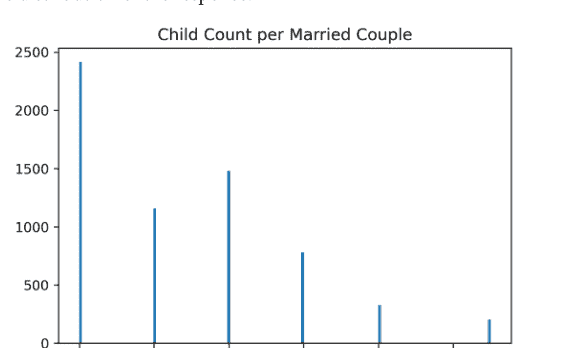

图 8.10 – 子女分布

数据的前五行如下所示。请注意，设计矩阵的第一列应始终包含常数：

| const | age | religious | yrs_married | Educ | occupation | occupation_husb | affairs | rate_marriage | children |
|---|---|---|---|---|---|---|---|---|---|
| 1 | 32 | 3 | 9 | 17 | 2 | 5 | 0.1111111 | 3 | 3 |
| 1 | 27 | 1 | 13 | 14 | 3 | 4 | 3.2307692 | 3 | 3 |
| 1 | 22 | 1 | 2.5 | 16 | 3 | 5 | 1.3999996 | 4 | 0 |
| 1 | 37 | 3 | 16.5 | 16 | 5 | 5 | 0.7272727 | 4 | 4 |
| 1 | 27 | 1 | 9 | 14 | 3 | 4 | 4.666666 | 5 | 1 |

图 8.11 – 示例数据集的前五条记录，包括添加的常数

在我们对 *图 8.10* 中子女分布的目视检查中，我们发现有一个子女值为 5.5。这可能是平均值或错误的结果。主题专家可能有助于确定这一点，但为了我们的分析，让我们假设这是一个错误，并四舍五入为整数个子女，因为人不是分数。让我们设置目标数组 *y* 和设计矩阵 *X*：

```python
y = round(data['children'])
X = data[['const','age','religious','yrs_married','educ','occupation','occupation_husb','affairs','rate_marriage']]
```

现在，让我们为回归建模创建训练集和测试集。请注意，shuffle=True 将提供不同的结果。为了获得代表性样本，数据应随机打乱：

```python
from sklearn.model_selection import train_test_split
X_train, X_test, y_train, y_test = train_test_split(X, y, test_size=0.25, shuffle=True)
```

由于负二项模型基于泊松-伽马混合模型，我们需要使用泊松模型估计模型的过度离散度量。A. Colin Cameron 和 Pravin K. Trivedi 在《Microeconometrics: Methods and Applications》中提出了一种称为**辅助 OLS 回归（无常数）**的方法。作者提出创建一个过度离散检验统计量，其中原假设为 α=0，备择假设为 α ≠ 0，其中 α 是过度离散的估计值。辅助 OLS 回归公式如下：

$$\frac{(y_i - \hat{\mu}_i)^2 - y_i}{\hat{\mu}_i} = \alpha \frac{g(\hat{\mu}_i)}{\hat{\mu}_i} + \mu_i$$

其中，$\mu_i$ 是误差项，$g(\hat{\mu}_i)$ 是 $\hat{\mu}_i^2$。因此，右侧操作数简化为 $\alpha \hat{\mu}_i + \mu_i$。就负二项回归而言，我们认为误差等于零，因此我们可以将 α 作为过度离散估计值纳入。

在以下代码中，我们使用泊松模型作为连接函数，将训练数据拟合到广义线性模型。然后，我们使用模型的回归均值来构建估计的辅助目标变量。因为该方法是“无常数”的，所以我们减去 1 以从过程中移除常数：

```python
from statsmodels.formula.api import ols as OLS
import statsmodels.api as sm

poisson_model = sm.GLM(y_train, X_train, family=sm.families.Poisson()).fit()

df_aux = pd.DataFrame()
df_aux['y_mu_hat'] = poisson_model.mu
df_aux['children'] = y_train
df_aux['y_auxiliary'] = df_aux.apply(lambda x: ((x['children'] - x['y_mu_hat'])**2 - x['y_mu_hat']) / x['y_mu_hat'], axis=1)

ols_model = OLS('y_auxiliary ~ y_mu_hat - 1', df_aux).fit()
print(ols_model.params)
```

如我们所见，负二项模型的估计离散度为 0.622034。现在，我们需要评估辅助估计是否具有统计显著性。我们可以使用 OLS 模型的 p 值来完成：

```python
print(ols_model.summary())
```

这将打印出以下输出：

OLS 回归结果
=====================
| coef | std err | z | P>|z| | [0.025 | 0.975] |
|---|---|---|---|---|---|
| y_mu_hat | 0.6220 | 0.070 | 8.857 | 0.000 | 0.484 | 0.760 |

图 8.12 – OLS 回归结果

由于系数显著且大于 0，我们可以确认模型基于目标变量存在过离散。该系数可用作负二项模型中过离散的度量，我们可以用它来调整此处 `alpha` 参数中的方差：

```
from statsmodels.genmod.families.family import NegativeBinomial

negative_binomial_model = sm.GLM(y_train, X_train,
family=NegativeBinomial(alpha=ols_model.params.values)).fit()
print(negative_binomial_model.summary())
```

输出如下所示：

广义线性模型回归结果
=============================================
| coef | std err | z | P>|z| | [0.025 | 0.975] |
|---|---|---|---|---|---|
| const | -0.0784 | 0.183 | -0.430 | 0.667 | -0.436 | 0.279 |
| age | -0.0088 | 0.006 | -1.431 | 0.153 | -0.021 | 0.003 |
| religious | 0.0467 | 0.021 | 2.207 | 0.027 | 0.005 | 0.088 |
| yrs_married | 0.1137 | 0.006 | 19.596 | 0.000 | 0.102 | 0.125 |
| educ | -0.0317 | 0.009 | -3.377 | 0.001 | -0.050 | -0.013 |
| occupation | -0.0348 | 0.021 | -1.673 | 0.094 | -0.076 | 0.006 |
| occupation_husb | 0.0162 | 0.014 | 1.142 | 0.253 | -0.012 | 0.044 |
| affairs | -0.0009 | 0.010 | -0.092 | 0.927 | -0.021 | 0.019 |
| rate_marriage | -0.0634 | 0.018 | -3.434 | 0.001 | -0.100 | -0.027 |

图 8.13 – 广义线性模型回归结果

最后，让我们使用在训练数据上构建的模型来预测训练数据，然后再预测测试数据，以便我们可以使用残差误差作为比较基础来比较模型在未见数据上的泛化能力：

```
from sklearn.metrics import mean_squared_error as RMSE

print('Training Root Mean Squared Error: ', RMSE(y_train, negative_
binomial_model.predict(X_train)) )
print('Testing Root Mean Squared Error: ', RMSE(y_test, negative_
binomial_model.predict(X_test)))
```

我们可以从均方根误差中观察到，模型在训练数据和测试数据上的性能大致恒定，表明模型具有一致性：

Training Root Mean Squared Error: 1.2553439918425695

Testing Root Mean Squared Error: 1.266620561303553

## 总结

在本章中，我们解释了在严格基于线性回归构建二元分类概率模型时，遇到生成负原始概率的问题，而预期概率应在 [0, 1] 范围内。我们概述了对数几率比以及使用标准正态分布和逻辑分布的累积分布函数分别进行的 probit 和 logit 建模。我们还演示了应用逻辑回归解决二元和多项分类问题的方法。最后，我们介绍了使用对数线性泊松和负二项模型的基于计数的回归，这些模型也可以无需修改地逻辑扩展到比率数据。我们提供了它们的实现示例。

在下一章中，我们将介绍使用贝叶斯定理的条件概率，以及使用线性判别分析和二次判别分析进行的降维和分类建模。

# 9 判别分析

在上一章中，我们讨论了离散回归模型，包括使用逻辑回归进行分类。在本章中，我们将从概率概述开始，扩展到条件概率和独立概率。然后，我们讨论这两种理解概率定律的方法如何构成贝叶斯定理的基础，该定理直接用于扩展一种称为贝叶斯统计的方法。在此主题之后，我们深入探讨**线性判别分析 (LDA)** 和**二次判别分析 (QDA)**，这两种强大的分类器使用贝叶斯概率建模方法对数据进行建模。

在本章中，我们将涵盖以下主要主题：

- 贝叶斯定理
- LDA
- QDA

## 贝叶斯定理

在本节中，我们将讨论**贝叶斯定理**，它用于本章后面描述的分类模型。我们将从讨论概率基础开始本章。然后，我们将研究相关事件，并讨论贝叶斯定理如何与相关事件相关联。

### 概率

概率是对事件发生或特定结果发生可能性的度量。通常，我们可以将事件分为两类：**独立事件**和**相关事件**。事件类型的区别就在名称中。独立事件是不受其他事件发生影响或影响的事件，而相关事件则受其他事件发生的影响或影响。

让我们思考一些这些事件的例子。第一个例子，想想一枚公平的硬币抛掷。硬币抛掷可以产生两种状态之一：正面和反面。如果硬币是公平的，抛掷结果为正面或反面的机会是二分之一。这意味着在公平的硬币抛掷中，正面或反面的概率是 0.5。当事件可计数时，我们可以使用以下公式计算概率：

$$P(E) = \frac{\text{期望结果的计数}}{\text{结果总数}}$$

这里，$P(E)$ 是期望结果的概率。在硬币抛掷的例子中，期望结果是正面或反面，每次抛掷只能发生一次。因此，对于硬币抛掷，期望事件的计数为一。结果总数为二，因为硬币抛掷有两种可能的状态。将这些数字代入前面的方程，得出正面为 0.5，反面为 0.5。现在，运用你的经验，之前的抛掷是否给你提供了关于同一枚硬币下一次抛掷的任何知识？它没有，因为*每次抛掷都独立于其他每次抛掷*；它是一个独立事件。

现在，让我们考虑另一个例子。假设我们有一个袋子，里面有三个红色弹珠和五个蓝色弹珠。让我们计算从袋子中选出一个红色弹珠的概率：$P(Red)$。总共有八个弹珠，这是方程中的结果总数。我们想选出一个红色弹珠，这意味着期望结果的计数是三。这意味着从袋子中选出红色弹珠的概率是 3/8。现在，让我们计算从袋子中选出一个蓝色弹珠的概率：$P(Blue)$。有五个蓝色弹珠和八个总弹珠，所以从袋子中选出蓝色弹珠的概率是 5/8。注意这两个概率之和为一：$P(Red) + P(Blue) = 3/8 + 5/8 = 1$。这引出了概率的一个重要性质：总概率必须等于一。这当然意味着，一旦我们计算出选出红色弹珠的概率，我们就可以通过用一减去选出红色弹珠的概率来计算选出蓝色弹珠的概率。概率的这个性质非常有用，在统计学和**机器学习 (ML)** 中经常使用。

回到红色和蓝色弹珠的例子，让我们思考这个例子所代表的事件类型。我们从袋子中选出一个弹珠。现在，接下来有两种可能的选择：(1) 我们将选出的弹珠放回，然后再次从袋子中选出一个弹珠；(2) 我们不放回弹珠，然后从袋子中剩余的七个弹珠中选出一个新的弹珠。第一种情况称为**有放回抽样**。有放回抽样是一个独立事件，因为每次从袋子中抽取之前，袋子都会重置。第二种情况称为**无放回抽样**。无放回抽样是你发现相关事件的地方。第一次选出弹珠时，概率与之前描述的相同（一个独立事件）。然而，如果弹珠没有放回，袋子的状态就发生了变化，下一次选出弹珠的概率取决于上一次从袋子中选出了哪一个。那么，在无放回抽样中，每一次后续的弹珠抽取都是一个相关事件。在讨论相关事件时，使用**条件概率**来描述事件很有用。现在让我们讨论条件概率。

### 条件概率

让我们从一个正式的定义开始。当我们处理相关事件时，我们可能对事件A发生后事件B的概率感兴趣，即我们想知道事件A发生后事件B发生的概率。这被称为事件B在事件A发生条件下的条件概率，记作 $P(B | A)$。这可以理解为“在事件A已经发生的条件下，事件B发生的概率”。这个概念可能有点抽象，所以让我们结合上一个例子来理解条件概率。

假设事件A是“抽到红色弹珠”，事件B是“抽到蓝色弹珠”。我们想求的是在已经抽到红色弹珠的条件下，抽到蓝色弹珠的条件概率，可以记作 $P(蓝色 | 红色)$。让我们来计算这个例子。从袋中抽出第一个红色弹珠后，还剩下七个弹珠：两个红色和五个蓝色。我们使用相同的公式计算从新集合中选中蓝色弹珠的概率，得到概率为5/7。这意味着，在已经抽到一个红色弹珠的条件下，抽到蓝色弹珠的条件概率是5/7。

既然我们已经讨论了条件概率，现在让我们看看从袋中进行两次抽取的概率。形式上，我们想计算事件A和事件B同时发生的概率。继续沿用我们的例子，让我们计算先抽到红色弹珠然后抽到蓝色弹珠的概率。我们可以用以下公式描述两个连续事件的概率：

$$P(A \text{ 且 } B) = P(A) * P(B | A)$$

换句话说，先发生A后发生B的概率等于事件A的概率乘以在事件A发生条件下事件B的概率。在我们的例子中，我们已经计算了 $P(红色)$ 和 $P(蓝色 | 红色)$。我们可以用这些值来计算先抽到红色弹珠然后抽到蓝色弹珠的概率 $P(红色 \text{ 且 } 蓝色)$，如下所示：

$$P(红色 \text{ 且 } 蓝色) = P(红色) * P(蓝色 | 红色) = \frac{3}{8} * \frac{5}{7} = \frac{15}{56} \cong 0.27$$

计算后，我们发现 $P(红色 \text{ 且 } 蓝色)$ 大约是0.27。

现在，出于兴趣，让我们重新计算一下，但*交换颜色的顺序*；即先抽到蓝色弹珠然后抽到红色弹珠的概率，或记作 $P(蓝色 \text{ 且 } 红色)$。遵循与前面例子相同的逻辑，我们会发现 $P(蓝色) = 5/8$ 且 $P(红色|蓝色) = 3/7$。因此，公式如下：

$$P(蓝色 \text{ 且 } 红色) = P(蓝色) * P(红色 | 蓝色) = \frac{5}{8} * \frac{3}{7} = \frac{15}{56} \cong 0.27$$

注意，$P(红色 \text{ 且 } 蓝色)$ 和 $P(蓝色 \text{ 且 } 红色)$ 具有相同的概率。这并非巧合。这就是著名的贝叶斯定理，我们接下来将讨论它。

### 讨论贝叶斯定理

在上一节关于条件概率的内容中，我们在从袋中抽取弹珠的例子中偶然遇到了贝叶斯定理。让我们更详细地讨论贝叶斯定理。

贝叶斯定理是统计学中一个被称为**贝叶斯统计**的领域的基础。贝叶斯统计的核心思想是，给定一个先验概率，我们利用新信息来更新概率估计。虽然对贝叶斯统计的全面描述超出了本书的范围，但我们将讨论与本书概念相关的贝叶斯定理。我们通常用以下公式描述贝叶斯定理：

$$P(B|A) = \frac{P(A|B)P(B)}{p(A)}$$

在贝叶斯术语中，$P(B)$ 被称为**先验概率**，而 $P(B | A)$ 被称为**后验概率**。后验概率在给定另一个事件发生后为我们提供了更新。让我们在一个现实世界的例子中应用这个定理。

假设我们想根据测试结果判断某人是否患有某种疾病。我们可以用贝叶斯定理表示如下：

$$P(患病|检测阳性) = \frac{P(检测阳性|患病)P(患病)}{P(检测阳性)}$$

这里，$P(患病)$ 是患病的概率，$P(检测阳性)$ 是获得阳性检测结果的概率，而 $P(检测阳性|患病)$ 是在患者患病时获得阳性检测结果的条件概率（也称为检测的准确性）。

在这个例子中，我们假设患病的概率为0.2，检测的准确性为0.95，假阳性率为0.3。本例中的先验概率是 $P(患病)=0.2$。我们可以通过检测来改进对某人是否患病的认识。我们想求的是后验概率：$P(患病|检测阳性)$。

由于我们知道检测的准确性是0.95以及先验概率，我们已经知道了公式分子中各项的值。为了求 $P(检测阳性)$，我们需要考虑所有可能获得阳性检测结果的情况，这可能是真阳性或假阳性。我们计算阳性检测结果的概率如下：

$$P(检测阳性) = P(检测阳性|患病)P(患病) + P(检测阳性|未患病)P(未患病)$$

回想一下，所有可能状态的总概率必须等于1：$P(未患病) = 1 - P(患病) = 0.8$。考虑到这一点，我们可以计算 $P(患病|检测阳性)$：

$$P(患病|检测阳性) = \frac{0.95(0.2)}{0.95(0.2) + 0.3(0.8)} \cong 0.44$$

根据一次检测结果，我们看到，有了额外信息，患者患病的可能性从0.2增加到了0.44。0.44并不是一个特别有说服力的结果。这是由于假阳性率相对较高，为0.3，尽管检测的准确性很高。如果我们还不信服，我们可以使用0.44作为新的先验概率再次进行检测。假设第二次检测结果为阳性，我们将得到以下结果：

$$P(患病|检测阳性) = \frac{0.95(0.441)}{0.95(0.441) + 0.3(1 - 0.441)} \cong 0.71$$

第二次阳性检测提供了一个更有说服力的结果0.71。我们可以通过结合额外检测的结果，继续迭代地改进对患者患病概率的估计。这种概率估计的渐进式改进正是贝叶斯统计的基本思想。

本节介绍了概率论的基础知识。我们涵盖了独立事件和相关事件，然后更详细地讨论了相关事件，从而引出了贝叶斯定理。在下一节中，我们将讨论一种使用贝叶斯定理的分类模型。

## 线性判别分析

在上一章中，我们讨论了逻辑回归，这是一种利用线性回归直接对给定输入分布下目标分布的概率进行建模的分类模型。这种方法的一个替代方案是线性判别分析。LDA使用基于贝叶斯定理构建的决策边界，对给定每个类别对应的输入变量分布下，目标分布类别成员的概率进行建模。当我们有 $k$ 个类别时，使用贝叶斯定理，对于任何离散随机变量 $X$，LDA类别成员的概率密度函数可以简单地表示为 $P(Y = k|X = x)$。这依赖于变量 $X$ 中的观测值 $x$ 属于第 $k$ 个类别的后验概率。

在继续之前，我们必须首先注意LDA做了三个相关的假设：

- 每个输入变量都服从正态分布。
- 在所有目标类别中，预测变量之间具有**相等的协方差**。换句话说，所有输入变量的共享方差是均匀的。因此，**将每个输入变量标准化**为均值为0并**缩放到单位方差**（标准差为1）是有用的。
- 假设样本是独立的；**随机抽样**对于避免由**序列或聚类效应**引起的复杂情况非常重要。

满足这些假设后，我们可以假设类别概率密度函数是高斯（正态）分布的，因此，在一维形式（一个输入变量）下，我们有以下密度函数：

$$\frac{1}{\sqrt{2\pi}\sigma_k} e^{\frac{-1}{2\sigma_k^2}(x-\mu_k)^2}$$

此处，$\mu_k$ 是第 $k$ 个类别的均值，$\sigma_k^2$ 是第 $k$ 个类别的方差。在多元情况下，正态概率密度函数如下：

$$\frac{1}{2\pi^{p/2}\sqrt{|D|}} e^{-\frac{1}{2}(x-\mu)^T D^{-1}(x-\mu)}$$

这里，$D$ 是输入变量的协方差矩阵，$p$ 是输入变量（或参数）的数量，$\pi$ 是先验概率。单变量后验概率的计算如下所示（其中 $k$ 对应第 $k$ 个类别，$K$ 对应类别总数）：

$$\frac{\pi_k \frac{1}{\sqrt{2\pi}\sigma} e^{-\frac{1}{2\sigma^2}(x-\mu_k)^2}}{\sum_{i=1}^K \pi_i \frac{1}{\sqrt{2\pi}\sigma} e^{-\frac{1}{2\sigma^2}(x-\mu_i)^2}}$$

对于多元情况，计算如下所示：

$$\frac{\pi_k \frac{1}{\sqrt{|D|}} e^{-\frac{1}{2}(x-\mu)^T D^{-1}(x-\mu)}}{\sum_{i=1}^K \pi_i \frac{1}{\sqrt{|D|}} e^{-\frac{1}{2}(x-\mu)^T D^{-1}(x-\mu)}}$$

单变量线性判别函数 $\delta_k(x)$ 可以写成如下形式：

$$\delta_k(x) = \frac{x^* \mu_k}{\sigma^2} - \frac{\mu_k^2}{2\sigma^2} + \log(\pi_k)$$

这里，具有最大 $\delta_k(x)$ 值的类别将被分配给给定的观测值。这使用了 $K$ 个类别的贝叶斯决策边界：

$$x = \frac{\mu_1^2 - \mu_2^2 - \dots - \mu_K^2}{K(\mu_1 - \mu_2)}$$

对于多元情况，遵循相同贝叶斯决策边界的线性判别函数如下所示：

$$\delta_k(x) = x^T D^{-1} \mu_k - \frac{1}{2} \mu_k^T D^{-1} \mu_k + \log(\pi_k)$$

既然我们已经确定了概率密度函数、类别成员后验概率的计算、贝叶斯决策边界和线性判别函数，我们就能理解为什么 LDA 所需的假设如此重要。虽然可以使用变换来使数据符合所需的假设，但这些变换也必须能够适应未来的数据集。因此，如果数据变化频繁，并且需要进行大量变换才能满足 LDA 在训练和测试中产生有用结果所需的参数假设，那么这可能不是该任务的合适分类方法（例如 **QDA** 可能更有用）。然而，如果这些假设能够在研究者感到舒适的情况下得到满足，并且有合理的领域知识来确认这一点，那么 LDA 就是一个出色的算法，能够在非常大的数据集（由大的特征空间和高的观测数量定义）上产生高度可靠和稳定的结果。LDA 在较小的数据集上也表现良好。

让我们看一个实际的例子。让我们从 `statsmodels` 加载 `affairs` 数据集，以便检查类别不平衡：

```python
import statsmodels.api as sm
df_affairs = sm.datasets.fair.load().data
total_count = df_affairs.shape[0]
positive_count = df_affairs.loc[df_affairs['affairs'] > 0].shape[0]
positive_pct = positive_count / total_count
negative_pct = 1 - positive_pct
print("Class 1 Balance: {}%".format(round(positive_pct*100, 2)))
print("Class 2 Balance: {}%".format(round(negative_pct*100, 2)))
```

这里我们可以看到类别不平衡如下：

Class 1 Balance: 32.25%

Class 2 Balance: 67.75%

我们可以看到类别不平衡比例为 67.75/32.25。类别不平衡通常在接近 90/10 时才会成为大问题，因此我们将保持原样，不进行任何额外的工作，例如过采样或欠采样。我们将任何大于 0 的 `affairs` 值重新编码为 1，使其成为一个二元分类问题：

```python
df_affairs['affairs'] = np.where(df_affairs['affairs'] > 0, 1, 0)
```

让我们选择要使用的特征：

```python
X=df_affairs[['rate_marriage','age','yrs_married','children','religious','educ','occupation','occupation_husb']]
y=df_affairs['affairs']
```

回想一下，为了使 LDA 能够有效地产生线性分离边界，输入特征的标准差在两个类别中必须相同。使用接下来展示的方法，我们可以看到所有输入特征在两个目标类别中共享相同的标准差，除了 `rate_marriage`。这里的标准差差异约为 20%。考虑到我们有八个输入特征，并且模型中的所有特征都将被缩放，这可能不会造成问题。如果模型表现不佳，基于此信息，我们可以合理地假设这不是算法的错，因为所需的假设已经满足。更可能的是，我们没有足够的特征或观测值来完全解释目标变量。我们排除 `affairs`，因为它是目标变量，排除 `occupation` 和 `occupation_husb`，因为它们是分类编码，将进行独热编码，因为根据我们的分析范围，我们不认为它们是有序的：

```python
df_affairs_sd = pd.concat([X, y], axis=1)

for col in df_affairs_sd.columns:
    if col not in ['affairs','occupation','occupation_husb']:
        print('Affairs = 0, Feature = {}, Standard Deviation = {}'.format(col, round(np.std(df_affairs_sd.loc[df_affairs_sd['affairs'] == 0, col]), 2)))
        print('Affairs = 1, Feature = {}, Standard Deviation = {}'.format(col, round(np.std(df_affairs_sd.loc[df_affairs_sd['affairs'] == 1, col]), 2)))
```

Affairs = 0, Feature = rate_marriage, Standard Deviation = 0.82
Affairs = 1, Feature = rate_marriage, Standard Deviation = 1.07
Affairs = 0, Feature = age, Standard Deviation = 6.81
Affairs = 1, Feature = age, Standard Deviation = 6.7
Affairs = 0, Feature = yrs_married, Standard Deviation = 7.1
Affairs = 1, Feature = yrs_married, Standard Deviation = 7.18
Affairs = 0, Feature = children, Standard Deviation = 1.42
Affairs = 1, Feature = children, Standard Deviation = 1.41
Affairs = 0, Feature = religious, Standard Deviation = 0.89
Affairs = 1, Feature = religious, Standard Deviation = 0.84
Affairs = 0, Feature = educ, Standard Deviation = 2.21
Affairs = 1, Feature = educ, Standard Deviation = 2.09

在上一章中，我们确定 `occupation` 和 `occupation_husb` 在解释婚外情方面没有捕捉到太多差异，因此我们将从数据集中删除 `occupation_husb`，以最小化独热编码的数量，如下所示：

```python
import pandas as pd
pd.options.mode.chained_assignment = None
X['occupation'] = X['occupation'].map({1:'Occupation_One',
                                       2:'Occupation_Two',
                                       3:'Occupation_Three',
                                       4:'Occupation_Four',
                                       5:'Occupation_Five',
                                       6:'Occupation_Six'})

X = pd.get_dummies(X, columns=['occupation'])
X.drop('occupation_husb', axis=1, inplace=True)
```

让我们构建一个训练/测试集划分，测试集大小为整体数据的 33%：

```python
from sklearn.model_selection import train_test_split
X_train, X_test, y_train, y_test = train_test_split(X, y, test_size=0.33, random_state=42)
```

我们希望保留原始数据的副本，但如前所述，我们还需要对数据进行中心化和缩放，以便 LDA 有最佳的成功机会。因此，我们将复制 X 数据并对其进行缩放。但请注意，我们不想缩放独热编码的数据，因为独热编码在缩放后会失去其意义。因此，我们将使用 scikit-learn 的 `ColumnTransformer()` 管道函数，将 `StandardScaler()` 应用于除独热编码列之外的所有列，如下所示：

```python
from sklearn.compose import ColumnTransformer
from sklearn.preprocessing import StandardScaler

X_train_sc = X_train.copy()
X_test_sc = X_test.copy()

ct = ColumnTransformer([
    ('', StandardScaler(), ['rate_marriage','age','yrs_married','children','religious','educ'])], remainder='passthrough')
X_train_sc = ct.fit_transform(X_train_sc)
ct = ColumnTransformer([
    ('', StandardScaler(), ['rate_marriage','age','yrs_married','children','religious','educ'])], remainder='passthrough')
X_test_sc = ct.fit_transform(X_test_sc)
```

现在，让我们将LDA模型拟合到训练数据上。我们先将模型拟合到训练数据，然后用它来预测训练数据以获得性能基准。接着，我们将使用该模型来预测测试数据，以观察模型在未见数据上的泛化能力。

拟合数据，如下所示：

```
from sklearn.discriminant_analysis import LinearDiscriminantAnalysis
lda = LinearDiscriminantAnalysis()
lda.fit(X_train_sc, y_train)
```

这里，我们构建函数来衡量精确率和召回率。精确率是一个衡量指标，它基本上告诉你模型在只找出目标中的正例（affairs = 1）而排除所有负例（affairs = 0）方面表现如何。召回率则是一个衡量指标，它实际上告诉你模型在找出所有目标正例方面表现如何，而不管它找出了多少负例。理想情况是这两个指标都非常高。然而，这可能无法实现。如果两者都不高，那么具体用例应决定哪个指标更重要：

```
def precision_score(true_positives:int, false_positives:int):
    precision = true_positives / (true_positives + false_positives)
    return precision;

def recall_score(true_positives:int, false_negatives:int):
    recall = true_positives / (true_positives + false_negatives)
    return recall;
```

现在让我们运行模型并验证性能：

```
from sklearn.metrics import confusion_matrix
import seaborn as sns

y_train_pred = lda.predict(X_train_sc)

cf_train = confusion_matrix(y_train, y_train_pred, labels=[0,1])
tn_train, fp_train, fn_train, tp_train = cf_train.ravel()

cf_matrix = sns.heatmap(cf_train, annot=True, fmt='g', cbar=False)
cf_matrix.set(xlabel='Predicted', ylabel='Actual', title='Confusion Matrix - Train');

print('Precision on Train: ', round(precision_score(tp_train, fp_train), 4))
print('Recall on Train: ', round(recall_score(tp_train, fn_train), 4))
```

这里我们可以看到模型在训练数据上的结果：

Precision on Train: 0.6252

Recall on Train: 0.3444

在这里，我们可以使用混淆矩阵来可视化性能，比较训练数据上的实际目标值与预测值：

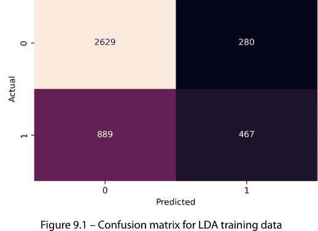

图 9.1 – LDA训练数据的混淆矩阵

让我们在测试数据上重复这个过程：

```
y_test_pred = lda.predict(X_test_sc)

cf_test = confusion_matrix(y_test, y_test_pred, labels=[0,1])
tn_test, fp_test, fn_test, tp_test = cf_test.ravel()

cf_matrix = sns.heatmap(cf_test, annot=True, fmt='g', cbar=False)
cf_matrix.set(xlabel='Predicted', ylabel='Actual', title='Confusion Matrix - Test');

print('Precision on Test: ', round(precision_score(tp_test, fp_test), 4))
print('Recall on Test: ', round(recall_score(tp_test, fn_test), 4))
```

这里我们可以看到模型在测试数据上的结果：

Precision on Test: 0.6615

Recall on Test: 0.3673

在这里，我们可以使用混淆矩阵来可视化性能，比较测试数据上的实际目标值与预测值：

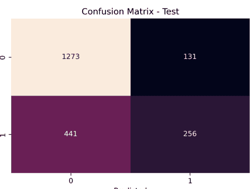

图 9.2 – LDA测试数据的混淆矩阵

从这些结果中，我们可以看到，使用我们在训练数据上构建的模型，精确率和召回率在训练集和测试集上是一致的，因此我们可以得出结论：与基准（训练）性能相比，该模型在未见数据上泛化得很好。然而，性能并不理想。问题可能在于我们的目标编码不是很有用（也许对affairs的离散化没有用，应该采用统计方法来离散化值）。然而，也有可能是特征无法解释响应变量中足够的方差，从而无法构建一个非常有用的模型（也有可能affairs根本无法预测，存在太多随机噪声无法建模）。然而，就本章的意图而言，我们能够演示如何构建和测试一个使用LDA的模型，以及在数据建模之前必须采取的预处理步骤。

### 有监督的降维

与可用于执行无监督降维的PCA不同，LDA可用于执行有监督的降维。也就是说，在训练模型以学习与输出目标相关的输入方差后，可以获得一组派生的特征。差异在下图中说明：

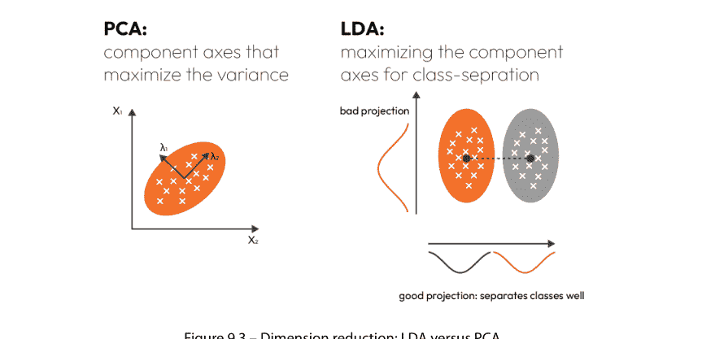

假设我们的数据在使用LDA进行分类时产生了良好的结果。那么我们可以放心地使用相同的数据来构建有监督的降维技术。要执行此操作，我们将运行以下代码，使用`fit_transform()`根据目标来转换输入数据（而不是我们之前用于拟合分类器的`fit()`函数）。与分类器一样，数据仍应符合LDA模型的假设。*数据根据响应变量中的类别数量进行缩减。* 其中类别数为C，缩减后的特征数将是C-1。因为我们的目标变量y中只有两个类别，所以LDA将输入特征缩减到1维：

```
from sklearn.discriminant_analysis import LinearDiscriminantAnalysis
lda = LinearDiscriminantAnalysis()
X_reduced = lda.fit_transform(X_train_sc, y_train)
```

我们可以看到数据现在已被缩减为一维特征：

```
print('Input data dimensions: ', X_train_sc.shape)
print('Transformed data dimensions: ', X_reduced.shape)
```

在这里，我们可以看到我们的数据从12个特征缩减到了1个：

Input data dimensions: (4265, 12)

Transformed data dimensions: (4265, 1)

## 二次判别分析

在上一节中，我们讨论了LDA。每个类别的数据需要来自多元高斯分布，并且协方差矩阵在不同类别之间是相同的。在本节中，我们考虑另一种称为QDA的判别分析，但QDA的假设在协方差矩阵假设上可以放宽。这里，我们不需要协方差矩阵在不同类别之间相同，只需要每个类别有自己的协方差矩阵。仍然需要每个类别内的观测值具有类别特定的均值向量的多元高斯分布来执行QDA。我们假设来自第$k$个类别的观测值满足以下公式：

$X \sim N(\mu_k, \Sigma_k)$

因此，我们将考虑一个生成式分类器，如下所示：

$p(X|y = k, \theta) = N(X|\mu_k, \Sigma_k)$

然后，其对应的类别后验概率如下：

$p(y = k|X, \theta) \propto \pi_k N(X|\mu_k, \Sigma_k)$。

这里，$\pi_k = p(y = k)$是类别$k$的先验概率。在文献中，这被称为**高斯判别分析（GDA）**。然后，判别函数通过取$k$个类别的对数后验概率来计算，如下所示：

$logp(y = k|X, \theta) = log\pi_k - \frac{log|2\pi\Sigma_k|}{2} - \frac{(X - \mu_k)^T \Sigma_k^{-1} (X - \mu_k)}{2} + C$

这里，$C$是一个常数。与LDA不同，$X$的量在前面的公式中表现为二次函数，因此被称为QDA。在LDA或QDA之间的选择与偏差-方差权衡有关。如果共享相同协方差矩阵的假设在$k$个类别上不好，那么LDA中的高偏差可能很显著。换句话说，当类别之间的边界是线性的时使用LDA，而当类别之间的边界是非线性的时，QDA表现更好。

现在，我们考虑一个使用上一章研究过的相同*Iris*数据集的例子。要执行QDA，一个选择是使用sklearn中的`QuadraticDiscriminantAnalysis`。与上一章一样，我们使用`train_test_split`函数创建训练集和测试集（80% 对 20%），然后在训练集上拟合一个QDA模型，并使用该模型进行预测：

```
from sklearn.discriminant_analysis import QuadraticDiscriminantAnalysis
# fit the model using sklearn
model_qda = QuadraticDiscriminantAnalysis(store_covariance=True)
model_qda.fit(X_train, y_train)
y_hat_qda = model_qda.predict(X_test)
pred_qda = list(map(round, y_hat_qda))
```

与测试集相关的混淆矩阵如下所示：

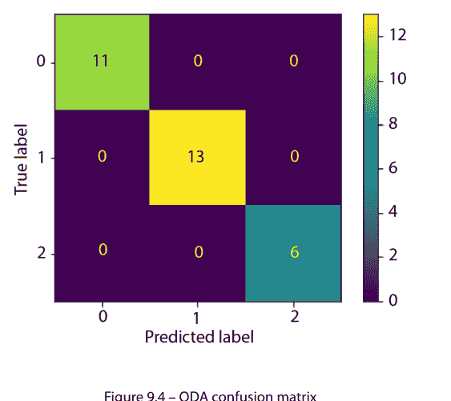

该数据集的准确率为100%。此分析基于所有变量（花萼长度（厘米）、花萼宽度（厘米）、花瓣长度（厘米）、花瓣宽度（厘米）），以及三个因变量（目标）：山鸢尾、变色鸢尾和维吉尼亚鸢尾。出于可视化教学目的，我们将仅考虑使用花萼长度和花萼宽度作为自变量的二维分析：

```
df1 = df[["sepal_length", "sepal_width", "target"]]
df1.head()
```

| | sepal_length | sepal_width | target |
|---|---|---|---|
| 0 | 5.1 | 3.5 | 0 |
| 1 | 4.9 | 3.0 | 0 |
| 2 | 4.7 | 3.2 | 0 |
| 3 | 4.6 | 3.1 | 0 |
| 4 | 5.0 | 3.6 | 0 |

图9.5 – 花萼长度和花萼宽度

花萼长度和花萼宽度之间的二维可视化可以使用以下Python代码复现：

```
import matplotlib.pyplot as plt
FIGSIZE = (8,8)
Xax= np.array(df1["sepal_length"])
Yax= np.array(df1["sepal_width"])
labels= np.array(df1["target"])
cdict={0:'red',1:'green', 2 :'blue'}
labl={0:'setosa',1:'versicolor', 2: 'virginica'}
marker={0:'*',1:'o', 2:'p'}
alpha={0:.3, 1:.5, 2:.3}
fig,ax=plt.subplots(figsize=FIGSIZE)
fig.patch.set_facecolor('white')
for l in np.unique(labels):
    ix=np.where(labels==l)
    ax.scatter(Xax[ix],Yax[ix],c=cdict[l],s=40,
        label=labl[l],marker=marker[l],alpha=alpha[l])
plt.xlabel("Sepal Length",fontsize=14)
plt.ylabel("Sepal Width",fontsize=14)
plt.legend()
plt.show()
```

可视化结果如下：

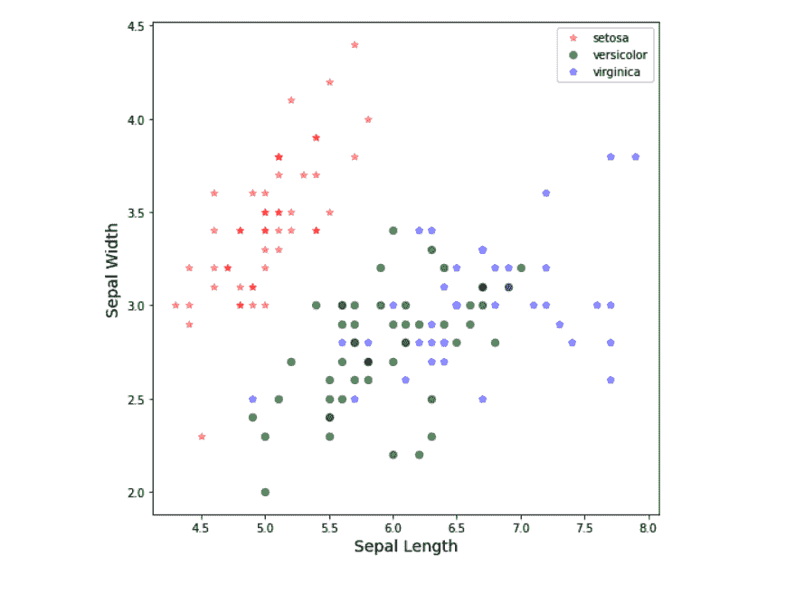

图9.6 – 鸢尾花物种散点图

观察到类别（山鸢尾、变色鸢尾和维吉尼亚鸢尾）之间不存在线性分离，因此二次判别分析（QDA）将比线性判别分析（LDA）是更好的方法。

花萼长度的最小值和最大值为（4.3, 7.9），花萼宽度的最小值和最大值为（2.0, 4.4）：

```
python
df1['sepal_length'].min(), df1['sepal_length'].max()
(4.3, 7.9)

df1['sepal_width'].min(), df1['sepal_width'].max()
(2.0, 4.4)
```

图9.7 – 花萼长度和花萼宽度的最小值和最大值

我们仅使用这两个变量（花萼长度和花萼宽度），在鸢尾花数据集的所有观测值上训练一个新的QDA模型，如下所示：

```
df1['species'] = df1['target']
df1['species'] = df1['species'].apply(lambda x: 'setosa'
        if x==0 else('versicolor' if x==1 else 'virginica'))
X = df1.drop(['target','species'], axis=1)
y = df1['target']
model_qda = QuadraticDiscriminantAnalysis(store_covariance=True)
model_qda.fit(X,y)
```

然后，我们创建一个包含500个观测值的通用数据集，其中花萼长度和花萼宽度在各自变量的最小值和最大值范围内，用于预测：

```
sepal_length = np.linspace(4, 8, 500)
sepal_width = np.linspace(1.5, 4.5, 500)
sepal_length,sepal_width  = np.meshgrid(sepal_length, sepal_width)
prediction = np.array([model_qda.predict( np.array([[x,y]]))
for x,y in zip(np.ravel(sepal_length), np.ravel(sepal_width))
]).reshape(sepal_length.shape)
```

执行以下Python代码以可视化类别之间的边界分离：

```
fig = sns.FacetGrid(df1, hue="species", size=8, palette =
'colorblind').map(plt.scatter, "sepal_length", "sepal_width").add_
legend()
figax = fig.ax
figax.contourf(sepal_length,sepal_width, prediction, 2, alpha = .1,
colors = ('red','green','blue'))
figax.contour(sepal_length,sepal_width, prediction, 2, alpha = 1,
colors = ('red','green','blue'))
figax.set_xlabel('Sepal Length')
figax.set_ylabel('Sepal Width')
figax.set_title('QDA Visualization')
plt.show()
```

我们得到如下结果图：

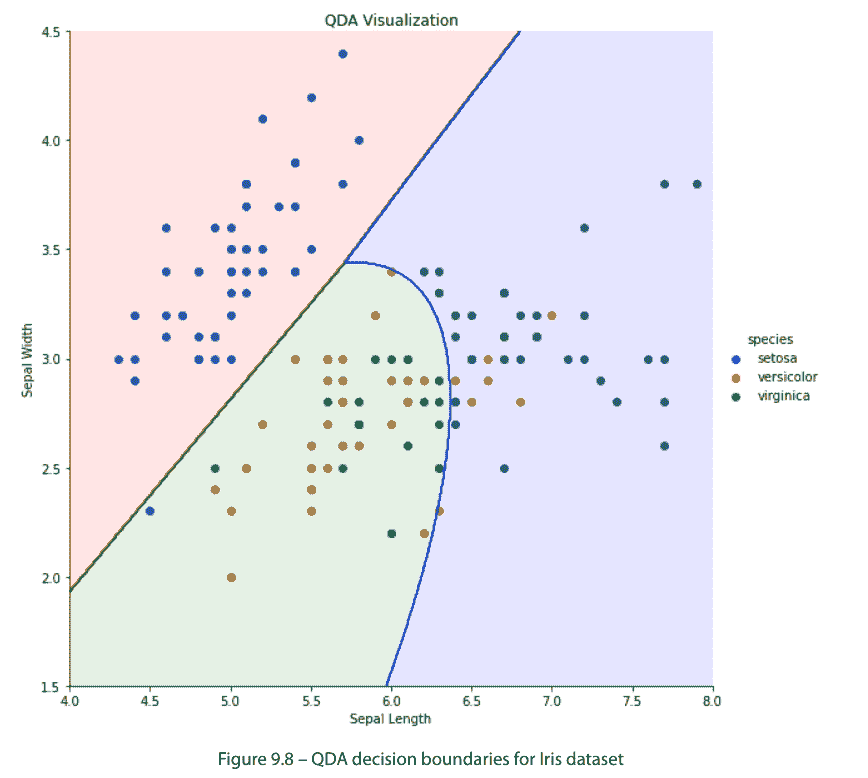

图9.8 – 鸢尾花数据集的QDA决策边界

`setosa`与另外两个类别之间有很好的分离，但`versicolor`和`virginica`类别之间则不然。在更高维度下，类别之间的分离会更好，这意味着在本例中，我们考虑所有四个自变量：`sepal_length`、`sepal_width`、`petal_length`和`petal_width`。换句话说，此分析最好在四维空间中进行，但人类无法进行四维可视化。

## 总结

在本章中，我们首先概述了概率。我们涵盖了条件概率和独立概率之间的区别，以及贝叶斯定理如何利用这些概念为概率建模提供独特的方法。接下来，我们讨论了LDA、其假设，以及该算法如何应用于贝叶斯统计以执行分类建模和有监督的降维。最后，我们介绍了QDA，这是当线性决策边界无效时LDA的一种替代方案。

在下一章中，我们将介绍时间序列分析的基础知识，包括概述这种方法在回答统计问题方面的深度和局限性。

# 第四部分：时间序列模型

本部分的目标是学习如何分析和创建单变量和多变量时间序列数据的预测。

它包括以下章节：

- 第10章，时间序列简介
- 第11章，ARIMA模型
- 第12章，多变量时间序列

# 10 时间序列简介

在*第9章，判别分析*中，我们通过介绍使用贝叶斯定理的条件概率、**线性判别分析（LDA）**和**二次判别分析（QDA）**，结束了对统计分类建模的概述。在本章中，我们将介绍时间序列、其基础统计概念，以及如何在日常分析中应用它们。我们将首先区分时间序列数据与本书迄今为止讨论的内容来引入该主题。然后，我们将概述时间序列建模的预期内容及其可利用实现的目标。在时间序列的背景下，我们还将重新引入均值和方差统计参数，以及相关性。我们将概述**线性差分、互相关、自回归（AR）和移动平均（MA）**特性，以及如何使用**自相关函数（ACF）**和**偏自相关函数（PACF）**图来确定它们的阶数。之后，我们将概述入门级的白噪声模型。本章最后将详细、正式地概述平稳性的概念，这可以说是成功进行时间序列预测最重要的前提。

在本章中，我们将涵盖以下主要主题：

- 什么是时间序列？
- 时间序列分析的目标
- 统计测量
- 白噪声模型
- 平稳性

## 什么是时间序列？

在本章和接下来的几章中，我们将处理一种称为时间序列数据的数据类型。到目前为止，我们处理的是独立数据——即由不相关的样本组成的数据。时间序列通常是对同一样本随时间进行的测量，这使得此类数据中的样本是相关的。我们每天周围都存在许多时间序列。一些常见的时间序列例子包括每日温度测量、股票价格变动和海洋潮汐高度。虽然时间序列不需要在固定间隔进行测量，但在本书中，我们将主要关注在固定间隔进行的测量，例如每天或每秒。

让我们看一些符号。在下面的方程中，我们有一个变量 $x$ 随时间被重复采样。下标枚举了采样点（样本1到样本 $t$），整个样本序列用 $X$ 表示。下标值通常称为变量的**滞后**。例如，$x_2$ 可以称为变量 $x$ 的第二滞后：

$$X = x_1, x_2, \dots x_{t-1}, x_t$$

通常，$x$ 点可以是单变量或多变量的。例如，我们可以随时间获取温度读数，这将产生一个**单变量时间序列**，意味着每个 $x$ 项对应一个单一的温度值。我们也可以获取更全面的天气读数，如温度、湿度、降雨量和日照时长，这将产生一个**多变量时间序列**，意味着每个 $x$ 项对应一个温度、湿度、降雨量和日照时长值。

我们对时间序列的讨论从本章和*第11章，ARIMA模型*中的单变量分析开始。但与回归章节一样，我们将从单变量方法开始，然后处理多变量时间序列。正如回归章节一样，我们可能会发现时间序列中的多个变量与感兴趣变量的结果相关。在*第12章，多变量时间序列*中，我们将处理多变量时间序列的额外复杂性，并将*第11章*中讨论的单变量模型扩展到*第12章*中的多个变量。在本章中，我们将涵盖时间序列的基础知识。

时间序列通常表现出一种称为**序列相关性**的特性，这意味着先前的知识为时间序列的未来提供了一些信息。我们可以通过比较时间序列的当前值与序列中的先前值来测量序列相关性，以确定当前值是否与先前值相关。这种相关性也称为**自相关**。我们将在本章后面讨论更多关于自相关的内容，包括如何确定一个序列是否表现出自相关性。在本章后面，我们将研究如何进行计算以确定数据是否表现出序列相关性，并计算自相关性。然而，让我们首先讨论我们打算通过时间序列分析实现什么。

### 时间序列分析的目标

时间序列分析有两个目标：

-   识别时间序列中的任何模式
-   预测时间序列的未来值

我们可以使用时间序列分析方法来揭示时间序列的本质。在最基本的层面上，我们可能想知道一个序列看起来是随机的，还是似乎表现出某种模式。如果一个时间序列具有模式，我们可以确定它是否具有季节性行为、周期性模式或表现出趋势行为。*我们将通过观察和拟合模型的结果来研究时间序列的行为。* 模型可以提供对序列本质的洞察，并允许我们预测时间序列的未来值。

时间序列分析的另一个目标是**预测**。我们在许多常见情况下都能看到预测的例子，例如天气预报和股票价格预测。重要的是要记住，本书中介绍的预测方法并非万无一失。在传达预测模型的结果时应格外谨慎。模型的预测总是不确定的。*预测应始终结合对模型不确定性的理解来进行情境化。* 我们将通过使用预测区间和模型错误率来努力强化这一概念。

现在，了解了我们希望通过时间序列分析实现的目标，让我们开始研究分析单变量时间序列的工具。

### 统计测量

当使用时间序列模型处理序列相关数据集时，除了自相关和互相关之外，我们还需要理解在时间背景下的均值和方差。理解这些变量有助于建立关于时间序列模型如何工作以及何时比不考虑时间的模型更有用的直觉。

#### 均值

在时间序列分析中，一个序列的样本均值是序列中每个时间点所有值的总和除以值的数量。其中 $t$ 代表每个离散时间步，$n$ 是时间步的总数，我们可以按如下方式计算时间序列的样本均值：

$$\overline{X} = \frac{1}{n} \sum_{t=1}^{n} x_t$$

生成时间序列的过程有两种类型；一种是遍历过程，另一种是非遍历过程。遍历过程具有与时间无关的一致输出，而非遍历过程在时间上不一定具有一致的输出。遍历过程的样本均值随着样本量的增加而收敛于真实的总体均值。然而，非遍历过程的样本均值不会随着样本量的增加而收敛；一个过程输出的一个端到端阶段的样本均值可能不会像同一过程的另一个端到端阶段的样本均值那样收敛于过程总体均值。非遍历过程的一个例子是需要频繁重新校准的机器，因为输出质量由于湿度或振动等因素而下降。本章介绍的工具，以及下一章扩展的工具，将帮助分析师克服过程驱动的时间序列数据中这种自然约束带来的限制。

在时间序列分析中，均值通常被称为**信号**。就预测而言，均值必须在时间上保持恒定。我们在*第6章，简单线性回归*中讨论过——正如我们将在本章和下一章稍后讨论的——一阶差分的概念，这是一种**低通线性滤波器**，用于从我们的输出中*移除*高频数据并*通过*低频数据。当信号不恒定时，例如当它单调递增或递减时，通常可以应用一阶差分——并根据需要重复应用——以产生一个常数。这是**平稳**时间序列的一个要求。我们将在本章的*平稳性*部分讨论平稳性的所有组成部分。一旦均值恒定，就可以评估其周围的方差是否存在自相关。如果均值周围的方差中存在自相关，我们可以建立模型来学习产生它的过程的模式。我们还可以预测该过程的未来模式。具有恒定均值且无自相关的模型通常可以使用白噪声模型用均值进行预测。对于序列中的所有时间 *t*，一阶线性差分的公式如下：

$$Y'_t = Y_t - Y_{t-1}$$

由于一阶差分是数值微分，它将导致从时间序列中移除一个数据点，因此必须在任何建模之前应用。以下是表格数据中一阶差分的示例：

| 原始数据 | 一阶差分 |
| :---: | :---: |
| 1.7 | |
| 1.4 | -0.3 |
| 1.9 | 0.5 |
| 2.3 | 0.4 |
| 2.1 | -0.2 |

图 10.1 – 表格数据中的一阶差分

这里，我们有一个使用一阶差分转换数据的示例。numpy diff() 函数可以如下使用，其中 n=1 指定一阶差分：

```
numpy.diff(array_x, n=1)
```

## 方差

方差是衡量给定分布中数据围绕均值离散程度的统计量。在时间序列分析的背景下，方差在时间上围绕均值分布。如果我们有一个离散且平稳的过程，我们可以按如下方式计算样本均值的方差：

$$Var(\overline{X}) = \frac{\sigma^2}{n} \sum_{k=-(n-1)}^{n-1} \left(1 - \frac{|k|}{n}\right) \rho_k$$

这里，n 是时间序列的长度，k 是要在序列自相关（序列相关）计算中包含的滞后数，$\rho_k$ 是该回溯窗口的自相关。这个方差计算可以通过模型构建获得，我们将在第11章 ARIMA模型 中逐步讲解。正是在模型构建中——我们构建时间序列的特征方程——方差的测量变得最为重要。否则，我们专注于自相关，以建立关于方差和产生它的过程的直觉。通常，我们有所谓的白噪声方差，这是由随机过程生成的方差的随机分布。白噪声方差在时间范围内没有自相关。在白噪声方差的情况下，我们只有以下方差计算，这与非序列相关数据的计算相同：

$$Var(\overline{X}) = \frac{\sigma^2}{n}$$

表现出白噪声方差的数据通常可以用平均值建模，因为没有相关误差。然而，为了使用平均值，可能需要进行一些转换，例如一阶差分或季节性差分。

时间序列分析中用于评估序列中的方差是否为白噪声的一个常见假设检验是 Ljung-Box 检验，由 Greta Ljung 和 George Box 创建。Ljung-Box 检验具有以下假设：

-   $H_o$ ：数据点独立分布，没有序列相关误差
-   $H_a$ ：数据点不是独立分布的，因此存在序列相关误差

该检验可以应用于任何时间序列模型的残差——例如，使用时间作为输入的线性模型或**自回归积分移动平均 (ARIMA)** 模型。如果 Ljung-Box 检验的结果是验证了原假设，则假定所测试的模型是有效的。如果原假设被拒绝，则可能需要不同的模型。Ljung-Box 检验统计量如下所示：

$$Q = n(n + 2)\sum_{k=1}^{h} \frac{\hat{\rho}_k^2}{n - k}$$

这里，$n$ 是样本大小，$k$ 对应于检验中的每个滞后，$h$ 是被检验的总时间范围，$\hat{\rho}_k$ 是每个滞后的样本自相关。该检验遵循卡方 ($\chi^2$) 分布，因此比遥远过去的滞后更强调较近的滞后。Ljung-Box 检验统计量与具有 $h$ 个自由度的 $\chi^2$ 分布进行比较，如下所示：

$$Q > \chi_{1-\alpha,h}^2$$

这里，$h$ 是被检验的范围。Q 统计量大于 $\chi^2$ 临界值会导致拒绝原假设。Ljung-Box 检验也可以应用于没有模型的数据，以检验它是否是具有白噪声方差的恒定、零均值数据。否则，该检验在模型的残差上执行。让我们生成一个随机的、正态分布的 1,000 个数据点的样本，其均值为 0，标准差为 1，以便我们可以使用 Ljung-Box 检验数据是否为**平稳白噪声**：

```
import numpy as np
import matplotlib.pyplot as plt
from statsmodels.graphics.tsaplots import plot_acf
random_white_noise = np.random.normal(loc=0, scale=1, size=1000)
```

我们可以根据原始数据观察到均值是恒定的。我们还可以看到自相关结构似乎没有显著的滞后，这强烈表明方差是随机分布的白噪声。在模型开发中，这种缺乏自相关的情况正是你希望在残差中看到的，以帮助验证模型是否很好地拟合了过程的数据：

```
fig, ax = plt.subplots(1, 2, figsize=(10, 5))
ax[0].plot(random_white_noise)
ax[0].axhline(0, color='r')
ax[0].set_title('Raw Data')
plot_acf(random_white_noise, ax=ax[1])
```

在*图 10.2* 中，我们可以看到原始的白噪声数据和 ACF 图，该图在滞后上没有表现出统计显著的自相关：

#### 自相关

现在，让我们使用 Ljung-Box 检验来验证我们关于自相关的假设。我们使用 `statsmodels` 中的 `acorr_ljungbox()` 函数执行此检验。我们应用 `lags=[50]` 参数来检验自相关在滞后 50 期是否为 0：

```python
from statsmodels.stats.diagnostic import acorr_ljungbox
acorr_ljungbox(random_white_noise, lags=[50], return_df=True)
```

检验返回了一个不显著的 p 值，如图所示。因此，我们可以断言，在 95% 的置信水平下，数据没有自相关，因此是白噪声：

| | lb_stat | lb_pvalue |
|---|---|---|
| 50 | 51.152656 | 0.428186 |

图 10.3 – 白噪声数据自相关的 Ljung-Box 检验结果

正如我们到目前为止所提到的，自相关，也称为序列相关，是衡量给定点与时间受限数据序列中先前点之间相关性的度量。它被称为“自”相关，因为它指的是一个变量与其自身在先前滞后值的相关性。在指定范围内所有先前滞后上的自相关——与特定滞后相对——被称为**自相关结构**。这里，对于任何大于零的给定滞后 $k$，我们有自相关函数（ACF），$r_k$：

$$r_k = \frac{\sum_{t=k+1}^{n} (y_t - \bar{y})(y_{t-k} - \bar{y})}{\sum_{t=1}^{n} (y_t - \bar{y})^2}$$

我们在*第 6 章，简单线性回归*中讨论了自相关，当时是在识别序列相关性作为线性回归所需抽样独立性假设的违反的背景下进行的。这里，我们注意到自相关是时间序列数据的核心组成部分。我们之前在*第 6 章*和本章中使用 ACF 图直观地探索了这些数据。我们还讨论了一阶差分。让我们使用 statsmodels 中的*美国宏观经济*数据集（我们在*第 6 章*中使用过）来深入探讨这两个概念。这里，我们选择 *realinv* 和 *realdpi*，并将两个变量转换为 32 位浮点数：

```python
import numpy as np
import pandas as pd
import statsmodels.api as sm
import matplotlib.pyplot as plt

df = sm.datasets.macrodata.load().data

df['realinv'] = round(df['realinv'].astype('float32'), 2)
df['realdpi'] = round(df['realdpi'].astype('float32'), 2)

df_mod = df[['realinv','realdpi']]
```

接下来，让我们使用 50 个滞后（lags=50）和 5% 的显著性水平（alpha=0.05）绘制数据及其 ACF：

```python
from statsmodels.graphics.tsaplots import plot_acf
from statsmodels.graphics.tsaplots import plot_pacf

fig, ax = plt.subplots(2,2, figsize=(15,10))
plot_acf(df_mod['realinv'], alpha=0.05, lags=50, ax=ax[0,1])
ax[0,1].set_title('Original ACF')
ax[0,0].set_title('Original Data')
ax[0,0].plot(df_mod['realinv'])
plot_acf(np.diff(df_mod['realinv'], n=1), alpha=0.05, lags=50,
ax=ax[1,1])
ax[1,1].set_title('Once-Differenced ACF')
ax[1,0].set_title('Once-Differenced Data')
ax[1,0].plot(np.diff(df_mod['realinv'], n=1))
```

我们得到如下结果图：

我们可以观察到*图 10.4*中的第一个图显示了一个正的、确定性的信号，突出了投资的整体上升趋势。我们还可以观察到——尤其是在时间接近滞后 0 时——数据周围存在一些方差。数据的这两个组成部分是我们最初会尝试建模的。在原始数据的 ACF 中，我们可以看到一个显著的、衰减的自相关结构，这是指数增长的特征。然而，由于主导自相关的强趋势，我们无法观察到方差中相关性的任何信息，例如潜在的季节性。为了去除强信号，我们使用 numpy.diff() 函数应用一阶差分，以便我们可以观察方差的自相关结构。查看差分数据的 ACF，当应用 95% 置信水平时，我们可以看到方差中存在一些自相关，延伸到滞后 3。

此时，值得一提的是**自回归移动平均（ARMA）**建模，我们将在*第 11 章，ARIMA 模型*中使用。正如我们在 ACF 图中看到的，存在一个长范围的自相关。回到我们之前提到的自相关方程，我们可以看到计算没有控制时间序列中的特定滞后，因为在除以方差之前，每个点的误差都被加总在一起。这就是为什么原始 ACF 显示出衰减效应；可以合理地假设滞后 0 与每个先前的滞后单独地并非平滑地序列相关。由于 ACF 不控制特定滞后之间的自相关，我们可以利用这些相关性信息来构建一个移动平均函数，该函数可以帮助对长时间内数据的噪声分量进行建模。

然而，如果我们希望能够在 ARMA 模型的框架内构建一个模型分量，以定义点与点之间的关系，我们还需要观察偏自相关函数（PACF），它确实控制了滞后之间的相关性。注意*图 10.5*中的原始数据及其 PACF。它显示的粒度水平与 ACF 图非常不同；在 PACF 中，我们没有看到与滞后 0 及其超过滞后 4 的持续显著相关性，直到接近滞后 30，而在 ACF 中，我们确实看到显著相关性直到几乎滞后 20。然而，原始数据不是非常有用，因为它不是平稳的，这就是为什么我们看到滞后 0 和滞后 45 之间的相关性几乎与滞后 0 和滞后 1 之间的一样多，这表明如果不进行转换（在这种情况下是一阶差分），我们将无法构建一个收敛的模型：

*图 10.4*中*转换（差分）数据*的 ACF 结果表明，高达 3 阶的移动平均分量（MA(3)）可能是有用的（尽管 MA(1) 可能更好）。*图 10.5*中*转换数据*的 PACF 结果表明，1 阶的自回归分量（AR(1)）可能是有用的。使用 PACF，我们也可以得出结论 AR(10) 可能有用，但选择如此高的阶数通常会导致过拟合。一个经验法则是，对于过程建模，不要使用阶数大于约 5 的 AR 或 MA 分量。然而，模型阶数取决于分析师和过程细节。虽然我们将在*第 11 章，ARIMA 模型*中深入讨论这个概念，但如果我们为此数据构建 ARIMA 模型，我们将有一个阶数为 (2,1,3) 的模型，遵循我们选择的 *AR(p)* 和 *MA(q)* 结构，并带有我们应用的一阶差分的积分差分 *d*，表示为阶数 (**p,d,q**) 模型。这些阶数用于基于模型构建**特征多项式方程**，然后我们可以使用这些方程的因式分解形式的根来评估**平稳性**和**可逆性**，这有助于识别**模型唯一性**并评估其**收敛**到解的能力。

#### 互相关

接下来，对于任何大于零的给定滞后 *k*，我们有**互相关函数（CCF）**，可用于识别两个变量在时间点上的相关性。此分析可用于促进识别领先或滞后指标。两个一维向量 *i* 和 *j* 在给定滞后 *k* 下的 CCF，$\hat{p}_{i,j}(k)$，如下所示：

$$\hat{p}_{i,j}(k) = \frac{\sum_{t=1}^{n-k} (x_{t,i} - \bar{x}_i)(x_{t+k,j} - \bar{x}_j)}{\sqrt{\sum_{t=1}^{n} (x_{t,i} - \bar{x}_i)^2} \sqrt{\sum_{t=1}^{n} (x_{t+k,j} - \bar{x}_j)^2}}$$

在考虑一个线性回归案例时，我们有两个有序的、基于序列的输入变量来预测一个有序的、基于序列的因变量，我们在相同的时间 *t* 评估输入和输出变量。然而，如果使用互相关来识别领先或滞后指标，我们可以识别领先变量领先的滞后 *k*，并通过 *k* 个索引修改其序列位置。例如，如果我们的模型的时间单位是周，并且我们构建一个回归模型来预测销售，使用广告作为输入，我们可能会发现在任何给定的一周，广告对销售没有影响。然而，在执行互相关分析后，我们发现广告和销售之间存在一个强烈的滞后 1，即一周的广告投资直接影响下一周的销售。然后我们利用这些信息将广告支出变量向前移动 1 周，并重新运行回归模型，以利用广告费用和销售之间的强相关性来预测市场行为。这就是我们可以称之为**滞后效应**。

让我们通过一个Python实践案例来观察这一点。首先，我们需要评估数据。让我们加载数据开始分析。我们需要将数值转换为`float`类型。我们可以将其四舍五入到两位小数，并选择`realinv`和`realdpi`这两个变量，它们分别代表实际国内私人总投资和实际私人可支配收入：

```python
import numpy as np
import pandas as pd
import statsmodels.api as sm
import matplotlib.pyplot as plt

df = sm.datasets.macrodata.load().data

df['realinv'] = round(df['realinv'].astype('float32'), 2)
df['realdpi'] = round(df['realdpi'].astype('float32'), 2)

df_mod = df[['realinv','realdpi']]
```

绘制数据后，我们可以看到这两个序列都表现出强烈的确定性信号，这是影响自相关的主要因素。很容易论证这两个变量呈正相关，并且都随时间增长，这在很大程度上是正确的。然而，数据远不止表面所见；均值（信号）是确定性的，但我们需要评估均值周围的方差，才能真正理解这两个过程在趋势成分之外是如何相关的。请注意，在以下代码中，我们计算ACF时使用了50的滞后阶数。测量ACF的一般经验法则是滞后阶数不超过50，尽管这可能因具体情况而异：

```python
from statsmodels.graphics.tsaplots import plot_acf

fig, ax = plt.subplots(2,2, figsize=(20,8))
fig.suptitle('Raw Data')
ax[0,0].plot(df_mod['realinv'])
ax[0,0].set_title('Realization')
ax[1,0].set_xlabel('realinv')
ax[0,1].plot(df_mod['realdpi'])
ax[0,1].set_title('Realization')
ax[1,1].set_xlabel('realdpi')

plot_acf(df_mod['realinv'], alpha=0.05, lags=50, ax=ax[1,0])
plot_acf(df_mod['realdpi'], alpha=0.05, lags=50, ax=ax[1,1])
```

我们得到以下图表：

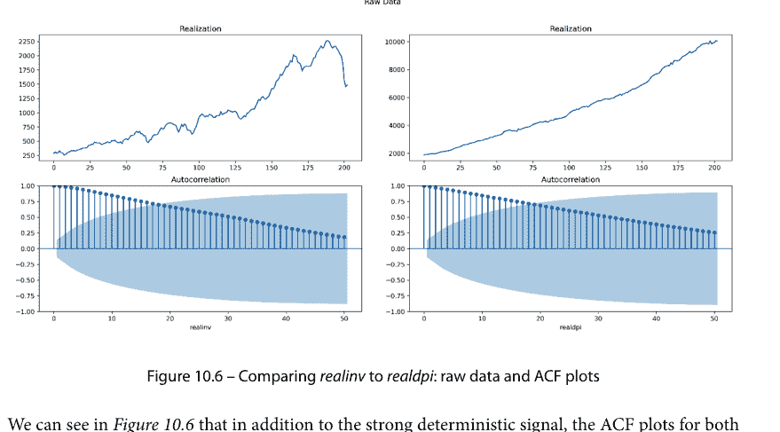

从*图10.6*中我们可以看到，除了强烈的确定性信号外，两个序列的ACF图都显示出指数衰减的自相关，并且在95%置信水平（阴影区域之外）上是显著的。基于ACF中的这些信息，我们至少应该进行**一阶差分**。如果进行一次**一阶线性差分**后ACF仍表现出相同的行为，我们可能需要进行两次一阶差分。

让我们创建差分数据：

```python
df_diff = pd.DataFrame()
df_diff['realinv'] = np.diff(df_mod['realinv'], n=1)
df_diff['realdpi'] = np.diff(df_mod['realdpi'], n=1)
```

现在，重用之前的绘图代码，我们可以在*图10.7*中看到数据：

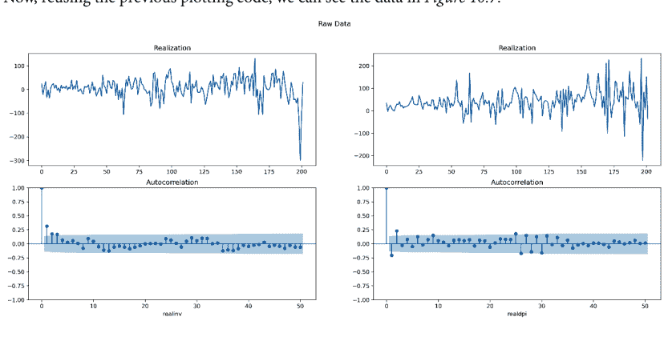

根据*图10.7*，我们可以看到*之前主导图10.6中自相关的确定性信号现在已被移除*。有几个点略微超出了95%置信区间，尽管显著性水平很低（我们不考虑滞后0阶，因为它与自身100%相关）。由于仍存在一些自相关，我们可以认为它们的行为并非完全随机。因此，它们可能存在互相关。既然我们已经解决了确定性信号的问题，我们现在可以评估两个序列之间的互相关。请注意，两个序列的均值已经差分到恒定为零。这是平稳性的一个条件。另一个条件是方差恒定。我们可以看到差分数据具有最小的自相关，但超出了95%置信限。因此，我们可以确定进行额外的ARIMA建模可能是有用的，但也可以论证使用平均值进行建模。然而，我们还可以看到平稳性的第三个条件——各期之间的协方差恒定——似乎没有得到满足；随着时间步长的推移，方差在波动。我们将在下一节更深入地讨论平稳性。现在，让我们将注意力转向互相关。

既然我们已经移除了确定性信号，并且方差成为ACF图中的主导行为，让我们比较这两个时间序列，看看它们是否存在滞后或领先关系。这里，我们构建一个CCF来图形化地绘制这种关系。我们使用一个字典`zscore_vals`来构建用于构建这些置信区间的z分数，有三个置信区间选项：90%、95%和99%：

```python
from scipy.signal import correlate
import matplotlib.pyplot as plt

def plot_ccf(data_a, data_b, lag_lookback, percentile):
    n = len(data_a)

    ccf = correlate(data_a - np.mean(data_a), data_b - np.mean(data_b), method='direct') / (np.std(data_a) * np.std(data_b) * n)

    _min = (len(ccf)-1)//2 - lag_lookback
    _max = (len(ccf)-1)//2 + (lag_lookback-1)

    zscore_vals={90:1.645,
                 95:1.96,
                 99:2.576}

    plt.figure(figsize=(15, 5))

    markers, stems, baseline = plt.stem(np.arange(-lag_lookback, (lag_lookback-1)), ccf[_min:_max], markerfmt='o', use_line_collection = True)

    plt.setp(baseline, color='r', linewidth=1)
    baseline.set_xdata([0,1])
    baseline.set_transform(plt.gca().get_yaxis_transform())

    z_score_95pct = zscore_vals.get(percentile)/np.sqrt(n) #1.645 for 90%, 1.96 for 95%, and 2.576 for 99%

    plt.title('Cross-Correlation')
    plt.xlabel('Lag')
    plt.ylabel('Correlation')
    plt.axhline(y=-z_score_95pct, color='b', ls='--')# Z-statistic for 95% CL LL
    plt.axhline(y=z_score_95pct, color='b', ls='--')# Z-statistic for 95% CL UL
    plt.axvline(x=0, color='black', ls='-')
    ;
import numpy as np
import pandas as pd
import statsmodels.api as sm
import matplotlib.pyplot as plt

df = sm.datasets.macrodata.load().data
df['realinv'] = round(df['realinv'].astype('float32'), 2)
df['realdpi'] = round(df['realdpi'].astype('float32'), 2)
df_mod = df[['realinv','realdpi']]
```

```python
df_diff = pd.DataFrame()
df_diff['realinv'] = np.diff(df_mod['realinv'], n=1)
df_diff['realdpi'] = np.diff(df_mod['realdpi'], n=1)
plot = plot_ccf(data_a=df_diff['realdpi'], data_b=df_diff['realinv'],
lag_lookback=50, percentile=95)
```

我们在图10.8中观察到许多相关点超出了我们应用的95%置信区间。然而，我们观察到最高相关性出现在滞后0阶。根据数据领域或应用模型时的预测误差，可能存在多个正确答案，但使用统计方法，我们的研究表明这两个序列在滞后0阶时相关性最强，因此，两者都不是对方的领先或滞后指标。需要注意的是，大约0.20的相关性的实际意义很低；它解释的方差非常少。因此，短期影响很小：

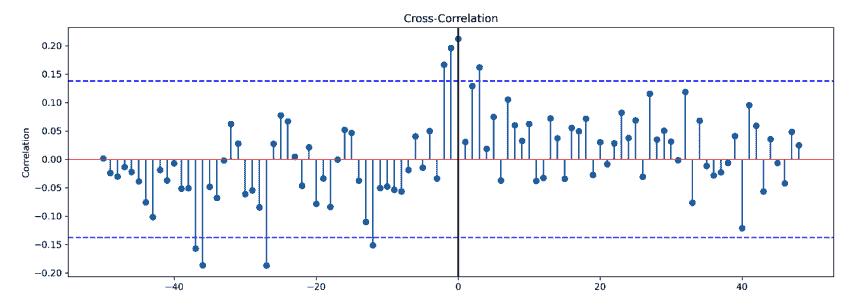

图10.8 – *realinv*与*realdpi*之间的互相关

既然我们已经评估了两个序列方差之间的短期互相关很小，而我们可能仍然对整体相关性的强度感兴趣，此时我们可以使用皮尔逊相关系数来比较这两个趋势，这将衡量两个长期线性趋势之间的相关性。回顾皮尔逊相关系数的公式，以观察其与长期均值的关系：

$$r = \frac{\sum_{i=1}^{n} (x_i - \bar{x})(y_i - \bar{y})}{\sqrt{\sum_{i=1}^{n} (x_i - \bar{x})^2 \sum_{i=1}^{n} (y_i - \bar{y})^2}}$$

然而，假设我们的数据中存在一个领先指标。让我们将*realdpi*向前移动一个位置。注意这里的`pandas`函数`shift()`，它执行此操作：

```python
plot = plot_ccf(data_a=df_diff['realdpi'].shift(1).iloc[1:], data_b=df_diff['realinv'].iloc[1:], lag_lookback=50, percentile=95)
```

我们得到如下结果：

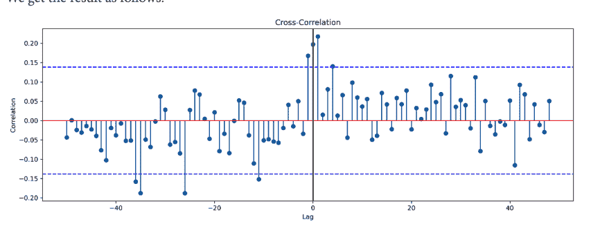

图10.9 – 带有领先指标的平移互相关

将`realdpi`向前平移一个位置后，我们可以在*图10.9*中识别出`realinv`现在是一个领先指标，滞后一阶。如果这是我们的原始差分数据，我们可能会决定对`realinv`变量应用平移——同时记住相关性水平的实际意义——然后在使用一个变量预测另一个变量的值时，使用`realdpi`和平移后的`realinv`变量。

## 白噪声模型

任何时间序列都可以被视为处理两个基本要素：信号和噪声。我们可以用数学方式表示如下：

$y(t) = signal(t) + noise(t)$

信号是某种可预测的模式，我们可以用数学函数来建模。但时间序列中的噪声元素是不可预测的，因此无法建模。以这种方式思考时间序列会引出两个重要的结论：

1.  在尝试建模之前，我们应该验证时间序列*与噪声不一致*。
2.  一旦我们为时间序列拟合了模型，我们应该验证残差*与噪声一致*。

关于第一点，如果一个时间序列与噪声一致，则没有可预测的模式可以建模，尝试对该时间序列建模可能会导致误导性的结果。关于第二点，如果时间序列模型的残差与噪声不一致，那么还有额外的模式我们可以进一步建模，当前模型不足以解释信号中的模式。当然，要进行这些评估，我们首先需要理解什么是噪声。在本节中，我们将讨论**白噪声模型**。

白噪声是一种时间序列，其样本相互独立，具有固定的方差且均值为零。这意味着时间序列的每个样本都是随机的。那么，我们如何评估一个序列是否是随机的呢？让我们通过一个例子来分析。请看*图10.10*中的序列。你认为这个序列是随机的还是信号？

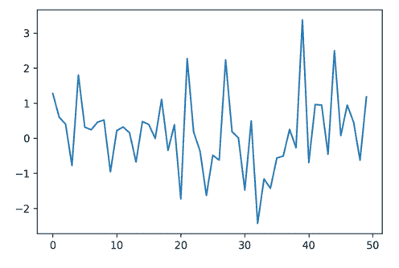

*图10.10*中的时间序列是用numpy生成的随机序列。仅从观察时间序列本身并不容易看出这一点。让我们看看如何确定一个序列是否是噪声。

如前所述，时间序列中的样本是相互独立的。这意味着样本不应存在自相关。我们可以通过ACF图来检查该序列的自相关性。结果如*图10.11*所示：

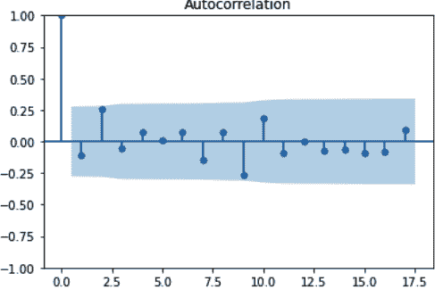

ACF图显示该序列似乎没有表现出自相关性。这强烈表明该时间序列没有可建模的模式，可能只是噪声。

我们还有另一种评估方法，即Ljung-Box自相关检验。这是一种用于检验时间序列滞后项自相关性的统计检验。其原假设是不存在自相关，备择假设是存在相关性。由于自相关可能出现在时间序列的任何滞后阶数，Ljung-Box检验会为每个滞后阶数提供一个p值。对该序列进行检验，我们得到前10个滞后阶数的p值如下：[0.41, 0.12, 0.21, 0.31, 0.44, 0.53, 0.5, 0.57, 0.26, 0.2]。这些值都较大，表明该序列很可能是噪声。

前面讨论的两种方法都表明所示序列为噪声，这是正确的结果（我们知道该序列是随机生成的）。随着我们深入时间序列建模，我们将使用这些方法来判断一个序列是否为噪声，作为模型评估的一部分。本章最后，我们将讨论时间序列平稳性的概念。

### 平稳性

在本节中，我们将概述平稳和非平稳时间序列。广义上讲，这两类时间序列的主要区别在于其统计特性，如均值、方差和自相关性。在平稳时间序列中，这些特性不随时间变化，而在非平稳时间序列中则会随时间变化。特别是，具有趋势或季节性的时间序列是非平稳的，因为趋势或季节性会影响其统计特性。以下示例说明了平稳与非平稳时间序列的行为[1]：

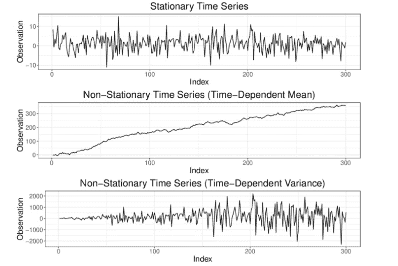

图10.12 – 平稳与非平稳时间序列示例

为了检验平稳性，我们将检查以下三个条件：

- 均值与时间无关：
  $$E[X_t] = \mu \text{ for all } t$$
- 方差与时间无关：
  $$Var[X_t] = \sigma^2 \text{ for all } t$$
- 无时间自相关——$X_{t_1}$与$X_{t_2}$之间的相关性仅取决于它们在时间上的间隔$t_2 - t_1$

现在，我们将使用*Air Passengers*数据集（https://www.kaggle.com/datasets/chirag19/air-passengers）在Python中进行分析。该数据集提供了1949年至1960年美国航空公司乘客的月度总数，可从Kaggle下载，也可在本书的GitHub仓库（https://github.com/PacktPublishing/Building-Statistical-Models-in-Python/blob/main/chapter_10/airline-passengers.csv）中找到。首先，我们将数据导入Python notebook，将索引类型更改为datetime，并绘制数据集：

```python
import pandas as pd
import matplotlib.pyplot as plt
data = pd.read_csv('airline-passengers.csv', header=0, index_col=0)
data.index = pd.to_datetime(data.index, format='%Y-%m-%d')
plt.plot(data)
```

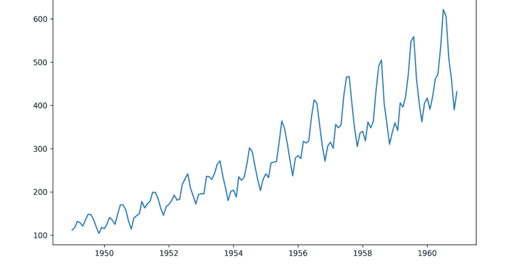

图10.13 – 1949-1960年美国航空公司乘客可视化

从图中我们可以看到存在趋势和季节性效应。因此，它明显是非平稳的。在`statsmodels`包中，有一个名为`seasonal_decompose`的函数，可以帮助我们将原始数据分解为不同的图进行可视化。你可以看到它的实际应用：

```python
from statsmodels.tsa.seasonal import seasonal_decompose
season_trend = seasonal_decompose(data)
season_trend.plot()
plt.show()
```

我们得到如下结果图：

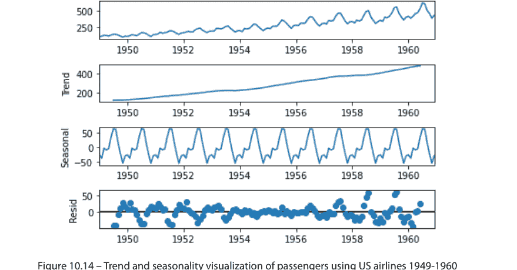

图10.14 – 1949-1960年美国航空公司乘客的趋势和季节性可视化

趋势图显示，使用美国航空公司的乘客数量随时间增加。它似乎呈现季节性波动，夏季是高峰。数据点与时间之间存在一定程度的依赖性，而且方差似乎在早期较小（1950年代初使用美国航空公司的乘客较少），在后期较大（1950年代末使用该服务的乘客较多）。这些观察表明，条件1和条件2（均值和方差随时间保持恒定）被违反了。从另一个角度看非恒定方差，我们可以为1949年至1960年的每一年创建箱线图进行可视化，如下所示：

```python
import seaborn as sns
fig, ax = plt.subplots(figsize=(24,10))
sns.boxplot(x=data.index.year, y=data['Passengers'], ax=ax, color="cornflowerblue")
ax.set(xlabel='Year', ylabel='Number of Passengers')
```

对于上述代码，我们得到以下结果：

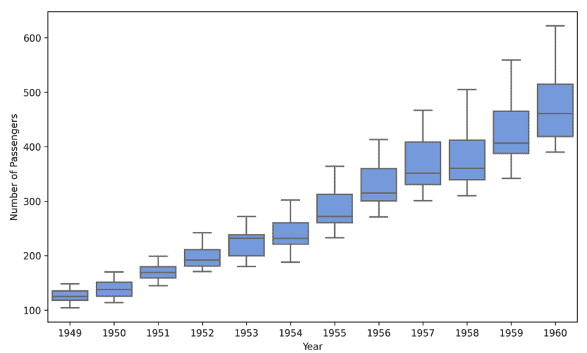

图10.15 – 箱线图：1949-1960年美国航空公司乘客

为了检查自相关性，我们使用以下代码：

```python
from statsmodels.graphics.tsaplots import plot_acf
plot_acf(data, lags=20, alpha=0.05)
plt.show()
```

我们得到如图10.16所示的结果：

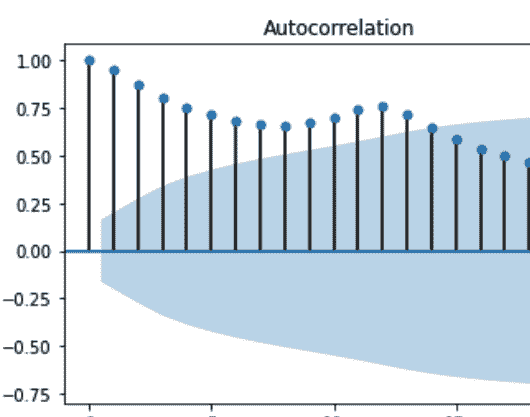

图10.16 – 1949-1960年美国航空公司乘客的ACF可视化

然而，趋势主导了数据。移除趋势并重新运行代码后，我们得到图10.17的ACF图。似乎存在一个很强的季节性成分。自相关周期在一定的滞后计数后相似地重复，并在时间步长上间隔分布：

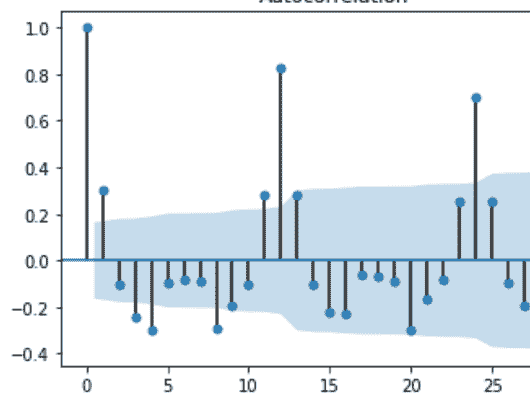

图10.17 – 1949-1960年美国航空公司乘客的ACF可视化

我们在*方差*和*自相关*部分讨论的Ljung-Box检验也可用于检查自相关性。使用该检验，我们得到`lb_pvalue = 0`。因此，数据存在自相关性。

## 总结

本章首先介绍了时间序列。我们概述了什么是时间序列以及如何利用它来实现特定目标。我们还讨论了区分时间序列数据与非时间依赖数据的标准。我们还讨论了平稳性，哪些因素对平稳性很重要，如何衡量它们，以及如何解决不存在平稳性的情况。由此，我们能够理解ACF和PACF分析的主要功能，以及如何利用均值周围的方差对过程进行推断。此外，我们还介绍了时间序列建模，概述了白噪声模型以及自回归和移动平均分量背后的基本概念，这些构成了ARIMA和**季节性自回归积分移动平均（SARIMA）**时间序列模型的基础。

在*第11章，ARIMA模型*中，我们将更深入地讨论自回归、移动平均和ARMA模型，包括概念概述和Python中的分步示例。我们还将研究积分SARIMA模型，以及评估这些模型拟合度的方法。

## 参考文献

[1] André Bauer, *Automated Hybrid Time Series Forecasting: Design, Benchmarking, and Use Cases*, University of Chicago, 2021.

# 11 ARIMA 模型

在本章中，我们将讨论单变量时间序列模型。这类模型仅考虑单个变量，并仅基于时间序列中的先前样本进行预测。我们将首先探讨平稳时间序列数据的模型，然后过渡到非平稳时间序列数据的模型。我们还将讨论如何根据时间序列的特征来识别合适的模型。这将为时间序列预测提供一套强大的模型。

在本章中，我们将涵盖以下主要主题：

- 平稳时间序列的模型
- 非平稳时间序列的模型
- 关于模型评估的更多内容

## 技术要求

在本章中，我们使用两个额外的 Python 库进行时间序列分析：`sktime` 和 `pmdarima`。请安装以下版本的这些库以运行提供的代码。安装库的说明可以在*第 1 章，采样与泛化*中找到。

- `sktime==0.15.0`
- `pmdarima==2.02`

有关 `sktime` 的更多信息，请访问此链接：`https://www.sktime.org/en/stable/get_started.html`

有关 `pmdarima` 的更多信息，请访问此链接：`http://alkaline-ml.com/pmdarima/`

## 平稳时间序列的模型

在本节中，我们将讨论对平稳数据有用的**自回归 (AR)**、**移动平均 (MA)** 和**自回归移动平均 (ARMA)** 模型。这些模型在对随时间输出的过程均值周围的模式和方差进行建模时非常有用。*当我们拥有不表现出自相关性的数据时，我们可以使用不依赖时间假设的统计和机器学习模型，例如逻辑回归或朴素贝叶斯，只要数据支持此类用例。*

### 自回归 (AR) 模型

#### AR(p) 模型

在*第 10 章，时间序列简介*中，我们探讨了**偏自相关函数 (PACF)** 如何在控制中间滞后的情况下，将一个数据点与另一个滞后点关联起来。我们还讨论了检查 PACF 图是评估自回归模型阶数的常用方法。因此，自回归模型认为过去的特定点与滞后零处给定点的值直接相关。假设我们有一个过程 $y_t$，其具有随机的、正态分布的白噪声 $\epsilon_t$，其中 $t = \pm 1, \pm 2, \dots$ 如果——使用实数常量 $\phi_1, \phi_2, \dots, \phi_p$，其中 $\phi_p \neq 0$——我们可以将该过程表述如下：

$$y_t - \mu - \phi_1(y_{t-1} - \mu) - \phi_2(y_{t-2} - \mu) - \dots - \phi_p(y_{t-p} - \mu) = \epsilon_t$$

令 $\mu$ 表示整个过程的样本均值（在我们的示例中，我们将考虑**零均值**过程），我们可以将其视为一个 $p$ 阶自回归过程，即 AR(p) [1]。我们可以将 AR(p) 模型的自相关定义如下：

$$\rho_k = \phi_1^{|k|}$$

还有这个例子：

$$\rho_k = \phi_1 \rho_{k-1} + \dots + \phi_p \rho_{k-p}$$

在前面的例子中，$\rho_k$ 是滞后 $k$ 的自相关。$\phi_1$ 既是 AR(1) 过程的斜率也是自相关。

> **AR(p) 模型结构与组成部分**

为避免混淆，请注意，对于方程 $y_t - \mu - \phi_1(y_{t-1} - \mu) - \phi_2(y_{t-2} - \mu) - \dots - \phi_p(y_{t-p} - \mu) = \epsilon_t$，我们试图构建一个代表该过程的数学模型，使得如果完美建模，剩下的就只有随机的、正态分布的白噪声 $\epsilon_t$。这实际上意味着模型留下的残差误差为零（换句话说，是完美拟合）。每个 $y_{t-k}$ 项——其中 $k$ 是时间滞后——代表该时间点的值，每个对应的 $\phi$ 值是 $y_{t-k}$ 所需的系数值，使得当与所有其他 $y$ 值结合时，模型在统计上近似零误差。

#### AR(1) 模型

**后移算子表示法**，或简称**算子表示法**，是一种简化的、简写式的模型表述方法。它被称为“后移”，因为它将时间从 $t$ 向后移动一个滞后到 $t-1$。其目的是避免在每个 $\phi$ 系数后都写上 $(y_{t-i})$ 下标的必要性，而是写成 $B^{k-1}$，同时只包含一次 $y_t$，这在编写高阶 $p$ 的 AR(p) 模型时非常方便。在下面的方程中，AR(1) 的零均值形式遵循以下结构：

$$y_t - \mu - \phi_1(y_{t-1} - \mu) = \epsilon_t$$

该方程简化为以下示例：

$$y_t - \phi_1(y_{t-1}) = \epsilon_t$$

用后移算子表示法，我们可以这样写：

$$(1 - \phi_1 B)y_t = \epsilon_t$$

> **关于 AR(1) 中 $|\phi_1|$ 的说明**

值得注意的是，如果 $|\phi_1| < 1$，则 AR(1) 过程是平稳的。也就是说，当滞后一阶自相关的绝对值 < 1 时，AR(1) 过程是平稳的。当 $|\phi_1| = 1$ 时，ARIMA 模型可能仍然有用，但当 $|\phi_1| > 1$ 时，该过程被认为是爆炸性的，不应建模。这是因为 $|\phi_1| < 1$ 的值意味着根在单位圆之外，且不受其约束。$|\phi_1| = 1$ 的值在单位圆上，但可以通过差分来移除单位根。AR(1) 的根可以计算为 $z = 1/\phi_1$。产生 $|\phi_1| > 1$ 的数据集无法通过过滤使其根位于单位圆之外。

当 AR(p) 的所有根都在单位圆之外时，给定的实现（从随机过程中采样的一个时间序列）将收敛于均值，具有恒定方差，并且与时间无关。这是时间序列数据的理想情况。

让我们来看一个 $|\phi_1| < 1$ 从而具有平稳根的 AR(1) 过程示例。假设我们已识别出以下一阶自回归过程：

$$y_t - 0.5y_{t-1} = \epsilon_t$$

将其转换为算子表示法：

$$(1 - 0.5B)y_t = \epsilon_t$$

在寻找根时，我们可以使用以下表示法：

$$(1 - 0.5z) = 0$$

这给出了 $z$ 的根：

$$z = \frac{1}{\phi_1} = \frac{1}{0.5} = 2$$

因此，由于根大于 1，从而在单位圆之外，该过程的 AR(1) 表示是平稳的。在 Python 中，我们可以使用接下来的代码构建此过程。首先，我们构建 AR(1) 参数，我们希望其为 0.5。因为我们将 0.5 代入模型 $X_t - \phi_1(y_{t-1}) = \epsilon_t$，所以我们插入 0.5 而不是 -0.5 作为 arparams。另外，请注意根据 $\rho_k = \phi^{|k|}$，0.5 是滞后一阶自相关。我们将构建的过程具有任意样本大小 nsample=200。我们使用 np.r_[1, -arparams] 步骤构建 $(1 - 0.5B)y_t = \epsilon_t$ 的 $(1 - 0.5B)$ 部分：

```python
from statsmodels.graphics.tsaplots import plot_acf, plot_pacf
import matplotlib.pyplot as plt
import statsmodels.api as sm
import numpy as np
arparams = np.array([0.5])
ar = np.r_[1, -arparams]
ar_process = sm.tsa.ArmaProcess(ar)
y = ar_process.generate_sample(nsample=200)
```

现在我们有了创建我们所看方程的 AR(1) 的代码，让我们看看根并将其与我们手动计算的 z 进行比较：

```python
ar_process.arroots
```

array([2.])

我们可以看到 Python 输出 2. 与我们执行的计算相同。我们知道，由于根的绝对值大于 1，AR(1) 过程是平稳的，但让我们用 Python 确认一下：

```python
ar_process.isstationary
```

True

通过观察 PACF，我们可以观察到这是一个 $p = 5$ 阶的自回归。通过观察 ACF，我们也可以观察到 $\phi_1$ 的值约为 0.5。对于自回归模型，PACF 用于识别应作为 AR 阶数包含的显著滞后数，而 ACF 用于确定该阶数中包含的系数 $\phi_k$ 的值。对于 AR(1)，使用 ACF 观察值很简单，但当 p > 1 时则不那么明显，因为 ACF 在与最近点（滞后零）比较时不像 PACF 那样控制单个滞后。让我们用 Python 生成图表：

```python
fig, ax = plt.subplots(1,3, figsize=(20,5))
ax[0].set_title('Realization')
ax[0].plot(y)
plot_acf(y, alpha=0.05, lags=50, ax=ax[1])
ax[1].set_title('ACF')
plot_pacf(y, alpha=0.05, lags=50, ax=ax[2])
ax[2].set_title('PACF')
```

#### AR(2) 模型

让我们来看以下平稳的 AR(2) 过程：

$$y_t - 0.8y_{t-1} - 0.48y_{t-2} = \epsilon_t$$

转换为滞后算子表示法，我们得到：

$$(1 - 0.8B - 0.48B^2)y_t = \epsilon_t$$

我们还有这个：

$$(1 - 0.8z - 0.48z^2) = 0$$

由于本书侧重于 Python，我们不会逐步讲解，但了解二阶多项式——例如 AR(2)——遵循二次方程 $ax^2 + bx + c$（对于我们这个过程是 $-0.48z^2 - 0.8z + 1$）可能会很有用。因此，我们可以使用二次公式：

$$\frac{-b \pm \sqrt{b^2 - 4ac}}{2a}$$

这就是我们将用来求根的方法。在 Python 中，我们可以使用以下代码找到该模型的根：

```python
arparams = np.array([-0.8, -0.48])
ar = np.r_[1, -arparams]
ar_process = sm.tsa.ArmaProcess(ar)
print('AR(2) Roots: ', ar_process.arroots)
print('AR(2) Stationarity: ', ar_process.isstationary)
```

这里我们可以看到使用 `statmodels` 的 ArmaProcess 函数识别出的单位根：

```
AR(2) Roots: [-0.83333333-1.1785113j -0.83333333+1.1785113j]

AR(2) Stationarity: True
```

我们可以观察到根是共轭复数形式 $a \pm bi$。当一个过程的根是共轭复数形式时，其自相关性预计会呈现振荡模式，这可以在 *图 11.2* 的 ACF 图中看到。我们还可以在 PACF 中观察到两个显著的滞后，这支持了阶数 p=2 的情况：

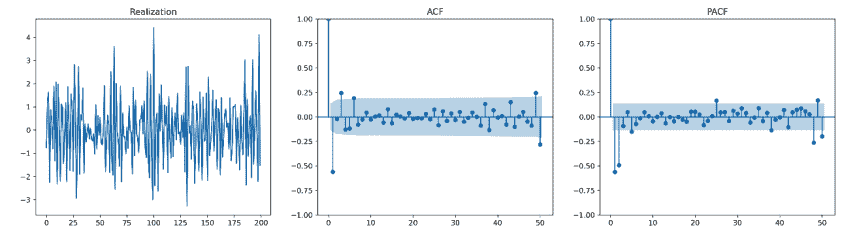

为了从数学上检验共轭复数根是否平稳（在单位圆外），我们取每个根的实部和虚部向量的模，并检查其是否大于 1。对于形式为 $a \pm bi$ 的共轭复数根 $z$，其模的计算公式如下：

$$||z|| = \sqrt{a^2 + b^2}$$

我们根的模是：

$$\sqrt{-0.8333^2 \pm 1.1785^2} = 1.4433$$

由于 $1.4433 > 1$，我们知道我们的 AR(2) 模型是平稳的。

> **使用 PACF 识别 AR 模型的阶数 p**

在根据 PACF 图识别自回归过程 AR(p) 的滞后阶数 p 时，我们将存在显著偏自相关的最大滞后阶数作为 p 的阶数。观察 *图 11.3*，由于 PACF 在滞后 4 之后衰减，并持续到大约滞后 30，我们将在滞后 4 之后停止阶数考虑，因为使用更多滞后（将它们视为时间序列模型的特征）可能会导致过拟合。使用 PACF 选择的阶数是基于偏自相关衰减前的最后一个显著滞后。虽然滞后 2 和 3 看起来很小，可能不显著，但滞后 4 是显著的。因此，我们可能使用 4 阶 AR 得到最佳模型。通常，我们使用信息准则（如 AIC 或 BIC）来检验我们的假设。

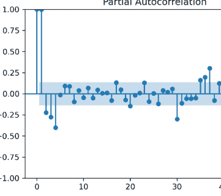

图 11.3 – AR(p) 阶数识别

#### AR(p) 端到端示例

让我们通过一个在 Python 中进行 AR(p) 建模的端到端示例。首先，我们需要生成一个由 AR(4) 过程产生的数据集。我们将使用此数据作为我们试图建模的过程：

```python
arparams = np.array([1.59, -0.544, -0.511, 0.222])
ar = np.r_[1, -arparams]
ar_process = sm.tsa.ArmaProcess(ar)
y = ar_process.generate_sample(nsample=200)
```

对于接下来的步骤，让我们假设数据 y 是一台我们一无所知的机器的输出。

##### 步骤 1 - 可视化检查

我们首先使用本章前面提供的代码对原始数据及其 ACF 和 PACF 图进行可视化：

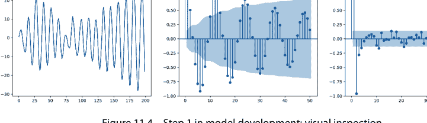

图 11.4 – 模型开发步骤 1：可视化检查

根据 PACF 图，我们可以看到它似乎是一个 AR(2)，但也可能是 AR(4)。在滞后 4 之后，偏自相关在 5% 的显著性水平上失去了统计显著性。然而，我们可以看到，在考虑 PACF 中滞后 4 的统计显著性时，尽管很轻微，ACF 中的滞后 4 是显著的。虽然滞后 4 处的值不是系数的值，但其显著性有助于确定阶数 p。尽管如此，AR(4) 可能会过拟合，并且泛化能力不如 AR(2)。接下来，我们将使用 **赤池信息准则 (AIC)** 和 **贝叶斯信息准则 (BIC)** 来帮助我们做出决定。

基于恒定的均值以及我们没有指数衰减（这也需要是显著的）的 ACF 这一事实，似乎没有趋势。

##### 步骤 2 - 选择 AR(p) 的阶数

由于我们根据可视化检查不确定 AR(p) 模型应使用的阶数，我们将使用 AIC 和 BIC 来帮助我们决策。AIC 和 BIC 过程将使用从零阶到即将在代码中提供的 `max_ar` 值的阶数来拟合模型。这些模型将拟合整个数据集。误差最低的阶数通常是最佳的。它们的误差计算如下：

$$AIC = 2k - 2ln(\hat{L})$$
$$BIC = kln(n) - 2ln(\hat{L})$$

其中 $k$ 是数据的滞后数——最多到测试的最大阶数，$\hat{L}$ 是最大似然估计，$n$ 是样本大小（或被测试数据集的长度）。对于这两个测试，误差越低越好。

我们将从 `Statsmodels` 导入 `arma_order_select_ic`，并根据我们在 *图 11.4* 的 PACF 图中的观察，使用最多 4 个滞后进行测试。如前所述，根据我们的可视化检查，我们似乎没有趋势。然而，我们可以通过一种基于 OLS 的单位根检验——**迪基-富勒检验**——在统计上验证这一点。**迪基-富勒检验的原假设**是，在测试的最大滞后数（maxlag）内的某个点存在单位根（因此存在趋势）。备择假设是数据中没有单位根（没有趋势）。作为参考，备择假设指出数据是零阶 - I(0) - 单整过程，而原假设指出数据是一阶 - I(1) - 单整过程。如果检验统计量的绝对值大于临界值或 p 值显著，我们可以得出结论不存在趋势（没有单位根）。

迪基-富勒检验考虑回归检验中包含的滞后数内的每个数据点。我们需要为此分析 ACF 图；因为我们要考虑趋势可能存在的最远范围，我们必须选择具有显著性的最长滞后。其思想是，如果我们的数据中存在强趋势，例如增长，那么在趋势存在的期间，每个连续的值通常会导致另一个递增的后续值。在我们的例子中，ACF 图中的最大显著滞后大约是 25。迪基-富勒检验的统计功效相对较低（容易犯第二类错误，即在应该拒绝原假设时未能拒绝），因此只要实际可行，高阶滞后并不令人担忧；风险在于未能包含足够的滞后。

> **迪基-富勒单位根**
迪基-富勒检验仅检验是否存在趋势单位根，但不检验是否存在季节性单位根。我们将在本章的 ARIMA 部分讨论趋势单位根和季节性单位根之间的区别。

在接下来的代码块中，我们为来自 *图 11.4* 的 ACF 图的 25 个滞后添加了 `maxlag=25`。我们还将包括 `regression='c'`，这会在其执行的 OLS 中添加一个常数（或截距）；在这种情况下，我们不需要手动添加常数：

```python
from statsmodels.tsa.stattools import adfuller
dicky_fuller = adfuller(y, maxlag=25, regression='c')
print('Dickey-Fuller p-value: ', dicky_fuller[1])
print('Dickey-Fuller test statistic: ', dicky_fuller[0])
print('Dickey-Fuller critical value: ', dicky_fuller[4].get('5%'))
```

根据迪基-富勒检验，我们可以看到我们应该拒绝原假设，并得出结论该过程是零阶单整的，因此没有趋势：

Dickey-Fuller p-value: 1.6668842047161513e-06
Dickey-Fuller test statistic: -5.545206445371327
Dickey-Fuller critical value: -2.8765564361715534

因此，我们可以在 `arma_order_select_ic` 函数中插入 `trend='n'`（否则，我们可能需要对数据进行差分，我们将在本章的 ARIMA 部分展示）：

```python
from statsmodels.tsa.stattools import arma_order_select_ic
model_ar = arma_order_select_ic(y=y, max_ar=4, max_ma=0,
                               ic=['aic', 'bic'], trend='n')
print('AIC Order Selection: ', model_ar.aic_min_order)
print('AIC Error: ', round(model_ar.aic.min()[0], 3))
print('BIC Order Selection: ', model_ar.bic_min_order)
print('BIC Error: ', round(model_ar.bic.min()[0], 3))
```

这里我们可以看到根据我们的 AIC 和 BIC 测试，识别出的产生最低总体误差的 AR 和 MA 阶数：

AIC Order Selection: (4, 0)
AIC Error: 586.341
BIC Order Selection: (2, 0)
BIC Error: 597.642

我们可以看到 AIC 选择了 AR(4)，而 BIC 选择了 AR(2)。最好两个测试选择相同的项阶数。然而，正如我们已经指出的，AR(2) 可能更不容易过拟合。由于最佳顺序尚不完全明确，我们将通过比较误差和对数似然估计来继续测试两种模型（使用AR(2)和AR(4)）。

##### 步骤3 - 构建AR(p)模型

在此步骤中，我们可以将参数添加到`statsmodels' ARIMA`函数中，并使用我们指定的AR(4)将其拟合到数据。需要明确的是，AR(4)等同于ARIMA(4,0,0)。我们希望包含`enforce_stationarity=True`以确保我们的模型能产生有用的结果。否则，我们将收到警告，并需要通过差分、使用不同的模型（如SARIMA）、改变采样方法、改变时间分箱（例如从天改为周）或完全放弃对该数据进行时间序列建模来解决该问题：

```python
from statsmodels.tsa.arima.model import ARIMA
ar_aic = ARIMA(y, order=(4,0,0),
               enforce_stationarity=True).fit()
print(ar_aic.summary())
```

在我们的模型输出中，我们可以看到*SARIMAX Results*标题和*Model: ARIMA(4,0,0)*。这可以忽略。一个没有季节性成分且没有外生变量（在我们的案例中）的SARIMAX就是一个简单的ARIMA。此外，阶数为(4,0,0)的ARIMA就是一个*AR(4)*：

SARIMAX Results
==============================================================================
Dep. Variable:                  y   No. Observations:                  200
Model:             ARIMA(4,0,0)   Log Likelihood                -287.919
Date:                Fri, 13 Jan 2023   AIC                            587.837
Time:                        19:12:18   BIC                            607.627
Sample:                    0 - 200   HQIC                           595.846
Covariance Type:              opg
==============================================================================
                 coef    std err          z      P>|z|      [0.025      0.975]
------------------------------------------------------------------------------
const         -0.1970      0.278     -0.709      0.478      -0.742       0.348
ar.L1          1.6217      0.068     23.920      0.000       1.489       1.755
ar.L2         -0.6877      0.131     -5.258      0.000      -0.944      -0.431
ar.L3         -0.3066      0.145     -2.114      0.034      -0.591      -0.022
ar.L4          0.1158      0.081      1.425      0.154      -0.043       0.275
sigma2         0.9981      0.113      8.843      0.000       0.777       1.219
==============================================================================
Ljung-Box (L1) (Q):                   0.02   Jarque-Bera (JB):                 0.96
Prob(Q):                              0.88   Prob(JB):                         0.62
Heteroskedasticity (H):               1.23   Skew:                            0.04
Prob(H) (two-sided):                  0.39   Kurtosis:                        2.67
==============================================================================

图11.5 – AR(4)模型结果

我们建模的AR(4)过程（在步骤1之前构建的模拟过程）是

$$y_t - 1.59 y_{t-1} + 0.544 y_{t-2} + 0.511 y_{t-3} - 0.222 y_{t-4} = \epsilon_t$$

而我们使用输入过程的数据生成的AR(4)模型如下：

$$y_t - 1.6217 y_{t-1} + 0.6877 y_{t-2} + 0.3066 y_{t-3} - 0.1158 y_{t-4} = \epsilon_t$$

在后移算子表示法中，我们有以下方程：

$$(1 - 1.6217B + 0.6877 B^2 + 0.3066 B^3 - 0.1158 B^4)y_t = \epsilon_t$$

值得注意的是，滞后4期的项不显著，且置信区间包含0。因此，包含此项存在已知的过拟合风险，如果在考虑替代模型时，这是值得权衡的。基于AIC和BIC，将AR(2)甚至AR(3)与我们的AR(4)进行比较，并在结果有显著改善时选择不同的模型，将是谨慎的做法，但为了节省时间，我们将跳过此过程。

关于模型摘要指标，我们在上一章讨论了**Ljung-Box检验**，因此此处不再详述，但该检验的高p值（*Prob(Q)*）表明在滞后1期不存在相关误差。通常，如果模型拟合的残差中存在序列相关性，残差将具有滞后1期的自相关性。**Jarque-Bera检验**在原假设下假设误差服从正态分布，在备择假设下不服从正态分布。该检验的高p值（*Prob(JB)*）表明误差服从正态分布。**异方差性**检验的原假设是残差恒定（同方差），备择假设是它们非常数，这对于时间序列回归拟合是一个问题。此处，我们的异方差性p值（*Prob(H)*）很高，因此我们可以假设模型的残差具有恒定方差。**偏度**得分在[-0.5, 0.5]之间被认为不偏斜，而在[-1, -0.5]或[0.5, 1]之间为中度偏斜，> ±2为高度偏斜。**峰度**的完美得分是3。峰度 > ±7为高度。由于我们的偏度为0.04，峰度得分为2.58，我们可以假设残差服从正态分布。

##### 步骤4 - 测试预测

验证模型的另一种方法是使用指向这些点的数据来预测现有点。在这里，我们使用模型，利用排除最后5个点的完整数据集来预测最后5个点。然后我们进行比较以了解模型性能。请注意，我们生成了200个样本，这些样本的索引从0开始。因此，我们的第200个样本位于位置索引199：

```python
df_pred = ar_aic.get_prediction(start=195, end=199).summary_frame(alpha=0.05)
df_pred.index=[195,196,197,198,199] # reindexing for 0 index
```

在下表中，*mean*列是预测值。我们手动附加了*actuals*列，其中包含数据中的最后5个值，以便与预测值进行比较。*mean_se*是我们的估计值与实际值相比的均方误差。*y*是我们的索引，*ci*列是我们的95%预测置信区间，因为我们在前面的代码中使用了alpha=0.05。

| y | mean | mean_se | mean_ci_lower | mean_ci_upper | actuals |
|---|---|---|---|---|---|
| 195 | 24.70391 | 0.99906 | 22.74579 | 26.662035 | 25.5264 |
| 196 | 19.36453 | 0.99906 | 17.4064 | 21.322652 | 18.8797 |
| 197 | 7.525904 | 0.99906 | 5.567779 | 9.484028 | 7.4586 |
| 198 | -5.8744 | 0.99906 | -7.83252 | -3.916274 | -7.1316 |
| 199 | -19.5785 | 0.99906 | -21.5366 | -17.620356 | -17.9268 |

图11.6 – AR(4)模型输出与实际值对比

根据我们的均方误差（0.999062），我们可以看到模型在测试数据上5个点的预测范围内提供了合理的拟合。使用以下代码，我们将测试预测与相应的实际值进行绘图：

```python
fig, ax = plt.subplots(1,1,figsize=(20,5))
ax.plot(y, marker='o', markersize=5)
ax.plot(df_pred['mean'], marker='o', markersize=4)
ax.plot(df_pred['mean_ci_lower'], color='g')
ax.plot(df_pred['mean_ci_upper'], color='g')
ax.fill_between(df_pred.index, df_pred['mean_ci_lower'], df_pred['mean_ci_upper'], color='g', alpha=0.1)
ax.set_title('Test Forecast for AR(4)')
```

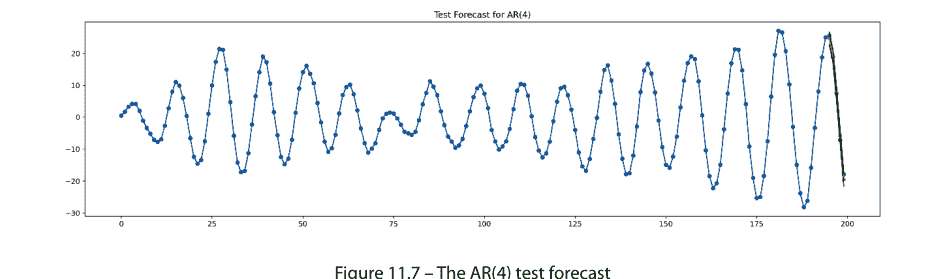

图11.7 – AR(4)测试预测

##### 步骤5 - 构建预测

确定合理的预测范围高度依赖于至少数据及其代表的过程、用于建模的滞后阶数以及模型误差。时间序列从业者在向利益相关者提供预测之前，应权衡模型性能的所有因素以及业务需求与风险。添加以下代码，我们重新运行绘图以查看我们真正的5点范围预测：

```python
df_forecast = ar_aic.get_prediction(start=200, end=204).summary_frame(alpha=0.05)
df_forecast.index=[200, 201, 202, 203, 204]
forecast = np.hstack([np.repeat(np.nan, len(y)), df_pred['mean']])
```

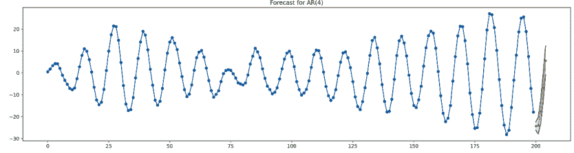

图11.8 – AR(4)预测范围 = 5

我们将在本章的模型评估部分介绍更多步骤。

### 移动平均（MA）模型

#### MA(q)模型

AR(p)模型是滞后零阶与特定单个滞后阶p之间相关性的直接函数，而阶数为q的移动平均模型，MA(q)，是滞后零阶与阶数q中包含的所有先前滞后阶之间自相关的函数。它充当低通滤波器，对误差建模以提供对数据的有用拟合。

让我们考虑一个过程，$y_t$，其均值为零，并且具有随机的、正态分布的白噪声分量$\epsilon_t$，其中$t = \pm 1, \pm 2, ...$ 如果我们可以将此过程写为

$$y_t - \mu = \epsilon_t - \Theta_1 \epsilon_{t-1} - ... - \Theta_q \epsilon_{t-q}$$

并且$\Theta_1, \Theta_2, ..., \Theta_q$是实常数且$\Theta_q \neq 0$，那么我们可以称这是一个阶数为q的移动平均过程，或MA(q)。在后移算子表示法中，我们有以下：

$$y_t - \mu = (1 - \Theta_1 B - ... - \Theta_q B^q) \epsilon_t$$

我们可以为MA(q)模型定义自相关系数（$\rho_k$）如下：

$$\rho_k = \frac{-\Theta_k + \sum_{j=1}^{q-k} \Theta_j \Theta_{j+k}}{1 + \sum_{j=1}^q \Theta_j^2}$$

适用于所有滞后阶数 $k$ 为 $1,2,\dots,q$ 的情况。当 $k > q$ 时，我们有 $\rho_k = 0$。

在讨论AR(p)模型时，我们解释了AR模型的根必须位于单位圆之外。在考虑MA(q)模型时，我们引入了可逆性的概念。**可逆性**本质上确保了与过去值之间*逻辑上稳定且合理的相关性*。通常，这意味着当前时间点与过去较近时间点的相关性，要比与较远时间点的相关性更强。如果无法使用可逆根来建模一个过程，就意味着我们无法确保模型为给定的模型自相关集合提供唯一解。如果遥远的过去点比邻近的过去点与当前点更相关，那么该过程中就存在无法可靠建模或预测的随机性。

> **识别MA(q)模型的可逆性**

对于一个移动平均模型，要使其可逆，所有根必须位于单位圆之外且为非虚数；*所有根的模必须大于1*。对于一个MA(1)过程，当 $|\Theta_1| < 1$ 时，它是可逆的。一个可逆的MA(q)过程等价于一个无限阶、收敛的AR(p)过程。如果一个AR(p)模型的系数随着滞后阶数k趋近于p而收敛于零，则该模型收敛。如果一个MA(q)是可逆的，我们可以说 $y_t = \Theta(B)\epsilon_t$ 且 $\Theta^{-1}(B)y_t = \epsilon_t$ [1]。

#### MA(1)模型

对于一个1阶的MA(q)模型，我们有以下过程：

$$\rho_0 = 1$$

$$\rho_1 = \frac{\Theta_1}{1 + \Theta_1^2}$$

$$\rho_{k>1} = 0$$

对于一个自相关为零的MA(q)模型，其试图建模的过程模式是随机的、服从正态分布的白噪声方差，最多只能用其均值来建模。需要注意的是，当 $\Theta_1 \rightarrow 0$ 时，$\rho_1 \rightarrow 0$，对于一个MA(1)过程，这意味着该过程可以用白噪声来近似。

让我们考虑以下遵循 $y_t - \mu = \epsilon_t - \Theta_1 \epsilon_{t-1}$ 形式的MA(1)零均值模型：

$$y_t - 0 = a_t - 0.8 \epsilon_{t-1}$$

用滞后算子表示法，我们有：

$$y_t = (1 - 0.8B)\epsilon_t$$

我们知道这个过程是可逆的，因为 $|\Theta_1| < 1$。让我们使用statsmodels tsa模块中的ArmaProcess函数用Python来确认这一点：

```python
from statsmodels.graphics.tsaplots import plot_acf, plot_pacf
import matplotlib.pyplot as plt
import statsmodels.api as sm
import numpy as np
maparams = np.array([0.8])
ma = np.r_[1, -maparams]
ma_process = sm.tsa.ArmaProcess(ma=ma)
print('MA(1) Roots: ', ma_process.maroots)
print('MA(1) Invertibility: ', ma_process.isinvertible)
```

MA(1) Roots: [1.25]

MA(1) Invertibility: True

与AR(p)模型相反，MA(q)模型的阶数是通过ACF图来识别的。因为ACF没有控制滞后，并且是截至所考虑滞后阶数的所有滞后的复合自相关度量，所以该函数用于识别移动平均分量的相关滞后阶数。在图11.9中，我们可以看到我们的MA(1)过程在滞后1处有显著的相关性。在滞后6和7处还有两个额外的显著相关性，但使用如此远的滞后通常会导致过拟合，特别是考虑到滞后2到5在5%的显著性水平上不显著这一事实：

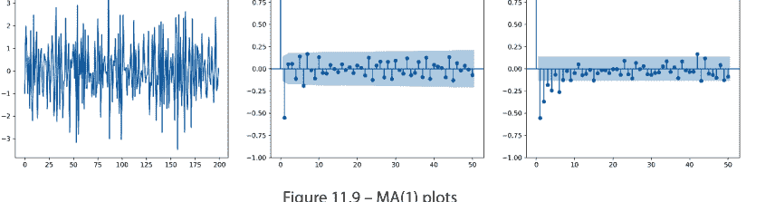

##### ACF和PACF的衰减

对于一个可逆的移动平均模型，我们可以观察到ACF会在显著性阶数处截断，但PACF通常会持续，并*总体上*随时间衰减至统计零点。由于所有数据集都不同，这不一定会平滑且一次性地发生，但可以预期，随着时间的推移，越来越多的滞后会衰减到零。我们在本章的ARMA部分解释了这种ACF和PACF行为的原因，但值得注意的是，这是可逆过程的预期表现。相反，平稳自回归过程预计会在PACF图中于显著性阶数处截断，而ACF则随时间衰减至零。

#### MA(2)模型

对于一个2阶的MA(q)模型，我们有：

$$\rho_0 = 1$$
$$\rho_1 = \frac{-\Theta_1 + \Theta_1 \Theta_2}{1 + \Theta_1^2 + \Theta_2^2}$$
$$\rho_2 = \frac{-\Theta_2}{1 + \Theta_1^2 + \Theta_2^2}$$
$$\rho_{k>2} = 0$$

以下是我们将要研究的一个MA(2)示例：

$$y_t = (1 - 1.6B + 0.9B^2)\epsilon_t$$

使用模型的多项式二次方程形式，我们可以用二次公式找到近似根：

$$0.888 \pm 0.567i$$

因为我们有两个共轭复根，我们可以像处理AR(p)过程一样，使用 $a \pm bi$ 的形式取相同的 $L^2$ 范数：

$$\sqrt{0.888^2 + 0.567^2} \approx 1.054$$

因为1.054大于1，我们可以确认MA(2)具有可逆根，因此能够产生唯一解，并且模型的值与过去值在逻辑上是序列相关的。让我们在Python中执行相同的分析：

```python
maparams = np.array([1.6, -0.9])
ma = np.r_[1, -maparams]
ma_process = sm.tsa.ArmaProcess(ma=ma)
print('MA(2) Roots: ', ma_process.maroots)
print('MA(2) Invertibility: ', ma_process.isinvertible)
```

我们看到的绿色高亮输出证实了我们的计算结果，并且由于共轭复根的模大于0，我们拥有一个可逆的MA(2)过程：

```
MA(2) Roots:  [0.88888889-0.56655772j 0.88888889+0.56655772j]
MA(2) Invertibility:  True
```

我们可以在*图11.10*的ACF中看到这是一个二阶移动平均过程：

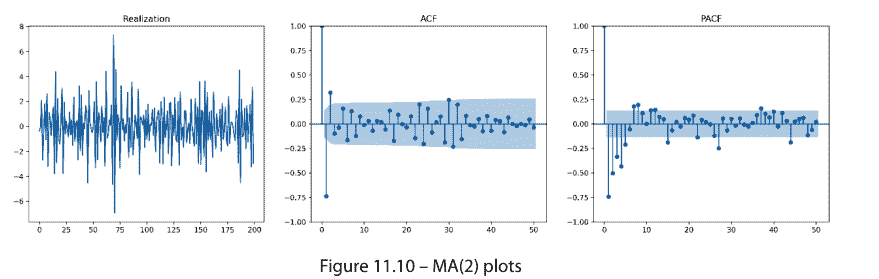

识别模型阶数、构建模型和生成预测的过程和代码对于MA(q)模型与AR(p)模型是相同的。我们已经讨论过，基于视觉检查的MA(q)阶数选择是使用ACF进行的，而对于AR(p)则是使用PACF进行的，这是两个模型之间过程的主要区别。除此之外，对于MA(q)模型，应将 `enforce_invertibility` 设置为等于True，以替代 `enforce_stationarity=True`。在 `arma_order_select_ic` 函数中提供比有用值更高或更低的 `max_ar` 或 `max_ma` 阶数可能会导致*收敛警告*或*可逆性警告*。这些警告的一个原因是提供了比可能拟合的更高阶数（例如当没有可能的阶数时）。另一个原因是存在**单位根**。如果数据中存在明显的趋势，则*必须在建模前将其移除*。如果没有趋势，由于数据中的季节性（这会呈现不同阶数的单位根），可能会收到此错误。我们将在本章的ARIMA和季节性ARIMA部分讨论与趋势和季节性相关的单位根建模情况。同样值得指出的是，Dickey-Fuller检验可用于移动平均数据，因为移动平均过程可能受到趋势的影响。

### 自回归移动平均（ARMA）模型

在自回归模型部分，我们讨论了AR(p)模型如何使用控制单个滞后的自相关来建模过程输出值。AR(p)模型的目标是利用过去时间范围内相同特定滞后的值，来估计未来对应滞后点的精确值。例如，未来两个点的值与过去两个点的值高度相关。在移动平均模型部分，我们讨论了MA(q)模型如何充当低通滤波器，帮助模型解释过程中的噪声。我们不是试图建模精确的点，而是使用MA(q)来建模过程周围的方差。

考虑一个产生恒定输出的四缸汽车发动机的例子。假设我们在第四缸附近有一个磨损的发动机支架。我们可以预期与每个气缸点火相关的持续输出振动，但每次冲程越靠近磨损的发动机支架，振动就会略微增加。仅使用AR模型会假设每个气缸振动一定量并能够解释这一点，但我们会遗漏信息。添加MA分量将能够建模这样一个事实：从气缸一开始，直到气缸四的每次后续冲程，都会产生与磨损发动机支架相关的额外振动，从而解释更多的整体过程。这合理地应该是一个ARMA(4,4)模型。假设我们将磨损的发动机支架更换为与其他支架磨损程度相等的支架；那么我们将得到一个ARMA(4,0)（或AR(4)）过程。

在许多情况下，我们发现自相关和偏自相关中都有显著的峰值。我们不必分别仅使用MA(q)或AR(p)建模，而是可以将两者结合。这种组合表示为ARMA(p,q)，使我们能够对过程以及可能与特定滞后相关的噪声分量进行建模。因为ARMA(p,q)通常比AR或MA模型具有更少的参数（更低的阶数），所以ARMA被认为是一个**简约模型**，即使用尽可能少的解释变量（在这种情况下是时间滞后）来达到所需性能水平的模型。当 $y_t$ 是一个可逆且平稳的过程时，我们可以将其定义为ARMA(p,q)：

$$y_t - \mu = \Phi_1(y_{t-1} - \mu) - \dots - \Phi_p(y_{t-p} - \mu) = \epsilon_t - \Theta_1 \epsilon_{t-1} - \dots - \Theta_q \epsilon_{t-q}$$

其中 $\Phi_p \neq 0$ 且 $\Theta_q \neq 0$，我们可以用滞后算子表示法重写ARMA(p,q)的方程：

$$\Phi(B)(y_t - \mu) = \Theta(B) \epsilon_t$$

实际上，我们可以预期，对于一个可逆的移动平均过程，我们在ACF中会看到直到阶数 $q$ 的显著滞后，但之后PACF会逐渐减弱，通常是在ACF中识别出的移动平均过程阶数之后的滞后处。这是因为一个有限的移动平均过程可以表示为一个无限阶的自回归过程。相反，因为具有这种行为的移动平均过程是可逆的，其逆命题也必须成立；即一个有限的自回归过程可以表示为一个无限阶的移动平均过程。因此，对于一个可逆的移动平均过程，PACF将衰减至零；而对于一个平稳的自回归过程，ACF将衰减至零。因为可逆性是ARMA过程的一个要求，它允许我们将方程重写为一般线性形式的无限阶MA过程：

$$y_t = \Phi^{-1}(B)\Theta(B) \epsilon_t$$

它也允许我们将其重写为无限阶AR过程：

$$\Theta^{-1}(B)\Phi(B) y_t = \epsilon_t$$

让我们通过一个Python示例来演示。首先，使用本章之前相同的导入，我们来生成一个满足以下方程的可逆且平稳的ARMA(2,1)过程虚拟数据集：

$(1 - 1.28B + 0.682 B^2)y_t = (1 - 0.58B)\epsilon_t$

```
arparams = np.array([1.2, -0.6])
ar = np.r_[1, -arparams]
maparams = np.array([0.5])
ma = np.r_[1, -maparams]
arma_process = sm.tsa.ArmaProcess(ar=ar, ma=ma)
```

让我们确认其平稳性和可逆性：

```
print('AR(2) Roots: ', arma_process.arroots)
print('AR(2) Stationarity: ', arma_process.isstationary)
print('MA(1) Roots: ', arma_process.maroots)
print('MA(1) Invertibility: ', arma_process.isinvertible)
```

我们可以使用二次公式来检验，但也可以相信代码的确认结果：

AR(2) Roots: [1.-0.81649658j 1.+0.81649658j]
AR(2) Stationarity: True
MA(1) Roots: [2.]
MA(1) Invertibility: True

既然我们有了一个平稳且可逆的过程，让我们从中生成200个样本：

```
y = arma_process.generate_sample(nsample=200)
```

#### 步骤1 – 可视化检查

让我们看看我们一直用来建立对生成数据过程直觉的图表：

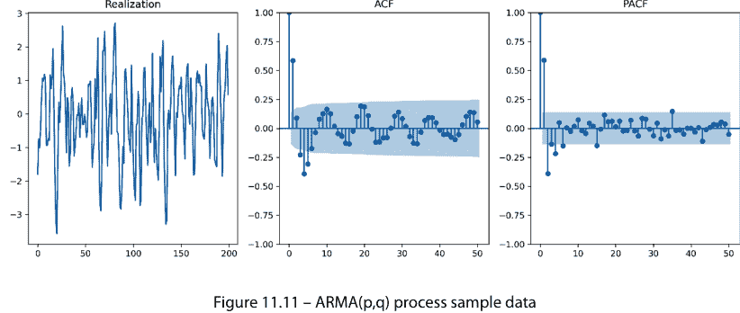

通过ACF，我们可以看到存在一个似乎是MA(1)的成分。根据PACF，看起来我们可能有一个AR(2)或AR(4)。该实现似乎是一个满足平稳性的过程。

#### 步骤2 – 选择ARMA(p,q)的阶数

在决定ARMA模型的阶数之前，让我们使用迪基-富勒检验来检查我们的数据是否有任何趋势：

```
from statsmodels.tsa.stattools import adfuller
dicky_fuller = adfuller(y, maxlag=25, regression='c')
print('Dickey-Fuller p-value: ', dicky_fuller[1])
print('Dickey-Fuller test statistic: ', dicky_fuller[0])
print('Dickey-Fuller critical value: ', dicky_fuller[4].get('5%'))
```

我们可以看到统计显著性，这确认了在maxlag提供的滞后阶数内，我们没有单位根（记住，$H_o : 数据存在单位根$，$H_a : 数据不存在单位根$）。因此，我们可以使用ARMA模型而无需进行任何一阶差分，否则就需要至少一个ARIMA模型：

```
Dickey-Fuller p-value:  6.090665062133195e-16
Dickey-Fuller test statistic:  -9.40370671340928
Dickey-Fuller critical value:  -2.876401960790147
```

现在让我们使用`statsmodels arma_order_select_ic`来看看AIC和BIC为ARMA(p,q)阶数选择了什么。我们知道MA(q)的最大阶数是1，但由于我们不确定这是AR(2)还是AR(4)，我们可以使用`max_ar=4`：

```
from statsmodels.tsa.stattools import arma_order_select_ic
model_arma = arma_order_select_ic(y=y, max_ar=4, max_ma=1,
                                ic=['aic', 'bic'], trend='n')
print('AIC Order Selection: ', model_arma.aic_min_order)
print('AIC Error: ', round(model_arma.aic.min()[0], 3))
print('BIC Order Selection: ', model_arma.bic_min_order)
print('BIC Error: ', round(model_arma.bic.min()[0], 3))
```

我们可以看到AIC选择了ARMA(4,1)，而BIC选择了ARMA(2,1)：

AIC Order Selection: (4, 1)

AIC Error: 548.527

BIC Order Selection: (2, 1)

BIC Error: 565.019

ARMA(4,1)的误差更低，但根据本书及之前章节的内容，我们知道在训练数据上误差更低的模型可能具有更大的方差，因此更可能过拟合。然而，让我们使用ARMA(4,1)。

#### 步骤3 – 构建AR(p)模型

现在让我们构建我们的ARMA(4,1)模型。注意，对于ARIMA(p,d,q)模型，0代表一阶差分的积分阶数。由于我们没有基于趋势的单位根，因此不需要差分来移除任何趋势。所以，d=0：

```
from statsmodels.tsa.arima.model import ARIMA
arma_aic = ARIMA(y, order=(4,0,1),
                 enforce_stationarity=True, enforce_
                 invertibility=True).fit()
print(arma_aic.summary())
```

在这里，我们可以看到根据模型指标，该模型提供了合理的拟合。然而，有一个问题；我们的前三个AR系数没有统计显著性（p值高且置信区间包含零）。这是一个大问题，并确认了我们的模型过拟合了。我们的模型包含了它并未从中获益的项。因此，我们的模型很可能无法很好地泛化到未见过的数据，应该重新构建：

SARIMAX Results
==============================================================================
Dep. Variable:                  y   No. Observations:                  200
Model:             ARIMA(4,0,1)   Log Likelihood                -267.418
Date:                Fri, 20 Jan 2023   AIC                            548.836
Time:                        20:32:18   BIC                            571.924
Sample:                             0   HQIC                           558.180
                                 -200                                          
Covariance Type:                 opg                                          
==============================================================================
                 coef    std err          z      P>|z|      [0.025      0.975]
------------------------------------------------------------------------------
const         -0.0952      0.091     -1.041      0.298      -0.274       0.084
ar.L1          0.2234      0.209      1.067      0.286      -0.187       0.634
ar.L2          0.0506      0.172      0.294      0.769      -0.287       0.388
ar.L3         -0.1207      0.110     -1.096      0.273      -0.337       0.095
ar.L4         -0.2744      0.068     -4.046      0.000      -0.407      -0.141
ma.L1          0.5493      0.213      2.581      0.010       0.132       0.966
sigma2         0.8444      0.099      8.528      0.000       0.650       1.038
==============================================================================
Ljung-Box (L1) (Q):                 0.01   Jarque-Bera (JB):              2.40
Prob(Q):                            0.90   Prob(JB):                       0.30
Heteroskedasticity (H):             0.80   Skew:                           0.04
Prob(H) (two-sided):                0.37   Kurtosis:                       2.47
==============================================================================

图11.12 – ARIMA(4,0,1)模型结果

让我们将其作为ARMA(2,1)重新运行，这与ARIMA(2,0,1)相同，因为没有需要积分的差分。这是我们通过视觉识别的，并且BIC选择了以下代码：

```
from statsmodels.tsa.arima.model import ARIMA
arma_aic = ARIMA(y, order=(2,0,1),
                 enforce_stationarity=True, enforce_
                 invertibility=True).fit()
print(arma_aic.summary())
```

我们现在可以看到变量的拟合效果好得多。所有系数都显著，且模型指标仍然足够。我们识别出的模型对应于以下方程：

$(1 - 1.2765B + 0.6526 B^2)y_t = (1 + 0.58B)\epsilon_t$

我们可以将其与我们的虚拟过程进行比较：

$(1 - 1.28B + 0.682 B^2)y_t = (1 - 0.58B)\epsilon_t$

```
SARIMAX Results
==============================================================================
Dep. Variable:                      y   No. Observations:                  200
Model:             ARIMA(2,0,1)   Log Likelihood                -270.382
Date:                Fri, 20 Jan 2023   AIC                            550.765
Time:                        21:08:18   BIC                            567.256
Sample:                             0   HQIC                           557.439
                                 -200                                         
Covariance Type:                  opg                                         
==============================================================================
                 coef    std err          z      P>|z|      [0.025      0.975]
------------------------------------------------------------------------------
const         -0.0960      0.075     -1.287      0.198      -0.242       0.050
ar.L1          1.2765      0.094     13.616      0.000       1.093       1.460
ar.L2         -0.6526      0.058    -11.241      0.000      -0.766      -0.539
ma.L1         -0.5807      0.120     -4.849      0.000      -0.815      -0.346
sigma2         0.8704      0.099      8.797      0.000       0.676       1.064
==============================================================================
Ljung-Box (L1) (Q):                 0.09   Jarque-Bera (JB):              1.03
Prob(Q):                            0.77   Prob(JB):                      0.60
Heteroskedasticity (H):             0.83   Skew:                         -0.06
Prob(H) (two-sided):                0.46   Kurtosis:                      2.67
==============================================================================
```

图11.13 – ARIMA(2,0,1)模型结果

#### 步骤4 – 测试预测

现在，让我们通过在倒数第五个点之前的数据上训练模型，然后预测最后五个点，以便与实际值进行比较，来交叉验证我们的模型。回想一下，我们的索引从0开始，因此数据集结束于索引199：

```
df_pred = arma_aic.get_prediction(start=195, end=199).summary_
frame(alpha=0.05)
df_pred.index=[195,196,197,198,199]
```

我们可以在下表的*mean*列中看到我们的预测值：

| y | mean | mean_se | mean_ci_lower | mean_ci_upper | actuals |
|---|---|---|---|---|---|
| 195 | -0.01911 | 0.932933 | -1.84762 | 1.80940631 | 0.559875 |
| 196 | 0.58446 | 0.932933 | -1.24406 | 2.412975242 | 0.778127 |
| 197 | 0.479364 | 0.932933 | -1.34915 | 2.307879057 | 1.695218 |
| 198 | 0.914009 | 0.932933 | -0.91451 | 2.74252465 | 2.041826 |
| 199 | 0.80913 | 0.932933 | -1.01939 | 2.637645206 | 0.578695 |

图11.14 – AR(4)模型输出与实际值对比

让我们打印出模型的**平均平方误差（ASE）**：

```python
print('Average Squared Error: ', np.mean((df_pred['mean'] - y[195:])**2))
```

这里我们看到ASE：

Average Squared Error: 0.6352208223437921

我们的测试预测图如*图11.15*所示。请注意，我们的估计看起来比较保守。使用ARMA(4,1)可能会产生更接近但泛化能力较弱的拟合。改进预测的一种方法是仅使用近期数据点（相对于过程的专业知识）来构建模型。包含更大数据集将产生一个对整体过程泛化能力更强，而非可能更相关时间范围的拟合：

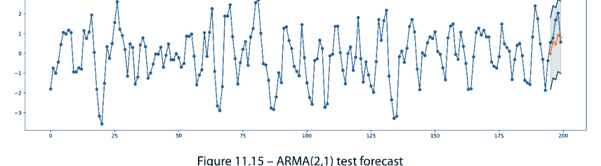

图11.15 – ARMA(2,1)测试预测

#### 第5步 – 构建预测

现在，让我们预测未来五期：

```python
df_forecast = arma_aic.get_prediction(start=200, end=204).summary_frame(alpha=0.05)
df_forecast.index=[200, 201, 202, 203, 204]
forecast = np.hstack([np.repeat(np.nan, len(y)), df_pred['mean']])
```

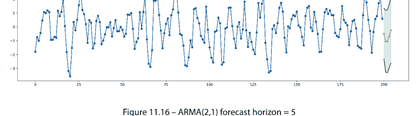

图11.16 – ARMA(2,1)预测，预测期 = 5

最后，关于ARMA模型，*我们总是假设过程是平稳的*。如果无法假设平稳性，则自回归和移动平均模型都不能使用。在本章的下一节中，我们将讨论将一阶差分整合到ARMA模型中，作为一种有条件地使过程平稳化的方法，以克服非平稳性的限制。

## 非平稳时间序列的模型

在上一节中，我们讨论了用于平稳时间序列数据的ARMA模型。在本节中，我们将研究非平稳时间序列数据，并扩展我们的模型以处理非平稳数据。让我们首先查看一些样本数据（如*图11.17*所示）。有两个序列：美国GDP（左）和航空客运量（右）。

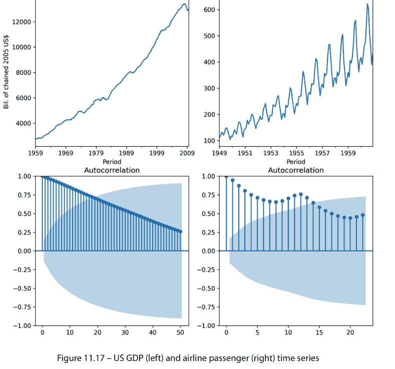

美国GDP序列表现出上升趋势，序列中有一些波动。航空客运量序列也表现出上升趋势，但序列中似乎还存在重复的模式。航空序列中的重复模式被称为**季节性**。由于明显的趋势，两个序列都是非平稳的。此外，航空客运量序列表现出非常数方差。我们将用ARIMA对GDP序列建模，并用季节性ARIMA对航空客运量序列建模。让我们来看看这些模型。

### ARIMA模型

**ARIMA**是**自回归积分移动平均**的缩写。该模型是ARMA模型的推广，可应用于非平稳时间序列数据。该模型新增的部分是“积分”，即应用于时间序列的**差分**操作，以**平稳化**（使其平稳）时间序列。在时间序列平稳化之后，我们可以将ARMA模型拟合到差分后的数据上。让我们来看看这个模型的数学原理。我们将从理解差分如何工作开始，然后将整个ARIMA模型组合起来。

#### *差分*

差分数据是计算连续数据点之间的差异。差分得到的数据代表每个数据点之间的*变化*。我们可以将差分写为：

$$y'_{t} = y_{t} - y_{t-1}$$

这个方程是一阶差分，意味着它是数据点之间的第一次差分。可能需要对数据点进行额外的差分以使序列平稳。二阶差分代表数据点之间*变化的变化*。二阶差分可以写成：

$$y''_{t} = y'_{t} - y'_{t-1} = (y_{t} - y_{t-1}) - (y_{t-1} - y_{t-2})$$

“阶”仅仅是差分操作应用的次数。

### ARIMA模型

如前所述，ARIMA模型是ARMA加上差分以使时间序列平稳（使时间序列平稳化）。然后我们可以用数学方式将ARIMA模型表示如下，其中$y'_t$是差分d次直到平稳的差分序列：

$$y'_t = c + \phi_1 y'_{t-1} + \dots + \phi_p y'_{t-p} + \epsilon_t + \theta_1 \epsilon_{t-1} + \dots + \theta_q \epsilon_{t-q}$$

ARIMA模型有三个阶，记为ARIMA(p,d,q)：

- p – 自回归阶
- d – 差分阶
- q – 移动平均阶

对于更复杂的模型，如ARIMA，我们倾向于使用滞后算子符号来描述它们，因为用滞后算子符号表达这些模型更容易。使用滞后算子符号的ARIMA模型将采用以下形式：

$$(1 - \phi_1 B - \dots - \phi_p B^p)(1 - B)^d y_t = c + (1 + \theta_1 B + \dots + \theta_q B^q) \epsilon_t$$

### ARIMA 模型

从 *图 11.18* 所示的模拟中，我们可以观察到两点。第一点观察是，随着根值趋近于一，时间序列表现出更多的游走行为。例如，中间的时间序列比顶部的时间序列显示出更多偏离均值的游走。底部的时间序列（根值为一）似乎不像其他两个模拟那样回归到某个均值。第二点观察是关于自相关的。随着 AR(1) 的根值接近 1，自相关性变得更强，并且在滞后阶数上衰减得更慢。这两个观察结果是根值接近或等于一的序列的特征。此外，单位根的存在将主导时间序列的行为，使其很容易从自相关图中识别出来。

#### 拟合 ARIMA 模型

拟合 ARIMA 模型有两个步骤：(1) 通过差分使序列平稳化以确定差分阶数，以及 (2) 对得到的序列拟合 ARMA 模型。在上一节中，我们讨论了如何拟合 ARMA 模型，因此在本节中，我们将专注于第一步。

在本节开头，我们展示了一个美国 GDP 值的时间序列。我们将使用该时间序列作为拟合 ARIMA 模型的案例研究。首先，让我们再次查看该序列及其自相关。该序列和自相关如 *图 11.19* 所示。

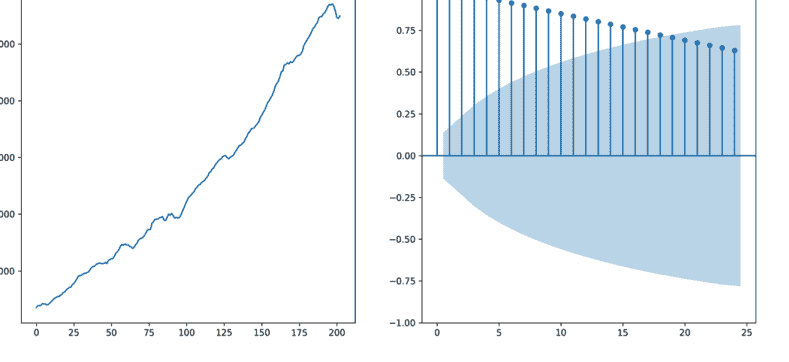

图 11.19 – 美国 GDP 时间序列及其自相关

从 *图 11.19* 所示的图中可以看出，美国 GDP 数据的时间序列是非平稳时间序列。该时间序列表现出游走行为，且自相关性强且衰减缓慢。正如我们所讨论的，这是单位根的特征行为。作为辅助证据，我们可以使用迪基-富勒检验来检验单位根。迪基-富勒检验的原假设是时间序列中存在单位根。以下代码展示了如何使用 pmdarima 中的迪基-富勒检验。该检验返回的 p 值为 0.74，表明我们无法拒绝原假设，这意味着该时间序列应该进行差分：

```
import pmdarima as pm
from sktime import datasets
y_macro_economic = datasets.load_macroeconomic()
adf_test = pm.arima.ADFTest()
adf_test.should_diff(y_macro_economic.realgdp.values)
# (0.7423236714537164, True)
```

我们可以使用 numpy 中的 diff 函数对时间序列进行一阶差分：

```
first_diff = np.diff(y_macro_economic.realgdp.values, n=1)
```

进行一阶差分后，我们得到了一个新的时间序列，如 *图 11.20* 所示：

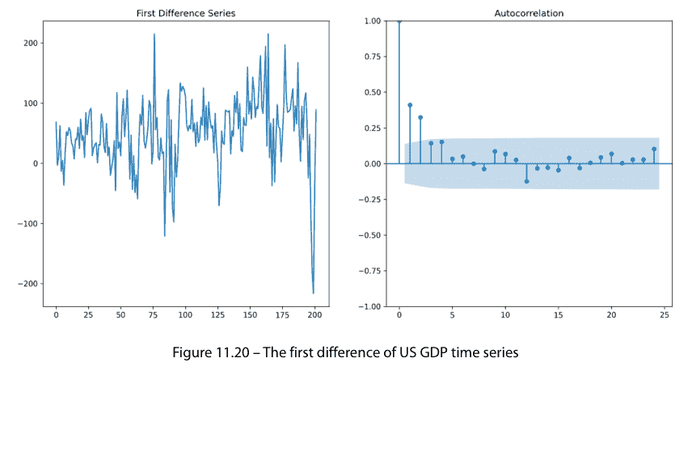

*图 11.20* 所示的美国 GDP 时间序列的一阶差分看起来是平稳的。事实上，它似乎与 AR(2) 模型一致。我们使用迪基-富勒检验对一阶差分数据进行二次检查，以确认是否需要进行额外的差分：

```
first_diff = np.diff(y_macro_economic.realgdp.values, n=1)
adf_test.should_diff(first_diff)
# (0.01, False)
```

迪基-富勒检验对一阶差分数据返回的 p 值为 0.01，这意味着我们可以拒绝原假设，并且可以停止对数据进行差分。这意味着我们针对该数据的 ARIMA 模型的差分阶数为 1 ($d = 1$)。

确定差分阶数后，我们可以对差分后的数据拟合 ARMA 模型。由于我们已经讨论过拟合 ARMA 模型，我们将使用 pmdarima 提供的自动拟合方法。pm.auto_arima 是一个用于自动将 ARIMA 模型拟合到数据的函数，然而，在这种情况下，我们将使用它来拟合差分序列的 ARMA 部分。pm.auto_arima 对一阶差分数据的输出如下代码块所示：

```
pm.auto_arima(
    first_diff, error_action='ignore', trace=True,
    suppress_warnings=True, maxiter=5, seasonal=False,
    test='adf'
)
Performing stepwise search to minimize aic
ARIMA(2,0,2)(0,0,0)[0]             : AIC=2207.388, Time=0.03 sec
ARIMA(0,0,0)(0,0,0)[0]             : AIC=2338.346, Time=0.01 sec
ARIMA(1,0,0)(0,0,0)[0]             : AIC=2226.760, Time=0.02 sec
ARIMA(0,0,1)(0,0,0)[0]             : AIC=2284.220, Time=0.01 sec
ARIMA(1,0,2)(0,0,0)[0]             : AIC=2206.365, Time=0.02 sec
ARIMA(0,0,2)(0,0,0)[0]             : AIC=2253.267, Time=0.02 sec
ARIMA(1,0,1)(0,0,0)[0]             : AIC=2203.917, Time=0.01 sec
ARIMA(2,0,1)(0,0,0)[0]             : AIC=2208.521, Time=0.02 sec
ARIMA(2,0,0)(0,0,0)[0]             : AIC=2208.726, Time=0.02 sec
ARIMA(1,0,1)(0,0,0)[0] intercept   : AIC=2193.482, Time=0.04 sec
ARIMA(0,0,1)(0,0,0)[0] intercept   : AIC=2208.669, Time=0.03 sec
ARIMA(1,0,0)(0,0,0)[0] intercept   : AIC=2195.212, Time=0.02 sec
ARIMA(2,0,1)(0,0,0)[0] intercept   : AIC=2191.810, Time=0.03 sec
ARIMA(2,0,0)(0,0,0)[0] intercept   : AIC=2190.196, Time=0.02 sec
ARIMA(3,0,0)(0,0,0)[0] intercept   : AIC=2191.589, Time=0.03 sec
ARIMA(3,0,1)(0,0,0)[0] intercept   : AIC=2193.567, Time=0.03 sec
Best model:  ARIMA(2,0,0)(0,0,0)[0] intercept
Total fit time: 0.349 seconds
```

由于差分数据的 ARMA 拟合结果为 ARMA(2,0)，因此原始时间序列的 ARIMA 阶数应为 ARIMA(2,1,0)。接下来，我们将探讨如何使用 ARIMA 模型进行预测。

#### 使用 ARIMA 进行预测

一旦我们有了拟合好的模型，就可以使用该模型进行预测。如前几章所述，在进行预测时，我们应该创建训练集-测试集划分，以便有数据与预测结果进行比较。模型应该只拟合训练数据，以避免数据泄露。我们可以使用 `pmdarima` 中的 `train_test_split` 函数来划分数据。然后我们按照常规步骤进行：划分、训练和预测。相关代码如下代码块所示：

```
from pmdarima.model_selection import train_test_split
train, test = train_test_split(y_macro_economic.realgdp.values,
                     train_size=0.9
)

arima = pm.auto_arima(
    train, out_of_sample_size=10,
    suppress_warnings=True, error_action='ignore',
    test='adf'
)

preds, conf_int = arima.predict(
    n_periods=test.shape[0], return_conf_int=True
)
```

前面的代码使用 `auto_arima` 拟合了一个 ARIMA 模型，然后使用 ARIMA 对象的 `predict` 方法预测了测试集的大小。代码生成的序列预测结果如 *图 11.21* 所示：

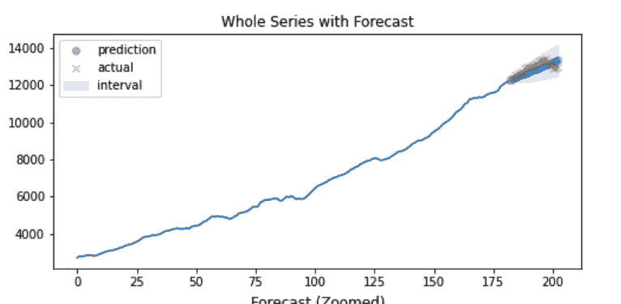

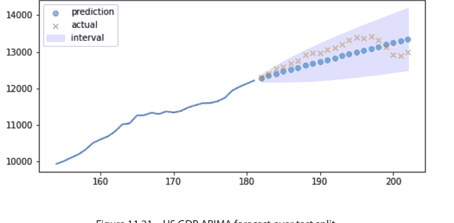

图 11.21 – 美国 GDP ARIMA 在测试集划分上的预测

*图 11.21* 中美国 GDP 的预测似乎遵循了数据的趋势，但未能捕捉到序列中的微小变化。然而，这种变化被包含在了预测区间（标记为“interval”）中。该模型似乎对测试数据提供了相当好的预测。请注意，预测区间随时间增加。这是因为预测越远，不确定性越大。通常，较短的预测更可能准确。

在本节中，我们在 ARMA 模型的基础上，通过差分将其扩展到非平稳数据，从而形成了 ARIMA 模型。在下一节中，我们将研究包含季节性效应的非平稳时间序列，并对 ARIMA 模型进行进一步扩展。

### 季节性 ARIMA 模型

让我们来看时间序列的另一个特征，称为**季节性**。季节性是指时间序列中存在以固定间隔重复出现的模式。季节性时间序列在自然界中很常见。例如，年度天气模式和每日日照模式都是季节性模式。回到非平稳部分的开头，我们展示了一个包含季节性的非平稳时间序列示例。该时间序列及其 ACF 图再次显示在 *图 11.22* 中。

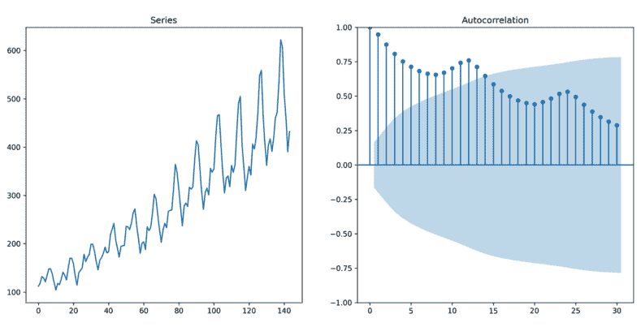

*图 11.22* 所示的时间序列是 1949 年至 1960 年国际航空乘客的月度总数 [3]。该时间序列中存在明显的重复模式。为了对这类数据建模，我们需要在 ARIMA 模型中增加一个额外的项来解释季节性。

#### 季节性差分

我们将使用与 ARIMA 类似的方法来对这类时间序列建模。我们将首先使用差分使数据平稳化，然后对差分后的数据拟合 ARMA 模型。对于季节性时间序列，我们需要使用季节性差分来消除季节性效应，我们可以用数学公式表示为：

$$y'_t = y_t - y_{t-T}$$

其中 $T$ 是季节的周期。例如，*图 11.22* 中的时间序列表现出月度季节性，每个数据点代表一个月；因此，对于航空客运量数据，$T = 12$。那么，对于航空数据，我们将使用以下差分方程来消除季节性：

$$y'_t = y_t - y_{t-12}$$

我们还可以通过观察ACF图中峰值出现的位置来识别季节性。图11.22中的ACF图在12处显示一个峰值，表明季节性周期为12，这与我们对该时间序列的了解一致。

我们将在本节后面看到如何使用`pmdarima`应用季节性差分。现在让我们看看季节性是如何被纳入模型的。

#### 季节性ARIMA

正如在ARIMA部分提到的，我们将对原始序列进行差分，然后对差分后的数据拟合一个平稳模型。那么我们的时间序列可以用以下方程描述，其中$y'_t$是差分后的序列（包括季节性差分和顺序差分）：

$$y'_t = c + \phi_1 y'_{t-1} + \dots + \phi_p y'_{t-p} + \epsilon_t + \theta_1 \epsilon_{t-1} + \dots + \theta_q \epsilon_{t-q}$$

我们可以用后移算子符号来表示整个模型：

$$(1 - \phi_1 B - \dots - \phi_p B^p)(1 - B)^d(1 - B^s)y_t = c + (1 + \theta_1 B + \dots + \theta_q B^q)\epsilon_t$$

#### 拟合具有季节性的ARIMA模型

我们将按照以下步骤来拟合一个具有季节性的ARIMA模型：

-   通过差分去除季节性。
-   通过差分去除额外的非平稳性。
-   对得到的序列拟合一个平稳模型。

这本质上与我们拟合ARIMA模型的过程相同，但多了一个处理季节性成分的步骤。让我们以航空数据为例进行说明。

我们将从使用差分去除时间序列的季节性成分开始。回顾一下，航空时间序列的季节性周期是12，这意味着我们需要在滞后12处进行差分，如以下公式所示：

$y'_t = y_t - y_{t-12}$

我们可以使用`pmdarima`中的`diff`函数来执行这个差分。以下代码展示了如何对航空数据进行12阶滞后差分：

```
import pmdarima as pm
from sktime import datasets
y_airline = datasets.load_airline()
series = pm.utils.diff( y_airline.values, lag=12)
```

执行季节性差分后，我们得到了如*图11.23*所示的差分序列及其ACF图。时间序列的季节性部分似乎已被完全移除。差分序列没有表现出任何重复的模式。此外，ACF图也没有显示出原始数据ACF图中存在的季节性峰值：

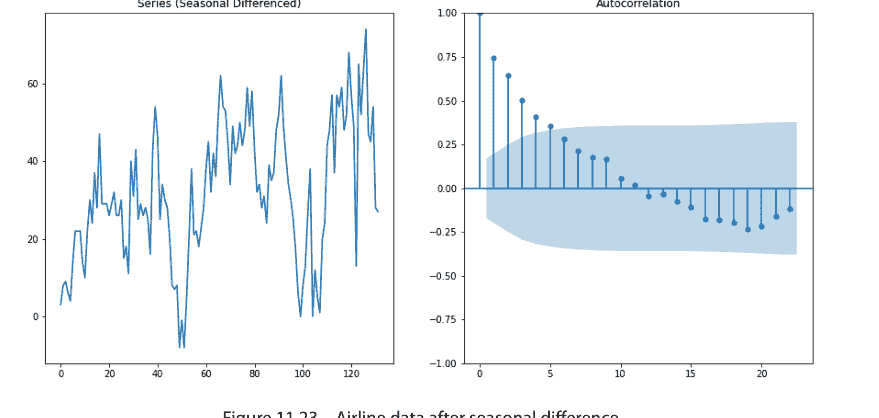

图11.23 – 季节性差分后的航空数据

在移除了时间序列的季节性部分后，我们需要确定是否需要进行任何额外的差分以使新的时间序列平稳化。*图11.23*中的差分序列表现出趋势。原始数据也表现出趋势。和之前一样，我们可以使用迪基-富勒检验来获取是否应该应用额外差分的额外证据。对该序列运行迪基-富勒检验将得到一个0.099的p值，这表明我们应该对序列进行差分以考虑单位根：

```
python
adf_test = pm.arima.ADFTest()
adf_test.should_diff(series)
# (0.09898694171553156, True)
```

对该序列进行一阶差分将得到如*图11.24*所示的序列。经过这两次差分后，序列似乎已经充分平稳化。

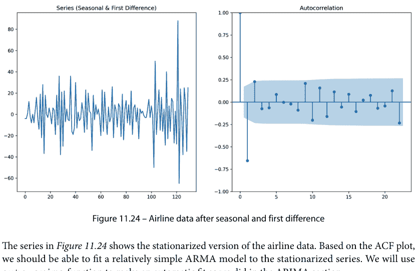

*图11.24*中的序列显示了航空数据的平稳化版本。根据ACF图，我们应该能够对平稳化序列拟合一个相对简单的ARMA模型。我们将使用`auto_arima`函数进行自动拟合，就像在ARIMA部分所做的那样：

```
pm.auto_arima(
    series, error_action='ignore', trace=False,
    suppress_warnings=True, maxiter=5, seasonal=False,
    test='adf'
)
# ARIMA(1,0,0)(0,0,0)[0]
```

使用`auto_arima`拟合差分数据返回了一个AR(1)模型。正如我们预期的那样，这是一个简单的模型。

将所有这些结合起来，我们最终的模型是ARIMA(1,1,0,12)。与之前的ARIMA示例一样，我们本可以使用`auto_arima`来拟合这个模型，但这里我们逐步演示了差分过程，以帮助建立对每个差分元素如何影响序列的直观理解。现在让我们看看`auto_arima`的直接拟合结果：

```
pm.auto_arima(
    y_airline.values, error_action='ignore', trace=True,
    suppress_warnings=True, maxiter=5, seasonal=True, m=12,
    test='adf'
)
# Best model:  ARIMA(1,1,0)(0,1,0)[12]
```

我们看到`auto_arima`找到了与我们使用手动差分相同的模型。注意该模型以SARIMA格式表示（参见前面关于SARIMA的说明）。(0,1,0)[12]表示季节性周期为12，并对季节性进行了一次差分。现在我们有了一个拟合好的模型，让我们来看看季节性模型的预测。

#### 具有季节性的ARIMA预测

一旦我们有了一个拟合好的模型，我们就可以用它进行预测。正如在ARIMA预测部分提到的，我们应该在什么时候进行训练-测试划分，以便有数据与预测进行比较？我们将使用相同的程序：划分数据、训练模型，并在测试集大小上进行预测：

```
train, test = train_test_split(y_airline.values, train_size=0.9)
sarima = pm.auto_arima(
    train, error_action='ignore', trace=True,
    suppress_warnings=True, maxiter=5, seasonal=True, m=12,
    test='adf'
)
preds, conf_int = sarima.predict(n_periods=test.shape[0], return_conf_int=True)
```

前面的代码使用`auto_arima`拟合了一个完整的SARIMA模型，然后使用`predict`方法预测了测试集的大小。代码生成的序列预测如*图11.25*所示。

310 ARIMA模型

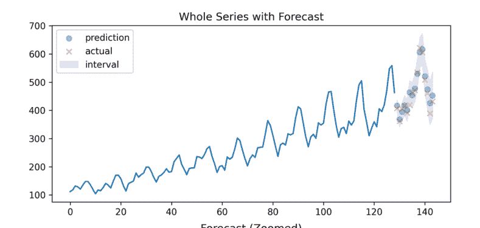

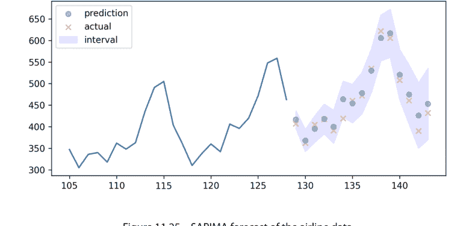

图11.25 – 航空数据的SARIMA预测

*图11.25*中航空数据的预测似乎很好地捕捉了数据的变化。这可能是由于时间序列中季节性成分的强度所致。请注意，预测区间随时间增加，就像ARIMA预测区间一样，但这些区间遵循序列的一般模式。这是序列中季节性额外知识的影响。

在本节中，我们讨论了具有季节性的ARIMA模型，并展示了如何移除季节性成分。我们还研究了具有季节性模型的预测。在下一节中，我们将更仔细地研究时间序列模型的验证。

## 关于模型评估的更多内容

在前面的章节中，我们讨论了准备数据、测试和验证模型的其他方法。在本节中，我们将讨论如何验证时间序列模型，并介绍几种验证时间序列模型的方法。我们将涵盖以下模型评估方法：**重采样、移位、优化持久性预测和滚动窗口预测**。

本节考虑的真实世界数据集是从雅虎财经数据库收集的可口可乐股票数据，时间范围从1962年1月19日到2021年12月19日，用于股票价格预测。这是一个时间序列分析，用于预测给定股票的未来价值。读者可以从Kaggle平台下载该数据集进行此分析。为了激发研究兴趣，我们首先探索可口可乐股票数据集：

```
data = pd.read_csv("COCO COLA.csv", parse_dates=["Date"], index_col="Date")
```

| 日期 | 开盘价 | 最高价 | 最低价 | 收盘价 | 调整后收盘价 | 成交量 |
|---|---|---|---|---|---|---|
| 1962-01-02 | 0.263021 | 0.270182 | 0.263021 | 0.263021 | 0.051133 | 806400 |
| 1962-01-03 | 0.259115 | 0.259115 | 0.253255 | 0.257161 | 0.049994 | 1574400 |
| 1962-01-04 | 0.257813 | 0.261068 | 0.257813 | 0.259115 | 0.050374 | 844800 |
| 1962-01-05 | 0.259115 | 0.262370 | 0.252604 | 0.253255 | 0.049234 | 1420800 |
| 1962-01-08 | 0.251302 | 0.251302 | 0.245768 | 0.250651 | 0.048728 | 2035200 |

图11.26 – 可口可乐数据集

日期索引对应于从1962年1月19日到2021年12月19日的15096个交易日。这里的**最高价**和**最低价**列指的是每个交易日的最高和最低价格。**开盘价**和**收盘价**指的是同一个交易日市场开盘和收盘时的股票价格。每天的总交易股票数量指的是**成交量**列，最后一列（**调整后收盘价**）指的是调整后的数值（结合了股票拆分、股息等）。为了说明重采样、移位、滚动窗口和扩展窗口如何工作，我们缩小范围，仅使用2016年的**开盘价**列：

```
data= data[data.index>='2016-01-01'][['Open']]
```

数据是按交易日期收集的。然而，我们将按月进行研究。**重采样**技术用于将数据从日聚合到月。这个想法促使我们介绍这项技术。

### 重采样

**重采样**是一种处理时间频率的方法。我们使用这种方法通过新的时间频率来改变时间序列数据的频率。有**上采样**和**下采样**。在上采样中，*样本的频率通过插值增加*，例如，从日频率到分钟或秒频率。另一方面，下采样用于*降低样本时间频率*，使用汇总统计将数据集中的当前时间频率聚合到新的时间频率。重采样可用于特征工程，也可用于问题框架，当数据集中的时间频率不适用于我们的分析目的时。在Python中，我们可以使用`resample()`函数来改变时间频率。以下代码说明了Python中的重采样技术：

```
fig, ax = plt.subplots(4,1, figsize=(12,8))
ax[0].set_title('2016年原始股票价格')
ax[0].plot(data)
ax[1].plot(data.resample('7D').mean())
ax[1].set_title('7天 - 2016年股票价格下采样')
ax[2].plot(data.resample('M').mean())
ax[2].set_title('月度 - 2016年股票价格下采样')
ax[3].plot(data.resample('Y').mean())
ax[3].set_title('年度 - 2016年股票价格下采样')
fig.tight_layout(pad=5.0)
plt.show()
```

以下是上一段代码的输出结果：

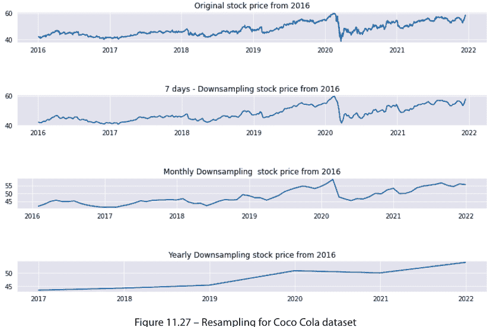

我们观察到，当时间频率降低时，图表变得更加平滑。接下来，我们讨论时间序列中使用的移位方法。

### 移位

在时间序列分析中，**移位**数据点以比较滞后和超前特征并不罕见。我们在*第10章*中演示了使用互相关函数作为帮助识别滞后和超前的方法。我们使用2016年至某月的可口可乐股票价格，并使用`shift()`函数创建新特征：

```
data["price_lag_1"] = data["Open"].shift(1)
data.head()
```

| 日期 | 开盘价 | price_lag_1 |
|---|---|---|
| 2016-01-04 | 42.340000 | NaN |
| 2016-01-05 | 42.310001 | 42.340000 |
| 2016-01-06 | 42.200001 | 42.310001 |
| 2016-01-07 | 41.650002 | 42.200001 |
| 2016-01-08 | 41.650002 | 41.650002 |

图11.28 – 可口可乐股票数据前五行，价格移位一次

观察`price_lag_1`列的第一行填充了NaN值。我们可以使用`fill_value`参数替换缺失值：

```
data["price_lag_1"] = data["Open"].shift(1, fill_value = data['Open'].mean())
```

最后，我们讨论预测方法，如**优化持久性**和**滚动窗口预测**。与这些方法相关的其他资源可以在[3]中找到。

### 优化持久性预测

我们将使用重采样将可口可乐股票价格的时间频率从2016年开始转换为月度频率，然后应用优化持久性预测技术，使用先前的观测值预测未来值。RMSE分数用于评估持久性模型：

```
from sklearn.metrics import mean_squared_error
import math
train, test = data.resample('M').mean()['Open'][0:-24], data.resample('M').mean()['Open'][-24:]
persistence = range(1, 25)
RMSE_scores = []
for p in persistence:
    history = [x for x in train]
    pred = []
    for i in range(len(test)):
        # 在测试集上预测
        yhat = history[-p]
        pred.append(yhat)
    history.append(test[i])
    # RMSE分数性能
    rmse = math.sqrt(mean_squared_error(test, pred))
    RMSE_scores.append(rmse)
    print(f'p={p} RMSE={rmse}')
```

输出如下：

```
p=1 RMSE=4.491395928336876
p=2 RMSE=3.9349279400485933
p=3 RMSE=4.279904207057928
p=4 RMSE=4.596603380615331
p=5 RMSE=4.15310552002015
p=6 RMSE=3.8368556199724897
p=7 RMSE=3.908843668637612
p=8 RMSE=5.034401761211634
p=9 RMSE=6.156221311108847
p=10 RMSE=7.311228641126667
p=11 RMSE=6.127112381878048
p=12 RMSE=6.063846181348495
p=13 RMSE=5.1342578079826
p=14 RMSE=4.730061082708834
p=15 RMSE=7.119435656445713
p=16 RMSE=7.219009724382379
p=17 RMSE=7.04573891427961
p=18 RMSE=7.928961466851558
p=19 RMSE=9.312774509996125
p=20 RMSE=10.46189505956539
p=21 RMSE=9.01822011343673
p=22 RMSE=9.259350169110826
p=23 RMSE=8.338668174317808
p=24 RMSE=6.526660895698311
```

图11.29 – 优化持久性预测的RMSE分数

我们观察到，当p=6时，RMSE分数最小：

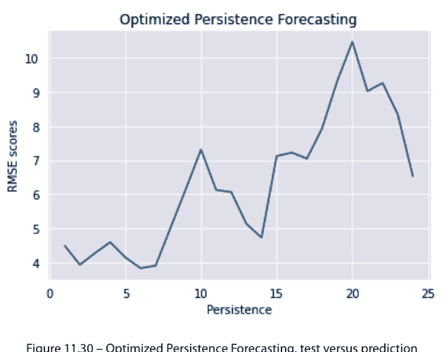

图11.30 – 优化持久性预测，测试值与预测值对比

使用p=6再次运行持久性测试，我们可以看到以下结果：

```
history = [x for x in train]
pred = []
for i in range(len(test)):
    # 预测
    yhat = history[-6]
    pred.append(yhat)
    history.append(test[i])
# 绘图
plt.plot(list(test))
plt.plot(pred)
plt.show()
```

然后，我们可以生成可视化：

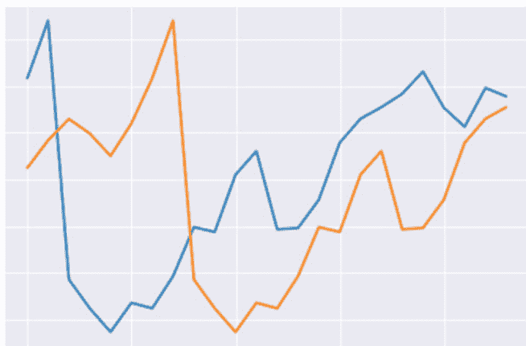

图11.31 – 优化持久性预测

蓝色曲线是测试值，橙色曲线是预测值。

### 滚动窗口预测

该技术创建一个具有指定窗口大小的**滚动窗口**，然后在该窗口内执行统计计算，将其用于预测，该预测在研究中使用的数据上滚动。我们对2016年开始的可口可乐股票价格数据集进行类似研究，使用月度重采样数据集：

```
from numpy import mean
train, test = data.resample('M').mean()['Open'][0:-24], data.resample('M').mean()['Open'][-24:]
window = range(1, 25)
RMSE_scores = []
for w in window:
    history = [x for x in train]
    pred = []
    for i in range(len(test)):
        # 在测试集上预测
        yhat = mean(history[-w:])
        pred.append(yhat)
    history.append(test[i])
    # RMSE分数性能
    rmse = math.sqrt(mean_squared_error(test, pred))
    RMSE_scores.append(rmse)
    print(f'w={w} RMSE={rmse}')
plt.plot(window, RMSE_scores)
plt.title('滚动预测')
plt.xlabel('窗口大小')
plt.ylabel('RMSE分数')
plt.show()
```

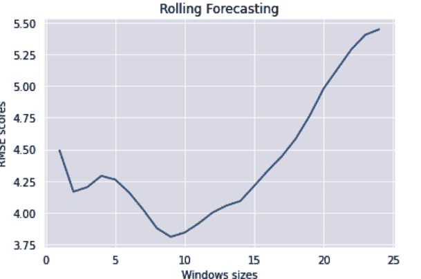

图11.32 – 滚动窗口预测

当窗口大小 = 9时，RMSE为3.808，是最小的。使用窗口大小 = 9再次运行Python代码，我们生成与优化持久性预测类似的可视化。

## 总结

在本章中，我们讨论了对单变量时间序列数据建模的各种方法，从平稳时间序列模型如ARMA到非平稳模型如ARIMA。我们从平稳模型开始，讨论了如何根据时间序列的特征识别建模方法。然后，我们在平稳模型的基础上，在模型中添加一项以使时间序列平稳化。最后，我们讨论了季节性以及如何在ARIMA模型中考虑季节性。虽然这些方法对于预测很强大，但它们没有纳入来自其他外部变量的潜在信息。与前一章一样，我们将看到外部变量可以帮助改进预测。在下一章中，我们将研究时间序列数据的多变量方法，以利用其他解释变量。

## 参考文献

请参考最终的Word文件了解参考文献的格式。

1. *APPLIED TIME SERIES ANALYSIS WITH R*, W. Woodward, H. Gray, A. Elliott. Taylor & Francis Group, LLC. 2017.
2. Box, G. E. P., Jenkins, G. M. and Reinsel, G. C. (1976) *Time Series Analysis, Forecasting and Control*. Third Edition. Holden-Day. Series G.
3. Brownlee, J, (2017) *Simple Time Series Forecasting Models to Test So That You Don't Fool Yourself* (https://machinelearningmastery.com/simple-time-series-forecasting-models/).

# 12 多变量时间序列

我们在上一章讨论的模型仅依赖于单个感兴趣变量的先前值。当我们的时间序列中只有一个变量时，这些模型是合适的。然而，时间序列数据中通常有多个变量。通常，序列中的这些其他变量可以改进对感兴趣变量的预测。在本章中，我们将讨论具有多个变量的时间序列模型。我们将首先讨论时间序列变量之间的相关关系，然后讨论如何对多变量时间序列建模。虽然有许多多变量时间序列数据的模型，但我们将讨论两个既强大又广泛使用的模型：**带外生变量的自回归积分移动平均（ARIMAX）**和**向量自回归（VAR）**。理解这两个模型将扩展读者的模型工具箱，并为读者学习更多关于多变量时间序列模型提供基础。

在本章中，我们将涵盖以下主要主题：

- 多变量时间序列
- ARIMAX
- VAR建模

## 多变量时间序列

在上一章中，我们讨论了**单变量时间序列**或一个变量的时间序列的模型。然而，在许多建模情况下，通常有多个随时间变化的变量被一起测量。由多个随时间变化的变量组成的时间序列称为**多变量时间序列**。时间序列中的每个变量称为**协变量**。例如，天气数据的时间序列可能包括温度、降雨量、风速和相对湿度。天气数据集中的每个变量都是一个单变量时间序列，合在一起就是一个多变量时间序列，每对变量都是协变量。

从数学上讲，我们通常将多元时间序列表示为一个向量值序列，如下所示：

$$X = \begin{bmatrix} x_{0,0} & x_{1,0} & \dots & x_{t,0} \\ x_{0,1} & x_{1,1} & \dots & x_{t,1} \\ \vdots & \vdots & \ddots & \vdots \end{bmatrix}$$

这里，每个 $X$ 实例在每个时间步包含多个值，序列中有 $t$ 个时间步。上述方程中的第一个索引代表时间步（从 0 到 $t$），第二个索引代表单个序列（从 0 到 $N$ 个变量）。例如，如果 $X$ 是股票价格的时间序列，那么在 $X$ 的每个时间步，都会有每只股票的价格值。在这种情况下，如果序列中的前两个股票代码是 AAPL 和 GOOGL，$X$ 可能看起来像下面的方程：

$$X = \begin{bmatrix} x_{0, AAPL} & x_{1, AAPL} & \dots & x_{t, AAPL} \\ x_{0, GOOGL} & x_{1, GOOGL} & \dots & x_{t, GOOGL} \\ \vdots & \vdots & \ddots & \vdots \end{bmatrix}$$

当我们有一个多元时间序列时，一个问题就出现了：*我们能用这些额外的信息做什么？* 要回答这个问题，我们需要理解这些时间序列变量是否相关。我们可以通过查看它们的互相关性来确定时间序列之间的关系。接下来，我们讨论互相关性。

### 时间序列互相关性

我们需要理解时间序列如何相关，以确定协变量时间序列是否有助于预测我们感兴趣的时间序列。在前面的章节中，我们讨论了如何使用图表和相关系数来理解两个变量之间的关系；我们将对时间序列数据采取类似的方法。回顾*第10章，时间序列简介*中讨论的**互相关函数**（CCF）：

$$\hat{\rho}_k(X, Y) = \frac{\sum_{t=1}^{n-k} (X_t - \bar{X})(Y_{t-k} - \bar{Y})}{\sqrt{\sum_{t=1}^n (X_t - \bar{X})^2} \sqrt{\sum_{t=1}^n (Y_t - \bar{Y})^2}}$$

这里，$X$ 是一个单变量时间序列，$Y$ 是一个单变量时间序列。这个函数告诉我们 $X$ 和 $Y$ 在 $k$ 个滞后处的关系。在这个方程中，$Y$ 比 $X$ 落后 $k$ 个时间步。在这种情况下，我们说 $X$ 领先 $Y$ $k$ 步，或者说 $Y$ 滞后 $X$ $k$ 步。我们将使用这个 CCF 来帮助我们确定两个时间序列是否相关，以及它们在哪些时间步相关。注意，如果 $X = Y$，那么 CCF 就简化为**自相关函数**（ACF）。

> **互相关显著性**
> 就像 ACF 一样，互相关性也有一个统计显著性的阈值。我们认为任何绝对值大于 $1.96/\sqrt{N}$（其中 $N$ 是时间序列的样本量）的互相关值都显著不为零。

让我们用一些数据来看看互相关性。这些数据 [1] 来自 *UCI 机器学习库* [2]。这些数据是作为在中国进行的一项污染研究的一部分收集的天气数据。这些数据是几年内每小时采样一次的。我们将数据子集化为前 1,000 个数据点。此数据集中的天气数据包括温度（TEMP）、气压（PRES）、露点温度（DEWP）、降雨量（RAIN）和风速（WSPM）。我们将从尝试预测风速的角度来看互相关性，这意味着我们将查看风速与其他变量的互相关性。对于想要预测风力发电机发电量的人来说，这可能是一个重要的问题。风速数据和风速数据的 ACF 绘制在*图 12.1*中：

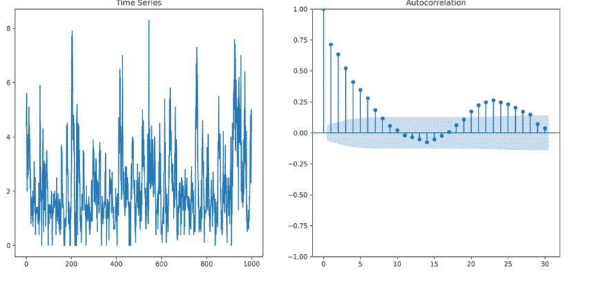

从*图 12.1*的图中，我们可以看到风速可能可以通过我们在上一章讨论的平稳单变量模型来建模。虽然没有明显的证据表明存在**自回归积分移动平均（ARIMA）**行为，但在滞后 24 处似乎有季节性的证据。由于数据是每小时采样的，这种季节性可能是每日模式。我们在*图 12.2*中绘制了其他变量的时间序列。这些是我们可能希望用来帮助预测风速值的其他变量：

## 多元时间序列

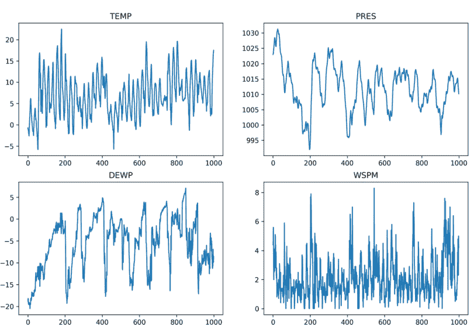

图 12.2 – 风速时间序列和三个其他天气变量的图

虽然我们没有为*图 12.2*中显示的所有时间序列绘制 ACF，但这些时间序列的特征表明它们可能是平稳的。然而，仅从时间序列本身并不清楚这些时间序列是否相关。这就是时间序列互相关性的作用所在。我们可以使用互相关图来确定任何其他时间序列是否与风速相关。我们在*图 12.3*中绘制了风速与其他变量的互相关性。CCF 绘制了多达 48 个滞后。由于数据是每小时采样的，这给了我们 2 天的滞后来查看互相关性：

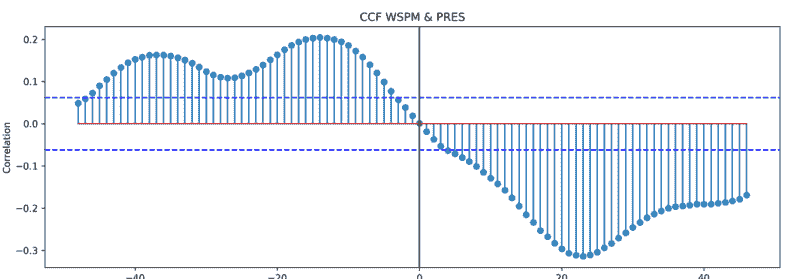

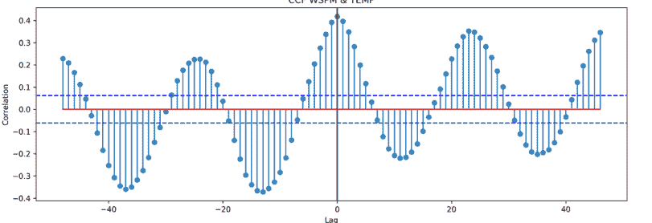

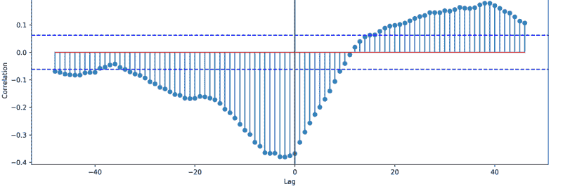

图 12.3 – 风速和三个其他变量的 CCF 图

图 12.3 中的图显示风速与其他变量之间存在互相关性。虽然我们对互相关性的形状不太感兴趣，但这些模式可能提供关于变量如何相关的更深层次信息。例如，风速和温度的互相关性显示出一个周期约为 12 小时的振荡模式；这可能对应于阳光对风速的影响。主要发现是这些其他变量与风速存在关系，并且可能帮助我们预测风速值。让我们看看如何使用额外的变量进行建模。

### ARIMAX

在上一章中，我们讨论了 ARIMA 模型族，并演示了如何对单变量时间序列数据进行建模。然而，正如我们在上一节中提到的，许多时间序列是多元的，例如股票数据、天气数据或经济数据。在本节中，我们将讨论如何在建模时间序列数据时纳入协变量的信息。

当我们对多元时间序列建模时，通常有一个我们感兴趣的预测变量。这个变量通常被称为**内生**变量。多元时间序列中的其他协变量被称为**外生**变量。回顾*第11章，ARIMA 模型*中表示 ARIMA 模型的方程：

$$y'_{t} = c + \phi_{1} y'_{t-1} + \dots + \phi_{p} y'_{t-p} + \epsilon_{t} + \theta_{1} \epsilon_{t-1} + \dots + \theta_{q} \epsilon_{t-q}$$

这里，$y'_{t}$ 是差分序列，经过 $d$ 次差分直到平稳。在这个模型中，$y_{t}$ 是我们感兴趣的预测变量；它是内生变量。让我们用更紧凑的形式重写这个方程。我们将与 $y'_{t}$ 相关的项收集到一个求和中，将与 $\epsilon_{t}$ 相关的项收集到另一个求和中。让我们从 $y'_{t}$ 项开始：

$$\phi_{1} y'_{t-1} + \dots + \phi_{p} y'_{t-p} = \sum_{i=1}^{p} \phi_{i} y'_{t-i}$$

然后，我们也将 $\epsilon_{t}$ 项收集到不同的求和中：

$$\epsilon_{t} + \theta_{1} \epsilon_{t-1} + \dots + \theta_{q} \epsilon_{t-q} = \epsilon_{t} + \sum_{j=1}^{q} \theta_{j} \epsilon_{t-j}$$

将这些求和放在一起，我们得到以下更紧凑的 ARIMA 方程版本：

$$y'_{t} = c + \sum_{i=1}^{p} \phi_{i} y'_{t-i} + \epsilon_{t} + \sum_{j=1}^{q} \theta_{j} \epsilon_{t-j}$$

现在，让我们将外生变量添加到模型中。我们将通过向模型添加一个求和项来添加外生变量：

$$y'_{t} = c + \sum_{i=1}^{p} \phi_{i} y'_{t-i} + \epsilon_{t} + \sum_{j=1}^{q} \theta_{j} \epsilon_{t-j} + \sum_{k=1}^{r} \beta_{k} X_{tk}$$

这里，向量值变量 $X$ 中包含 $r$ 个外生变量。回顾本章前面的内容，我们可以表示向量值变量，如下所示，其中第一个索引代表时间步，第二个索引代表向量值变量中的单个序列：

$$X = \begin{bmatrix} x_{0,0} & x_{1,0} & \dots & x_{t,0} \\ \vdots & \vdots & \dots & \vdots \\ x_{0,k} & x_{1,k} & \dots & x_{t,k} \end{bmatrix}$$

这就是我们将外生变量纳入 ARIMA 模型的方式。现在，让我们谈谈如何选择外生变量。在*第11章，ARIMA 模型*中，使用 ACF 图，我们看到时间序列的某些滞后比其他滞后对建模单变量时间序列更有影响力。我们将使用 CCF 图对外生变量做出类似的判断。让我们看看示例 CCF 图，并讨论如何做出这些判断。

风速和温度的 CCF 图显示在*图 12.4*中。我们标记了在 48 小时滞后周期内最显著的互相关发生的位置。回想一下，这些数据是每小时采样的；因此，每个滞后时间步对应于 1 小时的滞后。该图显示最显著的互相关大约发生在滞后 13、滞后 24 和滞后 37 处：

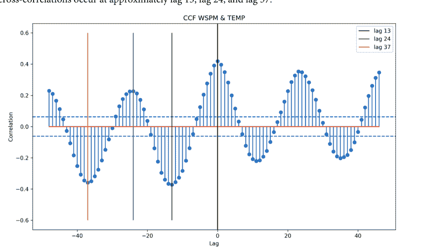

图 12.4 – 风速和温度变量的 CCF 图

根据对*图12.4*中互相关图的观察，我们预期滞后13、24和37期的温度可能为当前风速预测提供有用信息。也就是说，变量 $x_{t-13,temperature}$、$x_{t-24,temperature}$ 和 $x_{t-37,temperature}$ 可能对预测 $y_t$ 有用。我们可以对其他两个外生变量进行相同的CCF分析，以确定在模型中使用哪些滞后阶数。我们发现气压（PRES）在滞后14和37期具有显著的互相关性，露点（DEWP）在滞后2和20期具有显著的互相关性。既然我们已经评估了希望在模型中使用哪些外生变量的滞后阶数，接下来让我们继续进行数据预处理并拟合模型。

#### 外生变量的预处理

在拟合模型之前，我们需要预处理数据，以创建前面提到的外生变量。我们需要创建前面描述的时间序列变量的滞后版本。我们可以使用pandas DataFrame的`shift()`方法来滞后时间序列。让我们看一个代码示例。

以下代码示例展示了如何使用`shift()`方法将气压变量滞后14期。代码的前几行导入库并加载数据。代码示例的最后一行将PRES变量在时间上向后移动了14个时间步：

```python
import pandas as pd
# code to download the data
url = 'https://archive.ics.uci.edu/ml/machine-learning-databases/00501/PRSA2017_Data_20130301-20170228.zip'
file_name = url.split('/')[-1]
r = requests.get(url)
with open(file_name, 'wb') as fout:
    fout.write(r.content)

with zipfile.ZipFile(file_name, 'r') as zip_file:
    zip_file.extractall('./')
df = pd.read_csv(
    './PRSA_Data_20130301-20170228/PRSA_Data_Aotizhongxin_20130301-20170228.csv'
    , sep=','
)
pres_lag_14 = df.PRES.shift(-14)
```

`shift()`方法可用于在时间上向前或向后移动序列。在本例中，我们希望外生变量滞后于我们想要预测的变量。因此，我们需要提供一个负的shift值，将序列在时间上向后移动。我们将对其他外生变量使用类似的预处理步骤来创建其他滞后变量。这在以下代码示例中展示。所有这些使用`shift()`方法创建的滞后变量都被收集到一个名为X的新DataFrame中，我们将在拟合步骤中使用它：

```python
temp_lag_13 = df.TEMP.shift(-13)
temp_lag_24 = df.TEMP.shift(-24)
temp_lag_37 = df.TEMP.shift(-37)

pres_lag_14 = df.PRES.shift(-14)
pres_lag_24 = df.PRES.shift(-37)

dewp_lag_13 = df.DEWP.shift(-2)
dewp_lag_24 = df.DEWP.shift(-20)

X = pd.DataFrame({
    "temp_lag_13": temp_lag_13[:1000],
    "temp_lag_24": temp_lag_24[:1000],
    "temp_lag_37": temp_lag_37[:1000],
    "pres_lag_14": pres_lag_14[:1000],
    "pres_lag_24": pres_lag_24[:1000],
    "dewp_lag_2": dewp_lag_13[:1000],
    "dewp_lag_20": dewp_lag_24[:1000],
})
```

在前面的代码示例中，我们取了滞后变量的一个子集（前1,000个数据点）以限制模型的计算时间。随着变量被收集到新的X DataFrame中，预处理完成，我们可以继续拟合和评估模型。

#### 拟合模型

与上一章一样，我们将使用`auto_arima`来拟合我们的ARIMA模型。在这种情况下，主要区别在于我们需要将创建的外生变量提供给`auto_arima`函数。拟合带有外生变量的ARIMA模型的代码如下所示：

```python
y = df.WSPM[:1000]
arima = pm.auto_arima(
    y, X,
    error_action='ignore',
    trace=True,
    suppress_warnings=True,
    maxiter=5,
    seasonal=False,
    test='adf'
)
```

这段代码应该看起来与*第11章，ARIMA模型*中展示的代码非常相似。事实上，唯一的区别是在`auto_arima`函数中添加了X变量。运行此代码将产生以下输出：

```
Performing stepwise search to minimize aic
ARIMA(2,0,2) (0,0,0) [0]           : AIC=2689.456, Time=0.24 sec
ARIMA(0,0,0) (0,0,0) [0]           : AIC=8635.103, Time=0.16 sec
ARIMA(1,0,0) (0,0,0) [0]           : AIC=2742.728, Time=0.29 sec
ARIMA(0,0,1) (0,0,0) [0]           : AIC=2923.324, Time=0.32 sec
ARIMA(1,0,2) (0,0,0) [0]           : AIC=2685.581, Time=0.23 sec
ARIMA(0,0,2) (0,0,0) [0]           : AIC=2810.239, Time=0.37 sec
ARIMA(1,0,1) (0,0,0) [0]           : AIC=2683.888, Time=0.23 sec
ARIMA(2,0,1) (0,0,0) [0]           : AIC=2682.988, Time=0.28 sec
ARIMA(2,0,0) (0,0,0) [0]           : AIC=2681.309, Time=0.26 sec
ARIMA(3,0,0) (0,0,0) [0]           : AIC=2682.416, Time=0.32 sec
ARIMA(3,0,1) (0,0,0) [0]           : AIC=2684.608, Time=0.32 sec
ARIMA(2,0,0) (0,0,0) [0] intercept : AIC=2683.328, Time=0.30 sec

Best model:  ARIMA(2,0,0) (0,0,0) [0]
Total fit time: 3.347 seconds
```

同样，这个输出应该看起来与我们在*第11章，ARIMA模型*中看到的`auto_arima`输出非常相似。它表明，根据使用**赤池信息准则（AIC）**的拟合结果，我们应该使用AR(2)模型。有趣的是，输出中似乎没有任何关于外生变量的信息。这是因为`auto_arima`只需要为模型中的每个外生变量拟合一个系数。它不需要为每个外生变量拟合一个**自回归移动平均（ARMA）**模型。我们可以对`auto_arima`返回的对象使用`summary()`方法，以查看外生变量的系数和显著性检验。运行`summary()`方法将输出以下**带有外生因子的季节性自回归积分移动平均（SARIMAX）**结果：

```
SARIMAX Results
==============================================================================
Dep. Variable:                      y   No. Observations:                 1000
Model:             SARIMAX(2,0,0)   Log Likelihood               -1330.654
Date:                Wed, 01 Feb 2023   AIC                           2681.309
Time:                        19:17:32   BIC                           2730.386
Sample:                             0   HQIC                          2699.962
                                  -1000
Covariance Type:                  opg
==============================================================================
                 coef    std err          z      P>|z|      [0.025      0.975]
------------------------------------------------------------------------------
temp_lag_13    -0.0279      0.021     -1.355      0.175      -0.068       0.012
temp_lag_24     0.0560      0.014      3.887      0.000       0.028       0.084
temp_lag_37    -0.0587      0.020     -2.961      0.003      -0.097      -0.020
pres_lag_14     0.0009      0.012      0.077      0.938      -0.022       0.024
pres_lag_24     0.0010      0.012      0.086      0.931      -0.022       0.024
dewp_lag_2     -0.0636      0.013     -4.802      0.000      -0.090      -0.038
dewp_lag_20    -0.0135      0.015     -0.919      0.358      -0.042       0.015
ar.L1           0.4480      0.027     16.647      0.000       0.395       0.501
ar.L2           0.2400      0.024     10.050      0.000       0.193       0.287
sigma2          0.8400      0.028     29.793      0.000       0.785       0.895
==============================================================================
Ljung-Box (L1) (Q):                 0.01   Jarque-Bera (JB):           486.47
Prob(Q):                            0.91   Prob(JB):                     0.00
Heteroskedasticity (H):             1.16   Skew:                         0.80
Prob(H) (two-sided):                0.18   Kurtosis:                     6.02
==============================================================================
```

图12.5 – AR(2)模型的SARIMAX摘要

前面代码片段中显示的`summary()`方法输出包含大量信息。让我们关注输出的中间部分。中间部分显示了每个外生变量和每个ARIMA系数的系数和显著性检验。系数和检验p值分别标记为`coef`和`P>|z|`。显著性检验可以帮助我们确定是否应将变量包含在模型中。

回想一下在*第7章，多元线性回归*中，我们讨论了多重共线性的概念，这本质上意味着两个或多个预测变量高度相关。我们在这里可能会遇到类似的情况。例如，考虑`temp_lag_13`、`temp_lag_24`和`temp_lag_37`变量。由于温度时间序列表现出自相关性，这些温度时间序列的滞后版本很可能高度相关。当我们观察到多重共线性时，这是一个我们可以从模型中移除变量的信号。我们建议使用*第7章*中描述的特征选择方法之一，例如递归特征选择、基于性能的选择或基于统计显著性的选择。

上述输出仅显示了当前模型中的三个外生变量，它们已被高亮显示。这意味着我们应该考虑减少该模型中的变量。我们可以通过多种方法来实现；在本例中，我们将选择基于p值来剔除特征。我们将迭代地移除p值最高的特征，直到所有特征的p值都低于0.05。此选择过程的代码如下所示：

```python
# initial model
arima = pm.auto_arima(
    y, X,
    error_action='ignore',
    trace=False,
    suppress_warnings=True,
    maxiter=5,
    seasonal=False,
    test='adf'
)

pvalues = arima.pvalues()
iterations = 0

while (pvalues > 0.05).any():
    # get the variable name with the largest p-value
    variable_with_max_pval = pvalues.idxmax()
    # drop that variable from the exogenous variables
    X = X.drop(variable_with_max_pval, axis=1)
    arima = pm.auto_arima(
        y, X,
        error_action='ignore',
        trace=False,
        suppress_warnings=True,
        maxiter=5,
        seasonal=False,
        test='adf'
    )
    pvalues = arima.pvalues()
    print(f"fit iteration {iterations}")
    iterations += 1
```

执行此选择过程后，模型将仅包含 `temp_lag_24`、`temp_lag_37`、`pres_lag_24` 和 `dewp_lag_2` 这四个外生变量。模型的ARIMA部分仍然是一个AR(2)模型。在完成模型选择后，让我们来评估模型的性能。

#### 评估模型性能

我们将通过绘制预测值与实际数据点的对比图并计算误差估计值来评估模型的性能。让我们首先查看ARIMAX模型对未来200个观测值的预测。预测值和测试数据点绘制在*图12.6*中：

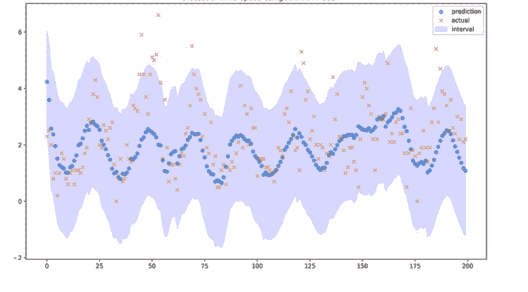

我们可以从*图12.6*中看到使用我们创建的ARIMAX模型对风速的预测。从绘制的预测图中可以观察到两个显著点：

- 预测捕捉到了风速变量的波动。
- 预测未能捕捉到风速的高峰值。

为了理解外生变量是否在模型中提供了实质价值，我们应该将*图12.6*中显示的ARIMAX模型的预测与单变量模型的预测进行比较。单变量模型的预测显示在*图12.7*中：

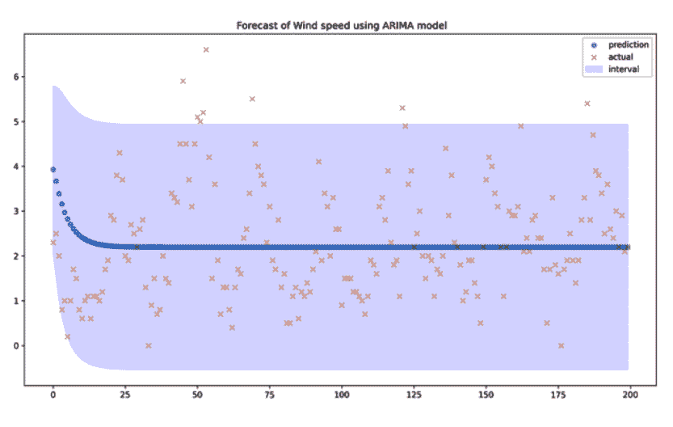

*图12.7*中显示的ARIMA模型的预测，随着预测长度的增加，似乎未能捕捉到时间序列的太多变化。这实际上是ARMA模型的一个特性。从这两个图中可以明显看出，ARIMAX模型提供了比ARIMA模型更好的预测。最后，让我们比较两个模型预测的**均方误差（MSE）**。ARIMAX模型的MSE约为1.5，而ARIMA模型的MSE约为1.7。MSE值证实了我们在图中看到的情况——即ARIMAX模型为此多元时间序列提供了更好的预测。

在本节中，我们讨论了ARIMA模型的一个扩展，它允许我们在多元时间序列中纳入协变量的信息。这只是处理多元时间序列的众多方法之一。在下一节中，我们将讨论处理多元时间序列数据的另一种方法。

### VAR建模

我们在上一章中研究的AR(p)、MA(q)、ARMA(p,q)、ARIMA(p,d,q)m和SARIMA(p,d,q)模型构成了多元VAR建模的基础。在本章中，我们讨论了带有外生变量的ARIMA（ARIMAX）。我们现在将开始讨论VAR模型。首先，重要的是要理解，虽然**ARIMAX需要外生变量的前导（未来）值，但VAR模型不需要这些变量的未来值**，因为它们彼此都是自回归的——因此得名向量自回归——并且根据定义不是外生的。首先，让我们考虑双变量的情况。考虑一个过程 $y_t$，它是两个不同输入变量 $y_{t1}$ 和 $y_{t2}$ 的输出。注意，在矩阵形式中，我们讨论的是一个 $n \times m$ 矩阵（$y_{n,m}$）的情况，其中 $n$ 对应时间点，$m$ 对应涉及的**变量**（变量1,2,…,$m$）。在接下来的讨论中，我们将从符号中省略逗号，但重要的是要理解，当我们讨论多元自回归过程时，我们讨论的是多维矩阵内的数据，而不仅仅是用于单变量时间序列分析的单维向量形式。我们可以用向量符号将我们的过程 $y_t$ 写成如下形式：

$$y_t = \begin{bmatrix} y_{t1} \\ y_{t2} \end{bmatrix}.$$

我们可以将输入变量的定义扩展为一个VAR(1)过程，这里针对前面显示的 $y_t$ 中的两个变量：

$$y_{t1} = (1 - \phi_{11})\mu_1 - \phi_{12}\mu_2 + \phi_{11}y_{t-11} + \phi_{12}y_{t-12} + \varepsilon_{t1}$$
$$y_{t2} = -\phi_{21}\mu_1 + (1 - \phi_{22})\mu_2 + \phi_{21}y_{t-11} + \phi_{22}y_{t-12} + \varepsilon_{t2}.$$

项 $(1 - \phi_{11})\mu_1 - \phi_{12}\mu_2$ 和 $-\phi_{21}\mu_1 - (1 - \phi_{22})\mu_2$ 是我们的**模型常数**（$\beta$ 系数）。

我们可以将前面的过程（使用零均值形式）简化为矩阵简化形式，如下所示：

$$y_t = \Phi_1 y_{t-1} + \varepsilon_t$$

这里，我们有：

$$\Phi_1 = \begin{bmatrix} \phi_{11} & \phi_{12} \\ \phi_{21} & \phi_{22} \end{bmatrix}$$

我们对VAR(1)模型的预测如下所示：

$$\hat{y}_{t_0,1}(l) = (1 - \phi_{11})\bar{y}_1 - \phi_{12}\bar{y}_2 + \phi_{11}\hat{y}_{t_0,1}(l-1) + \phi_{12}\hat{y}_{t_0,2}(l-1)$$
$$\hat{y}_{t_0,2}(l) = -\phi_{21}\bar{y}_1 + (1 - \phi_{22})\bar{y}_2 + \phi_{21}\hat{y}_{t_0,1}(l-1) + \phi_{22}\hat{y}_{t_0,2}(l-1)$$

它还包括：

$$\hat{y}_{t_0}(l) = \begin{bmatrix} \hat{y}_{t_0,1}(l) \\ \hat{y}_{t_0,2}(l) \end{bmatrix}$$

这里，$l$ 代表向前滞后（$t+1, t+2, ..., t+n$），$\hat{y}_{t,m}$ 代表变量 $m$ 在时间 $t$ 的预测值，$t_0$ 对应最近的时间点（通常是数据的长度）。同样重要的是要注意 $m \times m$ 协方差矩阵如下：

$$\hat{\Gamma}(k) = \begin{bmatrix} \hat{\gamma}_{11}(k) & \cdots & \hat{\gamma}_{1m}(k) \\ \vdots & \ddots & \vdots \\ \hat{\gamma}_{m1}(k) & \cdots & \hat{\gamma}_{mm}(k) \end{bmatrix}$$

这里，每个协方差 $\hat{\gamma}_{ij}(k)$（其中 $k$ 对应滞后）计算如下：

$$\hat{\gamma}_{ij}(k) = \frac{1}{n} \sum_{t=1}^{n-k} (y_{ti} - \bar{y}_i)(y_{t+k,j} - \bar{y}_j).$$

因此，我们估计的每个变量 $y_{ti}$ 和 $y_{tj}$ 之间的互相关计算如下：

$$\hat{\rho}_{ij}(k) = \frac{\hat{\gamma}_{ij}(k)}{\sqrt{\hat{\gamma}_{ii}(0) \hat{\gamma}_{jj}(0)}}$$

理解互相关，特别是协方差的计算，有助于理解变量之间的关系及其对模型拟合的影响。将两个模型组合以生成一个整体过程预测 $\hat{y}_t$ 的方法是通过将两个输入均值及其相关性加权到一个响应中。正如我们在前面显示的VAR(1)预测中所看到的，每个给定变量与其他变量在不同时间点之间的相关性能够使用VAR模型进行建模。值得注意的是，VAR模型中没有真正的独立变量和因变量；只有每个变量之间的相互作用。需要注意的是，所有使用VAR模型建模的过程都应该是**平稳的**。

使用在 https://www.statsmodels.org/dev/datasets/generated/macrodata.html 找到的*美国宏观经济*数据集，我们可以在VAR建模的背景下，以零均值形式观察实际国内私人投资总额（`realinv`）、实际个人消费支出（`realcons`）和实际私人可支配收入（`realdpi`）之间的关系，如下所示：

$$realcons(t) = \phi_{11} realcons_{t-11} + \phi_{12} realinv_{t-12} + \phi_{13} realdpi_{t-13} + \varepsilon_{t1}$$
$$realinv(t) = \phi_{21} realcons_{t-11} + \phi_{22} realinv_{t-12} + \phi_{23} realdpi_{t-13} + \varepsilon_{t2}$$
$$realdpi(t) = \phi_{31} realcons_{t-11} + \phi_{32} realinv_{t-12} + \phi_{33} realdpi_{t-13} + \varepsilon_{t3}$$

让我们来看一个使用Python中`statsmodels` VARMAX模型的VAR过程示例。首先，加载数据：

```python
import numpy as np
import pandas as pd
import statsmodels.api as sm
import matplotlib.pyplot as plt
from statsmodels.tsa.api import VAR

data = sm.datasets.macrodata.load_pandas().data
data.sort_values(by=['year', 'quarter'], inplace=True)
data['yr_qtr'] = data['year'].astype(str) + data['quarter'].astype(str)
print('{}% of yearly quarters are unique'.format(round(100*(data['yr_qtr'].nunique() / len(data)), 1)))
```

从输出中我们可以看到，100%的年度季度是唯一的，因此不存在时间戳重复：

`100.0% of yearly quarters are unique`

在进行基于回归的时间序列建模时，我们首先需要做的一件事是确保平稳性。在VAR建模中，这意味着所有变量都必须是平稳的。第一步是通过按索引绘制折线图来可视化过程实现。如果数据点以期望建模的间隔进行聚合，那么我们可以保留索引不变，但如果需要不同的时间索引，则需要指定它。在这里，我们将构建一个模型来确定**实际消费和实际可支配收入如何影响实际投资**。在下面的代码示例中，我们将`quarter`更改为数据的长度，因为这是最小的时间单位，并且每个索引对应一个年度季度，正如我们之前检查的那样。然后我们将索引设置为`quarter`（这就是为什么`quarter`出现两次；一次作为索引，一次作为列名）：

```python
data['quarter'] = range(1, len(data)+1)
data.drop('yr_qtr', axis=1, inplace=True)
data.index = data['quarter']
```

注意更新后的索引和`quarter`值：

| quarter | year | quarter | realcons | realinv | realdpi |
| :--- | :--- | :--- | :--- | :--- | :--- |
| 1 | 1959 | 1 | 1707.4 | 286.898 | 1886.9 |
| 2 | 1959 | 2 | 1733.7 | 310.859 | 1919.7 |
| 3 | 1959 | 3 | 1751.8 | 289.226 | 1916.4 |
| 4 | 1959 | 4 | 1753.7 | 299.356 | 1931.3 |
| 5 | 1960 | 5 | 1770.5 | 331.722 | 1955.5 |

图12.8 – 用于VAR建模的宏观数据集的前五行

在这里，我们将通过六个步骤，使用我们导入并准备好的数据集（部分显示在*图12.8*中）来构建一个VAR模型。

#### 步骤1 – 可视化检查

在*图12.9*的数据折线图中，我们可以看到似乎存在强烈的线性趋势。我们需要检查ACF图来评估这一点。之后，我们将运行**迪基-富勒检验**来确认：

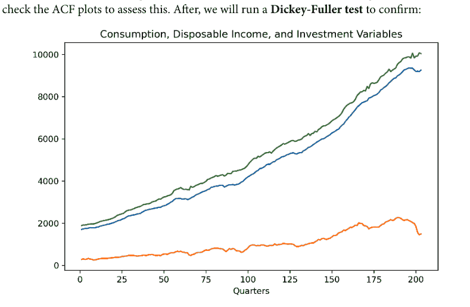

*图12.10*中的ACF图显示出强烈的线性趋势和至少一个单位根的迹象，这很可能导致了该趋势：

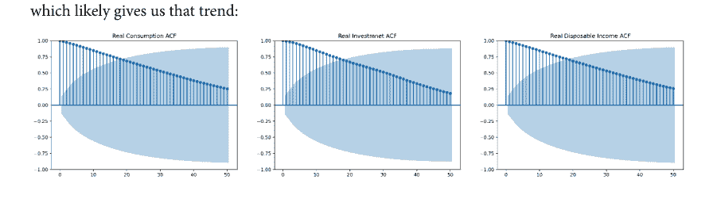

运行迪基-富勒检验后，我们可以看到每个变量都包含一个单位根，因此是趋势性的。因此，我们需要对所有三个变量应用一阶差分，以便我们能够朝着使数据平稳化的方向努力。回想一下，**迪基-富勒检验的原假设是存在单位根**，而备择假设是不存在单位根。我们将执行以下代码：

```python
from statsmodels.tsa.stattools import adfuller

for col in ['realcons','realinv','realdpi']:
    adfuller_test = adfuller(data[col], autolag='AIC')
    print('ADF p-value for {}: {}'.format(col, adfuller_test[1]))
```

这里我们可以看到每个变量的迪基-富勒检验结果。回想一下，原假设是存在单个单位根。因此，由于p值不低，我们不会拒绝原假设。这为我们提供了统计证据，可以假设存在趋势：

ADF p-value for realcons: 0.9976992503412904

ADF p-value for realinv: 0.6484956579101141

ADF p-value for realdpi: 1.0

让我们用循环对数据进行差分：

```python
import numpy as np

data_1d = pd.DataFrame()
for col in ['realcons','realinv','realdpi']:
    data_1d[col] = np.diff(data[col], n=1)
```

#### 步骤2 – 选择AR(p)的阶数

现在，我们可以重新运行ACF图，检查是否仍然看到趋势性自相关。因为原始折线图似乎没有季节性，我们将继续绘制**偏自相关函数（PACFs）**，以了解什么样的AR(p)阶数可能有用。如果我们怀疑存在季节性，检查**样本自相关的谱密度以量化季节周期性**可能很有用，这是我们在*第11章，ARIMA模型*中演示过的过程。在检查PACF图时，我们将使用**尤尔-沃克方法**。

我们可以从ACF图中看到没有明显的季节性。当使用VAR模型时，所有项都用于估计所有其他项，因为任何项的预测估计都是同时开发的。换句话说，要预测一个，我们必须预测所有。这之所以重要，是因为当查看*图12.11*中的PACF时，我们可以看到一个变量可以用AR(1)（实际投资）模型拟合，一个可以用AR(2)（实际可支配收入）模型拟合，另一个可以用AR(3)（实际消费）模型拟合。使用对每个变量都显著的阶数是使VAR建模有效的一个重要方面。

在VAR模型中选择阶数的另一个重要方面是互相关。例如，我们可能有一个变量的最高阶数是3阶，但如果目标变量和输入变量之间的互相关在滞后5期，我们很可能需要使用滞后5期。然而，使用滞后3或4期的模型也可能有用。但是，与任何回归模型一样，我们总是希望在模型训练后检查系数项的显著性：

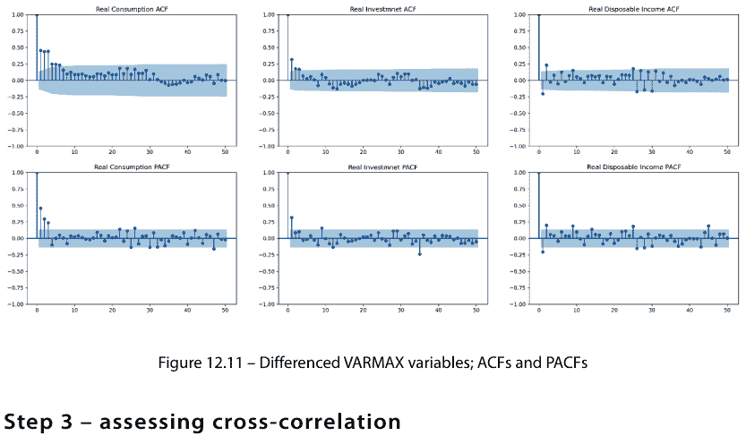

#### 步骤3 – 评估互相关

对于VAR模型，互相关在我们视为输入的变量和我们视为目标的变量之间最为重要。这可以使用多个滞后完成，或者如果担心使用不同偏移的同一变量的多次迭代会导致过拟合，则使用最显著的滞后。我们必须确认预测模型中使用的互相关分析是针对每个输入变量和因变量进行的。显示输入变量作为目标变量领先指标的互相关不是主要问题；这意味着使用输入的历史值来预测目标。然而，如果我们遇到输入是滞后指标的情况——意味着目标预测输入——而我们想使用输入来预测目标，我们将需要将输入向前移动，使相关性位于滞后0期，并根据移动量修剪数据。

在许多情况下，存在显著的领先和滞后互相关；这可能表明存在季节性。在VAR模型存在季节性的情况下，应包含一个指示变量，该变量在谱密度峰值处提供值为1，其他情况下为0。互相关的另一个特殊情况是，输入变量具有显著的统计显著性，但仅在时间上很远的滞后处。在这种情况下，可能适合将数据向前移动，以避免模型包含不显著的项（自相关），从而冒着过拟合的风险。为了演示基于CCF的移动，我们将在下一步中将其纳入我们的流程。

我们在*图12.12*中观察到，*realdpi*和*realinv*之间最强的相关性在滞后0期，但在图中*x*=-27和*x*=-37处至少还有两个其他相似相关的滞后。正如我们在*ARIMAX*部分所看到的，我们可以将同一变量的多个移动版本作为新变量包含进来，以提高模型的预测能力。这将使我们能够利用多个相关性。然而，出于模型演示的目的，我们不会包含这一点，因为VAR摘要的输出可能会变得很大。此外，正如我们提到的，包含同一变量的太多滞后可能导致过拟合。最终由实践者决定使用多少滞后。这必须通过评估模型拟合度和偏差/方差权衡来完成。这里给出的函数代码也在*第10章，时间序列导论*中：

```python
# code imported from chapter 10
def plot_ccf(data_a, data_b, lag_lookback, percentile, ax,
            title=None):

    n = len(data_a)
    ccf = correlate(data_a - np.mean(data_a), data_b -
    np.mean(data_b), method='direct') / (np.std(data_a) * np.std(data_b) *
    n)

    _min = (len(ccf)-1)//2 - lag_lookback
    _max = (len(ccf)-1)//2 + (lag_lookback-1)

    zscore_vals={90:1.645,
                 95:1.96,
                 99:2.576}

    markers, stems, baseline = ax.stem(np.arange(-lag_lookback, (lag_
    lookback-1)), ccf[_min:_max], markerfmt='o', use_line_collection =
    True)

    z_score_95pct = zscore_vals.get(percentile)/np.sqrt(n) #1.645 for
    90%, 1.96 for 95%, and 2.576 for 99%

    ax.set_title(title)
    ax.set_xlabel('Lag')
    ax.set_ylabel('Correlation')
    ax.axhline(y=-z_score_95pct, color='b', ls='--')# Z-statistic for
    95% CL LL
    ax.axhline(y=z_score_95pct, color='b', ls='--')# Z-statistic for
    95% CL UL
    ax.axvline(x=0, color='black', ls='-');

plot = plot_ccf(data_a=data_1d['realdpi'], data_b=data_1d['realinv'],
lag_lookback=50, percentile=95)
```

## 342 多元时间序列

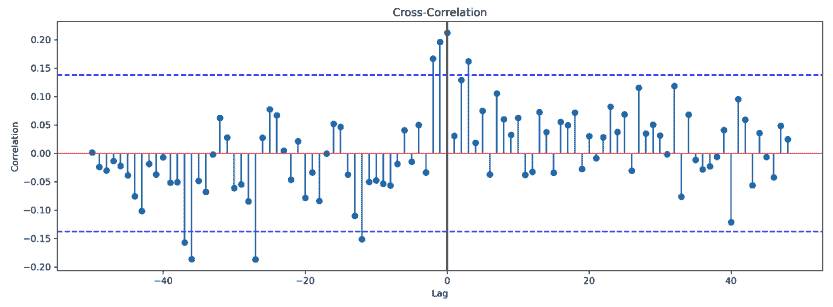

图 12.12 – *realdpi* 与 *realinv* 的互相关

在 *图 12.13* 中，我们可以看到 `realcons` 是 `realinv` 的一个领先指标，且呈正相关。这意味着消费的增加会导致投资的增加。尽管如此，如果我们目标是预测 `realcons`，我们仍然可以使用滞后版本的 `realinv` 来进行预测——因为这两个变量预计都会无限期地持续下去：

```
plot = plot_ccf(data_a=data_1d['realcons'], data_b=data_1d['realinv'],
                lag_lookback=50, percentile=95)
```

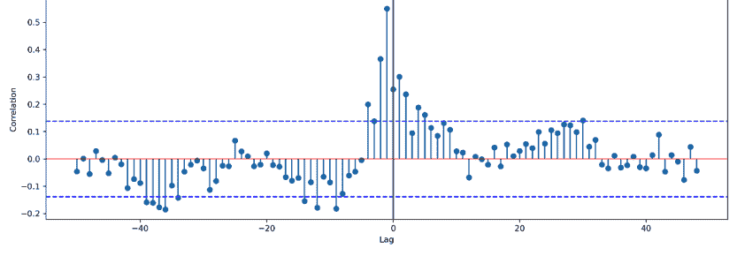

图 12.13 – *realcons* 与 *realinv* 的互相关

为了解决 `realcons` 对 `realinv` 的一阶滞后领先问题，让我们将 `realcons` 向前移动一个索引，使最强的相关性出现在滞后 0 处。这对于 VAR 模型并非必需，但在最显著的滞后**远远**滞后于时间、可能导致模型为了包含必要的变量关系而不得不纳入一个不合理的高阶数的情况下，这会很有用。

> **关于数据移位的说明**
> 移位数据时，数据集中会包含空值。因此，数据集必须根据移位的长度进行修剪。这可能会以模型性能为代价，因此值得通过比较模型误差来评估是否需要移位。

在以下代码片段中对 *realcons* 应用向前移位并重新运行 CCF 后，我们可以在 *图 12.14* 中看到，变量间的最强相关性现在出现在滞后 0 处：

```
data_1d['realcons'] = data_1d['realcons'].shift(1)
data_1d = data_1d.iloc[1:]
plot = plot_ccf(data_a=data_1d['realcons'], data_b=data_1d['realinv'],
                lag_lookback=50, percentile=95)
```

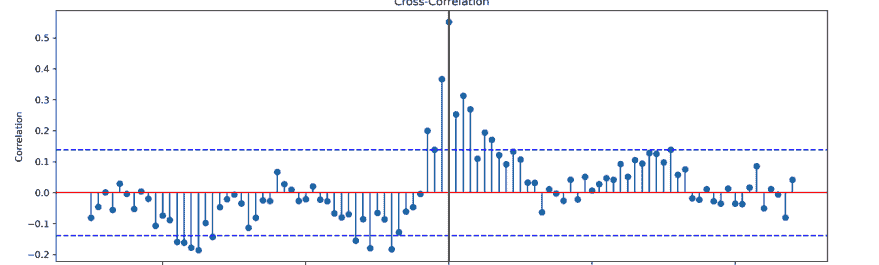

图 12.14 – *realinv* 与向前移位后的 *realcons* 的互相关

接下来，我们希望运行一个函数来追加可能的 p 和 q 值（AR(p) 和 MA(q)）：

```
from statsmodels.tsa.statespace.varmax import VARMAX
import warnings
warnings.simplefilter('error')
results_aic=[]
x_axis_list=[]
for p in range(1,6):
    for q in range(0,6):
        try:
            model = VARMAX(data_1d,
                           order=(p,q),
                           trend='c',
                           enforce_stationarity=True,
                           enforce_invertibility=True)
            results = model.fit()
            results_aic.append(results.aic)
            # x_axis_list.append(p,q,results.aic)
            print('(p,q): ({},{}), AIC: {}'.format(p,q,results.aic))
        except Exception as e:
            # print('(p,q): ({},{}), error: {}'.format(p,q,e))
            pass
```

这里我们可以看到 VAR(1,0) 和 VAR(2,0) 模型的 AIC 误差：

(p,q) : (1,0), AIC: 6092.740258665657

(p,q) : (2,0), AIC: 6050.444583720871

通过 AIC 选择方法，我们得到了两个可能的模型。首先，我们构建了一个 p=2 且 q=0 的模型，但运行后我们观察到，在预测 realinv 的七个系数中，只有两个是显著的（即使在 0.10 的显著性水平下），这并不理想。在重新使用 p=1 且 q=0 运行后，我们发现四个系数中有两个在 0.05 的显著性水平下显著，所有系数在 0.10 的显著性水平下都显著。因此，我们可以得出结论，**VAR(1,0)** 模型在预测 realinv 方面要好得多。

#### 步骤 4 – 构建 VAR(p,q) 模型

我们将跳过上一章中介绍的模型验证步骤，因为这里的流程是相同的。我们要做的是重新排列列的顺序，以便当我们运行 `get_prediction()` 函数时，结果是针对第一列的。模型将保持不变，因为所有变量都用于预测所有其他变量。重新索引后，我们将使用一阶差分数据、realcons 向上移动一位的数据，运行阶数为 **(1,0)** 的 VARMAX 模型，并预测 realinv。对于我们的模型，我们使用了 AR(1) 和 MA(0)。请注意，我们使用 trend='c' 表示常数，因为在执行差分时我们移除了趋势；trend 参数用于趋势确定性。趋势差分应在模型外部处理，因为并非所有变量都可能具有单位根趋势。在模型外部处理趋势也有助于我们识别诸如季节性或移除趋势后真实自相关结构的显著性等成分。值得注意的是，VAR（和 VARMAX）模型并未直接处理季节性；应包含季节性的指示（虚拟）变量。

关于模型拟合，我们可以参考 *第 11 章，ARIMA 模型*，了解 **Ljung-Box**、**Jarque-Bera**、**异方差性**、**偏度** 和 **峰度** 值的信息，因此这里不再重复。这些值的顺序对应于 Dep. Variable 列表中列出的变量顺序，如下所示。每个模型变量都列出了用于预测每个变量的其他变量项的系数。例如，我们可以在 realcons 方程的结果中观察到，realinv 对 realcons 的预测能力贡献不大，但 realdpi 有。我们还可以观察到，realcons 对于预测 realinv 是显著的。我们还可以根据 **误差协方差矩阵 (ECM)** 中的 p 值和置信区间看到，*realinv* 和 *realdpi* 的残差之间没有太多的交叉协方差。如果一个特征的方差可以由另一个特征的方差来解释，我们可以预期看到更大的系数值：

```
model = VARMAX(data_1d.
reindex(columns=['realinv','realcons','realdpi']), order=(1,0),
trend='c',
enforce_stationarity=True,enforce_invertibility=True)
results = model.fit()
print(results.summary())
```

```
==============================================================================
                  Statespace Model Results                  
==============================================================================
Dep. Variable:   ['realcons','realinv','realdpi']   No. Observations:      201
Model:            VAR(1)+intercept   Log Likelihood            -3028.370
Date:            Sat, 11 Feb 2023   AIC                          6092.740
Time:            12:10:38   BIC                          6152.200
Sample:            0   HQIC                         6116.800
                 -201                                         
Covariance Type:            opg                                         
==============================================================================
Ljung-Box (L1) (Q):           8.60, 0.10, 0.00   Jarque-Bera (JB):     9.82, 215.76, 60.32
Prob(Q):                    0.00, 0.76, 0.97   Prob(JB):              0.01, 0.00, 0.00
Heteroskedasticity (H):      3.14, 3.84, 4.74   Skew:                  0.09, -1.07, 0.44
Prob(H) (two-sided):         0.00, 0.00, 0.00   Kurtosis:              4.07, 7.60, 5.54
==============================================================================
                  Results for equation realcons                  
==============================================================================
                 coef    std err          z      P>|z|      [0.025      0.975]
------------------------------------------------------------------------------
intercept     14.5358      3.416      4.256      0.000       7.841      21.230
L1.realcons    0.4190      0.070      5.982      0.000       0.282       0.556
L1.realinv    -0.0308      0.052     -0.592      0.554      -0.133       0.071
L1.realdpi     0.1748      0.029      6.119      0.000       0.119       0.231
==============================================================================
                  Results for equation realinv                  
==============================================================================
                 coef    std err          z      P>|z|      [0.025      0.975]
------------------------------------------------------------------------------
intercept    -11.0943      5.173     -2.145      0.032     -21.232      -0.956
L1.realcons    0.3425      0.093      3.699      0.000       0.161       0.524
L1.realinv     0.1540      0.087      1.778      0.075      -0.016       0.324
L1.realdpi     0.0789      0.041      1.902      0.057      -0.002       0.160
==============================================================================
                  Results for equation realdpi                  
==============================================================================
                 coef    std err          z      P>|z|      [0.025      0.975]
------------------------------------------------------------------------------
intercept     38.0578      7.602      5.006      0.000      23.159      52.957
L1.realcons    0.3488      0.146      2.395      0.017       0.063       0.634
L1.realinv    -0.0404      0.086     -0.469      0.639      -0.210       0.129
L1.realdpi    -0.2576      0.059     -4.393      0.000      -0.372      -0.143
==============================================================================
                  Error covariance matrix                  
==============================================================================
                 coef    std err          z      P>|z|      [0.025      0.975]
------------------------------------------------------------------------------
sqrt.var.realcons    28.396      1.252     22.688      0.000      25.943      30.849
sqrt.cov.realcons.realinv    18.901      2.919      6.476      0.000      13.181      24.621
sqrt.var.realinv    36.168      1.567     23.077      0.000      33.096       9.240
sqrt.cov.realcons.realdpi    17.584      3.612      4.869      0.000      10.506      24.663
sqrt.cov.realinv.realdpi     3.6078      3.744      0.964      0.335      -3.730      10.946
sqrt.var.realdpi    48.177      2.032     23.715      0.000      44.195      52.159
==============================================================================
```

图 12.15 – VAR(1) 模型输出

#### 第5步 – 测试预测

需要指出的是，与长期历史表现相比，VAR模型的预测实际上相当稳定。我们在预测末期看到如此极端差异的原因是，该时间段对应于**大衰退**，该衰退从2007年持续到2009年。我们测试预测中的最后五个点对应于2008年最后两个季度和2009年前三季度：

```python
df_pred = results.get_prediction(start=195, end=200).summary_frame(alpha=0.05)
fig, ax = plt.subplots(1,1,figsize=(20,5))
ax.plot(data_1d['realinv'], marker='o', markersize=5)
ax.plot(df_pred['mean'], marker='o', markersize=4)
ax.plot(df_pred['mean_ci_lower'], color='g')
ax.plot(df_pred['mean_ci_upper'], color='g')
ax.fill_between(df_pred.index, df_pred['mean_ci_lower'], df_pred['mean_ci_upper'], color='g', alpha=0.1)
ax.set_title('Test Forecast for VAR(1)')
```

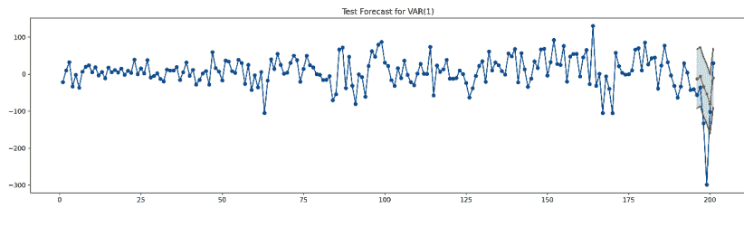

图12.16 – p=1的VARMAX测试预测

我们可以将投资变量的预测值（*均值*）与实际值（*realinv*）进行比较，如下所示：

```python
pd.concat([df_pred,data_1d['realinv'].iloc[195:]], axis=1)
```

在*图12.17*中，我们可以看到VAR（来自VARMAX函数）模型的测试预测：

| | mean | mean_se | mean_ci_lower | mean_ci_upper | realinv |
|---|---|---|---|---|---|
| 196 | -12.4348 | 40.79603 | -92.3935 | 67.52398 | -56.368 |
| 197 | -6.26154 | 40.79603 | -86.2203 | 73.69722 | -35.825 |
| 198 | -33.5406 | 40.79603 | -113.499 | 46.41821 | -133.032 |
| 199 | -53.6481 | 40.79603 | -133.607 | 26.31066 | -299.167 |
| 200 | -81.514 | 40.79603 | -161.473 | -1.55526 | -101.816 |
| 201 | -10.1039 | 40.79603 | -90.0627 | 69.85483 | 29.72 |

图12.17 – VAR(1)模型测试预测

#### 第6步 – 构建预测

我们可以观察到，由于这是一个具有**自回归阶数p=1**的模型，预测**非常迅速地趋向均值**。包含更高阶数可能会导致更多的模型方差，这可能表现为一个更自信但风险更高的预测。多元AR(1)模型产生更多偏差，我们可以在*图12.18*中观察到我们提到的趋向均值的趋势。我们可以运行以下代码来生成预测数据和绘图：

```python
df_forecast = results.get_prediction(start=201, end=207).summary_frame(alpha=0.05)

forecast = np.hstack([np.repeat(np.nan, len(data_1d)+1), df_forecast['mean']])

fig, ax = plt.subplots(1,1,figsize=(20,5))
ax.plot(data_1d['realinv'], marker='o', markersize=5)
ax.plot(forecast, marker='o', markersize=4)
ax.plot(df_forecast['mean_ci_lower'], color='g')
ax.plot(df_forecast['mean_ci_upper'], color='g')
ax.fill_between(df_forecast.index, df_forecast['mean_ci_lower'], df_forecast['mean_ci_upper'], color='g', alpha=0.1)
ax.set_title('Forecast for VAR(1)');
```

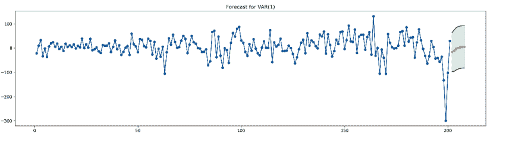

图12.18 – VAR(1)模型预测，h=7

在这里，我们可以看到预测点和预测的置信区间：

```python
df_forecast
```

| | mean | mean_se | mean_ci_lower | mean_ci_upper |
|---|---|---|---|---|
| 202 | -16.3442 | 40.79603 | -96.3029 | 63.6146 |
| 203 | -10.9571 | 43.69828 | -96.6041 | 74.68998 |
| 204 | -3.24668 | 44.4028 | -90.2746 | 83.7812 |
| 205 | 1.301495 | 44.56735 | -86.0489 | 88.65189 |
| 206 | 3.576619 | 44.60344 | -83.8445 | 90.99775 |
| 207 | 4.650973 | 44.61108 | -82.7851 | 92.08709 |
| 208 | 5.147085 | 44.61268 | -82.2922 | 92.58633 |

图12.19 – VAR(1)模型输出数据

请注意，我们的结果基于差分数据。该模型告诉我们变量之间关于其各自信号的统计显著性水平，但并未给出原始数据的预测值。要逆转差分数据，我们需要估计一个积分常数，然后根据该常数对数据进行逆差分，或者使用允许我们进行逆变换的不同转换方法，例如可以进行指数化以逆转的对数转换。通常，VAR模型用于识别在交叉相关分析以及经济冲击分析中被确定为高度相关的变量之间的潜在因果关系。

可以认为，根据预测所需的详细程度，可能不需要对变量进行差分和移位。然而，由于这是一个没有外生变量的完全内生模型，重要的是，如果我们对任何变量应用差分，我们也必须对所有包含非平稳行为的变量应用差分。关于移位，应用更高的自回归滞后阶数可能比应用移位更有用；移位的缺点是我们会在过程早期丢失样本。然而，使用更高滞后阶数的缺点是在时间维度上包含更多变量，这会增加过拟合的可能性。逻辑上，随着模型中包含更多变量，我们也必须增加样本量。与任何模型一样，我们必须应用严格的交叉验证以确保性能稳定性并最小化风险。

## 总结

在本章中，我们概述了多元时间序列及其与单变量情况的区别。然后，我们介绍了使用多元时间序列模型解决问题的两种流行方法背后的数学和直觉——ARIMAX和VAR模型框架。我们通过逐步方法为每种模型进行了示例讲解。本章结束了我们关于时间序列分析和预测的讨论。此时，你应该能够识别和评估时间序列的统计属性，根据需要对其进行转换，并构建适用于拟合和预测单变量和多元情况的模型。

在下一章中，我们将开始讨论生存分析，首先介绍**事件发生时间（TTE）**变量。

## 参考文献

[1] Liang, X., Zou, T., Guo, B., Li, S., Zhang, H., Zhang, S., Huang, H. and Chen, S. X. (2015). Assessing Beijing's PM2.5 pollution: severity, weather impact, APEC and winter heating. *Proceedings of the Royal Society A*, 471, 20150257.

[2] Dua, D. and Graff, C. (2019). UCI Machine Learning Repository [http://archive.ics.uci.edu/ml]. Irvine, CA: University of California, School of Information and Computer Science.

# 第五部分：生存分析

本部分将通过分析事件发生时间结果变量来介绍另一种称为生存分析的统计方法。在介绍生存分析和删失数据之后，我们将研究具有生存响应的模型。

它包括以下章节：

- 第13章，事件发生时间变量 - 简介
- 第14章，生存模型

# 13 事件发生时间变量 – 简介

在这个简短的章节中，我们将介绍统计学的另一个分支，称为**生存分析**，它与生存和时间删失研究相关。生存分析也称为**事件发生时间变量分析**，这是一种特定的统计结果类型，需要使用与我们之前研究的几章不同的技术。事件发生时间变量分析研究，例如，参与者在研究时间框架内是否发生了感兴趣的事件。换句话说，我们研究*在特定时间点后样本存活的比例*以及存活样本比例失败或死亡的速率，或者不同治疗组之间是否存在生存差异。生存分析中的术语*生存*最初基于医学领域中从治疗到死亡的时间。然而，生存分析很容易应用于许多领域，包括工程（称为**可靠性理论**或**可靠性分析**）、社会学（**事件历史分析**）和经济学（**持续时间分析**）。在医学研究中，当死亡发生时，生存研究可能没有歧义，尽管一些事件（如器官衰竭）可能定义不清。然而，在其他研究领域确实存在歧义：例如，在工程中，故障或系统损坏可能是部分的或不严格由时间决定的。我们还将在本章中研究生存数据、生存函数、风险和风险比。

在本章中，我们将涵盖以下主要主题：

- 删失
- 生存数据
- 生存函数、风险和风险比

## 什么是删失？

在统计学领域，**删失**指的是测量或观察的完整范围或精确值不完全已知的情况。在生存分析中，当我们拥有样本观察的信息，但不知道给定事件何时发生时，就会出现这种情况，这被认为是生存分析中的一个关键问题，将时间-事件分析与前面章节提到的其他统计分析区分开来。删失发生的原因有几个；例如，一个人退出研究或在随访前离开，或者所讨论的事件在研究开始前已经发生。删失事件是*非信息性的*，也就是说，*删失导致研究失败的原因并非失败时间本身。换句话说，由删失引起的失败与事件发生的概率无关。* **信息性删失**发生在观察因研究原因而失访时。信息性删失有三种类型：**右删失**、**左删失**和**区间删失**。在本书中，我们重点关注**非信息性右删失**。

### 左删失

当我们知道*事件在收集观察数据之前已经发生*，那么该观察就是**左删失**的。一个左删失场景的例子是，我们研究中学生开始青春期的年龄。可能有一些学生在进入中学之前就已经达到了这个发育阶段。所有这些学生都被视为左删失。再举一个例子，考虑一项针对高危患者群体的HIV研究，其中在研究开始时，一些患者已经感染了HIV。

### 右删失

当*事件在某个时间点之后发生*但我们不知道确切时间时，则被视为**右删失**。将前面的场景应用到这里，想象有一些学生退出了青春期发育阶段的研究，或者我们在随访前失去了他们（例如，他们转学到另一所学校），或者他们青春期延迟（在他们离开中学开始高中时，发育阶段仍未发生）。另一个例子是一项癌症研究，其中招募了一组患者进行临床试验，以观察一种新疗法对他们的影响，但该组中的一名患者在2年后死于车祸。在这种情况下，我们知道该患者在研究期间的生存期至少为2年，但不知道在2年之后，该患者还能存活多少年。

### 区间删失

左删失和右删失是**区间删失**的特例。一个说明区间删失的清晰例子是，一名患者在时间 $t_1$ 检测HIV为阴性，但在时间 $t_2$ 检测为阳性。然而，我们不知道该患者在时间间隔 $[t_1, t_2]$ 内的确切感染时间。这位特定的患者去年和今年都进行了年度体检。实验室结果显示他去年HIV阴性，今年HIV阳性。因此，感染发生在去年和今年体检之间的某个时间点，但我们不知道确切时间。

### I型删失和II型删失

右删失有两种类型：**I型删失**和**II型删失**。在**I型删失**中，研究设计为在某个时间点 $t$ 后终止。当一个对象在时间 $t$ 后没有发生事件时，发生固定删失。该对象在时间 $t$ 被视为删失。当删失对象没有相同的删失时间时，发生随机删失。在**II型删失**中，研究在发生预定数量的事件后终止。这种类型的删失经常用于寿命测试实验以节省时间和金钱。例如，我们随机选择 $n$ 个对象作为样本来测试一项新创新是否真的有效，但为了节省时间和成本，我们不是测试所有这 $n$ 个对象，而是定义如果发生 $r$ 次失败则研究终止。在这种情况下，前 $r$ 个对象在时间 $t_1, t_2, \dots, t_r$ 发生事件，但剩余的 $n - r$ 个对象在时间 $T = \max(t_1, t_2, \dots, t_r)$ 没有发生事件，因此它们被视为删失。

让我们可视化一项为期5年测试新疗法的癌症研究。开始时间点是研究开始时的0，结束时间点是研究结束时的5。

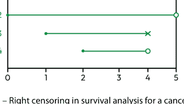

第一位患者在研究开始时被招募，但他在2年半时去世。第二位患者也在研究开始时被招募，但在第5年，他仍然存活。该患者已存活超过5年，但我们不知道他最终能存活多少年，这意味着该患者发生了右删失。第三位患者在第1年被招募，但她在第4年去世。第四位患者在第2年加入研究，但到第4年，我们无法随访该患者。原因可能是他搬到了另一个城市。患者2和患者4发生了删失。

这项研究看起来像一个回归问题，但在这个例子中，第二位患者在研究结束时被视为存活。这使得生存分析不同于常规统计分析。我们也不会从研究数据中移除第二位患者的数据，因为这些信息很有价值：患者可以存活至少5年。此外，患者随访可能会被阻止，因为他们可能搬到另一个地方或病得很重，但我们不是移除数据，而是记录他们退出研究的原因。同样，性别考虑可能会产生偏差，因为例如，男性患者在生病时可能比女性患者更有可能退出研究，从而可能导致女性比男性存活时间更长的错误结论。

## 生存数据

**生存数据**关注研究中的对象是否经历事件。此外，随访时间也被考虑在内。*时间零点*或*时间原点*是研究开始的时间。根据研究目的，时间零点或时间原点可能不同。例如，在一项前列腺癌研究中，研究人员招募40岁及以上的男性参与者，但在一项青春期发育年龄的研究中，招募12岁及以上的男性和女性青少年。如果研究持续一段时间（可能是几个月或几年），那么在研究期间记录时间原点和随访时间至关重要。

最后，我们讨论*生存时间与删失时间之间的关系*以及我们如何*记录带有删失的生存数据*。假设对于样本中的每个对象，我们知道其真实事件时间 $T$ 和真实删失时间 $C$。那么，*对象的生存时间是直到事件发生的时间段*，而*对象的删失时间是删失发生的时刻*，例如，当研究结束或我们无法随访该对象时。令 $\delta_i$ 表示对象 $i$ 的状态指示符：

$$\delta_i = \begin{cases} 1 & \text{如果观察到事件}, \\ 0 & \text{如果观察到删失}. \end{cases}$$

换句话说，当事件 $T_i$ 发生在删失 $C_i$ *之前*时，$\delta_i = 1$；当事件 $T_i$ 发生在删失 $C_i$ *之后*时，$\delta_i = 0$。观察到的结果变量是

$$Y_i = \min(T_i, C_i)$$

对象 $i$ 的删失生存数据可以表示为 $(Y_i, \delta_i)$。

以下示例考虑了一项癌症研究中的三名患者。这里时间以年为单位，研究持续时间为5年。

| 患者 | T | C | δ |
| :--- | :--- | :--- | :--- |
| 1 | 3（患者在第3年去世） | 无删失 – 患者在第3年去世 | 1（因为观察到事件） |
| 2 | 7（患者在第7年去世，但研究在第5年结束） | 5（研究在第5年结束） | 0（因为观察到删失） |
| 3 | 无信息 | 4（患者退出研究） | 0（因为观察到删失） |

图13.2 – 癌症研究的生存分析

下图说明了癌症研究中3名患者的信息。

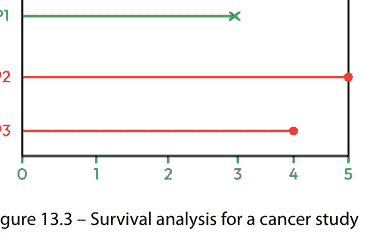

## 生存函数、风险函数和风险比

让我们首先讨论生存函数。该函数的公式定义为

$S(t) = P(T > t)$

并表示对象存活超过时间 $t$ 的概率。生存函数是一个非增函数，$t$ 的范围从0到 $\infty$。当 $t = 0, S(t) = 1$，当 $t = \infty, S(t) = S(\infty) = 0$。理论上它是一个平滑函数，但实际上，*事件发生在离散的时间尺度上*（天、周、年）。

# 14 生存模型

在*第13章，事件发生时间变量*中，我们介绍了生存分析、删失以及**事件发生时间（TTE）**变量的主题。在本章中，我们将针对三种主要的模型框架，深入概述并逐步讲解这些技术的实现：

- Kaplan-Meier模型
- 指数模型
- Cox比例风险模型

我们将讨论每种方法如何利用单变量Kaplan-Meier和指数方法以及多变量Cox比例风险回归模型，为研究对象的生存和风险概率提供洞察。我们将通过真实数据示例进行讲解并讨论结果，以便读者理解如何评估性能并将测试输出转化为有用信息。最后，我们将展示如何使用训练好的模型为未见数据提供预测概率。

## 技术要求

在本章中，我们使用一个额外的Python库进行生存分析：`lifelines`。请安装以下版本的库以运行提供的代码。安装库的说明可在*第1章，抽样与泛化*中找到：

- `lifelines== 0.27.4`

关于`lifelines`的更多信息，请参见此链接：
`https://lifelines.readthedocs.io/en/latest/index.html`

## Kaplan-Meier模型

我们将讨论的第一个生存分析模型是**Kaplan-Meier模型**（也称为**Kaplan-Meier估计量**）。本节将从讨论模型定义开始，了解其构建方式。然后，我们将以一个如何在Python中使用`lifelines`库应用此模型的示例结束本节。让我们开始吧。

### 模型定义

Kaplan-Meier估计量由以下公式定义：

$$\hat{S}(t) = \prod_{t_i \le t} \frac{n_i - d_i}{n_i}$$

这里，$n_i$是时间$t$之前的风险受试者数量，$d_i$是时间$t$的死亡事件数量，$\hat{S}(t)$（生存函数）是生命长于$t$的概率。公式中使用的$\Pi$符号类似于$\Sigma$符号；然而，$\Pi$表示乘法。这意味着前面的公式将导致每个时间步长$t$的分数相乘。这意味着Kaplan-Meier估计量是一系列递减的水平阶梯。为了清楚起见，让我们通过一些示例数据来看看它的应用。

假设我们有以下数据，其中`duration`列代表受试者存活了多久，`death`列指示研究中是否观察到死亡。让我们逐步计算此数据的Kaplan-Meier估计量：

| duration | death |
|---|---|
| 5 | 1 |
| 7 | 1 |
| 3.5 | 1 |
| 8 | 0 |
| 2 | 1 |
| 5 | 1 |

图14.1 – 死亡和持续时间示例数据

最初（在$t = 0$时），所有受试者都处于风险中，但没有受试者死亡。这意味着当前的生存率为1。我们按如下方式计算$t = 0$时的生存函数值：

$$\hat{S}(0) = \frac{n_0 - d_0}{n_0} = \frac{6 - 0}{6} = 1$$

第一个事件发生在$t = 2$。此时，在事件发生之前，所有受试者（六名受试者）都处于风险中，并且有一名受试者在此时死亡。我们计算此时的当前生存率，然后将此值与所有先前的值相乘。$t = 2$时的生存率如下所示：

$$\frac{n_2 - d_2}{n_2} = \frac{6 - 1}{6} \approx 0.83$$

然后，我们计算$t = 2$时的生存函数：

$$\hat{S}(2) = \frac{\frac{n_0 - d_0}{n_0} * n_2 - d_2}{n_2} = \frac{\frac{6 - 0}{6} * 6 - 1}{6} \approx 0.83$$

下一个事件发生在$t = 3.5$。我们重复前面概述的过程。然而，此时只有五名受试者处于风险中，因为已经有一名死亡。因此，时间$t = 3.5$时的当前生存率是：

$$\frac{n_3 - d_3}{n_3} = \frac{5 - 1}{5} = 0.8$$

然后，我们计算此时的生存函数：

$$\hat{S}(3.5) = \frac{\frac{n_0 - d_0}{n_0} * n_2 - d_2 * n_{3.5} - d_{3.5}}{n_{3.5}} = \frac{\frac{6 - 0}{6} * 6 - 1 * 5 - 1}{5} \approx 0.67$$

下一个事件发生在$t = 5$，有两名受试者死亡。在$t = 5$时，有四名剩余受试者处于风险中，两名受试者死亡。因此，我们在$t = 5$时的生存率为0.5。生存函数的新值计算如下：

$$\hat{S}(5) = 1 * 0.83 * 0.67 * 0.5 \approx 0.33$$

最后一个事件发生在$t = 7$。此时，生存率为0.5，生存函数的值约为0.167：

$$\hat{S}(7) = 1 * 0.83 * 0.67 * 0.5 * 0.5 \approx 0.167$$

由于我们的研究到此结束，这是生存函数的最终值，并且函数值在研究结束前保持不变。

如您所见，这个生存模型计算起来很简单。还要注意，我们没有提及假设或潜在的统计分布。Kaplan-Meier估计量是一个非参数生存模型。正如我们在*第5章，非参数检验*中所讨论的，这意味着当分析的数据不满足参数模型的假设时，它可以作为参数模型的替代方案。因此，Kaplan-Meier估计量是您工具箱中一个有用的模型。

既然我们已经了解了这个模型的工作原理，让我们看看如何在Python中使用`lifelines`包计算Kaplan-Meier估计量生存函数。

## 总结

在本章中，我们概述了事件发生时间变量分析及其与我们在前面章节中研究的其他统计分析的区别。我们涵盖了删失直觉（左删失、右删失和区间删失），并讨论了I型和II型删失。我们还在本章中讨论了非信息性和信息性事件。然后我们讨论了生存数据以及生存时间与删失时间之间的关系，以及我们如何记录带有删失的生存数据。生存函数、风险函数和风险比也在本章的最后一节中提及。

在下一章中，我们将考虑非参数Kaplan-Meier模型、参数指数模型以及半参数Cox比例风险模型。我们将通过在Python中应用这些模型进行生存分析来执行真实数据分析。

# 13 生存分析

在这个例子中，我们回到跨越5年的癌症研究。在时间零点，研究开始时，生存概率为1或100%，但在第5年，生存概率接近0.2或20%。

现在我们考虑*斯坦福心脏移植数据集*。该数据集包含103名参与实验性心脏移植计划的患者信息（见*图13.5*）。患者病情严重，有可能从参与该计划中获得一些益处，因为他们可能需要等待几周到几个月才能从捐赠者那里获得新的心脏。CSV数据集可从https://www.openintro.org/data/csv/heart_transplant.csv下载。

| id | acceptyear | age | survived | survtime | prior | transplant | wait |
|---|---|---|---|---|---|---|---|
| 0 | 15 | 68 | 53 | dead | 1 | no | control | NaN |
| 1 | 43 | 70 | 43 | dead | 2 | no | control | NaN |
| 2 | 61 | 71 | 52 | dead | 2 | no | control | NaN |
| 3 | 75 | 72 | 52 | dead | 2 | no | control | NaN |
| 4 | 6 | 68 | 54 | dead | 3 | no | control | NaN |

图13.5 – 斯坦福移植数据的前五行

我们在这里对两个特征感兴趣：*survived*（记录死亡与存活的生存状态）和*survtime*（患者从被确定为心脏移植候选者到研究结束所存活的天数）。当我们按*survtime*对数据进行排序时，在前15个观察值中，第13行的患者仍然存活，如*图13.6*所示。因此，第13行的观察值是时间删失的。

| survtime | survived |
| :--- | :--- |
| 0 | 1 dead |
| 1 | 2 dead |
| 2 | 2 dead |
| 3 | 2 dead |
| 4 | 3 dead |
| 5 | 3 dead |
| 6 | 3 dead |
| 7 | 5 dead |
| 8 | 5 dead |
| 9 | 6 dead |
| 10 | 6 dead |
| 11 | 8 dead |
| 12 | 9 dead |
| 13 | 11 alive |
| 14 | 12 dead |

图13.6 – 前15名移植患者的状态

在这个例子中，要计算survtime = 3之后的生存概率，我们只需要计算每个时间区间$[t_0, t_1], (t_1, t_2], (t_2, t_3]$中的**生存概率**，其计算公式为：

$$P(\text{在 } (t_{i-1}, t_i] \text{中生存}) = 1 - P(\text{在 } (t_{i-1}, t_i] \text{中死亡} \mid \text{在 } t_{i-1} \text{时存活})$$

其中

$$P(\text{在 } (t_{i-1}, t_i] \text{中死亡} \mid \text{在 } t_{i-1} \text{时存活}) = \frac{\text{在 } (t_{i-1}, t_i] \text{中的死亡人数}}{\text{在 } t_{i-1} \text{时的存活人数}},$$

那么

$$S(t_3) = P(\text{生存} > t_3) = \left(1 - \frac{0}{103}\right) * \left(1 - \frac{1}{103}\right) * \left(1 - \frac{3}{102}\right) = 96.12\%.$$

接下来，我们讨论风险函数或风险率。**风险函数**定义为

$$h(t) = \lim_{\Delta t \to 0} \frac{Pr(t < T \le t + \Delta t \mid T > t)}{\Delta t},$$

*给定存活到该时间，事件发生的瞬时速率。换句话说，它就是在接下来的几秒钟或第二天死亡的概率，前提是现在还活着。风险比是*死亡概率的比率。例如，当风险比为3时，那么给定组的死亡机会是另一组的3倍。

### 模型示例

在本示例中，我们将使用来自 `lifelines` 的 `larynx` 数据集。该数据集包含六个变量：`time`、`age`、`death`、`Stage_II`、`Stage_III` 和 `Stage_IV`。由于该数据集的信息有限，为了本示例的目的，我们将对变量做出以下假设：

- `time` 是患者在诊断出喉癌后存活的时间
- `age` 是患者在诊断时的年龄
- `death` 表示在研究期间是否观察到死亡
- `Stage_II` 表示在诊断时癌症处于第二阶段
- `Stage_III` 表示在诊断时癌症处于第三阶段
- `Stage_IV` 表示在诊断时癌症处于第四阶段
- 当患者未被标记为第二阶段或以上时，他们在诊断时处于第一阶段

让我们首先计算研究中所有患者的生存函数。我们将使用 `lifelines` 中的 `KaplanMeierFitter`。这是一个对象，它将是我们刚刚讨论的 Kaplan-Meier 模型。为了拟合这个模型，我们将使用 `fit()` 方法，它接受两个参数：`duration` 和 `event_observed`。`duration` 是患者在研究中存活了多久。`event_observed` 是死亡是否被观察到：`True` 表示观察到，`False` 表示未观察到。数据已经设置好可以与这两个参数一起使用。我们可以如下拟合模型：

```python
import matplotlib.pyplot as plt
from lifelines import datasets
from lifelines.fitters.kaplan_meier_fitter import KaplanMeierFitter
data = datasets.load_larynx()
kmf = KaplanMeierFitter()
kmf.fit(data.time, data.death)
# this prints the first 5 elements of the survival function
kmf.survival_function_.head()
```

上述代码的输出如 *图 14.2* 所示，这是生存函数的前五个元素：

| timeline | KM_estimate |
| :--- | :--- |
| 0.0 | 1.000000 |
| 0.1 | 0.988889 |
| 0.2 | 0.977778 |
| 0.3 | 0.944444 |
| 0.4 | 0.933333 |

图 14.2 – 喉癌生存函数的前五个元素

*图 14.2* 中显示的生存函数元素在缓慢下降，这表明患者随着时间的推移而死亡。然而，仅从一系列数字中很难获得完整的故事。让我们绘制这个序列。我们也可以从 `KaplanMeierFitter` 对象中获取置信区间，如下一个代码块所示：

```python
fig, ax = plt.subplots(1)
kmf.survival_function_.plot(ax=ax)
ci = kmf.confidence_interval_survival_function_
index = ci.index
ci_low, ci_high = ci.values[:, 0], ci.values[:, 1]
ax.fill_between(index, ci_low, ci_high, color='gray', alpha=0.3)
```

此代码生成如 *图 14.3* 所示的图表，这是随时间变化的生存函数：

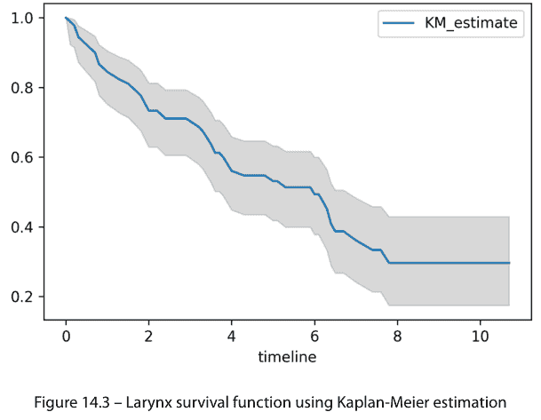

喉癌数据的 Kaplan-Meier 估计生存函数如 *图 14.3* 所示。该函数随时间下降，直到时间步长 8 处的最后一次观察到的死亡，之后函数保持恒定直到研究结束。

现在，考虑我们在这个数据集中有一些我们可能想要比较的特征。例如，我们有初始诊断时的癌症分期，以及个体的年龄。让我们首先比较两个年龄组的生存函数。然后，让我们比较基于癌症分期的组的生存函数。

研究中个体的年龄范围大约从 40 岁到 85 岁，大部分个体在 60 到 80 岁之间。让我们以 65 岁为界将个体分组。任何小于 65 岁的人将属于年轻组，任何 65 岁或以上的人将属于年长组。两组的生存函数如 *图 14.4* 所示：

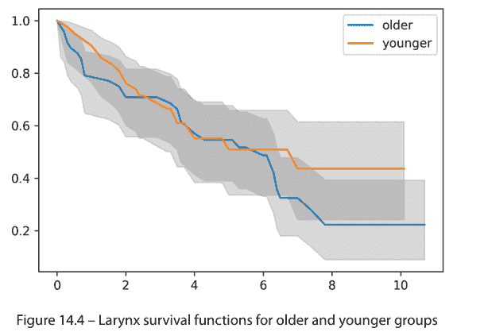

图 14.4 – 年长组和年轻组的喉癌生存函数

*图 14.4* 中显示的年长组和年轻组的生存函数似乎在时间步长 7 左右之前表现出很小的差异。然而，置信区间似乎从未出现分歧。根据这些数据，年龄似乎不是影响生存的一个强因素。

现在，让我们对不同分期进行类似的生存分析。如前所述，我们将假设任何未被标记为第二阶段或以上的个体在诊断时为第一阶段。这些组的生存函数如 *图 14.5* 所示：

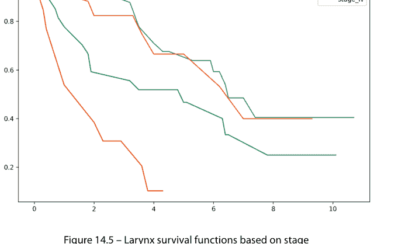

图 14.5 – 基于分期的喉癌生存函数

基于分期的组的生存函数如 *图 14.5* 所示。为了图表清晰，此图省略了置信区间。根据图表，第一阶段和第二阶段之间似乎没有显著差异。我们在第三阶段开始看到差异。第四阶段与其他阶段之间的差异明显可见。

在本节中，我们讨论了用于生存分析的 Kaplan-Meier 模型，这是一种用于生存数据的非参数模型。我们还讨论了如何比较一组内多个组的生存函数。在下一节中，我们将讨论指数模型，这是一种用于生存数据的参数模型。

## 指数模型

在上一节中，我们研究了非参数 **Kaplan-Meier 生存模型**。我们现在将参数建模与 **指数模型** 联系起来，然后在下一节讨论半参数模型，即 **Cox 比例风险模型**。在考虑指数模型之前，我们将回顾什么是指数分布以及为什么在本节中提到它。这个分布基于泊松过程。在这里，事件随时间独立发生，事件率 λ 由单位时间内发生的次数计算得出，如下所示：

$$\lambda = \frac{Y}{t}$$

泊松分布是一个关于在指定时间段内发生事件数量的 **统计离散分布**。它的定义如下。令 $Y$ 为在时间 $t$ 内发生的次数。如果概率质量函数由以下公式给出，则 $Y$ 服从参数为 $\lambda$ 的泊松分布：

$$f(Y) = Pr(y = Y) = \frac{e^{-\lambda}\lambda^Y}{Y!}$$

离散变量 $y$ 的均值和方差都等于事件率。我们不必关注在特定时间段内发生了多少事件，而是可以考虑事件发生需要多长时间；这就是为什么在本节中考虑指数分布。令 $T$ 为事件发生（$Y = 1$）所需的时间。概率密度函数由以下公式计算：

$$f(t) = P(T = t) = \lambda e^{-\lambda t}$$

累积分布函数计算如下：

$$F(t) = P(T \leq t) = 1 - e^{-\lambda t}$$

函数 $F(t)$ 表示未能存活超过时间 $t$ 的概率，或生存时间小于 $t$ 的概率。我们可以在 *图 14.6* 中看到以下概率形式：

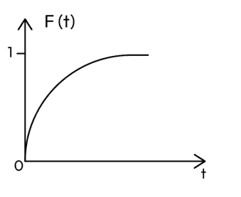

图 14.6 – 未能存活超过时间 t 的概率曲线

相反，生存函数与存活超过某个时间 t 的概率有关：

$S(t) = P(T > t) = 1 - P(T \leq t) = e^{-\lambda t}$

通过可视化，生存函数将具有图 14.7 中所示的形式：

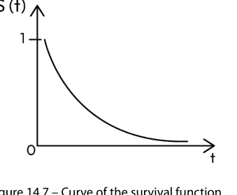

图 14.7 – 生存函数曲线

**累积风险函数** 是 $H(t) = \lambda t$。然后我们可以用风险函数重写生存函数如下：

$S(t) = e^{-H(t)}$

给定 $S(t)$ 和 $f(t)$，我们可以使用对数似然方程方法的思想，并通过最大似然估计来估计 $\lambda$ 的值。

### 模型示例

我们将使用与上一节相同的来自 lifeline 的 larynx 数据集。在本示例中，我们将使用来自 lifelines 的 ExponentialFitter。类似地，fit() 方法接受两个参数：duration 和 event_observed。我们可以如下拟合模型：

```python
from lifelines import ExponentialFitter
from lifelines import datasets
data = datasets.load_larynx()
exf = ExponentialFitter()
exf.fit(data.time, data.death)
# this print the first 5 elements of the survival function
exf.survival_function_.head()
```

在 Kaplan-Meier 模型中，曲线看起来像阶梯，但使用指数方法，曲线是逐渐连续下降的，正如我们在这里看到的：

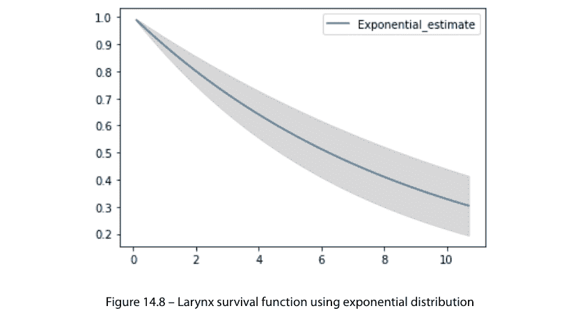

在 Kaplan-Meier 模型中，函数在时间步长 8 处保持恒定直到研究结束，但在指数模型中，曲线持续下降直到研究结束。我们还对年轻组（小于 65 岁）和年长组（65 岁及以上）进行了类似的研究（见图 14.9）：

## Cox比例风险回归模型

生存分析，也称为TTE分析，正如我们在*第13章，时间-事件变量*中所讨论的，是一种利用概率基于先前观察来估计事件发生前剩余时间的分析方法。我们已经看到，在诸如估计预期寿命、机械故障和客户流失等应用中，纳入适当的协变量如何能有所帮助，这有助于确定需求的优先级并更有效地分配资源。正如我们在*第13章*中深入讨论的，删失是使生存分析区别于其他可通过回归等技术解决的统计问题的一个方面。因此——并且因为因删失而丢弃观察结果几乎肯定会误导我们的模型并提供不可信的结果——我们插入所谓的**事件状态指示符**来帮助解释在估计事件发生时间之前事件是否会发生或未能发生。回想一下，对象 $i$ 的事件状态指示符 $\delta$ 描述如下：

$$\delta_i = \begin{cases} 1 \text{ 如果观察到事件发生，} \\ 0 \text{ 如果观察到删失。} \end{cases}$$

我们注意到，当真实事件 $T_i$ 发生在删失时间 $C_i$ *之前*时，$\delta_i = 1$；当真实事件 $T_i$ 发生在删失时间 $C_i$ *之后*时，$\delta_i = 0$。因此，对象 $i$ 的结果 $Y$ 如下：

$$Y_i = \min(T_i, C_i)$$

对象 $i$ 的删失生存数据可以表示为 $(Y_i, \delta_i)$。在本章中，我们讨论了**非参数Kaplan-Meier生存模型**，该模型使用在每个时间点相对于样本量的生存计数的原始条件概率，而不考虑协变量。然后我们介绍了参数**指数生存模型**，与Kaplan-Meier模型不同，它假设数据符合特定分布，并额外包含一个风险比来比较组别。我们现在将讨论半参数**Cox比例风险生存模型**，也称为**Cox比例风险回归模型**。

Cox比例风险模型的主要目的和区别在于使用多个协变量风险因素来对生存时间建模。这些协变量可以是分类的或连续的。Cox比例风险模型能够通过利用**风险比**来解释组间生存差异。正如我们所讨论的，风险比是在任何时间点，一组相对于另一组的事件发生率之比，前提是两组在该时间点之前均保持生存状态。

风险比可以按如下方式计算：

$$\frac{\sum \text{A组在时间 } t \text{ 的观察事件数}}{\sum \text{A组在时间 } t \text{ 的期望事件数}} \Bigg/ \frac{\sum \text{B组在时间 } t \text{ 的观察事件数}}{\sum \text{B组在时间 } t \text{ 的期望事件数}}$$

风险比的问题在于，当我们未能在组间共享的协变量中获得平衡的值时，我们就失去了对混杂变量的控制。当我们无法控制混杂变量时，我们就无法可靠地获得推断。为了处理生存分析中协变量值可能存在的任何不平衡，我们可以使用**Cox比例风险模型**来引入系数，这些系数有助于解释不同水平的外生影响。该模型遵循以下形式：

$$h(t) = h_0(t) e^{(\beta_1 X_1 + \beta_2 X_2 + \dots + \beta_n X_n)}$$

这里，$h(t)$ 是在基准时间 $t$ 的预期风险值，$h_0(t)$ 是当变量矩阵 $X$ 中所有协变量都等于零时在 $t$ 的基线风险值，$n$ 是模型中包含的变量数量。系数 $\beta_i$ 量化了 $X$ 中每个列变量的影响（效应）。因此，我们能够使用输入变量的特定值乘以其相应的估计系数来预测生存。

Cox比例风险有三个相关假设：

- 假设风险比在随访期间*保持恒定*。如果一组的输入性质发生变化，这可能会对模型结果产生负面影响；例如，我们比较两台机器的性能，但其中一台在天气变暖时可能改善，而另一台则不会，因此我们的模型可能无法正确建模机械生存。
- 完全的*生存独立性*。这意味着一个研究参与者或对象的生存不依赖于其他参与者。考虑两台独立的机器。如果其中一台的振动可能导致其早期故障（否则不会发生），并且该振动也被另一台机器感受到，同样对另一台机器造成损害，那么这两台机器之间可能不存在生存独立性。然而，如果第一台机器的振动没有被另一台感受到，并且所有其他混杂因素都得到控制，那么可能存在生存独立性。
- 模型假设*发生的任何删失都是非信息性的*。因此，发生的任何删失都不会向模型引入混杂。因随访前删失而失去研究对象不得与生存风险的变化相关。例如，在测试设施特定区域内两种类型机器的机械生存时，如果一台机器被重新安置到设施的另一个区域以最小化其自身的自毁性振动，这就是信息性删失。然而，如果机器被移到另一个区域只是为了腾出空间，并且这次移动不影响机器的生存风险或结果，则删失是非信息性的。因此，它不会引入模型混杂。Cox比例风险模型适用于**右删失**数据。

接下来概述了进行Cox比例风险回归建模时要采取的步骤。顺序很重要，因为测试应仅在实际可行时进行。这些步骤遵循**美国国立卫生研究院** (NIH) (https://www.ncbi.nlm.nih.gov/pmc/articles/PMC7876211/) 提供的大纲。

### 步骤1

设置要检验的零假设（在我们将要研究的多变量情况下的假设）。我们将使用*斯坦福心脏移植*数据集，该数据集列出了等待斯坦福心脏移植计划移植的患者的生存情况。我们将使用`age`（年龄）和`year`（年份，相对于计划开始日期）、`transplant`（移植）状态以及既往搭桥`surgery`（手术）的存在作为生存的预测因子，生存以死亡或移植告终。生存持续时间是`stop`变量，即研究的退出时间。`event`变量确认右删失，对应于死亡或移植。每个变量的零假设是组间生存没有统计学显著差异。例如，年龄对生存没有影响，而等待移植将是零假设。代码如下所示：

```python
import statsmodels.api as sm
data = sm.datasets.get_rdataset('heart', package='survival').data
train_data = data.iloc[0:171]
test_data = data.iloc[171:]
exog=train_data[['age','year', 'transplant','surgery']]
test[['age','year','surgery','transplant']]
endog=train_data['stop']
data.head(2)
```

关于我们的数据，需要注意的另外两个方面是：(1) 年龄有负值；起始年龄值为48岁，因此年龄为-1对应于47岁的患者；(2) `year`从1967年11月1日开始。`id`是每个患者身份的唯一标识。我们不会对这个变量建模，但可以将其用作参考。在*图14.11*中，我们可以看到，作为参考，数据的前两行，包括我们将用于建模生存的所有变量：

| start | stop | Event | Age | year | surgery | transplant | id |
|---|---|---|---|---|---|---|---|
| 0 | 50 | 1 | -17.1554 | 0.123203 | 0 | 0 | 1 |
| 0 | 6 | 1 | 3.835729 | 0.25462 | 0 | 0 | 2 |

图14.11 – 斯坦福心脏移植数据集的前两行

### 步骤 2

我们使用 **Kaplan-Meier 估计** 来估计生存函数，该方法考虑了数据中的右删失情况。在我们的示例中，当事件变量等于 1 时，就发生了右删失。我们可以看到有 171 个个体在点 0 进入研究。在第一天（`stop=1`），对应于索引列 `event_at` 等于 1，我们有三名患者发生了右删失。我们观察到一名患者发生了事件（`observed=1`），另外两名患者被删失。这里，我们展示相应的数据。`id=45` 的患者停止了观察，但在同一天重新开始，然后存活到第 45 天。我们看到 `id=3` 的患者情况相同，他存活到第 16 天，然后接受了移植手术。`id=15` 的患者没有重新进入随访；我们假设由于他们没有接受移植手术，因此未能存活。

在以下代码示例中，`durations` 变量对应于生存时间，`event_observed` 对应于导致右删失的事件（移植或死亡）：

```
from lifelines import KaplanMeierFitter
import matplotlib.pyplot as plt
KaplanMeierFitter = KaplanMeierFitter()
KaplanMeierFitter.fit(durations=train_data['stop'], event_observed=train_data['event'])
KaplanMeierFitter.event_table.reset_index()
```

请注意 Kaplan-Meier 的结果：`event=1` 且 `stop=1` 导致 `observed=1`，而 `event=0` 且 `stop=1` 导致 `censored=1`，`stop=1` 导致 `removed=1`。所有这三种情况都会导致相应的样本从当天的计算中移除，但与经历事件的患者不同，那些被删失的患者被认为至少存活到研究继续的时间。我们可以通过考虑 Kaplan-Meier 生存估计概率函数 $S_t$ 来理解这一点：

> $$S_t = \frac{n\ Patients\ at\ Start - n\ Patients\ with\ Event = 1\ at\ time\ t}{n\ Patients\ at\ Start}$$

这里，任何时间 $t$ 的生存概率表示为 $S_t$。

查看我们从 `KaplanMeierFitter` 函数得到的事件表，我们有：

> $$S_t = \frac{n\ Patients\ at\ risk - n\ Patients\ observed\ at\ time\ t}{n\ Patients\ at\ risk}$$

我们可以理解，除非 `removed` 的患者也被标记为 `observed=1`（我们可以将其归因于 `event=1`），否则他们对生存估计的影响有限。

让我们考虑患者 3、15 和 45，以更好地理解这种关系。根据 *图 14.12* 和 *图 14.13* 中的计数，我们可以看到这些患者在第 1 天（event_at=1）从分母中移除。然而，通过查看 *图 14.14*，我们可以看到患者 15 和 45 后来有与事件对应的停止点，这些事件被纳入生存函数的计算中。让我们先查看 *图 14.12*，以便看到第 1 天被移除的三名患者：

| | event_at | removed | observed | censored | entrance | at_risk |
|---|---|---|---|---|---|---|
| 0 | 0 | 0 | 0 | 0 | 171 | 171 |
| 1 | 1 | 3 | 1 | 2 | 0 | 171 |
| 2 | 2 | 6 | 3 | 3 | 0 | 168 |
| 3 | 3 | 6 | 3 | 3 | 0 | 162 |
| 4 | 4 | 2 | 0 | 2 | 0 | 156 |
| ... | ... | ... | ... | ... | ... | ... |
| 107 | 1401 | 1 | 0 | 1 | 0 | 5 |
| 108 | 1408 | 1 | 0 | 1 | 0 | 4 |
| 109 | 1572 | 1 | 0 | 1 | 0 | 3 |
| 110 | 1587 | 1 | 0 | 1 | 0 | 2 |
| 111 | 1800 | 1 | 0 | 1 | 0 | 1 |

图 14.12 – 斯坦福心脏移植数据集的事件表摘要

现在，我们可以在 *图 14.13* 中看到所有在第 1 天停止观察的患者。

```
train_data.loc[train_data['stop']==1]
```

在第 1 天停止观察的患者是 id 为 3、15 和 45 的患者：

| start | Stop | event | Age | Year | surgery | transplant | id |
|---|---|---|---|---|---|---|---|
| 0 | 1 | 0 | 6.297057 | 0.265572 | 0 | 0 | 3 |
| 0 | 1 | 1 | 5.815195 | 0.991102 | 1 | 0 | 15 |
| 0 | 1 | 0 | -11.8166 | 3.263518 | 0 | 0 | 45 |

图 14.13 – 在第 1 天退出研究的患者的训练数据值

为了更好地理解此分析的工作原理，我们可以专门查看 id 为 3、15 和 45 的患者的所有记录：

```
train_data.loc[train_data['id'].isin([3, 15,45])]
```

这些患者在第 1 天记录了停止，但患者 3 和 45 分别在第 16 天和第 45 天也记录了停止：

| start | stop | event | Age | year | surgery | transplant | id |
|---|---|---|---|---|---|---|---|
| 0 | 1 | 0 | 6.297057 | 0.265572 | 0 | 0 | 3 |
| 1 | 16 | 1 | 6.297057 | 0.265572 | 0 | 1 | 3 |
| 0 | 1 | 1 | 5.815195 | 0.991102 | 1 | 0 | 15 |
| 0 | 1 | 0 | -11.8166 | 3.263518 | 0 | 0 | 45 |
| 1 | 45 | 1 | -11.8166 | 3.263518 | 0 | 1 | 45 |

图 14.14 – 患者 3、15 和 45 的训练数据值

我们还可以看到，患者 45 是唯一在第 45 天有 `stop` 值（对应于 `event_at`）的患者。因此，我们知道移植手术导致了一次观察和一次移除。要识别第 45 天的值，请运行以下代码：

```
KaplanMeierFitter.event_table.loc[KaplanMeierFitter.event_table.index==45.0]
```

代码输出 *图 14.15* 中的表格：

| event_at | removed | observed | censored | entrance | at_risk |
|---|---|---|---|---|---|
| 45 | 1 | 1 | 0 | 0 | 87 |

图 14.15 – 第 45 天的事件

现在，我们可以通过运行以下代码来查看过滤后在第 45 天停止的事件表：

```
train_data.loc[train_data['stop']==45]
```

这给出了 *图 14.16* 中看到的表格输出：

| start | stop | event | Age | year | surgery | transplant | id |
|---|---|---|---|---|---|---|---|
| 1 | 45 | 1 | -11.8166 | 3.263518 | 0 | 1 | 45 |

图 14.16 – 在第 45 天停止的事件

我们可以重复此步骤，通过在以下代码中将两组分开，来查看接受移植手术和未接受移植手术的患者在研究结束前的生存情况是否存在差异：

```
from lifelines import KaplanMeierFitter
import matplotlib.pyplot as plt
KaplanMeierFitter_n = KaplanMeierFitter()
KaplanMeierFitter_y = KaplanMeierFitter()
KaplanMeierFitter_n.fit(durations=data.loc[data['transplant']==0]
['stop'], event_observed=data.loc[data['transplant']==0]['event'],
label='no transplant')
KaplanMeierFitter_y.fit(durations=data.loc[data['transplant']==1]
['stop'], event_observed=data.loc[data['transplant']==1]['event'],
label='transplant');
```

我们在 *图 14.17* 的 **Kaplan-Meier 生存函数** 中观察到，两组的生存概率都稳步下降，但未接受移植手术的组下降得更陡峭。我们还可以看到，总体而言，未接受移植手术的组不如接受移植手术的组存活时间长。到研究结束时，没有未接受移植手术的患者存活。阴影区域对应于每个概率区间的 95% 置信区间带：

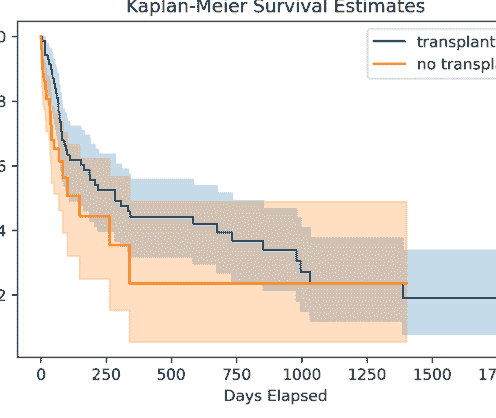

图 14.17 – Kaplan-Meier 生存估计概率函数

要生成任何一天（对应于 `stop` 时间）的确切生存概率，我们可以运行以下代码：

```
print('Non-Transplant Survival Probability at day 300: ',
KaplanMeierFitter_n.predict(300))
print('Transplant Survival Probability at day 300: ',
KaplanMeierFitter_y.predict(300))
```

这里我们可以看到移植组和非移植组在第 300 天的生存概率：

```
Non-Transplant Survival Probability at day 300:  0.3545098269168237
Transplant Survival Probability at day 300:  0.4911598783770023
```

### 步骤 3

现在，我们将使用 **对数秩检验** 来确定生存曲线在统计学上是否存在差异。在此步骤中，我们研究移植组和非移植组之间的生存是否存在任何统计学显著性。如果没有统计学显著性，那么理解协变量之间的关系及其对生存的影响就没有意义。我们之前在本书中使用 **卡方独立性检验** 查看了 **列联表分析**。这本质上就是这里的对数秩检验，我们比较两组（移植与非移植）的生存分布。我们使用这种方法是因为数据是右删失的，因此是右偏的；因此，我们处理的是非参数分布。零假设是两组之间的风险比等于 1，这意味着它们在生存或风险方面是相等的。

在以下代码示例中，我们在 `logrank_test` 函数中使用两种不同的患者分布（接受和未接受移植手术的患者）作为 A 组和 B 组：

```
from lifelines.statistics import logrank_test
lr_results = logrank_test(durations_A=data.loc[data['transplant']==0]['stop'],
                          durations_B=data.loc[data['transplant']==1]['stop'],
                          event_observed_A=data.loc[data['transplant']==0]['event'],
                          event_observed_B=data.loc[data['transplant']==1]['event'])
```

我们可以看到使用了卡方分布：

```
print(lr_results.null_distribution)
```

这显示默认分布是卡方分布：

```
chi squared
```

我们可以运行以下代码来查看检验结果：

```
lr_results.summary
```

我们还可以看到，在 5% 的显著性水平下，两组之间存在统计学上的显著差异。因此，我们可以假设继续使用 Cox 比例风险模型来理解我们之前概述的协变量与生存风险之间的关系是有意义的：

| test_statistic | P | -log2(p) |
|---|---|---|
| 4.02651 | 0.044791 | 4.480663 |

图 14.18 – 对数秩检验结果

### 步骤 4

在此，我们运行 Cox 比例风险检验，并分析所包含项的 p 值和置信区间，以确定它们在影响生存率方面是否具有统计显著性。我们查看风险比以确定它们所产生的任何影响：

```python
from lifelines import CoxPHFitter
CoxPHFitter = CoxPHFitter()
CoxPHFitter.fit(df=train_data[['age','year','surgery','transplant','stop','event']], duration_col='stop', event_col='event')
CoxPHFitter.print_summary()
```

我们可以看到，在预测生存率时，我们的四个项中有三个在 5% 的显著性水平上是显著的；根据 p 值，我们的 `surgery` 变量似乎并不显著。然而，手术的 95% 置信区间不包含 0，这表明其具有统计显著性。这种差异是因为 p 值是基于检验统计量相对于临界值计算的，而临界值是使用*风险比的对数*估计的，置信区间则基于*风险比*本身。这种差异可能意味着 `surgery` 变量是显著的，但也可能不是。由于我们没有统计上的确定性，我们应该谨慎行事，在预测未来生存率时不认为它有用。

请注意，`exp(coef)` 对应于风险比，而 `coef` 是风险比的对数。这遵循我们之前提供的关于基准时间 *t* 的预期风险值的方程。

根据风险比 (`exp(coef)`) 为 1.03，我们可以说，年龄每增加一岁（超过 48 岁），风险增加 1.03 倍，即 3%。关于我们的 `transplant` 变量，我们可以以 95% 的置信水平说，接受心脏移植使风险降低了 0.54 倍，相当于降低了 46%。

在*图 14.19* 中，我们可以看到 Cox 比例风险回归模型的结果：

| 模型 | lifelines.CoxPHFitter |
|---|---|
| 持续时间列 | stop |
| 事件列 | event |
| 基线估计 | breslow |
| 观测数量 | 171 |
| 观测到的事件数量 | 74 |
| 偏对数似然 | -298.47 |
| 拟合运行时间 | 2023-03-18 16:23:26 UTC |

| | coef | exp(coef) | se(coef) | coef lower 95% | coef upper 95% | exp(coef) lower 95% | exp(coef) upper 95% | cmp to | z | p | -log2(p) |
|---|---|---|---|---|---|---|---|---|---|---|---|
| Age | 0.03 | 1.03 | 0.01 | 0.01 | 0.06 | 1.01 | 1.06 | 0 | 2.35 | 0.02 | 5.74 |
| Year | -0.16 | 0.85 | 0.07 | -0.3 | -0.02 | 0.74 | 0.98 | 0 | -2.25 | 0.02 | 5.35 |
| Surgery | -0.64 | 0.53 | 0.37 | -1.36 | 0.08 | 0.26 | 1.08 | 0 | -1.74 | 0.08 | 3.62 |
| Transplant | -0.62 | 0.54 | 0.27 | -1.15 | -0.08 | 0.32 | 0.92 | 0 | -2.26 | 0.02 | 5.41 |
| Concordance | 0.67 | | | | | | | | | | |
| Partial AIC | 604.95 | | | | | | | | | | |
| Log-likelihood ratio test | 21.22 on 4 df | | | | | | | | | | |
| -log2(p) of ll-ratio test | 11.77 | | | | | | | | | | |

图 14.19 – Cox 比例风险模型输出

在*图 14.20* 中，我们可以看到年龄仅使风险增加 3%，并不能解释结果中的大部分方差。年龄范围大致从 9 岁到 64 岁。在没有其他协变量的情况下，我们无法确切地说出这可能是为什么，但包含更多协变量可能有助于更深入地理解这个变量。在显著变量中，`transplant` 对生存结果的影响显著最大：

```python
plt.title('Coefficients within Confidence Intervals')
CoxPHFitter.plot()
```

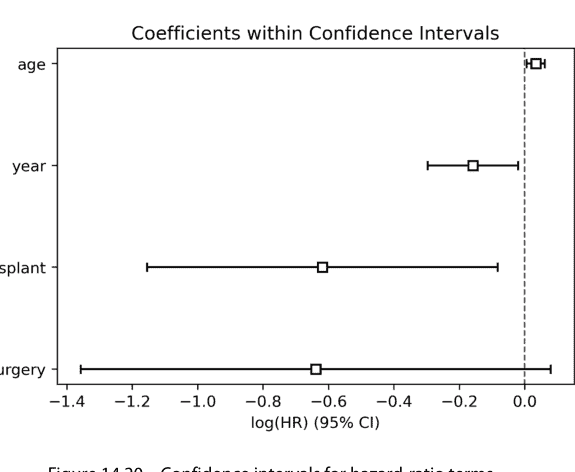

图 14.20 – 风险比项的置信区间

在*图 14.21* 的生存函数图中，我们可以看到所有患者之间风险比恒定的假设。这就是为什么防止信息性删失很重要。让我们假设这个假设成立。

请注意，在进行预测时，我们没有开始和停止时间。因此，我们只能输入给定患者的可量化协变量，如下所示：

```python
CoxPHFitter.predict_survival_function(train_data[['age','year','surgery','transplant']]).plot()
plt.xlabel('Survival Time')
plt.ylabel('Survival Probability')
plt.title('Survival Function for All Patients')
plt.legend().set_visible(False)
```

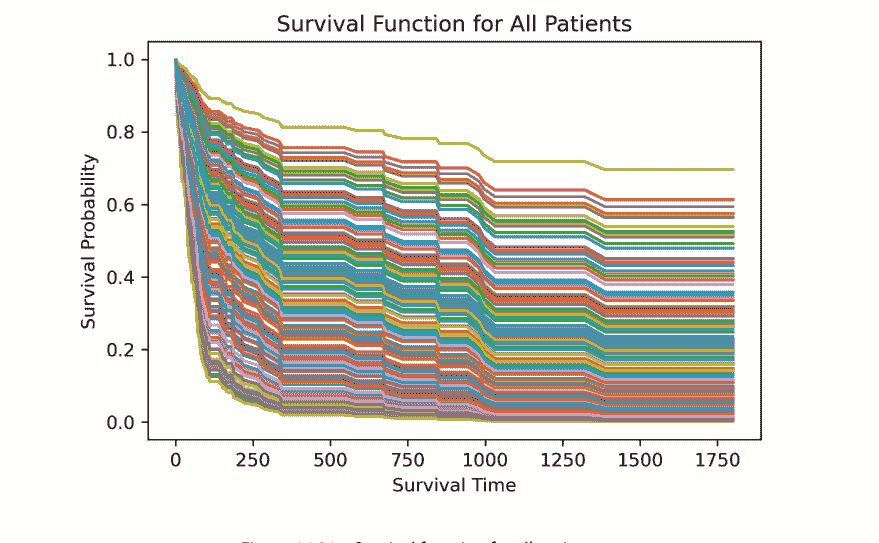

图 14.21 – 所有患者的生存函数

### 步骤 5

在*图 14.22* 中，我们可以使用 Cox 比例风险模型来预测我们保留的测试患者的生存函数：

```python
CoxPHFitter.predict_survival_function(test_data[['age','year','surgery','transplant']]).plot()
plt.xlabel('Survival Time')
plt.ylabel('Survival Probability')
plt.title('Survival Function for Holdout')
```

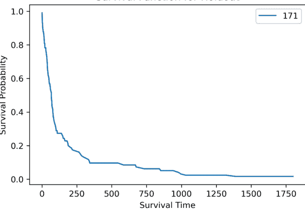

图 14.22 – 测试患者（id=171）的生存函数

要使用该患者的协变量，在每个潜在的停止点生成其生存概率，我们可以运行以下代码：

```python
CoxPHFitter.predict_survival_function(test_data[['age', 'year', 'surgery', 'transplant', 'stop', 'event']])
```

## 总结

在本章中，我们深入讨论了三种生存分析模型：Kaplan-Meier、指数模型和 Cox 比例风险回归模型。利用这些框架，我们对各种 TTE、右删失研究进行了生存函数建模，并估计了生存概率和风险比。对于多变量情况，我们使用 Cox 比例风险回归对因变量进行协变量分析的风险比建模。对于所有模型，我们都演示了如何使用置信区间和相应的 p 值来评估显著性。至此，读者应该能够自信地识别每种模型优于其他模型的场景，并适当地拟合和实施该模型，以获得战略成功所需的必要结果。

## 索引

**A**

- **累积风险函数** 369
- **赤池信息准则 (AIC)** 278
- **备择假设** 62
- **Anaconda** 4
  - URL 4
- **Anderson-Darling 检验** 91-96
- **方差分析 (ANOVA) 检验** 117, 118
  - 与成对检验的比较 117
- **ARIMA 模型** 296-299
  - 拟合 299-302
  - 使用其进行预测 302, 303
- **AR(p) 端到端示例** 277
  - 构建 280, 281
  - 预测，构建 283
  - 预测，测试 281, 282
  - AR(p) 的阶数，选择 278, 279
  - 目视检查 277
- **自相关** 253-257
  - 结构 253
- **自相关函数 (ACF)** 165, 322
- **自回归** 98
- **自回归 (AR) 模型**
  - AR(1) 模型 273-275
  - AR(2) 模型 275, 276
  - AR(p) 端到端示例 277
  - AR(p) 模型 272
  - 阶数 p，使用 PACF 识别 276
- **自回归积分滑动平均 (ARIMA)** 252, 323
- **带外生变量的自回归积分滑动平均 (ARIMAX)** 321, 326-328
  - 外生变量，预处理 328, 329
  - 模型，拟合 329-332
  - 模型性能，评估 333, 334
- **自回归滑动平均 (ARMA) 模型** 166, 256, 330, 287-289
  - AR(p) 模型，构建 291, 292
  - 预测，构建 294
  - 预测，测试 293, 294
  - ARMA(p,q) 的阶数，选择 290, 291
  - 目视检查 290
- **辅助 OLS 回归** 222
- **平均平方误差 (ASE)** 294

**B**

- **后移算子符号** 273
- **袋装法** 52
- **贝叶斯信息准则 (BIC)** 278
- **贝叶斯统计** 228
  - 贝叶斯定理 225
  - 条件概率 227
  - 讨论 228, 229
  - 概率 225, 226
- **偏差-方差权衡** 188
- **二元分类** 205
- **Bonferroni 校正** 115-117
- **自助聚合** 52
- **自助法** 45
  - 置信区间，创建 46-50
  - 相关系数（皮尔逊相关） 51, 52
  - 标准误差 51
- **卡方拟合优度检验** 135, 136
  - 功效分析 138
- **卡方独立性检验** 136-138, 379
- **整群抽样** 16
- **决定系数** 120
- **相关系数** 148-151
- **决定系数** 151, 152
- **组合** 52-55
- **条件概率** 226, 227
- **混杂变量（混杂因素）** 9
- **列联表分析** 379
- **便利抽样** 17
- **库克距离** 164
- **决定相关性** 158
- **协变量** 321
- **Cox 比例风险回归模型** 372, 373
  - 假设 373
  - 步骤 374-384
- **Cox 比例风险生存模型** 372
- **临界值** 10
- **互相关** 257-263, 322
- **互相关函数 (CCF)** 322-324
- **交叉验证** 186
- **累积密度分布** 43
- **累积分布函数 (CDF)** 66
- **周期性振荡** 157

**C**

- **分类变量**
  - 添加到多元线性回归 (MLR) 175, 176
  - 虚拟变量 175
  - 水平 175
- **删失**
  - 信息性删失 354
  - 区间删失 355
  - 左删失 354
  - 非信息性右删失 354
  - 右删失 354
  - I 型删失 355, 356
  - II 型删失 355, 356
- **中心极限定理** 45
- **集中趋势测量** 26
  - 均值 30-32
  - 中位数 29
  - 众数 26-28
- **特征方程** 251
- **特征多项式方程** 257
- **卡方列联检验** 137
- **卡方分布** 133, 134

**D**

- **数据分布**
  - 集中趋势测量 26
  - 描述 26
  - 描述性统计 26
  - 测量 26

## 形状测量 38
## 变异性测量 33

## 数据类型 20
- 区间数据 21
- 名义数据 20
- 有序数据 21
- 比率数据 22
- 可视化 22

## 数据可视化 22
- 定性数据类型，绘图 22-24
- 定量数据类型，绘图 24, 25

## 依赖事件 225

## 描述性统计 26

## Dickey-Fuller 检验 278, 338
- 原假设 278

## 差分运算 296

## 降维 196
- PCA 196-199
- PCR 199-202

## 离散模型 205

## 离散回归 217

## 降采样 312

## 持续时间分析 353

## Durbin-Watson 检验 98, 158
- 统计量 158

# E

弹性网络 194-196

经验法则 42

编码 175

内生变量 326

环境设置 3-6

## 总体方差相等性 99
- Fisher F 检验 101, 102
- Levene 检验 100
- 稳健性 99
- 检验 100

## 误差协方差矩阵 (ECM) 344

## 错误率
- 选择 81

## 事件历史分析 353

## 事件状态指示符 372

## 精确检验 55

## 外生变量 326

## 指数模型 368, 369
- 优点 371
- 缺点 371
- 示例 370, 371

## 指数生存模型 372

# F

假阴性错误 64

假阳性错误 63

## 家族错误率 (FWER) 115

## 特征选择 178, 184
- 基于性能的方法 186
- 递归特征消除 (RFE) 187, 188
- 统计方法 184

## 一阶差分 259

## 一阶线性差分 259

## Fisher F 检验 101, 102

# G

高斯判别分析 (GDA) 238

高斯分布 42

泛化 3

拟合优度 120

大衰退 346

# H

## 风险函数 359

## 风险比 359, 371, 372

异方差 154

异方差性检验 281

同方差性 154, 163

假设检验
- 均值检验 62
- 目标 61
- 步骤 63

# I

独立事件 225

个体错误率 (IER) 115

信息性删失 354

四分位距 (IQR) 34

区间删失 355

区间数据 21

可逆性 284

鸢尾花数据 211

itertools
- 参考链接 54

# J

Jarque-Bera 检验 281

Julia 3

Jupyter 4

# K

Kaplan-Meier 模型 362
- 定义 362, 363
- 示例 364-368

Kaplan-Meier 生存函数 378

Kolmogorov-Smirnov 检验 91-93

Kruskal-Wallis 检验 132

峰度 40-42, 281, 344

# L

滞后效应 257

滞后一阶自相关 158

LASSO 回归 189, 192-194

左删失 354

左尾累积函数 43

Levene 检验
- 方差相等性检验 100

杠杆值 164

线性判别分析 (LDA) 225, 229, 230, 232-236
- 假设 229
- 混淆矩阵 235, 236
- 有监督降维 236, 237

线性回归
- 所需模型假设 152-155
- 使用 OLS 145-148

线性关系 162

Ljung-Box 检验 281

逻辑分布 207

logit 模型 205-210

对数线性模型 215

对数线性负二项回归模型 217

对数秩检验 379

低通线性滤波器 250

# M

机器学习 (ML) 226
- 机器学习 (ML) 模型 122

MA(q) 模型可逆性
- 识别 284

数学库 71

最大似然估计 (MLE) 219

最大似然法 207

均值 249, 250

## 平均绝对误差 (MAE) 169

## 平均绝对百分比误差 (MAPE) 187

## 均方误差 (MSE) 186, 334

## 中位数 29
- 查找，当实例数为偶数时 29, 30
- 查找，当实例数为奇数时 29

## 模型
- 问题，使用残差解决 164
- 序列相关，处理 165-169

## 模型评估 311
- 优化持久性预测 314-317
- 重采样 312, 313
- 滚动窗口预测 317, 318
- 移位 313

## 模型拟合评估 176
- 残差的同方差性 178-180
- 独立样本 180
- 线性关系 177, 178
- 多重共线性 180
- 残差值 178

## 模型验证 169, 170
- 诊断图，用于分析模型误差 160-162
- Durbin-Watson 检验 158-160
- 残差的 QQ 图 163
- 残差影响 vs. 杠杆影响 163, 164
- 残差 vs. 拟合值 162, 163
- 尺度-位置图 163

## 移动平均 (MA) 模型
- MA(1) 模型 284, 285
- MA(2) 模型 286, 287
- MA(q) 模型 283, 284

## 多类回归 210

## 多重共线性 176

## 多项逻辑回归 210

## 多项 logit 模型 210-212

## 多元线性回归 (MLR) 173, 174
- 添加分类变量 175, 176
- 模型拟合评估 176
- 结果解释 181

## 多重检验
- 显著性检验 114

## 多阶段抽样 16

## 多元时间序列 321, 322

# N

## 美国国立卫生研究院 (NIH)
- 参考链接 374

## 自然对数 215

## 负自相关 158

## 负二项回归模型 217
- 负二项分布 217-224

## 名义数据 20

## 非信息性删失 354

## 非参数检验 125

## 非概率抽样 16
- 便利抽样 17
- 配额抽样 17

## 非平稳时间序列
- ARIMA 模型 296
- 差分数据 296
- 模型 295, 296

## 正态分布
- 累积密度分布 43
- 概率密度分布 43

## 误差的正态分布 163

## 正态分布定理 42-44

## 正态分布数据，检验 89
- Anderson-Darling 检验 93-96
- Kolmogorov-Smirnov 检验 91-93
- Shapiro-Wilk 检验 96
- 可视化检查 89-91

## 正态分布总体数据，参数检验 88
- Durbin-Watson 98
- 独立样本 97
- 稳健性 88, 89
- 检验 89

## 原假设 62
- 总体方差相等性 99
- 正态分布总体数据 88

## 简约模型 288

## 偏自相关函数 (PACF) 165, 339

## PCA 技术 196-199

## PCR 技术 196, 199-202

## Pearson 卡方检验统计量 135

## Pearson 相关系数 51, 52, 118-122

## 惩罚项 189

## 基于性能的方法，特征选择 186
- 模型比较 186, 187

## 排列计算
- 缩放 127

## 排列 52-55

## 排列检验 55, 126, 127
- 执行 55-57

## pip 4
- 参考链接 4

## 泊松分布 213-215, 368

## 泊松模型 213
- 计数数据建模 215-217

## 合并 t 检验 108

## 总体 6
- 与样本对比 6-8

## 总体推断，样本 8
- 观察性研究 9-11
- 随机化实验 8

## 正自相关 158

## 后验 228

## 功效 81
- 性质 81

## 功效分析 81, 82, 123
- 示例 123
- 用于两总体合并 z 检验 82-84
- 单样本 t 检验 123

# O

## 观察性研究 9, 10
- 优点 9

## 优势比 206

## 单比例 z 检验 78, 79

## 单样本 t 检验 104-108

## 单样本 z 检验 72-76

## 单侧检验 62

## 单尾假设检验 10

## 算子表示法 273

## 优化持久性预测 314-317

## 有序数据 21

## 普通最小二乘法 (OLS)
- 用于线性回归 145-148

## 异常值 32

## 过度离散 217

## 过拟合模型 186

# P

## 配对 t 检验 112-114

## 成对检验
- 与 ANOVA 检验对比 117

## 参数分布 42

## 参数假设检验 102

## 参数检验
- 假设 87, 88
- 违反假设 125

PPMCC 检验 118

主成分 (PCs) 196

先验 228

概率密度分布 43

生存概率 359

概率抽样 11, 12
- 整群抽样 16
- 简单随机抽样 13
- 分层抽样 14-16
- 系统抽样 13, 14

probit 模型 205-210

probit 回归 207

p 值 11

Python 3
- URL 3

# Q

二次判别分析 (QDA) 225, 238-243

定性数据 20
- 绘图 22-24

分位数-分位数 (QQ) 图 89, 163

定量数据 20
- 绘图 24, 25

配额抽样 17

# R

随机森林 52

随机化检验 55

随机化实验
- 特征 8
- 处理随机分配 8, 9
- 随机抽样 8

秩和检验 128
- 示例 129, 130
- 正态近似 129
- 检验统计量程序 128

比率数据 22

递归特征消除 (RFE) 187, 188

正则化 189

可靠性分析 353

可靠性理论 353

再随机化检验 55

重采样技术 312

残差
- 问题，使用残差解决 164
- 与拟合值对比图 162
- 与杠杆影响对比图 163, 164

结果解释 181
- 分类变量系数解释 183
- 连续变量系数解释 183
- 诊断检验 184
- 高级统计量和指标 182
- 模型系数详情 183

岭回归 189
- 示例 190-192

岭回归系数估计 190

右删失 354
- 在生存分析中，用于癌症研究 355

滚动窗口预测 317, 318

均方根误差 (RMSE) 187

R 平方统计量 157

# S

样本 6

抽样 3

抽样方法 11
- 非概率抽样 16, 17
- 概率抽样 11, 12

SARIMA 模型 305

## 索引

尺度-位置图 163
推断范围 62
季节性ARIMA模型 304
    拟合 306-308
    预测 309, 310
    季节性ARIMA 305
    季节性差分 304
带外生变量的季节性自回归积分移动平均模型 (SARIMAX) 330
季节性 296, 304
无放回抽样情况 226
有放回抽样情况 226
自选择 8
序列相关 158, 253
形状度量 38
    峰度 40-42
    偏度 38-40
Shapiro-Wilk检验 91, 96, 97
收缩方法 188
    弹性网络 194-196
    LASSO回归 192-194
    岭回归 189-192
收缩惩罚 189
信号 250
符号秩检验 130-132
显著性
    检验 156-158
显著的p值 157
简单线性回归 (SLR) 173
简单随机抽样 13
偏斜 344
偏态分布 38-40
偏度分数 281
斯皮尔曼等级相关系数 139, 140
标准差 45
标准化 96
标准正态分布 42, 43
标准正态概率分布 42
平稳性 265-270
平稳时间序列 250
    自回归 (AR) 模型 272
    自回归移动平均 (ARMA) 模型 287-289
    移动平均 (MA) 模型 283
平稳白噪声 252
统计离散分布 368
统计度量 249
    自相关 253-257
    互相关 257-263
    均值 249, 250
    方差 251-253
统计方法，特征选择 184
    相关性 184, 185
    统计显著性 185, 186
统计功效 82
层 14
分层随机抽样 9
分层抽样 14-16
生存分析 353
生存数据 356
生存函数 357, 358
系统抽样 13, 14

# T

t分布 102, 103
测试数据集 186
检验统计量 10
时间序列互相关 322
事件时间变量分析 353
训练数据集 186

## 变换

- 立方根变换 57
- 对数变换 57
- 平方根变换 57
- 变换后的直方图 58

## t检验

- 均值检验 103
- 单样本检验 104-108
- 配对t检验 112-114
- 执行 103
- 合并t检验 108
- 双样本t检验 108-112

## 图基围栏

## 调优参数

## 双总体合并z检验

- 功效分析 82-84

## 双比例z检验

## 双样本t检验

- 合并t检验 108-110
- Welch's t检验 111, 112

## 双样本z检验

## 双侧检验

## 双尾假设检验

## 双尾概率密度函数

## I型删失

## I型错误率

## I型错误

## II型删失

## II型错误率

## II型错误

# U

## 单位根

## 单变量时间序列

## 上采样

# V

## 变异性度量

- 四分位距 33-36
- 极差 33
- 图基围栏 36, 37
- 方差 37

## 方差

## 方差膨胀因子 (VIF)

## 向量自回归 (VAR)

- 互相关，评估 340-344
- 预测，构建 347, 348
- 预测，检验 346, 347
- AR(p) 阶数 339, 340
- VAR(p,q) 模型 344, 345
- 目视检查 338, 339

## venv

- URL 4

## 目视检查

- 正态分布数据 89-91

## Visual Studio Code

# W

## Wald方法

## Welch-Satterthwaite调整

## Welch's t检验

## 白噪声模型

## 白噪声方差

## Wilcoxon符号秩检验

## Wolfram Alpha

- URL 305

# Y

## Yates连续性校正

## Yule-Walker方法

# Z

- **z比率** 219
- **z分数** 65
    - 计算 65-67
- **z统计量** 68-71
- **z表**
    - URL 66
- **z检验** 65
    - 均值检验 72
    - 比例检验 78
    - 单比例z检验 78, 79
    - 单样本z检验 72-76
    - 双比例z检验 79, 80
    - 双样本z检验 76-78