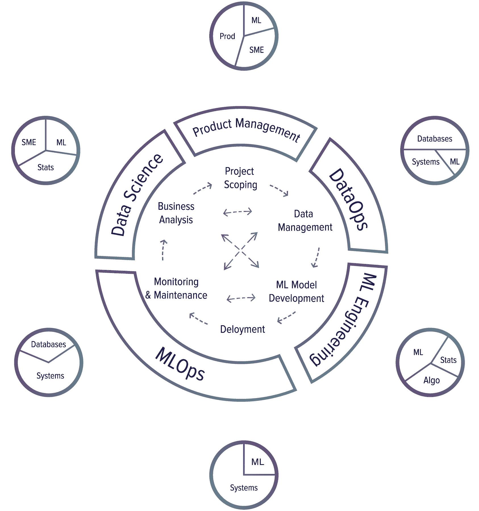

# 1.1.3.1 生产周期

> 原文：[`huyenchip.com/ml-interviews-book/contents/1.1.3.1-production-cycle.html`](https://huyenchip.com/ml-interviews-book/contents/1.1.3.1-production-cycle.html)

要了解生产中涉及机器学习的不同角色，让我们首先探索生产周期中的不同步骤。生产周期中有六个主要步骤。

> ⚠ 在每个步骤中列出的主要技能 ⚠
> 
> 下面每个步骤中列出的主要技能可能会让很多人感到不安，因为任何试图将复杂、细微的话题简化为几句话的尝试都会如此。这部分应仅用作参考，以了解不同机器学习相关工作的所需技能集。

1.  **项目范围**

    一个项目从确定项目范围开始，制定目标与目标、约束条件和评估标准。应识别并涉及利益相关者。应估算并分配资源。

    主要技能需求：产品管理、专业知识以理解问题、一些机器学习知识以了解机器学习能解决什么和不能解决什么。

1.  **数据管理**

    机器学习系统使用和生成的大量且多样化的数据，需要可扩展的基础设施来快速且可靠地处理和访问它。数据管理包括数据源、数据格式、数据处理、数据控制、数据存储等。

    主要技能需求：数据库/查询引擎以了解如何存储/检索/处理数据，系统工程以实现分布式系统来处理大量数据，最小限度的机器学习知识以优化组织数据以适应机器学习访问模式会有所帮助，但不是必需的。

1.  **机器学习模型开发**

    从原始数据中，你需要创建训练数据集，并可能对其进行标记，然后生成特征、训练模型、优化模型并评估它们。这是需要最多机器学习知识且通常在机器学习课程中涵盖的阶段。

    主要技能需求：这是流程中需要最多机器学习知识、统计学和概率来理解和评估模型的部分。由于特征工程和模型开发需要编写代码，这部分需要编码技能，尤其是在算法和数据结构方面。

1.  **部署**

    模型开发完成后，需要使其对用户可访问。

    主要技能需求：将机器学习模型带给用户在很大程度上是一个基础设施问题：如何设置你的基础设施或帮助客户设置他们的基础设施以运行你的机器学习应用。这些应用通常是数据密集型、内存密集型和计算密集型的。除非你能将这些推到流程的上一步，否则可能还需要机器学习来压缩机器学习模型和优化推理延迟。

1.  **监控和维护**

    一旦投入生产，模型需要监控性能衰减并进行维护/更新以适应不断变化的环境和需求。

    主要所需技能：监控和维护也是一个基础设施问题，需要计算机系统知识。监控通常需要生成和跟踪大量系统生成数据（例如日志），管理这些数据需要了解数据管道。

1.  **商业分析**

    模型性能需要与业务目标进行评估，并进行分析以生成业务见解。然后，可以使用这些见解来消除低效的项目或规划新的项目。

    主要所需技能：这一过程需要机器学习知识来解释机器学习模型的输出和行为，深入的概率和统计学知识来从数据中提取见解，以及专业知识将这些见解映射到机器学习模型旨在解决的实践问题。

##### 技能标注

+   **系统**: 系统工程，例如构建分布式系统、容器部署。

+   **数据库**: 数据管理、存储、处理、数据库、查询引擎。这与**系统**密切相关，因为你可能需要构建分布式系统来处理大量数据。

+   **机器学习**: 线性代数、机器学习算法等。

+   **算法**: 算法编码

+   **统计学**: 概率、统计学

+   **SME**: 专业知识

+   **产品管理**: 产品管理

我在业界看到的最成功的机器学习生产方法是**迭代和增量开发**。这意味着你不能真正完成一个步骤，然后转到下一个步骤，永远不再回来。在各种步骤之间有很多来回。

在构建一个用于预测用户在搜索查询时是否应该显示广告的机器学习模型时，你可能会遇到以下常见的工作流程^(8)。

^(8): 祈祷和哭泣并未在过程中体现，但贯穿始终。

1.  选择一个指标进行优化。例如，你可能希望优化展示次数——广告被展示的次数。

1.  收集数据和获取标签。

1.  设计功能。

1.  训练模型。

1.  在错误分析过程中，你意识到错误是由错误的标签引起的，因此你重新标注数据。

1.  再次训练模型。

1.  在错误分析过程中，你意识到你的模型总是预测不应该显示广告，原因是 99.99%的数据是未显示的（对于大多数查询，广告不应该显示）。因此，你必须收集更多关于应该显示的广告的数据。

1.  再次训练模型。

1.  模型在现有的测试数据上表现良好，到目前为止已有两个月。但在昨天的测试数据上表现不佳。你的模型已经退化，因此你需要收集更多最近的数据。

1.  再次训练模型。

1.  部署模型。

1.  模型似乎表现良好，但随后业务人员敲响了你的门，询问为什么收入在下降。结果是广告被展示出来，但几乎没有人点击它们。所以你想要改变你的模型，以优化点击率。

1.  从头开始。

有许多人在生产环境中会参与机器学习项目——机器学习工程师、数据科学家、DevOps 工程师、领域专家（SMEs）。他们可能来自非常不同的背景，使用着不同的语言和工具，但他们都应该能够高效地在这个系统中工作。跨职能的沟通和协作至关重要。

> 🌳 **提示**🌳
> 
> 作为候选人，理解这个生产周期非常重要。首先，它让你对将模型带入现实世界所需的工作以及可能的角色有一个概念。其次，它帮助你避免那些由于背后的组织没有以允许迭代开发和跨职能沟通的方式设置而注定要失败的机器学习项目。
