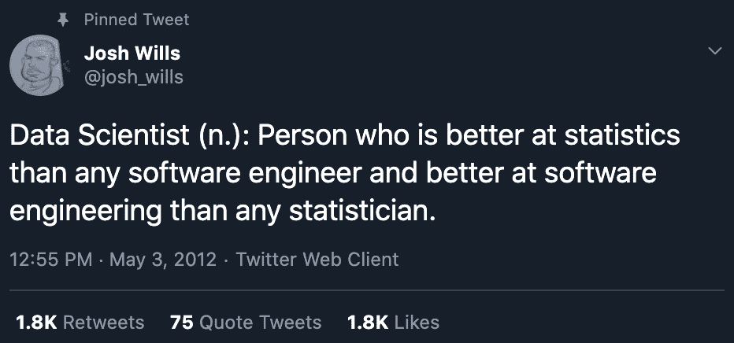

# 1.1.3.3 机器学习工程师与数据科学家

> 原文：[`huyenchip.com/ml-interviews-book/contents/1.1.3.3-machine-learning-engineer-vs.-data-scientist.html`](https://huyenchip.com/ml-interviews-book/contents/1.1.3.3-machine-learning-engineer-vs.-data-scientist.html)

机器学习工程师可能大部分时间都在处理和理解数据。这引发了一个问题：数据科学家与机器学习工程师有何不同？

数据科学家和机器学习工程师的角色之间存在许多重叠的原因。

首先，根据维基百科，“*数据科学是一个多学科领域，它使用科学方法、过程、算法和系统从结构化和非结构化数据中提取知识和洞察*。”由于机器学习模型从数据中学习，**机器学习是数据科学的一部分**。

其次，传统上，公司拥有数据科学团队，从数据中生成业务洞察。当机器学习在 2010 年代初复兴时，公司开始考虑使用机器学习。在投资建立完整的机器学习团队之前，公司可能希望从小型机器学习项目开始，看看机器学习是否能够增加价值。这种探索的自然候选者是已经与数据一起工作的团队：数据科学团队。

第三，数据科学团队的任务，包括需求预测，可以使用机器学习模型来完成。这也是大多数数据科学家过渡到机器学习角色的方式。

然而，机器学习工程与数据科学之间存在许多差异。数据科学的目标是**生成业务洞察**，而机器学习工程的目标是**将数据转化为产品**。这意味着数据科学家往往更擅长统计学，而机器学习工程师往往更擅长工程。机器学习工程师肯定需要了解机器学习算法，而许多数据科学家可以在不接触机器学习的情况下完成他们的工作。

随着公司对机器学习的采用成熟，它可能希望拥有一个专门的机器学习工程团队。然而，随着越来越多的现成和预训练模型可以即插即用，开发机器学习模型可能需要的机器学习知识可能更少，机器学习工程和数据科学将更加统一。

