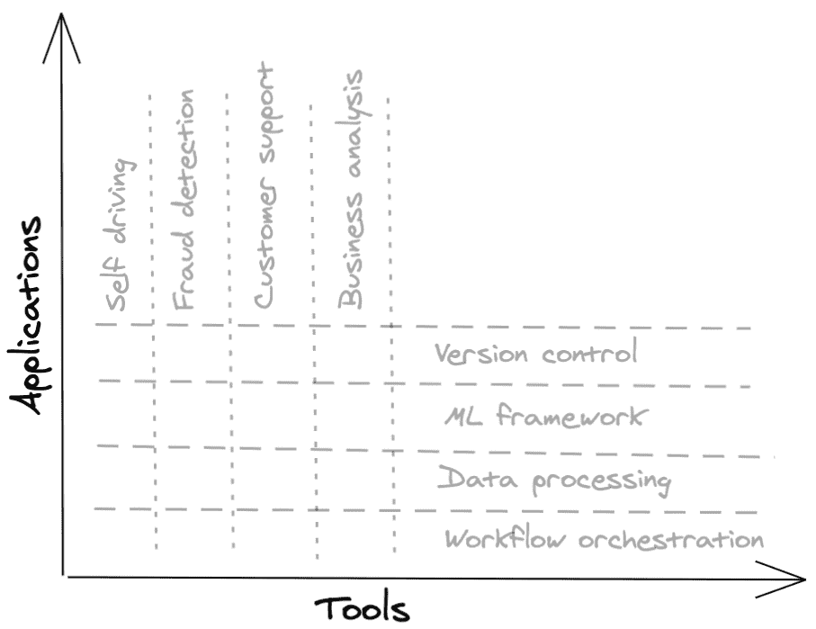

# 1.2.1 应用公司 vs. 工具公司

> 原文：[`huyenchip.com/ml-interviews-book/contents/1.2.1-applications-companies-vs.-tooling-companies.html`](https://huyenchip.com/ml-interviews-book/contents/1.2.1-applications-companies-vs.-tooling-companies.html)

**👱 个人故事 👱**

在加入 NVIDIA 之后，我想加入一家早期阶段的创业公司。我正在考虑两家表面上相似的 AI 创业公司。两家公司都刚刚完成了种子轮融资。两家公司都有大约 10 名员工，其中大多数是工程师，并准备进行高速增长。

创业公司 A 已经有了三个客户，刚刚雇佣了第一位销售员，并准备雇佣更多销售员以积极销售。创业公司 B 有两个客户，他们称之为设计合作伙伴，还没有计划雇佣销售员。我更喜欢创业公司 B 的工作，但认为创业公司 A 的销售前景比创业公司 B 更好，而对于早期阶段的创业公司来说，销售对于生存至关重要。

当我把这个困境告诉一个投资了与 A 和 B 类似公司的朋友时，他指出了我忘记考虑这两个创业公司之间的关键区别：A 是一家应用公司，而 B 是一家工具公司。

应用公司提供应用程序来解决特定的商业问题，例如商业分析或欺诈检测。工具公司创建工具来帮助公司构建自己的应用程序。工具的例子包括 TensorFlow、Sparks、Airflow、Kubernetes。

在行业术语中，一个应用被说成是针对一个垂直领域，而一个工具则针对一个水平领域。

应用程序可能是由不想被工程方面所累的领域专家使用的（例如，想要欺诈检测应用程序的银行家或想要对客户票据进行分类的应用程序的客户代表）。工具可能是由开发者使用的。其中一些明确被称为开发工具。

在一开始，销售应用程序更容易，因为更容易看到应用程序的即时影响，并且采用应用程序的 overhead 较少。例如，你可以告诉一家公司，你可以以 10%更高的准确率检测欺诈交易，该公司只需将他们的数据输入到你的应用程序中，就可以得到结果，知道一笔交易是否欺诈。

对于一个公司来说，采用一个工具需要大量的工程 overhead。他们可能需要更换现有的工具，将新工具与他们的基础设施集成，重新培训员工或更换员工。许多公司希望在工具证明其对大量公司的有用性和稳定性之后才采用它。

然而，对于工具公司来说，销售在后期会容易得多。一旦你的工具已经拥有足够多的熟练使用并偏好它的工程师，其他公司可能就会成为用户，而无需你进行销售。然而，对于新工具来说，达到这个临界质量是非常困难的，因此，总的来说，工具公司的风险比应用程序公司要高。

和我的朋友交谈后，我意识到对于像 A 这样的公司来说，在早期拥有比像 B 这样的公司更多的客户是正常的。但这并不意味着 A 有更好的销售前景。事实上，有两个大型公司作为设计合作伙伴对 B 来说是一个非常好的迹象。

一年后，两家公司都获得了相似数量的客户，并增长到大约 30 名员工，但公司 A 超过一半的人都在销售部门，而公司 B 的 80%的人都在工程部门。

这种新的理解帮助我缩小了选择范围。因为我更喜欢为开发者构建工具，并希望在一个以工程为先而不是以销售为先的组织中工作，所以这个决定变得容易多了。

> ⚠ 不确定性 ⚠
> 
> 一家公司是应用程序公司还是工具公司可能只是进入市场的策略。例如，你有一个新的工具可以解决公司尚未意识到的用例，你知道要说服公司为不确定的用例对现有基础设施进行重大改变是很困难的。所以你提出了一个没有你的工具就无法完成的令人信服的用例，围绕这个用例构建一个应用程序，然后销售这个应用程序。一旦客户意识到你的工具的有用性，你就转向直接销售工具。

* * *

> 🌳 **提示** 🌳
> 
> 如果你不确定这个角色是否涉及与一个应用程序或工具一起工作，这里有一些你可能想问的问题。
> 
> +   你的产品的主要用户是谁？
> +   
> +   你针对的是哪些用例？
> +   
> +   你的公司有多少人？有多少是工程师？有多少是在销售部门？

* * *

*这本书是由[Chip Huyen](https://huyenchip.com)在众多朋友的帮助下创作的。对于反馈、勘误和建议，作者可以通过[这里](https://huyenchip.com/communication/)联系。版权©2021 Chip Huyen。*
