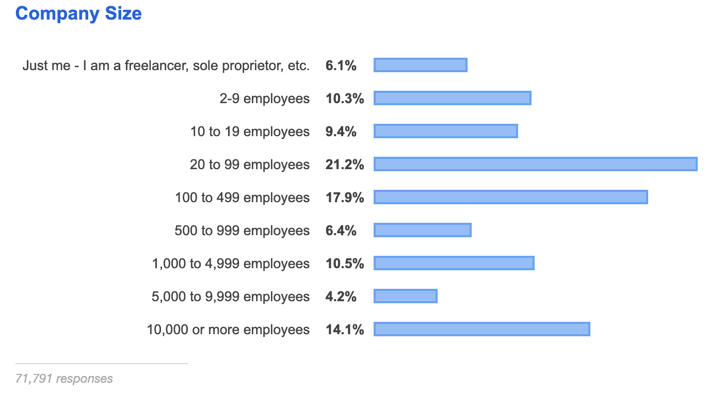
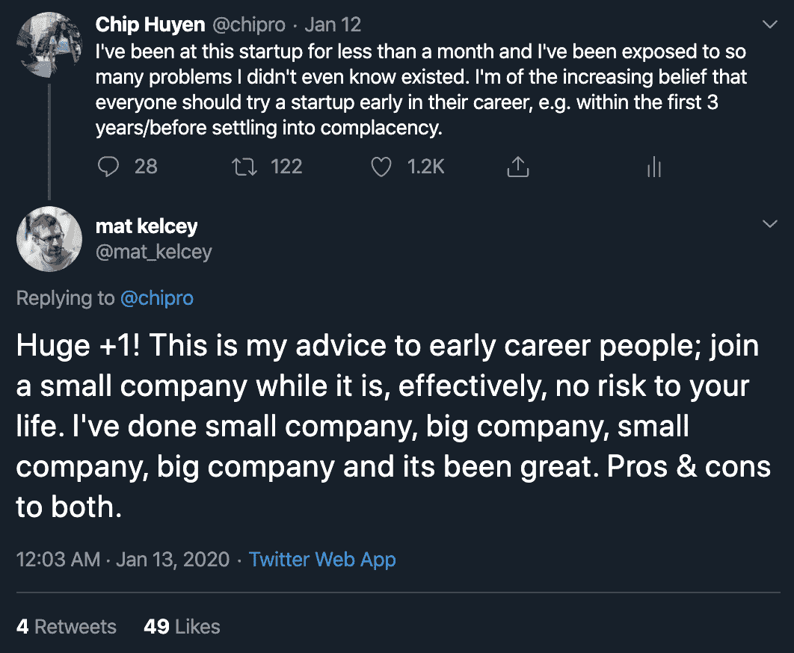

# 1.2.3 初创公司或大公司

> 原文：[`huyenchip.com/ml-interviews-book/contents/1.2.3-startups-or-big-companies.html`](https://huyenchip.com/ml-interviews-book/contents/1.2.3-startups-or-big-companies.html)

这是我经常从职业生涯早期的人那里听到的问题，也是一个可能引发热烈讨论的问题。我在大公司和初创公司都工作过，我的印象与通常所说的在大公司稳定性和初创公司高影响（高风险）之间的权衡相当一致。

|  | **大型公司** | **初创公司** |
| --- | --- | --- |
| **优点** |

+   品牌知名度。对你的简历有好处。

+   稳定性。FAAAM 的股票不太可能很快变得一文不值。

+   角色定义明确。你不必像在初创公司那样工作那么辛苦。

+   有一个标准的晋升程序。只要合理地完成你的工作，你就没问题了。

+   (希望)良好的代码审查可以帮助你成为一名更好的工程师。

+   有许多聪明的人可以一起工作。指导和辅导。

+   福利：免费食物、免费按摩、免费租车、免费 Lyft 代码、慷慨的 401(k)匹配、...

|

+   可以对产品做出重大贡献。

+   更多的自主权和更多的决策权。

+   可以认识所有人。

+   可以同时做很多事情，使工作更有趣。

+   技术和非技术上的大局观。你可以看到整个软件栈，并看到公司作为一个整体是如何运行的。

+   可以随着公司成长并获得比在大公司更快地晋升。

+   会学到很多东西。

+   没有满足现状的风险。

+   可能会赚到很多钱。

|

| **缺点** |
| --- |

+   容易陷入满足现状。

+   你将只是系统中的一个齿轮。你的努力或缺乏努力不会改变任何事情。

+   你可能只会接触到一小部分代码。你的工作很快就会变得无聊。

+   管理层不太可能询问你对公司未来方向的看法。

+   会议太多。

|

+   当你告诉别人关于公司的事情时，他们会说：“什么？”。

+   初创公司可能会失败，你的 0.1%股份将变得毫无价值。

+   必须处理很多事情，甚至是你不喜欢的事情。

+   恶劣的代码审查。一年后，你可能会成为一个更差的程序员。

+   较少的指导。

+   初创公司没有像 Google 那样多的世界级工程师供你一起工作。

+   更少的福利。

|

从统计学的角度来看，软件工程师更有可能在大公司而不是小初创公司工作。尽管小公司比大公司多，但大公司雇佣了更多的人。根据[StackOver Developer Survey 2019](https://insights.stackoverflow.com/survey/2019#company-type)，超过一半的 71K 受访者在大公司工作，至少有 100 名员工。

我找不到针对 ML 特定角色的调查，所以我向[Twitter 提问并找到了类似的结果](https://twitter.com/chipro/status/1305627992069230592)。这意味着平均来说，MLE 最有可能在至少有 100 名员工的公司工作。

> 🌳 **提示** 🌳
> 
> 我经常在职业书籍中听到和读到的一些建议是，毕业生应该加入大公司。给出的理由是：
> 
> +   大公司给你带来可以在简历上使用的品牌名字，并且你可以终身从中受益。
> +   
> +   大公司通常有标准化的技术栈和良好的工程实践。
> +   
> +   主要科技公司提供良好的薪酬福利。为他们工作即使只是短暂的时间，也会让你有足够的钱去追求未来的风险投资。
> +   
> +   了解大公司是如何运作的很好，因为后来你加入或创立的小公司可能会最终变得很大。
> +   
> +   你会知道在大公司工作的感觉，所以你再也不必再好奇了。
> +   
> +   大多数初创公司都是不好的初创公司。在大公司工作一段时间将更好地装备你，以技术技能和经验来区分好的初创公司和坏的初创公司。
> +   
> +   对于移民来说，大公司可能是唯一的选择，因为小公司负担不起签证担保。
> +   
> 如果你想要最大化你未来的职业选择，花一年时间，或者甚至只是一个实习，在大公司工作，这不是一个坏策略。
> 
> 无论你选择加入初创公司还是大公司，我希望你有机会体验这两种环境，并学习他们教授的非常不同的技能集。你不知道你喜欢什么，直到你尝试过。你可能会加入一家大公司，然后意识到你再也不想加入另一家大公司，或者你可能会加入一家初创公司，然后意识到你无法没有大公司提供的稳定性而生活。
> 
> 如果你相信你得到了一个一生只有一次的机会，那就抓住它，无论是在大公司还是初创公司。

* * *

> **👱 个人故事 👱**
> 
> 毕业后，[我加入了英伟达，不是因为它是家大公司，而是因为我兴奋于有机会加入一个全新的团队，参与挑战性的项目](https://huyenchip.com/2018/10/08/career-advice-recent-cs-graduates.html)。
> 
> 回顾过去，我意识到英伟达的品牌名字帮助我的工作得到了重视。如果我在一家不知名公司做一名不知名的员工，我可能会更加默默无闻。
> 
> 我在英伟达待了一年半后加入了一家初创公司。我想要一个快速发展的环境，有陡峭的学习曲线，并且我没有失望。

* * *

> 🌳 **对早期职业工程师的建议：了解你正在优化的目标** 🌳
> 
> 在每一次职业决策中，要留意你正在优化的目标，这样你才能更接近你最终的目标。你可以优化的目标包括：
> 
> +   **现在的钱**：有些人需要或想要立即的钱，例如偿还债务或为即将到来的经济衰退做准备，他们认为这种衰退将在不久的将来发生。他们可能会面试多家公司，选择出价最高的。这没有什么不妥。
> +   
> +   **未来的金钱**：有些人更关心未来能赚很多钱。他们可能会选择攻读一个几乎不赚钱的博士学位，但将来能帮助他们获得高薪工作。
> +   
> +   **影响**：有些人专注于产生影响。你可能会为一家允许你做出影响数百万用户决策的初创公司工作，或者为一家改变人们生活的非营利组织工作。
> +   
> +   **体验多样性**：我遇到的最有趣的人总是追求新的体验。他们选择那些能让他们做以前从未做过的事情的工作。
> +   
> +   **品牌知名度**：选择为你的领域中最知名的公司或个人工作不是一个坏策略。这个品牌可以为你打开很多门。
> +   
> +   **个人成长**：那些优化这个方面的人会选择那些能让他们学到最多东西的工作，从而最大化他们的职业选择。他们可能会选择一份工作，因为它提供了指导或允许他们从事新的、具有挑战性的任务。
> +   
> 你可以在生活的不同阶段优化不同的事情，但你一次只能优化一件事情。当你年轻的时候，你可能优化新的体验；当你开始承担更多责任时，你可能优化金钱和认可；当你有足够的钱不必担心这些时，你可能优化影响。
> 
> 如果你不知道你在优化什么，那就优化个人成长。获得一套技能，这套技能能最大化你未来的选择^(14)。

**🌊 资源 🌊**

[Twitter 线索：给想要离开大公司加入初创公司的人的建议](https://twitter.com/jensenharris/status/984268938568544256) 由 Jensen Harris。

[如何在科技领域致富，保证成功](https://startupljackson.com/post/135800367395/how-to-get-rich-in-tech-guaranteed) (Startups and Shit, 2016)。

[Twitter 线索：加入初创公司不是一夜暴富的方案](https://twitter.com/chipro/status/1236375168726913024) 由我（不要脸地自夸）

* * *

^(14)：这是最大熵原理的一个推论：最能代表当前知识状态的概率分布是熵最大的分布。

* * *

*这本书是由 [Chip Huyen](https://huyenchip.com) 在众多朋友的帮助下创作的。对于反馈、勘误和建议，作者可以通过[这里](https://huyenchip.com/communication/)联系。版权©2021 Chip Huyen.*
