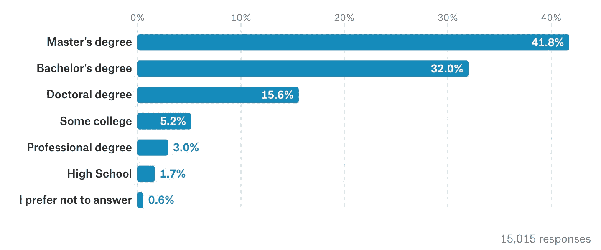

# 2.1.1.5 我需要博士学位才能在机器学习领域工作吗？

> 原文：[`huyenchip.com/ml-interviews-book/contents/2.1.1.5-do-i-need-a-ph.d.-to-work-in-machine-learning.html`](https://huyenchip.com/ml-interviews-book/contents/2.1.1.5-do-i-need-a-ph.d.-to-work-in-machine-learning.html)

不，你不需要博士学位才能在机器学习领域工作。

认为需要博士学位的人通常会引用研究科学家职位招聘信息，其中列出“博士学位”作为要求。首先，研究科学家角色在机器学习生态系统中只占很小的一部分。其他角色，包括流行的机器学习工程师，都不需要博士学位。

即使对于研究科学家来说，也有很多错误的否定。例如，OpenAI，世界上顶尖的人工智能研究实验室之一，为其研究科学家职位只列出了两个要求：

1.  在机器学习中提出新想法的记录

1.  在创建高性能深度学习算法实现方面的经验（可选）^(22)。在机器学习领域做出杰出工作但没有博士学位的人名单很长，包括当前的 OpenAI 首席技术官、IBM Watson 首席发明家、PyTorch 创建者、Keras 创建者等。

公司知道你不需要博士学位来做机器学习研究，但仍然要求有博士学位，因为这表明你对研究是认真的。在许多公司，筛选你的简历的人可能不是技术人员，因此他们依赖于像博士学位这样的弱信号来决定是否将你的简历转交给招聘经理。

需要博士学位的工程职位是例外，而不是常态。一些候选人抱怨他们因为缺乏博士学位而被大公司拒绝。除非拒绝明确指出这一点，否则不要将相关性误认为是因果关系。拥有博士学位的人也会被拒绝。

2017 年 11 月，[Kaggle 对其 16,000 名用户进行了调查](https://www.kaggle.com/kaggle/kaggle-survey-2017)，发现 15.6%的数据科学工作者拥有博士学位，41.8%只有硕士学位，32%只有学士学位。然而，在收入最高的人群中，37.3%（年收入超过 20 万美元）和 41%（年收入 15 万至 20 万美元）拥有博士学位。

如果你认真对待研究，鼓励你拥有博士学位。然而，你不应该因为没有博士学位而停止申请工作。如果你对某家公司感兴趣，建立你的作品集，并申请。

* * *

^(22)：当谷歌 AI 在东京开设办公室时，其研究科学家职位的要求包括博士学位，但谷歌 AI 东京的创始研究科学家 David Ha 没有博士学位。
