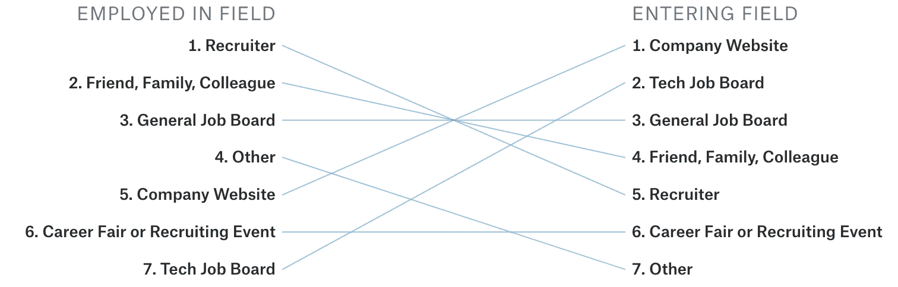
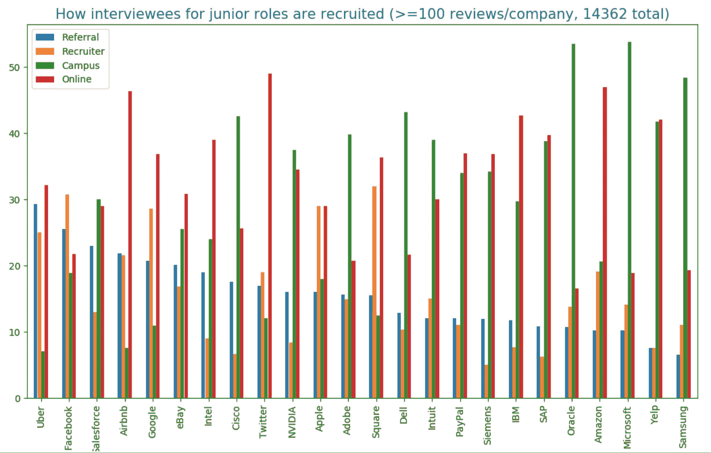

# 2.1.2 公司如何寻找候选人

> 原文：[`huyenchip.com/ml-interviews-book/contents/2.1.2-how-companies-source-candidates.html`](https://huyenchip.com/ml-interviews-book/contents/2.1.2-how-companies-source-candidates.html)

要获得工作机会，可能有助于将自己置于雇主关注的焦点。在所有可能的候选人来源渠道中，推荐无疑是最好的渠道。招聘人员长期以来一致认为推荐非常有效。以下是一些数据：

1.  [82% 的雇主认为员工推荐优于所有其他来源，是产生最佳投资回报率的方式](https://cdn2.hubspot.net/hub/77464/file-17173226-pdf/docs/careerbuilder_referral_madness_ebook.pdf)。

1.  [与通过职业网站寻找的候选人相比，推荐候选人的招聘速度要快 55%](https://www.hrtechnologist.com/articles/recruitment-amp-onboarding/3-reasons-why-referrals-are-the-way-forward-for-recruitment-in-2018/)。

1.  [与来自招聘网站的员工相比，推荐员工的留存率在两年后为 45%，而后者为 20%](https://www.ere.net/10-compelling-numbers-that-reveal-the-power-of-employee-referrals/)。

1.  [推荐候选人接受工作机会的可能性比通过职业网站寻找的候选人高出 2.6% 到 6.6%](https://www.glassdoor.com/research/studies/interview-sources/)。

1.  在所有职位中，[推荐占 7% 的申请，但占所有招聘的 40%](https://theundercoverrecruiter.com/infographic-employee-referrals-hire)。如果你被推荐，你几乎有 6 倍的可能性获得你梦寐以求的工作。

Sam Altman，OpenAI 的首席执行官和 Y Combinator 的前总裁，写道：“[*我所见过的最佳候选人来源至少比其他来源高出 10 倍，那就是朋友和朋友的推荐*](https://blog.samaltman.com/how-to-hire)”。

Lukas Biewald，Figure Eight 和 Weights & Biases 这两家机器学习初创公司的创始人，分析了 129 名新员工的绩效，并得出结论：

“[*推荐质量极其重要——我参与过的八个最糟糕的招聘案例中，所有这些人在招聘时都对我以及公司里的每个人都一无所知……平均而言，招聘的员工可能是‘可能会再次招聘’的，但平均员工或个人推荐是‘肯定会再次招聘’的*](https://lukasbiewald.com/2013/10/29/metrics-and-hiring/)”。

对 27 家主要科技公司软件工程相关职位的 15,897 份 Glassdoor 面试评价的分析显示：“[*对于初级职位，大约有 10% - 20% 的到达现场面试的候选人是通过推荐来的，优步以近 30% 的比例领先。对于高级职位，这个比例更高。Salesforce、优步和思科的高级现场候选人中，大约有 30% 是通过推荐来的*](https://huyenchip.com/2019/08/21/glassdoor-interview-reviews-tech-hiring-cultures.html)”。

Kaggle 在 2017 年进行的[数据科学和机器学习调查](https://www.kaggle.com/kaggle/kaggle-survey-2017)显示，尽管大多数寻求进入该领域的人通过公司网站和技术招聘板寻找工作，但大多数已经在该领域工作的人是通过招聘人员的主动联系或推荐获得工作的。

对于初级职位，现场候选人的最大来源是校园招聘。微软和甲骨文超过一半的面试者是通过校园活动，如招聘会和科技讲座招募的。像谷歌、Facebook 和 Airbnb 这样的互联网巨头对校园招聘的依赖较少，但校园招聘仍占其现场候选人的 20%到 30%。大型科技公司将他们的招聘重点集中在少数几所热门工程学院：斯坦福大学、加州大学伯克利分校、麻省理工学院、加州理工学院、卡内基梅隆大学、多伦多大学和滑铁卢大学。从这些学校招募的学生然后推荐他们的同学。这个循环不断进行，将这些主要科技公司变成了一个技术常春藤校友混合会。

从雇主的视角来看，针对他们最有希望的来源可以降低招聘成本以及灾难性招聘的风险。因此，对于通过不太有希望的来源，如在线申请提交简历的大多数候选人来说，默认信息是“谢谢，再见。”这个过程远非理想，因为它创造了一个排他性、反英才主义的氛围。许多有资格的人仅仅因为没去对学校或没有正确的网络而被拒绝。

如果你就是这些统计上不幸的候选人之一，你可以希望的是你有一套吸引招聘人员的技能和/或作品集。在每家公司，大约有 15%到 25%的初级职位现场候选人被招聘人员联系。对于高级职位，这个数字翻倍。

如果其他所有方法都失败了，提交你的申请并希望一切顺利。对在线申请人最友好的公司是 Twitter、Amazon 和 Airbnb，大约一半的现场候选人都是在线申请人。最有可能拒绝希望在线申请人的公司是 Facebook、微软和甲骨文。

* * *

*本书由[Chip Huyen](https://huyenchip.com)在众多朋友的帮助下创作。对于反馈、勘误和建议，作者可以通过[这里](https://huyenchip.com/communication/)联系。版权©2021 Chip Huyen。*
