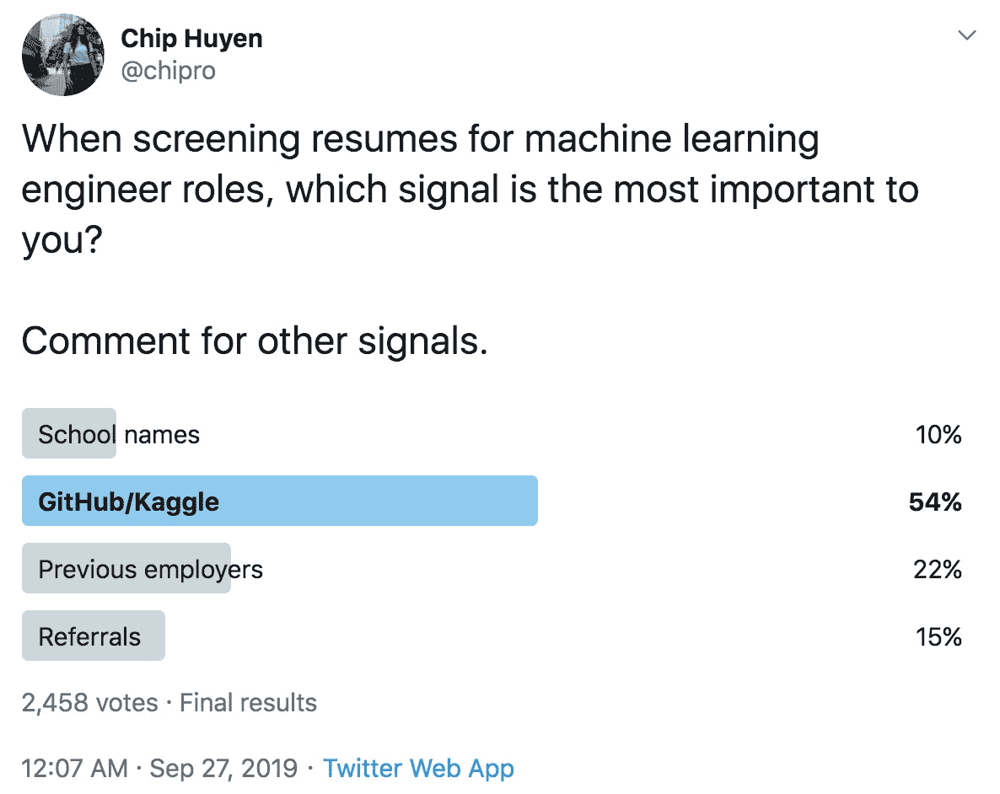

# 2.1.3 公司在候选人中寻找的信号

> 原文：[`huyenchip.com/ml-interviews-book/contents/2.1.3-what-signals-companies-look-for-in-candidates.html`](https://huyenchip.com/ml-interviews-book/contents/2.1.3-what-signals-companies-look-for-in-candidates.html)

准确评估候选人是非常具有挑战性的。首先，你只能评估到评估者的水平。公司只能根据面试官的知识评估候选人。如果你的面试官对 X 的理解很浅薄，他们将无法评估你对 X 的深入理解。许多公司，包括那些声称自己是机器学习公司的公司，还没有一个强大的内部机器学习团队作为良好的评估者^(35)。其次，即使内部团队很强，也不总是意味着有强大的评估者。因此，公司必须依赖信号来帮助他们预测候选人是否适合。

如你所怀疑的那样，血统是强有力的信号。公司喜欢宣传他们有多少前谷歌或前 Facebook 员工在他们的薪酬名单上，这并非巧合。如果你在谷歌担任全职机器学习工程师，你必须已经通过了它的机器学习面试，并从谷歌学到了良好的工程实践。

在简历上，大学名称很重要，但并非至关重要。其重要性与资历成反比。如果某人拥有精英教育的所有特权，却仍然没有有趣的项目可以放在简历上，那么华丽的大学名称甚至可能有害。

然而，就读于一所热门的工程学院有多个好处。首先，如果两个简历同样平庸，一个来自麻省理工学院，另一个来自无人知晓的学院，招聘人员可能会更倾向于给麻省理工学院的简历打电话。其次，热门的工程学院让你有机会接触到在校园活动中招聘的招聘人员。第三，你很可能会在大公司有同学可以为你推荐。

如果你是一名应届毕业生，你的大学名称可能不如你的 GPA 重要，GPA 显示了你在学习期间的努力。尽管如此，如果你有其他东西可以展示，你的 GPA 就不那么重要了。我只遇到过一个雇主询问我的 GPA，那是在我得到工作邀请之后，他们可以将其放入数据库。

最强烈的信号是过去的经验，尤其是与你申请的工作相似的经验。这种经验可以是你在以前的工作中完成的工作，你独立完成的项目，或者你参加的竞赛。如果你在 Kaggle 竞赛中取得了高分，对开源项目做出了重大贡献，在顶级会议上发表了论文，撰写了深入的技术博客文章，自出版书籍，或者完成了任何有趣的项目，你应该把它们放在网上，并在简历中突出显示。你可以做很多事情来向人们表明你是积极主动的、有能力的，并且愿意努力工作。

当我在 Twitter 上询问在筛选机器学习工程师职位时哪个信号最重要时，2458 名受访者中有超过 50%的人选择了 GitHub/Kaggle。22%的人选择了前雇主，15%的人选择了推荐，只有 10%的人认为学校名称是最重要的信号。这个调查中有很多噪音，因为人们可能会选择他们希望重要的信号，而不是真正重要的信号。

> ⚠ 免费项目偏见 ⚠
> 
> 2013 年，*《长尾理论》*的作者 Chris Anderson 在 Twitter 上关于招聘软件开发者的建议：“[*拒绝任何没有 GitHub 个人资料的人（越活跃越好）*](https://twitter.com/chr1sa/status/395388032976556032)。”
> 
> 尽管 GitHub/Kaggle 特别是过去的项目在总体上看起来是公平的，但在评估候选人时，我们必须考虑到他们的具体情况。并不是每个人都能负担得起为开源项目做出贡献或参加 Kaggle 竞赛。如果我们过分重视自愿活动，我们无意中惩罚了来自较少特权背景的候选人——那些工作时间长、在家有太多责任或因个人身份而遭受网络骚扰的人。
> 
> 如果招聘决策是基于开源贡献，那么会有一群人受到影响，那就是女性。根据 2016 年国家女性与信息技术中心的一项研究，各种软件工程职业中女性的比例是 21%（计算机程序员）、18%（软件开发者）和 34%（网络开发者）36。然而，根据 Toptal37 和 Wired38 的报告，只有 3-5%的开源贡献者是女性。
> 
> 一些招聘经理意识到这种特权偏见。Kaggle 的前总裁、fast.ai 的联合创始人 Jeremy Howard 在 Twitter 上对我的调查做出了回应，他根据候选人的背景评估他们的成就：“*我寻找那些尽管机会有限或面临重大限制，却达到了异常高水平能力的人。这多年来一直是最好的招聘信号，对我来说也是如此*。39”

* * *

> 🌳 **提示：推销自己。突出你的优点** 🌳
> 
> 大多数科技公司的招聘流程，包括最大的公司，都远非完美。它充满了偏见和漏洞。然而，它仍然在使用，因为这是传统和官僚主义的产物。直到出现更好的流程，候选人能做的最好的事情就是了解雇主寻找的信号，并最大化我们的可见度。[平均而言，招聘人员只在简历上花费 7.4 秒](https://www.theladders.com/static/images/basicSite/pdfs/TheLadders-EyeTracking-StudyC2.pdf)。如果你是一位出色的机器学习工程师，但无法在 7.4 秒内向招聘人员传达你的出色之处，那么你就出局了。

* * *

^(35): 欧洲的 40%人工智能初创公司实际上并未真正使用人工智能，根据 MMC Ventures 发布的报告“[AI 现状：分歧 2018](https://www.mmcventures.com/wp-content/uploads/2019/02/The-State-of-AI-2019-Divergence.pdf)”。

^(36): [`wpassets.ncwit.org/wp-content/uploads/2021/05/13193304/ncwit_women-in-it_2016-full-report_final-web06012016.pdf`](https://wpassets.ncwit.org/wp-content/uploads/2021/05/13193304/ncwit_women-in-it_2016-full-report_final-web06012016.pdf)

^(37): [`www.toptal.com/open-source/is-open-source-open-to-women`](https://www.toptal.com/open-source/is-open-source-open-to-women)

^(38): [`www.wired.com/2017/06/diversity-open-source-even-worse-tech-overall/`](https://www.wired.com/2017/06/diversity-open-source-even-worse-tech-overall/)

* * *

*本书由[Chip Huyen](https://huyenchip.com)在众多朋友的帮助下创作而成。如需反馈、勘误或建议，作者可通过[此处](https://huyenchip.com/communication/)联系。版权©2021 Chip Huyen。*
