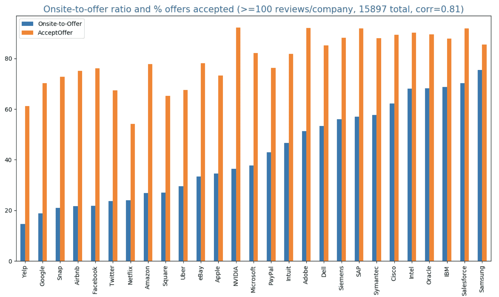

# 2.6 理解你的概率

> 原文：[`huyenchip.com/ml-interviews-book/contents/2.6-understanding-your-odds.html`](https://huyenchip.com/ml-interviews-book/contents/2.6-understanding-your-odds.html)

当申请一个职位时，你可能会想知道自己获得该职位的概率。如果招聘决策遵循均匀随机分布，那么在主要科技公司中的概率将是令人沮丧的。每年，[谷歌收到数百万份简历并雇佣数千人](https://www.cnbc.com/2019/04/17/heres-how-many-google-job-interviews-it-takes-to-hire-a-googler.html)，这使得概率大约为 0.2%。

然而，对于同一公司在同一职位上申请的人，概率并不是均匀分布的。这取决于你的个人资料，你是否被推荐以及推荐你的人，公司对该职位的需要程度，谁筛选你的简历，他们已经在其人才库中的人选，以及其他申请者的认真程度。

公司的筛选哲学差异很大——一些公司会给每个明显没有资格的候选人进行电话筛选，而一些公司只对顶尖申请者做出回应。

所有这些因素，加上很少有公司公开他们每年收到的简历数量或招聘人数的事实，使得从提交申请到获得录用通知的概率估计变得不可能。

然而，可以使用截至 2019 年 8 月 Glassdoor 上 27 家主要科技公司软件工程相关职位的 15,897 个面试评价来估计现场面试到录用通知的比例，即 onsite-to-offer ratio，这是 onsite 导致录用的百分比。这个比例与录用率相关联——即接受公司录用通知的候选人百分比。尽管这个估计是针对软件工程职位的，但它可以作为机器学习职位的参考。这些数据中存在许多偏见，但希望大量的评价可以平滑掉一些噪声^(49)。即使所有评价都存在相同的偏见，它们对于公司间的比较仍然是有用的。

数据显示，现场面试到录用通知的比例从低至 15%到高达 70%，而录用率从 50%到 90%不等。例如，在谷歌，18.83%的现场面试导致录用，其中 70%接受了录用通知。

由于在线评价的偏见，实际数字应该更低。在与招聘人员交谈和进行广泛研究后，我发现这里的现场面试到录用通知的比例比实际数字高出几个百分点。例如，[这篇](https://www.teamblind.com/article/Whats-the-onsite-to-offer-ratio-at-your-company-MsLHK2xF)和[这篇](https://www.teamblind.com/article/Acceptance-rate-after-Google-on-site-YUokaj7w)文章声称谷歌的现场面试到录用通知的比例为 10-20%，亚马逊为 20%。

接近 90%的报价接受率是闻所未闻的。高接受率的公司的招聘人员告诉我，他们的目标是把那些数字提高到 80%。图表上领先的四家公司是 NVIDIA、Adobe、SAP 和 Salesforce。然而，像 Salesforce 这样的公司鼓励接受他们报价的候选人到 Glassdoor 上留下评论，这夸大了他们的实际接受率。



现场面试到报价比率最低的 5 家公司都是互联网巨头——Yelp、Google、Snap、Airbnb 和 Facebook，它们以高度选择性而闻名。现场面试到报价比率高的公司不一定是不选择性的。他们可能在筛选过程中更加选择性强，只面试他们真正喜欢的候选人。现场面试成本高昂，因此现场面试到报价比率越高，过程越经济稳健。

现场面试到报价比率和接受率之间有很强的相关性（0.81）——现场面试到报价比率越高，接受率越高。得到谷歌报价的候选人拒绝报价的可能性比得到不那么选择性公司报价的候选人要高。

有几个原因。首先，如果一个候选人通过了像谷歌或 Facebook 这样的选择性公司的面试，他们可能还有其他吸引人的工作机会可供选择。其次，选择性公司往往会提供具有竞争力的报价，这激励候选人从他们那里获得报价，以便与真正想为之工作的公司进行谈判。第三，这些公司的流程通常需要很长时间。等到候选人收到报价时，他们可能已经在另一家公司安顿下来了。最后但同样重要的是，由于谷歌和 Facebook 的候选人只有在收到报价后才能与团队匹配，如果他们不喜欢团队，他们可能会拒绝报价。

* * *

^(49): 这份数据中的一些偏差：

```py
*   Few people actually leave reviews for anything online
*   Those who do are likely compelled by either a really good or really bad experience
*   Those who receive offers are more likely to give reviews than those who don’t
*   Those who accept offers are likely to give reviews than those who don’t
*   Junior candidates are more likely to give reviews than senior candidates 
```

* * *

*这本书是由[Chip Huyen](https://huyenchip.com)在众多朋友的帮助下创作的。对于反馈、勘误和建议，作者可以通过[这里](https://huyenchip.com/communication/)联系。版权©2021 Chip Huyen。*
