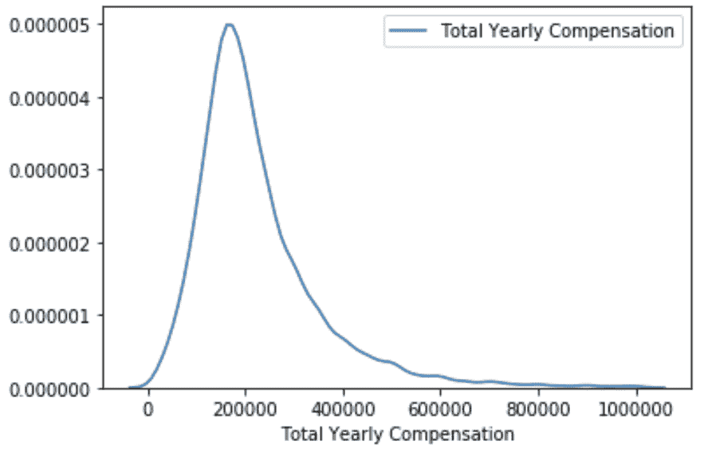
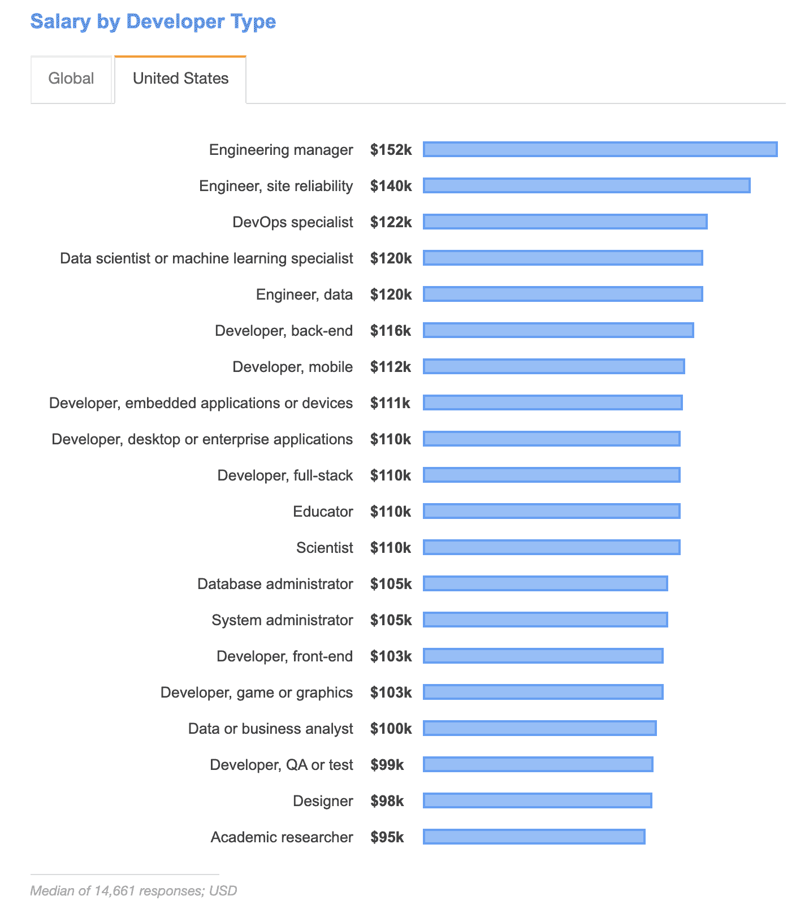

# 3.1 基本工资

> 原文：[`huyenchip.com/ml-interviews-book/contents/3.1.1-base-salary.html`](https://huyenchip.com/ml-interviews-book/contents/3.1.1-base-salary.html)

2020 年初，levels.fyi 与我分享了他们的数据，其中包括 18.8k 名技术工作者自行报告的直接薪酬详细信息。这些数据以美国为中心，80%的条目基于美国（40%来自加利福尼亚州，24%来自华盛顿州），40%来自 FAAAM 公司。65%的条目是软件工程师。最流行的 7 种工作占所有条目的 88%。

报告的薪酬包遵循偏态正态分布，一小部分人获得异常高的收入——印度的技术工作者可能年薪低于 20k，而谷歌、Facebook、OpenAI 的顶尖工程师年薪可能达到数百万美元。

中位数年薪为 195,000 美元，而平均年薪为 225,000 美元。

这些数字高于[2019 年 StackOverflow 调查的结果](https://insights.stackoverflow.com/survey/2019#salary)，该调查指出，在美国，工程经理（调查中薪酬最高的工程职位）的中位年薪为 152,000 美元。这可能是因为 levels.fyi 的数据专注于 FAAAM（Facebook, Amazon, Apple, Alphabet, Microsoft）公司，并包括整个薪酬包——基本工资、股权和奖金——而 StackOverflow 的调查仅包括工资。

