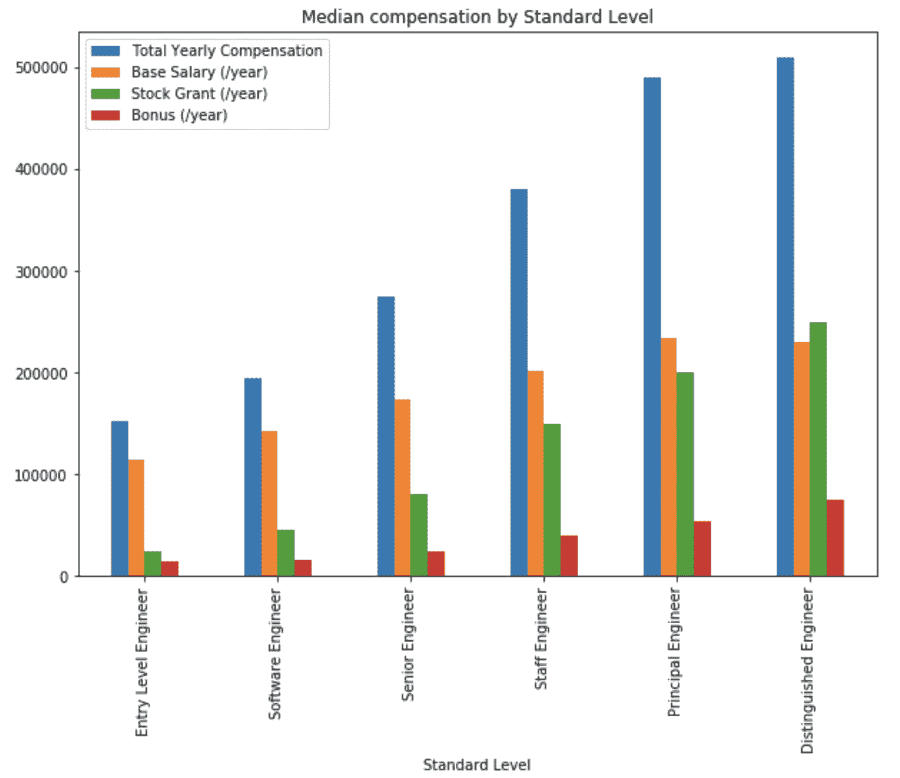

# 3.4 不同级别的薪酬方案

> 原文：[`huyenchip.com/ml-interviews-book/contents/3.1.4-compensation-packages-at-different-levels.html`](https://huyenchip.com/ml-interviews-book/contents/3.1.4-compensation-packages-at-different-levels.html)

随着级别的提高，基本工资和奖金增长缓慢，但股权增长最快。对于初级水平，基本工资占直接补偿的最大部分。随着你级别的提升，股权的比例增加——更高的股权反映了你对公司成功的更多责任。

