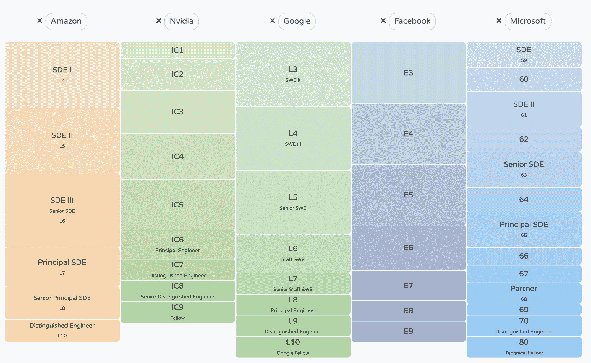

# 3.3 职业发展

> 原文：[`huyenchip.com/ml-interviews-book/contents/3.3-career-progression.html`](https://huyenchip.com/ml-interviews-book/contents/3.3-career-progression.html)
> 
> ⚠本节仅适用于大型公司。在初创公司中，等级结构扁平，级别定义不明确。⚠

对于每一份工作邀请，你也应该看看级别。大多数公司为其软件工程角色（包括机器学习角色）定义了明确的级别。更高的级别意味着更高的薪酬、更多的决策权以及更多的责任。

主要科技公司遵循着非常不同的晋升阶梯。例如，谷歌的工程职位从 L3 到 L10，而 Facebook 从 E3 到 E9，微软从 59 到 80。这些级别也对应到一个更标准化的阶梯，其中包括：

1.  初级（助理/初级）工程师

1.  工程师

1.  高级工程师

1.  员工工程师

1.  首席工程师

1.  杰出工程师

通常，大学毕业生从最低级别开始，硕士毕业生在更高一级别，而博士毕业生在下一个级别。在同一公司中，同一级别的起薪差异不大，因为起薪通常为每个级别设定上限。但在股权分配上差异很大，这可以通过谈判显著改变。

看到优秀候选人被提供高于其同侪的级别并不罕见。有时，一家公司可能会提高你的级别，以提供更高的基本薪酬来匹配你可能收到的另一份工作邀请。然而，公司可能不愿意提升新员工的级别，因为更高的级别意味着更高的期望，许多人认为这可能会负面影响他们在公司取得成功的能力。

很少有公司在他们的录用函中列出级别。如果你询问，招聘人员应该告诉你，因为无论你是否加入，你都会了解到这一点。在科技界，人们说“头衔不重要”很时髦，但它们确实很重要。在没有完美方法来评估某人的实际专业能力的情况下，社会对头衔的反应很好。更高的级别不仅意味着更高的薪酬，还意味着在决定做什么工作上有更多的自由，如果你想要换工作，也会有更多的谈判能力。

理论上，公司应该在设计其级别时投入大量思考，员工应该能够了解每个级别的期望以及他们可以做什么来攀登阶梯。如果你不知道，就与你的经理谈谈。你可以简单地说：“*我想在这里建立我的职业生涯，并在公司承担更多的责任。为了考虑我晋升到下一级别，你需要看到我哪些方面的表现？*”

更多关于工程级别的信息，请参阅[关于工程级别的须知](https://charity.wtf/2020/09/14/useful-things-to-know-about-engineering-levels/)（查理·马约尔斯，2020 年）。
