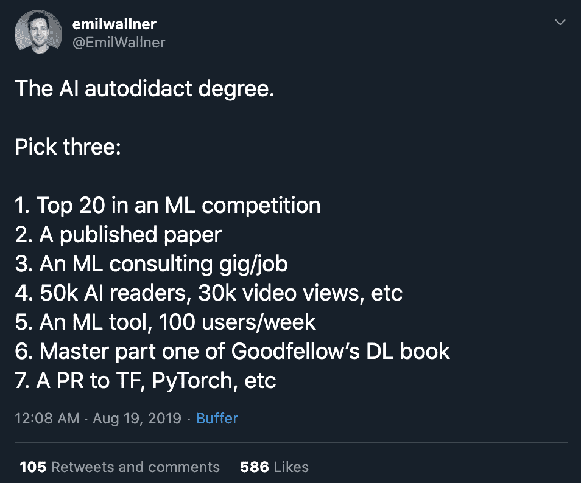

# 4.2 其他人是如何做到的

> 原文：[`huyenchip.com/ml-interviews-book/contents/4.2-how-other-people-did-it.html`](https://huyenchip.com/ml-interviews-book/contents/4.2-how-other-people-did-it.html)

我发现跟随我钦佩的人的职业发展，并了解他们是如何达到这一点的很有帮助。没有一条通往任何工作的唯一路径——不是所有机器学习研究员都获得了博士学位，也不是所有机器学习工程师在大学学习计算机科学或根本没上大学。通常，具有更非传统背景的候选人更受欢迎，因为他们可以为团队带来新的视角。

许多人已经写下了他们的职业道路。以下是我找到的一些令人鼓舞的故事。

1.  [从传统职业转向自动驾驶汽车：我是如何从债务追收转向自动驾驶汽车的](https://towardsdatascience.com/how-i-found-my-current-job-3fb22e511a1f)

    Lyft 的高级计算机视觉工程师弗拉基米尔·伊格洛维科夫讲述了他如何在谷歌和 NVIDIA 被拒绝，以及他的特斯拉录用通知被撤回，因为他违反了保密协议。他谈论了所有希望在其他国家工作的人都能感同身受的移民挫折。

1.  约翰·瓦沙姆讲述了他如何全职学习了 8 个月以准备谷歌的面试([他全职学习 8 个月准备谷歌面试的经历](https://www.freecodecamp.org/news/why-i-studied-full-time-for-8-months-for-a-google-interview-cc662ce9bb13/)，并在获得亚马逊的录用之前被拒绝([他获得亚马逊录用之前被拒绝的经历](https://startupnextdoor.com/ive-been-acquired-by-amazon/?src=ciu))。

1.  在被裁员后，[艾玛·丁](https://towardsdatascience.com/how-i-got-4-data-science-offers-and-doubled-my-income-2-months-after-being-laid-off-b3b6d2de6938)分析了数据科学职位列表，根据其要求将它们分为三组：“产品分析”、“建模”和“数据工程”。她选择增强自己的简历并练习产品分析职位的面试。在两个月紧张的准备后，她总共收到了 10 次面试，4 次现场面试，以及来自 Twitter、Lyft、Airbnb 和一家医疗保健初创公司的 4 份工作邀请。

1.  谷歌艺术与文化中心的住院医生埃米尔·沃尔纳讲述了他如何自学成为机器学习研究员([他作为自学人工智能研究员的故事](https://blog.floydhub.com/emils-story-as-a-self-taught-ai-researcher/))。他的理想课程是：“*知道如何编码是先决条件。然后，我会花 1-2 个月完成 Fast.ai 课程 V3，再花另外 4-5 个月完成个人项目或参加机器学习竞赛。*”

