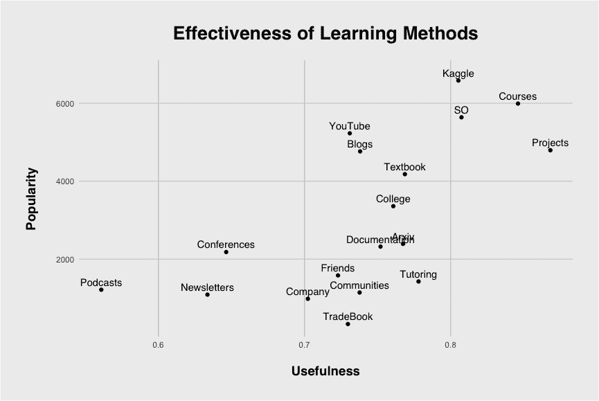

# 4.3 资源

> [原文链接](https://huyenchip.com/ml-interviews-book/contents/4.3-resources.html)

在线资源众多，试图确定哪些资源值得关注可能会让人感到困惑。Kaggle 2017 年的数据科学和机器学习调查询问了受访者他们认为最有帮助的学习方法。以下是由我的前同事 [Jack Cook](https://jackcook.com/) 创建的 [响应可视化](https://towardsdatascience.com/how-to-become-a-data-scientist-8c0ea546ab81)。

最有效的学习方法是通过做项目、参加课程，以及在 StackOverFlow (SO) 上投入大量时间。Kaggle 竞赛在列表中排名很高，但由于受访者都是 Kaggle 用户，他们的回答存在偏见。大学教育被认为比观看 YouTube 教程和阅读博客稍微有用一些。在这项调查中，最不实用的方法是播客、时事通讯和会议。

参加会议可能对构建你的技能集没有太大帮助，但对建立你的网络非常有用。在会议上发表论文是让你的名字广为人知并表明你对该领域的知识足够深入，可以提出原创研究想法的好方法。
