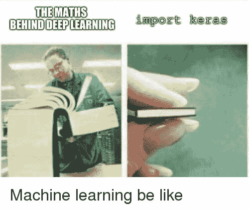

# 第五章 数学

> 原文：[`huyenchip.com/ml-interviews-book/contents/chapter-5.-math.html`](https://huyenchip.com/ml-interviews-book/contents/chapter-5.-math.html)

如果你的机器学习工作仅限于运行`keras.fit`或克隆现有实现，你可能不需要数学。有许多课程和书籍承诺你几乎不需要数学就能掌握机器学习。如果你在寻找这样的内容，请随意跳过这一章。

然而，一些数学背景将有助于以下内容。

1.  评估不同算法的权衡并选择最适合你问题的算法

1.  在训练过程中如果出现问题，调试你的模型

1.  对模型进行修改以提升其性能或效率，即使没有任何错误发生

1.  解释你模型性能的某些方面

1.  创建新的模型。

本节涵盖了机器学习中重要的数学分支：代数、概率与统计、降维，以及很少量的微积分和凸优化。这个列表远非详尽无遗。例如，图论、逻辑、拓扑和其他数学分支在机器学习中经常出现，但并未包含在此。

*如果某些字符似乎缺失，那是因为 MathJax 没有正确加载。刷新页面应该可以解决这个问题。*
