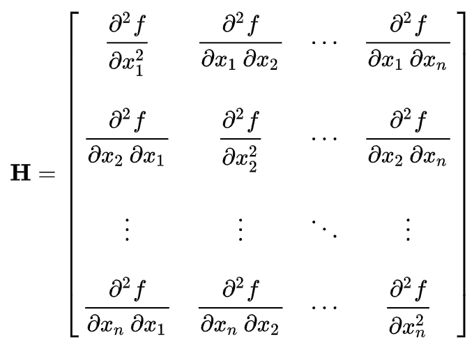

# 5.1.4 微积分与凸优化

> 原文：[`huyenchip.com/ml-interviews-book/contents/5.1.4-calculus-and-convex-optimization.html`](https://huyenchip.com/ml-interviews-book/contents/5.1.4-calculus-and-convex-optimization.html)

如果某些字符似乎缺失，那是因为 MathJax 没有正确加载。刷新页面应该可以解决这个问题。

1.  可导函数

    1.  [E] 函数可导意味着什么？

    1.  [E] 给出一个函数在某点没有导数的例子。

    1.  [M] 给出一个在机器学习中经常使用的非可导函数的例子。如果这些函数不可导，我们如何进行反向传播？

1.  凸性

    1.  [E] 函数凸或凹意味着什么？画出来。

    1.  [E] 为什么凸性在优化问题中是可取的？

    1.  [M] 证明交叉熵损失函数是凸的。

1.  给定一个逻辑判别分类器：

    其中 sigmoid 函数由以下公式给出：

    对于具有类别标签  的训练样本，逻辑损失由以下公式给出：

    1.  证明 。

    1.  证明 。

    1.  证明  是凸的。

1.  我们现在使用的多数机器学习算法都使用一阶导数（梯度）来构建下一个训练迭代。

    1.  [E] 我们如何使用二阶导数进行模型训练？

    1.  [M] 二阶优化优缺点。

    1.  [M] 为什么我们在实践中看不到更多的二阶优化？

1.  [M] 我们如何使用 Hessian（二阶导数矩阵）来测试临界点？

1.  [E] Jensen 不等式是许多概率推理算法的基础，包括期望最大化（Expectation-Maximization）和变分推理（variational inference）。解释 Jensen 不等式是什么。

1.  [E] 解释链式法则。

1.  [M] 设 ，其中  是一个 one-hot 向量。求  关于  的导数。

1.  [M] 给定函数  和约束条件 。求函数的最大值和最小值。

* * *

> 关于凸优化

凸优化很重要，因为它是我们或多或少理解的唯一一种优化类型。有些人可能会争论，由于深度学习中许多常见的目标函数不是凸函数，所以我们不需要了解凸优化。然而，即使函数不是凸函数，将它们视为凸函数进行分析通常也会给我们提供有意义的界限。如果一个算法假设损失函数是凸的而无法工作，那么当损失函数是非凸的时，它肯定也无法工作。

凸性是例外，而不是规则。如果你被问到一个函数是否是凸的，而它还没有在已知凸函数的列表中，那么它很可能不是凸的。如果你想了解凸优化，可以查看[Stephen Boyd 的教科书](http://cs229.stanford.edu/section/cs229-cvxopt.pdf)。

* * *

> 关于 Hessian 矩阵

Hessian 矩阵或 Hessian 是一个标量值函数的二阶偏导数的方阵。

给定一个函数 . 如果函数的所有二阶偏导数在该函数的定义域内存在且连续，那么函数 f 的 Hessian 矩阵 H 是一个 n×n 的方阵，满足以下条件：.

Hessian 矩阵在 Newton 类方法和准 Newton 方法中用于大规模优化问题。它也常用于在图像处理和计算机视觉中表达图像处理算子，例如用于目标检测和多尺度信号表示。
