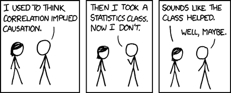

# 5.2.2 统计

> 原文：[`huyenchip.com/ml-interviews-book/contents/5.2.2-stats.html`](https://huyenchip.com/ml-interviews-book/contents/5.2.2-stats.html)

来自[xkcd](https://xkcd.com/552/)。为了从面试压力中分散注意力，[这里](https://stats.stackexchange.com/questions/1337/statistics-jokes)有更多统计笑话。

1.  [E] 解释频率主义和贝叶斯统计学的区别。

1.  [E] 给定数组，求其均值、中位数、方差和标准差。

1.  [M] 在什么情况下我们应该使用中位数而不是均值？在什么情况下我们应该使用均值而不是中位数？

1.  [M] 函数的矩是什么？解释零阶到四阶矩的含义。

1.  [M] 独立性和零协方差是否相同？如果不相同，给出一个反例。

1.  [E] 假设你随机抽取了 100 只新生小狗，并确定它们的平均体重为 1 磅，总体标准差为 0.12 磅。假设新生小狗的体重遵循正态分布，计算所有新生小狗平均体重的 95%置信区间。

1.  [M] 假设我们检查了 100 只新生小狗，它们平均体重的 95%置信区间为磅。以下哪个陈述是正确的？

    1.  给定一只随机的新生小狗，它的体重有 95%的概率在 0.9 到 1.1 磅之间。

    1.  如果我们再检查 100 只新生小狗，它们的均值有 95%的概率落在该区间内。

    1.  我们有 95%的信心认为这个区间包含了真实的平均体重。

        提示：这是一个很多人容易误解的微妙点。如果你对答案有困难，Khan Academy 有[一篇很好的文章](https://www.khanacademy.org/math/ap-statistics/estimating-confidence-ap/introduction-confidence-intervals/a/interpreting-confidence-levels-and-confidence-intervals)。

1.  [H] 假设我们有一个随机变量，它在从到上支持，我们可以从中抽取样本。我们如何得到一个无偏的关于的均值估计？

1.  [H] 相关系数可以大于 1 吗？为什么或为什么不？如何解释 0.3 的相关值？

1.  新生小狗的体重大致对称，平均体重为 1 磅，标准差为 0.12 磅。你最喜欢的新生小狗体重为 1.1 磅。

    1.  [E] 计算你小狗的 z 分数（标准分数）。

    1.  [E] 你的新生小狗体重需要达到多少才能在体重方面进入前 10%？

    1.  [M] 假设新生小狗的体重遵循偏斜分布，计算 z 分数还有意义吗？

1.  [H] 抛掷硬币十次，结果为 10 次正面和 5 次反面。你会如何分析这枚硬币是否公平？

1.  统计显著性。

    1.  [E] 如何评估一个模式（无论是有意义还是偶然）的统计显著性？

    1.  [E] p 值的分布是什么？

    1.  [H] 最近，很多科学家开始了一场针对统计显著性的战争。在使用 p 值和统计显著性时，我们需要注意什么？

1.  变量相关性。

    1.  [M] 如果两个原本独立的变量高度相关，回归模型会发生什么变化？

    1.  [M] 我们如何测试两个分类变量之间的独立性？

    1.  [H] 我们如何测试两个连续变量之间的独立性？

1.  [E] A/B 测试是一种比较两种解决方案版本以确定哪个表现更好的方法。A/B 测试有哪些优缺点？

1.  [M] 您想测试网站上两种广告位置哪种更好。我们需要多少访客和/或每次点击广告的次数，才能有 95%的把握认为某个位置更好？

1.  [M] 您的公司运营着一个社交网络，其收入来自在新闻源中展示广告。为了翻倍收入，您的同事建议您只需增加展示的广告数量。这是一个好主意吗？您如何找出答案？

1.  假设您拥有过去 24 个月期间 10,000 支股票的价格，您只有每个月末的价格，这意味着每支股票有 24 个价格点。在计算了 10,000 * 9,9992 对股票的相关性后，您发现有一对股票的相关性高于 0.8。

    1.  [E] 这种情况偶然发生的概率是多少？

    1.  [M] 如何避免这种偶然的模式？

    **提示**：查看[大数据的诅咒](https://www.analyticbridge.datasciencecentral.com/profiles/blogs/the-curse-of-big-data)。

1.  [H] 足够统计量和信息瓶颈原理在机器学习中是如何应用的？

* * *

*本书由[Chip Huyen](https://huyenchip.com)在众多朋友的帮助下创作。对于反馈、勘误和建议，作者可以通过[这里](https://huyenchip.com/communication/)联系到。*
