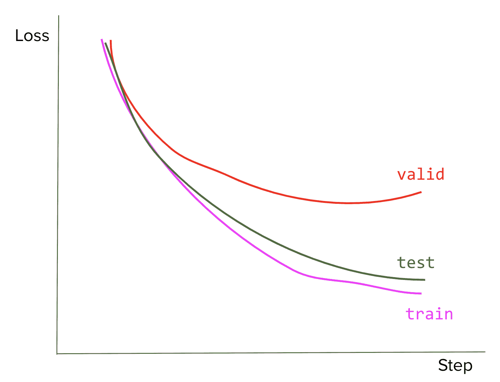

# 7.3 目标函数、指标和评估

> 原文：[`huyenchip.com/ml-interviews-book/contents/7.3-objective-functions,-metrics,-and-evaluation.html`](https://huyenchip.com/ml-interviews-book/contents/7.3-objective-functions,-metrics,-and-evaluation.html)

1.  收敛。

    1.  [E] 当我们说一个算法收敛时，收敛意味着什么？

    1.  [E] 我们如何知道模型何时收敛？

1.  [E] 绘制过拟合和欠拟合的损失曲线。

1.  偏差-方差权衡

    1.  [E] 偏差-方差权衡是什么？

    1.  [M] 这个权衡与过拟合和欠拟合有什么关系？

    1.  [M] 你如何知道你的模型是高方差、低偏差？在这种情况下你会怎么做？

    1.  [M] 你如何知道你的模型是低方差、高偏差？在这种情况下你会怎么做？

1.  交叉验证。

    1.  [E] 解释交叉验证的不同方法。

    1.  [M] 为什么我们在深度学习中看不到更多的交叉验证？

1.  训练、验证、测试分割。

    1.  [E] 在同一数据上训练和测试模型有什么问题？

    1.  [E] 为什么我们除了训练集和测试集之外还需要验证集？

    1.  [M] 你的模型在训练、验证和测试集上的损失曲线如下。这可能是什么原因？你会怎么做？

1.  [E] 你的团队正在构建一个系统，帮助医生从 X 光扫描中预测患者是否患有癌症。你的同事宣布，现在他们已经构建了一个可以以 99.99%的准确率预测的系统，问题已经解决了。你会如何回应这个说法？

1.  F1 分数。

    1.  [E] F1 相对于准确率有什么好处？

    1.  [M] 对于有超过两个类别的问题，我们是否还可以使用 F1？如何？

1.  给定一个输出以下混淆矩阵的二分类器。

    |  | 预测真 | 预测假 |
    | --- | --- | --- |
    | 实际真 | 30 | 20 |
    | 实际假 | 5 | 40 |

    1.  [E] 计算模型的精确率、召回率和 F1。

    1.  [M] 我们可以采取什么措施来提高模型的表现？

1.  考虑一个分类，其中 99%的数据属于类别 A，1%的数据属于类别 B。

    1.  [M] 如果你的模型 100%预测 A，F1 分数会是多少？**提示**：当 A 映射到 0 而 B 映射到 1 时的 F1 分数与 A 映射到 1 而 B 映射到 0 时的 F1 分数不同。

    1.  [M] 如果我们有一个模型随机（均匀）地预测 A 和 B，预期的 F1 分数是多少？

1.  [M] 对于逻辑回归，为什么推荐使用对数损失而不是均方误差（MSE）？

1.  [M] 我们应该在什么时候使用均方根误差（RMSE）而不是平均绝对误差（MAE）以及相反的情况？

1.  [M] 证明对于二分类任务，负对数似然和交叉熵是相同的。

1.  [M] 对于有超过两个标签的分类任务（例如，MNIST 有 10 个标签），为什么交叉熵比均方误差（MSE）是一个更好的损失函数？

1.  [E] 考虑一个有 27 个字符的字母表的语言。这个语言的熵最大值是多少？

1.  [E] 许多机器学习模型旨在近似概率分布。假设 P 是数据的分布，Q 是我们模型学习到的分布。我们如何衡量 Q 与 P 的接近程度？

1.  MPE（最可能解释）与 MAP（最大后验概率）

    1.  [E] MPE 和 MAP 有什么不同？

    1.  [H] 给出一个它们会产生不同结果的例子。

1.  [E] 假设你想构建一个模型来预测未来 8 小时内股票的价格，并且预测的价格不应比实际价格高出 10%。你会使用哪个指标？

    **提示**：查看 MAPE。

* * *

> 如果你需要对信息熵进行复习，这里有一个没有数学解释的解释。
> 
> 你的父母终于让你领养宠物了！他们整个周末都带你去了各种宠物收容所，想找到一只宠物。
> 
> 第一个庇护所里只有狗。当你的爸爸为你挑选动物时，你的妈妈遮住了你的眼睛。你不需要睁开眼睛就能知道这只动物是狗。猜测起来不难。
> 
> 第二个庇护所里既有狗也有猫。再次，你的妈妈遮住了你的眼睛，你的爸爸挑选了一只动物。这次，你必须更努力地思考才能猜出是哪种动物。你猜测它是一只狗，你爸爸说不是。所以你猜测它是一只猫，你猜对了。你用了两次猜测才确定是什么动物。
> 
> 下一个庇护所是其中最大的一个。他们有各种各样的动物：狗、猫、仓鼠、鱼、鹦鹉、可爱的小猪、兔子、雪貂、刺猬、鸡，甚至有异国风情的鬃龙！可能有近一百种不同的宠物。现在你很难猜出你爸爸给你带来的是哪种动物。你用了十几次猜测才猜对正确的动物。
> 
> 熵是衡量多样性“分散”程度的指标。多样性越分散，猜测一个项目正确的难度就越大。第一个庇护所的熵非常低。第二个庇护所的熵略高。第三个庇护所的熵最高。
