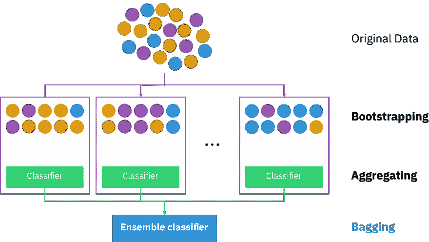

# 8.1.1 概述：基本算法

> 原文：[`huyenchip.com/ml-interviews-book/contents/8.1.1-overview:-basic-algorithm.html`](https://huyenchip.com/ml-interviews-book/contents/8.1.1-overview:-basic-algorithm.html)

##### 8.1.1.1 k-最近邻（k-NN）

k-NN 是一种非参数方法，用于分类和回归。给定一个对象，算法的输出是从其特征空间中最近的 k 个训练示例计算得出的。

+   在 k-NN 分类中，每个对象被分类为其 k 个最近邻中最常见的类别。

+   在 k-NN 回归中，每个对象的价值是计算为其 k 个最近邻的平均值。

**应用**：异常检测、搜索、推荐系统

##### 8.1.1.2 k-means 聚类

k-means 聚类旨在将观测值划分为 k 个簇，其中每个观测值属于最近的均值所在的簇。k-means 最小化簇内方差（平方欧几里得距离），但不最小化常规的欧几里得距离。

该算法不保证收敛到全局最优解。结果可能取决于初始簇。由于该算法通常很快，因此通常多次运行它，以不同的起始条件。

该问题在计算上很困难（NP-hard）；然而，有效的启发式算法可以快速收敛到局部最优解。

该算法与 k-最近邻分类器有松散的关系。在用 k-means 聚类获得簇之后，我们可以通过将 1-最近邻分类器应用于簇中心来将这些新数据分类到这些簇中。

**应用**：信号处理中的矢量量化（k-means 聚类最初开发的地方）、聚类分析、特征学习、主题建模。

##### 8.1.1.3 EM（期望最大化）算法

EM 算法是一种迭代方法，用于找到参数的最大似然（MLE）或最大后验（MAP）估计。当模型依赖于未观察到的潜在变量且方程无法直接求解时，它非常有用。

迭代在执行以下操作之间交替：

+   一个期望（E）步骤，它创建一个函数来评估当前参数估计的似然对数的期望。

+   一个最大化（M）步骤，它计算在 E 步骤上找到的期望对数似然的最大化参数。然后使用这些参数估计值来确定下一 E 步骤中潜在变量的分布。

EM 算法保证返回样本似然函数的局部最优解。

**示例**：高斯混合模型（GMM）

**应用**：数据聚类、协同过滤。

##### 8.1.1.4 基于树的方法

**决策树**是一种基于树的方法，它从关于对象（在分支中表示）的观察结果到关于其目标值（在叶子中表示）的结论。在其核心，决策树是嵌套的 if-else 条件。

在**分类树**中，目标值是离散的，每个叶子代表一个类别。在**回归树**中，目标值是连续的，每个叶子代表最终到达该叶子的所有对象的目标值的平均值。

决策树易于解释，可以用于可视化决策。然而，它们对训练数据过拟合——训练集的微小变化可能导致显著不同的树结构，从而导致显著不同的输出。

##### 8.1.1.5 袋装法和提升法

袋装法和提升法是两种常用的集成方法，通常与基于树的算法一起使用，也可以用于其他算法。

###### 8.1.1.5 袋装法和提升法

袋装法，简称**b**ootstrap **agg**regat**ing**，旨在提高机器学习算法的稳定性和准确性。它减少了方差，有助于避免过拟合。

给定一个数据集，而不是在整个数据集上训练一个分类器，你通过**替换**来采样以创建不同的数据集，称为自助法数据集，并在每个这些自助法数据集上训练一个分类或回归模型。替换采样确保每个自助法数据集与其同伴独立。

如果问题是分类，最终的预测由所有模型的多数投票决定。例如，如果有 10 个分类器投票为 SPAM，而 6 个模型投票为 NOT SPAM，则最终的预测为 SPAM。

如果问题是回归，最终的预测是所有模型预测的平均值。

袋装法通常可以改善不稳定的方法，如神经网络、分类和回归树以及线性回归中的子集选择。然而，它可能会略微降低稳定方法（如 k-最近邻 2）的性能。

由 [Sirakorn](https://en.wikipedia.org/wiki/Bootstrap_aggregating#/media/File:Ensemble_Bagging.svg) 提供的插图

**随机森林**是袋装法的例子。随机森林是由**袋装法**和**特征随机性**构建的决策树集合，每棵树只能从随机特征子集中选择使用。

由于其集成特性，随机森林可以纠正决策树对其训练集的过拟合。

**应用**：随机森林是现实世界中应用最广泛的机器学习算法之一。它们在银行用于欺诈检测，在医学用于疾病预测，在股市分析等。

关于随机森林的更多信息，请参阅 Tony Yiu 的[理解随机森林](https://towardsdatascience.com/understanding-random-forest-58381e0602d2)。

###### 8.1.1.5.2 提升法

提升法是一系列迭代集成算法，将弱学习器转换为强学习器。这个集成中的每个学习器都在相同的样本集上训练，但在迭代中样本的权重不同。因此，未来的弱学习器会更关注先前弱学习器错误分类的示例。

1.  你首先在原始数据集上训练第一个弱分类器。

1.  样本根据第一个分类器对它们的分类效果进行重新加权，例如，错误分类的样本被赋予更高的权重。

1.  在这个重新加权的数据集上训练第二个分类器。你的集成现在由第一个和第二个分类器组成。

1.  样本根据集成对它们的分类效果进行加权。

1.  在这个重新加权的数据集上训练第三个分类器。将第三个分类器添加到集成中。

1.  需要重复进行多次迭代。

1.  将最终强分类器形成为现有分类器的加权组合 -- 训练误差较小的分类器具有更高的权重。

由 [Sirakorn](https://en.wikipedia.org/wiki/Boosting_(machine_learning)#/media/File:Ensemble_Boosting.svg) 提供插图。

提升算法的一个例子是梯度提升机，它通常从弱决策树生成预测模型。它以分阶段的方式构建模型，就像其他提升方法一样，并通过允许优化任意可微分的损失函数来推广它们。

XGBoost，GBM 的一个变体，曾经是[许多机器学习竞赛获胜团队的算法选择](https://github.com/dmlc/xgboost/tree/master/demo#machine-learning-challenge-winning-solutions)。它被用于广泛的任务中，从分类、排序到希格斯玻色子的发现^(3)。然而，许多团队已经开始选择[LightGBM](https://github.com/microsoft/LightGBM)，这是一个允许并行学习的分布式梯度提升框架，通常允许在大数据集上更快地训练。

##### 8.1.1.6 内核方法

在机器学习中，内核方法是用于模式分析的一类算法，其中最著名的成员是支持向量机（SVM）。模式分析的一般任务是找到并研究数据集中的一般关系类型（例如聚类、排序、主成分、相关性、分类）。对于解决这些任务的大多数算法，原始表示中的数据必须通过用户指定的特征映射显式地转换为特征向量表示：相比之下，内核方法只需要用户指定的核，即原始表示中数据点对的相似度函数。

内核方法的名字来源于对核函数的使用，这使得它们能够在高维隐式特征空间中操作，而无需计算该空间中数据的坐标，而是通过简单地计算特征空间中所有数据对图像之间的内积。这种操作通常比显式计算坐标的计算成本更低。这种方法被称为“核技巧”。[1] 核函数已经被用于序列数据、图、文本、图像以及向量。

能够与核函数一起操作的算法包括核感知器、支持向量机（SVM）、高斯过程、主成分分析（PCA）、典型相关分析、岭回归、谱聚类、线性自适应滤波器以及许多其他算法。任何线性模型都可以通过应用核技巧转换为非线性模型：用核函数替换其特征（预测器）。

* * *

这本书是由[Chip Huyen](https://huyenchip.com)在众多朋友的帮助下创作的。对于反馈、勘误和建议，作者可以通过[这里](https://huyenchip.com/communication/)联系。版权©2021 Chip Huyen。
