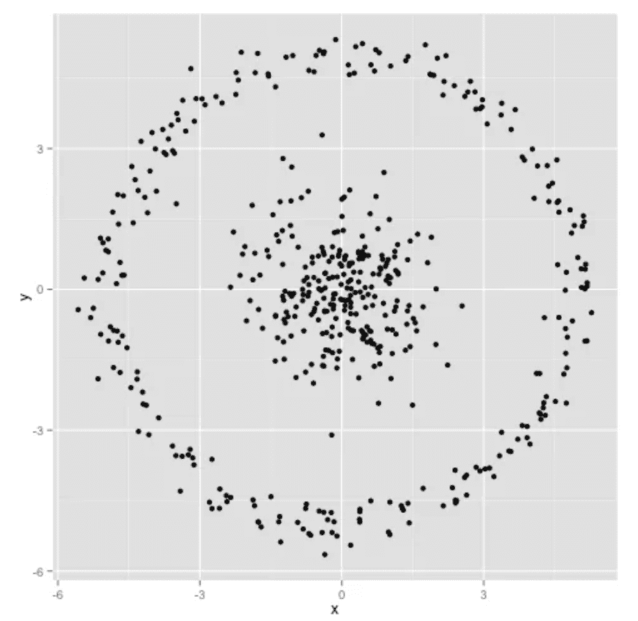
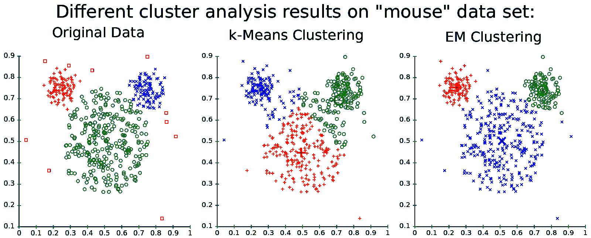
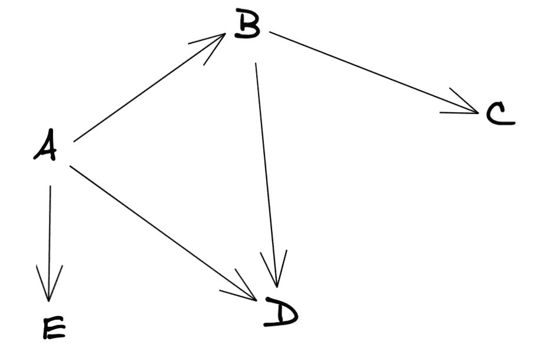
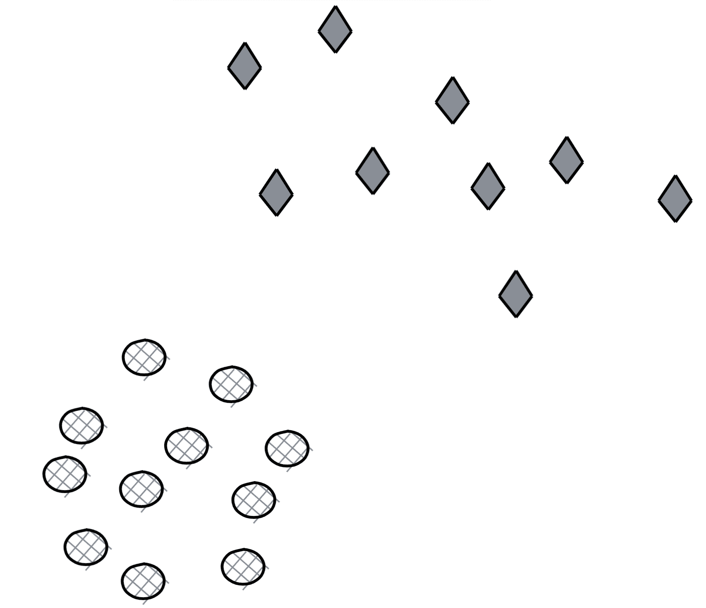
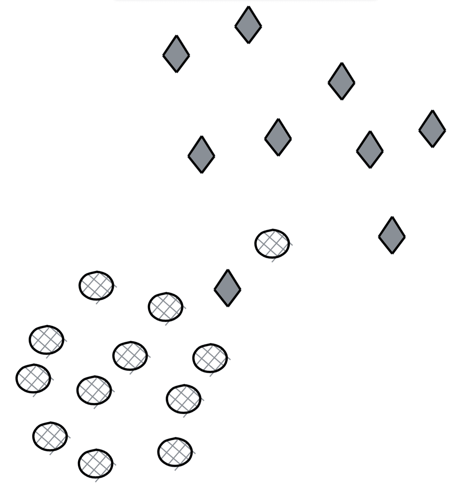

# 8.1.2 问题

> 原文：[`huyenchip.com/ml-interviews-book/contents/8.1.2-questions.html`](https://huyenchip.com/ml-interviews-book/contents/8.1.2-questions.html)

1.  [E] 线性回归的基本假设是什么？

1.  [E] 如果我们不应用特征缩放到逻辑回归会发生什么？

1.  [E] 在开发欺诈检测模型的原型时，你会使用哪些算法？

1.  特征选择。

    1.  [E] 为什么我们使用特征选择？

    1.  [M] 特征选择有哪些算法？每种算法的优缺点。

1.  k-means 聚类。

    1.  [E] 你会如何选择 k 的值？

    1.  [E] 如果标签已知，你会如何评估你的 k-means 聚类算法的性能？

    1.  [M] 如果标签未知，你会如何处理？

    1.  [H] 给定以下数据集，你能预测 K-means 聚类是如何工作的吗？解释。

        

1.  k-最近邻分类。

    1.  [E] 你会如何选择 k 的值？

    1.  [E] 当你增加或减少 k 的值时会发生什么？

    1.  [M] k 的值如何影响偏差和方差？

1.  k-means 和 GMM 都是强大的聚类算法。

    1.  [M] 比较这两个。

    1.  [M] 你会在什么情况下选择其中一个而不是另一个？

        **提示**：以下是一个关于 K-means 和 GMM 算法在人工老鼠数据集上表现的例子。

        

        图片来自[Mohamad Ghassany 的机器学习课程](https://www.mghassany.com/MLcourse/gaussian-mixture-models-em.html)

1.  Bagging 和 boosting 是两种流行的集成方法。随机森林是 bagging 的一个例子，而 XGBoost 是 boosting 的一个例子。

    1.  [M] 两种集成算法（bagging 和 boosting）之间有哪些基本区别？

    1.  [M] 它们在深度学习中是如何使用的？

1.  给定这个有向图。

    1.  [E] 构建它的邻接矩阵。

    1.  [E] 如果图现在是无向的，这个矩阵会如何变化？

    1.  [M] 你能说些什么关于两个同构图的邻接矩阵？

1.  想象我们构建一个用户-项目协同过滤系统，向每个用户推荐他们之前购买过的类似项目。

    1.  [M] 你可以构建用户-项目矩阵或项目-项目矩阵。每种方法的优缺点是什么？

    1.  [E] 如果一个新用户过去没有进行过任何购买，你会如何处理？

1.  [E] 特征缩放对于核方法是否必要？

1.  朴素贝叶斯分类器。

    1.  [E] 为什么朴素贝叶斯分类器被称为朴素？

    1.  [M] 让我们尝试构建一个朴素贝叶斯分类器来分类推文是正面还是负面情绪。我们有四个训练样本：

        | **推文** | **标签** |
        | --- | --- |
        | 这让我非常生气 | 负面 |
        | 这只小狗让我很高兴 | 正面 |
        | 看看这只快乐的仓鼠 | 正面 |
        | 我家里不允许有仓鼠 | 负面 |

    根据您的分类器，句子“仓鼠对小狗感到不满”的情感是什么？

1.  两个在 Kaggle 解决方案中常用的算法是 Light GBM 和 XGBoost。它们都是梯度提升算法。

    1.  [E] 什么是梯度提升？

    1.  [M] 梯度提升适用于哪些问题？

1.  SVM。

    1.  [E] 什么是线性分离？为什么当我们使用 SVM 时，线性分离是可取的？

    1.  [M] 在这个数据集上，原始的 SVM 会表现如何？

        

    1.  [M] 在这个数据集上，原始的 SVM 会表现如何？

        

    1.  [M] 在这个数据集上，原始的 SVM 会表现如何？

        

*这本书是由[Chip Huyen](https://huyenchip.com)在众多朋友的帮助下创作的。对于反馈、勘误和建议，作者可以通过[这里](https://huyenchip.com/communication/)联系。版权©2021 Chip Huyen。*
