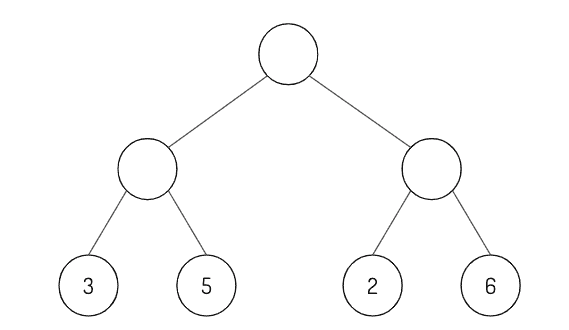
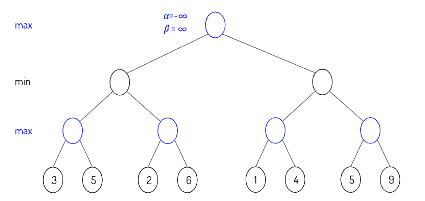

# 8.2.3 强化学习

> 原文：[`huyenchip.com/ml-interviews-book/contents/8.2.3-reinforcement-learning.html`](https://huyenchip.com/ml-interviews-book/contents/8.2.3-reinforcement-learning.html)
> 
> 🌳 **提示** 🌳
> 
> 为了刷新你对深度强化学习的知识，请查看[Spinning Up in Deep RL](https://spinningup.openai.com/en/latest/) (OpenAI)

1.  [E] 用例子解释探索与利用的权衡。

1.  [E] 有限或无限的时间范围会如何影响我们的算法？

1.  [E] 为什么目标函数需要折扣项？

1.  [E] 使用最小-最大算法填写空圆圈。

    

1.  [M] 在从左到右遍历最小-最大树时，填写 alpha 和 beta 的值。

    

1.  [E] 给定一个策略，推导奖励函数。

1.  [M] 基于策略和离策略的优缺点。

1.  [M] 基于模型和无模型有什么区别？哪一个更数据高效？
