Joe Suzuki

## 《机器学习的核方法：数学与Python》

100道构建逻辑的练习题


Joe Suzuki

## 《机器学习的核方法：数学与Python》

100道构建逻辑的练习题

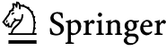

Joe Suzuki
大阪大学
工学研究科
日本大阪府丰中市

ISBN 978-981-19-0400-4 ISBN 978-981-19-0401-1 (电子书)
https://doi.org/10.1007/978-981-19-0401-1

© 编者（如适用）和作者，根据与Springer Nature Singapore Pte Ltd.的独家许可，2022年
本作品受版权保护。所有权利均由出版商独家许可，无论涉及材料的全部还是部分，特别是重印、插图重用、朗诵、广播、在微缩胶片或任何其他物理方式上复制，以及信息存储和检索、电子改编、计算机软件，或通过目前已知或未来开发的类似或不同方法进行传输的权利。
在本出版物中使用通用描述性名称、注册名称、商标、服务标志等，即使没有具体声明，也并不意味着这些名称不受相关保护性法律法规的约束，因此可以自由使用。
出版商、作者和编辑有理由相信，本书中的建议和信息在出版之日是真实和准确的。无论是出版商还是作者或编辑，都不对本文所含材料或可能存在的任何错误或遗漏提供任何明示或暗示的保证。出版商对已出版地图中的管辖权主张和机构隶属关系保持中立。
本Springer印记由注册公司Springer Nature Singapore Pte Ltd.出版。
注册公司地址为：152 Beach Road, #21-01/04 Gateway East, Singapore 189721, Singapore

## 前言

## 如何克服你的核方法弱点

在机器学习方法中，核方法一直是我特别薄弱的环节。我曾尝试阅读福崎贤治（Kenji Fukumizu）的《核方法导论》（日文版），但多次失败。我邀请福崎教授到大阪大学进行集中授课，并和学生们一起听了一周的课程，但我仍然无法理解这本书的精髓。当我最初开始写这本书时，我的目标是消除我的这种弱点感。然而，现在这本书已经完成，我可以告诉读者如何克服他们自己的核方法弱点。

大多数人，即使是机器学习研究人员，也不理解核方法就直接使用它们。如果你翻开这一页，我相信你有一种积极的感觉，想要克服自己的弱点。

我最推荐的实现这一目标的最短路径是从基础开始学习数学。核方法是根据其背后的数学原理工作的。深入思考这个概念直到理解是至关重要的。理解核方法所需的数学被称为泛函分析（第2章）。即使你知道线性代数或微积分，你也可能会感到困惑。向量是有限维的，但函数集是无限维的，可以被视为线性代数。如果“完备性”的概念对你来说是新的，我希望你能花时间学习它。然而，如果你通过了第二章，我认为你会理解关于核方法的一切。

本书是《构建逻辑的100道练习》系列的第三卷（共六卷）。既然这是一本书，那么在已有核方法书籍可寻的情况下，出版它必然有其原因（所谓的“因”）。以下是本书的一些特点。

- 1. 核方法的数学命题得到了证明，并陈述了正确的结论，以便读者能够触及核方法的本质。
- 2. 与《机器学习的100道数学题》系列中的其他书籍一样，本书提供了源程序和运行示例以促进理解。如果只给出数学公式，读者不容易理解结果，对于核方法尤其如此。
- 3. 一旦读者理解了泛函分析的基本主题（第2章），后续章节将讨论其应用，并且不假设读者具备任何数学预备知识。
- 4. 本书考虑了再生核希尔伯特空间（RKHS）的核和高斯过程的核。对这两种处理方式进行了明确区分。在本书中，这两种核分别在第5章和第6章中讨论。

我们调查了日本和海外关于核方法的书籍，但发现没有一本书满足上述两个或更多特点。

在本书出版之前，我经历了许多失败。每年，我都会在（大阪大学研究生院）开设一门课程。通过解决100道数学和编程练习题来学习机器学习的各个领域。稀疏估计（2018年）和图模型（2019年）很受欢迎，2020年的核方法课程有超过100名学生注册。然而，尽管我每周为课程准备超过2天，但课程进展并不顺利，可能是因为我在这个主题上的弱点。这从学生提供的课堂问卷中可以明显看出。然而，我分析了每一个问题并进行了改进，这本书由此诞生。

我希望读者能够高效地学习核方法，而不用走我走过的路（通过反复试错消耗大量时间和精力）。阅读本书并不意味着你会立即写出论文，但它会为你打下坚实的基础。你将能够顺利阅读以前觉得困难的核方法论文，并且能够从更高的层次看到整个核方法的范式。这本书也很有趣，即使是机器学习研究人员。我们希望你能利用这本书在各自的领域取得成功。

## 《机器学习的核方法：数学与Python》的独特之处是什么？

我将本书的特点总结如下。

- 1. 培养逻辑
我们对每个机器学习问题进行数学公式化和求解，并构建这些程序以把握主题的本质。KMMP（《机器学习的核方法：数学与Python》）在读者心中灌输“逻辑”。读者将获得机器学习的知识和思想。即使出现新技术，他们也能顺利跟上变化。在解决100道问题后，大多数学生会说：“我学到了很多”。
- 2. 不仅仅是故事
如果提供编程代码，你可以立即采取行动。当一本机器学习书籍不提供源代码时，这是很遗憾的。即使有可用的软件包，如果我们看不到程序的内部工作原理，我们所能做的就是将数据输入这些程序。在KMMP中，大多数过程都提供了程序代码。在读者不理解数学的情况下，代码将帮助他们理解其含义。
- 3. 不仅仅是一本操作手册：一本由大学教授撰写的学术著作。
本书解释了如何使用软件包，并为不熟悉的人提供了执行示例。然而，由于只能看到输入和输出，我们可以将该过程视为一个黑箱。从这个意义上说，读者的满足感将是有限的，因为他们无法获得主题的本质。KMMP旨在向读者展示机器学习的核心，更像是一本成熟的学术著作。
- 4. 解决100道练习题：问题根据大学生的反馈进行了改进
本书中的练习题已在大学课程中使用，并根据学生的反馈进行了改进。精选了最佳的100道题目。每章（练习题除外）都提供了解决方案的解释，通过阅读本书，你可以解决所有的练习题。
- 5. 自包含
我们都曾因“详情请参阅文献XX”这样的短语而气馁。除非你是热情的读者或研究人员，否则没人会去寻找那些参考文献。在本书中，我们呈现材料的方式使得无需查阅外部参考文献。此外，证明是简单的推导，复杂的证明则在每章末尾的附录中给出。KMMP完成了所有讨论，包括附录。
- 6. 读者页面：问题、讨论和程序文件
读者可以通过 https://bayesnet.org/books 就本书提出任何问题。

日本大阪
2021年11月

Joe Suzuki

## 致谢

作者衷心感谢张秉元先生、杨天乐先生、新村亮介先生、龟井智博先生、田坂理惠子先生、小岛启人先生、藤井大基先生、黄洪明先生以及大阪大学的所有研究生，感谢他们指出了数学表达式和程序中的逻辑错误。此外，借此机会，我要感谢松井英俊博士（滋贺大学）、山本道夫博士（冈山大学）和寺田佳和博士（大阪大学）在研讨会和工作坊中对函数数据分析提出的建议。这本英文书主要基于2021年由共立出版株式会社出版的日文版。作者感谢共立出版株式会社，特别是其编辑部成员石井哲也先生和大谷咲希女士。作者也感谢施普林格出版社的菅野美绪女士，感谢她为出版所做的准备工作以及对书稿提出的建议。

日本大阪
2021年11月

铃木 乔

## 目录

- 1 **正定核** ........................................................................ 1
    - 1.1 矩阵的正定性 ........................................................ 1
    - 1.2 核 ................................................................................................ 3
    - 1.3 正定核 .................................................................... 5
    - 1.4 概率 ........................................................................................ 12
    - 1.5 博赫纳定理 ............................................................................ 14
    - 1.6 用于字符串、树和图的核 .............................................. 16
    - 附录 ................................................................................................ 22
    - 习题 1~15 ...................................................................................... 25
- 2 **希尔伯特空间** ........................................................................................ 29
    - 2.1 度量空间及其完备性 ............................................ 29
    - 2.2 线性空间与内积空间 .......................................... 33
    - 2.3 希尔伯特空间 .................................................................................. 36
    - 2.4 投影定理 ............................................................................ 41
    - 2.5 线性算子 ................................................................................ 43
    - 2.6 紧算子 ............................................................................ 46
    - 附录：命题证明 .......................................................... 50
    - 习题 16~30 ...................................................................................... 57
- 3 **再生核希尔伯特空间** ........................................................ 61
    - 3.1 再生核希尔伯特空间 ................................................................................................ 61
    - 3.2 索伯列夫空间 .................................................................................... 65
    - 3.3 梅塞尔定理 .............................................................................. 70
    - 附录 ................................................................................................ 81
    - 习题 31~45 ...................................................................................... 87
- 4 **核计算** .............................................................................. 91
    - 4.1 核岭回归 .................................................................... 91
    - 4.2 核主成分分析 .............................................. 97
    - 4.3 核支持向量机 ...................................................................................... 101
    - 4.4 样条曲线 .................................................................................. 105
    - 4.5 随机傅里叶特征 .................................................................. 109

## 第1章
正定核

在数据分析和各种信息处理任务中，我们使用核来评估对象对之间的相似性。在本书中，我们处理的是数学上定义的称为正定核的核。设集合 $E$ 的元素 $x, y$ 对应于称为再生核希尔伯特空间的线性空间 $H$ 的元素（函数）$\Psi(x), \Psi(y)$。核 $k(x, y)$ 对应于线性空间 $H$ 中的内积 $\langle \Psi(x), \Psi(y) \rangle_H$。此外，通过选择非线性映射 $\Psi$，该核可以应用于各种问题。即使 $E$ 不是实数向量，只要核满足正定性，集合 $E$ 可以是字符串、树或图。在后半部分定义概率和勒贝格积分之后，我们将通过使用特征函数（Bochner定理）来学习核。

### 1.1 矩阵的正定性

设 $n \geq 1$；如果 $A \in \mathbb{R}^{n \times n}$ 等于其转置（$A^\top = A$）$^1$，我们称方阵 $A$ 是对称的；如果所有特征值都是非负的，我们称 $A$ 是非负定的。

**命题1**（非负定矩阵）*对于对称矩阵 $A \in \mathbb{R}^{n \times n}$，以下三个条件是等价的。*

1. 存在矩阵 $B \in \mathbb{R}^{n \times n}$ 使得 $A = B^\top B$。
2. 对于任意 $x \in \mathbb{R}^n$，$x^\top Ax \geq 0$。
3. $A$ 的特征值是非负的。

证明：$1. \Rightarrow 2.$ 成立，因为 $A = B^\top B \Rightarrow x^\top Ax = x^\top B^\top Bx = \|Bx\|^2 \geq 0$。$2. \Rightarrow 3.$ 由以下事实得出：$x^\top Ax \geq 0, x \in \mathbb{R}^n \Rightarrow 0 \leq y^\top Ay = y^\top \lambda y = \lambda \|y\|^2$，其中 $\lambda$ 是 $A$ 的特征值，$y \in \mathbb{R}^n$ 是其对应的特征向量。$3.\Rightarrow 1.$ 成立，因为 $\lambda_1, \dots, \lambda_n \ge 0 \Rightarrow A = PDP^\top = P\sqrt{D}\sqrt{D}P^\top = (\sqrt{D}P^\top)^\top \sqrt{D}P^\top$，其中 $D$ 和 $\sqrt{D}$ 是对角矩阵，其元素分别为 $\lambda_1, \dots, \lambda_n$ 和 $\sqrt{\lambda_1}, \dots, \sqrt{\lambda_n}$，$P$ 是对应的正交矩阵。

非负定矩阵 $A$ 是对称的。在本书中，如果非负定矩阵的所有特征值都是正的，我们称其为正定矩阵。此外，我们假设任何矩阵的元素都是实数。然而，当我们处理复数和傅里叶变换时，以下事实通常很有用。

**推论1** *对于非负定矩阵 $A \in \mathbb{R}^{n \times n}$，对于任意 $z \in \mathbb{C}^n$，我们有 $z^\top A\overline{z} \ge 0$，其中 $i = \sqrt{-1}$ 是虚数单位，我们将 $z = x + iy \in \mathbb{C}$（$x, y \in \mathbb{R}$）的共轭 $x - iy$ 记为 $\overline{z}$。*

证明：由于对于非负定矩阵 $A \in \mathbb{R}^{n \times n}$，存在 $B \in \mathbb{R}^{n \times n}$ 使得 $A = B^\top B$，因此对于任意 $z = [z_1, \dots, z_n] \in \mathbb{C}^n$，我们有
$$z^\top A\overline{z} = (Bz)^\top \overline{Bz} = |Bz|^2 \ge 0$$

#### 示例1

```python
# In this chapter, we assume that the following has been executed.
import numpy as np
import matplotlib.pyplot as plt
from matplotlib import style
style.use("seaborn-ticks")
```

```python
n = 3
B = np.random.normal(size=n**2).reshape(3, 3)
A = np.dot(B.T, B)
values, vectors = np.linalg.eig(A)
print("values :\n", values, "\n\nvectors :\n", vectors, "\n")
```

```
values:
[0.09337468 7.75678625 4.43554113]
vectors:
[[ 0.49860775  0.84350568  0.199721  ]
 [ 0.39606374 -0.42663779  0.81308899]
 [-0.77105371  0.32631023  0.54680692]]
```

```python
S = []
for i in range(10):
    z = np.random.normal(size = n)
    y = np.squeeze(z.T.dot(A.dot(z)))
    S.append(y)
    if (i+1) % 5 == 0:
        print("S [%d : %d] : "%((i-4),i), S[i-4:i])
```

```
S[0:4]: [23.24608872999895, 6.601263342526701, 5.334515801733688, 14.886876186736613]
S[5:9]: [18.85503241886245, 34.30290091714191, 1.025291282540866, 29.59512428090335]
```

### 1.2 核

设 $E$ 是一个集合。我们经常使用二元函数 $k : E \times E \to \mathbb{R}$ 来表达元素 $x, y \in E$ 之间的相似性，这不仅用于数据分析，也用于各种信息处理任务。$k(x, y)$ 越大，$x, y$ 越相似。我们称这样的函数 $k : E \times E \to \mathbb{R}$ 为核。

**示例2**（*Epanechnikov核*）我们使用核 $k : E \times E \to \mathbb{R}$，其形式为

$$k(x, y) = D\left(\frac{|x - y|}{\lambda}\right)$$

$$D(t) = \begin{cases} \frac{3}{4}(1 - t^2), & |t| \le 1 \\ 0, & \text{Otherwise} \end{cases}$$

其中 $\lambda > 0$，我们从观测值 $(x_1, y_1), \dots, (x_N, y_N) \in E \times \mathbb{R}$ 构建以下函数（Nadaraya-Watson估计量）：

$$\hat{f}(x) = \frac{\sum_{i=1}^N k(x, x_i)y_i}{\sum_{j=1}^N k(x, x_j)}.$$

对于给定的输入 $x_* \in E$（不同于那 $N$ 对输入），我们返回 $y_1, \dots, y_N$ 的加权和，

$$\frac{k(x_*, x_1)}{\sum_{j=1}^N k(x_*, x_j)}, \dots, \frac{k(x_*, x_N)}{\sum_{j=1}^N k(x_*, x_j)},$$

作为输出 $\hat{f}(x_*)$。因为我们假设较大的 $k(x, y)$ 意味着 $x, y \in E$ 更相似，所以 $x_*$ 和 $x_i$ 越相似，$y_i$ 的权重就越大。

给定一个输入 $x_* \in E$，对于 $i = 1, \dots, N$，我们对 $y_i$ 进行加权，使得 $x_i - \lambda \le x_* \le x_i + \lambda$ 的权重与 $k(x_i, x_*)$ 成正比。如果我们减小 $\lambda$ 的值，我们仅使用 $x_i$ 和 $x_*$ 接近的 $(x_i, y_i)$ 来预测 $y_*$。我们在图1.1中展示了执行以下代码后得到的输出。

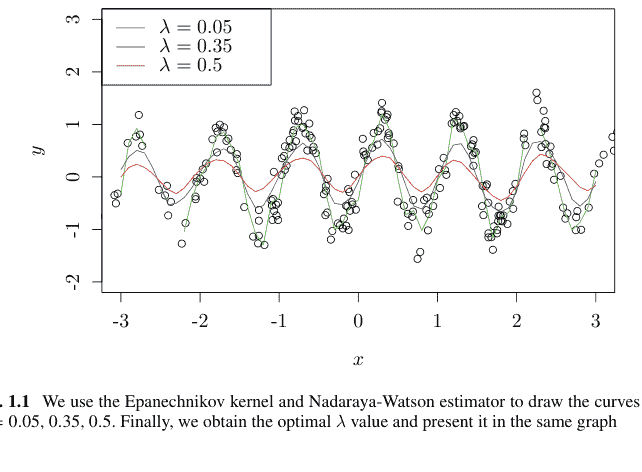

图1.1 我们使用Epanechnikov核和Nadaraya-Watson估计量绘制了λ = 0.05, 0.35, 0.5的曲线。最后，我们得到了最优的λ值，并在同一图中呈现

```python
n = 250
x = 2 * np.random.normal(size = n)
y = np.sin(2 * np.pi * x) + np.random.normal(size = n) / 4 # Data Generation

def D(t): # Function Definition D
    return np.maximum(0.75 * (1 - t**2), 0)

def k(x, y, lam): # Function Definition K
    return D(np.abs((x - y) / lam))

def f(z, lam): # Function Definition f
    S = 0; T = 0
    for i in range(n):
        S = S + k(x[i], z, lam) * y[i]
        T = T + k(x[i], z, lam)
    return S / T

plt.figure(num=1, figsize=(15, 8), dpi=80)
plt.xlim(-3, 3); plt.ylim(-2, 3)
plt.xticks(fontsize = 14); plt.yticks(fontsize = 14)
plt.scatter(x, y, facecolors='none', edgecolors = "k", marker = "o")

xx = np.arange(-3, 3, 0.1)
yy = [[] for _ in range(3)]
lam = [0.05, 0.35, 0.50]
color = ["g", "b", "r"]
for i in range(3):
    for zz in xx:
        yy[i].append(f(zz, lam[i]))
    plt.plot(xx, yy[i], c = color[i], label = lam[i])

plt.legend(loc = "upper_left", frameon = True, prop={'size':14})
plt.title("Nadaraya-Watson Estimator", fontsize = 20)
```

### 1.3 正定核

我们在本书中考虑的核满足下面定义的正定性准则。假设 $k : E \times E \to \mathbb{R}$ 是对称的，即 $k(x, y) = k(y, x), x, y \in E$。对于 $x_1, \dots, x_n \in E (n \ge 1)$，我们称矩阵

$$\begin{bmatrix} k(x_1, x_1) & \cdots & k(x_1, x_n) \\ \vdots & \ddots & \vdots \\ k(x_n, x_1) & \cdots & k(x_n, x_n) \end{bmatrix} \in \mathbb{R}^{n \times n} \quad (1.1)$$

是关于 $k$ 的 $n$ 阶格拉姆矩阵。如果对于任意 $n \ge 1$ 和 $x_1, \dots, x_n \in E$，$n$ 阶格拉姆矩阵都是非负定的，我们称 $k$ 是一个正定核$^2$。

**示例3** 示例2中的核不满足正定性。事实上，当 $\lambda = 2$，$n = 3$，且 $x_1 = -1$，$x_2 = 0$，$x_3 = 1$ 时，由 $K_\lambda(x_i, y_i)$ 组成的矩阵可以写为

$$\begin{bmatrix} k(x_1, x_1) & k(x_1, x_2) & k(x_1, x_3) \\ k(x_2, x_1) & k(x_2, x_2) & k(x_2, x_3) \\ k(x_3, x_1) & k(x_3, x_2) & k(x_3, x_3) \end{bmatrix} = \begin{bmatrix} 3/4 & 9/16 & 0 \\ 9/16 & 3/4 & 9/16 \\ 0 & 9/16 & 3/4 \end{bmatrix}$$

其行列式计算为 $3^3/2^6 - 3^5/2^{10} - 3^5/2^{10} = -3^3/2^9$。通常，矩阵的行列式是其特征值的乘积，我们发现三个特征值中至少有一个是负的。

**示例4** 对于不一定独立的随机变量 $\{X_i\}_{i=1}^\infty$，如果 $k(X_i, X_j)$ 是 $X_i, X_j$ 之间的协方差，那么任意阶的格拉姆矩阵都是有限个 $X_j$ 之间的协方差矩阵，这意味着 $k$ 是正定的。我们在第6章基于此事实讨论高斯过程。

通过假设正定性，本书将发展核的理论。此后，当我们提到核时，我们指的是正定核。

设 $H$ 是一个配备内积 $\langle \cdot, \cdot \rangle_H$ 的线性空间（向量空间）。那么，我们经常使用以下方式构造正定核

$$k(x, y) = \langle \Psi(x), \Psi(y) \rangle_H. \quad (1.2)$$

其中 $\Psi : E \to H$ 是任意映射。我们称这样的 $\Psi$ 为特征映射。在本章中，我们可以假设线性空间 $H$ 是 $d$ 维欧几里得空间 $H = \mathbb{R}^d$，其标准内积为 $\langle x, y \rangle_{\mathbb{R}^d} = x^\top y, x, y \in \mathbb{R}^d$。我们在第2章定义线性空间和内积的概念。

**命题2** *由(1.2)定义的核 $k : E \times E \to \mathbb{R}$ 是正定的。*

$^1$ 我们将矩阵 $A$ 的转置记为 $A^\top$。

$^2$ 虽然说“非负定核”似乎更合适，但“正定核”的说法已成为惯例。

### 1.3 正定核

证明：我们任意固定 $n = 1, 2, \cdots$ 和 $x_1, \cdots, x_n \in E$，并将格拉姆矩阵 (1.1) 记为 $K$。那么，根据内积的定义，对于任意 $z = [z_1, \cdots, z_n] \in \mathbb{R}^n$，我们有

$$z^\top K z = \sum_{i=1}^n \sum_{j=1}^n z_i z_j \langle \Psi(x_i), \Psi(x_j) \rangle_H = \left( \sum_{i=1}^n z_i \Psi(x_i), \sum_{j=1}^n z_j \Psi(x_j) \right)_H = \left\| \sum_{j=1}^n z_j \Psi(x_j) \right\|_H^2 \geq 0,$$

其中对于 $a \in H$，我们记 $\|a\|_H := \langle a, a \rangle_H^{1/2}$。

**命题 3** *如果矩阵 $A$、$B$ 是非负定的，那么它们的哈达玛积 $A \circ B$（逐元素乘积）也是非负定的。*

证明：见本章末尾的附录。

命题 3 有助于证明以下命题的第二部分。

**命题 4** *如果核 $k_1, k_2, \ldots$ 是正定的，那么以下 $E \times E \to \mathbb{R}$ 的函数也是正定的：*

- 1. $ak_1 + bk_2$ ($a, b \geq 0$)，
- 2. $k_1 k_2$，
- 3. $\{k_i\}$ 收敛时的极限$^3$，
- 4. $k$ 仅取一个值 $a \geq 0$（常数函数），以及
- 5. 对于任意 $f : E \to \mathbb{R}$，$f(x)k(x, y)f(y)$ ($x, y \in E$)，

其中第三点指出，极限 $k_\infty(x, y) := \lim_{i \to \infty} k_i(x, y)$ 对于任意 $x, y \in E$ 满足正定性。

证明：$ak_1 + bk_2$ 是正定的，因为对于 $A, B \in \mathbb{R}^{n \times n}$，有

$$x^\top Ax \geq 0, x^\top Bx \geq 0 \Rightarrow x^\top (aA + bB)x \geq 0$$

乘积 $k_1 k_2$ 是正定的，因为如果 $A = (A_{i,j})$，$B = (B_{i,j})$ 是非负定的，那么它们的哈达玛积 $A \circ B$ 也是非负定的（命题 3）。第三个陈述假设存在一个正整数 $n$，使得对于 $x_1, \cdots, x_n \in E$，$z_1, \ldots, z_n \in \mathbb{R}$，以及 $\epsilon > 0$，有

$$B_\infty = \sum_{j=1}^n \sum_{h=1}^n z_j z_h k_\infty(x_j, x_h) = -\epsilon$$

那么，当 $i \to \infty$ 时，$B_i := \sum_{j=1}^n \sum_{h=1}^n z_j z_h k_i(x_j, x_h) \geq 0$ 与 $B_\infty$ 之差会任意接近于零。然而，该差值至少为 $\epsilon > 0$，这导致矛盾，意味着 $B_\infty \geq 0$。如果一个核只取一个（非负）常数值 $a$，由于 (1.1) 中的所有值都是 $a \geq 0$，我们有

$$
\begin{bmatrix} a & \cdots & a \\ \vdots & \ddots & \vdots \\ a & \cdots & a \end{bmatrix} = \begin{bmatrix} \sqrt{a/n} & \cdots & \sqrt{a/n} \\ \vdots & \ddots & \vdots \\ \sqrt{a/n} & \cdots & \sqrt{a/n} \end{bmatrix}^\top \begin{bmatrix} \sqrt{a/n} & \cdots & \sqrt{a/n} \\ \vdots & \ddots & \vdots \\ \sqrt{a/n} & \cdots & \sqrt{a/n} \end{bmatrix}.
$$

最后一个陈述源于蕴含关系

$$x^\top A x \geq 0, x \in \mathbb{R}^n \Rightarrow x^\top D A D x \geq 0, x \in \mathbb{R}^n,$$

我们可以通过将 $y = Dx$ 代入 $y^\top A y \geq 0$ 来验证。特别地，我们可以将 $A$ 和 $D$ 分别视为矩阵 (1.1) 和以 $f(x_1), \cdots, f(x_n)$ 为元素的对角矩阵。

此外，在命题 4 的最后一项中，将 $k(x, y) = 1$ ($x, y \in E$) 代入得到的 $f(x)f(y)$ 是正定的。而且，通过在命题 4 的最后一项中，将 $f(x) = \{k(x, x)\}^{-1/2}$ ($k(x, x) > 0$, $x \in E$) 代入得到的

$$\frac{k(x, y)}{\sqrt{k(x, x)k(y, y)}} \quad (1.3)$$

是正定的。此外，将 $n = 2$，$x_1 = x$ 和 $x_2 = y$ 代入 (1.1) 得到的值是非负的，并且 (1.3) 的绝对值不超过一。我们称 (1.3) 是通过归一化 $k(x, y)$ 得到的正定核。

**示例 5**（线性核）令 $E := \mathbb{R}^d$。那么，使用非负定矩阵 $A = B^\top B \in \mathbb{R}^{d \times d}$，$B \in \mathbb{R}^{d \times d}$ 的核 $k(x, y) = x^\top A y = \langle Bx, By \rangle_H$，$x, y \in \mathbb{R}^d$ 是正定的，因为它对应于命题 2 中映射 $\Psi$ 为 $E \ni x \mapsto Bx \in H$ 的情况。特别地，如果 $A$ 是单位矩阵，那么映射 $\Psi$ 是恒等映射。从这个意义上说，正定核是内积 $k(x, y) = x^\top y$ 的推广。

**示例 6**（指数型）令 $\beta > 0$，$n \geq 0$，且 $x, y \in \mathbb{R}^d$。那么，

$$k_m(x, y) := 1 + \beta x^\top y + \frac{\beta^2}{2} (x^\top y)^2 + \cdots + \frac{\beta^m}{m!} (x^\top y)^m \quad (1.4)$$

($m \geq 1$) 是正定核乘积的多项式，且系数非负。根据命题 4 的前两项，这个核是正定核。此外，由于 (1.4) 是 $m$ 阶泰勒展开，根据命题 4 的第三项，

$$k_\infty(x, y) := \exp(\beta x^\top y) = \lim_{m \to \infty} k_m(x, y)$$

也是正定核。

**示例 7**（高斯核）对于 $x, y \in \mathbb{R}^d$，核

$$k(x, y) := \exp\left\{-\frac{1}{2\sigma^2}\|x - y\|^2\right\}, \quad \sigma > 0$$

可以写成

$$\exp\left\{-\frac{1}{2\sigma^2}\|x - y\|^2\right\} = \exp\left\{-\frac{\|x\|^2}{2\sigma^2}\right\} \exp\left\{\frac{x^\top y}{\sigma^2}\right\} \exp\left\{-\frac{\|y\|^2}{2\sigma^2}\right\}.$$

因此，根据命题 4 的第五项以及 $\exp(\beta x^\top y)$（其中 $\beta = \sigma^{-2}$）是正定的事实，我们看到 (1.5) 是正定的。

**示例 8**（多项式核）对于 $x, y \in \mathbb{R}^d, d = 1, 2, \dots$，核

$$k_{m,d}(x, y) := (x^\top y + 1)^m$$

是正定核（线性核 $x^\top y$）的多项式，且其系数非负。根据命题 4 的前两项，(1.6) 是正定的。

**示例 9** 如果我们通过 (1.3) 归一化线性核，我们得到 $x^\top y / \|x\| \|y\|$，其中对于 $a \in \mathbb{R}^n$，我们记 $\|a\| := \langle a, a \rangle^{1/2}$。高斯核 (1.5) 即使归一化后也保持不变。多项式核归一化后变为

$$\left( \frac{x^\top y + 1}{\sqrt{x^\top x + 1} \sqrt{y^\top y + 1}} \right)^m$$

命题 2 的逆命题成立，这将在第 3 章证明：对于任何非负定核 $k$，存在一个特征映射 $\Psi : E \to H$，使得 $k(x, y) = \langle \Psi(x), \Psi(y) \rangle_H$。

**示例 10**（多项式核）令 $m, d \ge 1$。核 $k_{m,d}(x, y) = (x^\top y + 1)^m$（其中 $x, y \in \mathbb{R}^d$）的特征映射是

$$\Psi_{m,d}(x_1, \dots, x_d) = \left( \sqrt{\frac{m!}{m_0! m_1! \dots m_d!}} x_1^{m_1} \dots x_d^{m_d} \right)_{m_0, m_1, \dots, m_d \ge 0},$$

其中索引 $(m_0, m_1, \dots, m_d)$ 的取值范围是 $m_0, m_1, \dots, m_d \ge 0$ 且 $m_0 + m_1 + \dots + m_d = m$，并且我们假设索引 $(m_0, m_1, \dots, m_d)$ 之间存在某种顺序。如果我们使用多项式定理，

$$(\sum_{i=0}^d z_i)^m = \sum_{m_0 + m_1 + \dots + m_d = m} \frac{m!}{m_0! m_1! \dots m_d!} z_1^{m_1} \dots z_d^{m_d}$$

$(z_0 = 1)$，我们看到

$$(x^\top y + 1)^m = \langle \Psi_{m,d}(x), \Psi_{m,d}(y) \rangle_H$$

其中 $x_0 = y_0 = 1$。例如，我们有

$$\Psi_{1,2}(x_1, x_2) = [1, x_1, x_2]$$

$$\Psi_{2,2}(x_1, x_2) = [1, x_1^2, x_2^2, \sqrt{2}x_1, \sqrt{2}x_2, \sqrt{2}x_1x_2]$$

因为

$$\langle \Psi_{2,1}(x_1, x_2), \Psi_{2,1}(y_1, y_2) \rangle_H = 1 + x_1y_1 + x_2y_2 = 1 + x^\top y = k(x, y)$$

$$\langle \Psi_{2,2}(x_1, x_2), \Psi_{2,2}(y_2, y_2) \rangle_H = 1 + x_1^2y_1^2 + x_2^2y_2^2 + 2x_1y_1 + 2x_2y_2 + 2x_1x_2y_1y_2$$

$$= (1 + x_1y_1 + x_2y_2)^2 = (1 + x^\top y)^2 = k(x, y).$$

**示例 11** *（无限维多项式核）* 令 $0 < r \le \infty, d \ge 1$，且 $E := \{x \in \mathbb{R}^d \mid \|x\|_2 < \sqrt{r}\}$。令 $f : (-r, r) \to \mathbb{R}$ 是 $C^\infty$ 函数。我们假设该函数可以通过以下方式泰勒展开

$$f(x) = \sum_{n=0}^{\infty} a_n x^n, \quad x \in (-r, r).$$

如果 $a_0 > 0, a_1, a_2, \dots \ge 0$，那么对于 $x, y \in E$，$f(x^\top y)$ 是一个正定核。指数型是无限维多项式核，并且是正定的。

**示例 12** 在示例 2 中，我们使用 Nadaraya-Watson 估计器来确定高斯核（图 1.2 和 1.3）。

```python
def K(x, y, sigma2):
    return np.exp(-np.linalg.norm(x - y)**2/2/sigma2)

def F(z, sigma2):  # Function Definition f
    S=0; T=0
    for i in range(n):
        S = S + K(x[i], z, sigma2) * y[i]
        T = T + K(x[i], z, sigma2)
    return S / T
```

我们通常通过交叉验证 (CV)$^4$ 来获得每个核参数的最优值。如果参数取连续值，我们会选择有限数量的候选值，并按如下方式获得每个参数的评估值。将 $N$ 个样本分成 $K$ 组，并使用属于 $K - 1$ 组的样本进行估计。使用属于剩余一组的样本进行测试，并计算相应的分数。重复该过程 $K$ 次（改变

$^3$ 对于每个 $(x, y) \in E$，$k_i(x, y)$ 的极限。

$^4$ Joe Suzuki, "Statistical Learning with Math and Python", 第 4 章, Springer.

### 1.3 正定核

### 1.4 概率

当集合在集合运算（并集、交集和补集）下封闭时，每个集合都是一个事件。

**示例 13** 我们考虑一个由 $E = \{1, 2, 3, 4, 5, 6\}$（骰子点数）的子集构成的集合，这些子集在集合运算下是封闭的：

$\{E, \{\}, \{1, 3\}, \{5\}, \{2, 4, 6\}, \{1, 3, 5\}, \{2, 4, 5, 6\}, \{1, 2, 3, 4, 6\}\}$。

如果这八个元素中的任何一个进行并集、交集或补集运算，结果仍然是这八个元素之一。从这个意义上说，我们可以说这八个元素在集合运算下是封闭的。子集 $\{1, 3\}$ 和 $\{2, 4, 5, 6\}$ 是事件，但 $\{2, 4\}$ 不是。另一方面，对于整个集合 $E$，如果我们把 $\{1\}, \{2\}, \{3\}, \{4\}, \{5\}, \{6\}$ 也作为事件，那么就需要考虑 $2^6$ 个事件。即使整个集合 $E$ 是相同的，一个集合是否是事件也取决于事件集合 $\mathcal{F}$ 的定义。

在下文中，我们在定义了整个集合 $E$ 以及在集合运算下封闭的 $E$ 的子集（事件）集合 $\mathcal{F}$ 之后，开始我们的讨论。任何开区间 $(a, b)$，其中 $a, b \in \mathbb{R}$，都是整个实数系统 $\mathbb{R}$ 的子集。对多个开区间应用集合运算（并集、集合积和集合补集）不会形成一个开区间，但结果仍然是 $\mathbb{R}$ 的子集。我们将通过集合运算从开集获得的 $\mathbb{R}$ 的任何子集称为 $\mathbb{R}$ 的博雷尔集，并将这样的子集记为 $\mathbb{B}$。对博雷尔集进一步应用集合运算得到的集合仍然是博雷尔集。

**示例 14** 对于 $a, b \in \mathbb{R}$，以下是博雷尔集：$\{a\} = \bigcap_{n=1}^\infty (a - 1/n, a + 1/n)$，$[a, b) = \{a\} \cup (a, b)$，$(a, b] = \{b\} \cup (a, b)$，$[a, b] = \{a\} \cup (a, b)$，$\mathbb{R} = \bigcup_{n=0}^\infty (-2^n, 2^n)$，$\mathbb{Z} = \bigcup_{n=0}^\infty [-n, n]$，以及 $[\sqrt{2}, 3) \cup \mathbb{Z}$。

如上所述，我们假设已经定义了整个集合 $E$ 和事件集合 $\mathcal{F}$。此时，满足以下三个条件的 $\mu : \mathcal{F} \to [0, 1]$ 被称为概率。

1.  $\mu(A) \geq 0, A \in \mathcal{F}$，
2.  $A_i \cap A_j = \{\} \Rightarrow \mu(\bigcup_{i=1}^\infty A_i) = \sum_{i=1}^\infty \mu(A_i)$，以及
3.  $\mu(E) = 1$。

如果 $\mu$ 满足前两个条件，我们称 $\mu$ 是一个测度；如果 $\mu(E)$ 取有限值，我们称这个测度是有限的。根据 $\mu(E) = 1$ 是否成立，我们称 $(E, \mathcal{F}, \mu)$ 是概率空间或测度空间。

对于概率和测度空间，如果对于任何博雷尔集 $B$，$\{e \in E | X(e) \in B\}$ 都是一个事件，即 $\{e \in E | X(e) \in B\} \in \mathcal{F}$，我们称函数 $X : E \to \mathbb{R}$ 在 $X$ 上是可测的。特别地，如果我们有一个概率空间，$X$ 就是一个随机变量。$X$ 是否可测取决于 $(E, \mathcal{F})$ 而不是 $(E, \mathcal{F}, \mu)$。

对于初学者来说，可测性的概念可能比较复杂。然而，如果我们直观地理解函数 $X : E \to \mathbb{R}$ 依赖于 $\mathcal{F}$ 的元素而不是 $E$ 的元素，理解起来似乎会更顺畅。

**示例 15** *（骰子点数）* 假设对于 $E = \{1, 2, 3, 4, 5, 6\}$，给定 $X : E \to \mathbb{R}$ 为

$$X(e) = \begin{cases} 1, & e = 1, 3, 5 \\ 0, & e = 2, 4, 6 \end{cases}.$$

那么，如果 $\mathcal{F} = \{\{1, 3, 5\}, \{2, 4, 6\}, \emptyset, E\}$，则 $X$ 是一个随机变量。事实上，由于 $X$ 是可测的，

对于博雷尔集 $B = \{1\}, [-2, 3), [0, 1)$，有
$$\{e \in E | X(e) \in \{1\}\} = \{1, 3, 5\}$$
$$\{e \in E | X(e) \in [-2, 3)\} = E$$
$$\{e \in E | X(e) \in [0, 1)\} = \{2, 4, 6\}$$

即使我们选择博雷尔集 $B$，集合 $\{e \in E | X(e) \in B\}$ 也是 $\{1, 3, 5\}, \{2, 4, 6\}, \emptyset, E$ 之一。另一方面，如果 $\mathcal{F} = \{\{1, 2, 3\}, \{4, 5, 6\}, \emptyset, E\}$，那么 $X$ 就不是随机变量。

在下文中，假设函数 $f : E \to \mathbb{R}$ 是可测的，我们定义勒贝格积分 $\int_E f d\mu$。我们首先假设 $f$ 是非负的。对于 $\mathcal{F}$ 的一个互斥子集序列 $\{B_k\}$，我们定义

$$\sum_k \left( \inf_{e \in B_k} f(e) \right) \mu(B_k). \tag{1.7}$$

如果 $\cup_k B_k = E$ 并且 $(1.7)$ 关于 $\{B_k\}$ 的上确界

$$\sup_{\{B_k\}} \sum_k \left( \inf_{e \in B_k} f(e) \right) \mu(B_k),$$

取有限值，我们称这个上确界是可测函数 $f$ 对于 $(E, \mathcal{B}, \mu)$ 的勒贝格积分，并记为 $\int_E f d\mu$。当函数 $f$ 不一定非负时，我们将 $E$ 分为 $E_+ := \{e \in E | f(e) \le 0\}$ 和 $E_- := \{e \in E | f(e) \ge 0\}$，并对 $f_+ := f, f_- := -f$ 分别定义上述量。如果 $\int f_+ d\mu$ 和 $\int f_- d\mu$ 都取有限值，我们称 $\int f d\mu := \int f_+ d\mu - \int f_- d\mu$ 是 $f$ 对于 $(E, \mathcal{B}, \mu)$ 的勒贝格积分。

如果 $X$ 是一个随机变量，相关的博雷尔集就是概率 $\mu(\cdot)$ 的事件。对于 $x \in \mathbb{R}$，事件 $X \le x$ 的概率

$$F_X(x) := \mu([ -\infty, x)) = \int_{(-\infty, x]} d\mu,$$是分布函数，且 $f_X$ 是 $X$ 的概率密度函数，如果我们能将 $F_X$ 写成

$$F_X(x) = \int_{-\infty}^x f_X(t)dt \,.$$

我们称 $\mu$ 是绝对连续的，如果对于任何博雷尔集 $B$，当区间宽度之和趋近于零时，概率 $\mu(B)$ 也趋近于零。确保概率 $\mu$ 存在概率密度函数的充要条件是 $\mu$ 是绝对连续的。如果 $X$ 取有限个值，则概率密度函数不存在，这意味着 $\mu$ 不是绝对连续的。如果 $X$ 取值为 $a_1 < \cdots < a_m$，则分布函数可以写成

$$F_X(x) = \sum_{j: a_j \le x} \mu(\{a_j\}) \,.$$

**示例 16** 假设 $X$ 服从标准高斯分布。如果我们让 $\epsilon > 0$ 趋近于零，$F_X(x + \epsilon) - F_X(x - \epsilon)$（对于任意 $x \in \mathbb{R}$）趋近于零，这意味着概率是绝对连续的。另一方面，假设 $X$ 取值为 $0, 1$；即使我们让 $\epsilon > 0$ 趋近于零，$F_X(1 + \epsilon) - F_X(1 - \epsilon)$ 也不趋近于零，这意味着概率不是绝对连续的。

如果我们使用勒贝格积分，我们可以在不区分离散和连续变量的情况下表达概率。

**示例 17** 对于 $E = \mathbb{R}$，如果概率密度函数 $f_X$ 存在，$X$ 的期望可以写成 $\int_E x d\mu = \int_{-\infty}^\infty t f_X(t) dt$。另一方面，如果 $X$ 取值为 $a_1 < \cdots < a_m$，我们有 $\int_E x d\mu = \sum_{j=1}^m a_j \mu(\{a_j\})$。

### 1.5 博赫纳定理

我们考虑核是 $x, y \in E$ 之差的函数的情况。根据博赫纳定理，这是本节的主要主题，并将在后续章节中使用，核在概率和统计意义上应与特征函数一致（相差一个常数）。

当使用一元函数 $\phi : E \to \mathbb{R}$ 时，我们经常使用形式为 $k(x, y) = \phi(x - y)$ 的核，例如高斯核。核 $k$ 是正定的等价于不等式

$$\sum_{i=1}^n \sum_{j=1}^n z_i z_j \phi(x_i - x_j) \ge 0 \,, \quad z = [z_1, \dots, z_n] \in \mathbb{R}^n \qquad (1.8)$$

对于任意 $n \ge 1$，$x_1, \dots, x_n \in E$ 成立。

令 $i = \sqrt{-1}$ 为虚数单位。我们定义随机变量 $X$ 的特征函数为 $\varphi : \mathbb{R}^d \to \mathbb{C}$：

$\varphi(t) := \mathbb{E}[\exp(it^\top X)] = \int_E \exp(it^\top x) d\mu(x)$, $t \in \mathbb{R}^d$。

其中 $\mathbb{E}[\cdot]$ 表示期望。如果 $\mu$ 是绝对连续的（即概率密度函数 $f_X$ 存在），那么 $\varphi(t) := \mathbb{E}[\exp(it^\top X)] = \int_E \exp(it^\top x) f_X(x) dx$ 是 $f_X(x) = \frac{d\mu(x)}{dx}$ 的傅里叶变换，并且 $f_X(x)$ 可以通过逆傅里叶变换从 $\varphi(x)$ 恢复

$f_X(x) = \frac{1}{2\pi} \int_{-\infty}^{\infty} \varphi(t) e^{-it^\top x} dt$。

**示例 18** 均值为 $\mu$、方差为 $\sigma^2$ 的高斯分布 $f(x) = \frac{1}{\sqrt{2\pi\sigma^2}} \exp\left\{-\frac{(x-\mu)^2}{2\sigma^2}\right\}$ 的特征函数是

$\varphi(t) = \frac{1}{\sqrt{2\pi\sigma^2}} \int_{-\infty}^{\infty} \exp\{itx\} \exp\left\{-\frac{(x-\mu)^2}{2\sigma^2}\right\} dx$
$= \frac{1}{\sqrt{2\pi\sigma^2}} \int_{-\infty}^{\infty} \exp\left[-\frac{\{x-(\mu+it\sigma^2)\}^2}{2\sigma^2}\right] dx \cdot \exp\left\{i\mu t - \frac{t^2\sigma^2}{2}\right\}$
$= \exp\left\{i\mu t - \frac{t^2\sigma^2}{2}\right\}$。

参数为 $\alpha > 0$ 的拉普拉斯分布 $f(x) = \frac{\alpha}{2} \exp\{-\alpha|x|\}$ 的特征函数是

$\int_{-\infty}^{\infty} \exp\{itx\} \frac{\alpha}{2} \exp\{-\alpha|x|\} dx = \frac{\alpha}{2} \left\{ \int_{-\infty}^{0} \exp[(it+\alpha)x] dx + \int_{0}^{\infty} \exp[(it-\alpha)x] dx \right\}$
$= \frac{\alpha}{2} \left\{ \left[ \frac{e^{(it+\alpha)x}}{it+\alpha} \right]_{-\infty}^{0} - \left[ \frac{e^{(it-\alpha)x}}{it-\alpha} \right]_{0}^{\infty} \right\} = \frac{\alpha^2}{t^2+\alpha^2}$。

**命题 5** (博赫纳) *假设 $\phi : \mathbb{R}^n \to \mathbb{R}$ 是连续的。那么，对于任意 $n \ge 1$，$x = [x_1, \dots, x_n] \in \mathbb{R}^n$ 和 $z = [z_1, \dots, z_n] \in \mathbb{R}^n$，条件 (1.8) 成立，当且仅当 $\phi$ 与关于某个概率 $\mu$ 的特征函数一致（相差一个常数），即存在一个有限测度 $\eta$ 使得*

$\phi(t) = \int_E \exp(it^\top x) d\eta(x)$, $t \in \mathbb{R}^n$. (1.9)

证明：见本章末尾的附录。

因为核评估的是 $E$ 中两个元素之间的相似性，所以我们不太关心常数的乘法。在下文中，我们说概率 $\mu$ 是核 $k$ 的概率，如果 $\mu$ 是命题 5 中将核 $k$ 除以一个常数后得到的有限测度 $\eta$。注意，尽管特征函数的值域通常是 $\mathbb{C}^n$，但本书中我们只考虑值域为实数的核 $k(\cdot, \cdot)$。

在下文中，对于 $t = [t_1, \dots, t_d] \in \mathbb{R}^d$，我们用 $\|t\|_2$ 表示 $\sqrt{\sum_{j=1}^d t_j^2}$。

**示例 19** *(高斯核)* $k(x, y) = \exp\{-\frac{1}{2\sigma^2}\|x - y\|_2^2\}$, $x, y \in \mathbb{R}^d$ 与均值为 0、协方差矩阵为 $(\sigma^2)^{-1}I \in \mathbb{R}^{d \times d}$ 的高斯分布的特征函数 $\exp\{-\frac{\|t\|_2^2}{2\sigma^2}\}$, $t = x - y \in \mathbb{R}^d$ 一致。

**示例 20** *(拉普拉斯核)* $k(x, y) = \frac{1}{2\pi} \frac{1}{\|x - y\|_2^2 + \beta^2}$, $x, y \in \mathbb{R}^n$ 与参数为 $\alpha = \beta > 0$ 的拉普拉斯分布的特征函数 $\frac{\beta^2}{\|t\|_2^2 + \beta^2}$, $t = x - y \in \mathbb{R}^n$ 一致，相差常数乘法 $[2\pi\beta^2]^{-1}$。

如果概率密度函数存在，我们可以为这个分布构造核。然而，如果我们限制搜索范围为值域为实数的核，我们需要选择参数使得特征函数取实数值。例如，通过将均值设置为零获得的高斯核就取实数值。

### 1.6 字符串、树和图的核

如第 4 章所讨论的，协变量空间 $E$ 通过特征映射 $\Psi : E \to H$ 投影。通过在另一个线性空间（再生核希尔伯特空间）中的内积（核）来评估相似性的方法已在机器学习和数据科学中得到广泛应用。如果集合 $E$ 中元素之间的相似性被准确表示，那么这种方法将产生改进的回归和分类处理性能。由于这是一种核配置方法，我们提供了卷积核和边缘化核的概念，并通过引入字符串、树和图核来说明它们。

首先，我们为集合 $E_1, \dots, E_d$ 定义正定核 $k_1, \dots, k_d$。假设我们定义一个集合 $E$ 和一个映射 $R : E_1 \times \cdots \times E_d \to E$。然后，我们定义核 $E \times E \ni (x, y) \mapsto k(x, y) \in \mathbb{R}$ 为

$$k(x, y) = \sum_{R^{-1}(x)} \sum_{R^{-1}(y)} \prod_{i=1}^d k_i(x_i, y_i), \quad (1.10)$$

其中 $\sum_{R^{-1}(x)}$ 是对所有满足 $R(x_1, \dots, x_d) = x$ 的 $(x_1, \dots, x_d) \in E_1 \times \cdots \times E_d$ 求和。形式为 (1.10) 的核称为卷积核 [13]。由于每个 $k_i(x_i, y_i)$ 都是正定的，$k(x, y)$ 也是正定的（根据命题 4 的前两项）。

**示例 21** *(字符串核)* 令 $\Sigma^p$ 是由有限集 $\Sigma$ 中 $p \ge 0$ 个字符组成的字符串集合，并令 $\Sigma^* := \cup_j \Sigma^i$。例如，如果 $\Sigma = \{A, T, G, C\}$，我们有 $AGGCGTG \in \Sigma^7$。然后，我们定义核

$$k(x, y) := \sum_{u \in \Sigma^p} c_u(x)c_u(y)$$

对于 $x, y \in \Sigma^*$，其中 $c_u(x)$ 表示 $u \in \Sigma^p$ 在 $x \in \Sigma^*$ 中出现的次数。以下表示定义此字符串核的示例代码。

```python
def string_kernel(x, y, p):
    m, n = len(x), len(y)
    S = 0
    for i in range(m):
        for j in range(i, n):
            if x[i:(i+p)] == y[j:(j+p)]:
                S = S + 1
    return S
```

然后，我们执行该过程。

```python
C = ["a", "b", "c"]
m = 10
w = np.random.choice(C, m, replace = True)
x = ""
for i in range(m):
    x = x + w[i]
n = 12
w = np.random.choice(C, n, replace = True)
y = ""
for i in range(n):
    y = y + w[i]
```

x

'ababbcaaac'

y

'ccbcbcaaacaa'

string_kernel(x,y,2)

58

假设 $d = 3$，$E_1 = E_3 = \Sigma^*$，且 $E_2 = \Sigma^P$。那么，如果我们连接 $(x_1, x_2, x_3) \in E_1 \times E_2 \times E_3$，则可以陈述 $R(x_1, x_2, x_3) = x \in E$。如果 $x_2 = u$ 和 $y_2 = u$ 分别在 $x$ 中出现 $c_u(x)$ 次，在 $y$ 中出现 $c_u(y)$ 次，那么通过设置 $k_1(x_1, y_1) = k_3(x_3, y_3) = 1$ 和 $k_2(x_2, y_2) = I(x_2 = y_2 = u)$，我们有

$$c_u(x)c_u(y) = \sum_{R(x_1, x_2, x_3) = x} \sum_{R(y_1, y_2, y_3) = y} 1 \cdot I(x_2 = y_2 = u) \cdot 1$$

$$k(x, y) = \sum_u c_u(x)c_u(y) = \sum_{R(x_1, x_2, x_3) = x} \sum_{R(y_1, y_2, y_3) = y} 1 \cdot I(x_2 = y_2) \cdot 1.$$

因此，我们观察到字符串核可以由 (1.10) 表示，其中 $I(A)$ 根据条件 $A$ 是否满足而取值为一或零。

**示例 22**（树核）假设我们为树 $x$、$y$ 的每个顶点分配一个标签。我们希望根据共享的子树数量来评估 $x$、$y$ 之间的相似性。我们用 $c_t(x)$、$c_t(y)$ 分别表示子树 $t$ 在 $x$、$y$ 中的出现次数。那么，核

$$k(x, y) := \sum_t c_t(x)c_t(y) \quad (1.11)$$

是正定的。事实上，对于 $x_1, \ldots, x_n \in E$ 和任意 $z_1, \ldots, z_n \in \mathbb{R}$，我们有

$$\sum_{i=1}^n \sum_{j=1}^n z_i z_j k(x_i, x_j) = \sum_t \{\sum_{i=1}^n z_i c_t(x_i)\}^2 \geq 0.$$

令 $V_x$、$V_y$ 分别为树 $x$、$y$ 中的顶点集；我们根据 $t$ 是否以 $u$ 为顶点来写 $I(u, t) = 1$ 或 $I(u, t) = 0$。由于 (1.11) 可以写成 $c_t(x) = \sum_{u \in V_x} I(u, t)$，$c_t(y) = \sum_{v \in V_y} I(v, t)$，我们有

$$k(x, y) = \sum_{u \in V_x} \sum_{v \in V_y} \sum_t I(u, t)I(v, t) = \sum_{u \in V_x} \sum_{v \in V_y} c(u, v),$$

其中 $c(u, v) = \sum_t I(u, t)I(v, t)$ 是 $x$ 和 $y$ 中以顶点 $u \in V_x$ 和 $v \in V_y$ 为根的公共子树的数量。我们假设为每个 $v \in V$ 分配一个标签 $l(v)$，并确定它们是否相同。

1.  对于 $u$ 和 $v$ 的后代 $u_1, \ldots, u_m$ 和 $v_1, \ldots, v_n$，如果满足以下任一条件，则我们定义 $c(u, v) := 0$：
    (a) $l(u) \neq l(v)$，
    (b) $m \neq n$，
    (c) 存在 $i = 1, \ldots, m$ 使得 $l(u_i) \neq l(v_i)$，
2.  否则，我们定义

$c(u, v) := \prod_{i=1}^{m} \{1 + c(u_i, v_i)\}$。

例如，假设我们为图 1.4 中的每个顶点分配标签 $A, T, G, C$ 中的一个。我们可以用一个 Python 函数来表示，如下所示，其中我们假设不会为树中同一级别的顶点分配相同的标签。注意该函数调用自身（它是一个递归函数）。例如，当函数获取 $C(1, 1)$ 时，它需要值 $C(4, 2)$。

```python
def C(i, j):
    S, T = s[i], t[j]
    # 当树 s 和 t 的顶点 i 和 j 不匹配时返回零
    if S[0] != T[0]:
        return 0
    # 当树 s 或 t 的顶点 i 或 j 没有后代时返回零
    if S[1] is None:
        return 0
    if T[1] is None:
        return 0
    if len(S[1]) != len(T[1]):
        return 0
    U = []
    for x in S[1]:
        U.append(s[x][0])
    U1 = sorted(U)
    V = []
    for y in T[1]:
        V.append(t[y][0])
    V1 = sorted(V)
    m = len(U)
    # 当后代的标签不匹配时返回零
    for h in range(m):
        if U1[h] != V1[h]:
            return 0
    U2 = np.array(S[1])[np.argsort(U)]
    V2 = np.array(T[1])[np.argsort(V)]
    W = 1
    for h in range(m):
        W = W * (1 + C(U2[h], V2[h]))
    return W
```

```python
def k(s, t):
    m, n = len(s), len(t)
    kernel = 0
    for i in range(m):
        for j in range(n):
            if C(i, j) > 0:
                kernel = kernel + C(i, j)
    return kernel
```

```python
s = [[] for _ in range(6)]
s[0] = ["G", [1, 3]]; s[1] = ["T", [2]]; s[2] = ["C", None]
s[3] = ["A", [4, 5]]; s[4] = ["C", None]; s[5] = ["T", None]

t = [[] for _ in range(9)]
t[0] = ["G", [1, 4]]; t[1] = ["A", [2, 3]]; t[2] = ["C", None]
t[3] = ["T", None]; t[4] = ["T", [5, 6]]; t[5] = ["C", None]
```

## 1 正定核

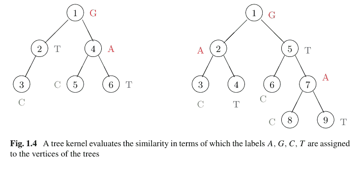

图 1.4 树核根据标签 A、G、C、T 被分配给树顶点的方式来评估相似性

```python
t[6] = ["A", [7, 8]]; t[7] = ["C", None]; t[8] = ["T", None]

for i in range(6):
    for j in range(9):
        if C(i, j) > 0:
            print(i, j, C(i, j))
```

0 0 2
3 1 1
3 6 1

k(s, t)

4

因此，总和 4 将是核值。

令 $X$ 和 $Y$ 分别为在 $E_X$ 和 $E_Y$ 中取值的离散随机变量，并令 $P(y|x)$ 为给定 $Y = y \in E_Y$ 时 $X = x \in E_X$ 的条件概率。假设我们为 $E_{XY} := E_X \times E_Y$ 给定一个正定核 $k_{XY} : E_{XY} \times E_{XY} \to \mathbb{R}$。我们通过以下方式定义边缘化核

$$k(x, x') := \sum_{y \in E_Y} \sum_{y' \in E_Y} k_{XY}((x, y), (x', y')) P(y|x) P(y'|x'), \quad x, x' \in E_X \quad (1.12)$$

对于 $x, x' \in E_X$（Tsuda 等人 [32]）。我们声称边缘化核是正定的。事实上，$k_{XY}$ 是正定的意味着存在特征映射 $\Psi : E_{XY} \ni (x, y) \mapsto \Psi(x, y)$ 使得

$$k_{XY}((x, y), (x', y')) = \langle \Psi((x, y)), \Psi((x', y')) \rangle.$$

因此，存在另一个特征映射 $E_X \ni x \mapsto \sum_{y \in E_Y} P(y|x)\Psi((x, y))$ 使得

$$k(x, x') := \sum_{y \in E_Y} \sum_{y' \in E_Y} P(y|x)P(y'|x')\langle \Psi((x, y)), \Psi((x', y')) \rangle$$
$$= \langle \sum_{y \in E_Y} P(y|x)\Psi((x, y)), \sum_{y' \in E_Y} P(y'|x')\Psi((x', y')) \rangle.$$

我们可以为给定 $X$ 时 $Y$ 的条件密度函数 $f$ 定义 (1.12) 如下：

$$k(x, x') := \int_{y \in E_Y} \int_{y' \in E_Y} \int k_{Y|X}((x, y), (x', y')) f(y|x) f(y'|x') dy dy'$$

对于 $x, x' \in E_X$。

**示例 23**（图核（Kashima 等人 [19]））我们构建一个核来表达可能包含环的（有向）图 $G_1, G_2$ 之间的相似性，该相似性基于连接两个顶点的路径集合。

令 $V, E$ 分别为顶点和（有向）边的集合。我们用由顶点和边组成的序列表示每条长度为 $m$ 的路径：$(v_0, e_1, \dots, e_m, v_m)$，$v_0, v_1, \dots, v_m \in V$，且 $e_1, \dots, e_m \in E$。我们假设为两个图的每个顶点和边分配一个标签，并通过相关条件概率的乘积定义序列 $\pi = (v_0, e_1, \dots, e_m, v_m)$ 的概率 $p(\pi) := p(v_0)p(v_1|v_0) \cdots p(v_m|v_{m-1})$。为此，我们考虑一个随机游走，其中我们首先以概率 $p(v_0) = 1/|V|$（$|V|$：$V$ 的基数）选择 $v_0 \in V$，然后反复选择以概率 $p$ 在该点停止，或者以等概率乘以 $1 - p$ 通过连接的有向边之一移动到相邻顶点，其中停止概率 $0 < p < 1$ 应以先验方式确定。例如，如果随机游走到达一个连接到 $|V(v)|$ 个顶点的顶点 $v$，那么移动到其中一个相邻顶点的概率是 $(1 - p)/|V(v)|$。例如，对于图 1.5 中的 $1 \to 4 \to 3 \to 5 \to 3$，标签是 $A, e, A, d, D, a, B, c, D$。如果 $p = 1/3$，那么可以通过以下代码获得有向路径的概率。

```python
def k(s, p):
    return prob(s, p) / len(node)

def prob(s, p):
    if len(node[s[0]]) == 0:
        return 0
    if len(s) == 1:
        return p
    m = len(s)
    S = (1 - p) / len(node[s[0]]) * prob(s[1:m], p)
    return S
```

图 1.5 通过图核评估相似性

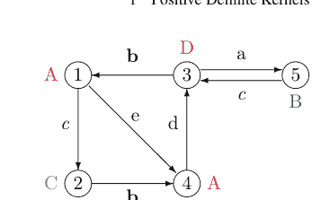

我们在下面演示代码的执行：

```python
node = [[] for _ in range(5)]
node[0] = [2, 4]; node[1] = [4]; node[2] = [1, 5]
node[3] = [1, 5]; node[4] = [3]
k([0, 3, 2, 4, 2], 1 / 3)
```

0.0016460905349794243

因为存在五个顶点，我们乘以 1/5，选择接下来的两个转换之一，依此类推。

$$\frac{1}{5} \cdot \left(\frac{2}{3} \cdot \frac{1}{2}\right) \cdot \left(\frac{2}{3} \cdot 1\right) \cdot \left(\frac{2}{3} \cdot \frac{1}{2}\right) \cdot \left(\frac{2}{3} \cdot 1\right) \cdot \frac{1}{3} = \frac{2^2}{5 \times 3^5}.$$

因为这些概率在有向图 $G_1, G_2$ 中不同，我们用 $p(\pi|G_1)$ 和 $p(\pi|G_2)$ 表示它们。我们用 $L(\pi)$ 表示路径 $\pi$（长度为 $2m + 1$）的标签序列，并通过以下方式定义图核

$$k(G_1, G_2) := \sum_{\pi_1} \sum_{\pi_2} p(\pi_1|G_1)p(\pi_2|G_2)I[L(\pi_1) = L(\pi_2)].$$

我们发现，如果 $k_{XY}((G_1, \pi_1), (G_2, \pi_2)) = I[L(\pi_1) = L(\pi_2)]$，那么这个核是一个边缘化核。

## 附录

许多书籍都有证明，因为富比尼定理、勒贝格控制收敛定理和莱维收敛定理是通用定理。我们省略了这些陈述和证明。命题 5 的证明由伊藤 [15] 提供。

### 命题 3 的证明

$D$ 是一个对角矩阵，其分量是非负定矩阵 $A$ 的特征值 $\lambda_i \ge 0$，而 $U$ 是一个正交矩阵，其列向量是相互正交的单位特征向量 $u_i$。那么，我们可以将 $A$ 写为 $A = UDU^\top = \sum_{i=1}^n \lambda_i u_i u_i^\top$。类似地，如果 $\mu_i, v_i, i = 1, \dots, n$ 分别是矩阵 $B$ 的特征值和特征向量，那么我们可以将 $B$ 写为 $B = \sum_{i=1}^n \mu_i v_i v_i^\top$。此时，我们有

$(u_i u_i^\top) \circ (v_j v_j^\top) = (u_{i,k} u_{i,l} \cdot v_{j,k} v_{j,l})_{k,l} = (u_{i,k} v_{j,k} \cdot u_{i,l} v_{j,l})_{k,l} = (u_i \circ v_j)(u_i \circ v_j)^\top$。

注意这个矩阵是非负定的。事实上，如果我们令 $u_i \circ v_j = [y_1, \dots, y_n] \in \mathbb{R}^n$，那么 $(u_i \circ v_j)(u_i \circ v_j)^\top$ 的 $(h, l)$ 分量是 $y_h y_l$，这意味着对于任意 $z_1, \dots, z_n$，有 $\sum_{h=1}^n \sum_{l=1}^n z_h z_l y_h y_l = (\sum_{h=1}^n z_h y_h)^2 \ge 0$。由于矩阵 $A$ 和 $B$ 是非负定的，我们有对于每个 $i, j = 1, \dots, n$，$\lambda_i, \mu_j \ge 0$，这意味着

$A \circ B = \sum_{i=1}^n \sum_{j=1}^n \lambda_i \mu_j (u_i u_i^\top) \circ (v_j v_j^\top) = \sum_{i=1}^n \sum_{j=1}^n \lambda_i \mu_j (u_i \circ v_j)(u_i \circ v_j)^\top$

是非负定的。$\square$

### 命题 5 的证明

我们仅展示 $\phi(0) = \eta(E) = 1$ 的情况，因为推广是直接的。假设 (1.9) 成立。那么，我们有

$\sum_{j=1}^n \sum_{k=1}^n z_j z_k \phi(x_j - x_k) = \int_E \sum_{j=1}^n z_j e^{ix_j t} \sum_{k=1}^n z_k e^{-ix_k t} d\eta(t) = \int_E |\sum_{j=1}^n z_j e^{ix_j t}|^2 d\eta(t) \ge 0$。

并且 (1.8) 成立。反之，假设 (1.8) 成立。由于以 $\phi(x_i - x_j)$ 为 $(i, j)$ 元素的矩阵是非负定且对称的，我们有 $\phi(x) = \phi(-x), x \in \mathbb{R}$。如果我们代入 $n = 2, x_1 = u$，以及 $x_2 = 0$，那么我们得到

$[z_1, z_2] \begin{bmatrix} 1 & \phi(u) \\ \phi(u) & 1 \end{bmatrix} \begin{bmatrix} z_1 \\ z_2 \end{bmatrix} \ge 0$

并且由于行列式非负，有 $\phi(u)^2 \le 1$。由于 $\phi$ 有界且连续，它是一致连续的。另一方面，$e^{-\|t\|^2/n} e^{-ix^\top t}$ 也是一致连续的。下面我们证明

$f_n(x) := \frac{1}{2\pi} \int_{-\infty}^\infty \phi(t) e^{-\|t\|^2/n} e^{-ix^\top t} dt$

是一个概率密度函数，并且特征函数 $\phi_n$ 在 $n \to \infty$ 时趋近于 $\phi$。如果我们验证了这个断言，根据 Levy 收敛定理 [15]，$\phi$ 就是特征函数。我们首先展示 $d = 1$ 的情况。

$$f_n(x) = \frac{1}{2\pi} \int_{-\infty}^{\infty} \phi(t) e^{-t^2/n} e^{-ixt} dt.$$

对于 $a > 0$，我们有

$$\int_{-a}^{a} f_n(x) dx = \frac{1}{2\pi} \int_{-a}^{a} \int_{-\infty}^{\infty} \phi(t) e^{-t^2/n} e^{-ixt} dt dx = \frac{1}{2\pi} \int_{-\infty}^{\infty} \phi(t) e^{-t^2/n} \frac{2 \sin at}{t} dt,$$

其中最后一个等式使用了 Fubini 定理。那么，对于 $b > 0$，由 $\int_{0}^{b} \sin(at) da = \frac{1 - \cos bt}{t} \ge 0$，$\int_{-\infty}^{\infty} \frac{1 - \cos t}{t^2} dt = \pi$，以及 $\phi(0) = 1$，当 $b \to \infty$ 时，我们有

$$\frac{1}{b} \int_{0}^{b} \{\int_{-a}^{a} f_n(x) dx\} da = \frac{1}{b} \int_{0}^{b} \frac{1}{2\pi} \int_{-\infty}^{\infty} \phi(t) e^{-t^2/n} \frac{2 \sin at}{t} dadt$$
$$= \frac{1}{2\pi} \int_{-\infty}^{\infty} \phi(t) e^{-t^2/n} \frac{2(1 - \cos tb)}{t^2 b} dt = \frac{1}{2\pi} \int_{-\infty}^{\infty} \phi(\frac{u}{b}) e^{-(u/b)^2/n} \frac{2(1 - \cos u)}{u^2} du \to 1,$$

其中最后一个等式使用了控制收敛定理。一般来说，对于一个单调递增且有上界的函数 $g : \mathbb{R} \to \mathbb{R}$，我们有

$$\lim_{y \to \infty} \frac{1}{y} \int_{0}^{y} g(x) dx = \lim_{x \to \infty} g(x).$$

因此，我们有 $\int_{-\infty}^{\infty} f_n(x) dx = 1$。

最后，我们证明 $\phi_n \to \phi$ ($n \to \infty$)：

$$\phi_n(z) := \lim_{a \to \infty} \int_{-a}^{a} e^{iza} \frac{1}{2\pi} \int_{-\infty}^{\infty} \phi(t) e^{-t^2/n} e^{-ita} dt$$
$$= \lim_{a \to \infty} \frac{1}{2\pi} \int_{-\infty}^{\infty} \phi(t) e^{-t^2/n} \frac{2 \sin a(t - z)}{t - z} dt$$
$$= \lim_{b \to \infty} \frac{1}{b} \int_{0}^{b} da \frac{1}{2\pi} \int_{-\infty}^{\infty} \phi(t) e^{-t^2/n} \frac{2 \sin a(t - z)}{t - z} dt$$
$$= \lim_{b \to \infty} \frac{1}{2\pi} \int_{-\infty}^{\infty} \phi(t) e^{-t^2/n} \frac{2(1 - \cos b(t - z))}{b(t - z)^2} dt$$
$$= \lim_{b \to \infty} \frac{1}{2\pi} \int_{-\infty}^{\infty} \phi(z + \frac{s}{b}) e^{-(z + s/b)^2/n} \frac{2(1 - \cos s)}{s^2} ds = \phi(z) e^{-z^2/n} \to \phi(z).$$

对于一般的 $d \geq 1$，如果我们使用 $\|t\|_2^2 = t_1^2 + \dots + t_d^2$，
$$\int_{-a_1}^{a_1} \dots \int_{-a_d}^{a_d} e^{-i(x_1t_1 + \dots + x_dt_d)} dx_1 \dots dx_d = \frac{2 \sin a_1x_1}{t_1} \dots \frac{2 \sin a_dx_d}{t_d} \,,$$
以及
$$\int_0^{b_i} \frac{2 \sin a_ix_i}{t_i} da_i = \frac{2(1 - \cos t_ib_i)}{t_i^2b_i} \,,$$
$(i = 1, \dots, d)$，那么可以得到相同的结论。$\square$

### 习题 1~15

1. 证明对于对称矩阵 $A \in \mathbb{R}^{n \times n}$，以下三个条件是等价的。
    (a) 存在一个方阵 $B$ 使得 $A = B^\top B$。
    (b) 对于任意 $x \in \mathbb{R}^n$，$x^\top Ax \geq 0$。
    (c) $A$ 的所有特征值都是非负的。
    此外，使用 Python，通过生成随机数生成一个具有实元素的方阵 $B \in \mathbb{R}^{n \times n}$，从而得到 $A = B^\top B$。然后，随机生成另外五个 $x \in \mathbb{R}^n$ ($n = 5$)，检查对于每个值 $x^\top Ax$ 是否非负。

2. 考虑由 $k : E \times E \to \mathbb{R}$ 定义的 Epanechnikov 核
    $$k(x, y) = D\left(\frac{|x - y|}{\lambda}\right)$$
    $$D(t) = \begin{cases} \frac{3}{4}(1 - t^2), & |t| \leq 1 \\ 0, & \text{Otherwise} \end{cases}$$
    其中 $\lambda > 0$。假设我们在 Python 中为 $\lambda > 0$ 和 $(x, y) \in E \times E$ 编写一个核，如下所示：

    ```
    def k(x, y, lam):
        return D(np.abs((x - y) / lam)).
    ```

    使用 Python 指定函数 $D$。此外，定义函数 $f$，该函数基于 Nadaraya-Watson 估计器在 $z \in E$ 处进行预测，利用函数 $k$，其中 $z, \lambda$ 分别是 $f$ 和 $k$ 的输入，而 $(x_1, y_1), \dots, (x_N, y_N)$ 是全局变量。然后，执行以下代码以检查函数 $D, f$ 是否正常工作。

    ```
    n = 250
    x = 2 * np.random.normal(size = n)
    y = np.sin(2 * np.pi * x) + np.random.normal(size = n) / 4

    plt.figure(num=1, figsize=(15, 8), dpi=80)
    plt.xlim(-3, 3); plt.ylim(-2, 3)
    plt.xticks(fontsize = 14); plt.yticks(fontsize = 14)
    plt.scatter(x, y, facecolors='none', edgecolors="k", marker = "o")

    xx = np.arange(-3, 3, 0.1)
    yy = [[] for _ in range(3)]
    lam = [0.05, 0.35, 0.50]
    color = ["g", "b", "r"]
    for i in range(3):
        for zz in xx:
            yy[i].append(f(zz, lam[i]))
        plt.plot(xx, yy[i], c = color[i], label = lam[i])

    plt.legend(loc = "upper_left", frameon = True, prop={'size':14})
    plt.title("Nadaraya-Watson Estimator", fontsize = 20)
    ```

    将 Epanechnikov 核替换为高斯核、指数型核和多项式核并执行它们。

3. 证明 $A \in \mathbb{R}^{3 \times 3}$ 的行列式等于三个特征值的乘积。此外，证明如果行列式为负，则至少有一个特征值为负。

4. 证明相同大小的非负定矩阵的 Hadamard 积是非负定的。同时证明通过正定核相乘得到的核是正定的。

5. 证明元素由相同的非负值组成的方阵是非负定的。进一步证明输出非负常数的核是正定的。

6. 对于 $x, y \in \mathbb{R}^2$，找到多项式核 $k_{3,2}(x, y) = (x^\top y + 1)^3$ 的特征映射 $\Psi_{3,2}(x_1, x_2)$，以推导出
    $$k_{3,2}(x, y) = \Psi_{3,2}(x_1, x_2)^\top \Psi_{3,2}(x_1, x_2) .$$

7. 使用命题 4 证明高斯核、多项式核和指数型核是正定的。同时证明通过归一化正定核得到的核是正定的。当我们归一化指数型核和高斯核时，我们得到什么核？

8. 以下过程在将 Nadaraya-Watson 估计器应用于样本时，通过 10 折交叉验证选择高斯核的最优参数 $\sigma^2$。将 10 折交叉验证过程更改为 $N$ 折（留一法）交叉验证过程以找到最优的 $\sigma^2$，并通过执行以下过程绘制曲线：

    ```
    def K(x, y, sigma2):
        return np.exp(-np.linalg.norm(x - y)**2/2/sigma2)

    n = 100
    x = 2 * np.random.normal(size = n)
    y = np.sin(2 * np.pi * x) + np.random.normal(size = n) / 4
    ```

```python
m = int(n / 10)
sigma2_seq = np.arange(0.001, 0.01, 0.001)
SS_min = np.inf
for sigma2 in sigma2_seq:
    SS = 0
    for k in range(10):
        test = range(k*m,(k+1)*m)
        train = [x for x in range(n) if x not in test]
        for j in test:
            u, v = 0, 0
            for i in train:
                kk = K(x[i], x[j], sigma2)
                u = u + kk * y[i]
                v = v + kk
            if not(v==0):
                z=u/v
                SS = SS + (y[j] - z)**2
    if SS < SS_min:
        SS_min = SS
        sigma2_best = sigma2
print("Best sigma2 = ", sigma2_best)
```

9.  对于一个概率空间 $(E, \mathcal{F}, \mu)$，其中 $E = \{1, 2, 3, 4, 5, 6\}$，以及一个映射 $X : E \to \mathbb{R}$，证明如果
$$X(e) = \begin{cases} 1, & e = 1, 3, 5 \\ 0, & e = 2, 4, 6 \end{cases}$$
且 $\mathcal{F} = \{\{1, 2, 3\}, \{4, 5, 6\}, \{\}, E\}$，那么 $X$ 不是一个随机变量（不可测）。

10. 推导均值为 $\mu$、方差为 $\sigma^2$ 的高斯分布 $f(x) = \frac{1}{\sqrt{2\pi}} \exp\{-\frac{(x - \mu)^2}{2\sigma^2}\}$ 的特征函数，并找出特征函数为实函数的条件。对参数为 $\alpha > 0$ 的拉普拉斯分布 $f(x) = \frac{\alpha}{2} \exp\{-\alpha|x|\}$ 进行同样的操作。

11. 获取图 1.4 中左树与其自身的核值。构建并执行一个程序来找到这个值。

12. 随机生成长度为 10 的二进制序列 $x$ 和 $y$，以获得字符串核值 $k(x, y)$。

```python
def string_kernel(x, y):
    m, n = len(x), len(y)
    S = 0
    for i in range(m):
        for j in range(i, m):
            for k in range(n):
                if x[(i-1):j] == y[(k-1):(k+j-i)]:
                    S = S + 1
    return S
```

13. 证明字符串核、树核和边际核是正定的。同时证明字符串核和图核分别是卷积核和边际核。

14. 如果我们考虑图 1.5 有向图中的随机游走，且停止概率为 $p = 1/3$，我们如何计算下面的路径概率？
- (a) $3 \rightarrow 1 \rightarrow 4 \rightarrow 3 \rightarrow 5$,
- (b) $1 \rightarrow 2 \rightarrow 4 \rightarrow 1 \rightarrow 2$,
- (c) $3 \rightarrow 5 \rightarrow 3 \rightarrow 5$.

15. 当我们执行下面的程序来计算图核时，会发生什么不便？用一个例子来说明这种不便。

```python
def k(s, p):
    return prob(s, p) / len(node)

def prob(s, p):
    if len(node[s[0]]) == 0:
        return 0
    if len(s) == 1:
        return p
    m = len(s)
    S = (1 - p) / len(node[s[0]]) * prob(s[1:m], p)
    return S
```

## 第 2 章
### 希尔伯特空间

在考虑机器学习和数据科学问题时，许多情况下，大学一年级所学的微积分和线性代数课程提供了足够的背景知识。然而，对于核方法，我们需要了解度量空间及其完备性，以及非有限维的线性代数。如果你的专业不是数学，我们可能很少有机会学习这些主题，并且在短时间内学习它们可能具有挑战性。本章旨在学习希尔伯特空间、投影定理、线性算子以及理解核方法所必需的（部分）紧算子。与有限维线性空间不同，普通的希尔伯特空间需要仔细考察其完备性。

#### 2.1 度量空间及其完备性

设 $M$ 是一个集合。我们称一个二元函数 $d : M \times M \rightarrow \mathbb{R}$ 是一个距离，如果对于 $x, y, z \in M$，满足：
- 1. $d(x, y) \geq 0$;
- 2. $d(x, y) = 0 \Longleftrightarrow x = y$;
- 3. $d(x, y) = d(y, x)$; 以及
- 4. $d(x, z) \leq d(x, y) + d(y, z)$

那么二元组 $(M, d)$ 是一个度量空间$^1$。

设 $E$ 是度量空间 $M$ 的一个子集。我们称 $E$ 是一个开集，如果存在一个正常数 $\epsilon$，使得对于每个 $x \in E$，有 $U(x, \epsilon) := \{y \in M | d(x, y) < \epsilon\} \subseteq E$。此外，我们称 $y \in M$ 是 $E$ 的一个聚点，如果对于任意 $\epsilon > 0$，有 $U(y, \epsilon) \cap E \neq \{\}$；并且 $E$ 是一个闭集，如果 $E$ 包含其所有的聚点。

$^1$ 当我们不强调 $d$ 或 $d$ 是显而易见时，我们称 $M$ 为度量空间，而不是 $(M, d)$。

例 24 集合 $M = [0, 1]$ 是一个闭集，因为对于 $y \notin M$，如果我们让半径 $\epsilon > 0$ 足够小，其邻域 $U(y, \epsilon)$ 与 $M$ 没有交集，这意味着 $M$ 包含了其所有的聚点。另一方面，$M = (0, 1)$ 是一个开集，因为对于 $y \in M$，如果我们让半径 $\epsilon > 0$ 足够小，$M$ 包含了其邻域 $U(y, \epsilon)$。如果我们将 $\{0\}, \{1\}$ 添加到区间 $(0, 1), (0, 1], [0, 1)$ 中，我们得到闭集 $[0, 1]$。

我们称 $M$ 中包含 $E$ 的最小闭集为 $E$ 的闭包，记作 $\overline{E}$。如果 $E$ 不是闭集，那么 $E$ 不包含其所有的聚点。因此，闭包就是 $E$ 的聚点集。此外，我们称 $E$ 在 $M$ 中是稠密的，如果 $\overline{E} = M$，这等价于以下条件：“对于任意 $\epsilon > 0$ 和 $x \in M$，存在 $y \in E$ 使得 $d(x, y) < \epsilon$”，以及“$M$ 中的每个点都是 $E$ 的聚点”。进一步，我们称 $M$ 是可分的，如果它包含一个由可数个点组成的稠密子集。

例 25 对于距离 $d(x, y) := |x - y|$，其中 $x, y \in \mathbb{R}$，以及度量空间 $(\mathbb{R}, d)$，每个无理数 $a \in \mathbb{R} \setminus \mathbb{Q}$ 都是 $\mathbb{Q}$ 的一个聚点。事实上，对于任意 $\epsilon > 0$，区间 $(a - \epsilon, a + \epsilon)$ 包含一个有理数 $b \in \mathbb{Q}$。因此，$\mathbb{Q}$ 不包含聚点 $a \notin \mathbb{Q}$，并且在 $\mathbb{R}$ 中不是闭集。此外，$\mathbb{Q}$ 的闭包是 $\mathbb{R}$（$\mathbb{Q}$ 在 $\mathbb{R}$ 中稠密）。进一步，由于 $\mathbb{Q}$ 是一个可数集，我们发现 $\mathbb{R}$ 是可分的。

设 $(M, d)$ 是一个度量空间。我们称 $M$ 中的一个序列 $\{x_n\}$ 收敛到 $x \in M$，如果当 $n \to \infty$ 时，$d(x_n, x) \to 0$，我们记作 $x_n \to x$。另一方面，我们称 $M$ 中的一个序列 $\{x_n\}$ 是柯西序列，如果当 $m, n \to \infty$ 时，$d(x_m, x_n) \to 0$，即如果当 $N \to \infty$ 时，$\sup_{m,n \ge N} d(x_m, x_n) \to 0$。

如果 $\{x_n\}$ 收敛到某个 $x \in M$，那么它是一个柯西序列。然而，反之则不然。我们称一个度量空间 $(M, d)$ 是完备的，如果 $M$ 中的每个柯西序列 $\{x_n\}$ 都收敛到 $M$ 中的一个元素。我们称 $(M, d)$ 是有界的，如果存在一个 $C > 0$，使得对于任意 $x, y \in M$，有 $d(x, y) < C$；如果 $M$ 有上界和下界，那么最小值和最大值分别是上确界和下确界。

例 26 任意柯西序列都是有界的。事实上，对于任何 $\epsilon > 0$，我们可以选择 $N := N(\epsilon)$，使得 $m, n \ge N \Rightarrow d(x_m, x_n) < \epsilon$，并且我们有
$$\min\{x_1, \dots, x_{N-1}, x_N - \epsilon\} \le x_n \le \max\{x_1, \dots, x_{N-1}, x_N + \epsilon\}.$$

例 27 （$\mathbb{Q}$ 不完备）由 $a_1=1$, $a_{n+1} = \frac{1}{2}a_n + \frac{1}{a_n}$ ($n \ge 1$) 定义的序列 $\{a_n\}$ 在 $\mathbb{Q}$ 中。然而，我们可以证明 $\{a_n\}$ 是 $\mathbb{Q}$ 中的一个柯西序列，但 $a_n \to \sqrt{2} \notin \mathbb{Q}$（练习 17）。

命题 6 $\mathbb{R}$ 是完备的。

$^2$ $\{x_n\}$，其中每个 $n$ 对应 $x_n \in M$。

证明：如果 $\{x_n\}$ 是 $\mathbb{R}$ 中的一个柯西序列，那么 $\{x_n\}$ 是有界的（例 26）。如果我们把 $\{x_n\}_{n=s}^\infty$ 的上确界和下确界分别记为 $l_s, m_s$，那么 $\mathbb{R}$ 中的单调序列 $\{m_s\}, \{l_s\}$ 共享相同的极限。事实上，根据上述假设，我们可以使 $l_s - m_s = \sup\{|x_p - x_q| : p, q \geq s\}$ 任意小。因此，$\mathbb{R}$ 是完备的。$\square$

如果维度是有限的，我们可以检查每个维度的完备性，并且我们看到对于任何 $p \geq 1$，$\mathbb{R}^p$ 是完备的。

假设我们预先为每个 $P \in M$ 任意设置一个邻域 $U(P)$。我们称一个集合 $M$ 是紧致的，如果存在有限的 $m$ 和 $P_1, \dots, P_m \in M$，使得 $M \subseteq \bigcup_{i=1}^m U(P_i)$。

**例 28** 设 $M = (0, 1)$，并假设我们预先为每个 $x \in M$ 定义了邻域 $U(x) := (\frac{1}{2}x, \frac{3}{2}x)$。那么，对于任何 $n$ 和 $x_1, \dots, x_n \in M$，我们有
$$(0, 1) \not\subseteq \bigcup_{i=1}^n \left(\frac{1}{2}x_i, \frac{3}{2}x_i\right),$$
这意味着 $M$ 不是紧致的。

**命题 7** （海涅-博雷尔）*对于 $\mathbb{R}^p$，任何有界闭集 $M$ 都是紧致的。*

证明：假设我们已经为每个 $P \in M$ 设置了一个邻域 $U(P)$，并且对于任何 $m$ 和 $P_1, \dots, P_m$，$M \subseteq \bigcup_{i=1}^m U(P_i)$ 都无法实现。如果我们将包含 $M \subseteq \mathbb{R}^p$ 的闭集（矩形）在每个维度上分成两部分，那么 $2^p$ 个矩形中至少有一个不能被有限个邻域覆盖。如果我们重复这个过程，那么有限个邻域无法覆盖的矩形的体积会变得足够小，以至于其中心收敛到一个 $P^* \in M$；此外，我们可以用 $U(P^*)$ 覆盖该矩形，这产生了矛盾。$\square$

设 $(M_1, d_1), (M_2, d_2)$ 是度量空间。我们称映射 $f : M_1 \to M_2$ 在 $x \in M_1$ 处是连续的，如果对于任何 $\epsilon > 0$，存在 $\delta(x, \epsilon)$，使得对于 $y \in M_1$，
$$d_1(x, y) < \delta(x, \epsilon) \Rightarrow d_2(f(x), f(y)) < \epsilon. \tag{2.1}$$
特别地，如果在 (2.1) 中存在一个不依赖于 $x \in M_1$ 的 $\delta(x, \epsilon)$，我们称 $f$ 是一致连续的。

**例 29** 定义在区间 $(0, 1]$ 上的函数 $f(x) = 1/x$ 是连续的，但不是一致连续的。事实上，如果我们固定 $y$ 后让 $x$ 接近 $y$，我们可以使 $d_2(f(x), f(y)) = |\frac{1}{x} - \frac{1}{y}|$ 任意小，这意味着 $f$ 在 $(0, 1]$ 上是连续的。然而，当我们让 $x$ 接近 $y$ 以使 $d_2(f(x), f(y))$ 小于一个常数时，我们观察到对于每个 $\epsilon > 0$，$y$ 越小，$d_1(x, y) = |x - y|$ 就应该越小。因此，如果 $\delta(\epsilon)$ 不依赖于 $x, y \in M$，那么不存在这样的 $\delta(\epsilon)$ 使得 $d_1(x, y) < \delta(\epsilon) \Rightarrow d_2(f(x), f(y)) < \epsilon$（图 2.1）。

#### 2.1 一致连续性

图 2.1 函数 $f(x) = 1/x$ 在 $(0, 1]$ 上不是一致连续的。为了使 $|f(x) - f(y)|$ 的值小于一个常数，当 $x, y$ 接近 0 时（红线），我们需要使 $|x - y|$ 的值比 $x, y$ 远离 0 时（蓝线）更小。因此，$\delta > 0$ 取决于 $x, y$ 的位置。

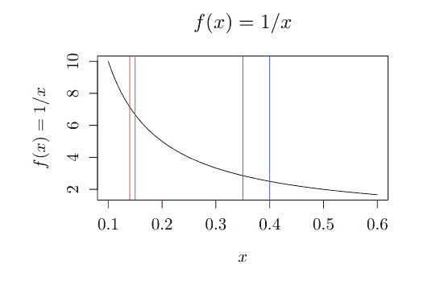

**命题 8** *定义在有界闭集上的连续函数是一致连续的。*

证明：设 $f : E \to \mathbb{R}$ 是定义在有界闭集 $M$ 上的连续函数。由于函数 $f$ 连续，对于任意 $\epsilon > 0$，对每个 $z \in M$，存在一个 $\Delta(z)$ 使得

$$d_1(x, z) < \Delta(z) \Rightarrow d_2(f(x), f(z)) < \epsilon . \quad (2.2)$$

根据命题 7，我们可以准备有限个邻域来覆盖 $M$。设 $U_1, \dots, U_m$ 是以 $z_1, \dots, z_m$ 为中心，半径分别为 $\Delta(z_1)/2, \dots, \Delta(z_m)/2$ 的邻域。假设我们选择 $x, y \in M$ 使得 $d_1(x, y) < \delta := \frac{1}{2} \min_{1 \le i \le m} \Delta(z_i)$。由于 $x$ 属于 $U_1, \dots, U_m$ 中的某一个，不失一般性，我们假设 $x \in U_i$。根据距离性质，我们有

$$d_1(x, z_i) < \frac{1}{2} \Delta(z_i) < \Delta(z_i)$$
$$d_1(y, z_i) \le d_1(x, y) + d_1(x, z_i) < \Delta(z_i) .$$

结合这些不等式，根据 $f$ 连续的假设和 (2.2)，我们有

$$d_2(f(x), f(y)) \le d_2(f(x), f(z_i)) + d_2(f(y), f(z_i)) < \epsilon + \epsilon = 2\epsilon .$$

由于 $\epsilon > 0$ 是任意的，且 $\delta$ 不依赖于 $x, y$，因此 $f$ 是一致连续的。$\square$

**例 30** 我们可以借助命题 8 来证明“定义在闭区间 $[a, b]$ 上的连续函数存在定积分”。如果我们将 $a < b$ 分成 $n$ 个等长的区间，即 $a = x_0 < \dots < x_n = b$，那么对于任意 $\epsilon > 0$，我们要求

$$\left\{\sum_{i=1}^n \frac{b-a}{n} \sup_{x_{i-1}<x<x_i} f(x)\right\} - \left\{\sum_{i=1}^n \frac{b-a}{n} \inf_{x_{i-1}<x<x_i} f(x)\right\} < \epsilon$$

来定义定积分。由于我们假设 $f$ 是一致连续的，如果我们使 $\delta = x_i - x_{i-1} = \frac{b-a}{n}$ 更小（即我们使 $n$ 更大），那么条件 $|f(x) - f(y)| < \epsilon/(b-a)$，$x, y \in [x_{i-1}, x_i]$ 就会得到满足。

#### 2.2 线性空间与内积空间

我们称一个集合 $V$ 是一个线性空间$^3$，如果它满足以下条件：对于 $x, y \in V$ 和 $\alpha \in \mathbb{R}$，

1. $x + y \in V$ 且
2. $\alpha x \in V$。

**例 31** 如果我们定义 $x = [x_1, \dots, x_d]$, $y = [y_1, \dots, y_d] \in \mathbb{R}^d$ 的和以及与常数 $\alpha \in \mathbb{R}$ 的乘法分别为 $x + y = [x_1 + y_1, \dots, x_d + y_d]$ 和 $\alpha x = [\alpha x_1, \dots, \alpha x_d]$，那么 $d$ 维欧几里得空间 $\mathbb{R}^d$ 构成一个线性空间。

**例 32** ($L^2$ 空间) 函数集 $L^2[0, 1]$，其中 $f : [0, 1] \to \mathbb{R}$ 且 $\int_0^1 \{f(x)\}^2 dx$ 取有限值，是一个线性空间，因为当 $\int_0^1 \{f(x)\}^2 dx < \infty$ 且 $\int_0^1 g(x)^2 dx < \infty$ 时，对于 $\alpha \in \mathbb{R}$，有

$$\int_0^1 \{f(x) + g(x)\}^2 dx \le 2 \int_0^1 f(x)^2 dx + 2 \int_0^1 g(x)^2 dx < \infty$$
$$\int_0^1 \{\alpha f(x)\}^2 dx = \alpha^2 \int_0^1 f(x)^2 dx < \infty$$

设 $V$ 是一个线性空间。我们称任何满足以下四个条件的二元函数 $\langle \cdot, \cdot \rangle : V \times V \to \mathbb{R}$ 为一个内积：

1. $\langle x, x \rangle \ge 0$;
2. $\langle \alpha x + \beta y, z \rangle = \alpha \langle x, z \rangle + \beta \langle y, z \rangle$;
3. $\langle x, y \rangle = \langle y, x \rangle$; 且
4. $\langle x, x \rangle = 0 \Longleftrightarrow x = 0$

其中 $x, y, z \in V$ 且 $\alpha, \beta \in \mathbb{R}$。

$^3$ 与向量空间相同。

**例 33** 对于例 31 中的线性空间 $\mathbb{R}^d$，

$$\langle x, y \rangle = \sum_{i=1}^d x_i y_i$$

对于 $x = [x_1, \dots, x_d]$, $y = [y_1, \dots, y_d] \in \mathbb{R}^d$ 是一个内积，因为前三个条件是显然的，而最后一个条件成立是因为

$$\langle x, x \rangle = 0 \Longleftrightarrow \sum_{i=1}^d x_i^2 = 0 \Longleftrightarrow x = 0.$$

对于给定的线性空间，我们需要选择其内积。我们称一个配备了内积的线性空间为内积空间。

**例 34** ($L^2$ 空间的内积) 设 $L^2[0, 1]$ 是例 32 中的线性空间。二元函数

$$\langle f, g \rangle = \int_0^1 f(x)g(x)dx$$

$f, g \in L^2[0, 1]$ 不是一个内积，因为最后一个条件不满足。如果 $f(1/2) = 1$ 且对于 $x \neq 1/2$ 有 $f(x) = 0$，那么我们有

$$\langle f, f \rangle = \int_0^1 f(x)^2 dx = 0.$$

严格来说，我们构造这样的内积，当且仅当 $\int_0^1 (f(x) - g(x))^2 dx = 0$ 时，将 $f, g \in L^2$ 视为等同$^4$，这一点可能很少被注意到。

设 $V$ 是一个线性空间。我们称任何满足以下四个条件的函数 $\| \cdot \| : V \to \mathbb{R}$ 为一个范数。

1. $\|x\| \geq 0$;
2. $\|av\| = |a|\|x\|$;
3. $\|x + y\| \leq \|x\| + \|y\|$ (三角不等式); 且
4. $\|x\| = 0 \Longleftrightarrow x = 0$

其中 $x, y \in V$ 且 $a \in \mathbb{R}$。

如果我们定义了 $V$ 的范数，那么我们可以用距离 $d(x, y) = \|x - y\|$ 构造一个度量空间。如果我们定义了 $V$ 的内积，函数

$$\|x\| = \langle x, x \rangle^{1/2}$$

$^4$ 我们定义等价关系 $\sim$，使得 $f - g \in \{h | \int_0^1 (h(x))^2 dx = 0\} \Longleftrightarrow f \sim g$，并为商空间 $L^2 / \sim$ 构造内积。

满足范数的四个条件，我们称这个范数为由内积诱导的范数。

在例 32 和 34 中，我们使用黎曼积分引入了 $E = [0, 1]$ 上的 $L^2$。然而，通常情况下，我们根据测度空间 $(E, \mathcal{F}, \mu)$ 定义 $L^2(E, \mathcal{F}, \mu)$，其函数集 $f : E \to \mathbb{R}$ 满足

$$\int_E f^2 d\mu \quad (2.4)$$

是有限的$^5$。

**例 35** *(一致范数)* $[a, b]$ 上的连续函数集构成一个线性空间。由

$$\|f\| := \sup_{x \in [a,b]} |f(x)|, \quad f \in C[a, b]$$

定义的一致范数不是由内积诱导的，但满足范数条件：

$$\|f\| = 0 \Longleftrightarrow f(x) = 0, \quad x \in [a, b].$$

在本书中，我们经常使用柯西-施瓦茨不等式：

$$|\langle x, y \rangle| \leq \|x\| \|y\| \quad (2.5)$$

其中 $x, y \in V$。显然，当 $y = 0$ 时，(2.5) 成立。如果 $y \neq 0$，由于 $y$ 和 $z := x - \frac{\langle x, y \rangle}{\|y\|^2} y$ 的内积为零，我们有

$$\|x\|^2 = \|z + \frac{\langle x, y \rangle}{\|y\|^2} y\|^2 = \|z\|^2 + \|\frac{\langle x, y \rangle}{\|y\|^2} y\|^2 \geq \frac{\langle x, y \rangle^2}{\|y\|^2},$$

其中等号成立当且仅当 $z = 0$，这恰好发生在 $x, y$ 中一个是另一个的常数倍时。此外，我们可以通过 (2.5) 来检验三角范数不等式：

$$\|x + y\|^2 = \|x\|^2 + 2\langle x, y \rangle + \|y\|^2 \leq \|x\|^2 + 2\|x\| \|y\| + \|y\|^2 = (\|x\| + \|y\|)^2.$$

由于我们在推导柯西-施瓦茨不等式时没有使用内积的最后一个条件，我们可以将此不等式应用于任何满足前三个条件的二元函数。

利用柯西-施瓦茨不等式，我们可以证明内积的连续性。

$^5$ 我们经常将 $(E, \mathcal{F}, \mu)$ 简写，或指定区间为 $[a, b]$（如 $L^2[a, b]$）。

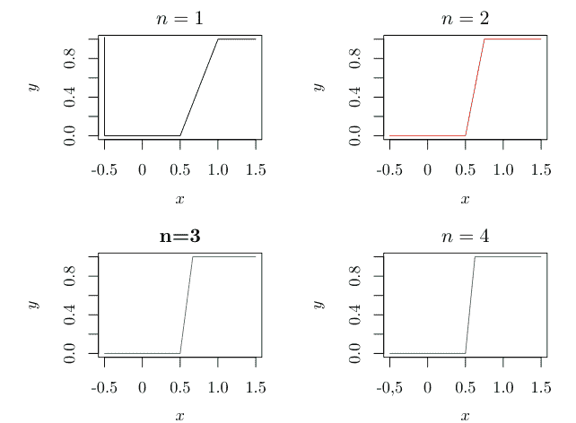

图 2.2 当 $f_n \to f$ 时，我们说明例 37。对于有限的 $n$，函数是连续的，但当 $n \to \infty$ 时则不连续。

**命题 9** (内积的连续性) *设 $\{x_n\}$, $\{y_n\}$ 是线性空间 $V$ 中的序列。对于 $x, y \in V$，如果当 $n \to \infty$ 时 $x_n \to x$ 且 $y_n \to y$，那么 $\langle x_n, y_n \rangle \to \langle x, y \rangle$，其中 $\| \cdot \|$ 表示由 $V$ 的内积诱导的范数。*

证明：该命题由 $\|x_n\| \leq \|x\| + \|x_n - x\| \to \|x\| (n \to \infty)$ 以及

$|\langle x_n, y_n \rangle - \langle x, y \rangle| \leq |\langle x_n, y_n - y \rangle| + |\langle x_n - x, y \rangle| \leq \|x_n\| \cdot \|y_n - y\| + \|x_n - x\| \cdot \|y\| \to 0$ 得出。

#### 2.3 希尔伯特空间

我们称一个定义了范数且距离完备的向量空间为巴拿赫空间。此后，我们用 $C(E)$ 表示定义在 $E$ 上的连续函数集。

**例 36** 如果 $p \geq 1$，向量空间 $\mathbb{R}^p$ 在标准内积下是完备的，是一个希尔伯特空间。另一方面，向量空间 $\mathbb{Q}^p$ 在标准内积下不是完备的，在这种情况下不构成希尔伯特空间。

##### 示例 37
从 $[0, 1]$ 到 $\mathbb{R}$ 的连续函数集合构成一个线性空间 $C[0, 1]$。我们考虑函数
$$f_n(t) := \begin{cases} 0, & 0 \le t \le \frac{1}{2} \\ n(t - \frac{1}{2}), & \frac{1}{2} < t < \frac{1}{2} + \frac{1}{n} \\ 1, & \frac{1}{2} + \frac{1}{n} \le t \le 1. \end{cases}$$
对于 $m \ge n$，我们有
$$\|f_n - f_m\|_2^2 = \int_0^1 |f_n(t) - f_m(t)|^2 dt = \int_{\frac{1}{2}}^{\frac{1}{2} + \frac{1}{n}} |f_n(t) - f_m(t)|^2 dt$$
$$= \int_{\frac{1}{2}}^{\frac{1}{2} + \frac{1}{m}} [n(t - \frac{1}{2}) - m(t - \frac{1}{2})]^2 dt + \int_{\frac{1}{2} + \frac{1}{m}}^{\frac{1}{2} + \frac{1}{n}} [n(t - \frac{1}{2}) - 1]^2 dt$$
$$= \frac{(n - m)^2}{3m^3} - \frac{(n - m)^3}{3m^3n} = \frac{(n - m)^2}{3m^2n} < \frac{1}{3n} \to 0.$$
因此，$\{f_n\}$ 是 $C[0, 1]$ 中的一个柯西序列（图 2.2）。然而，$f_n$ 收敛到一个不连续的函数：
$$f(t) := \begin{cases} 0, & 0 \le t \le \frac{1}{2} \\ 1, & \frac{1}{2} < t \le 1 \end{cases}$$
$$\|f_n - f\|^2 = \int_0^1 \|f_n(t) - f(t)\|^2 dt = \int_{\frac{1}{2}}^{\frac{1}{2} + \frac{1}{n}} [n(t - \frac{1}{2}) - 1]^2 dt = \frac{1}{3n} \to 0.$$
如我们所见，$C[a, b]$ 关于 $L^2$ 范数不完备。然而，它关于一致范数是完备的：

##### 命题 10
$C[a, b]$ 关于一致范数是完备的。

证明：设 $\{f_n\}$ 是 $C[a, b]$ 中的一个柯西序列，这意味着
$$\sup_{m,n \ge N} \sup_{x \in [a,b]} |f_m(x) - f_n(x)| \to 0 \quad (2.6)$$
当 $N \to \infty$ 时。那么，对于每个 $x \in [a, b]$，实数序列 $\{f_n(x)\}$ 是一个柯西序列，并收敛到一个实数值（命题 6）。如果我们定义函数 $f(x)$，其中 $x \in E$，为 $\lim_{n \to \infty} f_n(x)$，那么 $\sup_{n \ge N} f_n(x)$ 和 $\inf_{n \ge N} f_n(x)$ 分别从上方和下方收敛到 $f(x)$。由 (2.6) 式，我们看到
$$|f_N(x) - f(x)| \le \sup_{n \ge N} f_n(x) - \inf_{n \ge N} f_n(x) = \sup_{m,n \ge N} |f_m(x) - f_n(x)|$$
对于任意 $x \in [a, b]$ 一致收敛到 0，这意味着 $C[a, b]$ 是完备的。$\square$

因为任何内积都不能诱导出一致范数，所以 $C[a, b]$ 是一个巴拿赫空间，但不是希尔伯特空间。

##### 命题 11
$C[a, b]$ 关于一致范数是可分的。

为了证明这一点，我们使用斯通-魏尔斯特拉斯定理（命题 12）[30, 31, 34, 35]。术语“代数”用于表示定义了结合性“$\cdot$”和交换性“$+$”性质并满足以下条件的线性空间 $A$：
$$x \cdot (y + z) = x \cdot y + x \cdot z$$
$$(y + z) \cdot x = y \cdot x + z \cdot x$$
$$\alpha(x \cdot y) = (\alpha x) \cdot y$$
其中 $x, y, z \in A$ 且 $\alpha \in \mathbb{R}$，如果 $\cdot$ 是可交换的，则前两个性质是相同的。一般理论可能很复杂，但我们只假设 $+$ 和 $\cdot$ 是标准的加法和乘法运算，并且 $A$ 是多项式或连续函数。

##### 示例 38
*（多项式环）* 设 $+, \cdot$ 为标准的可交换加法和乘法运算。多项式环 $\mathbb{R}[x, y, z]$ 是以不定元（变量）$x, y, z$ 为变量的多项式集合，并且是一个以 $\mathbb{R}$ 为可交换系数的代数。$\mathbb{R}[x, y, z]$ 是一个线性空间，如果两个元素属于 $\mathbb{R}[x, y, z]$，那么与 $\mathbb{R}$ 的乘法以及元素之间的加法也属于 $\mathbb{R}[x, y, z]$。此外，$\mathbb{R}[x, y, z]$ 中的元素遵循这三个定律。

##### 命题 12
*（斯通-魏尔斯特拉斯 [30, 31, 34, 35]）* 设 $E$ 和 $A$ 分别为一个紧集和一个代数。在以下条件下，$A$ 在 $C(E)$ 中是稠密的。
1. 不存在 $x \in E$ 使得对于所有 $f \in A$ 都有 $f(x) = 0$。
2. 对于每一对 $x, y \in E$ 且 $x \neq y$，存在 $f \in A$ 使得 $f(x) \neq f(y)$。

我们将在多处引用命题 12。尽管我们在本书中省略了它的证明，但请遵循它，因为它不包含复杂的推导过程。我们可以使用这个命题来证明神经网络可以逼近任何连续函数。

命题 11 的证明：以不定元 $x$ 和实系数为变量的多项式集合 $A$ 满足命题 12 中的两个条件。因此，$A$ 在 $C[a, b]$ 中是稠密的。此外，如果我们限制 $A$ 的系数为 $\mathbb{Q}$，那么 $A$ 是一个可数集，这意味着 $C[a, b]$ 是可分的。$\square$

##### 命题 13
$C[a, b], a < b$，在 $L^2[a, b]$ 中是稠密的。

证明请参见本章末尾的附录。我们称形如
$$\sum_{k=1}^{m} h(B_k)I(B_k) \quad (2.7)$$
的函数为简单函数，其中 $B_1, \dots, B_m \in \mathcal{F}$ 互不相交，且 $h : \mathcal{F} \to \mathbb{R}_{\ge 0}$。第 1 章中的方程 (1.7) 使用简单函数来逼近这个函数。附录中的证明表明，简单函数可以逼近任意 $f \in L^2$，并且连续函数可以逼近任意简单函数。$\square$

##### 命题 14
（里斯-费舍尔）$L^2$ 是完备的$^6$。换句话说，$L^2$ 是一个巴拿赫空间和一个希尔伯特空间。

证明的概要如下；详情请参见附录。只需证明“$\{f_n\}$ 是 $L^2$ 中的柯西序列 $\Rightarrow$ 存在 $f \in L^2$ 使得 $\|f_n - f\| \to 0$”。我们定义 $L^2$ 中柯西序列 $\{f_n\}$ 收敛到的 $f$，并推导出 $\|f_n - f\| \to 0$ 和 $f \in L^2$。
1. 设 $\{f_n\}$ 是 $L^2$ 中的任意柯西序列。
2. 存在 $\{n_k\}$ 使得 $\|\sum_{k=1}^{\infty} |f_{n_{k+1}} - f_{n_k}|\|_2 < \infty$。
3. 我们证明存在 $f : E \to \mathbb{R}$ 使得 $\mu\{x \in E | \lim_{k \to \infty} f_{n_k}(x) = f(x)\} = \mu(E)$。
4. 我们证明 $\|f_n - f\| \to 0$ 且 $f \in L^2[a, b]$。$\square$

设 $V$ 和 $\langle \cdot, \cdot \rangle$ 分别为一个内积空间及其内积。如果 $\langle x, y \rangle = 0$，我们称 $x, y \in V$ 是正交的；如果序列 $\{e_j\}$ 在 $V$ 中满足对于每个 $j$ 都有 $\|e_j\| = 1$，并且每一对 $e_i, e_j$（$i \neq j$）都是正交的，那么我们称 $\{e_j\}$ 是标准正交的。此外，如果 $\{e_j\}$ 是一个标准正交序列，并且每个 $x \in V$ 都可以表示为 $x = \sum_{j=1}^{\infty} \alpha_j e_j$，其中 $\alpha_j$ 是实数，那么我们称 $\{e_j\}$ 是 $V$ 的一个标准正交基。

##### 命题 15
*对于希尔伯特空间 $H$ 中的一个标准正交序列 $\{e_j\}$，我们有以下性质：*
1. $\sum_{i=1}^{\infty} \langle x, e_i \rangle^2 \le \|x\|^2$（贝塞尔不等式）；
2. $\sum_{i=1}^{\infty} \langle x, e_i \rangle e_i$ 收敛；
3. $\sum_{i=1}^{\infty} \alpha_i e_i$ 收敛 $\Longleftrightarrow \sum_{i=1}^{\infty} \alpha_i^2 < \infty$；以及
4. $y = \sum_{i=1}^{\infty} \alpha_i e_i \Rightarrow \alpha_i = \langle y, e_i \rangle$。

$^6$ 对于任何 $p \ge 1$，$L^p$ 都是完备的，尽管我们省略了这个证明。

证明：请参见本章末尾的附录。

假设 $A$ 是配备范数的线性空间 $V$ 的一个子集，并设 $\overline{\text{span}(A)}$ 为 $\text{span}(A)$ 的闭包，即 $A$ 中元素的线性组合。假设 $\{x_n\}$ 是希尔伯特空间中的一个序列，并且每个 $x_n$ 都是正交的。那么，下面构造的序列 $\{e_n\}$ 是标准正交的
$$v_i := x_i - \sum_{j=1}^{i-1} \langle x_i, e_j \rangle e_j, \quad e_i = v_i / \|v_i\|, \quad i = 1, 2, \ldots$$
并且满足 $\overline{\text{span}\{x_n\}} = \overline{\text{span}\{e_n\}}$（格拉姆-施密特正交化）。

##### 命题 16
设 $\{e_j\}$ 是希尔伯特空间 $H$ 中的一个标准正交序列。以下条件是等价的：
1. $\{e_i\}$ 是 $H$ 中的一个标准正交序列；
2. 对于任意 $x \in H$，$\langle x, e_i \rangle = 0, k = 1, 2, \ldots, \Rightarrow x = 0$；
3. $\text{span}\{e_i\}$ 在 $H$ 中是稠密的；
4. 贝塞尔不等式（命题 15 的第一个）的等式（帕塞瓦尔）成立；
5. 对于任意 $x, y \in H$，$\langle x, y \rangle = \sum_{k=1}^{\infty} \langle x, e_k \rangle \langle y, e_k \rangle$；以及
6. 对于任意 $x \in H$，$x = \sum_{j=1}^{\infty} \langle x, e_j \rangle e_j$。

证明：请参见本章末尾的附录。

##### 示例 39
*（傅里叶级数展开）* 通过用
$$f_m(x) = a_0 + \sum_{n=1}^{m} (a_n \cos nx + b_n \sin nx) \qquad (2.8)$$
逼近 $f \in L^2[-\pi, \pi]$，并计算使 $\|f - f_m\|$ 最小化的 $\{a_n\}, \{b_n\}$，我们得到当 $m \to \infty$ 时 $\|f - f_m\| \to 0$。然而，对于任何 $m$，$\|f - f_m\| = 0$ 都不会发生。我们看到 $f \notin \text{span}(A)$，其中 $A := \{1, \cos x, \sin x, \cos 2x, \sin 2x, \ldots\}$，并且 $\text{span}(A)$ 不是一个闭集。我们将所有满足 $\|f - f_m\| \to 0$（收敛点）的 $f \notin \text{span}(A)$ 添加到 $\text{span}(A)$ 中，得到闭包 $\overline{\text{span}(A)}$。此外，$\text{span}(A)$ 在 $L^2[-\pi, \pi]$ 中是稠密的。那么，
$$\left\{ \frac{1}{\sqrt{2\pi}}, \frac{\cos x}{\sqrt{\pi}}, \frac{\sin x}{\sqrt{\pi}}, \frac{\cos 2x}{\sqrt{\pi}}, \frac{\sin 2x}{\sqrt{\pi}}, \ldots \right\}$$
即 $\{1, \cos x, \sin x, \cos 2x, \sin 2x, \ldots\}$ 除以其范数，构成了希尔伯特空间 $L^2[-\pi, \pi]$ 的一个标准正交基，该空间由如 (2.8) 所示的傅里叶级数表示的函数组成，其中我们将 $\langle f, g \rangle := \int_{-\pi}^{\pi} f(x)g(x)dx$ 视为 $f, g \in H$ 的内积，并且对于 $m, n > 0$，我们使用 $\int_{-\pi}^{\pi} \cos mx \sin nx dx = 0$ 和 $\int_{-\pi}^{\pi} \cos^2 mx dx = \int_{-\pi}^{\pi} \sin^2 nx dx = \pi$。

##### 命题 17
对于希尔伯特空间 $H$，可分性等价于存在一个标准正交基。

证明：若 $\{e_j\}$ 构成 $H$ 的一个标准正交基，则任意 $x \in H$ 可表示为 $x = \sum_{j=1}^\infty \langle x, e_j \rangle e_j$。集合 $E := \{x \in H : \langle x, e_j \rangle \in \mathbb{Q}, j = 1, 2, \dots\}$ 是稠密且可数的。事实上，$\{\langle x, e_j \rangle\}$ 和 $\{e_j\}$ 都是可数集，因此它们的组合 $E$ 也是可数的，这意味着 $H$ 是可分的。另一方面，若 $H$ 是可分的，我们可以通过 Gram-Schmidt 方法从 $H$ 的稠密可数子集中提取线性无关元素，从而构造出一个标准正交基 $\{e_n\}$。因此，我们看到这些元素的任意线性组合在 $H$ 中是稠密的。根据命题 16 的第三部分，$\{e_j\}$ 是 $H$ 的一个标准正交基。$\square$

命题 17 蕴含以下结论：

**命题 18** $L^2[a, b]$ 在 $L^2$ 范数下是可分的。

在本书中，我们假设所讨论的希尔伯特空间是可分的。

#### 2.4 投影定理

设 $V$ 和 $M$ 分别为一个装备了内积的线性空间及其子空间。我们定义 $M$ 的正交补为

$$M^\perp := \{x \in V : \langle x, y \rangle = 0 \text{ 对所有 } y \in M\}.$$

对于 $V$ 的子空间 $M_1$ 和 $M_2$，我们将 $M_1$ 和 $M_2$ 的直和记为 $M_1 + M_2$。特别地，当 $M_1$ 和 $M_2$ 互相正交时，即

$$x_1 \perp x_2, \quad x_1 \in M_1, \quad x_2 \in M_2, \tag{2.9}$$

我们将其记为 $M_1 \oplus M_2 := \{x_1 + x_2 : x_1 \in M_1, x_2 \in M_2\}$。

**命题 19**（投影定理）*设 $M$ 是希尔伯特空间 $H$ 的一个闭子集。那么，对于任意 $x \in H$，存在一个 $y \in M$ 使得 $\|x - y\|$ 最小化。此外，这样的 $y$ 满足*

$$\langle x - y, z \rangle = 0, \quad z \in M \tag{2.10}$$

*且是唯一的。*

证明：给定 $x \in H$，我们考虑一个 $y \in M$，使得 $x = y + (x - y)$，其中 $y \in M$ 且 $x - y \in M^\perp$。证明过程利用以下步骤。

1.  证明 $M$ 中的一个序列 $\{y_n\}$，若满足
    $$\lim_{n \to \infty} \|x - y_n\|^2 = \inf_{y \in M} \|x - y\|^2$$
    则它是一个柯西序列。
2.  证明存在一个 $y \in M$，使得 $y_n \to y \in M$。
3.  证明对于任意 $0 < a < 1$ 和 $z \in M$，有 $2a\langle x - y, z - y\rangle \leq a^2\|z - y\|^2$，并在假设 $\langle x-y, z-y\rangle > 0$ 时推导出不等式中的矛盾。
4.  证明 $\langle x - y, z\rangle \leq 0$。
5.  用 $-z$ 替换 $z$ 以得到该命题。

详细证明请参见本章末尾的附录。$\square$

方程 (2.10) 意味着任意 $x \in H$ 可以唯一地分解为 $x = y + (x - y)$，其中 $y \in M$ 且 $x - y \in M^\perp$，这意味着

$$H = M \oplus M^\perp .$$

**例 40** 对于一个正定核 $k : E \times E \to \mathbb{R}$ 和每个 $x \in E$，我们将 $k(x, \cdot) : E \to \mathbb{R}$ 视为 $E$ 上的一个函数。一般来说，由 $\{k(x, \cdot)\}_{x \in E}$ 张成的空间及其闭包 $H := \overline{\text{span}(\{k(x, \cdot)\}_{x \in E})}$ 是一个线性空间。我们证明其内积为 $\langle k(x, \cdot), k(y, \cdot)\rangle_H = k(x, y)$，并在第 3 章中证明其完备性。对于 $x_1, \dots, x_N \in E$，$M := \text{span}(\{k(x_i, \cdot)\}_{i=1}^N)$ 构成一个有限维线性空间，并且 $H$ 可以利用

$$M^\perp = \{f \in H | \langle f, k(x_i, \cdot)\rangle_H = 0, \quad i = 1, \dots, N\} .$$

写成 (2.11) 的形式。

如果 $f = f_1 + f_2$，其中 $f_1 \in M$ 且 $f_2 \in M^\perp$，我们有

$$\|f\|_H^2 = \|f_1\|_H^2 + \|f_2\|_H^2 + 2\langle f_1, f_2\rangle_H = \|f_1\|_H^2 + \|f_2\|_H^2 \geq \|f_1\|_H^2 ,$$

这在第 4 章的核计算中会被用到。

**命题 20** 设 $H$ 和 $M$ 分别为一个希尔伯特空间及其子集$^7$。那么，我们有以下结论：

1.  $M^\perp$ 是 $H$ 的一个闭子集。
2.  $M \subseteq (M^\perp)^\perp$。
3.  如果 $M$ 是一个子空间，那么 $(M^\perp)^\perp = \overline{M}$，其中 $\overline{M}$ 是集合 $M$ 的闭包。

证明：对于第一项，我们看到 $M^\perp$ 是一个子空间。根据内积的连续性（命题 9），如果 $M^\perp$ 中的序列 $\{x_n\}$ 满足 $x_n \to x$（当 $n \to \infty$），那么对于 $a \in M$，我们有
$$\langle x, a\rangle = \lim_{n \to \infty} \langle x_n, a\rangle = 0 ,$$

这意味着 $M^\perp$ 是闭的。第二项源于

$$x \in M \Rightarrow \langle x, y\rangle = 0 , \quad y \in M^\perp \Rightarrow x \in (M^\perp)^\perp .$$

对于第三项，根据前两个性质，对 $M \subseteq (M^\perp)^\perp$ 两边取闭包得到 $\overline{M} \subseteq (M^\perp)^\perp$。根据命题 19，任意 $x \in (M^\perp)^\perp$

$^7$ 这不一定是子空间。

可以写成 $y \in \overline{M} \cap (M^\perp)^\perp = \overline{M}$ 和 $z \in \overline{M}^\perp \cap (M^\perp)^\perp$。然而，我们有 $\overline{M}^\perp \cap (M^\perp)^\perp \subseteq M^\perp \cap (M^\perp)^\perp = \{0\}$，这意味着 $z = 0$，从而得到第三项。$\square$

#### 2.5 线性算子

设 $X_1, X_2$ 分别为具有范数 $\|\cdot\|_1, \|\cdot\|_2$ 的线性空间，并设 $T : X_1 \to X_2$ 是将 $X_1$ 中的元素线性变换到 $X_2$ 中的映射。我们称这样的 $T$ 为线性算子。我们定义像和核为

$$\mathrm{Im}(T) := \{Tx : x \in X_1\} \subseteq X_2$$

和

$$\mathrm{Ker}(T) := \{x \in X_1 : Tx = 0\} \subseteq X_1,$$

并称 $\mathrm{Im}(T)$ 的维数为 $T$ 的秩。我们说线性算子 $T : X_1 \to X_2$ 是有界的，如果对于每个 $x \in X_1$，存在一个常数 $C > 0$ 使得

$$\|Tx\|_2 \leq C\|x\|_1.$$

我们将所有这样的 $T$ 的集合记为 $B(X_1, X_2)$。特别地，当 $X_1 = X_2 = X$ 时，我们将 $B(X_1, X_2)$ 记为 $B(X)$。

**命题 21** *线性算子 $T$ 是有界的当且仅当 $T$ 是一致连续的。*

证明：如果 $T$ 是一致连续的，那么存在一个 $\delta > 0$ 使得 $\|x\|_1 \leq \delta \Rightarrow \|Tx\|_2 \leq 1$。由于 $\|\frac{\delta x}{\|x\|}\| \leq \delta$，对于任意 $x \neq 0$，我们有

$$\|Tx\|_2 = \|T(\frac{\delta x}{\|x\|_1})\|_2 \frac{\|x\|_1}{\delta} \leq \frac{\|x\|_1}{\delta}$$

另一方面，如果 $T$ 是有界的，存在一个不依赖于 $x \in X_1$ 的常数 $C$，使得对于任意序列 $\{x_n\}$ 和 $x \in X_1$（满足 $x_n \to x$ 当 $n \to \infty$），有

$$\|T(x_n - x)\|_2 \leq C\|x_n - x\|_1$$

$\square$

此后，我们定义 $T \in B(X_1, X_2)$ 的算子范数为

$$\|T\| := \sup_{x \in X_1, \|x\|_1 = 1} \|Tx\|_2. \tag{2.12}$$

因此，对于任意 $x \in X_1$，我们有

$$\|Tx\|_2 \leq \|T\| \|x\|_1 \,.$$

**例 41** 设 $X_1 := \mathbb{R}^p$ 和 $X_2 := \mathbb{R}^q$。如果范数是欧几里得范数，那么我们可以使用某个 $B \in \mathbb{R}^{q \times p}$ 将线性算子 $T : \mathbb{R}^p \to \mathbb{R}^q$ 写为 $T : x \mapsto Bx$。如果矩阵 $B$ 是方阵，那么范数 $\|T\|$ 是非负定矩阵 $A := B^\top B$ 的最大特征值的平方根。

$$\|T\|^2 = \max_{\|x\|=1} x^\top B^\top Bx = \max_{\|x\|=1} \|Bx\|^2 \,.$$

**例 42** 对于 $K : [0, 1]^2 \to \mathbb{R}$，设

$$\int_0^1 \int_0^1 K^2(x, y) dxdy$$

是有限的。我们定义积分算子为 $L^2[0, 1]$ 中的线性算子 $T$，使得对于 $f \in L^2[0, 1]$，

$$(Tf)(\cdot) = \int_0^1 K(\cdot, x) f(x) dx \qquad (2.13)$$

注意 (2.13) 属于 $L^2[0, 1]$，并且 $T$ 是有界的：由

$$|(Tf)(x)|^2 \leq \int_0^1 K^2(x, y) dy \int_0^1 f^2(y) dy = \|f\|_2^2 \int_0^1 K^2(x, y) dy \,,$$

我们有

$$\|Tf\|_2^2 = \int_0^1 |(Tf)(x)|^2 dx \leq \|f\|_2^2 \int_0^1 \int_0^1 K^2(x, y) dxdy \,.$$

我们称这样的 $K$ 为积分算子核，并将其与本书中讨论的正定核区分开来。

特别地，我们称任何满足 $X_2 = \mathbb{R}$ 的线性算子为线性泛函。

**命题 22**（里斯表示定理）*设 $H$ 是一个具有内积 $\langle \cdot, \cdot \rangle$ 和范数 $\| \cdot \|$ 的希尔伯特空间，并设 $T \in B(H, \mathbb{R})$。那么，存在唯一的 $e_T \in H$ 使得*

$$Tf = \langle f, e_T \rangle \,, \quad f \in H \qquad (2.14)$$

*且 $\|T\| = \|e_T\|$。*

#### 2.6 紧算子

设 $(M, d)$ 为度量空间，$E$ 为 $M$ 的子集。如果 $E$ 中的任意无限序列都包含一个收敛到 $E$ 中某个元素的子序列，则称 $E$ 是**序列紧**的。如果 $\{x_n\}$ 有一个收敛到 $x$ 的子序列，则称 $x$ 是 $\{x_n\}$ 的一个**收敛点**。

**例 46** 设 $E := \mathbb{R}$，且对 $x, y \in \mathbb{R}$ 定义 $d(x, y) := |x - y|$。那么，$E$ 不是序列紧的。事实上，序列 $x_n = n$ 没有收敛点。对于 $E = (0, 1]$，序列 $x_n = 1/n$ 当 $n \to \infty$ 时收敛到 $0 \notin (0, 1]$，且任何子序列的收敛点都只有 0。因此，$E = (0, 1]$ 不是序列紧的。

**命题 24** *设 $(M, d)$ 为度量空间，$E$ 为 $M$ 的子集。那么，$E$ 是序列紧的当且仅当 $E$ 是紧的。*

证明：许多几何学著作都讨论了这种等价性的证明。有关此证明的详细信息，请参阅此类著作。

在本节中，我们使用序列紧性的术语来解释紧性。

设 $X_1, X_2$ 为赋范线性空间，$T \in B(X_1, X_2)$。如果对于 $X_1$ 中的任何有界序列 $\{x_n\}$，$\{Tx_n\}$ 都包含一个收敛子序列，则称 $T$ 是**紧**的。

**例 47** 希尔伯特空间 $H$ 中的标准正交基 $\{e_j\}$ 是有界的，因为 $\|e_j\| = 1$。然而，对于恒等映射，我们有对任意 $i \neq j$，$\|e_i - e_j\| = \sqrt{2}$。因此，序列 $e_1, e_2, \dots$ 在 $H$ 中没有任何收敛点。因此，任何无限维希尔伯特空间的恒等算子都不是紧的。

**命题 25** *对于任何有界线性算子 $T$，以下结论成立。*

- 1. 如果秩是有限的，则算子 $T$ 是紧的。
- 2. 如果存在一个有限秩算子序列 $\{T_n\}$，使得当 $n \to \infty$ 时 $\|T_n - T\| \to 0$，则 $T$ 是紧的$^8$。

证明：参见本章末尾的附录。

设 $H$ 为希尔伯特空间，$T \in B(H)$ 为其有界线性算子。如果存在 $\lambda \in \mathbb{R}$ 和 $0 \neq e \in H$ 使得

$$Te = \lambda e \,,$$

则称 $\lambda$ 和 $e$ 分别为 $T$ 的**特征值**和**特征向量**。

**命题 26** *设 $T \in B(H)$，且对 $j = 1, 2, \dots$，$e_j \in \text{Ker}(T - \lambda_j I)$。如果特征值 $\lambda_j \neq 0$ 互不相同，则*

1. $e_j$ 是线性无关的。
2. 如果 $T$ 是自伴的，则 $\{e_j\}$ 是正交的。

证明：参见本章末尾的附录。

**例 48** 设 $T \in B(H)$ 是一个紧算子。对于每个非零特征值 $\lambda$，特征空间 $\text{Ker}(T - \lambda I)$ 具有有限维数。事实上，如果对于某个非零特征值 $\lambda$，$\text{Ker}(T - \lambda I)$ 是无限维的，那么 $\lambda$ 包含无限多个特征向量 $e_j$，并且如果我们对它们应用算子 $T$，那么如例 47 所示，$\{\lambda e_j\}$ 没有任何收敛子序列。因此，$T$ 不是紧的，这与假设矛盾。

**例 49** 对于任何 $C > 0$，紧算子 $T$ 的有限个特征值 $\lambda_i$ 的绝对值超过 $C$。假设无限多个特征值 $\lambda_1, \lambda_2, \dots$ 的绝对值超过 $C$。设 $M_0 := \{0\}$，$M_i := \text{span}\{e_1, \dots, e_i\}$，其中 $e_j \in \text{Ker}(T - \lambda_j I)$，$j = 1, 2, \dots$，$i = 1, 2, \dots$。由于 $\{e_1, \dots, e_i\}$ 是线性无关的，每个 $M_i \cap M_{i-1}^\perp$ 对于 $i = 1, 2, \dots$ 都是一维的。因此，如果我们通过 Gram-Schmidt 正交化定义标准正交序列 $x_i \in \text{Ker}(T - \lambda_i I) \cap M_{i-1}^\perp$，$i = 1, 2, \dots$，那么我们有

$$\|Tx_i - Tx_k\|^2 = \|Tx_i\|^2 + \|Tx_k\|^2 \geq 2C^2$$

对于 $i > k$ 成立。因此，$\{Tx_i\}$ 没有收敛子序列。

例 49 意味着 $T$ 的非零特征值集合是可数的。
我们总结上述讨论及其含义如下。

**命题 27** 设 $T$ 是希尔伯特空间 $H$ 的一个自伴紧算子。那么，$T$ 的非零特征值集合是有限的，或者特征值序列收敛到零。每个特征值具有有限重数，并且对应于不同特征值的任何一对特征向量都是正交对。设 $\lambda_1, \lambda_2, \dots$ 是一个特征值序列，满足 $|\lambda_1| \geq |\lambda_2| \geq \dots$，并设 $e_1, e_2, \dots$ 是任意相应的特征向量，如果它们具有相同的特征值，则它们是正交的（通过 Gram-Schmidt 正交化的特征向量）。那么，$\{e_j\}$ 是 $\overline{\text{Im}(T)}$ 的标准正交基，并且我们可以将 $T$ 表示为

$$Tx = \sum_{j=1}^{\infty} \lambda_j \langle x, e_j \rangle e_j \quad (2.16)$$

对于每个 $x \in H$。

证明：我们利用以下步骤，其中第二项等价于 $(\text{Ker}(T))^\perp = \overline{\text{Im}(T)}$，因为 $T = T^*$。

1. 证明 $H = \text{Ker}(T) \oplus (\text{Ker}(T))^\perp$。
2. 证明 $(\text{Ker}(T))^\perp = \overline{\text{Im}(T^*)}$。
3. 证明 $\overline{\text{span}\{e_j \mid j \ge 1\}} \subseteq \text{Im}(T)$。
4. 证明 $\overline{\text{span}\{e_j \mid j \ge 1\}} \supseteq \text{Im}(T)$。

参见本章末尾的附录。

如果对于任意 $H \ni x = \sum_{i=1}^\infty \langle x, e_i \rangle e_i$，有

$$\langle Tx, x \rangle = \left\langle \sum_{i=1}^\infty \lambda_i \langle x, e_i \rangle e_i, \sum_{j=1}^\infty \langle x, e_j \rangle e_j \right\rangle = \sum_{i=1}^\infty \lambda_i \langle x, e_i \rangle^2 \ge 0$$

则称算子 $T$ 是**非负定**的；这个条件等价于 $\lambda_1 \ge 0$，$\lambda_2 \ge 0$，$\dots$

**命题 28** *如果 $T$ 是非负定的，我们有*

$$\lambda_k = \max_{e \in \text{span}\{e_1, \dots, e_{k-1}\}^\perp} \frac{\langle Te, e \rangle}{\|e\|^2} \qquad (2.17)$$

当 $k = 1$ 时，它表示在希尔伯特空间 $H$ 上的最大值。

证明：该结论由 (2.16) 和 $\lambda_j \ge 0$ 得出：

$$\max_{e \in \{e_1, \dots, e_{k-1}\}^\perp, \|e\|=1} \langle Te, e \rangle = \max_{\|e\|=1} \sum_{j=k}^\infty \lambda_j \langle e, e_j \rangle^2 = \lambda_k.$$

设 $H_1$，$H_2$ 为希尔伯特空间，$\{e_i\}$ 为 $H_1$ 的标准正交基，$T \in B(H_1, H_2)$。

如果

$$\sum_{i=1}^\infty \|Te_i\|^2$$

取有限值，则称 $T$ 是一个 **Hilbert-Schmidt (HS) 算子**，我们将 $B(H_1, H_2)$ 中的 HS 算子集合记为 $B_{HS}(H_1, H_2)$。

我们定义 $T_1, T_2 \in B_{HS}(H_1, H_2)$ 的内积和 $T \in B_{HS}(H_1, H_2)$ 的 HS 范数分别为 $\langle T_1, T_2 \rangle_{HS} := \sum_{j=1}^\infty \langle T_1 e_j, T_2 e_j \rangle_2$ 和

$$\|T\|_{HS} := \langle T, T \rangle_{HS}^{1/2} = \left\{ \sum_{i=1}^\infty \|Te_i\|_2^2 \right\}^{1/2}.$$

**命题 29** *$T \in B(H_1, H_2)$ 的 HS 范数值不依赖于标准正交基 $\{e_i\}$ 的选择。*

证明：设 $\{e_{1,i}\}$，$\{e_{2,j}\}$ 为希尔伯特空间 $H_1$，$H_2$ 的任意标准正交基，$T_1, T_2 \in B(H_1, H_2)$。那么，对于 $T_k e_{1,i} = \sum_{j=1}^\infty \langle T_k e_{1,i}, e_{2,j} \rangle_2 e_{2,j}$，$T_k^* e_{2,j} = \sum_{i=1}^\infty \langle T_k^* e_{2,j}, e_{1,i} \rangle_1 e_{1,i}$，以及 $k = 1, 2$，我们有

证明：参见本章末尾的附录。

**例 43** (*RKHS*) 设 $x \in E$，并设 $T_x : H \to \mathbb{R}$ 是从 $f \in H$ 到 $f(x)$ 的映射。那么，$T_x$ 是线性的，因为

$$T_x(af + bg) = (af + bg)(x) = af(x) + bg(x) = aT_x(f) + bT_x(g) .$$

我们假设对于每个 $x \in E$，$T_x$ 是有界的。那么，根据命题 22，存在一个 $k_x \in H$ 使得

$$f(x) = T_x(f) = \langle f, k_x \rangle$$

对于 $x \in E$，且 $\|T_x\| = \|k_x\|$。

**命题 23** (*伴随算子*) 设 $H_i$ 是具有内积 $\langle \cdot, \cdot \rangle_i$ 的希尔伯特空间，$i = 1, 2$，且 $T \in B(H_1, H_2)$。那么，存在一个 $T^* \in B(H_2, H_1)$ 使得

$$\langle Tx_1, x_2 \rangle_2 = \langle x_1, T^*x_2 \rangle_1 , \quad x_1 \in H_1, \quad x_2 \in H_2 .$$

证明：如果我们固定 $x_2 \in H_2$ 并将 $\langle Tx_1, x_2 \rangle_2$ 视为 $x_1 \in H_1$ 的函数，那么由 $x_1 \mapsto \langle Tx_1, x_2 \rangle_2 \leq \|x_1\|_2 \|x_2\|_2$，$T$ 是关于 $x_1 \in H_1$ 的有界算子。根据命题 22，对于每个 $x_2 \in H_2$，存在 $y_2(x_2) \in H_1$ 使得 $\langle Tx_1, x_2 \rangle_2 = \langle x_1, y(x_2) \rangle_1$。如果我们定义 $T^*x_2 = y_2(x_2)$，那么 $T^*$ 是一个有界线性映射。有界性源于

$$\|T^*x_2\|_1^2 = |\langle x_2, TT^*x_2 \rangle|_2 \leq \|T\| \|T^*x_2\|_1 \|x_2\|_2 .$$

我们称命题 23 中的 $T^*$ 为 $T$ 的**伴随算子**。特别地，如果 $T^* = T$，我们称这样的算子 $T$ 是**自伴**的。

**例 44** 设 $H = \mathbb{R}^p$。我们可以用一个方阵 $T \in \mathbb{R}^{p \times p}$ 来表示任何 $T \in B(H)$。由

$$\langle Tx, y \rangle = x^\top T^\top y = \langle x, T^\top y \rangle ,$$

我们看到伴随算子 $T^*$ 是 $T$ 的转置矩阵 $T^\top$，并且 $T$ 可以写成对称矩阵当且仅当 $T$ 是自伴的。

**例 45** 对于例 42 中的 $L^2[0, 1]$ 上的积分算子，根据 Fubini 定理，我们有

$$\langle Tf, g \rangle = \int_0^1 \int_0^1 K(x, y) f(x) g(y) dx dy = \langle f, \int_0^1 K(y, \cdot) g(y) dy \rangle ,$$

并且 $y \mapsto (T^*g)(y) = \int_0^1 K(x, y) g(x) dx$ 是一个伴随算子。如果积分算子核 $K$ 是对称的，则算子 $T$ 是自伴的。

$^8$ 已知其逆命题也成立。

### 附录：命题的证明

#### 命题13的证明

我们证明一个简单函数可以逼近任意 $f \in L_2^2$，且一个连续函数可以逼近任意简单函数。此后，我们用 $\|\cdot\|$ 表示 $L^2$ 范数。

由于 $f \in L_2$ 是可测的，若 $f$ 非负，则由简单函数序列 $\{f_n\}$ 定义为

$$f_n(\omega) = \begin{cases} (k-1)2^{-n}, & (k-1)2^{-n} \leq f(\omega) < k2^{-n}, 1 \leq k \leq n2^n \\ n, & n \leq f(\omega) \leq \infty \end{cases}$$

满足 $0 \leq f_1(\omega) \leq f_2(\omega) \leq \cdots \leq f(\omega)$ 且 $|f_n(\omega) - f(\omega)|^2 \to 0$ 几乎处处成立。由于 $|f_n(\omega) - f(\omega)|^2 \leq 4\{f(\omega)\}^2$ 的右端在积分下有限，根据控制收敛定理，我们有

$$\|f_n - f\|^2 \to 0.$$

对于一般的 $f$（不一定非负），我们可以展示类似的推导，如第1章所述。

另一方面，设 $A$ 是 $[a, b]$ 的一个闭子集，$K_A$ 是其示性函数（若 $e \in A$ 则 $K_A(e) = 1$；否则 $K_A(e) = 0$）。若我们定义 $h(x) := \inf_{y \in A} \{|x - y|\}$ 和 $g_n^A(x) := \frac{1}{1 + nh(x)}$，则 $g_n^A$ 是连续的，对于 $x \in [a, b]$ 有 $g_n^A(x) \le 1$，对于 $x \in A$ 有 $g_n^A(x) = 1$，且对于 $x \in B := [a, b] \setminus A$ 有 $\lim_{n \to \infty} g_n^A(x) = 0$。因此，我们有

$$\lim_{n \to \infty} \|g_n^A - K_A\| = \lim_{n \to \infty} \left( \int_B g_n^A(x)^2 dx \right)^{1/2} = \left( \int_B \lim_{n \to \infty} g_n^A(x)^2 dx \right)^{1/2} = 0,$$

其中第二个等式由控制收敛定理得出。此外，若 $A, A'$ 不相交，则 $\alpha g_n^A + \alpha' g_n^{A'}$（其中 $\alpha, \alpha' > 0$）逼近 $\alpha K_A + \alpha' K_{A'}$。事实上，我们有

$$\|\alpha g_n^A + \alpha' g_n^{A'} - (\alpha K_A + \alpha' K_{A'})\| \le \alpha \|g_n^A - K_A\| + \alpha' \|g_n^{A'} - K_{A'}\|.$$

因此，一个连续函数序列可以逼近任意简单函数。$\square$

#### 命题14的证明

假设 $\{f_n\}$ 是 $L^2$ 中的一个柯西序列，这意味着

$$\lim_{N \to \infty} \sup_{m, n \ge N} \|f_m - f_n\|_2 = 0. \tag{2.18}$$

那么，存在一个序列 $\{n_k\}$ 使得

$$\left\| \sum_{k=1}^\infty |f_{n_{k+1}} - f_{n_k}| \right\|_2 \le \sum_{k=1}^\infty \|f_{n_{k+1}} - f_{n_k}\|_2 < \infty.$$

因此，几乎处处有

$$\sum_{k=1}^\infty |f_{n_{k+1}}(x) - f_{n_k}(x)| < \infty. \tag{2.19}$$

对于任意 $r < t$ 和 $x \in E$，由三角不等式，我们有

$$|f_{n_r}(x) - f_{n_t}(x)| \le \sum_{k=r}^{t-1} |f_{n_{k+1}}(x) - f_{n_k}(x)|.$$

结合 (2.19)，实数序列 $\{f_{n_k}(x)\}_{k=1}^\infty$ 几乎处处是柯西序列。由于整个实数系统是完备的（命题6），我们对使得 $\{f_{n_k}(x)\}_{k=1}^\infty$ 是柯西序列的 $x \in E$ 定义 $f(x) := \lim_{k \to \infty} f_{n_k}(x)$，并对其他 $x \in E$ 定义 $f(x) := 0$。由 (2.18)，对于任意 $\epsilon > 0$，当 $n \to \infty$ 时，我们有

$$\|f - f_n\|_2 = \int_E |f_n - f|^2 d\mu = \int_E \liminf_{k \to \infty} |f_n - f_{n_k}|^2 d\mu \le \liminf_{k \to \infty} \int_E |f_n - f_{n_k}|^2 d\mu < \epsilon$$

其中第一个不等式是由于法图引理。此外，由于 $f_n, f - f_n \in L^2$ 且 $L^2$ 是一个线性空间，我们有 $f \in L_2$。

#### 命题15的证明

第一项成立是因为对于所有 $n$，

$$0 \le \|x - \sum_{i=1}^n \langle x, e_i \rangle e_i\|^2 = \|x\|^2 - \sum_{i=1}^n \langle x, e_i \rangle^2.$$

对于第二项，令 $n > m$，$s_n := \sum_{k=1}^n \langle x, e_k \rangle e_k$，我们有

$$\|s_n - s_m\|^2 = \langle \sum_{k=m+1}^n \langle x, e_k \rangle e_k, \sum_{k=m+1}^n \langle x, e_k \rangle e_k \rangle = \sum_{k=m+1}^n |\langle x, e_k \rangle|^2,$$

根据第一项，当 $n, m \to \infty$ 时它趋于零。对于第三项，我们有

$$\|s_n - s_m\|^2 = \langle \sum_{k=m+1}^n \alpha_k e_k, \sum_{k=m+1}^n \alpha_k e_k \rangle = \sum_{k=m+1}^n \alpha_k^2 = S_n - S_m$$

其中 $s_n := \sum_{i=1}^n \alpha_i e_i$，$S_n := \sum_{i=1}^n \alpha_i^2$，且 $n > m$。因此，第三项由以下等价性得出：$\{s_n\}$ 是柯西序列 $\iff \{S_n\}$ 是柯西序列。

最后一项成立是因为对于 $y = \sum_{j=1}^\infty \alpha_j e_j$，有 $\langle y, e_i \rangle = \lim_{n \to \infty} \langle \sum_{j=1}^n \alpha_j e_j, e_i \rangle = \alpha_i$，这源于内积的连续性（命题9）。

#### 命题16的证明

对于 1. $\Rightarrow$ 6.，由于 $\{e_i\}$ 是 $H$ 的一个标准正交基，我们可以将任意 $x \in H$ 写为 $x = \sum_{i=1}^\infty \alpha_i e_i$，$\alpha_i \in \mathbb{R}$。由命题15的第四项，我们有 $\alpha_i = \langle x, e_i \rangle$ 并得到 6.。6. $\Rightarrow$ 5. 是通过将 $x = \sum_{i=1}^\infty \langle x, e_i \rangle e_i$，$y = \sum_{i=1}^\infty \langle y, e_i \rangle e_i$ 代入 $\langle x, y \rangle$ 得到的。5. $\Rightarrow$ 4. 是通过在 5. 中令 $x = y$ 得到的。4. $\Rightarrow$ 3. 是由于对于每个 $x \in H$，当 $n \to \infty$ 时，

$$\|x - \sum_{k=1}^n \langle x, e_k \rangle e_k\|^2 = \|x\|^2 - \sum_{k=1}^n |\langle x, e_k \rangle|^2 \to 0.$$

对于 3. $\Rightarrow$ 2.，注意蕴含关系 $\langle x, e_k \rangle = 0, k = 1, 2, \dots \Rightarrow x \perp \text{span}\{e_k\}$，这由内积的连续性意味着 $x \perp \text{span}\{e_k\}$。

$$\sum_{i=1}^{\infty} \langle T_1 e_{1,i}, T_2 e_{1,i} \rangle_2 = \sum_{i=1}^{\infty} \sum_{j=1}^{\infty} \langle T_1 e_{1,i}, e_{2,j} \rangle_2 \langle T_2 e_{1,i}, e_{2,j} \rangle_2$$
$$= \sum_{i=1}^{\infty} \sum_{j=1}^{\infty} \langle e_{1,i}, T_1^* e_{2,j} \rangle_1 \langle e_{1,i}, T_2^* e_{2,j} \rangle_1 = \sum_{j=1}^{\infty} \langle T_1^* e_{2,j}, T_2^* e_{2,j} \rangle_1 ,$$

这意味着两边都不依赖于 $\{e_{1,i}\}$ 和 $\{e_{2,j}\}$ 的选择。特别地，如果 $T_1 = T_2 = T$，我们看到 $\|T\|_{HS}^2$ 不依赖于 $\{e_{1,i}\}$ 和 $\{e_{2,j}\}$ 的选择。$\square$

**命题30** *一个HS算子是紧的。*

证明：设 $T \in B(H_1, H_2)$ 是一个HS算子，$x \in H_1$，且

$$T_n x := \sum_{i=1}^{n} \langle Tx, e_{2i} \rangle_2 e_{2i} ,$$

其中 $\{e_{2i}\}$ 是 $H_2$ 的一个标准正交基。由于 $T_n$ 的像是有限维的，$T_n$ 是紧的。因此，由命题25的第二项，只需证明当 $n \to \infty$ 时 $\|T - T_n\| \to 0$。然而，由于 $(T - T_n)x = \sum_{i=n+1}^{\infty} \langle Tx, e_{2,i} \rangle_2 e_{2,i}$，我们有当 $\|x\|_1 \le 1$ 时，

$$\|(T - T_n)x\|_2^2 = \sum_{i=n+1}^{\infty} \langle Tx, e_{2,i} \rangle_2^2 = \sum_{i=n+1}^{\infty} \langle x, T^* e_{2,i} \rangle_1^2 \le \sum_{i=n+1}^{\infty} \|T^* e_{2,i}\|^2 .$$

因为 $T^*$ 是一个HS算子，右端收敛到零，其中 $T$ 是HS算子当且仅当 $T^*$ 是HS算子，这源于命题29的推导。$\square$

**例50** 当一个算子由矩阵 $T = (T_{i,j})$ 表示，使得 $T \in B(\mathbb{R}^m, \mathbb{R}^n)$，$m, n \ge 1$ 时，HS范数成为该矩阵 $mn$ 个元素的平方和。事实上，如果 $T$ 由矩阵 $\mathbb{R}^{n \times m}$ 表示，那么HS范数是弗罗贝尼乌斯范数：

$$\|T\|_{HS}^2 = \sum_{i=1}^{n} \|Te_{X,i}\|^2 = \sum_{j=1}^{m} \|T^*e_{Y,j}\|^2 = \sum_{i=1}^{m} \sum_{j=1}^{n} T_{i,j}^2 ,$$

其中 $e_{X,i} \in \mathbb{R}^m$ 是一个列向量，其第 $i$ 个元素为1，其他元素为零，$e_{Y,j} \in \mathbb{R}^n$ 是一个列向量，其第 $j$ 个元素为1，其他元素为零。

设 $T \in B(H)$ 是非负定的，$\{e_i\}$ 是 $H$ 的一个标准正交基。如果

$$\|T\|_{TR} := \sum_{j=1}^{\infty} \langle Te_j, e_j \rangle$$

是有限的，我们称 $\|T\|_{TR}$ 是 $T$ 的迹范数，并且 $T$ 是一个迹类算子。类似于HS范数值，迹范数值不依赖于标准正交基 $\{e_j\}$ 的选择。

如果我们将 $x = e_j$ 代入命题27的 (2.16)，那么我们有 $Tx = \lambda e_j$ 并得到

$$\|T\|_{TR} := \sum_{j=1}^{\infty} \langle Te_j, e_j \rangle = \sum_{j=1}^{\infty} \lambda_j.$$

另一方面，由

$$\|T\|_{HS}^2 = \sum_{i=1}^{\infty} \sum_{j=1}^{\infty} \langle Te_{i,1}, e_{j,2} \rangle^2 = \sum_{j=1}^{\infty} \lambda_j^2,$$

我们有

$$\|T\|_{HS} \leq \left( \lambda_1 \sum_{i=1}^{\infty} \lambda_i \right)^{1/2} = \sqrt{\lambda_1} \|T\|_{TR}.$$

因此，我们建立了以下命题。

**命题31** 如果 $T \in B(H)$ 是一个迹类算子，那么它是一个紧的HS类算子。

ucts（命题9）。因此，我们有 $\langle x, x \rangle = 0$ 且 $x = 0$。对于 2. $\Rightarrow$ 1.，根据命题15的第二项，对于每个 $z \in H$，$y = \sum_{i=1}^{\infty} \langle z, e_i \rangle e_i$ 收敛。因此，对于每个 $j$，我们有

$$\langle z - y, e_j \rangle = \langle z, e_j \rangle - \lim_{n \to \infty} \left( \sum_{i=1}^{n} \langle z, e_i \rangle, e_j \rangle \right) = \langle z, e_j \rangle - \langle z, e_j \rangle = 0.$$

根据 2. 的假设，我们有 $z - y = 0$，并且 $z$ 可以写成 $\sum_{i=1}^{\infty} \langle z, e_i \rangle e_i$。

#### 命题19的证明

设 $M$ 是 $H$ 的一个闭子集。我们证明对于每个 $x \in H$，存在唯一的 $y \in M$ 使得 $\|x - y\|$ 最小化，并且对于 $z \in M$，我们有

$$\langle x - y, z - y \rangle \leq 0 \qquad (2.20)$$

为此，我们首先证明 $M$ 中任何满足以下条件的序列 $\{y_n\}$

$$\lim_{n \to \infty} \|x - y_n\|^2 = \inf_{y \in M} \|x - y\|^2 \qquad (2.21)$$

是柯西序列。由于 $M$ 是一个线性空间，我们有 $(y_n + y_m)/2 \in M$ 并且

$$\|y_n - y_m\|^2 = 2\|x - y_n\|^2 + 2\|x - y_m\|^2 - 4\|x - \frac{y_n + y_m}{2}\|^2$$
$$\leq 2\|x - y_n\|^2 + 2\|x - y_m\|^2 - 4 \inf_{y \in M} \|x - y\|^2 \to 0.$$

因此，$\{y_n\}$ 是柯西序列。然后，假设存在多个下极限 $y$，并设 $u \neq v$ 是这样的 $y$。例如，对于 $\{y_n\}$，设 $y_{2m-1} \to u$，且 $y_{2m} \to v$ 满足 (2.21)。然而，这个极限不是柯西序列，并且与迄今为止的讨论相矛盾。因此，实现 (2.21) 中极限的 $y$ 是唯一的。在下文中，我们假设 $y$ 给出下极限。

此外，注意对于任意 $0 < a < 1$ 和 $z \in M$，

$$\|x - \{az + (1-a)y\}\|^2 \geq \|x - y\|^2 \Longleftrightarrow 2a\langle x - y, z - y \rangle \leq a^2\|z - y\|^2$$

并且如果 $\langle x - y, z - y \rangle > 0$，对于小的 $a > 0$，不等式会反转。因此，我们有 $\langle x - y, z - y \rangle \leq 0$。

最后，如果我们将 $z = 0$，$2y$ 代入 (2.20)，我们有 $\langle x - y, y \rangle = 0$。因此，(2.20) 意味着对于 $z \in M$，$\langle x - y, z \rangle \leq 0$。通过将 $z$ 替换为 $-z$，我们得到该命题。

#### 命题22的证明

如果算子 $T$ 将任何元素映射到零，那么 $e_T = 0$ 满足所需条件。因此，我们假设 $T$ 至少对一个输入输出非零值。根据命题20的第一项，$\text{Ker}(T)^\perp$ 是 $H$ 的一个闭子集，并且包含一个 $y$ 使得 $Ty = 1$。因此，对于任意 $x \in H$，我们有

$$T(x - (Tx)y) = Tx - TxTy = 0$$

并且 $x - (Tx)y \in \text{Ker}(T)$。由于 $y \in \text{Ker}(T)^\perp$，我们有 $\langle x - (Tx)y, y \rangle = 0$ 并且

$$\langle x, y \rangle = Tx\langle y, y \rangle = Tx\|y\|^2 \, .$$

因此，$e_T = y/\|y\|^2$ 满足所需条件。

为了证明唯一性，如果 $e'_T$ 满足相同条件，那么对于任何 $x \in H$，$\langle x, e_T - e'_T \rangle = 0$，这意味着 $e_T = e'_T$。

此外，由于对于 $x \in H$，$\|Tx\| = \langle x, e_T \rangle \leq \|x\|\|e_T\|$，当 $\|x\| = 1$ 时，我们有 $\|T\| \leq \|e_T\|$。此外，我们得到反向不等式 $\|e_T\| = \frac{1}{\|y\|} = \frac{\|Ty\|}{\|y\|} \leq \|T\|$。$\square$

#### 命题25的证明

对于第一项，注意如果 $\{x_n\}$ 有界，那么 $\{Tx_n\}$ 也有界。此外，如果 $T$ 的像是有限维的，那么 $\{Tx_n\}$ 也是紧的（命题7）$^9$。对于第二项，我们使用所谓的对角线论证法。在下文中，我们用 $\|\cdot\|_1, \|\cdot\|_2$ 表示 $H_1, H_2$ 的范数。设 $\{x_k\}$ 是 $X_1$ 中的一个有界序列。根据 $T_1$ 的紧性，存在 $\{x_{1,k}\} \subseteq \{x_{0,k}\} := \{x_k\}$ 使得当 $k \to \infty$ 时，$\{T_1x_{1,k}\}$ 收敛到 $y_1 \in H_2$。然后，存在 $\{x_{2,k}\} \subseteq \{x_{1,k}\}$ 使得当 $k \to \infty$ 时，$\{T_2x_{2,k}\}$ 收敛到 $y_2 \in H_2$。如果我们重复这个过程，$H_2$ 中的序列 $\{y_n\}$ 收敛。事实上，对于每个 $n$，存在一个大的 $k_n$ 使得

$$\|T_nx_{n,k} - y_n\|_2 < \frac{1}{n} \, , \; k \geq k_n \, .$$

如果我们使 $\{k_n\}$ 单调，那么对于 $m < n$，我们得到

$$y_m - y_n = (y_m - T_mx_{n,k_n}) + (T_mx_{n,k_n} - y_n) + (T_mx_{n,k_n} - Tx_{n,k_n}) + (Tx_{n,k_n} - T_nx_{n,k_n}) \, .$$

因此，当 $m, n \to \infty$ 时，我们有

$$\|y_m - y_n\| \leq \frac{1}{m} + \frac{1}{n} + \|T_m - T\| \cdot \|x_{n,k_n}\|_1 + \|T_n - T\| \cdot \|x_{n,k_n}\|_1 \to 0$$

。由于 $H_2$ 是完备的，存在 $y \in H_2$ 使得 $\{y_n\}$ 收敛。由于

$^9$ 这个陈述被称为序列紧性的波尔查诺-魏尔斯特拉斯定理，而不是海涅-博雷尔定理。这两个定理在度量空间中是一致的。

$\|Tx_{n,k_n} - y\|_2 \leq \|T - T_n\| \|x_{n,k_n}\|_1 + \|T_nx_{n,k_n} - y_n\|_2 + \|y_n - y\|_2 \to 0$

当 $n \to \infty$ 时，我们已经证明了 $\{Tx_n\}$ 在 $H_2$ 中有一个收敛子序列。

#### 命题26的证明

通过归纳法，我们证明

$\sum_{j=1}^n c_j e_j = 0 \Rightarrow c_1 = c_2 = \cdots = c_n = 0$ . (2.22)

对于 $n = 2$，假设 $c_1e_1 + c_2e_2 = 0$。那么，我们有 $T(c_1e_1 + c_2e_2) = \lambda_1c_1e_1 + \lambda_2c_2e_2 = 0$。从这两个方程和 $\lambda_1 \neq \lambda_2$，我们有 $c_1 = c_2 = 0$。因此，我们得到 $n = 2$ 时的 (2.22)。对于 $n = k$，$\sum_{j=1}^{k+1} c_j e_j = 0$ 和 $\sum_{j=1}^{k+1} \lambda_j c_j e_j = 0$ 意味着

$0 = \lambda_{k+1} \sum_{j=1}^{k+1} c_j e_j - \sum_{j=1}^{k+1} \lambda_j c_j e_j = \sum_{j=1}^k (\lambda_{k+1} - \lambda_j) c_j e_j$ .

根据 $\lambda_{k+1} \neq \lambda_j$，如果我们假设 $c'_j := (\lambda_{k+1} - \lambda_j) c_j \neq 0$，那么从 $\sum_{j=1}^k c'_j e_j = 0$ 和归纳假设，我们有 $c'_1 = \cdots = c'_k = 0$，这意味着 $c_1 = \cdots = c_k = 0$ 并且 $c_{k+1}e_{k+1} = -\sum_{j=1}^k c_j e_j = 0$。因此 $c_{k+1} = 0$。此外，在 $T$ 是自伴的条件下，根据 $\langle e_i, e_j \rangle = \langle e_i, \lambda_j^{-1}Te_j \rangle = \lambda_j^{-1} \langle Te_i, e_j \rangle = \lambda_j^{-1} \lambda_i \langle e_i, e_j \rangle$ 和对于 $i \neq j$ 有 $\lambda_i \neq \lambda_j$，我们有 $\langle e_i, e_j \rangle = 0$。因此，$\{e_j\}$ 是正交的。

#### 命题27的证明

我们首先证明

$\mathrm{Ker}(T)^\perp = \overline{\mathrm{Im}(T^*)}$ . (2.23)

对于 $x_1 \in \mathrm{Ker}(T)$ 和 $x_2 \in H$，我们看到 $\langle x_1, T^*x_2 \rangle_1 = \langle Tx_1, x_2 \rangle_2 = 0$ 并且 $x_1$ 与 $\mathrm{Im}(T^*)$ 的任何元素正交。因此，我们有

$\mathrm{Ker}(T) \subseteq (\mathrm{Im}(T^*))^\perp$

。此外，如果 $x_1 \in (\mathrm{Im}(T^*))^\perp$，根据 $T^*(Tx_1) \in \mathrm{Im}(T^*)$，我们有

$\|Tx_1\|_2 = \langle x_1, T^*Tx_1 \rangle_1 = 0$ ,

这意味着 $x_1 \in \mathrm{Ker}(T)$ 并且建立了反向包含。因此，我们已经证明了 $\mathrm{Ker}(T) = (\mathrm{Im}(T^*))^\perp$。此外，如果我们应用命题20的第三项，我们得到

$(\mathrm{Ker}(T))^\perp = \overline{\mathrm{Im}(T^*)}$ .

注意，由于 Ker(T) 是 H 的子集 Im(T*) 的正交补，可以应用命题20的第一项和 (2.11)。由于 T ∈ B(H) 是自伴的 (T* = T)，我们可以将 (2.23) 进一步写为

$$H = \text{Ker}(T) \oplus \overline{\text{Im}(T)}.$$

因此，为了证明 (2.16)，只需证明

$$\overline{\text{Im}(T)} = \overline{\text{span}\{e_j : j \ge 1\}}. \tag{2.24}$$

注意，对于每个有限的 n = 1, 2, . . . 和 c1, c2, . . . , cn ∈ R，我们有

$$\sum_{j=1}^n c_j e_j = T\left(\sum_{j=1}^n \lambda_j^{-1} c_j e_j\right)$$

并且 span{e_j | j ≥ 1} ⊆ Im(T)。即使我们对两边进行闭包，包含关系也不会改变。因此，我们有 span{e_j | j ≥ 1} ⊆ Im(T)。此外，我们分解 (2.11)

$$\overline{\text{Im}(T)} = \overline{\text{span}\{e_j | j \ge 1\}} \oplus N,$$

其中 N = span{e_j | j ≥ 1}⊥ ∩ Im(T)。注意，对于 y ∈ span{e_j | j ≥ 1}，Ty ∈ span{e_j | j ≥ 1}，并且对于 x ∈ N，由于 T 是自伴的，

$$\langle Tx, y \rangle = \langle x, Ty \rangle = 0$$

。因此，我们有 Tx ∈ N。

现在，一般来说，我们有

$$\|T\| = w(T) := \sup_{\|x\|=1} |\langle Tx, x \rangle|. \tag{2.25}$$

事实上，

$$|\langle Tx, y \rangle| = |\frac{1}{4}\langle T(x+y), x+y \rangle - \frac{1}{4}\langle T(x-y), x-y \rangle|$$
$$\le \frac{1}{4}|\langle T(x+y), x+y \rangle| + |\frac{1}{4}\langle T(x-y), x-y \rangle|$$
$$\le \frac{1}{4}(w(T)(\|x+y\|^2 + \|x-y\|^2) = \frac{1}{2}w(T)(\|x\|^2 + \|y\|^2),$$

并且如果我们在 $\|x\| = \|y\| = 1$ 下取上极限，我们得到

$$\|T\| = \sup_{\|x\|=1} \langle Tx, \frac{Tx}{\|Tx\|} \rangle \le \sup_{\|x\|=\|y\|=1} \langle Tx, y \rangle \le w(T).$$

另一方面，我们有

$$w(T) \le \sup_{\|x\|=1} \|Tx\| \cdot \|x\| = \sup_{\|x\|=1} \|Tx\| = \|T\|$$

以及 (2.25)。

此外，我们知道 $\pm\|T\|$ 中至少有一个是 $T$ 的特征值。事实上，由 (2.25) 可知，存在 $H$ 中的序列 $\{x_n\}$，满足 $\|x_n\| = 1$，使得 $\langle Tx_n, x_n\rangle \to \|T\|$ 或 $\langle Tx_n, x_n\rangle \to -\|T\|$（上下极限是收敛点）。对于前一种情况，我们有

$$0 \le \|Tx_n - \|T\| x_n\|^2 = \|Tx_n\|^2 + \|T\|^2\|x_n\|^2 - 2\|T\|\langle Tx_n, x_n\rangle \to 0.$$

由 $T$ 的紧性，存在子序列 $\{x_{n_k}\} (\subseteq \{x_n\})$ 使得 $Tx_{n_k} \to y \in H$。由 $Tx_{n_k} - \|T\| x_{n_k} \to 0$，存在 $0 \ne x \in H$ 使得 $\|T\|x_{n_k} \to \|T\|x$。由 $\|T\| x = y = \lim_{k \to \infty} Tx_{n_k}$，我们得到 $Tx = \|T\|x$，且 $\|T\|$ 是 $T$ 的特征值。对于后一种情况，$-\|T\|$ 是 $T$ 的特征值。

最后，我们假设存在 $x \in N$ 使得 $\|Tx\| \ne 0$。令 $T_N$ 为 $T$ 在 $N$ 上的限制。因为 $\|T_N\| > 0$，所以 $\|T_N\|$ 或 $-\|T_N\|$ 是 $T$ 的特征值。在 $N$ 上存在特征值与所选的标准正交基 $\{e_j\}_{j=1}^\infty$ 相矛盾。因此，当 $x \in N$ 时，我们有 $Tx = 0$，这意味着 $N \subseteq \text{Im}(T) \cap \text{Ker}(T) = \{0\}$。这样，我们就证明了 (2.16)。

$\square$

### 习题 16~30

16. 从下列集合中选出闭集。对于非闭集，求出它们的闭包。

- (a) $\cup_{n=1}^\infty [n - \frac{1}{n}, n + \frac{1}{n}]$；
- (b) $\{2, 3, 5, 7, 11, 13, \dots\}$；
- (c) $\mathbb{R} \cap \mathbb{Z}$；
- (d) $\{(x, y) \in \mathbb{R}^2 | x^2 + y^2 < 1 \text{ 当 } x \ge 0, x^2 + y^2 \le 1 \text{ 当 } x < 0\}$。

17. 证明序列 $a_1 = 1, a_{n+1} = \frac{1}{2}a_n + \frac{1}{a_n}$ 当 $n \to \infty$ 时收敛到 $\sqrt{2}$。

18. 设 $f : M \to \mathbb{R}$ 是定义在有界闭集 $M$ 上的函数，我们为某个 $m \ge 1$ 和 $z_1, \dots, z_m$ 定义了 $\Delta(z_1), \dots, \Delta(z_m)$，使得

$$d(x, z) < \Delta(z) \Rightarrow d(f(x), f(z)) < \epsilon$$

对 $z \in M$ 成立。

(a) 为什么这些邻域能覆盖 $M$？

设 $x, y \in M$ 满足 $d_1(x, y) < \delta := \frac{1}{2} \min_{1 \le i \le m} \Delta(z_i)$。不失一般性，我们假设 $x \in U_i$，其中 $U_i$ 是以 $z_i$ 为中心、半径为 $\Delta(z_i)/2$ 的邻域。证明以下结论。

- (a) $d_1(x, z_i) < \frac{1}{2} \Delta(z_i) < \Delta(z_i)$。
- (b) $d_1(y, z_i) \le d_1(x, y) + d_1(x, z_i) < \Delta(z_i)$。
- (c) $d_2(f(x), f(y)) \le d_2(f(x), f(z_i)) + d_2(f(y), f(z_i)) < \epsilon + \epsilon = 2\epsilon$。
- (d) $f$ 是一致连续的。

19. 利用“任何定义在有界闭集上的连续函数都是一致连续的”这一事实，证明定义在 $[0, 1]$ 上的连续函数是黎曼可积的。

20. 证明柯西-施瓦茨不等式 (2.5) 成立当且仅当 $x, y$ 中有一个是另一个的常数倍。

21. 证明一元多项式环 $A$ 是一个代数。此外，证明函数集 $f \in A$ 在 $E := [0, 1]$ 上的集合在 $C(E)$ 中是稠密的。

22. 根据附录中的以下步骤推导里斯-费舍尔定理，该定理指出“$L^2$ 是完备的”（命题 14）。

- (a) 设 $\{f_n\}$ 是任意柯西序列。
- (b) 存在序列 $\{n_k\}$ 使得 $\| \sum_{k=1}^\infty |f_{n_{k+1}} - f_{n_k}| \|_2 < \infty$。
- (c) 证明存在 $f : E \to \mathbb{R}$ 使得 $\mu\{x \in E | \lim_{k \to \infty} f_{n_k}(x) = f(x)\} = \mu(E)$。
- (d) 证明 $\|f_n - f\| \to 0$ 且 $f \in L^2[a, b]$。

23. 证明傅里叶级数展开的基

$\{\frac{1}{\sqrt{2\pi}}, \frac{\cos x}{\sqrt{\pi}}, \frac{\sin x}{\sqrt{\pi}}, \frac{\cos 2x}{\sqrt{\pi}}, \frac{\sin 2x}{\sqrt{\pi}}, \cdots\}$

是标准正交的。

24. 根据附录中的以下步骤推导命题 19。(a) 到 (e) 的推导过程是什么？

- (a) 证明 $M$ 中的序列 $\{y_n\}$，满足
$\lim_{n \to \infty} \|x - y_n\|^2 = \inf_{y \in M} \|x - y\|^2$
在 $M$ 中收敛。此后，令 $y$ 满足 $y_n \to y \in M$。
- (b) 证明对于 $0 < a < 1$ 和 $z \in M$，有 $2a\langle x - y, z - y \rangle \le a^2 \|z - y\|^2$。
- (c) 证明不等式 $\langle x - y, z - y \rangle > 0$ 包含矛盾。
- (d) 证明 $\langle x - y, z \rangle \le 0$。
- (e) 通过将 $z$ 替换为 $-z$ 得到该命题。

25. 证明线性算子范数 (2.12) 满足三角不等式。

26. 证明积分算子 (2.13) 是有界线性算子，并且当 $K$ 对称时它是自伴的。

27. 设 $(M, d)$ 是一个度量空间，其中 $M := \mathbb{R}$，$d$ 是欧几里得距离。证明以下每个 $E \subseteq M$ 都不是序列紧的。此外，在不使用紧性与序列紧性等价性的前提下，证明它们不是紧的。

- (a) $E = [0, 1)$ 和
- (b) $E = \mathbb{Q}$。

28. 命题 27 是根据附录中的以下步骤推导的。(a) 到 (c) 的推导过程是什么？

- (a) 证明 $H_1 = \text{Ker}(T) \oplus \overline{\text{Im}(T)}$。
- (b) 证明 $\text{span}\{e_j | j \ge 1\} \subseteq \overline{\text{Im}(T)}$。
- (c) 证明 $\text{span}\{e_j | j \ge 1\} \supseteq \overline{\text{Im}(T)}$。

为什么我们需要证明 (2.25)？

29. 证明希尔伯特-施密特范数和迹范数满足三角不等式。

30. 证明如果 $T \in B(H)$ 是迹类算子，那么它也是希尔伯特-施密特类算子，并且证明如果 $T \in B(H)$ 是迹类算子，那么它也是紧算子。

## 第 3 章
再生核希尔伯特空间

到目前为止，我们已经了解到，通过正定核 $k : E \times E \to \mathbb{R}$ 可以得到一个特征映射 $\Psi : E \ni x \mapsto k(x, \cdot)$。在本章中，我们基于其像 $k(x, \cdot)(x \in E)$ 生成一个线性空间 $H_0$，并通过完备化这个线性空间构造一个希尔伯特空间 $H$，其中 $H$ 被称为再生核希尔伯特空间（RKHS），它满足核 $k$ 的再生性质（$k$ 是 $H$ 的再生核）。在本章中，我们首先理解核 $k$ 与 RKHS $H$ 之间存在一一对应关系，并且 $H_0$ 在 $H$ 中是稠密的（通过 Moore-Aronszajn 定理）。此外，我们引入由 RKHS 之和表示的 RKHS，并将其应用于索伯列夫空间。我们在本章后半部分证明关于积分算子的梅塞尔定理，并计算它们的特征值和特征函数。本章是本书所包含理论的核心，后续章节对应其应用。

### 3.1 再生核希尔伯特空间

设 $H$ 是一个希尔伯特空间，其元素是函数 $f : E \to \mathbb{R}$。
一个函数 $k : E \times E \to \mathbb{R}$ 被称为具有内积 $\langle \cdot, \cdot \rangle_H$ 的希尔伯特空间 $H$ 的再生核，如果它满足以下两个条件。

1. 对于每个 $x \in E$，我们有
$$k(x, \cdot) \in H. \tag{3.1}$$
2. 再生性质：对于每个 $f \in H$ 和 $x \in E$，
$$f(x) = \langle f, k(x, \cdot) \rangle_H. \tag{3.2}$$

当 $H$ 具有再生核时，我们称 $H$ 是一个再生核希尔伯特空间（RKHS）。再生性质 (3.2) 被称为核技巧。

**例 51** 设 $\{e_1, \dots, e_p\}$ 是有限维希尔伯特空间 $H$ 的一个标准正交基。如果我们定义

$$k(x, y) := \sum_{i=1}^p e_i(x)e_i(y) \quad (3.3)$$

对于 $x, y \in E$，那么我们有 $k(x, \cdot) \in H$，并且对于每个 $1 \le j \le p$，

$$\langle e_j(\cdot), k(x, \cdot) \rangle_H = \sum_{i=1}^p \langle e_j, e_i \rangle_H e_i(x) = e_j(x)$$

因此，对于任何 $f(\cdot) = \sum_{i=1}^p f_i e_i(\cdot) \in H$，$f_i \in \mathbb{R}$，我们有 $\langle f(\cdot), k(x, \cdot) \rangle_H = f(x)$（再生性质）。因此，$H$ 是一个 RKHS，且 (3.3) 是一个再生核。

**命题 32** *RKHS $H$ 的再生核 $k$ 是唯一的、对称的 $k(x, y) = k(y, x)$，并且是非负定的。*

证明：如果 $k_1, k_2$ 是 $H$ 的再生核，那么由再生性质，我们有

$$f(x) = \langle f, k_1(x, \cdot) \rangle_H = \langle f, k_2(x, \cdot) \rangle_H \,.$$

换句话说，

$$\langle f, k_1(x, \cdot) - k_2(x, \cdot) \rangle_H = 0$$

对所有 $f \in H$，$x \in E$ 成立，这意味着 $k_1 = k_2$（命题 16）。此外，再生核的对称性源于其内积的对称性：

$$k(x, y) = \langle k(x, \cdot), k(y, \cdot) \rangle_H = \langle k(y, \cdot), k(x, \cdot) \rangle_H = k(y, x) \,.$$

再生核的非负定性可以如下证明。

$$\sum_{i=1}^n \sum_{j=1}^n z_i z_j k(x_i, x_j) = \sum_{i=1}^n \sum_{j=1}^n z_i z_j \langle k(x_i, \cdot), k(x_j, \cdot) \rangle_H = \langle \sum_{i=1}^n z_i k(x_i, \cdot), \sum_{j=1}^n z_j k(x_j, \cdot) \rangle_H \ge 0$$

$\square$

**命题 33** *希尔伯特空间 $H$ 是一个 RKHS 当且仅当对于每个 $x \in E$，线性泛函 $T_x : H \ni f \mapsto f(x) \in \mathbb{R}$ 是有界的。*

证明：如果 $H$ 有再生核 $k$，那么在每个 $x \in E$，我们有

$$\langle f(\cdot), k(x, \cdot) \rangle_H = T_x(f) \,, \quad f \in H \,.$$

因此，我们有

### 3.2 索伯列夫空间

$|T_x(f)| = |\langle f(\cdot), k(x, \cdot) \rangle_H| \leq \|f\| \cdot \|k(x, \cdot)\| = \|f\| \sqrt{k(x, x)}$。

反之，如果对于 $x \in E$，线性泛函 $T_x(f) = f(x)$ 是有界的，那么根据命题 22，存在一个 $k_x : E \to \mathbb{R}$ 使得

$\langle f(\cdot), k_x(\cdot) \rangle_H = f(x)$，$f \in H$。

换句话说，存在一个再生核。$\square$

在命题 32 中，我们证明了再生核一旦其再生核希尔伯特空间（RKHS）确定，就是唯一的，但以下命题断言了其逆命题。

**命题 34** (Aronszajn [11]) *设 $k : E \times E \to \mathbb{R}$ 是一个正定核。那么，具有再生核 $k$ 的希尔伯特空间 $H$ 是唯一的。此外，对于 $x \in E$，$k(x, \cdot) \in H$ 成立，并且其生成的线性空间在 $H$ 中是稠密的。*

证明由以下步骤给出。

1.  定义 $H_0 := \text{span}\{k(x, \cdot) | x \in E\}$ 的内积 $\langle \cdot, \cdot \rangle_{H_0}$。
2.  对于 $H_0$ 中的任意柯西序列 $\{f_n\}$ 和每个 $x \in E$，实数序列 $\{f_n(x)\}$ 是一个柯西序列，我们有收敛值 $f(x) := \lim_{n \to \infty} f_n(x)$（命题 6）。令 $H$ 为这样的 $f$ 的集合。
3.  定义线性空间 $H$ 的内积 $\langle \cdot, \cdot \rangle_H$。
4.  证明 $H_0$ 在 $H$ 中是稠密的。
5.  证明 $H$ 中的任何柯西序列 $\{f_n\}$ 当 $n \to \infty$ 时收敛到 $H$ 中的某个元素（$H$ 的完备性）。
6.  证明 $k$ 是 $H$ 的一个再生核。
7.  证明这样的 $H$ 是唯一的。

详见本章末尾的附录$^1$。$\square$

**例 52** (*线性核*) *设 $\langle \cdot, \cdot \rangle_E$ 是 $E := \mathbb{R}^d$ 的内积。那么，线性空间*

$H := \{\langle x, \cdot \rangle_E | x \in E\}$

*是完备的，因为它具有有限维数（命题 6）。此外，$H$ 是一个再生核希尔伯特空间，其再生核为 $k(x, y) = \langle x, y \rangle_E$，$x, y \in E$。*

**例 53** *设 $E$ 是一个有限集 $\{x_1, \dots, x_n\}$，并设 $k : E \times E \to \mathbb{R}$ 是一个正定核；那么，线性空间*

$H := \{\sum_{i=1}^n \alpha_i k(x_i, \cdot) | \alpha_1, \dots, \alpha_n \in \mathbb{R}\}$

*是一个再生核希尔伯特空间。我们通过以下方式定义内积*

$\langle f(\cdot), g(\cdot) \rangle_H = a^\top K b$

对于 $f(\cdot), g(\cdot) \in H$，其中 $f(\cdot) = \sum_{j=1}^n a_j k(x_j, \cdot) \in H, a = [a_1, \dots, a_n]^\top \in \mathbb{R}^n$ 且 $g(\cdot) = \sum_{j=1}^n b_j k(x_j, \cdot) \in H, b = [b_1, \dots, b_n]^\top \in \mathbb{R}^n$，通过格拉姆矩阵

$$K := \begin{bmatrix} k(x_1, x_1) & \cdots & k(x_1, x_n) \\ \vdots & \ddots & \vdots \\ k(x_n, x_1) & \cdots & k(x_n, x_n) \end{bmatrix}.$$

那么，对于每个 $x_i, i = 1, 2, \dots$，我们有

$$\langle f(\cdot), k(x_i, \cdot) \rangle_H = [a_1, \dots, a_n] K e_i = \sum_{j=1}^n a_j k(x_j, x_i) = f(x_i)$$

（再生性质），其中 $e_i$ 是一个 $n$ 维列向量，其第 $i$ 个分量为 1，其他分量为 0。

**例 54** (*多项式核*) 设 $\langle \cdot, \cdot \rangle_E$ 是 $E$ 中元素之间的内积。由 $(\langle x, \cdot \rangle_E + 1)^d \in \mathbb{R} (x \in E)$ 生成的线性空间 $H_0$ 经完备化得到的希尔伯特空间 $H$ 是一个再生核希尔伯特空间，其再生核为 $k(x, y) = (\langle x, y \rangle_E + 1)^d$，$x, y \in E$。

**例 55** 设 $k(x, y)$ 是第 1.5 节中考虑的由函数 $\phi(x - y)$ 表示的核。如果我们要求 $k(x, y)$ 取实数值，那么相关的概率密度函数必须是偶函数，例如高斯分布和拉普拉斯分布的密度函数。否则，由于 $t \mapsto e^{i(x-y)t}$ 的虚部是奇函数，核 $k$ 可能取虚数值。现在，使用 $L^2(E, \eta) \ni F : E = \mathbb{R} \to \mathbb{C}$，其实部和虚部分别是偶函数和奇函数，我们考虑由 $f : E \to \mathbb{R}$ 组成的线性空间，其中 $f(x) = \int_E F(t) e^{ixt} d\eta(t)$。函数 $F(t) \mapsto f(x) = \int_E F(t) e^{ixt} d\eta(t)$ 是单射（如果 $\int_E F(t) e^{ixt} d\eta(t) = 0$，那么逆傅里叶变换 $F(t) = 0$）。如果其内积为 $\langle f, g \rangle_H = \int_E F(t) \overline{G(t)} d\eta(t)$，其中 $F, G \in L^2(E, \eta)$，那么 $L^2(E, \eta)$ 和

$$H = \{ E \ni x \mapsto \int_E F(t) e^{ixt} d\eta(t) \in \mathbb{R} | F \in L^2(E, \eta) \}$$

作为内积空间是同构的。注意 $H$ 有一个再生核 $E \times E \to \mathbb{R}$，其形式为

$$k(x, y) = \int_E e^{-i(x-y)t} d\eta(t).$$

事实上，我们有 $k(x, y) = \int_E e^{-ixt} e^{iyt} d\eta(t)$。因此，如果我们设 $G(t) = e^{-ixt}$，我们得到

$$\langle f(\cdot), k(x, \cdot) \rangle_H = \int_E F(t) \overline{G(t)} d\eta(t) = \int_E F(t) e^{ixt} d\eta(t) = f(x)$$

对于 $f(y) = \int_E F(t)e^{iyt}d\eta(t)$ 和 $k(x, y) = \int_E G(t)e^{iyt}d\eta(t)$。对于不同的核 $k(x, y)$，例如高斯核和拉普拉斯核，测度 $\eta(t)$ 将不同，相应的再生核希尔伯特空间 $H$ 也将不同。

**例 56** 设 $E := [0, 1]$。使用满足 $\int_0^1 F(u)^2 du < \infty$ 的实值函数 $F$，我们考虑函数 $f : E \to \mathbb{R}$ 的集合 $H$，其中 $f(t) = \int_0^1 F(u)(t - u)_+^0 du$，这里我们定义当 $z \ge 0$ 时 $(z)_+^0 = 1$，当 $z < 0$ 时 $(z)_+^0 = 0$。如果内积定义为 $\langle f, g \rangle_H = \int_0^1 F(u)G(u)du$，其中 $f(t) = \int_0^1 F(u)(t - u)_+^0 du$ 且 $g(t) = \int_0^1 G(u)(t - u)_+^0 du$，那么线性空间 $H$ 对于范数 $\|f\|^2 = \int_0^1 F(u)^2 du$ 是完备的（命题 14）。这个希尔伯特空间 $H$ 是核 $k(x, y) = \min\{x, y\}$ 的再生核希尔伯特空间。事实上，对于每个 $z \in E$，我们看到

$\langle f(z), k(x, z) \rangle_H = \langle \int_0^1 F(u)(z - u)_+^0 du, \int_0^1 (x - u)_+^0 (z - u)_+^0 du \rangle_H = \int_0^1 F(u)(x - u)_+^0 du = f(x)$。

到目前为止，我们已经得到了每个正定核对应的再生核希尔伯特空间，但希尔伯特空间 $H$ 成为再生核希尔伯特空间存在一个必要条件。如果该条件不满足，我们可以断言它不是再生核希尔伯特空间。

**命题 35** 设 $H$ 是一个由 $E$ 上的函数组成的再生核希尔伯特空间。如果对于 $f, f_1, f_2, \dots \in H$，有 $\lim_{n \to \infty} \|f_n - f\|_H = 0$，那么对于每个 $x \in E$，$\lim_{n \to \infty} |f_n(x) - f(x)| = 0$ 成立。

证明：事实上，对于每个 $x \in E$，我们有

$|f_n(x) - f(x)| \le \|f_n - f\| \sqrt{k(x, x)}$。

**例 57** $H := L^2[0, 1]$ 不是再生核希尔伯特空间。事实上，对于序列 $\{f_n\}$，其中 $f_n(x) = x^n$，其范数收敛到 $\|f_n\|_H^2 = \int_0^1 f_n^2(x)dx = \frac{1}{2n+1} \to 0$。然而，对于 $f(x) = 0$，$x \in E$，我们有 $\|f_n - f\|_H \to 0$，但 $|f_n(1) - f(1)| = 1 \not\to 0$。这与 $H$ 是再生核希尔伯特空间的事实相矛盾（命题 35）。

例 57 说明 $L^2[0, 1]$ 太大了，正如我们将在下一节看到的，限制在 $L^2[0, 1]$ 上的索伯列夫空间是一个再生核希尔伯特空间。

我们首先证明，如果 $k_1, k_2$ 是再生核，那么它们的和 $k_1 + k_2$ 也是一个再生核。为此，我们证明以下命题。

**命题 36** 如果 $H_1, H_2$ 是希尔伯特空间，那么直积 $F := H_1 \times H_2$ 在内积

$\langle (f_1, f_2), (g_1, g_2) \rangle_F := \langle f_1, g_1 \rangle_{H_1} + \langle f_2, g_2 \rangle_{H_2}$ (3.4)

下也是一个希尔伯特空间，其中 $f_1, g_1 \in H_1$，$f_2, g_2 \in H_2$。

证明：由 $\|(f_1, f_2)\|_F^2 = \|f_1\|_{H_1}^2 + \|f_2\|_{H_2}^2$，我们有

$\|f_{1,n} - f_{1,m}\|_{H_1}, \|f_{2,n} - f_{2,m}\|_{H_2}$
$\leq \sqrt{\|f_{1,n} - f_{1,m}\|_{H_1}^2 + \|f_{2,n} - f_{2,m}\|_{H_2}^2} = \|(f_{1,n}, f_{2,n}) - (f_{1,m}, f_{2,m})\|_F$。

因此，我们有

$\{(f_{1,n}, f_{2,n})\}$ 是柯西序列
$\Rightarrow \{f_{1,n}\}, \{f_{2,n}\}$ 是柯西序列
$\Rightarrow$ 存在 $f_1 \in H_1, f_2 \in H_2$ 使得 $f_{1,n} \to f_1, f_{2,n} \to f_2$
$\Rightarrow \|(f_{1,n}, f_{2,n}) - (f_1, f_2)\|_F = \|(f_{1,n} - f_1, f_{2,n} - f_2)\|_F$
$= \sqrt{\|f_{1,n} - f_1\|^2 + \|f_{2,n} - f_2\|^2} \to 0$，
这意味着 $F$ 是完备的。

令
$H := H_1 + H_2 := \{f_1 + f_2 | f_1 \in H_1, f_2 \in H_2\}$
为 $H_1, H_2$ 的直和，并定义从 $F$ 到 $H$ 的线性映射 $u : F \ni (f_1, f_2) \mapsto f_1 + f_2 \in H$。那么，我们可以将 $F$ 分解为 $N := u^{-1}(0)$ 及其正交补 $N^\perp$。如果我们将 $u$ 限制在 $N^\perp$ 上以获得单射 $v : N^\perp \to H$，那么对于 $f, g \in H$，二元函数

$\langle f, g \rangle_H := \langle v^{-1}(f), v^{-1}(g) \rangle_F$ (3.5)

构成一个内积。注意 $N^\perp$ 是希尔伯特空间 $F$ 的一个闭子空间。

**命题 37** 如果希尔伯特空间 $H_1, H_2$ 的直和 $H$ 具有内积 (3.5)，那么 $H$ 是完备的（一个希尔伯特空间）。

证明：由于 $F$ 是一个希尔伯特空间（命题 36）且 $N^\perp$ 是其闭子集，$N^\perp$ 是完备的。因此，我们有

$\|f_n - f_m\|_H \to 0 \Rightarrow \|v^{-1}(f_n - f_m)\|_F \to 0$
$\Rightarrow$ 存在 $g \in F$ 使得 $\|v^{-1}(f_n) - g\|_F \to 0$
$\Rightarrow \|f_n - v(g)\|_H \to 0, v(g) \in H$。

**命题 38** (Aronszajn [1]) 设 $k_1, k_2$ 分别是再生核希尔伯特空间 $H_1, H_2$ 的再生核。那么，$k = k_1 + k_2$ 是希尔伯特空间$\|f\|_H^2 = \min_{f=f_1+f_2, f_1 \in H_1, f_2 \in H_2} \{\|f_1\|_{H_1}^2 + \|f_2\|_{H_2}^2\}$ (3.6)

对于 $f \in H$。

证明过程如下。

1.  设 $f \in H$ 且 $N^\perp \ni (f_1, f_2) := v^{-1}(f)$。我们定义 $k(x, \cdot) := k_1(x, \cdot) + k_2(x, \cdot)$ 以及 $(h_1(x, \cdot), h_2(x, \cdot)) := v^{-1}(k(x, \cdot))$，并证明
    $\langle f_1, h_1(x, \cdot) \rangle_1 + \langle f_2, h_2(x, \cdot) \rangle_2 = \langle f_1, k_1(x, \cdot) \rangle_1 + \langle f_2, k_2(x, \cdot) \rangle_2$。
2.  利用上述结果，我们给出 $k$ 的再生性质 $\langle f, k(x, \cdot) \rangle_H = f(x)$。
3.  我们证明 $H$ 的范数为 (3.6)。

详情请参见本章末尾的附录。$\square$

下面我们以 Sobolev 空间为例构造一个再生核希尔伯特空间，并求出其核。

设 $W_1[0, 1]$ 是定义在 $[0, 1]$ 上的函数 $f$ 的集合，其中 $f$ 几乎处处可微且 $f' \in L^2[0, 1]$。那么，每个 $f \in W_1[0, 1]$ 可以写成

$f(x) = f(0) + \int_0^x f'(y)dy$。 (3.7)

类似地，设 $W_q[0, 1]$ 是定义在 $[0, 1]$ 上的函数 $f$ 的集合，其中 $f$ 几乎处处可微 $q-1$ 次且 $q$ 次，且 $f^{(q)} \in L^2[0, 1]$。如果我们定义

$\phi_i(x) := \frac{x^i}{i!}$, $i = 0, 1, \dots$

以及

$G_q(x, y) := \frac{(x-y)_+^{q-1}}{(q-1)!}$,

那么每个 $f \in W_q[0, 1]$ 可以进行如下泰勒展开。

$f(x) = \sum_{i=0}^{q-1} f^{(i)}(0)\phi_i(x) + \int_0^1 G_q(x, y) f^{(q)}(y)dy$。 (3.8)

事实上，我们有分部积分

$\int_0^1 G_q(x, y) f^{(q)}(y)dy = [G_q(x, y) f^{(q-1)}(y)]_0^1 - \int_0^1 \{\frac{d}{dy} G_q(x, y)\} f^{(q-1)}(y)dy$
$= -\frac{x^{q-1}}{(q-1)!} f^{(q-1)}(0) + \int_0^1 G_{q-1}(x, y) f^{(q-1)}(y)dy$

并对 (3.8) 的右侧反复应用此积分可得 (3.7)。对于变换，我们使用

$$\int_0^1 G_q(x, y)h(y)dy = \int_0^1 \frac{(x-y)_+^{q-1}}{(q-1)!} h(y)dy$$
$$= \frac{1}{(q-1)!} \sum_{i=0}^{q-1} \binom{q-1}{i} x^i \int_0^x (-y)^{q-1-i} h(y)dy.$$

以及微分

$$\int_0^1 \frac{d}{dy} \{G_q(x, y)h(y)\}dy = \frac{1}{(q-2)!} \sum_{i=0}^{q-2} \binom{q-2}{i} \{-x^i \int_0^x (-y)^{q-2-i} h(y)dy\}$$
$$= -\int_0^1 G_{q-1}(x, y)h(y)dy.$$

此后，我们将 $W_q[0, 1]$ 的每个元素写为

$$\sum_{i=0}^{q-1} \alpha_i \phi_i(x) + \int_0^1 G_q(x, y)h(y)dy \quad (3.9)$$

其中 $\alpha_0 = f(0), \dots, \alpha_{q-1} = f^{(q-1)}(0) \in \mathbb{R}, h \in L^2[0, 1]$。

尽管存在多个具有不同内积定义的希尔伯特空间 $W_q[0, 1]$，我们考虑可以写成 $H_0$ 和 $H_1$ 直和的希尔伯特空间 $H$，其定义如下。设

$$H_0 := \text{span}\{\phi_0, \dots, \phi_{q-1}\},$$

并定义其内积为

$$\langle f, g \rangle_{H_0} = \sum_{i=0}^{q-1} f^{(i)}(0)g^{(i)}(0)$$

对于 $f, g \in H_0$。我们发现内积 $\langle \cdot, \cdot \rangle_{H_0}$ 满足内积的要求，并且 $\{\phi_0, \dots, \phi_{q-1}\}$ 是一个标准正交基。由于内积空间 $H_0$ 是有限维的，它显然是一个希尔伯特空间。我们定义另一个内积空间 $H_1$ 为

$$H_1 := \{\int_0^1 G_q(x, y)h(y)dy | h \in L^2[0, 1]\}.$$

由于 $h \in L^2[0, 1]$，如果我们定义内积为

$\langle f, g \rangle_{H_1} = \int_0^1 f^{(q)}(y)g^{(q)}(y)dy$

对于 $f, g \in H$，那么我们有

$\|f_m - f_n\|_{H_1} \to 0 \Longleftrightarrow \|f_m^{(q)} - f_n^{(q)}\|_{L^2[0,1]} \to 0,$

并且存在一个 $f \in H_1$ 使得

$\|f_n - f\|_{H_1} \to 0 \Longleftrightarrow \|f_n^{(q)} - f^{(q)}\|_{L^2[0,1]} \to 0$。

根据命题 14，我们有 $\|f_m - f_n\|_{H_1} \to 0 \Rightarrow \|f_n - f\|_{H_1} \to 0$（完备性），因此 $H_1$ 是一个希尔伯特空间。此外，由

$f(x) = \sum_{i=0}^{q-1} \alpha_i \phi_i(x) \in H_1 \Rightarrow h = f^{(q)} = 0$

以及

$f(x) = \int_0^1 G_q(x, y)h(y)dy \in H_0 \Rightarrow \alpha_0 = f(0) = 0, \dots, \alpha_{q-1} = f^{(q-1)}(0) = 0,$

我们有 $H_0 \cap H_1 = \{0\}$。根据命题 38，对于 $f = f_0 + f_1$, $g = g_0 + g_1$, $f_0, g_0 \in H_0$, 以及 $f_1, g_1 \in H_1$，内积为

$\langle f, g \rangle_{W_q[0,1]} = \langle f_0 + f_1, g_0 + g_1 \rangle_{W_q[0,1]} = \langle f_0, g_0 \rangle_{H_0} + \langle f_1, g_1 \rangle_{H_1}$。

$H_0, H_1$ 的再生核分别为

$k_0(x, y) := \sum_{i=0}^{q-1} \phi_i(x)\phi_i(y)$

以及

$k_1(x, y) := \int_0^1 G_q(x, z)G_q(y, z)dz,$

其中 $k_0$ 由例 3.2 导出，$k_1$ 由下式导出

$\langle f(\cdot), k_1(x, \cdot) \rangle_{H_1} = \langle \int_0^1 G_q(\cdot, z)h(z)dz, \int_0^1 G_q(x, z)G_q(\cdot, z)dz \rangle_{H_1}$

$= \int_0^1 G_q(x, z)h(z)dz = f(x)$

对于任意 $f(\cdot) = \int_0^1 G_q(\cdot, z)h(z)dz \in H$ 和 $x \in E$（唯一性由命题 32 保证）。

此外，我们可以构造 $W_q[0, 1]$，使其核为

$$k(x, y) = k_0(x, y) + k_1(x, y)$$

对于 $x, y \in E$。

### 3.3 Mercer 定理

设 $(E, \mathcal{F}, \mu)$ 是一个测度空间。我们假设积分算子核 $K : E \times E \to \mathbb{R}$ 是一个可测函数，并且不一定非负定。

假设 $\int \int_{E \times E} K^2(x, y)d\mu(x)d\mu(y)$ 取有限值。那么，我们定义积分算子 $T_K$ 为

$$(T_K f)(\cdot) := \int_E K(x, \cdot) f(x) d\mu(x) \quad (3.10)$$

对于 $f \in L^2(E, \mathcal{B}, \mu)$。由于

$$\|T_K f\|^2 = \int_E \{(T_K f)(x)\}^2 d\mu(x) \le \int \int_{E \times E} \{K(x, y)\}^2 d\mu(x)d\mu(y) \int_E \{f(z)\}^2 d\mu(z)$$
$$= \|f\|^2 \int \int_{E \times E} \{K(x, y)\}^2 d\mu(x)d\mu(y),$$

我们有 $T_K \in B(L^2(E, \mathcal{B}, \mu))$ 且

$$\|T_K\| \le \left( \int \int_{E \times E} K^2(x, y) d\mu(x)d\mu(y) \right)^{1/2}.$$

在下文中，我们假设 $K : E \times E \to \mathbb{R}$ 是连续的，并且整个集合 $E$ 是紧致的（例如 $E = [0, 1]$）。因此，我们假设积分算子核 $K$ 是一致连续的（命题 8）。

**引理 1** 对于每个 $f \in L^2(E, \mathcal{F}, \mu)$，$T_K f(\cdot)$ 是一致连续的。

证明：由于 $E \times E \to \mathbb{R}$ 是一致连续的，对于任意 $x \in E$ 和 $\epsilon > 0$，我们可以通过使 $|y - z|$ 足够小来达到 $|K(x, y) - K(x, z)| < \epsilon$。因此，我们有

$$\left| \int_E K(x, y) f(x) d\mu(x) - \int_E K(x, z) f(x) d\mu(x) \right| \le \epsilon \|f\|.$$

**命题 39** $T_K$ 是一个紧算子。

证明：根据命题 12，对于任意 $\epsilon > 0$，存在 $n(\epsilon) \ge 1$ 和一个 $\mathbb{R}$ 系数二元多项式 $K_{n(\epsilon)}(x, y) := \sum_{i=1}^{n(\epsilon)} g_i(x)y^i$，其 $y$ 的阶数至多为 $n(\epsilon)$，使得

$$\sup_{x,y \in E} |K(x, y) - K_{n(\epsilon)}(x, y)| < \epsilon,$$

其中 $g_1, \dots, g_{n(\epsilon)}$ 是 $\mathbb{R}$ 系数一元多项式。如果我们把 $n(\epsilon)$ 简写为 $n$，并将对应于 $K_n$ 的积分算子写为 $T_{K_n}$，那么我们可以将

$$T_{K_n} f(\cdot) = \sum_{i=0}^n y^i \int_E f(x)g_i(x)d\mu(x)$$

视为

$$T_{K_n} f : H \ni f \mapsto [\int_E f(x)g_0(x)d\mu(x), \dots, \int_E f(x)g_n(x)d\mu(x)] \in \mathbb{R}^{n+1}.$$

由于 $T_{K_n}$ 的秩是有限的，根据命题 25 的第一项，$T_{K_n}$ 是一个紧算子。此外，由于

$$\|(T_{K_n} - T_K)f\|^2 = \int_E (\int_E [K_n(x, y) - K(x, y)]f(y)d\mu(y))^2 d\mu(x) \le \epsilon^2 \|f\|^2 \mu^2(E),$$

根据命题 25，$T_K$ 是一个紧算子。$\square$

在下文中，我们假设 $K$ 是对称的。那么，根据例 45，$T_K$ 是自伴的。因此，根据命题 39，我们有

$$T_K x = \sum_{j=1}^\infty \lambda_j \langle e_j, x \rangle e_j$$

使用满足命题 27 的 $\{\lambda_j\}$ 和 $\{e_j\}$。此外，引理 1 意味着以下内容：

**引理 2**

$$e_j(y) = \lambda_j^{-1} \int_E K(x, y)e_j(x)d\mu(x)$$

关于 $y$ 是一致连续的。

**例 58**（布朗运动）我们求出当 $L^2[0, 1]$ 中的积分算子核为 $K(x, y) = \min\{x, y\}$，$x, y \in E = [0, 1]$（Sobolev 空间 $W_1[0, 1]$ 的子空间 $H_1$）时的特征值和特征函数 $(\{\lambda_j, e_j\})$。由于

$$T_K f(x) = \int_0^1 K(x, y)f(y)dy = \int_0^x yf(y)dy + x \int_x^1 f(y)dy,$$

特征方程为

$$\int_0^1 \min(x, y)e(y)dy = \lambda e(x) \tag{3.11}$$

即，

$$\int_0^x ye(y)dy + x \int_x^1 e(y)dy = \lambda e(x) \,.$$

若对两边关于 $x$ 求导，我们得到

$$xe(x) + \int_x^1 e(y)dy - xe(x) = \lambda e'(x) \,,$$

即，

$$\int_x^1 e(y)dy = \lambda e'(x) \,. \tag{3.12}$$

若进一步对两边关于 $x$ 求导，则得到 $e(x) = -\lambda e''(x)$ 以及

$$e(y) = \alpha \sin(y/\sqrt{\lambda}) + \beta \cos(y/\sqrt{\lambda}) \,.$$

若将 $x = 0$ 代入 (3.11)，则有 $e(0) = 0$，这等价于 $\beta = 0$。由 (3.12)，我们有 $e'(1) = 0$，即 $\alpha \cos(1/\sqrt{\lambda}) = 0$。因此，我们得到

$$1/\sqrt{\lambda} = (2j - 1)\pi/2 \,, \quad j = 1, 2, \ldots \,.$$

因此，特征值为

$$\lambda_j = \frac{4}{\{(2j - 1)\pi\}^2} \tag{3.13}$$

而标准正交特征函数为

$$e_j(x) = \sqrt{2} \sin\left( \frac{(2j - 1)\pi}{2} x \right) \tag{3.14}$$

其中，为推导 $\alpha = \sqrt{2}$，我们使用了

$$\int_0^1 \sin^2\left(\frac{y}{\sqrt{\lambda}}\right)dy = \int_0^1 \frac{1 - \cos(\frac{2y}{\sqrt{\lambda}})}{2}dy = \frac{1}{2} - \frac{1}{2}\left[\frac{\sqrt{\lambda}}{2} \sin \frac{2y}{\sqrt{\lambda}}\right]_0^1 = \frac{1}{2} \,.$$

**例 59** (Zhu et al. [36]) 对于高斯核，

$$K(x, y) = \exp\left( \frac{-(x - y)^2}{2\sigma^2} \right)$$

若我们将积分算子核 (3.10) 中的有限测度 $\mu$ 视为均值为 0、方差为 $\hat{\sigma}^2$ 的高斯分布；那么，特征值和特征函数为

$$\lambda_j = \sqrt{\frac{2a}{A}} B^j$$

以及

$$e_j(x) = \exp(-(c-a)x^2) H_j(\sqrt{2cx}) \,,$$

其中 $H_j$ 是 $j$ 阶埃尔米特多项式：

$$H_j(x) := (-1)^j \exp(x^2) \frac{d^j}{dx^j} \exp(-x^2) \,,$$

$a^{-1} := 4\hat{\sigma}^2$, $b^{-1} := 2\sigma^2$, $c := \sqrt{a^2 + 2ab}$, $A := a + b + c$, 且 $B := b/A$。证明并不困难，但相当单调且冗长。详见本章末尾的附录。注意，对于参数为 $\sigma^2$ 的高斯核，如果测度也是均值为 0、方差为 $\hat{\sigma}^2$ 的高斯分布，我们可以从 $\beta := \frac{\hat{\sigma}^2}{\sigma^2} = \frac{b}{2a}$ 计算特征值：

$$\sqrt{\frac{2a}{A}} B^j = \sqrt{\frac{2a}{a + b + \sqrt{a^2 + 2ab}}} \left( \frac{b}{a + b + \sqrt{a^2 + 2ab}} \right)^j$$
$$= [1/2 + \beta + \sqrt{1/4 + \beta}]^{-1/2} \left( \frac{\beta}{1/2 + \beta + \sqrt{1/4 + \beta}} \right)^j \,,$$

这构成一个几何序列。例如，若 $\sigma^2 = \hat{\sigma}^2 = 1$，则特征值为

$$\lambda_j = \left( \frac{3 - \sqrt{5}}{2} \right)^{j+1/2} \,.$$

埃尔米特多项式为 $H_1(x) = 2x$, $H_2(x) = -2 + 4x^2$, 和 $H_3(x) = 12x - 8x^3$ ($H_0(1) = 1$, $H_j(x) = 2xH_{j-1}(x) - H'_{j-1}(x)$)，其他量为

$$c = \sqrt{a^2 + 2ab} = (4\hat{\sigma}^2)^{-1} \sqrt{1 + 4\hat{\sigma}^2/\sigma^2} = \frac{\sqrt{5}}{4} \,, \quad a = (4\hat{\sigma}^2)^{-1} = \frac{1}{4} \,.$$

我们在图 3.1 中展示了 $j = 1, 2, 3$ 的特征函数 $\phi_j$。代码如下。

```python
# In this chapter, we assume that the following has been executed.
import numpy as np
import matplotlib.pyplot as plt
from matplotlib import style
style.use("seaborn-ticks")
```

```python
def Hermite(j):
    if j == 0:
        return [1]
    a = [0] * (j + 2)
    b = [0] * (j + 2)
    a[0] = 1
    for i in range(1, j + 1):
        b[0] = -a[1]
        for k in range(i + 1):
            b[k] = 2 * a[k - 1] - (k + 1) * a[k + 1]
        for h in range(j + 2):
            a[h] = b[h]
    return b[:(j+1)]
```

```python
Hermite(1) # 1st order Hermite Polynomial
```

[0, 2]

```python
Hermite(2) # 2nd order Hermite Polynomial
```

[-2, 0, 4]

```python
Hermite(3) # 3rd order Hermite Polynomial
```

[0, -12, 0, 8]

```python
def H(j, x):
    coef = Hermite(j)
    S = 0
    for i in range(j + 1):
        S = S + np.array(coef[i]) * (x ** i)
    return S
```

```python
cc = np.sqrt(5) / 4
a = 1/4

def phi(j, x):
    return np.exp(-(cc - a) * x**2) * H(j, np.sqrt(2 * cc) * x)

color = ["b", "g", "r", "k"]
p = [[] for _ in range(4)]
x = np.linspace(-2, 2, 100)
for i in range(4):
    for k in x:
        p[i].append(phi(i, k))
    plt.plot(x, p[i], c = color[i], label = "j=%d"%i)
```

```python
plt.ylim(-2, 8)
plt.ylabel("phi")
plt.title("Characteristic_function_of_Gauss_Kernel")
```

在本节中，我们证明了积分算子的 Mercer 定理并阐述了一些例子。此后，我们假设 $K$ 和 $T_K$ 是非负定的。

**命题 40** *积分算子 $T_K$ 是非负定的，当且仅当 $K : E \times E \to \mathbb{R}$ 是非负定的，即 $K$ 是正定核。*

证明：见本章末尾的附录。

**命题 41** *(Mercer [21]) 设 $K : E \times E \to \mathbb{R}$ 是一个连续正定核，$T_K$ 是相应的积分算子。设 $\{(\lambda_j, e_j)\}_{j=1}^\infty$ 是 $T_K$ 的特征值和特征向量序列。那么，我们可以写成*

$$K(x, y) = \sum_{j=1}^\infty \lambda_j e_j(x) e_j(y),$$

*并且该级数绝对且一致收敛。*

绝对收敛是指绝对值的和收敛，一致收敛是指不依赖于 $x, y \in E$ 的误差上界收敛于零。

证明：注意 $K_n(x, y) := K(x, y) - \sum_{j=1}^n \lambda_j e_j(x) e_j(y)$ 是连续的，并且积分算子 $T_{K_n}$ 是非负定的。事实上，对于每个 $f \in L^2(E, \mathcal{F}, \mu)$，我们有

$$\langle T_{K_n} f, f \rangle = \langle T_K f, f \rangle - \sum_{j=1}^n \lambda_j \langle f, e_j \rangle^2 = \sum_{j=n+1}^\infty \lambda_j \langle f, e_j \rangle^2 \geq 0.$$

**图 3.1** 高斯核和高斯分布的特征函数，其中 $\sigma^2 = \hat{\sigma}^2 = 1$。若 $j$ 为奇数，特征函数分别为偶函数和奇函数

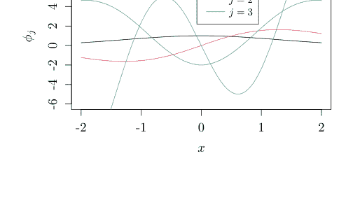

因此，由命题 40，$K_n$ 是非负定的，且 $K_n(x, x) \geq 0$。于是，对于所有 $x \in E$，我们有

$$\sum_{j=1}^{\infty} \lambda_j e_j^2(x) \leq K(x, x) . \tag{3.15}$$

此外，对于任意由正数组成的集合 $J$，我们有

$$\sum_{j \in J} |\lambda_j e_j(x) e_j(y)| \leq \left(\sum_{j \in J} \lambda_j e_j^2(x)\right)^{1/2} \left(\sum_{j \in J} \lambda_j e_j^2(y)\right)^{1/2}, \tag{3.16}$$

这意味着由 (3.15)，

$$\sum_{j \in J} |\lambda_j e_j(x) e_j(y)| \leq \{K(x, x) K(y, y)\}^{1/2}$$

对于 $x, y \in E$。由 (3.16)，我们有

$$\sum_{j=n+1}^{\infty} |\lambda_j e_j(x) e_j(y)| \leq \left(\sum_{j=n+1}^{\infty} \lambda_j e_j^2(x)\right)^{1/2} \left(\sum_{j=n+1}^{\infty} \lambda_j e_j^2(y)\right)^{1/2}$$

且右边随着 $n$ 的增长单调收敛于 0。由于 $E$ 是紧集，根据下面的引理，左边一致收敛。

> **引理 3** (Dini) *设 $E$ 是一个紧集。对于连续函数 $f_n : E \to \mathbb{R}$，如果对于连续函数 $f$ 和每个 $x \in E$，$f_n(x)$ 单调收敛于 $f(x)$，那么该收敛是一致的。*

证明：见本章末尾的附录。

因此，对于任意 $\epsilon > 0$，存在一个 $n$ 使得

$$\sup_{x, y \in E} \sum_{j=n+1}^{\infty} |\lambda_j e_j(x) e_j(y)| < \epsilon, \tag{3.17}$$

且该级数绝对且一致收敛。$\square$

**例 60** (由两变量之差表示的核) 设 $E = [-1, 1]$。一个积分算子，其 $K : E \times E \to \mathbb{R}$ 可以表示为 $K(x, z) = \phi(x - z)$ ($\phi : E \to \mathbb{R}$)，即 $T_K f(x) = \int_E \phi(x - y) f(y) dy$，这可以用卷积表示为 $(\phi * f)(x)$：$(g * h)(u) = \int_E g(u - v) h(v)$。此后，我们假设 $\phi$ 的周期为 2，即 $\phi(x) = \phi(x + 2\mathbb{Z})$。在这种情况下，$e_j(x) = \cos(\pi j x)$ 是 $T_K$ 的特征函数。事实上，由于 $\phi$ 是偶函数且具有周期性，我们有

### 3.3 梅塞尔定理

$T_K e_j(x) = \int_E \phi(x - y) \cos(\pi j y) dy = \int_{-1-x}^{1-x} \phi(-u) \cos(\pi j (x + u)) du = \int_E \phi(u) \cos(\pi j (x + u)) du$

以及

$T_K e_j(x) = \{\int_E \phi(u) \cos(\pi j u) du\} \cos(\pi j x) - \{\int_E \phi(u) \sin(\pi j u) du\} \sin(\pi j x)$
$= \lambda_j \cos(\pi j x)$

根据加法公式 $\cos(\pi j (x + u)) = \cos(\pi j x) \cos(\pi j u) - \sin(\pi j x) \sin(\pi j u)$，其中 $\lambda_j = \int_E \phi(u) \cos(\pi j u) du$。类似地，$\sin(\pi j x)$ 是一个特征函数，$\lambda_j$ 是对应的特征值。因此，根据梅塞尔定理，我们有

$K(x, y) = \sum_{j=0}^{\infty} \lambda_j \{\cos(\pi j x) \cos(\pi j y) + \sin(\pi j x) \sin(\pi j y)\} = \sum_{j=0}^{\infty} \lambda_j \cos(\pi j (x - y))$.

**例 61**（多项式核）对于例 8 中的多项式核，令 $m = 2, d = 1$。我们通过设定 $e(x) := a_0 + a_1 x + a_2 x^2$ 来计算 $K(x, y) = (1 + xy)^2$ 在 $x, y \in E = [-1, 1]$ 上的特征函数。通过比较

$\int_E K(x, y) e(y) dy = \int_E (1 + xy)^2 e(y) dy = \int_E e(y) dy + \{2 \int_E y e(y) dy\} x + \{\int_E y^2 e(y) dy\} x^2$

与 $\lambda e(x)$，我们得到

$\begin{cases} \int_E (a_0 + a_1 y + a_2 y^2) dy & = \lambda a_0 \\ 2 \int_E y(a_0 + a_1 y + a_2 y^2) dy & = \lambda a_1 \\ \int_E y^2(a_0 + a_1 y + a_2 y^2) dy & = \lambda a_2 \end{cases}$

我们针对以下矩阵求解特征方程：

$\begin{bmatrix} \int_E dy & \int_E y dy & \int_E y^2 dy \\ 2 \int_E y dy & 2 \int_E y^2 dy & 2 \int_E y^3 dy \\ \int_E y^2 dy & \int_E y^3 dy & \int_E y^4 dy \end{bmatrix} \begin{bmatrix} a_0 \\ a_1 \\ a_2 \end{bmatrix} = \lambda \begin{bmatrix} a_0 \\ a_1 \\ a_2 \end{bmatrix}$.

现在，我们考虑近似获取梅塞尔定理中特征值和特征向量的一般方法。令 $X$ 为 $E$ 中的一个随机变量。那么，对于由下式定义的积分算子 $T_X \in B(H) (x \in E)$

$T_K : L^2 \ni \phi \mapsto \int_E K(\cdot, x) \phi(x) d\mu(x) \in L^2$，

存在 $\lambda_1 \ge \lambda_2 \ge \dots$ 和 $\phi_1, \phi_2, \dots \in L^2$ 使得

$$T_K \phi_j = \lambda \phi_j$$

以及

$$\int_E \phi_j \phi_k d\mu = \delta_{j,k} \,.$$

我们说概率测度 $\mu$ 生成了 $x_1, \dots, x_m \in E$，其中 $m \ge 1$，并且我们将生成过程近似为

$$\frac{1}{m} \sum_{j=1}^m K(x_j, y) \phi_i(x_j) = \lambda_i \phi_i(y) \,, \quad y \in E \qquad (3.18)$$

$i = 1, 2, \dots$ 由于我们有

$$\frac{1}{m} \sum_{i=1}^m \phi_j(x_i) \phi_k(x_i) = \delta_{j,k}$$

如果我们将 $x_1, \dots, x_m$ 代入 (3.18) 中的 $y$，我们发现存在一个正交矩阵 $U \in \mathbb{R}^{m \times m}$ 使得

$$K_m U = U \Lambda \,,$$

其中 $K_m \in \mathbb{R}^{m \times m}$ 是格拉姆矩阵，$\Lambda$ 是对角矩阵，其元素为 $\lambda_1^{(m)} = m\lambda_1, \dots, \lambda_m^{(m)} = m\lambda_m$。如果我们将 $\phi_i(x_j) = \sqrt{m} U_{j,i}$，$\lambda_i = \frac{\lambda_i^{(m)}}{m}$ 代入 (3.18)，我们得到

$$\phi_i(\cdot) = \frac{\sqrt{m}}{\lambda_i^{(m)}} \sum_{j=1}^m K(x_j, \cdot) U_{j,i} \,. \qquad (3.19)$$

我们要求 $x_1, \dots, x_m \in E$ 的分布与积分算子的测度 $\mu$ 一致。已知如果我们在 $\lambda_i^{(m)}/m$ 中增大 $m$，该项会收敛到特征值 $\lambda_i$。关于证明和收敛过程，请参阅 Baker（定理 3.4 [3]）。

我们使用 Python 编写该过程如下。

**例 62** 我们使用以下程序获取高斯核的特征值和特征函数，其中定义积分核所需的测度应与提供随机数时使用的测度相同。即使使用相同的高斯核，如果 $x_1, \dots, x_N$ 服从不同的分布，我们也会得到不同的特征值和特征函数。我们比较 $N = 300$ 和 $N = 1000$ 的情况，发现特征值和特征函数重合（图 3.2 和 3.3）。

#### 前 100 个特征值

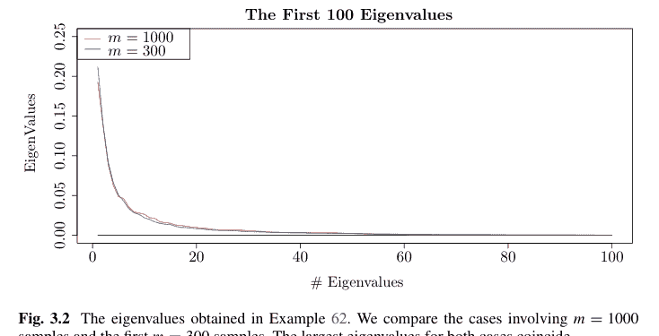

图 3.2 例 62 中获得的特征值。我们比较了涉及 $m = 1000$ 个样本和前 $m = 300$ 个样本的情况。两种情况下的最大特征值重合

```python
# 核定义
sigma = 1
def k(x, y):
    return np.exp(-(x - y)**2 / sigma**2)
# 生成样本并定义格拉姆矩阵
m = 300
x = np.random.randn(m) - 2 * np.random.randn(m)**2 + 3 * np.random.randn(m)**3
# 特征值和特征向量
K = np.zeros((m, m))
for i in range(m):
    for j in range(m):
        K[i, j] = k(x[i], x[j])
values, vectors = np.linalg.eig(K)
lam = values / m
alpha = np.zeros((m, m))
for i in range(m):
    alpha[:, i] = vectors[i, :] * np.sqrt(m) / (values[i] + 10e-16)
# 显示图形
def F(y, i):
    S = 0
    for j in range(m):
        S = S + alpha[j, i] * k(x[j], y)
    return S
i = 1  ## 通过更改 i 来执行
def G(y):
    return F(y, i)
w = np.linspace(-2, 2, 100)
plt.plot(w, G(w))
plt.title("特征值及其特征函数")
```

最后，我们给出由梅塞尔定理（命题 41）得到的再生核希尔伯特空间。在例 57 中，我们指出对于 $L^2$ 空间成为再生核希尔伯特空间，该条件过于宽松。以下命题建议了我们应该添加的限制。

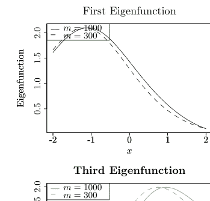

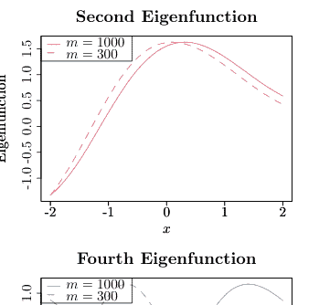

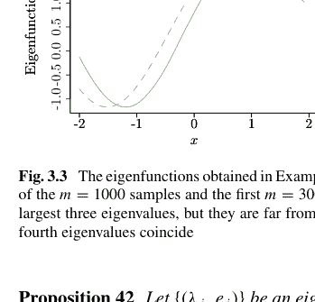

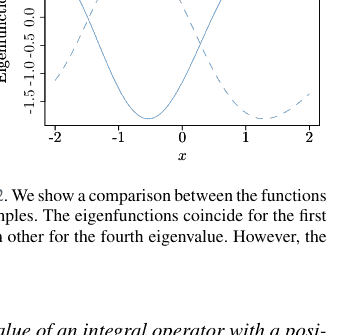

**图 3.3** 例 62 中获得的特征函数。我们展示了 $m = 1000$ 个样本的函数与前 $m = 300$ 个样本的函数之间的比较。对于前三个最大特征值，特征函数重合，但对于第四个特征值，它们相距甚远。然而，第四个特征值重合

**命题 42** 令 $\{(\lambda_j, e_j)\}$ 为具有正定核 $k$ 的积分算子的特征值和标准正交特征函数。在这种情况下，

$$H = \left\{ \sum_{j=1}^{\infty} \beta_j e_j \mid \sum_{j=1}^{\infty} \frac{\beta_j^2}{\lambda_j} < \infty \right\}$$

$$\langle f, g \rangle_H := \sum_{j=1}^{\infty} \frac{\int_E f(x)e_j(x)d\eta(x) \int_E g(x)e_j(x)d\eta(x)}{\lambda_j} \quad (3.20)$$

给出了再生核希尔伯特空间。

该命题声称，如果我们将满足 $\sum_{j=1}^{\infty} \beta_j^2 < \infty$ 的元素 $\sum_{j=1}^{\infty} \beta_j e_j$ 限制为满足 $\sum_{j=1}^{\infty} \frac{\beta_j^2}{\lambda_j} < \infty$ 的元素，那么 $L^2$ 空间就变成了一个再生核希尔伯特空间。

证明：根据内积 (3.20) 的定义，我们可以写出 $\langle e_i, e_j \rangle_H = \frac{1}{\lambda_i} \delta_{i,j}$。因此，我们有

$$\int_E \{\sum_{j=1}^\infty \beta_j e_j(x)\}^2 d\beta(x) < \infty \Longleftrightarrow \sum_{j=1}^\infty \frac{\beta_j^2}{\lambda_j} < \infty,$$

并且 $H$ 是一个希尔伯特空间。根据梅塞尔定理，我们可以写出 $k(x, \cdot) = \sum_{j=1}^\infty \lambda_j e_j(x)e_j(\cdot)$，所以我们有

$$\sum_{j=1}^\infty \frac{\{\lambda_j e_j(x)\}^2}{\lambda_j} = \sum_{j=1}^\infty \lambda_j e_j(x)e_j(x) = k(x, x) < \infty$$

并且 $k(x, \cdot) \in H$。最后，由于 $\int_E k(\cdot, y)e_j(y)d\eta(y) = \lambda_j e_j(\cdot)$，我们有

$$\langle f, k(\cdot, x) \rangle_H = \sum_{j=1}^\infty \frac{1}{\lambda_j} \int_E f(y)e_j(y)d\eta(y) \int_E k(x, y)e_j(y)d\eta(y)$$
$$= \sum_{j=1}^\infty \{\int_E f(y)e_j(y)d\eta(y)\}e_j(x) = f(x),$$

这就是再生性质。$\square$

从证明中可以看出，梅塞尔定理的特征向量 $\{e_j\}$ 在 $L^2$ 空间中是标准正交的，但在得到的再生核希尔伯特空间中，其范数为 $\lambda_j^{-1/2}$。我们可以看到，再生核希尔伯特空间比 $L^2$ 空间更快地衰减 $\{\beta_j\}$。

## 附录

### 命题 34 的证明

令 $k: E \times E \to \mathbb{R}$ 为希尔伯特空间 $H$ 的正定核。我们证明对于由 $k(x, \cdot), x \in E$ 张成的线性空间 $H_0$，二元函数

$$\langle f, g \rangle_{H_0} = \sum_{i=1}^m \sum_{j=1}^n a_i b_j k(x_i, y_j)$$

是

$$f(\cdot) = \sum_{i=1}^m a_i k(x_i, \cdot) \text{ 和 } g(\cdot) = \sum_{j=1}^n b_j k(y_j, \cdot) \in H_0. \quad (3.21)$$

之间的内积。

$$\langle f, g \rangle_{H_0} = \sum_{i=1}^m a_i g(x_i) = \sum_{j=1}^m b_j f(x_j)$$

不依赖于 (3.21) 中 $f, g$ 的选择。特别地，$\langle f, g \rangle_{H_0}$ 是对称的。由于 $k$ 是正定核，我们有

$$\|f\|^2 = \sum_{i=1}^m \sum_{j=1}^n a_i a_j k(x_i, x_j) \ge 0.$$

此外，由

$$|f(x)| = |\langle f(\cdot), k(x, \cdot) \rangle_{H_0}| \le \|f\|_{H_0} \sqrt{k(x, x)},$$

我们有 $\|f\|_{H_0} = 0 \Rightarrow f = 0$。下面我们构造通过完备化 $H_0$ 得到的线性空间 $H$。

设 $\{f_n\}$ 是 $H_0$ 中的一个柯西序列。对于任意 $x \in E$ 和 $m, n \ge 1$，我们有

$$|f_m(x) - f_n(x)| \le \|f_m - f_n\|_{H_0} \sqrt{k(x, x)},$$

且 $\{f_n(x)\}$ 是柯西序列。由于这是一个实数序列，对于每个 $x \in E$，它都有一个收敛点。下面我们令 $H$ 为所有函数 $f : E \to \mathbb{R}$ 的集合，使得对于每个 $x \in E$，由 $H_0$ 中的柯西序列 $\{f_n\}$ 定义的 $\{f_n(x)\}$ 收敛到 $f(x)$。通常，$H_0$ 是 $H$ 的子集。下面我们定义 $H$ 上的一个内积，并证明 $H$ 是一个具有再生核 $k$ 的再生核希尔伯特空间。

#### 引理 4
假设 $\{f_n\}$ 是 $H_0$ 中的一个柯西序列。如果序列 $\{f_n(x)\}$ 对于每个 $x \in E$ 都收敛到 0，那么我们有

$$\lim_{n \to \infty} \|f_n\|_{H_0} = 0.$$

引理 4 的证明：由于柯西序列是有界的（例 26），存在一个 $B > 0$ 使得 $\|f_n\| < B$，$n = 1, 2, \ldots$。此外，由于上述序列是柯西序列，对于任意 $\epsilon > 0$，存在一个 $N$ 使得 $n > N \Rightarrow \|f_n - f_N\| < \epsilon/B$。因此，对于 $f_N(x) = \sum_{i=1}^p \alpha_i k(x_i, x) \in H_0$，$\alpha_i \in \mathbb{R}$，$x_i \in E$，且 $i = 1, 2, \ldots$，我们有当 $n > N$ 时

$$\|f_n\|_{H_0}^2 = \langle f_n - f_N, f_n \rangle_{H_0} + \langle f_N, f_n \rangle_{H_0} \le \|f_n - f_N\|_{H_0} \|f_n\|_{H_0} + \sum_{i=1}^p \alpha_i |f_n(x_i)|.$$

第一项和第二项中的每一项都至多为 $\epsilon$，因为对于每个 $i = 1, \ldots, p$，我们有当 $n \to \infty$ 时 $f_n(x_i) \to 0$。因此，我们得到引理 4。$\square$

对于 $H_0$ 中的柯西序列 $\{f_n\}, \{g_n\}$，我们定义 $f, g \in H$ 使得对于每个 $x \in E$，$\{f_n(x)\}, \{g_n(x)\}$ 分别收敛到 $f(x), g(x)$。那么，$\{\langle f_n, g_n \rangle_{H_0}\}$ 是柯西序列：

$$|\langle f_n, g_n \rangle_{H_0} - \langle f_m, g_m \rangle_{H_0}| = |\langle f_n, g_n - g_m \rangle_{H_0} + \langle f_n - f_m, g_m \rangle_{H_0}|$$
$$\le \|f_n\|_{H_0} \|g_n - g_m\|_{H_0} + \|f_n - f_m\|_{H_0} \|g_m\|_{H_0}.$$

由于 $\{\langle f_n, g_n \rangle_{H_0}\}$ 是实数柯西序列，它收敛（命题 6）。由收敛得到的内积仅依赖于 $f(x), g(x) (x \in E)$。

设 $\{f'_n\}, \{g'_n\}$ 是 $H_0$ 中的其他柯西序列，对于每个 $x \in E$ 分别收敛到 $f, g$。那么，$\{f_n - f'_n\}, \{g_n - g'_n\}$ 是对于每个 $x \in E$ 收敛到 0 的柯西序列，并且由引理 4，我们有当 $n \to \infty$ 时 $\|f_n - f'_n\|_{H_0}, \|g_n - g'_n\|_{H_0} \to 0$，这意味着

$$|\langle f_n, g_n \rangle_{H_0} - \langle f'_n, g'_n \rangle_{H_0}| = |\langle f_n, g_n - g'_n \rangle_{H_0} + \langle f_n - f'_n, g'_n \rangle_{H_0}|$$
$$\leq \|f_n\|_{H_0}\|g_n - g'_n\|_{H_0} + \|f_n - f'_n\|_{H_0}\|g'_n\|_{H_0} \to 0.$$

因此，$\{\langle f_n, g_n \rangle_{H_0}\}$ 的收敛点不依赖于 $\{f_n\}, \{g_n\}$，而依赖于 $f, g \in H$。我们定义 $H$ 的内积为

$$\langle f, g \rangle_H := \lim_{n \to \infty} \langle f_n, g_n \rangle_{H_0}.$$

为了证明这个表达式满足内积的定义，我们假设 $\|f\|_H = \langle f, f \rangle_H = 0$。那么，对于每个 $x \in E$，当 $n \to \infty$ 时，由

$$|f_n(x)| = |\langle f_n(\cdot), k(x, \cdot) \rangle| \leq \sqrt{k(x, x)}\|f_n\|_{H_0} \to 0,$$

我们有 $|f(x)| = \lim_{n \to \infty} |f_n(x)| = 0$。

此外，由于我们根据 $H_0$ 中任何收敛到 $f$ 的柯西序列 $\{f_n\}$ 的 $\lim_{n \to \infty} f_n(x) (x \in E)$ 定义了 $f \in H$，根据内积的定义，我们有

$$\|f - f_n\|_H = \lim_{m \to \infty} \|f_m - f_n\|_{H_0} \to 0 \quad (3.22)$$

当 $n \to \infty$，且 $H_0$ 在 $H$ 中稠密。

我们证明 $H$ 是完备的。设 $\{f_n\}$ 是 $H$ 中的一个柯西序列。由稠密性，存在 $H_0$ 中的一个序列 $\{f'_n\}$ 使得

$$\|f_n - f'_n\|_H \to 0 \quad (3.23)$$

当 $n \to \infty$。因此，给定任意 $\epsilon > 0$，对于 $m, n > N$，我们有 $\|f_n - f'_n\|_H, \|f_m - f'_m\|_H, \|f_n - f_m\|_H < \epsilon/3$ 并且

$$\|f'_n - f'_m\|_{H_0} = \|f'_n - f'_m\|_H \leq \|f_n - f'_n\|_H + \|f_n - f_m\|_H + \|f_m - f'_m\|_H \leq \epsilon$$

对于 $f'_n, f'_m \in H_0 \subseteq H$。因此，$\{f'_n\}$ 是 $H_0$ 中的一个柯西序列，并且我们通过 $f(x)$ 对于每个 $x \in E$ 的收敛性定义 $f \in H$。此外，由 (3.22)，我们有 $\|f - f'_n\|_H \to 0$。结合 (3.23)，我们得到

$$\|f - f_n\|_H \leq \|f - f'_n\|_H + \|f'_n - f_n\|_H \to 0$$

当 $n \to \infty$。因此，$H$ 是完备的。

接下来，我们证明 $k$ 是希尔伯特空间 $H$ 的相应再生核。性质 (3.1) 立即成立，因为 $k(x, \cdot) \in H_0 \subseteq H, x \in E$。对于另一个性质 (3.2)，由于 $f \in H$ 是 $H_0$ 中柯西序列 $\{f_n\}$ 在 $x \in E$ 处的极限，我们有

$$f(x) = \lim_{n \to \infty} f_n(x) = \lim_{n \to \infty} \langle f_n(\cdot), k(x, \cdot) \rangle_{H_0} = \langle f, k(x, \cdot) \rangle_H .$$

最后，我们证明这样的 $H$ 是唯一存在的。假设 $G$ 存在并具有与 $H$ 相同的性质。由于 $H$ 是 $H_0$ 的闭包，$G$ 应该包含 $H$ 作为子空间。由于 $H$ 是闭的，由 (2.11)，我们写 $G = H \oplus H^\perp$。然而，由于 $k(x, \cdot) \in H, x \in E$ 且对于 $f \in H^\perp$ 有 $\langle f(\cdot), k(x, \cdot) \rangle_G = 0$，我们有 $f(x) = 0, x \in E$，这意味着 $H^\perp = \{0\}$。$\square$

### 命题 38 的证明

根据我们的假设，对于每个 $x \in E$，我们有 $k(x, \cdot) = k_1(x, \cdot) + k_2(x, \cdot) \in H$。对于每个 $x \in E$，我们定义 $N^\perp \ni (h_1(x, \cdot), h_2(x, \cdot)) := v^{-1}(k(x, \cdot))$，其中 $h_1(x, \cdot), h_2(x, \cdot)$ 是 $H_1, H_2$ 中的元素，但 $h_1, h_2$ 不一定是 $H_1, H_2$ 的再生核 $k_1, k_2$。由于 $k(x, \cdot) = k_1(x, \cdot) + k_2(x, \cdot)$，我们有

$$h_1(x, \cdot) - k_1(x, \cdot) + h_2(x, \cdot) - k_2(x, \cdot) = k(x, \cdot) - k(x, \cdot) = 0$$

且 $z := (h_1(x, \cdot) - k_1(x, \cdot), h_2(x, \cdot) - k_2(x, \cdot)) \in N$，所以

$$0 = \langle 0, f \rangle_H = \langle z, (f_1, f_2) \rangle_F$$

对于 $f \in H$ 和 $N^\perp \ni (f_1, f_2) := v^{-1}(f)$。因此，我们有

$$\langle f_1, h_1(x, \cdot) \rangle_1 + \langle f_2, h_2(x, \cdot) \rangle_2 = \langle f_1, k_1(x, \cdot) \rangle_1 + \langle f_2, k_2(x, \cdot) \rangle_2,$$

这意味着再生性质：

$$\langle f, k(x, \cdot) \rangle_H = \langle v^{-1}(f), v^{-1}(k(x, \cdot)) \rangle_F = \langle (f_1, f_2), (h_1(x, \cdot), h_2(x, \cdot)) \rangle_F$$
$$= \langle (f_1, f_2), (k_1(x, \cdot), k_2(x, \cdot)) \rangle_F = f_1(x) + f_2(x) = f(x) .$$

此外，令 $(f_1, f_2) \in F$，$f := f_1 + f_2$，且 $(g_1, g_2) := (f_1, f_2) - v^{-1}(f)$。那么，由 $(g_1, g_2) \in N$ 和 $v^{-1}(f) \in N^\perp$，我们有

$$\|(f_1, f_2)\|_F^2 = \|v^{-1}(f)\|_F^2 + \|(g_1, g_2)\|_F^2 .$$

结合 (3.4) 和 (3.5)，我们有

$$\|f\|_H^2 = \|v^{-1}(f)\|_F^2 \le \|(f_1, f_2)\|_F^2 = \|f_1\|_{H_1}^2 + \|f_2\|_{H_2}^2,$$

其中当 $(f_1, f_2) = v^{-1}(f)$ 时等号成立。$\square$

### 例 59 的证明

我们使用等式 [10]

$$\int_{-\infty}^{\infty} \exp(-(x-y)^2) H_j(\alpha x) dx = \sqrt{\pi} (1-\alpha^2)^{j/2} H_j\left(\frac{\alpha y}{(1-\alpha^2)^{1/2}}\right).$$

假设 $\int_E p(y) dy = 1$。如果我们有

$$\int_E k(x, y) \phi_j(y) p(y) dy = \lambda \phi_j(x),$$

那么对于 $\tilde{k}(x, y) := p(x)^{1/2} k(x, y) p(y)^{1/2}$，$\tilde{\phi}_j(x) := p(x)^{1/2} \phi_j(x)$，我们有

$$\int_E \tilde{k}(x, y) \tilde{\phi}_j(y) dy = \lambda \tilde{\phi}_j(x).$$

因此，只需证明将

$$p(x) := \sqrt{\frac{2a}{\pi}} \exp(-2ax^2)$$

$$\tilde{k}(x, y) := \sqrt{\frac{2a}{\pi}} \exp(-ax^2) \exp(-b(x-y)^2) \exp(-ay^2)$$

$$\tilde{\phi}_j(x) := \left(\frac{2a}{\pi}\right)^{1/4} \exp(-cx^2) H_j(\sqrt{2c}x)$$

代入 $E = (-\infty, \infty)$ 的左边，我们得到右边。左边变为

$$\int_{-\infty}^{\infty} \left(\frac{2a}{\pi}\right)^{3/4} \exp(-ax^2) \exp(-b(x-y)^2) \exp(-ay^2) \exp(-cy^2) H_j(\sqrt{2c}y) dy$$
$$= \left(\frac{2a}{\pi}\right)^{3/4} \int_{-\infty}^{\infty} \exp\{-(a+b+c)(y - \frac{b}{a+b+c}x)^2 + [\frac{b^2}{a+b+c} - (a+b)]x^2\} H_j(\sqrt{2c}y) dy$$
$$= \left(\frac{2a}{\pi}\right)^{3/4} \exp(-cx^2) \int_{-\infty}^{\infty} \exp\{-(z - \frac{b}{\sqrt{a+b+c}}x)^2\} H_j\left(\frac{\sqrt{2c}}{\sqrt{a+b+c}}z\right) \frac{dz}{\sqrt{a+b+c}}$$
$$= \left(\frac{2a}{\pi}\right)^{1/4} \sqrt{\frac{2a}{\pi(a+b+c)}} \exp(-cx^2) \sqrt{\pi} (1 - \frac{2c}{a+b+c})^{j/2} H_j(\sqrt{2c}x)$$
$$= \sqrt{\frac{2a}{a+b+c}} \left(\frac{b}{a+b+c}\right)^j \left(\frac{2a}{\pi}\right)^{1/4} \exp(-cx^2) H_j(\sqrt{2c}x) = \sqrt{\frac{2a}{A}} B^j \tilde{\phi}_j(x),$$

其中我们定义了 $z := y\sqrt{a+b+c}$，$\alpha := \frac{\sqrt{2c}}{\sqrt{a+b+c}}$ 并使用了$(1 - \alpha^2)^{1/2} = \sqrt{1 - \frac{2c}{a+b+c}} = \sqrt{\frac{a+b-c}{a+b+c}} = \sqrt{\frac{(a+b)^2 - c^2}{(a+b+c)^2}} = \frac{b}{a+b+c}$。

### 命题 40 的证明

由于 $K$ 是一致连续的，如果 $d$ 是 $E \times E$ 上的距离，则存在 $\delta_n$ 使得
$$d((x_1, y_1), (x_2, y_2)) < \delta_n \Rightarrow |K(x_1, y_1) - K(x_2, y_2)| < n^{-1}$$
对于 $n = 1, 2, \ldots$ 以及任意的 $x_1, x_2, y_1, y_2 \in E$。由于 $E$ 是紧致的，我们可以用有限个直径为 $\delta_n$ 的球 $\{E_{n,i}\}_{i=1}^m$ 来覆盖它。如果我们任意选择 $v_i \in E_{n,i}$ 并定义 $K_n(x, y) := K(v_i, v_j)$ 对于 $(x, y) \in E_{n,i} \times E_{n,j}$，根据 $K$ 的一致连续性，我们得到
$$\max_{(x,y) \in E \times E} |K(x, y) - K_n(x, y)| < \frac{1}{n}.$$
令 $T_K, T_{K_n}$ 分别为 $K, K_n$ 的积分算子。那么，我们有
$$|\langle T_K f, f \rangle - \langle T_{K_n} f, f \rangle| \leq n^{-1} \|f\|^2$$
并且
$$\langle T_{K_n} f, f \rangle = \sum_{i=1}^m \sum_{j=1}^m K(v_i, v_j) \int_{E_{n,i}} f(x) d\mu(x) \int_{E_{n,j}} f(y) d\mu(y)$$
对于任意的 $n$，并且我们有 $\langle T_K f, f \rangle \geq 0$。反之，假设 $\langle T_K f, f \rangle \geq 0$。如果存在 $x_1, \ldots, x_m \in E$，$z_1, \ldots, z_m \in \mathbb{R}$ 使得 $\sum_{i=1}^m \sum_{j=1}^m z_i z_j k(x_i, x_j) < 0$，由于 $K$ 是一致连续的，存在 $E_1, \ldots, E_m \in \mathcal{F}$ 使得
$$\max_{x_h, y_h \in E_h, h=1, \ldots, m} \sum_{i=1}^m \sum_{j=1}^m z_i z_j K(x_i, y_j) < 0$$
并且 $\mu(E_1), \ldots, \mu(E_m) > 0$。然而，根据中值定理，我们有
$$\langle T_K f, f \rangle := \sum_{i=1}^m \sum_{j=1}^m z_i z_j \{\mu(E_i) \mu(E_j)\}^{-1} \int_{E_i} \int_{E_j} k(x, y) d\mu(x) d\mu(y) < 0.$$
对于 $f = \sum_{i=1}^m z_i \{\mu(E_i)\}^{-1} I_{E_i}$，这与 $T_K$ 是正定的事实相矛盾。

### 引理 3 的证明

我们假设对于每个 $x \in E$，$f_n(x)$ 随着 $n$ 的增长而单调递增。令 $\epsilon > 0$ 为任意值。对于每个 $x \in E$，令 $n(x)$ 为使得 $|f_n(x) - f(x)| < \epsilon$ 的最小 $n$。根据连续性，对于每个 $x \in E$，我们设定 $U(x)$ 使得

$$y \in U(x) \Rightarrow |f(x) - f(y)| < \epsilon, \quad |f_{n(x)}(x) - f_{n(x)}(y)| < \epsilon.$$

那么，我们有

$$f(y) - f_{n(x)}(y) \le f(x) + \epsilon - f_{n(x)}(y) \le f_{n(x)}(x) + 2\epsilon - f_{n(x)}(y) \le |f_{n(x)}(x) - f_{n(x)}(y)| + 2\epsilon < 3\epsilon.$$

此外，由于 $E$ 是紧致的，我们可以假设 $E \subseteq \bigcup_{i=1}^m U(x_i)$。如果 $N$ 是 $n(x_1), \dots, n(x_m)$ 的最大值，那么对于 $n \ge N$，我们有

$$f(y) - f_n(y) \le f(y) - f_{n(x_i)}(y) \le 3\epsilon$$

对于每个 $y \in E$ 以及每个满足 $y \in U(x_i)$ 的 $i$。

### 习题 31~45

31. 命题 34 可以根据以下步骤推导。附录中证明的每个部分对应于哪个步骤？

    (a) 定义 $H_0 := \operatorname{span}\{k(x, \cdot) : x \in E\}$ 的内积 $\langle \cdot, \cdot \rangle_{H_0}$。
    (b) 对于 $H_0$ 中的任意柯西序列 $\{f_n\}$ 和每个 $x \in E$，实数序列 $\{f_n(x)\}$ 是柯西序列，因此它收敛到某个 $f(x) := \lim_{n \to \infty} f_n(x)$（命题 6）。令 $H$ 为这样的 $f$ 的集合。
    (c) 定义线性空间 $H$ 的内积 $\langle \cdot, \cdot \rangle_H$。
    (d) 证明 $H_0$ 在 $H$ 中是稠密的。
    (e) 证明 $H$ 中的任何柯西序列 $\{f_n\}$ 当 $n \to \infty$ 时收敛到 $H$ 中的某个元素（$H$ 的完备性）。
    (f) 证明 $k$ 是 $H$ 的一个再生核。
    (g) 证明这样的 $H$ 是唯一的。

32. 在例 55 和 56 中，内积是 $\langle f, g \rangle_H = \int_0^1 F(u)G(u)du$，再生核希尔伯特空间是

    $$H = \left\{ E \ni x \mapsto \int_E F(t)J(x, t)d\eta(t) \in \mathbb{R} \mid F \in L^2(E, \eta) \right\}.$$

    例 55 和 56 中的 $J(x, t)$ 分别是什么？此外，核 $k(x, y)$ 如何用 $J(x, t)$ 一般地表示？

33. 命题 38 可以根据以下步骤推导。附录中证明的每个部分对应于哪个步骤？

    (a) 任意固定 $f \in H$，定义 $N^\perp \ni (f_1, f_2) := v^{-1}(f)$，$k(x, \cdot) := k_1(x, \cdot) + k_2(x, \cdot)$，以及 $(h_1(x, \cdot), h_2(x, \cdot)) := v^{-1}(k(x, \cdot))$，并证明
    $$\langle f_1, h_1(x, \cdot) \rangle_1 + \langle f_2, h_2(x, \cdot) \rangle_2 = \langle f_1, k_1(x, \cdot) \rangle_1 + \langle f_2, k_2(x, \cdot) \rangle_2$$

    (b) 使用 (a)，证明 $k$ 的再生性质：$\langle f, k(x, \cdot) \rangle_H = f(x)$。
    (c) 证明 $H$ 的范数是 (3.6)。

34. 证明每个 $f \in W_q[0, 1]$ 都可以通过泰勒级数展开为
    $$f(x) = \sum_{i=0}^{q-1} f^{(i)}(0)\phi_i(x) + \int_0^1 G_q(x, y) f^{(q)}(y)dy$$

    使用
    $$\phi_i(x) := \frac{x^i}{i!}, \quad i = 0, 1, \ldots$$
    和
    $$G_q(x, y) := \frac{(x - y)_+^{q-1}}{(q - 1)!}.$$

35. 证明 $W_q[0, 1] = H_0 \oplus H_1$，其中
    $$H_0 = \left\{ \sum_{i=0}^{q-1} \alpha_i \phi_i(x) \mid \alpha_0, \ldots, \alpha_{q-1} \in \mathbb{R} \right\}$$
    $$H_1 = \left\{ \int_0^1 G_q(x, y) h(y) dy \mid h \in L^2[0, 1] \right\}$$
    （你需要证明集合两边的包含关系）。此外，证明 $H_0 \cap H_1 = \{0\}$。

36. 我们考虑 $L^2[0, 1]$ 中核 $k(x, y) = \min\{x, y\}$ 的积分算子 $T_k$，其中 $x, y \in E = [0, 1]$。将
    $$\lambda_j = \frac{4}{\{(2j - 1)\pi\}^2}$$
    $$e_j(x) = \sqrt{2} \sin \left( \frac{(2j - 1)\pi}{2} x \right)$$
    代入 $T_k e_j = \lambda_j e_j$ 以验证等式。

37. 证明例 59 中的特征值构成一个几何序列，其首项和公比由 $\beta := \hat{\sigma}^2 / \sigma^2$ 决定。

38. 在例 59 中，以下程序在假设 $\sigma^2 = \hat{\sigma}^2 = 1$ 的情况下获取特征值和特征函数。我们可以修改程序，在 ## 处设置 $\sigma^2, \hat{\sigma}^2$ 的值，并在 ### 处将 $\sigma^2, \hat{\sigma}^2$ 作为函数 phi 的参数添加，然后运行它以输出图形。

    ```python
    def H(j, x):
        if j == 0:
            return 1
        elif j == 1:
            return 2 * x
        elif j == 2:
            return -2 + 4 * x**2
        else:
            return 4 * x - 8 * x**3
    ```

    ```python
    cc = np.sqrt(5) / 4
    a = 1/4          ##

    def phi(j, x)    :###
        return np.exp(-(cc - a) * x**2) * H(j, np.sqrt(2 * cc) * x)

    color = ["b", "g", "r", "k"]
    x = np.linspace(-2, 2, 100)
    plt.plot(x, phi(0, x), c = color[0], label = "j=0")
    plt.ylim(-2, 8)
    plt.ylabel("phi")
    for i in range(0, 3):
        plt.plot(x, phi(i, x), c = color[i + 1], label = "j=%d"%i)
    plt.title("Characteristic function of Gauss Kernel")
    ```

39. 证明以下内容：

    - (a) 定义在 $[0, 1]$ 上的函数 $f_n(x) = n^2(1 - x)x^{n+1}$ 在每个 $x \in [0, 1]$ 处收敛，但其上界不收敛（它不是一致收敛的）。
    - (b) 定义在 $[0, 1]$ 上的函数 $f_n(x) = (1 - x)x^{n+1}$ 一致收敛（使用引理 3）。
    - (c) 级数 $\sum_{n=0}^{\infty} \frac{(-1)^n}{\sqrt{n+1}}$ 绝对收敛。

40. 在例 58 中，假设 $\phi$ 的周期是 $2\pi$ 而不是 2。$T_k$ 的特征值和特征函数是什么？此外，推导核 $k$。

41. 在例 61 中，当 $m = 3, d = 1$ 时，应该求解什么特征方程？

42. 将例 62 中程序的以下部分定义并执行为一个函数。其输入包括数据 x、一个核 k 以及第 i 个特征值的 i。输出是一个函数 F。

    ```python
    K = np.zeros((m, m))
    for i in range(m):
        for j in range(m):
            K[i, j] = k(x[i], x[j])
    values, vectors = np.linalg.eig(K)
    ```

    ```python
    lam = values / m
    alpha = np.zeros((m, m))
    for i in range(m):
        alpha[:, i] = vectors[:, i] * np.sqrt(m) / (values[i] + 10e-16)

    def F(y, i):
        S = 0
        for j in range(m):
            S = S + alpha[j, i] * k(x[j], y)
        return S
    ```

43. 在例 62 中，对于高斯核，根据正态分布生成随机数，并获得相应的特征值和特征函数。当样本数量很大时，理论上特征值呈指数衰减（例 59）。当 $m = 2$ 且 $d = 1$ 时，多项式核 $k(x, y) = (1 + xy)^2$ 会发生什么？像高斯核一样输出特征值和特征函数。

44. 如果我们使用 $K_m U = U \Lambda$ 的解来构造 (3.19)，证明结果是 (3.18) 的一个解，并且它是正交的且范数为 1。

45. 在命题 42 中，$\beta_j$ 本应满足 $\sum_{j=1}^{\infty} \beta_j^2 < \infty$。然而，命题 42 的陈述中并未说明这一点。为什么是这样？

## 第4章
核计算

在第1章中，我们了解到核函数 $k(x, y) \in \mathbb{R}$ 表示集合 $E$ 中两个元素 $x, y$ 之间的相似性。第3章描述了核函数 $k$、其特征映射 $E \ni x \mapsto k(x, \cdot) \in H$ 以及其再生核希尔伯特空间 $H$ 之间的关系。在本章中，我们将 $k(x, \cdot)$ 视为每个 $x \in E$ 的函数 $E \to \mathbb{R}$，并对 $N$ 个实际的协变量和响应数据对 $(x_1, y_1), \dots, (x_N, y_N)$ 进行数据处理。$x_i, i = 1, \dots, N$（行向量）是 $p$ 维的，由矩阵 $X \in \mathbb{R}^{N \times p}$ 给出。响应 $y_i$（$i = 1, \dots, N$）可以是实数或二元值。本章讨论核岭回归、主成分分析、支持向量机（SVMs）和样条，我们寻找在各种约束下最小化目标函数的 $f \in H$。已知我们可以将最优的 $f$ 写成 $\sum_{i=1}^N \alpha_i k(x_i, \cdot)$ 的形式（表示定理），问题简化为寻找最优的 $\alpha_1, \dots, \alpha_N$。

在后半部分，我们讨论计算复杂度问题。核的计算需要超过 $O(N^3)$ 的时间，当 $N$ 大于1000时，实时计算变得困难。特别是，我们考虑如何降低格拉姆矩阵 $K$ 的秩。具体来说，我们学习随机傅里叶特征、Nyström近似和不完全Cholesky分解的实际过程。

### 4.1 核岭回归

我们称寻找最小化 $\sum_{i=1}^N (y_i - x_i \beta)^2$ 的 $\beta \in \mathbb{R}^p$（列向量）为最小二乘问题。如果我们假设已经执行了中心化过程，使得 $y_i \leftarrow y_i - \bar{y}$ 和 $x_{i,j} \leftarrow x_{i,j} - \bar{x}_j$，其中 $\bar{y} = \frac{1}{N} \sum_{i=1}^N y_i$ 和 $\bar{x}_j = \frac{1}{N} \sum_{i=1}^N x_{i,j}$，并且矩阵 $X^\top X$ 是非奇异的，那么我们可以从 $X = (x_{i,j})$ 和 $y = (y_i)$ 得到解为 $\hat{\beta} = (X^\top X)^{-1} X^\top y$。在下文中，我们准备一个核函数 $k : E \times E \to \mathbb{R}$，并考虑寻找最小化以下目标函数的 $f \in H$ 的问题：

$$L := \sum_{i=1}^N (y_i - f(x_i))^2.$$

正如我们在例40中考虑的那样，我们将再生核希尔伯特空间 $H$ 表示为

$$M := \text{span}(\{k(x_i, \cdot)\}_{i=1}^N)$$

和

$$M^\perp = \{f \in H | \langle f, k(x_i, \cdot) \rangle_H = 0, i = 1, \dots, N\}$$

的和。

如果我们设 $f = f_1 + f_2, f_1 \in M, f_2 \in M^\perp$，那么我们有

$$\sum_{i=1}^N (y_i - f(x_i))^2 = \sum_{i=1}^N (y_i - f_1(x_i))^2 = \sum_{i=1}^N (y_i - \sum_{j=1}^N \alpha_j k(x_j, x_i))^2 \quad (4.1)$$

并且 $E := \mathbb{R}^p$；那么对于 $i = 1, \dots, N$，我们得到

$$f(x_i) = \langle f_1(\cdot) + f_2(\cdot), k(x_i, \cdot) \rangle_H = \langle f_1(\cdot), k(x_i, \cdot) \rangle_H = f_1(x_i).$$

因此，$L$ 的最小化简化为

$$L = \sum_{i=1}^N \{y_i - \sum_{j=1}^N \alpha_j k(x_j, x_i)\}^2 = \|y - K\alpha\|^2, \quad (4.2)$$

的最小化，其中 $K = (k(x_i, x_j))_{i,j=1,\dots,N}$ 是格拉姆矩阵，$z = [z_1, \dots, z_N] \in \mathbb{R}$ 的范数 $\|z\|$ 表示 $\sqrt{\sum_{i=1}^N z_i^2}$。上述原理就是表示定理。

如果我们对 $L$ 关于 $\alpha$ 求导，我们得到 $-K(y - K\alpha) = 0$。如果 $K$ 是正定的而非非负定的，那么解变为 $\hat{\alpha} = K^{-1}y$。

如果我们使用上述获得的最小化 (4.2) 的 $\hat{f} \in H$，那么对于给定的新 $x \in \mathbb{R}^p$，我们可以通过以下方式预测 $y$ 的值：

$$\hat{f}(x) = \sum_{i=1}^n \hat{\alpha}_i k(x_i, x).$$

我们可以构建一个计算 $\alpha$ 的过程，如下所示：

```
# 我们预先安装 skfda 模块
pip install cvxopt
```

```
# 在本章中，我们假设已经执行了以下操作。
import numpy as np
import pandas as pd
from sklearn.decomposition import PCA
import cvxopt
from cvxopt import solvers
from cvxopt import matrix
import matplotlib.pyplot as plt
from matplotlib import style
style.use("seaborn-ticks")
from numpy.random import randn # 高斯随机数
from scipy.stats import norm
```

```
def alpha(k, x, y):
    n = len(x)
    K = np.zeros((n, n))
    for i in range(n):
        for j in range(n):
            K[i, j] = k(x[i], x[j])
    return np.linalg.inv(K + 10e-5 * np.identity(n)).dot(y)
    # 向 K 添加 10^(-5) I 使其可逆
```

**例63** 利用函数 alpha，我们对 $n = 50$ 个数据（$\lambda = 0.1$）执行多项式核和高斯核的核回归。输出结果如图4.1所示。

```
def k_p(x, y):        # 核定义
    return (np.dot(x.T, y) + 1)**3
def k_g(x, y):        # 核定义
    return np.exp(-(x - y)**2 / 2)
```

```
lam = 0.1
n = 50; x = np.random.randn(n); y = 1 + x + x**2 + np.random.randn(n) # 数据生成
alpha_p = alpha(k_p, x, y)
alpha_g = alpha(k_g, x, y)

z = np.sort(x); u = []; v = []
for j in range(n):
    S = 0
    for i in range(n):
        S = S + alpha_p[i] * k_p(x[i], z[j])
    u.append(S)
    S = 0
    for i in range(n):
        S = S + alpha_g[i] * k_g(x[i], z[j])
    v.append(S)

plt.scatter(x, y, facecolors='none', edgecolors = "k", marker = "o")
```

### 核回归

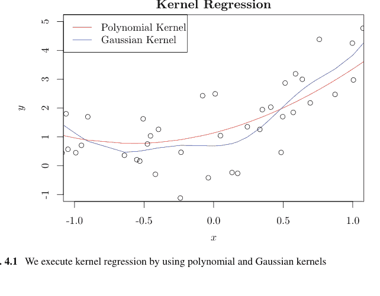

图 4.1 我们使用多项式核和高斯核执行核回归

```
plt.plot(z, u, c = "r", label = "多项式核")
plt.plot(z, v, c = "b", label = "高斯核")
plt.xlim(-1, 1)
plt.ylim(-1, 5)
plt.xlabel("x")
plt.ylabel("y")
plt.title("核回归")
plt.legend(loc = "upper_left", frameon = True, prop={'size':14})
```

当 $X$ 的秩小于 $p$，即 $N < p$ 时，我们无法获得线性回归问题的解。因此，我们经常最小化

$$\sum_{i=1}^{N} (y_i - x_i \beta)^2 + \lambda \|\beta\|_2^2$$

其中 $\lambda > 0$。我们称这种线性回归的修改为岭回归。待最小化的 $\beta$ 由 $(X^\top X + \lambda I)^{-1} X^\top y$ 给出。实际上，我们通过对

$$\|y - X\beta\|^2 + \lambda \beta^\top \beta$$

关于 $\beta$ 求导并令其等于零来推导该公式；我们得到

$$-X^\top (y - X\beta) + \lambda \beta = 0.$$

我们考虑将岭回归扩展到寻找最小化以下目标函数的 $f \in H$ 的问题：

$$L' := \sum_{i=1}^{N} (y_i - f(x_i))^2 + \lambda \|f\|_H^2 .$$

由于 $f_1$ 和 $f_2$ 正交，我们有

$$\|f\|_H^2 = \|f_1\|_H^2 + \|f_2\|_H^2 + 2\langle f_1, f_2 \rangle_H = \|f_1\|_H^2 + \|f_2\|_H^2 \geq \|f_1\|_H^2 .$$

由 (4.1)、(4.3) 和 (4.4)，我们也有

$$L' \geq \sum_{i=1}^{N} (y_i - f_1(x_i))^2 + \lambda \|f_1\|_H^2 .$$

如果我们注意到第二项可以表示为

$$\|f_1\|_H^2 = \left\langle \sum_{i=1}^{N} \alpha_i k(x_i, \cdot), \sum_{j=1}^{N} \alpha_j k(x_j, \cdot) \right\rangle_H = \sum_{i=1}^{N} \sum_{j=1}^{N} \alpha_i \alpha_j \langle k(x_i, \cdot), k(x_j, \cdot) \rangle_H = \alpha^\top K \alpha$$

其中 $\alpha = [\alpha_1, \dots, \alpha_N]^\top$，那么 $L'$ 的最小化简化为

$$\|y - K\alpha\|^2 + \lambda \alpha^\top K \alpha$$

的最小化。

如果我们对该方程关于 $\alpha$ 求导并令其等于零，我们得到

$$-K(y - K\alpha) + \lambda K \alpha = 0 .$$

如果 $K$ 是非奇异的，我们有

$$\hat{\alpha} = (K + \lambda I)^{-1} y .$$

最后，如果我们使用迄今为止获得的最小化 (4.3) 的 $\hat{f} \in H$，那么对于给定的新 $x \in \mathbb{R}^p$，我们可以通过以下方式预测 $y$ 的值：

$$\hat{f}(x) = \sum_{i=1}^{n} \hat{\alpha}_i k(x_i, x) .$$

例如，我们可以构建一个寻找 $\alpha$ 的过程，如下所示：

```
def alpha(k, x, y):
    n = len(x)
    K = np.zeros((n, n))
    for i in range(n):
        for j in range(n):
            K[i, j] = k(x[i], x[j])
    return np.linalg.inv(K + lam * np.identity(n)).dot(y)
```

96

4 核计算

图 4.2 我们使用多项式核和高斯核执行核岭回归

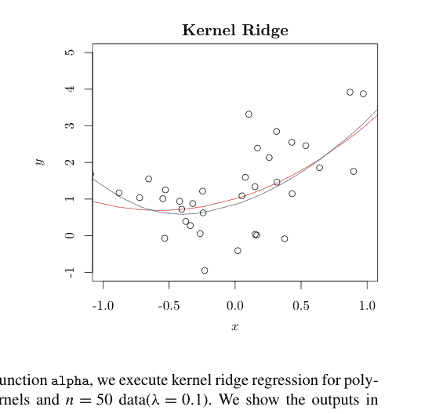

例64 使用函数 alpha，我们对多项式核和高斯核以及 $n = 50$ 个数据（$\lambda = 0.1$）执行核岭回归。输出结果如图4.2所示。

```
python
def k_p(x, y):  # 核定义
    return (np.dot(x.T, y) + 1)**3
def k_g(x, y):  # 核定义
    return np.exp(-(x - y)**2 / 2)
```

```
python
lam = 0.1
n = 50; x = np.random.randn(n); y = 1 + x + x**2 + np.random.randn(n)  # 数据生成
alpha_p = alpha(k_p, x, y)
alpha_g = alpha(k_g, x, y)

z = np.sort(x); u = []; v = []
for j in range(n):
    S = 0
    for i in range(n):
        S = S + alpha_p[i] * k_p(x[i], z[j])
    u.append(S)
    S = 0
    for i in range(n):
        S = S + alpha_g[i] * k_g(x[i], z[j])
    v.append(S)
plt.scatter(x, y, facecolors='none', edgecolors = "k", marker = "o")
plt.plot(z, u, c = "r", label = "多项式核")
plt.plot(z, v, c = "b", label = "高斯核")
plt.xlim(-1, 1)
plt.ylim(-1, 5)
plt.xlabel("x")
plt.ylabel("y")
plt.title("核岭回归")
plt.legend(loc = "upper_left", frameon = True, prop={'size':14})
```

### 4.2 核主成分分析

我们回顾一下在不使用任何核函数时主成分分析（PCA）的流程。我们对矩阵 $X$ 和向量 $y$ 的每一列进行中心化处理。首先，我们计算在 $v^\top v = 1$ 约束下使 $v^\top X^\top Xv$ 最大化的 $v_1 := v \in \mathbb{R}^p$。类似地，对于 $i = 2, \dots, p$，我们反复计算 $v_i$，要求其满足 $v^\top v = 1$，使 $v^\top X^\top Xv$ 最大化，并且与 $v_1, \dots, v_{i-1} \in \mathbb{R}^p$ 正交。在实际应用中，我们并不使用全部的 $v_1, \dots, v_p$，而是将 $\mathbb{R}^p$ 压缩到具有最大特征值的 $v_1, \dots, v_m$（$1 \le m \le p$）上。我们计算使下式最大化的 $v \in \mathbb{R}^p$：

$$v^\top X^\top Xv - \mu(v^\top v - 1)$$

其中 $\mu > 0$ 是拉格朗日系数，用于寻找满足 $v^\top v = 1$ 且使 $v^\top X^\top Xv$ 最大化的 $v \in \mathbb{R}^p$。在 PCA 中，我们通常对每个行向量 $x \in \mathbb{R}^p$，使用得到的 $v_1, \dots, v_m \in \mathbb{R}^p$ 计算：

$$\begin{bmatrix} xv_1 \ \vdots \ xv_m \end{bmatrix} \in \mathbb{R}^m$$

我们称这个值为 $x$ 的得分，它是将 $x$ 投影到 $m$ 个元素上得到的向量。

我们可以将类似于 PCA 的问题应用于再生核希尔伯特空间 $H$，通过特征映射 $\Phi : E \ni x_i \mapsto k(x_i, \cdot) \in H$，而不是在 $\mathbb{R}^p$ 中进行 PCA。为此，我们考虑寻找使下式最大化的 $f \in H$ 的问题：

$$\sum_{j=1}^N f(x_i)^2 - \mu(\|f\|_H^2 - 1)$$

其中 $\mu > 0$ 是拉格朗日系数。

如果我们使用线性核（标准内积），我们可以将 $f \in H$ 表示为 $f(\cdot) = \langle w, \cdot \rangle_E$，其中 $w \in E$。因此，(4.7) 和 (4.8) 是一致的。核 PCA 中的中心化是针对格拉姆矩阵 $K$ 而非矩阵 $X$ 进行的。对于其他部分，扩展方式相同。

如前一节所述，我们应用表示定理。因此，对于 $f_1 \in M := \text{span}(\{k(x_i, \cdot)\}_{i=1}^N)$ 和 $f_2 \in M^\perp$，我们有：

$$\sum_{i=1}^N f(x_i)^2 = \sum_{i=1}^N \langle f_1(\cdot) + f_2(\cdot), k(x_i, \cdot) \rangle_H^2 = \sum_{i=1}^N \langle f_1(\cdot), k(x_i, \cdot) \rangle_H^2 = \sum_{i=1}^N f_1(x_i)^2$$
$$= \sum_{i=1}^N \left( \sum_{j=1}^N \alpha_j k(x_j, x_i) \right)^2 = \sum_{i=1}^N \sum_{r=1}^N \sum_{s=1}^N \alpha_r \alpha_s k(x_r, x_i) k(x_s, x_i) = \alpha^\top K^2 \alpha$$

$\|f_1 + f_2\|_H^2 = \|f_1\|_H^2 + \|f_2\|_H^2 \geq \|f_1\|_H^2$
$= \|\sum_{j=1}^N \alpha_j k(x_j, \cdot)\|_H^2 = \sum_{r=1}^N \sum_{s=1}^N \alpha_r \alpha_s k(x_r, x_s) = \alpha^\top K \alpha$。

因此，我们可以将 (4.8) 表述为最大化下式：

$\alpha^\top K^\top K \alpha - \mu(\alpha^\top K \alpha - 1)$。

如果我们令 $\beta = K^{1/2}\alpha$，那么由于 $K$ 是对称的，我们有：

$\beta^\top K \beta - \mu(\beta^\top \beta - 1)$。

令 $\lambda_1, \ldots, \lambda_N$ 和 $u_1, \ldots, u_N$ 分别为特征方程 $K\beta = \lambda\beta$ 的特征值和特征向量。那么，我们有 [26]：

$\alpha = K^{-1/2}\beta = \frac{1}{\sqrt{\lambda}}\beta = \frac{u_1}{\sqrt{\lambda_1}}, \ldots, \frac{u_N}{\sqrt{\lambda_N}}$。

如果我们对格拉姆矩阵 $K = (k(x_i, x_j))$ 进行中心化，那么修正后的格拉姆矩阵的第 $(i, j)$ 个元素为：

$\langle k(x_i, \cdot) - \frac{1}{N}\sum_{h=1}^N k(x_h, \cdot), k(x_j, \cdot) - \frac{1}{N}\sum_{h=1}^N k(x_h, \cdot) \rangle_H$
$= k(x_i, x_j) - \frac{1}{N}\sum_{h=1}^N k(x_i, x_h) - \frac{1}{N}\sum_{l=1}^N k(x_j, x_l)$
$+ \frac{1}{N^2}\sum_{h=1}^N \sum_{l=1}^N k(x_h, x_l)$。 (4.9)

为了获得 $x \in \mathbb{R}^p$（行向量）的得分（大小为 $1 \leq m \leq p$），我们使用 $A = [\alpha_1, \ldots, \alpha_N]^\top \in \mathbb{R}^{N \times p}$ 的前 $m$ 列。令 $x_i \in \mathbb{R}^p$ 和 $\alpha_i \in \mathbb{R}^m$ 分别为 $X$ 的行向量和 $A \in \mathbb{R}^{N \times m}$ 的第 $i$ 列。那么，

$\sum_{i=1}^N \alpha_i k(x_i, x) \in \mathbb{R}^m$

就是 $x \in \mathbb{R}^p$ 的得分。

与普通 PCA 相比，核 PCA 需要 $O(N^3)$ 的计算时间。因此，当 $N$ 相对于 $p$ 较大时，计算复杂度可能非常高。在 Python 中，我们可以将该过程编写如下：

```python
def kernel_pca_train(x, k):
    n = x.shape[0]
    K = np.zeros((n, n))
    S = [0] * n; T = [0] * n
    for i in range(n):
        for j in range(n):
            K[i, j] = k(x[i, :], x[j, :])
    for i in range(n):
        S[i] = np.sum(K[i, :])
    for j in range(n):
        T[j] = np.sum(K[:, j])
    U = np.sum(K)
    for i in range(n):
        for j in range(n):
            K[i, j] = K[i, j] - S[i] / n - T[j] / n + U / n**2
    val, vec = np.linalg.eig(K)
    idx = val.argsort()[::-1]  # decreasing order as R
    val = val[idx]
    vec = vec[:,idx]
    alpha = np.zeros((n, n))
    for i in range(n):
        alpha[:, i] = vec[:, i] / val[i]**0.5
    return alpha
```

```python
def kernel_pca_test(x, k, alpha, m, z):
    n = x.shape[0]
    pca = np.zeros(m)
    for i in range(n):
        pca = pca + alpha[i, 0:m] * k(x[i, :], z)
    return pca
```

在核 PCA 中，当我们使用线性核时，得分与不使用任何核的 PCA 得分一致。为简单起见，我们假设 $X$ 已归一化。如果我们不使用核，那么通过对 $X = U \Sigma V^\top$（$U \in \mathbb{R}^{N \times p}$，$\Sigma \in \mathbb{R}^{p \times p}$，$V \in \mathbb{R}^{p \times p}$）进行奇异值分解，$\frac{1}{N-1} X^\top X = \frac{1}{N-1} V \Sigma^2 V^\top$ 与 $V^\top$ 的乘积是 $\frac{1}{N-1} X^\top X V = \frac{1}{N-1} V \Sigma^2$。因此，$V$ 的每一列都是一个主成分向量，而 $x_1, \dots, x_N \in \mathbb{R}^p$（行向量）的得分是下式的前 $m$ 列：

$$XV = U \Sigma V^\top \cdot V = U \Sigma \,.$$

另一方面，对于线性核，我们可以将格拉姆矩阵写为 $K = XX^\top = U \Sigma^2 U^\top$，并且有 $KU = XX^\top U = U \Sigma^2$。也就是说，$U$ 的每一列是 $\beta_1, \dots, \beta_N$，而 $K^{-1/2}U$ 的列 $\alpha_1, \dots, \alpha_N$ 是主成分向量。因此，$x_1, \dots, x_N \in \mathbb{R}^p$（行向量）的得分是下式的前 $m$ 列：

$$K \cdot K^{-1/2}U = U \Sigma^2 U^\top \cdot (U \Sigma^2 U^\top)^{-1/2} \cdot U = U \Sigma \,.$$

此外，我们从中心化的角度比较结果。对于线性核，方程 (4.9) 是：

$$x_i x_j - \frac{1}{N} \sum_{h=1}^N x_i x_h - \frac{1}{N} \sum_{l=1}^N x_j x_l + \frac{1}{N} \sum_{h=1}^N \sum_{l=1}^N x_l x_h = (x_i - \bar{x})(x_j - \bar{x})$$

这与普通 PCA 方法的结果一致。因此，得到的得分是相同的。

**示例 65** 我们在 Python 中对一个名为 US Arrests 的数据集进行了核 PCA。我们希望使用 PCA 将美国所有 50 个州的城镇居民人口比例以及凶杀、暴力犯罪和对妇女的攻击（每 10 万人的逮捕数）的发生率投影到两个变量的轴上。我们使用了高斯核（$\sigma^2 = 0.01, 0.08$）的核 PCA、线性核的核 PCA 以及普通 PCA。我们观察到，在普通 PCA 和线性核 PCA 的结果中，50 个州之间的特征差异并不明显（图 4.3a,b）。使用高斯核（$\sigma^2 = 0.08$）时，50 个州被分为四类（图 4.3c）。就数据而言，加利福尼亚州的数据（城镇人口比例较高，凶杀案较少）与其他州不同。然而，当我们设置 $\sigma = 0.01$ 时，差异

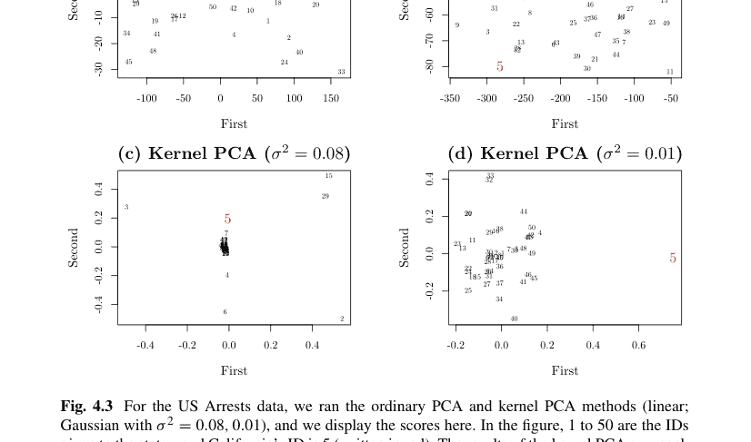

图 4.3 对于 US Arrests 数据，我们运行了普通 PCA 和核 PCA 方法（线性核；高斯核，$\sigma^2 = 0.08, 0.01$），并在此显示得分。图中，1 到 50 是分配给各州的 ID，加利福尼亚州的 ID 是 5（用红色书写）。核 PCA 方法的结果因我们选择的核函数而有很大差异。此外，由于核 PCA 是无监督的，无法使用交叉验证（CV）来选择最优参数。普通 PCA 和线性核 PCA 的得分应该是相同的。尽管两个轴的方向相反（这在 PCA 中很常见），但我们可以得出结论它们匹配。

加利福尼亚州和其他49个州变得清晰可见（图4.3d）。我们使用以下代码来执行比较的方法：

```python
# def k(x, y):
#     return np.dot(x.T, y)
sigma2 = 0.01

def k(x, y):
    return np.exp(-np.linalg.norm(x - y)**2 / 2 / sigma2)

X = pd.read_csv('https://raw.githubusercontent.com/selva86/datasets/master/USArrests.csv')
x = X.values[:, :-1]
n = x.shape[0]; p = x.shape[1]
alpha = kernel_pca_train(x, k)
z = np.zeros((n, 2))

for i in range(n):
    z[i, :] = kernel_pca_test(x, k, alpha, 2, x[i, :])

min1 = np.min(z[:, 0]); min2 = np.min(z[:, 1])
max1 = np.max(z[:, 0]); max2 = np.max(z[:, 1])

plt.xlim(min1, max1)
plt.ylim(min2, max2)
plt.xlabel("First")
plt.ylabel("Second")
plt.title("Kernel_PCA_(Gauss_0.01)")
for i in range(n):
    if i != 4:
        plt.text(x = z[i, 0], y = z[i, 1], s = i)
plt.text(z[4, 0], z[4, 1], 5, c = "r")
```

### 4.3 核支持向量机

考虑使用支持向量机进行二元分类。给定 $X \in \mathbb{R}^{N \times p}$ 和 $y \in \{1, -1\}^N$，我们寻找边界 $Y = X\beta + \beta_0$，其中 $\beta \in \mathbb{R}^p$ 和 $\beta_0 \in \mathbb{R}$ 使得间隔最大化。令 $\gamma \ge 0$。我们希望通过调整 $(\beta_0, \beta) \in \mathbb{R} \times \mathbb{R}^p$ 和 $\epsilon_i \ge 0, i = 1, \dots, N$ 来最大化间隔 $M$，并满足

$$\sum_{i=1}^N \epsilon_i \le \gamma$$

以及

$$y_i(\beta_0 + x_i\beta) \ge M(1 - \epsilon_i), \quad i = 1, \dots, N.$$

我们通常将此表述为最小化以下问题：

$$\frac{1}{2}\|\beta\|^2 + C \sum_{i=1}^N \epsilon_i \qquad (4.10)$$

约束条件为 $y_i(x_i\beta + \beta_0) \geq 1 - \epsilon_i$，$\epsilon_i \geq 0$，其中 $i = 1, \dots, N$，并使用常数 $C > 0$（原始问题）。我们进一步将其转化为寻找 $0 \leq \alpha_i \leq C$，$i = 1, 2, \dots, N$ 以最大化以下表达式的问题：

$$\sum_{i=1}^N \alpha_i - \frac{1}{2} \sum_{i=1}^N \sum_{j=1}^N \alpha_i \alpha_j y_i y_j x_i x_j^\top \quad (4.11)$$

约束条件为 $\sum_{i=1}^N \alpha_i y_i = 0$，其中 $x_i$ 是 $X$ 的第 $i$ 个行向量（对偶问题）$^1$。常数 $C > 0$ 是一个参数，表示边界曲面的灵活性。其值越高，用于确定边界的样本越多（即 $\alpha_i \neq 0$ 的样本，也就是支持向量）。虽然我们牺牲了数据的拟合度，但减少了由样本数据引起的边界变化，以防止过拟合。然后，根据支持向量，我们可以用以下公式计算边界的斜率：

$$\beta = \sum_{i=1}^N \alpha_i y_i x_i^\top \in \mathbb{R}^p.$$

接着，假设我们通过将内积 $x_i x_j^\top$ 替换为一般的非线性核 $k(x_i, x_j)$，将边界曲面替换为曲面。这样，我们可以获得复杂的边界曲面，而不仅仅是平面。然而，用核替换乘积的理论基础尚不明确。

因此，在下文中，我们通过使用 $k : E \times E \to \mathbb{R}$ 来表述优化问题，推导出相同的结果。与之前应用表示定理类似，我们寻找最小化以下表达式的 $f \in H$：

$$\frac{1}{2} \|f\|_H^2 + C \sum_{i=1}^N \epsilon_i - \sum_{i=1}^N \alpha_i [y_i \{f(x_i) + \beta_0\} - (1 - \epsilon_i)] - \sum_{i=1}^N \mu_i \epsilon_i. \quad (4.12)$$

注意到 $f(x_i) = f_1(x_i)$，$i = 1, \dots, N$ 且 $\|f\|_H \geq \|f_1\|_H$，我们寻找 $\gamma_1, \dots, \gamma_N$ 使得 $f(\cdot) = \sum_{i=1}^N \gamma_i k(x_i, \cdot)$。

Karush-Kuhn-Tucker (KKT) 条件导致以下九个方程：

$$y_i \{f(x_i) + \beta_0\} - (1 - \epsilon_i) \geq 0$$
$$\epsilon_i \geq 0$$
$$\alpha_i [y_i \{f(x_i) + \beta_0\} - (1 - \epsilon_i)] = 0$$
$$\mu_i \epsilon_i = 0$$

> $^1$ 我们在多个参考文献中看到此推导，例如 Joe Suzuki, "Statistical Learning with Math and Python" (Springer); C. M. Bishop, "Pattern Recognition and Machine Learning" (Springer); Hastie, Tibshirani, and Friedman, "Elements of Statistical Learning" (Springer); 以及其他主要的机器学习书籍。

$$\sum_{j} \gamma_{j} k(x_{i}, x_{j}) - \sum_{j} \alpha_{j} y_{j} k(x_{i}, x_{j}) = 0$$

$$\sum_{i} \alpha_{i} y_{i} = 0$$

$$C - \alpha_{i} - \mu_{i} = 0$$

$$\mu_{i} \geq 0 \ , \ 0 \leq \alpha_{i} \leq C.$$

接下来，假设 $f_{0}, f_{1}, \ldots, f_{m}: \mathbb{R}^{p} \rightarrow \mathbb{R}$ 在 $\beta = \beta^{*}$ 处是凸的且可微。通常，方程 (4.15, 4.16, 和 4.17) 被称为 KKT 条件$^{2}$。

**命题 43 (KKT 条件)** 假设 $f_{1}(\beta) \leq 0, \ldots, f_{m}(\beta) \leq 0$。那么，$\beta = \beta^{*} \in \mathbb{R}^{p}$ 最小化 $f_{0}(\beta)$ 当且仅当

$$f_{1}(\beta^{*}), \ldots, f_{m}(\beta^{*}) \leq 0$$

并且存在 $\alpha_{1}, \ldots, \alpha_{m} \geq 0$ 使得

$$\alpha_{1} f_{1}(\beta^{*}) = \cdots = \alpha_{m} f_{m}(\beta^{*}) = 0$$

$$\nabla f_{0}(\beta^{*}) + \sum_{i=1}^{m} \alpha_{i} \nabla f_{i}(\beta^{*}) = 0 \ .$$

利用这九个方程，从 (4.13)(4.14)，我们可以将 (4.12) 表示为

$$\sum_{i=1}^{N} \alpha_{i} - \frac{1}{2} \sum_{i=1}^{N} \sum_{j=1}^{N} \alpha_{i} \alpha_{j} y_{i} y_{j} k(x_{i}, x_{j}) \ .$$

比较 (4.11) 和 (4.18)，我们观察到对偶问题将 $x_{i}^{\top} x_{j}$ 替换为 $k(x_{i}, x_{j})$，而无需任何核。

事实上，如果我们设 $f(\cdot) = \langle \beta, \cdot \rangle_{H}$，$\beta \in \mathbb{R}^{P}$，$k(x, y) = x^{\top} y$ ($x, y \in \mathbb{R}^{P}$)，那么我们得到线性核的对偶问题 (4.11)。

**示例 66** 通过使用以下函数 `svm_2`，我们可以比较线性核（标准内积）和非线性核（多项式核）之间的边界差异，如图 4.4 所示。`cvxopt` 是一个用于解决二次规划问题的 Python 模块。函数 `cvxopt` 计算 $\alpha$。

```python
def K_linear(x, y):
    return x.T@y
def K_poly(x, y):
    return (1+x.T@y)**2
```

$^{2}$ 证明请参见 Joe Suzuki "Statistical Learning with R/Python" (Springer) 第 9 章。

```python
def svm_2(X,y,C,K):
    eps=0.0001
    n=X.shape[0]
    P=np.zeros((n,n))
    for i in range(n):
        for j in range(n):
            P[i,j]=K(X[i,:],X[j,:])*y[i]*y[j]
    # Specify it via the matrix function in the package matrix
    P=matrix(P+np.eye(n)*eps)
    A=matrix(-y.T.astype(np.float))
    b=matrix(np.array([0]).astype(np.float))
    h=matrix(np.array([C]*n+[0]*n).reshape(-1,1).astype(np.float))
    G=matrix(np.concatenate([np.diag(np.ones(n)),np.diag(-np.ones(n))]))
    q=matrix(np.array([-1]*n).astype(np.float))
    res=cvxopt.solvers.qp(P,q, A=A, b=b,G=G, h=h)
    alpha=np.array(res['x'])  #x is the alpha in the text
    beta=((alpha*y).T@X).reshape(2,1)
    index = (eps < alpha[:, 0]) & (alpha[:, 0] < C - eps)
    beta_0=np.mean(y[index]-X[index,:]@beta)
    return {'alpha':alpha, 'beta':beta, 'beta_0':beta_0}

def plot_kernel(K,line): # Specify the lines via the line argument
    res=svm_2(X,y,1,K)
    alpha=res['alpha'][:,0]
    beta_0=res['beta_0']
    def f(u,v):
        S=beta_0
        for i in range(X.shape[0]):
            S=S+alpha[i]*y[i]*K(X[i,:],[u,v])
        return S[0]
# ww is the height of f(x,y). We can draw the contour.
uu=np.arange(-2,2,0.1); vv=np.arange(-2,2,0.1); ww=[]
for v in vv:
    w=[]
    for u in uu:
        w.append(f(u,v))
    ww.append(w)
plt.contour(uu,vv,ww,levels=0,linestyles=line)
```

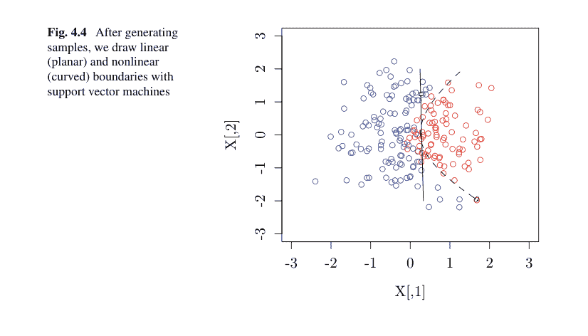

```python
a=3;b=-1
n=200
X=randn(n,2)
y=np.sign(a*X[:,0]+b*X[:,1]**2+0.3*randn(n))
y=y.reshape(-1,1)
for i in range(n):
    if y[i]==1:
        plt.scatter(X[i,0],X[i,1],c="red")
    else:
        plt.scatter(X[i,0],X[i,1],c="blue")
plot_kernel(K_poly,line="dashed")
plot_kernel(K_linear,line="solid")
```

```
         pcost         dcost     gap    pres    dres
 0: -6.6927e+01 -4.6679e+02  2e+03  3e+00  1e-14
 1: -4.2949e+01 -2.9229e+02  5e+02  4e-01  8e-15
 2: -2.8717e+01 -1.0653e+02  1e+02  1e-01  6e-15
 3: -2.5767e+01 -4.7367e+01  3e+01  2e-02  4e-15
 4: -2.6165e+01 -3.1836e+01  8e+00  5e-03  4e-15
 5: -2.6940e+01 -2.8267e+01  2e+00  7e-04  3e-15
 6: -2.7243e+01 -2.7483e+01  3e-01  1e-04  3e-15
 7: -2.7325e+01 -2.7330e+01  6e-03  1e-06  3e-15
 8: -2.7327e+01 -2.7328e+01  9e-05  2e-08  3e-15
 9: -2.7328e+01 -2.7328e+01  9e-07  2e-10  3e-15
Optimal solution found.
```

```
         pcost         dcost     gap    pres    dres
 0: -8.1804e+01 -4.7816e+02  2e+03  3e+00  3e-15
 1: -5.3586e+01 -3.0647e+02  4e+02  4e-01  3e-15
 2: -4.1406e+01 -8.6880e+01  6e+01  3e-02  5e-15
 3: -4.7360e+01 -5.9604e+01  1e+01  6e-03  2e-15
 4: -4.9819e+01 -5.5157e+01  6e+00  2e-03  2e-15
 5: -5.0999e+01 -5.3276e+01  2e+00  7e-04  2e-15
 6: -5.1869e+01 -5.2122e+01  3e-01  9e-06  3e-15
 7: -5.1966e+01 -5.2010e+01  4e-02  1e-06  2e-15
 8: -5.1986e+01 -5.1988e+01  3e-03  5e-15  3e-15
 9: -5.1987e+01 -5.1987e+01  8e-05  1e-15  2e-15
10: -5.1987e+01 -5.1987e+01  2e-06  3e-15  3e-15
Optimal solution found.
```

### 4.4 样条曲线

令 $J \geq 1$。我们称函数

### 4.4 样条曲线

$g(x) = \beta_1 + \beta_2 x + \beta_3 x^2 + \beta_4 x^3 + \sum_{j=1}^J \beta_{j+4}(x - \xi_j)_+^3$

$= \begin{cases} g_0(x) = \beta_1 + \beta_2 x + \beta_3 x^2 + \beta_4 x^3, & x < \xi_1 \\ g_j(x) = g_{j-1}(x) + \beta_{j+4}(x - \xi_j)^3, & \xi_j \le x < \xi_{j+1} \\ g_J(x) = \beta_1 + \beta_2 x + \beta_3 x^2 + \beta_4 x^3 + \sum_{j=1}^J \beta_{j+4}(x - \xi_j)^3, & x \ge \xi_J \end{cases}$

其中常数 $\beta_1, \dots, \beta_{J+4} \in \mathbb{R}$，这是一个具有节点 $0 < \xi_1 < \dots < \xi_J < 1$ 的三阶样条函数。我们可以用函数 $g$ 来定义三阶样条函数，它在 $J + 1$ 个区间上是分段多项式，并且在 $J$ 个节点处 $g, g', g''$ 连续。由 (4.19) 表达的样条构成一个线性空间，而

$1, x, x^2, x^3, (x - \xi_1)_+^3, \dots, (x - \xi_J)_+^3$

可以作为其基。

特别地，我们考虑三阶自然样条，其中我们施加更多条件，例如

$g''(\xi_1) = g'''(\xi_1) = 0$

和

$g''(\xi_J) = g'''(\xi_J) = 0$。

由此得到的曲线在 $x \le \xi_1, \xi_J \le x$ 区间内不是三阶的，我们用一条直线来近似它。自然样条的线性空间具有 $J$ 维。事实上，由 (4.21)，我们有

$g'''(\xi_1) = 6\beta_4 = 0$

$g''(\xi_1) = 2\beta_3 + 6\beta_4 \xi_1 = 0 \iff \beta_3 = \beta_4 = 0$。

此外，由 (4.22)，我们有

$g'''(\xi_J) = 6\beta_4 + 6 \sum_{j=1}^J \beta_{j+4} = 0$

$g''(\xi_J) = 2\beta_3 + 6\beta_4 \xi_J + 6 \sum_{j=1}^J \beta_{j+4}(\xi_J - \xi_j) = 0$

$\iff \sum_{j=1}^J \beta_{j+4} = \sum_{j=1}^J \beta_{j+4} \xi_j = 0$。

因此，$\beta_{J+3}, \beta_{J+4}$ 的值由其他 $\beta_j; j = 1, 2, 5, \dots, J + 2$ 决定。

接下来，我们考虑寻找函数 $f : [0, 1] \to \mathbb{R}$ 以最小化

$$\sum_{i=1}^{N} \{y_i - f(x_i)\}^2 + \lambda \int_0^1 \{f''(x)\}^2 dx \quad (4.23)$$

给定样本 $(x_1, y_1), \ldots, (x_N, y_N) \in \mathbb{R} \times \mathbb{R}$。如果函数是直线，第二项为零，但如果函数偏离直线，它就会变成一个显著的值。换句话说，这一项代表了函数 $f$ 的复杂性。常数 $\lambda \ge 0$ 平衡这两项，如果它很大，曲线就平滑；如果常数很小，曲线就紧密地跟随样本。注意，通常边界 $\xi_1, \ldots, \xi_J$ 和 $x_1, \ldots, x_N$ 是分别定义的。

在这种情况下，已知最小化 (4.23) 的 $f$ 是一个三阶自然样条，它在 $N$ 个边界 $\xi_1 = x_1, \ldots, \xi_N = x_N$ 处满足 $f(x_i) = y_i$，$i = 1, \ldots, N$。然而，$f$ 处处一次可微，几乎处处二次可微，且 $\int_0^1 \{f''(x)\}^2 dx < \infty$，这意味着 $f$ 是 $W_2[0, 1]$ 的一个元素。类似的命题对一般的 $W_q[0, 1]$ 也成立。

**示例 67** 在 $q = 2$ 的自然样条情况下，如果我们适当地选择基 $g_1, \ldots, g_N$，例如 $g(\cdot) = \sum_{j=1}^N \beta_j g_j(\cdot)$，并且 $G = (\int_0^1 g_i^{(q)}(x) g_j^{(q)}(x) dx) \in \mathbb{R}^{N \times N}$，$y = [y_1, \ldots, y_N]$，那么我们得到最优解

$$[\beta_1, \ldots, \beta_N]^\top = (X^\top X + \lambda G)^{-1} X^\top y.$$

图 4.5 显示了 $\lambda = 1, 30, 80$ 时得到的图形。

```python
# d, h 定义获取基的函数
def d(j, x, knots):
    K = len(knots)
    return (np.maximum((x-knots[j])**3, 0)
            - np.maximum((x-knots[K-1])**3, 0))/(knots[K-1]-knots[j])

def h(j, x, knots):
    K = len(knots)
    if j == 0:
        return 1
    elif j == 1:
        return x
    else:
        return d(j-1, x, knots)-d(K-2, x, knots)
# G 给出对两次微分后的函数进行积分的值
def G(x):    # x 值按升序排列
    n = len(x)
    g = np.zeros((n, n))
    for i in range(2, n-1):
        for j in range(i, n):
            g[i, j] = 12*(x[n-1]-x[n-2])*(x[n-2]-x[j-2])\
                      *(x[n-2]-x[i-2])/(x[n-1]-x[i-2])/\
                      (x[n-1]-x[j-2])+(12*x[n-2]+6*x[j-2]-18*x[i-2])\
                      *(x[n-2]-x[j-2])**2/(x[n-1]-x[i-2])/(x[n-1]-x[j-2])
            g[j, i] = g[i, j]
    return g
```

$^3$ 证明请参见本系列丛书第 7 章（《R/Python 统计学习》（Springer））。

图 4.5 在平滑样条中，我们不指定节点或节点数量，而是指定表示平滑度的 $\lambda$ 值。比较 $\lambda = 1, 30, 80$，随着 $\lambda$ 值的增加，样条不再紧密跟随观测数据，而是变得更加平滑。

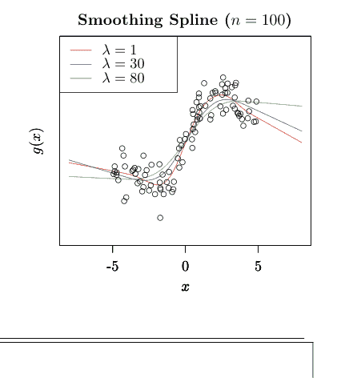

```python
# 主程序
n = 100
x = np.random.uniform(-5, 5, n)
y = x + np.sin(x)*2 + np.random.randn(n)    # 数据生成
index = np.argsort(x)
x = x[index]; y = y[index]
X = np.zeros((n, n))
X[:, 0] = 1
for j in range(1, n):
    for i in range(n):
        X[i, j] = h(j, x[i], x)              # 生成矩阵 X
GG = G(x)                                     # 生成矩阵 G
lam_set = [1, 30, 80]
col_set = ["red", "blue", "green"]

plt.figure()
plt.ylim(-8, 8)
plt.xlabel("x")
plt.ylabel("g(x)")

for i in range(3):
    lam = lam_set[i]
    gamma = np.dot(np.dot(np.linalg.inv(np.dot(X.T, X)+lam*GG),X.T),y)
    def g(u):
        S = gamma[0]
        for j in range(1, n):
            S = S + gamma[j]*h(j, u, x)
        return S
    u_seq = np.arange(-8, 8, 0.02)
    v_seq = []
    for u in u_seq:
        v_seq.append(g(u))
    plt.plot(u_seq, v_seq, c = col_set[i], label = "$\lambda = %d$"%lam_set[i])
plt.legend()
plt.scatter(x, y, facecolors='none', edgecolors = "k", marker = "o")
plt.title("smooth_spline_(n=100)")
Text(0.5, 1.0, 'smooth_spline_(n=100)')
```

将 (4.23) 推广，我们考虑最小化

$$\sum_{i=1}^{N} \{y_i - f(x_i)\}^2 + \lambda \int_0^1 \{f^{(q)}(x)\}^2 dx . \quad (4.24)$$

首先，每个 $f = f_0 + f_1$（在 $W_q[0, 1]$ 中 $f_0 \in H_0$ 且 $f_1 \in H_1$）可以用适当的线性算子 $P_0 \in B(H, H_0)$ 和 $P_1 \in B(H, H_1)$ 写成 $f_0 = P_0 f \in H_0$，$f_1 = P_1 f \in H_1$。由于 $\langle f_0, f_1 \rangle_H = 0$，$f_0, f_1$ 分别最小化 $\|f - f_0\|_H$ 和 $\|f - f_1\|_H$。此外，$P_0, P_1$ 是自伴的。事实上，根据命题 19，对于每个 $i = 0, 1$，我们有

$$\langle P_i f, g \rangle_H = \langle f_i, g_0 + g_1 \rangle_H = \langle f_i, g_i \rangle_H = \langle f_0 + f_1, g_i \rangle_H = \langle f, P_i g \rangle_H$$

对于 $f_0, g_0 \in H_0$，$f_1, g_1 \in H_1$，$f = f_0 + f_1$，$g = g_0 + g_1$。此外，我们有 $P_i f \in H_i$ 且 $P_i^2 f = P_i f$。因此，我们可以将 (4.24) 中第二项的范数写为

$$\int_0^1 |f^{(q)}(x)|^2 dx = \|P_1 f\|_{H_1}^2 = \langle P_1 f, P_1 f \rangle_{H_1} = \langle f, P_1^2 f \rangle_H = \langle f, P_1 f \rangle_H$$

并将 (4.24) 表示为

$$\sum_{i=1}^{N} \{y_i - f(x_i)\}^2 + \lambda \langle f, P_1 f \rangle_H \quad (4.25)$$

对于 $f \in W_q[0, 1]$。令 $f = g + h \in H$，$g \in M := \text{span}\{\phi_0(\cdot), \dots, \phi_{q-1}(\cdot), k(x_1, \cdot), \dots, k(x_N, \cdot)\}$，且 $h \in M^\perp$。那么，对于 $i = 1, \dots, N$，我们有

$$f(x_i) = \langle g + h, k(x_i, \cdot) \rangle_H = g(x_i)$$

$$\|P_1 f\|_{H_1} \geq \|P_1 g\|_{H_1}$$

（表示定理）。因此，为了寻找最优解，我们可以将 $f$ 的搜索范围限制在 $M$ 中，以找到 $\alpha_1, \dots, \alpha_N$，$\beta_1, \dots, \beta_q$ 使得

$$g(\cdot) = \sum_{i=0}^{q-1} \beta_i \phi_i(\cdot) + \sum_{i=1}^{N} \alpha_i k(x_i, \cdot) . \quad (4.26)$$

在自然样条函数中，我们将 $x = x_N$ 处的 $q$ 阶微分视为零，这意味着

$$g^{(q)}(x_N) = \dots = g^{(2q-1)}(x_N) = 0, \quad (4.27)$$

并且 $\text{span}\{k_1(x_i, \cdot) | i = 1, \dots, N\}$ 的维数是 $N - q$。对于三阶样条函数（$q = 2$），(4.27) 对应于 (4.22)。关于 $x \leq x_1$ 中直线的基 $\{1, x\}$ 对应于 $\{\phi_0(x), \dots, \phi_{q-1}\}$。因此，我们在 $W_q[0, 1]$ 的子空间中为 $N$ 个点寻找最优解。

**命题 44** 设 $r \in W_q[0, 1]$ 是一个节点为 $x_1, \dots, x_N$、最高阶数为 $2q - 1$ 的自然样条，并假设 $g \in W_q[0, 1]$ 满足 $g(x_i) = r(x_i)$，其中 $i = 1, 2, \dots, N$。那么，我们有

$$\int_0^1 \{r^{(q)}(x)\}^2 dx \le \int_0^1 \{g^{(q)}(x)\}^2 dx.$$

此外，设 $s := g - r$，则 $s$ 的最高阶数为 $q - 1$，且满足 $s(x_i) = 0$（$i = 1, 2, \dots, N$）。如果 $N \ge q$，那么函数 $s$ 恒为零。

证明：见本章末尾的附录。

由于最高阶数为 $2q - 1$ 的自然样条具有 $N$ 维空间，因此存在一个 $r \in W_q[0, 1]$，它在 $N$ 个边界点 $x_1, \dots, x_N$ 处与 $g$ 共享函数值，即 $r(x_1) = g(x_1), \dots, r(x_N) = g(x_N)$。其中，由于 (4.25) 式中的第二项是最优的，因此最高阶数为 $2q - 1$ 的自然样条是最优的。

综上所述，在 $W_q[0, 1]$ 中寻找使 (4.25) 式最小化的 $f$ 的问题，可以简化为在 (4.26) 和 (4.27) 式的范围内寻找解。换句话说，我们可以将问题视为在一个 $N$ 维子空间中进行。

此外，无论 $q \ge 1$ 是否成立，基都由 $N$ 个元素组成。如果我们设 $g(\cdot) = \sum_{j=1}^N \beta_j g_j(\cdot)$，那么问题就转化为寻找使下式最小化的 $\beta_1, \dots, \beta_N$：

$$\sum_{i=1}^N \{y_i - \sum_{i=1}^n \sum_{j=1}^N \beta_j g_j(x_i)\}^2 + \lambda \sum_{i=1}^N \sum_{j=1}^N \beta_i \beta_j \int_0^1 g_i^{(q)}(x) g_j^{(q)}(x) dx.$$

令 $X = (g_j(x_i)) \in \mathbb{R}^{N \times N}$，$G = (\int_0^1 g_i^{(q)}(x) g_j^{(q)}(x) dx) \in \mathbb{R}^{N \times N}$，以及 $y = [y_1, \dots, y_N]^\top$。最优解 $\beta = [\beta_1, \dots, \beta_N]^\top$ 由下式给出：

$$\beta = (X^\top X + \lambda G)^{-1} X^\top y.$$

### 4.5 随机傅里叶特征

接下来，我们探讨降低计算成本的方法。

具体来说，在本节中，我们将学习随机傅里叶特征，它可以应用于核函数 $k(x, y)$（$x, y \in E$）是 $x - y$ 的函数的情况。

**命题 45** (Rahimi 和 Recht [23]) 假设 $k : E \times E \ni (x, y) \mapsto k(x, y) \in \mathbb{R}$ 是 $x - y$ 的函数。那么，我们有

$$k(x, y) = 2\mathbb{E}_{\omega, b} \cos(\omega^\top x + b) \cos(\omega^\top y + b), \quad (4.28)$$

其中期望 $\mathbb{E}_{\omega, b}$ 是在 $\omega \sim \mu$（命题 5 中 $k$ 的概率分布）和 $b \in [0, 2\pi)$（均匀分布）上计算的。

证明：该结论源于 Bochner 定理（命题 5）。详见本章末尾的附录。

基于命题 45，我们生成 $\sqrt{2} \cos(\omega^\top x + b)$ $m \ge 1$ 次，即 $(w_i, b_i), i = 1, \dots, m$，并构造函数

$z_i(x) = \sqrt{2} \cos(\omega_i^\top x + b_i) \quad i = 1, \dots, m.$

根据大数定律，构造的

$\hat{k}(x, y) := \frac{1}{m} \sum_{i=1}^m z_i(x) z_i(y)$

趋近于 $k(x, y)$。利用这一事实，当 $m$ 相对于 $N$ 较小时，这种降低核计算复杂度的方法被称为随机傅里叶特征（RFF）。

我们声称 RFF 具有以下性质：

$P(|k(x, y) - \hat{k}(x, y)| \ge \epsilon) \le 2 \exp(-m\epsilon^2/8) \quad (4.29)$

**命题 46 (Hoeffding 不等式)** *对于独立的随机变量 $X_i, i = 1, \dots, n$，每个变量取值于 $[a_i, b_i]$，以及任意 $\epsilon > 0$，我们有*

$P(|\overline{X} - \mathbb{E}[\overline{X}]| \ge \epsilon) \le 2 \exp\left(-\frac{2n^2\epsilon^2}{\sum_{i=1}^n (b_i - a_i)^2}\right) \quad (4.30)$

其中 $\overline{X}$ 表示样本均值 $(X_1 + \dots + X_n)/n$。

证明：我们使用下面所示的 Chernoff 界和 Hoeffding 引理。

**引理 5 (Chernoff 界)** *对于一个随机变量 $X$ 和任意 $\epsilon > 0$，我们有*

$P(X \ge \epsilon) \le \inf_{s>0} e^{-s\epsilon} \mathbb{E}[e^{sX}] \quad (4.31)$

为了证明这个引理，我们使用下面的引理。

**引理 6 (Markov 不等式)** *对于一个取非负值的随机变量 $X$，我们有*

$P(X \ge \epsilon) \le \frac{\mathbb{E}[X]}{\epsilon} \quad (4.32)$

引理 6 源于

$\mathbb{E}[X] = \mathbb{E}[X \cdot I(X \ge \epsilon)] + \mathbb{E}[X \cdot I(X < \epsilon)] \ge \mathbb{E}[X \cdot I(X \ge \epsilon)] \ge \epsilon P(X \ge \epsilon) \quad (4.33)$

引理 5 由引理 6 以及以下事实得出：

$P(X \geq \epsilon) = P(sX \geq s\epsilon) = P(\exp(sX) \geq \exp(s\epsilon)) \leq e^{-s\epsilon} \mathbb{E}[e^{sX}]$

其中 $s > 0$。为了证明命题 46，我们使用下面的引理：

**引理 7** (Hoeffding) *假设一个随机变量 $X$ 满足 $\mathbb{E}[X] = 0$，且 $a \leq X \leq b$。那么，对于任意 $\epsilon > 0$，我们有*

$$\mathbb{E}[e^{\epsilon X}] \leq e^{\epsilon^2(b-a)^2/8}.$$

(4.32)

证明：见本章末尾的附录。

回到命题 46 的证明，令 $S_n := \sum_{i=1}^n X_i$，并应用引理 5 得到

$$P(S_n - \mathbb{E}[S_n] \geq \epsilon) \leq \min_{s>0} e^{-s\epsilon} \mathbb{E}[\exp\{s(S_n - \mathbb{E}[S_n])\}].$$

特别地，由于 $X_1, \dots, X_n$ 是独立的，我们有

$$e^{-s\epsilon} \mathbb{E}[\exp\{s(S_n - \mathbb{E}[S_n])\}] = e^{-s\epsilon} \prod_{i=1}^n \mathbb{E}[e^{s(X_i - \mathbb{E}[X_i])}].$$

此外，通过应用引理 7，我们得到

$$P(S_n - \mathbb{E}[S_n] \geq \epsilon) \leq \min_{s>0} \exp\{-s\epsilon + \frac{s^2}{8} \sum_{i=1}^n (b_i - a_i)^2\},$$

其中最小值在 $s := 4\epsilon / \sum_{i=1}^n (b_i - a_i)^2$ 时取得，我们有

$$P(S_n - \mathbb{E}[S_n] \geq \epsilon) \leq \exp\{-2\epsilon^2 / \sum_{i=1}^n (b_i - a_i)^2\}.$$

此外，如果我们将 $X_1, \dots, X_n$ 替换为 $-X_1, \dots, -X_n$，我们得到

$$P(S_n - \mathbb{E}[S_n] \leq -\epsilon) \leq \exp\{-2\epsilon^2 / \sum_{i=1}^n (b_i - a_i)^2\}.$$

因此，我们有

$$P(|S_n - \mathbb{E}[S_n]| \geq \epsilon) = 1 - P(|S_n - \mathbb{E}[S_n]| \leq \epsilon)$$
$$\leq P(S_n - \mathbb{E}[S_n] \geq \epsilon) + P(S_n - \mathbb{E}[S_n] \leq -\epsilon) \leq 2 \exp\{-2\epsilon^2 / \sum_{i=1}^n (b_i - a_i)^2\}.$$

如果我们代入 $\bar{X} = S_n/n$，就得到了命题 46。$\square$

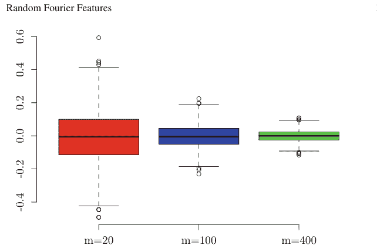

图 4.6 在 RFF 近似中，我们通过改变 $m$ 生成了 1000 次 $\hat{k}(x, y)$。我们观察到它们都以零为中心，并且 $m$ 越大，估计误差越小。

由于 $\mathbb{E}[\hat{k}(x, y)] = k(x, y)$ 且 $-2 \leq z_i(x)z_i(y) \leq 2$，使用命题 46，我们得到 (4.29)$^4$。

**例 68** 由例 19 可知，由于高斯核的概率分布均值为 0，协方差矩阵为 $\sigma^{-2}I \in \mathbb{R}^{d \times d}$，我们独立生成 $d$ 维随机数和均匀随机数，并构造 $m$ 个函数 $z_i(x) = \sqrt{2} \cos(\omega_i^\top x + b_i), i = 1, \dots, m$。在图 4.6 中，我们通过生成 1000 次 $(x, y)$（其中 $d = 1$，$m = 20, 100, 400$）绘制了 $\hat{k}(x, y) - k(x, y)$ 的箱线图。我们观察到 $\hat{k}(x, y) - k(x, y)$ 的均值为 0（$\hat{k}(x, y)$ 是无偏估计量），并且 $m$ 越大，方差越小。程序编写如下：

```python
sigma=10
sigma2=sigma**2
def k(x,y):
    return np.exp(-(x-y)**2/(2*sigma2))
def z(x):
    return np.sqrt(2/m)*np.cos(w*x+b)
def zz(x,y):
    return np.sum(z(x)*z(y))
u=np.zeros((1000,3))
m_seq=[20,100,400]
for i in range(1000):
    x=randn(1)
    y=randn(1)
    for j in range(3):
        m=m_seq[j]
        w=randn(m)/sigma
        b=np.random.rand(m)*2*np.pi
        u[i,j]=zz(x,y)-k(x,y)
```

$^4$ Rahimi 和 Recht (2007) 的原始论文及后续工作证明了比这些更严格的上下界 [2]。

```python
fig = plt.figure()
ax = fig.add_subplot(1, 1, 1)
ax.boxplot([u[:,0], u[:,1], u[:,2]], labels=['20', '100', '400'])
ax.set_xlabel('m')
ax.set_ylim(-0.5, 0.6)
plt.show()
```

对于核岭回归，其解 $\alpha = [\alpha_1, \dots, \alpha_N]$（其中 $f(\cdot) = \sum_{i=1}^N \alpha_i k(x_i, \cdot)$）由 (4.6) 式（第 4.1 节）给出，其中使用了 Gram 矩阵 $K$。如果我们通过 RFF 获得近似 $f$ 的 $\hat{f}$，并将 Gram 矩阵 $K$ 近似为 $\hat{K} = ZZ^\top$，那么对于 $Z = (Z_j(x_i)) \in \mathbb{R}^{N \times m}$ 和单位矩阵 $I_N \in \mathbb{R}^{N \times N}$，我们通过求解 $(\hat{K} + \lambda I_N)\hat{\alpha} = y$ 得到 $\hat{\alpha} \in \mathbb{R}^N$，从而获得 $\hat{f}(\cdot) = \sum_{i=1}^N \hat{\alpha}_i \hat{k}(x_i, \cdot)$。

使用 Woodbury 公式，对于 $U \in \mathbb{R}^{r \times s}$，$V \in \mathbb{R}^{s \times r}$，$r, s \ge 1$，

$$U(I_s + VU) = (I_r + UV)U.$$

我们有

$$Z^\top(ZZ^\top + \lambda I_N)^{-1} = (Z^\top Z + \lambda I_m)^{-1}Z^\top.$$

设 $x \in E$ 是一个不同于用于估计的 $x_1, \dots, x_N$ 的值，并令 $z(x) := [z_1(x), \dots, z_m(x)]$（行向量）。那么，对于

$$\hat{\beta} := (Z^\top Z + \lambda I_m)^{-1}Z^\top y, \quad (4.33)$$

我们有

$$\hat{f}(x) = \sum_{i=1}^N \alpha_i \hat{k}(x, x_i) = z(x) \sum_{i=1}^N z^\top(x_i)\hat{\alpha}_i = z(x)Z^\top\hat{\alpha} = z(x)Z^\top(\hat{K} + \lambda I_N)^{-1}y$$
$$= z(x)(Z^\top Z + \lambda I_m)^{-1}Z^\top y = z(x)\hat{\beta}.$$

那么，对于新的 $x \in E$，我们可以通过 $\hat{f}(x) = z(x)\hat{\beta}$ 找到其值。(4.33) 式的计算复杂度为：$Z^\top Z$ 的乘法是 $O(m^2N)$，求 $Z^\top Z + \lambda I_m \in \mathbb{R}^{m \times m}$ 的逆是 $O(m^3)$，$Z^\top y$ 的乘法是 $O(Nm)$，$(Z^\top Z + \lambda I_m)^{-1}$ 与 $Z^\top y$ 的乘法是 $O(m^2)$。因此，整体上该过程最多只需要 $O(N^2m)$ 的复杂度。另一方面，如果不使用近似而直接使用核函数，该过程需要 $O(N^3)$ 的时间。如果 $m = N/10$，计算时间将变为 $1/100$。从新的 $x \in E$ 获得 $\hat{f}(x)$ 也只需要 $O(m)$ 的时间。

**例 69** 我们将 RFF 应用于核岭回归。对于 $N = 200$ 个数据点，我们使用 $m = 20$ 进行近似。我们绘制了 $\lambda = 10^{-6}, 10^{-4}$ 时的曲线（图 4.7）。程序如下：

### 4.5 随机傅里叶特征

$\lambda = 10^{-6}, m = 20, N = 200$

$\lambda = 10^{-4}, m = 20, N = 200$

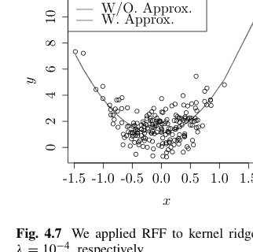

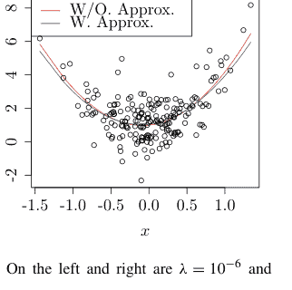

图 4.7 我们将RFF应用于核岭回归。左侧和右侧分别为 $\lambda = 10^{-6}$ 和 $\lambda = 10^{-4}$ 的结果

```python
sigma=10
sigma2=sigma**2

# Function z
m=20
w=randn(m)/sigma
b=np.random.rand(m)*2*np.pi
def z(u,m):
    return np.sqrt(2/m)*np.cos(w*u+b)
# Gaussian Kernel
def k(x,y):
    return np.exp(-(x-y)**2/(2*sigma2))
# Data Generation
n=200
x=randn(n)/2
y=1+5*np.sin(x/10)+5*x**2+randn(n)
x_min=np.min(x);x_max=np.max(x);y_min=np.min(y);y_max=np.max(y)
lam=0.001
#lam=0.9
# Low Rank Approximated Function
def alpha_rff(x,y,m):
    n=len(x)
    Z=np.zeros((n,m))
    for i in range(n):
        Z[i,:]=z(x[i],m)
    beta=np.dot(np.linalg.inv(np.dot(Z.T, Z)+lam*np.eye(m)),np.dot(Z.T,y))
    return (beta)
# Usual Function
def alpha(k,x,y):
    n=len(x)
    K=np.zeros((n,n))
    for i in range(n):
        for j in range(n):
            K[i,j]=k(x[i],x[j])
    alpha=np.dot(np.linalg.inv(K+lam*np.eye(n)),y)
    return alpha
# Numerical Comparison
alpha_hat=alpha(k,x,y)
beta_hat=alpha_rff(x,y,m)
r=np.sort(x)
u=np.zeros(n)
v=np.zeros(n)
for j in range(n):
    S=0
    for i in range(n):
        S=S+alpha_hat[i]*k(x[i],r[j])
    u[j]=S
    v[j]=np.sum(beta_hat*z(r[j],m))

plt.scatter(x, y, facecolors='none', edgecolors = "k", marker = "o")
plt.plot(r, u, c = "r", label = "w/o_Approx")
plt.plot(r, v, c = "b", label = "with_Approx")
plt.xlim(-1.5, 2)
plt.ylim(-2, 8)
plt.xlabel("x")
plt.ylabel("y")
plt.title("Kernel_Regression")
plt.legend(loc = "upper_left", frameon = True, prop={'size':14})
```

据说RFF在实践中不会因近似而产生显著的性能下降。然而，这确实引发了关于理论保证的问题。

### 4.6 Nyström 近似

我们考虑在核岭回归中求解系数估计 $(K + \lambda I)^{-1}y$。假设我们能够以较低的计算成本实现 $K = RR^\top$ 的低秩矩阵分解，其中 $R \in \mathbb{R}^{N \times m}$。在这种情况下，我们可以快速完成估计任务。注意，我们有

$$(RR^\top + \lambda I_N)^{-1} = \frac{1}{\lambda} \{I_N - R(R^\top R + \lambda I_m)^{-1} R^\top\}, \quad (4.34)$$

这源于Sherman-Morrison-Woodbury公式$^5$：$r, s \ge 1$, $A \in \mathbb{R}^{s \times s}$, $U \in \mathbb{R}^{s \times r}$, $C \in \mathbb{R}^{r \times r}$, $V \in \mathbb{R}^{r \times s}$

$$(A + UCV)^{-1} = A^{-1} - A^{-1}U(C^{-1} + VA^{-1}U)^{-1}VA^{-1} \quad (4.35)$$

其中 $r = m$, $s = N$, $A = \lambda I_N$, $U = R$, $C = I_r$, 且 $V = R^\top$。

计算(4.34)的左侧需要大小为 $N$ 的逆矩阵运算，而计算右侧则涉及 $N \times m$ 和 $m \times m$ 矩阵的乘积以及大小为 $m$ 的逆矩阵运算。左侧和右侧的计算复杂度分别为 $O(N^3)$ 和 $O(N^2m)$。在本节的后续部分，我们将展示通过一些近似，$K = RR^\top$ 的分解可以在 $O(Nm^2)$ 时间内完成，即岭回归的计算可以在 $O(Nm^2)$ 时间内执行。换句话说，如果 $N/m = 10$，计算时间仅为原来的1/100。

$^5$ Joe Suzuki, “Statistical Learning with Math and R/Python”。

在第3.3节中，基于(3.18)，我们考虑用以下方式从 $x_1, \dots, x_m \in E$ 近似特征函数：

$$\phi_i(\cdot) = \frac{\sqrt{m}}{\lambda_i^{(m)}} \sum_{j=1}^m k(x_j, \cdot) U_{j,i}.$$

令 $m \le N$；从 $x_1, \dots, x_m, x_{m+1}, \dots, x_N$ 的前 $m$ 个样本

$$x_1, \dots, x_m$$

我们构建 $\phi_i$ 和 $\lambda_i$。然后，通过

$$v_i := [\phi_i(x_1)/\sqrt{N}, \dots, \phi_i(x_N)/\sqrt{N}] \in \mathbb{R}^N$$

$$\lambda_i^{(N)} := N \lambda_i$$

$$K_N = \sum_{i=1}^m \lambda_i^{(N)} v_i v_i^\top,$$

我们近似关于 $x_1, \dots, x_N$ 的Gram矩阵 $K_N$。为了分解 $RR^\top$，我们可以将其设置为

$$R = \sqrt{\lambda_i^{(N)}} [v_1, \dots, v_m].$$

为了计算 $R$，获取 $K_m$ 的特征值和特征向量以及 $v_1, \dots, v_m \in \mathbb{R}^N$ 分别需要 $O(m^3)$ 和 $O(Nm^2)$ 的时间复杂度。因此，总计算在 $O(Nm^2)$ 时间内完成。

**示例 70** 我们比较了 $N = 300$, $m = 10, 20$, 且 $\lambda = 10^{-5}, 10^{-3}$ 时的核岭回归结果（图4.8）。对于这些数据，当 $\lambda \ge 1$ 时，近似和未近似得到的图形是一致的。对于 $m = 10, 20$，曲线几乎完全相同。我们观察到，对于RFF，当 $\lambda$ 较小时近似误差较小，而对于Nyström近似，当 $\lambda$ 较大时误差较小。

```python
sigma2=1
def k(x,y):
    return np.exp(-(x-y)**2/(2*sigma2))
n=300
x=randn(n)/2
y=3 - 2*x**2 + 3*x**3 + 2*randn(n)
lam=10**(-5)
m=10

K=np.zeros((n,n))
for i in range(n):
    for j in range(n):
        K[i,j]=k(x[i],x[j])
# Low Rank Approximated Function
def alpha_m(K,x,y,m):
    n=len(x)
    U,D,V=np.linalg.svd(K[:m,:m])
    u=np.zeros((n,m))
    for i in range(m):
        for j in range(n):
            u[j,i]= np.sqrt(m/n)*np.sum(K[j,:m]*U[:m,i]/D[i])
    mu=D*n/m
    R=np.zeros((n,m))
    for i in range(m):
        R[:,i]=np.sqrt(mu[i])*u[:,i]
    Z=np.linalg.inv(np.dot(R.T,R)+lam*np.eye(m))
    alpha=np.dot((np.eye(n)-np.dot(np.dot(R,Z),R.T)),y)/lam
    return(alpha)
# Usual Function
def alpha(K,x,y):
    alpha=np.dot(np.linalg.inv(K+lam*np.eye(n)),y)
    return alpha
# Numerical Comparison
alpha_1=alpha(K,x,y)
alpha_2=alpha_m(K,x,y,m)
r=np.sort(x)
w=np.zeros(n)
v=np.zeros(n)
for j in range(n):
    S_1=0
    S_2=0
    for i in range(n):
        S_1=S_1+alpha_1[i]*k(x[i],r[j])
        S_2=S_2+alpha_2[i]*k(x[i],r[j])
    w[j]=S_1
    v[j]=S_2
plt.scatter(x, y, facecolors='none', edgecolors = "k", marker = "o")
plt.plot(r, w, c = "r", label = "w/o_Approx")
plt.plot(r, v, c = "b", label = "with_Approx")
plt.xlim(-1.5, 2)
plt.ylim(-2, 8)
plt.xlabel("x")
plt.ylabel("y")
plt.title("Kernel_Regression")
plt.legend(loc = "upper_left", frameon = True, prop={'size':14})
```

### 4.7 不完全Cholesky分解

通常，我们可以将正定矩阵 $A \in \mathbb{R}^{N \times N}$ 分解为 $A = RR^\top$。其中 $R$ 是一个具有非负对角元素的下三角矩阵。这种分解称为 $A$ 的Cholesky分解。

> **命题 47** *对于正定矩阵 $A \in \mathbb{R}^{n \times n}$，存在唯一的Cholesky分解 $A = RR^\top$，当且仅当 $A$ 是正定的。*

许多书籍都涵盖了这一内容。有关证明，请参见例如[9]。以下是Cholesky分解过程。我们构建该过程，以便可以在任何时候停止，以获得秩 $r \leq N$ 的 $RR^\top$ 近似。

1.  在初始阶段，$B = A$，且 $R$ 是一个零矩阵。

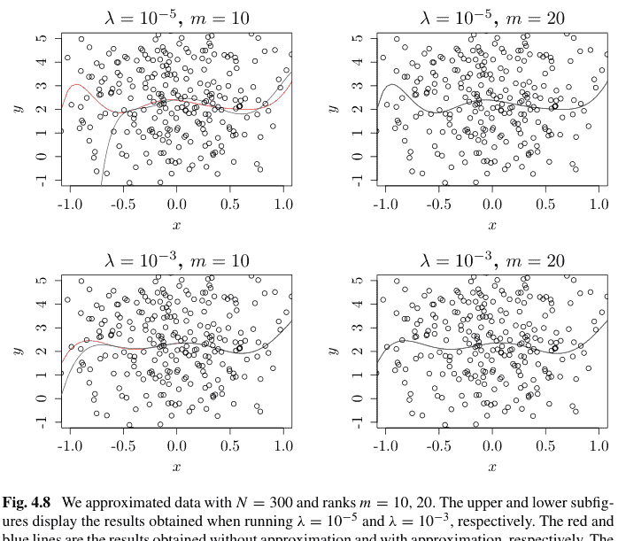

图 4.8 我们对 $N = 300$ 且秩 $m = 10, 20$ 的数据进行了近似。上下子图分别显示了运行 $\lambda = 10^{-5}$ 和 $\lambda = 10^{-3}$ 时获得的结果。红线和蓝线分别是未近似和近似获得的结果。当 $m = 20$ 时，其精度与未近似的情况几乎相同。$\lambda$ 的值越大，近似误差越小。

2.  对于每个 $i = 1, \ldots, r$，$R$ 的前 $i$ 列被设置为使得对于 $j = 1, \ldots, N$，有 $B_{j,i} = \sum_{h=1}^{N} R_{j,h} R_{i,h}$。换句话说，设置通过 $B$ 的第 $i$ 列完成。

$$R = \begin{bmatrix} R_{1,1} & 0 & \cdots & \cdots & 0 \\ \vdots & \ddots & \ddots & \cdots & 0 \\ R_{i,1} & \vdots & R_{i,i} & 0 & \cdots & 0 \\ R_{i+1,1} & \vdots & R_{i+1,i} & 0 & \cdots & 0 \\ \vdots & \vdots & \vdots & \vdots & \ddots & \vdots \\ R_{N,1} & \cdots & R_{N,i} & 0 & \cdots & 0 \end{bmatrix}.$$

在这种情况下，我们通过在 $B$ 的前后乘以矩阵 $Q$ 来交换 $B$ 中的两个下标。

3.  最终结果是 $RR^\top = B = P^\top AP$，其中 $P = Q_1 \cdots Q_N$。因此，$A = PRR^\top P^\top$，并且我们有 $PR(PR)^\top$ 是Cholesky分解。

### 4.7 不完全 Cholesky 分解

此处，为了替换对称矩阵 $B$ 的 $(i, j)$ 行和 $(i, j)$ 列，令 $Q$ 为通过将单位矩阵的 $(i, j)$、$(j, i)$ 分量替换为 1，将 $(i, i)$、$(j, j)$ 分量替换为 0，然后用对称矩阵 $Q$ 从 $B$ 的前后相乘而得到的矩阵。例如，

$$QBQ = \begin{bmatrix} 1 & 0 & 0 \\ 0 & 0 & 1 \\ 0 & 1 & 0 \end{bmatrix} \begin{bmatrix} b_{11} & b_{12} & b_{13} \\ b_{21} & b_{22} & b_{23} \\ b_{31} & b_{32} & b_{33} \end{bmatrix} \begin{bmatrix} 1 & 0 & 0 \\ 0 & 0 & 1 \\ 0 & 1 & 0 \end{bmatrix} = \begin{bmatrix} b_{11} & b_{13} & b_{12} \\ b_{31} & b_{33} & b_{32} \\ b_{21} & b_{23} & b_{22} \end{bmatrix}.$$

具体来说，对于 $i = 1, 2, \cdots, r$，我们执行以下步骤：假设 $\epsilon > 0$。

1.  令 $k$ 为使 $R_{j,j}^2 = B_{j,j} - \sum_{h=1}^{i-1} R_{j,h}^2$ 最大化的 $j$（$i \le j \le N$）。
    (a) 交换 $B$ 的第 $i$ 行和第 $k$ 行，以及第 $i$ 列和第 $k$ 列。
    (b) 令 $Q_{i,k} := 1$，$Q_{k,i} := 1$，$Q_{i,i} := 0$，$Q_{k,k} := 0$。
    (c) 交换 $R_{i,1}, \cdots, R_{i,i-1}$ 和 $R_{k,1}, \cdots, R_{k,i-1}$。
    (d) $R_{i,i} = \sqrt{B_{k,k} - \sum_{h=1}^{i-1} R_{k,h}^2}$。
2.  如果 $R_{i,i} < \epsilon$，则结束。
3.  对于每个 $j = i + 1, \cdots, N$，计算 $R_{j,i} = \frac{1}{R_{i,i}}(B_{j,i} - \sum_{h=1}^{i-1} R_{j,h} R_{i,h})$。

一旦第 $i$ 列完成，对于每个 $j = 1, \ldots, N$，有 $B_{j,i} = \sum_{h=1}^N R_{j,h} R_{i,h}$ 成立，并且之后 $R_{j,i}$ 保持不变。那么，如果该过程完成到 $r = N$，则有 $B = RR^\top$ 成立。

在每个 $i = 1, 2, \ldots, r$ 的开始，我们选择使 $R_{j,j}^2 = B_{j,j} - \sum_{h=1}^{i-1} R_{j,h}^2 \ge 0$ 最大化的 $j$。在步骤 3 中，第 $i$ 列的第 $j$ 行（$j = i + 1, \ldots, N$）的分量被加入，但我们将其除以 $R_{i,i}$。与在步骤 1 中选择其他值作为 $R_{i,i}$ 的情况相比，除以 $R_{i,i}$ 后 $R_{j,i}$ 的绝对值变得更小，并且对于每个 $j$，下一步中的 $B_{j,j} - \sum_{h=1}^i R_{j,h}^2$ 变得更大。如果 $R_{r,r}^2$ 取负值，那么无论选择顺序如何，Cholesky 分解都无解，这与命题 47（解的唯一性也得到保证）相矛盾。即使在不完全 Cholesky 分解的情况下，当运行 $r = N$ 时，我们也使用前 $r$ 列。

我们下面展示执行不完全 Cholesky 分解的代码：

```python
def im_ch(A,m):
    n=A.shape[1]
    R=np.zeros((n,n))
    P=np.eye(n)
    for i in range(m):
        max_R=-np.inf
        for j in range(i,n):
            RR=A[j,j]
            for h in range(i):
                RR=RR-R[j,h]**2
            if RR>max_R:
                k=j
                max_R=RR
        R[i,i]=np.sqrt(max_R)
        if k!=i:
            for j in range(i):
                w=R[i,j]; R[i,j]=R[k,j]; R[k,j]=w
            for j in range(n):
                w=A[j,k]; A[j,k]=A[j,i]; A[j,i]=w
            for j in range(n):
                w=A[k,j]; A[k,j]=A[i,j]; A[i,j]=w
            Q=np.eye(n); Q[i,i]=0; Q[k,k]=0; Q[i,k]=1; Q[k,i]=1
            P=np.dot(P,Q)
        if i<n:
            for j in range(i+1,n):
                S=A[j,i]
                for h in range(i):
                    S=S-R[i,h]*R[j,h]
                R[j,i]=S/R[i,i]
    return np.dot(P,R)
```

```python
# 数据生成：使矩阵 A 非负定
n=5
D=np.matrix([[np.random.randint(-n, n) for i in range(n)] for j in range(n)])
A=np.dot(D,D.T)
A
```

matrix([[ 68,  11,   6, -14,  13],
       [ 11,  23,   0, -17,  11],
       [  6,   0,  24,  36, -16],
       [-14, -17,  36,  75, -24],
       [ 13,  11, -16, -24,  45]])

```python
L=im_ch(A,5)
np.dot(L,L.T)
```

array([[ 46.,  22.,  36.,   2.,  -7.],
       [ 22.,  31.,  14., -19.,  -8.],
       [ 36.,  14.,  41.,  -6., -20.],
       [  2., -19.,  -6.,  46.,  21.],
       [ -7.,  -8., -20.,  21.,  22.]])

#### 秩为三的不完全 Cholesky 分解

```python
L=im_ch(A,3)
np.linalg.eig(A)
```

(array([1.01074272e+02, 5.66112516e+01, 2.41344415e+01, 9.62653508e-02,
       4.08376941e+00])),
matrix([[-0.56411909, -0.45552615, -0.22499121, -0.46541646,  0.45500775],
       [ 0.30282894, -0.79305647,  0.04313883, -0.11440623, -0.51420456],
       [-0.40884563,  0.15490099, -0.68851469,  0.1243158 , -0.56510533],
       [ 0.31554644, -0.28590181, -0.51655213,  0.58928787,  0.45233208],
       [-0.56862992, -0.24046456,  0.45457608,  0.63842315, -0.06792108]]))

#### 无法恢复 A

```python
B=np.dot(L,L.T)
B
```

array([[ 46.        ,   2.        ,  22.        ,  -7.        ,
         36.        ],
       [  2.        ,  46.        , -19.        ,  21.        ,
         -6.        ],
       [ 22.        , -19.        ,  31.        ,  -8.        ,
         14.        ],
       [ -7.        ,  21.        ,  -8.        ,  12.74957882,
        -11.52827918],
       [ 36.        ,  -6.        ,  14.        , -11.52827918,
         33.00601685]]))

```python
# B 的前三个特征值接近 A 的特征值。
np.linalg.eig(B)
```

(array([ 9.53379063e+01, 5.65627665e+01, 1.68549229e+01, 1.42156846e-14,
       -3.05830677e-15]),
array([[-0.60391559, -0.44498737, -0.0412799 ,  0.6556516 ,  0.01706317],
       [ 0.31630878, -0.79905862, -0.14333816, -0.30429563, -0.42390544],
       [-0.44500967,  0.16578492, -0.79173017, -0.36203582, -0.1781387 ],
       [ 0.24801368, -0.27858603, -0.38477667,  0.11142099,  0.84426293],
       [-0.52506222, -0.24165419,  0.45040025, -0.57796243,  0.27477214]]))

```python
# B 的秩为三。
np.linalg.matrix_rank(B)
```

## 附录

### 命题 44 的证明

由于 $r$ 是一个最高阶为 $2q - 1$ 的自然样条函数，并且满足

$r^{(q)}(0) = \cdots = r^{(2q-1)}(0) = r^{(q)}(1) = \cdots = r^{(2q-1)}(1) = 0$，

我们有

$$\int_0^1 r^{(q)}(x)s^{(q)}(x)dx = [r^{(q)}(x)s^{(q-1)}(x)]_0^1 - \int_0^1 r^{(q+1)}(x)s^{(q-1)}(x)dx$$
$$= -\int_0^1 r^{(q+1)}(x)s^{(q-1)}(x)dx = \cdots = (-1)^{q-1} \int_0^1 r^{(2q-1)}(x)s'(x)dx$$
$$= (-1)^{q-1} \sum_{j=1}^{N-1} r^{(2q-1)}(x_j^+) [s(x_{j+1}) - s(x_j)] = 0 \, , \quad (4.36)$$

其中我们使用了 $s(x_i) = 0$（$i = 1, \dots, N$）。此外，$r^{(2q-1)}(x_j^+)$ 是 $r$ 的 $(2q - 1)$ 阶右微分系数，并且在 $x_j < x < x_{j+1}$ 期间具有常数值。因此，我们有命题中的以下不等式：

$$\int_0^1 \{g^{(q)}(x)\}^2 dx = \int_0^1 \{r^{(q)}(x) + s^{(q)}(x)\}^2 dx$$
$$= \int_0^1 \{r^{(q)}(x)\}^2 dx + \int_0^1 \{s^{(q)}(x)\}^2 dx + 2 \int_0^1 r^{(q)}(x)s^{(q)}(x)dx$$
$$= \int_0^1 \{r^{(q)}(x)\}^2 dx + \int_0^1 \{s^{(q)}(x)\}^2 dx \geq \int_0^1 \{r^{(q)}(x)\}^2 dx \, , \quad (4.37)$$

其中第三个等式源于 (4.36)。另一方面，由 $g, r \in W_q[0, 1]$ 和 $s \in W_q[0, 1]$，我们有

$$s(x) = \sum_{i=0}^{q-1} \frac{s^{(i)}(0)}{i!} x^i + \int_0^1 \frac{(x - u)_+^{q-1}}{(q - 1)!} s^{(q)}(u)du.$$

因此，当 (4.37) 的等式成立时，即 $\int_0^1 \{s^{(q)}(x)\}^2 dx = 0$，我们有 $s^{(q)}(x) = 0$ 几乎处处成立。因此，

$$s(x) = \sum_{i=0}^{q-1} \frac{s^{(i)}(0)}{i!} x^i \, ,$$

这意味着对于 $i = 1, 2, \ldots, N$，有 $s(x_i) = 0$。因此，如果 $N$ 超过多项式的阶数 $q - 1$，那么对于 $x \in [0, 1]$，我们需要 $s(x) = 0$。

### 命题 45 的证明

由加法定理，我们有

$$2 \cos(\omega^\top x + b) \cos(\omega^\top y + b) = \cos(\omega^\top(x - y)) + \cos(\omega^\top(x + y) + 2b) \,.$$

由于在固定 $\omega$ 时，第二项关于 $b$ 的期望为零，我们有

$$\mathbb{E}_{\omega,b}[\sqrt{2} \cos(\omega^\top x + b) \cdot \sqrt{2} \cos(\omega^\top y + b)] = \mathbb{E}_{\omega} \cos(\omega^\top(x - y)) \,.$$

如果我们将欧拉公式 $e^{i\theta} = \cos \theta + i \sin \theta$ 应用于命题 5，那么 $k(x, y)$ 取实数值。因此，我们有 $\mathbb{E}[\sin(\omega^\top(x - y))] = 0$，并且 $k(x, y)$ 可以写为

$$\mathbb{E}_{\omega} \exp(i\omega^\top(x - y)) = \mathbb{E}_{\omega}[\cos(\omega^\top(x - y)) + i \sin(\omega^\top(x - y))] = \mathbb{E}_{\omega}[\cos(\omega^\top(x - y))] \,.$$

由命题 5，我们得到 (4.28)。

### 引理 7 的证明

令 $\epsilon > 0$。由于 $e^{\epsilon x}$ 关于 $x$ 是凸的，如果我们对

$$e^{\epsilon X} \le \frac{X - a}{b - a} e^{\epsilon b} + \frac{b - X}{b - a} e^{\epsilon a}$$

两边取期望（其中 $b > a$），那么

$$\mathbb{E}[e^{\epsilon X}] \le \frac{-a}{b - a} e^{\epsilon b} + \frac{b}{b - a} e^{\epsilon a} = \theta e^{\epsilon(1 - \theta)(b - a)} + (1 - \theta) e^{-\epsilon \theta(b - a)} = \exp\{-\theta s + \log(1 - \theta + \theta e^s)\}$$

其中 $s = \epsilon(b - a)$ 且 $\theta = \frac{-a}{b - a}$。因此，指数 $f(s) := -\theta s + \log(1 - \theta + \theta e^s)$ 至多为 $s^2/8$ 就足够了。由于

$$f'(s) = -\theta + \frac{\theta e^s}{1 - \theta + \theta e^s}$$

且 $f(0) = f'(0) = 0$，我们有

$$f''(s) = \frac{(1 - \theta) \cdot \theta e^s}{(1 - \theta + \theta e^s)^2} = \phi(1 - \phi) \le \frac{1}{4}$$

其中 $\phi = \frac{\theta e^s}{1 - \theta + \theta e^s}$。因此，存在一个 $\mu \in \mathbb{R}$ 使得$$f(s) = f(0) + f'(0)(s - 0) + \frac{1}{2} f''(\mu)(s - 0)^2 \leq \frac{s^2}{8},$$

这蕴含了 (4.31)。

### 习题 46~64

46. 设 $k$ 为一个核函数，$(x_1, y_1), \dots, (x_N, y_N)$ 为样本，且令 $f(\cdot) := \sum_{i=1}^N \alpha_i k(x_i, \cdot)$。如果我们最小化 $\sum_{i=1}^N \{y_i - f(x_i)\}^2 + \lambda \|f\|^2$，其中 $\lambda > 0$（核岭回归），为什么这意味着我们是在 $f \in H$ 上进行最小化？此外，使用 Gram 矩阵 $K \in \mathbb{R}^{N \times N}$ 和 $y = [y_1, \dots, y_N]^\top$ 来表示 $\alpha = [\alpha_1, \dots, \alpha_N]^\top$ 的最优值。

47. 在核 PCA 中，设 $k$ 为一个核函数，$x_1, \dots, x_N$ 为样本，且令 $f(\cdot) := \sum_{i=1}^N \alpha_i k(x_i, \cdot)$。如果我们最大化 (4.8)，为什么这意味着我们是在 $f \in H$ 上进行最大化？此外，当 $\beta = K^{1/2} \alpha$ 时，使用 Gram 矩阵 $K \in \mathbb{R}^{N \times N}$ 来表示所得到的特征方程。

48. 在核 PCA 中，我们希望为一个中心化的 Gram 矩阵找到 $\alpha$，如 (4.9) 所示。通过填写下面的空白来完成函数 `kernel_pca_train`。

```python
def kernel_pca_train(x, k):
    n = x.shape[0]
    K = np.zeros((n, n))
    S = [0] * n; T = [0] * n
    for i in range(n):
        for j in range(n):
            K[i, j] = k(x[i, :], x[j, :])
    for i in range(n):
        S[i] = np.sum(K[i, :])
    for j in range(n):
        T[j] = np.sum(K[:, j])
    U = np.sum(K)
    for i in range(n):
        for j in range(n):
            K[i, j] = K[i, j] - S[i] / n - T[j] / n + U / n**2
    val, vec = np.linalg.eig(K)
    idx = val.argsort()[::-1]  # decreasing order as R
    val = val[idx]
    vec = vec[:, idx]
    alpha = np.zeros((n, n))
    for i in range(n):
        alpha[:, i] = vec[:, i] / val[i]**0.5
    return alpha
```

基于从数据 $X$、核函数 $k$ 和函数 `kernel_pca_train` 得到的 $\alpha$，我们希望计算 $z \in \mathbb{R}^{N \times p}$（$x_1, \dots, x_N$ 中的任意一个）的得分（最多 $1 \leq m \leq p$ 维）。完成下面的函数：

```python
def kernel_pca_test(x, k, alpha, m, z):
    n = x.shape[0]
    pca = np.zeros(m)
    for i in range(n):
        pca = pca + alpha[i, 0:m] * k(x[i, :], z)
    return pca
```

检查构造的函数是否能与以下程序一起工作：

```python
sigma2 = 0.01
def k(x, y):
    return np.exp(-np.linalg.norm(x - y)**2 / 2 / sigma2)
X = pd.read_csv('https://raw.githubusercontent.com/selva86/datasets/master/USArrests.csv')
x = X.values[:, :-1]
n = x.shape[0]; p = x.shape[1]
alpha = kernel_pca_train(x, k)
z = np.zeros((n, 2))
for i in range(n):
    z[i, :] = kernel_pca_test(x, k, alpha, 2, x[i, :])

min1 = np.min(z[:, 0]); min2 = np.min(z[:, 1])
max1 = np.max(z[:, 0]); max2 = np.max(z[:, 1])
plt.xlim(min1, max1)
plt.ylim(min2, max2)
plt.xlabel("First")
plt.ylabel("Second")
plt.title("Kernel_PCA_(Gauss_0.01)")
for i in range(n):
    if i != 4:
        plt.text(x = z[i, 0], y = z[i, 1], s = i)
plt.text(z[4, 0], z[4, 1], 5, c = "r")
```

49. 证明普通 PCA 和使用线性核的核 PCA 输出相同的得分。

50. 推导核 SVM (4.12) 的 KKT 条件。

51. 在示例 66 中，不使用线性核和多项式核，而是使用具有不同 $\sigma^2$ 值（三种不同类型）的高斯核，并在同一图中绘制边界曲线。

52. 从 (4.21) 和 (4.22) 推导 $\sum_{j=1}^J \beta_{j+4} = 0$ 和 $\sum_{j=1}^J \beta_{j+4} \xi_j = 0$。

53. 根据以下步骤证明命题 44：

- (a) 证明 $\int_0^1 r^{(q)}(x)s^{(q)}(x)dx = 0$。
- (b) 证明 $\int_0^1 \{g^{(q)}(x)\}^2 dx \ge \int_0^1 \{r^{(q)}(x)(x)\}^2 dx$。
- (c) 当 (b) 中的等式成立时，证明 $s(x) = \sum_{i=0}^{q-1} \frac{s^{(i)}(0)}{i!} x^i$。
- (d) 证明当 (b) 中的等式成立且 $N$ 超过多项式的次数 $q - 1$ 时，函数 $s$ 递减。

54. 在 RFF 中，我们不是寻找核函数 $k(x, y)$，而是寻找其无偏估计量 $\hat{k}(x, y)$。证明 $\hat{k}(x, y)$ 的平均值是 $k(x, y)$。此外，构造一个函数，对于 $m = 100$，使用下面程序中的常量和函数，从 $(x, y) \in E$ 输出 $\hat{k}(x, y)$。此外，将结果与高斯核输出的值进行比较并确认其正确性。

```python
sigma=10
sigma2=sigma**2
def z(x):
    return np.sqrt(2/m)*np.cos(w*x+b)
def zz(x,y):
    return np.sum(z(x)*z(y))
```

55. 推导 Chernoff 界。

56. 证明命题 46 蕴含 (4.29)。

57. RFF 基于 Bochner 定理（命题 5）。它们之间存在什么关系？

58. 在 RFF 中，随机生成 $(w_1, b_1), \dots, (w_m, b_m)$ 后，我们得到 $Z = (z_j(x_i)) \in \mathbb{R}$，其中 $i = 1, \dots, N$ 且 $j = 1, \dots, m$。如果我们使用 $\hat{K} = ZZ^\top$ 而不是 $K = (k(x_i, x_j)) \in \mathbb{R}^{N \times N}$，证明 $\hat{f}(x) = \sum_{i=1}^m \hat{\alpha}_i \hat{k}(x, x_i) (x \in E)$ 可以使用 (4.33) 中的 $\hat{\beta}$ 表示为 $\hat{f}(x) = z(x)\hat{\beta}$。此外，证明 Woodbury 公式：
$$U(I_s + VU) = (I_r + UV)U$$
对于 $U \in \mathbb{R}^{r \times s}, V \in \mathbb{R}^{s \times r}, r, s \ge 1$。

59. 评估 RFF 中获得 (4.33) 所需的计算量。此外，评估为新的 $x \in E$ 寻找 $\hat{f}(x)$ 的计算复杂度。

60. 为了找到核岭回归中的系数估计 $(K + \lambda I)^{-1}y$，我们希望将低秩矩阵 $K = RR^\top$ 分解为 $R \in \mathbb{R}^{N \times m}$。如果我们能分解 $K = RR^\top$，评估左右两边的计算量，其中我们假设寻找矩阵 $A \in \mathbb{R}^{n \times n}$ 的逆需要 $O(n^3)$。

61. 我们希望使用 Nyström 近似来找到核岭回归的系数 $\hat{\alpha}$。如果我们使用 (4.34) 的左边而不是右边，以下代码需要进行哪些更改？

```python
def alpha_m(K,x,y,m):
    n=len(x)
    U,D,V=np.linalg.svd(K[:m,:m])
    u=np.zeros((n,m))
    for i in range(m):
        for j in range(n):
            u[j,i]= np.sqrt(m/n)*np.sum(K[j,:m]*U[:m,i]/D[i])
    mu=D*n/m
    R=np.zeros((n,m))
    for i in range(m):
        R[:,i]=np.sqrt(mu[i])*u[:,i]
    Z=np.linalg.inv(np.dot(R.T,R)+lam*np.eye(m))
    alpha=np.dot((np.eye(n)-np.dot(np.dot(R,Z),R.T)),y)/lam
    return(alpha)
```

```r
sigma=10; sigma2=sigma^2
z=function(x) sqrt(2/m)*cos(w*x+b)
zz=function(x,y) sum(z(x)*z(y))
```

```r
alpha_m=function(k,x,y,m){
    n=length(x); K=matrix(0,n,n); for(i in 1:n)for(j in 1:n)K[i,j]=k(x[i], x[j])
    A=svd(K[1:m,1:m])
    u=array(dim=c(n,m));
    for(i in 1:m)for(j in 1:n)u[j,i]=sqrt(m/n)*sum(K[j,1:m]*A$u[1:m, i]) / A$d[i]
    mu=A$d*n/m;
    R=sqrt(mu[1])*u[,1]; for(i in 2:m)R=cbind(R, sqrt(mu[i])*u[,i])
    alpha=(diag(n)-R%*%solve(t(R)%*%R+lambda*diag(m))%*%t(R))%*%y/lambda
    return(as.vector(alpha))
}
```

62. 在不完全 Cholesky 分解过程的步骤 1 中，每次我们选择使 $R_{j,j}^2 = B_{j,j} - \sum_{h=1}^{i-1} R_{j,h}^2$ 最大化的 $j$（$i \leq j \leq N$）作为 $k$。证明步骤 1(d) 中的 $B_{k,k} - \sum_{h=1}^{i-1} R_{k,h}^2$ 是非负的。

63. 证明当不完全 Cholesky 分解过程完成到第 $r$ 列时，对于每个 $i = 1, \ldots, r$ 和 $j = i + 1, \ldots, N$，我们有

$$B_{ji} = \sum_{h=1}^{i} R_{jh} R_{jh}$$

64. 生成一个大小为 $5 \times 5$ 的非负定矩阵，并运行 `im_ch` 执行秩为三的不完全 Cholesky 分解。

## 第 5 章
MMD 和 HSIC

在本章中，我们介绍 RKHS 中随机变量 $X : E \rightarrow \mathbb{R}$ 的概念，并讨论 RKHS 中的检验问题。特别是，我们为两样本问题和相应的独立性检验定义了一个统计量及其零假设。在这两种情况下，我们都不知道有限样本下零假设的分布。因此，我们引入了置换检验和 U 统计量，用它们来构建过程并运行程序。然后，我们研究特征和通用核的概念，以了解哪些核适用于此类检验。最后，我们学习经验过程，它在机器学习和深度学习方法的数学分析中经常被使用。

### 5.1 RKHS 中的随机变量

在第 1 章中，我们证明了取值于 $\mathbb{R}$ 的函数 $X : E \rightarrow \mathbb{R}$ 是可测的，如果对于任何博雷尔集 $B$，$\{\omega \in E | X(\omega) \in B\}$ 是 $\mathcal{F}$ 中的一个事件（元素），我们称这样的 $X$ 为随机变量。

在下文中，我们说一个核 $k$ 是可测的，如果使得 $k(x, y) \in B$ 的 $(x, y)$ 的集合是 $E \times E$ 中的一个事件，并且我们假设任何核 $k$ 都是可测的。此外，在本章中，$k(x, x) \in \mathbb{R}$，$x \in E$ 的期望 $\mathbb{E}[k(X, X)]$ 是有界的，这意味着 $\mathbb{E}[\sqrt{k(X, X)}] \leq \sqrt{\mathbb{E}[k(X, X)]}$ 都是有界的。

**命题 48** 设 $k : E \times E \rightarrow \mathbb{R}$ 是可测的。那么，映射 $\Psi : E \ni x \mapsto k(x, \cdot) \in H$ 是可测的。因此，对于任何取值于 $E$ 的随机变量 $X$，$k(X, \cdot)$ 是 $H$ 中的一个随机变量。

证明：见本章末尾的附录。

设 $X : E \rightarrow \mathbb{R}$ 是一个随机变量。线性泛函 $T : H \rightarrow \mathbb{R}$ 满足

$$T(f) := \mathbb{E}[f(X)] = \mathbb{E}[\langle f(\cdot), k(X, \cdot) \rangle_H] \leq \mathbb{E}[\|f\|_H \sqrt{k(X, X)}] \leq \|f\|_H \mathbb{E}[\sqrt{k(X, X)}]$$满足 $\frac{T(f)}{\|f\|_H} \leq \mathbb{E}[\sqrt{k(X, X)}] < \infty$。由命题 22 可知，存在 $m_X \in H$ 使得

$$\mathbb{E}[f(X)] = \langle f(\cdot), m_X(\cdot) \rangle_H$$

对任意 $f \in H$ 成立。我们称这样的 $m_X$ 为 $k(X, \cdot)$ 的期望，并记作 $m_X(\cdot) = \mathbb{E}[k(X, \cdot)]$。于是，我们有

$$\mathbb{E}[\langle f(\cdot), k(X, \cdot) \rangle_H] = \langle f(\cdot), \mathbb{E}[k(X, \cdot)] \rangle_H,$$

这意味着我们可以交换内积与期望运算的顺序。设 $E_X, E_Y$ 为集合。我们定义由核 $k_X : E_X \to \mathbb{R}$ 和 $k_Y : E_Y \to \mathbb{R}$ 分别构成的再生核希尔伯特空间 $H_X$ 和 $H_Y$ 的张量积 $H_0$，其函数集为 $E_X \times E_Y \to \mathbb{R}$，$f(x, y) = \sum_{i=1}^m f_{X,i}(x) f_{Y,i}(y)$，其中 $f_{X,i} \in H_X$，$f_{Y,i} \in H_Y$，$(x, y) \in E_X \times E_Y$。我们定义内积和范数分别为

$$\langle f, g \rangle_{H_0} = \sum_{i=1}^m \sum_{j=1}^n \langle f_{X,i}, g_{X,j} \rangle_{H_X} \langle f_{Y,i}, g_{Y,j} \rangle_{H_Y}$$

以及 $\|f\|_{H_0}^2 = \langle f, f \rangle_{H_0}$，其中 $f = \sum_{j=1}^m f_{X,j} f_{Y,j}$，$f_{X,i} \in H_X$，$f_{Y,i} \in H_Y$，$g = \sum_{j=1}^n g_{X,j} g_{Y,j}$，$g_{X,j} \in H_X$，$g_{Y,j} \in H_Y$。事实上，我们有

$$\langle f, g \rangle_{H_0} = \sum_{i=1}^m \sum_{j=1}^n \sum_r \sum_t \alpha_{i,r} \gamma_{j,t} k_X(x_r, x_t) \sum_s \sum_u \beta_{i,s} \delta_{j,u} k_Y(y_s, y_u)$$
$$= \sum_{i=1}^m \sum_r \sum_s \alpha_{i,r} \beta_{i,s} g(x_r, y_s) = \sum_{j=1}^n \sum_t \sum_u \gamma_{j,t} \delta_{j,u} f(x_t, y_u)$$

其中 $f_{X,i}(\cdot) = \sum_r \alpha_{i,r} k_X(x_r, \cdot)$，$f_{Y,i}(\cdot) = \sum_s \beta_{i,s} k_Y(y_s, \cdot)$，$g_{X,j}(\cdot) = \sum_t \gamma_{j,t} k_X(x_t, \cdot)$，$g_{Y,j}(\cdot) = \sum_u \delta_{j,u} k_Y(y_u, \cdot)$，这意味着函数不依赖于 $f, g$ 的具体表达式。

如果我们完备化 $H_0$，可以构造一个线性空间 $H$，它由函数 $f = \sum_{i=1}^\infty \sum_{j=1}^\infty a_{i,j} e_{X,i} e_{Y,j}$ 组成，满足 $\|f\|^2 := \sum_{i=1}^\infty \sum_{j=1}^\infty a_{i,j}^2 < \infty$，内积为 $\langle f, g \rangle_H = \sum_{i=1}^\infty \sum_{j=1}^\infty a_{i,j} b_{i,j}$，其中 $g = \sum_{i=1}^\infty \sum_{j=1}^\infty b_{i,j} e_{X,i} e_{Y,j}$（$\sum_{i=1}^\infty \sum_{j=1}^\infty b_{i,j}^2 < \infty$），且 $\{e_{X,i}\}, \{e_{Y,j}\}$ 分别是 $H_X, H_Y$ 的标准正交基。那么，$H_0$ 是 $H$ 的稠密子空间，且 $H$ 是一个希尔伯特空间。我们称 $H_0$ 为 $H_X, H_Y$ 的直积，并记作 $H_X \otimes H_Y$。$H$ 是函数 $f$ 的集合，使得对于 $H_0$ 中的任意柯西序列 $\{f_n\}$ 和 $x \in E$，有 $f(x) := \lim_{n \to \infty} f_n(x)$。该结论可由命题 34 的步骤 1-5 类似讨论得出。

**命题 49** (Neveu [22]) 具有再生核 $k_X, k_Y$ 的再生核希尔伯特空间 $H_X, H_Y$ 的直积 $H_X \otimes H_Y$ 是一个再生核希尔伯特空间，其再生核为 $k_X k_Y$。

证明：推导过程利用了以下步骤 [1]。

1.  证明对于 $g \in H_X \otimes H_Y$，$x \in E_X$，$y \in E_Y$，有 $|g(x, y)| \leq \sqrt{k_X(x, x)}\sqrt{k_Y(y, y)}\|g\|$，这意味着根据命题 33，$H$ 是一个再生核希尔伯特空间。
2.  证明当固定 $x \in E_X, y \in E_Y$ 时，$k(x, \cdot, y, \star) := k_X(x, \cdot)k_Y(y, \star) \in H$。
3.  证明 $g(x, y) = \langle f(\cdot, \star), k(x, \cdot, y, \star) \rangle_H$。

详细证明请参阅本章末尾。$\square$

接下来，我们引入关于变量 $X, Y$ 的期望概念。假设 $\mathbb{E}[k_X(X, X)]$ 和 $\mathbb{E}[k_Y(Y, Y)]$ 有限，则通过对 $k_X(X, \cdot)k_Y(y, \cdot) \in H_X \otimes H_Y$ 关于 $XY$ 取期望，得到 $\mathbb{E}_{XY}[k_X(X, \cdot)k_Y(Y, \cdot)]$：

$\mathbb{E}_{XY}[\|k_X(X, \cdot)k_Y(Y, \cdot)\|_{H_X \otimes H_Y}] = \mathbb{E}_{XY}[\|k_X(X, \cdot)\|_{H_X} \|k_Y(Y, \cdot)\|_{H_Y}]$
$= \mathbb{E}_{XY}[\sqrt{k_X(X, X)k_Y(Y, Y)}] \leq \sqrt{\mathbb{E}_X[k_X(X, X)]\mathbb{E}_Y[k_Y(Y, Y)]}$。

因此，左边取有限值，我们有

$\mathbb{E}_{XY}[f(X, Y)] = \mathbb{E}_{XY}[\langle f, k_X(X, \cdot)k_Y(Y, \cdot) \rangle] \leq \|f\|_{H_X \otimes H_Y} \mathbb{E}_{XY}[\|k_X(X, \cdot)k_Y(Y, \cdot)\|_{H_X \otimes H_Y}]$

其中 $f \in H_X \otimes H_Y$。由命题 22（里斯表示定理），存在 $m_{XY} \in H_X \otimes H_Y$ 使得

$\mathbb{E}_{XY}[f(X, Y)] = \langle f, m_{XY} \rangle$

我们记作

$m_{XY} := \mathbb{E}_{XY}[k_X(X, \cdot)k_Y(Y, \cdot)]$

这意味着我们可以交换内积与期望运算的顺序：

$\mathbb{E}_{XY}[\langle f, k_X(X, \cdot)k_Y(Y, \cdot) \rangle] = \langle f, \mathbb{E}_{XY}[k_X(X, \cdot)k_Y(Y, \cdot)] \rangle$。

此外，对于 $X, Y$ 的 $m_X, m_Y$，期望 $m_X m_Y$ 属于 $H_X \otimes H_Y$，我们有

$\langle fg, m_X m_Y \rangle_{H_X \otimes H_Y} = \langle f, m_X \rangle_{H_X} \langle g, m_Y \rangle_{H_Y} = \mathbb{E}_X[f(X)]\mathbb{E}_Y[g(Y)]$

其中 $f \in H_X, g \in H_Y$，这意味着即使 $X, Y$ 不独立，我们也可以将它们的期望相乘。因此，我们称

$m_{XY} - m_X m_Y$

为 $(X, Y)$ 在 $H_X \otimes H_Y$ 中的协变量，它属于 $H_X \otimes H_Y$。

**命题 50** 对于每个 $f \in H_X, g \in H_Y$，存在 $\Sigma_{XY} \in B(H_Y, H_X)$ 和 $\Sigma_{YX} \in B(H_X, H_Y)$ 使得

$\langle fg, m_{XY} - m_X m_Y \rangle_{H_X \otimes H_Y} = \langle \Sigma_{YX} f, g \rangle_{H_Y} = \langle f, \Sigma_{XY} g \rangle_{H_X}$。 (5.1)

证明：算子 $\Sigma_{YX}$，$\Sigma_{XY}$ 互为共轭，根据命题 22，若其中一个存在，则另一个也存在。我们证明 $\Sigma_{XY}$ 的存在性。对于任意 $g \in H_Y$，线性泛函

$T_g : H_X \ni f \mapsto \langle fg, m_{XY} - m_X m_Y \rangle_{H_X \otimes H_Y} \in \mathbb{R}$

是有界的，因为

$\langle fg, m_{XY} - m_X m_Y \rangle_{H_X \otimes H_Y} \leq \|f\|_{H_X} \|g\|_{H_Y} \|m_{XY} - m_X m_Y\|_{H_X \otimes H_Y}$，

并且根据命题 22，存在 $h_g \in H_X$ 使得 $T_g f = \langle f, h_g \rangle_{H_X}$。因此，存在 $\Sigma_{XY} : H_Y \ni g \mapsto h_g \in H_X$ 使得

$\langle fg, m_{XY} - m_X m_Y \rangle_{H_X \otimes H_Y} = \langle f, \Sigma_{XY} g \rangle_{H_X}$。

$\Sigma_{XY}$ 的有界性源于

$\|\Sigma_{XY} g\|_{H_X} = \|h_g\|_{H_X} = \|T_g\| \leq \|g\|_{H_Y} \|m_{XY} - m_X m_Y\|_{H_X \otimes H_Y}$。

$\square$

我们称 $\Sigma_{XY}$，$\Sigma_{YX}$ 为互协方差算子。

设 $H$ 和 $k$ 分别为一个再生核希尔伯特空间及其再生核，$\mathcal{P}$ 为 $X$ 服从的分布集合。那么，我们可以定义映射

$\mathcal{P} \ni \mu \mapsto \int k(x, \cdot) d\mu(x) \in H$，

我们称之为概率在再生核希尔伯特空间中的嵌入。假设该映射是单射，即如果期望 $\int k(x, \cdot) d\mu_1(x)$ 和 $\int k(x, \cdot) d\mu_2(x)$ 具有相同的值，则概率 $\mu_1$，$\mu_2$ 相同。我们称这样的再生核希尔伯特空间 $H$ 的再生核 $k$ 为特征核。

我们通过使用特征核学习一些应用，例如两样本问题和独立性检验，并在本章后续部分考虑相关理论。

### 5.2 最大均值差异与两样本问题

Gretton 等人 (2008), [11] 提出了一种统计检验方法，用于检验两个分布是否共享给定的独立序列 $x_1, \dots, x_m \in \mathbb{R}$ 和 $y_1, \dots, y_n \in \mathbb{R}$。我们将两个分布记为 $P$, $Q$，并将 $P = Q$ 视为原假设。设 $H$ 和 $k$ 分别为一个再生核希尔伯特空间及其再生核；我们定义 $m_P := \mathbb{E}_P[k(X, \cdot)] = \int_E k(x, \cdot) dP(x)$，$m_Q := \mathbb{E}_Q[k(X, \cdot)] = \int_E k(x, \cdot) dQ(x) \in H$。我们注意到随机变量 $X : E \rightarrow \mathbb{R}$ 是可测的，且 $P$ 或 $Q$ 是 $X$ 服从的概率分布。

设 $\mathcal{F}$ 为满足某个条件的函数集合。通常，由

$$\sup_{f \in \mathcal{F}} \{\mathbb{E}_P[f(X)] - \mathbb{E}_Q[f(X)]\}$$

定义的量称为最大均值差异，我们假设

$$\mathcal{F} := \{f \in H \mid \|f\|_H \leq 1\},$$

这意味着我们将最大均值差异视为

$$\text{MMD}^2 = \sup_{f \in \mathcal{F}} \{\mathbb{E}_P[f(X)] - \mathbb{E}_Q[f(X)]\}^2 = \sup_{f \in \mathcal{F}} \{\langle m_P, f \rangle - \langle m_Q, f \rangle\}^2$$
$$= \sup_{f \in \mathcal{F}} \{\langle m_P - m_Q, f \rangle\}^2 = \|m_P - m_Q\|_H^2.$$

如果核 $k$ 是特征核，那么我们有

$$\text{MMD} = 0 \Longleftrightarrow m_P = m_Q \Longleftrightarrow P = Q \qquad (5.2)$$

并且

$$\text{MMD}^2$$
$$= \langle m_P, m_P \rangle + \langle m_Q, m_Q \rangle - 2\langle m_P, m_Q \rangle$$
$$= (\mathbb{E}_X[k(X, \cdot)], \mathbb{E}_{X'}[k(X', \cdot)]) + (\mathbb{E}_Y[k(Y, \cdot)], \mathbb{E}_{Y'}[k(Y', \cdot)]) - 2(\mathbb{E}_X[k(X, \cdot)], \mathbb{E}_Y[k(Y, \cdot)])$$
$$= \mathbb{E}_{XX'}[k(X, X')] + \mathbb{E}_{YY'}[k(Y, Y')] - 2\mathbb{E}_{XY}[k(X, Y)],$$

其中 $X'$ 和 $X$（$Y'$ 和 $Y$）独立且同分布。然而，我们无法从两样本数据中得知 $m_X, m_Y$。因此，我们使用它们的估计量进行检验：

$$\widehat{\text{MMD}}_B^2 := \frac{1}{m^2} \sum_{i=1}^m \sum_{j=1}^m k(x_i, x_j) + \frac{1}{n^2} \sum_{i=1}^n \sum_{j=1}^n k(y_i, y_j) - \frac{2}{mn} \sum_{i=1}^m \sum_{j=1}^n k(x_i, y_j)$$
$$\frac{1}{m(m-1)} \sum_{i=1}^m \sum_{j \neq i} k(x_i, x_j) + \frac{1}{n(n-1)} \sum_{i=1}^n \sum_{j \neq i} k(y_i, y_j) - \frac{2}{mn} \sum_{i=1}^m \sum_{j=1}^n k(x_i, y_j). \qquad (5.3)$$
$$\qquad (5.4)$$

那么，估计量 (5.4) 是无偏的，而 (5.3) 是有偏的：

$$\mathbb{E}[\frac{1}{m(m-1)} \sum_{i=1}^m \sum_{j \neq i} k(X_i, X_j)] = \frac{1}{m} \sum_{i=1}^m \mathbb{E}_{X_i}[\frac{1}{m-1} \sum_{j \neq i} \mathbb{E}_{X_j}[k(X_i, X_j)]] = \mathbb{E}_{XX'}[k(X, X')].$$

### 5 MMD与HSIC

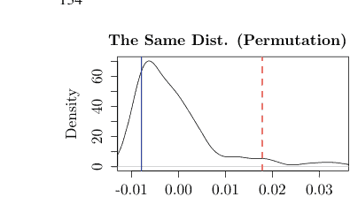

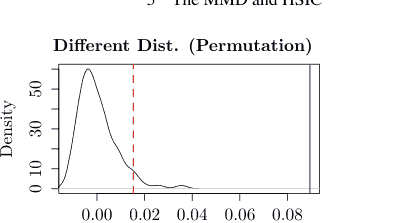

图 5.1 两样本问题的置换检验。X、Y的分布相同（左）和不同（右）。蓝色和红色虚线分别表示统计量和拒绝域的边界。

然而，与下一节中的HSIC类似，我们不知道在P = Q条件下MMD估计量的分布。我们考虑执行以下过程之一。

1.  通过随机改变x1, ..., xm和y1, ..., yn的值，构建MMD估计值的直方图（置换检验）。
2.  从U统计量的分布计算渐近分布。

对于前者，例如，我们可以构建以下过程。

**示例 71** 我们对两组各100个服从标准高斯分布的样本进行置换检验（图5.1左）。对于MMD²的无偏估计量，我们使用(5.6)中的MMD_U²而非(5.4)，以便后续比较。我们还将其中一组样本的标准差加倍，并再次执行置换检验（图5.1右）。MMD_U²也取负值的原因是，当MMD的真实值接近零时，由于它是一个无偏估计量，其值也可能为负。

```python
# In this chapter, we assume that the following has been executed.
import numpy as np
from scipy.stats import kde
import itertools
import math
import matplotlib.pyplot as plt
from matplotlib import style
style.use("seaborn-ticks")
```

```python
sigma = 1
def k(x, y):
    return np.exp(-(x - y)**2 / sigma**2)
# Data Generation
n = 100
xx = np.random.randn(n)
yy = np.random.randn(n)    # The distributions are equal
```

### 5.2 MMD与两样本问题

```python
#yy = 2 * np.random.randn(n) # The distributions are not equal
x = xx; y = yy
# Distribution of the null hypothesis
T = []
for h in range(100):
    index1 = np.random.choice(n, size = int(n/2), replace = False)
    index2 = [x for x in range(n) if x not in index1]
    x = list(xx[index2]) + list(yy[index1])
    y = list(xx[index1]) + list(yy[index2])
    S = 0
    for i in range(n):
        for j in range(n):
            if i != j:
                S = S + k(x[i], x[j]) + k(y[i], y[j]) \
                    - k(x[i], y[j]) - k(x[j], y[i])
    T.append(S / n / (n - 1))
v = np.quantile(T, 0.95)
# Statistics
S = 0
for i in range(n):
    for j in range(n):
        if i != j:
            S = S + k(x[i], x[j]) + k(y[i], y[j]) \
                - k(x[i], y[j]) - k(x[j], y[i])
u = S / n / (n - 1)
# Display of the graph
x = np.linspace(min(min(T), u, v), max(max(T), u, v), 200)
density = kde.gaussian_kde(T)
plt.plot(x, density(x))
plt.axvline(x = u, c = "r", linestyle = "--")
plt.axvline(x = v, c = "b")
```

对于后一种方法，我们构建以下量。对于$m \geq 1$个对称变量和$h : E^m \to \mathbb{R}$，我们称量

$$U_N := \frac{1}{\binom{N}{m}} \sum_{1 \leq i_1, \dots, i_m \leq N} h(x_{i_1}, \dots, x_{i_m}) \quad (5.5)$$

为关于$h$的$m$阶U统计量，其中$\sum_{i_1, \dots, i_m}$遍历$\binom{N}{m}$个$(i_1, \dots, i_m) \in \{1, \dots, N\}^m$。我们使用此量来估计给定样本$x_1, \dots, x_N$的期望$\mathbb{E}[h(X_1, \dots, X_m)]$。注意，任何U统计量都是无偏的。事实上，我们有

$$\mathbb{E}\left[\frac{1}{\binom{N}{m}} \sum_{i_1 < \dots < i_m} h(X_{i_1}, \dots, X_{i_m})\right]$$
$$= \frac{1}{\binom{N}{m}} \sum_{i_1 < \dots < i_m} \mathbb{E}h(X_{i_1}, \dots, X_{i_m}) = \mathbb{E}h(X_1, \dots, X_m).$$

我们称量

$$V_N := \frac{1}{N^m} \sum_{i_1=1}^N \cdots \sum_{i_m=1}^N h(x_{i_1}, \dots, x_{i_m})$$

为关于$h$的$V$统计量。

在下文中，当$m = n$时，我们进行假设$X, Y$同分布的统计检验。在此原假设下，取$\mathbb{E}_X[\cdot]$和$\mathbb{E}_Y[\cdot]$的均值操作具有相同的意义。

除了(5.4)之外，我们可以定义$\text{MMD}^2$的一个无偏估计量。在下文中，我们考虑无偏估计量

$$\widehat{\text{MMD}}_U^2 = \frac{1}{n(n-1)} \sum_{i \neq j} h(z_i, z_j)$$

其中

$$h(z_i, z_j) := k(x_i, x_j) + k(y_i, y_j) - k(x_i, y_j) - k(x_j, y_i) \quad (5.6)$$

且$z_i = (x_i, y_i)$。

我们定义

$$h_c(z_1, \dots, z_c) := \mathbb{E}_{Z_{c+1} \dots Z_m} h(z_1, \dots, z_c, Z_{c+1}, \dots, Z_m),$$

这是通过对$Z_{c+1}, \dots, Z_m$取U统计量(5.5)的期望得到的，其中$1 \le c \le m$。此外，我们定义

$$\tilde{h}_c(z_1, \dots, z_c) := h_c(z_1, \dots, z_c) - \theta$$

其中$\theta = \mathbb{E}[h(Z_1, \dots, Z_m)]$。

**示例 72** 对于(5.6)，由于$m = 2$，我们有$h_2(z_1, z_2) = h(z_1, z_2)$。在原假设下，$X, Y$服从相同的分布，我们有

$$h_1(z_1) = \mathbb{E}_{Z_2}[h(z_1, Z_2)] = \mathbb{E}[k(x_i, X_j)] + \mathbb{E}[k(y_i, Y_j)] - \mathbb{E}[k(x_i, Y_j)] - \mathbb{E}[k(x_j, Y_i)] = 0.$$

此外，在原假设下，由于$\theta = \mathbb{E}h(Z_1, \dots, Z_m) = 0$，我们有$\tilde{h}_2(z_1, z_2) = h(z_1, z_2)$。

此后，我们将样本数量设为$N(= m = n)$。

**命题 51** (Serfling [27]) *假设U统计量满足$\mathbb{E}h^2 < \infty$且$h_1(z_1)$为零（退化）。设$\lambda_1, \lambda_2, \dots$为共轭积分算子的特征值*

$$L^2 \ni f(\cdot) \to \int \hat{h}_2(\cdot, y) f(y) d\eta(y)$$

其核为$\tilde{h}_2(z_1, z_2)^1$。那么，当$m \to \infty$时，$N$倍的U统计量收敛于随机变量

$$\sum_{j=1}^{\infty} \lambda_j (\chi_j^2 - 1)$$

其中$\chi_1^2, \chi_2^2, \dots$是相互独立且服从自由度为1的$\chi^2$分布的随机变量。

证明见Serfling [27]的第5.5.2节（第193-199页）。

注意$\tilde{h}_2(z_1, z_2) = h(z_1, z_2)$由(5.6)给出，它是对称的但不是非负定的。因此，Mercer定理不能应用。然而，积分算子通常是紧的（命题39），并且如果积分算子的核是对称的，那么该积分算子是自伴的（例如，45）。因此，根据命题27，特征值和特征函数存在。但是，由于它们不是非负定的，某些特征值可能不是非负的。

在下文中，我们将$\{\lambda_i\}_{i=1}^{\infty}$和$\{\phi_i(\cdot)\}_{i=1}^{\infty}$分别写为积分算子的特征值和特征函数

$$T_{\tilde{h}}: L^2[E, \mu] \ni f \mapsto \int_E \tilde{h}_2(\cdot, y) f(y) d\eta(y) \in L^2[E, \eta]$$

对于核$h_2$，当$\eta = P = Q$时。那么，我们有

$$\int_E h_2(x, y) \phi_i(y) d\eta(y) = \lambda_i \phi_i(x)$$

$$\int_E \phi_i(x) \phi_j(x) d\eta(x) = \delta_{i,j} . \qquad (5.7)$$

利用命题51，我们发现当样本量$N \to \infty$时，$N \widehat{\text{MMD}}_U^2$收敛于随机变量

$$\sum_{j=1}^{\infty} \lambda_j (\chi_j^2 - 1)$$

**示例 73** 使用两组各100个服从标准高斯分布的样本，我们通过第3.3节描述的方法获得特征值，并使用U统计量构建遵循原假设的分布以执行检验（图5.2左）。我们还通过将一对样本的标准差加倍来执行相同的检验（图5.2右）。

$^1$ 积分算子$L^2(E, \eta) \ni f \mapsto Kf(\cdot) = \int_E K(\cdot, x) f(x) d\eta(x)$中的核$K: E \times E \to \mathbb{R}$即使不是正定的，也称为积分算子的核。

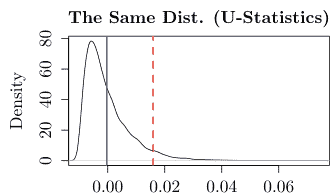

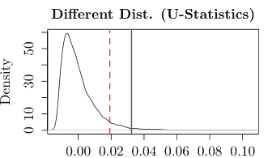

图 5.2 使用U统计量对两样本问题进行的检验。采用了X、Y分布相同（左）和不同（右）的情况。蓝色线是统计量，红色虚线是拒绝域的边界。我们可以看到，根据原假设获得的分布与图5.1中的分布形状几乎相同。

```python
sigma = 1
def k(x, y):
    return np.exp(-(x - y)**2 / sigma**2)
# Data Generation
n = 100
x = np.random.randn(n)
y = np.random.randn(n)    # The Distributions are equal
#y = 2 * np.random.randn(n) # The Distributions are not equal
# Distribution under null hypothesis
K = np.zeros((n, n))
for i in range(n):
    for j in range(n):
        K[i ,j] = k(x[i], x[j]) + k(y[i], y[j]) \
                 - k(x[i], y[j]) - k(x[j], y[i])
lam, vec = np.linalg.eig(K)
lam = lam / n
r = 20
z = []
for h in range(10000):
    z.append(np.longdouble(1/n*(np.sum(lam[0:r]
    *(np.random.chisquare(df = 1, size = r)-1)))))
v = np.quantile(z, 0.95)
# Statistics
S = 0
for i in range(n - 1):
    for j in range(i + 1, n):
        S = S + k(x[i], x[j]) + k(y[i], y[j]) \
             - k(x[i], y[j]) - k(x[j], y[i])
u = np.longdouble(S / n / (n - 1))
x = np.linspace(min(min(z), u, v), max(max(z), u, v), 200)
# Display of the graph
density = kde.gaussian_kde(z)
plt.plot(x, density(x))
plt.axvline(x = v, c = "r", linestyle = "--")
plt.axvline(x = u, c = "b")
```

### 5.3 HSIC 与独立性检验

设 $(E, \mathcal{F}, P)$ 为一个概率空间。若事件 $A, B \in \mathcal{F}$ 满足 $P(A)P(B) = P(A \cap B)$，则称它们是独立的。

假设序列 $x_1, \dots, x_N \in \mathbb{R}$ 和 $y_1, \dots, y_N \in \mathbb{R}$ 长度相同，均为 $N \ge 1$，它们是根据随机变量 $X, Y$ 的分布产生的。我们希望检验 $X, Y$ 的独立性，其中 $x_i, x_j$ 和 $y_i, y_j$ 都是独立的，但我们不知道 $x_i, y_i$ 是否独立。

例如，如果经验相关系数

$$\hat{\rho} = \frac{(1/N) \sum_{i=1}^N (x_i - \bar{x}) \sum_{i=1}^N (y_i - \bar{y})}{\{(1/N) \sum_{i=1}^N (x_i - \bar{x})^2\}^{1/2} \{(1/N) \sum_{i=1}^N (y_i - \bar{y})^2\}^{1/2}}$$

对于 $\bar{x} := (1/N) \sum_{i=1}^N x_i$ 和 $\bar{y} := (1/N) \sum_{i=1}^N y_i$ 接近于零，那么我们可以说这两个变量是独立的。

**示例 74**（高斯分布）为简单起见，我们假设 $X, Y$ 服从标准高斯分布。如果 $X, Y$ 独立（记为 $X \perp\!\!\perp Y$），那么它们的协方差

$$\mathbb{E}[XY] = \int_E \int_E xy f_{XY}(x, y) dxdy = \int_E \int_E xy f_X(x) f_Y(y) dxdy = \int_E x f_X(x) dx \int_E y f_Y(y) dy$$

为 0，并且 $\rho_{XY} = \mathbb{E}[XY] = 0$ 成立。由于我们可以将 $f_{XY}(x, y)$ 写为

$$\frac{1}{2\sqrt{1 - \rho_{XY}^2}} \exp\left\{-\frac{1}{2(1 - \rho_{XY}^2)} (x^2 - 2\rho_{XY}xy + y^2)\right\},$$

我们看到 $\rho_{XY} = 0$ 意味着 $f_{XY}(x, y) = f_X(x) f_Y(y)$。因此，$\rho_{XY} = 0 \Longleftrightarrow X \perp\!\!\perp Y$ 成立。

然而，如以下推导所示，一般情况下，$\rho_{XY} = 0$ 并不意味着 $X \perp\!\!\perp Y$。

**示例 75** 设 $X = \cos \theta$ 和 $Y = \sin \theta$。我们均匀地生成随机变量 $0 \le \theta < 2\pi$，这意味着 $(X, Y)$ 在单位圆上均匀分布。如果 $X$ 确定，那么 $Y = \pm \sqrt{1 - X^2}$，如果 $X, Y$ 中的一个确定，那么另一个最多有两种可能性。因此，这两个变量不是独立的。然而，由于 $X, Y$ 的均值为 $\mu_X = \mu_Y = 0$，协方差可以计算为

$$\mathbb{E}_{XY}[(X - \mu_X)(Y - \mu_Y)] = \mathbb{E}_{XY}[XY] = \mathbb{E}_{XY}[\cos \theta \sin \theta] = \frac{1}{2} \mathbb{E}_{XY}[\sin 2\theta] = 0$$

并且相关系数 $\rho_{XY}$ 为 0。

为此，Gretton 等人 [12] 认为，为了检验随机变量 $X, Y$ 的独立性，如果我们对核 $k_X, k_Y$ 进行映射 $E \ni X \mapsto k_X(X, \cdot) \in H_X$ 和 $E \ni Y \mapsto k_Y(Y, \cdot) \in H_Y$，并基于 $k_X(X, \cdot)$ 和 $k_Y(Y, \cdot)$ 之间的协方差进行独立性检验，那么这种不便就不会发生。他们设计了一个针对 $\mathbb{E}[k_X(X, \cdot)k_Y(Y, \cdot)] = \mathbb{E}[k_X(X, \cdot)]\mathbb{E}[k_Y(Y, \cdot)]$ 而非 $\mathbb{E}[XY] = \mathbb{E}[X]\mathbb{E}[Y]$ 的统计检验。我们定义

$$HSIC(X, Y) := \|m_X m_Y - m_{XY}\|^2_{H_X \otimes H_Y} \in \mathbb{R},$$

它是协方差 $m_X m_Y - m_{XY} \in H_1 \otimes H_2$ 的范数，即希尔伯特-施密特独立性准则（HSIC）。由于 HSIC 是一个范数，它仅在 $m_X m_Y - m_{XY} \in H_X \otimes H_Y$ 为零时才为零。当 $m_P = m_X m_Y$ 且 $m_Q = m_{XY}$ 时，HSIC 就是 $MMD^2$。

**命题 52**（Gretton 等人 [12]）*当 $H_X, H_Y$ 中的再生核 $k_X, k_Y : E \to \mathbb{R}$ 都是特征核时，取值于 $E$ 的随机变量 $X, Y$ 独立与 $HSIC(X, Y) = 0$ 是等价的，即*

$$HSIC(X, Y) = 0 \Longleftrightarrow X \perp\!\!\!\perp Y.$$

证明：如果 $k_X, k_Y$ 都是特征核，那么根据命题 55（见下文），$k_X k_Y$ 也是特征核。因此，对于 $m_X(\cdot) := \int_E k_X(x, \cdot)dP_X(x) \in H_X$，$m_Y(\cdot) := \int_E k_Y(y, \cdot)dP_Y(y) \in H_Y$，以及 $m_{XY}(\cdot, \star) := \int_E k_X(x, \cdot)k_Y(y, \star)dP_{XY}(x, y) \in H_X \otimes H_Y$，映射 $P_{X \otimes Y} \ni P_{XY} \mapsto m_{XY} \in H_X \otimes H_Y$ 是单射。因此，我们有

$$X \perp\!\!\!\perp Y \Longleftrightarrow P_{XY} = P_X P_Y \Longleftrightarrow m_{XY} = m_X m_Y \Longleftrightarrow HSIC(X, Y) = 0,$$

其中第二个 $\Longleftrightarrow$ 是由于 (5.2)。

根据命题 50 和 52，我们有

**推论 2** *$H_X, H_Y$ 的再生核 $k_X, k_Y : E \to \mathbb{R}$ 都是特征核，我们得到*

$$\Sigma_{XY} = \Sigma_{YX} = 0 \Longleftrightarrow X \perp\!\!\!\perp Y.$$

如果我们分别将 $\| \cdot \|_{X \otimes Y}$ 和 $\langle \cdot, \cdot \rangle_{X \otimes Y}$ 简写为 $\| \cdot \|$ 和 $\langle \cdot, \cdot \rangle$，那么我们有

$$\|m_{XY}\|^2 = \langle \mathbb{E}_{XY}[k_X(X, \cdot)k_Y(Y, \cdot)], \mathbb{E}_{X'Y'}[k_X(X', \cdot)k_Y(Y', \cdot)] \rangle$$
$$= \mathbb{E}_{XY} \mathbb{E}_{X'Y'} [\langle k_X(X, \cdot)k_Y(Y, \cdot), k_X(X', \cdot)k_Y(Y', \cdot) \rangle]$$
$$= \mathbb{E}_{XYX'Y'} [k_X(X, X')k_Y(Y, Y')],$$

$\langle m_{XY}, m_X m_Y \rangle = \langle \mathbb{E}_{XY}[k_X(X, \cdot)k_Y(Y, \cdot)], \mathbb{E}_{X'}[k_X(X', \cdot)]\mathbb{E}_{Y'}[k_Y(Y', \cdot)] \rangle$
$= \mathbb{E}_{XY} \{ \mathbb{E}_{X'} [\langle k_X(X, \cdot)k_Y(Y, \cdot), k_X(X', \cdot)\mathbb{E}_{Y'}[k_Y(Y', \cdot)] \rangle] \}$
$= \mathbb{E}_{XY} \{ \mathbb{E}_{X'} [k_X(X, X')] \mathbb{E}_{Y'} [\langle k_Y(Y, \cdot), k_Y(Y', \cdot) \rangle] \}$
$= \mathbb{E}_{XY} \{ \mathbb{E}_{X'} [k_X(X, X')] \mathbb{E}_{Y'} [k_Y(Y, Y')] \},$

以及

$\|m_X m_Y\|^2 = \langle \mathbb{E}_X[k_X(X, \cdot)]\mathbb{E}_Y[k_Y(Y, \cdot)], \mathbb{E}_{X'}[k_X(X', \cdot)]\mathbb{E}_{Y'}[k_Y(Y', \cdot)] \rangle$
$= \mathbb{E}_X \mathbb{E}_{X'} [k_X(X, X')] \mathbb{E}_Y \mathbb{E}_{Y'} [k_Y(Y, Y')],$

其中 $X, X'$（$Y, Y'$）独立且同分布。因此，我们可以将 $HSIC(X, Y)$ 写为

$HSIC(X, Y) := \|m_{XY} - m_X m_Y\|^2$
$= \mathbb{E}_{XX'YY'} [k_X(X, X')k_Y(Y, Y')] - 2\mathbb{E}_{XY} \{ \mathbb{E}_{X'} [k_X(X, X')] \mathbb{E}_{Y'} [k_Y(Y, Y')] \}$
$+ \mathbb{E}_{XX'} [k_X(X, X')] \mathbb{E}_{YY'} [k_Y(Y, Y')] . \quad (5.8)$

在应用 HSIC 时，我们经常构建以下估计量，用相对频率代替均值。

$\widehat{HSIC} := \frac{1}{N^2} \sum_i \sum_j k_X(x_i, x_j)k_Y(y_i, y_j) - \frac{2}{N^3} \sum_i \sum_j k_X(x_i, x_j) \sum_h k_Y(y_i, y_h)$
$+ \frac{1}{N^4} \sum_i \sum_j k_X(x_i, x_j) \sum_h \sum_r k_Y(y_h, y_r) \quad (5.9)$

例如，我们可以在 Python 中编写 HSIC 如下。

```python
def HSIC_1(x, y, k_x, k_y):
    n = len(x)
    S = 0
    for i in range(n):
        for j in range(n):
            S = S + k_x(x[i], x[j])*k_y(y[i], y[j])
    T = 0
    for i in range(n):
        T_1 = 0
        for j in range(n):
            T_1 = T_1 + k_x(x[i], x[j])
        T_2 = 0
        for l in range(n):
            T_2 = T_2 + k_y(y[i], y[l])
        T = T + T_1 * T_2
    U = 0
    for i in range(n):
        for j in range(n):
            U = U + k_x(x[i], x[j])
    V = 0
    for i in range(n):
        for j in range(n):
            V = V + k_y(y[i], y[j])
    return S/n**2 - 2*T/n**3 + U*V/n**4
```

我们经常将统计量写为 $\widehat{HSIC} = \frac{1}{N^2}\text{trace}(K_X H K_Y H)$，其中 $K_X = (k_X(x_i, x_j))_{i,j}$，$K_Y = (k_Y(y_i, y_j))_{i,j}$，$H := I - \frac{1}{N} E$，$I \in \mathbb{R}^{N \times N}$ 是单位矩阵，$E \in \mathbb{R}^{N \times N}$ 是一个所有元素都为 1 的矩阵。事实上，我们有

$$\begin{aligned} \text{trace}(K_X H K_Y H) &= \sum_i (K_X H K_Y H)_{i,i} = \sum_i \sum_j (K_X H)_{i,j} (K_Y H)_{j,i} \\ &= \sum_i \sum_j \left(\sum_h k_X(x_i, x_h)(\delta_{h,j} - \frac{1}{N})\right) \left\{\sum_h k_Y(y_j, y_h)(\delta_{h,i} - \frac{1}{N})\right\} \\ &= \sum_i \sum_j \left\{k_X(x_i, x_j)k_Y(y_i, y_j) - \frac{1}{N}k_X(x_i, x_j)\sum_h k_Y(y_i, y_h)\right. \\ &\quad \left. - \frac{1}{N}k_Y(y_i, y_j)\sum_h k_X(x_i, x_h) + \frac{1}{N^2}\sum_h k_X(x_i, x_h)\sum_r k_Y(y_j, y_r)\right\} \\ &= \sum_i \sum_j k_X(x_i, x_j)k_Y(y_i, y_j) - \frac{2}{N}\sum_i \sum_j k_X(x_i, x_j)\sum_h k_Y(y_i, y_h) \\ &\quad + \frac{1}{N^2}\sum_i \sum_h k_X(x_i, x_h)\sum_j \sum_r k_Y(y_j, y_r). \end{aligned}$$

```python
def HSIC_1(x, y, k_x, k_y):
    n = len(x)
    K_x = np.zeros((n, n))
    for i in range(n):
        for j in range(n):
            K_x[i, j] = k_x(x[i], x[j])
    K_y = np.zeros((n, n))
    for i in range(n):
        for j in range(n):
            K_y[i, j] = k_y(y[i], y[j])
    E = np.ones((n, n))
    H = np.identity(n) - E/n
    return np.sum(np.diag(np.diag(K_x.dot(H).dot(K_y).dot(H)))) / n**2
```

**示例 76** 我们对 $\sigma^2 = 1$ 和

$$k_X(x, y) = k_Y(x, y) = \exp\left(-\frac{1}{2\sigma^2}\|x - y\|^2\right)$$

（高斯核）执行上述过程，如下所示。

```python
def k_x(x, y):
    return np.exp(-np.linalg.norm(x - y)**2/2)
k_y = k_x
k_z = k_x
n = 100
for a in [0, 0.1, 0.2, 0.4, 0.6, 0.8]:  # a is the correlation
    x = np.random.randn(n)
    z = np.random.randn(n)
    y = a * x + np.sqrt(1 - a**2) * z
    print(HSIC_1(x, y, k_x, k_y))
```

0.0006847868161461435
0.004413058917908441
0.004693757443490376
0.01389332860758824
0.010176397492526468
0.0364733529032461

我们定义 HSIC $||m_{XY} - m_X m_Y||^2$，用于检验 $X \perp\!\!\perp Y$，其中 $m_X = \mathbb{E}_X[k_X(X, \cdot)], m_Y = \mathbb{E}_Y[k_Y(Y, \cdot)]$，且 $m_{XY} = \mathbb{E}_{XY}[k_X(X, \cdot)k_Y(Y, \cdot)]$。如果我们检验 $X$ 与 $\{Y, Z\}$ 之间的独立性 $X \perp\!\!\perp \{Y, Z\}$，那么我们将 HSIC 扩展为 $||m_{XYZ} - m_X m_{YZ}||^2$。对于 MMD，我们检验 $X, Y, Z$ 的联合概率与 $X$ 和 $(Y, Z)$ 的概率乘积是否相等。因此，我们可以将 $k_Y(y, \cdot)$ 改为 $k_Y(y, \cdot)k_Z(z, \cdot)$。我们向函数 HSIC_1 添加参数以构建函数 HSIC_2，并执行以下操作。

```python
def HSIC_2(x, y, z, k_x, k_y, k_z):
    n = len(x)
    S = 0
    for i in range(n):
        for j in range(n):
            S = S + k_x(x[i], x[j]) * k_y(y[i], y[j]) \
                * k_z(z[i], z[j])
    T = 0
    for i in range(n):
        T_1 = 0
        for j in range(n):
            T_1 = T_1 + k_x(x[i], x[j])
        T_2 = 0
        for l in range(n):
            T_2 = T_2 + k_y(y[i], y[l]) * k_z(z[i], z[j])
        T = T + T_1 * T_2
    U = 0
    for i in range(n):
        for j in range(n):
            U = U + k_x(x[i], x[j])
    V = 0
    for i in range(n):
        for j in range(n):
            V = V + k_y(y[i], y[j]) * k_z(z[i], z[j])
    return S/n**2-2*T/n**3+U*V/n**4
```

$\widehat{HSIC}$ 的值越小，独立的可能性越大，但对于随机变量 $X, Y, U, V$，条件 $\widehat{HSIC}(X, Y) < \widehat{HSIC}(U, V)$ 并不意味着 $X, Y$ 比 $U, V$ 更接近独立。然而，在实践中，HSIC 常被用作衡量独立性确定性的标准。

**示例 77** (LiNGAM [16, 28]) 我们希望从随机变量 $X, Y, Z$ 的 $N$ 个独立实现 $x, y, z$ 中了解它们之间的因果关系。例如，我们假设 $X, Y$ 是基于模型 1（其中 $X = e_1$ 且 $Y = aX + e_2$，其中 $a \in \mathbb{R}$ 是常数，$e_1, e_2$ 是零均值独立变量）或模型 2（其中 $Y = e'_1$ 且 $X = a'Y + e'_2$，其中 $a' \in \mathbb{R}$ 是常数，$e'_1, e'_2$ 是零均值独立变量）生成的。我们选择 $e_1 \perp\!\!\perp e_2$ 和 $e'_1 \perp\!\!\perp e'_2$ 中概率较高的模型。然后，我们可以应用函数 HSIC_1，其中 $e_2, e'_2$ 分别从 $y - ax, x - a'y$ 计算得出。例如，使用函数

```python
def cc(x, y):
    return np.sum(np.dot(x.T, y)) / len(x)

def f(u, v):
    return u - cc(u, v)/cc(v, v) * v
```

我们可以通过 $f(y,x)$ 和 $f(x,y)$ 分别估计 $a$ 和 $a'$。当我们有三个变量 $X, Y, Z$ 时，我们首先确定上游变量。为此，使用函数 HSIC_2，我们比较三种独立情况：$x$ 与其残差（$f(y,x), f(z,x)$）之间，$y$ 与其残差（$f(z,y), f(x,y)$）之间，以及 $z$ 与其残差（$f(x,z), f(y,z)$）之间。例如，如果我们选择第一对，那么 $X$ 就是上游变量。

然后，我们在未选中的两个变量中选择中游变量。例如，如果在第一轮中选择了 $X$，那么我们比较两个独立集 $f(y_x, z_{xy})$ 和 $f(z_x, y_{zx})$。如果我们使用程序的符号，这些是 $y_x=f(y,x)$ 和 $z_{xy}=f(z_x,y_x)$。

```python
# 数据生成
n = 30
x = np.random.randn(n)**2-np.random.randn(n)**2
y = 2 * x + np.random.randn(n)**2 - np.random.randn(n)**2
z = x + y +np.random.randn(n)**2 - np.random.randn(n)**2
x = x - np.mean(x)
y = y - np.mean(y)
z = z - np.mean(z)

# 估计上游
x_y = f(x, y); y_z = f(y, z); z_x = f(z, x)
x_z = f(x, z); z_y = f(z, y); y_x = f(y, x)
v1 = HSIC_2(x, y_x, z_x, k_x, k_y, k_z)
v2 = HSIC_2(y, z_y, x_y, k_y, k_z, k_x)
v3 = HSIC_2(z, x_z, y_z, k_z, k_x, k_y)

if v1 < v2:
    if v1 < v3:
        top = 1
    else:
        top = 3
else:
    if v2 < v3:
        top = 2
    else:
        top = 3

# 估计下游
x_yz = f(x_y, z_y)
y_zx = f(y_z, x_z)
z_xy = f(z_x, y_x)

if top == 1:
    v1 = HSIC_1(y_x, z_xy, k_y, k_z)
    v2 = HSIC_1(z_x, y_zx, k_z, k_y)
    if v1 < v2:
        middle = 2
        bottom = 3
    else:
        middle = 3
        bottom = 2
if top == 2:
    v1 = HSIC_1(z_y, x_yz, k_y, k_z)
    v2 = HSIC_1(x_y, z_xy, k_z, k_y)
    if v1 < v2:
        middle = 3
        bottom = 1
    else:
        middle = 1
        bottom = 3

if top == 3:
    v1 = HSIC_1(z_y, x_yz, k_z, k_x)
    v2 = HSIC_1(x_y, z_xy, k_x, k_z)
    if v1 < v2:
        middle = 1
        bottom = 2
    else:
        middle = 2
        bottom = 1
# 显示结果
print("top_=_", top)
print("middle_=_", middle)
print("bottom_=_", bottom)
```

top = 1
middle = 3
bottom = 2

接下来，与两样本问题的情况类似，我们通过两种方式构建零假设 $X \perp\!\!\perp Y$ 下的分布。

1.  通过平移 $x_1, \dots, x_N$ 或 $y_1, \dots, y_N$ 中的任意一个序列使 $X, Y$ 独立，重复获得由此产生的 $\widehat{HSIC}$ 值，以创建表示零假设的直方图（置换检验）。
2.  从渐近分布已知的统计量计算（渐近）分布（U-统计量）。

我们使用以下示例中所示的程序进行检验。

**示例 78** 以下程序随机重排两个非独立序列中一个的顺序以使它们独立，估计 HSIC 值的零分布，并检验它们是否独立（图 5.3）。

```python
## 枚举 x 并显示 HSIC 的直方图分布 ##
## 数据生成 ##
x = np.random.randn(n)
y = np.random.randn(n)
u = HSIC_1(x, y, k_x, k_y)
## 枚举 x 并构建零假设
m = 100
w = []
for i in range(m):
    x = x[np.random.choice(n, n, replace = False)]
    w.append(HSIC_1(x, y, k_x, k_y))
## 设置拒绝域
v = np.quantile(w, 0.95)
x = np.linspace(min(min(w), u, v), max(max(w), u, v), 200)
## 图形输出
density = kde.gaussian_kde(w)
plt.plot(x, density(x))
plt.axvline(x = v, c = "r", linestyle = "--")
plt.axvline(x = u, c = "b")
```

现在，让我们使用 HSIC 的无偏估计量 $\widehat{HSIC}_U$，根据零假设找到理论渐近分布。注意到

$$\widehat{HSIC} = \frac{1}{N^4} \sum_{i=1}^N \sum_{j=1}^N \sum_{q=1}^N \sum_{r=1}^N h(z_i, z_j, z_q, z_r)$$

对于 $z_i = (x_i, y_i)$，我们有

$$h(z_i, z_j, z_q, z_r) = \frac{1}{4!} \sum_{(t,u,v,w)}^{i,j,q,r} \{k_X(x_t, x_u)k_Y(y_t, y_u) + k_X(x_t, x_u)k_Y(y_v, y_w) - 2k_X(x_t, x_u)k_Y(y_t, y_v)\},$$

其中 $\sum_{(t,u,v,w)}^{i,j,q,r}$ 表示对 $(i, j, q, r)$ 的所有排列 $(t, u, v, w)$ 求和。如果我们修改这个估计量使其成为无偏估计量，我们得到

$$\widehat{HSIC}_U = \frac{1}{\binom{N}{4}} \sum_{i<j<q<r} h(z_i, z_j, z_q, z_r),$$

其中 $\sum_{i,j,q,r}$ 是对 $1 \le i, j, q, r \le N$ 且无重叠的索引求和。例如，我们可以如下构建程序。由于该程序消耗内存，样本数量应限制在 100 或更少。此外，

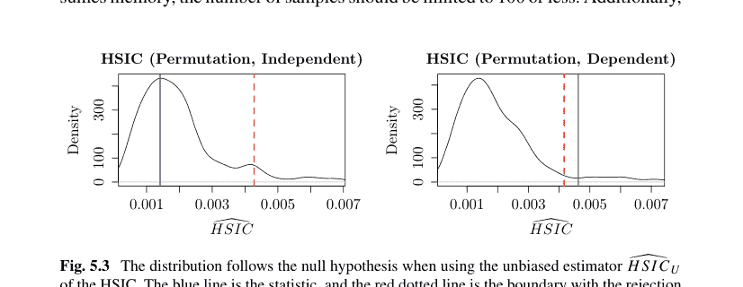

**图 5.3** 使用 HSIC 的无偏估计量 $\widehat{HSIC}_U$ 时，分布遵循零假设。蓝线是统计量，红色虚线是与拒绝域的边界

由于该估计量与 $\widehat{HSIC}$ 不同，它对相同的数据会产生不同的值。$\widehat{HSIC}_U$ 的值小于 $\widehat{HSIC}$ 的值。

```python
def h(i, j, q, r, x, y, k_x, k_y):
    M = list(itertools.combinations([i, j, q, r], 4))
    m = len(M)
    S = 0
    for j in range(m):
        t = M[j][0]
        u = M[j][1]
        v = M[j][2]
        w = M[j][3]
        S = S + k_x(x[t], x[u])*k_y(y[t], y[u]) \
            + k_x(x[t], x[u])*k_y(y[v], y[w]) \
            - 2 * k_x(x[t], x[u])*k_y(y[t], y[v])
    return S / m

def HSIC_U(x, y, k_x, k_y):
    M = list(itertools.combinations(range(n), 4))
    m = len(M)
    S = 0
    for j in range(m):
        S = S + h(M[j][0], M[j][1], M[j][2], M[j][3],
                  x, y, k_x, k_y)
    return S / math.comb(n, 4)
```

函数 $h_1(\cdot)$ 是零函数。对于 $h_2(\cdot, \cdot)$，我们使用以下公式。

**命题 53** (Chwialkowski-Gretton [5]) *令*

$$\tilde{k}_X(x, x') = k_X(x, x') - \mathbb{E}_{X'}k_X(x, X') - \mathbb{E}_X k_X(X, x') + \mathbb{E}_{XX'}k_X(X, X')$$

*以及*

$$\tilde{k}_Y(y, y') = k_Y(y, y') - \mathbb{E}_{Y'}k_Y(y, Y') - \mathbb{E}_Y k_Y(Y, y') + \mathbb{E}_{YY'}k_Y(Y, Y') .$$

*那么，$h_2(\cdot, \cdot)$ 由下式给出*

$$h_2(z, z') = \frac{1}{6}\tilde{k}_X(x, x')\tilde{k}_Y(y, y')$$

其中 $z = (x, y)$，$z' = (x', y')$。

证明：推导源于简单的变换。证明请参见原始论文。

由于积分算子的核 $h_2$ 不是非负定的，因此 Mercer 定理不适用。然而，由于核是对称的且其积分算子是自伴的，因此存在特征值 $\{\lambda_i\}$ 和特征函数 $\{\phi_i\}$（命题 27）。因此，与涉及两样本问题的情况类似，可以使用命题 51 计算零分布。此外，$h_2$ 的均值为零，即 $\bar{h}_2 = h_2$。

### 5.3 HSIC 与独立性检验

**图 5.4** 当使用 HSIC 的无偏估计量（即 $\widehat{HSIC}_U$）时，分布遵循零假设。蓝线是统计量，红色虚线是拒绝域的边界。零假设的分布与置换检验中使用的估计量 $\widehat{HSIC}$ 的分布不同。特别是，当 $X$ 和 $Y$ 独立时，无偏估计量可能取负值，因为 HSIC 的真实值为零。

**例 79** 计算正定核 $h_2$ 的格拉姆矩阵的特征值，并将其除以 $N$ 以获得所需的特征值（第 3.3 节）。然后，找到遵循零假设的分布并计算拒绝域。我们构建以下程序并执行它。我们输入一个服从高斯分布的随机数，样本量 $N = 100$。在图 5.4 中，左图显示相关系数为 0，右图显示相关系数为 0.2。

```python
sigma = 1
def k(x, y):
    return np.exp(-(x-y)**2/sigma**2)
k_x = k; k_y = k
## Data Generation
n = 100; x = np.random.randn(n)
a = 0        # Independent
#a=0.2       ## Correlation 0.2
y = a*x + np.sqrt(1 - a**2) * np.random.randn(n)
# y=rnorm(n)*2   ## The distributions are not equal
## Null Hypothesis
K_x = np.zeros((n, n))
for i in range(n):
    for j in range(n):
        K_x[i ,j] = k_x(x[i], x[j])
K_y = np.zeros((n, n))
for i in range(n):
    for j in range(n):
        K_y[i, j] = k_y(y[i], y[j])
F = np.zeros(n)
for i in range(n):
    F[i] = np.sum(K_x[i, :]) / n
G = np.zeros((n))
for i in range(n):
    G[i] = np.sum(K_y[i, :]) / n
H = np.sum(F) / n
I = np.sum(G) / n
K = np.zeros((n, n))
for i in range(n):
    for j in range(n):
        K[i, j] = (K_x[i, j] - F[i] - F[j] + H) \
    * (K_y[i, j] - G[i] - G[j] + 1) / 6
r = 20
lam, vec = np.linalg.eig(K)
lam = lam / n
print(lam)
z = []
for s in range(10000):
    z.append(1/n*(np.sum(lam[0:r]*(np.random.chisquare(df = 1, size = r)-1))))
v = np.quantile(z, 0.95)
## Statistics
u = HSIC_U(x, y, k_x, k_y)
## Graphical Output
x = np.linspace(min(min(z), u, v), max(max(z), u, v), 200)
density = kde.gaussian_kde(z)
plt.plot(x, density(x))
plt.axvline(x = v, c = "r", linestyle = "--")
plt.axvline(x = u, c = "b")
```

[9.43372312e-03 7.60184058e-03 6.84791271e-03 4.71833989e-03
 2.91610998e-03 2.58505938e-03 2.57260480e-03 2.14716454e-03
 1.52927314e-03 1.40680064e-03 1.30527061e-03 1.03809542e-03
 8.17408141e-04 6.63885663e-04 5.98972166e-04 5.18116129e-04
 4.66211054e-04 3.33278079e-04 3.08102237e-04 2.52215392e-04
 2.08148331e-04 2.01305856e-04 1.61855802e-04 1.24737146e-04
 9.77431144e-05 9.05299170e-05 6.74173717e-05 5.94551451e-05
 4.79841522e-05 3.68125212e-05 3.47962810e-05 2.59468073e-05
 2.27016212e-05 1.75277782e-05 1.44134018e-05 1.34476814e-05
 1.07720204e-05 8.32532742e-06 8.02962726e-06 6.61660031e-06
 6.03329520e-06 4.82571716e-06 4.39769787e-06 3.07993953e-06
 2.92646288e-06 1.93843247e-06 1.43720831e-06 1.32156280e-06
 1.21961656e-06 9.39545869e-07 8.74760924e-07 6.82246149e-07
 6.17680338e-07 5.35249706e-07 4.13572087e-07 2.89912505e-07
 2.63638065e-07 2.13422066e-07 1.43007791e-07 1.39668484e-07
 1.11861810e-07 9.06782617e-08 8.18246166e-08 5.59605198e-08
 4.96061526e-08 4.03184819e-08 3.74865518e-08 1.94370484e-08
 1.55836383e-08 1.28960568e-08 9.98179017e-09 6.29967857e-09
 4.60116540e-09 3.71943499e-09 2.78758512e-09 2.47338744e-09
 1.54467729e-09 1.31346990e-09 8.12941854e-10 4.71936633e-10
 3.62355934e-10 2.28630320e-10 1.71319496e-10 8.99150656e-11
 5.81595026e-11 4.02249130e-11 2.95420131e-11 1.60077238e-11
 1.00890685e-11 7.29486504e-12 3.89343807e-12 2.24468397e-12
 1.62584385e-12 9.95296998e-13 6.98421746e-13 1.93405677e-13
 4.44822157e-14 3.34480294e-14 3.34678155e-15 1.12240660e-14]

与其将 HSIC 写为 $\|m_{XY} - m_X m_Y\|^2_{H_X \otimes H_Y}$，不如使用 HS 范数，我们可以将其写为 $\|\Sigma_{XY}\|^2_{HS}$ 或 $\|\Sigma_{YX}\|^2_{HS}$。事实上，如果 $\{e_{X,i}\}$ 和 $\{e_{Y,j}\}$ 分别是 $H_X, H_Y$ 的标准正交基，那么根据 $\|\cdot\|_{HS}$ 的定义（第 2.6 节）和 (5.1)，我们有

$\|\Sigma_{YX}\|_{HS}^2 = \sum_{i=1}^\infty \|\Sigma_{YX}e_{X,i}\|_{H_Y}^2 = \sum_{i=1}^\infty \sum_{j=1}^\infty \langle e_{Y,j}, \Sigma_{YX}e_{X,i}\rangle_{H_Y}^2$
$= \sum_{i=1}^\infty \sum_{j=1}^\infty \langle e_{X,i} \otimes e_{Y,j}, m_{XY} - m_X m_Y\rangle_{H_X \otimes H_Y}^2 = \|m_{XY} - m_X m_Y\|_{H_X \otimes H_Y}^2$。

类似地，$\|\Sigma_{XY}\|_{HS}^2$ 具有相同的值。

### 5.4 特征核与通用核

设 $H$ 和 $k$ 分别是一个再生核希尔伯特空间及其再生核。设 $\mathcal{P}$ 是随机变量 $X$ 所遵循的分布的集合。那么，我们可以定义映射

$\mathcal{P} \ni \mu \mapsto \int k(x, \cdot) d\mu(x) \in H$，

我们称之为概率在 RKHS 中的嵌入。

由于 $H$ 的每个元素都是由 $k(x, \cdot)$ ($x \in E$) 生成的，或者可以写成其序列的极限，我们将条件描述为

$\int_E k(x, y) d\mu(x) = 0$ , $y \in E \Rightarrow \mu = 0$

对于 $\mu := \mu_1 - \mu_2$。此外，$\int_E k(x, y) d\mu(x) = 0$ ($y \in E$) 意味着

$\int_E \int_E k(x, y) d\mu(x) d\mu(y) = 0$ . (5.10)

如果我们使用 $k(x, y) = \phi(x - y) = \int_E e^{i(x-y)w} d\eta(w)$（命题 5），那么我们可以将 (5.10) 写为

$\int_E |\int_E e^{iwx} d\mu(x)|^2 d\eta(w) = 0$。

换句话说，对于测度 $\eta$，

$\hat{\mu}(w) := \int_E e^{iwx} d\mu(x) = 0$ (5.11)

几乎必然成立。

在下文中，令 $\eta$ 为有限测度。我们称满足对任意 $\epsilon > 0$ 有 $\eta(U(x, \epsilon)) > 0$ 的 $x \in E$ 的集合为 $\eta$ 的支撑集，并记为 $E(\eta)$。我们注意到有限测度的支撑集总是一个闭集。事实上，对于 $x \in E \setminus E(\eta)$，如果开集 $U(x, \epsilon)$ 的半径 $\epsilon$ 足够小，那么 $E(\eta)$ 和 $U(x, \epsilon)$ 将没有交集。

这里，如果 $E(\eta) = E$，那么 (5.11) 意味着 $\mu = 0$，即 $\mu_1 = \mu_2$。另一方面，如果 $E(\eta) \subseteq E$，那么存在一个 $\mu \neq 0$ 使得 (5.11) 成立。

**命题 54** $k(x, y) = \phi(x - y)$ 是特征核，当且仅当 $k(x - y) = \int_E e^{i(x-y)w} d\eta(w)$ 的有限测度 $\eta$ 的支撑集与 $E$ 重合。

必要性的证明，请参见本章末尾的附录。

**例 80** 例 19 中的高斯核和例 20 中的拉普拉斯核分别服从零均值高斯分布和拉普拉斯分布，且支撑集是整个区间。因此，它们是特征核。另一方面，由特征函数

$$\phi(t) = \frac{2(1 - \cos(at))}{a^2t^2}$$

得到的核

$$k(x, y) = \phi(x - y)$$

其概率分布是三角分布，

$$f(x) = \begin{cases} (1 - \frac{|x|}{a})/a, & |x| < a \\ 0, & \text{Otherwise} \end{cases}$$

如果其支撑集不等于 $E$，则不是特征核。

**命题 55** *如果由 RKHS $H_1$, $H_2$ 之间的双变量差表示的再生核 $k_1$, $k_2$ 都是特征核，那么 RKHS $H_1 \otimes H_2$ 的再生核 $k_1k_2$ 也是特征核。*

证明：如果 $k_1(x_1, y_1) = \phi_1(x_1 - y_1)$ 和 $k_2(x_2, y_2) = \phi_2(x_2 - y_2)$ 都是特征核，那么 $\eta_1$, $\eta_2$ 的支撑集都是 $E$。由于 $k_1(x_1, y_1)k_2(x_2, y_2)$ 可以表示为

$$\phi_1(x_1 - y_1)\phi_2(x_2 - y_2) = \int_E \int_E e^{i(x_1-y_1)^\top w_1} e^{i(x_2-y_2)^\top w_2} d\eta_1(w_1)d\eta_2(w_2)$$
$$= \int_E \int_E e^{i(x_1-y_1, x_2-y_2)^\top (w_1, w_2)} d\eta_1(w_1)d\eta_2(w_2),$$

因此 $k_1$, $k_2$ 也是特征核。$\square$

设 $E$ 是一个紧集。假设由核 $k : E \times E \rightarrow H$ 诱导的 RKHS $H$ 是连续函数集 $C(E)$（从 $E$ 到 $\mathbb{R}$）的一个稠密子集（在一致范数下）。那么，我们称核 $k$ 是通用的。

要证明核 $k$ 是通用的，我们只需要看相应的 RKHS 是否满足两个 Stone-Weierstrass 条件（命题 12）。命题 56 给出了核 $k$ 是通用的一个充分条件（参见第 2 章）。

（代数的定义）。然而，出于实际目的，通常使用由命题56推导出的推论3。

**命题56**（Steinwart [29]）*设$E$为紧集，$k : E \times E \to \mathbb{R}$为连续函数，且对$x \in E$有$k(x, x) > 0$。若存在一个单射特征映射*

$$\Psi : E \ni x \to \Psi(x) = (\Psi_1(x), \Psi_2(x), \dots) \in l_2 := \{(\alpha_1, \alpha_2, \dots) \in \mathbb{R}^\infty | \sum_{i=1}^\infty \alpha_i^2 < \infty\}$$

*且$A := \text{span}\{\Psi_1, \Psi_2, \dots\}$是一个代数，则$k$是一个通用核。*

证明：由于$k(x, x) > 0$，$x \in E$，命题12的第一个条件得到满足。由于$k(\cdot, \cdot)$连续，$\Psi(x) = k(x, \cdot) \in l_2$在每个$x \in E$处也连续。此外，由于$\Psi$是单射，命题12的第二个条件得到满足，且$A$在$C(E)$中稠密。进一步，任何$\sum_i \alpha_i \Psi_i(\cdot) \in A$也是以$k$为再生核的再生核希尔伯特空间$H$中的一个元素。设$\{e_i\}$为$H$的一组标准正交基，且$f := \sum_i \alpha_i e_i \in H$。则$\langle f(\cdot), \Psi(x) \rangle = f(x)$成立，这进一步意味着$\sum_i \alpha_i \Psi_i(x) = \langle \sum_i \alpha_i e_i, \sum_i \Psi_i(x) e_i \rangle = f(x)$。$\square$

**推论3** *无限维多项式核（例11）在$E$的每个紧集上都是通用核。*

证明：特征映射$\Psi$是单射。此外，$A := \text{span}\{\Psi_{m_1, \dots, m_d} | m_1, \dots, m_d \ge 0\}$是一个$d$元多项式（代数），根据命题56，核$k$是通用的。$\square$

**例81**（高斯核）*指数型（例6）$k_\infty$是根据推论3得到的通用核。高斯核（例7）的特征映射是$k_\infty$的$\Psi(x)$除以$\gamma(x) := k(x, x)^{1/2} > 0$。对于$f \in C(E)$，由于$\gamma f \in C(E)$，如果我们令$\|\gamma f(\cdot) - \sum_i \alpha_i \Psi(\cdot)\|_\infty \le \|\gamma\|_\infty \epsilon$，则我们有*

$$\|f(\cdot) - \sum_i \alpha_i \gamma^{-1} \Psi(\cdot)\|_\infty \le \|\gamma\|_\infty^{-1} \|\gamma f(\cdot) - \sum_i \alpha_i \Psi(\cdot)\|_\infty \le \epsilon$$

*因此，高斯核也是通用的。*

命题54的必要充分条件假设核是两个变量之差的函数。以下是一个充分条件，但它指的是广义的核。

**命题57** *紧集上的通用核是特征核。*

证明：参见本章末尾的附录。

**例82** *高斯核是特征核。如果一个基于三角分布（例80）的特征核的支撑集延伸至距原点$a > 0$的距离，且$E$是一个包含支撑集外某些点的紧集，则其核不是通用的。*

### 5.5 经验过程简介

在本节中，我们研究一种称为经验过程的机器学习数学方法。我们通过使用Rademacher复杂度和集中不等式来分析MMD估计量的准确性。通过这个例子，我们学习经验过程的概念。本节进行的推导基于Gretton等人[11]关于两样本问题准确性的一个命题的证明。

在本节中，我们证明以下命题。我们将MMD定义为

$$\sup_{f \in \mathcal{F}} \mathbb{E}_P[f(X)] - \mathbb{E}_Q[f(X)],$$

其中$\mathcal{F}$是一个函数类。本章也处理$\mathcal{F} := \{f \in H | \|f\|_H \le 1\}$的情况。

**命题58** 假设存在一个$k_{max}$，使得对每个$x, y \in E$有$0 \le k(x, y) \le k_{max}$。那么，对于任意$\epsilon > 0$，我们有

$$P\left(\left|\widehat{MMD}_B^2 - MMD^2\right| > \frac{4k_{max}}{N} + \epsilon\right) \le 2 \exp\left(-\epsilon^2 \frac{N}{4k_{max}}\right),$$

其中$MMD^2$的估计量$\widehat{MMD}_B^2$由(5.3)给出，我们假设$x, y$的样本数量均为$N$，且$P \neq Q$。

对于命题58的证明，我们使用一个略微推广命题46的不等式。

**命题59**（McDiarmid）设$f : E^m \to \mathbb{R}$意味着存在$c_i < \infty$（$i = 1, \cdots, m$）满足

$$\sup_{x, x_1, \dots, x_m} |f(x_1, \dots, x_m) - f(x_1, \dots, x_{i-1}, x, x_{i+1}, \dots, x_m)| \le c_i.$$

对于任意概率测度$P$，$\epsilon > 0$和$X_1, \dots, X_m$，我们有

$$P\left(f(x_1, \dots, x_m) - \mathbb{E}_{X_1 \dots X_m} f(X_1, \dots, X_m) > \epsilon\right) < \exp\left(-\frac{2\epsilon^2}{\sum_{i=1}^m c_i^2}\right) \quad (5.12)$$

以及

$$P\left(|f(x_1, \dots, x_m) - \mathbb{E}_{X_1 \dots X_m} f(X_1, \dots, X_m)| > \epsilon\right) < 2 \exp\left(-\frac{2\epsilon^2}{\sum_{i=1}^m c_i^2}\right). \quad (5.13)$$

证明：此后，我们将$f(X_1, \cdots, X_N)$和$\mathbb{E}[f(X_1, \cdots, X_N)]$分别记为$f$和$\mathbb{E}[f]$。如果我们定义

$$V_1 := \mathbb{E}_{X_2 \cdots X_N}[f|X_1] - \mathbb{E}_{X_1 \cdots X_N}[f]$$
$$\vdots$$
$$V_i := \mathbb{E}_{X_{i+1} \cdots X_N}[f|X_1, \cdots, X_i] - \mathbb{E}_{X_1 \cdots X_N}[f|X_1, \cdots, X_{i-1}]$$
$$\vdots$$
$$V_N := f - \mathbb{E}_{X_N}[f|X_1, \cdots, X_{N-1}]$$

对于$i = 1, i = 2, \cdots, N - 1$，以及$i = N$，则我们有

$$f - \mathbb{E}_{X_1 \cdots X_N}[f] = \sum_{i=1}^N V_i. \tag{5.14}$$

由

$$\mathbb{E}_{X_i} \{ \mathbb{E}_{X_{i+1} \cdots X_N}[f|X_1, \cdots, X_i] | X_1, \cdots, X_{i-1} \} = \mathbb{E}_{X_i \cdots X_N}[f|X_1, \cdots, X_{i-1}]$$

我们有

$$\mathbb{E}_{X_i}[V_i|X_1, \cdots, X_{i-1}] = 0. \tag{5.15}$$

由(5.14)，我们有

$$f - \mathbb{E}[f] > \epsilon \Longleftrightarrow \exp\{t \sum_{i=1}^N V_i\} > e^{t\epsilon} \text{ 对于任意 } t > 0.$$

如果我们将马尔可夫不等式（引理6）应用于后一个方程，则我们有

$$P(f - \mathbb{E}[f] \geq \epsilon) \leq \inf_{t>0} e^{-t\epsilon} \mathbb{E}[\exp\{t \sum_{i=1}^N V_i\}]. \tag{5.16}$$

此外，由(5.15)，我们应用引理7得到

$$\mathbb{E}[\exp\{t \sum_{i=1}^N V_i\}] = \mathbb{E}_{X_1 \cdots X_{N-1}}[\exp\{t \sum_{i=1}^{N-1} V_i\} \mathbb{E}_{X_N}[\exp\{t V_N\}|X_1, \cdots, X_{N-1}]]$$
$$\leq \mathbb{E}_{X_1 \cdots X_{N-1}}[\exp\{t \sum_{i=1}^{N-1} V_i\}] \exp\{t^2 c_N^2 / 8\}$$
$$= \exp\{\frac{t^2}{8} \sum_{i=1}^N c_i^2\}.$$

因此，由(5.16)，我们有

$$P(f - \mathbb{E}[f] \geq \epsilon) \leq \inf_{t>0} \exp\{-t\epsilon + \frac{t^2}{8} \sum_{i=1}^N c_i^2\}.$$

当$t = 4\epsilon / \sum_{i=1}^N c_i^2$时，右侧取得最小值，我们得到(5.12)。将$f$替换为$-f$，我们得到另一个不等式。由这两个不等式，我们得到(5.13)。

在下文中，我们用

$$\mathcal{F} := \{f \in H | \|f\|_H \leq 1\}$$

表示关于紧集$E$的通用（通用性的定义见第5.4节）再生核希尔伯特空间$H$中的单位球，并假设$H$的核小于或等于$k_{max}$。此后，设$X_1, \dots, X_m$为服从概率$P$的独立随机变量，$\sigma_1, \dots, \sigma_m$为独立随机变量，每个以等概率取值$\pm 1$。那么，我们称量

$$R_N(\mathcal{F}) := \mathbb{E}_{\sigma} \sup_{f \in \mathcal{F}} \left| \frac{1}{m} \sum_{i=1}^m \sigma_i f(x_i) \right| \quad (5.17)$$

为经验Rademacher复杂度，其中$\mathbb{E}_{\sigma}$是关于$\sigma_1, \dots, \sigma_m$取期望的操作。如果我们进一步对概率$P$取(5.17)的期望，则称所得值$R(\mathcal{F}, P)$为Rademacher复杂度。

**命题60**（Bartlett-Mendelson[4]）*设$k_{max} := \max_{x,y \in E} k(x, y)$。那么，我们有以下不等式：*

$$R_N(\mathcal{F}) \leq \sqrt{\frac{k_{max}}{N}}.$$

*特别地，对于任意概率$P$，我们有*

$$R(\mathcal{F}, P) \leq \sqrt{\frac{k_{max}}{N}}.$$

证明：由$\|f\|_H \leq 1$和$k(x, x) \leq k_{max}$，我们有

$$R_N(\mathcal{F}) = \mathbb{E}_{\sigma} [\sup_{f \in \mathcal{F}} |\frac{1}{N} \sum_{i=1}^N \sigma_i f(x_i)|] = \mathbb{E}_{\sigma} [\sup_{f \in \mathcal{F}} |\frac{1}{N} \sum_{i=1}^N \sigma_i \langle k(x_i, \cdot), f(\cdot) \rangle_H|]$$
$$= \mathbb{E}_{\sigma} [\sup_{f \in \mathcal{F}} |\langle f, \frac{1}{N} \sum_{i=1}^N \sigma_i k(x_i, \cdot) \rangle_H|]$$$$\leq \mathbb{E}_{\sigma} \left[ \sup_{f \in \mathcal{F}} \|f\|_H \sqrt{\left\langle \frac{1}{N} \sum_{i=1}^N \sigma_i k(x_i, \cdot), \frac{1}{N} \sum_{i=1}^N \sigma_i k(x_i, \cdot) \right\rangle_H} \right]$$

$$\leq \mathbb{E}_{\sigma} \left[ \sqrt{\frac{1}{N^2} \sum_{i=1}^N \sum_{j=1}^N \sigma_i \sigma_j k(x_i, x_j)} \right] \leq \mathbb{E}_{\sigma} \left[ \frac{1}{N^2} \sum_{i=1}^N \sum_{j=1}^N \sigma_i \sigma_j k(x_i, x_j) \right]$$

$$= \sqrt{\frac{1}{N^2} \sum_{i=1}^N \sum_{j=1}^N \delta_{i,j} k(x_i, x_j)} \leq \sqrt{\frac{k_{max}}{N}} \, ,$$

其中，我们在推导中使用了

$$\mathbb{E}[\sigma_i \sigma_j] = \sigma_i^2 \delta_{i,j} = \delta_{i,j}$$

通过对概率 $P$ 取期望，我们得到另一个不等式。

命题 59 和 60 是用于机器学习数学分析以及命题 58 证明的不等式。

命题 58 的证明：如果我们定义

$$f(x_1, \dots, x_N, y_1, \dots, y_N)$$
$$:= \| \frac{1}{N} k(x_1, \cdot) + \dots + \frac{1}{N} k(x_N, \cdot) - \frac{1}{N} k(y_1, \cdot) - \dots - \frac{1}{N} k(y_N, \cdot) \| \, ,$$

那么根据三角不等式，我们得到

$$|f(x_1, \dots, x_N, y_1, \dots, y_N) - f(x_1, \dots, x_{j-1}, x, x_{j+1}, \dots, x_N, y_1, \dots, y_N)|$$
$$\leq \frac{1}{N} \|k(x_j, \cdot) - k(x, \cdot)\| \leq \frac{2}{N} \sqrt{k_{max}} \, .$$

接下来，我们得到以下期望的上界

$$|MMD^2 - \widehat{MMD}_B^2| = | \sup_{f \in \mathcal{F}} \{\mathbb{E}_P(f) - \mathbb{E}_Q(f)\} - \sup_{f \in \mathcal{F}} \{\frac{1}{N} \sum_{i=1}^N f(x_i) - \frac{1}{N} \sum_{j=1}^N f(y_j)\}|$$
$$\leq \sup_{f \in \mathcal{F}} |\mathbb{E}_P(f) - \mathbb{E}_Q(f) - \{\frac{1}{N} \sum_{i=1}^N f(x_i) - \frac{1}{N} \sum_{j=1}^N f(y_j)\}| \, .$$

然后，我们进行如下推导：

$$\mathbb{E}_{X,Y} \sup_{f \in \mathcal{F}} |\mathbb{E}_P(f) - \mathbb{E}_Q(f) - \{\frac{1}{N} \sum_{i=1}^N f(X_i) - \frac{1}{N} \sum_{i=1}^N f(Y_i)\}|$$
$$= \mathbb{E}_{X,Y} \sup_{f \in \mathcal{F}} |\mathbb{E}_{X'} \{\frac{1}{N} \sum_{i=1}^N f(X'_i) - \frac{1}{N} \sum_{i=1}^N f(X_i)\} - \mathbb{E}_{Y'} \{\frac{1}{N} \sum_{j=1}^N f(Y'_j) - \frac{1}{N} \sum_{j=1}^N f(Y_j)\}|$$

$$\leq \mathbb{E}_{X,Y,X',Y'} \sup_{f \in \mathcal{F}} \left| \frac{1}{N} \sum_{i=1}^N f(X'_i) - \frac{1}{N} \sum_{i=1}^N f(X_i) - \frac{1}{N} \sum_{i=1}^N f(Y'_i) + \frac{1}{N} \sum_{i=1}^N f(Y_i) \right|$$
$$= \mathbb{E}_{X,Y,X',Y',\sigma,\sigma'} \sup_{f \in \mathcal{F}} \left| \frac{1}{N} \sum_{i=1}^N \sigma_i \{f(X'_i) - f(X_i)\} + \frac{1}{N} \sum_{i=1}^N \sigma'_i \{f(Y'_i) - f(Y_i)\} \right|$$
$$\leq \mathbb{E}_{X,X',\sigma} \sup_{f \in \mathcal{F}} \left| \frac{1}{N} \sum_{i=1}^N \sigma_i \{f(X'_i) - f(X_i)\} \right| + \mathbb{E}_{Y,Y',\sigma'} \sup_{f \in \mathcal{F}} \left| \frac{1}{N} \sum_{j=1}^n \sigma'_j \{f(Y'_j) - f(Y_j)\} \right|$$
$$\leq 2[R(\mathcal{F}, P) + R(\mathcal{F}, Q)] \leq 2[(k_{max}/N)^{1/2} + (k_{max}/N)^{1/2}] = 4\sqrt{\frac{k_{max}}{N}} \, . \qquad (5.19)$$

其中，第一个不等式源于詹森不等式，第二个源于三角不等式，第三个源于 Rademacher 复杂度的定义，第四个源于 Rademacher 复杂度的不等式（命题 60）。由 (5.18) 和 (5.19)，对于 $c_i = \frac{2}{N} \sqrt{k_{max}}$ 和 $f = MMD^2 - \widehat{MMD}^2$，我们有
$$E_{X_1,\dots,X_N} f \leq 4\sqrt{\frac{k_{max}}{N}} \, .$$

最后，我们由命题 59 得到命题 58。
因此，命题 60 由 (5.18) 和命题 59 得出。$\square$

## 附录

命题 54 证明的核心部分由 Fukumizu [7] 给出，但为了便于初学者理解，已重写为简洁的推导。

### 命题 48 的证明

$E \ni x \mapsto k(x, \cdot) \in H$ 是可测的这一事实意味着 $\mathbb{E}[k(X, \cdot)]$ 可以被视为一个随机变量。然而，$E \times E$ 中的事件是每个 $E$ 生成的事件的直积（$\mathcal{F} \times \mathcal{F}$ 的元素）。因此，如果函数 $E \times E \ni (x, y) \mapsto k(x, y) \in \mathbb{R}$ 是可测的，那么对于每个 $x \in E$，函数 $E \ni y \mapsto k(x, y) \in \mathbb{R}$ 是可测的（即使 $y \in E$ 固定，$(x, y) \mapsto k(x, y)$ 仍然是可测的）。下面我们证明属于 $H$ 的任何函数都是可测的。首先，我们注意到 $H_0 = \text{span}\{k(x, \cdot) | x \in E\}$ 在 $H$ 中是稠密的。此外，我们注意到对于 $H_0$ 中的序列 $\{f_n\}$，$\|f - f_n\|_H \to 0$ ($n \to \infty$) 意味着对于每个 $x \in E$，$|f(x) - f_n(x)| \to 0$（命题 35）。下面的引理意味着 $f$ 是可测的。

**引理 8** *如果 $f_n : E \to \mathbb{R}$ 是可测的，并且对于每个 $x \in E$，$f_n(x)$ 收敛到 $f(x)$，那么 $f : E \to \mathbb{R}$ 也是可测的。*

证明：证明在本命题的证明之后。

我们假设引理 8 成立。我们通过以下方式定义 $\Psi : E \ni x \mapsto k(x, \cdot) \in H$ 的可测性
$$\{x \in E \mid \|f - k(x, \cdot)\|_H < \delta\} \in \mathcal{F}$$
对于任意 $f \in H$ 和 $\delta > 0$（这是对 $H = \mathbb{R}$ 情况的推广）。此外，我们有
$$\|f - k(x, \cdot)\|_H < \delta \Longleftrightarrow k(x, x) - 2f(x) < \delta^2 - \|f\|_H^2.$$
另外，由于 $k(\cdot, \cdot)$ 是可测的，$E \ni x \mapsto k(x, x) \in \mathbb{R}$ 也是可测的。而且，由于 $f(x)$ 是可测的，$k(x, x) - 2f(x)$ 也是可测的。因此，$\Psi$ 是可测的。$\square$

### 引理 8 的证明

只需证明对于任意开集 $B$，$f^{-1}(B) \in \mathcal{F}$。我们任意固定 $B \subseteq \mathbb{R}$，并令 $F_m := \{y \in B | U(y, 1/m) \subseteq B\}$，其中 $U(y, r) := \{x \in \mathbb{R} \mid d(x, y) < r\}$。根据定义，我们有以下两个等式。
$$f(x) \in B \Longleftrightarrow \text{存在某个 } m, \quad f(x) \in F_m$$
$$f(x) \in F_m \Longleftrightarrow \text{存在某个 } k, \quad f_n(x) \in F_m \ , \ n \geq k \ .$$
换句话说，我们有
$$f^{-1}(B) = \cup_m f^{-1}(F_m) = \cup_m \cup_k \cap_{n \geq k} f_n^{-1}(F_m) \in \mathcal{F} \ .$$
$\square$

### 命题 49 的证明

对于任意 $g = \sum_{i=1}^\infty \sum_{j=1}^\infty a_{i,j} e_{X,i} e_{Y,j} \in H_X \otimes H_Y$ 和 $(x, y) \in E$，该求值是有限的。事实上，我们有
$$|g(x, y)| \leq \sum_{i=1}^\infty \sum_{j=1}^\infty |a_{i,j}| \cdot |e_{X,i}(x)| \cdot |e_{Y,j}(y)| \leq \sum_{i=1}^\infty |e_{X,i}(x)| \cdot \left( \sum_{j=1}^\infty e_{Y,j}^2(y) \right)^{1/2} \left( \sum_{j=1}^\infty a_{i,j}^2(y) \right)^{1/2} \ ,$$
其中我们对 $\sum_{j=1}^\infty$ 应用了柯西-施瓦茨不等式 (2.5)。如果我们设 $k_Y(y, \cdot) = \sum_j h_j(y) e_{Y,j}(\cdot)$，那么由 $\langle e_{Y,i}(\cdot), k_Y(y, \cdot) \rangle = e_{Y,i}(y)$，我们有 $h_i(y) = e_{Y,i}(y)$ 且 $k_Y(y, \cdot) = \sum_{j=1}^\infty e_{Y,j}(y) e_{Y,j}(\cdot)$。因此，我们得到
$$\sum_{j=1}^\infty e_{Y,j}^2(y) = k_Y(y, y)$$

以及

$$\sum_{i=1}^{\infty} |e_{X,i}(x)| \cdot \left( \sum_{j=1}^{\infty} a_{i,j}^2 \right)^{1/2} \leq \left( \sum_{i=1}^{\infty} e_{X,i}^2(x) \right)^{1/2} \left( \sum_{i=1}^{\infty} \sum_{j=1}^{\infty} a_{i,j}^2 \right)^{1/2} = \sqrt{k_X(x,x)} \|g\| ,$$

其中我们对 $\sum_{i=1}^{\infty}$ 应用了柯西-施瓦茨不等式 (2.5)。注意 (5.20)、(5.21) 和 (5.22) 意味着 $|g(x,y)| \leq \sqrt{k_X(x,x)} \sqrt{k_Y(y,y)} \|g\|$。因此，$H_X \otimes H_Y$ 是一个 RKHS。

由 $k_X(x, \cdot) \in H_X$，$k_Y(y, \cdot) \in H_Y$，我们有对于 $k(x, x', y, y') := k_X(x, x') k_Y(y, y')$，$k(x, \cdot, y, \star) := k_X(x, \cdot) k_Y(y, \cdot) \in H_X \otimes H_Y$。由

$$g(x,y) = \sum_{i=1}^{\infty} \sum_{j=1}^{\infty} a_{i,j} e_{X,i}(x) e_{Y,j}(y) = \sum_{i=1}^{\infty} \sum_{j=1}^{\infty} a_{i,j} \langle e_{X,i}(\cdot), k_X(x, \cdot) \rangle_{H_X} \langle e_{Y,j}(\star), k_Y(y, \star) \rangle_{H_Y}$$
$$= \sum_{i=1}^{\infty} \sum_{j=1}^{\infty} a_{i,j} \langle e_{X,i}(\cdot) e_{Y,j}(\star), k(x, \cdot, y, \star) \rangle_H = \langle \sum_{i=1}^{\infty} \sum_{j=1}^{\infty} a_{i,j} e_{X,i}(\cdot) e_{Y,j}(\cdot), k(x, \cdot, y, \star) \rangle_H$$
$$= \langle g(\cdot, \star), k(x, \cdot, y, \star) \rangle ,$$

$k$ 是 $H_X \otimes H_Y$ 的再生核。

### 命题 54 的证明（必要性）

设 $W$ 是以原点为中心、半径为 $\epsilon > 0$ 的开集，且 $w_0 \in E$。我们假设 $w_0 + W$ 的测度为 0，并证明这与另一个假设矛盾，即 $k(x,y) = \phi(x-y)$ 是一个特征核。在这种情况下，$\eta$ 是一个偶函数，并且 $-w_0 + W$ 的测度也为 0（$\pm w_0 + W \subseteq E^c E(\eta)$），其中我们使用了当 $E = \mathbb{R}^d$ ($d \geq 1$) 时 $g(w) := (\epsilon - \|w\|_2)_+^{(d+1)/2}$ 是非负定的这一事实（证明见 [8]）。根据命题 5（博赫纳定理），存在一个有限测度 $\mu$ 使得 $g(w) = \int_E e^{iw^\top x} \mu(x)$。此外，$\pm w_0 + W$ 的闭包是以下函数的支撑集

$$h(w) = g(w - w_0) + g(w + w_0) = \int_E e^{iw^\top x} 2 \cos(w_0^\top x) d\mu(x) .$$

由于 $h$ 的支撑集与 $E(\eta)$ 没有交集，且 $\pm w_0 \notin W$，我们有 $h(0) = 0$。因此，对于

$$\nu(B) := \int_B 2 \cos(w_0 x) d\mu(x) , \quad B \in \mathcal{F} ,$$

我们得到 $\nu(E) = 0$。

由于 $g$ 不为零，$\nu$ 不是零测度。因此，利用全变差

$$|\nu|(B) := \sup_{\cup B_i = B} \sum_{i=1}^n |\nu(B_i)| , \quad B \in \mathcal{F} ,$$

### 命题57的证明

对于任意有界连续函数 $f$，若 $\int_E f dP = \int_E f dQ$ 成立，则意味着 $P = Q$（图5.5）。事实上，设 $U$ 是 $E$ 的一个开子集，$V$ 是其补集。进一步，定义 $d(x, V) := \inf_{y \in V} d(x, y)$ 以及 $f_n(x) := \min(1, n d(x, V))$。那么，$f_n$ 是 $E$ 上的有界连续函数，并且对于每个 $x \in \mathbb{R}$，有 $f_n(x) \leq I(x \in U)$ 且当 $n \to \infty$ 时 $f_n(x) \to I(x \in U)$；因此，根据单调收敛定理，$\int_E f_n dP \to P(U)$ 和 $\int_E f_n dQ \to Q(U)$ 成立。根据我们的假设，$\int_E f_n dP = \int_E f_n dQ$ 且 $P(U) = Q(U)$，即 $P(V) = Q(V)$ 成立$^2$。换句话说，每个事件都保证是一个闭事件。设 $E$ 是一个紧集。对于通用核的再生核希尔伯特空间 $H$ 中的每个元素 $g \in H$，同样的论证成立，因为对于任何 $f \in C(E)$，$\sup_{x \in E} |f(x) - g(x)|$ 可以任意小。也就是说，如果对于任何 $g \in H$，$\int g dP = \int g dQ$ 成立，那么 $P = Q$，因此通用核是特征核。$\square$

$^2$ 如果 $E$ 是紧集，那么对于任何 $A \in \mathcal{F}$，$P(A) = \{P(V)|V$ 是闭集，$V \subseteq A$，$V \in \mathcal{V}\}$（定理7.1.3，Dudley [6]）。

其中 $\sup$ 是将 $\mathcal{F}$ 划分为 $B_i \in \mathcal{F}$ 时的上确界，我们定义常数 $c := |\nu|(E)$ 和有限测度 $\mu_1 := \frac{1}{c}|\nu|$ 以及 $\mu_2 := \frac{1}{c}\{|\nu| - \nu\}$。由 $\nu(E) = 0$，我们观察到 $\mu_1$ 和 $\mu_2$ 都是概率测度，并且 $\mu_1 \neq \mu_2$。此外，我们有

$$c(d\mu_1 - d\mu_2) = d\nu = 2\cos(w_0 x)d\mu \,.$$

根据富比尼定理，我们可以将关于概率测度 $\mu_1, \mu_2$ 的期望之差写为

$$\int_E \phi(x - y)d\mu_1(y) - \int_E \phi(x - y)d\mu_2(y) = \frac{1}{c} \int_E \phi(x - y)2\cos(w_0^\top y)d\mu(y)$$
$$= \frac{1}{c} \int 2\cos(w_0^\top y) \int e^{i(x-y)^\top w} d\eta d\mu(y) = \frac{1}{c} \int_E e^{ix^\top w} h(w)d\eta(w) \,.$$

然而，由于 $h$ 和 $\eta$ 的支撑集不相交，该值为零，这与 $\phi(x - y)$ 是特征核的假设相矛盾。$\square$

### 习题65~83

65. 命题49可以根据以下步骤推导出来。附录中的证明的每个部分对应于哪个步骤？
    - (a) 证明对于 $g \in H_X \otimes H_Y$ 和 $x \in E_X, y \in E_Y$，有 $|g(x, x, y, y)| \leq \sqrt{k_X(x, x)}\sqrt{k_Y(y, y)}\|g\|$（根据命题33，这意味着 $H$ 是某个再生核希尔伯特空间）。
    - (b) 证明当 $x \in E_X, y \in E_Y$ 固定时，$k(x, \cdot, y, \star) := k_X(x, \cdot)k_Y(y, \star) \in H$。
    - (c) 证明 $f(x, y) = \langle f(\cdot, \star), k(x, \cdot, y, \star) \rangle_H$。

66. 我们如何定义 $H_{X \oplus Y}$ 中元素的平均值 $m_{XY} = \mathbb{E}_{XY}[k_X(\cdot)k_Y(\cdot)]$？使用与我们使用里斯引理（命题22）定义 $m_X$ 相同的方式来定义该平均值。

67. 证明存在 $\Sigma_{YX} \in B(H_X, H_Y)$ 使得对于每个 $f \in H_X, g \in H_Y$，有
    $$\langle fg, m_{XY} - m_X m_Y \rangle_{H_X \otimes H_Y} = \langle \Sigma_{YX} f, g \rangle_{H_Y}$$。

68. 最大均值差异通常定义为 $\sup_{f \in \mathcal{F}} \{\mathbb{E}_P[f(X)] - \mathbb{E}_Q[f(X)]\}$，其中 $\mathcal{F}$ 是某个函数集。假设 $\mathcal{F} := \{f \in H \mid \|f\|_H \leq 1\}$，证明最大均值差异为 $\|m_P - m_Q\|_H$。此外，证明我们可以将最大均值差异变换如下。
    $$\text{MMD}^2 = \mathbb{E}_{XX'}[k(X, X')] + \mathbb{E}_{YY'}[k(Y, Y')] - 2\mathbb{E}_{XY}[k(X, Y)]$$,
    其中 $X'$ 和 $X$（$Y'$ 和 $Y$）是服从相同分布的独立随机变量。

69. 证明平方最大均值差异估计量（5.4）是无偏的。

70. 在示例71中通过置换检验解决的双样本问题中，对于样本数量为 $m, n$（可以不同）而不是相同的 $n$，且 $m, n$ 均为偶数的情况，修改示例71中的整个程序以检验其是否正确工作（示例71中 $m = n$）。

71. 对于（5.6）中的函数 $h$，证明 $h_1$ 是一个始终取值为零的函数，并且 $\tilde{h}_2$ 和 $h$ 作为函数是相同的。

72. 证明服从高斯分布的随机变量 $X, Y$ 相互独立等价于它们的相关系数为零的条件。此外，给出一个相关系数为零但不独立的两个变量的例子。

73. 证明以下等式。
    $$\|m_{XY} - m_X m_Y\|^2 = \mathbb{E}_{XX'YY'}[k_X(X, X')k_Y(Y, Y')]$$
    $$-2\mathbb{E}_{XY}\{\mathbb{E}_{X'}[k_X(X, X')]\mathbb{E}_{Y'}[k_Y(Y, Y')]\} + \mathbb{E}_{XX'}[k_X(X, X')]\mathbb{E}_{YY'}[k_Y(Y, Y')].$$

74. 证明希尔伯特-施密特独立性准则估计量
    $$\widehat{HSIC} := \frac{1}{N^2} \sum_i \sum_j k_X(x_i, x_j) k_Y(y_i, y_j) - \frac{2}{N^3} \sum_i \sum_j k_X(x_i, x_j) \sum_h k_Y(y_i, y_h) + \frac{1}{N^4} \sum_i \sum_j k_X(x_i, x_j) \sum_h \sum_r k_Y(y_h, y_r)$$
    可以使用 $K_X = (k_X(x_i, x_j))_{i,j}$，$K_Y = (k_Y(y_i, y_j))_{i,j}$ 和 $H = I - \frac{1}{N} E$ 写成 $\widehat{HSIC} = \text{trace}(K_X H K_Y H)$，其中 $I \in \mathbb{R}^{N \times N}$ 是单位矩阵，$E \in \mathbb{R}^{N \times N}$ 是所有元素均为1的矩阵。此外，为每种计算构建Python程序。并且，检验对于 $\sigma^2 = 1$ 的高斯核 $k_x$ 和 $k_y$，两者输出相同的结果；为相关系数为 $a = 0, 0.1, 0.2, 0.4, 0.6, 0.8$ 的标准高斯变量 $X$ 和 $Y$ 生成随机数。

75. 当我们检验 $X$ 和 $\{Y, Z\}$ 的独立性 $X \perp \!\!\! \perp \{Y, Z\}$ 时，希尔伯特-施密特独立性准则扩展为 $\|m_{XYZ} - m_X m_{YZ}\|^2$。也就是说，我们可以将 $k_Y(y, \cdot)$ 变换为 $k_Y(y, \cdot) k_Z(z, \cdot)$。通过向函数 HSIC_1 添加参数来构建函数 HSIC_2；根据 $X \perp \!\!\! \perp \{Y, Z\}$ 生成随机数，并验证所得值足够小。

76. 利用LiNGAM类和函数
    ```python
    def cc(x, y):
        return np.sum(np.dot(x.T, y)) / len(x)

    def f(u, v):
        return u - cc(u, v)/cc(v, v) * v
    ```
    我们希望估计每个变量 $X, Y, Z$ 是上游、中游还是下游。通过生成不服从高斯分布的随机数 $X, Y, Z$ 来填空，并仅从随机数中估计 $X, Y, Z$ 中哪些变量是上游、中游和下游。
    ```python
    #数据生成
    n = 30
    x = np.random.randn(n)**2-np.random.randn(n)**2
    y = 2 * x + np.random.randn(n)**2 - np.random.randn(n)**2
    z = x + y +np.random.randn(n)**2 - np.random.randn(n)**2
    x = x - np.mean(x)
    y = y - np.mean(y)
    z = z - np.mean(z)

    ## 估计上游 ##
    def cc(x, y):
        return np.sum(np.dot(x.T, y)/len(x))

    def f(u, v):
        return u - cc(u, v)/cc(v, v) * v

    x_y = f(x, y); y_z = f(y, z); z_x = f(z, x)
    x_z = f(x, z); z_y = f(z, y); y_x = f(y, x)

    v1 = HSIC_2(x, y_x, z_x, k_x, k_y, k_z)
    v2 = HSIC_2(y, z_y, x_y, k_y, k_z, k_x)
    v3 = HSIC_2(z, x_z, y_z, k_z, k_x, k_y)

    if v1 < v2:
        if v1 < v3:
            top = 1
        else:
            top = 3
    else:
        if v2 < v3:
            top = 2
        else:
            top = 3

    ## 估计中游 ##
    x_yz = f(x_y, z_y)
    y_zx = f(y_z, x_z)
    z_xy = f(z_x, y_x)

    if top == 1:
        v1 = ## 空白 (1) ##
        v2 = ## 空白 (2) ##
        if v1 < v2:
            middle = 2
            bottom = 3
        else:
            middle = 3
            bottom = 2
    if top == 2:
        v1 = ## 空白 (3) ##
        v2 = ## 空白 (4) ##
        if v1 < v2:
            middle = 3
            bottom = 1
        else:
            middle = 1
            bottom = 3

    if top == 3:
        v1 = ## 空白 (5) ##
        v2 = ## 空白 (6) ##
        if v1 < v2:
            middle = 1
            bottom = 2
        else:
            middle = 2
            bottom = 1
    ## 输出结果 ##
    print("top_=_", top)
    print("middle_=_", middle)
    print("bottom_=_", bottom)
    ```

77. 我们希望通过移动 $x_1, \dots, x_N$ 或 $y_1, \dots, y_N$ 中的一个序列使两个序列独立，然后我们希望重复计算希尔伯特-施密特独立性准则的过程。我们希望创建一个表示服从零假设分布的直方图。为此，我们构建了以下程序。为什么通过置换我们可以获得零假设（$X, Y$ 独立）？在程序中，我们在哪里获得希尔伯特-施密特独立性准则统计量，在哪里获得服从零假设的多个希尔伯特-施密特独立性准则值？
    ```python
    # 数据生成
    fx = np.random.randn(n)
    y = np.random.randn(n)
    ```

u = HSIC_1(x, y, k_x, k_y)
m = 100
w = []
for i in range(m):
    x = x[np.random.choice(n, n, replace = False)]
    w.append(HSIC_1(x, y, k_x, k_y))
v = np.quantile(w, 0.95)
x = np.linspace(min(min(w), u, v), max(max(w), u, v), 200)

density = kde.gaussian_kde(w)
plt.plot(x, density(x))
plt.axvline(x = v, c = "r", linestyle = "--")
plt.axvline(x = u, c = "b")

78. 在 MMD（第 5.2 节）和 HSIC（第 5.3 节）中，我们无法应用 Mercer 定理，因为积分算子的核不是非负定的。然而，在这两种情况下，积分算子都具有特征值和特征函数。为什么？

79. 证明 $k(x, y) = \phi(x - y)$，其中 $\phi(t) = e^{-|t|}$ 是一个特征核。

80. 在命题 54（必要性，附录）的证明中，我们使用了 $g(w) := (\epsilon - \|w\|_2)_+^{(d+1)/2}$ 是非负定的这一事实 [8]。通过证明以下等式，验证该事实在 $d = 1$ 时是正确的。

$$\frac{1}{2\pi} \int_{-\epsilon}^{\epsilon} g(w) e^{-iwx} dw = \frac{1 - \cos(x\epsilon)}{\pi x^2}.$$

81. 为什么指数型核是通用核？为什么基于三角分布的特征核不是通用核？

82. 解释以下 Rademacher 复杂度上界推导中，三个等式和四个不等式为何成立。

$$R_N(\mathcal{F}) = \mathbb{E}_{\sigma} [\sup_{f \in \mathcal{F}} |\frac{1}{N} \sum_{i=1}^N \sigma_i f(x_i)|] = \mathbb{E}_{\sigma} [\sup_{f \in \mathcal{F}} |\frac{1}{N} \sum_{i=1}^N \sigma_i \langle k(x_i, \cdot), f(\cdot) \rangle_H|]$$
$$= \mathbb{E}_{\sigma} [\sup_{f \in \mathcal{F}} |\langle f, \frac{1}{N} \sum_{i=1}^N \sigma_i k(x_i, \cdot) \rangle_H|]$$
$$\leq \mathbb{E}_{\sigma} [\sup_{f \in \mathcal{F}} \|f\|_H \sqrt{\langle \frac{1}{N} \sum_{i=1}^N \sigma_i k(x_i, \cdot), \frac{1}{N} \sum_{i=1}^N \sigma_i k(x_i, \cdot) \rangle_H}]$$
$$\leq \mathbb{E}_{\sigma} [\sqrt{\frac{1}{N^2} \sum_{i=1}^N \sum_{j=1}^N \sigma_i \sigma_j k(x_i, x_j)}]$$
$$\leq \sqrt{\mathbb{E}_{\sigma} [\frac{1}{N^2} \sum_{i=1}^N \sum_{j=1}^N k(x_i, x_j)]} \leq \sqrt{\frac{k_{max}}{N}}.$$

83. 解释以下 $|MMD^2 - \widehat{MMD_B^2}|$ 上界推导中，一个等式和四个不等式为何成立。

$$\mathbb{E}_{X,Y} \sup_{f \in \mathcal{F}} |\mathbb{E}_{X'} \{\frac{1}{N} \sum_{i=1}^N f(x_i') - \frac{1}{N} \sum_{i=1}^N f(x_i)\} - \mathbb{E}_{Y'} \{\frac{1}{N} \sum_{j=1}^N f(y_j') - \frac{1}{N} \sum_{j=1}^N f(y_j)\}|$$
$$\leq \mathbb{E}_{X,Y,X',Y'} \sup_{f \in \mathcal{F}} |\frac{1}{N} \sum_{i=1}^N f(x_i') - \frac{1}{N} \sum_{i=1}^N f(x_i) - \frac{1}{N} \sum_{i=1}^N f(y_i') + \frac{1}{N} \sum_{i=1}^N f(y_i)|$$
$$= \mathbb{E}_{X,Y,X',Y',\sigma,\sigma'} \sup_{f \in \mathcal{F}} |\frac{1}{N} \sum_{i=1}^N \sigma_i \{f(x_i') - f(x_i)\} + \frac{1}{N} \sum_{i=1}^N \sigma_i' \{f(y_i') - f(y_i)\}|$$
$$\leq \mathbb{E}_{X,X',\sigma} \sup_{f \in \mathcal{F}} |\frac{1}{N} \sum_{i=1}^N \sigma_i \{f(x_i') - f(x_i)\}| + \mathbb{E}_{Y,Y',\sigma'} \sup_{f \in \mathcal{F}} |\frac{1}{N} \sum_{j=1}^n \sigma_j' \{f(y_j') - f(y_j)\}|$$
$$\leq 2[R(\mathcal{F}, P) + R(\mathcal{F}, Q)]$$
$$\leq 2[(k_{max}/N)^{1/2} + (k_{max}/N)^{1/2}].$$

## 第 6 章
高斯过程与函数数据分析

随机过程可以定义为随机变量序列 $\{X_t\}_{t \in T}$，其中 $T$ 是时间集合，也可以定义为函数 $X_t(\omega) : T \to \mathbb{R}$，其中 $\omega \in \Omega$。我们将高斯过程定义为一个随机过程 $\{X_t\}$，使得对于 $T$ 的任何有限子集 $T'$，$X_t$（$t \in T'$）服从多元高斯分布。在本章中，我们将一维 $T$ 推广到多维集合 $E$，以考虑高斯过程。我们主要处理 $f(\omega, x)$ 中 $\omega \in \Omega$ 的变化，而到目前为止，我们处理的是 $f(\omega, x)$ 中 $x \in E$ 的变化。高斯过程已应用于机器学习的各个方面。我们探讨高斯过程与核之间的关系。本章前半部分包括回归、分类和计算简化处理，最后一部分研究 Karhunen–Loève 展开及其相关理论。最后，我们研究与随机过程密切相关的函数数据分析。

### 6.1 回归

设 $E$ 和 $(\Omega, \mathcal{F}, \mu)$ 分别为一个集合和一个概率空间。如果对于每个 $x \in E$，对应关系 $\Omega \ni \omega \mapsto f(\omega, x) \in \mathbb{R}$ 是可测的，即如果 $f(\omega, x)$ 在每个 $x \in E$ 处是一个随机变量，那么我们称 $f : \Omega \times E \to \mathbb{R}$ 是一个随机过程。此外，如果对于任何 $N \ge 1$ 和任何有限个元素 $x_1, \dots, x_N \in E$，随机变量 $f(\omega, x_1), \dots, f(\omega, x_N)$ 服从 $N$ 元高斯分布，那么我们称 $f$ 为高斯过程。我们定义 $x_i, x_j \in E$ 之间的协方差为

$$\int_{\Omega} \{f(\omega, x_i) - m(x_i)\}\{f(\omega, x_j) - m(x_j)\}d\mu(\omega) \,,$$

其中 $m(x) := \int_{\Omega} f(\omega, x)d\mu(\omega)$ 是 $f(\omega, x)$ 对于 $x \in E$ 的期望。那么，无论我们选择什么 $N$ 和 $x_1, \dots, x_N$，它们的协方差矩阵都是非负定的。因此，我们可以使用正定核 $k : E \times E \rightarrow \mathbb{R}$ 来表示协方差矩阵。因此，高斯过程可以唯一地由一对 $(m, k)$ 表示，其中包含每个 $x \in E$ 的均值 $m(x)$ 和每个 $(x, x') \in E \times E$ 的协方差 $k(x, x')$。

一般来说，随机变量是 $\Omega \rightarrow \mathbb{R}$ 的映射，我们应该显式地写出 $\omega$，即 $f(\omega, x)$，但为了简单起见，目前我们隐式地处理 $\omega$，即 $f(x)$，即使它是一个随机变量。

**示例 83** 设 $m_X \in \mathbb{R}^N$ 和 $k_{XX} \in \mathbb{R}^{N \times N}$ 分别是高斯过程 $(m, k)$ 在 $x_1, \dots, x_N \in E := \mathbb{R}$ 处的均值和协方差矩阵。一般来说，对于均值 $\mu$ 和协方差矩阵 $\Sigma \in \mathbb{R}^{N \times N}$，$\Sigma$ 是非负定的，并且存在一个下三角矩阵 $R \in \mathbb{R}^{N \times N}$ 使得 $\Sigma = RR^\top$（Cholesky 分解）。因此，为了从 $N$ 个独立的标准高斯分布随机数 $u_1, \dots, u_N$ 生成服从 $N(m_X, k_{XX})$ 的随机数，我们可以计算 $f_X := R_X u + m_X \in \mathbb{R}^N$，其中 $k_{XX} := R_X R_X^\top$，$u = [u_1, \dots, u_N]$。实际上，$f_X$ 的期望和协方差矩阵分别是 $m_X$ 和

$$\mathbb{E}[(f_X - m_X)(f_X - m_X)^\top] = \mathbb{E}[R_X u u^\top R_X^\top] = R_X \mathbb{E}[u u^\top] R_X^\top = R_X R_X^\top = k_{XX},$$

这个过程可以用 Python 描述如下。

```python
# Install the module skfda via
pip install scikit-fda
```

```python
# In this chapter, we assume that the following has been executed.
import numpy as np
import matplotlib.pyplot as plt
from matplotlib import style
from sklearn.decomposition import PCA
import skfda
```

```python
# Definition of (m, k)
def m(x):
    return 0
def k(x, y):
    return np.exp(-(x-y)**2/2)
# Definition of gp_sample
def gp_sample(x, m, k):
    n = len(x)
    m_x = m(x)
    k_xx = np.zeros((n, n))
    for i in range(n):
        for j in range(n):
            k_xx[i, j] = k(x[i], x[j])
    R = np.linalg.cholesky(k_xx) #lower triangular matrix
    u = np.random.randn(n)
    return R.dot(u) + m_x
```

```python
# Generate the random numbers and construct the covariance matrix to compare
# it with k_xx
x = np.arange(-2, 3, 1)
n = len(x)
r = 100
z = np.zeros((r, n))
for i in range(r):
    z[i, :] = gp_sample(x, m, k)
k_xx = np.zeros((n, 2))
for i in range(n):
    for j in range(n):
        k_xx[i, j] = k(x[i, :], x[j, :])

print("cov(z):\n",np.cov(z),"\n")
print("k_xx:\n",k_xx)
```

```
cov(z):
[[ 2.37424382e-01  1.09924256e-03  4.32681142e-01 ... -1.92328002e-01
  1.46703390e-03 -7.31927129e-01]
 [ 1.09924256e-03  6.17989727e-02 -8.41300879e-02 ...  1.37955079e-01
  1.22155905e-01  3.53607212e-02]
 [ 4.32681142e-01 -8.41300879e-02  1.51374514e+00 ... -6.82936090e-01
 -8.44371416e-02 -1.82595208e+00]
 ...
 [-1.92328002e-01  1.37955079e-01 -6.82936090e-01 ...  1.16493686e+00
  4.07945653e-01  7.10299634e-01]
 [ 1.46703390e-03  1.22155905e-01 -8.44371416e-02 ...  4.07945653e-01
  2.88425891e-01 -4.34847631e-03]
 [-7.31927129e-01  3.53607212e-02 -1.82595208e+00 ...  7.10299634e-01
 -4.34847631e-03  2.60520510e+00]]
```

```
k_xx:
[[1.00000000e+00 6.06530660e-01 1.35335283e-01 1.11089965e-02
  3.35462628e-04]
 [6.06530660e-01 1.00000000e+00 6.06530660e-01 1.35335283e-01
  1.11089965e-02]
 [1.35335283e-01 6.06530660e-01 1.00000000e+00 6.06530660e-01
  1.35335283e-01]
 [1.11089965e-02 1.35335283e-01 6.06530660e-01 1.00000000e+00
  6.06530660e-01]
 [3.35462628e-04 1.11089965e-02 1.35335283e-01 6.06530660e-01
  1.00000000e+00]]
```

一般来说，$E$ 不必是 $\mathbb{R}$。高斯过程是一类随机过程，我们可能认为集合 $E$ 是整个实数集或其子集，但事实上，只要我们在 $E \times E$ 上定义正定核 $k$，就没有进一步的限制。一旦我们选择了 $(m, k)$，无论选择的 $E$ 是什么，我们都会根据 $(m, k)$ 生成 $N$ 元高斯随机变量。

#### 示例 84
对于 $E = \mathbb{R}^2$，我们可以类似地获得遵循 $N$ 元多元高斯分布的随机数。

```python
# (m, k) 的定义
def m(x):
    return 0
def k(x, y):
    return np.exp(-np.sum((x-y)**2)/2)
# 函数 gp_sample 的定义
def gp_sample(x, m, k):
    n = x.shape[0]
    m_x = m(x)
    k_xx = np.zeros((n, n))
    for i in range(n):
        for j in range(n):
            k_xx[i, j] = k(x[i], x[j])
    R = np.linalg.cholesky(k_xx) # 下三角矩阵
    u = np.random.randn(n)
    return R.dot(u) + m_x
```

```python
# 生成随机数并构建协方差矩阵以与 k_xx 进行比较
n = 5
r = 100
z = np.zeros((r, n))
for i in range(r):
    z[i, :] = gp_sample(x, m, k)
k_xx = np.zeros((n, n))
for i in range(n):
    for j in range(n):
        k_xx[i, j] = k(x[i], x[j])

print("cov(z):\n",np.cov(z),"\n")
print("k_xx:\n",k_xx)
```

```
cov(z):
[[ 1.52140938  0.2585143   0.67840535 ... -0.57075902 -0.53404263
   0.20940014]
 [ 0.2585143   0.47450778  0.36954164 ... -0.30224707 -0.47093046
  -0.03341687]
 [ 0.67840535  0.36954164  0.77124364 ... -0.34846439 -0.40226404
   0.37837525]
 ...
 [-0.57075902 -0.30224707 -0.34846439 ...  0.42199909  0.46715201
   0.04255153]
 [-0.53404263 -0.47093046 -0.40226404 ...  0.46715201  0.59461419
   0.09420804]
 [ 0.20940014 -0.03341687  0.37837525 ...  0.04255153  0.09420804
   0.40676413]]

k_xx:
[[1.00000000e+00 6.06530660e-01 1.35335283e-01 1.11089965e-02
  3.35462628e-04]
 [6.06530660e-01 1.00000000e+00 6.06530660e-01 1.35335283e-01
  1.11089965e-02]
 [1.35335283e-01 6.06530660e-01 1.00000000e+00 6.06530660e-01
  1.35335283e-01]
 [1.11089965e-02 1.35335283e-01 6.06530660e-01 1.00000000e+00
  6.06530660e-01]
 [3.35462628e-04 1.11089965e-02 1.35335283e-01 6.06530660e-01
  1.00000000e+00]]
```

然后，如同通常的回归过程，我们假设 $x_1, \dots, x_N \in E$ 和 $y_1, \dots, y_N \in \mathbb{R}$ 是通过一个未知函数 $f : E \to \mathbb{R}$ 生成的，满足

$$y_i = f(x_i) + \epsilon_i \quad (6.1)$$

其中 $\epsilon_i$ 服从均值为 0、方差为 $\sigma^2$ 的高斯分布，并且对于每个 $i = 1, \dots, N$ 是独立的。当函数 $f$ 已知（固定）时，似然函数为

$$\prod_{i=1}^N \left[ \frac{1}{\sqrt{2\pi\sigma^2}} \exp\left\{ -\frac{(y_i - f(x_i))^2}{2\sigma^2} \right\} \right]$$

在下文中，我们假设函数 $f$ 随机变化，并将高斯过程 $(m, k)$ 视为其先验分布。也就是说，我们考虑模型 $f_X \sim N(m_X, k_{XX})$，其中 $y_i | f(x_i) \sim N(f(x_i), \sigma^2)$，且 $f_X = (f(x_1), \dots, f(x_N))$。然后，我们计算对应于 $z_1, \dots, z_n \in E$（不同于 $x_1, \dots, x_N$）的 $f(z_1), \dots, f(z_n)$ 的后验分布。$y_1, \dots, y_N$ 的变化源于 $f$ 和 $\epsilon_i$ 的变化。因此，协方差矩阵为

$$k_{XX} + \sigma^2 I = (k(x_i, x_j) + \sigma^2 \delta_{i,j})_{i,j=1,\dots,N} \in \mathbb{R}^{N \times N}.$$

另一方面，$f(z_1), \dots, f(z_n)$ 的变化仅源于 $f$ 的变化。因此，协方差矩阵为 $k_{ZZ} = (k(z_i, z_j))_{i,j=1,\dots,n} \in \mathbb{R}^{n \times n}$。此外，$y_i$ 和 $f(z_j)$ 的方差分别是 $f(x_i)$ 和 $f(z_j)$ 的方差，而 $Y = [y_1, \dots, y_N]$ 和 $f_Z = [f(z_1), \dots, f(z_n)]$ 之间的协方差矩阵为 $k_{XZ} = (k(x_i, z_j))_{i=1,\dots,N, j=1,\dots,n}$。总之，$Y$ 和 $f_Z$ 的联合分布为

$$\begin{bmatrix} Y \\ f_Z \end{bmatrix} \sim N \left( \begin{bmatrix} m_X \\ m_Z \end{bmatrix}, \begin{bmatrix} k_{XX} + \sigma^2 I & k_{XZ} \\ k_{ZX} & k_{ZZ} \end{bmatrix} \right).$$

在下文中，我们将证明给定 $Y$ 的值，函数 $f(\cdot)$ 的后验概率仍然是一个高斯过程。为此，我们使用以下命题。

##### 命题 61
假设随机变量 $a \in \mathbb{R}^N$ 和 $b \in \mathbb{R}^n$ 的联合分布可以表示为

$$\begin{bmatrix} a \\ b \end{bmatrix} \sim N \left( \begin{bmatrix} \mu_a \\ \mu_b \end{bmatrix}, \begin{bmatrix} A & C \\ C^\top & B \end{bmatrix} \right),$$

其中 $\mu_a$、$\mu_b$ 是期望，$A \in \mathbb{R}^{N \times N}$、$B \in \mathbb{R}^{n \times n}$ 是协方差矩阵（$A$：正定；$B$：非负定），$C \in \mathbb{R}^{N \times n}$ 是它们之间的协方差矩阵。那么，给定 $a$ 时 $b$ 的条件概率为

$$b|a \sim N(\mu_b + C^\top A^{-1}(a - \mu_a), B - C^\top A^{-1}C). \quad (6.2)$$

证明：参见 Lauritzen，《Graphical Models》[20] 第 256 页。

因此，根据命题 61，在 $Y \in \mathbb{R}^N$ 条件下，$f_Z \in \mathbb{R}^n$ 的后验分布为 $N(\mu', \Sigma')$，其中

$$\mu' := m_Z + k_{ZX}(k_{XX} + \sigma^2 I)^{-1}(Y - m_X) \in \mathbb{R}^n$$

且

$$\Sigma' := k_{ZZ} - k_{ZX}(k_{XX} + \sigma^2 I)^{-1}k_{XZ} \in \mathbb{R}^{n \times n}.$$

如果我们设 $n = 1$ 且 $z_1 = x$，那么 $f(x)$ 的分布变为

$$m'(x) := m(x) + k_{xX}(k_{XX} + \sigma^2 I)^{-1}(Y - m_X) \quad (6.3)$$

$$k'(x, x) := k(x, x) - k_{xX}(k_{XX} + \sigma^2 I)^{-1}k_{Xx}. \quad (6.4)$$

我们将讨论总结如下。

##### 命题 62
假设 $f(\cdot)$ 的先验分布是高斯过程 $(m, k)$。如果我们根据 (6.1) 获得 $x_1, \dots, x_N$ 和 $y_1, \dots, y_N$，那么 $f(\cdot)$ 的后验概率是一个高斯过程 $(m', k')$，其中 $m', k'$ 分别由 (6.3) 和 (6.4) 给出。

在实际计算中，计算 $(K + \sigma^2 I)^{-1}$ 需要 $O(N^3)$ 时间。为了在 $O(N^3/3)$ 时间内完成整个过程，我们使用以下方法。通过 Cholesky 分解，我们得到一个 $L \in \mathbb{R}^{N \times N}$，使得

$$LL^\top = k_{XX} + \sigma^2 I,$$

这可以在 $O(N^3/3)$ 时间内完成。然后，令 $L\gamma = k_{Xx}$、$L\beta = y - m(x)$ 和 $L^\top \alpha = \beta$ 的解分别为 $\gamma \in \mathbb{R}^N$、$\beta \in \mathbb{R}^N$ 和 $\alpha \in \mathbb{R}^N$。由于 $L$ 是下三角矩阵，这些计算最多需要 $O(N^2)$ 时间。此外，我们有

$$(k_{XX} + \sigma^2 I)^{-1}(Y - m_X) = (LL^\top)^{-1}L\beta = (LL^\top)^{-1}LL^\top\alpha = \alpha$$

以及

$$k_{XX}(k_{XX} + \sigma^2 I)^{-1}k_{Xx} = (L\gamma)^\top (LL^\top)^{-1}L\gamma = \gamma^\top\gamma \text{ .}$$

最后，根据 $\alpha, \beta, \gamma$，我们有

$$m'(x) = m(x) + k_{Xx}\alpha$$

以及

$$k'(x, x) = k(x, x) - \gamma^\top\gamma \text{ .}$$

我们可以将 $m(x), k(x, x)$ 的计算写成在 Python 中以 $O(N^3)$ 和 $O(N^3/3)$ 时间完成的形式，如下所示。

```python
def gp_1(x_pred):
    h = np.zeros(n)
    for i in range(n):
        h[i] = k(x_pred, x[i])
    R = np.linalg.inv(K + sigma_2*np.identity(n))  # O(n^3) 计算
    mm = mu(x_pred) + np.dot(np.dot(h.T, R), (y-mu(x)))
    ss = k(x_pred, x_pred) - np.dot(np.dot(h.T, R), h)
    return {"mm":mm, "ss":ss}

def gp_2(x_pred):
    h = np.zeros(n)
    for i in range(n):
        h[i] = k(x_pred, x[i])
    L = np.linalg.cholesky(K + sigma_2*np.identity(n))  # O(n^3/3) 计算
    alpha = np.linalg.solve(L, np.linalg.solve(L.T, (y - mu(x))))  # O(n^2) 计算
    mm = mu(x_pred) + np.sum(np.dot(h.T, alpha))
    gamma = np.linalg.solve(L.T, h)  # O(n^2) 计算
    ss = k(x_pred, x_pred) - np.sum(gamma**2)
    return {"mm":mm, "ss":ss}
```

##### 示例 85
为了比较，我们执行了函数 gp_1 和 gp_2。我们可以看到 Cholesky 分解带来的差异，它降低了计算复杂度（图 6.1）。

```python
sigma_2 = 0.2

def k(x, y):  # 协方差函数
    return np.exp(-(x - y)**2 / 2 / sigma_2)
def mu(x):  # 均值函数
    return x

n = 100
x = np.random.uniform(size = n) * 6 - 3
y = np.sin(x / 2) + np.random.randn(n)
K = np.zeros((n, n))

for i in range(n):
    for j in range(n):
        K[i, j] = k(x[i], x[j])
### 测量执行时间
import time
start1 = time.time()
gp_1(0)
end1 = time.time()
print("time1,=", end1-start1)
start2 = time.time()
gp_2(0)
end2 = time.time()
print("time2,=", end2-start2)
# 平均值周围的 3 倍标准差宽度
u_seq = np.arange(-3, 3.1, 0.1)
v_seq = []; w_seq = []
for u in u_seq:
    res = gp_1(u)
    v_seq.append(res["mm"])
    w_seq.append(res["ss"])

plt.figure()
plt.xlim(-3, 3)
plt.ylim(-3, 3)
plt.scatter(x, y, facecolors='none', edgecolors = "k", marker = "o")
plt.plot(u_seq, v_seq)
plt.plot(u_seq, np.sum([v_seq, [i * 3 for i in w_seq]], axis = 0), c = "b")
plt.plot(u_seq, np.sum([v_seq, [i * (-3) for i in w_seq]], axis = 0), c = "b")
plt.show()
n = 100
plt.figure()
plt.xlim(-3, 3)
plt.ylim(-3, 3)
### 五次，改变样本
color = ["r", "g", "b", "k", "m"]
for h in range(5):
    x = np.random.uniform(size = n) * 6 - 3
    y = np.sin(np.pi * x / 2) + np.random.randn(n)
    sigma_2 = 0.2
    K = np.zeros((n, n))
    for i in range(n):
        for j in range(n):
            K[i, j] = k(x[i], x[j])
    u_seq = np.arange(-3, 3.1, 0.1)
    v_seq = []
    for u in u_seq:
        res = gp_1(u)
        v_seq.append(res["mm"])
    plt.plot(u_seq, v_seq, c = color[h])
time1 = 0.009966373443603516
time2 =  0.057814598083496094
```

如果我们比较方程

$$m'(x) := k_{xX}(k_{XX} + \sigma^2 I)^{-1}Y$$

### 6.1 回归

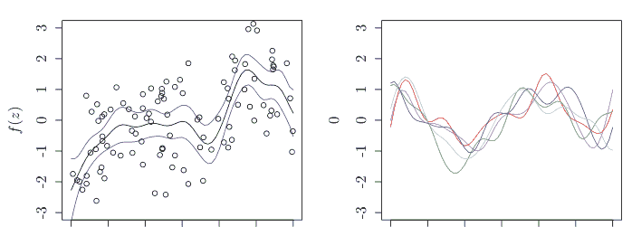

图 6.1 我们展示了平均值上下 3 $\sigma$ 的范围（左图）以及五次执行不同样本的结果（右图）

通过将 $m_X = m(x) = 0$ 代入高斯过程（6.3）的平均值公式，我们得到方程

$k_{x,X}\hat{\alpha} = k_{xX}(K + \lambda I)^{-1}Y$

该方程是通过将核岭回归公式（4.6）左乘 $k_{x,X}$ 得到的。我们观察到，当设置 $\lambda = \sigma^2$ 时，前者是后者的一个特例。

### 6.2 分类

接下来我们考虑分类问题。我们假设随机变量 $Y$ 取值 $Y = \pm 1$，并且给定 $x \in E$ 的条件概率为

$P(Y = 1|x) = \frac{1}{1 + \exp(-f(x))}$，(6.5)

其中使用了高斯过程 $f : \Omega \times E \rightarrow \mathbb{R}$。我们希望从实际的 $x_1, \dots, x_N \in \mathbb{R}^p$（行向量）和 $y_1, \dots, y_N \in \{-1, 1\}$ 中估计 $f$。为了最大化似然，我们最小化负对数似然

$\sum_{i=1}^N \log[1 + \exp\{-y_i f(x_i)\}]$。

如果我们设 $f_X = [f_1, \dots, f_N]^\top = [f(x_1), \dots, f(x_N)]^\top \in \mathbb{R}^N$，$v_i := e^{-y_i f_i}$，以及 $l(f_X) := \sum_{i=1}^N \log(1 + v_i)$，那么我们有

$$\frac{\partial v_i}{\partial f_i} = -y_i v_i \ , \quad \frac{\partial l(f_X)}{\partial f_i} = -\frac{y_i v_i}{1 + v_i} \ , \quad \frac{\partial^2 l(f_X)}{\partial f_i^2} = \frac{v_i}{(1 + v_i)^2} \ ,$$

其中我们使用了 $y_i^2 = 1$。给定一个初始值，我们等待牛顿-拉弗森更新 $f_X \leftarrow f_X - (\nabla^2 l(f_X))^{-1} \nabla l(f_X)$ 收敛。更新公式为

$$f_X \leftarrow f_X + W^{-1} u \ ,$$

其中 $u = \left( \frac{y_i v_i}{1 + v_i} \right)_{i=1,\dots,N}$ 且 $W = \text{diag} \left( \frac{v_i}{(1 + v_i)^2} \right)_{i=1,\dots,N}$。换句话说，我们重复以下两个步骤：

- 1. 从 $f_X$ 计算 $v$、$u$ 和 $W$。
- 2. 计算 $f_X + W^{-1} u$ 并将其代入 $f_X$

其中 $v := [v_1, \dots, v_N]^\top \in \mathbb{R}^N$。

接下来，我们考虑最大化似然 $\prod_{i=1}^N \frac{1}{1 + \exp\{-y_i f(x_i)\}}$ 乘以 $f_X$ 的先验分布，即寻找具有最大后验概率的解。这里，在（6.5）的公式中，均值通常设为 0 作为 $f$ 的先验概率。首先假设 $f_X \in \mathbb{R}^N$ 的先验概率为

$$\frac{1}{\sqrt{(2\pi)^N \det k_{XX}}} \exp\left\{-\frac{f_X^\top k_{XX}^{-1} f_X}{2}\right\} \ ,$$

其中 $k_{XX}$ 是格拉姆矩阵 $(k(x_i, x_j))_{i,j=1,\dots,N}$。如果我们设

$$L(f_X) = l(f_X) + \frac{1}{2} f_X^\top k_{XX}^{-1} f_X + \frac{1}{2} \log \det k_{XX} + \frac{N}{2} \log 2\pi \ , \qquad (6.6)$$

那么我们有

$$\nabla L(f_X) = \nabla l(f_X) + k_{XX}^{-1} f_X = -u + k_{XX}^{-1} f_X \qquad (6.7)$$

以及

$$\nabla^2 L(f_X) = \nabla^2 l(f_X) + k_{XX}^{-1} = W + k_{XX}^{-1} \ . \qquad (6.8)$$

因此，我们可以将更新公式表示为

$$\begin{aligned} f_X &\leftarrow f_X + (W + k_{XX}^{-1})^{-1} (u - k_{XX}^{-1} f_X) \\ &= (W + k_{XX}^{-1})^{-1} \{(W + k_{XX}^{-1}) f_X - k_{XX}^{-1} f_X + u\} \\ &= (W + k_{XX}^{-1})^{-1} (W f_X + u) \ . \end{aligned}$$

然而，由于 $f_X$ 的大小是样本数量 $N$，计算逆矩阵需要大量时间。我们尝试通过以下方式提高此过程的效率。利用伍德伯里-谢尔曼-莫里森公式

$(A + UWV^\top)^{-1} = A^{-1} - A^{-1}U(W^{-1} + V^\top A^{-1}U)^{-1}V^\top A^{-1}$ (6.9)

其中 $A \in \mathbb{R}^{n \times n}$（非奇异），$W \in \mathbb{R}^{m \times m}$，以及 $U, V \in \mathbb{R}^{n \times m}$，如果我们设 $A = k_{XX}^{-1}$ 且 $U = V = I$，我们得到

$(W + k_{XX}^{-1})^{-1}$
$= k_{XX} - k_{XX}(W^{-1} + k_{XX})^{-1}k_{XX}$
$= k_{XX} - k_{XX}W^{1/2}(I + W^{1/2}k_{XX}W^{1/2})^{-1}W^{1/2}k_{XX}$ 。(6.10)

因此，我们可以在 $O(N^3/3)$ 时间内获得一个 $L$，使得 $I + W^{1/2}k_{XX}W^{1/2} = LL^\top$（乔列斯基分解）。令 $\gamma := Wf_X + u$，我们在 $O(N^2)$ 时间内找到一个 $\beta$ 使得 $L\beta = W^{1/2}k_{XX}\gamma$，以及一个 $\alpha$ 使得 $L^\top W^{-1/2}\alpha = \beta$，然后将 $k_{XX}(\gamma - \alpha)$ 代入 $f_X$。我们重复此过程直到收敛。事实上，我们有以下等式：

$LL^\top W^{-1/2}\alpha = L\beta = W^{1/2}k_{XX}\gamma$

$k_{XX}(\gamma - \alpha)$
$= k_{XX}\{\gamma - W^{1/2}(LL^\top)^{-1}W^{1/2}k_{XX}\gamma\} = \{k_{XX} - k_{XX}W^{1/2}(LL^\top)^{-1}W^{1/2}k_{XX}\}\gamma$
$= \{k_{XX} - k_{XX}W^{1/2}(I + W^{1/2}k_{XX}W^{1/2})^{-1}W^{1/2}k_{XX}\}\gamma = (W + k_{XX}^{-1})^{-1}(Wf + u)$ ,

其中最后一个等式源于 (6.10)。

**示例 86** 通过使用 150 个鸢尾花数据中的前 $N = 100$ 个（前 50 个点和接下来的 50 个点分别是山鸢尾和变色鸢尾数据），我们找到了具有最大后验概率的 $f_X = [f_1, \dots, f_N]$。输出显示 $f_1, \dots, f_{50}$ 和 $f_{51}, \dots, f_{100}$ 分别为正和负。

```python
from sklearn.datasets import load_iris
df = load_iris()                ## Iris Data
x = df.data[0:100, 0:4]
y = np.array([1]*50 + [-1]*50)
n = len(y)
## Compute Kernel values for the four covariates
def k(x, y):
    return np.exp(np.sum(-(x - y)**2) / 2)
K = np.zeros((n, n))
for i in range(n):
    for j in range(n):
        K[i, j] = k(x[i, :], x[j, :])
eps = 0.00001
f = [0] * n
g = [0.1] * n

while np.sum((np.array(f)-np.array(g))**2) > eps:
    i = i + 1
    g = f                       ## Save the data before update for comparison
    f = np.array(f)
    y = np.array(y)
    v = np.exp(-y*f)
    u = y * v / (1 + v)
    w = (v / (1 + v)**2)
    W = np.diag(w)
    W_p = np.diag(w**0.5)
    W_m = np.diag(w**(-0.5))
    L = np.linalg.cholesky(np.identity(n)+np.dot(np.dot(W_p, K), W_p))
    gamma = W.dot(f) + u
    beta = np.linalg.solve(L, np.dot(np.dot(W_p, K), gamma))
    alpha = np.linalg.solve(np.dot(L.T, W_m), beta)
    f = np.dot(K, (gamma-alpha))
    print(list(f))
```

[2.9017597728506903, 2.6661877410648125, 2.735999714975541, 2.5962146616446793, 2.8888259653434902, 2.4229904289075734, 2.7128370653298717, 2.8965829899125057, 2.263839959450692, 2.722794155018708, 2.675786822066557, 2.80427691289934, 2.629916582197861, 2.129058875598969, 1.9947371858903622, 1.7255773341842824, 2.502403800007298, 2.894767948521167, 2.211715451090947, 2.7578887454424845, 2.5807025000167654, 2.7884335002993703, 2.4501472162360978, 2.598252566107158, 2.49363291477457, 2.5892721299617927, 2.7995603132602014, 2.854337885531593, 2.8580336326051525, 2.682198311711416, 2.6631803480277263, 2.6529515170091735, 2.409809417765029, 2.1570288906747956, 2.738196179682446, 2.777507355522734, 2.6054932709605585, 2.8486244905053546, 2.342636360704147, 2.8826825981318938, 2.887406385036485, 1.561916989035174, 2.4541693614670925, 2.64939855108404, 2.4071165717812315, 2.633906076076528, 2.7271240196093944, 2.673216290902857, 2.749570997237667, 2.884288422112919, -1.870441763888594, -2.5373817133813237, -1.9327372577182746, -2.5318858849974895, -2.579366785986732, -2.7850146869568233, -2.381782737110541, -1.4675208896283152, -2.48651854962823, -2.356973904782517, -1.6007721537062138, -2.811323736549777, -2.3813705315823492, -2.734406212419866, -2.3307697118699044, -2.3416642385980246, -2.6148174861101388, -2.748088114594368, -2.3729716167430452, -2.6288003128782993, -2.2519078422840106, -2.7892659188354783, -2.3456928166252453, -2.7042381425156226, -2.712488583609864, -2.502955837329986, -2.1624797840208307, -2.01571028937641, -2.8402609758000015, -2.19474914254942, -2.474090451450695, -2.3426425865837377, -2.755051287500358, -2.1890836679248933, -2.415174453933202, -2.3822860688193157, -2.275106022961632, -2.4967546817420585, -2.6958800533399927, -2.6643571619340682, -2.64863153643803, -2.7718459450746087, -2.8075095809378467, -1.5468264491591686, -2.81472767183598, -2.756340788852421, -2.8346439145882236, -2.8498009687645762, -1.1822836980388691, -2.8458627499007214]

要使用估计的 $\hat{f} \in \mathbb{R}^N$ 对新值 $x$ 执行分类，我们执行以下步骤。类似于回归情况，如果我们将命题 61 应用于

$$\begin{bmatrix} f_X \\ f(x) \end{bmatrix} \sim N\left(\begin{bmatrix} 0 \\ 0 \end{bmatrix}, \begin{bmatrix} k_{XX} & k_{Xx} \\ k_{xX} & k_{xx} \end{bmatrix}\right),$$

那么我们得到

$$f(x)|f_X \sim N(m'(x), k'(x, x)), \quad (6.11)$$

其中

$$m'(x) = k_{xX}k_{XX}^{-1}f_X$$

以及

$$k'(x, x) = k_{xx} - k_{xX}k_{XX}^{-1}k_{Xx}.$$

如果我们观测到 $Y \in \{-1, 1\}^N$，我们通过牛顿-拉夫森方法获得估计值 $\hat{f}$ 并计算 $\hat{W}$。我们考虑 $f_X|Y$ 的拉普拉斯近似，即，我们如下近似高斯分布（Rasmussen-Williams [25]）：

$$f_X|Y \sim N(\hat{f}, (\hat{W} + k_{XX}^{-1})^{-1}).$$

也就是说，协方差矩阵是 $\hat{W} + k_{XX}^{-1}$ 的逆，即 (6.8) 的海森矩阵 $\nabla^2 L(\hat{f})$。那么，(6.11)、(6.12) 中的变分是独立的，并且 $f(x|Y) = N(m_*, k_*)$。注意我们可以计算每个 $x \in E$ 的后验概率：

$$m_* = k_{xX} k_{XX}^{-1} \hat{f}$$

$$k_* = k_{xx} - k_{xX} k_{XX}^{-1} k_{Xx} + k_{xX} k_{XX}^{-1} (\hat{W} + k_{XX}^{-1})^{-1} k_{XX}^{-1} k_{Xx}$$
$$= k_{xx} - k_{xX} (\hat{W}^{-1} + k_{XX})^{-1} k_{Xx},$$

其中最后一个变换源于 (6.9) 中的 $A = k_{XX}$ 和 $W = \hat{W}^{-1}$，且 $U, V$ 是单位矩阵。因此，我们可以计算关于 $f(x)|Y \sim N(m_*, k_*)$ 在 sigmoid 函数中的期望（预测值）

$$P(Y = 1|x) = \frac{1}{1 + \exp(-f(x))}$$

$$\int_E \frac{1}{1 + \exp(-z)} \frac{1}{\sqrt{2\pi k_*}} \exp[-\frac{1}{2k_*} \{z - m_*\}^2] dz.$$

要实现这一步，我们只需要从 $\hat{f}$ 计算 $\hat{u}$。由于当更新收敛时 (6.7) 为零，从 (6.13) 我们有

$$m_* = k_{xX} \hat{u}$$

以及

$$(k_{XX} + W^{-1})^{-1} = W^{1/2} W^{-1/2} (k_{XX} + W^{-1})^{-1} W^{-1/2} W^{1/2}$$
$$= W^{1/2} (I + W^{1/2} k_{XX} W^{1/2})^{-1} W^{1/2}.$$

因此，我们计算 $\alpha \in \mathbb{R}^N$，使得 $I + \hat{W}^{1/2} k_{XX} \hat{W}^{1/2} = LL^\top$（Cholesky 分解）且 $L\alpha = \hat{W}^{1/2} k_{Xx}$，耗时 $O(N^3/3)$。那么，我们有

$$k_* = k_{xx} - \alpha^\top \alpha$$

因为我们有

$$k_{xX} W^{1/2} (LL^\top)^{-1} W^{1/2} k_{Xx} = k_{xX} W^{1/2} (L^{-1})^\top L^{-1} W^{1/2} k_{Xx} = \alpha^\top \alpha.$$

我们可以用 Python 描述寻找 (6.14) 值的过程如下。我们假设该过程在示例 86 的过程完成后立即开始。

```python
def pred(z):
    kk = np.zeros(n)
    for i in range(n):
        kk[i] = k(z, x[i, :])
    mu = np.sum(kk * u)        # Mean
    alpha = np.linalg.solve(L, np.dot(W_p, kk))
    sigma2 = k(z, z) - np.sum(alpha**2)  # Variance
    m = 1000
    b = np.random.normal(mu, sigma2, size = m)
    pi = np.sum((1 + np.exp(-b))**(-1)) / m  # Prediction
    return pi
```

**示例 87** 在处理完示例 86 后，我们立即将鸢尾花四个协变量的数值输入函数 pred，并计算它们为 Setosa 值的概率（1 减去它们为 Versicolor 值的概率）。当我们输入 Setosa 和 Versicolor 协变量的平均值时，我们观察到概率分别接近 1 和 0。

```python
z = np.zeros(4)
for j in range(4):
    z[j] = np.mean(x[:50, j])
pred(z)
```

0.9466371383148896

```python
for j in range(4):
    z[j] = np.mean(x[50:100, j])
pred(z)
```

0.05301765489687672

### 6.3 使用诱导变量的高斯过程

高斯过程通常涉及 $O(N^3)$ 的计算。为了避免这种不便，我们选择 $Z := [z_1, \cdots, z_M] \in E^M$ 并近似生成过程

$$f_X \sim N(m_X, k_{XX})$$

$$f(x)|f_X \sim N(m(x) + k_{xX}k_{XX}^{-1}(f_X - m_X), k(x, x) - k_{xX}k_{XX}^{-1}k_{Xx})$$

$$y|f(x) \sim N(f(x), \sigma^2)$$

为

$$f_Z \sim N(m_Z, k_{ZZ})$$

(6.15)

$$f(x)|f_Z \sim N(m(x) + k_{xZ}k_{ZZ}^{-1}(f_Z - m_Z), k(x, x) - k_{xZ}k_{ZZ}^{-1}k_{Zx})$$

(6.16)

$$y|f(x) \sim N(f(x), \sigma^2)$$

(6.17)

其中 $m_Z = (m(z_1), \cdots, m(z_M))$，$k_{ZZ} = (k(z_i, z_j))_{i,j=1,\cdots,M}$，且 $k_{xZ} = [k(x, z_1), \cdots, k(x, z_M)]$（行向量）。

在以下假设下，我们得到命题 63。

**假设 1** 对于 $x = x_1, \cdots, x_N$，(6.16) 的每次出现都是独立的。

**命题 63** 令 $\Lambda \in \mathbb{R}^{N \times N}$ 是一个对角矩阵，其元素为 $\lambda(x_i)$，$i = 1, \cdots, N$。在 (6.15)、(6.16)、(6.17) 概述的生成过程和假设 1 下，我们有

$$f_Z|Y \sim N(\mu_{f_Z|Y}, \Sigma_{f_Z|Y})$$

$$\mu_{f_Z|Y} = m_Z + k_{ZZ}Q^{-1}k_{ZX}(\Lambda + \sigma^2 I_N)^{-1}(Y - m_X)$$

(6.18)

以及

$$\Sigma_{f_Z|Y} = k_{ZZ}Q^{-1}k_{ZZ}$$

(6.19)

其中

$$Q := k_{ZZ} + k_{ZX}(\Lambda + \sigma^2 I_N)^{-1}k_{XZ} \in \mathbb{R}^{M \times M}$$

(6.20)

且 $\lambda(x) := k(x, x) - k_{xZ}k_{ZZ}^{-1}k_{Zx}$。

证明：由 (6.16) 和假设 1，

$$f_X|f_Z \sim N(m_X + k_{XZ}k_{ZZ}^{-1}(f_Z - m_Z), \Lambda)$$

对于 $f_X := [f(x_1), \cdots, f(x_N)]$。此外，$Y$ 和 $f_X$ 的期望相等，只有方差 $\sigma^2$ 不同，所以我们有

$$Y|f_Z \sim N(m_X + k_{XZ}k_{ZZ}^{-1}(f_Z - m_Z), \Lambda + \sigma^2 I_N)$$

因此，$f_Z, Y$ 的联合分布是

（$p(f_Z)$ 和 $p(Y|f_Z)$ 的指数部分）

$$= -\frac{1}{2}(f_Z - m_Z)^\top k_{ZZ}^{-1}(f_Z - m_Z)$$

$$-\frac{1}{2}\{Y - (m_X + k_{XZ}k_{ZZ}^{-1}(f_Z - m_Z))\}^\top(\Lambda + \sigma^2 I_N)^{-1}$$

$$\{Y - (m_X + k_{ZX}k_{ZZ}^{-1}(f_Z - m_Z))\}$$

如果我们对 (6.21) 关于 $f_Z$ 求导，令 $a = f_Z - m_Z$ 和 $b = Y - m_X$，得到

$$-k_{ZZ}^{-1}a + k_{ZZ}^{-1}k_{ZX}(\Lambda + \sigma^2 I_N)^{-1}(b - k_{ZX}k_{ZZ}^{-1}a)$$
$$= k_{ZZ}^{-1}k_{ZX}(\Lambda + \sigma^2 I_N)^{-1}b - k_{ZZ}^{-1}\{k_{ZZ} + k_{ZX}(\Lambda + \sigma^2 I_N)^{-1}k_{XZ}\}k_{ZZ}^{-1}a$$
$$= k_{ZZ}^{-1}k_{ZX}(\Lambda + \sigma^2 I_N)^{-1}b - k_{ZZ}^{-1}Qk_{ZZ}^{-1}a$$
$$= k_{ZZ}^{-1}Qk_{ZZ}^{-1}\{k_{ZZ}Q^{-1}k_{ZX}(\Lambda + \sigma^2 I_N)^{-1}b - a\}$$
$$= -\Sigma_{f_Z|Y}^{-1}(f_Z - \mu_{f_Z|Y})$$

因此，(6.21) 中关于 $f_Z$ 的项仅为

$$-\frac{1}{2}(f_Z - \mu_{f_Z|Y})^\top \Sigma_{f_Z|Y}^{-1}(f_Z - \mu_{f_Z|Y})$$

我们得到该命题。$\square$

**命题 64** 在 (6.15)、(6.16)、(6.17) 概述的生成过程和假设 1 下，我们有

$$Y \sim N(\mu_Y, \Sigma_Y)$$

其中

$$\mu_Y := m_X$$

以及

$$\Sigma_Y := \Lambda + \sigma^2 I_N + k_{XZ}k_{ZZ}^{-1}k_{XZ}$$

证明：由于 $Y$ 的期望 $\mu_Y$ 是 $m_X$，我们得到协方差矩阵 $\Sigma_Y$。令 $a := f_Z - m_Z$ 和 $b := Y - m_X$。那么，$p(Y, f_Z)$ 和 $p(f_Z|Y)$ 的指数部分 (6.21) 和 (6.23) 分别是

$$-\frac{1}{2}a^\top k_{ZZ}^{-1}a - \frac{1}{2}(b - k_{ZX}k_{ZZ}^{-1}a)^\top(\Lambda + \sigma^2 I)^{-1}(b - k_{ZX}k_{ZZ}^{-1}a)$$

以及

$$-\frac{1}{2}(a - k_{ZZ}Q^{-1}k_{ZX}(\Lambda + \sigma^2 I_N)^{-1}b)^\top(k_{ZZ}Q^{-1}k_{ZZ})^{-1}(a - k_{ZZ}Q^{-1}k_{ZX}(\Lambda + \sigma^2 I_N)^{-1}b)$$

由 (6.20)，我们有

$$-\frac{1}{2}a^\top k_{ZZ}^{-1}a - \frac{1}{2}(k_{ZX}k_{ZZ}^{-1}a)^\top(\Lambda + \sigma^2 I)^{-1}k_{ZX}k_{ZZ}^{-1}a = -\frac{1}{2}a^\top k_{ZZ}^{-1}Qk_{ZZ}^{-1}a$$

由 $p(Y, f_Z) = p(f_Z|Y)p(Y)$，(6.26) 和 (6.27) 的差是 $p(Y)$ 的指数部分，即

$$-\frac{1}{2}b^\top(\Lambda + \sigma^2 I)^{-1}b + \frac{1}{2}b^\top(\Lambda + \sigma^2 I_N)^{-1}k_{XZ}Q^{-1}k_{ZX}(\Lambda + \sigma^2 I_N)^{-1}b$$

其中我们可以设 $a = 0$，因为关于 $a$ 的项将不会保留。此外，如果我们在 Woodbury-Sherman-Morrison 公式 (6.9) 中设 $A = \Lambda + \sigma^2 I_N$，$U = k_{XZ}$，$V = k_{ZX}$，且 $W = k_{ZZ}^{-1}$，那么我们有

$$-\frac{1}{2}b^\top(\Lambda + \sigma^2 I_N + k_{XZ}k_{ZZ}^{-1}k_{XZ})^{-1}b$$

并得到 (6.25)。

**命题 65** 在 (6.15)、(6.16)、(6.17) 概述的生成过程和假设 1 下，对于每个 $x \in E$，我们有

$$f(x)|Y \sim N(\mu(x), \sigma^2(x))$$

$$\mu(x) := m(x) + k_{xZ}k_{ZZ}^{-1}(\mu_{f_Z|Y} - m_Z) = m(x) + k_{xZ}Q^{-1}k_{ZX}(\Lambda + \sigma^2 I_N)^{-1}(Y - m_X)$$

(6.28)

$$\sigma^2(x) := k(x, x) - k_{xZ}(K_{ZZ}^{-1} - Q^{-1})k_{Zx}$$

证明：首先，我们注意到 $Y \to f_Z \to f(x)$ 按此顺序形成一个马尔可夫链。在下文中，我们考虑 $f(x)|Y$ 的分布而不是 $f(x)|f_Z$，即 $f(x)|f_Z$ 和 $f_Z|Y$ 的分布。在 (6.16) 中，均值为 $k_{xZ}k_{ZZ}^{-1}(f_Z - m_Z)$ 的项在对 $f_Z|Y$ 取平均时变为 $k_{xZ}k_{ZZ}^{-1}(\mu_{f_Z|Y} - m_Z)$。因此，我们得到 (6.28)。此外，如果我们取该项关于 $f_Z|Y$ 的方差，我们得到与 $k_{xZ}k_{ZZ}^{-1}(f_Z - \mu_{f_Z|Y})$ 的方差相同的值，所以我们有

$$\mathbb{E}[k_{xZ}k_{ZZ}^{-1}(f_Z - \mu_{f_Z|Y})(f_Z - \mu_{f_Z|Y})^\top k_{ZZ}^{-1}k_{Zx}] = k_{xZ}k_{ZZ}^{-1}\Sigma_{f_Z|Y}k_{ZZ}^{-1}k_{Zx} = k_{xZ}Q^{-1}k_{Zx}$$

(6.29)

其中 $f_Z$ 随给定的 $Y$ 变化。此外，由 (6.16)，由于 $f(x)|f_Z$ 的方差 $\lambda(x) = k(x, x) - k_{xZ}k_{ZZ}^{-1}k_{Zx}$ 独立于 $f_Z$，我们可以将 $f(x)|Y$ 的方差写为 $f(x)|f_Z$ 的方差 $\lambda(x)$ 和 (6.29) 的和。换句话说，我们有 $\sigma^2(x) = \lambda(x) + k_{xZ}Q^{-1}k_{Zx}$。

在使用诱导变量方法的情况下，$k_{ZZ}$、$k_{xZ}$ 的计算分别需要 $O(M^2)$ 和 $O(M)$，$\Lambda$ 的计算需要 $O(N)$，$Q$ 和 $Q^{-1}$ 的计算分别需要 $O(NM^2)$ 和 $O(M^3)$。乘法过程也在 $O(NM^2)$ 内完成。另一方面，不使用诱导变量方法时，计算时间需要 $O(N^3)$。在诱导变量方法中，我们不使用矩阵 $K_{XX} \in \mathbb{R}^{N \times N}$。

我们可以从 $x_1, \cdots, x_N$ 中随机选择诱导点 $z_1, \cdots, z_M$，或者通过 K-means 聚类选择。

**示例 88** 基于上述讨论，我们使用诱导变量方法构建了函数 gp_ind，并将其性能与不使用诱导变量方法的 gp_1 进行了比较。

### 6.3 带诱导变量的高斯过程

```python
sigma_2 = 0.05 # should be estimated
def k(x, y): # Covariance function
    return np.exp(-(x - y)**2 / 2 / sigma_2)
def mu(x): # Mean function
    return x
# Data Generation
n = 200
x = np.random.uniform(size = n) * 6 - 3
y = np.sin(x / 2) + np.random.randn(n)
eps = 10**(-6)

m = 100
K = np.zeros((n, n))
for i in range(n):
    for j in range(n):
        K[i, j] = k(x[i], x[j])
index = np.random.choice(n, size = m, replace = False)
z = x[index]
m_x = 0
m_z = 0
K_zz = np.zeros((m, m))
for i in range(m):
    for j in range(m):
        K_zz[i, j] = k(z[i], z[j])

K_xz = np.zeros((n, m))
for i in range(n):
    for j in range(m):
        K_xz[i, j] = k(x[i], z[j])
K_zz_inv = np.linalg.inv(K_zz + np.diag([10**eps]*m))
lam = np.zeros(n)
for i in range(n):
    lam[i] = k(x[i], x[i]) - np.dot(np.dot(K_xz[i, 0:m], K_zz_inv), K_xz[i,0:m])
lam_0_inv = np.diag(1/(lam+sigma_2))
Q = K_zz + np.dot(np.dot(K_xz.T, lam_0_inv), K_xz) # Computation of Q does not require O(n^3)
Q_inv = np.linalg.inv(Q + np.diag([eps] * m))
muu = np.dot(np.dot(np.dot(Q_inv, K_xz.T), lam_0_inv), y-m_x)
dif = K_zz_inv - Q_inv
R = np.linalg.inv(K + sigma_2 * np.identity(n)) # O(n^3) computation is required

def gp_ind(x_pred): ## Inducing Variable Method
    h = np.zeros(m)
    for i in range(m):
        h[i] = k(x_pred, z[i])
    mm = mu(x_pred) + h.dot(muu)
    ss = k(x_pred, x_pred) - h.dot(dif).dot(h)
    return {"mm": mm, "ss": ss}

def gp_l(x_pred): ## W/O Inducing Variable Method
    h = np.zeros(n)
    for i in range(n):
        h[i] = k(x_pred, x[i])
    mm = mu(x_pred) + np.dot(np.dot(h.T, R), y-mu(x))
    ss = k(x_pred, x_pred) - np.dot(np.dot(h.T, R), h)
    return {"mm": mm, "ss": ss}

x_seq = np.arange(-2, 2.1, 0.1)
mmv = []; ssv = []
for u in x_seq:
    mmv.append(gp_ind(u)["mm"])
    ssv.append(gp_ind(u)["ss"])

plt.figure()
plt.plot(x_seq, mmv, c = "r")
plt.plot(x_seq, np.array(mmv) + 3 * np.sqrt(np.array(ssv)),
         c = "r", linestyle = "--")
plt.plot(x_seq, np.array(mmv) - 3 * np.sqrt(np.array(ssv)),
         c = "r", linestyle = "--")
plt.xlim(-2, 2)
plt.plot(np.min(mmv), np.max(mmv))

x_seq = np.arange(-2, 2.1, 0.1)
mmv = []; ssv =[]
for u in x_seq:
    mmv.append(gp_l(u)["mm"])
    ssv.append(gp_l(u)["ss"])

mmv = np.array(mmv)
ssv = np.array(ssv)

plt.plot(x_seq, mmv, c = "b")
plt.plot(x_seq, mmv + 3 * np.sqrt(ssv), c = "b", linestyle = "--")
plt.plot(x_seq, mmv - 3 * np.sqrt(ssv), c = "b", linestyle = "--")
plt.scatter(x, y, facecolors='none', edgecolors = "k", marker = "o")
```

### 6.4 Karhunen-Lóève 展开

在本节中，我们继续研究概率空间 $(\Omega, \mathcal{F}, P)$ 和映射 $f : \Omega \times E \ni (\omega, x) \to f(\omega, x) \in H$。我们假设 $H$ 是一个一般的可分希尔伯特空间。在下文中，对于每个 $x \in E$，我们继续将 $f(\omega, x)$ 记为随机变量 $f(x)$。特别地，我们假设 $f$ 是一个均方连续过程（图 6.2），其定义为

$$\lim_{n \to \infty} \mathbb{E}|f(\omega, x_n) - f(\omega, x)|^2 = 0 \qquad (6.30)$$

其中 $\{x_n\}$ 是 $E$ 中任意收敛到 $x \in E$ 的序列。我们不假设高斯过程，并给出 $x \in E$ 处的期望和 $x, y \in E$ 处的协方差为

$$m(x) = \mathbb{E}f(\omega, x)$$

以及

$$k(x, y) = \text{Cov}(f(\omega, x), f(\omega, y)) .$$

在第 5 章中，我们得到了 $k(X, \cdot)$ 的期望和协方差；然而在本节中，$x, y \in E$ 不是随机的，$m, k$ 的随机性源于 $f(\omega, \cdot)$ 的随机性。

在下文中，我们假设 $E$ 是紧致的。

图 6.2 红色和蓝色曲线分别显示了通过诱导变量和标准高斯过程获得的结果

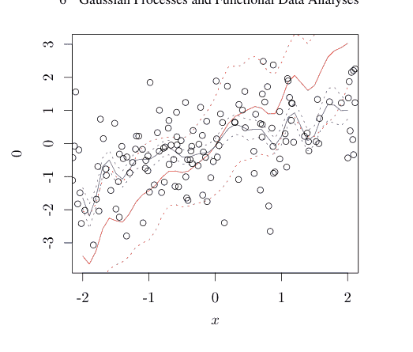

**命题 66** $f$ 是一个均方连续过程当且仅当 $m$ 和 $k$ 是连续的。

证明：见本章末尾的附录。

在下文中，为简化讨论，我们假设 $m \equiv 0$。由于 $E$ 是紧致的，我们假设每个 $E_i$ 的直径小于或等于 $1/n$。然而，每个 $E_i$ 是一个度量空间，我们通过 $E_i$ 中元素之间的最大距离来定义直径。因此，存在 $E$ 的一个划分（$\cup_{i=1}^{M(n)} E_i = E$, $E_i \cap E_j = \phi, i \neq j$）和划分数量 $M(n)$。然后，我们定义

$$I_f(g; \{(E_i, x_i)\}_{1 \le i \le M(n)}) := \sum_{i=1}^{M(n)} f(\omega, x_i) \int_{E_i} g(y) d\mu(y)$$

其中 $\{(E_i, x_i)\}_{1 \le i \le M(n)}$ 是一组内点对，且 $g \in L^2(E, \mathcal{B}(E), \mu)$。因此，我们有

$$\int_{\Omega} \{I_f(g; \{(E_i, x_i)\}_{1 \le i \le M(n)})\}^2 dP(\omega) \le M(n) \sum_{i=1}^{M(n)} \int_{\Omega} \{f(\omega, x_i)\}^2 \{\int_{E_i} g(u) d\mu(u)\}^2$$
$$dP = M(n) \sum_{i=1}^{M(n)} k(x_i, x_i) \int_{E_i} \{g(u)\}^2 d\mu(u) < \infty$$

并且 $I_f(g; \{(E_i, x_i)\}_{1 \le i \le M(n)}) \in L^2(\Omega, \mathcal{F}, P)$。尽管这个值取决于区域分解和区域内点的选择，但 $I_f$ 的差异随着 $n$ 趋于无穷大而收敛到零。事实上，我们有

$\mathbb{E}[|I_f(g; \{(E_i, x_i)\}_{1 \le i \le M(n)}) - I_f(g; \{(E'_j, x'_j)\}_{1 \le j \le M(n')})|^2]$
$= \sum_{i=1}^{M(n)} \sum_{i'=1}^{M(n)} k(x_i, x_{i'}) \int_{E_i} g(u) d\mu(u) \int_{E_{i'}} g(v) d\mu(v)$
$+ \sum_{j=1}^{M(n')} \sum_{j'=1}^{M(n')} k(x_j, x_{j'}) \int_{E_j} g(u) d\mu(u) \int_{E_{j'}} g(v) d\mu(v)$
$- 2 \sum_{i=1}^{M(n)} \sum_{j=1}^{M(n')} k(x_i, x_{j'}) \int_{E_i} g(u) d\mu(u) \int_{E_{j'}} g(v) d\mu(v) .$

由于 $k$ 是一致连续的，右边的每个双重求和都收敛到

$\int_E \int_E k(u, v) g(u) g(v) d\mu(u) d\mu(v) .$

由于柯西序列收敛到零，无论 $\{(E_i, x_i)\}_{1 \le i \le M(n)}$ 如何选择，其收敛目标 $I_f(\omega, g)$ 都包含在 $L^2(\omega, \mathcal{F}, P)$ 中。

如果从积分算子 $T_k \in \mathcal{B}(L^2(E, \mathcal{B}(E), \mu))$ 获得的特征值和特征函数，

$T_k g(\cdot) = \int_E k(y, \cdot) g(y) d\mu(y) , \quad g \in L^2(E, \mathcal{B}(E), \mu),$

是 $\{\lambda_j\}_{j=1}^\infty$ 和 $\{e_j(\cdot)\}_{j=1}^\infty$，根据 Mercer 定理，我们可以将协方差函数 $k$ 表示为

$k(x, y) = \sum_{j=1}^\infty \lambda_j e_j(x) e_j(y) , \qquad (6.31)$

其中求和在该支撑集上绝对且一致收敛。

那么，我们有以下主张。

**命题 67** 如果 $\{f(\omega, x)\}_{x \in E}$ 是一个均值为零的均方连续过程，我们有

1. $\mathbb{E}[I_f(\omega, g)] = 0$。
2. $\mathbb{E}[I_f(\omega, g) f(\omega, x)] = \int_E k(x, y) g(y) d\mu(y), x \in E$。
3. $\mathbb{E}[I_f(\omega, g) I_f(\omega, h)] = \int_E \int_E k(x, y) g(x) h(y) d\mu(x) d\mu(y)$。

这些性质对每个 $g, h \in L^2(E, \mathcal{F}, \mu)$ 都成立，特别地，我们有

$\mathbb{E}[I_f(\omega, e_i) I_f(\omega, e_j)] = \delta_{i,j} \lambda_i . \qquad (6.32)$

证明：关于上述三项的证明，请参见本章末尾的附录。我们通过将 Mercer 定理 (6.31)、$g = e_i$ 和 $h = e_j$ 代入第三项得到 (6.32)：

$$\mathbb{E}[I_f(\omega, e_i)I_f(\omega, e_j)] = \int_E \int_E \sum_{r=1}^\infty \lambda_r e_r(x)e_r(y)e_i(x)e_j(y)d\mu(x)d\mu(y).$$

此外，我们有以下定理。

**命题 68** (Karhunen-Lóeve [17, 18]) 假设 $\{f(\omega, x)\}_{x \in E}$ 是一个均值为零的均方连续过程。那么，对于 $f_n(\omega, x) := \sum_{j=1}^n I_f(\omega, e_j)e_j(x)$，我们有

$$\lim_{n \to \infty} \sup_{x \in E} \mathbb{E}|f(\omega, x) - f_n(\omega, x)|^2 = 0$$

证明：由 (6.32)，我们有

$$\mathbb{E}[f_n(\omega, x)^2] = \mathbb{E}[\{\sum_{j=1}^n I_f(\omega, e_j)e_j(x)\}^2]$$
$$= \sum_{i=1}^n \sum_{j=1}^n \mathbb{E}[I_f(\omega, e_i)I_f(\omega, e_j)]e_i(x)e_j(x) = \sum_{j=1}^n \lambda_j e_j^2(x).$$

此外，由 (6.31) 和命题 67 的第二项，我们有

$$\mathbb{E}[f_n(\omega, x)f(\omega, x)] = \mathbb{E}[\sum_{j=1}^n I_f(\omega, e_j)e_j(x)f(\omega, x)] = \sum_{j=1}^n e_j(x) \int_E k(x, y)e_j(y)d\mu(y)$$
$$= \sum_{j=1}^n \lambda_j e_j^2(x) \int_E e_j^2(y)d\mu(y) = \sum_{j=1}^n \lambda_j e_j^2(x),$$

这意味着

$$\mathbb{E}|f_n(\omega, x) - f(\omega, x)|^2 = \mathbb{E}[f_n(\omega, x)^2] - 2\mathbb{E}[f_n(\omega, x)f(\omega, x)] + \mathbb{E}[f(\omega, x)^2]$$
$$= \sum_{j=1}^n \lambda_j e_j^2(x) - 2 \sum_{j=1}^n \lambda_j e_j^2(x) + k(x, x) = k(x, x) - \sum_{j=1}^n \lambda_j e_j^2(x).$$

在一般的均方连续过程中（不假设高斯过程），Karhunen-Lóeve 定理提供的级数展开使得 $I_f(\omega, e_j)/\sqrt{\lambda_j}$ 成为一个均值为 0、方差为 1 的随机变量。相反，如果我们假设一个高斯过程，使得 $f(x)$ ($x \in E$) 服从高斯分布，那么我们可以写成

$$f_n(x) = \sum_{j=1}^n z_j \sqrt{\lambda_j} e_j(x), \quad (6.33)$$其中 $z_j$ 服从独立的标准高斯分布。

令 $E := [0, 1]$，$(\Omega, \mathcal{F}, P)$ 为一个概率空间。那么，我们称满足以下条件的映射 $\Omega \times E \ni (\omega, x) \mapsto f(\omega, x) \in \mathbb{R}$ 为布朗运动。

1.  $f(\omega, 0) = 0$，$f(\omega, x) - f(\omega, y) \sim N(0, y - x)$，且 $0 \le x < y$。
2.  对于任意 $n = 1, 2, \dots$ 和 $0 \le x_1 < x_2 < \dots < x_n$，$f(\omega, x_2) - f(\omega, x_1), \dots, f(\omega, x_{n-1}) - f(\omega, x_n)$ 相互独立。
3.  存在一个概率为 1 的 $\Omega \in \mathcal{F}$，且对于每个 $\omega \in \Omega$，$E \ni x \mapsto f(\omega, x)$ 是连续的。

在这种情况下，我们有以下命题。

**命题 69** 映射 $\Omega \times E \ni (\omega, x) \mapsto f(\omega, x) \in \mathbb{R}$ 是布朗运动，当且仅当以下三个条件同时满足。

1.  它是一个高斯过程。
2.  $x, y \in E$ 的协方差函数由 $k(x, y) = \min(x, y)$ 给出。
3.  $f(\omega, \cdot)$ 以概率 1 连续。

证明：定义中的前两个条件蕴含了命题 69 的第一个条件。此外，如果 $x < y$，那么我们有

$\mathbb{E}[f(\omega, x)f(\omega, y)] = \mathbb{E}[f(\omega, x)^2] + \mathbb{E}[f(\omega, x)\{f(\omega, y) - f(\omega, x)\}] = x$，

这蕴含了命题 69 的第二个条件。反之，为简单起见假设 $m \equiv 0$，如果我们假设命题 69 的前两项成立，那么因为 $k(x, x) = x$，当 $x \le y \le z$ 时，我们有

$\mathbb{E}[f(\omega, x)\{f(\omega, y) - f(\omega, z)\}] = k(x, y) - k(x, z) = x - x = 0$

以及

$\mathbb{E}[f(\omega, y)\{f(\omega, y) - f(\omega, z)\}] = k(y, y) - k(y, z) = y - y = 0$，

这意味着

$\mathbb{E}[\{f(\omega, x) - f(\omega, y)\}\{f(\omega, y) - f(\omega, z)\}] = 0$。

此外，由 $k(0, 0) = 0$ 可知，$f(\omega, 0)$ 的方差为零，因此我们有 $f(\omega, 0) = 0$。进一步，我们有

$\mathbb{E}[\{f(\omega, x) - f(\omega, y)\}^2] = k(x, x) - 2k(x, y) + k(y, y) = x - 2x + y = y - x$。

**例 89**（作为高斯过程的布朗运动）对于布朗运动协方差函数 $k(x, y) = \min(x, y)$（$x, y \in E$）的积分算子（例 58），其特征值和特征函数分别为 (3.13) 和 (3.14)。

利用这些特征值和特征函数，我们可以将 $f(\omega, \cdot)$ 展开如下。特别地，由 (6.33)，我们有

$$f_n(x) = \sum_{j=1}^n z_j(\omega)\sqrt{\lambda_j}e_j(x)$$

其中 $z_j \sim N(0, 1)$。我们生成序列 $\{z_i(\omega)\}_{i=1}^n$ $m$ 次（图 6.3；$n = 10$；$m = 7$）。我们使用以下代码执行它。

```python
def lam(j):          ## EigenValue
    return 4 / ((2 * j - 1) * np.pi)**2
def ee(j, x):         ## Definition of Eigenfunction
    return np.sqrt(2) * np.sin((2 * j - 1) * np.pi / 2 * x)

n = 10; m = 7

### Definition of Gaussian Process
def f(z, x):
    n = len(z)
    S = 0
    for i in range(n):
        S = S + z[i] * ee(i, x) * np.sqrt(lam(i))
    return S

plt.figure()
plt.xlim(0, 1)
plt.xlabel("x")
plt.ylabel("f(omega,x)")
colormap = plt.cm.gist_ncar #nipy_spectral, Set1, Paired
colors = [colormap(i) for i in np.linspace(0, 0.8, m)]

for j in range(m):
    z = np.random.randn(n)
    x_seq = np.arange(0, 3.001, 0.001)
    y_seq = []
    for x in x_seq:
        y_seq.append(f(z, x))
    plt.plot(x_seq, y_seq, c = colors[j])

plt.title("Brown_Motion")
```

我们引入 Matérn 类，这是一类在随机过程中使用的核，而非机器学习中的再生核希尔伯特空间（RKHS）。这样的核是 $k(x, y) = \varphi(z)$（$z := x - y$，其中 $x, y \in E$），其中 $\varphi(z)$ 是

$$\varphi(z) := \frac{2^{1-\nu}}{\Gamma(\nu)\left(\frac{\sqrt{2\nu}z}{l}\right)^{\nu}} K_{\nu}\left(\frac{\sqrt{2\nu}z}{l}\right), \quad (6.34)$$

$\nu, l > 0$ 是核的参数，$K_{\nu}$ 是第二类修正贝塞尔函数。

$$K_{\nu}(x) := \frac{\pi}{2} \frac{I_{-\alpha}(x) - I_{\alpha}(x)}{\sin(\alpha x)}$$

### 布朗运动

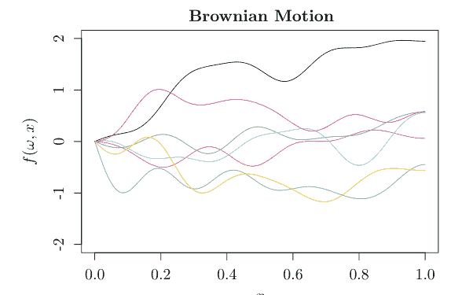

图 6.3 我们生成了七次布朗运动的样本路径。每次运行涉及最多 10 项的求和

$$I_{\alpha}(x) := \sum_{m=0}^{\infty} \frac{1}{m! \Gamma(m+\alpha+1)} \left( \frac{x}{2} \right)^{2m+\alpha}.$$

在实践中，我们使用 (6.34)，其中 $p$ 是正整数且 $\nu = p + 1/2$。在一维情况下，我们有

$$\varphi_{\nu}(z) = \exp\left(-\frac{\sqrt{2\nu} z}{l}\right) \frac{\Gamma(p+1)}{\Gamma(2p+1)} \sum_{i=0}^{p} \frac{(p+i)!}{i!(p-i)!} \left( \frac{\sqrt{8\nu} z}{l} \right)^{p-i} . \quad (6.35)$$

例如，我们将 $\nu = 5/2, 3/2, 1/2$ 表示如下。特别地，我们将 $\nu = 1/2$ 的随机过程称为 Ornstein-Uhlenbeck 过程。

$$\varphi_{5/2}(z) = \left( 1 + \frac{\sqrt{5} z}{l} + \frac{5 z^2}{3 l^2} \right) \exp\left(-\frac{\sqrt{5} z}{l}\right)$$

$$\varphi_{3/2}(z) = \left( 1 + \frac{\sqrt{3} z}{l} \right) \exp\left(-\frac{\sqrt{3} z}{l}\right)$$

$$\varphi_{1/2}(z) = \exp(-z/l).$$

例如，如果我们在 Python 中编写这个过程，我们有以下代码。

### Matern 核 (l=0.1)

### Matern 核 (l = 0.02)

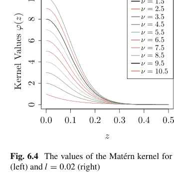

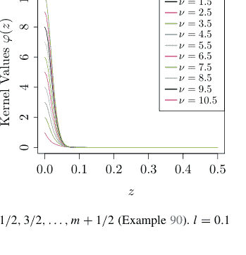

图 6.4 Matérn 核在 $\nu = 1/2, 3/2, \dots, m + 1/2$ 时的值（例 90）。$l = 0.1$（左）和 $l = 0.02$（右）

```python
from scipy.special import gamma

def matern(nu, l, r):
    p = nu - 1 / 2
    S = 0
    for i in range(int(p+1)):
        S = S + gamma(p + i + 1) / gamma(i + 1) / gamma(p - i + 1) \
            * (np.sqrt(8 * nu) * r / l)**(p - i)
    S = S * gamma(p + 2) / gamma(2 * p + 1) * np.exp(-np.sqrt(2 * nu) * r / l)
    return S
```

**例 90** 我们展示了 $l = 0.1, 0.02$ 且 $\nu = 1/2, 3/2, \dots, m + 1/2$ 时的 Matérn 核值（图 6.4）。

```python
m = 10
l = 0.1
colormap = plt.cm.gist_ncar #nipy_spectral, Set1, Paired
color = [colormap(i) for i in np.linspace(0, 1, len(range(m)))]
x = np.linspace(0, 0.5, 200)
plt.plot(x, matern(1 - 1/2, l, x), c = color[0], label = r"$\nu=%d$"%1)
plt.ylim(0, 10)
for i in range(2, m + 1):
    plt.plot(x, matern(i - 1/2, l, x), c = color[i - 1], label = r"$\nu=%d$"%i)

plt.legend(loc = "upper_right", frameon = True, prop={'size':14})
```

对于 Matérn 核以及一般情况，我们无法像涉及高斯核和布朗运动的情况那样解析地获得特征值和特征函数。即使在那些情况下，如果我们假设一个高斯过程，那么我们可以找到 $x_1, \dots, x_n \in E$ 来获得其格拉姆矩阵，该矩阵将是一个协方差矩阵。

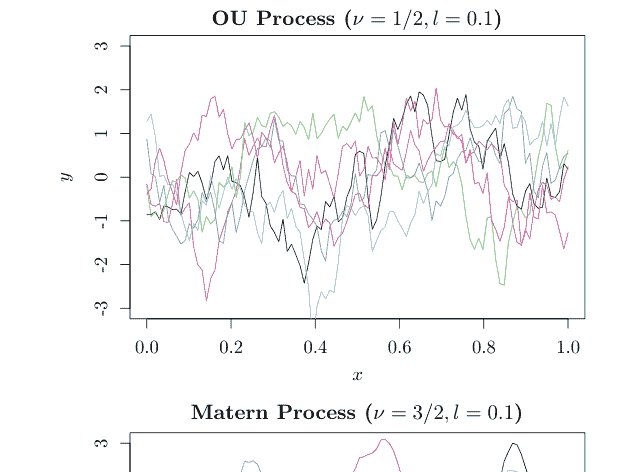

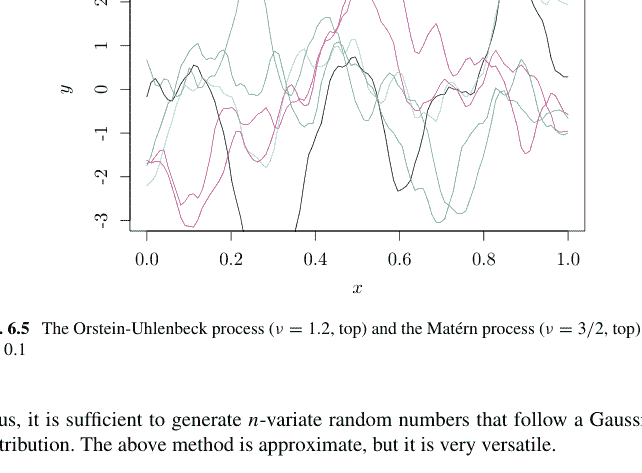

图 6.5 Ornstein-Uhlenbeck 过程（ν = 1.2，上）和 Matérn 过程（ν = 3/2，上），其中 l = 0.1

因此，只需生成服从高斯分布的 n 维随机数即可。上述方法是近似的，但它非常通用。

**例 91** 我们展示了 Ornstein-Uhlenbeck 过程（ν = 1.2，上）和 Matérn 过程（ν = 3/2，上），其中 n = 100 且 l = 0.1（图 6.5）。

```python
colormap = plt.cm.gist_ncar #nipy_spectral, Set1, Paired
colors = [colormap(i) for i in np.linspace(0, 0.8, 5)]
def rand_100(Sigma):
    L = np.linalg.cholesky(Sigma)    ## Cholesky decomposition of covariance matrix
    u = np.random.randn(100)
    y = L.dot(u)  ## Generate random numbers with zero-mean and the covariance matrix
    return y
x = np.linspace(0, 1, 100)
z = np.abs(np.subtract.outer(x,x))  # compute distance matrix, d_{ij} = |x_i - x_j|
l = 0.1
Sigma_OU = np.exp(-z / l)  ## OU: matern(1/2, l, z) is slow
y = rand_100(Sigma_OU)

plt.figure()
plt.plot(x, y)
plt.ylim(-3,3)
for i in range(5):
    y = rand_100(Sigma_OU)
    plt.plot(x, y, c = colors[i])
plt.title("OU process (nu=1/2, l=0.1)")

Sigma_M = matern(3/2, 1, z)  ## Matern
y = rand_100(Sigma_M)
plt.figure()
plt.plot(x, y)
plt.ylim(-3, 3)
for i in range(5):
    y = rand_100(Sigma_M)
    plt.plot(x, y, c = colors[i])
plt.title("Matern process (nu=3/2, l=0.1)")
```

### 6.5 函数型数据分析

令 $(\Omega, \mathcal{F}, P)$ 和 $H$ 分别为一个概率空间和一个可分希尔伯特空间。令 $F : \Omega \rightarrow H$ 为一个可测映射，即对于 $H$ 中的每个开集 $(g \in H, r \in (0, \infty))$，$\{h \in H \mid \|g - h\| < r\}$ 是 $\mathcal{F}$ 的一个元素。我们称这样的 $F : \Omega \rightarrow H$ 为 $H$ 的一个随机元。直观地说，随机元是一个取值于 $H$ 的随机变量。到目前为止，我们假设 $f : \Omega \times E \rightarrow \mathbb{R}$ 在每个 $x \in E$ 处是可测的（随机过程）。本节讨论我们不假设这种可测性的情况。为简单起见，我们将 $F(\omega)$ 写为 $F$，类似于 $H$ 的元素。

尽管本书不深入探讨，但已知随机过程和随机元之间存在以下关系。只需理解两者之间的密切关系即可。

**命题 70** (Hsing-Eubank [14])

1.  如果 $f : \Omega \times E \rightarrow \mathbb{R}$ 关于 $\Omega \times E$ 可测，且对于 $\omega \in \Omega$，$f(\omega, \cdot) \in H$，那么 $f(\omega, \cdot)$ 是 $H$ 的一个随机元。
2.  如果对于每个 $x \in E$，$f(\cdot, x) \rightarrow \mathbb{R}$ 可测，且对于每个 $\omega \in \Omega$，$f(\omega, \cdot)$ 连续，那么 $f(\omega, \cdot)$ 是一个随机元。
3.  如果 $f : \Omega \times E \rightarrow \mathbb{R}$ 是一个（零均值）均方连续过程，且其协方差函数为 $k$，那么存在一个 $H$ 的随机元，其协方差算子为 $H \ni g \mapsto \int_E k(\cdot, y)g(y)d\mu(y) \in H$。

### 6.3 随机元素与协方差算子

4. 一个具有可测再生核 $k$ 的再生核希尔伯特空间 $H(k)$ 中的随机元素是一个随机过程，而一个取值于 $H(k)$ 的随机过程是 $H(k)$ 中的一个随机元素。

证明见文献 [14] 第 7 章。

在本节中，我们学习随机元素的性质，并将其应用于函数型数据分析 [24]。

首先，我们考虑在 $\mathbb{E}[\|F\|] < \infty$ 条件下，对于每个 $g \in H$，$\langle F, g \rangle$ 的平均值 $\mathbb{E}[\langle F, g \rangle]$。由于 $g \mapsto \mathbb{E}[\langle F, g \rangle]$ 是一个线性泛函，根据命题 22，存在唯一的 $m \in H$ 使得

$$\mathbb{E}[\langle F, g \rangle] = \langle m, g \rangle \quad (6.36)$$

我们形式化地记作 $m = \mathbb{E}[F]$，这是随机元素 $F$ 的均值的定义。

**命题 71** 如果 $\mathbb{E}\|F\|^2 < \infty$，则

$$\mathbb{E}\|F - m\|^2 = \mathbb{E}\|F\|^2 - \|m\|^2$$

成立。

证明：如果在 (6.36) 中代入 $g = m$，我们得到

$$\mathbb{E}\|F - m\|^2 = \mathbb{E}\|F\|^2 - 2\mathbb{E}\langle F, m \rangle + \|m\|^2 = \mathbb{E}\|F\|^2 - 2\langle m, m \rangle + \|m\|^2 .$$

由于 $\mathbb{E}\|F\|^2 < \infty$ 意味着 $\mathbb{E}\|F\| < \infty$，我们将在后续讨论中假设前者成立。

关于协方差，如果 $H = \mathbb{R}^p$，则协方差矩阵为

$$\mathbb{E}[(F - \mathbb{E}[F])(F - \mathbb{E}[F])^\top] = \mathbb{E}[(F - \mathbb{E}[F]) \otimes (F - \mathbb{E}[F])] \in \mathbb{R}^{p \times p}$$

其中 $F \in \mathbb{R}^p$。对于一般的希尔伯特空间 $H$，对应关系

$$H^2 \ni \langle g, h \rangle \mapsto \mathbb{E}[\langle F - m, g \rangle \langle F - m, h \rangle] \in \mathbb{R}$$

对 $g$ 和 $h$ 分别是线性的。此外，如果 $\mathbb{E}\|F\|^2 < \infty$，则它有界：

$$\mathbb{E}[\langle F - m, g \rangle \langle F - m, h \rangle] \leq \mathbb{E}\|F - m\|^2 \cdot \|g\| \|h\| \leq \mathbb{E}\|F\|^2 \cdot \|g\| \|h\| .$$

如果我们定义 $u \otimes v \in B(H)$ 为

$$H \ni w \mapsto (u \otimes v)w = \langle u, w \rangle v \in H$$

其中 $u, v, w \in H$，则存在一个 $K \in B(H)$ 使得

$$\mathbb{E}[\langle F - m, g\rangle\langle F - m, h\rangle] = \mathbb{E}[\{(F - m) \otimes (F - m)\}g, h\rangle] = \langle Kg, h\rangle = \langle g, K^*h\rangle .$$

如果我们交换 $g, h$，我们得到相同的值，因此 $K$ 和 $K^*$ 重合，且每个都是自伴的。这样的 $K$ 称为协方差算子，我们形式化地记作 $K = \mathbb{E}[(F - m) \otimes (F - m)]$。

#### 命题 72

$$\mathbb{E}[(F - m) \otimes (F - m)] = \mathbb{E}[F \otimes F] - m \otimes m$$

证明：由 (6.36)，对于任意 $g, h \in H$，我们有

$$\mathbb{E}[\langle m, g\rangle\langle F, h\rangle] = \langle m, g\rangle\langle \mathbb{E}[F], h\rangle = \langle m, g\rangle\langle m, h\rangle = \langle (m \otimes m)g, h\rangle .$$

由

$$\langle F - m, g\rangle\langle F - m, h\rangle = \langle F, g\rangle\langle F, h\rangle - \langle F, g\rangle\langle m, h\rangle - \langle m, g\rangle\langle F, h\rangle + \langle m, g\rangle\langle m, h\rangle ,$$

我们有

$$\mathbb{E}[\{(F - m) \otimes (F - m)\}g, h\rangle] = \mathbb{E}[\{F \otimes F - m \otimes m\}g, h\rangle] .$$

在下文中，为简单起见，我们假设 $m = 0$ 进行讨论。

#### 命题 73

如果 $m = 0$ 且 $\mathbb{E}\|F\|^2 < \infty$，则

1. 协方差算子 $K$ 是非负定的，并且是一个迹类算子，其迹为
   $\|K\|_{TR} = \mathbb{E}\|F\|^2$ 。
2. 以概率 1，$F \in \overline{\text{Im}(K)}$ 成立。

证明：对于 $g \in H$，

$$\langle Kg, g\rangle = \mathbb{E}[\langle F, g\rangle\langle F, g\rangle] \geq 0$$

成立，这意味着 $K$ 是非负定的。此外，如果 $\{e_j\}$ 是一个标准正交基，我们有

$$\|K\|_{TR} = \sum_{j=1}^{\infty} \langle Ke_j, e_j\rangle = \sum_{j=1}^{\infty} \langle \mathbb{E}[F \otimes F]e_j, e_j\rangle = \mathbb{E}\|F\|^2 < \infty .$$

对于第二项，注意一般情况下，我们有

$$(\text{Im}(K))^\perp = \text{Ker}(K) .$$

事实上，如果我们设 $g \in \text{Ker}(K)$，则 $K$ 是自伴的（$K = K^*$）且

$$\langle g, Kh \rangle = \langle Kg, h \rangle = 0, \quad h \in H.$$

因此，$g$ 与 $\text{Im}(K)$ 的任何元素正交，我们要求 $g \in \text{Im}(K)^\perp$。反之，如果 $g \in \text{Im}(K)^\perp$，则 $KKg \in \text{Im}(K)$ 且 $\|Kg\| = \langle g, K K g \rangle = 0$，即我们有 $g \in \text{Ker}(K)$。这意味着对于 $g \in \text{Im}(K)^\perp$，我们有 $\mathbb{E}[\langle F, g \rangle^2] = \langle Kg, g \rangle = 0$，并且 $F$ 以概率 1 与任何 $g \in \text{Im}(K)^\perp$ 正交。因此，根据命题 20，以概率 1，我们有

$$F \in (\text{Im}(K))^{\perp\perp} = \overline{\text{Im}(K)}.$$

此外，根据命题 27、31 和命题 73 的第一项，以下成立。

**命题 74** 协方差算子 $K$ 的特征函数 $\{e_j\}$ 是 $\text{Im}(K)$ 的一个标准正交基；对应的特征值 $\{\lambda_j\}_{j=1}^\infty$ 是非负的、单调递减并收敛到 0。此外，每个非零特征值的重数是有限的。

此外，根据命题 73 和 74，以下成立。

**命题 75** 如果 $\{f_j\}$ 是 $H$ 的一个标准正交基，则我们有

$$\mathbb{E}\|F - \sum_{j=1}^n \langle F, f_j \rangle f_j\|^2 = \mathbb{E}\|F\|^2 - \sum_{j=1}^n \langle K f_j, f_j \rangle, \quad (6.38)$$

当 $f_j = e_j$（$1 \le j \le n$）时，上式被最小化。

证明：以下两个等式蕴含 (6.38)。

$$\mathbb{E}\|F - \sum_{j=1}^n \langle F, f_j \rangle f_j\|^2 = \mathbb{E}\|F\|^2 + \mathbb{E}\|\sum_{j=1}^n \langle F, f_j \rangle f_j\|^2 - 2\mathbb{E}\left[\langle F, \sum_{j=1}^n \langle F, f_j \rangle f_j\rangle\right]$$

$$\mathbb{E}\|\sum_{j=1}^n \langle F, f_j \rangle f_j\|^2 = \mathbb{E}\left[\langle F, \sum_{j=1}^n \langle F, f_j \rangle f_j\rangle\right] = \sum_{j=1}^n \mathbb{E}[\langle F, f_j \rangle^2] = \sum_{j=1}^n \langle K f_j, f_j \rangle.$$

然后，由 $\mathbb{E}\|F\|^2 = \|K\|_{TR} = \sum_{j=1}^\infty \lambda_j$（命题 73）和命题 28，我们得到命题 75。

例如，从随机元素 $F$ 的独立实现 $F_1, \ldots, F_N$，通过

$$m_N = \frac{1}{N} \sum_{i=1}^N F_i \quad (6.39)$$

$$K_N = \frac{1}{N} \sum_{i=1}^N (F_i - m_N) \otimes (F_i - m_N), \quad (6.40)$$

我们可以估计均值 $m$ 和协方差算子$^1$ $K$。

在下文中，我们研究如何基于函数型数据分析 [24] 执行主成分分析（PCA）。

然后，为了获得特征函数和特征值，对于 $x_1, \dots, x_n \in E$，$1 \le n \le N$，$F_i : E \to \mathbb{R}$，我们将普通的（非函数型）PCA 方法应用于 $X = (F_i(x_k))$（$i = 1, \dots, N$ 且 $k = 1, \dots, n$）。

1. 准备基函数 $\eta = [\eta_1, \dots, \eta_m]^\top : E \to \mathbb{R}^m$。
2. 计算 $W = (w_{i,j}) = \int_E \eta(x)\eta(x)^\top dx$，使得 $W = (w_{i,j}) = \int_E \eta_i(x)\eta_j(x)dx$。
3. 找到 $C = (c_{i,j})_{i=1,\dots,N,j=1,\dots,m} \in \mathbb{R}^{N \times m}$，使得 $F_i(x) = \sum_{j=1}^m c_i^\top \eta_j(x)$。
4. 找到估计均值函数 $m_N(x) := \frac{1}{N} \sum_{i=1}^N F_i(x)$（$m_N(x) = \sum_{j=1}^m d_j^\top \eta_j(x)$）的系数 $d_1, \dots, d_m$。
5. 由于方差函数为

$$k(x, y) = \frac{1}{N} \sum_{i=1}^N \{F_i(x) - m_N(x)\}\{F_i(y) - m_N(y)\} = \frac{1}{N} \eta(x)^\top (C - d)^\top (C - d)\eta(y),$$

如果我们设特征向量为 $\phi(x) = b^\top \eta(x)$（$b \in \mathbb{R}^m$），则在 $b^\top Wb = 1$ 条件下，协方差算子的特征值问题

$$\int_E k(x, y)\phi(y)dy = \lambda \phi(x)$$

简化为寻找一个 $b$ 使得

$$\eta(x)^\top \frac{1}{N} (C - d)^\top (C - d)\eta(x)\eta(x)^\top b = \lambda \eta(x)^\top b,$$

这等价于

$$\frac{1}{N} (C - d)^\top (C - d)Wb = \lambda b.$$

特别地，如果我们设 $u := W^{1/2}b$，则问题变为在 $\|u\| = 1$ 条件下，寻找一个 $u \in \mathbb{R}^m$ 使得

$$\frac{1}{N} W^{1/2}(C - d)^\top (C - d)W^{1/2}u = \lambda u.$$

$^1$ $K_N$ 的分母可能是 $N - 1$。

示例 92 对于 $E = [-\pi, \pi]$，如果我们设

$$\eta_j(x) = \begin{cases} \frac{1}{\sqrt{2\pi}}, & j = 1 \\ \frac{1}{\sqrt{\pi}} \cos kx, & j = 2k \\ \frac{1}{\sqrt{\pi}} \sin kx, & j = 2k + 1 \end{cases},$$

我们有

$$\int_{-\pi}^{\pi} \eta_i(x)\eta_j(x)dx = \delta_{i,j},$$

并且 $W$ 是大小为 $p$ 的单位矩阵。因此，特征方程变为 $\frac{1}{n}(C - d)^\top (C - d)u = \lambda u$，我们可以将 $C \in \mathbb{R}^{n \times p}$ 应用于 PCA 过程，而不是设计矩阵（即使我们在上述过程中设 $d = 0$，中心化步骤也会自动完成）。在这个例子中，我们应用来自 fda 包的加拿大天气数据，该数据包含每个加拿大城市一年中每一天的温度和降水的每日列表。我们以各种方式构建以下程序。我们不是从一开始就给出 $n$ 个函数，而是从 $N = 365$ 天开始，因为这代表了温度通过 $p$ 个基函数的线性组合（傅里叶变换）的变化。因此，我们可以说该函数是使用足够大的 $p$ 进行离散化的。

```python
X, y = skfda.datasets.fetch_weather(return_X_y=True, as_frame=True)
df = X.iloc[:, 0].values
def g(j, x):                    ## 由 p 个元素组成的基函数
    if j == 0:
        return 1 / np.sqrt(2 * np.pi)
    if j % 1 == 0:
        return np.cos((j // 2) * x) / np.sqrt(np.pi)
    else:
        return np.sin((j // 2) * x) / np.sqrt(np.pi)

def beta(x, y):                 ## p 个元素前的系数
    X = np.zeros((N, p))
    for i in range(N):
        for j in range(p):
            X[i, j] = g(j, x[i])
    beta = np.dot(np.dot(np.linalg.inv(np.dot(X.T, X)
                + 0.0001*np.identity(p)), X.T), y)
    return np.squeeze(beta)

N = 365; n = 35; m = 5; p = 100; df = df.coordinates[0].data_matrix
C = np.zeros((n, p))
for i in range(n):
    x = np.arange(1, N+1) * (2 * np.pi / N) - np.pi
    y = df[i]
    C[i, :] = beta(x, y)
pca = PCA()
pca.fit(C)
B = pca.components_.T
xx = C.dot(B)
```

$C \in \mathbb{R}^{n \times p}$ 的每一行是一个函数的系数（$p$ 个）。然后，$B \in \mathbb{R}^{p \times m}$（$m \le p$）是主成分向量，$xx$ 是每个函数的得分。$B$ 的第 $m$ 列向量是 $m$ 个主成分的向量（对于 $j = 1, \ldots, p$，$\eta_j(x)$ 前的系数）。我们改变 $m$ 和函数 $z$，并运行以下程序，看看是否能恢复原始函数。

### 对于 $m = 2, 3, 4, 5, 6$ 的重构

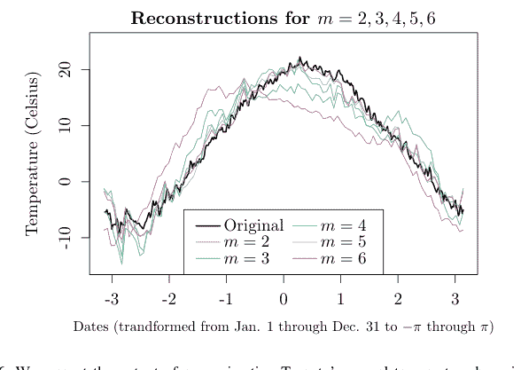

图 6.6 我们展示了使用 $m = 2, 3, 4, 5, 6$ 个主成分近似多伦多年度温度的输出。随着 $m$ 的增加，数据从原始数据中被忠实地恢复

```python
def z(i, m, x):    ## 使用 m 个成分而非 m 个的近似函数
    S = 0
    for j in range(p):
        for k in range(m):
            for r in range(p):
                S = S + C[i, j] * B[j, k] * B[r, k] * g(r, x)
    return S

x_seq = np.arange(-np.pi, np.pi, 2 * np.pi / 100)
plt.figure()
plt.xlim(-np.pi, np.pi)
# plt.ylim(-15, 25)
plt.xlabel("Days")
plt.ylabel("Temp(C)")
plt.title("Reconstruction for each m")
plt.plot(x, df[13], label = "Original")
for m in range(2, 7):
    plt.plot(x_seq, z(13, m, x_seq), c = color[m], label = "m=%d"%m)
plt.legend(loc = "lower center", ncol = 2)
```

图 6.6 显示了使用 $m = 2, 3, 4, 5, 6$ 个主成分近似多伦多年度温度的输出。

接下来，我们按特征值递增的顺序列出主成分，并绘制它们的贡献率图（图 6.7）。

```python
lam = pca.explained_variance_
ratio = lam / sum(lam) # 或者使用 pca.explained_variance_ratio_
plt.plot(range(1, 6), ratio[:5])
plt.xlabel("PC1 through PC5")
plt.ylabel("Ratio")
plt.title("Ratio")
```

主成分函数是以主成分向量作为基函数系数的函数。它与 scikit-fda 的输出在两个方面不同。

1.  因为一年中的日期从 1 月 1 日至 12 月 31 日被归一化到 $[-\pi, \pi]$，主成分函数的值乘以了 $\sqrt{365}/(2\pi)$，而得分函数乘以了 $\sqrt{2\pi}/365$。
2.  一些主成分向量乘以了 $-1$，导致函数近似上下颠倒（如果使用不同的包，这是不可避免的）。

第一、第二和第三主成分函数如图 6.8 所示。我们使用以下程序。第一主成分是全年的影响，冬季温度影响城市间的变化。

```python
def h(coef, x):    ## 使用系数定义一个函数
    S = 0
    for j in range(p):
        S = S + coef[j] * g(j, x)
    return S
print(B)
plt.figure()
plt.xlim(-np.pi, np.pi)
plt.ylim(-1, 1)
for j in range(3):
    plt.plot(x_seq, h(B[:, j], x_seq), c = colors[j], label = "PC%d"%(j+1))
plt.legend(loc = "best")
```

```
[[-5.17047156e-01 -2.43880782e-01  7.48988279e-02 ...  5.48412387e-04
  -1.22748578e-03  8.07866592e-01]
 [-7.31215100e-01 -3.44899509e-01  1.05922938e-01 ...  7.75572240e-04
  -1.73592707e-03 -5.71437836e-01]]
```

**图 6.7** 温度对加拿大天气的贡献。我们可以像在不使用函数数据分析的普通情况下一样计算贡献率

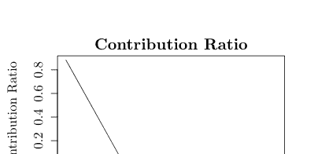

### 主成分函数

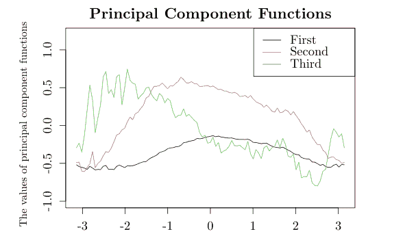

日期（将 1 月 1 日至 12 月 31 日转换为 $-\pi$ 至 $\pi$）

**图 6.8** 加拿大天气数据中温度的第一、第二和第三主成分函数。一些主成分函数乘以了 $-1$，这意味着与其他包的结果相比是上下颠倒的。此外，由于横轴被归一化为 $[-\pi, \pi]$，每个特征函数的值乘以了 $\sqrt{365/(2\pi)}$

```
[ 3.13430279e-01 -6.12932605e-01  1.50738649e-01 ... -6.99018707e-03
  1.19586600e-03 -5.41866413e-02]
...
[ 3.08129173e-05 -2.83373696e-03  8.28893867e-03 ...  1.35931675e-01
 -2.34867483e-01  1.23616273e-03]
[ 1.47021532e-03  3.25749669e-03 -4.83933350e-03 ... -1.32596334e-01
  1.60270831e-01  8.94103792e-03]
[ 1.47021531e-03  3.25749669e-03 -4.83933350e-03 ... -1.32596334e-01
  1.60270831e-01 -1.17997796e-02]]
```

```python
place = X.iloc[:, 1]
index = [9, 11, 12, 13, 16, 23, 25, 26]
others = [x for x in range(34) if x not in index]
first = [place[i][0] for i in index]
print(first)
plt.figure()
plt.xlim(-15, 25)
plt.ylim(-25, -5)
plt.xlabel("PC1")
plt.ylabel("PC2")
plt.title("Canadian Weather")
plt.scatter(xx[others, 0], xx[others, 1], marker = "x", c = "k")
for i in range(8):
    l = plt.text(xx[index[i], 0], xx[index[i], 1],
                 s = first[i], c = color[i])
```

```
['Q', 'M', 'O', 'T', 'W', 'C', 'V', 'V']
```

图 6.9 加拿大天气温度得分，像温哥华和维多利亚这样较温暖的地区在第一主成分中出现在最左侧

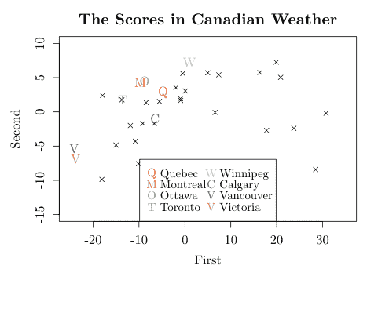

## 附录

### 命题 66 的证明

证明：由于 $f(\omega, x) - m(x)$ 的期望和方差分别为 0 和 $k(x, x)$，且 $f(\omega, x) - m(x)$ 与 $f(\omega, y) - m(y)$ 之间的协方差为 $k(x, y)$，由

$$\begin{aligned} \mathbb{E}[|f(\omega, x) - f(\omega, y)|^2] &= \mathbb{E}[\{(f(\omega, x) - m(x)) - \{f(\omega, y) - m(y)\} - \{m(x) - m(y)\}\}^2] \\ &= k(x, x) + k(y, y) - 2k(x, y) + \{m(x) - m(y)\}^2. \end{aligned}$$

$m, k$ 的连续性意味着 (6.30)。反之，如果我们假设 (6.30)，那么 $m$ 的连续性可由下式得到

$$|m(x) - m(y)| = |\mathbb{E}[f(\omega, x) - f(\omega, y)]| \leq \{\mathbb{E}[|f(\omega, x) - f(\omega, y)|^2]\}^{1/2}.$$

不失一般性，如果我们假设 $m \equiv 0$，那么我们有

$$k(x, y) - k(x', y') = \{k(x, y) - k(x', y)\} + \{k(x', y) - k(x', y')\},$$

并且右边每一项都受限于

$$\begin{aligned} |k(x, y) - k(x', y)| &= |\mathbb{E}[f(\omega, x)f(\omega, y)] - \mathbb{E}[f(\omega, x')f(\omega, y)]| \\ &\leq \mathbb{E}[f(\omega, y)^2]^{1/2}\mathbb{E}[|f(\omega, x) - f(\omega, x')|^2]^{1/2} = \{k(y, y)\}^{1/2}\{\mathbb{E}[|f(\omega, x) - f(\omega, x')|^2]\}^{1/2} \end{aligned}$$

以及

$$|k(x', y) - k(x', y')| \leq \{k(x', x')\}^{1/2}\{\mathbb{E}[|f(\omega, y) - f(\omega, y')|^2]\}^{1/2}.$$

### 命题 67 的证明

我们定义 $I_f^{(n)}(g) := I_f(g; \{(E_i, x_i)\}_{1 \le i \le M(n)})$。那么，我们有 $\mathbb{E}[I_f^{(n)}(g)] = 0$。由 $\mathbb{E}[f(\omega, x)] = 0$（$x \in E$）以及迄今已证明的收敛性，我们得到第一个结论：

$|\mathbb{E}[I_f(\omega, g)]| = |\mathbb{E}[I_f(\omega, g) - I_f^{(n)}(g)]| \le \{\mathbb{E}[\{I_f(\omega, g) - I_f^{(n)}(g)\}^2]\}^{1/2} \to 0$

当 $n \to \infty$ 时。由 $k$ 的一致连续性，我们得到第二个结论：

$|\mathbb{E}[I_f(\omega, g) f(\omega, x)] - \int_E k(x, y)g(y)d\mu(y)|$
$\le |\mathbb{E}[\{I_f(\omega, g) - I_f^{(n)}(g)\} f(\omega, x)]| + |\mathbb{E}[I_f^{(n)}(g) f(\omega, x)] - \int_E k(x, y)g(y)d\mu(y)|$
$\le \{\mathbb{E}[\{I_f(\omega, g) - I_f^{(n)}(g)\}^2]\}^{1/2} \{\mathbb{E}[f(\omega, x)^2]\}^{1/2}$
$+ |\sum_{i=1}^{M(n)} \int_{E_i} |k(x, x_i) - k(x, y)|g(y)d\mu(y)| \to 0$

当 $n \to \infty$ 时。由

$\mathbb{E}[I_f^{(n)}(g) I_f^{(n)}(h)] = \sum_{i=1}^{M(n)} \sum_{j=1}^{M(n)} k(x_i, x_j) \int_{E_i} g(x)d\mu(x) \int_{E_j} h(y)d\mu(y)$
$\to \int_E \int_E k(x, y)g(x)h(y)d\mu(x)d\mu(y)$,

我们得到第三个结论：

$|\mathbb{E}[I_f(\omega, g) I_f(\omega, h)] - \int_E \int_E k(x, y)g(x)h(y)d\mu(x)d\mu(y)|$
$\le |\mathbb{E}[\{I_f(\omega, g) - I_f^{(n)}(g)\}\{I_f(\omega, h) - I_f^{(n)}(h)\} + \{I_f(\omega, g) - I_f^{(n)}(g)\}I_f^{(n)}(h)$
$+ \{I_f(\omega, h) - I_f^{(n)}(h)\}I_f^{(n)}(g)]$
$+ |\mathbb{E}[I_f^{(n)}(g) I_f^{(n)}(h)] - \int_E \int_E k(x, y)g(x)h(y)d\mu(x)d\mu(y)|$
$\le (\mathbb{E}[\{I_f(\omega, g) - I_f^{(n)}(g)\}^2])^{1/2} (\mathbb{E}[\{I_f(\omega, h) - I_f^{(n)}(h)\}^2])^{1/2}$
$+ (\mathbb{E}[\{I_f(\omega, g) - I_f^{(n)}(g)\}^2])^{1/2} (\mathbb{E}[I_f^{(n)}(h)^2])^{1/2}$
$+ (\mathbb{E}[\{I_f(\omega, h) - I_f^{(n)}(h)\}^2])^{1/2} (\mathbb{E}[I_f^{(n)}(g)^2])^{1/2}$
$+ \sum_i \sum_j \int_{E_i} \int_{E_j} |k(x, y) - k(x_i, x_j)|g(x)h(y)d\mu(x)d\mu(y) \to 0$.

### 习题 83~100

84. 构造一个函数 `gp_sample`，该函数从均值函数 $m$、协方差函数 $k$ 以及集合 $E$ 中的 $x_1, \dots, x_N$ 生成随机数 $f(\omega, x_1), \dots, f(\omega, x_N)$。然后，设定 $m, k$ 以生成 100 个随机数，并检验协方差矩阵是否与 $m, k$ 匹配。

85. 利用命题 61，证明 (6.3) 和 (6.4)。

86. 在以下程序中，除了 Cholesky 分解外，还有哪个步骤需要进行复杂度为 $O(N^3)$ 的计算？

```python
def gp_2(x_pred):
    h = np.zeros(n)
    for i in range(n):
        h[i] = k(x_pred, x[i])
    L = np.linalg.cholesky(K + sigma_2*np.identity(n))
    alpha = np.linalg.solve(L, np.linalg.solve(L.T, (y - mu(x))))
    mm = mu(x_pred) + np.sum(np.dot(h.T, alpha))
    gamma = np.linalg.solve(L.T, h)
    ss = k(x_pred, x_pred) - np.sum(gamma**2)
    return {"mm":mm, "ss":ss}
```

87. 从 (6.5) 证明，对于 $x_1, \dots, x_N \in \mathbb{R}^p$，$y_1, \dots, y_N \in \{-1, 1\}$，其负对数似然为
$$\sum_{i=1}^N \log[1 + \exp\{-y_i f(x_i)\}].$$

88. 解释示例 86 中程序的第 19 至 24 行用于更新 $f_X \leftarrow (W + k_{XX}^{-1})^{-1}(Wf_X + u)$。

89. 在示例 86 中，将前 100 个鸢尾花数据（50 个 Setosa，50 个 Versicolor）替换为第 51 至 150 个数据（50 个 Versicolor，50 个 Virginica）来执行程序。

90. 在命题 65 的证明中，为什么在生成过程的 (6.16) 中，将 $f_Z$ 替换为 $\mu_{f_Z|Y}$ 到 $\mu(x)$ 是可接受的？在 $\sigma^2(x)$ 中，由 $f_Z|Y$ 和 $f(x)|f_Z$ 引起的变化是独立的。为什么我们可以假设它们是独立的？

91. 在示例 88 中，有一个步骤实现了诱导变量方法的函数 `gp_ind` 避免了 $O(N^3)$ 的计算。这个步骤在哪里？

92. 证明一个随机过程是均方连续过程，当且仅当其均值函数和协方差函数是连续的。

93. 从 Mercer 定理 (6.31) 和命题 67，推导 Karhunen-Loève 定理。此外，对于 $n = 10$，生成五条布朗运动的样本路径。

94. 从 Matérn 核的公式 (6.35)，推导 $\varphi_{5/2}$ 和 $\varphi_{3/2}$。此外，如图 6.4 所示，说明 Matérn 核（$\nu = 1, \dots, 10$）在 $l = 0.05$ 时的值。

95. 说明 $\nu = 5/2, l = 0.1$ 的 Matérn 核的样本路径。

96. 给出一个不涉及随机过程的随机元素的例子，以及一个不涉及随机元素的随机过程的例子。

97. 准备一个基函数 $\eta = [\eta_1, \dots, \eta_p] : E \to \mathbb{R}^p$，并构造一个过程来找到 (6.39) 中的 $m_N(x)$。然后，输入 $N = 35$ 的加拿大天气数据并输出结果。此外，构造一个过程来找到 (6.40) 中的 $K_N(x)$，并将其输出为大小为 $p \times p$ 的矩阵。

98. 假设我们为 $E = [-\pi, \pi]$ 准备了 $p$ 个基函数，如下所示：

$$\left\{ \frac{1}{\sqrt{2\pi}}, \frac{\cos x}{\sqrt{\pi}}, \frac{\sin x}{\sqrt{\pi}}, \frac{\cos 2x}{\sqrt{\pi}}, \frac{\sin 2x}{\sqrt{\pi}}, \dots \right\}$$

为什么 $W = (w_{i,j}) = \int_E \eta(x)\eta(x)^\top dx$ 是一个单位矩阵？

99. 使用加拿大天气数据（一年中每天的降水量）代替一年中每天的温度，找到主成分函数和特征值，并输出类似于图 6.8 和 6.9 的图形。

100. 使用 scikit-fda，找到一年中每天的温度和降水量的主成分函数和特征值，并输出类似于图 6.8 和 6.9 的图形。

## 参考文献

1. N. Aronszajn, 再生核理论. Trans. Am. Math. Soc. **68**, 337–404 (1950)
2. H. Avron, M. Kapralov, C. Musco, A. Velingker and A. Zandieh. 用于核岭回归的随机傅里叶特征：近似界和统计保证. *ArXiv*, abs/1804.09893, 2017
3. C. Baker. *积分方程的数值处理* (Clarendon Press, 1978)
4. P. Bartlett and S. Mendelson. Rademacher 和高斯复杂度：风险界和结构结果. In *J. Mach. Learn. Res.*, 2001
5. K.P. Chwialkowski and A. Gretton. 用于随机过程的核独立性检验. In *ICML*, 2014
6. R. Dudley. *实分析与概率* (Cambridge Studies in Advanced Mathematics, 1989)
7. K. Fukumizu. *核方法导论 (kaneru hou nyuumon)* (Asakura, 2010). (日文)
8. T. Gneiting, 紧支撑相关函数. J. Multivar. Anal. **83**, 493–508 (2002)
9. G.H. Golub, C.F. Van Loan, *矩阵计算*, 第三版. (Johns Hopkins, Baltimore, 1996)
10. I.S. Gradshteyn, I.M. Ryzhik, R.H. Romer, 积分、级数和乘积表. Am. J. Phys. **56**, 958–958 (1988)
11. A. Gretton, K. Borgwardt, M. Rasch, B. Schölkopf, A. Smola, 一个核双样本检验. J. Mach. Learn. Res. **13**, 723–773 (2012)
12. A. Gretton, R. Herbrich, A. Smola, O. Bousquet, B. Schölkopf, 用于测量独立性的核方法. J. Mach. Learn. Res. **6**, 2075–2129 (2005)
13. D. Haussler. 离散结构上的卷积核. Technical Report UCSC-CRL-99-10, UCSC, 1999
14. T. Hsing and R. Eubank. *函数数据分析的理论基础，附线性算子导论* (Wiley, 2015)
15. K. Itō. *概率论导论* (Cambridge University Press, 1984)
16. Y. Kano and S. Shimizu. 使用非正态性的因果推断. In *Proceedings of the Annual Meeting of the Behaviormetric Society of Japan* **47**, 2004
17. K. Karhunen. 概率论中的线性方法. Ann. Acad. Sci. Fennicae. Ser. A. I. Math.-Phys **37**, 1–79 (1947)
18. K. Karhunen. *概率论. 第二卷* (Springer-Verlag, 1978)
19. H. Kashima, K. Tsuda and A. Inokuchi. 标记图之间的边缘化核. In *ICML*, 2003
20. S. Lauritzen. *图模型* (Oxford Science Publications, 1996)
21. J. Mercer. 正负型函数及其与积分方程理论的联系. *Philosophical Transactions of the Royal Society A*, pp. 441–458, 1909
22. J. Neveu, *高斯随机过程*, Seminaire Math. Sup. Les presses de l'Universite de Montreal, 1968
23. A. Rahimi and B. Recht, 用于大规模核机器的随机特征. In *Advances in neural information processing systems*, 2007
24. J. Ramsay and B.W. Silverman. *函数数据分析* (Springer Series in Statistics, 2005)
25. C. Rasmussen and C.K.I. Williams. *用于机器学习的高斯过程* (MIT Press, 2006)
26. B. Schölkopf, A. Smola and K. Müller. 核主成分分析, In *ICANN*, 1997
27. R. Serfling. *数学统计的逼近定理* (Wiley, 1980)
28. S. Shimizu, P. Hoyer, A. Hyvärinen, A.J. Kerminen. 用于因果发现的线性非高斯无环模型. *J. Mach. Learn. Res.* 7, 2003–2030 (2006)
29. I. Steinwart, 论核对支持向量机一致性的影响. *J. Mach. Learn. Res.* 2, 67–93 (2001)
30. M.H. Stone, 布尔环理论在一般拓扑中的应用. *Trans. Am. Math. Soc.* **41**(3), 375–481 (1937)
31. M.H. Stone, 广义魏尔斯特拉斯逼近定理. *Math. Mag.* **21**(4), 167–184 (1948)
32. K. Tsuda, T. Kin, K. Asai, 生物序列的边缘化核. *Bioinformatics* **18**(Suppl 1), S268-75 (2002)
33. J.-P. Vert. *Aronszajn 定理*, 2017. https://members.cbio.mines-paristech.fr/~jvert/svn/kernelcourse/notes/aronsszajn.pdf
34. K. Weierstrass. 论所谓任意实变量函数的解析可表示性. *Sitzungsberichte der Königlich Preußischen Akademie der Wissenschaften zu Berlin*, pp. 633–639, 1885. 第一次报告
35. K. Weierstrass. 论所谓任意实变量函数的解析可表示性. *Sitzungsberichte der Königlich Preußischen Akademie der Wissenschaften zu Berlin*, pp. 789–805, 1885. 第二次报告
36. H. Zhu, C.K.I. Williams, R. Rohwer and Michal Morciniec. 高斯回归与最优有限维线性模型. In *Neural Networks and Machine Learning*, 1997