# 通过实例学习Python版OpenCV

使用Python实现OpenCV提供的计算机视觉算法，用于图像处理、目标检测和机器学习

James Chen

版权所有 © 2023 James Chen，保留所有权利。
由James Chen出版
ISBN: 978-1-7389084-5-5
第二版 2023
第一版 2022

# 前言

近年来，计算机视觉领域经历了飞速发展，已成为众多行业不可或缺的一部分。从图像和视频中提取有意义信息的能力，推动了机器人、自动驾驶汽车、医学成像、安防等多个领域的创新应用开发。

计算机视觉是一门旨在使机器能够解释和理解我们周围视觉世界的学科。随着我们不断开发更智能的系统来分析和理解每天产生的海量视觉数据，它在近年来变得越来越重要。

OpenCV是最受欢迎的计算机视觉和图像处理开源库之一，提供了广泛的算法，用于图像和视频处理、目标检测与识别、特征提取等任务。

另一方面，Python是一种高级编程语言，已成为数据科学和机器学习社区最受欢迎的语言之一，使其与OpenCV成为完美搭配。

本书是一本实用指南，将帮助您使用OpenCV和Python学习计算机视觉的基础知识。本书面向任何想从零开始学习计算机视觉的人，或对OpenCV有一定经验并希望进一步扩展知识的人。本书涵盖了图像处理和计算机视觉的基本概念，并介绍了OpenCV提供的用于实现这些概念的关键算法和技术。

通过循序渐进的教程和实践示例，您将学习如何使用OpenCV执行图像滤波、特征检测、分割、目标检测等任务。此外，本书还涵盖了机器学习算法的基础知识，如SVM、KNN、K-means、ANN和CNN，并展示了它们如何应用于图像处理任务。

本书共分为七章，每章专注于一个特定的计算机视觉任务。章节按照逻辑顺序组织，从图像处理的基础知识开始，逐步深入到目标检测、识别、机器学习算法以及深度学习神经网络等更高级的主题。每章包含多个示例，每个示例都以分步方式演示特定的计算机视觉算法。示例使用Python编写，代码有详细解释，即使是初学者也能轻松跟上。本书所有代码均可在Github上获取。

读完本书，您将打下坚实的计算机视觉和OpenCV基础，并能够将这些技能应用于广泛的现实世界问题。无论您是想开发自己的计算机视觉应用、使用现有的计算机视觉系统，还是仅仅想了解这些系统的工作原理，本书都是极佳的资源。

无论您是学生、爱好者还是该领域的专业人士，本书都将帮助您全面理解Python版OpenCV，并为您提供实现高级计算机视觉应用所需的技能。希望本书能成为您有用的资源，并希望您通过实践示例享受学习Python版OpenCV的过程。

# 目录

## 1 引言

- 1.1 关于OpenCV
- 1.2 本书目标读者
- 1.3 本书源代码
- 1.4 硬件要求和软件版本
- 1.5 本书组织结构

## 2 安装

- 2.1 在Windows上安装
  - 2.1.1 在Windows 10上安装Python
  - 2.1.2 集成开发环境PyCharm
- 2.2 在Ubuntu上安装Python
  - 2.2.1 在Ubuntu上安装Python
  - 2.2.2 在Ubuntu上安装PyCharm
- 2.3 配置PyCharm并安装OpenCV
  - 2.3.1 创建新的Python项目
  - 2.3.2 安装和升级OpenCV及库
  - 2.3.3 加载项目文件
  - 2.3.4 Hello OpenCV

## 3 OpenCV基础

- 3.1 加载和显示图像
  - 3.1.1 加载彩色图像
  - 3.1.2 加载灰度图像
  - 3.1.3 将彩色图像转换为灰度图像
- 3.2 加载和显示视频
- 3.3 显示摄像头画面
- 3.4 图像基础
  - 3.4.1 像素
  - 3.4.2 BGR颜色空间和通道
  - 3.4.3 HSV颜色空间和通道
- 3.5 绘制形状
  - 3.5.1 创建空白画布
  - 3.5.2 绘制直线
  - 3.5.3 绘制矩形、圆形、椭圆和多段线
- 3.6 绘制文本
- 3.7 绘制类似OpenCV的图标

## 4 用户交互

- 4.1 鼠标操作
- 4.2 用鼠标绘制圆形
- 4.3 用鼠标绘制多边形
- 4.4 用鼠标裁剪图像
- 4.5 使用滑动条输入值

## 5 图像处理

- 5.1 颜色空间转换
  - 5.1.1 将BGR转换为灰度
  - 5.1.2 将灰度转换为BGR
  - 5.1.3 将BGR转换为HSV
  - 5.1.4 将HSV转换为BGR
- 5.2 调整图像大小、裁剪和旋转
- 5.3 调整图像对比度和亮度
- 5.4 调整色调、饱和度和明度
- 5.5 图像混合
- 5.6 按位操作
- 5.7 图像扭曲
- 5.8 图像模糊
  - 5.8.1 什么是高斯模糊
  - 5.8.2 高斯模糊
  - 5.8.3 中值模糊
- 5.9 直方图
  - 5.9.1 关于直方图
  - 5.9.2 灰度图像的直方图
  - 5.9.3 彩色图像的直方图

## 6 目标检测

- 6.1 Canny边缘检测
- 6.2 膨胀和腐蚀
- 6.3 形状检测
  - 6.3.1 形状检测的预处理
  - 6.3.2 查找轮廓
  - 6.3.3 检测形状的类型、面积和周长
  - 6.3.4 其他轮廓特征
- 6.4 颜色检测
  - 6.4.1 从图像中查找颜色
  - 6.4.2 查找颜色标签
- 6.5 使用Tesseract进行文本识别
  - 6.5.1 安装和配置Tesseract
  - 6.5.2 文本识别
- 6.6 人体检测
  - 6.6.1 从图片中检测人体
  - 6.6.2 从视频中检测人体
- 6.7 人脸和眼睛检测
- 6.8 移除背景
  - 6.8.1 按颜色移除背景
  - 6.8.2 按轮廓移除背景
  - 6.8.3 按机器学习移除背景
  - 6.8.4 按蒙版移除背景
- 6.9 模糊背景

## 7 机器学习

- 7.1 K-Means聚类
  - 7.1.1 什么是K-Means聚类
  - 7.1.2 颜色量化
  - 7.1.3 手写数字分组
- 7.2 K-近邻算法
  - 7.2.1 什么是K-近邻算法
  - 7.2.2 KNN评估
  - 7.2.3 使用KNN识别手写数字
- 7.3 支持向量机
  - 7.3.1 什么是支持向量机
  - 7.3.2 使用SVM识别手写数字
  - 7.3.3 IRIS数据集分类
- 7.4 人工神经网络
  - 7.4.1 什么是人工神经网络？
  - 7.4.2 激活函数
  - 7.4.3 使用ANN识别手写数字
- 7.5 卷积神经网络
  - 7.5.1 什么是卷积神经网络
  - 7.5.2 卷积层
  - 7.5.3 池化层
  - 7.5.4 全连接层
  - 7.5.5 CNN架构
  - 7.5.6 使用Tensorflow/Keras构建CNN模型
  - 7.5.7 流行的CNN架构

## 参考文献

## 关于作者

# 1. 引言

计算机视觉是一个跨学科领域，专注于使机器能够解释和理解来自我们周围世界的视觉数据。它涉及开发能够分析图像和视频、识别模式并从视觉数据中提取有用信息的算法、技术和技术。

计算机视觉具有广泛的应用，包括自动驾驶汽车、机器人、医学成像、安防监控，甚至娱乐。例如，计算机视觉算法可用于实时视频流中的目标检测、图像中的人脸识别，甚至帮助医生从医学成像数据中诊断医疗状况。

为了实现这些任务，计算机视觉算法结合了来自多个领域的技术，如图像处理、机器学习、深度学习和人工智能。图像处理技术涉及滤波、边缘检测和分割等操作，有助于预处理和增强视觉数据。另一方面，机器学习技术允许计算机视觉系统从大型数据集中学习模式，并基于这些模式进行预测。

计算机视觉是一个快速发展的领域，对于开发能够感知和理解

## 1.1. 关于 OpenCV

OpenCV 是一个流行的开源计算机视觉库，为图像和视频处理提供了大量工具和算法。它最初用 C++ 编写，但提供了多种编程语言的接口，包括 Python、Java 等。它是一个跨平台库，尽管本书将只关注 Python。OpenCV 被设计为快速且高效，使其成为实时计算机视觉应用的理想选择，并已成为许多计算机视觉项目的标准工具。

OpenCV 用于图像和视频处理、目标检测以及机器学习。该库包含许多内置的数学算法，并且速度足够快，可以进行实时视频处理。如今，它被广泛用于解决相关问题。更多信息请参考以下链接的官方文档：

[https://docs.opencv.org/4.7.0/d1/dfb/intro.html](https://docs.opencv.org/4.7.0/d1/dfb/intro.html)

OpenCV 的多功能性和强大的工具集使其成为医疗保健、汽车、安防、娱乐等众多行业各种计算机视觉应用的热门选择。它在当今世界有着广泛的应用，包括但不限于：

- 目标检测与识别：OpenCV 可用于检测和识别图像和视频中的目标，从而实现安防监控系统等应用。
- 人脸识别：OpenCV 具有强大的人脸识别能力，可用于生物识别认证和身份验证等应用。
- 光学字符识别（OCR）：OpenCV 可用于识别图像中的文本，使其成为文档扫描和图像转文本转换等应用的有用工具。
- 视频处理：OpenCV 可用于实时视频处理应用，如视频稳定和目标跟踪。
- 医学成像：OpenCV 可用于处理和分析医学图像，从而实现诊断和治疗规划等应用。
- 机器人技术：OpenCV 可用于机器人应用中的目标检测与跟踪，以及导航和建图等任务。
- 增强现实：OpenCV 可用于创建增强现实应用，例如时尚和美容产品的虚拟试穿应用。

Python 是一种高级编程语言，近年来获得了巨大的普及，尤其是在数据科学和机器学习领域。它语法简单易学，使其成为初学者的理想语言，同时也是经验丰富的开发者的强大工具。Python 的普及催生了大量库和框架的开发，使其成为各种应用的绝佳选择。

Python 和 OpenCV 共同构成了计算机视觉项目的强大组合。Python 提供了一种易于学习的语言，非常适合原型设计和想法实验，而 OpenCV 则提供了一套全面的图像和视频处理工具。Python 与 OpenCV 的集成使得用高级语言编写计算机视觉应用变得容易，让开发者能够快速构建和测试他们的想法。

Python 和 OpenCV 是任何对计算机视觉感兴趣的人必备的两个工具。Python 的易用性和灵活性，结合 OpenCV 强大的工具和算法，使其成为许多计算机视觉项目的首选。

那么，通过本书结合 OpenCV 和 Python，你将学到什么？

- 读取、显示和保存图像。
- 使用特定库读取和显示视频或网络摄像头视频。
- 用户交互，如键盘或鼠标操作。
- 绘制文本和形状，如圆形、矩形、三角形等。
- 从图像中检测颜色和形状，如圆形、矩形、三角形等。
- 从图像或视频中检测人脸、眼睛和人体。
- 图像中的文本识别。
- 修改图像质量或颜色，例如模糊、扭曲变换、混合、调整大小、调整颜色等。
- 机器学习方法，包括 K-Means、K-近邻、支持向量机、人工神经网络和卷积神经网络。

使用 OpenCV 的好处：

- 开源且免费，易于学习。
- 处理速度快，特别适用于视频处理，例如从视频中检测目标。
- 提供超过 2,500 种数学算法，它们不仅对图像，而且对视频和实时处理都足够高效。
- 算法和函数的设计旨在利用硬件加速和多核系统。

## 1.2. 本书的目标读者

本书面向任何有兴趣使用 Python 编程语言学习计算机视觉的人。本书适合任何编程技能水平的读者，从对计算机视觉知识非常有限的人到有经验的人，因为它从零开始涵盖了 Python 编程和 OpenCV 的基础知识。

对于初学者，本书从 OpenCV 的安装和设置的分步说明开始，以便读者可以快速轻松地开始。它从最简单的语句到面向对象类介绍 Python，并从一个 "hello world" 示例开始。它还涵盖了计算机视觉的基础知识，包括基本的图像处理技术，如像素、BGR 和 HSV 颜色空间及其之间的转换。如果读者具有任何语言的一定编程基础水平，那将是一个加分项，但不需要有 Python 和/或 OpenCV 的先前经验。

对于更有经验的读者，本书涵盖了更高级的主题，如目标检测、人脸识别，以及使用神经网络的机器学习和深度学习。本书包含许多带有实践和动手项目的示例，以帮助读者理解 OpenCV 的概念和技术。

本书也适合研究人员、学生和专业人士，他们希望扩展使用 OpenCV 和 Python 在计算机视觉方面的知识和技能。它为那些想要掌握 OpenCV 库并将其用于实际应用的人提供了全面的指南。

总之，本书是任何对计算机视觉和 OpenCV 感兴趣的人的宝贵资源，无论他们的编程技能水平如何。本书涵盖了广泛的主题，从基本的图像处理技术到高级的深度学习应用，使其成为任何想要学习和应用 OpenCV 与 Python 的人的绝佳选择。

## 1.3. 本书的源代码

本书中使用的所有源代码在本版发布时都经过测试并可正常工作。源代码可从以下链接的 Github 获取：[https://github.com/jchen8000/OpenCV](https://github.com/jchen8000/OpenCV)

建议使用 *git* 克隆源代码，或者，你也可以直接从上述 URL 下载 zip 文件，然后将 zip 文件解压到你的本地机器。

如果你不熟悉 *git*，这里有一个快速入门指南。如果你熟悉它，请随意跳过并转到下一节。

- 在 [https://git-scm.com/downloads](https://git-scm.com/downloads) 下载 *Git for Windows*
- 它提供了 Windows、macOS 和 Linux/Unix 的下载链接，只需点击适合你机器的链接，然后下载最新版本。
- 启动下载的安装程序并按照屏幕上的说明进行安装。
- *Git* 是一个命令行工具，打开一个 cmd 窗口，创建一个文件夹/目录，例如 `opencv`，然后通过运行以下命令将 Github 仓库克隆到本地机器：

    mkdir opencv
    cd opencv
    git clone https://github.com/jchen8000/OpenCV.git

- 源代码将被下载到该文件夹/目录中。

现在源代码已下载到本地机器，在按照第 2 章所述完成 Python 和 OpenCV 的安装后，你将能够使用 PyCharm（一个 Python 集成开发环境）从该文件夹打开源代码。

## 1.4. 硬件要求和软件版本

下表显示了本书中使用的 OpenCV 和 Python 以及库的版本：

| 软件或库 | 版本 |
| :--- | :--- |
| Python | 3.10 |

## 1.5. 本书结构

为了让初学者能够入门，本书从一些基础知识开始，例如分步安装和设置。如果您已有经验并知道如何操作，可以随意跳过相关章节或部分。

第2章将介绍Python和OpenCV的安装过程，其中也包含如何安装Python库的说明。本书全程使用集成开发环境PyCharm。在后续章节中，我们将需要安装一些其他库来执行诸如机器学习和神经网络等操作。

第3章将介绍OpenCV的基础知识，例如加载和显示图像、视频和网络摄像头，绘制文本和形状（如线条、圆形和矩形）等。本章还将介绍图像基础，例如像素以及BGR和HSV颜色空间。

第4章将解释用户交互，如键盘和鼠标操作。

第5章将介绍一些常见的图像处理方法，例如颜色修改、模糊、混合和扭曲图像。本章还将介绍直方图的概念，以及如何在图像处理中使用直方图。

第6章将介绍目标检测、形状（圆形、矩形等）检测、颜色检测、文本识别、人体检测、人脸和眼睛检测等。我们还将通过示例解释两种常见的图像处理实践：去除和模糊背景。

第7章将介绍OpenCV提供的机器学习功能，包括几种广泛使用的机器学习方法，如K-均值聚类、K-近邻、支持向量机、人工神经网络以及卷积神经网络。

图像处理和机器学习背后都有数学算法，本书不会专注于这些数学内容，而是专注于如何通过Python使用OpenCV来应用它们。尽管有时我们会用非常简单的术语解释一些算法，但不会深入探讨细节。

强烈建议您在个人电脑上设置一个环境来练习和执行示例源代码。本书中包含许多图片，它们是代码执行的结果。然而，本书中的图片仅供参考。您将能够在个人电脑的环境中通过执行源代码看到彩色图像。

好了，享受计算机视觉的精彩世界吧！

# 2. 安装

本章将为使用OpenCV和Python做准备。首先，如果您还没有安装Python和集成开发环境（IDE），需要先安装它们。安装完成后，需要在IDE环境中安装OpenCV和其他所需的包，然后我们将创建我们的第一个项目。

本书全程使用Python 3.10版本，并使用PyCharm社区版作为集成开发环境（IDE）。第2.1节详细介绍了Python和PyCharm的安装。

对于偏好Linux操作系统的用户，第2.2节将详细说明在Ubuntu上的安装。

第2.3节解释了OpenCV的安装和PyCharm的配置，以及一个用于验证安装是否成功的Hello OpenCV代码。

享受OpenCV和Python的安装过程吧。

## 2.1. 在Windows上安装

### 2.1.1. 在Windows 10上安装Python

本节介绍在Windows上安装Python。访问Python网站 [https://www.python.org/downloads/](https://www.python.org/downloads/)，那里有一个可供下载的Python版本列表，看起来类似于图2.1，这是撰写本文时可用的Python版本，未来发布更多版本后可能会有所不同。

| 发布版本 | 发布日期 | 下载 | 点击查看更多 |
|---|---|---|---|
| Python 3.10.10 | 2023年2月8日 | 下载 | 发布说明 |
| Python 3.11.2 | 2023年2月8日 | 下载 | 发布说明 |
| Python 3.11.1 | 2022年12月6日 | 下载 | 发布说明 |
| Python 3.10.9 | 2022年12月6日 | 下载 | 发布说明 |
| Python 3.9.16 | 2022年12月6日 | 下载 | 发布说明 |
| Python 3.8.16 | 2022年12月6日 | 下载 | 发布说明 |
| Python 3.7.16 | 2022年12月6日 | 下载 | 发布说明 |
| Python 3.11.0 | 2022年10月24日 | 下载 | 发布说明 |
| Python 3.9.15 | 2022年10月11日 | 下载 | 发布说明 |
| Python 3.8.15 | 2022年10月11日 | 下载 | 发布说明 |
| ... | ... | ... | ... |

图2.1 可供下载的Python版本列表

不建议安装最新版本，因为本书使用了许多Python包，每个包支持到特定的Python版本，其中一些尚未支持最新的Python版本。这里我们使用Python 3.10.x作为本书的版本。

点击上面网页中的 *下载*，进入下一页，那里有一个适用于不同操作系统的可用下载文件列表，看起来类似于图2.2：

| 版本 | 操作系统 | 描述 | MD5校验和 | 文件大小 |
|---|---|---|---|---|
| Gzipped source tarball | 源代码发布 | | 25eb3686... | 26044345 |
| XZ compressed source tarball | 源代码发布 | | dc8c0f27... | 19612112 |
| macOS 64-bit universal2 installer | macOS | macOS 10.9及更高版本 | 616554b1... | 40930111 |
| Windows embeddable package (32-bit) | Windows | | 8afb62c3... | 7629980 |
| Windows embeddable package (64-bit) | Windows | | c02aded2... | 8601296 |
| Windows help file | Windows | | e3edf06b... | 9384836 |
| Windows installer (32-bit) | Windows | | 1a9f5825... | 27827240 |
| Windows installer (64-bit) | Windows | 推荐 | dce578fe... | 28980224 |

图2.2 Python安装程序的操作系统列表

下载适用于您操作系统的版本，保存并运行该文件。如果您使用的是Windows和Mac OS，可以从这里下载安装程序文件。如果您使用的是Linux，我们将在下一节中解释如何在Ubuntu上安装。

运行下载的安装程序文件，过程非常直接，尽管需要几分钟时间。安装成功完成后，请验证您系统上的Python。通过点击Windows的开始图标启动cmd命令，输入“cmd”并按回车。

在cmd窗口中输入以下命令：

```
python --version
```

结果应显示如下，

```
C:\>python --version
Python 3.10.5
```

显示的是刚刚安装的版本，这表明Python已正确安装。请注意，只要版本是3.10.x，就应该没问题，不必完全匹配第二个点后的最后一个数字。

### 2.1.2. PyCharm，集成开发环境

接下来是安装PyCharm——Python的集成开发环境（IDE），用于编写、编辑、运行和调试Python代码。PyCharm是一个非常流行的跨平台Python IDE，它具有丰富的功能，如集成单元测试和Python调试器、错误高亮、代码分析等。

PyCharm有两个版本：社区版和专业版，前者是开源的，对Python开发者免费；后者是付费版本，具有更多功能。免费的社区版对于本书来说已经足够。

访问 [https://www.jetbrains.com/pycharm/download](https://www.jetbrains.com/pycharm/download) 并点击社区版下的 *下载* 按钮。下载安装程序文件后，运行它并按照屏幕上的说明进行安装。

执行安装过程直到完成非常直接。安装完成后，PyCharm即可在您的Windows系统上使用。

## 2.2. 在Ubuntu上安装Python

### 2.2.1. 在Ubuntu上安装Python

本节介绍在Linux系统上安装Python，具体是Ubuntu 22.04。作为安装Python的前提，需要root用户或具有sudo权限的用户。

使用 *apt* 工具在 Ubuntu 上安装 Python 是一个简单直接的过程。*apt*（高级包工具）是 Ubuntu 和其他基于 Debian 的 Linux 系统中用于管理软件包的命令行工具。软件包是预编译的软件集合，可以轻松地在 Linux 系统上安装、更新和卸载。它提供了一个简单易用的界面来搜索、安装和卸载软件包。它还允许用户更新软件包列表、将系统升级到最新版本以及管理软件源。

以下是分步指南：

1.  启动 Ubuntu 22.04，以 root 用户或具有 sudo 权限的用户身份登录，并打开一个新的终端窗口，运行以下命令来更新和升级系统，确保其是最新的：

    ```bash
    $ sudo apt update && sudo apt upgrade
    ```

2.  通过执行以下命令安装 Python 的先决条件：

    ```bash
    $ sudo apt install software-properties-common
    ```

3.  接下来，建议将 *deadsnakes PPA* 添加到源列表中，这使得在 Ubuntu 系统上并行安装多个 Python 版本成为可能。因此，系统上不仅可以有 Python 3.10，还可以同时安装 Python 3.9、3.8 或 3.7。有关 *deadsnakes PPA* 的更多详细信息，请参阅 [https://tooling.bennuttall.com/deadsnakes/](https://tooling.bennuttall.com/deadsnakes/)。执行以下命令进行安装：

    ```bash
    $ sudo add-apt-repository ppa:deadsnakes/ppa
    ```

    当提示时，按 Enter 键继续：

    ```
    Press [ENTER] to continue or Ctrl-c to cancel adding it.
    ```

4.  完成后，再次运行以下命令进行更新，以刷新新安装的 PPA，然后安装 Python 3.10：

    ```bash
    $ sudo apt update
    $ sudo apt install python3.10
    ```

5.  上述执行成功完成后，Python 3.10 应该已安装在 Ubuntu 系统上并可以使用。现在通过输入以下命令来验证，显示已安装 Python 的版本：

    ```
    $ python3.10 --version
    ```

    输出如下所示，
    ```
    Python 3.10.5
    ```

    这表明 Python 已成功安装在系统上。

### 2.2.2. 在 Ubuntu 上安装 PyCharm

PyCharm 是一个跨平台工具，也可在 Linux 上使用。本节介绍如何在 Ubuntu 系统上安装它。
通过 Ubuntu 命令行安装非常简单直接：

```
$ sudo snap install pycharm-community -classic
```

全部完成。安装过程完成后，可以通过以下命令启动 PyCharm：

```
$ pycharm-community
```

## 2.3. 配置 PyCharm 并安装 OpenCV

### 2.3.1. 创建新的 Python 项目

启动 PyCharm 并创建一个新项目。

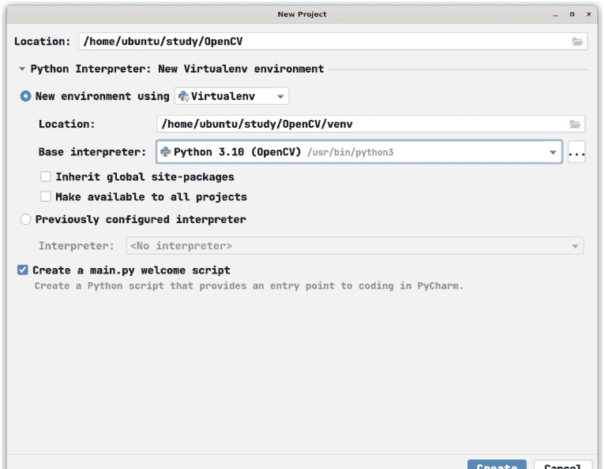

图 2.3 PyCharm -- 创建新项目

说明：

| 位置 | 指定新项目的本地文件夹。所有项目文件将存储在此文件夹中。 |
| :--- | :--- |
| 使用新环境 | 保持默认 -- Virtualenv |
| 位置 | 此位置将根据上面的“位置”自动更改，它指定 Python 环境设置的位置。 |
| 基础解释器 | 确保使用的是前面章节中安装的 Python 3.10。本书将全程使用此版本。 |
| 创建 main.py 欢迎脚本 | 是否选中无关紧要。如果选中，在创建项目时会自动创建一个 main.py 文件。 |

正确设置参数后，点击底部的 *Create* 按钮创建项目。

### 2.3.2. 安装和升级 OpenCV 及库

创建项目后，所有库（包括 OpenCV）都可以在 PyCharm 内部安装。
选择 File -> Settings，将显示设置屏幕，

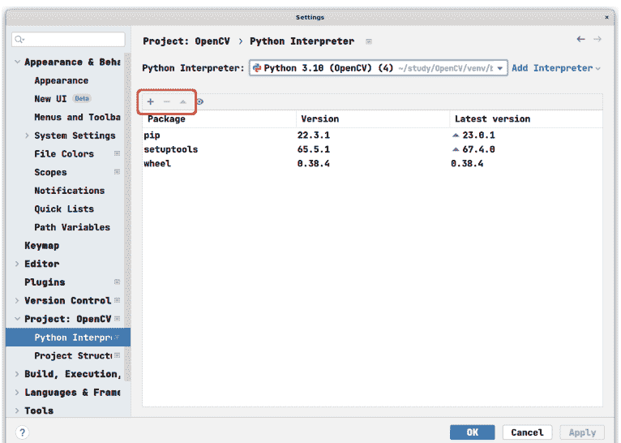

项目名称 *OpenCV* 是我们上一步刚刚创建的，因此在左侧导航面板中显示为 *Project: OpenCV*，如图 2.4 所示。如果你将项目命名为其他名称，它将显示“*Project: [你的项目名称]*”。然后选择其下的“*Python Interpreter*”。
在右侧面板中，*Python Interpreter* 应显示我们在前面章节中安装的 Python 版本。如果系统上有多个 Python 版本，它们将出现在下拉列表中。
在图 2.4 右侧面板的中间，列出了所有可用于此环境的软件包。如果从下拉列表中选择不同的解释器（如果有的话），软件包列表区域将显示一组不同的可用软件包。可以从这里安装所需的软件包。

软件包列表顶部显示有 +、– 和三角形图标，如图 2.4 中高亮所示，+ 图标用于安装新软件包，– 图标用于从列表中移除软件包，三角形图标用于升级现有软件包。
在图 2.4 的软件包列表中，*pip* 是一个现有软件包，其当前版本是 22.3.1，但最新版本是 23.0.1，因此在最新版本号前有一个三角形，表示有可用的升级。要升级它，只需选择 *pip* 行并点击顶部的三角形图标，它就会进行升级。

为了安装 OpenCV，点击顶部的 + 图标，将显示如图 2.5 所示的 *Available Packages* 屏幕，在搜索栏中输入“opencv-python”作为关键词，左侧会显示包含该关键词的软件包列表。从列表中选择“opencv-python”，其描述将显示在屏幕右侧，包括其版本。然后点击底部的 *Install Package* 按钮进行安装。

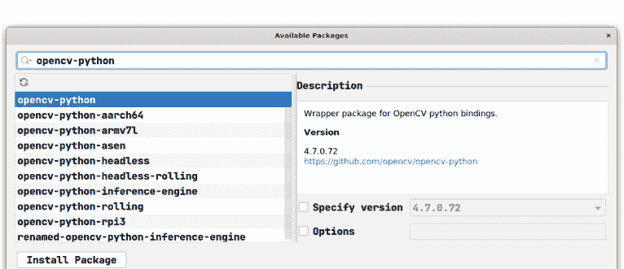

图 2.5 PyCharm -- 可用软件包

等待显示消息“*Package ‘opencv-python’ installed successfully*”。然后返回设置窗口，*opencv-python* 显示在列表中，表明它已安装，同时另一个名为 *numpy* 的软件包也已安装，如下图 2.6 所示。

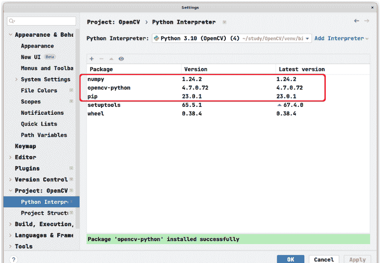

图 2.6 Pycharm -- 已安装和升级的软件包

在图 2.6 的高亮区域中，*numpy* 和 *opencv-python* 都已安装。并且 *pip* 也已升级到最新版本。
如果由于某种原因 *numpy* 未安装，你需要像上面一样安装它，因为它将在本书中使用。
然后，点击 OK 按钮关闭设置窗口。一个空项目已成功创建，并且所需的软件包已安装。

### 2.3.3. 加载项目文件

或者，你也可以不使用 PyCharm 创建全新的项目，而是按照第 1.3 节所述下载或克隆 Git 仓库。源代码在本地机器上可用后，使用 PyCharm 打开项目。
启动 PyCharm，在“*Welcome to PyCharm*”屏幕中，点击“*Open*”按钮，选择你下载或克隆的源代码文件夹，然后点击“*OK*”打开项目文件，如图 2.7 所示。

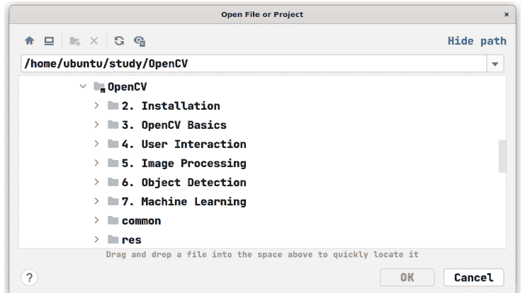

图 2.7 Pycharm -- 打开项目

然后，所有文件都加载到 PyCharm 环境中，如下图 2.8 所示。左侧是导航面板，可以在此找到项目中的所有文件。右侧是代码面板，可以在此打开、查看、编辑和运行文件。底部是执行输出或状态区域。

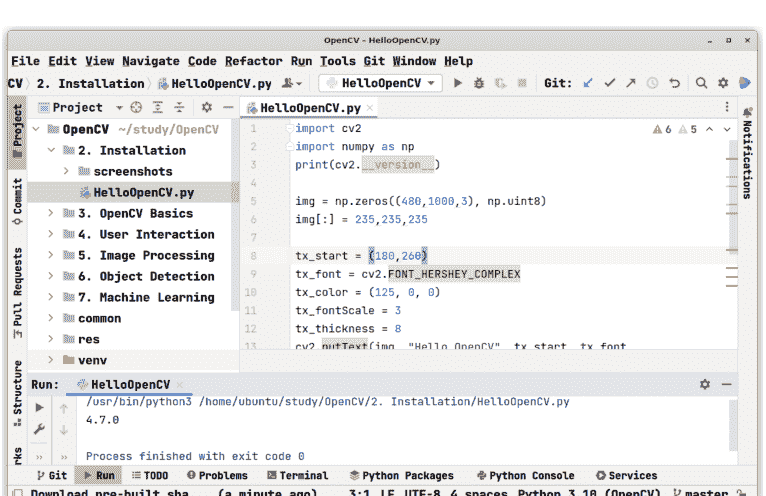

图 2.8 Pycharm IDE 屏幕

在运行代码之前，请确保选择了正确的 *Python Interpreter*，并且所需的软件包可用并已升级到最新版本，如前面的 2.3.2 节所述。

如果你想更熟悉该 IDE，请参考 Pycharm 入门指南 [https://www.jetbrains.com/help/pycharm/quick-start-guide.html](https://www.jetbrains.com/help/pycharm/quick-start-guide.html)。

源代码的组织方式与本书的章节相对应；所有文件按章节分组。例如，第 3 章的所有源代码都在名为“3. *OpenCV Basics*”的文件夹下；第 4 章的源代码在名为“4. *User Interaction*”的文件夹中，依此类推。

所有资源文件（如图像或视频文件）都在 *res* 文件夹中，所有公共文件都在 *common* 文件夹中。

### 2.3.4. Hello OpenCV

源文件：HelloOpenCV.py

现在让我们尝试一个非常简单的程序，以确保安装已正确完成。源代码文件名为 *HelloOpenCV.py*，位于“2. Installation”文件夹中。从左侧导航面板浏览此项目的文件，导航到“2. *Installation*”并找到“*HelloOpenCV.py*”，双击它。它将在右侧面板中打开。

# 3. OpenCV 基础

本章将介绍 OpenCV 支持的一些基本操作，例如打开图像或视频文件并显示它们、将彩色图像转换为灰度或黑白图像、连接笔记本电脑的摄像头并显示其捕获的视频。本章还将介绍数字图像的基础知识，如像素和色彩空间。

第 3.1 节将加载并显示彩色图像和灰度图像。
第 3.2 节将加载并显示视频。第 3.3 节将连接笔记本电脑的摄像头并显示画面。
第 3.4 节将解释图像的基础知识，包括像素和色彩空间。
第 3.5 节将绘制形状，包括直线、矩形、圆形、椭圆和折线。第 3.6 节将绘制文本。
在第 3.7 节中，我们将运用本章所学的知识，绘制一个类似于 OpenCV 图标的图形。

享受 OpenCV 基础之旅。

## 3.1. 加载并显示图像

源文件：ShowImage.py

在 PyCharm IDE 成功安装并配置为使用 Python 和 OpenCV 后，现在我们将加载一个图像并显示它。

### 3.1.1. 加载彩色图像

在 PyCharm 中，如果你已经加载了 Github 项目，那么点击 *ShowImage.py* 文件，图像文件位于 *res* 文件夹中，名为 *flower004.jpg*。

或者，如果你不使用 Github 仓库中的源文件，请创建一个新的 Python 文件，命名为 *ShowImage.py* 或你喜欢的任何名字，复制并粘贴以下代码，并确保你的图像文件位于 PyCharm 项目文件夹中并正确指向它。

```python
import cv2
img = cv2.imread("../res/flower004.jpg")
cv2.imshow("Image", img)
cv2.waitKey(0)
cv2.destroyAllWindows()
```

解释：

| 行号 | 解释 |
| :--- | :--- |
| 1 | `import cv2` 告诉 Python 包含 cv2 (OpenCV) 库。每次使用 OpenCV 时，都必须导入 cv2 包。这通常是代码文件中的第一条语句。 |
| 2 | `cv2.imread()` 是加载图像的函数，图像文件路径在参数中指定。 |
| 3 | `cv2.imshow()` 是显示图像的函数。第一个参数是显示图像的窗口标题，第二个参数是从 `cv2.imread()` 函数返回的图像。 |
| 4 | 等待按键。如果不等待按键，`cv2.imshow()` 将显示窗口并立即进入下一步，执行将完成并且窗口将消失；这发生得非常快，你几乎看不到结果。因此，通常在这里添加 `cv2.waitKey()` 以等待用户按键。 |
| 5 | 在执行完成前销毁所有窗口。 |

运行代码，加载的图像将被显示，如图 3.1 所示：

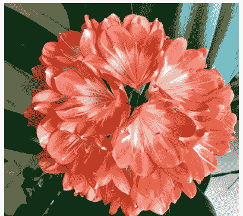

图 3.1 显示彩色图像

请注意，本书中包含的所有图像仅供参考，它们可能与执行代码的结果不完全相同，强烈建议你在自己的 PC 上设置工作环境。通过执行代码，你将能够在屏幕上看到实际的图像。

`cv2.imread()` 是一个 OpenCV 函数，用于从文件加载图像，其语法如下：

| 语法 | `cv2.imread(path, flag)` |
| :--- | :--- |
| 参数 | **path**: *要读取的图像的路径。*<br>**flag**: *指定如何读取图像，默认值为 `cv2.IMREAD_COLOR`。*<br><br>*`cv2.IMREAD_COLOR`：加载彩色图像。图像的任何透明度将被忽略。这是默认标志。你也可以使用 1 作为此标志。*<br><br>*`cv2.IMREAD_GRAYSCALE`：以灰度模式加载图像。你也可以使用 0 作为此标志。*<br><br>*`cv2.IMREAD_UNCHANGED`：按原样加载图像，包括 alpha 通道。你可以使用 -1 作为此标志。* |
| 返回值 | *从 path 参数指定的图像文件加载的图像* |

### 3.1.2. 加载灰度图像

现在让我们以灰度模式加载此图像文件并显示它。

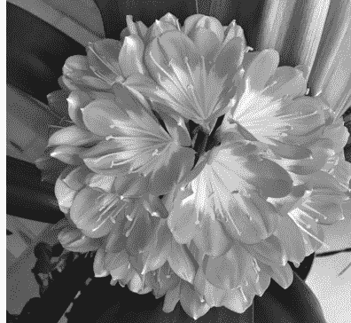

图 3.2 显示灰度图像

只需将上面代码中的第 2 行替换为以下内容，它告诉 `cv2.imread()` 以灰度模式加载图像。

```python
img = cv2.imread("../res/flower004.jpg",
    cv2.IMREAD_GRAYSCALE)
```

执行代码，灰度图像将如图 3.2 所示。

### 3.1.3. 将彩色图像转换为灰度图像

获得灰度图像的另一种方法是先加载原始图像，然后使用 `cv2.cvtColor()` 函数将其转换为灰度图像，这样我们就可以同时拥有原始图像和灰度图像以供进一步处理。这很有用，因为在未来的图像处理中，我们希望以灰度模式处理图像，同时显示原始彩色图像。

现在将第 3.1.1 节中的代码第 2 行和第 3 行替换为以下内容：

```python
img = cv2.imread("../res/flower004.jpg")
gray = cv2.cvtColor(img, cv2.COLOR_BGR2GRAY)
cv2.imshow("Image", img)
cv2.imshow("Image Gray", gray)
```

`cv2.cvtColor()` 是一个 OpenCV 函数，用于将图像从一种色彩空间转换为另一种色彩空间，其语法如下：

| 语法 | `cv2.cvtColor(src, code[, dst[, dstCn]])` |
| :--- | :--- |
| 参数 | **src**：要转换的源图像。<br>**code**：色彩空间转换代码。<br>**dst**：可选，与 *src* 图像大小和深度相同的输出图像。<br>**dstCn**：可选，目标图像中的通道数。如果参数为 0，则通道数将从 *src* 图像自动推导。<br>**`cv2.COLOR_BGR2HSV`/`COLOR_HSV2BGR`**：在 BGR 彩色图像和 HSV 空间之间转换。<br>**`cv2.COLOR_BGR2GRAY`/`COLOR_GRAY2RGB`**：在 BGR 彩色图像和灰度图像之间转换。<br>*其他转换代码未在此列出，请参考 OpenCV 文档。* |
| 返回值 | *从源图像转换而来的图像* |

执行代码，彩色图像和灰度图像将并排显示，如下所示。

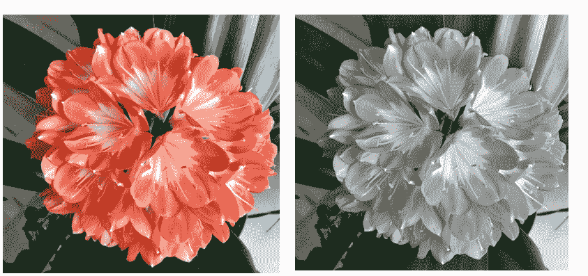

彩色图像 灰度图像

图 3.3 将彩色图像转换为灰度图像

## 3.2. 加载并显示视频

源文件：ShowVideo.py

我们已经能够加载并显示图像，现在我们将处理视频，看看 OpenCV 如何处理视频。

在 PyCharm 中打开 *ShowVideo.py* 文件。如果你不使用 Github 项目，请创建一个新的 Python 文件，并确保你有一个可用的视频文件。Github 项目中有一个名为“*Sample Videos from Windows.mp4*”的 mp4 视频文件，本示例将加载并显示它。以下是代码：

```python
#
### 显示本地文件中的视频
#
import cv2

cap = cv2.VideoCapture("../res/Sample Videos from Windows.mp4")

success, img = cap.read()
while success:
    cv2.imshow("Video", img)
    # 按 ESC 键退出循环
    if cv2.waitKey(15) & 0xFF == 27:
        break
    success, img = cap.read()
cap.release()
cv2.destroyWindow("Video")
```

解释：

## 3.3. 显示网络摄像头

来源：ShowWebcam.py

与显示视频类似，显示网络摄像头也使用了相似的技术。将上面的第6行替换为 `cap = cv2.VideoCapture(0)`，它将加载笔记本电脑/台式机的默认摄像头并进行显示。
在上一节中，`cv2.VideoCapture()` 函数的参数是视频文件的路径，现在传递的是网络摄像头设备的索引作为参数，这里使用0作为默认摄像头，它将连接到默认摄像头。
这里也可以设置一些视频属性，如下所示，

```
1  import cv2
2
3  cap = cv2.VideoCapture(0)
   # 从默认摄像头读取
4
5  # 设置视频属性
6  cap.set(cv2.CAP_PROP_FRAME_WIDTH, 640)
   # 设置宽度
7  cap.set(cv2.CAP_PROP_FRAME_HEIGHT, 480)
   # 设置高度
8  cap.set(cv2.CAP_PROP_BRIGHTNESS, 180)
   # 设置亮度
9  cap.set(cv2.CAP_PROP_CONTRAST, 50)
   # 设置对比度
10
11 success, img = cap.read()
```

```
12  while success:
13      cv2.imshow("Webcam", img)
14
15      # 按ESC键退出循环
16      if cv2.waitKey(10) & 0xFF == 27:
17          break
18      success, img = cap.read()
19
20  cap.release()
21  cv2.destroyWindow("Webcam")
```

解释

| 行号 | 描述 |
| --- | --- |
| 第3行 | 从默认摄像头加载视频。 |
| 第6行 | 设置摄像头视频的宽度。 |
| 第7行 | 设置摄像头视频的高度。 |
| 第8行 | 设置摄像头视频的亮度。 |
| 第9行 | 设置摄像头视频的对比度。 |

供参考，以下是可用作 `cap.set()` 参数的列表：

| 索引 | 属性 | 描述 |
| --- | --- | --- |
| 0 | CAP_PROP_POS_MSEC | 视频文件的当前位置（以毫秒为单位）。 |
| 1 | CAP_PROP_POS_FRAMES | 下一个要解码/捕获的帧的从0开始的索引。 |
| 2 | CAP_PROP_POS_AVI_RATIO | 视频文件的相对位置 |
| 3 | CAP_PROP_FRAME_WIDTH | 视频流中帧的宽度。 |
| 4 | CAP_PROP_FRAME_HEIGHT | 视频流中帧的高度。 |
| 5 | CAP_PROP_FPS | 帧率。 |
| 6 | CAP_PROP_FOURCC | 编解码器的4字符代码。 |
| 7 | CAP_PROP_FRAME_COUNT | 视频文件中的帧数。 |
| 8 | CAP_PROP_FORMAT | retrieve() 返回的 Mat 对象的格式。 |
| 9 | CAP_PROP_MODE | 后端特定的值，指示当前捕获模式。 |
| 10 | CAP_PROP_BRIGHTNESS | 图像的亮度（仅适用于摄像头）。 |
| 11 | CAP_PROP_CONTRAST | 图像的对比度（仅适用于摄像头）。 |
| 12 | CAP_PROP_SATURATION | 图像的饱和度（仅适用于摄像头）。 |
| 13 | CAP_PROP_HUE | 图像的色调（仅适用于摄像头）。 |
| 14 | CAP_PROP_GAIN | 图像的增益（仅适用于摄像头）。 |
| 15 | CAP_PROP_EXPOSURE | 曝光（仅适用于摄像头）。 |
| 16 | CAP_PROP_CONVERT_RGB | 布尔标志，指示是否应将图像转换为RGB。 |
| 17 | CAP_PROP_WHITE_BALANCE | 当前不支持 |
| 18 | CAP_PROP_RECTIFICATION | 立体摄像头的校正标志（注意：目前仅由 DC1394 v 2.x 后端支持） |

确保网络摄像头已连接到笔记本电脑/台式机并已启用，执行代码后你将看到一个窗口显示网络摄像头捕获的任何内容。按ESC键终止。

## 3.4. 图像基础

来源：ImageFundamental.py

### 3.4.1. 像素

像素（“picture elements”的缩写）是数字图像的最小单位。每个像素代表一个微小的颜色点，当与其他像素组合时，就形成了完整的图像。
像素通常以网格形式排列在矩形或正方形内，每个像素在图像中都有一个特定的位置。每个像素的颜色由代表蓝、绿、红（BGR）三原色强度的数值组合表示。

分辨率指的是图像中的像素数量，通常以图像的宽度和高度（以像素为单位）来表示。分辨率越高，图像能包含的细节就越多，因为有更多的像素可用于表示图像。然而，更高分辨率的图像也需要更多的存储空间和处理能力。

通常，一个数字图像由成千上万或数百万个像素组成，这些像素按行和列组织。例如，对于一个640 x 480的图像，总共有307,200个像素，它们位于480行和640列中。像素的坐标指定了像素的位置，例如，坐标为(100, 100)的像素意味着它位于第100列和第100行。

与数学坐标系不同，数字图像的原点(0,0)位于图像的左上角。*x*轴代表列，*y*轴代表行。

如图3.4所示的彩色图像，*x*轴是顶部向右的水平箭头，*y*轴是最左侧向下的垂直箭头。一个像素可以通过一对整数来标识，指定一个*x*值（列号）和一个*y*值（行号）。在下面的图3.4中，位于(100, 100)的像素被识别并高亮显示。

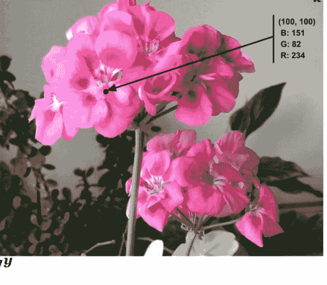

图3.4 彩色图像中的像素

对于24位图像，每个像素有24位，它由蓝色、绿色和红色值组成，每个值有8位，其值范围从0到255。例如，上面图3.4中位于(100, 100)的像素，其蓝色值为151，绿色值为82，红色值为234。这个像素的颜色（显示为粉色）由这三个值决定。

### 3.4.2. BGR颜色空间与通道

数字图像以不同的颜色空间表示，颜色空间指的是在图像中表示颜色的一种特定方式。它是一个三维模型，描述了可以显示或打印的颜色范围。数字成像中使用了几种颜色空间，每种颜色空间都有不同的颜色范围，并用于特定目的。在本节和下一节中，我们将介绍BGR和HSV颜色空间，这两种颜色空间在图像处理中都常用且广泛使用。

BGR代表蓝色、绿色和红色。它是一种用于在电子屏幕上（如电脑显示器、电视和智能手机）表示颜色的颜色空间。在这个空间中，颜色由三原色表示：红色、绿色和蓝色。每种原色的范围是0到255，意味着每种颜色可以有256个可能的值，总共可以产生1670万（= 256 × 256 × 256）种可能的颜色。

每种原色称为一个通道，一个通道的大小与原始图像相同。因此，BGR颜色空间中的图像有三个通道：蓝色、绿色和红色。图3.5展示了这三个通道如何组成彩色图像的概念。

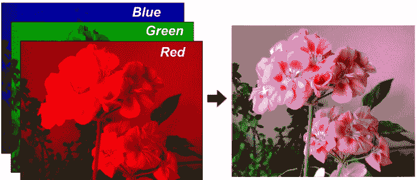

单个通道没有任何颜色，它是一幅灰度图像。因为三原色可以组合成一种颜色，而单个通道只有一个值，只能表示灰度，不能表示颜色。
因此，上面的图3.5解释了概念，但并不完全正确，因为蓝色、绿色和红色通道都是灰度图，没有颜色。上面的红色通道显示为红色，看起来像是红色，但事实并非如此，它应该是灰度图。同样，绿色和蓝色通道也应该是灰度图。
图3.6是正确的，蓝色、绿色和红色通道都是灰度图，它们混合在一起生成彩色图像。
每个通道由一个8位值表示，范围从0到255。三原色以最大强度（255, 255, 255）组合产生白色，而（0, 0, 0）产生黑色，介于两者之间的值产生不同的颜色。三个通道中的值相同，例如（125, 125, 125），代表灰色。

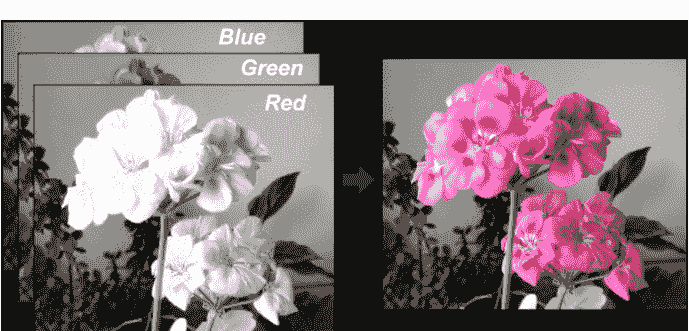

图3.6 蓝色、绿色和红色通道生成图像

### 3.4.3. HSV颜色空间与通道

除了BGR颜色空间，图像也可以用HSV（色调、饱和度、明度）颜色空间表示，也称为HSB（色调、饱和度、亮度），这是一种圆柱形颜色空间，基于三个属性描述颜色：色调、饱和度和明度/亮度，如图3.7所示。这三个属性也用通道表示。
在HSV颜色空间中，颜色表示为圆柱坐标系中的一个点。*色调*由水平轴上的角度表示，*饱和度*由半径或到中心的距离表示，*明度/亮度*由垂直轴表示。
HSV常用于图形软件中的颜色选择和操作，因为它允许用户轻松地分别调整颜色的色调、饱和度和明度/亮度。例如，改变色调会改变颜色族，而改变饱和度或亮度会改变颜色的强度或明暗度。

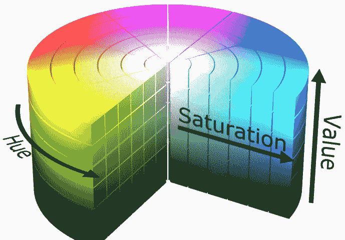

图3.7 HSV颜色空间

SharkD, CC BY-SA 3.0 via Wikimedia Commons https://en.wikipedia.org/wiki/HSL_and_HSV#/media/File:HSV_color_solid_cylinder_saturation_gray.png

**色调**代表图像的颜色部分，被描述为色轮上的一个角度，范围从0到359度。图3.8显示了色轮，不同的颜色分布在一个圆周上，红色在0度，绿色在120度，蓝色在240度。不同角度的色调值代表不同的颜色。
通常色调值从0到359，代表圆的角度，但在OpenCV中色调值不同，因为值存储在8位数据类型中，范围为[0, 255]，无法存储完整的色调值[0, 359]。OpenCV使用了一个技巧来解决这个问题，色调值除以2后存储在8位数据类型中。因此，OpenCV中的色调范围是[0, 179]。

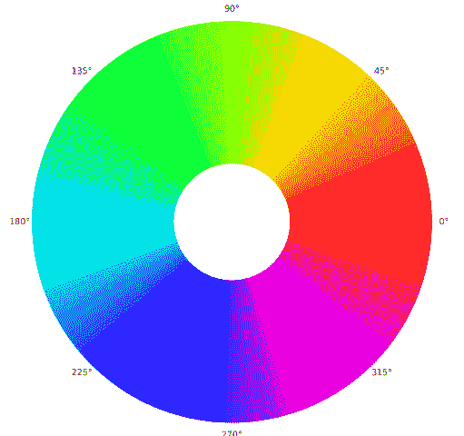

### 图3.8 色轮

由common/color_wheel.py中的源代码生成

下表显示了不同角度的色调值以及对应的名称和代码：

| 色调 | 颜色代码 | 颜色名称 |
| :--- | :--- | :--- |
| 0° | #FF0000 | 红色 |
| 15° | #FF4000 | 朱红色 |
| 30° | #FF8000 | 橙色 |
| 45° | #FFBF00 | 金黄色 |
| 60° | #FFFF00 | 黄色 |
| 75° | #BFFF00 | 黄绿色 |
| 90° | #80FF00 | 黄绿色 |
| 105° | #40FF00 | 叶绿色 |
| 120° | #00FF00 | 绿色 |
| 135° | #00FF40 | 钴绿色 |
| 150° | #00FF80 | 翡翠绿 |
| 165° | #00FFBF | 蓝绿色 |
| 180° | #00FFFF | 青色 |
| 195° | #00BFFF | 天蓝色 |
| 210° | #0080FF | 蔚蓝色 |
| 225° | #0040FF | 蓝色，钴蓝色 |
| 240° | #0000FF | 蓝色 |
| 255° | #4000FF | 风信子紫 |
| 270° | #8000FF | 紫罗兰色 |
| 285° | #BF00FF | 紫色 |
| 300° | #FF00FF | 品红色 |
| 315° | #FF00BF | 红紫色 |
| 330° | #FF0080 | 红宝石红，深红色 |
| 345° | #FF0040 | 胭脂红 |

上表来自 https://en.wikipedia.org/wiki/Hue

**饱和度**代表颜色的强度或纯度，其值定义为0到100%，其中0是灰色，100%是纯色。随着饱和度增加，颜色显得更纯，高饱和度的图像更鲜艳多彩。随着饱和度降低，颜色显得褪色，低饱和度的图像趋向于灰度图。

然而，在OpenCV中，其值范围扩展到[0, 255]，而不是[0, 100]。

**明度/亮度**代表颜色的整体亮度，其值定义为0到100%，其中0是黑色，100是颜色的最亮级别。与饱和度类似，在OpenCV中明度/亮度的范围是[0, 255]，而不是[0, 100]。

与BGR通道一样，HSV也分为三个通道，每个都是灰度图。图3.9说明了色调、饱和度和明度/亮度通道如何组合成彩色图像。

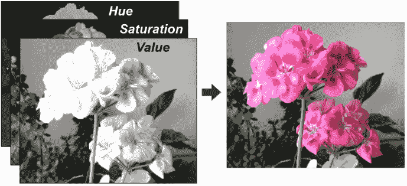

图3.9 色调、饱和度和明度通道组合图像

总之，HSV颜色空间是一种圆柱形颜色模型，基于色调、饱和度和明度/亮度描述颜色。它广泛应用于涉及颜色选择、操作和分析的各种应用中。

## 3.5. 绘制形状

来源：DrawShapes.py
库：common/Draw.py

在本节中，我们将使用OpenCV函数在空白画布上绘制以下形状：

-   直线
-   矩形
-   圆形
-   椭圆
-   多边形线

### 3.5.1. 创建空白画布

到目前为止，我们使用的图像都来自图像文件，现在我们将使用numpy库创建一个空白画布用于绘制。记得我们在2.3.2节安装OpenCV时，numpy也随opencv_python一起安装了，所以它已经可用于我们的项目。如果由于某种原因未安装，请按照2.3.2节的描述进行安装。

numpy是一个流行的Python数值计算库，提供了一个强大的多维数组对象和各种用于对数组执行数学运算的函数。它提供了数组的高效存储和操作，并允许对整个数组进行快速数学运算，无需循环。它是Python科学计算的基础库之一，广泛应用于数据科学、图像处理、机器学习和工程等领域。

我们知道图像是由行、列和通道的像素组成的，换句话说，是三维数组。因此，numpy非常适合支持这种类型的操作。

现在在代码开头导入numpy。

```
import cv2
import numpy as np
```

然后创建一个宽度为480、高度为380的画布，画布是一个空图像。记得彩色图像有三个通道，代表BGR颜色空间，所以我们将使用numpy创建的数组应该有三个维度——380、480和3。数组的数据类型是uint8，它包含8位值，范围从0到255。

```
canvas = np.zeros((380, 480, 3), np.uint8)

cv2.imshow("Canvas", canvas)
cv2.waitKey(0)
cv2.destroyAllWindows()
```

解释

| 行 | 代码 | 描述 |
| :--- | :--- | :--- |
| 3 | `np.zeros((380, 480, 3), np.uint8)` | `np.zeros()`创建一个具有380行、480列和3个通道（对应蓝色、绿色和红色）的数组。`np.zeros()`将用所有0填充数组，正如我们之前解释的，所有0表示黑色。 |

执行上述代码，结果是一个黑色画布窗口，大小为480 x 380。

现在我们想用一些颜色填充画布。看下面代码的第4行，它将设置数组的值为（235, 235, 235），这意味着为画布图像设置一种颜色，此颜色代码为蓝色=235，绿色=235，红色=235，代表浅灰色。

```
canvas[:] = 235,235,235
```

画布被填充为浅灰色，如图3.10所示，我们将在上面绘制形状。如果你想用不同的颜色填充，只需更改第4行的值。


图3.10 浅灰色画布

### 3.5.2. 绘制直线

cv2.line()函数用于在起点和终点之间绘制线段，

| 语法 | `cv.line( img, pt1, pt2, color, thickness, line_type )` |
| :--- | :--- |
| 参数 | img 画布图像。<br>pt1 线段的起点。<br>pt2 线段的终点。<br>color 线条颜色。<br>thickness 线条粗细。 |

| line_type | 线条类型，以下是线条类型的取值： |
|---|---|
| cv2.FILLED | |
| cv2.LINE_4 | 4-连通线算法 |
| cv2.LINE_8 | 8-连通线算法 |
| cv2.LINE_AA | 抗锯齿线算法 |

创建一个函数 `draw_line()` 来封装 `cv2.line()` 函数，并为颜色、粗细和 `line_type` 设置默认值，这样在后续调用此函数时就不必指定这些参数，因为将使用这些默认值。

```python
def draw_line(image, start, end,
            color=(255,255,255),
            thickness=1,
            line_type=cv2.LINE_AA):
    cv2.line(image, start, end, color, thickness,
            line_type)
```

调用此函数来绘制一条线，

```python
### 绘制一条线
draw_line(canvas,
       start=(100, 100),
       end=(canvas.shape[1]-100,
            canvas.shape[0]-100),
       color=(10, 10, 10),
       thickness=10)
```

结果如图 3.11 所示：

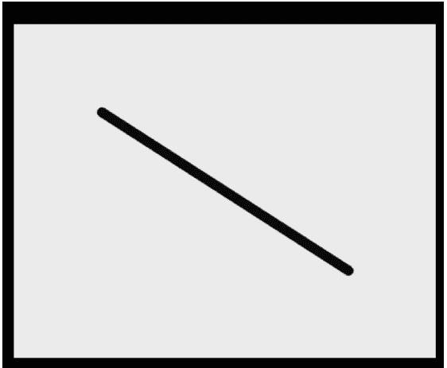

图 3.11 在画布上绘制一条线

### 3.5.3. 绘制矩形、圆形、椭圆和多边形线

类似地绘制其他形状，现在开始定义绘制形状的封装函数，就像上面的 `draw_line()` 函数一样。

```python
def draw_rectangle(image, top_left,
                   bottom_right,
                   color=(255,255,255),
                   thickness=1,
                   line_type=cv2.LINE_AA):
    cv2.rectangle(image, top_left,
                  bottom_right,
                  color, thickness, line_type)

def draw_circle(image, center, radius,
                color=(255,255,255),
                thickness=1,
                line_type=cv2.LINE_AA):
    cv2.circle(image, center, radius, color,
              thickness, line_type)

def draw_ellipse(image, center, axes, angle,
                 start_angle, end_angle,
                 color=(255,255,255),
                 thickness=1,
                 line_type=cv2.LINE_AA):
    cv2.ellipse(image, center, axes, angle,
                start_angle, end_angle,
                color, thickness, line_type)

def draw_polylines(image, points,
                   is_closed=True,
                   color=(255,255,255),
                   thickness=1,
                   line_type=cv2.LINE_AA ):
    cv2.polylines(image, points, is_closed,
                  color, thickness, line_type)
```

结果如图 3.12 所示：

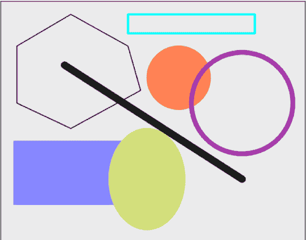

图 3.12 在画布上绘制形状

从 Github 仓库打开 *DrawShapes.py* 文件，它包含了绘制所有形状的代码，执行它，结果如上图 3.12 所示。

我们不会逐一解释上述代码中的函数；它们很直接，与上面的 `cv2.line()` 函数类似。

详情请参考 OpenCV 绘制函数的文档：[https://docs.opencv.org/4.7.0/d6/d6e/group__imgproc__draw.html](https://docs.opencv.org/4.7.0/d6/d6e/group__imgproc__draw.html)

## 3.6. 绘制文本

来源：DrawTexts.py
库：common/Draw.py

OpenCV 不仅提供了绘制形状的函数，还提供了绘制文本的函数。`cv2.putText()` 函数用于绘制文本。

类似地，定义一个封装函数 `draw_text()`：

```python
def draw_text(image, text, org,
    font_face=cv2.FONT_HERSHEY_COMPLEX,
    font_scale=1,
    color=(255,255,255),
    thickness=1,
    line_type=cv2.LINE_AA):
    cv2.putText(image, text, org, font_face,
    font_scale, color, thickness,
    line_type )
```

然后创建一个画布，将其填充为浅灰色，然后调用 `draw_text()` 函数来绘制文本。

```python
canvas = np.zeros((380, 480, 3), np.uint8)
canvas[:] = 235,235,235
### 绘制文本
draw_text(canvas, "Hello OpenCV", (50, 100),
color=(125, 0, 0),
font_scale=1.5,
thickness=2)
cv2.imshow("Hello OpenCV", canvas)
cv2.waitKey(0)
cv2.destroyAllWindows()
```

结果如图 3.13 所示：

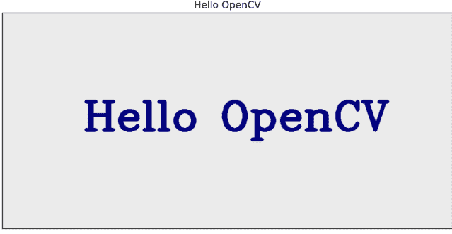

图 3.13 在画布上绘制文本

此版本的 OpenCV 支持有限的字体集，下表显示了支持的字体。

| 字体代码 | 描述 |
| :--- | :--- |
| FONT_HERSHEY_SIMPLEX | 正常大小的无衬线字体 |
| FONT_HERSHEY_PLAIN | 小号无衬线字体 |
| FONT_HERSHEY_DUPLEX | 正常大小的无衬线字体（比 FONT_HERSHEY_SIMPLEX 更复杂） |
| FONT_HERSHEY_COMPLEX | 正常大小的衬线字体 |
| FONT_HERSHEY_TRIPLEX | 正常大小的衬线字体（比 FONT_HERSHEY_COMPLEX 更复杂） |
| FONT_HERSHEY_COMPLEX_SMALL | FONT_HERSHEY_COMPLEX 的较小版本 |
| FONT_HERSHEY_SCRIPT_SIMPLEX | 手写风格字体 |
| FONT_HERSHEY_SCRIPT_COMPLEX | FONT_HERSHEY_SCRIPT_SIMPLEX 的更复杂变体 |
| FONT_ITALIC | 斜体字体标志 |

详情请参考 OpenCV 文档：[https://docs.opencv.org/4.7.0/d6/d6e/group__imgproc__draw.html](https://docs.opencv.org/4.7.0/d6/d6e/group__imgproc__draw.html)。

## 3.7. 绘制一个类似 OpenCV 的图标

来源：DrawTexts.py
库：common/Draw.py

现在让我们使用我们的封装函数来绘制一个复杂的图像，虽然不完全相同，但类似于 OpenCV 图标，如图 3.14 所示。

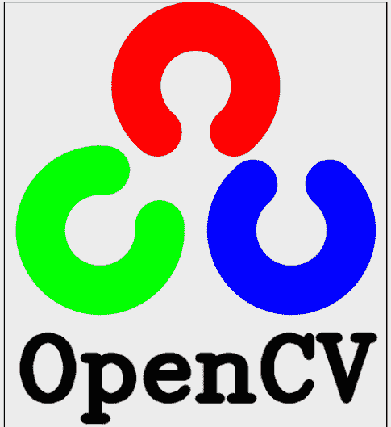

图 3.14 类似 OpenCV 的图标

创建一个大小为 360 x 320 的浅灰色空画布，与上面相同。
将使用 `cv2.ellipse()` 函数来绘制三个未闭合的圆，可以为椭圆指定起始角度和结束角度。
将使用 `cv2.putText()` 函数在底部绘制文本。
以下是代码片段，椭圆的轴定义为 (50, 50)，因此它看起来像一个圆而不是椭圆。三个圆的中心以及每个圆的起始和结束角度是根据类似 OpenCV 图标的位置定义的。

```python
def draw_opencv_icon(image):
    axes = (50, 50)
    center_top_circle = (160, 70)
    center_lowerleft_circle = (
        center_top_circle[0]-80,
        center_top_circle[1]+120 )
    center_lowerright_circle = (
        center_top_circle[0]+80,
        center_top_circle[1]+120 )
    angle_top_circle = 90
    angle_lowerleft_circle = -45
    angle_lowerright_circle = -90
    start_angle = 40
    end_angle = 320
    draw_ellipse(image,center_top_circle,
                 axes,
                 angle_top_circle,
                 start_angle, end_angle,
                 color=(0, 0, 255),
                 thickness=40)

    draw_ellipse(image,
                 center_lowerleft_circle,
                 axes,
                 angle_lowerleft_circle,
                 start_angle, end_angle,
                 color=(0, 255, 0),
                 thickness=40)

    draw_ellipse(image,
                 center_lowerright_circle,
                 axes,
                 angle_lowerright_circle,
                 start_angle, end_angle,
                 color=(255, 0, 0),
                 thickness=40)

    draw_text(image, "OpenCV", (10,330),
             color=(0,0,0),
             font_scale=2.4, thickness=5)


if __name__ == '__main__':
    canvas = np.zeros((360,320,3), np.uint8)
    canvas[:] = 235,235,235
    draw_opencv_icon(canvas)
    cv2.imshow("Canvas", canvas)
    cv2.waitKey(0)
    cv2.destroyAllWindows()
```

执行代码，结果如图 3.14 所示。

# 4. 用户交互

OpenCV 提供了允许用户以各种方式与图像和视频交互的函数。在前面的章节中，`cv2.waitKey()` 函数已被用于接受来自键盘的用户输入，并且可以通过检查函数返回的按键代码来检测 ESC 键。而 `cv2.destroyAllWindows()` 函数会关闭所有使用 `cv2.imshow()` 创建的窗口。这些是非常简单的用户交互函数。

此外，OpenCV 还提供了其他几个用于用户交互的函数，本章将介绍一些常用的函数。

第 4.1 节介绍鼠标操作，以及如何使用回调函数来捕获鼠标事件。
第 4.2 节使用鼠标绘制圆形，第 4.3 节绘制多边形。
第 4.4 节使用鼠标指定一个矩形来裁剪图像。
第 4.5 节介绍滑动条（或滑块），供用户输入数值。

用户交互的重要部分是*回调*函数，它们几乎被所有的用户操作事件所使用。本章将解释如何在 Python 中定义和使用回调函数。

享受使用 OpenCV 和 Python 进行用户交互的乐趣。

## 4.1. 鼠标操作

源文件：Mouse.py
库：common/Draw.py

OpenCV 提供了控制和管理各种鼠标事件的功能，为程序员操作用户交互提供了灵活性。它可以捕获由鼠标操作生成的事件，例如左键按下、右键按下、鼠标移动和双击等。回调函数可用于捕获这些鼠标事件。

以下代码片段将打印出 OpenCV 支持的所有鼠标事件列表：

```python
import cv2

for event in dir(cv2):
    if "EVENT" in event:
        print(event)
```

它显示了一个鼠标事件列表，如下表所示：

| EVENT_FLAG_ALTKEY | 当按下 ALT 键时。 |
| EVENT_FLAG_CTRLKEY | 当按下 CTRL 键时。 |
| EVENT_FLAG_LBUTTON | 当鼠标左键按下时。 |
| EVENT_FLAG_MBUTTON | 当鼠标中键按下时。 |
| EVENT_FLAG_RBUTTON | 当鼠标右键按下时。 |
| EVENT_FLAG_SHIFTKEY | 当按下 SHIFT 键时。 |
| EVENT_LBUTTONDBLCLK | 当双击左键时。 |
| EVENT_LBUTTONDOWN | 当点击左键时。 |
| EVENT_LBUTTONUP | 当释放左键时。 |
| EVENT_MBUTTONDBLCLK | 当双击中键时。 |
| EVENT_MBUTTONDOWN | 当点击中键时。 |
| EVENT_MBUTTONUP | 当释放中键时。 |
| EVENT_MOUSEHWHEEL | 当使用鼠标滚轮执行水平滚动时。 |
| EVENT_MOUSEMOVE | 当鼠标移动时。 |
| EVENT_MOUSEWHEEL | 当使用鼠标滚轮执行垂直滚动时。 |
| EVENT_RBUTTONDBLCLK | 当双击右键时。 |
| EVENT_RBUTTONDOWN | 当点击右键时。 |
| EVENT_RBUTTONUP | 当释放右键时。 |

本示例将展示如何使用回调函数捕获鼠标事件。加载并显示一张图像，当鼠标在图像上点击时，像素的 x、y 坐标以及蓝色、绿色和红色值将打印在单独的窗口中。

```python
def mouse_event(event, x, y, flags, param):
    if event == cv2.EVENT_LBUTTONDOWN:
        blue = img[y, x, 0]
        green = img[y, x, 1]
        red = img[y, x, 2]
        mycolorImage = np.zeros((100, 280, 3),
                                np.uint8)
        mycolorImage[:] = [blue, green, red]
        strBGR = "(B,G,R) = (" + str(blue) + ", "+str(green)+",
        " + str(red) + ")"
        strXY = "(X,Y) = ("+str(x)+", "+str(y)+")"
        txtFont = cv2.FONT_HERSHEY_COMPLEX
        txtColor = (255, 255, 255)
        cv2.putText(mycolorImage,strXY, (10,30),
                    txtFont, .6, txtColor,1)
        cv2.putText(mycolorImage,strBGR,(10,50),
                    txtFont,.6, txtColor,1)
        cv2.imshow("color", mycolorImage)

if __name__ == '__main__':
    img = cv2.imread("../res/flower003.jpg")
    cv2.imshow("image", img)
    cv2.setMouseCallback("image", mouse_event)
    cv2.waitKey(0)
    cv2.destroyAllWindows()
```

解释：

| 第 1 行 | 定义鼠标回调函数。事件类型和坐标 (x, y) 在回调函数的参数中。 |
| 第 2 行 | 检查事件是否为鼠标左键按下。 |
| 第 3 - 5 行 | 检索坐标 (x, y) 处的 BGR 颜色值。 |
| 第 6 行 | 创建一个用于显示坐标和颜色值的画布。 |
| 第 7 行 | 用鼠标点击点的颜色填充画布。 |
| 第 8 - 9 行 | 创建将要显示的文本——坐标和颜色值。 |
| 第 10, 11 行 | 指定要显示的文本的字体和颜色。 |
| 第 12, 13 行 | 使用 cv2.putText() 函数显示文本。 |
| 第 14 行 | 在单独的窗口中显示画布。 |
| 第 16 行 | 代码执行的主入口。 |
| 第 17, 18 行 | 加载并显示图像。 |
| 第 19 行 | 设置用于捕获鼠标事件的回调函数。 |

执行代码，图像被加载并显示，每当鼠标在图像上点击时，像素的坐标 (x, y) 和颜色值 (B, G, R) 就会显示在单独的窗口中，并且背景颜色填充为该像素的颜色，如图 4.1 所示。

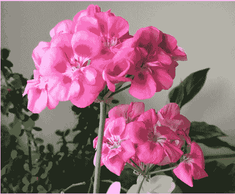

像素颜色
(X,Y) = (243, 109)
(B,G,R) = (218, 129, 255)

图 4.1 鼠标点击图像

## 4.2. 用鼠标绘制圆

源文件：DrawCircleWithMouse.py
库：common/Draw.py

本示例将使用鼠标和 OpenCV 提供的 `cv2.circle()` 函数来绘制圆。该函数的基本语法如下：

```python
cv2.circle(img, center, radius, color, thickness)
```

参数：

| img | 你想在上面绘制圆的图像。 |
| center | 圆的中心，指定为 (x, y) 坐标的元组。 |
| radius | 圆的半径，单位为像素。 |
| color | 圆的颜色，指定为 (B, G, R) 值的元组。 |
| thickness | 圆轮廓的粗细。使用负值来填充圆。 |

本示例的工作方式如下：当按下鼠标左键时，确定圆的中心，然后按住左键并移动鼠标，在鼠标移动时持续计算圆的半径。当释放鼠标左键时，半径被最终确定，并在画布上绘制最终的圆，中心坐标和半径也会显示在画布上。当按住左键移动鼠标时，会绘制一个细圆以指示圆的形状。

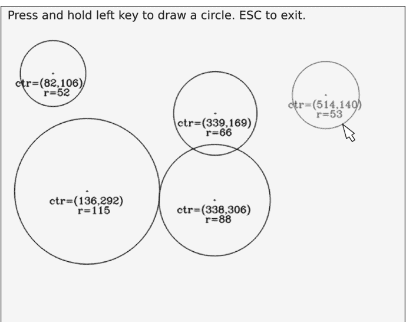

图 4.2 用鼠标绘制圆

以下是代码：

```python
import cv2
import numpy as np
import math
import common.Draw as dw

drawing = False
final_color = (255, 255, 255)
drawing_color = (125, 125, 125)

def on_mouse(event, x, y, flags, param):
    global drawing, ctr, radius, img, img_bk
    if event == cv2.EVENT_LBUTTONDOWN:
        drawing = True
        ctr = x, y
        radius = 0
        draw_circle(img, ctr, radius,
                   drawing_color)
    elif event == cv2.EVENT_MOUSEMOVE:
        if drawing == True:
            img = img_bk.copy()
            radius = calc_radius(ctr, (x,y))
            draw_circle(img, ctr, radius,
                        drawing_color)
    elif event == cv2.EVENT_LBUTTONUP:
        drawing = False
        radius = calc_radius(ctr, (x,y))
        draw_circle(img, ctr, radius,
                   final_color, 2, True)
        img_bk = img.copy()
```

源代码有点长，我们将其分成三部分。首先看看鼠标回调函数 `on_mouse()`，它捕获三个事件：EVENT_LBUTTONDOWN、EVENT_MOUSEMOVE 和 EVENT_RBUTTONDOWN。

| 第 4 行 | 从 common.Draw 导入一个模块，该模块包含我们在第 3.5 节中解释过的用于绘制形状的包装函数。 |
| 第 6 - 8 行 | 定义全局变量：绘制标志、绘制颜色。 |
| 第 10 行 | 定义鼠标回调函数。 |
| 第 12 - 16 行 | 当按下左键时，通过将绘制标志设置为 True 开始绘制，并绘制圆的中心点。 |
| 第 17 - 21 行 | 当鼠标移动时，根据中心点和当前点计算半径，然后用 drawing_color 绘制指示器（一个细圆）。 |
| 第 22 - 26 行 | 当释放左键时，完成绘制，并用 final_color 绘制最终的圆。 |

源代码的下一部分是定义几个函数：`calc_radius()` 使用数学函数 `math.hypot()` 根据中心点和当前点计算半径；`draw_circle()` 用于绘制圆，包括绘制中心点和绘制文本以显示中心坐标和半径。`print_instruction()` 用于在画布顶部显示说明文本。

```python
def calc_radius(center, current_point):
    cx, cy = current_point
    tx, ty = center
    return int(math.hypot(cx - tx, cy - ty))

def draw_circle(img, center, r, color,
                line_scale=1, is_final=False ):
    txtCenter = "ctr=(%d,%d)" % center
    txtRadius = "r=%d" % radius
    if is_final == True:
        print("Completing circle with %s and %s" %
              (txtCenter, txtRadius))
    dw.draw_circle(img, center, 1, color,
                   line_scale)  # 绘制中心点
    dw.draw_circle(img, center, r, color,
                   line_scale)  # 绘制圆
    dw.draw_text(img, txtCenter, (center[0]-60,
                   center[1]+20), 0.5, color)
    dw.draw_text(img, txtRadius, (center[0]-15,
                   center[1]+35), 0.5, color)

def print_instruction(img):
    txtInstruction = "Press and hold left key to
                      draw a circle. ESC to exit."
    dw.draw_text(img,txtInstruction, (10, 20), 0.5,
                 (255, 255, 255))
```

## 4.3. 用鼠标绘制多边形

源文件：DrawPolygonWithMouse.py
库：common/Draw.py

与上面绘制圆形的示例类似，本示例将使用鼠标绘制多边形。OpenCV 提供了 `cv2.polylines()` 函数来绘制折线或多边形。

```
cv2.polylines(img, points, is_closed,
              color, thickness)
```

`points` 指定了多边形/折线的顶点（多边形的角点），`is_closed=True` 将绘制一个封闭的多边形，如果为 `False`，则绘制折线。其他参数与上一节中的 `cv2.circle()` 相同。

本示例的工作方式如下：每次点击鼠标左键时，会向多边形添加一个点；当鼠标移动时，会在最后一个点和鼠标当前点之间绘制一条细线，以指示线条将绘制的位置。当点击右键时，将使用所有点绘制最终的多边形。

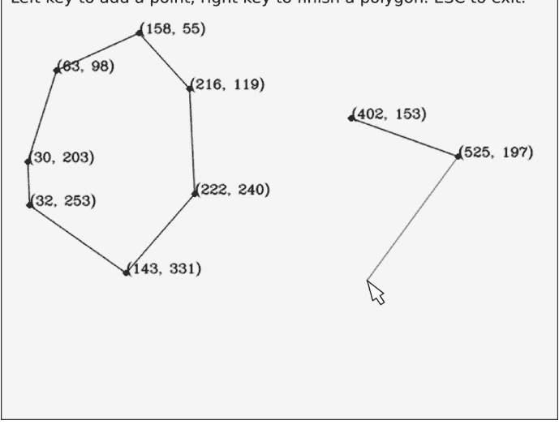

图 4.3 用鼠标绘制多边形

完整的源代码位于 Github 仓库的 DrawPolygonWithMouse.py 中。源代码与之前绘制圆形的示例非常相似，我们在此不再逐行解释。唯一的区别是，当发生 `EVENT_LBUTTONDOWN`（左键按下）事件时，使用一个数组来存储多边形的顶点，并根据顶点数组绘制多边形。

当鼠标移动时，会使用 `drawing_color` 在数组中的最后一个点和当前鼠标点之间绘制一条细线，这条细线会随着鼠标移动而变化，以指示线条。
当鼠标右键点击时，会捕获 `EVENT_RBUTTONDOWN` 事件，然后完成绘制，并使用 `final_color` 绘制最终的多边形。
执行 *DrawPolygonWithMouse.py* 中的代码，你就可以用鼠标绘制多边形了，结果类似于图 4.3。

## 4.4. 用鼠标裁剪图像

| 源文件： | CropImageWithMouse.py |
| 库： | common/Draw.py |

本示例将加载一张图像，并使用鼠标绘制一个矩形，然后根据该矩形裁剪图像，如图 4.4 所示：

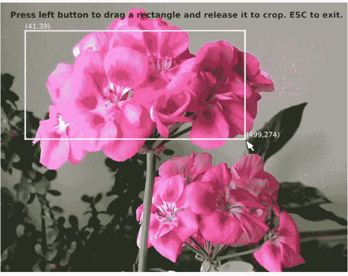

图 4.4 用鼠标裁剪图像

当鼠标左键在图像上点击时，会捕获第一个点，通常是矩形的左上角，但这取决于鼠标的移动方向，我们稍后会处理。
然后按住左键并移动鼠标，与之前章节类似，在鼠标移动时会绘制一个矩形以指示其形状，同时会显示第一个点和鼠标当前位置的坐标，如图 4.4 所示。
当左键释放时，会捕获第二个点，并绘制最终的矩形，同时会显示一个单独的窗口，其中包含裁剪后的图像。
完整的源代码位于 Github 仓库的 *CropImageWithMouse.py* 文件中，它与之前绘制圆形和多边形的示例类似。
现在我们只关注源代码中裁剪图像的部分。如前所述，当鼠标左键按下时，会捕获并记录第一个点，当释放时，会记录第二个点。
要裁剪图像，使用数组操作即可轻松完成。

```
cropped_image = image[y_start:y_end, x_start:x_end]
```

图像数据存储在 `image` 数组中，其第一维是 y 坐标，第二维是 x 坐标。`y_start:y_end` 将仅选择 `y_start` 和 `y_end` 之间的行，类似地，`x_start:x_end` 将仅选择两者之间的列。
根据鼠标的移动方向，第一个点不一定是左上角，第二个点也不一定是右下角。我们在 `crop_image()` 函数中通过比较第一个点和第二个点的 x 和 y 值来解决这个问题，较小的 x 和 y 将是左上角点，较大的将是右下角点。代码片段如下所示：

```
def crop_image(img, pt_first, pt_second):
    # 左上角点
    x_tl, y_tl = pt_first
    # 右下角点
    x_br, y_br = pt_second
    # 如果相反则交换 x 值
    if x_br < x_tl:
        x_br, x_tl = x_tl, x_br
    # 如果相反则交换 y 值
    if y_br < y_tl:
        y_br, y_tl = y_tl, y_br
    cropped_image = img[y_tl:y_br, x_tl:x_br]
    cv2.imshow("Cropped Image", cropped_image)
```

解释：

| 行号 | 描述 |
|---|---|
| 第 1 行 | 定义 crop_image() 函数。 |
| 第 2 – 3 行 | 从第一个点和第二个点中检索 x 和 y 值。 |
| 第 4 – 5 行 | 比较两个 x 值，如果第二个值较小则交换。 |
| 第 6 – 7 行 | 比较两个 y 值，如果第二个值较小则交换。 |
| 第 8 行 | 使用 Python 数组操作创建裁剪后的图像，裁剪后的图像是基于左上角和右下角值的原始图像的子集。 |
| 第 9 行 | 显示裁剪后的图像。 |

执行 CropImageWithMouse.py 文件中的代码，你就可以通过鼠标操作裁剪图像了，效果类似于图 4.4。

## 4.5. 使用轨迹条输入值

源文件：UserInputWithTrackbar.py

轨迹条（Trackbar），或称滑块（Slider），是一种图形用户界面组件，允许用户通过沿水平条滑动旋钮来调整范围内的参数，如图 4.5 所示。它在计算机视觉应用中常用于实时参数调整，例如，用户可以通过沿条拖动旋钮来调整 0 到 100 范围内的亮度。


图 4.5 一个示例轨迹条

在 OpenCV 中，`cv2.createTrackbar()` 函数用于创建轨迹条。该函数接受多个参数，包括轨迹条的名称、它将出现的窗口的名称、轨迹条的初始值、最大值，以及一个在轨迹条移动时被调用的回调函数。当用户移动旋钮时，回调函数将被调用，并执行回调函数中定义的操作。
以下是创建示例轨迹条的代码片段：

```
import cv2
import numpy as np
def on_trackbar(val):
    print("Trackbar value:", val)

cv2.namedWindow("Trackbar Window")
cv2.createTrackbar("Trackbar", "Trackbar Window",
                    0, 100, on_trackbar)
canvas = np.zeros((100, 800, 3), np.uint8)
canvas[:] = 235,235,235

while True:
    cv2.imshow("Trackbar Window", canvas)
    if cv2.waitKey(1) & 0xFF == 27:
        break
cv2.destroyAllWindows()
```

轨迹条的范围是从 0 到最大值 100，每当鼠标移动旋钮时，都会调用回调函数 `on_trackbar()`，它只是将轨迹条的当前值打印到控制台。
轨迹条显示在一个名为 "Trackbar Window" 的窗口中，该窗口使用 `cv2.namedWindow()` 函数创建，窗口内容是一个浅灰色的画布，就像我们之前做的那样。在主循环中，调用 `cv2.imshow()` 来显示轨迹条窗口，调用 `cv2.waitKey()` 来等待按键。当用户按下 ESC 键时，它会跳出循环并使用 `cv2.destroyAllWindows()` 销毁窗口。
当用户通过移动旋钮与轨迹条交互时，`on_trackbar()` 函数会被调用，并将轨迹条的当前值作为其参数。这个值然后可用于实时调整参数，例如图像处理算法的亮度。

下面的示例将显示一个网络摄像头，如前面的第3.3节所示，同时包含四个用于调整网络摄像头亮度、对比度、饱和度和色调的轨迹条。

在Github仓库中打开 *UserInputWithTrackbar.py* 文件，下面定义了四个回调函数：

```python
import cv2

def change_brightness(value):
    global cap
    print("Brightness: " + str(value))
    cap.set(cv2.CAP_PROP_BRIGHTNESS, value)

def change_contrast(value):
    print("Contrast: " + str(value))
    cap.set(cv2.CAP_PROP_CONTRAST, value)

def change_saturation(value):
    print("Saturation: " + str(value))
    cap.set(cv2.CAP_PROP_SATURATION, value)

def change_hue(value):
    print("Hue: " + str(value))
    cap.set(cv2.CAP_PROP_HUE, value)
```

解释：

| 行号 | 描述 |
|------|-------------|
| 3 | 定义一个用于亮度的轨迹条回调函数。用户通过轨迹条输入的值将作为参数传递给此函数。 |
| 4 | 将 `cap` 声明为全局变量。 |
| 5 | 打印出轨迹条的值。 |
| 6 | 使用该值设置摄像头属性。 |
| 8 - 18 | 以相同方式定义其他三个轨迹条回调函数，分别用于对比度、饱和度和色调。 |

然后，定义主函数来设置轨迹条并显示网络摄像头，

```python
def main():
    global cap
    # read from webcam
    cap = cv2.VideoCapture(0, cv2.CAP_DSHOW)
    # set width
    cap.set(cv2.CAP_PROP_FRAME_WIDTH, 800)
    # set height
    cap.set(cv2.CAP_PROP_FRAME_HEIGHT, 480)
    # set initial brightness
    cap.set(cv2.CAP_PROP_BRIGHTNESS, 100)
    # set initial contrast
    cap.set(cv2.CAP_PROP_CONTRAST, 50)
    # set initial saturation
    cap.set(cv2.CAP_PROP_SATURATION, 90)
    # set initial hue
    cap.set(cv2.CAP_PROP_HUE, 15)
    cv2.namedWindow('Webcam')
    cv2.createTrackbar('Brightness', 'Webcam', 100, 300, change_brightness)
    cv2.createTrackbar('Contrast', 'Webcam', 50, 300, change_contrast)
    cv2.createTrackbar('Saturation', 'Webcam', 90, 100, change_saturation)
    cv2.createTrackbar('Hue', 'Webcam', 15, 360, change_hue)

    success, img = cap.read()
    while success:
        cv2.imshow("Webcam", img)

        # Press ESC key to break the loop
        if cv2.waitKey(10) & 0xFF == 27:
            break
        success, img = cap.read()

    cap.release()
    cv2.destroyWindow("Webcam")

if __name__ == '__main__':
    main()
```

解释：

| 行号 | 描述 |
|------|-------------|
| 21 | 将 `cap` 声明为全局变量，用于上面第4行作为全局变量。 |
| 22 | 打开网络摄像头通道并将其读入捕获对象 `cap`。 |
| 23 - 28 | 为网络摄像头捕获对象设置初始属性。 |
| 30 - 34 | 创建一个命名窗口并在窗口中创建四个轨迹条。这里通过最后一个参数将上面定义的回调函数设置给轨迹条。每个轨迹条的范围在此设置。 |
| 36 – 46 | 与第3.3节中显示网络摄像头相同。 |
| 48 - 49 | 执行的主入口。 |

执行代码后，网络摄像头窗口旁会显示四个轨迹条，用于调整亮度、对比度、饱和度和色调。下面的图4.6仅显示了轨迹条区域，网络摄像头画面也显示在窗口中。当鼠标移动每个滑块时，你会看到摄像头画面相应地变化。

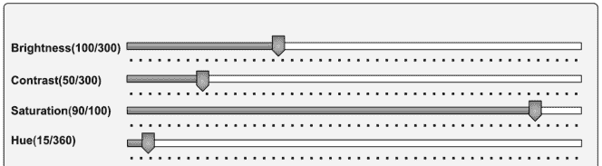

图4.6 轨迹条

# 5. 图像处理

回顾之前的讨论，数字图像表示为像素值的数组。数组中的每个像素代表图像的一个微小元素，其值决定了该元素的颜色或强度。对于灰度图像，像素值表示为0到255范围内的整数，其中0代表黑色，255代表白色。对于彩色图像，像素值表示为蓝色、绿色和红色（BGR）通道的组合，每个通道是灰度值在0到255之间的值。

在OpenCV中，数字图像由多维数组表示，灰度图像由2D数组表示，彩色图像由3D数组表示。

图像处理是一种应用某些数学算法并使用各种函数和技术来操作数字图像的技术，目的是获得具有增强效果的期望结果，例如提高图像质量或从中提取有用信息。

OpenCV提供了许多图像处理方法，本章将介绍一些常用且广泛使用的图像处理方法。

本章从第5.1节的颜色空间转换开始，这是图像处理的基础，我们将介绍灰度、BGR和HSV颜色空间之间的转换。

第5.2节将解释如何调整图像大小、裁剪和旋转。本章还将介绍Python的面向对象特性，我们将创建类来包含函数，并编写代码来实例化这些类并调用这些函数。

第5.3节将解释如何调整亮度和对比度，第5.4节将调整图像的色调、饱和度和明度。通过调整这些值，可以相应地改变图像的颜色和亮度，这是图像处理中非常重要的一部分。

第5.5节将介绍图像融合，即基于算法混合两张图像。第5.6节将介绍基于位运算的图像混合或混合两张图像，这可以实现不同的效果。

第5.7节将描述图像扭曲，这是一种将倾斜和扭曲的图像转换为拉直图像的方法。

第5.8节将介绍图像模糊，这是一种通过去除图像中的噪声使图像平滑的技术。有许多不同的方法可以实现，本节将重点介绍两种图像模糊方法：高斯模糊和中值模糊。

最后，第5.9节将介绍直方图，它为我们提供了关于图像颜色分布的重要信息。

享受使用OpenCV和Python进行图像处理吧。

## 5.1. 颜色空间转换

来源：ColorSpace.py

第3.4节已经解释了彩色图像可以使用BGR或HSV颜色空间表示，彩色图像也可以转换为灰度图像。OpenCV提供了许多颜色空间转换方法，这里我们介绍其中两种：BGR与灰度之间的转换，以及BGR与HSV之间的转换。

### 5.1.1. 将BGR转换为灰度

有两种方法可以从彩色图像获得灰度图像：1）使用 `cv2.cvtColor()` 函数，第二个参数为 `cv2.COLOR_BGR2GRAY`；2）使用 `cv2.imread()` 函数，第二个参数为 `cv2.IMREAD_GRAYSCALE`，以灰度模式加载图像。

第一种方法加载彩色图像然后将其转换为灰度图像，因此内存中同时有彩色和灰度图像可用。

然而，如果不需要彩色图像，第二种方法仅以灰度模式加载图像，这种情况下彩色图像不可用，可以节省一些内存。下面的代码片段展示了这两种方法：

```python
def convert_bgr2gray(image):
    gray = cv2.cvtColor(image, cv2.COLOR_BGR2GRAY)
    return gray

def load_image_gray(file_name):
    gray = cv2.imread(file_name,
                      cv2.IMREAD_GRAYSCALE)
    return gray
```

第1到3行是第一种方法，`image` 中的彩色图像作为参数传递，`cv2.cvtColor()` 函数将其转换为灰度图像。

第5到7行是第二种方法，它直接从文件以灰度模式加载图像。

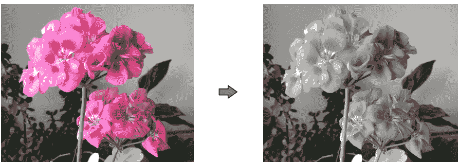

*彩色图像* &nbsp;&nbsp;&nbsp;&nbsp;&nbsp;&nbsp;&nbsp;&nbsp;&nbsp;&nbsp;&nbsp;&nbsp;&nbsp;&nbsp;&nbsp;&nbsp;&nbsp;&nbsp;&nbsp;&nbsp;&nbsp;&nbsp;&nbsp;&nbsp;&nbsp;&nbsp;&nbsp;&nbsp;&nbsp;&nbsp;&nbsp;&nbsp;&nbsp;&nbsp;&nbsp;&nbsp;&nbsp;&nbsp;&nbsp;&nbsp;&nbsp;&nbsp;&nbsp;&nbsp;&nbsp;&nbsp;&nbsp;&nbsp;&nbsp;&nbsp;&nbsp;&nbsp;&nbsp;&nbsp;&nbsp;&nbsp;&nbsp;&nbsp;&nbsp;&nbsp;&nbsp;&nbsp;&nbsp;&nbsp;&nbsp;&nbsp;&nbsp;&nbsp;&nbsp;&nbsp;&nbsp;&nbsp;&nbsp;&nbsp;&nbsp;&nbsp;&nbsp;&nbsp;&nbsp;&nbsp;&nbsp;&nbsp;&nbsp;&nbsp;&nbsp;&nbsp;&nbsp;&nbsp;&nbsp;&nbsp;&nbsp;&nbsp;&nbsp;&nbsp;&nbsp;&nbsp;&nbsp;&nbsp;&nbsp;&nbsp;&nbsp;&nbsp;&nbsp;&nbsp;&nbsp;&nbsp;&nbsp;&nbsp;&nbsp;&nbsp;&nbsp;&nbsp;&nbsp;&nbsp;&nbsp;&nbsp;&nbsp;&nbsp;&nbsp;&nbsp;&nbsp;&nbsp;&nbsp;&nbsp;&nbsp;&nbsp;&nbsp;&nbsp;&nbsp;&nbsp;&nbsp;&nbsp;&nbsp;&nbsp;&nbsp;&nbsp;&nbsp;&nbsp;&nbsp;&nbsp;&nbsp;&nbsp;&nbsp;&nbsp;&nbsp;&nbsp;&nbsp;&nbsp;&nbsp;&nbsp;&nbsp;&nbsp;&nbsp;&nbsp;&nbsp;&nbsp;&nbsp;&nbsp;&nbsp;&nbsp;&nbsp;&nbsp;&nbsp;&nbsp;&nbsp;&nbsp;&nbsp;&nbsp;&nbsp;&nbsp;&nbsp;&nbsp;&nbsp;&nbsp;&nbsp;&nbsp;&nbsp;&nbsp;&nbsp;&nbsp;&nbsp;&nbsp;&nbsp;&nbsp;&nbsp;&nbsp;&nbsp;&nbsp;&nbsp;&nbsp;&nbsp;&nbsp;&nbsp;&nbsp;&nbsp;&nbsp;&nbsp;&nbsp;&nbsp;&nbsp;&nbsp;&nbsp;&nbsp;&nbsp;&nbsp;&nbsp;&nbsp;&nbsp;&nbsp;&nbsp;&nbsp;&nbsp;&nbsp;&nbsp;&nbsp;&nbsp;&nbsp;&nbsp;&nbsp;&nbsp;&nbsp;&nbsp;&nbsp;&nbsp;&nbsp;&nbsp;&nbsp;&nbsp;&nbsp;&nbsp;&nbsp;&nbsp;&nbsp;&nbsp;&nbsp;&nbsp;&nbsp;&nbsp;&nbsp;&nbsp;&nbsp;&nbsp;&nbsp;&nbsp;&nbsp;&nbsp;&nbsp;&nbsp;&nbsp;&nbsp;&nbsp;&nbsp;&nbsp;&nbsp;&nbsp;&nbsp;&nbsp;&nbsp;&nbsp;&nbsp;&nbsp;&nbsp;&nbsp;&nbsp;&nbsp;&nbsp;&nbsp;&nbsp;&nbsp;&nbsp;&nbsp;&nbsp;&nbsp;&nbsp;&nbsp;&nbsp;&nbsp;&nbsp;&nbsp;&nbsp;&nbsp;&nbsp;&nbsp;&nbsp;&nbsp;&nbsp;&nbsp;&nbsp;&nbsp;&nbsp;&nbsp;&nbsp;&nbsp;&nbsp;&nbsp;&nbsp;&nbsp;&nbsp;&nbsp;&nbsp;&nbsp;&nbsp;&nbsp;&nbsp;&nbsp;&nbsp;&nbsp;&nbsp;&nbsp;&nbsp;&nbsp;&nbsp;&nbsp;&nbsp;&nbsp;&nbsp;&nbsp;&nbsp;&nbsp;&nbsp;&nbsp;&nbsp;&nbsp;&nbsp;&nbsp;&nbsp;&nbsp;&nbsp;&nbsp;&nbsp;&nbsp;&nbsp;&nbsp;&nbsp;&nbsp;&nbsp;&nbsp;&nbsp;&nbsp;&nbsp;&nbsp;&nbsp;&nbsp;&nbsp;&nbsp;&nbsp;&nbsp;&nbsp;&nbsp;&nbsp;&nbsp;&nbsp;&nbsp;&nbsp;&nbsp;&nbsp;&nbsp;&nbsp;&nbsp;&nbsp;&nbsp;&nbsp;&nbsp;&nbsp;&nbsp;&nbsp;&nbsp;&nbsp;&nbsp;&nbsp;&nbsp;&nbsp;&nbsp;&nbsp;&nbsp;&nbsp;&nbsp;&nbsp;&nbsp;&nbsp;&nbsp;&nbsp;&nbsp;&nbsp;&nbsp;&nbsp;&nbsp;&nbsp;&nbsp;&nbsp;&nbsp;&nbsp;&nbsp;&nbsp;&nbsp;&nbsp;&nbsp;&nbsp;&nbsp;&nbsp;&nbsp;&nbsp;&nbsp;&nbsp;&nbsp;&nbsp;&nbsp;&nbsp;&nbsp;&nbsp;&nbsp;&nbsp;&nbsp;&nbsp;&nbsp;&nbsp;&nbsp;&nbsp;&nbsp;&nbsp;&nbsp;&nbsp;&nbsp;&nbsp;&nbsp;&nbsp;&nbsp;&nbsp;&nbsp;&nbsp;&nbsp;&nbsp;&nbsp;&nbsp;&nbsp;&nbsp;&nbsp;&nbsp;&nbsp;&nbsp;&nbsp;&nbsp;&nbsp;&nbsp;&nbsp;&nbsp;&nbsp;&nbsp;&nbsp;&nbsp;&nbsp;&nbsp;&nbsp;&nbsp;&nbsp;&nbsp;&nbsp;&nbsp;&nbsp;&nbsp;&nbsp;&nbsp;&nbsp;&nbsp;&nbsp;&nbsp;&nbsp;&nbsp;&nbsp;&nbsp;&nbsp;&nbsp;&nbsp;&nbsp;&nbsp;&nbsp;&nbsp;&nbsp;&nbsp;&nbsp;&nbsp;&nbsp;&nbsp;&nbsp;&nbsp;&nbsp;&nbsp;&nbsp;&nbsp;&nbsp;&nbsp;&nbsp;&nbsp;&nbsp;&nbsp;&nbsp;&nbsp;&nbsp;&nbsp;&nbsp;&nbsp;&nbsp;&nbsp;&nbsp;&nbsp;&nbsp;&nbsp;&nbsp;&nbsp;&nbsp;&nbsp;&nbsp;&nbsp;&nbsp;&nbsp;&nbsp;&nbsp;&nbsp;&nbsp;&nbsp;&nbsp;&nbsp;&nbsp;&nbsp;&nbsp;&nbsp;&nbsp;&nbsp;&nbsp;&nbsp;&nbsp;&nbsp;&nbsp;&nbsp;&nbsp;&nbsp;&nbsp;&nbsp;&nbsp;&nbsp;&nbsp;&nbsp;&nbsp;&nbsp;&nbsp;&nbsp;&nbsp;&nbsp;&nbsp;&nbsp;&nbsp;&nbsp;&nbsp;&nbsp;&nbsp;&nbsp;&nbsp;&nbsp;&nbsp;&nbsp;&nbsp;&nbsp;&nbsp;&nbsp;&nbsp;&nbsp;&nbsp;&nbsp;&nbsp;&nbsp;&nbsp;&nbsp;&nbsp;&nbsp;&nbsp;&nbsp;&nbsp;&nbsp;&nbsp;&nbsp;&nbsp;&nbsp;&nbsp;&nbsp;&nbsp;&nbsp;&nbsp;&nbsp;&nbsp;&nbsp;&nbsp;&nbsp;&nbsp;&nbsp;&nbsp;&nbsp;&nbsp;&nbsp;&nbsp;&nbsp;&nbsp;&nbsp;&nbsp;&nbsp;&nbsp;&nbsp;&nbsp;&nbsp;&nbsp;&nbsp;&nbsp;&nbsp;&nbsp;&nbsp;&nbsp;&nbsp;&nbsp;&nbsp;&nbsp;&nbsp;&nbsp;&nbsp;&nbsp;&nbsp;&nbsp;&nbsp;&nbsp;&nbsp;&nbsp;&nbsp;&nbsp;&nbsp;&nbsp;&nbsp;&nbsp;&nbsp;&nbsp;&nbsp;&nbsp;&nbsp;&nbsp;&nbsp;&nbsp;&nbsp;&nbsp;&nbsp;&nbsp;&nbsp;&nbsp;&nbsp;&nbsp;&nbsp;&nbsp;&nbsp;&nbsp;&nbsp;&nbsp;&nbsp;&nbsp;&nbsp;&nbsp;&nbsp;&nbsp;&nbsp;&nbsp;&nbsp;&nbsp;&nbsp;&nbsp;&nbsp;&nbsp;&nbsp;&nbsp;&nbsp;&nbsp;&nbsp;&nbsp;&nbsp;&nbsp;&nbsp;&nbsp;&nbsp;&nbsp;&nbsp;&nbsp;&nbsp;&nbsp;&nbsp;&nbsp;&nbsp;&nbsp;&nbsp;&nbsp;&nbsp;&nbsp;&nbsp;&nbsp;&nbsp;&nbsp;&nbsp;&nbsp;&nbsp;&nbsp;&nbsp;&nbsp;&nbsp;&nbsp;&nbsp;&nbsp;&nbsp;&nbsp;&nbsp;&nbsp;&nbsp;&nbsp;&nbsp;&nbsp;&nbsp;&nbsp;&nbsp;&nbsp;&nbsp;&nbsp;&nbsp;&nbsp;&nbsp;&nbsp;&nbsp;&nbsp;&nbsp;&nbsp;&nbsp;&nbsp;&nbsp;&nbsp;&nbsp;&nbsp;&nbsp;&nbsp;&nbsp;&nbsp;&nbsp;&nbsp;&nbsp;&nbsp;&nbsp;&nbsp;&nbsp;&nbsp;&nbsp;&nbsp;&nbsp;&nbsp;&nbsp;&nbsp;&nbsp;&nbsp;&nbsp;&nbsp;&nbsp;&nbsp;&nbsp;&nbsp;&nbsp;&nbsp;&nbsp;&nbsp;&nbsp;&nbsp;&nbsp;&nbsp;&nbsp;&nbsp;&nbsp;&nbsp;&nbsp;&nbsp;&nbsp;&nbsp;&nbsp;&nbsp;&nbsp;&nbsp;&nbsp;&nbsp;&nbsp;&nbsp;&nbsp;&nbsp;&nbsp;&nbsp;&nbsp;&nbsp;&nbsp;&nbsp;&nbsp;&nbsp;&nbsp;&nbsp;&nbsp;&nbsp;&nbsp;&nbsp;&nbsp;&nbsp;&nbsp;&nbsp;&nbsp;&nbsp;&nbsp;&nbsp;&nbsp;&nbsp;&nbsp;&nbsp;&nbsp;&nbsp;&nbsp;&nbsp;&nbsp;&nbsp;&nbsp;&nbsp;&nbsp;&nbsp;&nbsp;&nbsp;&nbsp;&nbsp;&nbsp;&nbsp;&nbsp;&nbsp;&nbsp;&nbsp;&nbsp;&nbsp;&nbsp;&nbsp;&nbsp;&nbsp;&nbsp;&nbsp;&nbsp;&nbsp;&nbsp;&nbsp;&nbsp;&nbsp;&nbsp;&nbsp;&nbsp;&nbsp;&nbsp;&nbsp;&nbsp;&nbsp;&nbsp;&nbsp;&nbsp;&nbsp;&nbsp;&nbsp;&nbsp;&nbsp;&nbsp;&nbsp;&nbsp;&nbsp;&nbsp;&nbsp;&nbsp;&nbsp;&nbsp;&nbsp;&nbsp;&nbsp;&nbsp;&nbsp;&nbsp;&nbsp;&nbsp;&nbsp;&nbsp;&nbsp;&nbsp;&nbsp;&nbsp;&nbsp;&nbsp;&nbsp;&nbsp;&nbsp;&nbsp;&nbsp;&nbsp;&nbsp;&nbsp;&nbsp;&nbsp;&nbsp;&nbsp;&nbsp;&nbsp;&nbsp;&nbsp;&nbsp;&nbsp;&nbsp;&nbsp;&nbsp;&nbsp;&nbsp;&nbsp;&nbsp;&nbsp;&nbsp;&nbsp;&nbsp;&nbsp;&nbsp;&nbsp;&nbsp;&nbsp;&nbsp;&nbsp;&nbsp;&nbsp;&nbsp;&nbsp;&nbsp;&nbsp;&nbsp;&nbsp;&nbsp;&nbsp;&nbsp;&nbsp;&nbsp;&nbsp;&nbsp;&nbsp;&nbsp;&nbsp;&nbsp;&nbsp;&nbsp;&nbsp;&nbsp;&nbsp;&nbsp;&nbsp;&nbsp;&nbsp;&nbsp;&nbsp;&nbsp;&nbsp;&nbsp;&nbsp;&nbsp;&nbsp;&nbsp;&nbsp;&nbsp;&nbsp;&nbsp;&nbsp;&nbsp;&nbsp;&nbsp;&nbsp;&nbsp;&nbsp;&nbsp;&nbsp;&nbsp;&nbsp;&nbsp;&nbsp;&nbsp;&nbsp;&nbsp;&nbsp;&nbsp;&nbsp;&nbsp;&nbsp;&nbsp;&nbsp;&nbsp;&nbsp;&nbsp;&nbsp;&nbsp;&nbsp;&nbsp;&nbsp;&nbsp;&nbsp;&nbsp;&nbsp;&nbsp;&nbsp;&nbsp;&nbsp;&nbsp;&nbsp;&nbsp;&nbsp;&nbsp;&nbsp;&nbsp;&nbsp;&nbsp;&nbsp;&nbsp;&nbsp;&nbsp;&nbsp;&nbsp;&nbsp;&nbsp;&nbsp;&nbsp;&nbsp;&nbsp;&nbsp;&nbsp;&nbsp;&nbsp;&nbsp;&nbsp;&nbsp;&nbsp;&nbsp;&nbsp;&nbsp;&nbsp;&nbsp;&nbsp;&nbsp;&nbsp;&nbsp;&nbsp;&nbsp;&nbsp;&nbsp;&nbsp;&nbsp;&nbsp;&nbsp;&nbsp;&nbsp;&nbsp;&nbsp;&nbsp;&nbsp;&nbsp;&nbsp;&nbsp;&nbsp;&nbsp;&nbsp;&nbsp;&nbsp;&nbsp;&nbsp;&nbsp;&nbsp;&nbsp;&nbsp;&nbsp;&nbsp;&nbsp;&nbsp;&nbsp;&nbsp;&nbsp;&nbsp;&nbsp;&nbsp;&nbsp;&nbsp;&nbsp;&nbsp;&nbsp;&nbsp;&nbsp;&nbsp;&nbsp;&nbsp;&nbsp;&nbsp;&nbsp;&nbsp;&nbsp;&nbsp;&nbsp;&nbsp;&nbsp;&nbsp;&nbsp;&nbsp;&nbsp;&nbsp;&nbsp;&nbsp;&nbsp;&nbsp;&nbsp;&nbsp;&nbsp;&nbsp;&nbsp;&nbsp;&nbsp;&nbsp;&nbsp;&nbsp;&nbsp;&nbsp;&nbsp;&nbsp;&nbsp;&nbsp;&nbsp;&nbsp;&nbsp;&nbsp;&nbsp;&nbsp;&nbsp;&nbsp;&nbsp;&nbsp;&nbsp;&nbsp;&nbsp;&nbsp;&nbsp;&nbsp;&nbsp;&nbsp;&nbsp;&nbsp;&nbsp;&nbsp;&nbsp;&nbsp;&nbsp;&nbsp;&nbsp;&nbsp;&nbsp;&nbsp;&nbsp;&nbsp;&nbsp;&nbsp;&nbsp;&nbsp;&nbsp;&nbsp;&nbsp;&nbsp;&nbsp;&nbsp;&nbsp;&nbsp;&nbsp;&nbsp;&nbsp;&nbsp;&nbsp;&nbsp;&nbsp;&nbsp;&nbsp;&nbsp;&nbsp;&nbsp;&nbsp;&nbsp;&nbsp;&nbsp;&nbsp;&nbsp;&nbsp;&nbsp;&nbsp;&nbsp;&nbsp;&nbsp;&nbsp;&nbsp;&nbsp;&nbsp;&nbsp;&nbsp;&nbsp;&nbsp;&nbsp;&nbsp;&nbsp;&nbsp;&nbsp;&nbsp;&nbsp;&nbsp;&nbsp;&nbsp;&nbsp;&nbsp;&nbsp;&nbsp;&nbsp;&nbsp;&nbsp;&nbsp;&nbsp;&nbsp;&nbsp;&nbsp;&nbsp;&nbsp;&nbsp;&nbsp;&nbsp;&nbsp;&nbsp;&nbsp;&nbsp;&nbsp;&nbsp;&nbsp;&nbsp;&nbsp;&nbsp;&nbsp;&nbsp;&nbsp;&nbsp;&nbsp;&nbsp;&nbsp;&nbsp;&nbsp;&nbsp;&nbsp;&nbsp;&nbsp;&nbsp;&nbsp;&nbsp;&nbsp;&nbsp;&nbsp;&nbsp;&nbsp;&nbsp;&nbsp;&nbsp;&nbsp;&nbsp;&nbsp;&nbsp;&nbsp;&nbsp;&nbsp;&nbsp;&nbsp;&nbsp;&nbsp;&nbsp;&nbsp;&nbsp;&nbsp;&nbsp;&nbsp;&nbsp;&nbsp;&nbsp;&nbsp;&nbsp;&nbsp;&nbsp;&nbsp;&nbsp;&nbsp;&nbsp;&nbsp;&nbsp;&nbsp;&nbsp;&nbsp;&nbsp;&nbsp;&nbsp;&nbsp;&nbsp;&nbsp;&nbsp;&nbsp;&nbsp;&nbsp;&nbsp;&nbsp;&nbsp;&nbsp;&nbsp;&nbsp;&nbsp;&nbsp;&nbsp;&nbsp;&nbsp;&nbsp;&nbsp;&nbsp;&nbsp;&nbsp;&nbsp;&nbsp;&nbsp;&nbsp;&nbsp;&nbsp;&nbsp;&nbsp;&nbsp;&nbsp;&nbsp;&nbsp;&nbsp;&nbsp;&nbsp;&nbsp;&nbsp;&nbsp;&nbsp;&nbsp;&nbsp;&nbsp;&nbsp;&nbsp;&nbsp;&nbsp;&nbsp;&nbsp;&nbsp;&nbsp;&nbsp;&nbsp;&nbsp;&nbsp;&nbsp;&nbsp;&nbsp;&nbsp;&nbsp;&nbsp;&nbsp;&nbsp;&nbsp;&nbsp;&nbsp;&nbsp;&nbsp;&nbsp;&nbsp;&nbsp;&nbsp;&nbsp;&nbsp;&nbsp;&nbsp;&nbsp;&nbsp;&nbsp;&nbsp;&nbsp;&nbsp;&nbsp;&nbsp;&nbsp;&nbsp;&nbsp;&nbsp;&nbsp;&nbsp;&nbsp;&nbsp;&nbsp;&nbsp;&nbsp;&nbsp;&nbsp;&nbsp;&nbsp;&nbsp;&nbsp;&nbsp;&nbsp;&nbsp;&nbsp;&nbsp;&nbsp;&nbsp;&nbsp;&nbsp;&nbsp;&nbsp;&nbsp;&nbsp;&nbsp;&nbsp;&nbsp;&nbsp;&nbsp;&nbsp;&nbsp;&nbsp;&nbsp;&nbsp;&nbsp;&nbsp;&nbsp;&nbsp;&nbsp;&nbsp;&nbsp;&nbsp;&nbsp;&nbsp;&nbsp;&nbsp;&nbsp;&nbsp;&nbsp;&nbsp;&nbsp;&nbsp;&nbsp;&nbsp;&nbsp;&nbsp;&nbsp;&nbsp;&nbsp;&nbsp;&nbsp;&nbsp;&nbsp;&nbsp;&nbsp;&nbsp;&nbsp;&nbsp;&nbsp;&nbsp;&nbsp;&nbsp;&nbsp;&nbsp;&nbsp;&nbsp;&nbsp;&nbsp;&nbsp;&nbsp;&nbsp;&nbsp;&nbsp;&nbsp;&nbsp;&nbsp;&nbsp;&nbsp;&nbsp;&nbsp;&nbsp;&nbsp;&nbsp;&nbsp;&nbsp;&nbsp;&nbsp;&nbsp;&nbsp;&nbsp;&nbsp;&nbsp;&nbsp;&nbsp;&nbsp;&nbsp;&nbsp;&nbsp;&nbsp;&nbsp;&nbsp;&nbsp;&nbsp;&nbsp;&nbsp;&nbsp;&nbsp;&nbsp;&nbsp;&nbsp;&nbsp;&nbsp;&nbsp;&nbsp;&nbsp;&nbsp;&nbsp;&nbsp;&nbsp;&nbsp;&nbsp;&nbsp;&nbsp;&nbsp;&nbsp;&nbsp;&nbsp;&nbsp;&nbsp;&nbsp;&nbsp;&nbsp;&nbsp;&nbsp;&nbsp;&nbsp;&nbsp;&nbsp;&nbsp;&nbsp;&nbsp;&nbsp;&nbsp;&nbsp;&nbsp;&nbsp;&nbsp;&nbsp;&nbsp;&nbsp;&nbsp;&nbsp;&nbsp;&nbsp;&nbsp;&nbsp;&nbsp;&nbsp;&nbsp;&nbsp;&nbsp;&nbsp;&nbsp;&nbsp;&nbsp;&nbsp;&nbsp;&nbsp;&nbsp;&nbsp;&nbsp;&nbsp;&nbsp;&nbsp;&nbsp;&nbsp;&nbsp;&nbsp;&nbsp;&nbsp;&nbsp;&nbsp;&nbsp;&nbsp;&nbsp;&nbsp;&nbsp;&nbsp;&nbsp;&nbsp;&nbsp;&nbsp;&nbsp;&nbsp;&nbsp;&nbsp;&nbsp;&nbsp;&nbsp;&nbsp;&nbsp;&nbsp;&nbsp;&nbsp;&nbsp;&nbsp;&nbsp;&nbsp;&nbsp;&nbsp;&nbsp;&nbsp;&nbsp;&nbsp;&nbsp;&nbsp;&nbsp;&nbsp;&nbsp;&nbsp;&nbsp;&nbsp;&nbsp;&nbsp;&nbsp;&nbsp;&nbsp;&nbsp;&nbsp;&nbsp;&nbsp;&nbsp;&nbsp;&nbsp;&nbsp;&nbsp;&nbsp;&nbsp;&nbsp;&nbsp;&nbsp;&nbsp;&nbsp;&nbsp;&nbsp;&nbsp;&nbsp;&nbsp;&nbsp;&nbsp;&nbsp;&nbsp;&nbsp;&nbsp;&nbsp;&nbsp;&nbsp;&nbsp;&nbsp;&nbsp;&nbsp;&nbsp;&nbsp;&nbsp;&nbsp;&nbsp;&nbsp;&nbsp;&nbsp;&nbsp;&nbsp;&nbsp;&nbsp;&nbsp;&nbsp;&nbsp;&nbsp;&nbsp;&nbsp;&nbsp;&nbsp;&nbsp;&nbsp;&nbsp;&nbsp;&nbsp;&nbsp;&nbsp;&nbsp;&nbsp;&nbsp;&nbsp;&nbsp;&nbsp;&nbsp;&nbsp;&nbsp;&nbsp;&nbsp;&nbsp;&nbsp;&nbsp;&nbsp;&nbsp;&nbsp;&nbsp;&nbsp;&nbsp;&nbsp;&nbsp;&nbsp;&nbsp;&nbsp;&nbsp;&nbsp;&nbsp;&nbsp;&nbsp;&nbsp;&nbsp;&nbsp;&nbsp;&nbsp;&nbsp;&nbsp;&nbsp;&nbsp;&nbsp;&nbsp;&nbsp;&nbsp;&nbsp;&nbsp;&nbsp;&nbsp;&nbsp;&nbsp;&nbsp;&nbsp;&nbsp;&nbsp;&nbsp;&nbsp;&nbsp;&nbsp;&nbsp;&nbsp;&nbsp;&nbsp;&nbsp;&nbsp;&nbsp;&nbsp;&nbsp;&nbsp;&nbsp;&nbsp;&nbsp;&nbsp;&nbsp;&nbsp;&nbsp;&nbsp;&nbsp;&nbsp;&nbsp;&nbsp;&nbsp;&nbsp;&nbsp;&nbsp;&nbsp;&nbsp;&nbsp;&nbsp;&nbsp;&nbsp;&nbsp;&nbsp;&nbsp;&nbsp;&nbsp;&nbsp;&nbsp;&nbsp;&nbsp;&nbsp;&nbsp;&nbsp;&nbsp;&nbsp;&nbsp;&nbsp;&nbsp;&nbsp;&nbsp;&nbsp;&nbsp;&nbsp;&nbsp;&nbsp;&nbsp;&nbsp;&nbsp;&nbsp;&nbsp;&nbsp;&nbsp;&nbsp;&nbsp;&nbsp;&nbsp;&nbsp;&nbsp;&nbsp;&nbsp;&nbsp;&nbsp;&nbsp;&nbsp;&nbsp;&nbsp;&nbsp;&nbsp;&nbsp;&nbsp;&nbsp;&nbsp;&nbsp;&nbsp;&nbsp;&nbsp;&nbsp;&nbsp;&nbsp;&nbsp;&nbsp;&nbsp;&nbsp;&nbsp;&nbsp;&nbsp;&nbsp;&nbsp;&nbsp;&nbsp;&nbsp;&nbsp;&nbsp;&nbsp;&nbsp;&nbsp;&nbsp;&nbsp;&nbsp;&nbsp;&nbsp;&nbsp;&nbsp;&nbsp;&nbsp;&nbsp;&nbsp;&nbsp;&nbsp;&nbsp;&nbsp;&nbsp;&nbsp;&nbsp;&nbsp;&nbsp;&nbsp;&nbsp;&nbsp;&nbsp;&nbsp;&nbsp;&nbsp;&nbsp;&nbsp;&nbsp;&nbsp;&nbsp;&nbsp;&nbsp;&nbsp;&nbsp;&nbsp;&nbsp;&nbsp;&nbsp;&nbsp;&nbsp;&nbsp;&nbsp;&nbsp;&nbsp;&nbsp;&nbsp;&nbsp;&nbsp;&nbsp;&nbsp;&nbsp;&nbsp;&nbsp;&nbsp;&nbsp;&nbsp;&nbsp;&nbsp;&nbsp;&nbsp;&nbsp;&nbsp;&nbsp;&nbsp;&nbsp;&nbsp;&nbsp;&nbsp;&nbsp;&nbsp;&nbsp;&nbsp;&nbsp;&nbsp;&nbsp;&nbsp;&nbsp;&nbsp;&nbsp;&nbsp;&nbsp;&nbsp;&nbsp;&nbsp;&nbsp;&nbsp;&nbsp;&nbsp;&nbsp;&nbsp;&nbsp;&nbsp;&nbsp;&nbsp;&nbsp;&nbsp;&nbsp;&nbsp;&nbsp;&nbsp;&nbsp;&nbsp;&nbsp;&nbsp;&nbsp;&nbsp;&nbsp;&nbsp;&nbsp;&nbsp;&nbsp;&nbsp;&nbsp;&nbsp;&nbsp;&nbsp;&nbsp;&nbsp;&nbsp;&nbsp;&nbsp;&nbsp;&nbsp;&nbsp;&nbsp;&nbsp;&nbsp;&nbsp;&nbsp;&nbsp;&nbsp;&nbsp;&nbsp;&nbsp;&nbsp;&nbsp;&nbsp;&nbsp;&nbsp;&nbsp;&nbsp;&nbsp;&nbsp;&nbsp;&nbsp;&nbsp;&nbsp;&nbsp;&nbsp;&nbsp;&nbsp;&nbsp;&nbsp;&nbsp;&nbsp;&nbsp;&nbsp;&nbsp;&nbsp;&nbsp;&nbsp;&nbsp;&nbsp;&nbsp;&nbsp;&nbsp;&nbsp;&nbsp;&nbsp;&nbsp;&nbsp;&nbsp;&nbsp;&nbsp;&nbsp;&nbsp;&nbsp;&nbsp;&nbsp;&nbsp;&nbsp;&nbsp;&nbsp;&nbsp;&nbsp;&nbsp;&nbsp;&nbsp;&nbsp;&nbsp;&nbsp;&nbsp;&nbsp;&nbsp;&nbsp;&nbsp;&nbsp;&nbsp;&nbsp;&nbsp;&nbsp;&nbsp;&nbsp;&nbsp;&nbsp;&nbsp;&nbsp;&nbsp;&nbsp;&nbsp;&nbsp;&nbsp;&nbsp;&nbsp;&nbsp;&nbsp;&nbsp;&nbsp;&nbsp;&nbsp;&nbsp;&nbsp;&nbsp;&nbsp;&nbsp;&nbsp;&nbsp;&nbsp;&nbsp;&nbsp;&nbsp;&nbsp;&nbsp;&nbsp;&nbsp;&nbsp;&nbsp;&nbsp;&nbsp;&nbsp;&nbsp;&nbsp;&nbsp;&nbsp;&nbsp;&nbsp;&nbsp;&nbsp;&nbsp;&nbsp;&nbsp;&nbsp;&nbsp;&nbsp;&nbsp;&nbsp;&nbsp;&nbsp;&nbsp;&nbsp;&nbsp;&nbsp;&nbsp;&nbsp;&nbsp;&nbsp;&nbsp;&nbsp;&nbsp;&nbsp;&nbsp;&nbsp;&nbsp;&nbsp;&nbsp;&nbsp;&nbsp;&nbsp;&nbsp;&nbsp;&nbsp;&nbsp;&nbsp;&nbsp;&nbsp;&nbsp;&nbsp;&nbsp;&nbsp;&nbsp;&nbsp;&nbsp;&nbsp;&nbsp;&nbsp;&nbsp;&nbsp;&nbsp;&nbsp;&nbsp;&nbsp;&nbsp;&nbsp;&nbsp;&nbsp;&nbsp;&nbsp;&nbsp;&nbsp;&nbsp;&nbsp;&nbsp;&nbsp;&nbsp;&nbsp;&nbsp;&nbsp;&nbsp;&nbsp;&nbsp;&nbsp;&nbsp;&nbsp;&nbsp;&nbsp;&nbsp;&nbsp;&nbsp;&nbsp;&nbsp;&nbsp;&nbsp;&nbsp;&nbsp;&nbsp;&nbsp;&nbsp;&nbsp;&nbsp;&nbsp;&nbsp;&nbsp;&nbsp;&nbsp;&nbsp;&nbsp;&nbsp;&nbsp;&nbsp;&nbsp;&nbsp;&nbsp;&nbsp;&nbsp;&nbsp;&nbsp;&nbsp;&nbsp;&nbsp;&nbsp;&nbsp;&nbsp;&nbsp;&nbsp;&nbsp;&nbsp;&nbsp;&nbsp;&nbsp;&nbsp;&nbsp;&nbsp;&nbsp;&nbsp;&nbsp;&nbsp;&nbsp;&nbsp;&nbsp;&nbsp;&nbsp;&nbsp;&nbsp;&nbsp;&nbsp;&nbsp;&nbsp;&nbsp;&nbsp;&nbsp;&nbsp;&nbsp;&nbsp;&nbsp;&nbsp;&nbsp;&nbsp;&nbsp;&nbsp;&nbsp;&nbsp;&nbsp;&nbsp;&nbsp;&nbsp;&nbsp;&nbsp;&nbsp;&nbsp;&nbsp;&nbsp;&nbsp;&nbsp;&nbsp;&nbsp;&nbsp;&nbsp;&nbsp;&nbsp;&nbsp;&nbsp;&nbsp;&nbsp;&nbsp;&nbsp;&nbsp;&nbsp;&nbsp;&nbsp;&nbsp;&nbsp;&nbsp;&nbsp;&nbsp;&nbsp;&nbsp;&nbsp;&nbsp;&nbsp;&nbsp;&nbsp;&nbsp;&nbsp;&nbsp;&nbsp;&nbsp;&nbsp;&nbsp;&nbsp;&nbsp;&nbsp;&nbsp;&nbsp;&nbsp;&nbsp;&nbsp;&nbsp;&nbsp;&nbsp;&nbsp;&nbsp;&nbsp;&nbsp;&nbsp;&nbsp;&nbsp;&nbsp;&nbsp;&nbsp;&nbsp;&nbsp;&nbsp;&nbsp;&nbsp;&nbsp;&nbsp;&nbsp;&nbsp;&nbsp;&nbsp;&nbsp;&nbsp;&nbsp;&nbsp;&nbsp;&nbsp;&nbsp;&nbsp;&nbsp;&nbsp;&nbsp;&nbsp;&nbsp;&nbsp;&nbsp;&nbsp;&nbsp;&nbsp;&nbsp;&nbsp;&nbsp;&nbsp;&nbsp;&nbsp;&nbsp;&nbsp;&nbsp;&nbsp;&nbsp;&nbsp;&nbsp;&nbsp;&nbsp;&nbsp;&nbsp;&nbsp;&nbsp;&nbsp;&nbsp;&nbsp;&nbsp;&nbsp;&nbsp;&nbsp;&nbsp;&nbsp;&nbsp;&nbsp;&nbsp;&nbsp;&nbsp;&nbsp;&nbsp;&nbsp;&nbsp;&nbsp;&nbsp;&nbsp;&nbsp;&nbsp;&nbsp;&nbsp;&nbsp;&nbsp;&nbsp;&nbsp;&nbsp;&nbsp;&nbsp;&nbsp;&nbsp;&nbsp;&nbsp;&nbsp;&nbsp;&nbsp;&nbsp;&nbsp;&nbsp;&nbsp;&nbsp;&nbsp;&nbsp;&nbsp;&nbsp;&nbsp;&nbsp;&nbsp;&nbsp;&nbsp;&nbsp;&nbsp;&nbsp;&nbsp;&nbsp;&nbsp;&nbsp;&nbsp;&nbsp;&nbsp;&nbsp;&nbsp;&nbsp;&nbsp;&nbsp;&nbsp;&nbsp;&nbsp;&nbsp;&nbsp;&nbsp;&nbsp;&nbsp;&nbsp;&nbsp;&nbsp;&nbsp;&nbsp;&nbsp;&nbsp;&nbsp;&nbsp;&nbsp;&nbsp;&nbsp;&nbsp;&nbsp;&nbsp;&nbsp;&nbsp;&nbsp;&nbsp;&nbsp;&nbsp;&nbsp;&nbsp;&nbsp;&nbsp;&nbsp;&nbsp;&nbsp;&nbsp;&nbsp;&nbsp;&nbsp;&nbsp;&nbsp;&nbsp;&nbsp;&nbsp;&nbsp;&nbsp;&nbsp;&nbsp;&nbsp;&nbsp;&nbsp;&nbsp;&nbsp;&nbsp;&nbsp;&nbsp;&nbsp;&nbsp;&nbsp;&nbsp;&nbsp;&nbsp;&nbsp;&nbsp;&nbsp;&nbsp;&nbsp;&nbsp;&nbsp;&nbsp;&nbsp;&nbsp;&nbsp;&nbsp;&nbsp;&nbsp;&nbsp;&nbsp;&nbsp;&nbsp;&nbsp;&nbsp;&nbsp;&nbsp;&nbsp;&nbsp;&nbsp;&nbsp;&nbsp;&nbsp;&nbsp;&nbsp;&nbsp;&nbsp;&nbsp;&nbsp;&nbsp;&nbsp;&nbsp;&nbsp;&nbsp;&nbsp;&nbsp;&nbsp;&nbsp;&nbsp;&nbsp;&nbsp;&nbsp;&nbsp;&nbsp;&nbsp;&nbsp;&nbsp;&nbsp;&nbsp;&nbsp;&nbsp;&nbsp;&nbsp;&nbsp;&nbsp;&nbsp;&nbsp;&nbsp;&nbsp;&nbsp;&nbsp;&nbsp;&nbsp;&nbsp;&nbsp;&nbsp;&nbsp;&nbsp;&nbsp;&nbsp;&nbsp;&nbsp;&nbsp;&nbsp;&nbsp;&nbsp;&nbsp;&nbsp;&nbsp;&nbsp;&nbsp;&nbsp;&nbsp;&nbsp;&nbsp;&nbsp;&nbsp;&nbsp;&nbsp;&nbsp;&nbsp;&nbsp;&nbsp;&nbsp;&nbsp;&nbsp;&nbsp;&nbsp;&nbsp;&nbsp;&nbsp;&nbsp;&nbsp;&nbsp;&nbsp;&nbsp;&nbsp;&nbsp;&nbsp;&nbsp;&nbsp;&nbsp;&nbsp;&nbsp;&nbsp;&nbsp;&nbsp;&nbsp;&nbsp;&nbsp;&nbsp;&nbsp;&nbsp;&nbsp;&nbsp;&nbsp;&nbsp;&nbsp;&nbsp;&nbsp;&nbsp;&nbsp;&nbsp;&nbsp;&nbsp;&nbsp;&nbsp;&nbsp;&nbsp;&nbsp;&nbsp;&nbsp;&nbsp;&nbsp;&nbsp;&nbsp;&nbsp;&nbsp;&nbsp;&nbsp;&nbsp;&nbsp;&nbsp;&nbsp;&nbsp;&nbsp;&nbsp;&nbsp;&nbsp;&nbsp;&nbsp;&nbsp;&nbsp;&nbsp;&nbsp;&nbsp;&nbsp;&nbsp;&nbsp;&nbsp;&nbsp;&nbsp;&nbsp;&nbsp;&nbsp;&nbsp;&nbsp;&nbsp;&nbsp;&nbsp;&nbsp;&nbsp;&nbsp;&nbsp;&nbsp;&nbsp;&nbsp;&nbsp;&nbsp;&nbsp;&nbsp;&nbsp;&nbsp;&nbsp;&nbsp;&nbsp;&nbsp;&nbsp;&nbsp;&nbsp;&nbsp;&nbsp;&nbsp;&nbsp;&nbsp;&nbsp;&nbsp;&nbsp;&nbsp;&nbsp;&nbsp;&nbsp;&nbsp;&nbsp;&nbsp;&nbsp;&nbsp;&nbsp;&nbsp;&nbsp;&nbsp;&nbsp;&nbsp;&nbsp;&nbsp;&nbsp;&nbsp;&nbsp;&nbsp;&nbsp;&nbsp;&nbsp;&nbsp;&nbsp;&nbsp;&nbsp;&nbsp;&nbsp;&nbsp;&nbsp;&nbsp;&nbsp;&nbsp;&nbsp;&nbsp;&nbsp;&nbsp;&nbsp;&nbsp;&nbsp;&nbsp;&nbsp;&nbsp;&nbsp;&nbsp;&nbsp;&nbsp;&nbsp;&nbsp;&nbsp;&nbsp;&nbsp;&nbsp;&nbsp;&nbsp;&nbsp;&nbsp;&nbsp;&nbsp;&nbsp;&nbsp;&nbsp;&nbsp;&nbsp;&nbsp;&nbsp;&nbsp;&nbsp;&nbsp;&nbsp;&nbsp;&nbsp;&nbsp;&nbsp;&nbsp;&nbsp;&nbsp;&nbsp;&nbsp;&nbsp;&nbsp;&nbsp;&nbsp;&nbsp;&nbsp;&nbsp;&nbsp;&nbsp;&nbsp;&nbsp;&nbsp;&nbsp;&nbsp;&nbsp;&nbsp;&nbsp;&nbsp;&nbsp;&nbsp;&nbsp;&nbsp;&nbsp;&nbsp;&nbsp;&nbsp;&nbsp;&nbsp;&nbsp;&nbsp;&nbsp;&nbsp;&nbsp;&nbsp;&nbsp;&nbsp;&nbsp;&nbsp;&nbsp;&nbsp;&nbsp;&nbsp;&nbsp;&nbsp;&nbsp;&nbsp;&nbsp;&nbsp;&nbsp;&nbsp;&nbsp;&nbsp;&nbsp;&nbsp;&nbsp;&nbsp;&nbsp;&nbsp;&nbsp;&nbsp;&nbsp;&nbsp;&nbsp;&nbsp;&nbsp;&nbsp;&nbsp;&nbsp;&nbsp;&nbsp;&nbsp;&nbsp;&nbsp;&nbsp;&nbsp;&nbsp;&nbsp;&nbsp;&nbsp;&nbsp;&nbsp;&nbsp;&nbsp;&nbsp;&nbsp;&nbsp;&nbsp;&nbsp;&nbsp;&nbsp;&nbsp;&nbsp;&nbsp;&nbsp;&nbsp;&nbsp;&nbsp;&nbsp;&nbsp;&nbsp;&nbsp;&nbsp;&nbsp;&nbsp;&nbsp;&nbsp;&nbsp;&nbsp;&nbsp;&nbsp;&nbsp;&nbsp;&nbsp;&nbsp;&nbsp;&nbsp;&nbsp;&nbsp;&nbsp;&nbsp;&nbsp;&nbsp;&nbsp;&nbsp;&nbsp;&nbsp;&nbsp;&nbsp;&nbsp;&nbsp;&nbsp;&nbsp;&nbsp;&nbsp;&nbsp;&nbsp;&nbsp;&nbsp;&nbsp;&nbsp;&nbsp;&nbsp;&nbsp;&nbsp;&nbsp;&nbsp;&nbsp;&nbsp;&nbsp;&nbsp;&nbsp;&nbsp;&nbsp;&nbsp;&nbsp;&nbsp;&nbsp;&nbsp;&nbsp;&nbsp;&nbsp;&nbsp;&nbsp;&nbsp;&nbsp;&nbsp;&nbsp;&nbsp;&nbsp;&nbsp;&nbsp;&nbsp;&nbsp;&nbsp;&nbsp;&nbsp;&nbsp;&nbsp;&nbsp;&nbsp;&nbsp;&nbsp;&nbsp;&nbsp;&nbsp;&nbsp;&nbsp;&nbsp;&nbsp;&nbsp;&nbsp;&nbsp;&nbsp;&nbsp;&nbsp;&nbsp;&nbsp;&nbsp;&nbsp;&nbsp;&nbsp;&nbsp;&nbsp;&nbsp;&nbsp;&nbsp;&nbsp;&nbsp;&nbsp;&nbsp;&nbsp;&nbsp;&nbsp;&nbsp;&nbsp;&nbsp;&nbsp;&nbsp;&nbsp;&nbsp;&nbsp;&nbsp;&nbsp;&nbsp;&nbsp;&nbsp;&nbsp;&nbsp;&nbsp;&nbsp;&nbsp;&nbsp;&nbsp;&nbsp;&nbsp;&nbsp;&nbsp;&nbsp;&nbsp;&nbsp;&nbsp;&nbsp;&nbsp;&nbsp;&nbsp;&nbsp;&nbsp;&nbsp;&nbsp;&nbsp;&nbsp;&nbsp;&nbsp;&nbsp;&nbsp;&nbsp;&nbsp;&nbsp;&nbsp;&nbsp;&nbsp;&nbsp;&nbsp;&nbsp;&nbsp;&nbsp;&nbsp;&nbsp;&nbsp;&nbsp;&nbsp;&nbsp;&nbsp;&nbsp;&nbsp;&nbsp;&nbsp;&nbsp;&nbsp;&nbsp;&nbsp;&nbsp;&nbsp;&nbsp;&nbsp;&nbsp;&nbsp;&nbsp;&nbsp;&nbsp;&nbsp;&nbsp;&nbsp;&nbsp;&nbsp;&nbsp;&nbsp;&nbsp;&nbsp;&nbsp;&nbsp;&nbsp;&nbsp;&nbsp;&nbsp;&nbsp;&nbsp;&nbsp;&nbsp;&nbsp;&nbsp;&nbsp;&nbsp;&nbsp;&nbsp;&nbsp;&nbsp;&nbsp;&nbsp;&nbsp;&nbsp;&nbsp;&nbsp;&nbsp;&nbsp;&nbsp;&nbsp;&nbsp;&nbsp;&nbsp;&nbsp;&nbsp;&nbsp;&nbsp;&nbsp;&nbsp;&nbsp;&nbsp;&nbsp;&nbsp;&nbsp;&nbsp;&nbsp;&nbsp;&nbsp;&nbsp;&nbsp;&nbsp;&nbsp;&nbsp;&nbsp;&nbsp;&nbsp;&nbsp;&nbsp;&nbsp;&nbsp;&nbsp;&nbsp;&nbsp;&nbsp;&nbsp;&nbsp;&nbsp;&nbsp;&nbsp;&nbsp;&nbsp;&nbsp;&nbsp;&nbsp;&nbsp;&nbsp;&nbsp;&nbsp;&nbsp;&nbsp;&nbsp;&nbsp;&nbsp;&nbsp;&nbsp;&nbsp;&nbsp;&nbsp;&nbsp;&nbsp;&nbsp;&nbsp;&nbsp;&nbsp;&nbsp;&nbsp;&nbsp;&nbsp;&nbsp;&nbsp;&nbsp;&nbsp;&nbsp;&nbsp;&nbsp;&nbsp;&nbsp;&nbsp;&nbsp;&nbsp;&nbsp;&nbsp;&nbsp;&nbsp;&nbsp;&nbsp;&nbsp;&nbsp;&nbsp;&nbsp;&nbsp;&nbsp;&nbsp;&nbsp;&nbsp;&nbsp;&nbsp;&nbsp;&nbsp;&nbsp;&nbsp;&nbsp;&nbsp;&nbsp;&nbsp;&nbsp;&nbsp;&nbsp;&nbsp;&nbsp;&nbsp;&nbsp;&nbsp;&nbsp;&nbsp;&nbsp;&nbsp;&nbsp;&nbsp;&nbsp;&nbsp;&nbsp;&nbsp;&nbsp;&nbsp;&nbsp;&nbsp;&nbsp;&nbsp;&nbsp;&nbsp;&nbsp;&nbsp;&nbsp;&nbsp;&nbsp;&nbsp;&nbsp;&nbsp;&nbsp;&nbsp;&nbsp;&nbsp;&nbsp;&nbsp;&nbsp;&nbsp;&nbsp;&nbsp;&nbsp;&nbsp;&nbsp;&nbsp;&nbsp;&nbsp;&nbsp;&nbsp;&nbsp;&nbsp;&nbsp;&nbsp;&nbsp;&nbsp;&nbsp;&nbsp;&nbsp;&nbsp;&nbsp;&nbsp;&nbsp;&nbsp;&nbsp;&nbsp;&nbsp;&nbsp;&nbsp;&nbsp;&nbsp;&nbsp;&nbsp;&nbsp;&nbsp;&nbsp;&nbsp;&nbsp;&nbsp;&nbsp;&nbsp;&nbsp;&nbsp;&nbsp;&nbsp;&nbsp;&nbsp;&nbsp;&nbsp;&nbsp;&nbsp;&nbsp;&nbsp;&nbsp;&nbsp;&nbsp;&nbsp;&nbsp;&nbsp;&nbsp;&nbsp;&nbsp;&nbsp;&nbsp;&nbsp;&nbsp;&nbsp;&nbsp;&nbsp;&nbsp;&nbsp;&nbsp;&nbsp;&nbsp;&nbsp;&nbsp;&nbsp;&nbsp;&nbsp;&nbsp;&nbsp;&nbsp;&nbsp;&nbsp;&nbsp;&nbsp;&nbsp;&nbsp;&nbsp;&nbsp;&nbsp;&nbsp;&nbsp;&nbsp;&nbsp;&nbsp;&nbsp;&nbsp;&nbsp;&nbsp;&nbsp;&nbsp;&nbsp;&nbsp;&nbsp;&nbsp;&nbsp;&nbsp;&nbsp;&nbsp;&nbsp;&nbsp;&nbsp;&nbsp;&nbsp;&nbsp;&nbsp;&nbsp;&nbsp;&nbsp;&nbsp;&nbsp;&nbsp;&nbsp;&nbsp;&nbsp;&nbsp;&nbsp;&nbsp;&nbsp;&nbsp;&nbsp;&nbsp;&nbsp;&nbsp;&nbsp;&nbsp;&nbsp;&nbsp;&nbsp;&nbsp;&nbsp;&nbsp;&nbsp;&nbsp;&nbsp;&nbsp;&nbsp;&nbsp;&nbsp;&nbsp;&nbsp;&nbsp;&nbsp;&nbsp;&nbsp;&nbsp;&nbsp;&nbsp;&nbsp;&nbsp;&nbsp;&nbsp;&nbsp;&nbsp;&nbsp;&nbsp;&nbsp;&nbsp;&nbsp;&nbsp;&nbsp;&nbsp;&nbsp;&nbsp;&nbsp;&nbsp;&nbsp;&nbsp;&nbsp;&nbsp;&nbsp;&nbsp;&nbsp;&nbsp;&nbsp;&nbsp;&nbsp;&nbsp;&nbsp;&nbsp;&nbsp;&nbsp;&nbsp;&nbsp;&nbsp;&nbsp;&nbsp;&nbsp;&nbsp;&nbsp;&nbsp;&nbsp;&nbsp;&nbsp;&nbsp;&nbsp;&nbsp;&nbsp;&nbsp;&nbsp;&nbsp;&nbsp;&nbsp;&nbsp;&nbsp;&nbsp;&nbsp;&nbsp;&nbsp;&nbsp;&nbsp;&nbsp;&nbsp;&nbsp;&nbsp;&nbsp;&nbsp;&nbsp;&nbsp;&nbsp;&nbsp;&nbsp;&nbsp;&nbsp;&nbsp;&nbsp;&nbsp;&nbsp;&nbsp;&nbsp;&nbsp;&nbsp;&nbsp;&nbsp;&nbsp;&nbsp;&nbsp;&nbsp;&nbsp;&nbsp;&nbsp;&nbsp;&nbsp;&nbsp;&nbsp;&nbsp;&nbsp;&nbsp;&nbsp;&nbsp;&nbsp;&nbsp;&nbsp;&nbsp;&nbsp;&nbsp;&nbsp;&nbsp;&nbsp;&nbsp;&nbsp;&nbsp;&nbsp;&nbsp;&nbsp;&nbsp;&nbsp;&nbsp;&nbsp;&nbsp;&nbsp;&nbsp;&nbsp;&nbsp;&nbsp;&nbsp;&nbsp;&nbsp;&nbsp;&nbsp;&nbsp;&nbsp;&nbsp;&nbsp;&nbsp;&nbsp;&nbsp;&nbsp;&nbsp;&nbsp;&nbsp;&nbsp;&nbsp;&nbsp;&nbsp;&nbsp;&nbsp;&nbsp;&nbsp;&nbsp;&nbsp;&nbsp;&nbsp;&nbsp;&nbsp;&nbsp;&nbsp;&nbsp;&nbsp;&nbsp;&nbsp;&nbsp;&nbsp;&nbsp;&nbsp;&nbsp;&nbsp;&nbsp;&nbsp;&nbsp;&nbsp;&nbsp;&nbsp;&nbsp;&nbsp;&nbsp;&nbsp;&nbsp;&nbsp;&nbsp;&nbsp;&nbsp;&nbsp;&nbsp;&nbsp;&nbsp;&nbsp;&nbsp;&nbsp;&nbsp;&nbsp;&nbsp;&nbsp;&nbsp;&nbsp;&nbsp;&nbsp;&nbsp;&nbsp;&nbsp;&nbsp;&nbsp;&nbsp;&nbsp;&nbsp;&nbsp;&nbsp;&nbsp;&nbsp;&nbsp;&nbsp;&nbsp;&nbsp;&nbsp;&nbsp;&nbsp;&nbsp;&nbsp;&nbsp;&nbsp;&nbsp;&nbsp;&nbsp;&nbsp;&nbsp;&nbsp;&nbsp;&nbsp;&nbsp;&nbsp;&nbsp;&nbsp;&nbsp;&nbsp;&nbsp;&nbsp;&nbsp;&nbsp;&nbsp;&nbsp;&nbsp;&nbsp;&nbsp;&nbsp;&nbsp;&nbsp;&nbsp;&nbsp;&nbsp;&nbsp;&nbsp;&nbsp;&nbsp;&nbsp;&nbsp;&nbsp;&nbsp;&nbsp;&nbsp;&nbsp;&nbsp;&nbsp;&nbsp;&nbsp;&nbsp;&nbsp;&nbsp;&nbsp;&nbsp;&nbsp;&nbsp;&nbsp;&nbsp;&nbsp;&nbsp;&nbsp;&nbsp;&nbsp;&nbsp;&nbsp;&nbsp;&nbsp;&nbsp;&nbsp;&nbsp;&nbsp;&nbsp;&nbsp;&nbsp;&nbsp;&nbsp;&nbsp;&nbsp;&nbsp;&nbsp;&nbsp;&nbsp;&nbsp;&nbsp;&nbsp;&nbsp;&nbsp;&nbsp;&nbsp;&nbsp;&nbsp;&nbsp;&nbsp;&nbsp;&nbsp;&nbsp;&nbsp;&nbsp;&nbsp;&nbsp;&nbsp;&nbsp;&nbsp;&nbsp;&nbsp;&nbsp;&nbsp;&nbsp;&nbsp;&nbsp;&nbsp;&nbsp;&nbsp;&nbsp;&nbsp;&nbsp;&nbsp;&nbsp;&nbsp;&nbsp;&nbsp;&nbsp;&nbsp;&nbsp;&nbsp;&nbsp;&nbsp;&nbsp;&nbsp;&nbsp;&nbsp;&nbsp;&nbsp;&nbsp;&nbsp;&nbsp;&nbsp;&nbsp;&nbsp;&nbsp;&nbsp;&nbsp;&nbsp;&nbsp;&nbsp;&nbsp;&nbsp;&nbsp;&nbsp;&nbsp;&nbsp;&nbsp;&nbsp;&nbsp;&nbsp;&nbsp;&nbsp;&nbsp;&nbsp;&nbsp;&nbsp;&nbsp;&nbsp;&nbsp;&nbsp;&nbsp;&nbsp;&nbsp;&nbsp;&nbsp;&nbsp;&nbsp;&nbsp;&nbsp;&nbsp;&nbsp;&nbsp;&nbsp;&nbsp;&nbsp;&nbsp;&nbsp;&nbsp;&nbsp;&nbsp;&nbsp;&nbsp;&nbsp;&nbsp;&nbsp;&nbsp;&nbsp;&nbsp;&nbsp;&nbsp;&nbsp;&nbsp;&nbsp;&nbsp;&nbsp;&nbsp;&nbsp;&nbsp;&nbsp;&nbsp;&nbsp;&nbsp;&nbsp;&nbsp;&nbsp;&nbsp;&nbsp;&nbsp;&nbsp;&nbsp;&nbsp;&nbsp;&nbsp;&nbsp;&nbsp;&nbsp;&nbsp;&nbsp;&nbsp;&nbsp;&nbsp;&nbsp;&nbsp;&nbsp;&nbsp;&nbsp;&nbsp;&nbsp;&nbsp;&nbsp;&nbsp;&nbsp;&nbsp;&nbsp;&nbsp;&nbsp;&nbsp;&nbsp;&nbsp;&nbsp;&nbsp;&nbsp;&nbsp;&nbsp;&nbsp;&nbsp;&nbsp;&nbsp;&nbsp;&nbsp;&nbsp;&nbsp;&nbsp;&nbsp;&nbsp;&nbsp;&nbsp;&nbsp;&nbsp;&nbsp;&nbsp;&nbsp;&nbsp;&nbsp;&nbsp;&nbsp;&nbsp;&nbsp;&nbsp;&nbsp;&nbsp;&nbsp;&nbsp;&nbsp;&nbsp;&nbsp;&nbsp;&nbsp;&nbsp;&nbsp;&nbsp;&nbsp;&nbsp;&nbsp;&nbsp;&nbsp;&nbsp;&nbsp;&nbsp;&nbsp;&nbsp;&nbsp;&nbsp;&nbsp;&nbsp;&nbsp;&nbsp;&nbsp;&nbsp;&nbsp;&nbsp;&nbsp;&nbsp;&nbsp;&nbsp;&nbsp;&nbsp;&nbsp;&nbsp;&nbsp;&nbsp;&nbsp;&nbsp;&nbsp;&nbsp;&nbsp;&nbsp;&nbsp;&nbsp;&nbsp;&nbsp;&nbsp;&nbsp;&nbsp;&nbsp;&nbsp;&nbsp;&nbsp;&nbsp;&nbsp;&nbsp;&nbsp;&nbsp;&nbsp;&nbsp;&nbsp;&nbsp;&nbsp;&nbsp;&nbsp;&nbsp;&nbsp;&nbsp;&nbsp;&nbsp;&nbsp;&nbsp;&nbsp;&nbsp;&nbsp;&nbsp;&nbsp;&nbsp;&nbsp;&nbsp;&nbsp;&nbsp;&nbsp;&nbsp;&nbsp;&nbsp;&nbsp;&nbsp;&nbsp;&nbsp;&nbsp;&nbsp;&nbsp;&nbsp;&nbsp;&nbsp;&nbsp;&nbsp;&nbsp;&nbsp;&nbsp;&nbsp;&nbsp;&nbsp;&nbsp;&nbsp;&nbsp;&nbsp;&nbsp;&nbsp;&nbsp;&nbsp;&nbsp;&nbsp;&nbsp;&nbsp;&nbsp;&nbsp;&nbsp;&nbsp;&nbsp;&nbsp;&nbsp;&nbsp;&nbsp;&nbsp;&nbsp;&nbsp;&nbsp;&nbsp;&nbsp;&nbsp;&nbsp;&nbsp;&nbsp;&nbsp;&nbsp;&nbsp;&nbsp;&nbsp;&nbsp;&nbsp;&nbsp;&nbsp;&nbsp;&nbsp;&nbsp;&nbsp;&nbsp;&nbsp;&nbsp;&nbsp;&nbsp;&nbsp;&nbsp;&nbsp;&nbsp;&nbsp;&nbsp;&nbsp;&nbsp;&nbsp;&nbsp;&nbsp;&nbsp;&nbsp;&nbsp;&nbsp;&nbsp;&nbsp;&nbsp;&nbsp;&nbsp;&nbsp;&nbsp;&nbsp;&nbsp;&nbsp;&nbsp;&nbsp;&nbsp;&nbsp;&nbsp;&nbsp;&nbsp;&nbsp;&nbsp;&nbsp;&nbsp;&nbsp;&nbsp;&nbsp;&nbsp;&nbsp;&nbsp;&nbsp;&nbsp;&nbsp;&nbsp;&nbsp;&nbsp;&nbsp;&nbsp;&nbsp;&nbsp;&nbsp;&nbsp;&nbsp;&nbsp;&nbsp;&nbsp;&nbsp;&nbsp;&nbsp;&nbsp;&nbsp;&nbsp;&nbsp;&nbsp;&nbsp;&nbsp;&nbsp;&nbsp;&nbsp;&nbsp;&nbsp;&nbsp;&nbsp;&nbsp;&nbsp;&nbsp;&nbsp;&nbsp;&nbsp;&nbsp;&nbsp;&nbsp;&nbsp;&nbsp;&nbsp;&nbsp;&nbsp;&nbsp;&nbsp;&nbsp;&nbsp;&nbsp;&nbsp;&nbsp;&nbsp;&nbsp;&nbsp;&nbsp;&nbsp;&nbsp;&nbsp;&nbsp;&nbsp;&nbsp;&nbsp;&nbsp;&nbsp;&nbsp;&nbsp;&nbsp;&nbsp;&nbsp;&nbsp;&nbsp;&nbsp;&nbsp;&nbsp;&nbsp;&nbsp;&nbsp;&nbsp;&nbsp;&nbsp;&nbsp;&nbsp;&nbsp;&nbsp;&nbsp;&nbsp;&nbsp;&nbsp;&nbsp;&nbsp;&nbsp;&nbsp;&nbsp;&nbsp;&nbsp;&nbsp;&nbsp;&nbsp;&nbsp;&nbsp;&nbsp;&nbsp;&nbsp;&nbsp;&nbsp;&nbsp;&nbsp;&nbsp;&nbsp;&nbsp;&nbsp;&nbsp;&nbsp;&nbsp;&nbsp;&nbsp;&nbsp;&nbsp;&nbsp;&nbsp;&nbsp;&nbsp;&nbsp;&nbsp;&nbsp;&nbsp;&nbsp;&nbsp;&nbsp;&nbsp;&nbsp;&nbsp;&nbsp;&nbsp;&nbsp;&nbsp;&nbsp;&nbsp;&nbsp;&nbsp;&nbsp;&nbsp;&nbsp;&nbsp;&nbsp;&nbsp;&nbsp;&nbsp;&nbsp;&nbsp;&nbsp;&nbsp;&nbsp;&nbsp;&nbsp;&nbsp;&nbsp;&nbsp;&nbsp;&nbsp;&nbsp;&nbsp;&nbsp;&nbsp;&nbsp;&nbsp;&nbsp;&nbsp;&nbsp;&nbsp;&nbsp;&nbsp;&nbsp;&nbsp;&nbsp;&nbsp;&nbsp;&nbsp;&nbsp;&nbsp;&nbsp;&nbsp;&nbsp;&nbsp;&nbsp;&nbsp;&nbsp;&nbsp;&nbsp;&nbsp;&nbsp;&nbsp;&nbsp;&nbsp;&nbsp;&nbsp;&nbsp;&nbsp;&nbsp;&nbsp;&nbsp;&nbsp;&nbsp;&nbsp;&nbsp;&nbsp;&nbsp;&nbsp;&nbsp;&nbsp;&nbsp;&nbsp;&nbsp;&nbsp;&nbsp;&nbsp;&nbsp;&nbsp;&nbsp;&nbsp;&nbsp;&nbsp;&nbsp;&nbsp;&nbsp;&nbsp;&nbsp;&nbsp;&nbsp;&nbsp;&nbsp;&nbsp;&nbsp;&nbsp;&nbsp;&nbsp;&nbsp;&nbsp;&nbsp;&nbsp;&nbsp;&nbsp;&nbsp;&nbsp;&nbsp;&nbsp;&nbsp;&nbsp;&nbsp;&nbsp;&nbsp;&nbsp;&nbsp;&nbsp;&nbsp;&nbsp;&nbsp;&nbsp;&nbsp;&nbsp;&nbsp;&nbsp;&nbsp;&nbsp;&nbsp;&nbsp;&nbsp;&nbsp;&nbsp;&nbsp;&nbsp;&nbsp;&nbsp;&nbsp;&nbsp;&nbsp;&nbsp;&nbsp;&nbsp;&nbsp;&nbsp;&nbsp;&nbsp;&nbsp;&nbsp;&nbsp;&nbsp;&nbsp;&nbsp;&nbsp;&nbsp;&nbsp;&nbsp;&nbsp;&nbsp;&nbsp;&nbsp;&nbsp;&nbsp;&nbsp;&nbsp;&nbsp;&nbsp;&nbsp;&nbsp;&nbsp;&nbsp;&nbsp;&nbsp;&nbsp;&nbsp;&nbsp;&nbsp;&nbsp;&nbsp;&nbsp;&nbsp;&nbsp;&nbsp;&nbsp;&nbsp;&nbsp;&nbsp;&nbsp;&nbsp;&nbsp;&nbsp;&nbsp;&nbsp;&nbsp;&nbsp;&nbsp;&nbsp;&nbsp;&nbsp;&nbsp;&nbsp;&nbsp;&nbsp;&nbsp;&nbsp;&nbsp;&nbsp;&nbsp;&nbsp;&nbsp;&nbsp;&nbsp;&nbsp;&nbsp;&nbsp;&nbsp;&nbsp;&nbsp;&nbsp;&nbsp;&nbsp;&nbsp;&nbsp;&nbsp;&nbsp;&nbsp;&nbsp;&nbsp;&nbsp;&nbsp;&nbsp;&nbsp;&nbsp;&nbsp;&nbsp;&nbsp;&nbsp;&nbsp;&nbsp;&nbsp;&nbsp;&nbsp;&nbsp;&nbsp;&nbsp;&nbsp;&nbsp;&nbsp;&nbsp;&nbsp;&nbsp;&nbsp;&nbsp;&nbsp;&nbsp;&nbsp;&nbsp;&nbsp;&nbsp;&nbsp;&nbsp;&nbsp;&nbsp;&nbsp;&nbsp;&nbsp;&nbsp;&nbsp;&nbsp;&nbsp;&nbsp;&nbsp;&nbsp;&nbsp;&nbsp;&nbsp;&nbsp;&nbsp;&nbsp;&nbsp;&nbsp;&nbsp;&nbsp;&nbsp;&nbsp;&nbsp;&nbsp;&nbsp;&nbsp;&nbsp;&nbsp;&nbsp;&nbsp;&nbsp;&nbsp;&nbsp;&nbsp;&nbsp;&nbsp;&nbsp;&nbsp;&nbsp;&nbsp;&nbsp;&nbsp;&nbsp;&nbsp;&nbsp;&nbsp;&nbsp;&nbsp;&nbsp;&nbsp;&nbsp;&nbsp;&nbsp;&nbsp;&nbsp;&nbsp;&nbsp;&nbsp;&nbsp;&nbsp;&nbsp;&nbsp;&nbsp;&nbsp;&nbsp;&nbsp;&nbsp;&nbsp;&nbsp;&nbsp;&nbsp;&nbsp;&nbsp;&nbsp;&nbsp;&nbsp;&nbsp;&nbsp;&nbsp;&nbsp;&nbsp;&nbsp;&nbsp;&nbsp;&nbsp;&nbsp;&nbsp;&nbsp;&nbsp;&nbsp;&nbsp;&nbsp;&nbsp;&nbsp;&nbsp;&nbsp;&nbsp;&nbsp;&nbsp;&nbsp;&nbsp;&nbsp;&nbsp;&nbsp;&nbsp;&nbsp;&nbsp;&nbsp;&nbsp;&nbsp;&nbsp;&nbsp;&nbsp;&nbsp;&nbsp;&nbsp;&nbsp;&nbsp;&nbsp;&nbsp;&nbsp;&nbsp;&nbsp;&nbsp;&nbsp;&nbsp;&nbsp;&nbsp;&nbsp;&nbsp;&nbsp;&nbsp;&nbsp;&nbsp;&nbsp;&nbsp;&nbsp;&nbsp;&nbsp;&nbsp;&nbsp;&nbsp;&nbsp;&nbsp;&nbsp;&nbsp;&nbsp;&nbsp;&nbsp;&nbsp;&nbsp;&nbsp;&nbsp;&nbsp;&nbsp;&nbsp;&nbsp;&nbsp;&nbsp;&nbsp;&nbsp;&nbsp;&nbsp;&nbsp;&nbsp;&nbsp;&nbsp;&nbsp;&nbsp;&nbsp;&nbsp;&nbsp;&nbsp;&nbsp;&nbsp;&nbsp;&nbsp;&nbsp;&nbsp;&nbsp;&nbsp;&nbsp;&nbsp;&nbsp;&nbsp;&nbsp;&nbsp;&nbsp;&nbsp;&nbsp;&nbsp;&nbsp;&nbsp;&nbsp;&nbsp;&nbsp;&nbsp;&nbsp;&nbsp;&nbsp;&nbsp;&nbsp;&nbsp;&nbsp;&nbsp;&nbsp;&nbsp;&nbsp;&nbsp;&nbsp;&nbsp;&nbsp;&nbsp;&nbsp;&nbsp;&nbsp;&nbsp;&nbsp;&nbsp;&nbsp;&nbsp;&nbsp;&nbsp;&nbsp;&nbsp;&nbsp;&nbsp;&nbsp;&nbsp;&nbsp;&nbsp;&nbsp;&nbsp;&nbsp;&nbsp;&nbsp;&nbsp;&nbsp;&nbsp;&nbsp;&nbsp;&nbsp;&nbsp;&nbsp;&nbsp;&nbsp;&nbsp;&nbsp;&nbsp;&nbsp;&nbsp;&nbsp;&nbsp;&nbsp;&nbsp;&nbsp;&nbsp;&nbsp;&nbsp;&nbsp;&nbsp;&nbsp;&nbsp;&nbsp;&nbsp;&nbsp;&nbsp;&nbsp;&nbsp;&nbsp;&nbsp;&nbsp;&nbsp;&nbsp;&nbsp;&nbsp;&nbsp;&nbsp;&nbsp;&nbsp;&nbsp;&nbsp;&nbsp;&nbsp;&nbsp;&nbsp;&nbsp;&nbsp;&nbsp;&nbsp;&nbsp;&nbsp;&nbsp;&nbsp;&nbsp;&nbsp;&nbsp;&nbsp;&nbsp;&nbsp;&nbsp;&nbsp;&nbsp;&nbsp;&nbsp;&nbsp;&nbsp;&nbsp;&nbsp;&nbsp;&nbsp;&nbsp;&nbsp;&nbsp;&nbsp;&nbsp;&nbsp;&nbsp;&nbsp;&nbsp;&nbsp;&nbsp;&nbsp;&nbsp;&nbsp;&nbsp;&nbsp;&nbsp;&nbsp;&nbsp;&nbsp;&nbsp;&nbsp;&nbsp;&nbsp;&nbsp;&nbsp;&nbsp;&nbsp;&nbsp;&nbsp;&nbsp;&nbsp;&nbsp;&nbsp;&nbsp;&nbsp;&nbsp;&nbsp;&nbsp;&nbsp;&nbsp;&nbsp;&nbsp;&nbsp;&nbsp;&nbsp;&nbsp;&nbsp;&nbsp;&nbsp;&nbsp;&nbsp;&nbsp;&nbsp;&nbsp;&nbsp;&nbsp;&nbsp;&nbsp;&nbsp;&nbsp;&nbsp;&nbsp;&nbsp;&nbsp;&nbsp;&nbsp;&nbsp;&nbsp;&nbsp;&nbsp;&nbsp;&nbsp;&nbsp;&nbsp;&nbsp;&nbsp;&nbsp;&nbsp;&nbsp;&nbsp;&nbsp;&nbsp;&nbsp;&nbsp;&nbsp;&nbsp;&nbsp;&nbsp;&nbsp;&nbsp;&nbsp;&nbsp;&nbsp;&nbsp;&nbsp;&nbsp;&nbsp;&nbsp;&nbsp;&nbsp;&nbsp;&nbsp;&nbsp;&nbsp;&nbsp;&nbsp;&nbsp;&nbsp;&nbsp;&nbsp;&nbsp;&nbsp;&nbsp;&nbsp;&nbsp;&nbsp;&nbsp;&nbsp;&nbsp;&nbsp;&nbsp;&nbsp;&nbsp;&nbsp;&nbsp;&nbsp;&nbsp;&nbsp;&nbsp;&nbsp;&nbsp;&nbsp;&nbsp;&nbsp;&nbsp;&nbsp;&nbsp;&nbsp;&nbsp;&nbsp;&nbsp;&nbsp;&nbsp;&nbsp;&nbsp;&nbsp;&nbsp;&nbsp;&nbsp;&nbsp;&nbsp;&nbsp;&nbsp;&nbsp;&nbsp;&nbsp;&nbsp;&nbsp;&nbsp;&nbsp;&nbsp;&nbsp;&nbsp;&nbsp;&nbsp;&nbsp;&nbsp;&nbsp;&nbsp;&nbsp;&nbsp;&nbsp;&nbsp;&nbsp;&nbsp;&nbsp;&nbsp;&nbsp;&nbsp;&nbsp;&nbsp;&nbsp;&nbsp;&nbsp;&nbsp;&nbsp;&nbsp;&nbsp;&nbsp;&nbsp;&nbsp;&nbsp;&nbsp;&nbsp;&nbsp;&nbsp;&nbsp;&nbsp;&nbsp;&nbsp;&nbsp;&nbsp;&nbsp;&nbsp;&nbsp;&nbsp;&nbsp;&nbsp;&nbsp;&nbsp;&nbsp;&nbsp;&nbsp;&nbsp;&nbsp;&nbsp;&nbsp;&nbsp;&nbsp;&nbsp;&nbsp;&nbsp;&nbsp;&nbsp;&nbsp;&nbsp;&nbsp;&nbsp;&nbsp;&nbsp;&nbsp;&nbsp;&nbsp;&nbsp;&nbsp;&nbsp;&nbsp;&nbsp;&nbsp;&nbsp;&nbsp;&nbsp;&nbsp;&nbsp;&nbsp;&nbsp;&nbsp;&nbsp;&nbsp;&nbsp;&nbsp;&nbsp;&nbsp;&nbsp;&nbsp;&nbsp;&nbsp;&nbsp;&nbsp;&nbsp;&nbsp;&nbsp;&nbsp;&nbsp;&nbsp;&nbsp;&nbsp;&nbsp;&nbsp;&nbsp;&nbsp;&nbsp;&nbsp;&nbsp;&nbsp;&nbsp;&nbsp;&nbsp;&nbsp;&nbsp;&nbsp;&nbsp;&nbsp;&nbsp;&nbsp;&nbsp;&nbsp;&nbsp;&nbsp;&nbsp;&nbsp;&nbsp;&nbsp;&nbsp;&nbsp;&nbsp;&nbsp;&nbsp;&nbsp;&nbsp;&nbsp;&nbsp;&nbsp;&nbsp;&nbsp;&nbsp;&nbsp;&nbsp;&nbsp;&nbsp;&nbsp;&nbsp;&nbsp;&nbsp;&nbsp;&nbsp;&nbsp;&nbsp;&nbsp;&nbsp;&nbsp;&nbsp;&nbsp;&nbsp;&nbsp;&nbsp;&nbsp;&nbsp;&nbsp;&nbsp;&nbsp;&nbsp;&nbsp;&nbsp;&nbsp;&nbsp;&nbsp;&nbsp;&nbsp;&nbsp;&nbsp;&nbsp;&nbsp;&nbsp;&nbsp;&nbsp;&nbsp;&nbsp;&nbsp;&nbsp;&nbsp;&nbsp;&nbsp;&nbsp;&nbsp;&nbsp;&nbsp;&nbsp;&nbsp;&nbsp;&nbsp;&nbsp;&nbsp;&nbsp;&nbsp;&nbsp;&nbsp;&nbsp;&nbsp;&nbsp;&nbsp;&nbsp;&nbsp;&nbsp;&nbsp;&nbsp;&nbsp;&nbsp;&nbsp;&nbsp;&nbsp;&nbsp;&nbsp;&nbsp;&nbsp;&nbsp;&nbsp;&nbsp;&nbsp;&nbsp;&nbsp;&nbsp;&nbsp;&nbsp;&nbsp;&nbsp;&nbsp;&nbsp;&nbsp;&nbsp;&nbsp;&nbsp;&nbsp;&nbsp;&nbsp;&nbsp;&nbsp;&nbsp;&nbsp;&nbsp;&nbsp;&nbsp;&nbsp;&nbsp;&nbsp;&nbsp;&nbsp;&nbsp;&nbsp;&nbsp;&nbsp;&nbsp;&nbsp;&nbsp;&nbsp;&nbsp;&nbsp;&nbsp;&nbsp;&nbsp;&nbsp;&nbsp;&nbsp;&nbsp;&nbsp;&nbsp;&nbsp;&nbsp;&nbsp;&nbsp;&nbsp;&nbsp;&nbsp;&nbsp;&nbsp;&nbsp;&nbsp;&nbsp;&nbsp;&nbsp;&nbsp;&nbsp;&nbsp;&nbsp;&nbsp;&nbsp;&nbsp;&nbsp;&nbsp;&nbsp;&nbsp;&nbsp;&nbsp;&nbsp;&nbsp;&nbsp;&nbsp;&nbsp;&nbsp;&nbsp;&nbsp;&nbsp;&nbsp;&nbsp;&nbsp;&nbsp;&nbsp;&nbsp;&nbsp;&nbsp;&nbsp;&nbsp;&nbsp;&nbsp;&nbsp;&nbsp;&nbsp;&nbsp;&nbsp;&nbsp;&nbsp;&nbsp;&nbsp;&nbsp;&nbsp;&nbsp;&nbsp;&nbsp;&nbsp;&nbsp;&nbsp;&nbsp;&nbsp;&nbsp;&nbsp;&nbsp;&nbsp;&nbsp;&nbsp;&nbsp;&nbsp;&nbsp;&nbsp;&nbsp;&nbsp;&nbsp;&nbsp;&nbsp;&nbsp;&nbsp;&nbsp;&nbsp;&nbsp;&nbsp;&nbsp;&nbsp;&nbsp;&nbsp;&nbsp;&nbsp;&nbsp;&nbsp;&nbsp;&nbsp;&nbsp;&nbsp;&nbsp;&nbsp;&nbsp;&nbsp;&nbsp;&nbsp;&nbsp;&nbsp;&nbsp;&nbsp;&nbsp;&nbsp;&nbsp;&nbsp;&nbsp;&nbsp;&nbsp;&nbsp;&nbsp;&nbsp;&nbsp;&nbsp;&nbsp;&nbsp;&nbsp;&nbsp;&nbsp;&nbsp;&nbsp;&nbsp;&nbsp;&nbsp;&nbsp;&nbsp;&nbsp;&nbsp;&nbsp;&nbsp;&nbsp;&nbsp;&nbsp;&nbsp;&nbsp;&nbsp;&nbsp;&nbsp;&nbsp;&nbsp;&nbsp;&nbsp;&nbsp;&nbsp;&nbsp;&nbsp;&nbsp;&nbsp;&nbsp;&nbsp;&nbsp;&nbsp;&nbsp;&nbsp;&nbsp;&nbsp;&nbsp;&nbsp;&nbsp;&nbsp;&nbsp;&nbsp;&nbsp;&nbsp;&nbsp;&nbsp;&nbsp;&nbsp;&nbsp;&nbsp;&nbsp;&nbsp;&nbsp;&nbsp;&nbsp;&nbsp;&nbsp;&nbsp;&nbsp;&nbsp;&nbsp;&nbsp;&nbsp;&nbsp;&nbsp;&nbsp;&nbsp;&nbsp;&nbsp;&nbsp;&nbsp;&nbsp;&nbsp;&nbsp;&nbsp;&nbsp;&nbsp;&nbsp;&nbsp;&nbsp;&nbsp;&nbsp;&nbsp;&nbsp;&nbsp;&nbsp;&nbsp;&nbsp;&nbsp;&nbsp;&nbsp;&nbsp;&nbsp;&nbsp;&nbsp;&nbsp;&nbsp;&nbsp;&nbsp;&nbsp;&nbsp;&nbsp;&nbsp;&nbsp;&nbsp;&nbsp;&nbsp;&nbsp;&nbsp;&nbsp;&nbsp;&nbsp;&nbsp;&nbsp;&nbsp;&nbsp;&nbsp;&nbsp;&nbsp;&nbsp;&nbsp;&nbsp;&nbsp;&nbsp;&nbsp;&nbsp;&nbsp;&nbsp;&nbsp;&nbsp;&nbsp;&nbsp;&nbsp;&nbsp;&nbsp;&nbsp;&nbsp;&nbsp;&nbsp;&nbsp;&nbsp;&nbsp;&nbsp;&nbsp;&nbsp;&nbsp;&nbsp;&nbsp;&nbsp;&nbsp;&nbsp;&nbsp;&nbsp;&nbsp;&nbsp;&nbsp;&nbsp;&nbsp;&nbsp;&nbsp;&nbsp;&nbsp;&nbsp;&nbsp;&nbsp;&nbsp;&nbsp;&nbsp;&nbsp;&nbsp;&nbsp;&nbsp;&nbsp;&nbsp;&nbsp;&nbsp;&nbsp;&nbsp;&nbsp;&nbsp;&nbsp;&nbsp;&nbsp;&nbsp;&nbsp;&nbsp;&nbsp;&nbsp;&nbsp;&nbsp;&nbsp;&nbsp;&nbsp;&nbsp;&nbsp;&nbsp;&nbsp;&nbsp;&nbsp;&nbsp;&nbsp;&nbsp;&nbsp;&nbsp;&nbsp;&nbsp;&nbsp;&nbsp;&nbsp;&nbsp;&nbsp;&nbsp;&nbsp;&nbsp;&nbsp;&nbsp;&nbsp;&nbsp;&nbsp;&nbsp;&nbsp;&nbsp;&nbsp;&nbsp;&nbsp;&nbsp;&nbsp;&nbsp;&nbsp;&nbsp;&nbsp;&nbsp;&nbsp;&nbsp;&nbsp;&nbsp;&nbsp;&nbsp;&nbsp;&nbsp;&nbsp;&nbsp;&nbsp;&nbsp;&nbsp;&nbsp;&nbsp;&nbsp;&nbsp;&nbsp;&nbsp;&nbsp;&nbsp;&nbsp;&nbsp;&nbsp;&nbsp;&nbsp;&nbsp;&nbsp;&nbsp;&nbsp;&nbsp;&nbsp;&nbsp;&nbsp;&nbsp;&nbsp;&nbsp;&nbsp;&nbsp;&nbsp;&nbsp;&nbsp;&nbsp;&nbsp;&nbsp;&nbsp;&nbsp;&nbsp;&nbsp;&nbsp;&nbsp;&nbsp;&nbsp;&nbsp;&nbsp;&nbsp;&nbsp;&nbsp;&nbsp;&nbsp;&nbsp;&nbsp;&nbsp;&nbsp;&nbsp;&nbsp;&nbsp;&nbsp;&nbsp;&nbsp;&nbsp;&nbsp;&nbsp;&nbsp;&nbsp;&nbsp;&nbsp;&nbsp;&nbsp;&nbsp;&nbsp;&nbsp;&nbsp;&nbsp;&nbsp;&nbsp;&nbsp;&nbsp;&nbsp;&nbsp;&nbsp;&nbsp;&nbsp;&nbsp;&nbsp;&nbsp;&nbsp;&nbsp;&nbsp;&nbsp;&nbsp;&nbsp;&nbsp;&nbsp;&nbsp;&nbsp;&nbsp;&nbsp;&nbsp;&nbsp;&nbsp;&nbsp;&nbsp;&nbsp;&nbsp;&nbsp;&nbsp;&nbsp;&nbsp;&nbsp;&nbsp;&nbsp;&nbsp;&nbsp;&nbsp;&nbsp;&nbsp;&nbsp;&nbsp;&nbsp;&nbsp;&nbsp;&nbsp;&nbsp;&nbsp;&nbsp;&nbsp;&nbsp;&nbsp;&nbsp;&nbsp;&nbsp;&nbsp;&nbsp;&nbsp;&nbsp;&nbsp;&nbsp;&nbsp;&nbsp;&nbsp;&nbsp;&nbsp;&nbsp;&nbsp;&nbsp;&nbsp;&nbsp;&nbsp;&nbsp;&nbsp;&nbsp;&nbsp;&nbsp;&nbsp;&nbsp;&nbsp;&nbsp;&nbsp;&nbsp;&nbsp;&nbsp;&nbsp;&nbsp;&nbsp;&nbsp;&nbsp;&nbsp;&nbsp;&nbsp;&nbsp;&nbsp;&nbsp;&nbsp;&nbsp;&nbsp;&nbsp;&nbsp;&nbsp;&nbsp;&nbsp;&nbsp;&nbsp;&nbsp;&nbsp;&nbsp;&nbsp;&nbsp;&nbsp;&nbsp;&nbsp;&nbsp;&nbsp;&nbsp;&nbsp;&nbsp;&nbsp;&nbsp;&nbsp;&nbsp;&nbsp;&nbsp;&nbsp;&nbsp;&nbsp;&nbsp;&nbsp;&nbsp;&nbsp;&nbsp;&nbsp;&nbsp;&nbsp;&nbsp;&nbsp;&nbsp;&nbsp;&nbsp;&nbsp;&nbsp;&nbsp;&nbsp;&nbsp;&nbsp;&nbsp;&nbsp;&nbsp;&nbsp;&nbsp;&nbsp;&nbsp;&nbsp;&nbsp;&nbsp;&nbsp;&nbsp;&nbsp;&nbsp;&nbsp;&nbsp;&nbsp;&nbsp;&nbsp;&nbsp;&nbsp;&nbsp;&nbsp;&nbsp;&nbsp;&nbsp;&nbsp;&nbsp;&nbsp;&nbsp;&nbsp;&nbsp;&nbsp;&nbsp;&nbsp;&nbsp;&nbsp;&nbsp;&nbsp;&nbsp;&nbsp;&nbsp;&nbsp;&nbsp;&nbsp;&nbsp;&nbsp;&nbsp;&nbsp;&nbsp;&nbsp;&nbsp;&nbsp;&nbsp;&nbsp;&nbsp;&nbsp;&nbsp;&nbsp;&nbsp;&nbsp;&nbsp;&nbsp;&nbsp;&nbsp;&nbsp;&nbsp;&nbsp;&nbsp;&nbsp;&nbsp;&nbsp;&nbsp;&nbsp;&nbsp;&nbsp;&nbsp;&nbsp;&nbsp;&nbsp;&nbsp;&nbsp;&nbsp;&nbsp;&nbsp;&nbsp;&nbsp;&nbsp;&nbsp;&nbsp;&nbsp;&nbsp;&nbsp;&nbsp;&nbsp;&nbsp;&nbsp;&nbsp;&nbsp;&nbsp;&nbsp;&nbsp;&nbsp;&nbsp;&nbsp;&nbsp;&nbsp;&nbsp;&nbsp;&nbsp;&nbsp;&nbsp;&nbsp;&nbsp;&nbsp;&nbsp;&nbsp;&nbsp;&nbsp;&nbsp;&nbsp;&nbsp;&nbsp;&nbsp;&nbsp;&nbsp;&nbsp;&nbsp;&nbsp;&nbsp;&nbsp;&nbsp;&nbsp;&nbsp;&nbsp;&nbsp;&nbsp;&nbsp;&nbsp;&nbsp;&nbsp;&nbsp;&nbsp;&nbsp;&nbsp;&nbsp;&nbsp;&nbsp;&nbsp;&nbsp;&nbsp;&nbsp;&nbsp;&nbsp;&nbsp;&nbsp;&nbsp;&nbsp;&nbsp;&nbsp;&nbsp;&nbsp;&nbsp;&nbsp;&nbsp;&nbsp;&nbsp;&nbsp;&nbsp;&nbsp;&nbsp;&nbsp;&nbsp;&nbsp;&nbsp;&nbsp;&nbsp;&nbsp;&nbsp;&nbsp;&nbsp;&nbsp;&nbsp;&nbsp;&nbsp;&nbsp;&nbsp;&nbsp;&nbsp;&nbsp;&nbsp;&nbsp;&nbsp;&nbsp;&nbsp;&nbsp;&nbsp;&nbsp;&nbsp;&nbsp;&nbsp;&nbsp;&nbsp;&nbsp;&nbsp;&nbsp;&nbsp;&nbsp;&nbsp;&nbsp;&nbsp;&nbsp;&nbsp;&nbsp;&nbsp;&nbsp;&nbsp;&nbsp;&nbsp;&nbsp;&nbsp;&nbsp;&nbsp;&nbsp;&nbsp;&nbsp;&nbsp;&nbsp;&nbsp;&nbsp;&nbsp;&nbsp;&nbsp;&nbsp;&nbsp;&nbsp;&nbsp;&nbsp;&nbsp;&nbsp;&nbsp;&nbsp;&nbsp;&nbsp;&nbsp;&nbsp;&nbsp;&nbsp;&nbsp;&nbsp;&nbsp;&nbsp;&nbsp;&nbsp;&nbsp;&nbsp;&nbsp;&nbsp;&nbsp;&nbsp;&nbsp;&nbsp;&nbsp;&nbsp;&nbsp;&nbsp;&nbsp;&nbsp;&nbsp;&nbsp;&nbsp;&nbsp;&nbsp;&nbsp;&nbsp;&nbsp;&nbsp;&nbsp;&nbsp;&nbsp;&nbsp;&nbsp;&nbsp;&nbsp;&nbsp;&nbsp;&nbsp;&nbsp;&nbsp;&nbsp;&nbsp;&nbsp;&nbsp;&nbsp;&nbsp;&nbsp;&nbsp;&nbsp;&nbsp;&nbsp;&nbsp;&nbsp;&nbsp;&nbsp;&nbsp;&nbsp;&nbsp;&nbsp;&nbsp;&nbsp;&nbsp;&nbsp;&nbsp;&nbsp;&nbsp;&nbsp;&nbsp;&nbsp;&nbsp;&nbsp;&nbsp;&nbsp;&nbsp;&nbsp;&nbsp;&nbsp;&nbsp;&nbsp;&nbsp;&nbsp;&nbsp;&nbsp;&nbsp;&nbsp;&nbsp;&nbsp;&nbsp;&nbsp;&nbsp;&nbsp;&nbsp;&nbsp;&nbsp;&nbsp;&nbsp;&nbsp;&nbsp;&nbsp;&nbsp;&nbsp;&nbsp;&nbsp;&nbsp;&nbsp;&nbsp;&nbsp;&nbsp;&nbsp;&nbsp;&nbsp;&nbsp;&nbsp;&nbsp;&nbsp;&nbsp;&nbsp;&nbsp;&nbsp;&nbsp;&nbsp;&nbsp;&nbsp;&nbsp;&nbsp;&nbsp;&nbsp;&nbsp;&nbsp;&nbsp;&nbsp;&nbsp;&nbsp;&nbsp;&nbsp;&nbsp;&nbsp;&nbsp;&nbsp;&nbsp;&nbsp;&nbsp;&nbsp;&nbsp;&nbsp;&nbsp;&nbsp;&nbsp;&nbsp;&nbsp;&nbsp;&nbsp;&nbsp;&nbsp;&nbsp;&nbsp;&nbsp;&nbsp;&nbsp;&nbsp;&nbsp;&nbsp;&nbsp;&nbsp;&nbsp;&nbsp;&nbsp;&nbsp;&nbsp;&nbsp;&nbsp;&nbsp;&nbsp;&nbsp;&nbsp;&nbsp;&nbsp;&nbsp;&nbsp;&nbsp;&nbsp;&nbsp;&nbsp;&nbsp;&nbsp;&nbsp;&nbsp;&nbsp;&nbsp;&nbsp;&nbsp;&nbsp;&nbsp;&nbsp;&nbsp;&nbsp;&nbsp;&nbsp;&nbsp;&nbsp;&nbsp;&nbsp;&nbsp;&nbsp;&nbsp;&nbsp;&nbsp;&nbsp;&nbsp;&nbsp;&nbsp;&nbsp;&nbsp;&nbsp;&nbsp;&nbsp;&nbsp;&nbsp;&nbsp;&nbsp;&nbsp;&nbsp;&nbsp;&nbsp;&nbsp;&nbsp;&nbsp;&nbsp;&nbsp;&nbsp;&nbsp;&nbsp;&nbsp;&nbsp;&nbsp;&nbsp;&nbsp;&nbsp;&nbsp;&nbsp;&nbsp;&nbsp;&nbsp;&nbsp;&nbsp;&nbsp;&nbsp;&nbsp;&nbsp;&nbsp;&nbsp;&nbsp;&nbsp;&nbsp;&nbsp;&nbsp;&nbsp;&nbsp;&nbsp;&nbsp;&nbsp;&nbsp;&nbsp;&nbsp;&nbsp;&nbsp;&nbsp;&nbsp;&nbsp;&nbsp;&nbsp;&nbsp;&nbsp;&nbsp;&nbsp;&nbsp;&nbsp;&nbsp;&nbsp;&nbsp;&nbsp;&nbsp;&nbsp;&nbsp;&nbsp;&nbsp;&nbsp;&nbsp;&nbsp;&nbsp;&nbsp;&nbsp;&nbsp;&nbsp;&nbsp;&nbsp;&nbsp;&nbsp;&nbsp;&nbsp;&nbsp;&nbsp;&nbsp;&nbsp;&nbsp;&nbsp;&nbsp;&nbsp;&nbsp;&nbsp;&nbsp;&nbsp;&nbsp;&nbsp;&nbsp;&nbsp;&nbsp;&nbsp;&nbsp;&nbsp;&nbsp;&nbsp;&nbsp;&nbsp;&nbsp;&nbsp;&nbsp;&nbsp;&nbsp;&nbsp;&nbsp;&nbsp;&nbsp;&nbsp;&nbsp;&nbsp;&nbsp;&nbsp;&nbsp;&nbsp;&nbsp;&nbsp;&nbsp;&nbsp;&nbsp;&nbsp;&nbsp;&nbsp;&nbsp;&nbsp;&nbsp;&nbsp;&nbsp;&nbsp;&nbsp;&nbsp;&nbsp;&nbsp;&nbsp;&nbsp;&nbsp;&nbsp;&nbsp;&nbsp;&nbsp;&nbsp;&nbsp;&nbsp;&nbsp;&nbsp;&nbsp;&nbsp;&nbsp;&nbsp;&nbsp;&nbsp;&nbsp;&nbsp;&nbsp;&nbsp;&nbsp;&nbsp;&nbsp;&nbsp;&nbsp;&nbsp;&nbsp;&nbsp;&nbsp;&nbsp;&nbsp;&nbsp;&nbsp;&nbsp;&nbsp;&nbsp;&nbsp;&nbsp;&nbsp;&nbsp;&nbsp;&nbsp;&nbsp;&nbsp;&nbsp;&nbsp;&nbsp;&nbsp;&nbsp;&nbsp;&nbsp;&nbsp;&nbsp;&nbsp;&nbsp;&nbsp;&nbsp;&nbsp;&nbsp;&nbsp;&nbsp;&nbsp;&nbsp;&nbsp;&nbsp;&nbsp;&nbsp;&nbsp;&nbsp;&nbsp;&nbsp;&nbsp;&nbsp;&nbsp;&nbsp;&nbsp;&nbsp;&nbsp;&nbsp;&nbsp;&nbsp;&nbsp;&nbsp;&nbsp;&nbsp;&nbsp;&nbsp;&nbsp;&nbsp;&nbsp;&nbsp;&nbsp;&nbsp;&nbsp;&nbsp;&nbsp;&nbsp;&nbsp;&nbsp;&nbsp;&nbsp;&nbsp;&nbsp;&nbsp;&nbsp;&nbsp;&nbsp;&nbsp;&nbsp;&nbsp;&nbsp;&nbsp;&nbsp;&nbsp;&nbsp;&nbsp;&nbsp;&nbsp;&nbsp;&nbsp;&nbsp;&nbsp;&nbsp;&nbsp;&nbsp;&nbsp;&nbsp;&nbsp;&nbsp;&nbsp;&nbsp;&nbsp;&nbsp;&nbsp;&nbsp;&nbsp;&nbsp;&nbsp;&nbsp;&nbsp;&nbsp;&nbsp;&nbsp;&nbsp;&nbsp;&nbsp;&nbsp;&nbsp;&nbsp;&nbsp;&nbsp;&nbsp;&nbsp;&nbsp;&nbsp;&nbsp;&nbsp;&nbsp;&nbsp;&nbsp;&nbsp;&nbsp;&nbsp;&nbsp;&nbsp;&nbsp;&nbsp;&nbsp;&nbsp;&nbsp;&nbsp;&nbsp;&nbsp;&nbsp;&nbsp;&nbsp;&nbsp;&nbsp;&nbsp;&nbsp;&nbsp;&nbsp;&nbsp;&nbsp;&nbsp;&nbsp;&nbsp;&nbsp;&nbsp;&nbsp;&nbsp;&nbsp;&nbsp;&nbsp;&nbsp;&nbsp;&nbsp;&nbsp;&nbsp;&nbsp;&nbsp;&nbsp;&nbsp;&nbsp;&nbsp;&nbsp;&nbsp;&nbsp;&nbsp;&nbsp;&nbsp;&nbsp;&nbsp;&nbsp;&nbsp;&nbsp;&nbsp;&nbsp;&nbsp;&nbsp;&nbsp;&nbsp;&nbsp;&nbsp;&nbsp;&nbsp;&nbsp;&nbsp;&nbsp;&nbsp;&nbsp;&nbsp;&nbsp;&nbsp;&nbsp;&nbsp;&nbsp;&nbsp;&nbsp;&nbsp;&nbsp;&nbsp;&nbsp;&nbsp;&nbsp;&nbsp;&nbsp;&nbsp;&nbsp;&nbsp;&nbsp;&nbsp;&nbsp;&nbsp;&nbsp;&nbsp;&nbsp;&nbsp;&nbsp;&nbsp;&nbsp;&nbsp;&nbsp;&nbsp;&nbsp;&nbsp;&nbsp;&nbsp;&nbsp;&nbsp;&nbsp;&nbsp;&nbsp;&nbsp;&nbsp;&nbsp;&nbsp;&nbsp;&nbsp;&nbsp;&nbsp;&nbsp;&nbsp;&nbsp;&nbsp;&nbsp;&nbsp;&nbsp;&nbsp;&nbsp;&nbsp;&nbsp;&nbsp;&nbsp;&nbsp;&nbsp;&nbsp;&nbsp;&nbsp;&nbsp;&nbsp;&nbsp;&nbsp;&nbsp;&nbsp;&nbsp;&nbsp;&nbsp;&nbsp;&nbsp;&nbsp;&nbsp;&nbsp;&nbsp;&nbsp;&nbsp;&nbsp;&nbsp;&nbsp;&nbsp;&nbsp;&nbsp;&nbsp;&nbsp;&nbsp;&nbsp;&nbsp;&nbsp;&nbsp;&nbsp;&nbsp;&nbsp;&nbsp;&nbsp;&nbsp;&nbsp;&nbsp;&nbsp;&nbsp;&nbsp;&nbsp;&nbsp;&nbsp;&nbsp;&nbsp;&nbsp;&nbsp;&nbsp;&nbsp;&nbsp;&nbsp;&nbsp;&nbsp;&nbsp;&nbsp;&nbsp;&nbsp;&nbsp;&nbsp;&nbsp;&nbsp;&nbsp;&nbsp;&nbsp;&nbsp;&nbsp;&nbsp;&nbsp;&nbsp;&nbsp;&nbsp;&nbsp;&nbsp;&nbsp;&nbsp;&nbsp;&nbsp;&nbsp;&nbsp;&nbsp;&nbsp;&nbsp;&nbsp;&nbsp;&nbsp;&nbsp;&nbsp;&nbsp;&nbsp;&nbsp;&nbsp;&nbsp;&nbsp;&nbsp;&nbsp;&nbsp;&nbsp;&nbsp;&nbsp;&nbsp;&nbsp;&nbsp;&nbsp;&nbsp;&nbsp;&nbsp;&nbsp;&nbsp;&nbsp;&nbsp;&nbsp;&nbsp;&nbsp;&nbsp;&nbsp;&nbsp;&nbsp;&nbsp;&nbsp;&nbsp;&nbsp;&nbsp;&nbsp;&nbsp;&nbsp;&nbsp;&nbsp;&nbsp;&nbsp;&nbsp;&nbsp;&nbsp;&nbsp;&nbsp;&nbsp;&nbsp;&nbsp;&nbsp;&nbsp;&nbsp;&nbsp;&nbsp;&nbsp;&nbsp;&nbsp;&nbsp;&nbsp;&nbsp;&nbsp;&nbsp;&nbsp;&nbsp;&nbsp;&nbsp;&nbsp;&nbsp;&nbsp;&nbsp;&nbsp;&nbsp;&nbsp;&nbsp;&nbsp;&nbsp;&nbsp;&nbsp;&nbsp;&nbsp;&nbsp;&nbsp;&nbsp;&nbsp;&nbsp;&nbsp;&nbsp;&nbsp;&nbsp;&nbsp;&nbsp;&nbsp;&nbsp;&nbsp;&nbsp;&nbsp;&nbsp;&nbsp;&nbsp;&nbsp;&nbsp;&nbsp;&nbsp;&nbsp;&nbsp;&nbsp;&nbsp;&nbsp;&nbsp;&nbsp;&nbsp;&nbsp;&nbsp;&nbsp;&nbsp;&nbsp;&nbsp;&nbsp;&nbsp;&nbsp;&nbsp;&nbsp;&nbsp;&nbsp;&nbsp;&nbsp;&nbsp;&nbsp;&nbsp;&nbsp;&nbsp;&nbsp;&nbsp;&nbsp;&nbsp;&nbsp;&nbsp;&nbsp;&nbsp;&nbsp;&nbsp;&nbsp;&nbsp;&nbsp;&nbsp;&nbsp;&nbsp;&nbsp;&nbsp;&nbsp;&nbsp;&nbsp;&nbsp;&nbsp;&nbsp;&nbsp;&nbsp;&nbsp;&nbsp;&nbsp;&nbsp;&nbsp;&nbsp;&nbsp;&nbsp;&nbsp;&nbsp;&nbsp;&nbsp;&nbsp;&nbsp;&nbsp;&nbsp;&nbsp;&nbsp;&nbsp;&nbsp;&nbsp;&nbsp;&nbsp;&nbsp;&nbsp;&nbsp;&nbsp;&nbsp;&nbsp;&nbsp;&nbsp;&nbsp;&nbsp;&nbsp;&nbsp;&nbsp;&nbsp;&nbsp;&nbsp;&nbsp;&nbsp;&nbsp;&nbsp;&nbsp;&nbsp;&nbsp;&nbsp;&nbsp;&nbsp;&nbsp;&nbsp;&nbsp;&nbsp;&nbsp;&nbsp;&nbsp;&nbsp;&nbsp;&nbsp;&nbsp;&nbsp;&nbsp;&nbsp;&nbsp;&nbsp;&nbsp;&nbsp;&nbsp;&nbsp;&nbsp;&nbsp;&nbsp;&nbsp;&nbsp;&nbsp;&nbsp;&nbsp;&nbsp;&nbsp;&nbsp;&nbsp;&nbsp;&nbsp;&nbsp;&nbsp;&nbsp;&nbsp;&nbsp;&nbsp;&nbsp;&nbsp;&nbsp;&nbsp;&nbsp;&nbsp;&nbsp;&nbsp;&nbsp;&nbsp;&nbsp;&nbsp;&nbsp;&nbsp;&nbsp;&nbsp;&nbsp;&nbsp;&nbsp;&nbsp;&nbsp;&nbsp;&nbsp;&nbsp;&nbsp;&nbsp;&nbsp;&nbsp;&nbsp;&nbsp;&nbsp;&nbsp;&nbsp;&nbsp;&nbsp;&nbsp;&nbsp;&nbsp;&nbsp;&nbsp;&nbsp;&nbsp;&nbsp;&nbsp;&nbsp;&nbsp;&nbsp;&nbsp;&nbsp;&nbsp;&nbsp;&nbsp;&nbsp;&nbsp;&nbsp;&nbsp;&nbsp;&nbsp;&nbsp;&nbsp;&nbsp;&nbsp;&nbsp;&nbsp;&nbsp;&nbsp;&nbsp;&nbsp;&nbsp;&nbsp;&nbsp;&nbsp;&nbsp;&nbsp;&nbsp;&nbsp;&nbsp;&nbsp;&nbsp;&nbsp;&nbsp;&nbsp;&nbsp;&nbsp;&nbsp;&nbsp;&nbsp;&nbsp;&nbsp;&nbsp;&nbsp;&nbsp;&nbsp;&nbsp;&nbsp;&nbsp;&nbsp;&nbsp;&nbsp;&nbsp;&nbsp;&nbsp;&nbsp;&nbsp;&nbsp;&nbsp;&nbsp;&nbsp;&nbsp;&nbsp;&nbsp;&nbsp;&nbsp;&nbsp;&nbsp;&nbsp;&nbsp;&nbsp;&nbsp;&nbsp;&nbsp;&nbsp;&nbsp;&nbsp;&nbsp;&nbsp;&nbsp;&nbsp;&nbsp;&nbsp;&nbsp;&nbsp;&nbsp;&nbsp;&nbsp;&nbsp;&nbsp;&nbsp;&nbsp;&nbsp;&nbsp;&nbsp;&nbsp;&nbsp;&nbsp;&nbsp;&nbsp;&nbsp;&nbsp;&nbsp;&nbsp;&nbsp;&nbsp;&nbsp;&nbsp;&nbsp;&nbsp;&nbsp;&nbsp;&nbsp;&nbsp;&nbsp;&nbsp;&nbsp;&nbsp;&nbsp;&nbsp;&nbsp;&nbsp;&nbsp;&nbsp;&nbsp;&nbsp;&nbsp;&nbsp;&nbsp;&nbsp;&nbsp;&nbsp;&nbsp;&nbsp;&nbsp;&nbsp;&nbsp;&nbsp;&nbsp;&nbsp;&nbsp;&nbsp;&nbsp;&nbsp;&nbsp;&nbsp;&nbsp;&nbsp;&nbsp;&nbsp;&nbsp;&nbsp;&nbsp;&nbsp;&nbsp;&nbsp;&nbsp;&nbsp;&nbsp;&nbsp;&nbsp;&nbsp;&nbsp;&nbsp;&nbsp;&nbsp;&nbsp;&nbsp;&nbsp;&nbsp;&nbsp;&nbsp;&nbsp;&nbsp;&nbsp;&nbsp;&nbsp;&nbsp;&nbsp;&nbsp;&nbsp;&nbsp;&nbsp;&nbsp;&nbsp;&nbsp;&nbsp;&nbsp;&nbsp;&nbsp;&nbsp;&nbsp;&nbsp;&nbsp;&nbsp;&nbsp;&nbsp;&nbsp;&nbsp;&nbsp;&nbsp;&nbsp;&nbsp;&nbsp;&nbsp;&nbsp;&nbsp;&nbsp;&nbsp;&nbsp;&nbsp;&nbsp;&nbsp;&nbsp;&nbsp;&nbsp;&nbsp;&nbsp;&nbsp;&nbsp;&nbsp;&nbsp;&nbsp;&nbsp;&nbsp;&nbsp;&nbsp;&nbsp;&nbsp;&nbsp;&nbsp;&nbsp;&nbsp;&nbsp;&nbsp;&nbsp;&nbsp;&nbsp;&nbsp;&nbsp;&nbsp;&nbsp;&nbsp;&nbsp;&nbsp;&nbsp;&nbsp;&nbsp;&nbsp;&nbsp;&nbsp;&nbsp;&nbsp;&nbsp;&nbsp;&nbsp;&nbsp;&nbsp;&nbsp;&nbsp;&nbsp;&nbsp;&nbsp;&nbsp;&nbsp;&nbsp;&nbsp;&nbsp;&nbsp;&nbsp;&nbsp;&nbsp;&nbsp;&nbsp;&nbsp;&nbsp;&nbsp;&nbsp;&nbsp;&nbsp;&nbsp;&nbsp;&nbsp;&nbsp;&nbsp;&nbsp;&nbsp;&nbsp;&nbsp;&nbsp;&nbsp;&nbsp;&nbsp;&nbsp;&nbsp;&nbsp;&nbsp;&nbsp;&nbsp;&nbsp;&nbsp;&nbsp;&nbsp;&nbsp;&nbsp;&nbsp;&nbsp;&nbsp;&nbsp;&nbsp;&nbsp;&nbsp;&nbsp;&nbsp;&nbsp;&nbsp;&nbsp;&nbsp;&nbsp;&nbsp;&nbsp;&nbsp;&nbsp;&nbsp;&nbsp;&nbsp;&nbsp;&nbsp;&nbsp;&nbsp;&nbsp;&nbsp;&nbsp;&nbsp;&nbsp;&nbsp;&nbsp;&nbsp;&nbsp;&nbsp;&nbsp;&nbsp;&nbsp;&nbsp;&nbsp;&nbsp;&nbsp;&nbsp;&nbsp;&nbsp;&nbsp;&nbsp;&nbsp;&nbsp;&nbsp;&nbsp;&nbsp;&nbsp;&nbsp;&nbsp;&nbsp;&nbsp;&nbsp;&nbsp;&nbsp;&nbsp;&nbsp;&nbsp;&nbsp;&nbsp;&nbsp;&nbsp;&nbsp;&nbsp;&nbsp;&nbsp;&nbsp;&nbsp;&nbsp;&nbsp;&nbsp;&nbsp;&nbsp;&nbsp;&nbsp;&nbsp;&nbsp;&nbsp;&nbsp;&nbsp;&nbsp;&nbsp;&nbsp;&nbsp;&nbsp;&nbsp;&nbsp;&nbsp;&nbsp;&nbsp;&nbsp;&nbsp;&nbsp;&nbsp;&nbsp;&nbsp;&nbsp;&nbsp;&nbsp;&nbsp;&nbsp;&nbsp;&nbsp;&nbsp;&nbsp;&nbsp;&nbsp;&nbsp;&nbsp;&nbsp;&nbsp;&nbsp;&nbsp;&nbsp;&nbsp;&nbsp;&nbsp;&nbsp;&nbsp;&nbsp;&nbsp;&nbsp;&nbsp;&nbsp;&nbsp;&nbsp;&nbsp;&nbsp;&nbsp;&nbsp;&nbsp;&nbsp;&nbsp;&nbsp;&nbsp;&nbsp;&nbsp;&nbsp;&nbsp;&nbsp;&nbsp;&nbsp;&nbsp;&nbsp;&nbsp;&nbsp;&nbsp;&nbsp;&nbsp;&nbsp;&nbsp;&nbsp;&nbsp;&nbsp;&nbsp;&nbsp;&nbsp;&nbsp;&nbsp;&nbsp;&nbsp;&nbsp;&nbsp;&nbsp;&nbsp;&nbsp;&nbsp;&nbsp;&nbsp;&nbsp;&nbsp;&nbsp;&nbsp;&nbsp;&nbsp;&nbsp;&nbsp;&nbsp;&nbsp;&nbsp;&nbsp;&nbsp;&nbsp;&nbsp;&nbsp;&nbsp;&nbsp;&nbsp;&nbsp;&nbsp;&nbsp;&nbsp;&nbsp;&nbsp;&nbsp;&nbsp;&nbsp;&nbsp;&nbsp;&nbsp;&nbsp;&nbsp;&nbsp;&nbsp;&nbsp;&nbsp;&nbsp;&nbsp;&nbsp;&nbsp;&nbsp;&nbsp;&nbsp;&nbsp;&nbsp;&nbsp;&nbsp;&nbsp;&nbsp;&nbsp;&nbsp;&nbsp;&nbsp;&nbsp;&nbsp;&nbsp;&nbsp;&nbsp;&nbsp;&nbsp;&nbsp;&nbsp;&nbsp;&nbsp;&nbsp;&nbsp;&nbsp;&nbsp;&nbsp;&nbsp;&nbsp;&nbsp;&nbsp;&nbsp;&nbsp;&nbsp;&nbsp;&nbsp;&nbsp;&nbsp;&nbsp;&nbsp;&nbsp;&nbsp;&nbsp;&nbsp;&nbsp;&nbsp;&nbsp;&nbsp;&nbsp;&nbsp;&nbsp;&nbsp;&nbsp;&nbsp;&nbsp;&nbsp;&nbsp;&nbsp;&nbsp;&nbsp;&nbsp;&nbsp;&nbsp;&nbsp;&nbsp;&nbsp;&nbsp;&nbsp;&nbsp;&nbsp;&nbsp;&nbsp;&nbsp;&nbsp;&nbsp;&nbsp;&nbsp;&nbsp;&nbsp;&nbsp;&nbsp;&nbsp;&nbsp;&nbsp;&nbsp;&nbsp;&nbsp;&nbsp;&nbsp;&nbsp;&nbsp;&nbsp;&nbsp;&nbsp;&nbsp;&nbsp;&nbsp;&nbsp;&nbsp;&nbsp;&nbsp;&nbsp;&nbsp;&nbsp;&nbsp;&nbsp;&nbsp;&nbsp;&nbsp;&nbsp;&nbsp;&nbsp;&nbsp;&nbsp;&nbsp;&nbsp;&nbsp;&nbsp;&nbsp;&nbsp;&nbsp;&nbsp;&nbsp;&nbsp;&nbsp;&nbsp;&nbsp;&nbsp;&nbsp;&nbsp;&nbsp;&nbsp;&nbsp;&nbsp;&nbsp;&nbsp;&nbsp;&nbsp;&nbsp;&nbsp;&nbsp;&nbsp;&nbsp;&nbsp;&nbsp;&nbsp;&nbsp;&nbsp;&nbsp;&nbsp;&nbsp;&nbsp;&nbsp;&nbsp;&nbsp;&nbsp;&nbsp;&nbsp;&nbsp;&nbsp;&nbsp;&nbsp;&nbsp;&nbsp;&nbsp;&nbsp;&nbsp;&nbsp;&nbsp;&nbsp;&nbsp;&nbsp;&nbsp;&nbsp;&nbsp;&nbsp;&nbsp;&nbsp;&nbsp;&nbsp;&nbsp;&nbsp;&nbsp;&nbsp;&nbsp;&nbsp;&nbsp;&nbsp;&nbsp;&nbsp;&nbsp;&nbsp;&nbsp;&nbsp;&nbsp;&nbsp;&nbsp;&nbsp;&nbsp;&nbsp;&nbsp;&nbsp;&nbsp;&nbsp;&nbsp;&nbsp;&nbsp;&nbsp;&nbsp;&nbsp;&nbsp;&nbsp;&nbsp;&nbsp;&nbsp;&nbsp;&nbsp;&nbsp;&nbsp;&nbsp;&nbsp;&nbsp;&nbsp;&nbsp;&nbsp;&nbsp;&nbsp;&nbsp;&nbsp;&nbsp;&nbsp;&nbsp;&nbsp;&nbsp;&nbsp;&nbsp;&nbsp;&nbsp;&nbsp;&nbsp;&nbsp;&nbsp;&nbsp;&nbsp;&nbsp;&nbsp;&nbsp;&nbsp;&nbsp;&nbsp;&nbsp;&nbsp;&nbsp;&nbsp;&nbsp;&nbsp;&nbsp;&nbsp;&nbsp;&nbsp;&nbsp;&nbsp;&nbsp;&nbsp;&nbsp;&nbsp;&nbsp;&nbsp;&nbsp;&nbsp;&nbsp;&nbsp;&nbsp;&nbsp;&nbsp;&nbsp;&nbsp;&nbsp;&nbsp;&nbsp;&nbsp;&nbsp;&nbsp;&nbsp;&nbsp;&nbsp;&nbsp;&nbsp;&nbsp;&nbsp;&nbsp;&nbsp;&nbsp;&nbsp;&nbsp;&nbsp;&nbsp;&nbsp;&nbsp;&nbsp;&nbsp;&nbsp;&nbsp;&nbsp;&nbsp;&nbsp;&nbsp;&nbsp;&nbsp;&nbsp;&nbsp;&nbsp;&nbsp;&nbsp;&nbsp;&nbsp;&nbsp;&nbsp;&nbsp;&nbsp;&nbsp;&nbsp;&nbsp;&nbsp;&nbsp;&nbsp;&nbsp;&nbsp;&nbsp;&nbsp;&nbsp;&nbsp;&nbsp;&nbsp;&nbsp;&nbsp;&nbsp;&nbsp;&nbsp;&nbsp;&nbsp;&nbsp;&nbsp;&nbsp;&nbsp;&nbsp;&nbsp;&nbsp;&nbsp;&nbsp;&nbsp;&nbsp;&nbsp;&nbsp;&nbsp;&nbsp;&nbsp;&nbsp;&nbsp;&nbsp;&nbsp;&nbsp;&nbsp;&nbsp;&nbsp;&nbsp;&nbsp;&nbsp;&nbsp;&nbsp;&nbsp;&nbsp;&nbsp;&nbsp;&nbsp;&nbsp;&nbsp;&nbsp;&nbsp;&nbsp;&nbsp;&nbsp;&nbsp;&nbsp;&nbsp;&nbsp;&nbsp;&nbsp;&nbsp;&nbsp;&nbsp;&nbsp;&nbsp;&nbsp;&nbsp;&nbsp;&nbsp;&nbsp;&nbsp;&nbsp;&nbsp;&nbsp;&nbsp;&nbsp;&nbsp;&nbsp;&nbsp;&nbsp;&nbsp;&nbsp;&nbsp;&nbsp;&nbsp;&nbsp;&nbsp;&nbsp;&nbsp;&nbsp;&nbsp;&nbsp;&nbsp;&nbsp;&nbsp;&nbsp;&nbsp;&nbsp;&nbsp;&nbsp;&nbsp;&nbsp;&nbsp;&nbsp;&nbsp;&nbsp;&nbsp;&nbsp;&nbsp;&nbsp;&nbsp;&nbsp;&nbsp;&nbsp;&nbsp;&nbsp;&nbsp;&nbsp;&nbsp;&nbsp;&nbsp;&nbsp;&nbsp;&nbsp;&nbsp;&nbsp;&nbsp;&nbsp;&nbsp;&nbsp;&nbsp;&nbsp;&nbsp;&nbsp;&nbsp;&nbsp;&nbsp;&nbsp;&nbsp;&nbsp;&nbsp;&nbsp;&nbsp;&nbsp;&nbsp;&nbsp;&nbsp;&nbsp;&nbsp;&nbsp;&nbsp;&nbsp;&nbsp;&nbsp;&nbsp;&nbsp;&nbsp;&nbsp;&nbsp;&nbsp;&nbsp;&nbsp;&nbsp;&nbsp;&nbsp;&nbsp;&nbsp;&nbsp;&nbsp;&nbsp;&nbsp;&nbsp;&nbsp;&nbsp;&nbsp;&nbsp;&nbsp;&nbsp;&nbsp;&nbsp;&nbsp;&nbsp;&nbsp;&nbsp;&nbsp;&nbsp;&nbsp;&nbsp;&nbsp;&nbsp;&nbsp;&nbsp;&nbsp;&nbsp;&nbsp;&nbsp;&nbsp;&nbsp;&nbsp;&nbsp;&nbsp;&nbsp;&nbsp;&nbsp;&nbsp;&nbsp;&nbsp;&nbsp;&nbsp;&nbsp;&nbsp;&nbsp;&nbsp;&nbsp;&nbsp;&nbsp;&nbsp;&nbsp;&nbsp;&nbsp;&nbsp;&nbsp;&nbsp;&nbsp;&nbsp;&nbsp;&nbsp;&nbsp;&nbsp;&nbsp;&nbsp;&nbsp;&nbsp;&nbsp;&nbsp;&nbsp;&nbsp;&nbsp;&nbsp;&nbsp;&nbsp;&nbsp;&nbsp;&nbsp;&nbsp;&nbsp;&nbsp;&nbsp;&nbsp;&nbsp;&nbsp;&nbsp;&nbsp;&nbsp;&nbsp;&nbsp;&nbsp;&nbsp;&nbsp;&nbsp;&nbsp;&nbsp;&nbsp;&nbsp;&nbsp;&nbsp;&nbsp;&nbsp;&nbsp;&nbsp;&nbsp;&nbsp;&nbsp;&nbsp;&nbsp;&nbsp;&nbsp;&nbsp;&nbsp;&nbsp;&nbsp;&nbsp;&nbsp;&nbsp;&nbsp;&nbsp;&nbsp;&nbsp;&nbsp;&nbsp;&nbsp;&nbsp;&nbsp;&nbsp;&nbsp;&nbsp;&nbsp;&nbsp;&nbsp;&nbsp;&nbsp;&nbsp;&nbsp;&nbsp;&nbsp;&nbsp;&nbsp;&nbsp;&nbsp;&nbsp;&nbsp;&nbsp;&nbsp;&nbsp;&nbsp;&nbsp;&nbsp;&nbsp;&nbsp;&nbsp;&nbsp;&nbsp;&nbsp;&nbsp;&nbsp;&nbsp;&nbsp;&nbsp;&nbsp;&nbsp;&nbsp;&nbsp;&nbsp;&nbsp;&nbsp;&nbsp;&nbsp;&nbsp;&nbsp;&nbsp;&nbsp;&nbsp;&nbsp;&nbsp;&nbsp;&nbsp;&nbsp;&nbsp;&nbsp;&nbsp;&nbsp;&nbsp;&nbsp;&nbsp;&nbsp;&nbsp;&nbsp;&nbsp;&nbsp;&nbsp;&nbsp;&nbsp;&nbsp;&nbsp;&nbsp;&nbsp;&nbsp;&nbsp;&nbsp;&nbsp;&nbsp;&nbsp;&nbsp;&nbsp;&nbsp;&nbsp;&nbsp;&nbsp;&nbsp;&nbsp;&nbsp;&nbsp;&nbsp;&nbsp;&nbsp;&nbsp;&nbsp;&nbsp;&nbsp;&nbsp;&nbsp;&nbsp;&nbsp;&nbsp;&nbsp;&nbsp;&nbsp;&nbsp;&nbsp;&nbsp;&nbsp;&nbsp;&nbsp;&nbsp;&nbsp;&nbsp;&nbsp;&nbsp;&nbsp;&nbsp;&nbsp;&nbsp;&nbsp;&nbsp;&nbsp;&nbsp;&nbsp;&nbsp;&nbsp;&nbsp;&nbsp;&nbsp;&nbsp;&nbsp;&nbsp;&nbsp;&nbsp;&nbsp;&nbsp;&nbsp;&nbsp;&nbsp;&nbsp;&nbsp;&nbsp;&nbsp;&nbsp;&nbsp;&nbsp;&nbsp;&nbsp;&nbsp;&nbsp;&nbsp;&nbsp;&nbsp;&nbsp;&nbsp;&nbsp;&nbsp;&nbsp;&nbsp;&nbsp;&nbsp;&nbsp;&nbsp;&nbsp;&nbsp;&nbsp;&nbsp;&nbsp;&nbsp;&nbsp;&nbsp;&nbsp;&nbsp;&nbsp;&nbsp;&nbsp;&nbsp;&nbsp;&nbsp;&nbsp;&nbsp;&nbsp;&nbsp;&nbsp;&nbsp;&nbsp;&nbsp;&nbsp;&nbsp;&nbsp;&nbsp;&nbsp;&nbsp;&nbsp;&nbsp;&nbsp;&nbsp;&nbsp;&nbsp;&nbsp;&nbsp;&nbsp;&nbsp;&nbsp;&nbsp;&nbsp;&nbsp;&nbsp;&nbsp;&nbsp;&nbsp;&nbsp;&nbsp;&nbsp;&nbsp;&nbsp;&nbsp;&nbsp;&nbsp;&nbsp;&nbsp;&nbsp;&nbsp;&nbsp;&nbsp;&nbsp;&nbsp;&nbsp;&nbsp;&nbsp;&nbsp;&nbsp;&nbsp;&nbsp;&nbsp;&nbsp;&nbsp;&nbsp;&nbsp;&nbsp;&nbsp;&nbsp;&nbsp;&nbsp;&nbsp;&nbsp;&nbsp;&nbsp;&nbsp;&nbsp;&nbsp;&nbsp;&nbsp;&nbsp;&nbsp;&nbsp;&nbsp;&nbsp;&nbsp;&nbsp;&nbsp;&nbsp;&nbsp;&nbsp;&nbsp;&nbsp;&nbsp;&nbsp;&nbsp;&nbsp;&nbsp;&nbsp;&nbsp;&nbsp;&nbsp;&nbsp;&nbsp;&nbsp;&nbsp;&nbsp;&nbsp;&nbsp;&nbsp;&nbsp;&nbsp;&nbsp;&nbsp;&nbsp;&nbsp;&nbsp;&nbsp;&nbsp;&nbsp;&nbsp;&nbsp;&nbsp;&nbsp;&nbsp;&nbsp;&nbsp;&nbsp;&nbsp;&nbsp;&nbsp;&nbsp;&nbsp;&nbsp;&nbsp;&nbsp;&nbsp;&nbsp;&nbsp;&nbsp;&nbsp;&nbsp;&nbsp;&nbsp;&nbsp;&nbsp;&nbsp;&nbsp;&nbsp;&nbsp;&nbsp;&nbsp;&nbsp;&nbsp;&nbsp;&nbsp;&nbsp;&nbsp;&nbsp;&nbsp;&nbsp;&nbsp;&nbsp;&nbsp;&nbsp;&nbsp;&nbsp;&nbsp;&nbsp;&nbsp;&nbsp;&nbsp;&nbsp;&nbsp;&nbsp;&nbsp;&nbsp;&nbsp;&nbsp;&nbsp;&nbsp;&nbsp;&nbsp;&nbsp;&nbsp;&nbsp;&nbsp;&nbsp;&nbsp;&nbsp;&nbsp;&nbsp;&nbsp;&nbsp;&nbsp;&nbsp;&nbsp;&nbsp;&nbsp;&nbsp;&nbsp;&nbsp;&nbsp;&nbsp;&nbsp;&nbsp;&nbsp;&nbsp;&nbsp;&nbsp;&nbsp;&nbsp;&nbsp;&nbsp;&nbsp;&nbsp;&nbsp;&nbsp;&nbsp;&nbsp;&nbsp;&nbsp;&nbsp;&nbsp;&nbsp;&nbsp;&nbsp;&nbsp;&nbsp;&nbsp;&nbsp;&nbsp;&nbsp;&nbsp;&nbsp;&nbsp;&nbsp;&nbsp;&nbsp;&nbsp;&nbsp;&nbsp;&nbsp;&nbsp;&nbsp;&nbsp;&nbsp;&nbsp;&nbsp;&nbsp;&nbsp;&nbsp;&nbsp;&nbsp;&nbsp;&nbsp;&nbsp;&nbsp;&nbsp;&nbsp;&nbsp;&nbsp;&nbsp;&nbsp;&nbsp;&nbsp;&nbsp;&nbsp;&nbsp;&nbsp;&nbsp;&nbsp;&nbsp;&nbsp;&nbsp;&nbsp;&nbsp;&nbsp;&nbsp;&nbsp;&nbsp;&nbsp;&nbsp;&nbsp;&nbsp;&nbsp;&nbsp;&nbsp;&nbsp;&nbsp;&nbsp;&nbsp;&nbsp;&nbsp;&nbsp;&nbsp;&nbsp;&nbsp;&nbsp;&nbsp;&nbsp;&nbsp;&nbsp;&nbsp;&nbsp;&nbsp;&nbsp;&nbsp;&nbsp;&nbsp;&nbsp;&nbsp;&nbsp;&nbsp;&nbsp;&nbsp;&nbsp;&nbsp;&nbsp;&nbsp;&nbsp;&nbsp;&nbsp;&nbsp;&nbsp;&nbsp;&nbsp;&nbsp;&nbsp;&nbsp;&nbsp;&nbsp;&nbsp;&nbsp;&nbsp;&nbsp;&nbsp;&nbsp;&nbsp;&nbsp;&nbsp;&nbsp;&nbsp;&nbsp;&nbsp;&nbsp;&nbsp;&nbsp;&nbsp;&nbsp;&nbsp;&nbsp;&nbsp;&nbsp;&nbsp;&nbsp;&nbsp;&nbsp;&nbsp;&nbsp;&nbsp;&nbsp;&nbsp;&nbsp;&nbsp;&nbsp;&nbsp;&nbsp;&nbsp;&nbsp;&nbsp;&nbsp;&nbsp;&nbsp;&nbsp;&nbsp;&nbsp;&nbsp;&nbsp;&nbsp;&nbsp;&nbsp;&nbsp;&nbsp;&nbsp;&nbsp;&nbsp;&nbsp;&nbsp;&nbsp;&nbsp;&nbsp;&nbsp;&nbsp;&nbsp;&nbsp;&nbsp;&nbsp;&nbsp;&nbsp;&nbsp;&nbsp;&nbsp;&nbsp;&nbsp;&nbsp;&nbsp;&nbsp;&nbsp;&nbsp;&nbsp;&nbsp;&nbsp;&nbsp;&nbsp;&nbsp;&nbsp;&nbsp;&nbsp;&nbsp;&nbsp;&nbsp;&nbsp;&nbsp;&nbsp;&nbsp;&nbsp;&nbsp;&nbsp;&nbsp;&nbsp;&nbsp;&nbsp;&nbsp;&nbsp;&nbsp;&nbsp;&nbsp;&nbsp;&nbsp;&nbsp;&nbsp;&nbsp;&nbsp;&nbsp;&nbsp;&nbsp;&nbsp;&nbsp;&nbsp;&nbsp;&nbsp;&nbsp;&nbsp;&nbsp;&nbsp;&nbsp;&nbsp;&nbsp;&nbsp;&nbsp;&nbsp;&nbsp;&nbsp;&nbsp;&nbsp;&nbsp;&nbsp;&nbsp;&nbsp;&nbsp;&nbsp;&nbsp;&nbsp;&nbsp;&nbsp;&nbsp;&nbsp;&nbsp;&nbsp;&nbsp;&nbsp;&nbsp;&nbsp;&nbsp;&nbsp;&nbsp;&nbsp;&nbsp;&nbsp;&nbsp;&nbsp;&nbsp;&nbsp;&nbsp;&nbsp;&nbsp;&nbsp;&nbsp;&nbsp;&nbsp;&nbsp;&nbsp;&nbsp;&nbsp;&nbsp;&nbsp;&nbsp;&nbsp;&nbsp;&nbsp;&nbsp;&nbsp;&nbsp;&nbsp;&nbsp;&nbsp;&nbsp;&nbsp;&nbsp;&nbsp;&nbsp;&nbsp;&nbsp;&nbsp;&nbsp;&nbsp;&nbsp;&nbsp;&nbsp;&nbsp;&nbsp;&nbsp;&nbsp;&nbsp;&nbsp;&nbsp;&nbsp;&nbsp;&nbsp;&nbsp;&nbsp;&nbsp;&nbsp;&nbsp;&nbsp;&nbsp;&nbsp;&nbsp;&nbsp;&nbsp;&nbsp;&nbsp;&nbsp;&nbsp;&nbsp;&nbsp;&nbsp;&nbsp;&nbsp;&nbsp;&nbsp;&nbsp;&nbsp;&nbsp;&nbsp;&nbsp;&nbsp;&nbsp;&nbsp;&nbsp;&nbsp;&nbsp;&nbsp;&nbsp;&nbsp;&nbsp;&nbsp;&nbsp;&nbsp;&nbsp;&nbsp;&nbsp;&nbsp;&nbsp;&nbsp;&nbsp;&nbsp;&nbsp;&nbsp;&nbsp;&nbsp;&nbsp;&nbsp;&nbsp;&nbsp;&nbsp;&nbsp;&nbsp;&nbsp;&nbsp;&nbsp;&nbsp;&nbsp;&nbsp;&nbsp;&nbsp;&nbsp;&nbsp;&nbsp;&nbsp;&nbsp;&nbsp;&nbsp;&nbsp;&nbsp;&nbsp;&nbsp;&nbsp;&nbsp;&nbsp;&nbsp;&nbsp;&nbsp;&nbsp;&nbsp;&nbsp;&nbsp;&nbsp;&nbsp;&nbsp;&nbsp;&nbsp;&nbsp;&nbsp;&nbsp;&nbsp;&nbsp;&nbsp;&nbsp;&nbsp;&nbsp;&nbsp;&nbsp;&nbsp;&nbsp;&nbsp;&nbsp;&nbsp;&nbsp;&nbsp;&nbsp;&nbsp;&nbsp;&nbsp;&nbsp;&nbsp;&nbsp;&nbsp;&nbsp;&nbsp;&nbsp;&nbsp;&nbsp;&nbsp;&nbsp;&nbsp;&nbsp;&nbsp;&nbsp;&nbsp;&nbsp;&nbsp;&nbsp;&nbsp;&nbsp;&nbsp;&nbsp;&nbsp;&nbsp;&nbsp;&nbsp;&nbsp;&nbsp;&nbsp;&nbsp;&nbsp;&nbsp;&nbsp;&nbsp;&nbsp;&nbsp;&nbsp;&nbsp;&nbsp;&nbsp;&nbsp;&nbsp;&nbsp;&nbsp;&nbsp;&nbsp;&nbsp;&nbsp;&nbsp;&nbsp;&nbsp;&nbsp;&nbsp;&nbsp;&nbsp;&nbsp;&nbsp;&nbsp;&nbsp;&nbsp;&nbsp;&nbsp;&nbsp;&nbsp;&nbsp;&nbsp;&nbsp;&nbsp;&nbsp;&nbsp;&nbsp;&nbsp;&nbsp;&nbsp;&nbsp;&nbsp;&nbsp;&nbsp;&nbsp;&nbsp;&nbsp;&nbsp;&nbsp;&nbsp;&nbsp;&nbsp;&nbsp;&nbsp;&nbsp;&nbsp;&nbsp;&nbsp;&nbsp;&nbsp;&nbsp;&nbsp;&nbsp;&nbsp;&nbsp;&nbsp;&nbsp;&nbsp;&nbsp;&nbsp;&nbsp;&nbsp;&nbsp;&nbsp;&nbsp;&nbsp;&nbsp;&nbsp;&nbsp;&nbsp;&nbsp;&nbsp;&nbsp;&nbsp;&nbsp;&nbsp;&nbsp;&nbsp;&nbsp;&nbsp;&nbsp;&nbsp;&nbsp;&nbsp;&nbsp;&nbsp;&nbsp;&nbsp;&nbsp;&nbsp;&nbsp;&nbsp;&nbsp;&nbsp;&nbsp;&nbsp;&nbsp;&nbsp;&nbsp;&nbsp;&nbsp;&nbsp;&nbsp;&nbsp;&nbsp;&nbsp;&nbsp;&nbsp;&nbsp;&nbsp;&nbsp;&nbsp;&nbsp;&nbsp;&nbsp;&nbsp;&nbsp;&nbsp;&nbsp;&nbsp;&nbsp;&nbsp;&nbsp;&nbsp;&nbsp;&nbsp;&nbsp;&nbsp;&nbsp;&nbsp;&nbsp;&nbsp;&nbsp;&nbsp;&nbsp;&nbsp;&nbsp;&nbsp;&nbsp;&nbsp;&nbsp;&nbsp;&nbsp;&nbsp;&nbsp;&nbsp;&nbsp;&nbsp;&nbsp;&nbsp;&nbsp;&nbsp;&nbsp;&nbsp;&nbsp;&nbsp;&nbsp;&nbsp;&nbsp;&nbsp;&nbsp;&nbsp;&nbsp;&nbsp;&nbsp;&nbsp;&nbsp;&nbsp;&nbsp;&nbsp;&nbsp;&nbsp;&nbsp;&nbsp;&nbsp;&nbsp;&nbsp;&nbsp;&nbsp;&nbsp;&nbsp;&nbsp;&nbsp;&nbsp;&nbsp;&nbsp;&nbsp;&nbsp;&nbsp;&nbsp;&nbsp;&nbsp;&nbsp;&nbsp;&nbsp;&nbsp;&nbsp;&nbsp;&nbsp;&nbsp;&nbsp;&nbsp;&nbsp;&nbsp;&nbsp;&nbsp;&nbsp;&nbsp;&nbsp;&nbsp;&nbsp;&nbsp;&nbsp;&nbsp;&nbsp;&nbsp;&nbsp;&nbsp;&nbsp;&nbsp;&nbsp;&nbsp;&nbsp;&nbsp;&nbsp;&nbsp;&nbsp;&nbsp;&nbsp;&nbsp;&nbsp;&nbsp;&nbsp;&nbsp;&nbsp;&nbsp;&nbsp;&nbsp;&nbsp;&nbsp;&nbsp;&nbsp;&nbsp;&nbsp;&nbsp;&nbsp;&nbsp;&nbsp;&nbsp;&nbsp;&nbsp;&nbsp;&nbsp;&nbsp;&nbsp;&nbsp;&nbsp;&nbsp;&nbsp;&nbsp;&nbsp;&nbsp;&nbsp;&nbsp;&nbsp;&nbsp;&nbsp;&nbsp;&nbsp;&nbsp;&nbsp;&nbsp;&nbsp;&nbsp;&nbsp;&nbsp;&nbsp;&nbsp;&nbsp;&nbsp;&nbsp;&nbsp;&nbsp;&nbsp;&nbsp;&nbsp;&nbsp;&nbsp;&nbsp;&nbsp;&nbsp;&nbsp;&nbsp;&nbsp;&nbsp;&nbsp;&nbsp;&nbsp;&nbsp;&nbsp;&nbsp;&nbsp;&nbsp;&nbsp;&nbsp;&nbsp;&nbsp;&nbsp;&nbsp;&nbsp;&nbsp;&nbsp;&nbsp;&nbsp;&nbsp;&nbsp;&nbsp;&nbsp;&nbsp;&nbsp;&nbsp;&nbsp;&nbsp;&nbsp;&nbsp;&nbsp;&nbsp;&nbsp;&nbsp;&nbsp;&nbsp;&nbsp;&nbsp;&nbsp;&nbsp;&nbsp;&nbsp;&nbsp;&nbsp;&nbsp;&nbsp;&nbsp;&nbsp;&nbsp;&nbsp;&nbsp;&nbsp;&nbsp;&nbsp;&nbsp;&nbsp;&nbsp;&nbsp;&nbsp;&nbsp;&nbsp;&nbsp;&nbsp;&nbsp;&nbsp;&nbsp;&nbsp;&nbsp;&nbsp;&nbsp;&nbsp;&nbsp;&nbsp;&nbsp;&nbsp;&nbsp;&nbsp;&nbsp;&nbsp;&nbsp;&nbsp;&nbsp;&nbsp;&nbsp;&nbsp;&nbsp;&nbsp;&nbsp;&nbsp;&nbsp;&nbsp;&nbsp;&nbsp;&nbsp;&nbsp;&nbsp;&nbsp;&nbsp;&nbsp;&nbsp;&nbsp;&nbsp;&nbsp;&nbsp;&nbsp;&nbsp;&nbsp;&nbsp;&nbsp;&nbsp;&nbsp;&nbsp;&nbsp;&nbsp;&nbsp;&nbsp;&nbsp;&nbsp;&nbsp;&nbsp;&nbsp;&nbsp;&nbsp;&nbsp;&nbsp;&nbsp;&nbsp;&nbsp;&nbsp;&nbsp;&nbsp;&nbsp;&nbsp;&nbsp;&nbsp;&nbsp;&nbsp;&nbsp;&nbsp;&nbsp;&nbsp;&nbsp;&nbsp;&nbsp;&nbsp;&nbsp;&nbsp;&nbsp;&nbsp;&nbsp;&nbsp;&nbsp;&nbsp;&nbsp;&nbsp;&nbsp;&nbsp;&nbsp;&nbsp;&nbsp;&nbsp;&nbsp;&nbsp;&nbsp;&nbsp;&nbsp;&nbsp;&nbsp;&nbsp;&nbsp;&nbsp;&nbsp;&nbsp;&nbsp;&nbsp;&nbsp;&nbsp;&nbsp;&nbsp;&nbsp;&nbsp;&nbsp;&nbsp;&nbsp;&nbsp;&nbsp;&nbsp;&nbsp;&nbsp;&nbsp;&nbsp;&nbsp;&nbsp;&nbsp;&nbsp;&nbsp;&nbsp;&nbsp;&nbsp;&nbsp;&nbsp;&nbsp;&nbsp;&nbsp;&nbsp;&nbsp;&nbsp;&nbsp;&nbsp;&nbsp;&nbsp;&nbsp;&nbsp;&nbsp;&nbsp;&nbsp;&nbsp;&nbsp;&nbsp;&nbsp;&nbsp;&nbsp;&nbsp;&nbsp;&nbsp;&nbsp;&nbsp;&nbsp;&nbsp;&nbsp;&nbsp;&nbsp;&nbsp;&nbsp;&nbsp;&nbsp;&nbsp;&nbsp;&nbsp;&nbsp;&nbsp;&nbsp;&nbsp;&nbsp;&nbsp;&nbsp;&nbsp;&nbsp;&nbsp;&nbsp;&nbsp;&nbsp;&nbsp;&nbsp;&nbsp;&nbsp;&nbsp;&nbsp;&nbsp;&nbsp;&nbsp;&nbsp;&nbsp;&nbsp;&nbsp;&nbsp;&nbsp;&nbsp;&nbsp;&nbsp;&nbsp;&nbsp;&nbsp;&nbsp;&nbsp;&nbsp;&nbsp;&nbsp;&nbsp;&nbsp;&nbsp;&nbsp;&nbsp;&nbsp;&nbsp;&nbsp;&nbsp;&nbsp;&nbsp;&nbsp;&nbsp;&nbsp;&nbsp;&nbsp;&nbsp;&nbsp;&nbsp;&nbsp;&nbsp;&nbsp;&nbsp;&nbsp;&nbsp;&nbsp;&nbsp;&nbsp;&nbsp;&nbsp;&nbsp;&nbsp;&nbsp;&nbsp;&nbsp;&nbsp;&nbsp;&nbsp;&nbsp;&nbsp;&nbsp;&nbsp;&nbsp;&nbsp;&nbsp;&nbsp;&nbsp;&nbsp;&nbsp;&nbsp;&nbsp;&nbsp;&nbsp;&nbsp;&nbsp;&nbsp;&nbsp;&nbsp;&nbsp;&nbsp;&nbsp;&nbsp;&nbsp;&nbsp;&nbsp;&nbsp;&nbsp;&nbsp;&nbsp;&nbsp;&nbsp;&nbsp;&nbsp;&nbsp;&nbsp;&nbsp;&nbsp;&nbsp;&nbsp;&nbsp;&nbsp;&nbsp;&nbsp;&nbsp;&nbsp;&nbsp;&nbsp;&nbsp;&nbsp;&nbsp;&nbsp;&nbsp;&nbsp;&nbsp;&nbsp;&nbsp;&nbsp;&nbsp;&nbsp;&nbsp;&nbsp;&nbsp;&nbsp;&nbsp;&nbsp;&nbsp;&nbsp;&nbsp;&nbsp;&nbsp;&nbsp;&nbsp;&nbsp;&nbsp;&nbsp;&nbsp;&nbsp;&nbsp;&nbsp;&nbsp;&nbsp;&nbsp;&nbsp;&nbsp;&nbsp;&nbsp;&nbsp;&nbsp;&nbsp;&nbsp;&nbsp;&nbsp;&nbsp;&nbsp;&nbsp;&nbsp;&nbsp;&nbsp;&nbsp;&nbsp;&nbsp;&nbsp;&nbsp;&nbsp;&nbsp;&nbsp;&nbsp;&nbsp;&nbsp;&nbsp;&nbsp;&nbsp;&nbsp;&nbsp;&nbsp;&nbsp;&nbsp;&nbsp;&nbsp;&nbsp;&nbsp;&nbsp;&nbsp;&nbsp;&nbsp;&nbsp;&nbsp;&nbsp;&nbsp;&nbsp;&nbsp;&nbsp;&nbsp;&nbsp;&nbsp;&nbsp;&nbsp;&nbsp;&nbsp;&nbsp;&nbsp;&nbsp;&nbsp;&nbsp;&nbsp;&nbsp;&nbsp;&nbsp;&nbsp;&nbsp;&nbsp;&nbsp;&nbsp;&nbsp;&nbsp;&nbsp;&nbsp;&nbsp;&nbsp;&nbsp;&nbsp;&nbsp;&nbsp;&nbsp;&nbsp;&nbsp;&nbsp;&nbsp;&nbsp;&nbsp;&nbsp;&nbsp;&nbsp;&nbsp;&nbsp;&nbsp;&nbsp;&nbsp;&nbsp;&nbsp;&nbsp;&nbsp;&nbsp;&nbsp;&nbsp;&nbsp;&nbsp;&nbsp;&nbsp;&nbsp;&nbsp;&nbsp;&nbsp;&nbsp;&nbsp;&nbsp;&nbsp;&nbsp;&nbsp;&nbsp;&nbsp;&nbsp;&nbsp;&nbsp;&nbsp;&nbsp;&nbsp;&nbsp;&nbsp;&nbsp;&nbsp;&nbsp;&nbsp;&nbsp;&nbsp;&nbsp;&nbsp;&nbsp;&nbsp;&nbsp;&nbsp;&nbsp;&nbsp;&nbsp;&nbsp;&nbsp;&nbsp;&nbsp;&nbsp;&nbsp;&nbsp;&nbsp;&nbsp;&nbsp;&nbsp;&nbsp;&nbsp;&nbsp;&nbsp;&nbsp;&nbsp;&nbsp;&nbsp;&nbsp;&nbsp;&nbsp;&nbsp;&nbsp;&nbsp;&nbsp;&nbsp;&nbsp;&nbsp;&nbsp;&nbsp;&nbsp;&nbsp;&nbsp;&nbsp;&nbsp;&nbsp;&nbsp;&nbsp;&nbsp;&nbsp;&nbsp;&nbsp;&nbsp;&nbsp;&nbsp;&nbsp;&nbsp;&nbsp;&nbsp;&nbsp;&nbsp;&nbsp;&nbsp;&nbsp;&nbsp;&nbsp;&nbsp;&nbsp;&nbsp;&nbsp;&nbsp;&nbsp;&nbsp;&nbsp;&nbsp;&nbsp;&nbsp;&nbsp;&nbsp;&nbsp;&nbsp;&nbsp;&nbsp;&nbsp;&nbsp;&nbsp;&nbsp;&nbsp;&nbsp;&nbsp;&nbsp;&nbsp;&nbsp;&nbsp;&nbsp;&nbsp;&nbsp;&nbsp;&nbsp;&nbsp;&nbsp;&nbsp;&nbsp;&nbsp;&nbsp;&nbsp;&nbsp;&nbsp;&nbsp;&nbsp;&nbsp;&nbsp;&nbsp;&nbsp;&nbsp;&nbsp;&nbsp;&nbsp;&nbsp;&nbsp;&nbsp;&nbsp;&nbsp;&nbsp;&nbsp;&nbsp;&nbsp;&nbsp;&nbsp;&nbsp;&nbsp;&nbsp;&nbsp;&nbsp;&nbsp;&nbsp;&nbsp;&nbsp;&nbsp;&nbsp;&nbsp;&nbsp;&nbsp;&nbsp;&nbsp;&nbsp;&nbsp;&nbsp;&nbsp;&nbsp;&nbsp;&nbsp;&nbsp;&nbsp;&nbsp;&nbsp;&nbsp;&nbsp;&nbsp;&nbsp;&nbsp;&nbsp;&nbsp;&nbsp;&nbsp;&nbsp;&nbsp;&nbsp;&nbsp;&nbsp;&nbsp;&nbsp;&nbsp;&nbsp;&nbsp;&nbsp;&nbsp;&nbsp;&nbsp;&nbsp;&nbsp;&nbsp;&nbsp;&nbsp;&nbsp;&nbsp;&nbsp;&nbsp;&nbsp;&nbsp;&nbsp;&nbsp;&nbsp;&nbsp;&nbsp;&nbsp;&nbsp;&nbsp;&nbsp;&nbsp;&nbsp;&nbsp;&nbsp;&nbsp;&nbsp;&nbsp;&nbsp;&nbsp;&nbsp;&nbsp;&nbsp;&nbsp;&nbsp;&nbsp;&nbsp;&nbsp;&nbsp;&nbsp;&nbsp;&nbsp;&nbsp;&nbsp;&nbsp;&nbsp;&nbsp;&nbsp;&nbsp;&nbsp;&nbsp;&nbsp;&nbsp;&nbsp;&nbsp;&nbsp;&nbsp;&nbsp;&nbsp;&nbsp;&nbsp;&nbsp;&nbsp;&nbsp;&nbsp;&nbsp;&nbsp;&nbsp;&nbsp;&nbsp;&nbsp;&nbsp;&nbsp;&nbsp;&nbsp;&nbsp;&nbsp;&nbsp;&nbsp;&nbsp;&nbsp;&nbsp;&nbsp;&nbsp;&nbsp;&nbsp;&nbsp;&nbsp;&nbsp;&nbsp;&nbsp;&nbsp;&nbsp;&nbsp;&nbsp;&nbsp;&nbsp;&nbsp;&nbsp;&nbsp;&nbsp;&nbsp;&nbsp;&nbsp;&nbsp;&nbsp;&nbsp;&nbsp;&nbsp;&nbsp;&nbsp;&nbsp;&nbsp;&nbsp;&nbsp;&nbsp;&nbsp;&nbsp;&nbsp;&nbsp;&nbsp;&nbsp;&nbsp;&nbsp;&nbsp;&nbsp;&nbsp;&nbsp;&nbsp;&nbsp;&nbsp;&nbsp;&nbsp;&nbsp;&nbsp;&nbsp;&nbsp;&nbsp;&nbsp;&nbsp;&nbsp;&nbsp;&nbsp;&nbsp;&nbsp;&nbsp;&nbsp;&nbsp;&nbsp;&nbsp;&nbsp;&nbsp;&nbsp;&nbsp;&nbsp;&nbsp;&nbsp;&nbsp;&nbsp;&nbsp;&nbsp;&nbsp;&nbsp;&nbsp;&nbsp;&nbsp;&nbsp;&nbsp;&nbsp;&nbsp;&nbsp;&nbsp;&nbsp;&nbsp;&nbsp;&nbsp;&nbsp;&nbsp;&nbsp;&nbsp;&nbsp;&nbsp;&nbsp;&nbsp;&nbsp;&nbsp;&nbsp;&nbsp;&nbsp;&nbsp;&nbsp;&nbsp;&nbsp;&nbsp;&nbsp;&nbsp;&nbsp;&nbsp;&nbsp;&nbsp;&nbsp;&nbsp;&nbsp;&nbsp;&nbsp;&nbsp;&nbsp;&nbsp;&nbsp;&nbsp;&nbsp;&nbsp;&nbsp;&nbsp;&nbsp;&nbsp;&nbsp;&nbsp;&nbsp;&nbsp;&nbsp;&nbsp;&nbsp;&nbsp;&nbsp;&nbsp;&nbsp;&nbsp;&nbsp;&nbsp;&nbsp;&nbsp;&nbsp;&nbsp;&nbsp;&nbsp;&nbsp;&nbsp;&nbsp;&nbsp;&nbsp;&nbsp;&nbsp;&nbsp;&nbsp;&nbsp;&nbsp;&nbsp;&nbsp;&nbsp;&nbsp;&nbsp;&nbsp;&nbsp;&nbsp;&nbsp;&nbsp;&nbsp;&nbsp;&nbsp;&nbsp;&nbsp;&nbsp;&nbsp;&nbsp;&nbsp;&nbsp;&nbsp;&nbsp;&nbsp;&nbsp;&nbsp;&nbsp;&nbsp;&nbsp;&nbsp;&nbsp;&nbsp;&nbsp;&nbsp;&nbsp;&nbsp;&nbsp;&nbsp;&nbsp;&nbsp;&nbsp;&nbsp;&nbsp;&nbsp;&nbsp;&nbsp;&nbsp;&nbsp;&nbsp;&nbsp;&nbsp;&nbsp;&nbsp;&nbsp;&nbsp;&nbsp;&nbsp;&nbsp;&nbsp;&nbsp;&nbsp;&nbsp;&nbsp;&nbsp;&nbsp;&nbsp;&nbsp;&nbsp;&nbsp;&nbsp;&nbsp;&nbsp;&nbsp;&nbsp;&nbsp;&nbsp;&nbsp;&nbsp;&nbsp;&nbsp;&nbsp;&nbsp;&nbsp;&nbsp;&nbsp;&nbsp;&nbsp;&nbsp;&nbsp;&nbsp;&nbsp;&nbsp;&nbsp;&nbsp;&nbsp;&nbsp;&nbsp;&nbsp;&nbsp;&nbsp;&nbsp;&nbsp;&nbsp;&nbsp;&nbsp;&nbsp;&nbsp;&nbsp;&nbsp;&nbsp;&nbsp;&nbsp;&nbsp;&nbsp;&nbsp;&nbsp;&nbsp;&nbsp;&nbsp;&nbsp;&nbsp;&nbsp;&nbsp;&nbsp;&nbsp;&nbsp;&nbsp;&nbsp;&nbsp;&nbsp;&nbsp;&nbsp;&nbsp;&nbsp;&nbsp;&nbsp;&nbsp;&nbsp;&nbsp;&nbsp;&nbsp;&nbsp;&nbsp;&nbsp;&nbsp;&nbsp;&nbsp;&nbsp;&nbsp;&nbsp;&nbsp;&nbsp;&nbsp;&nbsp;&nbsp;&nbsp;&nbsp;&nbsp;&nbsp;&nbsp;&nbsp;&nbsp;&nbsp;&nbsp;&nbsp;&nbsp;&nbsp;&nbsp;&nbsp;&nbsp;&nbsp;&nbsp;&nbsp;&nbsp;&nbsp;&nbsp;&nbsp;&nbsp;&nbsp;&nbsp;&nbsp;&nbsp;&nbsp;&nbsp;&nbsp;&nbsp;&nbsp;&nbsp;&nbsp;&nbsp;&nbsp;&nbsp;&nbsp;&nbsp;&nbsp;&nbsp;&nbsp;&nbsp;&nbsp;&nbsp;&nbsp;&nbsp;&nbsp;&nbsp;&nbsp;&nbsp;&nbsp;&nbsp;&nbsp;&nbsp;&nbsp;&nbsp;&nbsp;&nbsp;&nbsp;&nbsp;&nbsp;&nbsp;&nbsp;&nbsp;&nbsp;&nbsp;&nbsp;&nbsp;&nbsp;&nbsp;&nbsp;&nbsp;&nbsp;&nbsp;&nbsp;&nbsp;&nbsp;&nbsp;&nbsp;&nbsp;&nbsp;&nbsp;&nbsp;&nbsp;&nbsp;&nbsp;&nbsp;&nbsp;&nbsp;&nbsp;&nbsp;&nbsp;&nbsp;&nbsp;&nbsp;&nbsp;&nbsp;&nbsp;&nbsp;&nbsp;&nbsp;&nbsp;&nbsp;&nbsp;&nbsp;&nbsp;&nbsp;&nbsp;&nbsp;&nbsp;&nbsp;&nbsp;&nbsp;&nbsp;&nbsp;&nbsp;&nbsp;&nbsp;&nbsp;&nbsp;&nbsp;&nbsp;&nbsp;&nbsp;&nbsp;&nbsp;&nbsp;&nbsp;&nbsp;&nbsp;&nbsp;&nbsp;&nbsp;&nbsp;&nbsp;&nbsp;&nbsp;&nbsp;&nbsp;&nbsp;&nbsp;&nbsp;&nbsp;&nbsp;&nbsp;&nbsp;&nbsp;&nbsp;&nbsp;&nbsp;&nbsp;&nbsp;&nbsp;&nbsp;&nbsp;&nbsp;&nbsp;&nbsp;&nbsp;&nbsp;&nbsp;&nbsp;&nbsp;&nbsp;&nbsp;&nbsp;&nbsp;&nbsp;&nbsp;&nbsp;&nbsp;&nbsp;&nbsp;&nbsp;&nbsp;&nbsp;&nbsp;&nbsp;&nbsp;&nbsp;&nbsp;&nbsp;&nbsp;&nbsp;&nbsp;&nbsp;&nbsp;&nbsp;&nbsp;&nbsp;&nbsp;&nbsp;&nbsp;&nbsp;&nbsp;&nbsp;&nbsp;&nbsp;&nbsp;&nbsp;&nbsp;&nbsp;&nbsp;&nbsp;&nbsp;&nbsp;&nbsp;&nbsp;&nbsp;&nbsp;&nbsp;&nbsp;&nbsp;&nbsp;&nbsp;&nbsp;&nbsp;&nbsp;&nbsp;&nbsp;&nbsp;&nbsp;&nbsp;&nbsp;&nbsp;&nbsp;&nbsp;&nbsp;&nbsp;&nbsp;&nbsp;&nbsp;&nbsp;&nbsp;&nbsp;&nbsp;&nbsp;&nbsp;&nbsp;&nbsp;&nbsp;&nbsp;&nbsp;&nbsp;&nbsp;&nbsp;&nbsp;&nbsp;&nbsp;&nbsp;&nbsp;&nbsp;&nbsp;&nbsp;&nbsp;&nbsp;&nbsp;&nbsp;&nbsp;&nbsp;&nbsp;&nbsp;&nbsp;&nbsp;&nbsp;&nbsp;&nbsp;&nbsp;&nbsp;&nbsp;&nbsp;&nbsp;&nbsp;&nbsp;&nbsp;&nbsp;&nbsp;&nbsp;&nbsp;&nbsp;&nbsp;&nbsp;&nbsp;&nbsp;&nbsp;&nbsp;&nbsp;&nbsp;&nbsp;&nbsp;&nbsp;&nbsp;&nbsp;&nbsp;&nbsp;&nbsp;&nbsp;&nbsp;&nbsp;&nbsp;&nbsp;&nbsp;&nbsp;&nbsp;&nbsp;&nbsp;&nbsp;&nbsp;&nbsp;&nbsp;&nbsp;&nbsp;&nbsp;&nbsp;&nbsp;&nbsp;&nbsp;&nbsp;&nbsp;&nbsp;&nbsp;&nbsp;&nbsp;&nbsp;&nbsp;&nbsp;&nbsp;&nbsp;&nbsp;&nbsp;&nbsp;&nbsp;&nbsp;&nbsp;&nbsp;&nbsp;&nbsp;&nbsp;&nbsp;&nbsp;&nbsp;&nbsp;&nbsp;&nbsp;&nbsp;&nbsp;&nbsp;&nbsp;&nbsp;&nbsp;&nbsp;&nbsp;&nbsp;&nbsp;&nbsp;&nbsp;&nbsp;&nbsp;&nbsp;&nbsp;&nbsp;&nbsp;&nbsp;&nbsp;&nbsp;&nbsp;&nbsp;&nbsp;&nbsp;&nbsp;&nbsp;&nbsp;&nbsp;&nbsp;&nbsp;&nbsp;&nbsp;&nbsp;&nbsp;&nbsp;&nbsp;&nbsp;&nbsp;&nbsp;&nbsp;&nbsp;&nbsp;&nbsp;&nbsp;&nbsp;&nbsp;&nbsp;&nbsp;&nbsp;&nbsp;&nbsp;&nbsp;&nbsp;&nbsp;&nbsp;&nbsp;&nbsp;&nbsp;&nbsp;&nbsp;&nbsp;&nbsp;&nbsp;&nbsp;&nbsp;&nbsp;&nbsp;&nbsp;&nbsp;&nbsp;&nbsp;&nbsp;&nbsp;&nbsp;&nbsp;&nbsp;&nbsp;&nbsp;&nbsp;&nbsp;&nbsp;&nbsp;&nbsp;&nbsp;&nbsp;&nbsp;&nbsp;&nbsp;&nbsp;&nbsp;&nbsp;&nbsp;&nbsp;&nbsp;&nbsp;&nbsp;&nbsp;&nbsp;&nbsp;&nbsp;&nbsp;&nbsp;&nbsp;&nbsp;&nbsp;&nbsp;&nbsp;&nbsp;&nbsp;&nbsp;&nbsp;&nbsp;&nbsp;&nbsp;&nbsp;&nbsp;&nbsp;&nbsp;&nbsp;&nbsp;&nbsp;&nbsp;&nbsp;&nbsp;&nbsp;&nbsp;&nbsp;&nbsp;&nbsp;&nbsp;&nbsp;&nbsp;&nbsp;&nbsp;&nbsp;&nbsp;&nbsp;&nbsp;&nbsp;&nbsp;&nbsp;&nbsp;&nbsp;&nbsp;&nbsp;&nbsp;&nbsp;&nbsp;&nbsp;&nbsp;&nbsp;&nbsp;&nbsp;&nbsp;&nbsp;&nbsp;&nbsp;&nbsp;&nbsp;&nbsp;&nbsp;&nbsp;&nbsp;&nbsp;&nbsp;&nbsp;&nbsp;&nbsp;&nbsp;&nbsp;&nbsp;&nbsp;&nbsp;&nbsp;&nbsp;&nbsp;&nbsp;&nbsp;&nbsp;&nbsp;&nbsp;&nbsp;&nbsp;&nbsp;&nbsp;&nbsp;&nbsp;&nbsp;&nbsp;&nbsp;&nbsp;&nbsp;&nbsp;&nbsp;&nbsp;&nbsp;&nbsp;&nbsp;&nbsp;&nbsp;&nbsp;&nbsp;&nbsp;&nbsp;&nbsp;&nbsp;&nbsp;&nbsp;&nbsp;&nbsp;&nbsp;&nbsp;&nbsp;&nbsp;&nbsp;&nbsp;&nbsp;&nbsp;&nbsp;&nbsp;&nbsp;&nbsp;&nbsp;&nbsp;&nbsp;&nbsp;&nbsp;&nbsp;&nbsp;&nbsp;&nbsp;&nbsp;&nbsp;&nbsp;&nbsp;&nbsp;&nbsp;&nbsp;&nbsp;&nbsp;&nbsp;&nbsp;&nbsp;&nbsp;&nbsp;&nbsp;&nbsp;&nbsp;&nbsp;&nbsp;&nbsp;&nbsp;&nbsp;&nbsp;&nbsp;&nbsp;&nbsp;&nbsp;&nbsp;&nbsp;&nbsp;&nbsp;&nbsp;&nbsp;&nbsp;&nbsp;&nbsp;&nbsp;&nbsp;&nbsp;&nbsp;&nbsp;&nbsp;&nbsp;&nbsp;&nbsp;&nbsp;&nbsp;&nbsp;&nbsp;&nbsp;&nbsp;&nbsp;&nbsp;&nbsp;&nbsp;&nbsp;&nbsp;&nbsp;&nbsp;&nbsp;&nbsp;&nbsp;&nbsp;&nbsp;&nbsp;&nbsp;&nbsp;&nbsp;&nbsp;&nbsp;&nbsp;&nbsp;&nbsp;&nbsp;&nbsp;&nbsp;&nbsp;&nbsp;&nbsp;&nbsp;&nbsp;&nbsp;&nbsp;&nbsp;&nbsp;&nbsp;&nbsp;&nbsp;&nbsp;&nbsp;&nbsp;&nbsp;&nbsp;&nbsp;&nbsp;&nbsp;&nbsp;&nbsp;&nbsp;&nbsp;&nbsp;&nbsp;&nbsp;&nbsp;&nbsp;&nbsp;&nbsp;&nbsp;&nbsp;&nbsp;&nbsp;&nbsp;&nbsp;&nbsp;&nbsp;&nbsp;&nbsp;&nbsp;&nbsp;&nbsp;&nbsp;&nbsp;&nbsp;&nbsp;&nbsp;&nbsp;&nbsp;&nbsp;&nbsp;&nbsp;&nbsp;&nbsp;&nbsp;&nbsp;&nbsp;&nbsp;&nbsp;&nbsp;&nbsp;&nbsp;&nbsp;&nbsp;&nbsp;&nbsp;&nbsp;&nbsp;&nbsp;&nbsp;&nbsp;&nbsp;&nbsp;&nbsp;&nbsp;&nbsp;&nbsp;&nbsp;&nbsp;&nbsp;&nbsp;&nbsp;&nbsp;&nbsp;&nbsp;&nbsp;&nbsp;&nbsp;&nbsp;&nbsp;&nbsp;&nbsp;&nbsp;&nbsp;&nbsp;&nbsp;&nbsp;&nbsp;&nbsp;&nbsp;&nbsp;&nbsp;&nbsp;&nbsp;&nbsp;&nbsp;&nbsp;&nbsp;&nbsp;&nbsp;&nbsp;&nbsp;&nbsp;&nbsp;&nbsp;&nbsp;&nbsp;&nbsp;&nbsp;&nbsp;&nbsp;&nbsp;&nbsp;&nbsp;&nbsp;&nbsp;&nbsp;&nbsp;&nbsp;&nbsp;&nbsp;&nbsp;&nbsp;&nbsp;&nbsp;&nbsp;&nbsp;&nbsp;&nbsp;&nbsp;&nbsp;&nbsp;&nbsp;&nbsp;&nbsp;&nbsp;&nbsp;&nbsp;&nbsp;&nbsp;&nbsp;&nbsp;&nbsp;&nbsp;&nbsp;&nbsp;&nbsp;&nbsp;&nbsp;&nbsp;&nbsp;&nbsp;&nbsp;&nbsp;&nbsp;&nbsp;&nbsp;&nbsp;&nbsp;&nbsp;&nbsp;&nbsp;&nbsp;&nbsp;&nbsp;&nbsp;&nbsp;&nbsp;&nbsp;&nbsp;&nbsp;&nbsp;&nbsp;&nbsp;&nbsp;&nbsp;&nbsp;&nbsp;&nbsp;&nbsp;&nbsp;&nbsp;&nbsp;&nbsp;&nbsp;&nbsp;&nbsp;&nbsp;&nbsp;&nbsp;&nbsp;&nbsp;&nbsp;&nbsp;&nbsp;&nbsp;&nbsp;&nbsp;&nbsp;&nbsp;&nbsp;&nbsp;&nbsp;&nbsp;&nbsp;&nbsp;&nbsp;&nbsp;&nbsp;&nbsp;&nbsp;&nbsp;&nbsp;&nbsp;&nbsp;&nbsp;&nbsp;&nbsp;&nbsp;&nbsp;&nbsp;&nbsp;&nbsp;&nbsp;&nbsp;&nbsp;&nbsp;&nbsp;&nbsp;&nbsp;&nbsp;&nbsp;&nbsp;&nbsp;&nbsp;&nbsp;&nbsp;&nbsp;&nbsp;&nbsp;&nbsp;&nbsp;&nbsp;&nbsp;&nbsp;&nbsp;&nbsp;&nbsp;&nbsp;&nbsp;&nbsp;&nbsp;&nbsp;&nbsp;&nbsp;&nbsp;&nbsp;&nbsp;&nbsp;&nbsp;&nbsp;&nbsp;&nbsp;&nbsp;&nbsp;&nbsp;&nbsp;&nbsp;&nbsp;&nbsp;&nbsp;&nbsp;&nbsp;&nbsp;&nbsp;&nbsp;&nbsp;&nbsp;&nbsp;&nbsp;&nbsp;&nbsp;&nbsp;&nbsp;&nbsp;&nbsp;&nbsp;&nbsp;&nbsp;&nbsp;&nbsp;&nbsp;&nbsp;&nbsp;&nbsp;&nbsp;&nbsp;&nbsp;&nbsp;&nbsp;&nbsp;&nbsp;&nbsp;&nbsp;&nbsp;&nbsp;&nbsp;&nbsp;&nbsp;&nbsp;&nbsp;&nbsp;&nbsp;&nbsp;&nbsp;&nbsp;&nbsp;&nbsp;&nbsp;&nbsp;&nbsp;&nbsp;&nbsp;&nbsp;&nbsp;&nbsp;&nbsp;&nbsp;&nbsp;&nbsp;&nbsp;&nbsp;&nbsp;&nbsp;&nbsp;&nbsp;&nbsp;&nbsp;&nbsp;&nbsp;&nbsp;&nbsp;&nbsp;&nbsp;&nbsp;&nbsp;&nbsp;&nbsp;&nbsp;&nbsp;&nbsp;&nbsp;&nbsp;&nbsp;&nbsp;&nbsp;&nbsp;&nbsp;&nbsp;&nbsp;&nbsp;&nbsp;&nbsp;&nbsp;&nbsp;&nbsp;&nbsp;&nbsp;&nbsp;&nbsp;&nbsp;&nbsp;&nbsp;&nbsp;&nbsp;&nbsp;&nbsp;&nbsp;&nbsp;&nbsp;&nbsp;&nbsp;&nbsp;&nbsp;&nbsp;&nbsp;&nbsp;&nbsp;&nbsp;&nbsp;&nbsp;&nbsp;&nbsp;&nbsp;&nbsp;&nbsp;&nbsp;&nbsp;&nbsp;&nbsp;&nbsp;&nbsp;&nbsp;&nbsp;&nbsp;&nbsp;&nbsp;&nbsp;&nbsp;&nbsp;&nbsp;&nbsp;&nbsp;&nbsp;&nbsp;&nbsp;&nbsp;&nbsp;&nbsp;&nbsp;&nbsp;&nbsp;&nbsp;&nbsp;&nbsp;&nbsp;&nbsp;&nbsp;&nbsp;&nbsp;&nbsp;&nbsp;&nbsp;&nbsp;&nbsp;&nbsp;&nbsp;&nbsp;&nbsp;&nbsp;&nbsp;&nbsp;&nbsp;&nbsp;&nbsp;&nbsp;&nbsp;&nbsp;&nbsp;&nbsp;&nbsp;&nbsp;&nbsp;&nbsp;&nbsp;&nbsp;&nbsp;&nbsp;&nbsp;&nbsp;&nbsp;&nbsp;&nbsp;&nbsp;&nbsp;&nbsp;&nbsp;&nbsp;&nbsp;&nbsp;&nbsp;&nbsp;&nbsp;&nbsp;&nbsp;&nbsp;&nbsp;&nbsp;&nbsp;&nbsp;&nbsp;&nbsp;&nbsp;&nbsp;&nbsp;&nbsp;&nbsp;&nbsp;&nbsp;&nbsp;&nbsp;&nbsp;&nbsp;&nbsp;&nbsp;&nbsp;&nbsp;&nbsp;&nbsp;&nbsp;&nbsp;&nbsp;&nbsp;&nbsp;&nbsp;&nbsp;&nbsp;&nbsp;&nbsp;&nbsp;&nbsp;&nbsp;&nbsp;&nbsp;&nbsp;&nbsp;&nbsp;&nbsp;&nbsp;&nbsp;&nbsp;&nbsp;&nbsp;&nbsp;&nbsp;&nbsp;&nbsp;&nbsp;&nbsp;&nbsp;&nbsp;&nbsp;&nbsp;&nbsp;&nbsp;&nbsp;&nbsp;&nbsp;&nbsp;&nbsp;&nbsp;&nbsp;&nbsp;&nbsp;&nbsp;&nbsp;&nbsp;&nbsp;&nbsp;&nbsp;&nbsp;&nbsp;&nbsp;&nbsp;&nbsp;&nbsp;&nbsp;&nbsp;&nbsp;&nbsp;&nbsp;&nbsp;&nbsp;&nbsp;&nbsp;&nbsp;&nbsp;&nbsp;&nbsp;&nbsp;&nbsp;&nbsp;&nbsp;&nbsp;&nbsp;&nbsp;&nbsp;&nbsp;&nbsp;&nbsp;&nbsp;&nbsp;&nbsp;&nbsp;&nbsp;&nbsp;&nbsp;&nbsp;&nbsp;&nbsp;&nbsp;&nbsp;&nbsp;&nbsp;&nbsp;&nbsp;&nbsp;&nbsp;&nbsp;&nbsp;&nbsp;&nbsp;&nbsp;&nbsp;&nbsp;&nbsp;&nbsp;&nbsp;&nbsp;&nbsp;&nbsp;&nbsp;&nbsp;&nbsp;&nbsp;&nbsp;&nbsp;&nbsp;&nbsp;&nbsp;&nbsp;&nbsp;&nbsp;&nbsp;&nbsp;&nbsp;&nbsp;&nbsp;&nbsp;&nbsp;&nbsp;&nbsp;&nbsp;&nbsp;&nbsp;&nbsp;&nbsp;&nbsp;&nbsp;&nbsp;&nbsp;&nbsp;&nbsp;&nbsp;&nbsp;&nbsp;&nbsp;&nbsp;&nbsp;&nbsp;&nbsp;&nbsp;&nbsp;&nbsp;&nbsp;&nbsp;&nbsp;&nbsp;&nbsp;&nbsp;&nbsp;&nbsp;&nbsp;&nbsp;&nbsp;&nbsp;&nbsp;&nbsp;&nbsp;&nbsp;&nbsp;&nbsp;&nbsp;&nbsp;&nbsp;&nbsp;&nbsp;&nbsp;&nbsp;&nbsp;&nbsp;&nbsp;&nbsp;&nbsp;&nbsp;&nbsp;&nbsp;&nbsp;&nbsp;&nbsp;&nbsp;&nbsp;&nbsp;&nbsp;&nbsp;&nbsp;&nbsp;&nbsp;&nbsp;&nbsp;&nbsp;&nbsp;&nbsp;&nbsp;&nbsp;&nbsp;&nbsp;&nbsp;&nbsp;&nbsp;&nbsp;&nbsp;&nbsp;&nbsp;&nbsp;&nbsp;&nbsp;&nbsp;&nbsp;&nbsp;&nbsp;&nbsp;&nbsp;&nbsp;&nbsp;&nbsp;&nbsp;&nbsp;&nbsp;&nbsp;&nbsp;&nbsp;&nbsp;&nbsp;&nbsp;&nbsp;&nbsp;&nbsp;&nbsp;&nbsp;&nbsp;&nbsp;&nbsp;&nbsp;&nbsp;&nbsp;&nbsp;&nbsp;&nbsp;&nbsp;&nbsp;&nbsp;&nbsp;&nbsp;&nbsp;&nbsp;&nbsp;&nbsp;&nbsp;&nbsp;&nbsp;&nbsp;&nbsp;&nbsp;&nbsp;&nbsp;&nbsp;&nbsp;&nbsp;&nbsp;&nbsp;&nbsp;&nbsp;&nbsp;&nbsp;&nbsp;&nbsp;&nbsp;&nbsp;&nbsp;&nbsp;&nbsp;&nbsp;&nbsp;&nbsp;&nbsp;&nbsp;&nbsp;&nbsp;&nbsp;&nbsp;&nbsp;&nbsp;&nbsp;&nbsp;&nbsp;&nbsp;&nbsp;&nbsp;&nbsp;&nbsp;&nbsp;&nbsp;&nbsp;&nbsp;&nbsp;&nbsp;&nbsp;&nbsp;&nbsp;&nbsp;&nbsp;&nbsp;&nbsp;&nbsp;&nbsp;&nbsp;&nbsp;&nbsp;&nbsp;&nbsp;&nbsp;&nbsp;&nbsp;&nbsp;&nbsp;&nbsp;&nbsp;&nbsp;&nbsp;&nbsp;&nbsp;&nbsp;&nbsp;&nbsp;&nbsp;&nbsp;&nbsp;&nbsp;&nbsp;&nbsp;&nbsp;&nbsp;&nbsp;&nbsp;&nbsp;&nbsp;&nbsp;&nbsp;&nbsp;&nbsp;&nbsp;&nbsp;&nbsp;&nbsp;&nbsp;&nbsp;&nbsp;&nbsp;&nbsp;&nbsp;&nbsp;&nbsp;&nbsp;&nbsp;&nbsp;&nbsp;&nbsp;&nbsp;&nbsp;&nbsp;&nbsp;&nbsp;&nbsp;&nbsp;&nbsp;&nbsp;&nbsp;&nbsp;&nbsp;&nbsp;&nbsp;&nbsp;&nbsp;&nbsp;&nbsp;&nbsp;&nbsp;&nbsp;&nbsp;&nbsp;&nbsp;&nbsp;&nbsp;&nbsp;&nbsp;&nbsp;&nbsp;&nbsp;&nbsp;&nbsp;&nbsp;&nbsp;&nbsp;&nbsp;&nbsp;&nbsp;&nbsp;&nbsp;&nbsp;&nbsp;&nbsp;&nbsp;&nbsp;&nbsp;&nbsp;&nbsp;&nbsp;&nbsp;&nbsp;&nbsp;&nbsp;&nbsp;&nbsp;&nbsp;&nbsp;&nbsp;&nbsp;&nbsp;&nbsp;&nbsp;&nbsp;&nbsp;&nbsp;&nbsp;&nbsp;&nbsp;&nbsp;&nbsp;&nbsp;&nbsp;&nbsp;&nbsp;&nbsp;&nbsp;&nbsp;&nbsp;&nbsp;&nbsp;&nbsp;&nbsp;&nbsp;&nbsp;&nbsp;&nbsp;&nbsp;&nbsp;&nbsp;&nbsp;&nbsp;&nbsp;&nbsp;&nbsp;&nbsp;&nbsp;&nbsp;&nbsp;&nbsp;&nbsp;&nbsp;&nbsp;&nbsp;&nbsp;&nbsp;&nbsp;&nbsp;&nbsp;&nbsp;&nbsp;&nbsp;&nbsp;&nbsp;&nbsp;&nbsp;&nbsp;&nbsp;&nbsp;&nbsp;&nbsp;&nbsp;&nbsp;&nbsp;&nbsp;&nbsp;&nbsp;&nbsp;&nbsp;&nbsp;&nbsp;&nbsp;&nbsp;&nbsp;&nbsp;&nbsp;&nbsp;&nbsp;&nbsp;&nbsp;&nbsp;&nbsp;&nbsp;&nbsp;&nbsp;&nbsp;&nbsp;&nbsp;&nbsp;&nbsp;&nbsp;&nbsp;&nbsp;&nbsp;&nbsp;&nbsp;&nbsp;&nbsp;&nbsp;&nbsp;&nbsp;&nbsp;&nbsp;&nbsp;&nbsp;&nbsp;&nbsp;&nbsp;&nbsp;&nbsp;&nbsp;&nbsp;&nbsp;&nbsp;&nbsp;&nbsp;&nbsp;&nbsp;&nbsp;&nbsp;&nbsp;&nbsp;&nbsp;&nbsp;&nbsp;&nbsp;&nbsp;&nbsp;&nbsp;&nbsp;&nbsp;&nbsp;&nbsp;&nbsp;&nbsp;&nbsp;&nbsp;&nbsp;&nbsp;&nbsp;&nbsp;&nbsp;&nbsp;&nbsp;&nbsp;&nbsp;&nbsp;&nbsp;&nbsp;&nbsp;&nbsp;&nbsp;&nbsp;&nbsp;&nbsp;&nbsp;&nbsp;&nbsp;&nbsp;&nbsp;&nbsp;&nbsp;&nbsp;&nbsp;&nbsp;&nbsp;&nbsp;&nbsp;&nbsp;&nbsp;&nbsp;&nbsp;&nbsp;&nbsp;&nbsp;&nbsp;&nbsp;&nbsp;&nbsp;&nbsp;&nbsp;&nbsp;&nbsp;&nbsp;&nbsp;&nbsp;&nbsp;&nbsp;&nbsp;&nbsp;&nbsp;&nbsp;&nbsp;&nbsp;&nbsp;&nbsp;&nbsp;&nbsp;&nbsp;&nbsp;&nbsp;&nbsp;&nbsp;&nbsp;&nbsp;&nbsp;&nbsp;&nbsp;&nbsp;&nbsp;&nbsp;&nbsp;&nbsp;&nbsp;&nbsp;&nbsp;&nbsp;&nbsp;&nbsp;&nbsp;&nbsp;&nbsp;&nbsp;&nbsp;&nbsp;&nbsp;&nbsp;&nbsp;&nbsp;&nbsp;&nbsp;&nbsp;&nbsp;&nbsp;&nbsp;&nbsp;&nbsp;&nbsp;&nbsp;&nbsp;&nbsp;&nbsp;&nbsp;&nbsp;&nbsp;&nbsp;&nbsp;&nbsp;&nbsp;&nbsp;&nbsp;&nbsp;&nbsp;&nbsp;&nbsp;&nbsp;&nbsp;&nbsp;&nbsp;&nbsp;&nbsp;&nbsp;&nbsp;&nbsp;&nbsp;&nbsp;&nbsp;&nbsp;&nbsp;&nbsp;&nbsp;&nbsp;&nbsp;&nbsp;&nbsp;&nbsp;&nbsp;&nbsp;&nbsp;&nbsp;&nbsp;&nbsp;&nbsp;&nbsp;&nbsp;&nbsp;&nbsp;&nbsp;&nbsp;&nbsp;&nbsp;&nbsp;&nbsp;&nbsp;&nbsp;&nbsp;&nbsp;&nbsp;&nbsp;&nbsp;&nbsp;&nbsp;&nbsp;&nbsp;&nbsp;&nbsp;&nbsp;&nbsp;&nbsp;&nbsp;&nbsp;&nbsp;&nbsp;&nbsp;&nbsp;&nbsp;&nbsp;&nbsp;&nbsp;&nbsp;&nbsp;&nbsp;&nbsp;&nbsp;&nbsp;&nbsp;&nbsp;&nbsp;&nbsp;&nbsp;&nbsp;&nbsp;&nbsp;&nbsp;&nbsp;&nbsp;&nbsp;&nbsp;&nbsp;&nbsp;&nbsp;&nbsp;&nbsp;&nbsp;&nbsp;&nbsp;&nbsp;&nbsp;&nbsp;&nbsp;&nbsp;&nbsp;&nbsp;&nbsp;&nbsp;&nbsp;&nbsp;&nbsp;&nbsp;&nbsp;&nbsp;&nbsp;&nbsp;&nbsp;&nbsp;&nbsp;&nbsp;&nbsp;&nbsp;&nbsp;&nbsp;&nbsp;&nbsp;&nbsp;&nbsp;&nbsp;&nbsp;&nbsp;&nbsp;&nbsp;&nbsp;&nbsp;&nbsp;&nbsp;&nbsp;&nbsp;&nbsp;&nbsp;&nbsp;&nbsp;&nbsp;&nbsp;&nbsp;&nbsp;&nbsp;&nbsp;&nbsp;&nbsp;&nbsp;&nbsp;&nbsp;&nbsp;&nbsp;&nbsp;&nbsp;&nbsp;&nbsp;&nbsp;&nbsp;&nbsp;&nbsp;&nbsp;&nbsp;&nbsp;&nbsp;&nbsp;&nbsp;&nbsp;&nbsp;&nbsp;&nbsp;&nbsp;&nbsp;&nbsp;&nbsp;&nbsp;&nbsp;&nbsp;&nbsp;&nbsp;&nbsp;&nbsp;&nbsp;&nbsp;&nbsp;&nbsp;&nbsp;&nbsp;&nbsp;&nbsp;&nbsp;&nbsp;&nbsp;&nbsp;&nbsp;&nbsp;&nbsp;&nbsp;&nbsp;&nbsp;&nbsp;&nbsp;&nbsp;&nbsp;&nbsp;&nbsp;&nbsp;&nbsp;&nbsp;&nbsp;&nbsp;&nbsp;&nbsp;&nbsp;&nbsp;&nbsp;&nbsp;&nbsp;&nbsp;&nbsp;&nbsp;&nbsp;&nbsp;&nbsp;&nbsp;&nbsp;&nbsp;&nbsp;&nbsp;&nbsp;&nbsp;&nbsp;&nbsp;&nbsp;&nbsp;&nbsp;&nbsp;&nbsp;&nbsp;&nbsp;&nbsp;&nbsp;&nbsp;&nbsp;&nbsp;&nbsp;&nbsp;&nbsp;&nbsp;&nbsp;&nbsp;&nbsp;&nbsp;&nbsp;&nbsp;&nbsp;&nbsp;&nbsp;&nbsp;&nbsp;&nbsp;&nbsp;&nbsp;&nbsp;&nbsp;&nbsp;&nbsp;&nbsp;&nbsp;&nbsp;&nbsp;&nbsp;&nbsp;&nbsp;&nbsp;&nbsp;&nbsp;&nbsp;&nbsp;&nbsp;&nbsp;&nbsp;&nbsp;&nbsp;&nbsp;&nbsp;&nbsp;&nbsp;&nbsp;&nbsp;&nbsp;&nbsp;&nbsp;&nbsp;&nbsp;&nbsp;&nbsp;&nbsp;&nbsp;&nbsp;&nbsp;&nbsp;&nbsp;&nbsp;&nbsp;&nbsp;&nbsp;&nbsp;&nbsp;&nbsp;&nbsp;&nbsp;&nbsp;&nbsp;&nbsp;&nbsp;&nbsp;&nbsp;&nbsp;&nbsp;&nbsp;&nbsp;&nbsp;&nbsp;&nbsp;&nbsp;&nbsp;&nbsp;&nbsp;&nbsp;&nbsp;&nbsp;&nbsp;&nbsp;&nbsp;&nbsp;&nbsp;&nbsp;&nbsp;&nbsp;&nbsp;&nbsp;&nbsp;&nbsp;&nbsp;&nbsp;&nbsp;&nbsp;&nbsp;&nbsp;&nbsp;&nbsp;&nbsp;&nbsp;&nbsp;&nbsp;&nbsp;&nbsp;&nbsp;&nbsp;&nbsp;&nbsp;&nbsp;&nbsp;&nbsp;&nbsp;&nbsp;&nbsp;&nbsp;&nbsp;&nbsp;&nbsp;&nbsp;&nbsp;&nbsp;&nbsp;&nbsp;&nbsp;&nbsp;&nbsp;&nbsp;&nbsp;&nbsp;&nbsp;&nbsp;&nbsp;&nbsp;&nbsp;&nbsp;&nbsp;&nbsp;&nbsp;&nbsp;&nbsp;&nbsp;&nbsp;&nbsp;&nbsp;&nbsp;&nbsp;&nbsp;&nbsp;&nbsp;&nbsp;&nbsp;&nbsp;&nbsp;&nbsp;&nbsp;&nbsp;&nbsp;&nbsp;&nbsp;&nbsp;&nbsp;&nbsp;&nbsp;&nbsp;&nbsp;&nbsp;&nbsp;&nbsp;&nbsp;&nbsp;&nbsp;&nbsp;&nbsp;&nbsp;&nbsp;&nbsp;&nbsp;&nbsp;&nbsp;&nbsp;&nbsp;&nbsp;&nbsp;&nbsp;&nbsp;&nbsp;&nbsp;&nbsp;&nbsp;&nbsp;&nbsp;&nbsp;&nbsp;&nbsp;&nbsp;&nbsp;&nbsp;&nbsp;&nbsp;&nbsp;&nbsp;&nbsp;&nbsp;&nbsp;&nbsp;&nbsp;&nbsp;&nbsp;&nbsp;&nbsp;&nbsp;&nbsp;&nbsp;&nbsp;&nbsp;&nbsp;&nbsp;&nbsp;&nbsp;&nbsp;&nbsp;&nbsp;&nbsp;&nbsp;&nbsp;&nbsp;&nbsp;&nbsp;&nbsp;&nbsp;&nbsp;&nbsp;&nbsp;&nbsp;&nbsp;&nbsp;&nbsp;&nbsp;&nbsp;&nbsp;&nbsp;&nbsp;&nbsp;&nbsp;&nbsp;&nbsp;&nbsp;&nbsp;&nbsp;&nbsp;&nbsp;&nbsp;&nbsp;&nbsp;&nbsp;&nbsp;&nbsp;&nbsp;&nbsp;&nbsp;&nbsp;&nbsp;&nbsp;&nbsp;&nbsp;&nbsp;&nbsp;&nbsp;&nbsp;&nbsp;&nbsp;&nbsp;&nbsp;&nbsp;&nbsp;&nbsp;&nbsp;&nbsp;&nbsp;&nbsp;&nbsp;&nbsp;&nbsp;&nbsp;&nbsp;&nbsp;&nbsp;&nbsp;&nbsp;&nbsp;&nbsp;&nbsp;&nbsp;&nbsp;&nbsp;&nbsp;&nbsp;&nbsp;&nbsp;&nbsp;&nbsp;&nbsp;&nbsp;&nbsp;&nbsp;&nbsp;&nbsp;&nbsp;&nbsp;&nbsp;&nbsp;&nbsp;&nbsp;&nbsp;&nbsp;&nbsp;&nbsp;&nbsp;&nbsp;&nbsp;&nbsp;&nbsp;&nbsp;&nbsp;&nbsp;&nbsp;&nbsp;&nbsp;&nbsp;&nbsp;&nbsp;&nbsp;&nbsp;&nbsp;&nbsp;&nbsp;&nbsp;&nbsp;&nbsp;&nbsp;&nbsp;&nbsp;&nbsp;&nbsp;&nbsp;&nbsp;&nbsp;&nbsp;&nbsp;&nbsp;&nbsp;&nbsp;&nbsp;&nbsp;&nbsp;&nbsp;&nbsp;&nbsp;&nbsp;&nbsp;&nbsp;&nbsp;&nbsp;&nbsp;&nbsp;&nbsp;&nbsp;&nbsp;&nbsp;&nbsp;&nbsp;&nbsp;&nbsp;&nbsp;&nbsp;&nbsp;&nbsp;&nbsp;&nbsp;&nbsp;&nbsp;&nbsp;&nbsp;&nbsp;&nbsp;&nbsp;&nbsp;&nbsp;&nbsp;&nbsp;&nbsp;&nbsp;&nbsp;&nbsp;&nbsp;&nbsp;&nbsp;&nbsp;&nbsp;&nbsp;&nbsp;&nbsp;&nbsp;&nbsp;&nbsp;&nbsp;&nbsp;&nbsp;&nbsp;&nbsp;&nbsp;&nbsp;&nbsp;&nbsp;&nbsp;&nbsp;&nbsp;&nbsp;&nbsp;&nbsp;&nbsp;&nbsp;&nbsp;&nbsp;&nbsp;&nbsp;&nbsp;&nbsp;&nbsp;&nbsp;&nbsp;&nbsp;&nbsp;&nbsp;&nbsp;&nbsp;&nbsp;&nbsp;&nbsp;&nbsp;&nbsp;&nbsp;&nbsp;&nbsp;&nbsp;&nbsp;&nbsp;&nbsp;&nbsp;&nbsp;&nbsp;&nbsp;&nbsp;&nbsp;&nbsp;&nbsp;&nbsp;&nbsp;&nbsp;&nbsp;&nbsp;&nbsp;&nbsp;&nbsp;&nbsp;&nbsp;&nbsp;&nbsp;&nbsp;&nbsp;&nbsp;&nbsp;&nbsp;&nbsp;&nbsp;&nbsp;&nbsp;&nbsp;&nbsp;&nbsp;&nbsp;&nbsp;&nbsp;&nbsp;&nbsp;&nbsp;&nbsp;&nbsp;&nbsp;&nbsp;&nbsp;&nbsp;&nbsp;&nbsp;&nbsp;&nbsp;&nbsp;&nbsp;&nbsp;&nbsp;&nbsp;&nbsp;&nbsp;&nbsp;&nbsp;&nbsp;&nbsp;&nbsp;&nbsp;&nbsp;&nbsp;&nbsp;&nbsp;&nbsp;&nbsp;&nbsp;&nbsp;&nbsp;&nbsp;&nbsp;&nbsp;&nbsp;&nbsp;&nbsp;&nbsp;&nbsp;&nbsp;&nbsp;&nbsp;&nbsp;&nbsp;&nbsp;&nbsp;&nbsp;&nbsp;&nbsp;&nbsp;&nbsp;&nbsp;&nbsp;&nbsp;&nbsp;&nbsp;&nbsp;&nbsp;&nbsp;&nbsp;&nbsp;&nbsp;&nbsp;&nbsp;&nbsp;&nbsp;&nbsp;&nbsp;&nbsp;&nbsp;&nbsp;&nbsp;&nbsp;&nbsp;&nbsp;&nbsp;&nbsp;&nbsp;&nbsp;&nbsp;&nbsp;&nbsp;&nbsp;&nbsp;&nbsp;&nbsp;&nbsp;&nbsp;&nbsp;&nbsp;&nbsp;&nbsp;&nbsp;&nbsp;&nbsp;&nbsp;&nbsp;&nbsp;&nbsp;&nbsp;&nbsp;&nbsp;&nbsp;&nbsp;&nbsp;&nbsp;&nbsp;&nbsp;&nbsp;&nbsp;&nbsp;&nbsp;&nbsp;&nbsp;&nbsp;&nbsp;&nbsp;&nbsp;&nbsp;&nbsp;&nbsp;&nbsp;&nbsp;&nbsp;&nbsp;&nbsp;&nbsp;&nbsp;&nbsp;&nbsp;&nbsp;&nbsp;&nbsp;&nbsp;&nbsp;&nbsp;&nbsp;&nbsp;&nbsp;&nbsp;&nbsp;&nbsp;&nbsp;&nbsp;&nbsp;&nbsp;&nbsp;&nbsp;&nbsp;&nbsp;&nbsp;&nbsp;&nbsp;&nbsp;&nbsp;&nbsp;&nbsp;&nbsp;&nbsp;&nbsp;&nbsp;&nbsp;&nbsp;&nbsp;&nbsp;&nbsp;&nbsp;&nbsp;&nbsp;&nbsp;&nbsp;&nbsp;&nbsp;&nbsp;&nbsp;&nbsp;&nbsp;&nbsp;&nbsp;&nbsp;&nbsp;&nbsp;&nbsp;&nbsp;&nbsp;&nbsp;&nbsp;&nbsp;&nbsp;&nbsp;&nbsp;&nbsp;&nbsp;&nbsp;&nbsp;&nbsp;&nbsp;&nbsp;&nbsp;&nbsp;&nbsp;&nbsp;&nbsp;&nbsp;&nbsp;&nbsp;&nbsp;&nbsp;&nbsp;&nbsp;&nbsp;&nbsp;&nbsp;&nbsp;&nbsp;&nbsp;&nbsp;&nbsp;&nbsp;&nbsp;&nbsp;&nbsp;&nbsp;&nbsp;&nbsp;&nbsp;&nbsp;&nbsp;&nbsp;&nbsp;&nbsp;&nbsp;&nbsp;&nbsp;&nbsp;&nbsp;&nbsp;&nbsp;&nbsp;&nbsp;&nbsp;&nbsp;&nbsp;&nbsp;&nbsp;&nbsp;&nbsp;&nbsp;&nbsp;&nbsp;&nbsp;&nbsp;&nbsp;&nbsp;&nbsp;&nbsp;&nbsp;&nbsp;&nbsp;&nbsp;&nbsp;&nbsp;&nbsp;&nbsp;&nbsp;&nbsp;&nbsp;&nbsp;&nbsp;&nbsp;&nbsp;&nbsp;&nbsp;&nbsp;&nbsp;&nbsp;&nbsp;&nbsp;&nbsp;&nbsp;&nbsp;&nbsp;&nbsp;&nbsp;&nbsp;&nbsp;&nbsp;&nbsp;&nbsp;&nbsp;&nbsp;&nbsp;&nbsp;&nbsp;&nbsp;&nbsp;&nbsp;&nbsp;&nbsp;&nbsp;&nbsp;&nbsp;&nbsp;&nbsp;&nbsp;&nbsp;&nbsp;&nbsp;&nbsp;&nbsp;&nbsp;&nbsp;&nbsp;&nbsp;&nbsp;&nbsp;&nbsp;&nbsp;&nbsp;&nbsp;&nbsp;&nbsp;&nbsp;&nbsp;&nbsp;&nbsp;&nbsp;&nbsp;&nbsp;&nbsp;&nbsp;&nbsp;&nbsp;&nbsp;&nbsp;&nbsp;&nbsp;&nbsp;&nbsp;&nbsp;&nbsp;&nbsp;&nbsp;&nbsp;&nbsp;&nbsp;&nbsp;&nbsp;&nbsp;&nbsp;&nbsp;&nbsp;&nbsp;&nbsp;&nbsp;&nbsp;&nbsp;&nbsp;&nbsp;&nbsp;&nbsp;&nbsp;&nbsp;&nbsp;&nbsp;&nbsp;&nbsp;&nbsp;&nbsp;&nbsp;&nbsp;&nbsp;&nbsp;&nbsp;&nbsp;&nbsp;&nbsp;&nbsp;&nbsp;&nbsp;&nbsp;&nbsp;&nbsp;&nbsp;&nbsp;&nbsp;&nbsp;&nbsp;&nbsp;&nbsp;&nbsp;&nbsp;&nbsp;&nbsp;&nbsp;&nbsp;&nbsp;&nbsp;&nbsp;&nbsp;&nbsp;&nbsp;&nbsp;&nbsp;&nbsp;&nbsp;&nbsp;&nbsp;&nbsp;&nbsp;&nbsp;&nbsp;&nbsp;&nbsp;&nbsp;&nbsp;&nbsp;&nbsp;&nbsp;&nbsp;&nbsp;&nbsp;&nbsp;&nbsp;&nbsp;&nbsp;&nbsp;&nbsp;&nbsp;&nbsp;&nbsp;&nbsp;&nbsp;&nbsp;&nbsp;&nbsp;&nbsp;&nbsp;&nbsp;&nbsp;&nbsp;&nbsp;&nbsp;&nbsp;&nbsp;&nbsp;&nbsp;&nbsp;&nbsp;&nbsp;&nbsp;&nbsp;&nbsp;&nbsp;&nbsp;&nbsp;&nbsp;&nbsp;&nbsp;&nbsp;&nbsp;&nbsp;&nbsp;&nbsp;&nbsp;&nbsp;&nbsp;&nbsp;&nbsp;&nbsp;&nbsp;&nbsp;&nbsp;&nbsp;&nbsp;&nbsp;&nbsp;&nbsp;&nbsp;&nbsp;&nbsp;&nbsp;&nbsp;&nbsp;&nbsp;&nbsp;&nbsp;&nbsp;&nbsp;&nbsp;&nbsp;&nbsp;&nbsp;&nbsp;&nbsp;&nbsp;&nbsp;&nbsp;&nbsp;&nbsp;&nbsp;&nbsp;&nbsp;&nbsp;&nbsp;&nbsp;&nbsp;&nbsp;&nbsp;&nbsp;&nbsp;&nbsp;&nbsp;&nbsp;&nbsp;&nbsp;&nbsp;&nbsp;&nbsp;&nbsp;&nbsp;&nbsp;&nbsp;&nbsp;&nbsp;&nbsp;&nbsp;&nbsp;&nbsp;&nbsp;&nbsp;&nbsp;&nbsp;&nbsp;&nbsp;&nbsp;&nbsp;&nbsp;&nbsp;&nbsp;&nbsp;&nbsp;&nbsp;&nbsp;&nbsp;&nbsp;&nbsp;&nbsp;&nbsp;&nbsp;&nbsp;&nbsp;&nbsp;&nbsp;&nbsp;&nbsp;&nbsp;&nbsp;&nbsp;&nbsp;&nbsp;&nbsp;&nbsp;&nbsp;&nbsp;&nbsp;&nbsp;&nbsp;&nbsp;&nbsp;&nbsp;&nbsp;&nbsp;&nbsp;&nbsp;&nbsp;&nbsp;&nbsp;&nbsp;&nbsp;&nbsp;&nbsp;&nbsp;&nbsp;&nbsp;&nbsp;&nbsp;&nbsp;&nbsp;&nbsp;&nbsp;&nbsp;&nbsp;&nbsp;&nbsp;&nbsp;&nbsp;&nbsp;&nbsp;&nbsp;&nbsp;&nbsp;&nbsp;&nbsp;&nbsp;&nbsp;&nbsp;&nbsp;&nbsp;&nbsp;&nbsp;&nbsp;&nbsp;&nbsp;&nbsp;&nbsp;&nbsp;&nbsp;&nbsp;&nbsp;&nbsp;&nbsp;&nbsp;&nbsp;&nbsp;&nbsp;&nbsp;&nbsp;&nbsp;&nbsp;&nbsp;&nbsp;&nbsp;&nbsp;&nbsp;&nbsp;&nbsp;&nbsp;&nbsp;&nbsp;&nbsp;&nbsp;&nbsp;&nbsp;&nbsp;&nbsp;&nbsp;&nbsp;&nbsp;&nbsp;&nbsp;&nbsp;&nbsp;&nbsp;&nbsp;&nbsp;&nbsp;&nbsp;&nbsp;&nbsp;&nbsp;&nbsp;&nbsp;&nbsp;&nbsp;&nbsp;&nbsp;&nbsp;&nbsp;&nbsp;&nbsp;&nbsp;&nbsp;&nbsp;&nbsp;&nbsp;&nbsp;&nbsp;&nbsp;&nbsp;&nbsp;&nbsp;&nbsp;&nbsp;&nbsp;&nbsp;&nbsp;&nbsp;&nbsp;&nbsp;&nbsp;&nbsp;&nbsp;&nbsp;&nbsp;&nbsp;&nbsp;&nbsp;&nbsp;&nbsp;&nbsp;&nbsp;&nbsp;&nbsp;&nbsp;&nbsp;&nbsp;&nbsp;&nbsp;&nbsp;&nbsp;&nbsp;&nbsp;&nbsp;&nbsp;&nbsp;&nbsp;&nbsp;&nbsp;&nbsp;&nbsp;&nbsp;&nbsp;&nbsp;&nbsp;&nbsp;&nbsp;&nbsp;&nbsp;&nbsp;&nbsp;&nbsp;&nbsp;&nbsp;&nbsp;&nbsp;&nbsp;&nbsp;&nbsp;&nbsp;&nbsp;&nbsp;&nbsp;&nbsp;&nbsp;&nbsp;&nbsp;&nbsp;&nbsp;&nbsp;&nbsp;&nbsp;&nbsp;&nbsp;&nbsp;&nbsp;&nbsp;&nbsp;&nbsp;&nbsp;&nbsp;&nbsp;&nbsp;&nbsp;&nbsp;&nbsp;&nbsp;&nbsp;&nbsp;&nbsp;&nbsp;&nbsp;&nbsp;&nbsp;&nbsp;&nbsp;&nbsp;&nbsp;&nbsp;&nbsp;&nbsp;&nbsp;&nbsp;&nbsp;&nbsp;&nbsp;&nbsp;&nbsp;&nbsp;&nbsp;&nbsp;&nbsp;&nbsp;&nbsp;&nbsp;&nbsp;&nbsp;&nbsp;&nbsp;&nbsp;&nbsp;&nbsp;&nbsp;&nbsp;&nbsp;&nbsp;&nbsp;&nbsp;&nbsp;&nbsp;&nbsp;&nbsp;&nbsp;&nbsp;&nbsp;&nbsp;&nbsp;&nbsp;&nbsp;&nbsp;&nbsp;&nbsp;&nbsp;&nbsp;&nbsp;&nbsp;&nbsp;&nbsp;&nbsp;&nbsp;&nbsp;&nbsp;&nbsp;&nbsp;&nbsp;&nbsp;&nbsp;&nbsp;&nbsp;&nbsp;&nbsp;&nbsp;&nbsp;&nbsp;&nbsp;&nbsp;&nbsp;&nbsp;&nbsp;&nbsp;&nbsp;&nbsp;&nbsp;&nbsp;&nbsp;&nbsp;&nbsp;&nbsp;&nbsp;&nbsp;&nbsp;&nbsp;&nbsp;&nbsp;&nbsp;&nbsp;&nbsp;&nbsp;&nbsp;&nbsp;&nbsp;&nbsp;&nbsp;&nbsp;&nbsp;&nbsp;&nbsp;&nbsp;&nbsp;&nbsp;&nbsp;&nbsp;&nbsp;&nbsp;&nbsp;&nbsp;&nbsp;&nbsp;&nbsp;&nbsp;&nbsp;&nbsp;&nbsp;&nbsp;&nbsp;&nbsp;&nbsp;&nbsp;&nbsp;&nbsp;&nbsp;&nbsp;&nbsp;&nbsp;&nbsp;&nbsp;&nbsp;&nbsp;&nbsp;&nbsp;&nbsp;&nbsp;&nbsp;&nbsp;&nbsp;&nbsp;&nbsp;&nbsp;&nbsp;&nbsp;&nbsp;&nbsp;&nbsp;&nbsp;&nbsp;&nbsp;&nbsp;&nbsp;&nbsp;&nbsp;&nbsp;&nbsp;&nbsp;&nbsp;&nbsp;&nbsp;&nbsp;&nbsp;&nbsp;&nbsp;&nbsp;&nbsp;&nbsp;&nbsp;&nbsp;&nbsp;&nbsp;&nbsp;&nbsp;&nbsp;&nbsp;&nbsp;&nbsp;&nbsp;&nbsp;&nbsp;&nbsp;&nbsp;&nbsp;&nbsp;&nbsp;&nbsp;&nbsp;&nbsp;&nbsp;&nbsp;&nbsp;&nbsp;&nbsp;&nbsp;&nbsp;&nbsp;&nbsp;&nbsp;&nbsp;&nbsp;&nbsp;&nbsp;&nbsp;&nbsp;&nbsp;&nbsp;&nbsp;&nbsp;&nbsp;&nbsp;&nbsp;&nbsp;&nbsp;&nbsp;&nbsp;&nbsp;&nbsp;&nbsp;&nbsp;&nbsp;&nbsp;&nbsp;&nbsp;&nbsp;&nbsp;&nbsp;&nbsp;&nbsp;&nbsp;&nbsp;&nbsp;&nbsp;&nbsp;&nbsp;&nbsp;&nbsp;&nbsp;&nbsp;&nbsp;&nbsp;&nbsp;&nbsp;&nbsp;&nbsp;&nbsp;&nbsp;&nbsp;&nbsp;&nbsp;&nbsp;&nbsp;&nbsp;&nbsp;&nbsp;&nbsp;&nbsp;&nbsp;&nbsp;&nbsp;&nbsp;&nbsp;&nbsp;&nbsp;&nbsp;&nbsp;&nbsp;&nbsp;&nbsp;&nbsp;&nbsp;&nbsp;&nbsp;&nbsp;&nbsp;&nbsp;&nbsp;&nbsp;&nbsp;&nbsp;&nbsp;&nbsp;&nbsp;&nbsp;&nbsp;&nbsp;&nbsp;&nbsp;&nbsp;&nbsp;&nbsp;&nbsp;&nbsp;&nbsp;&nbsp;&nbsp;&nbsp;&nbsp;&nbsp;&nbsp;&nbsp;&nbsp;&nbsp;&nbsp;&nbsp;&nbsp;&nbsp;&nbsp;&nbsp;&nbsp;&nbsp;&nbsp;&nbsp;&nbsp;&nbsp;&nbsp;&nbsp;&nbsp;&nbsp;&nbsp;&nbsp;&nbsp;&nbsp;&nbsp;&nbsp;&nbsp;&nbsp;&nbsp;&nbsp;&nbsp;&nbsp;&nbsp;&nbsp;&nbsp;&nbsp;&nbsp;&nbsp;&nbsp;&nbsp;&nbsp;&nbsp;&nbsp;&nbsp;&nbsp;&nbsp;&nbsp;&nbsp;&nbsp;&nbsp;&nbsp;&nbsp;&nbsp;&nbsp;&nbsp;&nbsp;&nbsp;&nbsp;&nbsp;&nbsp;&nbsp;&nbsp;&nbsp;&nbsp;&nbsp;&nbsp;&nbsp;&nbsp;&nbsp;&nbsp;&nbsp;&nbsp;&nbsp;&nbsp;&nbsp;&nbsp;&nbsp;&nbsp;&nbsp;&nbsp;&nbsp;&nbsp;&nbsp;&nbsp;&nbsp;&nbsp;&nbsp;&nbsp;&nbsp;&nbsp;&nbsp;&nbsp;&nbsp;&nbsp;&nbsp;&nbsp;&nbsp;&nbsp;&nbsp;&nbsp;&nbsp;&nbsp;&nbsp;&nbsp;&nbsp;&nbsp;&nbsp;&nbsp;&nbsp;&nbsp;&nbsp;&nbsp;&nbsp;&nbsp;&nbsp;&nbsp;&nbsp;&nbsp;&nbsp;&nbsp;&nbsp;&nbsp;&nbsp;&nbsp;&nbsp;&nbsp;&nbsp;&nbsp;&nbsp;&nbsp;&nbsp;&nbsp;&nbsp;&nbsp;&nbsp;&nbsp;&nbsp;&nbsp;&nbsp;&nbsp;&nbsp;&nbsp;&nbsp;&nbsp;&nbsp;&nbsp;&nbsp;&nbsp;&nbsp;&nbsp;&nbsp;&nbsp;&nbsp;&nbsp;&nbsp;&nbsp;&nbsp;&nbsp;&nbsp;&nbsp;&nbsp;&nbsp;&nbsp;&nbsp;&nbsp;&nbsp;&nbsp;&nbsp;&nbsp;&nbsp;&nbsp;&nbsp;&nbsp;&nbsp;&nbsp;&nbsp;&nbsp;&nbsp;&nbsp;&nbsp;&nbsp;&nbsp;&nbsp;&nbsp;&nbsp;&nbsp;&nbsp;&nbsp;&nbsp;&nbsp;&nbsp;&nbsp;&nbsp;&nbsp;&nbsp;&nbsp;&nbsp;&nbsp;&nbsp;&nbsp;&nbsp;&nbsp;&nbsp;&nbsp;&nbsp;&nbsp;&nbsp;&nbsp;&nbsp;&nbsp;&nbsp;&nbsp;&nbsp;&nbsp;&nbsp;&nbsp;&nbsp;&nbsp;&nbsp;&nbsp;&nbsp;&nbsp;&nbsp;&nbsp;&nbsp;&nbsp;&nbsp;&nbsp;&nbsp;&nbsp;&nbsp;&nbsp;&nbsp;&nbsp;&nbsp;&nbsp;&nbsp;&nbsp;&nbsp;&nbsp;&nbsp;&nbsp;&nbsp;&nbsp;&nbsp;&nbsp;&nbsp;&nbsp;&nbsp;&nbsp;&nbsp;&nbsp;&nbsp;&nbsp;&nbsp;&nbsp;&nbsp;&nbsp;&nbsp;&nbsp;&nbsp;&nbsp;&nbsp;&nbsp;&nbsp;&nbsp;&nbsp;&nbsp;&nbsp;&nbsp;&nbsp;&nbsp;&nbsp;&nbsp;&nbsp;&nbsp;&nbsp;&nbsp;&nbsp;&nbsp;&nbsp;&nbsp;&nbsp;&nbsp;&nbsp;&nbsp;&nbsp;&nbsp;&nbsp;&nbsp;&nbsp;&nbsp;&nbsp;&nbsp;&nbsp;&nbsp;&nbsp;&nbsp;&nbsp;&nbsp;&nbsp;&nbsp;&nbsp;&nbsp;&nbsp;&nbsp;&nbsp;&nbsp;&nbsp;&nbsp;&nbsp;&nbsp;&nbsp;&nbsp;&nbsp;&nbsp;&nbsp;&nbsp;&nbsp;&nbsp;&nbsp;&nbsp;&nbsp;&nbsp;&nbsp;&nbsp;&nbsp;&nbsp;&nbsp;&nbsp;&nbsp;&nbsp;&nbsp;&nbsp;&nbsp;&nbsp;&nbsp;&nbsp;&nbsp;&nbsp;&nbsp;&nbsp;&nbsp;&nbsp;&nbsp;&nbsp;&nbsp;&nbsp;&nbsp;&nbsp;&nbsp;&nbsp;&nbsp;&nbsp;&nbsp;&nbsp;&nbsp;&nbsp;&nbsp;&nbsp;&nbsp;&nbsp;&nbsp;&nbsp;&nbsp;&nbsp;&nbsp;&nbsp;&nbsp;&nbsp;&nbsp;&nbsp;&nbsp;&nbsp;&nbsp;&nbsp;&nbsp;&nbsp;&nbsp;&nbsp;&nbsp;&nbsp;&nbsp;&nbsp;&nbsp;&nbsp;&nbsp;&nbsp;&nbsp;&nbsp;&nbsp;&nbsp;&nbsp;&nbsp;&nbsp;&nbsp;&nbsp;&nbsp;&nbsp;&nbsp;&nbsp;&nbsp;&nbsp;&nbsp;&nbsp;&nbsp;&nbsp;&nbsp;&nbsp;&nbsp;&nbsp;&nbsp;&nbsp;&nbsp;&nbsp;&nbsp;&nbsp;&nbsp;&nbsp;&nbsp;&nbsp;&nbsp;&nbsp;&nbsp;&nbsp;&nbsp;&nbsp;&nbsp;&nbsp;&nbsp;&nbsp;&nbsp;&nbsp;&nbsp;&nbsp;&nbsp;&nbsp;&nbsp;&nbsp;&nbsp;&nbsp;&nbsp;&nbsp;&nbsp;&nbsp;&nbsp;&nbsp;&nbsp;&nbsp;&nbsp;&nbsp;&nbsp;&nbsp;&nbsp;&nbsp;&nbsp;&nbsp;&nbsp;&nbsp;&nbsp;&nbsp;&nbsp;&nbsp;&nbsp;&nbsp;&nbsp;&nbsp;&nbsp;&nbsp;&nbsp;&nbsp;&nbsp;&nbsp;&nbsp;&nbsp;&nbsp;&nbsp;&nbsp;&nbsp;&nbsp;&nbsp;&nbsp;&nbsp;&nbsp;&nbsp;&nbsp;&nbsp;&nbsp;&nbsp;&nbsp;&nbsp;&nbsp;&nbsp;&nbsp;&nbsp;&nbsp;&nbsp;&nbsp;&nbsp;&nbsp;&nbsp;&nbsp;&nbsp;&nbsp;&nbsp;&nbsp;&nbsp;&nbsp;&nbsp;&nbsp;&nbsp;&nbsp;&nbsp;&nbsp;&nbsp;&nbsp;&nbsp;&nbsp;&nbsp;&nbsp;&nbsp;&nbsp;&nbsp;&nbsp;&nbsp;&nbsp;&nbsp;&nbsp;&nbsp;&nbsp;&nbsp;&nbsp;&nbsp;&nbsp;&nbsp;&nbsp;&nbsp;&nbsp;&nbsp;&nbsp;&nbsp;&nbsp;&nbsp;&nbsp;&nbsp;&nbsp;&nbsp;&nbsp;&nbsp;&nbsp;&nbsp;&nbsp;&nbsp;&nbsp;&nbsp;&nbsp;&nbsp;&nbsp;&nbsp;&nbsp;&nbsp;&nbsp;&nbsp;&nbsp;&nbsp;&nbsp;&nbsp;&nbsp;&nbsp;&nbsp;&nbsp;&nbsp;&nbsp;&nbsp;&nbsp;&nbsp;&nbsp;&nbsp;&nbsp;&nbsp;&nbsp;&nbsp;&nbsp;&nbsp;&nbsp;&nbsp;&nbsp;&nbsp;&nbsp;&nbsp;&nbsp;&nbsp;&nbsp;&nbsp;&nbsp;&nbsp;&nbsp;&nbsp;&nbsp;&nbsp;&nbsp;&nbsp;&nbsp;&nbsp;&nbsp;&nbsp;&nbsp;&nbsp;&nbsp;&nbsp;&nbsp;&nbsp;&nbsp;&nbsp;&nbsp;&nbsp;&nbsp;&nbsp;&nbsp;&nbsp;&nbsp;&nbsp;&nbsp;&nbsp;&nbsp;&nbsp;&nbsp;&nbsp;&nbsp;&nbsp;&nbsp;&nbsp;&nbsp;&nbsp;&nbsp;&nbsp;&nbsp;&nbsp;&nbsp;&nbsp;&nbsp;&nbsp;&nbsp;&nbsp;&nbsp;&nbsp;&nbsp;&nbsp;&nbsp;&nbsp;&nbsp;&nbsp;&nbsp;&nbsp;&nbsp;&nbsp;&nbsp;&nbsp;&nbsp;&nbsp;&nbsp;&nbsp;&nbsp;&nbsp;&nbsp;&nbsp;&nbsp;&nbsp;&nbsp;&nbsp;&nbsp;&nbsp;&nbsp;&nbsp;&nbsp;&nbsp;&nbsp;&nbsp;&nbsp;&nbsp;&nbsp;&nbsp;&nbsp;&nbsp;&nbsp;&nbsp;&nbsp;&nbsp;&nbsp;&nbsp;&nbsp;&nbsp;&nbsp;&nbsp;&nbsp;&nbsp;&nbsp;&nbsp;&nbsp;&nbsp;&nbsp;&nbsp;&nbsp;&nbsp;&nbsp;&nbsp;&nbsp;&nbsp;&nbsp;&nbsp;&nbsp;&nbsp;&nbsp;&nbsp;&nbsp;&nbsp;&nbsp;&nbsp;&nbsp;&nbsp;&nbsp;&nbsp;&nbsp;&nbsp;&nbsp;&nbsp;&nbsp;&nbsp;&nbsp;&nbsp;&nbsp;&nbsp;&nbsp;&nbsp;&nbsp;&nbsp;&nbsp;&nbsp;&nbsp;&nbsp;&nbsp;&nbsp;&nbsp;&nbsp;&nbsp;&nbsp;&nbsp;&nbsp;&nbsp;&nbsp;&nbsp;&nbsp;&nbsp;&nbsp;&nbsp;&nbsp;&nbsp;&nbsp;&nbsp;&nbsp;&nbsp;&nbsp;&nbsp;&nbsp;&nbsp;&nbsp;&nbsp;&nbsp;&nbsp;&nbsp;&nbsp;&nbsp;&nbsp;&nbsp;&nbsp;&nbsp;&nbsp;&nbsp;&nbsp;&nbsp;&nbsp;&nbsp;&nbsp;&nbsp;&nbsp;&nbsp;&nbsp;&nbsp;&nbsp;&nbsp;&nbsp;&nbsp;&nbsp;&nbsp;&nbsp;&nbsp;&nbsp;&nbsp;&nbsp;&nbsp;&nbsp;&nbsp;&nbsp;&nbsp;&nbsp;&nbsp;&nbsp;&nbsp;&nbsp;&nbsp;&nbsp;&nbsp;&nbsp;&nbsp;&nbsp;&nbsp;&nbsp;&nbsp;&nbsp;&nbsp;&nbsp;&nbsp;&nbsp;&nbsp;&nbsp;&nbsp;&nbsp;&nbsp;&nbsp;&nbsp;&nbsp;&nbsp;&nbsp;&nbsp;&nbsp;&nbsp;&nbsp;&nbsp;&nbsp;&nbsp;&nbsp;&nbsp;&nbsp;&nbsp;&nbsp;&nbsp;&nbsp;&nbsp;&nbsp;&nbsp;&nbsp;&nbsp;&nbsp;&nbsp;&nbsp;&nbsp;&nbsp;&nbsp;&nbsp;&nbsp;&nbsp;&nbsp;&nbsp;&nbsp;&nbsp;&nbsp;&nbsp;&nbsp;&nbsp;&nbsp;&nbsp;&nbsp;&nbsp;&nbsp;&nbsp;&nbsp;&nbsp;&nbsp;&nbsp;&nbsp;&nbsp;&nbsp;&nbsp;&nbsp;&nbsp;&nbsp;&nbsp;&nbsp;&nbsp;&nbsp;&nbsp;&nbsp;&nbsp;&nbsp;&nbsp;&nbsp;&nbsp;&nbsp;&nbsp;&nbsp;&nbsp;&nbsp;&nbsp;&nbsp;&nbsp;&nbsp;&nbsp;&nbsp;&nbsp;&nbsp;&nbsp;&nbsp;&nbsp;&nbsp;&nbsp;&nbsp;&nbsp;&nbsp;&nbsp;&nbsp;&nbsp;&nbsp;&nbsp;&nbsp;&nbsp;&nbsp;&nbsp;&nbsp;&nbsp;&nbsp;&nbsp;&nbsp;&nbsp;&nbsp;&nbsp;&nbsp;&nbsp;&nbsp;&nbsp;&nbsp;&nbsp;&nbsp;&nbsp;&nbsp;&nbsp;&nbsp;&nbsp;&nbsp;&nbsp;&nbsp;&nbsp;&nbsp;&nbsp;&nbsp;&nbsp;&nbsp;&nbsp;&nbsp;&nbsp;&nbsp;&nbsp;&nbsp;&nbsp;&nbsp;&nbsp;&nbsp;&nbsp;&nbsp;&nbsp;&nbsp;&nbsp;&nbsp;&nbsp;&nbsp;&nbsp;&nbsp;&nbsp;&nbsp;&nbsp;&nbsp;&nbsp;&nbsp;&nbsp;&nbsp;&nbsp;&nbsp;&nbsp;&nbsp;&nbsp;&nbsp;&nbsp;&nbsp;&nbsp;&nbsp;&nbsp;&nbsp;&nbsp;&nbsp;&nbsp;&nbsp;&nbsp;&nbsp;&nbsp;&nbsp;&nbsp;&nbsp;&nbsp;&nbsp;&nbsp;&nbsp;&nbsp;&nbsp;&nbsp;&nbsp;&nbsp;&nbsp;&nbsp;&nbsp;&nbsp;&nbsp;&nbsp;&nbsp;&nbsp;&nbsp;&nbsp;&nbsp;&nbsp;&nbsp;&nbsp;&nbsp;&nbsp;&nbsp;&nbsp;&nbsp;&nbsp;&nbsp;&nbsp;&nbsp;&nbsp;&nbsp;&nbsp;&nbsp;&nbsp;&nbsp;&nbsp;&nbsp;&nbsp;&nbsp;&nbsp;&nbsp;&nbsp;&nbsp;&nbsp;&nbsp;&nbsp;&nbsp;&nbsp;&nbsp;&nbsp;&nbsp;&nbsp;&nbsp;&nbsp;&nbsp;&nbsp;&nbsp;&nbsp;&nbsp;&nbsp;&nbsp;&nbsp;&nbsp;&nbsp;&nbsp;&nbsp;&nbsp;&nbsp;&nbsp;&nbsp;&nbsp;&nbsp;&nbsp;&nbsp;&nbsp;&nbsp;&nbsp;&nbsp;&nbsp;&nbsp;&nbsp;&nbsp;&nbsp;&nbsp;&nbsp;&nbsp;&nbsp;&nbsp;&nbsp;&nbsp;&nbsp;&nbsp;&nbsp;&nbsp;&nbsp;&nbsp;&nbsp;&nbsp;&nbsp;&nbsp;&nbsp;&nbsp;&nbsp;&nbsp;&nbsp;&nbsp;&nbsp;&nbsp;&nbsp;&nbsp;&nbsp;&nbsp;&nbsp;&nbsp;&nbsp;&nbsp;&nbsp;&nbsp;&nbsp;&nbsp;&nbsp;&nbsp;&nbsp;&nbsp;&nbsp;&nbsp;&nbsp;&nbsp;&nbsp;&nbsp;&nbsp;&nbsp;&nbsp;&nbsp;&nbsp;&nbsp;&nbsp;&nbsp;&nbsp;&nbsp;&nbsp;&nbsp;&nbsp;&nbsp;&nbsp;&nbsp;&nbsp;&nbsp;&nbsp;&nbsp;&nbsp;&nbsp;&nbsp;&nbsp;&nbsp;&nbsp;&nbsp;&nbsp;&nbsp;&nbsp;&nbsp;&nbsp;&nbsp;&nbsp;&nbsp;&nbsp;&nbsp;&nbsp;&nbsp;&nbsp;&nbsp;&nbsp;&nbsp;&nbsp;&nbsp;&nbsp;&nbsp;&nbsp;&nbsp;&nbsp;&nbsp;&nbsp;&nbsp;&nbsp;&nbsp;&nbsp;&nbsp;&nbsp;&nbsp;&nbsp;&nbsp;&nbsp;&nbsp;&nbsp;&nbsp;&nbsp;&nbsp;&nbsp;&nbsp;&nbsp;&nbsp;&nbsp;&nbsp;&nbsp;&nbsp;&nbsp;&nbsp;&nbsp;&nbsp;&nbsp;&nbsp;&nbsp;&nbsp;&nbsp;&nbsp;&nbsp;&nbsp;&nbsp;&nbsp;&nbsp;&nbsp;&nbsp;&nbsp;&nbsp;&nbsp;&nbsp;&nbsp;&nbsp;&nbsp;&nbsp;&nbsp;&nbsp;&nbsp;&nbsp;&nbsp;&nbsp;&nbsp;&nbsp;&nbsp;&nbsp;&nbsp;&nbsp;&nbsp;&nbsp;&nbsp;&nbsp;&nbsp;&nbsp;&nbsp;&nbsp;&nbsp;&nbsp;&nbsp;&nbsp;&nbsp;&nbsp;&nbsp;&nbsp;&nbsp;&nbsp;&nbsp;&nbsp;&nbsp;&nbsp;&nbsp;&nbsp;&nbsp;&nbsp;&nbsp;&nbsp;&nbsp;&nbsp;&nbsp;&nbsp;&nbsp;&nbsp;&nbsp;&nbsp;&nbsp;&nbsp;&nbsp;&nbsp;&nbsp;&nbsp;&nbsp;&nbsp;&nbsp;&nbsp;&nbsp;&nbsp;&nbsp;&nbsp;&nbsp;&nbsp;&nbsp;&nbsp;&nbsp;&nbsp;&nbsp;&nbsp;&nbsp;&nbsp;&nbsp;&nbsp;&nbsp;&nbsp;&nbsp;&nbsp;&nbsp;&nbsp;&nbsp;&nbsp;&nbsp;&nbsp;&nbsp;&nbsp;&nbsp;&nbsp;&nbsp;&nbsp;&nbsp;&nbsp;&nbsp;&nbsp;&nbsp;&nbsp;&nbsp;&nbsp;&nbsp;&nbsp;&nbsp;&nbsp;&nbsp;&nbsp;&nbsp;&nbsp;&nbsp;&nbsp;&nbsp;&nbsp;&nbsp;&nbsp;&nbsp;&nbsp;&nbsp;&nbsp;&nbsp;&nbsp;&nbsp;&nbsp;&nbsp;&nbsp;&nbsp;&nbsp;&nbsp;&nbsp;&nbsp;&nbsp;&nbsp;&nbsp;&nbsp;&nbsp;&nbsp;&nbsp;&nbsp;&nbsp;&nbsp;&nbsp;&nbsp;&nbsp;&nbsp;&nbsp;&nbsp;&nbsp;&nbsp;&nbsp;&nbsp;&nbsp;&nbsp;&nbsp;&nbsp;&nbsp;&nbsp;&nbsp;&nbsp;&nbsp;&nbsp;&nbsp;&nbsp;&nbsp;&nbsp;&nbsp;&nbsp;&nbsp;&nbsp;&nbsp;&nbsp;&nbsp;&nbsp;&nbsp;&nbsp;&nbsp;&nbsp;&nbsp;&nbsp;&nbsp;&nbsp;&nbsp;&nbsp;&nbsp;&nbsp;&nbsp;&nbsp;&nbsp;&nbsp;&nbsp;&nbsp;&nbsp;&nbsp;&nbsp;&nbsp;&nbsp;&nbsp;&nbsp;&nbsp;&nbsp;&nbsp;&nbsp;&nbsp;&nbsp;&nbsp;&nbsp;&nbsp;&nbsp;&nbsp;&nbsp;&nbsp;&nbsp;&nbsp;&nbsp;&nbsp;&nbsp;&nbsp;&nbsp;&nbsp;&nbsp;&nbsp;&nbsp;&nbsp;&nbsp;&nbsp;&nbsp;&nbsp;&nbsp;&nbsp;&nbsp;&nbsp;&nbsp;&nbsp;&nbsp;&nbsp;&nbsp;&nbsp;&nbsp;&nbsp;&nbsp;&nbsp;&nbsp;&nbsp;&nbsp;&nbsp;&nbsp;&nbsp;&nbsp;&nbsp;&nbsp;&nbsp;&nbsp;&nbsp;&nbsp;&nbsp;&nbsp;&nbsp;&nbsp;&nbsp;&nbsp;&nbsp;&nbsp;&nbsp;&nbsp;&nbsp;&nbsp;&nbsp;&nbsp;&nbsp;&nbsp;&nbsp;&nbsp;&nbsp;&nbsp;&nbsp;&nbsp;&nbsp;&nbsp;&nbsp;&nbsp;&nbsp;&nbsp;&nbsp;&nbsp;&nbsp;&nbsp;&nbsp;&nbsp;&nbsp;&nbsp;&nbsp;&nbsp;&nbsp;&nbsp;&nbsp;&nbsp;&nbsp;&nbsp;&nbsp;&nbsp;&nbsp;&nbsp;&nbsp;&nbsp;&nbsp;&nbsp;&nbsp;&nbsp;&nbsp;&nbsp;&nbsp;&nbsp;&nbsp;&nbsp;&nbsp;&nbsp;&nbsp;&nbsp;&nbsp;&nbsp;&nbsp;&nbsp;&nbsp;&nbsp;&nbsp;&nbsp;&nbsp;&nbsp;&nbsp;&nbsp;&nbsp;&nbsp;&nbsp;&nbsp;&nbsp;&nbsp;&nbsp;&nbsp;&nbsp;&nbsp;&nbsp;&nbsp;&nbsp;&nbsp;&nbsp;&nbsp;&nbsp;&nbsp;&nbsp;&nbsp;&nbsp;&nbsp;&nbsp;&nbsp;&nbsp;&nbsp;&nbsp;&nbsp;&nbsp;&nbsp;&nbsp;&nbsp;&nbsp;&nbsp;&nbsp;&nbsp;&nbsp;&nbsp;&nbsp;&nbsp;&nbsp;&nbsp;&nbsp;&nbsp;&nbsp;&nbsp;&nbsp;&nbsp;&nbsp;&nbsp;&nbsp;&nbsp;&nbsp;&nbsp;&nbsp;&nbsp;&nbsp;&nbsp;&nbsp;&nbsp;&nbsp;&nbsp;&nbsp;&nbsp;&nbsp;&nbsp;&nbsp;&nbsp;&nbsp;&nbsp;&nbsp;&nbsp;&nbsp;&nbsp;&nbsp;&nbsp;&nbsp;&nbsp;&nbsp;&nbsp;&nbsp;&nbsp;&nbsp;&nbsp;&nbsp;&nbsp;&nbsp;&nbsp;&nbsp;&nbsp;&nbsp;&nbsp;&nbsp;&nbsp;&nbsp;&nbsp;&nbsp;&nbsp;&nbsp;&nbsp;&nbsp;&nbsp;&nbsp;&nbsp;&nbsp;&nbsp;&nbsp;&nbsp;&nbsp;&nbsp;&nbsp;&nbsp;&nbsp;&nbsp;&nbsp;&nbsp;&nbsp;&nbsp;&nbsp;&nbsp;&nbsp;&nbsp;&nbsp;&nbsp;&nbsp;&nbsp;&nbsp;&nbsp;&nbsp;&nbsp;&nbsp;&nbsp;&nbsp;&nbsp;&nbsp;&nbsp;&nbsp;&nbsp;&nbsp;&nbsp;&nbsp;&nbsp;&nbsp;&nbsp;&nbsp;&nbsp;&nbsp;&nbsp;&nbsp;&nbsp;&nbsp;&nbsp;&nbsp;&nbsp;&nbsp;&nbsp;&nbsp;&nbsp;&nbsp;&nbsp;&nbsp;&nbsp;&nbsp;&nbsp;&nbsp;&nbsp;&nbsp;&nbsp;&nbsp;&nbsp;&nbsp;&nbsp;&nbsp;&nbsp;&nbsp;&nbsp;&nbsp;&nbsp;&nbsp;&nbsp;&nbsp;&nbsp;&nbsp;&nbsp;&nbsp;&nbsp;&nbsp;&nbsp;&nbsp;&nbsp;&nbsp;&nbsp;&nbsp;&nbsp;&nbsp;&nbsp;&nbsp;&nbsp;&nbsp;&nbsp;&nbsp;&nbsp;&nbsp;&nbsp;&nbsp;&nbsp;&nbsp;&nbsp;&nbsp;&nbsp;&nbsp;&nbsp;&nbsp;&nbsp;&nbsp;&nbsp;&nbsp;&nbsp;&nbsp;&nbsp;&nbsp;&nbsp;&nbsp;&nbsp;&nbsp;&nbsp;&nbsp;&nbsp;&nbsp;&nbsp;&nbsp;&nbsp;&nbsp;&nbsp;&nbsp;&nbsp;&nbsp;&nbsp;&nbsp;&nbsp;&nbsp;&nbsp;&nbsp;&nbsp;&nbsp;&nbsp;&nbsp;&nbsp;&nbsp;&nbsp;&nbsp;&nbsp;&nbsp;&nbsp;&nbsp;&nbsp;&nbsp;&nbsp;&nbsp;&nbsp;&nbsp;&nbsp;&nbsp;&nbsp;&nbsp;&nbsp;&nbsp;&nbsp;&nbsp;&nbsp;&nbsp;&nbsp;&nbsp;&nbsp;&nbsp;&nbsp;&nbsp;&nbsp;&nbsp;&nbsp;&nbsp;&nbsp;&nbsp;&nbsp;&nbsp;&nbsp;&nbsp;&nbsp;&nbsp;&nbsp;&nbsp;&nbsp;&nbsp;&nbsp;&nbsp;&nbsp;&nbsp;&nbsp;&nbsp;&nbsp;&nbsp;&nbsp;&nbsp;&nbsp;&nbsp;&nbsp;&nbsp;&nbsp;&nbsp;&nbsp;&nbsp;&nbsp;&nbsp;&nbsp;&nbsp;&nbsp;&nbsp;&nbsp;&nbsp;&nbsp;&nbsp;&nbsp;&nbsp;&nbsp;&nbsp;&nbsp;&nbsp;&nbsp;&nbsp;&nbsp;&nbsp;&nbsp;&nbsp;&nbsp;&nbsp;&nbsp;&nbsp;&nbsp;&nbsp;&nbsp;&nbsp;&nbsp;&nbsp;&nbsp;&nbsp;&nbsp;&nbsp;&nbsp;&nbsp;&nbsp;&nbsp;&nbsp;&nbsp;&nbsp;&nbsp;&nbsp;&nbsp;&nbsp;&nbsp;&nbsp;&nbsp;&nbsp;&nbsp;&nbsp;&nbsp;&nbsp;&nbsp;&nbsp;&nbsp;&nbsp;&nbsp;&nbsp;&nbsp;&nbsp;&nbsp;&nbsp;&nbsp;&nbsp;&nbsp;&nbsp;&nbsp;&nbsp;&nbsp;&nbsp;&nbsp;&nbsp;&nbsp;&nbsp;&nbsp;&nbsp;&nbsp;&nbsp;&nbsp;&nbsp;&nbsp;&nbsp;&nbsp;&nbsp;&nbsp;&nbsp;&nbsp;&nbsp;&nbsp;&nbsp;&nbsp;&nbsp;&nbsp;&nbsp;&nbsp;&nbsp;&nbsp;&nbsp;&nbsp;&nbsp;&nbsp;&nbsp;&nbsp;&nbsp;&nbsp;&nbsp;&nbsp;&nbsp;&nbsp;&nbsp;&nbsp;&nbsp;&nbsp;&nbsp;&nbsp;&nbsp;&nbsp;&nbsp;&nbsp;&nbsp;&nbsp;&nbsp;&nbsp;&nbsp;&nbsp;&nbsp;&nbsp;&nbsp;&nbsp;&nbsp;&nbsp;&nbsp;&nbsp;&nbsp;&nbsp;&nbsp;&nbsp;&nbsp;&nbsp;&nbsp;&nbsp;&nbsp;&nbsp;&nbsp;&nbsp;&nbsp;&nbsp;&nbsp;&nbsp;&nbsp;&nbsp;&nbsp;&nbsp;&nbsp;&nbsp;&nbsp;&nbsp;&nbsp;&nbsp;&nbsp;&nbsp;&nbsp;&nbsp;&nbsp;&nbsp;&nbsp;&nbsp;&nbsp;&nbsp;&nbsp;&nbsp;&nbsp;&nbsp;&nbsp;&nbsp;&nbsp;&nbsp;&nbsp;&nbsp;&nbsp;&nbsp;&nbsp;&nbsp;&nbsp;&nbsp;&nbsp;&nbsp;&nbsp;&nbsp;&nbsp;&nbsp;&nbsp;&nbsp;&nbsp;&nbsp;&nbsp;&nbsp;&nbsp;&nbsp;&nbsp;&nbsp;&nbsp;&nbsp;&nbsp;&nbsp;&nbsp;&nbsp;&nbsp;&nbsp;&nbsp;&nbsp;&nbsp;&nbsp;&nbsp;&nbsp;&nbsp;&nbsp;&nbsp;&nbsp;&nbsp;&nbsp;&nbsp;&nbsp;&nbsp;&nbsp;&nbsp;&nbsp;&nbsp;&nbsp;&nbsp;&nbsp;&nbsp;&nbsp;&nbsp;&nbsp;&nbsp;&nbsp;&nbsp;&nbsp;&nbsp;&nbsp;&nbsp;&nbsp;&nbsp;&nbsp;&nbsp;&nbsp;&nbsp;&nbsp;&nbsp;&nbsp;&nbsp;&nbsp;&nbsp;&nbsp;&nbsp;&nbsp;&nbsp;&nbsp;&nbsp;&nbsp;&nbsp;&nbsp;&nbsp;&nbsp;&nbsp;&nbsp;&nbsp;&nbsp;&nbsp;&nbsp;&nbsp;&nbsp;&nbsp;&nbsp;&nbsp;&nbsp;&nbsp;&nbsp;&nbsp;&nbsp;&nbsp;&nbsp;&nbsp;&nbsp;&nbsp;&nbsp;&nbsp;&nbsp;&nbsp;&nbsp;&nbsp;&nbsp;&nbsp;&nbsp;&nbsp;&nbsp;&nbsp;&nbsp;&nbsp;&nbsp;&nbsp;&nbsp;&nbsp;&nbsp;&nbsp;&nbsp;&nbsp;&nbsp;&nbsp;&nbsp;&nbsp;&nbsp;&nbsp;&nbsp;&nbsp;&nbsp;&nbsp;&nbsp;&nbsp;&nbsp;&nbsp;&nbsp;&nbsp;&nbsp;&nbsp;&nbsp;&nbsp;&nbsp;&nbsp;&nbsp;&nbsp;&nbsp;&nbsp;&nbsp;&nbsp;&nbsp;&nbsp;&nbsp;&nbsp;&nbsp;&nbsp;&nbsp;&nbsp;&nbsp;&nbsp;&nbsp;&nbsp;&nbsp;&nbsp;&nbsp;&nbsp;&nbsp;&nbsp;&nbsp;&nbsp;&nbsp;&nbsp;&nbsp;&nbsp;&nbsp;&nbsp;&nbsp;&nbsp;&nbsp;&nbsp;&nbsp;&nbsp;&nbsp;&nbsp;&nbsp;&nbsp;&nbsp;&nbsp;&nbsp;&nbsp;&nbsp;&nbsp;&nbsp;&nbsp;&nbsp;&nbsp;&nbsp;&nbsp;&nbsp;&nbsp;&nbsp;&nbsp;&nbsp;&nbsp;&nbsp;&nbsp;&nbsp;&nbsp;&nbsp;&nbsp;&nbsp;&nbsp;&nbsp;&nbsp;&nbsp;&nbsp;&nbsp;&nbsp;&nbsp;&nbsp;&nbsp;&nbsp;&nbsp;&nbsp;&nbsp;&nbsp;&nbsp;&nbsp;&nbsp;&nbsp;&nbsp;&nbsp;&nbsp;&nbsp;&nbsp;&nbsp;&nbsp;&nbsp;&nbsp;&nbsp;&nbsp;&nbsp;&nbsp;&nbsp;&nbsp;&nbsp;&nbsp;&nbsp;&nbsp;&nbsp;&nbsp;&nbsp;&nbsp;&nbsp;&nbsp;&nbsp;&nbsp;&nbsp;&nbsp;&nbsp;&nbsp;&nbsp;&nbsp;&nbsp;&nbsp;&nbsp;&nbsp;&nbsp;&nbsp;&nbsp;&nbsp;&nbsp;&nbsp;&nbsp;&nbsp;&nbsp;&nbsp

如上图5.1所示，彩色图像（左）被转换为灰度图像（右）。

如前所述，在OpenCV中，图像的默认颜色空间是BGR，因此彩色图像可以被分割为蓝色、绿色和红色三个通道，每个通道都是灰度图像，如图5.2所示。

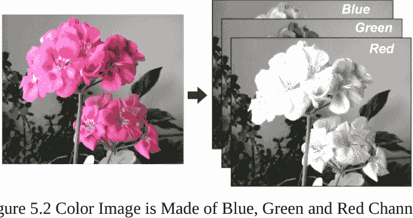

可以使用`cv2.split()`函数将彩色图像分割为三个通道：

```
def split_image(image):
    ch1, ch2, ch3 = cv2.split(image)
    return ch1, ch2, ch3
```

每个通道都是灰度图像。

### 5.1.2. 将灰度图像转换为BGR

灰度图像也可以转换为BGR颜色空间。在这种情况下，源图像是只有一个通道且不包含任何颜色信息的灰度图像，因此转换后的BGR图像看起来与原始灰度图像相同。但区别在于，BGR图像虽然看起来与灰度图像相同，但它有三个通道，而原始的灰度图像只有一个通道。

要将灰度图像转换为BGR，请使用`cv2.cvtColor()`函数，并将`cv2.COLOR_GRAY2BGR`作为第二个参数：

```
def convert_gray2bgr(image):
    bgr = cv2.cvtColor(image, cv2.COLOR_GRAY2BGR)
    return bgr
```

下图5.3展示了这一概念：

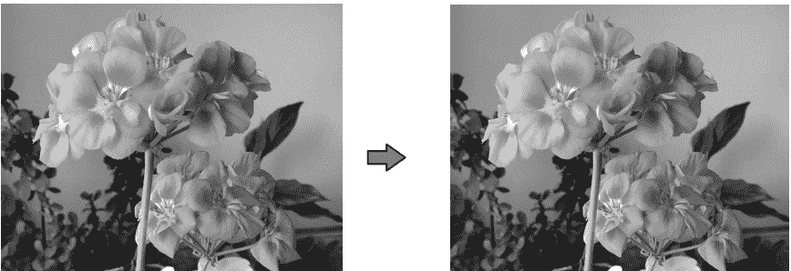

图5.3 将灰度图像转换为BGR

左侧图像是原始的灰度图像，只有一个通道。而右侧图像虽然看起来与灰度图像相同，但它处于BGR颜色空间，可以被分割为三个通道。

既然右侧图像看起来与左侧图像相同，为什么还要进行转换呢？这样做有几个原因。有时在图像处理中，需要对两个或多个图像执行操作，确保所有图像处于相同的颜色空间非常重要。例如，如果我们想将两张图像混合或融合，但一张是彩色图像，另一张是灰度图像，那么在混合之前，必须将灰度图像转换为BGR。

有时，当你想为灰度图像着色时，必须先将其转换为BGR，然后才能在不同的通道上绘制颜色，因为你无法在单通道的灰度图像上绘制颜色。

### 5.1.3. 将BGR转换为HSV

如第3.4节所述，图像不仅可以表示为BGR颜色空间，也可以表示为HSV颜色空间。OpenCV可以轻松地在BGR和HSV之间转换图像。与转换为灰度图像类似，使用相同的函数`cv2.cvtColor()`，但第二个参数不同，这里是`cv2.COLOR_BGR2HSV`。

HSV图像也可以被分割为三个通道：色调、饱和度和明度。然后可以调整每个通道以实现不同的效果，我们稍后将解释如何调整每个通道来改变图像。

以下代码片段用于将图像转换为HSV颜色空间：

```
def convert_bgr2hsv(image):
    hsv = cv2.cvtColor(image, cv2.COLOR_BGR2HSV)
    return hsv
```

如图5.4所示，彩色图像被转换为HSV颜色空间，然后可以使用`cv2.split()`函数进一步分割为色调、饱和度和明度三个通道。

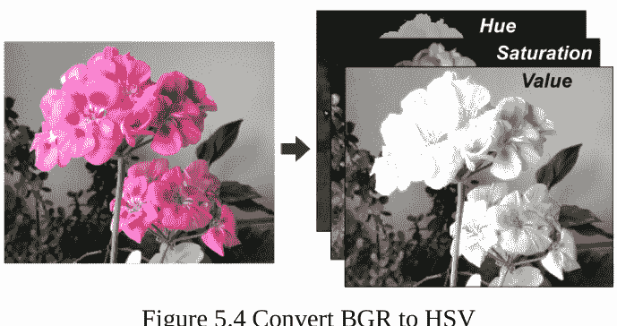

### 5.1.4. 将HSV转换为BGR

当OpenCV显示图像时，使用`cv2.imshow()`函数，默认使用BGR颜色空间。如果一个图像被转换为HSV并进行了一些图像处理操作，它不能直接发送到`cv2.imshow()`进行显示，而是必须先转换回BGR，然后再发送到`cv2.imshow()`进行显示，否则图像将无法正确显示。

在上一节中，我们将一个图像转换为HSV，这里我们将使用相同的函数`cv2.cvtColor()`但不同的参数`cv2.COLOR_HSV2BGR`将其转换回BGR。

```
def convert_hsv2bgr(image):
    bgr = cv2.cvtColor(image, cv2.COLOR_HSV2BGR)
    return bgr
```

稍后在第5.4节的示例中，将展示如何将BGR图像转换为HSV，对色调、饱和度和明度进行一些调整以实现某些效果，然后再将其转换回BGR进行显示。

## 5.2. 调整、裁剪和旋转图像

源文件：ResizeCropRotate.py
库文件：common/ImageProcessing.py

Python是一门优秀的支持面向对象编程的语言，本章将开始使用面向对象技术编写代码。我们将创建类来包含属性和函数，然后实例化这些类并调用它们的函数。

现在创建一个名为`ImageProcessing`的类，并在其中定义三个函数：`resize()`、`rotate()`和`crop()`。当一个类被创建时，它总是有一个内置的`__init__()`函数，该函数在类被实例化时总是会被执行。它用于为属性赋初始值或在创建对象时执行其他必要的操作。这里我们在`__init__()`函数中设置`window_name`和`image_name`属性。

完整源代码位于Github仓库的common文件夹中的`ImageProcessing.py`文件。

```
import cv2

class ImageProcessing(object):
    def __init__(self, window_name, image_name):
        self.window_name = window_name
        self.image_name = image_name
        self.image = cv2.imread(self.image_name)

    def show(self, title=None, image=None):
        if image is None:
            image = self.image
        if title is None:
            title = self.window_name
        cv2.imshow(title, image)
```

解释：

| 行号 | 描述 |
| --- | --- |
| 3 | 定义`ImageProcessing`类 |
| 4 | 内置的`__init__()`函数，在类被实例化时总是会被执行。参数应在实例化类时传递。 |
| 5 - 7 | 设置类属性`window_name`和`image_name`，然后使用`cv2.imread()`加载图像。 |
| 9 - 14 | 定义`show()`函数，该函数将使用`cv2.imshow()`显示图像。如果参数指定了图像或窗口名称，则显示该图像和窗口名称，否则使用类初始化时在`__init__()`函数中指定的图像和窗口名称。 |

接下来，向类中添加三个函数：`resize()`、`crop()`和`rotate()`：

```
    def resize(self, percent, image=None):
        if image is None:
            image = self.image
        width = int(image.shape[1]*percent/100)
        height = int(image.shape[0]*percent/100)
        resized_image = cv2.resize(image,
                                    (width, height) )
        return resized_image

    def crop(self,pt_first,pt_second,image=None):
        if image is None:
            image = self.image
        # 左上角点
        x_tl, y_tl = pt_first
        # 右下角点
        x_br, y_br = pt_second
        # 如果x值相反则交换
        if x_br < x_tl:
            x_br, x_tl = x_tl, x_br
        # 如果y值相反则交换
        if y_br < y_tl:
            y_br, y_tl = y_tl, y_br
        cropped_image=image[y_tl:y_br,x_tl:x_br]
        return cropped_image

    def rotate(self,angle,image=None,scale=1.0):
        if image is None:
            image = self.image
        (h, w) = image.shape[:2]
        center = (w / 2, h / 2)
        rot_mat = cv2.getRotationMatrix2D(center,
                                          angle, scale)
        rotated_image = cv2.warpAffine(image,
                                       rot_mat, (w, h))
        return rotated_image
```

解释：

| 行号 | 描述 |
| --- | --- |
| 16 | 定义`resize()`函数，指定百分比作为参数，并可选地将图像作为参数。 |
| 17 - 18 | 如果参数中未指定图像，则使用类属性`self.image`。 |
| 19 - 22 | 根据百分比计算调整后的宽度和高度。然后调用`cv2.resize()`函数来调整图像大小。 |
| 24 - 34 | 定义`crop()`函数，类似于我们在第4.4节所做的。 |
| 36 - 44 | 定义`rotate()`函数，传递`angle`作为参数，并可选地传递`image`和`scale`。使用`cv2.getRotationMatrix2D()`和`cv2.warpAffine()`函数执行旋转。 |

关于`getRotationMatrix2D()`和`warpAffine()`函数的OpenCV文档，请参考以下链接：
https://docs.opencv.org/4.7.0/da/d54/group__imgproc__transform.html

`ImageProcessing`的类定义到此完成，稍后将添加更多函数。

现在该类可以执行调整大小、裁剪和旋转操作。

在Github仓库的`ResizeCropRotate.py`源代码中，该类在第2行被导入，这是引用另一个Python文件的典型方式。

```
import cv2
import common.ImageProcessing as ip

if __name__ == "__main__":
    # 创建一个ImageProcessing对象
    ip = ip.ImageProcessing("Resize,Crop and Rotate",
                            "../res/flower005.jpg")

    # 显示原始图像
    ip.show()

    # 调整原始图像大小并显示
    resized_image = ip.resize(50)
```

## 5.2. 图像处理操作

```python
13    ip.show("Resized -- 50%", resized_image)
14
15    # 旋转调整大小后的图像并显示
16    rotated_image = ip.rotate(45, resized_image)
17    ip.show("Rotated -- 45 degree", rotated_image)
18
19    # 裁剪原始图像并显示
20    cropped_image = ip.crop((300, 10), (600, 310))
21    ip.show("Cropped", cropped_image)
22
23    cv2.waitKey(0)
24    cv2.destroyAllWindows()
```

解释：

| 行号 | 描述 |
|------|-------------|
| 2 | 导入我们之前定义的类文件，因为它位于 common 文件夹中，所以使用 common.file_name 来定位文件。 |
| 4 | 主入口，代码执行时从这里开始。 |
| 6 | 使用参数实例化 ImageProcessing 类，参数包括窗口名称和图像路径，它们被设置为该类的属性。 |
| 9 | 显示在类实例化时指定的默认图像和默认窗口名称。 |
| 12 – 13 | 调用 resize() 函数调整图像大小，并显示它。 |
| 16 – 17 | 调用 rotate() 函数，并显示旋转 45 度后的结果。 |
| 20 – 21 | 调用 crop() 函数并传递两个点来裁剪图像，并显示它。 |

以下是结果，图 5.5 显示了原始图像：

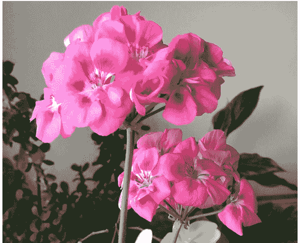

图 5.5 原始图像

图 5.6 显示了调整为 50% 大小的图像：

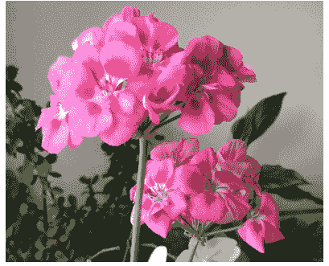

图 5.6 调整为 50% 大小的图像

图 5.7 显示了裁剪后的图像：

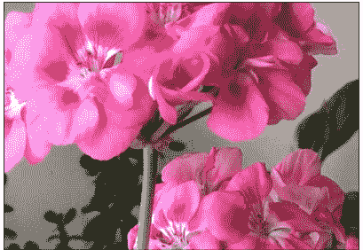

图 5.7 裁剪后的图像

最后，图 5.8 显示了旋转 45 度的图像：

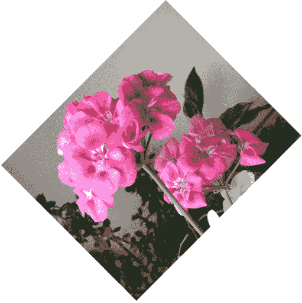

图 5.8 旋转 45 度的图像

请随意尝试源代码，例如更换图像文件、更改旋转角度、调整缩放百分比，并观察图像是如何被处理的。

## 5.3. 调整图像的对比度和亮度

| 源文件： | ContrastBrightness.py |
| 库： | common/ImageProcessing.py |

第 4.5 节有一个调整网络摄像头亮度和对比度的例子，但遗憾的是，OpenCV 没有提供直接调整图像亮度和对比度的函数。不过，OpenCV 官方文档推荐了一种替代方法，参见以下链接：

https://docs.opencv.org/4.7.0/d3/dc1/tutorial_basic_linear_transform.html

本书不打算深入探讨算法或理论，而是专注于使用 Python 和 OpenCV 实现这些技术。然而，为了清晰起见，有时我们会总结或引用其他来源的相关算法或理论。

总结对比度和亮度调整技术，OpenCV 官方文档中的以下公式描述了对比度和亮度的计算：

$g(i, j) = \alpha f(i, j) + \beta$

来自 OpenCV 官方文档
https://docs.opencv.org/4.7.0/d3/dc1/tutorial_basic_linear_transform.html

$f(i, j)$ 是原始图像，$g(i, j)$ 是结果。$\alpha$ 改变对比度，大于 1 表示更高对比度，小于 1 表示更低对比度。它应该大于 0。$\beta$ 改变亮度，值范围从 -127 到 +127。$(i, j)$ 表示图像像素的坐标。

OpenCV 官方文档提供了一个例子，解释如何使用 Python 数组和矩阵运算来实现上述公式。

或者，OpenCV 提供了 `cv2.addweighted()` 函数，该函数旨在将两张图像按权重混合，我们将使用此函数来实现上述公式以调整对比度和亮度。

```python
cv2.addweighted(image, contrast, zeros, 0, brightness)
```

函数 `cv2.addweighted()` 实现了以下公式：

$g(i, j) = \alpha_1 f_1(i, j) + \alpha_2 f_2(i, j) + \beta$

$g(i, j)$ 是结果，$f_1(i, j)$ 是作为第一个参数传递给 `cv2.addweighted()` 的图像，$\alpha_1$ 是第二个参数，即对比度；因为本例中只关注一张图像，所以 $f_2(i, j)$ 是一个全零图像，$\alpha_2$ 也是一个零值，因此函数的第三和第四个参数是一个全零数组和一个零值。$\beta$ 是最后一个参数，即亮度，该值将被加到结果中。

现在，向我们在第 5.2 节定义的 `ImageProcessing` 类中添加一个新的 `contrast_brightness()` 函数。

```python
def contrast_brightness(self, contrast,
                        brightness, image=None):
    # contrast:
    # 在 0 和 1 之间：对比度降低；
    # > 1：对比度增加；
    # 1：不变
    # brightness: -127 到 127；
    # 0 不变
    if image is None:
        image = self.image
    zeros = np.zeros(image.shape, image.dtype)
    result = cv2.addWeighted(image, contrast,
                            zeros, 0, brightness)
    return result
```

解释：

| 行号 | 描述 |
|------|-------------|
| 45 | 定义 `contrast_brightness()` 函数，指定对比度和亮度作为参数，以及一个可选的图像参数。 |
| 53 | 创建一个全零数组，因为 `cv2.addWeighted()` 需要两张图像，我们不使用第二张，所以传递全零数组给它。 |
| 54 | 调用 `cv2.addWeighted()` 函数将权重应用于图像。 |

以下是使用上面刚创建的函数来调整亮度和对比度的代码。与第 4.5 节类似，添加了两个滑动条供用户调整亮度和对比度。

```python
import cv2
import common.ImageProcessing as ip

def change_brightness(value):
    global brightness
    brightness = value - 128

def change_contrast(value):
    global contrast
    contrast = float(value)/100

if __name__ == "__main__":
    brightness = 0
    contrast = 1.0
    title = "Adjust Brightness and Contrast"
    ip = ip.ImageProcessing(title,
                            "../res/flower003.jpg")
    cv2.createTrackbar('Brightness', title, 128,
                       255, change_brightness)
    cv2.createTrackbar('Contrast', title, 100,
                       300, change_contrast)

    while True:
        adjusted_image = ip.contrast_brightness(
            contrast, brightness)
        ip.show(image=adjusted_image)
        if cv2.waitKey(10) & 0xFF == 27:
            break
    cv2.destroyAllWindows()
```

解释：

| 行号 | 描述 |
|------|-------------|
| 2 | 导入 *ImageProcessing* 类。 |
| 4 - 6 | 定义用于调整亮度的滑动条回调函数。 |
| 8 - 10 | 定义用于调整对比度的滑动条回调函数。 |
| 12 | 主入口。 |
| 16 | 实例化 *ImageProcessing* 对象。 |
| 17 - 18 | 创建两个滑动条，分别用于亮度和对比度。 |
| 21 – 22 | 调用我们刚定义的 *contrast_brightness()* 函数来调整亮度和对比度。 |

执行代码，结果显示图像以及两个滑动条，如图 5.9 所示，一个用于调整亮度，另一个用于调整对比度：

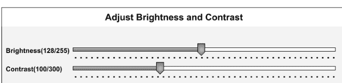

图 5.9 用于调整亮度和对比度的滑动条

使用鼠标拖动两个滑动条来改变亮度和对比度值，图像将相应地实时变化。滑动条中对比度的范围是从 0 到 300，默认值为 100。在回调函数 *change_contrast()* 中，该值除以 100，因此对比度范围是从 0.0 到 3.0，默认值为 1.0。请随意尝试代码，更换图像文件并调整两个滑动条，观察图像是如何相应变化的。

## 5.4. 调整色调、饱和度和明度

| 源文件： | HueSaturation.py |
| 库： | common/ImageProcessing.py |

第 3.4.3 节已经解释过，彩色图像不仅可以拆分为 BGR 通道，还可以拆分为 HSV 通道，前者代表蓝色、绿色和红色通道，后者代表色调、饱和度和明度。色调代表图像的颜色，不同的色调值对应不同的颜色；饱和度代表颜色的纯度，饱和度越高意味着图像色彩越鲜艳；而明度代表图像的亮度，明度越高意味着图像越亮。

在本节中，我们将解释如何调整图像的色调、饱和度和明度。将为这三个变量创建三个滑动条，我们将看到当用户实时调整这些变量时，图像是如何变化的。

首先，使用 `cv2.cvtColor()` 和 `cv2.COLOR_BGR2HSV` 参数将图像转换为 HSV，然后使用 `cv2.split()` 将其拆分为色调、饱和度和明度通道。

然后，分别对色调、饱和度和明度通道添加权重，再将它们合并回 HSV。最后将 HSV 转换为 BGR 以进行显示。

与上一节相同，使用 `cv2.addWeighted()` 为每个通道调整权重。以下代码行是为色调通道添加权重 h_weight，

```python
hue = cv2.addWeighted(hue, 1.0, zeros, 0, h_weight)
```

并以相同方式为其他通道添加权重。

以下是代码，函数 `hue_saturation_value()` 被添加到我们的 ImageProcessing 类中：

```python
def hue_saturation_value(self, hue, saturation,
    value, image=None):
    if image is None:
        image = self.image
    hsvImage = cv2.cvtColor(image, cv2.COLOR_BGR2HSV)
    h, s, v = cv2.split(hsvImage)
    zeros = np.zeros(h.shape, h.dtype)
    h = cv2.addWeighted(h, 1.0, zeros, 0, hue)
    s = cv2.addWeighted(s, 1.0, zeros, 0, saturation)
```

## 5.5. 图像混合

源文件：BlendImage.py
库文件：common/ImageProcessing.py

图像混合是指将两张图像合并为一张新图像的过程，该新图像同时具备两张原始图像的特征。其结果是两张原始图像对应像素值的加权组合。

混合过程涉及为其中一张原始图像的每个像素指定一个权重，为另一张图像的每个像素计算（1 – 权重），然后将它们合并以生成输出图像。

图像混合是计算机视觉和图像处理中的常见操作，用于多种应用，例如创建全景图、合成图像以及在视频和图像中生成特效。

假设有两张图像，原始图像1和原始图像2，如图5.11和图5.12所示。

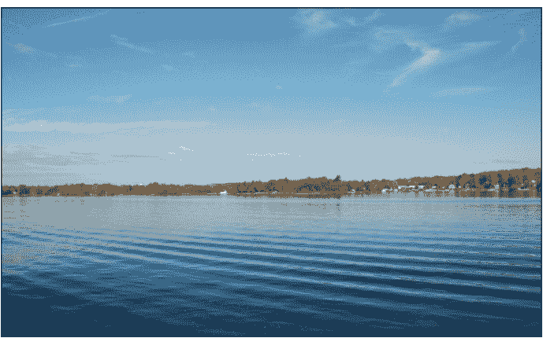

图5.11 图像混合：原始图像1

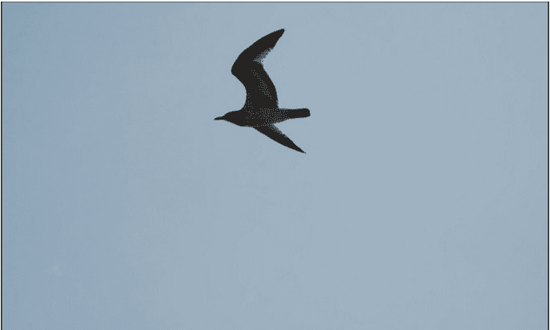

图5.12 图像混合：原始图像2

OpenCV文档描述了将它们混合在一起的算法：

$g(i, j) = \alpha f_0(i, j) + (1 - \alpha) f_1(i, j)$

> 引自OpenCV官方文档 https://docs.opencv.org/4.7.0/d5/dc4/tutorial_adding_images.html

$f_0(i, j)$ 和 $f_1(i, j)$ 是两张原始图像，$g(i, j)$ 是输出图像。$\alpha$ 是第一张图像的权重（值从0到1），$(1 - \alpha)$ 是第二张图像的权重。

通过调整 $\alpha$ 的值，我们可以实现不同的混合效果。与前面章节相同，使用 `cv2.addWeighted()` 函数来混合两张图像。

`blend()` 函数将被添加到 `ImageProcessing` 类中：

```python
def blend(self, blend, alpha, image=None):
    if image is None:
        image = self.image
    blend = cv2.resize(blend,
        (image.shape[1], image.shape[0]))
    result = cv2.addWeighted(image, alpha,
        blend, (1.0 - alpha), 0)
    return result
```

解释：

| 行号 | 描述 |
|------|-------------|
| 1 | 定义blend()函数，参数为要混合的图像，以及介于0和1之间的alpha值。 |
| 4 | 两张图像必须尺寸相同，使用cv2.resize()使它们大小一致。 |
| 5 | 使用cv2.addWeighted()函数实现混合算法。 |

以下是主要代码：

```python
def change_alpha(value):
    global alpha
    alpha = float(value)/100

def blendTwoImages(imageFile1, imageFile2):
    global alpha
    alpha = 0.5
    title = "Blend Two Images"
    iproc = ip.ImageProcessing(title, imageFile1)
    toBlend = cv2.imread(imageFile2)
    cv2.createTrackbar("Alpha",title,50,100,change_alpha)
    iproc.show("Original Image 1", )
    iproc.show("Original Image 2", toBlend)
    print("Press s key to save image, ESC to exit.")
    while True:
        blended_image = iproc.blend(toBlend, alpha)
        iproc.show(image=blended_image)
        ch = cv2.waitKey(10)
        if (ch & 0xFF) == 27:
            break
        elif ch == ord('s'):
            # press 's' key to save image
            filepath = "C:/temp/blend_image.png"
            cv2.imwrite(filepath, blended_image)
            print("File saved to " + filepath)
    cv2.destroyAllWindows()

if __name__ == "__main__":
    image1 = "../res/sky001.jpg"
    image2 = "../res/bird002.jpg"
    blendTwoImages(image1, image2)
```

创建了一个滑动条用于调整alpha值，范围从0到100，默认值为50。回调函数 `change_alpha()` 将该值除以100，从而使其范围变为0到1.0。

结果如图5.13所示：

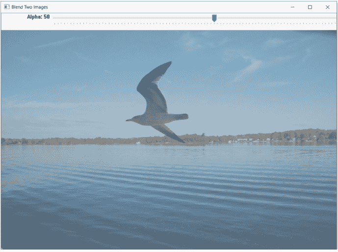

图5.13 图像混合

默认的alpha值50使两张原始图像均匀混合。通过调整alpha值，输出图像会发生变化。如果alpha=100，结果变为纯粹的原始图像1；如果alpha=0，结果是纯粹的原始图像2。如果alpha介于两者之间，结果是混合的，但每张图像的权重根据alpha值的不同而不同。

## 5.6. 位运算

| 源文件 | BlendImageBitwise.py |
|--------|----------------------|
| 库文件 | common/ImageProcessing.py |

上一节介绍了通过实现OpenCV文档中介绍的算法来进行图像混合。从图5.13的结果可以看出，图像看起来有点褪色，两张原始图像在某种程度上都变得透明了。这取决于你想要达到的效果，有时这种褪色效果并不理想，你可能希望图像不透明地叠加在一起而不褪色。

本节将介绍另一种混合两张图像的方法，将在图像混合中使用混合遮罩。混合遮罩是一张灰度图像，它指定了输入图像中每个像素对输出图像的贡献。它也被称为 alpha 蒙版或 alpha 遮罩。

混合蒙版被用作加权函数，以计算来自输入图像的像素值的加权平均值。混合蒙版的值通常在 0 到 255 之间，其中 0 代表完全不透明，255 代表完全透明。混合蒙版通常是灰度图像，但在某些情况下也可以是彩色图像。然而，在本节中，我们使用二值蒙版，其值仅为 0 或 255，中间没有其他值。

在本节中，我们将从图 5.12（鸟的图像）创建一个蒙版，并将其作为位运算应用于两张图像，以实现不同的混合效果。

OpenCV 提供了位运算——AND、OR、NOT 和 XOR。当我们想从图像中部分提取某些内容并将其放入另一张图像时，这些位运算非常有用。这些位运算可以在这里用来实现我们想要的效果。

| cv2.bitwise_and(img1, img2) | 对 img1 和 img2 执行按位与运算 |
| cv2.bitwise_or(img1, img2) | 对 img1 和 img2 执行按位或运算 |
| cv2.bitwise_not(img1) | 对 img1 执行按位非运算 |
| cv2.bitwise_xor(img1, img2) | 对 img1 和 img2 执行按位异或运算 |

算法如下：

$g(i, j) = mask \& f_0(i, j) + (1 - mask) \& f_1(i, j)$

$f_0(i, j)$ 和 $f_1(i, j)$ 是要混合的原始图像，$g(i, j)$ 是结果图像；& 是按位与运算。

按位混合过程如图 5.14 所示，基于原始图像 2（即图 5.12）创建了一个 *蒙版*。并基于该 *蒙版* 创建了 *(1 - mask)*。

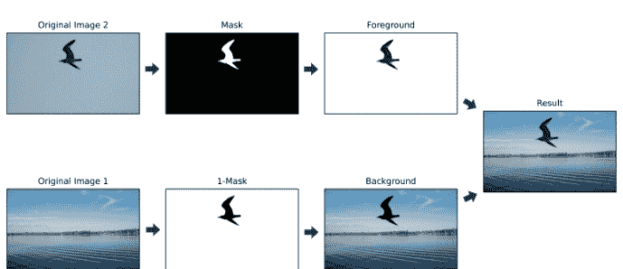

*蒙版* 通过按位与运算应用于原始图像 2，产生输出图像的前景，只有鸟在前景图像中呈现透明效果，其他像素是不透明的，在前景中显示为黑色，如图 5.15 所示。

然后，*(1 - mask)* 通过按位与运算应用于原始图像 1，产生背景图像。鸟在这里显示为黑色，所有其他像素则呈现透明效果。

最后，前景和背景通过按位或运算合并在一起，产生结果，如图 5.14 所示。

有多种方法可以基于图像创建蒙版。一种有效的创建蒙版的方法将在后面的第 6.8.1 节中介绍，该方法将图像转换到 HSV 颜色空间，并找出 HSV 值的上下限范围以选取图像中感兴趣的部分（在我们的例子中是鸟）。然后使用 `cv2.inRange()` 函数获取蒙版。最后将蒙版图像从灰度转换到 BGR 颜色空间。

以下是创建蒙版的代码片段。请注意，蒙版的创建取决于图像，不同的图像有不同的创建蒙版的方法，第 6.8 节将详细解释。下面的代码片段使用了第 6.8.1 节介绍的技术。

```
def remove_background_by_color(
    self, hsv_lower, hsv_upper, image=None):

if image is None:
    image = self.image
```

```
4    imgHSV = cv2.cvtColor(image, cv2.COLOR_BGR2HSV)
5    mask = cv2.inRange(imgHSV, hsv_lower, hsv_upper)
6    mask = 255 - mask
7    mask = cv2.cvtColor(mask, cv2.COLOR_GRAY2BGR)
8    bg_removed = cv2.bitwise_and(image, mask)
9    return bg_removed, mask
```

图 5.15 显示了通过按位与运算将 *蒙版* 应用于鸟图像后得到的前景图像。

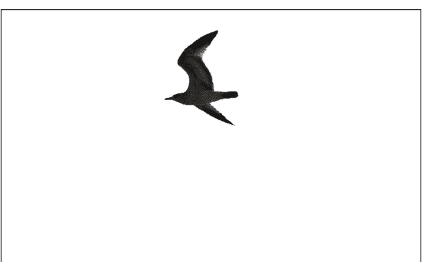

图 5.15 应用 *蒙版* 后的前景图像

如上图所示，原始图像的所有背景都被移除，只剩下鸟，这是该图像中感兴趣的部分。
这实现了上述公式的第一部分：
$$g(i, j) = mask \& f_o(i, j) + (1 - mask) \& f_i(i, j)$$
接下来是创建 $(1 - mask)$，从技术上讲，这是 $255 - mask$，因为蒙版是在灰度通道中创建的，其值范围为 0 到 255。然而，在这种情况下，我们处理的是二值通道，其值仅为 0 或 255，意味着要么 100% 不透明，要么 100% 透明，中间没有其他值。尽管在其他情况下，中间值可能表示透明度的百分比。
图 5.16 显示了 $(1 - mask)$ 的结果，

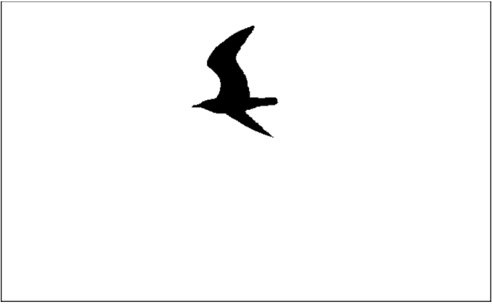

图 5.16 基于蒙版创建的 (1 - mask)

然后将 (1 – mask) 作为按位与运算应用于第二张图像，以产生背景图像，结果如图 5.17 所示。

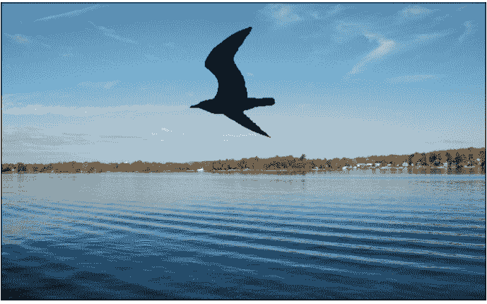

图 5.17 应用 (1-mask) 后的背景图像

鸟的像素被移除，所有其他像素保留在结果图像上。这实现了公式的第二部分：

$g(i, j) = mask \& f_0(i, j) + (1 - mask) \& f_1(i, j)$

最后，通过按位或运算合并两张图像，或者简单地将它们相加，结果如图 5.18 所示：

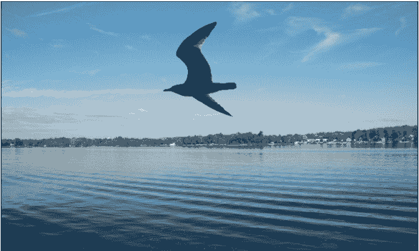

图 5.18 使用位运算混合的图像

这实现了整个公式：
$g(i, j) = mask \& f_0(i, j) + (1 - mask) \& f_i(i, j)$

与上一节的结果相比，差异很明显，这个结果没有任何淡出效果。

在这种情况下，前景和背景以 100% 的透明度合并。在实际项目中，根据你想要实现的效果，可以选择不同的方法。

以下是 `ImageProcessing` 类中的代码片段，

```
1  def blend_with_mask(self, blend, mask, image=None):
2      if image is None:
3          image = self.image
4      blend = cv2.resize(blend, image.shape[1::-1])
5      mask = cv2.resize(mask, image.shape[1::-1])
6      result = cv2.bitwise_and(blend, mask) + \
               cv2.bitwise_and(image, (255-mask))
7      return result
```

解释：

| 行 1 | 定义 `blend_with_mask()` 函数，混合图像和蒙版图像作为参数传入。 |
| 行 4 - 5 | 蒙版和混合图像必须与原始图像大小相同，使用 `cv2.resize()` 使它们尺寸一致，以防它们不同。 |
| 行 6 | 对混合图像和蒙版图像使用按位与运算以产生前景图像。再次对原始图像与 (255-mask) 使用按位与运算以产生背景图像。然后使用加法运算将两张图像相加以生成结果图像。也可以使用 `cv2.bitwise_or()`，在这种情况下它们是等效的。 |

本示例的完整源代码在 `BlendImageBitwise.py` 文件中。

```
1  import cv2
2  import common.ImageProcessing as ip
3
4  def blendTwoImagesWithMask(imageFile1, imageFile2):
5      title = "Blend Two Images"
6      iproc = ip.ImageProcessing(title, imageFile1)
7      iproc.show(title="Original Image1",
8                 image=iproc.image)
9      toBlend = cv2.imread(imageFile2)
10     iproc.show(title="Original Image2", image=toBlend)
11     _, mask = iproc.remove_background_by_color(
12             hsv_lower = (90, 0, 100),
13             hsv_upper = (179,255,255),
14             Image = toBlend   )
15     iproc.show(title="Mask from Original Image2",
16                 image=mask )
17     iproc.show(title="(1-Mask)", image= (255-mask))
18     blend = iproc.blend_with_mask(toBlend, mask)
19     iproc.show(title=title, image=blend)
20     cv2.waitKey(0)
21     cv2.destroyAllWindows()
```

```
19
20  if __name__ == "__main__":
21      image1 = "../res/sky001.jpg"
22      image2 = "../res/bird002.jpg"
23      blendTwoImagesWithMask(image1, image2)
```

第 10 – 12 行是调用 `ImageProcessing` 类中的 `remove_background_by_color()` 函数以获取鸟图像的蒙版，详情将在第 6.8.1 节中解释。`hsv_lower` 和 `hsv_upper` 参数的值仅针对此图像，不同的图像应有不同的值以获取蒙版。

## 5.7. 图像变形

来源：WarpImage.py
库：common/ImageProcessing.py
common/Draw.py

图像变形是指将图像几何变换为不同形状的过程。它涉及对图像应用透视或仿射变换，可以改变其大小、方向和形状。
本节介绍 *透视变形*，也称为 *透视变换*，这是一种将图像从一个视角变换到另一个视角的图像变形类型。它是一种改变图像视角的几何变换，就像观察者的视角在空间中移动或旋转一样。
它通常用于校正相机在拍摄图像时由透视引起的失真。这种失真导致图像中的物体根据其在图像中的位置而呈现不同的大小和形状。例如，离相机较近的物体比离得远的物体显得更大、更失真。
透视变形过程包括在原始图像中定义四个点，并将它们映射到输出图像中的四个对应点。这些点分别称为 *源点* 和 *目标点*。一旦确定了对应点，就会计算一个变换矩阵，该矩阵将原始图像中的每个像素映射到其在输出图像中的新位置。正如如图5.19所示，左侧为原始图像，右侧为输出图像。原始图像中的四个源点为A、B、C和D，透视变换过程将它们变换到右侧的输出图像中，使得A映射到A'，B映射到B'，C映射到C'，D映射到D'。

实际应用案例例如，使用相机拍摄文档时，由于畸变，文档可能看起来像左侧图像，其中A、B、C和D是文档的四个角点。透视变换能够将文档变换为右侧图像，使其得到校正并正确对齐。

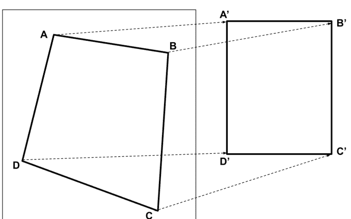

图5.19 透视变换

OpenCV文档中有关于图像几何变换算法的描述，本书不作重点讲解，如有兴趣请参考：
https://docs.opencv.org/4.7.0/da/d54/group__imgproc__transform.html

透视变换广泛应用于计算机视觉和图像处理应用中，例如图像校正。在许多情况下，图像可能因相机角度而产生畸变，通过应用透视变换，图像可以得到校正并正确对齐。另一个例子是图像拼接，将多张图像组合成更大的全景图，变换可用于正确对齐图像，使其无缝衔接。

在本节中，以下图5.20为例，左侧图片由平板电脑相机拍摄OpenCV.org主页所得，图片看起来有畸变，将使用透视变换对其进行校正并使其正确对齐，结果将显示在图5.20的右侧。

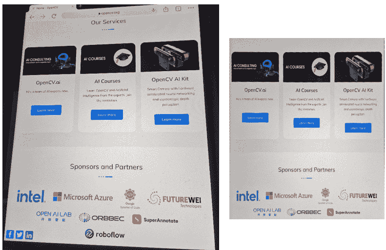

OpenCV提供两个函数来执行透视变换：`cv2.getPerspectiveTransform()`用于计算变换矩阵，它以四个源点和四个目标点作为输入。然后`cv2.warpPerspective()`用于执行透视变换，它以原始图像、变换矩阵和输出尺寸作为输入。
我们将从原始图像中获取四个源点，它们指示要变换的区域，然后使用它们进行透视变换。
在`ImageProcessing`类中，添加函数`perspective_warp()`：

```
def perspective_warp(self, points, width, height,
                     image=None):
    if image is None:
        image = self.image
    pts_source = np.float32([points[0], points[1],
                           points[3], points[2]])
    pts_target = np.float32([[0, 0],[width, 0],
                           [0,height],[width,height]])
    matrix = cv2.getPerspectiveTransform(
                           pts_source, pts_target)
    result = cv2.warpPerspective(
                           image,matrix,(width,height))
    return result
```

说明：

| 行号 | 描述 |
| --- | --- |
| 1 | 定义透视变换函数，参数：*points*：源图像中四个点的坐标；*width/height*：变换后图像的宽度和高度；*image*：源图像，如果为*None*，则使用*ImageProcessing*类的默认图像。 |
| 4 | 定义源点的四个点坐标。 |
| 5 | 定义目标点的四个点坐标。 |
| 6 | 使用*cv2.getPerspectiveTransform()*函数生成变换矩阵，将源点和目标点的坐标作为参数传入。 |
| 7 | 使用*cv2.warpPerspective()*执行透视变换。 |

现在让我们看看图像变换的代码，从Github仓库打开*WarpImage.py*文件。记得在4.3节中，我们使用鼠标绘制多边形，每次左键点击时，一个点被添加到数组中；右键点击时，绘制完成，多边形显示，数组中的点即为其顶点。现在我们通过稍作修改来重用代码以收集四个源点：左键点击时将一个点添加到数组，当点数计数到4时，绘制完成，并绘制一个红色多边形以指示所选区域，同时调用上述`perspective_warp()`函数获取变换后的图像，并显示结果。
以下是源代码：

```
import cv2
import numpy as np
import common.Draw as dw
import common.ImageProcessing as ip
drawing = False
final_color = (0, 0, 255)
drawing_color = (0, 0, 125)
width, height = 320, 480
points = []
def on_mouse(event, x, y, flags, param):
    global points, drawing, img, img_bk, iproc, warped_image
    if event == cv2.EVENT_LBUTTONDOWN:
        drawing = True
        add_point(points, (x, y))
        if len(points) == 4:
            draw_polygon(img, points, (x, y), True)
            drawing = False
            img_bk = iproc.copy()
            warped_image = iproc.perspective_warp(points,
                                                 width, height)
            points.clear()
            iproc.show("Perspective Warping", image=warped_image)
    elif event == cv2.EVENT_MOUSEMOVE:
        if drawing == True:
            img = img_bk.copy()
            draw_polygon(img, points, (x, y))
def add_point(points, curt_pt):
    print("Adding point #%d with position(%d,%d)"
          % (len(points), curt_pt[0], curt_pt[1]))
    points.append(curt_pt)

def draw_polygon(img, points, curt_pt, is_final=False):
    if (len(points) > 0):
        if is_final == False:
            dw.draw_polylines(img, np.array([points]),
                              False, final_color)
            dw.draw_line(img, points[-1], curt_pt,
                         drawing_color)
        else:
            dw.draw_polylines(img, np.array([points]),
                              True, final_color)
        for point in points:
            dw.draw_circle(img, point, 2, final_color, 2)
            dw.draw_text(img, str(point), point,
                         color=final_color,
                         font_scale=0.5)

def print_instruction(img):
    txtInstruction = "Left click to specify four points to warp image. ESC to exit, 's' to save"
    dw.draw_text(img,txtInstruction, (10, 20), 0.5,
                 (255, 255, 255))
    print(txtInstruction)

if __name__ == "__main__":
    global img, img_bk, iproc, warped_image
    title = "Original Image"
    iproc = ip.ImageProcessing(title,
                               "../res/skewed_image001.jpg")
    img = iproc.image
    print_instruction(img)
    img_bk = iproc.copy()
    cv2.setMouseCallback(title, on_mouse)
    iproc.show()
    while True:
        iproc.show(image=img)
        ch = cv2.waitKey(10)
        if (ch & 0xFF) == 27:
            break
        elif ch == ord('s'):
            # press 's' key to save image
            filepath = "C:/temp/warp_image.png"
            cv2.imwrite(filepath, warped_image)
            print("File saved to " + filepath)
    cv2.destroyAllWindows()
```

此处不逐行解释源代码，因为它与4.3节中绘制多边形的代码基本相同。执行*WarpImage.py*中的代码，左键点击图像以指定四个点，方式与绘制多边形时相同，坐标显示在图像中。收集完所有四个点后，将绘制多边形，然后调用`perspective_warp()`函数变换指定区域并显示结果图像。

## 5.8. 图像模糊

源文件：BlurImage.py
库文件：common/ImageProcessing.py

模糊图像是一种常见的图像处理技术，用于减少噪声、平滑边缘和简化图像。本节将介绍两种图像模糊技术：高斯模糊和中值模糊。

### 5.8.1. 什么是高斯模糊

高斯模糊是图像处理中广泛使用的效果，许多图像编辑软件都提供此功能。它基本上可以减少噪声、隐藏图像细节并使图像平滑。
图5.21展示了其效果，左侧为原始图像，右侧为高斯模糊图像。通过改变核大小，模糊程度会改变。

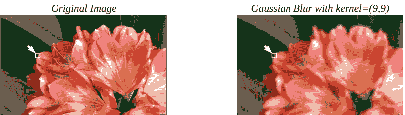

让我们仔细看看高斯模糊是如何工作的，注意图5.21中白色箭头所指的白色方框高亮显示的小区域。现在放大此区域并显示像素级别的细节，如图5.22所示，此方框为9×9像素。对此9×9区域应用高斯模糊，我们得到图5.22右侧的图像，花朵的边缘变得模糊。此区域的大小称为*核大小*，在此示例中，区域为9×9像素的正方形，则其核大小为9。它不一定是正方形，可以是矩形，例如5×9像素。然而，核大小必须是奇数。
此小区域称为*滤波器*，高斯滤波器将从左上角开始应用于整个图像，从左向右移动，

### 5.8.2. 高斯模糊

现在，我们将高斯模糊函数添加到 `ImageProcessing` 类中，

```python
def blur(self, ksize=(1,1), image=None):
    if image is None:
        image = self.image
    if ksize[0] % 2 == 0:
        ksize = (ksize[0] + 1, ksize[1])
    if ksize[1] % 2 == 0:
        ksize = (ksize[0], ksize[1] + 1)
    result = cv2.GaussianBlur(image,ksize,
                                cv2.BORDER_DEFAULT)
    return result
```

说明：

| 行号 | 描述 |
|------|-------------|
| 第1行 | 定义 `blur()` 函数，将 `ksize` 作为参数传入。 |
| 第4 – 7行 | `ksize` 必须是奇数，检查 `ksize`，如果不是奇数则将其改为奇数。 |
| 第8行 | 调用 `cv2.GaussianBlur()` 函数。 |

`BlurImage.py` 文件包含执行高斯模糊的源代码，其中添加了一个滑动条来改变核大小。通过改变核大小，我们可以观察模糊效果如何变化。在这个例子中，使用的是方形核，即宽度和高度相等。你可以随意修改代码，使用矩形核并观察模糊效果。

```python
import cv2
import common.ImageProcessing as ip

def change_ksize(value):
    global ksize
    if value % 2 == 0:
        ksize = (value+1, value+1)
    else:
        ksize = (value, value)

if __name__ == "__main__":
    global ksize
    ksize = (5,5)
    iproc = ip.ImageProcessing("Original",
                               "../res/flower003.jpg")
    iproc.show()

    cv2.namedWindow("Gaussian Blur")
    cv2.createTrackbar("K-Size", "Blur", 5, 21,
                       change_ksize)

    while True:
        blur = iproc.blur(ksize)
        iproc.show("Blur", blur)

        ch = cv2.waitKey(10)
        # 按 'ESC' 键退出
        if (ch & 0xFF) == 27:
            break
        # 按 's' 键保存
        elif ch == ord('s'):
            filepath = "C:/temp/blend_image.png"
            cv2.imwrite(filepath, blur)
            print("File saved to " + filepath)
    cv2.destroyAllWindows()
```

说明：

| 行号 | 描述 |
|------|-------------|
| 第4 – 9行 | 滑动条回调函数，从滑动条获取核大小，如果不是奇数则将其改为奇数。 |
| 第14 – 15行 | 使用一张图片实例化 `ImageProcessing` 类，并将其显示为原始图像。 |
| 第17 – 18行 | 在另一个名为“Gaussian Blur”的窗口中创建一个滑动条。 |
| 第21行 | 调用上面在 `ImageProcessing` 类中定义的 `blur()` 函数，将核大小作为参数传入。 |
| 第22行 | 在“Gaussian Blur”窗口中显示模糊后的图像。 |

图5.24是结果，随着κ-size滑动条的变化，模糊程度也在实时变化。

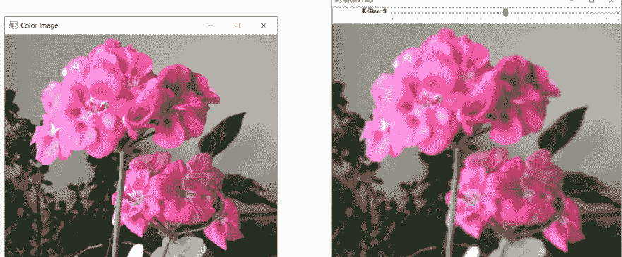

图5.24 高斯模糊结果

### 5.8.3. 中值模糊

与高斯模糊一样，中值模糊也广泛应用于图像处理中，通常用于降噪。
与高斯模糊滤波器类似，中值模糊不是应用高斯公式，而是计算内核滤波器内所有像素的中值，并用该中值替换中心像素。OpenCV也提供了一个用于此目的的函数 `cv2.medianBlur()`。
以下是 `ImageProcessing` 类中应用中值模糊函数的代码，

```python
def median_blur(self, ksize=1, image=None):
    if image is None:
        image = self.image
    result = cv2.medianBlur(image, ksize)
    return result
```

在 *BlurImage.py* 文件中，中值模糊的代码与高斯模糊非常相似，滑动条可以改变核大小，并且可以实时观察效果。下图显示了原始图像与中值模糊图像的对比。

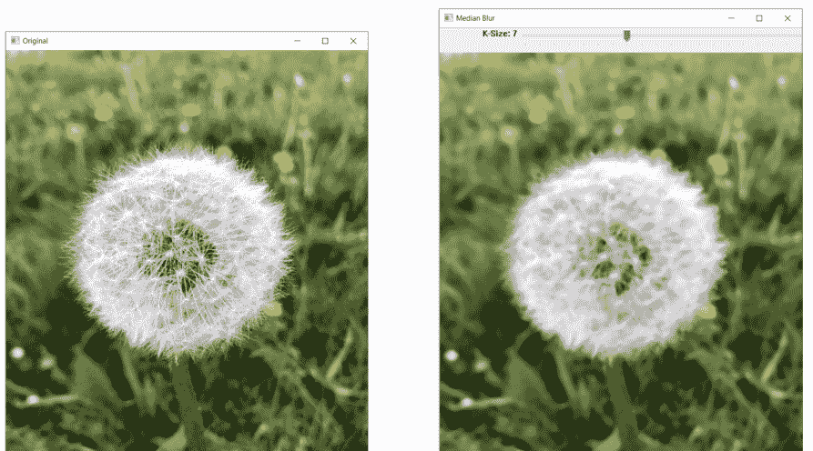

## 5.9. 直方图

源文件：Histogram.py
库：common/ImageProcessing.py

### 5.9.1. 关于直方图

直方图是图像中像素值分布的图形表示。在图像处理中，直方图可用于分析图像的亮度、对比度和整体强度。它绘制在x-y图表上，直方图的x轴代表从0到255的像素值，而y轴代表图像中具有给定值的像素数量。直方图可以显示图像主要是暗还是亮，以及其对比度是高还是低。它还可以用于识别任何异常值或不寻常的像素值。

为了更好地理解直方图，绘制一张图像，并画一些正方形和矩形，用颜色值0、50、100、150、175、200和255填充它们，如图5.26左侧所示。每个正方形/矩形的坐标也显示在图像中，因此我们可以轻松计算出每种颜色的像素数量。

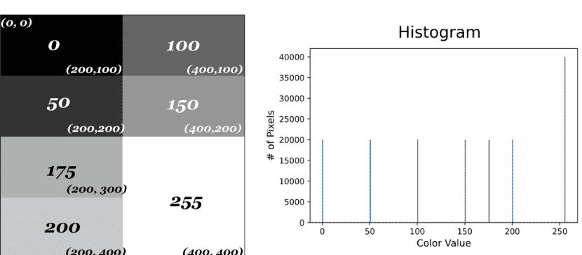

在右侧的直方图中，x轴是从0到255的颜色值，y轴是像素数量。在x=0处，y值为20,000，意味着有20,000个像素的颜色值为0。从左侧图像中我们可以看到黑色矩形（颜色：0）从(0, 0)到(200, 100)，黑色像素的总数是200 x 100 = 20,000。直方图也显示颜色值0有20,000个像素。白色正方形（颜色：255）有40,000个像素。同样地，计算其他颜色的像素数量，颜色值50、100、150、175和200各有20,000个像素。

这就是直方图的工作原理，像素数量和颜色值在直方图中显示。

以下是创建上述图像和直方图的代码。

```python
def show_histogram():
    img = np.zeros((400, 400), np.uint8)
    cv2.rectangle(img, (200,0), (400, 100), (100), -1)
    cv2.rectangle(img, (0, 100), (200, 200), (50), -1)
    cv2.rectangle(img, (200, 100), (400, 200), (150), -1)
    cv2.rectangle(img, (0,200), (200, 300), (175), -1)
    cv2.rectangle(img, (0, 300), (200, 400), (200), -1)
    cv2.rectangle(img, (200,200), (400, 400), (255), -1)
    fig = plt.figure(figsize=(6, 4))
    fig.suptitle('Histogram', fontsize=20)
    plt.xlabel('Color Value', fontsize=12)
    plt.ylabel('# of Pixels', fontsize=12)
    plt.hist(img.ravel(), 256, [0, 256])
    plt.show()
```

说明：

| 行号 | 描述 |
|------|-------------|
| 第2行 | 创建一个全为零的numpy数组作为空白画布。 |
| 第3 - 8行 | 绘制正方形和矩形，并用特定的颜色值填充它们。 |
| 第9 - 12行 | 使用matplotlib库定义一个绘图，设置标题和X、Y轴标签。 |
| 第13行 | 使用matplotlib函数创建直方图。 |
| 第14行 | 显示直方图。 |

直方图可用于图像处理的各种目的，以下是一些用例列表：

- 图像均衡化，通过修改直方图中像素值的分布，可以改善图像的对比度和整体外观。
- 阈值处理，通过分析直方图，可以确定分离图像前景和背景的最佳阈值。
- 颜色平衡，通过分析各个颜色通道的直方图，可以调整图像的颜色平衡。

总之，直方图是图像处理中分析和操作图像像素值分布的重要工具。

### 5.9.2. 灰度图像的直方图

计算和显示直方图有两种方法。首先，OpenCV提供了`cv2.calcHist()`函数来计算图像的直方图；其次，可以使用matplotlib来绘制直方图图表，matplotlib是一个用于创建静态、动画和交互式可视化的Python库。
图5.27展示了一幅真实图像的直方图。

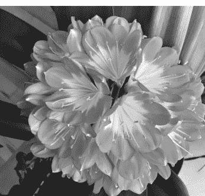

图5.27 灰度图像的直方图

观察一个特定点，即图5.27右侧直方图中的•点，它表示左侧灰度图像中大约有1200个像素的颜色值为50。

这就是如何解读直方图图表，它提供了颜色值分布的整体概况。

以下是生成图5.27中直方图的代码：

```python
### 使用OpenCV获取直方图

def show_histogram_gray(image):
    hist = cv2.calcHist([image], [0], None, [256], [0, 256])
    fig = plt.figure(figsize=(6, 4))
    fig.suptitle('Histogram - using OpenCV', fontsize=18)
    plt.plot(hist)
    plt.show()
```

显示直方图的第二种方法是使用`matplotlib`，它提供了`plt.hist()`函数来生成直方图图表。它实现的功能完全相同，只是外观略有不同，如图5.28所示：

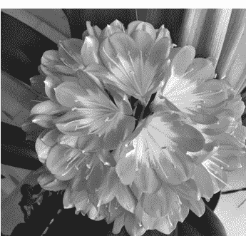

图5.28 灰度图像的直方图

以下是生成图5.28中直方图的代码：

```python
### 使用matplotlib的替代方法生成直方图
def show_histogram_gray_alt(image):
    fig = plt.figure(figsize=(6, 4))
    fig.suptitle('Histogram - using matplotlib', fontsize=18)
    plt.hist(image.ravel(), 256, [0, 256])
    plt.show()
```

解释：

| 第1-7行 | 使用OpenCV的cv2.calcHist生成直方图。 |
| 第3行 | 调用cv2.calcHist()函数，将图像作为参数传入。 |
| 第4-6行 | 使用matplotlib创建图表，指定图表大小，设置标题，并绘制第3行创建的直方图。 |
| 第7行 | 显示图表 |
| 第10-14行 | 或者，使用matplotlib函数生成直方图。 |
| 第11-12行 | 使用matplotlib创建图表，指定图表大小，设置标题。 |
| 第13行 | 调用plt.hist()函数创建图像的直方图。 |

### 5.9.3. 彩色图像的直方图

直方图是按通道逐个创建的，彩色图像有蓝色、绿色和红色通道。要绘制彩色图像的直方图，应将图像分割为蓝色、绿色和红色通道，然后逐一绘制直方图。使用matplotlib库，我们可以将三个直方图放在一个图表中。

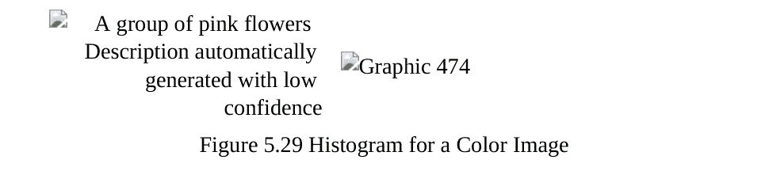

以下是生成上述彩色图像直方图的代码：

```python
def show_histogram_color(image):
    blue, green, red = cv2.split(image)
    # cv2.imshow("blue", blue)
    # cv2.imshow("green", green)
    # cv2.imshow("red", red)
    fig = plt.figure(figsize=(6, 4))
    fig.suptitle('Histogram', fontsize=18)
    plt.hist(blue.ravel(), 256, [0, 256])
    plt.hist(green.ravel(), 256, [0, 256])
    plt.hist(red.ravel(), 256, [0, 256])
    plt.show()
```

解释：

| 第2行 | 将彩色图像分割为蓝色、绿色和红色通道 |
| 第3-5行 | 可选地显示蓝色、绿色和红色通道。 |
| 第6-7行 | 创建图表，设置标题。 |
| 第8-10行 | 将蓝色、绿色和红色的直方图添加到图表中 |
| 第11行 | 显示直方图图表。 |

总之，直方图的形状可以提供关于整体颜色分布的信息，以及对图像整体亮度和对比度的宝贵见解。如果直方图偏向较高的强度级别，图像会更亮；而偏向较低的强度级别则表明图像较暗。钟形直方图表示对比度均衡。
直方图均衡化是一种常用的技术，通过重新分配像素强度到更宽的范围来增强图像的对比度。这种技术可用于改善各种应用中图像的视觉质量，例如医学成像、卫星成像和数字摄影。

# 6. 目标检测

目标检测是图像处理中用于识别和定位图像或视频中对象的技术。目标检测的目标是准确识别图像或视频帧中对象的存在、位置和范围。它是计算机视觉的一个重要应用，它应用算法来识别图像中的对象，例如三角形、圆形、矩形的形状，以及人脸、眼睛或文本。
OpenCV提供了许多方法来检测不同类型的对象。以下是目标检测所涉及步骤的高级概述：

- 1. 第一步是使用OpenCV加载要分析的图像或视频文件。
- 2. 在运行目标检测算法之前，通常需要对图像进行预处理，例如调整大小、调整对比度、调整HSV或转换为灰度图等。一些常用的技术，如canny、膨胀和腐蚀，也可能用于预处理。
- 3. 根据具体的目标检测任务，我们可能选择使用OpenCV提供的内置目标检测算法之一，或实现一些第三方算法。
- 4. 最后，通过在检测到的对象周围绘制边界框并显示标注后的图像或视频，来可视化目标检测算法的结果。

本章从检测的基础知识开始，在6.1节介绍Canny边缘检测，在6.2节介绍膨胀和腐蚀，这些技术对于图像检测是必要的。
6.3节将介绍形状检测，OpenCV提供了识别三角形、圆形或正方形等形状的方法，并计算它们的边界、面积和周长。
6.4节将通过检测HSV颜色空间中的色调、饱和度和值来检测图像的颜色。
6.5节将介绍光学字符识别，即识别图像中的文本。将使用第三方工具Tesseract与OpenCV一起实现文本识别。
6.6节和6.7节将介绍基于机器学习的方法，*Haar级联分类器*用于人脸和眼睛检测，*方向梯度直方图*用于人体检测。它们是非常快速的算法，可用于视频中的实时检测。我们将只关注这些方法的实现，而不是算法的理论或数学细节。
6.8节介绍了几种从图像中检测前景并移除背景的方法。在图像处理中，检测并移除图像背景是一种常见做法，这被称为语义分割。
最后，在6.9节，既然我们能够检测出与背景分离的前景，我们将介绍如何模糊背景以使前景突出。
享受使用OpenCV和Python进行目标检测的乐趣。

## 6.1. Canny边缘检测

源文件：Canny.py

Canny边缘检测是图像处理和计算机视觉中广泛使用的算法，用于检测图像中的边缘。它由John F. Canny于1986年提出，该算法和理论超出了本书的范围，如果感兴趣，请参考论文*Canny, J., A Computational Approach To Edge Detection, IEEE Transactions on Pattern Analysis and Machine Intelligence, 8(6):679–698, 1986*，地址：[https://scirp.org/reference/referencespapers.aspx?referenceid=1834431](https://scirp.org/reference/referencespapers.aspx?referenceid=1834431)

边缘检测的目标是识别图像中对象的边界。Canny边缘检测算法通过检测图像中强度或颜色的急剧变化来实现这一点。

使用Canny边缘检测涉及多个步骤，OpenCV文档描述了该算法和步骤，详情请参见以下链接：[https://docs.opencv.org/4.7.0/d7/de1/tutorial_js_canny.html](https://docs.opencv.org/4.7.0/d7/de1/tutorial_js_canny.html)

OpenCV为此提供了`cv2.canny()`函数。为了实现它，在使用该函数之前，应将图像转换为灰度图。此函数需要指定两个阈值——下限和上限阈值。它们用于确定图像中的哪些边缘是真实边缘，哪些是虚假边缘。像素梯度与上限和下限阈值进行比较，如果高于上限，则该像素被确定为边缘；如果低于下限，则它是虚假边缘并被丢弃；如果介于上限和下限之间，并且与真实边缘相连，则被接受为边缘，否则被丢弃。

在此示例中，我们使用两个滑动条来更改上限和下限阈值，并观察边缘如何相应变化。

注意源代码的第4行，滑动条回调函数使用`pass`语句什么也不做，而在之前的示例中，回调函数用于检索值。现在，我们改为在while循环中使用`cv2.getTrackbarPos()`函数（第19行和第20行）来检索滑动条的值。

```python
import cv2

def nothing(x):
    pass

def canny_edge_detection():
    lower, upper = 100, 200
    image = cv2.imread("../res/flower001.jpg")
    gray = cv2.cvtColor(image, cv2.COLOR_BGR2GRAY)

    cv2.namedWindow("Canny")
    cv2.createTrackbar("Lower", "Canny", lower, 500, nothing)
```

## 6.1. Canny 边缘检测

```python
13     cv2.createTrackbar("Upper","Canny",upper,500,nothing)
14
15     cv2.imshow("Original", image)
16     cv2.imshow("Gray", gray)
17
18     while True:
19         lower = cv2.getTrackbarPos("Lower", "Canny")
20         upper = cv2.getTrackbarPos("Upper", "Canny")
21         canny = cv2.Canny(gray, lower, upper)
22         cv2.imshow("Canny", canny)
23
24         ch = cv2.waitKey(10)
25         # Press 'ESC' to exit
26         if (ch & 0xFF) == 27:
27             break
28         # Press 's' to save
29         elif ch == ord('s'):
30             filepath = "C:/temp/canny.png"
31             cv2.imwrite(filepath, canny)
32             print("File saved to " + filepath)
33     cv2.destroyAllWindows()
34
35 if __name__ == "__main__":
36     canny_edge_detection()
```

解释：

| 第 3 - 4 行 | 定义一个不执行任何操作的滑动条回调函数。 |
| 第 6 行 | 定义 `canny_edge_detection()` 函数。 |
| 第 7 行 | 设置初始的下限和上限阈值。 |
| 第 8 - 9 行 | 加载图像并将其转换为灰度图。 |
| 第 11 - 13 行 | 定义一个命名窗口并创建两个滑动条。 |
| 第 15 - 16 行 | 显示原始图像和灰度图像。 |
| 第 19 - 20 行 | 使用 `cv2.getTrackbarPos()` 从滑动条获取下限和上限阈值。 |
| 第 21 行 | 使用 `cv2.Canny()` 函数进行 Canny 边缘检测。 |
| 第 22 行 | 显示 Canny 检测后的图像。 |
| 第 24 – 30 行 | 按 ESC 键退出，按 's' 键保存文件。 |
| 第 31 行 | 关闭所有窗口并退出。 |
| 第 33 行 | 主入口，调用 `canny_edge_detection()`。 |

结果如图 6.1 所示。如果将两个滑动条都向左移动，将显示更详细的边缘；如果都向右移动，显示的边缘会减少。这就是阈值如何决定边缘细节的方式。


图 6.1 Canny 边缘检测

Canny 边缘检测算法被广泛使用，因为它在检测边缘的同时能有效最小化噪声和其他不需要的特征。它也相对较快，可以应用于各种图像和应用。此技术将在后续章节中用于目标检测。

## 6.2. 膨胀与腐蚀

源文件：DilationErosion.py

膨胀和腐蚀是图像处理中的两个基本操作，用于操纵图像中物体的形状和大小。它们是形态学图像处理的最基本操作，形态学图像处理是一组与图像中形状或形态相关的操作集合。

膨胀是一种形态学操作，用于扩大图像中物体的边界。它通过根据定义的结构元素向物体的边界添加像素来工作。结构元素是一个小矩阵或形状，用于确定哪些像素被添加到物体的边界。膨胀操作对于填充小间隙、连接物体的断裂部分以及加厚物体的边界很有用。

腐蚀也是一种形态学操作，用于收缩图像中物体的边界。它通过根据定义的结构元素从物体的边界移除像素来工作。腐蚀操作对于移除小物体、平滑物体的边界以及分离彼此靠近的物体很有用。

简而言之，膨胀会扩展形状或边界使其变厚。腐蚀与膨胀相反，它会侵蚀形状或边界使其变薄。

膨胀和腐蚀通常用作图像分析任务（如分割和特征提取）中的预处理步骤。它们经常结合使用以实现特定效果，例如在保留较大物体整体形状的同时移除小物体。

*结构元素*，也称为*核*，是一个二维矩阵，膨胀和腐蚀将使用它滑动整个图像以检测像素。在这两种操作中，结构元素在图像上扫过，输出图像由结构元素与图像像素之间的相互作用决定。在膨胀的情况下，二进制图像中的像素（1 或 0）如果核下的任何像素为 1，则转换为 1；如果核下的所有像素都为 0，则转换为 0。在腐蚀的情况下，只有当核下的所有像素都为 1 时，像素才会转换为 1，否则为 0。

这些操作通常与其他图像处理技术结合使用，以执行边缘检测、噪声去除和目标识别等任务。例如，腐蚀可用于噪声去除，图像腐蚀后，小的不连通像素将被移除。但有时真实的边界也会被侵蚀，通常先应用膨胀再腐蚀，并调整核大小，从而可以有效地去除噪声。

上一节介绍了 Canny 边缘检测，通过 Canny 我们可以获得图像边界的边缘。现在应用膨胀使边界变厚。下面图 6.2 中的左侧图像是我们从上一节得到的——Canny 边缘检测，右侧图像是它的膨胀结果。核大小为 3 x 3。

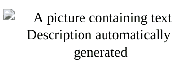

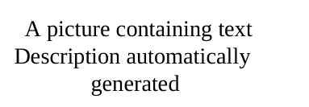

图 6.2 对 Canny 边缘检测结果进行膨胀

然后使用这个膨胀后的图像作为输入并对其应用腐蚀，结果如图 6.3 所示，核大小也是 3 x 3，左侧图像是上面的膨胀图像，右侧是腐蚀的结果。

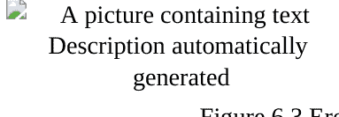

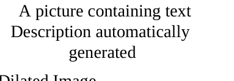

图 6.3 对膨胀图像进行腐蚀

以下是生成上述结果的代码：

```python
1  import cv2
2  import numpy as np
3  
4  def dilation(image, ksize=(1,1)):
5      kernel = np.ones(ksize, np.uint8)
6      dilation = cv2.dilate(image, kernel, iterations=1)
7      cv2.imshow("Original", image)
8      cv2.imshow("Dilation", dilation)
9      while True:
10         ch = cv2.waitKey(10)
11         if (ch & 0xFF) == 27:   # Press 'ESC' to exit
12             break
13         elif ch == ord('s'):    # Press 's' to save
14             filepath = "C:/temp/dilation.png"
15             cv2.imwrite(filepath, canny)
16             print("File saved to " + filepath)
17    cv2.destroyAllWindows()
18    return dilation
19
20 def erosion(image, ksize=(1,1)):
21    kernel = np.ones(ksize, np.uint8)
22    erosion = cv2.erode(image, kernel, iterations=1)
23    cv2.imshow("Original", image)
24    cv2.imshow("Erosion", erosion)
25    while True:
26        ch = cv2.waitKey(10)
27        if (ch & 0xFF) == 27:   # Press 'ESC' to exit
28            break
29        elif ch == ord('s'):    # Press 's' to save
30            filepath = "C:/temp/erosion.png"
31            cv2.imwrite(filepath, canny)
32            print("File saved to " + filepath)
33    cv2.destroyAllWindows()
34    return erosion
35
36 if __name__ == "__main__":
37    image = cv2.imread("../res/flower001.jpg")
38    gray = cv2.cvtColor(image, cv2.COLOR_BGR2GRAY)
39    lower, upper = 290, 475
40    canny = cv2.Canny(image, lower, upper)
41    dilation = dilation(canny, (3,3))
42    erosion(dilation, (3,3))
```

解释：

| 第 4 - 18 行 | 定义 `dilation()` 函数。 |
| 第 5 行 | 根据参数中的核大小创建一个核矩阵。 |
| 第 6 行 | 调用 `cv2.dilate()` 对图像执行膨胀操作。 |
| 第 7 - 8 行 | 显示原始图像和膨胀后的图像。 |
| 第 9 - 17 行 | 按 ESC 键退出，按 “s” 键保存。 |
| 第 18 行 | 返回膨胀结果。 |
| 第 20 - 34 行 | 定义 `erosion()` 函数。 |
| 第 21 行 | 根据参数中的核大小创建一个核矩阵。 |
| 第 22 行 | 调用 `cv2.erode()` 函数对图像执行腐蚀操作。 |
| 第 23 – 24 行 | 显示原始图像和腐蚀后的图像。 |
| 第 25 - 33 行 | 按 ESC 键退出，按 “s” 键保存。 |
| 第 34 行 | 返回腐蚀结果。 |
| 第 36 行 | 主入口。 |
| 第 37 – 38 行 | 加载图像并将其转换为灰度图像。 |
| 第 39 – 40 行 | 对灰度图像应用 Canny，参见上一节。 |
| 第 41 行 | 对 Canny 图像应用膨胀。 |
| 第 42 行 | 对膨胀后的图像应用腐蚀。 |

执行代码并尝试不同的核大小，你将能够理解核大小如何影响膨胀和腐蚀的结果。

## 6.3. 形状检测

源文件：ShapeDetection.py
库：common/Detector.py

形状检测是在数字图像中识别特定几何形状的过程，例如圆形、正方形、三角形、矩形等。它是图像处理、计算机视觉和模式识别中的一项重要任务。

假设有一张如图 6.4 所示的图像，其中有几种不同形状的三角形、圆形、矩形和正方形。OpenCV 提供了检测这些形状，并计算每个形状的面积和周长。形状检测通常涉及几个步骤，包括：

1.  预处理：对图像进行预处理以提高其质量、增强对比度并去除噪声。此步骤有助于确保检测算法能够准确检测图像中的形状。
2.  边缘检测：使用诸如 Canny 边缘检测器等技术检测图像中物体的边缘。这有助于识别图像中形状的边界。
3.  轮廓提取：从边缘图中提取图像中形状的轮廓。轮廓是具有相似属性（如颜色或强度）的连通像素的边界。
4.  形状分类：根据提取的轮廓的属性将其分类为不同的形状类别。例如，圆形具有恒定的曲率，而正方形和矩形具有四条直边和四个直角。
5.  验证：验证检测到的形状以确保其有效且准确。此步骤可能涉及过滤掉误报或调整形状检测算法的参数以提高准确性。

图 6.4 显示了一个包含多个形状的图像，本节将以此为例进行形状检测：


图 6.4 形状检测

### 6.3.1. 形状检测的预处理

预处理有几个步骤，其目标是获得平滑的边缘并最小化噪声。

1.  将彩色图像转换为灰度图像。
2.  使用 Canny 边缘检测进行边缘检测。
3.  使用膨胀和/或腐蚀调整边缘。

步骤 1 和 2 在第 6.1 节中已解释，使用 `cv2.cvtColor()` 函数配合 `cv2.COLOR_BGR2GRAY` 参数将彩色图像转换为灰度图像。然后进行 Canny 边缘检测，需要调整下限和上限阈值以获得最佳结果。这里我们不重复第 6.1 节中使用两个滑动条调整两个阈值的步骤，而是使用固定阈值。然后我们得到下面检测到边缘的图像。


图 6.5 形状检测，预处理，Canny

现在我们已经获得了检测到边缘的图像，在某些情况下，边缘对于形状检测的下一步来说不够好，因为有时边缘不够清晰，或者边缘周围的一些噪声使得难以准确检测。

如果是这种情况，就进入步骤 3，调整边缘使其平滑。此步骤将使用膨胀和/或腐蚀技术来调整边缘，如第 6.2 节所述。应调整膨胀和腐蚀的核大小以达到最佳结果，这是一个迭代过程。

膨胀和腐蚀的结果如下图 6.6 和图 6.7 所示。


图 6.6 形状检测，预处理，膨胀


图 6.7 形状检测，预处理，腐蚀

经过膨胀和腐蚀（这是一个迭代过程）后，边缘应该比 Canny 检测到的原始边缘更平滑。

### 6.3.2. 查找轮廓

轮廓是指图像中物体的轮廓线。它们本质上是将图像的前景与背景分隔开的边界。

以下是 OpenCV 官方文档的定义：

> 轮廓可以简单地解释为连接所有连续点（沿边界）的曲线，这些点具有相同的颜色或强度。轮廓是形状分析和物体检测与识别的有用工具。
>
> 来自 [https://docs.opencv.org/4.7.0/d4/d73/tutorial_py_contours_begin.html](https://docs.opencv.org/4.7.0/d4/d73/tutorial_py_contours_begin.html)

简而言之，图 6.4 中矩形的边缘是一个轮廓，圆形的边缘也是一个轮廓。OpenCV 提供了 `cv2.findContours()` 函数来从图像中检测轮廓。它返回一个从图像中检测到的轮廓数组，每个轮廓存储为一个点向量。`cv2.drawContours()` 函数用于绘制轮廓。

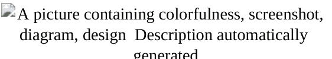

图 6.8 形状检测，轮廓

现在我们将从上一节的预处理图像中查找轮廓，然后将轮廓绘制在原始图像上，如图 6.8 所示。形状周围的黑线就是检测到的轮廓。

`cv2.findContours()` 函数的详细信息可以在 OpenCV 文档中找到，其用法如下，

```python
contours, hierarchy = cv2.findContours(image,
                    cv2.RETR_EXTERNAL,
                    cv2.CHAIN_APPROX_NONE)
```

此函数接受一个输入图像，从中查找轮廓，并返回一个轮廓列表。返回的轮廓表示为一个点列表，其中每个点是轮廓的一个坐标。

`cv2.RETR_EXTERNAL` 指定轮廓检索算法，具体来说，它只检索最外层的轮廓。

`cv2.CHAIN_APPROX_NONE` 指定轮廓近似算法，具体来说，它存储所有轮廓点。

此函数返回轮廓和层级结构，前者是包含从图像中检测到的所有轮廓的数组，后者包含图像拓扑信息，对于本示例来说是可选的。

### 6.3.3. 检测形状的类型、面积和周长

一旦获得轮廓，我们就可以使用各种 OpenCV 函数来操作和提取信息。一些常见的函数包括用于在图像上绘制轮廓的 `cv2.drawContours()`、用于计算轮廓面积的 `cv2.contourArea()`、用于计算轮廓周长的 `cv2.arcLength()` 以及用于查找轮廓最小外接矩形的 `cv2.boundingRect()`。

现在轮廓已从图像中检索出来，`cv2.findContours()` 函数返回一个轮廓列表。轮廓列表中的每一项都是从图像中检测到的一个形状。轮廓包含形状的点，然后可以根据点的数量确定形状的类型。例如，三点轮廓意味着三角形，四点轮廓意味着矩形或正方形，圆形在轮廓中有八个点。


图 6.9 检测到的形状

图 6.9 是从轮廓列表中检索信息的结果，黑线是形状的轮廓，每个形状中心的黑点是轮廓的中心。包围每个轮廓的虚线矩形框是外接矩形。

每个形状的类型（例如三角形、圆形等）、其面积和周长也已获得并显示在图 6.9 中。

本示例中使用了以下 OpenCV 函数：

| 函数 | 描述 |
| :--- | :--- |
| `findContours()` | *从图像中查找轮廓，上图中的黑色粗线即为轮廓。* |
| `boundingRect(contour)` | *查找包含轮廓的矩形，虚线即为外接矩形。* |
| `contourArea(contour)` | *计算轮廓的面积。* |
| `arcLength(contour, True)` | *计算轮廓的周长，第二个参数指定它是闭合轮廓（True）还是曲线（False）。* |
| `moments(contour)` | *计算轮廓的中心。* |
| `approxPolyDP(contour, epsilon, True)` | *应用 Douglas-Peucker 算法，用较少的顶点近似一个轮廓。它可以通过减少一些噪声来修复原始轮廓的“不良形状”。详情请查看 [OpenCV 文档](https://docs.opencv.org/)。* |

在 common 文件夹的 Detector.py 文件中创建了一个名为 ShapeDetector 的类，

```python
class ShapeDetector:
    def __init__(self):
        self.epsilon = 0.02
        self.shapes = {
            "Triangle": 3,
            "Square": 4,
            "Pentagon": 5,
            "Hexagon": 6,
            "Circle": 8
        }

    def get_shape(self, vertices, ratio=1.0):
        shape = "Other"
        for (i, (lbl, vrt)) in enumerate(self.shapes.items()):
            if vertices == vrt:
                if vrt == 4:
                    if ratio > 0.95 and ratio < 1.05:
                        shape = "Square"
                    else:
                        shape = "Rectangle"
                else:
                    shape = lbl
        return shape

    def detect(self, contour):
        area = cv2.contourArea(contour)
```

### 6.3.4. 其他轮廓特征

OpenCV 还提供了用于高级轮廓处理的其他功能，例如用多边形曲线近似轮廓、寻找轮廓的凸包以及检测轮廓的方向。
下表列出了一些在上述示例中未使用的其他功能，OpenCV 文档中有相关解释和代码示例，
[https://docs.opencv.org/4.7.0/d4/d49/tutorial_py_contour_features.html](https://docs.opencv.org/4.7.0/d4/d49/tutorial_py_contour_features.html)

| 特征 | 描述 |
| :--- | :--- |
| 检查凸性 | 检查曲线是否为凸，返回 True 或 False。 |
| 最小外接圆 | 寻找包含轮廓的最小圆。 |
| 拟合椭圆 | 寻找包含轮廓的椭圆。 |
| 凸包 | 类似于近似，详情请参见 [维基百科](https://en.wikipedia.org/wiki/Convex_hull) 或其他资料。 |

## 6.4. 颜色检测

颜色检测是从图像中识别和提取特定颜色的过程。该技术常用于图像处理和计算机视觉应用中，以从图像或视频中提取信息。

颜色检测有多种方法，方法的选择取决于具体任务和所处理图像的特性。一种常见的颜色检测方法是使用颜色分割，即根据颜色将图像划分为不同区域。这可以通过阈值处理和聚类等技术实现。阈值处理是为特定颜色通道选择一个阈值，并将所有高于该阈值的像素分配到相应的颜色区域。聚类是基于某种距离度量将相似的颜色分组在一起，这将在第 7.1 节的机器学习章节中介绍。

另一种颜色检测方法是使用直方图，它是图像中颜色分布的图形表示，参见第 5.9 节。通过将图像的直方图与参考直方图进行比较，可以用于识别特定颜色或颜色范围。

颜色检测也可以与其他图像处理技术结合使用，例如边缘检测、目标检测或从图像/视频中提取信息。例如，在目标检测中，颜色可以作为特征用于通过视频序列识别物体。

本节将介绍在 HSV 颜色空间中使用阈值进行颜色分割。为特定颜色定义一个最小阈值和一个最大阈值，两个阈值之间的任何像素都被识别为该颜色区域。

### 6.4.1. 从图像中查找颜色

源文件：FindColor.py
库文件：common/color_wheel.py

如前面第 3.4.3 节所述，彩色图像可以在 HSV 空间中表示，其中每个像素具有色调、饱和度和明度。色调代表颜色，饱和度代表颜色的纯度，明度代表亮度。每种颜色都有这些值的范围，让我们看看如何找出每种颜色的范围。

回顾概念，请参见图 6.10 中的色轮，圆圈被划分为 360 度，每度代表一种不同的颜色。颜色根据色调从 0 到 359 进行分布。


图 6.10 色轮

由 common/color_wheel.py 中的源代码生成

可以通过改变色调、饱和度和明度来识别颜色。首先，必须使用 `cv2.cvtColor()` 函数将原始图像转换为 HSV 空间，

```
imgHSV = cv2.cvtColor(img, cv2.COLOR_BGR2HSV)
```

然后创建六个轨迹条，用于调整色调、饱和度和明度的最小和最大阈值。这些阈值在变化时从轨迹条中获取，参见下面的图 6.11：


图 6.11 HSV 阈值

这些阈值用于创建一个掩码，该掩码可以获取图像中仅包含在 [最小值, 最大值] 范围内的像素部分，所有不在该范围内的像素都会被过滤掉。使用 `cv2.inRange()` 函数来创建掩码。

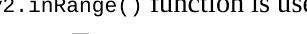

图 6.12 查找颜色，掩码

以下是代码：

```
lower = np.array([h_min, s_min, v_min])
upper = np.array([h_max, s_max, v_max])
mask = cv2.inRange(imgHSV, lower, upper)
```

掩码已创建并显示在图 6.12 中，它仅包含色调、饱和度和明度阈值范围内的像素。

然后将此掩码应用于图 6.10 的原始图像，我们得到如图 6.13 所示的结果。


图 6.13 检测到的颜色

请注意，掩码是从 HSV 图像获取的，然后将其转换回 BGR 并应用于原始图像进行显示。正如我们之前提到的，HSV 图像不用于显示，而是用于图像处理。
当改变阈值的轨迹条时，掩码和检测到的颜色会相应改变。源代码在 *FindColor.py* 中，通过改变轨迹条中的阈值，我们得到不同的颜色值，如下表所示。这些值将在下一节中用于检测颜色。

| 颜色 | 最小值/最大值 | 色调 | 饱和度 | 明度 |
| :--- | :--- | :--- | :--- | :--- |
| *红色* | 最小值 | 0 | 90 | 100 |
| | 最大值 | 10 | 255 | 255 |
| *黄色* | 最小值 | 11 | 90 | 100 |
| | 最大值 | 35 | 255 | 255 |
| *绿色* | 最小值 | 36 | 90 | 100 |
| | 最大值 | 70 | 255 | 255 |
| *青色* | 最小值 | 71 | 90 | 100 |
| | 最大值 | 100 | 255 | 255 |
| *蓝色* | 最小值 | 101 | 90 | 100 |
| | 最大值 | 130 | 255 | 255 |
| *品红色* | 最小值 | 131 | 90 | 100 |
| | 最大值 | 160 | 255 | 255 |
| *红色* | 最小值 | 161 | 90 | 100 |
| | 最大值 | 179 | 255 | 255 |

让我们看下一个例子，我们想从下面图 6.14 的图像中检测红色。
从上表中注意到，红色有两个色调范围：[0, 10] 和 [161, 179]，这是因为红色在图 6.10 的色轮中环绕 359 和 0。在检测红色时，两个范围都应考虑。

### 6.4.2. 查找颜色标签

源文件：ColorDetection.py
库文件：common/Detector.py

在上一节中，我们已经获得了不同颜色的色调、饱和度和明度范围，基于这些值，我们可以找出颜色标签。
定义一个名为 `ColorDetector` 的类，并定义一个包含颜色标签及其对应的HSV值下限和上限的字典。然后，使用一个HSV值去查询该字典，如果该值落在某个颜色的范围内，就可以获得其颜色标签。
例如，假设一个HSV值为 (50, 120, 234)，通过查询字典发现该值在绿色的范围内，那么颜色标签就是绿色。

以下是代码：

```python
class ColorDetector:
    def __init__(self):
        self.colors = {
            "Red_1":  ([[0,90,100],  [10,255,255]]),
            "Yellow": ([[11,90,100], [35,255,255]]),
            "Green":  ([[36,90,100], [70,255,255]]),
            "Cyan":   ([[71,90,100], [100,255,255]]),
            "Blue":   ([[101,90,100],[120,255,255]]),
            "Violet": ([[121,90,100],[130,255,255]]),
            "Magenta":([[131,90,100],[159,255,255]]),
            "Pink":   ([[161,90,100],[166,255,255]]),
            "Red_2":  ([[167,90,100],[190,255,255]]),
        }

    def get_color_label(self, hsv, mask):
        color_label = "Unknown"
        masked_hsv = cv2.bitwise_and(hsv, hsv, mask=mask)
        mean = cv2.mean(masked_hsv, mask=mask)[:3]
        for (i, (label, (lower, upper))) in enumerate(self.colors.items()):
            if np.all(np.greater_equal(mean, lower)) and np.all(np.less_equal(mean, upper)):
                color_label = label
        return color_label, mean
```

解释：

| 行号 | 描述 |
|------|-------------|
| 4 - 12 | 创建一个包含颜色标签及其HSV值下限/上限的字典。 |
| 15 | 定义一个函数来查询颜色标签字典，传入HSV图像和一个掩码作为参数。 |
| 17 | 将掩码应用于HSV图像。 |
| 18 | 获取被掩码区域的平均值。例如，如果一个被掩码的区域是图像的红色部分，那么该区域的平均值将处于红色范围内。 |
| 19 - 22 | 查询字典以检查平均值属于哪个颜色范围。 |
| 23 | 返回颜色标签和平均值。 |

现在来看这个例子，图像与我们在形状检测中使用的相同，如图6.17所示。这张图像中有不同颜色的不同形状，之前我们检测了形状，但现在我们想找出每个形状的颜色标签。

类似于6.3节中的形状检测，首先找出图像中所有形状的轮廓，然后为每个轮廓创建一个掩码，使用 `cv2.drawContours()` 函数来创建掩码，参数 `cv2.FILLED` 用于绘制内部填充的闭合轮廓，如下代码片段所示：

```python
contours, hierarchy = cv2.findContours(image,
    cv2.RETR_EXTERNAL,
    cv2.CHAIN_APPROX_NONE)

for contour in contours:
    mask = np.zeros(image.shape[:2], np.uint8)
    cv2.drawContours(mask, [contour], -1, (255),
                     cv2.FILLED)
```

创建了一个掩码，看起来像图6.18，即图像左上角的三角形：

然后将其应用于从原始图像转换而来的HSV图像。并且可以通过调用 `cv2.mean()` 函数来获取平均值。

```python
masked_hsv = cv2.bitwise_and(hsv,hsv,mask=mask)
mean = cv2.mean(masked_hsv, mask=mask)[:3]
```

平均HSV值将用于查询之前在 `ColorDetector` 类中定义的颜色标签字典。以下代码片段用于查询字典以获取颜色标签，它检查平均值是否在某个颜色的下限和上限值之间。

```python
for (i, (label, (lower, upper))) in enumerate(self.colors.items()):
    if np.all(np.greater_equal(mean, lower)) and np.all(np.less_equal(mean, upper)):
        color_label = label
```

左上角三角形的颜色标签被检测为：
Violet [129. 128. 170.]

上述步骤将对图像中的每个形状重复进行，结果显示在下面的图6.19中，每个形状旁边都显示了颜色标签以及HSV值。

结果也打印如下：

```
Pink [165. 133. 167.]
Blue [104. 124. 221.]
Green [ 51. 186. 121.]
Violet [129. 128. 170.]
```

在这个例子中，我们定义了较宽范围的颜色标签，例如，黄色和橙色都被识别为黄色；绿色、深绿色和浅绿色都被识别为绿色。如果你愿意，可以在 `ColorDetector` 类的字典中定义更细粒度的标签。

例如，与其只用一个黄色条目，

```python
"Yellow":   ([[11, 90, 100],  [35, 255, 255]]),
```

你可能会考虑将其分解为更多黄色条目，如金色、橙色、蜂蜜色和金丝雀色，如下代码片段所示。不过，下限和上限值需要逐一确定。

```python
"Gold":     ([[11, 90, 100], [xxx, xxx, xxx]]),
"Orange":   ([[xxx, xxx, xxx], [xxx, xxx, xxx]]),
"Yellow":   ([[xxx, xxx, xxx], [xxx, xxx, xxx]]),
"Honey":    ([[xxx, xxx, xxx], [xxx, xxx, xxx]]),
"Canary":   ([[xxx, xxx, xxx], [35, 255, 255]]),
```

## 6.5. 使用Tesseract进行文本识别

源文件：TextRecognition.py

文本识别，或称光学字符识别（OCR），是一个从图像（可能是扫描文档或手写文本）中检测文本，并将其转换为机器可读文本的过程，这些文本可用于各种目的，例如编辑、搜索和存储。

这个过程涉及几个步骤，包括图像预处理、文本检测、字符分割和字符识别。第一步，对图像进行预处理以提高扫描或手写文本的质量。这可能包括去除噪声、增强对比度和锐化图像。

接下来，使用文本检测算法来定位图像中包含文本的区域。这是通过分析图像中类似文本的模式（如线条和曲线）来完成的，然后提取这些区域以进行进一步处理。

一旦检测到文本，图像就被分割成单个字符或单词。这涉及将文本分离为其组成部分，然后使用字符识别算法进行识别。

OCR技术有广泛的应用，包括文档数字化、文本翻译和自动数据录入。它在金融、医疗保健和政府等行业中常用，在这些行业中，快速准确地处理大量文本数据对于决策和运营至关重要。

Tesseract是由Google开发的一个开源文本识别库，它被认为是最准确的开源OCR引擎之一。它旨在识别各种语言和格式的文本，包括扫描文档、PDF和图像。它可以从命令行使用，也可以作为其他编程语言（如Python）的库使用。

Python有一个名为 `pytesseract` 的包装库，可用于访问Tesseract的功能，从图像中识别文本。详细信息可在以下网址找到：[https://github.com/tesseract-ocr/tesseract](https://github.com/tesseract-ocr/tesseract)

### 6.5.1. 安装和配置Tesseract

为了使用Tesseract，必须先安装它。访问Tesseract网站 [https://tesseract-ocr.github.io/tessdoc/Installation.html](https://tesseract-ocr.github.io/tessdoc/Installation.html)，有适用于不同操作系统的安装包，选择适合你的版本并按照说明进行安装。

在Windows上，下载最新的Windows安装包并执行直到完成，这是一个简单直接的过程。

接下来，找到Tesseract可执行文件的位置，这个信息在后面的Python代码中会用到。默认位置在这里：

### 6.5.2. 文本识别

需要注意的是，文本识别的准确性会因输入图像的质量和待识别文本的复杂程度而有所不同。
可以使用图像增强和降噪等预处理技术来提高OCR的准确性。此外，在特定字体和语言上训练Tesseract也能提升其识别能力。

在本例中，有一张如图6.20所示的图像，该图像看起来是倾斜的。
对倾斜或旋转的图像进行OCR识别可能具有挑战性，因为文本未与水平轴对齐，这会影响OCR的准确性。

在第5.7节中，我们介绍了透视变换技术，它可以用于此处对图像进行纠偏，以使文本与水平轴对齐。


以下代码应用了第5.7节介绍的透视变换：

```
1 def perspective_warp(points, width, height, image):
2     pts_source = np.float32([points[0], points[1],
3                             points[3], points[2]])
4     pts_target = np.float32([[0, 0],[width, 0],[0,
5                             height],[width, height]])
6     matrix = cv2.getPerspectiveTransform(pts_source,
7                             pts_target)
8     result = cv2.warpPerspective(image, matrix,
9                             (width, height))
10    return result
```

然后我们得到一张对齐更好的图像，如图6.21所示。这将用于文本识别。这种预处理技术也可用于相机拍摄的变形图像，详情请参考前面的第5.7节关于图像变换的内容。


Tesseract提供了几个用于文本识别的函数：`image_to_string()`、`image_to_boxes()` 和 `image_to_data()`。让我们逐一查看。
为了在Python代码中使用Tesseract，需要导入pytesseract库并指定Tesseract可执行文件的位置，如下所示：

```
1 import pytesseract
2 pytesseract.pytesseract.tesseract_cmd = "C:/Program Files/Tesseract-OCR/tesseract.exe"
```

#### 6.5.2.1. 从图像识别文本到字符串

函数 `image_to_string()` 接收图像作为参数，并返回一个包含所有识别文本的字符串。

```
1 def recognize_to_string(image):
2     text = pytesseract.image_to_string(image)
3     return text
```

结果显示如下：

OpenCV（开源计算机视觉库）是一个开源的计算机视觉和机器学习软件库。OpenCV旨在为计算机视觉应用提供一个通用基础设施，并加速机器感知在商业产品中的应用。作为一个BSD许可的产品，OpenCV使企业能够轻松地使用和修改代码。

#### 6.5.2.2. 按单词识别文本

`image_to_data()` 函数以图像作为输入参数，逐词识别文本，并返回一个包含图像中每个单词信息的字典。

```
1 def recognize_by_word(image):
2     words = pytesseract.image_to_data(image)
3     for i, word in enumerate(words.splitlines()):
4         if i != 0:
5             word = word.split()
6             print(word)
7         if len(word) == 12:
8             t,x,y,w,h = word[11], int(word[6]),
9                             int(word[7]),
10                            int(word[8]), int(word[9])
11            cv2.rectangle(image, (x,y), (w+x,h+y),
12                            (0,0,255),1)
13            cv2.putText(image, t, (x,y),
14                         cv2.FONT_HERSHEY_COMPLEX,
15                         0.6, (0,0,255), 1)
```

`image_to_data()` 函数返回的字典大致如下表所示：

| Level | Page# | Line# | Word# | Left | Top | Width | Height | Text |
| :--- | :--- | :--- | :--- | :--- | :--- | :--- | :--- | :--- |
| 5 | 1 | 1 | 1 | 133 | 87 | 123 | 46 | OpenCV |
| 5 | 1 | 1 | 2 | 278 | 87 | 124 | 46 | (Open |
| 5 | 1 | 1 | 3 | 419 | 87 | 122 | 46 | Source |
| 5 | 1 | 1 | 4 | 556 | 87 | 158 | 46 | Computer |
| 5 | 1 | 1 | 5 | 723 | 87 | 119 | 46 | Vision |
| 4 | 1 | 2 | 0 | 134 | 176 | 635 | 37 | |
| 5 | 1 | 2 | 1 | 134 | 176 | 131 | 37 | Library) |
| 5 | 1 | 2 | 2 | 280 | 176 | 25 | 29 | is |
| 5 | 1 | 2 | 3 | 319 | 184 | 40 | 21 | an |
| 5 | 1 | 2 | 4 | 374 | 184 | 85 | 29 | open |
| 5 | 1 | 2 | 5 | 473 | 184 | 117 | 21 | source |
| 5 | 1 | 2 | 6 | 604 | 178 | 165 | 35 | computer |
| ... | ... | ... | ... | ... | ... | ... | ... | ... |

字典中的每个条目都包含关于识别文本的信息，包括文本本身、其在图像上的位置以及其他细节。位置信息包括其左坐标、上坐标、宽度和高度，这些是单词边界矩形的坐标。

将结果绘制为图6.22：

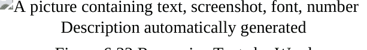

图6.22 按单词识别文本

每个单词的边界矩形用于在单词周围绘制一个框，并且识别出的文本也绘制在图6.22的结果图像上。

使用此函数，我们可以识别图像中的文本，并将各个单词提取为字符串列表。请注意，Tesseract可能无法正确识别每个单词，特别是当图像质量较差或文本以某种方式变形时。

#### 6.5.2.3. 按字符识别文本

类似地，`image_to_boxes()` 函数以图像作为输入参数，逐字符识别文本，并返回一个包含每个字符信息的字典。

```
1 def recognize_by_char(image):
2     height, weight = image.shape[:2]
3     chars = pytesseract.image_to_boxes(image)
4     for char in chars.splitlines():
5         print(char)
6         char = char.split(" ")
7         c,x,y,w,h = char[0],int(char[1]),int(char[2]),
8                             int(char[3]), int(char[4])
9         cv2.rectangle(image, (x,height-y), (w,height-h),
10                        (0,0,255),1)
11        cv2.putText(image, c, (x,height-y-20),
12                     cv2.FONT_HERSHEY_COMPLEX,
13                     0.5, (0,0,255), 1)
```

`image_to_boxes()` 函数返回一个字典，其中包含图像中每个识别字符的信息，包括其在图像上的位置，大致如下表所示。

| | | | | | |
|---|---|---|---|---|---|
| O | 133 | 899 | 161 | 929 | 0 |
| p | 165 | 892 | 183 | 921 | 0 |
| e | 186 | 899 | 205 | 921 | 0 |
| n | 209 | 900 | 226 | 921 | 0 |
| C | 213 | 887 | 252 | 933 | 0 |
| V | 231 | 899 | 256 | 929 | 0 |
| ( | 278 | 891 | 307 | 929 | 0 |
| O | 310 | 899 | 338 | 929 | 0 |
| p | 320 | 887 | 359 | 933 | 0 |
| e | 342 | 892 | 360 | 921 | 0 |
| n | 363 | 899 | 402 | 921 | 0 |
| S | 419 | 899 | 441 | 928 | 0 |
| o | 445 | 899 | 464 | 921 | 0 |
| u | 447 | 887 | 486 | 933 | 0 |
| r | 468 | 899 | 495 | 920 | 0 |
| c | 495 | 899 | 520 | 921 | 0 |
| e | 522 | 899 | 541 | 921 | 0 |
| ... | ... | ... | ... | ... | ... |

字典中的每个条目都有四个坐标来表示每个字符周围的边界矩形，以下是从字典的每个条目中获取字符和边界矩形的公式：

```
Character = Column 0
x = Column 1
y = Image height - Column 2
width = Column 3
height = Image height - Column 4
```

我们可以从这个字典中提取识别出的字符及其边界矩形，并将它们绘制在图像上。
结果类似于上面的图6.22，但框是围绕每个字符而不是每个单词绘制的。

通过这段代码，我们可以识别图像中的文本，并提取每个字符及其在图像中的位置。请注意，Tesseract 可能无法正确识别每个字符，尤其是在图像质量较差或文本以某种方式扭曲的情况下。

以下是完整的源代码：

```python
import cv2
import numpy as np
import pytesseract

def perspective_warp(points, width, height, image):
    pts_source = np.float32([points[0], points[1],
                            points[3], points[2]])
    pts_target = np.float32([[0, 0], [width, 0],
                            [0, height],
                            [width, height]])
    matrix = cv2.getPerspectiveTransform(pts_source,
                                        pts_target)
    result = cv2.warpPerspective(image, matrix,
                                (width, height))
    return result

def recognize_to_string(image):
    text = pytesseract.image_to_string(image)
    return text

def recognize_by_char(image):
    height, weight = image.shape[:2]
    chars = pytesseract.image_to_boxes(image)
    for char in chars.splitlines():
        print(char)
        char = char.split(" ")
        c,x,y,w,h = char[0], int(char[1]), int(char[2]),
                    int(char[3]), int(char[4])
        cv2.rectangle(image, (x,height-y), (w,height-h),
                    (0,0,255),1)
        cv2.putText(image, c, (x,height-y-20),
                    cv2.FONT_HERSHEY_COMPLEX,
                    0.5, (0,0,255), 1)

def recognize_by_word(image):
    words = pytesseract.image_to_data(image)
    for i, word in enumerate(words.splitlines()):
        if i != 0:
            word = word.split()
            print(word)
            if len(word) == 12:
                t,x,y,w,h = word[11], int(word[6]),
                            int(word[7]),
                            int(word[8]),
                            int(word[9])
                cv2.rectangle(image, (x,y), (w+x,h+y),
                            (0,0,255),1)
                cv2.putText(image, t, (x,y),
                            cv2.FONT_HERSHEY_COMPLEX,
                            0.6, (0,0,255), 1)

def text_recognition():
    img = cv2.imread("../res/text_for_ocr.jpg")
    width, height = 880, 760
    points = [(69, 1), (1089, 83), (1020, 947), (0, 866)]
    warped = perspective_warp(points, width, height, img)
    cv2.imshow("Original", img)
    cv2.imshow("Warped", warped)

    text = recognize_to_string(warped)
    print(text)

    result1 = warped.copy()
    result2 = warped.copy()
    recognize_by_char(result1)
    recognize_by_word(result2)

    cv2.imshow("Text Recognition by Char", result1)
    cv2.imshow("Text Recognition by Word", result2)
    cv2.waitKey(0)
    cv2.destroyAllWindows()

if __name__ == "__main__":
    pytesseract.pytesseract.tesseract_cmd = \
        "C:/Program Files/Tesseract-OCR/tesseract.exe"
    text_recognition()
```

#### 6.5.2.4. 直接从 Tesseract 识别文本

由于 Tesseract 已安装在操作系统中，可以直接从命令行调用它来识别图像中的文本，而无需 Python。
从 Windows 命令行窗口执行以下命令，并将图像文件和输出文件名作为参数传递。

```
"C:\Program Files\tesseract-OCR\tesseract.exe" text_for_ocr.jpg output.txt
```

识别出的文本位于 output.txt 文件中。

## 6.6. 人体检测

源文件：HumanDetection.py

OpenCV 提供了一种名为 *HOG（方向梯度直方图）* 的算法，这是一种非常快速的人体检测方法。它经过预训练，主要检测站立且完全可见的人，例如行人，在其他情况下效果不佳。

我们不关注 *HOG* 的理论和算法，而是想展示如何在 Python 中使用 OpenCV 来应用它。参考文献部分有几篇论文和文章可以帮助更好地理解它。

使用 OpenCV 和 HOG 进行人体检测有几个基本步骤：

1.  加载图像或视频帧。
2.  将图像或视频帧转换为灰度图。
3.  使用 `cv2.HOGDescriptor()` 函数创建 HOG 描述符。
4.  使用 `hog.setSVMDetector()` 函数计算图像的 HOG 特征，它为对象检测设置了支持向量机（SVM）检测器。它是在大量人体图像数据集上训练的，并针对在典型环境中检测站立或行走的人进行了优化。
5.  使用 `hog.detectMultiScale()` 函数检测图像中的对象。该函数以 HOG 特征作为输入，并返回检测到的对象的边界矩形。
6.  使用 `cv2.rectangle()` 函数在原始图像上绘制边界矩形。

### 6.6.1. 从图片中检测人体

在 Python 和 OpenCV 中使用 *HOG* 检测人体非常简单直接，如以下代码片段所示，前两行用于初始化 *HOG*，第 3 行用于从图像中检测人体。

```python
hog = cv2.HOGDescriptor()
hog.setSVMDetector(cv2.HOGDescriptor_getDefaultPeopleDetector())
boxes, weights = hog.detectMultiScale(image,
                    winStride=(8, 8))
```

从 detectMultiScale() 函数返回的 boxes 包含一个边界矩形数组，用于从图像中检测到的人，可以绘制这些边界矩形以突出显示图像中的人。
以下是此示例的代码。human_detection() 函数使用 hog.detectMultiScale() 检测人体，并为返回的 boxes 中的每个项目绘制矩形，以及检测到的人数。在 __main__ 块中，初始化 HOG 并加载三张图片进行人体检测。

```python
import cv2
def human_detection(image):
    boxes, weights = hog.detectMultiScale(image,
                                        winStride=(8, 8))
    person = 1
    for x,y,w,h in boxes:
        cv2.rectangle(image,(x, y),(x+w,y+h),(0,255,0),2)
        cv2.putText(image, f'person-{person}', (x, y-10),
                    cv2.FONT_HERSHEY_SIMPLEX,0.5,(0,255,0),1)
        person += 1
    return image

if __name__ == "__main__":
    # 初始化用于人体/人员检测的 HOG
    hog = cv2.HOGDescriptor()
    hog.setSVMDetector(cv2.HOGDescriptor_getDefaultPeopleDetector())
    img1 = cv2.imread("../res/pexels-charlotte-may-5965704.jpg")
    cv2.imshow("Human Detection 1", human_detection(img1))
    img2 = cv2.imread("../res/pexels-catia-matos-1605936.jpg")
    cv2.imshow("Human Detection 2", human_detection(img2))
    img3 = cv2.imread("../res/pexels-daniel-frese-574177.jpg")
    cv2.imshow("Human Detection 3", human_detection(img3))
    cv2.waitKey(0)
    cv2.destroyAllWindows()
```

下面的图 6.23 和图 6.24 展示了人体检测的结果。

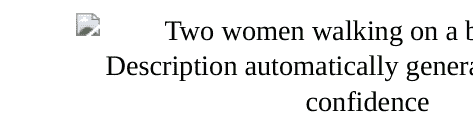

图 6.23 人体检测 1

照片由 Charlotte May 提供：[https://www.pexels.com/photo/unrecognizable-women-walking-along-paved-pathway-5965704/](https://www.pexels.com/photo/unrecognizable-women-walking-along-paved-pathway-5965704/)

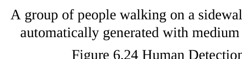

图 6.24 人体检测 2

照片由 Daniel Frese 提供：[https://www.pexels.com/photo/man-in-black-crew-neck-t-shirt-walking-near-building-574177](https://www.pexels.com/photo/man-in-black-crew-neck-t-shirt-walking-near-building-574177)

### 6.6.2. 从视频中检测人体

HOG 算法非常快，可以用于视频，这与用于图像类似。唯一的区别是循环遍历视频的帧并对每一帧应用 HOG 检测器。
以下是一个示例代码片段，演示如何使用 HOG 从网络摄像头检测人体：

```python
import cv2
def human_detection_from_video(url):
    cap = cv2.VideoCapture(0)
```

4    成功，图像 = cap.read()
6    while 成功:
7        cv2.imshow("视频中的人体检测",
                   human_detection(图像))
8        # 按下ESC键以退出循环
9        if cv2.waitKey(5) & 0xFF == 27:
10           break
11       成功，图像 = cap.read()
12   cap.release()
13   cv2.destroyAllWindows()

解释：

| 行号 | 描述 |
| :--- | :--- |
| 第2行 | 定义 `human_detection_from_video()` 函数。 |
| 第3行 | 从默认摄像头加载视频。 |
| 第4行 | 从视频捕获对象加载一帧，该帧存储在 `图像` 中，结果存储在 `成功` 中，表示 True 或 False。 |
| 第6 - 11行 | 从视频捕获对象逐帧循环，直到按下ESC键，并在循环内对每一帧执行人体检测。 |
| 第7行 | 调用 `human_detection()` 函数来检测人体并显示结果。 |
| 第9行 | 按下ESC键退出。 |

执行代码后，来自摄像头的视频将播放，并且人体检测功能处于活动状态。当摄像头捕捉到一个人时，视频中该人周围会出现一个方框，类似于图6.23。

HOG算法在大多数情况下可以快速检测人体，但并非100%准确。其准确性取决于几个因素，例如人的大小、图像或视频的分辨率以及用于检测的HOG参数。

总的来说，基于HOG的人体检测被认为是一种可靠的方法，特别是用于检测站立或行走的人。然而，在检测姿势异常或部分被遮挡的人时，其表现可能不佳。

为了提高基于HOG的人体检测的准确性，为HOG描述符选择合适的参数非常重要，例如图像窗口的大小、每个块中的单元格数量以及步幅的大小。这些参数会影响HOG检测器的准确性以及检测速度。

同样重要的是要注意，基于HOG的人体检测通常与其他方法（如级联分类器或深度学习模型）结合使用，以提高检测的整体准确性。例如，一些研究人员使用HOG检测器的级联来提高在复杂场景中人体检测的准确性。

总的来说，基于HOG的人体检测的准确性受多种因素影响，选择合适的参数并将其与其他方法结合使用以达到最佳准确性非常重要。

## 6.7. 人脸和眼睛检测

来源：FaceEyeDetection.py

OpenCV提供了另一种使用基于Haar特征的级联分类器进行对象检测的方法，这是Paul Viola和Michael Jones在他们2001年的论文“Rapid Object Detection using a Boosted Cascade of Simple Features”中提出的一种有效的对象检测方法。这是一种基于机器学习的方法，其中级联函数使用输入数据进行预训练。

Haar级联分类器使用数千张正样本和负样本图像作为输入数据进行训练。正样本图像是包含待检测对象的图像，而负样本图像是不包含该对象的图像。分类器使用一种称为AdaBoost的机器学习算法进行训练，该算法从训练集中选择一小部分重要特征（称为Haar特征），并使用这些特征训练分类器。Haar特征是通过计算图像中一个矩形区域的像素强度之和与相邻另一个矩形区域的像素强度之和的差值来计算的。

Haar分类器的工作原理是将一个固定大小的窗口在图像上滑动，并计算窗口在每个位置的Haar特征。然后，分类器应用训练好的模型来确定该窗口中是否存在对象。如果存在对象，则该窗口被分类为正样本；如果不存在，则被分类为负样本。通过在整个图像上滑动窗口，分类器可以在不同的位置和尺度上检测对象。

网上有许多文章解释级联分类器的工作原理，这超出了本书的范围，如果您想了解理论和算法，请参考这些材料。参考文献部分也列出了一些文章，但本书仅关注实现。

OpenCV附带了一些预训练的分类器，可用于从图像中检测不同的对象。获取这些级联分类器有两种方式：

1.  它们随OpenCV安装包一起提供，位于 `cv2.data.haarcascades` 指定的文件夹中。
2.  从以下链接下载最新版本：https://github.com/opencv/opencv/tree/master/data/haarcascades

级联分类器仅适用于灰度图像，请确保在调用级联函数之前将图像转换为灰度图。

在本例中，我们将从图像中检测人脸和眼睛，为此有两个级联分类器，一个用于人脸（`haarcascade_frontalface_default.xml`），另一个用于眼睛（`haarcascade_eye.xml`）。

我们使用随OpenCV安装提供的分类器，如下第25-29行所示。

```
1  import cv2
2  def detect_face_and_eye(image):
3      gray = cv2.cvtColor(image, cv2.COLOR_BGR2GRAY)
4      faces = face_cascade.detectMultiScale(gray,
                          scaleFactor = 1.1,
                          minNeighbors = 4  )
7      print('Faces found: ', len(faces))
8      for (x, y, w, h) in faces:
9          cv2.rectangle(image, (x, y), (x + w, y + h),
10                 (0, 255, 0), 2)
11          face_gray = gray[y:y + h, x:x + w]
12          face_color = image[y:y + h, x:x + w]
13          eyes = eye_cascade.detectMultiScale(
                          face_gray,
                          scaleFactor=1.1,
                          minNeighbors=3)
17          print('Eyes found: ', len(eyes))
18          for (ex, ey, ew, eh) in eyes:
19              cv2.rectangle(face_color, (ex, ey),
20                 (ex + ew, ey + eh),
21                     (255, 0, 0), 2)
22     return image
23 
24 if __name__ == "__main__":
25     face_cascade = cv2.CascadeClassifier(
26             cv2.data.haarcascades +
27             "haarcascade_frontalface_default.xml" )
28     eye_cascade = cv2.CascadeClassifier(
29         cv2.data.haarcascades + "haarcascade_eye.xml")
30     img = cv2.imread("../res/pexels-bess-hamiti-35188.jpg")
31     cv2.imshow("Face and Eye Detection",
32                 detect_face_and_eye(img) )
33     cv2.waitKey(0)
34     cv2.destroyWindow("Face and Eye Detection")
```

解释：

| 行号 | 描述 |
| :--- | :--- |
| 第24行 | 执行的起点。 |
| 第25 - 27行 | 从OpenCV默认安装中加载人脸级联分类器。 |
| 第28 - 29行 | 从OpenCV默认安装中加载眼睛级联分类器。 |
| 第30行 | 加载一张图像。 |
| 第31 - 32行 | 调用 `detect_face_and_eye()` 函数并显示结果。 |
| 第2行 | 定义 `detect_face_and_eye()` 函数。 |
| 第3行 | 将图像转换为灰度图。 |
| 第4 - 6行 | 调用人脸级联分类器的 `detectMultiScale()` 函数来检测人脸。它接受三个参数：1. 灰度输入图像，2. `scaleFactor` 指定每次图像缩放的比例，3. `minNeighbors` 指定每个候选矩形应具有的邻居数量以保留它。该函数返回一个列表，其中包含检测到的人脸的边界矩形坐标。这些坐标用于在图像上绘制方框。 |
| 第8行 | 对 `detectMultiScale()` 函数返回的列表中的每个人脸执行 do while 循环。 |
| 第9 - 10行 | 绘制人脸的边界矩形。 |
| 第11 – 12行 | 创建人脸的灰度和彩色区域，用于眼睛检测。 |
| 第13 - 16行 | 使用眼睛级联分类器的 `detectMultiScale()` 函数来检测眼睛，类似于第4 - 6行。 |
| 第18 – 21行 | 为检测到的每只眼睛绘制边界矩形。 |

结果如图6.25所示：

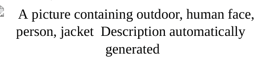

图6.25 人脸和眼睛检测

照片由 Bess Hamiti 提供：[https://www.pexels.com/photo/two-children-standing-near-concrete-fence-35188/](https://www.pexels.com/photo/two-children-standing-near-concrete-fence-35188/)

与上一节中的人体检测类似，级联分类器方法对于视频处理来说速度足够快。上面第2行的 `detect_face_and_eye()` 函数可以像我们在6.6.2节中所做的那样，放入视频处理的 while 循环中，然后就可以从视频中检测并高亮显示人脸和眼睛。

下表列出了撰写本文时所有可用的级联分类器，不仅包括人脸和眼睛，还包括身体、微笑和车牌等。它们可以以相同的方式用于从图像或视频中检测不同的对象。

| 级联分类器 |
| :--- |
| haarcascade_eye.xml |
| haarcascade_eye_tree_eyeglasses.xml |
| haarcascade_frontalcatface.xml |
| haarcascade_frontalcatface_extended.xml |
| haarcascade_frontalface_alt.xml |
| haarcascade_frontalface_alt2.xml |
| haarcascade_frontalface_alt_tree.xml |
| haarcascade_frontalface_default.xml |
| haarcascade_fullbody.xml |
| haarcascade_lefteye_2splits.xml |
| haarcascade_licence_plate_rus_16stages.xml |
| haarcascade_lowerbody.xml |
| haarcascade_profileface.xml |
| haarcascade_righteye_2splits.xml |

| haarcascade_russian_plate_number.xml |
| haarcascade_smile.xml |
| haarcascade_upperbody.xml |

Haar级联分类器是目标检测的强大工具，具有许多优势，包括速度、准确性、鲁棒性和可移植性。然而，它们也有一些缺点：训练Haar级联分类器需要大量的正负样本，且训练过程可能计算成本高昂，因此OpenCV仅附带了有限数量的预训练级联分类器。Haar级联分类器对目标姿态和遮挡敏感，这可能导致漏检或未检测到目标。它们可能不适用于检测小目标或低对比度图像，因为Haar特征可能无法捕捉到相关信息。

## 6.8. 去除背景

在某些情况下，我们希望检测图像的前景和背景，并将它们分离。这被称为图像的*语义分割*。

*语义分割*是图像处理中使用的一种技术，用于为图像中的每个像素分配语义标签，这意味着将属于同一对象类别的像素分组。它是一种图像分割类型，侧重于根据语义含义识别和标记图像中的对象。

与仅将图像划分为区域或对象的简单图像分割相比，语义分割可以区分同一类别的对象（例如，图像中的不同汽车），并根据每个像素所属的类别对其进行精确标记。这使其成为各种计算机视觉任务的强大工具，例如目标检测、场景理解和图像识别。

*语义分割*在图像处理中有多种应用，包括目标检测、自动驾驶、医学图像分析和视频分析。例如，语义分割可用于检测和跟踪视频流中的对象，或将医学图像分割成不同的解剖结构以用于诊断和治疗规划。

本节将应用语义分割的概念，将图像的前景与背景分离并去除背景。图像的特定区域或像素将被识别为前景，另一个区域则为背景。根据图像本身的不同，有多种方法可以实现，其中一种可能比其他方法更有效。
本节将介绍四种去除背景的方法：

- 按颜色去除背景
- 按轮廓去除背景
- 按机器学习去除背景
- 按蒙版去除背景

### 6.8.1. 按颜色去除背景

| 来源： | RemoveBackgroundByColor.py |
| :--- | :--- |
| 库： | common/ImageProcessing.py |

如果图像前景的颜色与背景颜色有显著差异，可以根据颜色来识别和去除图像背景，这种方法值得尝试。
让我们看一下图6.26所示的图像，花朵的颜色看起来与背景有显著差异。

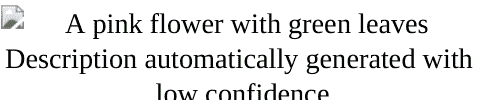

图6.26 按颜色去除背景

第6.4节介绍了通过调整色调、饱和度和明度来检测颜色的方法。我们可以使用相同的技术创建蒙版并将其应用于原始图像以去除背景。
第一步是将图像转换为HSV颜色空间，然后找到色调、饱和度和明度的下限和上限阈值。然后使用`cv2.inRange()`函数创建蒙版。

以下函数用于创建蒙版并按颜色去除背景，它被添加到第5章定义的`ImageProcessing`类中。

```
def remove_background_by_color(
    self,
    hsv_lower=(10,10,10),
    hsv_upper=(179,255,255),
    image=None ):
    if image is None:
        image = self.image
    imgHSV = cv2.cvtColor(image, cv2.COLOR_BGR2HSV)
    mask = cv2.inRange(imgHSV, hsv_lower, hsv_upper)
    mask = 255 - mask
    mask = cv2.cvtColor(mask, cv2.COLOR_GRAY2BGR)
    bg_removed = cv2.bitwise_and(image, mask)
    return bg_removed, mask
```

说明：

| 行 | 描述 |
| :--- | :--- |
| 第1行 | 定义`remove_background_by_color()`函数，参数是HSV值的下限和上限阈值。 |
| 第5-6行 | `ImageProcessing`类在初始化时已有默认图像，如果未从参数传递图像，则使用默认图像。 |
| 第7行 | 将图像转换为HSV颜色空间。 |
| 第8行 | 使用`cv2.inRange()`函数，根据HSV值的上下限阈值获取蒙版。 |
| 第9行 | 在此示例中，蒙版仅选择了背景，现在执行`255 – mask`以获取前景的蒙版。 |
| 第10行 | `cv2.inRange()`函数创建的蒙版是灰度图，现在将其转换为BGR颜色空间，使其与原始图像处于同一空间。 |
| 第11行 | 使用按位与操作将蒙版应用于原始图像，以从原始图像中去除背景。 |
| 第12行 | 返回去除背景后的图像以及蒙版。 |

与前面的章节类似，在主代码中我们创建了一个参数窗口，其中包含六个滑动条，用于调整色调、饱和度和明度，如图6.27所示。

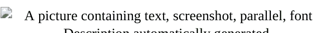

图6.27 参数窗口

同时，蒙版窗口和去除背景窗口并排显示，如图6.28所示。从参数窗口调整色调、饱和度和明度的最小和最大阈值，蒙版窗口和去除背景窗口会实时变化。


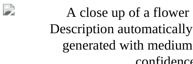

图6.28 蒙版与去除背景

图6.28左侧的蒙版看起来并不完美，带有一些噪声，因此最终图像也包含了噪声。你可能想使用一些技术，如第6.2节讨论的膨胀和腐蚀来减少噪声。或者，你也可以简单地将蒙版保存到文件，然后使用第三方图像处理软件手动去除这些噪声，我们将在第6.8.4节介绍这种手动方法。

以下是完整源代码：

```
import cv2
import common.ImageProcessing as ip

def empty(a):
    pass

if __name__ == "__main__":
    iproc = ip.ImageProcessing("Original",
                                "../res/flower012.jpg")
    iproc.show(image=iproc.resize(65,iproc.image))
    h_min, h_max = 25, 81
    s_min, s_max = 0, 255
    v_min, v_max = 0, 162
    cv2.namedWindow("Parameters")
    cv2.resizeWindow("TrackBars", 640, 240)
    cv2.createTrackbar("Hue Min","Parameters",h_min,179,empty)
    cv2.createTrackbar("Hue Max","Parameters",h_max,179,empty)
    cv2.createTrackbar("Sat Min","Parameters",s_min,255,empty)
    cv2.createTrackbar("Sat Max","Parameters",s_max,255,empty)
    cv2.createTrackbar("Val Min","Parameters",v_min,255,empty)
    cv2.createTrackbar("Val Max","Parameters",v_max,255,empty)
    while True:
        h_min = cv2.getTrackbarPos("Hue Min", "Parameters")
        h_max = cv2.getTrackbarPos("Hue Max", "Parameters")
        s_min = cv2.getTrackbarPos("Sat Min", "Parameters")
        s_max = cv2.getTrackbarPos("Sat Max", "Parameters")
        v_min = cv2.getTrackbarPos("Val Min", "Parameters")
        v_max = cv2.getTrackbarPos("Val Max", "Parameters")
        bg_removed, mask = iproc.remove_background_by_color(
                            hsv_lower=(h_min, s_min, v_min),
                            hsv_upper=(h_max, s_max, v_max) )
        iproc.show(title="Mask", image=iproc.resize(65,mask))
        iproc.show(title="Background Removed",
                   image=iproc.resize(65,bg_removed))
        ch = cv2.waitKey(10)
```

### 6.8.2. 通过轮廓移除背景

源文件：RemoveBackgroundByContour.py
库文件：common/ImageProcessing.py

在之前的章节中，我们介绍了轮廓的概念，用于从图像中检测形状。回顾一下，轮廓是表示图像中物体边界的曲线，它是由一系列相连的像素组成的连续线条，环绕着物体。如果图像具有明显的轮廓，我们也可以基于轮廓来识别和移除背景，这种方法值得一试。请看图6.29，我们想要移除背景：


图6.29 通过轮廓移除背景

如第6.1节所述，我们将使用Canny边缘检测来找出图像中物体（在我们的例子中是鸟）的边缘，并使用膨胀和腐蚀来修改边缘。然后，我们按照第6.3节介绍的方法找到轮廓，并将轮廓绘制为掩码。请记住，在上一节中，最终的掩码有一些噪声，我们没有处理它们。在这个例子中，我们将使用膨胀、腐蚀和高斯模糊来最小化掩码中的噪声。将以下函数添加到ImageProcessing类中，

```python
def remove_background_by_contour(self,
                    gs_blur=3,
                    canny_lower=10,
                    canny_upper=200,
                    dilate_iter=1,
                    erode_iter=1,
                    image = None):
    if image is None:
        image = self.image
    gray = cv2.cvtColor(image, cv2.COLOR_BGR2GRAY)
    edges = cv2.Canny(gray, canny_lower, canny_upper)
    edges = cv2.dilate(edges, None)
    edges = cv2.erode(edges, None)
    mask = np.zeros_like(edges)
    contours, _ = cv2.findContours(edges, cv2.RETR_LIST,
                                    cv2.CHAIN_APPROX_NONE)
    for contour in contours:
        cv2.fillConvexPoly(mask, contour, (255))
        mask = cv2.dilate(mask, None, iterations=dilate_iter)
        mask = cv2.erode(mask, None, iterations=erode_iter)
        if gs_blur % 2 == 0:
            gs_blur = gs_blur + 1
        elif gs_blur <= 0:
            gs_blur = 1
        mask = cv2.GaussianBlur(mask, (gs_blur, gs_blur), 0)
        mask = cv2.cvtColor(mask, cv2.COLOR_GRAY2BGR)
        bg_removed = cv2.bitwise_and(image, mask)
    return bg_removed, mask
```

解释：

| 行号 | 描述 |
|------|-------------|
| 1 - 7 | 定义`remove_background_by_contour()`函数，参数包括Canny的下限和上限阈值、高斯模糊的核大小以及膨胀和腐蚀的迭代次数。 |
| 8 - 9 | ImageProcessing类在初始化时已有一个默认图像，如果参数中没有传入图像，则使用该默认图像。 |
| 10 | 将图像转换为灰度图。 |
| 11 | 通过应用具有上下限阈值的Canny算法，从灰度图像中获取边缘。可选地，在此行后添加`cv2.imshow()`以查看其结果。 |
| 12 - 13 | 应用膨胀和腐蚀来修改边缘。可选地，在每行后添加`cv2.imshow()`以查看结果。 |
| 14 | 基于边缘创建一个空的掩码。 |
| 15 - 16 | 从边缘中查找轮廓，详见第6.3.2节。 |
| 18 | 在掩码上绘制轮廓。可选地，在此行后添加`cv2.imshow()`以查看其结果。 |
| 19 - 20 | 应用膨胀和腐蚀以从掩码中移除噪声。这与第12和13行不同。 |
| 21 - 25 | 应用高斯模糊来修改掩码。核大小必须是奇数，如果不是奇数则将其更改为奇数。详见第5.8节。 |
| 26 | 掩码是灰度的，将其转换为与原始图像相同的BGR空间。 |
| 27 | 使用按位与操作将掩码应用于原始图像，以从原始图像中移除背景。 |
| 28 | 返回移除背景后的图像以及掩码。 |

与之前的章节类似，在主代码中，我们创建了一个带有滑块的参数窗口，用于调整以下参数，如图6.30所示：

- 高斯模糊的核大小
- Canny的下限阈值
- Canny的上限阈值
- 膨胀的迭代次数
- 腐蚀的迭代次数

掩码窗口和背景移除窗口并排显示，以指示实时结果，如图6.31和图6.32所示。高斯模糊的初始核大小指定为3，Canny的初始下限和上限阈值分别为103和153。膨胀和腐蚀的初始迭代次数分别为1和1。

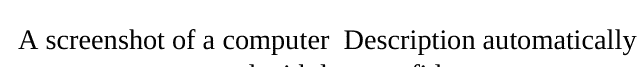

图6.30 通过轮廓移除背景的参数

调整参数时，图像会实时变化。


图6.31 前景的掩码


图6.32 背景已移除

以下是完整的源代码：

```python
import cv2
import common.ImageProcessing as ip

def empty(a):
    pass

if __name__ == "__main__":
    iproc = ip.ImageProcessing("Original",
                                "../res/bird001.jpg")
    iproc.show(image=iproc.resize(65,iproc.image))
    gs_blur = 3
    lower, upper = 103, 153
    dilate, erode = 1, 1
    cv2.namedWindow("Parameters")
    cv2.createTrackbar("GS_Blur","Parameters",gs_blur,51,empty)
    cv2.createTrackbar("Lower", "Parameters", lower, 300,empty)
    cv2.createTrackbar("Upper", "Parameters", upper, 300,empty)
    cv2.createTrackbar("Dilate", "Parameters", dilate,25,empty)
    cv2.createTrackbar("Erode", "Parameters", erode, 25, empty)
    while True:
        gs_blur = cv2.getTrackbarPos("GS_Blur", "Parameters")
        lower = cv2.getTrackbarPos("Lower", "Parameters")
        upper = cv2.getTrackbarPos("Upper", "Parameters")
        dilate = cv2.getTrackbarPos("Dilate", "Parameters")
        erode = cv2.getTrackbarPos("Erode", "Parameters")
        bg_removed,mask=iproc.remove_background_by_contour(
                                gs_blur, lower, upper,
                                dilate, erode)
        cv2.imshow("Mask", iproc.resize(65,mask))
        cv2.imshow("Background Removed",
                                iproc.resize(65,bg_removed))
        ch = cv2.waitKey(10)
        # 按 'ESC' 退出
        if (ch & 0xFF) == 27:
            break
    cv2.destroyAllWindows()
```

本示例展示了调整高斯模糊核大小、膨胀和腐蚀的效果，然后找到前景的轮廓，并通过按位与操作移除背景。执行代码并调整参数，观察结果如何变化。你也可以更换不同的图像，看看效果如何。

### 6.8.3. 通过机器学习移除背景

源文件：RemoveBackgroundByML.py

PixelLib是一个Python库，为各种计算机视觉任务提供了易于使用的接口，包括图像分割、目标检测以及图像和视频处理。它利用深度学习模型来执行这些任务，并简化了构建自定义目标检测和分割模型的过程。

它提供了预训练模型，只需几行代码即可支持图像和视频的背景编辑。PixelLib的官方网站位于：[https://github.com/ayoolaolafenwa/PixelLib](https://github.com/ayoolaolafenwa/PixelLib)

只需几行代码，我们就可以轻松实现以下操作：

- 移除背景 – 移除背景。
- 灰度背景 – 将背景变为灰度，同时保持前景物体的颜色。
- 模糊背景 – 将背景模糊化，同时保持前景物体清晰。
- 更换背景 – 更换不同的图像作为背景，同时保持前景物体。

PixelLib也可以处理视频，请参考其官方网站了解详情和教程。本节仅关注图像的上述四种操作。

开始之前，需要将以下两个库添加到Python环境中，如果它们已经安装在你的环境中，请确保已升级到最新版本。

- tensorflow
- pixellib

按照第2.3.2节的说明安装或升级库。*tensorflow*用于机器学习，它也将在下一章中用于机器学习。

以下是初始化PixelLib的代码，

```python
import pixellib
from pixellib.tune_bg import alter_bg
change_bg = alter_bg()
change_bg.load_pascalvoc_model(
    "../res/deeplabv3_xception_tf_dim_ordering_tf_kernels.h5")
```

本示例将使用在[PASCAL VOC (PASCAL Visual Object Classes)](PASCAL%20VOC%20(PASCAL%20Visual%20Object%20Classes))数据集上训练的[deeplabv3+](deeplabv3+)模型。该数据集包含20个物体类别，包括人、

### 6.8.3. 通过机器学习移除背景

来源：RemoveBackgroundByMachineLearning.py

COCO 数据集包含 80 个物体类别，包括人、自行车、船、公交车、汽车、摩托车、火车、瓶子、椅子、餐桌、盆栽植物、沙发、电视/显示器、鸟、猫、牛、狗、马和羊。该数据集已被广泛用作目标检测、背景分割和分类任务的基准，参见参考文献部分的材料 #10。

*deeplabv3+* 是一种语义分割算法，它使用卷积神经网络（CNN）来识别和分类图像中的不同物体和区域。语义分割涉及根据每个像素所属的物体或区域为其分配一个标签。

*deeplabv3+* 在包括 PASCAL VOC 在内的多个基准数据集上实现了最先进的性能。它已被广泛应用于计算机视觉领域，包括目标识别、场景理解和自动驾驶。对于图像背景移除，*deeplabv3+* 可用于准确识别图像中的前景物体，并将其与背景分割开来。这使其成为视频会议、虚拟背景和照片编辑等任务的有用工具。

模型 *deeplabv3_xception_tf_dim_ordering_tf_kernels.h5* 可从 PixelLib 网站下载，链接如下（截至本文撰写时）：

https://github.com/ayoolaolafenwa/PixelLib/releases/download/1.1/deeplabv3_xception_tf_dim_ordering_tf_kernels.h5

这是一个约 150MB 的大文件，因此未包含在我们的 Github 仓库中。请下载该文件并将其放入本地环境的 /res 目录中，上述代码的第 4 行和第 5 行用于加载模型。

请注意，*tensorflow*、*pixellib* 和 *deeplabv3+* 也是大型库，在执行代码时加载它们可能需要一些时间，具体取决于您的机器性能，可能需要几分钟。它可能还需要一些硬件规格，如果未满足这些要求，可能会出现一些警告消息。

本示例将使用一张鸟的图片，如图 6.33 所示：

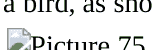

图 6.33 通过机器学习移除背景

使用以下代码移除背景：

```python
bg_removed = change_bg.color_bg(image_file,
                               colors = (0,0,0))
cv2.imshow("Remove Background", bg_removed)
```


图 6.34 背景已移除

在第 6 行，`change_bg.color_bg()` 函数将背景替换为纯色，这里我们指定了 `colors=(0,0,0)`，因此背景被替换为图 6.34 中的纯黑色。

类似地，使用 `change_bg.gray_bg()` 方法将背景设为灰度：

```python
bg_gray = change_bg.gray_bg(image_file)
cv2.imshow("Gray Background", bg_gray)
```

如图 6.35 所示，背景基于原始背景转换为灰度，而不仅仅是简单的纯灰色。


图 6.35 将背景设为灰色

我们还可以使用 `change_bg.blur_bg()` 模糊背景，并使用 `change_bg.change_bg_img()` 方法替换背景：

```python
bg_blur = change_bg.blur_bg(image_file, low = True)
cv2.imshow("Blur Background", bg_blur)
background_file = "../res/background_002.jpg"
print("Change Background ...")
bg_change = change_bg.change_bg_img(
    f_image_path = image_file,
    b_image_path = background_file)
cv2.imshow("Change Background", bg_change)
```

图 6.36 是模糊背景的结果：


图 6.36 模糊背景

图 6.37 是用另一张图片替换背景的结果：

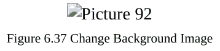

当使用 Microsoft Teams 或 Google Meet 等远程视频会议工具时，您可能好奇它们如何通过“背景效果”功能移除和更改背景，PixelLib 是实现此目的最有效的方法之一。

### 6.8.4. 通过蒙版移除背景

来源：RemoveBackgroundByMask.py

如果通过上述所有方法都无法达到理想的背景移除效果，您始终可以使用第三方图像编辑软件生成蒙版，并将该蒙版应用于原始图像以移除背景。第三方软件可以是 Adobe PhotoShop 或 [GIMP](https://www.gimp.org/)，或任何其他图像编辑工具。GIMP（GNU 图像处理程序）是一款免费且开源的图像编辑软件，可用于多种任务，如照片修饰、图像合成和图像创作。它具有许多与 Adobe Photoshop 等商业软件相似的功能，但免费提供并可在多个平台上运行，包括 Windows、macOS 和 Linux。

这是一种手动方法，需要在第三方软件中进行一些操作才能移除背景以达到理想效果。

在本示例中，原始图像如图 6.38 所示：

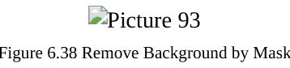

通过颜色或轮廓分离前景并不显著，因此前面章节介绍的方法可能效果不佳，甚至机器学习方法也可能无效。

将此图像加载到 GIMP 软件、Adobe PhotoShop 或任何其他图像编辑器中，手动创建蒙版，如下所示。由于是手动操作，需要一些努力，图 6.39 是蒙版。


图 6.39 手动创建的蒙版


图 6.40 背景已移除

通过按位与操作将蒙版应用于原始图像以移除背景，见图 6.40。
这是在 ImageProcessing 类中定义的函数，

```python
def remove_background_by_mask(self, mask,
                                image = None):

    if image is None:
        image = self.image
    bg_removed = cv2.bitwise_and(image, mask)
    return bg_removed, mask
```

以下是生成图 6.40 中上述结果的代码，它加载原始图像和蒙版，然后调用上述函数执行按位与操作以移除背景。

```python
import cv2
import common.ImageProcessing as ip
def remove_background(image, mask):
    iproc = ip.ImageProcessing("Original", image)
    iproc.show(image=iproc.image)
    mask = cv2.imread(mask)
    iproc.show(title="Mask", image=mask)
    bg_removed, _ = \
        iproc.remove_background_by_mask(mask)
    iproc.show(title="Background Removed",
               image=bg_removed)
    cv2.waitKey(0)
    cv2.destroyAllWindows()

if __name__ == "__main__":
    remove_background(
        image = "../res/flower010.jpg",
        mask = "../res/flower010_mask.jpg")
```

通过手动操作和努力，创建的蒙版将是准确的，这始终是达到理想结果的有效方法。

## 6.9. 模糊背景

| 来源： | BlurBackground.py |
| 库： | common/ImageProcessing.py |

有时我们希望实现一种使前景突出的效果。在前面的章节中，我们可以将前景从图像中分离出来，现在我们将模糊背景以使前景突出。
例如，当使用 Microsoft Teams 或 Google Meet 等远程视频会议工具时，“背景效果”可以模糊背景，使人物在视频通话中更加突出。

以下是几个模糊背景的示例，图 6.41 使用高斯模糊处理背景，核大小为 (41, 41)，sigma 为 (52, 52)：

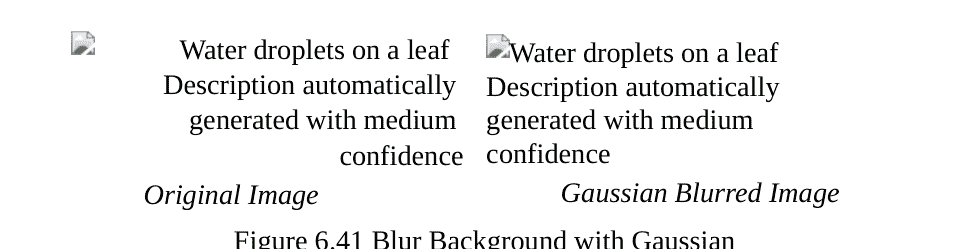

除了高斯模糊，还可以使用其他模糊方法，并且可以调整核大小以达到理想效果。背景颜色也可以调整，例如使用灰度，或更改亮度、对比度、饱和度等。与前面的示例类似，我们在参数窗口中创建了四个滑动条。这些滑动条用于控制背景处理。
第一个滑动条是高斯或中值模糊的核大小。第二个是高斯模糊的 sigma，它不适用于中值模糊。第三个是两种模糊方法的切换，0 表示高斯，1 表示中值。最后一个是颜色或灰度的切换。如图 6.42 所示：


图 6.42 控制模糊的滑动条

可选地，如果您想调整亮度、对比度、色调、饱和度和明度，您可以在此处添加更多滑动条，并相应添加代码进行处理。


图 6.43 模糊背景的过程

上面的图 6.43 是模糊背景的过程。原始图像用于创建 *蒙版*，同时创建 *(1-蒙版)*。蒙版通过按位与操作应用于原始图像以获取前景；而 *(1-蒙版)* 应用于原始图像以获取背景，然后对背景应用模糊以及颜色调整。最后通过按位或操作合并前景和背景以获得最终图像。
以下是生成前景和背景的代码片段，

```python
image = cv2.imread(image)
mask = cv2.imread(mask)
foreground = cv2.bitwise_and(image, mask)
```

第 1 行和第 2 行用于加载原始图像和蒙版，蒙版可以基于第 6.8 节介绍的几种方法之一创建，这里我们使用第三方图像编辑软件创建蒙版并将其保存到文件。第 2 行是加载掩码文件。然后使用 `cv2.bitwise_and()` 将*掩码*应用于原始图像以获取前景。

```
4 background = cv2.bitwise_and(image, (255 - mask))
```

然后将 $(1 - mask)$ 应用于原始图像以获取背景。$(1 - mask)$ 是掩码的逆，掩码是二进制数据，要么是0要么是255，所以在代码中 (255-mask) 代表 $(1 - mask)$，如上面的第4行所示。

然后对背景应用高斯模糊或中值模糊，如下方的第5行或第6行。高斯模糊和中值模糊已在5.8节中介绍。

```
5 background = cv2.GaussianBlur(background,
    (ksize, ksize),
    sigma, sigma,
    cv2.BORDER_DEFAULT )
6 # background = cv2.medianBlur(background, ksize)
```

请注意，应该是第5行或第6行，而不是两者都用。
有时，为了使前景更突出，你可能想将背景转为灰度，或调整颜色。

```
7 background=cv2.cvtColor(background,cv2.COLOR_BGR2GRAY)
8 background=cv2.cvtColor(background,cv2.COLOR_GRAY2BGR)
```

第7行将背景转换为灰度，由于灰度只有一个通道，它应该与前景处于相同的颜色空间，即BGR空间，所以第8行是将其转换回BGR。

可选地，你可能想调整背景的亮度、对比度、色相和饱和度，以达到某些期望的效果，请参考5.3节和5.4节来调整这些值。

背景完成后，使用 `cv2.bitwise_or()` 函数合并前景和背景以获得结果。

```
9 result = cv2.bitwise_or(foreground, background)
```

完整的源代码如下：

```
1 import cv2
2  def chg_ksize(value):
3      global ksize
4      if value % 2 == 0:
5          ksize = value+1
6      else:
7          ksize = value
8
9  def chg_method(value):
10     global blur_method
11     blur_method = value
12
13 def chg_color_gray(value):
14     global is_gray
15     is_gray = value
16
17 def chg_sigma(value):
18     global sigma
19     sigma = value
20
21 def blur_background(image, mask):
22     global ksize, blur_method, is_gray, sigma
23     ksize = 9
24     blur_method = 0
25     is_gray = 0
26     sigma = 22
27     image = cv2.imread(image)
28     mask = cv2.imread(mask)
29     foreground = cv2.bitwise_and(image, mask)
30     cv2.imshow("Original", image)
31     # cv2.imshow("Mask", (255-mask))
32     # cv2.imshow("Background Removed", foreground)
33     title = "Background Blurred"
34     cv2.namedWindow("Parameters")
35     cv2.createTrackbar("K-Size", "Parameters",
36                        ksize, 51, chg_ksize)
37     cv2.createTrackbar("Sigma", "Parameters",
38                        sigma, 50, chg_sigma)
39     cv2.createTrackbar("Gaus/Medn", "Parameters",
40                        blur_method, 1, chg_method)
41     cv2.createTrackbar("Color/Gray", "Parameters",
42                        is_gray, 1, chg_color_gray)
43     while True:
44         background = cv2.bitwise_and(image,(255-mask))
45         if blur_method == 0:
46             background = cv2.GaussianBlur(background,
47                                          (ksize, ksize),
48                                          sigma, sigma,
49                                          cv2.BORDER_DEFAULT )
50         else:
51             background = cv2.medianBlur(
52                 background, ksize)
53         if is_gray == 1:
54             background = cv2.cvtColor(
55                 background,
56                 cv2.COLOR_BGR2GRAY)
57             background = cv2.cvtColor(
58                 background,
59                 cv2.COLOR_GRAY2BGR)
60         result = cv2.bitwise_or(foreground,
61                                 background)
62         cv2.imshow(title, result)
63         ch = cv2.waitKey(10)
64         # Press 'ESC' to exit
65         if (ch & 0xFF) == 27:
66             break
67
68         # Press 's' to save
69         elif ch == ord('s'):
70             filepath = "C:/temp/blur_background.png"
71             cv2.imwrite(filepath, result)
72             print("File saved to " + filepath)
73
74     cv2.destroyAllWindows()
75
76 if __name__ == "__main__":
77     blur_background(image="../res/flower011.jpg",
78                     mask="../res/flower011_mask.jpg")
```

还有更多示例，图6.44在灰度背景上使用了核大小为23的中值模糊，

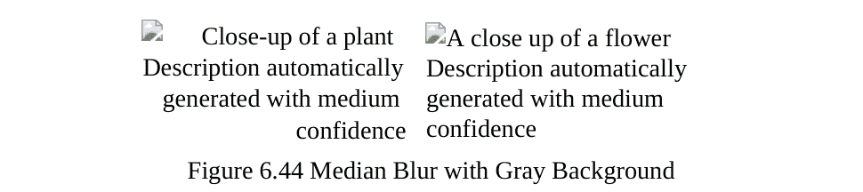

图6.45使用了核大小为43、sigma为12的高斯模糊，然后通过降低色相、饱和度和明度来调整颜色。

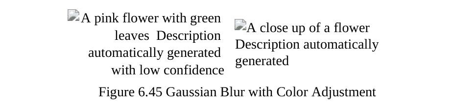

以下是Github仓库中的几张图片及其掩码，你可以通过修改上面代码的第61和62行来尝试它们。

- res/flower011.jpg, res/flower011_mask.jpg
- res/flower012.jpg, res/flower012_mask.jpg
- res/flower013.jpg, res/flower013_mask.jpg
- res/flower014.jpg, res/flower014_mask.jpg

6.8节介绍了用于背景移除的图像分割技术，本节介绍了模糊背景。通过结合图像分割和模糊背景的技术，我们可以实现突出前景物体、使其脱颖而出并吸引注意力的效果。这在各种应用中都很有用，例如产品摄影，你希望展示某个特定物品。
它还可以提高视觉美感，模糊背景可以通过减少干扰并强调图像的主题来创造令人愉悦的视觉效果。这在人像摄影中很常见，例如Microsoft Teams和Google Meet等远程视频会议软件的“背景效果”功能。
这些技术对于增强图像分析也很有用，在医学成像或卫星图像等领域，图像分割可用于隔离特定感兴趣区域以进行进一步分析。例如，在医学成像中，分割肿瘤或其他异常有助于诊断和治疗计划。

# 7. 机器学习

近年来，机器学习已成为计算机视觉和图像处理的基础部分。作为人工智能的一部分，它包含许多数学算法和技术。机器学习将自动从海量数据中“学习”模式和特征，并将这些模式和特征应用于解决与图像分析、处理和检测相关的广泛问题。

许多最先进的计算机视觉和图像处理技术都基于机器学习，以下是一些示例：

- 目标检测与识别：机器学习算法可以被训练来识别和定位图像或视频中的特定物体，如6.6节和6.7节介绍的检测人体、人脸和眼睛。这在各种应用中都很有用，例如监控、自动驾驶汽车和医学成像。
- 图像分割：机器学习可用于将图像分割成不同的区域或物体，如6.8.3节介绍的将前景与背景分离。这在医学成像、机器人和自然语言处理中很有用。
- 图像分类：机器学习可以根据图像的特征将其分类到不同的类别，这在基于内容的图像检索、人脸识别和自动检测等应用中很有用。这将在后续章节中介绍。
- 图像恢复与增强：机器学习可用于恢复或增强退化或质量低下的图像。这在医学成像、卫星成像和法医分析等应用中很有用。生成对抗网络（GANs）等机器学习算法可用于训练能够恢复图像的模型。
- 生成模型：机器学习可用于生成与给定图像集相似的新图像。这在艺术风格迁移、数据增强和数据合成等应用中很有用。

机器学习彻底改变了计算机视觉和图像处理领域，实现了新的应用并提高了现有技术的准确性。

机器学习到底是什么？作为一个非常高层次的概述，机器学习（ML）是人工智能（AI）的一部分，而深度学习（DL）是机器学习（ML）的一部分。
人工智能是指创建能够执行通常需要人类智能的任务的智能机器或应用程序，例如视觉感知、语音识别、决策和语言翻译。
机器学习是一种人工智能，涉及训练算法以自动提高其在特定任务上的性能，例如图像分类或自然语言处理。机器学习算法使用统计技术来识别数据中的模式，并基于这些模式进行预测或决策。
另一方面，深度学习是机器学习的一个子集，涉及使用人工神经网络来处理和分析大量数据。深度学习算法受到人脑结构和功能的启发，它们使用相互连接的节点层来学习数据并做出预测。

在本书中，术语“机器学习”既指机器学习（ML）也指深度学习（DL），因为两者都是人工智能的子集，涉及训练算法基于数据进行预测或决策。
机器学习有两个关键部分，

1. **数据**，是它实际学习的东西。
2. **模型**，包含如何从数据中学习的算法和机制。

*数据*的质量对于机器学习项目至关重要。在实际项目中，准备数据集需要付出大量努力，例如清理数据、确保数据准确性、移除空白记录等。例如，日期字段应统一格式，如果大多数日期为“2021/06/21”，但部分为“Jun 21, 2021”，处理数据集时就会出错。

在大多数情况下，这些工作还需与领域专家协作完成。例如，医疗数据需与医疗专家共同审核以确保准确性；房地产数据则需与地产专家核对，依此类推。

然而，本书中几乎所有数据集均来自Python包（如`scikit-learn`和`tensorflow`），它们已预先处理好，可直接使用，无需进行数据清理等额外工作。

*模型*是机器学习的另一关键要素。优秀的模型配合高效算法，能帮助其更好地从数据中学习。本章将介绍计算机视觉与图像处理中广泛使用的几种算法，它们各具特色，适用于不同场景。

机器学习算法主要分为两类：*监督学习*和*无监督学习*。前者从带标签的数据中学习，即算法知晓数据内容。例如，算法接收一张图片并被告知这是狗，随后尝试将图片与狗关联。后者则从无标签数据中学习，例如算法接收图片但不知其内容，它会自主探索数据信息，发现模式并进行分类等。

OpenCV提供了多种预定义的机器学习算法模型。我们无需深究算法的数学原理（尽管理解它更好），而是将重点介绍如何使用这些预定义模型解决问题。本章将涵盖以下模型：

- 无监督学习
    - K均值聚类（第7.1节）
- 监督学习
    - K近邻算法（第7.2节）
    - 支持向量机（第7.3节）
    - 人工神经网络（第7.4节）
    - 卷积神经网络（第7.5节）

数据对机器学习至关重要，它是模型学习的实际对象。没有数据，模型便无法运作。存在许多为机器学习预构建的数据集。本章将介绍以下常用数据集：

- MNIST（修改版国家标准与技术研究院）数据集：包含大量0到9的手写数字。它是事实上的“Hello World”数据集，广泛用于机器学习。可通过`keras.datasets`包获取。本章每节都将使用此数据集，并通过比较不同模型来评估结果。
- CIFAR-10数据集：包含60,000张32x32的彩色图像，分为10类，每类6,000张。类别包括飞机、汽车、鸟、猫等。同样可通过`keras.datasets`包获取。
- IRIS花卉数据集：一个小型但多变量的带标签数据集。该数据集随`sklearn.datasets`包提供。
- 除预构建数据集外，我们还将学习如何使用`sklearn.datasets`提供的函数生成样本数据。

本章需要几个Python包，运行示例代码前必须安装它们。关于本书使用的版本，请参考第1.4节。

- `sklearn`（或`scikit-learn`）：开源机器学习库，支持监督与无监督学习，并提供数据预处理、模型选择与评估的各种工具。
- `keras`：开源机器学习库，功能强大，支持机器学习与深度学习。
- `tensorflow`：开源机器学习库，通常与`keras`一同安装。
- `matplotlib`：Python数据可视化开源库，已在前面章节使用过。

如果您的环境中未安装这些库，强烈建议按照第2.3节的说明进行安装，以便执行本章的源代码。

享受机器学习之旅吧！

## 7.1. K均值聚类

### 7.1.1. 什么是K均值聚类

来源：K-Means.py

K均值聚类是一种流行的无监督机器学习算法，用于根据相似性将给定数据集划分为$k$个簇，其中$k$是预定义的簇数。

它是一种无监督算法，因为训练模型时不需要带标签的数据，模型将自主从数据中学习。换言之，它不依赖任何预定的目标变量或输出值来指导学习过程。

K均值算法的目标是根据数据点之间的相似性或距离，将相似的数据点分组到簇中。它通过寻找若干*质心*来代表簇的中心，迭代地将每个数据点分配给最近的簇质心，然后根据簇的新成员更新质心。*质心*是数据簇的算术平均位置或平均位置。该过程重复进行，直到质心不再移动或达到最大迭代次数。

在实际用例中，例如，T恤制造商希望生产适合不同身高体重人群的产品。制造商计划生产L、M、S三种尺码以适应不同人群。在K均值算法术语中，这三种尺码称为*质心*，每个*质心*代表一组人群或一个簇。

K均值是解决此类问题的有效算法，它将从数据集中找到三个质心（L、M和S）。它是一种无监督学习方法，因为它将通过计算从数据本身发现结果，我们无需为每个数据标记标签。

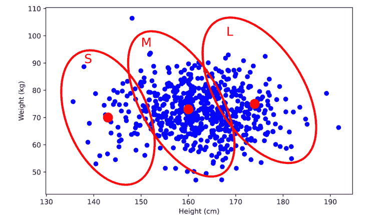

图7.1 T恤示例

如图7.1所示，横轴代表身高，纵轴代表体重。每个数据点代表一个人，数据点可分为三个簇：S、M和L。

每组的算术平均（平均）位置是*质心*，位于每组中心附近，如图7.1中的红色•所示。每个质心有其对应的身高和体重，T恤制造商将根据三个质心生产三种尺码的T恤，它们很可能适合不同组的所有人。

让我们看看K均值在最简单情况下如何工作：生成两个簇的随机二维数据，并绘制为图7.2，

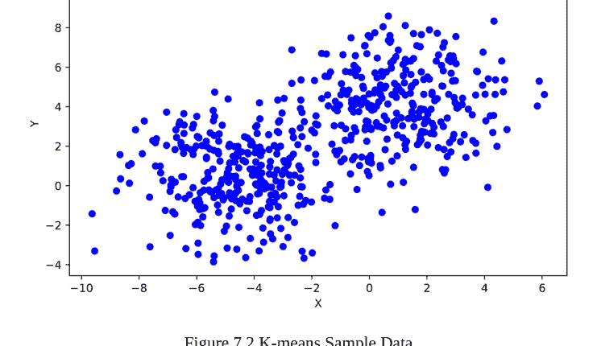

图7.2 K均值样本数据

我们使用两个质心来解释K均值的工作原理。以下是生成图7.2样本数据的代码，第6行的`make_blobs()`是sklearn包中用于生成样本数据的函数。第3行的matplotlib是用于数据可视化的包。

```
1  import numpy as np
2  import cv2 as cv
3  from matplotlib import pyplot as plt
4  from sklearn.datasets import make_blobs
5  def sample_cluster():
6      X, y = make_blobs(n_samples=600, centers=2,
7          cluster_std=2.8, random_state=1)
8      X = np.float32(X)
9      plt.figure(figsize=(6, 4))
10     plt.scatter(X[:,0],X[:,1],s=10,cmap='spring')
11     plt.xlabel('X')
12     plt.ylabel('Y')
13     plt.show()
14     return X, y
```

K均值将执行以下步骤，

**步骤1：** 随机初始化$k$个质心。在我们的例子中$k=2$，因此初始化两个质心：$\mu_1$和$\mu_2$。

**步骤2：** 计算每个数据点到两个质心的距离并标记数据。如果数据更接近$\mu_1$，则标记为0；如果更接近$\mu_2$，则标记为1。如果有更多质心，则标记为2、3等。

运行以下代码进行一次K均值迭代，得到步骤2的结果，如图7.3所示：

```
15 criteria = (cv.TERM_CRITERIA_MAX_ITER, 1, 1.0)
16 ret,label,center=cv2.kmeans(X, 2, None , criteria, 1,
17                             cv2.KMEANS_RANDOM_CENTERS)
```

### 7.1.1. K-Means 算法

靠近 $\mu_1$ 的数据点被标记为 0，并在图 7.3 中以 • 表示；靠近 $\mu_2$ 的数据点被标记为 1，并以 × 表示。左上角显示的距离值 9579.32，是上述代码片段第 16 行中 `cv2.kmeans()` 函数返回的实际值，它是所有数据点的平方距离之和。

**步骤 3：** 计算所有 • 数据点的平均值，作为新的 $\mu_1$；计算所有 × 数据点的平均值，作为新的 $\mu_2$。

重复步骤 2 和 3 进行多次迭代，然后我们会得到一组新的质心及其标记的数据点，如图 7.4 所示，同时得到一个新的距离值 6207.04，该值小于之前的值。这意味着我们这次得到了更好的质心。请注意，图 7.3 和图 7.4 用于说明概念，它们可能并非前几次迭代的实际结果。

继续重复迭代，直到达到最大迭代次数 100 次，此时质心收敛到固定点，即不再有明显移动。结果如图 7.5 所示，$\mu_1$ 达到一个点，其附近的所有数据点都标记为 0 并以 • 表示。$\mu_2$ 同理，其附近的所有数据点都标记为 1 并以 × 表示。距离值达到最小值 3700.15。

K-Means 算法的目标是找到这些质心来代表其附近的数据。在此例中，$\mu_1$ 用于代表所有 • 数据点，$\mu_2$ 用于代表所有 × 数据点。

回到开头的例子，T 恤的例子。制造商不必根据每个人的尺寸来制作 T 恤，而是使用 K-Means 算法计算出 S、M 和 L 三个尺码的质心。这三个尺码将适合每个群体中的大多数人。当然，在现实世界中，可能会为 XS、S、M、X、XL 等尺码创建更多的质心。

如前所述，算法通过迭代重复执行步骤，但迭代何时终止？算法如何知道最终结果？这被称为*终止准则*，它不仅适用于 K-Means 算法，也适用于几乎所有机器学习算法模型。OpenCV 使用两个准则来终止迭代：

-   定义最大迭代次数，当达到此最大次数时迭代终止。结果被视为最终结果。
-   定义收敛度量 ε（epsilon），这可以理解为一种精度度量，算法根据该度量计算结果，如果结果满足该度量，则迭代终止，意味着达到了定义的精度水平。

不同的算法模型有不同的计算精度的方法，OpenCV 会处理它们。后续章节的示例将解释如何定义终止准则。

以下是 `*kmeans()*` 函数的详细说明：

```python
distance, bestLabels, centers =
    cv.kmeans(data,
              nclusters,
              bestLabels,
              criteria,
              attempts,
              flags,
              [centers] )
```

参数：

| 参数 | 描述 |
| :--- | :--- |
| data | 用于聚类的数据，一个包含 n 维数据点的数组，数据类型为 *float32*。 |
| nclusters | 聚类的数量。 |
| bestLabels | 一个输入/输出整数数组，用于存储每个样本的标签，标签标记为 0、1、2...。如果数据已有标签，则将其作为输入参数传递；否则传递 None。 |
| criteria | 算法终止准则，即当满足这些准则时迭代停止。它有三个参数：<br>1. 终止准则类型，<br>cv2.TERM_CRITERIA_EPS - 如果达到指定精度 epsilon，则停止算法迭代。<br>cv2.TERM_CRITERIA_MAX_ITER - 在指定迭代次数 max_iter 后停止算法。<br>2. max_iter - 指定最大迭代次数的整数。<br>3. epsilon - 所需精度 |
| attempts | 指定使用不同初始标签执行算法的次数。 |
| flags | 指定如何获取初始质心：<br>1. cv2.KMEANS_PP_CENTERS<br>2. cv2.KMEANS_RANDOM_CENTERS<br>3. cv2.KMEANS_USE_INITIAL_LABELS |

输出：

| 参数 | 描述 |
| :--- | :--- |
| distance | 每个点到其对应质心的平方距离之和。 |
| bestLabels | 标签数组，与输入参数中的 bestLabels 相同。 |
| centers | 聚类质心的数组。 |

以下是创建准则并调用 `cv2.kmeans()` 函数的示例：

```python
1  criteria = ( cv2.TERM_CRITERIA_EPS +
2              cv2.TERM_CRITERIA_MAX_ITER,
3              100,
4              1.0)
5  _,label,center=cv2.kmeans(X,
6                             2,
7                             None ,
8                             criteria,
9                             100,
10                            cv2.KMEANS_RANDOM_CENTERS)
```

上面第 1 到 4 行指定了终止准则，它通过 `cv2.TERM_CRITERIA_EPS+cv2.TERM_CRITERIA_MAX_ITER` 结合了最大迭代次数和精度度量。最大迭代次数在第 3 行指定为 100，精度度量在第 4 行指定为 1.0。

然后第 5 到 10 行调用 `cv2.kmeans()` 来执行 K-Means 算法，第 5 行的 `X` 是数据，第 6 行的 `2` 是 `k` 值，用于指定输出的聚类数。第 7 行指定输入数据集附带的标签，由于 K-Means 是无监督学习，此参数不是必需的，我们在此传递 `None`。第 8 行指定之前定义的 `criteria`。第 9 行指定最大迭代次数，第 10 行告诉函数随机初始化质心。

### 7.1.2. 颜色量化

来源：K-MeansColorQuantization.py
库：common/color_wheel.py

K-Means 的一个应用是颜色量化，即在保持图像整体外观的同时减少图像中不同颜色的数量。这是图像处理、计算机图形学和计算机视觉中常用的技术。

颜色量化的目的有：1）减少存储图像所需的内存和大小；2）在具有不同颜色数量限制的设备上显示图像。有时它也可用于在图像中创建艺术效果，例如色调分离或风格化。

通过减少图像中的颜色数量，颜色量化有助于减小图像文件大小、提高图像压缩率并提升图像处理操作的效率。它常用于图像压缩算法、数字艺术和计算机图形学。

颜色量化背后的基本思想是用一组较小的颜色替换图像中的原始颜色。这通常通过将相似颜色聚类在一起，并用它们的平均颜色值来替换来实现。

一张图像能有多少种不同的颜色？理论上，图像有蓝、绿、红三个通道，每个通道可以有 256 个值，因此总共有 256 * 256 * 256 = 16,777,216 种可能的不同颜色，尽管在大多数情况下图像中并没有这么多颜色。以下代码片段将统计图像中的不同颜色数量：

```python
1 def get_distinct_colours(image):
2    unique, counts = np.unique(
         image.reshape(-1, img.shape[-1]),
         axis=0, return_counts=True)
3    return counts.size
```

图 7.6 展示了颜色量化的工作原理，左侧的原始图像是一个色轮，右侧是聚类数 = 8 进行颜色量化后的图像。

左侧色轮中的相似颜色被分组为一个聚类，并在右侧图像中用单一颜色表示，例如，靠近蓝色的颜色，如深蓝、蓝色、浅蓝等，被分组为右侧图像中的一种蓝色。红色、黄色、紫色、绿色等同理。原始图像中的所有颜色被分为 8 个聚类，即 K-Means 找到的 8 个质心。

请注意，白色背景被计为一个聚类，因此右侧色轮上有 7 种颜色，加上白色背景，总共 8 种颜色。

以下是上述两张图像中不同颜色数量的统计结果：
原始图像中的不同颜色数量：239
颜色量化后的不同颜色数量：8

类似地，对 k=6 和 k=3 进行颜色量化，我们可以得到具有更少不同颜色的色轮，如图 7.7 所示。

### 7.1.3. 手写数字分组

来源：K-MeansHandWrittenDigits.py

本示例将使用K-means算法对手写数字进行分组。我们使用MNIST（修改后的国家标准与技术研究院）数据集，这是机器学习和计算机视觉领域常用的数据集，也是事实上的“Hello World”数据集。
MNIST包含70,000个手写数字，这些数字经过预处理和归一化，以适应28×28像素的固定尺寸图像。该数据集包含60,000张训练图像和10,000张测试图像，每张图像代表0到9中的一个数字。训练集通常用于训练模型，测试集用于评估模型，两者对机器学习过程都很有用。然而，对于本示例，我们只使用训练集。
该数据集随*keras*包提供，可以通过以下代码加载：

```
1  from keras.datasets import mnist

2  (X_train, Y_train), (X_test, Y_test) =
                                mnist.load_data()
```

第1行是从keras包导入mnist数据集。在运行代码之前，请确保已按照第2.3.2节的步骤安装了keras。

第2行是将数据集加载到(X_train, Y_train)作为训练集，以及(X_test, Y_test)作为测试集。它们的尺寸如下所示：

```
X_train: (60000, 28, 28)
Y_train: (60000,)
X_test:  (10000, 28, 28)
Y_test:  (10000,)
```

X_train和X_test是包含手写图像的变量，而Y_train和Y_test是告诉我们图像是0、1、2、...、9的标签。X_train有60,000张图像，每张28×28，这在上面的结果中表示为(60000,28,28)。Y_train有60,000个标签，表示为(60000,)。

在本示例中，我们不使用Y_train中的标签，因为K-Means是一种无监督算法，不需要标签，它会通过自身的计算找到数据的相似性并进行分组。图7.8显示了MNIST数据集中的一些随机样本：

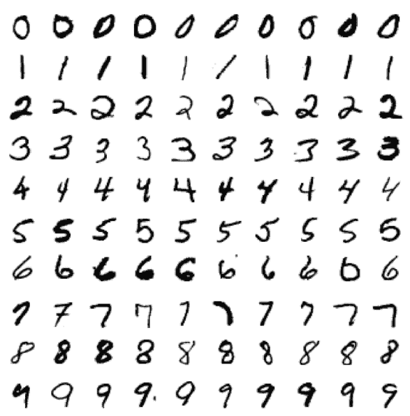

图7.8 MNIST数据集的随机样本

图7.8是由下面第6到15行的`show_random_digits()`函数生成的。
在本示例中，K-means将针对`x_train`运行，希望它能根据图像的相似性进行分组，即所有0被分组为一个簇，所有1被分组为另一个簇，依此类推。
以下是源代码：

```python
1   from keras.datasets import mnist
2   import numpy as np
3   import matplotlib.pyplot as plt
4   import cv2
5
6   def show_random_digits(X, Y, row, col):
7       _, axarr = plt.subplots(row, col, figsize=(6, 6))
8       for i in range(row):
9           filter = np.where((Y == i))
10          X1, Y1 = X[filter], Y[filter]
11          for j in range(col):
12              index = np.random.randint(
13                  X1.shape[0])
14              axarr[i, j].imshow(X1[index],
15                  cmap="binary" )
16              axarr[i, j].axis('off')
17      plt.show()
18
19  def show_result(results):
20      fig, ax = plt.subplots(1, 10, figsize=(6, 1))
21      for axi, result in zip(ax.flat, results):
22          axi.imshow(result,
23              interpolation='nearest',
24              cmap="binary")
25          axi.axis('off')
26      plt.show()
27
28  if __name__ == "__main__":
29      print("Loading MINST dataset...")
30      (X_train, Y_train), (X_test, Y_test) = \
31          mnist.load_data()
32      print('X_train: ' + str(X_train.shape))
33      print('Y_train: ' + str(Y_train.shape))
34      print('X_test:  ' + str(X_test.shape))
35      print('Y_test:  ' + str(Y_test.shape))
36      show_random_digits(X_train, Y_train, 10, 10)
37
38      print("Running K-Means...")
39      X = X_train.reshape(X_train.shape[0],
40          X_train.shape[1] * X_train.shape[2])
41      X = np.float32(X)
42      clusters = 10
43      criteria = (cv2.TERM_CRITERIA_MAX_ITER,10,1.0)
44      ret,label,center=cv2.kmeans(
              X, clusters, None,
              criteria, 10,
              cv2.KMEANS_RANDOM_CENTERS)
45      center = np.uint8(center)
46      results = center.reshape(clusters,
                                X_train.shape[1],
                                X_train.shape[2])
47      show_result(results)
```

解释：

| 行号 | 解释 |
|------|-------------|
| 1 | 导入keras包并从中导入mnist。确保已安装此包。 |
| 3 | 导入matplotlib包用于数据绘图。确保已安装此包。 |
| 24 | 代码的起始点。 |
| 26 | 将mnist数据集加载到训练集和测试集中。 |
| 27 - 30 | 打印每个变量的尺寸。 |
| 31 | 调用show_random_digits()显示样本手写图像。 |
| 34 - 35 | 将X_train重塑为二维数组，并将数据转换为float32以用于K-Means。 |
| 36 | 设置clusters = 10。 |
| 37 | 设置K-Means标准。 |
| 38 | 运行K-Means。 |
| 39 | kmeans()函数返回的质心是float32数据类型，将其转换为uint8。 |
| 40 | 将质心重塑为28×28的图像。 |
| 41 | 显示结果。 |

由于数据集较大，运行K-Means可能需要几分钟时间。
结果如图7.9所示：

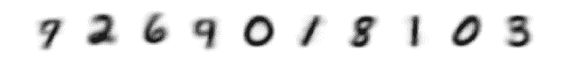

图7.9 K-means在MNIST数据集上的结果

总之，K-Means似乎不是处理这些手写图像的完美方法。我们将在后续章节介绍其他算法，并重新审视这些手写图像，看看其他算法如何处理此数据集。

## 7.2. K-近邻算法

### 7.2.1. 什么是K-近邻算法

来源：K-NearestNeighbors.py

K-近邻（KNN）是一种机器学习算法，它通过在训练集中找到与新输入数据点最接近的$k$个数据点，并使用这$k$个邻居的多数类别来对输入数据点进行预测。
它是一种监督机器学习算法，与上一节的K-means不同。它是监督的，因为它依赖于带标签的输入数据来学习，并在给定新的未标记数据时预测合适的输出。KNN简单易用，可以像K-means一样用于解决分类问题。
KNN是一种*懒惰*且*非参数*的算法。懒惰意味着在拟合或训练模型时不需要数据集，而是在预测阶段使用。它在拟合或训练阶段只存储数据集，在做出预测之前几乎什么都不做，这就是为什么它被称为*懒惰*算法。然而，这使得预测比拟合或训练更慢。
懒惰的反面是*急切*算法，比如前面的K-means算法，训练数据用于拟合或训练模型。
KNN是一种*非参数*算法，意味着它不对数据集的分布做任何假设。在参数算法的情况下，比如下一节的支持向量机，它必须根据数据集的分布情况，但KNN算法并非如此。这在现实项目中有时很有帮助，特别是当对数据集知之甚少，或者数据集不遵循任何数学分布时。

KNN是如何工作的？让我们看一下样本数据，图7.10展示了二维数据点被分为两个簇，•数据点和×数据点。

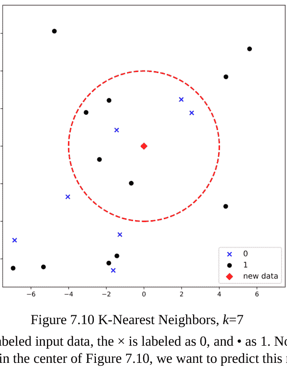

图7.10 K-近邻算法，k=7

•和×是已标记的输入数据，×被标记为0，•被标记为1。现在图7.10中心有一个新的数据点◆，我们想预测这个新数据属于×还是•。

以新数据点为中心画一个包含7个数据点的圆，如图7.10所示。换句话说，选择圆内距离新数据点最近的7个邻居。

然后统计圆内•和×的数量：

- •：4个
- ×：3个

•的数量多于×，因此新数据被预测为•。

实际上，KNN不会画任何圆，它会计算每个点到新点的距离，将距离从近到远排序，然后取最近的7个数据点并计数。

KNN的源代码在`K-NearestNeighbors.py`文件中，以下是执行结果，`result`为1，即•。`neighbours`列出了7个最近的邻居，其中有4个1（•）和3个0（×）。`distance`列出了7个邻居到新数据点的计算距离，这些是所有数据点中最近的7个距离。

```
result:  [[1]]
neighbours:  [[0 1 1 1 0 0 1]]
distance:  [[ 2.8350914  4.347414  6.090847
             9.372871  9.551281 10.086439
            12.6590185]]
```

接下来，让我们看看如果选择9个最近邻会怎样，类似地，以新数据为中心画一个包含9个现有数据的圆，如下图7.11所示。

然后再次统计圆内每种数据的数量：

- •：4个
- ×：5个

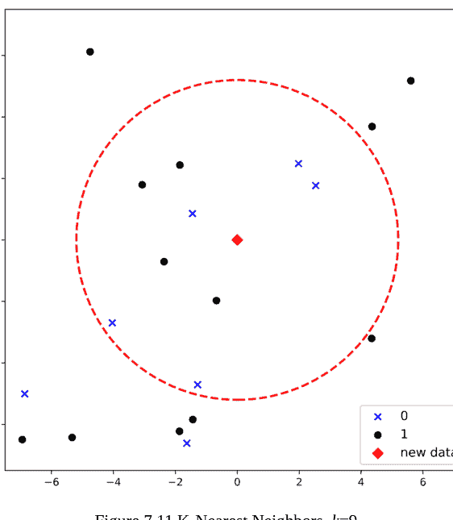

图7.11 K-近邻算法，k=9

这次新数据被预测为×，因为×的数量多于•。以下是执行结果，这次`result`变为0。同样，邻居和`distance`也列在结果中：

```
result: [[0]]
neighbours: [[0 1 1 1 0 0 1 0 0]]
distance: [[ 2.8350914  4.347414   6.090847
            9.372871   9.551281  10.086439
           12.6590185 23.584814  23.810982 ]]
```

总之，K-近邻（KNN）算法的结果可能因$k$（邻居数量）的值而异。如果选择一个非常小的$k$值，比如$k=1$，算法对数据中的噪声会非常敏感。另一方面，如果选择一个非常大的$k$值，算法可能无法正确捕捉数据模式。

以下是KNN的总结，假设训练集中总共有$n$个数据，我们想预测一个新数据：

步骤1：初始化$k$的值。

步骤2：对于从1到$n$的每个数据，计算该数据到新数据的距离。
步骤3：将计算出的距离按升序排序，这是一个大小为$n$的数组。
步骤4：从排序后的数组中获取前（最小的）$k$项。
步骤5：从前（最小的）$k$项中获取出现次数最多的类别（或标签），这就是新数据的预测值。

你可以在*K-NearestNeighbors.py*文件中尝试源代码，选择不同的$k$值并查看不同的结果。然后你就能更好地理解KNN是如何工作的。
以下是*KNN*相关函数的详细信息：

```
1 knn = cv2.ml.KNearest_create()
2 knn.train(X_train, sample_type, y_train)
3     retval, results, neighbor, dist =
        knn.findNearest(X_test, k)
```

解释：

| 行号 | 描述 |
| --- | --- |
| 第1行 | 初始化KNN分类器并返回一个空模型。 |
| 第2行 | 训练KNN模型。*X_train*：输入数据数组，数据类型为*float32*。*y_train*：输入标签数组。*sample_type*：以下两个值之一，cv2.ml.ROW_SAMPLE：训练数据按行排列。cv2.ml.COL_SAMPLE：训练数据按列排列。 |
| 第3行 | 查找邻居并为输入数组预测响应。*X_test*：用于预测的输入数据，数据类型为*float32*。*k*：最近邻的数量，k>1。输出：*results*：预测结果数组，与*X_test*大小相同，数据类型为*float32*。*neighbor*：对应的邻居。*dist*：预测数据到邻居的距离。 |

### 7.2.2. KNN评估

来源：K-NNEvaluation.py

在上一节中，我们了解到不同的$k$值可能导致不同的预测结果。在本节中，我们将评估KNN的结果，并找出如何选择最佳的$k$值。

#### 7.2.2.1. 如何选择$K$

使用`sklearn`中的函数生成数据并将数据分为训练集和测试集，

```
1   from sklearn.datasets import make_blobs
2   from sklearn.model_selection import train_test_split
3   
4   X, y = make_blobs(n_samples=800, centers=2,
5                       cluster_std=6.8,
6                       random_state=2)
7   X_train, X_test, y_train, y_test =
8                       train_test_split(X, y,
9                       test_size = 0.2, random_state = 1)
10  print('X_train: ' + str(X_train.shape))
11  print('Y_train: ' + str(y_train.shape))
12  print('X_test:  ' + str(X_test.shape))
13  print('Y_test:  ' + str(y_test.shape))
```

样本数据如图7.12所示，总共有800个数据点，如上面第4行指定。`train_test_split()`函数将80%的数据分为训练集，20%分为测试集，如上面第6和7行。以下是每个数据集的大小：
X_train: (640, 2)
y_train: (640,)
X_test: (160, 2)
y_test: (160,)

x_train有640个数据点，它是一个二维数组，大小为(640,2)；y_train是x_train的标签，它告诉x_train中的每个数据被标记为0或1，其大小为(640, )。X_test和y_test类似，它们的大小分别为(160, 2)和(160, )。

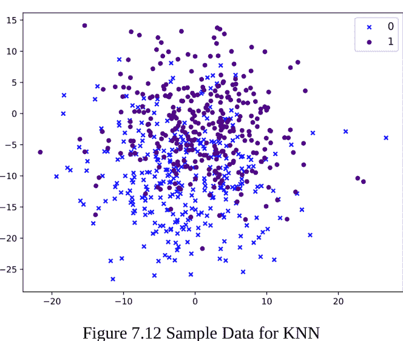

在机器学习中，将数据分为训练集和测试集是常见做法，前者用于训练模型（在我们的例子中是KNN），后者用于验证模型以查看其表现。我们将遵循这一做法，让KNN模型从训练集中学习，并从测试集中评估准确性。

以下是执行KNN的代码。第12行初始化一个KNN模型。第13行用训练集训练模型。第14行使用训练好的模型在给定k的情况下从测试集预测结果。

```
12  knn = cv2.ml.KNearest_create()
13  knn.train(X_train, cv2.ml.ROW_SAMPLE, y_train)
14  ret, result, neighbour, dist =
15                      knn.findNearest(X_test, k)
```

返回的结果是预测值，它与x_test大小相同；neighbour是一个大小为k的最近邻数组；dist是一个大小为k的邻居距离数组。

sklearn包中的accuracy_score()函数将用于评估结果的准确性。第14行返回的结果将与y_test（测试集的标签）进行比较以获得准确性。如果结果与y_test完全相同，则准确性为100%，如果有些不匹配，则准确性低于100%。

```
16  from sklearn.metrics import accuracy_score
17  accuracy = accuracy_score(y_test, result)
```

现在我们将评估不同k值的准确性。knn.findNearest()将迭代运行，k从1到100，每次评估准确性。图7.13显示了结果。
首先，看图7.13中的实线，它显示了训练集的准确性与k值的关系。当k=1时，达到100%的准确性，但如果k增加到10左右，准确性会显著下降，最终在k>20时达到收敛。
接下来，看图7.13中的虚线，它显示了测试集的准确性与k值的关系。在k=1时，准确性处于最低点，但随着k的增加而增加，最终当k变大时达到收敛。

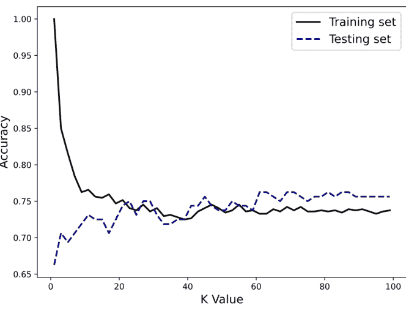

图7.13 KNN评估

不同的数据集会有不同的准确率曲线，但它们基本上都与图7.13相似。通过这种分析可以找到一个最佳的$k$值。在这种情况下，选择$k=20$可以使训练集和测试集的准确率都接近0.75。

#### 7.2.2.2. 真阳性、假阳性、真阴性和假阴性

为了评估机器学习在分类问题上的结果，有四个重要概念：真阳性（TP）、假阳性（FP）、真阴性（TN）和假阴性（FN）。它们在下表中进行了解释：

| 真阳性（TP） | 数据被标记为1，并且被预测为1。（正确）。例如，颜色被预测为红色，而它确实是红色。 |
| 真阴性（TN） | 数据被标记为0，并且被预测为0。（正确）。例如，颜色被预测为非红色，而它确实不是红色。 |
| 假阳性（FP） | 数据被标记为0，但被预测为1。（错误）。例如，颜色被预测为红色，但它实际上不是红色。 |
| 假阴性（FN） | 数据被标记为1，但被预测为0。（错误）。例如，颜色被预测为非红色，但它实际上是红色。 |

#### 7.2.2.3. 精确率、召回率和F1分数

精确率和召回率是用于评估分类模型性能的两个重要指标。

*精确率*是模型做出的所有正向预测中，真阳性预测所占的比例。它衡量模型在预测正向结果时的准确性。

*召回率*则衡量在所有实际正向案例中，真阳性预测所占的比例。它衡量模型在数据中检测正向案例的能力。

换句话说，精确率关注的是正向预测的准确性，而召回率关注的是正向预测的完整性。参见图7.14。

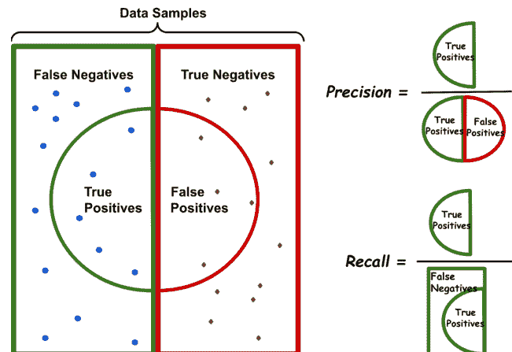

图7.14 精确率和召回率

在图7.14中，真阳性（左侧绿色半圆）加上假阴性（左侧矩形中的绿色部分）是数据集中的真实标签。假阳性（右侧红色半圆）加上真阴性（右侧矩形中的红色部分）是数据集中的错误标签。

如图7.14右侧所示，*精确率*定义为真阳性占所有预测阳性的百分比。简单来说，精确率就是所有预测阳性中有多少是真正的阳性。精确率展示了区分阴性的能力，高精确率意味着能有效区分阳性和阴性。

而*召回率*定义为真阳性占所有实际阳性的百分比。简单来说，召回率就是所有真实阳性中有多少被预测为阳性。召回率展示了识别数据集中阳性的能力，高召回率意味着能正确识别大部分阳性。

例如，在诊断疾病时，高精确率分数意味着阳性结果中的错误较少，大部分阳性结果是真正的阳性，只有少数阳性结果是错误的。高召回率分数意味着大部分实际阳性被诊断为阳性，只有少数实际阳性未被正确诊断。

总结来说，精确率和召回率是通过真阳性（TP）、真阴性（TN）、假阴性（FN）计算得出的，公式如下：

$$precision = \frac{TP}{TP + FP}$$
$$recall = \frac{TP}{TP + FN}$$

#### 什么是F1分数

F1分数是一种准确率的度量，它是精确率和召回率的平衡，定义如下：

$$F_1 = \frac{2 \cdot precision \cdot recall}{precision + recall} = \frac{TP}{TP + \frac{1}{2}(FP + FN)}$$

F1分数的最高值是1.0，表示精确率和召回率都完美。而最低可能值是0，当精确率或召回率为零时。
不用担心公式和计算，sklearn提供了函数来处理所有计算。我们唯一需要做的就是将原始标签和预测结果传递给这些函数，它们会完成所有计算并给出结果。

#### 7.2.2.4. KNN评估

现在让我们回到上面的例子，sklearn中有几个指标可以衡量分类问题的结果。下面第1到3行导入了三个指标，

```
1 from sklearn.metrics import confusion_matrix
2 from sklearn.metrics import accuracy_score
3 from sklearn.metrics import classification_report
4 print("Accuracy Score:",
        accuracy_score(y_test, res_test))
5 print("Confusion Matrix:",
        confusion_matrix(y_test, res_test))
6 print("Classification Report:",
        classification_report(y_test, res_test))
```

#### 准确率分数

accuracy_score()报告预测的准确率，它简单地计算正确预测占整个样本的百分比。参数是真实标签和预测结果。

假设总共有$n$个数据样本，$y'$是预测结果，$y_i$是样本数据的标签，那么准确率按以下公式计算：

$$accuracy(y, y') = \sum_{i=0}^{n-1} 1(y' = y_i)$$

使用$k = 20$运行上述代码，*准确率分数*为75.6%，这意味着与真实标签相比，有75.6%的预测值是正确的。

```
Accuracy Score: 0.75625
```

#### 混淆矩阵

混淆矩阵是一个表格，总结了分类模型在数据集上的性能。它是一个矩阵，显示了模型做出的真阳性、真阴性、假阳性和假阴性预测的数量。

混淆矩阵比准确率分数提供了更详细的分类模型性能视图。它可用于计算各种指标，如精确率、召回率、F1分数和准确率。

混淆矩阵的一个示例如下表所示，

| | 预测阳性 | 预测阴性 |
|---|---|---|
| **实际阳性** | 真阳性（TP） | 假阴性（FN） |
| **实际阴性** | 假阳性（FP） | 真阴性（TN） |

使用$k = 20$运行上述代码，混淆矩阵如下：

```
Confusion Matrix:
[[62 19]
 [20 59]]
```

左上角的值是真阳性，为62，右下角的值是真阴性，为59，它们是正确的预测。右上角的值是假阴性，为19，左下角的值是假阳性，为20。

总结来说，一个好的分类模型会有大量的真阳性和真阴性，以及少量的假阳性和假阴性。混淆矩阵提供了一种可视化模型性能并识别改进领域的有用方法。

#### 分类报告

分类报告是一个表格，总结了分类模型的性能。它提供了数据集中每个类别的精确率、召回率和F1分数的全面概述。它通常使用从混淆矩阵计算出的指标生成。它是机器学习和数据科学中评估模型性能的常用工具。
分类报告通常包含分类模型中每个类别的以下指标：

- 精确率：如上所述，真阳性占所有阳性预测的比例。
- 召回率：如上所述，真阳性占所有实际阳性案例的比例。
- F1分数：如上所述，上述两个指标的平衡。
- 支持度：每个类别的数据点数量。

使用$k = 20$运行上述代码，分类报告如下：

```
Classification Report:
              precision    recall  f1-score   support

           0       0.76      0.77      0.76        81
           1       0.76      0.75      0.75        79

    accuracy                           0.76       160
   macro avg       0.76      0.76      0.76       160
weighted avg       0.76      0.76      0.76       160
```

分类报告在每一行显示一个类别，在本例中有两个类别，0和1，分类报告在前两行显示它们。如果有10个类别，报告中将显示10行。准确率与上面讨论的准确率分数相同。宏平均是每个类别权重相等的指标的均值或平均值。加权平均是指标的平均值，其中每个类别的分数根据其在数据样本中的出现情况进行加权。

分类报告详细分解了模型在每个类别上的性能表现，这在数据不平衡的情况下尤其有用。它提供了对数据集中每个类别模型性能的详细理解，并允许对每个类别单独评估模型，从而可以洞察模型可能需要改进的领域。

分类报告是评估分类模型性能的有用工具，通常与混淆矩阵和准确率分数等其他指标结合使用。

请随意修改*K-NNEvaluation.py*文件中的源代码，以更好地理解KNN模型和评估指标。

### 7.2.3. 使用KNN识别手写数字

来源：K-NNHandWrittenDigits.py

我们在第7.1.3节中使用了K-means算法处理手写数字数据集，这次将对同一数据集应用K-近邻算法。

#### 7.2.3.1. 加载MNIST数据集

回顾一下，MNIST数据集包含70,000个手写数字，每个数字为28×28像素，可以从`keras.datasets`包加载。`load_data()`函数将加载数据集并自动将其分为训练集和测试集，训练集形状为[60000, 28, 28]，包含60,000个数据点；测试集形状为[10000, 28, 28]，包含10,000个数据项。

以下是加载MNIST数据集并显示随机数字的代码：

```python
def show_random_digits(X, Y, row, col):
    _, axarr = plt.subplots(row, col, figsize=(6, 6))
    for i in range(row):
        filter = np.where((Y == i))
        X1, Y1 = X[filter], Y[filter]
        for j in range(col):
            index = np.random.randint(X1.shape[0])
            axarr[i, j].imshow(X1[index], cmap="binary")
            axarr[i, j].axis('off')
            axarr[i, j].text(0.5, 1, str(Y1[index]),
                             fontsize=12, c='g')
    print("The true label is shown in green.")
    plt.show()

if __name__ == "__main__":
    print("Loading MNIST dataset...")
    (X_train, y_train), (X_test, y_test) = mnist.load_data()
    print('X_train: ' + str(X_train.shape))
    print('y_train: ' + str(y_train.shape))
    print('X_test:  ' + str(X_test.shape))
    print('y_test:  ' + str(y_test.shape))
    show_random_digits(X_train, y_train, 10, 10)
```

解释：

| 行号 | 描述 |
|------|-------------|
| 1 - 12 | 定义函数`show_random_digits()`，用于显示手写数字的随机图像。 |
| 14 | 程序执行入口。 |
| 16 | 将MNIST数据集加载到训练集和测试集中，每个集合包含数据（`X_train`/`X_test`）和标签（`y_train`/`y_test`）。 |
| 17 - 20 | （可选）打印每个数据集的大小。 |
| 21 | 以10行10列的形式显示随机数字。 |

图7.15显示了来自MNIST数据集的100个随机样本及其标签：

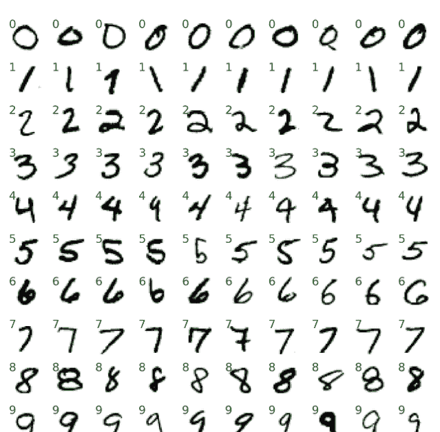

在上一节中，我们显示了随机手写数字，但没有显示与数字对应的标签，因为我们没有使用它们。这次图7.15显示了数字及其标签，标签以绿色文本显示在每个数字的左上角。标签位于`y_train`和`y_test`中，我们稍后将与`x_train`一起使用它们来训练KNN模型。

上述代码中的第17至20行打印出每个数据集的大小：

```
X_train: (60000, 28, 28)
y_train: (60000,)
X_test: (10000, 28, 28)
y_test: (10000,)
```

#### 7.2.3.2. 预处理

训练数据集包含60,000张图像，每张图像的高度=28像素，宽度=28像素，因此其形状如下：

```
X_train: (60000, 28, 28)
```

每张图像或数据点是一个二维数组，这不适用于OpenCV的KNN模型，必须将其转换为一维数组，其大小应为高度 × 宽度 = 28 × 28 = 784。因此，数据集的形状应如下所示：

```
X_train: (60000, 784)
```

作为预处理，必须完成以下操作以满足OpenCV KNN模型的要求：

- 1. 每张图像数据必须重塑为大小为784的一维数组。
- 2. x_train和x_test中数据的数据类型必须转换为float32。
- 3. y_train和y_test中标签的数据类型必须转换为int32或float32。

以下是预处理的代码片段：

```python
w, h = X_train[0, :, :].shape

X_train = X_train.reshape(X_train.shape[0],
                          w * h).astype(np.float32)

X_test = X_test.reshape(X_test.shape[0],
                         w * h).astype(np.float32)

y_train = np.int32(y_train)
y_test = np.int32(y_test)
```

解释：

| 行号 | 描述 |
|------|-------------|
| 22 | 从数组中获取宽度和高度。 |
| 23 – 24 | 将X_train和X_test数组重塑为宽度 × 高度的大小，并将其数据类型转换为float32。 |
| 25 – 26 | 将y_train和y_test的数据类型转换为int32。 |

#### 7.2.3.3. 构建和训练KNN模型

现在构建KNN模型，并使用x_train数据和y_train标签进行训练。然后使用k = 7进行预测。

```python
knn = cv2.ml.KNearest_create()
knn.train(X_train, cv2.ml.ROW_SAMPLE, y_train)
k = 7
_, results, _, _ = knn.findNearest(X_test, k)
```

解释：

| 行号 | 描述 |
|------|-------------|
| 27 | 创建一个新的KNN模型。 |
| 28 | 使用X_train和y_train训练KNN模型。cv2.ml.ROW_SAMPLE表示每个训练数据是一行。 |
| 29 | 选择一个k值。 |
| 30 | 使用X_test数据和k进行预测。这里使用"_"来忽略其他输出值，这是一种Python技巧。 |

上述代码中的第30行可能需要一些时间来运行，因为数据量较大，根据计算机性能可能需要5分钟或更长时间。

#### 7.2.3.4. 后处理

KNN模型的输出结果需要重新格式化以便评估。knn.findNearest()函数返回的结果格式是“垂直”数组，这意味着值组织在一列和10,000行中，其大小如下：

```
results: (10000, 1)
```

为了将其与y_test中格式为“水平”数组的原始标签进行比较，必须将其转换为相同的格式(10000, )。numpy函数np.hstack()可以轻松完成这种类型的转换。我们还需要对预处理进行一些反向操作，以下是后处理需要做的事情：

- 1. 将结果从“垂直”数组重新格式化为“水平”数组。
- 2. 将X_train、X_test的大小从784重塑为28 × 28。
- 3. （可选）将y_train、y_test的数据类型转换为uint。
- 4. （可选）将结果的数据类型转换为uint。

以下是代码：

```python
results = np.hstack(results)
results = np.uint(results)
y_test = np.uint(y_test)
X_test = X_test.reshape(X_test.shape[0], w, h)
```

由于我们只关心后续评估步骤中的x_test和y_test，因此我们不关心x_train和y_train。但是，如果您想稍后使用它们，则必须相应地进行转换。

#### 7.2.3.5. 评估

如第7.2.2.4节所述，以下是评估结果的代码。

```python
from sklearn.metrics import accuracy_score
from sklearn.metrics import confusion_matrix
from sklearn.metrics import classification_report
print("K=", k)
print("Accuracy Score:", accuracy_score(y_test, results))
print("Confusion Matrix:\n", confusion_matrix(y_test, results))
print("Classification Report:\n", classification_report(y_test, results))
```

以下是报告，我们获得了96.94%的准确率，这相当不错。混淆矩阵的大小比第7.2.2.4节中的大得多，因为这次有10个类别，从0到9，因此混淆矩阵的大小变为10 × 10（对于两个类别是2 × 2）。矩阵对角线上的数字是真正例，例如974、1133、988等。大多数真正例表明模型良好。

```
K= 7
Accuracy Score: 0.9694
```

#### 7.2.3.6. （可选）展示结果

评估完成后，我们可以将结果显示为图7.16，与之前的图7.15类似，这次它在每个数字的左上角以绿色显示原始标签，在右上角以红色显示预测值。例如，左上角的数字显示为3 3，这意味着其标签是3，预测值也是3。

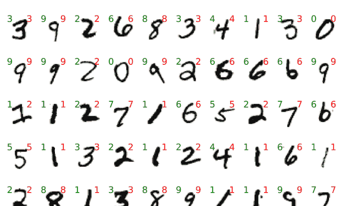

最后，同样作为可选步骤，如果你好奇模型错过了哪些数字，你也可以显示那些预测错误的样本。以下是用于筛选并显示它们的代码：

```
42    pred_err = np.where(y_test != results)
43    show_random_result(X_test[pred_err,:,:][0],
44                        y_test[pred_err],
45                        10, 5,
46                        results[pred_err])
```

第42行用于筛选出`y_test != results`的项目，即预测错误的样本。`np.where()`函数允许我们执行此类条件操作。结果显示为图7.17，与上述结果类似，原始标签以绿色显示在每个数字的左上角，预测值以红色显示在右上角。例如，左上角的数字显示为2 1，这意味着其标签是2，但预测为1。

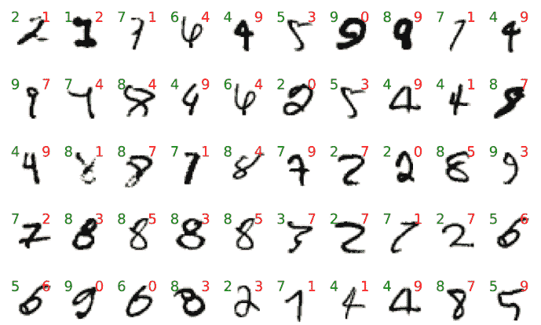

图7.17 KNN结果中的错误

如混淆矩阵和分类报告的评估报告所示，大多数数字被正确识别，准确率为96.94%。图7.17仅代表了其中一小部分被错误分类的样本。

## 7.3. 支持向量机

### 7.3.1. 什么是支持向量机

```
Source: SupportVectorMachine.py
common/gaussian.py
```

支持向量机是一种监督机器学习算法，这意味着其学习或训练过程基于数据和标签。它主要用于解决分类问题。

支持向量机背后的基本思想是找到一个最佳的决策边界，将数据划分为不同的类别。决策边界的选择方式是最大化间隔，即决策边界与每个类别最近数据点之间的距离。

支持向量机已广泛应用于图像分类、文本分类、生物信息学等多个领域。它是一种强大的算法，以其处理复杂和高维数据的能力而闻名。然而，它可能对参数的选择敏感，并且对于大型数据集来说计算成本可能很高。

让我们看一个如图7.18所示的二维数据样本，其中有两组数据：标记为0的数据点（•）和标记为1的数据点（×）。它们的分布方式使得一条直线就能轻松地将它们分开；我们可以任意画线来分隔这两组数据。为此目的的线不止一条，如图7.18中的两条线，你也可以画出许多类似的线。然而，这些任意的线并不是最佳的，支持向量机就是要找到最佳的那条线。

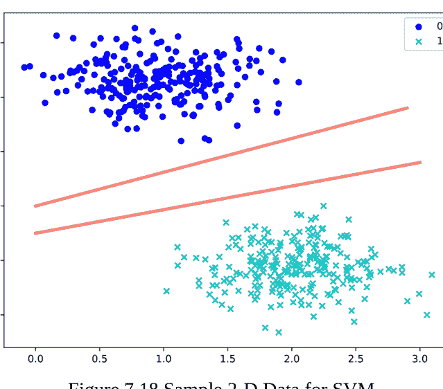

图7.18 用于SVM的二维数据样本

支持向量机的目标是在两组数据之间找到一条能清晰分类数据点的线，同时确保最大间隔。间隔是这条线与每个类别最近数据点之间的距离。换句话说，支持向量机旨在找到对数据中的噪声和其他变化最稳健的线。

如图7.19所示，中间的实线是满足支持向量机要求的最佳线，它能分隔两组数据，并且在两类数据之间具有最大的间隔。

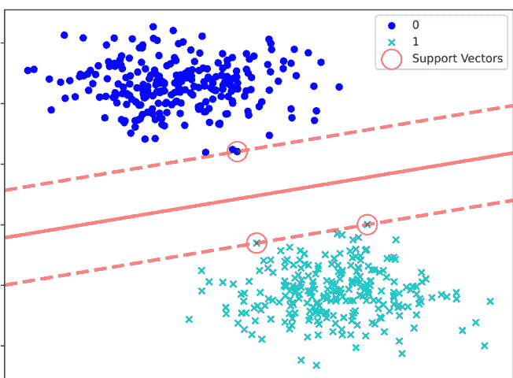

图7.19 SVM的决策边界和支持向量

#### 什么是超平面

超平面也称为*决策边界*，用于对数据点进行分类。落在超平面一侧的数据点属于一个类别；落在另一侧的数据点属于另一个类别。

图7.19中间的实线就是*超平面*，也称为*决策边界*。任何落在决策边界任一侧的新数据都将被预测为相应的类别。

与超平面平行的两条虚线是分隔线，用于分隔两类数据点。超平面与这两条分隔线之间具有最大的间隔。

超平面的维度取决于数据的维度（或数据的特征数量）。如果特征数量为2（或二维数据），那么*超平面*就是一条线。如果特征数量为3（或三维数据），那么*超平面*就变成一个二维平面。如果特征数量为*n*（或*n*维数据），那么超平面就是一个*n*-1维的超平面。

#### 什么是支持向量

*支持向量*是距离*决策边界*最近并影响*决策边界*位置和方向的数据点。支持向量机算法会计算这些支持向量和决策边界。这些是定义超平面间隔的数据点，它们在支持向量机算法中起着至关重要的作用。

支持向量是位于间隔上的数据点，这意味着它们到超平面的距离最小，如图7.19中带圆圈的数据点所示。它们是最难分类的数据点，并且对超平面的位置影响最大。

支持向量机算法在构建超平面时只考虑支持向量，这使得它在计算上很高效，并允许它处理具有许多特征的大型数据集。其他不是支持向量的数据点在支持向量机算法的决策过程中不会被使用。

#### 什么是核函数

数据可能并不总是像上面的例子那样简单，有时数据的分布方式无法用一条直线分开，如图7.20所示。这里也有两组数据，但要找到一条直线来分隔它们并不直接。

支持向量机算法应用了一种称为*核*方法的技术。核是用于将输入数据转换到更高维空间的数学函数，在这个空间中可能更容易分隔数据簇。核用于处理非线性可分的数据，即那些无法用线性超平面分隔的数据簇。使用*核*的目的是使支持向量机算法能够找到一个非线性的决策边界，从而将数据点分隔到各自的类别中。

### 7.3.2. 使用SVM识别手写数字

源文件：SVMHandWrittenDigits.py

本节我们将再次探讨来自MNIST（修改后的国家标准与技术研究院）数据集的手写数字。在7.1.3和7.2.3节中，我们分别应用了K-means和K-近邻算法。本节将把SVM应用于同一数据集，看看它的表现如何。

加载MNIST数据集和预处理步骤与7.2.3节完全相同，此处不再重复。

#### 7.3.2.1. 构建、训练和预测SVM模型

现在构建一个使用线性核的SVM模型，并用x_train和y_train对其进行训练。

```python
1 svm = cv2.ml.SVM_create()
2 svm.setKernel(cv2.ml.SVM_LINEAR)
3 svm.setTermCriteria((cv2.TERM_CRITERIA_MAX_ITER,
                       100, 1e-6))
4 svm.train(X_train, cv2.ml.ROW_SAMPLE, y_train)
5 predict = svm.predict(X_test)
```

解释：

| 行号 | 描述 |
| :--- | :--- |
| 第1行 | 创建一个SVM模型。 |
| 第2行 | 为SVM模型设置线性核。 |
| 第3行 | 设置算法终止条件。 |
| 第4行 | 使用X_train和y_train训练SVM模型。 |
| 第5行 | 使用X_test进行预测。 |

训练和预测数据可能需要一到两分钟。

#### 7.3.2.2. 后处理

后处理与7.2.3.4节类似，只有一个区别。`svm.predict()`函数返回一个包含单个值和一个数组的元组。如果预测针对单个数据，结果在返回元组的第一个元素`predict[0]`中；如果预测针对包含多个数据项的数据集，则结果在返回元组的第二个元素`result[1]`中。在本例中，我们传入包含10,000个数据项的测试集x_test，因此从`predict[1]`中获取结果。

```python
6 results = np.uint8(predict[1])
7 results = np.hstack(results)
8 y_test = np.uint(y_test)
9 X_test = X_test.reshape(X_test.shape[0], w, h)
```

解释：

| 行号 | 描述 |
| :--- | :--- |
| 第1行 | 取`predict[1]`作为结果，它包含预测结果的数组。 |
| 第2行 | 将结果从“垂直”数组重新格式化为“水平”数组，参见7.2.3.4节。 |
| 第3行 | （可选）将y_test的数据类型转换为uint。 |
| 第4行 | 在预处理中，X_test被重塑为784的数组，现在将其重塑回28 x 28。 |

#### 7.3.2.3. 评估

与7.2.3.5节相同，打印出如下评估结果，准确率为68.15%。

```
Accuracy Score: 0.6815
Confusion Matrix:
[[ 898   0   3  12   4  44  18   1   0   0]
 [   0 1067   2  13   0   0   1   4  44   4]
 [  15  109 741  57  16   4  28  11  42   9]
 [  10  12  55 711   2 141   3  20  43  13]
 [   2   7  20  10 841   3  17  15   7  60]
 [  24  42  11 240  15 388  30  11 117  14]
 [  17   8 125  16  49  44 697   0   1   1]
 [   2  14  25  35  31   3   0 792   5 121]
 [  11  92  71 174  15  75  38  21 461  16]
 [   9   9   7  92 380  13   1 217  62  19]]
Classification Report:
              precision    recall  f1-score   support

           0       0.91      0.92      0.91       980
           1       0.78      0.94      0.86      1135
           2       0.70      0.72      0.71      1032
           3       0.52      0.70      0.60      1010
           4       0.62      0.86      0.72       982
           5       0.54      0.43      0.48       892
           6       0.84      0.73      0.78       958
           7       0.73      0.77      0.75      1028
           8       0.59      0.47      0.53       974
           9       0.48      0.22      0.30      1009

    accuracy                           0.68     10000
   macro avg       0.67      0.68      0.66     10000
weighted avg       0.67      0.68      0.67     10000
```

#### 7.3.2.4. （可选）显示结果

可以像第 7.2.3.6 节一样，选择性地显示随机结果和错误预测的结果。请执行 *SVMHandWrittenDigits.py* 中的源代码以观察结果。

### 7.3.3. IRIS 数据集分类

源代码：SVMIrisClassification.py

#### 7.3.3.1. 关于 IRIS 数据集

IRIS 数据集是机器学习和统计学中另一个著名且广泛使用的多变量数据集，它收集了 150 个鸢尾花样本，每个样本包含四个特征：花萼长度、花萼宽度、花瓣长度和花瓣宽度。它包括三种鸢尾花品种——变色鸢尾、山鸢尾和维吉尼亚鸢尾，每个品种有 50 个样本数据。

由于其简单性、小规模和明确的分类问题，Iris 数据集已成为机器学习和统计学中流行的基准数据集。

加载 IRIS 数据集非常简单，

```
1 from sklearn import datasets
2 iris = datasets.load_iris()
3 print ("Data Structure:", dir(iris))
4 print ("Description:\n", iris.DESCR)
5 print ("Data (first 10):\n",iris.data[0:10])
6 print ("Label:\n", iris.target)
7 print ("Label Name:", iris.target_names)
8 print ("Unique Label:", np.unique(iris.target))
9 print ("Feature:", iris.feature_names)
```

第 1 行是导入 sklearn 库，第 2 行是加载 IRIS 数据集。该数据集附带几个属性，包含有关数据集的详细信息。你可以选择性地打印它们，如上面代码中的第 3 到 9 行。该数据集的描述在 `iris.DESCR` 属性中。数据本身在 `iris.data` 中；标签编码在 `iris.target` 中，值为 0、1 和 2，对应三种鸢尾花品种。三种品种的名称在 `iris.target_names` 中。该数据集特征的名称在 `iris.feature_names` 中。

IRIS 数据集不是一个大数据集，它包含以下四个特征和一个标签：

- 1. 花萼长度，单位：厘米（特征）
- 2. 花萼宽度，单位：厘米（特征）
- 3. 花瓣长度，单位：厘米（特征）
- 4. 花瓣宽度，单位：厘米（特征）
- 5. 品种（标签）

该数据集是关于三种鸢尾花品种的花萼长度、花萼宽度、花瓣长度和花瓣宽度的厘米测量值，每个品种 50 个样本数据，总共 150 个数据项。它看起来类似于下表，

| Sepal.Length | Sepal.Width | Petal.Length | Petal.Width | Species |
| :--- | :--- | :--- | :--- | :--- |
| 5.1 | 3.5 | 1.4 | 0.2 | *setosa* |
| 4.9 | 3 | 1.4 | 0.2 | *setosa* |
| 4.7 | 3.2 | 1.3 | 0.2 | *setosa* |
| ... | ... | ... | ... | *setosa* |
| 7 | 3.2 | 4.7 | 1.4 | *versicolor* |
| 6.4 | 3.2 | 4.5 | 1.5 | *versicolor* |
| 6.9 | 3.1 | 4.9 | 1.5 | *versicolor* |
| ... | ... | ... | ... | *versicolor* |
| 6.3 | 3.3 | 6 | 2.5 | *virginica* |
| 5.8 | 2.7 | 5.1 | 1.9 | *virginica* |
| 7.1 | 3 | 5.9 | 2.1 | *virginica* |
| ... | ... | ... | ... | *virginica* |

该数据集通常用于分类任务，目标是根据四个特征预测鸢尾花的品种。

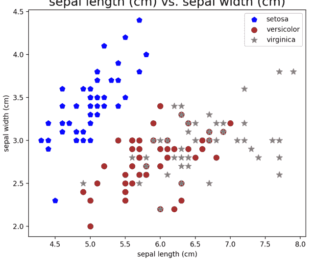

图 7.24 IRIS 数据集花萼长度与宽度

加载 IRIS 数据集后，可以可视化为图 7.24 和图 7.25：

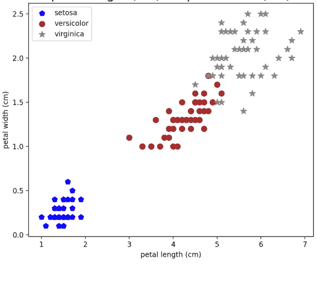

图 7.25 IRIS 数据集花瓣长度与宽度

#### 7.3.3.2. 预处理

数据加载后，应将其拆分为训练集和测试集。数据类型也必须按照 OpenCV SVM 模型的要求转换为 `float32`。

```
11  data = iris.data.astype(np.float32)
12  label = iris.target.astype(np.int32)
13  X_train, X_test, y_train, y_test =
14      model_selection.train_test_split(
15          data, label,
16          test_size=0.2,
17          random_state=2)
18  print('X_train: ' + str(X_train.shape))
19  print('y_train: ' + str(y_train.shape))
20  print('X_test:  ' + str(X_test.shape))
21  print('y_test:  ' + str(y_test.shape))
```

说明：

| 行 | 描述 |
| :--- | :--- |
| 第 11 行 | 从 `iris.data` 属性获取数据并将其转换为 `float32` 数据类型。 |
| 第 12 行 | 从 `iris.target` 属性获取标签，并将其转换为 `int32`。 |
| 第 13 – 16 行 | 将数据和标签拆分为训练集和测试集。指定 `test_size=0.2` 表示 80% 训练集和 20% 测试集，并指定 `random_state` 为一个整数以确保每次执行的拆分结果相同。 |
| 第 17 - 20 行 | （可选）打印每个数据集的大小。 |

数据集拆分如下：
X_train: (120, 4)
y_train: (120,)
X_test: (30, 4)
y_test: (30,)

#### 7.3.3.3. 构建、训练和预测模型

与上一节 7.3.2 相同，创建一个新的 SVM 模型，并使用训练集进行训练。IRIS 数据集很小，训练不会花费太多时间。训练完成后，使用测试集进行预测。

```
21  svm = cv2.ml.SVM_create()

22  svm.setKernel(cv2.ml.SVM_LINEAR)

23  svm.setTermCriteria(
        (cv2.TERM_CRITERIA_MAX_ITER, 100, 1e-6))

24  svm.train(X_train, cv2.ml.ROW_SAMPLE, y_train)

25  predict = svm.predict(X_test)
```

#### 7.3.3.4. 后处理和评估

与之前的第 7.3.2.3 和 7.3.2.4 节相同，svm.predict() 函数返回的预测结果数据在一个“垂直”数组中，必须使用 np.hstack() 函数将其转换为“水平”数组。然后打印评估指标：

```
26  results = np.uint(predict[1])

27  results = np.hstack(results)

28  print("Accuracy Score:",
        accuracy_score(y_test, results))

29  print("\nConfusion Matrix:\n",
        confusion_matrix(y_test, results))

30  print("\nClassification Report:\n",

31        classification_report(y_test, results))
```

结果显示如下，我们获得了 100% 的准确率：

```
Accuracy Score: 1.0

Confusion Matrix:
[[14  0  0]
 [ 0 18  0]
 [ 0  0 13]]

Classification Report:
            precision    recall  f1-score   support

           0       1.00      1.00      1.00        14
           1       1.00      1.00      1.00        18
           2       1.00      1.00      1.00        13

    accuracy                           1.00        45
   macro avg       1.00      1.00      1.00        45
weighted avg       1.00      1.00      1.00        45
```

总之，SVM 相对于其他机器学习算法有几个优点。它们计算效率高，特别是在高维特征空间中，并且可以处理大型数据集。它们对噪声数据和异常值也具有鲁棒性，并且具有坚实的理论基础，这保证了良好的泛化性能。

然而，SVM 也有一些局限性。它们可能对核函数及其参数的选择敏感，这会影响算法的性能。此外，SVM 可能难以解释和理解，特别是在使用非线性核函数时。

## 7.4. 人工神经网络 (ANN)

### 7.4.1. 什么是人工神经网络 (ANN)？

人工神经网络 (ANN) 是机器学习的算法之一，它试图以与人类相同或相似的方式学习事物。ANN 旨在模拟人类生物大脑的结构和功能，特别是神经元处理和传递信息的方式。

神经元是人类大脑和神经系统的基本构建块。它们是负责处理和传递信息的特化细胞。神经元的基本结构由三部分组成：*细胞体*、*树突*和*轴突*，如图 7.26 所示：

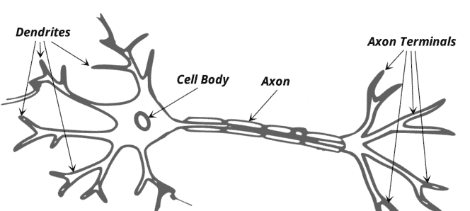

图 7.26 人脑神经元
图片由 OpenClipart-Vectors 提供，来自 Pixabay，网址为 https://pixabay.com/vectors/brain-neuron-nerves-cell-science-2022398/

神经元之间的信息传递是通过电信号和化学信号完成的。树突接收来自其他神经元或感觉受体的输入信号，细胞体处理信号，然后轴突通过轴突末梢将输出传递给其他神经元或肌肉或腺体。人脑中有数十亿个神经元形成神经网络来执行功能。

人工神经网络 (ANN) 旨在模拟人脑的生物结构和功能。就像人脑一样，ANN 由相互连接的人工神经元组成，这些神经元使用简化的数学模型来处理和传递信息。

生物大脑的一个关键特征是其通过经验学习和适应的能力。ANN 也具有从数据中学习并随时间提高其性能的能力。这是通过训练过程实现的，在该过程中，网络接收一组输入数据和相应的输出数据，并调整其参数以最小化其预测输出与实际输出之间的差异。

人脑由多层相互连接的神经元组成，ANN 也由相互连接的*人工神经元*层组成。这些层可以设计用于执行特定功能，例如处理视觉信息或处理序列数据。

每个人工神经元接收来自其他神经元的输入，并对输入执行一组数学计算。然后，神经元的输出被传递到网络中的其他神经元。

人工神经元是人工神经网络（ANN）中的基本计算单元。它受生物神经元启发，接收一个或多个输入值，并产生一个输出值。输入值会乘以相应的权重，这些权重决定了每个输入在输出计算中的重要性。加权后的输入值被求和，然后对总和应用激活函数以产生输出值。激活函数决定了神经元是否应该“激活”并产生输出信号。图7.27展示了一个人工神经元。

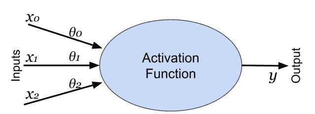

图7.27 人工神经元

$x_0$、$x_1$和$x_2$是人工神经元的输入，$\theta_0$、$\theta_1$和$\theta_2$是输入上的权重。输入乘以相应的权重，然后求和并送入激活函数进行数学计算，结果成为输出$y$。一个人工神经元的输出可以连接到另一个神经元的输入，形成一个相互连接的神经元网络。通过训练过程调整人工神经元的权重和激活函数，人工神经网络可以学习执行复杂的任务，如图像识别、自然语言处理等。

常见的激活函数包括线性函数、Sigmoid函数、ReLU（修正线性单元）函数和Tanh（双曲正切）函数，这些将在7.4.2节中介绍。

许多人工神经元组合在一起形成一个*人工神经网络*（ANN）。图7.28展示了一个非常简单的人工神经网络，其中每个人工神经元在网络中被称为一个节点。

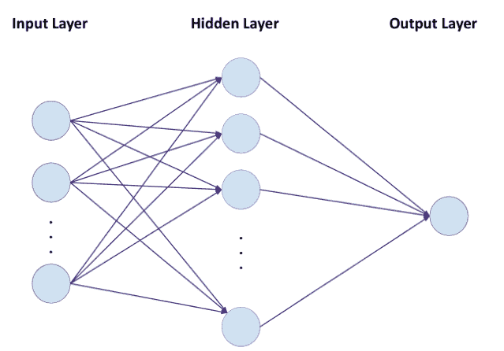

图7.28 一个简单的人工神经网络

左侧是*输入层*，它对应于输入数据。如果输入数据有*n*个特征，那么输入层中应该有*n*个节点。中间有一个*隐藏层*，它将输入层的输出作为输入数据。然后*输出层*在右侧，在图7.28中输出只有一个节点，但根据需要可以有多个节点。

*人工神经网络（ANN）*总是包含一个*输入层*和一个*输出层*。根据需要，可以有多个*隐藏层*，也可以没有*隐藏层*，此时*输入层*直接连接到*输出层*。*输入层*应接收原始输入数据，因此*输入层*中的节点数量应与输入数据的维度相同；*输出层*负责做出最终预测，因此*输出层*中的节点数量应与输出数据的维度相同。

*隐藏层*的层数和节点数取决于具体需求，并非越多越好。通常，这是基于准确性的评估来决定的，往往需要通过试错过程来确定需要多少隐藏层以及每个隐藏层中有多少节点。更多的隐藏层需要更高的计算成本。关于人工神经网络，请参阅本书末尾参考文献部分的材料#13。

OpenCV支持*人工神经网络*的多层感知机（MLP），这意味着它总共可以有三层或更多层。换句话说，除了*输入层*和*输出层*之外，可以有一个或多个*隐藏层*。

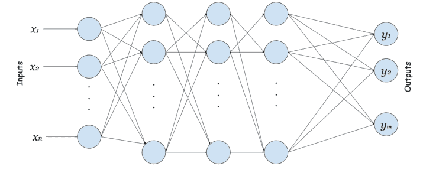

图7.29 多层感知机

以下是使用OpenCV创建ANN模型、训练模型并进行预测的代码片段：

```
1 ann = cv2.ml.ANN_MLP_create()
2 ann.setLayerSizes(np.array([784, 64, 10]))
3 ann.setTrainMethod(cv2.ml.ANN_MLP_BACKPROP)
4 ann.setActivationFunction(
        cv2.ml.ANN_MLP_SIGMOID_SYM )
5 ann.setTermCriteria((cv2.TermCriteria_EPS |
        cv2.TermCriteria_COUNT,
        100, 0.0001))
6 ann.train(X_train, cv2.ml.ROW_SAMPLE, y_train)
7 result = ann.predict(X_test)
```

解释：

| 行号 | 描述 |
| --- | --- |
| 1 | 初始化ANN_MLP并返回一个空模型。 |
| 2 | 设置ANN的层。参数[784, 64, 10]表示一个三层ANN，输入层有784个节点，隐藏层有64个节点，输出层有10个节点。 |
| 3 | 设置训练方法。BACKPROP是最常用的方法。cv2.ml.ANN_MLP_BACKPROP：反向传播算法。cv2.ml.ANN_MLP_RPROP：RPROP算法。cv2.ml.ANN_MLP_ANNEAL：模拟退火算法。 |
| 4 | 设置激活函数。详见下一节。 |
| 5 | 设置终止条件，当满足条件时停止迭代。 |
| 6 | 使用训练集训练ANN模型，X_train是数据集，y_train是标签。 |
| 7 | ANN模型训练完成后进行预测，X_test是测试集。 |

如果你想创建一个具有更多层的ANN，只需在上面的第2行传递参数来指定层数和每层的节点数。例如，[784, 128, 64, 32, 10]将构建一个ANN，输入层有784个节点，三个隐藏层分别有128、64和32个节点，然后是10个节点的输出层。

总之，通过OpenCV，我们可以通过指定层数和每层的神经元数量来创建人工神经网络模型，并且可以自定义神经元使用的激活函数。
一旦定义了神经网络模型，我们就可以使用各种监督学习技术（如反向传播）来训练它，最后我们还可以使用训练好的网络对新数据进行预测。OpenCV为构建和训练用于广泛应用的人工神经网络提供了强大而灵活的工具集。

### 7.4.2. 激活函数

来源：common/ann_activation_functions.py

激活函数是人工神经网络（ANN）的关键组成部分，用于在神经元的输出中引入非线性。在ANN中，激活函数应用于神经元输入的加权和，以产生输出。
必须为每个节点定义一个激活函数，它负责将输入数据转换为节点的输出。
如图7.27所示，输入乘以相应的权重并求和：

$$z = x_0\theta_0 + x_1\theta_1 + x_2\theta_2 + \cdots = \sum_{i=0}^{m} x_i\theta_i$$

然后将z送入激活函数进行计算，激活函数表示为：

$$g(z) = g(x_0\theta_0 + x_1\theta_1 + x_2\theta_2 + \cdots) = g(\sum_{i=0}^{m} x_i\theta_i)$$

存在众多激活函数，可分为以下两类：

1.  线性激活函数
2.  非线性激活函数

OpenCV支持以下激活函数：

| cv2.ml.ANN_MLP_IDENTITY | 恒等函数，或线性函数 |
| --- | --- |
| cv2.ml.ANN_MLP_SIGMOID_SYM | 对称Sigmoid函数 |
| cv2.ml.ANN_MLP_GAUSSIAN | 高斯函数 |
| cv2.ml.ANN_MLP_RELU | ReLU，或修正线性单元，函数 |
| cv2.ml.ANN_MLP_LEAKYRELU | Leaky ReLU函数 |

#### 什么是导数

*导数*在机器学习中被广泛用于训练能够做出准确预测或决策的模型。特别是，导数通过*梯度下降*过程用于优化模型参数。
在微积分中，函数的导数衡量的是当其输入变化时该函数的变化程度。几何上，导数对应于函数图像上特定点处切线的斜率。
如果一个函数表示为

$g(z)$

那么它的导数表示为：

$g'(z)$

在本书中，我们不会深入探讨这些主题的数学细节，尽管我们将介绍人工神经网络中最广泛使用的激活函数及其导数。

##### 7.4.2.1. 恒等（或线性）函数

恒等函数，也称为线性函数，是一个简单的函数，它返回与输入值相同的输出值，这意味着它不会以任何方式修改输入。

恒等函数定义为：

$g(z) = z$

其导数函数定义为：

$g'(z) = 1$

如图7.30所示，左侧是恒等函数，右侧是其导数。

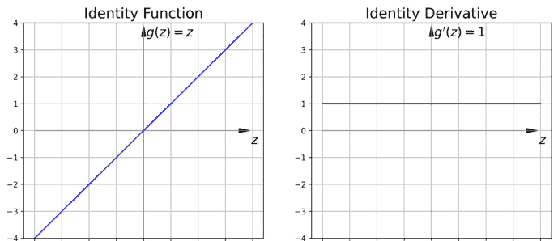

图7.30 恒等或线性函数

由源代码common/ann_activation_functions.py生成

使用恒等函数的一个优点是它不会在网络中引入非线性，这在解决的问题不需要复杂的非线性变换时很有用。另一个优点是它保留了输出相对于输入的梯度，这可以使训练过程更加稳定。

然而，在许多情况下，其学习复杂函数映射和解决复杂问题的能力是有限的。原因是，无论神经网络有多少层，其行为都像单层网络，因为将所有层相加会得到另一个线性函数，这与单层网络完全相同。

恒等函数的另一个问题是其导数是常数，与输入数据 z 无关。训练过程会使用其导数来执行称为*反向传播*的过程，常数值丢失了输入数据的信息，因此无法提供更好的预测。

在大多数情况下，会使用以下章节介绍的非线性激活函数来学习和解决复杂数据并提供准确的预测。

##### 7.4.2.2. Sigmoid 或 Logistic 激活函数

Sigmoid 或 Logistic 是一个非线性函数，它将任何输入值映射到 0 到 1 之间的值，这可以解释为概率。其定义为：

$$g(z) = \frac{1}{(1 + e^{-z})}$$

其导数定义为：

$$g'(z) = g(z)(1 - g(z)) = \frac{e^{-z}}{(1 + e^{-z})^2}$$

如图 7.31 所示，左侧是 Sigmoid 函数，右侧是其导数。

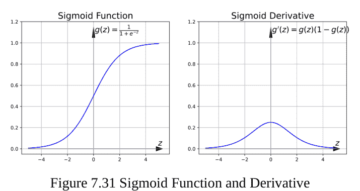

图 7.31 Sigmoid 函数及其导数
*由 common/ann_activation_functions.py 中的源代码生成*

Sigmoid 函数在 0 和 1 之间给出一条“S”形曲线。它是最广泛使用的非线性激活函数之一。它将输入值转换到 0 到 1 之间的范围。随着输入值 z 的增加，函数的输出趋近于 1，而随着 z 的减小，输出趋近于 0。

在人工神经网络中，sigmoid 函数通常用作隐藏层的激活函数。这是因为它为网络引入了非线性，使其能够学习数据中更复杂的模式和关系。sigmoid 函数的导数也很容易计算，这对于反向传播和网络参数的优化很重要。

然而，sigmoid 函数可能会遇到梯度消失问题，这意味着当输入值变得非常大或非常小时，函数的梯度会变得非常小。这会使深度网络的训练过程变慢且更加困难。因此，近年来其他激活函数，如 ReLU 函数，变得更加流行。

##### 7.4.2.3. Tanh 函数

tanh 函数，即双曲正切函数的缩写，也是一个非线性函数，它将任何输入值映射到 -1 到 1 之间的值。与 sigmoid 函数类似，tanh 函数也具有 S 形曲线，但其输出范围在 -1 到 1 之间，而不是 0 到 1。随着 z 的增加，函数的输出趋近于 1，而随着 z 的减小，输出趋近于 -1。

其定义为：

$$g(z) = \frac{e^z - e^{-z}}{e^z + e^{-z}}$$

其导数函数定义为：

$$g'(z) = 1 - g(z)^2$$

它通常用作人工神经网络隐藏层的激活函数。它为网络引入了非线性，使其能够学习数据中更复杂的模式和关系。tanh 函数的导数也很容易计算，这对于反向传播和网络参数的优化很重要。

如图 7.32 所示，左侧是 Tanh 函数，右侧是其导数。

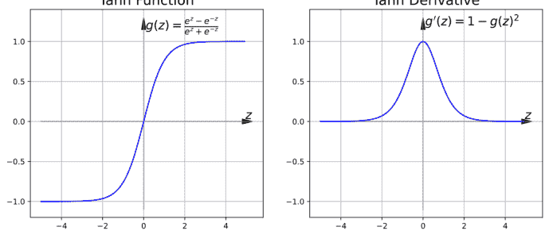

图 7.32 Tanh 函数及其导数
*由 common/ann_activation_functions.py 中的源代码生成*

与 sigmoid 相比，tanh 函数在原点附近的导数更陡峭，这意味着它在捕捉数据细微差别方面可能更有效。有时，当需要负输出值时，Tanh 比 sigmoid 函数效果更好。

然而，与 sigmoid 一样，tanh 函数也可能遇到梯度消失问题，即当输入值变得非常大或非常小时，函数的梯度会变得非常小。

##### 7.4.2.4. ReLU（修正线性单元）函数

ReLU，或称修正线性单元，是一个分段线性函数，当输入为正时，它与恒等函数相同，否则输出为零。ReLU 函数简单且计算效率高，收敛速度非常快。然而，它对负输入数据效果不佳，因为当输入数据为负时，它总是返回 0。

其定义为：

$$g(z) = \max(0, z)$$

其导数函数定义为：

$$g'(z) = \begin{cases} 1 & : z > 0 \\ 0 & : z < 0 \end{cases}$$

ReLU 函数及其导数如图 7.33 所示：

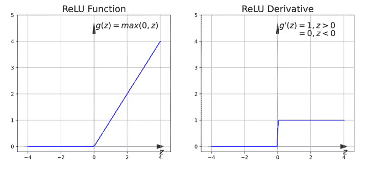

图 7.33 ReLU 函数及其导数
*由 common/ann_activation_functions.py 中的源代码生成*

ReLU 函数相对于其他激活函数（如 sigmoid 和 tanh 函数）的优势在于它避免了梯度消失问题，该问题发生在激活函数的梯度对于非常大或非常小的输入值变得非常小时，使得神经网络的训练过程变慢且更加困难。

然而，它并不适合所有类型的数据，因为它可能会遇到“死亡 ReLU”问题，即一些神经元可能由于大的负输入值而永久失活，导致神经元死亡，不对网络的输出做出贡献，因为当输入为负时它总是输出 0，并且其导数对于负输入也为 0。为了解决这个问题，已经提出了对 ReLU 函数的各种修改，例如 Leaky ReLU。

##### 7.4.2.5. Leaky ReLU 函数

Leaky ReLU 函数是 ReLU 函数的修改版本，是人工神经网络和其他机器学习模型中使用的另一种流行激活函数。它是一个非线性函数，将任何负输入值映射到一个小的负输出，将任何正输入值映射到相同的输入值。

其定义为：
$$g(z) = \max(\epsilon z, z)$$

其导数函数定义为：
$$g'(z) = \begin{cases} 1 & : z > 0 \\ \epsilon & : z < 0 \end{cases}$$

通常 $\epsilon$ 是一个很小的值，比如 0.1 或 0.01 等。
Leaky ReLU 函数及其导数如图 7.34 所示。

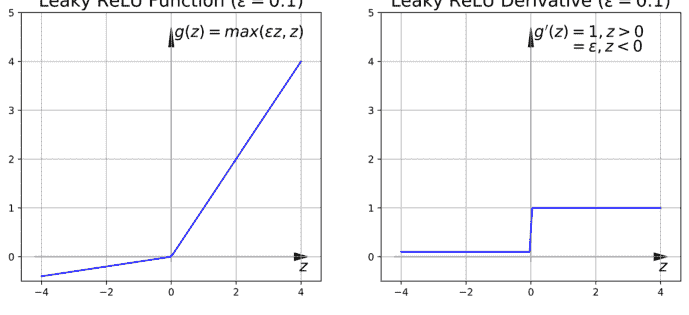

图 7.34 Leaky ReLU 函数及其导数
*由 common/ann_activation_functions.py 中的源代码生成*

Leaky ReLU 函数与 ReLU 函数类似，但它解决了“死亡 ReLU”问题。通过为负输入值引入一个小的负斜率，Leaky ReLU 函数可以防止神经元死亡，并提高网络的性能。

在某些情况下，特别是在神经网络中，它已被证明优于 ReLU 函数。然而，激活函数的选择取决于具体的任务和手头的数据，确定特定问题的最佳激活函数通常需要通过试验和错误来确定。

##### 7.4.2.6. 高斯函数

高斯函数在许多领域被广泛使用，正如我们在第 5.8.2 节的高斯模糊和第 7.3.1 节的支持向量机核函数中所介绍的那样。
高斯函数定义为：
$$g(z) = e^{-z^2}$$
其导数函数定义为：
$$g'(z) = -2ze^{-z^2}$$
它也是一个非线性函数，如图 7.35 所示，

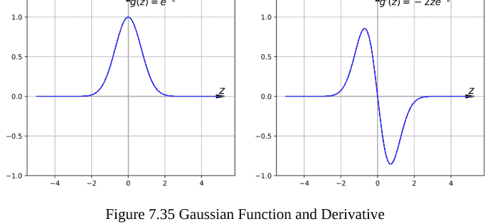

图 7.35 高斯函数及其导数
*由 common/ann_activation_functions.py 中的源代码生成*

这是一个一维高斯函数，第 7.3.1 节中的图 7.21 展示了一个二维高斯函数。
OpenCV 支持高斯函数作为人工神经网络的激活函数，它也被广泛用于许多领域，包括物理学、化学、工程学和金融学，因为它准确地模拟了许多呈现钟形分布的自然现象和过程。

总之，激活函数是人工神经网络（ANN）的核心组成部分。选择激活函数时，应综合考虑所解决的具体问题以及网络的架构。

### 7.4.3. 使用ANN识别手写数字

来源：ANNHandWrittenDigits.py

在前面的章节中，我们已经将多种机器学习模型应用于MNIST（修改后的国家标准与技术研究院）数据集的手写数字，例如K-Means、KNN和SVM。现在，我们将ANN应用于同一数据集，看看它的表现如何。

#### 7.4.3.1. 加载MNIST数据集

与我们在7.2.3.1节中所做的完全相同，加载MNIST数据集，并且你可以选择性地显示带有标签的随机数字，以查看它们的样子。

#### 7.4.3.2. 预处理

为了将数据集输入ANN模型，必须完成以下操作：

- 像素（高度=28，宽度=28）必须重塑为784（高度 × 宽度）
- 数据类型必须转换为float32
- 输入数据值必须转换到0到1之间
- 标签必须使用独热编码转换为分类数据

##### 什么是独热编码

独热编码是一种用于以数值格式表示分类数据的技术。每个类别被转换为一个二进制向量，其长度等于类别总数。该向量包含0，除了对应于被编码类别的位置被赋值为1。

这种技术对于期望输入数据为数值格式的机器学习算法非常有用，因为它允许算法将分类数据作为数值特征进行处理。

关于独热编码，请参阅本书末尾参考文献部分的材料#14。

在此示例中，训练集`y_train`中的标签是从0到9的数字数组，如下所示：

```
[0, 1, 2, 3, 4, 5, 6, 7, 8, 9]
```

独热编码基本上用于彼此之间没有关系的分类数据，上述的1、2、3等彼此之间没有关联，它们只是表示不同的簇，并不意味着3比1处于更好的位置。机器学习算法将这些数字视为具有重要性的属性，这意味着较高的数字比较低的数字更好或更重要。

作为对比，考虑一个定量数据的例子，比如房屋的卧室数量，有0、1、2和3间卧室等。拥有3间卧室的房子明显优于拥有1间卧室的房子，因此在这种情况下，在模型计算中，3比1具有更高的价值。

独热编码是将0到9的分类数据转换为仅包含0和1的向量，例如2变成[0 0 1 0 0 0 0 0 0 0]。函数`keras.utils.to_categorical()`将完成这项工作，它将0到9转换为以下向量，并将数据类型更改为float：

```
0 => [1. 0. 0. 0. 0. 0. 0. 0. 0. 0.]
1 => [0. 1. 0. 0. 0. 0. 0. 0. 0. 0.]
2 => [0. 0. 1. 0. 0. 0. 0. 0. 0. 0.]
3 => [0. 0. 0. 1. 0. 0. 0. 0. 0. 0.]
4 => [0. 0. 0. 0. 1. 0. 0. 0. 0. 0.]
5 => [0. 0. 0. 0. 0. 1. 0. 0. 0. 0.]
6 => [0. 0. 0. 0. 0. 0. 1. 0. 0. 0.]
7 => [0. 0. 0. 0. 0. 0. 0. 1. 0. 0.]
8 => [0. 0. 0. 0. 0. 0. 0. 0. 1. 0.]
9 => [0. 0. 0. 0. 0. 0. 0. 0. 0. 1.]
```

以下是本示例中ANN预处理的代码片段：

```
1    from keras import utils

2    w, h = X_test[0,:,:].shape

3  X_train = X_train.reshape(X_train.shape[0],
                  w * h).astype(np.float32)

4  X_test  = X_test.reshape(  X_test.shape[0],
                  w * h).astype(np.float32)

5  X_train = X_train / 255
6  X_test  = X_test / 255
7  y_train_onehot = to_categorical(y_train)
8  print('X_train:' + str(X_train.shape))
9  print('y_train:' + str(y_train.shape))
10 print('X_test:' + str(X_test.shape))
11 print('y_test:' + str(y_test.shape))
12 print('y_train_onehot:'+str(y_train_onehot.shape))
```

解释：

| 行号 | 解释 |
| --- | --- |
| 第1行 | 导入keras.utils包，用于将标签转换为独热分类数据。 |
| 第2行 | 获取每张图像的宽度和高度。 |
| 第3 - 4行 | 将图像像素重塑为宽度 × 高度 = 28 × 28 = 784的扁平数组。并将数据类型转换为float32。 |
| 第5 - 6行 | 将数据除以255，以将数据转换到0和1之间。 |
| 第7行 | 将标签转换为独热分类数据。 |
| 第8 - 12行 | （可选）打印每个数据集的大小。 |

然后打印预处理后的数据如下：

```
X_train:  (60000, 784)
y_train:  (60000,)
X_test:   (10000, 784)
y_test:   (10000,)
y_train_onehot:  (60000, 10)
```

#### 7.4.3.3. 构建和训练ANN模型

图7.36是我们将要构建的ANN拓扑结构。由于我们在预处理步骤中已经将每个数字图像数据转换为784个元素，因此ANN模型的*输入*层将有784个节点。

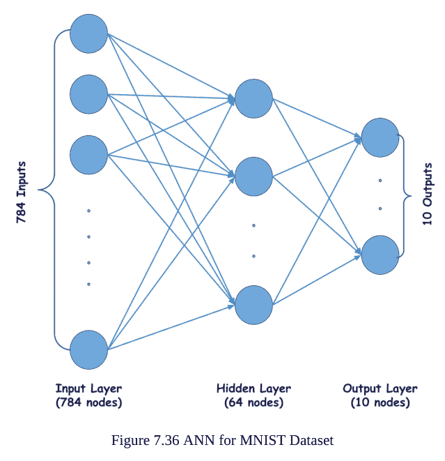

并且我们已经使用独热编码将标签转换为十个分类元素，这些标签对应于ANN模型的输出，因此*输出*层有10个节点。
*隐藏*层目前有64个节点，我们稍后可以更改它，以查看该层节点数量如何影响准确率。
执行时间受*隐藏*层节点数量的影响，节点越多，完成训练过程所需的时间就越长。
以下是创建和训练ANN模型的代码片段：

```
13  def create_ANN(layers):
14      ann=cv2.ml.ANN_MLP_create()
15      ann.setLayerSizes(np.array(layers))
16      ann.setTrainMethod(cv2.ml.ANN_MLP_BACKPROP)
17      ann.setActivationFunction(
              cv2.ml.ANN_MLP_SIGMOID_SYM)
18    ann.setTermCriteria((cv2.TermCriteria_EPS|
19                          cv2.TermCriteria_COUNT,
20                          100, 0.0001))
21
22    return ann
23
24    ann = create_ANN([784,64,10])
25    ann.train(X_train,
26              cv2.ml.ROW_SAMPLE,
27              y_train_onehot)
```

解释：

| 行号 | 解释 |
| --- | --- |
| 第13 - 19行 | 定义一个函数来构建ANN模型。 |
| 第21行 | 调用上述函数，创建一个具有[784, 64, 10]层的ANN模型。 |
| 第22行 | 使用数据（X_train）和标签（y_train_onehot）训练ANN模型。 |

训练模型可能需要一些时间，大约10到15分钟左右。

#### 7.4.3.4. 保存和加载训练好的ANN模型

模型训练完成后，我们可以将其保存到XML文件中，以便稍后加载，节省训练时间。

```
23  def save_model(model, filename):
24      model.save(filename)
25  def load_model(filename):
26      ann=cv2.ml.ANN_MLP_load(filename)
27      return ann
28  save_model( ann, '../res/mnist_ann_784_64_10.xml')
29  ann = load_model('../res/mnist_ann_784_64_10.xml')
```

如果你加载一个训练好的模型，那么就不需要再次构建和训练它，但仍然需要加载数据集和进行预处理。

#### 7.4.3.5. 预测

ANN模型训练完成后，或者从XML文件加载后，就可以使用测试集进行预测。我们不对测试标签y_test进行预处理，因为预测不需要它，这里预测只需要测试数据，x_test在上面代码的第4行和第6行已经预处理过。

```
30  result = ann.predict(X_test)
31  predict = result[1]
```

ann.predict()函数返回一个包含单个值和一个数组的元组。如果预测是针对单个数据，结果在元组的第一个元素result[0]中；如果预测是针对包含多个数据项的数据集，那么结果在元组的第二个元素result[1]中。在我们的例子中，我们传递了包含10,000个数据项的测试集x_test，因此我们应该使用result[1]中的第二个元素。

#### 7.4.3.6. 后处理

ANN模型的输出是分类数据格式，与我们预处理的标签数据相同。
一个输出数据项看起来像下面这样：
[0.10 0.08 0.15 0.12 0.11 0.11 0.10 0.97 0.10 0.09]

如果数据接近1，则视为1，如果接近0，则视为0。因此，上述数据将转换为：
[0 0 0 0 0 0 0 1 0 0]

作为独热编码的逆操作，上述项被转换回[7]。
numpy数组有一个argmax()函数可以执行独热编码的逆操作，它返回数组中最大值的索引。

```
32  predict = predict.argmax(axis=1)
33  X_test = X_test * 255
34  X_test = np.uint8(X_test)
35  X_test = X_test.reshape(X_test.shape[0], w, h)
```

说明：

| 第 32 行 | 将分类数据转换为 0 到 9 的数字。 |
| 第 33 - 34 行 | 在预处理中，X_test 被转换为 float32，然后除以 255 使其值介于 0 和 1 之间。现在执行反向操作，然后将其转换回 uint 类型。 |
| 第 35 行 | 在预处理中，X_test 被重塑为 784 的数组，现在将其重塑回 28 × 28。 |

#### 7.4.3.7. 评估

与我们在前面章节中对 SVM 和 KNN 所做的相同，将相同的评估指标应用于预测结果与原始标签数据：

```
36    print("Accuracy Score:",
37            accuracy_score(y_test, predict))
38    print("\nConfusion Matrix:\n",
39            confusion_matrix(y_test, predict))
40    print("\nClassification Report:\n",
41            classification_report(y_test, predict))
```

我们得到这个 ANN 模型的准确率为 93.87%：

```
Accuracy Score: 0.9387
Confusion Matrix:
[[965   0   1   2   1   2   6   1   2   0]
 [  1 1119   5   2   0   1   3   0   4   0]
 [ 22   1 948  12  10   4  12   9  14   0]
 [ 12   2  14 936   0  17   5  10   9   5]
 [  4   1   2   0 940   0  12   6   3  14]
 [ 20   4   2  18   7 814   7   3  12   5]
 [ 13   4   4   1   4  11 918   1   2   0]
 [  4  14  18   4  10   3   1 961   1  12]
 [ 22   4   7  13  12  21   6   8 873   8]
 [ 16   6   1   9  34   6   1  16   7 913]]

Classification Report:
              precision    recall  f1-score   support

           0       0.89      0.98      0.94       980
           1       0.97      0.99      0.98      1135
           2       0.95      0.92      0.93      1032
           3       0.94      0.93      0.93      1010
           4       0.92      0.96      0.94       982
           5       0.93      0.91      0.92       892
           6       0.95      0.96      0.95       958
           7       0.95      0.93      0.94      1028
           8       0.94      0.90      0.92       974
           9       0.95      0.90      0.93      1009
    accuracy                           0.94     10000
   macro avg       0.94      0.94      0.94     10000
weighted avg       0.94      0.94      0.94     10000
```

可选地，我们可以显示带有预测值的数字图像，以及错误预测的数字，这与我们在前面章节中所做的相同。

你可以执行源代码并尝试使用 ANN 模型，看看 *隐藏层* 中不同的节点会产生不同的准确率。例如，尝试使用 [784, 10] 的模型，它没有 *隐藏层*，也尝试 [784, 16, 10] 和 [784, 32, 10] 等，看看差异。请注意，*隐藏层* 中更多的节点需要更多的训练时间，例如 [784, 256, 10] 的模型可能需要一个小时左右，当然这取决于硬件资源和计算机的性能。

以下是在我的环境中执行 *ANNHandWrittenDigits.py* 得到的不同模型的结果：

| ANN 模型 | 大约执行时间 | 准确率 |
| :--- | :--- | :--- |
| [784, 10] | 2 分钟 | 0.8924 |
| [784, 16, 10] | 3 分钟 | 0.8705 |
| [784, 32, 10] | 5 分钟 | 0.8503 |
| [784, 64, 10] | 13 分钟 | 0.9376 |
| [784, 128, 10] | 11 分钟 | 0.9195 |
| [784, 256, 10] | 56 分钟 | 0.9023 |

从上表可以看出，*隐藏层* 中更多的节点并不意味着更高的准确率，但肯定需要更多的计算资源和更多的时间。

[784, 64, 10] 的预训练模型保存在 Github 仓库的 *res* 文件夹下，文件名为 *mnist_ann_784_64_10.xml*。可以通过以下代码加载：

```
39 ann = load_model('../res/mnist_ann_784_64_10.xml')
```

总之，与传统的机器学习算法如 K-means、KNN 和 SVM 相比，ANN 具有许多优势，包括学习输入和输出变量之间非线性关系的能力，以及处理大型和复杂数据集的能力。ANN 还允许并行处理，这意味着可以同时处理许多信息，使其在图像处理和目标检测等任务中非常高效。

ANN 在各个领域都有广泛的应用，包括图像识别，如目标检测、人脸识别和自动驾驶。以及许多其他领域，如金融、能源、市场预测等。

然而，ANN 计算密集，需要大量的计算资源，并且需要大量的数据进行训练，收集这些数据可能成本高昂且耗时。

由于其复杂性，ANN 缺乏透明度，通常被认为是“黑匣子”，因为很难理解它们是如何做出决策的。这可能使其结果难以解释，从而限制了它们在某些领域的有用性，例如医疗保健领域，透明度和可解释性至关重要。

## 7.5. 卷积神经网络 (CNN)

### 7.5.1. 什么是卷积神经网络

卷积神经网络 (CNN) 是一种深度学习神经网络，通常用于分析图像和图片。CNN 旨在自动检测图像中的模式和特征，使其非常适合图像识别、目标检测（如人脸和眼睛）以及图像分割（如将前景与背景分离）等任务。

在前面关于人工神经网络 (ANN) 的章节中，手写数字数据集包含 28 × 28 像素的图像，这意味着每张图像有 784 个像素，为了将数据输入 ANN，输入层有 784 个节点来接收输入数据。

现在考虑一张高分辨率的 4K 彩色图片，它有 3840 × 2160 像素，意味着 800 万个像素，每个像素有三个颜色通道，构建一个神经网络来对应每张图片如此多的输入数据是不现实的，更不用说需要处理成千上万张图片了。

当人类看图片时，我们不会从左上到右下逐个扫描像素，而是看图片中的特征或对象。例如，在一张狗的图片中，我们看眼睛、鼻子、嘴巴、耳朵、头、身体和尾巴等东西，然后我们知道它是一条狗。在大多数情况下，我们忽略背景或颜色来识别狗。CNN 以类似的方式从图像中寻找“特征”，这些特征是眼睛、鼻子、嘴巴等东西。然后将这些特征发送到神经网络进行学习。

CNN 的基本构建块是卷积层，它对输入图像执行称为 *卷积* 的数学运算。此运算涉及将一个小滤波器（也称为 *核* 或 *特征检测器*）在图像上滑动，并计算滤波器权重与图像中相应像素值之间的点积。此运算的输出是一个 *特征图*，它突出显示了与滤波器模式匹配的图像区域。

CNN 通常还包括其他类型的层，称为池化层和全连接层。池化层通过减小特征图的大小对其进行下采样，全连接层将输出连接到 ANN，使 CNN 能够学习特征之间的复杂关系。

有关 CNN 的一些详细描述，请参阅本书末尾参考资料中的材料 #15 和 #16。

### 7.5.2. 卷积层

来源：ConvolutionalNeuralNetwork.py

卷积是信号和图像处理中常用的数学运算。在 CNN 中，卷积用于卷积层中从输入图像中提取特征。

在数学中，卷积是对两个函数 *f* 和 *g* 的运算，产生第三个函数 (*f* ∗ *g*)，表示一个函数的形状如何被另一个函数修改。其定义为：

$(f * g)(t) = \int_{-\infty}^{\infty} f(\tau)g(t - \tau)d\tau$

我们不打算在这里深入探讨数学细节，基本思想是将一个函数视为原始图像，另一个函数视为特征，卷积运算就是从原始图像中识别或提取特征。

例如，有一个一维数组：

$f = [1, 2, 1]$

还有另一个一维数组：

$g = [3, 0, 2, 4, 2, 1]$

$f * g$ 的卷积定义为一个数组在第二个数组上滑动并在每个重叠位置相乘的积分。假设我们想从 $g$ 中检测 $[2, 4, 2]$ 的模式，那么选择一个特征 $f = [1, 2, 1]$，并进行卷积运算。

卷积是使用 $f$ 从左到右在 $g$ 上滑动，并对覆盖的项执行点积，点积意味着覆盖项下对应项的乘积之和。因此，结果的第一项计算如下：

$1 \times 3 + 2 \times 0 + 1 \times 2 = 5$

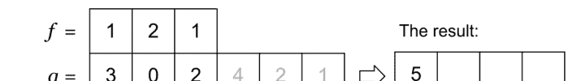

然后 $f$ 向右移动一个项，并计算第二项的乘积和：

$1 \times 0 + 2 \times 2 + 1 \times 4 = 8$

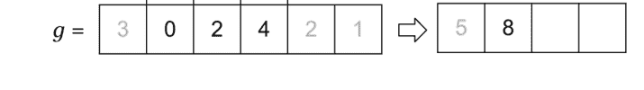

然后 $f$ 再次向右移动一个项，并计算剩余项，

$1 \times 2 + 2 \times 4 + 1 \times 2 = 12$

#### 填充与步幅

在上面的例子中，假设原始图像尺寸为 $i_h \times i_w$，特征/卷积核尺寸为 $k_h \times k_w$，那么卷积输出的尺寸为 $( i_h - k_h + 1 ) \times ( i_w - k_w + 1 )$。在上面的例子中，图像尺寸为 $7 \times 7$，卷积核尺寸为 $3 \times 3$，输出尺寸为：


填充和步幅是卷积中用于控制输出尺寸的技术。如果特征出现在图像的边界或角落，卷积可能会丢失一些信息，尽管这取决于卷积核的大小，较大的卷积核可能会丢失更多信息。

**填充**用于解决这类问题，方法是在图像的顶部和底部添加一些行，并在左侧和右侧添加一些列。通常，在图像上添加 $p_h$ 行，一半在顶部，一半在底部；并添加 $p_w$ 列，一半在左侧，一半在右侧，所有填充的行和列的值均为 0。如图 7.41 所示：


图 7.41 卷积填充

然后在填充后的矩阵上执行卷积，输出尺寸将为：


在大多数情况下，选择 $p_h = k_h - 1$ 和 $p_w = k_w - 1$，并且卷积核尺寸为奇数，如 3、5、7、9 等。这样，顶部和底部将添加相同数量的填充，左侧和右侧也是如此。在上面的例子中，卷积核尺寸为 $3 \times 3$，填充尺寸为 $2 \times 2$，意味着顶部一个，底部一个，左侧一个，右侧一个。

因此，卷积输出的尺寸为 $7 \times 7$，与原始图像尺寸相同。

**步幅**是卷积的另一种技术。当特征/卷积核在上面的例子中滑过输入图像时，它默认从左上角开始，每次向右移动一个元素，到达最右侧后，默认向下移动一个元素。步幅是特征/卷积核每次移动时遍历的元素数量，在这种情况下，默认步幅为 1。

有时特征/卷积核每次移动会遍历多个元素，例如两个或三个元素，那么步幅就是 2 或 3。
图 7.42 展示了步幅为 2 的卷积。


通常，如果水平方向的步幅为 $s_w$，垂直方向的步幅为 $s_h$，那么卷积输出尺寸为：

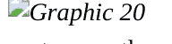

在大多数情况下，填充选择为 $p_h = k_h - 1$ 和 $p_w = k_w - 1$，那么输出尺寸为：

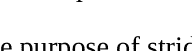

步幅的目的是在保持原始图像特征的同时，减小原始图像的尺寸以提高计算效率。在图 7.42 中，Π 形状也可以在卷积结果中被捕获，值 61 仍然位于结果的中间，明显大于其他值。最常在特征/卷积核较大时使用，因为它捕获了原始图像的大片区域。

#### 卷积的 Python 实现

在 Python 中，卷积通过以下代码片段实现：

```python
import numpy as np
def convolution2d(image, kernel,
                stride=[1,1], padding=[0,0]):
    p_h, p_w = padding
    s_h, s_w = stride
    image = np.pad(image,
                   [(p_h, p_h), (p_w, p_w)],
                   mode='constant',
                   constant_values=0)
    k_h, k_w = kernel.shape
    i_h, i_w = image.shape
    output_h = (i_h - k_h) // s_h + 1
    output_w = (i_w - k_w) // s_w + 1
    output = np.zeros((output_h, output_w))
    for y in range(0, output_h):
        for x in range(0, output_w):
            c = image[y*s_h : y*s_h+k_h,
                     x*s_w : x*s_w+k_w]
            c = np.multiply(c, kernel)
            output[y][x] = np.sum(c)
    return output
```

上面无填充的例子可以计算：

```python
image = np.array([[1, 3, 1, 0, 2, 1 ,0],
                  [1, 1, 1, 2, 1, 2 ,1],
                  [2, 1, 9, 9, 8, 2 ,0],
                  [0, 2, 9, 1, 9, 0 ,1],
                  [1, 0, 9, 0, 8, 2 ,1],
                  [3, 1, 1, 2, 0, 2 ,2],
                  [1, 3, 1, 3, 3, 2 ,0]])
kernel = np.array([[1, 1, 1],
                  [1, 0, 1],
                  [1, 0, 1]])
conv2d = convolution2d(image, kernel)
print(conv2d)
```

卷积结果为：

```
[[18. 17. 22. 18. 13.]
 [23. 17. 39. 17. 22.]
 [31. 22. 61. 22. 29.]
 [25. 15. 37. 16. 21.]
 [16. 18. 22. 19. 16.]]
```

上面填充为 2 的例子可以计算：

```python
conv2d = convolution2d(image, kernel,
                      padding=[1,1])
print(conv2d)
```

结果为：

```
[[ 4.  4.  6.  5.  5.  4.  3.]
```

## 6.18.17.22.18.13.5.
## 5.23.17.39.17.22.5.
## 5.31.22.61.22.29.4.
## 3.25.15.37.16.21.5.
## 5.16.18.22.19.16.7.
## 7.7.10.7.9.7.6.

上述步长为2且无填充的示例可以计算如下：

```python
conv2d = convolution2d(image, kernel,
                       stride=[2,2])
print(conv2d)
```

结果如下：

```
[[18. 22. 13.]
 [31. 61. 29.]
 [16. 22. 16.]]
```

#### 图片的卷积

那么卷积是如何在图片上工作的呢？考虑一张狗的图片，当人类观察图片时，我们关注的是图片中的特征或物体，而不是逐个像素地看，比如眼睛、鼻子、嘴巴、耳朵、头部、身体和尾巴，然后根据经验我们知道这是一只狗。

首先，我们想要识别，例如，狗的眼睛。为眼睛创建一个特征或卷积核矩阵，卷积操作是通过在整个图像上滑动该特征来执行的，在卷积结果中，将在相应位置识别出两只眼睛。如果狗的两只眼睛出现在图像的左侧部分，那么在卷积结果的左侧部分也会出现两个最大的值。

在卷积神经网络（CNN）的术语中，卷积结果被称为*特征图*，因为它们包含了从图像中识别出的特征。然后我们将以同样的方式从图像中检测其他特征，比如鼻子、嘴巴、耳朵、头部、身体、尾巴等等。因此，在这个卷积层中会生成多个*特征图*。

一张彩色图片有三个颜色通道：蓝色、绿色和红色。卷积在每个颜色通道上执行，然后按通道将结果相加，成为卷积的输出。

或者，彩色图片可以在预处理步骤中转换为灰度图，如前面章节所述。然后在灰度图像上进行卷积。

总之，卷积层将输出$n$个通道的二维矩阵特征图。每个特征图的大小可能与原始图像相同，也可能根据前面介绍的步长在一定程度上减小。重要的是，卷积层的目的不是减小尺寸，而是识别特征。

特征是卷积神经网络（CNN）学习过程的一部分，这意味着模型将在训练过程中自行学习，换句话说，我们不必指定特征的内容，比如眼睛、鼻子、耳朵等，它们将由CNN模型学习。

### 7.5.3. 池化层

池化层的目的是下采样，或在保持已识别特征的同时减小尺寸。它通常应用于卷积层之后。有不同类型的池化方法，最广泛使用的是*最大池化*和*平均池化*。

与卷积操作类似，池化也使用一个卷积核矩阵在特征图上滑动，但池化不是做点积，而是取特征图中覆盖区域的最大值，这就是*最大池化*。在*平均池化*的情况下，则取覆盖区域的平均值。

如图7.43所示，这是一个用于最大池化的$3 \times 3$卷积核，取左上角卷积核覆盖的$3 \times 3$区域中的最大值，即23，这是最大池化结果中的第一个值。

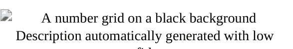

图7.43 最大池化

在*平均池化*的情况下，取卷积核覆盖区域的平均值作为结果的第一个值，即11。

然后将卷积核滑动到下一个位置，并找到覆盖区域的最大值或平均值。与卷积不同，它不会与已覆盖的元素重叠。

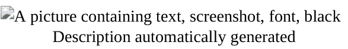

图7.44 最大池化，继续

最后，卷积核将遍历特征图的整个矩阵，并得到图7.45中的结果。
池化层的结果显著减小了输入的尺寸，同时保留了特征。在图7.45的最大池化结果中，中间的值是61，与卷积层识别出的值相同。假设这被识别为狗的鼻子，它在最大池化结果中被保留了下来。
与卷积相同，*填充*和*步长*仍然以相同的方式应用于池化层。

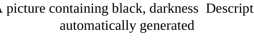

图7.45 最大池化结果

以下是最大池化的Python实现：

```python
import numpy as np
def maxpooling2d(image, kernel=[3,3],
                 stride=[0,0], padding=[0,0]):
    p_h, p_w = padding
    s_h, s_w = stride
    k_h, k_w = kernel
    image = np.pad(image,
                   [(p_h, p_h), (p_w, p_w)],
                   mode='constant',
                   constant_values=0)
    i_h, i_w = image.shape
    output_h = -(-i_h // (k_h + s_h))
    output_w = -(-i_w // (k_w + s_w))
    output = np.zeros((output_h, output_w))
    for y in range(0, output_h):
        for x in range(0, output_w):
            y_, x_ = y*(s_h+k_h), x*(s_w+k_w)
            c = image[y_: y_+k_h, x_ : x_+k_w]
            output[y][x] = np.amax(c)
    return output
```

然后在`convolution2d()`之后运行`maxpooling2d()`，

```python
conv2d = convolution2d(image, kernel,
                       padding=[1,1])
maxp2d = maxpooling2d(conv2d, kernel=[3,3])
print(maxp2d)
```

最大池化结果是：

```
[[23. 39.  5.]
 [31. 61.  7.]
 [10.  9.  6.]]
```

总之，这一层的目的是减小数据尺寸，或进行下采样。它接收来自卷积层的$n$个通道的特征图，并对每个通道执行池化操作，然后输出$n$个通道的池化结果，每个结果都是一个二维矩阵。
上述代码可在Github仓库的*ConvolutionalNeuralNetwork.py*中找到。

### 7.5.4. 全连接层

全连接层基本上是第7.4节介绍的人工神经网络（ANN）。
池化层的输出由$n$个通道的二维矩阵组成，它们被展平成一个一维数组，然后连接到全连接层的输入，如图7.46所示：

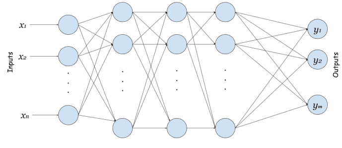

图7.46 CNN的全连接层

尽管图7.46中显示了几个隐藏层，但这取决于需求，可能只有一个隐藏层，甚至没有隐藏层。通常需要在这一层进行一些调整和微调以获得最佳结果。

### 7.5.5. CNN架构

CNN由卷积层、池化层和一个全连接层组成。现在将它们组合在一起，CNN的架构如图7.47所示。

原始图片是CNN模型的输入。在第一个卷积层中，许多特征被应用于图片，它生成$n_1$个特征图。然后进入池化层，对特征图执行最大池化，并生成$n_1$个通道的池化输出。

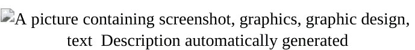

图7.47 CNN架构

上述架构中有两层卷积/池化，根据需求，可以是一层或多层卷积/池化。
考虑第一个卷积/池化层用于识别第一级的一些特征，如边缘、眼睛、鼻子、嘴巴、耳朵、爪子等。这一层的输出成为第二个卷积/池化层的输入。
在第二个卷积层中，再次应用许多特征，这一层生成$n_2$个通道的特征图，将对这些特征图执行池化操作。

考虑第二个卷积/池化层用于识别下一级的特征，如狗的头部、身体和腿，这是更高一级的特征，因为头部包括眼睛、鼻子、嘴巴和耳朵，而腿包括爪子，等等。
在CNN模型中，我们不需要提供特征的内容，模型将在训练过程中从输入图片中自行学习，其中使用了数千甚至数万张图片进行训练。反向传播过程将能够在训练过程中更新卷积层中特征的内容，使其最适合数据集。我们唯一需要提供的是每一层特征的大小和数量。
根据需求，可能会添加更多的卷积/池化层。在卷积/池化层之后，数据量显著减少，并且特征在输出中被提取出来。
下一个操作是展平，因为池化层的输出由$n_2$个通道的二维矩阵组成，它们将被展平成一个一维数组，以便输入到全连接层。
最后，数据进入全连接神经网络进行分类计算，这与上一节中的ANN完全相同。

### 7.5.6. 使用Tensorflow/Keras构建CNN模型

```
来源：CNNonCIFAR10.py
```

`tensorflow`和`keras`是用于深度学习的库，本节将使用它们来构建CNN模型。如果库未安装，请按照第2.3.2节进行安装。
由Google开发，`tensorflow`是一个底层库，允许高效执行复杂的数值计算，特别是用于训练大型神经网络。它提供了广泛的工具来构建和部署机器学习模型。另一方面，`keras`是一个高级神经网络API，构建在`tensorflow`之上，以简化构建和训练深度学习模型的过程。本书使用的两个库的版本在第1.4节中描述。

#### CIFAR-10数据集

本节将以CIFAR-10数据集为例，这是一个广泛用于机器学习或计算机视觉领域的图像集合。它包含60,000张彩色图像，分为十个不同的类别，每张图像尺寸为32 × 32像素。每个类别包含6,000张随机图像。

尽管该数据集并非真实世界的图片且分辨率很低（32 × 32），但它非常适合学习用途，因为它不需要高昂的计算资源，用户可以快速尝试不同的算法，而无需经历漫长（数小时）的训练过程。

该数据集随keras库提供，并被随机划分为50,000张的训练集和10,000张的测试集。十个类别被均匀且随机地分配到训练集和测试集中，这意味着每个类别在训练集中有5,000张，在测试集中有1,000张。这十个类别分别是：飞机、汽车、鸟、猫、鹿、狗、青蛙、马、船和卡车。

有关CIFAR-10数据集的详细信息，请参见：[https://www.cs.toronto.edu/~kriz/cifar.html](https://www.cs.toronto.edu/~kriz/cifar.html)

现在加载CIFAR-10数据集，

```python
import keras
from keras.datasets import cifar10
(X_train, y_train), (X_test, y_test) = cifar10.load_data()
print("X_train", X_train.shape)
print("y_train", y_train.shape)
print("X_test", X_test.shape)
print("y_test", y_test.shape)
```

训练集和测试集的大小：
X_train (50000, 32, 32, 3)
y_train (50000, 1)
X_test (10000, 32, 32, 3)
y_test (10000, 1)

类别标签位于y_train和y_test中，它们看起来像这样：
[6, 9, 2, 3, 4, 5, 0, 3 ... ]

每个类别由0到9的一个数字表示。

*CNNOnCIFAR10.py*中的源代码展示了数据集中100张随机样本图像及其标签，可以参考它来了解这些图像的样子。

#### 构建CNN模型

keras通过一系列层来定义模型。首先，创建一个Sequential模型，它将使一层的输出成为下一层的输入：

```python
cnn_model = Sequential()
```

向cnn_model添加第一个卷积层和最大池化层：

```python
input_shape = X_train.shape[1:]
cnn_model.add(Conv2D(128, kernel_size=(3, 3),
                   input_shape = input_shape,
                   strides = (1, 1),
                   padding = "same",
                   activation = "relu"))
cnn_model.add(MaxPooling2D(pool_size = (2, 2)))
```

卷积层通过`conv2D()`函数添加到模型中，第一个参数是特征数量，最佳实践是该数量应为2的幂，如4、8、16、32、64、128等，尽管这不是必需的。第二个参数是特征的大小，通常使用奇数，如1×1、3×3、5×5或7×7等。如前所述，只需指定特征的数量和大小，其内容将在训练过程中自行学习。

第三个参数是输入图像的大小，第四和第五个参数是步幅和填充，它们是可选的。如前所述，`strides = (1,1)`指定了水平和垂直方向的步幅均为1，意味着内核在两个方向上逐个移动。`padding="same"`指定将相应地添加填充，以使输出与输入大小相同。填充也可以指定为"valid"，表示不填充。因此，在这种情况下，`strides = (1,1)`和`padding= "same"`将使输出与输入大小相同。

`conv2D()`的最后一个参数是激活函数，这里指定了ReLU函数，参见第7.4.2.4节，它会将所有负值转换为0，正值则保持线性。

输入数据是彩色图像，因此每张图像都有RGB三个颜色通道，如前所述，卷积将在每个颜色通道上执行，然后三个通道的结果值将被求和以生成卷积结果。

池化层通过`MaxPooling2D()`函数在第16行添加到`cnn_model`，它对卷积输出执行最大池化操作，这里的池大小指定为2×2。

然后，在第一个卷积/池化层之后再添加两个：

```python
cnn_model.add(Conv2D(64,
                    kernel_size=(3, 3),
                    strides = (1, 1),
                    padding = "same",
                    activation = 'relu'))
cnn_model.add(MaxPooling2D(pool_size = (2, 2)))
cnn_model.add(Dropout(0.25))

cnn_model.add(Conv2D(32,
                    kernel_size=(3, 3),
                    strides = (1, 1),
                    padding = "same",
                    activation = 'relu'))
cnn_model.add(MaxPooling2D(pool_size = (2, 2)))
cnn_model.add(Dropout(0.25))
```

第二层有64个特征，第三层有32个。特征大小、激活函数和池大小与前一层相同。

在第23行和第31行，`Dropout()`被添加到模型中，dropout是深度神经网络中用于防止过拟合的一种技术。*过拟合*发生在模型过于复杂时，它开始拟合训练数据中的噪声而非潜在模式。Dropout通过在训练期间随机丢弃层中的一些神经元来帮助防止这种情况，这迫使剩余的神经元学习更鲁棒的特征，从而更好地泛化到新数据。有关过拟合的更多细节，请参阅本书末尾参考文献部分的资料#18和#19。

`Dropout()`的参数是要临时丢弃的神经元节点的百分比。这里指定了0.25，意味着在训练过程中将丢弃25%的节点。

现在`cnn_model`中有三层卷积/池化，第一层有128个特征，第二层有64个，第三层有32个。接下来是将输出展平为一维数组，以便输入到全连接神经网络中。

```python
cnn_model.add(Flatten())
```

最后是全连接层，它基本上是一个人工神经网络，其输入是展平后数据的输出。

```python
cnn_model.add(Dense(units=256, activation='relu'))
cnn_model.add(Dropout(0.5))
cnn_model.add(Dense(units=128, activation='relu'))
cnn_model.add(Dropout(0.5))
cnn_model.add(Dense(units=10, activation='softmax'))
```

Dense()函数用于指定全连接层。如前所述，人工神经网络有一个输入层、一个输出层和隐藏层。在这种情况下，输入层是第32行Flatten()的输出，然后第33行和第35行指定了两个隐藏层，分别有256和128个节点，激活函数为ReLU。输出层有10个节点，对应于数据集的十个类别，激活函数为softmax，它通常用于神经网络输出层的多类别分类问题，目标是预测每个类别的概率。

在第34行和第36行添加了两个Dropout()层以防止过拟合。

最后编译模型，

```python
cnn_model.compile(optimizer='adam',
                  loss='categorical_crossentropy',
                  metrics=['accuracy'])
```

编译keras模型时，我们需要指定三个关键组件：优化器、损失函数和评估指标，这些组件在第38到40行的compile方法中指定。

*优化器*决定了在训练期间用于优化神经网络权重的算法。

*损失函数*衡量模型在训练期间的表现。损失函数计算给定输入的预测输出与实际输出之间的差异。

*评估指标*在训练后评估模型的性能。它们类似于损失函数，但用于在训练期间监控特定指标，例如准确率或精确率。

keras提供了多种预定义的优化器、损失函数和评估指标，它们的选择取决于具体问题和数据的特性。

在此示例中，我们选择`adam`作为优化器，`categorical_crossentropy`作为损失函数，`accuracy`作为评估指标。详情请参阅 [https://keras.io/api/optimizers/](https://keras.io/api/optimizers/)。

`cnn_model`的结构可以通过`summary()`函数显示：

```
cnn_model.summary()
```
显示结果如下：

```
Model: "sequential"
Layer (type)                Output Shape              Param #
=================================================================
conv2d (Conv2D)             (None, 32, 32, 128)       3584
max_pooling2d (MaxPooling2D) (None, 16, 16, 128)      0
conv2d_1 (Conv2D)           (None, 16, 16, 64)        73792
max_pooling2d_1 (MaxPooling2D) (None, 8, 8, 64)       0
dropout (Dropout)           (None, 8, 8, 64)          0
conv2d_2 (Conv2D)           (None, 8, 8, 32)          18464
max_pooling2d_2 (MaxPooling2D) (None, 4, 4, 32)       0
dropout_1 (Dropout)         (None, 4, 4, 32)          0
flatten (Flatten)           (None, 512)                0
dense (Dense)               (None, 256)                131328
dropout_2 (Dropout)         (None, 256)                0
dense_1 (Dense)             (None, 128)                32896
dropout_3 (Dropout)         (None, 128)                0
dense_2 (Dense)             (None, 10)                 1290
=================================================================
Total params: 261,354
Trainable params: 261,354
Non-trainable params: 0
```

在上面的摘要中，每一层都显示在一行。第一行是卷积层，名称为`conv2d`，类型为`Conv2D`，其中名称在模型中是唯一的。该层的输出尺寸为(32, 32, 128)，因为卷积核的数量指定为128，且每张图像的尺寸为32×32。

接下来是最大池化层，其卷积核尺寸指定为(2, 2)，因此该层的输出变为(16, 16, 128)，尺寸相比前一层有所缩减。

接下来的两个卷积层和最大池化层也发生了同样的情况。Dropout层不会改变从输入到输出的尺寸。

展平层将之前的输出(4, 4, 32)转换为大小为(512)的一维数组，它成为全连接神经网络层的输入。

全连接神经网络有两个隐藏层，分别有256和128个节点，最终输出为10，对应于数据集的十个类别。

在开始训练过程之前，有必要对输入数据进行标准化。我们使用sklearn库中的StandardScaler()来实现这一目的：

```
42  from sklearn import preprocessing
43  scaler = preprocessing.StandardScaler()
44  X_train = scaler.fit_transform(
45          X_train.reshape(-1, X_train.shape[-1]))
46          .reshape(X_train.shape)
47  X_test = scaler.transform(
48          X_test.reshape(-1, X_test.shape[-1]))
49          .reshape(X_test.shape)
```

标准缩放器是一种常用的数据预处理技术，用于在训练前对数据进行标准化，使其均值为0，标准差为1。通过将数据缩放到一个共同的尺度，算法可以更快地收敛并表现更好，它有助于防止具有较大尺度的数据主导模型，并允许更容易地比较不同特征之间的数据。

然后是训练过程：

```
50  history = cnn_model.fit(
51          X_train,
52          to_categorical(y_train),
53          batch_size = 128,
54          epochs = 100,
55          verbose = 1,
56          validation_data=(X_test,
57                          to_categorical(y_test)))
```

第52行和第57行使用`to_categorical()`函数对`y_train`和`y_test`执行了独热编码。

由于数据量和模型的复杂性，这个训练过程可能需要一些时间。根据硬件资源（例如CPU与GPU），可能需要几分钟到几小时。有时，如果硬件不够强大，你可能会在`fit()`过程中遇到错误。在这种情况下，可以尝试使用输入数据的子集，例如`X_train[0:5000]`和`y_train[0:5000]`。然而，这可能会消除错误，但训练效果不佳。执行深度学习项目的训练需要一台强大的机器。

`fit()`函数接受一个验证数据集来评估训练过程的性能，我们使用测试集作为验证集，如上面第56行和第57行所示。训练和验证的结果如图7.48和图7.49所示。

两幅图中的实线代表用于模型学习的训练集的准确率和损失；虚线代表模型的验证结果。随着epoch的增加，实线和虚线都在相互靠近，这意味着模型构建和训练得当，没有明显的过拟合和欠拟合。


图7.48 训练集和测试集的准确率


图7.49 训练集和测试集的损失

在大多数情况下，这种复杂度的模型第一次尝试不会得到好的结果。通常需要微调和调整参数，并反复尝试，直到达到更好的结果，这是一个试错的过程。

微调过程中需要调整的因素包括层数、`conv2d`层中的特征数量、特征尺寸、全连接层中的隐藏层数、每层的节点数等。

一旦模型训练完成，就可以将其保存到文件中，以便以后加载，避免下次长时间的训练过程。

```
python
58  from tensorflow.keras.models import load_model
59  # 保存模型
60  cnn_model.save('cnn_on_cifar-10.h5')
61  # 加载模型
62  cnn_model = load_model('cnn_on_cifar-10.h5')
63  cnn_model.summary()
```

评估模型有两种方法。一种是使用模型的`evaluate()`函数：

```
python
64  score = cnn_model.evaluate(X_test,
65                          to_categorical(y_test))
66  print('Test loss:', score[0])
67  print('Test accuracy:', score[1])
```
结果是：
Test loss: 0.6104579567909241
Test accuracy: 0.794700026512146

另一种评估方法是使用我们在前面章节中使用过的指标：

```
68  from sklearn import metrics
69  y_pred = cnn_model.predict(X_test)
70  y_pred = np.argmax(y_pred, axis=1)
71  a_score = metrics.accuracy_score(y_test,y_pred)
72  c_matrix = metrics.confusion_matrix(y_test,y_pred)
73  c_report = metrics.classification_report
74                                      (y_test,y_pred)
75  print("Accuracy Score:\n", a_score)
76  print("Confusion matrix:\n", c_matrix)
77  print("Classification Report:\n", c_report)
```
结果是：
Accuracy Score:
0.7947

Confusion matrix:
[[825  18  32   3  14   2   5   5  73  23]
 [ 11 917   2   3   2   0   5   0  16  44]
 [ 62   0 700  21  86  22  71  23   9   6]
 [ 37   9  71 580  57  96  82  39  16  13]
 [ 18   3  41  21 830   8  34  38   7   0]
 [ 16   3  53 191  50 584  27  63   5   8]
 [  6   6  33  35  24   3 881   5   6   1]
 [ 17   0  42  21  39  20   6 848   2   5]
 [ 38  15   7   5   4   0   4   2 909  16]
 [ 20  59   7   7   0   2   3  11  18 873]]

Classification Report:
              precision    recall  f1-score   support

           0       0.79      0.82      0.80      1000
           1       0.89      0.92      0.90      1000
           2       0.71      0.70      0.70      1000
           3       0.65      0.58      0.61      1000
           4       0.75      0.83      0.79      1000
           5       0.79      0.58      0.67      1000
           6       0.79      0.88      0.83      1000
           7       0.82      0.85      0.83      1000
           8       0.86      0.91      0.88      1000
           9       0.88      0.87      0.88      1000

    accuracy                           0.79     10000
   macro avg       0.79      0.79      0.79     10000
weighted avg       0.79      0.79      0.79     10000

### 7.5.7. 常见的CNN架构

与其从头构建，不如利用一些流行的CNN架构作为开发有效图像识别模型的良好起点。这些架构在准确性、效率和社区支持方面能提供诸多优势。

这些流行的CNN架构经过多年的发展和优化，已被证明在实现高准确率方面非常有效。这一点在ImageNet等大型数据集上尤为明显，其中表现最佳的模型通常基于流行的CNN架构。它们通常拥有庞大的用户、开发者和研究人员社区，他们不断改进和优化这些架构，开发新的变体，并分享最佳实践。这为故障排除、性能优化以及紧跟最新发展动态提供了宝贵的资源。

然而，需要注意的是，虽然流行的CNN架构是一个很好的起点，但它们可能并不总是适用于所有应用。根据具体的任务和数据，可能需要定制或开发新的架构以达到最佳性能。

以下是一些流行的CNN架构：

- **LeNet-5**：由Yann LeCun在1990年代开发，是最早的CNN架构之一，专为手写数字识别设计。它包含七层，包括三个卷积层和两个全连接层。
- **AlexNet**：由Alex Krizhevsky、Ilya Sutskever和Geoffrey Hinton开发，该架构在2012年ImageNet竞赛中以巨大优势获胜。它有八层，包括五个卷积层和三个全连接层。
- **VGGNet**：由牛津大学视觉几何组开发，VGGNet有多个变体（VGG16、VGG19等），它们在层数上有所不同。VGGNet的架构非常简单，每个卷积层都使用许多小的滤波器。
- **Inception**：由Google研究人员开发，该架构赢得了2014年ImageNet竞赛。它具有独特的“Inception”模块，允许在不同尺度上进行并行处理。
- **ResNet**：同样由Microsoft研究人员开发，ResNet（残差网络的缩写）具有非常深的架构，最多可达152层。它使用残差连接来解决在非常深的网络中可能出现的梯度消失问题。
- **MobileNet**：由Google研究人员开发，MobileNet设计轻量且高效，非常适合移动设备。它使用深度可分离卷积来减少网络中的参数数量。

在本节中，我们不会逐一介绍它们，而是在Github仓库中提供了一个使用MNIST数据集的LeNet-5代码示例，源代码位于*CNN_LeNet_5.py*。

LeNet由Yann LeCun在1990年代提出，它开启了卷积神经网络（CNN）的时代，参见参考文献部分材料#20中的原始论文“Gradient-Based Learning Applied to Document Recognition”。

该架构直接而简单，由七层组成，可总结如下：

1. 输入层：输入设计为32×32像素的灰度图像，但我们使用MNIST数据集中的28×28图像。
2. 卷积层1：第一个卷积层有6个大小为3×3、步幅为1的滤波器。每个滤波器产生一个26×26的输出特征图。
3. 平均池化层1：第一个卷积层的输出特征图被送入一个大小为2×2的平均池化层，将特征图的大小减小到13×13。
4. 卷积层2：第二个卷积层有16个大小为3×3、步幅为1的滤波器。每个滤波器产生一个11×11的特征图作为输出。
5. 平均池化层2：第二个卷积层的输出特征图被送入另一个大小为2×2的平均池化层，将特征图的大小减小到5×5。
6. 全连接层1：第二个池化层的输出特征图被展平为一个大小为400的向量，并送入一个有120个神经元的全连接层。
7. 全连接层2：第一个全连接层的输出被送入另一个有84个神经元的全连接层。
8. 输出层：第二个全连接层的输出被送入最终的输出层，该层有10个节点，对应于MNIST数据集中的10个数字类别。

LeNet-5是一个可靠且高效的CNN架构，可以作为许多图像识别任务的基线，特别是那些涉及小型数据集的任务。如有兴趣，请参考相关资源了解其他流行的CNN架构。

## 参考文献

1. https://docs.opencv.org/4.7.0/index.html
2. https://scirp.org/reference/referencespapers.aspx?referenceid=1834431
3. https://lear.inrialpes.fr/people/triggs/pubs/Dalal-cvpr05.pdf
4. https://www.merl.com/publications/docs/TR94-03.pdf
5. https://learnopencv.com/histogram-of-oriented-gradients/
6. https://www.cs.cmu.edu/~efros/courses/LBMV07/Papers/viola-cvpr-01.pdf
7. https://www.analyticsvidhya.com/blog/2022/04/object-detection-using-haar-cascade-opencv/
8. https://medium.com/analytics-vidhya/haar-cascades-explained-38210e57970d
9. https://github.com/tensorflow/models/tree/master/research/deeplab
10. http://host.robots.ox.ac.uk/pascal/VOC/
11. https://github.com/ayoolaolafenwa/PixelLib
12. https://www.researchgate.net/publication/221621494_Support_Vector_Machines_Theory_and_Applications
13. https://ieeexplore.ieee.org/document/483329
14. https://www.researchgate.net/publication/320465713_A_Comparative_Study_of_Categorical_Variable_Encoding_Techniques_for_Neural_Network_Classifiers
15. https://arxiv.org/abs/1511.08458
16. https://insightsimaging.springeropen.com/articles/10.1007/s13244-018-0639-9
17. https://arxiv.org/abs/1603.07285
18. https://jmlr.org/papers/volume15/srivastava14a/srivastava14a.pdf
19. https://www.researchgate.net/publication/331677125_An_Overview_of_Overfitting_and_its_Solutions
20. http://yann.lecun.com/exdb/publis/pdf/lecun-01a.pdf

## 关于作者

**James Chen**，一位成就斐然的IT专业人士，拥有扎实的学术背景。他毕业于中国最负盛名的大学之一——清华大学，对计算机科学理论和实践有着深刻的理解。凭借其深厚的技术背景，James在为科技、金融、医疗、电子商务等多个行业设计和开发前沿软件解决方案方面发挥了关键作用。他一直致力于系统设计和开发的各个方面，并作为复杂多客户端和多层系统（如Web系统、传统多层系统、移动应用程序以及软硬件混合系统）的主要实施者积极贡献。他擅长识别关键业务问题，并设计既高效又有效的定制化解决方案。

他广泛的技术兴趣自2016年起将他引向了计算机视觉和机器学习这一新兴领域。James对人工智能充满热情，并通过学术研究和实践经验相结合的方式磨练了他在该领域的技能。他对计算机视觉和机器学习的最新工具和技术有了深入的了解，并始终在寻找将这些知识应用于现实世界问题的新方法。

## 第二版

## 通过示例学习Python OpenCV

使用Python实现OpenCV提供的计算机视觉算法，用于图像处理、目标检测和机器学习

James Chen