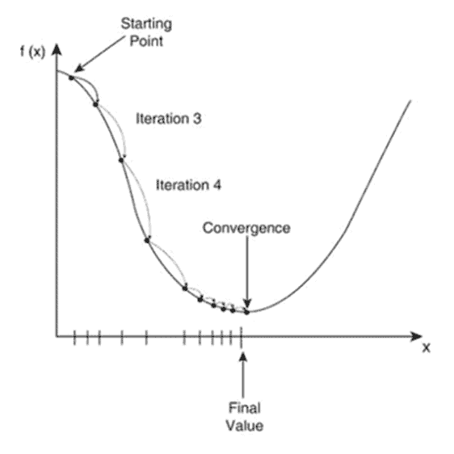

# Python中的学习

学习数据科学与机器学习，包括使用Python、Theano和TensorFlow构建的现代神经网络

K.M.K

## 目录

- **引言**
- **第1章**：*什么是神经网络？*
- **第2章**：*生物学类比*
- **第3章**：*从神经网络获取输出*
- **第4章**：*使用反向传播训练神经网络*
- **第5章**：*Theano*
- **第6章**：*TensorFlow*
- **第7章**：*使用现代技术改进反向传播——动量、自适应学习率和正则化*
- **第8章**：*无监督学习、自编码器、受限玻尔兹曼机、卷积神经网络和LSTM*
- **第9章**：*你知道的比你想象的要多*
- **结论**

# 引言

深度学习正产生着日益扩大的影响。在撰写本文时（2016年3月），谷歌的AlphaGo程序刚刚在围棋比赛中击败了九段职业棋手李世石。

人工智能领域的专家曾认为，我们距离战胜顶尖职业围棋棋手还有很长的路要走，但进展似乎已经加速了！

虽然深度学习是一个复杂的主题，但它并不比其他人工智能算法更难学习。我编写本书是为了让你熟悉神经网络的基础知识。你只需要具备学生水平的数学知识和一定的编程能力就能学好。

本书中的所有材料都可以免费下载和使用。我们将使用Python编程语言，以及数值计算库Numpy。在后面的章节中，我还将向你展示如何使用Theano和TensorFlow构建深度神经网络，这两个库是专门为深度学习设计的，可以通过利用GPU来加速计算。

与其他人工智能算法不同，深度学习特别强大的地方在于它能自动学习特征。这意味着你不需要花费精力去尝试和测试“片段”或“交互效应”——这是分析师们喜欢做的事情。相反，我们将让神经网络为我们学习这些东西。神经网络的每一层学习到的特征都与前一层不同。例如，在图像识别中，第一层可能学习不同的笔画，下一层将这些笔画组合起来学习形状，再下一层将这些形状组合起来勾勒出面部特征，再下一层则形成对面部的高度概括性描述。

你是否想要一个关于这门“深奥技艺”的温和入门，配有你可以立即尝试并应用于自己数据的实用代码示例？那么，这本书就是为你准备的。

# 第1章

## 什么是神经网络？

神经网络之所以得名，是因为在早期，计算机科学家试图用计算机代码来模拟大脑。最终目标是创造“通用人工智能”，对我来说，这意味着一个程序可以学习你或我能学习的任何东西。我们还没有达到那个阶段，所以不必担心机器会接管人类。目前，神经网络在执行特定任务方面非常擅长，例如图像和语音分类。

与大脑不同，这些人工神经网络具有非常严格的预定义结构。大脑由神经元组成，它们通过电信号和化学信号相互交流（因此得名，神经网络）。在人工神经网络中，我们不区分这两种信号，因此从现在起，我们将简单地说信号从一个神经元传递到另一个神经元。

信号通过所谓的“动作电位”从一个神经元传递到另一个神经元。它是沿着神经元细胞膜的电位尖峰。动作电位的有趣之处在于，它们要么发生，要么不发生。没有“中间状态”。这被称为“全或无”。

下面是动作电位随时间变化的图表，使用真实的、实际的单位。

神经元之间的这种连接具有可塑性。你可能听说过“一起激发的神经元会连接在一起”这句话，这归功于加拿大神经心理学家唐纳德·赫布。

连接强的神经元会相互“激活”。因此，如果一个神经元向另一个神经元发送信号（动作电位），并且它们的连接很强，那么下一个神经元也会产生动作电位，然后可以传递给其他神经元，依此类推。

如果两个神经元之间的连接很弱，那么一个神经元向另一个神经元发送信号可能会导致第二个神经元的电位略有增加，但不足以引发另一个动作电位。

因此，我们可以认为一个神经元处于“开”或“关”状态。（即它产生了动作电位，或者没有）

这让你想起了什么？

如果你说“数字计算机”，那你就答对了！

具体来说，神经元是“是-否”、“真-假”、“0/1”类型问题的理想模型。我们称之为“二元分类”，在机器学习中对应的算法是“逻辑回归”。

上图是逻辑回归模型的图示。它接受输入x1、x2和x3，你可以将它们想象为其他神经元的输出或任何其他数据信号（例如你眼睛的视觉感受器或指尖的机械感受器），并输出一个信号，该信号是这些输入源的组合，其权重取决于这些输入神经元与该输出神经元连接的强度。

由于我们最终需要处理实数和方程，让我们看看如何从x计算y。

```
y = sigmoid(w1*x1 + w2*x2 + w3*x3)
```

请注意，在本书中，我们将忽略偏置项，因为它可以通过添加一个始终等于1的项x0轻松地加入到给定的方程中。

因此，每个输入神经元乘以其对应的权重（突触强度），然后将所有结果相加。然后我们在此基础上应用一个“sigmoid”函数来获得输出y。sigmoid函数定义为：

```
sigmoid(x) = 1 / (1 + exp(-x))
```

如果你绘制sigmoid函数的图像，你会得到这个：

你可以看到sigmoid的输出始终在0和1之间。它有两条渐近线，因此当输入为正无穷大时，输出实际上为1；当输入为负无穷大时，输出实际上为0。

当输入为0时，输出为0.5。

你可以将输出解释为一个概率。具体来说，我们将其解释为概率：

P(Y=1 | X)

可以读作“给定X时，Y等于1的概率”。我们通常交替使用这个和“y”。它们都是神经元的“输出”。

要构建一个神经网络，我们只需组合神经元。在人工神经网络中，我们通过前馈方式连接它们。

我在图中用红色标出了一个计算单元。它的输入是(x1, x2)，输出是z1。看看你是否能在图中找到另外两个关键单元。

我们将z所在的层称为“隐藏层”。神经网络至少有一个隐藏层。具有更多隐藏层的神经网络被称为“更深”。

“深度学习”实际上是一个流行的说法。我搜索了这个主题，似乎普遍的理解是，任何具有至少一个隐藏层的神经网络都被认为是“深度的”。

## 练习

以逻辑单元为构建块，你如何计算神经网络的输出Y？如果你现在无法解决，别担心，我们将在第3章中介绍。

# 第二章

## 生物类比

我在前一部分描述了人工神经网络如何与大脑非常相似，但关于学习和其他“关键层级”特性呢？

## 兴奋性阈值

一个基本单元的输出应该在0到1的范围内。在分类器中，我们需要选择预测哪个类别（例如，这是一张猫的图片还是一张狗的图片？）

如果1代表猫，0代表狗，而输出是0.7，我们怎么说？猫！

为什么？因为我们的模型表示，“这是一张猫的图片的概率是70%”。

这条线类似于神经元的“兴奋性阈值”，即产生动作电位的临界点。

## 兴奋性和抑制性连接

神经元在向其他神经元发送信号时，能够发送“兴奋性”或“抑制性”信号。正如你可能猜测的那样，兴奋性连接产生动作电位，而抑制性连接抑制动作电位。

这类似于基本回归单元的权重。正权重是非常强的兴奋性连接。负权重是非常强的抑制性连接。

## 重复与熟悉

人们常说“熟能生巧”。当你反复练习某件事时，你会变得更好。

神经网络也是如此。如果你在相同或相似的模式上反复训练神经网络，它会更好地描述这些模式。

你的大脑通过练习一项任务，正在减少该特定任务的内部错误。

当我们讨论反向传播——神经网络的训练算法时，你将看到这在代码中是如何实现的。

本质上，我们将对不同的事件进行for循环，反复查看相同的模式，并对它们每次进行反向传播。

## 练习

为了准备下一节，你需要确保你的机器上安装了以下内容：Python、Numpy，以及可选的Pandas。

# 第三章

## 从神经网络获取输出

### 获取一些可用的数据

假设你还没有任何可用的数据，你需要一些数据来完成本书中的模型。https://kaggle.com 是一个极好的资源。我建议使用MNIST数据集。如果你需要进行二元分类，你需要选择另一个数据集。

你用于任何机器学习问题的数据通常具有类似的结构。

我们有一些输入X和一些标签或目标Y。

每个样本（x和y的对）被表示为x的实数向量和y的类别因子（通常只是0、1、2）。

你将所有样本的输入组合起来形成一个矩阵X。每个输入向量是一行。这意味着每一行是一个不同的数据样本。

因此，X是一个N x D的矩阵，其中N = 样本数量，D = 每个数据的维度。对于MNIST，D = 784 = 28 x 28，因为原始图片是28 x 28的矩阵，被“展平”成1 x 784的向量。

如果y不是二元因子（0或1），你可以将其转换为指示因子矩阵，这在我们进行softmax时将需要。

因此，对于MNIST样本，你会将Y转换为指示矩阵（一个由0和1组成的矩阵），其中Y_indicator是一个N x K的矩阵，其中N = 样本数量，K = 输出中的类别数。对于MNIST，显然K = 10。

以下是如何在Numpy中执行此操作的示例：

```python
def y2indicator(y):
    N = len(y)
    ind = np.zeros((N, 10))
    for i in xrange(N):
        ind[i, y[i]] = 1
    return ind
```

在本书中，我将假设你已经知道如何将CSV加载到Numpy数组或Pandas数据框中，并执行基本操作，如复制和添加Numpy数组。

## 人工神经网络的架构

与生物神经网络中任何神经元都可以与其他任何神经元连接不同，人工神经网络具有明确的结构。具体来说，它们由层组成。

每一层处理下一层。没有“输入”连接。（实际上可以有，这些被称为循环神经网络，但它们超出了本书的范围。）

你在第一章已经看到了神经网络的样子，以及如何计算计算单元的输出。

假设我们有一个单隐藏层的神经网络，其中x是输入，z是隐藏层，y是输出层（如第一章的图所示）。

## 前馈操作

让我们完成y的方程。首先，我们需要计算z1和z2。

```python
z1 = s(w11*x1 + w12*x2)
z2 = s(w21*x1 + w22*x2)
```

s()可以是任何非线性函数（如果是线性的，你只是在做线性回归）。最常见的3种选择是，1：

```python
def sigmoid(x):
    return 1/(1 + np.exp(-x))
```

我们之前见过。

2，双曲正切：np.tanh()

以及3，修正线性单元，或ReLU：

```python
def relu(x):
    if x < 0:
        return 0
    else:
        return x
```

向自己证明这种生成relu的替代方法是正确的：

```python
def relu(x):
    return x * (x > 0)
```

这种最后的构造在像Theano这样的库中是必需的，这些库通常会找到目标函数的点。

然后y可以被处理为：

```python
y = s'(v1*z1 + v2*z2)
```

其中s'()可以是sigmoid或softmax，我们将在接下来的部分中讨论。

注意，在sigmoid函数内部，我们基本上有输入和权重之间的“点积”。使用Numpy中的向量和矩阵操作比for循环计算效率更高，因此我们将尽可能这样做。

这是一个使用ReLU和softmax的向量化形式的神经网络示例：

```python
def forward(X, W, V):
    Z = relu(X.dot(W))
    Y = softmax(Z.dot(V))
    return Y
```

## 二元分类

显而易见，我们简单的sigmoid网络的最后一层只是一个基本的回归层。我们可以将输出解释为给定X时Y=1的概率。

显然，由于二元分类只能产生0或1，那么给定X时Y=0的概率：

P(Y=0 | X) = 1 - P(Y=1 | X)，

因为它们的总和必须为1。

## Softmax

如果我们需要对多个事物进行分类怎么办？例如，观察到的MNIST数据集包含数字0-9，因此我们有10个输出类别。

在这种情况下，我们使用softmax函数，其定义如下：

softmax(a[k]) = exp(a[k])/{ exp(a[1]) + exp(a[2]) + ... + exp(a[k]) + ... + exp(a[K]) }

注意“小k”和“大K”是不同的。

说服自己这总是总和为1，因此也可以被视为概率。

## 现在用代码实现！

假设你已经将数据加载到Numpy数组中，你可以像本节中那样计算输出y。

注意，由于上面显示的模式为单个数据样本指定输出，因此存在一些额外的复杂性。当我们在代码中执行此操作时，我们通常需要同时为多个样本执行此计算。

```python
def sigmoid(a):
    return 1/(1 + np.exp(-a))

def softmax(a):
    expA = np.exp(a)
    return expA/expA.sum(axis=1, keepdims=True)

X,Y = load_csv("yourdata.csv")
W = np.random.randn(D, M)
V = np.random.randn(M, K)
Z = sigmoid(X.dot(W))
p_y_given_x = softmax(Z.dot(V))
```

这里的“M”是隐藏单元的数量。我们称之为“超参数”，可以通过某种方法选择，例如交叉验证。

显然，这里的输出不是很有用，因为它们是随机初始化的。我们应该做的是选择最佳的W和V，以便当我们取P(Y | X)的预测值时，它们与真实的标签Y非常接近。

## 练习

在上面的示例中添加偏置项。

# 第四章

## 使用反向传播训练神经网络

在封闭设计中，我们几乎不可能“同时确定W和V”。数学审计表明，实现这一目标的典型方法是找到辅助变量并将其设为0。相反，我们需要使用一种称为“梯度下降”的方法来“平滑”我们的目标函数。

我们将使用什么目标函数？

J = - sum_from_n=1..N ( sum_from_k=1..K ( T[n,k] * logY[n,k] )

你会看到这其实就是负对数似然函数。（思考一下，给定一个掷骰子的数据集，你会如何记录骰子点数的似然，你应该会得到一个类似结构的结果。）

此外，如果你像我之前提到的那样，将你的印记/目标因子（现在称为T）转换为一个标记系统，那么它现在确实应该是一个矩阵，同样具有两个索引，n和k，如上所述。

在Numpy中，可以这样解决：

```
def cost(T, Y):
    return - (T*np.log(Y)).sum()
```

既然我们有了目标函数，我们该如何更新它呢？我们使用一种称为“梯度下降”的方法，即沿着J关于W和V的梯度方向“移动”，直到找到最小值。

用图像表示，梯度下降看起来像这样。



请确信，通过沿着梯度的方向移动，我们最终总会到达一个比起点“更低”的J值。

总而言之，除非你想用Numpy自己编写神经网络代码，否则理解如何处理梯度并不是关键。当你找到梯度时，你需要沿着该方向迈出小步。

你可以想象，如果你的步长太大，你最终可能会落在峡谷的“另一边”，来回跳跃！

因此，我们这样更新权重：

```
weight = weight - learning_rate * gradient_of_J_wrt_weight
```

用更“数学化”的形式表示：

```
w = w - learning_rate * dJ/dw
```

其中学习率是一个很小的数字，例如0.00001。（注意：如果这个数字几乎为零，梯度下降将花费很长时间。我在我的Udemy课程中向你介绍了优化这个值的最佳方法。）

就这么简单！

如果你想验证这是否有效，我建议尝试优化一个你肯定知道如何处理的函数，例如二次函数。

例如，你的目标函数是J = x**2 + x，J的梯度是2x + 1，因此最小值可以在-1/2处找到。

这个更新公式在涉及神经网络时有一个小问题——与具有全局最小值的基本线性回归不同——神经网络容易陷入局部最小值。

因此，你可能会看到你的误差曲线下降，然后最终趋于平坦，但它试图达到的最终误差并不是最佳的最终误差。

一些更高级的策略，如动量法，可以帮助缓解这个问题。

## 为什么它被称为“反向传播”？

考虑一个神经网络：

```
o- - W- - o- - V- - o
x     z     y
```

其中我用代表这些向量的单个神经元替换了标准的“多神经元”向量表示。

当你考虑更大更复杂的网络时，这会变得更加有用。

如果你具备多元微积分知识，并且应该尝试自己推导J的梯度，你将开始看到一些模式。

首先，“y”处的误差始终是“t - y”，其中t是目标变量。

权重V取决于“t - y”——y处的误差。

当你计算W的梯度时，你会看到它取决于z处的误差。

如果你将这个网络扩展到具有多个隐藏层，你会看到类似的模式。这是一个递归结构，你将在下一节的代码中清楚地看到它。

权重的误差将始终取决于其右侧神经元的误差（而这些误差又取决于其他误差，依此类推）。

这种图形化/递归结构正是Theano和TensorFlow等库能够自动为你学习梯度的原因。

## 练习

使用梯度下降优化以下函数：
- 最大化 J = log(x) + log(1-x), 0 < x < 1
- 最大化 J = sin(x), 0 < x < pi
- 最小化 J = 1 - x^2 - y^2, 0 <= x <= 1, 0 <= y <= 1, x + y = 1

## 更多代码

在我们开始研究Theano和TensorFlow之前，我希望你用纯Numpy和Python搭建一个神经网络。假设你已经阅读了前面的章节，你应该已经有代码来加载数据并以正向方式将数据输入神经网络。

```
### ... load data into X, T...
### ... initialize W1 and W2

def forward(X, W1, W2):
    Z = sigmoid(X.dot(W1))
    Y = softmax(Z.dot(W2))
    return Y, Z

def grad_W2(Z, T, Y):
    return Z.T.dot(Y - T)

def grad_W1(X, Z, T, Y, W2):
    return X.T.dot(((Y - T).dot(W2.T) * (Z*(1 - Z))))

for i in xrange(epochs):
    Y, Z = forward(X, W1, W2)
    W2 -= learning_rate * grad_W2(Z, T, Y)
    W1 -= learning_rate * grad_W1(X, Z, T, Y, W2)
    print cost(T, Y)
```

此外，观察成本在每次循环迭代中神秘地下降！关于这段代码的几点说明：

我将目标因子重命名为T，神经网络的输出重命名为Y。在上一节中，我将目标称为Y，神经网络的输出称为p_y_given_x。

注意我们在forward()函数中同时返回了Z（隐藏层的值）和Y。这是因为我们需要两者来计算梯度。

不要担心我是如何推导出这些点的，除非你有足够的分析能力自己推导它们，然后在代码中实现它们。

那么，反向传播到底是什么？它只是意味着“误差”被反向传播通过神经网络。注意“Y - T”如何出现在两个梯度中。如果你的神经网络中有超过一个隐藏层，你会看到更多的模式出现。

注意我们循环遍历多个“epoch”，同时在整个数据集中计算误差。回顾第2节，当时我讨论了生物类比中的冗余。我们基本上是在一遍又一遍地向神经网络展示相同的样本。

## 练习

在MNIST数据集或你决定下载的任何数据集上使用上述代码。添加偏置项，或者在网络X和Z中添加一列1，这样你就有效地拥有了偏置项。

除了打印成本，还要打印分类率或错误率。更低的成本是否意味着更低的错误率？

# 第5章

## Theano

Theano是一个在深度学习领域非常著名的Python库。它允许你利用GPU进行更快的浮点运算，因为正如你可能已经看到的，梯度下降可能需要一些时间。

在本书中，我将向你介绍如何编写Theano代码，但如果你想了解如何获取具有GPU功能的机器以及如何修改你的Theano代码和命令以使用它们，请参考相关资料。

相关文件是：

- theano1.py
- theano2.py

### Theano基础

当你已经了解Python时，学习Numpy非常简单，对吧？你只需要一些新的技能来处理特殊类型的数组。

从Numpy转向Theano完全是另一回事。有很多全新的概念，它们看起来不像标准的Python。

所以我们首先应该看看Theano变量。Theano有不同类型的变量对象，基于对象的维度数量。例如，0维对象是标量，1维对象是向量，2维对象是矩阵，3维及以上的对象是张量。

它们都在theano.tensor模块中。所以在你的导入部分：

```
import theano.tensor as T
```

你可以这样创建一个标量变量：

```
c = T.scalar('c')
```

传入的字符串是变量的名称，这可能对调试有用。

可以这样创建一个向量：

```
v = T.vector('v')
```

类似地，可以这样创建一个矩阵：

```
A = T.matrix('A')
```

由于我们在本书中通常不处理张量，因此不会深入探讨这些内容。不过，当你开始处理图像时，这会增加一个维度，因此你需要使用张量。（例如，一张28x28的图像将具有3x28x28的维度，因为我们需要为红、绿、蓝通道分别设置矩阵）。

标准Python与Theano的一个奇特之处在于，我们刚刚创建的所有元素都没有值！

Theano的变量更像是图中的节点。

（当然，我在第1章中描述的神经网络不就是一个图模型吗？）

当我们需要执行前向传播或反向传播等计算时，我们只需将特征“传入”计算图，这些计算我们目前还未描述。TensorFlow的工作方式类似。

尽管如此，我们仍然可以在这些变量上定义计算。

例如，如果你想做矩阵乘法，它类似于Numpy：

```
u = A.dot(v)
```

你可以将其视为在图中创建了一个名为`u`的新节点，它通过矩阵乘法与`A`和`v`相关联。

为了真正使用实际值进行乘法运算，我们需要让Theano执行计算。

```
import theano

matrix_times_vector = theano.function(inputs=[A,v], outputs=[u])

import NumPy as np

A_val = np.array([[1,2], [3,4]])

v_val = np.array([5,6])

u_val = matrix_times_vector(A_val, v_val)
```

利用这一点，尝试思考你将如何完成神经网络的“前向传播”操作。

Theano最强大的功能之一可能是它将所有这些元素连接到一个计算图中，并可以利用该结构通过我们在前面章节中讨论过的链式法则为你计算梯度。

在Theano中，标准变量是“不可更新的”，要创建一个可更新的变量，我们需要创建所谓的共享变量。

所以我们现在应该这样做：

```
x = theano.shared(20.0, 'x')
```

让我们同样创建一个简单的损失函数，我们可以自己理解它，并且我们知道它有一个全局最小值：

```
cost = x*x + x
```

然后，让我们告诉Theano我们希望通过提供更新表达式来如何更新`x`：

```
x_update = x - 0.3*T.grad(cost, x)
```

`grad`函数接受两个参数：你要求导的函数，以及你要求导的变量。你可以将多个函数作为列表传递给第二个参数，就像我们稍后将为神经网络的所有层所做的那样。

现在，让我们创建Theano的训练函数。我们将添加一个名为`updates`的新参数。它接受一个元组列表，每个元组包含两个元素。第一个元素是要更新的共享变量，第二个元素是要使用的更新表达式。

```
train = theano.function(inputs=[], outputs=cost, updates=[(x, x_update)])
```

注意，`x`不是数据，而是我们要更新的对象。在后面的模型中，数据源将是数据和标签。因此，`inputs`参数接收数据和标签，而`updates`参数接收你的模型参数及其更新表达式。

现在，我们基本上只需要一个循环来反复调用训练函数：

```
for I in xrange(25):
    cost_val = train()
    print cost_val
```

然后，打印`x`的最优值：

```
print x.get_value()
```

现在，让我们将所有这些基本概念整合起来，在Theano中构建一个神经网络。

### 在Theano中构建神经网络

首先，我将描述我的输入、输出和权重（权重将是共享变量）：

```
thX = T.matrix('X')

thT = T.matrix('T')

W1 = theano.shared(np.random.randn(D, M), 'W1')

W2 = theano.shared(np.random.randn(M, K), 'W2')
```

注意，我给Theano变量添加了“th”前缀，因为我会将我的实际数据（即Numpy数组）命名为`X`和`T`。

回顾一下，`M`是隐藏层的单元数。

然后，我描述前向传播操作。

```
thZ = T.tanh( thX.dot(W1))

thY = T.nnet.softmax( thZ.dot(W2) )
```

`T.tanh`是一个非线性函数，类似于sigmoid，但它的输出范围在-1到+1之间。

然后，我描述我的损失函数和预测函数（这用于稍后计算分类错误率）。

```
cost = - (thT * T.log(thY)).sum()

forecast = T.argmax(thY, axis=1)
```

接着，我定义我的更新表达式。（注意Theano在定义这些方面的能力！）

```
update_W1 = W1 - lr*T.grad(cost, W1)

update_W2 = W2 - lr*T.grad(cost, W2)
```

我像上面的基本示例一样创建训练函数：

```
train = theano.function(

inputs=[thX, thT],

updates=[(W1, update_W1),(W2, update_W2)],
```

此外，我创建一个预测函数，以便告诉我测试集的损失和预测，这样我稍后可以计算错误率和分类准确率。

```
get_prediction = theano.function(

inputs=[thX, thT],

outputs=[cost, prediction],
)
```

同样，与上一节类似，我执行一个for循环，反复调用`train()`直到收敛。（注意，梯度最终会变为0，到那时权重将不再改变）。这段代码使用了一种称为“小批量梯度下降”的方法，它遍历训练集的小批量，而不是整个训练集。这是一个“随机”过程，这意味着我们相信，从相同分布开始的无数模型中，我们将收敛到一个对所有模型都最优的值。

```
for I in xrange(max_iter):

for j in xrange(n_batches):

Xbatch = Xtrain[j*batch_sz:(j*batch_sz + batch_sz),]

Ybatch = Ytrain_ind[j*batch_sz:(j*batch_sz + batch_sz),]

train(Xbatch, Ybatch)

on the off chance that j % print_period == 0:

cost_val, prediction_val = get_prediction(Xtest, Ytest_ind)
```

## 练习

通过添加以下内容来完成上面的代码：
一个将标签转换为独热编码（one-hot）结构的函数（如果你还没有这样做的话）（注意，上面的示例假设了`Ytrain_ind`和`Ytest_ind`这些变量——这就是它们的含义）
在隐藏层和输出层添加偏置项，并为它们添加相应的更新表达式。
将你的数据划分为训练集和测试集，以符合上面的代码。
使用像MNIST这样的数据集来运行它。

# 第6章

## TensorFlow

如果你需要在电脑上的Python文件中查看此代码，请访问：
https://github.com/lazyprogrammer/machine_learning_examples/tree/pro/ann

主要文件是：

- tensorflow1.py
- tensorflow2.py

### TensorFlow基础

TensorFlow是Google开发的一个比Theano更新的库。它像Theano一样为我们做了很多漂亮的事情，例如计算梯度。在本节中，我们将涵盖与Theano相同的基本概念——变量、函数和表达式。
TensorFlow的网站会有一个你可以用来安装库的命令。我不会在这里列出它，因为版本号可能会改变。
如果你使用的是Mac，你可能需要通过启动进入恢复模式、创建必要的禁用项然后重新启动来临时禁用“系统完整性保护”（rootless）。你可以通过在终端中运行`csrutil status`来检查它是否被禁用或启用。
安装好TensorFlow后，回到本书，我们将像使用Theano一样进行一个简单的矩阵乘法示例。

当然，先导入：

```
import TensorFlow as tf
```

使用TensorFlow，我们需要指定类型（Theano变量 = TensorFlow占位符）：

```
A = tf.placeholder(tf.float32, shape=(5, 5), name='A')
```

但是，`shape`和`name`是可选的：

```
v = tf.placeholder(tf.float32)
```

我们在TensorFlow中使用`matmul`函数。我认为这个名字比`dot`更合适：

```
u = tf.mammal(A, v)
```

与Theano类似，你需要“喂入”变量的值。在TensorFlow中，你在“会话”中执行“实际工作”。

```
with tf.Session() as meeting:
```

```
#值通过参数"feed_dict"传入
```

```
#v的形状应该是(5, 1)，而不仅仅是(5,)
```

```
#它更像“真实”的矩阵乘法
```

```
yield = session.run(w, feed_dict={A: np.random.randn(5, 5), v: np.random.randn(5, 1)})
```

```
print yield, type(output)
```

### TensorFlow中的简单优化问题

与上一节内容相同，我们将在TensorFlow中优化一个二次函数。由于你应该已经知道如何手动计算最佳解，这将帮助你更好地编写TensorFlow代码，并更自如地编写神经网络代码。

首先创建一个TensorFlow变量（在Theano中这是常规操作）：

```python
u = tf.Variable(20.0)
```

然后，定义你的损失函数/表达式：

```python
cost = u*u + u + 1.0
```

创建一个优化器。

```python
train_op = tf.train.GradientDescentOptimizer(0.3).minimize(cost)
```

这部分与Theano有本质区别。TensorFlow不仅为你自动构建计算图，还为你完成整个优化过程，无需你手动指定参数更新规则。

这样做的缺点是你只能使用Google提供的优化器。除了基本的梯度下降外，还有多种选择，包括RMSProp（一种自适应学习率方法）和MomentumOptimizer（允许你利用历史权重变化的动量跳出局部最小值）。

我预计完整的优化器列表很快会更新，因为社区讨论显示Nesterov动量目前正在开发中。

然后，创建一个初始化所有变量的操作（对于这个问题，只有"u"）：

```python
init = tf.initialize_all_variables()
```

最后，运行你的会话：

```python
with tf.Session() as session:
    session.run(init)
    for i in xrange(12):
        session.run(train_op)
        print "i = %d, cost = %.3f, u = %.3f" % (i, cost.eval(), u.eval())
```

### TensorFlow中的神经网络

让我们创建数据、目标和权重参数。注意我再次省略了偏置项，留给你作为练习。同样注意，Theano的共享变量 = TensorFlow的变量：

```python
X = tf.placeholder(tf.float32, shape=(None, D), name='X')
T = tf.placeholder(tf.float32, shape=(None, K), name='T')
W1 = tf.Variable(W1_init.astype(np.float32))
W2 = tf.Variable(W2_init.astype(np.float32))
```

让我再强调一次，因为这很重要——Theano变量 ≠ TensorFlow变量。

我们可以在形状中指定"None"，因为我们需要能够传入不同长度的参数——例如，批处理大小、测试集大小等。

现在，我们来计算输出（注意我使用ReLU作为隐藏层的非线性激活函数，这与sigmoid和softmax有所不同）：

```python
Z = tf.nn.relu( tf.matmul(X, W1) )
Yish = tf.matmul(Z, W2)
```

我称之为"Yish"，因为我们还没有进行最后的softmax步骤。

我们不这样做的原因是它与我们如何计算损失函数有关（这实际上就是TensorFlow的工作方式）。你不应该对这个变量应用softmax，因为那样你最终会对它进行两次softmax。我们这样计算损失：

```python
cost = tf.reduce_sum(
    tf.nn.softmax_cross_entropy_with_logits(
        Yish,
        T
    )
)
```

虽然这些函数看起来可能都很新，但通过TensorFlow文档的充分指导，你会适应它们的。

像我们的Theano模型一样，我们需要创建训练和预测操作：

```python
train_op = tf.train.RMSPropOptimizer(
    learning_rate,
    decay=0.99,
    momentum=0.9).minimize(cost)

predict_op = tf.argmax(Yish, 1)
```

注意，与Theano不同，我不需要指定权重更新规则！有人可能会说这有点多余，因为你基本上总是会使用 w += learning_rate*gradient。但是，如果你需要不同的方法，如自适应学习率和动量，你就只能依赖Google了。幸运的是，他们的工程师已经包含了RMSProp（用于自适应学习率）和动量，我已经使用过了。要了解他们的其他优化器，请查阅他们的文档。

在TensorFlow中，你需要调用一个特殊函数来初始化所有变量对象。你可以这样操作：

```python
init = tf.initialize_all_variables()
```

然后，最后，在一个会话中运行你的训练和预测操作：

```python
with tf.Session() as session:
    session.run(init)
    for i in xrange(max_iter):
        for j in xrange(n_batches):
            Xbatch = Xtrain[j*batch_sz:(j*batch_sz + batch_sz),]
            Ybatch = Ytrain_ind[j*batch_sz:(j*batch_sz + batch_sz),]
            session.run(train_op, feed_dict={X: Xbatch, T: Ybatch})
            if j % print_period == 0:
                test_cost = session.run(cost, feed_dict={X: Xtest, T: Ytest_ind})
                prediction = session.run(predict_op, feed_dict={X: Xtest})
                print error_rate(prediction, Ytest)
```

注意我们再次使用了小批量梯度下降。

error_rate函数定义为：

```python
def error_rate(p, t):
    return np.mean(p != t)
```

Ytrain_ind和Ytest_ind的定义与之前相同。

## 练习

在MNIST数据集上运行你的TensorFlow神经网络：

- 创建一个具有500、1000、2000和3000个隐藏单元的单隐藏层神经网络。训练误差和测试误差有什么影响？
- 创建具有1、2和3个隐藏层的神经网络，所有隐藏层都有500个隐藏单元。训练误差和测试误差有什么影响？（提示：当隐藏层过多时，应该会出现过拟合）。

# 第7章

## 使用现代技术改进反向传播——动量、自适应学习率和正则化

我在本节描述的所有技术都很容易解释。然而，这种简单性掩盖了它们的价值，可能会有些误导性。

为什么我这么说？

所有这些技术，我都可以很快告诉你。但是，请记住，我们在这里做的是编程——编程。仅仅告诉你一个公式并不会让你变得优秀。

即使我解释了概念，也不会让你变得优秀。即使你在YouTube上观看我推导公式，也不会让你变得优秀。即使你观看我将它们放入代码中，也不会让你变得优秀。即使你观看我运行代码，也不会让你变得优秀。

那么，如何才能变得优秀呢？

毕竟，这是编程领域。所以你需要编程。把公式放入你的代码中，观察它的运行。将其性能与普通反向传播进行比较。花时间观察和实验。这将提高你的直觉和理解力。

### 动量

梯度下降中的动量就像物理学中的动量。如果你已经在某个方向上移动，你会继续朝那个方向移动，被你的动量推动。

动量被定义为上一次的权重变化。

```
v(t) = dw(t - 1)
```

接下来的权重变化是损失函数对权重的梯度和动量的组合。

```
w(t) = w(t-1) + mu*v(t) - learning_rate*dJ(t)/dw
```

其中mu被称为动量参数（通常设置为约0.99）。

你可以将其重写为：

```
dw(t) = mu*dw(t-1) - learning_rate*dJ(t)/dw
```

然后：

```
w(t) += dw(t)
```

动量基本上加速了学习过程。

### 自适应学习率

有多种类型的自适应学习率，但它们都有一个共同主题——随时间衰减。

例如，你可以简单地每10个epoch将学习率减半。

```python
if epoch % 10 == 0:
    learning_rate /= 2
```

另一种方法是逆时针衰减：

```
learning_rate = A/(1 + kt)
```

另一种方法是指数衰减：

```
learning_rate = A * exp(- kt)
```

一种更现代的自适应方法是AdaGrad。这包括维护一个权重变化的存储。每个权重的每个元素都有自己的存储。

```
store = store + gradient * gradient
```

### 正则化

L1 和 L2 正则化长期以来一直非常有效，并且在神经网络达到显著性能之前就已被应用。

L1 正则化基本上是将标准代价加上权重绝对值之和乘以一个常数：

```
J_L1 = J + L1_const * (|W1| + |b1| + |W2| + |b2| + ... )
```

类似地，L2 正则化只是将标准代价加上权重平方和乘以一个常数：

```
J_L2 = J + L2_const * (|W1|2 + |b1|2 + |W2|2 + ... )
```

请注意，这是逐元素计算。

有时，L1 和 L2 正则化可以结合使用。

这两者有什么区别？它们都会惩罚权重使其不会趋向无穷大（如果没有正则化，由于 sigmoid 函数之前的线性变换需要尽可能接近无穷大，权重很可能会这样做）。

重要的是，平方函数的导数在接近 0 时也趋向于 0。因此，L2 正则化鼓励权重接近于零。然而，当权重已经很小时，惩罚项本身也变得很小，其梯度也变得很小，因此 L2 正则化的效果在此处会减弱。

绝对值函数的导数在 0 的两侧是常数。因此，即使当你的权重很小时，梯度仍然保持不变，直到你真正达到 0。在 0 处，梯度实际上是未定义的，但我们将其视为 0，因此权重停止移动。因此，L1 正则化支持“稀疏性”，即鼓励权重变为 0。这是线性回归中的一种常见策略，其中从业者对少数几个显著效应感兴趣。

### 早停法

提前停止反向传播是另一种经典的正则化策略。使用无界权重，你很可能会过拟合。你也可以使用验证集来辅助早停，因为验证集上的代价增加意味着你正在过拟合。

### 噪声注入

在训练过程中向输入添加随机噪声是另一种正则化策略。通常，我们选择一个均值为 0、方差较小的高斯分布随机变量。这模拟了拥有更多数据的情况，并将导致更鲁棒的指示器。

### 数据增强

假设你的图像标签是“狗”。图像中心的狗应该被标记为狗。右上角、左上角、右下角或左下角的狗也应该被标记为狗。倒置的狗仍然是狗。颜色略有不同的狗仍然是狗。

通过创建自己的数据并在原始数据和手工制作的数据上进行训练，你是在教神经网络识别同一事物的不同变体，从而得到一个更鲁棒的指示器。

我上面提到的是平移不变性、旋转不变性和颜色不变性。你能想到其他不变性吗？旋转不变性对 MNIST 有效吗？

### Dropout

Dropout 是另一种在深度学习社区因其有效性而广受欢迎的策略。它类似于噪声注入，但噪声不是高斯分布的，而是二项分布的掩码。

换句话说，在神经网络的每一层，我们只是将该层的神经元乘以一个掩码（一个由 0 和 1 组成的数组，大小与该层相同）。

我们通常将隐藏层中 1 的概率（记为 p）设置为 0.5，在输入层设置为 0.8。

这实际上创建了一个神经网络的集成。由于每个神经元可以“开启”或“关闭”，此过程模拟了 2^N 个神经网络的集成。

这种方法被称为“dropout”，因为将神经元的值设置为 0 相当于完全将其从网络中“丢弃”。

我们只在训练阶段将神经元设置为 0。在预测阶段，我们改为将神经元的活跃权重乘以该神经元的 p。请注意，这是对实际计算每个集成的输出并对结果估计进行平均的一种近似，但最终效果非常好。

### 一个问题

所有这些方法有什么共同点？虽然它们效果很好，但仍然存在一个关键问题：它们为你的模型增加了更多的超参数！因此，超参数搜索空间变得大得多。

## 练习

将这些方法添加到你的 Theano 代码中，并尝试不同的值。与普通的反向传播进行比较。请注意，TensorFlow 在其优化器中包含了其中许多方法，因此将它们整合到你的 TensorFlow 训练中将是微不足道的。

# 第 8 章

## 无监督学习、自编码器、受限玻尔兹曼机、卷积神经网络和 LSTM

天哪！现在，你已经了解了我认为的深度学习的“基础”。这些是将扩展到更复杂神经网络的核心技能，这些要点将被反复提及，但以更精彩的形式出现。

然而，我不想让你处于“你不知道自己不知道什么”的境地。

关于深度学习还有很多东西要学！下一步的理想选择是什么？

确实，这本书主要关注“监督学习”，我认为这对大多数人来说是有意义的。你需要通过向机器展示如何“正确”做事的例子来教它如何表现，并在它做错事时“惩罚”它。

然而，神经网络可以执行其他不需要任何形式标签的“优化”任务！这被称为“无监督学习”，像 k-均值聚类、高斯混合模型和主成分分析等算法都属于这一类。

神经网络有两种标准的无监督学习方法：

- 自编码器
- 受限玻尔兹曼机

令人惊讶的是，当你使用这两种无监督方法之一对神经网络进行“预训练”时，它有助于你获得更好的最终准确率！

深度学习也已成功应用于强化学习（这是基于奖励的，而不是基于误差函数），这已被证明有助于玩像 Flappy Bird 和超级马里奥这样的电脑游戏。

特定的神经网络模型已被应用于特定问题（尽管我们在本书中一直在抽象意义上讨论数据）。

对于图像处理，卷积神经网络已被证明表现良好。这使用卷积层在将数据输入到最后的全连接层之前对其进行预处理。

对于序列处理，LSTM，即长短期记忆网络，已被证明效果非常好。这是一种特殊的循环神经网络，直到最近，从业者还表示它非常难以训练。

你考虑过将哪些领域进行大规模整理？金融交易？博彩？自动驾驶汽车？
那里蕴藏着巨大的未知潜力！

# 第9章

## 你比自己想象的更懂行

高级设置的妙处在于，我可以随时根据需要或意愿更新这本书。
如果你认为某个尚未与本书关联的主题本应被包含在内，请务必告诉我。
请记住，本书旨在教授基础知识，而非前沿研究。事实上，理解这些内容需要你投入数月甚至数年的时间。而且，没有打好基础，一切也无从谈起。
现在你可能已经浏览过本书并暗自思忖：“等等——你教我的不过是将关键回归堆叠起来，然后进行梯度下降，这不就是我做简单回归时早已熟知的算法吗？”
这正是其真正的精妙之处。作为教师，我的职责就是让学生觉得一切都很简单。
如果所有内容看起来都过于基础，那说明我已经完成了我的任务。
顺便说一句，我认为正是内心的渴望驱使人们去学习困难的事物。别让自尊心阻碍了你的学习！
现在，虽然上一部分旨在向你展示你所不知道的内容，但这一部分则致力于证明你已经知道的东西——读完本书后，你掌握的知识可能比你想象的要多。

## 逻辑回归

首先，让我们回顾一下简单回归。记住，所有监督式AI模型都具有相似的API。

```
train(X, Y) and predict(X)
```

对于简单回归来说，这很简单。预测公式为：

```
y = s(Wx)
```

训练过程同样简单。我们只需计算代价函数的导数，并沿该方向更新：

```
W = W - a*DJ/DW
```

现在让我们看看神经网络。

预测过程几乎相同，只是增加了一个步骤：

```
y = s(W1s(W2x))
```

如何训练？和之前一样。计算导数，沿该方向更新：

```
Wi = Wi - a*DJ/DWI
```

记住，神经网络可以任意深，因此我们可以有W1、W2、W3等等。

那么卷积神经网络呢？预测过程再次相似，只是增加了一个新步骤：

```
y = s(W1s(W2 * x)
```

*运算符表示卷积，你在信号处理和线性系统等课程中会学到相关内容。

在我的课程《Python深度学习：卷积神经网络》中，我讲解了卷积的基础知识及其应用，例如在音频中添加延迟效果，或在图像中进行边缘检测和模糊处理。

如何训练CNN？实际上和之前一样。只需计算导数，并沿该方向更新。

```
Wi = Wi - a*dJ/dWi
```

希望你能从中看出规律。

那么循环神经网络呢？

就像我们为卷积网络引入新概念一样，这里我们将引入一个新概念——时间。

具体来说，我们将拆分两个计算步骤，以便第一个计算（隐藏单元的状态）可以依赖于其先前的值。

预测变为：

```
h(t) = s(Wxx(t) + Whh(t-1))
y(t) = s(Woh(t))
```

如果你猜测我们训练这些网络的方法是计算代价函数的导数并沿该方向更新，那么你是对的！做得好！

```
Wi = Wi - a*dJ/dWi
```

那么这个故事的寓意是什么？理解并掌握本书中的方法——梯度下降（即反向传播）对于理解深度学习至关重要。

遗憾的是，Kindle格式在公式排版方面限制较多，但我在在线视频课程中确实讲解了如何计算导数。

有些情况下你甚至不需要手动计算导数。在更复杂的网络中计算导数的难度曾让许多研究人员望而却步。

现在，借助Theano和TensorFlow等能够自动微分的工具，我们少了一个需要担心的问题。

现在我们可以随心所欲地训练深度网络，因为我们知道更新规则始终是：

```
W = W - learning_rate * T.grad(cost, W)
```

事实上，少数神经网络模型之所以“脱颖而出”，主要是因为它们表现出色。

然而，在基准数据集上的优异表现并不能让你成为深度学习专家。许多发表的论文中，研究者只是在尝试一些巧妙的想法。它们可能并不比最先进的模型表现更好，但可能达到同等水平，这本身就很有趣。

所有评估，无论带来成功还是失败，都推动我们走到了今天。

请记住，人们曾抛弃神经网络长达数十年之久。

这更多关乎想象力和对未来的规划。

## 结语

我真心希望你阅读本书的乐趣与我创作时一样多。