# 学习 Ray

灵活的分布式 Python 用于机器学习


早期发布
原始未编辑
由 anyyscale 提供

Max Pumperla,
Edward Oakes
& Richard Liaw

# 学习 Ray

灵活的分布式 Python 用于数据科学

> 通过早期发布电子书，您可以在书籍的最早期形式——作者撰写时的原始未编辑内容——中获取书籍，因此您可以在这些书籍正式发布之前很久就利用这些技术。

Max Pumperla, Edward Oakes, and Richard Liaw

# 学习 Ray

作者：Max Pumperla, Edward Oakes, and Richard Liaw

版权所有 © 2023 Max Pumperla 和 O’Reilly Media inc. 保留所有权利。

印刷于美国。

由 O’Reilly Media, Inc. 出版，地址：1005 Gravenstein Highway North, Sebastopol, CA 95472。

O’Reilly 书籍可用于教育、商业或销售推广用途。大多数书籍也提供在线版本（ http://oreilly.com ）。如需更多信息，请联系我们的企业/机构销售部门：800-998-9938 或 corporate@oreilly.com 。

**编辑：** Jeff Bleiel 和 Jessica Haberman
**制作编辑：** Katherine Tozer
**内页设计师：** David Futato

**封面设计师：** Karen Montgomery
**插画师：** Kate Dullea

2023年4月：第一版

# 早期发布修订历史

- 2022-01-21：首次发布
- 2022-03-11：第二次发布
- 2022-04-21：第三次发布
- 2022-06-06：第四次发布
- 2022-07-13：第五次发布

发布详情请参见 http://oreilly.com/catalog/errata.csp?isbn=9781098117221 。

O’Reilly 标志是 O’Reilly Media, Inc. 的注册商标。*Learning Ray*、封面图像及相关商业外观是 O’Reilly Media, Inc. 的商标。

本书中表达的观点是作者的观点，不代表出版商的观点。虽然出版商和作者已尽最大努力确保本书中包含的信息和说明准确无误，但出版商和作者对任何错误或遗漏不承担任何责任，包括但不限于因使用或依赖本书而造成的损害的责任。使用本书中包含的信息和说明的风险由您自行承担。如果本书包含或描述的任何代码示例或其他技术受开源许可或他人知识产权的约束，您有责任确保您的使用符合此类许可和/或权利。

本书是 O’Reilly 与 Anyscale 合作的一部分。请参见我们的编辑独立性声明。

978-1-098-11716-0

# 目录

1. Ray 概览
   什么是 Ray？
   是什么催生了 Ray？
      Python 和强化学习中的灵活工作负载
      三层结构：核心、库和生态系统
   一个分布式计算框架
   一套数据科学库
      机器学习与数据科学工作流
      使用 Ray Data 进行数据处理
      模型训练
      超参数调优
      模型服务
   不断增长的生态系统
      Ray 如何集成与扩展
      Ray 作为分布式接口
   总结
2. Ray Core 入门
   Ray Core 简介
      使用 Ray API 的第一个示例
      Ray Core API 概览
      设计原则
   理解 Ray 系统组件
      在节点上调度和执行工作
      头节点
      分布式调度与执行
   总结
3. 构建你的第一个分布式应用
   设置一个简单的迷宫问题
   构建一个模拟
   训练一个强化学习模型
   构建一个分布式 Ray 应用
   回顾强化学习术语
   总结
4. 使用 Ray RLlib 进行强化学习
   RLlib 概览
   RLlib 入门
      构建一个 Gym 环境
      运行 RLlib CLI
      使用 RLlib Python API
   配置 RLlib 实验
      资源配置
      调试和日志配置
      Rollout Worker 和评估配置
      环境配置
   使用 RLlib 环境
      RLlib 环境概览
      使用多个代理
      使用策略服务器和客户端
   高级概念
      构建一个高级环境
      应用课程学习
      使用离线数据
      其他高级主题
   总结
5. 使用 Ray Tune 进行超参数优化
   调优超参数
      使用 Ray 构建一个随机搜索示例
      为什么 HPO 很难？
   Tune 简介
      Tune 如何工作？
      配置和运行 Tune
   使用 Tune 进行机器学习
      将 RLlib 与 Tune 结合使用
      调优 Keras 模型
   总结
6. 使用 Ray Train 进行分布式训练
   分布式模型训练基础
   Ray Train 简介
      为 Ray Train 创建一个端到端示例
   Ray Train 中的预处理器
      预处理器的使用
      预处理器的序列化
   Ray Train 中的训练器
      梯度提升树的分布式训练
      深度学习的分布式训练
      使用 Ray Train 训练器扩展训练
      将数据连接到分布式训练
   Ray Train 特性
      检查点
      回调
      与 Ray Tune 集成
      导出模型
      一些注意事项
7. 使用 Ray 进行数据处理
   Ray 数据集
      数据集概览
      数据集基础
      在数据集上计算
      数据集管道
      示例：从头开始并行 SGD
   外部库集成
      概览
      Ray 上的 Dask
   构建一个机器学习管道
      背景
      端到端示例：预测纽约市出租车行程中的高额小费

# 第 1 章

## Ray 概览

> 分布式系统就是这样一种系统：一台你甚至不知道存在的计算机的故障，就能让你自己的计算机无法使用。
—Leslie Lamport

### 给早期发布读者的说明

通过早期发布电子书，您可以在书籍的最早期形式——作者撰写时的原始未编辑内容——中获取书籍，因此您可以在这些书籍正式发布之前很久就利用这些技术。

我们需要高效分布式计算的原因之一是，我们正在以越来越快的速度收集越来越多、种类繁多的数据。过去十年出现的存储系统、数据处理和分析引擎对许多公司的成功至关重要。有趣的是，大多数“大数据”技术都是为（数据）工程师构建和操作的，他们负责数据收集和处理任务。其基本原理是解放数据科学家，让他们做自己最擅长的事情。作为数据科学从业者，您可能希望专注于训练复杂的机器学习模型、运行高效的超参数选择、构建全新的定制模型或模拟，或者提供模型服务以展示它们。与此同时，您可能*不得不*将它们扩展到计算集群。为此，您选择的分布式系统需要支持所有这些细粒度的“大计算”任务，可能还需要在专用硬件上运行。理想情况下，它还应融入您正在使用的大数据工具链，并且足够快以满足您的延迟要求。换句话说，分布式计算必须足够强大和灵活，以应对复杂的数据科学工作负载——而 Ray 可以帮助您做到这一点。

Python 可能是当今数据科学最流行的语言，它无疑是我日常工作中发现最有用的语言。如今它已有 30 多年的历史，但其社区仍在不断增长和活跃。丰富的 PyData 生态系统是数据科学家工具箱的重要组成部分。如何确保在扩展工作负载的同时，仍然利用您需要的工具？这是一个难题，特别是因为不能强迫社区直接抛弃他们的工具箱或编程语言。这意味着数据科学的分布式计算工具必须为他们现有的社区而构建。

## 什么是 Ray？

我喜欢 Ray 的地方在于它满足了上述所有要求。它是一个为 Python 数据科学社区构建的灵活分布式计算框架。Ray 易于上手，并让简单的事情保持简单。其核心 API 尽可能精简，帮助您有效地理解您想要编写的分布式程序。您可以在笔记本电脑上高效地并行化 Python 程序，并且几乎无需任何更改即可在集群上运行您在本地测试过的代码。其高级库易于配置，并且可以无缝地一起使用。其中一些库，如 Ray 的强化学习库，即使作为独立项目（无论是否分布式）也将有光明的未来。虽然 Ray 的核心是用 C++ 构建的，但从第一天起它就是一个 Python 优先的框架，与许多重要的数据科学工具集成，并且可以依靠不断增长的生态系统。

分布式 Python 并不新鲜，Ray 也不是这个领域的第一个框架（也不会是最后一个），但它所提供的东西是特别的。当您组合其多个模块并拥有自定义的、机器学习密集型的工作负载时，Ray 尤其强大，否则这些工作负载将难以实现。它使分布式计算变得足够简单，让您能够灵活地运行复杂的工作负载，同时利用您熟悉并希望使用的 Python 工具。换句话说，通过*学习 Ray*，您将了解*用于数据科学的灵活分布式 Python*。

在本章中，您将首次了解 Ray 能为您做什么。我们将讨论构成 Ray 的三个层次，即其核心引擎、高级库和生态系统。在本章中，我们将首先向您展示一些代码示例，让您感受一下 Ray，但我们将 Ray API 和组件的深入讨论推迟到后面的章节。您也可以将本章视为整本书的概览。

### 是什么催生了 Ray？

编程分布式系统很难。它需要您可能不具备的特定知识和经验。理想情况下，这样的系统不会妨碍您，并提供抽象让您专注于自己的工作。但在实践中，“所有非平凡的抽象在某种程度上都是有漏洞的”（Spolsky），并且让计算机集群按照你想要的无疑是困难的。许多软件系统所需的资源远远超出了单台服务器的能力。即使一台服务器足够，现代系统也需要具备故障安全能力，并提供诸如高可用性之类的特性。这意味着你的应用程序可能需要在多台机器甚至数据中心上运行，以确保其可靠运行。

即使你对机器学习（ML）或更广泛的人工智能（AI）本身不太熟悉，你也一定听说过该领域的最新突破。仅举两例，像DeepMind的AlphaFold解决蛋白质折叠问题，或OpenAI的Codex帮助软件开发者处理工作中繁琐部分的系统，最近都登上了新闻。你可能也听说过，机器学习系统通常需要大量数据进行训练。OpenAI在其论文《AI and Compute》中展示了训练AI模型所需计算能力的指数级增长。他们研究中AI系统所需的运算量以petaflops（每秒千万亿次运算）为单位，自2012年以来每3.4个月翻一番。

将其与摩尔定律¹进行比较，该定律指出计算机中的晶体管数量每两年翻一番。即使你对摩尔定律持乐观态度，你也能看出在机器学习中对分布式计算的明确需求。你还应该理解，机器学习中的许多任务可以自然地分解为并行运行。那么，如果可以，为什么不加速呢？

分布式计算通常被认为很难。但为什么呢？难道不应该可以找到好的抽象，让你的代码在集群上运行，而无需不断考虑单个机器及其如何协同工作吗？如果我们专门关注AI工作负载会怎样？

加州大学伯克利分校RISELab的研究人员创建了Ray来解决这些问题。当时存在的工具都无法满足他们的需求。他们正在寻找简单的方法，通过将工作负载分布到计算集群来加速它们。他们考虑的工作负载在性质上相当灵活，不符合当时可用的分析引擎。同时，RISELab希望构建一个系统来处理工作如何分布的问题。通过设置合理的默认行为，研究人员应该能够专注于他们的工作。理想情况下，他们应该能够访问Python中所有他们喜欢的工具。因此，Ray的构建重点是高性能和异构工作负载。Ray背后的公司Anyscale正在构建一个托管的Ray平台，并为你的Ray应用程序提供托管解决方案。让我们看看Ray设计用于哪些类型应用程序的一个示例。

¹ 摩尔定律在很长一段时间内都成立，但可能有迹象表明它正在放缓。我们在此并非要争论这一点。重要的不是我们的计算机通常变得更快，而是与我们所需计算量的关系。

#### Python和强化学习中的灵活工作负载

我手机上最喜欢的应用之一可以自动分类或“标记”我们花园里的单个植物。它的工作原理只是向它展示相关植物的照片。这非常有帮助，因为我完全不擅长区分它们。（我并不是在炫耀花园的大小，我只是不擅长这个。）在过去的几年里，我们看到了许多像这样令人印象深刻的应用程序的涌现。

最终，AI的承诺是构建超越物体分类的智能代理。想象一个AI应用程序，它不仅认识你的植物，还能照顾它们。这样的应用程序必须

- 在动态环境中运行（如季节变化）
- 对环境变化做出反应（如暴风雨或害虫侵袭你的植物）
- 执行一系列动作（如给植物浇水和施肥）
- 实现长期目标（如优先考虑植物健康）

通过观察其环境，这样的AI也将学会探索它可能采取的行动，并随着时间的推移提出更好的解决方案。如果你觉得这个例子是人为的或太遥远，你自己也不难想出符合所有上述要求的例子。想想管理和优化供应链、根据波动的需求战略性地补充仓库库存，或协调装配线中的处理步骤。另一个著名的例子，你可以期待AI做什么，是Stephen Wozniak著名的“咖啡测试”。如果你被邀请到朋友家，你可以导航到厨房，找到咖啡机和所有必要的原料，弄清楚如何煮一杯咖啡，然后坐下来享用。机器应该能够做同样的事情，只是最后一步可能有点勉强。你还能想到其他例子吗？

你可以将所有上述要求自然地置于机器学习的一个子领域——强化学习（RL）中。我们将在第4章专门讨论RL。目前，只需理解它涉及代理通过观察环境并发出动作来与环境互动。在RL中，代理通过赋予奖励（例如，我的植物健康程度从1到10的评分）来评估其环境。“强化”一词源于代理有望学会寻求能带来好结果（高奖励）的行为，并回避会受到惩罚的情况（低或负奖励）。代理与环境的互动通常通过创建其计算机模拟来建模。正如你从我们给出的例子中可以想象的那样，这些模拟可能很快变得复杂。

我们还没有我所描绘的那种园艺机器人。我们也不知道哪种AI范式能让我们实现它。² 我所知道的是，世界充满了复杂、动态和有趣的例子，我们需要去解决。为此，我们需要能够帮助我们做到这一点的计算框架，而Ray正是为此而构建的。RISELab创建Ray是为了大规模构建和运行复杂的AI应用程序，而强化学习从一开始就是Ray不可或缺的一部分。

#### 三层结构：核心、库和生态系统

现在你知道了Ray为什么被构建以及其创建者的初衷，让我们来看看Ray的三层结构。

- 一个用于Python的底层分布式计算框架，具有简洁的核心API。³
- 一组由Ray创建者构建和维护的高级数据科学库。
- 一个不断增长的生态系统，包含与其他知名项目的集成和合作。

这里有很多内容需要解析，我们将在本章的剩余部分分别探讨这些层中的每一层。你可以想象Ray的核心引擎及其API位于中心位置，其他一切都建立在此之上。Ray的数据科学库构建于其上。在实践中，大多数数据科学家将直接使用这些高级库，而无需经常使用核心API。Ray不断增长的第三方集成数量是经验丰富的从业者的另一个绝佳切入点。让我们逐一探讨每一层。

#### 分布式计算框架

从核心上看，Ray是一个分布式计算框架。我们在此只提供基本术语，并在第2章深入讨论Ray的架构。简而言之，Ray设置和管理计算机集群，以便你可以在其上运行分布式任务。一个Ray集群由通过网络相互连接的节点组成。你针对所谓的*驱动程序*（即程序根）进行编程，它位于*头节点*上。驱动程序可以运行*作业*，即在集群节点上运行的任务集合。具体来说，作业的各个任务在*工作*节点上运行。

² 对于你们中的专家，我并非声称RL是答案。RL只是一个自然地融入这个AI目标讨论的范式。

³ 这是一本Python书籍，因此我们将专门关注它。但你至少应该知道Ray也有一个Java API，目前它不如其Python对应版本成熟。

进程运行在*工作节点*上。图1-1展示了Ray集群的基本结构。

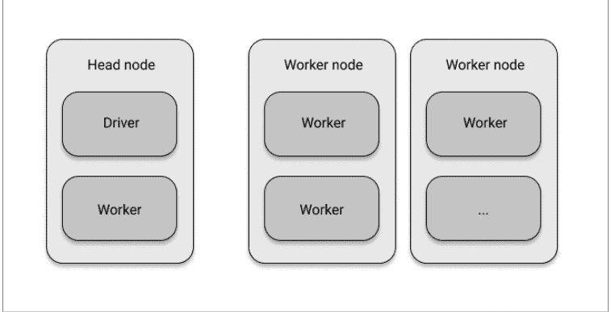

*图1-1. Ray集群的基本组件*

有趣的是，Ray集群也可以是一个*本地集群*，即仅由你自己的计算机组成的集群。在这种情况下，只有一个节点，即头节点，它包含驱动程序进程和一些工作进程。默认的工作进程数量是你机器上可用的CPU核心数。

掌握了这些知识，现在是时候动手实践，运行你的第一个本地Ray集群了。在任何主流操作系统上使用pip安装Ray<sup>4</sup>都应该能无缝进行：

```
pip install "ray[rllib, serve, tune]"==1.9.0
```

通过简单的`pip install ray`，你只会安装Ray的最基础部分。由于我们想探索一些高级功能，我们安装了“额外”组件rllib、serve和tune，我们稍后会讨论它们。根据你的系统配置，上述安装命令中的引号可能不是必需的。

接下来，启动一个Python会话。你可以使用ipython解释器，我发现它是跟随简单示例最合适的环境。如果你不想自己输入命令，也可以跳转到[本章的jupyter notebook](jupyter%20notebook%20for%20this%20chapter)并在那里运行代码。选择权在你，但无论如何，请记住使用Python 3.7或更高版本。在你的Python会话中，现在可以轻松地导入并初始化Ray，如下所示：

4 我们在此使用Ray 1.9.0版本，因为这是撰写本文时可用的最新版本。

#### 示例1-1.

```
import ray
ray.init()
```

通过这两行代码，你已经在本地机器上启动了一个Ray集群。这个集群可以利用你计算机上所有可用的核心作为工作节点。在这种情况下，你没有向`init`函数提供任何参数。如果你想在“真实”集群上运行Ray，就必须向`init`传递更多参数。其余代码将保持不变。

运行此代码后，你应该会看到如下形式的输出（我们使用省略号去除了杂乱信息）：

```
... INFO services.py:1263 -- View the Ray dashboard at http://127.0.0.1:8265
{'node_ip_address': '192.168.1.41',
 'raylet_ip_address': '192.168.1.41',
 'redis_address': '192.168.1.41:6379',
 'object_store_address': '.../sockets/plasma_store',
 'raylet_socket_name': '.../sockets/raylet',
 'webui_url': '127.0.0.1:8265',
 'session_dir': '...',
 'metrics_export_port': 61794,
 'node_id': '...'}
```

这表明你的Ray集群已经启动并运行。从输出的第一行可以看出，Ray自带一个预打包的仪表板。很可能你可以在`http://127.0.0.1:8265`访问它，除非你的输出显示了不同的端口。如果你愿意，可以花点时间探索一下这个仪表板。例如，你应该能看到所有CPU核心的列表以及你的（简单的）Ray应用程序的总利用率。我们将在后面的章节中再次讨论仪表板。

我们在这里还不准备深入探讨Ray集群的所有细节。稍微提前一点，你可能会看到`raylet_ip_address`，它指的是一个所谓的*Raylet*，负责在你的工作节点上调度任务。每个Raylet都有一个用于分布式对象的存储，这由上面的`object_store_address`暗示。一旦任务被调度，它们就会由工作进程执行。在第2章中，你将更好地理解所有这些组件以及它们如何构成Ray集群。

在继续之前，我们还应该简要提及Ray核心API非常易于访问和使用。但由于它也是一个相当底层的接口，用它构建有趣的示例需要时间。第2章有一个详尽的入门示例，帮助你开始使用Ray核心API，在第3章中，你将看到如何构建一个更有趣的强化学习Ray应用程序。

目前你的Ray集群还没做太多事情，但这即将改变。在下一节快速介绍数据科学工作流程之后，你将运行你的第一个具体Ray示例。

#### 一套数据科学库

接下来介绍Ray的第二层，在本节中，我们将介绍Ray附带的所有数据科学库。为此，让我们首先从宏观角度审视一下数据科学意味着什么。一旦你理解了这个背景，就更容易理解Ray的高级库以及它们如何对你有用。如果你对数据科学流程有很好的了解，可以安全地跳到第17页的“使用Ray Data进行数据处理”部分。

#### 机器学习与数据科学工作流程

“数据科学”（DS）这个有些难以捉摸的术语近年来发展很大，你可以在网上找到许多定义，其有用性各不相同。⁵ 对我来说，它是*通过利用数据来获取洞察并构建现实世界应用的实践*。这是一个相当宽泛的定义，你不必同意我的观点。我的观点是，数据科学本质上是一个实践性和应用性很强的领域，围绕着构建和理解事物，这在*纯粹*的学术环境中意义不大。从这个意义上说，将这个领域的从业者描述为“数据科学家”，就像将黑客描述为“计算机科学家”一样，是一个相当糟糕的误称。⁶

既然你熟悉Python，并且希望你带着一定的工匠精神，我们可以从非常务实的角度来探讨Ray的数据科学库。实践中的数据科学是一个迭代过程，大致如下：

-   *需求工程*
    你与利益相关者交谈，确定需要解决的问题，并明确该项目的要求。

-   *数据收集*
    然后你获取、收集和检查数据。

> 5 我从不喜欢将数据科学描述为数学、编码和商业等学科的交叉点。归根结底，这并没有告诉你从业者*做什么*。告诉厨师他们坐在农业、热力学和人际关系的交叉点上，并不能公正地评价他们。这没错，但也没什么帮助。

> 6 作为一个有趣的练习，我建议阅读保罗·格雷厄姆关于这个话题的著名文章《黑客与画家》，并将“计算机科学”替换为“数据科学”。那么黑客2.0会是什么？

-   *数据处理*
    然后你处理数据，以便能够解决问题。

-   *模型构建*
    接下来，你使用数据构建一个模型（广义上）。这可以是一个包含重要指标的仪表板、一个可视化，或者一个机器学习模型，以及其他许多东西。

-   *模型评估*
    下一步是根据第一步中的要求评估你的模型。

-   *部署*
    如果一切顺利（很可能不会），你将你的解决方案部署到生产环境中。你应该将其理解为一个需要监控的持续过程，而不是一次性的步骤。

否则，你需要回过头来从头开始。最可能的结果是，即使在初始部署之后，你也需要以各种方式改进你的解决方案。

机器学习不一定是这个过程的一部分，但你可以看到构建智能应用程序或获取洞察如何能从ML中受益。在你的社交媒体平台中构建一个人脸检测应用，无论好坏，可能就是其中一个例子。当上述数据科学流程明确涉及构建机器学习模型时，你可以进一步细化一些步骤：

-   *数据处理*
    要训练机器学习模型，你需要以ML模型能理解的格式提供数据。转换和选择应输入模型的数据的过程通常称为*特征工程*。这一步可能很混乱。如果你能依赖常用工具来完成这项工作，将会受益匪浅。

-   *模型训练*
    在ML中，你需要在上一步处理过的数据上训练你的算法。这包括为任务选择正确的算法，如果你能从多种算法中选择，会很有帮助。

-   *超参数调优*
    机器学习模型有在模型训练步骤中调整的参数。大多数ML模型还有一组称为*超参数*的参数，可以在训练前修改。这些参数会严重影响最终ML模型的性能，需要适当调优。有很好的工具可以帮助自动化这个过程。

-   *模型服务*
    训练好的模型需要部署。服务模型意味着通过任何必要的手段，使其可供需要访问的人使用。在原型中，你通常可以使用简单的HTTP服务器，但针对机器学习模型服务有许多专门的软件包。

此列表绝非详尽无遗。如果你从未经历过这些步骤或对术语感到困惑，请不要担心，我们将在后续章节中更详细地讨论这些内容。如果你想更全面地了解构建机器学习应用时的数据科学流程，**《构建机器学习驱动的应用》**一书对此有专门的阐述。

图1-2概述了我们刚刚讨论的步骤：

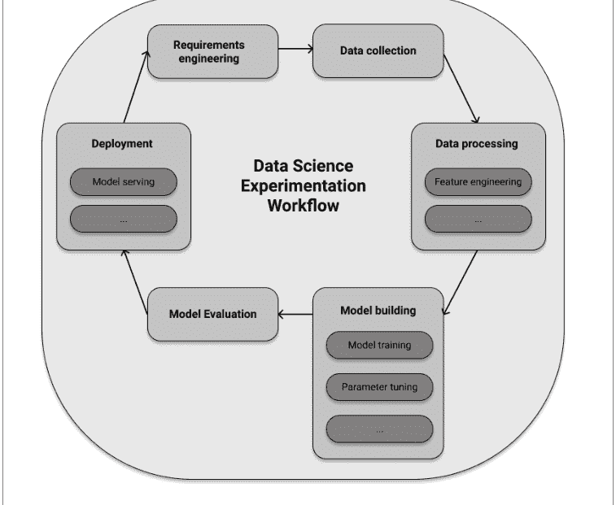

*图1-2. 使用机器学习的数据科学实验工作流概述*

此时你可能会想，这些与Ray有什么关系。好消息是，Ray为上述四个特定于机器学习的任务中的每一个都提供了专门的库，涵盖了数据处理、模型训练、超参数调优和模型服务。而且Ray的设计方式使得所有这些库都是*原生分布式的*。让我们逐一介绍它们。

#### 使用Ray Data进行数据处理

我们讨论的第一个Ray高级库叫做“Ray Data”。这个库包含一个恰如其分地命名为Dataset的数据结构，众多用于从各种格式和系统加载数据的连接器，一个用于转换此类数据集的API，一种使用它们构建数据处理管道的方法，以及与其他数据处理框架的许多集成。Dataset抽象建立在强大的Arrow框架之上。

要使用Ray Data，你需要为Python安装Arrow，例如通过运行`pip install pyarrow`。我们现在将讨论一个简单的示例，该示例从Python数据结构在你的本地Ray集群上创建一个分布式Dataset。具体来说，你将从一个包含10000个条目的Python字典创建一个数据集，每个条目包含一个字符串`name`和一个整数值`data`：

##### 示例1-2.

```
import ray

items = [{"name": str(i), "data": i} for i in range(10000)]
ds = ray.data.from_items(items) ❶
ds.show(5) ❷
```

+   ❶ 使用`ray.data`模块中的`from_items`创建一个Dataset。
❷ 打印Dataset的前10个元素。

显示Dataset意味着打印其部分值。你应该在命令行上看到恰好5个所谓的ArrowRow元素，如下所示：

```
ArrowRow({'name': '0', 'data': 0})
ArrowRow({'name': '1', 'data': 1})
ArrowRow({'name': '2', 'data': 2})
ArrowRow({'name': '3', 'data': 3})
ArrowRow({'name': '4', 'data': 4})
```

很好，现在你有了一些分布式行，但你能用这些数据做什么呢？Dataset API非常依赖函数式编程，因为它非常适合数据转换。尽管Python 3刻意隐藏了其部分函数式编程能力，但你可能熟悉`map`、`filter`等功能。如果不熟悉，也很容易上手。`map`获取数据集中的每个元素并将其并行转换为其他内容。`filter`根据布尔过滤函数移除数据点。而更复杂的`flat_map`首先类似于`map`映射值，但随后还会“展平”结果。例如，如果`map`会产生一个列表的列表，`flat_map`会将嵌套列表展平，只给你一个列表。掌握了这三个函数式API调用，让我们看看你可以多么轻松地转换数据集ds：

##### 示例1-3. 使用常见的函数式编程例程转换数据集

```
squares = ds.map(lambda x: x["data"] ** 2) ❶

evens = squares.filter(lambda x: x % 2 == 0) ❷
evens.count()

cubes = evens.flat_map(lambda x: [x, x**3]) ❸
sample = cubes.take(10) ❹
print(sample)
```

+   ❶ 我们将ds的每一行映射，只保留其data条目的平方值。
❷ 然后我们过滤平方值，只保留偶数（总共5000个元素）。
❸ 接着我们使用flat_map，用各自的立方值来增强剩余的值。
❹ take总共10个值意味着离开Ray并返回一个包含这些值的Python列表，以便我们可以打印。

Dataset转换的缺点是每个步骤都是同步执行的。在示例1-3中这不是问题，但对于混合了文件读取和数据处理等复杂任务，你希望执行能够重叠各个任务。DatasetPipeline正是做这个的。让我们将最后一个示例重写为一个管道。

##### 示例1-4.

```
pipe = ds.window() ❶
result = pipe\n    .map(lambda x: x["data"] ** 2)\n    .filter(lambda x: x % 2 == 0)\n    .flat_map(lambda x: [x, x**3]) ❷
result.show(10)
```

+   ❶ 你可以通过调用.window()将Dataset转换为管道。
❷ 管道步骤可以链接，产生与之前相同的结果。

关于Ray Data还有很多可以说的，特别是它与著名数据处理系统的集成，但我们不得不将深入讨论推迟到第7章。

#### 模型训练

接下来是下一组库，让我们看看Ray的分布式训练能力。为此，你可以访问两个库。一个专门用于强化学习，另一个有不同的范围，主要针对监督学习任务。

## 使用Ray RLlib进行强化学习

让我们从用于强化学习的*Ray RLlib*开始。这个库由现代机器学习框架TensorFlow和PyTorch提供支持，你可以选择使用哪一个。这两个框架在概念上似乎越来越趋同，所以你可以选择最喜欢的那个，而不会损失太多。为了保持一致性，我们在整本书中使用TensorFlow。现在就用`pip install tensorflow`安装它吧。

使用RLlib运行示例最简单的方法之一是使用命令行工具`rllib`，我们之前已经通过pip隐式安装了它。一旦你在第4章运行更复杂的示例，你将主要依赖其Python API，但现在我们只想初步体验运行强化学习实验。

我们将研究一个相当经典的控制问题：平衡一个摆。想象你有一个像图1-3中那样的摆，固定在一个点上并受重力影响。你可以通过从左或从右推动来操纵这个摆。如果你施加恰到好处的力，摆可能会保持直立位置。这就是我们的目标——问题是我们能否教会一个强化学习算法来为我们做到这一点。

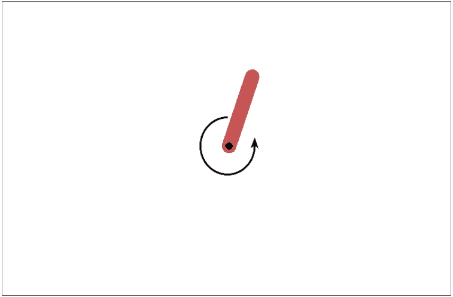

*图1-3. 通过向左或向右施加力来控制一个简单的摆*

具体来说，我们想训练一个强化学习智能体，它可以向左或向右推动，从而作用于其环境（操纵摆）以达到“直立位置”目标，并因此获得奖励。要使用Ray RLlib解决这个问题，请将以下内容存储在名为pendulum.yml的文件中。

##### 示例1-5.

```yaml
##### pendulum.yml
pendulumpppo:
    env: Pendulum-v1
    run: PPO
    checkpoint_freq: 5
    stop:
        episode_reward_mean: 800
    config:
        lambda: 0.1
        gamma: 0.95
        lr: 0.0003
        num_sgd_iter: 6
```

+   1. Pendulum-v1环境模拟了我们刚刚描述的摆问题。
2. 我们使用一种强大的强化学习算法，称为近端策略优化，或PPO。
3. 每五次“训练迭代”后，我们检查点一个模型。
4. 一旦我们达到-800的奖励，我们就停止实验。
5. PPO需要一些特定于强化学习的配置才能在此问题上正常工作。

此时，这个配置文件的细节并不重要，不要被它们分心。重要的是你指定了内置的Pendulum-v1环境和足够的特定于强化学习的配置，以确保训练过程正常工作。该配置是Ray调优示例之一的简化版本。我们选择这个是因为它不需要任何特殊硬件，并且在几分钟内就能完成。如果你的计算机足够强大，你也可以尝试运行调优示例，这应该会产生更好的结果。要训练这个摆示例，你现在可以简单地运行：

```
rllib train -f pendulum.yml
```

如果你愿意，你可以检查这个Ray程序的输出，看看不同的指标在训练过程中如何演变。如果你不想自己创建这个文件，并且想运行一个能给你更好结果的实验，你也可以运行这个：

```
curl https://raw.githubusercontent.com/maxpumperla/learning_ray/main/notebooks/pendulum.yml -o pendulum.yml
rllib train -f pendulum.yml
```

无论如何，假设训练程序已完成，我们现在可以检查它运行得如何。要可视化训练好的摆，你需要用pip install pyglet安装另一个Python库。你需要弄清楚的唯一另一件事是Ray将你的训练进度存储在哪里。当你为实验运行rllib train时，Ray会为你创建一个唯一的实验ID，并默认将结果存储在~/ray-results的子文件夹中。对于我们使用的训练配置，你应该看到一个包含结果的文件夹，类似于~/ray_results/pendulum-ppo/PPO_Pendulum-v1_<experiment_id>。在训练过程中，中间模型检查点会在同一文件夹中生成。例如，我机器上有一个文件夹叫做：

```
~/ray_results/pendulum-ppo/PPO_Pendulum-v1_20cbf_00000_0_2021-09-24_15-20-03/checkpoint_000029/ch
```

一旦你弄清楚了实验ID并选择了一个检查点ID（经验法则是ID越大，结果越好），你可以这样评估你的摆训练运行的训练性能：

```
rllib evaluate \
  ~/ray_results/pendulum-ppo/PPO_Pendulum-v1_<experiment_id>/checkpoint_0000<cp-id>/checkpoint-<cp \
  --run PPO --env Pendulum-v1 --steps 2000
```

你应该看到一个由智能体控制的摆的动画，看起来像图1-3。由于我们选择了快速训练过程而不是最大化在观察性能时，你应该会看到智能体在摆锤练习中挣扎。我们本可以做得更好，如果你有兴趣查看Ray针对Pendulum-v1环境调优的示例，你会发现大量关于此练习的解决方案。这个例子的重点是向你展示，使用RLlib训练和评估强化学习任务可以多么简单，只需对`rllib`进行两次命令行调用即可。

#### 使用Ray Train进行分布式训练

Ray RLlib专注于强化学习，但如果你需要为其他类型的机器学习（如监督学习）训练模型该怎么办？在这种情况下，你可以使用另一个Ray库进行分布式训练，称为*Ray Train*。目前，我们对TensorFlow等框架的知识积累还不够，无法为你提供一个具体且信息丰富的Ray Train示例。我们将在[第6章](#)中讨论所有这些内容，届时会详细展开。但我们可以至少粗略勾勒出一个用于机器学习模型的分布式训练“包装器”会是什么样子，其概念上相当简单：

*示例1-6.*

```
from ray.train import Trainer

def training_function():
    pass

trainer = Trainer(backend="tensorflow", num_workers=4)
trainer.start()

results = trainer.run(training_function)
trainer.shutdown()
```

1.  首先，定义你的机器学习模型训练函数。这里我们简单地跳过。
2.  然后，使用TensorFlow作为后端初始化一个Trainer实例。
3.  最后，在Ray集群上扩展你的训练函数。

如果你对分布式训练感兴趣，可以提前跳转到[第6章](#)。

#### 超参数调优

命名事物很难，但Ray团队在*Ray Tune*上做到了恰到好处，你可以用它来调整各种参数。具体来说，它是为寻找机器学习模型的良好超参数而构建的。典型设置如下：

-   你想运行一个计算成本极高的训练函数。在机器学习中，运行需要数天甚至数周的训练过程并不少见，但假设你处理的只是几分钟。
-   作为训练的结果，你计算一个所谓的**目标函数**。通常，你希望根据实验性能最大化收益或最小化损失。
-   棘手的是，你的训练函数可能依赖于某些参数，即**超参数**，它们会影响目标函数的值。
-   你可能对各个超参数应该是什么有一个直觉，但同时调整它们可能很困难。即使你可以将这些参数限制在一个合理的范围内，测试广泛的组合通常也是不可行的。你的训练函数成本太高了。

你能做些什么来高效地采样超参数，并在目标函数上获得“足够好”的结果？解决这个问题的领域被称为*超参数优化*（HPO），Ray Tune拥有庞大的算法套件来解决它。让我们看一个Ray Tune用于我们刚才解释的情况的第一个例子。重点再次放在Ray及其API上，而不是特定的机器学习任务（我们目前只是模拟它）。

*示例1-7. 使用Ray Tune为昂贵的训练函数最小化目标*

```
from ray import tune
import math
import time

def training_function(config): ①
    x, y = config["x"], config["y"]
    time.sleep(10)
    score = objective(x, y)
    tune.report(score=score) ②

def objective(x, y):
    return math.sqrt((x**2 + y**2)/2) ③

result = tune.run( ④
    training_function,
    config={
        "x": tune.grid_search([-1, -.5, 0, .5, 1]), ⑤
        "y": tune.grid_search([-1, -.5, 0, .5, 1])
    })

print(result.get_best_config(metric="score", mode="min"))
```

1.  我们模拟一个依赖于两个超参数x和y的昂贵训练函数，从配置中读取。
2.  休眠5秒以模拟训练并计算目标后，我们将分数报告给tune。
3.  目标函数计算x和y的平方和的平均值，并返回该项的平方根。这种类型的目标在机器学习中相当常见。
4.  然后我们使用`tune.run`在我们的`training_function`上初始化超参数优化。
5.  一个关键部分是为x和y提供一个参数空间供tune搜索。

示例1-7中的Tune示例为具有给定目标（我们希望最小化）的`training_function`找到了参数x和y的最佳可能选择。尽管目标函数起初可能看起来有点令人生畏，因为我们计算x和y的平方和，但所有值都是非负的。这意味着最小值在x=0和y=0处获得，此时目标函数的值为0。

我们对所有可能的参数组合进行所谓的**网格搜索**。由于我们明确地为x和y传递了五个可能的值，总共有25种组合被输入到训练函数中。由于我们指示`training_function`休眠10秒，顺序测试所有超参数组合总共需要超过四分钟。由于Ray在并行化此工作负载方面很智能，在我的笔记本电脑上，整个实验只需要大约35秒。现在，想象一下每次训练运行需要几个小时，而且我们有20个而不是两个超参数。这使得网格搜索变得不可行，特别是如果你对参数范围没有合理的猜测。在这种情况下，你将不得不使用Ray Tune中更复杂的HPO方法，如第5章所述。

#### 模型服务

我们将讨论的Ray高级库中的最后一个专门用于模型服务，简单地称为Ray Serve。要看到它实际运行的例子，你需要一个训练好的机器学习模型来提供服务。幸运的是，如今你可以在互联网上找到许多已经为你训练好的有趣模型。例如，Hugging Face有各种模型可供你直接在Python中下载。我们将使用的模型是一个名为GPT-2的语言模型，它以文本作为输入，并生成文本以继续或完成输入。例如，你可以提示一个问题，GPT-2会尝试完成它。

提供这样的模型是使其可访问的好方法。你可能不知道如何在你的计算机上加载和运行TensorFlow模型，但你确实知道如何用简单的英语提问。模型服务隐藏了解决方案的实现细节，让用户专注于提供输入和理解模型的输出。

要继续，请确保运行`pip install transformers`来安装包含我们想要使用的模型的Hugging Face库。有了它，我们现在可以导入并启动Ray的serve库实例，加载并部署一个GPT-2模型，并询问它生命的意义，如下所示：

*示例1-8.*

```
from ray import serve
from transformers import pipeline
import requests

serve.start() ❶

@serve.deployment ❷
def model(request):
    language_model = pipeline("text-generation", model="gpt2") ❸
    query = request.query_params["query"]
    return language_model(query, max_length=100) ❹

model.deploy() ❺

query = "What's the meaning of life?"
response = requests.get(f"http://localhost:8000/model?query={query}") ❻
print(response.text)
```

❶ 我们在本地启动serve。
❷ `@serve.deployment`装饰器将一个带有`request`参数的函数转换为一个serve部署。
❸ 在`model`函数内部为每个请求加载`language_model`效率低下，但这是向你展示部署的最快方式。
❹ 我们要求模型最多给我们100个字符来继续我们的查询。
❺ 然后我们正式部署模型，使其可以通过HTTP开始接收请求。
❻ 我们使用不可或缺的`requests`库来获取你可能有的任何问题的响应。

在???中，你将学习如何在各种场景中正确部署模型，但现在我鼓励你尝试这个例子并测试不同的查询。反复运行最后两行代码几乎每次都会给你不同的答案。这里有一个黑暗而富有诗意的宝石，提出了更多问题，这是我在我的机器上查询的，并为未成年读者稍作审查：

```
[{
    "generated_text": "What's the meaning of life?\n\nIs there one way or another of living?\n\nHow does it feel to be trapped in a relationship?\n\nHow can it be changed before it's too late?\n\nWhat did we call it in our time?\n\nWhere do we fit within this world and what are we going to live for?\n\nMy life as a person has been shaped by the love I've received from others."
}]
```

这结束了我们对Ray数据科学库的旋风之旅，这是Ray的第二层。在结束本章之前，让我们非常简要地看一下第三层，即围绕Ray不断增长的生态系统。

#### 不断增长的生态系统

Ray的高级库功能强大，值得在本书中进行更深入的探讨。虽然它们对数据科学生命周期的有用性是不可否认的，但我不想给人留下Ray是你现在唯一需要的印象。事实上，我相信最好和最成功的框架是那些与现有解决方案和思想集成良好的框架。最好专注于你的核心优势，并利用其他工具来弥补你解决方案中的不足。通常没有理由重新发明轮子。

#### Ray如何集成和扩展

为了给你一个Ray如何与其他工具集成的例子，考虑Ray Data是其库中相对较新的补充。如果你想将其简化，也许有点过度简化，Ray是一个**计算优先**的框架。相比之下，像Apache Spark⁷或Dask这样的分布式框架可以被认为是**数据优先**的。几乎你用Spark做的任何事情都始于定义一个分布式数据集及其转换。Dask致力于将常见的数据结构（如Pandas数据帧或Numpy数组）引入分布式设置。两者在其自身方面都非常强大，我们将给你一个更详细和公平的与Ray的比较。

7 Spark是由伯克利的另一个实验室AMPLab创建的。互联网上充斥着博客文章声称Ray因此应该被视为Spark的替代品。最好将它们视为具有不同优势的工具，两者都可能长期存在。

#### Ray 作为分布式接口

在我看来，Ray 被严重低估的一个方面是，其库能将常用工具作为*后端*无缝集成。Ray 通常创建通用接口，而不是试图创建新标准⁸。这些接口允许你以分布式方式运行任务，这是大多数相应后端本身不具备或不具备同等程度的特性。例如，Ray RLlib 和 Train 由 TensorFlow 和 PyTorch 的全部能力提供支持。Ray Tune 支持几乎所有知名 HPO 工具的算法，包括 Hyperopt、Optuna、Nevergrad、Ax、SigOpt 等等。这些工具默认都不是分布式的，但 Tune 将它们统一在一个通用接口中。Ray Serve 可以与 FastAPI 等框架一起使用，而 Ray Data 由 Arrow 提供支持，并与 Spark 和 Dask 等其他框架有许多集成。总体而言，这似乎是一种稳健的设计模式，可用于扩展现有的 Ray 项目或在未来集成新的后端。

### 总结

总结本章讨论的内容，图 1-4 概览了我们所阐述的 Ray 的三个层次。Ray 的核心分布式执行引擎位于框架的中心。对于实际的数据科学工作流，你可以使用 Ray Data 进行数据处理，Ray RLlib 进行强化学习，Ray Train 进行分布式模型训练，Ray Tune 进行超参数调优，Ray Serve 进行模型服务。你已经看到了这些库的示例，并了解了它们的 API 包含什么。除此之外，Ray 的生态系统还有许多扩展，我们将在后面进一步探讨。也许你已经能在图 1-4 中认出一些你熟悉和喜欢的工具⁹？

8 在深度学习框架 Keras 成为公司旗舰产品的正式组成部分之前，它最初是为 Theano、CNTK 或 TensorFlow 等各种底层框架提供的便捷 API 规范。从这个意义上说，Ray RLlib 有机会成为强化学习的 Keras。Ray Tune 可能会成为超参数优化的 Keras。要获得更广泛采用，缺失的部分可能是两者都提供更优雅的 API。

9 请注意，“Ray Train”在旧版本的 Ray 中被称为“raysgd”，并且尚未有新的标志。

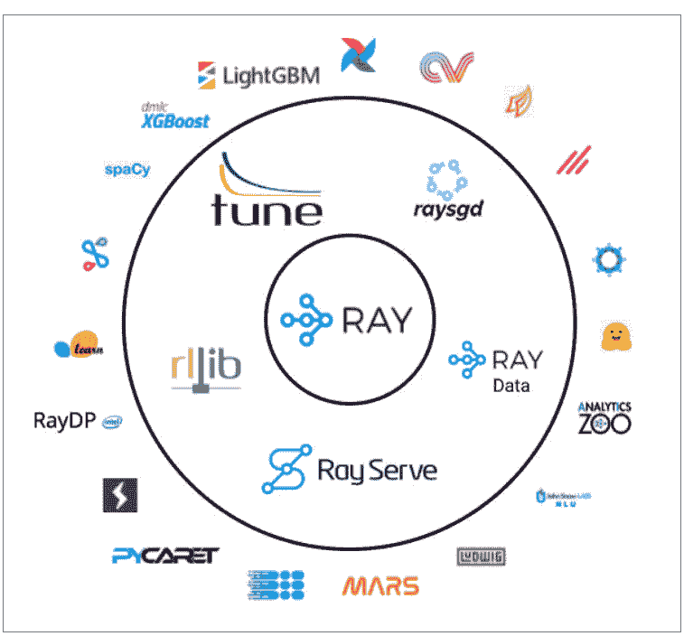

图 1-4. Ray 的三个层次：其核心 API、库 RLlib、Tune、Ray Train、Ray Serve、Ray Data，以及众多第三方集成中的一部分

# 第 2 章
Ray Core 入门

> **致早期发布读者的说明**
> 通过早期发布电子书，你可以在书籍的最早期形式——作者撰写时的原始未编辑内容——中获取内容，从而在这些书籍正式发布之前很久就能利用这些技术。

对于一本关于分布式 Python 的书来说，Python 本身在分布式计算方面基本无效，这具有某种讽刺意味。它的解释器实际上是单线程的，这使得仅使用 Python 就难以利用同一台机器上的多个 CPU，更不用说整个机器集群了。这意味着你需要额外的工具，幸运的是 Python 生态系统为你提供了一些选择。例如，像 multiprocessing 这样的库可以帮助你在单台机器上分配工作，但无法扩展到更多机器。

在本章中，你将通过启动一个本地集群来理解 Ray core 如何处理分布式计算，并学习如何使用 Ray 精简而强大的 API 来并行化一些有趣的计算。例如，你将构建一个示例，该示例以一种方便且其他工具不易复制的方式，在 Ray 上高效且异步地运行数据并行任务。我们将讨论任务和 actor 如何作为 Python 中函数和类的分布式版本工作。你还将了解 Ray 背后的所有基本概念及其架构。换句话说，我们将带你深入了解 Ray 引擎的内部工作原理。

## Ray Core 简介

本章的大部分内容是一个我们将一起构建的扩展 Ray core 示例。Ray 的许多概念都可以通过一个好例子来解释，所以我们正是要这样做。和之前一样，你可以通过自己输入代码（强烈推荐）或跟随本章的笔记本电脑来跟随这个示例。

在第 1 章中，我们向你介绍了 Ray 集群的基础知识，并向你展示了如何通过输入以下内容来启动本地集群

示例 2-1.

```
import ray
ray.init()
```

你需要一个正在运行的 Ray 集群来运行本章中的示例，因此请确保在继续之前已启动一个。本节的目标是让你快速了解 Ray Core API，从现在起我们将其简称为 Ray API。

作为 Python 程序员，Ray API 的妙处在于它非常贴近你的使用习惯。它使用装饰器、函数和类等熟悉的概念，为你提供快速的学习体验。Ray API 旨在为分布式计算提供通用的编程接口。这当然不是一件容易的事，但我认为 Ray 在这方面取得了成功，因为它为你提供了直观易学易用的良好抽象。Ray 的引擎在后台为你完成了所有繁重的工作。这种设计哲学使得 Ray 能够与现有的 Python 库和系统一起使用。

### 使用 Ray API 的第一个示例

举个例子，考虑以下从数据库检索和处理数据的函数。我们的虚拟数据库是一个普通的 Python 列表，包含本书标题的单词。我们通过让 Python 休眠来模拟从该数据库中检索单个项目并进一步处理它的开销很大。

示例 2-2.

```
import time

database = [
    "Learning", "Ray",
    "Flexible", "Distributed", "Python", "for", "Data", "Science"
]

def retrieve(item):
    time.sleep(item / 10.)
    return item, database[item]
```

1. 一个包含本书标题字符串数据的虚拟数据库。
2. 我们模拟一个耗时的数据处理操作。

我们的数据库有八个条目，从 database[0] 对应 “Learning” 到 database[7] 对应 “Science”。如果我们顺序检索所有条目，这需要多长时间？对于索引为 5 的条目，我们等待半秒（5 / 10.），依此类推。总的来说，我们可以预期运行时间约为 (0+1+2+3+4+5+6+7)/10. = 2.8 秒。让我们看看实际结果是否如此：

示例 2-3.

```
def print_runtime(input_data, start_time, decimals=1):
    print(f'Runtime: {time.time() - start_time:.{decimals}f} seconds, data:')
    print(*input_data, sep="\n")

start = time.time()
data = [retrieve(item) for item in range(8)] ❶
print_runtime(data, start) ❷
```

1. 我们使用列表推导式来检索所有八个条目。
2. 然后我们解包数据，将每个条目打印在单独的行上。

如果你运行此代码，你应该会看到以下输出：

```
Runtime: 2.8 seconds, data:
(0, 'Learning')
(1, 'Ray')
(2, 'Flexible')
(3, 'Distributed')
(4, 'Python')
(5, 'for')
(6, 'Data')
(7, 'Science')
```

我们在小数点后一位截断了程序的输出。有一些额外开销使总时间更接近 2.82 秒。在你那边，这可能会略少，或者多得多，具体取决于你的计算机。重要的结论是，我们朴素的 Python 实现无法并行运行此函数。这对你来说可能并不意外，但你至少可能怀疑过 Python 列表推导式在这方面更高效。我们得到的运行时间几乎是最坏的情况，即我们在运行代码之前计算的 2.8 秒。仔细想想，看到一个本质上大部分时间都在休眠的程序整体运行如此缓慢，甚至可能有点令人沮丧。最终你可以将此归咎于全局解释器锁（GIL），但它已经受到足够多的批评了。

### Python 的全局解释器锁

全局解释器锁（GIL¹）无疑是 Python 语言中最臭名昭著的特性之一。简而言之，它是一把锁，确保你的计算机上同一时间只有一个线程能够执行 Python 代码。如果你使用多线程，这些线程需要轮流控制 Python 解释器。

GIL 的存在有其充分的理由。首先，它使得 Python 中的内存管理变得简单得多。另一个关键优势是它让单线程程序运行得相当快。主要使用大量系统输入/输出（我们称之为 I/O 密集型）的程序，例如读取文件或数据库，也能从中受益。主要的缺点之一是 CPU 密集型程序本质上是单线程的。事实上，CPU 密集型任务在不使用多线程时甚至可能运行得*更快*，因为后者在 GIL 之上还会带来写锁开销。

考虑到所有这些，如果你相信 [Larry Hastings](https://larryhastings.com/) 的观点，GIL 可能有些矛盾地成为了 Python 流行的原因之一。有趣的是，Hastings 也曾领导（未成功的）努力在一个名为 *GILectomy* 的项目中移除它，这听起来就像是一种复杂的外科手术。目前尚无定论，但 [Sam Gross](https://github.com/colesbury) 可能已经在他的 Python 3.9 nogil 分支中找到了移除 GIL 的方法。目前，如果你绝对需要绕过 GIL，可以考虑使用 CPython 之外的其他实现。CPython 是 Python 的标准实现，如果你不知道自己在用什么，那你肯定用的就是它。像 Jython、IronPython 或 PyPy 这样的实现没有 GIL，但它们也有各自的缺点。

### 函数与远程 Ray 任务

可以合理地假设，这样的任务可以从并行化中受益。如果完美地进行分布式处理，运行时间不应比最长的子任务长太多，即 7/10 = 0.7 秒。那么，让我们看看如何将这个示例扩展到在 Ray 上运行。为此，你首先需要使用 `@ray.remote` 装饰器，如下所示：

*示例 2-4.*

```
@ray.remote ❶
def retrieve_task(item):
    return retrieve(item) ❷
```

- ❶ 仅通过这个装饰器，我们就将任何 Python 函数变成了一个 Ray 任务。
- ❷ 其他一切保持不变。retrieve_task 只是直接调用 retrieve。

¹ 我仍然不知道这个缩写词怎么发音，但我感觉那些把 GIF 读成“长颈鹿”的人，也会把 GIL 读成“吉他”。如果你不确定，就选一个读法，或者直接拼出来。

通过这种方式，函数 `retrieve_task` 就变成了一个所谓的 Ray 任务。这是一个极其方便的设计选择，因为你可以先专注于你的 Python 代码，而无需完全改变你的思维方式或编程范式来使用 Ray。注意，在实践中，你本可以直接在原始的 `retrieve` 函数上添加 `@ray.remote` 装饰器（毕竟，这就是装饰器的预期用途），但我们不想修改之前的代码，以尽可能保持清晰。

这很简单，那么你需要在检索数据和测量性能的代码中改变什么呢？事实证明，改变不多。让我们看看你会怎么做：

*示例 2-5. 测量你的 Ray 任务的性能。*

```
start = time.time()
data_references = [retrieve_task.remote(item) for item in range(8)] ❶
data = ray.get(data_references) ❷
print_runtime(data, start, 2)
```

- ❶ 要在本地 Ray 集群上运行 `retrieve_task`，你需要使用 `.remote()` 并像以前一样传入数据。你会得到一个对象引用列表。
- ❷ 要获取回数据，而不仅仅是 Ray 对象引用，你需要使用 `ray.get`。

你发现区别了吗？你必须使用 `remote` 函数远程执行你的 Ray 任务。当任务被远程执行时，即使是在你的本地集群上，Ray 也是*异步*执行的。上一个代码片段中 `data_references` 的列表项并不直接包含结果。事实上，如果你用 `type(data_references[0])` 检查第一个项目的 Python 类型，你会看到它实际上是一个 `ObjectRef`。这些对象引用对应于*未来对象*，你需要向它们请求结果。这就是调用 `ray.get(...)` 的目的。

我们仍然想在这个例子²上做更多工作，但让我们退一步，回顾一下我们到目前为止做了什么。你从一个 Python 函数开始，并用 `@ray.remote` 装饰它。这使你的函数成为一个 Ray 任务。然后，你没有在代码中直接调用原始函数，而是在 Ray 任务上调用了 `.remote(...)`。最后一步是从你的 Ray 集群中 `.get(...)` 结果。我认为这个过程非常直观，我敢打赌你已经可以从另一个函数创建自己的 Ray 任务，而无需回顾这个例子。为什么不现在就试试呢？

回到我们的例子，通过使用 Ray 任务，我们在性能方面获得了什么？在我的机器上，运行时间约为 0.71 秒，仅比最长的子任务（0.7 秒）稍长一点。这很棒，比以前好得多，但我们可以通过利用更多 Ray 的 API 来进一步改进我们的程序。

### 使用 put 和 get 操作对象存储

你可能注意到的一件事是，在 retrieve 的定义中，我们*直接*从数据库中访问项目。在本地 Ray 集群上这样做没问题，但想象一下你在一个由多台计算机组成的实际集群上运行。所有这些计算机如何访问相同的数据？回想一下第 1 章，在 Ray 集群中，有一个头节点运行着驱动程序进程（执行 `ray.init()`），以及许多工作节点运行着执行你任务的工作进程。我的笔记本电脑总共有 8 个 CPU 核心，所以 Ray 会在我的单节点本地集群上创建 8 个工作进程。我们的数据库目前仅在驱动程序上定义，但运行你任务的工作进程需要访问它才能运行 retrieve 任务。幸运的是，Ray 提供了一种简单的方法在驱动程序和工作进程之间（或在工作进程之间）共享数据。你可以简单地使用 put 将你的数据放入 Ray 的*分布式对象存储*中，然后在工作进程上使用 get 来检索它，如下所示。

*示例 2-6.*

```
database_object_ref = ray.put(database) ❶

@ray.remote
def retrieve_task(item):
    obj_store_data = ray.get(database_object_ref) ❷
    time.sleep(item / 10.)
    return item, obj_store_data[item]
```

- ❶ 将你的数据库放入对象存储并接收一个引用。
- ❷ 这允许你的工作进程获取数据，无论它们在集群中的哪个位置。

通过这种方式使用对象存储，你可以让 Ray 处理整个集群的数据访问。我们将在讨论 Ray 的基础设施时，详细说明数据如何在节点之间以及工作进程内部传递。虽然与对象存储的交互需要一些开销，但 Ray 在存储数据方面非常智能，这在处理更大、更真实的数据集时能为你带来性能提升。目前，重要的是这一步在真正的分布式环境中是必不可少的。如果你愿意，可以尝试用这个新的 retrieve_task 函数重新运行示例 2-5，并确认它仍然按预期运行。

### 使用 Ray 的 wait 函数进行非阻塞调用

注意在示例 2-5 中，我们使用了 `ray.get(data_references)` 来访问结果。这个调用是*阻塞*的，这意味着我们的驱动程序必须等待所有结果都可用。在我们的情况下这没什么大不了的，程序现在不到一秒就完成了。但想象一下，处理每个数据项需要几分钟。在这种情况下，你会希望释放驱动程序进程以执行其他任务，而不是无所事事地坐着。此外，如果能在结果产生时就处理它们（有些完成得比其他快得多），而不是等待所有数据处理完毕，那就更好了。还有一个需要记住的问题是，如果某个数据项无法按预期检索到会发生什么？假设数据库连接中某处出现了死锁。那样的话，驱动程序就会挂起，永远无法检索所有项目。因此，使用合理的超时时间是个好主意。在我们的场景中，我们不应该等待超过最长数据检索任务 10 倍的时间才停止任务。以下是你可以如何使用 Ray 的 wait 来做到这一点：

*示例 2-7.*

```
start = time.time()
data_references = [retrieve_task.remote(item) for item in range(8)]
all_data = []

while len(data_references) > 0: ①
    finished, data_references = ray.wait(data_references, num_returns=2, timeout=7.0) ②
    data = ray.get(finished)
    print_runtime(data, start, 3) ③
    all_data.extend(data) ④
```

- ① 我们没有阻塞，而是循环处理未完成的 data_references。
- ② 我们异步等待完成的数据，并设置合理的超时时间。这里 data_references 被覆盖，以防止无限循环。
- ③ 我们在结果产生时就打印它们，即每两个一组。
- ④ 然后我们将新数据追加到 all_data 中，直到完成。

如你所见，`ray.wait` 返回两个参数，即已完成的数据和仍需处理的未来对象。我们使用 `num_returns` 参数（默认为 1），让 wait 在每对新数据项可用时返回。在我的笔记本电脑上，这会产生以下输出：

```
Runtime: 0.108 seconds, data:
(0, 'Learning')
(1, 'Ray')
Runtime: 0.308 seconds, data:
```

### 处理任务依赖关系

到目前为止，我们的示例程序在概念层面上相当简单。它只包含一个步骤，即检索一批数据。现在，想象一下，一旦数据加载完成，你想在其上运行一个后续处理任务。更具体地说，假设我们想使用第一个检索任务的结果来查询其他相关数据（假装你正在查询同一数据库中不同表的数据）。以下代码设置了这样一个任务，并连续运行了我们的 `retrieve_task` 和 `follow_up_task`。

示例 2-8. 运行一个依赖于另一个 Ray 任务的后续任务

```python
@ray.remote
def follow_up_task(retrieve_result): ①
    original_item, _ = retrieve_result
    follow_up_result = retrieve(original_item + 1) ②
    return retrieve_result, follow_up_result ③

retrieve_refs = [retrieve_task.remote(item) for item in [0, 2, 4, 6]]
follow_up_refs = [follow_up_task.remote(ref) for ref in retrieve_refs] ④

result = [print(data) for data in ray.get(follow_up_refs)]
```

① 使用 `retrieve_task` 的结果，我们在此基础上计算另一个 Ray 任务。
② 利用第一个任务中的 `original_item`，我们检索更多数据。
③ 然后我们返回原始数据和后续数据。
④ 我们将第一个任务的对象引用传递给第二个任务。

运行此代码将产生以下输出。

```
((0, 'Learning'), (1, 'Ray'))
((2, 'Flexible'), (3, 'Distributed'))
((4, 'Python'), (5, 'for'))
((6, 'Data'), (7, 'Science'))
```

如果你没有太多异步编程经验，你可能对示例 2-8 并不感到惊讶。但我希望说服你，这段代码片段能够运行本身至少有点令人惊讶³。那么，这有什么大不了的呢？毕竟，代码读起来就像普通的 Python——一个函数定义和几个列表推导式。关键在于，`follow_up_task` 的函数体期望其输入参数 `retrieve_result` 是一个 Python 元组，我们在函数定义的第一行中对其进行了拆包。

但是通过调用 `[follow_up_task.remote(ref) for ref in retrieve_refs]`，我们*并没有*向后续任务传递元组。相反，我们传递的是带有 `retrieve_refs` 的 Ray *对象引用*。底层发生的情况是，Ray 知道 `follow_up_task` 需要实际值，因此在此任务内部，它将调用 `ray.get` 来解析 futures。Ray 为所有任务构建一个依赖图，并按照尊重依赖关系的顺序执行它们。你不必显式地告诉 Ray 何时等待前一个任务完成，它会为你推断出这些信息。

后续任务只有在各个检索任务完成后才会被调度。如果你问我，这是一个令人难以置信的功能。事实上，如果我将 `retrieve_refs` 命名为类似 `retrieve_result` 的名字，你可能甚至没有注意到这个重要的细节。这是设计使然。Ray 希望你专注于你的工作，而不是集群计算的细节。在图 2-1 中，你可以看到这两个任务的依赖关系图可视化。

> ³ 根据克拉克第三定律，任何足够先进的技术都与魔法无异。对我来说，这个例子就有点魔法的味道。

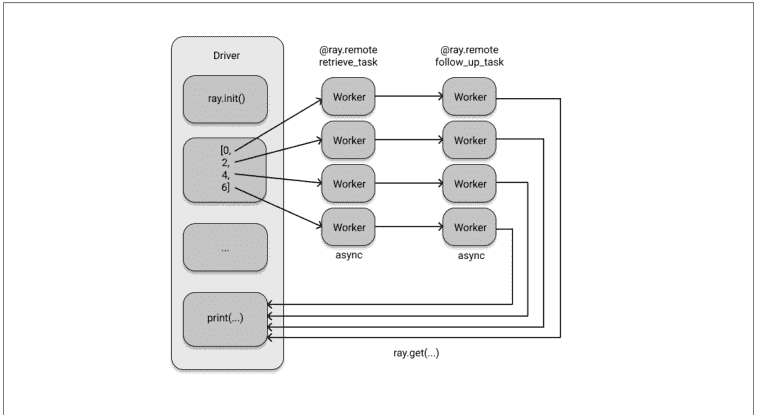

图 2-1. 使用 Ray 异步并行运行两个相互依赖的任务

如果你愿意，可以尝试重写示例 2-8，使其在将值传递给后续任务之前显式地对第一个任务使用 `get`。这不仅会引入更多样板代码，而且编写和理解起来也更不直观。

### 从类到 Actor

在结束这个示例之前，让我们讨论一下 Ray Core 的另一个重要概念。注意在我们的示例中，所有东西本质上都是一个函数。我们只是使用了 `ray.remote` 装饰器将其中一些变成了远程函数，除此之外只是使用了普通的 Python。假设我们想跟踪数据库被查询了多少次？当然，我们可以简单地计算检索任务的结果，但有没有更好的方法呢？我们希望以一种可扩展的“分布式”方式来跟踪这一点。为此，Ray 引入了 actor 的概念。Actor 允许你在集群上运行有状态的计算。它们也可以相互通信¹。就像 Ray 任务只是被装饰的函数一样，Ray actor 是被装饰的 Python 类。让我们编写一个简单的计数器来跟踪我们的数据库调用。

示例 2-9.

```python
@ray.remote
class DataTracker:
    def __init__(self):
        self._counts = 0

    def increment(self):
        self._counts += 1

    def counts(self):
        return self._counts
```

> 4 Actor 模型是计算机科学中一个成熟的概念，你可以在 Akka 或 Erlang 等框架中找到它的实现。然而，actor 的历史和具体细节与我们的讨论无关。

我们可以使用与之前相同的 `@ray.remote` 装饰器将任何 Python 类变成 Ray actor。

这个 `DataTracker` 类已经是一个 actor 了，因为我们为它配备了 `@ray.remote` 装饰器。这个 actor 可以跟踪状态，这里只是一个简单的计数器，它的方法是 Ray 任务，调用方式与我们之前调用函数完全一样，即使用 `.remote()`。让我们看看如何修改我们现有的 `retrieve_task` 来整合这个新的 actor。

示例 2-10.

```python
@ray.remote
def retrieve_tracker_task(item, tracker): ❶
    obj_store_data = ray.get(database_object_ref)
    time.sleep(item / 10.)
    tracker.increment.remote() ❷
    return item, obj_store_data[item]

tracker = DataTracker.remote() ❸
data_references = [retrieve_tracker_task.remote(item, tracker) for item in range(8)] ❹
data = ray.get(data_references)
print(ray.get(tracker.counts.remote())) ❺
```

❶ 我们将 tracker actor 传递给这个任务。
❷ 每次调用，tracker 都会收到一个增量。
❸ 我们通过调用类上的 `.remote()` 来实例化我们的 `DataTracker` actor。
❹ actor 被传递给检索任务。
❺ 之后，我们可以通过另一个远程调用从 tracker 获取计数状态。

毫不奇怪，这个计算的结果实际上是 8。我们不需要 actor 来计算这个，但我希望你能看到，拥有一个跨集群跟踪状态的机制（可能跨越多个任务）是多么有用。事实上，我们可以将我们的 actor 传递给任何依赖任务，甚至传递给另一个 actor 的构造函数。你能做的事情没有限制，正是这种灵活性使得 Ray API 如此强大。同样值得一提的是，分布式 Python 工具允许进行像这样的有状态计算并不常见。这个功能非常方便，尤其是在运行复杂的分布式算法时，例如使用强化学习时。这完成了我们广泛的第一个 Ray API 示例。接下来让我们看看是否可以简洁地总结一下 Ray API。

### Ray Core API 概览

如果你回想一下我们在前面的示例中到底做了什么，你会注意到我们总共只使用了六个 API 方法⁵。你使用了 `ray.init()` 来启动集群，使用 `@ray.remote` 将函数和类转换为任务和 actor。然后我们使用 `ray.put()` 将数据放入 Ray 的对象存储，使用 `ray.get()` 从集群检索数据。最后，我们在 actor 方法或任务上使用 `.remote()` 在集群上运行代码，并使用 `ray.wait()` 来避免阻塞调用。

虽然六个 API 方法看起来不多，但当你使用 Ray API 时，这些可能是你唯一需要关心的⁶。让我们在表格中简要总结一下它们，以便你将来可以轻松参考。

表 2-1. Ray Core 的六个主要 API 方法

| API 调用 | 描述 |
|---|---|
| `ray.init()` | 初始化你的 Ray 集群。传入一个地址以连接到现有集群。 |
| `@ray.remote` | 将函数转换为任务，将类转换为 actor。 |
| `ray.put()` | 将数据放入 Ray 的对象存储。 |
| `ray.get()` | 从对象存储获取数据。返回你放入其中的数据或由任务或 actor 计算的数据。 |
| `.remote()` | 在你的 Ray 集群上运行 actor 方法或任务，并用于实例化 actor。 |
| `ray.wait()` | 返回两个对象引用列表，一个包含我们正在等待的已完成任务，另一个包含未完成的任务。 |

既然你已经看到了 Ray API 的实际应用，让我们在讨论其系统架构之前，快速讨论一下 Ray 的设计哲学。

> 5 引用 Alan Kay 的话，要获得简单性，你需要找到稍微复杂一点的构建块。在我看来，Ray API 为分布式 Python 做到了这一点。
> 6 你可以查看 API 参考，看看实际上还有更多可用的方法。在某个时候，你应该花时间了解 `init` 的参数，但如果你不是 Ray 集群的管理员，其他所有方法可能都不会引起你的兴趣。

### 设计原则

Ray 的构建基于若干设计原则，其中大部分你已有所体会。其 API 旨在实现简洁性与通用性。其计算模型依托于灵活性。而其系统架构则为性能与可扩展性而设计。让我们逐一深入探讨。

#### 简洁性与抽象

正如你所见，Ray 的 API 不仅追求简洁，而且易于上手。无论你是想利用笔记本电脑的所有 CPU 核心，还是想调用集群中的所有机器，都无需大费周章。你可能只需修改一两行代码，但所使用的 Ray 代码本质上保持不变。与任何优秀的分布式系统一样，Ray 在底层管理着任务分发与协调。这非常棒，因为它让你不必深陷于分布式计算机制的推理之中。一个良好的抽象层使你能够专注于工作本身，我认为 Ray 在提供这层抽象方面做得非常出色。

由于 Ray 的 API 具有高度的通用性和 Python 风格，它很容易与其他工具集成。例如，Ray 的 actor 可以调用现有的分布式 Python 工作负载，也可以被其调用。从这个意义上说，Ray 也充当了分布式工作负载的优秀“粘合代码”，因为它足够高效和灵活，能够在不同的系统和框架之间进行通信。

#### 灵活性

对于 AI 工作负载，尤其是在处理强化学习等范式时，你需要一个灵活的编程模型。Ray 的 API 旨在轻松编写灵活且可组合的代码。简而言之，如果你能用 Python 表达你的工作负载，你就能用 Ray 来分发它。当然，你仍然需要确保有足够的资源可用，并注意你想要分发的内容。但 Ray 并不限制你能用它做什么。

Ray 在计算的*异构性*方面也具有灵活性。例如，假设你正在处理一个复杂的模拟。模拟通常可以分解为多个任务或步骤。其中一些步骤可能需要数小时运行，而另一些只需几毫秒，但它们都需要被快速调度和执行。有时模拟中的单个任务可能耗时很长，但其他较小的任务应该能够并行运行而不阻塞它。此外，后续任务可能依赖于上游任务的结果，因此你需要一个框架来支持*动态执行*，并能妥善处理任务依赖关系。在本章讨论的示例中，你已经看到 Ray 的 API 正是为此而构建的。

你还需要确保在资源使用上保持灵活性。例如，某些任务可能必须在 GPU 上运行，而其他任务在几个 CPU 核心上运行效果最佳。Ray 为你提供了这种灵活性。

#### 速度与可扩展性

Ray 的另一个设计原则是其执行异构任务的速度。它每秒可以处理数百万个任务。更重要的是，使用 Ray 只会产生非常低的延迟。它的构建目标就是以毫秒级的延迟执行任务。

对于一个分布式系统要快，它还需要具备良好的可扩展性。Ray 能够高效地在你的计算集群中分发和调度任务。并且它还以容错的方式做到这一点。在分布式系统中，问题不在于是否会发生故障，而在于何时发生。一台机器可能会宕机、中止任务，或者直接烧毁。⁷ 无论如何，Ray 的构建目标就是能够从故障中快速恢复，这有助于其整体速度。

### 理解 Ray 系统组件

你已经了解了 Ray API 的使用方式以及其背后的设计理念。现在是时候更好地理解底层系统组件了。换句话说，Ray 是如何工作的，以及它是如何实现其功能的？

#### 在节点上调度和执行工作

你知道 Ray 集群由节点组成。我们将首先看看单个节点上发生了什么，然后再放大视角讨论整个集群如何协同工作。

正如我们已经讨论过的，一个工作节点由多个工作进程或简称工作进程组成。每个工作进程都有一个唯一的 ID、一个 IP 地址和一个端口，通过这些可以引用它们。工作进程之所以被称为工作进程是有原因的，它们是盲目执行你交给它们的工作的组件。但是，谁告诉它们该做什么以及何时做呢？一个工作进程可能已经很忙，它可能没有运行某个任务所需的适当资源（例如，访问 GPU），它甚至可能没有运行给定任务所需的数据。除此之外，工作进程不知道在它们执行工作负载之前或之后发生了什么，没有协调。

> 7 这听起来可能很极端，但这不是开玩笑。仅举一例，2021 年 3 月，一个为数百万网站提供服务的法国数据中心完全烧毁，你可以在这篇文章中读到相关信息。如果你的整个集群都烧毁了，恐怕 Ray 也帮不了你。

为了解决这些问题，每个工作节点都有一个称为 *Raylet* 的组件。可以将 Raylet 视为节点的智能组件，负责管理工作进程。Raylet 在作业之间共享，由两个组件组成，即任务调度器和对象存储。

让我们先谈谈对象存储。在本章的运行示例中，我们已经粗略地使用了对象存储的概念，但没有真正具体说明。Ray 集群的每个节点都配备了一个对象存储，位于该节点的 Raylet 内，所有对象存储共同构成了集群的分布式对象存储。对象存储在节点内具有*共享内存*，因此每个工作进程都可以轻松访问它。对象存储在 **Plasma** 中实现，现在属于 Apache Arrow 项目。从功能上讲，对象存储负责内存管理，并最终确保工作进程能够访问它们需要的数据。

Raylet 的第二个组件是其调度器。调度器负责资源管理等事项。例如，如果一个任务需要访问 4 个 CPU，调度器需要确保它能找到一个空闲的工作进程，并可以*授予其访问*上述资源的权限。默认情况下，调度器知道并获取其节点上可用的 CPU 和 GPU 数量以及内存量，但如果你愿意，也可以注册自定义资源。如果它无法提供所需的资源，它就无法调度任务的执行。

除了资源，调度器负责的另一个要求是*依赖解析*。这意味着它需要确保每个工作进程都拥有执行任务所需的所有输入数据。为此，调度器将首先通过在其对象存储中查找数据来解析本地依赖项。如果所需数据在此节点的对象存储中不可用，调度器将不得不与其他节点通信（我们稍后会告诉你如何操作）并拉取远程依赖项。一旦调度器确保了任务有足够的资源，解析了所有需要的依赖项，并为任务找到了一个工作进程，它就可以调度该任务执行。

任务调度是一个非常困难的话题，即使我们只讨论单个节点。我想你可以很容易地想象到，不正确或简单粗暴的任务执行计划可能会因为资源不足而“阻塞”下游任务。尤其是在分布式环境中，像这样分配工作可能很快就会变得非常棘手。

现在你了解了 Raylet，让我们简要回到工作进程，以便我们可以结束关于工作节点的讨论。一个对 Ray 整体性能有贡献的重要概念是*所有权*。

所有权意味着运行某个进程的进程对其负责。这使得整体设计是去中心化的，因为单个任务有一个唯一的所有者。具体来说，这意味着每个工作进程拥有它提交的任务，这包括正确执行和结果的可用性（即，正确解析对象引用）。此外，任何通过 `ray.put()` 注册的内容都归调用者所有。你应该理解所有权与依赖关系的区别，我们在讨论任务依赖时已经通过示例说明过这一点。

为了给你一个具体的例子，假设我们有一个程序，它启动一个任务，该任务接收一个输入值 `val` 并在内部调用另一个任务。这可能看起来像这样：

示例 2-11。

```python
@ray.remote
def task_owned():
    return

@ray.remote
def task(dependency):
    res_owned = task_owned.remote()
    return

val = ray.put("value")
res = task.remote(dependency=val)
```

从现在起我们不会再提及，但这个例子假设你已经通过 `ray.init()` 启动了一个运行中的 Ray 集群。让我们快速分析一下这个例子的所有权和依赖关系。我们在 `task` 和 `task_owned` 中定义了两个任务，总共有三个变量，即 `val`、`res` 和 `res_owned`。我们的主程序定义了 `val`（它将 "value" 放入对象存储）和 `res`（整个程序的最终结果），并且它还调用了 `task`。换句话说，根据 Ray 的所有权定义，驱动程序拥有 `task`、`val` 和 `res`。相比之下，`res` 依赖于 `task`，但两者之间没有所有权关系。当 `task` 被调用时，它将 `val` 作为依赖项。然后它调用 `task_owned` 并赋值给 `res_owned`，因此它同时拥有这两者。最后，`task_owned` 本身不拥有任何东西，但 `res_owned` 肯定依赖于它。

了解所有权很重要，但在使用 Ray 时，你并不会经常遇到这个概念。我们在这个上下文中提到它的原因是，工作进程需要跟踪它们拥有的内容。事实上，它们为此拥有一个所谓的所有权表。如果一个任务失败并需要重新计算，工作进程已经拥有了执行此操作所需的所有信息。除此之外，工作进程还有一个用于存储小对象的进程内存储，默认限制为 100KB。工作进程拥有这个存储，以便小数据可以直接访问和存储，而无需与 Raylet 对象存储进行通信开销，后者是为大对象保留的。

总结一下关于工作节点的讨论，图 2-2 给你一个所有相关组件的概览。

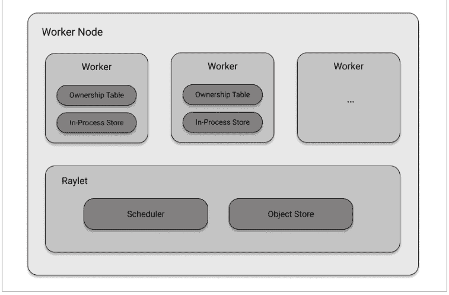

*图 2-2. 构成 Ray 工作节点的系统组件*

#### 头节点

我们已经在第 1 章中指出，每个 Ray 集群都有一个称为头节点的特殊节点。到目前为止，你知道这是拥有驱动程序进程⁸的节点。驱动程序可以自己提交任务，但不能执行它们。你还知道头节点可以有一些工作进程，这对于运行由单个节点组成的本地集群很重要。换句话说，头节点拥有工作节点所拥有的一切（包括一个 Raylet），但它还有一个驱动程序进程。

此外，头节点附带一个称为 *全局控制存储* (GCS) 的组件。GCS 是一个键值存储，目前在 Redis 中实现。它是一个重要的组件，承载着关于集群的全局信息，例如系统级元数据。例如，它有一个包含每个 Raylet 心跳信号的表，以确保它们仍然可达。反过来，Raylet 向 GCS 发送心跳信号以表明它们是活跃的。GCS 还在各自的表中存储 Ray actor 和大对象的位置，并了解对象之间的依赖关系。

8 事实上，它可能有多个驱动程序，但这对于我们的讨论来说并不重要。

#### 分布式调度与执行

让我们简要谈谈集群编排以及节点如何管理、规划和执行任务。在讨论工作节点时，我们已经指出使用 Ray 分发工作负载有几个组件。以下是此过程中涉及的步骤和复杂性的概述。

- **分布式内存**：各个 Raylet 的对象存储在节点上共享其内存。但有时数据需要在节点之间传输，这称为 *分布式对象传输*。这对于远程依赖解析是必需的，以便工作进程拥有运行任务所需的数据。
- **通信**：Ray 集群中的大部分通信，例如对象传输，都通过 `gRPC` 协议进行。
- **资源管理和履行**：在节点上，Raylet 负责授予资源并将工作进程 *租借* 给任务所有者。所有节点上的调度器形成分布式调度器。通过与 GCS 通信，本地调度器了解其他节点的资源。
- **任务执行**：一旦任务被提交执行，其所有依赖项（本地和远程数据）都需要被解析，例如从对象存储中检索大数据，然后才能开始执行。

如果最后几节在技术上看起来有点复杂，那是因为它们确实如此。在我看来，理解你所使用软件的基本模式和想法很重要，但我承认 Ray 架构的细节一开始可能有点难以理解。事实上，Ray 的设计原则之一就是用易用性换取架构复杂性。如果你想深入了解 Ray 的架构，一个好的起点是 [他们的架构白皮书](https://docs.ray.io/en/latest/ray-contribute/whitepaper.html)。

最后，让我们用图 2-3 的简洁架构概述来总结我们所知道的一切：

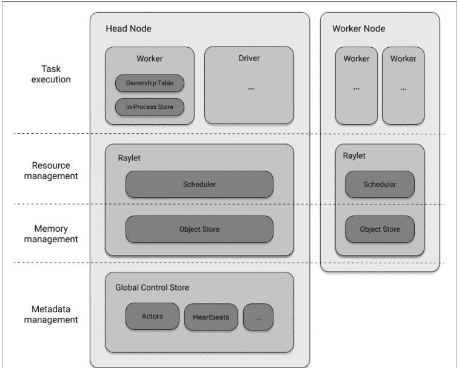

*图 2-3. Ray 架构组件概览*

### 与 Ray 相关的系统

考虑到它的架构和功能，Ray 与其他系统有什么关系？我们不会在这里深入细节，只是粗略地触及最重要的主题。Ray 可以用作 Python 的并行化框架，并与 celery 或 multiprocessing 等工具共享属性。事实上，Ray 中实现了后者的直接替代品。Ray 还与 Spark、Dask、Flink 或 MARS 等数据处理框架相关。我们将在 ??? 中探讨这种关系，届时讨论 Ray 的生态系统。

作为分布式计算工具，Ray 还必须处理集群管理和编排的问题，我们将在 ??? 中看到 Ray 如何与 Kubernetes 等工具相关联。由于 Ray 实现了并发的 actor 模型，探索它与 Akka 等框架的关系也很有趣。最后，由于 Ray 依赖于高性能、低级别的通信 API，它与高性能计算 (HPC) 框架和通信协议（如消息传递接口 (MPI)）存在某种关系。

### 总结

在本章中，你已经看到了 Ray API 基础知识的实际应用。你知道如何将数据放入对象存储，以及如何取回它。此外，你熟悉使用 `@ray.remote` 装饰器将 Python 函数声明为 Ray 任务，并且你知道如何使用 `.remote()` 调用在 Ray 集群上运行它们。同样，你了解如何从 Python 类声明 Ray actor，如何实例化它并利用它进行有状态的分布式计算。

除此之外，你还了解了 Ray 集群的基础知识。在使用 `ray.init(...)` 启动它们之后，你知道你可以向集群提交由任务组成的作业。位于头节点上的驱动程序进程随后会将任务分发给工作节点。每个节点上的 Raylet 将调度任务，工作进程将执行它们。这个对 Ray 核心的快速概览应该能让你开始编写自己的分布式程序，在下一章中，我们将通过一起实现一个基本的机器学习应用程序来测试你的知识。

# 第 3 章

## 构建你的第一个分布式应用程序

> **给早期发布读者的说明**

通过早期发布电子书，你可以在书籍的最早阶段获得内容——作者在写作时的原始未编辑内容——因此你可以在这些书籍正式发布之前很久就利用这些技术。

既然你已经看到了 Ray API 基础知识的实际应用，让我们用它来构建一些更现实的东西。在这个相对较短的章节结束时，你将从头开始构建一个强化学习 (RL) 问题，实现你的第一个算法来解决它，并使用 Ray 任务和 actor 将此解决方案并行化到本地集群——所有这些都在不到 250 行代码内完成。

本章旨在为没有任何强化学习经验的读者设计。我们将处理一个简单的问题，并开发必要的技能来动手解决它。由于第 [第 4 章](第 4 章) 完全致力于这个主题，我们将跳过所有高级 RL 主题和语言，只关注手头的问题。但即使你是一个相当高级的 RL 用户，你也很可能从在分布式环境中实现经典算法中受益。

这是 *仅* 使用 Ray Core 的最后一章。我希望你学会欣赏它的强大和灵活性，以及你可以多快地实现分布式实验，否则这些实验将需要相当大的努力来扩展。

### 设置一个简单的迷宫问题

与前面的章节一样，我鼓励你跟着我一起编写本章代码，并随着我们的进度共同构建这个应用程序。如果你不想这样做，也可以直接参考[本章的笔记本](the notebook for this chapter)。

为了让你有个概念，我们正在构建的应用程序结构如下：

- 你将实现一个简单的二维迷宫游戏，其中单个玩家可以在四个主要方向上移动。
- 你将迷宫初始化为一个5x5的网格，玩家被限制在其中。
- 25个网格单元格中的一个是“目标”，一个被称为“寻找者”的玩家必须到达那里。
- 你不会硬编码一个解决方案，而是将采用强化学习算法，让寻找者学会找到目标。
- 这是通过反复运行迷宫模拟来实现的，奖励寻找者找到目标，并巧妙地跟踪哪些决策对寻找者有效，哪些无效。
- 由于运行模拟可以并行化，我们的强化学习算法也可以并行训练，因此我们利用Ray API来并行化整个过程。

我们还没有准备好将这个应用程序部署到由多个节点组成的实际Ray集群上，所以目前我们将继续使用本地集群。如果你对基础设施主题感兴趣，并想了解如何设置Ray集群，请跳转到???，要查看一个完全部署的Ray应用程序，你可以访问???。

让我们从实现我们刚刚勾勒的二维迷宫开始。思路是在Python中实现一个简单的网格，该网格跨越一个从(0, 0)开始到(4, 4)结束的5x5网格，并正确定义玩家如何在网格中移动。为此，我们首先需要一个在四个基本方向上移动的抽象。这四个动作，即向上、向下、向左和向右移动，可以在Python中编码为一个我们称之为`Discrete`的类。在多个离散动作中移动的抽象非常有用，我们将把它推广到n个方向，而不仅仅是四个。如果你担心的话，这并非过早——我们实际上很快就会需要一个通用的`Discrete`类。

示例 3-1。

```python
import random

class Discrete:
    def __init__(self, num_actions: int):
        """ Discrete action space for num_actions.
        Discrete(4) can be used as encoding moving in one of the cardinal directions.
        """
        self.n = num_actions

    def sample(self):
        return random.randint(0, self.n - 1) ❶

space = Discrete(4)
print(space.sample()) ❷
```

❶ 一个离散动作可以在0到n-1之间均匀采样。
❷ 例如，一个Discrete(4)的采样将给你0、1、2或3。

像本例中这样从Discrete(4)采样将随机返回0、1、2或3。我们如何解释这些数字取决于我们自己，所以让我们按顺序选择“向下”、“向左”、“向右”和“向上”。

现在我们知道如何编码在迷宫中移动了，让我们来编码迷宫本身，包括目标单元格和试图找到目标的寻找者玩家的位置。为此，我们将实现一个名为Environment的Python类。之所以这样命名，是因为迷宫是玩家“生活”的环境。为了简单起见，我们将始终将寻找者放在(0, 0)，目标放在(4, 4)。为了让寻找者移动并找到其目标，我们用一个Discrete(4)的action_space来初始化Environment。

我们还需要为迷宫环境设置最后一个信息，即寻找者位置的编码。原因是我们稍后将实现一个算法，该算法跟踪哪些动作对哪些寻找者位置产生了良好结果。通过将寻找者位置编码为Discrete(5*5)，它变成了一个更容易处理的单个数字。在强化学习术语中，通常将玩家可访问的游戏信息称为观察。因此，类似于我们可以为寻找者执行的动作，我们也可以为其定义一个observation_space。以下是我们刚刚讨论内容的实现：

示例 3-2。

```python
import os

class Environment:
    seeker, goal = (0, 0), (4, 4) ❶
    info = {'seeker': seeker, 'goal': goal}

    def __init__(self, *args, **kwargs):
        self.action_space = Discrete(4) ❷
        self.observation_space = Discrete(5*5) ❸
```

❶ 寻找者初始化在迷宫的左上角，目标在右下角。
❷ 我们的寻找者可以向下、向左、向上和向右移动。
❸ 它总共可以处于25种状态，每种状态对应网格上的一个位置。

请注意，我们还定义了一个info变量，它可以用来打印关于迷宫当前状态的信息，例如用于调试目的。要从寻找者的视角玩一个实际的“寻找目标”游戏，我们必须定义几个辅助方法。显然，当寻找者找到目标时，游戏应被视为“完成”。此外，我们应该奖励寻找者找到目标。当游戏结束时，我们应该能够将其重置为初始状态，以便再次玩。为了完善，我们还定义了一个get_observation方法，该方法返回编码后的寻找者位置。继续我们对Environment类的实现，这转化为以下四个方法。

示例 3-3。

```python
def reset(self): ❶
    """Reset seeker and goal positions, return observations."""
    self.seeker = (0, 0)
    self.goal = (4, 4)

    return self.get_observation()

def get_observation(self):
    """Encode the seeker position as integer"""
    return 5 * self.seeker[0] + self.seeker[1] ❷

def get_reward(self):
    """Reward finding the goal"""
    return 1 if self.seeker == self.goal else 0 ❸

def is_done(self):
    """We're done if we found the goal"""
    return self.seeker == self.goal ❹
```

❶ 要玩一个新游戏，我们必须将网格重置为其原始状态。
❷ 将寻找者元组转换为环境observation_space中的一个值。
❸ 只有当寻找者到达目标时才会获得奖励。
❹ 如果寻找者在目标位置，游戏结束。

要实现的最后一个关键方法是step方法。想象一下，你正在玩我们的迷宫游戏，并决定向右移动作为你的下一步。step方法将接受这个动作（即3，是“向右”的编码）并将其应用于游戏的内部状态。为了反映发生了什么变化，step方法将返回寻找者的观察、其奖励、游戏是否结束以及游戏的info值。以下是step方法的工作原理：

示例 3-4。

```python
def step(self, action):
    """Take a step in a direction and return all available information."""
    if action == 0:  # move down
        self.seeker = (min(self.seeker[0] + 1, 4), self.seeker[1])
    elif action == 1:  # move left
        self.seeker = (self.seeker[0], max(self.seeker[1] - 1, 0))
    elif action == 2:  # move up
        self.seeker = (max(self.seeker[0] - 1, 0), self.seeker[1])
    elif action == 3:  # move right
        self.seeker = (self.seeker[0], min(self.seeker[1] + 1, 4))
    else:
        raise ValueError("Invalid action")

    return self.get_observation(), self.get_reward(), self.is_done(), self.info ❶
```

❶ 在指定方向上迈出一步后，我们返回观察、奖励、是否完成以及任何我们可能觉得有用的额外信息。

我说step方法是最后一个关键方法，但我们实际上还想定义另一个辅助方法，它对于可视化游戏和帮助我们理解游戏非常有用。这个render方法会将游戏的当前状态打印到命令行。

示例 3-5。

```python
def render(self, *args, **kwargs):
    """Render the environment, e.g. by printing its representation."""
    os.system('cls' if os.name == 'nt' else 'clear') ❶
    grid = [['| ' for _ in range(5)] + ['|\n'] for _ in range(5)]
    grid[self.goal[0]][self.goal[1]] = '|G'
    grid[self.seeker[0]][self.seeker[1]] = '|S' ❷
    print(''.join([''.join(grid_row) for grid_row in grid])) ❸
```

❶ 首先我们清除屏幕。

### 构建模拟

在实现了 `Environment` 类之后，要解决“教会”探索者玩好游戏的问题，需要什么？如何才能在最少的8步内持续找到目标？我们为迷宫环境配备了奖励信息，这样探索者就能利用这个信号来学习玩游戏。在强化学习中，你会反复玩游戏，并从过程中获得的经验中学习。游戏的玩家通常被称为*智能体*，它在环境中执行*动作*，观察其*状态*并获得*奖励*。¹ 智能体学得越好，它就越擅长解读当前的游戏状态（观察），并找到能带来更丰厚回报的动作。

无论你想使用哪种强化学习算法（如果你知道的话），你都需要一种方法来反复模拟游戏，以收集经验数据。因此，我们稍后将实现一个简单的 `Simulation` 类。

我们继续进行所需的另一个有用的抽象是 `Policy`，即指定动作的方式。目前，我们玩这个游戏唯一能做的就是为我们的探索者随机采样动作。`Policy` 允许我们做的是为当前游戏状态获取更好的动作。事实上，我们定义一个 `Policy` 为一个类，它有一个 `get_action` 方法，该方法接受一个游戏状态并返回一个动作。

请记住，在我们的游戏中，探索者在网格上总共有25种可能的状态，并可以执行4种动作。一个简单的想法是查看状态-动作对，并为每对分配一个值：如果在该状态下执行此动作能带来高奖励，则赋予高值；否则赋予低值。例如，根据你对游戏的直觉，向下或向右走总是一个好主意，而向左或向上走则不是。然后，创建一个25x4的查找表，包含所有可能的状态-动作对，并将其存储在我们的 `Policy` 中。这样，我们就可以简单地要求我们的策略在给定状态下返回任何动作中的最高值。当然，实现一个算法来为这些状态-动作对找到好的值才是具有挑战性的部分。让我们先实现这个策略的想法，稍后再考虑合适的算法。

示例 3-7。

```python
class Policy:

    def __init__(self, env):
        """A Policy suggests actions based on the current state.
        We do this by tracking the value of each state-action pair.
        """
        self.state_action_table = [
            [0 for _ in range(env.action_space.n)]for _ in range(env.observation_space.n)
        ]
        self.action_space = env.action_space

    def get_action(self, state, explore=True, epsilon=0.1):
        """Explore randomly or exploit the best value currently available."""
        if explore and random.uniform(0, 1) < epsilon:
            return self.action_space.sample()
        return np.argmax(self.state_action_table[state])
```

1. 我们定义了一个嵌套列表，用于存储每个状态-动作对的值，初始化为零。
2. 根据需要，我们可以探索随机动作，这样就不会陷入次优行为。
3. 有时我们可能想在游戏中随机探索动作，这就是为什么我们在 `get_action` 方法中引入了一个 `explore` 参数。默认情况下，这种情况发生的概率是10%。

给定当前状态，我们返回查找表中值最高的动作。

我在策略定义中悄悄加入了一个可能有点令人困惑的实现细节。`get_action` 方法有一个 `explore` 参数。这样做的原因是，如果你学到了一个极其糟糕的策略，例如一个总是让你向左移动的策略，你就永远没有机会找到更好的解决方案。换句话说，有时你需要探索新的方法，而不是“利用”你当前对游戏的理解。如前所述，我们还没有讨论如何学习改进我们策略中 `state_action_table` 的值。目前，只需记住策略在模拟迷宫游戏时为我们提供了想要遵循的动作。

回到我们之前谈到的 `Simulation` 类，模拟应该接受一个 `Environment` 并计算给定 `Policy` 的动作，直到达到目标并结束游戏。当我们像这样“展开”一个完整游戏时观察到的数据，就是我们所说获得的经验。因此，我们的 `Simulation` 类有一个 `rollout` 方法，它计算一个完整游戏的经验并返回它们。`Simulation` 类的实现如下所示：

示例 3-8。

```python
class Simulation(object):
    def __init__(self, env):
        """Simulates rollouts of an environment, given a policy to follow."""
        self.env = env

    def rollout(self, policy, render=False, explore=True, epsilon=0.1): ❶
        """Returns experiences for a policy rollout."""
        experiences = []
        state = self.env.reset() ❷
        done = False
        while not done:
            action = policy.get_action(state, explore, epsilon) ❸
            next_state, reward, done, info = self.env.step(action) ❹
            experiences.append([state, action, reward, next_state]) ❺
            state = next_state
            if render: ❻
                time.sleep(0.05)
                self.env.render()

        return experiences
```

❶ 我们通过遵循策略的动作来计算游戏的“展开”，并且可以选择渲染模拟。
❷ 为了确保，在每次展开之前，我们重置环境。
❸ 传入的策略驱动我们采取的动作。`explore` 和 `epsilon` 参数被传递下去。
❹ 我们通过应用策略的动作在环境中逐步推进。
❺ 我们将一个经验定义为（状态，动作，奖励，下一个状态）四元组。
❻ 可选地在每一步渲染环境。

请注意，我们在一次展开中收集的经验的每个条目都包含四个值：当前状态、采取的动作、获得的奖励和下一个状态。我们即将实现的算法将使用这些经验来从中学习。其他算法可能会使用其他的经验值，但这些是我们继续进行所需的。

---

2. 然后我们绘制网格，并将目标标记为 G，探索者标记为 S。
3. 然后通过将其打印到屏幕上来渲染网格。

很好，现在我们已经完成了定义我们二维迷宫游戏的 `Environment` 类的实现。我们可以逐步进行这个游戏，知道何时结束并再次重置它。游戏的玩家，即探索者，也可以观察其环境，并因找到目标而获得奖励。

让我们使用这个实现来玩一个探索者简单地采取随机动作的寻宝游戏。这可以通过创建一个新的 `Environment`，对其采样并应用动作，并渲染环境直到游戏结束来完成：

示例 3-6。

```python
import time

environment = Environment()

while not environment.is_done():
    random_action = environment.action_space.sample() ❶
    environment.step(random_action)
    time.sleep(0.1)
    environment.render() ❷
```

❶ 我们可以通过应用采样动作来测试我们的环境，直到完成。
❷ 为了可视化环境，我们在等待十分之一秒后渲染它（否则代码运行太快，无法跟上）。

如果你在电脑上运行这个，最终你会看到游戏结束，探索者找到了目标。如果你运气不好，可能需要一段时间。

如果你反对说这是一个极其简单的问题，解决它只需要总共8步，即任意顺序向右和向下各走四次，我并不与你争论。关键在于我们想使用机器学习来解决这个问题，以便以后能够处理更困难的问题。具体来说，我们想实现一个算法，仅通过反复玩游戏就能自己弄清楚如何玩：观察发生了什么，决定下一步做什么，并因你的动作而获得奖励。

如果你想的话，现在是自己让游戏变得更复杂的好时机。只要你不改变我们为 `Environment` 类定义的接口，你可以用多种方式修改这个游戏。这里有一些建议：

- 将其设为10x10的网格，或随机化探索者的初始位置。
- 使网格的外墙变得危险。每当你试图触碰它们时，你会获得-100的奖励，即严厉的惩罚。
- 在网格中引入探索者无法通过的障碍物。

如果你真的想冒险，你也可以随机化目标位置。这需要格外小心，因为目前探索者通过 `get_observation` 方法没有关于目标位置的信息。也许在你读完本章后再来处理这最后一个练习。

---

¹ 正如我们将在第4章看到的，你也可以在多人游戏中运行强化学习。将迷宫环境变成所谓的多智能体环境，其中多个探索者竞争目标，是一个有趣的练习。

现在我们有一个尚未学习任何内容的策略，但已经可以测试其接口是否正常工作。让我们通过初始化一个 Simulation 对象，对一个不太聪明的 Policy 调用其 rollout 方法，然后打印其 state_action_table 来尝试一下：

示例 3-9。

```
untrained_policy = Policy(environment)
sim = Simulation(environment)

exp = sim.rollout(untrained_policy, render=True, epsilon=1.0) ①
for row in untrained_policy.state_action_table:
    print(row) ②
```

+   ① 我们使用一个“未经训练”的策略进行一次完整的游戏推演，并渲染画面。
② 状态-动作值目前全部为零。

如果你觉得自上一节以来我们没有取得太大进展，我可以向你保证，事情会在下一节变得清晰起来。设置 Simulation 和 Policy 的准备工作对于正确构建问题是必要的。现在唯一剩下的就是设计一种聪明的方法，根据我们收集的经验来更新策略的内部状态，使其真正学会玩迷宫游戏。

### 训练强化学习模型

假设我们从几场游戏中收集了一组经验。更新策略中 state_action_table 值的聪明方法是什么？这里有一个想法。假设你位于位置 (3,5)，你决定向右走，这使你到达 (4,5)，距离目标只有一步之遥。显然，在这种情况下，你可以直接向右走并获得 1 的奖励。这一定意味着你当前所处的状态加上向“右”的动作应该具有高价值。换句话说，这个特定的状态-动作对的值应该很高。相比之下，在相同情况下向左移动不会带来任何结果，相应的状态-动作对应该具有低价值。

更一般地说，假设你处于一个给定的状态，你决定采取一个动作，获得一个奖励，然后你进入 next_state。请记住，这就是我们定义经验的方式。通过我们的 policy.state_action_table，我们可以稍微向前看，看看是否可以期望从 next_state 采取的行动中获得任何收益。也就是说，我们可以计算

```
next_max = np.max(policy.state_action_table[next_state])
```

我们应该如何将这个值的知识与当前的状态-动作值（即 value = policy.state_action_table[state][action]）进行比较？有很多方法可以处理这个问题，但我们显然不能完全丢弃当前值并过度信任 next_max。毕竟，这只是我们在这里使用的一个单一经验。因此，作为初步近似，为什么不简单地计算旧值和预期值的加权和，然后采用 new_value = 0.9 * value + 0.1 * next_max 呢？这里，0.9 和 0.1 这两个值的选择有些随意，唯一重要的是第一个值足够高，以反映我们保留旧值的偏好，并且两个权重之和为 1。这个公式是一个很好的起点，但问题在于我们完全没有考虑从奖励中获得的关键信息。事实上，我们应该比预测的 next_max 值更信任当前的奖励值，因此对后者进行一点折扣是个好主意，比如打九折。更新状态-动作值将如下所示：

```
new_value = 0.9 * value + 0.1 * (reward + 0.9 * next_max)
```

根据你对这种推理的经验水平，最后几段可能需要消化很多。好消息是，如果你已经理解了到目前为止的解释，本章的其余部分对你来说可能会很容易。从数学上讲，这是本示例中最后一个（也是唯一一个）难点。如果你以前使用过 RL，你到现在应该已经注意到这是所谓的 Q-Learning 算法的实现。它之所以这样命名，是因为状态-动作表可以被描述为一个函数 Q(state, action)，该函数返回这些对的值。

我们快完成了，所以让我们通过为策略和收集的经验实现一个 update_policy 函数来形式化这个过程：

示例 3-10。

```
import numpy as np

def update_policy(policy, experiences, weight=0.1, discount_factor=0.9):
    """Updates a given policy with a list of (state, action, reward, state) experiences."""
    for state, action, reward, next_state in experiences: ①
        next_max = np.max(policy.state_action_table[next_state]) ②
        value = policy.state_action_table[state][action] ③
        new_value = (1 - weight) * value + weight * (reward + discount_factor * next_max) ④
        policy.state_action_table[state][action] = new_value ⑤
```

+   1. 我们按顺序遍历所有经验。
2. 然后我们选择下一个状态中所有可能动作的最大值。
3. 然后我们提取当前的状态-动作值。
4. 新值是旧值和预期值的加权和，预期值是当前奖励和折扣后的 next_max 之和。
5. 更新后，我们设置新的 state_action_table 值。

有了这个函数，训练策略以做出更好的决策就变得非常简单。我们可以使用以下过程：

- 初始化一个策略和一个模拟。
- 多次运行模拟，假设总共运行 10000 次。
- 对于每场游戏，首先通过运行一次推演来收集经验。
- 然后通过调用 update_policy 来更新收集到的经验的策略。

就是这样！下面的 train_policy 函数直接实现了上述过程。

示例 3-11。

```
def train_policy(env, num_episodes=10000, weight=0.1, discount_factor=0.9):
    """Training a policy by updating it with rollout experiences."""
    policy = Policy(env)
    sim = Simulation(env)
    for _ in range(num_episodes):
        experiences = sim.rollout(policy) ①
        update_policy(policy, experiences, weight, discount_factor) ②

    return policy

trained_policy = train_policy(environment) ③
```

+   ① 为每场游戏收集经验。
② 用这些经验更新我们的策略。
③ 最后，为我们之前的环境训练并返回一个策略。

请注意，在 RL 文献中，对迷宫游戏进行一次完整游玩的高级说法是“episode”。这就是为什么我们在 train_policy 函数中调用参数 num_episodes，而不是 num_games。

#### Q-Learning

我们刚刚实现的 Q-Learning 算法通常是 RL 课程中教授的第一个算法，主要是因为它相对容易理解。你收集并制表经验数据，这些数据显示状态-动作对的效果如何，并根据 Q-learning 更新规则更新表格。

对于具有大量状态或动作的 RL 问题，Q 表可能会变得过大。然后算法变得低效，因为收集所有（相关）状态-动作对的足够经验数据需要太长时间。

解决这个问题的一种方法是使用神经网络来近似 Q 表。我们的意思是，你可以使用深度神经网络来学习一个将状态映射到动作的函数。这种方法被称为 Deep Q-Learning，用于学习的网络被称为 Deep Q-Networks (DQN)。从第 4 章开始，本书将专门使用深度学习来解决 RL 问题。

现在我们有了一个训练好的策略，让我们看看它的表现如何。我们在本章中已经运行了两次随机策略，只是为了了解它们在迷宫问题上的效果如何。但现在让我们在几场游戏中正式评估我们训练好的策略，看看它的平均表现如何。具体来说，我们将运行我们的模拟几个 episode，并计算每个 episode 到达目标所需的步数。所以，让我们实现一个 evaluate_policy 函数来精确地做到这一点：

示例 3-12。

```
def evaluate_policy(env, policy, num_episodes=10):
    """Evaluate a trained policy through rollouts."""
    simulation = Simulation(env)
    steps = 0

    for _ in range(num_episodes):
        experiences = simulation.rollout(policy, render=True, explore=False) ❶
        steps += len(experiences) ❷

    print(f"{steps / num_episodes} steps on average "
          f"for a total of {num_episodes} episodes.")

    return steps / num_episodes

evaluate_policy(environment, trained_policy)
```

❶ 这次我们将 explore 设置为 False，以充分利用训练策略的学习成果。

经验的长度指的是我们完成游戏所采取的步数。

除了看到训练好的策略如我们所愿连续十次轻松解决迷宫问题外，你还应该看到以下提示：

```
8.0 steps on average for a total of 10 episodes.
```

换句话说，训练好的策略能够为迷宫游戏找到最优解。这意味着你已成功从零开始实现了你的第一个强化学习算法！

基于你目前建立的理解，你认为将探索者置于随机起始位置，然后运行这个评估函数是否仍然有效？你何不着手进行必要的修改呢？

另一个值得思考的问题是，我们所使用的算法基于哪些假设。例如，该算法的一个明显前提是所有状态-动作对都可以被制成表格。你认为如果我们有数百万个状态和数千个动作，这还能很好地工作吗？

### 构建分布式 Ray 应用

让我们在这里稍作回顾。如果你是强化学习专家，你会明白我们一直在做什么。如果你是强化学习新手，你可能有点不知所措。如果你介于两者之间，你可能喜欢这个例子，但可能想知道我们目前所做的与 Ray 有何关联。这是一个很好的问题。正如你很快将看到的，要将上述强化学习实验变成一个分布式 Ray 应用，我们只需要编写三个简短的代码片段。这就是我们将要做的：

- 我们创建一个可以远程初始化策略的 Ray 任务。
- 然后我们只需几行代码就将模拟器变成一个 Ray actor。
- 之后我们将 `update_policy` 函数包装在一个 Ray 任务中。
- 最后，我们定义一个与原始版本结构相同的并行版本 `train_policy`。

让我们通过实现一个 `create_policy` 任务和一个名为 `SimulationActor` 的 Ray actor 来完成这个计划的前两个步骤：

示例 3-13。

```python
import ray

ray.init()
environment = Environment()
env_ref = ray.put(environment) ①
```

```python
@ray.remote
def create_policy():
    env = ray.get(env_ref)
    return Policy(env) ②
```

```python
@ray.remote
class SimulationActor(Simulation): ③
    """Ray actor for a Simulation."""
    def __init__(self):
        env = ray.get(env_ref)
        super().__init__(env)
```

① 初始化后，我们将环境放入 Ray 对象存储。
② 这个远程任务返回一个新的 Policy 对象。
③ 这个 Ray actor 以直接的方式包装了我们的 Simulation 类。

基于你在第 2 章建立的 Ray Core 基础，你应该能毫无困难地阅读这段代码。自己编写可能需要一些习惯，但概念上你应该能掌握这个例子。

接下来，让我们定义一个分布式的 `update_policy_task` Ray 任务，然后将所有内容（两个任务和一个 actor）包装在一个 `train_policy_parallel` 函数中，该函数将这个强化学习工作负载分配到你的本地 Ray 集群上：

示例 3-14。

```python
@ray.remote
def update_policy_task(policy_ref, experiences_list):
    """Remote Ray task for updating a policy with experiences in parallel."""
    [update_policy(policy_ref, ray.get(xp)) for xp in experiences_list] ①
    return policy_ref
```

```python
def train_policy_parallel(num_episodes=1000, num_simulations=4):
    """Parallel policy training function."""
    policy = create_policy.remote() ②
    simulations = [SimulationActor.remote() for _ in range(num_simulations)] ③

    for _ in range(num_episodes):
        experiences = [sim.rollout.remote(policy) for sim in simulations] ④
        policy = update_policy_task.remote(policy, experiences) ⑤

    return ray.get(policy) ⑥
```

1.  这个任务通过传递策略引用和从对象存储检索的经验，委托给原始的 `update_policy` 函数。
2.  为了并行训练，我们首先远程创建一个策略，返回一个我们称为 `policy` 的引用。
3.  我们创建四个模拟 actor，而不是一个。
4.  现在经验是从模拟 actor 的远程 rollout 中收集的。
5.  然后我们可以远程更新我们的策略。注意 `experiences` 是一个嵌套的经验列表。
6.  最后，我们通过再次从对象存储中检索来返回训练好的策略。

这使我们能够采取最后一步，并行运行训练过程，然后像之前一样评估结果。

示例 3-15。

```python
parallel_policy = train_policy_parallel()
evaluate_policy(environment, parallel_policy)
```

这两行的结果与之前运行串行版本的强化学习训练迷宫时相同。我希望你欣赏 `train_policy_parallel` 与 `train_policy` 具有完全相同的高级结构。逐行比较两者是一个很好的练习。本质上，要并行化训练过程，只需要以合适的方式使用 `ray.remote` 装饰器三次。当然，你需要一些经验才能正确完成。但请注意，我们在思考分布式计算上花了多少时间，而在实际应用代码上花了多少时间。我们不需要采用全新的编程范式，可以简单地以最自然的方式处理问题。最终，这就是你想要的——而 Ray 非常擅长为你提供这种灵活性。

最后，让我们快速看一下我们刚刚构建的 Ray 应用程序的任务执行图。回顾一下，我们所做的是：

- `train_policy_parallel` 函数创建了几个 `SimulationActor` actor 和一个通过 `create_policy` 创建的策略。
- 模拟 actor 使用策略创建 rollout，从而收集 `update_policy_task` 用于更新策略的经验。
- 这之所以有效，是因为策略更新的设计方式。经验是由一个还是多个模拟收集的并不重要。
- rollout 和更新持续进行，直到达到我们想要训练的 episode 数量，然后返回最终的 `trained_policy`。

图 3-1 以紧凑的方式总结了这个任务图：

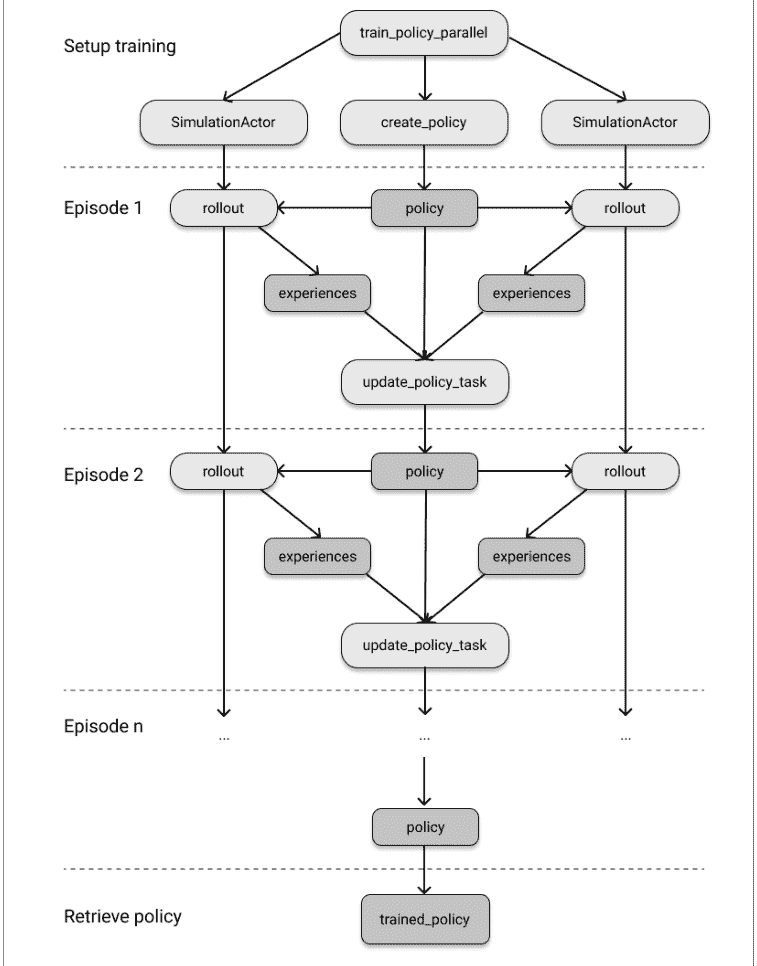

关于本章运行示例的一个有趣旁注是，它是其创建者在初始论文中用于说明 Ray 灵活性的伪代码示例的实现。该论文有一幅类似于图 3-1 的图，值得阅读以了解背景。

### 回顾强化学习术语

在结束本章之前，让我们在更广泛的背景下讨论我们在迷宫示例中遇到的概念。这样做将为你在下一章中处理更复杂的强化学习设置做好准备，并向你展示我们在本章的运行示例中简化了哪些地方。

每个强化学习问题都始于*环境*的表述，它描述了你想玩的“游戏”的动态。环境托管一个玩家或*智能体*，它通过一个简单的接口与其环境交互。智能体可以向环境请求信息，即它在环境中的当前*状态*、在此状态下收到的*奖励*，以及游戏是否*结束*。在观察状态和奖励时，智能体可以学习根据接收到的信息做出决策。具体来说，智能体会发出一个*动作*，环境可以通过执行下一步来执行该动作。

智能体为给定状态产生动作的机制称为*策略*，我们有时会说智能体遵循给定的策略。给定一个策略，我们可以使用该策略模拟或*rollout*几步或整个游戏。在 rollout 期间，我们可以收集*经验*，其中包含关于当前状态和奖励、下一个动作以及由此产生的状态的信息。从开始到结束的整个步骤序列称为一个*episode*，环境可以*重置*为其初始状态以开始新的 episode。

我们在本章中使用的策略基于将*状态-动作值*（也称为 *Q 值*）制成表格的简单想法，而用于根据 rollout 期间收集的经验更新策略的算法称为 *Q 学习*。更一般地说，你可以将我们实现的状态-动作表视为策略使用的*模型*。在下一章中，你将看到更复杂模型的示例，例如用于学习状态-动作值的神经网络。策略可以决定通过选择其模型的最佳可用值来*利用*它对环境的了解，或者通过选择随机动作来*探索*环境。

这里介绍的许多基本概念适用于任何强化学习问题，但我们做了一些简化的假设。例如，可能有*多个智能体*在环境中行动（想象有多个探索者竞争首先到达目标），我们将在下一章研究所谓的多智能体环境和多智能体强化学习。此外，我们假设智能体的*动作空间*是*离散的*，这意味着智能体只能采取固定的一组动作。当然，你也可以具有*连续*动作空间，第1章中的摆锤示例就是其中一个例子。特别是当有多个智能体时，动作空间可能更复杂，你可能需要动作元组，甚至相应地嵌套它们。我们为迷宫游戏考虑的*观察空间*也相当简单，被建模为离散的状态集。你可以很容易地想象到，像机器人这样与环境交互的复杂智能体可能会使用图像或视频数据作为观察，这也将需要更复杂的观察空间。

我们做出的另一个关键假设是环境是*确定性的*，这意味着当我们的智能体选择采取一个行动时，产生的状态总是会反映那个选择。在一般环境中，情况并非如此，环境中可能存在随机性因素。例如，我们本可以在迷宫游戏中实现一个抛硬币，每当出现反面时，智能体就会被推向一个随机方向。在这种情况下，我们无法像本章中那样提前计划，因为行动不会每次都确定性地导致相同的下一个状态。为了反映这种概率行为，通常我们必须在我们的强化学习实验中考虑*状态转移概率*。

我想在这里讨论的最后一个简化假设是，我们一直将环境及其动态视为一个可以完美模拟的游戏。但事实是，有些物理系统无法被忠实地模拟。在这种情况下，你可能仍然通过像我们在Environment类中定义的接口与这个物理环境交互，但会有一些通信开销。实际上，我发现将强化学习问题*推理*为游戏，几乎不会影响体验。

### 总结

回顾一下，我们用纯Python实现了一个简单的迷宫问题，然后使用一个直接的强化学习算法解决了在迷宫中找到目标的任务。接着，我们采用这个解决方案，用大约25行代码将其移植到一个分布式Ray应用程序中。我们这样做时无需计划如何使用Ray——我们只是使用Ray API来并行化我们的Python代码。这个例子展示了Ray如何不干扰你，让你专注于你的应用程序代码。它还演示了如何使用Ray高效地实现和分发使用强化学习等先进技术的自定义工作负载。

在下一章中，你将在此基础上继续学习，并看到使用更高级的Ray RLlib库直接解决我们的迷宫问题是多么容易。

## 第4章

## 使用Ray RLlib进行强化学习

> **给早期发布读者的说明**

通过早期发布电子书，你可以在书籍的最早期形式——作者写作时的原始未编辑内容——中获取书籍，因此你可以在这些书籍正式发布之前很久就利用这些技术。

在上一章中，你构建了一个强化学习环境、一个用于进行一些游戏的模拟、一个强化学习算法以及用于并行化算法训练的代码——全部完全从头开始。了解如何做所有这些事情是好的，但在实践中，当你训练强化学习算法时，你真正想做的唯一事情是第一部分，即指定你的自定义环境，你想要玩的“游戏”¹。然后你的大部分精力将用于选择正确的算法、设置它、为问题找到最佳参数，并总体上专注于训练一个性能良好的算法。

Ray RLlib是一个用于大规模构建强化学习算法的工业级库。你已经在第1章中看到了RLlib的第一个例子，但在本章中我们将更深入地探讨。RLlib的伟大之处在于它是一个成熟的开发者库，并提供了良好的抽象供你使用。正如你将看到的，其中许多抽象你已经在上一章中了解了。

我们本章首先概述RLlib的功能。然后我们快速回顾第3章的迷宫游戏，并向你展示如何用几行代码通过RLlib命令行界面（CLI）和RLlib Python API来解决它。在了解其关键概念（如RLlib环境、算法和训练器）之前，你将看到RLlib入门是多么容易。

我们还将更仔细地研究一些在实践中极其有用，但在其他强化学习库中通常未得到适当支持的高级强化学习主题。例如，你将学习如何为你的强化学习智能体创建一个学习课程，以便它们可以先学习简单的场景，然后再转向更复杂的场景。你还将看到RLlib如何处理单个环境中的多个智能体，以及如何利用你在当前应用程序之外收集的经验数据来提高智能体的性能。

¹ 我们只是用一个简单的游戏来说明强化学习的过程。强化学习有许多有趣且非游戏的行业应用。

### RLlib概述

在深入一些示例之前，让我们快速概述一下RLlib是什么以及它能做什么。作为Ray生态系统的一部分，RLlib继承了Ray的所有性能和可扩展性优势。特别是，RLlib默认是分布式的，因此你可以将你的强化学习训练扩展到任意多的节点。其他强化学习库也可能扩展实验，但通常这样做并不直接。

构建在Ray之上的另一个好处是RLlib与其他Ray库紧密集成。例如，所有RLlib算法都可以通过Ray Tune进行调优，正如我们将在第5章中看到的，你还可以使用Ray Serve无缝部署你的RLlib模型，正如我们将在???中讨论的。

极其有用的是，RLlib在撰写本文时与两种主流深度学习框架（即PyTorch和TensorFlow）兼容。你可以使用其中任何一个作为后端，并且可以轻松地在它们之间切换，通常只需更改一行代码。这是一个巨大的优势，因为公司通常被锁定在其底层深度学习框架中，无法负担切换到另一个系统并重写其代码的代价。

RLlib还有解决现实世界问题的记录，是一个成熟的库，被许多公司用于将其强化学习工作负载投入生产。我经常向工程师推荐RLlib，因为它的API往往对他们有吸引力。原因之一是RLlib API为许多应用程序提供了适当级别的抽象，同时仍然足够灵活，可以在必要时进行扩展。

除了这些更一般的好处之外，RLlib还有许多强化学习特定的功能，我们将在本章中介绍。事实上，RLlib功能如此丰富，值得单独写一本书，因此我们在这里只能涉及其中一些方面。例如，RLlib有一个丰富的高级强化学习算法库可供选择。在本章中，我们将只关注几个精选的算法，但你可以在RLlib算法页面上跟踪不断增长的选项列表。RLlib还有许多指定强化学习环境的选项，并且在训练期间非常灵活地处理它们，参见RLlib环境概述。

### RLlib入门

要使用RLlib，请确保你已在计算机上安装它：

```
pip install "ray[rllib]"==1.9.0
```

与本书的每一章一样，如果你不想自己输入代码来跟随，你可以查看本章的配套[notebook](notebook for this chapter)。

每个强化学习问题都始于有一个有趣的环境来研究。在[第1章](Chapter 1)中，我们已经研究了经典的摆锤平衡问题。回想一下，我们没有实现这个摆锤环境，它是RLlib自带的。

相比之下，在[第3章](Chapter 3)中，我们自己实现了一个简单的迷宫游戏。这个实现的问题在于我们不能直接将其与RLlib或任何其他强化学习库一起使用。原因是在强化学习中，环境有普遍的标准。你的环境需要实现某些接口。最著名和最广泛使用的强化学习环境库是gym，这是OpenAI的一个[开源Python项目](open-source Python project)。

让我们看看gym是什么，以及如何将我们上一章的迷宫Environment变成一个与RLlib兼容的gym环境。

### 构建Gym环境

如果你查看GitHub上文档齐全且易于阅读的gym.Env环境接口，你会注意到这个接口的实现有两个必需的类变量和三个子类需要实现的方法。你不必检查源代码，但我确实鼓励你看看。你可能会惊讶于你已经知道多少关于gym环境的知识。

简而言之，gym环境的接口看起来像以下伪代码：

```python
import gym

class Env:
    action_space: gym.spaces.Space
    observation_space: gym.spaces.Space ①

    def step(self, action): ②
        ...

    def reset(self): ③
        ...

    def render(self, mode="human"): ④
        ...
```

### 运行 RLlib 命令行工具

既然我们已经将 `GymEnvironment` 实现为一个 `gym.Env`，下面介绍如何将其与 RLlib 配合使用。你之前在第一章已经见过 RLlib 命令行工具的实际应用，但这次情况略有不同。在第一章中，我们只是在 YAML 文件中通过*名称*引用了 Pendulum-v1 环境以及其他强化学习训练配置。而这次，我们希望引入自己的 `gym` 环境类，即我们在 `maze_gym_env.py` 中定义的 `GymEnvironment` 类。要在 Ray RLlib 中指定这个类，你需要使用从引用位置开始的完整限定类名，在我们的例子中就是 `maze_gym_env.GymEnvironment`。如果你的 Python 项目更复杂，环境存储在另一个模块中，只需相应地添加模块名即可。

以下 YAML 文件指定了在 `GymEnvironment` 类上训练 RLlib 算法所需的最小配置。为了尽可能贴近我们在第三章中使用 Q-learning 的实验，我们选择 DQN 作为训练运行的算法。同时，为了确保能控制训练时长，我们设置了一个明确的停止条件，即将 `timesteps_total` 设置为 10000。

```yaml
#### maze.yml
maze_env:
    env: maze_gym_env.GymEnvironment ①
    run: DQN
    checkpoint_freq: 1 ②
    stop:
        timesteps_total: 10000 ③
```

- ① 我们在此指定了环境类的相对 Python 路径。
- ② 我们在每次训练迭代后保存模型的检查点。
- ③ 我们还可以指定训练的停止条件，这里是最大 10000 步。

假设你将此配置存储在名为 `maze.yml` 的文件中，现在可以通过运行以下 `train` 命令来启动 RLlib 训练：

```bash
rllib train -f maze.yml
```

这行代码基本上完成了我们在第三章中所做的所有工作，但效果更好。它为我们运行了一个更复杂的 Q-Learning 版本（DQN），在底层自动处理了扩展到多个工作节点的问题，甚至自动为我们创建了算法的检查点。

从该训练脚本的输出中，你应该会看到 Ray 将训练结果写入位于 `~/ray_results/maze_env` 的 `logdir` 目录。在该文件夹内，你会找到另一个以 `DQN_maze_gym_env.GymEnvironment_` 开头的目录，其中包含此实验的标识符（在我的例子中是 0ae8d）以及当前日期和时间。在该目录内，你应该能找到几个以检查点前缀开头的其他子目录。在我计算机上的训练运行中，总共有 10 个可用的检查点，我们使用最后一个（checkpoint_000010/checkpoint-10）来评估我们训练好的 RLlib 算法。根据我机器上生成的文件夹和检查点，你可以使用的 `rllib evaluate` 命令如下所示（请根据你机器上看到的情况调整检查点路径）：

```bash
rllib evaluate ~/ray_results/maze_env/DQN_maze_gym_env.Environment_0ae8d_00000_0_2022-02-08_13-52-59/checkpoint_000010/checkpoint-10 \
    --run DQN \
    --env maze_gym_env.Environment \
    --steps 100
```

`--run` 中使用的算法和 `--env` 指定的环境必须与训练运行中使用的相匹配，我们将训练好的算法评估总共 100 步。这应该会产生如下形式的输出：

```
Episode #1: reward: 1.0
Episode #2: reward: 1.0
Episode #3: reward: 1.0
...
Episode #13: reward: 1.0
```

RLlib 的 DQN 算法在我们为其设定的简单迷宫环境中，每次都能获得最大奖励 1，这应该不会让人感到太意外。

在继续介绍 RLlib 的 Python API 之前，需要指出的是，`train` 和 `evaluate` 命令行工具即使对于更复杂的环境也能派上用场。YAML 配置可以接受 Python API 能接受的任何参数，因此从这个意义上说，在命令行上训练你的实验是没有限制的²。

### 使用 RLlib Python API

话虽如此，你很可能会将大部分时间花在用 Python 编写强化学习实验上。毕竟，RLlib 命令行工具只是我们接下来要介绍的底层 Python 库的一个封装。

要从 Python 使用 RLlib 运行强化学习工作负载，你的主要入口点是 `Trainer` 类。具体来说，对于你选择的算法，你需要使用其对应的 `Trainer`。在我们的例子中，由于我们决定使用深度 Q-Learning（DQN）进行演示，我们将使用 `DQNTrainer` 类。

### 训练 RLlib 模型

RLlib 为其所有 Trainer 实现提供了良好的默认设置，这意味着你可以初始化它们而无需调整这些 Trainer 的任何配置参数³。例如，要生成一个 DQN Trainer，你只需使用 `DQNTrainer(env=GymEnvironment)`。话虽如此，值得注意的是 RLlib Trainer 是高度可配置的，正如你将在以下示例中看到的。具体来说，我们向 Trainer 构造函数传递一个配置字典，并告诉它总共使用四个工作节点。这意味着 DQNTrainer 将生成四个 Ray actor，每个使用一个 CPU 核心，来并行训练我们的 DQN 算法。

在你用想要训练的环境初始化 Trainer 并传入所需的配置后，你只需调用 train 方法。让我们使用此方法总共训练算法十次迭代：

```python
from ray.tune.logger import pretty_print
from maze_gym_env import GymEnvironment
from ray.rllib.agents.dqn import DQNTrainer

trainer = DQNTrainer(env=GymEnvironment, config={"num_workers": 4}) ①

config = trainer.get_config() ②
print(pretty_print(config))

for i in range(10):
    result = trainer.train() ③

print(pretty_print(result)) ④
```

- ① 我们使用 RLlib 的 DQNTrainer 来使用深度 Q 网络（DQN）进行训练，使用 4 个并行工作节点（Ray actor）。
- ② 每个 Trainer 都有一个复杂的默认配置。
- ③ 然后我们可以简单地调用 train 方法来训练智能体十次迭代。
- ④ 使用 pretty_print 工具，我们可以生成训练结果的人类可读输出。

请注意，数字 10 次训练迭代没有特殊含义，但它应该足以让算法学会充分解决迷宫问题。这个例子只是为了向你展示你对训练过程拥有完全的控制权。

> ³ 当然，配置你的模型是强化学习实验的关键部分。我们将在下一节更详细地讨论 RLlib Trainer 的配置。

² 我们应该提到，RLlib 命令行工具在底层使用了 Ray Tune，以及许多其他功能，例如模型检查点。你将在第五章中了解更多关于此集成的信息。

通过打印配置字典，你可以验证 `num_workers` 参数已设置为 4。同样，如果你运行这个训练脚本，`result` 包含关于 `Trainer` 状态和训练结果的详细信息，这些信息过于冗长，不便在此列出。目前对我们来说最相关的部分是关于算法奖励的信息，这有望表明算法已学会解决迷宫问题。你应该会看到如下形式的输出：

```
...
episode_reward_max: 1.0
episode_reward_mean: 1.0
episode_reward_min: 1.0
episodes_this_iter: 15
episodes_total: 19
...
timesteps_total: 10000
training_iteration: 10
...
```

特别是，此输出显示每个回合平均获得的最小奖励为 1.0，这反过来意味着智能体总是能够到达目标并获得最大奖励（1.0）。

### 保存、加载和评估 RLlib 模型

对于这个简单的例子，达到目标并不太难，但让我们看看评估训练后的算法是否能确认智能体也能以最优方式做到这一点，即仅通过最少的八步到达目标。

为此，我们利用另一个你已经从 RLlib CLI 中见过的机制，即*检查点*。创建模型检查点非常有用，可以确保在崩溃时恢复你的工作，或者简单地持久跟踪训练进度。你可以在训练过程中的任何时候通过调用 `trainer.save()` 来创建 RLlib 训练器的检查点。一旦你有了检查点，就可以轻松地用它来恢复你的 Trainer。评估模型就像调用 `trainer.evaluate(checkpoint)` 并传入你创建的检查点一样简单。以下是将它们组合在一起的样子：

```
checkpoint = trainer.save() ①
print(checkpoint)

evaluation = trainer.evaluate(checkpoint) ②
print(pretty_print(evaluation))

restored_trainer = DQNTrainer(env=GymEnvironment)
restored_trainer.restore(checkpoint) ③
```

- ① 你可以保存训练器以创建检查点。
- ② RLlib 训练器可以在你的检查点处进行评估。
- ③ 你也可以从给定的检查点恢复任何 Trainer。

我应该提到，你也可以直接调用 `trainer.evaluate()` 而无需先创建检查点，但通常使用检查点是良好的实践。查看输出，我们现在可以确认训练后的 RLlib 算法确实收敛到了迷宫问题的一个良好解决方案，这由评估中长度为 8 的回合所表明：

```
~/ray_results/DQN_GymEnvironment_2022-02-09_10-19-301o3m9r6d/checkpoint_000010/
checkpoint-10 evaluation:
...
episodes_this_iter: 5
hist_stats:
  episode_lengths:
  - 8
  - 8
  ...
```

#### 计算动作

RLlib 训练器的功能远不止我们目前看到的训练、评估、保存和恢复方法。例如，你可以根据环境的当前状态直接计算动作。在第 3 章中，我们通过逐步执行环境并收集奖励来实现回合展开。我们可以轻松地用 RLlib 为我们的 GymEnvironment 做同样的事情，如下所示：

```
env = GymEnvironment()
done = False
total_reward = 0
observations = env.reset()

while not done:
    action = trainer.compute_single_action(observations) ①
    observations, reward, done, info = env.step(action)
    total_reward += reward
```

- ① 要为给定的观测计算动作，请使用 `compute_single_action`。

如果你需要一次计算多个动作，而不仅仅是一个，你可以改用 `compute_actions` 方法，该方法以观测字典作为输入，并生成具有相同字典键的动作字典作为输出。

```
action = trainer.compute_actions({"obs_1": observations, "obs_2": observations})
print(action)
##### {'obs_1': 0, 'obs_2': 1}
```

### 访问策略和模型状态

请记住，每个强化学习算法都基于一个*策略*，该策略根据智能体对环境的当前观测选择下一个动作。每个策略又基于一个底层*模型*。

在我们第 3 章讨论的普通 Q-Learning 中，模型是一个简单的状态-动作值查找表，也称为 Q 值。该策略使用此模型来预测下一个动作，如果它决定*利用*模型到目前为止学到的东西，否则就用随机动作*探索*环境。

当使用深度 Q-Learning 时，策略的底层模型是一个神经网络，粗略地说，它将观测映射到动作。请注意，为了在环境中选择下一个动作，我们最终并不关心近似 Q 值的具体值，而是关心采取每个动作的*概率*。所有可能动作上的概率分布称为*动作分布*。在我们这里作为运行示例的迷宫示例中，我们可以向上、向右、向下或向左移动，因此在这种情况下，动作分布是一个包含四个概率的向量，每个动作一个。

为了具体说明，让我们看看如何在 RLlib 中访问策略和模型：

```
policy = trainer.get_policy()
print(policy.get_weights())

model = policy.model
```

策略和模型都有许多有用的方法可以探索。在这个例子中，我们使用 get_weights 来检查策略底层模型的参数（按照标准惯例，这些参数被称为“权重”）。

为了让你相信这里实际上不仅仅有一个模型在起作用，而是实际上有四个模型的集合，我们在单独的 Ray worker 上训练了它们，我们可以访问训练中使用的所有 worker - 然后像这样向每个 worker 的策略请求它们的权重：

```
workers = trainer.workers
workers.foreach_worker(lambda remote_trainer: remote_trainer.get_policy().get_weights())
```

通过这种方式，你可以访问每个 worker 上 Trainer 实例的每个可用方法。原则上，你也可以用它来*设置*模型参数，或者以其他方式配置你的 worker。RLlib worker 最终是 Ray actor，所以你几乎可以以任何你喜欢的方式修改和操作它们。

我们还没有讨论 DQNTrainer 中使用的深度 Q-Learning 的具体实现，但所使用的模型实际上比我到目前为止描述的要复杂一些。从策略获得的每个 RLlib 模型都有一个 base_model，它有一个简洁的 summary 方法来描述自身：

```
model.base_model.summary()
```

从下面的输出可以看出，该模型接收我们的观测。这些观测的形状被奇怪地标注为 [(None, 25)]，但这本质上只是意味着我们正确编码了预期的 5*5 迷宫网格值。模型随后是两个所谓的全连接层，并在最后预测一个单一值。

```
Model: "model"

Layer (type)                Output Shape              Param #   Connected to
==============================================================================
observations (InputLayer)   [(None, 25)]              0

fc_1 (Dense)                (None, 256)               6656      observations[0][0]

fc_out (Dense)              (None, 256)               65792     fc_1[0][0]

value_out (Dense)           (None, 1)                 257       fc_1[0][0]
==============================================================================
Total params: 72,705
Trainable params: 72,705
Non-trainable params: 0
```

请注意，完全有可能为你的 RLlib 实验定制此模型。例如，如果你的环境相当复杂且具有很大的观测空间，你可能需要一个更大的模型来捕捉这种复杂性。然而，这样做需要深入了解底层的神经网络框架（在本例中为 TensorFlow），我们不假设你具备这些知识。

> ## 状态-动作值和状态值函数

到目前为止，我们一直非常关注状态-动作值的概念，因为这个概念在 Q-Learning 的公式中占据核心地位，而我们在本章和上一章中广泛使用了 Q-Learning。

5 如果你想了解更多关于定制你的 RLlib 模型的信息，请查看 Ray 文档中的自定义模型指南。

我们刚刚查看的模型有一个专门的输出，在深度学习术语中称为*头*，用于预测Q值。你可以通过 `model.q_value_head.summary()` 访问并总结模型的这一部分。

与此相对，我们也可以询问一个特定*状态*的价值，而无需指定与之配对的动作。这引出了状态价值函数，或简称价值函数的概念，这在强化学习文献中非常重要。在这个RLlib简介中，我们无法深入更多细节，但请注意，你也可以通过 `model.state_value_head.summary()` 访问一个*价值函数头*。

接下来，让我们看看是否可以从环境中获取一些观测值，并将它们传递给我们刚刚从策略中提取的模型。这部分在技术上有点复杂，因为在RLlib中直接访问模型稍微困难一些。原因是通常你只能通过策略与模型交互，策略负责预处理观测值并将其传递给模型（以及其他事情）。

幸运的是，我们可以简单地访问策略使用的预处理器，转换来自环境的观测值，然后将它们传递给模型：

```
from ray.rllib.models.preprocessors import get_preprocessor
env = GymEnvironment()
obs_space = env.observation_space
preprocessor = get_preprocessor(obs_space)(obs_space) ❶

observations = env.reset()
transformed = preprocessor.transform(observations).reshape(1, -1) ❷

model_output, _ = model.from_batch({"obs": transformed}) ❸
```

- ❶ 你可以使用 `get_preprocessor` 来访问策略使用的预处理器。
- ❷ 对于从你的环境中获得的任何观测值，你可以使用 `transform` 将它们转换为模型期望的格式。注意，我们还需要重塑观测值。
- ❸ 通过在预处理后的观测字典上使用模型的 `from_batch` 方法，你可以获得模型输出。

计算出我们的 `model_output` 后，我们现在既可以访问Q值，也可以访问模型针对此输出的动作分布，如下所示：

```
q_values = model.get_q_value_distributions(model_output) ❶
print(q_values)

action_distribution = policy.dist_class(model_output, model) ❷
sample = action_distribution.sample()
print(sample)
```

- ❶ `get_q_value_distributions` 方法仅适用于DQN模型。
- ❷ 通过访问 `dist_class`，我们获得了策略的动作分布类。
- ❸ 动作分布可以被采样。

### 配置RLlib实验

既然你已经通过一个示例了解了RLlib的基本Python训练API，让我们退一步，更深入地讨论如何配置和运行RLlib实验。到现在为止，你知道你的Trainer接受一个config参数，到目前为止我们只用它来将Ray workers的数量设置为4。

如果你想改变RLlib训练运行的行为，方法就是改变Trainer的config参数。这同时相对简单，因为你可以快速添加配置属性，但也有些棘手，因为你必须知道config字典期望哪些关键字。一旦你很好地掌握了有哪些可用选项以及预期效果，找到并调整正确的配置属性就会变得更容易。

RLlib配置分为两部分，即特定于算法的配置和通用配置。到目前为止，我们在示例中使用DQN作为我们的算法，它具有某些仅适用于此选择的属性⁶。特定于算法的配置只有在你确定了算法并想要优化其性能时才变得更加相关，但在实践中，RLlib为你提供了良好的默认设置来入门。你可以在 [RLlib算法的API参考](https://docs.ray.io/en/latest/rllib/rllib-training.html#common-parameters) 中查找配置参数。

算法的通用配置可以进一步分为以下类型。

#### 资源配置

无论你是在本地还是在集群上使用Ray RLlib，你都可以指定用于训练过程的资源。以下是需要考虑的最重要选项：

⁶ 对于专家来说，我们的DQN是通过默认参数 "dueling": True 和 "double_q": True 实现的决斗双Q学习模型。

- `num_gpus`：指定用于训练的GPU数量。首先检查你选择的算法是否支持GPU很重要。这个值也可以是小数。例如，如果在DQN中使用四个rollout workers（`num_workers = 4`），你可以设置 `num_gpus=0.25`，将所有四个workers打包到同一个GPU上，这样所有训练器都能从潜在的加速中受益。
- `num_cpus_per_worker`：设置每个worker使用的CPU数量。

#### 调试和日志配置

调试你的应用程序对任何项目都至关重要，机器学习也不例外。RLlib允许你配置它记录信息的方式以及你如何访问这些信息。

- `log_level`：设置要使用的日志级别。可以是DEBUG、INFO、WARN或ERROR，默认为WARN。你应该尝试不同的级别，看看在实践中哪个最适合你的需求。
- `callbacks`：你可以指定在训练期间各个点调用的自定义回调函数。我们将在第5章更仔细地探讨这个主题。
- `ignore_worker_failures`：对于测试，将此属性设置为True（默认为False）以忽略worker失败可能很有用。
- `logger_config`：你可以指定一个自定义的日志记录器配置，作为嵌套字典传入。

#### Rollout Worker和评估配置

当然，你也可以指定在训练和评估期间用于rollout的worker数量。

- `num_workers`：你已经见过这个了。它用于指定要使用的Ray worker数量。
- `num_envs_per_worker`：指定每个worker评估的环境数量。此设置允许你“批量”评估环境。特别是，如果你的模型评估时间很长，像这样对环境进行分组可以加速训练。
- `create_env_on_driver`：如果你将 `num_workers` 至少设置为1，那么驱动程序进程就不需要创建环境，因为有rollout workers负责这个。如果你将此属性设置为True，你会在驱动程序上创建一个额外的环境。
- `explore`：默认设置为True，此属性允许你关闭探索，例如在评估你的算法时。
- `evaluation_num_workers`：指定要使用的并行评估worker数量，默认为0。

#### 环境配置

- `env`：指定你想要用于训练的环境。这可以是Ray RLlib已知环境的字符串，例如任何gym环境，或者你实现的自定义环境的类名。还有一种方法可以注册你的环境，以便你可以通过名称引用它们，但这需要使用Ray Tune。我们将在第5章学习这个功能。
- `observation_space` 和 `action_space`：你可以指定环境的观测空间和动作空间。如果你不指定它们，它们将从环境中推断出来。
- `env_config`：你可以选择性地为你的环境指定一个配置选项字典，该字典将传递给环境构造函数。
- `render_env`：默认为False，此属性允许你开启环境渲染，这需要你实现环境的 `render` 方法。

请注意，我们省略了我们列出的每种类型的许多可用配置选项。除此之外，还有一类通用配置选项可以修改RL训练过程的行为，例如修改要使用的底层模型。从某种意义上说，这些属性是最重要的，同时需要最具体的强化学习知识。对于这个RLlib简介，我们无法深入更多细节。但好消息是，如果你是RL软件的常规用户，你将能够轻松识别相关的训练配置选项。

### 使用 RLlib 环境

到目前为止，我们只向您介绍了 gym 环境，但 RLlib 支持多种多样的环境。在快速概述所有可用选项之后，我们将向您展示两个高级 RLlib 环境的实际应用示例。

#### RLlib 环境概述

所有可用的 RLlib 环境都扩展了一个共同的 BaseEnv 类。如果您想使用同一个 gym.Env 环境的多个副本，可以使用 RLlib 的 VectorEnv 包装器。向量化环境很有用，但也是对您已经见过的内容的简单推广。RLlib 中可用的另外两种环境类型更有趣，也更值得关注。

第一种称为 MultiAgentEnv，它允许您训练一个包含多个智能体的模型。使用多个智能体可能很棘手，因为您必须注意在环境中为您的智能体定义合适的接口，并考虑到每个智能体可能与其环境交互的方式完全不同。更重要的是，智能体之间可能会相互交互，并且必须尊重彼此的动作。在更高级的设置中，甚至可能存在一个显式相互依赖的智能体层次结构。简而言之，运行多智能体强化学习实验是困难的，我们将在下一个示例中看到 RLlib 如何处理这个问题。

我们将要研究的另一种环境类型称为 ExternalEnv，可用于将外部模拟器连接到 RLlib。例如，想象一下我们之前简单的迷宫问题是一个实际机器人在迷宫中导航的模拟。在这种场景下，将机器人（或其在不同软件栈中实现的模拟）与 RLlib 的学习智能体放在一起可能并不合适。为此，RLlib 为您提供了一个简单的客户端-服务器架构，用于与外部模拟器通信，允许通过 REST API 进行通信。

在图 4-1 中，我们为您总结了所有可用的 RLlib 环境：

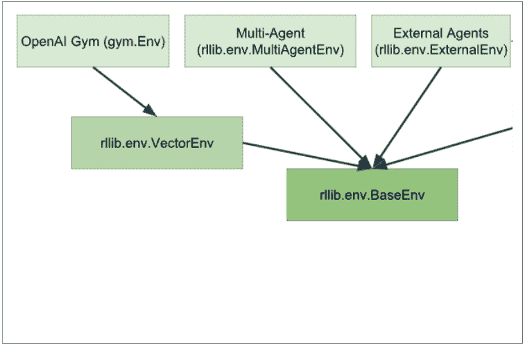

图 4-1. 所有可用 RLlib 环境概述

#### 使用多个智能体

在 RLlib 中定义多智能体环境的基本思想很简单。无论您在 gym 环境中定义为单个值的内容，现在都定义为一个字典，其中包含每个智能体的值，并且每个智能体都有其唯一的键。当然，实际细节比这稍微复杂一些。但是一旦您定义了一个托管多个智能体的环境，接下来需要定义的是这些智能体应该如何学习。

在单智能体环境中，有一个智能体和一个策略需要学习。在多智能体环境中，有多个智能体可能映射到一个或多个策略。例如，如果您环境中有一组同质智能体，那么您可以为它们所有定义一个单一策略。如果它们都以相同的方式*行动*，那么它们的行为可以以相同的方式学习。相反，您可能会遇到异质智能体的情况，其中每个智能体都必须学习一个单独的策略。在这两种极端情况之间，存在一系列可能性，如图 4-2 所示：

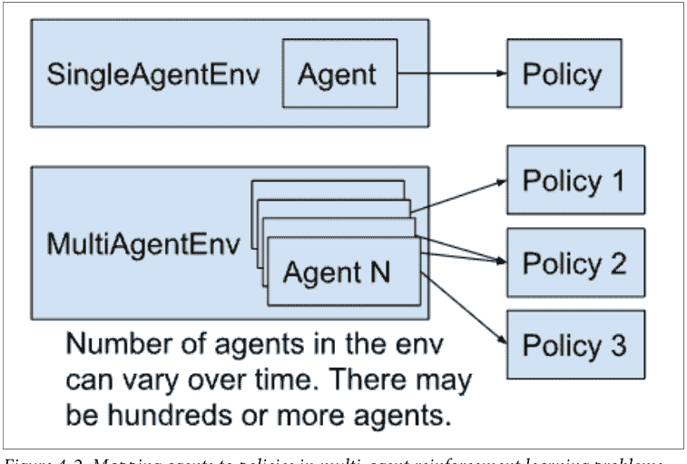

图 4-2. 多智能体强化学习问题中智能体到策略的映射

我们继续使用我们的迷宫游戏作为本章的运行示例。这样您就可以自己检查接口在实践中是如何不同的。因此，为了将我们刚刚概述的想法转化为代码，让我们定义一个 GymEnvironment 类的多智能体版本。我们的 MultiAgentEnv 类将恰好有两个智能体，我们将其编码在一个名为 agents 的 Python 字典中，但原则上这适用于任意数量的智能体。我们首先初始化并重置我们的新环境：

```python
from ray.rllib.env.multi_agent_env import MultiAgentEnv
from gym.spaces import Discrete
import os
```

```python
class MultiAgentMaze(MultiAgentEnv):

    agents = {1: (4, 0), 2: (0, 4)} ①
    goal = (4, 4)
    info = {1: {'obs': agents[1]}, 2: {'obs': agents[2]}} ②

    def __init__(self, *args, **kwargs): ③
        self.action_space = Discrete(4)
        self.observation_space = Discrete(5*5)

    def reset(self):
        self.agents = {1: (4, 0), 2: (0, 4)}
        return {1: self.get_observation(1), 2: self.get_observation(2)}
```

① 我们现在有一个 agents 字典，其中包含两个起始位置分别为 (0, 4) 和 (4, 0) 的搜索者。

② 对于 info 对象，我们使用智能体 ID 作为键。

③ 动作空间和观察空间与之前完全相同。

④ 观察现在是按智能体划分的字典。

请注意，与单智能体情况相比，我们既不需要修改动作空间也不需要修改观察空间，因为我们这里使用的是两个本质上相同的智能体，它们可以使用相同的空间。在更复杂的情况下，您必须考虑到某些智能体的动作和观察可能看起来不同。

接下来，让我们将辅助方法 get_observation、get_reward 和 is_done 泛化以处理多个智能体。我们通过在它们的签名中传入一个 agent_id 并以与之前相同的方式处理每个智能体来实现这一点。

```python
def get_observation(self, agent_id):
    seeker = self.agents[agent_id]
    return 5 * seeker[0] + seeker[1]

def get_reward(self, agent_id):
    return 1 if self.agents[agent_id] == self.goal else 0

def is_done(self, agent_id):
    return self.agents[agent_id] == self.goal
```

① 根据其 ID 获取特定智能体。

② 重新定义每个辅助方法以按智能体工作。

接下来，要将 step 方法移植到我们的多智能体设置，您必须知道 MultiAgentEnv 现在期望传递给 step 的动作也是一个字典，其键也对应于智能体 ID。我们通过循环遍历所有可用的智能体并代表它们执行动作来定义一个 step。

```python
def step(self, action):
    agent_ids = action.keys()

    for agent_id in agent_ids:
        seeker = self.agents[agent_id]
        if action[agent_id] == 0:  # 向下移动
            seeker = (min(seeker[0] + 1, 4), seeker[1])
        elif action[agent_id] == 1:  # 向左移动
            seeker = (seeker[0], max(seeker[1] - 1, 0))
        elif action[agent_id] == 2:  # 向上移动
            seeker = (max(seeker[0] - 1, 0), seeker[1])
        elif action[agent_id] == 3:  # 向右移动
            seeker = (seeker[0], min(seeker[1] + 1, 4))
        else:
            raise ValueError("无效动作")
        self.agents[agent_id] = seeker ②

    observations = {i: self.get_observation(i) for i in agent_ids} ③
    rewards = {i: self.get_reward(i) for i in agent_ids}
    done = {i: self.is_done(i) for i in agent_ids}

    done["__all__"] = all(done.values()) ④

    return observations, rewards, done, self.info
```

① step 中的动作现在是按智能体划分的字典。

② 为每个搜索者应用正确的动作后，我们设置所有智能体的正确状态。

③ observations、rewards 和 dones 也是以智能体 ID 为键的字典。

④ 此外，RLlib 需要知道所有智能体何时完成。

请注意这可能导致的问题，例如决定哪个智能体先行动。在我们简单的迷宫问题中，动作的顺序无关紧要，但在更复杂的情景中，这成为正确建模强化学习问题的关键部分。

最后一步是修改环境的渲染，我们通过在将迷宫打印到屏幕时用其 ID 标记每个智能体来实现。

```python
def render(self, *args, **kwargs):
    os.system('cls' if os.name == 'nt' else 'clear')
    grid = [['|' for _ in range(5)] + ["|\n" for _ in range(5)]
    grid[self.goal[0]][self.goal[1]] = '|G'
    grid[self.agents[1][0]][self.agents[1][1]] = '|1'
    grid[self.agents[2][0]][self.agents[2][1]] = '|2'
    print(''.join([''.join(grid_row) for grid_row in grid]))
```

随机运行一个 episode 直到*其中一个*智能体到达目标，可以通过以下代码实现：

```python
import time

env = MultiAgentMaze()

while True:
    obs, rew, done, info = env.step(
        {1: env.action_space.sample(), 2: env.action_space.sample()})
```

#### 与策略服务器和客户端协同工作

在本节关于环境的最后一个示例中，我们假设原始的 GymEnvironment 只能在无法运行 RLlib 的机器上进行模拟，例如因为其资源不足。我们可以在一个 PolicyClient 上运行该环境，该客户端可以向相应的*服务器*请求适用于环境的下一步动作。而服务器本身并不了解环境，它只知道如何从 PolicyClient 接收输入数据，并且负责运行所有与强化学习相关的代码，特别是定义一个 RLlib 配置对象并训练一个 Trainer。

##### 定义服务器

让我们首先定义此类应用的服务器端。我们定义一个所谓的 PolicyServerInput，它在本地主机（localhost）的 9900 端口上运行。这个策略输入就是客户端稍后将要提供的内容。将这个 `policy_input` 定义为训练器配置的输入后，我们就可以定义另一个在服务器上运行的 DQNTrainer：

```python
###### policy_server.py
import ray
from ray.rllib.agents.dqn import DQNTrainer
from ray.rllib.env.policy_server_input import PolicyServerInput
import gym

ray.init()

def policy_input(context):
    return PolicyServerInput(context, "localhost", 9900) ❶

config = {
    "env": None, ❷
    "observation_space": gym.spaces.Discrete(5*5),
    "action_space": gym.spaces.Discrete(4),
    "input": policy_input, ❸
    "num_workers": 0,
    "input_evaluation": [],
    "log_level": "INFO",
}

trainer = DQNTrainer(config=config)
```

❶ `policy_input` 函数返回一个在本地主机 9900 端口上运行的 PolicyServerInput 对象。

❷ 我们将 `env` 显式设置为 `None`，因为此服务器不需要环境。

❸ 为了使其工作，我们需要将我们的 `policy_input` 作为实验的输入提供。

定义好这个 `trainer` 后，我们现在可以像这样在服务器上启动一个训练会话：

```python
###### policy_server.py
if __name__ == "__main__":

    time_steps = 0
    for _ in range(100):
        results = trainer.train()
        checkpoint = trainer.save() ①
        if time_steps >= 10000: ②
            break
        time_steps += results["timesteps_total"]
```

① 我们最多训练 100 次迭代，并在每次迭代后保存检查点。

② 如果训练超过 10,000 个时间步，我们就停止训练。

接下来，我们假设你将上面两段代码片段保存在一个名为 `policy_server.py` 的文件中。如果你愿意，现在可以通过在终端中运行 `python policy_server.py` 在你的本地机器上启动这个策略服务器。

##### 定义客户端

接下来，为了定义应用的对应客户端，我们定义一个连接到我们刚刚启动的服务器的 Policy Client。与我们之前所说的相反，由于我们不能假设你家里有几台计算机（或在云端可用），我们将在这台相同的机器上启动这个客户端。换句话说，客户端将连接到 `http://localhost:9900`，但如果你能在不同的机器上运行服务器，只要该机器在网络中可用，你可以将 `localhost` 替换为该机器的 IP 地址。

策略客户端的接口相当简洁。它们可以触发服务器开始或结束一个回合（episode），从中获取下一个动作，并将奖励信息记录到服务器（否则服务器将没有这些信息）。话虽如此，下面是如何定义这样一个客户端。

```python
###### policy_client.py
import gym
from ray.rllib.env.policy_client import PolicyClient
from maze_gym_env import GymEnvironment

if __name__ == "__main__":
    env = GymEnvironment()
    client = PolicyClient("http://localhost:9900", inference_mode="remote") ❶

    obs = env.reset()
    episode_id = client.start_episode(training_enabled=True) ❷

    while True:
        action = client.get_action(episode_id, obs) ❸

        obs, reward, done, info = env.step(action)

        client.log_returns(episode_id, reward, info=info) ❹

        if done:
            client.end_episode(episode_id, obs) ❺
            obs = env.reset()

            exit(0) ❻
```

❶ 我们在服务器地址上以远程推理模式启动一个策略客户端。

❷ 然后我们告诉服务器开始一个回合。

❸ 对于给定的环境观测，我们可以从服务器获取下一个动作。

❹ 客户端必须将奖励信息记录到服务器。

❺ 如果达到某个条件，我们可以停止客户端进程。

❻ 如果环境结束，我们必须通知服务器回合已完成。

假设你将此代码保存在 `policy_client.py` 中，并通过运行 `python policy_client.py` 启动它，那么我们之前启动的服务器将开始仅使用从客户端获取的环境信息进行学习。

### 高级概念

到目前为止，我们一直在处理简单的环境，这些环境用 RLlib 中最基本的强化学习算法设置就足以应对。当然，在实践中你并不总是那么幸运，可能需要想出其他方法来应对更难的环境。在本节中，我们将介绍一个稍难版本的迷宫环境，并讨论一些有助于你解决此环境的高级概念。

#### 构建高级环境

让我们使我们的迷宫 GymEnvironment 更具挑战性。首先，将其大小从 5x5 增加到 11x11 的网格。然后，我们在迷宫中引入障碍物，智能体可以通过它们，但需要付出代价，即 -1 的负奖励。这样，我们的搜索智能体将不得不学会避开障碍物，同时仍然找到目标。此外，我们随机化智能体的起始位置。所有这些都使得强化学习问题更难解决。让我们先看看这个新的 AdvancedEnv 的初始化：

```python
from gym.spaces import Discrete
import random
import os

class AdvancedEnv(GymEnvironment):
    def __init__(self, seeker=None, *args, **kwargs):
        super().__init__(*args, **kwargs)
        self.maze_len = 11
        self.action_space = Discrete(4)
        self.observation_space = Discrete(self.maze_len * self.maze_len)

        if seeker: ①
            assert 0 <= seeker[0] < self.maze_len and 0 <= seeker[1] < self.maze_len
            self.seeker = seeker
        else:
            self.reset()

        self.goal = (self.maze_len-1, self.maze_len-1)
        self.info = {'seeker': self.seeker, 'goal': self.goal}

        self.punish_states = [ ②
            (i, j) for i in range(self.maze_len) for j in range(self.maze_len)
            if i % 2 == 1 and j % 2 == 0
        ]
```

① 我们现在可以在初始化时设置搜索者的位置。

② 我们引入 `punish_states` 作为智能体的障碍物。

接下来，在重置环境时，我们希望确保将智能体的位置重置为随机状态。我们还将到达目标的正奖励增加到 5，以抵消通过障碍物的负奖励（在强化学习训练器识别出障碍物位置之前，这种情况会经常发生）。像这样平衡奖励是校准强化学习实验的关键任务。

```python
def reset(self):
    """随机重置搜索者位置，返回观测。"""
    self.seeker = (random.randint(0, self.maze_len - 1), random.randint(0, self.maze_len - 1))
```

return self.get_observation()

def get_observation(self):
    """将探索者位置编码为整数"""
    return self.maze_len * self.seeker[0] + self.seeker[1]

def get_reward(self):
    """奖励找到目标，惩罚非法状态"""
    reward = -1 if self.seeker in self.punish_states else 0
    reward += 5 if self.seeker == self.goal else 0
    return reward

def render(self, *args, **kwargs):
    """渲染环境，例如通过打印其表示。"""
    os.system('cls' if os.name == 'nt' else 'clear')
    grid = [['| ' for _ in range(self.maze_len)] + ['|\n'] for _ in range(self.maze_len)]
    for punish in self.punish_states:
        grid[punish[0]][punish[1]] = '|X'
    grid[self.goal[0]][self.goal[1]] = '|G'
    grid[self.seeker[0]][self.seeker[1]] = '|S'
    print(''.join([''.join(grid_row) for grid_row in grid]))

你还有很多其他方法可以让这个环境变得更难，比如让它变得更大，对智能体在某个方向上的每一步都引入负奖励，或者惩罚智能体试图走出网格的行为。到现在，你应该已经对问题设置有了足够的理解，可以自己进一步定制迷宫了。

虽然你可能已经成功训练了这个环境，但这是一个引入一些高级概念的好机会，你可以将这些概念应用到其他强化学习问题中。

#### 应用课程学习

RLlib 最有趣的功能之一是为训练器提供一个*课程*来学习。这意味着，我们不是让训练器从任意的环境设置中学习，而是精心挑选那些更容易学习的状态，然后缓慢但稳定地引入更难的状态。以这种方式构建学习课程是让你的实验更快收敛到解决方案的好方法。应用课程学习唯一需要的是对哪些起始状态比其他状态更容易有一个看法。对于许多环境来说，这实际上可能是一个挑战，但为我们的高级迷宫设计一个简单的课程很容易。具体来说，探索者与目标之间的距离可以用作难度的度量。为了简单起见，我们将使用的距离度量是探索者两个坐标与目标绝对距离之和，以此来定义难度。

要在 RLlib 中运行课程学习，我们定义一个 `CurriculumEnv`，它扩展了我们的 `AdvancedEnv` 和 RLlib 中所谓的 `TaskSettableEnv`。`TaskSettableEnv` 的接口非常简单，你只需要定义如何获取当前难度（get_task）以及如何设置所需的难度（set_task）。以下是这个 CurriculumEnv 的完整定义：

```python
from ray.rllib.env.apis.task_settable_env import TaskSettableEnv

class CurriculumEnv(AdvancedEnv, TaskSettableEnv):

    def __init__(self, *args, **kwargs):
        AdvancedEnv.__init__(self)

    def difficulty(self):
        return abs(self.seeker[0] - self.goal[0]) + abs(self.seeker[1] - self.goal[1])

    def get_task(self):
        return self.difficulty()

    def set_task(self, task_difficulty):
        while not self.difficulty() <= task_difficulty:
            self.reset()
```

要将此环境用于课程学习，我们需要定义一个课程函数，告诉训练器何时以及如何设置任务难度。我们有很多选择，但我们使用一个简单的调度，即每训练 1000 个时间步就将难度增加一：

```python
def curriculum_fn(train_results, task_settable_env, env_ctx):
    time_steps = train_results.get("timesteps_total")
    difficulty = time_steps // 1000
    print(f"Current difficulty: {difficulty}")
    return difficulty
```

要测试这个课程函数，我们需要将其添加到我们的 RLlib 训练器配置中，即通过设置 env_task_fn 属性为我们的 curriculum_fn。请注意，在训练 DQNTrainer 15 次迭代之前，我们还在配置中设置了一个输出文件夹。这将把我们训练运行的经验数据存储到指定的临时文件夹中。

```python
config = {
    "env": CurriculumEnv,
    "env_task_fn": curriculum_fn,
    "output": "/tmp/env-out",
}

from ray.rllib.agents.dqn import DQNTrainer

trainer = DQNTrainer(env=CurriculumEnv, config=config)

for i in range(15):
    trainer.train()
```

运行这个训练器，你应该会看到任务难度如何随时间增加，从而为训练器提供简单的示例作为起点，以便它可以从这些示例中学习，并随着进展逐步过渡到更难的任务。

课程学习是一项值得了解的优秀技术，RLlib 允许你通过我们刚刚讨论的课程 API 轻松地将其纳入你的实验中。

#### 处理离线数据

在我们之前的课程学习示例中，我们将训练数据存储到了一个临时文件夹。有趣的是，你从第 3 章已经知道，在 Q 学习中，你可以先收集经验数据，然后决定何时在训练步骤中使用它。这种数据收集和训练的分离带来了许多可能性。例如，也许你有一个好的启发式方法，可以以不完美但合理的方式解决你的问题。或者你有人类与环境交互的记录，通过示例展示如何解决问题。

为后续训练收集经验数据的主题通常被称为处理*离线数据*。它被称为离线，因为它不是由策略与环境在线交互直接生成的。不依赖于在其自身策略输出上进行训练的算法被称为离策略算法，Q 学习，以及 DQN，就是这样一个例子。不具备此属性的算法相应地被称为同策略算法。换句话说，离策略算法可用于在离线数据上进行训练⁹。

要使用我们之前存储在 /tmp/env-out 文件夹中的数据，我们可以创建一个新的训练配置，将该文件夹作为输入。请注意，在以下配置中我们将探索设置为 False，因为我们只想利用之前收集的数据进行训练——算法不会根据其自身策略进行探索。

```python
input_config = {
    "input": "/tmp/env-out",
    "input_evaluation": [],
    "explore": False
}
```

使用这个 `input_config` 进行训练的工作方式与之前完全相同，我们通过训练一个智能体 10 次迭代并评估它来演示：

```python
imitation_trainer = DQNTrainer(env=AdvancedEnv, config=input_config)
for i in range(10):
    imitation_trainer.train()
imitation_trainer.evaluate()
```

请注意，我们将训练器称为 `imitation_trainer`。这是因为此训练过程旨在*模仿*我们之前收集的数据中反映的行为。因此，强化学习中这种通过示范进行学习的方式通常被称为*模仿学习*或*行为克隆*。

⁹ 请注意，RLlib 拥有广泛的同策略算法，如 PPO。

#### 其他高级主题

在结束本章之前，让我们看看 RLlib 提供的其他一些高级主题。你已经看到了 RLlib 的灵活性，从处理各种不同的环境，到配置你的实验、在课程上训练，或运行模仿学习。为了让你了解其他可能性，你还可以使用 RLlib 做以下事情：

- 你可以完全自定义底层使用的模型和策略。如果你之前使用过深度学习，你就知道拥有一个好的模型架构有多重要。在强化学习中，这通常不像在监督学习中那么关键，但仍然是成功运行高级实验的重要组成部分。
- 你可以通过提供自定义预处理器来改变观察数据的预处理方式。对于我们的简单迷宫示例，没有什么需要预处理的，但在处理图像或视频数据时，预处理通常是一个关键步骤。
- 在我们的 `AdvancedEnv` 中，我们引入了需要避免的状态。我们的智能体必须学会这样做，但 RLlib 有一个功能，可以通过所谓的*参数化动作空间*自动避免它们。粗略地说，你可以做的是在每个时间点从动作空间中“屏蔽掉”所有不需要的动作。
- 在某些情况下，可能还需要可变的观察空间，RLlib 也完全支持这一点。
- 我们只是简要触及了离线数据的主题。RLlib 拥有一个功能齐全的 Python API，用于读写经验数据，可用于各种情况。
- 最后，我想再次强调，为了简单起见，我们在这里只使用了 `DQNTrainer`，但 RLlib 拥有令人印象深刻的训练算法范围。仅举一例，MARWIL 算法是一个复杂的混合算法，你可以用它来从离线数据运行模仿学习，同时也可以混合使用在“在线”生成的数据上进行的常规训练。

### 总结

总而言之，本章我们介绍了 RLlib 的一系列有趣功能。我们涵盖了训练多智能体环境、处理由其他智能体生成的离线数据、设置客户端-服务器架构以将模拟与强化学习训练分离，以及使用课程学习来指定难度递增的任务。

我们还简要概述了 RLlib 的核心概念，以及如何使用其命令行界面和 Python API。特别是，我们展示了如何根据需求配置 RLlib 的训练器和环境。由于我们仅涵盖了 RLlib 功能的一小部分，我们鼓励您阅读其[文档并探索其 API](https://docs.ray.io/en/latest/rllib/index.html)。

在下一章中，您将学习如何使用 Ray Tune 调整 RLlib 模型和策略的超参数。

# 第 5 章
使用 Ray Tune 进行超参数优化

> **致早期发布读者的说明**
> 通过早期发布电子书，您可以在书籍的最早期形式——作者撰写时的原始未编辑内容——中获取书籍，从而在这些书籍正式发布之前很久就能利用这些技术。

在上一章中，我们了解了如何构建和运行各种强化学习实验。运行此类实验可能代价高昂，无论是计算资源还是运行所需的时间。随着您转向更具挑战性的任务，这种情况只会加剧，因为不太可能直接选择一个现成的算法并运行它就能获得好结果。换句话说，在某个时候，您需要调整算法的超参数以获得最佳结果。正如我们将在本章中看到的，调整机器学习模型很困难，但 Ray Tune 是帮助您应对这项任务的绝佳选择。

Ray Tune 是一个功能极其强大的超参数优化工具。它不仅默认以分布式方式工作（就像任何其他基于 Ray 构建的库一样），而且也是目前功能最丰富的超参数优化库之一。最重要的是，Tune 与一些最著名的 HPO 库（如 HyperOpt、Optuna 等）集成。这非常了不起，因为它使 Tune 成为分布式 HPO 实验的理想选择，无论您来自哪个其他库，或者从零开始。

在本章中，我们将首先更深入地探讨为什么 HPO 难以进行，以及如何使用 Ray 简单地自己实现它。然后，我们将向您介绍 Ray Tune 的核心概念，以及如何使用它来调整我们在上一章中构建的 RLlib 模型。最后，我们还将探讨如何使用 Tune 进行监督学习任务，使用 PyTorch 和 TensorFlow 等框架。在此过程中，我们将演示 Tune 如何与其他 HPO 库集成，并向您介绍其一些更高级的功能。

## 调整超参数

让我们简要回顾一下超参数优化的基础知识。如果您熟悉这个主题，可以跳过本节，但由于我们也在讨论分布式 HPO 的方面，您可能仍然会受益。本章的笔记本可以在本书的 GitHub 仓库中找到。

如果您还记得我们在第 3 章中介绍的第一个 RL 实验，我们定义了一个非常基本的 Q-learning 算法，其内部的*状态-动作值*是根据显式更新规则更新的。初始化后，我们从未直接接触过这些*模型参数*，它们是由算法学习的。相比之下，在设置算法时，我们在训练前明确选择了一个*权重*和一个*折扣因子*参数。当时我没有告诉您我们如何选择设置这些参数，我们只是接受它们足以解决手头问题的事实。同样，在第 4 章中，我们使用一个配置初始化了一个 RLlib 算法，该配置通过设置 `num_workers=4` 为我们的 DQN 算法使用了总共四个 rollout workers。像这样的参数被称为*超参数*，为它们找到好的选择对于成功的实验至关重要。超参数优化领域完全致力于高效地找到这些好的选择。

### 使用 Ray 构建随机搜索示例

像我们 Q-learning 算法的*权重*或*折扣因子*这样的超参数是*连续*参数，因此我们不可能测试它们的所有组合。更重要的是，这些参数选择可能不是相互独立的。如果我们希望它们为我们选择，我们还需要为每个参数指定一个*值范围*（在这种情况下，两个超参数都需要在 0 和 1 之间选择）。那么，我们如何确定好的甚至是最优的超参数呢？

让我们看一个快速示例，它实现了一种简单但有效的超参数调整方法。这个示例还将让我们介绍一些稍后将使用的术语。核心思想是，我们可以尝试*随机采样*超参数，为每个样本运行算法，然后根据我们得到的结果选择最佳运行。但为了公正地体现本书的主题，我们不想仅仅在顺序循环中运行它，我们想使用 Ray 并行计算我们的运行。

为了简单起见，我们将再次回顾第 3 章中的简单 Q-learning 算法。如果您不记得主要训练函数的签名，我们将其定义为 `train_policy(env, num_episodes=10000, weight=0.1, discount_factor=0.9)`。这意味着我们可以通过向 train_policy 函数传递不同的值来调整算法的权重和折扣因子参数，并查看算法的表现。为此，让我们为超参数定义一个所谓的搜索空间。对于这两个相关参数，我们只需在 0 和 1 之间均匀采样值，总共 10 个选择。如下所示：

示例 5-1。

```python
import random
search_space = []
for i in range(10):
    random_choice = {
        'weight': random.uniform(0, 1),
        'discount_factor': random.uniform(0, 1)
    }
    search_space.append(random_choice)
```

接下来，我们定义一个目标函数，或简称目标。目标函数的作用是评估给定超参数集在我们感兴趣的任务上的性能。在我们的例子中，我们想要训练我们的 RL 算法并评估训练好的策略。回想一下，在第 3 章中，我们也定义了一个 evaluate_policy 函数，正是为了这个目的。evaluate_policy 函数被定义为返回智能体在底层迷宫环境中到达目标所需的平均步数。换句话说，我们想要找到一组能使目标函数结果最小化的超参数。为了并行化目标函数，我们将使用 ray.remote 装饰器将我们的目标设为一个 Ray 任务。

示例 5-2。

```python
import ray

@ray.remote
def objective(config): ①
    environment = Environment()
    policy = train_policy( ②
        environment, weight=config["weight"], discount_factor=config["discount_factor"]
    )
    score = evaluate_policy(environment, policy) ③
    return [score, config] ④
```

1. 我们将包含超参数样本的字典传入目标函数。
2. 然后我们使用选定的超参数训练我们的 RL 策略。
3. 之后我们可以评估策略以获取我们想要最小化的分数。
4. 我们将分数和超参数选择一起返回，以供后续分析。

最后，我们可以使用 Ray 并行运行目标函数，通过遍历搜索空间并收集结果：

示例 5-3。

```python
result_objects = [objective.remote(choice) for choice in search_space]
results = ray.get(result_objects)

results.sort(key=lambda x: x[0])
print(results[-1])
```

这次超参数运行的实际结果并不十分有趣，因为这个问题太容易解决了（大多数运行都会返回最优的 8 步，无论选择什么超参数）。但如果我还没有说服您 Ray 的能力，这里更有趣的是使用 Ray 并行化目标函数是多么容易。事实上，我鼓励您重写上面的示例，简单地遍历搜索空间并为每个样本调用目标函数，以确认这样的串行循环会慢得多么痛苦。

从概念上讲，我们运行上述示例所采取的三个步骤代表了超参数调整的一般工作方式。首先，您定义一个搜索空间，然后定义一个目标函数，最后运行分析以找到最佳超参数。在 HPO 中，通常将目标函数的一次评估（针对一个超参数样本）称为一次*试验*，所有试验构成了您分析的基础。参数如何从搜索空间中采样（在我们的例子中是随机的）由*搜索算法*决定。在实践中，找到好的超参数说起来容易做起来难，所以让我们更仔细地看看为什么这个问题如此困难。

### 为什么 HPO 很难？

如果您从上面的例子中稍微退一步，您会发现使超参数调整过程良好运作存在一些复杂性。以下是最重要的几点概述：

- 您的搜索空间可能由大量超参数组成。这些参数可能具有不同的数据类型和范围。一些参数可能相关，甚至依赖于其他参数。从复杂的高维空间中采样好的候选参数是一项艰巨的任务。

- 随机选择参数有时效果出奇地好，但这并非总是最佳选择。通常，你需要测试更复杂的搜索算法来找到最优参数。
- 特别是，即使你像我们刚才那样并行化超参数搜索，单次目标函数运行也可能耗时很长。这意味着你无法承担过多的搜索次数。例如，训练神经网络可能需要数小时才能完成，因此你的超参数搜索必须高效。
- 在分布式搜索中，你需要确保有足够的计算资源来有效运行目标函数搜索。例如，你可能需要GPU来快速计算目标函数，因此所有搜索运行都需要访问GPU。为每次试验分配必要资源对于加速搜索至关重要。
- 你需要为HPO实验提供便捷的工具支持，例如提前终止不佳的运行、保存中间结果、从之前的试验重启，或暂停和恢复运行等。

作为一个成熟的分布式HPO框架，Ray Tune解决了所有这些问题，并为你提供了一个简洁的接口来运行超参数调优实验。在深入了解Tune的工作原理之前，让我们先用Tune重写上面的示例。

### Tune简介

要初步体验Tune，将我们之前基于Ray Core的随机搜索简单实现移植到Tune非常直接，遵循与之前相同的三个步骤。首先，我们定义搜索空间，但这次使用`tune.uniform`，而不是random库：

示例5-4。

```
from ray import tune

search_space = {
    "weight": tune.uniform(0, 1),
    "discount_factor": tune.uniform(0, 1),
}
```

接下来，我们可以定义一个目标函数，它看起来几乎和之前一样。我们就是这样设计的。唯一的区别是这次我们以字典形式返回分数，并且不需要`ray.remote`装饰器，因为Tune会在内部负责分发这个目标函数。

示例5-5。

```
def tune_objective(config):
    environment = Environment()
    policy = train_policy(
        environment, weight=config["weight"], discount_factor=config["discount_factor"]
    )
    score = evaluate_policy(environment, policy)

    return {"score": score}
```

定义好这个`tune_objective`函数后，我们可以将其与定义的搜索空间一起传递给`tune.run`调用。默认情况下，Tune会为你运行随机搜索，但你也可以指定其他搜索算法，稍后你会看到。调用`tune.run`会为你的目标函数生成随机搜索试验，并返回一个包含超参数搜索信息的分析对象。我们可以通过调用`get_best_config`并指定metric和mode参数来获取找到的最佳超参数（我们希望最小化分数）：

示例5-6。

```
analysis = tune.run(tune_objective, config=search_space)
print(analysis.get_best_config(metric="score", mode="min"))
```

这个快速示例涵盖了Tune的基础知识，但还有很多内容需要深入探讨。`tune.run`函数功能强大，接受许多参数来配置你的运行。要理解这些不同的配置选项，我们首先需要向你介绍Tune的关键概念。

### Tune如何工作？

要有效使用Tune，你需要理解总共六个关键概念，其中四个你已经在上一个例子中使用过。以下是Ray Tune组件的非正式概述以及你应该如何理解它们：

- *搜索空间*：这些空间决定了选择哪些参数。搜索空间定义了每个参数的值范围以及如何采样。它们被定义为字典，并使用Tune的采样函数来指定有效的超参数值。你已经见过`tune.uniform`，但还有很多其他选择。
- *可训练对象*：`Trainable`是Tune对你想要“调优”的目标的正式表示。Tune也有基于类的API，但本书中我们只使用基于函数的API。对我们来说，`Trainable`是一个接受单个参数（搜索空间）的函数，它向Tune报告分数。最简单的方法是返回一个包含你感兴趣分数的字典。
- *试验*：通过触发`tune.run(...)`，Tune会确保设置试验并在你的集群上调度执行。试验包含关于给定一组超参数的单次目标函数运行的所有必要信息。
- *分析*：完成`tune.run`调用会返回一个`ExperimentAnalysis`对象，其中包含所有试验的结果。你可以使用此对象深入查看试验结果。
- *搜索算法*：Tune支持多种搜索算法，这些算法是调优超参数的核心。到目前为止，你只是隐式地遇到了Tune的默认搜索算法，它从搜索空间中随机选择超参数。
- *调度器*：Tune实验的最后一个关键组件是*调度器*。调度器规划并执行搜索算法选择的内容。默认情况下，Tune按照先进先出（FIFO）原则调度搜索算法选择的试验。实际上，你可以将调度器视为加速实验的一种方式，例如提前停止不成功的试验。

图5-1在一个图表中总结了Tune的这些主要组件及其关系：

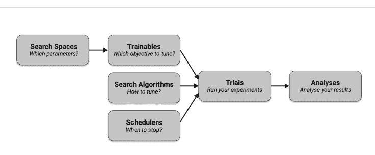

请注意，在内部，Tune运行是在Ray集群的驱动程序进程上启动的，该进程会生成多个工作进程（使用Ray actors）来执行HPO实验的各个试验。你在驱动程序上定义的可训练对象必须发送到工作进程，试验结果需要与运行`tune.run(...)`的驱动程序通信。

搜索空间、可训练对象、试验和分析不需要太多额外解释，我们将在本章的其余部分看到更多关于这些组件的示例。但搜索算法（简称*搜索器*）和调度器需要更详细的阐述。

#### 搜索算法

Tune提供的所有高级搜索算法，以及它集成的许多第三方HPO库，都属于*贝叶斯优化*的范畴。不幸的是，深入探讨特定贝叶斯搜索算法的细节远远超出了本书的范围。基本思想是根据之前试验的结果更新你对哪些超参数范围值得探索的信念。使用此原则的技术能做出更明智的决策，因此往往比独立采样参数（例如随机采样）更高效。

除了我们已经看到的基本随机搜索和*网格搜索*（从预定义的“网格”中选择超参数）之外，Tune还提供了广泛的贝叶斯优化搜索器。例如，Tune集成了流行的HyperOpt和Optuna库，你可以通过这两个库在Tune中使用流行的TPE（树结构Parzen估计器）搜索器。不仅如此，Tune还集成了Ax、BlendSearch、FLAML、Dragonfly、Scikit-Optimize、BayesianOptimization、HpBandSter、Nevergrad、ZOOpt、SigOpt和HEBO等工具。如果你需要在集群上使用这些工具中的任何一个运行HPO实验，或者想轻松地在它们之间切换，Tune是最佳选择。

为了更具体，让我们用bayesian-optimization库重写之前的基本随机搜索Tune示例。为此，请确保首先在你的Python环境中安装此库，例如使用`pip install bayesian-optimization`。

示例5-7。

```
from ray.tune.suggest.bayesopt import BayesOptSearch

algo = BayesOptSearch(random_search_steps=4)

tune.run(
    tune_objective,
    config=search_space,
    metric="score",
    mode="min",
    search_alg=algo,
    stop={"training_iteration": 10},
)
```

请注意，我们以四个随机步骤“热启动”贝叶斯优化，并在10次训练迭代后明确停止试验运行。

请注意，由于我们使用BayesOptSearch时并非随机选择参数，因此我们在Tune运行中使用的`search_alg`需要知道要优化哪个`metric`。以及是应该最小化还是优化这个指标。正如我们之前所论证的，我们希望实现一个“最小”“分数”。

#### 调度器

接下来，我们讨论如何在 Tune 中使用*试验调度器*来使你的运行更高效。我们也将利用这一节介绍一种在目标函数中向 Tune 报告指标的略有不同的方式。

那么，假设我们不是像本章到目前为止的所有示例那样直接计算分数，而是在一个循环中计算一个*中间分数*。这种情况在监督式机器学习场景中经常出现，当训练一个模型进行多次迭代时（我们将在本章后面看到具体的应用）。如果选择了好的超参数组合，这个中间分数可能在计算它的循环结束之前就停滞不前了。换句话说，如果我们不再看到足够的增量变化，为什么不提前停止试验呢？这正是 Tune 调度器旨在解决的情况之一。

这是一个此类目标函数的快速示例。这是一个简单的例子，但它将帮助我们比讨论黑盒场景更好地推理我们希望 Tune 找到的最佳超参数。

*示例 5-8.*

```
def objective(config):
    for step in range(30):  ①
        score = config["weight"] * (step ** 0.5) + config["bias"]
        tune.report(score=score)  ②

search_space = {"weight": tune.uniform(0, 1), "bias": tune.uniform(0, 1)}
```

- ① 你可能经常想要计算中间分数，例如在“训练循环”中。
- ② 你可以使用 `tune.report` 让 Tune 知道这些中间分数。

我们这里想要最小化的分数是一个正数的平方根乘以一个权重，再加上一个偏置项。很明显，为了最小化任何正数 x 的分数，这两个超参数都需要尽可能小。考虑到平方根函数会“趋于平缓”，我们可能不必计算所有 30 次循环就能为我们的两个超参数找到足够好的值。如果你想象每次分数计算需要一个小时，提前停止可以极大地加快你的实验运行速度。

让我们通过使用流行的 Hyperband 算法作为我们的试验调度器来说明这个想法。这个调度器需要传入一个指标和模式（同样，我们最小化我们的分数）。我们还确保运行 10 个样本，以免过早停止：

*示例 5-9.*

```
from ray.tune.schedulers import HyperBandScheduler

scheduler = HyperBandScheduler(metric="score", mode="min")

analysis = tune.run(
    objective,
    config=search_space,
    scheduler=scheduler,
    num_samples=10,
)

print(analysis.get_best_config(metric="score", mode="min"))
```

请注意，在这种情况下，我们没有指定搜索算法，这意味着 Hyperband 将在随机搜索选择的参数上运行。我们也可以将此调度器与另一种搜索算法*结合*使用。这将允许我们选择更好的试验超参数并提前停止不良试验。然而，请注意，并非每个调度器都可以与搜索算法结合使用。建议你查看 [Tune 的调度器兼容性矩阵](https://docs.ray.io/en/latest/tune/faq.html#which-search-algorithm-scheduler-should-i-use) 以获取更多信息。

总结一下这个讨论，除了 Hyperband，Tune 还包括分布式实现的早停算法，例如中位数停止规则、ASHA、基于种群的训练（PBT）和基于种群的强盗算法（PB2）。

### 配置和运行 Tune

在深入研究使用 Ray Tune 的更具体的机器学习示例之前，让我们先探讨一些有用的主题，这些主题可以帮助你从 Tune 实验中获得更多收益，例如正确利用资源、停止和恢复试验、向你的 Tune 运行添加回调，或定义自定义和条件搜索空间。

#### 指定资源

默认情况下，每个 Tune 试验将在一个 CPU 上运行，并利用尽可能多的可用 CPU 进行并发试验。例如，如果你在具有 8 个 CPU 的笔记本电脑上运行 Tune，本章到目前为止我们计算的任何实验都将生成 8 个并发试验，并为每个试验分配一个 CPU。可以使用 Tune 运行的 `resources_per_trial` 参数来控制这种行为。

有趣的是，这不仅限于 CPU，你还可以确定每个试验使用的 GPU 数量。此外，Tune 允许你使用*分数资源*，即你可以在试验之间共享资源。那么，假设你有一台具有 12 个 CPU 和两个 GPU 的机器，并且你为你的目标请求以下资源：

```
from ray import tune

tune.run(objective, num_samples=10, resources_per_trial={"cpu": 2, "gpu": 0.5})
```

这意味着 Tune 可以在你的机器上调度和执行最多四个并发试验，因为这将使该机器上的 GPU 利用率达到最大（同时你仍然有 4 个空闲的 CPU 用于其他任务）。如果你愿意，你也可以通过将字节数传递给 `resources_per_trial` 来指定一个试验使用的“内存量”。另请注意，如果你需要明确*限制*并发试验的数量，你可以通过将 `max_concurrent_trials` 参数传递给你的 `tune.run(...)` 来实现。在上面的例子中，假设你希望始终保留一个 GPU 用于其他任务，你可以通过设置 `max_concurrent_trials = 2` 将并发试验的数量限制为两个。

请注意，我们刚刚在单机资源方面举例说明的所有内容自然地扩展到任何 Ray 集群及其可用资源。无论如何，Ray 总是会尝试调度下一个试验，但会等待并确保有足够的资源可用，然后再执行它们。

#### 回调和指标

如果你花了一些时间研究本章到目前为止我们启动的 Tune 运行的输出，你会注意到每个试验默认都附带了大量信息，例如试验 ID、执行日期等等。有趣的是，Tune 不仅允许你自定义要报告的指标，你还可以通过提供*回调*来接入 `tune.run`。让我们计算一个快速、有代表性的示例，同时做到这两点。

稍微修改一下之前的例子，假设我们希望在每次试验返回结果时记录一条特定的消息。为此，你需要做的就是在 `ray.tune` 包中的一个 Callback 对象上实现 `on_trial_result` 方法。对于一个报告分数的目标函数，它看起来会是这样：

*示例 5-10.*

```
from ray import tune
from ray.tune import Callback
from ray.tune.logger import pretty_print

class PrintResultCallback(Callback):
    def on_trial_result(self, iteration, trials, trial, result, **info):
        print(f"Trial {trial} in iteration {iteration}, got result: {result['score']}")
```

```
def objective(config):
    for step in range(30):
        score = config["weight"] * (step ** 0.5) + config["bias"]
        tune.report(score=score, step=step, more_metrics={})
```

请注意，除了分数，我们还向 Tune 报告了 step 和 more_metrics。事实上，你可以在此处暴露任何你想要跟踪的其他指标，Tune 会将其添加到其试验指标中。以下是你如何使用我们的自定义回调运行 Tune 实验，并打印我们刚刚定义的自定义指标：

*示例 5-11.*

```
search_space = {"weight": tune.uniform(0, 1), "bias": tune.uniform(0, 1)}

analysis = tune.run(
    objective,
    config=search_space,
    mode="min",
    metric="score",
    callbacks=[PrintResultCallback()])

best = analysis.best_trial
print(pretty_print(best.last_result))
```

运行此代码将产生以下输出（除了你在任何其他 Tune 运行中看到的输出之外）。请注意，我们需要在这里明确指定 mode 和 metric，以便 Tune 知道我们所说的 best_result 是什么意思。首先，你应该看到我们回调的输出，同时试验正在运行：

```
...
Trial objective_85955_00000 in iteration 57, got result: 1.5379782083952644
Trial objective_85955_00000 in iteration 58, got result: 1.5539087627537493
Trial objective_85955_00000 in iteration 59, got result: 1.569535794562848
Trial objective_85955_00000 in iteration 60, got result: 1.5848760187255326
Trial objective_85955_00000 in iteration 61, got result: 1.5999446700996236
...
```

然后，在程序的最后，我们打印最佳可用试验的指标，其中包括我们定义的三个自定义指标。以下输出省略了一些默认指标以使其更易读。我们建议你自己运行一个这样的示例，特别是为了习惯阅读 Tune 试验的输出（由于其并发性质，这些输出可能有点令人不知所措）。

```
Result logdir: /Users/maxpumperla/ray_results/objective_2022-05-23_15-52-01
...
done: true
experiment_id: ea5d89c2018f483183a005a1b5d47302
```

experiment_tag: 0_bias=0.73356,weight=0.16088
hostname: mac
iterations_since_restore: 30
more_metrics: {}
score: 1.5999446700996236
step: 29
trial_id: '85955_00000'
...

请注意，我们使用了 `on_trial_result` 作为实现自定义 Tune 回调方法的一个示例，但你还有许多其他有用的选项，这些选项大多不言自明。在这里全部列出它们意义不大，但我发现一些特别有用的回调方法包括 `on_trial_start`、`on_trial_error`、`on_experiment_end` 和 `on_checkpoint`。后者暗示了 Tune 运行的一个重要方面，我们接下来将讨论。

#### 检查点、停止与恢复

你启动的 Tune 试验越多，每个试验运行的时间越长（尤其是在分布式环境中），你就越需要一种机制来防止失败、停止运行或从之前的结果中恢复运行。Tune 通过为你定期创建*检查点*来实现这一点。检查点的频率由 Tune 动态调整，以确保至少 95% 的时间用于运行试验，而不会将过多资源用于存储检查点。

在我们刚刚计算的示例中，使用的检查点目录（或 `logdir`）是 `/Users/maxpumperla/ray_results/objective_2022-05-23_15-52-01`。如果你在自己的机器上运行此示例，默认情况下其结构将是 `~/ray_results/<your-objective>_<date>_<time>`。如果你知道实验的名称，你可以像这样轻松地恢复它：

示例 5-12。

```
analysis = tune.run(
    objective,
    name="/Users/maxpumperla/ray_results/objective_2022-05-23_15-52-01",
    resume=True,
    config=search_space)
```

同样，你可以通过定义停止条件并将其显式传递给 `tune.run` 来*停止*你的试验。最简单的方法（我们之前已经见过）是提供一个包含停止条件的字典。以下是如何在达到 `training_iteration` 计数为 10（所有 Tune 运行的一个内置指标）后停止我们的目标分析：

示例 5-13。

```
tune.run(
    objective,
    config=search_space,
    stop={"training_iteration": 10})
```

这种指定停止条件的一个缺点是它假设相关指标是*递增*的。例如，我们计算的分数起始值较高，并且是我们希望最小化的值。为了为我们的分数制定一个灵活的停止条件，最好的方法是提供一个停止函数，如下所示。

示例 5-14。

```
def stopper(trial_id, result):
    return result["score"] < 2

tune.run(
    objective,
    config=search_space,
    stop=stopper)
```

在需要更多上下文或显式状态的停止条件的情况下，你也可以定义一个自定义的 Stopper 类并传递给 Tune 运行的 stop 参数，但我们在此不讨论这种情况。

#### 自定义和条件搜索空间

我们要在这里介绍的最后一个更高级的主题是复杂的搜索空间。到目前为止，我们只看了彼此独立的超参数，但在实践中，某些参数依赖于其他参数的情况相当常见。此外，虽然 Tune 的内置搜索空间功能相当丰富，但有时你可能想从更奇特的分布或你自己的模块中采样参数。

以下是你如何在 Tune 中处理这两种情况。继续使用我们简单的目标示例，假设你想使用 numpy 包中的 `random.uniform` 采样器来代替 Tune 的 `tune.uniform` 作为你的权重参数。然后你的偏置参数应该是权重乘以一个标准正态变量。使用 `tune.sample_from`，你可以像这样处理这种情况（或更复杂和嵌套的情况）：

示例 5-15。

```
from ray import tune
import numpy as np

search_space = {
    "weight": tune.sample_from(lambda context: np.random.uniform(low=0.0, high=1.0)),
    "bias": tune.sample_from(lambda context: context.config.alpha * np.random.normal())
}

tune.run(objective, config=search_space)
```

Ray Tune 中还有更多有趣的功能值得探索，但让我们在这里转换话题，看看一些使用 Tune 的机器学习应用。

### 使用 Tune 进行机器学习

正如我们所看到的，Tune 功能多样，允许你为你给定的任何目标调整超参数。特别是，你可以将其与你感兴趣的任何机器学习框架一起使用。在本节中，我们将给你两个例子来说明这一点。

首先，我们将使用 Tune 来优化 RLlib 强化学习实验的参数，然后我们使用 Optuna 通过 Tune 调整 Keras 模型。

#### 将 RLlib 与 Tune 结合使用

RLlib 和 Tune 被设计为协同工作，因此你可以相当容易地为你现有的 RLlib 代码设置一个 HPO 实验。事实上，RLlib Trainers 可以作为 Trainable 传递给 `tune.run` 的第一个参数。你可以选择实际的 Trainer 类（如 DQNTrainer）或其字符串表示（如 "DQN"）。作为 Tune 指标，你可以传递你的 RLlib 实验跟踪的任何指标，例如 "episode_reward_mean"。而 `tune.run` 的 config 参数就是你的 RLlib Trainer 配置，但你可以充分利用 Tune 的搜索空间 API 来采样超参数，如学习率或训练批大小¹。以下是我们刚刚描述的完整示例，在 CartPole-v0 gym 环境上运行一个调优的 RLlib 实验：

示例 5-16。

```
from ray import tune

analysis = tune.run(
    "DQN",
    metric="episode_reward_mean",
    mode="max",
    config={
        "env": "CartPole-v0",
        "lr": tune.uniform(1e-5, 1e-4),
        "train_batch_size": tune.choice([10000, 20000, 40000]),
    },
)
```

¹ 如果你好奇为什么 `tune.run` 中的 "config" 参数不叫 search_space，历史原因在于与 RLlib 配置对象的互操作性。

#### 调整 Keras 模型

为了结束本章，让我们看一个稍微复杂一点的例子。正如我们之前提到的，这主要不是一本机器学习书籍，而是 Ray 及其库的入门介绍。这意味着我们既不能向你介绍机器学习的基础知识，也不能花太多时间详细介绍机器学习框架。因此，在本节中，我们假设你熟悉 Keras 及其 API，并具备一些监督学习的基础知识。即使你没有这些先决条件，你也应该能够跟上并专注于 Ray Tune 特定的部分。你可以将以下示例视为将 Tune 应用于机器学习工作负载的一个更现实的场景。

从鸟瞰的角度来看，我们将加载一个常见的数据集，为机器学习任务准备它，通过创建一个 Keras 深度学习模型来定义一个 Tune 目标，该模型向 Tune 报告准确率指标，并使用 Tune 的 HyperOpt 集成来定义一个搜索算法，该算法调整我们 Keras 模型的一组超参数。工作流程保持不变——我们定义一个目标、一个搜索空间，然后使用 `tune.run` 和我们想要的配置。

为了定义一个训练数据集，让我们编写一个简单的 `load_data` 实用函数，加载 Keras 附带的著名 MNIST 数据。MNIST 包含 28x28 像素的手写数字图像。我们将像素值归一化到 0 和 1 之间，并将这十个数字的标签设为分类变量。以下是如何纯粹使用 Keras 的内置功能来实现这一点（运行前请确保已 `pip install tensorflow`）：

示例 5-17。

```
from tensorflow.keras.datasets import mnist
from tensorflow.keras.utils import to_categorical

def load_data():
    (x_train, y_train), (x_test, y_test) = mnist.load_data()
    num_classes = 10
    x_train, x_test = x_train / 255.0, x_test / 255.0
    y_train = to_categorical(y_train, num_classes)
    y_test = to_categorical(y_test, num_classes)
    return (x_train, y_train), (x_test, y_test)
```

接下来，我们通过加载刚刚定义的数据、设置一个顺序 Keras 模型（其超参数从我们传递给目标的 config 中选择），然后编译和拟合模型，来定义一个 Tune 目标函数或 Trainable。为了定义我们的深度学习模型，我们首先将 MNIST 输入图像展平为向量，然后添加两个全连接层（在 Keras 中称为 Dense）和一个 Dropout 层。我们想要调整的超参数是第一个 Dense 层的激活函数、Dropout 率以及第一层的“隐藏”输出单元数。我们可以用同样的方式调整此模型的任何其他超参数，此选择只是一个示例。

我们可以像本章其他示例中那样手动报告感兴趣的指标（例如，通过在目标中返回字典或使用 `tune.report(...)`）。但由于 Tune 提供了适当的 Keras 集成，我们可以使用所谓的 `TuneReportCallback` 作为自定义 Keras 回调，将其传递给模型的 `fit` 方法。我们的 Keras 目标函数如下所示：

示例 5-18。

```
from tensorflow.keras.models import Sequential
from tensorflow.keras.layers import Flatten, Dense, Dropout
from ray.tune.integration.keras import TuneReportCallback

def objective(config):
    (x_train, y_train), (x_test, y_test) = load_data()
    model = Sequential()
    model.add(Flatten(input_shape=(28, 28)))
    model.add(Dense(config["hidden"], activation=config["activation"]))
    model.add(Dropout(config["rate"]))
    model.add(Dense(10, activation="softmax"))

    model.compile(loss="categorical_crossentropy", metrics=["accuracy"])
    model.fit(x_train, y_train, batch_size=128, epochs=10,
              validation_data=(x_test, y_test),
              callbacks=[TuneReportCallback({"mean_accuracy": "accuracy"})])
```

接下来，让我们使用自定义搜索算法来调整这个目标。具体来说，我们使用 HyperOptSearch 算法，它通过 Tune 让我们访问 HyperOpt 的 TPE 算法。要使用此集成，请确保在你的机器上安装 HyperOpt（例如使用 `pip install hyperopt==0.2.5`）。HyperOptSearch 允许我们定义一个有希望的初始超参数选择列表进行研究。这完全是可选的，但有时你可能有好的猜测作为起点。在我们的例子中，我们最初使用 0.2 的 dropout "rate"、128 个 "hidden" 单元和一个修正线性单元（ReLU）"activation" 函数。除此之外，我们可以像以前一样使用 tune 工具定义搜索空间。最后，我们可以获得一个分析对象通过将所有内容传递给 `tune.run` 调用来确定找到的最佳超参数。

示例 5-19。

```python
from ray import tune
from ray.tune.suggest.hyperopt import HyperOptSearch

initial_params = [{"rate": 0.2, "hidden": 128, "activation": "relu"}]
algo = HyperOptSearch(points_to_evaluate=initial_params)

search_space = {
    "rate": tune.uniform(0.1, 0.5),
    "hidden": tune.randint(32, 512),
    "activation": tune.choice(["relu", "tanh"])
}

analysis = tune.run(
    objective,
    name="keras_hyperopt_exp",
    search_alg=algo,
    metric="mean_accuracy",
    mode="max",
    stop={"mean_accuracy": 0.99},
    num_samples=10,
    config=search_space,
)
print("Best hyperparameters found were: ", analysis.best_config)
```

请注意，我们在这里充分利用了 HyperOpt 的全部功能，而无需学习其任何具体细节。我们将 Tune 用作另一个 HPO 工具的分布式前端，并利用其与 Keras 的原生集成。

虽然我们选择了 Keras 和 HyperOpt 的组合作为使用 Tune 与高级 ML 框架和第三方 HPO 库的示例，但如前所述，我们实际上可以选择任何其他机器学习库以及当今流行的任何其他 HPO 库。如果您有兴趣深入了解 Tune 提供的众多其他集成，请查阅 Ray Tune 文档示例。

### 总结

Tune 可以说是当今您可以选择的最通用的 HPO 工具之一。它功能非常丰富，提供了许多搜索算法、高级调度器、复杂的搜索空间、自定义停止器以及许多我们在本章中无法涵盖的其他功能。此外，它与大多数著名的 HPO 工具（如 Optuna 或 HyperOpt）无缝集成，使得从这些工具迁移或简单地通过 Tune 利用其功能变得容易。由于 Tune 作为 Ray 生态系统的一部分，默认就是分布式的，这使其比许多竞争对手更具优势。您可以将 Ray Tune 视为一个灵活的、分布式的 HPO 框架，它*扩展*了那些可能仅在单机上工作的框架。从这个角度来看，并且考虑到您有扩展 HPO 实验规模的需求，采用 Tune 几乎没有什么可反对的理由。

# 第 6 章

##### 使用 Ray Train 进行分布式训练

Richard Liaw

> **致早期发布读者的说明**

通过早期发布电子书，您可以在书籍的最早期形式——作者撰写时的原始未编辑内容——中获取书籍，从而在这些书籍正式发布之前很久就能利用这些技术。

在前面的章节中，您已经学习了如何使用 Ray 构建和扩展强化学习应用程序，以及如何为此类应用程序优化超参数。正如我们在第 1 章中指出的，Ray 还附带了 Ray Train 库，该库提供了一套广泛的机器学习训练集成，并允许它们无缝扩展。

本章我们将首先提供关于为什么您可能需要扩展机器学习训练规模的背景信息。然后，我们将介绍使用 Ray Train 需要了解的一些关键概念。最后，我们将介绍 Ray Train 提供的一些更高级的功能。

一如既往，您可以使用本章的笔记本进行实践。

### 分布式模型训练基础

机器学习通常需要大量的繁重计算。根据您正在训练的模型类型（无论是梯度提升树还是神经网络），您可能会遇到几个常见的机器学习模型训练问题，从而促使您研究分布式训练解决方案：

1.  完成训练所需的时间太长。
2.  数据规模太大，无法放入一台机器。
3.  模型本身太大，无法放入单台机器。

对于第一种情况，可以通过提高数据处理吞吐量来加速训练。一些机器学习算法（如神经网络）可以并行化部分计算以加速训练¹。

在第二种情况下，您选择的算法可能要求您将数据集中的所有可用数据放入内存，但给定的单节点内存可能不足。在这种情况下，您需要将数据分散到多个节点并以分布式方式进行训练。另一方面，有时您的算法可能不需要分布式数据，但如果您一开始使用的是分布式数据库系统，您仍然希望有一个能够利用分布式数据的训练框架。

在第三种情况下，当您的模型无法放入单台机器时，您可能需要将模型拆分成多个部分，分布在多台机器上。这种将模型分布在多台机器上的方法称为模型并行。要遇到这个问题，您首先需要一个足够大以至于无法放入单台机器的模型。通常，像 Google 或 Facebook 这样的大公司往往需要模型并行，并且也依赖内部解决方案来处理分布式训练。

相比之下，前两个问题在机器学习实践者的旅程中往往出现得更早。我们刚刚为这些问题勾勒的解决方案属于数据并行训练的范畴。您不是将模型拆分到多台机器上，而是依赖分布式数据来加速训练。

特别是对于第一个问题，如果您能够加速训练过程，希望在最小或没有精度损失的情况下，并且能够以经济高效的方式做到这一点，为什么不这样做呢？而且，如果您有分布式数据，无论是由于算法的必要性还是数据存储方式，您都需要一个训练解决方案来处理它。正如您将看到的，Ray Train 就是为高效的数据并行训练而构建的。

### Ray Train 简介

Ray Train 是一个用于在 Ray 上进行分布式训练的库。它为训练工作流的不同部分提供了关键工具，从特征处理到可扩展训练，再到与 ML 跟踪工具的集成，以及模型的导出机制。

在典型的 ML 训练管道中，您将使用 Ray Train 的以下关键组件：

¹ 这特别适用于神经网络中的梯度计算。

**预处理器**
Ray Train 提供了几个常见的预处理器对象和实用程序，用于将数据集对象处理为可供 Trainer 消费的特征。

**训练器**
Ray Train 有几个 Trainer 类，使得分布式训练成为可能。Trainer 是围绕第三方训练框架（如 XGBoost）的包装器类，提供了与核心 Ray actor（用于分布式）、Tune 和 Datasets 的集成。

**模型**
每个训练器都可以生成一个模型。该模型可用于服务。

让我们通过使用 Ray Train 计算第一个示例来了解如何将这些概念付诸实践。

### 为 Ray Train 创建端到端示例

在下面的示例中，我们演示了使用 Ray Train 加载、处理和训练机器学习模型的能力。

我们将在此示例中使用一个简单的数据集，使用 scikit-learn 数据集包中的 `load_breast_cancer` 函数。我们首先将数据加载到 Pandas DataFrame 中，然后将其转换为所谓的 Ray Dataset。第 7 章完全致力于 Ray Data 库，我们在这里只是用它来说明 Ray Train API。

示例 6-1。

```python
from ray.data import from_pandas
import sklearn.datasets

data_raw = sklearn.datasets.load_breast_cancer(as_frame=True) ❶

dataset_df = data_raw["data"]
predict_ds = from_pandas(dataset_df) ❷

dataset_df["target"] = data_raw["target"]
dataset = from_pandas(dataset_df)
```

- ❶ 将乳腺癌数据加载到 Pandas DataFrame 中。
- ❷ 从 DataFrame 创建 Ray Dataset。

> ² Ray 可以处理比这大得多的数据集。在第 7 章中，我们将更仔细地研究 Ray Data 库，了解如何处理海量数据集。

接下来，让我们指定一个预处理函数。在这种情况下，我们将使用三个关键的预处理器：一个 Scaler、一个 Repartitioner 和一个 Chain 对象来链接前两个。

示例 6-2。

```python
preprocessor = Chain(
    Scaler(["worst radius", "worst area"]),
    Repartitioner(num_partitions=2)
)
```

- 1. 创建一个预处理链。
- 2. 缩放两个特定的数据列。
- 3. 将数据重新分区为两个分区。

我们进行分布式训练的入口点是 Trainer 对象。不同的框架有特定的 Trainer，每个都配置了一些框架特定的参数。

为了给您一个示例，让我们看看 XGBoostTrainer 类，它实现了 XGBoost 的分布式训练。

示例 6-3。

```python
trainer = XGBoostTrainer(
    scaling_config={
        "num_actors": 2,
        "gpus_per_actor": 0,
        "cpus_per_actor": 2,
    },
    label="target",
    params={
        "tree_method": "approx",
        "objective": "binary:logistic",
        "eval_metric": ["logloss", "error"],
    },
)

result = trainer.fit(dataset=dataset, preprocessor=preprocessor)

print(result)
```

- 1. 指定扩展配置。
- 2. 设置标签列。
- 3. 指定 XGBoost 特定的参数。

### Ray Train 中的预处理器

预处理器是处理数据预处理的核心类。每个预处理器都具有以下 API：

| API | 描述 |
|---|---|
| `transform` | 用于处理数据集并应用处理转换。 |
| `fit` | 用于计算并存储关于数据集的聚合状态到预处理器中。返回自身以支持链式调用。 |
| `fit_transform` | 执行需要聚合状态的转换的语法糖。在特定预处理器的实现层面可能会进行优化。 |
| `transform_batch` | 用于对批次数据应用相同的转换以进行预测。 |

目前，Ray Train 提供了以下编码器：

| 编码器 | 描述 |
|---|---|
| `FunctionTransformer` | 自定义转换器 |
| `Pipeline` | 顺序预处理 |
| `StandardScaler` | 标准化 |
| `MinMaxScaler` | 标准化 |
| `OrdinalEncoder` | 类别特征编码 |
| `OneHotEncoder` | 类别特征编码 |
| `SimpleImputer` | 缺失值填充 |
| `LabelEncoder` | 标签编码 |

你通常会希望确保在训练时和提供服务时能够使用相同的数据预处理操作。

#### 预处理器的使用

你可以通过将预处理器传递给训练器来使用它们。Ray Train 会负责以分布式方式将预处理器应用于数据集。

示例 6-4。

```
result = trainer.fit(dataset=dataset, preprocessor=preprocessor)
```

#### 预处理器的序列化

现在，一些预处理操作符，如独热编码器，在训练时运行并转移到服务时很容易。然而，其他操作符，如执行标准化的操作符，则有点棘手，因为你不想在服务时进行大量的数据计算（以找到特定列的均值）。

Ray Train 预处理器的优点在于它们是可序列化的。这使得你只需序列化这些操作符，就能轻松实现从训练到服务的一致性。

*示例 6-5。*

```
pickle.dumps(prep) ①
```

① 我们可以序列化并保存预处理器。

### Ray Train 中的训练器

训练器是特定于框架的类，用于以分布式方式运行模型训练。所有训练器都共享一个通用接口：

| 方法 | 描述 |
|---|---|
| fit(self) | 使用给定数据集拟合此训练器。 |
| get_checkpoints(self) | 返回最近的模型检查点列表。 |
| as_trainable(self) | 获取此训练器作为 Tune 可训练类的包装器。 |

Ray Train 支持多种不同框架上的各种训练器，即 XGBoost、LightGBM、Pytorch、HuggingFace、Tensorflow、Horovod、Scikit-learn、RLlib 等。

接下来，我们将深入探讨两类特定的训练器：梯度提升树框架训练器和深度学习框架训练器。

### 梯度提升树的分布式训练

Ray Train 为 LightGBM 和 XGBoost 提供了训练器。

XGBoost 是一个优化的分布式梯度提升库，旨在实现高效、灵活和可移植。它在梯度提升框架下实现了机器学习算法。XGBoost 提供了并行树提升（也称为 GBDT、GBM），能够快速准确地解决许多数据科学问题。

LightGBM 是一个基于树学习算法的梯度提升框架。与 XGBoost 相比，它是一个相对较新的框架，但在学术和生产用例中正迅速普及。

通过利用 Ray Train 的 XGBoost 或 LightGBM 训练器，你可以获取一个大型数据集并在多台机器上训练一个 XGBoost Booster。

### 深度学习的分布式训练

Ray Train 提供了深度学习训练器，例如支持 Tensorflow、Horovod 和 Pytorch 等框架。

与梯度提升树训练器不同，这些深度学习框架通常给予用户更多的控制权。例如，Pytorch 提供了一组原语，用户可以使用它们来构建自己的训练循环。

因此，深度学习训练器 API 允许用户传入一个训练函数，并提供回调函数供用户报告指标和检查点。让我们看一个 Pytorch 训练脚本的示例。

下面，我们构建一个标准的训练函数：

示例 6-6。

```
import torch
import torch.nn as nn

num_samples = 20
input_size = 10
layer_size = 15
output_size = 5

class NeuralNetwork(nn.Module):
    def __init__(self):
        super(NeuralNetwork, self).__init__()
        self.layer1 = nn.Linear(input_size, layer_size)
        self.relu = nn.ReLU()
        self.layer2 = nn.Linear(layer_size, output_size)

    def forward(self, input_data):
        return self.layer2(self.relu(self.layer1(input_data)))

input = torch.randn(num_samples, input_size) ①
labels = torch.randn(num_samples, output_size)

def train_func(): ②
    num_epochs = 3
    model = NeuralNetwork()
    loss_fn = nn.MSELoss()
    optimizer = optim.SGD(model.parameters(), lr=0.1)
    for epoch in range(num_epochs):
        output = model(input)
        loss = loss_fn(output, labels)
        optimizer.zero_grad()
        loss.backward()
        optimizer.step()
```

① 在此示例中，我们使用随机生成的数据集。

② 定义一个训练函数。

我们为 Pytorch 构建了一个训练脚本，其中我们创建了一个小型神经网络，并使用均方误差（MSELoss）目标来优化模型。这里的模型输入是随机噪声，但你可以想象它是由 Torch 数据集生成的。

现在，Ray Train 将为你处理两件关键的事情。

1. 建立一个协调进程间通信的后端。
2. 实例化多个并行进程。

因此，简而言之，你只需要对代码进行一行更改：

示例 6-7。

```
import ray.train.torch

def train_func_distributed():
    num_epochs = 3
    model = NeuralNetwork()
    model = train.torch.prepare_model(model) ①
    loss_fn = nn.MSELoss()
    optimizer = optim.SGD(model.parameters(), lr=0.1)
    for epoch in range(num_epochs):
        output = model(input)
        loss = loss_fn(output, labels)
        optimizer.zero_grad()
        loss.backward()
        optimizer.step()
```

① 为分布式训练准备模型。

然后，你可以将其插入 Ray Train：

示例 6-8。

```
from ray.train import Trainer

trainer = Trainer(backend="torch", num_workers=4, use_gpu=False) ①
trainer.start()
results = trainer.run(train_func_distributed)
trainer.shutdown()
```

① 创建一个训练器。对于 GPU 训练，将 use_gpu 设置为 True。

此代码将在单机或分布式集群上运行。

### 使用 Ray Train 训练器扩展训练

Ray Train 的总体理念是，用户无需考虑**如何**并行化他们的代码。

通过 Ray Train 训练器，你可以指定一个 `scaling_config`，这允许你在不编写分布式逻辑的情况下扩展训练。`scaling_config` 允许你声明式地指定训练器使用的*计算资源*。

特别是，你可以通过提供工作进程的数量以及每个工作进程应使用的设备类型来指定训练器应使用的并行度：

示例 6-9。

```
scaling_config = {"num_workers": 10, "use_gpu": True}

trainer = ray.train.integrations.XGBoostTrainer(
    scaling_config=scaling_config,
    # ...
)
```

请注意，扩展配置参数取决于训练器类型。

这种规范的优点在于你无需考虑底层硬件。特别是，你可以指定使用数百个工作进程，Ray Train 将自动利用 Ray 集群中的所有节点：

示例 6-10。

```
#### 连接到一个大型 Ray 集群
ray.init(address="auto")

scaling_config = {"num_workers": 200, "use_gpu": True}

trainer = ray.train.integrations.XGBoostTrainer(
    scaling_config=scaling_config,
    # ...
)
```

### 将数据连接到分布式训练

Ray Train 提供了在大型数据集上进行训练的实用工具。

秉持着用户无需考虑**如何**并行化代码的理念，你可以简单地将你的大型数据集“连接”到 Ray Train，而无需考虑如何将数据摄入并馈送到不同的并行工作进程中。

在此，我们从随机数据创建一个数据集。不过，你可以使用其他数据 API 来读取大量数据（例如使用 `read_parquet`，它可以从 Parquet 格式读取数据）。

示例 6-11。

```python
from typing import Dict
import torch
import torch.nn as nn

import ray
import ray.train as train
from ray.train import Trainer

def get_datasets(a=5, b=10, size=1000, split=0.8):

    def get_dataset(a, b, size):
        items = [i / size for i in range(size)]
        dataset = ray.data.from_items([{"x": x, "y": a * x + b} for x in items])
        return dataset

    dataset = get_dataset(a, b, size)
    split_index = int(dataset.count() * split)
    train_dataset, validation_dataset = dataset.random_shuffle().split_at_indices(
        [split_index]
    )
    train_dataset_pipeline = train_dataset.repeat().random_shuffle_each_window()
    validation_dataset_pipeline = validation_dataset.repeat()
    datasets = {
        "train": train_dataset_pipeline,
        "validation": validation_dataset_pipeline,
    }
    return datasets
```

然后，你可以指定一个训练函数来访问这些数据点。请注意，我们在这里使用了一个特定的 `get_dataset_shard` 函数。在底层，Ray Train 会自动对提供的数据集进行分片，以便各个工作进程可以同时在不同的数据子集上进行训练。这避免了在同一个训练周期内对重复数据进行训练。`get_dataset_shard` 函数将数据源的一个子集传递给每个独立的并行训练工作进程。

接下来，我们对每个分片进行 `iter_epochs` 和 `to_torch` 调用。`iter_epochs` 将生成一个迭代器。该迭代器将生成 Dataset 对象，每个对象包含整个训练周期的一个分片（命名为 `train_dataset_iterator` 和 `validation_dataset_iterator`）。

`to_torch` 将 Dataset 对象转换为 PyTorch 迭代器。有一个等效的 `to_tf` 函数可以将其转换为 TensorFlow Data 迭代器。

当一个训练周期结束时，PyTorch 迭代器将引发 `StopIteration`，然后 `train_dataset_iterator` 将被再次查询，以获取新训练周期的新分片。

示例 6-12。

```python
def train_func(config):
    batch_size = config["batch_size"]
    # hidden_size = config["hidden_size"]
    # lr = config.get("lr", 1e-2)
    epochs = config.get("epochs", 3)

    train_dataset_pipeline_shard = train.get_dataset_shard("train")
    validation_dataset_pipeline_shard = train.get_dataset_shard("validation")
    train_dataset_iterator = train_dataset_pipeline_shard.iter_epochs()
    validation_dataset_iterator = validation_dataset_pipeline_shard.iter_epochs()

    for _ in range(epochs):
        train_dataset = next(train_dataset_iterator)
        validation_dataset = next(validation_dataset_iterator)
        train_torch_dataset = train_dataset.to_torch(
            label_column="y",
            feature_columns=["x"],
            label_column_dtype=torch.float,
            feature_column_dtypes=torch.float,
            batch_size=batch_size,
        )
        validation_torch_dataset = validation_dataset.to_torch(
            label_column="y",
            feature_columns=["x"],
            label_column_dtype=torch.float,
            feature_column_dtypes=torch.float,
            batch_size=batch_size,
        )
        # ... training

    return results
```

你可以通过以下方式使用 Trainer 将各部分组合起来：

示例 6-13。

```python
num_workers = 4
use_gpu = False

datasets = get_datasets()
trainer = Trainer("torch", num_workers=num_workers, use_gpu=use_gpu)
config = {"lr": 1e-2, "hidden_size": 1, "batch_size": 4, "epochs": 3}
trainer.start()
results = trainer.run(
    train_func,
    config,
    dataset=datasets,
    callbacks=[JsonLoggerCallback(), TBXLoggerCallback()],
)
trainer.shutdown()
print(results)
```

### Ray Train 功能特性

#### 检查点

Ray Train 会生成**模型检查点**来保存训练的中间状态。这些模型检查点提供了训练好的模型和拟合好的预处理器，可用于服务和推理等下游应用。

示例 6-14。

```python
result = trainer.fit()
model: ray.train.Model = result.checkpoint.load_model()
```

模型检查点的目标是抽象掉模型和预处理器的实际物理表示。因此，你应该能够从云存储位置生成一个检查点，并将其转换为内存表示或磁盘表示，反之亦然。

示例 6-15。

```python
chkpt = Checkpoint.from_directory(dir)
chkpt.to_bytes() -> bytes
```

#### 回调

你可能希望将你的训练代码与你最喜欢的实验管理框架集成。Ray Train 提供了一个接口来获取中间结果，以及回调来处理或记录你的中间结果（传递给 `train.report(...)` 的值）。

Ray Train 包含用于流行跟踪框架的内置回调，或者你可以通过 `TrainingCallback` 接口实现自己的回调。可用的回调包括：

-   Json 日志记录
-   Tensorboard 日志记录
-   MLflow 日志记录
-   Torch 性能分析器

示例 6-16。

```python
##### 运行训练函数，将所有中间结果记录到
##### MLflow 和 Tensorboard。

result = trainer.run(
    train_func,
    callbacks=[
        MLflowLoggerCallback(experiment_name="train_experiment"),
        TBXLoggerCallback(),
    ],
)
```

#### 与 Ray Tune 集成

Ray Train 提供了与 Ray Tune 的集成，允许你只需几行代码即可执行超参数优化。Tune 将为每个超参数配置创建一个 Trial。在每个 Trial 中，将初始化一个新的 Trainer，并使用其生成的配置运行训练函数。

示例 6-17。

```python
from ray import tune

fail_after_finished = True
prep_v1 = preprocessor
prep_v2 = preprocessor

param_space = {
    "scaling_config": {
        "num_actors": tune.grid_search([2, 4]),
        "cpus_per_actor": 2,
        "gpus_per_actor": 0,
    },
    "preprocessor": tune.grid_search([prep_v1, prep_v2]),
    # "datasets": {
    #     "train_dataset": tune.grid_search([dataset_v1, dataset_v2]),
    # },
    "params": {
        "objective": "binary:logistic",
        "tree_method": "approx",
        "eval_metric": ["logloss", "error"],
        "eta": tune.loguniform(1e-4, 1e-1),
        "subsample": tune.uniform(0.5, 1.0),
        "max_depth": tune.randint(1, 9),
    },
}
if fail_after_finished > 0:
    callbacks = [StopperCallback(fail_after_finished=fail_after_finished)]
else:
    callbacks = None
tuner = tune.Tuner(
    XGBoostTrainer(
        run_config={"max_actor_restarts": 1},
        scaling_config=None,
        resume_from_checkpoint=None,
        label="target",
    ),
    run_config={},
    param_space=param_space,
    name="tuner_resume",
    callbacks=callbacks,
)
results = tuner.fit(datasets={"train_dataset": dataset})
print(results.results)
```

与其他分布式超参数调优解决方案相比，Ray Tune 和 Ray Train 具有几个独特的功能：

-   能够将数据集和预处理器指定为参数
-   容错能力
-   能够在训练期间调整工作进程的数量。

#### 导出模型

在使用 Ray Train 训练模型后，你可能希望将训练好的模型导出到 Ray Serve 或模型注册表。

为此，你可以使用 `load_model` API 获取模型：

示例 6-18。

```python
result = trainer.fit(dataset=dataset, preprocessor=preprocessor)
print(result)

this_checkpoint = result.checkpoint
this_model = this_checkpoint.load_model()
predicted = this_model.predict(predict_ds)
print(predicted.to_pandas())
```

#### 一些注意事项

特别要记住，标准的神经网络训练是通过将数据集分成单独的数据批次（通常称为小批量梯度下降）来迭代进行的。

为了加速这一过程，你可以并行化每次小批量更新的梯度计算。这意味着批次应该被分割到多台机器上。

一个复杂的情况是，如果你保持批次大小不变，随着工作进程数量的增加，系统利用率和效率会降低。

为了补偿这一点，从业者通常会增加每个批次的数据量。

因此，理想情况下，遍历一次数据（一个训练周期）所需的时间应该减少，因为总批次数量减少了。

## 第7章

## 使用Ray进行数据处理

Edward Oakes

> **致早期发布读者的说明**

通过早期发布的电子书，您可以在书籍的最早期形式——作者撰写时未经编辑的原始内容——中获取书籍，从而在这些书籍正式发布之前就能利用这些技术。

在上一章中，您学习了如何使用Ray Train扩展机器学习训练。当然，在实践中应用机器学习的关键组件是数据。在本章中，我们将探讨Ray上的核心数据处理功能集：Ray Data。

虽然Ray Data并非旨在替代更通用的数据处理系统（如Apache Spark或Apache Hadoop），但它提供了基本的数据处理能力，以及一种标准方式来加载、转换数据，并将数据传递到Ray应用程序的不同部分。这使得Ray上的生态系统中的所有库都能使用相同的语言，从而允许用户以与框架无关的方式混合和匹配功能，以满足他们的需求。

Ray Data生态系统的核心组件是恰如其名的“数据集”，它提供了在Ray集群中加载、转换和传递数据引用的核心抽象。数据集是“粘合剂”，使不同的库能够在Ray之上进行互操作。我们将在本章后面看到实际应用，展示如何使用Dask on Ray利用Dask API的全部表达能力进行数据框处理，并将结果转换为数据集，以及如何使用数据集通过Ray Train和Ray Tune高效地进行大规模分布式深度学习训练。

数据集的主要优势是：

*灵活性*
    数据集支持广泛的数据格式，与Dask on Ray等库集成无缝，并且可以在Ray任务和参与者之间传递，无需复制数据。

*针对机器学习工作负载的性能*
    数据集提供了重要功能，如加速器支持、流水线化和全局随机洗牌，这些功能可加速机器学习训练和推理工作负载。

本章旨在让您熟悉在Ray上进行数据处理的核心概念，并帮助您理解如何实现常见模式以及为何选择使用不同的组件来完成任务。本章假设您对数据处理概念（如map、filter、groupby和分区）有基本的了解，但并非数据科学的通用教程，也不是对这些操作内部实现的深入探讨。数据处理/数据科学背景有限的读者应该能够轻松跟上。

我们将首先对核心构建块：Ray数据集进行基本介绍。这将涵盖架构、API的基础知识，以及一个示例，展示如何使用数据集轻松构建复杂的数据密集型应用程序。然后，我们将简要介绍Ray上的外部库集成，重点关注Dask on Ray。最后，我们将通过在一个Python脚本中构建一个可扩展的端到端机器学习管道，将所有内容整合在一起。

本章的笔记本[也可在线获取](https://github.com/ray-project/ray/tree/master/doc/source/data/examples)。

### Ray数据集

#### 数据集概述

数据集的主要目标是支持在Ray上进行可扩展、灵活的数据处理抽象。数据集旨在成为在Ray整个生态系统中读取、写入和传输数据的标准方式。数据集最强大的用途之一是作为机器学习工作负载的数据摄取和预处理层，允许您使用Ray Train和Ray Tune高效地扩展训练。这将在本章的最后一节中更详细地探讨。

如果您过去使用过其他分布式数据处理API（如Apache Spark的RDD），您会发现数据集API非常熟悉。该API的核心依赖于函数式编程，并提供标准功能，如读取/写入多种不同的数据源、执行基本转换（如map、filter和sort），以及一些简单的聚合（如groupby）。

在底层，数据集实现了分布式Apache Arrow。Apache Arrow是一种统一的列式数据格式，用于数据处理库和应用程序，因此与之集成意味着数据集开箱即用地与许多最流行的处理库（如NumPy和pandas）互操作。

一个数据集由一系列Ray对象引用组成，每个引用指向一个数据“块”。这些块要么是Arrow表，要么是Python列表（用于Arrow格式不支持的数据），存储在Ray的共享内存对象存储中，而对数据的计算（如map或filter操作）发生在Ray任务（有时是参与者）中。

由于数据集依赖于Ray的核心原语——任务和共享内存对象存储中的对象，它继承了Ray的关键优势：可扩展到数百个节点、由于在同一节点上的进程间共享内存而实现高效的内存使用，以及对象溢出+恢复以优雅地处理故障。此外，由于数据集只是对象引用的列表，它们也可以在任务和参与者之间高效传递，而无需复制数据，这对于使数据密集型应用程序和库具有可扩展性至关重要。

#### 数据集基础

本节将对Ray数据集进行基本概述，涵盖如何开始读取、写入和转换数据集。这并非全面的参考，而是向您介绍基本概念，以便我们可以在后续章节中构建一些有趣的示例，展示Ray数据集的强大之处。有关支持的内容和确切语法的最新信息，请参阅数据集文档。

要跟随本节中的示例，请确保您已在本地安装Ray Data：

```
pip install "ray[data]"==1.9.0
```

##### 创建数据集

首先，让我们创建一个简单的数据集并对其执行一些基本操作：

示例7-1。

```
import ray

###### 创建一个包含[0, 10000)范围内整数的数据集。
ds = ray.data.range(10000)

###### 基本操作：显示数据集的大小，获取一些样本，打印模式。
print(ds.count())  # -> 10000
print(ds.take(5))  # -> [0, 1, 2, 3, 4]
print(ds.schema())  # -> <class 'int'>
```

这里我们创建了一个包含从0到10000的数字的数据集，然后打印了一些基本信息：记录总数、一些样本和模式（我们稍后将更详细地讨论）。

##### 从存储读取和写入存储

当然，对于实际工作负载，您通常希望从持久存储读取和写入持久存储以加载数据和写入结果。写入和读取数据集很简单；例如，要将数据集写入CSV文件然后将其加载回内存，我们只需使用内置的write_csv和read_csv实用程序：

示例7-2。

```
###### 将数据集保存到本地文件并加载回来。
ray.data.range(10000).write_csv("local_dir")
ds = ray.data.read_csv("local_dir")
print(ds.count())
```

数据集支持多种常见的序列化格式，如CSV、JSON和Parquet，并且可以从本地磁盘以及远程存储（如HDFS或AWS S3）读取或写入。

在上面的示例中，我们只提供了一个本地文件路径（"local_dir"），因此数据集被写入本地机器上的目录。如果我们想改为写入和读取S3，我们将提供类似"s3://my_bucket/"的路径，数据集将自动处理高效读取/远程存储，将请求并行化到多个任务以提高吞吐量。

请注意，数据集还支持自定义数据源，您可以使用它们写入任何未开箱即用支持的外部数据存储系统。

##### 内置转换

现在我们了解了如何创建和检查数据集的基本API，让我们看看我们可以对它们执行的一些内置操作。下面的代码示例展示了数据集支持的三个基本操作：

- 首先，我们将两个数据集联合在一起。结果是一个包含两者所有记录的新数据集。
- 然后，我们通过提供自定义过滤函数来过滤数据集的元素，仅包含偶数整数。
- 最后，我们对数据集进行排序。

###### 示例 7-3。

```python
###### 基本转换：连接两个数据集、过滤和排序。
ds1 = ray.data.range(10000)
ds2 = ray.data.range(10000)
ds3 = ds1.union(ds2)
print(ds3.count())  # -> 20000

###### 过滤合并后的数据集，仅保留偶数元素。
ds3 = ds3.filter(lambda x: x % 2 == 0)
print(ds3.count())  # -> 10000
print(ds3.take(5))  # -> [0, 2, 4, 6, 8]

###### 对过滤后的数据集进行排序。
ds3 = ds3.sort()
print(ds3.take(5))  # -> [0, 0, 2, 2, 4]
```

除了上述操作外，数据集还支持您可能期望的常见聚合操作，例如 `groupby`、`sum`、`min` 等。您也可以传递一个用户定义的函数来进行自定义聚合。

#### 块与重分区

使用数据集时需要牢记的一个重要概念是前面章节中讨论的“块”。块是构成数据集的底层数据块；操作会一次应用于一个底层数据块。如果数据集中的块数过多，每个块就会很小，并且每个操作都会产生大量开销。如果块数过少，操作就无法高效地并行化。

如果我们从上面的例子中深入探究，可以看到我们最初创建的数据集默认各有 200 个块，当我们将它们合并时，生成的数据集有 400 个块。在这种情况下，我们可能希望对数据集进行重分区，使其恢复到最初的 200 个块：

##### 示例 7-4。

```python
ds1 = ray.data.range(10000)
print(ds1.num_blocks())  # -> 200
ds2 = ray.data.range(10000)
print(ds2.num_blocks())  # -> 200
ds3 = ds1.union(ds2)
print(ds3.num_blocks())  # -> 400

print(ds3.repartition(200).num_blocks())  # -> 200
```

块还控制着将数据集写入存储时创建的文件数量（因此，如果您希望所有数据合并到单个输出文件中，应在写入之前调用 `.repartition(1)`）。

#### 模式与数据格式

到目前为止，我们一直在处理仅由整数组成的简单数据集。然而，对于更复杂的数据处理，我们通常希望有一个模式，以便更容易地理解数据并对每一列强制执行类型。

鉴于数据集旨在成为 Ray 上应用程序和库的互操作点，它们被设计为与特定数据类型无关，并提供灵活性来读取、写入和转换许多流行的数据格式。数据集通过支持 Arrow 的列式格式来实现这一点，这使得可以在不同类型的结构化数据（如 Python 字典、DataFrame 和序列化的 parquet 文件）之间进行转换。

创建带有模式的数据集的最简单方法是从 Python 字典列表创建：

##### 示例 7-5。

```python
ds = ray.data.from_items([{"id": "abc", "value": 1}, {"id": "def", "value": 2}])
print(ds.schema())  # -> id: string, value: int64
```

在这种情况下，模式是从我们传入的字典的键中推断出来的。我们也可以与流行库（如 pandas）的数据类型进行转换：

##### 示例 7-6。

```python
pandas_df = ds.to_pandas()  # pandas_df 将继承我们数据集的模式。
```

这里我们从数据集转换到了 pandas DataFrame，但反过来也适用：如果您从 DataFrame 创建数据集，它将自动继承 DataFrame 的模式。

#### 在数据集上进行计算

在上一节中，我们介绍了 Ray 数据集内置的一些功能，例如过滤、排序和合并。然而，数据集最强大的部分之一是它们允许您利用 Ray 灵活的计算模型，并对大量数据执行高效计算。

对数据集执行自定义转换的主要方式是使用 `.map()`。这允许您传递一个自定义函数，该函数将应用于数据集的记录。一个基本的例子可能是对数据集的记录求平方：

##### 示例 7-7。

```python
ds = ray.data.range(10000).map(lambda x: x ** 2)
ds.take(5)  # -> [0, 1, 4, 9, 16]
```

在这个例子中，我们传递了一个简单的 lambda 函数，我们操作的数据是整数，但我们可以传递任何函数来操作支持 Arrow 格式的结构化数据。

我们也可以选择使用 `.map_batches()` 来映射数据批次，而不是单个记录。有些类型的计算在*向量化*时效率要高得多，这意味着它们使用一种算法或实现，该实现对一组项目进行操作比一次操作一个项目更高效。

回顾我们对数据集中的值求平方的简单例子，我们可以将其重写为按批次执行，并使用 `numpy.square` 优化实现，而不是简单的 Python 实现：

##### 示例 7-8。

```python
import numpy as np

ds = ray.data.range(10000).map_batches(lambda batch: np.square(batch).tolist())
ds.take(5)  # -> [0, 1, 4, 9, 16]
```

向量化计算在 GPU 上执行深度学习训练或推理时特别有用。然而，通常在 GPU 上执行计算也有显著的固定成本，因为需要将模型权重或其他数据加载到 GPU 内存中。为此，数据集支持使用 Ray actor 来映射数据。Ray actor 是长期存在的，并且可以保持状态，这与无状态的 Ray 任务不同，因此我们可以通过在 actor 的构造函数中运行昂贵的操作（例如将模型加载到 GPU 上）来缓存这些成本。

要使用数据集执行批量推理，我们需要传递一个类而不是一个函数，指定该计算应使用 actor 运行，并使用 `.map_batches()` 以便我们可以执行向量化推理。如果我们希望这在 GPU 上运行，我们还需要传递 `num_gpus=1`，这指定运行 map 函数的每个 actor 都需要一个 GPU。数据集将自动扩展一组 actor 来执行 map 操作。

##### 示例 7-9。

```python
def load_model():
    # 仅为本示例返回一个虚拟模型。
    # 实际上，这可能会将一些模型权重加载到 GPU 上。
    class DummyModel:
        def __call__(self, batch):
            return batch

    return DummyModel()

class MLModel:
    def __init__(self):
        # load_model() 将在每个启动的 actor 上仅运行一次。
        self._model = load_model()

    def __call__(self, batch):
        return self._model(batch)

ds.map_batches(MLModel, compute="actors")
```

#### 数据集管道

默认情况下，数据集操作是阻塞的，这意味着它们从开始到结束同步运行，并且一次只有一个操作在发生。然而，这种模式对于某些工作负载来说可能非常低效。例如，考虑以下可能用于机器学习模型批量推理的数据集转换集：

##### 示例 7-10。

```python
ds = ray.data.read_parquet("s3://my_bucket/input_data")\
    .map(cpu_intensive_preprocessing)\
    .map_batches(gpu_intensive_inference, compute="actors", num_gpus=1)\
    .repartition(10)\
    .write_parquet("s3://my_bucket/output_predictions")
```

这个管道有五个阶段，每个阶段都对系统的不同部分造成压力：
- 从远程存储读取需要集群的入站带宽，并且可能受到存储系统吞吐量的限制。
- 预处理输入需要 CPU 资源。
- 模型上的向量化推理需要 GPU 资源。
- 重分区需要集群内的网络带宽。
- 写入远程存储需要集群的出站带宽，并且可能再次受到存储吞吐量的限制。

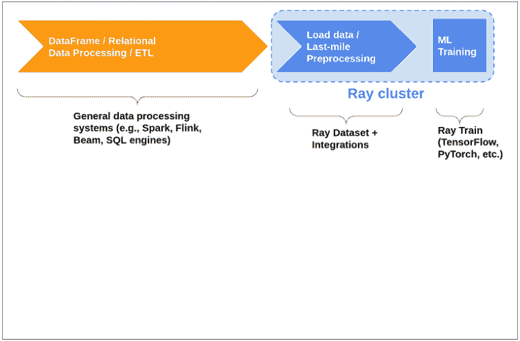

在这种情况下，*管道化*这些阶段并允许它们重叠可能会高效得多。这意味着一旦从存储中读取了一些数据，它就会被送入预处理阶段，然后是推理阶段，依此类推。

##### 示例：从零开始实现并行SGD

数据集（Datasets）的一个关键优势在于它们可以在任务和参与者（actors）之间传递。在本节中，我们将探讨如何利用这一特性来编写高效的分布式复杂工作负载实现，例如分布式超参数调优和机器学习训练。

如第5章所述，机器学习训练中的一个常见模式是探索一系列“超参数”，以找到能产生最佳模型的参数组合。我们可能希望在广泛的超参数范围内进行尝试，而采用朴素方法可能代价高昂。数据集允许我们在单个Python脚本中，轻松地将相同的内存中数据共享给一系列并行训练运行：我们可以加载并预处理一次数据，然后将其引用传递给许多下游参与者，这些参与者可以从共享内存中读取数据。

此外，当处理非常大的数据集时，有时在单个进程或单台机器上将全部训练数据加载到内存中是不可行的。在分布式训练中，常见的做法是将数据分片（shard）到许多不同的工作者（workers）上进行并行训练，然后使用参数服务器（parameter server）同步或异步地合并结果。有一些重要的考虑因素可能使这变得棘手：

1.  许多分布式训练算法采用同步方法，要求工作者在每个训练周期（epoch）后同步其权重。这意味着工作者之间需要进行某种协调，以维持它们所操作的数据批次的一致性。
2.  确保每个工作者在每个周期获得数据的随机样本非常重要。全局随机洗牌（shuffle）已被证明比局部洗牌或不洗牌表现更好。

让我们通过一个示例，了解如何使用Ray Datasets实现这种模式。在这个例子中，我们将使用不同的超参数，在不同的工作者上并行训练多个SGD分类器副本。虽然这不完全相同，但它是一个类似的模式，重点展示了Ray Datasets在机器学习训练工作负载中的灵活性和强大功能。

我们将在一个生成的二分类数据集上训练一个scikit-learn的`SGDClassifier`，我们将调整的超参数是正则化项（alpha值）。这个示例中机器学习任务和模型的实际细节并不太重要，你可以用任何其他示例替换模型和数据。这里主要关注的是我们如何使用数据集来编排数据加载和计算。

首先，让我们定义`TrainingWorker`，它将在数据上训练分类器的一个副本：

示例 7-12。

```python
from sklearn import datasets
from sklearn.linear_model import SGDClassifier
from sklearn.model_selection import train_test_split

@ray.remote
class TrainingWorker:
    def __init__(self, alpha: float):
        self._model = SGDClassifier(alpha=alpha)

    def train(self, train_shard: ray.data.Dataset):
        for i, epoch in enumerate(train_shard.iter_epochs()):
            X, Y = zip(*list(epoch.iter_rows()))
            self._model.partial_fit(X, Y, classes=[0, 1])

        return self._model

    def test(self, X_test: np.ndarray, Y_test: np.ndarray):
        return self._model.score(X_test, Y_test)
```

关于`TrainingWorker`，有几点需要注意：

-   它是`SGDClassifier`的一个简单包装器，并使用给定的alpha值进行实例化。
-   主要的训练函数发生在`train`方法中。对于每个周期，它在可用数据上训练分类器。
-   我们还有一个`test`方法，可用于在测试集上运行训练好的模型。

现在，让我们使用不同的超参数（alpha值）实例化多个`TrainingWorker`：

示例 7-13。

```python
ALPHA_VALS = [0.00008, 0.00009, 0.0001, 0.00011, 0.00012]

print(f"Starting {len(ALPHA_VALS)} training workers.")
workers = [TrainingWorker.remote(alpha) for alpha in ALPHA_VALS]
```

接下来，我们生成训练和验证数据，并将训练数据转换为数据集。这里，我们使用`.repeat()`创建一个`DatasetPipeline`。这定义了我们的训练将运行的周期数。在每个周期中，后续操作将应用于数据集，参与者将能够迭代处理结果数据。我们还随机洗牌数据并将其分片传递给训练工作者，每个工作者获得相等的一块。

示例 7-14。

```python
###### Generate training & validation data for a classification problem.
X_train, X_test, Y_train, Y_test = train_test_split(*datasets.make_classification())

###### Create a dataset pipeline out of the training data. The data will be randomly
###### shuffled and split across the workers for 10 iterations.
train_ds = ray.data.from_items(list(zip(X_train, Y_train)))
shards = train_ds.repeat(10)
                .random_shuffle_each_window()
                .split(len(workers), locality_hints=workers)
```

要在工作者上运行训练，我们调用它们的train方法，并将数据集管道的一个分片传递给每个工作者。然后，我们阻塞等待所有工作者完成训练。总结一下这个阶段发生的事情：

-   每个周期，每个工作者获得数据的一个随机分片。
-   工作者在其分配的数据分片上训练其本地模型。
-   一旦一个工作者完成了当前分片的训练，它会阻塞直到其他工作者完成。
-   对于剩余的周期（在本例中，总共10个周期），重复上述过程。

示例 7-15。

```python
###### Wait for training to complete on all of the workers.
ray.get([worker.train.remote(shard) for worker, shard in zip(workers, shards)])
```

最后，我们可以在一些测试数据上测试每个工作者训练好的模型，以确定哪个alpha值产生了最准确的模型。

示例 7-16。

```python
###### Get validation results from each worker.
print(ray.get([worker.test.remote(X_test, Y_test) for worker in workers]))
```

虽然这可能不是一个真实的机器学习任务，实际上你可能应该使用Ray Tune或Ray Train，但这个例子传达了Ray Datasets的强大功能，特别是在机器学习工作负载方面。仅仅几十行Python代码，我们就实现了一个复杂的分布式超参数调优和训练工作流，它可以轻松扩展到数十或数百台机器，并且与任何框架或特定的机器学习任务无关。

### 外部库集成

#### 概述

虽然 Ray Datasets 开箱即支持许多常见的数据处理功能，但如上所述，它并不能替代完整的数据处理系统。相反，它更专注于执行“最后一公里”的处理，例如在机器学习训练或推理之前进行基本的数据加载、清洗和特征化。

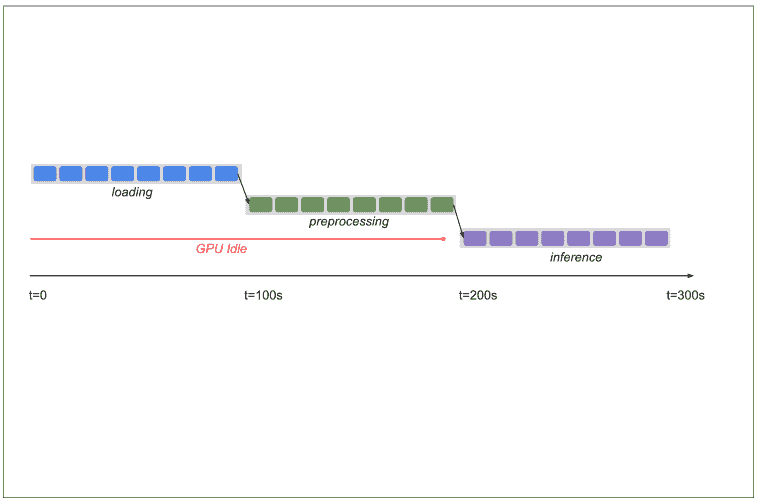

图 7-3. 使用 Ray 进行机器学习的典型工作流：使用外部系统进行主要数据处理和 ETL，使用 Ray Datasets 进行最后一公里的预处理

然而，还有许多其他功能更全面的 DataFrame 和关系型数据处理系统与 Ray 集成：
- Dask on Ray
- RayDP (Spark on Ray)
- Modin (Pandas on Ray)
- Mars on Ray

这些都是独立的数据处理库，你可能在 Ray 之外的环境中已经熟悉它们。这些工具中的每一个都与 Ray 核心集成了，使得它们能够提供比内置 Datasets 更具表现力的数据处理能力，同时仍然利用 Ray 的部署工具、可扩展调度和用于数据交换的共享内存对象存储。

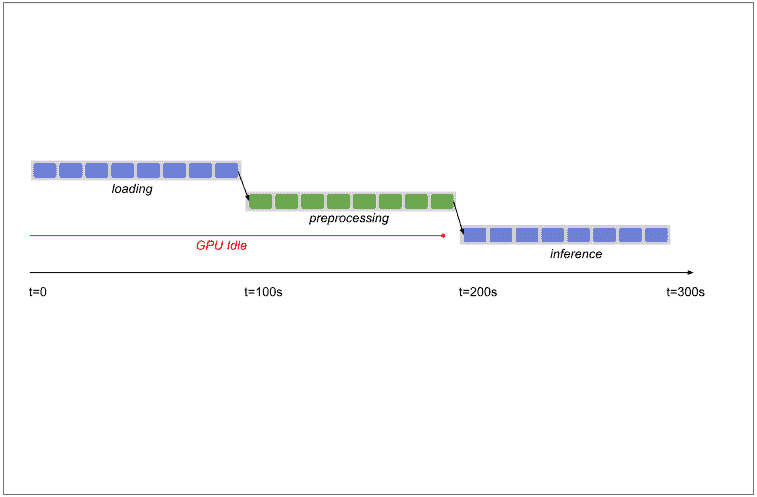

图 7-4. Ray 数据生态系统集成的好处，使得在 Ray 上进行更具表现力的数据处理成为可能。这些库与 Ray Datasets 集成，将数据馈送到下游库，例如 Ray Train。

就本书而言，我们将更深入地探讨 Dask on Ray，以便让你了解这些集成是什么样子的。如果你对特定集成的细节感兴趣，请参阅最新的 [Ray 文档](https://docs.ray.io/) 以获取最新信息。

#### Dask on Ray

要跟随本节中的示例操作，请安装 Ray 和 Dask：

```
pip install ray["data"]==1.9.0 dask
```

[Dask](https://dask.org/) 是一个用于并行计算的 Python 库，专门针对将分析和科学计算工作负载扩展到集群。Dask 最受欢迎的功能之一是 [Dask DataFrames](https://docs.dask.org/en/stable/dataframe.html)，它提供了 pandas DataFrame API 的一个子集，可以在单节点内存处理不可行的情况下，扩展到机器集群。DataFrames 通过创建一个*任务图*来工作，该任务图被提交给调度器执行。执行 Dask DataFrames 操作最典型的方式是使用 Dask Distributed 调度器，但也存在一个可插拔的 API，允许其他调度器执行这些任务图。

Ray 自带了一个 Dask 调度器后端，允许 Dask DataFrame 任务图作为 Ray 任务执行，从而利用 Ray 调度器和共享内存对象存储。这完全不需要修改核心的 DataFrames 代码；相反，为了使用 Ray 运行，你只需要先连接到一个正在运行的 Ray 集群（或在本地运行 Ray），然后启用 Ray 调度器后端：

示例 7-17.

```
import ray
from ray.util.dask import enable_dask_on_ray

ray.init()  # 启动或连接到 Ray。
enable_dask_on_ray()  # 为 Dask 启用 Ray 调度器后端。
```

现在我们可以运行常规的 Dask DataFrames 代码，并让它在 Ray 集群上进行扩展。例如，我们可能想使用标准的 DataFrame 操作（如 filter、groupby 和计算标准差）进行一些时间序列分析（示例取自 Dask 文档）。

示例 7-18.

```
import dask

df = dask.datasets.timeseries()
df = df[df.y > 0].groupby("name").x.std()
df.compute()  # 触发任务图进行评估。
```

如果你习惯使用 pandas 或其他 DataFrame 库，你可能会想知道为什么我们需要调用 `df.compute()`。这是因为 Dask 默认是惰性的，只会在需要时计算结果，从而允许它优化将在集群上执行的任务图。

这种集成最强大的方面之一是它与 Ray Datasets 集成得非常好。我们可以使用内置工具将 Ray Dataset 转换为 Dask DataFrame，反之亦然：

示例 7-19.

```
import ray
ds = ray.data.range(10000)

##### 将 Dataset 转换为 Dask DataFrame。
df = ds.to_dask()
print(df.std().compute())  # -> 2886.89568

##### 将 Dask DataFrame 转换回 Dataset。
ds = ray.data.from_dask(df)
print(ds.std())  # -> 2886.89568
```

这个简单的例子可能看起来不太令人印象深刻，因为我们能够使用 Dask DataFrames 或 Ray Datasets 来计算标准差。然而，正如你将在下一节构建端到端机器学习管道时所看到的，这使得真正强大的工作流成为可能。例如，我们可以使用 DataFrames 的全部表现力来进行特征化和预处理，然后将数据直接传递给下游操作，如分布式训练或推理，同时将所有内容保持在内存中。这突显了 Datasets 如何在 Ray 之上支持广泛的用例，以及像 Dask on Ray 这样的集成如何使生态系统更加强大。

#### 构建机器学习管道

尽管我们在上一节中能够从头开始构建一个简单的分布式训练应用程序，但要构建一个真实世界的应用程序，我们需要解决许多边缘情况、性能优化机会和可用性功能。正如你在前面关于 Ray RLlib、Ray Tune 和 Ray Train 的章节中所学到的，Ray 拥有一个库生态系统，使我们能够构建生产就绪的机器学习应用程序。在本节中，我们将探讨如何使用 Datasets 作为“粘合层”来端到端地构建机器学习管道。

##### 背景

要成功地将机器学习模型投入生产，首先需要使用标准的 ETL 流程收集和编目数据。然而，这还不是全部：为了训练模型，我们通常还需要在将数据馈送到训练过程之前进行特征化，而我们如何将数据馈送到训练过程会对成本和性能产生重大影响。训练模型后，我们还希望在许多不同的数据集上运行推理——毕竟，这就是训练模型的全部意义！这个端到端的过程总结在下图中。

虽然这看起来可能只是一系列步骤，但在实践中，机器学习的数据处理工作流是一个迭代的实验过程，旨在定义正确的特征集并在其上训练高性能的模型。高效地加载、转换并将数据馈送到训练和推理中对于性能也至关重要，这直接转化为计算密集型模型的成本。通常，实现这些机器学习管道意味着将多个不同的系统拼接在一起，并在各阶段之间将中间结果物化到远程存储中。这有两个主要缺点：

1.  首先，它需要为单个工作流编排许多不同的系统和程序。这对任何机器学习从业者来说都可能难以应付，因此许多人转向使用像 Apache Airflow 这样的工作流编排系统。虽然 Airflow 有一些很棒的优点，但它也引入了很大的复杂性（尤其是在开发过程中）。
2.  其次，在多个不同的系统上运行我们的机器学习工作流意味着我们需要在每个阶段之间从存储读取和写入存储。由于数据传输和序列化，这会带来显著的开销和成本。

相比之下，使用 Ray，我们能够将完整的机器学习管道构建为一个可以作为单个 Python 脚本运行的单一应用程序。内置和第三方库的生态系统使得为给定用例混合搭配正确的功能并构建可扩展、生产就绪的管道成为可能。Ray Datasets 充当粘合层，使我们能够高效地加载、预处理和计算数据，同时避免昂贵的序列化成本并将中间数据保持在共享内存中。

##### 端到端示例：预测纽约市出租车行程中的大额小费

本节将通过一个实际的端到端示例，介绍如何使用 Ray 构建深度学习管道。我们将构建一个二元分类模型，使用公开的[纽约市出租车和豪华轿车委员会 (TLC) 行程记录数据](https://www.nyc.gov/site/tlc/about/tlc-trip-record-data.page)来预测一次出租车行程是否会产生大额小费（超过车费的 20%）。我们的工作流将与典型的机器学习从业者的工作流非常相似：
- 首先，我们将加载数据，进行一些基本的预处理，并计算我们将用于模型的特征。
- 然后，我们将定义一个神经网络，并使用分布式数据并行训练来训练它。
- 最后，我们将训练好的神经网络应用于一批新的数据。

该示例将使用 Dask on Ray 并训练一个 PyTorch 神经网络，但请注意，这里没有任何内容是特定于这两个库的，Ray Datasets 和 Ray Train 可以与各种流行的机器学习工具一起使用。要跟随本节中的示例代码，请安装 Ray、PyTorch 和 Dask：

```
pip install ray["data"]==1.9.0 torch dask
```

在下面的示例中，我们将从本地磁盘加载数据，以便于在你的机器上运行示例。你可以使用 AWS CLI 从 [AWS 开放数据注册表](https://registry.opendata.aws/nyc-tlc-trip-records-pds/) 将数据下载到本地机器：

```
pip install awscli==1.22.1
aws s3 cp --no-sign-request "s3://nyc-tlc/trip data/" ./nyc_tlc_data/
```

如果你想尝试直接从云存储加载数据，只需将示例中的本地路径替换为相应的 S3 URL 即可。

##### 使用 Dask on Ray 进行加载、预处理和特征化

训练模型的第一步是加载和预处理数据。为此，我们将使用 Dask on Ray，如上所述，它为我们提供了方便的 DataFrames API，以及将预处理扩展到集群并高效地将其传递给训练和推理操作的能力。

以下是我们用于预处理和特征化的代码：

###### 示例 7-20。

```python
import ray
from ray.util.dask import enable_dask_on_ray

import dask.dataframe as dd

LABEL_COLUMN = "is_big_tip"

enable_dask_on_ray()

def load_dataset(path: str, *, include_label=True):
    # 加载数据并删除未使用的列。
    df = dd.read_csv(path, assume_missing=True,
                     usecols=["tpep_pickup_datetime", "tpep_dropoff_datetime",
                              "passenger_count", "trip_distance", "fare_amount",
                              "tip_amount"])

    # 基本清洗，删除空值和异常值。
    df = df.dropna()
    df = df[(df["passenger_count"] <= 4) &
            (df["trip_distance"] < 100) &
            (df["fare_amount"] < 1000)]

    # 将日期时间字符串转换为日期时间对象。
    df["tpep_pickup_datetime"] = dd.to_datetime(df["tpep_pickup_datetime"])
    df["tpep_dropoff_datetime"] = dd.to_datetime(df["tpep_dropoff_datetime"])

    # 添加三个新特征：行程时长、行程开始的小时和星期几。
    df["trip_duration"] = (df["tpep_dropoff_datetime"] -
                           df["tpep_pickup_datetime"]).dt.seconds
    df = df[df["trip_duration"] < 4 * 60 * 60] # 4 小时。
    df["hour"] = df["tpep_pickup_datetime"].dt.hour
    df["day_of_week"] = df["tpep_pickup_datetime"].dt.weekday

    if include_label:
        # 计算标签列：小费是否超过车费的20%。
        df[LABEL_COLUMN] = df["tip_amount"] > 0.2 * df["fare_amount"]

    # 删除未使用的列。
    df = df.drop(
        columns=["tpep_pickup_datetime", "tpep_dropoff_datetime", "tip_amount"]
    )

    return ray.data.from_dask(df)
```

这涉及基本的数据加载和清洗（删除空值和异常值），以及将一些列转换为可用作我们机器学习模型特征的格式。例如，我们将作为字符串提供的上车和下车日期时间转换为三个数值特征：`trip_duration`、`hour` 和 `day_of_week`。Dask 内置的对 Python 日期时间工具的支持使这变得容易。如果这些数据将用于训练，我们还需要计算标签列（小费是超过还是低于车费金额的20%）。

最后，一旦我们计算出预处理后的 Dask DataFrame，我们将其转换为 Ray Dataset，以便稍后将其传递给我们的训练和推理过程。

##### 定义 PyTorch 模型

现在我们已经清理并准备好了数据，我们需要定义一个模型架构。在实践中，这可能是一个迭代过程，并涉及研究类似问题的最新技术。为了我们的示例，我们将保持简单，使用一个基本的 PyTorch 神经网络。该神经网络有三个线性变换，从我们的特征向量维度开始，然后使用 Sigmoid 激活函数输出一个介于 0 和 1 之间的值。这个输出值将被四舍五入，以产生关于行程是否会产生大额小费的二元预测。

###### 示例 7-21。

```python
import torch
import torch.nn as nn
import torch.nn.functional as F

NUM_FEATURES = 6

class FarePredictor(nn.Module):
    def __init__(self):
        super().__init__()

        self.fc1 = nn.Linear(NUM_FEATURES, 256)
        self.fc2 = nn.Linear(256, 16)
        self.fc3 = nn.Linear(16, 1)

        self.bn1 = nn.BatchNorm1d(256)
        self.bn2 = nn.BatchNorm1d(16)

    def forward(self, *x):
        x = torch.cat(x, dim=1)
        x = F.relu(self.fc1(x))
        x = self.bn1(x)
        x = F.relu(self.fc2(x))
        x = self.bn2(x)
        x = F.sigmoid(self.fc3(x))

        return x
```

##### 使用 Ray Train 进行分布式训练

现在我们已经定义了神经网络架构，我们需要一种方法来高效地在我们的数据上训练它。这个数据集非常大（总共数百GB），所以我们最好的选择可能是执行分布式数据并行训练。我们将使用 Ray Train（你在第6章学过）来定义一个可扩展的训练过程，该过程将在底层使用 PyTorch DataParallel。

我们需要做的第一件事是定义在每个 epoch 中在每个 worker 上训练一批数据的逻辑。这将接收完整数据集的一个本地分片，将其通过模型的本地副本运行，并执行反向传播。

###### 示例 7-22。

```python
import ray.train as train

def train_epoch(iterable_dataset, model, loss_fn, optimizer, device):
    model.train()
    for X, y in iterable_dataset:
        X = X.to(device)
        y = y.to(device)

        # 计算预测误差。
        pred = torch.round(model(X.float()))
        loss = loss_fn(pred, y)

        # 反向传播。
        optimizer.zero_grad()
        loss.backward()
        optimizer.step()
```

接下来，我们还需要定义每个 worker 在每个 epoch 验证其当前模型副本的逻辑。这将运行一批本地数据通过模型，将预测与实际标签值进行比较，并使用提供的损失函数计算后续损失。

###### 示例 7-23。

```python
def validate_epoch(iterable_dataset, model, loss_fn, device):
    num_batches = 0
    model.eval()
    loss = 0
    with torch.no_grad():
        for X, y in iterable_dataset:
            X = X.to(device)
            y = y.to(device)
            num_batches += 1
            pred = torch.round(model(X.float()))
            loss += loss_fn(pred, y).item()
    loss /= num_batches
    result = {"loss": loss}
    return result
```

最后，我们定义核心训练逻辑。这将接收各种配置选项（如批大小和其他模型超参数），实例化模型、损失函数和优化器，然后运行核心训练循环。在每个 epoch 中，每个 worker 将获取其训练和验证数据集的分片，将其转换为本地 PyTorch Dataset，并运行我们上面定义的验证和训练代码。每个 epoch 后，worker 将使用 Ray Train 工具报告结果并保存当前模型权重以供稍后使用。

###### 示例 7-24。

```python
def train_func(config):
    batch_size = config.get("batch_size", 32)
    lr = config.get("lr", 1e-2)
    epochs = config.get("epochs", 3)

    train_dataset_pipeline_shard = train.get_dataset_shard("train")
    validation_dataset_pipeline_shard = train.get_dataset_shard("validation")

    model = train.torch.prepare_model(FarePredictor())

    loss_fn = nn.SmoothL1Loss()
    optimizer = torch.optim.Adam(model.parameters(), lr=lr)

    train_dataset_iterator = train_dataset_pipeline_shard.iter_epochs()
    validation_dataset_iterator = \
        validation_dataset_pipeline_shard.iter_epochs()

    for epoch in range(epochs):
        train_dataset = next(train_dataset_iterator)
        validation_dataset = next(validation_dataset_iterator)

        train_torch_dataset = train_dataset.to_torch(
            label_column=LABEL_COLUMN,
            batch_size=batch_size,
        )
        validation_torch_dataset = validation_dataset.to_torch(
            label_column=LABEL_COLUMN,
            batch_size=batch_size)

        device = train.torch.get_device()

        train_epoch(train_torch_dataset, model, loss_fn, optimizer, device)
        result = validate_epoch(validation_torch_dataset, model, loss_fn,
                               device)

        train.report(**result)
        train.save_checkpoint(epoch=epoch, model_weights=model.module.state_dict())
```

现在完整的训练过程已经定义好了，我们需要加载训练和验证数据来馈送到我们的训练 worker 中。在这里，我们调用之前定义的 `load_dataset` 函数，该函数将进行预处理和特征化，然后将数据集拆分为训练和验证 Dataset¹。最后，我们希望将两个 Dataset 都转换为 Dataset Pipeline 以提高效率，并确保训练数据集在每个 epoch 中在所有 worker 之间全局随机打乱。

###### 示例 7-25。

```python
def get_training_datasets(*, test_pct=0.8):
    ds = load_dataset("nyc_tlc_data/yellow_tripdata_2020-01.csv")
    ds, _ = ds.split_at_indices([int(0.01 * ds.count())])
    train_ds, test_ds = ds.split_at_indices([int(test_pct * ds.count())])
    train_ds_pipeline = train_ds.repeat().random_shuffle_each_window()
    test_ds_pipeline = test_ds.repeat()
    return {"train": train_ds_pipeline, "validation": test_ds_pipeline}
```

一切就绪，是时候运行我们的分布式训练过程了！剩下的就是创建一个 Trainer，传入我们的 Dataset，并让训练扩展并在配置的 worker 数量上运行。训练完成后，我们使用 checkpoint API 获取最新的模型权重。

###### 示例 7-26。

```python
trainer = train.Trainer("torch", num_workers=4)
config = {"lr": 1e-2, "epochs": 3, "batch_size": 64}
trainer.start()
trainer.run(train_func, config, dataset=get_training_datasets())
model_weights = trainer.latest_checkpoint.get("model_weights")
trainer.shutdown()
```

##### 使用 Ray Dataset 进行分布式批量推理

一旦我们训练了一个模型并获得了我们能达到的最佳准确度，下一步就是在实践中应用它。有时这意味着驱动一个低延迟服务，我们将在 ??? 中探讨，但通常任务是将模型应用于传入的批量数据。

让我们使用上面训练过程中的训练模型权重，并将它们应用于一批新数据（在这种情况下，它只是同一公共数据集的另一部分

¹ 该代码仅加载了数据的一个子集用于测试。要进行大规模测试，请在调用 `load_dataset` 时使用所有数据分区，并在训练模型时增加 `num_workers`。

数据集）。为此，我们首先需要以与训练相同的方式加载、预处理和特征化数据。然后，我们将加载模型并将其映射到整个数据集上。如上一节所述，Datasets 允许我们通过 Ray Actors 高效地完成此操作，甚至只需更改一个参数即可使用 GPU。我们只需将训练好的模型权重包装在一个类中，该类将加载权重并配置一个用于推理的模型，然后调用 `map_batches` 并传入推理模型类：

示例 7-27。

```
class InferenceWrapper:
    def __init__(self):
        self._model = FarePredictor()
        self._model.load_state_dict(model_weights)
        self._model.eval()

    def __call__(self, df):
        tensor = torch.as_tensor(df.to_numpy(), dtype=torch.float32)
        with torch.no_grad():
            predictions = torch.round(self._model(tensor))
        df[LABEL_COLUMN] = predictions.numpy()
        return df

ds = load_dataset("nyc_tlc_data/yellow_tripdata_2021-01.csv", include_label=False)
ds.map_batches(InferenceWrapper, compute="actors").write_csv("output")
```

## 关于作者

**Max Pumperla** 是一位数据科学教授和软件工程师，现居德国汉堡。他是一位活跃的开源贡献者，多个 Python 包的维护者，机器学习书籍的作者，也是国际会议的演讲者。作为 Pathmind Inc. 的产品研究主管，他正在使用 Ray 为工业应用大规模开发强化学习解决方案。Pathmind 与 AnyScale 团队紧密合作，是 Ray 的 RLlib、Tune 和 Serve 库的重度用户。Max 曾是 Skymind 的 DL4J 核心开发者，帮助发展和扩展了 Keras 生态系统，也是 Hyperopt 的维护者。

**Edward Oakes**

**Richard Liaw**