# 学习 Ray

面向机器学习的灵活分布式 Python

Max Pumperla,
Edward Oakes
& Richard Liaw
Ion Stoica 作序

# 学习 Ray

开始使用 Ray，这是一个开源分布式计算框架，它简化了扩展计算密集型 Python 工作负载的过程。通过这本实用的书籍，Python 程序员、数据工程师和数据科学家将学习如何在本地利用 Ray 并启动计算集群。你将能够使用 Ray 来大规模构建和运行机器学习程序。

作者 Max Pumperla、Edward Oakes 和 Richard Liaw 将向你展示如何使用 Ray 构建机器学习应用。你将理解 Ray 如何融入当前的机器学习工具格局，并发现 Ray 如何与这些工具日益紧密地集成。分布式计算是困难的，但通过使用 Ray，你会发现入门很容易。

- 学习如何使用 Ray Core 构建你的第一个分布式应用
- 使用 Ray Tune 进行超参数优化
- 使用 Ray RLlib 库进行强化学习
- 使用 Ray Train 库管理分布式训练
- 使用 Ray Datasets 进行数据处理
- 学习如何使用 Ray Clusters 并通过 Ray Serve 提供模型服务
- 使用 Ray AIR 构建端到端的机器学习应用

Max Pumperla 是一位数据科学教授，也是 Anyscale 的软件工程师。
Edward Oakes 是 Anyscale 的软件工程师和团队负责人。
Richard Liaw 是 Anyscale 的软件工程师。

> "从三位核心贡献者的视角，对 Ray 分布式计算框架的精彩介绍。作者们优雅地将分布式计算和机器学习这两个令人生畏的主题分解成一系列易于理解的示例。"
—Patrick Ames
亚马逊首席工程师

> "关于分布式系统应用于机器学习的权威著作。这是一本易于理解的入门书，教你如何在舒适的 Jupyter notebook 环境中构建大规模分布式数据应用。"
—Mark Saroufim
Meta PyTorch 首席应用 AI 工程师

# 学习 Ray

面向机器学习的灵活分布式 Python

Max Pumperla, Edward Oakes, and Richard Liaw

# 学习 Ray

作者：Max Pumperla, Edward Oakes, and Richard Liaw

版权所有 © 2023 Max Pumperla 和 O'Reilly Media, Inc. 保留所有权利。

印刷于美国。

由 O'Reilly Media, Inc. 出版，地址：1005 Gravenstein Highway North, Sebastopol, CA 95472。

O'Reilly 图书可用于教育、商业或销售推广用途。大多数图书也提供在线版本（[http://oreilly.com](http://oreilly.com)）。欲了解更多信息，请联系我们的企业/机构销售部门：800-998-9938 或 *corporate@oreilly.com*。

**策划编辑：** Jessica Haberman
**开发编辑：** Jeff Bleiel
**制作编辑：** Katherine Tozer
**文字编辑：** Piper Editorial Consulting, LLC
**校对：** Kim Wimpsett

**索引编制：** Ellen Troutman-Zaig
**内页设计：** David Futato
**封面设计：** Karen Montgomery
**插图：** Kate Dullea

2023年2月：第一版

# 第一版修订历史

2023-02-13：首次发布

有关发布详情，请参阅 [http://oreilly.com/catalog/errata.csp?isbn=9781098117221](http://oreilly.com/catalog/errata.csp?isbn=9781098117221)。

O'Reilly 标志是 O'Reilly Media, Inc. 的注册商标。*Learning Ray*、封面图片及相关商业外观是 O'Reilly Media, Inc. 的商标。

本书所表达的观点为作者个人观点，不代表出版商观点。虽然出版商和作者已尽最大努力确保本书所含信息和说明的准确性，但出版商和作者对任何错误或遗漏概不负责，包括但不限于因使用或依赖本书而造成的任何损害。使用本书所含信息和说明的风险由您自行承担。如果本书包含或描述的任何代码示例或其他技术受开源许可或他人知识产权约束，您有责任确保您的使用符合此类许可和/或权利。

本书是 O'Reilly 与 Anyscale 合作的一部分。请参阅我们的[编辑独立性声明](https://www.oreilly.com/about/editorial-independence.html)。

978-1-098-11722-1

[LSI]

献给 Alma

# 目录

前言........................................................................................................ xi

序言........................................................................................................... xiii

1.  Ray 概览....................................................................................... 1
    什么是 Ray？................................................................................................ 2
        Ray 的起源.................................................................................... 2
        Ray 的设计原则............................................................................ 4
        三层架构：核心、库与生态系统........................................ 5
    分布式计算框架........................................................................................... 6
    一套数据科学库................................................................................................. 8
        Ray AIR 与数据科学工作流.................................................. 8
        使用 Ray Datasets 进行数据处理......................................................... 10
        模型训练....................................................................................... 12
        超参数调优.......................................................................... 16
        模型服务......................................................................................... 18
    不断发展的生态系统.................................................................................. 20
    总结...................................................................................................... 21

2.  Ray Core 入门...................................................................... 23
    Ray Core 简介........................................................................ 24
        使用 Ray API 的第一个示例......................................................... 25
        Ray Core API 概览........................................................... 35
    理解 Ray 系统组件...................................................... 36
        在节点上调度和执行工作............................................. 36
        头节点....................................................................................... 39
        分布式调度与执行.................................................... 39
    使用 Ray 的简单 MapReduce 示例...................................................... 41
        映射与混洗文档数据.................................................. 43
        归约词频统计........................................................................... 45
    总结...................................................................................................... 47

3.  构建你的第一个分布式应用.................................................. 49
    强化学习简介................................................................................... 49
    设置一个简单的迷宫问题............................................................. 50
    构建仿真环境.................................................................................. 55
    训练强化学习模型................................................... 59
    构建分布式 Ray 应用................................................................... 62
    回顾强化学习术语.......................................................................... 66
    总结...................................................................................................... 67

4.  使用 Ray RLlib 进行强化学习....................................................... 69
    RLlib 概览.................................................................................. 70
    RLlib 入门.......................................................................... 71
        构建 Gym 环境.................................................................. 71
        运行 RLlib CLI............................................................................ 73
        使用 RLlib Python API.................................................................... 75
    配置 RLlib 实验................................................................... 82
        资源配置.......................................................................... 83
        Rollout Worker 配置................................................................. 83
        环境配置..................................................................... 84
    使用 RLlib 环境.............................................................. 85
        RLlib 环境概览....................................................... 85
        使用多智能体............................................................... 86
        使用策略服务器与客户端................................................ 90
    高级概念..................................................................................... 93
        构建高级环境....................................................... 94
        应用课程学习............................................................... 95
        使用离线数据...................................................................... 97
        其他高级主题.......................................................................... 98
    总结...................................................................................................... 99

5.  使用 Ray Tune 进行超参数优化.............................................. 101
    调优超参数........................................................................... 102
        使用 Ray 构建随机搜索示例........................................ 102
        为什么超参数优化很难？................................................................................ 104
    Tune 简介............................................................................. 105
        Tune 如何工作？.......................................................................... 106

## 6. 使用 Ray 进行数据处理

- Ray Datasets
  - Ray Datasets 基础
  - 在 Ray Datasets 上进行计算
  - Dataset 管道
  - 示例：并行训练分类器的多个副本
- 外部库集成
- 构建 ML 管道
- 总结

## 7. 使用 Ray Train 进行分布式训练

- 分布式模型训练基础
- 通过示例介绍 Ray Train
  - 预测纽约市出租车行程中的高额小费
  - 加载、预处理和特征化
  - 定义深度学习模型
  - 使用 Ray Train 进行分布式训练
  - 分布式批量推理
- 关于 Ray Train 中 Trainer 的更多信息
  - 以最少的代码更改迁移到 Ray Train
  - 扩展 Trainer
  - 使用 Ray Train 进行预处理
  - 将 Trainer 与 Ray Tune 集成
  - 使用回调监控训练
- 总结

## 8. 使用 Ray Serve 进行在线推理

- 在线推理的关键特性
  - ML 模型是计算密集型的
  - ML 模型并非孤立有用
- Ray Serve 简介
  - 架构概述
  - 定义基本 HTTP 端点
  - 扩展和资源分配
  - 请求批处理
  - 多模型推理图
- 端到端示例：构建一个由 NLP 驱动的 API
  - 获取内容和预处理
  - NLP 模型
  - HTTP 处理和驱动逻辑
  - 整合所有部分
- 总结

## 9. Ray 集群

- 手动创建 Ray 集群
- 在 Kubernetes 上部署
  - 设置你的第一个 KubeRay 集群
  - 与 KubeRay 集群交互
  - 暴露 KubeRay
  - 配置 KubeRay
  - 配置 KubeRay 的日志记录
- 使用 Ray 集群启动器
  - 配置你的 Ray 集群
  - 使用集群启动器 CLI
  - 与 Ray 集群交互
- 使用云集群
  - AWS
  - 使用其他云提供商
- 自动扩缩
- 总结

## 10. Ray AI Runtime 入门

- 为什么使用 AIR？
- 通过示例介绍 AIR 的关键概念
  - Ray Datasets 和预处理器
  - Trainer
  - Tuner 和检查点
  - 批量预测器
  - 部署
- 适合 AIR 的工作负载
  - AIR 工作负载执行
  - AIR 内存管理
  - AIR 故障模型
  - 自动扩缩 AIR 工作负载
- 总结

## 11. Ray 的生态系统及其他

- 不断发展的生态系统
  - 数据加载和处理
  - 模型训练
  - 模型服务
  - 构建自定义集成
  - Ray 集成概览
- Ray 与其他系统
  - 分布式 Python 框架
  - Ray AIR 和更广泛的 ML 生态系统
  - 如何将 AIR 集成到你的 ML 平台中
- 接下来去哪里？
- 总结

# 索引

# 前言

在过去的十年里，机器学习和数据应用的计算需求已经远远超出了单台服务器或单个处理器（包括 GPU 和 TPU 等硬件加速器）的能力。这一趋势使我们别无选择，只能将这些应用分布式化。不幸的是，构建这样的分布式应用是出了名的困难。

在过去的几年里，Ray 已经成为简化此类应用开发的首选框架。Ray 包括一个灵活的核心和一组强大的库，使开发人员能够轻松扩展各种工作负载，包括训练、超参数调优、强化学习、模型服务和非结构化数据的批处理。Ray 是最受欢迎的开源项目之一，已被数千家公司用于实现从机器学习平台到推荐系统、欺诈检测以及训练一些最大模型（包括 Open AI 的 ChatGPT）的一切。

在本书中，Max Pumperla、Edward Oakes 和 Richard Liaw 出色地完成了任务，他们使用易于理解的示例，对 Ray 及其库进行了温和而全面的介绍。在本书结束时，你将掌握 Ray 中的关键概念和抽象，并能够从你的笔记本电脑开发并快速扩展端到端的机器学习应用到大型本地集群或云端。

> — Ion Stoica
> Anyscale 和 Databricks 联合创始人，
> 加州大学伯克利分校教授
> 2023 年 1 月

# 序言

分布式计算是一个引人入胜的话题。回顾计算的早期，人们不禁会对今天如此多的公司将其工作负载分布在计算机集群上这一事实印象深刻。我们已经找到了高效的方法来做到这一点，这令人印象深刻，但横向扩展也变得越来越必要。单个计算机的速度越来越快，然而我们对大规模计算的需求却不断超过单台机器所能提供的能力。

认识到扩展既是必要也是挑战，Ray 旨在让分布式计算对开发人员来说变得简单。它使非专家也能使用分布式计算，并使你能够相当容易地将 Python 脚本扩展到多个节点。Ray 擅长扩展*数据密集型和计算密集型工作负载*，例如数据预处理和模型训练——并且它明确针对需要扩展的机器学习工作负载。虽然今天可以在没有 Ray 的情况下扩展这两种类型的工作负载，但你可能需要为每种工作负载使用不同的 API 和分布式系统。管理多个分布式系统可能在许多方面既混乱又低效。

随着 2022 年 8 月 Ray 2.0 的发布，Ray AI Runtime 的加入进一步增强了 Ray 对复杂 ML 工作负载的支持。AIR 是一组库和工具的集合，可以轻松地在单个分布式系统中构建和部署端到端的 ML 应用。借助 AIR，即使是最复杂的工作流通常也可以表示为*单个 Python 脚本*。这意味着你可以先在本地运行程序，这在调试和开发速度方面可以产生很大的不同。

数据科学家从 Ray 中受益，因为他们可以依赖不断增长的 Ray ML 库和第三方集成生态系统。Ray AIR 帮助你快速原型化想法，并更容易地从开发过渡到生产。与许多其他分布式系统不同，Ray 还原生支持 GPU，这对于 ML 工程师等角色可能特别重要。为了支持数据工程师，Ray 还与 Kubernetes 等工具紧密集成，并且可以在多云设置中部署。

你可以将其用作统一的计算层，为你的工作负载提供扩展、容错、调度和编排。换句话说，对于各种角色来说，投入*学习 Ray*是非常值得的。

## 谁应该阅读本书

你拿起本书很可能是因为你对 Ray 的某些方面感兴趣。也许你是一名分布式系统工程师，想了解 Ray 引擎的工作原理。你也可能是一名对学习新技术感兴趣的软件开发人员。或者你可能是一名数据工程师，想要评估 Ray 与类似工具的比较。你也可能是一名机器学习从业者或数据科学家，需要找到扩展实验的方法。

无论你的具体角色是什么，要充分利用本书，共同点是能够熟练地使用 Python 编程。本书的示例是用 Python 编写的，需要具备该语言的中级知识。正如你作为 Python 开发者所深知的那样，明确胜于隐含。所以，让我们明确地说，了解 Python 意味着你知道如何在系统上使用命令行，如何在遇到困难时获得帮助，以及如何自己设置编程环境。

如果你以前从未使用过分布式系统，那也没关系。我们在书中涵盖了你开始使用所需的所有基础知识。除此之外，你可以在笔记本电脑上运行这里介绍的大多数代码示例。涵盖基础知识意味着我们无法对分布式系统进行过于详细的介绍。本书最终专注于使用 Ray 的应用程序开发人员，特别是数据科学和 ML。

对于本书的后续章节，你需要对 ML 有一定的熟悉程度，但我们不期望你在这个领域工作过。特别是，你应该对 ML 范式及其与传统编程的区别有基本的了解。你还应该知道使用 NumPy 和 Pandas 的基础知识。此外，你应该至少能够*阅读*使用流行的 TensorFlow 和 PyTorch 库的示例。在 API 层面，能够理解代码流程就足够了，但你不需要知道如何编写自己的模型。我们涵盖了使用两种主流深度学习库（TensorFlow 和 PyTorch）的示例，以说明无论你偏好哪种框架，都可以如何使用 Ray 进行 ML 工作负载。

我们在高级 ML 主题上涵盖了很多内容，但主要焦点是 Ray 作为一种技术以及如何使用它。我们讨论的 ML 示例对你来说可能是新的，可能需要再次阅读，但你仍然可以专注于 Ray 的 API 以及如何在实践中使用它。了解了这些要求，以下是你可能从本书中获得的内容：如果你是一名数据科学家，Ray将为你开辟思考和构建分布式机器学习应用的新途径。你将了解如何大规模进行实验的超参数选择，获得大规模模型训练的实践知识，并接触一个最先进的强化学习库。
- 如果你是一名数据工程师，你将学习使用Ray Datasets进行大规模数据摄取，如何利用Ray上的Dask等工具改进你的数据管道，以及如何有效地大规模部署模型。
- 如果你是一名工程师，你将理解Ray的内部工作原理，如何在云端运行和扩展Ray集群，以及如何使用Ray构建与你已知项目集成的应用程序。

当然，无论你的角色如何，你都可以学习所有这些主题。我们希望，读完本书后，你将学会欣赏Ray的所有优势。

## 本书目标

本书主要为Ray的新手读者编写，旨在帮助他们快速掌握Ray的精髓。我们精心挑选了材料，以便你理解Ray背后的核心思想，并学会使用其主要构建模块。阅读本书后，你将能够自信地独立探索超出本入门范围的更复杂主题。

我们也需要明确本书的定位。它并非旨在提供尽可能多的信息，如API参考或权威指南。它也不是为了帮助你完成具体任务，如操作指南或实用手册。本书专注于学习和理解Ray，并为你提供有趣的入门示例。

软件发展迅速，淘汰也快，但软件背后的基本概念通常在主要版本周期中保持稳定。我们试图在传达思想和提供具体代码示例之间取得平衡。本书中的思想理想情况下即使在代码最终需要更新时仍然有用。

虽然Ray的文档在不断改进，但我们确实相信书籍可以提供项目文档难以匹敌的特质。既然你正在阅读这些文字，我们意识到这番话可能有些多余。但我们所知的一些最好的技术书籍，能够激发人们对项目的兴趣，让你愿意去钻研那些你原本不会接触的简洁API参考。我们希望本书就是其中之一。

## 本书导航

我们组织本书的目的是引导你自然地从核心概念过渡到Ray更复杂的主题。许多解释的思想都附有示例代码，你可以在本书的[GitHub仓库](https://github.com/)中找到。

简而言之，本书前三章通过实际示例教授Ray作为分布式Python框架的基础知识。第4至10章介绍Ray的高级库，并展示如何使用它们构建应用程序。最后一章对Ray的生态系统进行了总结性概述，并指明了下一步的学习方向。以下是各章内容概览：

*第1章，“Ray概述”*
向你介绍Ray作为一个由三层组成的系统：其核心、其机器学习库及其生态系统。你将在本章运行使用Ray库的第一个示例，初步了解Ray能做什么。

*第2章，“Ray Core入门”*
引导你了解Ray项目的基础，即其核心API。它还讨论了Ray的任务和参与者如何自然地从Python函数和类扩展而来。你还将了解Ray的系统组件及其协同工作方式。

*第3章，“构建你的第一个分布式应用”*
指导你使用Ray Core实现一个分布式强化学习应用。你将从头开始实现这个应用，并亲眼看到Ray在分发Python代码方面的灵活性。

*第4章，“使用Ray RLlib进行强化学习”*
快速介绍强化学习，并展示Ray如何在RLlib中实现重要概念。在共同构建一些示例之后，我们还将深入探讨更高级的主题，如课程学习或使用离线数据。

*第5章，“使用Ray Tune进行超参数优化”*
涵盖高效调整超参数为何困难、Ray Tune的概念原理，以及如何在机器学习项目中实际使用它。

*第6章，“使用Ray进行数据处理”*
向你介绍Ray的数据集抽象及其在其他数据处理系统格局中的定位。你还将学习如何与第三方集成（如Ray上的Dask）协作。

*第7章，“使用Ray Train进行分布式训练”*
提供分布式模型训练的基础知识，并展示如何将Ray Train与PyTorch等机器学习框架结合使用。我们还将向你展示如何为模型添加自定义预处理器、如何使用回调监控训练，以及如何使用Tune调整模型的超参数。

*第8章，“使用Ray Serve进行在线推理”*
教你将训练好的机器学习模型作为API端点暴露的基础知识，这些端点可以从任何地方查询。我们讨论Ray Serve如何应对在线推理的挑战，介绍其架构，并展示如何在实践中使用它。

*第9章，“Ray集群”*
讨论如何为你的应用程序配置、启动和扩展Ray集群。你将了解Ray的集群启动器CLI和自动扩缩器，以及如何在云端设置集群。我们还将向你展示如何在Kubernetes和其他集群管理器上部署Ray。

*第10章，“Ray AI Runtime入门”*
向你介绍Ray AIR，这是一个用于机器学习工作负载的统一工具包，为模型训练或访问自定义数据源提供了许多第三方集成。

*第11章，“Ray生态系统及未来”*
概述Ray多年来吸引的众多有趣的扩展和集成。

## 如何使用代码示例

你可以在本书的[GitHub仓库](https://github.com/)中找到所有代码。在GitHub仓库中，你会找到一个*notebook*文件夹，其中包含每章的笔记本。我们构建示例的方式是，你可以边阅读边输入代码，也可以先阅读正文，稍后再从GitHub运行代码。选择权在你。

对于示例，我们假设你已安装Python 3.7或更高版本。在撰写本文时，Ray对Python 3.10的支持尚处于实验阶段，因此我们目前仅推荐使用不高于3.9的Python版本。所有代码示例都假设你已安装Ray，每章还会添加其特定的要求。示例已在Ray 2.2.0版本上测试，我们建议你在阅读全书时使用此版本。

## 本书使用的约定

本书使用以下排版约定：

*斜体*
表示新术语、URL、电子邮件地址、文件名和文件扩展名。

等宽字体
用于程序清单，以及在段落中引用程序元素，如变量或函数名、数据库、数据类型、环境变量、语句和关键字。

**等宽粗体**
显示用户应原样输入的命令或其他文本。

<尖括号中的文本>
应替换为用户提供的值或由上下文确定的值。


此元素表示一般性说明。


此元素表示警告或注意事项。

## 使用代码示例

补充材料（代码示例、练习等）可从 https://oreil.ly/learning_ray_repo 下载。

如果你对使用代码示例有技术问题或遇到问题，请发送电子邮件至 bookquestions@oreilly.com。

本书旨在帮助你完成工作。通常，如果本书提供了示例代码，你可以在你的程序和文档中使用它。除非你复制了代码的大部分，否则无需联系我们获取许可。例如，编写一个使用本书中多个代码片段的程序不需要许可。销售或分发O'Reilly书籍中的示例则需要许可。通过引用本书和引用示例代码来回答问题不需要许可。将本书中大量的示例代码纳入你的产品文档则需要许可。

我们感谢但通常不要求署名。署名通常包括标题、作者、出版商和ISBN。例如：“*Learning Ray* by Max Pumperla, Edward Oakes, and Richard Liaw (O’Reilly). Copyright 2023 Max Pumperla and O’Reilly Media, Inc., 978-1-098-11722-1.”

如果您觉得对代码示例的使用超出了合理使用范围或上述许可范围，请随时通过 *permissions@oreilly.com* 联系我们。

## O’Reilly 在线学习

40多年来，*O’Reilly Media* 一直提供技术和商业培训、知识和见解，帮助企业取得成功。

我们独特的专家和创新者网络通过书籍、文章和我们的在线学习平台分享他们的知识和专业知识。O’Reilly的在线学习平台为您提供按需访问的实时培训课程、深入的学习路径、交互式编码环境，以及来自O’Reilly和200多家其他出版商的大量文本和视频资源。欲了解更多信息，请访问 *http://oreilly.com*。

## 如何联系我们

请将有关本书的评论和问题寄给出版商：

O’Reilly Media, Inc.
1005 Gravenstein Highway North
Sebastopol, CA 95472
800-998-9938 (美国或加拿大)
707-829-0515 (国际或本地)
707-829-0104 (传真)

我们为本书设有一个网页，列出了勘误、示例和任何其他信息。您可以通过 *https://oreil.ly/learning-ray* 访问此页面。

发送电子邮件至 *bookquestions@oreilly.com* 评论或提出有关本书的技术问题。

有关我们书籍和课程的新闻和信息，请访问 *https://oreilly.com*。

在LinkedIn上找到我们：*https://linkedin.com/company/oreilly-media*。

在Twitter上关注我们：*https://twitter.com/oreillymedia*。

在YouTube上观看我们：*https://youtube.com/oreillymedia*。

## 致谢

我们要感谢O'Reilly的整个团队，帮助我们完成了这本书。特别感谢我们不知疲倦的编辑Jeff Bleiel，他提供了宝贵的输入和反馈。非常感谢Jess Haberman在项目早期阶段进行了许多富有成效的讨论并持开放态度。我们还要感谢Katherine Tozer、Chelsea Foster和Cassandra Furtado，以及O'Reilly的许多其他人。

非常感谢所有审稿人提供的宝贵反馈和建议：Mark Saroufim、Kevin Ferguson、Adam Breindel和Jorge Davila-Chacon。我们还要感谢Anyscale的许多同事，他们以各种方式帮助我们完成了这本书，包括Sven Mika、Stephanie Wang、Antoni Baum、Christy Bergman、Dmitri Gekhtman、Zhe Zhang以及许多其他人。

此外，我们要衷心感谢Ray贡献者团队和社区的支持和反馈，以及Anyscale支持该项目的许多关键利益相关者。

我（Max）还要感谢Pathmind团队在项目早期阶段的支持，特别是Chris Nicholson，这些年来他提供的帮助超出了我在此所能描述的。特别感谢Winterhude的Espresso Society帮助我将咖啡转化为书籍，以及越来越多的基于GPT-3的工具，帮助我在咖啡因消退时完成半句话。我还要向我的家人表示感谢，感谢他们的鼓励和耐心。一如既往，如果没有Anne，这一切都不可能实现，她总是在关键时刻支持我——即使我承担了像这样的一个又一个项目。

# 第1章
## Ray 概述

我们需要高效分布式计算的原因之一是，我们正在以越来越快的速度收集越来越多、种类繁多的数据。过去十年出现的存储系统、数据处理和分析引擎对许多公司的成功至关重要。有趣的是，大多数“大数据”技术是由负责数据收集和处理任务的（数据）工程师构建和操作的。其基本原理是让数据科学家能够专注于他们最擅长的事情。作为数据科学从业者，您可能希望专注于训练复杂的机器学习模型、运行高效的超参数选择、构建全新的定制模型或模拟，或者部署您的模型以展示它们。

同时，将这些工作负载扩展到计算集群可能是*不可避免*的。为此，您选择的分布式系统需要支持所有这些细粒度的“大计算”任务，可能还需要在专用硬件上运行。理想情况下，它还应融入您正在使用的大数据工具链，并且足够快以满足您的延迟要求。换句话说，分布式计算必须足够强大和灵活，以应对复杂的数据科学工作负载——而Ray可以在这方面为您提供帮助。

Python可能是当今数据科学领域最受欢迎的语言；它无疑是我们日常工作中发现最有用的语言。Python已有30多年的历史，但它仍然拥有一个不断增长且活跃的社区。丰富的PyData生态系统是数据科学家工具箱的重要组成部分。如何确保在扩展工作负载的同时，仍然能够利用所需的工具？这是一个难题，特别是因为不能强迫社区放弃他们的工具箱或编程语言。这意味着数据科学的分布式计算工具必须为他们现有的社区而构建。

### 什么是Ray？

我们喜欢Ray的地方在于它满足了所有这些要求。它是一个为Python数据科学社区构建的灵活的分布式计算框架。

Ray易于上手，并且让简单的事情保持简单。其核心API尽可能精简，帮助您有效地思考想要编写的分布式程序。您可以在笔记本电脑上高效地并行化Python程序，并且几乎无需任何更改即可在集群上运行本地测试过的代码。其高级库易于配置，并且可以无缝地一起使用。其中一些库，如Ray的强化学习库，即使作为独立项目（无论是否分布式）也可能拥有光明的前景。虽然Ray的核心是用C++构建的，但从第一天起它就是一个Python优先的框架，¹ 与许多重要的数据科学工具集成，并且可以依靠一个不断增长的生态系统。

分布式Python并非新事物，Ray也不是这个领域的第一个框架（也不会是最后一个），但它所提供的东西是特别的。当您组合其多个模块并拥有定制的、机器学习密集型的工作负载（否则难以实现）时，Ray尤其强大。它使分布式计算变得足够简单，可以通过利用您熟悉和想要使用的Python工具来灵活地运行复杂的工作负载。换句话说，通过*学习Ray*，您将了解*用于机器学习的灵活分布式Python*。而向您展示如何做到这一点正是本书的全部内容。

在本章中，您将首次了解Ray能为您做什么。我们将讨论构成Ray的三个层次：其核心引擎、高级库和生态系统。在本章中，我们将首先向您展示代码示例，让您感受一下Ray。您可以将本章视为本书的快速预览；我们将Ray API和组件的任何深入讨论推迟到后面的章节。

### Ray 的由来

编程分布式系统是困难的。它需要您可能不具备的特定知识和经验。理想情况下，这样的系统不会妨碍您，并提供抽象让您专注于自己的工作。但正如Joel Spolsky指出的那样，“所有非平凡的抽象在某种程度上都是有漏洞的”，让计算机集群按照您的意愿工作无疑是困难的。许多软件系统需要的资源远远超出了单台服务器所能提供的。即使一台服务器足够，现代系统也需要是故障安全的，并提供高可用性等功能。这

¹ “Python-first”是指所有高级库都是用Python编写的，并且新功能的开发是由Python社区的需求驱动的。话虽如此，Ray被设计为支持多种语言绑定，例如，它附带了一个Java API。因此，Ray支持对数据科学生态系统重要的其他语言并非不可能。

意味着你的应用程序可能需要在多台机器甚至多个数据中心上运行，以确保其可靠运行。

即使你对机器学习（ML）或更广泛的人工智能（AI）不太熟悉，你也一定听说过该领域的最新突破。仅举两例，像DeepMind的AlphaFold解决蛋白质折叠问题，以及OpenAI的Codex帮助软件开发者处理工作中的繁琐事务，这些系统最近都登上了新闻。你可能也听说过，机器学习系统通常需要大量数据进行训练，而且机器学习模型往往变得越来越大。OpenAI在其论文《AI and Compute》中展示了训练AI模型所需计算量的指数级增长。他们研究中AI系统所需的运算量以每秒千万亿次（petaflops）运算来衡量，并且自2012年以来*每3.4个月翻一番*。

将此与摩尔定律²进行比较，该定律指出计算机中的晶体管数量每两年翻一番。即使你对摩尔定律持乐观态度，你也能看出机器学习中对分布式计算的明确需求。你还应该理解，机器学习中的许多任务可以自然地分解为并行运行。那么，如果可以，为什么不加快速度呢？³

分布式计算通常被认为很难。但为什么呢？难道不应该可以找到好的抽象，让你的代码在集群上运行，而无需不断考虑单个机器及其如何协同工作吗？如果我们专门关注AI工作负载会怎样？

加州大学伯克利分校RISELab的研究人员创建了Ray来解决这些问题。他们正在寻找通过分布式处理来加速其工作负载的有效方法。他们考虑的工作负载在性质上相当灵活，不符合当时可用的框架。RISELab还希望建立一个系统来处理工作如何被分发。通过设置合理的默认行为，研究人员应该能够专注于他们的工作，而不管其计算集群的具体情况如何。理想情况下，他们应该能够访问他们喜欢的所有Python工具。因此，Ray的构建强调了高性能和异构工作负载。⁴ 为了更好地理解这些要点，让我们更仔细地看看Ray的设计哲学。

² 摩尔定律在很长一段时间内都成立，但可能有迹象表明它正在放缓。有些人甚至说它已经死了。我们不是来争论这些观点的。重要的不是我们的计算机通常变得更快，而是与我们所需的计算量之间的关系。

³ 加速机器学习训练的方法有很多，从基础到复杂。例如，我们将在第6章详细讨论分布式数据处理，在第7章讨论分布式模型训练。

⁴ Ray背后的公司Anyscale正在构建一个托管的Ray平台，并为你的Ray应用程序提供托管解决方案。

### Ray的设计原则

Ray的构建基于几个设计原则。其API设计追求简洁和通用性，其计算模型旨在实现灵活性。其系统架构设计追求性能和可扩展性。让我们更详细地看看每一个方面。

#### 简洁与抽象

Ray的API不仅追求简洁，而且易于上手（正如你将在第2章看到的）。无论你是想使用笔记本电脑上的所有CPU核心，还是利用集群中的所有机器，这都不重要。你可能需要更改一两行代码，但你使用的Ray代码本质上保持不变。与任何优秀的分布式系统一样，Ray在底层管理任务分发和协调。这很棒，因为你不会被分布式计算的机制推理所困扰。一个好的抽象层让你能够专注于你的工作，我们认为Ray在这方面做得很好。

由于Ray的API如此通用且符合Python风格，它很容易与其他工具集成。例如，Ray actor可以调用现有的分布式Python工作负载，也可以被其调用。从这个意义上说，Ray也构成了分布式工作负载的良好“粘合代码”，因为它性能足够高且足够灵活，可以在不同的系统和框架之间进行通信。

#### 灵活性与异构性

对于AI工作负载，特别是在处理强化学习等范式时，你需要一个灵活的编程模型。Ray的API旨在使编写灵活和可组合的代码变得容易。简单地说，如果你能用Python表达你的工作负载，你就可以用Ray来分发它。当然，你仍然需要确保有足够的资源可用，并注意你想要分发什么。但Ray并不限制你能用它做什么。

Ray在计算的异构性方面也很灵活。例如，假设你正在处理一个复杂的模拟。模拟通常可以分解为几个任务或步骤。其中一些步骤可能需要数小时运行，而另一些只需几毫秒，但它们总是需要被快速调度和执行。有时模拟中的单个任务可能需要很长时间，但其他较小的任务应该能够并行运行而不阻塞它。此外，后续任务可能依赖于上游任务的结果，因此你需要一个框架来允许动态执行并很好地处理任务依赖关系。Ray在运行这样的异构工作流时为你提供了完全的灵活性。

你还需要确保在资源使用上保持灵活性，Ray支持异构硬件。例如，某些任务可能必须在GPU上运行，而其他任务在几个CPU核心上运行效果最好。Ray为你提供了这种灵活性。

#### 速度与可扩展性

Ray的另一个设计原则是其执行任务的速度。它可以每秒处理数百万个任务，并且延迟非常低。Ray的构建目标是仅以毫秒级的延迟执行任务。

对于一个分布式系统要快速，它还需要良好的可扩展性。Ray能够高效地在你的计算集群中分发和调度任务。而且它也是以容错的方式进行的。正如你将在第9章详细了解到的，Ray集群支持*自动伸缩*以支持高度弹性的工作负载。Ray的自动伸缩器会尝试启动或停止集群中的机器以匹配当前需求。这有助于最小化成本，并确保你的集群有足够的资源来运行你的工作负载。

在分布式系统中，问题不是是否会出错，而是什么时候会出错。一台机器可能会宕机、中止任务，或者干脆烧毁。⁵ 无论如何，Ray的构建目标是从故障中快速恢复，这有助于其整体速度。

由于我们还没有讨论Ray的架构（第2章将向你介绍），我们现在还不能告诉你这些设计原则是如何实现的。让我们转而关注Ray在实践中能为你做些什么。

### 三层结构：核心、库和生态系统

现在你知道了Ray为什么被构建以及其创建者的想法，让我们来看看Ray的三层结构。这种呈现方式并非唯一的划分方式，但它是本书最有意义的方式：

- 一个用于Python的底层分布式计算框架，具有简洁的核心API和用于集群部署的工具，称为Ray Core。⁶
- 一组由Ray创建者构建和维护的高级库。这包括所谓的Ray AIR，用于在常见的机器学习工作负载中使用这些库的统一API。
- 一个不断增长的生态系统，包含与其他知名项目的集成和合作，涵盖了前两个层面的许多方面。

这里有很多内容需要解析，我们将在本章的其余部分分别探讨这些层面。

> ⁵ 这听起来可能很极端，但这不是开玩笑。仅举一例，2021年3月，一个为数百万网站提供服务的法国数据中心完全烧毁。如果你的整个集群都烧毁了，恐怕Ray也帮不了你。

⁶ 这是一本Python书籍，因此我们将专门关注Python，但你应该知道Ray也有一个Java API，目前其成熟度不如Python版本。

你可以想象 Ray 的核心引擎及其 API 位于中心位置，其他一切都建立在此之上。Ray 的数据科学库构建在 Ray Core 之上，并提供了一个特定领域的抽象层。⁷ 在实践中，许多数据科学家会直接使用这些库，而机器学习或平台工程师则可能严重依赖于将他们的工具构建为 Ray Core API 的扩展。Ray AIR 可以被视为一个连接 Ray 库并为处理常见 AI 工作负载提供一致框架的伞状项目。而 Ray 日益增长的第三方集成数量，是经验丰富的从业者另一个绝佳的切入点。让我们逐一深入了解每个层次。

### 一个分布式计算框架

从核心来看，Ray 是一个分布式计算框架。我们在此仅提供基本术语，并在第 2 章深入探讨 Ray 的架构。简而言之，Ray 设置并管理计算机集群，以便你可以在其上运行分布式任务。一个 Ray 集群由通过网络相互连接的节点组成。你针对所谓的 *驱动程序*（即程序根）进行编程，它位于 *头节点* 上。驱动程序可以运行 *作业*（即任务的集合），这些作业在集群中的节点上运行。具体来说，一个作业的各个任务在 *工作节点* 上的 *工作进程* 中运行。图 1-1 展示了 Ray 集群的基本结构。请注意，我们目前还不关心节点之间的通信；此图仅显示了 Ray 集群的布局。

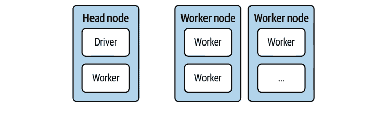

图 1-1. Ray 集群的基本组件

有趣的是，Ray 集群也可以是一个 *本地集群*，即仅由你自己的计算机组成的集群。在这种情况下，只有一个节点，即头节点，它包含驱动程序进程和一些工作进程。默认的工作进程数量是你机器上可用的 CPU 数量。

⁷ 如此多的库构建在 Ray Core 之上的原因之一是它非常精简且易于理解。本书的目标之一是激励你使用 Ray 编写自己的应用程序，甚至是库。

掌握了这些知识，现在是时候动手实践并运行你的第一个本地 Ray 集群了。在任何主要操作系统上使用 pip 安装 Ray 应该都能无缝进行：

```
pip install "ray[rllib, serve, tune]==2.2.0"
```

通过简单的 `pip install ray`，你将只安装 Ray 的基础部分。由于我们想探索一些高级功能，我们安装了“额外组件” `rllib`、`serve` 和 `tune`，我们稍后会讨论它们。⁸ 根据你的系统配置，你可能不需要在此安装命令中使用引号。

接下来，继续启动一个 Python 会话。例如，你可以使用 `ipython` 解释器，它通常适合跟随简单的示例。在你的 Python 会话中，你现在可以轻松地导入并初始化 Ray：

```
import ray
ray.init()
```


如果你不想自己输入命令，也可以跳转到[本章的 Jupyter notebook](link_placeholder) 并在那里运行代码。选择权在你，但无论如何请记住使用 Python 3.7 或更高版本。⁹

通过这两行代码，你已经在本地机器上启动了一个 Ray 集群。这个集群可以利用你计算机上所有可用的核心作为工作进程。目前你的 Ray 集群还没做太多事情，但情况即将改变。

你用来启动集群的 `init` 函数是你将在[第 2 章](link_placeholder)深入了解的六个基本 API 调用之一。总的来说，*Ray Core API* 非常易于访问和使用。但由于它也是一个相当底层的接口，用它构建有趣的示例需要时间。[第 2 章](link_placeholder)有一个详尽的入门示例，帮助你开始使用 Ray Core API，而在[第 3 章](link_placeholder)中，你将看到如何为强化学习构建一个更有趣的 Ray 应用程序。

在前面的代码中，你没有向 `ray.init(...)` 函数提供任何参数。如果你想在“真实”集群上运行 Ray，你必须向 `init` 传递更多参数。这个 `init` 调用通常被称为 *Ray 客户端*，它用于交互式地连接到现有的 Ray 集群。¹⁰ 你可以在 [Ray 文档](https://docs.ray.io/)中阅读更多关于使用 Ray 客户端连接到生产集群的信息。

⁸ 我们通常只在需要时才在本书中引入依赖项，这应该使跟随学习更容易。相比之下，[GitHub 上的笔记本](link_placeholder)为你提供了预先安装所有依赖项的选项，这样你就可以专注于运行代码。

⁹ 在撰写本文时，Ray 尚不支持 Python 3.10，因此坚持使用 3.7 到 3.9 之间的版本应该最适合跟随本书学习。

当然，如果你曾经使用过计算集群，你就知道其中有许多陷阱和复杂性。例如，你可以在由云提供商（如 Amazon Web Services (AWS)、Google Cloud Platform (GCP) 或 Microsoft Azure）托管的集群上部署 Ray 应用程序——每种选择都需要良好的部署和维护工具。你也可以在自己的硬件上启动集群，或使用 Kubernetes 等工具来部署你的 Ray 集群。在[第 9 章](https://example.com/chapter9)（接下来是具体的 Ray 应用程序章节），我们将回到使用 Ray 集群扩展工作负载的主题。

在继续介绍 Ray 的高级库之前，让我们简要总结一下 Ray 作为分布式计算框架的两个基础组件：

*Ray 集群*
此组件负责分配资源、创建节点并确保它们健康运行。开始使用 Ray 集群的一个好方法是其[专用快速入门指南](https://docs.ray.io/cluster/quickstart.html)。

*Ray Core*
一旦你的集群启动并运行，你就使用 Ray Core API 来对其进行编程。你可以通过遵循此组件的[官方演练](https://docs.ray.io/ray-overview/examples.html)来开始使用 Ray Core。

### 一套数据科学库

接下来介绍 Ray 的第二层，在本节中，我们将简要介绍 Ray 自带的所有数据科学库。为此，让我们首先从鸟瞰的角度了解数据科学意味着什么。一旦你理解了这个背景，回顾 Ray 的高级库并了解它们如何对你有用就会容易得多。

### Ray AIR 和数据科学工作流

“数据科学”（DS）这个有些难以捉摸的术语近年来发展了很多，你可以在网上找到许多定义，其有用性各不相同。¹¹ 对我们来说，它是*通过利用数据来获取洞察并构建现实世界应用的实践*。这是一个相当宽泛的定义，适用于一个本质上实用且应用的领域，其核心是构建和理解事物。从这个意义上说，将这个领域的从业者描述为“数据科学家”，就像将黑客描述为“计算机科学家”一样，是一个糟糕的误称。<sup>12</sup>

大致来说，做数据科学是一个迭代过程，包括需求工程、数据收集与处理、构建模型并评估它们，以及部署解决方案。机器学习不一定是这个过程的一部分，但通常是。如果涉及机器学习，你可以进一步指定一些步骤：

*数据处理*
要训练机器学习模型，你需要以机器学习模型理解的格式提供数据。转换和选择哪些数据应输入模型的过程通常称为*特征工程*。这一步可能很混乱。如果你能依赖通用工具来完成这项工作，你将受益匪浅。

*模型训练*
在机器学习中，你需要在上一步处理过的数据上训练你的算法。这包括为任务选择正确的算法，如果你能从各种各样的算法中选择，那会很有帮助。

*超参数调优*
机器学习模型有在模型训练步骤中调整的参数。大多数机器学习模型还有一组称为*超参数*的参数，可以在训练前修改。这些参数会严重影响最终机器学习模型的性能，需要进行适当的调优。有很好的工具可以帮助自动化这个过程。

*模型服务*
训练好的模型需要被部署。服务模型意味着通过任何必要的手段，使其可供任何需要访问的人使用。在原型中，你通常使用简单的 HTTP 服务器，但有许多专门的软件包用于机器学习模型服务。

这个列表绝非详尽，关于构建机器学习应用程序还有很多可以说的。<sup>13</sup> 然而，确实这四个步骤对于使用机器学习的数据科学项目的成功至关重要。

Ray 为我们刚刚列出的四个机器学习特定步骤中的每一个都提供了专用库。具体来说，你可以使用 *Ray Datasets* 处理数据处理需求，使用 *Ray Train* 运行分布式模型训练，运行你的强化学习

¹⁰ 还有其他与 Ray 集群交互的方式，例如 [Ray Jobs CLI](https://docs.ray.io/cluster/jobs-overview.html)。

¹¹ 我们从不喜欢将数据科学归类为学科的交叉点，比如数学、编码和商业。归根结底，这并没有告诉你从业者*做*什么。

¹² 作为一个有趣的练习，我们推荐阅读保罗·格雷厄姆关于这个主题的著名文章《黑客与画家》，并将“计算机科学”替换为“数据科学”。那么黑客 2.0 会是什么样子？

¹³ 如果你想更全面地了解构建机器学习应用程序时数据科学过程的整体视图，Emmanuel Ameisen 的《Building Machine Learning Powered Applications》（O'Reilly）完全致力于此。

使用 *Ray RLlib* 处理工作负载，通过 *Ray Tune* 高效调优超参数，并利用 *Ray Serve* 部署模型。Ray 的架构设计使得所有这些库都具备*原生分布式*特性，这一点我们怎么强调都不为过。

更重要的是，所有这些步骤都是一个完整流程的一部分，很少被孤立地处理。你不仅希望所有涉及的库能够无缝协作，如果能在整个数据科学流程中使用一致的 API，这也会成为一个决定性优势。这正是 Ray AIR 的构建目标：为你的实验提供一个通用的运行时和 API，并在你准备就绪时扩展工作负载。图 1-2 快速概览了 AIR 的所有组件。

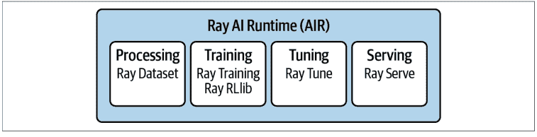

*图 1-2. Ray AIR 作为 Ray 所有当前数据科学库的统一框架*

虽然在本章详细介绍 Ray AI Runtime API 会显得过于冗长（你可以直接跳到第 10 章），但我们将介绍构成它的所有基础模块。让我们逐一了解 Ray 的各个数据科学库。

### 使用 Ray Datasets 进行数据处理

我们将要介绍的第一个 Ray 高级库是 Ray Datasets。这个库包含一个恰如其分地命名为 `Dataset` 的数据结构，众多用于从各种格式和系统加载数据的连接器，一个用于转换此类数据集的 API，一种使用它们构建数据处理管道的方法，以及与其他数据处理框架的许多集成。`Dataset` 抽象建立在强大的 Arrow 框架之上。¹⁴

要使用 Ray Datasets，你需要安装 Python 的 Arrow，例如通过运行 `pip install pyarrow`。以下简单示例从一个 Python 数据结构在你的本地 Ray 集群上创建一个分布式 `Dataset`。具体来说，你将从一个包含字符串 `name` 和整数值 `data` 的 Python 字典创建一个包含 10,000 条记录的数据集：

```python
import ray
items = [{"name": str(i), "data": i} for i in range(10000)]
ds = ray.data.from_items(items)
ds.show(5)
```

❶ 使用 `ray.data` 模块中的 `from_items` 创建一个 Dataset。

❷ 打印 Dataset 的前五项。

显示 Dataset 意味着打印其部分值。你应该在命令行上看到恰好五个元素，如下所示：

```
{'name': '0', 'data': 0}
{'name': '1', 'data': 1}
{'name': '2', 'data': 2}
{'name': '3', 'data': 3}
{'name': '4', 'data': 4}
```

很好，现在你有了一些行数据，但你能用这些数据做什么呢？Dataset API 大量借鉴了函数式编程，因为这种范式非常适合数据转换。

尽管 Python 3 刻意隐藏了其部分函数式编程能力，但你可能已经熟悉 `map`、`filter`、`flat_map` 等功能。如果不熟悉，也很容易上手：`map` 接收数据集中的每个元素并将其并行转换为其他内容；`filter` 根据布尔过滤函数移除数据点；而稍微复杂一些的 `flat_map` 首先像 `map` 一样映射值，但随后还会“扁平化”结果。例如，如果 `map` 产生了一个列表的列表，`flat_map` 会将嵌套列表展平，只给你一个列表。掌握了这三个函数式 API 调用，¹⁵ 让我们看看你可以多么轻松地转换数据集 `ds`：

```python
squares = ds.map(lambda x: x["data"] ** 2) ❶

evens = squares.filter(lambda x: x % 2 == 0) ❷
evens.count()

cubes = evens.flat_map(lambda x: [x, x**3]) ❸
sample = cubes.take(10) ❹
print(sample)
```

❶ 我们将 `ds` 的每一行映射，只保留其数据条目的平方值。

❷ 然后我们过滤平方值，只保留偶数（总共五千个元素）。

❸ 接着我们使用 flat_map 用各自的立方值来扩充剩余的值。

❹ take 10 个值意味着离开 Ray 并返回一个包含这些值的 Python 列表，以便我们可以打印。

Dataset 转换的缺点是每个步骤都是同步执行的。在这个例子中这不是问题，但对于复杂的任务，例如混合读取文件和处理数据，你会希望执行能够重叠各个任务。DatasetPipeline 正是为此而生。让我们将前面的例子重写为一个管道：

```python
pipe = ds.window() ❶
result = pipe \
    .map(lambda x: x["data"] ** 2) \
    .filter(lambda x: x % 2 == 0) \
    .flat_map(lambda x: [x, x**3]) ❷
result.show(10)
```

❶ 你可以通过调用 .window() 将 Dataset 转换为管道。

❷ 管道步骤可以链式调用，产生与之前相同的结果。

关于 Ray Datasets 还有很多内容可以讨论，特别是它与著名数据处理系统的集成，但我们将把深入讨论推迟到第 6 章。

### 模型训练

接下来介绍下一组库，让我们看看 Ray 的分布式训练能力。为此，你可以使用两个库。一个专门用于强化学习；另一个范围不同，主要针对监督学习任务。

## 使用 Ray RLlib 进行强化学习

让我们从用于强化学习的 Ray RLlib 开始。这个库由现代 ML 框架 TensorFlow 和 PyTorch 提供支持，你可以选择使用哪一个。这两个框架在概念上似乎越来越趋同，因此你可以选择最喜欢的一个，而不会损失太多。在整本书中，我们将同时使用 TensorFlow 和 PyTorch 的示例，以便你在使用 Ray 时能对两个框架都有所了解。

对于本节，请立即使用 `pip install tensorflow` 安装 TensorFlow。¹⁶ 要运行代码示例，你还需要使用 `pip install "gym==0.25.0"` 安装 gym 库。

使用 RLlib 运行示例最简单的方法之一是使用命令行工具 `rllib`，我们在运行 `pip install "ray[rllib]"` 时已经隐式安装了它。一旦你在第 4 章运行更复杂的示例，你将主要依赖其 Python API，但现在我们想先体验一下使用 RLlib 运行强化学习实验。

我们将研究一个相当经典的控制问题：在小车上平衡一根杆子。想象一下，你有一根像图 1-3 中那样的杆子，固定在小车的一个关节上，并受重力影响。小车可以沿无摩擦轨道自由移动，你可以通过从左或从右用固定力推它来操纵小车。如果你做得足够好，杆子将保持直立位置。对于杆子没有倒下的每个时间步，我们都会得到 1 的奖励。获得高奖励是我们的目标，问题是我们是否能教会一个强化学习算法来为我们做这件事。


*图 1-3. 通过向左或向右施加力来控制连接在小车上的杆子*

具体来说，我们想训练一个强化学习智能体，它能够执行两个动作，即向左或向右推，观察以这种方式与环境交互时发生的情况，并通过最大化奖励从经验中学习。

要使用 Ray RLlib 解决这个问题，我们可以使用所谓的*调优*示例，这是一个预配置的算法，针对给定问题运行良好。你可以用单个命令运行调优示例。RLlib 附带了许多这样的示例，你可以用 `rllib example list` 列出所有示例。

其中一个可用的示例是 `cartpole-ppo`，这是一个使用 PPO 算法解决小车-杆问题的调优示例，具体来说是 OpenAI Gym 的 CartPole-v1 环境。你可以通过输入 `rllib example get cartpole-ppo` 来查看此示例的配置，这将首先下载该示例。

¹⁴ 在第 6 章，我们将向你介绍使 Ray Datasets 工作的基础知识，包括它对 Arrow 的使用。现在，我们想专注于它的 API 和具体的使用模式。

¹⁵ 我们将在后面的章节中更详细地阐述这一点，特别是在第 6 章，但请注意，Ray Datasets 并非旨在成为通用数据处理库。像 Spark 这样的工具对大规模数据处理有更成熟和优化的支持。

¹⁶ 如果你使用的是 Mac，你将需要安装 `tensorflow-macos`。通常，如果你在系统上安装 Ray 或其依赖项时遇到任何问题，请参考安装指南。

### 使用 Ray Train 进行分布式训练

Ray RLlib 专注于强化学习，但如果你需要为其他类型的机器学习（如监督学习）训练模型该怎么办？在这种情况下，你可以使用另一个 Ray 库进行分布式训练：Ray Train。目前，我们对 TensorFlow 等框架的了解还不够深入，无法为你提供一个简洁且信息丰富的 Ray Train 示例。如果你对分布式训练感兴趣，可以跳到第 6 章。

### 超参数调优

命名事物很难，但 *Ray Tune*（你可以用它来调整各种参数）正中下怀。它专门为寻找机器学习模型的良好超参数而构建。典型的设置如下：

- 你想运行一个计算成本极高的训练函数。在机器学习中，运行需要数天甚至数周的训练过程并不少见，但假设你处理的只是几分钟。
- 作为训练的结果，你需要计算一个所谓的**目标函数**。通常，你希望根据实验的性能最大化收益或最小化损失。
- 棘手的是，你的训练函数可能依赖于某些参数，称为**超参数**，这些参数会影响目标函数的值。
- 你可能对各个超参数应该是什么有一个直觉，但调整它们可能很困难。即使你可以将这些参数限制在合理的范围内，测试广泛的组合通常也是不可行的。你的训练函数成本太高了。

你能做些什么来高效地采样超参数并获得“足够好”的目标结果？解决这个问题的领域称为 *超参数优化*（HPO），Ray Tune 拥有一套庞大的算法来解决它。让我们看一个 Ray Tune 用于我们刚才解释的情况的例子。重点再次放在 Ray 及其 API 上，而不是特定的机器学习任务（我们目前只是模拟）：

```python
from ray import tune
import math
import time

def training_function(config):  # ❶
    x, y = config["x"], config["y"]
    time.sleep(10)
    score = objective(x, y)
    tune.report(score=score)  # ❷

def objective(x, y):
    return math.sqrt((x**2 + y**2)/2)  # ❸

result = tune.run(  # ❹
    training_function,
    config={
        "x": tune.grid_search([-1, -.5, 0, .5, 1]),  # ❺
        "y": tune.grid_search([-1, -.5, 0, .5, 1])
    })

print(result.get_best_config(metric="score", mode="min"))
```

1. 模拟一个依赖于两个超参数 x 和 y 的昂贵训练函数，从配置中读取。
2. 在休眠 10 秒以模拟训练并计算目标后，将分数报告给 tune。
3. 目标函数计算 x 和 y 的平方和的平均值，并返回该项的平方根。这种类型的目标在机器学习中相当常见。
4. 使用 tune.run 在我们的 training_function 上初始化超参数优化。
5. 一个关键部分是为 x 和 y 提供一个参数空间供 tune 搜索。

注意这次运行的输出在结构上与你在 RLlib 示例中看到的相似。这并非巧合，因为 RLlib（以及许多其他 Ray 库）在底层使用了 Ray Tune。如果你仔细观察，你会看到 PENDING（等待执行）、RUNNING（运行中）和 TERMINATED（已终止）的运行。Tune 会自动负责选择、调度和执行你的训练运行。

具体来说，这个 Tune 示例为具有给定目标（我们希望最小化）的 training_function 找到了参数 x 和 y 的最佳选择。尽管目标函数起初可能看起来有点令人生畏，因为我们计算 x 和 y 的平方和，但所有值都是非负的。这意味着最小值在 x=0 和 y=0 处获得，此时目标函数的值为 0。

我们对所有可能的参数组合进行了所谓的网格搜索。由于我们明确地为 x 和 y 传递了 5 个可能的值，因此总共有 25 种组合被输入到训练函数中。由于我们指示 training_function 休眠 10 秒，顺序测试所有超参数组合总共需要超过 4 分钟。由于 Ray 在并行化此工作负载方面很智能，对我们来说整个实验只花了大约 35 秒，但根据你运行它的位置，可能需要更长时间。

现在，想象一下每次训练运行需要几个小时，并且我们有 20 个而不是 2 个超参数。这使得网格搜索变得不可行，特别是如果你对参数范围没有合理的猜测。在这种情况下，你将不得不使用 Ray Tune 中更复杂的 HPO 方法，如第 5 章所述。

### 模型服务

我们将讨论的Ray高级库中，最后一个专门用于模型服务，简称为*Ray Serve*。要查看其实际应用示例，你需要一个训练好的机器学习模型来提供服务。幸运的是，如今你可以在互联网上找到许多已经为你训练好的有趣模型。例如，Hugging Face提供了多种模型供你直接在Python中下载。我们将使用的模型是一个名为*GPT-2*的语言模型，它以文本作为输入，并生成文本以继续或完成输入。例如，你可以提出一个问题，GPT-2会尝试完成它。

提供这样的模型服务是使其易于访问的好方法。你可能不知道如何在计算机上加载和运行TensorFlow模型，但你确实知道如何用简单的英语提问。模型服务隐藏了解决方案的实现细节，让用户专注于提供输入和理解模型的输出。

要继续，请确保运行`pip install transformers`来安装包含我们想要使用的模型的Hugging Face库。17 现在我们可以导入并启动Ray的serve库实例，加载并部署一个GPT-2模型，然后询问它生命的意义，如下所示：

```
from ray import serve
from transformers import pipeline
import requests

serve.start() ❶

@serve.deployment ❷
def model(request):
    language_model = pipeline("text-generation", model="gpt2") ❸
    query = request.query_params["query"]
    return language_model(query, max_length=100) ❹

model.deploy() ❺

query = "What's the meaning of life?"
response = requests.get(f"http://localhost:8000/model?query={query}") ❻
print(response.text)
```

17 根据你使用的操作系统，你可能需要先安装Rust编译器才能使其工作。例如，在Mac上，你可以使用`brew install rust`进行安装。

1. 在本地启动serve。
2. @serve.deployment装饰器将一个带有request参数的函数转换为一个serve部署。
3. 在每次请求时在model函数内部加载language_model效率低下，但这是向你展示部署的最快方式。
4. 要求模型最多给我们100个字符来继续我们的查询。
5. 正式部署模型，使其能够开始通过HTTP接收请求。
6. 使用不可或缺的requests库来获取你可能有的任何问题的响应。

在第9章中，你将学习如何在各种场景中正确部署模型，但现在我们鼓励你尝试这个示例并测试不同的查询。反复运行最后两行代码几乎每次都会给你不同的答案。这里有一个略带黑暗诗意的宝石，来自一个我们为未成年读者稍作审查的查询，它提出了更多问题：

```
[{
    "generated_text": "What's the meaning of life?\n\nIs there one way or another of living?\n\nHow does it feel to be trapped in a relationship?\n\nHow can it be changed before it's too late?\n\nWhat did we call it in our time?\n\nWhere do we fit within this world and what are we going to live for?\n\nMy life as a person has been shaped by the love I've received from others."
}]
```

这结束了我们对Ray数据科学库的旋风之旅，这是Ray的第二层。最终，本章介绍的所有高级Ray库都是Ray Core API的扩展。Ray使得构建新扩展相对容易，还有一些我们无法在本书中全面讨论的扩展。例如，相对较新的Ray Workflows，它允许你使用Ray定义和运行长时间运行的应用程序。

在结束本章之前，让我们非常简要地看一下第三层，即围绕Ray不断增长的生态系统。

### 不断增长的生态系统

Ray的高级库功能强大，值得在本书中进行更深入的探讨。虽然它们对数据科学生命周期的有用性是不可否认的，但我们也不想给人留下Ray是你现在唯一需要的印象。毫不奇怪，最好和最成功的框架是那些与现有解决方案和思想良好集成的框架。最好专注于你的核心优势，并利用其他工具来弥补你解决方案中的不足，Ray在这方面做得很好。

在整本书中，特别是在第11章，我们将讨论许多建立在Ray之上的有用的第三方库。Ray生态系统还与现有工具有许多集成。举个例子，回想一下Ray Datasets是Ray的数据加载和计算库。如果你碰巧有一个已经使用Spark或Dask等数据处理引擎的现有项目，18 你可以将这些工具与Ray一起使用。具体来说，你可以使用Dask-on-Ray调度器在Ray集群上运行整个Dask生态系统，或者你可以使用Spark on Ray项目将你的Spark工作负载与Ray集成。同样，Modin项目是Pandas DataFrames的分布式直接替代品，它使用Ray（或Dask）作为分布式执行引擎（“Pandas on Ray”）。

这里的共同主题是，Ray并不试图取代所有这些工具，而是与它们集成，同时仍然让你访问其原生的Ray Datasets库。我们将在第11章更详细地讨论Ray与更广泛生态系统中其他工具的关系。

许多Ray库的一个重要方面是它们将常用工具无缝集成为*后端*。Ray通常创建通用接口，而不是试图创建新标准。19 这些接口允许你以分布式方式运行任务，这是大多数相应后端不具备的特性，或者不具备同等程度。例如，Ray RLlib和Train由TensorFlow和PyTorch的全部功能支持。而Ray Tune支持几乎所有著名的HPO工具中的算法，包括Hyperopt、Optuna、Nevergrad、Ax、SigOpt等等。这些工具默认都不是分布式的，但Tune将它们统一在一个*用于分布式工作负载的通用接口*中。

18 Spark是由伯克利的另一个实验室AMPLab创建的。互联网上充斥着博客文章声称Ray因此应该被视为Spark的替代品。最好将它们视为具有不同优势的工具，两者都可能长期存在。

19 在深度学习框架Keras成为TensorFlow的官方部分之前，它最初是为各种底层框架（如Theano或CNTK）提供的便捷API规范。从这个意义上说，Ray RLlib有机会成为“强化学习的Keras”，而Ray Tune可能就是“超参数优化的Keras”。更广泛采用所缺少的部分可能只是一个更优雅的API。

### 总结

图1-4概述了我们所阐述的Ray的三层结构。Ray的核心分布式执行引擎位于框架的中心。Ray Core API是一个用于分布式计算的通用库，Ray Clusters允许你以多种方式部署你的工作负载。

对于实际的数据科学工作流，你可以使用Ray Datasets进行数据处理，Ray RLib进行强化学习，Ray Train进行分布式模型训练，Ray Tune进行超参数调优，Ray Serve进行模型服务。你已经看到了每个库的示例，并对其API包含的内容有了概念。Ray AIR为所有其他Ray ML库提供了统一的API，并且是根据数据科学家的需求构建的。

除此之外，Ray的生态系统有许多扩展、集成和后端，我们将在后面更深入地探讨。也许你已经能在图1-4中发现一些你认识和喜欢的工具？

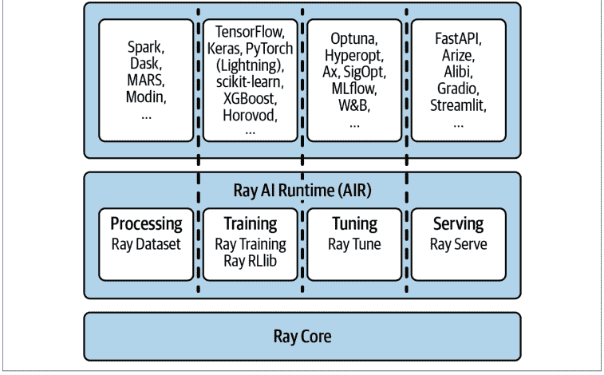

Ray Core API位于图1-4的中心，周围是RLib、Ray Tune、Ray Train、Ray Serve、Ray Datasets等库，以及许多无法在此一一列举的第三方集成。

# 第2章
Ray Core入门

对于一本关于分布式Python的书籍来说，Python本身在分布式计算方面基本上无效，这具有某种讽刺意味。它的解释器实际上是单线程的。例如，这使得使用纯Python难以利用同一台机器上的多个CPU，更不用说整个机器集群了。这意味着你需要额外的工具，幸运的是Python生态系统为你提供了一些选择。像multiprocessing这样的库可以帮助你在单台机器上分配工作，1 但仅限于此。

作为一个Python库，Ray Core API功能强大，足以让整个Python社区更容易进行通用分布式编程。打个比方，一些公司通过部署预训练的机器学习模型来满足他们的用例，但这种策略并不总是有效。通常不可避免地需要训练自定义模型才能成功。同样，你的分布式工作负载*可能*只是适合现有框架的（可能有限的）编程模型，但由于其通用性，Ray Core可以解锁构建分布式应用程序的全部潜力。2 由于它如此基础，我们将整章用于Ray Core的基础知识，并在第3章中全部用于使用Core API构建一个有趣的应用程序。这样你就掌握了关于Ray Core的实用知识，并可以在后面的章节和你自己的项目中使用它。

在本章中，你将通过启动一个本地集群来理解Ray Core如何处理分布式计算，并且你将学习如何使用Ray精简而强大的API来并行化一些有趣的计算。例如，你将构建一个示例，该示例

1 注意，Ray自带了multiprocessing的直接替代品，你可能会发现它对某些工作负载有用。
2 这代表了通用性与专业化之间的权衡。通过在Core API之上提供专门但可互操作的库，Ray提供了各种抽象级别的工具。

## Ray Core 简介

本章的大部分内容将是一个我们将共同构建的扩展 Ray Core 示例。Ray 的许多概念都可以通过一个好例子来解释，这正是我们将要做的。


和之前一样，你可以通过自己输入代码（强烈推荐）或参考[本章的 notebook](http://example.com) 来跟随这个示例。无论如何，请确保你已经安装了 Ray，例如通过 `pip install ray`。

在[第 1 章](http://example.com)中，我们向你展示了如何通过简单地调用 `import ray` 然后使用 `ray.init()` 初始化来启动一个本地集群。运行此代码后，你将看到以下形式的输出。在此示例输出中，我们省略了很多信息，因为那需要你首先了解更多的 Ray 内部机制：

```
... INFO services.py:1263 -- View the Ray dashboard at http://127.0.0.1:8265
{'node_ip_address': '192.168.1.41',
...
'node_id': '...'}
```

此输出表明你的 Ray 集群已启动并正在运行。从输出的第一行可以看出，Ray 自带一个预打包的仪表板。³ 你可以在 [http://127.0.0.1:8265](http://127.0.0.1:8265) 查看它，除非你的输出显示了不同的端口。如果你想探索仪表板，可以花些时间。例如，你应该能看到所有列出的 CPU 核心以及你的（简单的）Ray 应用程序的总利用率。要在 Python 中查看 Ray 集群的资源使用情况，只需调用 `ray.cluster_resources()`。输出应类似于：

```
{'CPU': 12.0,
 'memory': 14203886388.0,
 'node:127.0.0.1': 1.0,
 'object_store_memory': 2147483648.0}
```

> ³ 仪表板正在我们撰写这些文字时进行重新设计。尽管我们很想向你展示它的截图并带你浏览，但目前你只能[自己探索](http://example.com)。

你需要一个正在运行的 Ray 集群来运行本章中的示例，因此请确保在继续之前已启动一个。本节的目标是让你快速了解 Ray Core API，从现在起我们将简单地称之为 Ray API。

对于 Python 程序员来说，Ray API 的妙处在于它非常贴近你的习惯。它使用了诸如装饰器、函数和类等熟悉的概念，为你提供快速的学习体验。Ray API 旨在为分布式计算提供一个通用的编程接口。这当然不是一项简单的任务，但我们认为 Ray 在这方面取得了成功，因为它为你提供了直观易学易用的良好抽象。Ray 的引擎在后台为你完成了所有繁重的工作。这种设计哲学使得 Ray 能够与现有的 Python 库和系统一起使用。

请注意，我们在这本书中从 Ray Core 开始的原因是我们相信它在使分布式计算更易于访问方面具有巨大潜力。本质上，本章是关于一窥 Ray 运行如此出色的幕后原理，以及你如何掌握其基础。如果你是一个经验较少的 Python 程序员，或者只想专注于更高层次的任务，Ray Core 可能需要一些时间来适应。⁴ 话虽如此，我们强烈建议学习 Ray Core API，因为这是用 Python 进入分布式计算领域的好方法。

⁴ 如果你属于这些类别，听到许多数据科学家很少直接使用 Ray Core 可能会让你感到宽慰。相反，他们直接使用 Ray 的高级库，如 Datasets、Train 或 Tune。

### 使用 Ray API 的第一个示例

为了给你一个例子，考虑以下从数据库检索和处理数据的函数。我们的示例数据库是一个普通的 Python 列表，包含本书标题的单词。我们通过让 Python 休眠来模拟从数据库中检索单个项目并进一步处理它的开销：

```
import time

database = [
    "Learning", "Ray",
    "Flexible", "Distributed", "Python", "for", "Machine", "Learning"
]

def retrieve(item):
    time.sleep(item / 10.)
    return item, database[item]
```

❶ 一个包含本书标题字符串数据的示例数据库。

❷ 模拟一个耗时较长的数据处理操作。

我们的数据库总共有八个条目。如果我们顺序检索所有条目，这需要多长时间？对于索引为 5 的条目，我们等待半秒（5 / 10），依此类推。总的来说，我们可以预期运行时间约为 (0 + 1 + 2 + 3 + 4 + 5 + 6 + 7) / 10 = 2.8 秒。让我们看看实际结果是否如此：

```
def print_runtime(input_data, start_time):
    print(f'Runtime: {time.time() - start_time:.2f} seconds, data:')
    print(*input_data, sep='\n')
```

```
start = time.time()
data = [retrieve(item) for item in range(8)] ❶
print_runtime(data, start) ❷
```

❶ 使用列表推导式检索所有八个条目。

❷ 解包数据以将每个条目打印在单独的行上。

如果你运行此代码，你应该会看到以下输出：

```
Runtime: 2.82 seconds, data:
(0, 'Learning')
(1, 'Ray')
(2, 'Flexible')
(3, 'Distributed')
(4, 'Python')
(5, 'for')
(6, 'Machine')
(7, 'Learning')
```

有一点额外开销使总运行时间达到 2.82 秒。在你那边，这可能会稍少一些，或者多得多，这取决于你的计算机。重要的结论是，我们朴素的 Python 实现无法并行运行此函数。

这可能并不让你感到惊讶，但你至少可能怀疑过 Python 列表推导式在这方面更高效。我们得到的运行时间几乎是最坏的情况，即我们在运行代码之前计算的 2.8 秒。仔细想想，看到一个本质上大部分运行时间都在休眠的程序整体上如此缓慢，甚至可能有点令人沮丧。最终你可以将此归咎于*全局解释器锁*（GIL），但它已经承受了足够的指责。

### Python 的全局解释器锁

GIL 无疑是 Python 语言最臭名昭著的特性之一。简而言之，它是一个锁，确保你的计算机上一次只有一个线程可以执行你的 Python 代码。如果你使用多线程，线程需要轮流控制 Python 解释器。

GIL 的实现有其充分的理由。首先，它使 Python 中的内存管理变得容易得多。另一个关键优势是它使单线程程序相当快。主要使用大量系统输入和输出（我们称它们为 I/O 密集型）的程序，如读取文件或数据库，也能受益。主要缺点之一是 CPU 密集型程序本质上是单线程的。事实上，CPU 密集型任务在不使用多线程时甚至可能运行得*更快*，因为后者在 GIL 之上还会产生写锁开销。

考虑到所有这些，如果你相信 [Larry Hastings](https://www.youtube.com/watch?v=KlZnEq4VrDI)，GIL 可能有点矛盾地成为 Python 流行的原因之一。有趣的是，Hastings 还领导了（未成功的）在名为 *GILectomy* 的项目中移除它的努力，这正是它听起来的那种复杂手术。目前尚无定论，但 [Sam Gross](https://github.com/colesbury/nogil) 可能已经在他的 Python 3.9 nogil 分支中找到了移除 GIL 的方法。目前，如果你绝对需要绕过 GIL，可以考虑使用不同于 CPython 的实现。CPython 是 Python 的标准实现，如果你不知道你正在使用它，那你肯定在使用它。像 Jython、IronPython 或 PyPy 这样的实现没有 GIL，但它们有自己的缺点。

### 函数和远程 Ray 任务

可以合理地假设这样的任务可以从并行化中受益。完美分布的情况下，运行时间不应比最长的子任务长太多，即 7/10 = 0.7 秒。那么，让我们看看如何扩展这个示例以在 Ray 上运行。为此，首先使用 `@ray.remote` 装饰器，如下所示：

```
@ray.remote
def retrieve_task(item):
    return retrieve(item)
```

- 1. 只需使用这个装饰器就可以将任何 Python 函数变成一个 Ray 任务。
- 2. 其他一切保持不变。`retrieve_task` 只是传递给 `retrieve`。

通过这种方式，函数 `retrieve_task` 成为一个所谓的 Ray 任务。本质上，Ray 任务是一个在与调用它的进程不同的进程上执行的函数，可能在不同的机器上。

这是一个极其便捷的设计选择，因为你可以专注于你的 Python 代码，而无需完全改变你的思维模式或编程范式来使用 Ray。请注意，在实践中，你只需在原始的 `retrieve` 函数上添加 `@ray.remote` 装饰器即可（毕竟，这就是装饰器的预期用途），但为了尽可能清晰，我们不想修改之前的代码。

很简单，那么你需要在检索数据库条目和测量性能的代码中做哪些更改呢？事实证明，改动不多。示例 2-1 展示了如何操作。⁵

**示例 2-1. 测量你的 Ray 任务的性能**

```python
start = time.time()
object_references = [ ①
    retrieve_task.remote(item) for item in range(8)
]
data = ray.get(object_references) ②
print_runtime(data, start)
```

① 要在你的本地 Ray 集群上运行 `retrieve_task`，你需要像以前一样使用 `.remote()` 并传入你的项目。每个任务返回一个对象。

② 要获取实际的数据，而不仅仅是 Ray 对象引用，你需要使用 `ray.get`。

你发现区别了吗？你必须使用 `.remote()` 调用来远程执行你的 Ray 任务。⁶ 当 Ray 远程执行任务时，即使是在你的本地集群上，它也是异步执行的。上一个代码片段中 `object_references` 里的列表项并不直接包含结果。事实上，如果你用 `type(object_references[0])` 检查第一个项目的 Python 类型，你会看到它实际上是一个 `ObjectRef`。这些对象引用对应于 futures，你需要向它们请求结果。这就是调用 `ray.get(...)` 的目的。每当你对一个 Ray 任务调用 `remote` 时，它会立即返回一个或多个对象引用。你应该将 Ray 任务视为创建对象的主要方法。在下一节中，我们将向你展示一个将多个任务链接在一起并让 Ray 负责在它们之间传递和解析对象的示例。

⁵ 严格来说，这第一个示例有点反模式，因为你通常不应该通过全局变量在 Ray 任务之间共享可变状态。话虽如此，对于这个玩具数据示例，你不必过度思考这部分。请放心，我们将在下一节中展示更好的做法。

⁶ 本书面向数据科学从业者，因此我们不会在此讨论 Ray 架构的概念细节。如果你好奇并想了解更多关于 Ray 任务如何执行的信息，请查看 Ray 架构白皮书。

我们仍然想在这个示例上做更多工作，⁷ 但让我们在这里退一步，回顾一下我们到目前为止做了什么。你从一个 Python 函数开始，并用 `@ray.remote` 装饰它。这使你的函数成为一个 Ray 任务。然后，你没有在代码中调用原始函数，而是对 Ray 任务调用了 `.remote(...)`。最后一步是使用 `.get(...)` 从你的 Ray 集群获取结果。这个过程非常直观，你可能能够从另一个函数创建自己的 Ray 任务，而无需回顾这个示例。为什么不现在就试一试呢？

回到我们的示例：通过使用 Ray 任务，我们在性能方面获得了什么？我们的运行时间是 0.71 秒，仅比最长的子任务（0.7 秒）稍长一点。这很棒，比以前好得多，但我们可以通过利用更多的 Ray API 来进一步改进我们的程序。

### 使用对象存储进行 put 和 get

你可能注意到的一件事是，在 `retrieve` 的定义中，我们*直接*从数据库中访问项目。在本地 Ray 集群上工作时，这没问题，但想象一下你正在一个包含多台计算机的实际集群上运行。所有这些计算机如何访问相同的数据？回想一下第 1 章，在 Ray 集群中，有一个头节点运行 một，黑...
。。。。。。。..。。。。。。。。。。 (。。点。 T。。。像。默认情况下，Ray 会创建与你机器上 CPU 核心数一样多的工作进程。我们的数据库目前仅在驱动程序上定义，但运行你任务的工作进程需要访问它才能运行 `retrieve` 任务。幸运的是，Ray 提供了一种简单的方法在驱动程序和工作进程之间（或在工作进程之间）共享*对象*。你可以简单地使用 `put` 将你的数据放入 Ray 的*分布式对象存储*中。在我们的 `retrieve_task` 定义中，我们显式地传入一个 `db` 参数，稍后我们将向其传递我们的 `db_object_ref` 对象：

```python
db_object_ref = ray.put(database) ①

@ray.remote
def retrieve_task(item, db): ②
    time.sleep(item / 10.)
    return item, db[item]
```

① 将你的数据库放入对象存储并接收一个引用。这样我们就可以在以后显式地将此引用传递给我们的 Ray 任务。

② Ray 任务 `retrieve_task` 将对象引用作为参数。

⁷ 此示例改编自 Dean Wampler 的精彩报告《什么是 Ray？》。

通过这种方式使用对象存储，你可以让 Ray 处理整个集群的数据访问。我们将在讨论 Ray 基础设施时详细讨论值如何在节点之间和工作进程内部传递。虽然与对象存储的交互需要一些开销，但在处理更大、更现实的数据集时，它能为你带来性能提升。目前，重要的是这一步在真正的分布式环境中是必不可少的。如果你愿意，可以尝试用这个新的 `retrieve_task` 函数重新运行示例 2-1，并确认它仍然按预期运行。

### 使用 Ray 的 wait 函数进行非阻塞调用

注意在示例 2-1 中，我们使用了 `ray.get(object_references)` 来访问结果。这个调用是阻塞的，这意味着我们的驱动程序必须等待所有结果都可用。在我们的情况下，这没什么大不了的；程序现在不到一秒就完成了。但想象一下，处理每个数据库条目需要几分钟。在这种情况下，你会希望释放驱动程序进程以执行其他任务，而不是无所事事地坐着。此外，最好在结果可用时就处理它们（有些完成得比其他快得多），而不是等待所有项目都被处理完毕。还有一个需要记住的问题是，如果其中一个数据库条目无法按预期检索会发生什么？假设数据库连接中某处存在死锁。驱动程序将只是挂起，永远无法检索所有条目。因此，使用合理的超时时间是个好主意。假设我们不想等待超过最长数据检索任务 10 倍的时间才停止任务。以下是你可以通过使用 `wait` 来实现这一点的方法：

```python
start = time.time()
object_references = [
    retrieve_task.remote(item, db_object_ref) for item in range(8)
]
all_data = []

while len(object_references) > 0:
    finished, object_references = ray.wait(
        object_references, num_returns=2, timeout=7.0
    )
    data = ray.get(finished)
    print_runtime(data, start)
    all_data.extend(data)
```

1. 对我们的 `retrieve_task` 运行 `remote`，并传递我们想要检索的相应项目以及数据库的对象引用。
2. 不阻塞，而是循环遍历未完成的 `object_references`。
3. 我们以合理的超时时间异步等待完成的数据。这里的 `object_references` 被覆盖，以防止无限循环。
4. 在结果可用时打印它们，即每两个一组。
5. 将新数据附加到 `all_data` 直到完成。

如你所见，`ray.wait` 返回两个参数：已完成的值和仍需处理的 futures。我们使用 `num_returns` 参数（默认为 1），让 `wait` 在每对新的数据库项目可用时返回。这为我们产生了以下输出：

```
Runtime: 0.11 seconds, data:
(0, 'Learning')
(1, 'Ray')
Runtime: 0.31 seconds, data:
(2, 'Flexible')
(3, 'Distributed')
Runtime: 0.51 seconds, data:
(4, 'Python')
(5, 'for')
Runtime: 0.71 seconds, data:
(6, 'Machine')
(7, 'Learning')
```

注意在 while 循环中，我们本可以做许多其他事情，而不仅仅是打印结果，例如使用到目前为止已检索到的值在其他工作进程上启动全新的任务。

### 处理任务依赖关系

到目前为止，我们的示例程序在概念层面上相当简单。它由一个步骤组成：检索一堆数据库项目。现在，想象一下，一旦你的数据加载完毕，你想运行一个后续处理任务。更具体地说，假设我们想使用第一个检索任务的结果来查询其他相关数据（假装你正在查询同一数据库中不同表的数据）。示例 2-2 设置了这样一个任务，并连续运行我们的 `retrieve_task` 和 `follow_up_task`。

**示例 2-2. 运行依赖于另一个 Ray 任务的后续任务**

```python
@ray.remote
def follow_up_task(retrieve_result): ①
    original_item, _ = retrieve_result
    follow_up_result = retrieve(original_item + 1) ②
    return retrieve_result, follow_up_result ③

retrieve_refs = [retrieve_task.remote(item, db_object_ref) for item in [0, 2, 4, 6]]
follow_up_refs = [follow_up_task.remote(ref) for ref in retrieve_refs] ④
```

result = [print(data) for data in ray.get(follow_up_refs)]

1.  使用 `retrieve_task` 的结果，在其基础上计算另一个 Ray 任务。
2.  利用第一个任务中的 `original_item`，`retrieve` 更多数据。
3.  返回原始数据和后续数据。
4.  将第一个任务的对象引用传递给第二个任务。

运行此代码将产生以下输出：

((0, 'Learning'), (1, 'Ray'))
((2, 'Flexible'), (3, 'Distributed'))
((4, 'Python'), (5, 'for'))
((6, 'Machine'), (7, 'Learning'))

如果你没有太多异步编程经验，你可能对示例 2-2 并不感到惊讶。但我们希望让你相信，这段代码片段能够运行起来，这至少有点令人惊讶。⁸ 那么，这有什么大不了的呢？毕竟，代码读起来就像普通的 Python：一个函数定义和几个列表推导式。关键在于，`follow_up_task` 的函数体期望其输入参数 `retrieve_result` 是一个 Python 元组，我们在函数定义的第一行对其进行了解包。

但是，通过调用 `[follow_up_task.remote(ref) for ref in retrieve_refs]`，我们*并没有*向后续任务传递元组。相反，我们传递的是带有 `retrieve_refs` 的 Ray *对象引用*。底层发生的情况是，Ray 知道 `follow_up_task` 需要实际的值，因此在这个任务内部，它会调用 `ray.get` 来解析这些 future。⁹ Ray 为所有任务构建一个依赖图，并按照尊重依赖关系的顺序执行它们。你不必显式地告诉 Ray 何时等待前一个任务完成；它会为你推断出这些信息。这也向你展示了 Ray 对象存储的一个强大功能：如果中间值很大，你可以避免将它们复制回驱动程序。你只需将对象引用传递给下一个任务，让 Ray 处理剩下的事情。

后续任务只有在各个检索任务完成后才会被调度。如果你问我们，这是一个不可思议的功能。事实上，如果我们调用

⁸ 根据克拉克第三定律，任何足够先进的技术都与魔法无异。对我来说，这个例子就有点魔法的味道。

⁹ 之前发生过同样的事情，当时我们将一个对象引用传递给 `retrieve_task` 的远程调用，然后直接在那里访问数据库 `db` 的相应条目。我们不想让你过多地偏离那个例子的重点。

retrieve_refs 时使用了类似 retrieve_result 的名字，你可能甚至没有注意到这个重要的细节。这是设计使然。Ray 希望你专注于你的工作，而不是集群计算的细节。在图 2-1 中，你可以看到这两个任务的依赖关系图可视化。

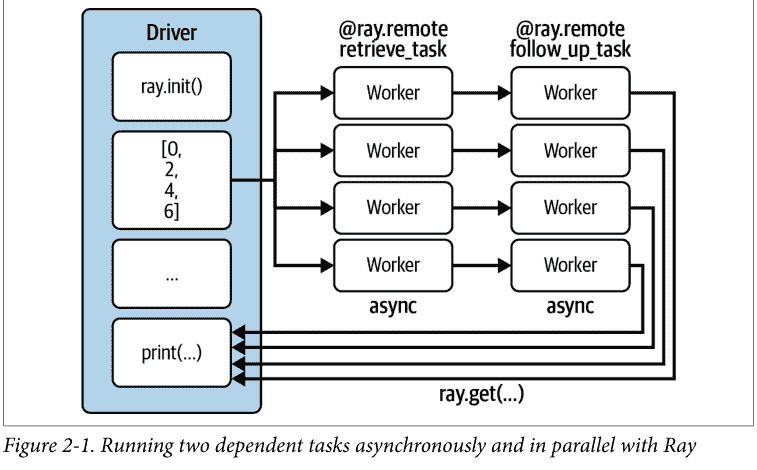

如果你愿意，可以尝试重写示例 2-2，使其在将值传递给后续任务之前显式地对第一个任务使用 get。这不仅引入了更多的样板代码，而且编写和理解起来也更不直观。

### 从类到 Actor

在结束这个例子之前，让我们再讨论一个 Ray Core 的重要概念。注意，在我们的例子中，一切本质上都是函数。我们只是使用了 `ray.remote` 装饰器将其中一些变成了远程函数，除此之外，我们使用的是普通的 Python。

假设我们想跟踪数据库被查询了多少次。当然，我们可以简单地计算检索任务的结果，但有没有更好的方法呢？我们希望以一种可扩展的“分布式”方式来跟踪这一点。为此，Ray 有 actor 的概念。actor 允许你在集群上运行有状态的计算。它们也可以相互通信。¹⁰ 就像 Ray 任务只是被装饰的函数一样，Ray actor 是被装饰的 Python 类。让我们编写一个简单的计数器来跟踪我们的数据库调用：

```
@ray.remote
class DataTracker:
    def __init__(self):
        self._counts = 0

    def increment(self):
        self._counts += 1

    def counts(self):
        return self._counts
```

1.  使用与之前相同的 `ray.remote` 装饰器将任何 Python 类变成 Ray actor。

这个 DataTracker 类已经是一个 actor 了，因为我们为它配备了 `ray.remote` 装饰器。这个 actor 可以跟踪状态，这里只是一个简单的计数器，它的方法是 Ray 任务，调用方式与我们之前调用函数完全相同，即使用 `.remote()`。让我们看看如何修改现有的 `retrieve_task` 来整合这个新的 actor：

```
@ray.remote
def retrieve_tracker_task(item, tracker, db):
    time.sleep(item / 10.)
    tracker.increment.remote()
    return item, db[item]

tracker = DataTracker.remote()

object_references = [
    retrieve_tracker_task.remote(item, tracker, db_object_ref)
    for item in range(8)
]
data = ray.get(object_references)

print(data)
print(ray.get(tracker.counts.remote()))
```

1.  将 tracker actor 传递到此任务中。
2.  tracker 在每次调用时接收一个增量。
3.  通过调用类上的 `.remote()` 来实例化我们的 DataTracker actor。
4.  actor 被传递到检索任务中。
5.  之后，我们可以通过另一个远程调用从 tracker 获取计数状态。

毫不奇怪，这个计算的结果实际上是 8。我们不需要 actor 来计算这个，但拥有一个跨集群跟踪状态的机制可能很有用，可以跨越多个任务。事实上，我们可以将 actor 传递给任何依赖任务，甚至传递给另一个 actor 的构造函数。你能做的事情没有限制，正是这种灵活性使得 Ray API 如此强大。分布式 Python 工具允许像这样的有状态计算并不常见。这个功能可以派上用场，尤其是在运行复杂的分布式算法时，例如使用强化学习时。

这完成了我们广泛的第一个 Ray API 示例。接下来我们将简要总结 Ray API。


在这个通过示例进行的介绍中，我们重点关注了 Ray 任务和 actor 作为 Python 函数和类的分布式版本。但*对象*在 Ray Core 中也是一等公民，应被视为与任务和 actor 地位平等。对象存储是 Ray 的核心组件。

### Ray Core API 概览

如果你回想一下我们在前面的例子中做了什么，你会注意到我们总共只使用了六个 API 方法。¹¹ 我们使用 `ray.init()` 来启动集群，使用 `@ray.remote` 将函数和类转换为任务和 actor。然后我们使用 `ray.put()` 将值放入 Ray 的对象存储，使用 `ray.get()` 从集群中检索对象。最后，我们在 actor 方法或任务上使用 `.remote()` 在集群上运行代码，并使用 `ray.wait` 来避免阻塞调用。

虽然六个 API 方法看起来不多，但当你使用 Ray API 时，这些可能是你唯一会关心的。¹² 我们在表 2-1 中简要总结了它们，以便你将来可以轻松参考。

¹¹ 引用 Alan Kay 的话，要获得简单性，你需要找到稍微更复杂的构建块。Ray API 为分布式 Python 做的正是这件事。

¹² 查看 API 参考，你会发现实际上还有更多可用的方法。在某个时候，你应该花时间理解 `init` 的参数，但如果你不是 Ray 集群的管理员，其他所有方法可能都不会引起你的兴趣。

表 2-1. Ray Core 的六个主要 API 方法

| API 调用 | 描述 |
| :--- | :--- |
| ray.init() | 初始化你的 Ray 集群。传入一个地址以连接到现有集群。 |
| @ray.remote | 将函数转换为任务，将类转换为 actor。 |
| ray.put() | 将值放入 Ray 的对象存储。 |
| ray.get() | 从对象存储中获取值。返回你放入其中的值或由任务或 actor 计算出的值。 |
| .remote() | 在你的 Ray 集群上运行 actor 方法或任务，并用于实例化 actor。 |
| ray.wait() | 返回两个对象引用列表，一个包含我们正在等待的已完成任务，另一个包含未完成的任务。 |

既然你已经看到了 Ray API 的实际应用，让我们花一些时间了解它的系统架构。

### 理解 Ray 系统组件

你已经了解了 Ray API 的使用方式以及 Ray 背后的设计理念。现在是时候更好地理解底层系统组件了。换句话说，Ray 是如何工作的，以及它是如何实现其功能的？

#### 在节点上调度和执行工作

你知道 Ray 集群由节点组成。我们将首先看看单个节点上发生了什么，然后再放大讨论整个集群如何协同工作。

正如我们已经讨论过的，一个工作节点由几个工作进程或简称工作进程组成。每个工作进程都有一个唯一的 ID、一个 IP 地址和一个端口，通过它们可以被引用。工作进程被称为“工作进程”是有原因的；它们是盲目执行你交给它们的工作的组件。但是谁告诉它们该做什么以及什么时候做呢？一个工作进程可能已经很忙，它可能没有运行任务所需的适当资源（例如，访问 GPU），它甚至可能没有运行给定任务所需的值。最重要的是，工作进程不知道在执行其工作负载之前或之后发生了什么；没有协调。

为了解决这些问题，每个工作节点都有一个称为 *Raylet* 的组件。可以将 Raylet 视为节点的智能组件，负责管理工作进程。Raylet 在作业之间共享，由两个组件组成：*任务调度器* 和 *对象存储*。

让我们先谈谈对象存储。在本章的运行示例中，我们已经松散地使用了对象存储的概念，而没有明确指定它。Ray 集群的每个节点都配备了一个对象存储，在该节点的Raylet以及所有集体存储的对象共同构成了集群的分布式对象存储。该对象存储管理着同一节点上所有worker的*共享内存池*，并确保worker能够访问在不同节点上创建的对象。对象存储在Plasma中实现，而Plasma现在属于Apache Arrow项目。从功能上讲，对象存储负责内存管理，并最终确保worker能够访问它们所需的对象。

Raylet的第二个组件是其调度器。调度器负责*资源管理*以及其他事务。例如，如果一个任务需要访问四个CPU，调度器需要确保能找到一个空闲的worker进程来授予对这些资源的访问权限。默认情况下，调度器知道并获取其节点上CPU和GPU的数量以及可用内存量的信息。如果调度器无法提供所需的资源，它就无法立即安排任务执行，而需要将其排队。调度器限制并发运行的任务数量，以确保你不会耗尽物理资源。

除了资源，调度器负责的另一个要求是*依赖解析*。这意味着它需要确保每个worker在本地对象存储中拥有执行任务所需的所有对象。为此，调度器将首先通过在其对象存储中查找值来解析本地依赖项。如果所需的值在此节点的对象存储中不可用，调度器将与其他节点通信（我们稍后会介绍如何操作）并拉取远程依赖项。一旦调度器确保了任务有足够的资源、解析了所有需要的依赖项并为任务找到了一个worker，它就可以安排任务执行。

任务调度是一个非常困难的话题，即使我们只讨论单节点。你很容易想象到，不正确或简单粗暴的任务执行计划可能会“阻塞”下游任务，因为剩余资源不足。尤其是在分布式环境中，像这样分配工作很快就会变得棘手。

既然你已经了解了Raylet，让我们简要回到worker进程，并通过解释Ray如何从故障中恢复以及所需的概念来结束讨论。

简而言之，worker存储它们调用的所有任务以及这些任务返回的对象引用的元数据。这个概念称为*所有权*，意味着生成对象引用的进程也负责其解析。换句话说，每个worker进程“拥有”它提交的任务，这包括正确执行和确保结果的可用性。worker进程需要跟踪它们拥有的内容，例如在发生故障时，这就是为什么它们有一个所谓的*所有权表*。这样，如果一个任务失败并需要重新计算，worker已经拥有它需要的所有信息。¹³ 为了给你一个具体的所有权关系示例，而不是之前讨论的依赖概念，假设我们有一个程序启动一个简单任务并在内部调用另一个任务：

```python
@ray.remote
def task_owned():
    return

@ray.remote
def task(dependency):
    res_owned = task_owned.remote()
    return

val = ray.put("value")
res = task.remote(dependency=val)
```

让我们快速分析这个例子中的所有权和依赖关系。我们在`task`和`task_owned`中定义了两个任务，总共有三个变量：`val`、`res`和`res_owned`。我们的主程序定义了`val`（它将“value”放入对象存储）和`res`，并且它还调用了`task`。换句话说，根据Ray的所有权定义，驱动程序拥有`task`、`val`和`res`。相比之下，`res`依赖于`task`，但两者之间没有所有权关系。当`task`被调用时，它将`val`作为依赖项。然后它调用`task_owned`并将结果赋给`res_owned`，因此它同时拥有这两者。最后，`task_owned`本身不拥有任何东西，但`res_owned`肯定依赖于它。图2-2总结了关于worker节点的讨论，展示了所有涉及的组件。

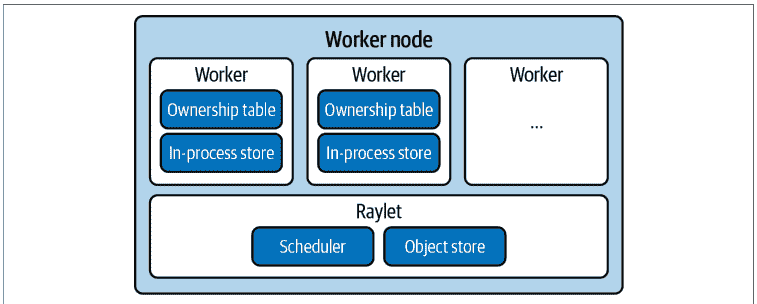

¹³ 这是对Ray如何处理故障的极其有限的描述。毕竟，仅仅拥有所有恢复信息并不能告诉你如何操作。我们建议你参考架构白皮书以深入讨论此主题。

### 头节点

我们已经在第1章中指出，每个Ray集群都有一个特殊的节点，称为*头节点*。到目前为止，你知道这个节点有一个驱动程序进程。¹⁴ 驱动程序可以自己提交任务，但不能执行它们。你还知道头节点可以有一些worker进程，这对于运行由单个节点组成的本地集群很重要。

头节点与其他worker节点相同，但它额外运行负责集群管理的进程，例如自动扩缩器（我们在第9章介绍）以及一个称为*全局控制服务*（GCS）的组件。这是一个重要的组件，携带有关集群的全局信息。GCS是一个键值存储，存储诸如系统级元数据之类的信息。例如，它有一个包含每个Raylet心跳信号的表，以确保它们仍然可达。反过来，Raylet向GCS发送心跳信号以表明它们还活着。GCS还存储Ray actor的位置。刚刚讨论的所有权模型告诉我们，所有对象信息都存储在其所有者worker进程中，这避免了使GCS成为瓶颈。

### 分布式调度与执行

让我们简要谈谈集群编排以及节点如何管理、规划和执行任务。在讨论worker节点时，我们已经指出使用Ray分发工作负载涉及几个组件。以下是此过程涉及的步骤和复杂性的概述：

- **分布式内存**：各个Raylet的对象存储管理节点上的内存。但有时对象需要在节点之间传输，这称为*分布式对象传输*。这对于远程依赖解析是必要的，以便worker拥有运行任务所需的对象。

- **通信**：Ray集群中的大部分通信，例如对象传输，都通过*gRPC*进行。

- **资源管理和履行**：在节点上，Raylet负责授予资源并将worker进程*租借*给任务所有者。所有节点上的调度器形成分布式调度器，这实际上意味着节点可以在其他节点上调度任务。通过与GCS通信，本地调度器知道其他节点的资源。

- **任务执行**：一旦任务被提交执行，其所有依赖项（本地和远程数据）都需要被解析，例如从对象存储中检索大数据，然后才能开始执行。

如果前面几节在技术上看起来有点复杂，那是因为它们确实如此。理解你所使用软件的基本模式和想法很重要，但我们承认Ray架构的细节一开始可能有点难以理解。事实上，Ray的设计原则之一就是用易用性换取架构复杂性。如果你想深入了解Ray的架构，一个好的起点是[他们的架构白皮书](https://docs.ray.io/en/latest/ray-contribute/whitepaper.html)。

图2-3总结了我们关于Ray架构的了解。

既然你已经学习了Ray Core API的基础知识并了解了Ray集群架构的基础，让我们计算一个更复杂的例子。

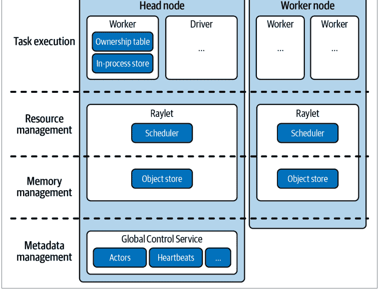

¹⁴ 事实上，它可能有多个驱动程序，但这对于我们的讨论并非必需。在头节点上启动单个驱动程序是最常见的，但驱动程序进程也可以在集群中的任何节点上启动，并且多个驱动程序可以位于单个集群上。

### 与 Ray 相关的系统

考虑到其架构和功能，Ray 与其他系统有何关联？以下是基础知识：

-   Ray 可以用作 Python 的并行化框架，并与 celery 或 multiprocessing 等工具共享特性。事实上，Ray 中实现了后者的直接替代品。
-   Ray 也与 Spark、Dask、Flink 和 MARS 等数据处理框架相关。我们将在第 11 章讨论 Ray 的生态系统时探讨这些关系。
-   作为分布式计算工具，Ray 也处理集群管理和编排的问题，我们将在第 9 章看到 Ray 如何与 Kubernetes 等工具协同工作。
-   由于 Ray 实现了并发的 actor 模型，探索其与 Akka 等框架的关系也很有趣。
-   最后，由于 Ray 依赖于高性能的底层通信 API，它与高性能计算（HPC）框架和通信协议（如消息传递接口（MPI））存在一定的关联。

### 使用 Ray 的简单 MapReduce 示例

在结束之前，我们不能不讨论近几十年来分布式计算中最重要的里程碑之一，即 *MapReduce* 的一个示例。许多成功的大数据技术（如 Hadoop）都基于这种编程模型，在 Ray 的背景下重新审视它很有价值。为简单起见，我们将 MapReduce 实现限制在一个用例上：统计多个文档中的单词出现次数。在单处理中，这几乎是一个微不足道的任务，但当涉及大量文档语料库并且需要多个计算节点来处理数据时，它就变成了一个有趣的挑战。

实现 MapReduce 单词计数示例可能是我们分布式计算中已知最广泛的示例，¹⁵ 因此值得了解。如果你不了解这个经典范式，它基于三个简单的步骤：

1.  获取一组文档，并根据你提供的函数转换或“映射”其元素（例如其中包含的单词）。这个 *映射阶段* 按设计产生键值对，其中 *键* 代表文档元素，*值* 只是你想为该元素计算的度量。

¹⁵ 这有点像 *黑腹果蝇*，与在无处不在的 MNIST 数据集上计算分类器并无不同。

由于我们感兴趣的是计算单词，因此每当我们在文档中遇到一个单词时，我们的 *映射函数* 将简单地发出对 (word, 1) 来表示我们找到了它的一个出现。

2.  根据键收集和分组映射阶段的所有输出。由于我们在分布式环境中工作，并且相同的键可能存在于多个计算节点上，这可能需要在节点之间进行数据混洗。因此，此步骤通常被称为 *混洗阶段*。<sup>16</sup> 为了让你了解分组在我们的具体用例中可能意味着什么，假设我们在映射阶段总共产生了四个 (word, 1) 出现。混洗随后会将所有相同单词的出现放在同一个节点上。

3.  聚合或“归约”来自混洗步骤的元素，这就是为什么我们称其为 *归约阶段*。继续我们前面的例子，我们只需将每个节点上的所有单词出现次数相加，以获得最终计数。例如，四个 (word, 1) 的出现将被归约为 word: 4。

显然，MapReduce 的名称来源于这三个阶段中的第一个和最后一个，但第二个阶段可以说同样重要。虽然从示意图上看这些阶段可能很简单，但它们的强大之处在于它们可以在数百台机器上大规模并行化。

在图 2-4 中，我们说明了将三个 MapReduce 阶段应用于分布在三个分区上的文档语料库的示例。要在分布式文档语料库上运行 MapReduce，我们首先将每个文档映射到一组键值对，然后混洗结果以确保所有具有相同键的键值对位于同一节点上，最后归约键值对以计算最终的单词计数。

让我们用 Python 为我们的单词计数用例实现 MapReduce 算法，并使用 Ray 并行化计算。首先，加载示例数据，以便你更好地了解我们正在处理的内容：

```python
import subprocess
zen_of_python = subprocess.check_output(["python", "-c", "import this"])
corpus = zen_of_python.split() ❶

num_partitions = 3
chunk = len(corpus) // num_partitions
partitions = [ ❷
    corpus[i * chunk: (i + 1) * chunk] for i in range(num_partitions)
]
```

<sup>16</sup> 通常，混洗是任何需要跨分区重新分配数据的操作。混洗可能代价高昂。如果你的映射阶段在 *N* 个分区上操作，它将产生 *N* × *N* 个需要混洗的结果。

1.  我们的文本语料库是 Python 之禅的内容。
2.  将语料库分成三个分区。

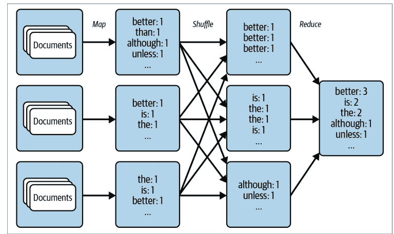

我们使用的数据是所谓的 Python 之禅，这是 Python 社区的一小组准则。之禅隐藏在一个“彩蛋”中，当你在 Python 会话中输入 `import this` 时会打印出来。作为 Python 程序员，值得阅读这些准则，但在这个练习中，我们只对计算它们包含的单词感兴趣。简单地说，我们加载 Python 之禅，将每一行视为一个单独的“文档”，并将其分成三个分区。

为了开始实现 MapReduce，我们将首先介绍映射阶段，并讨论 Ray 如何帮助我们处理结果的混洗。

### 映射和混洗文档数据

要定义映射阶段，我们需要一个应用于每个文档的映射函数。在我们的例子中，我们希望为文档中找到的每个单词发出对 (word, 1)。对于作为 Python 字符串加载的简单文本文档，它看起来像这样：¹⁷

> ¹⁷ 注意映射函数中 yield 的用法。这是在 Python 中使用我们需要的数据构建生成器的最快方式。如果你觉得更清楚，也可以构建并返回一个对列表。

```python
def map_function(document):
    for word in document.lower().split():
        yield word, 1
```

接下来，我们希望将此映射函数应用于整个文档语料库。我们通过使用 @ray.remote 装饰器将以下 apply_map 函数设为 Ray 任务来实现这一点。当我们调用 apply_map 时，我们将把它应用于文档数据的三个分区（num_partitions=3），就像我们在图 2-4 中指出的那样。请注意，apply_map 将返回三个列表，每个分区一个。你稍后会看到，我们这样做是为了让 Ray 能够自动将映射阶段的结果混洗到正确的节点：

```python
import ray

@ray.remote
def apply_map(corpus, num_partitions=3):
    map_results = [list() for _ in range(num_partitions)]
    for document in corpus:
        for result in map_function(document):
            first_letter = result[0].decode("utf-8")[0]
            word_index = ord(first_letter) % num_partitions
            map_results[word_index].append(result)
    return map_results
```

1.  Ray 任务 apply_map 为每个数据分区返回一个结果。
2.  通过使用 ord 函数生成 word_index，将每个 (word, 1) 对分配到一个分区。这确保了每个单词的出现都被混洗到同一个分区。
3.  然后将这些对依次附加到正确的列表中。

对于可以在单台机器上加载的文本语料库来说，这是多余的，我们可以直接计算单词。但在分布式环境中，我们必须将数据分区到多个节点上，这个映射阶段就完全有意义了。

为了将映射阶段并行应用于我们的文档语料库，我们像本章前面多次做的那样，对 apply_map 进行远程调用。显著的区别在于，现在我们还通过 num_returns 参数指示 Ray 返回三个结果（每个分区一个）：

```python
map_results = [
    apply_map.options(num_returns=num_partitions)
    .remote(data, num_partitions)
    for data in partitions
]

for i in range(num_partitions):
    mapper_results = ray.get(map_results[i])
```

### 减少词数

在归约阶段，我们现在可以简单地创建一个字典，用于汇总每个分区上所有单词的出现次数：

```python
@ray.remote
def apply_reduce(*results):
    reduce_results = dict()
    for res in results:
        for key, value in res:
            if key not in reduce_results:
                reduce_results[key] = 0
            reduce_results[key] += value
    return reduce_results
```

1.  归约打乱后的映射结果列表。
2.  遍历从映射阶段获得的每个结果，并为每个单词的出现次数增加一。

我们现在可以收集每个映射器的第 j 个返回值，并将其传递给第 j 个归约器，如下所示。请注意，我们这里使用的是一个小型数据集，但这段代码可以扩展到无法放入单台机器的数据集。这是因为我们传递给归约器的是 Ray 对象引用，而不是实际数据。映射和归约阶段都是 Ray 任务，可以在任何 Ray 集群上执行，数据的打乱也由 Ray 处理：

```python
outputs = []
for i in range(num_partitions):
    outputs.append(
        apply_reduce.remote(*[partition[i] for partition in map_results])
    )

counts = {k: v for output in ray.get(outputs) for k, v in output.items()}

sorted_counts = sorted(counts.items(), key=lambda item: item[1], reverse=True)
for count in sorted_counts:
    print(f"{count[0].decode('utf-8')}: {count[1]}")
```

1.  从每个映射任务中收集一个输出并提供给 `apply_reduce`。
2.  将所有归约阶段的结果收集到一个 Python 计数字典中。
3.  打印整个语料库中排序后的词频。

运行此示例将产生以下输出：

```
is: 10
than: 8
better: 8
the: 6
to: 5
although: 3
...
```

如果你想深入了解如何使用 Ray 将 MapReduce 任务扩展到多个节点，包括详细的内存考虑，我们建议学习关于此主题的[优秀博客文章](https://www.anyscale.com/blog)。

这个 MapReduce 示例的重要部分在于 *Ray 编程模型的灵活性*。当然，一个生产级的 MapReduce 实现需要付出更多的努力。但能够快速重现像这样的常见算法大有裨益。请记住，在 MapReduce 的早期阶段，大约在 2010 年左右，这种范式通常是你表达工作负载的唯一方式。有了 Ray，一系列有趣的分布式计算模式对任何中级 Python 程序员都变得触手可及。¹⁹

### 总结

在本章中，你已经看到了 Ray API 基础知识的实际应用。你知道如何将值放入对象存储以及如何取回它们。此外，你熟悉使用 `@ray.remote` 装饰器将 Python 函数声明为 Ray 任务，并且知道如何使用 `.remote()` 调用在 Ray 集群上运行它们。同样地，你理解如何从 Python 类声明一个 Ray actor，以及如何实例化它并利用它进行有状态的分布式计算。

除此之外，你还了解了 Ray 集群的基础知识。在使用 `ray.init(...)` 启动它们之后，你知道你可以向集群提交由任务组成的工作。位于头节点上的驱动程序进程随后会将任务分发给工作节点。每个节点上的 Raylet 将调度任务，工作进程将执行它们。你还看到了一个使用 Ray 实现 MapReduce 范式的快速示例，作为构建 Ray 应用程序的常见模式。

这个对 Ray Core 的快速概览应该能让你开始编写自己的分布式程序。在第 3 章中，我们将通过实现一个基本的机器学习应用程序来测试你的知识。

# 第 3 章

## 构建你的第一个分布式应用程序

既然你已经看到了 Ray API 基础知识的实际应用，让我们用它来构建一些更实际的东西。在本章结束时，你将从头开始构建一个强化学习（RL）问题，实现你的第一个算法来解决它，并使用 Ray 任务和 actor 将此解决方案并行化到本地集群——所有这些都在不到 250 行代码内完成。

本章旨在为没有任何 RL 经验的读者设计。我们将处理一个简单的问题，并亲自动手开发必要的技能来解决它。由于第 4 章完全致力于这个主题，我们将跳过所有高级 RL 主题和术语，只专注于手头的问题。但即使你是一个相当高级的 RL 用户，你也很可能从在分布式环境中实现经典算法中受益。

这是*仅*使用 Ray Core 的最后一章。我们希望你学会欣赏它的强大和灵活性，以及你可以多快地实现分布式实验，否则这些实验将需要相当大的努力才能扩展。

在我们开始任何实现之前，让我们快速更详细地讨论一下 RL 的范式。如果你以前使用过 RL，可以随意跳过本节。

### 介绍强化学习

我（Max）最喜欢的移动应用程序之一可以自动分类或“标记”我们花园里的单株植物。该应用程序的工作原理只是向它展示相关植物的照片。这非常有帮助；我非常不擅长区分它们。（我并不是在吹嘘我花园的大小；我只是不擅长这个。）在过去的几年里，我们看到了许多类似这样令人印象深刻的应用程序的激增。

最终，人工智能的承诺是构建超越物体分类的智能代理。想象一个不仅了解你的植物，还能照顾它们的人工智能应用程序。这样的应用程序必须做到以下几点：

- 在动态环境中运行（如季节变化）
- 对环境变化做出反应（如暴风雨或害虫）
- 采取一系列行动（如给植物浇水和施肥）
- 实现长期目标（如优先考虑植物健康）

通过观察其环境，这样的人工智能还将学会探索它可能采取的行动，并随着时间的推移提出更好的解决方案。如果你觉得这个例子是人为的或太遥远，你自己也不难想出所有这些要求的例子。想想管理和优化供应链、根据波动的需求战略性地补充仓库库存，或者协调装配线中的处理步骤。另一个关于你可以期待人工智能做什么的著名例子是史蒂夫·沃兹尼亚克著名的“咖啡测试”：如果你被邀请到朋友家，你可以导航到厨房，找到咖啡机和所有必要的原料，弄清楚如何煮一杯咖啡，然后坐下来享用。机器应该能够做同样的事情，只是最后一部分可能有点牵强。你还能想到什么其他例子？

你可以自然地将所有要求置于强化学习（RL）中，这是机器学习的一个子领域。¹ 目前，只需理解 RL 是关于代理通过观察环境并与之交互来发出行动。在 RL 中，代理通过赋予奖励（例如，我的植物在某个线性尺度上有多健康）来评估其环境。“强化”一词源于代理理想地学会寻求能带来好结果（高奖励）的行为，并回避惩罚性情况（低或负奖励）。

代理与其环境的交互通常通过创建其计算机模拟来建模（尽管有时这不可行）。因此，让我们构建一个这样的模拟示例，让代理在其环境中行动，让你了解这在实践中是什么样子。

### 设置一个简单的迷宫问题

与前面的章节一样，我们鼓励你编写本章的代码并随我们一起构建这个应用程序。如果你不想这样做，你可以简单地遵循[本章的笔记本](the notebook for this chapter)。

> ¹ 我们还没有园艺机器人，也不知道哪种人工智能范式能让我们实现这一点。RL 不一定是答案；它只是自然地融入这个关于人工智能目标的特定讨论的范式。

为了让你有个概念，我们正在构建的应用程序结构如下：

-   实现一个简单的二维迷宫游戏，玩家可以在其中向四个主要方向移动。
-   将迷宫初始化为一个5×5的网格，玩家被限制在其中。25个网格单元格中的一个是“目标”，一个被称为*探索者*的玩家必须到达那里。
-   采用强化学习算法，而不是硬编码解决方案，以便探索者学会找到目标。
-   反复运行迷宫模拟，奖励探索者找到目标，并智能地跟踪探索者的哪些决策有效，哪些无效。因为运行模拟可以并行化，我们的强化学习算法也可以并行训练，所以我们使用Ray API来并行化整个过程。

我们还没有准备好将这个应用程序部署到由多个节点组成的实际Ray集群上，所以目前我们将继续使用本地集群。如果你对基础设施主题感兴趣，并想了解如何设置Ray集群，请直接跳到第9章。无论如何，请确保你已通过`pip install ray`安装了Ray。

让我们从实现我们刚刚勾勒的二维迷宫开始。思路是在Python中实现一个简单的网格，该网格跨越一个从(0, 0)开始到(4, 4)结束的5×5网格，并正确定义玩家如何在网格中移动。为此，我们首先需要一个在四个基本方向上移动的抽象。这四个动作，即向上、向下、向左和向右移动，可以在Python中编码为一个我们称之为Discrete的类。在多个离散动作上移动的抽象非常有用，我们将把它泛化到*n*个方向，而不仅仅是四个。如果你担心的话，这不是过早优化——我们实际上马上就需要一个通用的Discrete类：

```python
import random

class Discrete:
    def __init__(self, num_actions: int):
        """Discrete action space for num_actions.
        Discrete(4) can be used as encoding moving in
        one of the cardinal directions.
        """
        self.n = num_actions

    def sample(self):
        return random.randint(0, self.n - 1) ❶

space = Discrete(4)
print(space.sample()) ❷
```

1.  一个离散动作可以在0到n – 1之间均匀采样。
2.  例如，一个Discrete(4)的采样将给你0、1、2或3。

像这个例子中那样从Discrete(4)采样将随机返回0、1、2或3。我们如何解释这些数字取决于我们自己，所以让我们按顺序选择“向下”、“向左”、“向上”和“向右”。

现在我们知道如何编码在迷宫中移动了，让我们来编写迷宫本身，包括目标单元格和试图找到目标的探索者玩家的位置。为此，我们将实现一个名为Environment的Python类。之所以这样命名，是因为迷宫是玩家“生活”的环境。为了简单起见，我们将始终把探索者放在(0, 0)，目标放在(4, 4)。为了让探索者移动并找到目标，我们用一个Discrete(4)的action_space来初始化Environment。

我们需要为我们的迷宫环境设置最后一点信息：探索者位置的编码。原因是我们稍后将实现一个算法，该算法跟踪哪些动作在哪些探索者位置导致了好的结果。通过将探索者位置编码为Discrete(5*5)，它变成了一个更容易处理的单个数字。在强化学习术语中，通常将玩家可以访问的游戏信息称为观察。因此，类比于我们可以为探索者执行的动作，我们也可以为它定义一个observation_space。以下是我们刚刚讨论内容的实现：

```python
import os

class Environment:
    def __init__(self, *args, **kwargs):
        self.seeker, self.goal = (0, 0), (4, 4)  # 1
        self.info = {'seeker': self.seeker, 'goal': self.goal}

        self.action_space = Discrete(4)  # 2
        self.observation_space = Discrete(5*5)  # 3
```

1.  探索者初始化在迷宫的左上角，目标在右下角。
2.  我们的探索者可以向下、向左、向上和向右移动。
3.  它总共可以处于25种状态，每种状态对应网格上的一个位置。

请注意，我们还定义了一个info变量，它可以用来打印关于迷宫当前状态的信息，例如用于调试目的。为了从探索者的视角玩一个实际的“寻找目标”游戏，我们需要定义几个辅助方法。显然，当探索者找到目标时，游戏应被视为“完成”。此外，我们应该奖励探索者找到目标。当游戏结束时，我们应该能够将其重置为初始状态，以便再次玩。为了完善，我们还定义了一个get_observation方法，该方法返回编码后的探索者位置。继续我们对Environment类的实现，这转化为以下四个方法：

```python
def reset(self):
    """Reset seeker position and return observations."""
    self.seeker = (0, 0)
    return self.get_observation()

def get_observation(self):
    """Encode the seeker position as integer"""
    return 5 * self.seeker[0] + self.seeker[1]

def get_reward(self):
    """Reward finding the goal"""
    return 1 if self.seeker == self.goal else 0

def is_done(self):
    """We're done if we found the goal"""
    return self.seeker == self.goal
```

1.  要玩新游戏，请将网格重置为其原始状态。
2.  将探索者元组转换为环境observation_space中的一个值。
3.  探索者仅在到达目标时获得奖励。
4.  如果探索者在目标处，游戏结束。

要实现的最后一个关键方法是step方法。想象一下，你正在玩我们的迷宫游戏，并决定下一步向右移动。step方法将接受这个动作（即3，是“向右”的编码）并将其应用于游戏的内部状态。为了反映变化，step方法将返回探索者的观察、其奖励、游戏是否结束以及游戏的info值。以下是step方法的工作原理：

```python
def step(self, action):
    """Take a step in a direction and return all available information."""
    if action == 0:  # move down
        self.seeker = (min(self.seeker[0] + 1, 4), self.seeker[1])
    elif action == 1:  # move left
        self.seeker = (self.seeker[0], max(self.seeker[1] - 1, 0))
    elif action == 2:  # move up
        self.seeker = (max(self.seeker[0] - 1, 0), self.seeker[1])
    elif action == 3:  # move right
        self.seeker = (self.seeker[0], min(self.seeker[1] + 1, 4))
    else:
        raise ValueError("Invalid action")

    obs = self.get_observation()
    rew = self.get_reward()
    done = self.is_done()
    return obs, rew, done, self.info ❶
```

❶ 返回观察、奖励、我们是否完成，以及在指定方向上迈出一步后我们可能发现有用的任何其他信息。

我们说过step方法是最后一个关键方法，但我们实际上还想定义另一个辅助方法，它对于可视化游戏和帮助我们理解游戏非常有用。这个render方法将把游戏的当前状态打印到命令行：

```python
def render(self, *args, **kwargs):
    """Render the environment, e.g., by printing its representation."""
    os.system('cls' if os.name == 'nt' else 'clear') ❶

    grid = [['| ' for _ in range(5)] + ['|\n'] for _ in range(5)]
    grid[self.goal[0]][self.goal[1]] = '|G'
    grid[self.seeker[0]][self.seeker[1]] = '|S' ❷
    print(''.join([''.join(grid_row) for grid_row in grid])) ❸
```

❶ 清除屏幕。
❷ 绘制网格，并在上面将目标标记为G，探索者标记为S。
❸ 然后通过将其打印到屏幕上来渲染网格。

太好了，现在我们已经完成了定义我们二维迷宫游戏的Environment类的实现。我们可以逐步执行这个游戏，知道它何时完成，并再次重置它。游戏的玩家，即探索者，也可以观察其环境并因找到目标而获得奖励。

让我们使用这个实现来玩一个“寻找目标”游戏，其中探索者只是采取随机动作。这可以通过创建一个新的Environment，对其采样并应用动作，并渲染环境直到游戏结束来完成：

```python
import time

environment = Environment()
```

### 构建模拟环境

在实现了环境类之后，要解决“教会”探索者玩好游戏的问题，还需要什么？如何让它在最少的八步内持续找到目标？我们为迷宫环境配备了奖励信息，以便探索者可以利用这一信号来学习玩游戏。在强化学习中，你会反复玩游戏，并从过程中获得的经验中学习。游戏的玩家通常被称为*智能体*，它在环境中执行*动作*，观察其*状态*，并获得*奖励*。<sup>2</sup> 智能体学习得越好，它就越擅长解读当前的游戏状态（观察），并找到能带来更丰厚回报的动作。

无论你想使用哪种强化学习算法，你都需要一种方法来反复模拟游戏以收集经验数据。因此，我们将实现一个简单的`Simulation`类。

我们继续进行所需的另一个有用的抽象是`Policy`，即指定动作的方式。目前，我们玩这个游戏唯一能做的就是为我们的探索者随机采样动作。`Policy`允许我们做的是为当前游戏状态获取更好的动作。事实上，我们定义一个`Policy`为一个类，它有一个`get_action`方法，该方法接受一个游戏状态并返回一个动作。

请记住，在我们的游戏中，探索者在网格上总共有25种可能的状态，并可以执行四种动作。一个简单的想法是查看状态和动作的配对，如果在该状态下执行此动作会导致高奖励，则为该配对分配高值，否则分配低值。例如，根据你对游戏的直觉，向下或向右走总是一个好主意，而向左或向上走则不是。然后，创建一个25 × 4的查找表，包含所有可能的状态-动作配对，并将其存储在我们的`Policy`中。然后，我们可以简单地要求我们的策略在给定状态下返回任何动作的最高值。当然，实现一个为这些状态-动作配对找到好值的算法才是具有挑战性的部分。让我们先实现这个`Policy`的想法，稍后再考虑合适的算法：

```python
import numpy as np

class Policy:

    def __init__(self, env):
        """A Policy suggests actions based on the current state.
        We do this by tracking the value of each state-action pair.
        """
        self.state_action_table = [
            [0 for _ in range(env.action_space.n)]
            for _ in range(env.observation_space.n)
        ]
        self.action_space = env.action_space

    def get_action(self, state, explore=True, epsilon=0.1):
        """Explore randomly or exploit the best value currently available."""
        if explore and random.uniform(0, 1) < epsilon:
            return self.action_space.sample()
        return np.argmax(self.state_action_table[state])
```

> <sup>2</sup> 正如我们将在第4章看到的，你也可以在多人游戏中运行强化学习。将迷宫环境变成所谓的多智能体环境，让多个探索者竞争目标，是一个有趣的练习。

1.  定义一个嵌套列表，用于存储每个状态-动作配对的值，初始化为零。
2.  根据需要探索随机动作，以免陷入次优行为。
3.  在`get_action`方法中引入一个`explore`参数，因为我们可能想在游戏中随机探索动作。默认情况下，这会在10%的情况下发生。
4.  在给定当前状态下，返回查找表中值最高的动作。

我们在`Policy`定义中悄悄加入了一个可能有点令人困惑的实现细节。`get_action`方法有一个`explore`参数。如果没有它，如果你学到了一个极其糟糕的策略（例如，一个总是想让你向左移动的策略），你就永远没有机会找到更好的解决方案。换句话说，有时你需要探索新的方法，而不是“利用”你当前对游戏的理解。如前所述，我们还没有讨论如何学习改进我们策略的`state_action_table`中的值。现在，请记住，策略在模拟迷宫游戏时为我们提供了想要遵循的动作。

接下来谈谈我们之前提到的`Simulation`类，模拟应该接受一个环境，并计算给定策略的动作，直到达到目标并结束游戏。当我们像这样“展开”一个完整游戏时观察到的数据，就是我们所说获得的经验。因此，我们的`Simulation`类有一个`rollout`方法，它计算完整游戏的经验并返回它们。`Simulation`类的实现如下所示：

```python
class Simulation(object):
    def __init__(self, env):
        """Simulates rollouts of an environment, given a policy to follow."""
        self.env = env

    def rollout(self, policy, render=False, explore=True, epsilon=0.1): ❶
        """Returns experiences for a policy rollout."""
        experiences = []
        state = self.env.reset() ❷
        done = False
        while not done:
            action = policy.get_action(state, explore, epsilon) ❸
            next_state, reward, done, info = self.env.step(action) ❹
            experiences.append([state, action, reward, next_state]) ❺
            state = next_state
            if render: ❻
                time.sleep(0.05)
                self.env.render()
        return experiences
```

1.  通过遵循策略的动作来计算游戏的“展开”，并可选择渲染模拟。
2.  为确保无误，在每次展开前重置环境。
3.  传入的策略驱动我们采取的动作。`explore`和`epsilon`参数被传递下去。
4.  通过应用策略的动作来逐步执行环境。
5.  将经验定义为（状态，动作，奖励，下一状态）四元组。
6.  可选择在每一步渲染环境。

请注意，我们在一次展开中收集的每个经验条目包含四个值：当前状态、采取的动作、获得的奖励和下一状态。我们即将实现的算法将使用这些经验来从中学习。其他算法可能会使用其他经验值，但这些是我们继续进行所需的经验值。

我们现在有一个尚未学到任何东西的策略，但我们已经可以测试它的接口，看看它是否工作。让我们尝试一下，初始化一个`Simulation`对象，在一个不太聪明的`Policy`上调用其`rollout`方法，然后打印它的`state_action_table`：

```python
untrained_policy = Policy(environment)
sim = Simulation(environment)

exp = sim.rollout(untrained_policy, render=True, epsilon=1.0) ①
for row in untrained_policy.state_action_table:
    print(row) ②
```

1.  使用一个“未经训练”的策略展开一个完整的游戏，我们对其进行渲染。
2.  状态-动作值目前全部为零。

如果你觉得自上一节以来我们没有取得多大进展，请放心，事情将在下一节中变得清晰。设置`Simulation`和`Policy`的准备工作对于正确构建问题是必要的。现在剩下的唯一事情就是设计一种聪明的方法，根据我们收集到的经验来更新`Policy`的内部状态，以便它真正学会玩迷宫游戏。

### 训练强化学习模型

假设我们从几场游戏中收集了一组经验。更新我们策略中`state_action_table`值的聪明方法是什么？这里有一个思路。假设你位于位置(3,5)，并决定向右移动，这使你到达(4,5)，距离目标仅一步之遥。显然，你只需再向右移动就能获得1的奖励。这一定意味着你当前所处的状态，结合“向右”的动作，应该具有高价值。换句话说，这个特定的状态-动作对的值应该很高。相比之下，在相同情况下向左移动不会带来任何收益，相应的状态-动作对应该具有低价值。

更一般地说，假设你处于一个给定状态，你决定采取一个动作，获得一个奖励，然后进入`next_state`。请记住，这就是我们定义经验的方式。通过我们的`policy.state_action_table`，我们可以稍微前瞻一下，看看是否能从`next_state`采取的动作中预期获得任何收益。也就是说，我们可以计算：

```
next_max = np.max(policy.state_action_table[next_state])
```

我们应该如何将这个值的知识与当前的状态-动作值（即`value = policy.state_action_table[state][action]`）进行比较？有很多方法可以处理这个问题，但我们显然不能完全丢弃当前值，而过度信任`next_max`。毕竟，这只是我们在这里使用的一个单一经验。因此，作为初步近似，我们为什么不简单地计算旧值和预期值的加权和，并采用`new_value = 0.9 * value + 0.1 * next_max`呢？这里，0.9和0.1这两个值的选择有些随意；唯一重要的是第一个值足够高，以反映我们保留旧值的偏好，并且两个权重之和为1。这个公式是一个很好的起点，但问题在于我们完全没有考虑从奖励中获得的关键信息。事实上，我们应该比预测的`next_max`值更信任当前的`reward`值，因此稍微折现后者是个好主意，比如折现10%。更新状态-动作值将如下所示：

```
new_value = 0.9 * value + 0.1 * (reward + 0.9 * next_max)
```

根据你对这类推理的经验水平，最后几段可能需要大量消化。如果你已经理解了到目前为止的解释，本章的其余部分对你来说应该会很容易。从数学上讲，这是本示例中最后一个（也是唯一一个）难点。如果你以前使用过RL，你会注意到这是所谓的Q-Learning算法的实现。它之所以这样命名，是因为状态-动作表可以被描述为一个函数Q(state, action)，该函数返回这些对的值。

我们快完成了，所以让我们用一个`update_policy`函数来形式化这个过程，该函数用于策略和收集的经验：

```
def update_policy(policy, experiences, weight=0.1, discount_factor=0.9):
    """Updates a given policy with a list of (state, action, reward, state)
    experiences."""
    for state, action, reward, next_state in experiences: ①
        next_max = np.max(policy.state_action_table[next_state]) ②
        value = policy.state_action_table[state][action] ③
        new_value = (1 - weight) * value + weight * \
                    (reward + discount_factor * next_max) ④
        policy.state_action_table[state][action] = new_value ⑤
```

- ① 按顺序遍历所有经验。
- ② 在下一个状态的所有可能动作中选择最大值。
- ③ 提取当前的状态-动作值。
- ④ 新值是旧值和预期值的加权和，预期值是当前奖励和折现后的next_max之和。
- ⑤ 更新后，设置新的state_action_table值。

现在有了这个函数，训练策略以做出更好的决策就变得简单了。我们可以使用以下过程：

1. 初始化一个策略和一个模拟。
2. 运行模拟多次，假设总共运行10,000次。
3. 对于每场游戏，首先通过运行一次rollout来收集经验。
4. 然后通过调用`update_policy`来更新收集到的经验。

就是这样！以下`train_policy`函数实现了这个过程：

```
def train_policy(env, num_episodes=10000, weight=0.1, discount_factor=0.9):
    """Training a policy by updating it with rollout experiences."""
    policy = Policy(env)
    sim = Simulation(env)
    for _ in range(num_episodes):
        experiences = sim.rollout(policy) ①
        update_policy(policy, experiences, weight, discount_factor) ②

    return policy

trained_policy = train_policy(environment) ③
```

1. 为每场游戏收集经验。
2. 用这些经验更新我们的策略。
3. 最后，为我们之前的环境训练并返回一个策略。

请注意，在RL文献中，指代迷宫游戏完整游玩过程的高级术语是*episode*。这就是为什么我们在`train_policy`函数中将参数称为`num_episodes`，而不是`num_games`。

### Q-Learning

我们刚刚实现的Q-Learning算法通常是RL课程中教授的第一个算法，主要是因为它相对容易理解。你收集并整理经验数据，这些数据显示了状态-动作对的效果如何，然后根据Q-Learning更新规则更新表格。

对于具有大量状态或动作的RL问题，Q表可能变得过大。然后算法变得低效，因为收集所有（相关的）状态-动作对的足够经验数据需要太多时间。

解决这个问题的一种方法是使用神经网络来近似Q表。我们的意思是，你可以使用一个深度神经网络来学习一个将状态映射到动作的函数。这种方法被称为Deep Q-Learning，用于学习的网络被称为Deep Q-Networks (DQN)。从第4章开始，本书将专门使用深度学习来解决RL问题。

现在我们有了一个训练好的策略，让我们看看它的表现如何。我们在本章中已经运行了两次随机策略，只是为了了解它们在迷宫问题上的效果。但现在让我们在几个游戏上正式评估我们训练好的策略，看看它的平均表现如何。具体来说，我们将运行模拟几个episode，并计算每个episode到达目标所需的步数。所以，让我们实现一个`evaluate_policy`函数来精确地做到这一点：

```
def evaluate_policy(env, policy, num_episodes=10):
    """Evaluate a trained policy through rollouts."""
    simulation = Simulation(env)
    steps = 0

    for _ in range(num_episodes):
        experiences = simulation.rollout(policy, render=True, explore=False)  # 1
        steps += len(experiences)  # 2

    print(f"{steps / num_episodes} steps on average "
          f"for a total of {num_episodes} episodes.")

    return steps / num_episodes
```

```
evaluate_policy(environment, trained_policy)
```

- 1. 这次，将explore设置为False，以充分利用训练好的策略所学到的知识。
- 2. 经验的长度就是我们完成游戏所采取的步数。

除了看到训练好的策略像我们希望的那样连续10次轻松解决迷宫问题外，你还应该看到以下提示：

8.0 steps on average for a total of 10 episodes.

换句话说，训练好的策略能够为迷宫游戏找到最优解。这意味着你已经成功地从头实现了你的第一个RL算法！

根据你建立的理解，你认为将搜索者放入随机起始位置，然后运行这个评估函数是否仍然有效？你为什么不继续进行必要的更改呢？

另一个有趣的问题是，我们使用的算法基于哪些假设。例如，算法的一个明显前提是所有状态-动作对都可以被列表化。你认为如果我们有数百万个状态和数千个动作，这还能很好地工作吗？

### 构建分布式Ray应用

我们希望你喜欢到目前为止的示例，但你可能想知道我们到目前为止所做的工作与Ray有何关系（这是一个很好的问题）。正如你很快将看到的，要使RL实验成为分布式Ray应用，我们只需要编写三个简短的代码片段。这就是我们要做的：

1. 仅用几行代码将Simulation变成一个Ray actor。
2. 定义一个与原始结构相似的并行版本的`train_policy`。为简单起见，我们将只并行化rollouts，而不是策略更新。
3. 像以前一样训练和评估策略，但使用`train_policy_parallel`。

让我们通过实现一个名为Simulation Actor的Ray actor来解决这个计划的第一步：

```
import ray

ray.init()

@ray.remote
```

### 回顾强化学习术语

在结束本章之前，让我们在更广泛的背景下讨论一下在迷宫示例中遇到的概念。这样做将为你在下一章中处理更复杂的强化学习场景做好准备，并向你展示我们在本章的运行示例中为了简化而做了哪些调整。如果你对强化学习已经足够了解，可以跳过本节。

每个强化学习问题都始于对*环境*的建模，它描述了你想要玩的“游戏”的动态过程。环境承载着一个玩家或*智能体*，它通过一个简单的接口与环境进行交互。智能体可以向环境请求信息，即它在环境中的当前*状态*、在此状态下获得的*奖励*，以及游戏是否*结束*。通过观察状态和奖励，智能体可以学习根据接收到的信息做出决策。具体来说，智能体会发出一个*动作*，环境可以通过执行下一步来执行该动作。

智能体为给定状态产生动作的机制称为*策略*，我们有时说智能体遵循某个给定的策略。给定一个策略，我们可以使用该策略模拟或*展开*几步或整个游戏。在展开过程中，我们可以收集*经验*，这些经验收集了关于当前状态和奖励、下一个动作以及由此产生的状态的信息。从开始到结束的整个步骤序列被称为一个*回合*，环境可以重置到其初始状态以开始新的回合。

我们在本章中使用的策略基于一个简单的想法，即制表*状态-动作值*（也称为*Q值*），而用于根据展开期间收集的经验更新策略的算法称为*Q学习*。更一般地说，你可以将我们实现的状态-动作表视为策略所使用的*模型*。在下一章中，你将看到更复杂模型的例子，例如用于学习状态-动作值的神经网络。策略可以决定*利用*它从环境中所学到的知识，通过选择其模型中最佳的可用值，或者通过选择随机动作来*探索*环境。

这里介绍的许多基本概念适用于任何强化学习问题，但我们做了一些简化的假设。例如，环境中可能存在*多个智能体*在行动（想象有多个搜索者竞争谁先到达目标），我们将在下一章探讨所谓的多智能体环境和多智能体强化学习。此外，我们假设智能体的*动作空间*是*离散的*，这意味着智能体只能采取一组固定的动作。当然，你也可以有*连续的*动作空间，第1章中的小车-杆例子就是其中一个例子。特别是在有多个智能体的情况下，动作空间可能更复杂，你可能需要动作元组，甚至需要相应地嵌套它们。我们为迷宫游戏考虑的*观察空间*也相当简单，并被建模为一组离散的状态。你可以很容易地想象，像机器人这样与环境交互的复杂智能体可能会使用图像或视频数据作为观察，这将需要一个更复杂的观察空间。

我们做出的另一个关键假设是环境是*确定性的*，这意味着当我们的智能体选择采取一个动作时，由此产生的状态总是会反映该选择。在一般环境中，情况并非如此，环境中可能存在随机性因素。例如，我们本可以在迷宫游戏中实现一个抛硬币，每当出现反面时，智能体就会被推向一个随机方向。在这种情况下，我们无法像本章中那样提前计划，因为动作不会每次都确定性地导致相同的下一个状态。为了反映这种概率行为，通常我们必须在强化学习实验中考虑*状态转移概率*。

我想在这里讨论的最后一个简化假设是，我们一直将环境及其动态过程视为一个可以完美模拟的游戏。但事实是，一些物理系统无法被忠实地模拟。在这种情况下，你仍然可以通过我们定义的`Environment`类这样的接口与这个物理环境进行交互，但会涉及一些通信开销。实际上，将强化学习问题*推理*为游戏，几乎不会影响体验。

### 总结

回顾一下，我们用纯Python实现了一个简单的迷宫问题，然后使用一个直接的强化学习算法解决了在该迷宫中寻找目标的任务。接着，我们采用这个解决方案，并在大约25行代码中将其移植到一个分布式Ray应用程序中。我们这样做时，无需事先计划如何与Ray合作——我们只是使用Ray API来并行化我们的Python代码。这个例子展示了Ray如何不阻碍你，让你专注于你的应用程序代码。它还演示了如何使用Ray高效地实现和分发使用强化学习等先进技术的自定义工作负载。

在[第4章](https://example.com/chapter4)中，你将在此基础上继续学习，并了解如何使用更高级的Ray RLlib库轻松解决我们的迷宫问题。

# 第四章

## 使用 Ray RLlib 进行强化学习

在第三章中，你从零开始构建了一个强化学习环境、一个用于模拟游戏的仿真、一个强化学习算法以及用于并行化算法训练的代码。了解如何完成所有这些工作固然有益，但在实践中，训练强化学习算法时你真正想做的只是第一部分，即指定你的自定义环境，也就是你想玩的“游戏”。¹ 你的大部分精力将用于选择合适的算法、进行设置、为问题寻找最佳参数，并总体上专注于训练一个性能良好的策略。

Ray RLlib 是一个用于大规模构建强化学习算法的工业级库。你已经在第一章中看到了 RLlib 的第一个示例，但在本章中，我们将更深入地探讨。RLlib 的妙处在于它是一个成熟的开发者库，提供了良好的抽象供你使用。正如你将看到的，其中许多抽象你已经在上一章中了解过了。

我们首先概述 RLlib 的功能。然后，我们将快速回顾第三章的迷宫游戏，并向你展示如何使用 RLlib CLI 和 RLlib Python API 用几行代码来解决它。在了解其关键概念（如 RLlib 环境和算法）之前，你将看到 RLlib 入门是多么容易。

我们还将更仔细地研究一些在实践中极其有用但其他强化学习库通常未提供适当支持的高级强化学习主题。例如，你将学习如何为你的强化学习智能体创建课程，以便它们在进入更复杂的场景之前先学习简单的场景。你还将看到 RLlib 如何处理单个环境中的多个智能体，以及如何利用你在当前应用程序之外收集的经验数据来提高智能体的性能。

¹ 我们使用一个简单的游戏来说明强化学习的过程。强化学习有许多有趣且非游戏类的工业应用。

### RLlib 概述

在深入任何示例之前，让我们快速讨论一下 RLlib 是什么以及它能做什么。作为 Ray 生态系统的一部分，RLlib 继承了 Ray 的所有性能和可扩展性优势。特别是，RLlib 默认是分布式的，因此你可以将强化学习训练扩展到任意数量的节点。

构建在 Ray 之上的另一个好处是 RLlib 与其他 Ray 库紧密集成。例如，任何 RLlib 算法的超参数都可以通过 Ray Tune 进行调优，我们将在第五章中看到这一点。你还可以使用 Ray Serve 无缝部署你的 RLlib 模型。²

极其有用的一点是，RLlib 在撰写本文时支持两种主流的深度学习框架：PyTorch 和 TensorFlow。你可以使用其中任何一个作为后端，并且可以轻松地在它们之间切换，通常只需更改一行代码。这是一个巨大的优势，因为公司通常被锁定在其底层的深度学习框架中，无法承担切换到另一个系统并重写代码的代价。

RLlib 在解决现实世界问题方面也有良好的记录，是一个成熟的库，被许多公司用于将其强化学习工作负载投入生产。RLlib API 吸引了许多工程师，因为它为许多应用程序提供了适当级别的抽象，同时仍然足够灵活以进行扩展。

除了这些更普遍的好处之外，RLlib 还有许多强化学习特定的功能，我们将在本章中介绍。事实上，RLlib 功能如此丰富，值得单独写一本书，这意味着我们在这里只能涉及其中一些方面。例如，RLlib 拥有丰富的高级强化学习算法库可供选择。在本章中，我们将重点介绍其中几个精选算法，但你可以在 RLlib 算法页面上跟踪不断增长的选项列表。RLlib 还有许多指定强化学习环境的选项，并且在训练过程中处理它们非常灵活；有关 RLlib 环境的概述，请参阅文档。

² 我们在本书中不涵盖此集成，但你可以在 Ray 文档中的“Serving RLlib Models”教程中了解更多关于部署 RLlib 模型的信息。

### RLlib 入门

要使用 RLlib，请确保已在计算机上安装它：

```
pip install "ray[rllib]==2.2.0"
```

如果你不想自己输入代码，请查看本章附带的笔记本。

每个强化学习问题都始于一个有趣的环境。在第一章中，我们研究了经典的倒立摆平衡问题。回想一下，我们并没有实现这个倒立摆环境；它是 RLlib 自带的。

相比之下，在第三章中，我们自己实现了一个简单的迷宫游戏。这个实现的问题在于，我们无法直接将其与 RLlib 或任何其他强化学习库一起使用。原因在于强化学习中存在普遍的标准，我们的环境需要实现某些接口。最著名且使用最广泛的强化学习环境库是 gym，这是 OpenAI 的一个开源 Python 项目。

让我们看看 Gym 是什么，以及如何将我们上一章的迷宫环境转换为与 RLlib 兼容的 Gym 环境。

### 构建 Gym 环境

如果你查看 GitHub 上文档齐全且易于阅读的 gym.Env 环境接口，你会注意到该接口的实现有两个必需的类变量和三个子类需要实现的方法。你不必查看源代码，但我们鼓励你看看。你可能会惊讶于你已经对这些环境了解多少。

简而言之，Gym 环境的接口如下所示的伪代码：

```
import gym

class Env:
    action_space: gym.spaces.Space
    observation_space: gym.spaces.Space  # 1

    def step(self, action):  # 2
        ...

    def reset(self):  # 3
        ...

    def render(self, mode="human"):
        ...
```

1.  gym.Env 接口有一个动作空间和一个观察空间。
2.  Env 可以运行一步，并返回观察、奖励、完成条件和进一步信息的元组。
3.  Env 可以重置自身，这将返回新情节的初始观察。
4.  我们可以出于不同目的渲染 Env，例如用于人类显示或作为字符串表示。

你会回想起第三章，这与我们构建的迷宫环境的接口非常相似。事实上，Gym 在 gym.spaces 中实现了一个所谓的离散空间，这意味着我们可以如下将我们的迷宫环境变成一个 gym.Env。我们假设你将此代码存储在名为 maze_gym_env.py 的文件中，并且第三章的环境代码位于该文件的顶部（或在那里导入）：

```
# maze_gym_env.py | 原始环境定义放在顶部。

import gym
from gym.spaces import Discrete ①

class GymEnvironment(Environment, gym.Env): ②
    def __init__(self, *args, **kwargs):
        """使我们原始的环境成为 gym `Env`。"""
        super().__init__(*args, **kwargs)

gym_env = GymEnvironment()
```

1.  用 Gym 的离散空间替换我们自己的离散空间实现。
2.  使 GymEnvironment 实现 gym.Env。该接口本质上与之前相同。

当然，我们本可以通过一开始就继承 gym.Env 来使我们原始的环境实现 gym.Env。但关键在于，gym.Env 接口在强化学习的上下文中出现得如此自然，因此在不依赖外部库的情况下实现它是一个很好的练习。³

gym.Env 接口还提供了有用的实用功能和许多有趣的示例实现。例如，我们在第一章中使用的 CartPole-v1 环境就是 Gym 的一个示例，⁴ 还有许多其他环境可用于测试你的强化学习算法。

### 运行 RLlib CLI

现在我们已经将 GymEnvironment 实现为 gym.Env，以下是如何将其与 RLlib 一起使用的方法。你已经在第一章中看到了 RLlib CLI 的实际应用，但这次情况有所不同。在第一章中，我们只是使用 rllib example 命令运行了一个调优后的示例。

这次我们想引入自己的 gym 环境类，即我们在 maze_gym_env.py 中定义的 GymEnvironment 类。要在 Ray RLlib 中指定此类，你需要使用从引用位置开始的类的完整限定名，因此在我们的情况下是 maze_gym_env.GymEnvironment。如果你有一个更复杂的 Python 项目，并且你的环境存储在另一个模块中，你只需相应地添加模块名称即可。

以下 Python 文件指定了在 GymEnvironment 类上训练 RLlib 算法所需的最小配置。为了尽可能与我们第三章中使用 Q-Learning 的实验保持一致，我们使用 DQNConfig 来定义一个 DQN 算法，并将其存储在名为 maze.py 的文件中：

```
from ray.rllib.algorithms.dqn import DQNConfig

config = DQNConfig().environment("maze_gym_env.GymEnvironment")\
    .rollouts(num_rollout_workers=2)
```

这提供了 RLlib Python API 的快速预览，我们将在下一节中介绍。要使用 RLlib 运行此程序，我们使用 rllib train 命令。我们通过指定要运行的文件来执行此操作：maze.py。为了确保我们能控制训练时间，我们告诉算法在总共运行 10,000 个时间步（timesteps_total）后停止：

```
rllib train file maze.py --stop '{"timesteps_total": 10000}'
```

³ 从 Ray 2.3.0 开始，RLlib 将使用 Gymnasium 库作为 Gym 的直接替代品。这可能会引入一些破坏性更改，因此最好坚持使用 Ray 2.2.0 来跟随本章内容。

⁴ Gym 附带了许多有趣的环境，值得探索。例如，你可以找到许多在 DeepMind 著名的“Playing Atari with Deep Reinforcement Learning”论文中使用的 Atari 环境，或者使用 MuJoCo 引擎的高级物理模拟。

这单行代码就完成了我们在第3章中所做的所有工作，但方式更优：

- 它为我们运行了更复杂的Q-Learning版本（DQN）。⁵
- 它在底层自动处理了扩展到多个工作节点（此处为两个）的任务。
- 它甚至自动为我们创建了算法的检查点。

从该训练脚本的输出中，你应该会看到Ray会将训练结果写入位于`~/ray_results/maze_env`的目录。如果训练运行成功完成，⁶你将在输出中获得一个检查点和一个可复制的`rllib evaluate`命令，就像第1章示例中那样。使用这个报告的<checkpoint>，你现在可以通过运行以下命令在我们的自定义环境上评估训练好的策略：

```
rllib evaluate ~/ray_results/maze_env/<checkpoint>\n    --algo DQN\n    --env maze_gym_env.Environment\n    --steps 100
```

`--algo`中使用的算法和`--env`指定的环境必须与训练运行中使用的算法和环境相匹配，我们将评估训练好的算法总共100步。这应该会产生如下形式的输出：

```
Episode #1: reward: 1.0
Episode #2: reward: 1.0
Episode #3: reward: 1.0
...
Episode #13: reward: 1.0
```

RLlib的DQN算法在我们设定的简单迷宫环境中每次都能获得最大奖励1，这应该不会让人感到太意外。

在继续介绍Python API之前，我们应该提到，RLlib CLI在底层使用了Ray Tune，例如，用于创建算法的检查点。你将在第5章中了解更多关于此集成的内容。

⁵ 精确地说，RLlib使用的是双重和决斗DQN。

⁶ 在本书的GitHub仓库中，我们也包含了一个等效的`maze.yml`文件，你可以通过`rllib train file maze.yml`（无需`--type`）来使用它。

### 使用RLlib Python API

归根结底，RLlib CLI只是其底层Python库的一个封装。由于你很可能会将大部分时间用于用Python编写强化学习实验，本章剩余部分将重点介绍此API的各个方面。

要从Python使用RLlib运行强化学习工作负载，`Algorithm`类是你的主要入口点。始终从相应的`AlgorithmConfig`类开始来定义算法。例如，在上一节中，我们使用了`DQNConfig`作为起点，而`rllib train`命令负责为我们实例化DQN算法。所有其他RLlib算法都遵循相同的模式。

### 训练RLlib算法

每个RLlib `Algorithm`都带有合理的默认参数，这意味着你*可以*在不调整这些算法的任何配置参数的情况下初始化它们。⁷

话虽如此，值得注意的是RLlib算法是高度可配置的，正如你将在以下示例中看到的。我们首先创建一个`DQNConfig`对象。然后我们指定其环境，并通过使用`rollouts`方法将rollout工作节点数设置为两个。这意味着DQN算法将生成两个Ray actor，默认情况下每个使用一个CPU，以并行运行算法。此外，为了后续评估目的，我们将`create_env_on_local_worker`设置为`True`：

```
from ray.tune.logger import pretty_print
from maze_gym_env import GymEnvironment
from ray.rllib.algorithms.dqn import DQNConfig

config = (DQNConfig().environment(GymEnvironment)
          .rollouts(num_rollout_workers=2, create_env_on_local_worker=True))

pretty_print(config.to_dict())

algo = config.build()

for i in range(10):
    result = algo.train()

print(pretty_print(result))
```

⁷ 当然，配置你的模型是强化学习实验的关键部分。我们将在下一节中更详细地讨论RLlib算法的配置。

1. 将环境设置为我们的自定义`GymEnvironment`类，配置rollout工作节点数量，并确保在本地工作节点上创建环境实例。
2. 使用RLlib的`DQNConfig`构建一个用于训练的DQN算法。这次我们使用两个rollout工作节点。
3. 调用`train`方法训练算法10次迭代。
4. 使用`pretty_print`工具，我们可以生成训练结果的人类可读输出。

请注意，训练迭代次数没有特殊含义，但它应该足以让算法学会充分解决迷宫问题。这个示例只是为了表明你对训练过程拥有完全的控制权。

通过打印配置字典，你可以验证`num_rollout_workers`参数被设置为2。⁸ 结果包含关于DQN算法状态和训练结果的详细信息，这些信息过于冗长，无法在此处展示。我们现在最相关的部分是关于算法奖励的信息，理想情况下，这表明算法学会了如何解决迷宫问题。你应该会看到如下形式的输出（为清晰起见，我们只显示最相关的信息）：

```
...
episode_reward_max: 1.0
episode_reward_mean: 1.0
episode_reward_min: 1.0
episodes_this_iter: 15
episodes_total: 19
...
training_iteration: 10
...
```

特别是，此输出显示每个回合平均获得的最小奖励为1.0，这反过来意味着智能体总是能够到达目标并收集到最大奖励（1.0）。

⁸ 如果你将`num_rollout_workers`设置为0，则只会创建头节点上的本地工作节点，所有从环境中的采样都在那里完成。这对于调试特别有用，因为不会生成额外的Ray actor进程。

### 保存、加载和评估RLlib模型

对于这个简单的例子，达到目标并不太困难，但让我们看看评估训练好的算法是否能证实智能体也能以最优方式做到这一点，即只用最少的八步到达目标。

为此，我们利用了你已经从RLlib CLI中看到的另一种机制：*检查点*。创建算法检查点很有用，可以确保在崩溃时恢复你的工作，或者仅仅是为了持久地跟踪训练进度。你可以在训练过程中的任何时候通过调用`algo.save()`来创建RLlib算法的检查点。一旦你有了检查点，你就可以轻松地用它来恢复你的Algorithm。评估模型就像用你创建的检查点调用`algo.evaluate(checkpoint)`一样简单。以下是将它们组合在一起的样子：

```
from ray.rllib.algorithms.algorithm import Algorithm

checkpoint = algo.save()  # 1
print(checkpoint)

evaluation = algo.evaluate()  # 2
print(pretty_print(evaluation))

algo.stop()  # 3
restored_algo = Algorithm.from_checkpoint(checkpoint)  # 4
```

1. 保存算法以创建检查点。
2. 通过调用`evaluate`在任何时间点评估RLlib算法。
3. 停止一个算法以释放所有已声明的资源。
4. 使用`from_checkpoint`从给定的检查点恢复任何Algorithm。

查看此示例的输出，我们现在可以确认训练好的RLlib算法确实收敛到了迷宫问题的一个良好解决方案，正如评估中长度为8的回合所表明的：

```
~/ray_results/DQN_GymEnvironment_2022-02-09_10-19-301o3m9r6d/checkpoint_000010/
checkpoint-10 evaluation:
...
episodes_this_iter: 5
hist_stats:
  episode_lengths:
  - 8
  - 8
  ...
```

### 计算动作

RLlib算法的功能远不止我们目前看到的`train`、`evaluate`、`save`和`from_checkpoint`方法。例如，你可以根据环境的当前状态直接计算动作。在第3章中，我们通过逐步遍历环境并收集奖励来实现回合展开。我们可以轻松地用RLlib为我们的`GymEnvironment`做同样的事情：

```
env = GymEnvironment()
done = False
total_reward = 0
observations = env.reset()

while not done:
    action = algo.compute_single_action(observations)
    observations, reward, done, info = env.step(action)
    total_reward += reward
```

要为给定的观测计算动作，请使用`compute_single_action`。

如果你需要一次计算多个动作，而不仅仅是一个，你可以改用`compute_actions`方法，它以观测字典作为输入，并生成具有相同字典键的动作字典作为输出：

```
action = algo.compute_actions(
    {"obs_1": observations, "obs_2": observations}
)
print(action)
# {'obs_1': 0, 'obs_2': 1}
```

对于多个动作，请使用`compute_actions`。

### 访问策略和模型状态

请记住，每个强化学习算法都基于一个策略，该策略根据智能体对环境的当前观测来选择下一个动作。每个策略又基于一个底层模型。

在我们第3章讨论的普通Q-Learning中，模型是一个简单的状态-动作值查找表，也称为Q值。该策略使用此模型来预测下一个动作，如果它决定利用模型到目前为止学到的东西，或者用随机动作探索环境。

当使用深度Q-Learning时，策略的底层模型是一个神经网络，粗略地说，它将观测映射到动作。请注意，为了在环境中选择下一个动作，我们最终并不关心近似Q值的具体值，而是关心采取每个动作的概率。所有可能动作上的概率分布称为动作分布。

在我们作为示例的迷宫中，我们可以向上、向右、向下或向左移动。因此，在我们的案例中，动作分布是一个包含四个概率的向量，每个动作对应一个概率。在Q-Learning的情况下，算法总是会*贪婪地*选择该分布中概率最高的动作，而其他算法则会从中进行采样。

为了具体说明，让我们看看如何在RLlib中访问策略和模型：⁹

```
policy = algo.get_policy()
print(policy.get_weights())

model = policy.model
```

`policy`和`model`都有许多有用的方法可供探索。在这个例子中，我们使用`get_weights`来检查策略底层模型的参数（按照标准惯例，这些参数被称为*权重*）。

为了让你相信这里起作用的不仅仅是一个模型，而实际上是一组模型，¹⁰我们可以访问训练中使用的所有工作者，然后使用`foreach_worker`向每个工作者的策略请求其权重：

```
workers = algo.workers
workers.foreach_worker(
    lambda remote_trainer: remote_trainer.get_policy().get_weights()
)
```

通过这种方式，你可以访问`Algorithm`实例上每个工作者的所有可用方法。原则上，你也可以用它来*设置*模型参数，或者以其他方式配置你的工作者。RLlib工作者本质上是Ray actors，因此你几乎可以以任何你喜欢的方式修改和操作它们。

我们还没有讨论DQN中使用的深度Q-Learning的具体实现，但所使用的模型比我们目前描述的要复杂一些。从策略获得的每个RLlib模型都有一个`base_model`，它有一个简洁的`summary`方法来描述自身：¹¹

```
model.base_model.summary()
```

⁹ RLlib中的Policy类将在未来版本中被替换。新的Policy类很可能在大多数情况下可以无缝替换，并表现出一些细微的差异。该类的核心思想保持不变：*策略*是一个封装了根据观测选择动作逻辑的类，它让你能够访问底层使用的模型。

¹⁰ 严格来说，只有*本地*模型用于实际训练。两个工作者模型用于动作计算和数据收集（rollouts）。在每个训练步骤之后，本地模型会将其当前权重发送给工作者进行同步。完全分布式训练（相对于分布式采样）将在未来Ray版本中适用于所有RLlib算法。

¹¹ 这是默认情况，因为我们底层使用的是TensorFlow和Keras。如果你选择将算法的框架规范更改为直接使用PyTorch，请执行`print(model)`，此时`model`是一个`torch.nn.Module`。未来，对底层模型的访问将在所有框架中统一。

从以下输出可以看出，该模型接收我们的观测。这些观测的形状被奇怪地标注为[(None, 25)]，但这本质上意味着我们正确编码了预期的5×5迷宫网格值。模型随后是两个所谓的全连接层，并在最后预测一个单一值：¹²

```
Model: "model"
__________________________________________________________________________________________________
Layer (type)                    Output Shape         Param #     Connected to                     
==================================================================================================
observations (InputLayer)       [(None, 25)]         0                                            
__________________________________________________________________________________________________
fc_1 (Dense)                    (None, 256)          6656        observations[0][0]                
__________________________________________________________________________________________________
fc_out (Dense)                  (None, 256)          65792       fc_1[0][0]                        
__________________________________________________________________________________________________
value_out (Dense)               (None, 1)            257         fc_1[0][0]                        
==================================================================================================
Total params: 72,705
Trainable params: 72,705
Non-trainable params: 0
__________________________________________________________________________________________________
```

请注意，完全有可能为你的RLlib实验自定义此模型。例如，如果你的环境很复杂且具有很大的观测空间，你可能需要一个更大的模型来捕捉这种复杂性。然而，这样做需要深入了解底层的神经网络框架（在本例中是TensorFlow），我们并不假设你具备这些知识。¹³

### 状态-动作值与状态值函数

到目前为止，我们主要关注的是状态-动作值的概念，因为这个概念在我们广泛使用的Q-Learning公式中占据核心地位。我们刚刚查看的模型有一个专门的输出（在深度学习术语中称为*头*）来预测Q值。你可以通过`model.q_value_head.summary()`访问并总结模型的这一部分。

相比之下，也可以询问一个特定*状态*有多有价值，而不指定与之配对的动作。这引出了*状态值函数*或简称*值函数*的概念，这在强化学习文献中非常重要。我们无法在这篇RLlib介绍中深入探讨更多细节，但请注意，你也可以通过`model.state_value_head.summary()`访问*值函数头*。

¹² 该网络的“value”输出代表状态-动作对的Q值。

¹³ 要了解更多关于自定义RLlib模型的信息，请查看Ray文档中的自定义模型指南。

接下来，让我们看看是否可以从环境中获取一些观测，并将它们传递给我们刚刚从策略中提取的模型。这部分在技术上有点复杂，因为在RLlib中直接访问模型有点困难。通常，你只会通过策略与模型交互，策略负责预处理观测以及其他事情。幸运的是，我们可以访问策略使用的预处理器，转换来自环境的观测，然后将它们传递给模型：

```
from ray.rllib.models.preprocessors import get_preprocessor

env = GymEnvironment()
obs_space = env.observation_space
preprocessor = get_preprocessor(obs_space)(obs_space)

observations = env.reset()
transformed = preprocessor.transform(observations).reshape(1, -1)

model_output, _ = model({"obs": transformed})
```

1. 使用`get_preprocessor`访问策略使用的预处理器。
2. 你可以对从环境中获得的任何观测使用`transform`，将其转换为模型期望的格式。注意我们还需要重塑观测。
3. 通过在预处理后的观测字典上调用模型来获取模型输出。

计算出`model_output`后，我们现在可以访问模型的Q值和该输出的动作分布：

```
q_values = model.get_q_value_distributions(model_output)
print(q_values)

action_distribution = policy.dist_class(model_output, model)
sample = action_distribution.sample()
print(sample)
```

1. `get_q_value_distributions`方法仅适用于DQN模型。
2. 通过访问`dist_class`，我们获得策略的动作分布类。
3. 动作分布可以进行采样。

### 配置RLlib实验

既然你已经通过一个示例了解了RLlib的基本Python训练API，让我们退一步，更深入地讨论如何配置和运行RLlib实验。到现在你已经知道，要定义一个Algorithm，你需要从相应的AlgorithmConfig开始，然后从中构建你的算法。到目前为止，我们只使用了AlgorithmConfig的`rollout`方法来将rollout工作者数量设置为两个，并相应地设置我们的环境。

如果你想改变RLlib训练运行的行为，请在AlgorithmConfig实例上链接更多实用方法，最后调用`build`。由于RLlib算法相当复杂，它们提供了许多配置选项。为了简化，算法的常见属性被自然地分组到有用的类别中。¹⁴ 每个这样的类别都有其对应的AlgorithmConfig方法：

- **training()**
  处理算法所有与训练相关的配置选项。训练方法是RLlib算法在配置上有所不同的地方。以下所有方法都与算法无关。
- **environment()**
  配置环境的所有方面。
- **rollouts()**
  修改rollout工作者的设置和行为。
- **exploration()**
  改变探索策略的行为。
- **resources()**
  配置算法使用的计算资源。
- **offline_data()**
  定义使用所谓离线数据进行训练的选项，这是我们在第97页“使用离线数据”中涵盖的主题。
- **multi_agent()**
  指定使用*多个智能体*训练算法的选项。我们将在下一节讨论一个具体的例子。

¹⁴ 我们只列出了本章介绍的方法。除了我们提到的那些，你还可以找到用于评估算法、报告、调试、检查点、添加回调、更改深度学习框架、请求资源和访问实验性功能的选项。

一旦你选定了算法并希望优化其性能，`training()`中的算法特定配置就变得更加重要。实际上，RLlib为你提供了良好的默认设置以供入门。

有关配置RLlib实验的更多详细信息，请查阅[RLlib算法API参考文档](https://docs.ray.io/en/latest/rllib/rllib-algorithms.html)。但在我们进入示例之前，你应该了解实践中最常见的配置选项。

### 资源配置

无论你是在本地还是在集群上使用Ray RLlib，你都可以指定训练过程所使用的资源。以下是需要考虑的最重要选项。我们继续以DQN算法为例，但这同样适用于任何其他RLlib算法：

```python
from ray.rllib.algorithms.dqn import DQNConfig

config = DQNConfig().resources(
    num_gpus=1,  # ①
    num_cpus_per_worker=2,  # ②
    num_gpus_per_worker=0,  # ③
)
```

- ① 指定用于训练的GPU数量。首先检查你选择的算法是否支持GPU非常重要。此值也可以是小数。例如，如果在DQN中使用四个rollout workers（`num_rollout_workers=4`），你可以设置`num_gpus=0.25`，将所有四个workers打包到同一个GPU上，这样所有rollout workers都能从潜在的加速中受益。这只影响本地学习者进程，不影响rollout workers。
- ② 设置每个rollout worker使用的CPU数量。
- ③ 设置每个worker使用的GPU数量。

### Rollout Worker配置

RLlib允许你配置rollouts的计算方式及其分配方式：

```python
from ray.rllib.algorithms.dqn import DQNConfig

config = DQNConfig().rollouts(
    num_rollout_workers=4,  # ①
    num_envs_per_worker=1,  # ②
    create_env_on_local_worker=True,  # ③
)
```

- ① 你已经见过这个了。它指定了要使用的Ray workers数量。
- ② 指定每个worker评估的环境数量。此设置允许你“批量”评估环境。特别是，如果你的模型评估时间很长，像这样对环境进行分组可以加速训练。
- ③ 当`num_rollout_workers > 0`时，驱动程序（“本地worker”）不需要环境。这是因为采样和评估由rollout workers完成。如果你仍然希望驱动程序上有一个环境，可以将此选项设置为True。

### 环境配置

```python
from ray.rllib.algorithms.dqn import DQNConfig

config = DQNConfig().environment(
    env="CartPole-v1",  # 1
    env_config={"my_config": "value"},  # 2
    observation_space=None,
    action_space=None,  # 3
    render_env=True,  # 4
)
```

- 1 指定你想要用于训练的环境。这可以是Ray RLlib已知环境的字符串，例如任何Gym环境，也可以是你实现的自定义环境的类名。15
- 2 可选地指定一个配置选项字典，该字典将传递给环境构造函数。
- 3 你也可以指定环境的观察空间和动作空间。如果你不指定它们，它们将从环境中推断出来。
- 4 默认为False，此属性允许你开启环境渲染，这需要你实现环境的`render`方法。

请注意，我们省略了每种列出类型中许多可用的配置选项。除此之外，我们在此介绍中无法涉及改变RL训练过程行为的方面（例如修改要使用的底层模型）。但好消息是，你将在[RLlib训练API文档](https://docs.ray.io/en/latest/rllib/rllib-training.html)中找到所有需要的信息。

15 还有一种方法可以*注册*你的环境，以便你可以通过名称引用它们，但这需要使用Ray Tune。你将在[第5章](https://example.com/chapter5)中了解此功能。

### 使用RLlib环境

到目前为止，我们只向你介绍了Gym环境，但RLlib支持各种各样的环境。在快速概述所有可用选项（见图4-1）之后，我们将向你展示两个高级RLlib环境实际应用的具体示例。

#### RLlib环境概述

所有可用的RLlib环境都扩展了一个共同的BaseEnv类。如果你想使用同一个gym.Env环境的多个副本，可以使用RLlib的VectorEnv包装器。向量化环境很有用，但它们只是你已经见过的东西的简单推广。RLlib中可用的另外两种环境类型更有趣，值得更多关注。

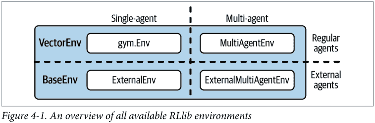

第一种称为MultiAgentEnv，它允许你训练一个具有多个代理的模型。使用多个代理可能很棘手。因为你必须注意在环境中以合适的接口定义你的代理，并考虑到每个代理可能与其环境交互的方式完全不同。

更重要的是，代理可能相互交互，并且必须尊重彼此的动作。在更高级的设置中，甚至可能存在一个明确相互依赖的代理层次结构。简而言之，运行多代理RL实验很困难，我们将在下一个示例中看到RLlib如何处理这个问题。

我们将要研究的另一种环境类型称为ExternalEnv，可用于将外部模拟器连接到RLlib。例如，想象一下我们之前简单的迷宫问题是一个实际机器人在迷宫中导航的模拟。在这种场景中，将机器人（或其模拟，在不同的软件栈中实现）与RLlib的学习代理放在一起可能并不合适。为此，RLlib为你提供了一个简单的客户端-服务器架构，用于与外部模拟器通信，允许通过REST API进行通信。如果你想同时在多代理和外部环境设置中工作，RLlib提供了一个结合两者的`MultiAgentExternalEnv`环境。

#### 使用多个代理

在RLlib中定义多代理环境的基本思想很简单。你首先为每个代理分配一个代理ID。然后，无论你之前在Gym环境中定义为单个值的内容（观察、奖励等），你现在都定义为一个以代理ID为键、每个代理对应一个值的字典。当然，实践中的细节比这更复杂一些。但一旦你定义了一个托管多个代理的环境，你就必须定义这些代理应该如何学习。

在单代理环境中，有一个代理和一个策略需要学习。在多代理环境中，有多个代理可能映射到一个或多个策略。例如，如果你的环境中有一组同质代理，那么你可以为所有代理定义一个单一策略。如果它们都以相同的方式*行动*，那么它们的行为可以以相同的方式学习。相反，你可能会遇到异质代理的情况，其中每个代理都必须学习一个单独的策略。在这两个极端之间，存在一系列可能性，如图4-2所示。

我们继续使用我们的迷宫游戏作为本章的持续示例。这样你可以自己检查接口在实践中如何不同。因此，为了将我们刚刚概述的想法转化为代码，让我们定义一个`GymEnvironment`类的多代理版本。我们的`MultiAgentEnv`类将恰好有两个代理，我们将其编码在一个名为`agents`的Python字典中，但原则上这适用于任意数量的代理。

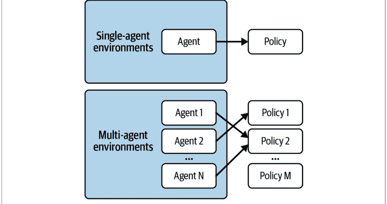

*图4-2. 多代理强化学习问题中代理到策略的映射*

我们首先初始化并重置我们的新环境：

```python
from ray.rllib.env.multi_agent_env import MultiAgentEnv
from gym.spaces import Discrete
import os
```

```python
class MultiAgentMaze(MultiAgentEnv):

    def __init__(self, *args, **kwargs):
        self.action_space = Discrete(4)
        self.observation_space = Discrete(5*5)
        self.agents = {1: (4, 0), 2: (0, 4)}
        self.goal = (4, 4)
        self.info = {1: {'obs': self.agents[1]}, 2: {'obs': self.agents[2]}}

    def reset(self):
        self.agents = {1: (4, 0), 2: (0, 4)}

        return {1: self.get_observation(1), 2: self.get_observation(2)}
```

- 1. 动作空间和观察空间与之前完全相同。
- 2. 我们现在在一个agents字典中有两个起始位置分别为(0, 4)和(4, 0)的搜索者。
- 3. 对于info对象，我们使用代理ID作为键。
- 4. 观察现在是每个代理的字典。

注意我们完全没有触及动作空间和观察空间。这是因为我们在这里使用了两个本质上相同的代理，可以重用相同的空间。在更复杂的情况下，你必须考虑到某些代理的动作和观察可能看起来不同。16

接下来，让我们将我们的辅助方法get_observation、get_reward和is_done泛化以处理多个代理。我们通过向它们的签名中传入一个action_id并以与之前相同的方式处理每个代理来实现这一点：

```python
def get_observation(self, agent_id):
    seeker = self.agents[agent_id]
    return 5 * seeker[0] + seeker[1]

def get_reward(self, agent_id):
    return 1 if self.agents[agent_id] == self.goal else 0
```

> 16 你可以在RLlib文档中找到一个很好的例子，它为多个代理定义了不同的观察空间和动作空间。

### 使用策略服务器与客户端

在本节的最后一个示例中，我们假设原始的`GymEnvironment`只能在无法运行RLlib的机器上进行模拟，例如因为资源不足。我们可以在一个`PolicyClient`上运行该环境，该客户端可以向相应的`server`请求适用于环境的下一步动作。而服务器本身并不了解环境，它只知道如何从`PolicyClient`接收输入数据，并负责运行所有与强化学习相关的代码；特别是，它定义了一个RLlib的`AlgorithmConfig`对象并训练一个`Algorithm`。

通常，你会希望在强大的Ray集群上运行训练算法的服务器，而相应的客户端则在该集群之外运行。图4-3示意性地说明了这种设置。

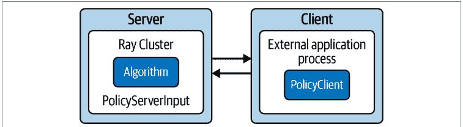

### 定义服务器

让我们首先定义这样一个应用的服务器端。我们定义一个所谓的PolicyServerInput，它在本地主机的9900端口上运行。这个策略输入就是客户端稍后将要提供的内容。将这个policy_input定义为算法配置的输入后，我们可以定义另一个DQN在服务器上运行：

```python
# policy_server.py
import ray
from ray.rllib.agents.dqn import DQNConfig
from ray.rllib.env.policy_server_input import PolicyServerInput
import gym

ray.init()

def policy_input(context):
    return PolicyServerInput(context, "localhost", 9900) ❶

config = DQNConfig()\
    .environment(
        env=None, ❷
        action_space=gym.spaces.Discrete(4), ❸
        observation_space=gym.spaces.Discrete(5*5))\
    .debugging(log_level="INFO")\
    .rollouts(num_rollout_workers=0)\
    .offline_data(❹
        input=policy_input,
        input_evaluation=[])

algo = config.build()
```

❶ policy_input函数返回一个在本地主机9900端口上运行的PolicyServerInput对象。

❷ 我们将env显式设置为None，因为此服务器不需要环境。

❸ 因此，我们需要同时定义observation_space和action_space，因为服务器无法从环境中推断它们。

❹ 为了使其工作，我们需要将我们的policy_input作为实验的输入提供。

定义好这个algo后，¹⁹我们现在可以像这样在服务器上启动一个训练会话：

```python
# policy_server.py
if __name__ == "__main__":
    time_steps = 0
    for _ in range(100):
        results = algo.train()
        checkpoint = algo.save() ❶
        if time_steps >= 1000: ❷
            break
        time_steps += results["timesteps_total"]
```

❶ 最多训练100次迭代，并在每次迭代后保存检查点。

❷ 如果训练超过1000个时间步，我们就停止训练。

接下来，我们假设你将上面两段代码片段保存在一个名为policy_server.py的文件中。如果你愿意，现在可以通过在终端中运行`python policy_server.py`在本地机器上启动这个策略服务器。

### 定义客户端

接下来，为了定义应用的相应客户端，我们定义一个连接到我们刚刚启动的服务器的策略客户端。由于我们不能假设你家里有几台计算机（或在云中有可用的计算机），与我们之前所说的相反，我们将在同一台机器上启动这个客户端。换句话说，客户端将连接到http://localhost:9900，但如果你能在不同的机器上运行服务器，只要该机器在网络中可用，你可以将localhost替换为该机器的IP地址。

策略客户端的接口相当简洁。它们可以触发服务器开始或结束一个回合，从中获取下一个动作，并将奖励信息记录到服务器（否则服务器将没有这些信息）。话虽如此，以下是定义这样一个客户端的方法：

¹⁹ 由于技术原因，我们必须在这里指定观察和动作空间，这在RLlib的未来版本中可能不再必要，因为它泄露了环境信息。另请注意，我们需要将input_evaluation设置为空列表才能使此服务器工作。

## policy_client.py

```python
import gym
from ray.rllib.env.policy_client import PolicyClient
from maze_gym_env import GymEnvironment

if __name__ == "__main__":
    env = GymEnvironment()
    client = PolicyClient("http://localhost:9900", inference_mode="remote")

    obs = env.reset()
    episode_id = client.start_episode(training_enabled=True)

    while True:
        action = client.get_action(episode_id, obs)

        obs, reward, done, info = env.step(action)

        client.log_returns(episode_id, reward, info=info)

        if done:
            client.end_episode(episode_id, obs)
            exit(0)
```

1.  在服务器地址上启动一个使用远程推理模式的策略客户端。
2.  告诉服务器开始一个回合。
3.  对于给定的环境观测，我们可以从服务器获取下一个动作。
4.  客户端必须将奖励信息记录到服务器。
5.  如果达到某个条件，我们可以停止客户端进程。
6.  如果环境结束，我们必须通知服务器回合已完成。

假设你将此代码保存在 *policy_client.py* 中，并通过运行 `python policy_client.py` 来启动它，那么我们之前启动的服务器将开始仅使用从客户端获取的环境信息进行学习。

### 高级概念

到目前为止，我们一直在处理简单的环境，这些环境用 RLlib 中最基本的强化学习算法设置就足以应对。当然，在实践中你并不总是那么幸运，可能需要想出其他方法来应对更困难的环境。在本节中，我们将介绍一个稍难版本的迷宫环境，并讨论一些高级概念来帮助你解决它。

### 构建高级环境

让我们使我们的迷宫 GymEnvironment 更具挑战性。首先，我们将它的大小从 5 × 5 增加到 11 × 11 的网格。然后，我们在迷宫中引入障碍物，智能体可以穿过它们，但会付出代价，即获得 -1 的负奖励。这样，我们的搜索智能体将不得不学习在避开障碍物的同时仍然找到目标。此外，我们随机化智能体的起始位置。所有这些都使得强化学习问题更难解决。让我们先看看这个新的 AdvancedEnv 的初始化：

```python
from gym.spaces import Discrete
import random
import os

class AdvancedEnv(GymEnvironment):

    def __init__(self, seeker=None, *args, **kwargs):
        super().__init__(*args, **kwargs)
        self.maze_len = 11
        self.action_space = Discrete(4)
        self.observation_space = Discrete(self.maze_len * self.maze_len)

        if seeker: ①
            assert 0 <= seeker[0] < self.maze_len and \
                   0 <= seeker[1] < self.maze_len
            self.seeker = seeker
        else:
            self.reset()

        self.goal = (self.maze_len-1, self.maze_len-1)
        self.info = {'seeker': self.seeker, 'goal': self.goal}

        self.punish_states = [ ②
            (i, j) for i in range(self.maze_len) for j in range(self.maze_len)
            if i % 2 == 1 and j % 2 == 0
        ]
```

1.  在初始化时设置搜索智能体的位置。
2.  引入 punish_states 作为智能体的障碍物。

接下来，在重置环境时，我们希望确保将智能体的位置重置为随机状态。20 我们还将到达目标的正奖励增加到 5，以抵消穿过障碍物的负奖励（在强化学习算法识别出障碍物位置之前，这种情况会经常发生）。像这样平衡奖励是校准你的强化学习实验的一项关键任务：

> 20 在 reset 的定义中，我们允许搜索智能体重置在目标上，以保持定义的简单性。允许这种微不足道的边缘情况不会影响学习。

```python
def reset(self):
    """Reset seeker position randomly, return observations."""
    self.seeker = (
        random.randint(0, self.maze_len - 1),
        random.randint(0, self.maze_len - 1)
    )
    return self.get_observation()

def get_observation(self):
    """Encode the seeker position as integer"""
    return self.maze_len * self.seeker[0] + self.seeker[1]

def get_reward(self):
    """Reward finding the goal and punish forbidden states"""
    reward = -1 if self.seeker in self.punish_states else 0
    reward += 5 if self.seeker == self.goal else 0
    return reward

def render(self, *args, **kwargs):
    """Render the environment, e.g. by printing its representation."""
    os.system('cls' if os.name == 'nt' else 'clear')
    grid = [['|' + ' ' for _ in range(self.maze_len)] +
            ['|\n'] for _ in range(self.maze_len)]
    for punish in self.punish_states:
        grid[punish[0]][punish[1]] = '|X'
    grid[self.goal[0]][self.goal[1]] = '|G'
    grid[self.seeker[0]][self.seeker[1]] = '|S'
    print(''.join([''.join(grid_row) for grid_row in grid]))
```

还有很多其他方法可以让这个环境变得更困难，比如让它变得更大，对智能体在某个方向上的每一步都给予负奖励，或者惩罚智能体试图走出网格。到现在，你应该已经很好地理解了问题设置，可以进一步自定义迷宫了。

虽然你可能成功训练了这个环境，但这是一个介绍一些高级概念的好机会，你可以将它们应用到其他强化学习问题中。

### 应用课程学习

RLlib 最有趣的功能之一是为算法提供一个课程来学习。我们不是让算法从任意的环境设置中学习，而是精心挑选那些更容易学习的状态，然后缓慢但稳定地引入更困难的状态。构建学习课程是让你的实验更快收敛到解决方案的好方法。要应用课程学习，你唯一需要的是一个关于哪些起始状态比其他状态更容易的视图。对于许多环境来说，这可能是一个挑战，但为我们的高级迷宫想出一个简单的课程很容易。具体来说，搜索智能体与目标的距离可以用作难度的度量。为了简单起见，我们将使用的距离度量是搜索智能体两个坐标与目标的绝对距离之和，以此来定义难度。

要在 RLlib 中运行课程学习，我们定义一个 CurriculumEnv，它扩展了我们的 AdvancedEnv 和 RLlib 中所谓的 TaskSettableEnv。TaskSettableEnv 的接口非常简单，你只需定义如何获取当前难度（get_task）以及如何设置所需的难度（set_task）。以下是这个 CurriculumEnv 的完整定义：

```python
from ray.rllib.env.apis.task_settable_env import TaskSettableEnv

class CurriculumEnv(AdvancedEnv, TaskSettableEnv):

    def __init__(self, *args, **kwargs):
        AdvancedEnv.__init__(self)

    def difficulty(self): ①
        return abs(self.seeker[0] - self.goal[0]) + \
               abs(self.seeker[1] - self.goal[1])

    def get_task(self): ②
        return self.difficulty()

    def set_task(self, task_difficulty): ③
        while not self.difficulty() <= task_difficulty:
            self.reset()
```

1.  将当前状态的难度定义为搜索智能体两个坐标与目标的绝对距离之和。
2.  要定义 get_task，我们可以简单地返回当前难度。
3.  要设置任务难度，我们重置环境，直到其难度*最多*为指定的 task_difficulty。

要将此环境用于课程学习，我们需要定义一个课程函数，告诉算法何时以及如何设置任务难度。我们有很多选择，但我们使用一个简单的调度器，每训练 1,000 个时间步就将难度增加一：

```python
def curriculum_fn(train_results, task_settable_env, env_ctx):
    time_steps = train_results.get("timesteps_total")
    difficulty = time_steps // 1000
    print(f"Current difficulty: {difficulty}")
    return difficulty
```

要测试此课程函数，我们需要将其添加到 RLlib 算法配置中，方法是将 `env_task_fn` 属性设置为我们的 `curriculum_fn`。请注意，在训练 DQN 进行 15 次迭代之前，我们还在配置中设置了一个 `output` 文件夹。这将把我们训练运行的经验数据存储到指定的 `temp` 文件夹中：²¹

```python
from ray.rllib.algorithms.dqn import DQNConfig
import tempfile

temp = tempfile.mkdtemp() ❶

trainer = (
    DQNConfig()
    .environment(env=CurriculumEnv, env_task_fn=curriculum_fn) ❷
    .offline_data(output=temp) ❸
    .build()
)

for i in range(15):
    trainer.train()
```

- ❶ 创建一个 `temp` 文件来存储我们的训练数据以供后续使用。
- ❷ 在配置的 `environment` 部分将 `CurriculumEnv` 设置为我们的环境，并将我们的 `curriculum_fn` 分配给 `env_task_fn` 属性。
- ❸ 使用 `offline_data` 方法将输出存储到我们的 `temp` 文件夹中。

运行此算法，你应该会看到任务难度如何随时间增加，从而为算法提供简单的示例作为起点，以便它能够从中学习并逐步处理更困难的任务。

课程学习是一项值得了解的优秀技术，RLlib 允许你通过我们刚刚讨论的课程 API 轻松地将其纳入你的实验中。

### 处理离线数据

在我们之前的课程学习示例中，我们将训练数据存储到了一个临时文件夹。有趣的是，你从第 3 章已经知道，在 Q-Learning 中，你可以先收集经验数据，然后决定何时在训练步骤中使用它。这种数据收集和训练的分离带来了许多可能性。例如，也许你有一个好的启发式方法，可以以不完美但合理的方式解决你的问题。或者你有人类与环境交互的记录，通过示例展示如何解决问题。

收集经验数据以供后续训练的主题通常被称为处理*离线数据*。它被称为“离线”，是因为它不是由策略与环境在线交互直接生成的。不依赖于在其自身策略输出上进行训练的算法被称为*离线策略算法*，而 Q-Learning，特别是 DQN，就是这样一个例子。不具备此属性的算法被称为在线策略算法。换句话说，离线策略算法可用于在离线数据上进行训练。²²

要使用我们存储在 *temp* 文件夹中的数据，我们可以创建一个新的 DQNConfig，将该文件夹作为输入。我们还将把 explore 设置为 False，因为我们只想利用之前收集的数据进行训练——算法不会根据其自身的策略进行探索。

使用生成的 RLlib 算法的工作方式与之前完全相同，我们通过训练 10 次迭代然后进行评估来演示：

```python
imitation_algo = (
    DQNConfig()
    .environment(env=AdvancedEnv)
    .evaluation(off_policy_estimation_methods={})
    .offline_data(input_=temp)
    .exploration(explore=False)
    .build())

for i in range(10):
    imitation_algo.train()

imitation_algo.evaluate()
```

注意我们将算法命名为 *imitation_algo*。这是因为此训练过程旨在*模仿*我们之前收集的数据中反映的行为。因此，这种在强化学习中通过示范进行学习的方式通常被称为*模仿学习*或*行为克隆*。

### 其他高级主题

在结束本章之前，让我们看看 RLlib 提供的其他一些高级主题。你已经看到了 RLlib 的灵活性：处理各种不同的环境、配置你的实验、进行课程训练或运行模仿学习。本节将让你了解其他可能的功能。

使用 RLlib，你可以完全自定义底层使用的模型和策略。如果你之前使用过深度学习，你就知道拥有一个好的模型架构有多重要。在强化学习中，这通常不像在监督学习中那么关键，但它仍然是成功运行高级实验的重要组成部分。

你还可以通过提供自定义预处理器来改变观测数据的预处理方式。对于我们的简单迷宫示例，没有什么需要预处理的，但在处理图像或视频数据时，预处理通常是一个关键步骤。

在我们的 *AdvancedEnv* 中，我们引入了需要避免的状态。我们的智能体必须学会这样做，但 RLlib 有一个功能，可以通过所谓的*参数化动作空间*自动避免它们。粗略地说，你可以做的是在每个时间点从动作空间中“屏蔽掉”所有不需要的动作。在某些情况下，也可能需要可变的观测空间，RLlib 也完全支持这一点。

我们简要介绍了离线数据的主题。RLlib 拥有一个功能齐全的 Python API，用于读写经验数据，可用于各种情况。

为了简单起见，我们在这里只使用了 DQN，但 RLlib 拥有令人印象深刻的训练算法范围。仅举一例，MARWIL 算法是一种复杂的混合算法，你可以用它从离线数据运行模仿学习，同时还可以混合使用“在线”生成的数据进行常规训练。

### 总结

在本章中，你了解了 RLlib 的一系列有趣功能。我们涵盖了训练多智能体环境、处理由另一个智能体生成的离线数据、设置客户端-服务器架构以将模拟与强化学习训练分离，以及使用课程学习来指定日益困难的任务。

我们还简要概述了 RLlib 的主要概念以及如何使用其 CLI 和 Python API。特别是，我们展示了如何根据你的需求配置 RLlib 算法和环境。由于我们只涵盖了 RLlib 功能的一小部分，我们鼓励你阅读其[文档并探索其 API](https://docs.ray.io/en/latest/rllib/index.html)。

在下一章中，你将学习如何使用 Ray Tune 调整 RLlib 模型和策略的超参数。

# 第 5 章
## 使用 Ray Tune 进行超参数优化

在第 4 章中，你学习了如何构建和运行各种强化学习实验。运行此类实验可能代价高昂，无论是计算资源还是运行所需的时间。随着你转向更具挑战性的任务，这种代价只会增加，因为你不太可能直接开箱即用地选择一个算法并运行它就能获得好结果。换句话说，在某个时候，你将需要调整算法的超参数以获得最佳结果。正如我们将在本章中看到的，调整机器学习模型很难，但 Ray Tune 是帮助你解决此任务的绝佳选择。

Ray Tune 是一个强大的超参数优化工具。它不仅默认以分布式方式工作（并且适用于本书中讨论的任何其他 Ray 库），而且还是目前功能最丰富的 HPO 库之一。最重要的是，Tune 与一些最著名的 HPO 库集成，例如 Hyperopt、Optuna 等等。这使得 Tune 成为分布式 HPO 实验的理想选择，无论你是从其他库迁移过来还是从头开始。

在本章中，我们将首先更深入地回顾为什么 HPO 难以进行，以及你如何可以使用 Ray 简单地自己实现它。然后，我们将教你 Ray Tune 的核心概念以及如何使用它来调整上一章构建的 RLlib 模型。最后，我们还将看看如何使用 Tune 进行监督学习任务，使用 Keras 等框架。在此过程中，我们将演示 Tune 如何与其他 HPO 库集成，并向你介绍一些更高级的功能。

### 调整超参数

让我们简要回顾一下超参数优化的基础知识。如果你熟悉 HPO，可以跳过本节，但既然我们也在讨论分布式 HPO 的方面，你可能仍然会受益。一如既往，你可以在[本书的 GitHub 仓库](https://github.com/)中找到本章的笔记本。

在我们第 3 章介绍的第一个强化学习实验中，我们定义了一个非常基本的 Q-Learning 算法，其内部*状态-动作值*根据显式的更新规则进行更新。初始化后，我们从未直接接触过这些*模型参数*；它们是由算法学习的。相比之下，在设置算法时，我们在训练前明确选择了一个权重和一个 `discount_factor` 参数。当时我们没有告诉你我们是如何选择设置这些参数的；我们只是接受它们足够好来解决手头的问题。

同样，在第 4 章中，我们使用一个配置初始化了一个 RLlib 算法，该配置通过设置 `num_rollout_workers=2` 为我们的 DQN 算法使用了两个 rollout worker。像这样的参数被称为*超参数*，为它们找到好的选择对于成功的实验至关重要。超参数优化领域致力于高效地找到这些好的选择。

### 使用 Ray 构建随机搜索示例

像我们 Q-Learning 算法的权重或 `discount_factor` 这样的超参数是*连续*参数，因此我们不可能测试它们的所有组合。更重要的是，这些参数选择可能不是相互独立的。如果我们希望它们为我们选择，我们还需要为每个参数指定一个*值范围*（在这种情况下，两个超参数都需要在 0 到 1 之间）。那么，我们如何确定好的甚至是最优的超参数呢？

让我们看一个实现了一种简单但有效的超参数调整方法的例子。这个例子还将让我们介绍一些稍后将使用的术语。核心思想是，我们可以尝试*随机采样*超参数，为每个样本运行算法，然后根据结果选择最佳运行。但为了体现本书的主题，我们不想仅仅在一个顺序循环中运行它；我们想使用 Ray 并行计算我们的运行。

为了简单起见，我们将重新审视第 3 章中的简单 Q-Learning 算法。我们将主训练函数的签名定义为 `train_policy(env, num_episodes=10000, weight=0.1, discount_factor=0.9)`。这意味着我们可以通过向 `train_policy` 函数传递不同的值来调整算法的权重和 `discount_factor` 参数，并查看算法的表现如何。为此，让我们为我们的超参数定义一个所谓的*搜索空间*。对于这两个对于所讨论的参数，我们在0到1之间均匀采样值，总共10个选择。

其效果如下所示：

```python
import random
search_space = []
for i in range(10):
    random_choice = {
        'weight': random.uniform(0, 1),
        'discount_factor': random.uniform(0, 1)
    }
    search_space.append(random_choice)
```

接下来，我们定义一个*目标函数*，或简称*目标*。目标函数的作用是评估给定一组超参数在特定任务上的性能。在我们的案例中，我们希望训练我们的强化学习算法并评估训练好的策略。回想一下，在第3章中，我们也正是为此目的定义了一个`evaluate_policy`函数。`evaluate_policy`函数被定义为返回智能体在底层迷宫环境中到达目标所需的平均步数。换句话说，我们希望找到一组能使目标函数结果最小化的超参数。为了并行化目标函数，我们将使用`ray.remote`装饰器将我们的目标函数变成一个Ray任务：

```python
import ray

@ray.remote
def objective(config):
    environment = Environment()
    policy = train_policy(
        environment,
        weight=config["weight"],
        discount_factor=config["discount_factor"]
    )
    score = evaluate_policy(environment, policy)
    return [score, config]
```

1.  将一个包含超参数样本的字典传入我们的目标函数。
2.  使用选定的超参数训练我们的强化学习策略。
3.  之后，我们可以评估策略以获取我们想要最小化的分数。
4.  返回分数和超参数选择，以便后续分析。

最后，我们可以通过遍历搜索空间并收集结果，使用Ray并行运行目标函数：

```python
result_objects = [objective.remote(choice) for choice in search_space]
results = ray.get(result_objects)

results.sort(key=lambda x: x[0])
print(results[-1])
```

这次超参数运行的实际结果并不十分有趣，因为这个问题很容易解决（大多数运行都会返回最优的八步结果，无论选择什么超参数）。这里更有趣的是，使用Ray并行化目标函数是多么容易。事实上，我们鼓励你重写前面的例子，简单地遍历搜索空间并对每个样本调用目标函数，只是为了确认这样的串行循环会慢得多么痛苦。

从概念上讲，我们运行该示例所采取的三个步骤代表了超参数调优的一般工作流程。首先，你定义一个搜索空间，然后定义一个目标函数，最后运行分析以找到最佳超参数。在超参数优化中，通常将目标函数的一次评估（对应一个超参数样本）称为一次*试验*，所有试验构成了你分析的基础。如何从搜索空间中采样参数（在我们的案例中是随机采样）由*搜索算法*决定。实际上，找到好的超参数说起来容易做起来难，所以让我们仔细看看为什么这个问题如此困难。

### 为什么超参数优化很难？

如果你从前面的例子中跳出来，可以看到使超参数调优过程良好运作涉及许多复杂性。以下是最重要的几点概述：

-   你的搜索空间可能由大量超参数组成。这些参数可能具有不同的数据类型和范围。某些参数可能相关，甚至依赖于其他参数。从复杂的高维空间中采样好的候选参数是一项艰巨的任务。
-   随机选择参数可能效果出奇地好，但这并不总是最佳选择。通常，你需要测试更复杂的搜索算法来找到最佳参数。
-   特别是，即使你像我们刚才那样并行化了超参数搜索，目标函数的单次运行也可能需要很长时间才能完成。这意味着你无法承担运行太多次搜索。例如，训练神经网络可能需要数小时才能完成，因此你的超参数搜索需要高效。
-   在分布式搜索中，你需要有足够的计算资源来有效地运行目标函数的搜索。例如，你可能需要一个GPU来足够快地计算你的目标函数，因此你所有的搜索运行都需要能够访问GPU。为每次试验分配必要的资源对于加速搜索至关重要。
-   你需要为你的超参数优化实验提供便捷的工具，例如提前停止糟糕的运行、保存中间结果、从之前的试验重新开始，或暂停和恢复运行。

作为一个成熟的分布式超参数优化框架，Ray Tune解决了所有这些问题，并提供了一个简单的接口来运行超参数调优实验。在我们深入了解Tune的工作原理之前，让我们先用Tune重写之前的例子。

### Tune简介

要初次体验Tune，将我们朴素的Ray Core随机搜索实现移植到Tune非常简单，并遵循与之前相同的三个步骤。首先，我们定义一个搜索空间，但这次使用`tune.uniform`，而不是random库：

```python
from ray import tune

search_space = {
    "weight": tune.uniform(0, 1),
    "discount_factor": tune.uniform(0, 1),
}
```

接下来，我们可以定义一个看起来与之前几乎相同的目标函数。我们就是这样设计的。唯一的区别是这次我们以字典形式返回分数，并且不需要`ray.remote`装饰器，因为Tune会在内部负责为我们分发这个目标函数：

```python
def tune_objective(config):
    environment = Environment()
    policy = train_policy(
        environment,
        weight=config["weight"],
        discount_factor=config["discount_factor"]
    )
    score = evaluate_policy(environment, policy)

    return {"score": score}
```

定义了这个`tune_objective`函数后，我们可以将其与定义的搜索空间一起传递给`tune.run`调用。默认情况下，Tune会为你运行随机搜索，但你也可以指定其他搜索算法，你很快就会看到。¹ 调用`tune.run`会为你的目标函数生成随机搜索试验，并返回一个包含超参数搜索信息的分析对象。我们可以通过调用`get_best_config`并指定`metric`和`mode`参数（我们希望最小化分数）来获取找到的最佳超参数：

```python
analysis = tune.run(tune_objective, config=search_space)
print(analysis.get_best_config(metric="score", mode="min"))
```

这个快速示例涵盖了Tune的基础知识，但还有很多内容需要深入探讨。`tune.run`函数功能强大，接受许多参数来配置你的运行。要理解这些不同的配置选项，我们首先需要向你介绍Tune的关键概念。

### Tune是如何工作的？

要有效地使用Tune，你必须理解六个关键概念，其中四个你在前面的例子中已经用过。以下是Ray Tune组件的概述以及你应该如何理解它们：

**搜索空间**
这些空间决定了要选择哪些参数。搜索空间定义了每个参数的值范围以及如何对它们进行采样。它们被定义为字典，并使用Tune的采样函数来指定有效的超参数值。你已经见过`tune.uniform`，但还有很多其他选项可供选择。

**可训练对象**
可训练对象是Tune对你想要“调优”的目标的正式表示。Tune也有基于类的API，但本书中我们将只使用基于函数的API。对我们来说，可训练对象是一个带有单个参数（即搜索空间）的函数，它向Tune报告分数。报告分数最简单的方法是返回一个包含你感兴趣值的字典。

**试验**
通过触发`tune.run(...)`，Tune将设置试验并将其调度到你的集群上执行。一个试验包含了在给定一组超参数的情况下，目标函数单次运行的所有必要信息。

### 分析

完成一次 `tune.run` 调用会返回一个 `ExperimentAnalysis` 对象，其中包含所有试验的结果。你可以使用此对象深入查看试验结果。

### 搜索算法

Tune 支持多种搜索算法，这些算法是调整超参数的核心。到目前为止，你已经隐式地接触了 Tune 的默认搜索算法，它从搜索空间中随机选择超参数。

### 调度器

Tune 实验的最后一个关键组件是调度器。调度器负责规划和执行搜索算法所选择的内容。默认情况下，Tune 按照先进先出（FIFO）的原则调度由你的搜索算法选择的试验。实际上，你可以将调度器视为加速实验的一种方式，例如通过提前停止不成功的试验。

图 5-1 总结了这些主要的 Tune 组件及其关系。

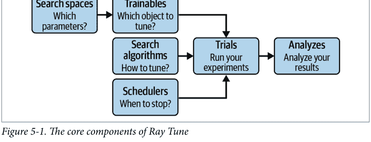

在本章中，我们专门使用 `tune.run` 来说明 Tune 的功能。Tune 在 Ray 2.0 中还添加了一个名为 `Tuner` 的 API，作为 Ray AIR 的一部分，你将在第 7 章了解更多，并在第 10 章中在 Ray AIR 中使用它。

在撰写本文时，`tune.run` 仍然是一个更成熟的 API。例如，使用 `tune.run(...)` 的实验返回一个 `ExperimentAnalysis` 对象，这是一个分析结果的强大工具。而使用 `Tuner` API 的类似调用则返回一个所谓的 `ResultGrid`。从长远来看，`ResultGrid` 将取代 `ExperimentAnalysis`，但目前其功能尚未完全对等。

要了解更多信息，请参阅关于此主题的 Tune API 文档。

请注意，在内部，Tune 运行是在你的 Ray 集群的驱动程序进程上启动的，该进程会生成多个工作进程（使用 Ray actors）来执行你的 HPO 实验的各个试验。你在驱动程序上定义的可训练对象必须发送到工作进程，并且试验结果需要与运行 `tune.run(...)` 的驱动程序进行通信。

搜索空间、可训练对象、试验和分析不需要太多额外的解释，我们将在本章的其余部分看到更多关于这些组件的示例。但是搜索算法（简称 *searchers*）和调度器需要稍作详细说明。

### 搜索算法

Tune 提供的所有高级搜索算法，以及它集成的众多第三方 HPO 库，都属于 *贝叶斯优化* 的范畴。不幸的是，深入探讨特定贝叶斯搜索算法的细节远远超出了本书的范围。其基本思想是，根据先前试验的结果，更新你对哪些超参数范围值得探索的信念。使用此原则的技术能做出更明智的决策，因此往往比独立采样参数（例如随机采样）更高效。

除了我们已经看到的基本随机搜索和从预定义的“网格”中选择超参数的 *网格搜索* 之外，Tune 还集成了广泛的贝叶斯优化搜索器。例如，Tune 与流行的 Hyperopt 和 Optuna 库集成，² 你可以通过这两个库在 Tune 中使用流行的 TPE（树结构 Parzen 估计器）搜索器。不仅如此，Tune 还与 Ax、BlendSearch、FLAML、Dragonfly、scikit-Optimize、Bayesian optimization、HpBandSter、Nevergrad、ZOOpt、SigOpt 和 HEBO 等工具集成。如果你需要在集群上使用这些工具中的任何一个运行 HPO 实验，或者想要轻松地在它们之间切换，Tune 是不二之选。

为了更具体地说明，让我们将之前的基本随机搜索 Tune 示例重写为使用贝叶斯优化库。为此，请确保首先在你的 Python 环境中安装此库，例如使用 `pip install bayesian-optimization`：

```python
from ray.tune.suggest.bayesopt import BayesOptSearch

algo = BayesOptSearch(random_search_steps=4)
```

> ² 在开源软件中，确定谁负责维护集成非常重要。我们将在第 11 章中更详细地讨论这一点，该章涵盖了 Ray 的整个生态系统。对于 Tune 而言，在此处列出的集成中，Hyperopt 和 Optuna 集成由 Ray Tune 团队维护；其余的则由社区赞助。

```python
tune.run(
    tune_objective,
    config=search_space,
    metric="score",
    mode="min",
    search_alg=algo,
    stop={"training_iteration": 10},
)
```

请注意，我们以四个随机步骤“热启动”我们的贝叶斯优化，并且我们在 10 次训练迭代后明确停止试验运行。

因为我们不仅仅是使用 `BayesOptSearch` 随机选择参数：我们在 Tune 运行中使用的 `search_alg` 需要知道要优化哪个指标以及是最大化还是最小化该指标。正如我们之前所论证的，我们希望实现“最小化”“分数”。

### 调度器

接下来，让我们讨论如何在 Tune 中使用 *试验调度器* 来使你的运行更高效。我们还将在本节中介绍一种在目标函数中向 Tune 报告指标的略有不同的方式。

假设我们不是像之前的示例那样直接计算分数，而是在循环中计算一个 *中间分数*。这种情况在监督机器学习场景中经常发生，当训练模型进行多次迭代时（我们将在第 115 页的“使用 Tune 进行机器学习”中看到具体应用）。如果选择了良好的超参数，这个中间分数可能在计算它的循环结束之前就停滞不前了。换句话说，如果我们没有看到足够的增量变化，为什么不提前停止试验呢？这正是 Tune 调度器旨在解决的情况之一。

这是一个此类目标函数的快速示例。这是一个简单的示例，但它将帮助我们比从复杂示例开始更容易地思考我们希望 Tune 找到的最佳超参数：

```python
def objective(config):
    for step in range(30):  # ①
        score = config["weight"] * (step ** 0.5) + config["bias"]
        tune.report(score=score)  # ②

search_space = {"weight": tune.uniform(0, 1), "bias": tune.uniform(0, 1)}
```

- 1. 你可能经常想要计算中间分数，例如在“训练循环”中。
- 2. 你可以使用 `tune.report` 让 Tune 知道这些中间分数。

我们这里想要最小化的分数是一个正数乘以权重再加上一个偏置项的平方根。很明显，为了最小化任何正 x 的分数，这两个超参数都需要尽可能小。鉴于平方根函数会“趋于平缓”，我们可能不必计算所有 30 次循环就能为我们的两个超参数找到足够好的值。如果每次分数计算需要一个小时，提前停止可以极大地加快你的实验运行速度。

让我们通过使用流行的 Hyperband 算法作为试验调度器来说明这个想法。这个调度器需要传入一个指标和模式（同样，我们最小化分数）。我们还确保运行 10 个样本，以免过早停止：

```python
from ray.tune.schedulers import HyperBandScheduler

scheduler = HyperBandScheduler(metric="score", mode="min")

analysis = tune.run(
    objective,
    config=search_space,
    scheduler=scheduler,
    num_samples=10,
)

print(analysis.get_best_config(metric="score", mode="min"))
```

请注意，在这种情况下，我们没有指定搜索算法，这意味着 Hyperband 将在随机搜索选择的参数上运行。我们也可以将此调度器与另一个搜索算法 *结合* 使用。这将允许我们选择更好的试验超参数并提前停止不良试验。但是，请注意，并非每个调度器都可以与搜索算法结合使用。有关更多信息，请查看 [Tune 的调度器兼容性矩阵](https://docs.ray.io/en/latest/tune/tutorials/tune-scheduler.html)。

总结一下这个讨论，除了 Hyperband 之外，Tune 还包括分布式实现的早期停止算法，例如中位数停止规则、ASHA、基于种群的训练（PBT）和基于种群的强盗算法（PB2）。

### 配置和运行 Tune

在深入探讨使用 Ray Tune 的更具体的机器学习示例之前，让我们先探讨一些有用的主题，这些主题可以帮助你从 Tune 实验中获得更多收益，例如正确利用资源、停止和恢复试验、向你的 Tune 运行添加回调，或定义自定义和条件搜索空间。

### 指定资源

默认情况下，每个 Tune 试验将在一个 CPU 上运行，并利用尽可能多的 CPU 进行并发试验。例如，如果你在一台有 8 个 CPU 的笔记本电脑上运行 Tune，本章中计算的任何实验都将生成八个并发试验，并为每个试验分配一个 CPU。可以通过 Tune 运行的 `resources_per_trial` 参数来控制此行为。

你还可以确定每个试验使用的 GPU 数量。此外，Tune 允许你使用*分数资源*；即，你可以在试验之间共享资源。因此，假设你有一台具有 12 个 CPU 和 2 个 GPU 的机器，并且你为你的目标请求以下资源：

```python
from ray import tune

tune.run(
    objective,
    config=search_space,
    num_samples=10,
    resources_per_trial={"cpu": 2, "gpu": 0.5}
)
```

这意味着 Tune 可以在你的机器上调度和执行最多四个并发试验，因为这将使该机器上的 GPU 利用率达到最大（同时你仍然有四个空闲的 CPU 用于其他任务）。如果你愿意，你还可以通过将字节数传递给 `resources_per_trial` 来指定试验使用的“内存量”。另请注意，如果你需要显式*限制*并发试验的数量，你可以通过将 `max_concurrent_trials` 参数传递给你的 `tune.run(...)` 来实现。在前面的示例中，如果你想始终保留一个 GPU 用于其他任务，你可以通过设置 `max_concurrent_trials = 2` 将并发试验数量限制为两个。

请注意，我们刚刚在单机资源上举例说明的所有内容自然地扩展到任何 Ray 集群及其可用资源。无论如何，Ray 总是会尝试调度下一个试验，但它会等待并确保有足够的资源可用，然后再执行它们。

### 回调和指标

如果你花了一些时间研究本章中我们启动的 Tune 运行的输出，你会注意到每个试验默认都附带了大量信息，例如试验 ID、执行日期等等。有趣的是，Tune 不仅允许你自定义要报告的指标，你还可以通过提供*回调*来接入 `tune.run`。让我们计算一个快速、有代表性的示例，同时做到这两点。

稍微修改一下前面的示例，假设我们希望在每次试验返回结果时记录一条特定消息。为此，你需要做的就是在 `ray.tune` 包中的 Callback 对象上实现 `on_trial_result` 方法。³ 这是一个报告分数的目标函数的示例：

```python
from ray import tune
from ray.tune import Callback
from ray.tune.logger import pretty_print

class PrintResultCallback(Callback):
    def on_trial_result(self, iteration, trials, trial, result, **info):
        print(f"Trial {trial} in iteration {iteration}, "
              f"got result: {result['score']}")

def objective(config):
    for step in range(30):
        score = config["weight"] * (step ** 0.5) + config["bias"]
        tune.report(score=score, step=step, more_metrics={})
```

请注意，除了分数之外，我们还向 Tune 报告了 `step` 和 `more_metrics`。事实上，你可以在此处公开任何你想要跟踪的其他指标，Tune 会将其添加到其试验指标中。以下是如何使用我们的自定义回调运行 Tune 实验并打印我们刚刚定义的自定义指标：

```python
search_space = {"weight": tune.uniform(0, 1), "bias": tune.uniform(0, 1)}

analysis = tune.run(
    objective,
    config=search_space,
    mode="min",
    metric="score",
    callbacks=[PrintResultCallback()])

best = analysis.best_trial
print(pretty_print(best.last_result))
```

运行此代码将产生以下输出（除了你在任何其他 Tune 运行中看到的输出之外）。请注意，我们需要在这里显式指定 `mode` 和 `metric`，以便 Tune 知道我们所说的 `best_result` 是什么意思。首先，你应该看到我们回调的输出，同时试验正在运行：

```
...
Trial objective_85955_00000 in iteration 57, got result: 1.5379782083952644
Trial objective_85955_00000 in iteration 58, got result: 1.5539087627537493
Trial objective_85955_00000 in iteration 59, got result: 1.569535794562848
Trial objective_85955_00000 in iteration 60, got result: 1.5848760187255326
Trial objective_85955_00000 in iteration 61, got result: 1.5999446700996236
...
```

然后，在程序的最后，我们打印最佳可用试验的指标，其中包括我们定义的三个自定义指标。以下输出省略了一些默认指标以使其更易读。我们建议你自己运行一个这样的示例，特别是为了习惯阅读 Tune 试验的输出（由于其并发性质，这些输出可能有点令人不知所措）：

```
Result logdir: /Users/maxpumperla/ray_results/objective_2022-05-23_15-52-01
...
done: true
experiment_id: ea5d89c2018f483183a005a1b5d47302
experiment_tag: 0_bias=0.73356,weight=0.16088
hostname: mac
iterations_since_restore: 30
more_metrics: {}
score: 1.5999446700996236
step: 29
trial_id: '85955_00000'
...
```

我们使用 `on_trial_result` 作为实现自定义 Tune 回调的方法示例，但你还有许多其他有用的选项，这些选项相对不言自明。在这里列出所有这些选项不是很有帮助，但一些特别有用的回调方法是 `on_trial_start`、`on_trial_error`、`on_experiment_end` 和 `on_checkpoint`。后者暗示了 Tune 运行的一个重要方面，我们将在接下来讨论。

³ 如果你想了解更多关于如何在 Tune 中使用回调或创建自己的回调的信息，请查看关于 Tune 中回调和指标的用户指南。

### 检查点、停止和恢复

你启动的 Tune 试验越多，每个试验单独运行的时间越长，尤其是在分布式环境中，你就越需要一种机制来保护你免受故障影响、停止运行或从先前的结果中重新开始运行。Tune 通过为你定期创建*检查点*来实现这一点。检查点频率由 Tune 动态调整，以确保至少 95% 的时间用于运行试验，而不会将太多资源用于存储检查点。

在我们刚刚计算的示例中，默认使用的检查点目录或 `logdir` 的形式为 `~/ray_results/<your-objective>_<date>_<time>`。如果你知道实验的这个检查点目录，你可以很容易地像这样恢复它：

```python
analysis = tune.run(
    objective,
    name="<your-logdir>",
    resume=True,
    config=search_space)
```

同样，你可以通过定义停止条件并显式地将它们传递给你的 `tune.run` 来*停止*你的试验。最简单的方法是提供一个包含停止条件的字典。以下是如何在达到 `training_iteration` 计数为 10（所有 Tune 运行的内置指标）后停止运行我们的目标分析：

```python
tune.run(
    objective,
    config=search_space,
    stop={"training_iteration": 10})
```

以这种方式指定停止条件的一个缺点是它假设相关指标是*递增*的。例如，我们计算的分数开始时很高，并且是我们想要最小化的东西。为了为我们的分数制定一个灵活的停止条件，最好的方法是提供一个停止函数，如下所示：

```python
def stopper(trial_id, result):
    return result["score"] < 2
```

```python
tune.run(
    objective,
    config=search_space,
    stop=stopper)
```

在需要更多上下文或显式状态的停止条件的情况下，你还可以定义一个自定义的 Stopper 类来传递给你的 Tune 运行的 `stop` 参数，但我们不会在这里介绍这种情况。

### 自定义和条件搜索空间

我们将在这里介绍的最后一个更高级的主题是复杂搜索空间。到目前为止，我们只研究了彼此独立的超参数，但在实践中，一些参数通常依赖于其他参数。此外，虽然 Tune 的内置搜索空间提供了很多功能，但有时你希望从更奇特的分布或你自己的模块中采样参数。

以下是你如何在 Tune 中处理这两种情况。继续我们的简单目标示例，假设你希望使用 numpy 包中的 `random.uniform` 采样器来代替 Tune 的 `tune.uniform` 作为你的权重参数。然后你的偏差参数应该是权重乘以一个标准正态变量。使用 `tune.sample_from`，你可以像这样处理这种情况（或更复杂和嵌套的情况）：

```python
from ray import tune
import numpy as np

search_space = {
    "weight": tune.sample_from(
        lambda context: np.random.uniform(low=0.0, high=1.0)
    ),
```

"bias": tune.sample_from(
    lambda context: context.config.weight * np.random.normal()
))

tune.run(objective, config=search_space)
```

Ray Tune 中还有许多有趣的功能值得探索，但让我们在此转换话题，探讨一些使用 Tune 的机器学习应用。

### 使用 Tune 进行机器学习

正如我们所见，Tune 功能多样，允许你为任何给定的目标调整超参数。特别是，它可以与你感兴趣的任何机器学习框架结合使用。本节提供两个示例。首先，我们将使用 Tune 优化 RLlib 实验的参数，然后我们将通过 Tune 使用 Optuna 调整 Keras 模型。

### 将 RLlib 与 Tune 结合使用

RLlib 和 Tune 被设计为协同工作，因此你可以相当轻松地为现有的 RLlib 代码设置超参数优化实验。事实上，RLlib 训练器可以作为 `Trainable` 传递给 `tune.run` 的第一个参数。你可以选择实际的训练器类，如 `DQNTrainer`，或其字符串表示，如 `"DQN"`。作为 Tune 的指标，你可以传递 RLlib 实验跟踪的任何指标，例如 `"episode_reward_mean"`。而 `tune.run` 的 `config` 参数就是你的 RLlib 训练器配置，但你可以充分利用 Tune 的搜索空间 API 来采样超参数，如学习率或训练批大小。⁴ 以下是我们刚才描述的完整示例，在 CartPole-v0 Gym 环境上运行一个调优的 RLlib 实验：

```
from ray import tune

analysis = tune.run(
    "DQN",
    metric="episode_reward_mean",
    mode="max",
    config={
        "env": "CartPole-v1",
        "lr": tune.uniform(1e-5, 1e-4),
        "train_batch_size": tune.choice([10000, 20000, 40000]),
    },
)
```

⁴ 如果你好奇为什么 `tune.run` 中的 "config" 参数不叫 `search_space`，历史原因在于它与 RLlib 配置对象的互操作性。

### 调整 Keras 模型

为了结束本章，让我们看一个稍微复杂一些的例子。如前所述，这主要不是一本机器学习书籍，而是 Ray 及其库的入门介绍。因此，我们既不能向你介绍机器学习的基础知识，也不能花太多时间详细介绍机器学习框架。所以，在本节中，我们假设你熟悉 Keras 及其 API，并具备一些监督学习的基础知识。即使你没有这些先决条件，也应该能够跟上并专注于 Ray Tune 特定的部分。你可以将以下示例视为将 Tune 应用于机器学习工作负载的更实际场景。

从鸟瞰视角来看，我们将采取以下步骤：

- 1. 加载一个常用数据集。
- 2. 为机器学习任务准备数据。
- 3. 通过创建一个 Keras 深度学习模型来定义一个 Tune 目标函数，该模型向 Tune 报告准确率指标。
- 4. 使用 Tune 的 Hyperopt 集成来定义一个搜索算法，调整我们 Keras 模型的一组超参数。

Tune 的工作流程保持不变：我们定义一个目标函数和一个搜索空间，然后使用 `tune.run` 并配置我们想要的参数。从高层次来看，将 Tune 与任何机器学习框架结合使用的过程如图 5-2 所示。

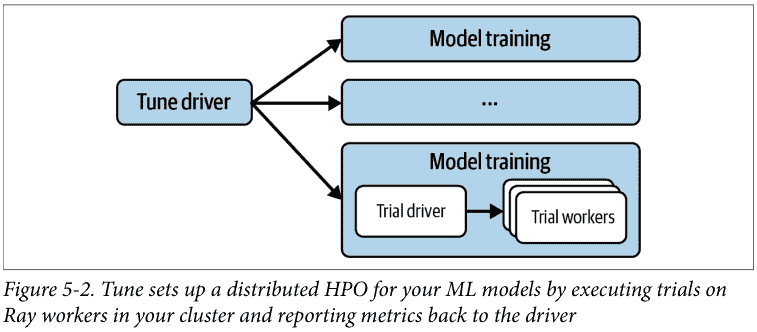

为了定义训练数据集，让我们编写一个简单的 `load_data` 工具函数，加载 Keras 自带的著名 MNIST 数据。MNIST 包含 28 × 28 像素的手写数字图像。我们将像素值归一化到 0 和 1 之间，并将这 10 个数字的标签设为分类变量。以下是如何纯粹使用 Keras 内置功能来实现（运行前请确保使用 `pip install tensorflow`）：

```
from tensorflow.keras.datasets import mnist
from tensorflow.keras.utils import to_categorical

def load_data():
    (x_train, y_train), (x_test, y_test) = mnist.load_data()
    num_classes = 10
    x_train, x_test = x_train / 255.0, x_test / 255.0
    y_train = to_categorical(y_train, num_classes)
    y_test = to_categorical(y_test, num_classes)
    return (x_train, y_train), (x_test, y_test)

load_data()
```

请注意，在定义 `load_data` 后，我们调用它一次，以便数据被下载到本地。这是因为当你调用 `mnist.load_data()` 时，它首先查找本地缓存的副本。如果我们不先加载数据，多个 Tune 工作进程可能会并行尝试下载数据，这可能导致问题。⁵

接下来，我们通过加载刚刚定义的数据、设置一个顺序 Keras 模型（其中超参数从我们传递给目标函数的配置中选择），然后编译和拟合模型，来定义一个 Tune 目标函数或可训练函数。为了定义我们的深度学习模型，我们首先将 MNIST 输入图像展平为向量，然后添加两个全连接层（在 Keras 中称为 Dense）和一个 Dropout 层。

我们想要调整的超参数是第一个 Dense 层的激活函数、Dropout 率以及第一层的“隐藏”输出单元数。我们可以用同样的方式调整此模型的任何其他超参数；此选择只是一个示例。

我们可以像本章其他示例中那样手动报告感兴趣的指标（例如，通过在目标函数中返回字典或使用 `tune.report(...)`）。但由于 Tune 自带了适当的 Keras 集成，我们可以使用所谓的 `TuneReportCallback` 作为自定义 Keras 回调，将其传递给模型的 `fit` 方法。我们的 Keras 目标函数如下所示：

```
from tensorflow.keras.models import Sequential
from tensorflow.keras.layers import Flatten, Dense, Dropout
from ray.tune.integration.keras import TuneReportCallback
```

⁵ 这甚至可能导致一种罕见情况，即一个工作进程开始下载数据，而另一个工作进程检查并看到本地副本。但由于下载未完成，第二个工作进程将尝试打开一个可能已损坏的文件。这表明，尽管 Ray 在后台处理了很多事情，你仍然需要注意如何编写代码。

```
def objective(config):
    (x_train, y_train), (x_test, y_test) = load_data()
    model = Sequential()
    model.add(Flatten(input_shape=(28, 28)))
    model.add(Dense(config["hidden"], activation=config["activation"]))
    model.add(Dropout(config["rate"]))
    model.add(Dense(10, activation="softmax"))

    model.compile(loss="categorical_crossentropy", metrics=["accuracy"])
    model.fit(x_train, y_train, batch_size=128, epochs=10,
              validation_data=(x_test, y_test),
              callbacks=[TuneReportCallback({"mean_accuracy": "accuracy"})])
```

接下来，让我们使用自定义搜索算法来调整这个目标函数。具体来说，我们使用 HyperOptSearch 算法，它通过 Tune 让我们能够访问 Hyperopt 的 TPE 算法。要使用此集成，请确保在你的机器上安装 Hyperopt（例如使用 `pip install hyperopt==0.2.7`）。HyperOptSearch 允许我们定义一组有希望的初始超参数选择进行探索。

这完全是可选的，但有时你可能有好的猜测作为起点。在我们的例子中，我们最初选择 dropout "rate" 为 0.2，128 个 "hidden" 单元，以及一个修正线性单元（ReLU）"activation" 函数。除此之外，我们可以像之前一样使用 `tune` 工具定义搜索空间。最后，我们可以将所有内容传递给 `tune.run` 调用，获得一个分析对象来确定找到的最佳超参数：

```
from ray import tune
from ray.tune.suggest.hyperopt import HyperOptSearch

initial_params = [{"rate": 0.2, "hidden": 128, "activation": "relu"}]
algo = HyperOptSearch(points_to_evaluate=initial_params)

search_space = {
    "rate": tune.uniform(0.1, 0.5),
    "hidden": tune.randint(32, 512),
    "activation": tune.choice(["relu", "tanh"])
}

analysis = tune.run(
    objective,
    name="keras_hyperopt_exp",
    search_alg=algo,
    metric="mean_accuracy",
    mode="max",
    stop={"mean_accuracy": 0.99},
    num_samples=10,
    config=search_space,
)
print("Best hyperparameters found were: ", analysis.best_config)
```

请注意，我们在此充分利用了 Hyperopt 的全部功能，而无需学习其任何具体细节。Hyperopt 本身（默认情况下）并非分布式。通过 Tune API 使用 Hyperopt，我们可以在 Ray 集群上利用它进行分布式超参数优化。

我们选择 Keras 和 Hyperopt 的组合作为示例，展示如何将 Tune 与高级机器学习框架和第三方超参数优化库结合使用。但我们本可以选择任何其他机器学习库，以及 Tune 支持的几乎任何其他超参数优化库。如果您有兴趣深入了解 Tune 提供的众多集成中的任何一个，请查看 [Ray Tune 文档示例](https://docs.ray.io/en/latest/tune/examples.html)。

### 总结

Tune 可以说是当今您可以选择的最通用的超参数优化工具之一。它功能丰富，提供多种搜索算法、高级调度器、复杂的搜索空间、自定义停止器以及许多我们在本章中无法涵盖的其他功能。此外，它与大多数著名的超参数优化工具（如 Optuna 或 Hyperopt）无缝集成，使得从这些工具迁移或简单地通过 Tune 利用其功能变得轻而易举。您可以将 Ray Tune 视为一个灵活的、分布式的超参数优化框架，它*扩展*了那些可能仅在单机上运行的工具。

# 第 6 章

## 使用 Ray 进行数据处理

Edward Oakes

在第 5 章中，您学习了如何为机器学习实验调整超参数。当然，在实践中应用机器学习的关键组件是数据。在本章中，我们将探讨 Ray 上的核心数据处理功能集：Ray Data。

虽然 Ray Data 并非旨在取代更通用的数据处理系统（如 Apache Spark 或 Apache Hadoop），但它提供了基本的数据处理能力，以及一种标准方式来加载、转换数据，并将数据传递给 Ray 应用程序的不同部分。这使得 Ray 上的生态系统库能够使用相同的语言进行通信，从而允许用户以框架无关的方式混合和匹配功能以满足他们的需求。

Ray Data 生态系统的核心组件 Ray Datasets，提供了在 Ray 集群中加载、转换和传递数据引用的核心抽象。Datasets 是使不同库能够在 Ray 之上进行互操作的“粘合剂”。您将在第 134 页的“外部库集成”中看到实际应用，其中我们展示了如何使用 Dask on Ray 利用 Dask API 的全部表达能力进行数据框处理，并将结果转换为数据集。Ray Datasets 的主要优势包括：

-   灵活性
    它支持广泛的数据格式，与 Dask on Ray 等库集成无缝协作，并且可以在 Ray 任务和 Actor 之间传递，无需复制数据。

-   针对机器学习工作负载的性能
    它提供了加速器支持、流水线化和全局随机洗牌等重要功能，可加速机器学习训练和推理工作负载。

本章将使您熟悉在 Ray 上进行数据处理的核心概念，并帮助您理解如何完成常见模式，以及为什么您会选择使用不同的组件来完成任务。我们假设您对数据处理概念（如 `map`、`filter`、`groupby` 和 `partition`）有基本的了解，但本章并非通用数据科学教程，也不是深入探讨这些操作内部实现原理的读物。数据科学背景有限的读者应该也能轻松跟上。

我们将首先介绍核心构建块：Ray Datasets。这将涵盖架构、API 基础知识，以及一个展示 Ray Datasets 如何支持构建复杂数据密集型应用程序的示例。然后，我们将简要介绍 Ray 上的外部库集成，重点关注 Dask on Ray。最后，我们将通过在一个 Python 脚本中构建一个可扩展的端到端机器学习流水线，将所有内容整合在一起。


本章的笔记本可在 [GitHub](https://github.com) 上获取，[端到端示例中使用的数据](https://github.com) 也可在此找到。

### Ray Datasets

Ray Datasets 的主要目标是支持一个可扩展、灵活的抽象，用于在 Ray 上进行数据处理。Datasets 旨在成为在 Ray 完整生态系统库中读取、写入和传输数据的标准方式。Ray Datasets 最强大的用途之一是作为机器学习工作负载的数据摄入和预处理层，允许您使用 Ray Train 和 Ray Tune 高效地扩展训练。我们将在第 136 页的“构建机器学习流水线”中更详细地探讨这一点。

如果您过去使用过其他分布式数据处理 API（如 Apache Spark 的弹性分布式数据集），那么 Ray Datasets API 会让您感到非常熟悉。该 API 的核心依赖于函数式编程，并提供标准功能，例如读取和写入不同的数据源；执行基本转换，如 `map`、`filter` 和 `sort`；以及执行一些简单的聚合，如 `groupby`。

在底层，Ray Datasets 实现了分布式 [Apache Arrow](https://arrow.apache.org/)。Apache Arrow 是一种统一的列式数据格式，适用于数据处理库和应用程序。与 Apache Arrow 集成意味着 Datasets 开箱即用地获得了与许多最流行的处理库（如 NumPy 和 Pandas）的互操作性。

一个 Ray Dataset 由一系列 Ray 对象引用组成，每个引用指向数据的一个“块”。这些块要么是 Arrow 表，要么是 Python 列表（用于 Arrow 格式不支持的数据），存储在 Ray 的共享内存对象存储中，对数据的计算（例如 map 或 filter 操作）发生在 Ray 任务中（有时是 Actor 中）。

因为 Ray Datasets 依赖于 Ray 的核心原语——任务和共享内存对象存储中的对象，它继承了 Ray 的关键优势：可扩展到数百个节点，由于在同一节点上的进程间共享内存而实现高效的内存使用，以及对象溢出和恢复以优雅地处理故障。此外，由于 Datasets 只是对象引用的列表，它们也可以在任务和 Actor 之间高效传递，而无需复制数据，这对于使数据密集型应用程序和库具有可扩展性至关重要。

### Ray Datasets 基础

本节将概述 Ray Datasets，涵盖如何开始读取、写入和转换数据集。这不是一个全面的参考，而是对基本概念的介绍，以便我们能够构建一些有趣的示例，展示 Ray Datasets 的强大之处。有关支持的内容和确切语法的最新信息，请参阅 [Ray Datasets 文档](https://docs.ray.io/en/latest/data/dataset.html)。

要跟随本节中的示例操作，请确保本地安装了 Ray Datasets：

```
pip install "ray[data]==2.2.0"
```

#### 创建 Ray Dataset

首先，让我们创建一个简单的 Dataset 并对其执行一些基本操作：

```
import ray

# 创建一个包含 [0, 10000) 范围内整数的数据集。
ds = ray.data.range(10000)

# 基本操作：显示数据集大小，获取一些样本，打印模式。
print(ds.count())  # -> 10000
print(ds.take(5))  # -> [0, 1, 2, 3, 4]
print(ds.schema())  # -> <class 'int'>
```

这里我们创建了一个包含从 0 到 10,000 数字的数据集，然后打印了一些基本信息：总记录数、一些样本和模式。

#### 从存储读取和写入

当然，对于实际工作负载，您通常需要从持久化存储读取和写入，以加载数据和写入结果。写入和读取 Ray Datasets 很简单；例如，要将 Dataset 写入 CSV 文件然后将其加载回内存，我们只需使用内置的 `write_csv` 和 `read_csv` 工具：

```
# 将数据集保存到本地文件并加载回来。
ray.data.range(10000).write_csv("local_dir")
ds = ray.data.read_csv("local_dir")
print(ds.count())
```

Datasets 支持多种常见的序列化格式，如 CSV、JSON 和 Parquet，并且可以从本地磁盘以及远程存储（如 HDFS 或 AWS S3）读取或写入。

在前面的示例中，我们只提供了一个本地文件路径（"local_dir"），因此数据集被写入本地机器上的一个目录。如果我们想改为写入和读取 S3，我们会提供一个类似 "s3://my_bucket/" 的路径，Datasets 将自动处理高效地读写远程存储，将请求并行化到多个任务以提高吞吐量。

请注意，Ray Datasets 还支持自定义数据源，您可以使用它们写入任何未开箱即支持的外部数据存储系统。

#### 内置转换

现在我们了解了创建和检查 Dataset 的基本 API，让我们看看我们可以对它们执行的一些内置操作。以下代码示例展示了 Ray Datasets 支持的三个基本操作：

```
ds1 = ray.data.range(10000)
ds2 = ray.data.range(10000)
ds3 = ds1.union(ds2) ①
print(ds3.count())  # -> 20000

# 过滤合并后的数据集，只保留偶数元素。
ds3 = ds3.filter(lambda x: x % 2 == 0) ②
print(ds3.count())  # -> 10000
print(ds3.take(5))  # -> [0, 2, 4, 6, 8]

# 对过滤后的数据集进行排序。
ds3 = ds3.sort() ③
print(ds3.take(5))  # -> [0, 0, 2, 2, 4]
```

- ① 将两个 Dataset 合并在一起。结果是一个包含两者所有记录的新 Dataset。
- ② 通过提供自定义过滤函数，过滤 Dataset 的元素以仅包含偶数整数。

> 1 如果您有兴趣查看一个从 S3 存储桶读取实际数据的示例，请参阅 Ray 文档中的批量推理示例。

### 块与重分区

使用 Ray 数据集时，需要牢记的一个重要概念是 *块*。块是构成数据集的底层数据块；操作会逐块应用于底层数据。如果数据集中的块数过多，每个块就会很小，每次操作的开销就会很大。如果块数过少，操作就无法高效地并行化。

如果我们深入探究上一个示例的底层，会发现我们最初创建的数据集默认各有 200 个块。当我们将它们合并时，生成的数据集有 400 个块。鉴于块数对效率很重要，我们可能希望重新洗牌数据，以匹配我们最初的 200 个块并保持相同的并行度。这种改变块数的过程称为 *重分区*，Ray 数据集提供了一个简单的 `.repartition(num_blocks)` API 来实现它。让我们使用该 API 将生成的数据集重新分区回 200 个块：

```
ds1 = ray.data.range(10000)
print(ds1.num_blocks())  # -> 200
ds2 = ray.data.range(10000)
print(ds2.num_blocks())  # -> 200
ds3 = ds1.union(ds2)
print(ds3.num_blocks())  # -> 400

print(ds3.repartition(200).num_blocks())  # -> 200
```

块还控制着将数据集写入存储时创建的文件数量（因此，如果您希望所有数据合并到单个输出文件中，应在写入之前调用 `.repartition(1)`）。

### 模式与数据格式

到目前为止，我们一直在操作仅由整数组成的简单 Ray 数据集。然而，对于更复杂的数据处理，我们通常希望有一个模式，以便更容易理解数据并对每一列强制执行类型。

鉴于数据集旨在成为 Ray 上应用程序和库的互操作点，它们被设计为与特定数据类型无关，并提供灵活性来读取、写入和转换许多流行的数据格式。数据集支持 Arrow 的列式格式，这使得可以在不同类型的结构化数据之间进行转换，例如 Python 字典、DataFrame 和序列化的 Parquet 文件。

创建带有模式的数据集的最简单方法是从 Python 字典列表创建：

```
ds = ray.data.from_items([{"id": "abc", "value": 1}, {"id": "def", "value": 2}])
print(ds.schema())  # -> id: string, value: int64
```

在这种情况下，模式是从我们传入的字典的键推断出来的。我们还可以与流行库（如 Pandas）的数据类型进行转换：

```
pandas_df = ds.to_pandas()  # pandas_df 将继承我们数据集的模式。
```

这里我们从数据集转换到了 Pandas DataFrame，但这也适用于反向操作：如果您从 DataFrame 创建数据集，它将自动继承 DataFrame 的模式。

### 在 Ray 数据集上进行计算

在上一节中，我们介绍了 Ray 数据集内置的一些功能，例如过滤、排序和创建联合。然而，Ray 数据集最强大的部分之一是它允许您利用 Ray 的灵活计算模型，并对大量数据执行高效计算。

对数据集执行自定义转换的主要方式是使用 `.map()`。这允许您传递一个自定义函数，该函数将应用于数据集的记录。一个基本示例可能是对数据集的记录进行平方：

```
ds = ray.data.range(10000).map(lambda x: x ** 2)
ds.take(5)  # -> [0, 1, 4, 9, 16]
```

在这个例子中，我们传递了一个简单的 lambda 函数，我们操作的数据是整数，但我们可以传递任何函数并操作支持 Arrow 格式的结构化数据。

我们也可以选择使用 `.map_batches()` 映射数据批次，而不是单个记录。某些类型的计算在 *向量化* 时效率要高得多，这意味着它们使用一种算法或实现，该算法或实现对一组项目进行操作比一次操作一个项目更高效。

重新审视我们对数据集中的值进行平方的简单示例，我们可以将其重写为以批处理方式执行，并使用 `numpy.square` 优化实现，而不是简单的 Python 实现：

```
import numpy as np

ds = ray.data.range(10000).map_batches(lambda batch: np.square(batch).tolist())
ds.take(5)  # -> [0, 1, 4, 9, 16]
```

向量化计算在执行深度学习训练或推理时在 GPU 上特别有用。然而，通常在 GPU 上执行计算也有显著的固定成本，因为需要将模型权重或其他数据加载到 GPU 内存中。为此，Ray 数据集支持使用 Ray actor 映射数据。Ray actor 是长期运行的并且可以保持状态，这与无状态的 Ray 任务不同，因此我们可以通过在 actor 的构造函数中运行昂贵的操作（例如将模型加载到 GPU 上）来缓存这些成本。

例如，要使用数据集执行批量推理，我们需要传递一个类而不是一个函数，指定该计算应使用 actor 运行，并使用 `.map_batches()` 以便我们可以执行向量化推理。数据集将自动扩展一组 actor 来执行映射操作：

```
def load_model():
    # 在此示例中返回一个虚拟模型。
    # 实际上，这可能会将一些模型权重加载到 GPU 上。
    class DummyModel:
        def __call__(self, batch):
            return batch

    return DummyModel()

class MLModel:
    def __init__(self):
        # load_model() 将在每个启动的 actor 上仅运行一次。
        self._model = load_model()

    def __call__(self, batch):
        return self._model(batch)

ds.map_batches(MLModel, compute="actors")
```

要在 GPU 上运行推理，我们需要向 `map_batches` 调用传递 `num_gpus=1`，以指定运行映射函数的每个 actor 都需要一个 GPU。

### 数据集管道

默认情况下，数据集操作是阻塞的，这意味着它们从开始到结束同步运行，并且一次只有一个操作在发生。然而，这种模式对于某些工作负载来说可能非常低效。例如，考虑以下对 Parquet 数据的数据集转换集，这些转换可能用于为机器学习模型执行批量推理：²

> ² Parquet 是一种结构化的、面向列的格式，支持高效压缩、数据存储和数据检索。许多示例和真实世界的数据集使用 Parquet，因此在提供的示例中使用了它。但是，通过更改 read_parquet 和 write_parquet 调用，可以轻松修改代码以使用不同的格式。

```
ds = (ray.data.read_parquet("s3://my_bucket/input_data")
      .map(cpu_intensive_preprocessing)
      .map_batches(gpu_intensive_inference, compute="actors", num_gpus=1)
      .repartition(10))

ds.write_parquet("s3://my_bucket/output_predictions")
```

这个过程有五个阶段，每个阶段都强调系统的不同部分：

1.  从远程存储读取需要集群的入口带宽，并且可能受到存储系统吞吐量的限制。在此阶段，会生成一组 Ray 任务，这些任务将并行地从远程存储读取，生成的数据块存储在 Ray 对象存储中。

2.  预处理输入需要 CPU 资源。第一阶段的对象被传递到一组任务中，这些任务将在每个块上执行 `cpu_intensive_preprocessing` 函数。

3.  模型上的向量化推理需要 GPU 资源。与第二阶段相同的过程为 `gpu_intensive_inference` 重复，只是这次函数在每个都分配了 GPU 的 actor 上运行，并且多个块以批处理方式传递给每个函数调用。此步骤使用 actor 是为了避免重复将用于推理的模型重新加载到 GPU 上。

4.  重分区需要集群内的网络带宽。完成第 3 阶段后，会生成更多任务将数据重新分区为 10 个块，并将这 10 个块中的每一个写入远程存储。

5.  写入远程存储需要集群的出口带宽，并且可能再次受到存储吞吐量的限制。

图 6-1 描绘了一个基本实现，其中每个阶段按顺序运行。这种简单的实现会使资源闲置，因为每个阶段都是阻塞的并按顺序运行。例如，由于 GPU 资源仅在最后阶段使用，它们将空闲等待所有数据加载和预处理完成。

### 示例：并行训练分类器的多个副本

数据集的一个关键优势在于它们可以在任务和参与者之间传递。在本节中，我们将探讨如何利用这一功能来编写复杂分布式工作负载的高效实现，例如分布式超参数调优和机器学习训练。我们将在本节中实现一个*分布式*训练机器学习模型的示例，这个主题我们将在[第7章](#)介绍Ray Train时更详细地讨论。

正如[第5章](#)所讨论的，机器学习训练中的一个常见模式是探索一系列超参数，以找到能产生最佳模型的参数。我们可能希望在广泛的超参数范围内运行，而简单地这样做可能非常昂贵。Ray Data允许我们在单个Python脚本中轻松地在多个并行训练运行之间共享相同的内存数据：我们可以加载和预处理数据一次，然后将引用传递给许多下游参与者，这些参与者可以从共享内存中读取数据。

此外，有时在处理非常大的数据集时，将完整的训练数据加载到单个进程或单台机器的内存中是不可行的。在这种情况下，通常会对数据进行*分片*，这意味着为每个工作节点分配其自己的、可以放入内存的数据子集。这个本地数据子集称为*数据分片*。在每个工作节点并行地在其数据分片上训练之后，结果会使用参数服务器同步或异步地组合。两个重要的考虑因素可能使这难以正确实现：

- 许多分布式训练算法采用*同步*方法，要求工作节点在每个训练周期后同步其权重。这意味着工作节点之间需要进行一些协调，以维护它们正在处理的数据批次的一致性。
- 重要的是每个工作节点在每个周期都能获得数据的随机样本。全局随机洗牌已被证明比局部洗牌或不洗牌表现更好。

图6-3展示了如何使用ray.data包从给定的输入数据集创建数据分片，从而形成Ray数据集。

让我们通过一个示例来了解如何使用Ray数据集实现这种类型的模式。在这个示例中，我们将使用不同的超参数，在不同的工作节点上并行训练机器学习模型的多个副本。

我们将在一个生成的二分类数据集上训练一个scikit-learn SGDClassifier算法，我们将调整的超参数是该分类器的正则化项。³ 这个示例并不太关注机器学习任务和模型的实际细节：你可以用任何数量的示例替换模型和数据。这里主要关注的是我们如何使用数据集来编排数据加载和计算。

要跟随本节中的示例，请确保你已在本地安装了Ray数据集和scikit-learn：⁴

```
pip install "ray[data]==2.2.0" "scikit-learn==1.0.2"
```

首先，让我们定义我们的TrainingWorker，它将在数据上训练分类器的一个副本：

```
from sklearn import datasets
from sklearn.linear_model import SGDClassifier
from sklearn.model_selection import train_test_split

@ray.remote
class TrainingWorker:
    def __init__(self, alpha: float):
        self._model = SGDClassifier(alpha=alpha)

    def train(self, train_shard: ray.data.Dataset):
        for i, epoch in enumerate(train_shard.iter_epochs()):
            X, Y = zip(*list(epoch.iter_rows()))
            self._model.partial_fit(X, Y, classes=[0, 1])

        return self._model

    def test(self, X_test: np.ndarray, Y_test: np.ndarray):
        return self._model.score(X_test, Y_test)
```

关于TrainingWorker有三个重要点需要注意：

- 它是SGDClassifier的一个简单包装器，并使用给定的alpha值实例化它。
- 主要的训练函数发生在train方法中。对于每个周期，它在可用数据上训练分类器。
- 我们还有一个test方法，可用于在测试集上运行训练好的模型。

现在，让我们使用不同的超参数（alpha值）实例化多个TrainingWorker实例：

```
ALPHA_VALS = [0.00008, 0.00009, 0.0001, 0.00011, 0.00012]

print(f"Starting {len(ALPHA_VALS)} training workers.")
workers = [TrainingWorker.remote(alpha) for alpha in ALPHA_VALS]
```

接下来，我们生成训练和验证数据，并将训练数据转换为数据集。这里，我们使用.repeat()来创建一个DatasetPipeline。这定义了我们的训练将运行的周期数。在每个周期中，后续操作将应用于数据集，参与者将能够迭代结果数据。我们还随机洗牌数据并将其分片传递给训练工作节点，每个节点获得相等的一块：

```
X_train, X_test, Y_train, Y_test = train_test_split(
    *datasets.make_classification()
)

train_ds = ray.data.from_items(list(zip(X_train, Y_train)))
shards = (train_ds.repeat(10)
          .random_shuffle_each_window()
          .split(len(workers), locality_hints=workers))

ray.get([
    worker.train.remote(shard)
])
```

³ SGD代表随机梯度下降，这是机器学习，特别是深度学习中常用的一种优化算法。

⁴ 在本章和接下来的两章中，我们将讨论需要额外依赖项的更高级的机器学习示例。我们在这里和本书的GitHub仓库中固定了这些依赖项的版本，以确保示例按预期工作。话虽如此，只要确保版本不是太旧，这些示例很可能在相对广泛的版本范围内都能工作。

### 外部库集成

虽然 Ray Datasets 开箱即用地支持许多常见的数据处理功能，但正如我们所讨论的，它并不能替代完整的数据处理系统。相反，如图 6-4 所示，它更专注于执行“最后一公里”的处理，例如在机器学习训练或推理之前进行基本的数据加载、清洗和特征化。

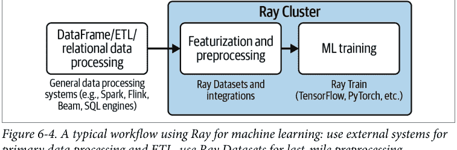

然而，许多其他功能更全面的 DataFrame 和关系型数据处理系统与 Ray 集成，例如：

- Dask on Ray
- RayDP (Spark on Ray)
- Modin (Pandas on Ray)
- MARS on Ray

这些是你可能在 Ray 上下文之外就熟悉的独立数据处理库。这些工具中的每一个都与 Ray Core 集成，能够实现比内置 Ray Datasets 更具表现力的数据处理，同时仍然使用 Ray 的部署工具、可扩展调度和用于数据交换的共享内存对象存储。如图 6-5 所示，这补充了 Ray Datasets，并实现了在 Ray 上的端到端数据处理。

图 6-5 展示了 Ray 数据生态系统集成的好处，使得在 Ray 上能够进行更具表现力的数据处理。这些库与 Ray Datasets 集成，将数据馈送到下游库，例如 Ray Train。

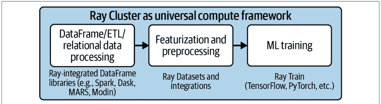

图 6-5. Ray 数据生态系统集成使得在 Ray 上能够进行更具表现力的数据处理

为了本书的目的，我们将更深入地探讨 Dask on Ray，让你了解这些集成是什么样子的。如果你对特定集成的细节感兴趣，请参阅最新的 [Ray 文档](https://docs.ray.io/) 以获取最新信息。

要跟随本节中的示例，请安装 Ray 和 Dask：

```
pip install "ray[data]==2.2.0" "dask==2022.2.0"
```

**Dask** 是一个用于并行计算的 Python 库，专门针对将分析和科学计算工作负载扩展到集群。Dask 最受欢迎的功能之一是 **Dask DataFrames**，它提供了 Pandas DataFrame API 的一个子集，可以在单节点内存处理不可行的情况下扩展到机器集群。DataFrames 通过创建一个*任务图*来工作，该任务图被提交给调度器执行。执行 Dask DataFrames 操作最典型的方式是使用 Dask 分布式调度器，但也有一个可插拔的 API，允许其他调度器也执行这些任务图。

Ray 附带了一个 Dask 调度器后端，允许 Dask DataFrame 任务图作为 Ray 任务执行，从而使用 Ray 调度器和共享内存对象存储。这不需要修改核心 DataFrames 代码；相反，要使用 Ray 运行，你只需要先连接到一个正在运行的 Ray 集群（或在本地运行 Ray），然后启用 Ray 调度器后端：

```
import ray
from ray.util.dask import enable_dask_on_ray

ray.init()  # 启动或连接到 Ray。
enable_dask_on_ray()  # 为 Dask 启用 Ray 调度器后端。
```

现在我们可以运行常规的 Dask DataFrames 代码，并让它在 Ray 集群上扩展。例如，我们可能想使用标准的 DataFrame 操作（如 filter 和 groupby）进行一些时间序列分析，并计算标准差（示例取自 Dask 文档）：

```
import dask

df = dask.datasets.timeseries()
df = df[df.y > 0].groupby("name").x.std()
df.compute()  # 触发任务图进行评估。
```

如果你习惯于 Pandas 或其他 DataFrame 库，你可能会想知道为什么我们需要调用 `df.compute()`。这是因为 Dask 默认是惰性的，只在需要时计算结果，从而允许它优化将在集群上执行的任务图。

Dask on Ray 最强大的方面之一是它与 Ray Datasets 集成得非常好。我们可以使用内置工具将 Ray Dataset 转换为 Dask DataFrame，反之亦然：

```
import ray
ds = ray.data.range(10000)

# 将 Dataset 转换为 Dask DataFrame。
df = ds.to_dask()
print(df.std().compute())  # -> 2886.89568

# 将 Dask DataFrame 转换回 Dataset。
ds = ray.data.from_dask(df)
print(ds.std())  # -> 2886.89568
```

这个简单的例子可能看起来并不令人印象深刻，因为我们能够使用 Dask DataFrames 或 Ray Datasets 来计算标准差。然而，正如你将在下一节中看到的，当我们构建一个端到端的机器学习管道时，这实现了强大的工作流。例如，我们可以使用 DataFrame 的全部表现力来进行特征化和预处理，然后将数据直接传递到下游操作，如分布式训练或推理，同时将所有内容保留在内存中。这突显了 Ray Datasets 如何在 Ray 之上支持广泛的用例，以及像 Dask on Ray 这样的集成如何使生态系统更加强大。

### 构建机器学习管道

尽管我们在上一节中能够从头开始构建一个简单的分布式训练应用程序，但要构建一个真实世界的应用程序，我们需要解决许多边缘情况、性能优化机会和可用性功能。正如你在第 4 章和第 5 章中学到的，Ray 拥有一个生态系统库，使我们能够构建生产就绪的机器学习应用程序。在本节中，我们将探讨如何使用 Datasets 作为“粘合层”来端到端地构建机器学习管道。

要成功地将机器学习模型投入生产，我们需要使用标准的 ETL 流程来收集和编目数据。然而，这还不是全部：为了训练模型，我们通常还需要在将数据馈送到训练过程之前进行特征化，而我们如何将数据馈送到训练过程会强烈影响成本和性能。训练模型后，我们还希望在许多不同的数据集上运行推理——毕竟，这就是训练模型的全部意义！

虽然这看起来可能只是一系列步骤，但在实践中，机器学习的数据处理工作流是一个迭代的实验过程，旨在定义正确的特征集并在其上训练高性能模型。高效地加载、转换并将数据馈送到训练和推理对于性能也至关重要，这直接转化为计算密集型模型的成本。实现这样的机器学习管道通常意味着将多个系统拼接在一起，并在阶段之间将中间结果物化到远程存储。这有两个主要缺点：

- 它需要为单个工作流编排许多不同的系统和程序。这对任何机器学习从业者来说都可能负担很重，因此许多人使用像 Apache Airflow 这样的工作流编排系统。虽然 Airflow 有其优点，但它也引入了很大的复杂性（尤其是在开发中）。
- 跨多个系统运行我们的机器学习工作流意味着我们需要在每个阶段之间从存储读取和写入。⁵ 由于数据传输和序列化，这会产生显著的开销和成本。

相比之下，使用 Ray，我们能够将完整的机器学习管道构建为一个单一的应用程序，可以作为单个 Python 脚本运行，如图 6-6 所示。内置和第三方库的生态系统使得可以为给定用例混合和匹配正确的功能，并构建可扩展、生产就绪的管道。重要的是，Ray Datasets 作为粘合层，实现了高效的数据加载、预处理和计算，同时避免了昂贵的序列化成本，并将中间数据保留在共享内存中。

图 6-6 展示了典型机器学习工作流的简化版本以及 Ray 在该流程中的位置。机器学习的多个步骤通常需要迭代；没有 Ray，这意味着为一个端到端流程拼接许多独立的系统。Ray 作为一个统一的计算层，使得大部分工作流可以作为单个应用程序运行。

> 5 依赖许多工具的另一个挑战是文化方面的。最佳实践的知识转移可能成本高昂，尤其是在较大的公司中。

### 总结

本章介绍了 Ray Datasets，这是 Ray 中的一个核心构建模块。Ray Datasets 提供了分布式数据处理的内置功能，但其真正的强大之处在于它与第一方和第三方库的集成。我们仅涵盖了其功能的一小部分。更多详情、API 参考和示例，请参阅[文档](https://docs.ray.io/en/latest/data/dataset.html)。

我们还向您展示了使用 Ray Datasets 对 scikit-learn 分类器进行分布式训练的简单示例，并讨论了外部库集成，例如 Ray 上的 Dask。最后，我们指出了使用 Ray 生态系统构建端到端 ML 流水线的价值，这允许您在单个 Python 脚本中运行整个工作流。对于数据科学家和机器学习工程师来说，这意味着更快的迭代时间、更好的 ML 模型，以及最终更多的业务价值。

# 第 7 章
使用 Ray Train 进行分布式训练

Edward Oakes & Richard Liaw

在第 6 章中，我们讨论了如何使用 Ray Datasets 在数据分片上训练简单模型的副本——但分布式训练远不止于此。正如我们在第 1 章中指出的，Ray 有一个专门用于分布式训练的库，称为 Ray Train。它附带了一套广泛的机器学习训练集成，并允许您在 Ray 集群上无缝扩展实验。

本章我们将首先向您展示为什么可能需要扩展 ML 训练，然后介绍不同的扩展方式。之后，我们将介绍 Ray Train 并通过一个详尽的端到端示例进行讲解。我们还将涵盖使用 Ray Train 所需了解的一些关键概念，例如预处理器、训练器和检查点。最后，我们将介绍 Ray Train 提供的一些更高级的功能。一如既往，您可以使用本章的笔记本进行跟随操作。

## 分布式模型训练基础

机器学习通常需要大量的繁重计算。根据您正在训练的模型类型，无论是梯度提升树还是神经网络，您可能会面临一些 ML 模型训练的常见问题：

- 完成训练所需的时间太长。
- 数据太大，无法放入一台机器。
- 模型本身太大，无法放入单台机器。

对于第一种情况，可以通过提高数据处理吞吐量来加速训练。一些 ML 算法，如神经网络，可以并行化部分计算以加速训练。¹

在第二种情况下，您选择的算法可能要求您将数据集中的所有可用数据放入内存，但给定的单节点内存可能不足。如果是这种情况，您需要将数据拆分到多个节点上，并以分布式方式进行训练。另一方面，有时您的算法可能不需要分布式数据，但如果您一开始使用的是分布式数据库系统，您仍然需要一个能够利用分布式数据的训练框架。

当您的模型无法放入单台机器时，您可能需要将其拆分成多个部分，分布在多台机器上。将模型拆分到多台机器上的方法称为*模型并行*。要遇到这个问题，您首先需要一个足够大以至于无法放入单台机器的模型。通常，像 Google 或 Meta 这样的大公司需要模型并行，它们也依赖内部解决方案来处理分布式训练。

前两个问题通常比第三个问题在 ML 开发中更早出现。我们刚刚为这些问题勾勒的解决方案属于数据并行训练的范畴。您不是将模型拆分到多台机器上，而是依赖分布式数据来加速训练。

特别是对于第一个问题，如果您能加速训练过程，希望在精度损失最小或没有损失的情况下，并且可以经济高效地做到这一点，为什么不这样做呢？而且如果您有分布式数据，无论是算法需要还是数据存储方式，您都需要一个训练解决方案来处理它。正如您将看到的，Ray Train 是为高效的数据并行训练而构建的。图 7-1 总结了分布式训练的两种基本类型。

图 7-1. 分布式训练中的数据并行与模型并行

¹ 这特别适用于神经网络中的梯度计算。

### 通过示例介绍 Ray Train

Ray Train 是一个用于在 Ray 上进行分布式数据并行训练的库。它为训练工作流的不同部分提供了关键工具，从特征处理到可扩展训练，再到与 ML 跟踪工具的集成，以及模型的导出机制。

在基本的 ML 训练流水线中，您将使用 Ray Train 的以下关键组件：

*训练器*
Ray Train 有几个 Trainer 类，使分布式训练成为可能。Trainer 是围绕第三方训练框架（如 XGBoost、Pytorch 和 TensorFlow）的包装器类，提供与核心 Ray actor（用于分布式）、Ray Tune 和 Ray Datasets 的集成。

*预测器*
一旦您有了训练好的模型，就可以用它来获取预测。对于输入数据批次，您使用所谓的批量预测器，这些预测器也用于评估模型在验证集上的性能。

此外，Ray Train 提供了几个常见的*预处理器*对象和实用程序，用于将数据集对象处理成可供 Trainer 消费的特征。最后，Ray Train 提供了一个*检查点*类，允许您保存和恢复训练运行的状态。在我们的第一个演练中，我们将不使用任何预处理器，但稍后会更详细地介绍它们。

Ray Train 内置了对在大型数据集上进行训练的一流支持。遵循同样的理念，您不必考虑*如何*并行化代码，您可以简单地将大型数据集“连接”到 Ray Train，而无需考虑如何摄取数据并将其馈送到不同的并行工作器中。

让我们通过第一个 Ray Train 示例将这些组件付诸实践。为了加载训练数据，我们将利用第 6 章的知识，并大量使用 Ray Datasets。

### 预测纽约市出租车行程中的大额小费

本节通过一个实际的端到端示例，展示如何使用 Ray 构建深度学习流水线。我们将构建一个二元分类模型，使用公开的纽约市出租车和豪华轿车委员会 (TLC) 行程记录数据，预测出租车行程是否会产生大额小费（超过车费的 20%）。我们的工作流将与典型的 ML 从业者的工作流非常相似：

1. 加载数据，进行一些基本预处理，并计算我们将用于模型的特征。
2. 定义一个神经网络，并使用分布式数据并行训练对其进行训练。
3. 将训练好的神经网络应用于一批新数据。

该示例将使用 Ray 上的 Dask 并训练一个 PyTorch 神经网络，但请注意，这里没有任何内容特定于这两个库中的任何一个：Ray Datasets 和 Ray Train 可以与各种流行的机器学习工具一起使用。要跟随本节中的示例代码，请安装 Ray、PyTorch 和 Dask：

```
pip install "ray[data,train]==2.2.0" "dask==2022.2.0" "torch==1.12.1"
pip install "xgboost==1.6.2" "xgboost-ray>=0.1.10"
```

在以下示例中，我们将从本地磁盘加载数据，以便在您的机器上轻松运行示例。数据可在本书的 GitHub 仓库中获取。下一个示例中的文件路径假设您已克隆仓库并从其顶级目录内运行。

### 加载、预处理和特征化

训练模型的第一步是加载和预处理数据。为此，我们将使用 Ray 上的 Dask，您在第 6 章中已经看到了第一个示例。Ray 上的 Dask 为我们提供了方便的 DataFrames API，以及跨集群扩展预处理并将其高效传递给训练和推理操作的能力。以下是用于预处理数据和为模型构建特征的代码，定义在一个 load_dataset 函数中：

```python
import ray
from ray.util.dask import enable_dask_on_ray

import dask.dataframe as dd

LABEL_COLUMN = "is_big_tip"
FEATURE_COLUMNS = ["passenger_count", "trip_distance", "fare_amount",
                   "trip_duration", "hour", "day_of_week"]

enable_dask_on_ray()

def load_dataset(path: str, *, include_label=True):
    columns = ["tpep_pickup_datetime", "tpep_dropoff_datetime", "tip_amount",
               "passenger_count", "trip_distance", "fare_amount"]
    df = dd.read_parquet(path, columns=columns) ❶

    df = df.dropna() ❷
    df = df[(df["passenger_count"] <= 4) &
            (df["trip_distance"] < 100) &
            (df["fare_amount"] < 1000)]

    df["tpep_pickup_datetime"] = dd.to_datetime(df["tpep_pickup_datetime"])
    df["tpep_dropoff_datetime"] = dd.to_datetime(df["tpep_dropoff_datetime"])

    df["trip_duration"] = (df["tpep_dropoff_datetime"] -
```

### 定义深度学习模型

既然我们已经清理并准备好了数据，接下来需要定义一个用于模型的架构。在实践中，这很可能是一个迭代过程，并且需要研究类似问题的最新进展。为了简化示例，我们将保持简单，使用一个名为 `FarePredictor` 的基础 PyTorch 神经网络。该神经网络包含三个线性变换，起始维度为我们的特征向量维度，然后通过 Sigmoid 激活函数输出一个介于 0 和 1 之间的值。我们还在网络中使用了 *批归一化* 层以改善训练效果。这个输出值将被四舍五入，以产生关于行程是否会产生大额小费的二元预测：

```python
import torch
import torch.nn as nn
import torch.nn.functional as F

class FarePredictor(nn.Module):
    def __init__(self):
        super().__init__()

        self.fc1 = nn.Linear(6, 256)
        self.fc2 = nn.Linear(256, 16)
        self.fc3 = nn.Linear(16, 1)

        self.bn1 = nn.BatchNorm1d(256)
        self.bn2 = nn.BatchNorm1d(16)

    def forward(self, x):
        x = F.relu(self.fc1(x))
        x = self.bn1(x)
        x = F.relu(self.fc2(x))
        x = self.bn2(x)
        x = torch.sigmoid(self.fc3(x))

        return x
```

### 使用 Ray Train 进行分布式训练

既然我们已经定义了神经网络架构，就需要一种方法来高效地在我们的数据上训练它。这个数据集非常大，因此我们最好的选择是执行 *数据并行训练*。

这意味着我们在多台机器上并行训练模型，每台机器都有模型的一个副本和数据的一个子集。我们将使用 Ray Train 来定义一个可扩展的训练过程，该过程将在底层使用 [PyTorch DataParallel](https://pytorch.org/docs/stable/nn.html#torch.nn.DataParallel)。我们不会在此处深入探讨训练过程的概念细节，但会在本端到端示例之后的章节中进行讨论。

> 即将展示的示例使用了来自 `ray.air` 模块的导入。我们在 [第 1 章](https://example.com/chapter1) 中提到了 Ray AIR，并将在 [第 10 章](https://example.com/chapter10) 中正式介绍它。目前，请将此模块视为定义和运行分布式训练过程的实用工具。

具体来说，我们使用了一个所谓的 AIR 会话，它可以用来报告训练过程中收集的指标。这遵循了与我们在 [第 5 章](https://example.com/chapter5) 中讨论的 `tune.report` API 类似的使用模式。

我们需要做的第一件事是定义在每个 epoch 中在每个 worker 上训练一批数据所需的核心逻辑。这将接收完整数据集的一个本地分片，将其通过模型的本地副本运行，并执行反向传播以更新模型权重。每个 epoch 结束后，worker 将使用 Ray Train 工具报告结果并保存当前模型权重以供后续使用：

```python
from ray.air import session
from ray.air.config import ScalingConfig
import ray.train as train
from ray.train.torch import TorchCheckpoint, TorchTrainer

def train_loop_per_worker(config: dict):
    batch_size = config.get("batch_size", 32)
    lr = config.get("lr", 1e-2)
    num_epochs = config.get("num_epochs", 3)

    dataset_shard = session.get_dataset_shard("train")

    model = FarePredictor()
    dist_model = train.torch.prepare_model(model)

    loss_function = nn.SmoothL1Loss()
    optimizer = torch.optim.Adam(dist_model.parameters(), lr=lr)

    for epoch in range(num_epochs):
        loss = 0
        num_batches = 0
        for batch in dataset_shard.iter_torch_batches(
            batch_size=batch_size, dtypes=torch.float
        ):
            labels = torch.unsqueeze(batch[LABEL_COLUMN], dim=1)
            inputs = torch.cat(
                [torch.unsqueeze(batch[f], dim=1) for f in FEATURE_COLUMNS],
                dim=1
            )
            output = dist_model(inputs)
            batch_loss = loss_function(output, labels)
            optimizer.zero_grad()
            batch_loss.backward()
            optimizer.step()

            num_batches += 1
            loss += batch_loss.item()

        session.report(
            {"epoch": epoch, "loss": loss},
            checkpoint=TorchCheckpoint.from_model(dist_model)
        )
```

1.  将一个配置字典传入我们的训练循环，以在运行时指定一些参数。
2.  使用 Ray Train 的 `get_data_shard` 工具检索当前 worker 的数据分片。
3.  通过应用 `prepare_model` 为分布式训练准备 PyTorch 模型。
4.  定义一个标准的 PyTorch 训练循环，遍历数据批次并执行反向传播。
5.  唯一非标准的部分是使用 `iter_torch_batches` 来遍历数据分片。
6.  每个 epoch 后，使用 Ray 会话报告计算出的损失和一个模型检查点。

如果您不熟悉 PyTorch，请注意，从定义 `loss_function` 到将 `batch_loss` 聚合到我们的 `loss` 之间的代码是 PyTorch 模型的标准训练循环（除了遍历数据集分片的批次，这是 Ray 特有的）。

既然训练过程已经定义好了，我们需要加载训练和验证数据来馈送到我们的训练 worker 中。在这里，我们调用之前定义的 `load_dataset` 函数，该函数将进行预处理和特征化。²

这个数据集与一些配置参数（如批大小、epoch 数和要使用的 worker 数）一起传递给 `TorchTrainer`。每个 worker 将在本地访问数据的一个分片并可以对其进行迭代。训练完成后，我们可以从返回的结果对象中获取最终训练好的检查点：

```python
trainer = TorchTrainer(
    train_loop_per_worker=train_loop_per_worker, ①
    train_loop_config={ ②
        "lr": 1e-2, "num_epochs": 3, "batch_size": 64
    },
    scaling_config=ScalingConfig(num_workers=2), ③
    datasets={ ④
        "train": load_dataset("nyc_tlc_data/yellow_tripdata_2020-01.parquet")
    },
)
```

> ² 代码仅加载了数据的一个子集用于测试；要大规模运行，我们将在调用 `load_dataset` 时使用所有数据分区，并在训练模型时增加 `num_workers`。

```python
result = trained_model.fit()
trained_model = result.checkpoint
```

1.  每个 `TorchTrainer` 都需要您指定一个 `train_loop_per_worker`。
2.  可选地，如果您的训练循环接受一个 `config` 字典，您可以将其指定为 `train_loop_config`。
3.  每个 Ray Train Trainer 都需要一个所谓的 `ScalingConfig`，以了解如何在您的 Ray 集群上扩展训练。
4.  每个 Trainer 的另一个必需参数是 `datasets` 字典。我们在这里定义了一个 "train" 数据集，这就是我们在训练循环中使用的数据集。
5.  您只需对 `TorchTrainer` 调用 `.fit()` 即可开始训练。

最后一行将我们训练好的模型导出为一个检查点，以供下游应用程序（如服务和推理）后续使用。Ray Train 生成这些检查点以序列化训练的中间状态。检查点可以包括模型和其他训练工件，例如预处理器。

### 分布式批量推理

一旦我们训练好模型并获得了最佳准确度，下一步就是将其实际应用于实践中。有时这意味着驱动一个低延迟服务，我们将在第 8 章中探讨这一点，但通常任务是在数据批次到来时跨批次应用模型。

让我们使用来自 `trained_model` 的训练好的模型权重，并将其应用于一批新数据（在这种情况下，它只是同一公共数据集的另一部分）。为此，首先我们需要以与训练相同的方式加载、预处理和特征化数据。然后我们将加载我们的模型并将其映射到整个数据集。Ray Datasets 允许我们使用 Ray actors 高效地完成此操作，甚至只需更改一个参数即可使用 GPU。我们只需加载训练好的模型检查点并对其调用 `.predict_pipelined()`。这将使用 Ray Datasets 在数据上执行分布式批量推理：

```python
from ray.train.torch import TorchPredictor
from ray.train.batch_predictor import BatchPredictor

batch_predictor = BatchPredictor(trained_model, TorchPredictor)
ds = load_dataset(
    "nyc_tlc_data/yellow_tripdata_2021-01.parquet", include_label=False)

batch_predictor.predict_pipelined(ds, blocks_per_window=10)
```

本示例展示了如何使用 Ray Train 和 Datasets 将端到端的机器学习工作流实现为一个单一应用。我们能够在一个 Python 脚本中完成数据集的特征化、机器学习模型的训练与验证，然后将该模型应用于另一个不同的数据集。Ray Datasets 充当了粘合层，连接了各个阶段，并避免了它们之间昂贵的序列化成本。我们还使用了检查点来存储模型，并运行了一个 Ray Train 批量预测作业，将模型应用于新数据集。

现在，你已经看到了 Ray Train 的第一个示例，让我们更深入地了解它的主要抽象概念——Trainer。

### 关于 Ray Train 中的 Trainer

正如你在使用 TorchTrainer 的示例中所见，Trainer 是特定于框架的类，用于以分布式方式运行模型训练。所有 Ray Trainer 类都共享一个通用接口。目前，了解这个接口的两个方面就足够了，即：

- `.fit()` 方法，用于使用给定的数据集、配置和所需的扩展属性来拟合给定的 Trainer。
- `.checkpoint` 属性，返回此 Trainer 的 Ray Checkpoint 对象。

Ray Train 的 Trainer 集成了常见的机器学习框架，如 PyTorch、Hugging Face、TensorFlow、Horovod、scikit-learn 等。甚至还有一个专门用于 RLlib 模型的 Trainer，我们这里不作介绍。让我们讨论另一个 PyTorch 示例，以指出 Trainer API 的特定方面，重点是如何将现有的 PyTorch 模型迁移到 Ray Train。

#### 梯度提升框架

Ray Train 还提供了对梯度提升决策树框架的支持。

XGBoost 是一个优化的分布式梯度提升库，旨在实现高效、灵活和可移植。它在梯度提升框架下实现了机器学习算法。XGBoost 提供了并行树提升，能够快速准确地解决许多数据科学问题。

LightGBM 是一个基于树学习算法的梯度提升框架。与 XGBoost 相比，它是一个相对较新的框架，但在学术和生产用例中正迅速普及。

要使用这些框架，你可以分别使用 `XGBoostTrainer` 和 `LightGBMTrainer` 类。

在本示例中，我们将重点关注 Ray Train 本身的细节，因此我们将使用一个简单得多的训练数据集和一个以随机噪声作为输入的小型神经网络。我们定义了一个三层的 `NeuralNetwork`，一个类似于我们在上一节中看到的显式 `training_loop`，你可以用它来训练模型。为了清晰起见，我们将每个 epoch 运行的训练代码提取到一个名为 `train_one_epoch` 的辅助函数中：

```python
import torch
import torch.nn as nn
import torch.nn.functional as F
from ray.data import from_torch

num_samples = 20
input_size = 10
layer_size = 15
output_size = 5
num_epochs = 3

class NeuralNetwork(nn.Module):
    def __init__(self):
        super().__init__()
        self.fc1 = nn.Linear(input_size, layer_size)
        self.relu = nn.ReLU()
        self.fc2 = nn.Linear(layer_size, output_size)

    def forward(self, x):
        x = F.relu(self.fc1(x))
        x = self.fc2(x)
        return x

def train_data():
    return torch.randn(num_samples, input_size) ❶

input_data = train_data()
label_data = torch.randn(num_samples, output_size)
train_dataset = from_torch(input_data) ❷

def train_one_epoch(model, loss_fn, optimizer): ❸
    output = model(input_data)
    loss = loss_fn(output, label_data)
    optimizer.zero_grad()
    loss.backward()
    optimizer.step()

def training_loop(): ❹
    model = NeuralNetwork()
    loss_fn = nn.MSELoss()
    optimizer = torch.optim.SGD(model.parameters(), lr=0.1)
    for epoch in range(num_epochs):
        train_one_epoch(model, loss_fn, optimizer)
```

1. 使用随机生成的数据集。
2. 使用 `from_torch` 从该数据创建一个 Ray Dataset。
3. 将训练一个 epoch 的 PyTorch 代码提取到一个辅助函数中。
4. 此训练循环可以直接运行，以在单机上训练你的 PyTorch 模型。

通常，如果你想在没有 Ray Train 的情况下分发训练，你需要做这两件事：

- 建立一个协调进程间通信的后端。
- 在你想要分发训练的每个节点上实例化多个并行进程。

相比之下，让我们看看使用 Ray Train 来分发你的训练过程是多么容易。

### 以最小的代码更改迁移到 Ray Train

使用 Ray Train，你只需对代码进行一行更改，即可在底层处理进程间通信和进程实例化。

代码更改是通过调用你计划训练的 PyTorch 模型上的 `prepare_model` 来完成的。这个更改是之前定义的 `training_loop` 和下面的 `distributed_training_loop` 之间唯一的区别：

```python
from ray.train.torch import prepare_model

def distributed_training_loop():
    model = NeuralNetwork()
    model = prepare_model(model)  # ①
    loss_fn = nn.MSELoss()
    optimizer = torch.optim.SGD(model.parameters(), lr=0.1)
    for epoch in range(num_epochs):
        train_one_epoch(model, loss_fn, optimizer)
```

① 通过调用 `prepare_model` 为分布式训练准备模型。

然后，我们可以实例化一个 `TorchTrainer` 模型，它有三个必需参数：

**train_loop_per_worker**
此函数为每个 worker 训练你的模型。它可以访问提供的数据集，并可以接收一个可选的配置字典，该字典可以作为 `train_loop_config` 传递给你的 trainer。此函数通常会报告指标，例如通过会话。

**datasets**
此字典可以包含多个键，其值为 Ray Datasets。它保持灵活，以便你可以拥有训练数据、验证数据或你的训练循环所需的任何其他类型的数据。

**scaling_config**
此 `ScalingConfig` 对象指定你的训练应如何扩展。例如，你可以使用 `num_workers` 指定训练 worker 的数量，并使用 `use_gpu` 标志指定是否使用 GPU。我们将在下一节中更详细地讨论这一点。

以下是你在我们的示例中设置 Trainer 的方法：

```python
from ray.air.config import ScalingConfig
from ray.train.torch import TorchTrainer

trainer = TorchTrainer(
    train_loop_per_worker=distributed_training_loop,
    scaling_config=ScalingConfig(
        num_workers=2,
        use_gpu=False
    ),
    datasets={"train": train_dataset}
)

result = trainer.fit()
```

初始化 Trainer 后，你可以调用 `fit()`，它将在你的 Ray 集群上执行训练。图 7-2 总结了使用 TorchTrainer 的工作流程。

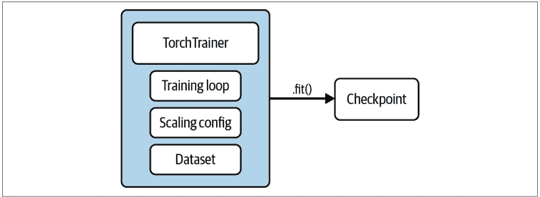

图 7-2. 使用 TorchTrainer 需要你指定一个训练循环、数据集和扩展配置

### 扩展 Trainer

Ray Train 的理念是用户不需要考虑如何并行化他们的代码。指定 `scaling_config` 允许你在不编写分布式逻辑的情况下扩展训练，并声明式地指定 Trainer 使用的*计算资源*。这种规范的好处在于你不需要考虑底层硬件。特别是，你可以通过在 `ScalingConfig` 中相应地指定集群节点的参数来使用数百个 worker：

```python
import ray
from ray.air.config import ScalingConfig
from ray.train.xgboost import XGBoostTrainer

ray.init(address="auto")  # 1

scaling_config = ScalingConfig(num_workers=200, use_gpu=True)  # 2

trainer = XGBoostTrainer(  # 3
    scaling_config=scaling_config,
    # ...
)
```

1. 在此处连接到现有的大型 Ray 集群。
2. 根据集群的可用资源定义一个 `ScalingConfig`。
3. 然后我们可以使用 Ray Train 的 XGBoost 集成在此集群上训练模型。

### 使用 Ray Train 进行预处理

数据预处理是将原始数据转换为机器学习模型特征的常用技术，我们在本章和上一章中已经看到了许多例子。到目前为止，我们通过编写自定义函数将数据转换为正确的格式来“手动”预处理数据。但 Ray Train 有几个针对常见用例的内置预处理器，也提供了定义自己的自定义逻辑的接口。

`Preprocessor` 是 Ray Train 提供的用于处理数据预处理的核心类。每个预处理器都有以下 API：

- `.transform()`
  用于处理并应用处理转换到数据集。
- `.fit()`
  用于计算和存储关于数据集的聚合状态到预处理器。返回 `self` 以支持链式调用。
- `.fit_transform()`
  执行需要聚合状态的转换的语法糖。对于特定的预处理器，可能在实现层面进行优化。
- `.transform_batch()`
  用于对批次应用相同的转换以进行预测。

我们通常希望确保在训练时和提供服务时使用相同的数据预处理操作。训练-服务偏差是部署机器学习时的一个主要问题，它描述了训练期间的性能与提供服务期间的性能之间存在差异的情况。这种偏差通常是由于在训练和服务管道中处理数据的方式不一致造成的。因此，你希望确保训练和服务具有一致的数据处理。

你可以通过将预处理器传递给 trainer 的构造函数来使用它们。这意味着一旦你创建了一个预处理器，就不必手动将其应用于你的 Ray Datasets。相反，你可以将其传递给你的 trainer，Ray Train 将负责以分布式方式应用它。以下是其工作原理的示意图：

```python
from ray.data.preprocessors import StandardScaler
from ray.train.xgboost import XGBoostTrainer

trainer = XGBoostTrainer(
    preprocessor=StandardScaler(...),
    # ...
)
result = trainer.fit()
```

一些预处理算子（如独热编码器）在训练阶段易于运行并迁移到服务阶段。然而，其他算子（如执行标准化的算子）则稍显复杂，因为你不希望在服务阶段进行大规模的数据计算（例如计算特定列的均值）。

幸运的是，Ray Train 的预处理器是可序列化的，因此你只需序列化这些算子，就能轻松实现从训练到服务的一致性。例如，你可以像这样简单地序列化一个预处理器：

```python
import pickle
from ray.data.preprocessors import StandardScaler

preprocessor = StandardScaler(...)
pickle.dumps(preprocessor)
```

接下来，我们将通过一个使用预处理器的具体训练流程示例，同时向你展示如何调整 Trainer 的超参数。

### 将 Trainer 与 Ray Tune 集成

Ray Train 提供了与 Ray Tune 的集成，允许你仅用几行代码即可执行超参数优化（HPO）。Tune 会为每个超参数配置创建一个试验。在每个试验中，将初始化一个新的 Trainer，并使用其生成的配置运行训练函数。

在以下代码中，我们创建了一个 XGBoostTrainer，并为常用超参数指定了超参数范围。具体来说，我们将在训练场景中选择两种不同的预处理器。准确地说，我们将使用 StandardScaler（通过均值和标准差平移和缩放每个指定列，因此结果列将遵循标准正态分布）和 MinMaxScaler（简单地将每列缩放到 [0, 1] 范围）。

接下来是我们将要搜索的相应参数空间：

```python
import ray

from ray.air.config import ScalingConfig
from ray import tune
from ray.data.preprocessors import StandardScaler, MinMaxScaler

dataset = ray.data.from_items(
    [{"X": x, "Y": 1} for x in range(0, 100)] +
    [{"X": x, "Y": 0} for x in range(100, 200)]
)
prep_v1 = StandardScaler(columns=["X"])
prep_v2 = MinMaxScaler(columns=["X"])

param_space = {
    "scaling_config": ScalingConfig(
        num_workers=tune.grid_search([2, 4]),
        resources_per_worker={
            "CPU": 2,
            "GPU": 0,
        },
    ),
    "preprocessor": tune.grid_search([prep_v1, prep_v2]),
    "params": {
        "objective": "binary:logistic",
        "tree_method": "hist",
        "eval_metric": ["logloss", "error"],
        "eta": tune.loguniform(1e-4, 1e-1),
        "subsample": tune.uniform(0.5, 1.0),
        "max_depth": tune.randint(1, 9),
    },
}
```

现在我们可以像之前一样创建一个 Trainer，这次使用 XGBoostTrainer，然后将其传递给 Ray Tune 的 Tuner 实例，我们可以像使用 trainer 本身一样调用 `.fit()`：

```python
from ray.train.xgboost import XGBoostTrainer
from ray.air.config import RunConfig
from ray.tune import Tuner

trainer = XGBoostTrainer(
    params={},
    run_config=RunConfig(verbose=2),
    preprocessor=None,
    scaling_config=None,
    label_column="Y",
    datasets={"train": dataset}
)

tuner = Tuner(
    trainer,
    param_space=param_space,
)

results = tuner.fit()
```

请注意，我们在这里使用了 Ray Trainer 的另一个你之前未见过的组件：RunConfig。此配置用于 Trainer 的所有运行时选项，在我们的例子中是实验的日志详细程度（0 表示静默；1 仅提供状态更新；2 是默认值，提供状态更新和简要结果；3 提供详细结果）。

与其他分布式超参数调优解决方案相比，Ray Tune 和 Ray Train 具有一些独特的功能。Ray 的解决方案是容错的，并且能够将数据集和预处理器指定为参数，以及在训练期间调整工作节点的数量。

### 使用回调监控训练

为了进一步探索 Ray Train 的一个功能，你可能希望将你的训练代码与你最喜欢的实验管理框架集成。Ray Train 提供了一个接口来获取中间结果，以及回调来处理或记录它们。它内置了适用于流行跟踪框架的回调，但你也可以通过 Tune 的 LoggerCallback 接口实现自己的回调。

例如，你可以使用 JsonLoggerCallback 以 JSON 格式记录结果，使用 TBXLoggerCallback 记录到 TensorBoard，或使用 MLFlowLoggerCallback 记录到 MLflow。以下示例展示了如何通过指定一个回调列表，在一次训练运行中同时使用这三者：

```python
from ray.air.callbacks.mlflow import MLflowLoggerCallback
from ray.tune.logger import TBXLoggerCallback, JsonLoggerCallback

training_loop = ...
trainer = ...

trainer.fit(
    training_loop,
    callbacks=[
        MLflowLoggerCallback(),
        TBXLoggerCallback(),
        JsonLoggerCallback()
    ]
)
```

### 总结

在本章中，我们讨论了分布式模型训练的基础知识，并向你展示了如何使用 Ray Train 运行数据并行训练。我们通过一个使用 Ray Data 和 Ray Train 处理有趣数据集的详尽示例进行了讲解。具体来说，我们演示了如何使用 Dask on Ray 加载、预处理和特征化你的数据集，然后使用 Ray Train 运行分布式 PyTorch 训练循环。接着，我们更详细地讨论了 Ray Trainer，并展示了它们如何通过 Tuner 与 Ray Tune 集成，如何与预处理器一起使用，以及如何使用回调来监控训练。

3 MLflow 和 TensorBoard 是用于 ML 实验跟踪和可视化的开源项目。它们对于监控机器学习模型的进展非常有用。

# 第 8 章

## 使用 Ray Serve 进行在线推理

Edward Oakes

在第 6 章和第 7 章中，你学习了如何使用 Ray 处理数据、训练 ML 模型，并在批量推理场景中应用它们。然而，许多最令人兴奋的机器学习用例都涉及*在线推理*。

在线推理是使用 ML 模型来增强用户直接或间接交互的 API 端点的过程。这在延迟至关重要的情况下非常重要：你不能简单地在后台对数据应用模型并提供结果。有许多现实世界的用例示例，在线推理可以提供巨大价值，例如：

*推荐系统*
为产品（例如在线购物）或内容（例如社交媒体）提供推荐是机器学习的基本用例。虽然可以离线完成，但推荐系统通常受益于实时响应用户偏好。这需要使用近期行为作为关键特征执行在线推理。

*聊天机器人*
在线服务通常具有实时聊天窗口，以便客户可以从键盘前获得支持。传统上，这些聊天窗口由客户支持人员负责，但最近为了降低劳动力成本并提高解决时间，正在用 ML 驱动的聊天机器人取代它们，这些机器人可以 24/7 在线。这些聊天机器人需要多种机器学习技术的复杂组合，并且必须能够实时响应客户输入。

*估计到达时间*
共享出行、导航和食品配送服务都依赖于能够提供准确的到达时间估计（例如，对于你的司机、你自己或你的晚餐）。提供准确的估计非常困难，因为它需要考虑现实世界的因素，如交通模式、天气和事故。在一次行程中，估计值也会被多次刷新。

这些只是在线应用机器学习可以在传统上非常困难的应用领域（想象一下手写逻辑来估计到达时间！）提供巨大价值的几个例子。应用列表还在继续：许多新兴领域，如自动驾驶汽车、机器人和视频处理流水线，也正在被机器学习重新定义。

所有这些应用都有一个关键要求：延迟。对于在线服务，低延迟对于提供良好的用户体验至关重要。对于与现实世界交互的应用（如机器人或自动驾驶汽车），更高的延迟可能对安全性或准确性产生更严重的影响。

本章将简要介绍 Ray Serve，这是一个 Ray 原生库，用于在 Ray 之上构建在线推理应用。首先，我们将讨论 Ray Serve 所解决的在线推理挑战。然后，我们将介绍 Ray Serve 的架构并引入其核心功能。最后，我们将使用 Ray Serve 构建一个由多个自然语言处理模型组成的端到端在线推理 API。你可以按照[本章笔记本中的代码](#)进行操作。

### 在线推理的关键特征

在上一节中，我们讨论了在线推理的主要目标是以低延迟与 ML 模型交互。然而，这长期以来一直是 API 后端和 Web 服务器的关键要求，因此一个自然的问题是：服务 ML 模型有什么不同？

#### ML 模型是计算密集型的

在线推理中的许多挑战源于一个关键特征：ML 模型是计算密集型的。与传统 Web 服务中请求主要由 I/O 密集型数据库查询或其他 API 调用处理相比，大多数 ML 模型归结为执行大量线性代数计算：提供推荐、估计到达时间或检测图像中的对象。这对于最近的“深度学习”趋势尤其如此，深度学习是 ML 的一个分支，其特点是神经网络规模不断增长。通常，深度学习模型也可以从使用专用硬件中显著受益。例如GPU或TPU，它们拥有针对机器学习计算优化的专用指令，能够跨多个输入并行执行向量化计算。

许多在线推理应用必须全天候运行。结合机器学习模型计算密集型的特点，在线推理服务的运营成本可能非常高昂，需要持续分配大量CPU和GPU。在线推理的核心挑战在于：如何以最小化端到端延迟的方式提供模型服务，同时降低成本。为满足这些需求，在线推理系统需具备以下关键特性：

- 支持GPU和TPU等专用硬件
- 能够根据请求负载动态扩展或缩减模型资源
- 支持请求批处理以利用向量化计算

### 机器学习模型并非孤立存在

在学术或研究环境中讨论机器学习时，焦点往往集中在单个独立任务上，例如目标识别或分类。然而，现实世界的应用通常并非如此清晰明确。要端到端地解决问题，需要结合多个机器学习模型和业务逻辑。以产品推荐场景为例：虽然我们可以运用多种已知的机器学习技术解决核心推荐问题，但边缘环节同样存在诸多挑战，其中许多挑战因具体用例而异：

- 验证输入输出，确保返回给用户的结果在语义上合理。通常需要设置一些人工规则，例如避免连续多次向用户推荐相同内容
- 获取用户和可用产品的最新信息，并将其转换为模型特征（某些情况下可由在线特征存储完成）
- 使用人工规则组合多个模型的结果，例如过滤排名靠前的结果或选择置信度最高的模型

实现在线推理API需要将所有这些组件整合到统一服务中。因此，灵活组合多个模型与自定义业务逻辑的能力至关重要。这些组件不能孤立看待——“粘合”逻辑通常需要与模型本身同步演进。

### Ray Serve 简介

Ray Serve 是基于Ray构建的可扩展计算层，用于提供机器学习模型服务。Serve具有框架无关性，不绑定特定机器学习库，而是将模型视为普通Python代码。此外，它允许灵活地将常规Python业务逻辑与机器学习模型结合。这使得构建完整的在线推理服务成为可能：Serve应用可以验证用户输入、查询数据库、跨多个机器学习模型执行可扩展推理，并在处理单个推理请求的过程中完成结果组合、过滤和验证。事实上，组合多个机器学习模型的结果正是Ray Serve的核心优势之一，正如后文“多模型推理图”章节所述。

虽然具备灵活性，Ray Serve针对计算密集型机器学习模型提供了专用功能，支持动态扩展和资源分配，确保请求负载能在多个CPU和/或GPU间高效处理。Serve继承了Ray的诸多优势：可扩展至数百台机器、提供灵活的调度策略，并通过Ray核心API实现低开销的跨进程通信。

本节将逐步介绍Ray Serve的核心功能，重点说明其如何解决前述在线推理挑战。要运行本节代码示例，需在本地安装以下Python包：

```
pip install "ray[serve]==2.2.0" "transformers==4.21.2" "requests==2.28.1"
```

运行示例前，请确保代码已保存在当前工作目录的*app.py*文件中。

### 架构概览

Ray Serve构建于Ray之上，继承了可扩展性、低开销通信、适合并行的API以及通过对象存储利用共享内存等优势。其核心抽象是*部署*，可视为由Ray actor组成的托管组，这些actor可统一寻址并负载均衡处理请求。部署中的每个actor在Ray Serve中称为*副本*。通常部署与机器学习模型一一对应，但也可包含任意Python代码，因此可能承载业务逻辑。

Ray Serve支持通过HTTP暴露部署，并定义输入解析和输出逻辑。其最重要特性之一是部署可通过原生Python API直接相互调用，这将转换为副本间的直接actor调用。这实现了模型与业务逻辑的灵活高性能组合，后文将展示具体应用。

图8-1展示了Ray Serve应用在Ray集群上的基本运行方式：多个部署分布在Ray集群中。每个部署由一个或多个“副本”组成，每个副本都是一个Ray actor。传入流量通过HTTP代理路由，实现代理在副本间负载均衡请求。¹

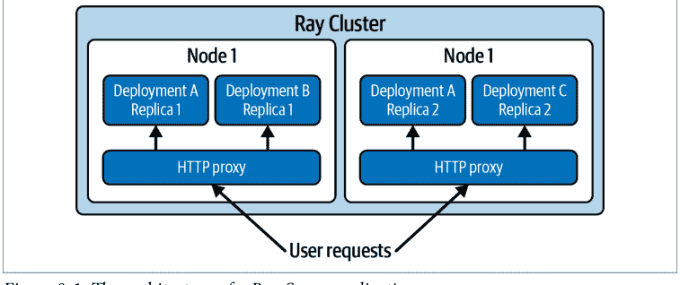

底层实现中，Ray Serve应用的部署由集中式*控制器*actor管理。这是由Ray管理的独立actor，故障时会自动重启。控制器负责创建和更新副本actor、向系统内其他actor广播更新、执行健康检查和故障恢复。若副本或整个Ray节点因任何原因崩溃，控制器将检测故障并确保actor恢复服务。

### 定义基础HTTP端点

本节将通过定义包装单个机器学习模型的简单HTTP端点来介绍Ray Serve。我们将部署的情感分类器：给定文本输入，预测输出情感倾向为正面或负面。使用[Hugging Face Transformers库](https://huggingface.co/docs/transformers)的预训练情感分类器，该库提供简洁的Python API，抽象模型细节，让我们专注于服务逻辑。

要使用Ray Serve部署此模型，需定义Python类并通过`@serve.deployment`装饰器将其转换为Serve*部署*。该装饰器允许传递多个配置选项，部分选项将在“扩展与资源分配”章节详细说明：

¹ 部署也可直接相互发送流量，这支持构建涉及模型组合或混合机器学习模型与业务逻辑的复杂应用。

```python
from ray import serve
from transformers import pipeline

@serve.deployment
class SentimentAnalysis:
    def __init__(self):
        self._classifier = pipeline("sentiment-analysis")

    def __call__(self, request) -> str:
        input_text = request.query_params["input_text"]
        return self._classifier(input_text)[0]["label"]
```

需注意几个要点：首先在类构造函数中实例化模型。模型可能很大，下载和加载到内存可能耗时数分钟。在Ray Serve中，构造函数代码仅在每个副本启动时运行一次，属性可缓存供后续使用。其次在`__call__`方法中定义请求处理逻辑，接收Starlette HTTP请求作为输入，返回任意JSON可序列化输出。本例中返回模型输出的字符串："POSITIVE"或"NEGATIVE"。

定义部署后，使用`.bind()` API实例化副本。此时可向构造函数传递可选参数配置部署（如模型权重下载路径）。注意这不会实际运行部署，而是将其与参数打包（后续组合多模型时更重要）：

```python
basic_deployment = SentimentAnalysis.bind()
```

可通过`serve.run` Python API或对应`serve run` CLI命令运行绑定部署。假设代码保存在`app.py`文件，可使用以下命令本地运行：

```
serve run app:basic_deployment
```

这将实例化单个部署副本并托管在本地HTTP服务器后。测试时可使用Python `requests`包：

```python
import requests

print(requests.get(
    "http://localhost:8000/", params={"input_text": "Hello friend!"}
).json())
```

对示例输入文本"Hello friend!"测试情感分类器，它正确将文本分类为正面情感！

这个示例实际上是 Ray Serve 的“hello world”：我们通过一个基本的 HTTP 端点部署了一个单一模型。但请注意，我们不得不手动解析输入的 HTTP 请求并将其传递给模型。对于这个基础示例来说，这只是一行代码，但现实世界的应用程序通常接受更复杂的输入模式，而手写 HTTP 逻辑可能既繁琐又容易出错。为了能够编写更具表现力的 HTTP API，Serve 集成了 [FastAPI Python 框架](https://fastapi.tiangolo.com/)。²

一个 Serve 部署可以包装一个 FastAPI 应用，利用其富有表现力的 API 来解析输入和配置 HTTP 行为。在下面的示例中，我们依赖 FastAPI 来处理解析 `input_text` 查询参数，从而可以移除样板解析代码：

```python
from fastapi import FastAPI

app = FastAPI()

@serve.deployment
@serve.ingress(app)
class SentimentAnalysis:
    def __init__(self):
        self._classifier = pipeline("sentiment-analysis")

    @app.get("/")
    def classify(self, input_text: str) -> str:
        return self._classifier(input_text)[0]["label"]

fastapi_deployment = SentimentAnalysis.bind()
```

修改后的部署在此示例上应具有完全相同的行为（使用 `serve run` 试试看！），但它将优雅地处理无效输入。对于这个简单的示例来说，这些可能看起来是微不足道的好处，但对于更复杂的 API，这可能会带来天壤之别。我们不会在此深入探讨 FastAPI 的细节，但如需了解其功能和语法的更多信息，请查看其出色的[文档](https://fastapi.tiangolo.com/)。

² 在底层，Ray Serve 会序列化用户提供的 FastAPI 应用对象。然后，当每个部署副本运行时，Ray Serve 会以与在典型 Web 服务器中运行相同的方式反序列化并运行该 FastAPI 应用。在运行时，每个 Ray Serve 副本中都会有一个独立的 FastAPI 服务器在运行。

### 扩展与资源分配

如前所述，机器学习模型通常非常消耗计算资源。因此，能够为你的 ML 应用分配正确数量的资源以处理请求负载，同时最小化成本，这一点非常重要。Ray Serve 允许你通过两种方式调整分配给部署的资源：调整部署的*副本*数量，以及调整分配给每个副本的资源。默认情况下，一个部署由一个使用单个 CPU 的副本组成，但这些参数可以在 `@serve.deployment` 装饰器（或使用相应的 `deployment.options` API）中进行调整。

让我们修改 `SentimentClassifier` 示例，将其扩展到多个副本，并调整资源分配，使每个副本使用两个 CPU 而不是一个（在实践中，你需要分析和理解你的模型以正确设置此参数）。我们还将添加一个打印语句来记录处理每个请求的进程 ID，以显示请求现在已跨两个副本进行负载均衡：

```python
app = FastAPI()

@serve.deployment(num_replicas=2, ray_actor_options={"num_cpus": 2})
@serve.ingress(app)
class SentimentAnalysis:
    def __init__(self):
        self._classifier = pipeline("sentiment-analysis")

    @app.get("/")
    def classify(self, input_text: str) -> str:
        import os
        print("from process:", os.getpid())
        return self._classifier(input_text)[0]["label"]

scaled_deployment = SentimentAnalysis.bind()
```

使用 `serve run app:scaled_deployment` 运行我们分类器的这个新版本，并像之前一样使用 `requests` 进行查询，你应该会看到现在有两个模型副本在处理请求！我们只需以同样的方式调整 `num_replicas`，就可以轻松扩展到数十或数百个副本：Ray 能够在单个集群中扩展到数百台机器和数千个进程。

在这个示例中，我们扩展到了静态数量的副本，每个副本消耗两个完整的 CPU，但 Serve 也支持更具表现力的资源分配策略。例如：

- 启用部署使用 GPU 只需设置 `num_gpus` 而不是 `num_cpus`。Serve 支持与 Ray Core 相同的资源类型，因此部署也可以使用 TPU 或其他自定义资源。
- 资源可以是*分数*的，允许副本被高效地装箱。例如，如果单个副本没有占满整个 GPU，你可以为其分配 `num_gpus=0.5`，并与另一个模型进行多路复用。
- 对于请求负载变化的应用，可以配置部署根据当前正在处理的请求数量动态自动扩展副本数量。

有关资源分配选项的更多详细信息，请参阅 [Ray Serve 最新文档](https://docs.ray.io/en/latest/serve/index.html)。

### 请求批处理

许多机器学习模型可以高效地*向量化*，这意味着多个计算可以并行运行，这比顺序运行它们更高效。当在专为高效执行大量并行计算而设计的 GPU 上运行模型时，这一点尤其有益。在在线推理的背景下，这提供了一条优化路径：并行服务多个请求（可能来自不同来源）可以极大地提高系统的吞吐量（从而节省成本）。

两种高级策略利用了请求批处理：客户端批处理和服务端批处理。在*客户端批处理*中，服务器在单个请求中接受多个输入，客户端包含逻辑以批量发送它们，而不是一次一个。当单个客户端频繁发送许多推理请求时，这很有用。相比之下，*服务端批处理*使服务器能够批量处理多个请求，而无需客户端进行任何修改。这也可以用于跨多个客户端批处理请求，即使在许多客户端每个发送相对较少请求的情况下，也能实现高效的批处理。

Ray Serve 提供了一个用于服务端批处理的内置实用程序 `@serve.batch` 装饰器，只需进行少量代码更改。此批处理支持使用 Python 的 asyncio 功能将多个请求排入单个函数调用。该函数应接受一个输入列表并返回相应的输出列表。

让我们再次回顾之前的情感分类器，这次修改它以执行服务端批处理。底层的 Hugging Face 管道支持向量化推理；我们需要做的就是传递一个输入列表，它将返回相应的输出列表。我们将把对分类器的调用拆分为一个新方法 `classify_batched`，该方法将接受一个输入文本列表作为输入，对它们执行推理，并以格式化的列表返回输出。`classify_batched` 将使用 `@serve.batch` 装饰器自动执行批处理。可以使用 `max_batch_size` 和 `batch_timeout_wait_s` 参数配置行为。这里我们将最大批处理大小设置为 10，并等待最多 100 毫秒：

```python
app = FastAPI()

@serve.deployment
@serve.ingress(app)
class SentimentAnalysis:
    def __init__(self):
        self._classifier = pipeline("sentiment-analysis")

    @serve.batch(max_batch_size=10, batch_wait_timeout_s=0.1)
    async def classify_batched(self, batched_inputs):
        print("Got batch size:", len(batched_inputs))
        results = self._classifier(batched_inputs)
        return [result["label"] for result in results]

    @app.get("/")
    async def classify(self, input_text: str) -> str:
        return await self.classify_batched(input_text)

batched_deployment = SentimentAnalysis.bind()
```

请注意，`classify` 和 `classify_batched` 方法现在都使用 Python 的 async 和 await 语法，这意味着许多这样的调用可以在同一进程中并发运行。

为了测试此行为，我们将使用 `serve.run` Python API，通过 Python 原生句柄向我们的部署发送请求：

```python
import ray
from ray import serve
from app import batched_deployment

handle = serve.run(batched_deployment) ①
ray.get([handle.classify.remote("sample text") for _ in range(10)])
```

① 获取部署的句柄，以便我们可以并行发送请求。

`serve.run` 返回的句柄可用于并行发送多个请求：在这里，我们并行发送 10 个请求并等待它们全部返回。如果没有批处理，每个请求将被顺序处理，但由于我们启用了批处理，我们应该看到请求被一次性处理（由 `classify_batched` 方法中打印的批处理大小证明）。在 CPU 上运行时，这可能比顺序运行稍快，但在 GPU 上运行相同的处理程序时，我们会观察到批处理版本有显著的加速。

### 多模型推理图

到目前为止，我们一直在部署和查询包装单个 ML 模型的单个 Serve 部署。如前所述，ML 模型通常不是孤立有用的：许多应用程序需要将多个模型组合在一起，并且业务逻辑需要与机器学习交织在一起。Ray Serve 的真正威力在于它能够将多个模型与常规 Python 逻辑组合成一个单一应用程序。这是通过实例化许多不同的部署并将

### 核心特性：绑定多个部署

Ray Serve 中所有类型的多模型推理图都围绕一个核心能力展开：将一个部署的引用传递给另一个部署的构造函数。为此，我们使用了 `.bind()` API 的另一项特性：一个已绑定的部署可以传递给另一个 `.bind()` 调用，这将在运行时解析为该部署的“句柄”。这使得部署能够独立部署和实例化，然后在运行时相互调用。以下是一个最基本的多部署 Serve 应用示例：

```python
@serve.deployment
class DownstreamModel:
    def __call__(self, inp: str):
        return "Hi from downstream model!"

@serve.deployment
class Driver:
    def __init__(self, downstream):
        self._d = downstream

    async def __call__(self, *args) -> str:
        return await self._d.remote()

downstream = DownstreamModel.bind()
driver = Driver.bind(downstream)
```

在此示例中，下游模型被传递给“驱动”部署。然后在运行时，驱动部署调用下游模型。驱动可以接受任意数量的传入模型，而下游模型甚至可以接受其自身的其他下游模型。

### 模式 1：流水线

ML 应用中第一种常见的多模型模式是“流水线”：按顺序调用多个模型，其中一个模型的输入依赖于前一个模型的输出。例如，图像处理通常包含一个由多个转换阶段组成的流水线，如裁剪、分割以及目标识别或光学字符识别（OCR）。这些模型中的每一个都可能具有不同的特性，其中一些是可以在 CPU 上运行的轻量级转换，而另一些是在 GPU 上运行的重量级深度学习模型。

这样的流水线可以轻松地使用 Serve 的 API 来表达。流水线的每个阶段被定义为一个独立的部署，每个部署被传递给一个顶层的“流水线驱动”。在下面的示例中，我们将两个部署传递给一个顶层驱动，驱动按顺序调用它们。请注意，对驱动的许多请求可能并发发生；因此，可以有效地使流水线的所有阶段达到饱和：

```python
@serve.deployment
class DownstreamModel:
    def __init__(self, my_val: str):
        self._my_val = my_val

    def __call__(self, inp: str):
        return inp + "|" + self._my_val


@serve.deployment
class PipelineDriver:
    def __init__(self, model1, model2):
        self._m1 = model1
        self._m2 = model2

    async def __call__(self, *args) -> str:
        intermediate = self._m1.remote("input")
        final = self._m2.remote(intermediate)
        return await final


m1 = DownstreamModel.bind("val1")
m2 = DownstreamModel.bind("val2")
pipeline_driver = PipelineDriver.bind(m1, m2)
```

要测试此示例，您可以再次使用 `serve run` API。向流水线发送测试请求会返回 `'input|val1|val2'` 作为输出：每个下游“模型”都附加了自己的值以构建最终结果。在实践中，这些部署中的每一个都可能封装了自己的 ML 模型，单个请求可能流经集群中的多个物理节点。

### 模式 2：广播

除了将模型按顺序链接在一起之外，将输入或中间结果并行广播给多个模型通常也很有用。这可以用于执行“集成”，即将多个独立模型的结果组合成一个单一结果，或者用于不同模型可能在不同输入上表现更好的情况。通常，模型的结果需要以某种方式组合成最终结果：要么简单地连接，要么从众多结果中选择一个。

这与流水线示例的表达方式非常相似：将多个下游模型传递给一个顶层驱动。在这种情况下，重要的是我们要并行调用模型：等待每个模型的结果再调用下一个将显著增加系统的整体延迟：

```python
@serve.deployment
class DownstreamModel:
    def __init__(self, my_val: str):
        self._my_val = my_val

    def __call__(self):
        return self._my_val

@serve.deployment
class BroadcastDriver:
    def __init__(self, model1, model2):
        self._m1 = model1
        self._m2 = model2

    async def __call__(self, *args) -> str:
        output1, output2 = self._m1.remote(), self._m2.remote()
        return [await output1, await output2]

m1 = DownstreamModel.bind("val1")
m2 = DownstreamModel.bind("val2")
broadcast_driver = BroadcastDriver.bind(m1, m2)
```

使用 `serve run` 再次运行此端点后进行测试，返回 `["val1", "val2"]`，这是并行调用的两个模型的组合输出。

### 模式 3：条件逻辑

最后，虽然许多 ML 应用大致符合前面模式之一，但拥有静态控制流通常会非常受限。以构建一个从用户上传的图像中提取车牌号的服务为例。在这种情况下，我们可能需要构建一个如前所述的图像处理流水线，但我们也不希望盲目地将任何图像输入流水线。如果用户上传的不是汽车图像或图像质量较低，我们可能希望短路，避免调用重量级且昂贵的流水线，并提供有用的错误消息。类似地，在产品推荐用例中，我们可能希望根据用户输入或中间模型的结果选择下游模型。这些示例中的每一个都需要在我们的 ML 模型旁边嵌入自定义逻辑。

我们可以使用 Serve 的多模型 API 轻松实现这一点，因为我们的计算图是用普通的 Python 逻辑定义的，而不是静态定义的图。例如，在下一个示例中，我们使用一个简单的随机数生成器（RNG）来决定调用两个下游模型中的哪一个。在实际示例中，RNG 可以被业务逻辑、数据库查询或中间模型的结果所取代：

```python
@serve.deployment
class DownstreamModel:
    def __init__(self, my_val: str):
        self._my_val = my_val

    def __call__(self):
        return self._my_val


@serve.deployment
class ConditionalDriver:
    def __init__(self, model1, model2):
        self._m1 = model1
        self._m2 = model2

    async def __call__(self, *args) -> str:
        import random
        if random.random() > 0.5:
            return await self._m1.remote()
        else:
            return await self._m2.remote()


m1 = DownstreamModel.bind("val1")
m2 = DownstreamModel.bind("val2")
conditional_driver = ConditionalDriver.bind(m1, m2)
```

每次调用此端点，都有 50% 的概率返回 "val1" 或 "val2"。

### 端到端示例：构建一个 NLP 驱动的 API

在本节中，我们将使用 Ray Serve 构建一个用于在线推理的端到端自然语言处理（NLP）流水线。我们的目标是提供一个维基百科摘要端点，该端点将利用多个 NLP 模型和一些自定义逻辑，为给定的搜索词提供最相关维基百科页面的简洁摘要。

此任务将汇集我们讨论过的许多概念和特性：

- 我们将把自定义业务逻辑与多个 ML 模型结合起来。
- 推理图将包含所有三种多模型模式：流水线、广播和条件逻辑。
- 每个模型将作为单独的 Serve 部署托管，以便它们可以独立扩展并获得自己的资源分配。

### 获取内容与预处理

第一步是根据用户提供的搜索词，从维基百科获取最相关的页面。为此，我们将利用 PyPI 上的 Wikipedia 包来完成繁重的工作。我们将首先搜索该术语，然后选择第一个结果并返回其页面内容。如果未找到结果，我们将返回 None——这个边界情况将在我们定义 API 时处理：

```python
from typing import Optional

import wikipedia

def fetch_wikipedia_page(search_term: str) -> Optional[str]:
    results = wikipedia.search(search_term)
    # If no results, return to caller.
    if len(results) == 0:
        return None

    # Get the page for the top result.
    return wikipedia.page(results[0]).content
```

### NLP 模型

接下来，我们需要定义将承担我们 API 主要工作的机器学习模型。我们将使用 Hugging Face Transformers 库，因为它提供了便捷的 API 来访问预训练的最先进机器学习模型，这样我们就可以专注于服务逻辑。

我们将使用的第一个模型是情感分类器，与我们在前面示例中使用的相同。该模型的部署将利用 Serve 的批处理 API 进行向量化计算：

```python
from ray import serve
from transformers import pipeline
from typing import List

@serve.deployment
class SentimentAnalysis:
    def __init__(self):
        self._classifier = pipeline("sentiment-analysis")

    @serve.batch(max_batch_size=10, batch_wait_timeout_s=0.1)
    async def is_positive_batched(self, inputs: List[str]) -> List[bool]:
        results = self._classifier(inputs, truncation=True)
        return [result["label"] == "POSITIVE" for result in results]

    async def __call__(self, input_text: str) -> bool:
        return await self.is_positive_batched(input_text)
```

我们还将使用一个文本摘要模型，为选定的文章提供简洁的摘要。该模型接受一个可选的 `max_length` 参数来限制摘要的长度。因为我们知道这是所有模型中计算成本最高的，所以我们设置 `num_replicas=2`；这样，如果同时有大量请求进来，它就能跟上其他模型的吞吐量。在实践中，我们可能需要更多的副本来跟上输入负载，但这只能通过性能分析和监控来了解：

```python
@serve.deployment(num_replicas=2)
class Summarizer:
    def __init__(self, max_length: Optional[int] = None):
        self._summarizer = pipeline("summarization")
        self._max_length = max_length

    def __call__(self, input_text: str) -> str:
        result = self._summarizer(
            input_text, max_length=self._max_length, truncation=True)
        return result[0]["summary_text"]
```

我们流水线中的最后一个模型将是一个命名实体识别模型：它将尝试从文本中提取命名实体。每个结果都会有一个置信度分数，因此我们可以设置一个阈值，只接受高于某个阈值的结果。我们可能还想限制返回的实体总数。此部署的请求处理程序调用模型，然后使用一些基本的业务逻辑来强制执行提供的置信度阈值并限制实体数量：

```python
@serve.deployment
class EntityRecognition:
    def __init__(self, threshold: float = 0.90, max_entities: int = 10):
        self._entity_recognition = pipeline("ner")
        self._threshold = threshold
        self._max_entities = max_entities

    def __call__(self, input_text: str) -> List[str]:
        final_results = []
        for result in self._entity_recognition(input_text):
            if result["score"] > self._threshold:
                final_results.append(result["word"])
            if len(final_results) == self._max_entities:
                break

        return final_results
```

### HTTP 处理与驱动逻辑

定义了输入预处理和机器学习模型后，我们就可以定义 HTTP API 和驱动逻辑了。首先，我们使用 Pydantic 定义将从 API 返回的响应模式。响应包括请求是否成功以及状态消息，此外还有我们的摘要和命名实体。这将使我们能够在错误情况下（例如未找到结果或情感分析返回负面结果时）返回有用的响应：

```python
from pydantic import BaseModel

class Response(BaseModel):
    success: bool
    message: str = ""
    summary: str = ""
    named_entities: List[str] = []
```

接下来，我们需要定义将在驱动部署中运行的实际控制流逻辑。驱动本身不会执行任何实际的繁重工作；相反，它将调用我们的三个下游模型部署并解释它们的结果。它还将包含 FastAPI 应用定义，解析输入并根据流水线的结果返回正确的 Response 模型：

```python
from fastapi import FastAPI

app = FastAPI()


@serve.deployment
@serve.ingress(app)
class NLPPipelineDriver:
    def __init__(self, sentiment_analysis, summarizer, entity_recognition):
        self._sentiment_analysis = sentiment_analysis
        self._summarizer = summarizer
        self._entity_recognition = entity_recognition

    @app.get("/", response_model=Response)
    async def summarize_article(self, search_term: str) -> Response:
        # Fetch the top page content for the search term if found.
        page_content = fetch_wikipedia_page(search_term)
        if page_content is None:
            return Response(success=False, message="No pages found.")

        # Conditionally continue based on the sentiment analysis.
        is_positive = await self._sentiment_analysis.remote(page_content)
        if not is_positive:
            return Response(success=False, message="Only positivity allowed!")

        # Query the summarizer and named entity recognition models in parallel.
        summary_result = self._summarizer.remote(page_content)
        entities_result = self._entity_recognition.remote(page_content)
        return Response(
            success=True,
            summary=await summary_result,
            named_entities=await entities_result
        )
```

我们的在线推理流水线将如图 8-2 所示构建：

1.  用户将提供一个关键词搜索词。
2.  我们将获取与搜索词最相关的维基百科文章的内容。
3.  一个情感分析模型将应用于该文章。任何具有“负面”情感的内容都将被拒绝，并且我们将提前返回。
4.  文章内容将被广播给摘要模型和命名实体识别模型。
5.  我们将根据摘要模型和命名实体识别模型的输出返回一个组合结果。

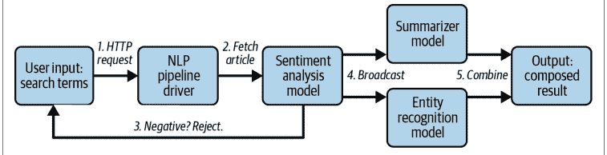

该流水线将通过 HTTP 暴露，并以结构化格式返回结果。在本节结束时，我们将使流水线在本地端到端运行，并准备好在集群上扩展。让我们开始吧！

在深入代码之前，您需要在本地安装以下 Python 包：

```
pip install "ray[serve]==2.2.0" "transformers==4.21.2"
pip install "requests==2.28.1" "wikipedia==1.4.0"
```

此外，在本节中，我们将假设所有代码示例都在本地一个名为 `app.py` 的文件中，这样我们就可以使用 `serve run` 从同一目录运行部署。³

> ³ 我们已经在本书的 GitHub 仓库中为您创建了这个 `app.py` 文件。克隆仓库并安装所有依赖项后，您应该能够直接从笔记本目录运行 `serve run app:<deployment_name>` 来执行本章中 `serve run` 调用中引用的每个部署。

在主处理函数的主体中，使用我们的 `fetch_wikipedia_page` 逻辑获取页面内容（如果未找到结果，则返回错误）。然后，我们调用情感分析模型。如果分析结果为负面，我们会提前终止并返回错误，以避免调用其他昂贵的机器学习模型。最后，我们将文章内容并行广播给摘要模型和命名实体识别模型。两个模型的结果被拼接成最终响应，然后我们返回成功。请记住，我们可能有许多对此处理函数的并发调用：对下游模型的调用不会阻塞驱动程序，它可以协调对多个重量级模型副本的调用。

### 整合所有部分

至此，我们已经定义了所有核心逻辑。剩下的就是将部署图绑定在一起并运行它：

```
sentiment_analysis = SentimentAnalysis.bind()
summarizer = Summarizer.bind()
entity_recognition = EntityRecognition.bind(threshold=0.95, max_entities=5)
nlp_pipeline_driver = NLPPipelineDriver.bind(
    sentiment_analysis, summarizer, entity_recognition)
```

首先，我们需要用任何相关的输入参数实例化每个部署。例如，这里我们为实体识别模型传递了一个阈值和限制。我们传递的最重要的部分是对三个模型的引用给驱动程序，以便它可以协调计算。现在我们已经定义了完整的 NLP 流水线，我们可以使用 `serve run` 来运行它：⁴

```
serve run app:nlp_pipeline_driver
```

这将在本地部署四个部署，并使驱动程序在 http://localhost:8000 可用。我们可以使用 `requests` 查询流水线以查看其运行情况。首先，让我们尝试查询一个关于 Ray Serve 的条目：

```
import requests

print(requests.get(
    "http://localhost:8000/", params={"search_term": "rayserve"}
).text)
'{"success":false,"message":"No pages found.",
 "summary":"","named_entities":[]}'
```

⁴ 我们在此示例中使用的模型相当大，因此请注意，首次运行此示例时可能需要几分钟来下载它们。

不幸的是，这个页面还不存在！第一块验证业务逻辑启动并返回“未找到页面”消息。让我们尝试查找一些更常见的内容：

```
print(requests.get(
    "http://localhost:8000/", params={"search_term": "war"}
).text)
'{"success":false,"message":"Only positivity allowed!", "summary":"","named_entities":[]}'
```

也许我们只是想了解历史，但这篇文章对我们的情感分类器来说有点太负面了。这次让我们尝试一些更中性的内容——科学怎么样？

```
print(requests.get(
    "http://localhost:8000/", params={"search_term": "physicist"}
).text)
'{"success":true,"message":"","summary":" Physics is the natural science that studies matter, its fundamental constituents, its motion and behavior through space and time, and the related entities of energy and force . During the Scientific Revolution in the 17th century these natural sciences emerged as unique research endeavors in their own right . Physics intersects with many interdisciplinary areas of research, such as biophysics and quantum chemistry . ","named_entities":["Scientific","Revolution", "Ancient","Greek","Egyptians"]}'
```

这个示例成功运行了整个流水线：API 用文章的简明摘要和相关命名实体列表进行了响应。

回顾一下，在本节中，我们使用 Ray Serve 构建了一个在线 NLP API。这个推理图由多个机器学习模型以及自定义业务逻辑和动态控制流组成。每个模型都可以独立扩展并拥有自己的资源分配，我们可以利用服务器端批处理进行向量化计算。由于我们能够在本地测试 API，下一步将是部署到生产环境。Ray Serve 使得使用 Ray Cluster 启动器在 Kubernetes 或其他云提供商产品上部署变得容易，我们可以通过调整部署的资源分配轻松扩展以处理许多用户。

### 总结

本章介绍了 Ray Serve，一个用于构建在线推理 API 的 Ray 原生库。Ray Serve 专注于解决在生产环境中服务机器学习模型的独特挑战，提供高效扩展模型和分配资源的功能，以及将多个模型与业务逻辑组合的能力。此外，与所有 Ray 一样，Serve 被设计为一个通用解决方案，避免供应商锁定。

尽管我们通过了一个多模型流水线的端到端示例，但本章仅涵盖了 Ray Serve 功能的一小部分以及实际应用的最佳实践。有关更多细节和示例，请阅读 [Ray Serve 文档](https://docs.ray.io/en/latest/serve/index.html)。

# 第 9 章

## Ray 集群

Richard Liaw

到目前为止，我们一直专注于教你使用 Ray 构建机器学习应用程序的基础知识。你知道如何使用 Ray Core 并行化你的 Python 代码，以及如何使用 RLlib 运行强化学习实验。你还看到了如何使用 Ray Datasets 预处理数据、使用 Ray Tune 调整超参数以及使用 Ray Train 训练模型。但 Ray 带来的关键特性之一是能够无缝扩展到多台机器。在实验室环境或大型科技公司之外，设置多台机器并将它们连接成一个单一的 Ray 集群可能很困难。本章就是关于如何做到这一点的。¹

云技术使任何人都能以商品化的方式访问廉价的机器。但通常很难弄清楚处理云提供商工具的正确 API。Ray 团队提供了一些工具来抽象复杂性。启动或部署 Ray 集群有三种主要方式。你可以手动执行，通过 Kubernetes 操作符，或通过集群启动器 CLI 工具。

在本章的第一部分，我们将详细介绍这三种方法。² 我们只简要解释手动集群创建和集群启动器 CLI，我们将大部分时间用于解释如何使用 Kubernetes 操作符。之后，我们将介绍如何在云上运行 Ray 集群以及如何自动扩展它们。

¹ Ray 本身对如何设置集群没有固定看法。事实上，你有很多选择，其中许多在本章中都有描述。除了我们在此描述的开源解决方案外，还有完全托管的商业解决方案可用，例如 Anyscale 或 Domino Data Lab 提供的解决方案。

² 虽然本章在技术上有一个配套的笔记本，但此处介绍的内容不太适合在交互式 Python 会话中进行开发。我们建议你在命令行上完成这些示例。无论你决定在哪里工作，请确保使用 `pip install "ray==2.2.0"` 安装了 Ray。

### 手动创建 Ray 集群

让我们从创建 Ray 集群的最基本方式开始。要手动构建 Ray 集群，我们假设你有一组可以相互通信并安装了 Ray 的机器。³

首先，你可以选择任何机器作为头节点。在此节点上，运行以下命令：

```
ray start --head --port=6379
```

此命令将打印出已启动的 Ray GCS 服务器的 IP 地址，即本地节点 IP 地址加上你指定的端口号：⁴

```
...
Next steps
To connect to this Ray runtime from another node, run
ray start --address='<head-address>:6379'

If connection fails, check your firewall settings and network configuration.
```

你需要这个 `<head-address>` 来将你的其他节点连接到集群，因此请确保复制它。如果省略 `--port` 参数，Ray 将使用随机端口。

接下来，我们可以通过在每个节点上运行一个命令将集群中的每个其他节点连接到头节点：

```
ray start --address=<head-address>
```

确保传递正确的 `<head-address>`，它应该看起来像 123.45.67.89:6379。运行此命令，你应该会看到以下形式的输出：

```
-----------------------
Ray runtime started.
-----------------------

To terminate the Ray runtime, run
ray stop
```

如果你希望指定一台机器有 10 个 CPU 和 1 个 GPU，你可以使用标志 `--num-cpus=10` 和 `--num-gpus=1` 来做到这一点。如果你看到 `Ray runtime started.`，那么

³ 根据你的设置或工作情况，这对你来说可能不是一个现实的假设。别担心，我们将介绍创建 Ray 集群的方法，这些方法不需要你运行任何机器。无论如何，了解手动创建 Ray 集群所涉及的步骤作为后备知识是有用的。

⁴ 如果你已经有远程 Redis 实例，你可以通过指定环境变量 RAY_REDIS_ADDRESS=ip1:port1,ip2:port2... 来使用它们。Ray 将使用第一个地址作为主地址，其余作为分片。

节点已成功连接到 `--address` 指定的头节点。现在你应该能够使用 `ray.init(address='auto')` 连接到集群。


如果头节点和你想要连接的新节点位于不同的子网，并且存在网络地址转换（NAT），你就不能使用启动头节点时打印的 `<head-address>` 作为 `--address`。在这种情况下，你需要找到一个能从新节点到达头节点的地址。如果头节点有一个类似 `compute04.berkeley.edu` 的域名地址，你可以用它来代替 IP 地址，并依赖 DNS 解析。

如果你看到 `Unable to connect to GCS at ...`，这意味着在给定的 `--address` 处无法访问头节点。这可能有几个原因。例如，头节点可能实际上没有运行，指定地址上运行的是不同版本的 Ray，指定的地址错误，或者防火墙设置阻止了访问。

如果连接失败，要检查每个端口是否可以从节点访问，你可以使用 `nmap` 或 `nc` 等工具。以下是在成功情况下使用这两种工具进行检查的示例：⁵

```
$ nmap -sV --reason -p $PORT $HEAD_ADDRESS
Nmap scan report for compute04.berkeley.edu (123.456.78.910)
Host is up, received echo-reply ttl 60 (0.00087s latency).
rDNS record for 123.456.78.910: compute04.berkeley.edu
PORT     STATE SERVICE REASON      VERSION
6379/tcp open  redis?  syn-ack
Service detection performed. Please report any incorrect results at https://nmap.org/submit/ .
$ nc -vv -z $HEAD_ADDRESS $PORT
Connection to compute04.berkeley.edu 6379 port [tcp/...] succeeded!
```

如果你的节点无法访问指定的端口和 IP 地址，你可能会看到：

```
$ nmap -sV --reason -p $PORT $HEAD_ADDRESS
Nmap scan report for compute04.berkeley.edu (123.456.78.910)
Host is up (0.0011s latency).
rDNS record for 123.456.78.910: compute04.berkeley.edu
PORT     STATE SERVICE REASON      VERSION
6379/tcp closed redis   reset ttl 60
Service detection performed. Please report any incorrect results at https://nmap.org/submit/ .
$ nc -vv -z $HEAD_ADDRESS $PORT
nc: connect to compute04.berkeley.edu port 6379 (tcp) failed: Connection refused
```

⁵ 如果你想了解更多关于后续示例中使用的具体标志，我们建议查阅官方参考指南。

现在，如果你想停止任何节点上的 Ray 进程，只需运行 `ray stop`。这就是手动创建 Ray 集群的方式。接下来，让我们讨论如何使用流行的 Kubernetes 编排框架来部署你的 Ray 集群。

### 在 Kubernetes 上部署

Kubernetes 是一个行业标准的集群资源管理平台。它允许软件团队在各种生产环境中无缝部署、管理和扩展他们的业务应用程序。它最初由 Google 开发，但许多组织现在已采用 Kubernetes 作为其集群资源管理解决方案。

社区维护的 [KubeRay 项目](https://github.com/ray-project/kuberay) 是在 Kubernetes 上部署和管理 Ray 集群的标准方式。KubeRay operator 有助于在 Kubernetes 之上部署和管理 Ray 集群（图 9-1）。集群被定义为一个自定义的 `RayCluster` 资源，并由一个容错的 Ray 控制器管理。该 operator 自动化了部署到 Kubernetes 的 Ray 集群的配置、管理、自动扩展和运维。该 operator 的主要功能包括：

- 通过自定义资源管理一等公民 `RayCluster`。
- 支持单个 Ray 集群中的异构工作节点类型。
- 通过 Prometheus 进行内置监控。
- 使用 `PodTemplate` 创建 Ray Pod。
- 基于运行中的 Pod 更新状态。
- 自动在容器中填充环境变量。
- 自动在你的容器命令前添加 Ray 启动命令。
- 自动在 `/dev/shm` 添加 volumeMount 以用于共享内存。
- 使用 `ScaleStrategy` 来移除特定组中的特定节点。

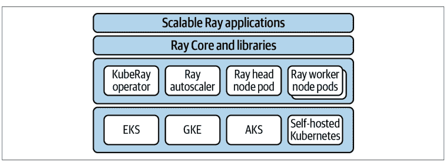

### 设置你的第一个 KubeRay 集群

你可以通过克隆 [KubeRay 仓库](https://github.com/ray-project/kuberay) 并调用以下命令来部署 operator：

```
export KUBERAY_VERSION=v0.3.0

kubectl create -k "github.com/ray-project/kuberay/manifests/cluster-scope-resources?ref=${KUBERAY_VERSION}&timeout=90s"

kubectl apply -k "github.com/ray-project/kuberay/manifests/base?ref=${KUBERAY_VERSION}&timeout=90s"
```

你可以使用以下命令验证 operator 是否已部署：

```
kubectl -n ray-system get pods
```

部署后，operator 将监视 `raycluster` 资源更新的 Kubernetes 事件（创建/删除/更新）。根据这些事件，operator 可以创建一个由头 Pod 和多个工作 Pod 组成的集群，删除集群，或者通过添加或移除工作 Pod 来更新集群。现在让我们使用提供的默认集群配置（我们稍后会介绍这个 YAML 文件）来部署一个新的 Ray 集群：

```
wget "https://raw.githubusercontent.com/ray-project/kuberay/${KUBERAY_VERSION}/ray-operator/config/samples/ray-cluster.complete.yaml"

kubectl create -f ray-cluster.complete.yaml
```

KubeRay operator 配置了一个指向 Ray 头 Pod 的 Kubernetes 服务。要识别该服务，请运行：

```
kubectl get service --selector=ray.io/cluster=raycluster-complete
```

此命令的输出应类似于以下结构：

| NAME | TYPE | CLUSTER-IP | EXTERNAL-IP |
| :--- | :--- | :--- | :--- |
| raycluster-complete-head-svc | ClusterIP | xx.xx.xxx.xx | `<none>` |
| PORT(S) | AGE | | |
| 6379/TCP,8265/TCP,10001/TCP | 6m10s | | |

输出中指示的三个端口对应于 Ray 头 Pod 的以下服务：

- **6379**：Ray 头节点的 GCS 服务。Ray 工作 Pod 在加入集群时连接到此服务。
- **8265**：暴露 Ray Dashboard 和 Ray Job Submission 服务。
- **10001**：暴露 Ray Client 服务器。

你应该注意，我们使用的 Docker 镜像相当大，下载可能需要一些时间。此外，即使你看到 `kubectl get service` 的预期输出，也并不意味着你的集群已准备好使用。你应该查看 Pod 状态，并确保它们都实际处于 "Running" 状态。

### 与 KubeRay 集群交互

你可能想知道为什么我们花这么多时间在 Kubernetes 上，因为你很可能只是对学习如何在上面运行 Ray 脚本感兴趣。这是可以理解的，我们稍后就会讲到。

首先，让我们使用以下 Python 脚本作为要在集群上运行的目标脚本。为了简单起见，我们将其命名为 `script.py`，该脚本将连接到 Ray 集群并运行几个标准的 Ray 命令：

```
import ray
ray.init(address="auto")
print(ray.cluster_resources())

@ray.remote
def test():
    return 12

ray.get([test.remote() for i in range(12)])
```

运行此脚本有三种主要方式：使用 `kubectl exec`、Ray Job Submission 或 Ray Client。我们将在以下部分中介绍它们。

### 使用 kubectl 运行 Ray 程序

首先，你可以通过 `kubectl exec` 直接与头 Pod 交互。使用此命令在头 Pod 上获取一个 Python 解释器：

```
kubectl exec `kubectl get pods -o custom-columns=POD:metadata.name | grep raycluster-complete-head` -it -c ray-head -- python
```

使用这个 Python 终端，你可以连接并运行你自己的 Ray 应用程序：

```
import ray
ray.init(address="auto")
...
```

还有其他方式可以在不使用 `kubectl` 的情况下与这些服务交互，但这需要一些网络设置。最简单的方法，也是我们接下来要采用的方法，是使用端口转发。

### 使用 Ray Job Submission 服务器

你可以通过使用 Ray Job Submission 服务器在集群上运行脚本。你可以使用该服务器发送脚本或依赖包，并使用该依赖集运行自定义脚本。首先，你需要对作业提交服务器端口进行端口转发：

```
kubectl port-forward service/raycluster-complete-head-svc 8265:8265
```

现在，通过将 `RAY_ADDRESS` 变量设置为作业服务器提交端点并使用 Ray Job Submission CLI 来提交脚本：

```
export RAY_ADDRESS="http://localhost:8265"

ray job submit --working-dir=. -- python script.py
```

你将看到如下输出：

```
Job submission server address: http://127.0.0.1:8265
2022-05-20 23:35:36,066 INFO dashboard_sdk.py:276
-- Uploading package gcs://_ray_pkg_533a957683abeba8.zip.
2022-05-20 23:35:36,067 INFO packaging.py:416
-- Creating a file package for local directory '.'.

--------------------------------------------------------------------------------
Job 'raysubmit_U5hfr1rqJZWwJmLP' submitted successfully
--------------------------------------------------------------------------------

Next steps
  Query the logs of the job:
    ray job logs raysubmit_U5hfr1rqJZWwJmLP
  Query the status of the job:
    ray job status raysubmit_U5hfr1rqJZWwJmLP
  Request the job to be stopped:
    ray job stop raysubmit_U5hfr1rqJZWwJmLP

Tailing logs until the job exits (disable with --no-wait):
{'memory': 47157884109.0, 'object_store_memory': 2147483648.0,
 'CPU': 16.0, 'node:127.0.0.1': 1.0}

--------------------------------------------------------------------------------
Job 'raysubmit_U5hfr1rqJZWwJmLP' succeeded
--------------------------------------------------------------------------------
```

你可以使用 `--no-wait` 在后台运行作业。

### Ray Client

要通过 Ray Client 从本地机器连接到集群，首先确保本地 Ray 安装和 Python 次要版本与 Ray 集群中运行的 Ray 和 Python 版本匹配。为此，你可以在两个实例上运行 `ray --version` 和 `python --version`。实际上，你将使用一个容器，在该容器中在这种情况下，你只需确保所有操作都在同一个容器中运行即可。此外，如果版本不匹配，你会看到一条警告信息提示该问题。

接下来，运行以下命令：

```
kubectl port-forward service/raycluster-complete-head-svc 10001:10001
```

此命令会阻塞。本地端口 10001 现在将被转发到 Ray 头节点的 Ray Client 服务器。

要在远程 Ray 集群上运行 Ray 工作负载，请打开本地 Python shell 并启动 Ray Client 连接：

```
import ray
ray.init(address="ray://localhost:10001")
print(ray.cluster_resources())
```

```
@ray.remote
def test():
    return 12
```

```
ray.get([test.remote() for i in range(12)])
```

通过这种方法，你可以直接在笔记本电脑上运行 Ray 程序（而无需通过 `kubectl` 或作业提交将代码发送过去）。

### 暴露 KubeRay 服务

在前面的示例中，我们使用了端口转发作为访问 Ray 头节点服务的简单方式。对于生产用例，你可能需要考虑其他暴露这些服务的方法。以下说明适用于在 Kubernetes 上运行的服务。

默认情况下，Ray 服务可以从运行 Ray Operator 的 Kubernetes 集群*内部*的任何位置访问。例如，要从与 Ray 集群处于同一 Kubernetes 命名空间的 Pod 中使用 Ray Client，请使用 `ray.init("ray://raycluster-complete-head-svc:10001")`。

要从另一个 Kubernetes 命名空间连接，请使用 `ray.init("ray://raycluster-complete-head-svc.default.svc.cluster.local:10001")`。（如果 Ray 集群位于非默认命名空间，请将 `default` 替换为该命名空间。）

如果你尝试从集群外部访问该服务，请使用 Ingress 控制器。任何标准的 Ingress 控制器都应能与 Ray Client 和 Ray Dashboard 配合使用。请选择与你的网络和安全要求兼容的解决方案——更进一步的指导超出了本书的范围。

### 配置 KubeRay

让我们更仔细地了解在 Kubernetes 上运行的 Ray 集群的配置。示例文件 `kuberay/ray-operator/config/samples/ray-cluster.complete.yaml` 是一个很好的参考。以下是 Ray 集群配置最显著特征的精简视图：

```
apiVersion: ray.io/v1alpha1
kind: RayCluster
metadata:
  name: raycluster-complete
spec:
  headGroupSpec:
    rayStartParams:
      port: '6379'
      num-cpus: '1'
      ...
    template: # Pod 模板
      metadata: # Pod 元数据
      spec: # Pod 规范
        containers:
        - name: ray-head
          image: rayproject/ray:1.12.1
          resources:
            limits:
              cpu: "1"
              memory: "1024Mi"
            requests:
              cpu: "1"
              memory: "1024Mi"
          ports:
          - containerPort: 6379
            name: gcs
          - containerPort: 8265
            name: dashboard
          - containerPort: 10001
            name: client
          env:
          - name: "RAY_LOG_TO_STDERR"
            value: "1"
          volumeMounts:
          - mountPath: /tmp/ray
            name: ray-logs
        volumes:
        - name: ray-logs
          emptyDir: {}
  workerGroupSpecs:
  - groupName: small-group
    replicas: 2
    rayStartParams:
      ...
    template: # Pod 模板
```

```
...
- groupName: medium-group
...
```

理想情况下，如果可能，应调整每个 Ray Pod 的大小，使其占据其被调度到的整个 Kubernetes 节点。换句话说，最好在每个 Kubernetes 节点上运行一个大型 Ray Pod；在一个 Kubernetes 节点上运行多个 Ray Pod 会引入不必要的开销。然而，在某些情况下，在一个 Kubernetes 节点上运行多个 Ray Pod 是有意义的，例如：

- 许多用户在计算资源有限的 Kubernetes 集群上运行 Ray 集群。
- 你或你的组织不直接管理 Kubernetes 节点（例如，在 GKE Autopilot 上部署时）。

你可能使用的一些主要配置值如下：

**headGroupSpec *和* workerGroupSpecs**
Ray 集群由一个头 Pod 和多个工作 Pod 组成。头 Pod 的配置在 headGroupSpec 下指定。工作 Pod 的配置在 workerGroupSpecs 下指定。可能存在多个工作组，每个组都有自己的配置模板。workerGroup 的 replicas 字段指定要保留在集群中的每个组的工作 Pod 数量。

**rayStartParams**
这是一个字符串到字符串的映射，包含传递给 Ray Pod 的 ray start 入口点的参数。有关参数的完整列表，请参阅 [ray start 文档](https://docs.ray.io/en/latest/ray-core/starting-ray.html#ray-start)。我们特别注意 num-cpus 和 num-gpus 字段参数：

**num-cpus**
此字段告诉 Ray 调度器有多少 CPU 可供 Ray Pod 使用。CPU 数量可以从组规范 Pod 模板中指定的 Kubernetes 资源限制中自动检测。有时覆盖此自动检测的值很有用。例如，设置 num-cpus: "0" 将阻止具有非零 CPU 要求的 Ray 工作负载被调度到头节点上。

**num-gpus**
这指定 Ray Pod 可用的 GPU 数量。在撰写本文时，此字段*不会*从组规范的 Pod 模板中检测。因此，对于 GPU 工作负载，必须显式设置 num-gpus。

**template**
这是 headGroup 或 workerGroup 配置的主要部分所在。模板是一个 Kubernetes Pod 模板，决定了组中 Pod 的配置。

**resources**
为每个组规范指定容器 CPU 和内存请求及限制非常重要。对于 GPU 工作负载，你可能还希望指定 GPU 限制，例如，如果使用 Nvidia GPU 设备插件，则为 nvidia.com/gpu: 1。

**nodeSelector 和 tolerations**
你可以通过设置 Pod 规范的 nodeSelector 和 tolerations 字段来控制工作组 Ray Pod 的调度。具体来说，这些字段决定了 Pod 可以被调度到哪些 Kubernetes 节点上。请注意，KubeRay Operator 在 Pod 级别操作——KubeRay 对底层 Kubernetes 节点的设置是无关的。Kubernetes 节点配置由你的 Kubernetes 集群管理员负责。

**Ray 容器镜像**
指定集群 Ray 容器使用的镜像非常重要。集群的头节点和工作节点都应使用相同的 Ray 版本。在大多数情况下，为给定 Ray 集群的头节点和所有工作节点使用完全相同的容器镜像是有意义的。要为集群指定自定义依赖项，你应该基于官方 rayproject/ray 镜像之一构建一个镜像。

**卷挂载**
卷挂载可用于保留源自 Ray 容器的日志或其他应用程序数据。（参见第 189 页的“配置 KubeRay 日志记录”。）

**容器环境变量**
容器环境变量可用于修改 Ray 的行为。例如，RAY_LOG_TO_STDERR 会将日志重定向到 STDERR，而不是写入容器的文件系统。

### 配置 KubeRay 日志记录

Ray 集群进程通常将日志写入 Pod 中的 /tmp/ray/session_latest/logs 目录。这些日志在 Ray Dashboard 中也可见。要将 Ray 日志保留到 Pod 生命周期之外，你可以使用以下技术之一：

**从容器文件系统聚合日志**
对于此策略，在 Ray 容器中挂载一个 mountPath 为 /tmp/ray/ 的 empty-dir 卷（参见前面的示例配置）。你可以将日志卷挂载到运行日志聚合工具（如 Promtail）的 sidecar 容器中。

**容器 STDERR 日志记录**
另一种方法是将日志重定向到 STDERR。为此，在所有 Ray 容器上设置环境变量 RAY_LOG_TO_STDERR=1。在 Kubernetes 配置方面，这意味着在每个 Ray groupSpec 的 Ray 容器的 env 字段中添加一个条目：

```
env:
  ...
  - name: "RAY_LOG_TO_STDERR"
    value: "1"
  ...
```

然后，你可以使用一个专门用于从 STDERR 和 STDOUT 流聚合日志的 Kubernetes 日志工具。

### 使用 Ray 集群启动器

Ray 集群启动器的目标是使在任何云上部署 Ray 集群变得容易。它将为你执行以下操作：

- 使用云提供商的 SDK 预置一个新实例/机器。
- 执行 shell 命令以使用提供的选项设置 Ray。
- 可选地运行任何自定义的、用户定义的设置命令。这对于设置环境变量和安装包很有用。⁶
- 为你初始化 Ray 集群。
- 部署一个自动扩缩容进程。

我们将在第 194 页的“自动扩缩容”中详细介绍自动扩缩容的细节。现在，让我们专注于使用集群启动器部署 Ray 集群。为此，你需要提供一个集群配置文件。

### 配置你的 Ray 集群

要运行你的 Ray 集群，你必须在集群配置文件中指定资源要求。

以下是我们“脚手架”集群规范。这大约是你启动集群所需的最低配置。有关集群 YAML 文件的更多信息，请参阅此处的一个大型示例（我们称之为 cluster.yaml）：

```
# 此集群头节点和工作节点的唯一标识符。
cluster_name: minimal
```

# 除了头节点外，要启动的工作节点的最大数量。
# min_workers 默认为 0。
max_workers: 1

# 云提供商特定配置。
provider:
    type: aws
    region: us-west-2
    availability_zone: us-west-2a

# Ray 如何与新启动的节点进行身份验证。
auth:
    ssh_user: ubuntu

### 使用集群启动器 CLI

现在你有了一个集群配置文件，你可以使用集群启动器 CLI 来部署指定的集群：

```
ray up cluster.yaml
```

这一行代码将处理通过手动集群设置完成的所有工作。它将与云提供商交互以配置头节点，并在该节点上启动相应的 Ray 服务或进程。

这一行代码不会自动启动所有指定的节点。实际上，它只会启动一个“头”节点，并在该头节点上运行 `ray start --head ...`。然后，Ray 自动扩缩容进程将在头节点启动后，使用提供的集群配置作为后台线程来启动工作节点。

### 与 Ray 集群交互

启动集群后，你通常希望通过多种操作与之交互：

- 在集群上运行脚本
- 将文件、日志和工件从集群移出
- SSH 到节点以检查机器详情

有一个 CLI 可以与 Ray 集群启动器启动的集群进行交互。如果你有一个现有的脚本（比如之前的 `script.py`），你可以在端口转发作业提交端点后，通过 `ray job submit` 在集群上运行该脚本：

```
# 在一个终端中运行：
ray attach cluster.yaml -p 8265
```

```
# 在另一个终端中运行：
export RAY_ADDRESS=http://localhost:8265
ray job submit --working-dir=. -- python script.py
```

`--working-dir` 会将你的本地文件移动到集群上，而 `python train.py` 将在集群的 shell 上运行。

假设你运行此脚本后生成了工件，比如一个你想要检查的 `results.log` 文件。使用 `ray rsync-down` 将文件移回：

```
ray rsync-down cluster.yaml /path/on/cluster/results.log ./results.log
```

### 使用云集群

本节演示如何在 AWS 和其他云提供商上部署 Ray 集群。

#### AWS

首先，安装 boto (`pip install boto3`) 并在 `$HOME/.aws/credentials` 中配置你的 AWS 凭证，如 boto 文档中所述。

一旦 boto 配置好以管理你 AWS 账户上的资源，你就应该准备好启动你的集群了。提供的 `example-full.yaml` 集群配置文件将创建一个小型集群，包含一个 `m5.large` 头节点（按需），并配置为自动扩缩容至两个 `m5.large` 竞价实例工作节点。

通过从本地机器运行以下命令来测试它是否有效：

```
# 创建或更新集群。命令完成后，它将打印出可用于 SSH 到集群头节点的命令。
$ ray up ray/python/ray/autoscaler/aws/example-full.yaml

# 在头节点上获取一个远程屏幕。
$ ray attach ray/python/ray/autoscaler/aws/example-full.yaml
# 尝试使用 'ray.init(address="auto")' 运行一个 Ray 程序。

# 销毁集群。
$ ray down ray/python/ray/autoscaler/aws/example-full.yaml
```

#### 使用其他云提供商

Ray 集群可以部署在大多数主要云上，包括 GCP 和 Azure。以下是 Google Cloud 的入门模板：

```
# 此集群头节点和工作节点的唯一标识符。
cluster_name: minimal

# 除了头节点外，要启动的工作节点的最大数量。
# min_workers 默认为 0。
max_workers: 1

# 云提供商特定配置。
provider:
    type: gcp
    region: us-west1
    availability_zone: us-west1-a
    project_id: null # 全局唯一的项目 ID

# Ray 如何与新启动的节点进行身份验证。
auth:
    ssh_user: ubuntu
```

以下是 Azure 的入门模板：

```
# 此集群头节点和工作节点的唯一标识符。
cluster_name: minimal

# 除了头节点外，要启动的工作节点的最大数量。
# min_workers 默认为 0。
max_workers: 1

# 云提供商特定配置。
provider:
    type: azure
    location: westus2
    resource_group: ray-cluster

# Ray 如何与新启动的节点进行身份验证。
auth:
    ssh_user: ubuntu
    # 你必须指定匹配的私钥和公钥文件的路径。
    # 使用 `ssh-keygen -t rsa -b 4096` 生成新的 ssh 密钥对。
    ssh_private_key: ~/.ssh/id_rsa
    # 对此的更改应与 file_mounts 中指定的内容匹配。
    ssh_public_key: ~/.ssh/id_rsa.pub
```

你可以在 [Ray 文档](https://docs.ray.io/en/latest/cluster/cloud/index.html) 中阅读更多相关信息。

### 自动扩缩容

Ray 旨在支持高度弹性的负载，这些负载在自动扩缩容集群上运行效率最高。从高层次来看，自动扩缩容器尝试启动和终止节点，以确保工作负载有足够的资源运行，同时最小化空闲资源。它通过考虑以下因素来实现这一点：

- 用户指定的硬限制（最小/最大工作节点数）
- 用户指定的节点类型（Ray 集群中的节点*不*必是同构的）
- 来自 Ray Core 调度层的关于集群当前资源使用/需求的信息
- 可编程的自动扩缩容提示

自动扩缩容器资源需求调度器将查看集群中待处理的任务、Actor 和放置组的资源需求。然后，它将尝试添加满足这些需求的最小节点列表。

当工作节点空闲超过 `idle_timeout_minutes` 时，它们将被移除。头节点永远不会被移除，除非集群被销毁。

自动扩缩容器使用简单的*装箱算法*将用户需求打包到可用的集群资源中。剩余未满足的需求将被放置在满足需求的最小节点列表上，同时最大化利用率（从最小的节点开始）。你可以在 [Ray 架构白皮书的自动扩缩容部分](https://docs.ray.io/en/latest/cluster/kubernetes/user-guides/configure-autoscaling.html) 中了解更多关于自动扩缩容算法的信息。

Ray 还为其他集群管理器（如 YARN、SLURM 和 LFS）提供文档和工具。你可以在 [Ray 文档](https://docs.ray.io/en/latest/cluster/kubernetes/user-guides/configure-autoscaling.html) 中阅读更多相关信息。

### 总结

在本章中，你学习了如何启动自己的 Ray 集群，以便在上面部署你的 Ray 应用程序。除了手动设置和关闭集群外，我们还仔细研究了使用 KubeRay 在 Kubernetes 上部署 Ray 集群。我们还详细介绍了 Ray 集群启动器，并讨论了如何在 AWS、GCP 和 Azure 等云上使用云集群。最后，我们讨论了如何使用 Ray 自动扩缩容器来扩展你的 Ray 集群。

既然你对扩展 Ray 集群有了更多了解，我们将在 [第 10 章](https://docs.ray.io/en/latest/cluster/kubernetes/user-guides/configure-autoscaling.html) 回到应用程序方面，讨论我们见过的所有 Ray ML 库如何有效地结合在一起形成 Ray AI Runtime。

# 第 10 章

## Ray AI Runtime 入门

自从你在第 1 章阅读关于 Ray AIR 的内容以来，我们已经走了很长一段路。除了 Ray 集群的基础知识和 Ray Core API 的基础之外，你已经在前面的章节中很好地理解了所有可以在 AI 工作负载中利用的 Ray 高级库，即 Ray RLlib、Tune、Train、Datasets 和 Serve。我们推迟更深入讨论 Ray AIR 直到现在的主要原因是，如果你了解它的构建块，思考其概念和计算复杂示例会容易得多。

在本章中，我们将向你介绍 Ray AIR 的核心概念，以及如何使用它来构建和部署常见工作流。我们将构建一个 AIR 应用程序，利用许多你已经了解的 Ray 数据科学库。我们还将告诉你何时以及为何使用 AIR，并简要概述其技术基础。关于 AIR 与其他系统（如集成和关键区别）关系的深入讨论将在第 11 章中讨论 Ray 生态系统与 AIR 相关的内容时进行。

### 为何使用 AIR？

使用 Ray 运行 ML 工作负载在过去几年中一直在不断发展。Ray RLlib 和 Tune 是最早构建在 Ray Core 之上的库。像 Ray Train、Serve 以及最近的 Ray Datasets 这样的组件紧随其后。将 Ray AIR 作为所有其他 Ray ML 库的总括，是与 ML 社区积极讨论和反馈的结果。Ray 作为一个 Python 原生工具，具有良好的 GPU 支持和用于复杂 ML 工作负载的有状态原语（Ray Actor），是构建像 AIR 这样的运行时的自然候选者。

Ray AIR 是一个用于你的 ML 工作负载的统一工具包，提供了许多第三方集成，用于模型训练或访问自定义数据源。本着其他基于 Ray Core 构建的机器学习库，AIR 隐藏了更底层的抽象，并提供了一个直观的 API，其设计灵感来源于 scikit-learn 等工具的常见模式。

Ray AIR 的核心设计既面向数据科学家，也面向机器学习工程师。作为数据科学家，你可以使用它来构建和扩展端到端的实验，或处理诸如预处理、训练、调优、评分或机器学习模型服务等独立子任务。作为机器学习工程师，你甚至可以基于 AIR 构建自定义的机器学习平台，或者简单地利用其统一的 API 将其与你生态系统中的其他库集成。而 Ray 始终为你提供灵活性，让你能够深入到底层的 Ray Core API。

作为 Ray 生态系统的一部分，AIR 可以利用其所有优势，这包括从笔记本电脑上的实验到集群上的生产工作流的无缝过渡。你经常看到数据科学团队将他们的机器学习代码“移交”给负责生产系统的团队。在实践中，这可能既昂贵又耗时，因为这个过程通常涉及修改甚至重写部分代码。正如我们将看到的，Ray AIR 可以帮助你完成这个过渡，因为 AIR 为你处理了诸如可扩展性、可靠性和健壮性等问题。

Ray AIR 目前已经拥有相当数量的集成，但它也是完全可扩展的。正如我们将在下一节中向你展示的，其统一的 API 提供了流畅的工作流程，允许你轻松替换其许多组件。例如，你可以使用相同的接口通过 AIR 定义 XGBoost 或 PyTorch 训练器，这使得尝试各种机器学习模型变得非常方便。

与此同时，通过选择 AIR，你可以避免使用多个（分布式）系统并为它们编写难以处理的粘合代码的问题。使用多个组件的团队通常会遇到集成快速过时和高维护负担的问题。这些问题可能导致*迁移疲劳*，即由于预期系统变更的复杂性而不愿采用新想法。


与每一章一样，你可以参考[配套的 Jupyter notebook](link_placeholder) 中的代码示例。

### 通过示例理解 AIR 核心概念

AIR 的设计理念是为你提供*在单个脚本中处理机器学习工作负载，并由单个系统运行*的能力。让我们通过一个扩展的用例示例来开始了解 AIR 及其关键概念。我们将要做的事情如下：

1.  将你在第 7 章已经见过的乳腺癌数据集作为 Ray Dataset 加载，并使用 AIR 进行预处理。
2.  定义一个 XGBoost 模型，用于在该数据上训练分类器。
3.  为我们的训练过程设置一个所谓的调优器，以调整其超参数。
4.  存储训练模型的检查点。
5.  使用 AIR 运行批量预测。
6.  使用 AIR 将我们的预测器部署为服务。

你通过使用 AIR API 构建可扩展的管道来完成这些步骤。要跟随此示例，请确保安装以下依赖项：

```
pip install "ray[air]>=2.2.0" "xgboost-ray>=0.1.10" "xgboost>=1.6.2"
pip install "numpy>=1.19.5" "pandas>=1.3.5" "pyarrow>=6.0.1" "aiorwlock==1.3.0"
```

图 10-1 总结了我们在接下来的示例中将要采取的步骤，以及我们将使用的 AIR 组件。

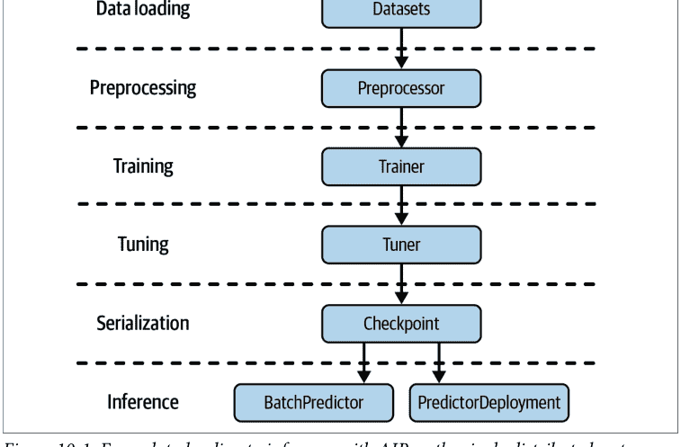

### Ray 数据集与预处理器

在 Ray AIR 中加载数据的标准方式是使用 Ray Datasets。AIR 预处理器用于将输入数据转换为机器学习实验的特征。我们已经在第 7 章简要介绍过预处理器，但尚未在 AIR 的背景下讨论它们。

由于 Ray AIR 预处理器在数据集上操作并利用 Ray 生态系统，它们允许你高效地扩展预处理步骤。在训练期间，AIR 预处理器会*拟合*到指定的训练数据，然后可用于训练和推理。¹ AIR 附带了许多常见的预处理器，涵盖了多种用例。如果你找不到所需的预处理器，你可以轻松地自行定义一个自定义预处理器。

在我们的示例中，我们首先希望使用 `read_csv` 工具从 S3 存储桶读取一个 CSV 文件到列式数据集中。然后，我们将数据集拆分为训练集和测试集，并定义一个 AIR 预处理器 `StandardScaler`，它将数据集的所有指定列标准化为均值为 0、方差为 1。请注意，仅指定预处理器并不会立即转换数据。以下是实现方式：

```python
import ray
from ray.data.preprocessors import StandardScaler

dataset = ray.data.read_csv(
    "s3://anonymous@air-example-data/breast_cancer.csv"
) ❶

train_dataset, valid_dataset = dataset.train_test_split(test_size=0.2)
test_dataset = valid_dataset.drop_columns(cols=["target"]) ❷

preprocessor = StandardScaler(columns=["mean radius", "mean texture"]) ❸
```

- ❶ 使用 Ray Datasets 从 S3 加载乳腺癌 CSV 文件。
- ❷ 定义训练集和测试集后，我们在测试数据上删除目标列。
- ❸ 定义一个 AIR 预处理器，将数据集的两个变量缩放为正态分布。

> ¹ 这使你的训练和推理管道保持一致，这使得使用 AIR 非常方便，因为你不必为不同的用例重新实现管道。

请注意，为简单起见，我们在未来的训练中也将测试集用作验证集，因此采用了这种命名约定。

在继续 AIR 工作流中的训练步骤之前，让我们看看可用的不同类型的 AIR 预处理器（表 10-1）。如果你想了解更多关于所有可用预处理器的信息，可以查阅该主题的用户指南。在本书中，我们仅使用预处理器进行特征缩放，但其他类型的 Ray AIR 预处理器也可能非常有用。

表 10-1. Ray AIR 预处理器

| 预处理器类型 | 示例 |
|---|---|
| 特征缩放器 | MaxAbsScaler, MinMaxScaler, Normalizer, PowerTransformer, StandardScaler |
| 通用预处理器 | BatchMapper, Chain, Concatenator, SimpleImputer |
| 类别编码器 | Categorizer, LabelEncoder, OneHotEncoder |
| 文本编码器 | Tokenizer, FeatureHasher |

### 训练器

一旦你准备好了训练集和测试集，并定义了预处理器，你就可以继续指定一个训练器，该训练器在你的数据上运行机器学习算法。Ray Train 包中的训练器在第 7 章已经介绍过；它们为 TensorFlow、PyTorch 或 XGBoost 等训练框架提供了一致的封装。在本例中，我们将重点介绍后者，但重要的是要注意，所有其他框架集成在 Ray API 方面的工作方式完全相同。

让我们定义一个所谓的 XGBoostTrainer，这是 Ray AIR 附带的众多特定训练器实现之一。定义这样的训练器需要你指定以下参数：

- 一个 AIR ScalingConfig，描述你希望如何在 Ray 集群上扩展训练
- 一个 label_column，指定你的数据集中的哪一列用作 XGBoost 监督学习中的标签
- 一个 datasets 参数，至少包含一个 train 键和一个可选的 valid 键，分别指定训练集和验证集
- 一个 AIR 预处理器，用于计算你的机器学习模型的特征
- 框架特定的参数（例如，XGBoost 中的提升轮数），以及一组称为 params 的通用参数，如图 10-2 所示：

```python
from ray.air.config import ScalingConfig
from ray.train.xgboost import XGBoostTrainer

trainer = XGBoostTrainer(
    scaling_config=ScalingConfig(
        num_workers=2,
        use_gpu=False,
    ),
    label_column="target",
    num_boost_round=20,
    params={
        "objective": "binary:logistic",
        "eval_metric": ["logloss", "error"],
    },
    datasets={"train": train_dataset, "valid": valid_dataset},
    preprocessor=preprocessor,
)
result = trainer.fit()
print(result.metrics)
```

- ❶ 每个训练器都附带一个缩放配置。这里我们使用两个 Ray 工作节点，不使用 GPU。
- ❷ XGBoostTrainers 需要特定的配置，以及训练目标和要跟踪的评估指标。
- ❸ 训练器指定了它要操作的数据集。²
- ❹ 同样，你可以提供训练器应使用的 AIR 预处理器。
- ❺ 一切定义完成后，只需一个简单的 `fit` 调用即可启动训练过程。

训练器提供了可扩展的机器学习训练，操作 AIR 数据集和预处理器。除此之外，它们还被设计为与 Ray Tune 良好集成以进行超参数优化，我们接下来将看到。

总结本节，图 10-2 展示了 AIR 训练器如何在给定 AIR 预处理器和缩放配置的情况下，在 Ray 数据集上拟合机器学习模型。

> ² 从技术上讲，并非每个训练器都需要指定 `datasets` 参数。你也可以使用框架特定的数据加载器，尽管我们无法在此处展示任何示例。

### 调优器与检查点

*调优器*是随 Ray 2.0 作为 AIR 的一部分引入的，它通过 Ray Tune 提供可扩展的超参数调优功能。调优器可与 AIR 训练器无缝协作，同时也支持任意训练函数。在我们的示例中，你无需像上一节那样在训练器实例上调用 `fit()`，而是可以将训练器传递给调优器。为此，需要使用一个参数空间（即所谓的 TuneConfig）来实例化调优器。此配置包含所有 Tune 特定的配置，例如你想优化的指标，以及一个可选的 RunConfig，用于配置运行时特定的方面，如 Tune 运行的日志详细程度。

继续使用我们之前定义的 XGBoostTrainer，以下是如何将该训练器实例包装在调优器中，以校准 XGBoost 模型的 `max_depth` 参数：

```python
from ray import tune

param_space = {"params": {"max_depth": tune.randint(1, 9)}}
metric = "train-logloss"

from ray.tune.tuner import Tuner, TuneConfig
from ray.air.config import RunConfig

tuner = Tuner(
    trainer,
    param_space=param_space,
    run_config=RunConfig(verbose=1),
    tune_config=TuneConfig(num_samples=2, metric=metric, mode="min"),
)
result_grid = tuner.fit()

best_result = result_grid.get_best_result()
print("Best Result:", best_result)
```

1. 使用训练器实例初始化你的调优器，该训练器指定了运行的扩展配置。
2. 你的调优器还需要一个 `param_space` 进行搜索。
3. 它还需要一个专用的 `TuneConfig` 来告诉 Tune 如何根据其参数空间优化你的训练器。
4. 调优器的运行方式与训练器相同，即调用 `.fit()`。

每当你运行 AIR 训练器或调优器时，它们都会生成特定于框架的检查点。你可以使用这些检查点来加载模型，以便在多个 AIR 库（如 Tune、Train 或 Serve）中使用。你可以通过访问训练器或调优器的 `.fit()` 调用结果来获取检查点。在我们的示例中，这意味着你可以简单地访问 `best_result` 对象上的检查点，或 `result_grid` 中的任何其他条目，如下所示：

```python
checkpoint = best_result.checkpoint
print(checkpoint)
```

使用检查点的另一种主要方式是从现有的、特定于框架的模型创建一个。AIR 支持的每个 ML 框架都可以用来完成此操作，但由于使用它定义一个简单模型最为容易，我们将向你展示如何为顺序 TensorFlow Keras 模型实现这一点：

```python
from ray.train.tensorflow import TensorflowCheckpoint
import tensorflow as tf

model = tf.keras.Sequential([
    tf.keras.layers.InputLayer(input_shape=(1,)),
    tf.keras.layers.Dense(1)
])

keras_checkpoint = TensorflowCheckpoint.from_model(model)
```

拥有检查点非常棒，因为它们是 AIR 的原生模型交换格式。你也可以使用它们在后续阶段获取训练好的模型，而无需担心存储和加载相关模型的自定义方式。图 10-3 示意性地展示了 AIR 调优器如何与 AIR 训练器协同工作。

### 批量预测器

一旦你通过 AIR 训练了一个模型（即通过拟合训练器或调优器），你就可以使用生成的 AIR 检查点在 Python 中对批量数据进行预测。为此，你需要从检查点创建一个 BatchPredictor，然后在其 Dataset 上使用其 predict 方法。在我们的案例中，我们需要使用预测器的特定于框架的类，即 XGBoostPredictor，来告诉 AIR 如何正确加载检查点：

```python
from ray.train.batch_predictor import BatchPredictor
from ray.train.xgboost import XGBoostPredictor

checkpoint = best_result.checkpoint
batch_predictor = BatchPredictor.from_checkpoint(checkpoint, XGBoostPredictor) ❶

predicted_probabilities = batch_predictor.predict(test_dataset) ❷
predicted_probabilities.show()
```

❶ 将 XGBoost 模型从检查点加载到 BatchPredictor 对象中。
❷ 在我们的测试数据集上运行批量推理以获取预测概率。

这可以在图 10-4 中可视化。

### 部署

你可以利用 Ray Serve 部署一个推理服务，通过 HTTP 进行查询，而不是使用 BatchPredictor 并直接与相关模型交互。你可以通过使用 PredictorDeployment 类并使用我们的检查点来部署它。唯一稍微棘手的部分是，我们的模型操作的是数据框，我们无法直接通过 HTTP 发送。这意味着我们需要明确告诉我们的预测服务如何获取并转换我们定义的 *payload* 并从中创建一个数据框。我们通过为部署指定一个 *adapter* 来实现这一点：³

```python
from ray import serve
from fastapi import Request
import pandas as pd
from ray.serve import PredictorDeployment

async def adapter(request: Request):
    payload = await request.json()
    return pd.DataFrame.from_dict(payload)

serve.start(detached=True)
deployment = PredictorDeployment.options(name="XGBoostService")

deployment.deploy(
    XGBoostPredictor,
    checkpoint,
    http_adapter=adapter
)

print(deployment.url)
```

1. 适配器接收一个 HTTP 请求对象，并返回我们的模型接受的数据格式。
2. 启动 Serve 后，我们可以为我们的模型创建一个部署。
3. 要实际部署部署对象，我们需要传入模型检查点、适配器函数以及用于正确模型加载的 XGBoostPredictor 类。

> ³ 如果你从 Jupyter notebook 运行以下示例，你不必担心它会阻塞 notebook——它会运行得很好。像这样启动服务器通常实现为阻塞调用，但 PredictorDeployment 不是。

要测试此部署，让我们从测试数据中创建一些示例输入，可以将其发送到我们的服务。为简单起见，我们获取测试数据集的第一项并将其转换为 Python 字典，以便通用的 Requests 库可以向我们的部署 URL 发送请求：

```python
import requests

first_item = test_dataset.take(1)
sample_input = dict(first_item[0])

result = requests.post(
    deployment.url,
    json=[sample_input]
)
print(result.json())

serve.shutdown()
```

1. 使用 requests 将我们的 sample_input 发送到 deployment.url。
2. 使用完服务后，你可以安全地关闭 Ray Serve。

图 10-5 总结了使用 PredictorDeployment 类的 AIR 部署如何工作。

图 10-6 为你提供了 Ray AIR 中涉及的所有组件和概念的快速视觉概览，包括本章涵盖的所有主要 AIR 组件的伪代码。

需要再次强调的是，我们在这个示例中使用了 *单个 Python 脚本* 和 Ray AIR 中的单个分布式系统来完成所有繁重的工作。事实上，你可以使用此示例脚本并将其扩展到使用 CPU 进行预处理、GPU 进行训练的大型集群，并通过修改该脚本中的扩展配置参数和类似选项来单独配置部署。这并不像看起来那么容易或常见，数据科学家通常不得不使用多个框架（例如，一个用于数据加载和处理，一个用于训练，一个用于服务）的情况并不少见。

你也可以将 Ray AIR 与 RLlib 一起使用，但集成仍处于早期阶段。例如，要将 RLlib 与 AIR 训练器集成，你需要使用 `RLTrainer`，它允许你传入所有你将传递给标准 RLlib 算法的参数。训练完成后，你可以将生成的 RL 模型存储在 AIR 检查点中，就像使用任何其他 AIR 训练器一样。要部署你训练好的 RL 模型，你可以使用 Serve 的 `PredictorDeployment` 类，传入你的检查点以及 `RLPredictor` 类。

此 API 可能会发生变化，但你可以在 [AIR 文档](https://docs.ray.io/en/latest/ray-air/index.html) 中看到一个关于其工作原理的示例。

### 适合 AIR 的工作负载

既然我们已经看到了 AIR 及其基本概念的示例，让我们稍微退一步，从原则上讨论你可以用它运行哪些类型的工作负载。我们已经在本书中处理了所有这些工作负载，但系统地回顾一下它们是很好的。顾名思义，AIR 旨在捕获 AI 项目中的常见任务。这些任务可以大致分类如下：

*无状态计算*

像预处理数据或在一批数据上计算模型预测这样的任务是无状态的。无状态工作负载可以独立并行计算。如果你回想一下我们在 [第 2 章](https://docs.ray.io/en/latest/ray-core/tasks.html) 中对 Ray 任务的讨论，无状态计算正是它们的设计目的。AIR 主要使用 Ray 任务处理无状态工作负载。许多 *大数据处理* 工具属于此类。

*有状态计算*

相比之下，模型训练和超参数调优是有状态操作，因为它们在各自的训练过程中会更新模型状态。在这种 *分布式训练* 中更新有状态工作者是一个困难的问题，Ray 会为你处理。AIR 使用 Ray actors 进行有状态计算。

*复合工作负载*

结合无状态和有状态计算，例如先处理特征然后训练模型，在 AI 工作负载中相当常见。事实上，端到端项目很少只使用其中一种。以分布式方式运行这种高级复合工作负载可以描述为 *大数据处理*。

⁴ 当然，用于推理的模型必须首先加载，但由于其参数在预测期间不会改变，训练好的模型在这种情况下可以被视为静态数据。我们有时将这种情况称为 *软状态*。

⁵ 有时 AIR 出于性能原因使用 Ray actors 处理无状态任务，例如在批量推理中缓存模型。

*数据训练*，而 AIR 被构建为能够高效处理无状态和有状态部分。

### 在线服务

最后，AIR 被构建为能够处理（多个）模型的可扩展在线服务。从前面三种工作负载到服务的转换在设计上是无缝的，因为你仍然在同一个 AIR 生态系统中操作。

图 10-7 展示了 Ray AIR 的典型无状态任务。

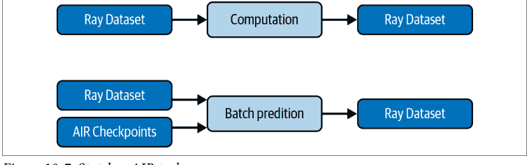

这四个任务直接映射到 Ray 的库。例如，在本章中，我们已经讨论了 Ray Datasets 用于无状态计算的几种方式。你可以通过将从 AIR Checkpoint 加载的 BatchPredictor 传递给给定的 Dataset 来运行批量推理。或者你可以预处理一个 Dataset 以生成用于后续训练的特征。⁶

同样，有三个 AIR 库专门用于有状态计算，即 Train、Tune 和 RLlib。正如我们所看到的，Train 和 RLlib 都通过将各自的 Trainer 对象传递给 Tuner，与 AIR 中的 Tune 无缝集成。

当涉及到高级复合工作负载时，Ray AIR 及其对任务和 Actor 的组合使用确实表现出色。例如，一些机器学习训练过程需要在训练期间执行复杂的数据处理任务。其他可能需要在每个 epoch 之前打乱训练数据集。由于 Ray AIR 的训练库（基于 Actor）可以无缝利用数据处理操作（主要基于任务），因此即使是最复杂的用例也可以在 AIR 中体现出来。

此外，由于你可以将任何 AIR Checkpoint 与 Ray Serve 一起使用，AIR 使得使用相同的基础设施从训练切换到服务工作负载变得容易。我们已经看到如何使用 PredictorDeployment 在 HTTP 端点后面托管模型，该端点针对低延迟和高吞吐量进行了优化。通过部署 AIR，你可以将预测服务扩展到多个副本，并使用 Ray 的自动扩展功能根据入站流量调整集群。⁷

你也可以在不同的场景中使用这些类型的工作负载。例如，你可以使用 AIR 来替换和扩展现有管道的单个组件。或者你可以使用 AIR 创建自己的端到端机器学习应用程序，正如我们在本章中指出的那样。最后，你还可以使用 AIR 构建自己的 AI 平台，这是我们在第 11 章将要探讨的主题。

图 10-8 总结了这四种类型的 AI 工作负载如何作为 Ray 生态系统的一部分被 AIR 覆盖。

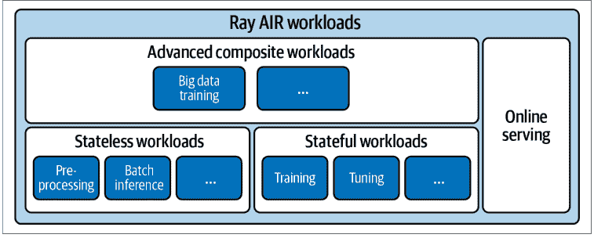

图 10-8. AIR 使你能够在 Ray 集群上运行的四种 AI 工作负载

接下来，我们将更详细地讨论 AIR 的这四种工作负载类型的几个方面。具体来说，我们将研究 Ray 如何在内部执行这些工作负载。此外，我们将更深入地探讨 Ray AIR 背后的技术方面，例如它如何管理内存或处理故障。我们只能对这些主题进行简要概述，但会在过程中提供指向更高级材料的链接。

### AIR 工作负载执行

让我们更仔细地看看 AIR 的执行模型。

#### 无状态执行

Ray Datasets 使用 Ray 任务或 Actor 来执行转换。任务是首选，因为它们允许更简单和更灵活的调度。Datasets 库使用一种调度策略，将任务及其输出均匀地平衡到你的集群中。

如果转换有状态或需要昂贵的设置（如加载大型模型检查点），则使用 Actor。在这种情况下，在 Actor 中加载大型模型一次以重复用于推理任务可以提高整体性能。当 Ray Datasets 使用 Actor 时，这些 Actor 首先被创建，并在执行相关转换之前将必要的数据（在我们的示例中是加载的模型）传输给它们。

通常，数据集存储在 Ray 对象存储内存中，而大型数据集会溢出到磁盘。但对于无状态转换，通常没有必要将中间结果保留在内存中。使用我们在第 6 章中展示的 Datasets 上的*流水线*，数据可以改为在存储之间流式传输以提高性能。⁸ 其思想是仅加载当前执行转换所需的数据部分。这可以显著减少转换的内存占用，并通常加快整体执行速度。

#### 有状态执行

Ray Train 和 RLlib 为其分布式训练工作节点生成 Actor。正如多次演示的那样，这两个库也与 Tune 无缝集成。在第 5 章中，我们详细介绍了 Tune 如何启动试验，这些试验本质上是执行特定工作负载的 Actor 组。如果你将 Train 或 RLlib 与 Tune 一起使用，这反过来意味着会创建一个 Actor 树，即每个 Tune 试验一个 Actor，以及 Train 或 RLlib 请求的并行训练工作节点的子 Actor。

在工作负载执行方面，这自然创建了一个内层和一个外层。Tune 试验中的每个子 Actor 对其工作负载拥有完全自主权，如你指定的相应 Train 或 RLlib 训练运行中所要求的。这代表了内层执行。在外层，Tune 需要监控各个试验的状态，它通过定期向试验驱动程序报告指标来实现。图 10-9 说明了此场景下 Ray Actor 的这种嵌套创建和执行。

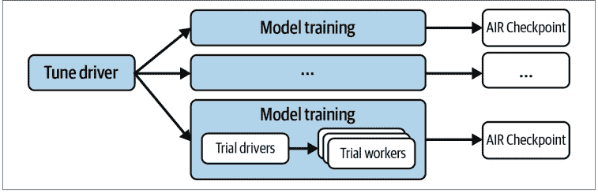

图 10-9. 使用 Tune 在 AIR 上运行分布式训练

#### 复合工作负载执行

复合工作负载同时利用基于任务和基于 Actor 的计算。这可能导致有趣的资源分配挑战。试验 Actor 需要预先保留其资源，但无状态任务则不需要。你可能遇到的问题是，所有可用资源可能都被你的训练 Actor 预留，而没有剩余资源用于数据加载任务。

AIR 通过允许 Tune 最多保留节点 CPU 的 80% 来防止这种情况。你可以调整此参数，但这是一个合理的默认值，可确保无状态计算的基本资源可用性。在你的训练操作利用 GPU 而数据处理步骤不利用的常见情况下，这将成为一个非问题。

#### 在线服务执行

对于在线服务，Ray Serve 管理一个无状态 Actor 池来服务你的请求。一些 Actor 监听传入的请求，并调用其他 Actor 来执行预测。请求使用轮询算法自动负载均衡到托管模型的 Actor 池。负载指标被发送到 Serve 组件以执行自动扩展。

### AIR 内存管理

在本节中，我们将深入探讨 AIR 的特定内存管理技术。我们将讨论 AIR 在多大程度上使用 Ray 对象存储。如果你觉得它太技术性，可以跳过本节。要点是 Ray 采用了智能技术，确保你的数据和计算得到适当的分发和调度。

当你使用 Ray Datasets 加载数据时，你已经知道这些 Datasets 在内部被分区为集群中的数据块。一个块只是 Ray 对象的集合。选择正确的块大小很困难，并且需要在管理过多小块的开销和因块过大而导致内存不足（OOM）异常的风险之间进行权衡。AIR 采取务实的方法，尝试以不超过 512 MB 的块大小进行分发。如果无法确保这一点，将发出警告。如果一个块无法放入内存，AIR 将把你的数据溢出到本地磁盘。

你的有状态工作负载将不同程度地使用 Ray 对象存储。例如，RLlib 使用 Ray 对象将模型权重广播到各个 rollout 工作节点，并用于经验数据收集。Tune 使用它通过发送和检索 AIR Checkpoint 来设置试验。出于技术原因，如果 Actor 太多，可能会遇到 OOM 问题。

---
⁶ 注意，预处理器*可以*是有状态的，但我们在此未讨论该场景的任何示例。

⁷ 除了单个模型的多个副本外，AIR 还支持部署多个模型。这允许你组合多个模型或运行 A/B 测试。

⁸ 所有关键的 AIR 组件，如 Trainer 或 BatchPredictor，都支持此流水线功能。

相对于分配的资源，需要大量的内存。⁹ 如果你提前知道内存需求，可以在 `ScalingConfig` 中相应地调整内存，或者直接请求额外的 CPU 资源。

在复合工作负载中，有状态的参与者（例如用于训练）必须访问无状态任务（例如用于预处理）创建的数据，这使得内存分配更具挑战性。让我们来看两个场景：

- 如果负责训练的参与者有足够的空间（在对象存储中）将所有训练数据放入内存，情况就很简单。首先运行预处理步骤，然后将所有数据块下载到相应的节点。训练参与者随后只需迭代保留在内存中的数据。
- 否则，数据处理需要*流水线执行*，这意味着数据将由任务实时处理，然后由训练参与者按需下载。如果相应的训练参与者与执行处理的节点位于同一节点，数据将从共享内存中检索。

### AIR 故障模型

AIR 通过*谱系重建*为大多数无状态计算提供容错性。这意味着如果数据集块因节点故障而丢失，Ray 将通过重新提交必要的任务来重建它们，从而使工作负载能够扩展到大型集群。请注意，容错不适用于主节点故障。存储集群元数据的全局控制服务（GCS）崩溃将终止集群中的所有作业。¹⁰

涉及有状态计算的作业主要依赖于基于检查点的容错。Tune 将根据其故障配置中设置的检查点间隔，从最后一个检查点重新启动分布式试验。这意味着 Tune 可以有效地在由“Spot 实例”组成的集群上运行试验。此外，在整个集群故障的情况下，可以从实验范围的检查点恢复整个 Tune 实验。

复合工作负载继承了无状态和有状态工作负载的容错策略，兼得两者之长。这意味着谱系重建适用于工作负载的无状态部分，而应用级检查点仍然适用于整体计算。

⁹ 有状态工作负载使用 Python 的堆内存，该内存不由 Ray 管理。
¹⁰ GCS 可以部署在*高可用性*（HA）模式下以防止这种情况，但这通常仅对在线服务工作负载有益。

### 自动扩展 AIR 工作负载

AIR 库可以在我们在第 9 章介绍的自动扩展 Ray 集群上运行。对于无状态工作负载，如果有排队的任务（或排队的数据集计算参与者），Ray 将自动扩展。对于有状态工作负载，如果有待处理的放置组（即 Tune 试验）尚未在集群中调度，Ray 将自动扩展。当节点空闲时，Ray 将自动缩减。当节点上没有资源使用，并且内存中或磁盘上没有 Ray 对象时，该节点被视为空闲。由于大多数 AIR 库利用对象，这意味着如果节点持有其他节点上的工作线程引用的对象（例如另一个试验使用的数据集块），则可能会保留这些节点。

你应该意识到，自动扩展可能导致集群中的数据平衡不理想，因为较早启动的节点在其生命周期内自然会运行更多任务。考虑限制（例如从某个最小集群大小开始）或禁用自动扩展，以优化数据密集型工作负载的效率。

### 总结

在本章中，你已经了解了我们介绍的所有 Ray 库如何协同工作形成 Ray AI Runtime。你已经了解了所有关键概念，这些概念使你能够构建可扩展的机器学习项目，从实验到生产。特别是，你已经了解了 Ray Datasets 如何用于无状态计算（如特征预处理），以及 Ray Train、Tune 和 RLib 如何用于有状态计算（如模型训练）。在复杂的 AI 工作负载中无缝结合这些类型的计算并将其扩展到大型集群是 AIR 的一个关键优势。部署你的 AIR 项目基本上是免费的，因为 AIR 也完全集成了 Ray Serve。

在第 11 章中，我们将向你展示 Ray，特别是 AIR，如何融入更广泛的工具领域。了解 Ray 生态系统的丰富集成和扩展将帮助你了解如何在自己的项目中利用 Ray。

# 第 11 章

## Ray 的生态系统及更多

在本书的过程中，你已经看到了许多 Ray 生态系统的例子。现在是时候采取更系统的方法，向你展示目前可用于 Ray 的完整集成范围。我们通过从 Ray AIR 的角度讨论这个生态系统来做到这一点，以便我们可以在代表性的 AIR 工作流的背景下进行讨论。

显然，我们无法为 Ray 生态系统中的大多数库提供具体的代码示例。相反，我们只能满足于给你另一个 Ray AIR 示例，展示一些集成，并讨论其他可用的集成以及如何使用它们。在适当的地方，我们将为你指出更高级的资源以加深你的理解。

既然你对 Ray 及其库有了更多了解，本章也是比较 Ray 提供的功能与*类似*系统的合适场所。正如你所看到的，Ray 的生态系统相当复杂，可以从不同的角度看待，并用于不同的目的。这意味着 Ray 的许多方面都可以与市场上的其他工具进行比较。

我们还将评论如何将 Ray 集成到现有机器学习平台的更复杂工作流中。最后，我们将让你了解在完成本书后如何继续你的*学习 Ray*之旅。


本章的笔记本可在 [GitHub](https://github.com) 上找到。

### 不断发展的生态系统

为了通过一个具体的例子让你一窥 Ray 的生态系统，¹ 我们将向你展示如何使用 Ray AIR 与 PyTorch 生态系统中的数据和模型，如何将你的超参数调优运行记录到 MLflow，以及如何使用 Ray 的 Gradio 集成部署你训练好的模型。在此过程中，我们将概述并讨论其他值得注意的集成在每个相应阶段的使用模式。

要跟随本章的代码示例，请确保在你的 Python 环境中安装以下依赖项：

```
pip install "ray[air, serve]==2.2.0" "gradio==3.5.0" "requests==2.28.1"
pip install "mlflow==1.30.0" "torch==1.12.1" "torchvision==0.13.1"
```

我们将使用 PyTorch 框架中的工具加载和转换数据集，然后将此数据转换为 Ray Dataset，以便在 Ray AIR 中使用它。然后，我们定义一个标准的 PyTorch 模型和一个简单的训练循环，我们可以在 Ray Train 中利用它。接下来，我们将这个 TorchTrainer 包装在 Tuner 中，并使用 Ray Tune 附带的 MLflowLogger 将试验结果记录到 MLflow。最后，我们将使用运行在 Ray Serve 上的 Gradio 来提供我们训练好的模型。

换句话说，我们讨论的示例采用了你可能已经在使用的常见 Python 数据科学库，并通过利用 Ray 的生态系统集成将它们包装在 AIR 工作流中。重点更多地放在这些集成以及它们如何与 AIR 接口，而不是具体的用例上。

### 数据加载和处理

在第 6 章中，你了解了 Ray Datasets 的基础知识，如何从常见的 Python 数据结构创建它们，如何从 S3 等存储系统加载 Parquet 文件，以及如何使用 Ray 的 Dask on Ray 集成与 Dask 接口。

为了给你另一个 Ray Dataset 功能的例子，让我们看看如何处理通过 PyTorch 的 torchvision 扩展加载的图像数据。想法很简单。我们将通过 torchvision.datasets 包加载 PyTorch 中可用的常见 CIFAR-10 数据集，然后将其转换为 Ray Dataset。具体来说，我们将定义一个名为 load_cifar 的函数，该函数返回用于训练或测试的 CIFAR-10 数据：

> ¹ 你可以在 Ray 文档中找到 AIR 生态系统当前的集成列表。更一般地说，你可以在 Ray 生态系统页面上找到 Ray 的集成列表。在后者中，你会发现比我们在此讨论的更多的集成，例如 ClassyVision、Intel Analytics Zoo、John Snow Labs 的 NLU、Ludwig AI、PyCaret 和 SpaCy。

from torchvision import transforms, datasets

```python
def load_cifar(train: bool):
    transform = transforms.Compose([
        transforms.ToTensor(),
        transforms.Normalize((0.5, 0.5, 0.5), (0.5, 0.5, 0.5))
    ])

    return datasets.CIFAR10(
        root="./data",
        download=True,
        train=train,
        transform=transform
    )
```

1.  使用 PyTorch 的 transform 来返回归一化的 Tensor 数据。
2.  使用 torchvision 包的 datasets 模块加载 CIFAR-10 数据集。
3.  使得加载函数可以返回训练数据或测试数据。

请注意，到目前为止我们还没有接触任何 Ray 库，你也可以用同样的方式使用 PyTorch 中的任何其他数据集或 transform。为了获得可与 AIR 配合使用的 Ray Datasets，我们将把我们的 `load_cifar` 数据加载函数提供给 Ray AIR 的 `from_torch` 工具：

```python
from ray.data import from_torch

train_dataset = from_torch(load_cifar(train=True))
test_dataset = from_torch(load_cifar(train=False))
```

CIFAR-10 数据集用于图像分类任务；它由 32 像素的方形图像组成，并带有总共 10 个类别的标签。到目前为止，我们只以 PyTorch 提供的形式加载了这个数据集，但我们仍然需要对其进行转换才能与 AIR Trainer 一起使用。你可以通过创建一个 `image` 列和一个 `label` 列来实现这一点，然后我们就可以在 Trainer 中引用它们。最好的方法是将训练和测试数据的 *批次映射* 到一个包含这两个列的 NumPy 数组字典：

```python
import numpy as np

def to_labeled_image(batch):
    return {
        "image": np.array([image.numpy() for image, _ in batch]),
        "label": np.array([label for _, label in batch]),
    }

train_dataset = train_dataset.map_batches(to_labeled_image)
test_dataset = test_dataset.map_batches(to_labeled_image)
```

1.  通过返回一个图像和一个标签的 NumPy 数组来转换每个数据批次。
2.  应用 map_batches 来转换我们初始的数据集。

在我们继续进行模型训练之前，表 11-1 展示了 Ray Datasets 库支持的输入格式。²

表 11-1. Ray Datasets 生态系统

| 集成 | 类型 | 描述 |
|---|---|---|
| 文本、二进制、图像文件、CSV、JSON | 基础数据格式 | 支持此类基础格式严格来说不应被视为一种集成，但值得了解的是 Ray Datasets 可以加载和存储这些格式。 |
| NumPy、Pandas、Arrow、Parquet、Python 对象 | 高级数据格式 | Ray Datasets 支持与常见的 ML 数据库（如 NumPy 和 Pandas）一起工作，但也可以读取自定义 Python 对象或读取 Parquet 文件。 |
| Spark、Dask、MARS、Modin | 高级第三方集成 | Ray 通过社区集成与更复杂的数据处理系统进行互操作，例如 Ray 上的 Spark (RayDP)、Ray 上的 Dask、Ray 上的 MARS 或 Ray 上的 Pandas (Modin)。 |

我们将在第 227 页的“分布式 Python 框架”中更详细地讨论 Ray 与 Dask 或 Spark 等系统的关系。

### 模型训练

在使用 Ray Datasets 将我们的 CIFAR-10 数据正确塑形为训练和测试数据后，我们现在可以定义一个分类器来训练我们的数据。由于这可能是最自然的场景，我们将在这里定义一个 PyTorch 模型来定义一个 AIR Trainer。但值得提醒你的是你在第 7 章学到的内容：你也可以在这一点上轻松切换框架，使用 Keras、Hugging Face、scikit-learn 或任何其他 AIR 支持的库。

我们将分三步进行：定义一个 PyTorch 模型，指定 AIR 应使用此模型运行的训练循环，并定义一个 AIR Trainer，我们可以将其拟合到我们的训练数据上。首先，让我们用 PyTorch 定义一个简单的卷积神经网络，它具有最大池化和修正线性单元 (relu) 激活函数，旨在我们的 CIFAR-10 数据集上运行。如果你了解 PyTorch，以下神经网络 Net 的定义应该很直接。如果你不了解，只需知道要定义一个 `torch.nn.Module`，你唯一需要提供的就是神经网络的前向传播定义：

```python
import torch
import torch.nn as nn
import torch.nn.functional as F

class Net(nn.Module):
    def __init__(self):
        super().__init__()
        self.conv1 = nn.Conv2d(3, 6, 5)
        self.pool = nn.MaxPool2d(2, 2)
        self.conv2 = nn.Conv2d(6, 16, 5)
        self.fc1 = nn.Linear(16 * 5 * 5, 120)
        self.fc2 = nn.Linear(120, 84)
        self.fc3 = nn.Linear(84, 10)

    def forward(self, x):
        x = self.pool(F.relu(self.conv1(x)))
        x = self.pool(F.relu(self.conv2(x)))
        x = torch.flatten(x, 1)
        x = F.relu(self.fc1(x))
        x = F.relu(self.fc2(x))
        x = self.fc3(x)
        return x
```

你已经知道，要为我们的 Net 定义一个 AIR TorchTrainer，你需要一个训练数据集、一个 scaling 配置和一个可选的运行配置。³ 你还需要通过定义一个显式的训练循环来告诉 AIR 每个 worker 在调用 fit 时应该做什么，这为你提供了训练过程的最大灵活性。训练函数接受一个 config 字典，我们可以用它来在运行时指定属性。

我们在这里使用的训练循环正是你所期望的：我们只需在每个 worker 上加载模型和数据，然后在指定的 epoch 数内对数据批次进行训练（同时报告训练进度）。这是一个相当标准的训练循环，但有几个关键点你必须注意：

- 要在 worker 上加载模型，请使用 `ray.train.torch` 中的 `prepare_model` 工具来处理我们的 `Net()`。
- 要访问 worker 可用的数据分片，请访问你当前 `ray.air.session` 上的 `get_dataset_shard`。对于训练，我们使用该分片的 "train" 键，并使用 `iter_torch_batches` 将其转换为正确大小的批次。
- 要传递你感兴趣的训练指标信息，请使用 AIR 的 session.report。

以下是我们为每个 worker 定义的完整 PyTorch 训练循环：

```python
from ray import train
from ray.air import session, Checkpoint

def train_loop(config):
    model = train.torch.prepare_model(Net())
    loss_fct = nn.CrossEntropyLoss()
    optimizer = torch.optim.SGD(model.parameters(), lr=0.001, momentum=0.9)

    train_batches = session.get_dataset_shard("train").iter_torch_batches(
        batch_size=config["batch_size"],
    )

    for epoch in range(config["epochs"]):
        running_loss = 0.0
        for i, data in enumerate(train_batches):
            inputs, labels = data["image"], data["label"]

            optimizer.zero_grad()
            forward_outputs = model(inputs)
            loss = loss_fct(forward_outputs, labels)
            loss.backward()
            optimizer.step()

            running_loss += loss.item()
            if i % 1000 == 0:
                print(f"[{epoch + 1}, {i + 1:4d}] loss: "
                      f"{running_loss / 1000:.3f}")
                running_loss = 0.0

        session.report(
            dict(running_loss=running_loss),
            checkpoint=Checkpoint.from_dict(
                dict(model=model.module.state_dict())
            ),
        )
```

1.  训练循环首先定义了使用的模型、损失函数和优化器。注意这里使用了 prepare_model。
2.  在此 worker 上加载训练数据集分片，并创建一个包含其数据批次的迭代器。
3.  根据我们之前的定义，我们的数据是一个具有 "image" 和 "label" 列的 Pandas DataFrame。
4.  在训练循环中计算前向和反向传播，就像我们使用任何 PyTorch 模型一样。
5.  跟踪每 1,000 个训练批次的运行损失项。
6.  最后，通过传递一个包含当前模型状态的 Checkpoint，使用我们的 AIR session 报告此损失。

考虑到我们正在执行一个相当标准的训练过程，这个函数的定义可能感觉有点长。虽然在这种情况下为 PyTorch 模型创建一个简单的包装器当然是可能的，但定义你自己的训练循环可以让你完全自定义以处理更复杂的场景。我们将 training_loop 传递给 AIR trainer 的 train_loop_per_worker 参数，并通过将包含必要键的字典传递给 train_loop_config 来指定此循环的配置。

为了使事情更有趣并展示另一个 Ray 集成，我们将通过向我们的 RunConfig 传递一个回调来将 TorchTrainer 训练运行的结果记录到 MLflow，即一个 MLflowLoggerCallback：

```python
from ray.train.torch import TorchTrainer
from ray.air.config import ScalingConfig, RunConfig
from ray.air.callbacks.mlflow import MLflowLoggerCallback

trainer = TorchTrainer(
    train_loop_per_worker=train_loop,
    train_loop_config={"batch_size": 10, "epochs": 5},
    datasets={"train": train_dataset},
    scaling_config=ScalingConfig(num_workers=2),
    run_config=RunConfig(callbacks=[
        MLflowLoggerCallback(experiment_name="torch_trainer")
    ])
)
result = trainer.fit()
```

你也可以通过向你的 AIR Trainer 或 Tuner 传递类似的回调来使用其他第三方日志库，例如 *Weights & Biases* 或 *CometML*。⁴

² 你可以在 Ray Datasets 文档中看到持续更新的支持格式列表。Datasets 支持的输出格式与输入格式在很大程度上重叠。

³ 例如，使用 WandbLoggerCallback，你不仅可以将训练结果记录到 Weights & Biases，还可以自动上传你的检查点，如本 Ray 教程所示。

表 11-2 总结了 Ray 所有与机器学习训练相关的集成，这些集成涵盖了 Ray Train 和 RLlib。

表 11-2. Ray Train 和 RLlib 生态系统

| 集成 | 类型 |
|---|---|
| TensorFlow, PyTorch, XGBoost, LightGBM, Horovod | 由 Ray 团队维护的 Train 集成 |
| scikit-learn, Hugging Face, Lightning | 由社区维护的 Train 集成 |
| TensorFlow, PyTorch, OpenAI gym | 由 Ray 团队维护的 RLlib 集成 |
| JAX, Unity | 由 Ray 团队维护的 RLlib 集成 |

我们区分了社区支持的集成和由 Ray 团队本身维护的集成。本书中讨论的大多数集成都是原生集成，但由于开源软件的协作性质，你通常感觉不到原生集成和第三方集成在成熟度上有什么差异。

为了总结 AIR 的训练相关集成，表 11-3 提供了 Tune 生态系统的鸟瞰图。

表 11-3. Ray Tune 生态系统

| 集成 | 类型 |
|---|---|
| Optuna, Hyperopt, Ax, BayesOpt, BOHB, Dragonfly, FLAML, HEBO, Nevergrad, SigOpt, skopt, ZOOpt | 超参数优化库 |
| TensorBoard, MLflow, Weights & Biases, CometML | 日志记录和实验管理 |

### 模型服务

Gradio 是从业者展示其机器学习模型的一种流行方式，它提供了许多简单的原语，只需通过 Python 中的 gradio 库描述它们，即可创建图形用户界面元素。正如你将看到的，定义和部署 Gradio 接口非常简单，但将其包装在 Ray Serve 的所谓 GradioServer 中则更为容易，这允许你在 Ray 集群上扩展任何 Gradio 应用。

为了展示如何使用 Ray Serve 在我们刚刚训练的模型上运行 Gradio 应用，我们首先将训练过程的结果存储到磁盘。我们通过将相应的 AIR 检查点写入我们选择的本地文件夹来实现这一点，以便我们可以在另一个脚本中*从检查点*恢复此模型：

```
CHECKPOINT_PATH = "torch_checkpoint"
result.checkpoint.to_directory(CHECKPOINT_PATH)
```

接下来，为了简单起见，让我们在 "torch_checkpoint" 路径旁边创建一个名为 `gradio_demo.py` 的文件。在此脚本中，让我们通过首先恢复 TorchCheckpoint，然后使用此检查点和我们的 Net() 定义来创建一个 TorchPredictor，从而再次加载我们的 PyTorch 模型，我们可以将其用于推理：

```
# gradio_demo.py
from ray.train.torch import TorchCheckpoint, TorchPredictor

CHECKPOINT_PATH = "torch_checkpoint"
checkpoint = TorchCheckpoint.from_directory(CHECKPOINT_PATH)
predictor = TorchPredictor.from_checkpoint(
    checkpoint=checkpoint,
    model=Net()
)
```

请注意，这要求你在 *gradio_demo.py* 脚本中导入或以其他方式提供 Net 的定义。⁵

接下来，我们必须定义 Gradio 接口，我们将其定义为接收图像作为输入并产生标签作为输出。此外，我们必须指定如何转换输入图像以产生标签。默认情况下，Gradio 将图像表示为 NumPy 数组，因此我们可以确保此数组具有正确的形状和数据类型，然后将其传递给我们的预测器。由于此预测器（即我们的 TorchPredictor）产生概率分布，我们取其预测的 argmax 以获得一个整数结果，我们可以将其用作标签。将以下代码放入你的 *gradio_demo.py* Python 脚本中：

```
from ray.serve.gradio_integrations import GradioServer
import gradio as gr
import numpy as np

def predict(payload): ①
    payload = np.array(payload, dtype=np.float32)
    array = payload.reshape((1, 3, 32, 32))
    return np.argmax(predictor.predict(array))

demo = gr.Interface( ②
    fn=predict,
    inputs=gr.Image(),
    outputs=gr.Label(num_top_classes=10)
)

app = GradioServer.options( ③
    num_replicas=2,
    ray_actor_options={"num_cpus": 2}
).bind(demo)
```

5 为简单起见，我们在 GitHub 上的 *gradio_demo.py* 中复制了 Net 的定义。

1. predict 函数通过利用我们的预测器将 Gradio 输入映射到输出。
2. Gradio 接口有一个输入（图像）、一个输出（CIFAR-10 数据集 10 个类别之一的标签）和一个连接两者的函数 fn。
3. 我们将 Gradio 演示绑定到一个 Ray Serve GradioServer 对象，该对象以两个副本部署，每个副本使用两个 CPU 作为资源。

要运行此应用程序，你现在只需在 shell 中输入以下命令：⁶

```
serve run gradio_demo:app
```

此命令启动我们由 Serve 支持的 Gradio 演示，你可以在 localhost:8000 访问它。你可以将图像上传或拖放到相应的输入字段中，并请求预测，你会在应用程序的输出字段中看到结果。⁷

重要的是要注意，这个示例实际上只是 Gradio 的一个薄包装器，可以与你选择的任何其他 Gradio 应用一起工作。事实上，如果你调用 demo.launch() 而不是在脚本中定义 Serve 应用，你可以简单地使用 python gradio_demo.py 将其作为常规 Gradio 应用启动。

另一个值得注意且容易被忽视的细节是，我们向预测器输入了一个 NumPy 数组。如果你检查我们用于训练的数据格式定义，你会回想起预测器被期望处理 Ray Dataset 实例。预测器实例也足够智能，可以推断出单个 NumPy 输入必须是完整输入的“图像”部分（我们不需要“标签”来运行推理）。

为了结束本节，请查看表 11-4，其中列出了 Serve 当前的集成。

表 11-4. Ray Serve 生态系统

| 库 | 描述 |
|---|---|
| 服务框架和应用程序 | FastAPI, Flask, Streamlit, Gradio |
| 可解释性和可观测性 | Arize, Seldon Alibi, WhyLabs |

6 使用 Gradio 集成时，Ray Serve 将在底层自动运行一个 Gradio 应用。该 Gradio 应用经过检测以访问每个 Serve 部署上的类型提示。当用户提交请求时，Gradio 应用使用与输出类型匹配的 Gradio Block 显示每个部署的输出。

7 该应用程序期望正确大小的图像，因为我们不想让 predict 中的预处理比必要的更复杂。你可以使用本书仓库中提供的图像数据，或者直接在线搜索 CIFAR-10 图像来自己测试该应用程序。

### 构建自定义集成

在更详细地解释 Ray 与其他复杂软件框架的关系之前，让我们谈谈如何为 Ray AIR 构建你自己的集成。由于 AIR 旨在实现可扩展性，你可以为所有想要构建自定义集成的任务找到合适的接口。

例如，假设你想从 Snowflake 读取数据，在其上训练一个 JAX 模型，并将你的调优结果记录到 Neptune。⁸ 在撰写本文时，尚无此类集成可用，但这在未来可能会改变。我们选择这些集成（Snowflake、JAX、Neptune）并非为了展示任何偏好；它们只是生态系统中有趣的工具。无论如何，了解如何构建此类集成是值得的。

要将数据从 Snowflake 加载到 Ray Dataset 中，你必须创建一个新的数据源。你通过指定如何设置它（create_reader）、如何写入源（do_write）以及成功和失败的写入尝试会发生什么（on_write_complete 和 on_write_failed）来定义 Datasource。给定一个具体的 SnowflakeDatasource 实现，你可以将数据读入 Ray Dataset：

```
from ray.data import read_datasource, datasource

class SnowflakeDatasource(datasource.Datasource):
    pass

dataset = read_datasource(SnowflakeDatasource(), ...)
```

接下来，假设你有一个有趣的 JAX 模型，你想使用 Ray Train 的功能来扩展它。具体来说，假设你想运行模型的数据并行训练，即在几个数据分片上并行训练这个单一模型。为此，Ray 附带了一个所谓的 DataParallelTrainer。要定义一个，你必须为你的训练框架创建一个 train_loop_per_worker，并定义 Train 内部应如何处理 JAX。⁹ 有了 JaxTrainer 实现，你可以利用我们在所有 AIR 示例中使用的相同 Trainer 接口：

```
from ray.train.data_parallel_trainer import DataParallelTrainer

class JaxTrainer(DataParallelTrainer):
```

8 在本章中，我们将假设你了解生态系统中的这些不同工具。如果你不了解，对于本节来说，只需理解 Snowflake 是一个你可能想要集成的数据库解决方案，JAX 是一个机器学习框架，Neptune 可用于实验跟踪。

9 准确地说，你必须为 JAX 定义一个 Backend，以及一个 BackendConfig。你的 DataParallel Trainer 然后必须使用此后端和你的训练循环进行初始化。

### Ray 集成概览

让我们用一张简洁的图表来总结本章（以及全书）中提到的所有集成。图 11-1 列出了截至撰写时所有可用的集成。

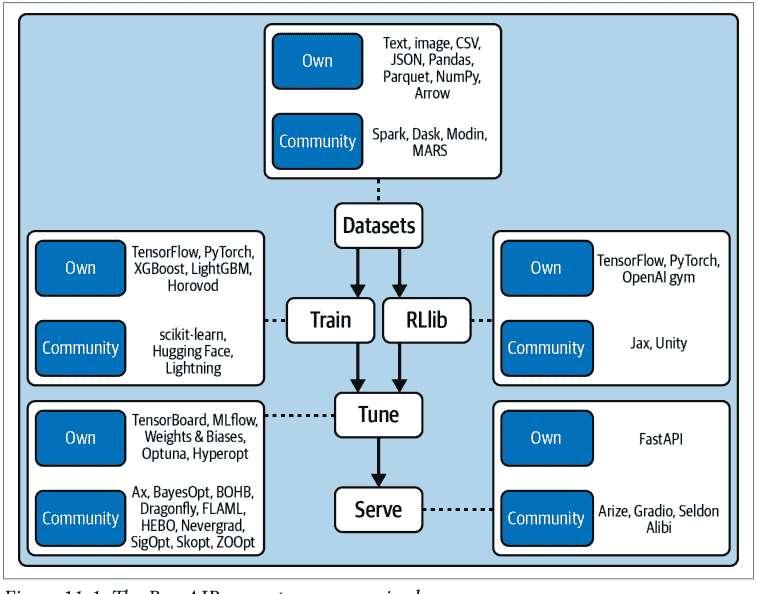

### Ray 与其他系统

到目前为止，我们还没有与其他系统进行任何直接比较，原因很简单：如果你对 Ray 还没有很好的理解，那么将 Ray 与其他东西进行比较意义不大。由于 Ray 非常灵活且包含许多组件，它可以与更广泛的 ML 生态系统中不同类型的工具进行比较。

让我们从比较更明显的候选者开始，即基于 Python 的集群计算框架。

### 分布式 Python 框架

如果你考虑那些提供完整 Python 支持且不将你锁定在任何特定云服务中的分布式计算框架，目前的“三巨头”是 Dask、Spark 和 Ray。虽然这些框架之间存在某些技术性和依赖于上下文的性能差异，但最好根据你想要运行的工作负载来比较它们。表 11-5 比较了最常见的工作负载类型。

表 11-5. Ray、Dask 和 Spark 的工作负载类型支持比较

| 工作负载类型 | Dask | Spark | Ray |
|---|---|---|---|
| 结构化数据处理 | 一流支持 | 一流支持 | 通过 Ray Datasets 和集成支持，但非一流 |
| 底层并行性 | 通过任务提供一流支持 | 无 | 通过任务和 Actor 提供一流支持 |
| 深度学习工作负载 | 支持，但非一流 | 支持，但非一流 | 通过多个 ML 库提供一流支持 |

### Ray AIR 与更广泛的 ML 生态系统

Ray AIR 主要专注于 *AI 计算*，例如通过 Ray Train 提供各种分布式训练，但它并非旨在覆盖 AI 工作负载的每个方面。例如，AIR 选择与 ML 实验的跟踪和监控工具以及数据存储解决方案集成，而不是提供原生解决方案。表 11-6 识别了生态系统的互补组件。

表 11-6. 互补的生态系统组件

| 类别 | 示例 |
|---|---|
| ML 跟踪与可观测性 | MLflow、Weights & Biases、Arize 等 |
| 训练框架 | PyTorch、TensorFlow、Lightning、JAX 等 |
| ML 特征存储 | Feast、Tecton 等 |

另一方面，你可以找到一些工具类别，Ray AIR 可以被视为其替代方案。例如，有许多与特定框架紧密集成的框架专用工具包，如 TorchX 或 TFX。相比之下，AIR 与框架无关，从而避免了供应商锁定，并提供类似的工具。¹⁰

简要探讨 Ray AIR 与特定云服务的比较也很有趣。一些主要的云服务提供全面的工具包来处理 Python 中的 ML 工作负载。仅举一例，AWS Sagemaker 是一个出色的一体化包，允许你与 AWS 生态系统良好连接。AIR 并不旨在取代像 SageMaker 这样的工具。相反，它旨在为训练、评估和服务等计算密集型组件提供替代方案。¹¹

AIR 也是 KubeFlow 或 Flyte 等 ML 工作流框架的有效替代方案。与许多基于容器的解决方案相比，AIR 提供了直观的高级 Python API，并原生支持分布式数据。表 11-7 总结了这些替代方案。

表 11-7. 替代的生态系统组件

| 类别 | 示例 |
|---|---|
| 框架专用工具包 | TorchX、TFX 等 |
| ML 工作流框架 | KubeFlow、Flyte、FBLearner Flow |

有时情况并非如此清晰，Ray AIR 可以在 ML 生态系统中被视为或用作替代方案或互补组件。

例如，作为开源系统，Ray（尤其是 AIR）可以在 SageMaker 等托管 ML 平台内使用，但你也可以用它来构建自己的 ML 平台。¹² 此外，如前所述，AIR 并不总是能与 Spark 或 Dask 等专用大数据处理系统竞争，但 Ray Datasets 通常足以满足你的处理需求。

正如我们在第 10 章中提到的，AIR 设计理念的核心是能够在一个脚本中表达你的 ML 工作负载，并将其作为单个分布式系统在 Ray 上执行。由于 Ray 在底层为你处理集群上的所有任务放置和执行，通常无需显式编排你的工作负载（或拼接许多复杂的分布式系统）。当然，这个理念不应过于字面化——有时你需要多个系统或将任务分成几个阶段。另一方面，像 Argo 或 AirFlow 这样的专用工作流编排工具在互补使用时非常有用。¹³ 例如，你可能希望将 Ray 作为 Lightning MLOps 框架中的一个步骤运行。表 11-8 概述了可以与 AIR 一起使用或 AIR 可以作为其替代方案的组件。

表 11-8. AIR 可以补充或替代的生态系统组件

| 类别 | 示例 |
|---|---|
| ML 平台 | SageMaker、Azure ML、Vertex AI、Databricks |
| 数据处理系统 | Spark、Dask |
| 工作流编排器 | Argo、AirFlow、Metaflow |
| MLOps 框架 | ZenML、Lightning |

如果你已经拥有一个 ML 平台，例如 Vertex 或 SageMaker，你可以使用 Ray AIR 的任何子集来增强你的系统。¹⁴ 换句话说，AIR 可以通过与现有的流水线或工作流编排器、存储和跟踪服务集成来补充现有的 ML 平台，而无需替换你的整个 ML 平台。

### 如何将 AIR 集成到你的 ML 平台中

现在你对 Ray（尤其是 AIR）与其他生态系统组件的关系有了更深入的理解，让我们总结一下构建自己的 ML 平台并将 Ray 与其他生态系统组件集成所需的条件。

使用 AIR 构建的 ML 系统的核心是一组 Ray 集群，每个集群负责不同的作业。例如，一个集群可能运行预处理、训练 PyTorch 模型并运行推理；另一个集群可能只是获取先前训练好的模型进行批量推理和服务，等等。你可以利用 Ray Autoscaler 来满足你的扩展需求，并可以使用 KubeRay 将整个系统部署在 Kubernetes 上。然后，你可以根据需要使用其他组件来增强这个核心系统，例如：

- 你可能希望向你的设置中添加其他计算步骤，例如使用 Spark 运行数据密集型预处理任务。
- 你可以使用 AirFlow、Oozie 或 SageMaker Pipelines 等工作流编排器来调度和创建你的 Ray 集群，并运行 Ray AIR 应用和服务。每个 AIR 应用都可以成为更大编排工作流的一部分，例如通过与第一个要点中的 Spark ETL 作业关联。¹⁵
- 你还可以创建用于与 Jupyter 笔记本交互使用的 Ray AIR 集群，例如由 Google Colab 或 Databricks Notebooks 托管的集群。
- 如果你需要访问 Feast 或 Tecton 等特征存储，Ray Train、Datasets 和 Serve 已经与这些工具集成了。¹⁶
- 对于实验跟踪或指标存储，Ray Train 和 Tune 提供了与 MLflow 和 Weights & Biases 等工具的集成。
- 你也可以从 S3 等外部存储解决方案中检索和存储你的数据和模型，如图所示。

图 11-2 将所有部分整合在一张简洁的图表中。

¹⁰ 这代表了一个明确的权衡，因为框架专用工具是高度定制的，并提供了许多好处。
¹¹ Anyscale 本身提供了一项具有企业功能的托管服务，以支持在 Ray 上构建 ML 应用。
¹² 我们将在下一节中为你提供一个粗略的草图，说明如何做到这一点。
¹³ Ray 有一个名为 Ray Workflows 的库，目前处于 alpha 阶段。与 AirFlow 等工具相比，Workflows 更底层，但允许你在 Ray 上原生运行持久化应用工作流。你可以在 Ray 文档中找到有关 Workflows 的更多信息。
¹⁴ 我们在最广泛的意义上使用 *ML 平台* 这个术语，即表示任何负责运行端到端 ML 工作负载的系统。
¹⁵ 任务图的编排可以完全在 Ray AIR 内部处理。外部工作流编排器会很好地集成，但仅在运行非 Ray 步骤时才需要。
¹⁶ Ray 团队构建了一个参考架构的演示，展示了 Feast 集成。

### 接下来该去哪里？

从[第1章](#)对Ray的概述，到本章对其生态系统的讨论，我们已经走了很长一段路。但作为一本入门书籍，我们只是触及了Ray能力的冰山一角。虽然你现在应该已经很好地掌握了Ray Core的基础知识、Ray集群的工作原理，并且知道何时使用AIR及其组成部分库（Datasets、Train、RLlib、Tune和Serve），但关于每个方面，还有很多东西需要学习。

首先，详尽的[Ray Core用户指南](#)将让你更深入地了解Ray任务、Actor和对象；它们在集群节点上的放置；以及如何处理应用程序的依赖关系。特别是，你会发现一些有趣的模式和反模式，以帮助你设计好Ray Core程序并避免常见陷阱。要了解更多关于Ray内部工作原理的内容，我们建议阅读一些关于Ray的高级论文，例如其[架构白皮书](#)。

我们完全跳过的一个有趣话题是Ray围绕*可观测性*的工具。官方的[Ray可观测性文档](#)是这个话题的一个良好起点。你可以在那里学习如何调试和分析你的Ray应用程序，从Ray集群记录信息，监控它们的行为，并导出重要指标。

你还会在那里找到关于*Ray仪表板*的介绍，它可以帮助你理解你的Ray程序。

本书的重点是向机器学习从业者介绍Ray的核心思想，并为你提供使用Ray处理工作负载的实用起点。然而，有一个主题比本书能包含的一章内容更值得关注，那就是如何构建、扩展和维护Ray集群。目前，关于高级Ray集群主题的最佳入门资料是[Ray文档](https://docs.ray.io/)。在那里，你可以比我们在这里能涵盖的更详细地学习如何在所有主要云提供商上部署集群，如何在Kubernetes上扩展集群，以及如何向集群提交Ray作业。

在本章中，我们只能顺带提及大多数Ray集成。如果你想了解更多关于Ray的第三方集成，[Ray生态系统页面](https://www.ray.io/ecosystem)是一个很好的起点。同样，重要的是要提到[更多的Ray库](https://docs.ray.io/en/latest/ray-overview/libs.html)可用，但它们未能入选本书，例如Ray Workflows和一个分布式、可直接替代Python multiprocessing库的库。

最后，如果你有兴趣成为Ray社区的一员，有很多好方法可以做到。你可以加入[Ray Slack](https://ray.io/slack)与Ray开发者和其他社区成员联系，或者加入Ray的[讨论论坛](https://discuss.ray.io/)来获得问题解答。如果你想帮助开发Ray，无论是为文档做贡献、添加新的用例，还是帮助开源社区开发新功能或修复错误，你应该查看官方的[Ray贡献者指南](https://docs.ray.io/en/latest/ray-contribute/overview.html)。

### 总结

在本章中，你从AI运行时的角度了解了更多关于Ray生态系统的内容。你已经看到了Ray AIR库可用的全部集成，以及一个使用三种不同集成（用于数据加载和训练的PyTorch、用于日志记录的MLflow和用于模型服务的Gradio）来训练和提供机器学习模型的示例。你现在应该能够走出去，运行自己的AIR实验，连同你已经在使用或打算在未来使用的所有工具。我们还讨论了Ray的局限性，它与各种相关系统的比较，以及如何将Ray与其他工具结合使用来增强或构建你自己的机器学习平台。

这结束了本章和本书。我们希望它激发了你对Ray的兴趣，并帮助你开始了与它的旅程。AIR的引入为Ray生态系统带来了许多新功能，而且路线图上肯定还有更多令人兴奋的内容。毫无疑问，你现在可以深入任何高级Ray材料——也许你已经有了构建第一个自己的Ray应用程序的想法。

# 索引

## 符号

- @ray.remote 装饰器, 27, 36
- @serve.batch 装饰器, 165
- @serve.deployment 装饰器, 19, 161
  - 调整部署的副本和资源分配, 164

## A

- 抽象
  - 泄漏抽象定律, 2
  - Ray提供的抽象, 4
- 动作分布, 78, 81
- 动作空间 (强化学习), 66, 87
  - 在RLlib环境中为策略服务器定义, 92
  - RLlib中的参数化动作空间, 99
- 动作 (强化学习), 66
  - 在Python RLlib API中计算, 78
  - 在多智能体环境中传递给步骤, 88
  - 采取每个动作的概率, 78
  - 关于动作的简化假设, 66
- Actor, 33
  - Ray Serve部署的控制器Actor, 161
  - 将Simulation类转换为Actor, 62
  - GCS存储Actor的位置, 39
  - Datasets支持使用Actor映射数据, 127
  - Ray AIR用法与任务结合用于高级复合工作负载, 208
  - Ray Datasets, 在分布式批量推理中使用, 147
  - 在Ray Serve部署中, 160
  - Ray Actor的模式和反模式, 47
  - 有状态Actor, 在复合工作负载中从无状态任务访问数据, 212
  - 用于有状态转换, 210
- 适配器函数, 204
- AdvancedEnv, 96
- 智能体 (强化学习), 66, 69
  - 处理多个智能体, 85-90
  - 将智能体映射到策略, 86, 89
- 聚合, Ray Datasets支持, 122, 125
- AI (参见人工智能)
- AI运行时 (参见 Ray AIR)
- "人工智能与计算", 3
- Airflow, 137
- Algorithm类, 75, 82
  - 访问所有工作节点上的Algorithm实例, 79
  - 在RLlib中提供课程, 95
  - 在多智能体环境中训练, 89
- AlgorithmConfig类, 75, 82
  - 用于常见算法属性类别的方法, 82
- AlphaFold, 3
- Amazon Web Services (AWS), 192
- 分析 (Tune), 104, 106, 107
  - 在Keras模型训练中获取, 118
- Apache Airflow, 137
- Apache Arrow, 10
  - 分布式, 在Ray Datasets中使用, 122
  - Plasma项目, 37
- Apache Hadoop, 121
- Apache Spark, 121, 227
- RLlib算法的API参考, 83
- 架构 (Ray)
  - 组件概述, 40
  - 白皮书, 38
- 用于Python的Arrow, 安装, 10
- 人工智能 (AI)
  - Ray AIR, 195
  - Ray AIR专注于AI计算, 228
  - 最近的发展, 3
  - AIR使Ray集群能够运行的AI工作负载类型, 209
- 异步执行, 28
  - 异步并行运行依赖任务, 33
- asyncio能力 (Python), 165, 166
- Atari环境 (gym), 73
- 自动扩缩
  - 集群, 194
  - Ray AIR工作负载, 213
  - Ray Serve副本, 165
  - Ray集群支持, 5
- await语法 (Python), 166
- AWS (Amazon Web Services), 192
- Azure, 193

## B

- 后端, 20
- BaseEnv类, 85
- base_model, 79
- 批量推理, 208
  - 分布式, 使用Ray Train, 147
  - Ray文档中的示例, 124
  - 使用Datasets, 127
- 批归一化层, 143
- 批量预测器, 203, 208
- batch_timeout_wait, 165
- 贝叶斯优化, 108
- bayesian-optimization库, 108
- BayesOptSearch, 109
- 行为克隆, 98
- 偏差, 110, 114
- 大数据处理工具, 207
- 大数据训练, 208
- .bind API, 实例化部署的副本, 162
- 绑定多个部署, 167
- 装箱算法, 194
- 阻塞, 30
  - Datasets操作, 127
- 块
  - blocks_per_window参数, ds.window函数, 129
  - Datasets中的块, 122
  - 与重分区, 125
- 广播, 168
  - 在NLP驱动的API示例中, 171

## C

- 回调
  - 为Ray Tune配置, 111
  - LoggerCallback传递给Tuner运行配置, 226
  - MLFlowLoggerCallback, 221
  - 特别有用的方法, 113
  - TuneReportCallback作为自定义Keras回调, 117
  - 用于监控Ray Train中的训练, 156
- cartpole-ppo调优示例, 14
- CartPole-v1环境, 14
- 分类变量, 116
- 聊天机器人, 157
- 检查点
  - Ray Train提供的Checkpoint类, 141
  - Ray Train Trainer的checkpoint属性, 148
  - 从现有的、特定于框架的模型创建, 202
  - 创建强化学习算法检查点, 77
  - Ray Tune创建, 113
  - Ray Tune为RLlib创建, 74
  - rllib命令创建, 74
  - 从检查点评估训练好的算法, 15
  - 在Ray Train中将训练好的模型导出为Checkpoint, 147
  - 由Ray AIR Trainer或Tuner生成, 202
  - Ray AIR
    - 从检查点创建批量预测器, 203
    - 部署PredictorDeployment, 204
    - Tuner和检查点, 201
    - 报告模型检查点, 146
    - 依赖于基于检查点的容错的有状态计算, 212
- CIFAR-10数据集, 216
- 克拉克第三定律, 32
- 类
  - 将Python类转换为Actor, 34
  - 任务和Actor作为类的分布式版本工作, 24
- 分类器, 并行训练副本, 130-133

## C

- classify 方法，166
- classify_batched 方法，165
- CLI（命令行界面）
    - 运行 RLlib CLI，73-74
    - 使用 Ray Cluster Launcher CLI 部署集群，191
- 客户端批处理，165
- 客户端
    - 在 RLlib 环境中定义策略客户端，92
    - PolicyClient，90
    - Ray Client，185
- 云计算，179
    - 使用云集群，192-194
        - AWS，192
        - 其他云提供商，193
- 集群（Ray），6，179
    - （另见 Ray Clusters）
    - 基本组件，6
    - 为集群定义 ScalingConfig，152
    - 用于集群管理的头节点进程，39
    - 启动本地集群，24
- Codex，3
- 列式格式（Arrow），125
- Ray Clusters 中的通信，39
- 复合工作负载，207
    - 执行，211
    - 容错策略，212
    - Ray AIR 使用 actor 和 task 处理复合工作负载，208
    - 有状态 actor 从无状态 task 访问数据，212
- compute_actions 方法，78
- compute_single_action 方法，78
- 在 Datasets 上进行计算，126
- 并发试验（Ray Tune），111
- 条件逻辑，169
- config 参数（tune.run），115
- 容器镜像，189
- 容器，186
    - 环境变量，189
    - KubeRay 对容器的操作，182
    - 为容器指定资源，189
- 连续动作空间（RL），66
- 连续参数，102
- 控制器 actor，161
- 核心层（Ray），5
    - （另见 Ray Core）
- CPU
    - 在 Ray Serve 中为每个副本分配两个 CPU，164
    - 在 Ray Cluster 中为机器指定 CPU，180
- cpu_intensive_preprocessing 函数，128
- CSV 文件
    - 从 S3 存储桶读取到列式数据集，198
    - 在 Ray Datasets 中写入/读回，123
- 课程学习，使用 RLlib 应用，95-97
- CurriculumEnv，96

## D

- Dask，20，227
    - 内置对 Python datetime 工具的支持，143
    - Dask on Ray，216
        - 示例，135
        - 用于训练 PyTorch 神经网络，142
- 数据格式
    - Datasets 中的灵活性，125
    - Datasets 支持的序列化格式，124
- 数据并行，140
- 数据处理，9，121
    - （另见 Ray Data；Ray Datasets）
    - Ray Datasets 与外部库的集成，134
    - 用于数据处理的 Spark 和 Dask 引擎，20
    - 使用 Ray Datasets 库，10
- 数据科学，8
    - Ray AIR 与数据科学工作流，8
- 数据科学家，1
    - Ray AIR 的用途，196
- 数据分片，130
    - get_data_shard 实用工具，146
    - 使用 iter_torch_batches 迭代，146
- 数据并行训练，144
- DataFrames，126
    - 将预测器服务负载转换为 DataFrame，204
    - Dask，135
        - df.compute 调用，136
    - Dask on Ray，142
    - 用于 DataFrame 的外部处理系统，134
- DataParallel（PyTorch），144
- DataParallelTrainer，225
- DatasetPipeline，12
    - 使用 ds.repeat 函数创建，130，132
    - 将 Datasets 转换为 DatasetPipeline，129
- Datasets（Ray），10，121
    - （另见 Ray Datasets）
    - Dataset 的内容，122
    - 创建 Dataset，123
    - 转换数据集，11
- datasets 参数（AIR 中的 XGBoostTrainer），199
- datasets 字典（Ray Train Trainers），147
- 深度学习
    - 定义深度学习模型，143
    - 进行深度学习训练，127
- 深度学习框架，RLlib 与之协作，70
- 深度 Q 学习，61，78
- 深度 Q 网络（DQN），61
    - 使用 DQNConfig 定义 DQN 算法，73
- Deepmind 的 AlphaFold，3
- 全连接层，80，117
- 依赖项
    - 处理 task 的依赖项，31
    - 为 Ray 安装依赖项，7
    - 所有权与依赖项，38
    - Raylet 调度器解析依赖项，37
    - 解析 task 的依赖项，40
    - task，动态执行处理依赖项，4
- deployment.options API，164
- 部署
    - Ray Clusters，179
    - Kubernetes 上的 Ray Clusters，182-190
    - 在 Ray AIR 中，204
        - 使用 PredictorDeployment，205
    - 在 Ray Serve 中，160
        - 绑定多个部署，167
        - 将 Python 类转换为部署，161
        - 调整副本数和分配给部署的资源，164
- 设计哲学（Ray AIR），197
- 设计原则（Ray），4
- 确定性环境（RL 中），67
- 字典
    - 作为 train_loop_config 传递给 trainer 的配置字典，151
    - datasets 字典，Ray Train Trainers，147
    - Python，使用字典中的 schema 创建 Dataset，126
- 难度，96
    - 设置任务难度，96
- discount_factor，102
- 离散动作空间（RL），66，72
- Discrete 类，51
- 分布式批量推理（Ray Train），147
- 分布式计算
    - 分布式计算的难点，3
    - Ray AI 为分布式计算提供通用接口，25
    - Ray 作为分布式工作负载的粘合代码，4
    - Ray Core 的能力，23
    - 用于分布式计算的 Ray 框架，6
- 分布式模型训练，207
    - 基础，139-141
    - 使用 Ray Datasets 训练 ML 模型，130-133
- 分布式对象传输，39
- 分布式 Python 框架，227
- 分布式调度器，39
- dones，54
    - 游戏被视为完成，53
    - 在 RL 中，66
        - gym.Env 具有 done 条件，72
        - 在多智能体环境中，88
        - 用于处理多个智能体的 is_done 辅助函数，87
- DQN（见 Deep Q-Networks）
- DQNConfig 对象，75
    - multi_agent 方法，89
- 驱动程序，6，39
- 驱动程序部署，167
    - 为驱动程序定义控制流逻辑，174
- Dropout 率，117，118
- ds.repeat 函数，130，132
- 动态执行，4

## E

- 生态系统（Ray），5，20，215-233
    - 构建自定义集成，225-226
    - 数据加载和预处理，216
    - 分布式 Python 框架，227
    - 生态系统的增长，216
    - 将 Ray AIR 集成到 ML 平台，230
    - 模型服务，222-225
    - 模型训练，218-222
    - Ray AIR 与更广泛的 ML 生态系统，228
    - Ray 与其他系统，227
    - 接下来去哪里，231
- 集成，168
- 实体识别模型，173
- Environment 类，52
    - 为其实现的方法，53
    - 用于玩 2D 迷宫游戏，54
- environment 方法（AlgorithmConfig），82
- 环境（RL 中），66
    - 构建 gym 环境，71
    - 确定性环境，67
    - RLlib 实验的环境配置，84
        - 使用 Python RLlib API 为 DQNConfig 指定环境，75
        - 使用 gym 环境与 RLlib，73-74
    - 使用 RLlib 环境，85-93
        - RLlib 环境概述，85
        - 策略服务器和客户端，90-93
        - 使用多个智能体，86-90
- 回合（RL 中），61，66
    - 在多智能体环境中随机进行，89
- 轮次
    - 轮次数，146
    - train_one_epoch 函数，149
    - 轮次中的 worker，训练一批数据所需的核心逻辑，145
- 估计到达时间，158
- evaluate 命令（rllib），15，74
- 在 Python API 中评估 RLlib 模型，77
- 训练好的 RL 算法的评估结果，15
- example 命令（rllib），15
- 经验（RL 中），66
- ExperimentAnalysis 对象，107
- 在 RL 中利用或探索环境，66，78
- exploration 方法（AlgorithmConfig），82
- ExternalEnv，85
- 使用 Ray Train 中的 load-dataset 函数构建特征，142
    - 在分布式批量推理中，147
- fetch_wikipedia_page 驱动程序逻辑，175
- filter 函数，11
- 过滤数据，122
    - Ray Datasets 中的 filter 操作，124
- fit 方法（Trainer），148，151
- 拟合训练数据，AIR 预处理器，198
- flat_map 函数，11
- 灵活性（Ray），4，46
- 用于机器学习的灵活分布式 Python，2
- 分数资源，111，164
- 框架
    - RLlib 算法的框架规范，79
    - 第三方训练框架，141
- Ray Datasets 中的函数式编程，11
- 函数
    - 将 Python 函数转换为 Ray task，27
    - task 和 action 作为函数的分布式版本，24
- future，28，31
    - 在 follow_up_task 中由 ray.get 解析，32

## F

- 故障
    - 分布式计算中的故障，5
    - Ray Datasets 处理故障，123
    - Ray AIR 故障模型，212
- FastAPI 框架，163
    - 解析 input_text 查询参数，163
    - Ray Serve 的 FastAPI 用于输入解析和输出模式，171
- 容错与所有权，37
- 特征工程，9
- 特征化

## G

- GCS（全局控制服务），39
- GCS 服务器（Ray）
    - GCS 服务器的故障，212
    - 打印 GCS 服务器的 IP 地址，180
    - 无法连接到 GCS at ...，181
- get 函数，29，35
- get_best_config 函数，106
- 本书的 GitHub 仓库，xvi
- 全局控制服务（GCS），39
- 全局解释器锁（GIL），27
- Google Cloud，193
- GPT-2 模型，18
- GPU
    - 为 Ray Serve 部署分配 GPU，164
    - 运行在线推理服务的 GPU 开销，159
    - 在 Ray Cluster 中为机器指定 GPU，180
    - use_gpu 标志，151
- gpu_intensive_inference，128
- 梯度提升决策树框架，148
- Gradio，222-225
- 贪婪地选择动作，79

## H

Hadoop，121
head（深度学习中），80
head节点，6，39，180
    地址，NAT与，181
    将Ray集群中的每个其他节点连接到，180
head pod，183，184
异构性（Ray），4
隐藏单元，118
智能体层级结构，85
高可用模式（GCS），212
HPO（参见超参数优化）
HPO工具，Ray Tune支持的算法来自，20
HTTP API与驱动逻辑，为NLP驱动的API定义，173
HTTP端点封装ML模型，定义，161-163
HTTP请求，定义处理逻辑，162
HTTP，可通过其查询推理服务，204
Python中的Hugging Face模型，18
支持向量化推理的Hugging Face pipeline，165
Hugging Face Transformers库，161，172
Hyperopt和Optuna集成（Ray Tune），108
HyperOptSearch算法，118
超参数优化（HPO），16，101-119
    Ray Tune简介，105-115
    使用Ray Tune进行机器学习，115-119
    Ray AIR Trainers与Ray Tune的集成用于，200
    Ray Train与Ray Tune的集成，154
超参数调优，9
    使用Ray Tune，16
超参数，102
    依赖于其他超参数，114
    为XGBoostTrainer指定范围，154
    TrainingWorker，132
调优超参数，102-105
    使用Ray构建随机搜索示例，102-104
    难度，104

## I

图像处理，167
模仿学习，98
推理，127
    多模型推理图，166-170
    向量化，128
        支持向量化推理的Hugging Face pipeline，165
init函数，7
安装Ray，7
集成，自定义，225-226
集成，Ray，概述，226-231
中间分数，109
ipython解释器，7
项目，从数据库中检索，25
iter_torch_batches函数，146

## J

JAX，225
作业，6
JSON可序列化输出（HTTP请求），162
JsonLoggerCallback，156
Jupyter notebooks，7

## K

Keras，20，79
    在Ray Tune中调优Keras模型，116
Map-Reduce的map阶段产生的键值对，41
键值存储（GCS），39
kubectl，使用其运行Ray程序，184
KubeRay项目，182
Kubernetes，8，41，176
    在Kubernetes上部署Ray集群，182-190
        配置KubeRay，187-188
        为KubeRay配置日志记录，189
        与KubeRay集群交互，184-186
KubeRay operator，182
设置第一个KubeRay集群，183

## L

label_column参数（AIR中的XGBoostTrainer），199
lambda函数，126
延迟
    在线ML服务与应用，158
    在线推理与，157
泄漏抽象定律，2
Ray中的层，5
将工作进程租借给任务所有者，39
库（Ray），5
    数据科学库，8
    用于机器学习步骤的专用库，9
    模型训练，12
LightGBM，148
LightGBMTrainer，148
血缘重建，212
列表推导式，26
加载数据，216
    在分布式批量推理中，147
在Ray Train中加载模型，142
    为训练工作进程准备训练和验证数据，146
load_dataset函数（Ray Train），142，146
本地集群，6
LoggerCallback接口，156
日志记录
    为KubeRay配置，189
    将试验结果记录到MLFlow，216
    使用Neptune进行，226
损失，146

## M

机器学习（ML）
    基本流程，Ray Train组件在其中的使用，141
    广播到多个并行模型，168
    使用Ray Datasets构建ML流程，136-138
    用于控制流的条件逻辑，169
    涉及的数据科学流程，9
    ML模型的分布式训练，130
    用于ML的灵活分布式Python，2
    将Ray AIR集成到ML平台中，230
    模型是计算密集型的，158
    模型单独使用时没有用处，159
    NLP驱动API示例中的多个模型，170
    在线推理与ML模型交互，157
    Ray Datasets的性能，121
    Ray AIR与更广泛的ML生态系统，228
    Ray AIR作为所有其他Ray ML库的伞形项目，195
    ML工程师使用的Ray AIR，196
    最新进展，3
    强化学习，50
    使用单个系统运行的单个脚本处理工作负载，197
    部署中的训练-服务偏差，153
    使用Ray Tune，115-119
        调优Keras模型，116
        将RLlib与Tune结合使用，115
机器学习框架，Ray Train Trainers与之集成，148
map函数，11
    对Datasets执行自定义转换，126
映射，122
    Datasets对映射的支持，使用Ray actors，127
将模型映射到整个数据集，147
映射批次，217
MapReduce
    使用Ray的示例，41-47
    映射和混洗文档数据，43
    减少词频统计，45
    在分布式文档语料库上运行MapReduce，42
MARL（多智能体强化学习）问题
    RLlib的支持，90
    训练，89
max_batch_size，165
max_depth参数（XGBoost模型），201
迷宫问题，设置，50-55
内存
    AIR内存管理，211
    分布式，39
    Ray Datasets的高效使用，123
    Raylet对象存储管理共享内存池，37
    为Ray Tune中的试验指定，111
指标
    为Ray Tune中的报告配置，111
    获取找到的最佳超参数，106
    在BayesOptSearch中优化，109
    将RLlib指标传递给Ray Tune，115
    传递给Ray Tune调度器，110
迁移疲劳，196
min，125
MinMaxScaler，154
ML（参见机器学习）
ML平台，230
    托管型，Ray和AIR在其中的使用，229
    将Ray AIR集成到，230
MLFlow，156，221
MLFlowLogger，216
MLFlowLoggerCallback，156，221
MNIST数据，116
模式
    获取找到的最佳超参数，106
    传递给Ray Tune调度器，110
    为Ray Tune中的试验指定，112
模型并行，140
模型服务，9，222-225
    使用Ray Serve，18
模型训练，9，218-222
    分布式模型训练基础，139-141
    示例，使用Datasets并行训练分类器的副本，130-133
    使用Ray并行化，64
    用于模型训练的Ray库，12
        Ray RLlib，12
    训练强化模型，59-62
model.state_value_head.summary方法，80
模型
    在Python RLlib API中访问状态，78
    检查点作为Ray AIR原生模型交换，202
    为RLlib实验自定义，80
    在DQN中使用的深度Q学习模型，79
    定义深度学习模型，143
    ML模型的分布式训练，130
    NLP模型，172
    在Ray Train检查点中，147
    策略的state_action_table，66
    在Ray Tune中调优Keras模型，116
摩尔定律，3
MultiAgentEnv，85
    定义包含两个智能体的环境，86
多模型推理图，166-170
    广播模式，168
    条件逻辑模式，169
    Ray Serve核心功能，绑定多个部署，167
    在NLP驱动API示例中，170
    流水线模式，167
多个智能体（RL），66
multi_agent方法（AlgorithmConfig），82

## N

NAT（网络地址转换），181
自然语言处理（NLP），170
nc工具，181
Neptune，225，226
网络地址转换（NAT），181
神经网络，78
    在深度Q网络（DQN）中，61
    在Ray Train中定义和训练，141
    FarePredictor PyTorch网络，143
    并行化计算以加速训练，140
纽约市出租车行程，预测大额小费（示例），141
NLP（自然语言处理），170
构建NLP驱动的API（示例），170-176
    用于总结维基百科文章的NLP流程架构，171
    获取内容和预处理，172
    HTTP处理和驱动逻辑，173
    NLP模型，172
    将所有部分组合在一起，175-176
nmap工具，181
节点
    检查每个端口是否可从节点访问，181
    连接到Ray集群中的head节点，180
    停止节点上的Ray进程，182
    无法访问指定的端口和IP地址，181
非阻塞调用，使用Ray wait函数，30
numpy.square优化实现，126
num_gpus，164
num_replicas，164，173

## O

对象引用，32
    远程Ray任务返回，28
对象存储，24
    Raylet的组件，36
    将数据库放入，30
    将策略放入，63
    使用put和get，29
目标，103
    转换为Ray任务，103
    停止Ray Tune目标分析，114
目标函数，16，103
    定义，105
    定义以计算中间分数，109
    Tune中的Keras目标函数，117
对象
    分布式对象传输，39
    在Ray Core中与任务和actor的等价性，35
    Ray任务是创建对象的主要方式，28
    在驱动程序和工作进程之间或工作进程之间共享，29
    Ray Datasets中的溢出和恢复，123
可观测性，231
观察空间（RL），66，87
    为RLlib环境中的策略服务器定义，92
    在gym环境中，72
观察（RL中），52
    为给定观察计算动作，78
    在多智能体环境中，88
    被DQN模型接收，80
    转换为模型期望的形式，81
离线数据
    RLlib中的Python API，99
    处理，97
offline_data方法（AlgorithmConfig），82
在线推理，157-159
    使用Ray Serve构建服务，160
        （另请参见Ray Serve）
    提供ML模型的差异，158-159
        计算密集型ML模型，158
        ML模型单独使用时没有用处，159
    NLP驱动API示例中的流程，171
    用例，157
在线服务，208
在线服务执行，211
OpenAI
    Codex，3
    'AI and Compute'，3
所有权，37
    依赖关系与，38
所有权表，37

## P

Pandas DataFrames，126
Pandas on Ray，20
依赖任务的并行执行，33
并行化
    数据并行训练，144
    并行化代码，Ray Train，141
参数化动作空间，99
Parquet数据，124，126
    对Parquet数据的Dataset转换，127
分区，122
    Datasets中的块和重新分区，125
有效载荷（预测器服务），204
性能，衡量Ray任务的性能，28
流水线执行，212
流程
    使用Ray Datasets构建ML流程，136-138
    Dataset流程，127-130
    DatasetPipeline，12
    在线推理，171
流水线化
    ML应用中的多模型模式，167
    在Ray Datasets上使用，210
Plasma，37
pods
    KubeRay集群上的head和worker pods，183
    与KubeRay集群head pod交互，184
    Ray集群，在KubeRay上配置，188
PodTemplate，182
策略（RL），66
    在Python RLlib API中访问其状态，78
    在多智能体环境中
        将智能体映射到策略，89
    在多智能体RL环境中，86
    在RLlib环境中使用策略服务器和客户端，90-93
        定义客户端，92
        定义服务器，91
Policy类，56
    将在未来的RLlib版本中替换，79
    state_action_table，57
    更新state_action_table中的值，59

## P

PolicyClient，92
PolicyServerInput 对象，91
PredictorDeployment 类，204
预测器，141，224
- 批量，203
.predict_pipelined 函数，147
prepare_model 函数，146
预处理，216
- NLP 驱动 API 示例中的内容，172
- 分布式批量推理中的预处理，147
- 在 Ray Train 中使用 load_dataset 函数，142
- 使用 Ray Train，153
预处理器
- 内置于 Ray Train，153
- 在 Ray Train 与 Ray Tune 集成时选择，154
- 由 Ray Train 提供，141
- Ray AIR，198
  - 可用的不同类型，199
  - 为 XGBoostTrainer 指定，199
- 在 Ray Train 检查点中，147
采取行动的概率，78
Prometheus，182
近端策略优化（PPO）算法，14
put 函数，28，35
- 将数据放入分布式对象存储，29
Pydantic，173
PyGame，安装，14
Python
- datetime 工具，Dask 对其的支持，143
- 分布式计算框架，227
- 全局解释器锁，27
- Ray 为数据科学社区，2
- RLlib API（参见 RLlib Python API）
- 用于数据科学，1
- 版本及对 Ray 的支持，7
- 之禅，43
Python 优先框架，2
PyTorch，70，79
- 支撑 Ray RLlib 和 Train 库，20
- DataParallel，144
- 使用 PyTorch 加载和转换数据集，216
- loss_function 和 batch_loss，146
- 将现有模型迁移到 Ray Train，148，150
- torchvision 扩展，216
- 使用 Ray 上的 Dask 训练 PyTorch 神经网络，142

## Q

Q-Learning 算法，59-61，66
Q 值，66，78
- （另见状态-动作值）
- 获取 DQN 模型的 Q 值，81

## R

随机数生成器（RNG），169
random.uniform 采样器（numpy），114
随机采样超参数，102
Ray
- 关于，2
- 架构白皮书，28
- 设计原则，4
- 生态系统，20，215
  - （另见生态系统）
- 安装，7
- 起源，2
- 与其他系统的关系，41
Ray AIR（AI 运行时），5，144，195-213
- 作为当前 Ray 数据科学库的总称，10
- 与数据科学工作流，8
- 数据集和预处理器，198
- 可扩展性，196
- 通过示例介绍 AIR 关键概念，197-207
  - 批量预测器，203
  - 使用 AIR 从数据加载到推理，197
  - 训练器，199
  - 调优器和检查点，201
- Ray 生态系统及更广泛领域，215-233
  - AIR 与更广泛的 ML 生态系统，228
  - 构建自定义集成，225-226
  - 数据加载和预处理，216
  - 分布式 Python 框架，227
  - AIR 可补充或替代的生态系统组件，229
  - 不断发展的生态系统，216
  - 将 AIR 集成到 ML 平台，230
  - 模型服务，222-225
  - 模型训练，218-222
  - Ray 与其他系统，227
  - 从这里开始，231
- 第三方集成，195
- 用途，195
- 适用的工作负载，207-213
  - AIR 故障模型，212
  - AIR 内存管理，211
  - 自动扩展 AIR 工作负载，213
  - 工作负载执行，209-211
Ray Client，7
- 使用其连接到 KubeRay 集群，185
Ray 集群，6，8，179-194，230
- 在 Kubernetes 上部署，182-190
  - 配置 KubeRay，187-188
  - 为 KubeRay 配置日志记录，189
  - 与 KubeRay 集群交互，184-186
  - 设置第一个 KubeRay 集群，183
- 手动创建，180-182
- AIR 支持运行的 AI 工作负载类型，209
- 使用 Ray Cluster Launcher，190-192
  - 配置你的 Ray 集群，190
  - 与 Ray 集群交互，191
  - 使用 Cluster Launcher CLI，191
- 使用云集群，192-194
  - AWS，192
  - Azure，193
  - Google Cloud，193
Ray Core，8，23-47
- 构建你的第一个分布式应用，49-67
  - 构建模拟，55-58
  - 构建应用，62-64
  - 强化学习简介，49-50
  - 设置简单的迷宫问题，50-55
- 使用 Ray API 的第一个示例，25-35
  - 从类到 Actor，33
  - 函数和远程 Ray 任务，27-29
  - 处理任务依赖，31
  - 使用 put 和 get 操作对象存储，29
  - 使用 wait 函数进行非阻塞调用，30
- 简介，24-25
- 主要 API 方法，35
- 使用 Ray 的简单 MapReduce 示例，41-47
  - 映射和混洗文档数据，43
  - 归约词频统计，45
- 理解 Ray 系统组件，36-40
  - 分布式调度和执行，39
  - 头节点，39
  - 在节点上调度和执行工作，36-39
Ray Data，121
- 允许在并行训练运行之间共享内存数据，130
- 生态系统集成以实现更好的数据处理，134
Ray Datasets，9，121-138，122-133
- 基础，123-126
  - 块和重分区，125
  - 内置转换，124
  - 创建数据集，123
  - 读取和写入存储，123
  - 模式和数据格式，125
- 优势，121，123
- 构建 ML 管道，136-138
- 在数据集上计算，126
- 使用数据集进行数据处理，10
- 数据集管道，127-130
- 生态系统，218
- 功能示例，216
- 示例，并行训练分类器的副本，130-133
- 外部库集成，134-136
- 将数据加载到 Ray AIR，198
- 将 Snowflake 数据加载到，225
- 调度策略，209
- Ray AIR 训练器使用，200
- 用于无状态计算，208
- 与 Ray Train 一起将完整 ML 工作流实现为单个应用，148
- 在分布式批量推理中使用，147
Ray Job Submission 服务器，185，191
Ray RLlib，10，69-99
- 高级概念，93-99
  - 应用课程学习，95-97
  - 其他高级主题，98
  - 处理离线数据，97
- 配置实验，82-84
  - 环境配置，84
  - 资源配置，83
  - rollout worker 配置，83
- 生态系统，222
- 入门，71-81
  - 构建 gym 环境，71
  - 运行 RLlib CLI，73-74
  - 使用 RLlib Python API，75
- 概述，70
- 使用 RLlib 进行强化学习，12
- 与 Ray Tune 一起使用，115
- 处理环境，85-93
  - RLlib 环境概述，85
  - 策略服务器和客户端，90-93
  - 使用多个代理，86-90
Ray 运行时已启动，180
Ray Serve，10，158，160-177
- 部署推理服务以通过 HTTP 查询，204
- 生态系统，224
- 端到端示例，构建 NLP 驱动的 API，170-176
  - 定义 HTTP API 和驱动逻辑，173
  - 获取内容和预处理，172
  - NLP 模型，172
  - 整合所有部分，175-176
- GradioServer，222
- 简介，160-170
  - 架构概述，160
  - 定义基本 HTTP 端点，161-163
  - 多模型推理图，166-170
  - 为计算密集型 ML 模型设计的专用功能，160
  - 请求批处理，165
  - 扩展和资源分配，163
  - 使用 Gradio 在 Ray Serve 上提供模型，216
- Ray Serve 库
  - 使用其进行模型服务，18
- ray start --head ... 命令，191
- ray stop 命令，182
Ray Train，10，122，139-156
- 生态系统，222
- 简介，141-147
  - 分布式批量推理，147
  - 使用 Train 进行分布式训练，144
  - 示例，预测纽约市出租车行程中的高额小费，141
  - 基本 ML 管道中使用的 Train 组件，141
- 加载、预处理和特征化，142
- 可在其中利用的标准 PyTorch 模型和训练循环，216
- 对梯度提升决策树框架的支持，148
- 其中的训练器，148-156
  - 将训练器与 Ray Tune 集成，154
  - 以最小代码更改迁移到 Ray Train，150
  - 使用 Ray Train 进行预处理，153
  - 扩展训练器，152
  - 使用回调监控训练，156
- 使用其扩展 JAX 模型，225
Ray Tune，10，101，122
- 配置和运行，110-115
  - 回调和指标，111
  - 检查点、停止和恢复，113
  - 自定义和条件搜索空间，114
  - 指定资源，111
- 生态系统，222
- 工作原理，106-110
  - 与其他 HPO 框架的集成，108
  - 组件概述，106
  - 调度器，109
  - 搜索算法，108
- 使用 Ray Tune 进行超参数调优，16
- 将 Ray Train 训练器与 Ray Tune 集成，154
- 简介，105-106
- 使用 Ray Tune 进行机器学习，115-119
  - 调优 Keras 模型，116
  - 将 RLlib 与 Tune 一起使用，115
- 随附的 MLFlowLogger，216
- Ray AIR 训练器与 Ray Tune 的集成，200
- 支持来自知名 HPO 工具的算法，20
- RLlib 使用，74
Ray Workflows，229
ray.get 函数，28，36
- 使用其操作对象存储，29
ray.init 方法，36，180
ray.put 方法，36
ray.remote 函数，28，34，36
ray.wait 函数，36
RayCluster，182
Raylets，36
- 调度器，37
从存储读取和写入（Ray Datasets），123
read_csv 工具，198
推荐系统，157
- 边缘挑战，159
恢复，5

246 | 索引

修正线性单元（ReLU）激活函数，118
Redis 实例，远程，使用，180
归约阶段（MapReduce），42
    归约词频统计，45
强化学习
    Q-Learning 算法，61
    术语回顾，66-67
    训练模型，59-62
    使用 Ray RLlib，12
关系型数据处理系统，与 Ray 集成，134
远程函数，35
远程 Ray 任务，函数与，27-29
渲染 RL 环境，72，84
    在多智能体环境中修改，89
重新分区，125，128
重复函数（Datasets），132
副本（Ray Serve），160
    在每个副本中运行 FastAPI 服务器，163
    实例化部署的副本，162
    为文本摘要模型设置，173
    为部署调整，164
报告，使用 Ray AIR 会话，144
请求批处理，159，165
requests 库，19
requests 包，160
    用于测试情感分类器，162
重置（RL 环境），72
资源管理
    由头节点管理，39
    由 Raylet 调度器管理，37
资源
    在 Ray Serve 中分配，163
        更具表达性的策略，164
    训练器使用的计算资源，152
    为 KubeRay 集群配置，189
    为 RLlib 实验配置，83
    空闲，朴素的 Dataset 计算导致，128
    为 Ray Tune 试验指定，111
    查看 Ray 集群的使用情况，24
resources 方法（AlgorithmConfig），82
响应（HTTP），定义模式，173
ResultGrid（Tuner API），107
结果
    训练结果的人类可读输出，76
    RLlib DQN 算法的状态和训练结果，76
    训练结果，写入目录，74
恢复 Ray Tune 运行，113
奖励（RL），66
    在多智能体环境中，88
RISELab（加州大学伯克利分校），3
RL（参见 Ray RLlib；强化学习）
RLlib 算法页面（Ray 文档），70
rllib 命令行工具，13
rllib evaluate 命令，74
RLlib Python API，75
    访问策略和模型状态，78
    保存、加载和评估 RLlib 模型，77
    训练 RLlib 算法，75-76
rllib train 命令，73
RLlib Training API 文档，84
RNG（参见随机数生成器）
机器人学，158
rollouts（在 RL 中），66
    使用完成的 rollouts 更新策略，64
    RLlib 实验的 rollout worker 配置，83
    Python RLlib API 的 rollouts 方法，75
rollouts 方法（AlgorithmConfig），82
RunConfig，155，201
运行（Tune），108
Rust 编译器，安装，18
采样函数（Tune），106
在 Python API 中保存 RLlib 算法，77
可扩展性
    Ray，5
    Ray Datasets，123
ScaleStrategy，182
扩展
    机器学习模型的在线推理服务，159
    在 Ray Serve 中，163
    在 Ray Train 中扩展训练器，152
ScalingConfig
    调整内存，212
    为 Ray AIR 中的 XGBoostTrainer 定义，199
    Ray AIR 训练器，200
    Ray Train 训练器，147，151
    指定集群节点的参数，152
调度器
    与 Ray 打包的 Dask 调度器，135
    Ray Tune，107，109
        与搜索算法结合，110
    在节点上调度和执行工作，36-37
        分布式调度和执行，39
模式，125
    为 HTTP 响应定义，173
scikit-learn，218
    本地安装，131
    SGDClassifier 算法，131
分数（HPO），103
    制定灵活的停止条件，114
    中间分数，109
    作为字典重新调整，105
搜索算法，104，108
    自定义，HyperOptSearch，118
    Tune 支持，107
搜索示例（随机），使用 Ray 构建，102-104
搜索空间，104，104，106
    自定义和条件，114
    使用 random 库定义，102
    使用 tune.uniform 定义，105
搜索器（参见搜索算法）
自动驾驶汽车，158
情感分类器模型，161，171
    修改以进行服务器端批处理，165
    POSITIVE 和 NEGATIVE 输出，162
    扩展到多个副本并调整资源分配，164
    使用 requests 包测试，162
    在 NLP 驱动的 API 示例中使用，172
顺序 TensorFlow Keras 模型，202
序列化格式，124
serve run app:scaled_deployment 命令，164
serve run CLI 命令，162，171
serve.run，162
服务器端批处理，165
"Serving RLlib Models" 教程，70
会话
    Ray，146
    Ray AIR，144
SGDClassifier 算法，131
    TrainingWorker 包装器，132
数据分片，130，220
    get_data_shard 实用工具，146
    共享内存池，37
混洗阶段（MapReduce），42
混洗数据，42，43
简洁性，4
Simulation 类，56
    转换为 Ray actor，62
    实现，57
SimulationActor 实例，63
模拟
    无法忠实地模拟某些物理系统，67
Snowflake，225
软状态，207
排序操作（Ray Datasets），124
排序数据，122
Spark，20，121，227
速度（Ray），5
StandardScaler，154，198
状态
    在 Python RLlib API 中访问模型和策略状态，78
    在 RL 环境中，66
状态转移概率，67
状态-动作值（RL），66，78，80，102
    和状态-动作函数，80
有状态计算，33，207
    依赖于基于检查点的容错，212
有状态执行，210
有状态工作负载，自动扩缩容，213
无状态计算，207
无状态执行，209
Ray AIR 的无状态任务，208
无状态工作负载，自动扩缩容，213
state_action_table（策略示例），57
    更新其中的值，59
step 方法，53
步骤（在 RL 中），66，72
    在多智能体环境中传递给步骤的动作，88
随机梯度下降，131
停止
    停止节点上的 Ray 进程，182
    停止 Ray Tune 运行，113
求和，125
同步执行
    分布式训练算法的方法，130
    Datasets 操作，127
与 Ray 相关的系统，41

## T

任务图，135
任务调度器，36
任务，6
    - 将目标转换为任务，103
    - 任务的执行，40
    - 处理任务依赖关系，31
    - 修改现有任务以包含 actor，34
    - Ray AIR 使用 actor 处理高级复合工作负载，208
    - Ray 任务模式和反模式，47
    - 为任务设置难度，96
    - 复合工作负载中由有状态 actor 访问的无状态数据，212
TaskSettableEnv，96
TBXLoggerCallback，156
TensorBoard，156
TensorFlow，70，79
    - 支撑 Ray RLlib 和 Train 库，20
    - 安装，12
TensorFlow Keras 模型（顺序），202
文本摘要模型，173
TorchTrainer，146
    - 实例化和使用，151
    - 包装在 Tuner 中，216
torchvision，216
TPE（树形结构 Parzen 估计器）
    - 搜索器，108
train 命令（rllib），73
可训练对象，106
    - 作为参数传递给 tune.run 的 RLlib 训练器，115
训练器，141
    - 关于 Ray Train 中训练器的更多信息，148-156
    - 将训练器与 Ray Tune 集成，154
    - 迁移到 Ray Train，150
    - 使用 Ray Train 进行预处理，153
    - 扩展训练器，152
    - Ray Train 中的训练器类共享通用接口，148
    - 使用回调监控训练，156
    - Ray AIR
        - 生成的检查点，202
        - 与训练器协同工作的 Tuner，201，202
    - Ray Train
        - 训练器的数据集字典，147
        - 训练器的 ScalingConfig，147
        - 为 Ray AIR 指定，199
    - TorchTrainer，146
训练算法，RLlib 中令人印象深刻的范围，99
训练框架
    - 第三方，训练器作为包装器，141
training 方法（AlgorithmConfig），82
训练 RLlib 算法，75-76
    - 在多智能体环境中，89
训练-服务偏差，153
TrainingWorker，131
training_loop，149
train_loop_config，151
train_loop_per_worker 函数，151
train_one_epoch 辅助函数，149
转换
    - 将列转换为用作机器学习模型特征的格式，143
    - 自定义，在 Datasets 上执行，126
    - 数据集转换，使用 Ray Datasets，11
    - Ray Datasets，122
        - 内置转换，124
        - 在 Parquet 数据上，127
transformers 包，160
试验调度器，109
试验（HPO），104，106
    - 在 Ray Tune 中为试验指定资源，111
Tune（参见 Ray Tune）
tune 函数，17
Tune 的调度器兼容性矩阵，110
tune.report 函数，110
tune.run 函数，17，106，108
    - 将 RLlib 参数传递给，115
tune.sample_from 函数，114
TuneConfig，201
调优示例，13
Tuner API，107，154
TuneReportCallback，117
Tuners，201
    - AIR Tuner 与 AIR 训练器协同工作，202
tune_objective 函数，105
元组，32

## U

加州大学伯克利分校，RISELab，3
无法连接到 GCS at ...，181
联合，124

## V

价值函数头，80

向量化计算，126，159，165
- 使用 Serve 的批处理 API，172
- 向量化推理，128

向量化推理，165

视频处理流水线，158

卷挂载，189

## W

等待函数，36
- 用于非阻塞调用，30

权重，102，110
- 在 Python API 中获取 RLlib 模型的权重，79
- 使用 numpy 的 random.uniform 采样器，114

维基百科文章，摘要生成（参见构建 NLP 驱动的 API）

PyPI 上的 Wikipedia 包，172

窗口函数，12

窗口，129

工作节点，6
- 在其上调度和执行工作，36
- （另请参阅 Raylets）
- 构成的系统组件，38

工作 Pod，183

工作进程，6
- 容错和所有权，37
- 租赁给任务所有者，39

工作进程
- 定义 TrainingWorker 以训练分类器副本，131
- RLlib，获取策略和模型权重，79
- 展开，76
- RLlib 实验的展开工作进程配置，83
- 训练，加载训练和验证数据，146
- 训练，指定数量，151

工作负载执行（Ray AIR），209-211
- 复合工作负载执行，211
- 在线服务执行，211
- 有状态执行，210
- 无状态执行，209

工作负载类型支持，Spark、Dask 和 Ray，227

## X

XGBoost，148

XGBoostPredictor，203，204

XGBoostTrainer，148
- 创建并指定超参数范围，154
- 为 Ray AIR 定义，199
- 用 Tuner 包装实例，201

## Z

Python 之禅，43

## 关于作者

**Max Pumperla** 是一位数据科学教授和软件工程师，现居德国汉堡。他是一位活跃的开源贡献者，多个 Python 包的维护者，机器学习书籍的作者，以及国际会议的演讲者。他目前在 Anyscale 担任软件工程师。作为 Pathmind Inc. 的产品研究主管，他使用 Ray RLlib、Serve 和 Tune 为工业应用开发了大规模强化学习解决方案。Max 曾是 Skymind 的 DL4J 核心开发者，帮助成长和扩展了 Keras 生态系统，并且是 Hyperopt 的维护者。

**Edward Oakes** 是 Anyscale 的软件工程师和团队负责人，他领导 Ray Serve 的开发，并且是 Ray 最顶级的开源贡献者之一。在加入 Anyscale 之前，他是加州大学伯克利分校电子工程与计算机科学系的研究生。

**Richard Liaw** 是 Anyscale 的软件工程师，从事分布式机器学习的开源工具开发。他目前从加州大学伯克利分校计算机科学系的博士课程中休假，导师是 Joseph Gonzalez、Ion Stoica 和 Ken Goldberg。

## 版权页

*Learning Ray* 封面上的动物是大理石电鳐（*Torpedo marmorata*），也被称为电鳐。大理石电鳐可以在从非洲到挪威的东大西洋以及地中海找到。它们是底栖生物，喜欢生活在岩石礁石、海草床和泥滩的浅水到中等深度水域。

大理石电鳐呈斑驳的棕色和黑色，这使它们在白天躲藏的浑浊水域中得以伪装。夜晚，电鳐出来捕猎和觅食小鱼，如虾虎鱼、鲻鱼、鲭鱼和雀鲷。这些电鳐可以长到 2 英尺长，可以张开下颚吞下比它们嘴巴还大的鱼，并能释放高达 200 伏的电击来杀死猎物。

因为这些电鳐能够放电，所以它们几乎没有天敌。O'Reilly 封面上的许多动物都濒临灭绝；它们对世界都很重要。

封面插图由 Karen Montgomery 制作，基于 Lydekker 的《皇家自然史》中的一幅古老线刻版画。封面字体是 Gilroy Semibold 和 Guardian Sans。正文字体是 Adobe Minion Pro；标题字体是 Adobe Myriad Condensed；代码字体是 Dalton Maag 的 Ubuntu Mono。

## O'REILLY®

## 向专家学习。
成为专家。

书籍 | 在线直播课程
即时解答 | 虚拟活动
视频 | 互动学习

在 oreilly.com 开始学习。