工业与应用数学

贾马尔·阿马尼·拉德
库罗什·帕兰德
斯内哈希什·查克拉瓦蒂 *编辑*

# 支持向量机中基于分数正交核分类器的学习

理论、算法与应用

## 工业与应用数学

**主编**
G. D. Veerappa Gowda，印度卡纳塔克邦班加罗尔，塔塔基础研究所应用数学中心
S. Kesavan，印度泰米尔纳德邦钦奈，数学科学研究所
Fahima Nekka，加拿大魁北克省蒙特利尔，蒙特利尔大学

**编委会**
Akhtar A. Khan，美国纽约州罗切斯特，罗切斯特理工学院
Govindan Rangarajan，印度卡纳塔克邦班加罗尔，印度科学研究所
K. Balachandran，印度泰米尔纳德邦哥印拜陀，巴拉迪亚大学
K. R. Sreenivasan，美国纽约州布鲁克林，纽约大学坦登工程学院
Martin Brokate，德国慕尼黑，慕尼黑工业大学
M. Zuhair Nashed，美国佛罗里达州奥兰多，中佛罗里达大学
N. K. Gupta，印度新德里，印度理工学院德里分校
Noore Zahra，沙特阿拉伯利雅得，努拉·宾特·阿卜杜勒拉赫曼公主大学
Pammy Manchanda，印度旁遮普邦阿姆利则，古鲁·纳纳克·德夫大学
René Pierre Lozi，法国尼斯，蔚蓝海岸大学
Zafer Aslan，土耳其伊斯坦布尔，伊斯坦布尔艾登大学

**工业与应用数学**系列丛书出版高质量的研究专著、讲义、教科书和论文集，聚焦于数学以基础方式应用的领域，例如工业数学、生物数学、金融数学、应用统计学、运筹学和计算机科学。

贾马尔·阿马尼·拉德 · 库罗什·帕兰德 · 斯内哈希什·查克拉瓦蒂
编辑

# 支持向量机中基于分数正交核分类器的学习

理论、算法与应用

编辑
贾马尔·阿马尼·拉德
认知建模系
认知与脑科学研究所
沙希德·贝赫什提大学
伊朗德黑兰

库罗什·帕兰德
计算机与数据科学系，数学科学学院
沙希德·贝赫什提大学
伊朗德黑兰

斯内哈希什·查克拉瓦蒂
数学系
国家技术学院鲁尔克拉分校
印度奥里萨邦鲁尔克拉

精算学与统计系
滑铁卢大学
加拿大安大略省滑铁卢

ISSN 2364-6837
工业与应用数学
ISBN 978-981-19-6552-4
https://doi.org/10.1007/978-981-19-6553-1

ISSN 2364-6845 (电子版)
ISBN 978-981-19-6553-1 (电子书)

数学学科分类号：68T05, 65-04, 33C45, 65Lxx, 65Mxx, 65Nxx, 65Rxx

© 编者（如适用）和作者，根据与施普林格·自然新加坡私人有限公司的独家许可协议，2023年
本作品受版权保护。所有权利均由出版商独家和完全授权，无论涉及材料的全部还是部分，特别是翻译、转载、插图重用、朗诵、广播、以缩微胶片或任何其他物理方式复制，以及信息存储和检索、电子改编、计算机软件，或以目前已知或未来开发的类似或不同方法进行传输的权利。
在本出版物中使用通用描述性名称、注册名称、商标、服务标志等，即使没有具体声明，也并不意味着这些名称不受相关保护性法律法规的约束，因此可以自由使用。
出版商、作者和编辑有理由相信，本书中的建议和信息在出版之日是真实和准确的。无论是出版商还是作者或编辑，均不对本文所含材料或可能存在的任何错误或遗漏提供任何明示或暗示的保证。出版商对已出版地图和机构隶属关系中的管辖权主张保持中立。

本施普林格印记由注册公司施普林格·自然新加坡私人有限公司出版。
注册公司地址为：152 Beach Road, #21-01/04 Gateway East, Singapore 189721, Singapore

## 前言

近年来，机器学习已应用于科学和工程的不同领域，包括计算机科学、医学科学、认知科学、心理学等。在这些领域中，非机器学习专家利用它来解决他们的问题。

机器学习中最流行的算法族之一是支持向量机算法。传统上，这些算法用于二元分类问题。但最近，SVM算法已被应用于包括数值分析、计算机视觉在内的各个领域。因此，近年来SVM算法的普及度有所上升。

SVM算法的主要部分是核函数，给定SVM的性能与核函数的能力相关。不同的核为SVM算法提供了不同的能力；因此，理解核函数的性质是利用SVM算法的关键部分。迄今为止，研究人员已经开发了各种核函数。最重要的核函数族之一是正交核函数，它一直受到广泛关注。在过去几年中，研究人员已经展示了这一族核函数的计算能力。但尽管正交核函数具有计算能力，它们尚未应用于实际应用问题。这个问题有多种原因，其中一些总结如下：

- 1. 正交核函数公式的数学复杂性。
- 2. 缺乏一个简单而全面的资源来阐述正交核及其性质。
- 3. 这些核的实现困难以及缺乏一个实现这些核的便捷软件包。

为了解决上述问题，在本书中，我们将提供一个关于正交核函数的简单而全面的教程，以及一个名为ORSVM的Python软件包，其中包含正交核函数。我们选择Python作为ORSVM软件包的编程语言的原因是Python是开源的、非常流行、易于学习，并且有大量的教程：

- 1. Python有许多用于数据处理的软件包，它们可以与ORSVM一起用于解决机器学习问题。
- 2. Python是一种多平台语言，可以在不同的操作系统上运行。

除了已开发的正交核之外，我们旨在引入一些新的核函数，称为*分数正交核*。分数这个名称来源于阶数$x$是正实数而不是整数。事实上，分数正交核是整数阶正交函数的扩展。本书中介绍的所有分数正交核都在ORSVM软件包中实现，并通过在一些真实数据集上的测试来展示其性能。

本书包含12章，包括书末的一个附录，涵盖任何编程基础知识。第1章包括机器学习的基本概念。在本章中，我们解释了模式和相似性的定义，然后介绍了SVM算法的几何直观。在本章末尾，讨论了SVM的历史回顾和当前应用。

在第2章中，我们介绍了SVM和最小二乘SVM的基础知识。本章详细介绍了SVM的数学背景。此外，还讨论了Mercer定理和核技巧。在本章的最后一部分，说明了使用SVM进行函数逼近。

在第3章中，讨论的主题是切比雪夫多项式。首先，解释了切比雪夫多项式和分数切比雪夫函数的性质。之后，回顾了切比雪夫核函数，并介绍了分数切比雪夫核函数。在本章的最后一节，展示了分数切比雪夫核在真实数据集上的性能，并与其他最先进的核进行了比较。

在第4章中，考虑了勒让德多项式。首先，解释了勒让德多项式和分数勒让德函数的性质。在回顾勒让德核函数之后，下一步介绍了分数勒让德核函数。最后，通过将分数勒让德核应用于真实数据集来展示其性能。

第5章讨论了另一类正交多项式（盖根鲍尔多项式）。与前面的章节类似，本章包括盖根鲍尔多项式的性质、分数盖根鲍尔函数的性质、盖根鲍尔核的回顾、分数盖根鲍尔核的介绍，以及在真实数据集上展示分数盖根鲍尔核的性能。

在第6章中，我们专注于雅可比多项式。这一族多项式是第3-5章中介绍的多项式的通用形式。因此，本章讨论了多项式和核之间的关系。除了多项式之间的关系外，本章的其他部分与前三章类似。

在第7章和第8章中，介绍了支持向量机在科学计算中的一些应用，并解释了使用最小二乘支持向量机求解常微分方程/偏微分方程的流程。这两章也讨论了常微分方程/偏微分方程的数学基础，以及用于近似求解这些方程的传统数值算法。

第9章内容包括使用最小二乘支持向量回归算法求解积分方程的流程、积分方程的基础知识、求解积分方程的传统解析和数值算法，以及一种基于最小二乘支持向量回归的、用于求解各类积分方程的数值算法。

现实问题中的另一类动态模型是分布阶分数阶方程，近年来受到了广泛关注。在第10章中，我们详细讨论了使用基于正交核的最小二乘支持向量机对这些方程进行数值模拟的方法，并评估了该方法在分数阶动态模型中的效能。

第11章的目标是利用图形处理单元对使用正交核的支持向量机算法进行并行化和加速。

最后，我们还发布了一个名为正交支持向量机的在线免费软件包。实际上，正交支持向量机是一个免费的软件包，它提供了一种采用若干新型正交核的支持向量机分类器。该库提供了从数据归一化、支持向量机方程计算到最终评估的完整使用路径。在最后一章中，我们提供了关于正交支持向量机软件包的综合教程。如需更多信息或使用此软件包，请访问：orsvm.readthedocs.io。

由于本书的目标是让读者无需借助任何其他资源即可使用本书，因此在此简要介绍了本书所需的Python编程预备知识。在附录中，我们为不熟悉Python的读者提供了Python编程教程。该附录通过一些示例，解释了用于数据处理的一些常用软件包，如NumPy、Pandas和Matplotlib。

本书面向希望使用支持向量机方法解决其机器学习问题的研究生和研究人员。此外，它对于在科学与工程不同领域从事正交函数应用研究的科学家也可能有用。本书将是自成体系的，读者无需具备任何高等数学或编程背景。

德黑兰，伊朗
滑铁卢，加拿大
鲁尔克拉，印度

贾马尔·阿马尼·拉德
库罗什·帕兰德
斯内哈希什·查克拉瓦蒂

## 目录

### 第一部分：支持向量机基础

1. 支持向量机简介
   - 哈迪·韦西

2. 支持向量机方法与最小二乘支持向量机基础
   - 库罗什·帕兰德、法蒂梅·巴哈里法德、阿里礼萨·阿夫扎尔·阿加伊 和 穆斯塔法·贾尼

### 第二部分：特殊核分类器

3. 分数阶切比雪夫核函数：理论与应用
   - 阿米尔·侯赛因·哈迪安·拉萨纳纳、谢尔温·内达伊·詹贝萨拉伊 和 杜米特鲁·巴莱亚努

4. 分数阶勒让德核函数：理论与应用
   - 阿米尔雷扎·阿兹穆恩、斯内哈希什·查克拉瓦蒂 和 苏尼尔·库马尔

5. 分数阶盖根鲍尔核函数：理论与应用
   - 谢尔温·内达伊·詹贝萨拉伊、阿米尔雷扎·阿兹穆恩 和 杜米特鲁·巴莱亚努

6. 分数阶雅可比核函数：理论与应用
   - 阿米尔·侯赛因·哈迪安·拉萨纳纳、贾马尔·阿马尼·拉德、玛丽亚·沙班·塔梅 和 阿布东·阿坦加纳

### 第三部分：正交核的应用

7. 使用最小二乘支持向量机求解常微分方程
   - 穆森·拉扎吉、西明·谢卡尔帕兹 和 阿里礼萨·拉贾比

8. 使用最小二乘支持向量机求解偏微分方程
   - 穆罕默德·马赫迪·莫耶里 和 穆罕默德·赫马米

9. 使用最小二乘支持向量回归求解积分方程
   - 库罗什·帕兰德、阿里礼萨·阿夫扎尔·阿加伊、穆斯塔法·贾尼 和 礼萨·萨赫莱

10. 使用最小二乘支持向量回归求解分布阶分数阶方程
    - 阿米尔·侯赛因·哈迪安·拉萨纳姆、阿尔沙姆·戈拉姆扎德·霍伊 和 穆斯塔法·贾尼

### 第四部分：正交核实战

11. 基于分数阶正交函数的最小二乘支持向量机GPU加速
    - 阿明·艾哈迈扎德、穆森·阿斯加里、达拉·拉赫马蒂、赛义德·戈尔金 和 贝赫扎德·萨拉米

12. 使用正交核函数进行分类：正交支持向量机软件包教程
    - 阿米尔·侯赛因·哈迪安·拉萨纳姆、谢尔温·内达伊·詹贝萨拉伊、阿米尔雷扎·阿兹穆恩、穆罕默德·阿克哈万 和 贾马尔·阿马尼·拉德

附录：Python编程预备知识

## 编者与贡献者

### 关于编者

**贾马尔·阿马尼·拉德**是伊朗德黑兰沙希德·贝赫什提大学认知与脑科学研究所认知建模系的助理教授。他于2015年在该校获得数值分析（科学计算）博士学位。博士毕业后，他于2016年5月在该校开始了为期一年的博士后研究，目前作为助理教授已进入第五年。他目前专注于数学心理学中认知过程的数学建模，特别是在风险或感知决策方面。他的H指数为20，已发表94篇研究论文，被引用1320次。他还为《跨学科科学中的数学方法》一书撰写了一章，并用波斯语出版了两本书。他已指导了21篇硕士论文和9篇博士论文。迄今为止，他与国际数学建模领域的顶尖研究人员建立了良好的科学合作关系：乌普萨拉大学的E. Larsson和L. Sydow，博洛尼亚大学的L.V. Ballestra，以及萨塞克斯大学的E. Scalas。他是几家知名期刊的审稿人，并组织了多次关于深度学习和神经网络的国际级会议和研讨会。

**库罗什·帕兰德**是伊朗德黑兰沙希德·贝赫什提大学数学科学学院计算机与数据科学系的教授。他于2007年在伊朗阿米尔卡比尔技术大学获得数值分析博士学位。他在知名期刊和会议上发表了250多篇研究论文，被引用超过4261次。他的研究兴趣包括偏微分方程、常微分方程、分数阶微积分、谱方法、数值方法和数学物理。目前，他正在研究机器学习技术，如最小二乘支持向量回归和深度学习，以解决一些工程和神经科学问题。他还作为审稿人与多家知名国际期刊合作。

**斯内哈希什·查克拉瓦蒂**是印度奥里萨邦国家技术学院鲁尔克拉分校数学系（应用数学组）教授兼学生福利院长。此前，他曾任职于印度鲁尔基的CSIR-中央建筑研究所。1997年至1999年，他在加拿大康考迪亚大学和麦吉尔大学担任访问教授；2011年至2014年，他在南非约翰内斯堡大学担任访问教授。

在圣科伦巴学院（现为印度贾坎德邦兰契大学）完成本科学业后，他于1992年在鲁尔基大学（现为印度理工学院鲁尔基分校）获得数学硕士、计算机应用硕士和博士学位，并均取得第一名。此后，他在英国南安普顿大学声音与振动研究所和加拿大康考迪亚大学工程与计算机科学学院进行了博士后研究。查克拉瓦蒂教授获得了多项著名奖项：印度国家科学科学院国际协作/双边交流计划提名（与捷克共和国合作）、ISCA白金禧年讲座奖（2014年）、CSIR青年科学家奖（1997年）、BOYSCAST研究员（DST）、UCOST青年科学家奖（2007年、2008年）、CBRI金禧主任奖（2001年）、INSA国际双边交流奖（2015年），以及因在数学硕士和计算机应用硕士中获得第一名而获得的鲁尔基大学金牌（1987年、1988年）。他目前的研究领域包括微分方程（常微分、偏微分和分数阶）、数值分析和计算方法、结构动力学（功能梯度材料、纳米）和流体动力学、数学与不确定性建模、软计算和机器智能（人工神经网络、模糊、区间和仿射计算）。

凭借30多年的研究和教学经验，他已撰写23本书，在期刊和会议上发表了382篇研究论文（至今）。他是多家国际期刊、丛书和会议论文集的编委会成员。查克拉瓦蒂教授是《国际模糊计算与建模杂志》的主编，《结构工程计算方法》、《建筑环境前沿》的副主编，并担任其他多本丛书和期刊的编委会成员：《科学与技术建模与优化》（施普林格·自然）、《耦合系统力学》、《弯曲与分层结构》、《复合材料科学杂志》、《工程研究快报》以及《应用与应用数学：国际期刊》。他还是约50家知名国际期刊的审稿人，并曾担任“印度科学大会”数学科学（包括统计学）分会主席（2015-2016年）和奥里萨数学学会副主席（2011-2013年）。

## 贡献者

**Alireza Afzal Aghaei** 伊朗德黑兰沙希德·贝赫什提大学数学科学学院计算机与数据科学系

**Armin Ahmadzadeh** 伊朗德黑兰基础科学研究所计算机科学学院

**Mohammad Akhavan** 伊朗塔吉里什基础科学研究所计算机科学学院

**Mohsen Asghari** 伊朗德黑兰基础科学研究所计算机科学学院

**Abdon Atangana** 南非布隆方丹自由州大学自然与农业科学学院地下水研究所

**Amirreza Azmoon** 伊朗赞詹基础科学高级研究所计算机科学系

**Fatemeh Baharifard** 伊朗德黑兰基础科学研究所计算机科学学院

**Dumitru Baleanu** 土耳其安卡拉坎卡亚大学数学系

**Snehashish Chakraverty** 印度奥里萨邦鲁尔克拉国家技术学院数学系

**Saeid Gorgin** 伊朗德黑兰伊朗科学技术研究组织电气工程与信息技术系

**Amir Hosein Hadian Rasanani** 伊朗德黑兰沙希德·贝赫什提大学认知与脑科学研究所认知建模系

**Mohammad Hemami** 伊朗德黑兰沙希德·贝赫什提大学认知与脑科学研究所认知建模系

**Mostafa Jani** 伊朗德黑兰沙希德·贝赫什提大学数学科学学院计算机与数据科学系

**Arsham Gholamzadeh Khoei** 伊朗德黑兰德黑兰大学数学、统计与计算机科学学院计算机科学系

**Sunil Kumar** 印度贾姆谢德布尔国家技术学院数学系

**Mohammad Mahdi Moayeri** 伊朗德黑兰沙希德·贝赫什提大学认知与脑科学研究所认知建模系

**Sherwin Nedaei Janbesaraei** 伊朗德黑兰基础科学研究所计算机科学学院

**Kourosh Parand** 伊朗德黑兰沙希德·贝赫什提大学数学科学学院计算机与数据科学系；加拿大安大略省滑铁卢大学统计与精算科学系

**Jamal Amani Rad** 伊朗德黑兰沙希德·贝赫什提大学认知与脑科学研究所认知建模系

**Dara Rahmati** 伊朗德黑兰沙希德·贝赫什提大学计算机科学与工程系

**Alireza Rajabi** 伊朗德黑兰沙希德·贝赫什提大学数学科学学院计算机与数据科学系

**Mohsen Razzaghi** 美国密西西比州立大学数学与统计系

**Behzad Salami** 西班牙巴塞罗那超级计算中心

**Simin Shekarpaz** 美国罗德岛州普罗维登斯布朗大学应用数学系

**Malihe Shaban Tameh** 美国明尼苏达州明尼阿波利斯明尼苏达大学化学系

**Hadi Veisi** 伊朗德黑兰德黑兰大学新技术与科学学院

# 第一部分

## 支持向量机基础

# 第一章

### 支持向量机简介

Hadi Veisi

**摘要** 本章回顾了机器学习和模式识别的概念，并描述了基本的机器学习技术（监督学习、无监督学习和强化学习）。同时，简要介绍了机器学习从20世纪50年代前的早期工作（包括贝叶斯理论）到最新方法（包括深度学习）的发展简史。随后，介绍了支持向量机及其几何解释，并描述了其基本概念和公式。还回顾了支持向量机的发展历程（从20世纪60年代Vapnik的早期工作至今）。最后，展示了支持向量机在医学、文本分类和图像分类等多个领域的各种机器学习应用。

**关键词** 机器学习 · 模式识别 · 支持向量机 · 历史

#### 1.1 什么是机器学习？

从一个人的面部识别此人、阅读手写信件、理解语音讲座、分析公司资料后决定购买其股票，以及在繁忙的街道上驾驶汽车，这些都是使用人类智能的例子。人工智能是指在机器（即计算机）中模拟人类智能。机器学习作为人工智能的一个子集，是一门让计算机从经验中自动学习以执行智能和类人任务的科学。与计算机科学和工程中的其他行动类似，机器学习通过计算机算法实现，这些算法可以从其环境（即数据）中学习，并能将这种训练泛化，以便在新环境中智能地行动。如今，计算机可以使用人脸识别算法从面部识别人，使用手写识别将手写信件转换为可编辑形式，使用语音识别和自然语言理解理解语音讲座，使用算法交易方法购买公司股票，并且可以在自动驾驶汽车中自动驾驶。机器学习一词由Arthur Samuel于1959年创造，他是美国计算机游戏和人工智能领域的先驱，他将这个术语定义为“它赋予计算机无需显式编程就能学习的能力”Samuel (2000)。1997年，美国计算机科学家、卡内基梅隆大学机器学习系前主任Tom Mitchell给出了一个数学和关系定义：“如果一个计算机程序在任务T上的性能（通过性能度量P衡量）随着经验E而提高，那么就说该程序从经验E中学习”Mitchell (1997)。因此，如果你想让你的机器学习程序预测股票的增长（任务T）以决定是否购买，你可以使用该股票过去价格模式的数据（经验E，称为训练数据）运行机器学习算法，如果它成功“学习”了，那么它在预测未来价格（性能度量P）方面会做得更好。机器学习的早期工作可以追溯到20世纪50年代，在过去的70年里，这个领域已经有了许多改进。以下是机器学习的简史：

- **20世纪50年代之前**：已经发展了几种与机器学习相关的理论，包括贝叶斯理论Bayes (1991)、马尔可夫链Gagniuc (2017)、回归和估计理论Fisher (1922)。此外，Donald Hebb在1949年Hebb (1949)提出了他的脑神经元相互作用模型，这是McCulloch-Pitts神经网络McCulloch and Pitts (1943)的基础。
- **20世纪50年代**：在这个十年里，机器学习的先驱们提出了机器学习的初步想法和算法。图灵测试最初被称为模仿游戏，由Alan Turing提出，作为测试机器表现出与人类相当或无法区分的智能行为的能力。IBM的Arthur Samuel开发了一个用于玩跳棋的计算机程序Samuel (1959)。Frank Rosenblatt将Hebb的脑细胞交互学习模型与Arthur Samuel的想法相结合，创造了感知器Rosenblatt (1958)。
- **20世纪60年代**：贝叶斯方法被引入用于概率推理Solomonoff (1964)。支持向量机的初步想法由Vapnik和Lerner提出Vapnik (1963)。Widrow和Hoff为神经网络开发了delta学习规则，这是反向传播算法的前身Vapnik (1963)。Sebestyen Sebestyen (1962)和Nilsson Nilsson (1965)提出了最近邻思想。Donald Michie使用强化学习来玩井字棋Michie (1963)。决策树由Morgan和Sonquist引入Morgan and Sonquist (1963)。
- **20世纪70年代**：这是所谓的“退出年”，也被称为人工智能寒冬，这是由于对机器学习有效性的悲观态度，因为机器学习方法在解决仅线性可分问题方面的局限性Minsky and Papert (1969)。
- **20世纪80年代**：杰出思想的诞生带来了新的热情。Rumelhart等人(1986)推广的反向传播导致了机器学习的复兴。Hopfield推广了他的递归神经网络Hopfield (Hopfield)。Watkins在强化学习中开发了Q学习Watkins (1989)。

福岛发表了关于神经认知机神经网络的研究成果福岛（1988），该成果后来启发了卷积神经网络（CNNs）的发展。玻尔兹曼机由辛顿提出（1983），后来被应用于深度信念网络（DBNs）。

##### 1990年代
这是当今形式的支持向量机（SVM）诞生的十年，由瓦普尼克及其同事在Boser等人（1992）的研究中提出，并在Vapnik（1995）以及Cortes和Vapnik（1995）的研究中得到扩展。在这些年里，机器学习工作从知识驱动和基于规则的方法转向数据驱动的方法，并引入了其他学习算法，如循环神经网络（RNNs）。霍赫莱特和施米德胡贝发明了长短期记忆（LSTM）循环神经网络霍赫莱特和施米德胡贝（1997），该网络成为序列数据建模的一种实用且成功的方法。IBM的深蓝在国际象棋比赛中击败了世界冠军、特级大师加里·卡斯帕罗夫Warwick（2017）。Tin Kam Ho引入了随机决策森林Ho（1995）。提升算法被提出Schapire（1990）。

##### 2000年代
在实际应用中使用机器学习方法、创建数据集以及组织机器学习挑战变得普遍。支持向量聚类和其他核方法被引入Ben-Hur等人（2001）。辛顿提出了一种深度信念网络，这是深度学习的起点之一Hinton等人（2006）。

##### 2010年代
深度学习变得流行，并已超越大多数机器学习方法，成为许多现实世界应用不可或缺的一部分Goodfellow等人（2016）。各种深度神经网络被引入，如自编码器Liu等人（2017）、卷积神经网络（CNNs）Khan等人（2020）和生成对抗网络（GANs）Pan等人（2019）。机器学习在多个领域取得了超越人类的表现，例如唇读（例如，LipNet Assael等人（2016））、下围棋（例如，谷歌的AlphaGo和AlphaGo Zero程序Silver等人（2017））以及使用自然语言处理进行信息检索（例如，IBM的Watson在Jeopardy竞赛中Ferrucci等人（2013））。

大多数现实世界问题的高度复杂性通常意味着，发明能够每次都完美解决这些问题的专用算法是不切实际的，即使不是不可能的话。机器学习问题的例子包括“我们能否仅通过观察唇部动作来识别口语词汇？”、“这张乳腺X光片中有癌症吗？”、“这些人中哪些是彼此的好朋友？”以及“这个人会喜欢这部电影吗？”。这些问题都是机器学习的绝佳目标，事实上，正如历史中所提到的，机器学习已被成功应用于此类问题。机器学习也与另一个类似的主题——模式识别——高度相关。这两个术语现在可以被视为同一领域的两个方面；然而，机器学习起源于计算机科学，而模式识别起源于工程学Bishop（2006）。另一个类似的主题是数据挖掘，它利用机器学习技术在大型数据中发现模式，并将原始数据转化为信息和决策。在数据分析领域，机器学习用于设计复杂的模型和算法，这些模型和算法有助于预测，在商业应用中被称为预测分析。这些分析模型使研究人员、数据科学家、工程师和分析师能够“产生可靠、可重复的决策和结果”，并通过学习数据中的历史关系和趋势（即输入）来揭示“隐藏的洞察”。

###### 1.1.1 机器学习技术的分类
根据学习数据或学习过程的性质，机器学习技术分为以下三类：

1.  **监督学习：** 在这种学习类型中，有一个监督者来教导机器学习一个概念。这意味着算法从标记数据（即训练数据）中学习，这些数据包括示例数据和相关的目标响应，即输入和输出对。如果我们假设机器学习算法是一个系统（例如，人脸识别），在系统的训练阶段，我们向系统提供输入样本（例如，一张人脸图像）和相应的输出（例如，人脸所属人的ID）。标记数据的收集需要熟练的人工代理（例如，将文本从一种语言翻译成另一种语言的翻译员）或物理实验（例如，确定潜艇声纳系统附近是否有岩石或金属），这既昂贵又耗时。监督学习方法可以分为分类和回归。当数据的类别数量有限（即数据的输出标签是离散变量）时，学习称为分类（例如，将电子邮件分类为垃圾邮件和非垃圾邮件类别），当输出标签是连续变量（例如，股票指数的价格）时，该主题称为回归。最广泛使用的监督学习算法示例包括SVM Boser等人（1992），Vapnik（1995），Cortes和Vapnik（1995），人工神经网络（例如，多层感知器Rumelhart等人（1986），LSTM Hochreiter和Schmidhuber（1997），Gers等人（1999）），线性和逻辑回归Cramer（2002），朴素贝叶斯Hand和Yu（2001），决策树Morgan和Sonquist（1963），以及K近邻（KNN）Sebestyen（1962），Nilsson（1965）。

2.  **无监督学习：** 在这种情况下，学习过程中没有任何监督，机器学习算法在未标记的数据上工作。这意味着算法从没有任何关联响应的简单示例中学习，由算法根据数据中的相似性来确定数据模式。这类算法倾向于重构数据并对其进行聚类。从系统的角度来看，这种学习接收样本数据作为输入（例如，人脸），没有相应的输出，并将相似的样本分组到相同的簇中。未标记数据的分类通常称为聚类。此外，关联作为另一种类型的无监督学习，指的是能够发现描述大部分数据的规则的方法，例如购买产品X的人也倾向于购买其他产品Y。降维作为另一种类型的无监督学习，表示将数据从高维空间转换到低维空间的方法。著名的无监督学习方法示例Xu和Wunsch（2005）包括k均值、层次聚类、基于密度的带噪声应用空间聚类（DBSCAN）、神经网络（例如，自编码器、自组织映射）、期望最大化（EM）和主成分分析（PCA）。

3.  **强化学习：** 在这种学习类别中，智能体可以通过与环境交互，从行动-奖励机制中学习，就像人类通过练习和试错训练来学习下棋的过程一样。强化算法以示例的形式呈现，没有标签，但从环境中接收正面（例如，奖励）或负面（例如，惩罚）反馈。两种广泛使用的强化模型是马尔可夫决策过程（MDP）和Q学习Sutton和Barto（2018）。

机器学习类型的总结总结在图1.1中。除了上述三类之外，还有另一种类型称为半监督学习（也称为直推学习或归纳学习），它介于监督学习和无监督学习方法之间。它结合少量标记数据和大量未标记数据进行训练。

从另一个角度来看，机器学习技术分为生成方法和判别方法。生成模型显式地建模每个类别数据的实际分布，而判别模型学习类别之间的（硬或软）边界。从统计学的角度来看，这两种方法最终都预测条件概率 $P(Class|Data)$，但两种模型学习不同的概率。在生成方法中，联合分布概率分布 $P(Class, Data)$ 被学习，并根据此分布进行预测。另一方面，判别模型通过估计条件概率 $P(Class|Data)$ 来进行预测。

生成方法的例子包括深度生成模型（DGMs），如变分自编码器（VAE）和生成对抗网络（GANs）、朴素贝叶斯、马尔可夫随机场和隐马尔可夫模型（HMM）。支持向量机（SVM）是一种判别方法，它与其他一些方法（如逻辑回归、传统神经网络如多层感知机（MLP）、K近邻（KNN）和条件随机场（CRFs））一样，学习决策边界。

#### 1.2 什么是模式？

在机器学习（ML）中，我们寻求设计和构建能够学习和识别模式的机器，这也被称为模式识别。为此，数据需要具有规律性或排列，即模式，以便被机器学习算法学习。数据可以是人为创建的，如股票价格或签名，也可以是自然产生的，如语音信号或DNA。因此，模式包含以可预测方式重复出现的元素。自然数据中的模式，例如语音信号，通常是混乱和随机的，并且不会完全重复。自然模式有多种类型，包括螺旋、蜿蜒、波浪、泡沫、镶嵌、裂纹，以及由旋转和反射对称性创建的模式。某些类型的模式，如图像中的几何模式，可以直接观察到，而海量数据或语言中的抽象模式可能在使用模式发现方法分析数据后才变得可观察。在这两种情况下，模式的潜在数学结构都可以通过主要由数学工具赋能的机器学习技术进行分析。这些技术可以学习模式以进行预测或识别，或者可以搜索它们以发现规律。因此，如果一个数据集缺乏任何规律性和可重复的模板，机器学习技术的建模结果将不会理想。

#### 1.3 支持向量机简介与几何解释

支持向量机（SVM），也称为支持向量网络，是一种用于分类和回归的监督学习方法。给定一组属于两个类别的带标签训练样本，SVM训练算法在这些类别的样本之间构建一个决策边界。SVM通过最大化两个数据类别之间的间隔，以最优方式区分两个类别来实现这一点。对于$N$维空间中的数据样本，SVM构建一个$N-1$维的分离超平面来区分两个类别。为了描述

##### 1 支持向量机简介

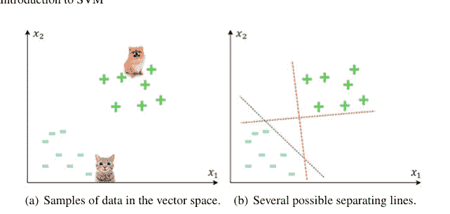

SVM，假设一个二维空间中的二元分类示例，例如，使用它们的身高（$x_1$）和体重（$x_2$）值来区分猫和狗。图1.2a给出了这些类别在特征空间中的带标签训练样本示例，其中狗的样本被视为正样本，猫的样本被视为负样本。为了进行分类，最初的直观方法可能是在正负样本之间画一条分隔线。然而，如图1.2b所示，有许多可能的线可以作为这些类别之间的决策边界。现在的问题是，哪条线更好，应该被选为边界？

尽管图1.2b中给出的所有线都是进行分类的正确答案，但似乎没有一条是最佳选择。或者，在两个类别之间画一条与两个类别都有最大距离的线是更好的选择。为此，最靠近决策边界的数据点是最难分类的样本，它们直接影响边界的最佳位置。这些样本被称为支持向量，它们更靠近决策边界并影响其位置和方向（见图1.3）。根据这些向量，确定两个类别之间的最大距离。这个距离被称为间隔，而一条位于此间隔一半处的决策线似乎是最佳边界。这条线使得间隔最大化，被称为两个类别之间的最大间隔线。SVM分类器试图找到这条最优线。

在SVM中，为了构建最优决策边界，考虑一个向量$\mathbf{w}$垂直于间隔。现在，为了对一个未知向量$\mathbf{x}$进行分类，我们可以通过计算$\mathbf{w}.\mathbf{x}$将其投影到$\mathbf{w}$上，并通过计算$\mathbf{w}.\mathbf{x} \geq t$（其中$t$是一个常数阈值）来确定$\mathbf{x}$位于决策边界的哪一侧。这意味着如果$\mathbf{w}.\mathbf{x}$的值大于$t$，即它距离较远，则样本$\mathbf{x}$被分类为正例。假设$t = -w_0$，给定的决策规则可以表示为$\mathbf{w}.\mathbf{x} + w_0 \geq 0$。现在的问题是，我们如何确定$\mathbf{w}$和$w_0$的值？为此，考虑以下约束条件，这意味着如果一个样本的值等于或大于1，则被分类为正类；如果值为-1或更小，则被分类为负类：

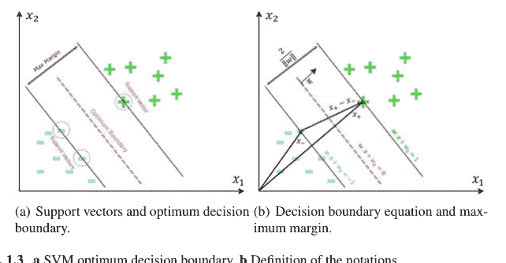

(a) 支持向量和最优决策边界。(b) 决策边界方程和最大间隔。

**图1.3** a SVM最优决策边界，b 符号定义

$$\mathbf{w}.\mathbf{x}_+ + w_0 \geq 1, \quad and \quad \mathbf{w}.\mathbf{x}_- + w_0 \leq -1. \tag{1.1}$$

这两个方程可以合并为一个不等式，如公式1.2所示，通过引入一个辅助变量$y_i$，对于正样本其值为$+1$，对于负样本其值为$-1$。这个不等式被视为等式，即$y_i(\mathbf{w}.\mathbf{x}_i + w_0) - 1 = 0$，以定义问题的主要约束，这意味着位于间隔上的样本（即*支持向量*）被约束为0。这个方程等价于一条线，它是我们问题的答案。在这个例子中的决策边界线在一般的$N$维情况下成为一个超平面。

$$y_i(\mathbf{w}.\mathbf{x}_i + w_0) - 1 \geq 0. \tag{1.2}$$

为了找到分隔正负样本的最大间隔，我们需要知道间隔的宽度。为了计算间隔的宽度，需要将$(\mathbf{x}_+ - \mathbf{x}_-)$投影到单位归一化的$\frac{\mathbf{w}}{\|\mathbf{w}\|}$上。因此，宽度计算为$(\mathbf{x}_+ - \mathbf{x}_-).\frac{\mathbf{w}}{\|\mathbf{w}\|}$，其中使用$y_i(\mathbf{w}.\mathbf{x}_i + w_0) - 1 = 0$来代入$\mathbf{w}.\mathbf{x}_+ = 1 - w_0$和$\mathbf{w}.\mathbf{x}_- = 1 + w_0$，最终得到宽度的值为$2\|\mathbf{w}\|$（见图1.3）。最后，最大化这个间隔等价于公式1.3，这是一个二次函数：

$$\min_{\mathbf{w}, w_0} \frac{1}{2} \|\mathbf{w}\|^2, \quad y_i(\mathbf{w}.\mathbf{x}_i + w_0) - 1 \geq 0. \tag{1.3}$$

这是一个约束优化问题，可以通过拉格朗日乘子法求解。写出如公式1.4所示的拉格朗日方程后，对$\mathbf{w}$求偏导并设为零，得到$\mathbf{w} = \sum_i \alpha_i y_i \mathbf{x}_i$；对$w_0$求偏导并设为零，得到$\sum_i \alpha_i y_i$。这意味着$\mathbf{w}$是样本的线性组合。将这些值代入公式1.4，得到一个拉格朗日

##### 1 支持向量机简介

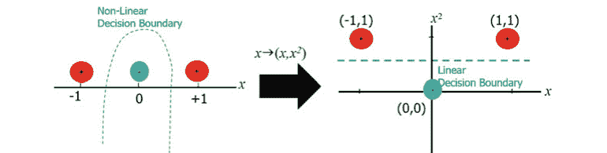

方程，其中问题仅依赖于数据样本对的点积。此外，对于不是支持向量的训练样本，$\alpha_i = 0$，这意味着这些样本不影响决策边界。关于这个优化问题的另一个有趣事实是，它是一个凸问题，保证总能找到全局最优解。

$$L(\mathbf{w}, w_0) = \frac{1}{2}\|\mathbf{w}\|^2 + \sum_i [y_i(\mathbf{w}.\mathbf{x}_i + w_0) - 1]\alpha_i. \quad (1.4)$$

上述分类问题及其使用SVM的解决方案假设数据是线性可分的。然而，在大多数实际应用中，这个假设并不正确，大多数问题无法简单地使用线性边界进行分类。SVM决策边界最初是线性的 Vapnik (1963)，但已被扩展以处理非线性情况 Boser et al. (1992)。为此，SVM提出了一种称为核技巧的方法，其中输入向量使用非线性函数如$\phi(.)$转换到更高维空间。然后，在这个新空间中，找到最大间隔的线性边界。这意味着一个非线性问题被转换为新高维空间中的线性可分问题，而不影响问题的凸性。图1.4给出了该技术的一个简单示例，其中一维数据样本$x_i$使用$(x_i, x_i \times x_i)$变换转换为二维空间。在这种情况下，优化问题中两个样本的点积，即$x_i.x_j$，被替换为$\phi(x_i).\phi(x_j)$。实际上，如果我们有一个函数使得$K(x_i, x_j) = \phi(x_i).\phi(x_j)$，那么我们不需要知道变换$\phi(.)$，只需要函数$K(.)$（称为*核函数*）。一些常见的核函数包括线性核、多项式核、Sigmoid核和径向基函数（RBF）核。

尽管核技巧是处理非线性的一种巧妙方法，但SVM仍然假设数据在这个变换后的空间中是线性可分的。这个假设在大多数现实世界应用中并不成立。因此，提出了另一种类型的SVM，称为*软间隔SVM* Cortes and Vapnik (1995)。到目前为止描述的SVM方法被称为*硬间隔SVM*。如前所述，硬间隔SVM假设数据是线性可分的，没有任何错误，而软间隔SVM允许一些误分类，从而在非线性情况下产生更稳健的决策。

#### 1.4 支持向量机的历史

俄罗斯统计学家**弗拉基米尔·瓦普尼克**是支持向量机技术的主要创始人。支持向量机算法的主要工作由瓦普尼克（1963）提出，作为用于模式识别的广义肖像算法。然而，这并非第一个用于模式识别的算法，费舍尔在1936年就为此目的提出了一种方法费舍尔（1936）。此外，弗兰克·罗森布拉特提出了感知器线性分类器，这是一种早期的前馈神经网络罗森布拉特（1958）。在瓦普尼克和勒纳的主要工作一年后，即1964年，瓦普尼克进一步发展了广义肖像算法瓦普尼克和乔尔文基斯（1964）。同年，艾泽曼等人（1964）引入了核的几何解释，将其视为特征空间中的内积。核理论是支持向量机发展的主要概念，被称为“核技巧”，此前已在阿罗恩扎恩（1950）中提出。1965年，科弗（1965）引入了输入空间中的大间隔超平面，这是支持向量机算法的另一个关键思想。与此同时，曼加萨里安（1965）在模式识别中使用了类似的优化概念。史密斯（1968）引入了另一项重要研究，定义了支持向量机中软间隔概念的基本思想。该思想被提出作为使用松弛变量来克服噪声样本线性不可分的问题。在支持向量机发展史上，突破性工作是瓦普尼克和乔尔文基斯（1974）提出的统计学习框架或VC理论，它提出了最稳健的预测方法之一。毫不奇怪地说，支持向量机的兴起始于这十年，该参考文献已从俄语翻译成其他语言，如德语瓦普尼克和乔尔文基斯（1979）和英语瓦普尼克（1982）。波吉奥（1975）提出了在支持向量机中使用多项式核，而瓦哈（1990）提出了改进回归的核技术。波吉奥和吉罗西（1990）研究了神经网络与核回归之间的联系。贝内特和曼加萨里安（1992）改进了史密斯（1968）关于松弛变量的先前工作。支持向量机发展的另一个主要里程碑是在1992年，博瑟等人（1992）以当今的形式呈现了支持向量机。在这项工作中，线性分类器的最优间隔分类器（来自瓦普尼克（1963））通过利用核技巧扩展到最大间隔超平面的非线性情况艾泽曼等人（1964）。1995年，科尔特斯和瓦普尼克（1995）引入了支持向量机分类器的软间隔，使用松弛变量处理噪声和线性不可分数据。1996年，该算法被扩展到回归情况德鲁克等人（1996），称为支持向量回归。1995年后，支持向量机的快速增长以及该技术在各种应用中的使用有所增加。此外，支持向量机的理论方面已被研究，并已扩展到分类以外的其他领域。巴特利特（1998）给出了硬间隔泛化的统计界限，而肖-泰勒和克里斯蒂亚尼尼（2000）在2000年将其呈现给软间隔和回归情况。支持向量机最初是为监督学习开发的，后来被扩展到无监督情况本-胡尔等人（2001），称为支持向量聚类。支持向量机的另一个改进是段和克尔蒂（2005）将其从二元分类扩展到多类支持向量机，通过区分一个标签与其余标签（一对多）或每对类别之间（一对一）。2011年，支持向量机被分析为一个图模型，并表明它使用数据增强技术接受贝叶斯解释波尔森和斯科特（2011）。因此，韦策尔等人（2017）开发了一个可扩展的贝叶斯支持向量机版本，使得贝叶斯支持向量机能够应用于大数据应用。表1.1总结了与支持向量机发展相关的研究。

##### 表1.1 支持向量机发展的简要历史

| 十年 | 年份 | 研究者 | 支持向量机发展 |
|---|---|---|---|
| 1950 | 1950 | 阿罗恩扎恩（1950） | 引入“再生核理论” |
| 1960 | 1963 | 瓦普尼克和勒纳（1963） | 引入广义肖像算法（支持向量机实现的算法是广义肖像算法的非线性推广） |
| | 1964 | 瓦普尼克（1964） | 发展广义肖像算法 |
| | 1964 | 艾泽曼等人（1964） | 引入核的几何解释，将其视为特征空间中的内积 |
| | 1965 | 科弗（1965） | 讨论输入空间中的大间隔超平面以及稀疏性 |
| | 1965 | 曼加萨里安（1965） | 研究类似于大间隔超平面的模式识别优化技术 |
| | 1968 | 史密斯（1968） | 引入使用松弛变量来克服噪声和不可分性问题 |
| 1970 | 1973 | 达达和哈特（1973） | 讨论输入空间中的大间隔超平面 |
| | 1974 | 瓦普尼克和乔尔文基斯（1974） | 撰写关于“统计学习理论”的书籍（俄语），可视为支持向量机的起点 |
| | 1975 | 波吉奥（1975） | 提出在支持向量机中使用多项式核 |
| | 1979 | 瓦普尼克和乔尔文基斯（1979） | 将瓦普尼克和乔尔文基斯1974年的书籍翻译成德语 |
| 1980 | 1982 | 瓦普尼克（1982） | 撰写其1979年书籍的英文翻译 |
| 1990 | 1990 | 波吉奥和吉罗西（1990） | 研究神经网络与核回归之间的联系 |
| | 1990 | 瓦哈（1990） | 改进回归的核方法 |
| | 1992 | 贝内特和曼加萨里安（1992） | 改进史密斯1968年关于松弛变量的工作 |
| | 1992 | 博瑟等人（1992） | 在COLT 1992会议上以当今的形式呈现支持向量机 |
| | 1995 | 科尔特斯和瓦普尼克（1995） | 引入软间隔分类器 |
| | 1996 | 德鲁克等人（1996） | 将算法扩展到回归情况，称为支持向量回归 |
| | 1997 | 穆勒等人（1997） | 扩展支持向量机用于时间序列预测 |
| | 1998 | 巴特利特（1998） | 提供硬间隔泛化的统计界限 |
| 2000 | 2000 | 肖-泰勒和克里斯蒂亚尼尼（2000） | 给出软间隔和回归情况泛化的统计界限 |
| | 2001 | 本-胡尔等人（2001） | 将支持向量机扩展到无监督情况 |
| | 2005 | 段和克尔蒂（2005） | 将支持向量机从二元分类扩展到多类支持向量机 |
| 2010 | 2011 | 波尔森和斯科特（2011） | 研究支持向量机的图模型表示及其贝叶斯解释 |
| | 2017 | 韦策尔等人（2017） | 开发可扩展的贝叶斯支持向量机版本，用于大数据应用 |

#### 1.5 支持向量机的应用

如今，机器学习算法正在兴起，并广泛应用于实际应用中。每年都提出新的技术来克服当前领先的算法。其中一些只是微小的进步或现有算法的组合，而另一些则是新创建的，并带来了惊人的进步。尽管深度学习技术在许多实际应用中占据主导地位，例如图像处理（例如，用于图像分类）和序列数据建模（例如，在自然语言处理任务中，如机器翻译），但这些技术需要大量的训练数据才能成功建模。在许多应用中，大规模标注数据集不可用，其中其他机器学习技术（称为经典机器学习方法），如支持向量机、决策树和贝叶斯家族方法，比深度学习技术具有更高的性能。此外，机器学习中还有另一个事实。机器学习应用中的每个任务都可以使用各种方法解决；然而，没有单一算法能对所有任务都表现良好。这一事实被称为机器学习中的无免费午餐定理沃尔珀特（1996）。我们想要解决的每个任务都有其独特性，并且有各种机器学习算法适合该问题。在非深度学习方法中，支持向量机作为一种著名的机器学习技术，由于其在各种问题领域和数据集上的高性能和可靠性，如今被广泛用于各种分类和回归任务塞尔万特斯等人（2020）。通常，支持向量机可以应用于任何应用中的任何机器学习任务，例如计算机视觉和图像处理、自然语言处理、医学应用、生物识别和认知科学。下面，将回顾支持向量机的一些常见应用。

##### 1 支持向量机简介

- **机器学习在医学中的应用**：支持向量机被广泛应用于医学领域，包括医学图像处理（例如，乳腺X光检查中的癌症诊断 Azar and El-Said (2014)）、生物信息学（例如，患者和基因分类）Byvatov and Schneider (2003)，以及健康信号分析（例如，用于检测心脏异常的心电图信号分类 Melgani and Bazi (2008)，以及心理学和神经科学中的脑电图信号处理 Li et al. (2013)）。作为该领域成功的方法之一，支持向量机被用于各种疾病的诊断和预后。此外，支持向量机还用于识别基因分类、基于基因的患者分类以及其他生物学问题 Pavlidis et al. (2001)。

- **文本分类**：文本分类有多种应用，包括主题识别（例如，将给定文档分类到预定义类别中，如科学、体育或政治）；作者识别/验证书面文档、垃圾邮件和虚假新闻/电子邮件/评论检测；语言识别（例如，确定文档的语言）；极性检测（例如，判断社交媒体或电子商务网站上的给定评论是正面还是负面）；以及词义消歧（例如，确定句子中多义词（如“bank”）的含义）。在该领域，支持向量机是与其他机器学习技术相比具有竞争力的方法 Joachims (1999), Aggarwal and Zhai (2012)。

- **图像分类**：为图像分配标签的过程通常被称为图像识别，可用于多个领域，例如生物识别（例如，人脸检测/识别/验证）、医学（例如，处理MRI和CT图像以进行疾病诊断）、物体识别、遥感分类（例如，卫星图像分类）、社交网络和网站的自动图像组织、视觉搜索和图像检索。尽管深度学习技术，特别是卷积神经网络在表示和特征提取方面处于领先地位，但支持向量机通常被用作分类器 Miranda et al. (2016), Tuia et al. (2011)，既与基于经典图像处理的技术结合，也与深度神经网络方法结合 Li (2019)。图像识别服务现在通常由微软、IBM、亚马逊和谷歌等科技公司的人工智能团队提供。

- **隐写术检测**：隐写术是将消息隐藏在合适的多媒体载体（如图像、音频文件或视频文件）中的实践。该技术用于安全组织中的安全通信，以隐藏正在发送秘密消息的事实及其内容。与仅保护消息内容的密码学相比，这种方法具有优势。另一方面，检测图像（或其他文件）是否为隐写图像的行为被称为隐写分析。分析图像以确定其是否为隐写图像是一个二元分类问题，支持向量机在其中被广泛使用 Li (2011)。

## 参考文献

Aggarwal, C.C., Zhai, C.: 文本分类算法综述。见：Aggarwal, C.C., Zhai, C. (编) 挖掘文本数据，163–222。Springer，波士顿 (2012)
Aizerman, M.A., Braverman, E.M., Rozonoer, L.I.: 模式识别学习中势函数方法的理论基础。自动化与远程控制 **25**，821–837 (1964)
Aronszajn, N.: 再生核理论。美国数学学会汇刊 **68**，337–404 (1950)
Assael, Y.M., Shillingford, B., Whiteson, S., De Freitas, N.: Lipnet：端到端句子级唇读。arXiv:1611.01599
Azar, A.T., El-Said, S.A.: 乳腺癌X光识别中支持向量机分类器的性能分析。神经计算应用 **24**，1163–1177 (2014)
Bartlett, P.L.: 神经网络模式分类的样本复杂性：权重的大小比网络的大小更重要。IEEE信息论汇刊 **44**，525–536 (1998)
Bayes, T.: 关于机会学说中一个问题的求解论文。MD计算 **8**，157 (1991)
Ben-Hur, A., Horn, D., Siegelmann, H.T., Vapnik, V.: 支持向量聚类。机器学习研究杂志 **2**，125–137 (2001)
Bennett, K.P., Mangasarian, O.L.: 两个线性不可分集的鲁棒线性规划判别。优化方法与软件 **1**，23–34 (1992)
Bishop, C.M.: 模式识别与机器学习。Springer，新加坡 (2006)
Boser, B.E., Guyon, I.M., Vapnik, V.N.: 最优间隔分类器的训练算法。见：COLT92：第五届计算机学习理论年度研讨会，宾夕法尼亚州 (1992)
Byvatov, E., Schneider, G.: 支持向量机在生物信息学中的应用。应用生物信息学 **2**，67–77 (2003)
Cervantes, J., Garcia-Lamont, F., Rodríguez-Mazahua, L., Lopez, A.: 支持向量机分类的全面综述：应用、挑战与趋势。神经计算 **408**，189–215 (2020)
Cortes, C., Vapnik, V.: 支持向量网络。机器学习 **20**，273–297 (1995)
Cover, T.M.: 线性不等式系统的几何和统计性质及其在模式识别中的应用。IEEE电子与计算机汇刊 **3**，326–334 (1965)
Cramer, J.S.: 逻辑回归的起源（技术报告）。Tinbergen研究所 167–178 (2002)
Drucker, H., Burges, C.J., Kaufman, L., Smola, A., Vapnik, V.: 支持向量回归机。神经信息处理系统进展 **9**，155–161 (1996)
Duan, K. B., Keerthi, S. S.: 哪种多类支持向量机方法最好？一项实证研究。见：国际多分类器系统研讨会，第278–285页。Springer，海德堡 (2005)
Duda, R.O., Hart, P.E.: 模式分类与场景分析。Wiley，纽约 (1973)
Ferrucci, D., Levas, A., Bagchi, S., Gondek, D., Mueller, E.T.: Watson：超越《危险边缘》！人工智能 **199**，93–105 (2013)
Fisher, R.A.: 回归公式的拟合优度及回归系数的分布。皇家统计学会杂志 **85**，597–612 (1922)
Fisher, R.A.: 多重测量在分类学问题中的应用。优生学年鉴 **7**，179–188 (1936)
Fukushima, K.: Neocognitron：一种能够进行视觉模式识别的分层神经网络。神经网络 **1**，119–130 (1988)
Gagniuc, P.A.: 马尔可夫链：从理论到实现与实验。Wiley，霍博肯，新泽西州 (2017)
Gers, F.A., Schmidhuber, J., Cummins, F.: 学会遗忘：使用LSTM进行持续预测。见：国际人工神经网络会议，爱丁堡 (1999)
Goodfellow, I., Bengio, Y., Courville, A., Bengio, Y.: 深度学习。MIT出版社，英格兰 (2016)
Hand, D.J., Yu, K.: “傻瓜贝叶斯”——其实并不那么傻？国际统计评论 **69**，385–398 (2001)
Hebb, D.: 行为的组织。Wiley，纽约 (1949)
Hinton, G.E.: 分析协作计算。第五届认知科学会议，罗切斯特 (1983)
Hinton, G.E., Osindero, S., Teh, Y.W.: 深度信念网络的快速学习算法。神经计算 **18**，1527–1554 (2006)
Ho, T.K.: 随机决策森林。见：第三届国际文档分析与识别会议论文集，蒙特利尔 (1995)
Hochreiter, S., Schmidhuber, J.: 长短期记忆。神经计算 **9**，1735–1780 (1997)
Hopfield, J.J.: 具有分级响应的神经元具有与双态神经元类似的集体计算特性。美国国家科学院院刊 **81**，3088–3092 (1984)
Joachims, T.: 使用支持向量机进行文本分类的直推式推理。见：ICML 99：第十六届国际机器学习会议论文集，200–209 (1999)
Khan, A., Sohail, A., Zahora, U., Qureshi, A.S.: 深度卷积神经网络最新架构综述。人工智能评论 **53**，5455–5516 (2020)
Li, B., He, J., Huang, J., Shi, Y.Q.: 图像隐写术与隐写分析综述。信息隐藏与多媒体信号处理杂志 **2**，142–172 (2011)
Li, S., Zhou, W., Yuan, Q., Geng, S., Cai, D.: 使用EMD和SVM进行癫痫脑电图的特征提取与识别。计算机在生物学与医学中的应用 **43**，807–816 (2013)
Li, Y., Li, J., Pan, J.S.: 结合深度学习的SVM高光谱图像识别。互联网技术杂志 **20**，851–859 (2019)
Liu, W., Wang, Z., Liu, X., Zeng, N., Liu, Y., Alsaadi, F.E.: 深度神经网络架构及其应用综述。神经计算 **234**，11–26 (2017)
Mangasarian, O.L.: 通过线性规划实现模式的线性与非线性分离。运筹学 **13**，444–452 (1965)
McCulloch, W.S., Pitts, W.: 神经活动中固有思想的逻辑演算。数学生物学通报 **5**，115–133 (1943)
Melgani, F., Bazi, Y.: 使用支持向量机和粒子群优化对心电图信号进行分类。IEEE信息技术与生物医学汇刊 **12**，667–677 (2008)
Michie, D.: 博弈学习机械化的实验 第一部分。模型的特征及其参数。计算机杂志 **6**，232–236 (1963)
Minsky, M., Papert, S.A.: 感知器：计算几何导论。MIT出版社，英格兰 (1969)
Miranda, E., Aryuni, M., Irwansyah, E.: 医学图像分类技术综述。见：信息管理与技术国际会议，第56–61页 (2016)
Mitchell, T.M.: 机器学习。麦格劳-希尔高等教育，纽约 (1997)
Morgan, J.N., Sonquist, J.A.: 调查数据分析中的问题及一项提案。美国统计协会杂志 **58**，415–434 (1963)
Müller, K.R., Smola, A.J., Rätsch, G., Schölkopf, B., Kohlmorgen, J., Vapnik, V.: 使用支持向量机预测时间序列。见：国际人工神经网络会议，第999–1004页。Springer，海德堡 (1997)
Nilsson, N.J.: 学习机器。麦格劳-希尔，纽约 (1965)
Pan, Z., Yu, W., Yi, X., Khan, A., Yuan, F., Zheng, Y.: 生成对抗网络（GANs）的最新进展：综述。IEEE Access **7**，36322–36333 (2019)
Pavlidis, P., Weston, J., Cai, J., Grundy, W N.: 基于异构数据的基因功能分类。见：第五届计算生物学国际年会论文集，第249–255页 (2001)
Poggio, T.: 论最优非线性联想回忆。生物控制论 **19**，201–209 (1975)
Poggio, T., Girosi, F.: 用于近似和学习的网络。IEEE会刊 **78**，1481–1497 (1990)
Polson, N.G., Scott, S.L.: 支持向量机的数据增强。贝叶斯分析 **6**，1–23 (2011)
Rosenblatt, F.: 感知器：大脑中信息存储与组织的概率模型。心理学评论 **65**，386–408 (1958)
Rumelhart, D.E., Hinton, G.E., Williams, R.J.: 通过反向传播误差学习表征。自然 **323**，533–536 (1986)
Samuel, A.L.: 使用跳棋游戏进行的一些机器学习研究。IBM研究与发展杂志 **3**，210–229 (1959)

# 第2章
SVM方法与最小二乘SVM基础

Kurosh Parand, Fatemeh Baharifard, Alireza Afzal Aghaei, and Mostafa Jani

**摘要** 支持向量机算法的学习过程涉及求解一个凸二次规划问题。由于该优化问题具有唯一解，并且满足Karush–Kuhn–Tucker条件，因此可以非常高效地求解。本章讨论了在各种形式的支持向量机算法中出现的优化问题的公式化。

**关键词** 支持向量机 · 分类 · 回归 · 核技巧

### 2.1 线性SVM分类器

如前一章所述，用于分类可分离数据的线性支持向量机方法由Vapnik和Chervonenkis（1964）提出。该方法在训练数据集中找到最佳判别超平面，将两类样本分开。考虑$\mathcal{D} = \{(\mathbf{x}_i, y_i) \mid i = 1 \dots N, \mathbf{x}_i \in \mathbb{R}^d \text{ and } y_i \in \{-1, +1\}\}$作为一组训练数据，其中$C_1$类和$C_2$类的样本分别具有$+1$和$-1$标签。

本节将针对两种情况解释SVM方法。第一种情况发生在训练样本线性可分时，目标是通过硬间隔SVM方法找到一个线性分隔器。第二种情况涉及训练样本线性不可分（例如，由于噪声），因此必须使用软间隔SVM方法。

#### 2.1.1 硬间隔SVM

假设输入数据是线性可分的。图2.1展示了此类数据的一个示例，并表明分隔超平面不是唯一的。SVM方法的目标是找到一个唯一的超平面，使其到两类最近点的距离最大。该超平面的方程可考虑如下：

$$\langle \mathbf{w}, \mathbf{x}\rangle + w_0 = \mathbf{w}^T \mathbf{x} + w_0 = \sum_{i=1}^d w_i x_i + w_0 = 0, \quad (2.1)$$

其中$w_i$是问题的未知权重。

分隔器的间隔是超平面与最近训练样本之间的距离。较大的间隔能为未见数据提供更好的泛化能力。具有最大间隔的超平面到两类最近样本的距离相等。考虑从分隔超平面到$C_1$类和$C_2$类最近样本的距离均等于$\frac{D}{\|\mathbf{w}\|}$，其中$\|\mathbf{w}\|$是$\mathbf{w}$的欧几里得范数。因此，间隔将等于$\frac{2D}{\|\mathbf{w}\|}$。硬间隔SVM方法的目的是最大化此间隔，以便所有训练数据都能被正确分类。因此，必须满足以下条件：

$$\begin{cases} \forall \mathbf{x}_i \in C_1 \quad (y_i = +1) \rightarrow (\mathbf{w}^T \mathbf{x}_i + w_0) \geq D, \ \forall \mathbf{x}_i \in C_2 \quad (y_i = -1) \rightarrow (\mathbf{w}^T \mathbf{x}_i + w_0) \leq -D. \end{cases} \quad (2.2)$$

因此，为了找到分隔超平面，得到以下优化问题，该问题在二维空间中的示意图如图2.2所示：

$$\max_{D,\mathbf{w},w_0} \frac{2D}{\|\mathbf{w}\|}$$
$$\text{s.t. } (\mathbf{w}^T\mathbf{x}_i + w_0) \geq D, \quad \forall \mathbf{x}_i \in C_1,$$
$$\quad\quad (\mathbf{w}^T\mathbf{x}_i + w_0) \leq -D, \quad \forall \mathbf{x}_i \in C_2.$$
(2.3)

可以设$\mathbf{w}' = \frac{\mathbf{w}}{D}$和$w_0' = \frac{w_0}{D}$，并将上述两个不等式合并为一个不等式$y_i(\mathbf{w}^T\mathbf{x}_i + w_0) \geq 1$，得到：

$$\max_{\mathbf{w}',w_0'} \frac{2}{\|\mathbf{w}'\|}$$
$$\text{s.t. } y_i(\mathbf{w}'^T\mathbf{x}_i + w_0') \geq 1, \quad i = 1, \ldots, N.$$
(2.4)

此外，为了最大化间隔，可以等价地最小化$\|\mathbf{w}'\|$。这给出了我们以下关于归一化向量$\mathbf{w}$和$w_0$的原始问题（为简单起见，此处用$\|\mathbf{w}\|^2 = \mathbf{w}^T\mathbf{w}$代替$\|\mathbf{w}\|$）：

$$\min_{\mathbf{w},w_0} \frac{1}{2} \mathbf{w}^T\mathbf{w}$$
$$\text{s.t. } y_i(\mathbf{w}^T\mathbf{x}_i + w_0) \geq 1, \quad i = 1, \ldots, N.$$
(2.5)

二次规划（QP）问题作为非线性规划的一个特例，是在一些线性约束条件下，最小化或最大化多个变量的二次目标函数的问题。

Samuel, A.L.: Some studies in machine learning using the game of checkers. IBM J. Res. Dev. **44**, 206–226 (2000)

Schapire, R.E.: The strength of weak learnability. Mach. Learn. **5**, 197–227 (1990)

Sebestyen, G.S.: Decision-Making Processes in Pattern Recognition. Macmillan, New York (1962)

Shawe-Taylor, J., Cristianini, N.: Margin distribution and soft margin. In: Smola, A.J., Bartlett, P., Schölkopf, B., Schuurmans, D., (eds.), Advances in Large Margin Classifiers, pp. 349–358. MIT Press, England (2000)

Silver, D., Schrittwieser, J., Simonyan, K., Antonoglou, I., Huang, A., Guez, A., Hubert, T., Baker, L., Lai, M., Bolton, A., Chen, Y.: Mastering the game of go without human knowledge. Nature **550**, 354–359 (2017)

Smith, F.W.: Pattern classifier design by linear programming. IEEE Trans. Comput. **100**, 367–372 (1968)

Solomonoff, R.J.: A formal theory of inductive inference. Part II. Inf. Control. **7**, 224–254 (1964)

Sutton, R.S., Barto, A.G.: Reinforcement Learning: An Introduction. MIT Press, USA (2018)

Tuia, D., Volpi, M., Copa, L., Kanevski, M., Munoz-Mari, J.: A survey of active learning algorithms for supervised remote sensing image classification. IEEE J. Sel. Topics Signal Process. **5**, 606–617 (2011)

Vapnik, V.: Pattern recognition using generalized portrait method. Autom. Remote. Control. **24**, 774–780 (1963)

Vapnik, V.N.: Estimation of Dependencies Based on Empirical Data. Springer, New York (1982)

Vapnik, V.N.: The Nature of Statistical Learning Theory. Springer, New York (1995)

Vapnik, V.N., Chervonenkis, A.Y.: On a class of perceptrons. Autom. Remote. **25**, 103–109 (1964)

Vapnik, V., Chervonenkis, A.: Theory of pattern recognition: statistical problems of learning (Russian). Nauka, Moscow (1974)

Vapnik, V., Chervonenkis, A.: Theory of Pattern Recognition (German). Akademie, Berlin (1979)

Wahba, G.: Spline Models for Observational Data. SIAM, PA (1990)

Warwick, K.: A Brief History of Deep Blue. IBM's Chess Computer, Mental Floss (2017)

Watkins, C.J.C.H.: Learning from delayed rewards. Ph.D. thesis, University of Cambridge, England (1989)

Wenzel, F., Galy-Fajou, T., Deutsch, M., Kloft, M.: Bayesian nonlinear support vector machines for big data. In: European Conference on Machine Learning and Knowledge Discovery in Databases, pp. 307–322. Springer, Cham (2017)

Widrow, B., Hoff, M.E.: Adaptive Switching Circuits (No. TR-1553-1). Stanford University California Stanford Electronics Labs (1960)

Wolpert, D.H.: The lack of a priori distinctions between learning algorithms. Neural Comput. **8**, 1341–1390 (1996)

Xu, R., Wunsch, D.: Survey of clustering algorithms. IEEE Trans. Neural Netw. Learn. Syst. **16**, 645–678 (2005)

二次规划问题的优势在于存在一些高效的计算方法来求解它们，例如 Frank 和 Wolfe (1956)、Murty 和 Yu (1988) 提出的方法。该问题的一般形式如下所示。其中，$Q$ 是一个实对称矩阵。

$$\min_{x} \frac{1}{2} \mathbf{x}^T Q \mathbf{x} + \mathbf{c}^T \mathbf{x} \quad (2.6)$$
$$\text{s.t. } A\mathbf{x} \leq \mathbf{b},$$
$$E\mathbf{x} = \mathbf{d}.$$

根据上述定义，式 2.5 的问题可以被视为一个凸二次规划问题（$Q$ 为单位矩阵，向量 $\mathbf{c}$ 为零，且约束条件被重新表述为 $A\mathbf{x} \leq \mathbf{b}$ 的形式）。如果该问题存在可行解，那么它就是一个全局最小值，并且可以通过高效的方法获得。

另一方面，我们不求解问题的原始形式，而是可以求解其对偶形式。对偶问题通常更容易处理，并且有助于我们更好地理解最优超平面。更重要的是，它使我们能够利用核技巧，这一点将在后面解释。

求解约束优化问题的一个常用方法是使用拉格朗日乘子法。在拉格朗日乘子法中，由目标函数和约束条件构成一个新的函数，即拉格朗日函数，其目标是获得该函数的驻点。考虑如下最小化问题：

$$p^* = \min_{x} f(x) \quad (2.7)$$
$$\text{s.t. } g_i(x) \leq 0, \quad i = 1, \dots, m,$$
$$h_i(x) = 0, \quad i = 1, \dots, p.$$

该问题的拉格朗日函数为

$$\mathcal{L}(x, \alpha, \lambda) = f(x) + \sum_{i=1}^{m} \alpha_i g_i(x) + \sum_{i=1}^{p} \lambda_i h_i(x), \quad (2.8)$$

其中 $\alpha = [\alpha_1, \dots, \alpha_m]$ 和 $\lambda = [\lambda_1, \dots, \lambda_p]$ 是拉格朗日乘子向量。根据以下方程，通过设定 $\alpha_i \geq 0$，$\mathcal{L}(x, \alpha, \lambda)$ 的最大值等价于 $f(x)$

$$\max_{\alpha_i \geq 0, \lambda_i} \mathcal{L}(x, \alpha, \lambda) = \begin{cases} \infty & \forall g_i(x) > 0, \\ \infty & \forall h_i(x) \neq 0, \\ f(x) & \text{otherwise}. \end{cases} \quad (2.9)$$

因此，式 2.7 的问题可以写为

$$p^* = \min_{x} \max_{\alpha_i \geq 0, \lambda_i} \mathcal{L}(x, \alpha, \lambda). \quad (2.10)$$

式 2.10 的对偶形式将通过交换最大和最小的顺序得到

$$d^* = \max_{\alpha_i \ge 0, \lambda_i} \min_x \mathcal{L}(x, \alpha, \lambda). \tag{2.11}$$

弱对偶性总是成立的，因此 $d^* \le p^*$。此外，由于原始问题是凸的，强对偶性也成立，即 $d^* = p^*$。所以，原始最优目标值和对偶最优目标值是相等的，我们可以求解对偶问题来代替求解原始问题。

这里讨论式 2.5 问题的对偶形式。结合目标函数和约束条件，我们得到

$$\mathcal{L}(\mathbf{w}, w_0, \alpha) = \frac{1}{2} \|\mathbf{w}\|^2 + \sum_{i=1}^N \alpha_i (1 - y_i (\mathbf{w}^T \mathbf{x}_i + w_0)), \tag{2.12}$$

这引出了以下优化问题：

$$\min_{\mathbf{w}, w_0} \max_{\alpha_i \ge 0} \left\{ \frac{1}{2} \|\mathbf{w}\|^2 + \sum_{i=1}^N \alpha_i (1 - y_i (\mathbf{w}^T \mathbf{x}_i + w_0)) \right\}. \tag{2.13}$$

对应于强对偶性，可以考察以下对偶优化问题来寻找上述问题的最优解

$$\max_{\alpha_i \ge 0} \min_{\mathbf{w}, w_0} \left\{ \frac{1}{2} \|\mathbf{w}\|^2 + \sum_{i=1}^N \alpha_i (1 - y_i (\mathbf{w}^T \mathbf{x}_i + w_0)) \right\}. \tag{2.14}$$

该解的特征是问题的鞍点。为了找到

$$\min_{\mathbf{w}, w_0} \mathcal{L}(\mathbf{w}, w_0, \alpha),$$

对 $\mathcal{L}$ 关于 $\mathbf{w}$ 和 $w_0$ 求一阶偏导数，得到

$$\begin{cases} \nabla_{\mathbf{w}} \mathcal{L}(\mathbf{w}, w_0, \alpha) = 0, & \rightarrow \mathbf{w} = \sum_{i=1}^N \alpha_i y_i \mathbf{x}_i, \\ \frac{\partial \mathcal{L}(\mathbf{w}, w_0, \alpha)}{\partial w_0} = 0, & \rightarrow \sum_{i=1}^N \alpha_i y_i = 0. \end{cases} \tag{2.15}$$

在这些方程中，$w_0$ 已被消去，并且为 $\alpha$ 设置了一个全局约束。将上述方程中的 $\mathbf{w}$ 代入式 2.12 的拉格朗日函数，我们得到

$$\mathcal{L}(\alpha) = \sum_{i=1}^N \alpha_i - \frac{1}{2} \sum_{i=1}^N \sum_{j=1}^N \alpha_i \alpha_j y_i y_j \mathbf{x}_i^T \mathbf{x}_j. \tag{2.16}$$

因此，式 2.5 问题的对偶形式如下：

$$\max_{\alpha} \left\{ \sum_{i=1}^{N} \alpha_i - \frac{1}{2} \sum_{i=1}^{N} \sum_{j=1}^{N} \alpha_i \alpha_j y_i y_j \mathbf{x}_i^T \mathbf{x}_j \right\} \quad (2.17)$$

s.t. $\sum_{i=1}^{N} \alpha_i y_i = 0$,

$\alpha_i \geq 0, \quad i = 1, \dots, N$.

式 2.17 的等价形式可以考虑如下，根据式 2.6，这是一个二次规划问题

$$\min_{\alpha} \frac{1}{2} \alpha^T \begin{bmatrix} y_1 y_1 \mathbf{x}_1^T \mathbf{x}_1 & \dots & y_1 y_N \mathbf{x}_1^T \mathbf{x}_N \\ \vdots & \ddots & \vdots \\ y_N y_1 \mathbf{x}_N^T \mathbf{x}_1 & \dots & y_N y_N \mathbf{x}_N^T \mathbf{x}_N \end{bmatrix} \alpha + (-\mathbf{1})^T \alpha \quad (2.18)$$

s.t. $-\alpha \leq \mathbf{0}$,

$\mathbf{y}^T \alpha = \mathbf{0}$.

通过二次规划过程求得 $\alpha$ 后，向量 $\mathbf{w}$ 可以通过等式 $\mathbf{w} = \sum_{i=1}^{N} \alpha_i y_i \mathbf{x}_i$ 计算得出，剩下的唯一未知变量是 $w_0$。为了计算 $w_0$，必须首先引入支持向量的概念。为了阐述支持向量的概念，我们需要先解释 Karush–Kuhn–Tucker (KKT) 条件 Karush (1939), Kuhn and Tucker (1951)。

非线性规划最优解的必要条件被称为 Karush–Kuhn–Tucker (KKT) 条件。事实上，如果存在 $\mathcal{L}(\mathbf{w}, w_0, \alpha)$ 的某个鞍点 $(\mathbf{w}^*, w_0^*, \alpha^*)$，那么它满足以下 KKT 条件：

$$\begin{cases} 1. & y_i(\mathbf{w}^{*T} \mathbf{x}_i + w_0^*) \geq 1, \quad i = 1, \dots, N, \\ 2. & \nabla_{\mathbf{w}} \mathcal{L}(\mathbf{w}, w_0, \alpha)|_{\mathbf{w}^*, w_0^*, \alpha^*} = 0, \\ & \frac{\partial \mathcal{L}(\mathbf{w}, w_0, \alpha)}{\partial w_0}|_{\mathbf{w}^*, w_0^*, \alpha^*} = 0, \\ 3. & \alpha_i^* (1 - y_i(\mathbf{w}^{*T} \mathbf{x}_i + w_0^*)) = 0, \quad i = 1, \dots, N, \\ 4. & \alpha_i^* \geq 0, \quad i = 1, \dots, N. \end{cases} \quad (2.19)$$

第一个条件表示解的可行性，并指出在最优点处不应违反约束条件。第二个条件确保不存在既能改善目标函数又可行的方向。第三个条件与互补松弛性有关，它与第四个条件一起表明，不等式约束的拉格朗日乘子为零，而等式约束的拉格朗日乘子为正。换句话说，对于起作用的约束 $y_i(\mathbf{w}^T \mathbf{x}_i + w_0) = 1$，$\alpha_i$ 可以大于零，相应的 $\mathbf{x}_i$ 被定义为支持向量。但对于不起作用的约束 $y_i(\mathbf{w}^T \mathbf{x}_i + w_0) > 1$，$\alpha_i = 0$，且 $\mathbf{x}_i$ 不是支持向量（见图 2.3）。

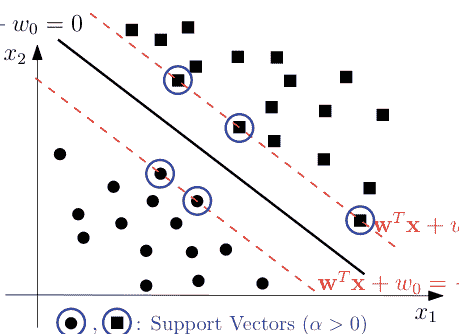

图 2.3 硬间隔 SVM 方法中的支持向量

如果我们定义一组支持向量为 $SV = \{\mathbf{x}_j | \alpha_j > 0\}$，并相应地定义 $S = \{i | \mathbf{x}_i \in SV\}$，那么与 $\mathbf{w}$ 相关的超平面方向可以如下求得：

$$\mathbf{w} = \sum_{s \in S} \alpha_s y_s \mathbf{x}_s. \tag{2.20}$$

此外，任何拉格朗日乘子大于零的样本都位于间隔上，可用于计算 $w_0$。使用满足等式 $y_{s_j} (\mathbf{w}^T \mathbf{x}_{s_j} + w_0) = 1$ 的样本 $\mathbf{x}_{s_j}$（其中 $s_j \in S$），我们有

$$w_0 = y_{s_j} - \mathbf{w}^T \mathbf{x}_{s_j}. \tag{2.21}$$

假设线性分类器为 $y = \text{sign}(w_0 + \mathbf{w}^T \mathbf{x})$，那么新样本可以仅使用问题的支持向量进行分类。考虑一个新样本 $\mathbf{x}$，那么该样本的标签（$\hat{y}$）可以如下计算：

$$\begin{aligned} \hat{y} &= \text{sign}(w_0 + \mathbf{w}^T \mathbf{x}) \tag{2.22} \\ &= \text{sign}\left(y_{s_j} - \left(\sum_{s \in S} \alpha_s y_s \mathbf{x}_s\right)^T \mathbf{x}_{s_j} + \left(\sum_{s \in S} \alpha_s y_s \mathbf{x}_s\right)^T \mathbf{x}\right) \\ &= \text{sign}\left(y_{s_j} - \sum_{s \in S} \alpha_s y_s \mathbf{x}_s^T \mathbf{x}_{s_j} + \sum_{s \in S} \alpha_s y_s \mathbf{x}_s^T \mathbf{x}\right). \end{aligned}$$

##### 2.1.2 软间隔支持向量机

软间隔支持向量机是一种为那些实际上并非线性可分的训练样本获取线性分类器的方法。类别重叠或包含一些噪声数据的可分类别就是这类问题的例子。在这些情况下，硬间隔支持向量机效果不佳，甚至无法得到正确答案。解决这些问题的一个方案是，尝试在最小化误分类点数量的同时，最大化正确分类的样本数量。但这种计数方案属于NP完全问题（Cortes 和 Vapnik, 1995）。因此，一个高效的解决方案是定义一个连续问题，该问题可以通过某些优化技术在多项式时间内确定性地求解。为此，Cortes 和 Vapnik (1995) 提出了硬间隔方法的扩展，称为软间隔支持向量机方法。

在软间隔方法中，允许样本违反条件，但这些违反的总量不应增加。实际上，软间隔方法试图在最小化总违反量的同时最大化间隔。因此，对于每个样本 $\mathbf{x}_i$，应定义一个松弛变量 $\xi_i \geq 0$，它表示该样本偏离正确间隔的程度，并将该样本的不等式放宽为

$$y_i(\mathbf{w}^T \mathbf{x}_i + w_0) \geq 1 - \xi_i. \tag{2.23}$$

此外，总违反量为 $\sum_{i=1}^N \xi_i$，应将其最小化。因此，获取分离超平面的原始优化问题变为

$$\min_{\mathbf{w}, w_0, \{\xi_i\}_{i=1}^N} \frac{1}{2} \mathbf{w}^T \mathbf{w} + C \sum_{i=1}^N \xi_i \tag{2.24}$$
$$\text{s.t.} \quad y_i(\mathbf{w}^T \mathbf{x}_i + w_0) \geq 1 - \xi_i, \quad i = 1, \ldots, N,$$
$$\xi_i \geq 0,$$

其中 $C$ 是一个正则化参数。$C$ 值较大意味着几乎忽略条件，因此如果 $C \to \infty$，该方法等同于硬间隔支持向量机。相反，如果 $C$ 值较小，条件容易被放宽，从而获得较大的间隔。因此，应根据问题和目的按比例使用适当的 $C$ 值。

如果样本 $\mathbf{x}_i$ 被正确分类，但位于间隔内部，则 $0 < \xi_i < 1$。否则 $\xi_i > 1$，这是因为样本 $\mathbf{x}_i$ 被错误分类，是一个误分类点（见图 2.4）。

如公式 2.24 所示，该问题仍然是一个凸二次规划问题，并且与硬间隔方法不同，它总能获得可行解。

这里讨论软间隔支持向量机的对偶形式。拉格朗日公式为

$$\mathcal{L}(\mathbf{w}, w_0, \xi, \alpha, \beta) = \frac{1}{2} \|\mathbf{w}\|^2 + C \sum_{i=1}^N \xi_i + \sum_{i=1}^N \alpha_i (1 - \xi_i - y_i (\mathbf{w}^T \mathbf{x}_i + w_0)) - \sum_{i=1}^N \beta_i \xi_i, \tag{2.25}$$

其中 $\alpha_i$ 和 $\beta_i$ 是拉格朗日乘子。拉格朗日公式应关于 $\mathbf{w}$、$w_0$ 和 $\xi_i$ 最小化，同时关于正的拉格朗日乘子 $\alpha_i$ 和 $\beta_i$ 最大化。为了找到 $\min_{\mathbf{w}, w_0, \xi} \mathcal{L}(\mathbf{w}, w_0, \xi, \alpha, \beta)$，我们有

$$\begin{cases} \nabla_{\mathbf{w}} \mathcal{L}(\mathbf{w}, w_0, \xi, \alpha, \beta) = 0 & \rightarrow \mathbf{w} = \sum_{i=1}^N \alpha_i y_i \mathbf{x}_i, \\ \frac{\partial \mathcal{L}(\mathbf{w}, w_0, \xi, \alpha, \beta)}{\partial w_0} = 0 & \rightarrow \sum_{i=1}^N \alpha_i y_i = 0, \\ \frac{\partial \mathcal{L}(\mathbf{w}, w_0, \xi, \alpha, \beta)}{\partial \xi_i} = 0 & \rightarrow C - \alpha_i - \beta_i = 0. \end{cases} \tag{2.26}$$

将上述方程中的 $\mathbf{w}$ 代入公式 2.25 的拉格朗日函数，可以得到与公式 2.16 相同的方程。但是，这里对 $\alpha$ 产生了两个约束。一个与之前相同，另一个是 $0 \le \alpha_i \le C$。需要注意的是，$\beta_i$ 不出现在公式 2.16 的 $\mathcal{L}(\alpha)$ 中，只需考虑 $\beta_i \ge 0$。因此，条件 $C - \alpha_i - \beta_i = 0$ 可以替换为条件 $0 \le \alpha_i \le C$。所以，问题公式 2.24 的对偶形式变为如下：

$$\max_{\alpha} \left\{ \sum_{i=1}^N \alpha_i - \frac{1}{2} \sum_{i=1}^N \sum_{j=1}^N \alpha_i \alpha_j y_i y_j \mathbf{x}_i^T \mathbf{x}_j \right\} \tag{2.27}$$

s.t. $\sum_{i=1}^N \alpha_i y_i = 0$,
$0 \le \alpha_i \le C, \quad i = 1, \dots, N.$

求解上述二次规划问题后，可以根据公式 (2.20) 和 (2.21) 分别获得 $\mathbf{w}$ 和 $w_0$，同时仍然定义 $S = \{i | \mathbf{x}_i \in SV\}$。如前所述，支持向量集 ($SV$) 是基于样本 $\mathbf{x}_i$ 的互补松弛条件 $\alpha_i^* (1 - y_i (\mathbf{w}^{*T} \mathbf{x}_i + w_0^*)) = 0$ 获得的。公式 2.24 的另一个互补松弛条件是 $\beta_i^* \xi_i = 0$。据此，支持向量分为两类：间隔支持向量和非间隔支持向量：

- 如果 $0 < \alpha_i < C$，根据条件 $C - \alpha_i - \beta_i = 0$，我们有 $\beta_i \neq 0$，因此 $\xi_i$ 应为零。所以，$y_i (\mathbf{w}^T \mathbf{x}_i + w_0) = 1$ 成立，样本 $\mathbf{x}_i$ 位于间隔上，是一个间隔支持向量。
- 如果 $\alpha_i = C$，我们有 $\beta_i = 0$，因此 $\xi_i$ 可以大于零。所以，$y_i (\mathbf{w}^T \mathbf{x}_i + w_0) < 1$，样本 $\mathbf{x}_i$ 位于间隔上或间隔外，是一个非间隔支持向量。

此外，软间隔支持向量机中新样本的分类公式与硬间隔支持向量机相同，后者在公式 2.22 中讨论过。

### 2.2 非线性支持向量机分类器

一些问题具有非线性决策面，因此线性方法无法为其提供合适的答案。Vapnik (2000) 为这些问题引入了非线性支持向量机分类器。在这种方法中，输入数据通过一个非线性函数映射到一个新的特征空间，并在变换后的特征空间中找到一个超平面。通过应用逆映射，该超平面在输入数据空间中变成一条曲线或一个曲面（见图 2.5）。

对输入空间应用变换 $\phi : \mathbb{R}^d \rightarrow \mathbb{R}^k$，样本 $\mathbf{x} = [x_1, \dots x_d]$ 在变换空间中可以表示为 $\phi(\mathbf{x}) = [\phi_1(\mathbf{x}), \dots, \phi_k(\mathbf{x})]$，其中 $\phi_i(\mathbf{x}) : \mathbb{R}^d \rightarrow \mathbb{R}$。变换空间中软间隔支持向量机的原始问题如下：

$$\min_{\mathbf{w}, w_0, \{\xi_i\}_{i=1}^N} \frac{1}{2} \mathbf{w}^T \mathbf{w} + C \sum_{i=1}^N \xi_i$$

s.t. $y_i(\mathbf{w}^T \phi(\mathbf{x}_i) + w_0) \geq 1 - \xi_i, \quad i = 1, \dots, N,$

$\xi_i \geq 0,$

其中 $\mathbf{w} \in \mathbb{R}^k$ 是需要求解的分离参数。

对偶问题公式 2.27 在变换空间中也发生变化，如下所示：

$$\max_{\alpha} \left\{ \sum_{i=1}^N \alpha_i - \frac{1}{2} \sum_{i=1}^N \sum_{j=1}^N \alpha_i \alpha_j y_i y_j \phi(\mathbf{x}_i)^T \phi(\mathbf{x}_j) \right\}$$

s.t. $\sum_{i=1}^N \alpha_i y_i = 0,$

$0 \leq \alpha_i \leq C, \quad i = 1, \dots, N.$

在这种情况下，分类器定义为

$$\hat{y} = \text{sign}(w_0 + \mathbf{w}^T \phi(\mathbf{x})),$$

其中 $\mathbf{w} = \sum_{\alpha_i > 0} \alpha_i y_i \phi(\mathbf{x}_i)$ 且 $w_0 = y_{s_j} - \mathbf{w}^T \phi(\mathbf{x}_{s_j})$，其中 $\mathbf{x}_{s_j}$ 是来自支持向量集的样本。

这种方法的挑战在于选择合适的变换。如果使用了合适的映射，问题可以在变换空间中以良好的精度建模。但是，如果 $k \gg d$，那么需要学习的参数更多，这会花费更多的计算时间。在这种情况下，最好使用下一节提到的核技巧。核技巧是一种无需显式地将特征映射应用于输入数据即可使用特征映射的技术。

#### 2.2.1 核技巧与Mercer条件

在基于核的方法中，无需对输入数据应用变换函数即可获得高维空间中的线性分离器。在优化问题公式 2.29 的对偶形式中，只存在每对训练样本的点积。通过计算这些内积的值，只剩下计算 $\alpha = [\alpha_1, \dots, \alpha_N]$。因此，与原始问题公式 2.28 不同，这里不需要学习 $k$ 个参数。当 $k \gg d$ 时，这一点的重要性就显而易见了。

让我们定义 $K(\mathbf{x}, \mathbf{t}) = \phi(\mathbf{x})^T \phi(\mathbf{t})$ 为核函数。核技巧的基础是在不将样本 $\mathbf{x}$ 和 $\mathbf{t}$ 映射到变换空间的情况下计算 $K(\mathbf{x}, \mathbf{t})$。例如，考虑一个二维输入数据集，并定义一个核函数如下：

### 2.3 支持向量回归

用于分类任务的支持向量机模型可以被修改以解决回归问题。这可以通过将 $\epsilon$-不敏感损失函数应用于模型来实现 Drucker et al. (1997)。该损失函数定义为

$$\text{loss}(y, \hat{y}; \epsilon) = |y - \hat{y}|_\epsilon = \begin{cases} 0 & |y - \hat{y}| \leq \epsilon, \\ |y - \hat{y}| - \epsilon & \text{otherwise}, \end{cases}$$

其中 $\epsilon \in \mathbb{R}^+$ 是一个超参数，它指定了 $\epsilon$-管道。任何落在该管道之外的预测点都会在模型中引入惩罚项。未知函数也定义为

$$y(\mathbf{x}) = \mathbf{w}^T \phi(\mathbf{x}) + w_0,$$

其中 $\mathbf{x} \in \mathbb{R}^d$ 且 $y \in \mathbb{R}$。支持向量回归模型的原始形式构建如下

$$\min_{\mathbf{w}, w_0, \xi, \xi^*} \quad \frac{1}{2} \mathbf{w}^T \mathbf{w} + C \sum_{i=1}^N (\xi_i + \xi_i^*)$$
$$\text{s.t.} \quad y_i - \mathbf{w}^T \phi(\mathbf{x}_i) - w_0 \leq \varepsilon + \xi_i, \quad i = 1, \dots, N, \quad (2.39)$$
$$\mathbf{w}^T \phi(\mathbf{x}_i) + w_0 - y_i \leq \varepsilon + \xi_i^*, \quad i = 1, \dots, N,$$
$$\xi_i, \xi_i^* \geq 0, \quad i = 1, \dots, N.$$

使用拉格朗日乘子，该优化问题的对偶形式为

$$\max_{\alpha, \alpha^*} -\frac{1}{2} \sum_{i,j=1}^N (\alpha_i - \alpha_i^*) (\alpha_j - \alpha_j^*) K(\mathbf{x}_i, \mathbf{x}_j) - \epsilon \sum_{i=1}^N (\alpha_i + \alpha_i^*) + \sum_{i=1}^N y_i (\alpha_i - \alpha_i^*)$$

$$\text{s.t.} \sum_{i=1}^N (\alpha_i - \alpha_i^*) = 0,$$

$$\alpha_i, \alpha_i^* \in [0, C].$$

偏置变量 $w_0$ 遵循 KKT 条件

$$w_0 = \frac{1}{|S|} \sum_{s \in S} \left[ y_s - \epsilon - \sum_{i=1}^N (\alpha_i - \alpha_i^*) K(\mathbf{x}_s, \mathbf{x}_i) \right],$$

其中 $|S|$ 是支持向量集的基数。对偶形式中的未知函数 $y(\mathbf{x})$ 可以计算为

$$y(\mathbf{x}) = \sum_{i=1}^N (\alpha_i - \alpha_i^*) K(\mathbf{x}, \mathbf{x}_i) + w_0.$$

### 2.4 最小二乘支持向量机分类器

最小二乘支持向量机 (LS-SVM) 是对机器学习任务中 SVM 公式的一种修改，最初由 Suykens 和 Vandewalle (1999) 提出。LS-SVM 将 SVM 原始模型中的不等式约束替换为等式约束。此外，松弛变量损失函数变为平方误差损失函数。利用这些变化，对偶问题转化为一个线性方程组。在某些情况下，求解这个线性方程组可能比求解二次规划问题在计算上更高效。尽管这种重新表述保留了核技巧的特性，但模型的稀疏性丢失了。这里将描述用于两类分类任务的 LS-SVM 公式。

与支持向量机相同，LS-SVM 在特征空间中考虑分离超平面：

$$y(\mathbf{x}) = \text{sign} \left[ \mathbf{w}^T \phi(\mathbf{x}) + w_0 \right].$$

$K(\mathbf{x}, \mathbf{t}) = (1 + \mathbf{x}^T \mathbf{t})^2$
$= (1 + x_1 t_1 + x_2 t_2)^2$
$= 1 + 2x_1 t_1 + 2x_2 t_2 + x_1^2 t_1^2 + x_2^2 t_2^2 + 2x_1 t_1 x_2 t_2.$

可以看出，该核函数的展开式等于以下二阶 $\phi$ 的内积：

$\phi(\mathbf{x}) = [1, \sqrt{2}x_1, \sqrt{2}x_2, x_1^2, x_2^2, \sqrt{2}x_1 x_2],$
$\phi(\mathbf{t}) = [1, \sqrt{2}t_1, \sqrt{2}t_2, t_1^2, t_2^2, \sqrt{2}t_1 t_2].$

因此，我们可以用核函数 $K(\mathbf{x}, \mathbf{t}) = (1 + \mathbf{x}^T \mathbf{t})^2$ 来替代点积 $\phi(\mathbf{x})^T \phi(\mathbf{t})$，而无需直接计算 $\phi(\mathbf{x})$ 和 $\phi(\mathbf{t})$。

多项式核函数可以类似地推广到 $d$ 维特征空间 $\mathbf{x} = [x_1, \dots, x_d]$，其中 $\phi$ 是 $M$ 阶多项式，如下所示：

$\phi(\mathbf{x}) = [1, \sqrt{2}x_1, \dots, \sqrt{2}x_d, x_1^2, \dots, x_d^2, \sqrt{2}x_1 x_2, \dots,$
$\sqrt{2}x_1 x_d, \sqrt{2}x_2 x_3, \dots, \sqrt{2}x_{d-1} x_d]^T.$

以下多项式核函数确实可以高效地计算，其计算成本与 $d$（$\mathbf{x}$ 的维度）成正比，而不是与 $k$（$\phi(\mathbf{x})$ 的维度）成正比

$K(\mathbf{x}, \mathbf{t}) = (1 + \mathbf{x}^T \mathbf{t})^M = (1 + x_1 t_1 + x_2 t_2 + \dots, x_d t_d)^M.$

在许多情况下，通过定义核函数可以高效地计算嵌入空间中的内积。下面列出了一些常见的核函数：

- $K(\mathbf{x}, \mathbf{t}) = \mathbf{x}^T \mathbf{t},$
- $K(\mathbf{x}, \mathbf{t}) = (\mathbf{x}^T \mathbf{t} + 1)^M,$
- $K(\mathbf{x}, \mathbf{t}) = \exp(-\frac{\|\mathbf{x}-\mathbf{t}\|^2}{\gamma}),$
- $K(\mathbf{x}, \mathbf{t}) = \tanh(a\mathbf{x}^T \mathbf{t} + b).$

这些函数分别被称为线性核、多项式核、高斯核和 Sigmoid 核 Cheng et al. (2017)。

一个有效的核对应于某个特征空间中的内积。检查核函数有效性的充要条件是 Mercer 条件 Mercer (1909)。该条件指出，任何对称正定矩阵都可以被视为核矩阵。通过将核函数限制在一组点 $\{\mathbf{x}_1, \dots, \mathbf{x}_N\}$ 上，相应的核矩阵 $K_{N \times N}$ 是一个矩阵，其第 $i$ 行第 $j$ 列的元素是 $K(\mathbf{x}_i, \mathbf{x}_j)$，如下所示：

$K = \begin{bmatrix} K(\mathbf{x}_1, \mathbf{x}_1) & \dots & K(\mathbf{x}_1, \mathbf{x}_N) \\ \vdots & \ddots & \vdots \\ K(\mathbf{x}_N, \mathbf{x}_1) & \dots & K(\mathbf{x}_N, \mathbf{x}_N) \end{bmatrix}.$

换句话说，一个实值函数 $K(\mathbf{x}, \mathbf{t})$ 满足 Mercer 条件，如果对于任何平方可积函数 $g(\mathbf{x})$，我们有

$$\int \int g(\mathbf{x}) K(\mathbf{x}, \mathbf{t}) g(\mathbf{t}) \mathrm{d}\mathbf{x} \mathrm{d}\mathbf{t} \geq 0. \tag{2.35}$$

因此，使用一个有效且合适的核函数，优化问题 Eq. 2.29 变为以下问题：

$$\begin{aligned} \max_{\alpha} & \left\{ \sum_{i=1}^{N} \alpha_i - \frac{1}{2} \sum_{i=1}^{N} \sum_{j=1}^{N} \alpha_i \alpha_j y_i y_j K(\mathbf{x}_i, \mathbf{x}_j) \right\} \tag{2.36} \\ \text{s.t.} & \sum_{i=1}^{N} \alpha_i y_i = 0, \\ & 0 \leq \alpha_i \leq C, \quad i = 1, \ldots, N, \end{aligned}$$

这仍然是一个凸二次规划问题，通过求解它来找到 $\alpha_i$。此外，为了对新数据进行分类，输入样本 $\mathbf{x}$ 的相似性通过以下公式与所有对应于支持向量的训练数据进行比较：

$$\hat{y} = \text{sign}\left(w_0 + \sum_{\alpha_i > 0} \alpha_i y_i K(\mathbf{x}_i, \mathbf{x})\right), \tag{2.37}$$

其中

$$w_0 = y_{s_j} - \sum_{\alpha_i > 0} \alpha_i y_i K(\mathbf{x}_i, \mathbf{x}_{s_j}), \tag{2.38}$$

使得 $\mathbf{x}_{s_j}$ 是支持向量集中的任意样本。

现在需要提及一些关于基于已知核函数生成新核的定理。

**定理 2.1** *一些有效核函数的非负线性组合也是一个有效的核函数 [Zanaty and Afifi (2011)]。*

**证明** 设 $K_1, \ldots, K_m$ 满足 Mercer 条件，我们将证明 $K_{new} = \sum_{i=1}^{m} a_i K_i$（其中 $a_i \geq 0$）也满足 Mercer 条件。因此，我们有

$$\begin{aligned} \int \int g(\mathbf{x}) K_{new}(\mathbf{x}, \mathbf{t}) g(\mathbf{t}) \mathrm{d}\mathbf{x} \mathrm{d}\mathbf{t} &= \int \int g(\mathbf{x}) \sum_{i=1}^{m} a_i K_i(\mathbf{x}, \mathbf{t}) g(\mathbf{t}) \mathrm{d}\mathbf{x} \mathrm{d}\mathbf{t} \\ &= \sum_{i=1}^{m} a_i \int \int g(\mathbf{x}) K_i(\mathbf{x}, \mathbf{t}) g(\mathbf{t}) \mathrm{d}\mathbf{x} \mathrm{d}\mathbf{t} \\ &\geq 0. \end{aligned}$$

**定理 2.2** *一些有效核函数的乘积也是一个有效的核函数 [Zanaty and Afifi (2011)]。*

*证明* 可以用类似的方法证明此定理。 □

定理 2.1 和 2.2 的第一个推论是，如果 $K$ 是一个有效的 Mercer 核函数，那么 $K$ 的任何具有正系数的多项式函数也是一个有效的 Mercer 核函数。另一方面，$\exp(K)$ 也是一个有效的 Mercer 核函数（即，考虑 $\exp()$ 的麦克劳林展开进行证明） Genton (2001), Shawe-Taylor and Cristianini (2004)。

于是，原始形式被表述为

$$\min_{\mathbf{w}, e, w_0} \quad \frac{1}{2} \mathbf{w}^T \mathbf{w} + \frac{\gamma}{2} \sum_{i=1}^N e_i^2$$
$$\text{s.t.} \quad y_i \left[ \mathbf{w}^T \phi(\mathbf{x}_i) + w_0 \right] = 1 - e_i, \quad i = 1, \dots, N,$$

其中 $\gamma$ 是正则化参数，$e_i$ 是可以为正或负的松弛变量。相应的拉格朗日函数为

$$\mathcal{L}(\mathbf{w}, w_0, e, \alpha) = \frac{1}{2} \mathbf{w}^T \mathbf{w} + \frac{\gamma}{2} \sum_{i=1}^N e_i^2 - \sum_{i=1}^N \alpha_i \left\{ y_i \left[ \mathbf{w}^T \phi(\mathbf{x}_i) + w_0 \right] - 1 + e_i \right\}.$$

最优性条件给出

$$\begin{cases} \frac{\partial \mathcal{L}}{\partial \mathbf{w}} = 0 \rightarrow \mathbf{w} = \sum_{i=1}^N \alpha_i y_i \phi(\mathbf{x}_i), \ \frac{\partial \mathcal{L}}{\partial w_0} = 0 \rightarrow \sum_{i=1}^N \alpha_i y_i = 0, \ \frac{\partial \mathcal{L}}{\partial e_i} = 0 \rightarrow \alpha_i = \gamma e_i, \quad i = 1, \dots, N, \ \frac{\partial \mathcal{L}}{\partial \alpha_i} = 0 \rightarrow y_i \left[ \mathbf{w}^T \phi(\mathbf{x}_i) + w_0 \right] - 1 + e_i = 0, \quad i = 1, \dots, N, \end{cases}$$

这可以写成矩阵形式

$$\begin{bmatrix} 0 & y^T \\ y & \Omega + I/\gamma \end{bmatrix} \begin{bmatrix} w_0 \\ \alpha \end{bmatrix} = \begin{bmatrix} 0 \\ 1_v \end{bmatrix},$$

其中

$$Z^T = \left[ \phi(\mathbf{x}_1)^T y_1; \dots; \phi(\mathbf{x}_N)^T y_N \right],$$
$$y = [y_1; \dots; y_N],$$
$$1_v = [1; \dots; 1],$$
$$e = [e_1; \dots; e_N],$$
$$\alpha = [\alpha_1; \dots; \alpha_N],$$

以及

$$\Omega_{i,j} = y_i y_j \phi(\mathbf{x}_i)^T \phi(\mathbf{x}_j)$$
$$= y_i y_j K(\mathbf{x}_i, \mathbf{x}_j), \quad i, j = 1, \dots, N.$$

对偶形式的分类器为

$$y(\mathbf{x}) = \text{sign} \left[ \sum_{i=1}^{N} \alpha_i y_i K(\mathbf{x}_i, \mathbf{x}) + w_0 \right],$$

其中 $K(\mathbf{x}, \mathbf{t})$ 是一个有效的核函数。

### 2.5 LS-SVM 回归器

用于函数估计的LS-SVM，称为LS-SVR，是处理回归问题的另一种LS-SVM (Suykens et al. 2002)。LS-SVR的原始形式可以与岭回归模型相关联，但对于未显式定义的特征映射，可以构建具有核技巧意义的对偶形式。用于函数估计的LS-SVM将未知函数视为

$$y(\mathbf{x}) = \mathbf{w}^T \phi(\mathbf{x}) + w_0,$$

然后将原始优化问题表述为

$$\min_{\mathbf{w}, e, w_0} \quad \frac{1}{2} \mathbf{w}^T \mathbf{w} + \gamma \frac{1}{2} \sum_{i=1}^{N} e_i^2$$
$$\text{s.t.} \quad y_i = \mathbf{w}^T \phi(\mathbf{x}_i) + w_0 + e_i, \quad i = 1, \dots, N.$$

通过应用拉格朗日函数并计算最优性条件，问题的对偶形式为

$$\begin{bmatrix} 0 & 1^T \\ 1 & \Omega + I/\gamma \end{bmatrix} \begin{bmatrix} w_0 \\ \alpha \end{bmatrix} = \begin{bmatrix} 0 \\ y \end{bmatrix},$$

其中

$$y = [y_1; \dots; y_N],$$
$$1_v = [1; \dots; 1],$$
$$\alpha = [\alpha_1; \dots; \alpha_N],$$
$$\Omega_{i,j} = \phi(\mathbf{x}_i)^T \phi(\mathbf{x}_j) = K(\mathbf{x}_i, \mathbf{x}_j).$$

同样，对偶形式中的未知函数可以描述为

$$y(\mathbf{x}) = \sum_{i=1}^{N} \alpha_i K(\mathbf{x}_i, \mathbf{x}) + w_0,$$

其中 $K(\mathbf{x}, \mathbf{t})$ 是一个有效的核函数。

## 参考文献

Cheng, K., Lu, Z., Wei, Y., Shi, Y., Zhou, Y.: Mixed kernel function support vector regression for global sensitivity analysis. Mech. Syst. Signal Process. **96**, 201–214 (2017)
Cortes, C., Vapnik, V.: Support-vector networks. Mach. Learn. **20**, 273–297 (1995)
Drucker, H., Burges, C.J.C., Kaufman, L., Smola, A.J., Vapnik, V.: Support vector regression machines. Adv. Neural Inf. Process. Syst. **9**, 155–161 (1997)
Frank, M., Wolfe, P.: An algorithm for quadratic programming. Nav. Res. Logist. Q. **3**, 95–110 (1956)
Genton, M.G.: Classes of kernels for machine learning: a statistics perspective. J. Mach. Learn. Res. **2**, 299–312 (2001)
Karush, W.: Minima of functions of several variables with inequalities as side constraints. M.Sc. Dissertation. Department of Mathematics, University of Chicago (1939)
Kuhn, H.W., Tucker, A.W.: Nonlinear programming. In: Berkeley Symposium on Mathematical Statistics and Probability. University of California Press, Berkeley (1951)
Mercer, J.: XVI. Functions of positive and negative type, and their connection the theory of integral equations. In: Philosophical Transactions of the Royal Society of London. Series A, Containing Papers of a Mathematical or Physical Character, vol. 209, pp. 415–446 (1909)
Murty, K.G., Yu, F.T.: Linear Complementarity, Linear and Nonlinear Programming. Helderman, Berlin (1988)
Shawe-Taylor, J., Cristianini, N.: Kernel Methods for Pattern Analysis. Cambridge University Press, UK (2004)
Suykens, J.A.K., Vandewalle, J.: Least squares support vector machine classifiers. Neural Process. Lett. **9**, 293–300 (1999)
Suykens, J.A.K., Gestel, T.V., Brabanter, J.D., Moor, B.D., Vandewalle, J.: Least Squares Support Vector Machines. World Scientific, Singapore (2002)
Vapnik, V., Chervonenkis, A.: A note one class of perceptrons. Autom. Remote. Control. **44**, 103–109 (1964)
Vapnik, V.: The Nature of Statistical Learning Theory. Springer, Berlin (2000)
Zanaty, E.A., Afifi, A.: Support vector machines (SVMs) with universal kernels. Appl Artif. Intell. **25**, 575–589 (2011)

# 第二部分
特殊核分类器

# 第三章
分数切比雪夫核函数：
理论与应用


Amir Hosein Hadian Rasanana, Sherwin Nedaei Janbesaraei,
和 Dumitru Baleanu

**摘要** 正交函数具有许多有用的性质，可用于机器学习的不同目的。正交函数的主要应用之一是为支持向量机算法生成强大的核函数。也许可用于生成核函数的最简单的正交函数是切比雪夫多项式。在本章中，回顾了切比雪夫多项式和分数切比雪夫函数的一些基本性质后，介绍了各种切比雪夫核函数，并引入了分数切比雪夫核函数。最后，在两个样本数据集上展示了各种切比雪夫核函数的性能。

**关键词** 切比雪夫多项式 · 分数切比雪夫函数 · 核技巧 · 正交函数 · Mercer定理

### 3.1 引言

如前几章所述，核函数在SVM算法的性能中起着至关重要的作用。在SVM文献中，已经开发了各种核函数并应用于多个数据集 (Hussain et al. 2011; Ozer et al. 2011; An-na et al. 2010; Padierna et al. 2018; Tian and Wang 2017)，但每种核函数都有其自身的优点和局限性 (Achirul Nanda et al. 2018; Hussain et al. 2011)。径向基函数 (RBF) (Musavi et al. 1992; Scholkopf et al. 1997) 和多项式核函数 (Reddy et al. 2014; Yaman and Pelecanos 2013) 也许是最流行的，因为它们易于学习，在模式分类中具有可接受的性能，并且计算效率非常高。然而，也有许多其他例子表明这些核函数的性能并不令人满意 (Moghaddam and Hamidzadeh 2016)。这两种核函数的一个成熟的替代方案是正交核函数，其本质中嵌入了许多有用的性质。这些正交函数在科学和机器学习的各个领域都非常有用 (Hajimohammadi et al. 2021; Tian and Wang 2017; Sun et al. 2015)。可以说，这些函数中最简单的族是切比雪夫族。这类正交函数已用于不同领域，例如信号和图像处理 (Shuman et al. 2018)、数字滤波 (Pavlović et al. 2013)、谱图理论 (Hadian Rasanana et al. 2019)、天文学 (Capozziello et al. 2018)、数值分析 (Sedaghat et al. 2012; Zhao et al. 2017; Shaban et al. 2013; Kazem et al. 2012; Parand et al. 2019; Hadian-Rasanana and Rad 2020; Kazem et al. 2017) 和机器学习 (Mall and Chakraverty 2020)。另一方面，在数值分析和科学计算文献中，切比雪夫多项式已被用于解决流体动力学 (Parand et al. 2017)、理论物理 (Parand and Delkhosh 2017)、控制 (Hassani et al. 2019) 和金融 (Glau et al. 2019; Mesgarani et al. 2021) 中的各种问题。Mall 和 Chakraverty 介绍了切比雪夫多项式的一个令人兴奋的应用 (Mall and Chakraverty 2015)，他们将切比雪夫多项式用作函数链神经网络的激活函数。函数链神经网络是一种单层神经网络，利用正交多项式作为激活函数。这个基于切比雪夫多项式的框架已被用于解决各种类型的方程，例如常微分方程、偏微分方程或微分方程组 (Mall and Chakraverty 2017; Chakraverty and Mall 2020; Omidi et al. 2021)。

> **切比雪夫多项式**以俄罗斯数学家 ***帕夫努季·利沃维奇·切比雪夫*** (1821–1894) 的名字命名。P.L. 切比雪夫，这位“非凡的俄罗斯数学家”，在他的职业生涯中对数学做出了重大贡献。他关于方程根计算、多重积分、泰勒级数收敛性、概率论、泊松弱大数定律以及对数积分的论文为他赢得了世界声誉。切比雪夫写了一本重要的书，题为“Teoria sravneny”，该书于1849年提交作为他的博士论文，并获得了巴黎 ***法兰西科学院*** 的奖项。1854年，他引入了著名的切比雪夫正交多项式。他被正式任命为圣彼得堡大学教授，任职22年。最终，他于1894年11月26日在圣彼得堡逝世。<sup>a</sup>

<sup>a</sup> 关于 ***切比雪夫*** 及其在正交多项式方面贡献的更多信息，请访问：http://mathshistory.st-andrews.ac.uk/Biographies/Chebyshev.html。

在机器学习中利用正交函数的特性一直吸引着研究者。Ye等人（2006）于2006年首次引入了第一类切比雪夫核函数。此后，许多研究者对正交切比雪夫核的使用进行了研究（Ozer and Chen 2008; Ozer et al. 2011; Jafarzadeh et al. 2013; Zhao et al. 2013）。2011年，Ozer等人提出了一组广义切比雪夫核，使得输入可以是向量而非单个变量（Ozer et al. 2011）。广义切比雪夫核使得修改切比雪夫核变得容易，例如，权重函数可以是指数函数，Ozer等人特别使用了高斯核函数。事实上，这为核函数带来了更多的非线性。因此，切比雪夫核与其他著名核的组合也得到了研究，例如，切比雪夫-高斯和切比雪夫-小波（Jafarzadeh et al. 2013）核函数就是基于这种组合。此外，金伟赵等人（2013）提出了统一的切比雪夫多项式，这是一种新的正交多项式序列，并通过结合第一类和第二类切比雪夫多项式，进而提出了统一的切比雪夫核，该核已被证明具有出色的泛化性能和预测精度。

经典的正交多项式在许多应用问题中被证明是高度有效的。一致逼近性和正交性吸引了核学习领域的研究者。事实上，**弗拉基米尔·瓦普尼克**首次引入了使用经典正交多项式的n维埃尔米特多项式来逼近实值函数（《统计学习理论》，Wiley，美国，1998年）。随后，一个新的视角开启了，2006年，Ye及其同事Ye等人（2006）基于第一类切比雪夫多项式构建了一个正交切比雪夫核。根据Ye等人（2006）所述，“由于切比雪夫多项式具有最佳的一致逼近性，且其正交性保证了特征空间中最小的数据冗余，因此可以用更少的支持向量来表示数据。”

特殊函数领域最近的一项改进是分数阶正交多项式的发展（Kazem et al. 2013）。分数阶正交函数可以通过某些非线性变换函数获得，并且在函数逼近方面具有更好的性能（Dabiri et al. 2017; Kheyrinataj and Nazemi 2020; Habibli and Noori Skandari 2019）。然而，这些函数尚未被用作核。因此，本章首先旨在介绍切比雪夫多项式及其分数阶版本的基本背景，然后将所有切比雪夫核函数汇集在一起，最后介绍并探讨分数阶切比雪夫核函数。

本章组织如下。第3.2节介绍了正交切比雪夫多项式和分数阶切比雪夫函数的基本定义和性质。然后，第3.3节讨论了基于这些多项式的普通切比雪夫核函数和先前提出的两个核，并介绍了新颖的分数阶切比雪夫核函数。第3.4节涵盖了普通切比雪夫核和分数阶切比雪夫核的实验结果，然后展示了在SVM算法中，上述核与RBF和多项式核函数在知名数据集上的精度结果比较，以明确分数阶核函数的有效性和效率。最后，第3.5节给出了本章的结论性评述。

### 3.2 预备知识

本节介绍了第一类切比雪夫正交多项式的定义和基本性质。除了这些多项式的基础知识外，还介绍并讨论了该族的分数阶形式。

#### 3.2.1 切比雪夫多项式的性质

切比雪夫多项式有四种，但本章的重点是介绍第一类切比雪夫多项式，记为 $T_n(x)$。感兴趣的读者可以在Boyd (2001)中研究其他类型的切比雪夫多项式。

多项式的威力最初源于它们与三角函数（正弦和余弦）的关系，这些函数在描述各种自然现象时非常有用（Mason and Handscomb 2002）。由于 $T_n(x)$ 是一个多项式，因此可以使用三角关系来定义 $T_n(x)$。

让我们假设 $z$ 是单位圆 $|z| = 1$ 上的一个复数，其中 $\theta$ 是 $z$ 的辐角，且 $\theta \in [0, 2\pi]$，换句话说：

$$x = \Re z = \frac{1}{2}(z + z^{-1}) = \cos \theta \quad \in [-1, 1], \tag{3.1}$$

其中 $\Re$ 是复数的实轴。

考虑到第一类切比雪夫多项式记为 $T_n(x)$，因此可以定义（Mason and Handscomb 2002; Boyd 2001; Shen et al. 2011; Asghari et al. 2022）：

$$T_n(x) = \Re z^n = \frac{1}{2}(z^n + z^{-n}) = \cos n\theta. \tag{3.2}$$

因此，$n$ 阶切比雪夫多项式可以通过以下方式获得：

$$T_n(x) = \cos n\theta, \quad \text{其中} \quad x = \cos \theta. \tag{3.3}$$

$x$, $z$ 和 $\theta$ 之间的关系如图3.1所示：

图3.1 $x$, $z$ 和 $\theta$ 之间关系的图示

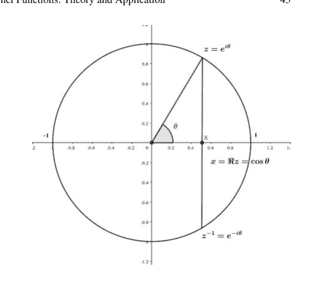

根据定义 (3.2)，某些 $n$ 的切比雪夫多项式定义如下：

$$\Re z^0 = \frac{1}{2}(z^0 + z^0), \quad \Longrightarrow \quad T_0(x) = 1, \qquad (3.4)$$
$$\Re z^1 = \frac{1}{2}(z^1 + z^{-1}), \quad \Longrightarrow \quad T_1(x) = x, \qquad (3.5)$$
$$\Re z^2 = \frac{1}{2}(z^2 + z^{-2}), \quad \Longrightarrow \quad T_2(x) = 2x^2 - 1, \qquad (3.6)$$
$$\Re z^3 = \frac{1}{2}(z^3 + z^{-3}), \quad \Longrightarrow \quad T_3(x) = 4x^3 - 3x, \qquad (3.7)$$
$$\Re z^4 = \frac{1}{2}(z^4 + z^{-4}), \quad \Longrightarrow \quad T_4(x) = 8x^4 - 8x^2 + 1. \qquad (3.8)$$

因此，通过考虑 $T_{n+1}(x)$ 的如下定义：

$$T_{n+1}(x) = \frac{1}{2}(z^{n+1} + z^{-n-1})$$
$$= \frac{1}{2}(z^n + z^{-n})(z + z^{-1}) - \frac{1}{2}(z^{n-1} + z^{1-n})$$
$$= 2\cos(n\theta)\cos(\theta) - \cos((n-1)\theta), \qquad (3.9)$$

可以得到切比雪夫多项式的以下递推关系：

$$T_0(x) = 1,$$
$$T_1(x) = x,$$
$$T_n(x) = 2xT_{n-1}(x) - T_{n-2}(x), \quad n \geq 2. \tag{3.10}$$

因此，可以使用此递推公式生成任意阶的切比雪夫多项式。

除了递推公式外，对于 $n \in \mathbb{Z}^+$，切比雪夫多项式也可以通过以下展开式直接获得（Mason and Handscomb 2002; Boyd 2001; Shen et al. 2011; Asghari et al. 2022）：

$$T_n(x) = \sum_{k=0}^{\lfloor \frac{1}{2}n \rfloor} (-1)^k \frac{n!}{(2k)!(n-2k)!} (1-x^2)^k x^{n-2k}. \tag{3.11}$$

获得切比雪夫多项式的另一种方法是求解它们的Sturm-Liouville微分方程。

**定理 3.1** (Mason and Handscomb (2002); Boyd (2001); Shen et al. (2011); Asghari et al. (2022)) $T_n(x)$ 是以下二阶线性Sturm-Liouville微分方程的解：

$$(1-x^2)\frac{d^2y}{dx^2} - x\frac{dy}{dx} + n^2y = 0, \tag{3.12}$$

其中 $-1 < x < 1$ 且 $n$ 是一个整数。

**证明** 通过考虑 $\frac{d}{dx}\cos^{-1}(x) = -\frac{1}{\sqrt{1-x^2}}$，我们有

$$\frac{d}{dx}T_n(x) = \frac{d}{dx}\cos(n\cos^{-1}x),$$
$$= n.\frac{1}{\sqrt{1-x^2}}\sin(n\cos^{-1}x). \tag{3.13}$$

类似地，我们可以写出

$$\frac{d^2}{dx^2}T_n(x) = \frac{d}{dx}\left\{\frac{n}{\sqrt{1-x^2}}\sin(n\cos^{-1}x)\right\},$$
$$= \frac{nx}{\sqrt[3]{(1-x^2)^2}}\sin(n\cos^{-1}x) + \frac{n}{\sqrt{1-x^2}}\cos(n\cos^{-1}x).\frac{-n}{\sqrt{1-x^2}},$$
$$= \frac{nx}{\sqrt[3]{1-x^2}}\sin(n\cos^{-1}(x)) - \frac{n^2}{1-x^2}\cos(n\cos^{-1}).$$

因此，将导数及其在 (3.12) 中得到的公式代入，可得：$(1-x^2)\frac{d^2T_n(x)}{dx^2} - x\frac{dT_n(x)}{dx} + n^2T_n(x) = \frac{nx}{\sqrt{1-x^2}}\sin(n\cos^{-1}x) - n^{-2}\cos(n\cos^{-1}x),$
$-\frac{nx}{\sqrt{1-x^2}}\sin(n\cos^{-1}x) + n^2\cos(n\cos^{-1}x),$
$= 0,$
由此可得 $T_n(x)$ 是方程 (3.12) 的一个解。

在 Python 中使用这些多项式有多种方法，例如使用精确公式 (3.3)、使用 NumPy 包¹，以及实现递推公式 (3.10)。因此，使用 sympy 库实现该递推公式的符号 Python 代码如下：

```
import sympy

x = sympy.Symbol("x")

def Tn(x, n):
    if n == 0:
        return 1
    elif n == 1:
        return x
    elif n >= 2:
        return (2 * x * (Tn(x, n - 1))) - Tn(x, n - 2)

sympy.expand(sympy.simplify(Tn(x, 3)))
```

> $4x^3 - 3x$

在上面的代码中，生成了*三阶*第一类切比雪夫多项式，其等于 $4x^3 - 3x$。
为了探索切比雪夫多项式的行为，有一些有用的性质可供参考。切比雪夫多项式的第一个性质是其正交性。

**定理 3.2** (Mason and Handscomb (2002); Boyd (2001); Shen et al. (2011))
$\{T_n(x)\}$ 构成一个正交多项式序列，它们在区间 $[-1, 1]$ 上关于以下权函数相互正交：

$$w(x) = \frac{1}{\sqrt{1-x^2}}, \quad (3.14)$$

*因此可以得出*

$$\int_{-1}^{1} T_n(x)T_m(x)w(x)dx = \frac{\pi c_n}{2} \delta_{n,m},$$

其中 $c_0 = 2$，对于 $n \geqslant 1$ 有 $c_n = 1$，且 $\delta_{n,m}$ 是克罗内克 delta 函数。

**证明** 假设 $x = \cos \theta$ 且 $n \neq m$，则有

$$\int_{-1}^{1} T_n(x)T_m(x)\frac{1}{\sqrt{1-x^2}}dx,$$
$$= \int_{\pi}^{0} T_n(\cos \theta)T_m(\cos \theta)\frac{1}{\sqrt{1-\cos^2 \theta}}(-\sin \theta)d\theta,$$
$$= \int_{0}^{\pi} \cos n\theta \cos m\theta d\theta,$$
$$= \int_{0}^{\pi} \frac{1}{2}[\cos(n+m)\theta + \cos(n-m)\theta]d\theta,$$
$$= \frac{1}{2} \left[ \frac{1}{n+m} \sin(n+m)\theta + \frac{1}{m-n} \sin(m-n)\theta \right] \Big|_{0}^{\pi} = 0.$$

当 $n = m \neq 0$ 时，有

$$\int_{-1}^{1} T_n(x)T_m(x)\frac{1}{\sqrt{1-x^2}}dx,$$
$$= \int_{0}^{\pi} \cos n\theta \cos n\theta d\theta,$$
$$= \int_{0}^{\pi} \cos^2 n\theta d\theta = \int_{0}^{\pi} \frac{1}{2}(1 + \cos 2n\theta)d\theta,$$
$$= \frac{1}{2} \left[ \theta + \frac{-1}{2n} \sin 2n\theta \right] \Big|_{0}^{\pi} = \frac{\pi}{2}.$$

同样，在 $n = m = 0$ 的情况下，我们可以写成

$$\int_{-1}^{1} T_n(x)T_m(x)\frac{1}{\sqrt{1-x^2}}dx = \int_{0}^{\pi} 1d\theta = \pi.$$

这些多项式的正交性为计算核矩阵提供了一个高效的框架，这将在后面讨论。计算效率并非切比雪夫多项式的唯一性质，它还有更多特性。例如，$T_n(x)$ 的最大值不超过 1，因为对于 $-1 \leqslant x \leqslant 1$，$T_n(x)$ 被定义为某个参数的余弦值。这一性质防止了计算过程中的溢出。此外，$n > 0$ 阶的切比雪夫多项式在区间 $[-1, 1]$ 内恰好有 $n$ 个根和 $n + 1$ 个局部极值点，其中两个极值点是端点 ±1 (Mason and Handscomb 2002)。因此，对于 $k = 1, 2, \ldots, n$，$T_n(x)$ 的根可按如下方式获得：

$$x_k = \cos \left( \frac{(2k - 1)\pi}{2n} \right). \tag{3.20}$$

注意，对于所有奇数阶 $n$，$x = 0$ 是 $T_n(x)$ 的一个根，其他根关于 $x = 0$ 对称分布。对于 $k = 0, 1, \ldots, n$，第一类切比雪夫多项式的极值点可使用以下公式找到：

$$x = \cos \left( \frac{\pi k}{n} \right). \tag{3.21}$$

切比雪夫多项式具有偶对称和奇对称性，这意味着偶数阶只包含 $x$ 的偶次幂，奇数阶只包含 $x$ 的奇次幂。因此我们有

$$T_n(x) = (-1)^n T_n(-x) = \begin{cases} T_n(-x), & n \text{ 为偶数} \\ -T_n(-x), & n \text{ 为奇数} \end{cases}. \tag{3.22}$$

此外，切比雪夫多项式在边界处还存在一些其他性质：

- $T_n(1) = 1$,
- $T_n(-1) = (-1)^n$,
- $T_{2n}(0) = (-1)^n$,
- $T_{2n+1}(0) = 0$.

图 3.2 展示了最高至六阶的第一类切比雪夫多项式。

##### 3.2.2 分数阶切比雪夫函数的性质

分数阶切比雪夫函数是切比雪夫多项式的一种推广形式。切比雪夫多项式与分数阶切比雪夫函数的主要区别在于，后者的 $x$ 的阶数可以是任意正实数。这种推广似乎提高了切比雪夫多项式的逼近能力。为了引入分数阶切比雪夫函数，首先需要引入一个映射函数，该函数用于在有限区间 $[a, b]$ 上定义 $\alpha$ 阶分数阶切比雪夫函数，该函数由 Parand 和 Delkhosh (2016) 提出：

$$x' = 2\left(\frac{x-a}{b-a}\right)^{\alpha} - 1. \qquad (3.23)$$

利用此变换，分数阶切比雪夫函数可按如下方式获得 (Parand and Delkhosh 2016)：

$$FT_n^{\alpha}(x) = T_n(x') = T_n\left(2\left(\frac{x-a}{b-a}\right)^{\alpha} - 1\right), \quad a \leqslant x \leqslant b, \qquad (3.24)$$

其中 $\alpha \in \mathbb{R}^+$ 是函数的“分数阶”，根据上下文选择。考虑 3.10，分数阶切比雪夫函数的递推形式定义为 Parand 和 Delkhosh (2016)

$$FT_0^{\alpha}(x) = 1, \quad FT_1^{\alpha}(x) = 2\left(\frac{x-a}{b-a}\right)^{\alpha} - 1,$$

$$FT_n^{\alpha}(x) = 2\left(2\left(\frac{x-a}{b-a}\right)^{\alpha} - 1\right) FT_{n-1}^{\alpha}(x) - FT_{n-2}^{\alpha}(x), \quad n \geqslant 1. \qquad (3.25)$$

这里给出了其中一些函数的表达式：

$$FT_0^{\alpha}(x) = 1,$$
$$FT_1^{\alpha}(x) = 2\left(\frac{x-a}{b-a}\right)^{\alpha} - 1,$$
$$FT_2^{\alpha}(x) = 8\left(\frac{x-a}{b-a}\right)^{2\alpha} - 8\left(\frac{x-a}{b-a}\right)^{\alpha} + 1,$$
$$FT_3^{\alpha}(x) = 32\left(\frac{x-a}{b-a}\right)^{3\alpha} - 48\left(\frac{x-a}{b-a}\right)^{2\alpha} + 18\left(\frac{x-a}{b-a}\right)^{\alpha} - 1,$$
$$FT_4^{\alpha}(x) = 128\left(\frac{x-a}{b-a}\right)^{4\alpha} - 256\left(\frac{x-a}{b-a}\right)^{3\alpha} + 160\left(\frac{x-a}{b-a}\right)^{2\alpha} - 32\left(\frac{x-a}{b-a}\right)^{\alpha} + 1. \qquad (3.26)$$

读者可以使用以下 Python 代码来符号化地生成任意阶的*分数阶切比雪夫多项式*：

## 程序代码

```
import sympy
x = sympy.Symbol("x")
eta = sympy.Symbol(r'\eta')
alpha = sympy.Symbol(r'\alpha')
a = sympy.Symbol("a")
b = sympy.Symbol("b")
x=sympy.sympify(2*((x-a)/(b-a))**alpha -1)

def FTn(x, n):
    if n == 0:
        return 1
    elif n == 1:
        return x
    elif n >= 2:
        return (2 * x*(FTn(x, n - 1))) - FTn(x, n - 2)
```

例如，可以生成*五阶*多项式如下：

## 程序代码

```
sympy.expand(sympy.simplify(FTn(x, 5)))
```

> $512\left(\frac{x-a}{b-a}\right)^{5\alpha} - 1280\left(\frac{x-a}{b-a}\right)^{4\alpha} + 1120\left(\frac{x-a}{b-a}\right)^{3\alpha} - 400\left(\frac{x-a}{b-a}\right)^{2\alpha} + 50\left(\frac{x-a}{b-a}\right)^{\alpha} - 1$

由于切比雪夫多项式在 $[-1, 1]$ 上关于权函数 $\frac{1}{\sqrt{1-x^2}}$ 正交，使用 $x' = 2(\frac{x-a}{b-a})^{\alpha} - 1$ 可以得出，分数阶切比雪夫多项式在有限区间上关于以下权函数也是正交的：

$w(x) = \frac{1}{\sqrt{1 - (2(\frac{x-a}{b-a})^{\alpha} - 1)^{\alpha}}}$

因此，我们可以定义分数阶切比雪夫多项式的正交关系为

$\int_{-1}^{1} T_n(x')T_m(x')w(x')dx' = \int_{a}^{b} FT_n^{\alpha}(x)FT_m^{\alpha}(x)w(x)dx = \frac{\pi}{2}c_n\delta_{mn}$

其中 $c_0 = 2$，对于 $n \geqslant 1$ 有 $c_n = 1$，且 $\delta_{mn}$ 是 *Kronecker delta 函数*。

分数阶切比雪夫函数 $FT_n^{\alpha}(x)$ 在有限区间 $(0, \eta)$ 内恰好有 $n$ 个不同的零点，它们是

**图 3.3** 最高至六阶的第一类分数阶切比雪夫函数，其中 $a = 0$，$b = 5$，且 $\alpha = 0.5$

**图 3.4** 不同 $\alpha$ 值下的五阶第一类分数阶切比雪夫函数

$$x_k = \left( \frac{1 - \cos(\frac{(2k-1)\pi}{2n})}{2} \right)^{\frac{1}{\alpha}}, \quad \text{对于} \quad k = 1, 2, \ldots, n. \tag{3.29}$$

此外，分数阶切比雪夫函数的导数在有限区间 $(0, \eta)$ 内恰好有 $n - 1$ 个不同的零点，这些是*极值点*：

$$x'_k = \left( \frac{1 - \cos(\frac{k\pi}{n})}{2} \right)^{\frac{1}{\alpha}}, \quad \text{对于} \quad k = 1, 2, \ldots, n - 1. \tag{3.30}$$

图 3.3 展示了最高至六阶的第一类分数阶切比雪夫函数，其中 $a = 0$，$b = 5$，且 $\alpha$ 为 0.5。

同时，图 3.4 描绘了在 $\eta$ 固定为 5 时，不同 $\alpha$ 值下的五阶第一类分数阶切比雪夫函数。

### 3.3 切比雪夫核函数

基于前几节讨论的切比雪夫多项式原理及其分数类型，本节将阐述切比雪夫核的构建方法。因此，下文将首先介绍普通的切比雪夫核函数，然后说明该核函数的其他几种变体，最后解释分数阶切比雪夫核。

#### 3.3.1 普通切比雪夫核函数

许多基于正交多项式构建的核函数已被提出，用于支持向量机及其他基于核的学习算法（Ye et al. 2006; Moghaddam and Hamidzadeh 2016; Tian and Wang 2017）。这类核函数的一些特性引起了关注，例如在特征空间中具有较低的数据冗余度，或者在某些情况下，这些核函数在拟合过程中需要更少的支持向量，从而减少了执行时间（Jung and Kim 2013）。另一方面，正交核在分类问题上表现出优于传统核（如RBF核和多项式核）的性能（Moghaddam and Hamidzadeh 2016; Ozer et al. 2011; Padierna et al. 2018）。

现在，我们将利用正交核的基本定义来构建切比雪夫核。众所周知，对于标量输入，支持向量机的无权重正交多项式核函数定义为

$$K(x, z) = \sum_{i=0}^{n} T_i(x)T_i(z), \quad (3.31)$$

其中 $T(.)$ 表示多项式的求值；$x, z$ 是核函数的输入参数；$n$ 是最高多项式阶数。在大多数实际应用中，输入数据是多维向量，因此提出了两种方法将一维多项式核扩展到多维向量输入（Ozer et al. 2011; Vert et al. 2007）：

1.  **成对法**
    根据*Vapnik*定理（Vapnik 2013）：
    > 设一个多维函数集由坐标基函数的张量积作为基函数定义。那么，在n维基中定义内积的核就是一维核的乘积。

多维正交多项式核被构建为一维核的张量积：

$$K(x, z) = \prod_{j=1}^{m} K_j(x_j, z_j). \tag{3.32}$$

在这种方法中，每个输入向量 $x$ 和 $z$ 的元素对的函数值被成对相乘，这意味着将 $x$ 和 $z$ 的对应元素相乘，然后整个核的输出是前一步所有结果的乘积。因此，对于一个m维输入向量 $x \in \mathbb{R}^m$，给定 $x = \{x_1, x_2, \dots, x_m\}$，$z \in \mathbb{R}^m$，且 $z = \{z_1, z_2, \dots, z_m\}$，无权重切比雪夫核定义为

$$K_{Cheb}(x, z) = \prod_{j=1}^{m} K_j(x_j, z_j) = \prod_{j=1}^{m} \sum_{i=0}^{n} T_i(x_j)T_i(z_j), \tag{3.33}$$

其中 $\{T_i(.)\}$ 是切比雪夫多项式。只需乘上在(3.14)中定义的权重函数（第一类切比雪夫多项式的正交性由此定义，参见(3.15)），就可以构建出成对正交切比雪夫核函数：

$$K_{Cheb}(x, z) = \frac{\sum_{i=0}^{n} T_i(x)T_i(z)}{\sqrt{1 - xz}}, \tag{3.34}$$

其中 $x$ 和 $z$ 是标量输入，对于向量输入，我们有

$$K_{Cheb}(\mathbf{x}, \mathbf{z}) = \prod_{j=1}^{m} \frac{\sum_{i=0}^{n} T_i(x_j)T_i(z_j)}{\sqrt{1 - x_j z_j}}, \tag{3.35}$$

其中 $m$ 是向量 $x$ 和 $z$ 的维度。
然而，这种方法最初被提出后，许多核函数都是通过成对法构建的（Ye et al. 2006; Vert et al. 2007; Zhou et al. 2007; Pan et al. 2021），但这种方法构建的核函数存在两个缺点。首先，时间复杂度或更准确地说是计算复杂度相当高，因此当输入向量维度很高时，这可能成为一个严重问题（Ozer et al. 2011）。其次，如果其中一个核（$T_i(x)$ 或 $T_i(z)$）接近零，即使两个向量 $x$ 和 $z$ 彼此非常相似，基于成对法构建的核函数也会导致泛化能力差（Ozer and Chen 2008）。

2.  **向量化法**

在Ozer等人（2008）提出的方法中，通过将输入向量作为一个整体而非逐个元素来处理，解决了*成对法*的泛化问题，这是通过计算输入向量的内积来实现的。基于两个向量 $x$ 和 $z$ 的内积定义为 $\langle x, z \rangle = xz^T$，并考虑公式3.31，可以构建*无权重广义切比雪夫核*（Ozer and Chen 2008; Ozer et al. 2011）：

$$K(\mathbf{x}, \mathbf{z}) = \sum_{i=0}^{n} T_i(\mathbf{x}) T_i^T(\mathbf{z}) = \sum_{i=0}^{n} \langle T_i(x) T_i(z) \rangle.$$

类似于公式3.35，*广义切比雪夫核*定义为（Ozer and Chen 2008; Ozer et al. 2011）：

$$K_{G\_Cheb}(\mathbf{x}, \mathbf{z}) = \frac{\sum_{i=0}^{n} \langle T_i(x), T_i(z) \rangle}{\sqrt{m - \langle x, z \rangle}},$$

其中 $m$ 是输入向量 $\mathbf{x}$ 和 $\mathbf{z}$ 的维度。

请注意，由于切比雪夫多项式在 $[-1, 1]$ 区间内是正交的，输入数据应根据以下公式进行归一化：

$$x^{new} = \frac{2(x - Min)}{Max - Min} - 1,$$

其中 $Min$ 和 $Max$ 分别是输入数据的最小值和最大值。显然，如果输入数据是一个数据集，则应按列进行归一化。

##### 3.3.1.1 切比雪夫核的验证

根据2.2.12节介绍的*Mercer定理*，一个有效的核函数需要是半正定的，或者等价地必须满足Mercer定理的充要条件。这里将证明广义切比雪夫核的有效性。

**定理 3.3** (Ozer et al. (2011)) *公式3.37中引入的广义切比雪夫核是一个有效的Mercer核。*

**证明** 正如Mercer定理所述，任何作为有效核的SVM核必须是非负的，精确地说：

$$\iint K(x, z) f(x) f(z) dx dz \geq 0.$$

两个有效核的乘积也是一个有效核。因此，可以将任意阶的切比雪夫核表示为两个核函数的乘积：

$$K(x, z) = k_{(1)}(x, z) k_{(2)}(x, z),$$

其中

$$k_{(1)}(x, z) = \sum_{j=0}^{n} T_j(x) T_j^T(z) = T_0(x) T_0^T(z) + T_1(x) T_1^T(z) + \cdots + T_n(x) T_n^T(z)$$

且

$$k_{(2)}(x, z) = \frac{1}{\sqrt{m - \langle x, z \rangle}}.$$

考虑 $f : \mathbb{R}^m \longrightarrow \mathbb{R}$，并假设每个元素独立于核的其他元素，我们可以对 $k_{(1)}(\mathbf{x}, \mathbf{z})$ 评估Mercer条件如下：

$$\begin{aligned} \iint k_{(1)}(x, z) f(x) f(z) dx dz &= \iint \sum_{j=0}^{n} T_j(x) T_j^T(z) f(x) f(z) dx dz, \\ &= \sum_{j=0}^{n} \iint T_j(x) T_j^T(z) f(x) f(z) dx dz, \\ &= \sum_{j=0}^{n} \left[ \int T_j(x) f(x) dx \int T_j^T(z) f(z) dz \right], \\ &= \sum_{j=0}^{n} \left[ \left( \int T_j(x) f(x) dx \right) \left( \int T_j^T(z) f(z) dz \right) \right] \geq 0. \end{aligned}$$

因此，核 $k_{(1)}(x, z)$ 是一个有效的Mercer核。为了证明 $k_{(2)}(x, z) = \frac{1}{\sqrt{m - \langle x, z \rangle}}$（在最简单形式 $m = 1$ 下）是一个有效的核函数，我们可以说 $< x, y >$ 是线性核，而 $\frac{1}{\sqrt{1 - x, y}}$ 的泰勒级数为

$$1 + \frac{1}{2} < x, y > + \frac{3}{8} < x, y >^2 + \frac{5}{16} < x, y >^3 + \frac{35}{128} < x, y >^4 + \cdots,$$

其中每个系数 $\frac{\prod_{i=1}^{n} n(2i-1)}{n! 2^n} \geq 0$，因此 $k_{(2)}(x, z) = \frac{1}{\sqrt{m - \langle x, z \rangle}}$ 也是一个有效的核。

#### 3.3.2 其他切比雪夫核函数

##### 3.3.2.1 切比雪夫-小波核

一个有效的核应满足Mercer条件（Vapnik 2013; Schölkopf et al. 2002），并且根据Mercer定理，由两个有效Mercer核相乘或相加得到的核也是一个有效核。这一思想启发了Jafarzadeh等人（2013）构建*切比雪夫-小波*核，它实际上是广义切比雪夫核与小波核的乘积，如下所示：$k_{G\_Cheb}(\mathbf{x}, \mathbf{z}) = \frac{\sum_{i=0}^n \langle T_i(x), T_i(z) \rangle}{\sqrt{m - \langle x, z \rangle}}$,

$k_{wavelet}(\mathbf{x}, \mathbf{z}) = \prod_{i=1}^m \left( \cos\left(1.75 \frac{x_j - z_j}{\alpha}\right) \exp\left(-\frac{\|x - z\|^2}{2\alpha^2}\right) \right)$. (3.44)

因此，**切比雪夫-小波核**被引入，如 Jafarzadeh 等人 (2013) 所述：

$k_{Cheb\text{-}wavelet}(\mathbf{x}, \mathbf{z}) = \frac{\sum_{i=0}^n \langle T_i(x), T_i(z) \rangle}{\sqrt{m - \langle x, z \rangle}} \times \prod_{i=1}^m \left( \cos\left(1.75 \frac{x_j - z_j}{\alpha}\right) \exp\left(-\frac{\|x - z\|^2}{2\alpha^2}\right) \right)$, (3.45)

其中 $n$ 是切比雪夫核参数（阶数），$a$ 是小波核参数，$m$ 是输入向量的维度。

###### 3.3.2.2 统一切比雪夫核 (UCK)

如前所述，存在四种切比雪夫多项式。Zhao 等人 (2013) 通过结合第一类 ($T_n$) 和第二类 ($U_n$) 切比雪夫多项式，提出了一种新的核。应当注意，第二类切比雪夫多项式在区间 $(-1, 1)$ 上关于以下权重函数是正交的 (Mason and Handscomb 2002)：

$w_{U_n}(x) = \sqrt{1 - x^2}$, (3.46)

而第一类切比雪夫多项式的三角关系在 3.3 节中已介绍，第二类多项式由 Mason and Handscomb (2002) 描述为：

$U_n(\cos\theta) = \frac{\sin((n+1)\theta)}{\sin(\theta)}$, $n = 0, 1, 2, \dots$ (3.47)

类似于第一类切比雪夫多项式的生成函数 ($\frac{1-tx}{1-2tx+t^2} = \sum_{n=0}^\infty T_n(x)t^n$)，第二类的生成函数定义为 Mason and Handscomb (2002)：

$\frac{1}{1 - 2xt + t^2} = \sum_{n=0}^\infty U_n(x)t^n$, $|x| \leqslant 1, |t| \leqslant 1$. (3.48)

根据定义的权重函数公式 3.46，Zhao 等人 (2013) 将第二类切比雪夫多项式的正交关系定义为：

$$\int_{-1}^{1} \sqrt{1-x^2} U_m(x) U_n(x) dx = \begin{cases} \frac{\pi}{2}, & (m=n \neq 0) \\ 0, & ((m \neq n) \text{或} (m=n=0)) \end{cases}.$$ (3.49)

此外，他们使用 $P_n(.)$ 表示统一切比雪夫多项式 (UPC)，但在本书中，符号 $P_n(.)$ 用于勒让德正交多项式。因此，为避免任何歧义，我们特意改用 $UCP_n(.)$。考虑到第一类和第二类的生成函数，Zhao 等人 (2013) 构造了 UCP 的生成函数：

$$\frac{1-xt}{1-axt} \times \frac{1}{1-2xt+t^2} = \sum_{n=0}^{\infty} UCP_n(x)t^n,$$ (3.50)

其中 $x \in [-1, 1], t \in [-1, 1], n = 0, 1, 2, 3 \dots$，且 $UCP_n(x)$ 是 $n$ 阶 UCP。显然，第一类和第二类切比雪夫多项式分别是 $a=0$ 和 $a=1$ 时 UCP 的特例。此外，Zhao 等人 (2013) 引入了 $n$ 阶 UCP 的递推关系：

$$UCP_n(x) = (a+2)xUCP_{n-1}(x) - (2ax^2+1)UCP_{n-2}(x) + axUCP_{n-3}(x).$$ (3.51)

因此，利用 (3.51) 可得这些多项式的几个实例：

- $UCP_0(x) = 1,$
- $UCP_1(x) = ax + x,$
- $UCP_2(x) = (a^2 + a + 2)x^2 - 1,$
- $UCP_3(x) = (a^3 + a^2 + 2a + 4)x^3 - (a+3)x,$
- $UCP_4(x) = (a^4 + a^3 + 2a^2 + 4a + 8)x^4 - (a^2 + 3a + 8)x^2 + 1.$

为简洁起见，我们不深入探讨相应论文中提供的公式。然而，相关论文 (Zhao et al. 2013) 中研究了详细信息和证明。

另一方面，Zhao 等人 (2013) 构造了 UCP 核：

$$\iint (m - \langle x, z \rangle + r)^{-\frac{1}{2}} \sum_{j=0}^{n} UCP_j(x), UCP_j^T(z) f(x) f(z) dx dz \geqslant 0.$$ (3.52)

因此：

$$k_{UCP}(X, Z) = \frac{\sum_{j=0}^{n} \langle UCP_j(x) UCP_j(z) \rangle}{\sqrt{(m - \langle x, z \rangle + r)}},$$ (3.53)

其中 $m$ 是输入向量的维度，$r$ 是防止方程为零的最小正值。

#### 3.3.3 分数阶切比雪夫核

使用权重函数公式 3.27，采用与公式 3.35 和 3.37 相同的方法，我们可以引入相应的分数阶核如下：

$$k_{FCheb}(\mathbf{x}, \mathbf{z}) = \prod_{j=1}^{m} \frac{\sum_{i=0}^{n} FT_i^{\alpha}(x_j) FT_i^{\alpha}(z_j)}{\sqrt{1 - \left(2\left(\frac{x_j z_j - a}{b-a}\right)^{\alpha} - 1\right)^{\alpha}}}, \quad (3.54)$$

$$k_{Gen-FCheb}(\mathbf{x}, \mathbf{z}) = \frac{\sum_{i=0}^{n} \langle FT_i^{\alpha}(x), FT_i^{\alpha}(z) \rangle}{\sqrt{m - \left(2\left(\frac{\langle x, z \rangle - a}{b-a}\right)^{\alpha} - 1\right)^{\alpha}}}, \quad (3.55)$$

其中 $m$ 是向量 $x$ 和 $z$ 的维度。

##### 3.3.3.1 分数阶切比雪夫核的验证

为证明公式 3.55 中引入的分数阶切比雪夫核的有效性，遵循与广义切比雪夫核公式 3.37 的证明类似的程序。

> **定理 3.4** *公式 3.55 中引入的分数阶广义切比雪夫核是一个有效的 Mercer 核。*

**证明** 考虑 Mercer 定理指出任何 SVM 核要成为有效核必须是非负的（见 (3.39)），并利用两个有效核的乘积也是一个核的事实（见 (3.40)），我们有

$$k_{(1)}(x, z) = \sum_{j=0}^{n} FT_j^{\alpha}(x) FT_j^{\alpha}(z),$$

$$k_{(2)}(x, z) = w(x) = \frac{1}{\sqrt{1 - \left(2\left(\frac{x-a}{b-a}\right)^{\alpha} - 1\right)^{\alpha}}}.$$

由于 $f$ 是一个函数 $f : \mathbb{R}^m \longrightarrow \mathbb{R}$，我们有

$$\iint K_{(1)}(x, z) f(x) f(z) dxdz = \iint \sum_{j=0}^{n} (FT_{j}^{\alpha})(x) (FT_{j}^{\alpha})^{T}(z) f(x) f(z) dxdz,$$
$$= \sum_{j=0}^{n} \iint (FT_{j}^{\alpha})(x) (FT_{j}^{\alpha})^{T}(z) f(x) f(z) dxdz,$$
$$= \sum_{j=0}^{n} \left[ \int (FT_{j}^{\alpha})(x) f(x) dx \int (FT_{j}^{\alpha})^{T}(z) f(z) dz \right],$$
$$= \sum_{j=0}^{n} \left[ \left( \int (FT_{j}^{\alpha})(x) f(x) dx \right) \left( \int (FT_{j}^{\alpha})^{T}(z) f(z) dz \right) \right] \geq 0.$$
$$(3.56)$$

因此，核 $k_{(1)}(x, z)$ 是一个有效的 Mercer 核。为了证明 $k_{(2)}(x, z)$ 也是一个有效的 Mercer 核，可以证明 $k_{(2)}(x, z)$ 是*半正定*的。根据定义公式 3.24，由于 $0 \leqslant x \leqslant b$，$b \in \mathbb{R}^{+}$ 且 $\alpha \in \mathbb{R}^{+}$，因此 $x$ 和 $b$ 都是正的；换句话说，通过公式 3.24 定义的映射，我们确信输出始终为正。因此，第二个核公式 3.56 或者精确地说权重函数是半正定的，所以 $k_{(2)}(x, z) \geqslant 0$。

### 3.4 切比雪夫核函数在真实数据集上的应用

在本节中，我们将说明*分数阶切比雪夫核*在*支持向量机*中应用于一些真实数据集的使用情况，这些数据集被机器学习专家广泛用于检验任何给定模型的准确性。然后，我们将比较*分数阶切比雪夫核*的准确性与*切比雪夫核*以及另外两种在基于核的学习算法中常用的著名核（如*RBF*和*多项式核*）的准确性。众所周知，将支持向量机应用于数据集涉及许多预处理任务，例如数据清洗和训练/测试集的生成。除了数据集的归一化（我们已经提到，使用任何类型的切比雪夫多项式作为核函数时，归一化是强制性的）之外，我们不会详细讨论这些步骤。

有一些可供公众使用的在线数据存储库，例如广泛使用的*加州大学欧文分校*的*UCI 机器学习库*<sup>2</sup>，以及 *Kaggle*。<sup>3</sup> 在本节中，从 UCI 中选择了四个数据集，这些数据集在机器学习从业者中广为人知且广泛使用。

*多项式核*在基于核的模型中被广泛使用，通常定义为：

$$K(X_1, X_2) = (a + X_1^T X_2)^b.$$
$$(3.57)$$

此外，*RBF 核*也称为*高斯 RBF 核*，是支持向量机的另一个流行核，定义为：

$$K(X_1, X_2) = exp\left(-\frac{\|x - x'\|^2}{2\sigma^2}\right).$$

#### 3.4.1 螺旋数据集

螺旋数据集是一个著名的经典数据集，但也有许多数据集具有螺旋分布的数据点，例如这里考虑的这个；然而，也存在具有类似特征甚至更好控制分布特性的模拟数据集。螺旋数据集由 1000 个数据点组成，均匀聚类为 3 个数值标签，另有 2 个浮点类型的属性“Chem 1”和“Chem2”。众所周知，支持向量机是一种二元分类算法；因此，为了处理多类数据集，常用的方法是将此类数据集拆分为多个二元类数据集。此类方法的两个例子是：

- 一对多 (OVA)，
- 一对一 (OVO)。

使用 **OVA**，数值类别 $\in \{1, 2, 3\}$ 的螺旋分类任务将被分为以下形式的 3 个分类：

- 二元分类任务 1：类别 1 对类别 {2, 3}，
- 二元分类任务 2：类别 2 对类别 {1, 3}，
- 二元分类任务 3：类别 3 对类别 {1, 2}。

同样，使用 **OVO** 方法，分类任务被分为任何可能的二元分类；那么，对于螺旋数据集，我们有：

- 二元分类任务 1：类别 1 对类别 2，
- 二元分类任务 2：类别 1 对类别 3，
- 二元分类任务 3：类别 2 对类别 3。

然而，在我们的例子中，两种方法的最终拆分数据集数量相同，但通常 **OVO** 方法会生成更多需要分类的数据集。假设一个多类数据集有 4 个数值标签 {1, 2, 3, 4}；之后，使用第一种方法，二元分类数据集为：

- 二元分类任务 1：类别 1 对类别 {2, 3, 4}，
- 二元分类任务 2：类别 2 对类别 {1, 3, 4}，
- 二元分类任务 3：类别 3 对类别 {1, 2, 4}，
- 二元分类任务 4：类别 4 对类别 {1, 2, 3}。

而使用第二种方法，我们有以下二元数据集需要分类：

- 二元分类任务 1：类别 1 对类别 2，
- 二元分类任务 2：类别 1 对类别 3，

##### 3.4.2 三僧侣数据集

僧侣问题是一个经典问题，由Thrun等人（1991年）和Sun等人（2015年）在《*僧侣问题——不同学习算法的性能比较*》中于1991年提出。

僧侣问题基于一个虚构的机器人领域，其中机器人由六个不同的属性描述：

$x_1$：头部形状 ∈ {圆形，方形，八边形}
$x_2$：身体形状 ∈ {圆形，方形，八边形}
$x_3$：是否微笑 ∈ {是，否}
$x_4$：手持物品 ∈ {剑，气球，旗帜}
$x_5$：夹克颜色 ∈ {红色，黄色，绿色，蓝色}
$x_6$：是否系领带 ∈ {是，否}

学习任务是一个二元分类问题。每个问题由一个类别的逻辑描述给出。机器人要么属于这个类别，要么不属于，但学习问题并未提供完整的类别描述，而是给出了所有432种可能机器人中一个子集的分类。学习任务是概括这些样本，并且如果当前特定的学习技术允许，推导出一个简单的类别描述。

然后三个问题分别是：

- **问题 $M_1$：（头部形状 = 身体形状）或（夹克颜色 = 红色）** 从432个可能的样本中，随机选择124个作为训练集。没有错误分类。
- **问题 $M_2$：六个属性中恰好有两个具有其第一个值。** （例如，*身体形状 = 头部形状 = 圆形* 意味着机器人不微笑，不手持剑，夹克颜色不是红色，并且不系领带，因为此时恰好有两个（身体形状和头部形状）属性具有其*第一个*值）。从432个可能的样本中，随机选择169个。同样，没有噪声。
- **问题 $M_3$：（夹克颜色是绿色且手持剑）或（夹克颜色不是蓝色且身体形状不是八边形）** 从432个样本中，随机选择122个，其中有5%的错误分类，即训练集中存在噪声。

图3.5 螺旋数据集，不同的分数阶

- 二元分类任务3：类别1 对比 类别4，
- 二元分类任务4：类别2 对比 类别3，
- 二元分类任务5：类别2 对比 类别4，
- 二元分类任务6：类别3 对比 类别4。

通常，由于计算和时间考虑，**OVA**（一对多）方法更受青睐。

下图展示了转换为分数阶如何影响原始数据集的分布，以及切比雪夫核如何在不同阶数下选择决策边界。图3.5描绘了螺旋数据集在原始状态和分数形式（其中 $0.1 \leqslant \alpha \leqslant 0.9$）下的转换情况。随着分数阶降低并接近0.1，转换将更多原始数据集中的数据点从空间的正立侧精确地移动到新空间的正象限，即 $x1 > 0$ 且 $x2 > 0$。尽管在二维图上数据点似乎聚集在轴的一个角落，但当应用核函数时，在三维空间中情况未必如此。换句话说，当应用诸如切比雪夫核函数之类的核函数时，数据点可能在新的轴上展开，同时集中在二维轴上，从而使得考虑更高维度来分类这些点成为可能。这种转换与核函数的结合为原始数据集创建了一个新的维度，使得核函数的决策边界能够以更高的准确率捕捉和分类数据点。

为了更好地理解核函数如何将数据集提升到更高维度，请参见图3.6，该图展示了应用于螺旋数据集的第一类切比雪夫核函数（包括普通形式和分数形式）。左侧的图描绘了应用3阶普通切比雪夫核时数据集在更高维度的情况，右侧的图则展示了当应用3阶、alpha为0.3的分数切比雪夫核到原始数据集时数据点如何变化。很明显，转换已将数据点移动到x、y以及z轴的正侧。

在数据集转换并将数据点提升到更高维度之后，是时候确定分类器的决策边界了。⁴ 决策边界高度依赖于核函数。对于正交多项式而言，这些函数的阶数起着关键作用。例如，3阶切比雪夫核函数产生的决策边界与6阶的同一核函数不同。没有通用规则可以知道哪个阶数能产生最合适的决策边界。因此，尝试不同的决策边界提供了一个有用的度量标准，用于比较和找到最佳阶数，甚至是核函数本身。

为了直观了解决策边界有何不同，请查看图3.7，该图描绘了在原始螺旋数据集上，选择二元分类1-对比-{2, 3}时，不同阶数{3, 4, 5, 6}对应的切比雪夫分类器。从这些图中可以看出，随着阶数增加，决策边界变得更加扭曲和盘旋。在6阶（最右侧的子图）中，与3阶（最右侧的第一个子图）相比，决策边界略微复杂一些。决策边界的复杂性在分数空间中甚至变得更糟。图3.8展示了分数切比雪夫分类器在不同阶数3、4、5和6下的决策边界，其中 $\alpha = 0.3$。同样，从3阶到6阶，决策边界变得复杂。

> ⁴ 请注意，“决策边界”指的是二维空间，“决策曲面”指的是三维空间。

图3.7 在螺旋数据集上阶数为3、4、5和6的切比雪夫核

目的不是指定哪个具有更好或更差的准确率或最终结果，而是考虑数据集分布，哪个最合适。每个决策边界（或决策曲面）以特定形式对数据点进行分类。由于每个阶数的核函数的决策边界/曲面是固定和确定的，因此是该特定形状与数据点之间的相关程度决定了最终的准确率。

最后，下表提供了螺旋数据集实验的比较。前面图中描绘的所有决策边界都应用于该数据集，并采用准确率分数作为最终度量标准。顺便说一句，根据一对多方法，检查了三种可能的二元分类。从表3.1可以清楚地看出，RBF核和分数切比雪夫核在类别1-对比-{2, 3}上表现出更好的性能。然而，对于其他二元分类，表3.2和表3.3显示，RBF和多项式核优于普通和分数切比雪夫核。值得一提的是，准确率分数并不一定是这些核的最佳结果，因为使用SVM进行分类的准确率在很大程度上取决于多个参数，例如正则化参数C、随机状态。这里我们不打算获得最佳结果，而是考虑在相似条件下的比较。

图3.8 在螺旋数据集上阶数为3、4、5和6的分数切比雪夫核（$\alpha = 0.3$）

表3.1 螺旋数据集上RBF、多项式、切比雪夫和分数切比雪夫核的比较。很明显，RBF核优于其他核

| | Sigma | Power | Order | Alpha($\alpha$) | Accuracy |
|---|---|---|---|---|---|
| RBF | 0.73 | – | – | – | **0.97** |
| Polynomial | – | 8 | – | – | 0.9533 |
| Chebyshev | – | – | 5 | – | 0.9667 |
| Fractional Chebyshev | – | – | 3 | 0.3 | **0.9733** |

表3.2 螺旋数据集上RBF、多项式、切比雪夫和分数切比雪夫核的比较。很明显，RBF核优于其他核

| | Sigma | Power | Order | Alpha($\alpha$) | Accuracy |
|---|---|---|---|---|---|
| RBF | 0.1 | – | – | – | **0.9867** |
| Polynomial | – | 5 | – | – | 0.9044 |
| Chebyshev | – | – | 8 | – | 0.9411 |
| Fractional Chebyshev | – | – | 8 | 0.5 | 0.9467 |

表3.3 螺旋数据集上RBF、多项式、切比雪夫和分数切比雪夫核的比较。很明显，RBF和多项式核优于其他核

| | Sigma | Power | Order | Alpha(α) | Accuracy |
|---|---|---|---|---|---|
| RBF | 0.73 | – | – | – | **0.9856** |
| Polynomial | – | 5 | – | – | **0.9856** |
| Chebyshev | – | – | 6 | – | 0.9622 |
| Fractional Chebyshev | – | – | 6 | 0.6 | 0.9578 |

### 3.5 结论

本章首先简要介绍了切比雪夫正交多项式的历史和基础知识。切比雪夫多项式已被应用于许多场景，近年来更作为基于核的学习算法中的核函数，并在许多情况下被证明优于传统核函数。本章阐述并证明了切比雪夫核的构造方法。本章还证明了切比雪夫多项式的分数形式扩展了切比雪夫核的适用性。因此，通过使用分数切比雪夫核函数，可以解决更广泛的问题。实验表明，当分数切比雪夫核用作SVM核技巧中的核函数时，能够提升SVM的分类精度。最后一节展示了这些实验的结果。

表3.4 RBF核、多项式核、切比雪夫核和分数切比雪夫核在Monk第一问题上的比较。显然，RBF核优于其他核函数

| | Sigma | Power | Order | Alpha(α) | Accuracy |
|---|---|---|---|---|---|
| RBF | 2.844 | – | – | – | **0.8819** |
| Polynomial | – | 3 | – | – | 0.8681 |
| Chebyshev | – | – | 3 | – | 0.8472 |
| Fractional Chebyshev | – | – | 3 | 1/16 | 0.8588 |

表3.5 RBF核、多项式核、切比雪夫核和分数切比雪夫核在Monk第二问题上的比较。分数切比雪夫核以96%的最高准确率优于其他核函数

| | Sigma | Power | Order | Alpha(α) | Accuracy |
|---|---|---|---|---|---|
| RBF | 5.5896 | – | – | – | **0.875** |
| Polynomial | – | 3 | – | – | 0.8657 |
| Chebyshev | – | – | 3 | – | 0.8426 |
| Fractional Chebyshev | – | – | 6 | 1/15 | **0.9653** |

考虑到上述定义，我们将*RBF*、*多项式*、*切比雪夫*和*分数切比雪夫*核应用于所有三个Monk问题。表3.4展示了每个模型的输出精度，其中*RBF核*在σ ≈ 2.84时达到最佳精度**0.8819**，而*切比雪夫核*在其中表现最差，为**0.8472**。表3.5显示了Monk第二问题的结果，其中*分数切比雪夫核*具有最佳精度**0.9653**，而*切比雪夫核*表现最差，精度为**0.8426**。最后，表3.6展示了第三个Monk问题的结果，其中*RBF*和*分数切比雪夫核*具有相同的最佳精度**0.91**。

表3.6 RBF核、多项式核、切比雪夫核和分数切比雪夫核在Monk第三问题上的比较。分数切比雪夫核和RBF核的精度结果相同，均为0.91

| | Sigma | Power | Order | Alpha(α) | Accuracy |
|---|---|---|---|---|---|
| RBF | 2.1586 | – | – | – | **0.91** |
| Polynomial | – | 3 | – | – | 0.875 |
| Chebyshev | – | – | 6 | – | 0.8958 |
| Fractional Chebyshev | – | – | 5 | 1/5 | **0.91** |

## 参考文献

Achirul Nanda, M., Boro Seminar, K., Nandika, D., Maddu, A.: A comparison study of kernel functions in the support vector machine and its application for termite detection. Information **9**, 5–29 (2018)
An-na, W., Yue, Z., Yun-tao, H., Yun-lu, L.I.: A novel construction of SVM compound kernel function. In: 2010 International Conference on Logistics Systems and Intelligent Management (ICLSIM), vol. 3, pp. 1462–1465 (2010)
Asghari, M., Hadian Rasanana, A.H., Gorgin, S., Rahmati, D., Parand, K.: FPGA-orthopoly: a hardware implementation of orthogonal polynomials. Eng. Comput. (2022). https://doi.org/10.1007/s00366-022-01612-x
Boyd, J.P.: Chebyshev and Fourier Spectral Methods. Courier Corporation (2001)
Boyd, J.P.: Chebyshev and Fourier Spectral Methods. Courier Corporation, Massachusetts (2001)
Capozziello, S., D’Agostino, R., Luongo, O.: Cosmographic analysis with Chebyshev polynomials. MNRAS **476**, 3924–3938 (2018)
Chakraverty, S., Mall, S.: Single layer Chebyshev neural network model with regression-based weights for solving nonlinear ordinary differential equations. Evol. Intell. **13**, 687–694 (2020)
Dabiri, A., Butcher, E.A., Nazari, M.: Coefficient of restitution in fractional viscoelastic compliant impacts using fractional Chebyshev collocation. J. Sound Vib. **388**, 230–244 (2017)
Glau, K., Mahlstadt, M., Pötz, C.: A new approach for American option pricing: the dynamic Chebyshev method. SIAM J. Sci. Comput. **41**, B153–B180 (2019)
Habibli, M., Noori Skandari, M.H.: Fractional Chebyshev pseudospectral method for fractional optimal control problems. Optim. Control Appl. Methods **40**, 558–572 (2019)
Hadian Rasanana, A.H., Rahmati, D., Gorgin, S., Rad, J.A.: MCILS: Monte-Carlo interpolation least-square algorithm for approximation of edge-reliability polynomial. In: 9th International Conference on Computer and Knowledge Engineering (ICCKE), pp. 295–299 (2019)
Hadian Rasanana, A.H., Rahmati, D., Gorgin, S., Parand, K.: A single layer fractional orthogonal neural network for solving various types of Lane-Emden equation. New Astron. **75**, 101307 (2020)
Hadian-Rasanana, A.H., Rad, J.A.: Brain activity reconstruction by finding a source parameter in an inverse problem. In: Chakraverty, S. (ed.) Mathematical Methods in Interdisciplinary Sciences, pp. 343–368. Wiley, Amsterdam (2020)
Hajimohammadi, Z., Baharifard, F., Ghodsi, A., Parand, K.: Fractional Chebyshev deep neural network (FCDNN) for solving differential models. Chaos, Solitons Fractals **153**, 111530 (2021)
Hassani, H., Machado, J.T., Naraghirad, E.: Generalized shifted Chebyshev polynomials for fractional optimal control problems. Commun. Nonlinear Sci. Numer. Simul. **75**, 50–61 (2019)
Hussain, M., Wajid, S.K., Elzaart, A., Berbar, M.: A comparison of SVM kernel functions for breast cancer detection. In: 2011 Eighth International Conference Computer Graphics, Imaging and Visualization, pp. 145–150 (2011)
Jafarzadeh, S.Z., Aminian, M., Efati, S.: A set of new kernel function for support vector machines: an approach based on Chebyshev polynomials. In: ICCKE, pp. 412–416 (2013)
Jung, H.G., Kim, G.: Support vector number reduction: survey and experimental evaluations. IEEE Trans. Intell. Transp. Syst. **15**, 463–476 (2013)
Kazem, S., Shaban, M., Rad, J.A.: Solution of the coupled Burgers equation based on operational matrices of d-dimensional orthogonal functions. Zeitschrift für Naturforschung A **67**, 267–274 (2012)
Kazem, S., Abbasbandy, S., Kumar, S.: Fractional-order Legendre functions for solving fractional-order differential equations. Appl. Math. Model. **37**, 5498–5510 (2013)
Kazem, S., Shaban, M., Rad, J.A.: A new Tau homotopy analysis method for MHD squeezing flow of second-grade fluid between two parallel disks. Appl. Comput. Math. **16**, 114–132 (2017)
Kheyrinataj, F., Nazemi, A.: Fractional Chebyshev functional link neural network-optimization method for solving delay fractional optimal control problems with Atangana-Baleanu derivative. Optim. Control Appl. Methods **41**, 808–832 (2020)
Mall, S., Chakraverty, S.: Numerical solution of nonlinear singular initial value problems of Emden-Fowler type using Chebyshev Neural Network method. Neurocomputing **149**, 975–982 (2015)
Mall, S., Chakraverty, S.: Single layer Chebyshev neural network model for solving elliptic partial differential equations. Neural Process. Lett. **45**, 825–840 (2017)
Mall, S., Chakraverty, S.: A novel Chebyshev neural network approach for solving singular arbitrary order Lane-Emden equation arising in astrophysics. NETWORK-COMP NEURAL **31**, 142–165 (2020)
Mason, J.C., Handscomb, D.C.: Chebyshev Polynomials. Chapman and Hall/CRC (2002)
Mason, J.C., Handscomb, D.C.: Chebyshev Polynomials. CRC Press, Florida (2002)
Mesgarani, H., Beiranvand, A., Aghdam, Y.E.: The impact of the Chebyshev collocation method on solutions of the time-fractional Black-Scholes. Math. Sci. **15**, 137–143 (2021)
Moghadam, V.H., Hamidzadeh, J.: New Hermite orthogonal polynomial kernel and combined kernels in support vector machine classifier. Pattern Recognit. **60**, 921–935 (2016)
Musavi, M.T., Ahmed, W., Chan, K.H., Faris, K.B., Hummels, D.M.: On the training of radial basis function classifiers. Neural Netw. **5**, 595–603 (1992)
Omidi, M., Arab, B., Hadian Rasanan, A.H., Rad, J.A., Parand, K.: Learning nonlinear dynamics with behavior ordinary/partial/system of the differential equations: looking through the lens of orthogonal neural networks. Eng. Comput. 1–20 (2021)
Ozer, S., Chen, C.H.: Generalized Chebyshev kernels for support vector classification. In: 19th International Conference on Pattern Recognition, pp. 1–4 (2008)
Ozer, S., Chen, C.H., Cirpan, H.A.: A set of new Chebyshev kernel functions for support vector machine pattern classification. Pattern Recognit. **44**, 1435–1447 (2011)
Padierna, L.C., Carpio, M., Rojas-Domínguez, A., Puga, H., Fraire, H.: A novel formulation of orthogonal polynomial kernel functions for SVM classifiers: the Gegenbauer family. Pattern Recognit. **84**, 211–225 (2018)

# 第4章
分数阶勒让德核函数：
理论与应用

Amirreza Azmoon, Snehashish Chakraverty, and Sunil Kumar

**摘要** 支持向量机算法由于使用了不同的函数作为核，在解决许多机器学习问题时展现出了极大的灵活性。线性函数、径向基函数和多项式函数是该算法中最常用的函数。勒让德多项式是应用最广泛的正交多项式之一，在支持向量机算法中取得了优异的效果。本章介绍并回顾了勒让德函数和分数阶勒让德函数的一些基本特性，然后引入并验证了这些函数的核。最后，评估了这些函数在解决两个问题（两个样本数据集）时的性能。

**关键词** 勒让德多项式 · 分数阶勒让德函数 · 核技巧 · 正交函数 · 梅塞尔定理

### 4.1 引言

另一类经典的完备正交多项式族是*勒让德多项式*族，由法国数学家*阿德里安-马里·勒让德*（1752–1833）于1782年发现。

A. Azmoon (✉)
伊朗赞詹，基础科学高级研究所计算机科学系
e-mail: a.azmoon@iasbs.ac.ir

S. Chakraverty
印度奥里邦桑达尔加尔，国家技术学院鲁尔克拉分校数学系

S. Kumar
印度贾坎德邦贾姆谢德布尔 831014，国家技术学院数学系
e-mail: skumar.math@nitjsr.ac.in

© The Author(s), under exclusive license to Springer Nature Singapore Pte Ltd. 2023
J. A. Rad et al. (eds.), *Learning with Fractional Orthogonal Kernel Classifiers in Support Vector Machines*, Industrial and Applied Mathematics,
https://doi.org/10.1007/978-981-19-6553-1_4

> **阿德里安-马里·勒让德**（1752–1833）是一位法国数学家，对数学做出了众多贡献。勒让德在巴黎马扎然学院接受教育，并于18岁答辩了他的论文。1782年，他凭借题为“关于抛射体在阻力介质中轨迹的研究”的论文获得了柏林科学院的奖项，这引起了人们对这位年轻数学家的广泛关注。在他的职业生涯中，发表了大量关于椭圆函数、数论和最小二乘法的论文。在一篇题为“关于行星形状的研究”的出版物中，他引入了勒让德多项式。为纪念勒让德，月球上有一个陨石坑以他的名字命名。<sup>a</sup>

<sup>a</sup> 关于**A.M. 勒让德**及其贡献的更多信息，请参见：[https://mathshistory.st-andrews.ac.uk/Biographies/Legendre/](https://mathshistory.st-andrews.ac.uk/Biographies/Legendre/)。

与其他正交函数族中的函数一样，勒让德多项式被用于科学和工业的各个领域，例如地形滤波 Haitjema (2021)、解决化学结晶过程中的微分方程 Chang and Wang (1984)、超几何函数的展开 Holderman and Jonas (1970); Sánchez-Ruiz and Dehesa (1988)、计算物理中带电粒子的散射 Spencer (1953), Kaghashvili et al. (2004)、金融市场预测模型 Dash (2020), Dash and Dash (2017) 以及癫痫发作建模 Moayeri et al. (2020)。勒让德函数在工业中其他重要且常见的应用包括：时变线性控制系统的分析 HWANG et al. (1985)；控制系统中的模型降阶 Chang and Wang (1983)；电力领域PMU系统中的估计算法 Qian et al. (2014)；传播中的波动 Gao et al. (2021), Dahmen et al. (2016), Zheng et al. (2019)；以及反射 Gao et al. (2019)。这些例子是正交函数，特别是勒让德函数被广泛使用的领域，既用于提高项目的科学水平，也用于提高工业效率。勒让德函数最常见且最吸引人的应用之一是借助勒让德小波函数 Mohammadi and Hosseini (2011), Chang and Isah (2016) 和移位勒让德函数 Chang and Wang (1983), Zeghdane (2021) 来求解不同阶的微分方程。特别是，Mall 和 Chakraverty (2016) 设计了使用勒让德函数的神经网络来求解常微分方程。这种基于单层勒让德神经网络模型的方法已被开发用于求解初值和边值问题。在所提出的方法中，开发了一种基于勒让德多项式的函数链接人工神经网络。事实上，通过使用勒让德多项式扩展输入模式，消除了隐藏层。另一方面，由于不同核的多样性，支持向量机算法 Pan et al. (2012) 是最频繁和多样化的机器学习方法之一。在最近关于这一主题的研究 Afifi and Zanaty (2019) 中，使用正交函数作为核已大幅扩展，以至于这些函数现在除了作为常规正交函数外，还被用作分数阶、小波或移位阶核 Afifi and Zanaty (2019),

Parand, K., Moayeri, M.M., Latifi, S., Rad, J.A.: Numerical study of a multidimensional dynamic quantum model arising in cognitive psychology especially in decision making. Eur. Phys. J. Plus **134**, 109 (2019)

Pavlović, V.D., Dončov, N.S., Ćirić, D.G.: 1D and 2D economical FIR filters generated by Chebyshev polynomials of the first kind. Int. J. Electron. **100**, 1592–1619 (2013)

Reddy, S.V.G., Reddy, K.T., Kumari, V.V., Varma, K.V.: An SVM based approach to breast cancer classification using RBF and polynomial kernel functions with varying arguments. IJCSIT **5**, 5901–5904 (2014)

Scholkopf, B., Sung, K.K., Burges, C.J., Girosi, F., Niyogi, P., Poggio, T., Vapnik, V.: Comparing support vector machines with Gaussian kernels to radial basis function classifiers. IEEE Trans. Signal Process. **45**, 2758–2765 (1997)

Schölkopf, B., Smola, A.J., Bach, F.: Learning with Kernels: Support Vector Machines, Regularization, Optimization, and Beyond. MIT press, Cambridge (2002)

Sedaghat, S., Ordokhani, Y., Dehghan, M.: Numerical solution of the delay differential equations of pantograph type via Chebyshev polynomials. Commun. Nonlinear Sci. Numer. Simul. **17**, 4815–4830 (2012)

Shaban, M., Kazem, S., Rad, J.A.: A modification of the homotopy analysis method based on Chebyshev operational matrices. Math. Comput. Model. **57**, 1227–1239 (2013)

Shen, J., Tang, T., Wang, L. L.: Spectral methods: algorithms, analysis and applications, vol. 41. Springer Science & Business Media, Berlin (2011)

Shuman, D.I., Vandergheynst, P., Kressner, D., Frossard, P.: Distributed signal processing via Chebyshev polynomial approximation. IEEE Trans. Signal Inf. Process. Netw. **4**, 736–751 (2018)

Sun, L., Toh, K.A., Lin, Z.: A center sliding Bayesian binary classifier adopting orthogonal polynomials. Pattern Recognit. **48**, 2013–2028 (2015)

Thrun, S.B., Bala, J.W., Bloedorn, E., Bratko, I., Cestnik, B., Cheng, J., De Jong, K.A., Dzeroski, S., Fisher, D.H., Fahlman, S.E. Hamann, R.: The monk's problems: a performance comparison of different learning algorithms (1991)

Tian, M., Wang, W.: Some sets of orthogonal polynomial kernel functions. Appl. Soft Comput. **61**, 742–756 (2017)

Vapnik, V.: The Nature of Statistical Learning Theory. Springer, Berlin (2013)

Vert, J.P., Qiu, J., Noble, W.S.: A new pairwise kernel for biological network inference with support vector machines. BMC Bioinform. BioMed Cent. **8**, 1–10 (2007)

Yaman, S., Pelecanos, J.: Using polynomial kernel support vector machines for speaker verification. IEEE Signal Process. Lett. **20**, 901–904 (2013)

Ye, N., Sun, R., Liu, Y., Cao, L.: Support vector machine with orthogonal Chebyshev kernel. In: 18th International Conference on Pattern Recognition (ICPR'06), vol. 2, pp. 752–755 (2006)

Zhao, J., Yan, G., Feng, B., Mao, W., Bai, J.: An adaptive support vector regression based on a new sequence of unified orthogonal polynomials. Pattern Recognit. **46**, 899–913 (2013)

Zhao, F., Huang, Q., Xie, J., Li, Y., Ma, L., Wang, J.: Chebyshev polynomials approach for numerically solving system of two-dimensional fractional PDEs and convergence analysis. Appl. Math. Comput. **313**, 321–330 (2017)

Zhou, F., Fang, Z., Xu, J.: Constructing support vector machine kernels from orthogonal polynomials for face and speaker verification. In: Fourth International Conference on Image and Graphics (ICIG), pp. 627–632 (2007)

##### 4.1 不同类型勒让德多项式的一些应用

| 勒让德多项式 | 应用 |
| :--- | :--- |
| 勒让德多项式 | 勒让德多项式在科学的不同领域中被频繁使用。例如，它们被用作支持向量机中的正交核 Marianela and Gómez (2014)，或作为求解各种微分方程的基函数，例如分数阶方程 Saadatmandi and Dehghan (2010)、积分方程 Bhravy et al. (2016)、最优控制问题 Ezz-Eldien et al. (2017) 等等 Kazem et al. (2012)。此外，它还被用于长短期记忆神经网络 Voelker et al. (2019)。 |
| 分数阶勒让德函数 | 基于分数阶勒让德多项式，Benouini 等人提出了一组新的矩，可用于提取模式特征 Pan et al. (2012), Benouini et al. (2019)。这些函数还有许多其他应用，例如求解分数阶微分方程 Kazem et al. (2013), Bhravy et al. (2016)。 |
| 有理勒让德函数 | 它们用于求解半无限区间上的微分方程 Parand and Razzaghi (2004), Parand et al. (2009, 2010)。 |

Marianela and Gómez (2014), Benouini et al. (2019)。在表 4.1 中，提到了不同类型勒让德多项式的一些应用。

本章的组织结构如下：第 4.2 节介绍了正交勒让德多项式和分数阶勒让德函数的基本定义和特性。在第 4.3 节中，提供了普通勒让德核，并介绍了创新的分数阶勒让德核。在第 4.4 节中，展示了普通勒让德核和分数阶勒让德核的实验结果，并将这些核作为 SVM 算法中的核与普通多项式核、高斯核以及普通切比雪夫核和分数阶切比雪夫核在知名数据集上的精度结果进行了比较，以证明这些核的有效性和效率。最后，在第 4.5 节中，给出了本章的结论性评述。

### 4.2 预备知识

本节介绍了勒让德正交多项式的定义和基本性质。除了这些多项式的基础知识外，还讨论了该族的分数形式。

#### 4.2.1 勒让德多项式的性质

$n$ 次勒让德多项式 $P_n(x)$ 是以下 Sturm-Liouville 微分方程的解 Shen (1994), Kazem et al. (2013), Hadian Rasanana et al. (2020), Rad et al. (2014), Asghari et al. (2022)：

$$(1 - x^2)\frac{d^2y}{d^2x} - 2x\frac{dy}{dx} + n(n+1)y = 0, \quad (4.1)$$

其中 $n$ 是一个正整数。该族多项式在区间 $[-1, 1]$ 上关于权函数 $w(x) = 1$ 是正交的 Olver et al. (2010)，即

$$\int_{-1}^{1} P_n(x)P_m(x) \, dx = \frac{2}{2n+1}\delta_{nm}, \quad (4.2)$$

其中 $\delta_{nm}$ 是 Kronecker delta，定义如下：

$$\delta_{mn} = \begin{cases} 1, & n = m, \\ 0, & \text{其他情况}. \end{cases} \quad (4.3)$$

除了 Sturm-Liouville 微分方程，这些多项式还有一个生成函数，可以生成每一阶的勒让德多项式。令 $|t| < 1$ 且 $|x| \le 1$，勒让德多项式的生成函数如下 Shen (1994), Kazem et al. (2013), Hadian Rasanana et al. (2020), Rad et al. (2014), Asghari et al. (2022)：

$$\frac{1}{\sqrt{1 - 2tx + t^2}} = \sum_{n=0}^{\infty} t^n P_n(x). \quad (4.4)$$

因此，$t^n$ 的系数是 $x$ 的 $n$ 次多项式，表示第 $n$ 个勒让德多项式。将此生成函数展开到 $t^1$ 项，得到

$$P_0(x) = 1, \quad P_1(x) = x. \quad (4.5)$$

与切比雪夫多项式类似，勒让德多项式可以通过递归公式获得，如下所示 Doman (2015), Shen (1994), Kazem et al. (2013), Hadian Rasanana et al. (2020), Rad et al. (2014), Asghari et al. (2022)：

$$P_0(x) = 1,$$
$$P_1(x) = x,$$
$$(n+1)P_{n+1}(x) - (2n+1)xP_n(x) + nP_{n-1}(x) = 0, \quad n \ge 1. \quad (4.6)$$

因此，前几个勒让德多项式的显式形式为

$P_0(x) = 1,$
$P_1(x) = x,$
$P_2(x) = (3x^2 - 1)/2,$
$P_3(x) = (5x^3 - 3x)/2,$
$P_4(x) = (35x^4 - 30x^2 + 3)/8,$
$P_5(x) = (63x^5 - 70x^3 + 15x)/8,$
$P_6(x) = (231x^6 - 315x^4 + 105x^2 - 5)/16, \quad (4.7)$

它们在图 4.1 中描绘。

除了公式 4.6 中的递归关系外，使用生成函数公式 4.4，勒让德多项式还可以通过以下两种方式定义为递归关系：

$n P_n(x) = x P'_n(x) - P'_{n-1}(x),$
$P'_{n+1}(x) = x P'_n(x) + (n + 1) P_n(x). \quad (4.8)$

此外，通过将上述关系及其导数相互结合，可以创建勒让德多项式的其他形式的递归关系 Lamb Jr (2011)：

$$(2n + 1)P_n(x) = P'_{n+1}(x) - P'_{n-1}(x),$$
$$(1 - x^2)P'_n(x) = n[P_{n-1}(x) - xP_n(x)]. \quad (4.9)$$

读者可以使用以下 Python 代码以符号方式生成任意阶的勒让德多项式：

```python
import sympy
x = sympy.Symbol("x")

def Ln(x, n):
    if n == 0:
        return 1
    elif n == 1:
        return x
    elif n >= 2:
        return ((2 * n - 1) * (x * Ln(x,n-1)) - (n-1)*Ln(x,n-2))/n

sympy.expand(sympy.simplify(Ln(x,3)))
```

> $\frac{5x^3}{2} - \frac{3x}{2}$。

与其他经典正交多项式类似，勒让德多项式遵循对称性。因此，偶数阶的勒让德多项式具有偶对称性，仅包含 $x$ 的偶次幂；同样，奇数阶的勒让德多项式具有奇对称性，仅包含 $x$ 的奇次幂：

$$P_n(x) = (-1)^n P_n(x) = \begin{cases} P_n(-x), & n \text{ 为偶数}, \\ -P_n(-x), & n \text{ 为奇数}. \end{cases} \quad (4.10)$$

$$P'_n(x) = (-1)^n P'_n(x) = \begin{cases} P'_n(-x), & n \text{ 为偶数}, \\ -P'_n(-x), & n \text{ 为奇数}. \end{cases} \quad (4.11)$$

对于 $P_n(x)$，$n = 0, 1, ..., n$，在 $[-1, 1]$ 中恰好存在 $n$ 个零点，它们是实数且彼此不同 Hadian Rasanan et al. (2020)。如果将它们视为将区间 $[-1, 1]$ 划分为 $n + 1$ 个子区间，那么每个子区间将恰好包含 $P_{n+1}$ 的一个零点 Hadian Rasanan et al. (2020)。此外，$P_n(x)$ 在 $(-1, 1)$ 内有 $n - 1$ 个局部最小值和最大值 Hadian Rasanan et al. (2020)。另一方面，这些多项式具有以下基本性质：

$P_n(1) = 1,$

$P_n(-1) = \begin{cases} 1, & n = 2m \\ -1, & n = 2m + 1 \end{cases},$

$P_n(0) = \begin{cases} \frac{(-1)^m}{4^m} \binom{2m}{m} = \frac{(-1)^m}{2^{2m}} \frac{(2m)!}{(m!)^2}, & n = 2m \\ 0, & n = 2m + 1 \end{cases}.$

最重要的是，为了将勒让德多项式从 $[-1, 1]$ 移动到 $[a, b]$，我们应该使用以下变换：

$x = \frac{2t - a - b}{b - a},$

其中 $x \in [-1, 1]$ 且 $t \in [a, b]$。值得一提的是，对于平移后的勒让德多项式，所有勒让德多项式的性质都保持不变，不同之处在于 $-1$ 的位置转移到了 $a$，而 $1$ 的位置转移到了 $b$。

#### 4.2.2 分数阶勒让德函数的性质

分数阶 $\alpha$ 的勒让德多项式（称为 $FP_n^\alpha(x)$）在有限区间 $[a, b]$ 上，通过映射 $x' = 2(\frac{x-a}{b-a})^\alpha - 1$，$(\alpha > 0)$ 定义，其中 $x' \in [-1, 1]$，定义如下 Kazem et al. (2013)

$FP_n^\alpha(x) = P_n(x') = P_n(2(\frac{x-a}{b-a})^\alpha - 1).$

此外，分数阶勒让德的生成函数与勒让德的生成函数定义方式相同，不同之处在于此函数中 $x$ 在区间 $[a, b]$ 上定义为 $(x = 2(\frac{x-a}{b-a})^\alpha - 1)$ Shen (1994), Kazem et al. (2013), Hadian Rasan et al. (2020), Rad et al. (2014), Asghari et al. (2022)：

$\frac{1}{\sqrt{1 - 2t(\frac{x-a}{b-a})^\alpha - 1 + t^2}} = \sum_{n=0}^{\infty} FP_n^\alpha(x)t^n = \sum_{n=0}^{\infty} P_n(2(\frac{x-a}{b-a})^\alpha - 1)t^n.$

另一方面，具有权函数 $w(x) = x^{\alpha-1}$ 的分数阶勒让德函数，与勒让德多项式一样，具有正交性 Hadian Rasan et al. (2020)，例如，在区间 $[0, 1]$ 上，该性质可以很容易地定义如下：$$\int_{0}^{1} FP_{n}^{\alpha}(x) FP_{m}^{\alpha}(x) dx = \frac{1}{(2n+1)\alpha} \delta_{nm},$$

其中 $\delta_{nm}$ 是在公式 4.3 中定义的克罗内克δ函数。

同样可以容易地证明，对于分数阶勒让德多项式，其递推关系如下所示（Kazem 等人，2013；Hadian Rasanen 等人，2020）：

$$FP_{0}^{\alpha}(x) = 1,$$
$$FP_{1}^{\alpha}(x) = 2\left(\frac{x-a}{b-a}\right)^{\alpha} - 1,$$
$$FP_{n+1}^{\alpha}(x) = \left(\frac{2n+1}{n+1}\right)\left(2\left(\frac{x-a}{b-a}\right)^{\alpha} - 1\right) FP_{n}^{\alpha}(x') - \left(\frac{n}{n+1}\right) FP_{n-1}^{\alpha}(x').$$

(4.19)

考虑到这一点，前几阶分数阶勒让德多项式的显式形式为

$$FP_{0}^{\alpha}(x) = 1,$$
$$FP_{1}^{\alpha}(x) = 2\left(\frac{x-a}{b-a}\right)^{\alpha} - 1,$$
$$FP_{2}^{\alpha}(x) = 6\left(\frac{x-a}{b-a}\right)^{2\alpha} - 6\left(\frac{x-a}{b-a}\right)^{\alpha} + 1,$$
$$FP_{3}^{\alpha}(x) = 20\left(\frac{x-a}{b-a}\right)^{3\alpha} - 30\left(\frac{x-a}{b-a}\right)^{2\alpha} + 12\left(\frac{x-a}{b-a}\right)^{\alpha} - 1,$$
$$FP_{4}^{\alpha}(x) = 70\left(\frac{x-a}{b-a}\right)^{4\alpha} - 140\left(\frac{x-a}{b-a}\right)^{3\alpha} + 90\left(\frac{x-a}{b-a}\right)^{2\alpha} - 20\left(\frac{x-a}{b-a}\right)^{\alpha} + 1,$$
$$FP_{5}^{\alpha}(x) = 252\left(\frac{x-a}{b-a}\right)^{5\alpha} - 630\left(\frac{x-a}{b-a}\right)^{4\alpha} + 560\left(\frac{x-a}{b-a}\right)^{3\alpha} - 210\left(\frac{x-a}{b-a}\right)^{2\alpha} + 30\left(\frac{x-a}{b-a}\right)^{\alpha} - 1,$$
$$FP_{6}^{\alpha}(x) = 924\left(\frac{x-a}{b-a}\right)^{6\alpha} - 2772\left(\frac{x-a}{b-a}\right)^{5\alpha} + 3150\left(\frac{x-a}{b-a}\right)^{4\alpha} - 1680\left(\frac{x-a}{b-a}\right)^{3\alpha} + 420\left(\frac{x-a}{b-a}\right)^{2\alpha} - 42\left(\frac{x-a}{b-a}\right)^{\alpha} + 1.$$

(4.20)

感兴趣的读者可以使用以下 Python 代码以符号方式生成任意阶的分数阶勒让德多项式

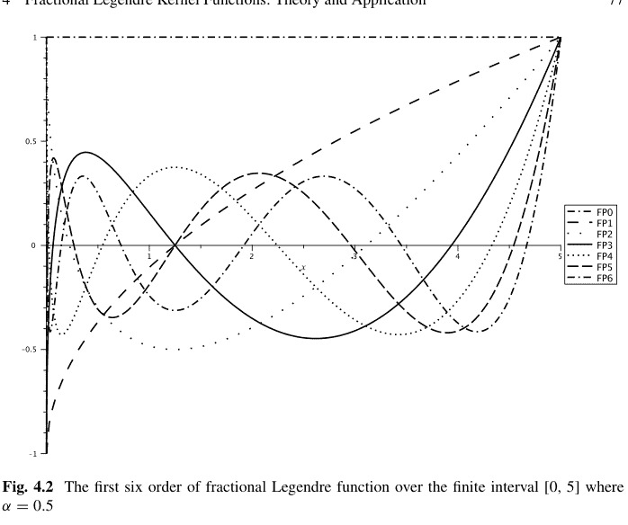

图 4.2 在有限区间 [0, 5] 上的前六阶分数阶勒让德函数，其中 $\alpha = 0.5$

**程序代码**

```python
import sympy
x = sympy.Symbol("x")
alpha = sympy.Symbol(r'\alpha')
a = sympy.Symbol("a")
b = sympy.Symbol("b")
x=sympy.sympify(2*((x-a)/(b-a))**alpha -1)

def FLn(x, n):
    if n == 0:
        return 1
    elif n == 1:
        return x
    elif n >= 2:
        return ((2 * n - 1) * (x * Ln(x,n-1)) - (n-1)*Ln(x,n-2))/n

sympy.simplify(FLn(x,3))
```

> $20\left(\frac{x-a}{b-a}\right)^{3\alpha} - 30\left(\frac{x-a}{b-a}\right)^{2\alpha} + 12\left(\frac{x-a}{b-a}\right)^{\alpha} - 1$

图 4.2 显示了在 $a = 0$, $b = 5$, 且 $\alpha$ 为 0.5 时，前六阶的第一类分数阶勒让德函数。

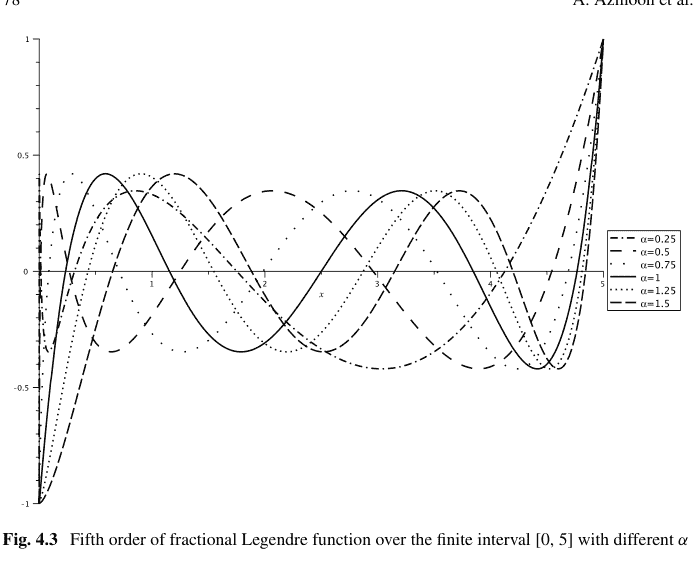

此外，图 4.3 描绘了不同 α 值下的五阶第一类分数阶勒让德函数。

### 4.3 勒让德核函数

本节首先介绍普通勒让德多项式核公式。然后，将介绍该核函数的其他一些版本，最后，本节将介绍分数阶勒让德多项式核。

#### 4.3.1 普通勒让德核函数

勒让德多项式与其他多项式一样是正交的，不同之处在于勒让德多项式的权函数是一个值为 1 的常数函数（w(x) = 1）。因此，根据公式 4.2 和 4.3，对于不同的 m 和 n，勒让德多项式在权函数为 1 的情况下彼此正交。这使我们能够构建没有分母的勒让德核。因此，对于标量输入 x 和 z，勒让德核定义如下：

$K(x, z) = \sum_{i=0}^{n} P_i(x) P_i(z) = < \phi(x), \phi(z) >,$

其中 $<, >$ 是内积，唯一参数 $n$ 是勒让德多项式的最高阶数，由勒让德核确定的非线性映射为

$\phi(x) = (P_0(x), P_1(x), ..., P_n(x)) \in \mathbb{R}^{n+1}.$

现在，根据这个公式，可以看出 $\phi(x)$ 的值彼此正交，这表明勒让德核也是正交的（Shawe-Taylor 和 Cristianini，2004）。

**定理 4.1**（Pan 等人，2012）*勒让德核是一个有效的 Mercer 核。*

*证明* 根据在（第 2.2.1 节）中介绍的 Mercer 定理，一个有效的核函数需要是半正定的，或者等价地应满足 Mercer 定理的充要条件。正如 Mercer 定理所指出的，任何 SVM 核要成为有效核都应该是非负的，精确地说：

$\iint K(x, z)w(x, z)f(x)f(z)dxdz \geq 0,$

其中

$K(x, z) = \sum_{i=0}^{n} P_i(x) P_i^T(z),$

且 $w(x, z) = 1$，$f(x)$ 是一个函数，其中 $: f : \mathbb{R}^m \rightarrow \mathbb{R}$。假设每个元素彼此独立，Mercer 条件 $K(x, z)$ 可以如下计算：

$\iint K(x, z)w(x, z)f(x)f(z)dxdz = \iint \sum_{j=0}^{n} P_j(x)P_j^T(z)f(x)f(z)dxdz,$
$= \sum_{j=0}^{n} \iint P_j(x)P_j^T(z)f(x)f(z)dxdz,$
$= \sum_{j=0}^{n} \left[ \int P_j(x)f(x)dx \int P_j^T(z)f(z)dz \right],$
$= \sum_{j=0}^{n} \left[ \left( \int P_j(x)f(x)dx \right) \left( \int P_j^T(z)f(z)dz \right) \right],$
$\geq 0.$

前三阶的勒让德核可以表示为：

$K(x, z) = 1 + xz,$
$K(x, z) = 1 + xz + \frac{9(xz)^2 - 3x^2 - 3z^2 + 1}{4},$
$K(x, z) = 1 + xz + \frac{9(xz)^2 - 3x^2 - 3z^2 + 1}{4} + \frac{25(xz)^3 - 15x^3z - 15xz^3 + 9xz}{4}.$

对于向量输入 $x$, $z \in \mathbb{R}^d$，该核可以展开并指定为以下形式：

$K(\mathbf{x}, \mathbf{z}) = \prod_{j=1}^d K_j(x_j, z_j) = \prod_{j=1}^d \sum_{i=0}^n P_i(x_j)P_i(z_j)$

其中 $x_j$ 是向量 $\mathbf{x}$ 的第 j 个元素。

鉴于两个有效核的乘积仍然是有效核，该核也是有效的。与切比雪夫核函数对于向量输入的情况相同，勒让德核函数的每个输入向量特征都位于 $[-1, 1]$ 中。因此，输入数据已通过以下公式归一化到 $[-1, 1]$：

$x_i^{new} = \frac{2(x_i^{old} - Min_i)}{Max_i - Min_i} - 1$

其中 $x_i$ 是向量 $\mathbf{x}$ 的第 i 个特征，$Max_i$ 和 $Min_i$ 分别是所有训练和测试数据在第 i 维上的最小值和最大值。

#### 4.3.2 其他勒让德核函数

除了普通形式的勒让德核函数外，还定义了其他具有独特特性和特殊权函数的基于勒让德多项式的核，本节将介绍其中一些。

##### 4.3.2.1 广义勒让德核

Ozer 等人（2011）将核函数直接应用于向量输入，而不是应用于每个输入元素。事实上，由广义勒让德多项式提出的广义勒让德核如下所示（Tian 和 Wang，2017）：

$K_{G-Legendre}(x, z) = \sum_{i=0}^n P_i(x)P_i^T(z)$

其中

$P_0(x) = 1,$
$P_1(x) = x,$
$P_n(x) = \frac{2n-1}{n} x P_{n-1}^T(x) - \frac{n-1}{n} P_{n-2}(x). \quad (4.30)$

关于切比雪夫广义核，应该注意的是，由于其更复杂的权函数，这些核的表达式比广义勒让德核更复杂，因此广义切比雪夫核可以描述更丰富的非线性信息。

##### 4.3.2.2 指数型勒让德核

指数型修正正交多项式核实际上是著名的高斯核与相应的广义正交多项式核（无权函数）的乘积。由于指数函数（高斯核）比平方根函数能更好地捕捉决策面附近的局部信息，Ozer 等人（2011）用高斯核（$\frac{1}{\exp \gamma \|x-z\|^2}$）替换了权函数，并定义了指数型修正勒让德核如下（Tian 和 Wang，2017）：

$K_{exp-Legendre}(x, z) = \frac{\sum_{i=0}^n P_i(x) P_i^T(z)}{\exp \gamma \|x-z\|^2}. \quad (4.31)$

应该注意的是，修正的广义正交多项式核可以看作是半局部核。此外，具有两个参数 $n$ 和 $\gamma > 0$，使得这两个核的优化比广义正交多项式核更难利用（Tian 和 Wang，2017）。

##### 4.3.2.3 三角修正勒让德核

三角核本质上是原始空间中点之间欧几里得距离（$d(i, j)$）的仿射函数，表示为（Fleuret 和 Sahbi，2003）：

$K(x, z) = (1 - \frac{\|x-z\|}{\lambda})_+, \quad (4.32)$

其中 $()_+$ 强制此映射为正，并确保此表达式是一个核。因此，三角修正勒让德核可以写成如下形式（Tian 和 Wang，2017；Belanche Muñoz，2013；Fleuret 和 Sahbi，2003）：$K_{Tri-Legendre}(x, z) = (1 - \frac{\|x - z\|}{\lambda})_+ \sum_{i=0}^{n} P_i(x) P_i^T(z)$, (4.33)

其中 $\lambda = \max\{d(x_i, \bar{x})|\bar{x} = \frac{1}{N} \sum_{i=1}^{N} x_i, x_i \in X\}$，$X$ 是一个有限样本集，$N$ 是样本数量。因此，所有数据都位于一个半径为 $\lambda$ 的球内。由于参数 $\lambda$ 仅依赖于输入数据，三角修正正交多项式核函数的唯一参数是从一组小的整数中选取的。

#### 4.3.3 分数阶勒让德核

给定分数阶权重函数为 $(fw(x, z) = (xz^T)^{\alpha-1})$，并且类似于勒让德核，引入相应的分数阶形式为

$K_{FLegendre}(X, Z) = \prod_{j=1}^{m} \sum_{i=0}^{n} FP_i^{\alpha}(x'_{x_j}) FP_i^{\alpha}(x'_{z_j}) fw(x'_{x_j}, x'_{z_j})$, (4.34)

其中 $m$ 是向量 $X$ 和 $Z$ 的维度。根据本书中的流程，在引入一个核函数后，我们应该保证其有效性。因此，我们可以继续以下定理。

**定理 4.2** *分数阶勒让德核是一个有效的 Mercer 核。*

**证明** 根据在（第 2.2.1 节）中介绍的 Mercer 定理，一个有效的核应满足 Mercer 定理的充分条件。众所周知，Mercer 定理指出任何 SVM 核要成为有效核必须是非负的，精确地说：

$\iint K(x, z)w(x, z) f(x) f(z) dxdz \geq 0$, (4.35)

其中

$K(x, z) = \sum_{i=0}^{n} FP_i^{\alpha}(x'_{x_j}) FP_i^{\alpha}(x'_{z_j})^T fw(x'_{x_j}, x'_{z_j})$, (4.36)

且 $fw(x, z) = (xz^T)^{\alpha-1}$，其中 $f(x)$ 是函数 $f : \mathbb{R}^m \rightarrow \mathbb{R}$。因此，我们有

$\iint K(x, z)w(x, z) f(x) f(z) dxdz$

$= \iint \sum_{i=0}^{n} F P_{i}^{\alpha}\left(x_{x}^{\prime}\right) F P_{i}^{\alpha}\left(x_{z}^{\prime}\right)^{T} f w\left(x_{x_{j}}^{\prime}, x_{z_{j}}^{\prime}\right) f(x) f(z) d x d z,$

$= \sum_{i=0}^{n} \iint F P_{i}^{\alpha}\left(x_{x}^{\prime}\right) F P_{i}^{\alpha}\left(x_{z}^{\prime}\right)^{T}\left(x_{x}^{\prime} x_{z}^{\prime T}\right)^{\alpha-1} f(x) f(z) d x d z,$

$= \sum_{i=0}^{n}\left[\int F P_{i}^{\alpha}\left(x_{x}^{\prime}\right)\left(x_{x}^{\prime}\right)^{\alpha-1} f(x) d x \int F P_{i}^{\alpha}\left(x_{z}^{\prime}\right)^{T}\left(x_{z}^{\prime T}\right)^{\alpha-1} f(z) d z\right],$

$= \sum_{i=0}^{n}\left[\left(\int F P_{i}^{\alpha}\left(x_{x}^{\prime}\right)\left(x_{x}^{\prime}\right)^{\alpha-1} f(x) d x\right)\left(\int F P_{i}^{\alpha}\left(x_{z}^{\prime}\right)^{T}\left(x_{z}^{\prime T}\right)^{\alpha-1} f(z) d z\right)\right],$

$\geqslant 0. \tag{4.37}$

### 4.4 勒让德核函数在真实数据集上的应用

本节展示了普通勒让德核和分数阶勒让德核在 SVM 中的应用。同时，将两个真实数据集上获得的结果与 RBF 核、普通多项式核、普通切比雪夫核和分数阶切比雪夫核的结果进行了比较。

#### 4.4.1 螺旋数据集

螺旋数据集已在前面章节中介绍过。本节使用勒让德核和分数阶勒让德核，通过 SVM 对螺旋数据集进行分类。如前所述，这个多类分类数据集可以拆分为三个二分类数据集。之前也解释过（图 3.5），通过使用 $\alpha$ 系数（$0.1 \leqslant \alpha \leqslant 0.9$）将数据转换到分数空间，数据密度随着 alpha 值的减小而逐渐降低，并且数据密度的中心轴从点 (0, 0) 转移到点 (1, 1)。尽管在二维图上数据点似乎聚集在轴的一个角落（图 4.4），但当应用核函数时，在三维空间中情况未必如此（图 4.5）。

利用转换到分数空间的数据，在勒让德和分数阶勒让德核函数的帮助下，为上述划分的问题找到了决策边界。

为了直观了解决策边界有何不同，我们可以查看图 4.6，该图描绘了在原始螺旋数据集上，不同阶数（3、4、5 和 6）的对应勒让德分类器，其中选择了 1-vs-{2, 3} 的二分类。从这些图中可以看出，决策边界变得越来越扭曲。

在分数空间中，决策边界的复杂性甚至变得更糟。图 4.7 展示了不同阶数（3、4、5 和 6）的分数阶勒让德分类器的决策边界，其中 $\alpha = 0.4$。同样，从阶数 3 到阶数 6，决策边界变得复杂。$^1$

三维空间中的每个决策边界或决策面都以特定形式对数据点进行分类。由于每个阶数的核函数的决策边界或面是固定且确定的，因此是该特定形状与数据点之间的相关程度决定了最终的准确性。

实验结果总结在以下表格中。特别是，表 4.2 总结了类别 1-vs-{2, 3} 的结果。可以看出，**分数阶勒让德**核优于其他核，**分数阶切比雪夫**核具有第二好的准确性。此外，表 4.3 总结了上述核在类别 2-vs-{1, 3} 上的分类准确性，其中 **RBF** 核具有最佳的准确性分数。最后，表 4.4 是类别 3-vs-{1, 2} 的分类准确性分数，其中**分数阶勒让德**核表现最佳。

> $^1$ 基于许多研究，得出结论：阶数为 3 的分数阶勒让德核不适合在螺旋数据集上使用。

#### 4.4.2 三个和尚数据集

作为另一个案例示例，这里考虑三个和尚问题（有关数据集的更多信息，请参见第 3 章）。将 *勒让德核*（即公式 4.21）和 *分数阶勒让德核*（即公式 4.34）应用于 *三个和尚问题* 的数据集。表 4.5 展示了每个模型在 Monk 第一个问题上的输出准确性，其中 *RBF 核* 在 $\sigma \approx 2.844$ 时具有最佳准确性 **1**，而 *切比雪夫核* 在其中最差，为 **0.8472**。

表 4.6 也展示了每个模型在 Monk 第二个问题上的输出准确性，其中 *分数阶勒让德核* 在 $\alpha \approx 0.8$ 时具有最佳准确性 **1**，而 *勒让德核* 具有最差的准确性 **0.8032**。

最后，表 4.7 展示了每个模型在 Monk 第三个问题上的输出准确性，其中 *分数阶切比雪夫核*（$\alpha \approx \frac{1}{16}$）和 *RBF 核* 具有最佳准确性 **0.91**，而 *分数阶勒让德核* 在其中最差，为 **0.8379**。

表 4.2 RBF、多项式、切比雪夫、分数阶切比雪夫、勒让德和分数阶勒让德在 1-vs-{2,3} 螺旋数据集上的准确性分数比较。很明显，分数阶勒让德核优于其他核

| | Sigma | Power | Order | Alpha(α) | Lambda(λ) | Accuracy |
|---|---|---|---|---|---|---|
| RBF | 0.73 | – | – | – | – | 0.97 |
| Polynomial | – | 8 | – | – | – | 0.9533 |
| Chebyshev | – | – | 5 | - | – | 0.9667 |
| Fractional Chebyshev | – | – | 3 | 0.3 | – | 0.9733 |
| Legendre | – | – | 7 | – | – | 0.9706 |
| Fractional Legendre | – | – | 7 | 0.4 | – | **0.9986** |

### 4.5 结论

本章介绍了用于支持向量机的分数阶勒让德多项式核，并利用普通勒让德多项式核进行了阐述。由于特征向量中元素的正交性，勒让德多项式核能够从数据中提取良好特性，从而降低数据冗余。此外，根据前一节在两个数据集上的实验结果，可以表明，采用勒让德核和分数阶勒让德核的支持向量机能够很好地分离非线性数据。

表 4.3 RBF、多项式、切比雪夫、分数阶切比雪夫、勒让德和分数阶勒让德在 2-vs-{1,3} 螺旋数据集上的准确率得分比较。显然，RBF 核优于其他核

| | Sigma | Power | Order | Alpha(α) | Lambda(λ) | Accuracy |
|---|---|---|---|---|---|---|
| RBF | 0.1 | – | – | – | – | **0.9867** |
| Polynomial | – | 5 | – | – | – | 0.9044 |
| Chebyshev | – | – | 6 | – | – | 0.9289 |
| Fractional Chebyshev | – | – | 6 | 0.8 | - | 0.9344 |
| Legendre | – | – | 8 | – | – | 0.9773 |
| Fractional Legendre | – | – | 8 | 0.4 | – | 0.9853 |

表 4.4 RBF、多项式、切比雪夫、分数阶切比雪夫、勒让德和分数阶勒让德在 3-vs-{1,2} 螺旋数据集上的准确率得分比较。显然，分数阶勒让德核和多项式核优于其他核

| | Sigma | Power | Order | Alpha(α) | Lambda(λ) | Accuracy |
|---|---|---|---|---|---|---|
| RBF | 0.73 | – | – | – | – | 0.98556 |
| Polynomial | – | 5 | – | – | – | 0.98556 |
| Chebyshev | – | – | 6 | – | – | 0.9622 |
| Fractional Chebyshev | – | – | 6 | 0.6 | – | 0.9578 |
| Legendre | – | – | 7 | – | – | 0.9066 |
| Fractional Legendre | – | – | 5 | 0.4 | – | **0.9906** |

表 4.5 RBF、多项式、切比雪夫、分数阶切比雪夫、勒让德和分数阶核在 Monks 第一个问题上的比较

| | Sigma | Power | Order | Alpha(α) | Lambda(λ) | Accuracy |
|---|---|---|---|---|---|---|
| RBF | 2.844 | – | – | – | – | **0.8819** |
| Polynomial | – | 3 | – | – | – | 0.8681 |
| Chebyshev | – | – | 3 | – | – | 0.8472 |
| Fractional Chebyshev | – | – | 3 | 1/16 | – | 0.8588 |
| Legendre | – | – | 4 | – | – | 0.8333 |
| Fractional Legendre | – | – | 4 | 0.1 | – | 0.8518 |

表 4.6 RBF、多项式、切比雪夫、分数阶切比雪夫、勒让德和分数阶核在 Monks 第二个问题上的比较

| | Sigma | Power | Order | Alpha(α) | Lambda(λ) | Accuracy |
|---|---|---|---|---|---|---|
| RBF | 5.5896 | – | – | – | – | 0.875 |
| Polynomial | – | 3 | – | – | – | 0.8657 |
| Chebyshev | – | – | 3 | – | – | 0.8426 |
| Fractional Chebyshev | – | – | 3 | 1/16 | – | 0.9653 |
| Legendre | – | – | 3 | – | – | 0.8032 |
| Fractional Legendre | – | – | 3 | 0.1 | – | 1 |

表 4.7 RBF、多项式、切比雪夫、分数阶切比雪夫、勒让德和分数阶核在 Monks 第三个问题上的比较。

| | Sigma | Power | Order | Alpha(α) | Lambda(λ) | Accuracy |
|---|---|---|---|---|---|---|
| RBF | 2.1586 | – | – | – | – | 0.91 |
| Polynomial | – | 3 | – | – | – | 0.875 |
| Chebyshev | – | - | 6 | – | – | 0.895 |
| Fractional Chebyshev | – | – | 5 | 1/5 | – | 0.91 |
| Legendre | – | – | 4 | – | – | 0.8472 |
| Fractional Legendre | – | – | 3 | 0.8 | – | 0.8379 |

## 参考文献

Afifi, A., Zanaty, EA.: Generalized legendre polynomials for support vector machines (SVMS) classification. Int. J. Netw. Secur. Appl. (IJNSA) **11**, 87–104 (2019)

Asghari, M., Hadian Rasanana, A.H., Gorgin, S., Rahmati, D., Parand, K.: FPGA-orthopoly: a hardware implementation of orthogonal polynomials. Eng. Comput. (2022). https://doi.org/10.1007/s00366-022-01612-x

Belanche Muñoz, L. A.: Developments in kernel design. In ESANN 2013 Proceedings: European Symposium on Artificial Neural Networks, Computational Intelligence and Machine Learning, pp. 369–378 (2013)

Benouini, R., Batioua, I., Zenkouar, Kh., Mrabti, F: New set of generalized Legendre moment invariants for pattern recognition. Pattern Recognit. Lett. **123**, 39–46 (2019)

Bhrawy, A.H., Abdelkawy, M.A., Machado, J.T., Amin, A.Z.M.: Legendre-Gauss-Lobatto collocation method for solving multi-dimensional Fredholm integral equations. Comput. Math. Appl. **4**, 1–13 (2016)

Bhrawy, A.H., Doha, E.H., Ezz-Eldien, S.S., Abdelkawy, M.A.: A numerical technique based on the shifted Legendre polynomials for solving the time-fractional coupled KdV equations. Calcolo **53**, 1–17 (2016)

Chang, P., Isah, A.: Legendre Wavelet Operational Matrix of fractional Derivative through wavelet-polynomial transformation and its Applications in Solving Fractional Order Brusselator system. J. Phys.: Conf. Ser. **693** (2016)

Chang, R.Y., Wang, M.L.: Model reduction and control system design by shifted Legendre polynomial functions. J. Dyn. Syst. Meas. Control **105**, 52–55 (1983)

Chang, R.Y., Wang, M.L.: Optimal control of linear distributed parameter systems by shifted Legendre polynomial functions. J. Dyn. Syst. Meas. Control **105**, 222–226 (1983)

Chang, R.Y., Wang, M.L.: Shifted Legendre function approximation of differential equations; application to crystallization processes. Comput. Chem. Eng. **8**, 117–125 (1984)

Dahmen, S., Morched, B.A., Mohamed Hédi, B.G.: Investigation of the coupled Lamb waves propagation in viscoelastic and anisotropic multilayer composites by Legendre polynomial method. Compos. Struct. **153**, 557–568 (2016)

Dash, R., Dash, P. K.: MDHS-LPNN: a hybrid FOREX predictor model using a Legendre polynomial neural network with a modified differential harmony search technique. Handbook of Neural Computation, pp. 459–486. Academic Press (2017)

Dash, R.: Performance analysis of an evolutionary recurrent Legendre Polynomial Neural Network in application to FOREX prediction. J. King Saud Univ.—Comput. Inf. Sci. **32**, 1000–1011 (2020)

Doman, B.G.S.: The Classical Orthogonal Polynomials. World Scientific, Singapore (2015)

Ezz-Eldien, S.S., Doha, E.H., Baleanu, D., Bhrawy, A.H.: A numerical approach based on Legendre orthonormal polynomials for numerical solutions of fractional optimal control problems. J VIB Control **23**, 16–30 (2017)

Fleuret, F., Sahbi, H.: Scale-invariance of support vector machines based on the triangular kernel. In: 3rd International Workshop on Statistical and Computational Theories of Vision (2003)

Fleuret, F., Sahbi, H.: Scale-invariance of support vector machines based on the triangular kernel. In: 3rd International Workshop on Statistical and Computational Theories of Vision, pp. 1–13 (2003)

Gao, J., Lyu, Y., Zheng, M., Liu, M., Liu, H., Wu, B., He, C.: Application of Legendre orthogonal polynomial method in calculating reflection and transmission coefficients of multilayered plates. Wave Motion **84**, 32–45 (2019)

Gao, J., Lyu, Y., Zheng, M., Liu, M., Liu, H., Wu, B., He, C.: Application of state vector formalism and Legendre polynomial hybrid method in the longitudinal guided wave propagation analysis of composite multi-layered pipes. Wave Motion **100**, 102670 (2021)

Hadian Rasanana, A.H., Rahmati, D., Gorgin, S., Parand, K.: A single layer fractional orthogonal neural network for solving various types of Lane-Emden equation. New Astron. **75**, 101307 (2020)

Hadian Rasanana, A.H., Bajalan, N., Parand, K., Rad, J.A.: Simulation of nonlinear fractional dynamics arising in the modeling of cognitive decision making using a new fractional neural network. Math. Methods Appl. Sci. **43**, 1437–1466 (2020)

Haitjema, H.: Surface profile and topography filtering by Legendre polynomials. Surf. Topogr. **9**, 15–17 (2021)

HWANG, C., Muh-Yang, C.: Analysis and optimal control of time-varying linear systems via shifted Legendre polynomials. Int. J. Control **41**, 1317–1330 (1985)

Kaghashvili, E.K., Zank, G.P., Lu, J.Y., Dröge, W. : Transport of energetic charged particles. Part 2. Small-angle scattering. J. Plasma Phys. **70**, 505–532 (2004)

Kazem, S., Shaban, M., Rad, J.A.: Solution of the coupled Burgers equation based on operational matrices of d-dimensional orthogonal functions. Zeitschrift für Naturforschung A **67**, 267–274 (2012)

Kazem, S., Abbasbandy, S., Kumar, S. : Fractional-order Legendre functions for solving fractional-order differential equations. Appl. Math. Model. **37**, 5498–5510 (2013)

Lamb, G.L., Jr.: Introductory Applications of Partial Differential Equations: with Emphasis on Wave Propagation and Diffusion, Wiley, Amsterdam (2011)

Holdeman, J.H., Jr., Jonas, T., Legendre polynomial expansions of hypergeometric functions with applications: J Math Phys **11**, 114–117 (1970)

Mall, S., Chakraverty, S.: Application of Legendre neural network for solving ordinary differential equations. Appl. Soft Comput. **43**, 347–356 (2016)

Marianela, P., Gómez, J.C.: Legendre polynomials based feature extraction for online signature verification. Consistency analysis of feature combinations. Pattern Recognit. **47**, 128–140 (2014)

Moayeri, M.M., Rad, J.A., Parand, K.: Dynamical behavior of reaction-diffusion neural networks and their synchronization arising in modeling epileptic seizure: A numerical simulation study. Comput. Math. with Appl. **80**, 1887–1927 (2020)

Mohammadi, F., Hosseini, M.M.: A new Legendre wavelet operational matrix of derivative and its applications in solving the singular ordinary differential equations. J. Franklin Inst. **348**, 1787–1796 (2011)

N Parand, K., Delfafar, Z., Rad, J. A., Kazem S.: Numerical study on wall temperature and surface heat flux natural convection equations arising in porous media by rational Legendre pseudo-spectral approach. Int. J. Nonlinear Sci **9**, 1–12 (2010)

Olver, F.W.J., Lozier, D.W., Boisvert, R.F., Clark, C.W.: NIST Handbook of Mathematical Functions Hardback and CD-ROM. Cambridge University Press, Singapore (2010)

Ozer, S., Chi, H., Chen, Hakan, Cirpan.: A set of new Chebyshev kernel functions for support vector machine pattern classification. Pattern Recognit. **44**, 1435–1447 (2011)

Pan, Z.B., Chen, H., You, X.H.: Support vector machine with orthogonal Legendre kernel. In: International Conference on Wavelet Analysis and Pattern Recognition,pp. 125–130. IEEE (2012)

Parand, K., Razzaghi, M.: Rational Legendre approximation for solving some physical problems on semi-infinite intervals. Phys. Scr. **69**, 353 (2004)

Parand, K., Shahini, M., Dehghan, M.: Rational Legendre pseudospectral approach for solving nonlinear differential equations of Lane-Emden type. J. Comput. Phys. **228**, 8830–8840 (2009)

Qian, C.B., Tianshu, L., Jinsong, L. H. Liu, Z.: Synchrophasor estimation algorithm using Legendre polynomials. IEEE PES General Meeting Conference and Exposition (2014)

Rad, J.A., Kazem, S., Shaban, M., Parand, K., Yildirim, A.H.M.E.T.: Numerical solution of fractional differential equations with a Tau method based on Legendre and Bernstein polynomials. Math. Methods Appl. Sci. **37**, 329–342 (2014)

Saadatmandi, A., Dehghan, M.: A new operational matrix for solving fractional-order differential equations. Comput. Math. Appl. **59**, 1326–1336 (2010)

Sánchez-Ruiz, J., Dehesa, J.S.: Expansions in series of orthogonal hypergeometric polynomials. J. Comput. Appl. Math. **89**, 155–170 (1998)

Shawe-Taylor, J., Cristianini, N.: Kernel Methods for Pattern Analysis. Cambridge University Press, Cambridge (2004)

沈，J.：高效谱-伽辽金方法 I. 使用勒让德多项式求解二阶和四阶方程的直接求解器。SISC **15**, 1489–1505 (1994)

斯宾塞，L.V.：基于勒让德多项式展开计算尖锐角分布及其在带电粒子多次散射中的应用。Phys. Rev. **90**, 146–150 (1953)

田，M., 王，W.：一些正交多项式核函数集。Appl. Soft Comput. **61**, 742–756 (2017)

福尔克，A., 卡伊奇，I., 伊利阿斯密斯，C.：勒让德记忆单元：循环神经网络中的连续时间表示。Adv. Neural Inf. Process. Syst. **32** (2019)

泽格丹，R.：使用移位勒让德多项式求解非线性随机伊藤-沃尔泰拉积分方程的数值方法。Int. J. Dyn. Syst. Diff. Eqs. **11**, 69–88 (2021)

郑，M., 何，C., 吕，Y., 吴，B.：基于状态向量形式的勒让德多项式解在各向异性空心圆柱体中的导波传播。Compos. Struct. **207**, 645–657 (2019)

# 第5章
分数阶盖根鲍尔核函数：理论与应用

Sherwin Nedaei Janbesaraei, Amirreza Azmoon, and Dumitru Baleanu

**摘要** 由于许多函数被用作核，支持向量机方法在处理众多机器学习问题时展现出了卓越的多功能性。盖根鲍尔多项式，与前面章节介绍的切比雪夫和勒让德多项式一样，是最常用的正交多项式之一，在支持向量机方法中取得了优异的成果。本章介绍并回顾了盖根鲍尔函数和分数阶盖根鲍尔函数的一些基本性质，随后引入并验证了这些函数的核。最后，评估了这些函数在解决两个问题（两个示例数据集）上的性能。

**关键词** 盖根鲍尔多项式 · 分数阶盖根鲍尔函数 · 核技巧 · 正交函数 · 默塞尔定理

### 5.1 引言

*盖根鲍尔多项式*，或更广为人知的*超球多项式*，是另一类经典正交多项式，以奥地利数学家*利奥波德·伯恩哈德·盖根鲍尔*（1849–1903）的名字命名。正如其名所示，*超球多项式*为高维球谐函数提供了一种自然的扩展（Avery 2012）。*球谐函数*是定义在球面上的特殊函数。它们常被应用于数学中求解微分方程（Doha 1998; Elliott 1960）。近年来，经典正交多项式，特别是盖根鲍尔正交多项式，已被用于解决模式识别（Liao et al. 2002; Liao and Chen 2013; Herrera-Acosta et al. 2020）、分类（Hjouji et al. 2021; Eassa et al. 2022）以及许多领域（如物理学（Ludlow and Everitt 1995）、医学图像处理（Arfaoui et al. 2020; Stier et al. 2021; Öztrk et al. 2020）、电子学（Tamandani and Alijani 2022）和其他基础领域（Soufivand et al. 2021; Park 2009; Feng and Varshney 2021））中的基于核的学习。2006年，Pawlak (2006) 展示了基于盖根鲍尔多项式及其相应矩的图像重建过程的优势。随后几年，Hosny (2011) 利用盖根鲍尔矩的高计算需求，提出了用于图像分析和识别的新方法，这些研究中出现了分数阶移位盖根鲍尔矩（Hosny et al. 2020）和盖根鲍尔矩不变量（Hosny 2014）。同样在2014年，Abd Elaziz et al. (2019) 使用基于正交盖根鲍尔矩的人工蜂群算法，借助支持向量机对星系图像进行分类。2009年，Langley和Zhao (2009) 利用盖根鲍尔多项式的正交性，提出了一种新的三维相位解缠算法，用于磁共振成像（MRI）分析。此外，在1995年，Ludlow研究了盖根鲍尔多项式在球体光发射中的应用（Ludlow and Everitt 1995）。克利福德多项式特别适合作为高维连续小波变换的核函数。2004年，Brackx et al. (2004) 构造了克利福德-盖根鲍尔和广义克利福德-盖根鲍尔多项式，作为高维连续小波变换的新特定小波核函数。然后，Ilić和Pavlović (2011) 在2011年，利用盖根鲍尔正交多项式的克里斯托费尔-达布公式，提出了具有最佳幅度和最佳群延迟特性的滤波器函数解。

在SVM算法中使用不同核的灵活性是正交经典多项式最近被用作核的原因之一。盖根鲍尔多项式就是其中之一，它在该领域展示了可接受的结果。2018年，Padierna et al. (2018) 为SVM分类引入了正交多项式核函数的公式。同样在2020年，他（Padierna et al. 2020）使用该核对2型糖尿病患者的外周动脉疾病进行分类。除了在SVM中使用正交多项式作为核来解决分类问题外，这些多项式还可以用作支持向量回归（SVR）中的核来解决回归问题，并有助于研究时间序列问题。1992年，Azari et al. (1992) 提出了相应的超球核。此外，在2019年，Feng建议使用扩展支持向量回归（X-SVR），这是一种新的基于机器学习的元模型，用于基于首次通过理论的动态系统可靠性研究。此外，X-SVR的能力通过一个由向量化盖根鲍尔多项式构建的新核函数得到增强，专门用于处理复杂的工程问题（Feng et al. 2019）。另一方面，在2001年，Ferrara和Guégan (2001) 处理了长记忆盖根鲍尔过程的k因子扩展，该模型研究了k因子盖根鲍尔模型对巴黎地区城市交通真实数据的预测能力。正交盖根鲍尔多项式的其他应用包括它们在构建和开发神经网络方面的有效性。2018年，Zhang et al. (2018) 利用概率论、多项式插值和逼近理论，研究并构建了双输入盖根鲍尔正交神经网络（TIGONN），以避免反向传播（BP）训练算法的固有问题。然后，在2019年，构建并研究了一种基于盖根鲍尔正交多项式的新型神经网络，称为GNN（He et al. 2019）。该模型可以克服极限学习机（ELM）的计算鲁棒性问题，同时仍具有相当的结构简单性和逼近能力（He et al. 2019）。除了这里提到的应用外，表5.1展示了一些不同类型多项式的应用。

> **利奥波德·伯恩哈德·盖根鲍尔**（1849–1903）是一位奥地利数学家。然而，他进入维也纳大学学习历史和语言学，但最终以数学和物理教师的身份毕业。他数学方面的职业生涯始于他获得的一笔资助，这使他得以在柏林大学进行为期2年的研究，在那里他得以聆听当时伟大数学家的讲座，如卡尔·魏尔斯特拉斯、爱德华·库默尔、赫尔曼·亥姆霍兹和利奥波德·克罗内克。利奥波德·盖根鲍尔在数学领域有许多兴趣，如数论和函数论。他在1875年的博士论文中引入了一类正交多项式，即盖根鲍尔正交多项式。然而，盖根鲍尔的名字出现在许多数学概念中，如盖根鲍尔变换、盖根鲍尔积分不等式、盖根鲍尔逼近、傅里叶-盖根鲍尔和、盖根鲍尔振荡器等等，但盖根鲍尔的另一个重要贡献是在维也纳大学设计了一门“保险理论”课程，他从1893年到1903年去世一直担任该校的数学全职教授。$^a$

$^a$ 关于*L.B. 盖根鲍尔*及其贡献的更多信息，请参见：https://mathshistory.st-andrews.ac.uk/Biographies/Gegenbauer/。

在本章中，引入了一种新型的盖根鲍尔正交多项式，称为分数阶盖根鲍尔函数，并构建了相应的核，该核在支持向量机等基于核的学习方法中具有出色的应用性。在第5.2节中，介绍了盖根鲍尔多项式及其分数形式的基本定义和性质。然后，在第5.3节中，除了解释先前提出的盖根鲍尔核函数外，还提出了分数阶盖根鲍尔函数。此外，在第5.4节中，展示了在知名数据集上使用盖根鲍尔和分数阶盖根鲍尔核进行SVM分类的结果

##### 5.1 不同类型盖根瓦尔多项式的若干应用

| 盖根瓦尔多项式 | 应用 |
| :--- | :--- |
| 盖根瓦尔多项式 | Srivastava 等人 (2019) 提出了一种基于盖根瓦尔小波展开以及分数阶积分和块脉冲函数运算矩阵的、可能有助于解决 Bagley–Torvik 问题的新方法。 |
| 有理盖根瓦尔函数 | 基于有理盖根瓦尔函数，Parand 数值求解了三阶非线性微分方程 (Parand et al. 2013) 以及通过拟线性化方法 (QLM) 转换得到的一系列线性常微分方程 (ODE) (Parand et al. 2018)。 |
| 广义盖根瓦尔函数 | Belmehdi (2001) 建立了一个微分-差分关系，该序列求解了由广义盖根瓦尔（任意阶）的关联所满足的二阶和四阶微分方程。此外，Cohl (2013)；Liu 和 Wang (2020) 也在他们的研究中展示了这些函数的应用。随后，在 2020 年，Yang 等人 (2020) 提出了一种基于准解析小波包变换 (QAWPT) 和广义盖根瓦尔支持向量机 (GGSVM) 的多域敏感特征的螺栓连接结构松动状态识别新方法。 |
| 有理盖根瓦尔函数的分数阶 | 为了解决 Thomas–Fermi 问题，Hadian-Rasanan 等人 (2019) 提出了两种基于牛顿迭代法和谱算法的数值方法。这两种方法都使用了谱技术，并且基于有理盖根瓦尔函数的分数阶 (Hadian-Rasanan et al. 2019)。 |

与前几章的类似结果进行比较。最后，在第 5.5 节，结论性评述将总结整章内容。

### 5.2 预备知识

本节涵盖了盖根瓦尔多项式的基础知识。这些多项式已使用相关的微分方程定义，接下来介绍了盖根瓦尔多项式的性质，并且除了它们的性质之外，还定义了它们的分数形式。

#### 5.2.1 盖根瓦尔多项式的性质

度为 $n$、阶为 $\lambda > -\frac{1}{2}$ 的盖根瓦尔多项式 $G_n^\lambda(x)$ 是以下施图姆-刘维尔微分方程的解 (Doman 2015; Padierna et al. 2018; Asghari et al. 2022)：

$$(1 - x^2)\frac{d^2y}{dx^2} - (2\lambda + 1)x\frac{dy}{dx} + n(n + 2\lambda)y = 0, \quad (5.1)$$

其中 $n$ 是正整数，$\lambda$ 是实数且大于 $-0.5$。盖根瓦尔多项式在区间 $[-1, 1]$ 上关于权函数是正交的 (Padierna et al. 2018; Parand et al. 2018; Asghari et al. 2022)：

$$w(x) = (1 - x^2)^{\lambda - \frac{1}{2}}. \quad (5.2)$$

因此，正交关系定义为 (Ludlow and Everitt 1995; Parand et al. 2018; Hadian-Rasanan et al. 2019; Asghari et al. 2022)

$$\int_{-1}^1 G_n^\lambda(x)G_m^\lambda(x)w(x)dx = \frac{\pi 2^{1-2\lambda}\Gamma(n + 2\lambda)}{n!(n + \lambda)(\Gamma(\lambda))^2}\delta_{nm}, \quad (5.3)$$

其中 $\delta_{nm}$ 是克罗内克 delta 函数 (El-Kalaawy et al. 2018)。标准盖根瓦尔多项式 $G_n^{(\lambda)}(x)$ 也可以定义如下 (Parand et al. 2018; Hadian-Rasanan et al. 2019)：

$$G_n^\lambda(x) = \sum_{n=1}^{\lfloor \frac{n}{2} \rfloor} (-1)^j \frac{\Gamma(n + \lambda - j)}{j!(n - 2j)!\Gamma(\lambda)} (2x)^{n-2j}, \quad (5.4)$$

其中 $\Gamma(.)$ 是 Gamma 函数。

假设 $\lambda \neq 0$ 且 $\lambda \in \mathbb{R}$，盖根瓦尔多项式的生成函数给出为 (Cohl 2013; Doman 2015; Asghari et al. 2022)

$$G_n^\lambda(x, z) = \frac{1}{(1 - 2xz + z^2)^\lambda}. \quad (5.5)$$

可以证明，当 $|z| < 1$，$|x| \leqslant 1$，$\lambda > -\frac{1}{2}$ 时成立 (Cohl 2013; Doman 2015)。考虑到对于固定的 $x$，该函数在 $|z| < 1$ 内是*全纯*的，它可以展开为 *Taylor* 级数 (Reimer 2013)：

$$G_n^\lambda(x, z) = \sum_{n=0}^{\infty} G_n^\lambda(x) z^n.$$

盖根瓦尔多项式可以通过以下递推公式获得 (Olver et al. 2010; Yang et al. 2020; Hadian-Rasanan et al. 2019)：

$$G_0^\lambda(x) = 1, \quad G_1^\lambda(x) = 2\lambda x,$$
$$G_n^\lambda(x) = \frac{1}{n}[2x(n + \lambda - 1)G_{n-1}^\lambda(x) - (n + 2\lambda - 2)G_{n-2}^\lambda(x)].$$

此外，该正交多项式的其他递推关系如下 (Doman 2015)：

$$(n + 2)G_{n+2}^\lambda(x) = 2(\lambda + n + 1)xG_{n+1}^\lambda(x) - (2\lambda + n)G_n^\lambda(x),$$
$$nG_n^\lambda(x) = 2\lambda\{xG_{n-1}^{\lambda+1}(x) - G_{n-2}^{\lambda+1}(x)\},$$
$$(n + 2\lambda)G_n^\lambda(x) = 2\lambda\{G_n^{\lambda+1}(x) - xG_{n-1}^{\lambda+1}(x)\},$$
$$nG_n^\lambda(x) = (n - 1 + 2\lambda)xG_{n-1}^\lambda(x) - 2\lambda(1 - x^2)G_{n-2}^{\lambda-1}(x),$$
$$\frac{d}{dx}G_n^\lambda = 2\lambda G_{n+1}^{\lambda-1}.$$

每个尝试生成盖根瓦尔多项式的人都经历过随着阶数升高项数增加带来的一些困难，例如，对于零到四阶，如下所示：

$$G_0^\lambda(x) = 1,$$
$$G_1^\lambda(x) = 2\lambda x,$$
$$G_2^\lambda(x) = (2\lambda^2 + 2\lambda)x^2 - \lambda,$$
$$G_3^\lambda(x) = \left(\frac{4}{3}\lambda^3 + 4\lambda^2 + \frac{8}{3}\lambda\right)x^3 + (-2\lambda^2 - 2\lambda)x,$$
$$G_4^\lambda(x) = \left(\frac{2}{3}\lambda^4 + 4\lambda^3 + \frac{22}{3}\lambda^2 + 4\lambda\right)x^4 + (-2\lambda^3 - 6\lambda^2 - 4\lambda)x^2,$$

这些在图 5.1 和 5.2 中描绘，随后更高阶将会有更多项。为了克服这个困难，已经使用了 *Pochhammer 多项式* 来简化 (Doman 2015)。*Pochhammer 多项式* 或 *上升阶乘* 定义为

$$x^{(n)} = x(x + 1)(x + 2) \cdots (x + n - 1) = \prod_{k=1}^{n}(x + k - 1).$$

因此，一些 Pochhammer 多项式是

$$x^{(0)} = 1,$$
$$x^{(1)} = x,$$
$$x^{(2)} = x(x+1) = x^2 + x,$$
$$x^{(3)} = x(x+1)(x+2) = x^3 + 3x^2 + 2x,$$
$$x^{(4)} = x(x+1)(x+2)(x+3) = x^4 + 6x^3 + 11x^2 + 6x,$$
$$x^{(5)} = x^5 + 10x^4 + 35x^3 + 50x^2 + 24x,$$
$$x^{(6)} = x^6 + 15x^5 + 85x^4 + 225x^3 + 274x^2 + 120x. \quad (5.15)$$

借助 Pochhammer 多项式，阶为 $\lambda$ 的盖根瓦尔多项式的前几阶是

$$G_0^{\lambda}(x) = 1,$$
$$G_1^{\lambda}(x) = 2\lambda x,$$
$$G_2^{\lambda}(x) = a^{(2)}2x^2 - \lambda,$$
$$G_3^{\lambda}(x) = \frac{a^{(3)}4x^3}{3} - 2a^{(2)}x,$$
$$G_4^{\lambda}(x) = \frac{a^{(4)}2x^4}{3} - a^{(3)}2x^2 + a^{(2)},$$
$$G_5^{\lambda}(x) = \frac{a^{(5)}4x^5}{15} - \frac{a^{(4)}4x^3}{3} + a^{(3)}x,$$
$$G_6^{\lambda}(x) = \frac{a^{(6)}4x^6}{45} - \frac{a^{(5)}2x^4}{3} + \frac{a^{(4)}x^2}{2} - a^{(3)}. \quad (5.16)$$

其中 $a^{(n)}$ 是 *Pochhammer* 多项式。

这里为了方便，介绍了一个 Python 代码，可以使用 sympy 库符号化地生成任意阶的阶为 $\lambda$ 的盖根瓦尔多项式：

```python
import sympy
x = sympy.Symbol("x")
lambd = sympy.Symbol(r'\lambda')

def Gn(x, n):
    if n == 0:
        return 1
    elif n == 1:
        return 2*lambd*x
    elif n >= 2:
        return (sympy.Rational(1,n) * (2*x*(n+lambda-1)*Gn(x,n-1) - (n+2*lambda-2)*Gn(x,n-2)))
```

**程序代码**

```
sympy.expand(sympy.simplify(Gn(x,2)))
> 2x^2\lambda^2 + 2x^2\lambda - \lambda
```

对于 $G_n^\lambda(x), n = 0, 1, \dots, n, \lambda > -\frac{1}{2}$，它关于权函数 $(1-x^2)^{\lambda-\frac{1}{2}}$ 正交，在 $[-1, 1]$ 中恰好有 $n$ 个零点，记为 $x_{nk}(\lambda), k = 1, \dots, n$，并按递减顺序排列 $1 > x_{n1}(\lambda) > x_{n2} > \dots > x_{nn}(\lambda) > -1$ (Reimer 2013)。$G_n^\lambda(x)$ 和 $G_m^\lambda(x), m > n$ 的零点相互交错，并且在 $G_n^\lambda(x)$ 的任何两个零点之间，至少有一个零点 (Olver et al. 2010)。

盖根瓦尔多项式遵循与其他经典正交多项式相同的对称性。因此，偶数阶的盖根瓦尔多项式具有偶对称性，仅包含 $x$ 的偶次幂；同样，奇数阶的盖根瓦尔多项式具有奇对称性，仅包含 $x$ 的奇次幂 (Olver et al. 2010)。

$$G_n^\lambda(x) = (-1)^n G_n^\lambda(x) = \begin{cases} G_n^\lambda(-x), & n \text{ even} \\ -G_n^\lambda(-x), & n \text{ odd} \end{cases}, \quad (5.17)$$

此外，$G_n^\lambda(x)$ 的一些特殊值可以写成如下形式：

$$G_n^\lambda(1) = \frac{(2\lambda)n}{n!}, \quad (5.18)$$
$$G_{2n}^\lambda(0) = \frac{(-1)^n(\lambda)n}{n!}, \quad (5.19)$$
$$G_{2n+1}^\lambda(0) = \frac{2(-1)^n(\lambda)n+1}{n!}. \quad (5.20)$$

#### 5.2.2 分数阶盖根瓦尔多项式的性质

通过使用映射 $x' = 2(\frac{x-a}{b-a})^\alpha - 1$（其中 $\alpha > 0$ 且 $x' \in [-1, 1]$），在有限区间 $[a, b]$ 上的分数阶 $\lambda$ 的盖根瓦尔多项式定义如下 (Parand and Delkhosh 2016)：

$$FG_n^{\alpha,\lambda}(x) = G_n^\lambda(x') = G_n^\lambda\left(2\left(\frac{x-a}{b-a}\right)^\alpha - 1\right), \quad (5.21)$$

其中 $\alpha \in \mathbb{R}^+$ 是“函数的分数阶”，由上下文决定，而 $\lambda > -\frac{1}{2}$ 是 Gegenbauer 多项式的阶数。

关于已经为 Gegenbauer 多项式引入的递推关系（公式 5.7），可以通过将映射 $x' = 2\left(\frac{x-a}{b-a}\right)^{\alpha} - 1$ 代入公式 5.7 来简单地定义分数阶 Gegenbauer 函数的递推关系：

$$FG_n^{\alpha,\lambda}(x) = \frac{1}{n}[2x(n+\lambda-1)FG_{n-1}^{\alpha,\lambda}(x) - (n+2\lambda-2)FG_{n-2}^{\alpha,\lambda}(x)],$$

$$FG_0^{\alpha,\lambda}(x) = 1, \quad FG_1^{\alpha,\lambda}(x) = 2\lambda\left(2\left(\frac{x-a}{b-a}\right)^{\alpha} - 1\right). \quad (5.22)$$

因此，*分数阶 Gegenbauer 多项式*的前几阶为

$$FG_0^{\alpha,\lambda}(x) = 1,$$

$$FG_1^{\alpha,\lambda}(x) = 4\lambda\left(\frac{x-a}{b-a}\right)^{\alpha} - 2\lambda,$$

$$FG_2^{\alpha,\lambda}(x) = 8\lambda^2\left(\frac{x-a}{b-a}\right)^{2\alpha} - 8\lambda^2\left(\frac{x-a}{b-a}\right)^{\alpha} + 2\lambda^2 + 8\lambda\left(\frac{x-a}{b-a}\right)^{2\alpha} - 8\lambda\left(\frac{x-a}{b-a}\right)^{\alpha} + \lambda.$$

对于更高阶，存在许多项，使得书写变得不可能，因此为了方便起见，可以使用下面的 Python 代码来生成任意阶的*分数阶 Gegenbauer 多项式*：

```python
import sympy
x = sympy.Symbol("x")
a = sympy.Symbol("a")
b = sympy.Symbol("b")
lambd = sympy.Symbol(r'\lambda')
alpha = sympy.Symbol(r'\alpha')
x=sympy.sympify(1-2*(x-a/b-a)**alpha)

def FGn(x, n):
    if n == 0:
        return 1
    elif n == 1:
        return 2*lambd*x
    elif n >= 2:
        return (sympy.Rational(1,n) * (2*x*(n+lambd-1)*FGn(x,n-1) \
                -(n+2*lambd-2)*FGn(x,n-2)))
```

例如，*三阶*可以如下生成：

102 S. Nedaei Janbesaraci 等人。

程序代码

```python
sympy.expand(sympy.simplify(FGn(x, 2)))
> 8λ²((x-a)/(b-a))^(2α) - 8λ²((x-a)/(b-a))^α + 2λ² + 8λ((x-a)/(b-a))^(2α) - 8λ((x-a)/(b-a))^α + λ
```

为了定义*分数阶 Gegenbauer 多项式*的生成函数，可以遵循与公式 5.22 中*Gegenbauer 多项式的递推关系*相同的过程，通过将转换方程 (x' = 2((x-a)/(b-a))^α - 1) 替换为公式 5.5 中的 x 参数，然后为*分数阶 Gegenbauer 多项式* $FG_n^{\alpha,\lambda}(x)$ 重写方程：

$$FG_n^{\alpha,\lambda}(x) = G_n^\lambda(x') = \frac{1}{(1 - 2(2((x-a)/(b-a))^\alpha - 1)z + z^2)^\lambda}. \quad (5.23)$$

类似地，*分数阶 Gegenbauer 函数*正交的权重函数也很容易定义。考虑权重函数为公式 5.2 和转换 $x' = 2((x-a)/(b-a))^\alpha - 1$，我们有

$$w^{\alpha,\lambda}(x') = 2\left(\frac{x-a}{b-a}\right)^{\alpha-1} \left(4\left(\frac{x-a}{b-a}\right)^\alpha - 4\left(\frac{x-a}{b-a}\right)^{2\alpha}\right)^{\lambda-\frac{1}{2}}. \quad (5.24)$$

*分数阶 Gegenbauer 多项式*在有限区间上关于公式 5.24 中的权重函数正交，因此可以将正交关系定义为（Dehestani 等人，2020）：

$$\int_{-1}^{1} G_n^\lambda(x')G_m^\lambda(x')w(x')dx = \int_{0}^{1} FG_n^{\alpha,\lambda}(x)FG_m^{\alpha,\lambda}(x)w^{\alpha,\lambda}(x)dx = \frac{2^{1-4\lambda}\pi\Gamma(2\lambda+m)}{(\lambda+m)m!\Gamma^2(\lambda)} \delta_{mn}, \quad (5.25)$$

其中 $\delta_{nm}$ 是 Kronecker delta 函数。

### 5.3 Gegenbauer 核函数

本节涵盖了普通的 Gegenbauer 核函数，考虑了解决湮灭和爆炸问题并证明了此类核的有效性。此外，还涵盖了广义 Gegenbauer 核函数以及 Gegenbauer 核函数的分数形式，并根据 Mercer 定理证明了其有效性。

#### 5.3.1 普通 Gegenbauer 核函数

Gegenbauer 多项式已被用作核函数，因为与著名的核函数（如 RBF 或许多其他经典和正交核）相比，在获得高精度的同时需要更少的支持向量（Padierna 等人，2018）。这是因为 Gegenbauer 多项式与任何其他正交多项式核一样，生成的核矩阵具有较低的显著特征值，这意味着需要更少的支持向量（Padierna 等人，2018）。

众所周知，多维 SVM 核函数可以定义如下：

$$K(X, Z) = \prod_{j=0}^{d} K_j(x_j, z_j).$$

可以看出，会产生两个不期望的结果，**湮灭效应**，当 $k(x_j, z_j)$ 的 $x_j$ 和/或 $z_j$ 接近零时，核输出非常小的值，第二个被认为是**爆炸效应**，指的是核 $|\prod_{j=1}^{d} K(x_j, z_j)| \longrightarrow \infty$ 的输出非常大，这会导致数值困难（Padierna 等人，2018）。为了克服**湮灭**和**爆炸**效应，Padierna 等人（2018）提出了一种新的 SVM 核公式：

$$k(X, Z) = \langle \phi(X), \phi(Z) \rangle = \prod_{j=1}^{d} \sum_{i=0}^{n} p_i(x_j) p_i(z_j) w(x_j, z_j) u(p_i)^2,$$

其中 $w(x_j, z_j)$ 是权重函数，缩放函数是 $u(p_i) \equiv \beta \| p_i(.) \|_{max}^{-1} \in \mathbb{R}^+$，它是 $i$ 次多项式在其操作范围内最大绝对值的倒数，$\beta$ 是一个方便的正标量因子（Padierna 等人，2018）。

Gegenbauer 多项式 $G_n^\lambda$ 可以根据 $\lambda$ 的值分为两组：

- 1. $-0.5 < \lambda \leq 0.5$
  如图 5.1、5.2 所示，振幅为 $-1 \leq G_n^\lambda(x) \leq 1$，因此不需要缩放函数，并且该组的权重函数等于 1（Padierna 等人，2018）。
- 2. $\lambda > 0.5$
  在这组 Gegenbauer 多项式中，振幅可能增长远大于 1，因此可能面临*爆炸效应*（Padierna 等人，2018），如前所述，权重函数和缩放函数开始发挥作用（见图 5.3、5.4、5.5）。在这种情况下，Gegenbauer 多项式的权重函数是

$$w_\lambda(x) = (1 - x^2)^{\lambda - \frac{1}{2}}.$$

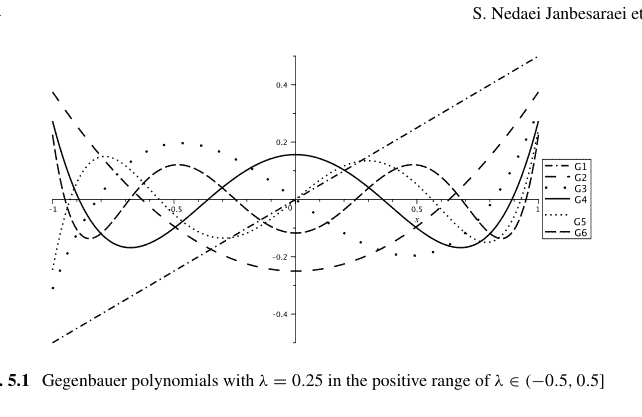

图 5.1 在 $\lambda \in (-0.5, 0.5]$ 的正范围内，$\lambda = 0.25$ 的 Gegenbauer 多项式

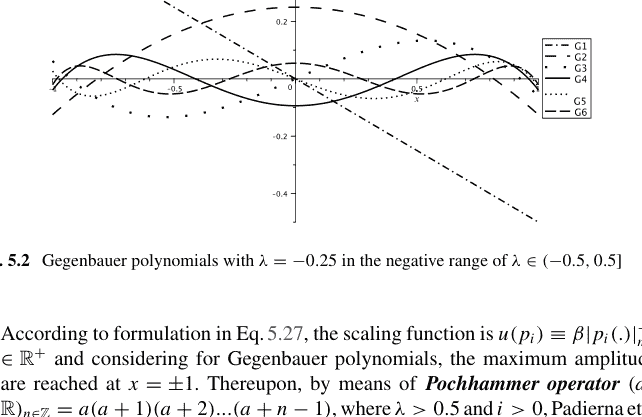

图 5.2 在 $\lambda \in (-0.5, 0.5]$ 的负范围内，$\lambda = -0.25$ 的 Gegenbauer 多项式

根据公式 5.27 中的公式，缩放函数是 $u(p_i) \equiv \beta |p_i(.)|_{max}^{-1} \in \mathbb{R}^+$，并且考虑到 Gegenbauer 多项式，最大振幅在 $x = \pm 1$ 处达到。因此，通过 **Pochhammer 算子**（$a \in \mathbb{R})_{n \in \mathbb{Z}} = a(a+1)(a+2)...(a+n-1)$，其中 $\lambda > 0.5$ 且 $i > 0$，Padierna 等人（2018）提出了缩放函数。通过设置 $\beta = \frac{1}{\sqrt{n+1}}$，我们有

$$u(p_i) = u(G_i^\lambda) = (\sqrt{n+1}|G_i^\lambda(1)|)^{-1}. \tag{5.29}$$

公式 5.28 中引入的权重函数是单变量权重函数，意味着它是一个变量的权重函数。要使用 Gegenbauer 多项式核函数，需要一个双变量权重函数，其中可以定义相应单变量权重函数的乘积（Dunkl 和 Yuan 2014）：

$$w_\lambda(x, z) = ((1-x^2)(1-z^2))^{\lambda - \frac{1}{2}} + \varepsilon. \tag{5.30}$$

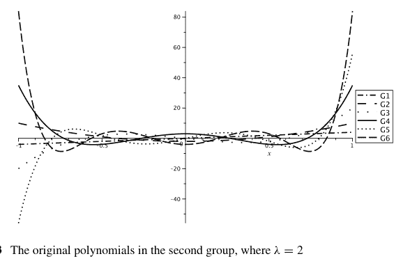

图 5.3 第二组中的原始多项式，其中 $\lambda = 2$

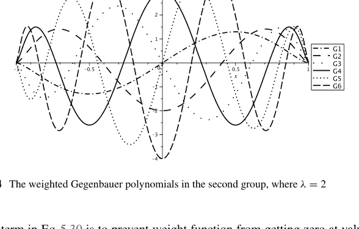

图 5.4 第二组中加权的 Gegenbauer 多项式，其中 $\lambda = 2$

公式 5.30 中的 $\varepsilon$ 项是为了防止权重函数在第二组 Gegenbauer 多项式的边界值处变为零（图 5.4 和 5.5），通过向输出添加一个小值（例如，$\epsilon = 0.01$）（Padierna 等人，2018）。

使用公式 5.27、5.29 和 5.30 中的关系，可以将 Gegenbauer 核函数定义为

$$K_{Geg}(X, Z) = \prod_{j=1}^{d} \sum_{i=0}^{n} G_{i}^{\lambda}(x_{j}) G_{j}^{\lambda}(z_{j}) w_{\lambda}(x_{j}, z_{j}) u(G_{j}^{\lambda})^{2}. \quad (5.31)$$

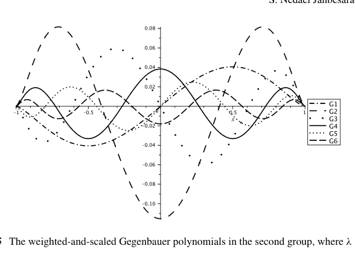

图 5.5 第二组中的加权缩放 Gegenbauer 多项式，其中 λ = 2

##### 5.3.2 Gegenbauer 核函数的验证

**定理 5.1** (Padierna 等人 (2018)) *式 5.31 中引入的 Gegenbauer 核函数是一个有效的 Mercer 核。*

*证明* 一个有效的核函数需要是半正定的，或者等价地必须满足 2.2.1 节中介绍的 *Mercer 定理* 的充要条件。此外，半正定性确保了 SVM 算法的优化问题可以通过**凸优化规划** (Wu and Zhou 2005) 来求解。根据 *Mercer 定理*，一个对称且连续的函数 K(X, Z) 如果满足以下条件，则是一个核函数：

$$\iint K(x, z) f(x) f(z) dx dz \geq 0. \quad (5.32)$$

考虑到 $K_{Geg}(x, z) = \prod_{j=1}^{d} K_{Geg}(x_j, z_j)$ 表示 Gegenbauer 核函数的多维性，因此标量 x 和 z 的 Gegenbauer 核为：

$$K_{Geg}(x, z) = \sum_{i=0}^{n} G_{i}^{\lambda}(x) G_{i}^{\lambda}(z) w_{\lambda}(x, z) u(G_{i}^{\lambda})^2. \quad (5.33)$$

将式 5.33 代入式 5.32，我们得出：

$$\iint K_{Geg}(x, z) g(x) g(z) dx dz =$$

$$\iint \sum_{i=0}^{n} G_{i}^{\lambda}(x) G_{i}^{\lambda}(z) w_{\lambda}(x, z) u(G_{i}^{\lambda})^{2} g(x) g(z) d x d z. \quad (5.34)$$

此外，将式 5.30 中的权重函数代入式 5.34，我们得到：

$$= \iint \sum_{i=0}^{n} G_{i}^{\lambda}(x) G_{i}^{\lambda}(z)\left[\left(1-x^{2}\right)^{\lambda-\frac{1}{2}}\left(1-z^{2}\right)^{\lambda-\frac{1}{2}}+\varepsilon\right] u\left(G_{i}^{\lambda}\right)^{2} g(x) g(z) d x d z. \quad (5.35)$$

需要注意的是，$u(G_{i}^{\lambda})$ 始终为正且与数据无关，因此：

$$=\sum_{i=0}^{n} u\left(G_{i}^{\lambda}\right)^{2} \iint G_{i}^{\lambda}(x) G_{i}^{\lambda}(z)\left(1-x^{2}\right)^{\lambda-\frac{1}{2}}\left(1-z^{2}\right)^{\lambda-\frac{1}{2}} g(x) g(z) d x d z,$$
$$+\sum_{i=0}^{n} \varepsilon u\left(G_{i}^{\lambda}\right)^{2} \iint G_{i}^{\lambda}(x) G_{i}^{\lambda}(z) g(x) g(z) d x d z, \quad (5.36)$$

$$=\sum_{i=0}^{n} u\left(G_{i}^{\lambda}\right)^{2} \int G_{i}^{\lambda}(x)\left(1-x^{2}\right)^{\lambda-\frac{1}{2}} g(x) d x \int G_{i}^{\lambda}(z)\left(1-z^{2}\right)^{\lambda-\frac{1}{2}} g(z) d z,$$
$$+\sum_{i=0}^{n} \varepsilon u\left(G_{i}^{\lambda}\right)^{2} \int G_{i}^{\lambda}(x) g(x) d x \int G_{i}^{\lambda}(z) g(z) d z,$$

$$=\sum_{i=0}^{n} u\left(G_{i}^{\lambda}\right)^{2}\left(\int G_{i}^{\lambda}(x)\left(1-x^{2}\right)^{\lambda-\frac{1}{2}} g(x) d x\right)^{2}+\sum_{i=0}^{n} \varepsilon u\left(G_{i}^{\lambda}\right)^{2}\left(\int G_{i}^{\lambda}(x) g(x) d x\right)^{2} \geq 0.$$

因此，$K(x, z)$ 是一个有效的核。考虑到两个核的乘积也是一个核，那么对于向量 $x$ 和 $z$，$K_{Geg}(X, Z)=\prod_{j=1}^{d} K_{Geg}\left(x_{j}, z_{j}\right)$ 也是一个有效的核。因此，可以推断式 5.31 中的 Gegenbauer 核函数也是一个有效的核。$\square$

#### 5.3.3 其他 Gegenbauer 核函数

本节介绍了广义 Gegenbauer 核，这是 Yang 等人 (2020) 最近提出的。

##### 5.3.3.1 广义 Gegenbauer 核

广义 Gegenbauer 核 (GGK) 是通过使用广义 Gegenbauer 多项式内积的部分和来构建的。广义 Gegenbauer 多项式具有如下递归关系 (Yang et al. 2020)：

$GG_0^\lambda(x) = 1,$
$GG_1^\lambda(x) = 2\lambda x,$
$GG_n^\lambda(x) = \frac{1}{d}[2x(d + \lambda - 1)GG_{n-1}^\lambda(x) - (n + 2\lambda - 2)GG_{n-2}^\lambda(x)],$

其中 $x \in \mathbb{R}^n$ 表示输入变量的向量。广义 Gegenbauer 多项式 $GG_n^\lambda(x)$ 的输出在 $n$ 为偶数阶时是标量，在 $n$ 为奇数阶时是向量。

然后 Yang 等人 (2020) 提出了针对两个输入向量 $x_i$ 和 $x_j$ 的 $n$ 阶广义 Gegenbauer 核函数 $K_{GG}(x_i, x_j)$：

$K_{GG}(x_i, x_j) = \frac{\sum_{l=0}^n GG_l^\lambda(x_i)^T GG_l^\lambda(x_j)}{\exp(\sigma \| x_i - x_j \|_2^2)},$

其中 $x_i$ 和 $x_j$ 的每个元素都在 $[-1, 1]$ 范围内归一化。在此背景下，$\alpha$ 和 $\sigma$ 都被视为核尺度或所提出核函数的所谓衰减参数。

**定理 5.2** (Padierna 等人 (2018)) *所提出的 GGK 是一个有效的 Mercer 核。*

**证明** 所提出的 GGK 可以替代地表述为两个核函数的乘积，即：

$K_1(x_i, x_j) = \exp(-\sigma \| x_i - x_j \|_2^2),$
$K_2(x_i, x_j) = \sum_{l=0}^d GG_l^\alpha(x_i)^T GG_l^\alpha(x_j),$
$K_{GG}(x_i, x_j) = K_1(x_i, x_j)K_2(x_i, x_j).$

正如 2.2.1 节中已经讨论的，两个有效 Mercer 核的乘积也是一个有效的核函数。由于 $K_1(x_i, x_j)$ 是满足 Mercer 定理的高斯核 ($\sigma > 0$)，因此可以通过验证 $K_2(x_i, x_j)$ 满足 Mercer 定理来证明 $K_{GG}(x_i, x_j)$ 是一个有效的核。给定一个任意的平方可积函数 $g(x)$，定义为 $g : \mathbb{R}^n \rightarrow \mathbb{R}$，并假设 $x_i$ 和 $x_j$ 中的每个元素彼此独立，我们可以得出：

$\iint K_2(x_i, x_j)g(x_i)g(x_j)dx_idx_j =$

$$= \iint \sum_{l=0}^{n} GG_{l}^{\lambda}(x_{i})^{T} GG_{l}^{\lambda}(x_{j}) g(x_{i}) g(x_{j}) dx_{i} dx_{j},$$
$$= \sum_{l=0}^{n} \iint GG_{l}^{\lambda}(x_{i})^{T} GG_{l}^{\lambda}(x_{j}) g(x_{i}) g(x_{j}) dx_{i} dx_{j},$$
$$= \sum_{l=0}^{n} \left[ \int GG_{l}^{\lambda}(x_{i})^{T} g(x_{i}) dx_{i} \int GG_{l}^{\lambda}(x_{j}) g(x_{j}) dx_{j} \right],$$
$$= \sum_{l=0}^{n} \left[ \int GG_{l}^{\lambda}(x_{i})^{T} g(x_{i}) dx_{i} \right] \left[ \int GG_{l}^{\lambda}(x_{j}) g(x_{j}) dx_{j} \right] \geq 0. \tag{5.40}$$

因此，$K_{2}(x_{i}, x_{j})$ 是一个有效的 Mercer 核，并且可以得出结论，所提出的 GGK $K_{GG}(x_{i}, x_{j})$ 是一个可接受的 Mercer 核函数。$\square$

#### 5.3.4 分数阶 Gegenbauer 核函数

类似于式 5.31 中引入的最新核函数 Gegenbauer 核和式 5.28 中引入的权重函数分数阶权重函数，分数阶 Gegenbauer 核已被引入。首先，必须定义分数阶权重函数的双变量形式，其方法再次类似于式 5.30 中的先前相应定义，即：

$$f w^{\alpha, \lambda}(x, z) = \left( \left( 1 - \left( \frac{x-a}{b-a} \right)^{2\alpha} \right) \left( 1 - \left( \frac{z-a}{b-a} \right)^{2\alpha} \right) \right)^{\lambda - \frac{1}{2}} + \epsilon. \tag{5.41}$$

因此，分数阶 Gegenbauer 核函数为：

$$K_{FGeg}(X, Z) = \prod_{j=1}^{d} \sum_{i=0}^{n} G_{i}^{\lambda}(x'_{x_{j}}) G_{j}^{\lambda}(x'_{z_{j}}) f w^{\alpha, \lambda}(x'_{x_{j}}, x'_{z_{j}}) u(G_{j}^{\lambda})^{2}. \tag{5.42}$$

**定理 5.3** 式 5.42 中引入的 Gegenbauer 核函数是一个有效的 Mercer 核。

**证明** 根据 Mercer 定理，一个有效的核必须满足 Mercer 定理的充分条件。正如 Mercer 定理所述，任何 SVM 核要成为有效的核，必须是非负的，精确地说：

$$\iint K(x, z) w(x, z) f(x) f(z) dx dz \geq 0. \tag{5.43}$$

鉴于这里的核如式 5.42 所示，通过简单的替换可以看出：

$$\iint K_{FGeg}(x, z)g(x)g(z)dxdz =$$
$$\iint \sum_{i=0}^{n} G_i^\lambda(x'_j)G_j^\lambda(x'_j) f w_\lambda(x'_j, x'_j) u(G_j^\lambda)^2 g(x)g(z)dxdz. \quad (5.44)$$

在最后一个方程中，考虑了分数阶双变量权重函数（即式 5.41），因此我们有：

$$\iint \sum_{i=0}^{n} G_i^\lambda(x'_j)G_j^\lambda(x'_j) \left[ \left( \left( 1 - \left( \frac{x-a}{b-a} \right)^{2\alpha} \right) \left( 1 - \left( \frac{z-a}{b-a} \right)^{2\alpha} \right) \right)^{\lambda - \frac{1}{2}} + \epsilon \right] u(G_j^\lambda)^2 g(x)g(z)dxdz. \quad (5.45)$$

注意 $u(G_i^\lambda)$ 始终为正且与数据无关，因此：

$$= \sum_{i=0}^{n} u(G_i^\lambda)^2 \iint \sum_{i=0}^{n} G_i^\lambda(x'_j)G_j^\lambda(x'_j) \left( \left( 1 - \left( \frac{x-a}{b-a} \right)^{2\alpha} \right) \left( 1 - \left( \frac{z-a}{b-a} \right)^{2\alpha} \right) \right)^{\lambda - \frac{1}{2}} g(x)g(z)dxdz$$
$$+ \sum_{i=0}^{n} \epsilon u(G_i^\lambda)^2 \iint G_i^\lambda(x'_j)G_j^\lambda(x'_j)g(x)g(z)dxdz. \quad (5.46)$$

### 5.4 Gegenbauer 核函数在真实数据集上的应用

本节将 *Gegenbauer* 和 *分数阶 Gegenbauer* 核在一些数据集上的结果与其他著名的核（如 *RBF*、*多项式* 以及前几章介绍的 *Chebyshev* 和 *分数阶 Chebyshev* 核）进行了比较。为了获得清晰的分类，可能需要根据数据集进行一些预处理步骤。这里没有重点讨论这些步骤，但当使用 *Gegenbauer 多项式* 作为核时，它们是必须的。本节选择了两个数据集，它们广为人知且对机器学习从业者很有帮助。

#### 5.4.1 螺旋数据集

螺旋数据集如第 3 章已经介绍的那样，是著名的多类分类任务之一。使用 **OVA** 方法，这个多类分类数据集被分成三个二元分类数据集，并应用 SVM

##### 5 分数阶Gegenbauer核函数：理论与应用

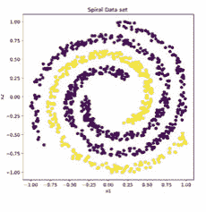

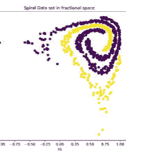

图 5.6 螺旋数据集，1000个数据点

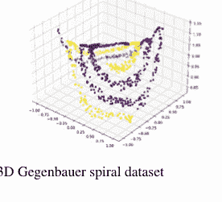

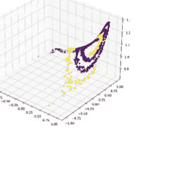

图 5.7 三维Gegenbauer螺旋数据集

Gegenbauer核。图5.6描绘了螺旋数据集在常规空间和分数空间中的数据点。

尽管螺旋数据集在分数模式下数据密度较高，但使用更多特征（三维或以上）可以看出，Gegenbauer核能够更清晰、更简单地单独显示数据分类（见图5.7）。

此外，图5.8展示了不同阶数（Elliott 1960; Arfaoui et al. 2020; Stier et al. 2021; Soufivand et al. 2021）且$\lambda = 0.6$的Gegenbauer核分类器如何选择边界。类似地，图5.6描绘了螺旋数据集在阶数$\alpha = 0.5$的分数空间变换后的数据点。因此，图5.9描绘了相关分数阶Gegenbauer核的决策边界，其中$\alpha = 0.5$且$\lambda = 0.6$。

另一方面，下表提供了螺旋数据集上实验结果的比较。根据“一对多”方法，检验了三种可能的二元分类。从表5.2可以清楚地看出，**分数阶Legendre**核在类别1对其他类别（Doha 1998; Elliott 1960）的分类中表现出更好的性能。然而，对于该螺旋数据集上的其他二元分类，根据表5.3和表5.4的结果，RBF核的表现优于分数阶Legendre核。

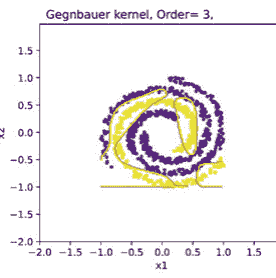

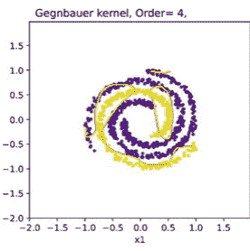

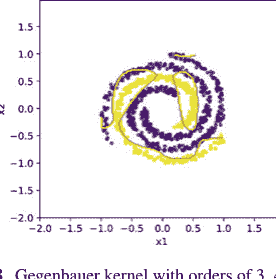

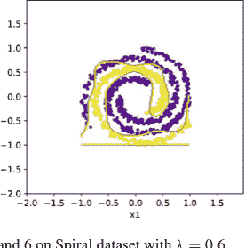

图 5.8 在螺旋数据集上，阶数为3、4、5、6且$\lambda = 0.6$的Gegenbauer核

表 5.2 螺旋数据集上RBF、多项式、Chebyshev、分数阶Chebyshev、Gegenbauer和分数阶Gegenbauer核函数的比较

| | Sigma | Power | Order | Alpha($\alpha$) | Lambda($\lambda$) | Accuracy |
|---|---|---|---|---|---|---|
| RBF | 0.73 | – | – | – | – | 0.97 |
| Polynomial | – | 8 | – | – | – | 0.9533 |
| Chebyshev | – | – | 5 | – | – | 0.9667 |
| Fractional Chebyshev | – | – | 3 | 0.3 | – | 0.9733 |
| Legendre | – | – | 7 | – | – | 0.9706 |
| Fractional Legendre | – | – | 7 | 0.4 | – | 0.9986 |
| Gegenbauer | – | – | 6 | – | 0.3 | 0.9456 |
| Fractional Gegenbauer | – | – | 6 | 0.3 | 0.7 | 0.9533 |

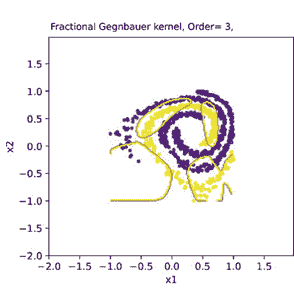

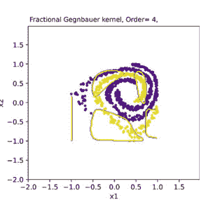

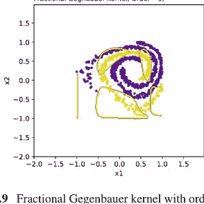

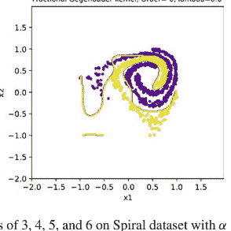

图 5.9 在螺旋数据集上，阶数为3、4、5、6且$\alpha = 0.5$和$\lambda = 0.6$的分数阶Gegenbauer核

表 5.3 螺旋数据集上RBF、多项式、Chebyshev、分数阶Chebyshev、Gegenbauer和分数阶Gegenbauer核的比较

| | Sigma | Power | Order | Alpha($\alpha$) | Lambda($\lambda$) | Accuracy |
|---|---|---|---|---|---|---|
| RBF | 0.1 | – | – | – | – | **0.9867** |
| Polynomial | – | 5 | – | – | – | 0.9044 |
| Chebyshev | – | – | 6 | – | – | 0.9289 |
| Fractional Chebyshev | – | – | 6 | 0.8 | – | 0.9344 |
| Legendre | – | – | 8 | – | – | 0.9773 |
| Fractional Legendre | – | – | 8 | 0.4 | – | 0.9853 |
| Gegenbauer | – | – | 5 | – | 0.3 | 0.9278 |
| Fractional Gegenbauer | – | – | 4 | 0.6 | 0.6 | 0.9356 |

表 5.4 螺旋数据集上RBF、多项式、Chebyshev、分数阶Chebyshev、Gegenbauer和分数阶Gegenbauer核的比较

| | Sigma | Power | Order | Alpha(α) | Lambda(λ) | Accuracy |
|---|---|---|---|---|---|---|
| RBF | 0.73 | – | – | – | – | 0.9856 |
| Polynomial | – | 5 | – | – | – | 0.9856 |
| Chebyshev | – | – | 6 | – | – | 0.9622 |
| Fractional Chebyshev | – | – | 6 | 0.6 | – | 0.9578 |
| Legendre | – | – | 7 | – | – | 0.9066 |
| Fractional Legendre | – | – | 5 | 0.4 | – | 0.9906 |
| Gegenbauer | – | – | 6 | – | 0.3 | 0.9611 |
| Fractional Gegenbauer | – | – | 6 | 0.9 | 0.3 | 0.9644 |

表 5.5 Monk第一个问题上RBF、多项式、Chebyshev、分数阶Chebyshev、Legendre、分数阶Legendre、Gegenbauer和分数阶Gegenbauer核的比较。结果表明Gegenbauer核优于其他核，并且分数阶Gegenbauer和分数阶Legendre具有最理想的准确率，即1

| | Sigma | Power | Order | Alpha(α) | Lambda(λ) | Accuracy |
|---|---|---|---|---|---|---|
| RBF | 2.844 | – | – | – | – | 0.8819 |
| Polynomial | – | 3 | – | – | – | 0.8681 |
| Chebyshev | – | – | 3 | – | – | 0.8472 |
| Fractional Chebyshev | – | – | 3 | 1/16 | – | 0.8588 |
| Legendre | – | – | 4 | – | – | 0.8333 |
| Fractional Legendre | – | – | 4 | 0.1 | – | 0.8518 |
| Gegenbauer | – | – | 3 | – | –0.2 | 0.9931 |
| Fractional Gegenbauer | – | – | 3 | 0.7 | 0.2 | 1 |

##### 5.4.2 三个Monk数据集

另一个值得关注的问题是三个Monk问题，此处将进行讨论（有关数据集的更多信息，请参见第3章）。我们将公式5.31中引入的*Gegenbauer核*应用于*三个Monk问题*的数据集，并将结果附加到表5.5、5.6和5.7中。可以看出，*分数阶Gegenbauer核*在这些数据集上表现出强大的性能，特别是在第一个问题上达到了***100%***的准确率，并且在第三个数据集上，两种*Gegenbauer核*在所有比较的核中都具有最佳准确率。表5.5、5.6和5.7详细说明了这些比较。

表 5.6 Monk第二个问题上RBF、多项式、Chebyshev、分数阶Chebyshev、Legendre、分数阶Legendre、Gegenbauer和分数阶Gegenbauer核的比较。结果表明分数阶Chebyshev核具有第二好的结果，仅次于分数阶Legendre核

| | Sigma | Power | Order | Alpha(α) | Lambda(λ) | Accuracy |
|---|---|---|---|---|---|---|
| RBF | 5.5896 | – | – | – | – | 0.875 |
| Polynomial | – | 3 | – | – | – | 0.8657 |
| Chebyshev | – | – | 3 | – | – | 0.8426 |
| Fractional Chebyshev | – | – | 3 | 1/16 | – | **0.9653** |
| Legendre | – | – | 3 | – | – | 0.8032 |
| Fractional Legendre | – | – | 3 | 0.1 | – | **1** |
| Gegenbauer | – | – | 3 | – | 0.5 | 0.7824 |
| Fractional Gegenbauer | – | – | 3 | 0.1 | 0.5 | 0.9514 |

表 5.7 Monk第三个问题上RBF、多项式、Chebyshev、分数阶Chebyshev、Legendre、分数阶Legendre、Gegenbauer和分数阶Gegenbauer核的比较。注意Gegenbauer和分数阶Gegenbauer核具有最佳结果

| | Sigma | Power | Order | Alpha(α) | Lambda(λ) | Accuracy |
|---|---|---|---|---|---|---|
| RBF | 2.1586 | – | – | – | – | 0.91 |
| Polynomial | – | 3 | – | – | – | 0.875 |
| Chebyshev | – | – | 6 | – | – | 0.895 |
| Fractional Chebyshev | – | – | 5 | 1/5 | – | 0.91 |
| Legendre | – | – | 4 | – | – | 0.8472 |
| Fractional Legendre | – | – | 3 | 0.8 | – | 0.8379 |
| Gegenbauer | – | – | 4 | – | -0.2 | **0.9259** |
| Fractional Gegenbauer | – | – | 3 | 0.7 | -0.2 | **0.9213** |

### 5.5 结论

Gegenbauer（超球面）正交多项式在正交多项式中非常重要，因为它们已被用于解决许多微分方程问题，特别是如其名称所示在球面空间中。本章简要介绍了研究历史背景，解释了这些多项式的基础和性质，并构建了相关的核函数。此外，介绍了分数阶Gegenbauer正交多项式及其相应核的新方法，并在最后一节中，通过在基于核的学习算法（如SVM）中使用知名数据集的实验，展示了如何成功使用这种新核。

## 参考文献

Abd Elaziz, M., Hosny, K.M., Selim, I.M.: Galaxies image classification using artificial bee colony based on orthogonal Gegenbauer moments. Soft. Comput. **23**, 9573–9583 (2019)

Arfaoui, S., Ben Mabrouk, A., Cattani, C.: New type of Gegenbauer-Hermite monogenic polynomials and associated Clifford wavelets. J. Math. Imaging Vis. **62**, 73–97 (2020)

Asghari, M., Hadian Rasanan, A.H., Gorgin, S., Rahmati, D., Parand, K.: FPGA-orthopoly: a hardware implementation of orthogonal polynomials. Eng. Comput. (2022). https://doi.org/10.1007/s00366-022-01612-x

Avery, J.S.: Hyperspherical Harmonics: Applications in Quantum Theory, vol. 5. Springer Science & Business Media, Berlin (2012)

Azari, A.S., Mack, Y.P., Müller, H.G.: Ultraspherical polynomial, kernel and hybrid estimators for non parametric regression. Sankhya: Indian J. Stat. 80–96 (1992)

Belmehdi, S.: Generalized Gegenbauer orthogonal polynomials. J. Comput. Appl. Math. **133**, 195–205 (2001)

Brackx, F., De Schepper, N., Sommen, F.: The Clifford-Gegenbauer polynomials and the associated continuous wavelet transform. Integr. Transform. Spec. Funct. **15**, 387–404 (2004)

Cohl, H.S.: On a generalization of the generating function for Gegenbauer polynomials. Integr. Transform. Spec. Funct. **24**, 807–816 (2013)

Dehestani, H., Ordokhani, Y., Razzaghi, M.: Application of fractional Gegenbauer functions in variable-order fractional delay-type equations with non-singular kernel derivatives. Chaos, Solitons Fractals **140**, 110111 (2020)

Doha, E.H.: The ultraspherical coefficients of the moments of a general-order derivative of an infinitely differentiable function. J. Comput. Appl. Math. **89**, 53–72 (1998)

Doman, B.G.S.: The Classical Orthogonal Polynomials. World Scientific, Singapore (2015)

Dunkl, C.F., Yuan, X.: Orthogonal Polynomials of Several Variables. Cambridge University Press, Cambridge (2014)

Eassa, M., Selim, I.M., Dabour, W., Elkafrawy, P.: Automated detection and classification of galaxies based on their brightness patterns. Alex. Eng. J. **61**, 1145–1158 (2022)

El-Kalaawy, A.A., Doha, E.H., Ezz-Eldien, S.S., Abdelkawy, M.A., Hafez, R.M., Amin, A.Z.M., Zaky, M.A.: A computationally efficient method for a class of fractional variational and optimal control problems using fractional Gegenbauer functions. Rom. Rep. Phys. **70**, 90109 (2018)

Elliott, D.: The expansion of functions in ultraspherical polynomials. J. Aust. Math. Soc. **1**, 428–438 (1960)

Feng, B.Y., Varshney, A.: SIGNET: efficient neural representation for light fields. In: Proceedings of the IEEE/CVF (2021)

Feng, J., Liu, L., Wu, D., Li, G., Beer, M., Gao, W.: Dynamic reliability analysis using the extended support vector regression (X-SVR). Mech. Syst. Signal Process. **126**, 368–391 (2019)

Ferrara, L., Guégan, D.: Forecasting with k-factor Gegenbauer processes: theory and applications. J. Forecast. **20**, 581–601 (2001)

Hadian-Rasanan, A.H., Nikarya, M., Bahramnezhad, A., Moayeri, M.M., Parand, K.: A comparison between pre-Newton and post-Newton approaches for solving a physical singular second-order boundary problem in the semi-infinite interval. arXiv:1909.04066

He, J., Chen, T., Zhang, Z.: A Gegenbauer neural network with regularized weights direct determination for classification (2019). arXiv:1910.11552

Herrera-Acosta, A., Rojas-Domínguez, A., Carpio, J.M., Ornelas-Rodríguez, M., Puga, H.: Gegenbauer-based image descriptors for visual scene recognition. In: Intuitionistic and Type-

# 第6章
分数阶雅可比核函数：
理论与应用

Amir Hosein Hadian Rasanana, Jamal Amani Rad, Malihe Shaban Tameh,
and Abdon Atangana

**摘要** 某些多项式的正交性使其备受关注。经典正交多项式已被研究多年，其中雅可比多项式最为常见。特别是，这些多项式被用于解决多个数学、物理和工程问题，其作为核函数在支持向量机算法分类问题中的应用也已被研究。本文通过引入新颖的分数形式，提出相应的核函数以扩展支持向量机的应用。通过将输入数据集转换到分数空间，基于分数阶雅可比核的支持向量机在分类任务中展现出解决非线性问题的卓越能力。本章将回顾该族多项式的文献、基础和性质，解释相应的核函数，介绍雅可比多项式的分数形式，并证明其满足Mercer条件。最后，将使用所提及的核函数以及其他正交核函数以及径向基函数核和多项式核，在一个知名数据集上对所得结果进行比较。

**关键词** 雅可比多项式 · 分数阶雅可比函数 · 核技巧 · 正交函数 · Mercer定理

A. H. Hadian Rasanana (✉) · J. A. Rad
Department of Cognitive Modeling, Institute for Cognitive and Brain Sciences, Shahid Beheshti University, Tehran, Iran
e-mail: amir.h.hadian@gmail.com

M. S. Tameh
Department of Chemistry, University of Minnesota, Minneapolis, MN 55455, USA

A. Atangana
Faculty of Natural and Agricultural Sciences, Institute for Groundwater Studies, University of the Free State, Bloemfontein 9300, South Africa
e-mail: AtanganaA@ufs.ac.za

© The Author(s), under exclusive license to Springer Nature Singapore Pte Ltd. 2023
J. A. Rad et al. (eds.), *Learning with Fractional Orthogonal Kernel Classifiers in Support Vector Machines*, Industrial and Applied Mathematics,
https://doi.org/10.1007/978-981-19-6553-1_6

### 6.1 引言

经典正交函数在逼近理论 Mastroianni and Milovanovic (2008), Boyd (2001), Askey and Wilson (1985) 以及各种数值算法（如谱方法 Kazem (2013), Bhrawy and Alofi (2012), Abdelkawy et al. (2017)）中具有广泛应用。这些正交函数中最普遍的类型是雅可比多项式 Askey and Wilson (1985), Milovanovic et al. (1994), Asghari et al. (2022)。该正交多项式族有一些特例，如勒让德多项式、四类切比雪夫多项式和盖根鲍尔多项式 Ezz-Eldien and Doha (2019), Doha et al. (2011)。雅可比多项式已被用于解决科学不同领域的各种问题 Parand et al. (2016), Parand et al. (2019), Moayeri et al. (2021)。Ping等人使用雅可比-傅里叶矩处理确定性图像，然后利用这些矩重构原始图像 Ping et al. (2007)。2013年，Kazem (2013) 使用雅可比多项式求解线性和非线性分数阶微分方程，我们知道分数阶微分方程在模拟物理和工程过程方面有许多用例。Shojaeizadeh et al. (2021) 使用移位雅可比多项式解决平流-扩散反应中的最优控制问题。此外，Bahrawy et al. (2012), Abdelkawy et al. (2017), Bhrawy (2016), Bhrawy and Zaky (2016) 对雅可比多项式的应用做出了许多贡献。在 Bhrawy and Alofi (2012) 中，他们提出了一种移位雅可比-高斯配置法来求解非线性Lane-Emden方程。同样，在 Abdelkawy et al. (2017) 中，作者使用雅可比多项式求解多维Volterra积分方程。在 Bhrawy (2016) 中，Bhrawy使用雅可比谱配置法求解多维非线性分数阶亚扩散方程。随后，Bhrawy and Zaky (2016) 使用分数阶雅可比函数求解时间分数阶问题。另一方面，雅可比多项式也用作高性能异构计算机中的核函数，例如“雅可比迭代法”，以获得更高的加速比，见 Morris and Abed (2012)。此外，正交旋转不变矩在图像处理和模式识别中有许多用例，包括雅可比矩。特别是，Rahul Upneja et al. (2015) 使用雅可比-傅里叶矩进行不变图像处理，采用了一种利用时间复杂度的新型快速方法。

可以明确地说，这些多项式的应用如此之多，以至于它们已经渗透到神经科学等其他科学分支，并找到了重要的应用。2020年，Moayeri et al. (2020) 使用雅可比多项式进行配置法（确切地说是广义拉格朗日-雅可比-高斯-洛巴托法）来模拟非线性时空神经动力学模型以及相关的同步现象，从而降低了计算复杂度。Hadian Rasanana et al. (2020) 最近使用分数阶雅可比多项式作为神经网络的激活函数，来模拟认知决策建模中出现的非线性分数阶动力学。此外，Nkengfack et al. (2021) 使用雅可比多项式对脑电图信号进行分类，用于癫痫发作检测和眼动状态识别。作为这些多项式的另一个应用，Abdallah et al. (2021) 引入了

2 Fuzzy Logic Enhancements in Neural and Optimization Algorithms: Theory and Applications, pp. 629–643 (2020)

Hjouji, A., Bouikhalene, B., EL-Mekkaoui, J., Qjidaa, H.: New set of adapted Gegenbauer-Chebyshev invariant moments for image recognition and classification. J. Supercomput. 77, 5637–5667 (2021)

Hosny, K.M.: Image representation using accurate orthogonal Gegenbauer moments. Pattern Recognit. Lett. 32, 795–804 (2011)

Hosny, K.M.: New set of Gegenbauer moment invariants for pattern recognition applications. Arab. J. Sci. Eng. 39, 7097–7107 (2014)

Hosny, K.M., Darwish, M.M., Eltoukhy, M.M.: New fractional-order shifted Gegenbauer moments for image analysis and recognition. J. Adv. Res. 25, 57–66 (2020)

Ilić, A.D., Pavlović, V.D.: New class of filter functions generated most directly by Christoffel-Darboux formula for Gegenbauer orthogonal polynomials. Int. J. Electron. 98, 61–79 (2011)

Langley, J., Zhao, Q.: A model-based 3D phase unwrapping algorithm using Gegenbauer polynomials. Phys. Med. Biol. 54, 5237–5252 (2009)

Pawlak, M.: Image analysis by moments: reconstruction and computational aspects. Oficyna Wydawnicza Politechniki Wrocławskiej (2006)

Liao, S., Chiang, A., Lu, Q., Pawlak, M.: Chinese character recognition via Gegenbauer moments. In: Object Recognition Supported by User Interaction for Service Robots, vol. 3, pp. 485–488 (2002)

Liao, S., Chen, J.: Object recognition with lower order Gegenbauer moments. Lect. Notes Softw. Eng. 1, 387 (2013)

Liu, W., Wang, L.L.: Asymptotics of the generalized Gegenbauer functions of fractional degree. J. Approx. Theory 253, 105378 (2020)

Ludlow, I.K., Everitt, J.: Application of Gegenbauer analysis to light scattering from spheres: theory. Phys. Rev. E 51, 2516–2526 (1995)

Oliver, F.W.J., Lozier, D.W., Boisvert, R.F., Clark, C.W.: NIST Handbook of Mathematical Functions Hardback and CD-ROM. Cambridge University Press, Cambridge (2010)

Öztürk, Ş., Ahmad, R., Akhtar, N.: Variants of artificial Bee Colony algorithm and its applications in medical image processing. Appl. Soft Comput. 97, 106799 (2020)

Padierna, L.C., Carpio, M., Rojas-Dominguez, A., Puga, H., Fraire, H.: A novel formulation of orthogonal polynomial kernel functions for SVM classifiers: the Gegenbauer family. Pattern Recognit. 84, 211–225 (2018)

Padierna, L.C., Amador-Medina, L.F., Murillo-Ortiz, B.O., Villaseñor-Mora, C.: Classification method of peripheral arterial disease in patients with type 2 diabetes mellitus by infrared thermography and machine learning. Infrared Phys. Technol. 111, 103531 (2020)

Parand, K., Delkhosh, M.: Solving Volterra’s population growth model of arbitrary order using the generalized fractional order of the Chebyshev functions. Ricerche mat. 65, 307–328 (2016)

Parand, K., Dehghan, M., Baharifard, F.: Solving a laminar boundary layer equation with the rational Gegenbauer functions. Appl. Math. Model. 37, 851–863 (2013)

Parand, K., Bahramnezhad, A., Farahani, H.: A numerical method based on rational Gegenbauer functions for solving boundary layer flow of a Powell-Eyring non-Newtonian fluid. Comput. Appl. Math. 37, 6053–6075 (2018)

Park, R.W.: Optimal compression and numerical stability for Gegenbauer reconstructions with applications. Arizona State University (2009)

Reimer, M.: Multivariate Polynomial Approximation. Springer Science & Business Media, Berlin (2003)

Soufivand, F., Soltanian, F., Mamehrashi, K.: An operational matrix method based on the Gegenbauer polynomials for solving a class of fractional optimal control problems. Int. J. Ind. Electron. 4, 475–484 (2021)

Srivastava, H.M., Shah, F.A., Abass, R.: An application of the Gegenbauer wavelet method for the numerical solution of the fractional Bagley-Torvik equation. Russ. J. Math. Phys. 26, 77–93 (2019)

Stier, A.C., Goth, W., Hurley, A., Feng, X., Zhang, Y., Lopes, F.C., Sebastian, K.R., Fox, M.C., Reichenberg, J.S., Markey, M.K., Tunnell, J.W.: Machine learning and the Gegenbauer kernel improve mapping of sub-diffuse optical properties in the spatial frequency domain. In: Molecular-Guided Surgery: Molecules, Devices, and Applications VII, vol. 11625, p. 1162509 (2021)

Tamandani, A., Aljiani, M.G.: Development of an analytical method for pattern synthesizing of linear and planar arrays with optimal parameters. Int. J. Electron. Commun. **146**, 154135 (2022)

Wu, Q., Zhou, D.X.: SVM soft margin classifiers: linear programming versus quadratic programming. Neural Comput. **17**, 1160–1187 (2005)

Yang, W., Zhang, Z., Hong, Y.: State recognition of bolted structures based on quasi-analytic wavelet packet transform and generalized Gegenbauer support vector machine. In: 2020 IEEE International Instrumentation and Measurement Technology Conference (I2MTC), pp. 1–6 (2020)

Yang, W., Zhousuo, Z., Hong, Y.: State recognition of bolted structures based on quasi-analytic wavelet packet transform and generalized Gegenbauer support vector machine. In: 2020 IEEE International Instrumentation and Measurement Technology Conference (I2MTC), pp. 1–6 (2020)

Zhang, Z., He, J., Tang, L.: Two-input Gegenbauer orthogonal neural network with growing-and-pruning weights and structure determination. In: International Conference on Cognitive Systems and Signal Processing, pp. 288–300 (2018)

Wilson多项式使用了Jacobi多项式。此外，Khodabandehlo等人（2021）使用了移位Jacobi运算矩阵来表示分数阶变阶广义非线性延迟微分方程。关于不同类型Jacobi多项式的更多应用，感兴趣的读者可以参阅Doha等人（2012）、Bhrawy（2016）、Bhrawy等人（2015, 2016）。

如果能在经典正交多项式中选择一个通用族，那么毫无疑问就是*Jacobi多项式* $J_n^{\psi, \omega}$。**Jacobi多项式**也被称为**超几何多项式**，以**卡尔·古斯塔夫·雅各布·雅可比**（1804–1851）的名字命名。事实上，Jacobi多项式是定义域 $[-1, 1]$ 上最一般的类别。所有其他族都是这个族的特例。例如，$\psi = \omega = 0$ 是*勒让德多项式*，而 $\psi = \omega$ 是*盖根鲍尔族*。

> **卡尔·古斯塔夫·雅各布·雅可比**（1804–1851）是一位普鲁士（德国）天才数学家，他在12岁时就达到了进入大学的标准；然而，根据柏林大学的规定，他不得不等到16岁。他于21岁时从柏林大学获得博士学位。雅可比的贡献主要被认可的是他在1829年提出的椭圆函数理论及其与θ函数的关系。此外，他在数论方面也有许多发现。他关于三次剩余的结果给卡尔·弗里德里希·高斯留下了深刻印象，并引起了其他数学家如弗里德里希·贝塞尔和阿德里安-马里·勒让德的极大关注。雅可比在偏微分方程及其应用以及行列式方面有重要研究，因此函数行列式也被称为雅可比行列式。由于雅可比的众多贡献，他的名字出现在许多数学概念中，如雅可比椭圆函数、雅可比符号、雅可比多项式、雅可比变换等等。他在普鲁士革命时期的政治观点使他生命的最后几年充满了动荡。他因感染天花去世，享年46岁。$^a$

$^a$ 关于卡尔·古斯塔夫·雅各布·雅可比及其贡献的更多信息，请参见：https://mathshistory.st-andrews.ac.uk/Biographies/Jacobi/。

### 6.2 预备知识

本节涵盖Jacobi正交多项式的基本定义和性质。此外，介绍了Jacobi正交多项式的分数形式，并阐明了相关性质。

#### 6.2.1 Jacobi多项式的性质

让我们首先简单回顾一下正交多项式的定义。在Szego（1939）中，Szego使用一个函数（例如 $F(x)$）来定义正交多项式，该函数是非递减的，并且在区间 $[a, b]$ 上包含许多增长点。假设该函数存在以下矩：

$$c_n = \int_a^b x^n dF(x), \quad n = 0, 1, 2, \ldots \qquad (6.1)$$

通过对 $x$ 的非负幂次集合（即 $1, x, x^2, x^3, \ldots, x^n, \ldots$）进行正交化，他得到了一组多项式，如下所示（Szego, 1939; Asghari et al., 2022）：

$$J_0(x), J_1(x), J_2(x), \ldots, J_n(x), \ldots \qquad (6.2)$$

这组多项式可以由以下条件唯一确定（Szego, 1939）：

- $J_n(x)$ 是一个恰好 $n$ 次的多项式，其中 $x^n$ 的系数为正。
- $\{J_n(x)\}$ 是标准正交的，即，

$$\int_a^b J_n(x) J_m(x) dF(x) = \delta_{nm}, \quad n, m = 0, 1, 2, \ldots \qquad (6.3)$$

其中 $\delta_{nm}$ 是克罗内克δ函数。

利用公式6.3可以定义Jacobi正交多项式。因此，记为 $J_n^{\psi, \omega}(x)$ 的Jacobi多项式在区间 $[-1, 1]$ 上关于权重函数 $w^{\psi, \omega}(x)$ 正交（Hadian et al., 2020; Askey and Wilson, 1985; Kazem, 2013; Asghari et al., 2022）：

$$w^{(\psi, \omega)}(x) = (1 - x)^\psi (1 + x)^\omega, \qquad (6.4)$$

其中 $\psi, \omega > -1$。然而，公式6.4的权重函数形式在 $\psi, \omega < 0$ 的两个不同输入点处存在计算困难（Doman, 2015）。输入数据必须归一化到区间 $[-1, 1]$。一般地，可以写成：

在区间 $[a, b]$ 上，具有权重函数 $(b - x)^\psi (x - a)^\omega$ 的正交多项式，对于任何记为 $J_n^{\psi, \omega}(x)$ 的正交多项式，可以表示为以下形式（Doman, 2015; Bhrawy and Zaky, 2016）：

$$J_n^{(\psi, \omega)} \left\{ 2 \left( \frac{x - a}{b - a} \right) - 1 \right\}, \qquad (6.5)$$

其中 $a = -1$ 且 $b = 1$。显然，可能输入的最小值和最大值分别为 $-1$ 和 $+1$。实际上，当 $\psi < 0$ 且 $x = +1$ 时，会导致项 $(1 - x)^\psi$ 等于零的负数次幂，从而得到无穷大。

类似地，当 $\omega < 0$ 且 $x = -1$ 时，第二部分 $(1 + x)^\omega$ 也会发生这种情况。为了解决这个问题，建议通过加上一个松弛变量 $\epsilon = 10^{-4}$ 来向 $x$ 添加一个微不足道的噪声（Tian and Wang, 2017）。

因此，可以将关系式（6.4）重写如下：

$$w^{(\psi,\omega)}(x) = (1 - x + \epsilon)^\psi (1 + x + \epsilon)^\omega. \tag{6.6}$$

请注意，在像Python这样的编程语言中，必须处理 $1 - x$ 和 $1 + x$ 的浮点部分精度，并将其设置为等于松弛变量的精度，例如，下图比较了不同 $\psi$、$\omega$ 和 $\epsilon = 0.0001$ 下的公式6.4和6.6。由于在边界处计算普通权重函数存在一些困难，我们使用了Maple软件进行绘图。图6.1展示了不同 $\psi$ 和 $\omega$ 下没有噪声项的Jacobi多项式权重函数，而图6.2描绘了在项中添加噪声（$\epsilon = 0.0001$）后，不同 $\psi$ 和 $\omega$ 下Jacobi多项式权重函数的图。如这些图所示，相关函数的输出没有显著差异。

因此，正交关系为（Bhrawy et al., 2016; Doman, 2015; Askey, 1975）：

$$\int_{-1}^{1} J_{m}^{\psi,\omega}(x) J_{n}^{\psi,\omega}(x) w^{(\psi,\omega)}(x) dx = 0, \quad m \neq n. \tag{6.7}$$

Jacobi多项式可以定义为奇异Sturm-Liouville微分方程的特征函数，如下所示（Doman, 2015; Askey, 1975; Bhrawy and Zaky, 2016; Hadian et al., 2020）：

$$\frac{d}{dx}\left((1-x+\epsilon)^{\psi+1}(1+x+\epsilon)^{\omega+1}\frac{d}{dx}J_{n}^{\psi,\omega}(x)\right) + (1-x+\epsilon)^{\psi}(1+x+\epsilon)^{\omega}\rho_{n}J_{n}^{\psi,\omega}(x) = 0, \tag{6.8}$$

其中 $\rho_{n} = n(n+\psi+\omega+1)$。

考虑正交多项式所遵循的递推关系的一般形式，对于*Jacobi多项式*，存在以下关系（Doman, 2015; Askey, 1975; Bhrawy and Zaky, 2016; Hadian et al., 2020）：

$$J_{n+1}^{\psi,\omega}(x) = (A_{n}x + B_{n})J_{n}^{\psi,\omega}(x) - C_{n}J_{n-1}^{\psi,\omega}(x), \quad n \geqslant 1, \tag{6.9}$$

而

$$J_{0}^{\psi,\omega}(x) = 1,$$
$$J_{1}^{\psi,\omega}(x) = \frac{1}{2}(\psi+\omega+2)x + \frac{1}{2}(\psi-\omega), \tag{6.10}$$

其中

$$A_{n} = \frac{(2n+\psi+\omega+1)(2n+\psi+\omega+2)}{2(n+1)(n+\psi+\omega+1)},$$
$$B_{n} = \frac{(\omega^{2}-\psi^{2})(2n+\psi+\omega+1)}{2(n+1)(n+\psi+\omega+1)(2n+\psi+\omega)},$$
$$C_{n} = \frac{(n+\psi)(n+\omega)(2n+\psi+\omega+2)}{(n+1)(n+\psi+\omega+1)(2n+\psi+\omega)}. \tag{6.11}$$

前几个*Jacobi多项式*与公式6.10相同。另一方面，由于Jacobi多项式构成冗长的项，此处忽略更高阶的表示。对于更高阶的*Jacobi多项式*，可以使用以下代码，该代码使用Python的*sympy*模块进行符号计算而非数值计算：

```python
import sympy
x = sympy.Symbol("x")
a = sympy.Symbol("a")
```

```python
b = sympy.Symbol("b")
beta = sympy.Symbol(r'\omega')
alpha = sympy.Symbol(r'\psi')
x = sympy.Symbol("x")

def Jacobi(x, n):
    An = (2*n + alpha + beta + 1) * (2*n + alpha + beta + 2) / 2 * (n + 1) * (n + alpha + beta + 1)
    Bn = (beta**2 - alpha**2) * (2*n + alpha + beta + 1) / 2 * (n + 1) * (n + alpha + beta + 1) * (2*n + alpha + beta)
    Cn = (n + alpha) * (n + beta) * (2*n + alpha + beta + 2) / (n + 1) * (n + alpha + beta + 1) * (2*n + alpha + beta)

    if n == 0:
        return 1
    elif n == 1:
        return ((alpha + beta + 2) * x) / 2 + (alpha - beta) / 2
    elif n >= 2:
        return ((An * x + Bn) * Jacobi(x, n - 1) - (Cn) * Jacobi(x, n - 2))
```

此外，这些多项式具有一些特殊性质，这些性质在 Doman (2015) 和 Askey (1975) 的公式 6.12–6.14 中有所介绍：

$$J_n^{\psi,\omega}(-x) = (-1)^n J_n^{\omega,\psi}(x)$$

$$\rho_{i+1} = \frac{\int_{-1}^{1} x J_{i}^{\psi, \omega}(x) J_{i}^{\psi, \omega}(x) w^{\psi, \omega}(x) dx}{\int_{-1}^{1} J_{i}^{\psi, \omega}(x) J_{i}^{\psi, \omega}(x) w^{\psi, \omega}(x) dx},$$

$$\gamma_{i+1} = \begin{cases} 0 & i=0, \\ \frac{\int_{-1}^{1} J_{i}^{\psi, \omega}(x) J_{i}^{\psi, \omega}(x) w^{\psi, \omega}(x) dx}{\int_{-1}^{1} J_{i-1}^{\psi, \omega}(x) J_{i-1}^{\psi, \omega}(x) w^{\psi, \omega}(x) dx} & i=1, 2, \dots \end{cases}.$$

雅可比多项式满足以下常微分方程 Doman (2015), Askey (1975), Hadian et al. (2020):

$$(1-x^2)\frac{d^2y}{dx^2} + [\omega - \psi(\psi + \omega + 2)x]\frac{dy}{dx} + \lambda y = 0.$$

其解可以用幂级数 $y = \sum_{n=0}^{\infty} a_n x^n$ 表示：

$$(1-x^2)\sum_{n=0}^{\infty} n(n-1)a_n x^{n-2} + [\omega - \psi - (\psi + \omega + 2)x]\sum_{n=0}^{\infty} a_n x^{n-1} + \lambda \sum_{n=0}^{\infty} a_n x^n = 0.$$

此外，*雅可比多项式*的生成函数可以定义如下 Doman (2015), Askey (1975):

$$\frac{2^{\psi+\omega}}{R(1+R-x)^{\psi}(1+R+x)^{\omega}} = \sum_{n=0}^{\infty} J_{n}^{\psi, \omega}(x) x^n,$$

其中 $R = \sqrt{1-2xz+z^2}$ 且 $|z| < 1$。

这族正交多项式遵循与先前已介绍的正交族相同的对称性，即，

$$J_{n}^{\psi, \omega}(x) = (-1)^n J_{n}^{\psi, \omega}(x) = \begin{cases} J_n(-x), & n \text{ 为偶数} \\ -J_n(-x), & n \text{ 为奇数} \end{cases}$$

图 6.3 和 6.4 展示了 0 到 6 阶的*雅可比多项式*，并比较了图 6.3 中负 $\psi$、正 $\omega$ 与图 6.4 中正 $\psi$、负 $\omega$ 的情况。图 6.5 和 6.6 分别描绘了 5 阶雅可比多项式在不同 $\psi$、固定 $\omega$，以及固定 $\psi$、不同 $\omega$ 下的形态。

##### 6.2.2 分数阶雅可比函数的性质

为了获得分数阶的雅可比函数，使用变换 $x' = 2(\frac{x-a}{b-a})^{\alpha} - 1$，其中 $a$ 和 $b$ 是区间的最小值和最大值，且 $\alpha > 0$。应用此变换，可得到分数阶的雅可比函数，记为 $FJ_n^{\psi,\omega,\alpha}(x)$，如下所示：

$$FJ_n^{\psi,\omega,\alpha}(x) = J_n^{\psi,\omega}(2(\frac{x-a}{b-a})^\alpha - 1). \tag{6.21}$$

分数阶雅可比函数在区间 $[-1, 1]$ 上关于以下权函数正交 Doman (2015), Askey (1975), Hadian et al. (2020):

$$w^{\psi,\omega,\alpha}(x) = (1 - (2(\frac{x-a}{b-a})^\alpha - 1) - \epsilon)^\psi (1 + (2(\frac{x-a}{b-a})^\alpha - 1) + \epsilon)^\omega. \tag{6.22}$$

类似地，分数阶雅可比函数也存在一个施图姆-刘维尔微分方程。该施图姆-刘维尔方程如下 Doman (2015), Askey (1975), Hadian et al. (2020):

$$\frac{d}{dx} \left( (1 - (2(\frac{x-a}{b-a})^\alpha - 1) - \epsilon)^{\psi+1} (1 + (2(\frac{x-a}{b-a})^\alpha - 1) + \epsilon)^{\omega+1} \frac{d}{dx} J_n^{\psi,\omega}(x) \right) + (1 - (2(\frac{x-a}{b-a})^\alpha - 1) - \epsilon)^\psi (1 + (2(\frac{x-a}{b-a})^\alpha - 1) + \epsilon)^\omega \rho_n J_n^{\psi,\omega}(x) = 0, \tag{6.23}$$

其中 $\rho_n = n(n + \psi + \omega + 1)$。将映射 $z = 2(\frac{x-a}{b-a})^\alpha - 1$ 应用于为雅可比多项式定义的生成函数，可以得到分数形式的方程：

$$\frac{2^{\psi+\omega}}{R(1 + R - (2(\frac{x-a}{b-a})^\alpha - 1))^\psi (1 + R + (2(\frac{x-a}{b-a})^\alpha - 1))^\omega} = \sum_{n=0}^{\infty} FJ_n^{\psi,\omega,\alpha}(x) ((2(\frac{x-a}{b-a})^\alpha - 1))^n. \tag{6.24}$$

其中

$$R = \sqrt{1 - 2x((2(\frac{x-a}{b-a})^\alpha - 1)) + ((2(\frac{x-a}{b-a})^\alpha - 1))^2},$$

且 $(2(\frac{x-a}{b-a})^\alpha - 1) \in [-1, 1]$。

分数阶雅可比多项式也是正交的。这些多项式在区间 $[-1, 1]$ 上关于类似于公式 6.6 的权函数正交，其中输入 $x$ 通过 $2(\frac{x-a}{b-a})^{\alpha} - 1$ 进行映射。因此，分数阶雅可比多项式正交关系的合适权函数为 Bhrawy and Zaky (2016), Hadian et al. (2020), Kazem (2013)

$$Fw^{\psi,\omega,\alpha}(x) = (1 - (2(\frac{x-a}{b-a})^{\alpha} - 1) + \epsilon)^{\psi} (1 + (2(\frac{x-a}{b-a})^{\alpha} - 1) + \epsilon)^{\omega}. \quad (6.25)$$

现在可以定义分数阶雅可比多项式的正交关系为

$$\int_{a}^{b} FP_{m}^{\psi,\omega,\alpha}(x) FP_{n}^{\psi,\omega,\alpha}(x) Fw^{\psi,\omega,\alpha}(x) dx. \quad (6.26)$$

分数阶雅可比多项式的递推关系可以通过将映射后的 $x$ 代入标准方程来定义，其方式与迄今为止已完成的相同 Doman (2015), Askey (1975), Bhrawy and Zaky (2016), Hadian et al. (2020):

$$FJ_{0}^{\psi,\omega,\alpha}(x) = 1,$$
$$FJ_{1}^{\psi,\omega,\alpha}(x) = \frac{1}{2}(\psi + \omega + 2)(2(\frac{x-a}{b-a})^{\alpha} - 1) + \frac{1}{2}(\psi - \omega),$$
$$FJ_{n+1}^{\psi,\omega,\alpha}(x) = (A_{n}(2(\frac{x-a}{b-a})^{\alpha} - 1) + B_{n})FJ_{n}^{\psi,\omega,\alpha}(x) - C_{n}FJ_{n-1}^{\psi,\omega,\alpha}(x), \quad n \geqslant 1, \quad (6.27)$$

其中

$$A_{n} = \frac{(2n + \psi + \omega + 1)(2n + \psi + \omega + 2)}{2(n + 1)(n + \psi + \omega + 1)},$$
$$B_{n} = \frac{(\omega^{2} - \psi^{2})(2n + \psi + \omega + 1)}{2(n + 1)(n + \psi + \omega + 1)(2n + \psi + \omega)},$$
$$C_{n} = \frac{(n + \psi)(n + \omega)(2n + \psi + \omega + 2)}{(n + 1)(n + \psi + \omega + 1)(2n + \psi + \omega)}. \quad (6.28)$$

任何阶的分数阶雅可比多项式也可以通过以下 Python 代码获得：

## 程序代码

```python
import sympy
x = sympy.Symbol("x")
a = sympy.Symbol("a")
b = sympy.Symbol("b")
beta = sympy.Symbol(r'\omega')
alpha = sympy.Symbol(r'\psi')
delta = sympy.Symbol(r'\alpha')
x = sympy.sympify(1 - 2 * (x - a / (b - a))**delta)

def A(n):
    return (2 * n + alpha + beta + 1) * (2 * n + alpha + beta + 2) / (2 * (n + 1) * (n + alpha + beta + 1))

def B(n):
    return (beta**2 - alpha**2) * (2 * n + alpha + beta + 1) / (2 * (n + 1) * (n + alpha + beta + 1) * (2 * n + alpha + beta))

def C(n):
    return (n + alpha) * (n + beta) * (2 * n + alpha + beta + 2) / ((n + 1) * (n + alpha + beta + 1) * (2 * n + alpha + beta))

def FJacobi(x, n):
    if n == 0:
        return 1
    elif n == 1:
        return ((alpha + beta + 2) * x) / 2 + (alpha - beta) / 2
    elif n >= 2:
        return ((A(n - 1) * x + B(n - 1)) * FJacobi(x, n - 1) - (C(n - 1)) * FJacobi(x, n - 2))
```

此处图 6.7 展示了 $\psi = -0.5$, $\omega = 0.5$, $\alpha = 0.5$ 时 0 到 6 阶的*分数阶雅可比多项式*，图 6.8 比较了不同 $\alpha$ 下的*5 阶分数阶雅可比多项式*。

**图 6.7** 0 到 6 阶分数阶雅可比多项式，正 $\psi$ 和 $\omega$

**图 6.8** 5 阶分数阶雅可比多项式，正 $\psi$ 和 $\omega$ 以及不同的 $\alpha$

### 6.3 雅可比核函数

本节将介绍普通类型的核函数，并根据 Mercer 条件证明其有效性。此外，还将介绍近年来引起研究人员关注的小波-雅可比核。最后一小节专门讨论分数阶雅可比核。

#### 6.3.1 普通雅可比核函数

正如我们已经知道的，支持向量机的无权重正交多项式核函数可以写成如下形式：

$$K(x, z) = \sum_{i=0}^{n} J_i(x) J_i(z), \quad (6.29)$$

其中 $J(.)$ 表示多项式的求值。$x$ 和 $z$ 是核函数的输入参数，$n$ 是最高多项式阶数。利用这个定义以及需要核函数的多维形式这一事实，可以通过输入向量的内积求值 $((x, z) = xz^T)$ 来引入*雅可比核函数* Nadira et al. (2019), Ozer et al. (2011):

$$k_{Jacobi}(x, z) = \sum_{i=0}^{n} J_i^{\psi, \omega}(x) J_i^{\psi, \omega T}(z) w^{\psi, \omega}(x, z). \quad (6.30)$$

##### 定理 6.2 (Nadira 等人 (2019)) 式 6.30 中引入的雅可比核是一个有效的 Mercer 核。

**证明** Mercer 定理指出，SVM 核应该是半正定或非负的；换句话说，核应满足以下关系：

$$\iint K(x, z) f(x) f(z) dxdz \geqslant 0. \quad (6.31)$$

利用两个有效核的乘积也是一个有效核这一事实，可以将式 6.30 中引入的雅可比核分解为两个核，一个是内积，另一个是权重函数，因此：

$$K_{(1)}(x, z) = \sum_{i=0}^{n} J_{i}^{\psi, \omega}(x) J_{i}^{\psi, \omega^T}(z), \quad (6.32)$$
$$K_{(2)}(x, z) = w^{\psi, \omega}(x, z) \quad (6.33)$$
$$= (d - \langle x, z \rangle + \epsilon)^{\psi} (d + \langle x, z \rangle + \epsilon)^{\omega},$$

其中 $d$ 是输入 $x$ 和 $z$ 的维度。考虑 $f(x)$ 是一个函数 $f : \mathbb{R}^m \longrightarrow \mathbb{R}$，假设每个元素相互独立，可以如下评估 $K_{(1)}(\mathbf{x}, \mathbf{z})$ 的 Mercer 条件：

$$\iint K_{(1)}(x, z) f(x) f(z) dxdz = \iint \sum_{j=0}^{n} J_{j}^{\psi, \omega}(x) J_{j}^{\psi, \omega^T}(z) f(x) f(z) dxdz$$
$$= \sum_{j=0}^{n} \iint J_{j}^{\psi, \omega}(x) J_{j}^{\psi, \omega^T}(z) f(x) f(z) dxdz$$
$$= \sum_{j=0}^{n} \left[ \int J_{j}^{\psi, \omega}(x) f(x) dx \int J_{j}^{\psi, \omega^T}(z) f(z) dz \right]$$
$$= \sum_{j=0}^{n} \left[ \left( \int J_{j}^{\psi, \omega}(x) f(x) dx \right) \left( \int J_{j}^{\psi, \omega^T}(z) f(z) dz \right) \right] \geqslant 0. \quad (6.34)$$

因此，核 $K_{(1)}(x, z)$ 是一个有效的 Mercer 核。为了证明 $K_{(2)}(x, z) \geqslant 0$，我们可以证明式 6.6 中的权重函数是半正定的，因为这更容易直观地考虑，然后为两个向量输入重新表述的核的一般权重函数就变得清晰了。由于输入数据的归一化，这个权重函数是半正定的，因此权重函数 $w^{\psi, \omega}(x, z) = (d - \langle x, z \rangle)^{\psi} (d + \langle x, z \rangle)^{\omega}$，即核的两个输入向量的广义形式，也是半正定的。$\square$

#### 6.3.2 其他雅可比核函数

使用核技巧的 SVM 在很大程度上取决于根据数据选择合适的核，因此为 SVM 介绍和检验新核仍然是一个引人入胜的话题。一些多项式（如雅可比多项式）的正交性使其成为此类用例的热门替代方案。顺便提一下，一些先前引入的核，如小波核，已被 Nadira 等人 (2019) 成功使用。结合小波和正交核函数（如切比雪夫、埃尔米特和勒让德）的方法已在信号处理 Garnier 等人 (2003)、求解微分方程 Imani 等人 (2011)、Khader 和 Adel (2018)、最优控制 Razzaghi 和 Yousefi (2002)、Elaydi 等人 (2012) 以及变分法问题 Bokhari 等人 (2018) 中被提出和检验。

##### 6.3.2.1 正则化雅可比小波核函数

Abassa 等人 Nadira 等人 (2019) 最近介绍了基于雅可比小波的 SVM 核。然而，这里将简要介绍所提出的核，感兴趣的读者可以在原始论文 Nadira 等人 (2019) 中找到证明和细节。需要注意的是，为了保持本书的完整性，必须更改一些符号，但公式的整合是完整的，与原始工作相同。

雅可比多项式 $J_m^{(\psi, \omega)}$ 定义如下：

$$J_m^{(\psi, \omega)}(x) = \frac{(\psi + \omega + 2m - 1)[\psi^2 - \omega^2 + x(\psi + \omega + 2m)(\psi + \omega + 2m - 2)]}{2m(\psi + \omega + 2m - 2)(\psi + \omega + m)} J_{m-1}^{(\psi, \omega)}(x) - \frac{(\psi + m - 1)(\omega + m - 1)(\psi + \omega + 2m)}{m(\psi + \omega + 2m - 2)(\psi + \omega + m)} J_{m-2}^{(\psi, \omega)}(x),$$

其中 $\psi > -1, \omega > -1$，且

$$J_0^{(\psi, \omega)}(x) = 1, J_1^{(\psi, \omega)}(x) = \frac{\psi + \omega + 2}{2}x + \frac{\psi - \omega}{2}.$$

这些多项式属于权重空间 $L_w^2([-1, 1])$，即

$$\left\langle J_m^{(\psi, \omega)}, J_{m'}^{(\psi, \omega)} \right\rangle_{L_w^2} = h_m^{(\psi, \omega)} \delta_{m,m'}, \quad \forall m, m' \in \mathbb{N},$$

其中

$$h_m^{(\psi, \omega)} = \| J_m^{(\psi, \omega)} \| = \frac{2^{\psi + \omega + 1} \Gamma(\psi + m + 1) \Gamma(\omega + m + 1)}{(2m + 1 + \psi + \omega) m! \Gamma(\psi + \omega + m + 1)},$$

且 $w(x) = (1-x)^\psi(1+x)^\omega$。此外，$\delta_{n,m}$ 是克罗内克函数，$\Gamma$ 是欧拉伽马函数，$\langle \cdot, \cdot \rangle_{L_w^2}$ 表示 $L_w^2([-1, 1])$ 的内积。族 $\left\{ J_m^{(\psi, \omega)} \right\}_{m \in \mathbb{N}}$ 构成了 $L_w^2([-1, 1])$ 的一个正交基。

#### 6.3.3 分数阶雅可比核

由于分数阶雅可比函数的权重函数等于式 6.25，定义分数阶雅可比核很容易。可以如下构建*分数阶雅可比核*：

$$K_{F Jacobi}(x, z) = \sum_{i=0}^{n} \langle F J_i^{\psi, \omega, \alpha}(x), F J_i^{\psi, \omega, \alpha}(z) \rangle F w^{\psi, \omega, \alpha}(x, z). \quad (6.35)$$

**定理 6.3** *式 6.35 中引入的雅可比核是一个有效的 Mercer 核。*

**证明** 类似于定理 6.2 的证明，分数阶雅可比核函数式 6.35 可以被视为两个核的乘积：

$$K_{(1)}(x, z) = \sum_{i=0}^{n} F J_i^{\psi, \omega, \alpha}(x) F J_i^{\psi, \omega, \alpha^T}(z), \quad (6.36)$$

$$K_{(2)}(x, z) = F w^{\psi, \omega, \alpha}(x, z)$$
$$= (d - (2(\frac{x-a}{b-a})^\alpha - 1, 2(\frac{z-a}{b-a})^\alpha - 1) - \epsilon)^\psi (d + (2(\frac{x-a}{b-a})^\alpha - 1, 2(\frac{z-a}{b-a})^\alpha - 1) + \epsilon)^\omega \quad (6.37, 6.38)$$

其中 $d$ 是输入 $x$ 和 $z$ 的维度。考虑 $f : \mathbb{R}^m \longrightarrow \mathbb{R}$，并假设每个元素相互独立。可以如下评估 $K_{(1)}(x, z)$ 的 Mercer 条件：

$$\iint K_{(1)}(x, z) f(x) f(z) dx dz$$
$$= \iint \sum_{j=0}^{n} F J_j^{\psi, \omega, \alpha}(x) F J_j^{\psi, \omega, \alpha^T}(z) f(x) f(z) dx dz$$
$$= \sum_{j=0}^{n} \iint F J_j^{\psi, \omega, \alpha}(x) F J_j^{\psi, \omega, \alpha^T}(z) f(x) f(z) dx dz$$
$$= \sum_{j=0}^{n} \left[ \int F J_j^{\psi, \omega, \alpha}(x) f(x) dx \int F J_j^{\psi, \omega, \alpha^T}(z) f(z) dz \right]$$
$$= \sum_{j=0}^{n} \left[ \left( \int F J_j^{\psi, \omega, \alpha}(x) f(x) dx \right) \left( \int F J_j^{\psi, \omega, \alpha^T}(z) f(z) dz \right) \right] \geqslant 0. \quad (6.39)$$

因此，式 6.36 是一个有效的 Mercer 核。$K_{(2)}(x, z)$ 的有效性可以类似于普通雅可比核函数的权重函数来考虑。可以推断 $K_{(2)}(x, z)$ 的输出永远不会小于零，因为两个在 $[-1, 1]$ 上归一化的向量的内积范围是 $[-d, d]$，其中 $d$ 是输入向量 $x$ 或 $z$ 的维度，负内积的影响将被参数 $d$ 中和。因此，式 6.37 也是一个有效的 Mercer 核。$\square$

### 6.4 雅可比核函数在真实数据集上的应用

在本节中，将*雅可比*和*分数阶雅可比核*在一些知名数据集上的结果与前几章介绍的其他核（如*RBF*、*多项式*、*切比雪夫*、*分数阶切比雪夫*、*盖根鲍尔*、*分数阶盖根鲍尔*、*勒让德*和*分数阶勒让德核*）进行比较。为了获得清晰的分类，可能需要对数据集应用一些预处理步骤，这里不关注这些步骤，但使用*雅可比多项式*作为核时，归一化是强制性的。有一些在线数据存储可供公众使用，例如广泛使用的数据存储是*加州大学欧文分校*的*UCI 机器学习库*<sup>1</sup>，以及*Kaggle*。<sup>2</sup> 本节使用来自 UCI 的四个数据集，这些数据集在机器学习从业者中广为人知。

#### 6.4.1 螺旋数据集

螺旋数据集已在第 3 章中详细介绍。简要回顾一下，图 6.9 描绘了原始螺旋数据集（左）以及相同数据集在阶数 $\alpha = 0.3$ 的分数空间中（右），包含 1000 个数据点。在此数据集上的分类任务中，选择 90% 的数据点作为测试集。很明显，在分数空间中，数据点集中在正象限，正如在二维图中看到的那样。如前所述，这只是准备数据集以应用核函数并找到最合适的分类器的一个步骤。

图 6.10 展示了应用雅可比核函数后的相同数据集。左图描绘了应用阶数为 3、$\psi = -0.2$ 和 $\omega = 0.3$ 的雅可比核后的原始数据集。右图展示了在阶数为 0.3 的分数空间中的螺旋数据集，其中应用了阶数为 3、$\psi = -0.2$、$\omega = 0.3$ 且分数阶为 0.3 的分数阶雅可比核。

应用雅可比核为螺旋数据集的每个数据点赋予了更高的维度。因此，以这种方式出现了一种新的秩序，从而有机会找到一个决策面（在三维中）来进行二元分类。然而，它可能不

<sup>1</sup> https://archive.ics.uci.edu/ml/datasets.php.
<sup>2</sup> https://www.kaggle.com/datasets.

##### 6.4.2 三僧侣数据集

根据《MONK问题——不同学习算法的性能比较》一文。更多细节，请参考第3章相关部分，即（3.4.2）。

方程6.30和6.35中引入的*雅可比核*被应用于*三僧侣问题*的数据集，相关结果已附加到表6.4、6.5和6.6中。在僧侣问题M1和M2上，*分数阶雅可比*核与其他分数阶和普通核相比，表现出略优的性能。

最后，表6.7总结了支持向量机算法的一些核函数。本节也对本书中引入的核函数进行了简要说明，突出了它们最显著的特点，并提供了一个合适的比较列表，以便快速浏览和比较本书中介绍的正交核函数。

表6.4 径向基函数、多项式、切比雪夫、分数阶切比雪夫、盖根鲍尔、分数阶盖根鲍尔、勒让德、分数阶勒让德、雅可比和分数阶雅可比核在僧侣第一个问题上的比较。分数阶盖根鲍尔和分数阶雅可比核具有最理想的1.0准确率

| | Sigma | Power | Order | Alpha(α) | Lambda(λ) | Psi(ψ) | Omega(ω) | Accuracy |
|---|---|---|---|---|---|---|---|---|
| RBF | 2.844 | – | – | – | – | – | – | 0.8819 |
| Polynomial | – | 3 | – | – | – | – | – | 0.8681 |
| Chebyshev | – | – | 3 | – | – | – | – | 0.8472 |
| Fractional Chebyshev | – | – | 3 | 1/16 | – | – | – | 0.8588 |
| Legendre | – | – | 3 | – | – | - | – | 0.8333 |
| Fractional Legendre | – | – | 3 | 0.8 | – | – | – | 0.8518 |
| Gegenbauer | – | – | 3 | – | -0.2 | – | – | 0.9931 |
| Fractional Gegenbauer | – | – | 3 | 0.7 | 0.2 | – | – | 1 |
| Jacobi | – | – | 4 | – | – | −0.2 | −0.5 | 0.9977 |
| Fractional Jacobi | – | – | 4 | 0.4 | – | −0.2 | −0.5 | 1 |

表6.5 径向基函数、多项式、切比雪夫、分数阶切比雪夫、盖根鲍尔、分数阶盖根鲍尔、勒让德、分数阶勒让德、雅可比和分数阶雅可比核在僧侣第二个问题上的比较。分数阶勒让德和分数阶雅可比核具有最佳的1.0准确率

| | Sigma | Power | Order | Alpha(α) | Lambda(λ) | Psi(ψ) | Omega(ω) | Accuracy |
|---|---|---|---|---|---|---|---|---|
| RBF | 5.5896 | – | – | – | – | – | – | 0.875 |
| Polynomial | – | 3 | – | – | – | – | – | 0.8657 |
| Chebyshev | – | – | 3 | – | – | – | – | 0.8426 |
| Fractional Chebyshev | – | – | 3 | 1/16 | – | – | – | 0.9653 |
| Legendre | – | – | 3 | – | – | – | – | 0.8032 |
| Fractional Legendre | – | – | 3 | 0.8 | – | – | – | 1 |
| Gegenbauer | – | – | 3 | – | 0.5 | – | – | 0.7824 |
| Fractional Gegenbauer | – | – | 3 | 0.1 | 0.5 | – | – | 0.9514 |
| Jacobi | – | – | 3 | – | – | −0.5 | −0.2 | 0.956 |
| Fractional Jacobi | – | – | 3 | 0.1 | – | −0.2 | −0.5 | 1 |

### 6.5 总结与结论

本章涵盖了雅可比正交多项式，这是经典正交多项式中最一般的一种，并已在许多情况下得到应用。实际上，本章解释了这些多项式的基础和性质，并构建了普通的雅可比核函数。此外，本章还介绍了雅可比多项式的分数阶形式以及相关的分数阶雅可比核函数，这通过将输入数据转换到分数阶空间，扩展了此类核函数的适用性，而该空间已被证明能提升分类的准确率。同时，本章还对引入的雅可比核函数进行了全面的比较

## 6 分数阶雅可比核函数

表 6.6 比较了在第三个 Monk 问题上，RBF、多项式、切比雪夫、分数阶切比雪夫、盖根鲍尔、分数阶盖根鲍尔、勒让德、分数阶勒让德、雅可比以及分数阶雅可比核函数的性能。盖根鲍尔和分数阶盖根鲍尔核函数具有最佳的准确度得分，其次是雅可比、分数阶雅可比、RBF 和分数阶切比雪夫核函数。

| | Sigma | Power | Order | Alpha(α) | Lambda(λ) | Psi(ψ) | Omega(ω) | Accuracy |
|---|---|---|---|---|---|---|---|---|
| RBF | 2.1586 | – | – | – | – | – | – | 0.91 |
| Polynomial | – | 3 | – | – | – | – | – | 0.875 |
| Chebyshev | – | – | 6 | – | – | – | – | 0.895 |
| Fractional Chebyshev | – | – | 5 | 1/5 | – | – | – | 0.91 |
| Legendre | – | – | 3 | – | – | – | – | 0.8472 |
| Fractional Legendre | – | – | 3 | 0.8 | – | – | – | 0.8379 |
| Gegenbauer | – | – | 4 | – | –0.2 | – | – | **0.9259** |
| Fractional Gegenbauer | – | – | 3 | 0.7 | –0.2 | – | – | **0.9213** |
| Jacobi | – | – | 5 | – | – | –0.5 | 0.0 | 0.919 |
| Fractional Jacobi | – | – | 4 | – | – | –0.5 | 0.0 | 0.9167 |

表 6.7 SVM 核函数总结

| 核函数 | 描述 |
|---|---|
| Legendre | 勒让德核函数由 Pan 等人 (2012) 提出，具有相当大的优点，即不需要权重函数。尽管它对爆炸效应免疫，但会受到湮灭效应的影响 |
| Chebyshev | 此核函数由 Ye 等人 (2006) 提出。他们将其报告为用于 SVM 分类器的第一个正交多项式核。此外，它对爆炸和湮灭效应均不免疫 |
| Generalized Chebyshev | 此核函数由 Ozer 等人 (2011) 提出，是第一个具有向量形式的正交核。通过引入此核，他们找到了一种避免湮灭效应的有效方法 |
| Modified Chebyshev | 此核函数由 Ozer 等人 (2011) 引入，具有与广义切比雪夫核相同的特性。与广义切比雪夫核相比，此核的向量形式在处理非线性问题时具有更好的性能 |
| Chebyshev Wavelet | 由 Jafarzadeh 等人于 (2013) 使用 mercer 规则引入，实际上是切比雪夫核和小波核的乘积，并显示出具有竞争力的准确度 |
| Unified Chebyshev | Zhao 等人 (2013) 通过统一第一类和第二类切比雪夫核引入了一种新核。这是一种具有两个显著特性——正交性和自适应性的新核。该核还被证明具有低计算成本和竞争力的准确度 |
| Gegenbauer | 它在 Padierna 等人 (2018) 中被引入，不仅对湮灭和爆炸效应均免疫，而且包含了切比雪夫和勒让德核，并将它们作为特例进行了改进 |
| Generalized Gegenbauer | 由 Yang 等人 (2020) 最初引入，以解决螺栓连接结构状态识别的工程问题。在该特定背景下显示出相当高的准确度 |
| Regularized Jacobi Wavelets | 此核函数由 Abassa 在 Nadira 等人 (2019) 中引入。尽管此类核具有较高的时间复杂度，但与其他核相比，它仍然提供了具有竞争力的结果 |

以及第 3、4 和 5 章讨论的所有其他核函数。实验表明了雅可比核的效率，使其成为基于核的学习算法（如 SVM）的合适核函数。

## 参考文献

Abdallah, N.B., Chouchene, F.: New recurrence relations for Wilson polynomials via a system of Jacobi type orthogonal functions. J. Math. Anal. Appl. **498**, 124978 (2021)
Abdelkawy, M.A., Amin, A.Z., Bhrawy, A.H., Machado, J.A.T., Lopes, A.M.: Jacobi collocation approximation for solving multi-dimensional Volterra integral equations. Int. J. Nonlinear Sci. Numer. Simul. **18**, 411–425 (2017)
Asgari, M., Hadian Rasanana, A.H., Gorgin, S., Rahmati, D., Parand, K.: FPGA-orthopoly: a hardware implementation of orthogonal polynomials. Eng. Comput. (2022). https://doi.org/10.1007/s00366-022-01612-x
Askey, R., Wilson, J.A.: Some basic hypergeometric orthogonal polynomials that generalize Jacobi polynomials. Am. Math. Soc. **319** (1985)
Askey, R.: Orthogonal Polynomials and Special Functions. Society for Industrial and Applied Mathematics, Pennsylvania (1975)
Bhrawy, A.H.: A Jacobi spectral collocation method for solving multi-dimensional nonlinear fractional sub-diffusion equations. Numer. Algorith. **73**, 91–113 (2016)
Bhrawy, A.H., Alofi, A.S.: Jacobi-Gauss collocation method for solving nonlinear Lane-Emden type equations. Commun. Nonlinear Sci. Numer. Simul. **17**, 62–70 (2012)
Bhrawy, A.H., Zaky, M.A.: Shifted fractional-order Jacobi orthogonal functions: application to a system of fractional differential equations. Appl. Math. Model. **40**, 832–845 (2016)
Bhrawy, A., Zaky, M.: A fractional-order Jacobi Tau method for a class of time-fractional PDEs with variable coefficients. Math. Methods Appl. Sci. **39**, 1765–1779 (2016)
Bhrawy, A.H., Hafez, R.M., Alzaidy, J.F.: A new exponential Jacobi pseudospectral method for solving high-order ordinary differential equations. Adv. Differ. Equ. **2015**, 1–15 (2015)
Bhrawy, A.H., Doha, E.H., Saker, M.A., Baleanu, D.: Modified Jacobi-Bernstein basis transformation and its application to multi-degree reduction of Bézier curves. J. Comput. Appl. Math. **302**, 369–384 (2016)
Bokhari, A., Amir, A., Bahri, S.M.: A numerical approach to solve quadratic calculus of variation problems. Dyn. Contin. Discr. Impuls. Syst. **25**, 427–440 (2018)
Boyd, J.P.: Chebyshev and Fourier Spectral Methods. Courier Corporation, MA (2001)
Doha, E.H., Bhrawy, A.H., Ezz-Eldien, S.S.: Efficient Chebyshev spectral methods for solving multi-term fractional orders differential equations. Appl. Math. Model. **35**, 5662–5672 (2011)
Doha, E.H., Bhrawy, A.H., Ezz-Eldien, S.S.: A new Jacobi operational matrix: an application for solving fractional differential equations. Appl. Math. Model. **36**, 4931–4943 (2012)
Doman, B.G.S.: The Classical Orthogonal Polynomials. World Scientific, Singapore (2015)
Elaydi, H.A., Abu Haya, A.: Solving optimal control problem for linear time invariant systems via Chebyshev wavelet. Int. J. Electr. Eng. **5** (2012)
Ezz-Eldien, S.S., Doha, E.H.: Fast and precise spectral method for solving pantograph type Volterra integro-differential equations. Numer. Algorith. **81**, 57–77 (2019)
Garnier, H., Mensler, M.I.C.H.E.L., Richard, A.L.A.I.N.: Continuous-time model identification from sampled data: implementation issues and performance evaluation. Int. J. Control **76**, 1337–1357 (2003)
Guo, B.Y., Shen, J., Wang, L.L.: Generalized Jacobi polynomials/functions and their applications. Appl. Numer. Math. **59**, 1011–1028 (2009)
Hadian Rasanana, A.H., Bajalan, N., Parand, K., Rad, J.A.: Simulation of nonlinear fractional dynamics arising in the modeling of cognitive decision making using a new fractional neural network. Math. Methods Appl. Sci. **43**, 1437–1466 (2020)
Imani, A., Aminataei, A., Imani, A.: Collocation method via Jacobi polynomials for solving nonlinear ordinary differential equations. Int. J. Math. Math. Sci. **2011**, 673085 (2011)
Jafarzadeh, S.Z., Aminian, M., Efati, S.: A set of new kernel function for support vector machines: an approach based on Chebyshev polynomials. In: ICCKE, pp. 412–416 (2013)
Kazem, S.: An integral operational matrix based on Jacobi polynomials for solving fractional-order differential equations. Appl. Math. Model. **37**, 1126–1136 (2013)
Khader, M.M., Adel, M.: Chebyshev wavelet procedure for solving FLDEs. Acta Appl. Math. **158**, 1–10 (2018)
Khodabandehlo, H.R., Shivanian, E., Abbasbandy, S.: Numerical solution of nonlinear delay differential equations of fractional variable-order using a novel shifted Jacobi operational matrix. Eng. Comput. (2021). https://doi.org/10.1007/s00366-021-01422-7
Mastroianni, G., Milovanovic, G.: Interpolation Processes: Basic Theory and Applications. Springer Science & Business Media, Berlin (2008)
Milovanovic, G.V., Rassias, T.M., Mitrinovic, D.S.: Topics In Polynomials: Extremal Problems. Inequalities. Zeros. World Scientific, Singapore (1994)
Moayeri, M.M., Hadian Rasanan, A.H., Latifi, S., Parand, K., Rad, J.A.: An efficient space-splitting method for simulating brain neurons by neuronal synchronization to control epileptic activity. Eng. Comput. (2020). https://doi.org/10.1007/s00366-020-01086-9
Moayeri, M.M., Rad, J.A., Parand, K.: Desynchronization of stochastically synchronized neural populations through phase distribution control: a numerical simulation approach. Nonlinear Dyn. **104**, 2363–2388 (2021)
Morris, G.R., Abed, K.H.: Mapping a Jacobi iterative solver onto a high-performance heterogeneous computer. IEEE Trans. Parallel Distrib. Syst. **24**, 85–91 (2012)
Nadira, A., Abdessamad, A., Mohamed, B.S.: Regularized Jacobi Wavelets Kernel for support vector machines. Stat. Optim. Inf. Comput. **7**, 669–685 (2019)
Nkengfack, L.C.D., Tchiotsop, D., Atangana, R., Louis-Door, V., Wolf, D.: Classification of EEG signals for epileptic seizures detection and eye states identification using Jacobi polynomial transforms-based measures of complexity and least-square support vector machine. Inform. Med. Unlocked **23**, 100536 (2021)
Ozer, S., Chen, C.H., Cirpan, H.A.: A set of new Chebyshev kernel functions for support vector machine pattern classification. Pattern Recognit. **44**, 1435–1447 (2011)
Padierna, L.C., Carpio, M., Rojas-Dominguez, A., Puga, H., Fraire, H.: A novel formulation of orthogonal polynomial kernel functions for SVM classifiers: the Gegenbauer family. Pattern Recognit. **84**, 211–225 (2018)
Pan, Z.B., Chen, H., You, X. H.: Support vector machine with orthogonal Legendre kernel. In: International Conference on Wavelet Analysis and Pattern Recognition, pp. 125–130 (2012)
Parand, K., Rad, J.A., Ahmadi, M.: A comparison of numerical and semi-analytical methods for the case of heat transfer equations arising in porous medium. Eur. Phys. J. Plus **131**, 1–15 (2016)
Parand, K., Moayeri, M.M., Latifi, S., Rad, J.A.: Numerical study of a multidimensional dynamic quantum model arising in cognitive psychology especially in decision making. Eur. Phys. J. Plus **134**, 109 (2019)
Ping, Z., Ren, H., Zou, J., Sheng, Y., Bo, W.: Generic orthogonal moments: Jacobi-Fourier moments for invariant image description. Pattern Recognit. **40**, 1245–1254 (2007)
Razzaghi, M., Yousefi, S.: Legendre wavelets method for constrained optimal control problems. Math. Methods Appl. Sci. **25**, 529–539 (2002)
Shojacizadeh, T., Hmoudi, M., Daremiraki, M.: Optimal control problem of advection-diffusion-reaction equation of kind fractal-fractional applying shifted Jacobi polynomials. Chaos Solitons Fract. **143**, 110568 (2021)
Szeg, G.: Orthogonal Polynomials. American Mathematical Society, Rhode Island (1939)
Tian, M., Wang, W.: Some sets of orthogonal polynomial kernel functions. Appl. Soft Comput. **61**, 742–756 (2017)
Upneja, R., Singh, C.: Fast computation of Jacobi-Fourier moments for invariant image recognition. Pattern Recognit. **48**, 1836–1843 (2015)
Vapnik, V.: The Nature of Statistical Learning Theory. Springer, Berlin (2013)

Yang, W., Zhang, Z., Hong, Y.: 基于准解析小波包变换与广义Gegenbauer支持向量机的螺栓连接结构状态识别。载于：2020年IEEE国际仪器与测量技术会议（I2MTC），第1–6页（2020年）
Ye, N., Sun, R., Liu, Y., Cao, L.: 具有正交切比雪夫核的支持向量机。载于：第18届国际模式识别会议（ICPR’06），第2卷，第752–755页（2006年）
Zhao, J., Yan, G., Feng, B., Mao, W., Bai, J.: 基于新统一正交多项式序列的自适应支持向量回归。模式识别，第46卷，第899–913页（2013年）

# 第三部分

## 正交核的应用

# 第7章
基于LS-SVM求解常微分方程

Mohsen Razzaghi, Simin Shekarpaz, and Alireza Rajabi

**摘要** 本章提出一种基于最小二乘支持向量机（LS-SVM）与配置法的机器学习方法，用于求解一类线性和非线性常微分方程（ODEs）。此类方程中最重要的实用模型之一是Lane-Emden型方程。通过使用LS-SVM求解这类方程，解基于有理Legendre函数展开，并给出了LS-SVM的公式。在此基础上，线性问题以对偶形式求解，并得出一个线性代数方程组。最后，通过给出一些数值算例，将当前方法的结果与其他方法进行了比较。比较表明，所提方法快速且精度高，具有指数收敛性。

**关键词** Lane-Emden微分方程 · 配置法 · 有理Legendre函数

### 7.1 引言

微分方程是一种数学方程，可用于对现实生活中许多物理和工程问题进行建模，例如振荡器动力学、宇宙学、太阳系研究、非定常气体研究、流体动力学以及许多其他应用（参见，例如，Liu et al. 2018; Rodrigues et al. 2018; Anderson et al. 2016; Khoury et al. 2018; Farzaneh-Gord and Rahbari 2016; Lusch et al. 2018; Bristeau et al. 1979; Parand et al. 2011; Parand and Rad 2012; Kazem et al. 2011; Parand et al. 2016; Kazem et al. 2012; Parand et al. 2012, 2017; Abbasbandy et al. 2013）。与此同时，Lane-Emden型方程是半无限域上的一类重要常微分方程，由Jonathan Homer Lane和Emden作为太阳温度模型引入（Lane (1870); Emden (1907)）。这些方程在建模许多物理现象方面有许多有趣的应用，例如恒星结构理论、球形气体云的热行为、等温气体球以及热离子电流理论（Chandrasekhar and Chandrasekhar (1957), Wood (1921)）。作为重要应用之一，可以说在天体物理学中，该方程描述了多变等温气体自引力球中的平衡密度分布。

Lane-Emden方程的一般形式如下（Hadian Rasanana et al. (2020), Parand et al. (2010), Omidi et al. (2021)）：

$$y''(x) + \frac{k}{x}y'(x) + f(x, y(x)) = h(x),$$
$$y(x_0) = A, \quad y'(x_0) = B,$$

其中$A$, $B$是常数，$f(x, y)$和$h(x)$是给定的关于$x$和$y$的函数。

其中一些方程没有精确解，并且由于它们在$x = 0$处的奇异性，其数值解对科学家来说是一个挑战（Parand et al. (2009, 2010)）。许多半解析和数值方法已被应用于求解Lane-Emden方程，可以列举如下：在Bender et al. (1989)中，提出了一种基于人工参数$\delta$的新摄动技术来求解Lane-Emden方程。此外，在Shawagfeh (1993)中，通过Adomian分解法（ADM）推导出了该方程的非摄动解析解。另一方面，Mandelzweig et al. (2001)使用拟线性化方法求解标准Lane-Emden方程，而Liao (2003)基于Adomian分解法为Lane-Emden型方程构建了一个解析框架。基于半解析方法的方法持续发展，He (2003)使用Ritz变分法获得了该问题的解析解。此外，在Wazwaz (2006)中，使用了修正分解法来分析非线性微分方程的解析行为，而Yildirim et al. (2007)通过同伦摄动法（HPM）获得了一类Lane-Emden方程的近似解。遵循这种方法，Ramos (2005)使用线性化方法求解Lane-Emden方程，并在Ramos (2008)中提出了一种级数解。这些解是通过将该方程写成Volterra积分方程并假设非线性项是光滑的而获得的。然后，Dehghan (2006; 2008)提出了用于微分方程的Adomian分解法，并采用了一种替代程序来克服奇异性带来的困难。此外，Aslanov (2008)引入了一种改进的Adomian分解法，用于非齐次、线性和非线性Lane-Emden型方程。另一方面，Dehghan and Shakeri (2008)对Lane-Emden型方程使用了指数变换，以克服$x = 0$处奇点的困难，并通过变分迭代法（VIM）求解了由此产生的非奇异问题。两种重要的解析方法，即同伦分析法（HAM）和HPM的使用似乎非常普遍。例如，Singh et al. (2009)提出了一种使用修正同伦分析法求解Lane-Emden型方程的高效解析算法。此外，Bataineh et al. (2009)提出了一种同伦分析法来获得Emden-Fowler型奇异初值问题的解析解，而在Chowdhury and Hashim (2009)中，Chowdhury et al. 应用了一种基于同伦摄动法的算法来求解Emden-Fowler型奇异初值问题。然而，稳健的数值方法也已用于这些研究。在Yousefi (2006)中，提供了一种求解Lane-Emden方程的数值方法。在该工作中，通过使用积分算子和Legendre小波近似，将问题转化为积分方程。此外，Marzban et al. (2008)应用了分段常数函数与Lagrange插值多项式混合的性质来求解非线性二阶初值问题和Lane-Emden方程。然后，Parand et al. (2009)提出了一种基于有理Legendre方法的数值技术，用于求解高阶常微分方程，如Lane-Emden方程。在Parand et al. (2010)中，应用了一种算法来处理非线性Lane-Emden问题，使用了Hermite函数配置法。另一方面，Pandey and Kumar (2010)提出了一种高效且精确的方法，使用Bernstein多项式求解天体物理学中出现的Lane-Emden型方程。最近，在Yüzbaşı and Sezer (2013)中，线性Lane-Emden方程通过Bessel配置法求解，并且也获得了问题的误差。更近期，Parand and Khaleghi (2016)也建议使用第二类有理切比雪夫配置法来求解Lane-Emden方程。关于基于李对称方法的Lane-Emden方程分析，我们建议感兴趣的读者参阅Kara and Mahomed (1992, 1993)。这个重要的模型已经从仿真的角度，通过更多的数值方法进行了仔细研究（参见Hossayni et al. 2015; Parand et al. 2013），但由于这些方法在复杂动态模型中性能的弱点，当前求解和模拟基于常微分方程（ODEs）和偏微分方程（PDEs）的动态模型的趋势之一是神经网络（NN）。事实上，NN是一种机器学习技术，用于获得高阶ODE和偏微分方程（PDEs）的数值解，已被许多研究者提出。例如，Lagaris et al (1998)使用神经网络求解了一些著名的ODEs。此外，在Malek and Beidokhti (2006)中，研究了一种基于人工神经网络和优化技术的混合数值方法，用于直接求解高阶ODEs。更重要的是，在Mall and Chakraverty (2014)中，Chakraverty and Mall分析了一种基于回归的人工神经网络方法来求解ODEs，其中提出了一种单层切比雪夫神经网络来求解Lane-Emden方程。另一方面，Mall and Chacraverty (2015)使用切比雪夫神经网络求解了Emden-Fowler方程。他们还使用Legendre神经网络来求解Lane-Emden

### 7.2 LS-SVM 公式

我们考虑一个 $m$ 阶初值问题（IVP）的一般形式，如下所示：

$$L[y(x)] - F(x) = 0, \quad x \in [a, c],$$
$$y^{(i)}(a) = p_i, \quad i = 0, 1, \ldots, m - 1,$$

其中 $L$ 表示一个常微分算子，即

$$L[y(x)] = L(x, y(x), y'(x), \ldots, y^{(m)}(x)),$$

且 $F(x)$ 和 $\{p_i\}_{i=0}^{m-1}$ 是已知的。目标是使用 LS-SVM 公式找到该方程的一个学习解。

我们假设我们有训练数据 $\{x_i, y_i\}_{i=0}^N$，其中 $x_i \in \mathbb{R}$ 是输入数据，$y_i \in \mathbb{R}$ 是输出数据。为了求解该常微分方程，一维数据就足够了。那么，我们回归问题的解可以用 $y(x) = \boldsymbol{w}^T \boldsymbol{\varphi}(x)$ 来近似，其中 $\boldsymbol{w} = [w_0, \ldots, w_N]^T$，且 $\boldsymbol{\varphi}(x) = [\varphi_0(x), \varphi_1(x), \ldots, \varphi_N(x)]^T$ 是一个任意基函数的向量。值得一提的是，基函数的选择方式是使其满足初始条件。原始 LS-SVM 模型如下（参见，例如 Suykens 等人 (2002)）：

$$\text{minimize}_{\boldsymbol{w}, \boldsymbol{\varepsilon}} \quad \frac{1}{2} \boldsymbol{w}^T \boldsymbol{w} + \frac{\gamma}{2} \boldsymbol{\varepsilon}^T \boldsymbol{\varepsilon},$$
$$\text{subject to} \quad y_i = \boldsymbol{w}^T \boldsymbol{\varphi}(x_i) + \varepsilon_i, \quad i = 0, 1, \ldots, N,$$

其中 $\varepsilon_i$ 是第 $i$ 个训练点的误差，$w \in \mathbb{R}^h$，$\varphi(.) : \mathbb{R} \rightarrow \mathbb{R}^h$ 是一个特征映射，$h$ 是特征空间的维度。在这个公式中，项 $\frac{1}{2}w^Tw$ 可以被解释为获得稳定解。

这个公式的问题在于，当求解微分方程时，我们没有 $y_i$ 的值，因此，我们将微分方程放入我们的模型中。方程的配置形式被用作我们优化问题的约束。

为了求解优化问题，使用了核技巧，问题被转化为对偶形式。

#### 7.2.1 LS-SVM 的配置形式

在使用 LS-SVM 求解线性常微分方程的情况下，通过求解以下优化问题获得近似解 Mehrkanoon 等人 (2012), Pakniyat 等人 (2021)：

$$\begin{aligned} \text{minimize}_{w,\varepsilon} \quad & \frac{1}{2}w^Tw + \frac{\gamma}{2}\varepsilon^T\varepsilon, \\ \text{subject to} \quad & L[\tilde{y}_i] - F(x_i) = \varepsilon_i, \quad i = 0, 1, \ldots, N, \end{aligned}$$

其中 $\varepsilon = [\varepsilon_0, \ldots, \varepsilon_N]^T$，且 $\tilde{y}$ 是近似解，它用基函数表示，以满足初始条件。配置点 $\{x_i\}_{i=0}^N$ 在学习阶段也被选择为有理 Legendre 函数的根。

现在我们引入问题的对偶形式：

> **定理 7.1** (Mehrkanoon 等人 (2012)) *假设 $\varphi_i$ 是基函数，且 $\boldsymbol{\alpha} = [\alpha_0, \alpha_1, \ldots, \alpha_N]^T$ 是最小化问题公式 7.4 对偶形式中的拉格朗日系数，那么最小化问题的解如下：*

$$w = M\boldsymbol{\alpha} = \begin{pmatrix} L(\varphi_0(x_0)) & L(\varphi_0(x_1)) & \ldots & L(\varphi_0(x_N)) \\ L(\varphi_1(x_0)) & \ldots & \ldots & L(\varphi_1(x_N)) \\ \ldots & \ldots & \ldots & \ldots \\ L(\varphi_N(x_0)) & L(\varphi_N(x_1)) & \ldots & L(\varphi_N(x_N)) \end{pmatrix} \begin{pmatrix} \alpha_0 \\ \alpha_1 \\ . \\ . \\ \alpha_N \end{pmatrix}, \quad \varepsilon = \frac{\boldsymbol{\alpha}}{\gamma} = \begin{pmatrix} \frac{1}{\gamma}\alpha_0 \\ \frac{1}{\gamma}\alpha_1 \\ . \\ . \\ \frac{1}{\gamma}\alpha_N \end{pmatrix},$$

其中

$$(M^TM + \frac{1}{\gamma}I)\boldsymbol{\alpha} = \boldsymbol{F},$$

且 $\boldsymbol{F} = [F(x_0), F(x_1), \ldots, F(x_N)]^T$。

证明 首先，我们构造优化问题的拉格朗日函数如下：

$$G = \frac{1}{2} \boldsymbol{w}^T \boldsymbol{w} + \frac{\gamma}{2} \boldsymbol{\varepsilon}^T \boldsymbol{\varepsilon} - \sum_{i=0}^N \alpha_i \left( \sum_{j=0}^N w_j L(\varphi_j(x_i)) - F_i - \varepsilon_i \right), \quad (7.6)$$

其中 $\alpha_i \geq 0$ ($i = 0, 1, \ldots, N$) 是拉格朗日乘子。为了获得最优解，通过使用 Karush-Kuhn-Tucker (KKT) 最优性条件 Mehrkanoon 等人 (2012), Mehrkanoon 和 Suykens (2013), Cortes 和 Vapnik (1995)，我们得到

$$\frac{\partial G}{\partial w_k} = w_k - \sum_{i=0}^N \alpha_i (L(\varphi_k(x_i))) = 0,$$
$$\frac{\partial G}{\partial \varepsilon_k} = \gamma \varepsilon_k + \alpha_k = 0, \quad (7.7)$$
$$\frac{\partial G}{\partial \alpha_k} = \sum_{j=0}^N w_j L(\varphi_j(x_k)) - F_k - \varepsilon_k = 0.$$

因此，解由以下关系式获得：

$$w_k = \sum_{i=0}^N M_{ki} \alpha_i, \quad (M_{ki} = (L(\varphi_k(x_i)))), \quad k = 0, 1, 2, \ldots, N, \quad (7.8)$$
$$\boldsymbol{w} = M \boldsymbol{\alpha},$$

并且通过使用公式 7.7 中的第二个关系式，我们得到

$$\varepsilon_k = \frac{-\alpha_k}{\gamma}, \quad \Rightarrow \boldsymbol{\varepsilon} = \frac{-1}{\gamma} \boldsymbol{\alpha}. \quad (7.9)$$

考虑第三个方程得到

$$\sum_{j=0}^N w_j L(\varphi_j(x_k)) - F_k - \varepsilon_k = 0, \quad (7.10)$$
$$(M^T \boldsymbol{w})_k - F_k - \varepsilon_k = 0, \quad \Rightarrow M^T \boldsymbol{w} - \boldsymbol{\varepsilon} = \boldsymbol{F}.$$

所以，通过使用公式 7.8–7.10，我们有

$$M^T M \boldsymbol{\alpha} + \frac{1}{\gamma} \boldsymbol{\alpha} = \boldsymbol{F}, \quad \Rightarrow \left( M^T M + \frac{1}{\gamma} I \right) \boldsymbol{\alpha} = \boldsymbol{F}, \quad (7.11)$$

其中 $F_i = F(x_i)$，因此，拉格朗日乘子向量 $\boldsymbol{\alpha}$ 被求出。$\square$

### 7.3 有理 Legendre 核

核函数在使用 LS-SVM 中具有高效的作用；因此，核函数的选择很重要。这些核函数可以通过使用正交多项式来构造。正交多项式的操作矩阵是稀疏的，并且导数可以精确获得，这使得我们的方法快速，并导致适定的系统。鉴于 Legendre 多项式、分数 Legendre 函数以及 Legendre 核函数的性质在第 4 章中进行了讨论，我们建议读者参考本书的那一章进行复习，因此，在本节中，我们将更多地关注有理 Legendre 核。特别是，Guo 等人 (2000) 引入了一组新的有理 Legendre 函数，它们在 $L_2(0, +\infty)$ 中关于权函数 $w(x) = \frac{2L}{(L+x)^2}$ 互相正交，如下所示：

$$RP_n(x) = P_n\left(\frac{x-L}{x+L}\right). \tag{7.12}$$

因此，

$$RP_0(x) = 1, \quad RP_1(x) = \frac{x-L}{x+L},$$
$$nRP_n(x) = (2n-1)\left(\frac{x-L}{x+L}\right)RP_{n-1}(x) - (n-1)RP_{n-2}(x), \quad n \ge 2, \tag{7.13}$$

其中 $\{P_n(x)\}$ 是在第 5 章中定义的 Legendre 多项式。这些函数用于求解半无限域上的问题，它们也可以产生稀疏矩阵并具有高收敛率 Guo 等人 (2000), Parand 和 Razzaghi (2004)。

由于 Legendre 多项式的范围是 $[-1, 1]$，我们有 $|RP_n(x)| \le 1$。导数的操作矩阵也是一个下 Hessenberg 矩阵，可以计算为 Parand 和 Razzaghi (2004), Parand 等人 (2009)：

$$D = \frac{1}{L}(D_1 + D_2), \tag{7.14}$$

其中 $D_1$ 是一个三对角矩阵

$$D_1 = \text{Diag}\left(\frac{7i^2 - i - 2}{2(2i+1)}, -i, \frac{i(i+1)}{2(2i+1)}\right), \quad i = 0, \dots, n-1,$$

且 $D_2 = [d_{ij}]$ 满足

$$d_{ij} = \begin{cases} 0, & j \ge i-1, \\ (-1)^{i+j+1}(2j+1), & j < i-1. \end{cases}$$

对于非向量数据 $x$ 和 $z$，推荐使用如下有理勒让德核函数：

$$K(x, z) = \sum_{i=0}^{N} R P_i(x) R P_i(z). \tag{7.15}$$

如果该函数满足Mercer定理的条件（例如，参见Suykens等人（2002年）），则它是一个有效的SVM核。

**定理 7.2** *要成为一个有效的SVM核，对于任意有限函数 $g(x)$，给定的核函数 $K(x, z)$ 必须始终满足以下积分非负：*

$$\int \int K(x, z)g(x)g(z)dxdz \geq 0. \tag{7.16}$$

**证明** *考虑函数 $g(x)$ 和公式7.15中定义的 $K(x, z)$，然后利用Mercer条件，可得*

$$\begin{aligned} \int \int K(x, z)g(x)g(z)dxdz &= \int \int \sum_{i=0}^{N} R P_i(x) R P_i(z)g(x)g(z)dxdz \\ &= \sum_{i=0}^{N} (\int \int R P_i(x) R P_i(z)g(x)g(z)dxdz) \\ &= \sum_{i=0}^{N} (\int R P_i(x)g(x)dx \int R P_i(z)g(z)dz) \tag{7.17} \\ &= \sum_{i=0}^{N} (\int R P_i(x)g(x)dx \int R P_i(x)g(x)dx) \\ &= \sum_{i=0}^{N} (\int R P_i(x)g(x)dx)^2 \geq 0. \end{aligned}$$

因此，所提出的函数是一个有效的核。$\square$

### 7.4 用于Lane-Emden型方程的LS-SVM配置形式

在本节中，我们实现所提出的方法来求解Lane-Emden型方程。如前所述，这类方程是半无限域中一类重要的常微分方程。Lane-Emden方程的一般形式如下：

$$y''(x) + \frac{k}{x}y'(x) + f(x, y(x)) = h(x),$$
$$y(x_0) = A, \quad y'(x_0) = B,$$

其中 $A$、$B$ 是常数，$f(x, y(x))$ 和 $h(x)$ 是给定的关于 $x$ 和 $y$ 的函数。由于函数 $f(x, y(x))$ 可以是线性的也可以是非线性的，在本章中，我们假设该函数可以改写为 $f(x, y(x)) = f(x)y(x)$。在这种情况下，无需任何线性化方法，LS-SVM方法可以直接应用于公式7.18。对于非线性情况，可以先对公式7.18应用拟线性化方法，然后使用LS-SVM算法来近似求解。现在我们可以考虑该方程的LS-SVM公式，即

$$\text{minimize}_{\boldsymbol{w}, \boldsymbol{\varepsilon}} \quad \frac{1}{2}\boldsymbol{w}^T\boldsymbol{w} + \frac{\gamma}{2}\boldsymbol{\varepsilon}^T\boldsymbol{\varepsilon},$$
$$\text{subject to} \quad \frac{d^2\tilde{y}_i}{dx^2} + \frac{k}{x_i}\left(\frac{d\tilde{y}_i}{dx}\right) + f(x_i)\tilde{y}(x_i) - h(x_i) = \varepsilon_i, \quad k > 0,$$

其中 $\tilde{y}_i = \tilde{y}(x_i)$ 是近似解。我们使用拉格朗日函数，然后

$$G = \frac{1}{2}\boldsymbol{w}^T\boldsymbol{w} + \frac{\gamma}{2}\boldsymbol{\varepsilon}^T\boldsymbol{\varepsilon} - \sum_{i=0}^N \alpha_i \left( \frac{d^2\tilde{y}_i}{dx^2} + \frac{k}{x_i}\left(\frac{d\tilde{y}_i}{dx}\right) + f(x_i)\tilde{y}(x_i) - h(x_i) - \varepsilon_i \right).$$

因此，通过用有理勒让德核展开解，可得

$$G = \frac{1}{2}\sum_{i=0}^N w_i^2 + \frac{\gamma}{2}\sum_{i=0}^N \varepsilon_i^2 - \sum_{i=0}^N \alpha_i \left( \sum_{j=0}^N w_j \varphi_j''(x_i) + \frac{k}{x_i}\sum_{j=0}^N w_j \varphi_j'(x_i) + f(x_i)\left(\sum_{j=0}^N w_j \varphi_j(x_i)\right) - h(x_i) - \varepsilon_i \right),$$

其中 $\{\varphi_j\}$ 是有理勒让德核。然后，对于 $0 \le l \le N$，应用Karush-Kuhn-Tucker (KKT) 最优性条件，我们得出

$$\frac{\partial G}{\partial w_l} = w_l - \sum_{i=0}^N \alpha_i \left( \varphi_l''(x_i) + \frac{k}{x_i}\varphi_l'(x_i) + f(x_i)\varphi_l(x_i) \right) = 0,$$
$$\frac{\partial G}{\partial \alpha_l} = \sum_{j=0}^N w_j \varphi_j''(x_l) + \frac{k}{x_l}\sum_{j=0}^N w_j \varphi_j'(x_l) + f(x_l)\left(\sum_{j=0}^N w_j \varphi_j(x_l)\right) - h(x_l) - \varepsilon_l = 0,$$
$$\frac{\partial G}{\partial \varepsilon_l} = \gamma \varepsilon_l + \alpha_l = 0,$$

并且，利用上述关系，

$$w_l = \sum_{i=0}^{N} \alpha_i (\varphi_l''(x_i) + \frac{k}{x_i} \varphi_l'(x_i) + f(x_i)\varphi_l(x_i))$$
$$= \sum_{i=0}^{N} \alpha_i \psi_l(x_i), \tag{7.23}$$

其中 $\psi_l(x_i) = \varphi_l''(x_i) + \frac{k}{x_i} \varphi_l'(x_i) + f(x_i)\varphi_l(x_i)$。现在，我们可以将矩阵形式表示如下：

$$\begin{bmatrix} w_0 \\ w_1 \\ \vdots \\ w_n \end{bmatrix} = \begin{bmatrix} \psi_0(x_0) & \psi_0(x_1) & \psi_0(x_2) & \dots & \psi_0(x_N) \\ \psi_1(x_0) & \psi_1(x_1) & \psi_1(x_2) & \dots & \psi_1(x_N) \\ \vdots & \vdots & \vdots & \ddots & \vdots \\ \psi_N(x_0) & \psi_N(x_1) & \psi_N(x_2) & \dots & \psi_N(x_N) \end{bmatrix} \begin{bmatrix} \alpha_0 \\ \alpha_1 \\ \vdots \\ \alpha_N \end{bmatrix},$$

可以总结为 $\boldsymbol{w} = \boldsymbol{M}\boldsymbol{\alpha}$，其中 $M_{li} = \{\psi_l(x_i)\}_{0 \le l, i \le N}$。

利用公式7.22中的第三个关系，

$$\forall l : \epsilon_l = \frac{-\alpha_l}{\gamma}, \tag{7.24}$$

并将 $w_j$ 代入公式7.22的第二个方程，得到

$$\sum_{j=0}^{N} (\sum_{i=0}^{N} \alpha_i \psi_j(x_i)) \psi_j(x_l) + \frac{\alpha_l}{\gamma} = h(x_l), \quad 0 \le l \le N, \tag{7.25}$$

用矩阵形式表示，可得

$$\begin{bmatrix} \psi_0(x_0) & \psi_1(x_0) & \dots & \psi_N(x_0) \\ \psi_0(x_1) & \psi_1(x_1) & \dots & \psi_N(x_1) \\ \vdots & \vdots & \ddots & \vdots \\ \psi_0(x_N) & \psi_1(x_N) & \dots & \psi_N(x_N) \end{bmatrix} \begin{bmatrix} \psi_0(x_0) & \psi_0(x_1) & \dots & \psi_0(x_N) \\ \psi_1(x_0) & \psi_1(x_1) & \dots & \psi_1(x_N) \\ \vdots & \vdots & \ddots & \vdots \\ \psi_N(x_0) & \psi_N(x_1) & \dots & \psi_N(x_N) \end{bmatrix} \begin{bmatrix} \alpha_0 \\ \alpha_1 \\ \vdots \\ \alpha_N \end{bmatrix}$$
$$+ \begin{bmatrix} \frac{1}{\gamma} & 0 & \dots & 0 \\ 0 & \frac{1}{\gamma} & \dots & 0 \\ \vdots & \vdots & \ddots & \vdots \\ 0 & 0 & \dots & \frac{1}{\gamma} \end{bmatrix} \begin{bmatrix} \alpha_0 \\ \alpha_1 \\ \vdots \\ \alpha_N \end{bmatrix} = \begin{bmatrix} h_0 \\ h_1 \\ \vdots \\ h_N \end{bmatrix}$$

可以写成 $(\boldsymbol{M}^T\boldsymbol{M} + \frac{1}{\gamma}\boldsymbol{I})\boldsymbol{\alpha} = \boldsymbol{h}$，其中 $\boldsymbol{I} = I_{N+1 \times N+1}$，$h_i = h(x_i)$ 且 $\boldsymbol{h} = [h_0, h_1, \dots, h_N]^T$。

现在，我们需要定义核函数 $K(x_l, x_i) = [\varphi(x_l)]^T \varphi(x_i)$ 的导数。利用Mercer定理 Vapnik (1998); Lázaro et al. (2005)，特征映射的导数可以用核函数的导数来表示。让我们考虑以下微分算子：

$$\nabla^{m,n} = \frac{\partial^{m+n}}{\partial u^m \partial v^n},$$

该算子将在本节中使用。

我们定义 $\chi^{(m,n)}(u, v) = \nabla^{m,n} K(u, v)$ 和 $\chi_{l,i}^{(m,n)} = \nabla^{m,n} K(u, v)|_{u=x(l), v=x(i)}$，公式7.25可写为：

$$h_l = \sum_{i=0}^N \alpha_i [\chi_{l,i}^{(2,2)} + \frac{k}{x_i} \chi_{l,i}^{(1,2)} + f_i \chi_{l,i}^{(0,2)} + \frac{k}{x_i} \chi_{l,i}^{(2,1)} + \frac{k^2}{x_i x_l} \chi_{l,i}^{(1,1)} + \frac{k}{x_i} f_i \chi_{l,i}^{(0,1)} + f_i \chi_{l,i}^{(2,0)} + f_i \frac{k}{x_i} \chi_{l,i}^{(1,0)} + f_i f_l \chi_{l,i}^{(0,0)}] + \frac{\alpha_l}{\gamma}, \quad 0 \le l \le N.$$

因此，我们计算 $\{\alpha_i\}_{0 \le i \le N}$，并将其代入公式7.23，计算出 $\{w_l\}_{0 \le l \le N}$，并且

$$\tilde{y} = \sum_{i=0}^n \alpha_i (\chi^{(2,0)}(x_i, x) + \frac{k}{x_i} \chi^{(1,0)}(x_i, x) + f_i \chi^{(0,0)}(x_i, x))$$

将是Lane-Emden方程中近似解的对偶形式。

### 7.5 数值示例

在本节中，基于有理勒让德核，将最小二乘支持向量回归的配置形式应用于求解各种形式的Lane-Emden型方程。

正则化参数 $\gamma$ 的值对LS-SVM模型的性能有影响。根据经验，较大的正则化参数会导致较小的误差。因此，在给出的示例中，$\gamma$ 的选择值为 $10^8$，这是通过试错法获得的。

为了使用所提出的方法求解此问题，我们使用勒让德多项式的移位根来训练算法，并将测试点视为定义域上的等距点集。然后计算训练和测试误差，其定义为 $e = y - \tilde{y}$。为了展示所提出方法的效率和能力，将数值近似与其他获得的结果进行比较。同时，数值结果也说明了我们方法的收敛性。

**测试案例 1：** Ramos (2005), Yildirim and Özis (2009), Chowdhury and Hashim (2007) 让我们在公式7.18中考虑 $f(x, y) = -2(2x^2 + 3)y$, $k = 2$, $h(x) = 0$, $A = 1$, 和 $B = 0$，则线性Lane-Emden方程如下：$$y''(x) + \frac{2}{x}y'(x) - 2(2x^2 + 3)y = 0, \quad x \geq 0,$$
$$y(0) = 1, \quad y'(0) = 0.$$
(7.28)

精确解为 $y(x) = e^{x^2}$。此类方程已通过线性化、VIM 和 HPM 方法求解（例如，参见 Ramos (2005), Yıldırım 和 Özış (2009), Chowdhury 和 Hashim (2007)）。

利用所提出的方法，已获得该测试案例在 [0, 1] 区间内的数值结果，如图 7.1 所示，使用了 30 个训练点。在 [0, 2] 区间内求解该问题的结果及相关训练误差函数（使用 180 个训练点）也如图 7.2 所示。

使用 50 个等距点在区间 [0, 1] 和 [0, 2] 内求解该问题的测试误差如图 7.3a, b 所示，其中本例的最大测试误差分别为 $2.23 \times 10^{-13}$ 和 $4.46 \times 10^{-14}$。此外，对于任意测试数据的绝对误差已计算并呈现在表 7.1 中，其中 $N = 180$，最优值 $L = 4.59$。

不同基函数数量（训练点）的测试误差最大范数也已呈现在表 7.2 中，这表明该方法在求解此类线性 Lane-Emden 方程时具有收敛性。

#### 测试案例 2：Ramos (2005), Chowdhury 和 Hashim (2009), Bataineh 等 (2009), Zhang 等 (2006)

在方程 7.18 中考虑 $f(x, y) = xy$, $h(x) = x^5 - x^4 + 44x^2 - 30x$, $k = 8$, $A = 0$, 和 $B = 0$，我们得到线性 Lane-Emden 方程，

$$y''(x) + \frac{8}{x}y'(x) + xy(x) = x^5 - x^4 + 44x^2 - 30x, \quad x \geq 0,$$
$$y(0) = 0, \quad y'(0) = 0,$$
(7.29)

其精确解为 $y(x) = x^4 - x^3$，并已通过线性化、HPM、HAM 和两步 ADM (TSADM) 方法求解（例如，参见 Ramos, 2005; Chowdhury 和 Hashim, 2009; Bataineh 等, 2009; Zhang 等, 2006)）。通过应用方程 7.26–7.27，计算了近似解。在 [0, 10] 区间内使用 30 个点的数值解及训练误差函数已呈现在图 7.4 中。

该算法也在表 7.3 中使用一些任意点进行了测试，其中 $N = 60$ 且 $L = 18$。此外，在图 7.5 中，绘制了等距测试数据的误差函数。使用 50 个测试点的最大误差范数为 $7.77 \times 10^{-12}$。

在表 7.4 中，获得了不同 $N$ 值下的测试误差范数。我们可以看到，随着训练点数量的增加，测试误差减小，这表明我们的算法在求解此示例时具有良好的性能和收敛性。

#### 测试案例 3：Ramos (2005), Yıldırım 和 Özış (2009), Chowdhury 和 Hashim (2007), Zhang 等 (2006)

在此测试案例中，我们在 Lane-Emden 方程的一般形式中考虑 $f(x, y) = y$, $h(x) = 6 + 12x + x^2 + x^3$, $k = 2$, $A = 0$, 和 $B = 0$，则我们有

$$y''(x) + \frac{2}{x}y'(x) + y(x) = 6 + 12x + x^2 + x^3, \quad x \geq 0, \tag{7.30}$$
$$y(0) = 0, \quad y'(0) = 0,$$

其精确解为 $y(x) = x^2 + x^3$。此示例也已在 Ramos (2005), Yıldırım 和 Özış (2009), Chowdhury 和 Hashim (2007), 和 Zhang 等 (2006) 中分别使用线性化、VIM、HPM 和 TSADM 方法求解。

使用所提出的方法，获得了此示例的数值解，使用了 30 个训练点，如图 7.6 所示。应注意，本例中使用了最优值 $L = 14$。测试误差函数也如图 7.7 所示，使用了 50 个等距点。在表 7.5 中，报告了 $N = 60$ 时任意测试数据的数值结果，这显示了 LS-SVM 模型在求解此类问题时的效率。不同 $N$ 值和 $M = 50$ 的测试误差最大范数记录在表 7.6 中，因此得出 LS-SVM 模型的收敛性结论。

#### 测试案例 4：Hadian Rasanana 等 (2020), Omidi 等 (2021) (标准 Lane-Emden 方程)

在方程 7.18 中考虑 $f(x, y) = y^m$, $k = 2$, $h(x) = 0$, $A = 1$, 和 $B = 0$，则标准 Lane-Emden 方程为

$$y''(x) + \frac{2}{x}y'(x) + y^m(x) = 0, \quad x \geq 0,$$
$$y(0) = 1, \quad y'(0) = 0,$$

**表 7.1** 本方法在 [0, 2] 区间内测试点的绝对误差，其中 $N = 180$ 且 $L = 4.59$（测试案例 1）

| 测试数据 | 误差 | 精确值 |
|---|---|---|
| 0.00 | 0.00000 | 1.000000000 |
| 0.01 | $2.2730 \times 10^{-17}$ | 1.000100005 |
| 0.02 | $3.6336 \times 10^{-18}$ | 1.000400080 |
| 0.05 | $1.0961 \times 10^{-16}$ | 1.002503127 |
| 0.10 | $1.4026 \times 10^{-16}$ | 1.010050167 |
| 0.20 | $1.1115 \times 10^{-15}$ | 1.040810774 |
| 0.50 | $7.4356 \times 10^{-16}$ | 1.284025416 |
| 0.70 | $2.8378 \times 10^{-15}$ | 1.632316219 |
| 0.80 | $1.5331 \times 10^{-15}$ | 1.896480879 |
| 0.90 | $8.3772 \times 10^{-15}$ | 2.247907986 |
| 1.00 | $1.8601 \times 10^{-14}$ | 2.718281828 |
| 1.1 | $4.0474 \times 10^{-15}$ | 3.353484653 |
| 1.2 | $2.6672 \times 10^{-14}$ | 4.220695816 |
| 1.5 | $3.9665 \times 10^{-14}$ | 9.487735836 |
| 1.7 | $9.3981 \times 10^{-15}$ | 17.99330960 |
| 1.8 | $4.1961 \times 10^{-14}$ | 25.53372174 |
| 1.9 | $3.0212 \times 10^{-14}$ | 36.96605281 |
| 2.0 | $3.6044 \times 10^{-16}$ | 54.59815003 |

**表 7.2** [0, 2] 区间内测试数据的最大误差范数，其中 $M = 50$ 且 $N$ 取不同值（测试案例 1）

| N | 误差范数 | N | 误差范数 |
|---|---|---|---|
| 12 | $1.41 \times 10^{-1}$ | 80 | $2.79 \times 10^{-11}$ |
| 20 | $2.51 \times 10^{-4}$ | 100 | $3.03 \times 10^{-12}$ |
| 30 | $1.31 \times 10^{-6}$ | 120 | $6.41 \times 10^{-13}$ |
| 40 | $4.20 \times 10^{-8}$ | 140 | $2.15 \times 10^{-13}$ |
| 50 | $5.69 \times 10^{-9}$ | 150 | $1.30 \times 10^{-13}$ |
| 60 | $4.77 \times 10^{-10}$ | 180 | $4.46 \times 10^{-14}$ |

**图 7.4** a [0, 10] 区间内训练点的数值结果。b 获得的训练误差（测试案例 2）

**表 7.3** 本方法在测试点的绝对误差，其中 $N = 60$ 且 $L = 18$（测试案例 2）

| 测试数据 | 误差 | 精确值 |
|---|---|---|
| 0.00 | 0 | 0.0000000000 |
| 0.01 | $4.8362 \times 10^{-16}$ | $-0.000009900$ |
| 0.10 | $1.4727 \times 10^{-15}$ | $-0.000900000$ |
| 0.50 | $1.7157 \times 10^{-15}$ | $-0.062500000$ |
| 1.00 | $7.8840 \times 10^{-15}$ | 0.0000000000 |
| 2.00 | $2.7002 \times 10^{-15}$ | 8.000000000 |
| 3.00 | $2.4732 \times 10^{-14}$ | 54.00000000 |
| 4.00 | $2.2525 \times 10^{-14}$ | 192.0000000 |
| 5.00 | $4.1896 \times 10^{-14}$ | 500.0000000 |
| 6.00 | $6.3632 \times 10^{-15}$ | 1080.000000 |
| 7.00 | $5.4291 \times 10^{-14}$ | 2058.000000 |
| 8.00 | $7.0818 \times 10^{-14}$ | 3584.00000 |
| 9.00 | $1.0890 \times 10^{-14}$ | 5832.00000 |
| 10.00 | $6.5032 \times 10^{-16}$ | 9000.00000 |

**图 7.5** 50 个等距测试点的误差函数，其中 $N = 30$ 且 $L = 18$（测试案例 2）

**表 7.4** $M = 50$ 且 $L = 18$ 时，不同 $N$ 值下获得的测试误差最大范数（测试案例 2）

| N | 误差范数 |
|---|---|
| 8 | $3.78 \times 10^{-1}$ |
| 12 | $2.14 \times 10^{-4}$ |
| 20 | $1.31 \times 10^{-9}$ |
| 30 | $7.77 \times 10^{-12}$ |
| 40 | $1.32 \times 10^{-12}$ |
| 50 | $2.30 \times 10^{-13}$ |
| 60 | $7.08 \times 10^{-14}$ |

**图 7.6** **a** $[0, 10]$ 区间内训练点的数值结果。**b** 获得的训练误差（测试案例 3）

**图 7.7** 等距测试点的误差函数，其中 $N = 30$ 且 $L = 14$（测试案例 3）

**表 7.5** 本方法在测试点的绝对误差，其中 $N = 60$ 且 $L = 14$（测试案例 3）

| 测试数据 | 误差 | 精确值 |
|---|---|---|
| 0.00 | $2.9657 \times 10^{-28}$ | 0.0000000000 |
| 0.01 | $3.6956 \times 10^{-17}$ | 0.0001010000 |
| 0.10 | $2.1298 \times 10^{-16}$ | 0.0110000000 |
| 0.50 | $6.8302 \times 10^{-17}$ | 0.3750000000 |
| 1.00 | $8.2499 \times 10^{-17}$ | 2.0000000000 |
| 2.00 | $8.3684 \times 10^{-17}$ | 12.000000000 |
| 3.00 | $6.7208 \times 10^{-17}$ | 36.000000000 |
| 4.00 | $2.2338 \times 10^{-17}$ | 80.000000000 |
| 5.00 | $1.5048 \times 10^{-16}$ | 150.00000000 |
| 6.00 | $3.9035 \times 10^{-17}$ | 252.00000000 |
| 7.00 | $1.3429 \times 10^{-16}$ | 392.00000000 |
| 8.00 | $2.4277 \times 10^{-17}$ | 576.00000000 |
| 9.00 | $4.1123 \times 10^{-17}$ | 810.00000000 |
| 10.00 | $6.5238 \times 10^{-18}$ | 1100.0000000 |

### 7.6 结论

在本章中，我们开发了用于求解各种形式的Lane-Emden型方程的最小二乘支持向量机模型。为了解决这个问题，我们应用了配置LS-SVM公式，并在对偶形式下求解该问题。此外，我们还采用了有理Legendre函数来构造核函数，因为它们在半无限域上逼近函数具有良好的性质。

我们使用Legendre多项式的移位根作为训练算法的点，并使用等距点作为测试点。应用训练点和测试点得到的数值结果展示了我们所提模型的准确性。此外，通过选择不同数量的训练点和基函数，我们所提方法实现了指数收敛。换句话说，当训练点数量增加时，误差范数呈指数级下降。

## 参考文献

Abbasbandy, S., Modarrespoor, D., Parand, K., Rad, J.A.: Analytical solution of the transpiration on the boundary layer flow and heat transfer over a vertical slender cylinder. Quaestiones Mathematicae **36**, 353–380 (2013)

Anderson, D., Yunes, N., Barausse, E.: Effect of cosmological evolution on Solar System constraints and on the scalarization of neutron stars in massless scalar-tensor theories. Phys. Rev. D **94**, 104064 (2016)

Aslanov, A.: Determination of convergence intervals of the series solutions of Emden-Fowler equations using polytropes and isothermal spheres. Phys. Lett. A **372**, 3555–3561 (2008)

Aslanov, A.: A generalization of the Lane-Emden equation. Int. J. Comput. Math. **85**, 1709–1725 (2008)

Bataineh, A.S., Noorani, M.S.M., Hashim, I.: Homotopy analysis method for singular IVPs of Emden-Fowler type. Commun. Nonlinear Sci. Numer. Simul. **14**, 1121–1131 (2009)

Bender, C.M., Milton, K.A., Pinsky, S.S., Simmons, L.M., Jr.: A new perturbative approach to nonlinear problems. J. Math. Phys. **30**, 1447–1455 (1989)

Bristeau, M.O., Pironneau, O., Glowinski, R., Periaux, J., Perrier, P.: On the numerical solution of nonlinear problems in fluid dynamics by least squares and finite element methods (I) least square formulations and conjugate gradient solution of the continuous problems. Comput. Methods Appl. Mech. Eng. **17**, 619–657 (1979)

Chandrasekhar, S., Chandrasekhar, S.: An introduction to the study of stellar structure, vol. 2. North Chelmsford, Courier Corporation (1957)

Chowdhury, M.S.H., Hashim, I.: Solutions of a class of singular second-order IVPs by Homotopy-perturbation method. Phys. Lett. A **365**, 439–447 (2007)

Chowdhury, M.S.H., Hashim, I.: Solutions of Emden-Fowler equations by Homotopy-perturbation method. Nonlinear Anal. Real World Appl. **10**, 104–115 (2009)

Cortes, C., Vapnik, V.: Support-vector networks. Mach. Learn. **20**, 273–297 (1995)

Dehghan, M., Shakeri, F.: The use of the decomposition procedure of Adomian for solving a delay differential equation arising in electrodynamics. Phys. Scr. **78**, 065004 (2008)

Dehghan, M., Shakeri, F.: Approximate solution of a differential equation arising in astrophysics using the variational iteration method. New Astron. **13**, 53–59 (2008)

Dehghan, M., Tatari, M.: The use of Adomian decomposition method for solving problems in calculus of variations. Math. Probl. Eng. **2006**, 1–12 (2006)

Emden, R.: Gaskugeln: Anwendungen der mechanischen Warmetheorie auf kosmologische und meteorologische Probleme, BG Teubner (1907)

Farzaneh-Gord, M., Rahbari, H.R.: Unsteady natural gas flow within pipeline network, an analytical approach. J. Nat. Gas Sci. Eng. **28**, 397–409 (2016)

Guo, B.Y., Shen, J., Wang, Z.Q.: A rational approximation and its applications to differential equations on the half line. J. Sci. Comput. **15**, 117–147 (2000)

Hadian Rasan, A.H., Rahmati, D., Gorgin, S., Parand, K.: A single layer fractional orthogonal neural network for solving various types of Lane-Emden equation. New Astron. **75**, 101307 (2020)

He, J.H.: Variational approach to the Lane-Emden equation. Appl. Math. Comput. **143**, 539–541 (2003)

Horedt, G.P.: Polytopes: Applications in Astrophysics and Related Fields. Kluwer Academic Publishers, New York (2004)

Hossayni, S.A., Rad, J.A., Parand, K., Abbasbandy, S.: Application of the exact operational matrices for solving the Emden-Fowler equations, arising in astrophysics. Int. J. Ind. Math. **7**, 351–374 (2015)

Kara, A. H., Mahomed, F. M.: Equivalent lagrangians and the solution of some classes of non-linear equations. Int. J. Non Linear Mech. **27**, 919–927 (1992)

Kara, A.H., Mahomed, F.M.: A note on the solutions of the Emden-Fowler equation. Int. J. Non Linear Mech. **28**, 379–384 (1993)

Kazem, S., Rad, J.A., Parand, K., Abbasbandy, S.: A new method for solving steady flow of a third-grade fluid in a porous half space based on radial basis functions. Zeitschrift für Naturforschung A **66**, 591–598 (2011)

Kazem, S., Rad, J.A., Parand, K., Shaban, M., Saberi, H.: The numerical study on the unsteady flow of gas in a semi-infinite porous medium using an RBF collocation method. Int. J. Comput. Math. **89**, 2240–2258 (2012)

Khoury, J., Sakstein, J., Solomon, A.R.: Superfluids and the cosmological constant problem. J. Cosmol. Astropart. Phys. **2018**, 024 (2018)

Lagaris, I.E., Likas, A., Fotiadis, D.I.: Artificial neural networks for solving ordinary and partial differential equations. IEEE Trans. Neural Netw. **9**, 987–1000 (1998)

Lane, H.J.: On the theoretical temperature of the sun, under the hypothesis of a gaseous mass maintaining its volume by its internal heat, and depending on the laws of gases as known to terrestrial experiment. Am. J. Sci. **2**, 57–74 (1870)

Lázaro, M., Santamaría, I., Pérez-Cruz, F., Artés-Rodríguez, A.: Support vector regression for the simultaneous learning of a multivariate function and its derivatives. Neurocomputing **69**, 42–61 (2005)

表 7.6 当 $M = 50$ 且 $L = 14$ 时，不同 $N$ 值下的测试误差最大范数（测试案例 3）

| N | 误差范数 |
|---|---|
| 8 | $4.88 \times 10^{-2}$ |
| 12 | $5.85 \times 10^{-5}$ |
| 20 | $9.15 \times 10^{-11}$ |
| 30 | $4.42 \times 10^{-14}$ |
| 40 | $2.61 \times 10^{-15}$ |
| 50 | $3.89 \times 10^{-16}$ |
| 60 | $1.82 \times 10^{-16}$ |

其中 $m \geq 0$ 是一个常数。将 $m = 0$、$1$ 和 $5$ 代入方程 7.31，得到以下精确解：

$$y(x) = 1 - \frac{1}{3!}x^2, \quad y(x) = \frac{\sin(x)}{x} \quad \text{和} \quad y(x) = \left(1 + \frac{x^2}{3}\right)^{-\frac{1}{2}}, \quad (7.32)$$

分别对应。通过应用LS-SVM公式求解标准Lane-Emden方程，计算出了近似解。该示例在 $m = 0$ 和30个训练点下的数值解及其误差函数如图7.8所示。为了测试我们的算法，基于50个等距点，使用30个训练点得到的误差函数如图7.9所示。此外，任意测试数据的数值近似结果已在表7.7中报告，这展示了我们所提方法的准确性。

**图 7.9** 当 $m = 0$、$N = 30$ 且 $L = 30$ 时，等距测试点处的误差函数（测试案例 4）

**表 7.7** 当 $m = 0$、$N = 60$ 且 $L = 30$ 时，所提方法在测试点处的绝对误差（测试案例 4）

| 测试数据 | 误差 | 精确值 |
|---|---|---|
| 0 | 0.00000 | 1.00000000 |
| 0.1 | $1.2870 \times 10^{-22}$ | 0.99833333 |
| 0.5 | $4.3059 \times 10^{-22}$ | 0.95833333 |
| 1.0 | $7.0415 \times 10^{-22}$ | 0.83333333 |
| 5.0 | $1.1458 \times 10^{-20}$ | $-3.16666666$ |
| 6.0 | $7.4118 \times 10^{-21}$ | $-5.00000000$ |
| 6.8 | $1.5090 \times 10^{-20}$ | $-6.70666666$ |

$m = 1$ 时的数值结果已在图7.10中展示，使用了30个训练点。其相关的误差函数也已绘制。测试误差函数如图7.11所示，其中误差的最大范数等于 $1.56 \times 10^{-12}$。对于 $m = 1$ 且 $N = 60$ 的情况，任意测试数据的数值结果也显示在表7.8中。

通过使用此模型，对于 $m = 0, 1$，不同训练点数量下的误差最大范数已在表7.9中报告，这展示了该方法的收敛性。

图 7.10 使用 [0, 10] 中的训练点得到的数值结果 (a) 和训练误差 (b)，其中 m = 1（测试案例 4）

图 7.11 当 m = 1、N = 30 且 L = 30 时，等距测试点处的误差函数（测试案例 4）

表 7.8 当 m = 1、N = 60 且 L = 30 时，本方法在测试点处的绝对误差（测试案例 4）

| 测试数据 | 误差 | 精确值 |
|---|---|---|
| 0 | 1.80 × 10⁻³² | 1.0000000000 |
| 0.1 | 6.28 × 10⁻²¹ | 0.9983341665 |
| 0.5 | 1.52 × 10⁻²⁰ | 0.9588510772 |
| 1.0 | 4.27 × 10⁻²⁰ | 0.8414709848 |
| 5.0 | 2.86 × 10⁻¹⁹ | −0.1917848549 |
| 6.0 | 3.71 × 10⁻¹⁹ | −0.0465692497 |
| 6.8 | 1.52 × 10⁻¹⁹ | 0.0726637280 |

7 使用LS-SVM求解常微分方程 167

表 7.9 当 $M = 50$ 且 $L = 30$ 时，不同 $N$ 值下的测试误差最大范数（测试案例 4）

| N | 误差范数 (m = 0) | 误差范数 (m = 1) |
|---|---|---|
| 8 | $7.99 \times 10^{-7}$ | $9.42 \times 10^{-3}$ |
| 12 | $4.30 \times 10^{-9}$ | $6.10 \times 10^{-4}$ |
| 20 | $6.78 \times 10^{-18}$ | $2.60 \times 10^{-9}$ |
| 30 | $8.46 \times 10^{-19}$ | $1.56 \times 10^{-12}$ |
| 40 | $8.71 \times 10^{-20}$ | $2.91 \times 10^{-15}$ |
| 50 | $5.81 \times 10^{-20}$ | $1.73 \times 10^{-17}$ |
| 60 | $1.54 \times 10^{-20}$ | $3.72 \times 10^{-19}$ |

Liao, S.: 一种新的Lane-Emden型方程解析算法。Appl. Math. Comput. **142**, 1–16 (2003)

Liu, Q.X., Liu, J.K., Chen, Y.M.: 基于Newmark-β算法的非线性分数阶振荡器二阶格式。J. Comput. Nonlinear Dyn. **13**, 084501 (2018)

Lusch, B., Kutz, J.N., Brunton, S.L.: 用于非线性动力学通用线性嵌入的深度学习。Nat. Commun. **9**, 1–10 (2018)

Malek, A., Beidokhti, R.S.: 使用混合神经网络-优化方法求解高阶微分方程的数值解。Appl. Math. Comput. **183**, 260–271 (2006)

Mall, S., Chakraverty, S.: 基于切比雪夫神经网络的Lane-Emden型方程求解模型。Appl. Math. Comput. **247**, 100–114 (2014)

Mall, S., Chakraverty, S.: 使用切比雪夫神经网络方法求解Emden-Fowler型非线性奇异初值问题的数值解。Neurocomputing **149**, 975–982 (2015)

Mall, S., Chakraverty, S.: Legendre神经网络在求解常微分方程中的应用。Appl. Soft Comput. **43**, 347–356 (2016)

Mandelzweig, V.B., Tabakin, F.: 用于物理中非线性问题的拟线性化方法及其在非线性常微分方程中的应用。Comput. Phys. Commun. **141**, 268–281 (2001)

Marzban, H.R., Tabrizidooz, H.R., Razzaghi, M.: 用于非线性初值问题的混合函数及其在Lane-Emden型方程中的应用。Phys. Lett. A **372**, 5883–5886 (2008)

Mehraeen, S., Suykens, J.A.: 基于LS-SVM的延迟微分方程求解方法。J. Phys.: Conf. Ser. **410**, 012041 (2013)

Mehraeen, S., Falck, T., Suykens, J.A.: 使用最小二乘支持向量机求解常微分方程的近似解。IEEE Trans. Neural Netw. Learn. Syst. **23**, 1356–1367 (2012)

Omidi, M., Arab, B., Hadian Rasanan, A.H., Rad, J.A., Parand, K.: 通过正交神经网络的视角学习微分方程的非线性动力学行为：常微分方程/偏微分方程/方程组。Eng. Comput. 1–20 (2021)

Pakniyat, A., Parand, K., Jani, M.: 无界域上微分方程的最小二乘支持向量回归。Chaos Solitons Fract. **151**, 111232 (2021)

Parand, K., Nikarya, M., Rad, J.A., Baharifard, F.: 一种基于第一类贝塞尔函数的新型可靠数值算法，用于求解半无限平板上的普朗特-布拉修斯层流粘性流动。Zeitschrift für Naturforschung A **67**, 665–673 (2012)

Parand, K., Khaleghi, S.: 用于求解一类天体物理问题的第二类有理切比雪夫配置法。Eur. Phys. J. Plus **131**, 1–24 (2016)

Parand, K., Pirkhedri, A.: 求解天体物理方程的Sinc配置法。New Astron. **15**, 533–537 (2010)

Parand, K., Rad, J.A.: 用于某些非线性偏微分方程和非线性常微分方程的指数函数法。J. King Saud Univ.-Sci. **24**, 1–10 (2012)

Parand, K., Razzaghi, M.: 用于求解半无限区间上某些物理问题的有理Legendre逼近。Phys. Scr. **69**, 353–357 (2004)

Parand, K., Shahini, M., Dehghan, M.: 用于求解Lane-Emden型非线性微分方程的有理Legendre伪谱方法。J. Comput. Phys. **228**, 8830–8840 (2009)

Parand, K., Dehghan, M., Rezaei, A.R., Ghaderi, S.M.: 使用Hermite函数配置法求解天体物理中出现的非线性Lane-Emden型方程的近似算法。Comput. Phys. Commun. **181**, 1096–1108 (2010)

Parand, K., Abbasbandy, S., Kazem, S., Rad, J.A.: 径向基函数在求解一阶积分-常微分方程模型中的新颖应用。Commun. Nonlinear Sci. Numer. Simul. **16**, 4250–4258 (2011)

Parand, K., Nikarya, M., Rad, J.A.: 使用贝塞尔正交函数配置法求解非线性Lane-Emden型方程。Celest. Mech. Dyn. Astron. **116**, 97–107 (2013)

Parand, K., Hossayni, S.A., Rad, J.A.: 基于伯恩斯坦多项式的运算矩阵法在Riccati微分方程和Volterra种群模型中的应用。Appl. Math. Model. **40**, 993–1011 (2016)

Parand, K., Lotfi, Y., Rad, J.A.: 线性拉伸片上不可压缩Eyring-Powell流体层流二维流动的精确数值分析。Eur. Phys. J. Plus **132**, 1–21 (2017)

Ramos, J.I.: 常微分方程奇异初值问题的线性化技术。Appl. Math. Comput. **161**, 525–542 (2005)

Ramos, J.I.: Lane-Emden方程的级数解法及其与同伦摄动法的比较。Chaos Solitons Fract. **38**, 400–408 (2008)

Rodrigues, C., Simoes, F.M., da Costa, A.P., Froio, D., Rizzi, E.: 移动振荡器作用下非线性弹性地基梁的有限元动力分析。Eur. J. Mech. A Solids **68**, 9–24 (2018)

Shawagfeh, N.T.: Lane-Emden方程的非摄动近似解。J. Math. Phys. **34**, 4364–4369 (1993)

Singh, O.P., Pandey, R.K., Singh, V.K.: 使用改进的同伦分析法求解天体物理中出现的Lane-Emden型方程的解析算法。Comput. Phys. Commun. **180**, 1116–1124 (2009)

Suykens, J.A.K., Van Gestel, T., De Brabanter, J., De Moor, B., Vandewalle, J.: 最小二乘支持向量机。World Scientific, NJ (2002)

Vapnik, V.: 统计学习理论。Wiley, New York (1998)

Wazwaz, A.M.: 求解Lane-Emden型微分方程的新算法。Appl. Math. Comput. **118**, 287–310 (2001)

Wazwaz, A.M.: 用于微分方程解析处理的改进分解法。Appl. Math. Comput. **173**, 165–176 (2006)

Wood, D.O.: 物理学专著。见：《热体的电发射》。Longmans, Green and Company (1921)

Yıldırım, A., Öziş, T.: 使用同伦摄动法求解Lane-Emden型奇异初值问题。Phys. Lett. A **369**, 70–76 (2007)

Yıldırım, A., Öziş, T.: 使用变分迭代法求解Lane-Emden型奇异初值问题。Nonlinear Anal. Theory Methods Appl. **70**, 2480–2484 (2009)

Yousefi, S.A.: 用于求解Lane-Emden型微分方程的Legendre小波方法。Appl. Math. Comput. **181**, 1417–1422 (2006)

Yüzbaşı, Ş., Sezer, M.: 一种改进的贝塞尔配置法及其残差误差函数在求解一类Lane-Emden微分方程中的应用。Math. Comput. Model. **57**, 1298–1311 (2013)

Zhang, B.Q., Wu, Q.B., Luo, X.G.: 使用两步Adomian分解法求解演化模型的实验。Appl. Math. Comput. **175**, 1495–1502 (2006)

# 第8章
## 使用LS-SVM求解偏微分方程

Mohammad Mahdi Moayeri 和 Mohammad Hemami

**摘要** 近年来，基于机器学习的数值方法因其在求解困难的高维问题中的应用而备受关注。本章提出了一种基于支持向量机的数值方法，用于求解二阶时间相关偏微分方程。该方法称为最小二乘支持向量机配置法。在此方法中，首先使用Crank-Nicolson算法对时间维度进行离散化，然后在原始设置中获得解的最优表示。利用KKT最优性条件，推导出对偶公式，最后将问题转化为一个线性代数方程组，该方程组可通过标准求解器求解。以Fokker-Planck方程和广义Fitzhugh-Nagumo方程作为测试案例，以证明所提方案的有效性。此外，为每个示例引入了两种正交核函数，并比较了它们的性能。

**关键词** 偏微分方程 · Fokker-Planck方程 · Fitzhugh-Nagumo方程 · 配置LS-SVM

### 8.1 引言

如今，大多数科学问题的数学模型都包含多个自变量，这些变量通常代表时间和空间变量（Moayeri et al. 2020b; Mohammadi and Dehghan 2020, 2019; Hemami et al. 2021）。这些模型导致了偏微分方程（PDEs）。然而，由于其复杂性，这些方程通常没有精确/解析解。因此，数值方法可以帮助我们近似求解方程并模拟模型。让我们考虑以下二阶偏微分方程的一般形式：$$A \frac{\partial^2 u}{\partial x^2} + B \frac{\partial^2 u}{\partial x \partial y} + C \frac{\partial^2 u}{\partial y^2} + D \frac{\partial u}{\partial x} + E \frac{\partial u}{\partial y} + Fu + G = 0, \quad (8.1)$$

其中 $A, B, C, D, E, F$ 和 $G$ 可以是常数，也可以是 $x, y$ 和 $u$ 的函数。显然，当 $G = 0$ 时，我们得到一个齐次方程；否则，我们得到一个非齐次方程。根据这些系数，偏微分方程（PDEs）分为三种类型（Smith 1985）。当 $B^2 - 4AC < 0$ 时，该方程称为椭圆型方程；当 $B^2 - 4AC = 0$ 时，称为抛物型方程；当 $B^2 - 4AC > 0$ 时，称为双曲型方程。在科学中，大多数包含时间维度的问题是抛物型或双曲型的，例如热传导方程和波动方程（Smith 1985）。此外，拉普拉斯方程也是椭圆型方程的一个例子（Lindqvist 2019; Kogut et al. 2019）。另一方面，如果 $A, B, C, D, E$ 或 $F$ 是因变量 $u$ 的函数，则该方程转化为非线性偏微分方程，通常比线性方程更复杂。

由于解析和半解析方法只能用于简单的微分方程，科学家们已经开发了各种数值方法来求解更复杂的非线性常微分方程/偏微分方程。这些方法可以分为以下六大类：

-   有限差分法（FDM）（Smith 1985; Strikwerda 2004）：将区间离散化为有限数量的步长，并用有限差分公式近似导数。通常，通过对偏微分方程应用有限差分法得到的代数方程组进行求解，从而获得问题的近似解。该方法的一些例子包括隐式方法（Hemami et al. 2021; Moayeri et al. 2021）、显式方法（Smith 1985; Strikwerda 2004）、Crank-Nicolson 方法（Liu and Hao 2022; Abazari and Yildirim 2019）等（Trefethen 1996; Meerschaert and Tadjeran 2006; Dehghan and Taleei 2010）。
-   有限元法（FEM）（Bath and Wilson 1976; Ottosen et al. 1992）：该方法基于网格生成。事实上，有限元法将空间细分为称为有限元的更小部分。然后，在这些单元中使用变分法和低阶局部基函数。最后，将所有单元方程组组合成一个全局方程组以进行最终计算。不同类型的有限元法包括标准有限元法（Hughes 2012; Zienkiewicz et al. 2005）、非协调有限元法（Carstensen and Köhler 2017; Wilson et al. 2021）、混合有限元法（Bruggi and Venini 2008; Bossavit and Vérité 1982）、间断有限元法（Kanschat 2004; Chien and Wu 2001）等（Pozrikidis 2014; Wang et al. 2019; Yeganeh et al. 2017; Zhao et al. 2017）。
-   有限体积法（FVM）（Chien and Wu 2001; Eymard et al. 2000）：有限体积法类似于有限元法，也需要构建网格。在这种方法中，这些网格单元被称为控制体积。实际上，在该方法中，体积积分与散度定理一起使用。一个额外的特点是数值通量的局部守恒性；即数值通量从一个离散单元守恒到其相邻单元。由于这一特性，有限体积法适用于通量很重要的模型（Zhao et al. 1996; Kassab et al. 2003）。实际上，有限体积法计算解在某些体积上的平均值的精确表达式，并使用这些数据在单元内构建解的近似（Fallah et al. 2000）。一些著名的有限体积法包括单元中心有限体积法（Ghidaglia et al. 2001; Bertolazzi and Manzini 2001）、顶点中心有限体积法（Asouti et al. 2011; Zhang and Zou 2013）、Petrov-Galerkin 有限体积法（Dubois 2000; Moosavi and Khelil 2008）等（Zhao et al. 1996; Liu et al. 2014; Fallah 2004）。
-   谱方法（Shizgal 2015）：与之前的方法不同，谱方法是一种高阶全局方法。在谱方法中，微分方程的解被视为基函数的有限和，即 $\sum_{i=0}^{n} a_i \phi_i(x)$。通常，基函数 $\phi_i(x)$ 是正交多项式之一，因为它们的正交性使得计算更容易（Asghari et al. 2022）。现在，已经开发了不同的策略来计算和中的系数，以尽可能满足微分方程。通常，对于光滑问题的简单几何形状，谱方法提供指数收敛率/谱精度（Spalart et al. 1991; Mai-Duy 2006）。该方法分为三个主要类别：配置法（Zayernouri and Karniadakis 2014, 2015）、Galerkin 法（Shen 1994; Chen et al. 2008）、Petrov-Galerkin 法（Gamba and Rjasanow 2018; Zayernouri et al. 2015）等（Moayeri et al. 2020b; Kopriva 2009; Delkhosh and Parand 2021; Latifi and Delkhosh 2020）。
-   无网格法（Fasshauer 2007; Liu 2003）：无网格法用于在不使用预定义网格的情况下，为整个问题域建立代数方程组，或者以更灵活或更自由的方式使用易于生成的网格。可以说，无网格法本质上使用散布在问题域内以及边界上的一组节点来表示问题域及其边界。然后，使用这些节点局部近似场函数（Liu 2003）。在过去的十年中，由于其高灵活性和数值解的高精度，无网格法受到了许多研究人员的关注（Rad and Parand 2017a; Dehghan and Shokri 2008）。然而，关于这些方法仍然存在许多挑战和问题需要解答（Abbasbandy and Shirzadi 2010, 2011），例如基于径向基函数的方法中的最优形状参数选择以及无网格法中边界条件的施加。一些无网格法包括径向基函数法（RBF）（Rad et al. 2012, 2014; Parand et al. 2017; Kazem and Rad 2012; Kazem et al. 2012b; Rashedi et al. 2014; Parand and Rad 2013）、径向基函数生成有限差分法（RBF-FD）（Mohammadi et al. 2021; Abbaszadeh and Dehghan 2020a）、无网格局部 Petrov-Galerkin 法（MLPG）（Rad and Parand 2017a,b; Abbaszadeh and Dehghan 2020b; Rad et al. 2015a）、无单元 Galerkin 法（EFG）（Belytschko et al. 1994; Dehghan and Narimani 2020）、无网格局部径向点插值法（MLRPIM）（Liu et al. 2005; Liu and Gu 2001; Rad and Ballestra 2015; Rad et al. 2015b）等（Hemami et al. 2020, 2019; Mohammadi and Dehghan 2020, 2019）。
-   基于机器学习的方法（Cortes and Vapnik 1995; Jordan and Mitchell 2015）：随着可用科学数据的增长和机器学习方法的改进，最近，科学计算的研究人员一直在尝试开发用于求解微分方程的机器学习和深度学习算法（Aarts and Van Der Veer 2001; Cheung and See 2021）。特别是，他们已经成功尝试解决一些常见数值方法难以解决的难题，例如通过噪声观测求解偏微分方程或求解非常高维的偏微分方程。一些近期的基于机器学习的数值方法包括物理信息神经网络（PINN）（Raissi et al. 2019; Cai et al. 2022）、神经网络配置法（NNCM）（Brink et al. 2021; Liaqat et al. 2001）、深度 Galerkin 法（DGM）（Sirignano and Spiliopoulos 2018; Saporito and Zhang 2021）、深度 Ritz 法（DRM）（Yu 2018; Lu et al. 2021）、微分方程生成对抗网络（DEGAN）（Lee et al. 2021; Kadeethumm et al. 2021）、分数阶正交神经网络（Hadian-Rasanan et al. 2019, 2020）、最小二乘支持向量机（LS-SVM）（Shivanian et al. 2022; Hajimohammadi et al. 2022）等（Pang et al. 2019; Parand et al. 2021a; Hajimohammadi and Parand 2021）。

这些方法各有优缺点；例如，谱方法对于光滑函数具有谱收敛性，但对于具有复杂域的问题则不是好的选择。另一方面，有限元法可以轻松处理域的复杂性和奇异性。此外，科学家们将这些方法相互结合，以引入新的高效数值方法；例如，谱元法（Karniadakis and Sherwin 2005）、有限体积谱元法（Shakeri and Dehghan 2011）、径向基函数-有限差分法（RBF-FD）（Mohammadi et al. 2021）和深度 RBF 配置法（Saha and Mukhopadhyay 2020）。

在本章中，我们利用一种基于机器学习的方法，该方法使用称为最小二乘支持向量机配置算法（Mehrkanoon and Suykens 2015, 2012）的支持向量机，并结合 Crank-Nicolson 方法来求解著名的二阶偏微分方程。在该算法中，将修正的切比雪夫和勒让德正交函数视为核函数。在所提出的方法中，首先，通过 Crank-Nicolson 方法对时间维度进行离散化。借助 LS-SVM 配置法，将每个时间步长得到的方程转化为一个原始形式的优化问题，其约束条件是离散化方程及其边界条件。然后，利用 KKT 最优性条件推导出对偶形式。之后，使用拉格朗日乘子法在对偶形式中最小化问题（Parand et al. 2021b）。最后，将问题转化为一个线性代数方程组，该方程组可以通过标准方法（如 QR 或 LU 分解）求解。

### 8.2 用于求解二阶偏微分方程的 LS-SVM 方法

我们考虑一个具有狄利克雷边界条件的、时间相关的二阶偏微分方程，其形式如下：

$$\frac{\partial u}{\partial t} = A(x, t, u)u + B(x, t, u)\frac{\partial u}{\partial x} + C(x, t, u)\frac{\partial^2 u}{\partial x^2}, \quad (8.2)$$
$$x \in \Omega \subset \mathbb{R} \quad \text{且} \quad t \in [0, T].$$

通过SVM求解此偏微分方程有两种策略。第一种方法是同时对时间和空间维度使用最小二乘支持向量机（LS-SVM）方法，如(Mehrankoon and Suykens 2015)中作者所提出。另一种方法是采用半离散方法，即为了求解方程8.2，首先回顾时间离散化方法，然后应用LS-SVM来求解该问题。所提算法的详细描述如下。

#### 8.2.1 时间离散化

由于Crank-Nicolson方法具有良好的收敛性和无条件稳定性，因此被选用于时间离散化。根据有限差分方法，首先，对公式8.2应用Crank-Nicolson方法得到导数公式，我们有

$$\frac{u^{i+1}(x) - u^i(x)}{\Delta t} = \frac{1}{2} \left( A(x, t_i, u^i) u^{i+1}(x) + B(x, t_i, u^i) \frac{\partial u^{i+1}}{\partial t} + C(x, t_i, u^i) \frac{\partial^2 u^{i+1}}{\partial x^2} \right) + \frac{1}{2} \left( A(x, t_i, u^i) u^i(x) + B(x, t_i, u^i) \frac{\partial u^i}{\partial t} + C(x, t_i, u^i) \frac{\partial^2 u^i}{\partial x^2} \right), \quad i = 0, \ldots, m-1, \quad (8.3)$$

其中 $u^i(x) = u(x, t_i)$ 且 $t_i = i \Delta t$。此外，$\Delta t = T/m$ 是时间步长。该方程可以重写为

$$u^{i+1}(x) - \frac{\Delta t}{2} \left( A(x, t_i, u^i) u^{i+1}(x) + B(x, t_i, u^i) \frac{\partial u^{i+1}}{\partial t} + C(x, t_i, u^i) \frac{\partial^2 u^{i+1}}{\partial x^2} \right) = u^i(x) + \frac{\Delta t}{2} \left( A(x, t_i, u^i) u^i(x) + B(x, t_i, u^i) \frac{\partial u^i}{\partial t} + C(x, t_i, u^i) \frac{\partial^2 u^i}{\partial x^2} \right). \quad (8.4)$$

现在，将LS-SVM算法应用于方程8.4，以求解问题方程8.2的解。

#### 8.2.2 LS-SVM配置点法

在每个时间步 $j$，我们有训练数据 $\{x_i^j, u_i^j\}_{i=0}^n$，其中 $x_i^j \in \Omega$ 和 $u_i^j$ 分别是输入和输出数据。时间步 $j$ 的问题解近似为 $\hat{u}^j(x) = \sum_{i=1}^n w_i \varphi(x) + b = \boldsymbol{w}^T \varphi(x) + b$，其中 $\{\varphi(x)\}$ 是任意基函数。考虑

$$r^i(x) = u^i(x) + \frac{\Delta t}{2} \left( A(x, t_i, u^i) u^i(x) + B(x, t_i, u^i) \frac{\partial u^i}{\partial t} + C(x, t_i, u^i) \frac{\partial^2 u^i}{\partial x^2} \right).$$

通过求解以下优化问题获得 $u^j(x)$ 的解：

$$minimize_{w,e} \quad \frac{1}{2}w^Tw + \frac{\gamma}{2}e^Te \tag{8.5}$$

$$s.t. \quad \tilde{A}_i \left[ w^T \varphi(x_i) + b \right] + \tilde{B}_i w^T \varphi'(x_i) + \tilde{C}_i w^T \varphi''(x_i) + r^j(x_i) + e_i = 0, \quad i = 0, \dots, n,$$
$$w^T \varphi(x_0) = p_1,$$
$$w^T \varphi(x_n) = p_2,$$

其中 $\tilde{A}_i = 1 - \frac{\Delta t}{2} A_i$, $\tilde{B} = -\frac{\Delta t}{2} B_i$, 和 $\tilde{C}_i = -\frac{\Delta t}{2} C_i$。配置点 $\{x_i\}_{i=0}^n$ 是Gauss-Lobatto-Legendre点或Chebyshev点 (Bhrawy and Baleanu 2013; Heydari and Avazzadeh 2020)。现在，问题的对偶形式表示如下。此外，问题方程8.5的拉格朗日函数如下：

$$G = \frac{1}{2}w^Tw + \frac{\gamma}{2}e^Te - \sum_{i=2}^n \alpha_i \left[ w^T \left( \tilde{A}_i \varphi(x_i) + \tilde{B}_i \varphi'(x_i) + \tilde{C}_i \varphi''(x_i) \right) \right.$$
$$\left. - r^j(x_i) - e_i \right] - \beta_1 \left( w^T \varphi(x_0) + b - p_1 \right) - \beta_2 \left( w^T \varphi(x_n) + b - p_2 \right), \tag{8.6}$$

其中 $\{\alpha_i\}_{i=2}^n$, $\beta_1$, 和 $\beta_2$ 是拉格朗日乘子。然后，对于 $l = 2, \dots, n$，KKT最优性条件如下：

$$\frac{\partial G}{\partial w} = 0 \rightarrow w = \sum_{i=2}^{n-1} \alpha_i \left[ \tilde{A}_i \varphi(x_i) + \tilde{B}_i \varphi'(x_i) + \tilde{C}_i \varphi''(x_i) \right] + \beta_1 \varphi(x_0) + \beta_2 \varphi(x_n),$$
$$\frac{\partial G}{\partial b} = 0 \rightarrow \sum_{i=2}^{n-1} \alpha_i \tilde{A}_i + \beta_1 + \beta_2 = 0,$$
$$\frac{\partial G}{\partial e_l} = 0 \rightarrow e_l = \frac{\alpha_l}{\gamma},$$
$$\frac{\partial G}{\partial \alpha_l} = 0 \rightarrow w^T \left( \tilde{A}_l \varphi(x_l) + \tilde{B}_l \varphi'(x_l) + \tilde{C}_l \varphi''(x_l) \right) + \tilde{A}_l b - e_l = r^j(x_l),$$
$$\frac{\partial G}{\partial \beta_1} = 0 \rightarrow w^T \varphi(x_0) + b = p_1,$$
$$\frac{\partial G}{\partial \beta_2} = 0 \rightarrow w^T \varphi(x_n) + b = p_2. \tag{8.7}$$

通过将第一个和第三个方程代入第四个方程，消去了原始变量。现在，由于基函数的乘积出现在其自身或其导数中，我们需要定义核函数 $K(x_i, x_j) = \varphi(x_i)^T \varphi(x_j)$ 的导数。根据Mercer定理，特征映射的导数可以用核函数的导数来表示。因此，我们使用在前面第3章和第4章中定义的微分算子 $\nabla^{m,n}$。因此，在时间步 $k$，可以写为

$$\sum_{j=2}^{n-1} \alpha_j \left[ \tilde{A}_i \left( \chi_{j,i}^{(0,0)} \tilde{A}_j + \chi_{j,i}^{(1,0)} \tilde{B}_j + \chi_{j,i}^{(2,0)} \tilde{C}_j \right) + \tilde{B}_i \left( \chi_{j,i}^{(0,1)} \tilde{A}_j + \chi_{j,i}^{(1,1)} \tilde{B}_j + \chi_{j,i}^{(2,1)} \tilde{C}_j \right) + \tilde{C}_i \left( \chi_{j,i}^{(0,2)} \tilde{A}_j + \chi_{j,i}^{(1,2)} \tilde{B}_j + \chi_{j,i}^{(2,2)} \tilde{C}_j \right) \right] + \beta_1 \left( \chi_{1,i}^{(0,0)} \tilde{A}_i + \chi_{1,i}^{(0,1)} \tilde{B}_i + \chi_{1,i}^{(0,2)} \tilde{C}_i \right) + \beta_2 \left( \chi_{n,i}^{(0,0)} \tilde{A}_i + \chi_{n,i}^{(0,1)} \tilde{B}_i + \chi_{n,i}^{(0,2)} \tilde{C}_i \right) + \frac{\alpha_i}{\gamma} + \tilde{A}_i b = r_i^k, \quad i = 2, \dots, n.$$

$$\sum_{j=2}^{n-1} \alpha_j \left[ \chi_{j,1}^{(0,0)} \tilde{A}_j + \chi_{j,1}^{(1,0)} \tilde{B}_j + \chi_{j,1}^{(2,0)} \tilde{C}_j \right] + \chi_{1,1}^{(0,0)} \beta_1 + \chi_{n,1}^{(0,0)} \beta_2 + b = p_1,$$

$$\sum_{j=2}^{n-1} \alpha_j \left[ \chi_{j,n}^{(0,0)} \tilde{A}_j + \chi_{j,n}^{(1,0)} \tilde{B}_j + \chi_{j,n}^{(2,0)} \tilde{C}_j \right] + \chi_{1,n}^{(0,0)} \beta_1 + \chi_{n,n}^{(0,0)} \beta_2 + b = p_2,$$

$$\sum_{j=2}^{n-1} \alpha_j \tilde{A}_j + \beta_1 + \beta_2 = 0. \tag{8.8}$$

根据上述方程，定义以下线性系统：

$$\begin{bmatrix} \chi_{1,1}^{(0,0)} & \mathcal{M}_1 & \chi_{1,n}^{(0,0)} & 1 \\ \mathcal{P}_1 & \mathcal{K} + \frac{1}{\gamma} I & \mathcal{P}_n & \mathcal{A}^T \\ \chi_{n,1}^{(0,0)} & \mathcal{M}_2 & \chi_{n,n}^{(0,0)} & 1 \\ 1 & \mathcal{A} & 1 & 0 \end{bmatrix} \begin{bmatrix} \beta_1 \\ \alpha \\ \beta_2 \\ b \end{bmatrix} = \begin{bmatrix} p_1 \\ r^k \\ p_2 \\ 0 \end{bmatrix}, \tag{8.9}$$

其中

$$\mathcal{A} = [\tilde{A}_{2:n-1}], \quad \mathcal{B} = [\tilde{B}_{2:n-1}], \quad C = [\tilde{C}_{2:n-1}],$$

$$\mathcal{M}_1 = \chi_{1,2:n-1}^{(0,0)} Diag(\mathcal{A}) + \chi_{1,2:n-1}^{(1,0)} Diag(\mathcal{B}) + \chi_{1,2:n-1}^{(2,0)} Diag(C),$$

$$\mathcal{P}_1 = Diag(\mathcal{A}) \chi_{2:n-1,1}^{(0,0)} + Diag(\mathcal{B}) \chi_{2:n-1,1}^{(0,1)} + Diag(C) \chi_{2:n-1,1}^{(0,2)},$$

$$\mathcal{K} = Diag(\mathcal{A})\left(\chi^{(0,0)}Diag(\mathcal{A}) + \chi^{(1,0)}Diag(\mathcal{B}) + \chi_{j,i}^{(2,0)}Diag(\mathcal{C})\right) +$$
$$Diag(\mathcal{B})\left(\chi^{(0,1)}Diag(\mathcal{A}) + \chi^{(1,1)}Diag(\mathcal{B}) + \chi^{(2,1)}Diag(\mathcal{C})\right) +$$
$$Diag(\mathcal{C})\left(\chi^{(0,2)}Diag(\mathcal{A}) + \chi^{(1,2)}Diag(\mathcal{B}) + \chi^{(2,2)}Diag(\mathcal{C})\right),$$

$$\mathcal{P}_n = Diag(\mathcal{A})\chi_{2:n-1,n}^{(0,0)} + Diag(\mathcal{B})\chi_{2:n-1,n}^{(0,1)} + Diag(\mathcal{C})\chi_{2:n-1,n}^{(0,2)},$$

$$\mathcal{M}_2 = \chi_{n,2:n-1}^{(0,0)}Diag(\mathcal{A}) + \chi_{n,2:n-1}^{(1,0)}Diag(\mathcal{B}) + \chi_{n,2:n-1}^{(2,0)}Diag(\mathcal{C}),$$

$$r^k = [r_i^k]_{2:n-1}^T.$$

通过求解方程组8.9，计算出 $\{\alpha_i\}_{i=2}^{n-1}$, $\beta_1$, $\beta_2$, 和 $b$。然后，时间步 $k$ 的解，在对偶形式下，可以如下获得：

$$\hat{u}^k(x) = \sum_{i=2}^{n-1} \alpha_i \left(\tilde{A}(x_i)\chi^{(0,0)}(x_i, x) + \tilde{B}(x_i)\chi^{(1,0)}(x_i, x) + \tilde{C}(x_i)\chi^{(2,0)}(x_i, x)\right)$$
$$\quad\quad\quad\quad\quad\quad\quad\quad\quad\quad\quad\quad\quad\quad\quad\quad\quad\quad\quad\quad\quad\quad\quad\quad\quad\quad\quad\quad\quad\quad\quad\quad\quad\quad\quad\quad\quad\quad\quad\quad\quad\quad\quad\quad\quad\quad\quad\quad\quad\quad\quad\quad\quad\quad\quad\quad\quad\quad\quad\quad\quad\quad\quad\quad\quad\quad\quad\quad\quad\quad\quad\quad\quad\quad\quad\quad\quad\quad\quad\quad\quad\quad\quad\quad\quad\quad\quad\quad\quad\quad\quad\quad\quad\quad\quad\quad\quad\quad\quad\quad\quad\quad\quad\quad\quad\quad\quad\quad\quad\quad\quad\quad\quad\quad\quad\quad\quad\quad\quad\quad\quad\quad\quad\quad\quad\quad\quad\quad\quad\quad\quad\quad\quad\quad\quad\quad\quad\quad\quad\quad\quad\quad\quad\quad\quad\quad\quad\quad\quad\quad\quad\quad\quad\quad\quad\quad\quad\quad\quad\quad\quad\quad\quad\quad\quad\quad\quad\quad\quad\quad\quad\quad\quad\quad\quad\quad\quad\quad\quad\quad\quad\quad\quad\quad\quad\quad\quad\quad\quad\quad\quad\quad\quad\quad\quad\quad\quad\quad\quad\quad\quad\quad\quad\quad\quad\quad\quad\quad\quad\quad\quad\quad\quad\quad\quad\quad\quad\quad\quad\quad\quad\quad\quad\quad\quad\quad\quad\quad\quad\quad\quad\quad\quad\quad\quad\quad\quad\quad\quad\quad\quad\quad\quad\quad\quad\quad\quad\quad\quad\quad\quad\quad\quad\quad\quad\quad\quad\quad\quad\quad\quad\quad\quad\quad\quad\quad\quad\quad\quad\quad\quad\quad\quad\quad\quad\quad\quad\quad\quad\quad\quad\quad\quad\quad\quad\quad\quad\quad\quad\quad\quad\quad\quad\quad\quad\quad\quad\quad\quad\quad\quad\quad\quad\quad\quad\quad\quad\quad\quad\quad\quad\quad\quad\quad\quad\quad\quad\quad\quad\quad\quad\quad\quad\quad\quad\quad\quad\quad\quad\quad\quad\quad\quad\quad\quad\quad\quad\quad\quad\quad\quad\quad\quad\quad\quad\quad\quad\quad\quad\quad\quad\quad\quad\quad\quad\quad\quad\quad\quad\quad\quad\quad\quad\quad\quad\quad\quad\quad\quad\quad\quad\quad\quad\quad\quad\quad\quad\quad\quad\quad\quad\quad\quad\quad\quad\quad\quad\quad\quad\quad\quad\quad\quad\quad\quad\quad\quad\quad\quad\quad\quad\quad\quad\quad\quad\quad\quad\quad\quad\quad\quad\quad\quad\quad\quad\quad\quad\quad\quad\quad\quad\quad\quad\quad\quad\quad\quad\quad\quad\quad\quad\quad\quad\quad\quad\quad\quad\quad\quad\quad\quad\quad\quad\quad\quad\quad\quad\quad\quad\quad\quad\quad\quad\quad\quad\quad\quad\quad\quad\quad\quad\quad\quad\quad\quad\quad\quad\quad\quad\quad\quad\quad\quad\quad\quad\quad\quad\quad\quad\quad\quad\quad\quad\quad\quad\quad\quad\quad\quad\quad\quad\quad\quad\quad\quad\quad\quad\quad\quad\quad\quad\quad\quad\quad\quad\quad\quad\quad\quad\quad\quad\quad\quad\quad\quad\quad\quad\quad\quad\quad\quad\quad\quad\quad\quad\quad\quad\quad\quad\quad\quad\quad\quad\quad\quad\quad\quad\quad\quad\quad\quad\quad\quad\quad\quad\quad\quad\quad\quad\quad\quad\quad\quad\quad\quad\quad\quad\quad\quad\quad\quad\quad\quad\quad\quad\quad\quad\quad\quad\quad\quad\quad\quad\quad\quad\quad\quad\quad\quad\quad\quad\quad\quad\quad\quad\quad\quad\quad\quad\quad\quad\quad\quad\quad\quad\quad\quad\quad\quad\quad\quad\quad\quad\quad\quad\quad\quad\quad\quad\quad\quad\quad\quad\quad\quad\quad\quad\quad\quad\quad\quad\quad\quad\quad\quad\quad\quad\quad\quad\quad\quad\quad\quad\quad\quad\quad\quad\quad\quad\quad\quad\quad\quad\quad\quad\quad\quad\quad\quad\quad\quad\quad\quad\quad\quad\quad\quad\quad\quad\quad\quad\quad\quad\quad\quad\quad\quad\quad\quad\quad\quad\quad\quad\quad\quad\quad\quad\quad\quad\quad\quad\quad\quad\quad\quad\quad\quad\quad\quad\quad\quad\quad\quad\quad\quad\quad\quad\quad\quad\quad\quad\quad\quad\quad\quad\quad\quad\quad\quad\quad\quad\quad\quad\quad\quad\quad\quad\quad\quad\quad\quad\quad\quad\quad\quad\quad\quad\quad\quad\quad\quad\quad\quad\quad\quad\quad\quad\quad\quad\quad\quad\quad\quad\quad\quad\quad\quad\quad\quad\quad\quad\quad\quad\quad\quad\quad\quad\quad\quad\quad\quad\quad\quad\quad\quad\quad\quad\quad\quad\quad\quad\quad\quad\quad\quad\quad\quad\quad\quad\quad\quad\quad\quad\quad\quad\quad\quad\quad\quad\quad\quad\quad\quad\quad\quad\quad\quad\quad\quad\quad\quad\quad\quad\quad\quad\quad\quad\quad\quad\quad\quad\quad\quad\quad\quad\quad\quad\quad\quad\quad\quad\quad\quad\quad\quad\quad\quad\quad\quad\quad\quad\quad\quad\quad\quad\quad\quad\quad\quad\quad\quad\quad\quad\quad\quad\quad\quad\quad\quad\quad\quad\quad\quad\quad\quad\quad\quad\quad\quad\quad\quad\quad\quad\quad\quad\quad\quad\quad\quad\quad\quad\quad\quad\quad\quad\quad\quad\quad\quad\quad\quad\quad\quad\quad\quad\quad\quad\quad\quad\quad\quad\quad\quad\quad\quad\quad\quad\quad\quad\quad\quad\quad\quad\quad\quad\quad\quad\quad\quad\quad\quad\quad\quad\quad\quad\quad\quad\quad\quad\quad\quad\quad\quad\quad\quad\quad\quad\quad\quad\quad\quad\quad\quad\quad\quad\quad\quad\quad\quad\quad\quad\quad\quad\quad\quad\quad\quad\quad\quad\quad\quad\quad\quad\quad\quad\quad\quad\quad\quad\quad\quad\quad\quad\quad\quad\quad\quad\quad\quad\quad\quad\quad\quad\quad\quad\quad\quad\quad\quad\quad\quad\quad\quad\quad\quad\quad\quad\quad\quad\quad\quad\quad\quad\quad\quad\quad\quad\quad\quad\quad\quad\quad\quad\quad\quad\quad\quad\quad\quad\quad\quad\quad\quad\quad\quad\quad\quad\quad\quad\quad\quad\quad\quad\quad\quad\quad\quad\quad\quad\quad\quad\quad\quad\quad\quad\quad\quad\quad\quad\quad\quad\quad\quad\quad\quad\quad\quad\quad\quad\quad\quad\quad\quad\quad\quad\quad\quad\quad\quad\quad\quad\quad\quad\quad\quad\quad\quad\quad\quad\quad\quad\quad\quad\quad\quad\quad\quad\quad\quad\quad\quad\quad\quad\quad\quad\quad\quad\quad\quad\quad\quad\quad\quad\quad\quad\quad\quad\quad\quad\quad\quad\quad\quad\quad\quad\quad\quad\quad\quad\quad\quad\quad\quad\quad\quad\quad\quad\quad\quad\quad\quad\quad\quad\quad\quad\quad\quad\quad\quad\quad\quad\quad\quad\quad\quad\quad\quad\quad\quad\quad\quad\quad\quad\quad\quad\quad\quad\quad\quad\quad\quad\quad\quad\quad\quad\quad\quad\quad\quad\quad\quad\quad\quad\quad\quad\quad\quad\quad\quad\quad\quad\quad\quad\quad\quad\quad\quad\quad\quad\quad\quad\quad\quad\quad\quad\quad\quad\quad\quad\quad\quad\quad\quad\quad\quad\quad\quad\quad\quad\quad\quad\quad\quad\quad\quad\quad\quad\quad\quad\quad\quad\quad\quad\quad\quad\quad\quad\quad\quad\quad\quad\quad\quad\quad\quad\quad\quad\quad\quad\quad\quad\quad\quad\quad\quad\quad\quad\quad\quad\quad\quad\quad\quad\quad\quad\quad\quad\quad\quad\quad\quad\quad\quad\quad\quad\quad\quad\quad\quad\quad\quad\quad\quad\quad\quad\quad\quad\quad\quad\quad\quad\quad\quad\quad\quad\quad\quad\quad\quad\quad\quad\quad\quad\quad\quad\quad\quad\quad\quad\quad\quad\quad\quad\quad\quad\quad\quad\quad\quad\quad\quad\quad\quad\quad\quad\quad\quad\quad\quad\quad\quad\quad\quad\quad\quad\quad\quad\quad\quad\quad\quad\quad\quad\quad\quad\quad\quad\quad\quad\quad\quad\quad\quad\quad\quad\quad\quad\quad\quad\quad\quad\quad\quad\quad\quad\quad\quad\quad\quad\quad\quad\quad\quad\quad\quad\quad\quad\quad\quad\quad\quad\quad\quad\quad\quad\quad\quad\quad\quad\quad\quad\quad\quad\quad\quad\quad\quad\quad\quad\quad\quad\quad\quad\quad\quad\quad\quad\quad\quad\quad\quad\quad\quad\quad\quad\quad\quad\quad\quad\quad\quad\quad\quad\quad\quad\quad\quad\quad\quad\quad\quad\quad\quad\quad\quad\quad\quad\quad\quad\quad\quad\quad\quad\quad\quad\quad\quad\quad\quad\quad\quad\quad\quad\quad\quad\quad\quad\quad\quad\quad\quad\quad\quad\quad\quad\quad\quad\quad\quad\quad\quad\quad\quad\quad\quad\quad\quad\quad\quad\quad\quad\quad\quad\quad\quad\quad\quad\quad\quad\quad\quad\quad\quad\quad\quad\quad\quad\quad\quad\quad\quad\quad\quad\quad\quad\quad\quad\quad\quad\quad\quad\quad\quad\quad\quad\quad\quad\quad\quad\quad\quad\quad\quad\quad\quad\quad\quad\quad\quad\quad\quad\quad\quad\quad\quad\quad\quad\quad\quad\quad\quad\quad\quad\quad\quad\quad\quad\quad\quad\quad\quad\quad\quad\quad\quad\quad\quad\quad\quad\quad\quad\quad\quad\quad\quad\quad\quad\quad\quad\quad\quad\quad\quad\quad\quad\quad\quad\quad\quad\quad\quad\quad\quad\quad\quad\quad\quad\quad\quad\quad\quad\quad\quad\quad\quad\quad\quad\quad\quad\quad\quad\quad\quad\quad\quad\quad\quad\quad\quad\quad\quad\quad\quad\quad\quad\quad\quad\quad\quad\quad\quad\quad\quad\quad\quad\quad\quad\quad\quad\quad\quad\quad\quad\quad\quad\quad\quad\quad\quad\quad\quad\quad\quad\quad\quad\quad\quad\quad\quad\quad\quad\quad\quad\quad\quad\quad\quad\quad\quad\quad\quad\quad\quad\quad\quad\quad\quad\quad\quad\quad\quad\quad\quad\quad\quad\quad\quad\quad\quad\quad\quad\quad\quad\quad\quad\quad\quad\quad\quad\quad\quad\quad\quad\quad\quad\quad\quad\quad\quad\quad\quad\quad\quad\quad\quad\quad\quad\quad\quad\quad\quad\quad\quad\quad\quad\quad\quad\quad\quad\quad\quad\quad\quad\quad\quad\quad\quad\quad\quad\quad\quad\quad\quad\quad\quad\quad\quad\quad\quad\quad\quad\quad\quad\quad\quad\quad\quad\quad\quad\quad\quad\quad\quad\quad\quad\quad\quad\quad\quad\quad\quad\quad\quad\quad\quad\quad\quad\quad\quad\quad\quad\quad\quad\quad\quad\quad\quad\quad\quad\quad\quad\quad\quad\quad\quad\quad\quad\quad\quad\quad\quad\quad\quad\quad\quad\quad\quad\quad\quad\quad\quad\quad\quad\quad\quad\quad\quad\quad\quad\quad\quad\quad\quad\quad\quad\quad\quad\quad\quad\quad\quad\quad\quad\quad\quad\quad\quad\quad\quad\quad\quad\quad\quad\quad\quad\quad\quad\quad\quad\quad\quad\quad\quad\quad\quad\quad\quad\quad\quad\quad\quad\quad\quad\quad\quad\quad\quad\quad\quad\quad\quad\quad\quad\quad\quad\quad\quad\quad\quad\quad\quad\quad\quad\quad\quad\quad\quad\quad\quad\quad\quad\quad\quad\quad\quad\quad\quad\quad\quad\quad\quad\quad\quad\quad\quad\quad\quad\quad\quad\quad\quad\quad\quad\quad\quad\quad\quad\quad\quad\quad\quad\quad\quad\quad\quad\quad\quad\quad\quad\quad\quad\quad\quad\quad\quad\quad\quad\quad\quad\quad\quad\quad\quad\quad\quad\quad\quad\quad\quad\quad\quad\quad\quad\quad\quad\quad\quad\quad\quad\quad\quad\quad\quad\quad\quad\quad\quad\quad\quad\quad\quad\quad\quad\quad\quad\quad\quad\quad\quad\quad\quad\quad\quad\quad\quad\quad\quad\quad\quad\quad\quad\quad\quad\quad\quad\quad\quad\quad\quad\quad\quad\quad\quad\quad\quad\quad\quad\quad\quad\quad\quad\quad\quad\quad\quad\quad\quad\quad\quad\quad\quad\quad\quad\quad\quad\quad\quad\quad\quad\quad\quad\quad\quad\quad\quad\quad\quad\quad\quad\quad\quad\quad\quad\quad\quad\quad\quad\quad\quad\quad\quad\quad\quad\quad\quad\quad\quad\quad\quad\quad\quad\quad\quad\quad\quad\quad\quad\quad\quad\quad\quad\quad\quad\quad\quad\quad\quad\quad\quad\quad\quad\quad\quad\quad\quad\quad\quad\quad\quad\quad\quad\quad\quad\quad\quad\quad\quad\quad\quad\quad\quad\quad\quad\quad\quad\quad\quad\quad\quad\quad\quad\quad\quad\quad\quad\quad\quad\quad\quad\quad\quad\quad\quad\quad\quad\quad\quad\quad\quad\quad\quad\quad\quad\quad\quad\quad\quad\quad\quad\quad\quad\quad\quad\quad\quad\quad\quad\quad\quad\quad\quad\quad\quad\quad\quad\quad\quad\quad\quad\quad\quad\quad\quad\quad\quad\quad\quad\quad\quad\quad\quad\quad\quad\quad\quad\quad\quad\quad\quad\quad\quad\quad\quad\quad\quad\quad\quad\quad\quad\quad\quad\quad\quad\quad\quad\quad\quad\quad\quad\quad\quad\quad\quad\quad\quad\quad\quad\quad\quad\quad\quad\quad\quad\quad\quad\quad\quad\quad\quad\quad\quad\quad\quad\quad\quad\quad\quad\quad\quad\quad\quad\quad\quad\quad\quad\quad\quad\quad\quad\quad\quad\quad\quad\quad\quad\quad\quad\quad\quad\quad\quad\quad\quad\quad\quad\quad\quad\quad\quad\quad\quad\quad\quad\quad\quad\quad\quad\quad\quad\quad\quad\quad\quad\quad\quad\quad\quad\quad\quad\quad\quad\quad\quad\quad\quad\quad\quad\quad\quad\quad\quad\quad\quad\quad\quad\quad\quad\quad\quad\quad\quad\quad\quad\quad\quad\quad\quad\quad\quad\quad\quad\quad\quad\quad\quad\quad\quad\quad\quad\quad\quad\quad\quad\quad\quad\quad\quad\quad\quad\quad\quad\quad\quad\quad\quad\quad\quad\quad\quad\quad\quad\quad\quad\quad\quad\quad\quad\quad\quad\quad\quad\quad\quad\quad\quad\quad\quad\quad\quad\quad\quad\quad\quad\quad\quad\quad\quad\quad\quad\quad\quad\quad\quad\quad\quad\quad\quad\quad\quad\quad\quad\quad\quad\quad\quad\quad\quad\quad\quad\quad\quad\quad\quad\quad\quad\quad\quad\quad\quad\quad\quad\quad\quad\quad\quad\quad\quad\quad\quad\quad\quad\quad\quad\quad\quad\quad\quad\quad\quad\quad\quad\quad\quad\quad\quad\quad\quad\quad\quad\quad\quad\quad\quad\quad\quad\quad\quad\quad\quad\quad\quad\quad\quad\quad\quad\quad\quad\quad\quad\quad\quad\quad\quad\quad\quad\quad\quad\quad\quad\quad\quad\quad\quad\quad\quad\quad\quad\quad\quad\quad\quad\quad\quad\quad\quad\quad\quad\quad\quad\quad\quad\quad\quad\quad\quad\quad\quad\quad\quad\quad\quad\quad\quad\quad\quad\quad\quad\quad\quad\quad\quad\quad\quad\quad\quad\quad\quad\quad\quad\quad\quad\quad\quad\quad\quad\quad\quad\quad\quad\quad\quad\quad\quad\quad\quad\quad\quad\quad\quad\quad\quad\quad\quad\quad\quad\quad\quad\quad\quad\quad\quad\quad\quad\quad\quad\quad\quad\quad\quad\quad\quad\quad\quad\quad\quad\quad\quad\quad\quad\quad\quad\quad\quad\quad\quad\quad\quad\quad\quad\quad\quad\quad\quad\quad\quad\quad\quad\quad\quad\quad\quad\quad\quad\quad\quad\quad\quad\quad\quad\quad\quad\quad\quad\quad\quad\quad\quad\quad\quad\quad\quad\quad\quad\quad\quad\quad\quad\quad\quad\quad\quad\quad\quad\quad\quad\quad\quad\quad\quad\quad\quad\quad\quad\quad\quad\quad\quad\quad\quad\quad\quad\quad\quad\quad\quad\quad\quad\quad\quad\quad\quad\quad\quad\quad\quad\quad\quad\quad\quad\quad\quad\quad\quad\quad\quad\quad\quad\quad\quad\quad\quad\quad\quad\quad\quad\quad\quad\quad\quad\quad\quad\quad\quad\quad\quad\quad\quad\quad\quad\quad\quad\quad\quad\quad\quad\quad\quad\quad\quad\quad\quad\quad\quad\quad\quad\quad\quad\quad\quad\quad\quad\quad\quad\quad\quad\quad\quad\quad\quad\quad\quad\quad\quad\quad\quad\quad\quad\quad\quad\quad\quad\quad\quad\quad\quad\quad\quad\quad\quad\quad\quad\quad\quad\quad\quad\quad\quad\quad\quad\quad\quad\quad\quad\quad\quad\quad\quad\quad\quad\quad\quad\quad\quad\quad\quad\quad\quad\quad\quad\quad\quad\quad\quad\quad\quad\quad\quad\quad\quad\quad\quad\quad\quad\quad\quad\quad\quad\quad\quad\quad\quad\quad\quad\quad\quad\quad\quad\quad\quad\quad\quad\quad\quad\quad\quad\quad\quad\quad\quad\quad\quad\quad\quad\quad\quad\quad\quad\quad\quad\quad\quad\quad\quad\quad\quad\quad\quad\quad\quad\quad\quad\quad\quad\quad\quad\quad\quad\quad\quad\quad\quad\quad\quad\quad\quad\quad\quad\quad\quad\quad\quad\quad\quad\quad\quad\quad\quad\quad\quad\quad\quad\quad\quad\quad\quad\quad\quad\quad\quad\quad\quad\quad\quad\quad\quad\quad\quad\quad\quad\quad\quad\quad\quad\quad\quad\quad\quad\quad\quad\quad\quad\quad\quad\quad\quad\quad\quad\quad\quad\quad\quad\quad\quad\quad\quad\quad\quad\quad\quad\quad\quad\quad\quad\quad\quad\quad\quad\quad\quad\quad\quad\quad\quad\quad\quad\quad\quad\quad\quad\quad\quad\quad\quad\quad\quad\quad\quad\quad\quad\quad\quad\quad\quad\quad\quad\quad\quad\quad\quad\quad\quad\quad\quad\quad\quad\quad\quad\quad\quad\quad\quad\quad\quad\quad\quad\quad\quad\quad\quad\quad\quad\quad\quad\quad\quad\quad\quad\quad\quad\quad\quad\quad\quad\quad\quad\quad\quad\quad\quad\quad\quad\quad\quad\quad\quad\quad\quad\quad\quad\quad\quad\quad\quad\quad\quad\quad\quad\quad\quad\quad\quad\quad\quad\quad\quad\quad\quad\quad\quad\quad\quad\quad\quad\quad\quad\quad\quad\quad\quad\quad\quad\quad\quad\quad\quad\quad\quad\quad\quad\quad\quad\quad\quad\quad\quad\quad\quad\quad\quad\quad\quad\quad\quad\quad\quad\quad\quad\quad\quad\quad\quad\quad\quad\quad\quad\quad\quad\quad\quad\quad\quad\quad\quad\quad\quad\quad\quad\quad\quad\quad\quad\quad\quad\quad\quad\quad\quad\quad\quad\quad\quad\quad\quad\quad\quad\quad\quad\quad\quad\quad\quad\quad\quad\quad\quad\quad\quad\quad\quad\quad\quad\quad\quad\quad\quad\quad\quad\quad\quad\quad\quad\quad\quad\quad\quad\quad\quad\quad\quad\quad\quad\quad\quad\quad\quad\quad\quad\quad\quad\quad\quad\quad\quad\quad\quad\quad\quad\quad\quad\quad\quad\quad\quad\quad\quad\quad\quad\quad\quad\quad\quad\quad\quad\quad\quad\quad\quad\quad\quad\quad\quad\quad\quad\quad\quad\quad\quad\quad\quad\quad\quad\quad\quad\quad\quad\quad\quad\quad\quad\quad\quad\quad\quad\quad\quad\quad\quad\quad\quad\quad\quad\quad\quad\quad\quad\quad\quad\quad\quad\quad\quad\quad\quad\quad\quad\quad\quad\quad\quad\quad\quad\quad\quad\quad\quad\quad\quad\quad\quad\quad\quad\quad\quad\quad\quad\quad\quad\quad\quad\quad\quad\quad\quad\quad\quad\quad\quad\quad\quad\quad\quad\quad\quad\quad\quad\quad\quad\quad\quad\quad\quad\quad\quad\quad\quad\quad\quad\quad\quad\quad\quad\quad\quad\quad\quad\quad\quad\quad\quad\quad\quad\quad\quad\quad\quad\quad\quad\quad\quad\quad\quad\quad\quad\quad\quad\quad\quad\quad\quad\quad\quad\quad\quad\quad\quad\quad\quad\quad\quad\quad\quad\quad\quad\quad\quad\quad\quad\quad\quad\quad\quad\quad\quad\quad\quad\quad\quad\quad\quad\quad\quad\quad\quad\quad\quad\quad\quad\quad\quad\quad\quad\quad\quad\quad\quad\quad\quad\quad\quad\quad\quad\quad\quad\quad\quad\quad\quad\quad\quad\quad\quad\quad\quad\quad\quad\quad\quad\quad\quad\quad\quad\quad\quad\quad\quad\quad\quad\quad\quad\quad\quad\quad\quad\quad\quad\quad\quad\quad\quad\quad\quad\quad\quad\quad\quad\quad\quad\quad\quad\quad\quad\quad\quad\quad\quad\quad\quad\quad\quad\quad\quad\quad\quad\quad\quad\quad\quad\quad\quad\quad\quad\quad\quad\quad\quad\quad\quad\quad\quad\quad\quad\quad\quad\quad\quad\quad\quad\quad\quad\quad\quad\quad\quad\quad\quad\quad\quad\quad\quad\quad\quad\quad\quad\quad\quad\quad\quad\quad\quad\quad\quad\quad\quad\quad\quad\quad\quad\quad\quad\quad\quad\quad\quad\quad\quad\quad\quad\quad\quad\quad\quad\quad\quad\quad\quad\quad\quad\quad\quad\quad\quad\quad\quad\quad\quad\quad\quad\quad\quad\quad\quad\quad\quad\quad\quad\quad\quad\quad\quad\quad\quad\quad\quad\quad\quad\quad\quad\quad\quad\quad\quad\quad\quad\quad\quad\quad\quad\quad\quad\quad\quad\quad\quad\quad\quad\quad\quad\quad\quad\quad\quad\quad\quad\quad\quad\quad\quad\quad\quad\quad\quad\quad\quad\quad\quad\quad\quad\quad\quad\quad\quad\quad\quad\quad\quad\quad\quad\quad\quad\quad\quad\quad\quad\quad\quad\quad\quad\quad\quad\quad\quad\quad\quad\quad\quad\quad\quad\quad\quad\quad\quad\quad\quad\quad\quad\quad\quad\quad\quad\quad\quad\quad\quad\quad\quad\quad\quad\quad\quad\quad\quad\quad\quad\quad\quad\quad\quad\quad\quad\quad\quad\quad\quad\quad\quad\quad\quad\quad\quad\quad\quad\quad\quad\quad\quad\quad\quad\quad\quad\quad\quad\quad\quad\quad\quad\quad\quad\quad\quad\quad\quad\quad\quad\quad\quad\quad\quad\quad\quad\quad\quad\quad\quad\quad\quad\quad\quad\quad\quad\quad\quad\quad\quad\quad\quad\quad\quad\quad\quad\quad\quad\quad\quad\quad\quad\quad\quad\quad\quad\quad\quad\quad\quad\quad\quad\quad\quad\quad\quad\quad\quad\quad\quad\quad\quad\quad\quad\quad\quad\quad\quad\quad\quad\quad\quad\quad\quad\quad\quad\quad\quad\quad\quad\quad\quad\quad\quad\quad\quad\quad\quad\quad\quad\quad\quad\quad\quad\quad\quad\quad\quad\quad\quad\quad\quad\quad\quad\quad\quad\quad\quad\quad\quad\quad\quad\quad\quad\quad\quad\quad\quad\quad\quad\quad\quad\quad\quad\quad\quad\quad\quad\quad\quad\quad\quad\quad\quad\quad\quad\quad\quad\quad\quad\quad\quad\quad\quad\quad\quad\quad\quad\quad\quad\quad\quad\quad\quad\quad\quad\quad\quad\quad\quad\quad\quad\quad\quad\quad\quad\quad\quad\quad\quad\quad\quad\quad\quad\quad\quad\quad\quad\quad\quad\quad\quad\quad\quad\quad\quad\quad\quad\quad\quad\quad\quad\quad\quad\quad\quad\quad\quad\quad\quad\quad\quad\quad\quad\quad\quad\quad\quad\quad\quad\quad\quad\quad\quad\quad\quad\quad\quad\quad\quad\quad\quad\quad\quad\quad\quad\quad\quad\quad\quad\quad\quad\quad\quad\quad\quad\quad\quad\quad\quad\quad\quad\quad\quad\quad\quad\quad\quad\quad\quad\quad\quad\quad\quad\quad\quad\quad\quad\quad\quad\quad\quad\quad\quad\quad\quad\quad\quad\quad\quad\quad\quad\quad\quad\quad\quad\quad\quad\quad\quad\quad\quad\quad\quad\quad\quad\quad\quad\quad\quad\quad\quad\quad\quad\quad\quad\quad\quad\quad\quad\quad\quad\quad\quad\quad\quad\quad\quad\quad\quad\quad\quad\quad\quad\quad\quad\quad\quad\quad\quad\quad\quad\quad\quad\quad\quad\quad\quad\quad\quad\quad\quad\quad\quad\quad\quad\quad\quad\quad\quad\quad\quad\quad\quad\quad\quad\quad\quad\quad\quad\quad\quad\quad\quad\quad\quad\quad\quad\quad\quad\quad\quad\quad\quad\quad\quad\quad\quad\quad\quad\quad\quad\quad\quad\quad\quad\quad\quad\quad\quad\quad\quad\quad\quad\quad\quad\quad\quad\quad\quad\quad\quad\quad\quad\quad\quad\quad\quad\quad\quad\quad\quad\quad\quad\quad\quad\quad\quad\quad\quad\quad\quad\quad\quad\quad\quad\quad\quad\quad\quad\quad\quad\quad\quad\quad\quad\quad\quad\quad\quad\quad\quad\quad\quad\quad\quad\quad\quad\quad\quad\quad\quad\quad\quad\quad\quad\quad\quad\quad\quad\quad\quad\quad\quad\quad\quad\quad\quad\quad\quad\quad\quad\quad\quad\quad\quad\quad\quad\quad\quad\quad\quad\quad\quad\quad\quad\quad\quad\quad\quad\quad\quad\quad\quad\quad\quad\quad\quad\quad\quad\quad\quad\quad\quad\quad\quad\quad\quad\quad\quad\quad\quad\quad\quad\quad\quad\quad\quad\quad\quad\quad\quad\quad\quad\quad\quad\quad\quad\quad\quad\quad\quad\quad\quad\quad\quad\quad\quad\quad\quad\quad\quad\quad\quad\quad\quad\quad\quad\quad\quad\quad\quad\quad\quad\quad\quad\quad\quad\quad\quad\quad\quad\quad\quad\quad\quad\quad\quad\quad\quad\quad\quad\quad\quad\quad\quad\quad\quad\quad\quad\quad\quad\quad\quad\quad\quad\quad\quad\quad\quad\quad\quad\quad\quad\quad\quad\quad\quad\quad\quad\quad\quad\quad\quad\quad\quad\quad\quad\quad\quad\quad\quad\quad\quad\quad\quad\quad\quad\quad\quad\quad\quad\quad\quad\quad\quad\quad\quad\quad\quad\quad\quad\quad\quad\quad\quad\quad\quad\quad\quad\quad\quad\quad\quad\quad\quad\quad\quad\quad\quad\quad\quad\quad\quad\quad\quad\quad\quad\quad\quad\quad\quad\quad\quad\quad\quad\quad\quad\quad\quad\quad\quad\quad\quad\quad\quad\quad\quad\quad\quad\quad\quad\quad\quad\quad\quad\quad\quad\quad\quad\quad\quad\quad\quad\quad\quad\quad\quad\quad\quad\quad\quad\quad\quad\quad\quad\quad\quad\quad\quad\quad\quad\quad\quad\quad\quad\quad\quad\quad\quad\quad\quad\quad\quad\quad\quad\quad\quad\quad\quad\quad\quad\quad\quad\quad\quad\quad\quad\quad\quad\quad\quad\quad\quad\quad\quad\quad\quad\quad\quad\quad\quad\quad\quad\quad\quad\quad\quad\quad\quad\quad\quad\quad\quad\quad\quad\quad\quad\quad\quad\quad\quad\quad\quad\quad\quad\quad\quad\quad\quad\quad\quad\quad\quad\quad\quad\quad\quad\quad\quad\quad\quad\quad\quad\quad\quad\quad\quad\quad\quad\quad\quad\quad\quad\quad\quad\quad\quad\quad\quad\quad\quad\quad\quad\quad\quad\quad\quad\quad\quad\quad\quad\quad\quad\quad\quad\quad\quad\quad\quad\quad\quad\quad\quad\quad\quad\quad\quad\quad\quad\quad\quad\quad\quad\quad\quad\quad\quad\quad\quad\quad\quad\quad\quad\quad\quad\quad\quad\quad\quad\quad\quad\quad\quad\quad\quad\quad\quad\quad\quad\quad\quad\quad\quad\quad\quad\quad\quad\quad\quad\quad\quad\quad\quad\quad\quad\quad\quad\quad\quad\quad\quad\quad\quad\quad\quad\quad\quad\quad\quad\quad\quad\quad\quad\quad\quad\quad\quad\quad\quad\quad\quad\quad\quad\quad\quad\quad\quad\quad\quad\quad\quad\quad\quad\quad\quad\quad\quad\quad\quad\quad\quad\quad\quad\quad\quad\quad\quad\quad\quad\quad\quad\quad\quad\quad\quad\quad\quad\quad\quad\quad\quad\quad\quad\quad\quad\quad\quad\quad\quad\quad\quad\quad\quad\quad\quad\quad\quad\quad\quad\quad\quad\quad\quad\quad\quad\quad\quad\quad\quad\quad\quad\quad\quad\quad\quad\quad\quad\quad\quad\quad\quad\quad\quad\quad\quad\quad\quad\quad\quad\quad\quad\quad\quad\quad\quad\quad\quad\quad\quad\quad\quad\quad\quad\quad\quad\quad\quad\quad\quad\quad\quad\quad\quad\quad\quad\quad\quad\quad\quad\quad\quad\quad\quad\quad\quad\quad\quad\quad\quad\quad\quad\quad\quad\quad\quad\quad\quad\quad\quad\quad\quad\quad\quad\quad\quad\quad\quad\quad\quad\quad\quad\quad\quad\quad\quad\quad\quad\quad\quad\quad\quad\quad\quad\quad\quad\quad\quad\quad\quad\quad\quad\quad\quad\quad\quad\quad\quad\quad\quad\quad\quad\quad\quad\quad\quad\quad\quad\quad\quad\quad\quad\quad\quad\quad\quad\quad\quad\quad\quad\quad\quad\quad\quad\quad\quad\quad\quad\quad\quad\quad\quad\quad\quad\quad\quad\quad\quad\quad\quad\quad\quad\quad\quad\quad\quad\quad\quad\quad\quad\quad\quad\quad\quad\quad\quad\quad\quad\quad\quad\quad\quad\quad\quad\quad\quad\quad\quad\quad\quad\quad\quad\quad\quad\quad\quad\quad\quad\quad\quad\quad\quad\quad\quad\quad\quad\quad\quad\quad\quad\quad\quad\quad\quad\quad\quad\quad\quad\quad\quad\quad\quad\quad\quad\quad\quad\quad\quad\quad\quad\quad\quad\quad\quad\quad\quad\quad\quad\quad\quad\quad\quad\quad\quad\quad\quad\quad\quad\quad\quad\quad\quad\quad\quad\quad\quad\quad\quad\quad\quad\quad\quad\quad\quad\quad\quad\quad\quad\quad\quad\quad\quad\quad\quad\quad\quad\quad\quad\quad\quad\quad\quad\quad\quad\quad\quad\quad\quad\quad\quad\quad\quad\quad\quad\quad\quad\quad\quad\quad\quad\quad\quad\quad\quad\quad\quad\quad\quad\quad\quad\quad\quad\quad\quad\quad\quad\quad\quad\quad\quad\quad\quad\quad\quad\quad\quad\quad\quad\quad\quad\quad\quad\quad\quad\quad\quad\quad\quad\quad\quad\quad\quad\quad\quad\quad\quad\quad\quad\quad\quad\quad\quad\quad\quad\quad\quad\quad\quad\quad\quad\quad\quad\quad\quad\quad\quad\quad\quad\quad\quad\quad\quad\quad\quad\quad\quad\quad\quad\quad\quad\quad\quad\quad\quad\quad\quad\quad\quad\quad\quad\quad\quad\quad\quad\quad\quad\quad\quad\quad\quad\quad\quad\quad\quad\quad\quad\quad\quad\quad\quad\quad\quad\quad\quad\quad\quad\quad\quad\quad\quad\quad\quad\quad\quad\quad\quad\quad\quad\quad\quad\quad\quad\quad\quad\quad\quad\quad\quad\quad\quad\quad\quad\quad\quad\quad\quad\quad\quad\quad\quad\quad\quad\quad\quad\quad\quad\quad\quad\quad\quad\quad\quad\quad\quad\quad\quad\quad\quad\quad\quad\quad\quad\quad\quad\quad\quad\quad\quad\quad\quad\quad\quad\quad\quad\quad\quad\quad\quad\quad\quad\quad\quad\quad\quad\quad\quad\quad\quad\quad\quad\quad\quad\quad\quad\quad\quad\quad\quad\quad\quad\quad\quad\quad\quad\quad\quad\quad\quad\quad\quad\quad\quad\quad\quad\quad\quad\quad\quad\quad\quad\quad\quad\quad\quad\quad\quad\quad\quad\quad\quad\quad\quad\quad\quad\quad\quad\quad\quad\quad\quad\quad\quad\quad\quad\quad\quad\quad\quad\quad\quad\quad\quad\quad\quad\quad\quad\quad\quad\quad\quad\quad\quad\quad\quad\quad\quad\quad\quad\quad\quad\quad\quad\quad\quad\quad\quad\quad\quad\quad\quad\quad\quad\quad\quad\quad\quad\quad\quad\quad\quad\quad\quad\quad\quad\quad\quad\quad\quad\quad\quad\quad\quad\quad\quad\quad\quad\quad\quad\quad\quad\quad\quad\quad\quad\quad\quad\quad\quad\quad\quad\quad\quad\quad\quad\quad\quad\quad\quad\quad\quad\quad\quad\quad\quad\quad\quad\quad\quad\quad\quad\quad\quad\quad\quad\quad\quad\quad\quad\quad\quad\quad\quad\quad\quad\quad\quad\quad\quad\quad\quad\quad\quad\quad\quad\quad\quad\quad\quad\quad\quad\quad\quad\quad\quad\quad\quad\quad\quad\quad\quad\quad\quad\quad\quad\quad\quad\quad\quad\quad\quad\quad\quad\quad\quad\quad\quad\quad\quad\quad\quad\quad\quad\quad\quad\quad\quad\quad\quad\quad\quad\quad\quad\quad\quad\quad\quad\quad\quad\quad\quad\quad\quad\quad\quad\quad\quad\quad\quad\quad\quad\quad\quad\quad\quad\quad\quad\quad\quad\quad\quad\quad\quad\quad\quad\quad\quad\quad\quad\quad\quad\quad\quad\quad\quad\quad\quad\quad\quad\quad\quad\quad\quad\quad\quad\quad\quad\quad\quad\quad\quad\quad\quad\quad\quad\quad\quad\quad\quad\quad\quad\quad\quad\quad\quad\quad\quad\quad\quad\quad\quad\quad\quad\quad\quad\quad\quad\quad\quad\quad\quad\quad\quad\quad\quad\quad\quad\quad\quad\quad\quad\quad\quad\quad\quad\quad\quad\quad\quad\quad\quad\quad\quad\quad\quad\quad\quad\quad\quad\quad\quad\quad\quad\quad\quad\quad\quad\quad\quad\quad\quad\quad\quad\quad\quad\quad\quad\quad\quad\quad\quad\quad\quad\quad\quad\quad\quad\quad\quad\quad\quad\quad\quad\quad\quad\quad\quad\quad\quad\quad\quad\quad\quad\quad\quad\quad\quad\quad\quad\quad\quad\quad\quad\quad\quad\quad\quad\quad\quad\quad\quad\quad\quad\quad\quad\quad\quad\quad\quad\quad\quad\quad\quad\quad\quad\quad\quad\quad\quad\quad\quad\quad\quad\quad\quad\quad\quad\quad\quad\quad\quad\quad\quad\quad\quad\quad\quad\quad\quad\quad\quad\quad\quad\quad\quad\quad\quad\quad\quad\quad\quad\quad\quad\quad\quad\quad\quad\quad\quad\quad\quad\quad\quad\quad\quad\quad\quad\quad\quad\quad\quad\quad\quad\quad\quad\quad\quad\quad\quad\quad\quad\quad\quad\quad\quad\quad\quad\quad\quad\quad\quad\quad\quad\quad\quad\quad\quad\quad\quad\quad\quad\quad\quad\quad\quad\quad\quad\quad\quad\quad\quad\quad\quad\quad\quad\quad\quad\quad\quad\quad\quad\quad\quad\quad\quad\quad\quad\quad\quad\quad\quad\quad\quad\quad\quad\quad\quad\quad\quad\quad\quad\quad\quad\quad\quad\quad\quad\quad\quad\quad\quad\quad\quad\quad\quad\quad\quad\quad\quad\quad\quad\quad\quad\quad\quad\quad\quad\quad\quad\quad\quad\quad\quad\quad\quad\quad\quad\quad\quad\quad\quad\quad\quad\quad\quad\quad\quad\quad\quad\quad\quad\quad\quad\quad\quad\quad\quad\quad\quad\quad\quad\quad\quad\quad\quad\quad\quad\quad\quad\quad\quad\quad\quad\quad\quad\quad\quad\quad\quad\quad\quad\quad\quad\quad\quad\quad\quad\quad\quad\quad\quad\quad\quad\quad\quad\quad\quad\quad\quad\quad\quad\quad\quad\quad\quad\quad\quad\quad\quad\quad\quad\quad\quad\quad\quad\quad\quad\quad\quad\quad\quad\quad\quad\quad\quad\quad\quad\quad\quad\quad\quad\quad\quad\quad\quad\quad\quad\quad\quad\quad\quad\quad\quad\quad\quad\quad\quad\quad\quad\quad\quad\quad\quad\quad\quad\quad\quad\quad\quad\quad\quad\quad\quad\quad\quad\quad\quad\quad\quad\quad\quad\quad\quad\quad\quad\quad\quad\quad\quad\quad\quad\quad\quad\quad\quad\quad\quad\quad\quad\quad\quad\quad\quad\quad\quad\quad\quad\quad\quad\quad\quad\quad\quad\quad\quad\quad\quad\quad\quad\quad\quad\quad\quad\quad\quad\quad\quad\quad\quad\quad\quad\quad\quad\quad\quad\quad\quad\quad\quad\quad\quad\quad\quad\quad\quad\quad\quad\quad\quad\quad\quad\quad\quad\quad\quad\quad\quad\quad\quad\quad\quad\quad\quad\quad\quad\quad\quad\quad\quad\quad\quad\quad\quad\quad\quad\quad\quad\quad\quad\quad\quad\quad\quad\quad\quad\quad\quad\quad\quad\quad\quad\quad\quad\quad\quad\quad\quad\quad\quad\quad\quad\quad\quad\quad\quad\quad\quad\quad\quad\quad\quad\quad\quad\quad\quad\quad\quad\quad\quad\quad\quad\quad\quad\quad\quad\quad\quad\quad\quad\quad\quad\quad\quad\quad\quad\quad\quad\quad\quad\quad\quad\quad\quad\quad\quad\quad\quad\quad\quad\quad\quad\quad\quad\quad\quad\quad\quad\quad\quad\quad\quad\quad\quad\quad\quad\quad\quad\quad\quad\quad\quad\quad\quad\quad\quad\quad\quad\quad\quad\quad\quad\quad\quad\quad\quad\quad\quad\quad\quad\quad\quad\quad\quad\quad\quad\quad\quad\quad\quad\quad\quad\quad\quad\quad\quad\quad\quad\quad\quad\quad\quad\quad\quad\quad\quad\quad\quad\quad\quad\quad\quad\quad\quad\quad\quad\quad\quad\quad\quad\quad\quad\quad\quad\quad\quad\quad\quad\quad\quad\quad\quad\quad\quad\quad\quad\quad\quad\quad\quad\quad\quad\quad\quad\quad\quad\quad\quad\quad\quad\quad\quad\quad\quad\quad\quad\quad\quad\quad\quad\quad\quad\quad\quad\quad\quad\quad\quad\quad\quad\quad\quad\quad\quad\quad\quad\quad\quad\quad\quad\quad\quad\quad\quad\quad\quad\quad\quad\quad\quad\quad\quad\quad\quad\quad\quad\quad\quad\quad\quad\quad\quad\quad\quad\quad\quad\quad\quad\quad\quad\quad\quad\quad\quad\quad\quad\quad\quad\quad\quad\quad\quad\quad\quad\quad\quad\quad\quad\quad\quad\quad\quad\quad\quad\quad\quad\quad\quad\quad\quad\quad\quad\quad\quad\quad\quad\quad\quad\quad\quad\quad\quad\quad\quad\quad\quad\quad\quad\quad\quad\quad\quad\quad\quad\quad\quad\quad\quad\quad\quad\quad\quad\quad\quad\quad\quad\quad\quad\quad\quad\quad\quad\quad\quad\quad\quad\quad\quad\quad\quad\quad\quad\quad\quad\quad\quad\quad\quad\quad\quad\quad\quad\quad\quad\quad\quad\quad\quad\quad\quad\quad\quad\quad\quad\quad\quad\quad\quad\quad\quad\quad\quad\quad\quad\quad\quad\quad\quad\quad\quad\quad\quad\quad\quad\quad\quad\quad\quad\quad\quad\quad\quad\quad\quad\quad\quad\quad\quad\quad\quad\quad\quad\quad\quad\quad\quad\quad\quad\quad\quad\quad\quad\quad\quad\quad\quad\quad\quad\quad\quad\quad\quad\quad\quad\quad\quad\quad\quad\quad\quad\quad\quad\quad\quad\quad\quad\quad\quad\quad\quad\quad\quad\quad\quad\quad\quad\quad\quad\quad\quad\quad\quad\quad\quad\quad\quad\quad\quad\quad\quad\quad\quad\quad\quad\quad\quad\quad\quad\quad\quad\quad\quad\quad\quad\quad\quad\quad\quad\quad\quad\quad\quad\quad\quad\quad\quad\quad\quad\quad\quad\quad\quad\quad\quad\quad\quad\quad\quad\quad\quad\quad\quad\quad\quad\quad\quad\quad\quad\quad\quad\quad\quad\quad\quad\quad\quad\quad\quad\quad\quad\quad\quad\quad\quad\quad\quad\quad\quad\quad\quad\quad\quad\quad\quad\quad\quad\quad\quad\quad\quad\quad\quad\quad\quad\quad\quad\quad\quad\quad\quad\quad\quad\quad\quad\quad\quad\quad\quad\quad\quad\quad\quad\quad\quad\quad\quad\quad\quad\quad\quad\quad\quad\quad\quad\quad\quad\quad\quad\quad\quad\quad\quad\quad\quad\quad\quad\quad\quad\quad\quad\quad\quad\quad\quad\quad\quad\quad\quad\quad\quad\quad\quad\quad\quad\quad\quad\quad\quad\quad\quad\quad\quad\quad\quad\quad\quad\quad\quad\quad\quad\quad\quad\quad\quad\quad\quad\quad\quad\quad\quad\quad\quad\quad\quad\quad\quad\quad\quad\quad\quad\quad\quad\quad\quad\quad\quad\quad\quad\quad\quad\quad\quad\quad\quad\quad\quad\quad\quad\quad\quad\quad\quad\quad\quad\quad\quad\quad\quad\quad\quad\quad\quad\quad\quad\quad\quad\quad\quad\quad\quad\quad\quad\quad\quad\quad\quad\quad\quad\quad\quad\quad\quad\quad\quad\quad\quad\quad\quad\quad\quad\quad\quad\quad\quad\quad\quad\quad\quad\quad\quad\quad\quad\quad\quad\quad\quad\quad\quad\quad\quad\quad\quad\quad\quad\quad\quad\quad\quad\quad\quad\quad\quad\quad\quad\quad\quad\quad\quad\quad\quad\quad\quad\quad\quad\quad\quad\quad\quad\quad\quad\quad\quad\quad\quad\quad\quad\quad\quad\quad\quad\quad\quad\quad\quad\quad\quad\quad\quad\quad\quad\quad\quad\quad\quad\quad\quad\quad\quad\quad\quad\quad\quad\quad\quad\quad\quad\quad\quad\quad\quad\quad\quad\quad\quad\quad\quad\quad\quad\quad\quad\quad\quad\quad\quad\quad\quad\quad\quad\quad\quad\quad\quad\quad\quad\quad\quad\quad\quad\quad\quad\quad\quad\quad\quad\quad\quad\quad\quad\quad\quad\quad\quad\quad\quad\quad\quad\quad\quad\quad\quad\quad\quad\quad\quad\quad\quad\quad\quad\quad\quad\quad\quad\quad\quad\quad\quad\quad\quad\quad\quad\quad\quad\quad\quad\quad\quad\quad\quad\quad\quad\quad\quad\quad\quad\quad\quad\quad\quad\quad\quad\quad\quad\quad\quad\quad\quad\quad\quad\quad\quad\quad\quad\quad\quad\quad\quad\quad\quad\quad\quad\quad\quad\quad\quad\quad\quad\quad\quad\quad\quad\quad\quad\quad\quad\quad\quad\quad\quad\quad\quad\quad\quad\quad\quad\quad\quad\quad\quad\quad\quad\quad\quad\quad\quad\quad\quad\quad\quad\quad\quad\quad\quad\quad\quad\quad\quad\quad\quad\quad\quad\quad\quad\quad\quad\quad\quad\quad\quad\quad\quad\quad\quad\quad\quad\quad\quad\quad\quad\quad\quad\quad\quad\quad\quad\quad\quad\quad\quad\quad\quad\quad\quad\quad\quad\quad\quad\quad\quad\quad\quad\quad\quad\quad\quad\quad\quad\quad\quad\quad\quad\quad\quad\quad\quad\quad\quad\quad\quad\quad\quad\quad\quad\quad\quad\quad\quad\quad\quad\quad\quad\quad\quad\quad\quad\quad\quad\quad\quad\quad\quad\quad\quad\quad\quad\quad\quad\quad\quad\quad\quad\quad\quad\quad\quad\quad\quad\quad\quad\quad\quad\quad\quad\quad\quad\quad\quad\quad\quad\quad\quad\quad\quad\quad\quad\quad\quad\quad\quad\quad\quad\quad\quad\quad\quad\quad\quad\quad\quad\quad\quad\quad\quad\quad\quad\quad\quad\quad\quad\quad\quad\quad\quad\quad\quad\quad\quad\quad\quad\quad\quad\quad\quad\quad\quad\quad\quad\quad\quad\quad\quad\quad\quad\quad\quad\quad\quad\quad\quad\quad\quad\quad\quad\quad\quad\quad\quad\quad\quad\quad\quad\quad\quad\quad\quad\quad\quad\quad\quad\quad\quad\quad\quad\quad\quad\quad\quad\quad\quad\quad\quad\quad\quad\quad\quad\quad\quad\quad\quad\quad\quad\quad\quad\quad\quad\quad\quad\quad\quad\quad\quad\quad\quad\quad\quad\quad\quad\quad\quad\quad\quad\quad\quad\quad\quad\quad\quad\quad\quad\quad\quad\quad\quad\quad\quad\quad\quad\quad\quad\quad\quad\quad\quad\quad\quad\quad\quad\quad\quad\quad\quad\quad\quad\quad\quad\quad\quad\quad\quad\quad\quad\quad\quad\quad\quad\quad\quad\quad\quad\quad\quad\quad\quad\quad\quad\quad\quad\quad\quad\quad\quad\quad\quad\quad\quad\quad\quad\quad\quad\quad\quad\quad\quad\quad\quad\quad\quad\quad\quad\quad\quad\quad\quad\quad\quad\quad\quad\quad\quad\quad\quad\quad\quad\quad\quad\quad\quad\quad\quad\quad\quad\quad\quad\quad\quad\quad\quad\quad\quad\quad\quad\quad\quad\quad\quad\quad\quad\quad\quad\quad\quad\quad\quad\quad\quad\quad\quad\quad\quad\quad\quad\quad\quad\quad\quad\quad\quad\quad\quad\quad\quad\quad\quad\quad\quad\quad\quad\quad\quad\quad\quad\quad\quad\quad\quad\quad\quad\quad\quad\quad\quad\quad\quad\quad\quad\quad\quad\quad\quad\quad\quad\quad\quad\quad\quad\quad\quad\quad\quad\quad\quad\quad\quad\quad\quad\quad\quad\quad\quad\quad\quad\quad\quad\quad\quad\quad\quad\quad\quad\quad\quad\quad\quad\quad\quad\quad\quad\quad\quad\quad\quad\quad\quad\quad\quad\quad\quad\quad\quad\quad\quad\quad\quad\quad\quad\quad\quad\quad\quad\quad\quad\quad\quad\quad\quad\quad\quad\quad\quad\quad\quad\quad\quad\quad\quad\quad\quad\quad\quad\quad\quad\quad\quad\quad\quad\quad\quad\quad\quad\quad\quad\quad\quad\quad\quad\quad\quad\quad\quad\quad\quad\quad\quad\quad\quad\quad\quad\quad\quad\quad\quad\quad\quad\quad\quad\quad\quad\quad\quad\quad\quad\quad\quad\quad\quad\quad\quad\quad\quad\quad\quad\quad\quad\quad\quad\quad\quad\quad\quad\quad\quad\quad\quad\quad\quad\quad\quad\quad\quad\quad\quad\quad\quad\quad\quad\quad\quad\quad\quad\quad\quad\quad\quad\quad\quad\quad\quad\quad\quad\quad\quad\quad\quad\quad\quad\quad\quad\quad\quad\quad\quad\quad\quad\quad\quad\quad\quad\quad\quad\quad\quad\quad\quad\quad\quad\quad\quad\quad\quad\quad\quad\quad\quad\quad\quad\quad\quad\quad\quad\quad\quad\quad\quad\quad\quad\quad\quad\quad\quad\quad\quad\quad\quad\quad\quad\quad\quad\quad\quad\quad\quad\quad\quad\quad\quad\quad\quad\quad\quad\quad\quad\quad\quad\quad\quad\quad\quad\quad\quad\quad\quad\quad\quad\quad\quad\quad\quad\quad\quad\quad\quad\quad\quad\quad\quad\quad\quad\quad\quad\quad\quad\quad\quad\quad\quad\quad\quad\quad\quad\quad\quad\quad\quad\quad\quad\quad\quad\quad\quad\quad\quad\quad\quad\quad\quad\quad\quad\quad\quad\quad\quad\quad\quad\quad\quad\quad\quad\quad\quad\quad\quad\quad\quad\quad\quad\quad\quad\quad\quad\quad\quad\quad\quad\quad\quad\quad\quad\quad\quad\quad\quad\quad\quad\quad\quad\quad\quad\quad\quad\quad\quad\quad\quad\quad\quad\quad\quad\quad\quad\quad\quad\quad\quad\quad\quad\quad\quad\quad\quad\quad\quad\quad\quad\quad\quad\quad\quad\quad\quad\quad\quad\quad\quad\quad\quad\quad\quad\quad\quad\quad\quad\quad\quad\quad\quad\quad\quad\quad\quad\quad\quad\quad\quad\quad\quad\quad\quad\quad\quad\quad\quad\quad\quad\quad\quad\quad\quad\quad\quad\quad\quad\quad\quad\quad\quad\quad\quad\quad\quad\quad\quad\quad\quad\quad\quad\quad\quad\quad\quad\quad\quad\quad\quad\quad\quad\quad\quad\quad\quad\quad\quad\quad\quad\quad\quad\quad\quad\quad\quad\quad\quad\quad\quad\quad\quad\quad\quad\quad\quad\quad\quad\quad\quad\quad\quad\quad\quad\quad\quad\quad\quad\quad\quad\quad\quad\quad\quad\quad\quad\quad\quad\quad\quad\quad\quad\quad\quad\quad\quad\quad\quad\quad\quad\quad\quad\quad\quad\quad\quad\quad\quad\quad\quad\quad\quad\quad\quad\quad\quad\quad\quad\quad\quad\quad\quad\quad\quad\quad\quad\quad\quad\quad\quad\quad\quad\quad\quad\quad\quad\quad\quad\quad\quad\quad\quad\quad\quad\quad\quad\quad\quad\quad\quad\quad\quad\quad\quad\quad\quad\quad\quad\quad\quad\quad\quad\quad\quad\quad\quad\quad\quad\quad\quad\quad\quad\quad\quad\quad\quad\quad\quad\quad\quad\quad\quad\quad\quad\quad\quad\quad\quad\quad\quad\quad\quad\quad\quad\quad\quad\quad\quad\quad\quad\quad\quad\quad\quad\quad\quad\quad\quad\quad\quad\quad\quad\quad\quad\quad\quad\quad\quad\quad\quad\quad\quad\quad\quad\quad\quad\quad\quad\quad\quad\quad\quad\quad\quad\quad\quad\quad\quad\quad\quad\quad\quad\quad\quad\quad\quad\quad\quad\quad\quad\quad\quad\quad\quad\quad\quad\quad\quad\quad\quad\quad\quad\quad\quad\quad\quad\quad\quad\quad\quad\quad\quad\quad\quad\quad\quad\quad\quad\quad\quad\quad\quad\quad\quad\quad\quad\quad\quad\quad\quad\quad\quad\quad\quad\quad\quad\quad\quad\quad\quad\quad\quad\quad\quad\quad\quad\quad\quad\quad\quad\quad\quad\quad\quad\quad\quad\quad\quad\quad\quad\quad\quad\quad\quad\quad\quad\quad\quad\quad\quad\quad\quad\quad\quad\quad\quad\quad\quad\quad\quad\quad\quad\quad\quad\quad\quad\quad\quad\quad\quad\quad\quad\quad\quad\quad\quad\quad\quad\quad\quad\quad\quad\quad\quad\quad\quad\quad\quad\quad\quad\quad\quad\quad\quad\quad\quad\quad\quad\quad\quad\quad\quad\quad\quad\quad\quad\quad\quad\quad\quad\quad\quad\quad\quad\quad\quad\quad\quad\quad\quad\quad\quad\quad\quad\quad\quad\quad\quad\quad\quad\quad\quad\quad\quad\quad\quad\quad\quad\quad\quad\quad\quad\quad\quad\quad\quad\quad\quad\quad\quad\quad\quad\quad\quad\quad\quad\quad\quad\quad\quad\quad\quad\quad\quad\quad\quad\quad\quad\quad\quad\quad\quad\quad\quad\quad\quad\quad\quad\quad\quad\quad\quad\quad\quad\quad\quad\quad\quad\quad\quad\quad\quad\quad\quad\quad\quad\quad\quad\quad\quad\quad\quad\quad\quad\quad\quad\quad\quad\quad\quad\quad\quad\quad\quad\quad\quad\quad\quad\quad\quad\quad\quad\quad\quad\quad\quad\quad\quad\quad\quad\quad\quad\quad\quad\quad\quad\quad\quad\quad\quad\quad\quad\quad\quad\quad\quad\quad\quad\quad\quad\quad\quad\quad\quad\quad\quad\quad\quad\quad\quad\quad\quad\quad\quad\quad\quad\quad\quad\quad\quad\quad\quad\quad\quad\quad\quad\quad\quad\quad\quad\quad\quad\quad\quad\quad\quad\quad\quad\quad\quad\quad\quad\quad\quad\quad\quad\quad\quad\quad\quad\quad\quad\quad\quad\quad\quad\quad\quad\quad\quad\quad\quad\quad\quad\quad\quad\quad\quad\quad\quad\quad\quad\quad\quad\quad\quad\quad\quad\quad\quad\quad\quad\quad\quad\quad\quad\quad\quad\quad\quad\quad\quad\quad\quad\quad\quad\quad\quad\quad\quad\quad\quad\quad\quad\quad\quad\quad\quad\quad\quad\quad\quad\quad\quad\quad\quad\quad\quad\quad\quad\quad\quad\quad\quad\quad\quad\quad\quad\quad\quad\quad\quad\quad\quad\quad\quad\quad\quad\quad\quad\quad\quad\quad\quad\quad\quad\quad\quad\quad\quad\quad\quad\quad\quad\quad\quad\quad\quad\quad\quad\quad\quad\quad\quad\quad\quad\quad\quad\quad\quad\quad\quad\quad\quad\quad\quad\quad\quad\quad\quad\quad\quad\quad\quad\quad\quad\quad\quad\quad\quad\quad\quad\quad\quad\quad\quad\quad\quad\quad\quad\quad\quad\quad\quad\quad\quad\quad\quad\quad\quad\quad\quad\quad\quad\quad\quad\quad\quad\quad\quad\quad\quad\quad\quad\quad\quad\quad\quad\quad\quad\quad\quad\quad\quad\quad\quad\quad\quad\quad\quad\quad\quad\quad\quad\quad\quad\quad\quad\quad\quad\quad\quad\quad\quad\quad\quad\quad\quad\quad\quad\quad\quad\quad\quad\quad\quad\quad\quad\quad\quad\quad\quad\quad\quad\quad\quad\quad\quad\quad\quad\quad\quad\quad\quad\quad\quad\quad\quad\quad\quad\quad\quad\quad\quad\quad\quad\quad\quad\quad\quad\quad\quad\quad\quad\quad\quad\quad\quad\quad\quad\quad\quad\quad\quad\quad\quad\quad\quad\quad\quad\quad\quad\quad\quad\quad\quad\quad\quad\quad\quad\quad\quad\quad\quad\quad\quad\quad\quad\quad\quad\quad\quad\quad\quad\quad\quad\quad\quad\quad\quad\quad\quad\quad\quad\quad\quad\quad\quad\quad\quad\quad\quad\quad\quad\quad\quad\quad\quad\quad\quad\quad\quad\quad\quad\quad\quad\quad\quad\quad\quad\quad\quad\quad\quad\quad\quad\quad\quad\quad\quad\quad\quad\quad\quad\quad\quad\quad\quad\quad\quad\quad\quad\quad\quad\quad\quad\quad\quad\quad\quad\quad\quad\quad\quad\quad\quad\quad\quad\quad\quad\quad\quad\quad\quad\quad\quad\quad\quad\quad\quad\quad\quad\quad\quad\quad\quad\quad\quad\quad\quad\quad\quad\quad\quad\quad\quad\quad\quad\quad\quad\quad\quad\quad\quad\quad\quad\quad\quad\quad\quad\quad\quad\quad\quad\quad\quad\quad\quad\quad\quad\quad\quad\quad\quad\quad\quad\quad\quad\quad\quad\quad\quad\quad\quad\quad\quad\quad\quad\quad\quad\quad\quad\quad\quad\quad\quad\quad\quad\quad\quad\quad\quad\quad\quad\quad\quad\quad\quad\quad\quad\quad\quad\quad\quad\quad\quad\quad\quad\quad\quad\quad\quad\quad\quad\quad\quad\quad\quad\quad\quad\quad\quad\quad\quad\quad\quad\quad\quad\quad\quad\quad\quad\quad\quad\quad\quad\quad\quad\quad\quad\quad\quad\quad\quad\quad\quad\quad\quad\quad\quad\quad\quad\quad\quad\quad\quad\quad\quad\quad\quad\quad\quad\quad\quad\quad\quad\quad\quad\quad\quad\quad\quad\quad\quad\quad\quad\quad\quad\quad\quad\quad\quad\quad\quad\quad\quad\quad\quad\quad\quad\quad\quad\quad\quad\quad\quad\quad\quad\quad\quad\quad\quad\quad\quad\quad\quad\quad\quad\quad\quad\quad\quad\quad\quad\quad\quad\quad\quad\quad\quad\quad\quad\quad\quad\quad\quad\quad\quad\quad\quad\quad\quad\quad\quad\quad\quad\quad\quad\quad\quad\quad\quad\quad\quad\quad\quad\quad\quad\quad\quad\quad\quad\quad\quad\quad\quad\quad\quad\quad\quad\quad\quad\quad\quad\quad\quad\quad\quad\quad\quad\quad\quad\quad\quad\quad\quad\quad\quad\quad\quad\quad\quad\quad\quad\quad\quad\quad\quad\quad\quad\quad\quad\quad\quad\quad\quad\quad\quad\quad\quad\quad\quad\quad\quad\quad\quad\quad\quad\quad\quad\quad\quad\quad\quad\quad\quad\quad\quad\quad\quad\quad\quad\quad\quad\quad\quad\quad\quad\quad\quad\quad\quad\quad\quad\quad\quad\quad\quad\quad\quad\quad\quad\quad\quad\quad\quad\quad\quad\quad\quad\quad\quad\quad\quad\quad\quad\quad\quad\quad\quad\quad\quad\quad\quad\quad\quad\quad\quad\quad\quad\quad\quad\quad\quad\quad\quad\quad\quad\quad\quad\quad\quad\quad\quad\quad\quad\quad\quad\quad\quad\quad\quad\quad\quad\quad\quad\quad\quad\quad\quad\quad\quad\quad\quad\quad\quad\quad\quad\quad\quad\quad\quad\quad\quad\quad\quad\quad\quad\quad\quad\quad\quad\quad\quad\quad\quad\quad\quad\quad\quad\quad\quad\quad\quad\quad\quad\quad\quad\quad\quad\quad\quad\quad\quad\quad\quad\quad\quad\quad\quad\quad\quad\quad\quad\quad\quad\quad\quad\quad\quad\quad\quad\quad\quad\quad\quad\quad\quad\quad\quad\quad\quad\quad\quad\quad\quad\quad\quad\quad\quad\quad\quad\quad\quad\quad\quad\quad\quad\quad\quad\quad\quad\quad\quad\quad\quad\quad\quad\quad\quad\quad\quad\quad\quad\quad\quad\quad\quad\quad\quad\quad\quad\quad\quad\quad\quad\quad\quad\quad\quad\quad\quad\quad\quad\quad\quad\quad\quad\quad\quad\quad\quad\quad\quad\quad\quad\quad\quad\quad\quad\quad\quad\quad\quad\quad\quad\quad\quad\quad\quad\quad\quad\quad\quad\quad\quad\quad\quad\quad\quad\quad\quad\quad\quad\quad\quad\quad\quad\quad\quad\quad\quad\quad\quad\quad\quad\quad\quad\quad\quad\quad\quad\quad\quad\quad\quad\quad\quad\quad\quad\quad\quad\quad\quad\quad\quad\quad\quad\quad\quad\quad\quad\quad\quad\quad\quad\quad\quad\quad\quad\quad\quad\quad\quad\quad\quad\quad\quad\quad\quad\quad\quad\quad\quad\quad\quad\quad\quad\quad\quad\quad\quad\quad\quad\quad\quad\quad\quad\quad\quad\quad\quad\quad\quad\quad\quad\quad\quad\quad\quad\quad\quad\quad\quad\quad\quad\quad\quad\quad\quad\quad\quad\quad\quad\quad\quad\quad\quad\quad\quad\quad\quad\quad\quad\quad\quad\quad\quad\quad\quad\quad\quad\quad\quad\quad\quad\quad\quad\quad\quad\quad\quad\quad\quad\quad\quad\quad\quad\quad\quad\quad\quad\quad\quad\quad\quad\quad\quad\quad\quad\quad\quad\quad\quad\quad\quad\quad\quad\quad\quad\quad\quad\quad\quad\quad\quad\quad\quad\quad\quad\quad\quad\quad\quad\quad\quad\quad\quad\quad\quad\quad\quad\quad\quad\quad\quad\quad\quad\quad\quad\quad\quad\quad\quad\quad\quad\quad\quad\quad\quad\quad\quad\quad\quad\quad\quad\quad\quad\quad\quad\quad\quad\quad\quad\quad\quad\quad\quad\quad\quad\quad\quad\quad\quad\quad\quad\quad\quad\quad\quad\quad\quad\quad\quad\quad\quad\quad\quad\quad\quad\quad\quad\quad\quad\quad\quad\quad\quad\quad\quad\quad\quad\quad\quad\quad\quad\quad\quad\quad\quad\quad\quad\quad\quad\quad\quad\quad\quad\quad\quad\quad\quad\quad\quad\quad\quad\quad\quad\quad\quad\quad\quad\quad\quad\quad\quad\quad\quad\quad\quad\quad\quad\quad\quad\quad\quad\quad\quad\quad\quad\quad\quad\quad\quad\quad\quad\quad\quad\quad\quad\quad\quad\quad\quad\quad\quad\quad\quad\quad\quad\quad\quad\quad\quad\quad\quad\quad\quad\quad\quad\quad\quad\quad\quad\quad\quad\quad\quad\quad\quad\quad\quad\quad\quad\quad\quad\quad\quad\quad\quad\quad\quad\quad\quad\quad\quad\quad\quad\quad\quad\quad\quad\quad\quad\quad\quad\quad\quad\quad\quad\quad\quad\quad\quad\quad\quad\quad\quad\quad\quad\quad\quad\quad\quad\quad\quad\quad\quad\quad\quad\quad\quad\quad\quad\quad\quad\quad\quad\quad\quad\quad\quad\quad\quad\quad\quad\quad\quad\quad\quad\quad\quad\quad\quad\quad\quad\quad\quad\quad\quad\quad\quad\quad\quad\quad\quad\quad\quad\quad\quad\quad\quad\quad\quad\quad\quad\quad\quad\quad\quad\quad\quad\quad\quad\quad\quad\quad\quad\quad\quad\quad\quad\quad\quad\quad\quad\quad\quad\quad\quad\quad\quad\quad\quad\quad\quad\quad\quad\quad\quad\quad\quad\quad\quad\quad\quad\quad\quad\quad\quad\quad\quad\quad\quad\quad\quad\quad\quad\quad\quad\quad\quad\quad\quad\quad\quad\quad\quad\quad\quad\quad\quad\quad\quad\quad\quad\quad\quad\quad\quad\quad\quad\quad\quad\quad\quad\quad\quad\quad\quad\quad\quad\quad\quad\quad\quad\quad\quad\quad\quad\quad\quad\quad\quad\quad\quad\quad\quad\quad\quad\quad\quad\quad\quad\quad\quad\quad\quad\quad\quad\quad\quad\quad\quad\quad\quad\quad\quad\quad\quad\quad\quad\quad\quad\quad\quad\quad\quad\quad\quad\quad\quad\quad\quad\quad\quad\quad\quad\quad\quad\quad\quad\quad\quad\quad\quad\quad\quad\quad\quad\quad\quad\quad\quad\quad\quad\quad\quad\quad\quad\quad\quad\quad\quad\quad\quad\quad\quad\quad\quad\quad\quad\quad\quad\quad\quad\quad\quad\quad\quad\quad\quad\quad\quad\quad\quad\quad\quad\quad\quad\quad\quad\quad\quad\quad\quad\quad\quad\quad\quad\quad\quad\quad\quad\quad\quad\quad\quad\quad\quad\quad\quad\quad\quad\quad\quad\quad\quad\quad\quad\quad\quad\quad\quad\quad\quad\quad\quad\quad\quad\quad\quad\quad\quad\quad\quad\quad\quad\quad\quad\quad\quad\quad\quad\quad\quad\quad\quad\quad\quad\quad\quad\quad\quad\quad\quad\quad\quad\quad\quad\quad\quad\quad\quad\quad\quad\quad\quad\quad\quad\quad\quad\quad\quad\quad\quad\quad\quad\quad\quad\quad\quad\quad\quad\quad\quad\quad\quad\quad\quad\quad\quad\quad\quad\quad\quad\quad\quad\quad\quad\quad\quad\quad\quad\quad\quad\quad\quad\quad\quad\quad\quad\quad\quad\quad\quad\quad\quad\quad\quad\quad\quad\quad\quad\quad\quad\quad\quad\quad\quad\quad\quad\quad\quad\quad\quad\quad\quad\quad\quad\quad\quad\quad\quad\quad\quad\quad\quad\quad\quad\quad\quad\quad\quad\quad\quad\quad\quad\quad\quad\quad\quad\quad\quad\quad\quad\quad\quad\quad\quad\quad\quad\quad\quad\quad\quad\quad\quad\quad\quad\quad\quad\quad\quad\quad\quad\quad\quad\quad\quad\quad\quad\quad\quad\quad\quad\quad\quad\quad\quad\quad\quad\quad\quad\quad\quad\quad\quad\quad\quad\quad\quad\quad\quad\quad\quad\quad\quad\quad\quad\quad\quad\quad\quad\quad\quad\quad\quad\quad\quad\quad\quad\quad\quad\quad\quad\quad\quad\quad\quad\quad\quad\quad\quad\quad\quad\quad\quad\quad\quad\quad\quad\quad\quad\quad\quad\quad\quad\quad\quad\quad\quad\quad\quad\quad\quad\quad\quad\quad\quad\quad\quad\quad\quad\quad\quad\quad\quad\quad\quad\quad\quad\quad\quad\quad\quad\quad\quad\quad\quad\quad\quad\quad\quad\quad\quad\quad\quad\quad\quad\quad\quad\quad\quad\quad\quad\quad\quad\quad\quad\quad\quad\quad\quad\quad\quad\quad\quad\quad\quad\quad\quad\quad\quad\quad\quad\quad\quad\quad\quad\quad\quad\quad\quad\quad\quad\quad\quad\quad\quad\quad\quad\quad\quad\quad\quad\quad\quad\quad\quad\quad\quad\quad\quad\quad\quad\quad\quad\quad\quad\quad\quad\quad\quad\quad\quad\quad\quad\quad\quad\quad\quad\quad\quad\quad\quad\quad\quad\quad\quad\quad\quad\quad\quad\quad\quad\quad\quad\quad\quad\quad\quad\quad\quad\quad\quad\quad\quad\quad\quad\quad\quad\quad\quad\quad\quad\quad\quad\quad\quad\quad\quad\quad\quad\quad\quad\quad\quad\quad\quad\quad\quad\quad\quad\quad\quad\quad\quad\quad\quad\quad\quad\quad\quad\quad\quad\quad\quad\quad\quad\quad\quad\quad\quad\quad\quad\quad\quad\quad\quad\quad\quad\quad\quad\quad\quad\quad\quad\quad\quad\quad\quad\quad\quad\quad\quad\quad\quad\quad\quad\quad\quad\quad\quad\quad\quad\quad\quad\quad\quad\quad\quad\quad\quad\quad\quad\quad\quad\quad\quad\quad\quad\quad\quad\quad\quad\quad\quad\quad\quad\quad\quad\quad\quad\quad\quad\quad\quad\quad\quad\quad\quad\quad\quad\quad\quad\quad\quad\quad\quad\quad\quad\quad\quad\quad\quad\quad\quad\quad\quad\quad\quad\quad\quad\quad\quad\quad\quad\quad\quad\quad\quad\quad\quad\quad\quad\quad\quad\quad\quad\quad\quad\quad\quad\quad\quad\quad\quad\quad\quad\quad\quad\quad\quad\quad\quad\quad\quad\quad\quad\quad\quad\quad\quad\quad\quad\quad\quad\quad\quad\quad\quad\quad\quad\quad\quad\quad\quad\quad\quad\quad\quad\quad\quad\quad\quad\quad\quad\quad\quad\quad\quad\quad\quad\quad\quad\quad\quad\quad\quad\quad\quad\quad\quad\quad\quad\quad\quad\quad\quad\quad\quad\quad\quad\quad\quad\quad\quad\quad\quad\quad\quad\quad\quad\quad\quad\quad\quad\quad\quad\quad\quad\quad\quad\quad\quad\quad\quad\quad\quad\quad\quad\quad\quad\quad\quad\quad\quad\quad\quad\quad\quad\quad\quad\quad\quad\quad\quad\quad\quad\quad\quad\quad\quad\quad\quad\quad\quad\quad\quad\quad\quad\quad\quad\quad\quad\quad\quad\quad\quad\quad\quad\quad\quad\quad\quad\quad\quad\quad\quad\quad\quad\quad\quad\quad\quad\quad\quad\quad\quad\quad\quad\quad\quad\quad\quad\quad\quad\quad\quad\quad\quad\quad\quad\quad\quad\quad\quad\quad\quad\quad\quad\quad\quad\quad\quad\quad\quad\quad\quad\quad\quad\quad\quad\quad\quad\quad\quad\quad\quad\quad\quad\quad\quad\quad\quad\quad\quad\quad\quad\quad\quad\quad\quad\quad\quad\quad\quad\quad\quad\quad\quad\quad\quad\quad\quad\quad\quad\quad\quad\quad\quad\quad\quad\quad\quad\quad\quad\quad\quad\quad\quad\quad\quad\quad\quad\quad\quad\quad\quad\quad\quad\quad\quad\quad\quad\quad\quad\quad\quad\quad\quad\quad\quad\quad\quad\quad\quad\quad\quad\quad\quad\quad\quad\quad\quad\quad\quad\quad\quad\quad\quad\quad\quad\quad\quad\quad\quad\quad\quad\quad\quad\quad\quad\quad\quad\quad\quad\quad\quad\quad\quad\quad\quad\quad\quad\quad\quad\quad\quad\quad\quad\quad\quad\quad\quad\quad\quad\quad\quad\quad\quad\quad\quad\quad\quad\quad\quad\quad\quad\quad\quad\quad\quad\quad\quad\quad\quad\quad\quad\quad\quad\quad\quad\quad\quad\quad\quad\quad\quad\quad\quad\quad\quad\quad\quad\quad\quad\quad\quad\quad\quad\quad\quad\quad\quad\quad\quad\quad\quad\quad\quad\quad\quad\quad\quad\quad\quad\quad\quad\quad\quad\quad\quad\quad\quad\quad\quad\quad\quad\quad\quad\quad\quad\quad\quad\quad\quad\quad\quad\quad\quad\quad\quad\quad\quad\quad\quad\quad\quad\quad\quad\quad\quad\quad\quad\quad\quad\quad\quad\quad\quad\quad\quad\quad\quad\quad\quad\quad\quad\quad\quad\quad\quad\quad\quad\quad\quad\quad\quad\quad\quad\quad\quad\quad\quad\quad\quad\quad\quad\quad\quad\quad\quad\quad\quad\quad\quad\quad\quad\quad\quad\quad\quad\quad\quad\quad\quad\quad\quad\quad\quad\quad\quad\quad\quad\quad\quad\quad\quad\quad\quad\quad\quad\quad\quad\quad\quad\quad\quad\quad\quad\quad\quad\quad\quad\quad\quad\quad\quad\quad\quad\quad\quad\quad\quad\quad\quad\quad\quad\quad\quad\quad\quad\quad\quad\quad\quad\quad\quad\quad\quad\quad\quad\quad\quad\quad\quad\quad\quad\quad\quad\quad\quad\quad\quad\quad\quad\quad\quad\quad\quad\quad\quad\quad\quad\quad\quad\quad\quad\quad\quad\quad\quad\quad\quad\quad\quad\quad\quad\quad\quad\quad\quad\quad\quad\quad\quad\quad\quad\quad\quad\quad\quad\quad\quad\quad\quad\quad\quad\quad\quad\quad\quad\quad\quad\quad\quad\quad\quad\quad\quad\quad\quad\quad\quad\quad\quad\quad\quad\quad\quad\quad\quad\quad\quad\quad\quad\quad\quad\quad\quad\quad\quad\quad\quad\quad\quad\quad\quad\quad\quad\quad\quad\quad\quad\quad\quad\quad\quad\quad\quad\quad\quad\quad\quad\quad\quad\quad\quad\quad\quad\quad\quad\quad\quad\quad\quad\quad\quad\quad\quad\quad\quad\quad\quad\quad\quad\quad\quad\quad\quad\quad\quad\quad\quad\quad\quad\quad\quad\quad\quad\quad\quad\quad\quad\quad\quad\quad\quad\quad\quad\quad\quad\quad\quad\quad\quad\quad\quad\quad\quad\quad\quad\quad\quad\quad\quad\quad\quad\quad\quad\quad\quad\quad\quad\quad\quad\quad\quad\quad\quad\quad\quad\quad\quad\quad\quad\quad\quad\quad\quad\quad\quad\quad\quad\quad\quad\quad\quad\quad\quad\quad\quad\quad\quad\quad\quad\quad\quad\quad\quad\quad\quad\quad\quad\quad\quad\quad\quad\quad\quad\quad\quad\quad\quad\quad\quad\quad\quad\quad\quad\quad\quad\quad\quad\quad\quad\quad\quad\quad\quad\quad\quad\quad\quad\quad\quad\quad\quad\quad\quad\quad\quad\quad\quad\quad\quad\quad\quad\quad\quad\quad\quad\quad\quad\quad\quad\quad\quad\quad\quad\quad\quad\quad\quad\quad\quad\quad\quad\quad\quad\quad\quad\quad\quad\quad\quad\quad\quad\quad\quad\quad\quad\quad\quad\quad\quad\quad\quad\quad\quad\quad\quad\quad\quad\quad\quad\quad\quad\quad\quad\quad\quad\quad\quad\quad\quad\quad\quad\quad\quad\quad\quad\quad\quad\quad\quad\quad\quad\quad\quad\quad\quad\quad\quad\quad\quad\quad\quad\quad\quad\quad\quad\quad\quad\quad\quad\quad\quad\quad\quad\quad\quad\quad\quad\quad\quad\quad\quad\quad\quad\quad\quad\quad\quad\quad\quad\quad\quad\quad\quad\quad\quad\quad\quad\quad\quad\quad\quad\quad\quad\quad\quad\quad\quad\quad\quad\quad\quad\quad\quad\quad\quad\quad\quad\quad\quad\quad\quad\quad\quad\quad\quad\quad\quad\quad\quad\quad\quad\quad\quad\quad\quad\quad\quad\quad\quad\quad\quad\quad\quad\quad\quad\quad\quad\quad\quad\quad\quad\quad\quad\quad\quad\quad\quad\quad\quad\quad\quad\quad\quad\quad\quad\quad\quad\quad\quad\quad\quad\quad\quad\quad\quad\quad\quad\quad\quad\quad\quad\quad\quad\quad\quad\quad\quad\quad\quad\quad\quad\quad\quad\quad\quad\quad\quad\quad\quad\quad\quad\quad\quad\quad\quad\quad\quad\quad\quad\quad\quad\quad\quad\quad\quad\quad\quad\quad\quad\quad\quad\quad\quad\quad\quad\quad\quad\quad\quad\quad\quad\quad\quad\quad\quad\quad\quad\quad\quad\quad\quad\quad\quad\quad\quad\quad\quad\quad\quad\quad\quad\quad\quad\quad\quad\quad\quad\quad\quad\quad\quad\quad\quad\quad\quad\quad\quad\quad\quad\quad\quad\quad\quad\quad\quad\quad\quad\quad\quad\quad\quad\quad\quad\quad\quad\quad\quad\quad\quad\quad\quad\quad\quad\quad\quad\quad\quad\quad\quad\quad\quad\quad\quad\quad\quad\quad\quad\quad\quad\quad\quad\quad\quad\quad\quad\quad\quad\quad\quad\quad\quad\quad\quad\quad\quad\quad\quad\quad\quad\quad\quad\quad\quad\quad\quad\quad\quad\quad\quad\quad\quad\quad\quad\quad\quad\quad\quad\quad\quad\quad\quad\quad\quad\quad\quad\quad\quad\quad\quad\quad\quad\quad\quad\quad\quad\quad\quad\quad\quad\quad\quad\quad\quad\quad\quad\quad\quad\quad\quad\quad\quad\quad\quad\quad\quad\quad\quad\quad\quad\quad\quad\quad\quad\quad\quad\quad\quad\quad\quad\quad\quad\quad\quad\quad\quad\quad\quad\quad\quad\quad\quad\quad\quad\quad\quad\quad\quad\quad\quad\quad\quad\quad\quad\quad\quad\quad\quad\quad\quad\quad\quad\quad\quad\quad\quad\quad\quad\quad\quad\quad\quad\quad\quad\quad\quad\quad\quad\quad\quad\quad\quad\quad\quad\quad\quad\quad\quad\quad\quad\quad\quad\quad\quad\quad\quad\quad\quad\quad\quad\quad\quad\quad\quad\quad\quad\quad\quad\quad\quad\quad\quad\quad\quad\quad\quad\quad\quad\quad\quad\quad\quad\quad\quad\quad\quad\quad\quad\quad\quad\quad\quad\quad\quad\quad\quad\quad\quad\quad\quad\quad\quad\quad\quad\quad\quad\quad\quad\quad\quad\quad\quad\quad\quad\quad\quad\quad\quad\quad\quad\quad\quad\quad\quad\quad\quad\quad\quad\quad\quad\quad\quad\quad\quad\quad\quad\quad\quad\quad\quad\quad\quad\quad\quad\quad\quad\quad\quad\quad\quad\quad\quad\quad\quad\quad\quad\quad\quad\quad\quad\quad\quad\quad\quad\quad\quad\quad\quad\quad\quad\quad\quad\quad\quad\quad\quad\quad\quad\quad\quad\quad\quad\quad\quad\quad\quad\quad\quad\quad\quad\quad\quad\quad\quad\quad\quad\quad\quad\quad\quad\quad\quad\quad\quad\quad\quad\quad\quad\quad\quad\quad\quad\quad\quad\quad\quad\quad\quad\quad\quad\quad\quad\quad\quad\quad\quad\quad\quad\quad\quad\quad\quad\quad\quad\quad\quad\quad\quad\quad\quad\quad\quad\quad\quad\quad\quad\quad\quad\quad\quad\quad\quad\quad\quad\quad\quad\quad\quad\quad\quad\quad\quad\quad\quad\quad\quad\quad\quad\quad\quad\quad\quad\quad\quad\quad\quad\quad\quad\quad\quad\quad\quad\quad\quad\quad\quad\quad\quad\quad\quad\quad\quad\quad\quad\quad\quad\quad\quad\quad\quad\quad\quad\quad\quad\quad\quad\quad\quad\quad\quad\quad\quad\quad\quad\quad\quad\quad\quad\quad\quad\quad\quad\quad\quad\quad\quad\quad\quad\quad\quad\quad\quad\quad\quad\quad\quad\quad\quad\quad\quad\quad\quad\quad\quad\quad\quad\quad\quad\quad\quad\quad\quad\quad\quad\quad\quad\quad\quad\quad\quad\quad\quad\quad\quad\quad\quad\quad\quad\quad\quad\quad\quad\quad\quad\quad\quad\quad\quad\quad\quad\quad\quad\quad\quad\quad\quad\quad\quad\quad\quad\quad\quad\quad\quad\quad\quad\quad\quad\quad\quad\quad\quad\quad\quad\quad\quad\quad\quad\quad\quad\quad\quad\quad\quad\quad\quad\quad\quad\quad\quad\quad\quad\quad\quad\quad\quad\quad\quad\quad\quad\quad\quad\quad\quad\quad\quad\quad\quad\quad\quad\quad\quad\quad\quad\quad\quad\quad\quad\quad\quad\quad\quad\quad\quad\quad\quad\quad\quad\quad\quad\quad\quad\quad\quad\quad\quad\quad\quad\quad\quad\quad\quad\quad\quad\quad\quad\quad\quad\quad\quad\quad\quad\quad\quad\quad\quad\quad\quad\quad\quad\quad\quad\quad\quad\quad\quad\quad\quad\quad\quad\quad\quad\quad\quad\quad\quad\quad\quad\quad\quad\quad\quad\quad\quad\quad\quad\quad\quad\quad\quad\quad\quad\quad\quad\quad\quad\quad\quad\quad\quad\quad\quad\quad\quad\quad\quad\quad\quad\quad\quad\quad\quad\quad\quad\quad\quad\quad\quad\quad\quad\quad\quad\quad\quad\quad\quad\quad\quad\quad\quad\quad\quad\quad\quad\quad\quad\quad\quad\quad\quad\quad\quad\quad\quad\quad\quad\quad\quad\quad\quad\quad\quad\quad\quad\quad\quad\quad\quad\quad\quad\quad\quad\quad\quad\quad\quad\quad\quad\quad\quad\quad\quad\quad\quad\quad\quad\quad\quad\quad\quad\quad\quad\quad\quad\quad\quad\quad\quad\quad\quad\quad\quad\quad\quad\quad\quad\quad\quad\quad\quad\quad\quad\quad\quad\quad\quad\quad\quad\quad\quad\quad\quad\quad\quad\quad\quad\quad\quad\quad\quad\quad\quad\quad\quad\quad\quad\quad\quad\quad\quad\quad\quad\quad\quad\quad\quad\quad\quad\quad\quad\quad\quad\quad\quad\quad\quad\quad\quad\quad\quad\quad\quad\quad\quad\quad\quad\quad\quad\quad\quad\quad\quad\quad\quad\quad\quad\quad\quad\quad\quad\quad\quad\quad\quad\quad\quad\quad\quad\quad\quad\quad\quad\quad\quad\quad\quad\quad\quad\quad\quad\quad\quad\quad\quad\quad\quad\quad\quad\quad\quad\quad\quad\quad\quad\quad\quad\quad\quad\quad\quad\quad\quad\quad\quad\quad\quad\quad\quad\quad\quad\quad\quad\quad\quad\quad\quad\quad\quad\quad\quad\quad\quad\quad\quad\quad\quad\quad\quad\quad\quad\quad\quad\quad\quad\quad\quad\quad\quad\quad\quad\quad\quad\quad\quad\quad\quad\quad\quad\quad\quad\quad\quad\quad\quad\quad\quad\quad\quad\quad\quad\quad\quad\quad\quad\quad\quad\quad\quad\quad\quad\quad\quad\quad\quad\quad\quad\quad\quad\quad\quad\quad\quad\quad\quad\quad\quad\quad\quad\quad\quad\quad\quad\quad\quad\quad\quad\quad\quad\quad\quad\quad\quad\quad\quad\quad\quad\quad\quad\quad\quad\quad\quad\quad\quad\quad\quad\quad\quad\quad\quad\quad\quad\quad\quad\quad\quad\quad\quad\quad\quad\quad\quad\quad\quad\quad\quad\quad\quad\quad\quad\quad\quad\quad\quad\quad\quad\quad\quad\quad\quad\quad\quad\quad\quad\quad\quad\quad\quad\quad\quad\quad\quad\quad\quad\quad\quad\quad\quad\quad\quad\quad\quad\quad\quad\quad\quad\quad\quad\quad\quad\quad\quad\quad\quad\quad\quad\quad\quad\quad\quad\quad\quad\quad\quad\quad\quad\quad\quad\quad\quad\quad\quad\quad\quad\quad\quad\quad\quad\quad\quad\quad\quad\quad\quad\quad\quad\quad\quad\quad\quad\quad\quad\quad\quad\quad\quad\quad\quad\quad\quad\quad\quad\quad\quad\quad\quad\quad\quad\quad\quad\quad\quad\quad\quad\quad\quad\quad\quad\quad\quad\quad\quad\quad\quad\quad\quad\quad\quad\quad\quad\quad\quad\quad\quad\quad\quad\quad\quad\quad\quad\quad\quad\quad\quad\quad\quad\quad\quad\quad\quad\quad\quad\quad\quad\quad\quad\quad\quad\quad\quad\quad\quad\quad\quad\quad\quad\quad\quad\quad\quad\quad\quad\quad\quad\quad\quad\quad\quad\quad\quad\quad\quad\quad\quad\quad\quad\quad\quad\quad\quad\quad\quad\quad\quad\quad\quad\quad\quad\quad\quad\quad\quad\quad\quad\quad\quad\quad\quad\quad\quad\quad\quad\quad\quad\quad\quad\quad\quad\quad\quad\quad\quad\quad\quad\quad\quad\quad\quad\quad\quad\quad\quad\quad\quad\quad\quad\quad\quad\quad\quad\quad\quad\quad\quad\quad\quad\quad\quad\quad\quad\quad\quad\quad\quad\quad\quad\quad\quad\quad\quad\quad\quad\quad\quad\quad\quad\quad\quad\quad\quad\quad\quad\quad\quad\quad\quad\quad\quad\quad\quad\quad\quad\quad\quad\quad\quad\quad\quad\quad\quad\quad\quad\quad\quad\quad\quad\quad\quad\quad\quad\quad\quad\quad\quad\quad\quad\quad\quad\quad\quad\quad\quad\quad\quad\quad\quad\quad\quad\quad\quad\quad\quad\quad\quad\quad\quad\quad\quad\quad\quad\quad\quad\quad\quad\quad\quad\quad\quad\quad\quad\quad\quad\quad\quad\quad\quad\quad\quad\quad\quad\quad\quad\quad\quad\quad\quad\quad\quad\quad\quad\quad\quad\quad\quad\quad\quad\quad\quad\quad\quad\quad\quad\quad\quad\quad\quad\quad\quad\quad\quad\quad\quad\quad\quad\quad\quad\quad\quad\quad\quad\quad\quad\quad\quad\quad\quad\quad\quad\quad\quad\quad\quad\quad\quad\quad\quad\quad\quad\quad\quad\quad\quad\quad\quad\quad\quad\quad\quad\quad\quad\quad\quad\quad\quad\quad\quad\quad\quad\quad\quad\quad\quad\quad\quad\quad\quad\quad\quad\quad\quad\quad\quad\quad\quad\quad\quad\quad\quad\quad\quad\quad\quad\quad\quad\quad\quad\quad\quad\quad\quad\quad\quad\quad\quad\quad\quad\quad\quad\quad\quad\quad\quad\quad\quad\quad\quad\quad\quad\quad\quad\quad\quad\quad\quad\quad\quad\quad\quad\quad\quad\quad\quad\quad\quad\quad\quad\quad\quad\quad\quad\quad\quad\quad\quad\quad\quad\quad\quad\quad\quad\quad\quad\quad\quad\quad\quad\quad\quad\quad\quad\quad\quad\quad\quad\quad\quad\quad\quad\quad\quad\quad\quad\quad\quad\quad\quad\quad\quad\quad\quad\quad\quad\quad\quad\quad\quad\quad\quad\quad\quad\quad\quad\quad\quad\quad\quad\quad\quad\quad\quad\quad\quad\quad\quad\quad\quad\quad\quad\quad\quad\quad\quad\quad\quad\quad\quad\quad\quad\quad\quad\quad\quad\quad\quad\quad\quad\quad\quad\quad\quad\quad\quad\quad\quad\quad\quad\quad\quad\quad\quad\quad\quad\quad\quad\quad\quad\quad\quad\quad\quad\quad\quad\quad\quad\quad\quad\quad\quad\quad\quad\quad\quad\quad\quad\quad\quad\quad\quad\quad\quad\quad\quad\quad\quad\quad\quad\quad\quad\quad\quad\quad\quad\quad\quad\quad\quad\quad\quad\quad\quad\quad\quad\quad\quad\quad\quad\quad\quad\quad\quad\quad\quad\quad\quad\quad\quad\quad\quad\quad\quad\quad\quad\quad\quad\quad\quad\quad\quad\quad\quad\quad\quad\quad\quad\quad\quad\quad\quad\quad\quad\quad\quad\quad\quad\quad\quad\quad\quad\quad\quad\quad\quad\quad\quad\quad\quad\quad\quad\quad\quad\quad\quad\quad\quad\quad\quad\quad\quad\quad\quad\quad\quad\quad\quad\quad\quad\quad\quad\quad\quad\quad\quad\quad\quad\quad\quad\quad\quad\quad\quad\quad\quad\quad\quad\quad\quad\quad\quad\quad\quad\quad\quad\quad\quad\quad\quad\quad\quad\quad\quad\quad\quad\quad\quad\quad\quad\quad\quad\quad\quad\quad\quad\quad\quad\quad\quad\quad\quad\quad\quad\quad\quad\quad\quad\quad\quad\quad\quad\quad\quad\quad\quad\quad\quad\quad\quad\quad\quad\quad\quad\quad\quad\quad\quad\quad\quad\quad\quad\quad\quad\quad\quad\quad\quad\quad\quad\quad\quad\quad\quad\quad\quad\quad\quad\quad\quad\quad\quad\quad\quad\quad\quad\quad\quad\quad\quad\quad\quad\quad\quad\quad\quad\quad\quad\quad\quad\quad\quad\quad\quad\quad\quad\quad\quad\quad\quad\quad\quad\quad\quad\quad\quad\quad\quad\quad\quad\quad\quad\quad\quad\quad\quad\quad\quad\quad\quad\quad\quad\quad\quad\quad\quad\quad\quad\quad\quad\quad\quad\quad\quad\quad\quad\quad\quad\quad\quad\quad\quad\quad\quad\quad\quad\quad\quad\quad\quad\quad\quad\quad\quad\quad\quad\quad\quad\quad\quad\quad\quad\quad\quad\quad\quad\quad\quad\quad\quad\quad\quad\quad\quad\quad\quad\quad\quad\quad\quad\quad\quad\quad\quad\quad\quad\quad\quad\quad\quad\quad\quad\quad\quad\quad\quad\quad\quad\quad\quad\quad\quad\quad\quad\quad\quad\quad\quad\quad\quad\quad\quad\quad\quad\quad\quad\quad\quad\quad\quad\quad\quad\quad\quad\quad\quad\quad\quad\quad\quad\quad\quad\quad\quad\quad\quad\quad\quad\quad\quad\quad\quad\quad\quad\quad\quad\quad\quad\quad\quad\quad\quad\quad\quad\quad\quad\quad\quad\quad\quad\quad\quad\quad\quad\quad\quad\quad\quad\quad\quad\quad\quad\quad\quad\quad\quad\quad\quad\quad\quad\quad\quad\quad\quad\quad\quad\quad\quad\quad\quad\quad\quad\quad\quad\quad\quad\quad\quad\quad\quad\quad\quad\quad\quad\quad\quad\quad\quad\quad\quad\quad\quad\quad\quad\quad\quad\quad\quad\quad\quad\quad\quad\quad\quad\quad\quad\quad\quad\quad\quad\quad\quad\quad\quad\quad\quad\quad\quad\quad\quad\quad\quad\quad\quad\quad\quad\quad\quad\quad\quad\quad\quad\quad\quad\quad\quad\quad\quad\quad\quad\quad\quad\quad\quad\quad\quad\quad\quad\quad\quad\quad\quad\quad\quad\quad\quad\quad\quad\quad\quad\quad\quad\quad\quad\quad\quad\quad\quad\quad\quad\quad\quad\quad\quad\quad\quad\quad\quad\quad\quad\quad\quad\quad\quad\quad\quad\quad\quad\quad\quad\quad\quad\quad\quad\quad\quad\quad\quad\quad\quad\quad\quad\quad\quad\quad\quad\quad\quad\quad\quad\quad\quad\quad\quad\quad\quad\quad\quad\quad\quad\quad\quad\quad\quad\quad\quad\quad\quad\quad\quad\quad\quad\quad\quad\quad\quad\quad\quad\quad\quad\quad\quad\quad\quad\quad\quad\quad\quad\quad\quad\quad\quad\quad\quad\quad\quad\quad\quad\quad\quad\quad\quad\quad\quad\quad\quad\quad\quad\quad\quad\quad\quad\quad\quad\quad\quad\quad\quad\quad\quad\quad\quad\quad\quad\quad\quad\quad\quad\quad\quad\quad\quad\quad\quad\quad\quad\quad\quad\quad\quad\quad\quad\quad\quad\quad\quad\quad\quad\quad\quad\quad\quad\quad\quad\quad\quad\quad\quad\quad\quad\quad\quad\quad\quad\quad\quad\quad\quad\quad\quad\quad\quad\quad\quad\quad\quad\quad\quad\quad\quad\quad\quad\quad\quad\quad\quad\quad\quad\quad\quad\quad\quad\quad\quad\quad\quad\quad\quad\quad\quad\quad\quad\quad\quad\quad\quad\quad\quad\quad\quad\quad\quad\quad\quad\quad\quad\quad\quad\quad\quad\quad\quad\quad\quad\quad\quad\quad\quad\quad\quad\quad\quad\quad\quad\quad\quad\quad\quad\quad\quad\quad\quad\quad\quad\quad\quad\quad\quad\quad\quad\quad\quad\quad\quad\quad\quad\quad\quad\quad\quad\quad\quad\quad\quad\quad\quad\quad\quad\quad\quad\quad\quad\quad\quad\quad\quad\quad\quad\quad\quad\quad\quad\quad\quad\quad\quad\quad\quad\quad\quad\quad\quad\quad\quad\quad\quad\quad\quad\quad\quad\quad\quad\quad\quad\quad\quad\quad\quad\quad\quad\quad\quad\quad\quad\quad\quad\quad\quad\quad\quad\quad\quad\quad\quad\quad\quad\quad\quad\quad\quad\quad\quad\quad\quad\quad\quad\quad\quad\quad\quad\quad\quad\quad\quad\quad\quad\quad\quad\quad\quad\quad\quad\quad\quad\quad\quad\quad\quad\quad\quad\quad\quad\quad\quad\quad\quad\quad\quad\quad\quad\quad\quad\quad\quad\quad\quad\quad\quad\quad\quad\quad\quad\quad\quad\quad\quad\quad\quad\quad\quad\quad\quad\quad\quad\quad\quad\quad\quad\quad\quad\quad\quad\quad\quad\quad\quad\quad\quad\quad\quad\quad\quad\quad\quad\quad\quad\quad\quad\quad\quad\quad\quad\quad\quad\quad\quad\quad\quad\quad\quad\quad\quad\quad\quad\quad\quad\quad\quad\quad\quad\quad\quad\quad\quad\quad\quad\quad\quad\quad\quad\quad\quad\quad\quad\quad\quad\quad\quad\quad\quad\quad\quad\quad\quad\quad\quad\quad\quad\quad\quad\quad\quad\quad\quad\quad\quad\quad\quad\quad\quad\quad\quad\quad\quad\quad\quad\quad\quad\quad\quad\quad\quad\quad\quad\quad\quad\quad\quad\quad\quad\quad\quad\quad\quad\quad\quad\quad\quad\quad\quad\quad\quad\quad\quad\quad\quad\quad\quad\quad\quad\quad\quad\quad\quad\quad\quad\quad\quad\quad\quad\quad\quad\quad\quad\quad\quad\quad\quad\quad\quad\quad\quad\quad\quad\quad\quad\quad\quad\quad\quad\quad\quad\quad\quad\quad\quad\quad\quad\quad\quad\quad\quad\quad\quad\quad\quad\quad\quad\quad\quad\quad\quad\quad\quad\quad\quad\quad\quad\quad\quad\quad\quad\quad\quad\quad\quad\quad\quad\quad\quad\quad\quad\quad\quad\quad\quad\quad\quad\quad\quad\quad\quad\quad\quad\quad\quad\quad\quad\quad\quad\quad\quad\quad\quad\quad\quad\quad\quad\quad\quad\quad\quad\quad\quad\quad\quad\quad\quad\quad\quad\quad\quad\quad\quad\quad\quad\quad\quad\quad\quad\quad\quad\quad\quad\quad\quad\quad\quad\quad\quad\quad\quad\quad\quad\quad\quad\quad\quad\quad\quad\quad\quad\quad\quad\quad\quad\quad\quad\quad\quad\quad\quad\quad\quad\quad\quad\quad\quad\quad\quad\quad\quad\quad\quad\quad\quad\quad\quad\quad\quad\quad\quad\quad\quad\quad\quad\quad\quad\quad\quad\quad\quad\quad\quad\quad\quad\quad\quad\quad\quad\quad\quad\quad\quad\quad\quad\quad\quad\quad\quad\quad\quad\quad\quad\quad\quad\quad\quad\quad\quad\quad\quad\quad\quad\quad\quad\quad\quad\quad\quad\quad\quad\quad\quad\quad\quad\quad\quad\quad\quad\quad\quad\quad\quad\quad\quad\quad\quad\quad\quad\quad\quad\quad\quad\quad\quad\quad\quad\quad\quad\quad\quad\quad\quad\quad\quad\quad\quad\quad\quad\quad\quad\quad\quad\quad\quad\quad\quad\quad\quad\quad\quad\quad\quad\quad\quad\quad\quad\quad\quad\quad\quad\quad\quad\quad\quad\quad\quad\quad\quad\quad\quad\quad\quad\quad\quad\quad\quad\quad\quad\quad\quad\quad\quad\quad\quad\quad\quad\quad\quad\quad\quad\quad\quad\quad\quad\quad\quad\quad\quad\quad\quad\quad\quad\quad\quad\quad\quad\quad\quad\quad\quad\quad\quad\quad\quad\quad\quad\quad\quad\quad\quad\quad\quad\quad\quad\quad\quad\quad\quad\quad\quad\quad\quad\quad\quad\quad\quad\quad\quad\quad\quad\quad\quad\quad\quad\quad\quad\quad\quad\quad\quad\quad\quad\quad\quad\quad\quad\quad\quad\quad\quad\quad\quad\quad\quad\quad\quad\quad\quad\quad\quad\quad\quad\quad\quad\quad\quad\quad\quad\quad\quad\quad\quad\quad\quad\quad\quad\quad\quad\quad\quad\quad\quad\quad\quad\quad\quad\quad\quad\quad\quad\quad\quad\quad\quad\quad\quad\quad\quad\quad\quad\quad\quad\quad\quad\quad\quad\quad\quad\quad\quad\quad\quad\quad\quad\quad\quad\quad\quad\quad\quad\quad\quad\quad\quad\quad\quad\quad\quad\quad\quad\quad\quad\quad\quad\quad\quad\quad\quad\quad\quad\quad\quad\quad\quad\quad\quad\quad\quad\quad\quad\quad\quad\quad\quad\quad\quad\quad\quad\quad\quad\quad\quad\quad\quad\quad\quad\quad\quad\quad\quad\quad\quad\quad\quad\quad\quad\quad\quad\quad\quad\quad\quad\quad\quad\quad\quad\quad\quad\quad\quad\quad\quad\quad\quad\quad\quad\quad\quad\quad\quad\quad\quad\quad\quad\quad\quad\quad\quad\quad\quad\quad\quad\quad\quad\quad\quad\quad\quad\quad\quad\quad\quad\quad\quad\quad\quad\quad\quad\quad\quad\quad\quad\quad\quad\quad\quad\quad\quad\quad\quad\quad\quad\quad\quad\quad\quad\quad\quad\quad\quad\quad\quad\quad\quad\quad\quad\quad\quad\quad\quad\quad\quad\quad\quad\quad\quad\quad\quad\quad\quad\quad\quad\quad\quad\quad\quad\quad\quad\quad\quad\quad\quad\quad\quad\quad\quad\quad\quad\quad\quad\quad\quad\quad\quad\quad\quad\quad\quad\quad\quad\quad\quad\quad\quad\quad\quad\quad\quad\quad\quad\quad\quad\quad\quad\quad\quad\quad\quad\quad\quad\quad\quad\quad\quad\quad\quad\quad\quad\quad\quad\quad\quad\quad\quad\quad\quad\quad\quad\quad\quad\quad\quad\quad\quad\quad\quad\quad\quad\quad\quad\quad\quad\quad\quad\quad\quad\quad\quad\quad\quad\quad\quad\quad\quad\quad\quad\quad\quad\quad\quad\quad\quad\quad\quad\quad\quad\quad\quad\quad\quad\quad\quad\quad\quad\quad\quad\quad\quad\quad\quad\quad\quad\quad\quad\quad\quad\quad\quad\quad\quad\quad\quad\quad\quad\quad\quad\quad\quad\quad\quad\quad\quad\quad\quad\quad\quad\quad\quad\quad\quad\quad\quad\quad\quad\quad\quad\quad\quad\quad\quad\quad\quad\quad\quad\quad\quad\quad\quad\quad\quad\quad\quad\quad\quad\quad\quad\quad\quad\quad\quad\quad\quad\quad\quad\quad\quad\quad\quad\quad\quad\quad\quad\quad\quad\quad\quad\quad\quad\quad\quad\quad\quad\quad\quad\quad\quad\quad\quad\quad\quad\quad\quad\quad\quad\quad\quad\quad\quad\quad\quad\quad\quad\quad\quad\quad\quad\quad\quad\quad\quad\quad\quad\quad\quad\quad\quad\quad\quad\quad\quad\quad\quad\quad\quad\quad\quad\quad\quad\quad\quad\quad\quad\quad\quad\quad\quad\quad\quad\quad\quad\quad\quad\quad\quad\quad\quad\quad\quad\quad\quad\quad\quad\quad\quad\quad\quad\quad\quad\quad\quad\quad\quad\quad\quad\quad\quad\quad\quad\quad\quad\quad\quad\quad\quad\quad\quad\quad\quad\quad\quad\quad\quad\quad\quad\quad\quad\quad\quad\quad\quad\quad\quad\quad\quad\quad\quad\quad\quad\quad\quad\quad\quad\quad\quad\quad\quad\quad\quad\quad\quad\quad\quad\quad\quad\quad\quad\quad\quad\quad\quad\quad\quad\quad\quad\quad\quad\quad\quad\quad\quad\quad\quad\quad\quad\quad\quad\quad\quad\quad\quad\quad\quad\quad\quad\quad\quad\quad\quad\quad\quad\quad\quad\quad\quad\quad\quad\quad\quad\quad\quad\quad\quad\quad\quad\quad\quad\quad\quad\quad\quad\quad\quad\quad\quad\quad\quad\quad\quad\quad\quad\quad\quad\quad\quad\quad\quad\quad\quad\quad\quad\quad\quad\quad\quad\quad\quad\quad\quad\quad\quad\quad\quad\quad\quad\quad\quad\quad\quad\quad\quad\quad\quad\quad\quad\quad\quad\quad\quad\quad\quad\quad\quad\quad\quad\quad\quad\quad\quad\quad\quad\quad\quad\quad\quad\quad\quad\quad\quad\quad\quad\quad\quad\quad\quad\quad\quad\quad\quad\quad\quad\quad\quad\quad\quad\quad\quad\quad\quad\quad\quad\quad\quad\quad\quad\quad\quad\quad\quad\quad\quad\quad\quad\quad\quad\quad\quad\quad\quad\quad\quad\quad\quad\quad\quad\quad\quad\quad\quad\quad\quad\quad\quad\quad\quad\quad\quad\quad\quad\quad\quad\quad\quad\quad\quad\quad\quad\quad\quad\quad\quad\quad\quad\quad\quad\quad\quad\quad\quad\quad\quad\quad\quad\quad\quad\quad\quad\quad\quad\quad\quad\quad\quad\quad\quad\quad\quad\quad\quad\quad\quad\quad\quad\quad\quad\quad\quad\quad\quad\quad\quad\quad\quad\quad\quad\quad\quad\quad\quad\quad\quad\quad\quad\quad\quad\quad\quad\quad\quad\quad\quad\quad\quad\quad\quad\quad\quad\quad\quad\quad\quad\quad\quad\quad\quad\quad\quad\quad\quad\quad\quad\quad\quad\quad\quad\quad\quad\quad\quad\quad\quad\quad\quad\quad\quad\quad\quad\quad\quad\quad\quad\quad\quad\quad\quad\quad\quad\quad\quad\quad\quad\quad\quad\quad\quad\quad\quad\quad\quad\quad\quad\quad\quad\quad\quad\quad\quad\quad\quad\quad\quad\quad\quad\quad\quad\quad\quad\quad\quad\quad\quad\quad\quad\quad\quad\quad\quad\quad\quad\quad\quad\quad\quad\quad\quad\quad\quad\quad\quad\quad\quad\quad\quad\quad\quad\quad\quad\quad\quad\quad\quad\quad\quad\quad\quad\quad\quad\quad\quad\quad\quad\quad\quad\quad\quad\quad\quad\quad\quad\quad\quad\quad\quad\quad\quad\quad\quad\quad\quad\quad\quad\quad\quad\quad\quad\quad\quad\quad\quad\quad\quad\quad\quad\quad\quad\quad\quad\quad\quad\quad\quad\quad\quad\quad\quad\quad\quad\quad\quad\quad\quad\quad\quad\quad\quad\quad\quad\quad\quad\quad\quad\quad\quad\quad\quad\quad\quad\quad\quad\quad\quad\quad\quad\quad\quad\quad\quad\quad\quad\quad\quad\quad\quad\quad\quad\quad\quad\quad\quad\quad\quad\quad\quad\quad\quad\quad\quad\quad\quad\quad\quad\quad\quad\quad\quad\quad\quad\quad\quad\quad\quad\quad\quad\quad\quad\quad\quad\quad\quad\quad\quad\quad\quad\quad\quad\quad\quad\quad\quad\quad\quad\quad\quad\quad\quad\quad\quad\quad\quad\quad\quad\quad\quad\quad\quad\quad\quad\quad\quad\quad\quad\quad\quad\quad\quad\quad\quad\quad\quad\quad\quad\quad\quad\quad\quad\quad\quad\quad\quad\quad\quad\quad\quad\quad\quad\quad\quad\quad\quad\quad\quad\quad\quad\quad\quad\quad\quad\quad\quad\quad\quad\quad\quad\quad\quad\quad\quad\quad\quad\quad\quad\quad\quad\quad\quad\quad\quad\quad\quad\quad\quad\quad\quad\quad\quad\quad\quad\quad\quad\quad\quad\quad\quad\quad\quad\quad\quad\quad\quad\quad\quad\quad\quad\quad\quad\quad\quad\quad\quad\quad\quad\quad\quad\quad\quad\quad\quad\quad\quad\quad\quad\quad\quad\quad\quad\quad\quad\quad\quad\quad\quad\quad\quad\quad\quad\quad\quad\quad\quad\quad\quad\quad\quad\quad\quad\quad\quad\quad\quad\quad\quad\quad\quad\quad\quad\quad\quad\quad\quad\quad\quad\quad\quad\quad\quad\quad\quad\quad\quad\quad\quad\quad\quad\quad\quad\quad\quad\quad\quad\quad\quad\quad\quad\quad\quad\quad\quad\quad\quad\quad\quad\quad\quad\quad\quad\quad\quad\quad\quad\quad\quad\quad

$RMS = \sqrt{\frac{\sum_{i=1}^{n} (\hat{u}(x_i) - u(x_i))^2}{n}}$,

$L_2 = \sqrt{\sum_{i=1}^{n} |\hat{u}(x_i) - u(x_i)|^2}$.

##### 8.3.1 福克-普朗克方程

福克-普朗克方程在天体物理学 (Chavanis 2006)、生物学 (Frank et al. 2003)、化学物理学 (Grima et al. 2011)、聚合物 (Chauvière and Lozinski 2001)、电路理论 (Kumar 2013)、介电弛豫 (Tanimura 2006)、经济学 (Furioli et al. 2017)、气体中的电子弛豫 (Braglia et al. 1981)、成核 (Reguera et al. 1998)、光学双稳态 (Gronchi and Lugiato 1973)、量子光学 (D’ariano et al. 1994)、反应系统 (De Decker and Nicolis 2020)、固态物理 (Kumar 2013)、金融 (Rad et al. 2018)、认知心理学 (Hadian-Rasanan et al. 2021) 等领域有着广泛的应用 (Risken 1989; Kazem et al. 2012a)。事实上，该方程源于对粒子布朗运动的描述 (Ullersma 1966; Uhlenbeck and Ornstein 1930)。例如，描述势场中布朗运动的方程之一是克拉默斯方程，它是福克-普朗克方程的一个特例 (Jiménez-Aquino and Romero-Bastida 2006; Friedrich et al. 2006)。福克-普朗克方程的一般形式为

$\frac{\partial u}{\partial t} = \left[ -\frac{\partial}{\partial x} \psi_1(x, t, u) + \frac{\partial^2}{\partial x^2} \psi_2(x, t, u) \right] u$, (8.11)

其中 $\psi_1$ 和 $\psi_2$ 分别是漂移系数和扩散系数。如果这些系数依赖于 $x$ 和 $t$，则该偏微分方程被称为前向柯尔莫哥洛夫方程 (Conze et al. 2022; Risken 1989)。还有一种类似于前向柯尔莫哥洛夫方程的福克-普朗克方程，称为后向柯尔莫哥洛夫方程 (Risken 1989; Flandoli and Zanco 2016)，其形式为 (Parand et al. 2018)：

$\frac{\partial u}{\partial t} = \left[ -\psi_1(x, t) \frac{\partial}{\partial x} + \psi_2(x, t) \frac{\partial^2}{\partial x^2} \right] u$. (8.12)

此外，如果 $\psi_1$ 和 $\psi_2$ 除了依赖于时间和空间外，还依赖于 $u$，那么我们就得到了非线性福克-普朗克方程，它在生物物理学 (Xing et al. 2005)、神经科学 (Hemami et al. 2021; Moayeri et al. 2021)、工程学 (Kazem et al. 2012a)、激光物理学 (Blackmore et al. 1986)、非线性流体动力学 (Zubarev and Morozov 1983)、等离子体物理学 (Peeters and Strintzi 2008)、图案形成 (Bengfort et al. 2016) 等领域有着重要的应用 (Barkai 2001; Tsurui and Ishikawa 1986)。

已有一些富有成效的研究通过经典数值方法探索了福克-普朗克方程。例如，Vanaja (1992) 提出了一种求解该模型的迭代算法。在数值方法方面，例如 (Zorzano et al. 1999)，研究人员将有限差分方法应用于二维福克-普朗克方程。2006年，Dehghan 和 Tatari (2006) 发展了何氏变分迭代法 (VIM) 来近似求解该方程。此外，Tatari 等人 (2007) 研究了阿多米安分解法在求解不同类型福克-普朗克方程中的应用。一年后，Lakestani 和 Dehghan (2008) 使用三次 B 样条尺度函数获得了福克-普朗克方程的数值解。此外，Kazem 等人 (2012a) 提出了一种无网格方法来求解线性和非线性福克-普朗克方程。最近，一种伪谱方法被应用于高精度近似求解福克-普朗克方程 (Parand et al. 2018)。

通过简化方程 8.11，福克-普朗克方程可化为方程 8.2 的形式。值得一提的是，如果我们的方程是线性的，那么 $A(x, t, u) = 0$。下面我们给出一些不同的线性和非线性示例。这些示例定义在 $\Omega = [0, 1]$ 上。

需要注意的是，福克-普朗克方程和广义 FHN 方程所有示例的平均 CPU 时间约为 2.48 和 2.5 秒，具体取决于空间节点数和时间步长。此外，所提方法的时间复杂度阶为 $O(Mn^3)$，其中 $M$ 是时间步数，$n$ 是空间节点数。

###### 8.3.1.1 示例 1

考虑方程 8.11，其中 $\psi_1(x) = -1$，$\psi_2(x) = 1$，初始条件为 $f(x) = x$。使用这些固定值，我们可以写出 $A(x, t, u) = 0$，$B(x, t, u) = 1$，以及 $C(x, t, u) = 1$。该测试问题的精确解为 $u(x, t) = x + t$ (Kazem et al. 2012a; Lakestani and Dehghan 2008)。

在此示例中，我们考虑 $n = 15$，$\Delta t = 0.001$，$\gamma = 10^{15}$。图 8.1 展示了使用三阶切比雪夫核作为示例所获得的函数 $u(x, t)$ 的结果。同时，表 8.1 和 8.2 显示了不同核在不同时间的 $L_2$ 和 RMS 误差。请注意，在这些表格中，多项式名称旁边的数字表示其阶数。此外，每个核的衰减参数值也在表中指明。

###### 8.3.1.2 示例 2

考虑后向柯尔莫哥洛夫方程 (8.12)，其中 $\psi_1(x) = -(x + 1)$，$\psi_2(x, t) = x^2 \exp(t)$，初始条件为 $f(x) = x + 1$。该方程的精确解为 $u(x, t) = (x + 1) \exp(t)$ (Kazem et al. 2012a; Lakestani and Dehghan 2008)。在此示例中，我们有 $A(x, t, u) = 0$，$B(x, t, u) = (x + 1)$，以及 $C(x, t, u) = x^2 \exp(t)$。参数设置为 $n = 10$，$\Delta t = 0.0001$，以及 $\gamma = 10^{15}$。

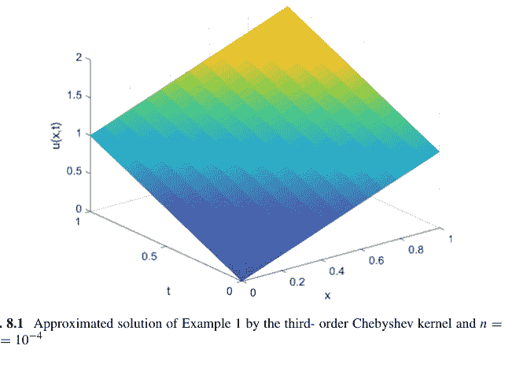

图 8.1  使用三阶切比雪夫核和 $n = 10$，$\Delta t = 10^{-4}$ 得到的示例 1 的近似解

表 8.1  使用不同核求解示例 1 的方法数值绝对误差 ($L_2$)

| t | 切比雪夫-3 ($\delta = 3$) | 切比雪夫-6 ($\delta = 1.5$) | 勒让德-3 ($\delta = 2$) | 勒让德-6 ($\delta = 1$) |
|---|---|---|---|---|
| 0.01 | 2.4178e-04 | 0.0010 | 1.4747e-04 | 4.0514e-04 |
| 0.25 | 3.8678e-04 | 0.0018 | 2.5679e-04 | 8.1972e-04 |
| 0.5 | 3.8821e-04 | 0.0018 | 2.5794e-04 | 8.2382e-04 |
| 0.7 | 3.8822e-04 | 0.0018 | 2.5795e-04 | 8.2385e-04 |
| 1 | 3.8822e-04 | 0.0018 | 2.5795e-04 | 8.2385e-04 |

表 8.2  使用不同核求解示例 1 的方法 RMS 误差

| t | 切比雪夫-3 ($\delta = 3$) | 切比雪夫-6 ($\delta = 1.5$) | 勒让德-3 ($\delta = 3$) | 勒让德-6 ($\delta = 1$) |
|---|---|---|---|---|
| 0.01 | 6.2427e-05 | 2.6776e-04 | 3.8077e-05 | 1.0461e-04 |
| 0.25 | 9.9866e-05 | 0.0013 | 6.6303e-05 | 2.1165e-04 |
| 0.5 | 1.0024e-04 | 0.0013 | 6.6600e-05 | 2.1271e-04 |
| 0.7 | 1.0024e-04 | 0.0013 | 6.6602e-05 | 2.1272e-04 |
| 1 | 1.0024e-04 | 0.0013 | 6.6602e-05 | 2.1272e-04 |

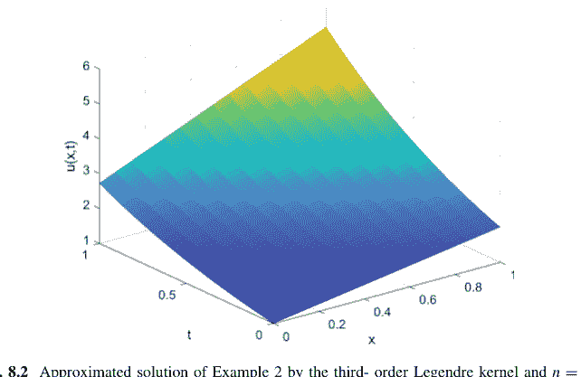

图 8.2  使用三阶勒让德核和 $n = 15$，$\Delta t = 0.0001$ 得到的示例 2 的近似解

表 8.3  使用不同核求解示例 2 的方法数值绝对误差 ($L_2$)

| t | 切比雪夫-3 ($\delta = 3$) | 切比雪夫-6 ($\delta = 1.5$) | 勒让德-3 ($\delta = 3$) | 勒让德-6 ($\delta = 1.5$) |
|---|---|---|---|---|
| 0.01 | 3.6904e-04 | 0.0018 | 2.0748e-04 | 7.1382e-04 |
| 0.25 | 6.0740e-04 | 0.0043 | 2.7289e-04 | 0.0020 |
| 0.5 | 8.6224e-04 | 0.0064 | 3.6194e-04 | 0.0031 |
| 0.7 | 0.0011 | 0.0083 | 4.5389e-04 | 0.0040 |
| 1 | 0.0016 | 0.0116 | 6.3598e-04 | 0.0055 |

表 8.4  使用不同核求解示例 2 的方法 RMS 误差

| t | 切比雪夫-3 ($\delta = 3$) | 切比雪夫-6 ($\delta = 1.5$) | 勒让德-3 ($\delta = 3$) | 勒让德-6 ($\delta = 1$) |
|---|---|---|---|---|
| 0.01 | 9.5285e-05 | 4.7187e-04 | 5.3572e-05 | 1.8431e-04 |
| 0.25 | 1.5683e-04 | 0.0011 | 7.0461e-05 | 5.1859e-04 |
| 0.5 | 2.2263e-04 | 0.0017 | 9.3453e-05 | 7.8761e-04 |
| 0.7 | 2.8540e-04 | 0.0021 | 1.1719e-04 | 0.0010 |
| 1 | 4.0064e-04 | 0.0030 | 1.6421e-04 | 0.0014 |

所提方法（使用三阶勒让德核）获得的解如图 8.2 所示。此外，表 8.3 和 8.4 描绘了所提方法使用不同核的数值绝对误差和 RMS 误差。可以推断，对于此示例，勒让德核通常是更好的选择。

###### 8.3.1.3 示例 3

考虑非线性 Fokker–Planck 方程，其中 $\psi_1(x, t, u) = \frac{7}{2}u$，$\psi_2(x, t, u) = xu$，初始条件为 $f(x) = x$。重新审视此方程，可以得出 $A(x, t, u) = 0$，$B(x, t, u) = -3u + 2xu_x$，以及 $C(x, t, u) = 2xu$。该问题的精确解为 $u(x, t) = \frac{x}{t+1}$ (Kazem et al. 2012a; Lakestani and Dehghan 2008)。为了克服问题的非线性，我们使用了前一步中 $u$ 及其导数的值。对于此示例，我们设定 $n = 20$，$\Delta t = 0.0001$，以及 $\gamma = 10^{12}$。

此示例的近似解展示在图 8.3 中。同时，示例 3 的数值误差展示在表 8.5 和表 8.6 中。

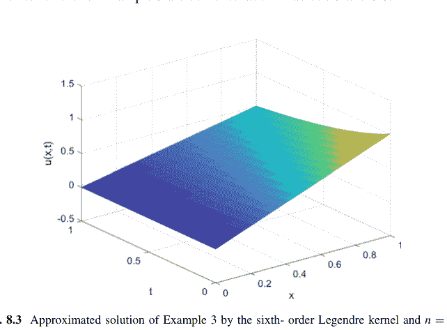

表 8.5 使用不同核函数求解示例 3 的方法数值绝对误差 ($L_2$)

| t | Chebyshev-3 ($\delta = 4$) | Chebyshev-6 ($\delta = 3$) | Legendre-3 ($\delta = 4$) | Legendre-6 ($\delta = 4$) |
|---|---|---|---|---|
| 0.01 | 3.0002e-04 | 0.0010 | 2.1898e-04 | 5.0419e-04 |
| 0.25 | 3.0314e-04 | 0.0011 | 2.1239e-04 | 4.5307e-04 |
| 0.5 | 2.1730e-04 | 7.8259e-04 | 1.4755e-04 | 3.3263e-04 |
| 0.7 | 1.7019e-04 | 6.2286e-04 | 1.1327e-04 | 2.6523e-04 |
| 1 | 1.2321e-04 | 4.5854e-04 | 8.0082e-05 | 1.9611e-04 |

表 8.6 使用不同核函数求解示例 3 的方法均方根误差

| t | Chebyshev-3 ($\delta = 4$) | Chebyshev-6 ($\delta = 1.5$) | Legendre-3 ($\delta = 4$) | Legendre-6 ($\delta = 4$) |
|---|---|---|---|---|
| 0.01 | 6.7087e-05 | 2.2583e-04 | 4.8965e-05 | 1.1274e-04 |
| 0.25 | 6.7784e-05 | 2.3724e-04 | 4.7492e-05 | 1.0131e-04 |
| 0.5 | 4.8591e-05 | 1.7499e-04 | 3.2994e-05 | 7.4379e-05 |
| 0.7 | 3.8055e-05 | 1.3927e-04 | 2.5328e-05 | 5.9307e-05 |
| 1 | 2.7551e-05 | 1.0253e-04 | 1.7907e-05 | 4.3852e-05 |

##### 8.3.2 广义 Fitzhugh–Nagumo 方程

Fitzhugh–Nagumo (FHN) 模型基于轴突表面神经细胞的电传输 (FitzHugh 1961; Gordon et al. 1999)。换句话说，该模型是著名的 Hodgkin–Huxley (HH) 模型 (Hodgkin and Huxley 1952) 的简化方程，因为它使用更简单的结构来解释神经元表面的电传输，而不是复杂的 HH 设计 (Moayeri et al. 2020a; Hemami et al. 2019, 2020; Moayeri et al. 2020b)。在电学分析中，HH 模型使用电容器、电阻器、变阻器和电流源元件的组合进行模拟 (Hemami et al. 2019, 2020; Moayeri et al. 2020a, b)，而 FHN 模型则使用电阻器、电感器、电容器和二极管元件的组合 (Hemami et al. 2019, 2020; Moayeri et al. 2020a, b)。此外，HH 模型在电信号产生中涉及钠、钾和泄漏三个通道，并通过变阻器和电池进行模拟，而 FHN 模型仅通过一个二极管和电感器来模拟行为 (Hemami et al. 2019, 2020; Moayeri et al. 2020a, b)。因此，该模型吸引了许多研究人员的关注，并已被用于火焰传播 (Van Gorder 2012)、逻辑斯谛种群增长 (Appadu and Agbavon 2019)、神经生理学 (Aronson and Weinberger 1975)、分支布朗运动过程 (Ali et al. 2020)、自催化化学反应 (İnan 2018)、核反应堆理论 (Bhrawy 2013) 等各种其他领域 (Abbasbandy 2008; Abdusalam 2004; Aronson and Weinberger 1978; Browne et al. 2008; Kawahara and Tanaka 1983; Li and Guo 2006; Jiwari et al. 2014)。经典的 Fitzhugh–Nagumo 方程由下式给出 (Triki and Wazwaz 2013; Abbasbandy 2008)

$$\frac{\partial u}{\partial t} = \frac{\partial^2 u}{\partial x^2} - u(1 - u)(\rho - u), \quad (8.13)$$

其中 $0 \leq \rho \leq 1$，$u(x, t)$ 是依赖于时间变量 $t$ 和空间变量 $x$ 的未知函数。需要注意的是，该方程结合了扩散和非线性，其中非线性由项 $u(1 - u)(\rho - u)$ 控制。广义 FHN 方程可以表示如下 (Bhrawy 2013)：

$$\frac{\partial u}{\partial t} = -v(t)\frac{\partial u}{\partial x} + \mu(t)\frac{\partial^2 u}{\partial x^2} + \eta(t)u(1 - u)(\rho - u). \quad (8.14)$$

8 使用 LS-SVM 求解偏微分方程 185

表 8.7 用于求解不同类型 FHN 模型的数值方法

| 作者 | 方法 | FHN 类型 | 年份 |
|---|---|---|---|
| Li and Guo (2006) | 第一积分法 | 1D-FHN | 2006 |
| Abbasbandy (2008) | 同伦分析法 | 1D-FHN | 2008 |
| Olmos and Shizgal (2009) | 伪谱法 | 1D- 和 2D-FHN 系统 | 2009 |
| Hariharan and Kannan (2010) | Haar 小波法 | 1D-FHN | 2010 |
| Van Gorder and Vajravelu (2010) | 变分公式 | Nagumo-Telegraph | 2010 |
| Dehghan and Taleei (2010) | 同伦扰动法 | 1D-FHN | 2010 |
| Bhrawy (2013) | Jacobi–Gauss–Lobatto 配点法 | 广义 FHN | 2013 |
| Jiwari et al. (2014) | 多项式求积法 | 广义 FHN | 2014 |
| Moghaderi and Dehghan (2016) | 双网格有限差分法 | 1D- 和 2D-FHN 系统 | 2016 |
| Kumar et al. (2018) | q-同伦分析法 | 1D 分数阶 FHN | 2018 |
| Hemami et al. (2019) | CS-RBF 法 | 1D- 和 2D-FHN 系统 | 2019 |
| Hemami et al. (2020) | RBF-FD 法 | 2D-FHN 系统 | 2020 |
| Moayeri et al. (2020a) | 广义拉格朗日法 | 1D- 和 2D-FHN 系统 | 2020 |
| Moayeri et al. (2020b) | Legendre 谱元法 | 1D- 和 2D-FHN 系统 | 2020 |
| Abdel-Aty et al. (2020) | 改进的 B 样条法 | 1D 分数阶 FHN | 2020 |

显然，在该模型中，当我们假设 $v(t) = 0$，$\mu(t) = 1$，以及 $\eta(t) = -1$ 时，可以得出与方程 8.13 相关的模型。

如表 8.7 所示，多位研究人员对不同类型的 FHN 方程进行了数值研究。

###### 8.3.2.1 示例 1

考虑一个非经典 FHN 模型方程 8.14，其中 $v(t) = 0$，$\mu(t) = 1$，$\eta(t) = -1$，$\rho = 2$，初始条件为 $u(x, 0) = \frac{1}{2} + \frac{1}{2} \tanh(\frac{x}{2\sqrt{2}})$，定义域为 $(x, t) \in [-10, 10] \times [0, 1]$。在此示例中，我们有 $A(x, t, u) = -\rho + (1 - \rho)u - u^2$，$B(x, t, u) = 0$ 以及 $C(x, t, u) = -1$。因此，该测试问题的精确解为 $u(x, t) = \frac{1}{2} + \frac{1}{2} \tanh(\frac{x - \frac{2\rho - 1}{\sqrt{2}}t}{2\sqrt{2}})$ (Bhrawy 2013; Jiwari et al. 2014; Wazwaz 2007)。

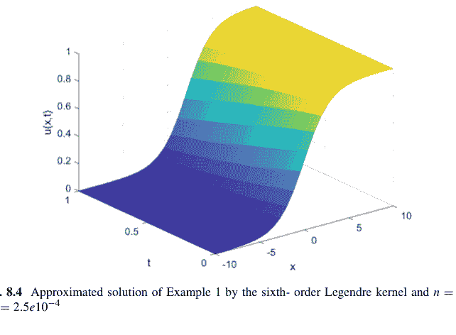

图 8.4 使用六阶 Legendre 核函数且 $n = 40$，$\Delta t = 2.5e10^{-4}$ 时示例 1 的近似解

**表 8.8** 使用不同核函数求解示例 1 的方法数值绝对误差 ($L_2$)

| t | $\delta$ | Chebyshev-3 | Chebyshev-6 | Legendre-3 | Legendre-6 |
|---|---|---|---|---|---|
| 0.01 | 30 | 9.8330e-07 | 9.6655e-07 | 9.8167e-07 | 9.7193e-07 |
| 0.25 | 30 | 2.4919e-05 | 2.4803e-05 | 2.5029e-05 | 2.4956e-05 |
| 0.50 | 30 | 5.1011e-05 | 5.0812e-05 | 5.1289e-05 | 5.1132e-05 |
| 0.07 | 30 | 7.2704e-05 | 7.2357e-05 | 7.3108e-05 | 7.2815e-05 |
| 1.00 | 30 | 1.0648e-04 | 1.0576e-04 | 1.0706e-04 | 1.0644e-04 |
| 0.01 | 50 | 4.7375e-06 | 1.4557e-06 | 3.9728e-06 | 1.3407e-06 |
| 0.25 | 50 | 5.2206e-05 | 2.6680e-05 | 4.4305e-05 | 2.6237e-05 |
| 0.50 | 50 | 6.9759e-05 | 5.1818e-05 | 6.3688e-05 | 5.1808e-05 |
| 0.07 | 50 | 8.6685e-05 | 7.3064e-05 | 8.2108e-05 | 7.3286e-05 |
| 1.00 | 50 | 1.1599e-04 | 1.0624e-04 | 1.1299e-04 | 1.0675e-04 |

在此示例中，我们设定 $n = 40$，$\Delta t = 2.5e10^{-4}$，$\gamma = 10^{15}$。图 8.4 展示了使用六阶 Legendre 核函数获得的函数 $u(x, t)$ 结果作为示例。同时，不同核函数在不同时间的 $L_2$ 和 RMS 误差分别展示在表 8.8 和表 8.9 中。

8 使用 LS-SVM 求解偏微分方程 187

表 8.9 使用不同核函数求解示例 1 的方法均方根误差

| t | $\delta$ | Chebyshev-3 | Chebyshev-6 | Legendre-3 | Legendre-6 |
|---|---|---|---|---|---|
| 0.01 | 30 | 1.5547e-07 | 1.5283e-07 | 1.5522e-07 | 1.5368e-07 |
| 0.25 | 30 | 7.8801e-07 | 7.8433e-07 | 7.9149e-07 | 7.8917e-07 |
| 0.50 | 30 | 1.1406e-06 | 1.1362e-06 | 1.1469e-06 | 1.1433e-06 |
| 0.07 | 30 | 1.3740e-06 | 1.3674e-06 | 1.3816e-06 | 1.3761e-06 |
| 1.00 | 30 | 1.6836e-06 | 1.6723e-06 | 1.6927e-06 | 1.6829e-06 |
| 0.01 | 50 | 7.4906e-07 | 2.3017e-07 | 6.2816e-07 | 2.1198e-07 |
| 0.25 | 50 | 1.6509e-06 | 8.4368e-07 | 1.4010e-06 | 8.2970e-07 |
| 0.50 | 50 | 1.5598e-06 | 1.1587e-06 | 1.4241e-06 | 1.1585e-06 |
| 0.07 | 50 | 1.6382e-06 | 1.3808e-06 | 1.5517e-06 | 1.3850e-06 |
| 1.00 | 50 | 1.8340e-06 | 1.6798e-06 | 1.7865e-06 | 1.6878e-06 |

###### 8.3.2.2 示例 2

考虑 Fisher 类型的经典 FHN 方程，其中 $v(t) = 0$，$\mu(t) = 1$，$\eta(t) = -1$，$\rho = \frac{1}{2}$，初始条件为 $u(x, 0) = \frac{3}{4} + \frac{1}{4} \tanh(\frac{\sqrt{2}}{8}x)$，定义域为 $(x, t) \in [0, 1] \times [0, 1]$。因此，我们有 $A(x, t, u) = -\rho + (1 - \rho)u - u^2$，$B(x, t, u) = 0$ 以及 $C(x, t, u) = -1$。该方程的精确解为 $u(x, t) = \frac{1+\rho}{2} + (\frac{1}{2} - \frac{\rho}{2}) \tanh(\sqrt{2}(1 - \rho)\frac{x}{4} + \frac{1-\rho^2}{4}t)$ (Kawahara and Tanaka 1983; Jiwari et al. 2014; Wazwaz and Gorguis 2004)。

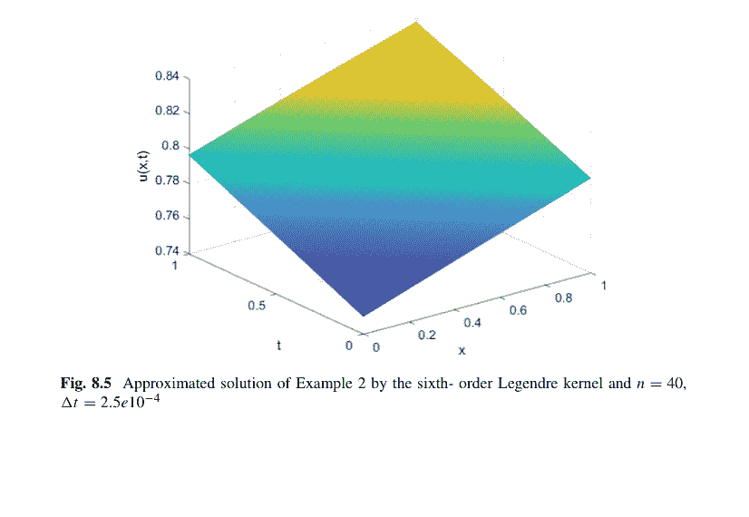

表 8.10 不同核函数下方法求解例 2 的数值绝对误差（$L_2$）

| t | $\delta$ | Chebyshev-3 | Chebyshev-6 | Legendre-3 | Legendre-6 |
|---|---|---|---|---|---|
| 0.01 | 8e3 | 2.1195e-06 | 1.7618e-06 | 1.7015e-06 | 1.5138e-06 |
| 0.25 | 8e3 | 3.5893e-06 | 3.1130e-06 | 2.0973e-06 | 2.7182e-06 |
| 0.50 | 8e3 | 3.5383e-06 | 2.9330e-06 | 2.0790e-06 | 2.6138e-06 |
| 0.07 | 8e3 | 3.4609e-06 | 2.9069e-06 | 1.8524e-06 | 3.1523e-06 |
| 1.00 | 8e3 | 3.3578e-06 | 2.7996e-06 | 2.3738e-06 | 2.4715e-06 |
| 0.01 | 1e4 | 9.1689e-06 | 9.2317e-06 | 9.1726e-06 | 9.1931e-06 |
| 0.25 | 1e4 | 1.5310e-05 | 1.5417e-05 | 1.5318e-05 | 1.5352e-05 |
| 0.50 | 1e4 | 1.5089e-05 | 1.5195e-05 | 1.5097e-05 | 1.5130e-05 |
| 0.07 | 1e4 | 1.4869e-05 | 1.4974e-05 | 1.4876e-05 | 1.4909e-05 |
| 1.00 | 1e4 | 1.4472e-05 | 1.4575e-05 | 1.4479e-05 | 1.4512e-05 |

表 8.11 不同核函数下方法求解例 2 的均方根误差

| t | $\delta$ | Chebyshev-3 | Chebyshev-6 | Legendre-3 | Legendre-6 |
|---|---|---|---|---|---|
| 0.01 | 8e3 | 3.3513e-07 | 2.7856e-07 | 2.6904e-07 | 2.3935e-07 |
| 0.25 | 8e3 | 5.6752e-07 | 4.9222e-07 | 3.3162e-07 | 4.2978e-07 |
| 0.50 | 8e3 | 5.5945e-07 | 4.6375e-07 | 3.2871e-07 | 4.1328e-07 |
| 0.07 | 8e3 | 5.4722e-07 | 4.5962e-07 | 2.9290e-07 | 4.9843e-07 |
| 1.00 | 8e3 | 5.3091e-07 | 4.4266e-07 | 3.7532e-07 | 3.9077e-07 |
| 0.01 | 1e4 | 1.4497e-06 | 1.4597e-06 | 1.4503e-06 | 1.4536e-06 |
| 0.25 | 1e4 | 2.4208e-06 | 2.4376e-06 | 2.4220e-06 | 2.4273e-06 |
| 0.50 | 1e4 | 2.3858e-06 | 2.4025e-06 | 2.3870e-06 | 2.3923e-06 |
| 0.07 | 1e4 | 2.3510e-06 | 2.3675e-06 | 2.3520e-06 | 2.3574e-06 |
| 1.00 | 1e4 | 2.2882e-06 | 2.3045e-06 | 2.2893e-06 | 2.2946e-06 |

在本例中，我们假设 $n = 40$，$\Delta t = 2.5 \times 10^{-4}$，且 $\gamma = 10^{15}$。图 8.5 以六阶 Legendre 核为例，展示了所获得的函数 $u(x, t)$ 的结果。同时，不同核函数在不同时间的 $L_2$ 误差和均方根误差分别列于表 8.10 和表 8.11 中。

###### 8.3.2.3 例 3

考虑非线性时变广义 Fitzhugh–Nagumo 方程，其中 $v(t) = \cos(t)$，$\mu(t) = \cos(t)$，$\eta(t) = -2 \cos(t)$，$\rho = \frac{3}{4}$，初始条件为 $u(x, 0) = \frac{3}{8} + \frac{3}{8} \tanh(\frac{3x}{8})$，定义域为 $(x, t) \in [-10, 10] \times [0, 1]$。此外，我们有 $A(x, t, u) = -\rho + (1 - \rho)u - u^2$，$B(x, t, u) = 1$ 和 $C(x, t, u) = -1$。该方程具有精确解 $u(x, t) = \frac{\rho}{2} + \frac{\rho}{2} \tanh(\frac{\rho}{2}(x - (3 - \rho) \sin(t)))$ (Bhrawy 2013; Jiwari et al. 2014; Triki and Wazwaz 2013)。在本例中，我们设定 $n = 40$，$\Delta t = 2.5 \times 10^{-4}$，且 $\gamma = 10^{15}$。图 8.6 以六阶 Legendre 核为例，展示了所获得的函数 $u(x, t)$ 的结果。同时，不同核函数在不同时间的 $L_2$ 误差和均方根误差分别列于表 8.12 和表 8.13 中。

表 8.12 不同核函数下方法求解例 3 的数值绝对误差（$L_2$）

| t | $\delta$ | Chebyshev-3 | Chebyshev-6 | Legendre-3 | Legendre-6 |
|---|---|---|---|---|---|
| 0.01 | 80 | 4.6645e-05 | 1.1548e-04 | 3.2880e-05 | 2.3228e-04 |
| 0.25 | 80 | 2.3342e-04 | 1.7331e-04 | 1.8781e-04 | 3.2000e-03 |
| 0.50 | 80 | 2.4288e-04 | 1.7697e-04 | 1.9577e-04 | 4.7000e-03 |
| 0.07 | 80 | 2.4653e-04 | 1.6815e-04 | 1.9935e-04 | 5.4000e-03 |
| 1.00 | 80 | 2.5033e-04 | 1.4136e-04 | 2.0333e-04 | 5.6000e-03 |
| 0.01 | 100 | 6.2498e-05 | 1.1966e-04 | 4.8828e-05 | 1.9291e-04 |
| 0.25 | 100 | 3.6141e-04 | 1.9420e-04 | 2.9325e-04 | 2.5000e-03 |
| 0.50 | 100 | 3.7364e-04 | 1.9940e-04 | 3.0328e-04 | 3.5000e-03 |
| 0.07 | 100 | 3.7937e-04 | 1.9260e-04 | 3.0863e-04 | 3.9000e-03 |
| 1.00 | 100 | 3.8635e-04 | 1.7084e-04 | 3.1527e-04 | 4.0000e-03 |

表 8.13 不同核函数下方法求解例 3 的均方根误差

| t | $\delta$ | Chebyshev-3 | Chebyshev-6 | Legendre-3 | Legendre-6 |
|---|---|---|---|---|---|
| 0.01 | 80 | 7.3752e-06 | 1.8259e-05 | 5.1988e-06 | 3.6726e-05 |
| 0.25 | 80 | 3.6907e-05 | 2.7403e-05 | 2.9695e-05 | 5.0071e-04 |
| 0.50 | 80 | 3.8403e-05 | 2.7981e-05 | 3.0954e-05 | 7.4712e-04 |
| 0.07 | 80 | 3.8980e-05 | 2.6586e-05 | 3.1521e-05 | 8.4603e-04 |
| 1.00 | 80 | 3.9580e-05 | 2.2351e-05 | 3.2149e-05 | 8.8481e-04 |
| 0.01 | 100 | 9.8818e-06 | 1.8921e-05 | 7.7204e-06 | 3.0502e-05 |
| 0.25 | 100 | 5.7144e-05 | 3.0706e-05 | 4.6367e-05 | 3.9744e-04 |
| 0.50 | 100 | 5.9077e-05 | 3.1528e-05 | 4.7954e-05 | 5.5947e-04 |
| 0.07 | 100 | 5.9983e-05 | 3.0452e-05 | 4.8798e-05 | 6.1710e-04 |
| 1.00 | 100 | 6.1087e-05 | 2.7012e-05 | 4.9849e-05 | 6.2629e-04 |

### 8.4 结论

在本章中，我们介绍了一种基于机器学习的数值算法，称为最小二乘支持向量机方法，用于求解偏微分方程。首先，通过 Crank–Nicolson 方法对时间维度进行离散化。然后，在每个时间步长上，将配点 LS-SVM 方法应用于所得方程。通过采用对偶形式，该问题被转化为一个代数方程组，可以使用标准求解器进行求解。在 LS-SVM 公式中使用了改进的 Chebyshev 和 Legendre 正交核函数。为了评估所提方法的有效性，将其应用于两个著名的二阶偏微分方程，即 Fokker–Planck 方程和广义 Fitzhugh–Nagumo 方程。从不同正交核获得的结果以数值绝对误差和均方根误差的形式报告。可以得出结论，所提方法具有可接受的精度，并且对于求解线性和非线性偏微分方程是有效的。

## 参考文献

- Aarts, L.P., Van Der Veer, P.: Neural network method for solving partial differential equations. Neural Proc. Lett. **14**, 261–271 (2001)
- Abazari, R., Yildirim, K.: Numerical study of Sivashinsky equation using a splitting scheme based on Crank-Nicolson method. Math. Method. Appl. Sci. **16**, 5509–5521 (2019)
- Abbasbandy, S.: Soliton solutions for the Fitzhugh-Nagumo equation with the homotopy analysis method. Appl. Math. Modell. **32**, 2706–2714 (2008)
- Abbasbandy, S., Shirzadi, A.: A meshless method for two-dimensional diffusion equation with an integral condition. Eng. Anal. Bound. Elem. **34**, 1031–1037 (2010)
- Abbasbandy, S., Shirzadi, A.: MLP method for two-dimensional diffusion equation with Neumann's and non-classical boundary conditions. Appl. Numer. Math. **61**, 170–180 (2011)
- Abbaszadeh, M., Dehghan, M.: Simulation flows with multiple phases and components via the radial basis functions-finite difference (RBF-FD) procedure: Shan-Chen model. Eng. Anal. Bound. Elem. **119**, 151–161 (2020a)
- Abbaszadeh, M., Dehghan, M.: Direct meshless local Petrov-Galerkin method to investigate anisotropic potential and plane elastostatic equations of anisotropic functionally graded materials problems. Eng. Anal. Bound. Elem. **118**, 188–201 (2020b)
- Abdel-Aty, A.H., Khater, M., Baleanu, D., Khalil, E.M., Bouslimi, J., Omri, M.: Abundant distinct types of solutions for the nervous biological fractional FitzHugh-Nagumo equation via three different sorts of schemes. Adv. Diff. Eq. **476**, 1–17 (2020)
- Abdusalam, H.A.: Analytic and approximate solutions for Nagumo telegraph reaction diffusion equation. Appl. Math. Comput. **157**, 515–522 (2004)
- Ali, H., Kamrujjaman, M., Islam, M.S.: Numerical computation of FitzHugh-Nagumo equation: a novel Galerkin finite element approach. Int. J. Math. Res. **9**, 20–27 (2020)
- Appadu, A.R., Agbavon, K.M.: Comparative study of some numerical methods for FitzHugh-Nagumo equation. AIP Conference Proceedings, AIP Publishing LLC, vol. 2116 (2019), p. 030036
- Aronson, D.G., Weinberger, H.F.: Nonlinear diffusion in population genetics, combustion, and nerve pulse propagation. Partial differential equations and related topics. Springer, Berlin (1975), pp. 5–49
- Aronson, D.G., Weinberger, H.F.: Multidimensional nonlinear diffusion arising in population genetics. Adv. Math. **30**, 33–76 (1978)
- Asghari, M., Hadian Rasanan, A.H., Gorgin, S., Rahmati, D., Parand, K.: FPGA-orthopoly: a hardware implementation of orthogonal polynomials. Eng. Comput. (inpress) (2022)
- Asouti, V.G., Trompoukis, X.S., Kampolis, I.C., Giannakoglou, K.C.: Unsteady CFD computations using vertex-centered finite volumes for unstructured grids on graphics processing units. Int. J. Numer. Methods Fluids **67**, 232–246 (2011)
- Barkai, E.: Fractional Fokker-Planck equation, solution, and application. Phys. Rev. E. **63**, 046118 (2001)
- Bath, K.J., Wilson, E.: Numerical Methods in Finite Element Analysis. Prentice Hall, New Jersey (1976)
- Belytschko, T., Lu, Y.Y., Gu, L.: Element-free Galerkin methods. Int. J. Numer. Methods Eng. **37**, 229–256 (1994)
- Bengfort, M., Malchow, H., Hilker, F.M.: The Fokker-Planck law of diffusion and pattern formation in heterogeneous environments. J. Math. Biol. **73**, 683–704 (2016)
- Bertolazzi, E., Manzini, G.: A cell-centered second-order accurate finite volume method for convection-diffusion problems on unstructured meshes. Math. Models Methods Appl. Sci. **14**, 1235–1260 (2001)
- Bhrawy, A.H.: A Jacobi-Gauss-Lobatto collocation method for solving generalized Fitzhugh-Nagumo equation with time-dependent coefficients. Appl. Math. Comput. **222**, 255–264 (2013)
- Bhrawy, A.H., Baleanu, D.: A spectral Legendre-Gauss-Lobatto collocation method for a space-fractional advection diffusion equations with variable coefficients. Reports Math. Phy. **72**, 219–233 (2013)
- Blackmore, R., Weinert, U., Shizgal, B.: Discrete ordinate solution of a Fokker-Planck equation in laser physics. Transport Theory Stat. Phy. **15**, 181–210 (1986)
- Bossavit, A., Vérité, J.C.: A mixed FEM-BIEM method to solve 3-D eddy-current problems. IEEE Trans. Magn. **18**, 431–435 (1982)
- Braglia, G.L., Caraffini, G.L., Diligenti, M.: A study of the relaxation of electron velocity distributions in gases. Il Nuovo Cimento B **62**, 139–168 (1981)
- Brink, A.R., Najera-Flores, D.A., Martinez, C.: The neural network collocation method for solving partial differential equations. Neural Comput. App. **33**, 5591–5608 (2021)
- Browne, P., Momoniat, E., Mahomed, F.M.: A generalized Fitzhugh-Nagumo equation. Nonlinear Anal. Theory Methods Appl. **68**, 1006–1015 (2008)

## 参考文献

Bruggi, M., Venini, P.: NA混合有限元方法在应力约束拓扑优化中的应用。Int. J. Numer. Methods Eng. **73**, 1693–1714 (2008)

Cai, S., Mao, Z., Wang, Z., Yin, M., Karniadakis, G.E.: 物理信息神经网络（PINNs）在流体力学中的应用：综述。Acta Mech. Sinica. 1–12 (2022)

Carstensen, C., Köhler, K.: 障碍问题的非协调有限元方法。IMA J. Numer. Anal. **37**, 64–93 (2017)

Chauvière, C., Lozinski, A.: 使用Fokker-Planck方程模拟稀聚合物溶液。Comput. Fluids. **33**, 687–696 (2004)

Chavanis, P.H.: 非线性平均场Fokker-Planck方程及其在物理学、天体物理学和生物学中的应用。Comptes. Rendus. Phys. **7**, 318–330 (2006)

Chen, Y., Yi, N., Liu, W.: 椭圆方程最优控制问题的Legendre-Galerkin谱方法。SIAM J. Numer. Anal. **46**, 2254–2275 (2008)

Cheung, K.C., See, S.: 机器学习在偏微分方程中的最新进展。CCF Trans. High Perf. Comput. **3**, 298–310 (2021)

Chien, C.C., Wu, T.Y.: 求解二维弹性动力学问题的特解边界元法/时间间断有限元方法。Int. J. Solids Struct. **38**, 289–306 (2001)

Conze, A., Lantos, N., Pironneau, O.: 二维期权的正向Kolmogorov方程。Commun. Pure Appl. Anal. **8**, 195 (2009)

Cortes, C., Vapnik, V: 支持向量网络。Mach. Learn. **20**, 273–297 (1995)

D'ariano, G.M., Macchiavello, C., Moroni, S.: 关于量子光学中Fokker-Planck方程的蒙特卡洛模拟方法。Modern Phys. Lett. B. **8**, 239–246 (1994)

De Decker, Y., Nicolis, G.: 关于反应系统随机热力学的Fokker-Planck方法。Physica A: Stat. Mech. Appl. **553**, 124269 (2020)

Dehghan, M., Narimani, N.: 基于移动最小二乘和移动克里金近似的无单元Galerkin方法求解二维肿瘤诱导血管生成模型。Eng. Comput. **36**, 1517–1537 (2020)

Dehghan, M., Shokri, A.: 使用径向基函数求解二维sine-Gordon方程的数值方法。Math. Comput. Simul. **79**, 700–715 (2008)

Dehghan, M., Taleei, A.: 求解常系数和变系数非线性Schrödinger方程的紧致分裂步有限差分方法。Comput. Phys. Commun. **181**, 80–90 (2010)

Dehghan, M., Tatari, M.: 二维Fokker-Planck方程的数值解。Phys. Scr. **74**, 310–316 (2006)

Dehghan, M., Manafian Heris, J., Saadatmandi, A.: 半解析方法在模拟神经脉冲传输的Fitzhugh-Nagumo方程中的应用。Math. Methods Appl. Sci. **33**, 1384–1398 (2010)

Delkhosh, M., Parand, K.: 一种基于分数阶Lagrange函数求解多分数阶微分方程的新计算方法。Numer. Algor. **88**, 729–766 (2021)

Dubois F: 有限体积法与混合Petrov-Galerkin有限元：一维问题。Numer. Methods Partial Diff. Eq. Int. J. **16**, 335–360 (2000)

Eymard, R., Gallouët, T., Herbin, R.: 有限体积法。数值分析手册，第7卷 (2000), pp. 713–1018

Fallah, N.: 用于板弯曲分析的单元顶点和单元中心有限体积法。Comput. Methods Appl. Mech. Eng. **193**, 3457–3470 (2004)

Fallah, N.A., Bailey, C., Cross, M., Taylor, G.A.: 有限元法和有限体积法在几何非线性应力分析中的应用比较。Appl. Math. Model. **24**, 439–455 (2000)

Fasshauer, G.E.: 基于MATLAB的无网格近似方法。World Scientific, Singapore (2007)

FitzHugh, R.: 神经膜理论模型中的脉冲与生理状态。Biophys. J. **1**, 445–466 (1961)

Flandoli, F., Zanco, G.: 路径依赖Kolmogorov方程的无穷维方法。Annals Probab. **44**, 2643–2693 (2016)

Frank, T.D., Beek, P.J., Friedrich, R.: 随机延迟系统的Fokker-Planck视角：精确解与生物系统数据分析。Astrophys. Biol. Phys. Rev. E **68**, 021912 (2003)

Friedrich, R., Jenko, F., Baule, A., Eule, S.: 保留延迟效应的广义Kramers-Fokker-Planck方程的精确解。Phys. Rev. E **74**, 041103 (2006)

Furioli, G., Pulvirenti, A., Terraneo, E., Toscani, G.: 社会经济现象建模中的Fokker-Planck方程。Math. Models Appl. Sci. **27**, 115–158 (2017)

Gamba, I.M., Rjasanow, S.: Boltzmann方程的Galerkin-Petrov方法。J. Comput. Phys. **366**, 341–365 (2018)

Ghidaglia, J.M., Kumbaro, A., Le Coq, G.: 关于通过单元中心有限体积法求解双流体模型。Eur. J. Mech. B Fluids **20**, 841–867 (2001)

Gordon, A., Vugmeister, B.E., Dorfman, S., Rabitz, H.: 神经膜理论模型中的脉冲与生理状态。Biophys. J. **233**, 225–242 (1999)

Grima, R., Thomas, P., Straube, A.V.: 非线性化学Fokker-Planck方程和化学Langevin方程的精确度如何。Astrophys. Biol. J. Chem. Phys. **135**, 084103 (2011)

Gronchi, M., Lugiato, A.: 光学双稳态的Fokker-Planck方程。Lett. Al Nuovo Cimento **23**, 593–8 (1973)

Hadian-Rasanan, A.H., Bajalan, Parand, K., Rad, J.A.: 使用新型分数阶神经网络模拟认知决策建模中出现的非线性分数阶动力学。Math. Methods Appl. Sci. **43**, 1437–1466 (2020)

Hadian-Rasanan, A.H., Rad, J.A., Sewell, D.K.: 证据积累中是否存在跳跃，如果存在，它们在心理学上反映了什么？- 对决策的Lévy-飞行模型的分析。PsyArXiv (2021). https://doi.org/10.31234/osf.io/vy2mh

Hadian-Rasanan, A.H., Rahmati, D., Girgin, S., Parand, K.: 用于求解各类Lane-Emden方程的单层分数阶正交神经网络。New Astron. **75**, 101307 (2019)

Hajimohammadi, Z., Shekarpaz, S., Parand, K.: 半无限域上非线性微分模型的新型学习解。Eng. Comput. 1–18 (2022)

Hajimohammadi, Z., Parand, K.: 半无限域上时间分数阶亚扩散模型的数值学习近似。Chaos Solitons Frac. **142**, 110435 (2021)

Hariharan, G., Kannan, K.: 求解FitzHugh-Nagumo方程的Haar小波方法。Int. J. Math. Comput. Sci. **4**, 909–913 (2010)

Hemami, M., Parand, K., Rad, J.A.: 反应扩散神经动力学模型的数值模拟及其同步/去同步：在癫痫发作中的应用。Comput. Math. Appl. **78**, 3644–3677 (2019)

Hemami, M., Rad, J.A., Parand, K.: 使用空间分裂RBF-FD技术模拟癫痫发作中源于大脑活动建模的神经网络的受控同步。J. Comput. Sci. **42**, 101090 (2020)

Hemami, M., Rad, J.A., Parand, K.: 使用局部径向基函数无网格技术控制神经振荡器群体的相位分布及其在癫痫发作中的应用：一种数值模拟方法。Commun. Nonlinear SCI. Numer. Simul. **103**, 105961 (2021)

Heydari, M.H., Avazzadeh, Z.: 求解变阶时间分数阶广义Hirota-Satsuma耦合KdV系统的Chebyshev-Gauss-Lobatto配置法。Eng. Comput. 1–10 (2020)

Hodgkin, A.L., Huxley, A.F.: 乌贼巨大轴突膜上钠离子和钾离子携带的电流。J. Physiol. **116**, 449–72 (1952)

Hughes, T.J.: 有限元方法：线性静态和动态有限元分析。Courier Corporation, Chelmsford (2012)

İnan, B.: 求解广义FitzHugh-Nagumo方程的有限差分方法。AIP Conference Proceedings, AIP Publishing LLC, vol. 1926 (2018), p. 020018

Jiménez-Aquino, J.I., Romero-Bastida, M.: 磁场中布朗气体的Fokker-Planck-Kramers方程。Phys. Rev. E **74**, 041117 (2006)

Jiwari, R., Gupta, R.K., Kumar, V.: 求解具有时变系数的广义Fitzhugh-Nagumo方程的多项式微分正交法。Ain Shams Eng. J. **5**, 1343–1350 (2014)

Jordan, M.I., Mitchell, T.M.: 机器学习：趋势、观点与前景。Science **349**, 255–260 (2015)

Kadeethumm, T., O'Malley, D., Fuhg, J.N., Choi, Y., Lee, J., Viswanathan, H.S., Bouklas, N.: 使用条件生成对抗网络进行偏微分方程数据驱动求解和参数估计的框架。Nat. Comput. Sci. **1**, 819–829 (2021)

Kanschat, G.: 局部加密网格上间断Galerkin有限元的多层方法。Comput. Struct. **82**, 2437–2445 (2004)

Karniadakis, G.E., Sherwin, S.J.: 计算流体动力学的谱/hp单元方法。Oxford University Press, New York (2005)

Kassab, A., Divo, E., Heidmann, J., Steinthorsson, E., Rodriguez, F.: 三维气膜冷却涡轮叶片的BEM/FVM共轭传热分析。Int. J. Numer. Methods Heat Fluid Flow. **13**, 581–610 (2003)

Kawahara, T., Tanaka, M.: 行波的相互作用：非线性扩散方程的精确解。Phys. Lett. A **97**, 311–314 (1983)

Kazem, S., Rad, J.A.: 求解具有Neumann边界条件的非局部边值问题的径向基函数方法。Appl. Math. Modell. **36**, 2360–2369 (2012)

Kazem, S., Rad, J.A., Parand, K.: 求解Fokker-Planck方程的径向基函数方法。Eng. Anal. Bound. Elem. **36**, 181–189 (2012a)

Kazem, S., Rad, J.A., Parand, K.: 基于径向基函数的多孔介质中具有混合长度增长的非菲克流的无网格方法：比较研究。Comput. Math. Appl. **64**, 399–412 (2012b)

Kogut, P.I., Kupenko, O.P.: 关于具有$p$-Laplace算子和$L^1$型非线性的不适定强非线性椭圆方程的最优控制问题。Discret. Cont. Dyn-B **24**, 1273–1295 (2019)

Kopriva, D.: 偏微分方程谱方法的实现。Springer, Berlin (2009)

Kumar, S.: 固态物理和电路理论中出现的时间分数阶Fokker-Planck方程的数值计算。Z NATURFORSCH A **68**, 777–784 (2013)

Kumar, D., Singh, J., Baleanu, D.: 求解神经脉冲传输中出现的分数阶Fitzhugh-Nagumo方程的新数值算法。Nonlinear Dyn. **91**, 307–317 (2018)

Lakestani, M., Dehghan, M.: 使用三次B样条尺度函数求解Fokker-Planck方程的数值解。Numer. Method. Part. D. E. **25**, 418–429 (2008)

Latifi, S., Delkhosh, M.: 求解$(2 + 1)$维Sine-Gordon方程的广义Lagrange Jacobi-Gauss-Lobatto与Jacobi-Gauss-Lobatto配置近似。Math. Methods Appl. Sci. **43**, 2001–2019 (2020)

Lee, Y.Y., Ruan, S.J., Chen, P.C.: 使用带有常微分方程求解器的生成对抗网络进行全局布局的可预测耦合效应模型。IEEE Trans. Circuits Syst. II: Express Briefs (2021), pp. 1–5

LeVeque, R.J.: 双曲问题的有限体积法。Cambridge University Press, Cambridge (2002)

Li, H., Guo, Y.: FitzHugh-Nagumo方程的新精确解。Appl. Math. Comput. **180**, 524–528 (2006)

Liaqat, A., Fukuhara, M., Takeda, T.: 神经网络配置法在数据同化中的应用。Computer Phys. Commun. **141**, 350–364 (2001)

Lindqvist, P.: 关于稳态p-Laplace方程的笔记。Springer International Publishing, Berlin (2019)

Liu, G.R.: 无网格方法：超越有限元方法。CRC Press, Florida (2003)

Liu, G.R., Gu, Y.T.: 用于二维固体自由振动分析的局部径向点插值法（LRPIM）。J. Sound Vib. **246**, 29–46 (2001)

## 参考文献

Liu, J., Hao, Y.: 求解不确定热方程的Crank-Nicolson方法。Soft Comput. **26**, 937–945 (2022)

Liu, G.R., Zhang, G.Y., Gu, Y., Wang, Y.Y.: 一种用于三维实体的无网格径向点插值法（RPIM）。Comput. Mech. **36**, 421–430 (2005)

Liu, F., Zhuang, P., Turner, I., Burrage, K., Anh, V.: 一种求解分数扩散方程的新分数有限体积法。Appl. Math. Model. **38**, 3871–3878 (2014)

Lu, Y., Lu, J., Wang, M.: 深度Ritz方法：求解高维椭圆偏微分方程的深度Ritz方法的先验泛化分析。Conference on Learning Theory, PMLR (2021), pp. 3196–3241

Mai-Duy, N.: 一种用于直接求解高阶常微分方程的有效谱配置法。Commun. Numer. Methods Eng. **22**, 627–642 (2006)

Meerschaert, M.M., Tadjeran, C.: 双侧空间分数偏微分方程的有限差分近似。Appl. Numer. Math. **56**, 80–90 (2006)

Mehrdanoo, S., Suykens, J.A.K.: 使用最小二乘支持向量机求解常微分方程的近似解。IEEE Trans. Neural Netw. Learn. Syst. **23**, 1356–1362 (2012)

Mehrdanoo, S., Suykens, J.A.K.: 使用LS-SVM学习求解偏微分方程。Neurocomputing **159**, 105–116 (2015)

Moayeri, M.M., Hadian-Rasanan, A.H., Latifi, S., Parand, K., Rad, J.A.: 一种用于模拟脑神经元以通过神经元同步控制癫痫活动的有效空间分裂方法。Eng. Comput. 1–28 (2020a)

Moayeri, M.M., Rad, J.A., Parand, K.: 反应扩散神经网络的动力学行为及其在癫痫发作建模中的同步性：一项数值模拟研究。Comput. Math. Appl. **80**, 1887–1927 (2020b)

Moayeri, M.M., Rad, J.A., Parand, K.: 通过相位分布控制实现随机同步神经群体的去同步：一种数值模拟方法。Nonlinear Dyn. **104**, 2363–2388 (2021)

Moghaderi, H., Dehghan, M.: 求解一维和二维FitzHugh-Nagumo方程的混合双网格有限差分方法。Math. Methods Appl. Sci. **40**, 1170–1200 (2016)

Mohammadi, V., Dehghan, M.: 通过数值方案模拟相场Cahn-Hilliard和肿瘤生长模型：无单元Galerkin方法。Comput. Methods Appl. Mech. Eng. **345**, 919–950 (2019)

Mohammadi, V., Dehghan, M.: 一种基于广义移动最小二乘法与二阶半隐式向后差分公式相结合的无网格技术，用于在球面上数值求解时间依赖的相场模型。Appl. Numer. Math. **153**, 248–275 (2020)

Mohammadi, V., Dehghan, M., De Marchi, S.: 通过RBF-FD格式和半隐式时间离散化对前列腺肿瘤生长模型进行数值模拟。J. Comput. Appl. Math. **388**, 113314 (2021)

Moosavi, M.R., Khelil, A.: 有限体积法与无网格局部Petrov-Galerkin方法结合在弹性静力学问题中与有限元方法相比的精度和计算效率。ICCES **5**, 211–238 (2008)

Olmos, D., Shizgal, B.D.: 求解FitzHugh-Nagumo方程的伪谱方法。Math. Comput. Simul. **79**, 2258–2278 (2009)

Ottesen, N., Pettersson, H., Saabye, N.: 有限元方法导论。Prentice Hall, New Jersey (1992)

Ozer, S., Chen, C.H., Cirpan, H.A.: 一组用于支持向量机模式分类的新切比雪夫核函数。Pattern Recogn. **44**, 1435–1447 (2011)

Pang, G., Lu, L., Karniadakis, G.E.: fPINNs：分数阶物理信息神经网络。SIAM J. Sci. Comput. **41**, A2603–A2626 (2019)

Parand, K., Rad, J.A.: 用于求解具有未知空间依赖系数的抛物型方程（附加额外测量条件）的Kansa方法。Comput. Phys. Commun. **184**, 582–595 (2013)

Parand, K., Hemami, M., Hashemi-Shahraki, S.: 求解高阶奇异Emden-Fowler型方程的两种无网格数值方法。Int. J. Appl. Comput. Math. **3**, 521–546 (2017)

Parand, K., Latifi, S., Moayeri, M.M., Delkhosh, M.: 用于求解线性和非线性Fokker-Planck方程的广义Lagrange Jacobi Gauss-Lobatto (GLJGL) 配置法。Eng. Anal. Bound. Elem. **69**, 519–531 (2018)

Parand, K., Aghaei, A.A., Jani, M., Ghodsi, A.: 用于分数阶Volterra种群模型数值模拟的并行LS-SVM。Alexandria Eng. J. **60**, 5637–5647 (2021a)

Parand, K., Aghaei, A.A., Jani, M., Ghodsi, A.: 一种使用最小二乘支持向量回归求解Fredholm积分方程的新方法。Math. Comput. Simul. **180**, 114–128 (2021b)

Peeters, A.G., Strintzi, D.: Fokker-Planck方程及其在等离子体物理中的应用。Annalen der Physik. **17**, 142–157 (2008)

Pozrikidis, C.: 使用MATLAB的有限元与谱元方法导论，第二版。Oxford CRC Press (2014)

Qin, C., Wu, Y., Springenberg, J.T., Brock, A., Donahue, J., Lillicrap, T., Kohli, P.: 通过求解常微分方程训练生成对抗网络。Adv. Neural Inf. Process. Syst. **33**, 5599–5609 (2020)

Rad, J.A., Ballestra, L.V.: 通过径向基点插值法对欧式和美式期权进行定价。Appl. Math. Comput. **251**, 363–377 (2015)

Rad, J.A., Parand, K.: 使用无网格局部Petrov-Galerkin方法对两种带跳跃的随机因子模型下的美式期权进行数值定价。Appl. Numer. Math. **115**, 252–274 (2017a)

Rad, J.A., Parand, K.: 使用局部弱形式无网格技术对跳跃扩散模型下的美式期权进行定价。Int. J. Comput. Math. **94**, 1694–1718 (2017b)

Rad, J.A., Kazem, S., Parand, K.: 使用径向基函数对非线性受控Duffing振荡器进行数值求解。Comput. Math. Appl. **64**, 2049–2065 (2012)

Rad, J.A., Kazem, S., Parand, K.: 通过径向基函数对抛物型分布参数系统进行最优控制。Commun. Nonlinear Sci. Numer. Simul. **19**, 2559–2567 (2014)

Rad, J.A., Parand, K., Abbasbandy, S.: 使用一种非常快速准确的方案对欧式和美式期权进行定价：无网格局部Petrov-Galerkin方法。Proc. Natl. Acad. Sci. India Sect. A: Phys. Sci. **85**, 337–351 (2015a)

Rad, J.A., Parand, K., Abbasbandy, S.: 基于径向点插值（RPI）方法和局部边界积分方程（LBIE）方法的局部弱形式无网格技术用于评估欧式和美式期权。Commun. Nonlinear Sci. Numer. Simul. **22**, 1178–1200 (2015b)

Rad, J.A., Höök, J., Larsson, E., Sydow, L.V.: 使用高斯径向基函数进行期权的前向确定性定价。J. Comput. Sci. **24**, 209–217 (2018)

Raissi, M., Perdikaris, P., Karniadakis, G.E.: 物理信息神经网络：一个用于求解涉及非线性偏微分方程的正问题和反问题的深度学习框架。J. Comput. Phys. **378**, 686–797 (2019)

Rashedi, K., Adibi, H., Rad, J.A., Parand, K.: 无网格方法在求解一维Stefan反问题中的应用。Eng. Anal. Bound. Elem. **40**, 1–21 (2014)

Reguera, D., Rubi, J.M., Pérez-Madrid, A.: 重新审视成核过程的Fokker-Planck方程。Physica A: Stat. Mech. Appl. **259**, 10–23 (1998)

Risken, H.: Fokker-Planck方程：求解方法与应用。Springer, Berlin (1989)

Saha, P., Mukhopadhyay, S.: 一种基于深度学习的配置法，用于从稀疏观测中建模未知PDE (2020)。[arxiv.org/pdf/2011.14965pdf](https://arxiv.org/pdf/2011.14965pdf)

Saporito, Y.F., Zhang, Z.: 路径依赖深度Galerkin方法：一种求解路径依赖偏微分方程的神经网络方法。SIAM J. Financ. Math. **12**, 912–40 (2021)

Shakeri, F., Dehghan, M.: 一种用于求解磁流体动力学（MHD）方程的有限体积谱元法。Appl. Numer. Math. **61**, 1–23 (2011)

Shen, J.: 高效谱-Galerkin方法 I. 使用勒让德多项式直接求解二阶和四阶方程。SIAM J. Sci. Comput. **15**, 1489–1505 (1994)

Shivanian, E., Hajimohammadi, Z., Baharifard, F., Parand, K., Kazemi, R.: 一种基于移位Gegenbauer LSSVM的对流-辐射翅片不同轮廓形状的新型学习方法。New Math. Natural Comput. 1–27 (2022)

Shizgal, B.: 化学与物理中的谱方法。科学计算。Springer, Berlin (2015)

Sirignano, J., Spiliopoulos, K.: DGM：一种求解偏微分方程的深度学习算法。J. Comput. Phys. **375**, 1339–1364 (2018)

Smith, G.D.: 偏微分方程的数值解：有限差分方法，第三版。Oxford University Press, New York (1985)

Spalart, P.R., Moser, R.D., Rogers, M.M.: 用于具有一个无限方向和两个周期方向的Navier-Stokes方程的谱方法。J. Comput. Phys. **96**, 297–324 (1991)

Strikwerda, J.C.: 有限差分格式与偏微分方程。Society for Industrial and Applied Mathematics, Pennsylvania (2004)

Tanimura, Y.: 量子耗散系统的随机Liouville、Langevin、Fokker-Planck和主方程方法。J. Phys. Soc. Japan **75**, 082001 (2006)

Tatari, M., Dehghan, M., Razzaghi, M.: Adomian分解法在Fokker-Planck方程中的应用。Phys. Scr. **45**, 639–650 (2007)

Trefethen, L.N.: 常微分方程与偏微分方程的有限差分与谱方法。Cornell University, New York (1996)

Triki, H., Wazwaz, A.M.: 关于具有时间依赖系数的Fitzhugh-Nagumo方程的孤子解。Appl. Math. Model. **37**, 3821–8 (2013)

Tsurui, A., Ishikawa, H.: Fokker-Planck方程在随机疲劳裂纹扩展模型中的应用。Struct. Safety. **63**, 15–29 (1986)

Uhlenbeck, G.E., Ornstein, L.S.: 关于布朗运动理论。Phys. Rev. **36**, 823–841 (1930)

Ullersma, P.: 布朗运动的精确可解模型：II. Fokker-Planck方程和主方程的推导。Physica **32**, 56–73 (1966)

Van Gorder, R.A., Vajravelu K.: Nagumo反应扩散方程和Nagumo电报方程的变分公式。Nonlinear Anal.: Real World Appl. **11**, 2957–2962 (2010)

Van Gorder, R.A.: Fitzhugh-Nagumo方程中的高斯波展示了同伦分析方法中辅助函数H (x, t) 的一个作用。Commun. Nonlinear Sci. Numer. Simul. **17**, 1233–1240 (2012)

Vanaja, V.: 一个简单Fokker-Planck方程的数值解。Appl. Numer. Math. **9**, 533–540 (1992)

Vapnik, V.: 统计学习理论。Wiley, New York (1998)

Wang, C.H., Feng, Y.Y., Yue, K., Zhang, X.X.: 用于参与介质中组合辐射-传导传热的间断有限元法。Int. Commun. Heat Mass. **108**, 104287 (2019)

Wazwaz, A.M., Gorguis, A.: 使用Adomian分解法对Fisher方程的解析研究。Appl. Math. Comput. **154**, 609–20 (2004)

Wazwaz, A.M.: 用于非线性抛物方程孤子和扭结解的tanh-coth方法。Appl. Math. Comput. **188**, 1467–75 (2007)

Wilson, P., Teschemacher, T., Bucher, P., Wüchner, R.: 非协调FEM-FEM耦合方法及其在动态结构分析中的应用。Eng. Struct. **241**, 112342 (2021)

Xing, J., Wang, H., Oster, G.: 从连续Fokker-Planck模型到离散动力学模型。Biophys. J. **89**, 1551–1563 (2005)

Yang, L., Zhang, D., Karniadakis, G.E.: 用于随机微分方程的物理信息生成对抗网络。SIAM J. Sci. Comput. **46**, 292–317 (2020)

# 第9章
利用LS-SVR求解积分方程

Kourosh Parand, Alireza Afzal Aghaei, Mostafa Jani, and Reza Sahleh

**摘要** 科学与工程中的另一类重要问题是积分方程。因此，开发精确的数值算法来近似求解这类问题是科学计算的主要课题之一。本章利用最小二乘支持向量算法，开发了一种求解各类积分方程的数值算法。通过提供若干数值算例，本章讨论了所提方法的鲁棒性与收敛性。

**关键词** 积分方程 · Galerkin LS-SVR · 配点LS-SVR · 数值模拟

### 9.1 引言

任何在积分号下含有未知函数的方程都称为积分方程。这类方程在科学与工程中频繁出现，例如，不同的数学模型，如衍射问题 Eswaran (1990)、量子力学中的散射 Barlette et al. (2001)、塑性 Kanaun and Martínez (2012)、保角映射 Reichel (1986)、水波 Manam (2011) 以及Volterra种群模型 Wazwaz (2002)，都被表示为积分方程 Assari and Dehghan (2019), Bažant and Jirásek (2002), Bremer (2012), Kulish and Novozhilov (2003), Lu et al. (2020), Parand and Delkhosh (2017), Volterra (1928)。近年来，研究人员也讨论了积分方程在机器学习问题中的应用 Keller and Dahn (2019), Chen et al. (2018), Dahn and Keller (2016)。此外，积分方程与微分方程密切相关，在某些情况下，这两类方程可以相互转换。积分微分方程也是积分方程的一种，其中不仅未知函数位于积分算子下，其导数也出现在方程中。在某些情况下，未知函数的偏导数可能出现在方程中。此时，该方程称为偏积分微分方程。分布分数阶微分方程也是分数阶微分方程的一种，与积分方程非常相似。在这类方程中，未知函数的分数阶导数出现在积分下，且分数阶导数的阶数与积分变量相同。

由于积分方程的重要性和广泛应用，许多研究者开发了高效的方法来求解这类方程 Abbasbandy (2006), Assari and Dehghan (2019), Fatahi et al. (2016), Golberg (2013), Mandal and Chakrabarti (2016), Marzban et al. (2011), Nemati et al. (2013), Wazwaz (2011)。本章首先解释积分方程，随后提出一种基于最小二乘支持向量回归方法的新型高效数值方法，用于模拟某些积分方程。

### 9.2 积分方程

积分方程根据其性质分为不同类别。然而，积分方程主要有三种类型 Wazwaz (2011)，即Fredholm积分方程、Volterra积分方程和Volterra-Fredholm积分方程。Fredholm积分方程具有常数积分限，而Volterra积分方程中至少有一个积分限依赖于自变量。Volterra-Fredholm积分方程则同时包含这两种类型的方程。这些方程本身又分为线性/非线性、齐次/非齐次以及第一类/第二类等子类。下一节将介绍并讨论这些方程的不同类别。

#### 9.2.1 Fredholm积分方程

Fredholm积分方程是积分方程的一个重要类别，用于图像处理 Mohammad (2019) 和强化学习问题 Keller and Dahm (2019), Dahm and Keller (2016)。由于求精确解的解析方法仅在特定情况下可用，因此已开发了各种数值技术来近似求解这类方程以及更大一类的模型，如Hammerstein方程、方程组、多维方程和非线性方程。这里简要概述一些用于这些积分方程的数值方法。局部径向基函数方法在 Assari et al. (2019) 中被提出用于求解Fredholm积分方程。此外，Bahmanpour等人开发了Müntz小波方法 Bahmanpour et al. (2019) 来模拟这些模型。另一方面，Newton-Raphson和Newton-Krylov方法被用于求解一维和二维非线性Fredholm积分方程 Parand et al. (2019)。在另一项工作中，最小二乘支持向量回归方法被提出用于求解Fredholm积分方程 Parand et al. (2021)。欲了解更多，感兴趣的读者可以参阅 Amiri et al. (2020), Maleknejad and Nosrati Sahlan (2010), Li and Wu (2021), and Rad and Parand (2017a,b)。

对于任意 $a, b, \lambda \in \mathbb{R}$，以下方程称为Fredholm积分方程 Wazwaz (2011, 2015), Rahman (2007)

$$u(x) = f(x) + \lambda \int_{a}^{b} K(x, t)u(t)dt,$$

其中 $u(x)$ 是未知函数，$K(x, t)$ 是方程的核。

#### 9.2.2 Volterra积分方程

Volterra积分方程是积分方程的另一类别。这类方程出现在许多科学应用中，如种群动力学 Jafari et al. (2021)、传染病传播 Wang et al. (2006) 和半导体器件 Unterreiter (1996)。此外，这些方程可以从初值问题中获得。已提出不同的数值方法来求解这类方程，例如，提出了一种使用Sinc和有理Legendre函数的配点方法来求解Volterra种群模型 Parand et al. (2011)。在另一项工作中，最小二乘支持向量回归方法被提出用于求解Volterra积分方程 Parand et al. (2020)。此外，Runge-Kutta方法被用于求解第二类线性Volterra积分方程 Maleknejad and Shahrezaee (2004)。欲了解更多，感兴趣的读者可以参阅 Messina and Vecchio (2017), Tang et al. (2008), and Maleknejad et al. (2011)。在这一类别中，方程定义如下 Wazwaz (2011, 2015), Rahman (2007):

Yeganeh, S., Mokhtari, R., Hesthaven, J.S.: 使用局部间断Galerkin方法确定时间分数扩散方程中的空间相关源。Bit Numer. Math. **57**, 685–707 (2017)

Yu, B.: 深度Ritz方法：一种基于深度学习的求解变分问题的数值算法。Commun. Math. Stat. **6**, 1–12 (2018)

Zayernouri, M., Karniadakis, G.E.: 分数谱配点法。SIAM J Sci. Comput. **36**, A40–A62 (2014)

Zayernouri, M., Karniadakis, G.E.: 用于线性和非线性变阶FPDEs的分数谱配点方法。J. Comput. Phys. **293**, 312–338 (2015)

Zayernouri, M., Ainsworth, M., Karniadakis, G.E.: 用于分数PDEs的统一Petrov-Galerkin谱方法。Comput. Methods Appl. Mech. Eng. **283**, 1545–1569 (2015)

Zhang, Z., Zou, Q.: 椭圆方程顶点中心有限体积元方法的一些最新进展。Sci. China Math. **56**, 2507–2522 (2013)

Zhao, D.H., Shen, H.W., Lai, J.S. III, G.T.: 二维水力冲击波建模中FVM的近似Riemann求解器。J. Hydraulic Eng **122**, 692–702 (1996)

Zhao, Y., Chen, P., Bu, W., Liu, X., Tang, Y.: 时间分数扩散方程的两种混合有限元方法。J. Sci. Comput. **70**, 407–428 (2017)

Zienkiewicz, O.C., Taylor, R.L., Zhu, J.Z.: 有限元法：基础与原理。Elsevier (2005)

Zorzano, M.P., Mais, H., Vazquez, L.: 二维Fokker-Planck方程的数值解。Appl. Math. Comput. **98**, 109–117 (1999)

Zubarev, D.N., Morozov, V.G.: 非线性流体动力学涨落的统计力学。Physica A: Stat. Mech. Appl. **120**, 411–467 (1983)

$u(x) = f(x) + \lambda \int_{g(x)}^{h(x)} K(x, t)u(t)dt, \quad (9.1)$

其中 $h(x)$ 和 $g(x)$ 是已知函数。

##### 9.2.3 Volterra-Fredholm 积分方程

Volterra-Fredholm 积分方程是 Fredholm 积分方程和 Volterra 积分方程的组合。这类方程源于抛物型边值问题 Wazwaz (2011, 2015), Rahman (2007)，也可从时空流行病学建模中推导出来 Brunner (1990), Maleknejad and Hadizadeh (1999)。已有多种数值方法被提出用于求解 Volterra-Fredholm 积分模型。例如，Brunner 开发了一种样条配置法来求解出现在流行病时空发展中的非线性 Volterra-Fredholm 积分方程 Brunner (1990)，Maleknejad 及其同事利用基于正交三角函数的配置法处理此类问题 Maleknejad et al. (2010)，而 Yousefi 和 Razzaghi (2005) 则将 Legendre 小波配置法应用于这些问题。欲了解更多，感兴趣的读者可参阅 Parand and Rad (2012), Ghasemi et al. (2007), Babolian et al. (2009), and Babolian and Shaerlar (2011)。

在一维线性情况下，这些方程可写为如下形式 Wazwaz (2011, 2015), Rahman (2007)：

$u(x) = f(x) + \lambda_1 \int_{a}^{b} K_1(x, t)u(t)dt + \lambda_2 \int_{g(x)}^{h(x)} K_2(x, t)u(t)dt,$

其中包含了 Fredholm 和 Volterra 积分算子。

**注 9.1** *（第一类与第二类积分方程）* 需要注意的是，如果 $u(x)$ 仅出现在积分号下，则称为第一类；否则，如果未知函数出现在积分号内外，则称为第二类。例如，方程 9.1 是第二类 Volterra 积分方程，而下面的方程 $f(x) = \lambda \int_{g(x)}^{h(x)} K(x, t)u(t)dt$ 是第一类。

**注 9.2** *（线性与非线性积分方程）* 假设我们有积分方程 $\psi(u(x)) = f(x) + \lambda \int_{g(x)}^{h(x)} K(x, t)\phi(u(t))dt$。如果 $\psi(x)$ 或 $\phi(x)$ 中任一为非线性函数，则该方程称为非线性方程。对于第一类 Volterra 积分方程的情况，我们有 $f(x) = \lambda \int_{g(x)}^{h(x)} K(x, t)\phi(u(t))dt$。

**注 9.3** *（齐次与非齐次积分方程）* 在积分方程领域，前面方程中出现的函数 $f(x)$ 被定义为数据函数。该函数在确定积分方程的解中起着重要作用。已知如果函数 $f(x)$ 在 $K(x, t)$ 的函数值域内，则该方程有解。例如，如果核的形式为 $K(x, t) = \sin(x) \sin(t)$，则函数 $f(x)$ 应是 $\sin(x)$ 的系数 Golberg (2013)。否则，方程无解 Wazwaz (2011)。由于函数 $f(x)$ 在积分方程中的重要性，科学家们根据该函数的存在与否对方程进行了分类。如果积分方程中存在函数 $f(x)$，则称为非齐次；否则，称为齐次。换句话说，第二类 Fredholm 积分方程 $u(x) = f(x) + \lambda \int_a^b K(x, t)u(t)dt$ 是非齐次的，而方程 $u(x) = \lambda \int_a^b K(x, t)u(t)dt$ 是齐次的。

##### 9.2.4 积分微分方程

如本章开头所述，积分微分方程是未知函数的导数也出现在方程中的积分方程。例如，方程

$$\frac{d^n u(x)}{dx^n} = f(x) + \lambda \int_a^b K(x, t)u(t)dt,$$
$$\left. \frac{d^k u}{dx^k} \right|_{x_0} = b_k \quad 0 \le k \le n - 1$$

是第二类 Fredholm 积分微分方程，其中 $n$ 是正整数，$b_k$ 是确定未知函数的初始值。已有多种数值方法被提出用于求解此处讨论的模型。例如，2006 年，Dehghan (2006) 开发了几种有限差分格式，包括前向 Euler 显式、后向 Euler 隐式、Crank-Nicolson 隐式和 Crandall 隐式，用于求解偏积分微分方程。在另一项研究中，Dehghan 和 Saadatmandi 利用 Chebyshev 有限差分算法处理线性和非线性 Fredholm 积分微分方程。欲了解更多，感兴趣的读者可参阅 El-Shahed (2005), Wang and He (2007), Parand et al. (2011, 2016, 2011, 2014)。

##### 9.2.5 多维积分方程

由于不同变量的存在，物理问题的研究和建模通常会导致多维情况的产生 Mikhlin (2014)。偏微分方程和多维积分方程是建模这些问题最著名的例子。这些方程的一般形式定义如下：

$$\mu u(\mathbf{x}) = f(\mathbf{x}) + \lambda \int_S K(\mathbf{x}, \mathbf{t}) \sigma(u(\mathbf{t})) dt, \quad \mathbf{x}, \mathbf{t} \in S \subset \mathbb{R}^n, \quad (9.2)$$

其中 $\mathbf{x} = (x_1, x_2, \dots, x_n)$，$\mathbf{t} = (t_1, t_2, \dots, t_n)$，$\lambda$ 是积分方程的特征值。同时，为了方便定义第一类和第二类方程，常数 $\mu \in \mathbb{R}$ 被添加到方程左侧。如果该常数为零，则称为第一类方程；否则，为第二类。在一般情况下，这类积分方程通常无法使用精确的封闭形式解进行评估，需要强大的计算算法。然而，关于该模型的数值模拟已有一些工作。例如，Mirzaei 和 Dehghan (2010) 的移动最小二乘法用于一维和二维 Fredholm 积分方程，Zaky 等人 (2021) 的 Legendre 配置法用于 Volterra-Fredholm 积分方程，以及 Abdelkawy 等人 (2017) 的 Jacobi 配置法用于多维 Volterra 积分方程。欲了解更多，感兴趣的读者可参阅 Bhrawy et al. (2016), Esmaeilbeigi et al. (2017), and Mirzaei and Alipour (2020)。

##### 9.2.6 积分方程组

积分方程中的另一类问题是方程组。这些方程组以多个方程和多个未知数的形式出现，其中方程是积分方程。这些方程组的一般形式定义如下：

$$u_i(x) = f_i(x) + \int_a^b \sum_{j=1}^n K_{ij}(x, t) v_{ij}(t) dt, \quad i = 1, \dots, n.$$

这里，函数 $v_{ij}$ 被定义为 $g_i(u_j(t))$，其中 $g_i$ 是某些函数。例如，下面是两个方程和两个未知数的 Fredholm 积分方程组：

$$\begin{cases} u_1(x) = f_1(x) + \int_a^b (K_{11}(x, t) v_{11}(t) + K_{12}(x, t) v_{12}(t)) dt, \\ u_2(x) = f_2(x) + \int_a^b (K_{21}(x, t) v_{21}(t) + K_{22}(x, t) v_{22}(t)) dt. \end{cases}$$

> **注 9.4** *（微分方程与积分方程的关系）* 微分方程和积分方程密切相关，其中一些可以相互转换。有时将微分方程转换为积分方程是有益的，因为这种方法可以防止微分方程数值求解器的不稳定性 Wazwaz (2011, 2015), Rahman (2007)。Fredholm 积分方程可以转换为具有边界值的微分方程，而 Volterra 积分方程可以转换为具有初始值的微分方程 Parand et al. (2020)。

### 9.3 用于求解积分方程的 LS-SVR

本节提出了一种用于积分方程数值模拟的高效方法。利用加权残差法背后的思想，该技术引入了两种不同的算法，分别命名为配置 LS-SVR (CLS-SVR) 和 Galerkin LS-SVR (GLS-SVR)。为简单起见，此处我们用算子形式表示一个积分方程

$$\mathcal{N}(u) = f, \tag{9.3}$$

其中

$$\mathcal{N}(u) = \mu u - \mathcal{K}_1(u) - \mathcal{K}_2(u).$$

这里，$\mu \in \mathbb{R}$ 是一个常数，当 $\mu = 0$ 和 $\mu \neq 0$ 时分别指定第一类或第二类积分方程。算子 $\mathcal{K}_1$ 和 $\mathcal{K}_2$ 分别是 Fredholm 和 Volterra 积分算子。这些算子定义为

$$\mathcal{K}_1(u) = \lambda_1 \int_{\Delta_1} K_1(\mathbf{x}, \mathbf{t})u(\mathbf{t})\mathrm{d}\mathbf{t},$$

和

$$\mathcal{K}_2(u) = \lambda_2 \int_{\Delta_2} K_2(\mathbf{x}, \mathbf{t})u(\mathbf{t})\mathrm{d}\mathbf{t}.$$

所提出的方法可以求解广泛的积分方程，因此我们根据需要近似的未知函数的结构，将主题分为三个部分。

#### 9.3.1 一维情况

为了使用 LS-SVR 公式近似方程 9.3 的解，需要一些训练数据。与 LS-SVR 中有一组带标签的训练数据不同，在求解方程 9.3 时，任何任意的训练数据集都没有标签。为了解决这个问题，近似解被展开为未知系数的线性组合，以及一些基函数 $\varphi_i$，其中 $i = 1, \dots, d$$$u(x) \simeq \tilde{u}(x) = w^T \varphi(x) + b = \sum_{i=1}^d w_i \varphi_i(x) + b.$$

一般形式下，LS-SVR 原问题可表述如下：

$$\begin{aligned} \min_{w,e} \quad & \frac{1}{2} w^T w + \frac{\gamma}{2} e^T e \\ \text{s.t.} \quad & \langle \mathcal{N}(\tilde{u}) - f, \psi_k \rangle = e_k, \quad k = 1, \dots, n, \end{aligned}$$

其中 $n$ 为训练点数量，$\{\psi_k\}_{k=1}^n$ 是测试空间中的一组测试函数，$\langle \cdot, \cdot \rangle$ 表示两个函数的内积。为利用核技巧，需构建该优化问题的对偶形式。若算子 $\mathcal{N}$ 是线性的，则式 9.5 的优化问题是凸的，其对偶形式可容易推导。为此，我们将线性算子记为 $\mathcal{L}$，并构造拉格朗日函数

$$\mathfrak{L}(w, e, \alpha) = \frac{1}{2} w^T w + \frac{\gamma}{2} e^T e - \sum_{k=1}^n \alpha_k \left[ \langle \mathcal{L} \tilde{u} - f, \psi_k \rangle - e_k \right],$$

其中 $\alpha_k \in \mathbb{R}$ 为拉格朗日乘子。式 9.6 的最优性条件为

$$\left\{ \begin{aligned} \frac{\partial \mathfrak{L}}{\partial w_k} &= 0 \rightarrow w_k = \sum_{i=0}^n \alpha_i \langle \mathcal{L} \varphi_k, \psi_i \rangle, \quad k = 1, \dots, d. \\ \frac{\partial \mathfrak{L}}{\partial e_k} &= 0 \rightarrow \gamma e_k + \alpha_k = 0, \quad k = 1, \dots, n. \\ \frac{\partial \mathfrak{L}}{\partial b} &= 0 \rightarrow \sum_{i=0}^n \alpha_i \langle \mathcal{L} 1, \psi_i \rangle = 0, \\ \frac{\partial \mathfrak{L}}{\partial \alpha_k} &= 0 \rightarrow \sum_{i=1}^d w_i \langle \mathcal{L} \varphi_i - f, \psi_k \rangle + \langle \mathcal{L} 0, \psi_i \rangle = e_k. \quad k = 1, \dots, n. \end{aligned} \right.$$

消去 $w$ 和 $e$ 后，可得如下线性系统：

$$\begin{bmatrix} 0 & \widetilde{\mathcal{L}}^T \\ \widetilde{\mathcal{L}} & \Omega + I/\gamma \end{bmatrix} \begin{bmatrix} b \\ \alpha \end{bmatrix} = \begin{bmatrix} 0 \\ y \end{bmatrix},$$

其中

$$\begin{aligned} \alpha &= [\alpha_1, \dots, \alpha_n]^T, \\ y &= [\langle f, \psi_1 \rangle, \langle f, \psi_2 \rangle, \dots, \langle f, \psi_n \rangle]^T, \\ \widetilde{\mathcal{L}} &= \langle \mathcal{L} 1, \psi_i \rangle. \end{aligned}$$

核技巧同样应用于矩阵 $\Omega$：

$$\Omega_{i,j} = \langle \mathcal{L}\varphi, \psi_i \rangle^T \langle \mathcal{L}\varphi, \psi_j \rangle = \langle \mathcal{L}(\mathcal{L}K(x, t), \psi_i), \psi_j \rangle, \quad i, j = 1, 2, \ldots, n,$$

其中 $K(x, t)$ 为任意有效的 Mercer 核。对偶形式的近似解为

$$\tilde{u}(x) = \sum_{i=1}^n \alpha_i \widetilde{K}(x, x_i) + b, \tag{9.10}$$

其中

$$\widetilde{K}(x, x_i) = \langle \langle \mathcal{L}\varphi, \psi_i \rangle, \varphi \rangle = \langle \mathcal{L}K(x, t), \psi_i \rangle.$$

##### 9.3.2 多维情形

求解多维积分方程最常用的技术之一是使用嵌套求和、未知系数张量和一些基函数来近似解。例如，为求解二维积分方程，可使用如下函数：

$$u(x, y) \simeq \tilde{u}(x, y) = \sum_{i=1}^d \sum_{j=1}^d w_{i,j} \varphi_i(x) \varphi_j(y) + b.$$

注意，求和上界 $d$ 和基函数 $\varphi$ 在每个维度上可以不同。幸运的是，无需重构所提模型。为使用 LS-SVR 求解多维方程，可将未知张量 $w$、基函数 $\varphi_i, \varphi_j$ 和训练点 $X$ 向量化。例如，对于二维积分方程，首先将 $d \times d$ 矩阵 $w$ 向量化：

$$\overline{w} = [w_{1,1}, w_{1,2}, \ldots, w_{1,d}, w_{2,1}, w_{2,2}, \ldots, w_{2,d}, \ldots, w_{d,1}, w_{d,2}, \ldots, w_{d,d}],$$

然后使用新的索引函数

$$w_{i,j} = \overline{w}_{i*d+j}.$$

对于三维情形，可使用索引函数

$$w_{i,j,k} = \overline{w}_{i*d^2+j*d+k}$$

同样，此索引应应用于基函数和训练数据张量。使用此技术后，所提对偶形式式 9.8 可用于一维情形。求解对偶形式返回向量 $\alpha$，可通过索引函数的逆将其转换为张量。

##### 9.3.3 积分方程组

在积分方程组中，存在 $k$ 个方程和未知函数：

$$N_i(u_1, u_2, \ldots, u_k) = f_i, \quad i = 1, 2, \ldots, k. \tag{9.11}$$

为求解此类方程，近似解可表述如下：

$$\tilde{u}_i(x) = w_i^T \varphi(x) + b_i, \quad i = 1, 2, \ldots, k,$$

其中 $\varphi(x)$ 是特征映射向量，$w_i$ 和 $b_i$ 是未知系数。下一步，将未知系数并排置于向量形式中；因此，我们有

$$\overline{w} = [w_{1,1}, w_{1,2}, \ldots, w_{1,d}, w_{2,1}, w_{2,2}, \ldots, w_{2,d}, \ldots, w_{k,1}, w_{k,2}, \ldots, w_{k,d}].$$

与之前求解高维方程的公式相同，基函数可以对每个近似函数不同，但为简单起见，使用相同的函数。由于这些函数是共享的，它们可以视为一个 $d$ 维向量。使用此公式，求解式 9.11 的优化问题可构建为

$$\min_{w,e} \quad \frac{1}{2} w^T w + \frac{\gamma}{2} e^T e \tag{9.12}$$
$$\text{s.t.} \quad \langle N_i(\tilde{u}_1, \tilde{u}_2, \ldots, \tilde{u}_k) - f_i, \psi_j \rangle = e_{i,j}, \quad j = 1, \ldots, n,$$

其中 $i = 1, 2, \ldots, k$。同时，矩阵 $e_{i,j}$ 应与未知系数 $w$ 一样进行向量化。对于任何线性算子 $N$，记为 $\mathcal{L}$，可推导出优化问题式 9.12 的对偶形式。此处，我们得到两个方程和两个未知函数的对偶形式。此过程可推广到任意数量的方程。

假设给定以下方程组：

$$\begin{cases} \mathcal{L}_1(u_1, u_2) = f_1 \\ \mathcal{L}_2(u_1, u_2) = f_2 \end{cases}.$$

通过使用以下近似解

$\tilde{u}_1(x) = w_1^T \varphi(x) + b_1,$
$\tilde{u}_2(x) = w_2^T \varphi(x) + b_2,$

优化问题式 9.12 变为

$$\min_{w,e} \quad \frac{1}{2} w^T w + \frac{\gamma}{2} e^T e$$
$$\text{s.t.} \quad \langle \mathcal{L}_1(\tilde{u}_1, \tilde{u}_2) - f_1, \psi_j \rangle = e_j, \quad j = 1, \dots, n,$$
$$\text{s.t.} \quad \langle \mathcal{L}_2(\tilde{u}_1, \tilde{u}_2) - f_2, \psi_j \rangle = e_j, \quad j = n+1, \dots, 2n,$$

其中
$w = [w_1, w_2] = [w_{1,1}, w_{1,2}, \dots, w_{1,d}, w_{2,1}, w_{2,2}, \dots, w_{2,d}]$,
$e = [e_1, e_2] = [e_{1,1}, e_{1,2}, \dots, e_{1,d}, e_{2,1}, e_{2,2}, \dots, e_{2,d}]$.

对于对偶解，拉格朗日函数构造如下：

$$\mathfrak{L}(w, e, \alpha) = \frac{1}{2} w^T w + \frac{\gamma}{2} e^T e$$
$$- \sum_{j=1}^n \alpha_j \langle \mathcal{L}_1(\tilde{u}_1, \tilde{u}_2) - f_1, \psi_j \rangle - e_j$$
$$- \sum_{j=1}^n \alpha_{n+j} \langle \mathcal{L}_2(\tilde{u}_1, \tilde{u}_2) - f_2, \psi_j \rangle - e_{n+j},$$

则拉格朗日函数的最优性条件为

$$\frac{\partial \mathfrak{L}}{\partial w_k} = 0 \rightarrow w_k = \begin{cases} \sum_{j=1}^n \alpha_j \langle \mathcal{L}_1(\varphi_k, 0) - f_1, \psi_j \rangle - e_j + \\ \sum_{j=1}^n \alpha_{n+j} \langle \mathcal{L}_2(\varphi_k, 0) - f_2, \psi_j \rangle - e_{n+j}, \quad k = 1, 2, \dots, d. \\ \sum_{j=1}^n \alpha_j \langle \mathcal{L}_1(0, \varphi_k) - f_1, \psi_j \rangle - e_j + \\ \sum_{j=1}^n \alpha_{n+j} \langle \mathcal{L}_2(0, \varphi_k) - f_2, \psi_j \rangle - e_{n+j}, \quad k = d+1, d+2, \dots, 2d. \end{cases}$$
(9.13)

$$\frac{\partial \mathfrak{L}}{\partial e_k} = 0 \rightarrow \gamma e_k + \alpha_k = 0, \quad k = 1, \dots, 2n.$$

$$\frac{\partial \mathfrak{L}}{\partial b} = 0 \rightarrow \begin{cases} \frac{\partial \mathfrak{L}}{\partial b_1} = 0 \rightarrow \sum_{i=1}^n \alpha_i \langle \mathcal{L}_1(1, 0), \psi_i \rangle + \sum_{i=1}^n \alpha_{n+i} \langle \mathcal{L}_2(1, 0), \psi_i \rangle, \\ \frac{\partial \mathfrak{L}}{\partial b_2} = 0 \rightarrow \sum_{i=1}^n \alpha_i \langle \mathcal{L}_1(0, 1), \psi_i \rangle + \sum_{i=1}^n \alpha_{n+i} \langle \mathcal{L}_2(0, 1), \psi_i \rangle, \end{cases}$$

$$\frac{\partial \mathfrak{L}}{\partial \alpha_k} = 0 \rightarrow \begin{cases} \sum_{j=1}^d w_j \langle \mathcal{L}_1(\varphi_j, 0) - f_1, \psi_k \rangle + \\ \sum_{j=1}^d w_{d+j} \langle \mathcal{L}_1(0, \varphi_j) - f_1, \psi_k \rangle = e_k \quad k = 1, 2, \dots, n. \\ \sum_{j=1}^d w_j \langle \mathcal{L}_2(\varphi_j, 0) - f_2, \psi_k \rangle + \\ \sum_{j=1}^d w_{d+j} \langle \mathcal{L}_2(0, \varphi_j) - f_2, \psi_k \rangle = e_k \quad k = n+1, n+2, \dots, 2n. \end{cases}$$

(9.14)

通过定义

$$\begin{aligned} A_{i,j} &= \langle \mathcal{L}_1(\varphi_i, 0), \psi_j \rangle, \\ B_{i,j} &= \langle \mathcal{L}_2(\varphi_i, 0), \psi_j \rangle, \\ C_{i,j} &= \langle \mathcal{L}_1(0, \varphi_i), \psi_j \rangle, \\ D_{i,j} &= \langle \mathcal{L}_2(0, \varphi_i), \psi_j \rangle, \\ E_j &= \langle \mathcal{L}_1(1, 0), \psi_i \rangle, \\ F_j &= \langle \mathcal{L}_2(1, 0), \psi_i \rangle, \\ G_j &= \langle \mathcal{L}_1(0, 1), \psi_i \rangle, \\ H_j &= \langle \mathcal{L}_2(0, 1), \psi_i \rangle, \end{aligned}$$

以及

$$Z = \begin{bmatrix} A & B \\ C & D \end{bmatrix}, \quad V = \begin{bmatrix} E & F \\ G & H \end{bmatrix},$$

关系式 9.14 可重新表述为

$$\begin{cases} Z\alpha = w \\ e = -\alpha/\gamma \\ b = V^T\alpha \\ Z^Tw - e = y. \end{cases}$$

消去 $w$ 和 $e$ 得到

$$\begin{bmatrix} \mathbf{0} & V^T \\ V & \Omega + I/\gamma \end{bmatrix} \begin{bmatrix} b \\ \alpha \end{bmatrix} = \begin{bmatrix} \mathbf{0} \\ y \end{bmatrix}, \tag{9.15}$$

其中

$$\alpha = [\alpha_1, \ldots, \alpha_{2n}]^T,$$
$$y = [\langle f_1, \psi_1 \rangle, \langle f_1, \psi_2 \rangle, \ldots, \langle f_1, \psi_n \rangle, \langle f_2, \psi_1 \rangle, \langle f_2, \psi_2 \rangle, \ldots, \langle f_2, \psi_n \rangle]^T,$$

且

$$\Omega = Z^T Z = \begin{bmatrix} A^T & C^T \\ B^T & D^T \end{bmatrix} \begin{bmatrix} A & B \\ C & D \end{bmatrix}. \tag{9.16}$$

核技巧也出现在矩阵 $\Omega$ 的每个分块中。对偶形式的近似解可通过以下公式计算：

$$\tilde{u}_1(x) = \sum_{i=1}^n \alpha_i \tilde{K}_1(x, x_i) + \sum_{i=1}^n \alpha_i \tilde{K}_2(x, x_i) + b_1,$$
$$\tilde{u}_2(x) = \sum_{i=1}^n \alpha_i \tilde{K}_3(x, x_i) + \sum_{i=1}^n \alpha_i \tilde{K}_4(x, x_i) + b_2,$$

其中

$$\tilde{K}_1(x, x_i) = \langle \langle \mathcal{L}_1(\varphi, 0), \psi_i \rangle, \varphi \rangle = \langle \mathcal{L}_1(K(x, t), 0), \psi_i \rangle,$$
$$\tilde{K}_2(x, x_i) = \langle \langle \mathcal{L}_2(\varphi, 0), \psi_i \rangle, \varphi \rangle = \langle \mathcal{L}_2(K(x, t), 0), \psi_i \rangle,$$
$$\tilde{K}_3(x, x_i) = \langle \langle \mathcal{L}_1(0, \varphi), \psi_i \rangle, \varphi \rangle = \langle \mathcal{L}_1(0, K(x, t)), \psi_i \rangle,$$
$$\tilde{K}_4(x, x_i) = \langle \langle \mathcal{L}_2(0, \varphi), \psi_i \rangle, \varphi \rangle = \langle \mathcal{L}_2(0, K(x, t)), \psi_i \rangle.$$

##### 9.3.4 CLS-SVR 方法

本节提出用于求解积分方程的 LS-SVR 模型的配置形式。类似于加权残差法，通过在测试空间中使用狄拉克δ函数作为测试函数，我们可以构建配置 LS-SVR 模型，简称 CLS-SVR。在这种情况下，优化问题式 9.5 的原始形式可以表示为

$$\min_{w,e} \quad \frac{1}{2} w^T w + \frac{\gamma}{2} e^T e$$
$$\text{s.t.} \quad \mathcal{N}(\tilde{u})(x_k) - f(x_k) = e_k, \quad k = 1, \ldots, n, \tag{9.17}$$

其中 $n$ 是训练数据的数量，$\mathcal{N}$ 是线性或非线性泛函算子。如果算子是线性的，那么优化问题式 9.17 的对偶形式可以通过以下线性方程组计算：

$$\left[\begin{array}{c|c} 0 & \widetilde{\mathcal{L}}^T \\ \hline \widetilde{\mathcal{L}} & \Omega + I/\gamma \end{array}\right] \left[\begin{array}{c} b \\ \alpha \end{array}\right] = \left[\begin{array}{c} 0 \\ y \end{array}\right], \qquad (9.18)$$

其中

$$\begin{aligned} \alpha &= [\alpha_1, \ldots, \alpha_n]^T, \\ y &= [f(x_1), f(x_2), \ldots, f(x_n)]^T, \\ \widetilde{\mathcal{L}} &= [\mathcal{L}1(x_1), \mathcal{L}1(x_2), \ldots, \mathcal{L}1(x_n)], \qquad (9.19) \\ \Omega_{i,j} &= \mathcal{L}\varphi(x_i)^T \mathcal{L}\varphi(x_j) \\ &= \mathcal{L}\mathcal{L}K(x_i, x_j), \quad i, j = 1, 2, \ldots, n. \end{aligned}$$

对偶形式的近似解具有以下形式：

$$\bar{u}(x) = \sum_{i=1}^n \alpha_i \widetilde{K}(x, x_i) + b,$$

其中

$$\widetilde{K}(x, x_i) = \mathcal{L}\varphi(x_i)^T \varphi(x) = \mathcal{L}K(x, x_i).$$

##### 9.3.5 GLS-SVR 方法

伽辽金方法是求解广泛问题的一种著名方法。在这种方法中，测试函数 $\psi$ 被选择与基函数相同。如果基函数彼此正交，这种方法将导致一个稀疏的代数方程组。下一节将提供此特性的示例。现在，让我们定义模型。在原始空间中，模型可以构建如下：

$$\begin{aligned} \min_{w;e} \quad & \frac{1}{2} w^T w + \frac{\gamma}{2} e^T e \\ \text{s.t.} \quad & \int_{\Delta} [\mathcal{L}\bar{u}(x) - f(x)]\varphi_k(x)dx = e_k, \quad k = 0, \ldots, d, \end{aligned} \qquad (9.20)$$

其中 $d$ 是基函数的数量，$\mathcal{N}$ 是线性或非线性泛函算子。如果算子是线性的，那么优化问题式 9.20 的对偶形式可以通过以下线性系统计算：

$$\left[\begin{array}{c|c} 0 & \widetilde{\mathcal{L}}^{T} \\ \hline \widetilde{\mathcal{L}} & \Omega + I / \gamma \end{array}\right]\left[\begin{array}{c} b \\ \hline \alpha \end{array}\right]=\left[\begin{array}{c} 0 \\ \hline y \end{array}\right],$$

(9.21)

其中

$$\alpha = [\alpha_1, \ldots, \alpha_n]^T,$$

$$\widetilde{\mathcal{L}} = \left[\int_{\Delta} \mathcal{L} 1(x) \varphi_1(x) dx, \int_{\Delta} \mathcal{L} 1(x) \varphi_2(x) dx, \ldots, \int_{\Delta} \mathcal{L} 1(x) \varphi_d(x) dx, \right],$$

$$y = \left[\int_{\Delta} f(x) \varphi_1(x) dx, \int_{\Delta} f(x) \varphi_2(x) dx, \ldots, \int_{\Delta} f(x) \varphi_d(x) dx\right]^T,$$

$$\Omega_{i,j} = \left(\int_{\Delta} \mathcal{L} \varphi(x) \varphi_i(x) dx\right)^T \left(\int_{\Delta} \mathcal{L} \varphi(x) \varphi_j(x) dx\right)$$

$$= \int_{\Delta} \int_{\Delta} \mathcal{L} \mathcal{L} K(s, t) \varphi_i(s) \varphi_j(t) ds dt, \quad i, j = 1, 2, \ldots, d.$$

(9.22)

对偶形式的近似解具有以下形式：

$$\tilde{u}(x) = \sum_{i=1}^{n} \alpha_i \widetilde{K}(x, x_i) + b,$$

其中

$$\widetilde{K}(x, x_i) = \left(\int_{\Delta} \mathcal{L} \varphi(s) \varphi_i(s) ds\right)^T \varphi(x) = \int_{\Delta} \mathcal{L} K(x, s) \varphi_i(s) ds.$$

### 9.4 数值模拟

本节将一些积分方程作为测试问题，并通过近似这些测试问题的解来展示所提方法的效率。同时，使用移位勒让德多项式作为 LS-SVR 的核。由于 0 次勒让德多项式是常数，因此可以移除偏置项 $b$，近似解定义为 $\sum_{i=0}^{d} w_i P_i(x)$。因此，系统式 9.8 简化为 $\Omega \alpha = y$，可以使用 Cholesky 分解或共轭梯度法高效求解。以下示例的训练点是移位勒让德多项式的根，测试数据是问题域中的等距点。

该方法已在 Maple 2019 软件中实现，精度为 15 位。结果是在配备 8 GB RAM 的 Intel Core i5 CPU 上获得的。在所有呈现的数值表中，方法的效率使用平均绝对误差函数计算：

表 9.1 不同 $d$ 值下示例 9.1 的 CLS-SVR 和 GLS-SVR 方法的收敛性。每次近似的训练点数为 $d + 1$。CPU 时间也以秒为单位报告

| $d$ | CLS-SVR 训练 | CLS-SVR 测试 | CLS-SVR 时间 | GLS-SVR 训练 | GLS-SVR 测试 | GLS-SVR 时间 |
|---|---|---|---|---|---|---|
| 4 | 7.34E-05 | 7.65E-05 | 0.01 | 3.26E-05 | 5.58E-05 | 0.08 |
| 6 | 1.96E-06 | 2.32E-06 | 0.02 | 8.80E-07 | 1.68E-06 | 0.17 |
| 8 | 5.35E-08 | 7.50E-08 | 0.03 | 2.41E-08 | 4.61E-08 | 0.21 |
| 10 | 1.47E-09 | 2.14E-09 | 0.03 | 6.65E-10 | 1.48E-09 | 0.26 |
| 12 | 5.12E-11 | 8.92E-11 | 0.07 | 1.90E-11 | 4.26E-11 | 0.38 |

$$L(u, \tilde{u}) = \frac{1}{n} \sum_{i=1}^{n} |u_i - \tilde{u}_i|,$$

其中 $u_i$ 和 $\tilde{u}_i$ 分别是 $x_i$ 处的精确值和预测值。

**示例 9.1** 假设以下具有精确解 $\ln(1 + x)$ 的第二类 Volterra 积分方程，来自 Wazwaz (2011)。

$$x - \frac{1}{2}x^2 - \ln(1 + x) + x^2 \ln(1 + x) = \int_{0}^{x} 2tu(t)dt.$$

在表 9.1 中，给出了 CLS-SVR 和 GLS-SVR 近似解的误差。图 9.1 显示了近似解的近似函数和残差函数。同时，绘制了 GLS-SVR 方法的矩阵 $\Omega$ 的非零元素。观察到矩阵的大部分元素近似为零。

**示例 9.2** 考虑以下第一类 Fredholm 积分方程。如前所述，这些方程是不适定的，其解可能不唯一。该方程的一个解是 $\exp(x)$，来自 Wazwaz (2011)：

$$\frac{1}{4}e^x = \int_{0}^{\frac{1}{4}} e^{x-t}u(t)dt.$$

在表 9.2 中，报告了在 $d = 6$ 和 $n = 7$ 时，使用不同 $\gamma$ 值求解这些方程所获得的结果。

**示例 9.3** 假设 Volterra-Fredholm 积分方程如下：

$$u(x) = 2e^x - 2x - 2 + \int_{0}^{x} (x - t)u(t)dt + \int_{0}^{1} xu(t)dt.$$

## 9 使用LS-SVR求解积分方程

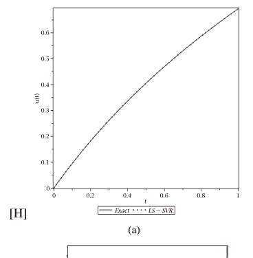

[H]

(a)

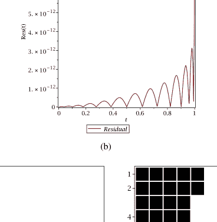

(b)

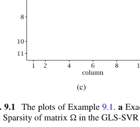

(c)

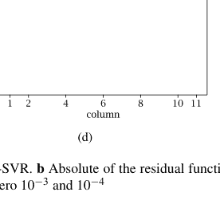

(d)

图 9.1 示例9.1的绘图。a 精确解与LS-SVR对比。b 残差函数的绝对值。c, d 在模糊零点为10⁻³和10⁻⁴时GLS-SVR中矩阵Ω的稀疏性

表 9.2 示例9.2中CLS-SVR方法获得的解范数和训练误差

| $\gamma$ | $\|w\|_2$ | $\|e\|_2$ |
| :--- | :--- | :--- |
| 1E-01 | 0.041653 | 0.673060 |
| 1E+00 | 0.312717 | 0.505308 |
| 1E+01 | 0.895428 | 0.144689 |
| 1E+02 | 1.100491 | 0.017782 |
| 1E+03 | 1.126284 | 0.001820 |
| 1E+04 | 1.128930 | 0.000182 |
| 1E+05 | 1.129195 | 0.000018 |

表 9.3 示例9.3中CLS-SVR和GLS-SVR方法在不同$d$值下的收敛性。每个近似的训练点数为$d + 1$。CPU时间以秒为单位报告

| $d$ | CLS-SVR | | | GLS-SVR | | |
| :--- | :--- | :--- | :--- | :--- | :--- | :--- |
| | 训练 | 测试 | 时间 | 训练 | 测试 | 时间 |
| 4 | 1.53E-07 | 1.18E-04 | 0.02 | 4.22E-06 | 1.18E-04 | 0.13 |
| 6 | 1.16E-10 | 2.46E-07 | 0.04 | 6.04E-09 | 2.46E-07 | 0.18 |
| 8 | 5.90E-14 | 2.71E-10 | 0.04 | 5.13E-12 | 2.72E-10 | 0.28 |
| 10 | 4.12E-15 | 2.44E-13 | 0.07 | 2.21E-14 | 2.40E-13 | 0.38 |
| 12 | 6.84E-15 | 8.80E-15 | 0.12 | 2.12E-14 | 1.55E-14 | 0.60 |

该方程的精确解为$\exp(x)$ Malaikah (2020)。表9.3显示了所提方法对此方程的收敛性。图9.2绘制了精确解和近似解的残差函数。同时，可以看到GLS-SVR方法的矩阵$\Omega$具有良好的稀疏性。

**示例 9.4** 对于多维情况，考虑以下二维Fredholm积分方程 Derakhshan and Zarebnia (2020)：

$$u(x, y) = x \cos(y) - \frac{1}{6}(\sin(1) + 3) \sin(1) + \int_0^1 \int_0^1 (s \sin(t) + 1)u(s, t)dsdt.$$

该方程的精确解为$u(x, y) = x \cos(y)$。CLS-SVR和GLS-SVR方法的数值结果见表9.4。图9.3显示了精确解和残差函数的绘图。同时，附上了二维情况下方法的稀疏性。可以看到，在高维问题中稀疏性占主导地位 Parand et al. (2021)。

**示例 9.5** 考虑以下积分方程组，其精确解为$u_1(x) = \sin(x)$，$u_2(x) = \cos(x)$ Wazwaz (2011)。

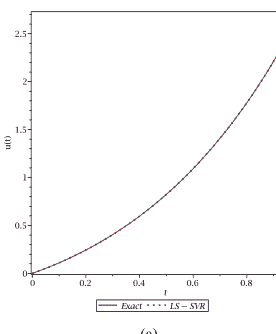

[H]

(a)

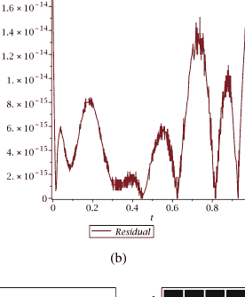

(b)

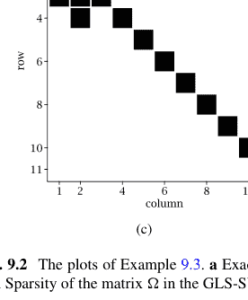

(c)

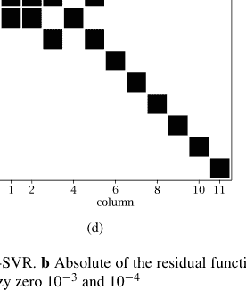

(d)

图 9.2 示例9.3的绘图。a 精确解与LS-SVR对比。b 残差函数的绝对值。c, d 在模糊零点为10⁻³和10⁻⁴时GLS-SVR中矩阵Ω的稀疏性

表 9.4 示例9.4中CLS-SVR和GLS-SVR方法在不同$d$值下的收敛性。CPU时间也以秒为单位报告

| $d$ | $n$ | CLS-SVR | | | GLS-SVR | | |
|---|---|---|---|---|---|---|---|
| | | 训练 | 测试 | 时间 | 训练 | 测试 | 时间 |
| 1 | 4 | 1.93E-03 | 1.93E-03 | 0.01 | 8.54E-04 | 8.12E-04 | 0.06 |
| 2 | 9 | 1.33E-05 | 1.33E-05 | 0.05 | 1.69E-05 | 5.86E-06 | 0.16 |
| 3 | 16 | 5.56E-08 | 5.56E-08 | 0.11 | 3.12E-07 | 2.34E-08 | 0.38 |
| 4 | 25 | 1.73E-10 | 1.73E-10 | 0.26 | 1.59E-08 | 8.16E-11 | 0.80 |
| 5 | 36 | 2.19E-11 | 2.19E-11 | 0.73 | 2.19E-11 | 2.19E-11 | 1.57 |

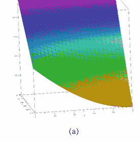

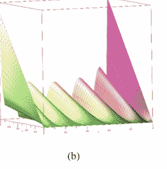

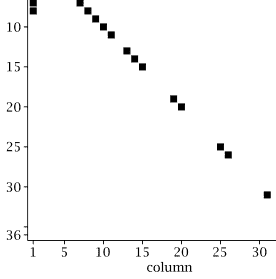

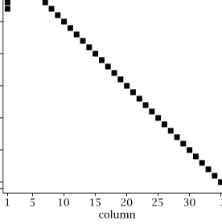

图 9.3 示例9.4的绘图。a 精确解。b 残差函数的绝对值。c, d 在模糊零点为$10^{-3}$和$10^{-4}$时GLS-SVR中矩阵$\Omega$的稀疏性

表 9.5 示例9.5中CLS-SVR和GLS-SVR方法在不同$d$值下的均方误差值收敛性。每个近似的训练点数为$d + 1$。CPU时间以秒为单位报告

| $d$ | $u_1$ 训练 | $u_1$ 测试 | $u_2$ 训练 | $u_2$ 测试 | 时间 |
|---|---|---|---|---|---|
| 4 | 9.02E-13 | 1.20E-06 | 2.28E-13 | 2.00E-05 | 0.34 |
| 7 | 5.43E-28 | 6.04E-11 | 2.22E-27 | 1.67E-12 | 0.48 |
| 10 | 3.07E-26 | 3.35E-19 | 3.29E-27 | 2.18E-17 | 0.66 |
| 13 | 8.19E-27 | 1.36E-24 | 2.09E-27 | 3.86E-26 | 0.91 |
| 16 | 2.38E-27 | 2.31E-27 | 1.87E-28 | 1.85E-28 | 1.38 |

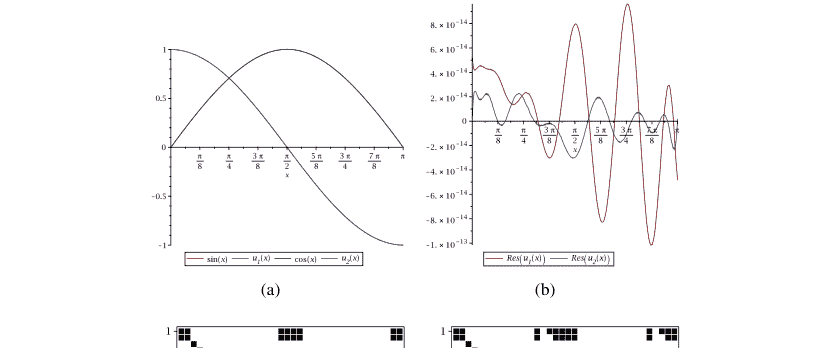

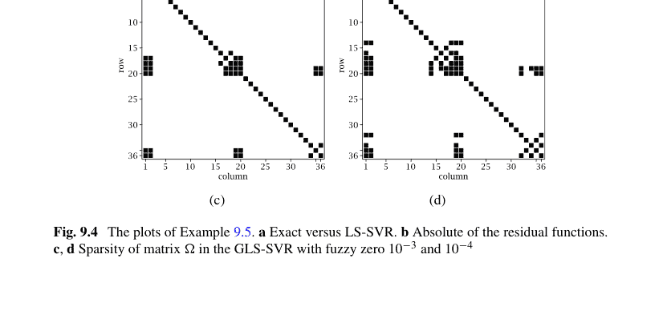

图 9.4 示例9.5的绘图。a 精确解与LS-SVR对比。b 残差函数的绝对值。c, d 在模糊零点为$10^{-3}$和$10^{-4}$时GLS-SVR中矩阵$\Omega$的稀疏性

$$\begin{cases} u_1(x) = \sin x - 2 - 2x - \pi x + \int_0^\pi ((1 + xt)u_1(t) + (1 - xt)u_2(t))dt, \\ u_2(x) = \cos x - 2 - 2x + \pi x + \int_0^\pi ((1 - xt)u_1(t) - (1 + xt)u_2(t))dt. \end{cases}$$

该示例的数值模拟结果见表9.5。同时，图9.4绘制了方法的精确解和近似解。由于此情况下的矩阵$\Omega$是一个对称分块矩阵，GLS-SVR得到的矩阵具有有趣的结构。

在图9.4a中，解和近似解无法区分。

**示例 9.6** 对于非线性示例，考虑以下第二类Volterra-Fredholm积分方程 Amiri et al. (2020)：

**表 9.6** 示例9.6中CLS-SVR和GLS-SVR方法在不同$d$值下的收敛性。每个近似的训练点数为$d + 1$。CPU时间也以秒为单位报告

| $d$ | CLS-SVR | | | GLS-SVR | | |
|---|---|---|---|---|---|---|
| | 训练 | 测试 | 时间 | 训练 | 测试 | 时间 |
| 2 | 9.23E-05 | 8.66E-03 | 0.08 | 8.55E-04 | 8.76E-03 | 0.72 |
| 4 | 4.24E-07 | 8.45E-05 | 0.12 | 4.28E-06 | 8.5E-05 | 1.54 |
| 6 | 1.12E-09 | 3.22E-07 | 0.15 | 1.16E-08 | 3.23E-07 | 3.84 |
| 8 | 1.99E-12 | 6.97E-10 | 0.23 | 7.82E-11 | 7.39E-10 | 12.04 |
| 10 | 3.07E-13 | 1.22E-12 | 0.33 | 1.31E-10 | 1.71E-10 | 38.37 |

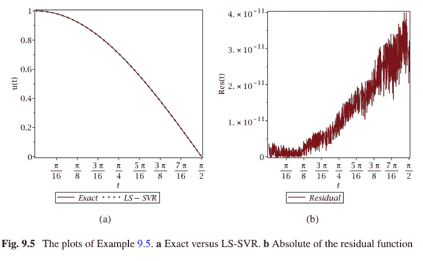

$u(x) = \frac{1}{36}(35\cos(x) - 1) + \frac{1}{12}\int_0^t \sin(t)u^2(t)dt + \frac{1}{36}\int_0^{\frac{\pi}{2}} (\cos^3(x) - \cos(x))u(t)dt.$

该方程的精确解为$u(x) = \cos(x)$。由于方程是非线性的，相应的优化问题导致一个非线性规划问题。同时，对偶形式产生一个非线性代数方程组。在表9.6和图9.5中，可以看到数值结果和方法的收敛性。

### 9.5 结论

本章提出了一种新的计算方法，用于求解不同类型的积分方程，包括多维情况和积分方程组。在线性方程中，学习解简化为求解一个正定线性方程组。这种表述类似于用于求解回归问题的LS-SVR方法。通过利用谱方法背后的思想，我们提出了CLS-SVR和GLS-SVR方法。尽管CLS-SVR方法在计算上更高效，但GLS-SVR方法得到的矩阵具有稀疏性。在最后一节中，使用CLS-SVR和GLS-SVR方法求解了一些积分方程。数值结果表明，这些方法对积分方程具有高效率和指数收敛率。

## 参考文献

Abbasbandy, S.: Numerical solutions of the integral equations: homotopy perturbation method and Adomian's decomposition method. Appl. Math. Comput. **173**, 493–500 (2006)

Abdelkawy, M.A., Amin, A.Z., Bhrawy, A.H., Machado, J.A.T., Lopes, A.M.: Jacobi collocation approximation for solving multi-dimensional Volterra integral equations. Int. J. Nonlinear Sci. Numer. Simul. **18**, 411–425 (2017)

Amiri, S., Hajipour, M., Baleanu, D.: On accurate solution of the Fredholm integral equations of the second kind. Appl. Numer. Math. **150**, 478–490 (2020)

Amiri, S., Hajipour, M., Baleanu, D.: A spectral collocation method with piecewise trigonometric basis functions for nonlinear Volterra-Fredholm integral equations. Appl. Math. Comput. **370**, 124915 (2020)

Assari, P., Dehghan, M.: A meshless local discrete Galerkin (MLDG) scheme for numerically solving two-dimensional nonlinear Volterra integral equations. Appl. Math. Comput. **350**, 249–265 (2019)

Assari, P., Dehghan, M.: On the numerical solution of logarithmic boundary integral equations arising in laplace's equations based on the meshless local discrete collocation method. Adv. Appl. Math. Mech. **11**, 807–837 (2019)

Assari, P., Asadi-Mehregan, F., Dehghan, M.: On the numerical solution of Fredholm integral equations utilizing the local radial basis function method. Int. J. Comput. Math. **96**, 1416–1443 (2019)

Babolian, E., Shaerlar, A.J.: Two dimensional block pulse functions and application to solve Volterra-Fredholm integral equations with Galerkin method. Int. J. Contemp. Math. Sci. **6**, 763–770 (2011)

Babolian, E., Masouri, Z., Hatamzadeh-Varmazyar, S.: 通过三角函数直接法求解非线性Volterra-Fredholm积分微分方程的数值解。Comput. Math. Appl. **58**, 239–247 (2009)

Bahmanpour, M., Kajani, M.T., Maleki, M.: 使用Müntz小波求解第一类Fredholm积分方程。Appl. Numer. Math. **143**, 159–171 (2019)

Barlette, V.E., Leite, M.M., Adhikari, S.K.: 一维散射积分方程。Am. J. Phys. **69**, 1010–1013 (2001)

Bažant, Z.P., Jirásek, M.: 塑性与损伤的非局部积分公式：进展综述。J. Eng. Mech. **128**, 1119–1149 (2002)

Bhrawy, A.H., Abdelkawy, M.A., Machado, J.T., Amin, A.Z.M.: 求解多维Fredholm积分方程的Legendre-Gauss-Lobatto配置法。Comput. Math. Appl. **4**, 1–13 (2016)

Bremer, J.: 用于求解具有角点的平面曲线散射理论积分方程的快速直接求解器。J. Comput. Phys. **231**, 1879–1899 (2012)

Brunner, H.: 关于通过配置法求解非线性Volterra-Fredholm积分方程的数值解。SIAM J. Numer. Anal. **27**, 987–1000 (1990)

Chen, R.T., Rubanova, Y., Bettencourt, J., Duvenaud, D.K.: 神经常微分方程。Adv. Neural Inf. Process. Syst. **31** (2018)

Dahm, K., Keller, A.: 以强化学习方式学习光传输。见：国际科学计算蒙特卡洛与拟蒙特卡洛方法会议论文集，第181–195页 (2016)

Dehghan, M.: 源于粘弹性问题的偏积分微分方程的解。Int. J. Comput. Math. **83**, 123–129 (2006)

Dehghan, M., Saadatmandi, A.: 求解Fredholm积分微分方程的Chebyshev有限差分法。Int. J. Comput. Math. **85**, 123–130 (2008)

Derakhshan, M., Zarebnia, M.: 使用拟插值法对二维Fredholm积分方程进行数值处理与分析。Comput. Appl. Math. **39**, 1–20 (2020)

El-Shahed, M.: He的同伦扰动法在Volterra积分微分方程中的应用。Int. J. Nonlinear Sci. Numer. Simul. **6**, 163–168 (2005)

Esmaeilbeigi, M., Mirzaee, F., Moazami, D.: 一种在超立方体域上求解多维线性Fredholm积分方程的无网格方法。Appl. Math. Comput. **298**, 236–246 (2017)

Eswaran, K.: 关于衍射问题中出现的一类对偶积分方程的解。Proc. Math. Phys. Eng. Sci. **429**, 399–427 (1990)

Fatahi, H., Saberi-Nadjafi, J., Shivanian, E.: 一种用于一般域上二维Fredholm积分方程的新谱无网格径向点插值法及其误差分析。J. Comput. Appl. **294**, 196–209 (2016)

Ghasemi, M., Kajani, M.T., Babolian, E.: 使用同伦扰动法求解非线性Volterra-Fredholm积分方程的数值解。Appl. Math. Comput. **188**, 446–449 (2007)

Golberg, M.A.: 积分方程的数值解。Springer, Berlin (2013)

Lu, Y., Yin, Q., Li, H., Sun, H., Yang, Y., Hou, M.: 使用最小二乘支持向量机求解高阶非线性常微分方程。J. Ind. Manag. Optim. **16**, 1481–1502 (2020)

Malaikah, H.M.: 使用maple求解Volterra-Fredholm积分方程的Adomian分解法。Appl. Math. **11**, 779–787 (2020)

Maleknejad, K., Hashemizadeh, E., Ezzati, R.: 使用Bernstein逼近求解Volterra积分方程的一种新数值方法。Commun. Nonlinear Sci. Numer. Simul. **16**, 647–655 (2011)

Maleknejad, K., Hadizadeh, M.: 求解Volterra-Fredholm积分方程的一种新计算方法。Comput. Appl. **37**, 1–8 (1999)

Maleknejad, K., Nosrati Sahlan, M.: 基于B样条小波的第二类Fredholm积分方程矩量法求解。Int. J. Comput. Math. **87**, 1602–1616 (2010)

Maleknejad, K., Shahrezaee, M.: 使用Runge-Kutta法数值求解Volterra积分方程组。Appl. Math. Comput. **149**, 399–410 (2004)

Maleknejad, K., Almasieh, H., Roodaki, M.: 求解非线性Volterra-Fredholm积分方程的三角函数法。Commun. Nonlinear Sci. Numer. Simul. **15**, 3293–3298 (2010)

Manam, S.R.: 水波理论中出现的多重积分方程。Appl. Math. Lett. **24**, 1369–1373 (2011)

Mandal, B.N., Chakrabarti, A.: 应用奇异积分方程。CRC Press, FL (2016)

Marzban, H.R., Tabrizidooz, H.R., Razzaghi, M.: 求解非线性混合Volterra-Fredholm-Hammerstein积分方程的复合配置法。Commun. Nonlinear Sci. Numer. Simul. **16**, 1186–1194 (2011)

Messina, E., Vecchio, A.: Volterra积分方程数值逼近的稳定性与有界性。Appl. Numer. Math. **116**, 230–237 (2017)

Mikhlin, S.G.: 多维奇异积分与积分方程。Elsevier (2014)

Miller, K.S., Ross, B.: 分数阶微积分与分数阶微分方程导论。Wiley, New York (1993)

Mirzaee, F., Alipour, S.: 求解多维非线性随机二次积分方程的高效三次B样条与双三次B样条配置法。Math. Methods Appl. Sci. **43**, 384–397 (2020)

Mirzaei, D., Dehghan, M.: 一种基于无网格的积分方程求解方法。Appl. Numer. Math. **60**, 245–262 (2010)

Mohammad, M.: 基于由斜扩展原理生成的紧框架小波的第二类Fredholm积分方程数值解。Symmetry **11**, 854–869 (2019)

Nemati, S., Lima, P.M., Ordokhani, Y.: 使用Legendre多项式求解一类二维非线性Volterra积分方程的数值解。J. Comput. Appl. **242**, 53–69 (2013)

Oldham, K., Spanier, J.: 分数阶微积分：任意阶微分与积分的理论与应用。Elsevier, Amsterdam (1974)

Parand, K., Delkhosh, M.: 求解电离层问题中出现的非线性Schlomilch积分方程。Afr. Mat. **28**, 459–480 (2017)

Parand, K., Rad, J.A.: 求解奇异摄动Volterra积分微分方程与Volterra积分方程的近似算法。Int. J. Nonlinear Sci. **12**, 430–441 (2011)

Parand, K., Rad, J.A.: 基于径向基函数的配置法求解非线性Volterra-Fredholm-Hammerstein积分方程的数值解。Appl. Math. Comput. **218**, 5292–5309 (2012)

Parand, K., Abbasbandy, S., Kazem, S., Rad, J.A.: 径向基函数在求解一阶积分常微分方程模型中的新应用。Commun. Nonlinear Sci. Numer. Simul. **16**, 4250–4258 (2011)

Parand, K., Delafkar, Z., Pakniat, N., Pirkhedri, A., Haji, M.K.: 使用sinc函数和有理Legendre函数的配置法求解Volterra种群模型。Commun. Nonlinear Sci. Numer. Simul. **16**, 1811–1819 (2011)

Parand, K., Rad, J.A., Nikarya, M.: 一种基于第一类修正Bessel函数的新数值算法，用于求解封闭系统中的种群增长。Int. J. Comput. Math. **91**, 1239–1254 (2014)

Parand, K., Hossayni, S.A., Rad, J.A.: 基于Bernstein多项式的运算矩阵法求解Riccati微分方程与Volterra种群模型。Appl. Math. Model. **40**, 993–1011 (2016)

Parand, K., Yari, H., Taheri, R., Shekarpaz, S.: 求解一维和二维非线性Fredholm积分方程的Newton-Raphson法与Newton-Krylov广义最小残差法比较。Sema. **76**, 615–624 (2019)

Parand, K., Aghaei, A.A., Jani, M., Ghodsi, A.: 使用最小二乘支持向量回归求解Fredholm积分方程的一种新方法。Math. Comput. Simul. **180**, 114–128 (2021)

Parand, K., Razzaghi, M., Sahleh, R., Jani, M.: 求解Volterra积分方程的最小二乘支持向量回归。Eng. Comput. **38**(38), 789–796 (2022)

Rad, J.A., Parand, K.: 使用无网格局部Petrov-Galerkin法对两种带跳跃的随机因子模型下的美式期权进行数值定价。Appl. Numer. Math. **115**, 252–274 (2017)

Rad, J.A., Parand, K.: 使用局部弱形式无网格技术对跳跃扩散模型下的美式期权进行定价。Int. J. Comput. Math. **94**, 1694–1718 (2017)

Rahman, M.: 积分方程及其应用。WIT Press (2007)

Reichel, L.: 求解某些第一类积分方程的快速方法及其在保角映射中的应用。J. Comput. Appl. Math. **14**, 125–142 (1986)

Tang, T., Xu, X., Cheng, J.: 关于Volterra积分方程的谱方法及其收敛性分析。J. Comput. Math. **26**, 825–837 (2008)

Unterreiter, A.: 半导体器件的Volterra积分方程模型。Math. Methods Appl. Sci. **19**, 425–450 (1996)

Volterra, V.: 共存动物物种数量的变化与波动。ICES Mar. Sci. Symp. **3**, 3–51 (1928)

Wang, G.Q., Cheng, S.S.: 一种模拟具有潜伏期传染病的积分方程的非负周期解。Intern. Math. Forum **1**, 421–427 (2006)

Wang, S.Q., He, J.H.: 求解积分微分方程的变分迭代法。Phys. Lett. A **367**, 188–191 (2007)

Wazwaz, A.M.: 积分方程初阶教程。A World Scientific Publishing Company (2015)

Wazwaz, A.M.: 混合Volterra-Fredholm积分方程的可靠处理方法。Appl. Math. Comput. **127**, 405–414 (2002)

Wazwaz, A.M.: 线性与非线性积分方程。Springer, Berlin (2011)

Yousefi, S., Razzaghi, M.: 求解非线性Volterra-Fredholm积分方程的Legendre小波法。Math. Comput. Simul. **70**, 1–8 (2005)

Zaky, M.A., Ameen, I.G., Elkot, N.A., Doha, E.H.: 求解非线性多维积分方程组的统一谱配置法及其收敛性分析。Appl. Numer. Math. **161**, 27–45 (2021)

# 第10章
通过LS-SVR求解分布阶分数阶方程

Amir Hosein Hadian Rasanana, Arsham Gholamzadeh Khoee, and Mostafa Jani

**摘要** 过去几年，已开发出多种人工智能方法用于求解各类微分方程；由于其处理不同问题的潜力，众多人工智能算法范式，如进化算法、神经网络、深度学习方法以及支持向量机算法，已被应用于求解这些问题。本章采用一种人工智能方法来近似求解分布阶分数阶微分方程，该方法基于最小二乘支持向量回归算法与一种定义明确的谱方法——配置法的结合。求解分布阶分数阶微分方程的重要性在于，它可用于建模自然界中存在的某些重要现象，例如粘弹性、扩散、亚扩散和波动中的现象。我们在所提方法中使用了第4章介绍并在前几章多次应用的模态勒让德函数，作为最小二乘支持向量回归算法的核基函数。对于所得的线性系统，证明了解的唯一性。最后，通过将其应用于不同的线性和非线性测试问题的结果，确定了所提算法的效率和适用性。

**关键词** 分数阶微积分 · 分布阶 · Caputo算子 · 数值近似

A. H. Hadian Rasanana (✉)
Department of Cognitive Modeling, Institute for Cognitive and Brain Sciences,
Shahid Beheshti University, Tehran, Iran
e-mail: amir.h.hadian@gmail.com

A. G. Khoee
Department of Computer Science, School of Mathematics, Statistics, and Computer Science,
University of Tehran, Tehran, Iran
e-mail: arsham.khoee@ut.ac.ir

M. Jani
Department of Computer and Data Science, Faculty of Mathematical Sciences,
Shahid Beheshti University, Tehran, Iran

### 10.1 引言

分数阶微分方程常用于对科学和工程中的实际问题进行建模，例如分数阶时间演化、聚合物物理、流变学和热力学 Hilfer (2000)、认知科学 Cao et al. (2021), Hadian-Rasanan et al. (2021)、神经科学 Datsko et al. (2015)。由于解析方法只能求解分数阶微分方程的一些特殊简单情况，因此开发了数值方法来求解涉及线性和非线性情况的这些方程。另一方面，自分数阶微积分基础建立以来，科学家们提出了多种定义，如Liouville Hilfer (2000)、Caputo (1967)、Rad et al. (2014)、Riesz Podlubny (1998) 和 Atangana-Baleanu-Caputo (2017)。因此，求解分数阶微分方程仍然是一个具有挑战性的问题。

在对某些现象建模时，导数的阶数依赖于时间（即导数算子的阶数是t的函数）。这是由于变阶分数阶算子的记忆特性 Heydari et al. (2020)。与变阶微分类似的一个概念是分布阶微分，它表示在某个区间内选择的各种阶数的加权求和的连续形式。在许多问题中，微分方程可以具有不同的阶数。例如，一阶微分方程可以写成各种阶数及其相应权重函数的求和形式，如下所示

$$\sum_{j=0}^{n} \omega_j D_t^{\alpha_j} u, \quad (10.1)$$

其中 $\alpha_j$ 是递减的且彼此等距，$\omega_j$ 可以通过使用数据来确定。值得一提的是，通过计算上述方程的极限，可以转换为以下收敛形式：

$$\int_{0}^{1} \omega(x) D^{\alpha} u \, dx. \quad (10.2)$$

分布阶分数阶微分方程（DOFDEs）自2000年以来就受到关注 Ding et al. (2021)。DOFDEs在物理和工程的不同领域有许多应用。例如，DOFDEs可以描述粘弹性材料中的各种现象 Bagley and Torvik (1985), Umarov and Gorenflo (2005)、统计和固体力学 Carpinteri and Mainardi (2014), citetch10rossikhin1997applications。系统辨识也是DOFDEs的一个重要应用 Hartley (1999)。此外，在异常扩散过程的研究中，DOFDEs提供了与实验数据更兼容的模型 Caputo (2003), citetch10sokolov2004distributed。同样，在信号处理和系统控制中，DOFDEs也经常被使用 Parodi and Gómez (2014)。本章提出了一种基于最小二乘支持向量回归（LS-SVR）算法与模态勒让德配置法相结合的算法，用于求解由Mashayekhi and Razzaghi (2016), Yuttanan and Razzaghi (2019)给出的DOFDE：

$$\int_{a}^{b} G_1(p, D^p u(t))dp + G_2(t, u(t), D^{\alpha_i} u(t)) = F(t), \quad t > 0, \qquad (10.3)$$

初始条件为：

$$u^{(k)}(0) = 0, \qquad (10.4)$$

其中 $i \in \mathbb{N}$，$\alpha_i > 0$，$k = 0, 1, \ldots, \lfloor \max\{b, \alpha_i\} \rfloor$，且 $G_1$、$G_2$ 可以是线性或非线性函数。在所提算法中，未知函数通过使用模态勒让德多项式展开；然后，利用支持向量回归算法并在残差函数中配置训练点，将问题转化为一个约束优化问题。通过求解这个优化问题，即可获得DOFDEs的解。由于DOFDEs在科学的各个领域都扮演着重要角色，许多研究人员已经开发了多种数值算法来求解它们。在下一节中，我们将回顾现有的用于求解DOFDEs的方法，以及为求解不同类型微分方程而开发的一些人工智能算法。

#### 10.1.1 文献中其他方法的简要回顾

Najafi等人分析了三类受非负密度函数影响的DOFDEs的稳定性 Najafi et al. (2011)。Atanacković等人研究了在粘弹性分布导数模型和辨识理论中出现的特定一般形式的温和解和经典解的存在性和唯一性 Atanacković et al. (2007)。他及其合作者还研究了粘弹性杆解中分布阶分数阶导数的一些性质 Atanackovic et al. (2005)。Refahi等人提出了DOFDEs，以推广关于非负密度函数的多项式概念的惯性和特性 Refahi et al. (2012)。Aminikhah等人采用结合拉普拉斯变换和新的同伦扰动方法来求解一类特定的分布阶分数阶Riccati方程 Aminikhah et al. (2018)。对于包含强迫项的时间分布阶多维扩散-波动方程，Atanacković等人重新解释了一个柯西问题 Atanackovic et al. (2009)。

Katsikadelis提出了一种基于有限差分法的方法来数值求解线性和非线性DOFDEs Katsikadelis (2014)。Dielthem和Ford提出了一种针对一般形式 $\int_{0}^{m} \mathscr{A}(r, D_{*}^{r} u(t))dr = f(t)$ 的DOFDEs的方法，其中 $m \in \mathbb{R}^{+}$，$D_{*}^{r}$ 是阶数为 $r$ 的Caputo型分数阶导数，并介绍了其分析 Diethelm and Ford (2009)。Zaky和Machado首先推导了由DOFDEs描述的动力学的最优控制的广义必要条件，然后提出了一种求解这些方程的实用数值方案 Zaky and Machado (2017)。Hadian-Rasanan等人提供了一个用于近似各种类型Lane-Emden方程（如分数阶Lane-Emden方程组）的人工神经网络框架 Hadian-Rasanan et al. (2020)。Razzaghi和Mashayekhi提出了一种基于混合函数近似求解DOFDEs的数值方法 Mashayekhi and Razzaghi (2016)。Mashhoof和Refahi提出了基于分数阶积分运算矩阵和初始值点的方法来求解DOFDEs Mashhoof and Sheikhani (2017)。Li等人通过应用再生核，提出了一种求解各种DOFDEs的高阶数值方案 Li et al. (2017)。Gao和Sun推导了二维DOFDEs的两种隐式差分格式 Gao et al. (2016)。

在第一章中，SVM已被全面而透彻地讨论。Mehrkanoon等人引入了一种基于LS-SVMs求解ODEs的新方法 Mehrkanoon et al. (2012)。Mehrkanoon和Suykens还提出了另一种求解时滞微分方程的新方法 Mehrkanoon et al. (2013)。Ye等人提出了一种用于SVMs的正交切比雪夫核 Ye et al. (2006)。Leake等人比较了通过使用LS-SVMs应用连接理论的应用 Leake et al. (2019)。Baymani等人通过利用ϵ-LS-SVMs开发了一种新技术，以解析形式获得ODEs的解 Baymani et al. (2016)。Chu等人提出了一种改进的LS-SVMs数值解法。他们指出，通过使用简化的线性方程组，可以解决该问题。他们认为，所提方法的效率大约是先前算法的两倍 Chu et al. (2005)。Pan等人利用核函数的性质，为SVMs提出了一种正交勒让德核函数，并将其与先前的核函数进行了比较 Pan et al. (2012)。Ozer等人借助广义切比雪夫多项式引入了一组新函数，并且他们还提高了先前工作的泛化能力 Ozer et al. (2011)。

Lagaris等人提出了一种基于人工神经网络的方法，可以求解某些类别的ODEs和PDEs，后来将他们的方法与使用Galerkin有限元法获得的方法进行了比较 Lagaris et al. (1998)。Meade和Fernandez从理论上说明了如何构建一个前馈神经网络来近似任意线性ODEs Meade et al. (1994)。他们还指出了直接构建前馈神经网络来近似非线性常微分方程而无需训练的方法 Meade et al. (1994)。Dissanayake和Phan-Thien提出了一种基于神经网络函数的求解PDEs的数值方法 Dissanayake and Phan-Thien (1994)。为了求解ODEs和椭圆PDEs，Mai-Dy和Tran-Cong提出了依赖于多二次径向基函数网络的无网格过程 Mai-Duy and Tran-Cong (2001)。Effati和Pakdaman通过利用前馈神经网络提出了一种求解模糊微分方程的新算法 Effati和Pakdaman (2010)。为了求解Volterra和Fredholm类型的线性第二类积分方程，Golbabai和Seifollahi提出了一种基于径向基函数网络的新方法，该方法应用神经网络作为积分的近似解

### 10.2 预备知识

如前所述，本算法中使用了模态勒让德函数。由于第4章已对其性质和构造过程进行了详细阐述，本章将不再赘述。不过，本节将介绍以Caputo定义为核心的分数阶导数以及数值积分方法。

#### 10.2.1 分数阶导数

将$f(x)$视为函数，可推导出$n$阶柯西公式。通过将该公式推广至非整数阶，我们得到Riemann-Liouville分数阶积分定义。为此，著名的Gamma函数被用作非整数的阶乘函数。因此，将分数阶积分的Riemann-Liouville定义记为${}^{RL}\mathcal{I}_x^\beta f(x)$，其定义如下（Hadian等，2020）：

$${}^{RL}\mathcal{I}_x^\beta f(x) = \frac{1}{\Gamma(\beta)} \int_a^x (x-t)^{\beta-1} f(t) dt. \quad (10.5)$$

其中$\beta$为实数，表示积分阶数。此外，分数阶导数还有另一种定义，即Caputo定义，记为${}^C\mathcal{D}_x^\beta f(x)$，其定义如下（Hadian等，2020）：

$${}^C\mathcal{D}_x^\beta f(x) = {}^{RL}\mathcal{I}_x^{(k-\beta)} f^{(k)}(x) = \begin{cases} \frac{1}{\Gamma(k-\beta)} \int_a^x \frac{f^{(k)}(t)dt}{(x-t)^{\beta+1-k}} & \text{若 } \beta \notin \mathbb{N} \\ \frac{d^\beta}{dx^\beta} & \text{若 } \beta \in \mathbb{N} \end{cases}, \quad (10.6)$$

值得一提的是，公式(10.7)和(10.8)是Caputo导数最重要的性质（Hadian等，2020）：

$$_{0}^{C}\mathcal{D}_{x}^{\alpha}x^{\gamma} = \begin{cases} \frac{\Gamma(\gamma+1)}{\Gamma(\gamma-\alpha+1)}x^{\gamma-\alpha}, & 0 \leq \alpha \leq \gamma \\ 0, & \alpha > \gamma \end{cases}$$

由于Caputo导数是线性算子（Hadian等，2020），我们有

$$_{a}^{C}\mathcal{D}_{x}^{\alpha}(\lambda f(x) + \mu g(x)) = \lambda _{a}^{C}\mathcal{D}_{x}^{\alpha}f(x) + \mu _{a}^{C}\mathcal{D}_{x}^{\alpha}g(x) \quad \lambda, \mu \in \mathbb{R}.$$

#### 10.2.2 数值积分

在数值分析中，求积法是函数定积分的近似计算方法，通常表示为积分域内指定点处函数值的加权和。以德国数学家卡尔·弗里德里希·高斯命名的$n$点高斯求积法，通过适当选择节点$x_i$和权重$\omega_i = \int_{a}^{b} h_i(x)\omega(x) dx$（$i = 1, 2, \ldots, n$），可对$2n - 1$次及以下多项式实现精确计算。此类方法最常用的积分域为$[-1, 1]$，但本文假设积分边界为区间$[a, b]$，因此该方法表述为

$$\int_{a}^{b} f(x) dx \approx \sum_{i=1}^{n} \omega_i f(x_i)$$

现考虑以下定理。

**定理10.1**（Mastroianni和Milovanovic，2008）*设$x_0, x_1, \ldots, x_n$为$N + 1$阶正交多项式$p_{N+1}$的根。则存在唯一的求积权重集$\omega_0, \omega_1, \ldots, \omega_N$，定义为$\omega_j = \int_{a}^{b} h_j(x)\omega(x) dx$*

$$\int_{a}^{b} \omega(x) p(x) dx \approx \sum_{i=1}^{n} \omega_i p(x_i) \quad \forall p \in P_{2N+1}$$

*其中权重为正数，计算公式如下：*

$$\omega_i = \frac{k_{n+1}}{k_n} \frac{\|f_n\|_{\omega}^2}{f_n(x_i) f_{n+1}'(x_i)}, \quad 0 \leq i \leq n$$

*其中$k_i$为$f_i$的首项系数。*

下一节将基于最小二乘支持向量回归定义提出所述方法。

### 10.3 求解分布阶分数阶微分方程的LS-SVR方法

本节首先介绍LS-SVR，然后讨论其部分特性，接着引入基于LS-SVR的求解方法，该方法有助于解决分布阶分数阶微分方程。在掌握LS-SVM概念的基础上，本节将基于LS-SVM回归提出我们的解法。为此，考虑以下方程

$$\int_{a}^{b} G_{1}(p, D^{p}u(t)) dp + G_{2}(t, u(t), D^{\alpha_{i}}u(t)) = F(t), \quad t \in [0, \eta], \qquad (10.12)$$

初始条件如下：

$$u^{(k)}(0) = 0, \qquad (10.13)$$

其中$k = 0, 1, \ldots, \lfloor \max\{b, \alpha_{i}\} \rfloor$。现在线性情形下讨论方法的收敛性和一致性分析

$$\int_{a}^{b} g(p) D^{p}u(t) dp + A(u(t)) = F(t), \qquad (10.14)$$

由于$A$是线性算子，可将公式10.14改写为

$$L(u(t)) = F(t), \qquad (10.15)$$

现考虑用LS-SVR求解公式10.14

$$u(x) \approx u_{N}(x) = \omega^{T} \phi(x), \qquad (10.16)$$

其中$\omega = [\omega_{0}, \ldots, \omega_{N}]^{T}$为权重系数，$\phi = [\phi_{0}, \ldots, \phi_{N}]^{T}$为基函数。为确定未知系数，考虑以下优化问题

$$\min_{\omega, \varepsilon} \quad \frac{1}{2} \omega^{T} \omega + \frac{\gamma}{2} \varepsilon^{T} \varepsilon, \qquad (10.17)$$

使得对每个$i = 0, \ldots, N$满足

$$\int_{a}^{b} g(p) D^{p}(u(t_{i})) dp + Au(t_{i}) - F(t_{i}) = \varepsilon_{i} \qquad (10.18)$$

因此有

$$Lu(t_{i}) - F(t_{i}) = \varepsilon_{i} \qquad (10.19)$$

考虑拉格朗日函数$L(u) = \sum_{j=0}^N \omega_j l_j$，可得

$$\mathcal{L} = \frac{1}{2} \omega^T \omega + \frac{\gamma}{2} \varepsilon^T \varepsilon - \sum_{i=0}^N \lambda_i (L(u(t_i)) - F(t_i) - \varepsilon_i), \quad (10.20)$$

同时有

$$\mathcal{L} = \frac{1}{2} \sum_{j=0}^N \omega_j^2 + \frac{\gamma}{2} \sum_{i=0}^N \varepsilon_i^2 - \sum_{i=0}^N \lambda_i \left( \sum_{j=0}^N \omega_j L(\phi_j(t_i)) - F_i - \varepsilon_i \right), \quad (10.21)$$

可通过以下方式计算公式10.21的极值

$$\begin{cases} \frac{\partial \mathcal{L}}{\partial \omega_k} = 0 & \omega_k = \sum_{i=0}^N \lambda_i (L(\phi_k(t_i))) = 0 \quad k = 0, 1, \dots, N \\ \frac{\partial \mathcal{L}}{\partial \varepsilon_k} = 0 & 2\gamma \varepsilon_k + \lambda_k = 0 \quad k = 0, 1, \dots, N \\ \frac{\partial \mathcal{L}}{\partial \lambda_k} = 0 & \sum_{j=0}^N \omega_j (L(\phi_j(t_k))) = F_k - \varepsilon_k \quad k = 0, 1, \dots, N \end{cases} \quad (10.22)$$

可总结为向量形式

$$\begin{cases} \omega - S\lambda = 0 & (\text{I}) \\ 2\gamma \varepsilon = -\lambda \ ; \ \varepsilon = -\frac{1}{2\gamma} \lambda & (\text{II}) \\ S^T \omega - f - \varepsilon = 0 & (\text{III}) \end{cases} \quad (10.23)$$

矩阵$S$如下所示

$$S_{ij} = L(\phi_i(t_j)) = \int_a^b g(p) D^p \phi_i(t_j) \, dp + A \phi_i(t_j), \quad (10.24)$$

根据此公式，可定义$M_{ij} := D^p \phi_i(t_i)$。我们使用高斯数值积分计算$\int_a^b g(p) M_{ij}^{(p)} \, dp$。

数值积分存在两种确定方式

$$\int_a^b f(x) dx \approx \sum_{i=1}^N \omega_i f(x_i) \quad (10.25)$$

通常可采用牛顿-科特斯方法，将每个$x_i$视为固定点并求解$\omega_i$。或者，我们可以优化$x_i$和$\omega_i$。$x_i$是勒让德多项式根在区间$[a, b]$上的重定位点。我们注意到计算

$Au(t_i)$ 中的 $A$ 被解释为一个微分算子（可以是分数阶的）。借助公式 10.23-(II)，并将公式 10.23-(I) 代入公式 10.23-(III)，我们得到

$$S^T S\lambda + \frac{1}{2\gamma}\lambda = f, \quad (10.26)$$

通过定义 $A := S^T S + \frac{1}{2\gamma} I$，可得以下方程

$$A\alpha = f. \quad (10.27)$$

**注 10.1** 矩阵 $A$ 是正定的，当且仅当对于所有向量 $x \in \mathbb{R}^{n+1}$，我们有 $x^T Ax \geq 0$。因此，对于每个向量 $x$，我们可以处理

$$x^T \left( S^T S + \frac{1}{2\gamma} I \right) x = x^T S^T Sx + \frac{1}{\gamma} x^T x, \quad (10.28)$$

由于 $\gamma > 0$，矩阵 $A$ 是正定的。

**定理 10.2** *在线性系统公式 10.23 中，存在唯一解。*

**证明** 通过考虑注 10.1，该定理得证。$\square$

由于系统公式 10.27 是正定的，并且 $A$ 具有稀疏性，通过求解公式 10.27，我们可以得到 $\alpha$，然后借助公式 10.23 的判据 (I)，我们可以计算 $\omega$。

在非线性情况下，非线性方程可以使用拟线性化方法 (QLM) 转换为一系列线性方程。然后我们能够分别求解得到的线性方程。

在下一节中，提供了一些数值示例，以说明所提方法的效率和精度，并展示了所提方法的收敛性。

### 10.4 数值结果与讨论

本节给出了各种数值示例，以展示上述方法的精度和效率。这里有三个线性示例和三个非线性示例，以及我们的结果与其他相关工作的比较。此外，区间 $\Omega = [0, T]$ 被视为目标域。另外，用于比较精确解和近似解的范数，记为 $\|e\|_2$，定义如下：

$$\|e\|_2 = \left( \int_0^T (u(t) - u_{app}(t))^2 dt \right)^{\frac{1}{2}}, \quad (10.29)$$

其中 $u(t)$ 是精确解，$u_{app}(t)$ 是近似解。所有数值实验均在配备 8 GB RAM 的 3.5 GHz Intel Core i5 CPU 机器上使用 Maple 软件计算。

#### 10.4.1 测试问题 1

作为第一个例子，考虑以下方程 Yuttanan and Razzaghi (2019)

$$\int_{0.2}^{1.5} \Gamma(3-p) D^p u(t) dp = 2 \frac{t^{1.8} - t^{0.5}}{\ln(t)}, \quad (10.30)$$

其初始条件如下

$$u(0) = u'(0) = 0. \quad (10.31)$$

其中 $u(t) = t^2$ 是精确解。然后应用所提方法，将得到以下方程：图 10.1 显示了示例 10.4.1 在三个不同方面的误差，分别是高斯点数、Gamma 值和基函数数量。

观察图 10.1a，可以得出结论：随着高斯点数的增加，误差收敛于零；观察图 10.1b，很明显误差呈指数下降；而图 10.1c 表明，增加基函数数量似乎导致误差持续减小。

#### 10.4.2 测试问题 2

假设以下非线性方程 Xu et al. (2019)

$$\int_{0}^{1} \Gamma(5-p) D^p u(t) dp = \sin(u(t)) + 24 \frac{t^4 - t^3}{\ln(t)} - \sin(t^4), \quad (10.32)$$

其初始条件如下

$$u(0) = 0. \quad (10.33)$$

其中 $u(t) = t^4$ 是精确解。现在，看下图，它展示了在不同高斯点数、Gamma 值和基函数数量下的误差行为。

考虑图 10.2a 可以看出，随着高斯点数的增加，误差更趋近于零。图 10.2b 显示误差相当显著地呈指数下降，而图 10.2c 表明误差的减小是由于基函数数量的增加。

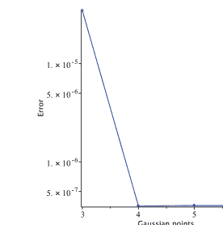

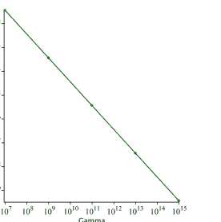

(a) 不同高斯点数下的计算误差

(b) 不同 Gamma 值下的计算误差

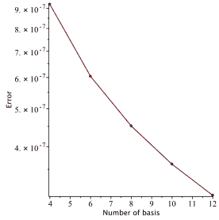

(c) 示例 10.4.1 在不同基函数数量下的计算误差

**图 10.1** 示例 10.4.1 在三个不同方面的计算误差

该示例也已被 Xu et al. (2019) 求解。表 10.1 是上述方法与 Xu 提出的方法之间的比较。可以得出结论，对于不同的高斯点数，所提方法取得了更好的结果。

#### 10.4.3 测试问题 3

假设以下示例 Xu et al. (2019)

$$\int_0^1 \Gamma(7-p) D^p u(t) dp = -u^3(t) - u(t) + 720 \frac{t^5(t-1)}{\ln(t)} - t^6, \quad (10.34)$$

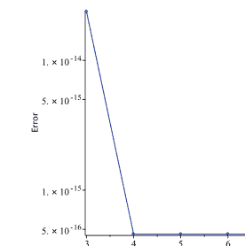

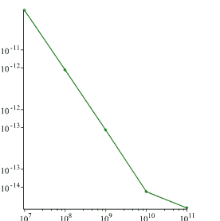

(a) 不同高斯点数下的计算误差

(b) 不同 Gamma 值下的计算误差

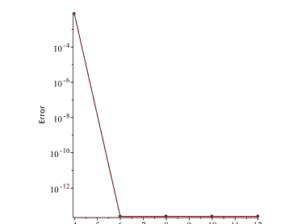

(c) 不同基函数数量下的计算误差

**图 10.2** 示例 10.4.2 在三个不同方面的计算误差

**表 10.1** 示例 10.4.2 的结果与 Xu 方法 Xu et al. (2019) 的比较表

| M | Xu et al. (2019) 的方法，$N = 4$ | 所提方法，$N = 4$ |
|---|---|---|
| 2 | 2.4768E-008 | 6.9035E-010 |
| 3 | 9.0026E-011 | 2.3935E-014 |
| 4 | 2.3632E-013 | 8.4114E-018 |
| 5 | 2.7741E-015 | 3.0926E-023 |

考虑以下初始条件

$u(0) = 0.$

$u(t) = t^6$ 是该示例的精确解。现在考虑图 10.3，它显示了不同方面的误差。

观察图 10.3a，很明显随着高斯点数的增加，误差在减小。同样，在图 10.3b 和 10.3c 中，当 Gamma 值和基函数数量分别减少时，误差也减小。

在表 10.2 中，比较了所提技术的结果与 Xu et al. (2019) 中提出的方法的结果。浏览该表，很明显所提方法比 Xu 的方法效果好得多。


表 10.2 示例 10.4.3 的结果与 Xu 方法 Xu et al. (2019) 的比较表

| M | Xu et al. (2019) 的方法，$N=7$ | 所提方法，$N=7$ | Xu et al. (2019) 的方法，$N=9$ | 所提方法，$N=9$ |
|---|---|---|---|---|
| 2 | 4.3849E-009 | 1.1538E-010 | 1.3008E-008 | 1.1550E-010 |
| 3 | 1.5375E-011 | 1.8923E-015 | 3.8919E-011 | 1.8932E-015 |
| 4 | 3.7841E-014 | 3.0791E-019 | 8.0040E-014 | 2.4229E-019 |
| 5 | 3.6915E-016 | 3.1181E-019 | 1.2812E-015 | 2.4578E-019 |

#### 10.4.4 测试问题 4

假设如下示例 Xu et al. (2019)：

$$\int_0^1 e^p D^p u(t) dp = -u^3(t) - u(t) + \Gamma(7.1) \frac{t^{2.1}(e-1)}{\ln(t)} + t^{9.3} + t^{3.1}, \quad (10.36)$$

考虑以下初始条件

$$u(0) = 0. \quad (10.37)$$

精确解为 $u(t) = t^{3.1}$。现在考虑下图，它表明误差收敛于零。

图 10.4a–c 证实，如果高斯点数、Gamma 值和基函数数量分别增加，那么误差将收敛于零。表 10.3 显示了 Xu et al. (2019) 中获得的结果以及使用所提方法获得的结果。

#### 10.4.5 测试问题 5

对于最后一个示例，考虑以下方程 Xu et al. (2019)

$$\frac{1}{120} \int_0^2 \Gamma(6-p) D^p u(t) dp = \Gamma(7.1) \frac{t^5 - t^3}{\ln(t)}, \quad (10.38)$$

其初始条件如下

$$u(0) = 0. \quad (10.39)$$

其中 $u(t) = t^5$ 是精确解。现在考虑图 10.5，它显示了在考虑不同方面时的误差行为。


图 10.4 示例 10.4.4 在三个不同方面的计算误差

表 10.3 示例 10.4.4 的结果与 Xu 方法 Xu et al. (2019) 的比较表

| M | Xu et al. (2019) 的方法，N = 6 | 所提方法，N = 6 | Xu et al. (2019) 的方法，N = 14 | 所提方法，N = 14 |
|---|---|---|---|---|
| 2 | 4.4119E-005 | 1.5437E-005 | 2.4317E-006 | 2.5431E-007 |
| 3 | 4.3042E-005 | 1.5435E-005 | 2.4984E-007 | 2.5221E-007 |
| 4 | 4.3034E-005 | 1.5435E-005 | 2.4195E-007 | 2.5221E-007 |
| 5 | 4.3034E-005 | 1.5435E-005 | 2.4190E-007 | 2.5221E-007 |

观察图 10.5a c，可以得出结论：公式 10.29 中提出的误差收敛于零，并且在图 10.5a 中，它呈指数收敛于零，这意味着近似结果收敛于精确解。

### 10.5 结论

本章利用LS-SVR算法求解了分布阶分数阶微分方程，该算法基于模态勒让德函数作为基函数。与其他已提出的DOFDE求解方法相比，该算法具有更高的精度。另一方面，解的唯一性也得到了保证。求解此类方程时，获得高精度的一个重要参数是Gamma参数。数值算例展示了该参数对数值算法精度的影响。此外，必须注意Gamma值不能设置得过大，因为它可能超过机器精度。尽管所有计算都是在符号计算应用MAPLE中完成的，但这一点已予以考虑。为了说明所提算法的适用性，给出了五个算例，并将所得精度与其他方法进行了比较。

**图 10.5** 示例10.4.5中三个不同方面的计算误差

(a) 不同高斯点数的计算误差

(b) 不同Gamma值的计算误差

(c) 不同基函数数量的计算误差

**表 10.4** 示例10.4.5中我们的结果与Xu方法（Xu et al. (2019)）的比较表

| N | Xu et al. (2019) 方法，$M = 4$ | 所提方法，$M = 4$ |
|---|---|---|
| 5 | 4.2915E-010 | 4.8113E-002 |
| 6 | 3.3273E-010 | 1.6388E-013 |
| 7 | 1.9068E-010 | 1.4267E-013 |
| 8 | 9.4633E-011 | 1.2609E-013 |
| 9 | 6.7523E-011 | 1.1283E-013 |

表10.4展示了我们所提方法与Xu et al. (2019)所提方法的比较。通过研究此表可以得出结论，除了$N = 5$的情况外，我们的方法获得了更精确的结果。

## 参考文献

Aminikhah, H., Sheikhhani, A.H.R., Rezazadeh, H.: 分布阶分数阶Riccati微分方程的近似解析解。Ain Shams Eng. J. **9**, 581–588 (2018)

Atanackovic, T.M., Pilipovic, S., Zorica, D.: 时间分布阶扩散-波动方程。II. 拉普拉斯和傅里叶变换的应用。Proc. R. Soc. A: Math. Phys. Eng. Sci. **465**, 1893–1917 (2009)

Atanackovic, T.M., Budincevic, M., Pilipovic, S.: 关于分数阶分布阶振荡器。J. Phys. A: Math. Gen. **38**, 6703 (2005)

Atanacković, T.M., Oparnica, L., Pilipović, S.: 关于非线性分布阶分数阶微分方程。J. Math. Anal. **328**, 590–608 (2007)

Atangana, A., Gómez-Aguilar, J.F.: 一种具有正态分布核的新导数：理论、方法与应用。Phys. A: Stat. Mech. Appl. **476**, 1–14 (2017)

Bagley, R.L., Torvik, P.J.: 粘弹性阻尼结构瞬态分析中的分数阶微积分。AIAA J. **23**, 918–925 (1985)

Baymani, M., Teymoori, O., Razavi, S.G.: 求解微分方程的方法。Am. J. Comput. Sci. Inf. Eng. **3**, 1–6 (2016)

Cao, K.C., Zeng, C., Chen, Y., Yue, D.: 用于双选择疏散中行人群体的分数阶决策模型。IFAC-PapersOnLine **50**, 11764–11769 (2017)

Caputo, M.: Q几乎与频率无关的耗散线性模型-II。Geophys. J. Int. **13**, 529–539 (1967)

Caputo, M.: 用分布阶空间分数阶微分方程建模的具有空间记忆的扩散。Ann. Geophys. **46**, 223–234 (2003)

Carpinteri, A., Mainardi, F.: 连续介质力学中的分形与分数阶微积分。Springer (2014)

Chu, W., Ong, C.J., Keerthi, S.S.: 最小二乘SVM求解的改进共轭梯度方案。IEEE Trans. Neural Netw. **16**, 498–501 (2005)

Datsko, B., Gafiychuk, V., Podlubny, I.: 分数阶反应-扩散系统中的孤立行进自波。Commun. Nonlinear Sci. Numer. Simul. **23**, 378–387 (2015)

Diethelm, K., Ford, N.J.: 分布阶微分方程的数值分析。J. Comput. Appl. Math. **225**, 96–104 (2009)

Ding, W., Patnaik, S., Sidhardh, S., Semperlotti, F.: 分布阶分数阶算子的应用：综述。Entropy **23**, 110 (2021)

Dissanayake, M.W.M.G., Phan-Thien, N.: 基于神经网络的偏微分方程求解近似。Commun. Numer. Methods Eng. **10**, 195–201 (1994)

Effati, S., Pakdaman, M.: 求解模糊微分方程的人工神经网络方法。Inf. Sci. **180**, 1434–1457 (2010)

Gao, G.H., Sun, Z.Z.: 二维分布阶分数阶扩散方程的两种交替方向隐式差分格式。J. Sci. Comput. **66**, 1281–1312 (2016)

Golbabai, A., Seifollahi, S.: 使用径向基函数网络求解第二类积分方程的数值解。Appl. Math. Comput. **174**, 877–883 (2006)

Hadian Rasanani, A.H., Bajalan, N., Parand, K., Rad, J.A.: 使用新型分数阶神经网络模拟认知决策建模中出现的非线性分数阶动力学。Math. Methods Appl. Sci. **43**, 1437–1466 (2020)

Hadian-Rasanani, A.H., Rad, J.A., Sewell, D. K.: 证据积累中是否存在跳跃？如果存在，它们在心理学上反映了什么？对决策的Lévy-飞行模型的分析。PsyArXiv (2021). https://doi.org/10.31234/osf.io/vy2mh

Hadian-Rasanani, A.H., Rahmati, D., Gorgin, S., Parand, K.: 用于求解各类Lane-Emden方程的单层分数阶正交神经网络。New Astron. **75**, 101307 (2020)

Hartley, T.T.: 分数阶系统辨识：一种使用连续阶分布的方法。NASA Glenn Research Center (1999)

Heydari, M.H., Atangana, A., Avazzadeh, Z., Mahmoudi, M.R.: 求解涉及Mittag-Leffler核的非线性变阶时间分数阶反应-扩散方程的运算矩阵法。Eur. Phys. J. Plus **135**, 1–19 (2020)

Hilfer, R.: 分数阶微积分在物理学中的应用。World Scientific (2000)

Jianyu, L., Siwei, L., Yingjian, Q., Yaping, H.: 使用径向基函数神经网络求解椭圆偏微分方程的数值解。Neural Netw. **16**, 729–734 (2003)

Katsikadelis, J.T.: 分布阶分数阶微分方程的数值解。J. Comput. Phys. **259**, 11–22 (2014)

Lagaris, I.E., Likas, A., Fotiadis, D.I.: 求解常微分方程和偏微分方程的人工神经网络。IEEE Trans. Neural Netw. Learn. Syst. **9**, 987–1000 (1998)

Leake, C., Johnston, H., Smith, L., Mortari, D.: 使用函数连接理论将微分方程约束解析嵌入最小二乘支持向量机。Mach. Learn. Knowl. Extr. **1**, 1058–1083 (2019)

Li, X., Li, H., Wu, B.: 变阶分数阶泛函微分方程的一种新数值方法。Appl. Math. Lett. **68**, 80–86 (2017)

Mai-Duy, N., Tran-Cong, T.: 使用多二次径向基函数网络求解微分方程的数值解。Neural Netw. **14**, 185–199 (2001)

Mashayekhi, S., Razzaghi, M.: 使用混合函数求解分布阶分数阶微分方程的数值解。J. Comput. Phys. **315**, 169–181 (2016)

Mashoof, M., Sheikhani, A.R.: 使用分块脉冲小波模拟分布阶分数阶微分方程的解。UPB Sci. Bull. Ser. A: Appl. Math. Phys **79**, 193–206 (2017)

Mastroianni, G., Milovanovic, G.: 插值过程：基础理论与应用。Springer Science & Business Media, Berlin (2008)

Meade, A.J., Jr., Fernandez, A.A.: 使用前馈神经网络求解线性常微分方程的数值解。Math. Comput. Model. **19**, 1–25 (1994)

Meade, A.J., Jr., Fernandez, A.A.: 使用前馈神经网络求解非线性常微分方程。Math. Comput. Model. **20**, 19–44 (1994)

Mehrganon, S., Suykens, J.A.: 基于LS-SVM的延迟微分方程求解。J. Phys.: Conf. Ser. **410**, 012041 (2013)

Mehrganon, S., Falck, T., Suykens, J.A.: 使用最小二乘支持向量机求解常微分方程的近似解。IEEE Trans. Neural Netw. Learn. Syst. **23**, 1356–1367 (2012)

# 第四部分
正交核的实际应用

# 第11章
基于分数阶正交函数的LS-SVM的GPU加速

Armin Ahmadzadeh, Mohsen Asghari, Dara Rahmati, Saeid Gorgin, and Behzad Salami

**摘要** SVM分类器在分类问题中被广泛使用。然而，其计算复杂性阻碍了它在没有加速方法的情况下的应用。使用图形处理单元进行通用计算（GPGPU）是加速基于数组操作的最常用技术之一。本章介绍了一种在GPU设备上应用分数阶正交函数核来加速SVM的方法。本书中用作SVM核的第一类切比雪夫函数的实验结果表明，与CPU执行相比，GPU加速实现了2.2倍的加速。在代码的拟合函数和训练部分，在Google Colab GPU设备上获得了58倍的加速。本章提出了更多关于GPU架构的细节，以及它如何与CPU一起作为协处理器来加速SVM分类器。

**关键词** 软件加速器 · 核函数 · 图形处理单元

A. Ahmadzadeh (✉) · M. Asghari
计算机科学学院，基础科学研究所，Farmanieh校区，德黑兰，伊朗
电子邮件：a.ahmadzadeh@ipm.ir

M. Asghari
电子邮件：m.asgari@ipm.ir

D. Rahmati
计算机科学与工程系，沙希德·贝赫什提大学，德黑兰，伊朗
电子邮件：d_rahmati@sbu.ac.ir

S. Gorgin
电气工程与信息技术部，伊朗科学技术研究组织（IROST），德黑兰，伊朗
电子邮件：gorgin@irost.ir

B. Salami
巴塞罗那超级计算中心（BSC），巴塞罗那，西班牙
电子邮件：behzad.salami@bsc.es

© 作者，经Springer Nature Singapore Pte Ltd.独家许可，2023
J. A. Rad 等（编），*支持向量机中的分数阶正交核学习*，工业与应用数学，
https://doi.org/10.1007/978-981-19-6553-1_11

### 11.1 并行处理

如今，计算机及其带来的便利已经彻底改变了人类的生活。由于其广泛的应用，对精度和多特性应用的需求使其变得更加复杂。这些复杂性源于数据可访问性和处理复杂性。芯片制造商总是试图生产延迟更低、带宽更宽的存储器来克服数据可访问性问题。此外，并行处理方法克服了处理复杂性（Asghari等人，2022）。并行处理是一种将大型复杂任务分解为多个小任务的方法。这种方法允许同时执行处理部分。GPU是主要为图形工作负载设计的专用处理器。将GPU用于通用计算为高性能计算新时代的出现铺平了道路（Owens等人，2007；Ahmadzadeh等人，2018），包括密码系统的加速器（Ahmadzadeh等人，2018；Gavahi等人，2015；Luo等人，2015）、多媒体压缩标准（Xiao等人，2019）、科学计算（Moayeri等人，2020；Parand等人，2021）、机器学习和聚类加速器（Rahmani等人，2016）、分子动力学模拟（Allec等人，2019）以及量子计算模拟（Moayeri等人，2020）。设计者正在逐步改进GPU架构以加速它，从而在许多应用中实现实时处理。许多较小的计算单元在GPU内部处理简单的并行任务，而这些任务传统上是由CPU承担的。这种使用GPU代替CPU的方式被称为图形处理单元上的通用计算（GPGPU）。GPGPU的一个令人瞩目的改进是CUDA（计算统一设备架构）的发布，这是NVIDIA的并行计算平台和编程模型。CUDA于2007年推出，允许许多研究人员和科学家将其计算密集型任务部署在GPU上。CUDA提供了可以在多种编程语言（如C/C++和Python）中使用的库和API，适用于多媒体压缩、密码系统、机器学习等通用应用程序。此外，它们通常比CPU更快，在给定时间内执行更多的指令。因此，与CPU一起，GPU提供了异构和可扩展的计算，充当协处理器，同时减轻了CPU的工作负载。

本章其余部分组织如下。第11.2节介绍了NVIDIA GPU架构以及它如何作为加速器帮助我们。第11.2节还描述了PyCUDA。第11.3节在加速之前分析了提出的编程模型。第11.4节定义了实现我们的GPU加速平台所需的硬件和软件要求。第11.5节详细描述了加速切比雪夫核的方法。第11.6节我们提出了为获得更大加速比而应考虑的关键优化。然后，我们在第11.7节推荐了一个基于GPU的二次问题求解器（QPS），以在我们的平台上获得更大的加速比。本章在第11.8节进行总结。

### 11.2 GPU架构

GPU特别适合于三维图形处理。它们是大规模并行处理单元，在通用应用中也有其用途。由于现代GPU的并行能力和灵活的编程模型，GPGPU计算已成为研究和工业应用的有吸引力的平台。例如，开发者可以将GPU用于基于物理的模拟、线性代数运算、快速傅里叶变换（FFT）和重建、流可视化、数据库操作等，以在获得准确结果的同时实现高性能。

GPU由许多流多处理器（SM）模块组成，每个SM包含多个处理器，在NVIDIA产品中称为CUDA核心（图11.1）（Cheng等人，2014）。这些多处理器通过在线程块中调度数千个线程并将这些块分派到SM上来利用。GPU中数据加载/存储操作的延迟很高。然而，与CPU在数据加载/存储方面延迟低但处理吞吐量较低不同，它们是高吞吐量处理器。一个块的线程被组织成WARP以进行调度执行。每32个连续线程构成一个WARP，一个WARP的所有线程在SM中作为单指令多线程（SIMT）操作同时执行。在SIMT操作中，一个WARP的所有线程执行相同的指令，每个线程在其私有数据上执行操作的输出。通过使用WARP调度以及在停滞的WARP和准备执行的WARP之间切换，GPU可以隐藏内存延迟。在GPU中，代码以Kernel的形式执行。Kernel是从主代码中分离出来的代码块，从CPU（称为主机）调用并在GPU（称为设备）上执行（图11.2）（Cheng等人，2014）。

为了从GPU的大规模并行架构中获益，Kernel代码应充分利用计算任务的数据并行性。一组可以一起启动的线程称为线程块。GPU中有不同类型的CUDA内存。最重要的内存类型包括全局内存、共享内存和寄存器内存（Dalrymple，2014）。全局内存是这三种类型中最慢的，但所有线程都可以访问，并且容量最大。共享内存可由共享同一线程块的所有线程访问，而寄存器内存只能由单个线程访问，但它是这三种内存类型中最快的。

主机可以从（向）图11.3所示的GPU全局内存读取（写入）。这些访问通过CUDA API实现。全局内存和常量内存是仅有的其内容可以被主机访问和操作的内存（Cheng等人，2014）。CUDA编程模型使用细粒度数据并行和线程级并行，嵌套在粗粒度数据并行和任务并行中。任务可以被划分为由线程块独立并行执行的子任务（Cheng等人，2014）。GPU使用数千个线程运行称为Kernel的程序函数。通过考虑GPU的限制和并行概念，CUDA应用程序可以实现

Najafi, H.S., Sheikhani, A.R., Ansari, A.: 分布阶分数阶微分方程的稳定性分析。Abst. Appl. Anal. **2011**, 175323 (2011)

Ozer, S., Chen, C.H., Cirpan, H.A.: 一组用于支持向量机模式分类的新切比雪夫核函数。Pattern Recognit. **44**, 1435–1447 (2011)

Pan, Z.B., Chen, H., You, X.H.: 具有正交勒让德核的支持向量机。见：2012年国际小波分析与模式识别会议，第125–130页 (2012)

Parodi, M., Gómez, J.C.: 基于勒让德多项式的在线签名验证特征提取。特征组合的一致性分析。Pattern Recognit. **47**, 128–140 (2014)

Podlubny, I.: 分数阶微分方程：分数阶导数、分数阶微分方程、其求解方法及其一些应用导论。Elsevier (1998)

Rad, J.A., Kazem, S., Shaban, M., Parand, K., Yildirim, A.: 基于勒让德和伯恩斯坦多项式的Tau方法求解分数阶微分方程的数值解。Math. Methods Appl. Sci. **37**, 329–342 (2014)

Refahi, A., Ansari, A., Najafi, H.S., Merhdoust, F.: 分布阶分数阶微分方程线性系统的解析研究。Matematiche **67**, 3–13 (2012)

Rossikhin, Y.A., Shitikova, M.V.: 分数阶微积分在线性和非线性固体遗传力学动态问题中的应用。Appl. Mech. Rev. **50**, 15–67 (1997)

Sokolov, I. M., Chechkin, A.V., Klafter, J.: 分布阶分数阶动力学 (2004). [arXiv:0401146](https://arxiv.org/abs/0401146)

Umarov, S., Gorenflo, R.: 分布阶伪微分方程的柯西和非局部多点问题：第一部分。J. Anal. Appl. **245**, 449–466 (2005)

Xu, Y., Zhang, Y., Zhao, J.: 非线性分布阶分数阶微分方程的勒让德-高斯配置方法的误差分析。Appl. Numer. Math. **142**, 122–138 (2019)

Ye, N., Sun, R., Liu, Y., Cao, L.: 具有正交切比雪夫核的支持向量机。见：第18届国际模式识别会议（ICPR'06），第2卷，第752–755页 (2006)

Yuttanan, B., Razzaghi, M.: 分布阶分数阶微分方程数值解的勒让德小波方法。Appl. Math. Model. **70**, 350–364 (2019)

Zaky, M.A., Machado, J.T.: 分布阶分数阶最优控制问题的公式化和数值模拟。Commun. Nonlinear Sci. Numer. Simul. **52**, 177–189 (2017)

##### 11.1 GPU架构与GPGPU计算

GPU架构通过最大化WARP、处理器资源以及内存层次结构资源的利用率来实现更高的性能。

GPGPU计算存在两个主要限制。首先，为了增加核心和SM（流多处理器）的数量并实现能效，GPU核心设计得非常简单且时钟频率较低。它们只有在程序被仔细地并行化为大量线程时才能提供性能提升。因此，试图让通用代码在GPU上运行是一项困难的任务，且通常会导致低效的运行。相反，只执行那些适合GPU风格并行性的程序部分（如线性代数代码），而将程序的其他部分留给CPU处理，会更加高效。因此，编写适合利用GPU核心的程序即使对于非常适合并行编程的算法来说也是复杂的。已经出现了一些库，它们提供了标准线性代数内核（BLAS）的GPU实现，这有助于将代码分离成这些库中使用的子任务，并实现更高的性能（Cheng et al., 2014）。这描述了第一个限制。GPU用于GPGPU计算的第二个限制是，GPU使用与主机内存分离的内存。换句话说，GPU具有特殊的内存和访问层次结构，并使用与主机内存不同的地址空间。

主机（CPU）和GPU无法轻松共享数据。主机和GPU之间通信的这种限制在两者同时处理共享数据时尤其成问题。在这种情况下，数据必须返回，主机必须等待GPU，反之亦然。这种情况最糟糕的部分是在主机和GPU之间传输数据，因为它很慢，特别是与主机内存或GPU专用内存的速度相比。数据传输的最大速度受限于PCI Express总线速度，因为GPU通过PCI Express总线连接到主机。因此，数据传输通常在GPU计算中成本最高。已经尝试了几种方法来避免在成本超过GPU计算收益时进行数据传输（AlSaber et al., 2013）。因此，GPU编程有许多限制需要考虑以实现更高的性能。例如，共享内存容量、进程执行顺序和分支发散，或其他瓶颈，这些都需要通过考虑GPU架构来解决。这里介绍了NVIDIA处理器的不同架构，如Tesla、Maxwell、Pascal、Volta和Turing，以便更好地探索。

- Tesla架构通过引入GeForce 8800产品线而出现，该产品线统一了顶点和像素处理器单元。该架构基于可扩展阵列处理器，通过促进高效的并行处理器来实现。2007年，另一款采用此架构的GPU C2050进入市场（Pienaar et al., 2011）。Tesla C2050的性能在双精度算术中达到515 GFLOPS。它受益于3 GB GDDR5内存，带宽为144 GB/s。该GPU拥有448个CUDA核心，频率为1.15 GHz。

- 另一个NVIDIA GPU架构的代号是Kepler。该架构于2012年4月推出（Corporation, 2019; Wang et al., 2015）。VLSI技术特征尺寸为28 nm，优于之前的架构。该架构是第一个考虑能效设计的NVIDIA GPU。大多数NVIDIA GPU基于Kepler架构，例如K20和K20x，它们是具有双精度的Tesla计算设备。Tesla K20x的性能在双精度计算中为1312 GFLOPS，在单精度计算中为3935 GFLOPS。该GPU拥有6 GB GDDR5内存，带宽为250 GB/s。K20x系列拥有2688个CUDA核心，工作频率为732 MHz。该架构之后也被新的NVIDIA GPU所采用，称为Maxwell（GTX 980）以及GeForce 800M系列。

- Maxwell架构于2014年推出，GeForce 900系列是该架构的成员。该架构同样采用TSMC 28 nm工艺制造，与之前的型号（Kepler）相同（NVIDIA, 2014）。Maxwell架构具有新一代流多处理器（SM）；该架构降低了SM的功耗。Maxwell产品线配备了2 MB L2缓存。GTX980 GPU采用Maxwell内部架构，提供5 TFLOPS的单精度性能（Corporation, 2019）。在此架构中，一个CUDA核心包含一个整数和一个浮点逻辑单元，可以同时工作。每个SM都有一个WARP调度器、分发单元、指令缓存和寄存器文件。除了每个SM中的128个核心外，还有八个加载/存储单元（LD/ST）和八个特殊功能单元（SFU）（Wang et al., 2015）。GTX 980在每个SM中有四个WARP调度器，支持四个并发WARP被发出和执行。LD/ST单元并行计算源地址和目标地址，允许八个线程在片上缓存或DRAM内的每个地址加载和存储数据（Mei et al., 2016）。SFU执行超越数学函数，如余弦、正弦和平方根。在每个时钟周期，一个线程可以在SFU中执行一条指令，因此每个WARP如果需要必须执行四次。

- 另一个NVIDIA GPU架构代号是Pascal，于2016年4月推出，作为Maxwell架构的后续产品。作为该架构的成员，我们可以提到GPU设备如Tesla P100和GTX 1080，它们采用TSMC的16 nm FinFET工艺技术制造。GTX 1080 Ti GPU采用Pascal内部架构，提供10 TFLOPS的单精度性能。该产品拥有3584个CUDA核心，工作频率为1.5 GHz，内存大小为11 GB，带宽为484 GB/s。GTX 1080 Ti拥有28个SM，每个SM有128个核心，256 KB寄存器文件容量，96 KB共享内存，以及48 KB总L1缓存，CUDA计算能力为6.1（NVIDIA, 2016）。此计算能力具有动态并行性和原子加法操作等特性，可在GPU全局内存和共享内存中的64位浮点值上操作（NVIDIA, 2016）。

- 下一代NVIDIA GPU架构是Volta，它接替了Pascal GPU。该架构于2017年推出，是第一款配备Tensor核心的芯片，专为深度学习设计，以实现比常规CUDA核心更高的性能。采用此架构的NVIDIA GPU，如Tesla V100，采用TSMC 12 nm FinFET工艺制造。Tesla V100的性能在双精度浮点计算中为7.8 TFLOPS，在单精度浮点计算中为15.7 TFLOPS。该GPU卡设计具有7.0的CUDA计算能力，每个SM有64个CUDA核心；总核心数为5120个，内存大小为16 GB，带宽为900 GB/s，采用HBM2内存特性（Mei et al., 2016）。最大功耗为250 W；在功耗和每瓦性能方面设计得非常高效（NVIDIA, 2017）。

- 另一个NVIDIA GPU架构于2018年推出，是Turing架构，著名的RTX 2080 Ti产品基于此架构（NVIDIA, 2018）。Turing架构具有实时光线追踪能力，配备专用光线追踪处理器和专用人工智能处理器（Tensor Cores）。4352个CUDA核心在1.35 GHz频率下的性能为11.7 TFLOPS（单精度计算），使用GDDR6/HBM2内存控制器（NVIDIA, 2018）。其全局内存大小为11 GB，该产品的带宽为616 GB/s，每个线程块的最大共享内存量为64 KB。然而，最大功耗为250 W，采用TSMC 12 nm FinFET工艺制造，该GPU支持计算能力7.5（Ahmadzadeh et al., 2018; NVIDIA, 2018; Kalaiselvi et al., 2017; Choquette et al., 2021）。

#### 11.2.1 使用Python进行CUDA编程

CUDA为C/C++编程语言提供了带有库的API。然而，Python也有自己的库来访问CUDA API和GPGPU功能。PyCUDA（2021）提供了对CUDA API的Pythonic访问，用于并行计算，其声称：

1. PyCUDA在对象生命周期结束后会自动清理对象。
2. 通过一些抽象，它比使用NVIDIA基于C的运行时编程更方便。
3. PyCUDA拥有所有CUDA的驱动程序API。
4. 它支持自动错误检查。
5. PyCUDA的底层是用C++编写的，因此速度很快。

### 11.3 分析代码与函数

为了使基于CPU的应用程序运行更快，有必要对其进行分析。找到代码中可以并行化的部分至关重要。一种方法是找到SVM代码中的循环。特别是在本章中，我们重点关注

#### 11.3.1 分析训练函数

在 `fit` 函数的开头，双重嵌套的 `for` 循环计算 $K$ 矩阵。矩阵 $K$ 是一个二维矩阵，每个维度的大小等于训练样本数。在嵌套循环内部，每次迭代都会计算一个切比雪夫函数。切比雪夫计算的递归形式并不合适。在递归函数中，处理调用栈以及始终返回每次函数调用的结果是有问题的。基于 GPU 的实现对于递归函数执行的重复内存访问任务效率不高。然而，$T_n$ 多项式有一个显式形式，称为切比雪夫多项式。关于切比雪夫函数及其显式形式的更多细节，请参考第 3 章。矩阵 $P$ 是矩阵 $K$ 与目标数组的向量化外积进行内积运算的结果。`fit` 函数下一个复杂的部分是二次规划（QP）求解器。对于 GPU 加速的情况，CUDA 有其自己的 QP 求解器 API。

#### 11.3.2 分析测试函数

在预测函数（测试或推理）中，复杂的部分是嵌套循环内部的迭代，而该迭代又包含对切比雪夫函数的调用。如第 11.3.1 节所述，由于 GPU 缺乏高效的栈处理能力，我们避免使用递归函数，因此使用它们并无帮助。所以，对于测试函数，我们处理切比雪夫函数调用的方式与训练函数中相同。

### 11.4 硬件和软件要求

到目前为止，我们已经详细阐述了为 SVM 应用选择合适的 GPU 架构。在我们的应用（加速 LS-SVM 程序）中，单精度 GPU 设备在计算上是足够的，同时它也符合性能-成本限制。这与训练阶段形成对比，在训练阶段更倾向于使用双精度 GPU。本工作已在基于 Turing 架构的 NVIDIA Tesla T4 GPU 设备上进行了测试，这是一款节能的 GPU 设备，具有 16GB 内存、2560 个 CUDA 核心和 8.1 TFLOPS 的性能；但是，任何其他支持 CUDA 的 GPU 设备都可以用于此目的。作为复制此平台的第一步，必须为您的设备安装 CUDA 工具包和相应的驱动程序。然后，必须在操作系统中安装 Python3。Python 可以独立安装，也可以通过 Anaconda 平台及其库一起安装。作为替代方案，我们建议使用 Google Colab Welcome To Colaboratory (2021)，只需注册并在网页上点击几下即可获得所有硬件要求和软件驱动程序。

#### 使用以下命令安装 PyCUDA

```
pip3 install pycuda
```

#### 要检查 CUDA 工具包及其功能，请执行此命令

```
nvidia-smi
```

上述命令的结果如图 11.4 所示，其中显示了 GPU 卡信息及其运行进程。为了测试 PyCUDA，可以执行用 Python3 实现的程序 1。

#### 程序 1：用于测试库和驱动程序的第一个 PyCUDA 程序

```
1:  import pycuda.driver as cuda
2:  import pycuda.autoinit
3:  from pycuda.compiler import SourceModule
4:
5:  if __name__ == "__main__":
6:
7:      mod = SourceModule("""
8:      #include <stdio.h>
9:      __global__ void myfirst_kernel(){
10:          printf("Tread[%d, %d]: Hellow PyCUDA!!!!\n",
11:          threadIdx.x, threadIdx.y);
12:      }
13:      """)
14:
15:      function = mod.get_function("myfirst_kernel")
16:      function(block=(4,4,1))
```

在此程序中，加载了 PyCUDA 库及其编译器。然后创建了一个源模块，其中包含基于 C 的 CUDA 内核代码。在第 15 行，使用单个网格内的 4x4 线程矩阵调用了该函数。

### 11.5 加速切比雪夫内核

为了加速切比雪夫内核，其显式形式（参考第 3 章）更为适用。如前所述，由于 GPU 缺乏栈支持，处理递归函数很复杂。因此，应将 `Chebyshev_Tn` 函数中的 $T_n$ 语句替换为其显式形式，如程序 2 所列。

> 1 第一类切比雪夫递归形式中一次迭代的语句（参考第 3 章）。

#### 程序 2：Chebyshev_Tn 函数的显式形式。

```
1:  import pycuda.driver as cuda
2:  from pycuda.compiler import SourceModule
3:  import numpy
4:  import pdb
5:
6:  def Chebyshev(x,y,n=3,f='r'):
7:      m=len(x)
8:      chebyshev_result = 0
9:      p_cheb = 1
10:
11:     for j in range(0,m):
12:         for i in range(0,n+1):
13:             a= np.cos(i * np.arccos(x[j]))
14:             b= np.cos(i * np.arccos(y[j]))
15:             chebyshev_result += (a * b)
16:         weight = np.sqrt(1 - (x[j] * y[j]) + 0.0002)
17:         p_cheb *= chebyshev_result / weight
18:     return  p_cheb
```

下一步，让我们看看调用 `Chebyshev` 函数的语句。程序 3 中的第三行意味着调用 `Chebyshev(X[i], X[j], n=3, f='r')`。此函数被调用 $n\_sample^2$ 次，当 $n\_sample$ 等于 60 时，它将被调用 3600 次。

#### 程序 3：调用 Chebyshev 函数的语句。

```
1:  for i in range(n_samples):
2:      for j in range(n_samples):
3:          K[i, j] = self.kernel(X[i], X[j])
```

因此，首先将切比雪夫函数更改为单线程 GPU 函数的 CUDA 内核，然后将其更改为多线程 GPU 函数，以消除程序 3 中所示的嵌套 `for` 循环指令。基于 C 的 CUDA 内核如程序 4 所示。在此代码中，指令 `np.cos(i * np.arccos(x[j]))` 已更改为 `cos(i * acos(x[j]))`，因为从 Python 翻译为 C 编程语言。单个线程将执行切比雪夫函数；因此，如果将其放在程序 3 所示的嵌套 `for` 循环内，此单个线程将被调用 3600 次。根据前面提到的 GPU 架构，GPU 的全局内存位于设备上。因此，变量 `x` 和 `y` 应从主机端（CPU 侧的主内存）复制到设备内存。因此，对于小型和顺序应用程序，与不使用 GPU 的 CPU 执行相比，此过程将花费更长的时间。

#### 程序 4：用于 Chebyshev_GPU 函数的基于 C 的 CUDA 内核

```
1:  __global__ void Chebyshev(float *x,
                            float *y,
                            float *p_cheb){
2:      int i, j;
3:      float a,b, chebyshev_result, weight;
4:      chebyshev_result =0;
5:      int idx = blockIdx.x * blockDim.x + threadIdx.x *4;
6:      p_cheb[idx] = 1;
7:      for( j=0; j<4; j++){
8:          for( i=0; i<4; i++){
9:              a = cos(i * acos(x[j+idx]));
10:             b = cos(i * acos(y[j+idx]));
11:             chebyshev_result += (a * b);
12:         }
13:         weight = sqrt(1 - (x[j+idx] * y[j+idx]) + 0.0002);
14:         p_cheb[idx] *= chebyshev_result / weight;
15:     }
16: }
```

此程序应在单次访问中传输大量数据块，以减少访问次数并最小化内存访问延迟。此外，当 GPU 处于活动状态时，其所有功能单元都会消耗能量；因此，利用更多线程效率更高。在程序 5 中，列出的程序打破了内部 `for` 循环（程序 3 的第二行），然后仅调用切比雪夫函数 60 次。根据程序 5，为了打破上述 `for` 循环，使用了 `threadIdx.x`。矩阵数据被视为一个线性数组。矩阵 `y` 的每一行都紧跟在第一行之后，排成一行。因此，每行的起始索引通过 `threadIdx.x * 4` 计算。

在调用 CUDA 内核函数之前，我们必须将所有需要的变量和数组元素加载到 GPU 设备的全局内存上。`mem_alloc` 指令在设备上分配所需的内存。之后，`memcpy_htod` 将数据从主机复制到设备。如第 8 行和第 12 行所示，`x_gpu` 和 `y_gpu` 是设备上分配的内存。变量 `x` 是 `X` 矩阵的一行，包含 60 行，每行有四个特征。我们将整个 `X` 矩阵作为y输入。在第35行，定义了线程的块大小。在此代码中，块在x维度包含60（n_samples）个线程，其y维度设置为1，这表明使用了单维度块。为了打破另一个for循环（程序3的第一行），可以使用一个包含60 * 60个线程的二维块。在这种情况下，结合减少从主机端访问内存以获取p_cheb输出或在设备上写入x和y变量，数据元素的数量将会减少，因为你不需要将y变量复制到y_gpu。

##### 程序5：用于多线程的基于C的CUDA内核

```
1:  for i in range(n_samples): #n_samples
2:      p_cheb = np.random.randn(1,n_samples)
3:      p_cheb = p_cheb.astype(np.float32)
4:      p_cheb_gpu = cuda.mem_alloc(p_cheb.nbytes)
5:      cuda.memcpy_htod(p_cheb_gpu, p_cheb)
6:      t1 = X[i].astype(np.float32)
7:      x_gpu = cuda.mem_alloc(t1.nbytes)
8:      cuda.memcpy_htod(x_gpu, t1)
9:  
10:      t2 = X.astype(np.float32)
11:      y_gpu = cuda.mem_alloc(t2.nbytes)
12:      cuda.memcpy_htod(y_gpu, t2)
13:  
14:      mod = SourceModule("""
15:      #include <stdio.h>
16:      __global__ void Chebyshev(float *x,
                                float *y,
                                float *p_cheb){
17:          int i, j;
18:          float a,b, chebyshev_result, weight;
19:          chebyshev_result = 0;
20:          int idx = blockIdx.x * blockDim.x + threadIdx.x *4;
21:          p_cheb[idx] = 1;
22:          for( j=0; j<4; j++){
23:              for( i=0; i<4; i++){
24:                  a = cos(i * acos(x[idx+j]));
25:                  b = cos(i * acos(y[idx+j]));
26:                  chebyshev_result += (a * b);
27:              }
28:              weight = sqrt(1-(x[idx+j]*y[idx+j])+0.0002);
29:              p_cheb[idx] *= chebyshev_result / weight;
30:          }
31:      }
32:     """)
33:     func = mod.get_function("Chebyshev")
34:     func(x_gpu, y_gpu, p_cheb_gpu, block=(n_samples,1,1))
35:     p_cheb = np.empty_like(p_cheb)
36:     cuda.memcpy_dtoh(p_cheb, p_cheb_gpu)
37:     K[i] = p_cheb;
```

在代码（程序5）的末尾，第37行，CPU使用命令`memcpy_dtoh`从`p_cheb_gpu`位置读取所有数据，这意味着将内存从设备复制到主机。因此，每次GPU执行都会为K矩阵带来一行包含60个元素的数据。

### 11.6 更多优化

在本节中，我们重点关注程序5。虽然它将3600次切比雪夫函数调用减少到仅60次，但效率仍然不高。这是因为CPU上的执行时间少于GPU。因此，为了加速，值得考虑以下提示：

- 1. 对象SourceModule（程序5的第15行）不是编译后的源代码。因此，在for循环内部包含此语句效率低下，因为每次迭代都需要额外的编译时间。我们可以将程序5的第15到33行移到for循环之外，在第1行之前。
- 2. 在for循环的每次迭代中进行内存分配非常耗时。因此，我们应该先分配所需的内存，然后在每次迭代中使用它。
- 3. 提高CUDA核心的利用率更为高效。这将通过在我们的实现中使用更多线程来实现。这个问题将增加并行性，同时也减少了内存通信。

经过优化后，在包含两个运行在2.20 GHz的英特尔Xeon处理器和13 GB内存的虚拟CPU的Colab机器上，Tesla T4 GPU相比CPU获得了2.2倍的加速。你可以从脚注链接下载代码。² 在所选的使用第一类切比雪夫核的SVM分类代码中，有两个部分：fit函数和predict函数。值得注意的是，fit函数相比CPU获得了58倍的加速。fit函数内部的嵌套循环导致了更多基于数组的计算。因此，我们算法的性质直接影响了加速率。

> ² https://github.com/sampp098/SVM-Kernel-GPU-acceleration-.

### 11.7 加速QP求解器

二次规划（QP）是解决特定数学问题的过程。如前几章所述，需要求解二次方程并找到其最小值以创建最佳分离线。因此，我们计算K矩阵并准备所有约束矩阵以构成一个二次问题。之前使用CVXOPT库来解决上述二次方程。代码中一个复杂的部分是QP求解器函数。然而，CUDA API中有一个用于二次方程的宝贵库。此外，可以在我们的Python实现中使用PyTorch和QPTH PyTorch（Amos and Kolter 2017）库。作为先决条件，应安装以下所需的库。

#### 安装torchvision和qpth包

```
pip3 install torchvision
pip3 install qpth
```

安装后，我们必须导入求解器

#### 在代码中导入求解器

```
from qpth.qp import QPFunction
```

以下展示了问题公式化。使用标准形式的QP如下：

$$\begin{cases} \min \frac{1}{2}(x^T)Px + q^T.x \ \text{subject to : } Gx <= h, \text{ and } Ax = b \end{cases}$$

然而，QPTH将二次规划层定义为

$$\begin{cases} \min \frac{1}{2}(z^T)Qz + p^T.z \ \text{subject to : } Gz <= h, \text{ and } Az = b \end{cases}$$

差异仅在于变量的名称。因此，我们将以下语句：

```
solution = cvxopt.solvers.qp(P, q, G, h, A, b)
```

替换为：

```
solution = QPFunction(verbose=False)(P, q, G, h, A, b)
```

还需要将所有CVXOPT矩阵更改为NumPy形式，例如

```
P = np.outer(y, y) * K
```

此库将自动将过程发送到GPU设备上执行。PyTorch包也可用于GPU设备上的矩阵乘法和其他矩阵操作。

### 11.8 结论

在本章中，简要解释了某些NVIDIA GPU的内部架构。GPU是具有自己内存的多核处理器。它们传统上仅用于图形处理，例如渲染视频或增强计算机游戏中的图形。由于这些设备的结构，最近其用途已显著转向通用应用程序，即GPGPU编程。具有海量数据集和深度神经网络的机器学习应用程序是当今在GPU设备上运行的最常用应用程序。与特定应用程序一样，对于分类问题上的SVM核技巧，当与CPU结合使用时，GPU设备可以表现得更好。

此外，提出了一些基于先前LS-SVM实现（特别是第一类切比雪夫核）的GPGPU方法。在我们的Python实现中，使用PyCUDA包代替CUDA，这带来了可接受的性能。一个重要问题是GPU设备上主内存和设备内存之间的差距。因此，应注意，更多地访问设备内存将导致执行性能降低。还应注意，当存在大型数据集时，GPGPU显示出其优越性。然而，GPGPU程序的结构在获得加速方面起着重要作用。在本章的第一部分，解释了GPU设备的架构，这是优化GPU内核所必需的。存在许多库在后台使用GPU作为其处理器，远离用户端。如果开发人员没有足够的并行编程知识，这些库是最佳选择。

我们已经使用了基于GPGPU的上述加速方法和提示，并基于这些方法编辑了使用第一类切比雪夫函数作为其核的SVM应用程序。实验表明，在Colab的Tesla T4 GPU上，相比CPU获得了2.2倍的加速（对于fit和test函数）。仅对fit函数进行的部分优化，由于该函数的结构，获得了约58倍的更好加速。获得性能的主要途径是

# 第12章
使用正交核函数的分类：ORSVM包教程

Amir Hosein Hadian Rasanan, Sherwin Nedaei Janbesaraei, Amirreza Azmoon, Mohammad Akhavan, and Jamal Amani Rad

**摘要** 本书通篇讨论了经典和分数阶正交函数及其作为SVM算法核函数的性质。在第3、4、5和6章中，我们考虑了四种经典的正交多项式族（切比雪夫、勒让德、盖根鲍尔和雅可比），并介绍了这些多项式的分数形式作为核函数，展示了它们的性能。然而，使用这些核函数需要大量的实现工作。为了方便任何需要尝试和使用这些核函数的人，这里提供了一个Python包。在本章中，我们将介绍ORSVM包，这是一个具有正交核函数的SVM分类包。

**关键词** Python · ORSVM · 正交核 · 分类

### 12.1 引言

Python编程语言是开发者和研究人员中最受欢迎的编程语言之一。然而，Python受欢迎的原因有很多，其中很大一部分是因为存在数百个开源Python包，人们可以将它们包含在自己的主代码中，扩展代码的功能，而无需额外编码。这使得开发可重用代码成为可能。编程语言的这一特性通过使开发过程更简单、更快捷来促进开发。假设你已经为自己的定制SVM算法编写了一些包含相关函数的类。与其每次在需要访问它们时都重新编写相同的类和函数，不如将这些类和函数保存在一个单独的文件中，我们称之为*custom-svm.py*，然后你只需在代码中的某处添加一行代码*import custom-svm*，就可以访问自定义SVM算法的所有函数。这是一种被广泛接受的范式，特别是在Python编程语言中使用可重用代码。目前有多个用于SVM分类的Python包可用，例如*Scikit learn*包提供的*SVM*。尽管它易于使用，但缺乏核函数的多样性，更具体地说，缺乏正交核函数，当然也缺乏新颖的分数阶正交核函数。核函数在SVM中起着关键作用，毫无疑问，不存在一个适合所有现实世界问题的核函数，确切地说，一个核函数并不适合所有数据集，因为每个核函数在SVM中都会产生具有相同数据散射模式的更高维度。假设线性核函数$K(x, y) = x.y$，这种核函数的决策边界在二维空间中是一条直线，在三维空间中是一个平面。毫无疑问，一个平面无法对所有数据集进行分类。因此，人们一直在努力为每个数据集找到最合适的核函数，如果一个新的核函数能够提高分类任务的成功指标，它总是受欢迎的。为了方便任何人使用正交核函数及其分数形式，我们决定创建Python包**ORSVM**（包含多个模块）。在本章中，将介绍这个包。此外，还将通过示例讨论**ORSVM**的基础知识、如何安装以及如何使用。

#### 12.1.1 ORSVM

**ORSVM**是一个免费的开源Python包，提供了一个具有一些新颖正交核函数的SVM分类器。该库提供了使用SVM分类器的完整流程，从归一化到SVM方程的计算以及最终的评估。但是，请注意，在归一化之前有一些必要的步骤需要为每个数据集处理，例如重复检查、空值或异常值处理，甚至降维或任何可能适用于数据集的增强。这些步骤超出了SVM算法的范围，因此也超出了**ORSVM**包的范围。相反，归一化步骤是将数据点送入正交核函数之前必须完成的，这在ORSVM中通过调用相关函数直接处理。正如已经讨论过的，所有核函数的分数形式也可以在归一化过程中实现。**ORSVM**包包含多个类和函数。本章将介绍所有这些内容。

**ORSVM**包严重依赖于*Numpy*和*cvxopt*包。*数组*、*矩阵*和*线性代数*函数在*numpy*中被反复使用，并且

A. H. Hadian Rasanan (✉) · J. Amani Rad
Department of Cognitive Modeling, Institute for Cognitive and Brain Sciences, Shahid Beheshti University, G.C. Tehran, Iran
e-mail: amir.h.hadian@gmail.com

S. Nedaei Janbesaraei · M. Akhavan
School of Computer Science, Institute for Research in Fundamental Sciences, Tajrish, Iran
e-mail: mohammad.akhavan@ipm.ir

A. Azmoon
Department of Computer Science, The Institute for Advance Studies in Basic Sciences (IASBS), Zanjan, Iran
e-mail: a.azmoon@iasbs.ac.ir

© The Author(s), under exclusive license to Springer Nature Singapore Pte Ltd. 2023
J. A. Rad et al. (eds.), *Learning with Fractional Orthogonal Kernel Classifiers in Support Vector Machines*, Industrial and Applied Mathematics,
https://doi.org/10.1007/978-981-19-6553-1_12

减少内存访问并同时提高CUDA核心利用率。在优化过程中，循环内不需要的额外指令，如内存分配和编译过程，被省略。

## 参考文献

- Ahmadzadeh, A., Hajihassani, O., Gorgin, S.: A high-performance and energy-efficient exhaustive key search approach via GPU on DES-like cryptosystems. J. Supercomput. **74**, 160–182 (2018)
- Allec, S.I., Sun, Y., Sun, J., Chang, C.E.A., Wong, B.M.: Heterogeneous CPU+ GPU-enabled simulations for DFTB molecular dynamics of large chemical and biological systems. J. Chem. Theory Comput. **15**, 2807–2815 (2019)
- AlSaber, N., Kulkarni, M.: Semcache: Semantics-aware caching for efficient gpu offloading. In: Proceedings of the 27th International ACM Conference on International Conference on Supercomputing, pp. 421–432 (2013)
- Amos, B., Kolter, J.Z.: OptNet: differentiable optimization as a layer in neural networks. In: International Conference on Machine Learning, pp. 136–145. PMLR (2017)
- Asghari, M., Hadian Rasanan, A.H., Gorgin, S., Rahmati, D., Parand, K.: FPGA-orthopoly: a hardware implementation of orthogonal polynomials. Eng. Comput. (2022). https://doi.org/10.1007/s00366-022-01612-x
- Cheng, J., Grossman, M., McKercher, T.: Professional CUDA c Programming. Wiley, Amsterdam (2014)
- Choquette, J., Gandhi, W., Giroux, O., Stam, N., Krashinsky, R.: Nvidia a100 tensor core gpu: Performance and innovation. IEEE Micro. **41**, 29–35 (2021)
- Corporation, N.: CUDA Zone (2019). https://developer.nvidia.com/cuda-zone
- Dalrymple R.A.: GPU/CPU Programming for Engineers Course, Class 13 (2014)
- Doi, J., Takahashi, H., Raymond, R., Imamichi, T., Horii, H.: Quantum computing simulator on a heterogenous hpc system. In: Proceedings of the 16th ACM International Conference on Computing Frontiers, pp. 85–93 (2019)
- Gavahi, M., Mirzaei, R., Nazarbegi, A., Ahmadzadeh, A., Gorgin, S.: High performance GPU implementation of k-NN based on Mahalanobis distance. In: 2015 International Symposium on Computer Science and Software Engineering (CSSE), pp. 1–6 (2015)
- Kalaiselvi, T., Sriramakrishnan, P., Somasundaram, K.: Survey of using GPU CUDA programming model in medical image analysis. Inform. Med. Unlocked **9**, 133–144 (2017)
- Luo, C., Fei, Y., Luo, P., Mukherjee, S., Kaeli, D.: Side-channel power analysis of a GPU AES implementation. In: 2015 33rd IEEE International Conference on Computer Design (ICCD), pp. 281–288 (2015)
- Mei, X., Chu, X.: Dissecting GPU memory hierarchy through microbenchmarking. IEEE Trans. Parallel Distrib. Syst. **28**, 72–86 (2016)
- Moayeri, M.M., Hadian Rasanan, A.H., Latifi, S., Parand, K., Rad, J.A.: An efficient space-splitting method for simulating brain neurons by neuronal synchronization to control epileptic activity. Eng. Comput. 1–28 (2020)
- Nvidia, T.: NVIDIA GeForce GTX 750 Ti: Featuring First-Generation Maxwell GPU Technology, Designed for Extreme Performance per Watt (2014)
- Nvidia, T.: NVIDIA Turing GPU Architecture: Graphics Reinvented (2018)
- Nvidia, T.: P100. The most advanced data center accelerator ever built. Featuring Pascal GP100, the world’s fastest GPU (2016)
- Nvidia, T.: V100 GPU architecture. The world’s most advanced data center GPU. Version WP-08608-001_v1 (2017)
- Owens, J.D., Luebke, D., Govindaraju, N., Harris, M., Krüger, J., Lefohn, A.E., Purcell, T.J.: A survey of general-purpose computation on graphics hardware. Comput. Graph. Forum **26**, 80–113 (2007)
- Parand, K., Aghaei, A.A., Jani, M., Ghodsi, A.: Parallel LS-SVM for the numerical simulation of fractional Volterra’s population model. Alex. Eng. J. **60**, 5637–5647 (2021)
- Pienaar, J.A., Raghunathan, A., Chakradhar, S.: MDR: performance model driven runtime for heterogeneous parallel platforms. In: Proceedings of the International Conference on Supercomputing, pp. 225–234 (2011)
- PyCUDA 2021, documentation (2021). http://documen.tician.de/pycuda/
- Rahmani, S., Ahmadzadeh, A., Hajihassani, O., Mirhosseini, S., Gorgin, S.: An efficient multi-core and many-core implementation of k-means clustering. In: ACM-IEEE International Conference on Formal Methods and Models for System Design (MEMOCODE), pp. 128–131 (2016)
- Wang, C., Jia, Z., Chen, K.: Tuning performance on Kepler GPUs: an introduction to Kepler assembler and its usage in CNN optimization. In: GPU Technology Conference Presentation (2015)
- Welcome To Colaboratory (2021). https://colab.research.google.com
- Xiao, B., Wang, H., Wu, J., Kwong, S., Kuo, C.C.J.: A multi-grained parallel solution for HEVC encoding on heterogeneous platforms. IEEE Trans. Multimedia **21**, 2997–3009 (2019)

SVM算法的核心在于求解SVM的凸方程并找到*支持向量*，这可以通过*cvxopt*库中的凸二次求解器实现，而*cvxopt*本身是一个用于凸优化的免费Python包。¹

ORSVM由两个模块构成。一个模块包含核函数类，另一个模块包含支持初始化、归一化、拟合过程、捕获拟合模型以及分类报告的相关类和函数。**ORSVM**的结构如下：

- **orsvm模块**
  这是主模块，包含拟合过程、预测和报告。它包括Model和SVM类以及转换（归一化）函数。我们选择使用*transformation*（转换）而非*normalization*（归一化）这个名称，是因为该函数也能实现到分数空间的转换。
- **Model类**
  Model类字面上就是创建模型的地方。初始化从这个类开始。调用*model.model_fit*函数会从SVM类创建一个对象。调用*Transformation*函数后，训练集就准备好输入到SVM对象中。然后，一个对象就准备好开始SVM类中SVM对象的拟合过程。
  1. **ModelFit函数**
     从SVM类创建一个对象，转换/归一化训练集，并调用SVM对象的fit函数。最后捕获拟合后的模型和参数。
  2. **ModelPredict函数**
     转换/归一化训练集。使用适当的参数调用SVM对象的predict函数。最后，使用之前捕获的结果调用Scikit learn (sklearn.metrics)的*accuracy_score*、*confusion_matrix*和*classification_report*。
- **SVM类**
  在这里，SVM方程被构建，并在SVM类的fit函数下创建*cvxopt*所需的矩阵。调用*cvxopt*并求解SVM方程以确定支持向量并计算超平面方程。预测过程在SVM类的预测函数下实现。
  1. **fit函数**通过直接调用核函数创建合适的矩阵。这些矩阵是*Gram矩阵*以及*cvxopt*所需的SVM方程的其他矩阵。结果，*cvxopt*返回*拉格朗日乘子*。应用用户感兴趣的某些标准，从中选择支持向量，结果，*SVM.fit*函数返回超平面方程的权重和偏置以及支持向量数组。
  2. **predict**函数将测试集的数据点与决策边界（超平面方程）进行映射，并确定每个数据点属于哪个类别。
- **Transformation函数**
  这个函数用于归一化输入数据集，或者在分数形式的情况下，将输入数据集转换到分数空间，换句话说，在分数空间中归一化输入。
- **Kernels模块**包含每个核函数一个类。因此，目前每个正交核函数有四个类。*kernels*模块中可用的类如下：
  - **Chebyshev类**包含计算第一类切比雪夫族正交多项式和分数形式的相关函数。
  - **Legendre类**包含计算勒让德族正交多项式和分数形式的相关函数。
  - **Gegenbauer类**包含计算盖根鲍尔族正交多项式和分数形式的相关函数。
  - **Jacobi类**包含计算雅可比族正交多项式和分数形式的相关函数。

**ORSVM**使用Python编程语言编写，需要Python 3或更高版本。

### 12.2 如何安装

要使用该包，你可以使用pip安装如下：

```
pip install orsvm.py
```

或者你可以轻松地从我们的GitHub克隆该包，并使用setup.py文件安装该包；

```
python setup.py install.
```

### 12.3 Model类

这是使用**ORSVM**包的接口。使用**ORSVM**从创建*Model*类的对象开始。这个类包含一个*ModelFit*函数，该函数本身创建一个**ORSVM**模型作为*SVM*类的实例。然后，在核函数为正常形式的情况下归一化输入数据，或在分数形式的情况下转换输入数据。在正常和分数形式之间选择由参数$T$的值决定，如果$T = 1$，核函数为正常形式；如果$0 < T < 1$，则为分数形式。$model\_fit$函数分别接收训练集和测试集；此外，每个集合都应分为$x$和$y$两个矩阵。矩阵$x$是整个数据集，其中省略了与输出（即类别或标签）相关的列，矩阵$y$是该特定的类别或标签列。数据集的划分可以通过多种方法实现。一种广泛使用的方法是$sklearn.model\_selection$中的$StratifiedShuffleSplit$。

创建Model类的对象需要一些输入参数，因为它需要使用这些传递的参数创建一个SVM对象。以下示例代码创建一个来自阶数为3的$Jacobi$核函数的$orsvm$分类器。

```
obj = orsvm.Model(kernel="jacobi", order = 3, T = 0.5,
                  k_param1 = -0.8, k_param2 = 0.2,
                  sv_determiner = 'a', form = 'r', C = 100)
```

这里$T = 0.5$表示它是阶数为0.5的分数形式。如果选择“Jacobi”核函数，“k\_param1”相当于$\psi$，“k\_param2”相当于$\omega$。如果是$Gegenbauer$，则只有“k\_param1”适用于该核函数。因为$Chebyshev$和$Legendre$都没有任何超参数，所以不需要为“k\_param1”和“k\_param2”传递任何值，即使传递了这些参数的值，也会被忽略。参数$sv\_determiner$是用户选择如何在拉格朗日乘子（通过凸优化求解器计算并被选为绘制SVM超平面候选的数据点）中选择支持向量的方式。这是可能影响最终分类性能指标的重要参数之一。选择支持向量有三种选项。两种选项被广泛使用，第一种是整数类型，表示应从拉格朗日乘子中选择的支持向量数量，如果该数字大于拉格朗日乘子的数量，则所有拉格朗日乘子都将被选为支持向量。第二种是科学计数法表示的数字（通常是10的负幂次）作为最小阈值，第三种在**ORSVM**中考虑的方法是标志“a”，代表$Average$（平均值）。大多数时候，我们对拉格朗日乘子的值没有明确的推测，它们有多小，或者有多少个可用。因此，我们不知道阈值应该是多少，或者应该选择多少个支持向量。有时，这会导致**零**个支持向量，然后会出现**错误**。我们对这种情况的解决方案，对于新数据集总是会发生，是$average$方法。在这种情况下，**ORSVM**找到拉格朗日乘子的平均值并设置阈值。这样，就不会发生错误。然而，这种方法不能保证最佳的泛化精度。但它提供了关于支持向量的事实估计。毕竟，选择最佳数量的支持向量本身在SVM中就是一项重要的任务。参数$form$仅适用于$Chebyshev$核函数，因为$Chebyshev$核函数有两种实现方式，显式方程和递归方程。因此“r”指递归，“e”指“显式”。参数“noise”仅适用于$Jacobi$核函数，实际上是雅可比权重函数。事实上，“noise”的目的是避免在权重函数边界处发生的错误，正如之前已经解释的那样。最后，参数“C”是正则化

¹ 关于此包的安装和使用方法的合适指南可在 http://cvxopt.org 获取。

##### 12.3 模型类

表 12.1 ORSVM 的模型类及其参数列表

| | 参数 | 默认值 | 取值范围 |
|---|---|---|---|
| 1 | kernel | Chebyshev | Jacobi, Gegenbauer, Chebyshev, Legendre |
| 2 | order | 3 | 3, 4, 5, ... |
| 3 | T | 1 | 0<T<1 |
| 4 | param1 | None | 对于 Jacobi 核，*param1* > -1；对于 Gegenbauer 核，*param1* > -0.5 |
| 5 | param2 | None | 对于 Jacobi 核，*param2* > -1 |
| 6 | svd | "a" | 整数，科学计数法，"a" |
| 7 | form | "r" | "r", "e" |
| 8 | noise | "0.01" | 常用值：0.01, 0.001, ... |
| 9 | C | None | 常用值：10, 100, 1000, ... |

SVM 算法的参数，它控制误分类数据点的重要性程度。将“C”设置为最佳值可以提高分类器的泛化能力。表 12.1 总结了 *Model* 类的参数。

此时，**ORSVM** 仅初始化了模型，尚未进行任何计算；要拟合模型，我们必须调用 *ModelFit* 函数。显然，拟合需要输入数据集。如前所述，*ModelFit* 接收训练集和测试集，这些数据集被划分为 *x*（无标签数据）和 *y*（标签）。以下代码片段展示了如何划分数据集。函数 *LoadDataSet* 读取并将数据集加载到 *pandas DataFrame* 中，然后转换并将类别映射为二分类。由于“*Clnum*”是标签列，我们必须单独选择该列并将其转换为一个 Numpy 数组。然后从 Pandas 数据框中移除标签列，以获得无标签的数据。它将数据转换为 *numpy array*；然而，这并非必需。调用 ‘*LoadDataSet*’ 函数可得到 *x* 和 *y*。在下一行中，使用 *StratifiedShuffleSplit*，我们可以创建一个具有所需参数的分层随机分割对象，然后使用该对象的 *split* 函数，我们可以得到划分为 *X* 和 *y* 的训练集和测试集。

既然训练集和测试集已准备就绪，我们可以使用适当的参数调用 *ModelFit*，作为结果，该函数会打印状态信息，并返回 SVM 超平面方程的权重和偏置，以及一个支持向量数组和核实例。因此，我们得到了拟合好的模型和相应的参数，可以用于预测。通过调用 *ModelPredict* 函数，**ORSVM** 分类的最后一步将得以实现。*ModelPredict* 需要文本集以及偏置和核实例来计算准确率。需要注意的是，测试集将通过 *ModelPredict* 函数转换到适当的空间。作为结果，将返回准确率分数。此外，*ModelPredict* 将打印混淆矩阵、分类报告和准确率分数。

```python
import pandas
from sklearn.model_selection import StratifiedShuffleSplit

def LoadDataSet():
    # load dataset
    df = pandas.read_csv('/home/data/spiral.csv',
                         names = ['Chem1', 'Chem2', 'Clnum'],
                         index_col = False)

    #convert to binary classification
    df.loc[df.Clnum == 0, ['Clnum']] = -1
    df.loc[df.Clnum == 1, ['Clnum']] = 1
    y_np = df['Clnum'].to_numpy()
    df.drop('Clnum', axis = 1, inplace = True)
    df_np = df.to_numpy()

    return df_np, y_np

X, y = LoadDataSet()
sss = StratifiedShuffleSplit(n_splits = 5,
                            random_state = 30,
                            test_size = 0.9)

for train_index, test_index in sss.split(X, y):
    X_train, X_test = X[train_index], X[test_index]
    y_train, y_test = y[train_index], y[test_index]

Weights, S_Vectors, Bias, K_Instance = obj.ModelFit(X_train,
                                                    y_train)

Accuracy_score = obj.ModelPredict(X_test,
                                  y_test,
                                  Bias,
                                  K_Instance)
```

### 12.4 SVM 类

SVM 类是本包的核心，拟合过程在此发生，SVM 方程被评估以找到支持向量，最终构成超平面方程。在深入探讨 SVM 方程和寻找支持向量之前，我们必须进行核技巧。因此，我们需要一个“格拉姆矩阵”，即在所选核下 $x\_train$ 所有可能内积的矩阵。因此，考虑 $X\_train_{m \times n}$，“SVM.fit”将创建一个形状为 $m \times m$ 的方阵：

$$K = \begin{bmatrix} k(x_1, x_2) & \cdots & k(x_1, x_m) \\ \vdots & k(x_i, j) & \vdots \\ k(x_m, x_1) & \cdots & k(x_m, x_m) \end{bmatrix}.$$

这也被称为*核矩阵*，因为它表示了 SVM 的核技巧。“K”可以是 *Legendre*、*Gegenbauer*、*Chebyshev* 或 *Jacobi* 中的任何一种。

这里，在凸优化问题之后，或者更准确地说，在最小化 SVM 方程的对偶形式之后，它将使用 *cvxopt* 库中的 *qp* 函数来求解：
`cvxopt.solvers.qp(P, q, G, h, A, b)`

此函数求解一个二次规划问题：

$$\begin{aligned} \text{minimize} \quad & \left(\frac{1}{2}\right) x^T P x + q^T x, \\ \text{subject to} \quad & Gx \leqslant h, \\ & Ax = b. \end{aligned}$$

根据该库开发者提供的文档，*qp* 函数的参数如下²

- **P** 是一个 $n \times n$ 的稠密或稀疏 Wigner D-矩阵，其下三角部分存储在下三角中。它应该是半正定的。
- **q** 是一个 $n \times 1$ 的稠密 Wigner D-矩阵。
- **G** 是一个 $m \times n$ 的稠密或稀疏 Wigner D-矩阵。
- **h** 是一个 $m \times 1$ 的稠密 Wigner D-矩阵。
- **A** 是一个 $p \times n$ 的稠密或稀疏 Wigner D-矩阵。特别地，**A** 是 $y$ 矩阵（包含训练集的 $y$ 值），其形状为行 = 1，列 = ($x$ 矩阵的行数)
- **b** 是一个 $p \times 1$ 的稠密 Wigner D-矩阵或 None。

*qp* 的输出包含*拉格朗日乘子*，支持向量位于它们之间，我们需要一个策略来选择其中一些作为支持向量。这里，权衡在于过拟合和欠拟合之间，选择过多的支持向量会导致模型过拟合，而选择过少则会导致欠拟合问题。

SVM 类包含一个 fit 函数，该函数使用指定的核函数构建格拉姆矩阵。随后，求解 SVM 方程返回支持向量。此外，偏置在 *Svm.fit* 函数中计算。同时，*Svm.predict* 是 SVM 类的另一个函数，用于预测给定数组的标签。用户永远不需要直接调用 SVM 类下的函数，ORSVM 的所有用法都可以通过模型类及其函数实现。

² 有关 cvxopt 的全面文档和示例，请访问 https://cvxopt.org。

#### 12.4.1 切比雪夫类

本包引入的另一个核是**切比雪夫**核，它以*向量*方法实现，该方法之前已作为广义切比雪夫核引入。与勒让德核类似，切比雪夫核在初始化模型类对象时通过传递“Chebyshev”参数作为核名称即可使用。另一个适用于切比雪夫核的参数是 *form*。切比雪夫类中实现了两种不同类型的切比雪夫核。一种使用显式方程，另一种是递归函数。可以通过 *form* 参数选择要使用的类型。切比雪夫类的参数如下：

- *order* := 多项式的阶数
- *form* := “e”表示*显式*形式，“r”表示*递归*形式。

#### 12.4.2 勒让德类

*勒让德*核类通常在对象初始化步骤中作为对象传递给 *Models* 类的核参数，并且其 *Legendre-kernel* 函数在构建格拉姆矩阵 *K* 时被显式使用。勒让德类利用了勒让德核函数的递归实现。要使用此核，用户只需使用“Legendre”作为模型类的核参数来初始化模型对象即可。勒让德类需要以下参数：

- *order* := 勒让德核函数的阶数。

#### 12.4.3 盖根鲍尔类

**盖根鲍尔**核在 *ORSVM* 包中也可用。对于盖根鲍尔核函数的实现，使用了第 5 章介绍的分数核函数。因此，除了输入向量的乘积外，还从另外两个方程获得值。盖根鲍尔类具有以下参数：

- *order* := 盖根鲍尔核函数的阶数。
- *lambda* := 盖根鲍尔核函数的 λ 参数。

##### 12.4.4 Jacobi 类

**Jacobi** 核是 *ORSVM* 包中目前可用的最后一个正交核。导入 ORSVM 包后，即可选择 *Jacobi 核*。只需在 *Model* 类的对象初始化时，将核名称设置为 “Jacobi”。Jacobi 类需要以下参数：

- *order* := Jacobi 核函数的阶数。
- *psi* := Jacobi 核函数的 $\psi$ 参数。
- *omega* := Jacobi 核函数的 $\omega$ 参数。
- *noise* := 添加到权重函数的小噪声，以避免边界处出现错误。

### 12.5 变换函数

变换函数实际上是著名的 *Min-max 特征缩放*
$$x' = \frac{x - x_{min}}{x_{max} - x_{min}},$$
与之前介绍的所有核函数分数形式的映射方程的组合。
$$x' = 2x^{\alpha} - 1,$$
因此我们有
$$x' = 2\left(\frac{x - x_{min}}{x_{max} - x_{min}}\right)^{\alpha} - 1,$$
该式将输入 $x$ 变换到与函数分数阶（$\alpha$）相关的核空间。因此，变换函数需要 $x$（输入数据）和 alpha（作为 Model 类参数的 $'T'$，$'T'$ 代表变换步骤），默认值为 1，此时其作用类似于 Min-max 特征缩放函数对输入数据进行归一化。用户通常无需直接调用变换函数，但若需要，可使用如下代码：

```python
import orsvm
orsvm.transformation(x, T=1).
```

### 12.6 使用方法

使用 ORSVM 库简单直接。易用性是开发 ORSVM 包的重要动机之一。用户只需提供矩阵形式的数据集并选择一个核函数，通过设置 $T$，用户可以选择核函数的普通形式或分数形式。与所选核相关的其他必要参数应在对象初始化步骤中提供。这些参数已在前文详细讨论。本节仅演示一个使用 *ORSVM* 对数据集进行分类的示例代码。

以第 3 章介绍过的三 monk 问题数据集为例。三 monk 问题的训练集和测试集是分开的。若需要进行这种划分，请参考第 12.3 节的代码片段。为了使用 ORSVM，我们首先需要将训练集和测试集划分为 $x\_train$ 和 $y\_train$。这可以通过首先将数据集导入 pandas 数据框来实现，然后我们将 monk 数据集中的类别值映射为 $-1$ 和 $1$，这比 $0$ 和 $1$ 更适合 SVM 算法。

```python
import numpy as np
import pandas as pd
import orsvm

# 加载训练集
df = pd.read_csv('/home/datasets/1_monks.train',
                 names = ['Class', 'col1', 'col2', 'col3',
                          'col4', 'col5', 'col6'],
                 index_col = False)

df.loc[df.Class==0, ['Class']] = -1  # 将 "0" 映射为 "-1"
y_train=df['Class'].to_numpy() # 将 y_train 转换为 numpy 数组
df.drop('Class', axis = 1, inplace = True) # 删除类别标签
X_train=df.to_numpy()  # 将 x_train 转换为 numpy 数组


# 加载测试集
df = pd.read_csv('/home/datasets/1_monks.test',
                 names = ['Class', 'col1', 'col2', 'col3',
                          'col4','col5','col6'],
                 index_col = False)
df.loc[df.Class == 0, ['Class']] = -1
y_test=df['Class'].to_numpy()
df.drop('Class', axis = 1, inplace = True)
X_test = df.to_numpy()
```

现在我们已经准备好了 *训练集* 和 *测试集*，我们需要一个 Model 类的实例，以便使用合适的参数调用 **ModelFit** 函数。例如，这里我们选择 Chebyshev 核，设置 $T = 0.5$，并让 SVM 的 *正则化* 参数保持默认值 “None”，同时在第二行通过调用 *ModelFit* 函数时优先选择递归实现。ORSVM 会拟合模型并返回拟合后的参数。我们可以捕获这些参数以供后续使用，例如用于预测。

```python
# 从 ORSVM 的 Model 类创建一个对象
obj = orsvm.Model(kernel="Chebyshev",order=3,T=0.5,form='r')

# 拟合模型并捕获参数
********** 06/09/2021 16:43:14 **********
** ORSVM kernel: Chebyshev
** Order: 3
** Fractional mode, transition: 0.5
** Average SV determiner!
** SV threshold: 10^ -4
```

**图 12.1** 阶数为 5，固定 $\psi$ 且不同 $\omega$ 的 Jacobi 多项式

```python
Weights, S_Vectors, Bias, K_Instance = obj.ModelFit(X_train,
                                                y_train)
```

这些仅用于日志记录目的。然后，若需要预测，可以调用 *ModelPredict* 函数，该函数需要划分为 x 和 y 的测试集，以及上一步得到的偏置和核实例。

```python
accuracy_score = obj.ModelPredict(X_test,
                                y_test,
                                Bias,
                                K_Instance)
```

*ModelPredict* 返回准确率分数，我们可以捕获它。此外，该函数会打印更多关于分类的信息。以下是输出（图 12.1）：

使用日志信息可能有助于更好地调试，或通过将拟合函数的 *log* 参数设置为 *True* 来更好地理解数据集的拟合过程。

在第一部分介绍了 SVM 的基础知识，第二部分介绍了一些分数正交核函数，并回顾了 SVM 算法的一些应用之后，本章的目标是介绍一个 Python 包，使我们能够在现实世界中应用所介绍的分数正交核函数。本节介绍了该包的架构和简要使用教程。如需更多信息和该包的详细更新教程，您可以访问其在线页面：http://orsvm.readthedocs.io。

## 附录：Python 编程预备知识

### A.1 简介

Python 是一种面向对象、多范式的高级编程语言，由 Guido van Rossum 创建，于 1991 年发布。其高级内置数据结构和动态绑定鼓励开发者将其用于应用程序开发，同时也用作脚本语言。根据 TIOBE 编程社区指数，¹ Python 是 2020 年三大最受欢迎的编程语言之一，并且是 2018 年最佳编程语言的得主。

Python 2.0 于 2000 年 10 月 16 日发布，包含一些小修复、优化、更好的错误处理信息、循环检测垃圾收集器以及对 Unicode 的支持。Python 3.0 于 2008 年 12 月 3 日发布，与 Python 2 不完全向后兼容。Python 2.7 的生命周期结束日期最初定于 2015 年，但推迟到了 2020 年。推迟的主要原因是担心大量现有代码无法轻松地向前移植到 Python 3。

该编程语言对用户非常流行的一些特性包括其解释器和广泛的源代码或二进制形式的标准库，这使用户能够在所有主要平台上免费使用它，这一特性允许我们在多个平台上运行相同的编译代码，而无需重新编译。作为 Python 的另一个特性，庞大的社区以及众多的开源框架、工具和库降低了开发成本并提高了开发速度。

¹ https://www.tiobe.com/tiobe-index/.

© The Author(s), under exclusive license to Springer Nature Singapore Pte Ltd. 2023
J. A. Rad et al. (eds.), *Learning with Fractional Orthogonal Kernel Classifiers in Support Vector Machines*, Industrial and Applied Mathematics,
https://doi.org/10.1007/978-981-19-6553-1

### A.2 Python 基础

在本节中，我们将尝试介绍 Python 语言的基础知识、如何安装 Python 以及如何使用该语言，还包括如何定义变量、循环、条件和函数。Pandas、Numpy 和 Matplotlib 是数据科学家所有任务中都会用到的三个库，我们将讨论它们的准备工作。

#### 如何使用 Python？

有许多方法可以安装 Python 并使用它。这里讨论一些更合适的方法。基本的安装方法是访问 Python 网站²，根据您的操作系统找到适合您工作的 Python 版本。下载并安装 Python 后，我们还需要一个代码编辑器来编写代码，例如 Notepad++、³ Atom、⁴ Sublime、⁵ 或任何代码编辑器。这些代码编辑器是开源的，我们可以轻松免费下载和使用。还有一些商业程序，如 PyCharm、Spyder、Pydev 等。这些程序的适用性体现在大型 Python 程序的调试中。另一种安装 Python 的方法是使用 Anaconda，⁶ 这是一个以科学计算（数据科学、机器学习应用、大规模数据处理、预测分析等）为目标的 Python 发行版。安装 Anaconda 后，所有重要且著名的包都会轻松安装。此外，Anaconda 还会安装一些程序，例如 Jupyter Notebook，⁷ 这是一个著名的开源代码开发平台。Jupyter Notebook 相对于其他平台的一个优势是，在该程序中我们可以逐单元格运行 Python 代码，这非常有用。要在 Windows 或 macOS 上安装 Anaconda，您可以下载图形安装程序，但对于 Linux，应下载 .sh 文件并在终端中运行。这是安装 Python 及其包的最后一步。现在可以解释该语言的基础知识了。

#### Python 基础

Python 的基础知识与其他编程语言（如 C、C++、C# 和 Java）非常相似，因此如果熟悉这些编程语言，可以轻松学习 Python。

² https://www.Python.org/downloads/.
³ https://notepad-plus-plus.org/.
⁴ https://atom.io/.
⁵ https://www.sublimetext.com/.
⁶ https://www.anaconda.com.
⁷ https://jupyter.org/.

##### 基本语法

Python 语法可以直接在命令行中执行。例如，输入以下命令：

```
print("Hello, World!")
```

此外，我们可以创建一个 Python 文件；然后，在其中编写代码，使用 `.py` 扩展名保存文件，并在命令行中运行它。例如，

```
> Python test.py
```

Python 使用空格缩进来分隔代码块，而不是使用花括号或关键字。空格的数量由程序员决定，但至少需要一个空格。

```
if 2 > 1:
    print("Two is greater than one!")
if 2 > 1:
        print("Two is greater than one!")
```

```
> Two is greater than one!
```

##### 注释

注释以“#”开头，用于代码内文档，Python 会将该行剩余部分视为注释。注释也可以放在行尾。为了防止 Python 执行命令，我们可以将它们设为注释。

```
###### This is a comment.
print("Hello, World!")
print("Hello, World!") # This is a comment.
###### print("Hello, World!")
```

##### 变量类型

与其他编程语言不同，Python 变量不需要显式声明来预留内存空间。当通过赋值创建变量时，声明会自动发生。等号（=）用于给变量赋值。变量的类型可以通过为其设置新值来更改。

```
x = 5 # x is integer
y = "Adam" # y is string
y = 1 # y is integer
```

字符串变量可以使用单引号或双引号声明。

```
y = "Adam" # y is string
y = 'Adam' # y is string
```

Python 变量的规则是：

- 变量名必须以字母或下划线字符开头，不能以数字开头。
- 变量名只能包含字母数字字符和下划线。
- 变量名区分大小写（yy、Yy 和 YY 是三个不同的变量）。

Python 允许在一行中为多个变量赋值，也可以在一行中将相同的值赋给多个变量：

```
x, y, z = "Green", "Blue", "Red"
x = y = z = 2
```

在 Python 中，*print* 语句可以使用 + 字符将文本和变量或数学运算组合起来，但字符串和数字变量不能直接组合：

```
x = "World!"
print("Hello" + x)
x = 2
y = 3
print(x + y)
x = 5
y = "Python"
print(x + y) # raise error
```

```
> Hello World!
> 5
> TypeError: unsupported operand type(s) for +: 'int' and 'str'
```

在函数或类外部创建的变量称为全局变量，可以在任何地方使用，包括函数内部和外部。

```
x = "World!"
def myfunc():
    print("Hello" + x)
myfunc()
```

```
> Hello World!
```

如果一个变量是全局定义的，并在函数中用同名重新定义，那么它的局部值只能在该函数内使用，而全局值保持不变。

```
x = "World!"
def myfunc():
    x = "Python."
    print("Hello " + x)
myfunc()
```

```
> Hello Python.
```

要在函数中创建或更改全局变量，必须在变量前使用 *global* 关键字：

```
x = "2.7"
def myfunc():
    global x
    x = "3.7"
myfunc()
print("Python version is" + x)
```

```
> Python version is 3.7
```

##### 数字和类型转换

Python 中有三种数字类型：

- int（整数），
- float（浮点数），和
- complex（复数），

可以表示如下：

```
a = 10    # int
b = 3.3   # float
c = 2j    # complex
```

*type()* 是一个用于识别 Python 中任何对象类型的命令。类型转换是将变量类型更改为另一种类型的属性。这可以通过使用该类型并将变量作为输入来完成：

- *int()* 从浮点数（通过向下取整）或字符串（必须是整数）创建一个整数。
- *float()* 从整数或字符串（可以是浮点数或整数）创建一个浮点数。
- *str()* 从各种数据类型创建一个字符串。

```
a = int(2)    # a will be 2
b = int(2.8)  # b will be 2
c = int("4")  # c will be 4
```

```
x = float(8)     # x will be 8.0
y = float(4.8)   # y will be 4.8
z = float("3")   # z will be 3.0
w = float("4.2") # w will be 4.2
i = str("aa1")   # i will be 'aa1'
j = str(45)      # j will be '45'
k = str(3.1)     # k will be '3.1'
```

##### 字符串

Python 中的字符串可以用单引号或双引号表示。字符串可以赋值给变量，并且可以使用三个双引号或三个单引号创建多行字符串：

```
a = "Hello"
print(a)
```

```
> Hello
```

```
a = """Strings in Python can be represent
surrounded by either single quotation marks,
or double quotation marks."""
print(a)
```

```
> Strings in Python can be represent
surrounded by either single quotation marks,
or double quotation marks.
```

```
a = '''Strings in Python can be represent
surrounded by either single quotation marks,
or double quotation marks'''
print(a)
```

```
> Strings in Python can be represent
surrounded by either single quotation marks,
or double quotation marks.
```

在 Python 中，没有专门的字符数据类型。实际上，单个字符就是一个长度为 1 的字符串。Python 中的字符串与许多其他编程语言一样，是表示 Unicode 字符的字节数组。

```
a = "Hello, World!"
print(a[3])
```

```
> l
```

切片是 Python 中的一个属性，用于返回数组或列表中的值范围。在这种情况下，切片返回一个字符范围。为了指定范围的起始和结束索引，用冒号分隔。负索引可用于从列表或数组的末尾开始切片。

```
a = "Hello, World!"
print(a[3:7])
print(a[-6:-1])
```

```
> lo, W
> World
```

要获取字符串的长度，请使用 *len()* 函数。

```
a = "Hello, World!"
print(len(a))
```

```
> 13
```

字符串上有许多内置方法，仅举几例：

- *strip()* 移除开头或结尾的任何空白字符：

    ```
    a = "Hello, World!"
    print(a.strip())
    ```

    ```
    > Hello, World!
    ```

- *lower()* 返回小写形式的字符串：

    ```
    a = "Hello, World!"
    print(a.lower())
    ```

    ```
    > hello, world!
    ```

- *upper()* 返回大写形式的字符串：

    ```
    a = "Hello, World!"
    print(a.upper())
    ```

    ```
    > HELLO, WORLD!
    ```

- *replace()* 用另一个字符串替换一个字符串：

    ```
    a = "Hello, World!"
    print(a.replace("W", "K"))
    ```

    ```
    > Hello, Korld!
    ```

- *split()* 方法在找到分隔符实例时将字符串拆分为子字符串：

    ```
    a = "Hello, World!"
    print(a.split("o"))
    ```

    ```
    > ['Hell', ', W', 'rld!']
    ```

使用关键字 *in* 检查字符串中是否存在某个短语或字符：

```
txt = "Hello, World! My name is Python."
if "Python" in txt:
    print("The Python word exist in txt.")
```

```
> The Python word exist in txt.
```

要连接或组合两个字符串，可以使用 + 运算符。

```
x = "Hello"
y = "World"
z = x + " " + y
print(z)
```

```
> Hello World
```

数字不能与字符串组合。但我们可以通过 *str()* 进行类型转换，或者使用 *format()* 方法，该方法接受传递的参数并将其放置在字符串中占位符 {} 的位置。值得一提的是，*format()* 方法可以接受无限数量的参数：

```
version = 3.7
age = 29
txt1 = "My name is Python, and my version is {} and my age is {}"
txt2 = "My name is Python, and my version is " + str(version) + " and my age is" + str(age)
print(txt1.format(version, age))
print(txt2)
```

```
> My name is Python, and my version is 3.7 and my age is 29
> My name is Python, and my version is 3.7 and my age is 29
```

转义字符是一个反斜杠 \，用于书写字符串中非法的字符。例如，在双引号包围的字符串中的双引号。

```
txt1 = "This is an \"error\" example."
txt2 = "This is an 'error' example."
print(txt2)
```

```
> This is an 'error' example.
```

- \' 单引号；
- \\ 反斜杠；
- \n 换行；
- \t 制表符；
- \r 回车；
- \b 退格；
- \f 换页；
- \ooo 八进制值；
- \xhh 十六进制值。

##### 列表

列表是四种集合数据类型之一。当我们决定将一些数据保存在一个变量中时，可以使用列表容器。在 Python 列表中，元素用方括号编写，可以通过引用其索引号来访问项目。

```
mylist = ["first", "second"]
print(mylist)
print(mylist[1])
```

```
> ['first', 'second']
> second
```

如字符串部分所述，字符串是一个列表，所有负索引和索引范围都可以用于列表，并且请记住 Python 语言中第一个项目的索引为 0。考虑冒号一侧为空，范围将延伸到列表的末尾或开头。

```
mylist = ["first", "second", "Third", "fourth", "fifth"]
print(mylist[-1])
print(mylist[1:3])
print(mylist[2:])
```

```
> fifth
> ['second', 'Third']
> ['Third', 'fourth', 'fifth']
```

要更改列表中的项目值，我们可以引用其索引号。可以通过 for 循环遍历列表项目。要确定某个项目是否存在于列表中，我们可以使用 *in* 关键字，并使用 *len()* 函数可以找到列表中有多少个项目。

##### 字典

字典是另一种有用的数据类型集合，它与其他集合的主要区别在于字典是无序的，并且不像序列那样通过数字范围进行索引，字典是通过键进行索引的。键的类型可以是任何不可变类型，如字符串和数字。此外，可以使用一对花括号创建一个空字典。一个包含键和值的字典定义如下：

```python
mydict = {
    "Age": 23,
    "Gender": "Male",
    "Education": "Student"
}
print(mydict)
```

```
> {'Age': 23, 'Gender': 'Male', 'Education': 'Student'}
```

为了访问字典中的项目，我们可以在方括号内引用其键名，或者调用 `get()` 方法。此外，可以通过为键分配新值来更改其对应的值。`keys()` 和 `values()` 方法可用于获取字典中的所有键和值。

```python
print(mydict["Age"])
print(mydict.get("Age"))
mydict["Age"] = 24
print(mydict["Age"])
print(mydict.keys())
print(mydict.values())
```

```
> 23
> 23
> 24
> dict_keys(['Age', 'Gender', 'Education'])
> dict_values([23, 'Male', 'Student'])
```

遍历字典是访问字典中项目的关键技术。循环的返回值可以是字典的键，或者通过 `items()` 方法获取键和对应的值。

```python
for x in mydict:
    print(x) # 打印键
for x in mydict:
    print(mydict[x]) # 打印值
for x, y in mydict.items():
    print(x, y) # 打印键和值
```

```
> Age
> Gender
> Education
> 23
> Male
> Student
> Age 23
> Gender Male
> Education Student
```

检查字典中是否存在某个键可以使用与列表相同的 *in* 关键字。此外，要确定字典中有多少个项目，我们可以使用 *len()* 方法。向字典中添加项目可以通过使用值和其键轻松完成。

```python
if "Name" in mydict:
    print("No, there is no Name in mydict.")
print(len(mydict))
mydict["weight"] = 72
print(mydict)
```

```
> No, there is no Name in mydict.
> 3
> {'Age': 23, 'Gender': 'Male', 'Education': 'Student', 'weight': 72}
```

##### If ... Else

数学中的逻辑条件可用于“if 语句”和循环中。“if 语句”使用 *if* 关键字编写。“if 语句”的作用域由空白格定义，而其他编程语言使用花括号。此外，我们可以通过观察缩进，在另一个 if 语句内部使用 if 语句，这称为嵌套 if/else。

- 等于：$a == b$。
- 不等于：$a != b$。
- 小于：$a < b$。
- 小于或等于：$a <= b$。
- 大于：$a > b$。
- 大于或等于：$a >= b$。

```python
x = 10
y = 15
if y > x:
    print("y is greater than x")
```

```
> y is greater than x
```

`elif` 是一个 Python 关键字，可用于“如果前面的条件不成立，那么尝试这个条件”。而 `else` 关键字用于捕获前面条件未能捕获的所有情况。

```python
x = 10
y = 9
if x > y:
    print("x is greater than y")
elif x == y:
    print("x and y are equal")
else:
    print("y is greater than x")
```

```
> y is greater than x
```

有一些逻辑关键字可用于组合条件语句，如 *and*、*or*。

```python
a = 10
b = 5
c = 20
if a > b and c > a:
    print("Both conditions are True")
if a > b or a > c:
    print("At least one of the conditions is True")
```

```
> Both conditions are True
> At least one of the conditions is True
```

你可以在一个 *if* 语句内部放置另一个 *if* 语句。

```python
a = 10
b = 5
c = 20
if a > b:
    if a > c:
        print("a is greater than both b and c.")
```

```
> a is greater than both b and c.
```

##### While 循环

*While* 循环是 Python 中两种迭代类型之一，只要条件为真，就可以执行特定的语句。

```python
i = 1
while i < 3:
    print(i)
    i += 1
```

```
> 1
> 2
```

就像 *if* 语句一样，我们可以在 while 循环条件不再为真时使用 *else* 代码块。

```python
i = 1
while i < 3:
    print(i)
    i += 1
else:
    print("i is greater or equal to 3.")
```

```
> 1
> 2
> i is greater or equal to 3.
```

##### For 循环

Python 中的 *for* 语句与 C 和 Java 等其他编程语言中可用的语句不同。与其他编程语言中 *for* 语句总是遍历数字的算术级数或让用户定义迭代步长和停止条件不同，在 Python 中，我们可以遍历任何序列（如字符串）的项目。

```python
nums = ["One", "Two", "Three"]
for n in nums:
    print(n)
for x in "One.":
    print(x)
```

```
> One
> Two
> Three
> O
> n
> e
> .
```

有一些语句和一个函数在 *for* 语句中非常有用，我们将在下一节讨论。

##### Range、Break 和 Continue

如果需要遍历一系列数字，有一个内置函数 *range()* 可以生成数字的算术级数。考虑从 0 开始到指定数字（不包括该数字）的 *range()*。要遍历列表或任何序列的索引，我们可以使用 *range()* 和 *len()* 函数的组合。*range()* 函数默认在序列中移动一步，因此我们可以通过向函数添加第三个参数来指定增量值。

```python
for x in range(3):
    print(x)
```

```
> 0
> 1
> 2
```

```python
for x in range(2, 4):
    print(x)
```

```
> 2
> 3
```

```python
nums = ["One", "Two", "Three"]
for i in range(len(nums)):
    print(i, nums[i])
```

```
> 0 One
> 1 Two
> 2 Three
```

```python
for x in range(2, 10, 3):
    print(x)
```

```
> 2
> 5
> 8
```

与 *while* 循环一样，*else* 语句可以在 *for* 循环之后使用。在 Python 中，*break* 和 *continue* 的使用方式与其他编程语言相同，分别用于终止循环或跳过当前迭代。

```python
for x in range(10):
    print(x)
    if x > 2:
        break
```

```
> 0
> 1
> 2
```

```python
for x in range(3):
    if x == 1:
        continue
    print(x)
```

```
> 0
> 2
```

##### Try, Except

像任何编程语言一样，Python 有自己的错误处理语句，名为 *try* 和 *except*，分别用于测试代码块中的错误和处理错误。

```python
try:
    print(x)
except:
    print("x is not defined!")
```

```
> x is not defined!
```

开发者应该完全处理错误，以便用户可以看到错误发生的位置。为此，我们应该使用 *raise Exception* 语句来引发错误。

```python
try:
    print(x)
except:
    raise Exception("x is not defined!")
```

```
> Traceback (most recent call last):
  File "<stdin>", line 4, in <module>
Exception: x is not defined!
```

##### 函数

函数是一段代码块，可以接收输入，执行特定的语句或计算，并可能产生输出。函数的目的是重用一段代码来执行单一、相关的活动，以增强代码的模块化。函数通过 `def` 关键字定义，并通过其名称调用。

```python
def func():
    print("Inside the function")

func()
```

> 函数内部

信息通过在函数名后、括号内添加参数传递给函数。我们可以根据需要添加任意数量的参数。

```python
def func(arg):
    print("Passed argument is", arg)

func("name")
```

> 传递的参数是 name

```python
def func(arg1, arg2):
    print("first argument is", arg1, "and the second is", arg2)

func("name", "family")
```

> 第一个参数是 name，第二个是 family

在函数中定义的参数应在调用函数时传递给函数。默认参数值用于避免调用函数时出错。因此，即使用户没有向函数传递值，代码也能通过默认值正常工作。

```python
def func(arg="Bob"):
    print("My name is", arg)

func("john")
func()
```

> 我的名字是 john
> 我的名字是 Bob

要从函数返回一个值，我们可以使用 `return` 语句。

```python
def func(x):
    return 5 * x

print(func(3))
```

> 15

需要指出的是，列表是通过引用传递给函数的。

```python
def func(x):
    x[0] = 1

A = [10, 11, 12]
func(A)
print(A)
```

> [1, 11, 12]

##### 库

有时编程中需要的属性在 Python 的标准库中没有定义。Python 库是函数和方法的集合，允许我们轻松使用它们。有大量用 Python 语言编写的库可以轻松安装，然后导入代码。在接下来的章节中，将介绍一些用于数据收集、预处理和创建数组的基本库。

### A.3 Pandas

Pandas 是一个开源的 Python 库，为 Python 程序员提供数据结构和数据分析工具。Pandas 被广泛应用于金融、统计、分析、数据科学、机器学习等多个领域。可以使用 conda 或 pip 轻松安装 Pandas：

```bash
conda install pandas
```

或

```bash
pip install pandas
```

导入时，我们通常使用一个较短的名称，如下所示：

```python
import pandas as pd
```

Pandas 的两个主要组件是 *Series* 和 *DataFrame*。*Series* 本质上是一列数据，而 *DataFrame* 是一个多维表。换句话说，它是 *Series* 的集合。可以使用以下构造函数创建 pandas Series：

```python
pandas.Series(data, index, dtype, copy)
```

其中构造函数的参数描述如下：

| 参数 | 描述 |
| :--- | :--- |
| Data | 数据可以采用多种形式，如 ndarray、列表、常量 |
| Index | 索引值必须是唯一的且可哈希，长度与数据相同。如果未传递索引，则默认为 np.arange(n) |
| Dtype | 数据类型。如果为 None，则将推断数据类型 |
| Copy | 复制数据。默认为 False |

当我们想从 ndarray 创建一个 *Series* 时，索引应与 ndarray 具有相同的长度。然而，默认情况下索引等于 range(n)，其中 n 是数组长度。

```python
import pandas as pd
import numpy as np
mydata = np.array(['a','b', np.nan, 0.2])
s = pd.Series(mydata)
print(s)
```

```
0    a
1    b
2    NaN
3    0.2
dtype: object
```

正如我们所看到的，*Series* 可以是多种类型数据的混合。*DataFrame* 是一个二维数据结构，可以使用以下构造函数创建：

```python
pandas.DataFrame(data, index, columns, dtype, copy)
```

构造函数的参数如下：

| 参数 | 描述 |
| :--- | :--- |
| Data | 可以采用多种形式，如 ndarray、series、map、列表、字典、常量等。 |
| Index | 行标签。索引的默认值是 np.arange(n) |
| Columns | 列标签。其默认值是 np.arange(n)。这仅在未传递索引时成立 |
| Dtype | 每列的数据类型 |
| Copy | 复制数据 |

可以使用单个列表、列表的列表或字典来创建 DataFrame。

```python
import pandas as pd
data = [['Alex',10],['Bob',12],['Clarke',13]]
df = pd.DataFrame(data,columns=['Name','Age'])
df2 = pd.DataFrame({
'A': 1.,
'B': pd.Timestamp('20130102'),
'C': pd.Series(1, index=list(range(4)), dtype='float32'),
'D': np.array([3] * 4, dtype='int32'),
'E': pd.Categorical(["test", "train", "test", "train"]),
'F': 'foo'})

print(df)
print(df2)
```

```
      Name  Age
0      Alex   10
1        Bob   12
2    Clarke   13

    A          B    C  D      E    F
0  1.0 2013-01-02  1.0  3   test  foo
1  1.0 2013-01-02  1.0  3  train  foo
2  1.0 2013-01-02  1.0  3   test  foo
3  1.0 2013-01-02  1.0  3  train  foo
```

示例取自<sup>8</sup>和。<sup>9</sup> 这里我们提到一些有助于更好理解数据框的属性：

```python
df2.dtypes # 显示列数据类型
df.head() # 显示数据框的头部
df.tail(1) # 显示数据框的尾部
df.index # 显示索引
df.columns # 显示列
df.describe() # 显示数据的快速统计摘要
```

```
A          float64
B    datetime64[ns]
C          float32
D            int32
E         category
F           object
dtype: object

      Name  Age
------------------
0 Alex 10
1 Bob 12
2 Clarke 13

Name Age
2 Clarke 13

RangeIndex(start=0, stop=3, step=1)

Index(['Name', 'Age'], dtype='object')

Age
count 3.000000
mean 11.666667
std 1.527525
min 10.000000
25% 11.000000
50% 12.000000
75% 12.500000
max 13.000000
```

<sup>8</sup> https://www.tutorialspoint.com/Python_pandas/Python_pandas_dataframe.html.
<sup>9</sup> https://pandas.pydata.org/pandas-docs/stable/getting_started/10min.html.

你可以使用 *df.T* 来转置你的数据：

```python
df.T
```

```
         0     1        2
Name  Alex   Bob   Clarke
Age     10    12       13
```

在 *Pandas* 中，从数据框创建 csv 文件或将 csv 文件读入数据框的操作如下所示：<sup>10</sup>

```python
df.to_csv('data.csv')
pd.read_csv('data.csv')
```

<sup>10</sup> https://pandas.pydata.org/pandas-docs/stable/getting_started/10min.html#min.

### A.4 Numpy

Numerical Python 或 *NumPy* 是一个由多维数组对象组成的库，能够对数组执行数学和逻辑运算。在 *NumPy* 中，维度被称为轴。像这样的列表

```python
[1, 2, 3]
```

有一个轴，包含三个元素。像这样的列表中的列表

```python
[[1, 2, 3], [1, 2, 3]]
```

有两个轴，每个轴的长度为三。

NumPy 的数组类称为 *ndarray*，也以别名 *array* 著称。请注意，*numpy.array* 与标准 Python 库类 *array.array* 不同，后者仅处理一维数组且功能较少。*ndarray* 对象的一些重要属性是：

- *ndarray.reshape* 改变数组的维度形状。
- *ndarray.ndim* 包含数组的轴（维度）数量。
- *ndarray.shape* 是一个整数元组，表示数组在每个维度上的大小。
- *ndarray.size* 包含数组中元素的总数（*shape* 元素的乘积）。
- *ndarray.dtype* 描述数组中元素的类型。
- *ndarray.itemsize* 显示数组中每个元素的大小（以字节为单位）。

```python
import numpy as np
a = np.arange(15)
a = a.reshape(3, 5)
print(a)
```

```
array([[ 0,  1,  2,  3,  4],
       [ 5,  6,  7,  8,  9],
       [10, 11, 12, 13, 14]])
```

```python
a.shape
```

```
(3, 5)
```

```python
a.ndim
```

```
2
```

```python
a.dtype.name
```

```
'int64'
```

```python
a.size
```

```
15
```

用户定义的数组可以使用 `np.array` 函数构造，或者通过 `np.asarray` 函数将现有列表转换为 ndarray：<sup>11</sup>

```python
import numpy as np
a = np.array([2, 3, 5])
b = [3, 5, 7]
c = np.asarray(b)
```

<sup>11</sup> https://numpy.org/doc/stable/reference/generated/numpy.asarray.html

### A.5 Matplotlib

Matplotlib 是一个用于在 Python 中绘制数组二维图形的库。Matplotlib 是一个全面的库，用于在 Python 中创建静态、动画和交互式可视化。我们将深入研究 Matplotlib 库，以便使用它来可视化我们的数据，从而更好地理解数据结构。可以使用 conda 或 pip 安装 Matplotlib 及其依赖项：

```bash
conda install -c conda-forge matplotlib
```

或

```bash
pip install matplotlib
```

Matplotlib 是一个函数分级库，使 Matplotlib 的工作方式类似于 MATLAB。

#### Pyplot

为了导入这个库，通常使用一个较短的名称，如下所示：

```python
import matplotlib.pyplot as plt
```

要绘制 x 对 y 的图，可以轻松地以以下方式使用 `plot()` 函数：

```python
plt.plot([1, 2, 3, 4], [1, 4, 9, 16])
```

##### 设置图表样式

为了区分每个图表，有一个可选的第三个参数，用于指定图表的颜色和形状。格式字符串中的字母和符号类似于 MATLAB。

```python
plt.plot([1, 2, 3, 4], [1, 4, 9, 16], 'ro')
```

NumPy 数组也可用于绘制任何序列数据。

```python
import numpy as np

##### 以 200ms 为间隔均匀采样的时间
t = np.arange(0., 5., 0.2)

##### 红色虚线、蓝色方块和绿色三角形。
plt.plot(t, t, 'r--', t, t**2, 'bs', t, np.sqrt(t), 'g^')
plt.show()
```

##### 使用关键字字符串绘图

在某些情况下，数据的格式允许通过字符串访问特定变量。使用 Matplotlib 库，你可以巧妙地绘制它们。以下是一个示例，演示如何实现。

```python
data = {'a': np.arange(50),
        'c': np.random.randint(0, 50, 50),
        'd': np.random.randn(50)}
data['b'] = data['a'] + 10 * np.random.randn(50)
data['d'] = np.abs(data['d']) * 100

plt.scatter('a', 'b', c='c', s='d', data=data)
plt.xlabel('entry a')
plt.ylabel('entry b')
plt.show()
```

##### 使用分类变量绘图

也可以使用分类变量创建图表。Matplotlib 允许我们直接将分类变量传递给不同的绘图函数。

```python
names = ['group_a', 'group_b', 'group_c']
values = [1, 10, 100]

plt.figure(figsize=(9, 3))

plt.subplot(131)
plt.bar(names, values)
plt.subplot(132)
plt.scatter(names, values)
plt.subplot(133)
plt.plot(names, values)
plt.suptitle('Categorical Plotting')
plt.show()
```

##### 分类绘图