# 使用简单Python和Matlab脚本的机器学习与人工智能

非计算机专业课程软件

M. Ümit Uyar

# 使用简单Python和Matlab脚本的机器学习与人工智能

## IEEE出版社

445 Hoes Lane
Piscataway, NJ 08854

### IEEE出版社编辑委员会

Sarah Spurgeon, *主编*

- Moeness Amin
- Jón Atli Benediktsson
- Adam Drobot
- James Duncan
- Ekram Hossain
- Brian Johnson
- Hai Li
- James Lyke
- Joydeep Mitra
- Desineni Subbaram Naidu
- Tony Q. S. Quek
- Behzad Razavi
- Thomas Robertazzi
- Patrick Chik Yue

# 使用简单Python和Matlab脚本的机器学习与人工智能

非计算机专业课程软件

M. Ümit Uyar
纽约市立学院
纽约，美国

版权所有 © 2025 电气与电子工程师协会。保留所有权利。

由John Wiley & Sons, Inc.出版，新泽西州霍博肯。
同时在加拿大出版。

未经出版商事先书面许可，或未经向版权结算中心（地址：222 Rosewood Drive, Danvers, MA 01923, (978) 750-8400, 传真 (978) 750-4470，或网站 www.copyright.com）支付适当每份费用获得授权，不得以任何形式或任何方式（电子、机械、影印、录制、扫描或其他方式）复制、存储在检索系统中或传输本出版物的任何部分，除非1976年美国版权法第107条或第108条允许。向出版商请求许可应致函Permissions Department, John Wiley & Sons, Inc., 111 River Street, Hoboken, NJ 07030, (201) 748-6011, 传真 (201) 748-6008，或在线访问 http://www.wiley.com/go/permission。

根据欧盟通用产品安全条例，制造商的授权代表是Wiley-VCH GmbH, Boschstr. 12, 69469 Weinheim, Germany, 电子邮件: Product_Safety@wiley.com。

商标：Wiley和Wiley标志是John Wiley & Sons, Inc.和/或其关联公司在美国和其他国家的商标或注册商标，未经书面许可不得使用。所有其他商标均为其各自所有者的财产。John Wiley & Sons, Inc.与本书中提及的任何产品或供应商无关。

责任限制/免责声明：虽然出版商和作者在准备本书时已尽最大努力，但他们对本书内容的准确性或完整性不作任何陈述或保证，并明确否认任何关于适销性或特定用途适用性的默示保证。销售代表或书面销售材料不得创建或扩展任何保证。本文所含的建议和策略可能不适用于您的情况。您应在适当时咨询专业人士。此外，读者应注意，本作品中列出的网站在作品撰写时和阅读时之间可能已更改或消失。出版商和作者均不对任何利润损失或任何其他商业损害负责，包括但不限于特殊、附带、后果性或其他损害。

有关我们其他产品和服务的一般信息或技术支持，请在美国境内致电 (800) 762-2974，美国境外致电 (317) 572-3993 或传真 (317) 572-4002 联系我们的客户服务部。

Wiley还以多种电子格式出版其书籍。印刷版中出现的某些内容可能无法以电子格式获取。有关Wiley产品的更多信息，请访问我们的网站 www.wiley.com。

## 美国国会图书馆编目出版数据申请

精装本ISBN: 9781394294954

封面设计：Wiley
封面图片是Mümtaz Yener的画作“Yeni Arkadaş”（新朋友）（其女儿Prof. Dr. Göksun Nina Say-Yener的私人收藏）
作者照片：由M. Ümit Uyar提供

由印度金奈的Straive使用9.5/12.5pt STIXTwoText字体排版

献给我亲爱的女儿们
Aylin Emine 和 Melisa Ayşe

## 目录

- **关于作者** xiii
- **前言** xv
- **致谢** xvii
- **关于配套网站** xix

1. **引言** 1
   1.1 人工智能 1
   1.2 历史视角 1
   1.3 人工智能原理 2
   1.4 没有人工智能就不可能实现的应用 2
   1.5 本书组织结构 3

2. **人工神经网络** 7
   2.1 引言 7
   2.2 人工神经网络的应用 7
   2.3 人工神经网络的组成部分 8
      2.3.1 神经元 8
      2.3.2 Sigmoid激活函数 9
      2.3.3 线性整流激活函数 9
      2.3.4 突触权重 10
   2.4 训练人工神经网络 11
   2.5 前向传播 12
      2.5.1 从输入层到隐藏层的前向传播 13
   2.6 反向传播 13
      2.6.1 单个神经元的反向传播 13
      2.6.2 反向传播 – 从输出层到隐藏层 15
      2.6.3 反向传播 – 从隐藏层到输入层 16
   2.7 更新权重 17
   2.8 带输入偏置的人工神经网络 17
   2.9 人工神经网络训练的简单算法 18
   2.10 人工神经网络训练的计算复杂度 18
   2.11 人工神经网络输入和输出的归一化 19
   2.12 总结性评述 20
   2.13 第2章练习 20

3. **用于优化预测的人工神经网络** 23
   3.1 引言 23
   3.2 人工神经网络输入的选择 24
   3.3 人工神经网络输出的选择 24
   3.4 隐藏层的构建 25
   3.5 案例研究1：睡眠研究示例 25
      3.5.1 使用矩阵训练人工神经网络 26
      3.5.2 前向传播 28
      3.5.3 反向传播 28
      3.5.4 更新权重 29
      3.5.5 使用新权重进行前向传播 29
      3.5.6 使用新权重进行反向传播 30
      3.5.7 使用归一化的输入和输出值 31
      3.5.8 训练过程中减少误差 34
      3.5.9 在Python中实现睡眠研究人工神经网络 34
      3.5.10 在Matlab中实现睡眠研究人工神经网络 37
   3.6 案例研究2：自行车租赁预测 41
      3.6.1 使用人工神经网络进行自行车租赁的Python脚本 41
      3.6.2 使用人工神经网络进行自行车租赁的Matlab脚本 46
   3.7 总结性评述 48
   3.8 第3章练习 48

4. **用于金融股票交易的人工神经网络** 51
   4.1 引言 51
   4.2 买卖股票的程序 51
   4.3 技术指标 51
      4.3.1 简单移动平均线 52
      4.3.2 动量 53
      4.3.3 指数移动平均线 54
      4.3.4 布林带 54
   4.4 一个简单的算法交易策略 55
   4.5 用于算法股票交易的简单人工神经网络 57
      4.5.1 人工神经网络的输入和输出 57
      4.5.2 人工神经网络架构 58
   4.6 使用人工神经网络进行股票交易的Python脚本 59
   4.7 使用人工神经网络进行股票交易的Matlab脚本 63
   4.8 总结性评述 65
   4.9 第4章练习 65

5. **用于阿尔茨海默病预后的人工神经网络** 67
   5.1 引言 67
   5.2 阿尔茨海默病 67
   5.3 用于阿尔茨海默病预后的简单人工神经网络 68
   5.4 使用人工神经网络进行阿尔茨海默病预后的Python脚本 71
   5.5 使用人工神经网络进行阿尔茨海默病预后的Matlab脚本 75
   5.6 总结性评述 80
   5.7 第5章练习 81

6. **用于自然语言处理的人工神经网络** 83
   6.1 引言 83
   6.2 文本消息对股票市场的影响 84
   6.3 用于自然语言处理的简单人工神经网络 85
      6.3.1 人工神经网络的输入和输出 85
      6.3.2 关键词 85
      6.3.3 训练数据的形成 86
      6.3.4 人工神经网络架构 88
   6.4 使用人工神经网络进行自然语言处理的Python脚本 89
   6.5 使用人工神经网络进行自然语言处理的Matlab脚本 92
   6.6 总结性评述 96
   6.7 第6章练习 97

7. **卷积神经网络** 99
   7.1 引言 99
      7.1.1 训练卷积神经网络 100
   7.2 卷积神经网络的变体 101
   7.3 卷积神经网络的应用 101
   7.4 卷积神经网络的组成部分 102
   7.5 卷积神经网络的数值示例 102
   7.6 卷积神经网络训练的计算成本 108
   7.7 总结性评述 112
   7.8 第7章练习 112

8. **用于光学字符识别的卷积神经网络** 115
   8.1 引言 115
   8.2 用于光学字符识别的简单卷积神经网络 115
   8.3 训练和参考文件的组织 117
   8.4 使用卷积神经网络进行光学字符识别的Python脚本 119
   8.5 使用卷积神经网络进行光学字符识别的Matlab脚本 124
   8.6 总结性评述 130
   8.7 第8章练习 130

9. **用于语音识别的卷积神经网络** 133
   9.1 引言 133
   9.2 用于语音识别的简单卷积神经网络 134
   9.3 训练和参考文件的组织 136
   9.4 使用卷积神经网络进行语音识别的Python脚本 138
   9.5 使用卷积神经网络进行语音识别的Matlab脚本 144
   9.6 总结性评述 150
   9.7 第9章练习 150

10. **循环神经网络** 151
    10.1 引言 151
    10.2 一对一单个循环神经网络单元 153
       10.2.1 简单字母表和独热编码 156
       10.2.2 前向和反向传播 157

## 目录

- 10.3 数值示例 158
- 10.4 多隐藏层 163
- 10.5 嵌入层 165
- 10.5.1 嵌入的前向与反向传播 167
- 10.5.2 嵌入的数值示例 168
- 10.6 总结 172
- 10.7 第10章习题 172

### 11 用于聊天机器人实现的RNN 175

- 11.1 引言 175
- 11.2 多对多RNN架构 175
- 11.3 一个简单的聊天机器人 176
- 11.4 使用RNN的聊天机器人Python脚本 179
- 11.5 使用RNN的聊天机器人Matlab脚本 183
- 11.6 总结 188
- 11.7 第11章习题 189

### 12 带注意力的RNN 191

- 12.1 引言 191
- 12.2 带注意力的一对一RNN单元 191
- 12.3 前向与反向传播 193
- 12.4 数值示例 195
- 12.5 嵌入层 200
- 12.6 嵌入的数值示例 202
- 12.7 总结 207
- 12.8 第12章习题 207

### 13 用于机器翻译的带注意力RNN 209

- 13.1 引言 209
- 13.2 多对多架构 210
- 13.3 使用RNN-Att进行机器翻译的Python脚本 211
- 13.4 使用RNN-Att进行机器翻译的Matlab脚本 216
- 13.5 总结 223
- 13.6 第13章习题 223

### 14 遗传算法 225

- 14.1 引言 225
- 14.2 遗传算法要素 226
- 14.3 一个简单的GA算法 227
- 14.4 一个GA示例 230
- 14.5 GA中的收敛性 231
- 14.6 总结 232
- 14.7 第14章习题 232

### 15 用于膳食菜单选择的GA 235

- 15.1 引言 235
- 15.2 KP的定义 236
- 15.3 一个简单的KP算法 238
- 15.4 KP的变体 239
- 15.5 用于KP求解的GA 240
- 15.6 使用GA进行膳食菜单选择的Python脚本 242
- 15.7 使用GA进行膳食菜单选择的Matlab脚本 245
- 15.8 总结 248
- 15.9 第15章习题 248

### 16 用于无人机飞行控制的GA 251

- 16.1 引言 251
- 16.2 无人机集群 251
- 16.3 无人机飞行控制 252
- 16.4 用于无人机飞行控制的简单GA 253
- 16.4.1 基于虚拟力的适应度函数 254
- 16.4.2 FGA进程 255
- 16.4.3 FGA的染色体 257
- 16.5 使用GA进行无人机飞行控制的Python脚本 260
- 16.6 使用GA进行无人机飞行控制的Matlab脚本 264
- 16.7 总结 270
- 16.8 第16章习题 271

### 17 用于路径优化的GA 273

- 17.1 引言 273
- 17.2 TSP的定义 274
- 17.3 一个简单的TSP算法 276
- 17.4 TSP的变体 277
- 17.5 TSP的GA解法 277
- 17.6 使用GA进行路径优化的Python脚本 279
- 17.7 使用GA进行路径优化的Matlab脚本 284
- 17.8 总结 287
- 17.9 第17章习题 289

### 18 进化方法 291

- 18.1 引言 291
- 18.2 粒子群优化 291
- 18.2.1 PSO的应用 292
- 18.2.2 PSO操作 293
- 18.2.3 PSO备注 298
- 18.3 差分进化 298
- 18.3.1 DE的不同版本 299
- 18.3.2 DE的应用 299
- 18.3.3 一个简单的DE算法 299
- 18.3.4 数值示例：用DE求sinc函数最大值 302
- 18.3.5 DE备注 305
- 18.4 语法进化 306
- 18.4.1 一个简单的GE算法 306
- 18.4.2 GE的定义 307
- 18.4.3 用于实现GE的简单GA 314
- 18.4.4 GE备注 315

### 附录A 带偏置的ANN 317

- A.1 引言 317
- A.2 带偏置输入的训练 317
- A.3 前向传播 318
- A.3.1 从输入到隐藏层的前向传播 319
- A.3.2 带偏置输入的神经元反向传播 319

### 附录B 带偏置的睡眠研究ANN 321

- B.1 在ANN中加入偏置项 321
- B.1.1 在矩阵中加入偏置 321
- B.1.2 带偏置的前向传播 322

### 附录C CNN中的反向传播 327

### 附录D RNN中的时间反向传播 331

- D.1 RNN中的反向传播 331
- D.2 嵌入层 335

### 附录E 带注意力RNN中的时间反向传播 337

- E.1 RNN-Att中的反向传播 337
- E.2 嵌入层 340

参考文献 343

索引 353

## 关于作者

**M. Ümit Uyar 博士**是纽约市立大学城市学院的教授。他是城市学院计算机工程项目的联合创始人和现任主任。他曾担任大型资助项目的首席和联合首席研究员，研究方向包括基于人工智能和博弈论的自主软件代理、使用生物启发算法进行移动网络拓扑控制的知识共享移动代理、作战网络的战术互操作性以及高效可靠的端到端通信。

基于他在民用和军用电信协议以及移动自组织计算机网络方面的研究经验，Uyar博士开发了用于大型自主无人机集群的人工智能和博弈论算法，以及用于阿尔茨海默病和癌症等退行性疾病个性化预后的智能技术。在工业界工作期间，他开发了广泛使用的软件工具，将软件开发周期提高了数个数量级。他在人工智能、博弈论和用于复杂电信协议的形式化描述技术方面发表了大量论文，编辑过书籍，并共同主持过国际会议。

在加入学术界之前，他是AT&T贝尔实验室的杰出技术成员。他是IEEE会士，持有七项美国专利。Uyar博士拥有伊斯坦布尔理工大学的学士学位，以及康奈尔大学的硕士和博士学位，专业均为电气工程。

## 前言

本书介绍了基于人工智能的问题解决技术，以及它们所源自的基本概念和计算原理。读者将看到如何对几个现实生活中的问题进行建模，以便应用人工智能方法来解决它们。

每章都聚焦于一个现实的挑战，但维度有所缩减，并提供了一个简单、易于遵循的解决方案，同时给出了Python和Matlab脚本。项目包括基于名人短信的金融市场预测、金融资产的算法交易、伦敦市的自行车租赁预测、基于遗传信息的阿尔茨海默病个性化预测、语音识别、聊天机器人实现以及将书面文本从一种语言翻译成另一种语言。

这些项目的重点不在于用计算机语言编写程序来实现人工智能算法，而在于展示用于解决这些问题的人工智能算法的相对简单性。

读完本书后，读者将清楚地认识到，尽管人工智能领域已经取得了许多成就，但仍有更多东西需要学习。本书将为他们应用前沿人工智能技术解决各种复杂问题并开拓新领域做好准备。

**关于封面：** *Yeni Arkadaş (New Friend)*，作者：Mümtaz Yener（其女儿Nina Göksun Say-Yener教授私人收藏）。

**Mümtaz Yener** (1918–2007) 是一位画家，与他最好的朋友兼妻子Şadan Yener在伊斯坦布尔工作和生活。他的大量艺术作品在世界各地受到评论界的赞誉，并在土耳其、欧洲、美国、日本和巴西的著名博物馆展览和私人艺术收藏中展出。他相信“`自由取决于人类对机器的支配程度。`”

## 致谢

我感谢多年来在纽约市立大学上过我课程的本科生和研究生对本书所呈现材料的评论。他们对知识的不懈追求总是令人耳目一新。具体来说，我感谢纽约城市学院以下过去和现在的学生：

- Olga Chsherbakova 快速实现了Python和Matlab脚本
- Hasan Şuca Kayman 在推导复杂梯度和实现循环神经网络及注意力模型脚本方面的技巧
- Samrat S. Batth 博士 对金融应用章节的贡献
- Michal Kropiewnicki 的批判性阅读和建设性意见
- Kelvin Ma 对手稿和项目的贡献
- Clement McClean 以令人钦佩的轻松方式准备学生作业
- Grace McGrath, Joe Malubay, Jian Wen Choong, Ishmam Fardin 和 Sultana Begum 对阿尔茨海默病预后脚本的贡献
- Ricardo Valdez 对手稿和项目的贡献，以及他以令人印象深刻的耐心推导ANN示例
- Alexander Verzun 和 Roberto Behar 对文本和脚本的修正

我感谢我的朋友和同事Janusz Kusyk教授，他在本书各章节中对所有概念做出了宝贵的贡献。

我感谢Nina Göksun Say-Yener教授慷慨地分享Mümtaz Yener的杰作Yeni Arkadaş (New Friend)作为本书的封面。

我感谢Wiley团队的支持和理解：Mary Hatcher, Brett Kurzman, Ryan Coach, Dimple Philip, Vijayalakshmi Saminathan 和 Akhil Ajikumar。特别感谢Chris Cartwright的细致编辑。

最后，我要感谢Aylin E. Uyar简化了贯穿全书的复杂概念，使其更易于包括没有软件工程背景的读者在内的广大受众理解。

2024年8月

*M. Ümit Uyar, PhD*
纽约市立大学城市学院，美国纽约

## 关于配套网站

本书附带一个配套网站：

**www.wiley.com/go/UyarSimplePythonandMatlabScripts1e**


该网站包含一个教师辅助站点，提供Python和Matlab代码及脚本。

# 1

## 引言

## 1.1 人工智能

人工智能（AI）已成为近年来最令人兴奋和活跃的研究领域之一。AI旨在开发能够执行数百年来仅与思维生物相关联的任务的软件和计算设备。模仿智能、创造力、演绎能力以及从经验中学习的能力是AI所探索的一些方向。AI近期在每个人生活中的无处不在，使得这项技术成为日常活动中不可或缺的一部分，且常常被视为理所当然。大多数人将AI工具视为黑盒子（即输出可观测但内部细节用户未知的设备），它们吐出解决方案以使问题消失。本书的读者很快就会认识到，AI的运作方式背后并无魔法。通过理解许多流行AI技术所采用的机制，可以轻松获得复杂任务的正确解决方案。通过实践编程项目，读者将能够掌握如何轻松处理许多原本无法解决的问题。

## 1.2 历史视角

人类创造的设备是否能够具有智能的问题可以追溯到二十世纪中叶，当时提出了所谓的图灵测试，以检验机器是否能够思考[1, 2]。图灵测试假设一个人类审问者通过一种阻碍识别回答者身份的方式，向另一个人和一台计算机提问。图灵测试的提议是，如果审问者无法区分哪些答案来自谁，那么被审问的人类和机器具有相同的智能。自那时起，图灵测试一直被用来判断计算机是否能够思考。人工智能一词于1955年提出，即图灵测试提出六年后，与图灵测试一起被视为现代AI的开端[3]。

从最初的理论AI研究到其实际应用的路径，经历了许多成功的突破。工程师们的一个重要里程碑是1966年移动机器人Shaky的推出[4]。Shaky由所谓的智能算法控制，这些算法分析其周围环境以执行预定目标的计划。在另一条路径上，长期以来人们认为能够有效地进行国际象棋游戏是AI有效性的一个良好指标。IBM开发了一台名为Deep Blue的国际象棋计算机，在1997年的一场历史性比赛中击败了当时的国际象棋世界冠军加里·卡斯帕罗夫[5]。近年来自动驾驶汽车的发展，若没有基于AI的算法是不可能实现的，这些算法对于复制人类驾驶员复杂的决策过程至关重要[6]。2015年，汽车制造商特斯拉宣布推出全自动驾驶汽车，标志着最伟大的里程碑之一。通过为其汽车配备用于解释和理解视觉世界的AI软件，特斯拉展示了稳健的路径规划和实时决策已触手可及[7]。这些仅仅是标志着AI近期发展的一些亮点。人们普遍认为，AI的重要性在未来几年只会增长。

## 1.3 AI原理

AI可以根据其设计用于寻找解决方案的领域进行分类。目前，这些领域包括自然语言处理、计算机视觉、自动编程、机器人技术和智能数据检索系统。然而，根据用于解决问题的计算概念对AI进行分组，对于本书的读者来说是一种更准确且更合适的分类。

搜索是可用于各种AI任务的计算方法之一，例如推理（例如寻找推理规则）、规划（例如通过目标和子目标进行搜索）和移动（例如机器人探索周围空间）。在信息不完整或不确定的情况下提供智能决策的常见AI工具可能涉及使用贝叶斯模型、概率算法和源自决策理论的方法。进化算法是试图复制生物有机体在搜索解决方案空间中的进化操作的问题解决方法。它们通常在AI中用于从先前的经验中学习，并在大型复杂环境中寻找解决方案。AI的学习原理可以使用人工神经网络及其变体来实现，包括卷积神经网络和循环神经网络（RNNs），这些网络允许系统在已知数据集上进行训练，并随后对新的未知事件的结果进行预测。生成式AI是指一类旨在通过学习现有数据中的模式来创建新内容（如文本、图像、音频或代码）的人工智能系统。与通常专注于识别模式或进行预测的传统AI不同，生成式AI模型使用这些模式来产生类似于输入数据但并非简单复制的新颖输出。这些系统通常使用深度学习和神经网络等技术构建，使其能够在各个领域生成逼真且富有创意的内容。生成式AI方法的例子包括RNNs、长短期记忆（LSTM）[8]和Transformer [9]。

## 1.4 没有AI就不可能实现的应用

从二十一世纪初开始，AI已被用于无数应用中，从解决在短信中建议表情符号的琐碎任务[10]到为商用飞机设计飞行控制软件[11]。AI一些最突出的应用领域包括医疗诊断、图像处理、自动驾驶车辆控制和现实事件预测。在许多类似的任务中，必须实时处理大量数据（例如摄像头输入、雷达读数、接近传感器），而这正是AI特别擅长的。

AI的应用可以拯救生命，字面意义上的。在医疗保健领域，高风险患者可以通过基于AI的语音助手成功进行远程监控。由AI方法指导的自动化医生辅助系统能够生成问题以最佳方式诊断患者[12]，并为他们找到最优和个性化的治疗方案[13, 14]。在手术过程中，基于AI的系统可以引导外科医生的手术刀，以最小化软组织损伤，并快速解释手术过程中收集的数据在临床背景下的意义[15]。

AI可以在人类操作员无法或不愿操作的地方控制自动驾驶车辆。自动驾驶汽车[16]、无人地面车辆、无人机和水下航行器[17–19]只是AI优势直接可见的几个例子。

预测未来可能是我们许多人最强大的愿望之一。虽然AI无法找到重要存在性问题的答案，但它可以帮助猜测许多未来事件的概率[20]。例如，为了准备应对地震，正在结合进化算法、群体智能和人工神经网络来预测可能的未来地震事件。AI的自然语言处理方法可用于经济学，以估计交易市场的即将到来的变化[21]，并在司法应用中根据法庭程序预测法庭裁决的结果[22]。

## 1.5 本书结构

本书是AI技术激动人心的现代应用的入门指南。读者将被介绍AI的基本概念和原理，以便培养可轻松应用于实际工程项目的技能。通过逐步指导，读者将学习如何实现典型的AI任务，包括控制自主无人机、语音和字符识别、自然语言处理、饮食菜单规划、项目管理任务的最优选择以及算法股票交易中的利润最大化。我们相信，所有读者，无论其专业领域如何，都将享受一种赋能感，这种赋能感源于看到相对简单的AI程序用于解决原本棘手的问题。

本书的写作考虑到了广泛的读者群体：工程师、科学家、经济学家以及从工程到文科等不同背景的学生。它欢迎所有希望进入基于AI的问题解决领域的读者，因为这已成为二十一世纪专业人士的一项必备技能。

在第2章中，介绍了`人工神经网络`（ANN）架构及其训练过程的一般概念。作为AI处理模拟大量数据中记录事件的任务的最流行工具之一，基于ANN的AI工具主导着影响我们日常生活和从天文学到社会科学的科学发现的应用。然而，当我们关注其运作时，我们会发现这个过程相当简单直接：给定的一组样本数据输入通过一组权重和激活函数进行修改，使得输出与实验或事件中测量的真实数据点相匹配。我们探讨了这个过程，并对ANN训练进行了逐步分析。

在第3章中，我们提出了两个简化但具有说明性的例子，用于使用ANN进行优化预测。第一个是简单但流行的ANN例子，用于根据学生为考试学习和睡觉的小时数预测考试成绩。第二个例子灵感来自英国伦敦自行车租赁公司的数据，涉及构建和训练一个ANN，根据样本数据（如星期几、一天中的时间、温度和风速）预测自行车租赁数量。我们提供了实现这些ANN的示例Python和Matlab脚本。

第4章探讨了AI在金融领域的应用。我们介绍了一个简单的ANN模型，使用使用每日股票市场数据计算的流行金融技术指标作为输入

# 1 引言

预测第二天的价格变化作为其输出。使用Python和Matlab中的现有库，为此类ANN引入了简单的脚本。

第5章向读者介绍了人工智能在生命科学中的应用。展示了一个简单的案例研究，其中使用从阿尔茨海默病（AD）患者收集的医疗数据来训练一个ANN，该ANN利用了AD相关基因表达与认知考试分数之间可能存在的关系。这个ANN随后可以部署为一个工具，用于预测新患者的个性化疾病进展。

第6章介绍了一个自然语言处理（NLP）应用，其中设置了一个ANN来探索美国前总统的推文与公开市场上市的金融资产之间可能存在的关系。ANN的输入包括从推文中提取的关键词和每日金融股票市场数据，输出是预测第二天的价格变化。

在第7章中，我们介绍了卷积神经网络（CNN）操作和能力的主要概念。CNN非常适合识别（或分类）多维输入，如图像和语音。我们研究了训练CNN的步骤以及为了更准确的预测而修改权重的过程。第8章和第9章分别介绍了CNN的两个非常流行的应用：光学字符识别（OCR）和语音识别。对于每一章，都在Python和Matlab脚本中实现了简单但具有说明性的CNN。

循环神经网络（RNN）是语言相关应用的构建模块，在第10章中介绍。RNN与ANN和CNN有根本的不同，因为RNN可以处理输入序列，其中先前的输入会影响未来的输出。这种拥有先前输入记忆的能力使得RNN成为聊天机器人和机器翻译等应用的重要组成部分。详细描述了RNN的训练过程，包括前向和反向传播操作。第11章介绍了一个简单的聊天机器人架构，然后在Python和Matlab脚本中实现。这个聊天机器人使用从互联网上获取的几百条文本消息交换进行训练，并在相同词汇表内对原始用户查询生成回复方面展示了有限的尝试。

在第12章中，介绍了带有注意力机制的RNN（RNN-Att），它以更显著的方式利用历史输入。例如，在自然语言翻译中，必须等到一个句子完整后才能将其翻译成另一种语言，因为即使是句子中的最后一个词也可能显著影响翻译。我们研究了RNN-Att中的训练过程、权重更新以及通过前向和反向传播操作减少误差。在第13章中，我们介绍了一个用于机器翻译的简单RNN-Att架构及其在Python和Matlab脚本中的实现。示例翻译器使用几千个德语句子及其英语翻译进行训练，然后展示了尝试将新的德语句子翻译成英语（仅使用训练词汇表中的单词）的显著能力。

在第14章到第18章中，我们介绍了人工智能中著名的生物启发计算和进化方法，这些方法通常应用于使用经典方法难以解决或计算强度过大的问题。在第14章中，介绍了最受欢迎的生物启发技术之一——遗传算法（GA）。凭借其相对简单的设计、低成本的计算要求以及对软件开发平台的独立性，GA是许多现实生活中各种环境下优化问题的完美候选者。在接下来的章节中，我们介绍了GA的应用，即在第15章中解决营养限制下的膳食菜单选择问题（即解决“背包”类问题），在第16章中解决自主无人机的飞行控制问题，以及在第17章中寻找最佳旅行路线（即解决旅行商类问题）。在第18章中，我们概述了进化计算方法，包括粒子群优化、差分进化和语法进化。

通过向读者介绍如此广泛的AI方法，我们希望读者能在他们的职业生涯中找到令人兴奋和强大的新方向，正如我们许多学生多年来所做的那样。

# 2 人工神经网络

## 2.1 引言

生物神经系统使用称为神经元的神经细胞处理信息，这些神经元通过称为突触的连接向其他细胞传递信息。大脑中的信息通过强化过程存储，该过程在一组神经元之间反复交换信息，从而加强它们之间的突触。神经元以组的形式运作，并对施加给它们的输入做出反应，仅通过加强的突触将这些输入进一步传播到其他神经元。没有单个神经元存储任何特定的信息，但一组神经元与已建立的突触一起代表了大脑中的信息[23]。

受大脑启发的系统，称为人工神经网络（ANN），旨在复制人类学习的方式。ANN由节点（即人工神经元）构建，这些节点通过有向链接（即突触）互连，表示从一个人工神经元的输出到另一个人工神经元的输入的连接。此系统中的每个链接都与一个权重相关联，该权重在信息从一个神经元传递到另一个神经元时对其进行修改。在ANN中，节点被组织成层，负责按顺序处理信息。信号从输入层开始处理，经过中间隐藏层，直到到达输出层，输出层生成可观察的输出。图2.1显示了一个由输入层、两个隐藏层和一个输出层组成的ANN示例。请注意，设计ANN的工程师会根据要解决的问题的要求选择节点和层的数量。此设计过程需要针对每个应用的经验和特定领域知识。

## 2.2 ANN的应用

ANN可用于解决许多工程问题，范围从网络安全[24]到图像处理[25]。通常，ANN的应用分为三类：分类、预测或优化问题。在分类问题中，一个现实世界的观察被识别为特定类别。一个例子是设置一个ANN来将信用卡活动分类为合法或欺诈行为[26]。在此示例中，可以使用该卡的历史使用数据（例如购买的物品类型、访问的地点、购物时间等）基于给定信用卡上的合法行为来构建ANN。当一次交互不符合常规行为类别时，它将被标记为可疑活动。分类问题的另一个例子涉及将手写字符识别为特定字母或数字[27]。

预测问题旨在根据历史数据估计未知结果。例如，可以使用过去的大气数据构建ANN来预测未来的降水模式和温度水平[28]。类似地，在股票市场预测中，使用历史数据（例如近期市场行为、地缘政治局势和商品价格），可以设置ANN来预测给定股票是预期升值还是贬值[29]。

在优化问题中，必须在通常非常大的解空间中找到有效的结果，这些结果通常必须满足多个且可能相互冲突的约束。例如，根据个人肿瘤生长数据和整体健康特征（例如心脏状况、血糖测量值、生理指标等），找到给予癌症患者的化疗药物的最佳剂量，可以通过优化型ANN来解决。

## 2.3 ANN的组成部分

### 2.3.1 神经元

在ANN中，每个节点（即神经元）执行计算以确定其输入信号是否应转发到下一层。此任务由所谓的求和函数和激活函数执行。首先，求和函数将传入的信号强度相加，然后激活函数决定是否将它们进一步传播到ANN的其他层。图2.2展示了嵌入在人工神经元中的求和函数和激活函数示例，其中输入$x_i$和$x_j$分别具有权重$w_i$和$w_j$，首先作为组合信号$e$求和。然后，激活函数$f(e)$决定生成的信号$e$是否应转发到下一层。最常见的激活函数是sigmoid或线性整流函数，如下所述。Sigmoid激活函数将其输入转换为介于0.0和1.0之间的输出，当输出是概率性的时非常有用。

另一方面，线性整流激活函数对于所有正信号值，会生成一个等于输入信号强度的输出信号，而对于任何非正值的输入，则输出零。

### 2.3.2 Sigmoid 激活函数

Sigmoid 函数便于高效计算人工神经网络训练中使用的梯度（图 2.3）。Sigmoid 激活将神经元输出限制在 [0, 1] 区间内：

$$f(Z) = \frac{1}{1 + e^{-Z}}$$

Sigmoid 的导数为

$$f'(Z) = \frac{e^{-Z}}{(1 + e^{-Z})^2}$$

### 2.3.3 线性整流激活函数

线性整流激活函数（ReLU）及其导数如图 2.4 所示。使用线性整流激活计算人工神经网络训练中的梯度成本更低。

$$f(Z) = \begin{cases} Z & \text{if } Z > 0; \\ 0 & \text{otherwise.} \end{cases}$$

线性整流函数的导数在 Z 为正值时为 1，在 Z 为负值时为 0：

$$f'(Z) = \begin{cases} 1 & \text{if } Z > 0; \\ 0 & \text{if } Z < 0; \\ \text{undefined} & \text{if } Z = 0. \end{cases}$$

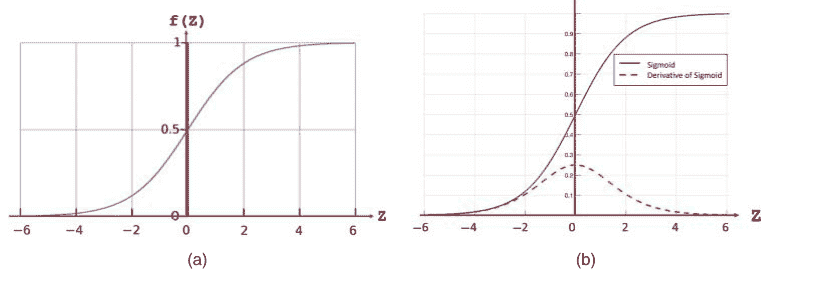

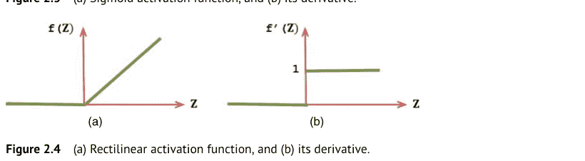

线性整流函数可防止负信号在人工神经网络中进一步传播。然而，在人工神经网络的输出层，如果允许网络输出为负值，那么通过线性整流函数消除负值可能会带来问题。在这些情况下，输出层不应使用线性整流激活函数。

### 2.3.4 突触权重

信号离开中间神经元后，其值会通过乘以它所经过的连接权重而进一步改变。图 2.5 展示了一个示例人工神经网络，其中 $x_1$ 和 $x_2$ 是输入到隐藏层三个节点的输入信号。在三个隐藏神经元处，输入突触的权重乘以输入神经元的值，并在隐藏神经元处聚合如下：

$e_1 = (x_1 \cdot w_1) + (x_2 \cdot w_4)$
$e_2 = (x_1 \cdot w_2) + (x_2 \cdot w_5)$
$e_3 = (x_1 \cdot w_3) + (x_2 \cdot w_6)$。

对每个隐藏神经元的求和信号应用激活函数 $f(.)$，如下所示：
$a_1 = f(e_1)$
$a_2 = f(e_2)$
$a_3 = f(e_3)$，
其中 $a_1$、$a_2$ 和 $a_3$ 的值是根据神经元所采用的激活函数确定的，如公式 (2.1) 和 (2.3) 所述。类似地，在输出层，输出神经元有三个输入，它们被聚合为

$e_4 = (a_1 \cdot w_7) + (a_2 \cdot w_8) + (a_3 \cdot w_9)$，

其中权重 $w_7$、$w_8$ 和 $w_9$ 分别应用于隐藏神经元 $a_1$、$a_2$ 和 $a_3$ 的输出。对公式 (A.1) 所示的求和应用激活函数后，得到输出：

$\hat{y} = f(e_4)$。

如前所述，在输出神经元使用线性整流激活函数时必须谨慎，如公式 (2.7) 所示，因为它只允许正输出值，而对于某些应用，负值可能很重要。

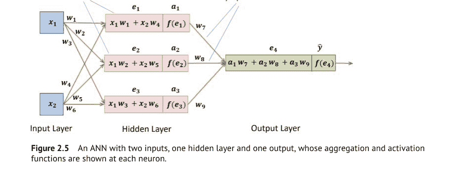

对于一般情况，如果人工神经网络中有多个隐藏层，则连续隐藏层的输入和输出以与此处解释的相同方式计算。输出层可能包含多个神经元，因为根据应用，人工神经网络可以设计为具有多个输出。例如，用于引导无人机的人工神经网络可以使用多个输入（如当前位置、速度、高度、飞行计划和障碍物传感器信息）为飞行控制器生成三个输出（速度、方向和高度）。

## 2.4 训练人工神经网络

为了使人能够生成预测，首先必须使用现有的输入和输出值的样本数据对其进行训练，其方式类似于传统的试错方法。在训练过程中，与突触相关的权重（例如图 2.5 中的 $w_1$ 到 $w_8$）会被调整，以使人工神经网络生成的输出与现有数据的实际输出值之间的差异尽可能小。这种差异被称为误差或损失。训练的目标是通过调整权重值来最小化（或尽可能减少）损失。

现在让我们用图 2.5 中给出的示例人工神经网络来说明训练过程。假设我们有以下在野外观察到的数据点，作为需要训练的人工神经网络的输入和输出：

输入 1：$x_1 = 3$ &nbsp;&nbsp;&nbsp;&nbsp; 输入 2：$x_2 = 5$ &nbsp;&nbsp;&nbsp;&nbsp; 输出：$y = 75$。

假设当前人工神经网络权重的初始值为

$w_1 = w_2 = w_3 = 1.0$
$w_4 = w_5 = w_6 = 0.5$
$w_7 = w_8 = w_9 = 4.0$。

使用公式 (A.1)，我们有

$e_1 = (3 \cdot 1) + (5 \cdot 0.5) = 5.5$
$e_2 = (3 \cdot 1) + (5 \cdot 0.5) = 5.5$
$e_3 = (3 \cdot 1) + (5 \cdot 0.5) = 5.5$。

使用线性整流激活函数，根据公式 (2.6)，我们有

$a_1 = 5.5$ &nbsp;&nbsp;&nbsp;&nbsp; $a_2 = 5.5$ &nbsp;&nbsp;&nbsp;&nbsp; $a_3 = 5.5$。

根据公式 (A.1)，我们得到

$e_4 = (5.5 \cdot 4) + (5.5 \cdot 4) + (5.5 \cdot 4) = 66$。

使用线性整流激活函数，根据公式 (2.7)，我们有

$\hat{y} = 66$。

误差定义为人工神经网络生成的输出与训练数据中真实输出值之间的差异。对于此示例，误差为

误差 $= y - \hat{y} = 75 - 66 = 9$。

对于实际应用，可以使用不同的误差计算方法，例如使用差值的平方或对数值 [30]。为了论证，假设通过人工神经网络训练过程调整了权重，使得新的权重值现在如下：

$w_1 = w_2 = w_3 = 1.0$
$w_4 = w_5 = w_6 = 0.8$
$w_7 = w_8 = w_9 = 3.5$。

使用这些权重值和样本数据，我们有

$e_1 = (3 \cdot 1) + (5 \cdot 0.8) = 7$
$e_2 = (3 \cdot 1) + (5 \cdot 0.8) = 7$
$e_3 = (3 \cdot 1) + (5 \cdot 0.8) = 7$，
从而得到
$e_4 = (7 \cdot 3.5) + (7 \cdot 3.5) + (7 \cdot 3.5) = 73.5$。

在这种情况下，真实输出值 $y$ 与人工神经网络生成的输出 $\hat{y}$ 之间的差异（即误差）变为

$\text{误差} = y - \hat{y} = 75 - 73.5 = 1.5$。 \hfill (2.9)

我们可以从公式 (2.8) 和 (2.9) 所示的这个简单枚举中清楚地看到，通过调整突触权重的值来减少误差是可能的，这是人工神经网络训练过程背后的基本思想。人工神经网络通过使用输入和输出数据（也称为历史数据、样本数据或现场数据）来为连接分配适当的权重值。训练过程可以总结为以下步骤：

-   首先，为连接权重分配随机选择的值。
-   使用这些随机值，通过将输入与权重相乘并在人工神经网络的每个神经元处应用激活函数来计算输出值。
-   到目前为止的步骤称为 `前向传播`（见下文第 2.5 节）。
-   然后将输出与样本数据中的期望值进行比较。人工神经网络生成的输出值与真实输出值之间的差异就是人工神经网络产生的误差。
-   在前向传播和损失计算之后，基于损失对每一层人工神经网络权重的偏导数执行 `反向传播`（见下文第 2.6 节）。
-   根据偏导数更新权重值。
-   使用新的权重，如上所述执行连续的前向和反向传播步骤（称为 `训练周期`）。
-   训练结束由设计者根据各种标准确定，包括执行预定数量的训练周期、损失值达到期望的低值，或者损失减少在训练周期之间没有进展。

## 2.5 前向传播

现在让我们探讨人工神经网络训练过程中的前向传播步骤。对于本节的推导，不失一般性，我们将使用图 2.6 所示的具有一个隐藏层的简单人工神经网络（灵感来源于 [31] 中的示例）。对于具有多个输入、输出和隐藏层的人工神经网络的一般情况，推导在权重矩阵维度上是有效的

### 2.5.1 从输入层到隐藏层的前向传播

对于图2.6所示的ANN，从输入层到隐藏层的前向传播，我们有

$Z_{(11)}^{(2)} = x_1 \cdot w_{11}^{(1)} + x_2 \cdot w_{21}^{(1)}$

$Z_{(12)}^{(2)} = x_1 \cdot w_{12}^{(1)} + x_2 \cdot w_{22}^{(1)}$

$Z_{(13)}^{(2)} = x_1 \cdot w_{13}^{(1)} + x_2 \cdot w_{23}^{(1)}$.

根据公式(2.1)中定义的sigmoid激活函数，隐藏层神经元的输出如下：

$a_{(11)}^{2} = f(Z_{(11)}^{(2)}) = \frac{1}{(1 + e^{-(x_1 \cdot w_{11}^{(1)} + x_2 \cdot w_{21}^{(1)})^2})}$

$a_{(12)}^{2} = f(Z_{(12)}^{(2)}) = \frac{1}{(1 + e^{-(x_1 \cdot w_{12}^{(1)} + x_2 \cdot w_{22}^{(1)})^2})}$

$a_{(13)}^{2} = f(Z_{(13)}^{(2)}) = \frac{1}{(1 + e^{-(x_1 \cdot w_{13}^{(1)} + x_2 \cdot w_{23}^{(1)})^2})}$.

在输出层神经元处，对三个输入突触进行聚合得到

$Z^{(3)} = a_{11}^{(2)} \cdot w_1^{(2)} + a_{12}^{(2)} \cdot w_2^{(2)} + a_{13}^{(2)} \cdot w_3^{(2)}$.

最后，在输出层，使用sigmoid激活函数生成 $\hat{y}$ 如下：

$\hat{y} = f(Z^{(3)}) = \frac{1}{1 + e^{-Z}} = \frac{1}{1 + e^{-(a_{11}^{(2)} \cdot w_1^{(2)} + a_{12}^{(2)} \cdot w_2^{(2)} + a_{13}^{(2)} \cdot w_3^{(2)})}}$.

## 2.6 反向传播

### 2.6.1 单个神经元的反向传播

一旦执行了前向传播，就必须从输出层开始，一直反向传播到输入层，以便根据误差值更新突触权重。让我们探讨一下给定神经元的反向传播过程是如何工作的。不失一般性，假设通过两条传入链路有两个输入，即 $x_a$ 和 $x_b$，其权重分别为 $w_a$ 和 $w_b$，如图2.7所示。设该神经元的输出为 $\hat{y} = f(e)$，其中 $e$ 是聚合值，定义为 $e = x_a w_a + x_b w_b$。为了最小化 $\hat{y}$ 上的误差，必须计算其对 $e$ 的导数。对于线性激活函数，我们有

$f'(e) = \frac{\partial \hat{y}}{\partial e}$.

$\hat{y}$ 对 $w_a$ 和 $w_b$ 的偏导数如下：

$\frac{\partial \hat{y}}{\partial w_a} = \frac{\partial (x_a w_a + x_b w_b)}{\partial w_a} = x_a$

$\frac{\partial \hat{y}}{\partial w_b} = \frac{\partial (x_a w_a + x_b w_b)}{\partial w_b} = x_b$.

对于该神经元处 $y$ 的真实值，误差 $E$ 定义为

$E = \frac{1}{2}(y - \hat{y})^2$.

$E$ 对 $w_a$ 的偏导数为

$\frac{\partial E}{\partial w_a} = -(y - \hat{y}) \frac{\partial \hat{y}}{\partial w_a} = -(y - \hat{y}) \frac{\partial \hat{y}}{\partial e} \frac{\partial e}{\partial w_a}$.

让我们定义 $\delta = -(y - \hat{y})f'(e)$ 并将其代入上述误差方程：

$\frac{\partial E}{\partial w_a} = \delta \frac{\partial e}{\partial w_a} = \delta x_i$. (2.10)

类似地，$E$ 对 $w_b$ 的偏导数为

$\frac{\partial E}{\partial w_b} = -(y - \hat{y}) \frac{\partial \hat{y}}{\partial w_b} = -(y - \hat{y}) \frac{\partial \hat{y}}{\partial e} \frac{\partial e}{\partial w_b}$.

同样，使用 $\delta = -(y - \hat{y})f'(e)$，我们有

$\frac{\partial E}{\partial w_b} = \delta \frac{\partial e}{\partial w_b} = \delta x_j$. (2.11)

使用公式(2.10)和(2.11)的值，以学习率 $\alpha$ 更新权重将得到

$w_a = w_a - \alpha \frac{\partial E}{\partial w_a}$

$w_b = w_b - \alpha \frac{\partial E}{\partial w_b}$, (2.12)

其中 $\alpha$ 是一个实数，指定训练期间权重的修改率。我们将在本章的剩余部分看到，突触权重将以类似于公式(2.12)的方式进行修改。

### 2.6.2 反向传播 – 从输出层到隐藏层

现在让我们为图2.6所示的ANN推导反向传播方程。输出层的误差定义为真实输出值与计算输出值（分别为 $y$ 和 $\hat{y}$）之差的平方的一半：

$$J = \sum \frac{1}{2}(y - \hat{y})^2 = \sum \frac{1}{2}(y - f(f(XW^{(1)})W^{(2)})^2).$$

为了减小误差，必须最小化 $J$，这意味着它对 $W^{(1)}$ 和 $W^{(2)}$ 的偏导数必须等于0。

$$\frac{\partial}{\partial W} \sum \frac{1}{2}(y - \hat{y})^2 = \sum (y - f(f(XW^{(1)})W^{(2)})^2) \frac{\partial}{\partial W}(y - \hat{y}).$$

由于输出层和隐藏层之间的链路权重表示为 $W^{(2)}$（如图2.6所示），让我们首先计算 $J$ 对 $W^{(2)}$ 的偏导数：

$$\frac{\partial J}{\partial W^{(2)}} = \frac{\partial}{\partial W^{(2)}} \sum \frac{1}{2}(y - \hat{y})^2 = (y - \hat{y}) \frac{\partial}{\partial W^{(2)}} \sum (y - \hat{y})$$
$$= -(y - \hat{y}) \frac{\partial}{\partial W^{(2)}} \sum \hat{y}.$$

由于 $\hat{y} = f(Z^{(3)})$，我们有

$$\frac{\partial J}{\partial W^{(2)}} = -(y - \hat{y}) \frac{\partial \sum \hat{y}}{\partial W^{(2)}} = -(y - \hat{y}) \frac{\partial \sum \hat{y}}{\partial Z^{(3)}} \frac{\partial Z^{(3)}}{\partial W^{(2)}}.$$

已知 $Z^{(3)} = a^{(2)} \cdot W^{(2)}$，我们得到

$$\frac{\partial Z^{(3)}}{\partial W^{(2)}} = a^{(2)}.$$

对于sigmoid激活函数，我们有

$$f(Z^{(3)}) = \hat{y} = \frac{1}{1 + e^{-Z^{(3)}}},$$

这意味着

$$\frac{\partial \sum \hat{y}}{\partial Z^{(3)}} = f'(Z^{(3)}) = \frac{e^{-Z^{(3)}}}{(1 + e^{-Z^{(3)}})^2}.$$

我们现在有

$$\frac{\partial J}{\partial W^{(2)}} = -(y - \hat{y})f'(Z^{(3)})a^{(2)}.$$

让我们将反向传播的误差定义为 $\delta^{(3)}$，如下所示：

$$\delta^{(3)} = -(y - \hat{y}) \cdot f'(Z^{(3)}),$$

其中 $-(y - \hat{y})$ 和 $f'(Z^{(3)})$ 是逐元素相乘。我们现在有

$$\frac{\partial J}{\partial W^{(2)}} = \delta^{(3)}a^{(2)}.$$

我们应该注意，反向传播基于梯度下降，容易陷入局部极值点。由于 $f'(Z^{(3)})$、$y$ 和 $\hat{y}$ 具有相同的维度（即样本数乘以输出数），$\delta^{(3)}$ 也将具有相同的维度。然而，为了执行 $\delta^{(3)}$ 和 $a^{(2)}$ 的矩阵乘法，我们必须转置 $a^{(2)}$，得到

$$\frac{\partial J}{\partial W^{(2)}} = a^{(2)\dagger} \delta^{(3)},$$

其中 $\dagger$ 表示矩阵转置操作。

### 2.6.3 反向传播 – 从隐藏层到输入层

对于从隐藏层到输入层的反向传播，我们需要计算误差 $J$ 对图2.6所示 $W^{(1)}$ 链路权重的偏导数。因此，

$$\frac{\partial J}{\partial W^{(1)}} = \frac{\partial}{\partial W^{(1)}} \sum \frac{1}{2}(y - \hat{y})^2 = (y - \hat{y}) \frac{\partial}{\partial W^{(1)}} \sum (y - \hat{y}) = -(y - \hat{y}) \frac{\partial}{\partial W^{(1)}} \sum \hat{y}.$$

由于 $\hat{y} = f(Z^{(3)})$，我们有

$$\frac{\partial J}{\partial W^{(1)}} = -(y - \hat{y}) \frac{\partial \sum \hat{y}}{\partial W^{(1)}} = -(y - \hat{y}) \frac{\partial \sum \hat{y}}{\partial Z^{(3)}} \frac{\partial Z^{(3)}}{\partial W^{(1)}}.$$

我们知道

$$\frac{\partial Z^{(3)}}{\partial W^{(1)}} = \frac{\partial Z^{(3)}}{\partial a^{(2)}} \frac{\partial a^{(2)}}{\partial W^{(1)}}.$$

然后我们得到

$$\frac{\partial J}{\partial W^{(1)}} = -(y - \hat{y}) f'(Z^{(3)}) \frac{\partial Z^{(3)}}{\partial a^{(2)}} \frac{\partial a^{(2)}}{\partial W^{(1)}}.$$

已知 $Z^{(3)} = a^{(2)} \cdot W^{(2)}$，我们得到

$$\frac{\partial Z^{(3)}}{\partial a^{(2)}} = W^{(2)\dagger}.$$

回顾公式(2.13)，我们将 $\delta^{(3)}$ 定义为 $-(y - \hat{y}) f'(Z^{(3)})$。我们知道

$$\frac{\partial a^{(2)}}{\partial W^{(1)}} = \frac{\partial a^{(2)}}{\partial Z^{(2)}} \frac{\partial Z^{(2)}}{\partial W^{(1)}}.$$

因此，我们现在有

$$\frac{\partial J}{\partial W^{(1)}} = \delta^{(3)} W^{(2)\dagger} \frac{\partial a^{(2)}}{\partial Z^{(2)}} \frac{\partial Z^{(2)}}{\partial W^{(1)}}.$$

回顾图2.6，$a^{(2)} = f(Z^{(2)})$；那么我们有

$$\frac{\partial a^{(2)}}{\partial Z^{(2)}} = f'(Z^{(2)}).$$

同样回顾图2.6，$Z^{(2)} = XW^{(1)}$；我们现在有

$$\frac{\partial Z^{(2)}}{\partial W^{(1)}} = X.$$

这得到

$$\frac{\partial J}{\partial W^{(1)}} = \delta^{(3)} W^{(2)\dagger} f'(Z^{(2)}) X.$$

像之前一样，需要调整维度为

$$\frac{\partial J}{\partial W^{(1)}} = X^{\dagger} \delta^{(3)} W^{(2)\dagger} f'(Z^{(2)}).$$

让我们定义 $\delta^{(2)}$ 如下：

$$\delta^{(2)} = \delta^{(3)} W^{(2)\dagger} \cdot f'(Z^{(2)}),$$

其中 $f'(Z^{(2)})$ 需要转置并与 $W^{(2)\dagger}$ 逐元素相乘。然后我们有

$$\frac{\partial J}{\partial W^{(1)}} = X^{\dagger} \delta^{(2)}.$$

## 2.7 权重更新

在人工神经网络的训练过程中，每次反向传播后都会更新权重，以使每次迭代后的误差减小。这基于如上所述通过隐藏层修改的梯度。

设 $\alpha$ 为*学习率*，这是一个实数，指定了在训练过程中更新权重时选择的修改量。使用公式 (2.14) 和 (2.16) 中的导数，权重将在每次迭代中按如下方式更新：

$$W_{new}^{(1)} = W^{(1)} - \alpha \frac{\partial J}{\partial W^{(1)}}$$
$$W_{new}^{(2)} = W^{(2)} - \alpha \frac{\partial J}{\partial W^{(2)}},$$
(2.17)

其中，左侧带下标 *new* 的权重是该次迭代的更新值，而等式右侧是当前的权重值。更新权重后，会执行新的前向和反向传播。在每次迭代中，权重使用公式 (2.17) 和新的梯度进行更新。连续的权重更新有望减少人工神经网络输出的误差。训练持续进行，直到获得令人满意的微小误差或达到预定的迭代次数。

## 2.8 带输入偏置的人工神经网络

在实际问题中，调整权重以最小化输出误差需要在人工神经网络的每一层都使用偏置，如图 2.8 所示。偏置值类似于突触权重，首先被随机初始化。在训练过程中，它们被前向和反向传播，并在每次训练迭代中更新。附录 B 中介绍了在训练过程中使用输入偏置逐步推导更新偏置和权重值的过程。

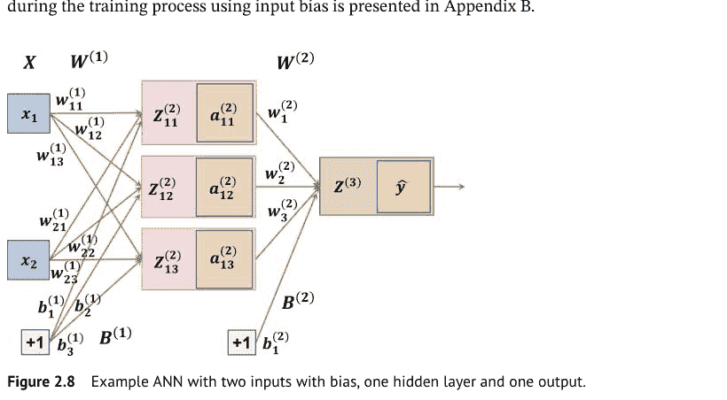

```
set number of layers in ANN as NofLayers;
initialize random weights for all links as W<sub>ANN</sub>;
initialized random bias for all layers as B<sub>ANN</sub>;
set number of epochs for training ANN as NofEpochs;

for i = 1 to NofEpochs do
    // forward propagation
    for j = 1 to NofLayers do
        for each neuron in j do
            multiply outputs from previous layer with weights;
            add bias;
            apply activation function;
        end for
    end for

    // back propagation
    for j = NofLayers to 1 do
        for each neuron j
            calculate error of current weights;
            calculate gradient of current weights;
        end for
    end for
    adjust W<sub>ANN</sub> and B<sub>ANN</sub> for epoch i;
end for
```

图 2.9 描述人工神经网络训练过程的简单算法。

## 2.9 人工神经网络训练的简单算法

图 2.9 展示了一个概述人工神经网络训练过程的简单算法。该算法首先定义人工神经网络的结构和用于训练的迭代次数（即前向和反向传播次数）。接下来，它为所有层初始化随机权重和偏置。对于每次迭代，它执行前向传播以产生人工神经网络的初步输出及其相关的误差或成本。前向传播后，它使用反向传播来计算误差和梯度，以调整权重和偏置值。此过程重复进行，直到达到最大迭代次数。

一旦权重值确定，训练好的人工神经网络就可以用于对新输入进行预测。不同的人工神经网络训练过程包括：

- 监督训练：输入被映射到一组已知的输出信号 [32]。
- 无监督训练：这使用输入来形成数据分类 [33]。
- 强化训练：这基于由适应度函数评估的新输入数据持续改进人工神经网络 [34]。

## 2.10 人工神经网络训练的计算复杂度

训练的计算复杂度包括第 2.5、2.6 和 2.7 节中执行的所有操作。对于训练中可用的每个数据样本，这些操作在每次迭代中重复执行。如图 2.5 所示，在第一个隐藏层中，每个神经元执行的求和与输入数量乘以连接数量成正比：由于隐藏层有 6 个传入连接到 3 个神经元，因此有 6 组乘法运算和 3 次激活函数计算。对于单个输出层，有 3 个传入连接，因此有 3 次乘法运算和 3 次激活函数计算。设第 $i^{th}$ 层的连接数和神经元数分别为 $|W^{(i)}|$ 和 $|S^{(i)}|$。对于一般情况，对于前向传播，一个输入-输出样本的乘法运算和激活函数计算次数为

$$cost_M^1 = \sum_{i=1}^{H} |W^{(i)}||S^{(i)}|c_m \quad cost_A^1 = \sum_{i=1}^{H} |W^{(i)}||S^{(i)}|c_a,$$

其中 $c_m$ 和 $c_a$ 分别是乘法运算和激活函数计算的计算成本。为简单起见，假设对于给定的迭代，反向传播成本与前向传播成本相当。如果有 $|X|$ 个样本，则一次迭代的训练计算成本为

$$cost_{ANN}^1 = 2|X| \left( \sum_{i=1}^{H} |W^{(i)}||S^{(i)}|(c_m + c_a) \right).$$

对于 $N$ 次前向和反向传播迭代，训练成本变为

$$cost_{ANN}^N = 2N|X| \left( \sum_{i=1}^{H} |W^{(i)}||S^{(i)}|(c_m + c_a) \right). \tag{2.18}$$

使用 $\mathcal{O}$ 符号表示计算复杂度的数量级 [35]，训练一个全连接人工神经网络（即所有神经元都与连续隐藏层中的所有其他神经元相连）的成本为

$$cost_{ANN}^N = \mathcal{O}(N \ |X| \ H \ |W| \ |S|)(c_m + \cdot c_a). \tag{2.19}$$

考虑一个典型的数值应用，使用一个具有 $H = 32$ 层、每层 $S = 32$ 个神经元的全连接人工神经网络，使用 $X = 10^5$ 个数据样本进行 $N = 10^4$ 次迭代。使用公式 2.18，训练这样一个人工神经网络的计算成本为

$$cost_{ANN}^{10^4} = 2 \cdot 10^4 \cdot 10^5 \left( \sum_{i=1}^{32} 10^3(c_m + c_a) \right) = \mathcal{O}(10^{13})(c_m + c_a).$$

由于对于实际应用，训练可能需要使用数万个样本进行数百或数千次迭代，而人工神经网络具有数十个隐藏层，每层有数十个神经元，如果设计工程师没有意识到这些成本，计算复杂度可能会迅速变得大到不可行。

## 2.11 人工神经网络输入和输出的归一化

对于输入和输出值之间存在数值不平衡的应用，可能会由于舍入、截断和类似类型的近似而导致计算不准确。为了缓解此类数值问题，通常将输入和输出按比例缩小（即归一化）到相对较小的整数范围内。归一化的一个示例如下：

$$\overline{X}_i = \frac{X_i - \min(X)}{\max(X) - \min(X)}, \quad \overline{Y}_i = \frac{Y_i - \min(Y)}{\max(Y) - \min(Y)},$$

其中 $X_i$ 和 $\overline{X}_i$ 分别是第 $i^{th}$ 个输入在归一化前后的值。类似地，$Y_i$ 和 $\overline{Y}_i$ 分别是第 $i^{th}$ 个输出在归一化前后的值。根据应用的不同，输入在多个样本上分别进行归一化。类似地，单个输出在多个样本上的值也被归一化。如果一组输入具有相同的重要性级别，它们可以一起归一化。例如，如果输入值为正，我们可以使用 $\min(X) = 0$。类似地，如果输出范围是 $[0, 100]$，我们有 $\min(Y) = 0$ 和 $\max(Y) = 100$。归一化是一种合理的做法，因为它试图防止计算中的精度问题，并有助于加速收敛到更好的解决方案 [36]。

## 2.12 总结性评述

本章概述了人工神经网络架构和训练过程的一般概念。人工神经网络是人工智能中最流行的工具之一，用于解决基于大量数据的问题。在人工神经网络中，给定的一组输入通过一组权重和激活函数进行修改，以生成与实验或事件中测量的真实数据点相匹配的输出。有一类问题适合用人工神经网络解决。例如，`分类问题`和图像识别任务是人工神经网络的绝佳候选。在此类应用中，通常有大量的输入，并且有相应的输出可用（通常样本大小从几十到几十万或更高）。一个称为`训练`的过程旨在找到权重值，使得输出的真实值和计算值之间的差异最小化（或在过程定义的限制内尽可能小）。

近年来已经开发了几种不同类型的人工神经网络。卷积神经网络（CNN）、循环神经网络（RNN）、大型语言模型（LLM）和 Transformer 是其中最受欢迎的几种。在 RNN 中（参见第 10 章和第 11 章），输出层的值被发送回隐藏层，用于信号的后续处理。使用 RNN 中的注意力机制，机器翻译任务变得可行，如第 12 章和第 13 章所述。关于语言模型的一个很好的综述可以在 [37] 中找到。

对具有挑战性的实际问题进行建模以通过人工神经网络解决，需要经验和工程学科的分析技能集。训练的计算复杂度随神经元数量和隐藏层数量的乘积而增长。因此，在为实际应用设计人工神经网络架构时，必须意识到训练的计算成本。

## 2.13 第 2 章练习题

- 1) 如果图 2.6 中的人工神经网络有两个隐藏层，其性能会受到怎样的影响？
- 2) 如果图 2.6 中的人工神经网络的学习率 $\alpha$ 增加十倍，在通过减少输出误差收敛到可接受解方面，其性能会受到怎样的影响？
- 3) 如果图 2.6 中的人工神经网络的学习率 $\alpha$ 减小十倍，在通过减少输出误差收敛到可接受解方面，其性能会受到怎样的影响？将你的答案与练习 2 进行比较。
- 4) 考虑图 2.6 中的人工神经网络。假设神经元数量加倍。在通过减少输出误差收敛到可接受解方面，人工神经网络的性能将受到怎样的影响？

# 3 用于优化预测的人工神经网络

## 3.1 引言

如果设计得当并使用足够大量的样本进行有效训练，人工神经网络可以有效地用于基于历史数据的结果预测。为了能够训练人工神经网络的权重，需要一组从现场收集或在实验中观察到的样本输入和输出数据，如第2章所述。根据应用的不同，样本数量通常从数千到数亿甚至更多不等。数据样本的输入值在乘以连接权重后，被应用于隐藏层的神经元。经过每个神经元的求和与激活函数处理后，输入信号传播到下一个隐藏层，最终到达人工神经网络的输出层。根据真实输出值与计算输出值之间的差异计算误差值。这些步骤称为前向传播。然后，作为误差最小化（或至少减少）过程的一部分，通过从输出层开始反向传播到输入层，计算误差相对于连接权重的偏导数，执行反向传播，如第2章所述。

在人工神经网络层上连续进行的前向和反向传播迭代（称为训练轮次）会减少误差，直到获得令人满意的较小值、达到训练轮次数量限制或满足其他停止标准为止。如前所述，为了正确训练人工神经网络，需要大量的数据。样本量越大，人工神经网络的预测结果预期就越准确。使用较少的数据样本进行训练往往会使连接权重过度拟合以满足输入和输出值，这会导致当输入具有不同值范围时，人工神经网络的预测不准确。使用大量样本的目的是希望它们具有广泛的输入和输出值范围，以充分覆盖操作空间——拥有许多具有相似值的样本无助于训练有效的人工神经网络。

在本章中，我们提供了两个可以说是人工神经网络最流行应用之一的例子：基于历史数据的结果预测。第一个例子在第3.5节中介绍，涉及设计一个用于根据两个输入（即学生为准备考试而花费的睡眠时间和学习时间）预测考试成绩的人工神经网络（该例子取自[31]）。对于这个简单但非常贴近实际的例子，我们逐步描述了前向和反向传播操作。

第二个例子在第3.6节中，构建并训练一个人工神经网络，根据多个输入（包括星期几、空气温度和风速）预测未来日期所需的租赁自行车数量（取自[38]）。这个案例研究的灵感来源于英国伦敦的自行车租赁数据。

这些示例人工神经网络的实际版本可用于预测新情况的结果。例如，学生可以预测为了在即将到来的考试中获得90分以上的成绩，预期需要睡眠和学习的小时数，这可能需要相应地调整日程安排。同样，自行车租赁公司可以预测周末需要多少辆自行车，并可能根据需要雇用额外的帮手来管理租赁业务。

## 3.2 人工神经网络输入的选择

在为特定应用构建人工神经网络时，最重要的决策之一是选择人工神经网络的输入。例如，可以考虑使用从实验中收集的数据作为人工神经网络的输入（例如，植物暴露在阳光下的小时数、给植物浇水的量和频率等）。对于某些应用，将现场测量值用作人工神经网络的输入可能在生成可接受的预测方面是有效的。然而，将观察到的数据直接作为人工神经网络的输入可能并不总是可取的，特别是当输入数量过多或与输出没有直接关系时（例如，在植物生长应用中使用星期几的名称可能是无关的）。人工神经网络的输入也可以是来自现场实验或事件观察的数据的导数，通常是观察数据的统计或数学变换。例如，使用每日平均、最高或最低温度作为人工神经网络的输入可能比使用实验中记录的每小时测量值更可取。在另一个应用中，计算过去几周的金融股票移动平均值可能比直接使用从证券交易所记录中获得的销售价格更可取。也可以将直接观察到的测量值与其派生值结合起来。例如，平均空气温度加上星期几可能是为预测运输公司每日公交车维修而设计的人工神经网络的相关输入。如果工作日是星期五、星期六或星期一，对于植物浇水研究可能无关紧要，但对于公交车时刻表却具有相当重要的意义。在实践中，设计者会使用他们认为适合其目的的所有可用数据，并决定哪种输入组合将训练出预测最准确的人工神经网络。选择合适的输入是一个持续的过程，可能需要花费大量精力考虑不同的输入集，直到定义出令人满意的集合为止。

对于本章研究的两个例子，为了尽可能保持简单，所有输入都是各自领域中直接测量的参数：第一个例子是学生睡眠和学习的小时数，第二个例子是自行车租赁公司保存的各种测量值，如风速、温度、一天中的时间以及类似的测量值。

## 3.3 人工神经网络输出的选择

除了选择输入之外，成功部署人工神经网络还需要以能够生成最有用、最准确和最可靠预测的方式选择输出。与输入的选择类似，输出可以分配为实验的直接测量观察值，也可以是基于测量值的派生值。例如，对于为预测癌性肿瘤生长而构建的人工神经网络，可能的输出选择包括肿瘤大小测量值或肿瘤生长率。对于后一种情况，需要在一段时间内测量患者的肿瘤大小，并根据测量值计算生长（或缩小）率。在其他人工神经网络示例中，输出可以代表分类决策。例如，对于输入是电子邮件文本的人工神经网络，一个可能的输出可能是决定该电子邮件是真实邮件还是垃圾邮件。在这种情况下，可能有两个输出（例如，标记为真实邮件和垃圾邮件），其中只有一个为真，或者只有一个输出，其值表示人工神经网络的决策（例如，1表示真实邮件，0表示垃圾邮件）。对于给定的人工神经网络应用，选择合适的输出通常需要经验和领域知识。

在本章介绍的两个案例研究中，为了简单起见，选择了直接可观察的输出：所谓的睡眠-学习人工神经网络的预期考试成绩，以及伦敦共享单车人工神经网络的租赁数量。

## 3.4 隐藏层的构建

另一个重要的设计组件是选择隐藏层的数量和每层中的神经元数量。没有简单的公式来规定这些决策的规则。与其他人工神经网络设计参数类似，基于知识和经验的试错方法似乎是构建人工神经网络架构的合理途径，该架构能持续为给定应用生成可靠和准确的解决方案。例如，图像处理问题可能需要具有许多隐藏层的人工神经网络来检测输入图像中的各种特征（例如，肿瘤、结节或其他异常），而金融应用可能在采用较少隐藏层但每层具有大量神经元的人工神经网络架构时更成功（例如，用于检测金融趋势而不会在多个隐藏层上过度拟合连接权重）。

训练人工神经网络所需的时间是一个重要的性能指标，特别是对于需要经常训练的情况（例如，每天几次或更频繁）。如第2章第2.10节所述，训练时间与隐藏层的数量、每层中的神经元数量以及连续层之间的连接数量成正比。如公式（2.18）和（2.19）所示，增加隐藏层的数量将指数级增加训练的计算成本，如果要使用大量输入/输出样本进行训练，这是人工神经网络设计者需要处理的一个严重问题。

从公式（2.18）和（2.19）得出的另一个重要观察是选择用于训练的训练轮次数量，其中连接权重和偏置根据输出处观察到的误差值进行调整。很明显，对于需要大量数据样本（例如，数十万或数百万）的人工神经网络，不能任意增加隐藏层、神经元和训练轮次的数量，特别是对于需要经常重新训练（例如，每小时、每天或每周）的应用。如果一个用于可靠预测第二天股票走势的人工神经网络需要一周时间来训练，那么无论其输出多么准确，对用户来说都没有意义。这些权衡是人工神经网络设计过程的重要组成部分，特别是对于至关重要的应用，如医疗、军事、实时交通、电力、供水或核控制任务。

## 3.5 案例研究1：睡眠-学习示例

在我们的第一个例子（来自[31]）中，我们将其称为`sleep-study`示例，构建一个人工神经网络，根据两个测量值（即学生为准备考试而花费的学习小时数和睡眠小时数）预测学生的考试成绩。人工神经网络的输入选择为这两个参数的直接测量值。人工神经网络的输出是该考试的预期成绩。为简单起见，假设这个简单示例的训练数据包含图3.1所示的样本。

5) 考虑图2.6中给出的人工神经网络。如果将神经元数量和隐藏层数量加倍，其在通过减少输出误差收敛到可接受解决方案方面的性能将受到怎样的影响？将你的答案与练习4进行比较。

6) 如果除了练习2中建议的修改外，还将图2.6中给出的人工神经网络的神经元数量和隐藏层数量加倍，其在通过减少输出误差收敛到可接受解决方案方面的性能将受到怎样的影响？

| 输入 | | 输出 |
| :--- | :--- | :--- |
| 睡眠小时数 | 学习小时数 | 测试分数 |
| 3 | 5 | 75 |
| 5 | 1 | 82 |
| 10 | 2 | 93 |

图 3.1 睡眠-学习示例的数据样本：对于每个样本，输入是一名学生为考试睡眠和学习的小时数，输出是该考试获得的成绩。

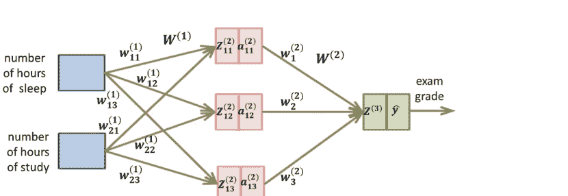

让我们选择一个仅包含一个隐藏层、且该隐藏层有三个神经元的全连接人工神经网络（ANN）（图 3.2）。如第 2 章所述，ANN 首先在历史数据上进行训练，这些数据由睡眠和学习的小时数以及对应的考试成绩组成。在训练开始时，连接权重和偏置被赋予随机选择的值。经过一次从输入层到输出层、通过隐藏层的前向传播后，获得了一个输出预测值，其误差被计算为真实成绩与计算成绩之间的差值。通过反向传播，计算误差相对于连接权重和偏置的偏导数，从而调整权重矩阵和偏置值以减小误差。在我们分别于第 3.5.9 节和第 3.5.10 节介绍的该 ANN 的 Python 和 Matlab 实现中，前向和反向传播重复进行了 2000 次。

训练完成后，ANN 可用于预测新考试的分数。当为即将到来的考试输入预期的睡眠和学习小时数时，ANN 会生成一个成绩预测。如果成绩令人满意，学生可以遵循该睡眠和学习计划。然而，如果成绩太低，学生有机会通过使用不同的输入值组合来试验 ANN，以找到能产生满意成绩的最佳睡眠和学习小时数。当然，我们建议学生不要花太多时间试验 ANN，而应尽可能专注于学习课程材料，无论期望的成绩如何。

### 3.5.1 使用矩阵进行 ANN 训练

现在让我们考虑将训练期间使用的多个样本表示为矩阵。图 3.1 中显示的输入值可以表示为一个矩阵，称为 X，它有两列和三行，分别代表不同输入的数量和样本数量。类似地，样本输出值可以排列成一个称为 $Y$ 的向量：

$$X = \begin{bmatrix} 3 & 5 \\ 5 & 1 \\ 10 & 2 \end{bmatrix} \quad Y = \begin{bmatrix} 75 \\ 82 \\ 93 \end{bmatrix}.$$

一旦输入和输出表示为矩阵，在训练中就可以使用矩阵运算一次性处理多个样本，而不是单独处理每个样本。虽然计算成本没有降低，但与单独处理每个样本的加法和乘法相比，使用矩阵使得 ANN 的脚本实现要方便得多。

为简单起见且不失一般性，让我们使用图 3.1 中给出的样本来确定下面简单 ANN 各阶段权重的矩阵元素。如上所述，对于输入样本，矩阵维度是样本数量乘以 ANN 输入数量。对于图 3.2 中显示的样本，输入矩阵的维度将是 $(3 \times 2)$：

$$X = \begin{bmatrix} x_{11} & x_{12} \\ x_{21} & x_{22} \\ x_{31} & x_{32} \end{bmatrix}.$$

输入层和隐藏层之间权重的矩阵维度是 ANN 输入数量乘以隐藏层神经元数量。对于图 3.2 中的 ANN，权重矩阵将是一个 $(2 \times 3)$ 矩阵：

$$W^{(1)} = \begin{bmatrix} w_{11}^{(1)} & w_{12}^{(1)} & w_{13}^{(1)} \\ w_{21}^{(1)} & w_{22}^{(1)} & w_{23}^{(1)} \end{bmatrix}.$$

对于隐藏层的输出，我们有

$$Z^{(2)} = X \cdot W^{(1)} = \begin{bmatrix} x_{11} & x_{12} \\ x_{21} & x_{22} \\ x_{31} & x_{32} \end{bmatrix} \cdot \begin{bmatrix} w_{11}^{(1)} & w_{12}^{(1)} & w_{13}^{(1)} \\ w_{21}^{(1)} & w_{22}^{(1)} & w_{23}^{(1)} \end{bmatrix} = \begin{bmatrix} z_{11}^{(2)} & z_{12}^{(2)} & z_{13}^{(2)} \\ z_{21}^{(2)} & z_{22}^{(2)} & z_{23}^{(2)} \\ z_{31}^{(2)} & z_{32}^{(2)} & z_{33}^{(2)} \end{bmatrix}.$$

对于一般情况，两个隐藏层之间权重的矩阵维度是当前隐藏层神经元数量乘以下一个隐藏层神经元数量。由于图 3.2 中的示例只有一个隐藏层，隐藏层和输出层之间的权重矩阵维度将是隐藏神经元数量乘以 ANN 输出数量，这是一个 $(3 \times 1)$ 矩阵，如下所示：

$$W^{(2)} = \begin{bmatrix} w_{1}^{(2)} \\ w_{2}^{(2)} \\ w_{3}^{(2)} \end{bmatrix}.$$

因此，表示图 3.2 中 ANN 输出的矩阵，即公式 (3.1) 和 (3.2) 中矩阵相乘的结果，其维度是样本数量乘以输出数量：

$$Z^{(3)} = a^{(2)} \cdot W^{(2)} = \begin{bmatrix} z_{11}^{(2)} & z_{12}^{(2)} & z_{13}^{(2)} \\ z_{21}^{(2)} & z_{22}^{(2)} & z_{23}^{(2)} \\ z_{31}^{(2)} & z_{32}^{(2)} & z_{33}^{(2)} \end{bmatrix} \cdot \begin{bmatrix} w_{1}^{(2)} \\ w_{2}^{(2)} \\ w_{3}^{(2)} \end{bmatrix} = \begin{bmatrix} z_{1}^{(3)} \\ z_{2}^{(3)} \\ z_{3}^{(3)} \end{bmatrix}.$$

### 3.5.2 前向传播

图 3.1 中所示样本的输入和输出值可以用以下矩阵表示：

$$X = \begin{bmatrix} 3 & 5 \\ 5 & 1 \\ 10 & 2 \end{bmatrix} \quad Y = \begin{bmatrix} 75 \\ 82 \\ 93 \end{bmatrix}.$$

让我们假设 $W^{(1)}$ 和 $W^{(2)}$ 矩阵的连接权重值被随机分配如下：

$$W^{(1)} = \begin{bmatrix} -1 & 3 & 1 \\ 2 & -2 & 1 \end{bmatrix} \quad W^{(2)} = \begin{bmatrix} -1 \\ 1 \\ 2 \end{bmatrix}. \tag{3.3}$$

使用 $X$ 和 $W^{(1)}$ 矩阵，我们得到

$$Z^{(2)} = X \cdot W^{(1)} = \begin{bmatrix} 3 & 5 \\ 5 & 1 \\ 10 & 2 \end{bmatrix} \cdot \begin{bmatrix} -1 & 3 & 1 \\ 2 & -2 & -1 \end{bmatrix} = \begin{bmatrix} 7 & -1 & -2 \\ -3 & 13 & 4 \\ -6 & 26 & 8 \end{bmatrix}.$$

假设神经元中使用了线性整流激活函数，它消除了 $Z^{(2)}$ 中的负值。然后我们计算 $a^{(2)}$ 如下：

$$a^{(2)} = f(Z^{(2)}) = \begin{bmatrix} 7 & 0 & 0 \\ 0 & 13 & 4 \\ 0 & 26 & 8 \end{bmatrix}.$$

使用上面的 $a^{(2)}$，可以计算 $Z^{(3)}$ 如下：

$$Z^{(3)} = a^{(2)} \cdot W^{(2)} = \begin{bmatrix} 7 & 0 & 0 \\ 0 & 13 & 4 \\ 0 & 26 & 8 \end{bmatrix} \cdot \begin{bmatrix} -1 \\ 1 \\ 2 \end{bmatrix} = \begin{bmatrix} -7 \\ 21 \\ 42 \end{bmatrix}.$$

那么，使用线性整流激活函数的 ANN 输出将是（注意，由于输出是成绩，不允许负值，因此线性整流激活是可接受的）：

$$\hat{y} = f(Z^{(3)}) = \begin{bmatrix} 0 \\ 21 \\ 42 \end{bmatrix}.$$

本次迭代的误差 $J$ 是真实输出值与计算输出值之差的平方的一半：

$$J = \sum \frac{1}{2}(y - \hat{y})^2 = \frac{1}{2}((75 - 0)^2 + (82 - 21)^2 + (93 - 42)^2) = 5974. \tag{3.4}$$

### 3.5.3 反向传播

现在让我们从输出层开始执行反向传播。使用第 2.6.3 节公式 (2.13) 中 $\delta^{(3)}$ 的定义，我们有

$$\delta^{(3)} = -(y - \hat{y}) * f'(Z^{(3)}) = -\begin{bmatrix} 75 \\ 61 \\ 51 \end{bmatrix} * \begin{bmatrix} 0 \\ 1 \\ 1 \end{bmatrix} = \begin{bmatrix} 0 \\ -61 \\ -51 \end{bmatrix},$$

其中 $\cdot *$ 表示逐元素乘法。根据第 2.6.3 节公式 (2.15) 中 $\delta^{(2)}$ 的定义，我们有

$$\delta^{(2)} = \delta^{(3)} \cdot W^{(2)\dagger} \cdot * f(Z^{(2)}) = \begin{bmatrix} 0 \\ -61 \\ -51 \end{bmatrix} \cdot [-1 \ -1 \ 2] \cdot * \begin{bmatrix} 1 & 0 & 0 \\ 0 & 1 & 1 \\ 0 & 1 & 1 \end{bmatrix}$$
$$= \begin{bmatrix} 0 & 0 & 0 \\ 61 & -61 & -122 \\ 51 & -51 & -102 \end{bmatrix} \cdot * \begin{bmatrix} 1 & 0 & 0 \\ 0 & 1 & 1 \\ 0 & 1 & 1 \end{bmatrix} = \begin{bmatrix} 0 & 0 & 0 \\ 0 & -61 & -122 \\ 0 & -51 & -102 \end{bmatrix}.$$

使用公式 (2.14)，我们有

$$\frac{\partial J}{\partial W^{(2)}} = a^{(2)\dagger} \cdot \delta^{(3)} = \begin{bmatrix} 7 & 0 & 0 \\ 0 & 13 & 26 \\ 0 & 4 & 8 \end{bmatrix} \cdot \begin{bmatrix} 0 \\ -61 \\ -51 \end{bmatrix} = \begin{bmatrix} 0 \\ -2119 \\ -652 \end{bmatrix},$$

其中 $\dagger$ 表示矩阵转置操作。根据公式 (2.16)，我们有

$$\frac{\partial J}{\partial W^{(1)}} = X^{\dagger} \cdot \delta^{(2)} = \begin{bmatrix} 3 & 5 & 10 \\ 5 & 1 & 2 \end{bmatrix} \cdot \begin{bmatrix} 0 & 0 & 0 \\ 61 & -61 & -122 \\ 51 & -51 & -102 \end{bmatrix} = \begin{bmatrix} 0 & -815 & -1630 \\ 0 & -163 & -326 \end{bmatrix}.$$

### 3.5.4 更新权重

设学习率为 $\alpha = 0.001$，其中 $\alpha$ 是一个用户定义的参数，用于指示权重应修改的速度。以 $\alpha$ 的速率更新权重被称为*学习*。$\alpha$ 值越高，学习越快，但由于采取更大的修改步长，可能容易出错。另一方面，较小的 $\alpha$ 值收敛到可接受解的速度较慢，因此会增加训练成本。根据公式 (2.17)，我们有

$$W_{new}^{(1)} = W^{(1)} - \alpha \frac{\partial J}{\partial W^{(1)}} = \begin{bmatrix} -1 & 3 & -1 \\ 2 & -2 & -1 \end{bmatrix} - 0.001 \begin{bmatrix} 0 & -815 & -1630 \\ 0 & -163 & -326 \end{bmatrix}$$
$$= \begin{bmatrix} -1 & 3.8 & 2.6 \\ 2 & -1.8 & -0.7 \end{bmatrix}$$

$$W_{new}^{(2)} = W^{(2)} - \alpha \frac{\partial J}{\partial W^{(2)}} = \begin{bmatrix} -1 \\ 1 \\ 2 \end{bmatrix} - 0.001 \begin{bmatrix} 0 \\ -2119 \\ -652 \end{bmatrix} = \begin{bmatrix} -1 \\ 3.1 \\ 2.7 \end{bmatrix},$$

其中等式左侧的下标 *new* 表示权重的更新值。

### 3.5.5 使用新权重进行前向传播

现在让我们使用新权重执行一次新的前向传播：

$$W^{(1)} = \begin{bmatrix} -1 & 3.8 & 2.6 \\ 2 & -1.8 & -0.7 \end{bmatrix} \quad W^{(2)} = \begin{bmatrix} -1 \\ 3.1 \\ 2.7 \end{bmatrix}$$

$Z^{(2)} = X \cdot W^{(1)} = \begin{bmatrix} 3 & 5 \\ 5 & 1 \\ 10 & 2 \end{bmatrix} \cdot \begin{bmatrix} -1 & 3.8 & 2.6 \\ 2 & -1.8 & -0.7 \end{bmatrix} = \begin{bmatrix} 7 & 2.3 & 4.5 \\ -3 & 17.3 & 12.5 \\ -6 & 34.5 & 24.7 \end{bmatrix}$

$a^{(2)} = f(Z^{(2)}) = \begin{bmatrix} 7 & 2.3 & 4.5 \\ 0 & 17.3 & 12.5 \\ 0 & 34.5 & 24.7 \end{bmatrix}$

$Z^{(3)} = a^{(2)} \cdot W^{(2)} = \begin{bmatrix} 7 & 2.3 & 4.5 \\ 0 & 17.3 & 12.5 \\ 0 & 34.5 & 24.7 \end{bmatrix} \cdot \begin{bmatrix} -1 \\ 3.1 \\ 2.7 \end{bmatrix} = \begin{bmatrix} 12 \\ 87 \\ 174 \end{bmatrix}$

$\hat{y} = f(Z^{(3)}) = \begin{bmatrix} 12 \\ 87 \\ 174 \end{bmatrix}$。

第二次前向传播结束时的误差 $J$ 为

$J = \sum \frac{1}{2}(y - \hat{y})^2 = \frac{1}{2}((75 - 12)^2 + (82 - 87)^2 + (93 - 174)^2) = 5273$。(3.6)

注意，误差已从上一次迭代的 5974 减少到 5273。

### 3.5.6 使用新权重进行反向传播

继续使用新权重进行反向传播，我们有

$\delta^{(3)} = (y - \hat{y}) \cdot * f'(Z^{(3)}) = \begin{bmatrix} 75 - 12 \\ 82 - 87 \\ 93 - 174 \end{bmatrix} \cdot * \begin{bmatrix} 1 \\ 1 \\ 1 \end{bmatrix} = \begin{bmatrix} 63 \\ -5 \\ -81 \end{bmatrix}$，

其中 $\cdot *$ 表示逐元素乘法。

$\delta^{(2)} = \delta^{(3)} \cdot W^{(2)\dagger} \cdot * f'(Z^{(2)}) = \begin{bmatrix} 63 \\ -5 \\ -81 \end{bmatrix} \cdot [-1 \quad 3.1 \quad 2.7] \cdot * \begin{bmatrix} 1 & 1 & 1 \\ 0 & 1 & 1 \\ 0 & 1 & 1 \end{bmatrix}$

$= \begin{bmatrix} -63 & 195.3 & 170.1 \\ 5 & -15.5 & -13.5 \\ 81 & -251.1 & -218.7 \end{bmatrix} \cdot * \begin{bmatrix} 1 & 1 & 1 \\ 0 & 1 & 1 \\ 0 & 1 & 1 \end{bmatrix} = \begin{bmatrix} -63 & 195.3 & 170.1 \\ 0 & -15.5 & -13.5 \\ 0 & -251.1 & -218.7 \end{bmatrix}$

$\frac{\partial J}{\partial W^{(2)}} = a^{(2)\dagger} \cdot \delta^{(3)} = \begin{bmatrix} 7 & 0 & 0 \\ 2.3 & 17.3 & 34.5 \\ 4.5 & 12.5 & 24.7 \end{bmatrix} \cdot \begin{bmatrix} 63 \\ -5 \\ -81 \end{bmatrix} = \begin{bmatrix} 441 \\ -2722 \\ -1785 \end{bmatrix}$

$\frac{\partial J}{\partial W^{(1)}} = X^{\dagger} \cdot \delta^{(2)} = \begin{bmatrix} 3 & 5 & 10 \\ 5 & 1 & 2 \end{bmatrix} \cdot \begin{bmatrix} -63 & 195.3 & 170.1 \\ 0 & -15.5 & -13.5 \\ 0 & -251.1 & -218.7 \end{bmatrix}$

$= \begin{bmatrix} -189 & -1992 & -1692 \\ 0 & 464 & 392 \end{bmatrix}$。

第二次迭代后的新权重变为

$$W_{new}^{(1)} = W^{(1)} - \alpha \frac{\partial J}{\partial W^{(1)}}$$
$$= \begin{bmatrix} -1 & 3.8 & 2.6 \\ 2 & -1.8 & -0.7 \end{bmatrix} - 0.001 \begin{bmatrix} -189 & -1992 & -1692 \\ 0 & 464 & 392 \end{bmatrix}$$
$$= \begin{bmatrix} -0.811 & 5.792 & 4.292 \\ 2 & -2.264 & -1.092 \end{bmatrix}$$

$$W_{new}^{(2)} = W^{(2)} - \alpha \frac{\partial J}{\partial W^{(2)}} = \begin{bmatrix} -1 \\ 3.1 \\ 2.7 \end{bmatrix} - 0.001 \begin{bmatrix} 441 \\ -2722 \\ -1785 \end{bmatrix} = \begin{bmatrix} -1.441 \\ 5.822 \\ 4.485 \end{bmatrix}.$$
(3.7)

### 3.5.7 使用归一化的输入和输出值

为了探究归一化输入和输出值的影响，我们重复上一节相同的前向和反向传播操作，但这次使用归一化后的值。图 3.1 中给出的输入值通过将第一个输入 $x_1$ 除以 10，第二个输入 $x_2$ 除以 5 进行归一化；输出值全部除以 100。经过此修改，输入和输出值变为

$$X = \begin{bmatrix} 0.3 & 1 \\ 0.5 & 0.2 \\ 1 & 0.4 \end{bmatrix} \quad Y = \begin{bmatrix} 0.75 \\ 0.82 \\ 0.93 \end{bmatrix}.$$
(3.8)

随机选择的 $W^{(1)}$ 和 $W^{(2)}$ 矩阵为

$$W^{(1)} = \begin{bmatrix} -0.2 & 0.8 & 0.3 \\ 0.6 & -0.4 & -0.2 \end{bmatrix} \quad W^{(2)} = \begin{bmatrix} -0.3 \\ 0.2 \\ 0.5 \end{bmatrix}$$
(3.9)

$$Z^{(2)} = X \cdot W^{(1)} = \begin{bmatrix} 0.3 & 1 \\ 0.5 & 0.2 \\ 1 & 0.4 \end{bmatrix} \cdot \begin{bmatrix} -0.2 & 0.8 & 0.3 \\ 0.6 & -0.4 & -0.2 \end{bmatrix}$$
$$= \begin{bmatrix} 0.54 & -0.16 & -0.29 \\ 0.02 & 0.32 & 0.11 \\ 0.04 & 0.64 & 0.22 \end{bmatrix}.$$
(3.10)

使用线性整流激活函数，我们有

$$a^{(2)} = f(Z^{(2)}) = \begin{bmatrix} 0.54 & 0 & 0 \\ 0.02 & 0.32 & 0.11 \\ 0.04 & 0.64 & 0.22 \end{bmatrix}$$

$$Z^{(3)} = a^{(2)} \cdot W^{(2)} = \begin{bmatrix} 0.54 & 0 & 0 \\ 0.02 & 0.32 & 0.11 \\ 0.04 & 0.64 & 0.22 \end{bmatrix} \cdot \begin{bmatrix} -0.3 \\ 0.2 \\ 0.5 \end{bmatrix} = \begin{bmatrix} -0.16 \\ 0.11 \\ 0.23 \end{bmatrix}$$

$$\hat{y} = f(Z^{(3)}) = \begin{bmatrix} 0 \\ 0.11 \\ 0.23 \end{bmatrix}.$$
(3.11)

第一次前向传播结束时的误差 $J$ 为

$$J = \sum \frac{1}{2}(y - \hat{y})^2 = \frac{1}{2}((0.75 - 0)^2 + (0.82 - 0.11)^2 + (0.93 - 0.23)^2) = 0.778. \quad (3.10)$$

继续使用归一化的输入和输出进行反向传播：

$$\delta^{(3)} = -(y - \hat{y}) \cdot * f'(Z^{(3)}) = -\begin{bmatrix} 0.75 \\ 0.71 \\ 0.7 \end{bmatrix} \cdot * \begin{bmatrix} 0 \\ 1 \\ 1 \end{bmatrix} = \begin{bmatrix} 0 \\ -0.71 \\ -0.7 \end{bmatrix},$$

其中 $\cdot *$ 表示逐元素乘法。

$$\delta^{(2)} = \delta^{(3)} \cdot W^{(2)\dagger} \cdot * f'(Z^{(2)}) = \begin{bmatrix} 0 \\ -0.71 \\ -0.7 \end{bmatrix} \cdot [-0.3 \quad 0.2 \quad 0.5] \cdot * \begin{bmatrix} 1 & 0 & 0 \\ 1 & 1 & 1 \\ 1 & 1 & 1 \end{bmatrix}$$
$$= \begin{bmatrix} 0 & 0 & 0 \\ 0.21 & -0.14 & -0.36 \\ 0.21 & -0.14 & -0.35 \end{bmatrix} \cdot * \begin{bmatrix} 1 & 0 & 0 \\ 1 & 1 & 1 \\ 1 & 1 & 1 \end{bmatrix} = \begin{bmatrix} 0 & 0 & 0 \\ 0.21 & -0.14 & -0.36 \\ 0.21 & -0.14 & -0.35 \end{bmatrix}$$

$$\frac{\partial J}{\partial W^{(2)}} = a^{(2)\dagger} \cdot \delta^{(3)} = \begin{bmatrix} 0.54 & 0.02 & 0.04 \\ 0 & 0.32 & 0.64 \\ 0 & 0.11 & 0.22 \end{bmatrix} \cdot \begin{bmatrix} 0 \\ -0.71 \\ -0.7 \end{bmatrix} = \begin{bmatrix} -0.04 \\ -0.68 \\ -0.23 \end{bmatrix}$$

$$\frac{\partial J}{\partial W^{(1)}} = X^{\dagger} \cdot \delta^{(2)} = \begin{bmatrix} 0.3 & 0.5 & 1 \\ 1 & 0.2 & 0.4 \end{bmatrix} \cdot \begin{bmatrix} 0 & 0 & 0 \\ 0.21 & -0.14 & -0.36 \\ 0.21 & -0.14 & -0.35 \end{bmatrix}$$
$$= \begin{bmatrix} 0.32 & -0.21 & -0.53 \\ 0.13 & -0.08 & -0.21 \end{bmatrix}.$$

现在让我们使用学习率 $\alpha = 0.5$（该值是任意选择的）来计算归一化值的权重：

$$W_{new}^{(1)} = W^{(1)} - \alpha \frac{\partial J}{\partial W^{(1)}} = \begin{bmatrix} -0.2 & 0.8 & 0.3 \\ 0.6 & -0.4 & -0.2 \end{bmatrix} - 0.5 \begin{bmatrix} 0.32 & -0.21 & -0.53 \\ 0.13 & -0.08 & -0.21 \end{bmatrix}$$
$$= \begin{bmatrix} -0.36 & 0.91 & 0.57 \\ 0.54 & -0.36 & -0.1 \end{bmatrix}$$

$$W_{new}^{(2)} = W^{(2)} - \alpha \frac{\partial J}{\partial W^{(2)}} = \begin{bmatrix} -0.3 \\ 0.2 \\ 0.5 \end{bmatrix} - 0.5 \begin{bmatrix} -0.04 \\ -0.68 \\ -0.23 \end{bmatrix} = \begin{bmatrix} -0.28 \\ 0.54 \\ 0.62 \end{bmatrix}.$$

让我们继续使用新的权重值，对归一化的输入和输出进行另一次前向传播：

$$X = \begin{bmatrix} 0.3 & 1 \\ 0.5 & 0.2 \\ 1 & 0.4 \end{bmatrix} \quad Y = \begin{bmatrix} 0.75 \\ 0.82 \\ 0.93 \end{bmatrix}.$$

新更新的 $W^{(1)}$ 和 $W^{(2)}$ 矩阵为

$$W^{(1)} = \begin{bmatrix} -0.36 & 0.91 & 0.57 \\ 0.54 & -0.36 & -0.1 \end{bmatrix} \quad W^{(2)} = \begin{bmatrix} -0.28 \\ 0.54 \\ 0.62 \end{bmatrix}. \quad (3.11)$$

对于隐藏层，我们有

$Z^{(2)} = X \cdot W^{(1)} = \begin{bmatrix} 0.3 & 1 \\ 0.5 & 0.2 \\ 1 & 0.4 \end{bmatrix} \cdot \begin{bmatrix} -0.36 & 0.91 & 0.57 \\ 0.54 & -0.36 & -0.1 \end{bmatrix} = \begin{bmatrix} 0.432 & -0.093 & 0.071 \\ -0.072 & 0.381 & 0.265 \\ -0.144 & 0.766 & 0.53 \end{bmatrix}$。

使用线性整流激活函数，我们有

$a^{(2)} = f(Z^{(2)}) = \begin{bmatrix} 0.432 & 0 & 0.071 \\ 0 & 0.381 & 0.265 \\ 0 & 0.766 & 0.53 \end{bmatrix}$

$Z^{(3)} = a^{(2)} \cdot W^{(2)} = \begin{bmatrix} 0.432 & 0 & 0.071 \\ 0 & 0.381 & 0.265 \\ 0 & 0.766 & 0.53 \end{bmatrix} \cdot \begin{bmatrix} -0.28 \\ 0.54 \\ 0.62 \end{bmatrix} = \begin{bmatrix} -0.077 \\ 0.369 \\ 0.741 \end{bmatrix}$

$\hat{y} = f(Z^{(3)}) = \begin{bmatrix} 0 \\ 0.369 \\ 0.741 \end{bmatrix}$。

在使用归一化输入和输出进行第二次前向传播后，误差 $J$ 如下：

$J = \sum \frac{1}{2}(y - \hat{y})^2 = \frac{1}{2}((0.75 - 0)^2 + (0.82 - 0.369)^2 + (0.93 - 0.741)^2) = 0.4$。(3.12)

上一次迭代得到的误差值 0.778 现在减少到 0.4。继续进行反向传播：

$\delta^{(3)} = -(y - \hat{y}) \cdot * f'(Z^{(3)}) = -\begin{bmatrix} 0.75 - 0 \\ 0.82 - 0.369 \\ 0.93 - 0.741 \end{bmatrix} \cdot * \begin{bmatrix} 0 \\ 1 \\ 1 \end{bmatrix} = \begin{bmatrix} 0 \\ -0.451 \\ -0.189 \end{bmatrix}$，

其中 $\cdot *$ 表示逐元素乘法。

$\delta^{(2)} = \delta^{(3)} \cdot W^{(2)\dagger} \cdot * f'(Z^{(2)}) = \begin{bmatrix} 0 \\ -0.451 \\ -0.189 \end{bmatrix} \cdot [-0.28 \quad 0.54 \quad 0.62] \cdot * \begin{bmatrix} 1 & 0 & 1 \\ 0 & 1 & 1 \\ 0 & 1 & 1 \end{bmatrix}$

$= \begin{bmatrix} 0 & 0 & 0 \\ 0.126 & -0.244 & -0.280 \\ 0.053 & -0.102 & -0.117 \end{bmatrix} \cdot * \begin{bmatrix} 1 & 0 & 1 \\ 0 & 1 & 1 \\ 0 & 1 & 1 \end{bmatrix} = \begin{bmatrix} 0 & 0 & 0 \\ 0 & -0.244 & -0.280 \\ 0 & -0.102 & -0.117 \end{bmatrix}$

$\frac{\partial J}{\partial W^{(2)}} = a^{(2)\dagger} \cdot \delta^{(3)} = \begin{bmatrix} 0.432 & 0 & 0 \\ 0 & 0.381 & 0.766 \\ 0.071 & 0.265 & 0.53 \end{bmatrix} \cdot \begin{bmatrix} 0 \\ -0.451 \\ -0.189 \end{bmatrix} = \begin{bmatrix} 0 \\ -0.318 \\ -0.222 \end{bmatrix}$

$\frac{\partial J}{\partial W^{(1)}} = X^{\dagger} \cdot \delta^{(2)} = \begin{bmatrix} 0.3 & 0.5 & 1 \\ 1 & 0.2 & 0.4 \end{bmatrix} \cdot \begin{bmatrix} 0 & 0 & 0 \\ 0 & -0.244 & -0.280 \\ 0 & -0.102 & -0.117 \end{bmatrix} = \begin{bmatrix} 0 & -0.224 & -0.257 \\ 0 & -0.089 & -0.103 \end{bmatrix}$。

现在让我们使用任意设定的学习率 $\alpha = 0.5$ 来计算归一化值的权重：

$W_{new}^{(1)} = W^{(1)} - \alpha \frac{\partial J}{\partial W^{(1)}} = \begin{bmatrix} -0.36 & 0.91 & 0.57 \\ 0.54 & -0.36 & -0.1 \end{bmatrix} - 0.5 \begin{bmatrix} 0 & -0.224 & -0.257 \\ 0 & -0.089 & -0.103 \end{bmatrix}$ (3.13)

$= \begin{bmatrix} -0.36 & 1.022 & 0.699 \\ 0.54 & -0.316 & -0.049 \end{bmatrix}$

$$W_{new}^{(2)} = W^{(2)} - \alpha \frac{\partial J}{\partial W^{(2)}} = \begin{bmatrix} -0.28 & 0.54 & 0.62 \end{bmatrix} - 0.5 \begin{bmatrix} 0 & 0.32 & 0.22 \end{bmatrix} = \begin{bmatrix} -0.28 & 0.38 & 0.51 \end{bmatrix}.$$

### 3.5.8 训练过程中的误差减少

预计在训练过程中，每个周期（epoch）之后，真实输出值与计算输出值之间的差异会变小，这意味着权重得到了适当的调整，并且当应用真实的输入值时，训练好的人工神经网络（ANN）将生成接近真实值的输出。下面我们重复上述推导出的误差值，以探讨在非归一化和归一化输入输出值情况下，计算输出值向真实值的收敛情况。对于非归一化情况，根据公式 (3.4)，第一次前向传播后的误差为

$$J = \sum \frac{1}{2}(y - \hat{y})^2 = \frac{1}{2}((75 - 0)^2 + (82 - 21)^2 + (93 - 42)^2) = 5974.$$

根据公式 (3.6)，第二次迭代的误差为

$$J = \sum \frac{1}{2}(y - \hat{y})^2 = \frac{1}{2}((75 - 12)^2 + (82 - 87)^2 + (93 - 174)^2) = 5273.$$

对于归一化情况，根据公式 (3.10)，第一次前向传播的误差为

$$J = \sum \frac{1}{2}(y - \hat{y})^2 = \frac{1}{2}((0.75 - 0)^2 + (0.82 - 0.11)^2 + (0.93 - 0.23)^2) = 0.778.$$

根据公式 (3.12)，第二次归一化前向传播的误差为

$$J = \sum \frac{1}{2}(y - \hat{y})^2 = \frac{1}{2}((0.75 - 0)^2 + (0.82 - 0.37)^2 + (0.93 - 0.74)^2) = 0.4.$$

我们观察到，无论样本数据是否归一化，误差值都在变小。然而，仅从这次有限的运行时间来看，尚不能断定归一化能产生更好的结果。我们预计，随着我们执行更多的周期，归一化的好处将很快显现出来。

### 3.5.9 Python 中睡眠研究 ANN 的实现

下面给出了一个用于睡眠研究示例的 ANN 的 Python 示例实现。在第 31 行，系统会询问用户是训练一个新的 ANN 还是使用一个已有的、已训练好的 ANN 进行预测，分别输入 1 或 2。如果用户选择通过输入 1 来训练一个新的 ANN，则从第 42 行开始设置用于训练的 ANN 参数。在第 50 行，通过读取第 44 行定义的输入文件，创建了一个名为 `df` 的多维数组。在第 52 和 54 行，ANN 的输入和输出分别保存到名为 `X` 和 `Y` 的数组中。在第 57 行，使用名为 `Sequential` 的函数为 ANN 创建了一个模型，如下所示：

```
model.add(keras.layers.Dense(3, activation='relu', input_shape=(2,)))
```

其中，新的 ANN 将是全连接的（即选项 `Dense`），具有三个使用线性整流（rectilinear）激活函数的层，并且有两个输入。在第 66 行，向 `model` 对象添加了一个输出层：

```
model.add(keras.layers.Dense(1, activation='linear'))
```

在第 70 行，将使用梯度下降算法（即选项 adam）来最小化误差函数，该算法使用真实输出与计算输出之差的平方（即选项 mean_squared_error）作为损失函数，如下所示：

```
model.compile(optimizer='adam', loss='mean_squared_error')
```

在第 73 行，通过以下方式执行训练：

```
model.fit(X, Y, epochs=2000)
```

这表示输入和输出数据分别位于 X 和 Y 数组中，并且将执行 2000 个周期的训练。
如果要使用一个已有的 ANN 进行预测（即用户在第 36 行输入 2），其名称将保存在 `load_file` 变量中，并在第 87 行通过以下方式准备运行：

```
model = keras.models.load_model(load_file)
```

训练完成后或对于已保存的 ANN，其最终权重值在第 95 和 96 行打印出来。在第 101 到 134 行之间，使用选定的 ANN 为新的用户输入获取预测结果。在第 103 和 104 行，系统会要求用户分别输入新的学习小时数和睡眠小时数，这些值保存在一个名为 `user_input` 的数组中。ANN 在第 109 行生成一个预测，并保存到名为 `prediction` 的变量中：

```
prediction = model.predict(user_input)
```

在第 138 到 152 行，脚本会询问是否要保存 ANN 模型以供以后使用，如果是，则将其名称保存在一个名为 `bf_save_name` 的变量中。

```python
# The City College of New York, City University of New York
# Written by Ricardo Valdez
# August, 2020
# SLEEP STUDY EXAMPLE
# An ANN to predict the exam grade for a student based on the number of hours
# slept and studied for the exam
# This example problem is from: https://www.youtube.com/watch?v=bxe2t-v8xrs

import numpy as np
import pandas as pd
import time
from tensorflow import keras

def print_weights(weights):
    # weights = model.get_weights();
    print('\n******** WEIGHTS OF ANN ********\n')
    for i in range(int(len(weights)/2)):
        print('Weights W%d:\n' %(i), weights[i*2])
        print('Bias b%d:\n' %(i), weights[(i*2)+1])
#END print_weights()

## ANN TRAINING
print('\n')
print('**************************************************')
print('** WELCOME TO GRADE PREDICTIONS USING ARTIFICIAL NEURAL NETWORKS  **')
print('**************************************************')

# prompt user to train or load an ANN model
option_list = ['1','2']
option = ''
while option not in option_list:
    print('\nOPTIONS:')
    print('1 - Train a new ANN model')
    print('2 - Load an existing model')

    option = input('\nSelect an option by entering a number: \n')
    if option not in option_list:
        message = 'Invalid input: Input must be one of the following - '
        print(message, option_list)
        time.sleep(2)

if option == '1':
    ## OPTION 1: TRAIN A NEW ANN MODEL
    train_data_file = 'study_data.csv'

    print('\n******** NOW TRAINING ANN USING', train_data_file,'********')
    time.sleep(3)

    ## load the training data
    df = pd.read_csv(train_data_file)
    ## define input matrix X (get rid of column called exam_grade)
    X = np.array(df.drop(['exam_grade'], axis=1))
    ## define expected output matrix Y
    Y = np.array(df['exam_grade'])

    ## create a model for the ANN
    model = keras.Sequential()
    ## add a hidden layer that accepts 2 input features (hours studied/slept)
    ## the hidden layer has 3 neurons.
    ## Dense means every neuron in the layer connects to every neuron in the
    ## previous layer.
    model.add(keras.layers.Dense(3, activation='relu', input_shape=(2,)))
    # ## Add another hidden layer with 4 neurons to the ANN
    # model.add(keras.layers.Dense(4, activation='relu'))
    ## add an output layer with a single output (exam grade)
    model.add(keras.layers.Dense(1, activation='linear'))

    ## set the optimization algorithm used for minimizing loss function
    ## use gradient descent (adam) to minimize error (loss)
    model.compile(optimizer='adam', loss='mean_squared_error')

    ## train the ANN model using 2000 iterations
    model.fit(X, Y, epochs=2000)

    print('\n\n********** ANN training complete **********\n\n')
elif option == '2':
    ## OPTION 2: LOAD ANN MODEL FROM FILE

    message = 'Enter the file name of the ANN Model you want to load: \n'
    load_file = input(message)
    #load_file = input('It must be a .h5 file')

    ## if file name does not end with '.h5', add '.h5' to the file name
    if load_file[-3:] != '.h5':
        load_file += '.h5'
    ## load the ANN model from load_file
    model = keras.models.load_model(load_file)

    print('\n\n****** SUCCESSFULLY LOADED ANN MODEL FROM', load_file,'******')
else:
    print('ERROR: INVALID OPTION SELECTED')
    ## raise an exception to terminate the program
    raise ValueError()

weights = model.get_weights();
print_weights(weights)

#% GRADE PREDICTION USING ANN
input('\n\n********** Press ENTER to start using the ANN **********\n\n')
finished = False
while not finished:
    ## prompt user for inputs
    studied = float(input('\n\nEnter number of hours studied: \n'))
    slept = float(input('Enter number of hours slept: \n'))

    ## get ANN prediction (only element [0,0])
    # prediction = model.predict([[studied,slept]])[0,0]
    user_input = np.array([[studied,slept]])
    prediction = model.predict(user_input)

    ## restrict prediction between 0 and 100
    if prediction > 100:
        prediction = 100
    elif prediction < 0:
        prediction = 0
    else:
        pass

    ## display prediction
    print('\n***********************************')
    print('ANN Predicted Grade: ', int (prediction))
    print('***********************************')
    ## ask user if they would like to continue
    choice = ''
    while choice not in ['y','n']:
        choice = input('\n\nWould you like to continue? (y/n): \n')
        if choice == 'y':
            pass
        elif choice == 'n':
            finished = True
        else:
            print("Invalid input: Input must be 'y' or 'n'")
    #end while

    # ask user if they would like to save the ANN model
    choice = ''
    while choice not in ['y','n']:
        choice = input('\n\nWould you like to save the ANN model? (y/n): \n')
        if choice == 'y':
            save_name = input('\n\nEnter a name for the save file: \n')
            ## if file name does not end with '.h5', add '.h5' to the file name
            if save_name[-3:] != '.h5':
                save_name += '.h5'
            model.save(save_name)
            print('\n\n')
            print('***** ANN MODEL SUCCESSFULLY SAVED AS '+save_name+' *****')
        elif choice == 'n':
            pass
        else:
            print("Invalid input: Input must be 'y' or 'n'")
    #end while
```

此脚本中使用的数据如图 3.3(a) 所示。在实际应用中，会使用成千上万甚至数百万个样本。在图 3.3(b) 所示的示例运行中，用户分别输入 7 和 3 作为学习和睡眠的小时数，ANN 预测的成绩为 98。

### 3.5.10 Matlab 中睡眠研究 ANN 的实现

下面展示了睡眠研究 ANN 的 Matlab 实现。该脚本的结构、变量和函数与第 3.5.9 节中介绍的 Python 脚本保持相似，以便读者可以轻松比较不同的实现。
在第 15-26 行，编写了一个基本的用户交互模块，询问用户是训练一个新的 ANN 还是使用一个已经训练好的 ANN。如果用户输入 1，则在第 35 行创建一个多维数组

# 3 用于优化预测的人工神经网络

图 3.3 (a) 用于睡眠-学习示例的样本数据，以及 (b) 由 Python 脚本生成的截图，用户分别输入 7 和 3 作为学习和睡眠的小时数，人工神经网络预测的成绩为 98。

名为 `df` 的变量是通过读取输入文件创建的。X 的样本输入和 Y 的输出分别在第 37 行和第 39 行设置。Matlab 使用部分样本数据来训练人工神经网络，其余样本用于测试训练的准确性。这些百分比分别在第 60、63 和 70 行设置，用于训练、验证和测试的数据比例。输入数量在第 43 行设置，隐藏层数量在第 45 行设置。一个名为 `net` 的人工神经网络对象在第 47 行通过以下代码创建：

```
net = fitnet(hiddenLayerSize);
```

在第 73 行，使用输入和输出训练人工神经网络对象 `net`：

```
[net, tr] = train(net, X, Y);
```

其中 `tr` 是一个结构体，用于保存训练记录的详细信息，例如性能、最佳执行周期和中间变量值。如果用户输入 2，则在第 78 行请求已训练的人工神经网络的名称，并在第 84 行加载到 `net` 对象中。此时 `net` 包含一个人工神经网络，无论是新训练的还是之前训练的。在第 95 行到第 120 行之间，有一个循环不断要求用户输入两个输入（学习时间存储在第 97 行的变量 `studied` 中，睡眠时间存储在第 98 行的 `slept` 中），并在第 100 行生成保存在 `prediction` 中的输出，如下所示：

```
prediction = net(studied, slept);
```

每次用户在第 177 行输入 `y` 时，循环会重复要求输入学习时间（第 97 行）和睡眠时间（第 98 行），并在第 100 行生成新的预测，如上所述。当用户在第 177 行输入 `n` 时，循环终止。如果用户在第 124 行输入 `y`，则在第 125 到 127 行保存训练好的人工神经网络。

图 3.4 显示了由 Matlab 脚本生成的截图，用户分别输入 7 和 3 作为学习和睡眠的小时数，人工神经网络预测的成绩为 82。这个结果与图 3.3 中 Python 脚本的结果略有不同，后者预测 7 小时学习和 3 小时睡眠的成绩为 98。这是预期之中的，因为 Python 和 Matlab 中使用的库在人工神经网络训练方面有不同的内部实现。

```
**************************************************
**          欢迎使用基于人工神经网络的成绩预测系统          **
**************************************************
选项：
1 - 训练新的人工神经网络模型
2 - 加载现有模型

通过输入数字选择选项：1
***** 现在使用 study_data.csv 训练人工神经网络 *********
*********** 人工神经网络训练完成 ***********
*********** 按回车键开始使用人工神经网络 ***********
输入学习小时数：7
输入睡眠小时数：3
人工神经网络预测成绩：82
```

图 3.4 由 Matlab 脚本生成的睡眠-学习示例的示例截图，用户分别输入 7 和 3 作为学习和睡眠的小时数，人工神经网络预测的成绩为 82。

```
1  % 纽约市立学院，纽约城市大学
2  % 由 Olga Chsherbakova 编写
3  % 日期：2023年11月
4  
5  % 使用基于睡眠和学习时间的人工神经网络预测考试成绩
6  
7  clc;
8  clear;
9  
10 % 人工神经网络训练
11 disp('**************************************************')
12 disp('**          欢迎使用基于人工神经网络的成绩预测系统          **')
13 disp('**************************************************')
14 
15 % 提示用户训练或加载人工神经网络模型
16 option = '';
17 while ~any(strcmp(option, {'1', '2'}))
18     disp('选项：');
19     disp('1 - 训练新的人工神经网络模型');
20     disp('2 - 加载现有模型');
21     option = input('\n通过输入数字选择选项： ', 's');
22     if ~any(strcmp(option, {'1', '2'}))
23         disp('输入无效：输入必须为 {''1'', ''2''}');
24         pause(2);
25     end
26 end
27 
28 if strcmp(option, '1')
29     % 选项 1：训练新的人工神经网络模型
30     train_data_file = 'study_data.csv';
31     disp(['***** 现在使用 ', train_data_file, ' 训练人工神经网络 *********']);
32     pause(3);
33 
34     % 加载训练数据
35     df = readtable(train_data_file);
36     % 定义输入矩阵 X（移除名为 exam_grade 的列）
37     X = df{:, {'hours_studied', 'hours_slept'}}';
38     % 定义期望输出矩阵 Y
39     Y = df{:, 'exam_grade'};
40 
41     % 为人工神经网络创建模型
42     % 两个输入（学习时间和睡眠时间）
43     inputSize = 2;
44     % 添加两个隐藏层
45     hiddenLayerSize = 2;
46     % 拟合函数
47     net = fitnet(hiddenLayerSize);
48 
49     % 这样划分数据的原因是为了避免过拟合，即模型变得过于特定于训练数据，
50     % 无法很好地泛化到新数据。通过拥有单独的验证集，你可以在训练过程中
51     % 监控模型的性能，并在必要时进行调整。测试集用于在最终评估中
52     % 评估模型的性能。
53 
55     % 设置用于训练的数据集比例。
56     % 在这种情况下，70% 的数据用于训练人工神经网络。
57     % 这些数据是人工神经网络学习以更新其权重并最小化训练误差的数据。
60     net.divideParam.trainRatio = 70/100;
61     % 设置用于验证的数据集比例。在这种情况下，15% 的数据用于验证。
62     % 验证集用于监控人工神经网络在训练过程中的性能。
63     % 它有助于检测过拟合并允许微调超参数。
65     net.divideParam.valRatio = 15/100;
66     % 设置用于测试的数据集比例。在这种情况下，15% 的数据保留用于测试
67     % 训练好的人工神经网络。测试集用于评估训练好的人工神经网络在从未
68     % 见过的数据上的最终性能。
70     net.divideParam.testRatio = 15/100;
71 
72     % 训练人工神经网络模型
73     [net, tr] = train(net, X, Y);
74 
75     disp('*********** 人工神经网络训练完成 ***********');
76 elseif strcmp(option, '2')
77     % 选项 2：从文件加载人工神经网络模型
78     load_file = input('输入要加载的人工神经网络模型文件名： ', 's');
79     if ~endsWith(load_file, '.mat')
80         load_file = [load_file '.mat'];
81         %load_file = input('必须是 .mat 文件')
82         % 如果文件名不以 '.mat' 结尾，则添加 '.mat'
83     end
84     load(load_file, 'net');
85     
86     disp(['**** 成功从 ', load_file, ' 加载人工神经网络模型 ****']);
87 end
88 
89 % 显示模型的网络结构
90 % disp(net)
91 
92 % 使用人工神经网络进行成绩预测
93 input('*********** 按回车键开始使用人工神经网络 ***********', 's');
94 finished = false;
95 while ~finished
96     % 提示用户输入
97     studied = input('输入学习小时数： ');
98     slept = input('输入睡眠小时数： ');
99     
100     prediction = net([studied; slept]);
101     
102     % 将预测值限制在 0 到 100 之间
103     prediction = min(max(prediction, 0), 100);
104     
105     % 显示预测结果
106     fprintf('人工神经网络预测成绩：%d\n', round(prediction));
107     
108     % 询问用户是否继续
109     choice = '';
110     while ~any(strcmp(choice, {'y', 'n'}))
111         choice = input('是否继续？(y/n)： ', 's');
112         if strcmp(choice, 'y')
113             % 不做任何操作，继续循环
114         elseif strcmp(choice, 'n')
115             finished = true;
116         else
117             disp("输入无效：输入必须为 'y' 或 'n'");
118         end
119     end
120 end
121 
122 % 询问用户是否保存人工神经网络模型
123 choice = input('是否保存人工神经网络模型？(y/n)： ', 's');
124 if strcmp(choice, 'y')
125     save_file = input('输入保存人工神经网络模型的文件名： ', 's');
126     save([save_file '.mat'], 'net');
127     disp(['**** 人工神经网络模型已成功保存到 ', save_file, '.mat ****']);
128 end
129 disp('感谢您使用人工神经网络进行成绩预测。再见！');
```

## 3.6 案例研究 2：自行车租赁预测

在本节中，我们介绍一个旨在预测英国伦敦给定小时内新自行车租赁数量的人工神经网络。如图 3.5 所示，为人工神经网络定义了五个输入，即一天中的时间、温度、风速、描述当前气候状况的天气代码以及一个指示当天是否为周末的布尔值。人工神经网络的输出是给定小时内的自行车租赁数量。这些输入值是现场观测到的测量值，未经处理（例如，查找最小值、最大值、平均值等）直接用作输入。人工神经网络架构是全连接的，由一个具有五个输入的输入层、两个分别具有五个和六个神经元的隐藏层以及一个用于预测下一小时自行车租赁数量的输出层组成。图 3.6 说明了自行车租赁示例的人工神经网络层，为简化起见，图中省略了层之间的大部分连接。训练过程与第 3.5 节中睡眠-学习示例描述的类似，每个周期包括一次前向传播以进行预测，然后通过反向传播调整人工神经网络的权重和偏置。这个简单示例中的周期数保持为 2000。现实生活中的人工神经网络训练通常使用多达数百万个数据样本和数万个周期。

### 3.6.1 使用人工神经网络进行自行车租赁预测的 Python 脚本

下面给出了实现图 3.6 中人工神经网络的示例 Python 脚本。在第 32-125 行，评估用户选择是训练新的人工神经网络还是加载现有的。如果用户输入 1 作为选择，则在第 51 行，将伦敦自行车租赁数据 [38]（其小样本显示在图 3.7 中）定义为保存为多维数组 `df` 的训练数据。
在第 77 行，调用一个将时间戳转换为一天中小时数的函数。样本数据中的所有时间戳在第 80 行转换为一天中的小时数。一个人工神经网络模型

| 输入（数据来自 [2]） | | | | | 输出 |
|---|---|---|---|---|---|
| 时间戳 | 周末 | 温度（摄氏度） | 风速 | 天气代码 | 共享自行车数量 |
| 2015年1月4日 0:00 | true | 3 | 6 | 3 | 182 |
| 2015年1月4日 1:00 | true | 3 | 5 | 1 | 138 |
| 2015年1月4日 2:00 | true | 2 | 5 | 1 | 72 |
| 2015年1月4日 3:00 | true | 2 | 0 | 1 | 47 |
| 2015年1月4日 4:00 | true | 1 | 6 | 1 | 46 |
| 2015年1月4日 5:00 | true | 1 | 4 | 1 | 51 |

图 3.5 用于自行车租赁示例的具有五个输入和一个输出的人工神经网络训练数据（数据取自 [38]）。

# 3 用于优化预测的人工神经网络

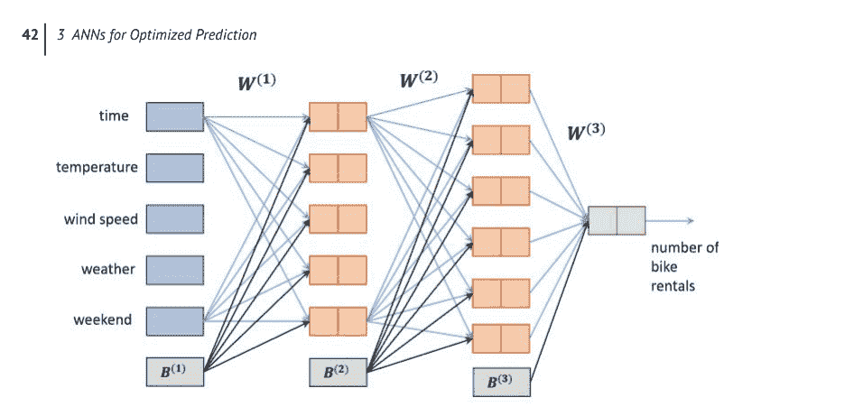

图 3.6 一个用于自行车租赁示例的全连接人工神经网络，使用了两个隐藏层（为简化起见，图中省略了许多连接）。

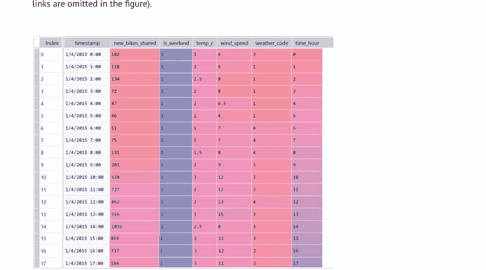

图 3.7 用于训练图 3.6 所示人工神经网络的现场数据。

在第 89 行创建，并在第 95 行创建了一个具有五个输入神经元的隐藏层，类型为密集（即全连接）层，激活函数为线性整流函数：样本输入和输出分别存储在第 84 行和第 86 行的 X 和 Y 数组中。在第 89 行，创建了一个名为 model 的对象。两个分别具有五个和六个神经元的隐藏层，使用线性整流激活函数（选项 relu），在第 95 行和第 97 行被添加到人工神经网络中。一个输出层在第 99 行被定义，它由一个具有线性激活函数（即在激活过程中不过滤值）的神经元组成。优化函数在第 103 行被设置为使用梯度下降方法的均方误差。这个人工神经网络在第 105 行通过以下代码进行训练：

```
model.fit(X, Y, epochs=2000)
```

当用户在第 108 行到第 121 行选择选项 2 时，一个已保存的人工神经网络被加载到名为 model 的人工神经网络对象中。所选人工神经网络（无论是新训练的还是保存的）的权重通过第 127 行和第 128 行给出的脚本打印到屏幕上，这些脚本调用了第 15-21 行中名为 print_weights 的函数，该函数打印人工神经网络的权重。

使用人工神经网络预测给定日期的自行车数量在第 133 行到第 171 行的循环中呈现。系统会要求用户输入特定日期的输入值，这些值是人工神经网络的输入。在第 148 行，通过以下代码为用户输入数据生成预测：

```
prediction = model.predict(user_input)
```

其中名为 model 的对象包含人工神经网络，user_input 是由用户输入的值填充的输入变量。在第 175 行和第 187 行，用户可以选择保存当前的人工神经网络。

```
1 # 纽约市立学院，纽约城市大学
2 # 由 Ricardo Valdez 和 Jian Wen Choong 编写
3 # 2020年8月
4 # 本示例的数据来源于：
5 # https://www.kaggle.com/hmavrodiev/london-bike-sharing-dataset
6 import numpy as np
7 import pandas as pd
8 import time
9 from datetime import datetime
10 from tensorflow import keras
11 
12 # import print_weights as pw
13 # call: pw.print_weights()
14 
15 def print_weights(weights):
16     # weights = model.get_weights();
17     print('\n******** 人工神经网络的权重 ********\n')
18     for i in range(int(len(weights)/2)):
19         print('权重 W%d:\n' %(i), weights[i*2])
20         print('偏置 b%d:\n' %(i), weights[(i*2)+1])
21 #END print_weights()
22 
23 ## 人工神经网络训练
24 print('\n')
25 print('********************************************************************')
26 print('****  欢迎使用基于人工神经网络的自行车共享系统  ****')
27 print('********************************************************************')
28 
29 # 提示用户训练或加载一个人工神经网络模型
30 option_list = ['1','2']
31 option = ''
32 while option not in option_list:
33     print('\n选项：')
34     print('1 - 训练一个新的神经网络模型')
35     print('2 - 加载一个现有模型')
36 
37     option = input('\n请输入一个数字选择选项：\n')
38     if option not in option_list:
39         message = '输入无效：输入必须是以下选项之一 - '
40         print(message, option_list)
41         time.sleep(2)
42 
43 if option == '1':
44     ## 选项 1：训练一个新的神经网络模型
45     train_data_file = 'london_bike_sharing_data.csv'
46 
47     print('\n********** 正在使用', train_data_file,'训练神经网络 **********')
48     time.sleep(3)
49 
50     ## 加载训练数据
51     df = pd.read_csv(train_data_file)
52 
53     ## 训练数据包含7列：
54     ##
55     ##      timestamp - 样本记录的日期和时间
56     ##      new_bikes_shared - 过去一小时内共享的新自行车数量
57     ##      is_weekend - 布尔值，如果当天是周末则为1（真）
58     ##      temp_c - 摄氏温度
59     ##      wind_speed - 风速，单位为公里/小时
60     ##      weather_code - 天气类别：1 = 晴朗
61     ##                                        2 = 少云
62     ##                                        3 = 多云
64     ##                                        4 = 阴天
65     ##                                        7 = 雨
66     ##                                        10 = 雷暴
67     ##                                        26 = 雪
68     ##                                        94 = 冻雾
69 
70     ## df 的 timestamp 列存储为字符串。我们希望使用
71     ## 函数 datetime.strptime() 将每个时间戳字符串转换为 datetime 对象。
72     ## datetime.strptime() 的第一个输入是你想要转换的字符串，
73     ## 第二个输入是字符串的格式，其中
74     ## %m = 月，%d = 日，%Y = 年，%H = 时，%M = 分。
75     ##
76     ## 创建 lambda 函数来执行转换并返回小时。
77     get_hour = lambda timestamp: datetime.strptime(timestamp,
78                                                '%m/%d/%Y %H:%M').hour
79     ## 将 lambda 函数应用于 df['timestamp'] 列中的每个时间戳
80     df['time_hour'] = df['timestamp'].apply(get_hour)
81 
82     ## 定义输入矩阵 X（删除名为 timestamp 和
83     ## new_bikes_shared 的列）
84     X = np.array(df.drop(['timestamp','new_bikes_shared'], axis=1))
85     ## 定义期望输出矩阵 Y
86     Y = np.array(df['new_bikes_shared'])
87 
88     ## 为人工神经网络创建一个模型
89     model = keras.Sequential()
90     ## 添加一个隐藏层，接受5个输入特征（time_hour, temp_c
91     ## wind_speed, weather_code, is_weekend）
92     ## 该隐藏层有5个神经元。
93     ## Dense 表示该层中的每个神经元都与前一层中的每个神经元相连。
94     model.add(keras.layers.Dense(5, activation='relu', input_shape=(5,)))
95     ## 向人工神经网络添加另一个具有6个神经元的隐藏层
96     model.add(keras.layers.Dense(6, activation='relu'))
97     ## 添加一个具有单一输出（new_bikes_shared）的输出层
98     model.add(keras.layers.Dense(1, activation='linear'))
99 
100     ## 设置用于最小化损失函数的优化算法
101     ## 使用梯度下降（adam）来最小化误差（损失）
102     model.compile(optimizer='adam', loss='mean_squared_error')
103     ## 使用2000次迭代训练神经网络模型
104     model.fit(X, Y, epochs=2000)
105 
106     print('\n\n********** 神经网络训练完成 **********\n\n')
107 elif option == '2':
108     ## 选项 2：从文件加载神经网络模型
109 
110     message = '请输入您要加载的神经网络模型文件名：\n'
111     load_file = input(message)
112     #load_file = input('It must be a .h5 file')
113 
114     ## 如果文件名不以 '.h5' 结尾，则在文件名后添加 '.h5'
115     if load_file[-3:] != '.h5':
116         load_file += '.h5'
117 
118     ## 从 load_file 加载神经网络模型
119     model = keras.models.load_model(load_file)
120 
121     print('\n\n****** 已成功从', load_file,'加载神经网络模型 *******')
122 else:
123     print('错误：选择了无效的选项')
124     ## 引发异常以终止程序
125     raise ValueError()
126 
127 weights = model.get_weights();
128 print_weights(weights)
129 
130 ## 使用神经网络进行自行车共享预测
131 input('\n\n*********** 按 ENTER 键开始使用神经网络 ***********\n\n')
132 finished = False
133 while not finished:
134     ## 提示用户输入
135     temp_c = float(input('\n\n请输入摄氏温度：\n'))
136     hour = float(input('请输入一天中的小时（24小时制）：(0-23) \n'))
137     is_weekend = input('是否是周末？(y/n)：\n')
138     if is_weekend == 'y':
139         is_weekend = 1
140     else:
141         is_weekend = 0
142     wind_speed = float(input('请输入风速：(公里/小时) \n'))
143     weather_code = int(input('请输入天气代码：(1 = 晴朗, 2 = 少云, '
144                             + '3 = 多云, 4 = 阴天, 7 = 雨, '
145                             + '10 = 雷暴, 26 = 雪, 94 = 冻雾) \n'))
146 
147     user_input=np.array([[is_weekend, temp_c, wind_speed, weather_code,hour]])
148     prediction = model.predict(user_input)
149 
150     ## 将预测值限制为非负值
151     if prediction < 0:
152         prediction = 0
153     else:
154         pass
155 
156     ## 显示预测结果
157     print('\n*******************************************')
158     print('神经网络预测的共享自行车数量：', int (prediction))
159     print('*******************************************')
160     ## 询问用户是否希望继续
161     choice = ''
162     while choice not in ['y','n']:
163         choice = input('\n\n您希望继续吗？(y/n)：\n')
164         if choice == 'y':
165             pass
166         elif choice == 'n':
167             finished = True
168         else:
169             print("输入无效：输入必须是 'y' 或 'n'")
170     #END WHILE
171 #END WHILE
172 
173 ## 询问用户是否希望保存神经网络模型
174 choice = ''
175 while choice not in ['y','n']:
176     choice = input('\n\n您希望保存神经网络模型吗？(y/n)：\n')
177     if choice == 'y':
178         save_name = input('\n\n请输入保存文件的名称：\n')
179         ## 如果文件名不以 '.h5' 结尾，则在文件名后添加 '.h5'
180         if save_name[-3:] != '.h5':
181             save_name += '.h5'
182         model.save(save_name)
183         print('\n\n')
184         print('***** 神经网络模型已成功保存为 '+save_name+' *****')
185     elif choice == 'n':
186         pass
187     else:
188         print("输入无效：输入必须是 'y' 或 'n'")
189 #END WHILE
```

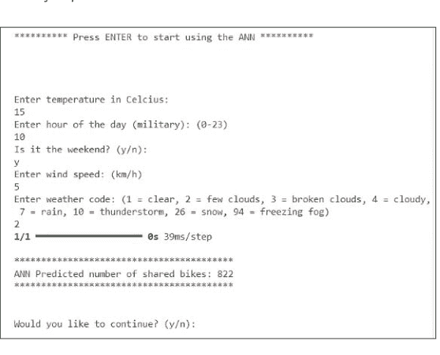

图 3.8 用于自行车租赁示例的 Python 脚本预测，在温度为 15 摄氏度、多云、风速为 5 英里/小时的周末上午 10:00，自行车租赁量为 822 辆。

图 3.8 展示了该 ANN 的一个示例运行截图。在此运行中，训练好的 ANN 预测在温度为 15 摄氏度、多云、风速为 5 英里/小时的周末日，自行车租赁量为 822 辆。

### 3.6.2 使用 ANN 进行自行车租赁预测的 Matlab 脚本

下面展示了实现图 3.6 所示自行车租赁 ANN 的一个 Matlab 脚本示例。该 Matlab 脚本的结构与第 3.6.1 节中的 Python 实现类似，以便读者比较。

在第 15 行，用户被要求选择是训练一个新的 ANN 还是加载一个已保存的。如果用户选择通过输入 1 来训练新的 ANN，则在第 21 行使用文件中的样本数据创建一个名为 `df` 的多维矩阵。输入和输出值分别在第 29 行和第 31 行保存为 `X` 和 `Y`。在第 34 行，创建一个名为 `net` 的 ANN 对象，该对象在第 36 行通过以下代码进行训练：

```
net = train(net, X, Y);
```

如果用户在第 15 行输入 2，则在第 42 行将先前训练好的 ANN 加载到 `net` 对象中。在第 56 行和第 66 行之间有一个循环，其中 `net` 中的训练好的 ANN（无论是新的还是保存的）根据用户输入执行，直到用户在第 65 行输入 `n` 退出。在第 51–58 行，请求并记录用户对 ANN 的输入。然后在第 60 行，ANN 生成预测如下：

```
prediction = net(is_weekend, time_c, wind_speed, weather_code, hour);
```

其中 ANN 的输出保存在 `prediction` 中。在第 69–74 行，用户在退出脚本前可以选择保存当前的 ANN。

图 3.9 展示了由 Matlab 脚本实现的 ANN 的一个示例运行，其中对于温度为 15 摄氏度、多云、风速为 5 英里/小时的周末日，在上午 10:00，预测的自行车租赁量为 928 辆。这个结果与第 3.6.1 节中 Python 脚本的预测不完全相同，因为两个实现中库函数的实现方式不同。然而，两个结果都与样本数据一致。

```
**** 欢迎使用基于人工神经网络的自行车共享系统 ****
选择选项 (1- 训练, 2- 加载): 2
输入模型文件名: ANN_BikeRental_2023_11_11.mat
模型已从 ANN_BikeRental_2023_11_11.mat 加载
按 ENTER 键开始使用 ANN
输入摄氏温度: 15
输入一天中的小时 (24小时制): (0-23) 10
是否是周末? (y/n): y
输入风速 (公里/小时): 5
输入天气代码: (1 = 晴朗, 2 = 少云, 3 = 多云, 4 = 阴天,
7 = 雨, 10 = 雷暴, 26 = 雪, 94 = 冻雾)2
预测的共享自行车数量: 928
是否继续? (y/n): |
```

图 3.9 上述 Matlab 脚本用于自行车租赁，在温度为 15 摄氏度、多云、风速为 5 英里/小时的周末上午 10:00，预测租赁量为 928 辆。

```
1 % 纽约市立学院，纽约城市大学
2 % 由 Olga Chsherbakova 编写
3 % 2023年11月
4
5 % 使用 ANN 预测自行车共享
6
7 clc;
8 clear;
9
10 % ANN 训练
11 disp('********************************************************************');
12 disp('**  欢迎使用基于人工神经网络的自行车共享系统  **');
13 disp('********************************************************************');
14
15 option = input('选择选项 (1- 训练, 2- 加载): ', 's');
16
17 if option == '1'
18     % 提示用户训练或加载 ANN 模型
19     train_data_file = 'london_bike_sharing_data.csv';
20     disp(['使用 ', train_data_file, ' 训练 ANN']);
21     df = readtable(train_data_file);
22
23     % 转换时间戳
24     time_hour = hour(datetime(df.timestamp, ...
25                 'InputFormat', 'MM/dd/yyyy HH:mm'));
26     df.time_hour = time_hour;
27
28     % 定义输入矩阵 X 和输出矩阵 Y
29     X = [df.is_weekend, df.temp_c, df.wind_speed, df.weather_code, ...
30                     df.time_hour];
31     Y = df.new_bikes_shared;
32
33     % 创建和训练神经网络
34     net = fitnet([5 6]);
35     % 定义期望输出矩阵 Y
36     net = train(net, X', Y');
37
38     disp('训练完成。');
39 elseif option == '2'
40     % 加载训练数据
41     load_file = input('输入模型文件名: ', 's');
42     load(load_file, 'net');
43     disp(['模型已从 ', load_file, ' 加载']);
44 end
45
46 disp('按 ENTER 键开始使用 ANN');
47 pause;
48 % 提示用户训练或加载 ANN 模型
49 finished = false;
50 while ~finished
51     temp_c = input('输入摄氏温度: ');
52     hour = input('输入一天中的小时 (24小时制): (0-23) ');
53     is_weekend = input('是否是周末? (y/n): ', 's');
54     is_weekend = double(is_weekend == 'y');
55     wind_speed = input('输入风速 (公里/小时): ');
56     disp('天气代码: 1 = 晴朗, 2 = 少云, 3 = 多云, 4 = 阴天');
57     disp('7 = 雨, 10 = 雷暴, 26 = 雪, 94 = 冻雾');
58     weather_code = input('输入天气代码: ');
59
60     prediction = net([is_weekend; temp_c; wind_speed; weather_code; hour]);
61     prediction = max(prediction, 0); % 将预测限制为非负数
62     disp(['预测的共享自行车数量:',num2str(round(prediction))]);
63
64     choice = input('是否继续? (y/n): ', 's');
65     finished = (choice == 'n');
66 end
67
68 % 保存模型
69 choice = input('是否保存 ANN 模型? (y/n): ', 's');
70 if choice == 'y'
71     save_name = input('输入保存文件的名称: ', 's');
72     save([save_name '.mat'], 'net');
73     disp(['模型已保存为 ', save_name]);
74 end
```

## 3.7 总结性评述

在本章中，我们介绍了两个使用 ANN 进行事件优化预测的简化案例研究。第一个是基于学生为考试学习的小时数和睡眠小时数来预测考试成绩的 ANN。对于这个简单的例子，我们详细介绍了前向和反向传播操作，展示了训练每一步的参数值以及第 2 章推导出的公式。第二个例子涉及构建和训练一个 ANN，基于样本数据（如星期几、一天中的时间、空气温度和风速）来预测自行车租赁数量。这个例子的灵感来源于在英国伦敦运营的自行车租赁公司。

我们提供了用于实现这些 ANN 的 Python 和 Matlab 脚本示例。尽管我们使用了最简单的 ANN 架构（只有几个神经元的最少隐藏层数）和非常少的数据点，但 ANN 生成的预测与训练数据兼容，这清楚地表明了基于 ANN 的优化预测方法的强大能力。

## 3.8 第 3 章练习题

- 1) 修改第 3.5.9 节中用于睡眠-学习 ANN 的 Python 脚本，添加更多隐藏层。这有什么影响（如果有的话）？
- 2) 修改第 3.5.9 节中用于睡眠-学习 ANN 的 Python 脚本，增加神经元数量。这有什么影响（如果有的话）？
- 3) 修改第 3.5.9 节中用于睡眠-学习 ANN 的 Python 脚本，同时增加隐藏层数量和神经元数量。这有什么影响（如果有的话）？
- 4) 对第 3.5.10 节中给出的 Matlab 脚本重复练习 1。观察并解释其影响。
- 5) 对第 3.5.10 节中给出的 Matlab 脚本重复练习 2。观察并解释其影响。
- 6) 对第 3.5.10 节中给出的 Matlab 脚本重复练习 3。观察并解释其影响。
- 7) 对第 3.6.1 节中用于自行车租赁 ANN 的 Python 脚本重复练习 1。观察并解释其影响。
- 8) 对第 3.6.1 节中用于自行车租赁 ANN 的 Python 脚本重复练习 2。观察并解释其影响。
- 9) 对第 3.6.1 节中用于自行车租赁 ANN 的 Python 脚本重复练习 3。观察并解释其影响。
- 10) 对第 3.6.2 节中用于自行车租赁 ANN 的 Matlab 脚本重复练习 1。观察并解释其影响。
- 11) 对第 3.6.2 节中用于自行车租赁 ANN 的 Matlab 脚本重复练习 2。观察并解释其影响。
- 12) 对第 3.6.2 节中用于自行车租赁 ANN 的 Matlab 脚本重复练习 3。观察并解释其影响。

# 4 用于金融股票交易的人工神经网络

## 4.1 引言

使用计算机程序进行涉及股票和债券等金融证券的交易被称为`算法交易`。在此领域内，对多种证券的买卖或持有决策，会根据用户对将控制权交给算法的接受程度，以自主或半自主的方式执行。

算法交易最明显的优势在于，它能够通过考虑大量因素来做出交易决策，这些因素包括对多年历史交易数据的分析；外部来源，如媒体报道、领导人讲话和日常事件；以及许多其他影响交易决策的输入。传统的股票交易员，无论多么聪明和经验丰富，都无法最优地处理如此大量的信息。在当前金融市场中，超过60%的交易量使用了某种形式的算法交易机制。随着为算法交易开发的基于人工智能的工具日益成熟，这一交易量预计将会增加。

## 4.2 买卖股票的程序

金融应用在各种人工智能方法的发展中扮演了重要角色。纽约证券交易所“旧时代”的交易大厅已被远程计算机的显示屏所取代（图4.1）。

所谓的量化分析师是量化分析和交易算法的设计者。他们通常是具有数学和算法背景，并结合了金融培训的工程师和物理学家。

## 4.3 技术指标

算法交易程序通常通过观察所谓的`技术指标`来做出交易决策，这些指标是从历史交易数据（如价格和成交量）中推导出的数学公式。技术指标是帮助识别可能隐藏在历史数据中的任何模式的有用工具[39]。在本章中，我们包含了最常用的指标，即动量、不同类型的移动平均线和布林带。尽管由于篇幅限制未在此描述，但随机振荡器[40]、变化率[41]、平衡成交量[42]和威廉指标%R[43]也是流行的技术指标。感兴趣的读者可以在[44]中找到算法交易中使用的许多其他技术指标。

**图4.1** 纽约证券交易所交易大厅：(a) 交易由股票经纪人完成时（Carol M. Highsmith / 美国国会图书馆 / 公共领域），以及 (b) 计算机部署算法交易后（Nicky Pe / 公共领域图片）。

### 4.3.1 简单移动平均线

最受欢迎的技术指标之一，简单移动平均线（SMA），定义为股票在固定时间窗口（天、周或年）内的平均价格。SMA通过基本上减少选定时间段内的噪声，有助于平滑价格的小幅波动。图4.2（取自[45]）显示了标普500指数股票的每日价格走势以及为10个月期间计算的相应SMA。可以看出，SMA消除了波动，并且在SMA曲线上更容易检测随时间变化的趋势。在第$t$天计算$n$日SMA定义为：

$$\text{SMA}(t) = \frac{1}{n} \sum_{i=0}^{n-1} \text{price}(t-i),$$

其中股票价格是过去$n$天的平均值。例如，给定某天$t$的股票30日SMA是从第$t$天到第$(t-30)$天的收盘价之和除以30。SMA可以针对证券的任何金融特征计算（例如，开盘价、收盘价、最高价或最低价或每日成交量的SMA）。

**图4.2** SMA平滑了每日股票走势中的波动。

### 4.3.2 动量

金融资产特征（例如价格或成交量）在给定时间间隔内的变化率被定义为动量。该指标用于确定给定股票在选定时间段内的趋势强度。两个不同时间点的动量是连接它们的直线的斜率。在第$t$天计算$n$天期间的动量定义为：

$$M(t) = \frac{\text{price}(t)}{\text{price}(t-n)},$$

其中$M(t)$是第$t$天的动量。为给定金融资产选择最合适的$n$天周期来计算动量，对金融专业人士来说是一个重要的决定，因为它可能对短期、中期或长期区间给出不同的趋势。

图4.3（取自[46]）显示了标普500指数的10日动量。如果指数的最新收盘价高于10个交易日前的收盘价（即$M(t) > 1$），则在零线上方绘制一个正数。类似地，如果最新收盘价低于10天前的收盘价（即$M(t) < 1$），则在零线下方绘制一个负值。零线代表没有表现出趋势的指数。

**图4.3** 标普500指数价格走势的动量（取自[46]）。

### 4.3.3 指数移动平均线

与SMA类似，`指数移动平均线`（EMA）是股票在固定天数窗口内的平均价格，但在计算中，最近的价格比旧的价格权重更大[47]。为了递归计算第$t$天的$n$日EMA，将一天价格的百分比加到前一天的EMA上，持续$n$天，如下所示：

$$EMA(t) = price(t) \cdot \frac{2}{(n+1)} - EMA(t-1) \cdot \left(1 - \frac{2}{(n+1)}\right),$$

其中$2/(n+1)$被称为`冷却`周期。在$n$天的周期内，当计算最早一天（我们称之为$t_0$）的EMA时，使用第$t_0$天的SMA：

$$EMA(t_0) = SMA(t_0).$$

EMA的结果与SMA相似，只是旧日期对结果的影响较小。因此，理论上，EMA在反映最新股票走势方面比SMA延迟更少（图4.4）——因为EMA对当前数据应用了更大的权重，它比相应的SMA更紧密地跟随价格。然而，必须意识到，与可比的SMA相比，EMA可能对价格变化过于敏感。在交易中，如果当价格跌破EMA时EMA上升，这可能会触发买入`信号`（即，由算法交易系统生成的用户应购买该特定股票的指示）。类似地，如果当价格高于EMA时EMA下降，则可能生成卖出信号。

### 4.3.4 布林带

基于SMA上下两个标准差为给定股票计算的一对曲线被称为`布林带`（BBs）[48]。使用BBs的主要思想是，非波动性股票的价格通常会保持在BBs的范围内。如果资产价格移出BBs，预计它会返回到BB范围内。这一预期可能是指导给定股票买卖决策的有用指南。

例如，如果资产价格高于BB，这并不一定表示买入信号，因为预计它很快会返回到其BB内。同样，股票价格跌破其BB可能不会触发自动卖出信号，因为预计它会再次上涨到其BB内（图4.5）。对于给定的第t天，BB计算如下：

$$BB(t) = \pm \frac{price(t) - SMA(t)}{2 \cdot \sigma(t)}$$

其中σ代表同一n天期间内价格变化的标准差。短期BB的典型值是10日SMA和(±1.5 · σ)的带宽，而长期BB使用20日SMA和(±2.5 · σ)的带宽[49]。

**图4.5** 使用20日SMA和2 σ计算的虚构股票的布林带（取自[49] / FMR LLC）。

## 4.4 一个简单的算法交易策略

技术指标可用于确定`算法交易策略`，据此做出买卖或持有给定股票的决策。使用技术指标的第一步是定义它们的参数，这些参数被称为`超参数`。对于动量M，超参数是用于计算其斜率的时间范围，而对于SMA和EMA，它是计算SMA和EMA的时间范围。对于BBs，超参数是SMA的时间范围和带宽偏离SMA的标准差数量。在算法交易中，选择用于技术指标的超参数值是一个艰巨且非平凡的挑战。

一个使用SMA进行算法交易的过度简化示例可以构建如下。对于给定的股票，每当短期SMA（例如50天）上穿长期SMA（例如200天）时，就检测到`价格上涨趋势`。预期这种趋势将持续，可能会生成买入该股票的信号。如果价格持续上涨，将获得利润。同样，如果短期SMA下穿长期SMA，则检测到下跌趋势，该股票在未来几天内将贬值，因此应在价格进一步下跌前卖出。这样可以避免损失。

选择计算SMA的周期并不明显。这需要经验和对股票交易所在特定金融领域的了解。如果选择相对较大的n，SMA会使价格曲线更平滑，因此更容易从中提取信息，因为价格曲线中的噪声和异常值被消除了。然而，较长周期的SMA可能会在价格变动和SMA曲线之间产生延迟，这可能会降低交易者检测近期价格变动的能力。另一方面，短期SMA可以更快地响应价格变化，但风险是波动性更大（即，一个比其他指标波动更大的度量）。

例如，考虑图4.6中显示的比特币的两条独立SMA曲线（50天和200天）。可以制定一个称为移动平均线交叉[50]的策略，即当短期SMA从下方上穿长期SMA时，表示潜在的买入信号。这意味着短期SMA显示价值增长，而长期SMA尚未响应。同样，从上方交叉表示股票的卖出信号（即，算法交易系统向用户发出卖出股票的指示），这意味着短期SMA在长期SMA之前检测到价值损失。这种交叉策略也可以用于EMA[50]。

在其他应用中，如果给定股票的M具有相对较大的正值，可以得出结论价格将继续上涨（即买入信号）。同样，相对较大的负值可能是其价值将继续下降的迹象，意味着卖出信号。使用布林带时，如果当前价格高于上轨，通常被视为潜在的卖出信号。同样，如果当前价格低于下轨，则被视为潜在的买入信号。这种方法的假设是价格将保持在布林带的下轨和上轨之间，并且如果价格超出布林带，预计它将很快返回带内。这一假设意味着，如果价格高于上轨，必须卖出股票，因为它将很快通过价格下跌回到带内。同样，如果价格低于下轨，预计它将通过价格上涨回到布林带内，因此可能会生成买入信号。

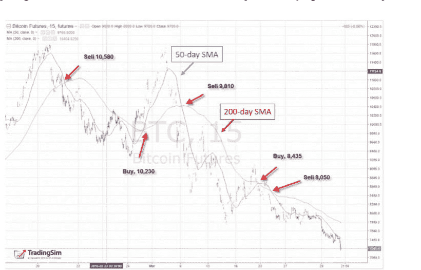

图4.6 比特币的50天和200天SMA价格曲线（取自[50] / MYSMP, LLC）。

## 4.5 用于算法股票交易的简单人工神经网络

人工神经网络是基于长时间（通常是数年或数十年）交易时段内记录的历史数据预测股票价格的完美候选者。记录的交易信息包括许多有用的指标，例如每日开盘价和收盘价、最低和最高买卖价格以及成交量，这些数据记录在所有正常运作的金融市场中。这些信息被称为逐笔数据，因为它是在二十世纪初使用有线连接在证券交易所大楼和交易公司之间使用自动收报机记录的[51]。逐笔数据还包括每个买价（即买方愿意为资产支付的最高价格）和卖价（即卖方愿意接受的最低价格）的时间戳信息，通常记录交易日的每一分钟。

在利用人工神经网络进行算法交易时，一种流行的方法是使用截至选定日期t计算的一组技术指标作为人工神经网络的输入，而输出可以选择为对该金融资产在第二天t+1（或如果按小时计算，则为下一小时等）的预测。在训练期间，为第t天计算选定的技术指标作为输入，并使用从逐笔数据计算的相应样本输出。例如，如果人工神经网络输出选择为股票价格的百分比变化，如果从第t天到第t+1天的收盘价记录为上涨x%，则第t天的样本输出为x%。同样，如果股票在第t+1天贬值x%，则该样本的输出将为-x%。训练使用从选定的几年或几十年历史逐笔数据中获得的样本继续进行。一旦训练完成，人工神经网络就可以用于预测买入、卖出或持有该股票，直到未来训练出新模型。

### 4.5.1 人工神经网络的输入和输出

在本节中，我们将介绍一个用于算法交易示例的简单人工神经网络，其中输入是为用户定义的周期（即超参数值）计算的一组技术指标，人工神经网络输出是预测的价格走势。在这个例子中，我们使用四个技术指标作为人工神经网络的输入，即M、SMA、EMA和BB，这些指标是针对给定股票（或一组股票）截至第t天的收盘价计算的。我们将第t+1天股票价格百分比变化的预测定义为人工神经网络的输出。在定义架构（即隐藏层数和每层神经元数、激活函数分配等）之后，使用基于历史逐笔数据计算的技术指标训练人工神经网络。

通常，专业股票交易者在人工神经网络生成的预测帮助下做出最终的策略决策。例如，如第4.4节所述，如果预测价格下跌，可能会触发卖出信号，而预测价格上涨可能建议买入信号。然而，在现实情况中，交易者在做出策略决策之前可能还有其他未定义为人工神经网络输入的输入需要考虑（例如，即将到来的选举、经济实力、房地产市场状况、失业率、自然灾害）。对于这种情况，人工神经网络通过其基于各种技术指标的预测提供了增强的清晰度。

回测是一种帮助确定人工神经网络技术指标和超参数最佳组合的方法。假设交易者希望使用涵盖五年交易信息的逐笔数据。人工神经网络设计者可以选择前四年的数据进行训练，最后一年的数据来测试训练后的人工神经网络性能是否可接受。在这种情况下，一旦人工神经网络权重在选定的epoch数内使用第1年至第4年的数据正确更新，训练后的人工神经网络性能将使用第5年的数据进行测试。这称为回测，它衡量人工神经网络预测的准确性，就像它在第5年执行算法交易指令一样。如果回测结果不令人满意，设计者会修改人工神经网络组件，直到确定可接受的架构、具有适当超参数值的输入、有意义的输出、训练epoch数以及其他类似方面的组合。将历史逐笔数据划分为训练和回测是设计者必须针对其运营的特定市场条件解决的权衡。对于某些应用，人工神经网络每天训练，而对于其他市场，更倾向于每年训练几次的人工神经网络。总之，要使用人工神经网络进行算法交易，至少应执行以下步骤：

- 选择用作人工神经网络输入的技术指标和/或其他变量（例如，M、SMA、EMA和BB、利率、失业率）。
- 为选定的技术指标定义超参数值（例如，SMA(5)、EMA(20)、最近两个季度的平均利率）。
- 定义人工神经网络架构（即层数、每层神经元数、层间连接、激活函数等）。
- 将历史数据划分为训练和回测部分。
- 使用历史数据的训练部分，确定或计算每个训练日的人工神经网络输入和相应的输出。
- 通过应用输入、计算输出中的误差并更新权重来训练人工神经网络，持续预定的epoch数。
- 使用历史数据的回测部分，衡量人工神经网络的性能。
- 根据回测结果，如果需要，修改人工神经网络架构以及输入和输出的选择，并重复上述步骤，直到获得令人满意的性能。
- 一旦人工神经网络训练得当，就可以投入使用：使用最新信息提供新输入以获得预测。

### 4.5.2 人工神经网络架构

对于本章中使用的简单人工神经网络架构，如图4.7所示，我们定义了四个输入，即M、SMA、EMA和BB，以及一个输出作为第二天的价格百分比变化。注意图中的W和B是第3章中定义的权重矩阵和偏置向量。在这个简单的人工神经网络中，有两个隐藏层，分别有四个和三个神经元。人工神经网络是全连接的。用于训练此人工神经网络的逐笔数据样本如图4.8所示，其中包含所选微软股票示例的每日开盘价、最高价、最低价、收盘价和调整后收盘价（即交易日结束后重新计算的收盘价，以反映对股票价格的影响，如支付股息、股票拆分等[51]）以及成交量（即买卖的单位数量）。

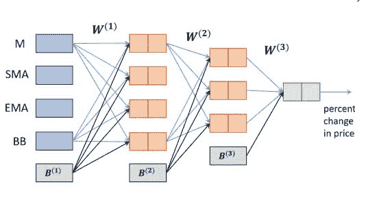

输入层 隐藏层1 隐藏层2 输出层

图4.7 用于股价预测的、具有两个隐藏层的简化人工神经网络。

| 日期 | 开盘价 | 最高价 | 最低价 | 收盘价 | 调整后收盘价 | 成交量 |
|---|---|---|---|---|---|---|
| 2019年3月20日 | 117.39 | 118.75 | 116.71 | 117.52 | 115.9854 | 28113300 |
| 2019年3月21日 | 117.14 | 120.82 | 117.09 | 120.22 | 118.6502 | 29854400 |
| 2019年3月22日 | 119.5 | 119.59 | 117.04 | 117.05 | 115.5216 | 33624500 |
| 2019年3月25日 | 116.56 | 118.01 | 116.32 | 117.66 | 116.1236 | 27067100 |
| 2019年3月26日 | 118.62 | 118.71 | 116.85 | 117.91 | 116.3703 | 26097700 |
| 2019年3月27日 | 117.88 | 118.21 | 115.52 | 116.77 | 115.2452 | 22733400 |
| 2019年3月28日 | 117.44 | 117.58 | 116.13 | 116.93 | 115.4031 | 18334800 |
| 2019年3月29日 | 118.07 | 118.32 | 116.96 | 117.94 | 116.4 | 25399800 |
| 2019年4月1日 | 118.95 | 119.11 | 118.1 | 119.02 | 117.4659 | 22789100 |
| 2019年4月2日 | 119.06 | 119.48 | 118.52 | 119.19 | 117.6336 | 18142300 |
| 2019年4月3日 | 119.86 | 120.43 | 119.15 | 119.97 | 118.4035 | 22860700 |
| 2019年4月4日 | 120.1 | 120.23 | 118.38 | 119.36 | 117.8014 | 20112800 |
| 2019年4月5日 | 119.39 | 120.23 | 119.37 | 119.89 | 118.3245 | 15826200 |
| 2019年4月8日 | 119.81 | 120.02 | 118.64 | 119.93 | 118.364 | 15116200 |
| 2019年4月9日 | 118.63 | 119.54 | 118.58 | 119.28 | 117.7225 | 17612000 |
| 2019年4月10日 | 119.76 | 120.35 | 119.54 | 120.19 | 118.6206 | 16477200 |
| 2019年4月11日 | 120.54 | 120.85 | 119.92 | 120.33 | 118.7588 | 14209100 |
| 2019年4月12日 | 120.64 | 120.98 | 120.37 | 120.95 | 119.3707 | 19745100 |
| 2019年4月15日 | 120.94 | 121.58 | 120.57 | 121.05 | 119.4694 | 15792600 |
| 2019年4月16日 | 121.64 | 121.65 | 120.1 | 120.77 | 119.193 | 14071800 |
| 2019年4月17日 | 121.24 | 121.85 | 120.54 | 121.77 | 120.1799 | 19300900 |
| 2019年4月18日 | 122.19 | 123.52 | 121.3 | 123.37 | 121.7591 | 27991000 |
| 2019年4月22日 | 122.62 | 124 | 122.57 | 123.76 | 122.144 | 15648700 |
| 2019年4月23日 | 124.1 | 125.58 | 123.83 | 125.44 | 123.802 | 24025500 |

图4.8 微软股票的示例逐笔交易数据。

## 4.6 使用人工神经网络进行股票交易的Python脚本

下面展示了实现图4.7所示人工神经网络的示例Python脚本。在第22行，定义了逐笔交易数据文件（名为MSFT.txt），其收盘价在第26行被保存到名为`df`的一维数组中。用于后续SMA和EMA计算的短期和长期窗口分别在第28和29行定义为5天和25天。在第33行，计算SMA并作为新列添加到`df`中，如下所示：

```
df['SMA'] = df.rolling(short_window).mean()
```

其中`rolling`表示SMA的移动窗口从当前条目开始，并为每一天包含最近五天（由`short_window`定义）。类似地，EMA将被计算并作为新列添加到`df`中，如第37行所定义：

```
df['EMA'] = df.ewm(span=long_window).mean()
```

其中`ewm`表示使用25天（由`long_window`定义）计算每日EMA。类似地，动量（M）和布林带（BB）分别在第40和47行定义。人工神经网络的输出，即收盘价的百分比变化，在第55行定义。该数组被移位，使得第i+1天的百分比变化与第i天的技术指标对齐。这样，人工神经网络的权重将被训练以匹配第二天的百分比变化，这将构成对第二天的预测。在第68和69行，人工神经网络的输入和输出分别定义为数组`X`和`Y`。

人工神经网络的架构在第72-82行定义。在第72行，创建了一个名为`model`的对象来保存人工神经网络。在第78行，定义了一个隐藏层以接受四个输入：

```
model.add(keras.layers.Dense(4, activation='relu', input_shape=(4,)))
```

其中`Dense`表示所有神经元都与前一层（即人工神经网络的输入）相连。在第88行，向人工神经网络添加了第二个具有3个神经元的隐藏层：

```
model.add(keras.layers.Dense(3, activation='relu'))
```

在第82行，添加了一个使用线性激活函数的输出层，如下所示：

```
model.add(keras.layers.Dense(1, activation='linear'))
```

其中通过将激活函数设置为`linear`，输出的负值不会被过滤。训练参数在第86行设置为：

```
model.compile(optimizer='adam', loss='mean_squared_error')
```

其中`adam`使用一种梯度下降算法，其收敛性将通过`mean_squared_error`方法来衡量。在第88行，训练人工神经网络：

```
model.fit(X, Y, epochs=200)
```

一旦人工神经网络训练完成，它就可以对第二天的价格百分比变化进行预测。在第102-106行，为新的一天计算SMA、EMA、动量（M）和布林带（BB），并保存到名为`latest_inputs`的数组中，然后将其应用于训练好的人工神经网络以生成预测：

```
prediction = model.predict(latest_inputs)[0][0]
```

```
1 # 纽约市立学院，纽约城市大学
2 # 由Ricardo Valdez编写
3 # 2020年8月
4 # 使用人工神经网络进行金融股票的算法交易
5 import numpy as np
6 import pandas as pd
7 import time
8 from tensorflow import keras
9 
10 def print_weights(weights):
11     # weights = model.get_weights();
12     print('\n******* 人工神经网络的权重 *******\n')
13     for i in range(int(len(weights)/2)):
14         print('权重 W%d:\n' % (i), weights[i*2])
15         print('偏置 b%d:\n' % (i), weights[(i*2)+1])
```

## 数据提取

```
historical_data_file = 'MSFT.csv'

## 加载历史股票数据
df = pd.read_csv(historical_data_file) # (df 代表数据框)
# ## 获取最近一个交易日的日期
# latest_trading_day_date = df['Date'].iloc[-1]
## 仅保留收盘价
df = df[['Close']]

short_window = 5
long_window = 25
## 计算简单移动平均线并将其添加到df的新列中；
## rolling 表示移动窗口从当前条目开始，
## 包含最近5天
df['SMA'] = df.rolling(short_window).mean()
## 计算指数移动平均线并将其添加到
## df的新列中；
## ewm 表示指数移动平均线
df['EMA'] = df['Close'].ewm(span=long_window).mean()
## 计算动量并将其添加到df的新列中；
## 动量定义为 今日收盘价 / 5天前的收盘价
df['Momentum'] = df['Close'] / df['Close'].shift(short_window)
## 计算滚动窗口内SMA的标准差
## ddof 表示自由度，设置为零以获得总体标准差
df['STD'] = df['Close'].rolling(short_window).std(ddof=0)
## 计算每日的布林带
## BB > 1 表示收盘价高于上轨
## BB > -1 表示收盘价低于下轨
df['BB'] = (df['Close'] - df['SMA']) / (2 * df['STD'])

## 计算每日收盘价的百分比变化
## shift(1) 表示昨天（应用于df的每个元素）
increase = df['Close'] - df['Close'].shift(1)
df['Percent_Change'] = (increase / df['Close'].shift(1))*100
## 将百分比变化移位到前一天，使其现在代表
## 第二天的百分比变化（使用-1将df元素向上移动1位）
df['Percent_Change'] = df['Percent_Change'].shift(-1)
```

## 人工神经网络训练

```
## 开始使用包含历史数据和
## 上面刚填充信息的df文件来训练人工神经网络
print('\n\n***** 现在开始使用', historical_data_file,'训练人工神经网络 *****')
time.sleep(3)

## 移除具有无效输入（即nan）的行，并
## 为人工神经网络创建输入和输出数组
## 从第25天开始到结束，但不包括结束（由于-1）
## 我们将预测csv中记录的最后一天（今天）的百分比变化
X = np.array(df[long_window:-1][['SMA','EMA','Momentum','BB']])
Y = np.array(df[long_window:-1]['Percent_Change'])

## 为人工神经网络创建一个模型
model = keras.Sequential()
# 创建具有3个输入 + 2个隐藏层 + 1个输出层的人工神经网络
## 第一个隐藏层接受4个输入特征（SMA、EMA、动量、BB）；
## 该隐藏层将有4个神经元；
## dense 表示该层中的每个神经元都与
## 前一层中的每个神经元相连；
model.add(keras.layers.Dense(4, activation='relu', input_shape=(4,)))
## 向人工神经网络添加另一个具有3个神经元的隐藏层
model.add(keras.layers.Dense(3, activation='relu'))
## 添加一个具有单个输出（百分比变化）的输出层
model.add(keras.layers.Dense(1, activation='linear'))

## 设置用于最小化损失函数的优化算法
## 使用梯度下降（adam）来最小化误差（损失）
model.compile(optimizer='adam', loss='mean_squared_error')
## 使用200次迭代训练人工神经网络模型
```

## 4 用于金融股票交易的神经网络

```python
model.fit(X, Y, epochs=200)

# 进行更多迭代的训练将产生更好的结果
# 构建不同的神经网络配置以获得更好的结果
# 使用不同的激活函数以获得更好的结果
# 使用不同的优化器，如adam或SGD（随机梯度下降）
# model.fit(X, Y, epochs=2000)
weights = model.get_weights()
print_weights(weights)
print('\n\n*********** 神经网络训练完成 ***********\n\n')

#% 神经网络预测

# 将最新交易日的输入数据插入数组
latest_SMA = df.iloc[-1]['SMA']
latest_EMA = df.iloc[-1]['EMA']
latest_Momentum = df.iloc[-1]['Momentum']
latest_BB = df.iloc[-1]['BB']
latest_inputs = np.array([[latest_SMA, latest_EMA, latest_Momentum, latest_BB]])

prediction = model.predict(latest_inputs)[0, 0]

print('\n*******************************************')
print('神经网络预测次日股票变动: %+.2f%%' % (prediction))
print('*******************************************')
```

一个示例运行结果如图4.9所示，其中打印了神经网络的权重和对次日价格的预测。由于神经网络的非确定性特性，对相同数据的连续执行可能会产生不同的结果。要为特定股票生成一致的结果，需要正确选择技术指标和神经网络参数。

```
******* 神经网络权重 *******

权重 W0:
 [[-0.39488143 -0.2513528  -0.11383426  0.13361037]
 [ 0.31351775 -0.21826017  0.60324603 -0.791878  ]
 [-0.27319056  0.6662517  -0.10669094  0.5447536 ]
 [-0.71983093  0.2046606  -0.5424671   0.5984675 ]]
偏置 b0:
 [0. 0. 0. 0.]
权重 W1:
 [[-0.3416971   0.1585803  -0.1252625 ]
 [ 0.21985483 -0.82390296  0.89098763]
 [-0.9230086  -0.39499676 -0.54984295]
 [ 0.05159628 -0.6413716   0.56523645]]
偏置 b1:
 [0. 0. 0.]
权重 W2:
 [[0.59186316]
 [0.1460483 ]
 [0.22688138]]
偏置 b2:
 [0.06645221]

*********** 神经网络训练完成 ***********

1/1 [==============================] - 0s 54ms/step

*******************************************
神经网络预测次日股票变动: +0.21%
*******************************************
```

图4.9 Python脚本的示例输出。

## 4.7 使用神经网络进行股票交易的Matlab脚本

图4.7所示神经网络的一个示例Matlab脚本如下所示。此处Matlab脚本的结构和变量与第4.6节中给出的Python脚本保持相似，以便读者进行比较。

在第18行，将tick数据读入`df`数组。第19行和第20行分别将短期和长期窗口大小定义为5和25。在第25、29、32和40行，分别定义了SMA、EMA、M和BB的技术指标。在第47行，通过将每日价格差除以前一天的收盘价来计算价格的百分比变化。在第48行，将它们移动一天，以便将次日的涨幅对齐为当日。包含上述计算的技术指标每日值的输入向量X在第57行定义，包含价格百分比变化的输出向量Y在第58行定义。

神经网络架构在第63-70行定义，使得神经网络具有两个隐藏层，分别有四个和三个神经元，以及一个具有一个神经元的输出层。所有层都是全连接的，这意味着所有前一层的输入都连接到当前层的所有神经元，如图4.7所示。在第72到76行，定义了神经网络训练的选项：训练周期数为200，批量大小为10（即每次处理10个样本以降低矩阵乘法复杂度），学习率α = 0.01。在第77行，训练神经网络并将其保存在名为`model`的对象中，如下所示：

```matlab
model=trainNetwork(X,Y,layers,options);
```

在第81行，为新的一天计算SMA、EMA、M和BB，并将其保存在名为`latest_inputs`的数组中，然后通过调用名为`predict`的库函数将其作为输入应用于训练好的神经网络：

```matlab
prediction=predict(model,latest_inputs)
```

其中，预测的新一天价格百分比变化存储在变量`prediction`中。

```matlab
1 % 纽约市立学院，纽约城市大学
2 % 由Olga Chsherbakova编写
3 % 日期：2023年11月
4 % 用于金融资产算法交易的神经网络
5 clc;
6 clear;
7 
8 % 开始使用包含历史数据和以下填充信息的df文件训练神经网络
9 fprintf('********** 现在开始使用MSFT.csv训练神经网络 **********')
10 % 加载历史股票数据
11 historical_data_file = 'MSFT.csv';
12 % df代表数据框
13 df = readtable(historical_data_file, 'PreserveVariableNames', true);
14 
15 % 仅保留收盘价
16 df = df(:, {'Close'});
17 
18 short_window = 5;
19 long_window = 25;
20 
21 % 计算简单移动平均线并将其添加到df的新列中；
22 % rolling表示从当前条目开始的移动窗口
23 % 和过去5天（在变量浏览器中打开df查看数值）
24 df.SMA = movmean(df.Close, short_window);
25 % 计算指数移动平均线并将其添加到df的新列中；
26 % ewm表示指数移动平均线
27 df.EMA = movavg(df.Close, 'exponential', long_window);
28 % 计算动量并将其添加到df的新列中；
29 % 动量定义为收盘价[今日] / 收盘价[5天前]
30 df.Momentum = df.Close./ lagmatrix(df.Close, short_window);
31 std_vals = movstd(df.Close, short_window, 'Endpoints', 'discard');
32 % 计算滚动窗口内SMA的标准差
33 % 将自由度设为零以获得总体标准差
34 df.STD = padarray(std_vals, [short_window-1 0], NaN, 'pre');
35 % 计算每日的布林带
36 % BB > 1 表示收盘价高于上轨
37 % BB < -1 表示收盘价低于下轨
38 df.BB = (df.Close - df.SMA)./ (2 * df.STD);
39 
40 % 计算每日收盘价的百分比变化
41 % shift(1) 表示昨天（适用于df的每个元素）
42 increase = df.Close - lagmatrix(df.Close, 1);
43 % 将百分比变化移动到前一天，使其现在代表
44 % 次日的百分比变化（使用-1将df元素向上移动1位）
45 df.Percent_Change = (increase./ lagmatrix(df.Close, 1)) * 100;
46 df.Percent_Change = lagmatrix(df.Percent_Change, -1);
47 
48 % 神经网络训练
49 % 移除包含无效输入（即nan）的行
50 df = rmmissing(df);
51 
52 % 为神经网络创建输入和输出数组
53 % 从第25天开始到结束，但不包括结束（由于-1）
54 % 预测csv中记录的最后一天（今天）的百分比变化
55 X = table2array(df(long_window:end-1, {'SMA', 'EMA', 'Momentum', 'BB'}));
56 Y = table2array(df(long_window:end-1, {'Percent_Change'}));
57 
58 % 为神经网络创建模型
59 % 创建具有4个输入 + 2个隐藏层 + 1个输出层的神经网络
60 % 第一个隐藏层接受4个指标（SMA、EMA、动量、BB）；
61 layers = [
62     featureInputLayer(4)
63     fullyConnectedLayer(4)
64     reluLayer
65     fullyConnectedLayer(3)
66     reluLayer
67     fullyConnectedLayer(1)
68     regressionLayer];
69 % 绘图
70 options = trainingOptions('adam', ...
71     'MaxEpochs', 200, 'MiniBatchSize', 10, 'InitialLearnRate', 0.01, ...
72     'LearnRateSchedule', 'piecewise', 'LearnRateDropPeriod', 125, ...
73     'LearnRateDropFactor', 0.2, 'Verbose', false, 'Plots', ...
74     'training-progress');
75 model = trainNetwork(X, Y, layers, options);
76 
77 % 神经网络预测
78 % 将最新交易日的输入数据插入数组
79 latest_inputs = table2array(df(end, {'SMA', 'EMA', 'Momentum', 'BB'}));
80 prediction = predict(model, latest_inputs);
81 
82 % 打印结果
83 fprintf('\n********** 神经网络训练完成 **********')
84 fprintf('\n*******************************************\n');
85 fprintf('神经网络预测次日股票变动: %+0.2f%%\n', prediction);
86 fprintf('*******************************************\n');
```

图4.10 上述Matlab脚本生成的示例输出，显示预测微软股票上涨0.07%。

图4.10展示了一个示例输出，其中预测微软股票将上涨0.07%。由于人工神经网络的非确定性特性以及库函数的差异，相同数据在Python和Matlab脚本中的输出结果会有所不同。

## 4.8 总结性评述

人工神经网络是基于历史逐笔数据实现金融资产算法交易的优秀候选模型。其基本假设是，金融逐笔数据可能具有某些特征，这些特征可以通过精心设计和训练的人工神经网络来捕捉，从而为交易者提供优势，否则他们将被迫依靠个人经验和技能来提取或推断此类信息。人工神经网络训练中一个已知的问题是，无意中将网络权重过度拟合到逐笔数据上，导致回测结果在历史数据上表现良好，但在真实市场情况下却表现不佳。如何在人工神经网络训练中避免过度拟合，目前仍是一个开放的研究课题。

在本章中，我们介绍了一个简单的人工神经网络模型，该模型以四种流行的金融技术指标作为输入，生成价格百分比变化作为输出。该人工神经网络模型是全连接的，包含两个隐藏层。我们使用Python和Matlab脚本，说明了如何实现这个简单的人工神经网络模型，包括其隐藏层、激活函数、输出误差计算方法以及用于金融股票算法交易的训练周期数。尽管Python和Matlab中可用的库函数使得此类实现在原则上变得简单，但执行速度慢和对人工神经网络参数控制有限意味着，专业级应用需要由专家程序员和金融专家开发、监控和维护的定制软件。

尽管现代计算机系统可以提供相当强大的计算能力，但在选择人工神经网络架构及其输入输出，以及基于这些信息设计交易策略时，必须谨慎。目前尚不清楚如何最好地选择所使用的技术指标、超参数、隐藏层数量和激活函数，以向专业股票交易者提供有意义的指导。当前的算法交易应用似乎需要同时具备计算和金融领域的经验：选择技术指标所需的技能组合需要金融行业的专业知识，而构建有效的人工神经网络架构通常是数据科学家的任务。

## 4.9 第四章练习

在以下练习中，使用以下技术指标：

- SMA：简单移动平均线
- EMA：指数移动平均线
- M：动量指标
- BBs：布林带
- SO：随机振荡器
- ROC：变动率
- OBV：能量潮
- WR：威廉指标

1) 使用图4.7中给出的人工神经网络，预测谷歌股票次日的收盘价走势。使用以下六种技术指标作为人工神经网络的输入：SMA、EMA、M、BB、SO和WR。
2) 使用图4.7中给出的人工神经网络，预测特斯拉股票次日的收盘价走势。使用以下六种技术指标作为人工神经网络的输入：SMA、EMA、M、BB、SO和ROC。
3) 使用图4.7中给出的人工神经网络，预测苹果股票次日的收盘价走势。使用以下六种技术指标作为人工神经网络的输入：SMA、EMA、M、BB、SO和OBV。
4) 使用图4.7中给出的人工神经网络，预测Zoom股票次日的收盘价走势。使用以下六种技术指标作为人工神经网络的输入：SMA、EMA、M、BB、WR和OBV。
5) 使用图4.7中给出的人工神经网络，预测亚马逊股票次日的收盘价走势。使用以下六种技术指标作为人工神经网络的输入：SMA、EMA、BB、WR和OBV。
6) 使用图4.7中给出的人工神经网络，预测奈飞股票次日的收盘价走势。使用以下六种技术指标作为人工神经网络的输入：SMA、EMA、M、BB、ROC和OBV。
7) 使用具有三个隐藏层的人工神经网络重复练习1。为什么结果不同？
8) 通过增加训练周期数并更改其激活函数，使用人工神经网络重复练习1。为什么结果不同？
9) 如果你使用三种技术指标而不是六种来重复练习1，你预期人工神经网络的预测会有什么不同？
10) 如果你使用九种技术指标而不是六种来重复练习1，你预期人工神经网络的预测会有什么不同？

# 5 用于阿尔茨海默病预后的人工神经网络

## 5.1 引言

在本章中，我们讨论如何利用机器学习技术来解决生命科学中原本棘手且有时难以处理的问题。作为一个案例研究，我们展示了如何利用人工神经网络，基于个性化的生物信息来预测阿尔茨海默病（AD）的预后。我们还提供了此类人工神经网络的Python和Matlab脚本实现示例，该网络使用从AD患者随时间收集的生物标志物现场数据进行训练。

## 5.2 阿尔茨海默病

阿尔茨海默病（AD）是一种由大脑内神经元破坏引起的无法治愈的进行性神经退行性疾病，其典型症状包括认知能力下降、记忆力减退、行为改变和个人功能障碍。随着疾病进展，AD患者通常会经历症状恶化和整体健康状况下降。

每个发展为阿尔茨海默痴呆症的人首先都会经历轻度认知障碍（MCI）。在MCI患者中，约15%在两年后发展为痴呆，大约三分之一在五年内发展为痴呆。然而，一些MCI患者没有出现进一步的认知能力下降，或者恢复到正常认知状态。在基于人群的研究中，一项系统综述和荟萃分析报告了26%的逆转率[52]。因此，开发工具来预测MCI患者是会恶化（即进行性MCI）还是保持稳定（即稳定MCI）至关重要。确定MCI患者的疾病轨迹具有重大的社会影响，可以为患者、其家人、护理人员和保险业提供个性化干预。

AD与大脑中基因表达模式的改变有关。这些变化影响各种生物过程，包括炎症、突触功能和神经元存活。AD诊断后的发病率是指患者经历的健康并发症、残疾和不良事件的频率和发生率。它取决于几个因素，包括诊断时的年龄、个人的整体健康状况、获得医疗服务的机会以及其他潜在疾病的存在。AD通常是一种慢性疾病，随着病情发展，会导致严重的残疾和对日常活动的依赖。然而，重要的是要注意，AD是一种高度个体化的疾病，发病率和进展速度因人而异。充分的支持、症状管理、获得医疗服务和适当的护理可以帮助减轻与AD相关的一些疾病负担，并提高患者的生活质量，尽管疾病带来了挑战[53]。

评估个人认知能力（包括记忆、注意力、语言和执行功能）的措施称为`认知评分`。通常使用标准化测试来评估患者认知能力下降的严重程度。`简易精神状态检查（MMSE）`评分常用于评估患者一段时间内的认知功能[54]。在MMSE中，有30个问题会问患者（从像兄弟姐妹名字这样简单的问题开始）。

另一个重要的生物标志物是`基因表达`，它可以作为AD的有力指标，因为某些基因的改变会影响疾病进展[55]。基因表达是基因在细胞中被激活以产生核糖核酸（RNA）和蛋白质的过程。基因表达可以通过观察蛋白质在细胞中的作用来测量。基因表达与认知评分之间的关系是复杂且多方面的。基因表达变化可能导致AD的发生和发展，影响相关的病理过程。这些变化最终会影响认知能力，导致评分下降。`阿尔茨海默病神经影像学倡议（ADNI）`记录了每位患者长达两年的每周评分及其基因表达[56]。ADNI数据库包含来自广泛参与者的数据，包括AD患者、MCI患者和无认知问题的个体。其主要目标是识别和验证AD进展的生物标志物，开发改进的诊断标准，并加速新疗法的开发。ADNI数据包括详细的临床评估、神经心理学测试结果、病史、遗传信息、脑成像数据和脑脊液生物标志物测量。ADNI项目对AD研究领域产生了重大影响，并产生了大量科学出版物、合作以及对该疾病的见解。

利用人工神经网络，以各种生物标志物作为输入来预测认知能力下降速率，从而进行AD预后，一直是一项持续的研究工作。例如，文献[57]中使用了成像模式、临床测量和认知状态标记。文献[58]中，从多个数据库获取健康个体和AD诊断患者的脑部MRI图像，通过人工神经网络形成疾病进展的相似性。在文献[59]中，研究人员关注可能影响AD进展的生物标志物，如脑脊液、血浆生物标志物、氧化应激、金属离子、血管疾病、蛋白质功能障碍和线粒体群的改变，以及从淀粉样蛋白成像获得的标记物。在另一项研究[60]中，研究人员利用海马体图像的MRI信息、基因表达以及MMSE评分来预测AD进展。

## 5.3 用于AD预后的简单人工神经网络

现在让我们定义一个用于AD预后的简单人工神经网络，其输入是从AD诊断患者收集的AD相关基因的表达值，输出是`M系数`（即每周MMSE评分损失），这是认知能力下降的直接指标。如果M系数较小，则下降速度较慢，而较大的值则表明认知能力下降较快。一旦人工神经网络训练完成，预计可以通过训练后网络的权重和偏置，建立AD患者基因表达（针对AD相关基因）与疾病进展之间的关系。当识别出新的AD患者时，将从该患者获取这63个基因的基因表达数据，并输入到训练好的人工神经网络中，生成专门针对该患者的个性化AD预后预测。

我们简单的样本数据集包含来自ADNI数据库中215名患者的63个基因表达数据。同样从ADNI数据库获得的M系数被归一化到0和1之间，以减少训练过程中异常值可能带来的负面影响。人工神经网络的输入被选定为患者的基因表达。部分基因表达数据来自

## 5 用于阿尔茨海默病预后的神经网络

| 患者编号 | 性别 | 年龄 | 11734559_x_at | 11734560_x_at | 11752564_x_at | 11715648_x_at |
|---|---|---|---|---|---|---|
| 002_S_2043 | 女 | 72.2 | 0.498630137 | 0.25508982 | 0.356074766 | 0.683958021 |
| 002_S_4171 | 男 | 69.4 | 0.614611872 | 0.168862275 | 0.318691589 | 0.674962519 |
| 002_S_4219 | 女 | 79.4 | 0.509589041 | 0.669461078 | 0.200934579 | 0.536431784 |
| 002_S_4237 | 女 | 80.9 | 0.421917808 | 0.475449102 | 0.588785047 | 0.605097451 |
| 003_S_1074 | 女 | 85 | 0.502283105 | 0.532934132 | 0.560747664 | 0.545127436 |
| 003_S_2374 | 女 | 81.3 | 0.406392694 | 0.279041916 | 0.557943925 | 0.807496252 |
| 003_S_4136 | 男 | 66.7 | 0.491324201 | 0.271856287 | 0.462616822 | 0.569415292 |
| 003_S_4152 | 男 | 60.7 | 0.360730594 | 0.300598802 | 0.338317757 | 0.526536732 |
| 003_S_4373 | 女 | 71.1 | 0.214611872 | 0.595209581 | 0.374766355 | 0.549625187 |
| 005_S_0572 | 男 | 78.7 | 0.459360731 | 0.51257485 | 0.227102804 | 0.628485757 |
| 005_S_4707 | 男 | 68 | 0.524200913 | 0.346107784 | 0.353271028 | 0.484257871 |
| 006_S_1130 | 女 | 71.1 | 0.546118721 | 0.501796407 | 0.471962617 | 0.608995502 |
| 006_S_4153 | 男 | 79.3 | 0.35890411 | 0.413173653 | 0.311214953 | 0.492653673 |
| 006_S_4346 | 男 | 71.3 | 0.630136986 | 0.663473054 | 0.498130841 | 0.817391304 |
| 006_S_4363 | 女 | 73.5 | 0.679452055 | 0.710179641 | 0.237383178 | 0.686356822 |
| 006_S_4515 | 男 | 74.6 | 0.532420091 | 0.567664671 | 0.294392523 | 0.573913043 |
| 006_S_4546 | 男 | 71 | 0.505936073 | 0.516167665 | 0.458878505 | 0.592203898 |
| 007_S_0101 | 男 | 73.6 | 0.247488584 | 0.451497006 | 0.387850467 | 0.504647676 |
| 007_S_2106 | 男 | 77.5 | 0.524200913 | 0.322155689 | 0.324299065 | 0.536731634 |

图 5.1 基因表达被选作神经网络的输入；此处展示了一小部分患者的少量数据（数据取自 ADNI 数据库 [56]）。

图 5.1 展示了一小部分患者的数据。神经网络的输出被选为 MMSE 评分下降的斜率，这表示疾病的进展速度。图 5.1 中给出基因表达的患者样本集的 MMSE 评分斜率被用作神经网络的输出，如图 5.2 所示。

我们定义了一个具有四个隐藏层的神经网络架构，第一至第四隐藏层分别包含 120、60、15 和 5 个神经元，如图 5.3 所示（称为 120-60-15-5-1 架构）。请注意，在尝试了不同的架构后，这种隐藏层数量和每层神经元数量的组合恰好表现最佳。

在训练过程中，为了减少样本数据中可能存在的异常值对神经网络权重计算的影响，我们采用了所谓的留一交叉验证法来衡量训练好的神经网络的性能 [61]。假设有 100 个数据样本（即 100 组输入和相应的输出）用于训练一个神经网络。在留一交叉验证中，从 100 个样本中取出一个数据样本（我们称之为样本 1），并使用剩余的 99 个样本来训练神经网络。训练完成后，通过使用样本 1 作为测试来衡量神经网络的性能，即将样本 1 的输入应用于神经网络，由神经网络生成输出，并计算误差值。之后，从 100 个样本中取出另一个样本（例如样本 2）重复相同的过程，依此类推。最终，会得到 100 个不同的误差值，这些值表示神经网络相对于样本数据的性能。在一般情况下，留一交叉验证可以通过从 $N$ 个样本中移除 $k$ 个样本，使用 $(N - k)$ 个样本来训练神经网络，并为 $k$ 次测试计算性能来进行。$k$ 的选择取决于神经网络设计的应用场景。

当一个神经网络在训练所用的样本数据集上表现良好，但在新数据元素上表现不佳时，就称该神经网络对其样本数据过拟合。过拟合在具有过多隐藏层和/或隐藏层中神经元过多的神经网络中尤其常见。这是由于样本数据中的噪声误导了神经网络权重，使其认为这些噪声是重要信息。避免过拟合的方法之一是采用正则化技术，并在权重计算中减少噪声的影响，即修改损失函数，使得小值权重在误差计算中扮演不那么重要的角色。例如，在 L1 正则化中，鼓励小权重变为零，从而显著降低它们对性能的影响 [62]。在本文介绍的神经网络实现中，在具有 120 和 60 个神经元的前两个隐藏层中采用了 L1 正则化。

| 患者编号 | m-coef(mmse-points/week) | m-baseline(mmse-points) |
|---|---|---|
| 002_S_2043 | -0.036033431 | 29.58294533 |
| 002_S_4171 | -0.057662842 | 28.2698758 |
| 002_S_4219 | -0.019203414 | 29.85182551 |
| 002_S_4237 | -0.021793893 | 29.03365323 |
| 003_S_1074 | -0.010130342 | 29.72481675 |
| 003_S_2374 | -0.010032522 | 27.90277532 |
| 003_S_4136 | -0.063479883 | 24.45181456 |
| 003_S_4152 | -0.296296296 | 20 |
| 003_S_4373 | -0.61878453 | 20 |
| 005_S_0572 | -0.012872764 | 26.98428433 |
| 005_S_4707 | -0.05584481 | 20.51578771 |
| 006_S_1130 | -0.02027535 | 28.08016049 |
| 006_S_4153 | -0.032664799 | 23.01657994 |
| 006_S_4346 | -0.015644744 | 29.59331832 |
| 006_S_4363 | -0.018962181 | 26.90676518 |
| 006_S_4515 | -0.099040426 | 26.7327175 |
| 006_S_4546 | -0.035714286 | 25 |
| 007_S_0101 | -0.010647012 | 28.1226943 |
| 007_S_2106 | -0.01982537 | 27.70226706 |

图 5.2 MMSE 评分的斜率被选作神经网络的输出；此处展示了一部分患者的评分样本，对应于图 5.1 中的基因表达（数据取自 ADNI 数据库 [56]）。

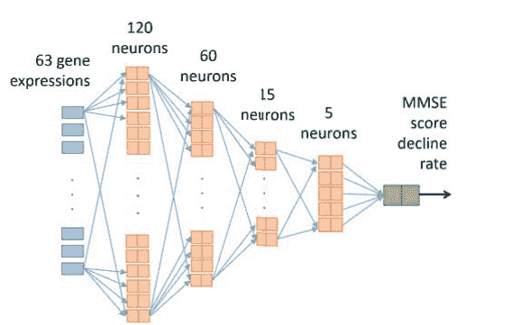

图 5.3 神经网络架构 120-60-15-5-1，其中输入是 63 个阿尔茨海默病相关基因的表达，输出是对 MMSE 评分每周下降率的预测。

## 5.4 使用神经网络进行阿尔茨海默病预后的 Python 脚本

在本节中，我们提供一个实现图 5.3 所示 120-60-15-5-1 架构的示例 Python 脚本，其输入是 63 个阿尔茨海默病相关基因的表达，输出是对 MMSE 评分每周下降率的预测。

第 14 行定义了一个输入文件作为样本数据点的来源。在第 16 行和第 21 行，输入样本被保存在一个名为 X 的向量中。类似地，样本的输出在第 25 行被保存在 Y 中。在第 36 行和第 37 行，输出值（即 MMSE 评分的下降斜率）被归一化，以避免训练过程中的数值不准确。第 56 行到第 245 行之间的循环处理了四名患者，他们在训练过程中被移出样本集，作为上述留一交叉验证方法的一部分。在这个留一交叉验证实现中，训练期间仅从 215 名患者的样本集中移除了四名患者（每次循环迭代移除一名患者），因此神经网络被单独训练了四次，每次使用 214 名患者。第 83 行创建了一个名为 model 的对象来保存神经网络。在第 96–100 行，创建了一个具有 63 个输入和 120 个神经元的隐藏层。在第 103、106 和 109 行，分别创建了具有 60、15 和 5 个神经元的连续隐藏层。第 113 行创建了具有单个神经元的输出层。

在所有隐藏层中，激活函数被选为修正线性单元（即 relu），而输出层使用线性激活（以避免在输出中禁止负结果）。如前所述，在前两个隐藏层中采用了 L1 正则化器作为防止过拟合的措施，因为它们具有大量的神经元。所有隐藏层都被定义为密集层，以构成一个全连接的神经网络。在第 122 行，优化器选项被定义为 adam，以采用梯度下降算法根据损失更新权重/偏置的参数，损失被定义为使用平均绝对误差（即选项 mae）来衡量。选择了学习率 α = 0.01。在第 128 行，用于训练神经网络的周期数被设置为 500。

在第 139 行，为循环中第 i<sup>th</sup> 个体的选定基因表达生成了一个预测。预测在第 144 行到第 151 行之间被归一化。误差在第 153–158 行计算。预测和真实样本数据的图表在第 168 行到第 256 行生成。

```python
# The City College of New York, City University of New York
# Written by Grace McGrath and Ishmam Fardin
# July 2023
import numpy as np
import pandas as pd
import tensorflow as tf
from tensorflow import keras
import matplotlib.pyplot as plt
from sklearn.preprocessing import MinMaxScaler
import warnings
warnings.filterwarnings("ignore") # supresses all warnings

# Personalized prognosis of Alzheimer's disease proggression using ANNs
# Load the training data, Input X
training_X = 'training_data/gene_expressions.csv'
X = pd.read_csv(training_X)

# filters out unneccessary information like age, name, etc.
# only focuses on gene expressions
X_in = X.filter(regex='x_at', axis=1)
# print(X_in.head())

# Load the rest of the training data. Output Y
training_Y = 'training_data/mmse_score_slopes.csv'
Y = pd.read_csv(training_Y)
# print(Y.head())

# fit_transform converts all the values which are the slope of cognition
```

## 5 用于阿尔茨海默病预后的神经网络

```python
# 将值缩减到0和1之间
# 使用MinMaxScaler，其计算方式为（原始值 - 最小值）除以（最大值 - 最小值）以获得新值
# 这样做是为了帮助算法更好地运行，并减少异常值的影响
# 在reshape(-1,1)中，-1表示数组的行数，1表示一列。reshape将数组转换为二维数组
mmse_slopes = np.array(Y["m-coef(mmse-points/week)"]).reshape(-1,1)
Y_scaled = MinMaxScaler().fit_transform(mmse_slopes)

# 存储每次留一交叉验证中被留出样本的所有百分比误差
percent_slope_errors = []
# 存储所有MMSE分数误差
percent_mmse_score_errors = []
# 存储所有预测值
predictions = []
# 存储预测的MMSE分数
predicted_mmse_scores = []
# 存储所有实际斜率
actual_slopes = []
# 存储实际MMSE分数
actual_mmse_scores = []
# 存储所有患者ID
patient_IDs = []

# 计算每个被留出样本的百分比误差
# 利用留一交叉验证评估模型性能
for i in range(4):
    print("\n***********************************")
    print(f"LEAVING OUT ROW {i} \n")

    # 初始化所有输入的副本到一个新变量，以便原始变量不会被更新
    inputs = X_in.copy()

    # 初始化所有已缩放输出的副本到一个新变量，以便原始变量不会被更新
    outputs = Y_scaled.copy()

    # 保存将用于测试模型效率的测试样本输入
    LOOCV_input = inputs.loc[i]

    # 获取测试样本的斜率
    actual_slope = list(Y["m-coef(mmse-points/week)"])[i]

    # 删除包含测试样本输入的行
    inputs.drop(i,inplace=True)

    # 从将用于训练模型的输出数组中移除测试样本的输出
    outputs = np.delete(outputs, i)

    # 为ANN创建一个模型
    model = keras.Sequential()
    print("Training Started")

    # 移除/添加注释符号以测试不同架构


    # 定义并训练模型架构 120-60-15-5-1

    # 添加一个隐藏层，接收63个输入特征
    # （具有x_at的基因表达）
    # 隐藏层有120个神经元
    # dense层将其所有神经元与前后层的神经元全部连接
    model.add(keras.layers.Dense(120,
                                kernel_regularizer='l1',
                                activation='relu',
                                input_shape=(63,),
                                )
             )
```

## 5.4 使用ANN进行AD预后的Python脚本

```python
# 添加另一个具有60个神经元的隐藏层
model.add(keras.layers.Dense(60,kernel_regularizer='l1', activation='relu'))

# 添加另一个具有15个神经元的隐藏层
model.add(keras.layers.Dense(15, activation='relu'))

# 添加另一个具有5个神经元的隐藏层
model.add(keras.layers.Dense(5,activation='relu'))

# 添加一个输出层，有一个输出（认知衰退的斜率）
# 激活函数默认为线性
model.add(keras.layers.Dense(1))

# 将优化器设置为Adam，这是一种梯度下降方法，通过更新权重来最小化损失
# 将损失设置为mean_absolute_error，它计算实际输出和估计输出之间的平均绝对差
# 将学习率设置为0.01，学习率是模型参数更新的速率
# metrics用于查看模型每个epoch的表现
model.compile(optimizer=tf.keras.optimizers.Adam(learning_rate=0.01),
              loss='mean_absolute_error',
              metrics=['Precision']
              )

# 训练模型500个epoch
model.fit(inputs, outputs, epochs = 500, verbose=0)

print("Training Finished\n")

gene_expressions = LOOCV_input.to_frame() # 将序列转换为数据框

# 转置行/列，使其与模型输入配置兼容
gene_expressions_transposed = gene_expressions.transpose()

# 基于输入进行预测
prediction_scaled = model.predict(gene_expressions_transposed)

# 将当前患者ID初始化到一个变量
patient_ID = X['patient-id'][i]
patient_IDs.append(patient_ID)

# 找到原始输出值的最小值
mmse_score_min = Y['m-coef(mmse-points/week)'].min()
# 找到原始输出值的最大值
mmse_score_max = Y['m-coef(mmse-points/week)'].max()
# 归一化预测值
mmse_max_min_difference = mmse_score_max - mmse_score_min
prediction = mmse_score_min + prediction_scaled*mmse_max_min_difference

# 计算百分比误差
rel_err = abs(((prediction - actual_slope)/actual_slope)*100)
rel_error = round(float(rel_err[0][0]), 2)
print("\nThe relative error is: {}%".format(rel_error))
percent_slope_errors.append(rel_error) # 将百分比误差添加到列表

# 四舍五入预测值和实际斜率
prediction = round(float(prediction[0][0]), 3)
actual_slope = round(float(actual_slope), 3)
print(f"The predicted MMSE Score slope is: {prediction} mmse-points/week")
print("The actual slope is:", actual_slope)

predictions.append(prediction) # 将预测值添加到列表
actual_slopes.append(actual_slope) # 将实际斜率添加到列表

# 生成预测输出与实际输出的对比图

# baseline是患者开始时的分数
baseline = list(Y["m-baseline(mmse-points)"])[i]

# 生成一个在0到52之间均匀分布的数字序列，共7个值
```

## 5 用于阿尔茨海默病预后的神经网络

```python
x = np.linspace(0, 52, 7)

# 创建一个图形来容纳所有绘图，并设置为白色背景，尺寸为8x6英寸
plt.figure(figsize=(8, 6), facecolor='white')

plt.subplots_adjust(top=0.85)  # 调整顶部边距以放置标题

# 实际输出方程的字符串表示，baseline初始化为一个变量
actual_equation = f"Actual: y = {actual_slope}x + {round(float(baseline),2)}"

# 预测输出方程的字符串表示，baseline初始化为一个变量
rounded_baseline = round(float(baseline),2)
prediction_equation = f"Predicted: y = {prediction}x + {rounded_baseline}"

# 计算实际数据的最小y值
actual_min = actual_slope*52+baseline
actual_mmse_scores.append(round(float(actual_min),2))

# 计算预测数据的最小y值
predicted_min = prediction*52+baseline
predicted_mmse_scores.append(round(float(predicted_min),2))

# 记录MMSE分数的百分比误差
percent_mmse_score_errors.append((predicted_min-actual_min)/actual_min)

# 在图表上显示每条线的方程

# 在坐标(2, actual_min)处添加文本注释到绘图
# 文本内容由actual_equation给出，将以颜色'palevioletred'显示
# ha='left'和va='bottom'参数分别指定文本的水平和垂直对齐方式
plt.text(2, actual_min+1, actual_equation, color='palevioletred',
         ha='left', va='bottom')

# 在坐标(2, predicted_min)处添加文本注释
# 文本内容由prediction_equation给出，将以颜色'palevioletred'显示
# ha='left'和va='bottom'参数表示文本的水平和垂直对齐方式
plt.text(2, predicted_min, prediction_equation, color='skyblue',
         ha='left', va='top')

# 绘制实际输出的线，设置线的颜色为palevioletred，
# 并为图例添加标签标题
plt.plot(x, actual_slope*x + baseline, color='palevioletred',
         label ='real MMSE score decline (best fit)')

# 绘制预测输出的线，设置线的颜色为skyblue，
# 并为图例添加标签标题
plt.plot(x, prediction*x+baseline, color='skyblue',
         label ='predicted MMSE score decline')

plt.xlabel('Weeks Since First Mini-Mental State Exam') # 设置x轴标签
plt.ylabel('MMSE Score') # 设置y轴标签
plt.xlim([0, 52]) # 设置x轴范围从0到52

# 设置标题
title = "MMSE Score Decline \n Predicted vs Actual \n Patient:"
plt.title(title + patient_ID)

plt.legend() # 显示图例

# 将图表保存到predictions目录
plt.savefig(f'predictions/{patient_ID}.png')

print("***************************")
print("LOOP DONE \n")

# 列出百分比误差、斜率
```

## 5.5 用于阿尔茨海默病预后的Matlab脚本（基于ANN）

本节我们展示一个实现图5.3所示ANN的Matlab脚本示例。程序结构与第5.4节的Python脚本保持相似，以便读者能轻松比较两个版本。

在第10-18行，ANN的输入和输出分别保存到`X_int`和`Y`中。输出值在第18行进行了归一化处理。在第30-80行的循环中，作为留一交叉验证方法的一部分，选择了四名患者进行测试。在第43和45行，第$i^{th}$个数据点从训练集中移除。在第48和49行，输入和输出样本被转换为表格格式。在第52至64行之间，ANN被定义为图5.3所示的隐藏层数量，并保存在名为`layers`的对象中。在第67-69行，定义了ANN训练的选项，优化器为梯度下降（即adam），学习率为0.01，训练轮数为100，批量大小为10（即训练过程中一次使用的样本输入数量），`Shuffle`选项设置为`every-epoch`（即在每个训练轮次打乱输入样本以减少训练中的过拟合）。在第73行，训练ANN：

```
model = trainNetwork(InputsTrain, Outputstrain, layers, options)
```

并在第80行生成对第$i^{th}$名患者的预测：

```
prediction_scaled = predict(model, LOOCV_inputArray)
```

其中`LOOCV_inputArray`保存了第$i^{th}$名患者的输入（这在第38行设置）。在第82-87行，预测值被归一化。在第89-93行，计算了预测的误差百分比。在脚本的其余部分，绘制了预测和实际的预后曲线。

## 5 用于阿尔茨海默病预后的ANN

图5.4 Python脚本为四名患者生成的样本误差率。

```
**********************************
LEAVING OUT ROW 0

Training Started
Training Finished

1/1 [==============================] - 0s 62ms/step

The relative error is : 19.66%
The predicted MMSE Score slope is: -0.029 mmse-points/week
The actual slope is : -0.036
**********************************
LEAVING OUT ROW 1

Training Started
Training Finished

1/1 [==============================] - 0s 78ms/step

The relative error is : 44.37%
The predicted MMSE Score slope is: -0.032 mmse-points/week
The actual slope is : -0.058
**********************************
LEAVING OUT ROW 2

Training Started
Training Finished

1/1 [==============================] - 0s 109ms/step

The relative error is : 7.57%
The predicted MMSE Score slope is: -0.021 mmse-points/week
The actual slope is : -0.019
**********************************
LEAVING OUT ROW 3

Training Started
Training Finished

1/1 [==============================] - 0s 76ms/step

The relative error is : 23.54%
The predicted MMSE Score slope is: -0.027 mmse-points/week
The actual slope is : -0.022
**********************************
LOOP DONE

Patient ID: 002_S_2043
Slope of Cognitive Decline: Actual: -0.036  Predicted: -0.029
Percent Slope Error: 19.66
MMSE score at Week 52: Actual: 27.71  Predicted: 28.07
Percent MMSE Score Error at Week 52:    0.01

Patient ID: 002_S_4171
Slope of Cognitive Decline: Actual: -0.058  Predicted: -0.032
Percent Slope Error: 44.37
MMSE score at Week 52: Actual: 25.25  Predicted: 26.61
Percent MMSE Score Error at Week 52:    0.05

Patient ID: 002_S_4219
Slope of Cognitive Decline: Actual: -0.019  Predicted: -0.021
Percent Slope Error: 7.57
MMSE score at Week 52: Actual: 28.86  Predicted: 28.76
Percent MMSE Score Error at Week 52:   -0.0

Patient ID: 002_S_4237
Slope of Cognitive Decline: Actual: -0.022  Predicted: -0.027
Percent Slope Error: 23.54
MMSE score at Week 52: Actual: 27.89  Predicted: 27.63
Percent MMSE Score Error at Week 52:   -0.01

Average % Slope Error: 23.785%
Average % MMSE Score Error at Week 52: 0.013%
```

图5.4展示了上述Python脚本为四名患者生成的误差率。训练采用了留一交叉验证，并为四名随机选择的患者（即002_S_2043、002_S_4171、002_S_4219和002_S_4237）生成了AD预后。对于这次特定的运行，患者002_S_4219获得了最佳结果，ANN预测其认知衰退的直线方程为$y = -0.021x + 29.58$，而实际衰退的直线方程为$y = -0.019x + 29.58$（图5.5(c)）。基于此预测，患者002_S_4237在首次记录MMSE分数一年后得分为28.76。然而，实际数据显示该患者的分数为28.86。预测最差的是患者002_S_4171，其预测和实际的衰退函数分别为$y = -0.032x + 28.27$和$y = 0.058x + 28.27$，对应首次检查一年后的MMSE分数分别为26.71和25.25（图5.5(b)）。

## 5.5 用于阿尔茨海默病预后的Matlab脚本（基于ANN）

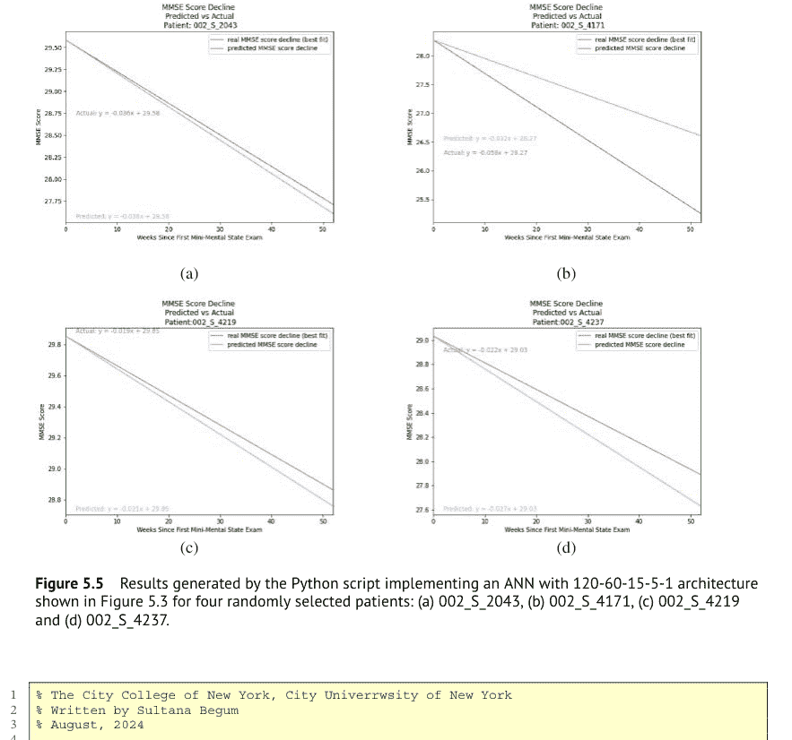

```
1  % The City College of New York, City University of New York
2  % Written by Sultana Begum
3  % August, 2024
4  
5  % GA for Alzheimer disease Prognosis based gene expressions and
6  % MMSE scores
7  
8  clear; clc;
9  
10 % Load training data
11 training_X = 'training_data/gene_expressions.csv';
12 X = readtable(training_X);
13 
14 % Extract input features
15 X_in = X(:, contains(X.Properties.VariableNames, 'x_at'));
16 
17 training_Y = 'training_data/mmse_score_slopes.csv';
18 Y = readtable(training_Y);
19 
20 mmse_slopes = Y.('m_coef_mmse_points_week_'); % Access column
21 Y_scaled = rescale(mmse_slopes, 0, 1); % Min-max scaling
22 
23 % Initialize variables
24 percent_errors = [];
25 predictions = [];
26 actual_slopes = [];
27 patient_IDs = [];
28 
29 % Leave-One-Out Cross-Validation
30 for i = 1:4
31     fprintf("\n***********************************\n");
32     fprintf("LEAVING OUT ROW %d \n", i);
33 
34     inputs = X_in;
35     outputs = Y_scaled;
36 
37     % Save the input for test sample
38     LOOCV_input = inputs(i,:);
39     % Get the slope of test sample
40     actual_slope = mmse_slopes(i);
41 
42     % Drop the row with test sample inputs
43     inputs(i,:) = [];
44     % Remove the output of test sample
45     outputs(i) = [];
46 
47     % Convert data to table format for training
48     inputsTrain = table2array(inputs);
49     outputsTrain = table2array(table(outputs, 'VariableNames',{'Output'}));
50 
51     % Define ANN model: 160-60-15-5-1 architecture
52     layers = [
53         featureInputLayer(size(inputsTrain, 2), 'Name', 'input')
54         fullyConnectedLayer(120, 'Name', 'fc1')
55         reluLayer('Name', 'relu1')
56         fullyConnectedLayer(60, 'Name', 'fc2')
57         reluLayer('Name', 'relu2')
58         fullyConnectedLayer(15, 'Name', 'fc3')
59         reluLayer('Name', 'relu3')
60         fullyConnectedLayer(5, 'Name', 'fc4')
61         reluLayer('Name', 'relu4')
62         fullyConnectedLayer(1, 'Name', 'output')
63         regressionLayer('Name', 'regression')
64     ];
65 
66     % Set options for training
67     options = trainingOptions('adam', 'InitialLearnRate', 0.01, ...
68         'MaxEpochs', 1000, 'Verbose', true, 'MiniBatchSize', 10, ...
69         'Shuffle', 'every-epoch', 'Plots', 'training-progress');
70 
71     % Train the model
72     fprintf("Training Started\n");
73     model = trainNetwork(inputsTrain, outputsTrain, layers, options);
74     fprintf("Training Finished\n");
75 
76     % Prepare LOOCV input for prediction
77     LOOCV_inputArray = table2array(LOOCV_input);
78 
79     % Predict the test sample
80     prediction_scaled = predict(model, LOOCV_inputArray);
81 
82     % Normalize prediction
83     mmse_score_min = min(mmse_slopes);
84     mmse_score_max = max(mmse_slopes);
85     mmse_max_min_difference = mmse_score_max - mmse_score_min;
86     prediction = mmse_score_min + ...
87                  prediction_scaled * mmse_max_min_difference;
88 
89     % Calculate percent error
90     rel_err = abs(((prediction - actual_slope) / actual_slope) * 100);
91     rel_error = round(rel_err, 2);
92     fprintf("\nThe relative error is: %.2f%%\n", rel_error);
93     percent_errors = [percent_errors; rel_error]; % Append percent error
94 
95     % Store predictions and actual values
96     predictions = [predictions; prediction];
97     actual_slopes = [actual_slopes; actual_slope];
98 
99     % Get patient ID and ensure it is a string
100    patient_ID = X.('patient_id')(i); % Access column
```

if iscell(patient_ID)
    patient_ID = patient_ID{1}; % 将单元格转换为字符串
end
patient_IDs = [patient_IDs; patient_ID];

% 绘制结果
baseline = Y.("m_baseline_mmse_points_")(i);
x = linspace(0, 52, 7); % 从0到52的7个等间距值

% 实际值与预测值方程
actual_equation = sprintf("实际值: y = %.3fx + %.2f", actual_slope,...
                          baseline);
prediction_eguation = sprintf("预测值: y = %.3fx + %.2f", ...
                             prediction, baseline);

% 绘图
figure('Color', 'white', 'Position', [100, 100, 800, 600]);
hold on;
plot(x, actual_slope * x + baseline, 'Color', [0.86, 0.44, 0.58], ...
     'LineWidth', 2, 'DisplayName', ...
     '实际MMSE评分下降（最佳拟合）');
plot(x, prediction * x + baseline, 'Color', [0.53, 0.81, 0.92], ...
     'LineWidth', 2, 'DisplayName', '预测MMSE评分下降');
xlabel('首次简易精神状态检查后的周数');
ylabel('MMSE评分');
xlim([0, 52]);
title(sprintf ...
    ('MMSE评分下降\n 预测值 vs 实际值\n 患者: %s',...
    strrep(patient_ID,"_","_")));
legend('show');
hold off;

% 保存图表
saveas(gcf, sprintf('predictions/%s.png', patient_ID));
end

% 结果摘要
fprintf("***********************************\n");
fprintf("循环完成 \n\n");

patient_IDs1 = X.('patient_id');
if iscell(patient_IDs1)
    patient_IDs1 = string(patient_IDs1);
end

% 打印每位患者的结果
for i = 1:length(percent_errors)
    fprintf("患者ID: %s\n", patient_IDs1(i));
    fprintf("认知衰退实际斜率: %.3f\n", actual_slopes(i));
    fprintf("认知衰退预测斜率: %.3f\n",predictions(i));
    fprintf("百分比误差: %.2f%% \n\n", percent_errors(i));
end

% 打印平均百分比误差
avg_percent_error = mean(percent_errors);
fprintf('平均百分比误差: %.2f%%\n', avg_percent_error);

图5.6展示了Matlab脚本为第5.4节中随机选择的四名患者（即002_S_2043、002_S_4171、002_S_4219和002_S_4237）生成的结果，分别对应图5.6(a)至(d)。我们观察到，Matlab脚本的表现与Python类似；误差率较高，但通过改进人工神经网络架构和/或更仔细地选择人工神经网络参数，可能会有所改善。

## 5.6 结论性评述

随着机器学习的最新进展和个人医疗数据收集能力的增强，通过挖掘多模态数据集来开发神经退行性疾病预后的预测模型成为可能。通过整合ADNI数据库（其中存储了AD患者的广泛信息），可以探索MCI患者认知衰退率与某些连续个性化测量值之间可能存在的相关性。在本章中，我们展示了人工神经网络利用AD患者基因表达与其随时间测量的MMSE评分所衡量的认知衰退之间可能存在的关系是可行的。

领域专家（在本例中为生物学家和医学研究人员）与计算专家（例如统计学家、软件工程师和数据科学家）结合他们的经验，设计有效的人工神经网络架构（例如选择人工神经网络的输入和输出、隐藏层数、每层神经元数、激活函数、训练轮数和学习率）。同样重要的决策包括选择可能重要的生物标志物，例如血液成分、蛋白质、MRI信息和大脑海马体图像[60]。

通过本章提出的简单示例，我们表明使用人工神经网络来估计AD患者的个性化疾病进展值得进一步研究和实验。我们希望，通过整合有效的计算方法和全面的数据集，越来越多专注于增强我们对AD早期检测和预后理解的研究，最终将在不久的将来为更有效的干预和治疗铺平道路。同样，也可以为其他神经退行性疾病（如帕金森病和肌萎缩侧索硬化症（ALS））以及包括各种形式癌症在内的进行性疾病开发类似的工具[13]。

## 5.7 第5章练习题

- 1) 如何修改图5.3中给出的人工神经网络架构，以提高其预测能力？
- 2) 如果你减少图5.3中给出的人工神经网络架构的隐藏层数，性能会受到怎样的影响？尝试不同的人工神经网络架构来证明你的答案。
- 3) 如果你增加图5.3中给出的人工神经网络架构的隐藏层数，性能会受到怎样的影响？尝试不同的人工神经网络架构来证明你的答案。
- 4) 如果你减少图5.3中给出的人工神经网络架构隐藏层中的神经元数量，性能会受到怎样的影响？尝试不同的人工神经网络架构来证明你的答案。
- 5) 如果你增加图5.3中给出的人工神经网络架构隐藏层中的神经元数量，性能会受到怎样的影响？尝试不同的人工神经网络架构来证明你的答案。
- 6) 如果你在训练图5.3中给出的人工神经网络架构时增加训练轮数，性能会受到怎样的影响？尝试不同的人工神经网络架构来证明你的答案。
- 7) 如果你在训练图5.3中给出的人工神经网络架构时减少训练轮数，性能会受到怎样的影响？尝试不同的人工神经网络架构来证明你的答案。

# 6 用于自然语言处理的人工神经网络

## 6.1 引言

作为人工智能增长最快的应用之一，`自然语言处理`（NLP）旨在让计算机能够理解、解释和处理人类语言。在本章中，我们介绍一个NLP应用，该应用试图识别内容（例如语音、书面文档或短信）中呈现的词语与发生在各种看似不相关的场所的外部事件之间可能存在的、通常是先前未揭示的关系。这类应用的例子包括：一位政治家发表演讲后油价上涨，或一位著名歌手在演唱会上称赞某个特定品牌的鞋子，导致该鞋业对外国劳动力的需求增加。NLP通常被视为语言学、计算学科和工程学的交叉领域，涉及对自然语言的算法分析[63]。

NLP算法的输入通常是一组基于从外部来源或各种现有平台收集的信息生成的`特征`。NLP应用要探索的信息可以是口头或书面内容，从中可以使用各种方法（例如，从特定内容中提取一组关键词，如来自特定领域知名人士的短信）派生出输入特征。例如，给定一组交互片段（例如，一系列电子邮件、语音消息或短信交流），NLP算法可以分析它们，以探索它们之间是否能形成联系（例如，它们是否讨论同一主题）。同样，NLP技术可以通过定义与特定主题强相关的关键词，或为具有多重解释的词语分配相关含义，来识别单个文本中涵盖的主题。在另一个应用中，NLP算法可能会探索篮球队经理的赛前评论与比赛结果之间是否存在关系。有可能经理在对球队那场比赛没有信心但又不能公开这么说的情况下，无意中使用了较弱的措辞（例如，说“我们应该赢”而不是“我们将赢”）。如果通过NLP，对手识别出这种关联，他们可能会在博彩网站上利用这一点，或者通过派出较弱的队伍并让主力球员休息以备其他比赛。同样，政治领导人可能会通过他们在社交媒体上的帖子或为新闻机构举行的新闻发布会，影响各种看似不相关的事件的结果。可以想象，一位领导人慷慨激昂的演讲可能会对金融市场、工会或经济政策决策等外部因素产生积极或不利的影响（图6.1）。如果没有NLP等专业工具的帮助，这些依赖关系通常非常难以识别，甚至不可能识别。

一般来说，NLP技术可以分为两类：基于规则的方法和基于统计的方法[64]。`决策树`[65]是基于规则的NLP技术的典型例子，其中树的顶点和边分别代表条件和可能的结果。决策

## 6.1 自然语言处理算法与应用

自然语言处理算法能够探索各种形式的自然语言内容（例如演讲、文本、对话、语音片段或文章）与其他看似无关的不同场景事件（例如股市波动、软饮料日益流行或工会决策）之间可能存在的关联。

树结构适用于模式匹配和内容解析。另一方面，基于统计的方法在每个决策点做出概率性决策，从而为每个可能的结果分配权重。统计自然语言处理技术能够表达许多不同输出的相对确定性，因此可以在无法确定唯一结果的复杂情况下产生可靠的结果。

问答系统通常用于聊天机器人（即基于人工智能的聊天系统，如Siri），这些系统在数据库或互联网上搜索答案。问答系统可能实现自然语言处理算法，首先从问题中提取信息，然后在文本库中搜索合适的答案[66]。在第11章中，我们将聊天机器人实现为一个循环神经网络。文本摘要是自然语言处理的另一个应用，它可以识别文本库中的主题或关键词，以生成最能概括文本的句子[67]。

自然语言处理技术对于将给定文本片段从一种自然语言机器翻译成另一种语言，同时保持原意不变，也至关重要。在不同语言之间进行翻译时，句子结构通常会根据两种语言的语法规则而变化。利用人工神经网络的自然语言处理算法可以被实现，以搜索两种语言中单词和句子结构之间的联系。在第13章中，我们将展示一个用于简单德语到英语翻译器的带有注意力机制的循环神经网络。

## 6.2 文本信息对股市的影响

在本章中，我们展示一个自然语言处理的简单应用示例，其中设计了一个人工神经网络来探索个人发送的文本信息与股市资产波动之间可能存在的关系。具体来说，我们分析了美国前总统特朗普先生的推文，以研究其对标准普尔500指数（S&P 500 Index）[68]中上市金融证券可能产生的影响，该指数列出了美国500家领先的上市公司的市值。人工神经网络是实现此任务自然语言处理算法的天然选择。

在实现类似此示例的自然语言处理算法时，为了训练一个有效的人工神经网络，需要大量样本作为网络的输入和相应的输出。在此示例中，输入是以口语（即英语）生成的内容形式，表现为一个人（即美国前总统特朗普先生）发送的推文。对于每条输入的推文，相应的输出将是该推文发送后金融网站上报告的价格变动（即标准普尔500指数中的股票）。

通常，为了减少输入数据中的噪声，在将自然语言内容作为人工神经网络输入之前，需要对其进行预处理。根据具体应用，标点符号、与给定主题无关的单词以及其他被视为无关的信息可以从内容中移除，而不会影响输入与输出之间假定的关系。成功从样本数据中修剪噪声的过程并非易事，很大程度上依赖于专业领域的知识。对于某些应用，句子中使用的某些单词对于判断沟通的自我中心程度可能很重要（例如，某人使用代词“你”的次数），而其他单词则可以忽略不计（例如冠词“the”的使用）；而在另一些应用中，情况可能恰恰相反（例如，通过冠词“the”的使用频率来识别人们语言的特异性，而不关心代词“你”出现的次数）。

## 6.3 用于自然语言处理的简单人工神经网络

现在，让我们展示一个用于实现自然语言处理应用的简单人工神经网络，该网络基于美国总统发送的推文和历史金融数据来预测金融市场波动。如第2章所述，为了构建和运行一个针对特定应用的有效人工神经网络，在选择网络的输入和输出之后，必须定义网络架构，包括输入数量、隐藏层数量及每层的神经元数量、激活函数的选择、训练期间使用的周期数和学习率。

### 6.3.1 人工神经网络的输入与输出

尽管人工神经网络的输入将取自推文，但从推文[69]（定义为不超过140个字符的文本信息）中提取信息，使其能够作为网络输入，并非易事。让我们考虑定义一组可能影响金融市场波动的关键词。例如，像“繁荣”、“致富”或“成功”这样的词汇可能被公众解读为与经济成功相关的词语，从而可能暗示市场信心并推动股价上涨。同样，使用“牺牲”、“困难”或“失败”等词汇的推文可能暗示艰难时期，并可能导致市场下跌。然而，如果一组关键词与股市波动之间的关系如此简单明了，那么每个人都能做出这样的推断并轻松预测结果。在现实情况中，这种关系要微妙得多，这就是为什么关键词的选择需要领域专业知识。

如果一组关键词要作为人工神经网络的输入，那么推文将被梳理以识别使用了哪些关键词以及在每条推文中使用的频率。这样，网络的输入数量就是关键词的数量，每个输入的值就是该关键词在给定推文中使用的频率。为了形成网络的样本输出值，使用了与输入数据集中总统推文对应日期的标准普尔500指数历史金融信息。对于在特定日期发布的推文，计算该日的市值涨跌幅，并用作该推文的输出值。

### 6.3.2 关键词

假设在来自社会学家、经济学家、记者、历史学家和科学家等多个领域专家的帮助下，确定了一组可能影响金融市场波动的关键词。对于此处展示的示例，选定的14个关键词是：银行、就业、习近平、股市、关税、资金、就业、中国、美元、增长、贸易、协议、经济和欧元，如图6.2所示。这些关键词是从13个月内发送的推文中收集的。在发布的7000条推文中，大约有193条推文包含一个或多个已识别的关键词，并且是在相关股市开盘日发送的。图6.3显示了一组示例推文，其中关键词被突出显示。关键词的数量就是人工神经网络的输入数量。对于给定的推文，每个输入值反映了该关键词在该推文中使用的次数。图6.4显示了基于图6.3中推文的人工神经网络输入。

除了推文中每个关键词的使用频率外，历史逐笔数据也被用作网络输入的一部分。在此示例中，每日的开盘价和当日的交易量（示例如图6.5所示）被包含在网络输入中。每日价格的百分比变化是网络的输出。

### 6.3.3 训练数据的形成

推文首先经过预处理，移除图片、超链接和转推签名。此外，周末和节假日的推文被调整到下一个市场开盘日。共有193条适合训练的推文（即包含一个或多个关键词的推文），因此，人工神经网络

| 银行 | 资金 | 贸易 |
|---|---|---|
| 就业 | 就业 | 协议 |
| 习近平 | 中国 | 欧洲 |
| 股市 | 美元 | 经济 |
| 关税 | 增长 | 欧元 |

图6.2 自然语言处理示例中选定的关键词。

**原始推文文本及创建日期（按日期分组）**

“随着我们国家取得的所有成功，包括刚刚发布的就业数据非常出色，假新闻” 2019-01-07

“就业大幅增长，增加312,000人。就业人数创纪录。制造业处于20年来最佳水平（前一届政府说这不可能发生）。” 2019-01-07

“总统是多年来钢铁行业最大和最好的支持者。我们现在做得非常好。关税让我们能够参与竞争。钢铁行业因不公平的贸易法律而失去工作岗位是不公平的。结果非常积极。” 2019-01-08

“数十亿美元被送往加利福尼亚州用于森林火灾，如果进行适当的森林管理，这些火灾本可以避免。除非他们采取行动，但这不太可能，我已命令联邦紧急事务管理局不再拨款。这是生命和金钱上的可耻局面！” 2019-01-09

“我们的国家在许多方面都做得很好。就业数据强劲，12月创下纪录。我们正在重建我们的军队。退伍军人终于有了选择权和问责制。经济和GDP强劲。税收和监管削减具有历史性。贸易协议很棒。” 2019-01-09

我们刚刚与墨西哥签署了一项伟大的新贸易协议。它每年比取代的非常糟糕的北美自由贸易协定好数十亿美元。差额足以多次支付建墙费用！ 2019-01-10

“我正在完全按照我承诺的那样做，也是我们伟大国家的公民选举我来做的事情。正如我承诺的那样，我正在为你们而战！几十年来，政客们承诺确保边境安全、修复我们的贸易协议、让我们的工厂回归、对中国采取强硬态度、将大使馆迁至耶路撒冷、让北约支付其应承担的份额等等——结果却什么都没做（甚至更糟）” 2019-01-11

图6.3 用于构建自然语言处理示例人工神经网络输入的推文子集。

### 6.3.4 ANN 架构

本 NLP 示例中选择了一个全连接 ANN 架构，如图 6.7 所示。该架构包含 16 个输入（14 个关键词、开盘价和交易量）、两个分别具有四个和八个神经元的隐藏层，以及一个输出层（收盘价百分比变化）。如前几章所述，输入、输入数量、隐藏层、每个隐藏层中的神经元、输出以及其他 ANN 架构参数是基于各领域专家和软件工程师的协作来选择的。

本例中定义的 ANN 的训练过程可概括如下。首先，为 ANN 的权重和偏置分配随机值。然后，如第 2 章所述，通过构建一个大小为 (193 × 16) 的输入矩阵，将 193 个输入样本传播通过 ANN。对于每个输入样本，根据生成的 ANN 输出与当天历史金融市场数据之间的差异计算误差。利用反向传播，通过更新权重和偏置值来减小权重和偏置的误差值。经过预定数量的训练周期后，训练过程结束，此时 ANN 已准备好根据新的推文生成金融市场走势预测。当有新推文时，会对其进行处理以确定 14 个关键词在其中出现的次数。由此产生的 14 个输入，连同开盘价和交易量，被输入 ANN 以生成输出，该输出即为对次日金融市场变化的预测。

## 6.4 使用 ANN 进行 NLP 的 Python 脚本

下面给出了一个实现本章所述 ANN 的示例 Python 脚本。
代码的第一部分展示了用于清理推文中不良字符、打印 ANN 权重、归一化输入列、定义关键词、消除无效日期以及准备 ANN 输入和输出的函数。在第 54 行，在每个推文中搜索关键词并存储在名为 `df` 的矩阵中。在第 118 和 119 行，样本输入和输出分别保存在名为 `x` 和 `y` 的数组中。第 121 行创建了一个名为 `neural_net` 的 ANN 对象。第 125 行定义了 ANN 输入层。第 129 和 132 行分别创建了具有四个和八个神经元的两个隐藏层。第 135 行声明了具有线性激活函数（即直接输出值，不过滤负值等）的输出层。第 137 行将优化参数定义为使用平均绝对误差计算的梯度下降算法（即选项 `adam`）。第 141 行按如下方式训练 ANN：

```
neural_net.fit(x, y, epochs=1200)
```

训练好的 ANN 的权重在第 143 和 144 行打印。在从第 151 行开始到第 166 行结束的循环中，对变量 `days_to_predict` 中指定的天数运行训练好的 ANN，并记录成功预测的次数和误差（第 164-166 行）。最后，结果在第 171 至 180 行存储到文件中。

```
1  # The City College of New York, City University of New York
2  # Written by Kelvin Ma
3  # August, 2020
4  
5  # NLP: Predicting financial stock movement based on tweets from Pres. Trump
6  import re
7  import datetime
8  from datetime import date
9  import math
10 import numpy as np
11 import pandas as pd
12 import tensorflow as tf
13 
14 # Function to remove punctuation and web links from tweets
15 # @\S+|https?://\S+ - matches either a substring which starts with @
16 # and contains non-whitespace characters \S+ OR a link(url) which
17 # starts with http(s)://
18 
19 def clean_tweet(tweet):
20     return ' '.join(re.sub('(@[A-Za-z0-9]+)|([^0-9A-Za-z \t])|(\w+:\/\/\S+)',
21                ' ', tweet).split())
22 
23 def str_to_date(string):
24     return datetime.datetime.strptime(string, '%Y-%m-%d').date()
25 
26 def print_weights(weights):
27     # weights = model.get_weights();
28     print('\n******* WEIGHTS OF ANN *******\n')
29     for i in range(int(len(weights)/2)):
30         print('Weights W%d:\n' %(i), weights[i*2])
31         print('Bias b%d:\n' %(i), weights[(i*2)+1])
32 
33 def normalize_column(dataframe, col_name):
34     maximum = max(dataframe[col_name])
35     minimum = min(dataframe[col_name])
```

| 原始推文文本及创建日期（按日期分组） | 关键词计数 |
| --- | --- |
| "With all of the success that our Country is having including the just released **jobs** numbers which are off the charts the Fake News" 2019-01-07<br>"**Jobs** up big plus 312000. Record number working. Manufacturing best in 20 years (Previous administration said this could not happen)." 2019-01-07 | 2 |
| "The President is the biggest and best supporter of the Steel Industry in many years. We are now doing really well. The Tariffs let us compete. Was unfair that the Steel Industry lost its **jobs** to unfair trade laws. Very positive outcome." 2019-01-08 | 2 |
| "Billions of **dollars** are sent to California for Forrest fires that with proper Forrest Management would never happen. Unless ... together which is unlikely I have ordered FEMA to send no more **money**. It is a disgraceful situation in lives & **money**!" 2019-01-09<br>"Our Country is doing so well in so many ways. Great **jobs** numbers with a record setting December. We are rebuilding our military. Vets finally have Choice & Accountability. **Economy** & GDP are strong. Tax & Reg cuts historic. **Trade deals** great." 2019-01-09 | 7 |
| We have just signed a great new **Trade Deal** with **Mexico**. It is Billions of **Dollars** a year better than the very bad NAFTA deal which it replaces. The difference pays for Wall many times over! 2019-01-10 | 4 |
| "I am doing exactly what I pledged to do and what I was elected to do by the citizens of our great **Country**. ...For decades politicians promised to secure the border fix our **trade** deals bring back our factories get tough on **China** move the Embassy to Jerusalem make NATO pay their fair share and so much else - only to do NOTHING (or worse)" 2019-01-11 | 3 |

图 6.4 图 6.3 中给出的示例推文经过处理，使得每个关键词在每条推文中使用的次数构成 ANN 输入的一部分。

| 给定股票的逐笔成交数据 | | | | | | | |
| --- | --- | --- | --- | --- | --- | --- | --- |
| 日期 | 开盘价 | 最高价 | 最低价 | 收盘价 | 调整后收盘价 | 成交量 | 百分比变化（计算得出） |
| 1/7/2019 | 2535.61 | 2566.16 | 2524.56 | 2549.69 | 2549.69 | 4104710000 | 0.007010435 |
| 1/8/2019 | 2568.11 | 2579.82 | 2547.56 | 2574.41 | 2574.41 | 4083030000 | 0.009695285 |
| 1/9/2019 | 2580 | 2595.32 | 2568.89 | 2584.96 | 2584.96 | 4052480000 | 0.004098046 |
| 1/10/2019 | 2573.51 | 2597.82 | 2562.02 | 2596.64 | 2596.64 | 3704500000 | 0.004518419 |
| 1/11/2019 | 2588.11 | 2596.27 | 2577.4 | 2596.26 | 2596.26 | 3434490000 | -0.000146298 |

图 6.5 用于构建 ANN 输入和输出的示例历史逐笔成交数据。

输入矩阵的维度为 (193 × 16)，因为有 14 个关键词和两个逐笔成交数据条目（即开盘价和成交量）。ANN 输出矩阵的维度为 (193 × 1)，因为每个样本有一个 ANN 输出。

图 6.6 展示了两条推文的两个示例输入，其中前 14 个元素是每条推文中每个关键词的使用频率，随后是当天的开盘价和交易量。在第一条推文中，第三个和第八个关键词各使用了一次，而在第二条推文中，第四个、第五个和第十个关键词被使用（第四个关键词使用了两次，其他各一次）。

在本例中，ANN 的输出被定义为资产价格的百分比变化。为了定义每个输出，计算给定日期的收盘价与次日价格的比较值，并将其作为相应输入的输出。然而，由于它们的值与关键词频率相比非常大，因此有必要将收盘价和交易量值归一化到 0 和 1 之间；否则，由于关键词输入值的幅度相对较小，它们将被视为噪声，从而对输出计算产生很小的影响。这些信息可以从图 6.5 所示的历史逐笔成交数据中轻松获得。

图 6.6 实现 NLP 示例的 ANN 的两个输入示例：前 14 个元素是每条推文中每个关键词的使用频率；随后是当天的开盘价和交易量。

图 6.7 用于 NLP 实现的全连接 ANN 架构：16 个输入（14 个关键词、开盘价和交易量）、两个分别具有 8 个和 4 个神经元的隐藏层，以及一个输出。

## 6 用于自然语言处理的ANN

```python
if maximum != minimum:
    dataframe[col_name] = (dataframe[col_name] - minimum)/(maximum-minimum)
return dataframe[col_name]
```

```python
# 加载文件，移除所有推文中的标点符号和网络链接，然后
#   进行情感分析。
print('\n\n*********** 清理推文 ***********\n\n')
filename = "trumptwitter_2019_01_01_to_2020_03_11.csv"
df = pd.read_csv(filename)
df["Clean Tweet"] = df['text'].apply(lambda x: clean_tweet(x))
df['created_at'] = pd.to_datetime(df['created_at']).dt.date
```

```python
# 数据清洗与处理
# 检查推文是否包含任何关键词 - 移除所有不包含关键词的推文
print('\n\n*********** 识别关键词 ***********\n\n')
key_words = ['Europe', 'China', 'tariff', 'Stock Market', 'economy', 'bank',
             'trade', 'jobs', 'money', 'dollar','currency','Xi','deal','growth']
```

```python
df['noof_keywords'] = np.where(df.text.str.contains('|'.join(key_words)),1,0)

for key_word in key_words:
    df[key_word] = np.where(df.text.str.contains(key_word), 1, 0)
```

```python
# 无效日期列表：包括联邦假日、无数据的日期
invalid_days = ['2019-01-01', '2019-01-02', '2019-01-21', '2019-02-18',
                '2019-04-19', '2019-05-27', '2020-05-08', '2019-07-04',
                '2019-09-02', '2019-11-28', '2019-12-25', '2020-01-01',
                '2020-01-20','2020-02-17', '2020-04-10',]
missing_days = ['2019-01-21', '2019-02-18', '2019-05-27', '2019-09-02',
                '2020-01-20','2020-02-17']
noof_missing_days = len(missing_days)
invalid_days = list(map(lambda x:str_to_date(x),invalid_days))
```

```python
# 如果推文发布于无效日期，则将其移至次日用于预测。
for index, row in df.iterrows():
    if row['created_at'] in invalid_days:
        new_day = row['created_at'] + datetime.timedelta(days=1)
        df.loc[index, "created_at"] = new_day
```

```python
# 将周六或周日发布的推文移至最近的周一。
# 使用weekday()函数时 -> 0代表周一，6代表周日
for index, row in df.iterrows():
    if row['created_at'].weekday() == 5:
        new_day = row['created_at'] + datetime.timedelta(days=2)
        df.loc[index, "created_at"] = new_day
    elif row['created_at'].weekday() == 6:
        new_day = row['created_at'] + datetime.timedelta(days=1)
        df.loc[index, "created_at"] = new_day
```

```python
# 按日期对数据进行分组 - 聚合所有使用的关键词并求和。
# 例如，某天的推文多次提及'dollar'，则将它们相加。
columns_to_aggregate = {'noof_keywords':'sum'}
for key_word in key_words:
    columns_to_aggregate[key_word] = 'sum'
grouped_df=df.groupby(by='created_at').agg(columns_to_aggregate).reset_index()
#% 股票价格
filename = "S&P500_2019_01_01_to_2020_03_11.csv"
snp_df = pd.read_csv(filename)
# 每日收盘回报率
snp_df['percent change'] = snp_df['Close'].pct_change()
```

```python
missing_days = list(map(lambda x:str_to_date(x), missing_days))
for missing_day in missing_days:
    grouped_df = grouped_df[grouped_df['created_at'] != missing_day]
```

```python
# ANN
# 创建输入数据：最后100天将用于最终的预测
# 此窗口期可调整
grouped_df['day_opening'] = snp_df['Open']
grouped_df['units_traded'] = snp_df['Volume']
days_to_predict = 100+noof_missing_days
```

## 6.4 使用ANN进行NLP的Python脚本

```python
# 在将任何数据输入神经网络之前，我们对数据进行归一化（介于0和1之间）
# 仅对开盘价和交易量进行归一化（因为它们与其他输入值相比数值较大）
grouped_df['day_opening'] = normalize_column(grouped_df, 'day_opening')
grouped_df['units_traded'] = normalize_column(grouped_df,'units_traded')

features = ['noof_keywords', 'day_opening', 'units_traded']
features = features + key_words
num_inputs = len(features)
x = np.array(grouped_df[1:(-1*days_to_predict)][features])
y = np.array(snp_df[2:((-1*days_to_predict)+1)][['percent change']])

neural_net = tf.keras.Sequential()

# 神经网络输入：总统提及每个关键词的次数、
# 股票的开盘价和交易量
neural_net.add(tf.keras.layers.Dense(num_inputs, activation='relu',
                                    input_shape=(num_inputs,)))

## 向神经网络添加另一个包含4个神经元的隐藏层
neural_net.add(tf.keras.layers.Dense(4, activation='relu'))

## 向神经网络添加另一个包含8个神经元的隐藏层
neural_net.add(tf.keras.layers.Dense(8, activation='relu'))

## 添加一个具有单一输出（百分比变化）的输出层
neural_net.add(tf.keras.layers.Dense(1, activation='linear'))

neural_net.compile(optimizer='adam', loss='mean_absolute_error')

## 使用1200次迭代训练ANN模型
print('\n\n*********** 开始ANN训练 ***********\n\n')
neural_net.fit(x, y, epochs=1200)
weights = neural_net.get_weights()
print_weights(weights)
print('\n\n*********** ANN训练完成 ***********\n\n')
# 进行预测
noof_correct_movement = 0
noof_predictions = 0
diffs = []
input_features = []
print('\n\n*********** ANN预测 ***********\n\n')
for i in range(days_to_predict, noof_missing_days, -1):
    input_features.clear()
    noof_predictions += 1
    actual_change = snp_df.iloc[(-1*i)+1]['percent change']
    for feature in features:
        input_features.append(grouped_df.iloc[-1*i][feature])
    predicted_change = neural_net.predict(np.array([input_features]))[0,0]
    print(f"预测{grouped_df.iloc[(-1*i)+1]['created_at']}的变化为：",
          end='')
    print(f"{predicted_change:.5f}")
    print(f"{snp_df.iloc[(-1*i)+1]['Date']}的实际变化为：",
          end='')
    print(f"{round(actual_change,4)}\n")
    if (predicted_change * actual_change) > 0:
        diffs.append(math.fabs(predicted_change - actual_change))
        noof_correct_movement += 1
percent_correct = (noof_correct_movement/noof_predictions) * 100
print(f"ANN在{noof_predictions}次预测中，正确预测涨跌方向的次数占比为",
      end = '')
print(f"{(noof_correct_movement/noof_predictions) *100:.2f}%。")
average_diff = round(sum(diffs)/len(diffs),5)
print(f"正确预测的平均误差为",
      end='')
print(f" {average_diff* 100.0:.1f} %")

with open('output.txt','a') as output_file:
    output_file.write(f'{date.today()} 正确预测的百分比')
    output_file.write(f' {round(percent_correct,1)} % ')
    output_file.write(f' 误差为 {average_diff* 100.0:.1f}%\n')
grouped_df.to_csv('TrumpTweet_Input.csv')
```

1/1 [==============================] - 0s 25ms/step
预测2020-03-02的变化为：0.00125
2020-03-02的实际变化为：0.046

1/1 [==============================] - 0s 23ms/step
预测2020-03-03的变化为：0.00125
2020-03-03的实际变化为：-0.0281

1/1 [==============================] - 0s 23ms/step
预测2020-03-04的变化为：0.00125
2020-03-04的实际变化为：0.0422

ANN在100次预测中，正确预测涨跌方向的次数占比为62.0%。
正确预测的平均误差为0.5%。

图6.8 Python脚本示例运行生成的输出：在100次运行中，ANN有62次做出了正确预测，其中正确预测的平均误差为0.5%。

上述Python脚本的示例运行如图6.8所示，在ANN的100次运行中，有62%的时间获得了正确的预测，其中正确预测的平均误差为0.5%。

## 6.5 使用ANN进行NLP的Matlab脚本

下面给出了一个实现图6.7中ANN的Matlab脚本示例。为了便于比较，Matlab实现与第6.4节中给出的Python脚本保持相似。

在第13行和第16行，推文和股票价格分别被读入名为df和snp_df的数组中。在第19行到第111行之间，对推文和行情数据进行处理，使其不包含空日期、周末或节假日，或任何其他无效数据。示例输入和输出分别保存在第113行和第114行名为X和y的数组中。在第119行到第132行之间，创建了一个包含16个神经元的输入层、包含四个和八个神经元的隐藏层以及一个输出层，并保存在名为layers的对象中。在第134行和第135行定义选项后，ANN在第136行按如下方式训练：

```matlab
net = trainNetwork(X, y, layers, options);
```

在第157行到第173行之间的循环中，尝试不同的输入，并记录输出是否正确预测了上涨或下跌。

```matlab
% 纽约市立学院，纽约城市大学
% 由Olga Chsherbakova编写
% 2023年12月
% NLP：基于特朗普总统的推文预测金融股票走势
clc;
clear;

% 从推文中移除标点符号和网络链接的函数
% @\S+|https?:\/\/\S+ - 匹配以@开头并包含非空白字符\S+的子字符串，
% 或以http(s)://开头的链接(url)
% 读取文件
df = readable('trumptwitter_2019_01_01_to_2020_03_11.csv', ...
    'VariableNamingRule', 'preserve');
% 股票价格
snp_df = readable('S&P500_2019_01_01_to_2020_03_11.csv', ...
    'VariableNamingRule', 'preserve');
```

## 6.5 用于自然语言处理的Matlab人工神经网络脚本

```matlab
% 加载文件，移除所有推文中的标点符号和网络链接，然后
%   进行情感分析。
disp('********** 清理推文 **********');
df.CleanTweet = cellfun(@clean_tweet, df.text, 'UniformOutput', false);
df.created_at = datetime(df.created_at, 'InputFormat', 'yyyy-MM-dd HH:mm');
df.created_at = dateshift(df.created_at, 'start', 'day');

% 数据清理与处理
% 检查推文是否包含任何关键词 - 移除所有不包含关键词的推文
disp('********** 识别关键词 **********');
keyWords = {'Europe', 'China', 'tariff', 'Stock Market', 'economy', ...
    'bank', 'trade', 'jobs', 'money', 'dollar', 'currency', ...
    'Xi', 'deal', 'growth'};
for i = 1:length(keyWords)
    df.(keyWords{i}) = contains(df.text, keyWords{i});
end
df.noof_keywords = sum(contains(df.text, keyWords), 2);

% 处理无效日期和缺失日期
snp_df.Date = datetime(snp_df.Date, 'InputFormat', 'yyyy-MM-dd');
% 无效日期列表：包括联邦假日、没有数据的日期
invalidDays = {'2019-01-01', '2019-01-02', '2019-01-21', '2019-02-18', ...
    '2019-04-19', '2019-05-27', '2020-05-08', '2019-07-04', ...
    '2019-09-02', '2019-11-28', '2019-12-25', '2020-01-01', ...
    '2020-01-20', '2020-02-17', '2020-04-10'};
missingDays = {'2019-01-21', '2019-02-18', '2019-05-27', '2019-09-02', ...
    '2020-01-20', '2020-02-17'};
noof_missing_days = length(missingDays);

invalidDays = datetime(invalidDays, 'InputFormat', 'yyyy-MM-dd');
missingDays = datetime(missingDays, 'InputFormat', 'yyyy-MM-dd');

for i = 1:height(df)
    if ismember(df.created_at(i), invalidDays)
        df.created_at(i) = df.created_at(i) + days(1);
    end
    if weekday(df.created_at(i)) == 1 % 星期日
        df.created_at(i) = df.created_at(i) + days(1);
    elseif weekday(df.created_at(i)) == 7 % 星期六
        df.created_at(i) = df.created_at(i) + days(2);
    end
end

% 数据分组
grouped_df = group_data(df, keyWords);

% 我们排除周末和节假日
grouped_df = grouped_df(~isweekend(grouped_df.created_at) & ...
            ~ismember(grouped_df.created_at, invalidDays),:);

% 将created_at转换为datetime格式以便同步
grouped_df.created_at = datetime(grouped_df.created_at, ...
            'InputFormat', 'yyyy-MM-dd');

% 根据缺失日期过滤数据
for i = 1:length(missingDays)
    grouped_df = grouped_df(grouped_df.created_at ~= missingDays(i),:);
end

% 人工神经网络
% 创建输入数据 - 最后100天的数据将用于最终的预测
% 此窗口期可根据需要调整
snp_df.percent_change = [NaN; diff(snp_df.Close)./ snp_df.Close(1:end-1)];
snp_temp = table(snp_df.Date, snp_df.Open, snp_df.Volume, ...
    snp_df.percent_change,'VariableNames', {'Date', 'Open', ...
    'Volume','PercentChange'});

% 数据合并
synchronized_data = innerjoin(grouped_df, snp_temp, 'LeftKeys', ...
    'created_at', 'RightKeys', 'Date');

% 在将任何数据输入神经网络之前，我们对数据进行归一化（介于0和1之间）
synchronized_data.day_opening = synchronized_data.Open;
synchronized_data.units_traded = synchronized_data.Volume;

% 仅对开盘价和交易量进行归一化（因为它们的值与其他输入值相比很大）
synchronized_data.day_opening = normalize_column(synchronized_data,...
    'day_opening');
synchronized_data.units_traded = normalize_column(synchronized_data,...
    'units_traded');

% 为神经网络准备数据
features = ['noof_keywords', keyWords, 'day_opening', 'units_traded'];
num_inputs = length(features);

% 确保数据中没有NaN值
if any(any(isnan(synchronized_data(:, features)))) || ...
        any(isnan(synchronized_data.PercentChange))
    error('无效或缺失的数据包含NaN值。需要进行清理。');
end

X = table2array(synchronized_data(:, features));
y = table2array(synchronized_data(:, 'PercentChange'));

% 神经网络的创建与训练
% 神经网络输入：总统提及每个关键词的次数、股票的开盘价和交易量
layers = [
    featureInputLayer(num_inputs)
    fullyConnectedLayer(50)
    reluLayer
    % 向神经网络添加另一个具有4个神经元的隐藏层
    fullyConnectedLayer(4)
    reluLayer
    % 向神经网络添加另一个具有8个神经元的隐藏层
    fullyConnectedLayer(8)
    reluLayer
    % 添加一个具有单一输出（百分比变化）的输出层
    fullyConnectedLayer(1)
    regressionLayer
];

options = trainingOptions('adam', 'MaxEpochs', 42, 'MiniBatchSize', 10,...
    'InitialLearnRate', 1e-4, 'Verbose', 0, 'Plots', 'training-progress');
net = trainNetwork(X, y, layers, options);

% 打印权重
print_weights(net);

% 进行预测
noof_correct_movement = 0;
noof_predictions = 0;
diffs = [];

% 根据可用数据进行调整
days_to_predict = min(height(synchronized_data), 100);
start_index = max(1, height(synchronized_data) - days_to_predict + 1);

if height(synchronized_data) < days_to_predict
    error('数据不足，无法进行预测。');
end

disp('********** 人工神经网络预测 **********');

for i = start_index:height(synchronized_data)
    input_features = table2array(synchronized_data(i, features));
    actual_change = synchronized_data.PercentChange(i);
    predicted_change = predict(net, input_features);

    fprintf('\n%s的预测变化为：%.5f\n', ...
        string(synchronized_data.created_at(i)), predicted_change);
    fprintf('%s的实际变化为：%.4f\n', ...
        string(snp_df.Date(i+1)), actual_change);

    if (predicted_change * actual_change) > 0
        diffs(end+1) = abs(predicted_change - actual_change);
        noof_correct_movement = noof_correct_movement + 1;
    end

    noof_predictions = noof_predictions + 1;
end

if noof_predictions == 0
    disp('未进行任何预测。');
else
    percent_correct = (noof_correct_movement / noof_predictions) * 100;
    average_diff = mean(diffs);

    fprintf('\n人工神经网络在%d次预测中，有%.2f%%的次数正确预测了走势。\n', ...
        noof_predictions, percent_correct);
    fprintf('正确预测的平均误差为：%.1f%%\n', average_diff * 100);
end

% 保存结果
writetable(df, 'TrumpTweet_Input.csv');

% 函数
function cleanText = clean_tweet(tweet)
    cleanText = regexprep(tweet, ...
        '(@[A-Za-z0-9]+)|([''0-9A-Za-z \t])|(\w+:\/\/\S+)', ' ');
end

function normalizedColumn = normalize_column(data, columnName)
    maxVal = max(data.(columnName));
    minVal = min(data.(columnName));
    normalizedColumn = (data.(columnName) - minVal) / (maxVal - minVal);
end

function grouped = group_data(df, keyWords)
    % 按日期对数据进行分组
    varsToSum = ['noof_keywords', keyWords];
    grouped = varfun(@sum, df, 'GroupingVariables', 'created_at',...
        'InputVariables', varsToSum);
    grouped.Properties.VariableNames(end-length(varsToSum)+1:end) = ...
        varsToSum;
end

function isWeekend = isweekend(date)
    dayOfWeek = weekday(date);
    % 1是星期日，7是星期六
    isWeekend = (dayOfWeek == 1) | (dayOfWeek == 7);
end

function print_weights(net)
    disp('******** 人工神经网络的权重 ********');
    for i = 1:length(net.Layers)
        layer = net.Layers(i);
        if isprop(layer, 'Weights')
            fprintf('\n权重 W%d:\n', i);
            disp(layer.Weights);
        end
        if isprop(layer, 'Bias')
            fprintf('偏置 b%d:\n', i);
            disp(layer.Bias);
        end
    end
end
```

图6.9展示了该Matlab脚本一次示例运行的输出结果，其中，在100次人工神经网络运行中，获得了62次正确预测，平均误差为0.9%。

```
The predicted change for 05-Mar-2020 was: -0.03346
Actual change was for 05-Mar-2020 was: -0.0339

The predicted change for 06-Mar-2020 was: 0.00722
Actual change was for 06-Mar-2020 was: -0.0171

The predicted change for 09-Mar-2020 was: 0.00876
Actual change was for 09-Mar-2020 was: -0.0760

The predicted change for 10-Mar-2020 was: 0.00652
Actual change was for 10-Mar-2020 was: 0.0494

The predicted change for 11-Mar-2020 was: 0.00827
Actual change was for 11-Mar-2020 was: -0.0489

ANN was correct in predicting the movement 56.00% of the time in 100 predictions.
The average error of the correct predictions was 0.9%
>>
```

**图6.9** Matlab脚本一次示例运行的输出结果：在100次人工神经网络运行中，获得了62次正确预测，平均误差为0.9%。

## 6.6 结论性评述

社交媒体上的帖子、印刷媒体上出现的文章以及在新闻机构新闻发布会上发表的评论，可能会影响各种外部且看似不相关事件的结果（例如，金融证券价值、公司估值或就业决策）。自然语言处理技术允许探索自然语言内容（例如，口头、书面或发布的文本）与外部事件（例如，房价）之间的相互作用。人工神经网络可用于实现基于统计的自然语言处理技术，方法是首先从文本主体中提取关键词，然后将它们与时间上与该内容相关的外部事件记录相关联。这些关键词及其使用频率可以被输入到一个人工神经网络中，该网络经过训练可以预测各种外部事件的结果。

在本章中，我们使用了美国前总统特朗普的推文，以探讨其对标准普尔500指数成分股可能产生的影响。首先，我们确定了一组在推文中使用的、可能与金融资产走势相关的关键词。每天发布的这些关键词的数量，连同开盘价和每日交易量，被用作人工神经网络的输入。股票价格走势的预测是人工神经网络的输出。利用推文以及与推文发布日期相对应的历史金融数据，训练一个人工神经网络，以使用未来的推文来预测未来的股票走势。

在现实生活中成功运用人工神经网络解决自然语言处理类问题，取决于正确识别人工神经网络的输入和输出、恰当选择关键词以及设计人工神经网络架构。人工智能和自然语言处理技术能够解决的现实问题的复杂性，需要结合通常由各类主题专家（例如，科学家、基金经理、企业高管、医疗人员等）和计算专业人员（例如，统计学家、数学家、计算机科学家和软件工程师）所具备的经验和技能组合。

## 6.7 第6章练习

1) 探索美国疾病控制与预防中心（CDC）发布的关于COVID-19大流行更新的推文与达美航空股票走势之间可能存在的关系。预计如果CDC放宽隔离条件，旅游类股票将升值。使用2020年6月至2020年8月期间发布的推文。

- 使用类似于图6.7中的ANN。
- 定义你自己的关键词。
- 尝试调整ANN架构以提升NLP性能。
- 尝试使用不同的关键词组合以提升NLP性能。
- 提出改进NLP性能的方法。

2) 重复练习1，但使用美国食品药品监督管理局（FDA）的推文来预测Moderna股票的走势。

3) 重复练习1，使用Google的Twitter动态和Google股票。使用2020年6月至2020年8月期间发布的推文。

4) 重复练习1，使用Apple的Twitter动态和Apple股票。

5) 重复练习1，使用CNN新闻的Twitter动态和道琼斯市场指数。

6) 纽约城市大学（CUNY）是美国最大的公立高等教育系统，旗下拥有25所学院，为超过25万名学生提供服务。任何关于使用远程会议工具Zoom的决定预计都会对Zoom股价产生重大影响。重复练习1，使用CUNY校长的推文和Zoom股票的走势。

# 7 卷积神经网络

## 7.1 引言

我们知道，当人类处理视觉信息时，他们会将更广阔的视野浓缩成多个重叠的较小感受野，这些感受野由大脑不同区域（即视觉皮层）的相应神经元控制。为了识别一个物体，视觉输入会通过分层连接的感受野进行处理。控制感受野的神经元对相对较小和简单的视觉刺激做出反应，而与位于大脑更深层的感受野相关的神经元则处理越来越大、越来越复杂的光学特征。随着视觉信息沿着分层连接的感受野传递，神经元开始以越来越精确的方式表征视觉物体，直到大脑能够识别出该物体（图7.1a）。

图7.1b展示了大脑在处理视觉刺激时，感受野大小如何从初级视觉皮层（称为V1）经过次级视觉皮层（称为V2和V4），最终在颞下皮层（IT）识别出物体而增长的过程。图7.1c展示了神经元如何在大脑通过各层处理图像时进行处理，每一层的感受野都越来越大（如图7.1a中的红色路径所示）。

卷积神经网络（CNN）的灵感来源于大脑中接收、整合和处理从人眼视网膜传递的视觉信息的区域所发生的过程。深度神经网络（DNN）是一类具有两个或更多隐藏层的人工神经网络（ANN）。CNN属于DNN的一类，其隐藏层通常由一系列卷积层（CL）组成，每个卷积层通过乘法或点积运算将输入图像转换为尺寸更小的信息。一个典型的CL使用多个小型特征检测器，称为卷积核，每个卷积核在较大的图像上单独滑动，并通过执行加权求和操作生成一个激活图，该图指示图像中是否存在给定特征。特定CL中使用的卷积核数量由CNN需要检测的特征数量决定。例如，用于线条检测的CNN通常使用较少的滤波器（例如10个），而检测复杂特征可能需要超过100个滤波器。

另一种类型的CNN层称为池化层（PL），其作用是下采样（即在不丢失其元素所包含的重要信息的情况下减小矩阵的维度）激活图，以减少需要处理的数据量。PL使用滤波器进行下采样，其中大小为（f × f）的滤波器可以通过用相邻（f × f）单元格中的最大值替换它们，将相邻单元格中的像素（即最小的图像元素）合并为一个单元格。CNN的修正线性单元（RELU）是一种非线性激活函数，用于控制相邻层之间的信息传播。通常，RELU通过将激活图中的负值设置为零来移除它们。这类似于第2章中ANN神经元使用的激活函数。在CNN的最后一个CL之后，激活图通过将其输入矩阵转换为一维向量然后连接它们来“展开”。这一层称为展开层（UL），生成一个输入向量，然后将其发送到全连接ANN以生成CNN的输出。图7.2展示了一个简单的CNN如何通过将图像传递给CL、RELU和PL，然后展开结果并馈入全连接ANN以生成输出来处理图像。

### 7.1.1 训练CNN

CNN滤波器和ANN连接中使用的权重系数最初被赋予随机值。在类似于第2章描述的ANN训练过程中，这些权重的值通过连续的前向和反向传播步骤（称为epoch）进行演化。图7.3显示了一个训练CNN的简单算法。首先定义CNN的结构和用于训练的epoch数量。接下来，将所有层的权重和偏置初始化为随机值。在前向传播阶段，在每个CL处，对输入矩阵与每个滤波器执行卷积。在与所有滤波器完成卷积后，将RELU应用于CL输出并传递给PL。最后，UL展开PL的输出并将其馈入全连接ANN。通过ANN执行的前向和反向传播操作，生成一个初步输出及其相关误差。ANN的反向传播继续通过CNN层传播，以计算误差并调整CNN输入处的权重和偏置。此过程重复进行，直到达到预定的epoch数量。如果CNN中有多个CL和PL层，则对每一层连续重复这些操作。

```
N_{CL} , N_{F}; // number of CLs and filters in each CL
initialize random weights for all links W_{NN};
initialized random bias for all layers B_{NN};
set number of epochs for training CNN N_{E};
for i = 1 to N_{E} do
    // forward propagation through CNN:
    for j = 1 to N_{CL} do
        for k = 1 to N_{F} do
            perform convolution;
        end for
        perform activation;
        apply pooling;
    end for
    unroll;
    pass to fully-connected ANN for forward propagation;

    // back propagation through CNN:
    perform back propagation in ANN;
    for j = N_{CL} to 1 do
        for each n in j
            calculate error of current weights;
        end for
    end for
    adjust W_{NN} and B_{NN} using calculated error;
end for
```

图7.3 训练CNN的简单算法。

## 7.2 CNN的变体

CNN的层数可以从几层到数百层不等[71]，其分类能力也从简单的数字识别任务到识别数千种不同的信息类别。例如，一个相对简单的CNN，称为LeNet，被设计用于识别印刷和手写数字[72]。它处理一个由（32 × 32）矩阵表示的输入图像，通过三个CL，然后将其传递给一个全连接ANN，该ANN生成10个输出（即每个识别的数字0到9对应一个输出）。

另一个例子是最近设计的一个用于将图像分类为1000个给定类别之一的CNN，称为GoogLeNet，它总共使用了22层[73]。它有2个CL和10个所谓的inception模块（即层），通过在每个inception模块使用许多不同大小的滤波器来降低计算成本并避免过拟合[74]。GoogLeNet使用120万张图像进行训练，以对短边最多352像素的图像进行分类。

## 7.3 CNN的应用

CNN最常见的应用是图像识别。为了实现邮件和包裹分拣的自动化，邮局和运输公司使用CNN来识别手写的城市和国家用于确定信件和包裹投递地点的代码[75]。CNN非常适合解决旨在从数字图像和视频中获取内容高级理解的计算机视觉问题。例如，将CNN用于计算机视觉应用，使搜索引擎能够分析、理解和分类公共领域的数字图像。CNN的另一个成功应用是法律文件的分类。传统上由文职人员完成的工作，现在CNN可以将文件分配给合适的律师。CNN通过探索每个句子中的词序来分析法律文件，并预测其主题[76]。一个设计良好且经过训练的CNN可以准确地将法律文件分类为传票、宣誓书或诉状等。

## 7.4 CNN组件

通常，CNN是一种具有特殊卷积层和池化层的神经网络，这些层对其输入的小区域执行操作。这些层使CNN能够处理大量输入并学习相邻输入像素之间的关系。CNN适用于输入具有空间意义的应用，例如图像识别中的像素或自然语言句子中的单词。以下是为CNN定义的不同层（图7.4）：

- **卷积层（CL）：** 通过使用小型滤波器对输入图像执行卷积来扫描输入以查找给定的特征集；它总是后跟一个RELU。
- **线性整流单元（RELU）：** 将RELU激活函数应用于其输入（即CL的输出），将所有负值设置为零。
- **池化层（PL）：** 通过仅保留其输入中局部区域的最大值来减少其输入（通常来自RELU）的维度。
- **展开层（UL）：** 将3D输入（通常来自PL或ReLU）重塑为ANN可读取的1D值列。
- **ANN：** 一个或多个全连接层，用于生成CNN输出。

## 7.5 CNN的数值示例

现在让我们考虑一个数值示例，对一个看起来像**X**或**O**的简单输入图像进行分类，如图7.5所示。这两种形状通常被称为CNN将被设计识别的两个*类别*。因此，CNN有两个输出，即$Y_1$和$Y_2$，定义如下：

- 如果输入图像被分类为**O**，则输出为：$Y_1 = 1, Y_2 = 0$
- 如果输入图像被分类为**X**，则输出为：$Y_1 = 0, Y_2 = 1$

假设有两个滤波器，每个大小为$(2 \times 2)$，初始化为随机值。为了便于可视化，我们选择滤波器值为$1$和$-1$。它们也可以被赋予小数值，如图7.6中的偏置所示。请注意，CL滤波器的大小必须小于它将操作的输入矩阵。在下面的示例中，定义了一个$(2 \times 2)$的滤波器来操作一个$(4 \times 4)$的图像。一个CL可能定义有多个滤波器。每个滤波器对应于图像可能包含的一个特征（例如，猫的耳朵或眼睛）。如果有多个CL，则每个CL将有单独的唯一滤波器。每个CL滤波器都有一个偏置，其值也是随机初始化的。可以将CL滤波器视为等同于ANN中的权重。随着CNN通过前向和反向传播进行训练，初始的随机滤波器形状会被更新，以识别输入图像的关键特征。

现在让我们考虑图7.7所示的大小为$(4 \times 4)$的样本输入。示例CNN的目标是将其输入分类为**X**或**O**。图7.7所示的输入图像应被CNN分类为圆形，因为它看起来更像**O**而不是**X**。

**使用滤波器1的卷积层：** 图7.8和图7.9说明了当滤波器1与图7.7中给出的输入图像进行卷积时的步骤。在每一步中，滤波器1的数值内容与相应图像像素的内容相乘。由于滤波器1的大小为(2 × 2)，并且它与一个(4 × 4)的图像进行卷积，因此完成与滤波器1的卷积总共需要9个步骤，如图7.8和图7.9所示。

**使用滤波器2的卷积层：** 图7.7中给出的输入图像与滤波器2元素的卷积如图7.10和图7.11所示。与滤波器1的情况类似，此操作有9个步骤，因为大小为(2 × 2)的滤波器2与一个(4 × 4)的图像进行卷积。

**RELU操作：** CL操作完成后，生成的矩阵维度更小。CL操作后的维度缩减取决于滤波器的维度。在此示例中，CL生成卷积矩阵，称为$C_1$和$C_2$，其元素分别是使用滤波器1和2执行卷积的结果。输入矩阵的维度为(4 × 4)，而$C_1$和$C_2$矩阵的维度为(3 × 3)，因为CL使用了两个维度为(2 × 2)的滤波器。$C_1$的元素对应于图7.8和图7.9所示的卷积操作的结果。类似地，$C_2$的元素由图7.10和图7.11所示的卷积操作生成。RELU首先将$C_1$和$C_2$中的负值元素替换为零，分别生成$f(C_1)$和$f(C_2)$，如图7.12b所示。然后，它通过将每个元素除以卷积滤波器中使用的元素数量来对其进行归一化。由于每个卷积滤波器中有四个元素，因此$f(C_1)$和$f(C_2)$的元素除以4，如图7.12c所示。由于RELU仅将负值替换为零，因此它不会改变CL生成的矩阵的大小。

**池化层操作：** 作为PL操作的一部分，选择一个小于RELU矩阵的池化大小，并进行池化，使得与池化大小重叠的RELU元素中的最大值被记录下来。池化以类似于卷积的滑动方式继续，直到覆盖所有RELU元素。在此示例中，选择池化大小为$(2 \times 2)$，小于RELU矩阵大小$(3 \times 3)$。步幅值（即滑动池时要使用的单元格数）选择为1。池化操作如图7.13所示。PL操作完成后，从RELU矩阵获得$C_1'$和$C_2'$矩阵。请注意，PL生成的矩阵（即$C_1'$和$C_2'$，每个大小为$(2 \times 2)$）比CL生成的矩阵（即$C_1$和$C_2$，每个大小为$3 \times 3$）维度更小。维度的缩减取决于池化大小和步幅。请注意，最大元素的卷积编号被记录下来，以便在执行反向传播时使用。

**展开层操作：** $C_1$和$C_2$矩阵被展开为一维向量，如图7.14a和b所示。UL结果的大小是$C_1$和$C_2$矩阵中元素的总数。之后，这些向量被连接成一个单一的向量。在此示例中，$C_1$和$2$矩阵的维度各为$(2 \times 2)$。因此，UL生成一个包含八个元素的向量，该向量将用作全连接ANN的输入层，如图7.14所示。

**ANN操作：** 一个全连接的ANN将接收由UL生成的一维向量。在此示例中，该向量中有八个元素，如

## 7.6 CNN训练的计算成本

图7.14 展开层操作：(a) $C_1$ 矩阵和 (b) $C_2$ 矩阵，以及 (c) 将两者合并为一个展开矩阵。

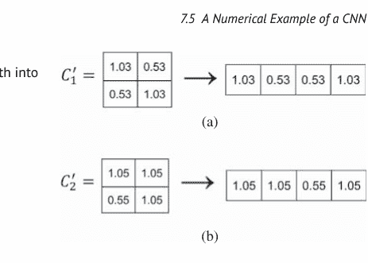

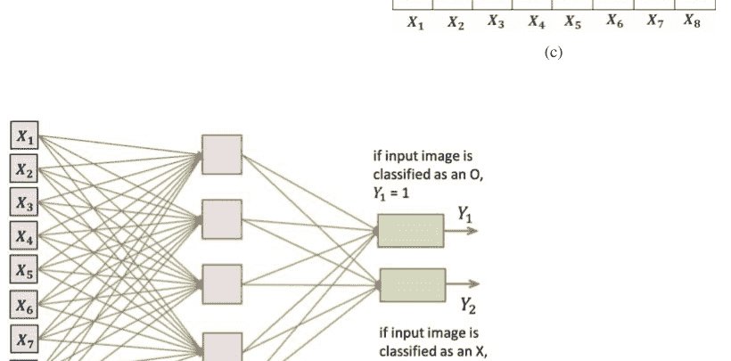

图7.15 本例中CNN使用的全连接ANN，输入与隐藏层之间有 (8 × 4) 个突触（即 $|W^{(1)}| = 32$），偏置为 (1 × 4)（即 $|B^{(1)}| = 4$）；隐藏层与输出层之间有 (4 × 2) 个神经元（即 $|W^{(2)}| = 8$），偏置为 (1 × 2)（即 $|B^{(2)}| = 2$）。

图7.14c。因此，ANN将有八个输入放置在UL之后。为简化起见，我们选择一个具有四神经元隐藏层的全连接ANN（图7.15）。由于本例有两个输出，一个对应形状O，另一个对应X，因此ANN的输出层将有两个神经元。

如图7.14c所示，ANN层的输入和权重为

$X = [1.03 \ 0.53 \ 0.53 \ 1.03 \ 1.05 \ 1.05 \ 0.55 \ 1.05]$。

由于示例输入是O形（图7.7），ANN的输出将是 $Y_1 = 1$ 和 $Y_2 = 0$。以矩阵形式表示，这些输出为

$Y = [1 \ 0]$。

UL生成八个输入馈入ANN。由于隐藏层选择了四个神经元，因此有 (8 × 4) 个突触连接输入到隐藏层。此外，隐藏层的每个神经元都将连接一个偏置，表示为 (4 × 1) 的向量（参见第2章）。类似地，隐藏层和输出层的神经元之间有 (4 × 2) 个突触和 (1 × 2) 的偏置向量。从ANN开始并流经CNN各层的反向传播操作在附录C中介绍。

让我们考虑CNN训练的计算成本。假设CNN输入的维度为 $(d_i \times h_i \times w_i)$，CL总共使用 $F_{cl}$ 个滤波器，每个滤波器的大小为 $(d_i \times f_{cl} \times f_{cl})$。如图7.16所示，使用步幅 $s_{cl}$，应用卷积操作后，CL将生成 $F_{cl}$ 个矩阵，每个矩阵的大小为
$$\left(\frac{h_i - f_{cl}}{s_{cl}} + 1\right) \times \left(\frac{w_i - f_{cl}}{s_{cl}} + 1\right)$$。

请注意，即使输入矩阵可能是 $d_i$ 维的，CL总是生成一个二维矩阵。对于典型应用，CL中的卷积滤波器数量 $F_{cl}$ 通常选择在32到512之间，滤波器大小 $f_{cl}$ 为奇数（以便滤波器包含一个中心像素），步幅 $s_{cl} = 1$。那么，每个 $F_{cl}$ 输出矩阵的大小变为
$$(h_i - f_{cl} + 1) \times (w_i - f_{cl} + 1)$$。
(7.1)

由于卷积操作的性质，CL生成的矩阵尺寸小于其输入。这是因为滤波器无法覆盖输入矩阵边界附近的元素，导致边界信息丢失。解决此缺点的一个方法是零填充[77]，即在输入矩阵中添加额外的零行和零列。在图7.17a中，使用 (3 × 3) 滤波器对大小为 (4 × 4) 的输入矩阵进行卷积，生成 (2 × 2) 的输出矩阵。然而，在输入矩阵周围添加零后，生成了 (3 × 3) 的输出矩阵（图7.17b）。如有必要，通过更多填充，可以使输出和输入矩阵大小相同。

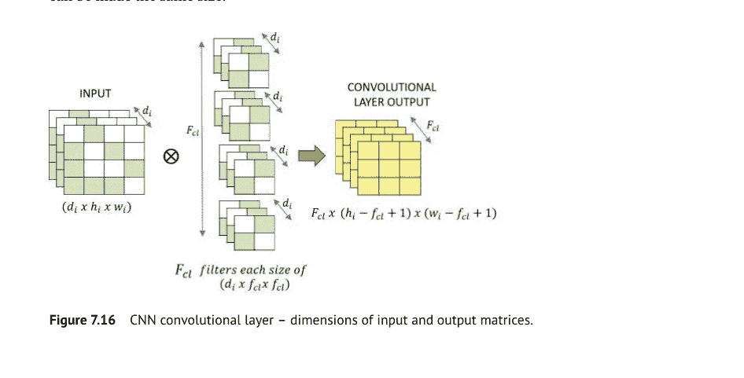

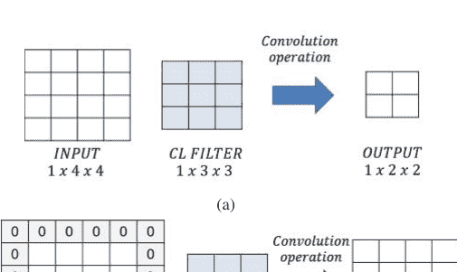

图7.17 零填充防止卷积操作期间的信息丢失：(a) 输入图像生成尺寸较小的矩阵，(b) 通过零填充，可以防止信息丢失（对于本例，要实现无信息丢失，输入矩阵必须填充至大小为 (1 × 8 × 8)）。

经过RELU（不改变矩阵维度）后，池大小为 $p$、步幅为 $s_{pl}$ 的PL生成 $F_{cl}$ 个矩阵，每个矩阵的大小为

$$\left( \frac{\frac{h_i - f_{cl}}{s_{cl}} + 1 - p}{s_{pl}} + 1 \right) \times \left( \frac{\frac{w_i - f_{cl}}{s_{cl}} + 1 - p}{s_{pl}} + 1 \right)$$

池大小 $p$ 的选择通常使得 $w_i$ 和 $h_i$ 能被 $p$ 整除。步幅 $s_{pl}$ 设置为 $s_{pl} = p$，以便不同池化区域之间没有重叠。对于 $s_{cl} = 1$，如图7.18所示，

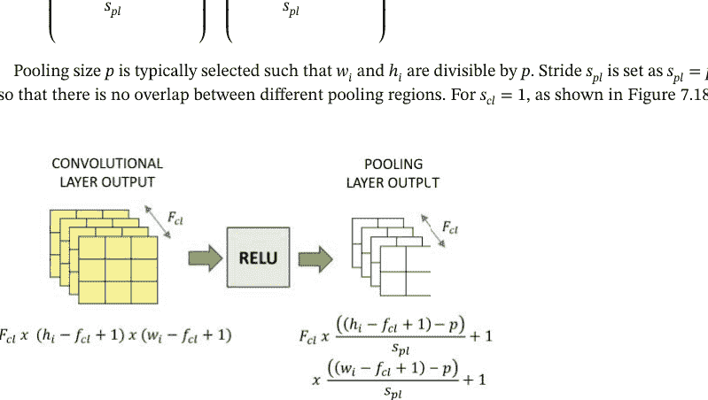

我们得到每个 $F_{cl}$ 矩阵的维度为

$$\left(\frac{h_i - f_{cl} + 1 - p}{s_{pl}} + 1\right) \times \left(\frac{w_i - f_{cl} + 1 - p}{s_{pl}} + 1\right).$$

UL输入的大小是PL生成的所有 $F_{cl}$ 矩阵包含的数据总量。UL的输出也是ANN的输入数量：

$$I_{ann} = F_{cl} \times \left(\frac{\frac{h_i - f_{cl}}{s_{cl}} + 1 - p}{s_{pl}} + 1\right) \times \left(\frac{\frac{w_i - f_{cl}}{s_{cl}} + 1 - p}{s_{pl}} + 1\right).$$

如图7.19和图7.20所示，对于 $s_{cl} = 1$ 且 $h_i = w_i$，我们有

$$I_{ann} = F_{cl} \times \left(\frac{h_i - f_{cl} + 1 - p}{s_{pl}} + 1\right)^2.$$

一个额外的函数，称为softmax，可以应用于CNN的输出，将 $L$ 的值转换为概率。所有概率之和为1，其中每个输出概率

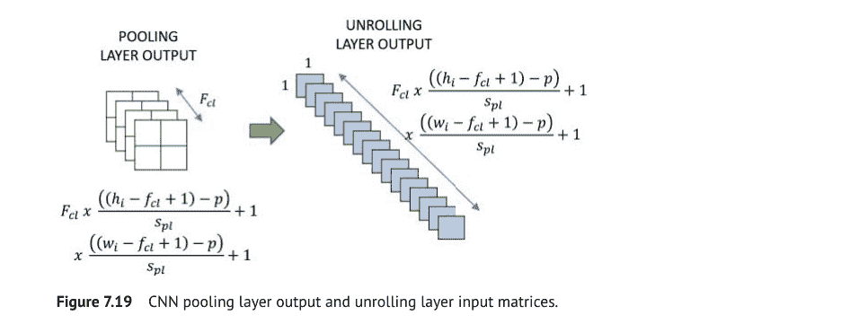

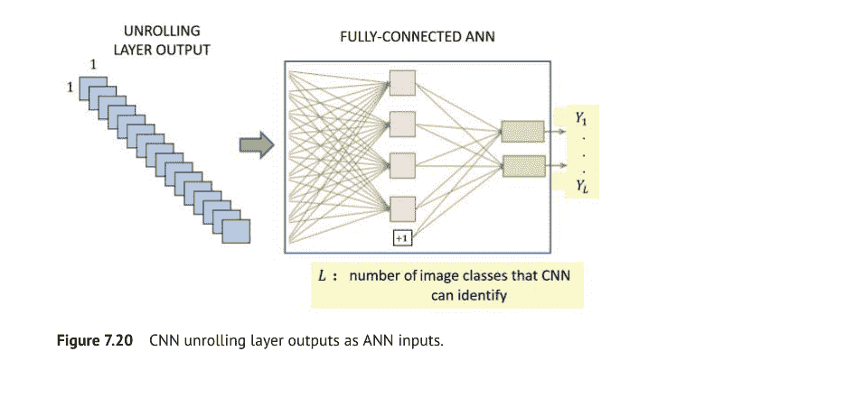

表示CNN对特定输出是解决方案的置信度。输出 $Y_k$ 的概率计算为

$$P(Y_k) = \frac{e^{Y_k}}{\sum_{i=1}^{L} Y_i},$$

其中每个概率在0到1之间，即使对于CNN输出的负值也是如此。

对于具有单个包含 $H$ 个神经元的隐藏层的全连接ANN，一个epoch的训练计算成本为 $\mathcal{O}(I_{ann} \times H)$，其中 $\mathcal{O}$ 表示计算操作数量的数量级[35]。如果有多个隐藏层，对于每个具有 $H_i$ 个神经元的层 $i$，将增加 $\mathcal{O}(H_{i-1} \times H_i)$ 的计算负载。训练CNN $E$ 个epoch，计算成本乘以 $E$。此外，如果样本集中使用了 $N$ 个输入矩阵，成本还必须乘以 $N$。

在实际应用中，通常在CNN中使用几个连续的CL-PL对，以提高其预测能力并在馈入ANN之前降低矩阵维度，每个额外的CL-PL对通常使用比前一对多一倍的滤波器，从而将矩阵大小减少 $\mathcal{O}(1/s_{pl})$ 的数量级，同时将输出矩阵数量增加 $\mathcal{O}(f_{cl})$。有几种机制用于减少神经网络中的矩阵大小，例如嵌入层（参见第10章第10.5节）。在附录C中，我们使用数值示例介绍了CNN的训练步骤。我们建议读者研究CNN训练过程，以理解其计算成本。

现在让我们给出一个简单的数值示例，以检查训练CNN所需的操作数量。假设使用大小为 $(3 \times 1000 \times 1000)$ 的图像来训练一个具有3个CL-PL对的CNN。根据公式(7.1)，第一个CL（我们称之为CL-1），使用 $F = 20$ 个滤波器，每个大小为 $f_{cl} = 5$，生成20个输出矩阵，每个大小为 $(996 \times 996)$。根据公式(7.2)，对于第一个PL（我们称之为PL-1），使用池大小 $p = 3$ 和步幅 $s = 3$，输出将是20个矩阵，每个大小为 $(332 \times 332)$。在CL-2，假设有 $F = 35$ 个滤波器，每个大小为 $f_{cl} = 5$。使用PL-1的输出，CL-2生成35个输出矩阵，每个大小为 $(328 \times 328)$。相应地，PL-2，池大小 $p = 3$ 和步幅 $s = 3$，生成35个输出矩阵，每个大小为 $(109 \times 109)$。类似地，CL-3，使用 $F = 50$ 个滤波器，每个大小为 $f_{cl} = 5$，生成50个输出矩阵，每个大小为 $(105 \times 105)$。PL-3，池大小 $p = 3$ 和步幅 $s = 3$，生成50个输出矩阵，每个大小为 $(35 \times 35)$。此时，输出被馈入UL，UL将展开矩阵并生成大小为 $(61\,250 \times 1 \times 1)$ 的ANN输入。假设全连接ANN有三个隐藏层，每层有1000个神经元。在这种情况下，ANN训练前向传播的操作数量为

$T_{cnn} = (61\,250 \times 1000) + (1000 \times 1000) + (1000 \times 1000) + (1000 \times L) \approx 63M,$

其中 $L$ 是CNN输出的数量（在总量中微不足道，这就是为什么在估计中未显示）。通过反向传播，操作数量加倍至约 $126M$。对于典型的ANN训练，$E = 1000$ 个epoch，单个输入图像的总成本为 $126B$ 次操作。如果中等规模的样本集中有10000张图像，训练成本总计达到一千万亿次操作：$T_{cnn} = \mathcal{O}(10^{15})$。图7.21说明了此示例。

如果使用更大的图像、更多的CL-PL层对、具有更多epoch的ANN隐藏层，成本可能会高得多。根据应用程序的具体要求，数据科学家和领域专家应在这些参数之间找到最佳平衡。我们在此给出这个数值示例的目的，是为了强调这样一个事实：如果不特别注意每个CNN层的特性，训练CNN的计算成本很容易变得高得令人望而却步。

## 7.7 结语

本章介绍了卷积神经网络（CNN）的主要概念，这些网络在识别图像和语音等多维输入方面表现出色。典型的CNN由卷积层、池化层和展平层、线性整流单元以及一个全连接的人工神经网络（ANN）组成。使用不同类型层的主要目的是降低输入的高维度。每一层通过滤波器尺寸的平方量级来减小输入图像的尺寸。根据所需的精度水平，会使用多个层。

通常，训练CNN需要大量的运算。在选择滤波器尺寸、滤波器数量、CL-PL对的数量以及ANN架构时，必须考虑其对训练成本的影响。强烈建议使用嵌入等技术，将训练的计算成本控制在可行的范围内。

## 7.8 第7章习题

1) 讨论增加CL-PL对数量对CNN训练和性能的影响。
2) 讨论使用大尺寸滤波器对CNN训练和性能的影响。
3) 讨论使用小尺寸滤波器对CNN训练和性能的影响。
4) 讨论使用具有大量隐藏层的ANN对CNN训练和性能的影响。
5) 习题1和习题2中建议的改变共同作用，将如何影响CNN的训练和性能？你能否通过推导信息在CNN中处理时的矩阵大小来支持你的答案？
6) 针对习题1和习题3中建议的改变，重复习题5。
7) 针对习题1和习题4中建议的改变，重复习题5。
8) 针对习题2和习题4中建议的改变，重复习题5。

# 8 用于光学字符识别的CNN

## 8.1 引言

光学字符识别（OCR）是将手写、打字或印刷文本的图像数字化并识别的过程[78]。OCR应用的一个典型例子是邮政自动化，其中信件和包裹根据其手写或打印的地址和标签进行分类。OCR允许计算机自动识别和处理地址，而无需手动阅读并将每封信的地址输入计算机。OCR的其他应用包括捕获车牌号码、将物理文档转换为可编辑的文本文档，以及为盲人和视力障碍者提供辅助。用于OCR的一个流行信息源是MNIST数据集[79]。它包含70,000张灰度图像，这些图像是0到9的手写数字。每个数字存储为一个（28 × 28）像素的图像。该数据集分为60,000个训练样本和10,000个测试样本。图8.1a展示了MNIST数据集中的几个示例[80]。MNIST网站包含了在该数据集上训练的各种分类方法的性能。MNIST网站报告称，目前CNN在字符识别应用中的性能优于所有其他分类器。图8.1b列出了每个分类器对应的最低错误率。

## 8.2 用于OCR的简单CNN

在本章中，我们介绍一个用于实现简单OCR任务的CNN，即识别几个手写字符。本例中的CNN读取一个大小为（1 × 28 × 28）的手绘灰度图像，并将输入字符识别为其存储的参考图像之一。使用多个连续的CL–PL对来提高CNN的预测能力（图8.2）。有三个卷积层（CL），在三个CL中分别使用$F_{cl} = 8$、16和32个滤波器，每个滤波器的大小为$f_{cl} = 3 \times 3$。有三个RELU单元和两个池化层（PL），每个池化层的池化大小为$p = 2$，步幅为$s_{pl} = 2$。ANN的输出也构成了CNN的输出层。ANN的输出数量是CNN训练时所识别的不同字符的数量。根据输入到CNN的图像，这些CNN输出中只有一个会被设置为$true$（即CNN预测为与输入图像正确匹配的那个输出），而其他输出将被设置为$false$。现在让我们检查一下在这个例子中，输入图像经过CNN各层时的尺寸变化（图8.3）。使用第7章中给出的公式（7.1）、（7.2）和（7.3），我们有：

- **输入：** 图像尺寸为（1 × 28 × 28）。
- **第1个CL：** 使用$F_{cl} = 8$个滤波器，每个大小为$f_{cl} = 3 \times 3$，尺寸从（1 × 28 × 28）变为（8 × 28 × 28）。
- **第1个PL：** 使用池化大小$p = 2$和步幅$s_{pl} = 2$，尺寸从（8 × 28 × 28）减小到（8 × 14 × 14）。
- **第2个CL：** 使用$F_{cl} = 16$个滤波器（即前一个数量的两倍），每个大小为$f_{cl} = 3 \times 3$，尺寸从（8 × 14 × 14）变为（16 × 14 × 14）。
- **第2个PL：** 使用池化大小$p = 2$和步幅$s_{pl} = 2$，尺寸从（16 × 14 × 14）减小到（16 × 7 × 7）。
- **第3个CL：** 使用$F_{cl} = 32$个滤波器（即前一个数量的两倍），每个大小为$f_{cl} = 3 \times 3$，尺寸从（16 × 7 × 7）变为（32 × 7 × 7）。
- **展平层（UL）：** 展平操作将其输入从（32 × 7 × 7）变为（1568 × 1 × 1）。
- **ANN：** 这是一个全连接层，输出尺寸为（C × 1 × 1），其中C是CNN要识别的唯一字符的数量。

**图8.1** MNIST网站上OCR应用的基本信息：(a) 数字样本图像，(b) CNN优于所有其他OCR分类器。改编自[77]。

| 分类器类型 | 最佳测试错误率 |
| :--- | :--- |
| 线性 | 7.6 % |
| K-近邻 | 0.52 % |
| 提升决策桩 | 0.87 % |
| 非线性 | 3.3 % |
| 支持向量机 | 0.56 % |
| 人工神经网络 | 0.35 % |
| 卷积神经网络 | 0.23 % |

**图8.3** 图像在CNN层中处理时的尺寸变化：一个大小为（1 × 28 × 28）的输入图像被送入CNN；第一个CL将其尺寸变为（8 × 28 × 28），第一个PL变为（8 × 14 × 14），第二个CL变为（16 × 14 × 14），第二个PL变为（16 × 7 × 7），第三个CL变为（32 × 7 × 7），展平层变为（1568 × 1 × 1），然后才送入ANN。

## 8.3 训练和参考文件的组织

在介绍实现CNN的脚本之前，让我们先介绍一个用于存储训练和预测所用文件的文件夹结构。请注意，此组织结构仅为示例，不一定需要完全照搬。假设我们创建两个文件夹，分别命名为`TrainingSet`和`ReferenceSet`，用于存放训练图像和参考图像。

- `TrainingSet`：此文件夹存储用于训练CNN的图像文件。对于CNN要识别的每个不同字符，都有一个子文件夹。对于一个尺寸为C × 1 × 1的输出层，`TrainingSet`文件夹下有C个子文件夹，每个输出字符对应一个。在每个子文件夹中，都有用于训练CNN识别该特定图像的图像文件。图8.4展示了`TrainingSet`文件夹的一个示例，其中有五个CNN要识别的不同图像，分别命名为`eleven`、`seven`、`six`、`umlaut`和`w`。例如，在子文件夹`six`中，我们可以看到有五个不同的图像用于训练CNN识别该输出，存储在文件`six_1.png`到`six_5.png`中。
- `ReferenceSet`：此文件夹下的文件包含官方（即参考）图像，这些图像将在CNN识别输入图像后显示给用户。它包含与`TrainingSet`相同数量的子文件夹，即CNN定义的输出数量。为简单起见，我们假设两个文件夹具有相同的子文件夹名称。当CNN识别出输入图像属于`TrainingSet`中子文件夹F中的某个图像时，`ReferenceSet`中子文件夹F下的相应图像将显示给用户。

## 8 用于光学字符识别的卷积神经网络

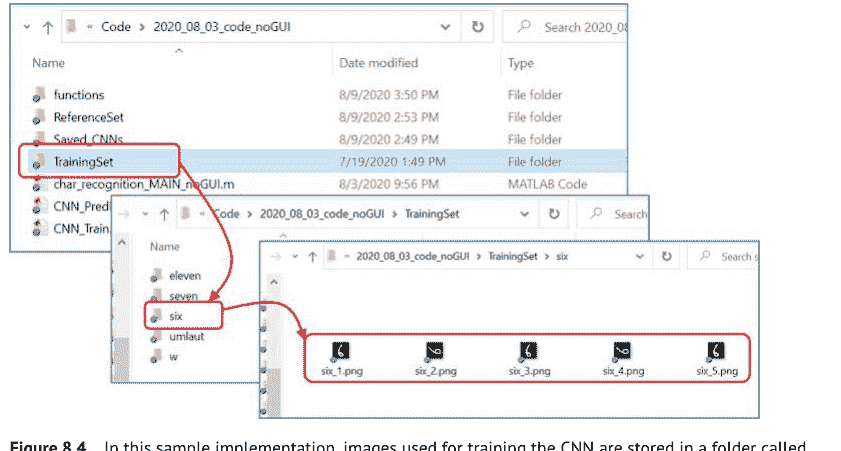

图 8.4 在此示例实现中，用于训练 CNN 的图像存储在一个名为 TrainingSet 的文件夹中，该文件夹中包含的子文件夹数量与 CNN 需要识别的字符数量相同，每个子文件夹中存放着与该字符相关的单个图像（在此示例中，一个名为 six 的文件夹包含了训练中使用的所有字符 6 的图像，即名为 six_1.png 到 six_5.png 的文件）。

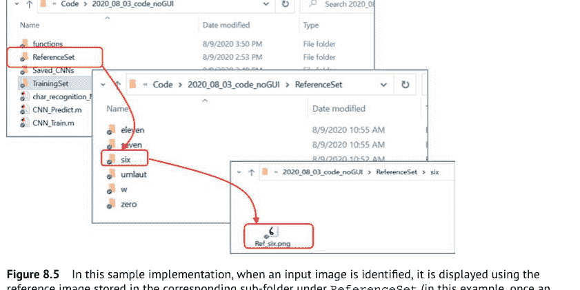

图 8.5 在此示例实现中，当识别出输入图像时，它会使用存储在 ReferenceSet 下相应子文件夹中的参考图像进行显示（在此示例中，一旦输入被识别为属于 TrainingSet 中 six 子文件夹的图像，ReferenceSet 中 six 子文件夹下的 Ref_six.png 的内容将作为 CNN 的输出显示）。

在图 8.5 中，显示了 ReferenceSet 中 six 子文件夹的内容。如果 CNN 判定输入图像与 TrainingSet 中 six 子文件夹下的图像相似，则 ReferenceSet 中 six 子文件夹下的 Ref_six.png 的内容将作为 CNN 的输出显示给用户。

## 8.4 使用 CNN 进行 OCR 的 Python 脚本

下面展示了一个用 Python 实现 CNN 进行 OCR 的示例。用户可以在第 20 行选择是训练一个新的 CNN 还是使用一个已经训练好的 CNN。如果用户输入 1 作为选项，则通过调用函数 `CNN_Train`（下文描述）来训练一个新的 CNN，并将结果对象存储在第 26 行的 `model` 中，如下所示：

`model = CNN_Train(train_dir)`

其中变量 `train_dir` 包含第 8.3 节中描述的 `TrainingSet` 文件夹的地址，该文件夹将用于训练新的 CNN。如果用户输入 2 作为选项，则将先前训练并保存的 CNN 加载到第 26 行的 `model` 对象中。在第 46 行，调用了一个名为 `draw_tool` 的函数，该函数返回用户绘制的图像输入，该输入将位于 `image_path` 中。在第 47 行，调用了一个名为 `CNN_predict` 的函数，如下所示：

`CNN_predict(model, ref_dir, image_path)`

其中 `model` 包含 CNN（无论是新训练的还是上面预先保存的），`ref_dir` 是 `ReferenceSet` 文件夹的位置（如上文第 8.3 节所述），`image_path` 是用户绘制的输入图像。

在第 55–105 行，实现了一个名为 `draw_tool` 的函数。它向用户呈现一个画布，将绘制的图像存储到文件中，并返回指向该文件的指针。

```
# The City College of New York, City University of New York
# Written by Olga Chsherbakova
# October, 2023
from CNN_Train import CNN_Train
from CNN_Predict import CNN_Predict
import os
from tensorflow.keras import models
import tkinter as tk
from PIL import Image, ImageDraw
import tempfile
# Optical character recognition using a CNN

def char_recognition_MAIN_noGUI():
    # select training directory
    train_dir = 'TrainingSet'
    # select reference and output directories
    ref_dir = 'ReferenceSet'
    saved_cnns = 'Saved_CNNs'
    print('WELCOME TO USING CNN. MAKE YOUR SELECTION:')
    print('Enter 1 to train a new CNN')
    print('Enter 2 to load an existing CNN')
    user_entry = input('Enter your choice: ')
    if user_entry == '1':
        #train a new CNN:
        print('Be patient until statistics are displayed...')
        model = CNN_Train(train_dir)
        input('CNN is trained. Press enter to use the CNN\n')
    elif user_entry == '2':
        # use an existing CNN:
        cnn_file = input('Enter CNN name (include .h5 extension): ')
        try:
            # load the CNN and assign it to cnn_trained
            model = models.load_model(os.path.join(saved_cnns,
                                                cnn_file))
        except:
            print('Need a valid file name... Leaving... Bye')
            return
    else:
        print('Need a valid choice... Leaving... Bye')
        return
```

# 8 用于光学字符识别的卷积神经网络

```
# Now there is a trained CNN loaded (either a new one or
# an existing one). Use trained CNN to make predictions:

# start drawing a character
image_path = draw_tool()
CNN_Predict(model, ref_dir, image_path)
print('Have a predictably nice day!')
os.remove(image_path)

def draw_tool():
    root = tk.Tk()
    root.title("Draw a Character")

    canvas_width = 280
    canvas_height = 280

    # Create a canvas for drawing
    canvas = tk.Canvas(root, width=canvas_width,
                       height=canvas_height, bg="white")
    canvas.pack(pady=20)

    # Variables to store the last x and y positions
    lastx, lasty = None, None
    # Create an image to save
    image = Image.new("RGB", (canvas_width, canvas_height),
                      "white")
    draw = ImageDraw.Draw(image)

    # Define filepath here
    filepath = ""

    def on_button_press(event):
        nonlocal lastx, lasty
        lastx, lasty = canvas.canvasx(event.x), canvas.canvasy(event.y)

    def on_mouse_drag(event):
        nonlocal lastx, lasty
        x, y = canvas.canvasx(event.x), canvas.canvasy(event.y)
        canvas.create_oval((lastx, lasty, x, y),
                           fill="black", width=10)
        draw.line([lastx, lasty, x, y], fill="black", width=10)
        lastx, lasty = x, y

    def save_image():
        nonlocal filepath
        # Save to a temporary file
        with tempfile.NamedTemporaryFile(delete=False,
                                         suffix='.png') as tmp_file:
            filepath = tmp_file.name
        image.save(filepath)
        root.destroy()

    # Bind events to the canvas
    canvas.bind("<Button-1>", on_button_press)
    canvas.bind("<B1-Motion>", on_mouse_drag)

    # Add a save button
    save_button = tk.Button(root, text=
            "Click here when finished", command=save_image,
            bg="blue", fg="white")
    save_button.pack(pady=20)

    root.mainloop()
    return filepath

char_recognition_MAIN_noGUI()
```

下面我们展示一个名为 CNN_Train 的函数。在第 26-35 行，训练图像被加载到一个名为 train_generator 的对象中。在第 38 到 81 行之间，定义了 CNN 的拓扑结构。在第 41 行，定义了一个大小为 (28 × 28 × 1) 的输入层：

```
layers.InputLayer(input_shape = (28,28,1))
```

在第 46 行，创建了第一个卷积层，包含 8 个滤波器，每个滤波器的大小为 (3 × 3)，使用填充以使输入和输出图像具有相同的尺寸（即不会因卷积操作而丢失任何数据点）：

```
layers.Conv2D(8, (3,3), padding = 'same')
```

在第 50 行，卷积层的输出被归一化，使其值介于 −1 和 1 之间：

```
layers.BatchNormalization()
```

在第 53 行，定义了一个 RELU 激活函数，如下所示：

```
layers.Activation('relu')
```

在第 56 行，定义了一个池化大小为 (2 × 2)、步幅为 2 的池化层：

```
layers.MaxPooling2D((2,2), strides=2)
```

在第 61–63 行，定义了第二个卷积层，包含 16 个滤波器，每个滤波器大小为 (3 × 3)，以及一个归一化层和一个 RELU。在第 66 行定义了第二个池化层，池化大小为 (2 × 2)，步幅为 2。类似地，在第 71 到 74 行，定义了第三个卷积层，包含 32 个滤波器、一个归一化层和一个 RELU。第 75 行展示了展平层，如下所示：

```
layers.Flatten()
```

在第 76 到 80 行，定义了一个使用 softmax 作为其激活函数的全连接 ANN，如下所示：

```
layers.Dense(train_generator.num_classes, activation= 'softmax')
```

在第 89–91 行定义训练选项后，使用梯度下降作为优化方法（即选项 Adam），并选择交叉熵损失函数来计算每个 epoch 的损失，CNN 在第 93 行训练了 700 个 epoch：

```
model.fit(train_generator, epochs=700)
```

```
import tensorflow as tf
from tensorflow.keras import layers, models, optimizers
import os

def count_files_in_subdirectories(root_dir="TrainingSet"):
    sum_files = 0
    # Get the list of the all files in the folders
    subdirs = [d for d in os.listdir(root_dir)
               if os.path.isdir(os.path.join(root_dir, d))]

    # Iterate in each of the folder
    for subdir in subdirs:
        subdir_path = os.path.join(root_dir, subdir)
        files_count = len([f for f in os.listdir(subdir_path)
                           if os.path.isfile(os.path.join(subdir_path, f))])
        sum_files += files_count
    return sum_files

# Train a new CNN using information from TrainingSet directory
# Then return trained CNN
# TRAIN THE CNN
def CNN_Train(train_dir):
    # load the training image dataset into an ImageDataGenerator
    # train_path contains the path to the dataset
    train_datagen = \
        tf.keras.preprocessing.image.ImageDataGenerator(rescale=1./255)
    train_generator = train_datagen.flow_from_directory(
        train_dir,
        target_size=(28, 28),
        # get the number of unique training labels in the training data
```

## 8 用于光学字符识别的卷积神经网络

```python
batch_size=count_files_in_subdirectories(),
class_mode='categorical',
color_mode='grayscale'
)

# 定义CNN结构
model = models.Sequential([
    # 设置输入图像尺寸为28x28像素，1个颜色通道（灰度）
    layers.InputLayer(input_shape=(28, 28, 1)),
    # 创建第一个卷积层，包含8个卷积滤波器，
    # 每个滤波器的高度和宽度为3，输入进行零填充。
    # 输入被填充了适当数量的零，以使输出尺寸与输入相同。
    layers.Conv2D(8, (3, 3), padding='same'),
    # 将卷积输出归一化到-1到1的范围。
    # 这可以防止更新的权重在训练期间爆炸性增长。
    layers.BatchNormalization(),
    # 应用修正线性单元激活函数，将所有负值设置为零
    layers.Activation('relu'),
    # 应用最大池化，池化大小为(2x2)，步幅为2
    layers.MaxPooling2D((2, 2), strides=2),

    # 创建第二个卷积层，包含16个卷积滤波器，
    # 每个滤波器的高度和宽度为3，输入进行零填充。
    layers.Conv2D(16, (3, 3), padding='same'),
    layers.BatchNormalization(),
    layers.Activation('relu'),
    # 应用最大池化，池化大小为(2x2)，步幅为2
    layers.MaxPooling2D((2, 2), strides=2),

    # 创建第三个卷积层，包含32个卷积滤波器，
    # 每个滤波器的高度和宽度为3，输入进行零填充。
    layers.Conv2D(32, (3, 3), padding='same'),
    layers.BatchNormalization(),
    layers.Activation('relu'),

    layers.Flatten(),
    layers.Dense(train_generator.num_classes,
                 # 使用softmax层将输出转换为一组概率，
                 # 其中每个输出代表图像是对应标签的概率。
                 activation='softmax')
])
# 层定义结束

# 训练期间使用的优化器。本例中使用Adam优化器。
# 优化器负责在训练期间根据计算出的梯度更新模型的权重。
# Adam是一种流行的优化算法，可在训练期间自适应调整学习率。
model.compile(optimizer=optimizers.Adam(),
              loss='categorical_crossentropy',
              metrics=['accuracy'])
# 指定CNN训练选项
model.fit(train_generator, epochs=700)

return model
```

下面展示了`CNN_Predict`函数的一个示例实现。在第61行，使用用户绘制的图像运行训练好的CNN以生成输出：

```python
predictions = model.predict(char_img_array)
```

然后在第62到70行显示该输出。

```python
import numpy as np
import os
from PIL import Image
from tensorflow.keras.preprocessing import image as keras_image
from PIL import Image, ImageTk
import tkinter as tk
from tkinter import filedialog
# 此GUI显示用户绘制字符的预测结果

def display_images_tkinter(model,char_img_path, ref_image_path):
    root = tk.Tk()
    root.title("使用CNN进行字符识别")

    # 加载图像
    char_img = Image.open(char_img_path).convert('L')
    ref_img = Image.open(ref_image_path).convert('L')

    # 调整预测图像的大小
    ref_img = ref_img.resize((250,250))

    char_img_tk = ImageTk.PhotoImage(char_img)
    ref_img_tk = ImageTk.PhotoImage(ref_img)

    # 为图像创建标签
    char_label = tk.Label(root, image=char_img_tk)
    char_label.pack(side=tk.LEFT, padx=10)

    ref_label = tk.Label(root, image=ref_img_tk)
    ref_label.pack(side=tk.LEFT, padx=10)

    def save_and_quit():
        file_name = filedialog.asksaveasfilename(defaultextension=".h5",
                                                filetypes=[("H5 files", "*.h5")])
        if file_name:
            model.save(file_name)
        # root.mainloop()
        root.destroy()


    def quit_root():
        root.destroy()

    # 保存模型并退出的按钮
    save_quit_button = tk.Button(root, text="保存模型并退出",
                                command=save_and_quit)
    save_quit_button.pack(pady=20)
    save_quit_button = tk.Button(root, text="退出", command=quit_root)
    save_quit_button.pack(pady=20)

    root.mainloop()

def CNN_Predict(model, ref_path, char_img_path):
    # 加载并预处理图像
    char_img = keras_image.load_img(char_img_path, target_size=(28, 28),
                                    color_mode='grayscale')
    char_img_array = keras_image.img_to_array(char_img)
    char_img_array = np.expand_dims(char_img_array, axis=0)
    char_img_array /= 255.0

    # 进行预测
    predictions = model.predict(char_img_array)
    predicted_class = np.argmax(predictions[0])
    class_names = sorted(os.listdir(ref_path))
    predicted_class_name = class_names[predicted_class]

    # 检索用于预测的相应参考图像
    ref_image_path = os.path.join(ref_path, predicted_class_name,
                                  os.listdir(os.path.join(ref_path, predicted_class_name))[0])

    display_images_tkinter(model,char_img_path, ref_image_path)
```

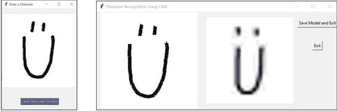

**图 8.6** 第8.4节中给出的Python脚本的示例运行，其中训练好的CNN预测并显示用户绘制的字符：(a) 用户输入，(b) CNN使用相应的存储参考图像进行预测。

上述Python脚本的示例运行如图8.6所示。对于图8.6a所示的用户绘制字符，Python脚本生成的预测结果如图8.6b所示，使用的是`ReferenceSet`文件夹中存储的图像，如上文第8.3节所述。

## 8.5 使用CNN进行OCR的Matlab脚本

在运行Matlab脚本之前，必须按照上文第8.3节所述创建`TrainingSet`和`ReferenceSet`文件夹及其子文件夹。可以通过运行下面显示的`create_new_character.m`函数来填充子文件夹。

```matlab
% create_new_character函数用于训练和参考文件夹图像：
clc;
clear;
if exist('create_character_data_GUI','dir') == 7
    % 访问'create_character_data_GUI'目录中的所有文件
    addpath('create_character_data_GUI');
else
    error("错误：无法定位'create_character_data_GUI'目录")
end

if exist('functions','dir') == 7
    % 访问'functions'目录中的所有文件
    addpath('functions');
else
    error("错误：无法定位'functions'目录")
end

% 打开欢迎GUI
GUI_1_WELCOME()
```

这些图像可以用作参考图像，也可以用于训练CNN。用户被要求使用鼠标或手写板绘制一个字符（允许使用多笔画绘制图像）。如果绘制的图像将用作参考图像，用户应将其保存在`ReferenceSet`下相应的子文件夹中。类似地，如果它将用作训练样本图像，则应将其保存在`TrainingSet`下相应的子文件夹中。图8.7展示了使用`create_new_character.m`创建参考图像和训练样本图像的示例，其中用户点击“绘制字符”，绘制一个字符，并决定将其保存在`TrainingSet`或`ReferenceSet`下的子文件夹中。

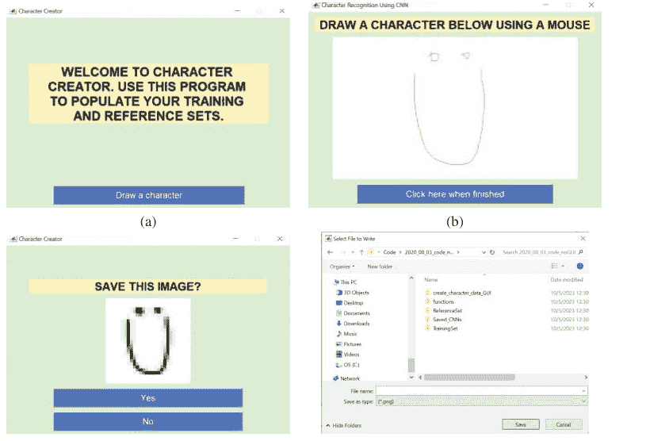

**图 8.7** 使用`create_new_character.m`创建参考图像和训练样本图像：(a) 用户点击“绘制字符”后，(b) 用户绘制字符，(c) 用户决定保存，(d) 用户将图像保存在`TrainingSet`或`ReferenceSet`下的子文件夹中（对于两种情况，子文件夹名称应相同，例如umlaut）。

下面展示了一个实现OCR CNN的Matlab脚本。为了便于比较，其结构与第8.4节中的Python脚本相似。在主程序中，提示用户创建新的CNN或加载现有的CNN。如果用户选择通过在第23行输入1来训练新的CNN，则在第26行调用`CNN_Train`：

```matlab
cnn_trained = CNN_Train(train_dir);
```

其中变量`train_dir`包含`TrainingSet`文件夹的地址，训练CNN的图像位于该文件夹中。如果用户选择通过输入2作为选项来使用先前训练的CNN，则在第36行从`SavedCNNs`目录加载现有的CNN（先前保存为.mat文件）。在第48行，调用名为`draw_tool`的函数，该函数要求用户创建输入图像并将其保存在名为`image`的对象中。在第51行，使用训练好的CNN和用户输入图像调用`CNN_Predict`：

```matlab
cnn_prediction = CNN_Prediction(cnn_trained, image);
```

在第50到60行之间，然后询问用户是否需要使用相同的CNN进行新的预测；如果需要，则重复上述步骤。最后询问用户是否要保存训练好的CNN以供将来使用。

## 8 用于光学字符识别的卷积神经网络

```matlab
% The City College of New York, City University of New York
% Written by Ricardo Valdez
% August, 2020
% Optical character recognition using CNNs
clc;
clear;
% select training directory
train_dir = 'TrainingSet';
% select reference directory
ref_dir = 'ReferenceSet';
%output directory
saved_cnns = 'Saved_CNNs';
if exist('functions','dir') == 7
    % get access to all files in the 'functions' directory
    addpath('functions');
else
    error("Error: Unable to locate 'functions' directory")
end
message = sprintf('WELCOME TO USING CNN. MAKE YOUR SELECTION:');
disp(message);
disp('Enter 1 to train a new CNN 2 to load an existing CNN');
user_entry = input('Enter your choice: ');
if (user_entry == 1)
    % train a new CNN:
    disp('Be patient until statistics are displayed...');
    cnn_trained = CNN_Train(train_dir);
    input('CNN training is complete. Press enter to start using CNN.\n');
elseif (user_entry == 2)
    % use an existing CNN:
    cnn_file = input('Enter CNN name (dont forget .mat extension): ', 's');
    cnn_path = pwd;
    disp(cnn_file);
    try
        % load the CNN and assign it to cnn_trained
        load_data = load(fullfile(cnn_path, saved_cnns, cnn_file));
        cnn_trained = load_data.cnn_trained;
    catch
        disp('Enter a valid file name next time... Leaving... Bye');
        return;
    end
else
    disp('Enter a valid choice next time... Leaving... Bye');
    return;
end

% Use trained CNN to make predictions:
% start drawing a character
image = draw_tool();

% CNN predicts the character
cnn_prediction = CNN_Predict(cnn_trained, ref_dir, image);

user_entry = input('Do you want to save CNN? (y/n) ','s');
if(user_entry == 'y')
    file_name = input('Enter file name (do not forget.mat extension): ',...
        's');
    save(fullfile(saved_cnns,file_name), 'cnn_trained');
else
end
disp('Have a predictably nice day!');
```

下面我们介绍名为 `CNN_Train` 的函数，其在第16至66行定义了CNN的架构。在第25行，定义了第一个卷积层，其滤波器尺寸为 $f_{cl} = 3$，滤波器数量为 $F_{cl} = 8$。如第7章所述，设置了填充，以便在输入图像上添加零，使其在卷积后保持相同尺寸，从而避免因卷积层滤波器 $f_{cl}$ 尺寸较小而丢失信息。在第29行进行批量归一化后，第32行定义了RELU激活函数，第36行设置了第一个池化层，其尺寸为 $p = 2$，步幅为 $s_{pl} = 2$。第二个卷积层-池化层对在第41行和第47行定义。然后，第三个卷积层的尺寸、滤波器数量、RELU和归一化在第51至53行。最后，全连接的ANN在第58行定义。注意，在Matlab中，输出层是自动实现的。在第71至73行，训练选项定义为sgdm（即随机梯度下降），学习率为0.01，最大训练轮数为50。训练好的CNN在第82行保存到名为 `net` 的对象中。

```matlab
function net = CNN_Train(train_dir)
%
% Train a new CNN using information from TrainingSet directory
% Then return trained CNN

    %%%%%%%%%%% TRAIN THE CNN %%%%%%%%%%%

    % load the training image dataset into an imageDatastore
    % train_path contains the path to the dataset
    imds_train = imageDatastore(train_dir, ...
                                'IncludeSubfolders',true,...
                                'LabelSource','foldernames');
    % get the number of unique training labels in the training data
    noof_labels = height(countEachLabel(imds_train));

    layers = [
        % set the size of the input image as 28x28 pixels with 1 color
        % channel (grayscale)
        imageInputLayer([28 28 1])

        % create the first convolution layer, it has 8 convolutional
        % filters, each with a height and width of 3 and input is 0 padded.
        % the input is padded with the appropriate number of zeros so that
        % the size of the output is the same size as the input.
        convolution2dLayer(3,8,'Padding','same')
        % normalize the output of the convolution between the range -1
        % and 1. this prevents the updated weights from increasing
        % explosively during training.
        batchNormalizationLayer
        % apply rectilinear unit activation function that sets all negative
        % values to zero
        reluLayer

        % apply max pooling using a pooling size of (2x2), and using a
        % stride of 2
        maxPooling2dLayer(2,'Stride',2)

        % create a second convolution layer, it has 16 convolutional
        % filters, each filter has a height and width of 3 and the input is
        % zero padded.
        convolution2dLayer(3,16,'Padding','same')
        batchNormalizationLayer
        reluLayer

        % apply max pooling using a pooling size of (2x2), and using a
        % stride of
        maxPooling2dLayer(2,'Stride',2)
        % create a third convolution layer, it has 32 convolutional
        % filters, each filter has a height and width of 3 and the input is
        % zero padded.
        convolution2dLayer(3,32,'Padding','same')
        batchNormalizationLayer
        reluLayer

        % create the ouput layer
        % the number of neurons in the output layer is equal to the number
        % of image labels
        fullyConnectedLayer(noof_labels)
        % use a softmax layer to convert the outputs to a set of
        % probalities where each output represents the probability that the
        % image is a corresponding label.
        softmaxLayer
        % add a classification layer to make each output mutually
        % exclusive, in other words there's only a single correct label for
        % each image
        classificationLayer];
        %END OF layers


        % specify CNN training options
        options = trainingOptions('sgdm', ...
                                    'InitialLearnRate',0.01, ...
                                    'MaxEpochs',500);

        % sleep for a second to display the GUI
        pause(1);
        % start training the CNN
        % imds_train is imageDatastore that holds all training images and labels
        % layers is the architecture of the CNN
        % options contains the training parameters
        net = trainNetwork(imds_train,layers,options);
end
```

现在我们介绍名为 `CNN_Predict` 的函数，它有三个输入参数：`net`、`ref_path` 和 `char_img`，分别指向训练好的CNN、`ReferenceSet` 文件夹的地址以及用户绘制的输入图像。训练好的CNN在第19行生成输出如下：

```matlab
[Prediction, ] = classify(net, char_img);
```

其中 `Prediction` 包含指向 `ReferenceSet` 文件夹中某个子文件夹的索引。在第22至33行，显示了由 `Prediction` 顶部元素指向的参考输出图像。

```matlab
function Prediction = CNN_Predict(net,ref_path,char_img)
% this GUI shows prediction for the character drawn by the user

    S.net = net;
    S.ref = ref_path;
    % open a window(figure) for the GUI
    S.fh = figure('units','pixels',...
                'position',[500 300 600 400],...
                'menubar','none',...
               'name','Character Recognition Using CNN',...
               'numbertitle','off',...
               'resize','off',...
               'Color',[0.8588 0.9412 0.8275]);

   % create an axes to hold the images
   S.ax = axes('units','pix',...
               'position',[100 250 200 90]);
   % pass the drawing to the CNN and get a prediction
   [Prediction,~] = classify(net, char_img);

   % retrieve the appropriate reference image for prediction
   full_ref_path = fullfile(ref_path,char(Prediction));
   ref_imd = imageDatastore(full_ref_path);

   % display user input image
   subplot(1,2,1);
   imshow(char_img);
   title('YOUR CHARACTER','FontSize',15);

   % display prediction image
   subplot(1,2,2);
   imshow(ref_imd.Files{1});
   title('CNN PREDICTION','FontSize',15);
end
```

下面给出了名为 `draw_tool` 的函数；该函数用于显示一个简单的图形界面，供用户绘制字符。

```
function image = draw_tool()
% draw_tool() displays a GUI that allows the user to draw a character.

    % open a window(figure) for the draw tool
    S.fh = figure('units','pixels', 'position',[500 300 600 400],...
                 'menubar','none', 'name','Character Recognition Using CNN',...
                 'numbertitle','off', 'resize','off','Color',[0.8588 0.9412 0.8275]);
    % create a textbox
    S.tb = uicontrol('style','text',...
                     'unit','pix', 'position',[15 360 570 30],...
                     'min',0,'max',2, 'fontsize',18,...
                     'string','DRAW A CHARACTER BELOW USING A MOUSE',...
                     'BackgroundColor',[1.0000 0.9490 0.7412],...
                     'fontweight', 'bold');
    % create a blank axes
    % this is where the user draw their character
    S.ax = axes('units','pix',...
                'position',[50 60 500 290],...
                'XColor','none',...
                'YColor','none');
    % create a button to stop drawing
    S.pb = uicontrol('style','push',...
                     'units','pix',...
                     'position',[100 10 400 40],...
                     'fontsize',14,...
                     'string','Click here when finished',...
                     'backgroundcolor',[0.3020 0.4471 0.7412],...
                     'foregroundcolor','w',...
                     'callback',{@pb_call,S});
    % set color for the drawing to blue
    draw_color = [0 0.447 0.741];
    colororder(draw_color);

    % done is a boolean that indicates whether or not
    % the user is done drawing their character
    done = false;
    first = true;
    % draw a character
    while(~done)
        % check if the GUI window is still open
        if ishandle(S.fh)
            % convert the drawing into a 28x28 image
            if first == false
                image = process_image(S.ax);
            end
            % draw a curve
            get_curve(S.fh);
            first = false;
        else
            done = true;
        end
    end
end

function [] = pb_call(varargin)
% button callback function
    S = varargin{3};
    % close the draw tool GUI
    close(S.fh);
end
```

图 8.8a 和 b 展示了上述在 Matlab 中实现的 CNN 的一个示例运行，其中训练了一个 CNN，并要求用户绘制一个字符。然后，输入由 `CNN_Predict` 进行预测，并同时显示用户输入和来自 `ReferenceSet` 文件夹的相应参考图像。

## 130 | 8 用于光学字符识别的 CNN

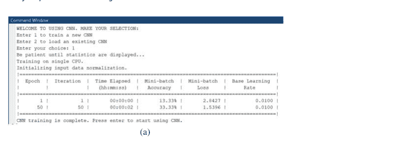


(a)

(b)

图 8.8 第 8.5 节中给出的 Matlab 脚本的示例运行：(a) 训练了一个 CNN，并要求用户绘制一个字符；(b) 用户输入被送入左侧训练好的 CNN，该 CNN 首先识别图像，并在右侧显示来自 `ReferenceSet` 文件夹的相应参考图像。

## 8.6 总结性评述

在本章中，我们介绍了一种用于 OCR 类问题的 CNN，其中使用一组输入图像样本来训练 CNN。OCR 广泛应用于邮政自动化、车牌号码捕获、物理文档转换为可编辑文本文件以及辅助盲人和视障人士等应用中。我们不能将 ANN 用于 OCR 应用，因为如果将具有高像素数的多维图像直接输入 ANN，它们会不堪重负，这使得 CNN 成为 OCR 应用最合适的 AI 工具。为 OCR 设计的 CNN 架构包含多个 CL-PL 对，以提高预测能力。设计者在构建 CNN 拓扑结构时必须注意训练的计算成本，因为特别是在样本数量较多的情况下，这很容易使一个实际项目变得成本高得难以承受。

## 8.7 第 8 章习题

- 1) 在 Python 中实现一个类似于第 8.4 节中给出的 CNN，以识别以下单词：yes, no, up, down。用户输入将使用日文字符书写。以用户选择的语言显示结果：(1) 日语，(2) 波兰语，(3) 西班牙语，(4) 菲律宾语，(5) 瑞典语，(6) 英语。
- 2) 对于习题 1 中的例子，如果你增加 CNN 中 CL-PL 对的数量，你认为这种变化将如何影响 CNN 的预测性能？对于每增加一个 CL-PL 对，你能在自己的处理器上检测到训练时间的差异吗？
- 3) 对于习题 1 中的例子，如果你保持 CL-PL 对不变，但增加池化层和滤波器的大小，你认为这种变化将如何影响 CNN 的预测性能？你需要将它们的大小增加多少，才能在自己的处理器上检测到训练时间的差异？
- 4) 对于输入语言为波兰语的情况，重复习题 1。
- 5) 对于输入语言为西班牙语的情况，重复习题 1。
- 6) 对于输入语言为菲律宾语的情况，重复习题 1。
- 7) 对于输入语言为瑞典语的情况，重复习题 1。
- 8) 在 Matlab 中实现一个类似于第 8.5 节中介绍的 CNN，重复习题 1。

# 9

## 用于语音识别的 CNN

## 9.1 引言

在本章中，我们介绍一种用于语音识别的简单 CNN 实现，即计算机程序识别任何格式的语音或录制音频的能力。在典型应用中，识别和识别的语音很可能会被转换为另一种格式，例如文本或数字记录，从而显著提高语音识别在各种智能系统日常使用中的影响力。许多现代设备通过虚拟助手应用程序（如亚马逊的 Alexa 和苹果的 Siri [81]）内置了语音识别功能。其他流行的语音识别应用包括许多商业实体（从汽车租赁公司到信用卡服务）使用的客户服务系统、自动生成字幕、机器翻译任务、辅助残疾人以及在嘈杂环境中消除背景噪音（例如直升机或潜艇中使用的降噪设备）。

频谱图 [82] 是一种图表，它绘制了音频样本中频率谱随时间的变化。频谱图是通过使用傅里叶变换来识别给定时间窗口 [83] 内音频片段中存在的频率来计算的。频谱图的像素宽度代表音频文件中的时间划分数。对于每个时间划分，计算傅里叶变换，生成一列像素，显示该时间片段内的频率谱。高值像素表示在该时刻音频片段中某个频率是活跃的。图 9.1 显示了一个音频样本的频谱图示例，其中每个黑色像素代表音频在特定时间存在的频率 [84]。在频谱图中，y 轴代表不同的频率值，而 x 轴显示经过的时间。在图 9.1 中，频率值在 0 到 10^4 Hz 之间，而时间从 0 延伸到 0.836 秒。

在本章中，我们介绍 Python 和 Matlab 脚本，以实现 CNN 架构来识别一组特定的口语单词并将其翻译成不同的语言。尽管相当简单，但本章介绍的示例 CNN 阐明了将 CNN 用于语音识别类问题的基本原理。鼓励读者尝试 CNN 参数，例如层数和类型、滤波器数量和大小以及训练周期数，并观察它们对预测精度的影响。

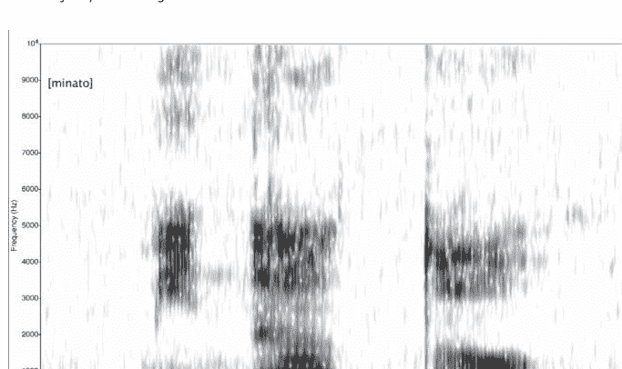

图 9.1 语音频谱图；每个黑色像素代表音频在特定时间存在的频率。

## 9.2 用于语音识别的简单 CNN

由于音频信号可以在频谱图中表示为数字信息，因此它们可以用作 CNN 的输入。现在可以采用类似于第 8 章介绍的 CNN 字符识别所使用的方法来进行语音识别。本例中的 CNN 读取一个大小为 (1 × 40 × 198) 的口语单词频谱图图像，并将输入的口语单词识别为存储的参考音频文件之一。与第 8 章中用于 OCR 应用的示例 CNN 类似，语音识别采用了多个 CL-PL 对，以减小频谱图输入的大小（即对输入进行下采样）并提高 CNN 的预测能力。通过这种方式，CNN 将处理更小尺寸的输入，这反过来将减少时间和

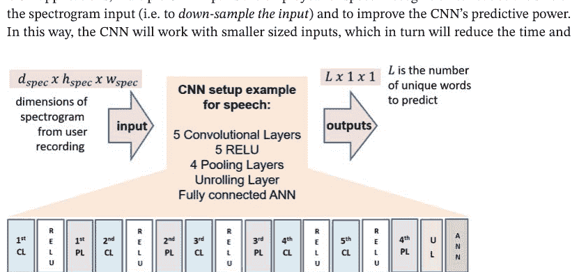

图 9.2 用于语音识别应用的典型 CNN 架构示例（CNN 中使用多个层来减小频谱图输入的大小，以便训练更快并减少过拟合）。

训练CNN所需的计算成本，并使其能够将各种输入纳入其训练集。

如图9.2所示，我们用于语音识别的示例CNN由四个CL-PL对、一个单独的CL和五个ReLU单元组成。第四个也是最后一个PL通过一个UL馈入一个全连接的ANN。ANN有$L$个输出，对应于CNN训练所使用的唯一单词数量。对于给定的输入频谱图，ANN的$L$个输出中只有一个会被选为$true$，而其余输出将为$false$。ANN的输出也是CNN的输出。如果采用$softmax$层[85]，CNN的输出将被转换为概率，而不是从$L$个输出中选择一个。输入频谱图的尺寸在通过CNN的各个层处理时会发生变化。使用第7章中给出的公式(7.1) – (7.3)，并在CL中采用零填充，每个CNN层的尺寸变化如下（图9.3）：

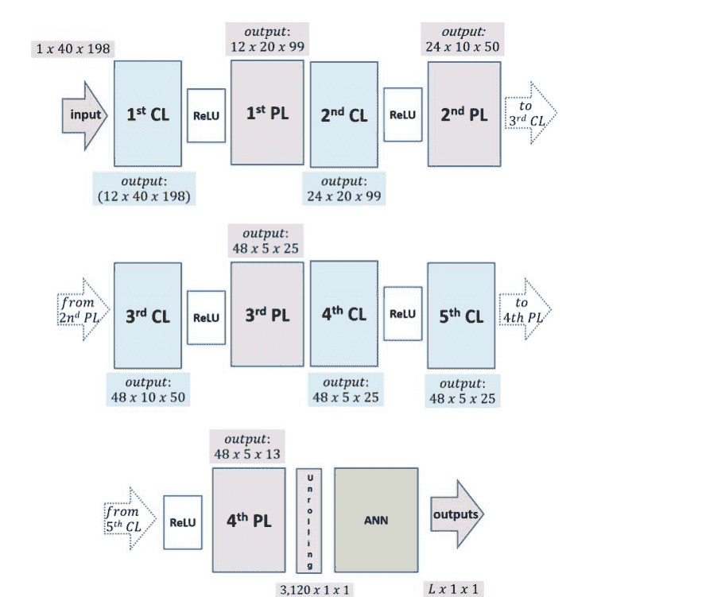

**图9.3** 频谱图在通过CNN层处理时的尺寸变化：输入图像尺寸为($1 \times 40 \times 198$)被馈入CNN；第一个CL将图像尺寸更改为($12 \times 40 \times 198$)，第一个PL更改为($12 \times 20 \times 99$)，第二个CL更改为($24 \times 20 \times 99$)，第二个PL更改为($24 \times 10 \times 50$)，第三个CL更改为($48 \times 10 \times 50$)，第三个PL更改为($48 \times 5 \times 25$)，第四个和第五个CL更改为($48 \times 5 \times 25$)，第四个PL更改为($48 \times 5 \times 13$)，UL更改为($3, 120 \times 1 \times 1$)，然后馈入ANN。

- **输入：** 用户音频输入的频谱图，尺寸为$(1 \times 40 \times 198)$。
- **第1个CL：** 使用$F_{cl} = 12$个滤波器（在Python和Matlab的音频应用中很典型），每个滤波器尺寸为$f_{cl} = 3 \times 3$，输入频谱图尺寸从$(1 \times 40 \times 198)$变为$(12 \times 40 \times 198)$（使用零填充）。
- **第1个PL：** 使用池化尺寸$p = (3 \times 3)$和步幅$s_{pl} = 2$，频谱图尺寸从$(12 \times 40 \times 198)$进一步减小到$(12 \times 20 \times 99)$。
- **第2个CL：** 有$F_{cl} = 24$个滤波器（是前一层滤波器数量的两倍），每个滤波器尺寸为$f_{cl} = 3 \times 3$；频谱图尺寸从$(12 \times 20 \times 99)$变为$(24 \times 20 \times 99)$。
- **第2个PL：** 使用池化尺寸$p = 3 \times 3$和步幅$s_{pl} = 2$，频谱图尺寸从$(24 \times 20 \times 99)$减小到$(24 \times 10 \times 50)$。
- **第3个CL：** 有$F_{cl} = 48$个滤波器（是前一层滤波器数量的两倍），每个滤波器尺寸为$f_{cl} = 3 \times 3$；频谱图尺寸从$(24 \times 10 \times 50)$变为$(48 \times 10 \times 50)$。
- **第3个PL：** 使用池化尺寸$p = 3 \times 3$和步幅$s_{pl} = 2$，频谱图尺寸从$(48 \times 10 \times 50)$减小到$(48 \times 5 \times 25)$。
- **第4个CL：** 有$F_{cl} = 48$个滤波器（与前一个CL相同），每个滤波器尺寸为$f_{cl} = 3 \times 3$；频谱图尺寸保持在$(48 \times 5 \times 25)$。
- **第5个CL：** 有$F_{cl} = 48$个滤波器（与前一个CL相同），每个滤波器尺寸为$f_{cl} = 3 \times 3$；频谱图尺寸保持在$(48 \times 5 \times 25)$。
- **第4个PL：** 使用池化尺寸$p = 1 \times 13$和步幅$s_{pl} = 1$，频谱图尺寸从$(48 \times 5 \times 25)$减小到$(48 \times 5 \times 13)$。
- **UL：** 展开后，频谱图尺寸从$(48 \times 5 \times 13)$变为$(3, 127 \times 1 \times 1)$。
- **ANN：** 使用全连接层且没有隐藏层，输入和输出尺寸分别为3127和$(L \times 1 \times 1)$，其中$L$是要预测的唯一单词数量。

## 9.3 训练和参考文件的组织

与第8章中介绍的OCR实现类似，假设运行脚本的主机处理器中存在一个目录结构。需要创建两个名为`TrainingSet`和`ReferenceSet`的文件夹，分别用于存储用于训练和参考目的的频谱图文件。图9.4和图9.5展示了训练和参考音频文件的示例组织结构，这仅是一个说明性设计，不一定需要完全照搬。`TrainingSet`和`ReferenceSet`文件夹的内容总结如下：

- `TrainingSet`文件夹：用于训练CNN的音频文件存储在此文件夹中。对于每个不同的单词，都有一个包含该单词训练文件的子文件夹。对于一个有$L$个输出的CNN，`TrainingSet`文件夹下有$L$个子文件夹，每个输出单词对应一个。例如，在图9.4所示的`TrainingSet`文件夹中，有六个不同的子文件夹，即`Goodbye`、`Hello`、`Nazdarovya`、`Sagol`、`SunnySideUp`和`Welcome`，它们是这个示例CNN要识别的单词名称。在每个子文件夹中，都有用于该单词训练的音频文件。请注意，如果这个CNN要接受多种语言输入，那么对应于同一单词的所有样本将被放置在同一个子文件夹中。例如，在子文件夹`SunnySideUp`中，有英语、韩语和波兰语发音的“sunny side up”单词的音频文件（每种语言有多个文件）。
- `ReferenceSet`文件夹：在此文件夹中，子文件夹的数量与`TrainingSet`相同（为简单起见，名称相同）。当训练好的CNN识别出TrainingSet中某个子文件夹中包含的口语输入单词时，位于ReferenceSet中同名子文件夹中的参考发音音频文件将被回放。当需要不同语言的发音时，每种语言的相应子文件夹将放置在ReferenceSet下。例如，在图9.5中，一个口语单词可以被翻译成四种不同的语言，即阿拉伯语、韩语、波兰语和西班牙语，每种语言在`ReferenceSet`下都有一个专用的子文件夹。每个不同输出的参考音频文件在每种语言子文件夹中的放置顺序与`TrainingSet`中相同。根据用户选择的目标语言，CNN将识别口语单词，并在相应子文件夹中回放所需语言的翻译（即音频文件）。假设用户输入的“goodbye”要翻译成韩语。首先，训练好的CNN识别出该单词属于`TrainingSet`中的第一个子文件夹，然后识别出`ReferenceSet`中对应韩语的子文件夹，并回放名为`Ref_GoodBye_in_Korean.wav`的音频文件。

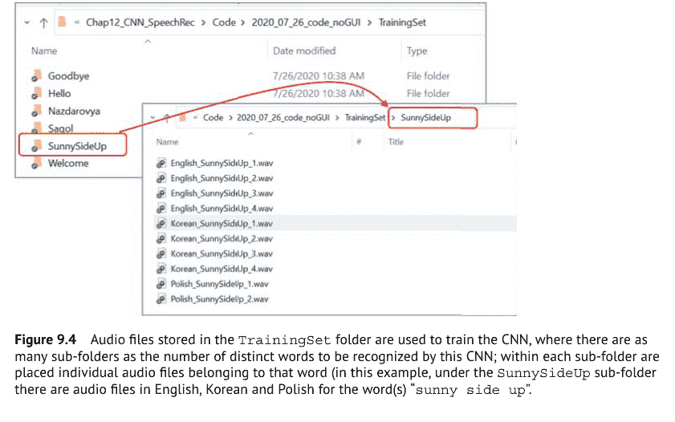

**图9.4** 存储在TrainingSet文件夹中的音频文件用于训练CNN，其中子文件夹的数量与该CNN要识别的不同单词数量相同；每个子文件夹内放置属于该单词的单个音频文件（在此示例中，SunnySideUp子文件夹下有英语、韩语和波兰语的“sunny side up”单词的音频文件）。

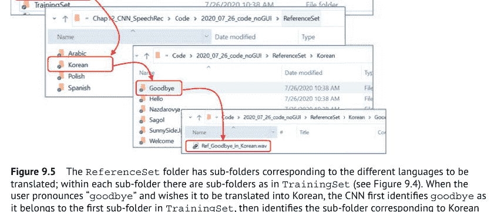

**图9.5** ReferenceSet文件夹包含与要翻译的不同语言相对应的子文件夹；每个子文件夹内有与TrainingSet相同的子文件夹（见图9.4）。当用户发音“goodbye”并希望将其翻译成韩语时，CNN首先识别出goodbye属于TrainingSet中的第一个子文件夹，然后识别出ReferenceSet中对应韩语的子文件夹，并回放韩语下第一个子文件夹中名为Ref_GoodBye_in_Korean.wav的参考音频文件。

## 9.4 使用CNN进行语音识别的Python脚本

在本节中，我们介绍图9.2中设计的用于语音识别的CNN的示例Python脚本实现。在运行此处提供的Python脚本之前，假设训练和参考发音的音频文件已创建并存储在第9.3节定义的`TrainingSet`和`ReferenceSet`文件夹及其子文件夹中。

下面是一个用于语音识别的示例Python脚本。在第18行到第33行之间，是一个名为`rename_wav_file`的实用函数，用于重命名给定文件。在第35行到第120行之间，是Python脚本的主要部分。在第44行，用户可以选择训练一个新的CNN或使用先前训练好的CNN。如果用户输入1作为选择，则在第49行训练一个新的CNN：

`cnn_trained, audio_files = CNN_Train(train_dir)`

其中训练好的CNN保存在`cnn_trained`对象中，`train_dir`指向包含用于训练CNN的音频文件的`TrainingSet`文件夹。如果用户选择通过输入2使用已保存的CNN，则在第56行和第57行设置CNN和训练文件：

`cnn_trained = models.load_model(cnn_file)`

`audio_files = get_audio_files(train_dir)`

其中`cnn_trained`包含CNN对象，`audio_files`是指向`TrainingSet`文件夹的指针。在第75–77行，用户说出一个单词，它被记录在一个名为`rec_data`的对象中。在第85–97行，根据用户输入确定CNN输出的目标语言。CNN在第100行生成预测：

`cnn_prediction = CNN_Predict(rec_data, ..., cnn_trained, audio_files)`

其中`cnn_prediction`包含CNN生成的输出，该输出在第110行回放给用户：

`Playback_translation = CNN_Predict(rec_data, ..., full_ref_path)`

其中`full_ref_path`包含在第103–106行设置的`ReferenceSet`文件夹中参考音频文件的指针。最后，在第115行和第117行，要求用户保存训练好的CNN。

```
1 # The City College of New York, City University of New York
2 # Written by Olga Chsherbakova
3 # October, 2023
4 #
5 # Speech Recognition and Translator System using CNNs
6
7 import os
```

## 9.4 使用CNN进行语音识别的Python脚本

```python
import sounddevice as sd
from CNN_Predict import CNN_Predict
from PLAYBack_Translation import PlayBack_Translation
from CNN_Train import CNN_Train, get_audio_files
from keras import models

# 此函数旨在重命名特定类型的WAV文件，假设采用特定的命名约定，
# 即从原始文件名中移除"ref.wav"。当你有多个遵循此命名模式的WAV文件，
# 并希望创建移除了"ref.wav"的新文件名时，此函数非常有用。
def rename_wav_file(input_path):
    try:
        path, filename = os.path.split(input_path)

        _, file_extension = os.path.splitext(filename)

        # 创建新文件名（"you_ref.wav"）
        new_filename = filename.split("_")
        new_filename = "_".join(new_filename[:-1]) + "_ref.wav"
        # 创建新路径
        output_path = os.path.join(path, new_filename)
        return "".join(output_path.split("")[2:])
    except FileNotFoundError:
        print(f"错误：未找到文件 {input_path}。")
    except Exception as e:
        print(f"重命名文件时发生错误：{str(e)}")

def speech_recognition_main():
    # 选择训练目录
    train_dir = 'TrainingSet'
    # 选择参考目录
    ref_dir = 'ReferenceSet'

    print('欢迎使用通用翻译器。请做出选择：')
    print('输入 1 训练新的CNN')
    print('输入 2 加载现有的CNN')
    user_entry = int(input('请输入您的选择：'))

    if user_entry == 1:
        # 训练新的CNN
        print('请耐心等待，直到显示统计数据...')
        cnn_trained, audio_files = CNN_Train(train_dir)
        input('CNN训练完成。按回车键开始使用CNN。\n')
    elif user_entry == 2:
        # 加载现有的CNN
        cnn_file = input('请输入CNN名称（带.h5扩展名）：')
        try:
            # 加载CNN并赋值给cnn_trained
            cnn_trained = models.load_model(cnn_file)
            audio_files = get_audio_files(train_dir)
        except:
            print('下次请输入有效的文件名...退出...再见')
            return
    else:
        print('下次请输入有效的选择...退出...再见')
        return

    # 现在已加载一个训练好的CNN（无论是新的还是现有的）。
    # 使用训练好的CNN进行预测：
    input('按回车键，然后立即对着麦克风说一个词')
    print('正在录音...')
    # 录制音频
    # 设置麦克风录音参数
    sample_rate = 16000
    duration = 2  # 秒

    # 创建执行录音的对象：
    rec_data = sd.rec(int(duration * sample_rate), samplerate=sample_rate,
                      channels=1)
    sd.wait()

    # 回放录制的语音：
    print('正在回放录音...')
    sd.play(rec_data, samplerate=sample_rate)
    sd.wait()

    # 从参考目录读取语言并存储到列表中
    languages = [d for d in os.listdir(ref_dir)
                 if os.path.isdir(os.path.join(ref_dir, d))]
    for idx, lang in enumerate(languages, 1):
        print(f"输入 {idx} 选择 {lang}")

    # 选择翻译输出语言
    try:
        user_input = int(input('您的语言选择是：'))
        output_lang = languages[user_input - 1]
        print(f'您选择了 {output_lang} 作为输出语言。')
    except:
        print('您的选择超出范围...退出...再见')
        return

    # CNN预测翻译
    cnn_prediction = CNN_Predict(rec_data[:, 0], sample_rate,
                                 cnn_trained, audio_files)
    # 获取参考文件路径
    full_ref_path = os.path.join(ref_dir, output_lang,
                                 str(cnn_prediction).replace("TrainingSet\English", ""))
    full_ref_path = \
        f"ReferenceSet\{output_lang}" + rename_wav_file(full_ref_path)

    # ads: 音频数据存储是一个保存音频文件的对象
    try:
        PlayBack_Translation(rec_data[:, 0], sample_rate, full_ref_path)
    except:
        print(f'{cnn_prediction} 中没有 {output_lang} 的翻译')

    user_entry = input('您想保存CNN吗？(y/n) ')
    if user_entry == 'y':
        file_name = input('请输入文件名（带.h5扩展名）：')
        cnn_trained.save(file_name)
    print('祝您拥有可预见的美好一天！')

speech_recognition_main()
```

下面给出了CNN_Train函数的一个示例实现。在第37行和第39行，输入音频文件被转换为频谱图。它们在训练文件夹中的位置在第42行被记录为输出值。从第49行开始，定义了图9.2中给出的CNN。输入层在第50行定义；第一个卷积层有12个滤波器，每个大小为(3 × 3)，使用填充以使输出尺寸与输入相同：

```python
layers.Conv2D(12, (3, 3), padding='same')
```

在第64行和第65行，分别定义了RELU和池化层：

```python
layers.Activation('relu')

layers.MaxPooling2D((2, 2), padding='same')
```

剩余的卷积层-池化层对和RELU单元在第67行到第84行之间定义。展平层在第86行。一个全连接的ANN在第87行定义：

```python
layers.Dense(num_classes, activation='softmax')
```

其中输出以概率形式生成。训练CNN在第96行：

```python
model.fit(XTrain, YTrain, epochs=50, batch_size=32, shuffle=True)
```

其中epoch数设置为50，并启用了在每个epoch重新排列样本数据的选项。

## 9.4 使用CNN进行语音识别的Python脚本

```python
import numpy as np
from keras import layers, models
import os
from Speech_Spectrograms import speech_spectrograms

# CNN_Train 函数摘要在此处
# 使用TrainingSet目录中的信息训练新的CNN
# 然后返回训练好的CNN


# 将训练音频数据集加载到ads_train中。
# train_dir包含数据集的路径。
# 在目录及其子文件夹中搜索mp3文件的函数
def get_audio_files(directory):
    mp3_files = []
    for root, _, files in os.walk(directory):
        for file in files:
            if file.endswith('.wav'):
                mp3_files.append(os.path.join(root, file))

    return mp3_files


def CNN_Train(train_dir):

    # 从train_dir加载音频文件
    # audio_files = [f for f in os.listdir(train_dir) if os.path.isfile(f)]
    audio_files = get_audio_files(train_dir)
    # 使用speech_spectrograms函数计算它们的梅尔频谱图
    segment_duration = 2  # 根据您的数据调整
    frame_duration = 0.025
    hop_duration = 0.010
    num_bands = 40
    epsil = 1e-6
    # 通过生成频谱图将音频样本转换为图像
    X_train = speech_spectrograms(audio_files, segment_duration,
                                  frame_duration, hop_duration, num_bands)
    X_train = np.log10(X_train + epsil)

    # 根据目录中文件的顺序分配标签
    Y_train = np.arange(len(audio_files))

    # 在specsize后附加一个深度1以获得CNN的输入尺寸
    input_shape = (num_bands, X_train.shape[2], 1)
    num_classes = len(audio_files)

    # 定义CNN的架构
    model = models.Sequential([
        layers.InputLayer(input_shape=input_shape),

        # 创建第一个卷积层，它有12个卷积滤波器，
        # 每个滤波器的高度和宽度为3，输入进行零填充。
        # 输入用适当数量的零填充，以使输出尺寸与输入相同。
        layers.Conv2D(12, (3, 3), padding='same'),
        # 将卷积输出归一化到-1和1的范围内。
        # 这可以防止更新的权重在训练期间爆炸性增长。
        # layers.BatchNormalization(),
        # 应用线性整流单元激活函数（ReLU），将所有负值设置为零。
        layers.Activation('relu'),
        layers.MaxPooling2D((2, 2), padding='same'),

        layers.Conv2D(24, (3, 3), padding='same'),
        layers.BatchNormalization(),
        layers.Activation('relu'),
        layers.MaxPooling2D((2, 2), padding='same'),

        layers.Conv2D(48, (3, 3), padding='same'),
```

## 9.5 用于语音识别的CNN的Matlab脚本

下面展示了一个示例Matlab脚本，它实现了一个简单的CNN，其架构如图9.2所示，专为语音识别而构建。此实现使用了与第9.4节中介绍的Python脚本类似的结构，以便读者进行比较。用于训练和参考发音的音频文件被假定已创建并存储在`TrainingSet`和`ReferenceSet`文件夹及其子文件夹中，如上文所定义。

在下面的Matlab脚本中，第14-16行提示用户是训练一个新的CNN还是加载一个先前训练并保存的CNN。如果选择通过输入1来训练一个新的CNN，则在第21行调用名为`cnn_train`的函数：

```
cnn_trained = CNN_Train(train_dir);
```

其中`train_dir`是一个包含`TrainingSet`文件夹地址的指针。`CNN_train`创建一个新的CNN，然后将其保存在名为`cnn_trained`的对象中。如果用户想使用先前训练好的CNN，则在第30和31行将其加载到`cnn_trained`中：

```
cnn_trained = load_data.cnn_trained;
```

在第47-50行设置录音参数（如采样率、位深和录音时长）后，提示用户对着设备的麦克风说一个短语，该短语在第51-53行被录制为名为`recObj`的对象。此录音首先在第59行回放，然后在第64-83行，要求用户选择一个目标语言，该短语将被翻译成该语言。在第85行，调用`CNN_predict`：

```
cnn_prediction = CNN_Predict(recObj, cnn_trained);
```

其中`cnn_prediction`包含预测结果的位置，然后在第90行以用户选择的语言回放。最后，在第96-100行，询问用户是否要保存训练好的CNN以备后用。

```
% The City College of New York, City University of New York
% Written by Ricardo Valdez
% August, 2020
% Speech Recognition and Translator System using CNNs
clc;
clear;
% select training directory
train_dir = 'TrainingSet';
% select reference directory
ref_dir = 'ReferenceSet';

message = sprintf('WELCOME TO UNIVERSAL TRANSLATOR. MAKE YOUR SELECTION:');
disp(message);
disp('Enter 1 to train a new CNN');
disp('Enter 2 to load an existing CNN');
user_entry = input('Enter your choice: ');

if (user_entry == 1)
    % train a new CNN:
    disp('Be patient until statistics are displayed...');
    cnn_trained = CNN_Train(train_dir);
    input('CNN training is complete. Press enter to start using CNN.\n');
elseif (user_entry == 2)
    % use an existing CNN:
    cnn_file = input('Enter CNN name (dont forget .mat extension): ', 's');
    cnn_path = pwd;
    disp(cnn_file);
    try
        % load the CNN and assign it to cnn_trained
        load_data = load(fullfile(cnn_path,cnn_file));
        cnn_trained = load_data.cnn_trained;
    catch
        disp('Enter a valid file name next time... Leaving... Bye');
        return;
    end
else
    disp('Enter a valid choice next time... Leaving... Bye');
    return;
end

% Now there is a trained CNN loaded (either a new one or an existing one).
% Use trained CNN to make predictions:
input('PRESS ENTER AND IMMEDIATELY SAY A WORD INTO YOUR MICROPHONE');
disp('Recording...');

% setup recording parameters for microphone
sample_rate = 16000;
bits_per_sample = 8;
noof_channels = 1;
recording_duration = 2;

% create the object that performs recording:
recObj = audiorecorder(sample_rate, bits_per_sample, noof_channels);
% recording now:
recordblocking(recObj, recording_duration);

% playback the voice recorded:
disp('Replaying recording...');
play(recObj);
recording_duration = recObj.TotalSamples / recObj.SampleRate;
pause(recording_duration);

% read languages from reference directory and store them into a list
directories = dir(ref_dir);
languages = {};
for i = 1:length(directories)
    directory = directories(i);
    if directory.isdir && ~strcmp(directory.name,...
            '.') && ~strcmp(directory.name,'..')
        % append languages with directory.name
        languages{length(languages)+1} = directory.name;
        fprintf('Enter %d for %s\n', length(languages), directory.name);
    end
end
try
    % select translation output language
    user_input = input('What is your language choice: ');
    output_lang = languages{user_input};
    fprintf('You selected %s as the output language.\n', output_lang);
catch
    fprintf('Your selection is out of bounds... Leaving... Bye\n');
    return;
end
% CNN predicts the translation
cnn_prediction = CNN_Predict(recObj, cnn_trained);
full_ref_path = fullfile(ref_dir, output_lang, char(cnn_prediction));
try
    % ads: audio data store is an object that holds audio files
    ref_ads = audioDatastore(full_ref_path);
    PlayBack_Translation(recObj, ref_ads);
catch
    fprintf('translation for %s is not available in %s\n',output_lang, ...
        char(cnn_prediction));
end
user_entry = input('Do you want to save CNN? (y/n) ','s');
if(user_entry == 'y')
    file_name = input('Enter file name (do not forget .mat extension): ',...
        's');
    save(file_name, 'cnn_trained');
else
end
disp('Have a predictably nice day!');
```

下面展示了一个`CNN_Predict`函数的示例实现，该函数通过训练好的CNN生成预测。此函数的输入包括录制的用户输入、数据采样率、训练好的CNN对象以及TrainingSet文件夹的地址。在第18-22行设置音频参数后，在第26-29行为用户输入的音频计算频谱图，并保存在`X_test`对象中。使用训练好的CNN，在第31行为此输入生成预测：

```
predictions = model.predict(X_test)
```

其中名为`predictions`的对象包含所有CNN输出的概率。在第32行获取具有最大概率的输出的索引：

```
predicted_class = np.argmax(predictions, axis=1)[0]
```

然后使用该索引来选择TrainingSet文件夹中的音频文件。

```
import os
import numpy as np
import soundfile as sf
from Speech_Spectrograms import speech_spectrograms

# CNN_Predict: Use CNN to predict the word
def CNN_Predict(rec_data, sample_rate, model, audio_files):

    # Save audio data to a temporary file
    temp_file = "temp.wav"
    sf.write(temp_file, rec_data, sample_rate)

    # Compute the mel-spectrogram from the audio data
    # set audio parameters
    # Duration of the entire recording
    segment_duration = len(rec_data) / sample_rate
    frame_duration = 0.025
    hop_duration = 0.010
    num_bands = 40
    epsil = 1e-6

    # compute speech spectrograms, they will be the inputs
    # to the CNN
    X_test = speech_spectrograms([temp_file], segment_duration,
                                frame_duration, hop_duration, num_bands)
    X_test = np.log10(X_test + epsil)
    X_test = np.expand_dims(X_test, axis=-1)
    # Use the model to predict the class
    predictions = model.predict(X_test)
    predicted_class = np.argmax(predictions, axis=1)[0]

    # Delete the temporary file
    os.remove(temp_file)

    return audio_files[predicted_class]
```

下面给出了`speech_spectrograms`函数的一个Python示例实现，该函数计算音频文件的频谱图。此函数的输入参数包括存储音频文件的文件夹地址以及音频文件的特性，例如音频录制中使用的片段和帧时长。

```
import librosa
import numpy as np

def speech_spectrograms(files, segment_duration, frame_duration,
                        hop_duration, num_bands, sr=16000):
    print("Computing speech spectrograms...")

    hop_length = int(hop_duration * sr)

    all_spectrograms = []

    # 1. Calculate the spectrograms for all files
    for file in files:
        y, _ = librosa.load(file, sr=sr)
        mel_spec = librosa.feature.melspectrogram(y=y, sr=sr, n_fft=512,
                                                  hop_length=hop_length, n_mels=num_bands)
        all_spectrograms.append(mel_spec)

    # 2. Determine the maximum width among all spectrograms
    max_width = 419

    final_spectrograms = []

    # 3. Pad each spectrogram to the maximum width
    for i, mel_spec in enumerate(all_spectrograms):
        spec_width = mel_spec.shape[1]
        left = (max_width - spec_width) // 2
        padded_spec = np.zeros((num_bands, max_width))

        # Diagnostic information

        try:
            padded_spec[:, left:left + spec_width] = mel_spec
        except ValueError as e:
            print(f"Error while processing file {files[i]}: {e}")
            continue

        final_spectrograms.append(padded_spec)

        if (i + 1) % 1000 == 0:
            print(f"Processed {i + 1} files out of {len(files)}")

    print("...done")

    return np.array(final_spectrograms)
```

```python
layers.BatchNormalization(),
layers.Activation('relu'),
layers.MaxPooling2D((3, 3), padding='same', strides=(2, 2)),

layers.Conv2D(48, (3, 3), padding='same'),
layers.BatchNormalization(),
layers.Activation('relu'),

layers.Conv2D(48, (3, 3), padding='same'),
layers.BatchNormalization(),
layers.Activation('relu'),
layers.MaxPooling2D((1, 13)),

layers.Flatten(),
layers.Dense(num_classes, activation='softmax')
])

# Compile the model
model.compile(optimizer='adam',
              loss='sparse_categorical_crossentropy',
              metrics=['accuracy'])

# train the CNN
model.fit(X_train, Y_train, epochs=50, batch_size=32, shuffle=True)

return model, audio_files
```

## 146 | 9 用于语音识别的CNN

下面展示了 `CNN_Train` 函数的一个示例实现。在第37行到第111行之间，该函数定义了图9.2所示的CNN架构，具体如下。第40行和第47行分别定义了输入层和第一个卷积层。第一个卷积层使用 $F_{cl} = 12$ 个滤波器，每个滤波器的大小为 $f_{cl} = 3$。第51行和第54行分别指定了归一化层和RELU激活单元。第一个池化层在第58行定义，使用池化大小 $p = 3$ 和步幅 $s_{pl} = 2$。在第63行到第69行之间，定义了第二个卷积层（$F_{cl} = 24$，$f_{cl} = 3$）、RELU层和第二个池化层（$p = 3$，步幅 $s_{pl} = 2$）。类似地，第三个卷积层（$F_{cl} = 48$，$f_{cl} = 3$）、RELU层和第三个池化层（$p = 3$，步幅 $s_{pl} = 2$）在第74行到第80行之间指定。第四个和第五个卷积层（均为 $F_{cl} = 48$，$f_{cl} = 3$）以及第四个池化层（$p = 3$，步幅 $s_{pl} = 2$）分别在第85、92和98行定义。第103行定义了一个ANN，其输出是CNN需要识别的唯一短语数量。为了将ANN的输出表示为概率而非互斥的二进制值，在第107行向CNN添加了一个softmaxLayer。一旦这些层定义完成，CNN便使用保存在TrainingSet目录中的音频文件进行训练：

```
net = trainNetwork(XTrain, YTrain, layers, options);
```

其中，XTrain和YTrain分别是训练的样本输入和输出，layers是上面定义的CNN，options对象在第114行到第117行中设置，以使用梯度下降算法（即adam）进行优化，学习率为0.0003，最大训练轮数为25，并在每个轮次重新排列输入样本（即Shuffle every-epoch）。训练好的CNN保存在名为net的对象中，并由该函数返回。

```
function net = CNN_Train(train_dir)
%CNN_Train Summary of this function goes here
% Train a new CNN using information from TrainingSet directory
% Then return trained CNN

    % load the training audio dataset into ads_train.
    % train_dir contains the path to the dataset.
    adsTrain = audioDatastore(train_dir, ...
                                'IncludeSubfolders',true, ...
                               'LabelSource','foldernames');
    % set audio parameters
    fs = 16000;
    segmentDuration = length(audioread(adsTrain.Files{1})) / fs;
    frameDuration = 0.025;
    hopDuration = 0.010;
    numBands = 40;
    epsil = 1e-6;

    % convert the audio samples into images by generating their
    % spectrograms
    spectrograms = speechSpectrograms(adsTrain,segmentDuration, ...
        frameDuration,hopDuration,numBands,fs);

    % create input and expected output matrices to train on
    XTrain = log10(spectrograms + epsil);
    YTrain = adsTrain.Labels;
    % get the dimensions of XTrain
    sz = size(XTrain);
    % set specSize to the height and width of a single spectrogram
    specSize = sz(1:2);
    % append a depth of 1 to specsize to get the input size of the CNN
    inputSize = [specSize 1];
    % get the total number of unique labels
    numLabels = numel(categories(YTrain));

    % Define the architecture of the CNN
    layers = [
        % set the size of the input image as the size of a single
        % spectrogram
        imageInputLayer(inputSize)
        % create the first convolution layer, it has 12 convolutional
        % filters, each filter has a height and width of 3 and the input is
        % zero padded.
        % the input is padded with the appropriate number of zeros so that
        % the size of the output is the same size as the input.
        convolution2dLayer(3,12,'Padding','same')
        % normalize the output of the convolution between the range -1
        % and 1. this prevents the updated weights from increasing
        % explosively during training.
        batchNormalizationLayer
        % apply rectilinear unit activation function (ReLU) that sets all
        % negative values to zero.
        reluLayer

        % apply max pooling using a pooling size of (3x3), and using a
        % stride of 2
        maxPooling2dLayer(3,'Stride',2,'Padding','same')

        % create a second convolution layer, it has 24 convolutional
        % filters, each filter has a height and width of 3 and the input is
        % zero padded.
        convolution2dLayer(3,24,'Padding','same')
        batchNormalizationLayer
        reluLayer

        % apply max pooling using a pooling size of (3x3), and using a
        % stride of 2
        maxPooling2dLayer(3,'Stride',2,'Padding','same')

        % create a third convolution layer, it has 48 convolutional
        % filters, each filter has a height and width of 3 and the input is
        % zero padded.
        convolution2dLayer(3,48,'Padding','same')
        batchNormalizationLayer
        reluLayer

        % apply max pooling using a pooling size of (3x3), and using a
        % stride of 2
        maxPooling2dLayer(3,'Stride',2,'Padding','same')

        % create a fourth convolution layer, it has 48 convolutional
        % filters, each filter has a height and width of 3 and the input is
        % zero padded.
        convolution2dLayer(3,48,'Padding','same')
        batchNormalizationLayer
        reluLayer

        % create a fifth convolution layer, it has 48 convolutional
        % filters, each filter has a height and width of 3 and the input is
        % zero padded.
        convolution2dLayer(3,48,'Padding','same')
        batchNormalizationLayer
        reluLayer

        % apply max pooling using a pooling size of (1x13), and using a
        % stride of 1
        maxPooling2dLayer([1 13])

        % create the ouput layer
        % the number of neurons in the output layer is equal to the number
        % of unique labels
        fullyConnectedLayer(numLabels)
        % use a softmax layer to convert the outputs to a set of
        % probalities where each output represents the probability that the
        % image is a corresponding label.
        softmaxLayer
        % add a classification layer to make each output mutually
        % exclusive, in other words there's only a single correct label for
        % each image
        classificationLayer];
    % specify training parameters
    options = trainingOptions('adam', ...
        'InitialLearnRate',3e-4, ...
        'MaxEpochs',25, ...
        'Shuffle','every-epoch');
        %'Verbose',false);
    % train the CNN
    net = trainNetwork(XTrain,YTrain,layers,options);
end
```

## 9.5 使用CNN进行语音识别的Matlab脚本

我们现在展示一个名为 `CNN_Predict` 的函数的示例实现，其输入是用户录制的音频输入和训练好的CNN。在第19行到第21行将音频输入转换为频谱图（即名为XTest的对象）后，它在第23行作为输入提供给CNN，CNN返回预测结果作为其输出之一：

```
[Prediction, ~ ]=classify(net, XTest);
```

其中net是训练好的CNN。classify的输出是Prediction对象，其中包含CNN生成的预测结果。

```
function [Prediction] = CNN_Predict(recObj, net)
%CNN_Predict: Use CNN to predict the word

    y = getaudiodata(recObj);
    Fs = recObj.SampleRate;
    audiowrite('temp.wav',y,Fs);
    adsTest = audioDatastore('temp.wav');

    % set audio parameters
    fs = 16000;
    segmentDuration = length(audioread(adsTest.Files{1})) / fs;
    frameDuration = 0.025;
    hopDuration = 0.010;
    numBands = 40;
    epsil = 1e-6;

    % compute speech spectrograms, they will be the inputs
    % to the CNN
    XTest = speechSpectrograms(adsTest,segmentDuration,frameDuration,...
        hopDuration,numBands,fs);
    XTest = log10(XTest + epsil);

    [Prediction,~] = classify(net, XTest);

    % delete temporary file
    if(isfile('temp.wav'))
        delete temp.wav;
    end
end
```

下面展示了名为 `Playback_Translation` 的函数的示例实现。该函数重放由训练好的CNN找到的预测结果。该函数的输入是CNN_predict函数返回的预测对象，以及指向存储参考音频文件的ReferenceSet目录的指针。在第21行定位到参考音频文件后，它在第22行被播放。

```
function [] = PlayBack_Translation(recObj, ref_ads)
%PlayBack_Translation
    % enable text to speech
    NET.addAssembly('System.Speech');
    obj = System.Speech.Synthesis.SpeechSynthesizer;
    % set volume of text to speech
    obj.Volume = 100;

    % text to speech
```

## 9.6 结语

卷积神经网络在语音识别领域的应用，对自动字幕、通用语音识别和背景噪声消除等实际应用具有巨大的潜在影响力。语音识别还为人们提供了一种与智能系统交互的免提方式，使这些系统更易于使用，尤其对残障人士和老年人更为友好。

在设计用于语音识别任务的卷积神经网络架构时，频谱图图像必须经过卷积层和池化层的充分下采样，然后才能输入到人工神经网络中。对于在不同场所执行的不同应用，设计者应尝试不同的卷积神经网络架构，包括卷积层-池化层对的数量、滤波器的数量和大小，以及人工神经网络的层数和每层神经元数，以在训练成本和预测精度之间取得可接受的平衡。

## 9.7 第9章习题

1) 实现一个类似于本章介绍的卷积神经网络，以识别以下英语口语单词并将其翻译成日语：

`good morning` `thank you` `how much` `airport` `grocery store`
`too expensive` `taxi stand` `restaurant` `bus stop` `goodbye`

2) 实现习题1，将韩语翻译成德语。
3) 实现习题1，将日语翻译成印地语。
4) 对于习题1中的示例，增加卷积神经网络中卷积层-池化层对的数量，并观察卷积神经网络预测能力的任何改善。
5) 对于习题1中的示例，减少卷积神经网络中卷积层-池化层对的数量，并观察卷积神经网络预测能力的任何下降。
6) 类似于习题1，但输入语言为波兰语，目标语言为西班牙语。
7) 类似于习题1，但输入语言为韩语，目标语言为中文。
8) 类似于习题1，但输入语言为菲律宾语，目标语言为英语。
9) 类似于习题1，但输入语言为瑞典语，目标语言为英语。
10) 类似于习题1，但输入语言为英语，目标语言为德语。

# 10 循环神经网络

## 10.1 引言

现实生活中有许多系统，其输出取决于输入施加于它们的顺序。例如，在理解自然语言时，必须考虑多个单词才能理解给定句子（例如主语、动词、介词、副词和形容词），而不是独立地分析每个单词。此类系统的下一个状态不仅取决于当前施加的输入，还取决于先前的输入。这种`循环`系统具有利用其先前生成的知识的能力，无论是先前的输出还是其他相关信息。我们在第2至6章中研究的人工神经网络将每个输入视为独立于先前施加的输入，因此不适合处理输入序列。

`循环神经网络`是一种人工神经网络，但有一个显著区别，即其中间状态信息和/或输出被作为输入馈送到其他神经网络（因此名称中有`循环`一词）。与其他神经网络（如人工神经网络或卷积神经网络）类似，循环神经网络也通过现有现场数据进行训练。然而，虽然人工神经网络和卷积神经网络的输入和输出对于每个样本应该是独立的，但循环神经网络的输出取决于先前施加的输入、它们的输出以及过程中产生的一些信息（例如所谓的隐藏状态）。在图10.1中，展示了循环神经网络的两个版本：紧凑版和按时间展开版。从展开版本可以看出，由较早输入生成的循环神经网络的先前隐藏状态在处理新输入时的后续步骤中被重新使用。例如，在步骤$t$预测$\hat{y}_t$时，循环神经网络同时使用$x_t$的输入和在步骤$(t-1)$为输入$x_{t-1}$生成的隐藏状态信息（即$h_{t-1}$）。由于步骤$(t-1)$的信息影响步骤$t$的输出，在时间$t$生成的隐藏状态会影响步骤$(t+1)$的预测$\hat{y}_{t+1}$。因此，步骤$(t-1)$间接影响步骤$(t+1)$，这就是它们被称为循环网络的原因。这种内部信息的重新使用创建了一种内部记忆，使循环神经网络适用于时序应用，包括语言翻译、语音识别和图像描述。循环神经网络是许多流行人工智能应用（如Siri、语音搜索、谷歌翻译等）的基本构建模块[86]。

循环神经网络的主要组成部分可列举如下：

- **输入层：** 在每个步骤接受输入（通常以序列形式）的层。
- **隐藏层：** 存储当前和先前步骤生成信息的层；它代表循环神经网络的记忆，并在每个步骤使用当前输入和先前隐藏状态信息进行更新。它也被称为循环神经网络的`编码器`。

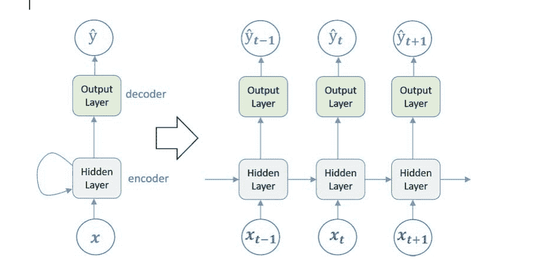

**图10.1** 循环神经网络的输入层、隐藏层和输出层，以及结合隐藏状态的循环连接（紧凑版和按时间展开版表示）。

- **循环连接：** 将先前隐藏层的信息与当前输入相结合的连接；这是循环神经网络处理输入序列的最重要特征。
- **输出层：** 在每个步骤（或在多个输入施加后，取决于本章后面讨论的循环神经网络架构）生成预测的层。输出层也被称为循环神经网络的`解码器`。

在循环神经网络的上下文中，`编码器`是处理输入序列并将其编码为固定长度向量表示的网络部分。通过这种方式，循环神经网络可以以数值形式评估输入序列。编码器的输出称为`当前隐藏状态`，它将当前输入与先前生成的隐藏层输出（即先前的隐藏状态）相结合。编码器的目的是确保在循环神经网络处理当前输入时，考虑到先前施加于循环神经网络的输入。编码器的输出（即当前隐藏状态）随后被传递到循环神经网络的解码器进行进一步处理。

在循环神经网络中，`解码器`是负责根据编码器产生的固定长度隐藏状态向量生成输出序列的组件。解码器的操作类似于编码器，但方向相反：它将隐藏状态作为其初始输入，并生成输出的一个元素。

存在不同类型的循环神经网络，其中输出在每个步骤生成、在多个输入施加后生成，或两种情况的任何组合[87]。`一对一`循环神经网络为施加的每个输入生成一个输出（例如，搜索引擎根据您输入的最后一个单词建议下一个单词），而`一对多`循环神经网络为单个输入产生多个输出（例如，在生成音乐时）。在`多对一`（例如，在情感分析中）和`多对多`循环神经网络（例如，在自然语言翻译中）中，输入序列分别生成单个输出或输出序列。

在本章的剩余部分，不失一般性，我们将专注于一对一单单元循环神经网络，以生成隐藏状态、输出和损失的偏导数，以及更新

## 10.2 一对一单RNN单元

现在让我们分析一个简单RNN的操作，其中有一个输入（例如，从给定字母表中选出的一个字母）、一个隐藏层和一个输出（例如，来自同一字母表的一个字符）。这种类型的RNN被称为一对一RNN。图10.2a展示了一个一对一单RNN单元的紧凑描述。这个压缩的RNN单元的功能相当于一系列首尾相连的RNN单元，如图10.2b所示。在前一步骤（即 $h_{t-1}$）生成的隐藏状态被输入到步骤 $t$ 的RNN编码器中。编码器将输入转换为一个向量，以便RNN可以处理它，并通过结合先前的隐藏状态，生成当前的隐藏状态，解码器基于此生成RNN输出。现在让我们查看RNN的各个组成部分，如图10.2所示：

- $X_t$：步骤 $t$ 的输入向量
- $U$：缩放输入值的权重矩阵
- $b$：编码器的偏置向量
- $h_t$：步骤 $t$ 的隐藏状态
- $W$：控制 $h_{t-1}$ 先前隐藏状态信息的权重矩阵
- $\tanh$ 单元：编码器中用于过滤较弱信号的激活函数示例
- $V$：控制当前隐藏状态信息的权重矩阵
- $c$：解码器的偏置向量
- $\Omega_t$：编码器在步骤 $t$ 生成的原始输出向量，在输入softmax单元之前
- softmax单元：将解码器输出转换为概率的单元
- $\hat{Y}_t$：包含RNN在步骤 $t$ 生成的预测的输出向量

RNN单元的编码器将权重矩阵 $U$ 应用于当前输入向量 $X_t$，同时用权重矩阵 $W$ 缩放先前的隐藏状态 $h_{t-1}$，并用偏置向量 $b$ 缩放，然后将它们求和并将结果输入激活单元（例如 $\tanh$）以生成当前的隐藏状态信息 $h_t$（图10.2b）。另一方面，解码器用权重矩阵 $V$ 和偏置向量 $c$ 缩放隐藏状态信息 $h_t$，以生成原始输出 $\Omega_t$，然后将其输入激活单元（例如softmax）以获得输出预测 $\hat{Y}_t$。需要注意的是，在图10.2b中，在不同的步骤中，相同的权重矩阵（即 $U, b, W, V$ 和 $c$）被用于不同的输入。

在RNN中，对步骤 $t$ 的输入应用如下递归公式：

$$h_t = \Theta_h(U \cdot x_t + W \cdot h_{t-1} + b)$$

其中 $h_t$ 和 $h_{t-1}$ 分别是当前和先前的隐藏状态，$\Theta_h$ 是激活函数，$x_t$ 是当前输入。对于大多数RNN，编码器中的激活函数 $\Theta_h$ 通常选择为 $\tanh$。它优于其他函数，因为在训练期间，它能在更长的epoch范围内保持非零值。解码器生成的softmax前输出称为原始输出，并定义为步骤 $t$ 的 $\Omega_t$ 向量：

$$\Omega_t = V \cdot h_t + c$$

对于某些应用，$\Omega_t$ 向量的输出需要以概率形式生成。然而，它们可能具有负值。为了防止这种结果，使用了一个称为softmax的单元，它将原始输出值转换为0到1之间（包括0和1）的概率值，从而消除了输出中的负值。通过softmax，所有输出的总和为1，其中每个输出代表RNN对其是正确预测的置信度。对于输入字母表大小为 $|I|$，输出 $\hat{y}_t$ 是步骤 $t$ 的预测值，它是基于步骤 $t$ 的原始输出值（即 $\Omega_t$）计算的概率。因此，$\hat{y}_t$ 的预测输出计算如下：

$$\hat{y}_t = \Theta_{\hat{y}} = \text{softmax}(\Omega_t) = \begin{bmatrix} \frac{e^{\Omega_{t,1}}}{\sum_{j=1}^{|I|} e^{\Omega_{t,j}}} \\ \frac{e^{\Omega_{t,2}}}{\sum_{j=1}^{|I|} e^{\Omega_{t,j}}} \\ \vdots \\ \frac{e^{\Omega_{t,|I|}}}{\sum_{j=1}^{|I|} e^{\Omega_{t,j}}} \end{bmatrix} = \frac{e^{\Omega_t}}{\sum_{j=1}^{|I|} e^{\Omega_{t,j}}}, \quad (10.1)$$

其中 $|I|$ 是字母表 $I$ 的大小，$\Omega_{t,i}$ 是 $\Omega_t$ 矩阵的第 $i^{th}$ 个元素。我们可以从公式 (10.1) 中看到，$\hat{y}_t$ 元素的值在0到1之间（不包括0）。它表明原始输出 $\Omega_t$ 的元素（其值可能为负）被替换为它们的 $e$ 的幂（即 $e^{\Omega_{t,i}}$），并除以所有原始输出值作为 $e$ 的幂的总和。因此，$\hat{y}_t$ 向量的值是0到1之间（不包括0）的概率值。

现在让我们考虑一个一对一单RNN单元中输入、输出和权重矩阵的维度，其中输入字母表包含四个字符，使用独热编码（一种特殊的编码，用于将字符表示为RNN的输入，如第10.2.1节所述），如图10.3所示。对于此示例，在编码器中，输入向量 $X$ 和 $U$ 矩阵的维度分别为 (4 × 1) 和 (1 × 4)。$h_{t-1}$、$W$ 和 $b$ 的维度均为 (1 × 1)。因此，应用于激活单元（在图10.3中实现为tanh）的输入和生成的输出的维度为 (1 × 1)。在解码器单元中，$V$ 和 $c$ 矩阵的维度均为 (4 × 1)。解码器的激活函数（即 $\Theta_y$，在图10.3中实现为softmax）生成一个输出预测向量 $\hat{Y}$，其维度与其输入相同，即 (4 × 1)。

### 10.2.1 简单字母表与独热编码

RNN算法不能轻松处理文本数据，因为算法过程需要文本的数值表示。RNN的文本输入必须使用编码技术进行预处理。其中一种方法称为独热编码 [88, 89]，其中为字母表中的每个字符串字符填充一个稀疏向量，使得该向量中只有一个元素设置为1，而其他元素为零。

现在让我们考虑一个简单的字母表 $I$，由四个字母组成，定义为 $I = \{\mathbf{h}, \mathbf{e}, \mathbf{l}, \mathbf{o}\}$。使用独热编码，$I$ 中的每个字符 $d_i$ 被表示为一个长度为 $|I|$（即 $I$ 中的总字符数）的向量，其中字符在 $I$ 中的位置设置为1，其余元素设置为零（即向量中只有一个位置是热的，而其余位置是冷的，因此得名独热编码）：

$$d_i^o = \begin{cases} 1 & \text{if } I_i = d_i, \\ 0 & \text{otherwise.} \end{cases} \quad (10.2)$$

其中 $I_i$ 表示字母表 $I$ 中的第 $i^{th}$ 个位置。例如，对于字母表 $I = \{\mathbf{h}, \mathbf{e}, \mathbf{l}, \mathbf{o}\}$ 中的 $d = \mathbf{h}$，独热编码为 $\mathbf{h}^o = [1, 0, 0, 0]^\dagger$，其中 $\dagger$ 表示转置运算符。类似地，对于 $d = \mathbf{e}$，独热编码为 $\mathbf{e}^o = [0, 1, 0, 0]^\dagger$。

请注意，独热编码生成长度为 $|I|$ 的稀疏向量，其中只有一个元素为1。如果RNN使用自然语言字母表中包含数万个单词的单词作为输入（机器翻译问题就是这种情况），这种编码可能效率极低。对于这类应用，根据输入特性，首选不同的编码方法，包括Word2Vec [90]、GloVe [91]和稀疏编码 [92]。

另一种降低输入向量维度的流行方法是使用所谓的嵌入层，其中输入向量的维度通过嵌入层的权重矩阵显著降低；我们将在本章的第10.5节中探讨这项技术。

对于这个简单示例，其中使用了一个包含四个字母的字母表，输入与先前输入一起的预期输出在表10.1中给出。此示例假设，随着用户输入单个输入，RNN的预测将引导用户拼写出单词。

**表10.1** 一对一RNN简单示例的先前输入、当前输入和预期输出。

| 先前输入 | 当前输入 | 预期输出 |
| :--- | :--- | :--- |
| - | h | e |
| h | e | l |
| e | l | l |
| l | l | o |

你好。因此，如果用户输入 h，RNN 应该生成 e。输入 h 后，如果用户输入 e，RNN 应该生成 1。同样，连续两次输入 1 应分别生成 1 和 o。请注意，这个用于演示 RNN 运作的简单示例旨在突出在生成当前输出时使用先前隐藏状态信息的重要性。第一次输入 1 时，RNN 预期生成输出 1，而第二次输入 1 时，预期生成输出 o。这显示了先前输入值对当前输出的影响。RNN 保持记忆的能力是其区别于 ANNs 和 CNNs 的关键。

### 10.2.2 前向传播与反向传播

现在，我们将使用简单的字母表示 $I = \{\mathbf{h}, \mathbf{e}, \mathbf{1}, \mathbf{o}\}$，来演示当输入应用于图 10.2a 和 b 所示的一对一单单元 RNN 时的操作。假设一个输入字符序列 $x_1, x_2, \cdots$ 被应用于 RNN。对于时间 $t$ 的用户输入 $x_t$，RNN 计算隐藏状态如下：

$$h_t = \tanh(U \cdot x_t + W \cdot h_{t-1} + b).$$

如图 10.2a 和 b 所示，softmax 单元之前的原始输出 $\Omega_t$ 计算如下：

$$\Omega_t = V \cdot h_t + c.$$

回顾公式 (10.1)，softmax 单元将 $\Omega_t$ 的元素转换为 0 到 1 之间的概率值，并将其分配给 $\hat{y}_t$：

$$\hat{y}_t = \frac{e^{\Omega_t}}{\sum_{j=1}^{|I|} e^{\Omega_{t,j}}},$$

其中 $\Omega_{t,j}$ 表示向量 $\Omega_t$ 的第 $j$ 个元素。交叉熵损失 $L$ [93] 是一个用于表示 RNN 预测值与真实输出值之间差异的实体。对于步骤 $t$ 的预测 $\hat{y}_t$，$L$ 计算如下：

$$L_t = -y_t^o \ln(\hat{y}_t),$$

其中 $y_t^o$ 是目标（即正确预测的）输出的独热编码值。对于长度为 $\mathcal{T}$ 的输入序列，$\mathcal{T}$ 步后的总损失为：

$$L = \sum_{t=1}^{\mathcal{T}} L_t.$$

为了最小化公式 (10.7) 中的损失 $L$，必须计算其相对于 RNN 参数（如 $U, W, V, b$ 和 $c$）的梯度。梯度的计算对应于从预测输出开始反向传播到输入的操作，每一步都通过偏导数执行。这些梯度的逐步推导过程在附录 D 中给出。我们强烈建议读者阅读这部分材料，以理解训练 RNN 所采取的操作。$L$ 相对于权重的偏导数如下：

$$\frac{\partial L_t}{\partial \Omega_t} = (\hat{y}_t - y_t^o)$$

$$\frac{\partial L}{\partial V} = \sum_{t=1}^{\mathcal{T}} (\hat{y}_t - y_t^o) \cdot h_t^\top$$

$$\frac{\partial L}{\partial c} = \sum_{t=1}^{\mathcal{T}} (\hat{y}_t - y_t^o)$$

$$\frac{\partial L}{\partial W} = \sum_{t=1}^{T} \left( \sum_{k=1}^{t} (\hat{y}_t - y_t^o) V^\dagger \left( \prod_{j=k}^{t-1} W^\dagger (1 - h_{j+1}^2) \right) (1 - h_k^2) h_{k-1} \right)$$ (10.11)

$$\frac{\partial L}{\partial U} = \sum_{t=1}^{T} \left( \sum_{k=1}^{t} (\hat{y}_t - y_t^o) V^\dagger \left( \prod_{j=k}^{t-1} W^\dagger (1 - h_{j+1}^2) \right) (1 - h_k^2) x_k \right)$$ (10.12)

$$\frac{\partial L}{\partial b} = \sum_{t=1}^{T} \left( \sum_{k=1}^{t} (\hat{y}_t - y_t^o) V^\dagger \prod_{j=k}^{t-1} \left( W^\dagger (1 - h_{j+1}^2) \right) (1 - h_k^2) \right),$$ (10.13)

其中 $\dagger$ 表示矩阵转置操作。使用这些梯度，在反向传播后，通过减去当前值乘以学习率 $\eta$（类似于第 2 章 ANNs 中使用的学习率 $\alpha$）来更新 $U$, $W$, $V$, $b$ 和 $c$ 矩阵的值：

$$V_{new} = V - \eta \frac{\partial L}{\partial V}$$ (10.14)

$$c_{new} = c - \eta \frac{\partial L}{\partial c}$$ (10.15)

$$W_{new} = W - \eta \frac{\partial L}{\partial W}$$ (10.16)

$$U_{new} = U - \eta \frac{\partial L}{\partial U}$$ (10.17)

$$b_{new} = b - \eta \frac{\partial L}{\partial b},$$ (10.18)

其中下标 $new$ 用于表示更新后的参数值。由于这些参数是通过使用损失 $L$ 的梯度进行更新的，因此预期使用更新后的参数进行下一次前向传播将产生更小的损失。这将在下面的数值示例中得到证明。

## 10.3 数值示例

回顾由四个字符组成的简单字母表：$I = \{\mathbf{h}, \mathbf{e}, \mathbf{1}, \mathbf{o}\}$。$I$ 中每个字符的独热编码为：

$$\mathbf{h}^o : [1, 0, 0, 0]^\dagger \quad \mathbf{e}^o : [0, 1, 0, 0]^\dagger \quad \mathbf{1}^o : [0, 0, 1, 0]^\dagger \quad \mathbf{o}^o : [0, 0, 0, 1]^\dagger,$$

其中 $\dagger$ 表示矩阵转置操作。假设 $U$, $W$, $V$, $b$ 和 $c$ 的初始值随机分配如下：

$$U = [0.144 \ -0.232 \ -0.669 \ 1.159] \quad W = [-0.587] \quad b = [0]$$
$$V = [-0.225 \ -0.305 \ 0.491 \ 0.277]^\dagger \quad c = [0 \ 0 \ 0 \ 0]^\dagger.$$

现在，让我们应用输入序列 $\mathbf{h}$, $\mathbf{e}$, $\mathbf{1}$ 和 $\mathbf{1}$，期望 RNN 分别生成预测 $\mathbf{e}$, $\mathbf{1}$, $\mathbf{1}$ 和 $\mathbf{o}$，如表 10.1 所示。由于我们期望简单的 RNN 在完成单词 **hello** 的过程中一次生成一个字符输出，因此当用户应用输入字符 $x_1 = \mathbf{h}$ 时，RNN 预期生成 $\mathbf{e}$。此输入的独热编码为：

$$x_1^o = [1, 0, 0, 0]^\dagger.$$

对于输入 $x_1 = \mathbf{h}$，使用公式 (10.3)，隐藏状态 $h_1$ 计算如下：

$$h_1 = \Theta_h(U \cdot x_1 + W \cdot h_0 + b)$$
$$= \tanh \left( \begin{bmatrix} 0.144 & -0.232 & -0.669 & 1.159 \end{bmatrix} \cdot \begin{bmatrix} 1 \ 0 \ 0 \ 0 \end{bmatrix} + [-0.587] \cdot [0] + [0] \right)$$
$$= [0.143].$$

根据公式 (10.4)，我们得到原始输出值如下：

$$\Omega_1 = V \cdot h_1 + c = \begin{bmatrix} -0.225 \ -0.305 \ 0.491 \ 0.277 \end{bmatrix} \cdot [0.1432] + [0] = \begin{bmatrix} -0.032 \ -0.044 \ 0.070 \ 0.040 \end{bmatrix}.$$

应用公式 (10.1) 中给出的 $softmax$ 函数，我们有：

$$\hat{y}_1 = \Theta_y(\Omega_1) = \begin{bmatrix} 0.240 \ 0.237 \ \mathbf{0.266} \ 0.250 \end{bmatrix}.$$

根据 $softmax$ 输出的最高值，对于输入 $x_1 = \mathbf{h}$，RNN 输出预测为 $\hat{y}_1 = 1$。然而，根据表 10.1，RNN 应该预测输出为 $y_1^o = \mathbf{e}$。使用公式 (10.6)，步骤 1 的损失计算如下：

$$L_1 = -y_1^o \ln(\hat{y}_1) = - \begin{bmatrix} 0 \ 1 \ 0 \ 0 \end{bmatrix} \ln \begin{bmatrix} 0.240 \ 0.237 \ 0.266 \ 0.258 \end{bmatrix} = 1.440.$$

继续此示例，在步骤 $t = 2$，用户应用输入 $x_2 = \mathbf{e}$，期望 RNN 生成输出 $\mathbf{1}$（如表 10.1 所示）。输入 $\mathbf{e}$ 的独热编码为：

$$x_2^o = [0, 1, 0, 0]^\top.$$

让我们计算隐藏状态 $h_2$ 如下：

$$h_2 = \Theta_h(U \cdot x_2 + W \cdot h_1 + b)$$
$$= \tanh \left( \begin{bmatrix} 0.144 & -0.232 & -0.669 & 1.1585 \end{bmatrix} \cdot \begin{bmatrix} 0 \ 1 \ 0 \ 0 \end{bmatrix} + [-0.587] \cdot [0.143] + [0] \right)$$
$$= -0.306.$$

原始输出值计算如下：

$$\Omega_2 = V \cdot h_2 + c = \begin{bmatrix} -0.225 \ -0.305 \ 0.491 \ 0.277 \end{bmatrix} \cdot [-0.306] + [0] = \begin{bmatrix} 0.069 \ 0.093 \ -0.150 \ -0.085 \end{bmatrix}.$$

softmax 单元后的输出为：

$$\hat{y}_2 = \Theta_{\hat{y}}(\Omega_2) = \begin{bmatrix} 0.271 \ \mathbf{0.278} \ 0.218 \ 0.233 \end{bmatrix}.$$

根据 softmax 单元输出的最高值，RNN 预测为 $\hat{y}_2 = \mathbf{e}$，尽管如表 10.1 所示，预期的预测是 $y_2^o = \mathbf{1}$。$t = 2$ 时的损失为：

$$L_2 = -y_2^o \ln(\hat{y}_2) = -\begin{bmatrix} 0 \ 0 \ 1 \ 0 \end{bmatrix} \ln \begin{bmatrix} 0.271 \ 0.278 \ 0.218 \ 0.233 \end{bmatrix} = 1.523.$$

我们在步骤 $t = 3$ 继续，将输入 $x_3 = \mathbf{1}$ 应用于 RNN，期望生成输出 $\mathbf{1}$。$\mathbf{1}$ 的独热编码为：

$$x_3^o = [0, 0, 1, 0]^\dagger.$$

现在让我们计算隐藏状态 $h_3$ 如下：

$$h_3 = \Theta_h(U \cdot x_3 + W \cdot h_2 + b)$$
$$= \tanh \left( [0.144 \quad -0.232 \quad -0.670 \quad 1.159] \cdot \begin{bmatrix} 0 \ 0 \ 1 \ 0 \end{bmatrix} + [-0.587] \cdot [-0.306] + [0] \right)$$
$$= -0.454.$$

步骤 $t = 3$ 的原始输出为：

$$\Omega_3 = V \cdot h_3 + c = \begin{bmatrix} -0.225 \ -0.305 \ 0.491 \ 0.277 \end{bmatrix} \cdot [-0.454] + [0] = \begin{bmatrix} 0.102 \ 0.139 \ -0.223 \ -0.126 \end{bmatrix}$$

$$\hat{y}_3 = \Theta_{\hat{y}}(\Omega_3) = \begin{bmatrix} 0.281 \ \mathbf{0.292} \ 0.203 \ 0.224 \end{bmatrix}.$$

softmax 函数输出的最高值表明，对于输入 $x_3 = \mathbf{1}$，RNN 预测的输出是 $\hat{y}_3 = \mathbf{e}$，这符合预期。在步骤 $t = 3$，损失为：

$$L_3 = -y_3^o \ln(\hat{y}_3) = -\begin{bmatrix} 0 \ 0 \ 1 \ 0 \end{bmatrix} \ln \begin{bmatrix} 0.281 \ 0.292 \ 0.203 \ 0.224 \end{bmatrix} = 1.593.$$

在步骤 $t = 4$，我们将输入 $x_4 = \mathbf{1}$ 应用于 RNN，期望预测为 $\mathbf{o}$。$\mathbf{1}$ 的独热编码为：

$$x_4^o = [0, 0, 1, 0]^\dagger.$$

现在让我们按照如下方式计算隐藏状态 $h_4$：

$$h_4 = \Theta_h(U \cdot x_4 + W \cdot h_3 + b)$$
$$= \tanh \left( [0.144 \quad -0.232 \quad -0.669 \quad 1.159] \times \begin{bmatrix} 0 \\ 0 \\ 1 \\ 0 \end{bmatrix} + [-0.587] \cdot [-0.454] + [0] \right)$$
$$= [-0.382].$$

原始输出值为

$$\Omega_4 = V \cdot h_4 + c = \begin{bmatrix} -0.225 \\ -0.305 \\ 0.491 \\ 0.277 \end{bmatrix} \cdot [-0.382] + [0] = \begin{bmatrix} 0.089 \\ 0.117 \\ -0.187 \\ -0.106 \end{bmatrix}$$

$$\hat{y}_4 = \Theta_y(\Omega_4) = \begin{bmatrix} 0.276 \\ \mathbf{0.285} \\ 0.210 \\ 0.228 \end{bmatrix}.$$

根据softmax单元的输出，对于输入 $x_4 = 1$，RNN预测输出为 $\hat{y}_4 = \mathbf{e}$，而期望的输出目标是 $y_4^o = \mathbf{o}$。对于步骤 $t = 4$，损失为

$$L_4 = -y_4^o \ln(\hat{y}_4) = - \begin{bmatrix} 0 \\ 0 \\ 0 \\ 1 \end{bmatrix} \ln \begin{bmatrix} 0.276 \\ 0.285 \\ 0.210 \\ 0.228 \end{bmatrix} = 1.478.$$

如公式 (10.7) 所示，四步之后的总损失计算如下

$$L = \sum_{t=1}^{4} L_t = 1.440 + 1.523 + 1.593 + 1.478 = 6.034. \tag{10.19}$$

在完成四步的前向传播后，我们现在考虑反向传播操作。反向传播的目标是计算损失函数相对于RNN参数的梯度，以便在权重更新后，公式 (10.19) 中显示的 $L_T$ 值得以减小。一旦反向传播完成，就会执行新的前向传播并计算新的损失函数，如此循环往复。与训练ANN和CNN类似，完成一次前向和一次反向传播步骤通常称为一个epoch。在实际的RNN中，通常需要数千个epoch才能获得可接受的损失水平。根据公式 (10.8)，损失 $L$ 相对于预测输出 $\hat{y}$ 的梯度如下：

$$\frac{\partial L_1}{\partial \Omega_1} = (\hat{y}_1 - y_1^o) = \begin{bmatrix} 0.240 \\ 0.237 \\ 0.266 \\ 0.258 \end{bmatrix} - \begin{bmatrix} 0 \\ 1 \\ 0 \\ 0 \end{bmatrix} = \begin{bmatrix} 0.240 \\ -0.763 \\ 0.266 \\ 0.258 \end{bmatrix}$$

$$\frac{\partial L_2}{\partial \Omega_2} = (\hat{y}_2 - y_2^o) = \begin{bmatrix} 0.271 \\ 0.278 \\ 0.218 \\ 0.233 \end{bmatrix} - \begin{bmatrix} 0 \\ 0 \\ 1 \\ 0 \end{bmatrix} = \begin{bmatrix} 0.271 \\ 0.278 \\ -0.782 \\ 0.233 \end{bmatrix}$$

$$\frac{\partial L_3}{\partial \Omega_3} = (\hat{y}_3 - y_3^o) = \begin{bmatrix} 0.281 \\ 0.292 \\ 0.203 \\ 0.224 \end{bmatrix} - \begin{bmatrix} 0 \\ 0 \\ 1 \\ 0 \end{bmatrix} = \begin{bmatrix} 0.281 \\ 0.292 \\ -0.797 \\ 0.224 \end{bmatrix}$$

$$\frac{\partial L_4}{\partial \Omega_4} = (\hat{y}_4 - y_4^o) = \begin{bmatrix} 0.276 \\ 0.285 \\ 0.210 \\ 0.228 \end{bmatrix} - \begin{bmatrix} 0 \\ 0 \\ 0 \\ 1 \end{bmatrix} = \begin{bmatrix} 0.276 \\ 0.285 \\ 0.210 \\ -0.772 \end{bmatrix}.$$

使用公式 (10.9)、(10.10)、(10.11)、(10.12) 和 (10.13)，我们分别计算相对于 $V$、$c$、$W$、$U$ 和 $b$ 的梯度，如下所示：

$$\frac{\partial L}{\partial V} = \sum_{t=1}^T \frac{\partial L_t}{\partial V} = \sum_{t=1}^T (\hat{y}_t - y_t^o) \cdot h_t^\top = \begin{bmatrix} -0.282 \\ -0.436 \\ 0.558 \\ 0.159 \end{bmatrix}$$

$$\frac{\partial L}{\partial c} = \sum_{t=1}^T \frac{\partial L_t}{\partial c} = \sum_{t=1}^T (\hat{y}_t - y_t^o) = \begin{bmatrix} 1.069 \\ 0.092 \\ -1.103 \\ -0.058 \end{bmatrix}$$

$$\frac{\partial L}{\partial W} = \sum_{t=1}^T \left( \sum_{k=1}^t (\hat{y}_t - y_t^o) V^\top \prod_{j=k}^{t-1} \left( W^\top (1 - h_{j+1}^2) \right) (1 - h_k^2) h_{k-1} \right) = [0.147]$$

$$\frac{\partial L}{\partial U} = \sum_{t=1}^T \left( \sum_{k=1}^t (\hat{y}_t - y_t^o) V^\top \prod_{j=k}^{t-1} \left( W^\top (1 - h_{j+1}^2) \right) (1 - h_k^2) x_k \right) = [0.530 \quad -0.273 \quad -0.500 \quad 0.0]$$

$$\frac{\partial L}{\partial b} = \sum_{t=1}^T \left( \sum_{k=1}^t (\hat{y}_t - y_t^o) V^\top \prod_{j=k}^{t-1} \left( W^\top (1 - h_{j+1}^2) \right) (1 - h_k^2) \right) = [-0.2436].$$

根据公式 (10.14)、(10.15)、(10.16)、(10.17) 和 (10.18)，对于学习率 $\eta = 0.1$（任意选择的值），我们现在分别更新 $V$、$c$、$W$、$U$ 和 $b$，如下所示：

$$V_{new} = V - \eta \frac{\partial L}{\partial V} = \begin{bmatrix} -0.225 \\ -0.305 \\ 0.491 \\ 0.277 \end{bmatrix} - 0.1 \begin{bmatrix} -0.2818 \\ -0.436 \\ 0.558 \\ 0.159 \end{bmatrix} = \begin{bmatrix} -0.196 \\ -0.262 \\ 0.435 \\ 0.261 \end{bmatrix}$$

$$c_{new} = c - \eta \frac{\partial L}{\partial c} = \begin{bmatrix} 0 \\ 0 \\ 0 \\ 0 \end{bmatrix} - 0.1 \begin{bmatrix} 1.069 \\ 0.092 \\ -1.103 \\ -0.058 \end{bmatrix} = \begin{bmatrix} -0.107 \\ -0.009 \\ 0.110 \\ 0.006 \end{bmatrix}$$

$$W_{new} = W - \eta \frac{\partial L}{\partial W} = [-0.587] - 0.1 [0.147] = [-0.602]$$

$$U_{new} = U - \eta \frac{\partial L}{\partial U}$$
$$= [0.144 \quad -0.232 \quad -0.669 \quad 1.159] - 0.1 [0.530 \quad -0.273 \quad -0.500 \quad 0.0]$$
$$= [0.091 \quad -0.204 \quad -0.619 \quad 1.159]$$

$$b_{new} = b - \eta \frac{\partial L}{\partial b} = [0] - 0.1 [-0.2436] = [0.0244],$$

其中等式左侧的下标 *new* 代表参数的更新值。使用这些新值，我们现在执行一次新的前向传播，得到以下损失值（计算过程未显示）：

$$L_1 = -y_1^o \ln(\hat{y}_1) = - \begin{bmatrix} 0 \\ 1 \\ 0 \\ 0 \end{bmatrix} \ln \begin{bmatrix} 0.217 \\ 0.237 \\ \mathbf{0.290} \\ 0.256 \end{bmatrix} = 1.438$$

$$L_2 = -y_2^o \ln(\hat{y}_2) = - \begin{bmatrix} 0 \\ 0 \\ 1 \\ 0 \end{bmatrix} \ln \begin{bmatrix} 0.239 \\ \mathbf{0.268} \\ 0.254 \\ 0.239 \end{bmatrix} = 1.369$$

$$L_3 = -y_3^o \ln(\hat{y}_3) = - \begin{bmatrix} 0 \\ 0 \\ 1 \\ 0 \end{bmatrix} \ln \begin{bmatrix} 0.249 \\ \mathbf{0.283} \\ 0.238 \\ 0.230 \end{bmatrix} = 1.437$$

$$L_4 = -y_4^o \ln(\hat{y}_4) = - \begin{bmatrix} 0 \\ 0 \\ 0 \\ 1 \end{bmatrix} \ln \begin{bmatrix} 0.244 \\ \mathbf{0.275} \\ 0.246 \\ 0.235 \end{bmatrix} = 1.449$$

$$L = \sum_{t=1}^{T} L_t = 1.438 + 1.369 + 1.437 + 1.449 = \mathbf{5.692}.$$

其中每一步的预测结果以粗体字符显示。对于输入 $x_1 = \mathbf{h}$、$x_2 = \mathbf{e}$、$x_3 = \mathbf{1}$ 和 $x_4 = \mathbf{1}$，第二次前向传播中的模型分别生成了预测 $\hat{y}_1 = \mathbf{1}$、$\hat{y}_2 = \mathbf{e}$、$\hat{y}_3 = \mathbf{e}$ 和 $\hat{y}_4 = \mathbf{e}$。同时，我们观察到 $L$ 从第一次前向传播的 6.034 减少到了 5.692。尽管由于篇幅限制我们没有在此处展示结果，但使用这些更新后的值进行第三次前向传播，预计将产生更好的预测和更小的误差值。如果我们重复训练过程数百个epoch，我们将观察到RNN的预测接近可接受的范围。对于这个例子，我们得到的总损失值在100和1000个epoch时分别为2.060和1.346。

## 10.4 多隐藏层

提高RNN预测能力的一种方法是采用多个隐藏层（图10.4）。在具有额外隐藏层的RNN中，对于相同的输入向量，隐藏状态捕获的信息量增加了。隐藏层并行运行，在每一步生成不同的近似值，其中表现更好的那些最终将在训练过程中产生更准确的预测。在图10.5中，我们展示了一个具有两个隐藏层（也称为两个单元）的一对一RNN。在这种情况下，有两个编码器单元，它们使用不同的权重并行运行。我们可以设想，在RNN中使用两个隐藏层等同于在ANN层中使用两个神经元。如第2章所述，ANN中的多个神经元代表对相同输入值的并行和同时搜索。

**图10.6** 图10.5所示的一输入一输出双单元RNN中的向量维度，这等同于在ANN层中拥有更多神经元，如第2章所讨论的。

当在RNN中实现多个隐藏层时，权重矩阵的维度相应增加，以容纳由于额外隐藏层而产生的额外权重。在图10.6中，我们展示了图10.5中给出的具有两个隐藏层的RNN的权重矩阵维度。为了更好地可视化额外隐藏层增加的搜索能力，读者应将此RNN的权重矩阵与图10.3中采用单个隐藏层的权重矩阵进行比较。在一般情况下，通过包含 $\mathcal{N}$ 个隐藏层，一对一RNN中的矩阵维度如下所示：

- **编码器：** $X : (|I| \times 1)$, $U : (\mathcal{N} \times |I|)$, $W : (\mathcal{N} \times \mathcal{N})$, $b : (\mathcal{N} \times 1)$, $H : (\mathcal{N} \times 1)$
- **解码器：** $V : (|I| \times \mathcal{N})$, $c : (|I| \times 1)$, $\Omega : (|I| \times 1)$
- **输出：** $\hat{Y} : (|I| \times 1)$

其中 $|I|$ 是字母表大小，$\mathcal{N}$ 是隐藏层数量。注意，对于图10.6所示的示例，我们有 $|I| = 4$ 和 $\mathcal{N} = 2$。

## 10.5 嵌入层

在本章前面，我们介绍了独热编码作为在RNN实现中将输入字符转换为数值表示的方法。然而，这种方法存在严重的缺点使用独热编码（one-hot encoding）及其类似方法来处理输入向量的大小。在独热编码中，对于每个输入字符 $x_t^o$，当字母表大小为 $|I|$ 时，输入向量的大小为 $(|I| \times 1)$，其中只有一个元素被设置为1（即一个元素是“热”的），其余元素均为零。回顾第10.2.1节中的示例，我们将输入 $\mathbf{h}$ 的独热编码定义为 $\mathbf{h}^o = [1, 0, 0, 0]^\dagger$，其中 $\dagger$ 表示矩阵转置操作。然而，如果我们使用一个包含数万个元素的真实词典，显然独热编码会产生大到不切实际的输入向量。对于这些情况，为了减小输入向量的大小，我们在RNN的前端使用嵌入层（embedding layers）[94]。嵌入层的主要目标是通过矩阵操作将稀疏的输入向量（例如独热编码的单词或字符）转换为稠密向量，从而显著降低RNN训练的计算复杂度。对于嵌入层，我们定义一个权重矩阵 $E$，其维度为 $(e \times |I|)$，其中 $e$ 和 $|I|$ 分别是嵌入宽度（有时称为嵌入大小）和字母表大小。一个独热编码的输入元素 $x_t^o$ 在被送入RNN编码器之前，会与嵌入矩阵 $E$ 相乘，即 $x_t = E \cdot x_t^o$。从这个等式可以看出，对于维度为 $(|I| \times 1)$ 的输入 $x_t^o$，乘以 $E$ 后得到的输入向量 $x_t$ 的维度将减小到 $(e \times 1)$。例如，假设我们有 $x_t^o$ 和 $E$ 的元素如下：

$$x_t^o = \mathbf{h}^o = \begin{bmatrix} 1 \\ 0 \\ 0 \\ 0 \end{bmatrix}, \quad E = \begin{bmatrix} 0.8 & -0.3 & 0.1 & -0.1 \\ 0.4 & -0.4 & 0.1 & -0.5 \end{bmatrix}.$$

实现嵌入层后，当应用于RNN编码器时，$x_t^o$ 的维度减小如下：

$$x_t = E \cdot x_t^o = \begin{bmatrix} 0.8 & -0.3 & 0.1 & -0.1 \\ 0.4 & -0.4 & 0.1 & -0.5 \end{bmatrix} \cdot \begin{bmatrix} 1 \\ 0 \\ 0 \\ 0 \end{bmatrix} = \begin{bmatrix} 0.8 \\ 0.4 \end{bmatrix}.$$

图10.7展示了一个具有大小为2的嵌入层的一对一单单元RNN。将图10.7中权重的维度与图10.6中没有嵌入层的示例RNN进行比较，我们可以清楚地看到由于嵌入导致的权重矩阵维度减小。

在一般情况下，使用字母表大小 $|I|$ 和 $\mathcal{N}$ 个隐藏层的一对一RNN，其嵌入层大小为 $|I| \times e$，参数矩阵的维度如下：

- **嵌入层：** $X^o : (|I| \times 1)$, $E : (e \times |I|)$
- **编码器：** $X : (e \times 1)$, $U : (\mathcal{N} \times e)$, $W : (\mathcal{N} \times \mathcal{N})$, $b : (\mathcal{N} \times 1)$, $H : (\mathcal{N} \times 1)$
- **解码器：** $V : (|I| \times \mathcal{N})$, $c : (|I| \times 1)$, $\Omega : (|I| \times 1)$
- **输出：** $\hat{Y} : (|I| \times 1)$

在图10.7所示的示例中，我们有 $|I| = 4$ 和 $\mathcal{N} = 2$。嵌入层宽度的选择基于用户偏好，并取决于给定问题的特性。对于需要实时或接近实时运行且条件变化迅速的应用，较小的嵌入大小是可以接受的，而需要较少频繁训练的应用则可以采用较大的宽度。当在RNN中使用嵌入层时，权重矩阵 $E$ 的元素在正向和反向传播过程中会被训练，就像其他RNN权重矩阵一样，这将在下一节10.5.1中描述。

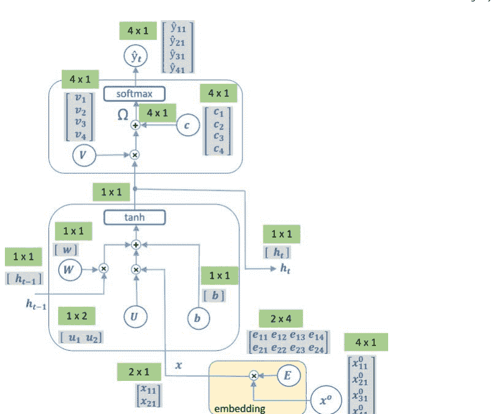

**图10.7** 具有一个嵌入层和一个隐藏层的一对一RNN中的向量维度。

### 10.5.1 带有嵌入层的正向和反向传播

现在让我们研究在正向和反向传播过程中实现嵌入层对RNN操作的影响。正向传播的第一步是将 $E$ 矩阵应用于独热编码的输入元素：

$x_t = E \cdot x_t^o$。 (10.20)

在独热编码输入 $x_t^o$ 通过乘以嵌入权重矩阵 $E$ 转换为稠密向量 $x_t$ 之后，第10.2.2节中公式(10.3)–(10.7)描述的正向传播过程对于带有嵌入层的RNN仍然有效。类似地，反向传播操作以及公式(10.8)–(10.13)给出的 $L$ 对RNN权重矩阵的偏导数在带有嵌入层时也是相同的。然而，由于我们现在有一个额外的参数——权重矩阵 $E$，我们需要计算 $L$ 对 $E$ 的偏导数，如下所示（获得此公式的详细步骤在附录D中给出）：

$\frac{\partial L}{\partial E} = \sum_{t=1}^{S} \left( \sum_{k=1}^{t} (\hat{y}_t - y_t^o) V^\dagger \prod_{j=k}^{t-1} \left( W^\dagger (1 - h_{j+1}^2) \right) (1 - h_k^2) U x_k^o \right)$。 (10.21)

第10.2.2节中的公式(10.14)–(10.15)展示了在反向传播完成后如何使用学习率 $\eta$ 更新RNN参数。对于带有嵌入层的RNN，我们需要添加一个类似的方程来更新 $E$，如下所示：

$$E = E - \eta \frac{\partial L}{\partial E}$$

### 10.5.2 带有嵌入层的数值示例

在本节中，我们将逐步描述使用嵌入层的RNN进行一个训练周期（epoch）的操作。我们将使用第10.2.1节中的相同简单示例，其输入和输出在表10.1中给出。假设网络参数随机初始化如下：

$$E = \begin{bmatrix} 0.818 & -0.360 & 0.127 & -0.036 \\ 0.461 & -0.482 & 0.154 & -0.568 \end{bmatrix}$$
$$U = [0.144 \quad -0.232]$$
$$W = [-0.535]$$
$$b = [0]$$
$$V = [0.695 \quad -0.440 \quad -0.225 \quad -0.305]^\dagger$$
$$c = [0 \quad 0 \quad 0 \quad 0]^\dagger$$

在步骤 $t_1$，对于输入 $x_1 = \mathbf{h}$，我们生成预测 $\hat{y}_1$ 如下：

$$x_1 = E \cdot x_1^o = \begin{bmatrix} 0.818 & -0.360 & 0.127 & -0.036 \\ 0.461 & -0.482 & 0.154 & -0.568 \end{bmatrix} \cdot \begin{bmatrix} 1 \\ 0 \\ 0 \\ 0 \end{bmatrix} = \begin{bmatrix} 0.818 \\ 0.461 \end{bmatrix}$$

$$h_1 = \tanh(U \cdot x_1 + W \cdot h_0 + b)$$
$$= \tanh\left([0.144 \quad -0.232] \cdot \begin{bmatrix} 0.818 \\ 0.461 \end{bmatrix} + [-0.535] \cdot [0] + [0]\right) = [0.011]$$

$$\Omega_1 = V \cdot h_1 + c = \begin{bmatrix} 0.695 \\ -0.440 \\ -0.225 \\ -0.305 \end{bmatrix} \cdot [0.011] + \begin{bmatrix} 0 \\ 0 \\ 0 \\ 0 \end{bmatrix} = \begin{bmatrix} 0.008 \\ -0.005 \\ -0.003 \\ -0.003 \end{bmatrix}$$

$$\hat{y}_1 = \Theta_y(\Omega_1) = softmax(\Omega_1) = \begin{bmatrix} 0.252 \\ 0.249 \\ 0.250 \\ 0.249 \end{bmatrix}$$

$softmax$ 的最高值表明，对于输入 $x_1 = \mathbf{h}$，预测结果是 $\hat{y}_1 = \mathbf{h}$，而期望输出是 $y_1^o = \mathbf{e}$。损失 $L_1$ 为

$$L_1 = -y_1^o \ln(\hat{y}_1) = -\begin{bmatrix} 0 \\ 1 \\ 0 \\ 0 \end{bmatrix} \ln \begin{bmatrix} 0.252 \\ 0.249 \\ 0.250 \\ 0.249 \end{bmatrix} = 1.390$$

继续步骤 $t = 2$，对于输入 $x_2 = \mathbf{e}$，我们计算 $\hat{y}_2$ 如下：

$$x_2 = E \cdot x_2^o = \begin{bmatrix} 0.818 & -0.360 & 0.127 & -0.036 \\ 0.461 & -0.482 & 0.154 & -0.568 \end{bmatrix} \cdot \begin{bmatrix} 0 \\ 1 \\ 0 \\ 0 \end{bmatrix} = \begin{bmatrix} -0.360 \\ -0.482 \end{bmatrix}$$

$$h_2 = \tanh(U \cdot x_2 + W \cdot h_1 + b)$$
$$= \tanh\left([0.144 \quad -0.232] \cdot \begin{bmatrix} -0.360 \\ -0.482 \end{bmatrix} + [-0.535] \cdot [0.011] + [0]\right) = [0.054]$$

$$\Omega_2 = V \cdot h_2 + c = \begin{bmatrix} 0.695 \\ -0.440 \\ -0.225 \\ -0.305 \end{bmatrix} \cdot [0.054] + \begin{bmatrix} 0 \\ 0 \\ 0 \\ 0 \end{bmatrix} = \begin{bmatrix} 0.037 \\ -0.024 \\ -0.012 \\ -0.016 \end{bmatrix}$$

$$\hat{y}_2 = \Theta_y(\Omega_2) = softmax(\Omega_2) = \begin{bmatrix} 0.260 \\ 0.245 \\ 0.248 \\ 0.247 \end{bmatrix}$$

根据 $softmax$ 单元，对于输入 $x_2 = \mathbf{e}$，带有嵌入层的RNN预测 $\hat{y}_2 = \mathbf{h}$，而期望输出是 $y_2^o = 1$。损失为

$$L_2 = -y_2^o \ln(\hat{y}_2) = -\begin{bmatrix} 0 \\ 0 \\ 1 \\ 0 \end{bmatrix} \ln \begin{bmatrix} 0.260 \\ 0.245 \\ 0.248 \\ 0.247 \end{bmatrix} = 1.395$$

在步骤 $t = 3$，我们继续输入 $x_3 = 1$ 并计算 $\hat{y}_3$ 如下：

$$x_3 = E \cdot x_3^o = \begin{bmatrix} 0.818 & -0.360 & 0.127 & -0.036 \\ 0.461 & -0.482 & 0.154 & -0.568 \end{bmatrix} \cdot \begin{bmatrix} 0 \\ 0 \\ 1 \\ 0 \end{bmatrix} = \begin{bmatrix} 0.127 \\ 0.154 \end{bmatrix}$$

$$h_3 = \tanh(U \cdot x_3 + W \cdot h_2 + b)$$
$$= \tanh\left(\begin{bmatrix} 0.144 & -0.232 \end{bmatrix} \cdot \begin{bmatrix} 0.127 \\ 0.154 \end{bmatrix} + [-0.535] \cdot [0.054] + [0]\right) = [-0.046]$$

$$\Omega_3 = V \cdot h_3 + c = \begin{bmatrix} 0.695 \\ -0.440 \\ -0.225 \\ -0.305 \end{bmatrix} \cdot [-0.046] + \begin{bmatrix} 0 \\ 0 \\ 0 \\ 0 \end{bmatrix} = \begin{bmatrix} -0.032 \\ 0.020 \\ 0.010 \\ 0.014 \end{bmatrix}$$

$$\hat{y}_3 = \Theta_y(\Omega_3) = softmax(\Omega_3) = \begin{bmatrix} 0.241 \\ 0.254 \\ 0.252 \\ 0.253 \end{bmatrix}$$

根据 $softmax$ 单元，对于输入 $x_3 = 1$，RNN预测 $\hat{y}_3 = \mathbf{e}$。然而，期望输出是 $y_3^o = 1$。损失为

$$L_3 = -y_3^o \ln(\hat{y}_3) = -\begin{bmatrix} 0 \\ 0 \\ 1 \\ 0 \end{bmatrix} \ln \begin{bmatrix} 0.241 \\ 0.254 \\ 0.252 \\ 0.253 \end{bmatrix} = 1.379$$

最后，在步骤 $t = 4$，我们将输入 $x_4 = 1$ 应用于带有嵌入层的RNN，并计算 $\hat{y}_4$ 如下：

$$x_4 = E \cdot x_4^o = \begin{bmatrix} 0.818 & -0.360 & 0.127 & -0.036 \\ 0.461 & -0.482 & 0.154 & -0.568 \end{bmatrix} \cdot \begin{bmatrix} 0 \\ 0 \\ 1 \\ 0 \end{bmatrix} = \begin{bmatrix} 0.127 \\ 0.154 \end{bmatrix}$$

$h_4 = \tanh(U \cdot x_4 + W \cdot h_3 + b)$
$= \tanh\left(\begin{bmatrix} 0.144 & -0.232 \end{bmatrix} \cdot \begin{bmatrix} 0.127 \\ 0.154 \end{bmatrix} + \begin{bmatrix} -0.535 \end{bmatrix} \cdot \begin{bmatrix} -0.046 \end{bmatrix} + \begin{bmatrix} 0 \end{bmatrix}\right) = \begin{bmatrix} 0.007 \end{bmatrix}$

$\Omega_4 = V \cdot h_4 + c = \begin{bmatrix} 0.695 \\ -0.440 \\ -0.225 \\ -0.305 \end{bmatrix} \cdot \begin{bmatrix} 0.007 \end{bmatrix} + \begin{bmatrix} 0 \\ 0 \\ 0 \\ 0 \end{bmatrix} = \begin{bmatrix} 0.005 \\ -0.003 \\ -0.002 \\ -0.002 \end{bmatrix}$

$\hat{y}_4 = \Theta_y(\Omega_4) = \text{softmax}(\Omega_4) = \begin{bmatrix} 0.251 \\ 0.249 \\ 0.250 \\ 0.250 \end{bmatrix}$。

Softmax的输出表明，对于输入的第二个1，RNN预测$\hat{y}_4 = \mathbf{h}$，而期望输出是$y_4^o = \mathbf{o}$。损失为

$L_4 = -y_4^o \ln(\hat{y}_4) = -\begin{bmatrix} 0 \\ 0 \\ 0 \\ 1 \end{bmatrix} \ln \begin{bmatrix} 0.251 \\ 0.249 \\ 0.250 \\ 0.250 \end{bmatrix} = 1.388$。

四步之后的总损失为

$L = \sum_{t=1}^{T} L_t = 1.390 + 1.395 + 1.379 + 1.388 = 5.552$。

现在让我们继续反向传播过程，首先根据公式(10.8)计算损失$L$关于预测输出$\hat{y}$的梯度，如下所示：

$\frac{\partial L_1}{\partial \hat{y}_1} \frac{\partial \hat{y}_1}{\partial \Omega_1} = (\hat{y}_1 - y_1^o) = \begin{bmatrix} 0.252 \\ 0.249 \\ 0.250 \\ 0.249 \end{bmatrix} - \begin{bmatrix} 0 \\ 1 \\ 0 \\ 0 \end{bmatrix} = \begin{bmatrix} 0.252 \\ -0.751 \\ 0.250 \\ 0.249 \end{bmatrix}$

$\frac{\partial L_2}{\partial \hat{y}_2} \frac{\partial \hat{y}_2}{\partial \Omega_2} = (\hat{y}_2 - y_2^o) = \begin{bmatrix} 0.260 \\ 0.245 \\ 0.248 \\ 0.247 \end{bmatrix} - \begin{bmatrix} 0 \\ 0 \\ 1 \\ 0 \end{bmatrix} = \begin{bmatrix} 0.260 \\ 0.245 \\ -0.752 \\ 0.247 \end{bmatrix}$

$\frac{\partial L_3}{\partial \hat{y}_3} \frac{\partial \hat{y}_3}{\partial \Omega_3} = (\hat{y}_3 - y_3^o) = \begin{bmatrix} 0.241 \\ 0.254 \\ 0.252 \\ 0.253 \end{bmatrix} - \begin{bmatrix} 0 \\ 0 \\ 1 \\ 0 \end{bmatrix} = \begin{bmatrix} 0.241 \\ 0.254 \\ -0.748 \\ 0.253 \end{bmatrix}$

$\frac{\partial L_4}{\partial \hat{y}_4} \frac{\partial \hat{y}_4}{\partial \Omega_4} = (\hat{y}_4 - y_4^o) = \begin{bmatrix} 0.251 \\ 0.249 \\ 0.250 \\ 0.250 \end{bmatrix} - \begin{bmatrix} 0 \\ 0 \\ 0 \\ 1 \end{bmatrix} = \begin{bmatrix} 0.251 \\ 0.249 \\ 0.250 \\ -0.750 \end{bmatrix}$。

我们现在分别使用公式(10.9)、(10.10)、(10.11)、(10.12)和(10.21)计算损失$L$关于$V$、$c$、$W$、$U$和$E$的梯度，如下所示：

$$\frac{\partial L}{\partial V} = \sum_{t=1}^{T} \frac{\partial L_t}{\partial V} = \sum_{t=1}^{T} (\hat{y}_t - y_t^o) \cdot h_t^{\dagger} = \begin{bmatrix} 0.008 \\ -0.005 \\ -0.001 \\ -0.001 \end{bmatrix}$$

$$\frac{\partial L}{\partial c} = \sum_{t=1}^{T} \frac{\partial L_t}{\partial c} = \sum_{t=1}^{T} (\hat{y}_t - y_t^o) = \begin{bmatrix} 1.005 \\ -0.003 \\ -1.001 \\ -0.002 \end{bmatrix}$$

$$\frac{\partial L}{\partial W} = \sum_{t=1}^{T} \left( \sum_{k=1}^{t} (\hat{y}_t - y_t^o) V^{\dagger} \prod_{j=k}^{t-1} \left( W^{\dagger} (1 - h_{j+1}^2) \right) (1 - h_k^2) h_{k-1} \right) = [-0.0082]$$

$$\frac{\partial L}{\partial U} = \sum_{t=1}^{T} \left( \sum_{k=1}^{t} (\hat{y}_t - y_t^o) V^{\dagger} \prod_{j=k}^{t-1} \left( W^{\dagger} (1 - h_{j+1}^2) \right) (1 - h_k^2) x_k \right) = [0.214 \quad 0.098]$$

$$\frac{\partial L}{\partial b} = \sum_{t=1}^{T} \left( \sum_{k=1}^{t} (\hat{y}_t - y_t^o) V^{\dagger} \prod_{j=k}^{t-1} \left( W^{\dagger} (1 - h_{j+1}^2) \right) (1 - h_k^2) \right) = [0.703]$$

$$\frac{\partial L}{\partial E} = \sum_{t=1}^{T} \left( \sum_{k=1}^{t} (\hat{y}_t - y_t^o) V^{\dagger} \prod_{j=k}^{t-1} \left( W^{\dagger} (1 - h_{j+1}^2) \right) (1 - h_k^2) U x_k^o \right)$$
$$= \begin{bmatrix} 0.054 & 0.011 & 0.036 & 0 \\ -0.087 & -0.018 & -0.058 & 0 \end{bmatrix}。$$

根据公式(10.14)–(10.18)和公式(10.22)，我们现在使用学习率$\eta = 0.1$（任意选择）来更新RNN参数值，如下所示：

$$V_{new} = V - \eta \frac{\partial L}{\partial V} = \begin{bmatrix} 0.695 \\ -0.440 \\ -0.225 \\ -0.305 \end{bmatrix} - 0.1 \begin{bmatrix} 0.0075 \\ -0.0051 \\ -0.0013 \\ -0.0011 \end{bmatrix} = \begin{bmatrix} 0.694 \\ -0.440 \\ -0.224 \\ -0.305 \end{bmatrix}$$

$$c_{new} = c - \eta \frac{\partial L}{\partial c} = \begin{bmatrix} 0 \\ 0 \\ 0 \\ 0 \end{bmatrix} - 0.1 \begin{bmatrix} 1.0052 \\ -0.0025 \\ -1.0011 \\ -0.0016 \end{bmatrix} = \begin{bmatrix} -0.1005 \\ 0.0002 \\ 0.1001 \\ 0.0002 \end{bmatrix}$$

$$W_{new} = W - \eta \frac{\partial L}{\partial W} = [-0.535] - 0.1 [-0.008] = [-0.534]$$

$$U_{new} = U - \eta \frac{\partial L}{\partial U} = [0.144 \quad -0.232] - 0.1 [0.214 \quad 0.098] = [0.123 \quad -0.241]$$

$$b_{new} = b - \eta \frac{\partial L}{\partial b} = [0] - 0.1 [0.703] = [-0.070]$$

$E_{new} = E - \eta \frac{\partial L}{\partial E}$
$= \begin{bmatrix} 0.818 & -0.360 & 0.127 & -0.036 \\ 0.461 & -0.482 & 0.154 & -0.568 \end{bmatrix} - 0.1 \begin{bmatrix} 0.054 & 0.011 & 0.036 & 0 \\ -0.087 & -0.018 & -0.058 & 0 \end{bmatrix}$
$= \begin{bmatrix} 0.812 & -0.361 & 0.123 & -0.036 \\ 0.470 & -0.481 & 0.160 & -0.568 \end{bmatrix}$，

其中下标*new*用于区分RNN参数的新更新值和先前值。此时，训练继续进行，使用更新后的值进行另一次前向传播，然后进行反向传播。在第2个训练周期中，总损失$L$为5.311，较之前的5.552有所降低（由于篇幅限制，此处未显示）。当我们继续训练这个RNN时，总误差在50个周期后进一步降低到2.927，在1000个周期后降低到0.880。

## 10.6 总结性评述

在本章中，我们介绍了循环神经网络，它们是强大的工具，能够捕捉输入样本数据元素之间的复杂关系，适用于聊天机器人或机器翻译等实际应用。RNN的主要优势在于，通过其隐藏状态，它们能够保留先前应用输入在早期步骤中生成的信息。这种能力使得RNN能够形成由早期输入生成的记忆，使其成为处理基于序列信息的绝佳选择。RNN的另一个重要特性是，由于隐藏状态的递归性质，它们可以处理可变长度的输入序列，这将在第11章中通过实现一个使用多对多RNN的简单聊天机器人来展示。

借助一个简化的例子，我们逐步描述了RNN的训练操作，即获取损失函数关于其参数偏导数的梯度，以及在前向和反向传播训练步骤中更新权重矩阵的机制。我们研究了嵌入层作为降低输入数据维度以减少训练过程计算成本的一种手段的影响。然而，由于RNN处理输入序列的能力，每一步的输出都需要来自早期步骤的信息，这使得RNN无法以并行方式运行，从而导致其计算效率低下。

尽管RNN在建模序列方面非常有用，但它们还有其他显著的缺点，即所谓的梯度消失和梯度爆炸问题，这会导致RNN的长期记忆问题[95]。当权重矩阵中的元素值变得非常小，导致学习变得非常缓慢或完全停止时，就会观察到梯度消失问题。相反，如果权重值变得很大，它们可能会在搜索空间中产生发散的解，这被称为梯度爆炸问题。已经提出了针对RNN的不同修改方案来处理这种情况，包括LSTM[8]、Transformer[9]和注意力机制[96]。鼓励读者在消化了本书第10、11、12和13章提供的材料后，研究这些解决方案。

## 10.7 第10章练习题

- 1) 增大学习率$\eta$对RNN的预测能力有何影响？推导一个近似公式。
- 2) 减小学习率$\eta$对RNN的预测能力有何影响？推导一个近似公式。

3) 增加训练轮数对循环神经网络的预测能力有何影响？推导其近似公式。

4) 减少训练轮数对循环神经网络的预测能力有何影响？推导其近似公式。

5) 参考图10.6所示的双单元RNN，推导使用单隐藏层的三单元RNN的权重矩阵维度。

6) 引入嵌入层可以降低RNN的训练计算成本。请通过推导有无嵌入层的RNN单轮训练计算成本的近似数量级公式来证明这一点。保持所有其他参数固定，以展示嵌入层的影响。

7) 参考图10.7所示的RNN，推导使用双隐藏层的三单元RNN的权重矩阵维度。

# 11 用于聊天机器人实现的循环神经网络

## 11.1 引言

艾伦·图灵于1950年提出的模仿游戏[2]指出，如果一台机器（例如计算机）能够使用普通人会使用的词语来回答任何问题，那么我们就可以称这台机器是智能的。图灵测试[97]正是基于这个游戏，其目标是判断机器提供的答案是否与人类的答案无法区分。图灵测试中，机器试图模仿人类，这被认为是定义人工智能的最早尝试之一，尽管对于此类问题的回答是否需要真正的智能（而非仅仅基于先前对话的简单搜索技术）仍存在争议。

该实验的现代实现会采用聊天机器人[98]，这是一种通过自然语言交互（例如文本或语音）来模拟与人类对话的程序[99, 100]。当前的聊天机器人通常是在线的，能够基于用户提供的输入刺激，用自然语言维持对话。近年来，聊天机器人已发展到可能在许多专业环境中取代人类，从而产生重大的社会影响，包括应答服务和客户服务运营。

在本章中，我们将介绍一个基于第10章引入的RNN的简单聊天机器人的实现。对于其他AI工具（如人工神经网络ANN和卷积神经网络CNN）来说，这是一个相当困难的问题，因为它们不寻找输入序列不同元素之间的时间关联，而是专注于当前的输入/输出对，而不考虑先前应用的输入及其相应的输出（即它们缺乏隐藏状态）。聊天机器人实现的另一个难点是输入和输出序列长度之间的不对称关系。例如，用户向一个模仿个人助理的聊天机器人输入“今天下午天气怎么样？”，可能会生成“将会多云且凉爽”的回复；而较短的输入“今天会下雨吗？”可能会生成长度不同的输出，例如“是的，很有可能”。能够处理可变长度输入序列并生成可变长度输出序列的RNN被称为多对多RNN [87]，将在下面的11.2节中研究。使用多对多RNN实现简单聊天机器人的Python和Matlab脚本分别在11.4节和11.5节中给出。

## 11.2 多对多RNN架构

聊天机器人等应用需要RNN以特殊方式运行，如下所述。在用户完成输入序列 $X_1, \cdots, X_{k-1}$ 之前，RNN不会生成任何外部输出，而只计算其隐藏状态 $h_1, \cdots, h_{k-1}$。在第 $k$ 步，用户输入 $X_k$ 作为序列的最后一个输入，RNN为其生成输出 $\hat{Y}_k$。在第 $(k + 1)$ 步，该输出 $\hat{Y}_k$ 被反馈回RNN作为输入 $X_{k+1}$，以生成输出 $\hat{Y}_{k+1}$。类似地，在第 $(k + 2)$ 步，$\hat{Y}_{k+1}$ 被作为输入 $X_{k+2}$ 应用于RNN，依此类推。通常，RNN开始生成输出的输入 $X_k$ 是一个特殊的输入字符，例如序列结束指示符。图11.1展示了一个具有多个隐藏层的多对多RNN示例，其中在用户于第 $k$ 步完成输入序列之前不生成任何输出，之后生成外部输出并将其作为输入反馈回RNN（即输出 $\hat{Y}_k, \hat{Y}_{k+1}, \cdots$ 分别作为输入 $X_{k+1}, X_{k+2}, \cdots$ 应用于RNN）。

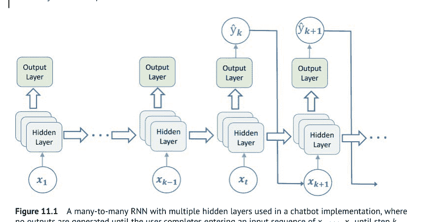

**图11.1** 用于聊天机器人实现的具有多个隐藏层的多对多RNN，其中在用户于第 $k$ 步完成输入序列 $x_1, \cdots, x_k$ 之前不生成任何输出，之后生成外部输出并将其作为输入反馈回RNN（即输出 $\hat{y}_k, \hat{y}_{k+1}, \cdots$ 分别作为输入 $x_{k+1}, x_{k+2}, \cdots$ 应用于RNN）。

## 11.3 一个简单的聊天机器人

在本章中，我们使用一个采用隐藏层和嵌入层的多对多RNN来实现一个简单的聊天机器人。该聊天机器人将使用从互联网上获取的500个样本查询和响应对进行训练，这些样本包含565个唯一单词。对于真实的聊天机器人实现，将需要数千万对数据。图11.2显示了用于训练RNN的样本数据子集，包含查询和响应。在训练数据中，用户查询给出如下：

```
<start> hi, how are you doing ? <end>
```

样本数据为其定义的响应为：

```
<start> I am fine. how about yourself ? <end>
```

其中，特殊词（或标记）<start> 和 <end> 被添加到每个样本中，以分别指示每个查询和响应对的开始和结束。借助这些特殊标记，RNN将知道当它在用户查询中读取 <start> 时，它开始生成隐藏状态而不产生外部输出，直到读取 <end>，之后RNN开始生成外部输出，并将每个输出用作下一步的输入，如前所述。一旦RNN生成包含 <end> 的单词输出，它就停止生成输出。RNN训练完成后，用户可以输入任意查询，只要它们仅包含字母表中存在的单词。例如，以下用户查询不在训练数据中：

<start> how was your day today ? <end>

对于此用户查询，11.4节中Python脚本实现的RNN生成以下响应，该响应也不在训练数据使用的任何查询中：

<start> i am a movie ?. <end>

当然，该响应在语义上没有任何意义，因为我们使用了非常少的数据样本，并且仅训练了RNN几个轮次；然而，值得注意的是，这个简单的RNN示例能够处理独特的查询并生成独特的响应。显然，如果我们使用数百万个数据样本并训练RNN数万个轮次，响应将显著改善。

如第10章10.4节所述，为了提高训练效果，在实际的RNN实现中通常包含多个隐藏层，其中隐藏层以增加权重矩阵维度为代价提供并行和同步搜索。在图11.3中，我们展示了用于聊天机器人实现的具有256个隐藏层的多对多RNN的矩阵维度，字典大小为565个唯一单词，与我们在下面11.4节和11.5节中的Python和Matlab实现中使用的一致。


(a)


(b)

**图11.2** 用于在11.4节和11.5节中介绍的多对多RNN的Python和Matlab实现中进行训练的样本子集：(a) 用户查询，(b) 对应的答案。

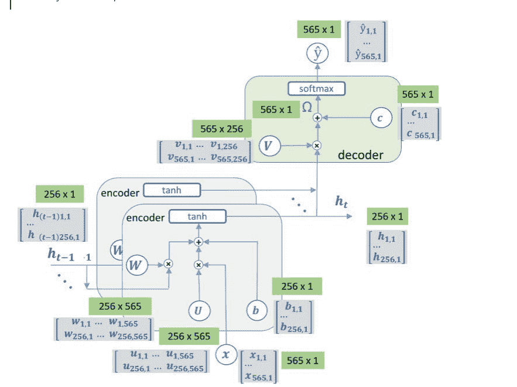

**图11.3** 用于聊天机器人实现的具有256个隐藏层的多对多RNN中的权重矩阵维度，字典大小为565个单词。

## 11.4 使用RNN的聊天机器人Python脚本

如第10章第10.5节所述，在RNN中采用嵌入层可以生成输入向量的紧凑表示，从而显著降低训练过程的计算成本。图11.4展示了Python和Matlab脚本中使用的RNN的权重矩阵维度，该RNN具有256个隐藏层和一个大小为（$128 \times 565$）的嵌入矩阵$E$，其词典包含565个单词。回顾第10章公式（10.20），对于嵌入层，矩阵乘法定义为$X = E \cdot X^o$，其中$X^o$是独热编码的输入向量。

本节我们将展示一个示例Python脚本，该脚本实现了第11.3节描述的简单聊天机器人，将其构建为一个多对多RNN。该RNN采用图11.4所示的相同架构，具有256个隐藏层和128的嵌入维度，用于处理来自包含565个唯一单词词典的用户查询。在理解下面提供的示例代码后，建议读者尝试更改RNN架构和训练的参数，以深入理解每个参数对RNN预测精度的影响。

在第23行，用于训练RNN的样本数量设置为500。在第24行，`batch size`（批大小）设置为16，这是一个训练参数，指定每个训练周期（epoch）一次处理的输入样本数量。例如，如果有1000个数据样本且批大小为100，那么在一个训练周期内，RNN将处理10个批次，每个批次包含100个输入样本。通过以小块处理样本数据，我们在训练期间限制了矩阵维度（在此例中为16），而一次性处理所有输入样本则需要操作维度大得多的矩阵（在此例中为1000），计算成本会高得多。在第25行，隐藏层数量设置为256，这意味着RNN使用256个并行运行的编码器。在这种情况下，如果不使用嵌入，U的维度将是（256 × 565），其中我们使用$I = 500$个样本，包含总共$|I| = 565$个唯一单词。在第26行，我们将训练周期数设置为1000，这是训练RNN所使用的前向和反向传播的总次数。在第27行，嵌入层大小设置为128，这意味着E的维度将是（128 × 565）。使用嵌入后，单个输入样本的大小从（565 × 1）减少到（128 × 1），如图11.4所示。嵌入将U的维度从（256 × 565）降低到（256 × 128）。

在第29-41行，名为`tokenize`的函数接受数据样本集作为输入，将单词转换为数字标记（token），并根据用户定义的最大序列长度添加填充（padding）。填充[101]是处理可变长度输入和输出序列的有用技术，其中所有输入和输出都用空字符填充，使其看起来具有相等的长度。在第33行，基于输入样本创建了一个名为`lang_tokenizer`的字母表，它在第37行使用稀疏独热编码[92]进行编码。在第39和40行，为编码后的字母表添加了填充。在第43-51行，`load_dataset`函数（其输入是样本输入和期望输出）生成编码并填充后的样本输入（称为`input_tensor`，即X集）、期望输出（称为`target_tensor`，即Y集）以及输入和期望输出的字母表（称为`lang_tokenizer`）。

在第53-64行，`create_rnn_model`函数创建了RNN模型。在第58行，创建了一个使用字母表大小和嵌入维度的嵌入层；类似地，在第60行创建了一个使用隐藏层数量的编码器，在第62行创建了一个使用期望输出字母表大小的解码器。

在第66-92行，实现了`predict`函数，该函数为给定的用户输入句子生成响应，过程如下。在第69行，添加了特殊的起始和结束词。在第71行，单词被转换为数字向量，在第72-74行添加了填充。在第76行，输入查询被转换为张量流（tensor flow）数据类型，以便稍后在第78行的RNN模型中使用。在第78行还创建了一个名为`prediction`的向量，其中包含`softmax`单元的输出。在第83行，通过`tf.argmax`函数找到预测中概率值最高的索引。在第88和89行，标记被转换回单词。移除标签后，函数返回预测的输出句子。

在第94-104行，从文件中读取输入样本，并将其拆分为样本输入和对应的输出，然后在第103行分别加载到名为`input_tensor_train`和`target_tensor_train`的矩阵中。在第110行，使用上面定义的参数（即字母表大小、嵌入维度和隐藏层数量）创建了一个RNN模型。在第113行，创建了一个名为`optimizer`的张量流对象，它使用梯度下降进行优化（即Adam选项）。在第114-115行，损失函数被定义为稀疏交叉熵损失[93]。在第127和128行，使用输入和输出矩阵、训练周期数、批大小以及`shuffle`操作的选择（如果为true，则在每个训练周期打乱输入样本的顺序）来训练RNN，并将结果存储到名为`model`的对象中。其余行用于一个简单的用户界面，用于训练新的RNN或使用先前训练好的模型，直接在屏幕上或从先前记录的文件中提问，以及存储当前结果。

```python
# The City College of New York, City University of New York
# Written by: Hasan Suca Kayman
# June 2024
# chatbot_RNN is a simple chatbot that uses a Recurrent Neural Network
# to generate responses to user queries. Training materials is a set of
# dialogs taken from the text messages arbitrarily chosen from the Internet.

# Importing necessary libraries
import tensorflow as tf
from datetime import datetime
import os
import time

# Setting a random seed for reproducibility
seed = 301
tf.keras.utils.set_random_seed(seed)

# Example queries file
queries_path = 'questions.txt'
# Data input file
data_path = 'cleaned_dialogs.txt'

noof_samples = 500
batch_size = 16
noof_hidden_layers = 256
noof_epochs = 1000
embedding_dim = 128

# Tokenize a list of sentences and pad them to ensure equal length
# Convert words into numeric tokens and add padding based on max length
def tokenize(lang):
    # Create a tokenizer
    lang_tokenizer = tf.keras.preprocessing.text.Tokenizer(filters='')
    # Fit tokenizer to the given text
    lang_tokenizer.fit_on_texts(lang)
    # Convert text to sequences of numbers
    tensor = lang_tokenizer.texts_to_sequences(lang)
    # Pad sequences
    tensor = tf.keras.preprocessing.sequence.pad_sequences(tensor, padding='post')
    return tensor, lang_tokenizer

# Load a dataset and tokenize both input and target (expected) languages
def load_dataset(inp_lang, targ_lang):
    # Unpack the given data into target and input languages
    lang = inp_lang + targ_lang
    # Tokenize both the input and target languages
    data, lang_tokenizer = tokenize(lang)
    input_tensor, target_tensor = data[:len(inp_lang)], data[len(inp_lang):]
    # Return tokenized inputs, targets, and their tokenizers
    return input_tensor, target_tensor, lang_tokenizer

# Create a simple RNN model with specified parameters
def create_rnn_model(alph_size, embedding_dim, rnn_units):
    # Define a sequential model with embedding, RNN, and output layer
    model = tf.keras.Sequential([
        # Embedding layer
        tf.keras.layers.Embedding(alph_size, embedding_dim),
        # Simple RNN layer
        tf.keras.layers.SimpleRNN(rnn_units, return_sequences=True),
        # Dense output layer
        tf.keras.layers.Dense(alph_size)
    ])
    return model

# Given an input sentence, generate a response using the model
def predict(sentence, model, tokenizer, max_length=20):
    # Preprocess the input sentence
    preprocessed_sentence = '<start> ' + sentence.lower() + ' <end>'
    # Tokenize the sentence and pad it to the max_length
    input_sequence = tokenizer.texts_to_sequences([preprocessed_sentence])
    input_tensor = tf.keras.preprocessing.sequence.pad_sequences(
        input_sequence, maxlen=max_length, padding='post')
    # Generate a prediction using the model
    predictions = model(input_tensor)
    # Get the index of the highest probability value
    predicted_index = tf.argmax(predictions, axis=-1).numpy()[0]
    # Convert the index back to a word
    predicted_word = tokenizer.index_word.get(predicted_index, '')
    return predicted_word
```

## 11 用于聊天机器人实现的RNN

```python
tf.keras.preprocessing.sequence.pad_sequences(input_sequence,
                maxlen=max_length, padding='post')
# Convert to a tensor and reshape for the RNN model
input_tensor = tf.convert_to_tensor(input_tensor)
# Generate predictions
prediction = model.predict(input_tensor, verbose=0)
# Extract the most likely tokens and convert them back to words
predicted_sequence = ['<start> ']
for pred in prediction[0]:
    # Get the token with the highest probability
    predicted_id = tf.argmax(pred, axis=-1).numpy()
    # Stop if we reach the end token
    if tokenizer.index_word.get(predicted_id, '') == " <end>":
        break
    # Convert token to word
    predicted_word = tokenizer.index_word.get(predicted_id, '')
    predicted_sequence.append(predicted_word)
# Return the original input and the predicted output and removing tags
result=' '.join(predicted_sequence).split("<start>")[-1].split("<end>")[0]
return result, sentence

# Read dialogs from a text file
file = open(data_path,'r').read()

# Split the dialog into questions and answers
qna_list = [f.split('\t') for f in file.split('\n')][:-1]
questions = [x[0] for x in qna_list][:noof_samples+1]
answers = [x[1] for x in qna_list][:noof_samples+1]

# Load and tokenize the dataset
input_tensor_train, target_tensor_train, lang_tokenizer = \
                                        load_dataset(questions, answers)

# Set the unit count for alphabet sizes
alph_size = len(lang_tokenizer.word_index)+1

# Create the RNN model with specified parameters
model = create_rnn_model(alph_size, embedding_dim, noof_hidden_layers)

# Define the optimizer and loss function for training
optimizer_a = tf.keras.optimizers.Adam()
loss_object = tf.keras.losses.SparseCategoricalCrossentropy(
    from_logits=True, reduction='none')

model.compile(optimizer=optimizer_a, loss=loss_object)

# prompt user to train or load an RNN model
print('\nOPTIONS:')
print('1 - Train a new RNN model\n2 - Load an existing model')
option = input('\nSelect an option by entering a number: \n')

if option == '1':
    # OPTION 1: TRAIN A NEW RNN MODEL
    print('\n******** NOW TRAINING A NEW RNN MODEL *********')
    model.fit(input_tensor_train, target_tensor_train, epochs=noof_epochs,
              batch_size = batch_size, shuffle=True)
    print('\n\n********** RNN training complete **********\n\n')

elif option == '2':
    # OPTION 2: LOAD RNN MODEL FROM FILE
    message = 'Enter the file name of the RNN Model you want to load: \n'
    load_file = input(message)

    # load the RNN model from load_file
    model.load_weights(load_file)
    print('\n\n****** SUCCESSFULLY LOADED RNN MODEL ', load_file,'******')

# prompt user to test or save an RNN model
option_list = ['1','2','3','4']
while option != '4':
    option = ' '

    print('\nOPTIONS:')
    print('1 - Test this RNN model with input')
    print('2 - Test queries given in a file')
    print('3 - Save existing model and logs')
    print('4 - Exit')

    option = input('\nSelect an option by entering a number: \n')

    if option == '1':
        # OPTION 1: TEST MODEL
        msg = 'Enter your input: '
        user_input = input(msg)
        result, sentence = \
            predict(user_input, model, lang_tokenizer, alph_size)
        print('Question: {}'.format(sentence))
        print('Predicted Output: {}'.format(result))
    elif option == '2':
        # OPTION 2: TEST QUERIES
        # List of queries for the model to respond to
        file = open(queries_path,'r').read()
        queries = [question for question in file.split('\n')]
        for index,query in enumerate(queries):
            result, sentence = predict(query, model, lang_tokenizer,
                                        alph_size)
            print('{}.Question: {}'.format(index+1,sentence))
            print('{}.Predicted Output: {}'.format(index+1,result))
    elif option == '3':
        # OPTION 3: SAVE LOGS AND MODEL
        times = datetime.now().strftime("%Y_%m_%d_%H_%M_%S")
        model_path = 'RNN_MODEL_N{}_B{}_U{}_EP{}_EM{}_{}.h5'.format(
            noof_samples, batch_size, noof_hidden_layers,
            noof_epochs, embedding_dim,times
        )
        model.save_weights(model_path)
        print("Successfully Saved {}".format(model_path))
```

图11.5展示了由上述Python脚本实现的聊天机器人生成的一小部分输出。图11.5a显示了取自样本互联网数据的用户查询以及我们的聊天机器人生成的响应。图11.5b显示了不在样本数据中但使用了词典中单词的用户查询，以及Python聊天机器人生成的相应响应。我们看到，考虑到样本大小、训练周期数以及隐藏层和嵌入层的数量的限制，两组查询的大多数响应看起来都是合适的。

## 11.5 使用RNN的聊天机器人Matlab脚本

本节我们介绍一个针对第11.3节描述的相同多对多RNN的简单聊天机器人的Matlab示例实现。下面给出的Matlab脚本使用了与第11.4节给出的Python脚本类似的结构、变量和函数，以便读者可以轻松地进行比较。

在第16至20行，设置了RNN参数，如样本数量、批大小、隐藏层数、训练周期数和嵌入层维度。在第22至33行，读取样本数据并转换为称为cell的特殊格式。在第35至44行，样本数据被分为两组：查询和响应。在第48行，调用`load_dataset`函数，使用所谓的稀疏独热编码[92]对查询和响应进行编码，该函数返回四个变量，即`input_tensor_train`、`target_tensor_train`、`lang_tokenizer`和`rev_tokenizer`，分别表示输入（即X集合）、预期输出（即Y集合）以及它们的编码和解码映射。在第54行和第58行，分别设置了字母表大小并调整了输出类型。在第67行，通过调用名为`create_rnn_model`的函数（参数为输入层、嵌入层和隐藏层数）定义了RNN架构。在第70行，设置了训练选项，包括梯度下降作为优化方法（即选择Adam）和打乱选项（即在每个训练周期后改变样本顺序以避免可能的偏差）。

在第73至136行之间实现了一个基本的用户界面。当用户在第80行选择选项1时，将在第83和84行训练一个新的RNN。对于选项2，将在第89行加载一个先前训练好的RNN。一旦加载了新的或先前训练好的RNN，如果用户选择选项1，则在第107行调用名为`predictResponse`的函数，为在屏幕上输入的单个用户查询生成预测。类似地，对于选择选项2，在第119行，为存储在`questions.txt`文件中的每个查询调用`predictResponse`。选项3在第123-131行保存当前的RNN、用户查询和响应。输入4作为选项将在第134行终止程序。

名为`load-dataset`的函数在第138至157行之间实现。它在第141行合并查询和输出以获得名为`lang`的对象，并调用`tokenDictionary`

### Python聊天机器人实现对样本查询生成的响应

| 取自样本数据的聊天机器人查询 | 样本数据中给出的响应 | 聊天机器人生成的响应 |
| :--- | :--- | :--- |
| are you enjoying it there ? | it is not bad . there are a lot of people there . | i am not bad . there are a lot of people there . |
| i really wish it was not so hot every day . | me too . i cannot wait until winter . | i , . i cannot wait until winter . |
| any rain right now would be pointless . | that is right , it really would be . | that is right , it really would be . |
| how come ? | i like how clear the sky gets after it rains . | i can see the stars so gets after clearly after it |
| is it going to be perfect beach weather ? | i believe so . | it believe so . |

(a)

### Python聊天机器人实现对独特查询生成的响应

| 聊天机器人的独特查询 | 聊天机器人生成的响应 |
| :--- | :--- |
| how was your day today | i am a movie ? . |
| what do you think about the rain this week ? | i like it to give have be to go . . |
| have you seen any good movies recently ? | no , i have of . |
| are you feeling better now after being sick ? | i am still . |
| will you be able to make it to class tomorrow ? | i course , will hear of movie would be the . |

(b)

**图11.5** 由第11.4节介绍的Python脚本生成的样本输出：(a) 取自样本训练数据的用户查询和响应以及聊天机器人生成的响应，(b) 独特的用户查询和聊天机器人生成的响应。

将语言映射为输入和输出的函数。在第151行和第152行，查询和输出分别被映射为`input_tensor`和`target_tensor`。在第159–170行，实现了名为`TokenDictionary`的函数。它统计唯一词并创建一个字典。在第168行，它为该字典生成一个编码表，在第169行生成一个解码表。在第172–181行，名为`create_rnn_model`的函数使用上面定义的输入、嵌入隐藏层、多对多RNN和解码器来形成一个名为`layers`的RNN对象。在第183–196行，给出了`predictResponse`函数，它向给定句子添加起始和结束标记，对其进行编码和填充，然后使用`classify`生成预测。使用解码器，它将预测转换为字典中的一个词，并在移除起始和结束标记后返回它。

```
% The City College of New York, City University of New York
% Written by: Hasan Suca Kayman
% July 2024
% chatbot_RNN is a simple chatbot that uses a Recurrent Neural Network
% to generate responses to user queries. Training materials is a set of
% dialogs taken from text messages arbitrarily chosen from the Internet.

% Setting a random seed for reproducibility
rng(301)

% Example queries file
queries_path = 'questions.txt';
% Data input file
data_path = 'cleaned_dialogs.txt';

noof_samples = 500;
batch_size = 16;
noof_hidden_layers = 256;
noof_epochs = 400;
embedding_dim = 128;

% Read dialogs from a text file
fileID = fopen(data_path, 'r');
textData = textscan(fileID, '%s', 'Delimiter', '\n');
fclose(fileID);

% Each line from input file is a cell array of strings
textData = textData{1};

% Converting data type to cell
qna_list = cell(size(textData));
questions = cell(noof_samples+1, 1);
answers = cell(noof_samples+1, 1);

% Split each line into questions and answers
for i = 1:numel(textData)
    qna_list{i} = strsplit(textData{i}, '\t');
end

% Extract questions and answers
for i = 1:noof_samples+1
    questions{i} = qna_list{i}{1};
    answers{i} = qna_list{i}{2};
end

% Load and tokenize the dataset
[input_tensor_train, target_tensor_train, lang_tokenizer, ...
             rev_tokenizer] = load_dataset(questions, answers);

% Set the unit count for alphabet sizes
alph_size = 0;
for i = 1:noof_samples+1
    if max(target_tensor_train{i}(:)) > alph_size
        alph_size = max(target_tensor_train{i}(:));
    end
end
% Add one for padding token
alph_size = alph_size + 1;

% Converting data type to categorical
for idx = 1:numel(target_tensor_train)
    target_tensor_train{idx} = categorical(target_tensor_train{idx},...
                                0:alph_size-1);
end

% Create the RNN model with specified parameters
layers = create_rnn_model(alph_size, embedding_dim, noof_hidden_layers);

% Defining training options
options = trainingOptions('adam', 'MaxEpochs', noof_epochs, ...
                'MiniBatchSize', batch_size,'Shuffle', 'every-epoch');

% User interaction for training or loading a model
disp('OPTIONS:');
disp('1 - Train a new RNN model');
disp('2 - Load an existing model');

option = input('Select an option by entering a number: ', 's');
switch option
    case '1'
        % OPTION 1: TRAIN A NEW RNN MODEL
        disp('********* NOW TRAINING A NEW RNN MODEL *********');
        model = trainNetwork(input_tensor_train, target_tensor_train,...
                            layers, options);
        disp('*********** RNN training complete ***********');
    case '2'
        % OPTION 2: LOAD RNN MODEL FROM FILE
        modelFileName = input('Enter the RNN Model to load: ', 's');
        load(modelFileName, 'model');
        disp(['****** SUCCESSFULLY LOADED RNN MODEL ', ...
                            modelFileName,'******']);
end

% User interaction for testing or saving a model
while true
    disp('OPTIONS:');
    disp('1 - Test this RNN model with input');
    disp('2 - Test queries given in a file');
    disp('3 - Save existing model and logs');
    disp('4 - Exit');

    option = input('Select an option by entering a number: ', 's');
    switch option
        case '1'
            % OPTION 1: TEST MODEL
            user_input = input('Enter your input: ', 's');
            predicted_sentence = predictResponse(model, ...
                    lang_tokenizer, rev_tokenizer, user_input);
            disp(['Predicted Output: ', predicted_sentence]);
        case '2'
            % OPTION 2: TEST QUERIES
            fileID = fopen(queries_path, 'r');
            queries = textscan(fileID, '%s', 'Delimiter', '\n');
            fclose(fileID);
            queries = queries{:};
            for i = 1:length(queries)
                query = queries{i};
                disp(['Query ', num2str(i), ': ', query]);
                predicted_sentence = predictResponse(model, ...
                        lang_tokenizer, rev_tokenizer, query);
                disp(['Predicted Output: ', predicted_sentence]);
            end
        case '3'
            % OPTION 3: SAVE LOGS AND MODEL
            dtw = datestr(now, 'yyyy_mm_dd_HH_MM_SS');
            model_path=sprintf('RNN_model_N%d_B%d_U%d_EP%d_EM%d_%s.mat',...
                        noof_samples, batch_size, noof_hidden_layers, ...
                        noof_epochs, embedding_dim, dtw);
            save(model_path, 'model');
            disp(['Successfully saved to',model_path]);
        case '4'
            disp('Exiting program');
            break;
    end
end

function [input_tensor, target_tensor, lang_tokenizer, ...
            reverseTokenizer] = load_dataset(inp_lang, targ_lang)
    % Concatenate inputs and targets for combined tokenization
    lang = [inp_lang; targ_lang];
    % Tokenize both the input and target languages
    [lang_tokenizer,reverseTokenizer] = tokenDictionary(lang);

    % Initialize cell arrays for storing sentences
    input_tensor = cell(length(inp_lang), 1);
    target_tensor = cell(length(targ_lang), 1);

    % Encode all of input and target data
    for i = 1:length(inp_lang)
        input_tensor{i} = encoder(lang_tokenizer, inp_lang{i}, 25);
        target_tensor{i} = encoder(lang_tokenizer, targ_lang{i}, 25);
    end
    % Transpose them to correct dimensions
    input_tensor = input_tensor';
    target_tensor = target_tensor';
end

function [tokenizer,reverseTokenizer] = tokenDictionary(texts)
    % Create a tokenizer
    joined_texts = join(string(texts));
    % Convert text to sequences of numbers
    unique_words = unique(strsplit(joined_texts));
    % Pad sequences
    unique_words = ['<pad>', unique_words];
    indices = 1:numel(unique_words);
    % Fit tokenizer to the given text
    tokenizer = containers.Map(unique_words, indices);
    reverseTokenizer = containers.Map(num2cell(indices), unique_words);
end

% Create a simple RNN model with specified parameters
function layers = create_rnn_model(alph_size, embedding_dim, rnn_units)
    layers = [ ...
        sequenceInputLayer(1)
        wordEmbeddingLayer(embedding_dim, alph_size) % Embedding layer
        lstmLayer(rnn_units, 'OutputMode', 'sequence') % an RNN layer
        fullyConnectedLayer(alph_size)
        softmaxLayer % softmax layer
        classificationLayer];
end

function predicted_sentence = predictResponse(model, lang_tokenizer, ...
                            rev_tokenizer, user_input)
    % Preprocess the input sentence
    preprocessed_sentence = ['<start> ', lower(user_input), ' <end>'];
    % Tokenize the sentence and pad it to the max_length
    input_sequence = encoder(lang_tokenizer, preprocessed_sentence, 25);
    % Generate predictions
    predictions = classify(model, input_sequence);
    % Convert tokens back to words
    predicted_words = decoder(rev_tokenizer, predictions);
    % Remove start and end tags and join into a single sentence
    predicted_sentence = strrep(predicted_words,'<start> ','');
    predicted_sentence = strrep(predicted_sentence,' <end>','');
end

function text = decoder(reverseTokenizer, sequence)
% Sequences that include words are converted to sparse one-hot encoding
% word by word:
    words = cell(1, numel(sequence));
```

## 11.6 结语

在本章中，我们介绍了循环神经网络（RNN）的一个重要应用——聊天机器人。当用户以自然语言句子的形式输入查询时，聊天机器人会生成相应的回复。该应用的特点要求采用多对多的RNN架构，即输出序列仅在用户输入序列结束后才由RNN生成，且输入和输出序列的长度可能不同，并随每个查询而变化。如第10章所述，作为聊天机器人实现的多对多RNN通常采用隐藏层和嵌入层，以提高其预测能力并降低训练过程的计算成本。

针对这个简单的示例，我们展示了如何使用Python和Matlab中的库函数来构建一个RNN。其样本数据采用了一小段从互联网上获取的用户文本消息交换记录。聊天机器人的实现表明，当用户输入独特的查询（仅使用样本训练数据中存在的词汇）时，即使样本数据集中没有这些内容，也有可能生成预测。即使是这个简化的RNN示例，也能够生成预测，并且随着训练轮次（epochs）和隐藏层的增加，预测能力必然会提升，这凸显了基于RNN的模型在实现聊天机器人这类应用方面的强大能力。

**图 11.6** 由第11.5节介绍的Matlab脚本生成的示例输出：(a) 取自样本训练数据的用户查询与回复，以及聊天机器人生成的回复；(b) 独特的用户查询与聊天机器人生成的回复。

| Matlab聊天机器人实现对样本查询的回复 |
| :--- |
| **取自样本数据的聊天机器人查询：** | are you enjoying it there ? |
| **样本数据中给出的回复：** | it is not bad . there are a lot of people there . |
| **聊天机器人生成的回复：** | **i am not bad . there are a lot of people there .** |
| **取自样本数据的聊天机器人查询：** | i really wish it was not so hot every day . |
| **样本数据中给出的回复：** | me too . i cannot wait until winter . |
| **聊天机器人生成的回复：** | **i too too i cannot wait until winter .** |
| **取自样本数据的聊天机器人查询：** | any rain right now would be pointless . |
| **样本数据中给出的回复：** | that is right , it really would be . |
| **聊天机器人生成的回复：** | **that is right , it really would be .** |
| **取自样本数据的聊天机器人查询：** | how come ? |
| **样本数据中给出的回复：** | i like how clear the sky gets after it rains . |
| **聊天机器人生成的回复：** | **i like how clear the sky gets after it rains .** |
| **取自样本数据的聊天机器人查询：** | is it going to be perfect beach weather ? |
| **样本数据中给出的回复：** | i believe so . |
| **聊天机器人生成的回复：** | **it believe so .** |

(a)

| Matlab聊天机器人实现对独特查询的回复 |
| :--- |
| **独特的聊天机器人查询：** | how was your day today |
| **聊天机器人生成的回复：** | **i am was . do . tomorrow .** |
| **独特的聊天机器人查询：** | what do you think about the rain this week ? |
| **聊天机器人生成的回复：** | **i , going to . . . it it it about ?** |
| **独特的聊天机器人查询：** | have you seen any good movies recently ? |
| **聊天机器人生成的回复：** | **i , i have to . you .** |
| **独特的聊天机器人查询：** | are you feeling better now after being sick ? |
| **聊天机器人生成的回复：** | **I am still really feel this this .** |
| **独特的聊天机器人查询：** | will you be able to make it to class tomorrow ? |
| **聊天机器人生成的回复：** | **of course i did at a it I to to you .** |

(b)

## 11.7 第11章练习题

- 1) 增加训练轮次（epochs），观察其对训练时间和预测能力的影响（即比较对相同用户查询的回复）。
- 2) 增加隐藏层数量，观察其对训练时间和预测能力的影响（即比较对相同用户查询的回复）。
- 3) 针对批处理大小（batch size），重复练习1。
- 4) 针对嵌入层大小（embedding layer size），重复练习1。
- 5) 如果你使用一个元素数量大约是原来两倍的数据集来训练第11.4节中介绍的示例RNN，对训练成本和预测能力会产生什么影响？

# 12

# 带注意力机制的RNN

## 12.1 引言

在本章中，我们介绍`注意力`（attention），这是一种RNN的增强机制，它提供了这样的能力：先前隐藏状态生成的信息在每一步都*直接*可用[102, 103]。回顾第10章，在RNN中，在步骤$t$，只能直接使用前一步$t-1$的隐藏状态信息$h_{t-1}$。递归地，$h_{t-1}$只能直接访问步骤$(t-2)$的隐藏状态信息$h_{t-2}$，而$h_{t-2}$又利用了$h_{t-3}$的隐藏状态，依此类推。但是，来自遥远过去隐藏状态的间接信息对当前隐藏状态的影响很弱，尤其是当与过去隐藏状态的距离增加时。另一方面，在带有注意力机制的RNN（记为RNN-Att）中，当计算步骤$t$的隐藏状态$h_t$和输出预测$\hat{y}_t$时，所有先前步骤生成的隐藏状态（即对于$(k+1)$个连续输入序列，$h_{t-1}, h_{t-2}, \cdots h_{t-k}$）都是直接可用的。在每一步利用所有先前隐藏状态的主要目的是探索当前输入与先前输入生成的隐藏状态之间可能存在的关系。当处理输入序列时，如果当前输入的处理方式与先前使用的输入（通常不止一个）有显著关系，注意力机制就显得尤为重要。这类系统的典型例子是机器翻译器，它将一种自然语言书写（或口述）的句子转换为另一种语言。我们将在第13章介绍一个使用RNN-Att的简单机器翻译示例。

## 12.2 带注意力机制的一对一RNN单元

图12.1展示了一个带注意力机制的一对一单单元RNN，它由三个功能部分组成，即`编码器`（encoder）、`注意力`（attention）和`解码器`（decoder）。与第10章介绍的RNN类似，RNN-Att的编码器单元在步骤$t$接受一个输入向量$x_t$，该向量通过权重矩阵$U$进行缩放，并与偏置向量$b$以及通过权重矩阵$W$的前一步隐藏状态信息$h_{t-1}$相结合。在应用激活函数（图12.1中选择为`tanh`）后，生成隐藏状态$h_t$作为编码器的输出。

在RNN-Att的注意力单元中，来自编码器的当前隐藏状态信息$h_t$分别与该步骤之前生成的每个先前隐藏状态（即$\forall h_{\delta}$，其中$\delta < t$）相乘，结果分别输入到一个`softmax`单元。这些输入被称为`注意力系数`（attention coefficients），如图12.1所示。`softmax`单元的输出被称为`注意力权重`（attention weights）。`softmax`的每个输出随后分别乘以

## 12.3 前向与反向传播

现在，让我们来探讨RNN-Att中的前向与反向传播操作。在图12.2中，展示了一个一对一单RNN-Att单元的四个步骤，其中输入$X_t$在注意力单元中进行计算时，会考虑其之前的所有隐藏状态（即$h_{t-3}, \cdots, h_{t-1}$）。从图12.2中我们可以看到，当应用输入向量$x_t$时（即最右侧的步骤），注意力单元在计算其上下文向量时，会接受$h_{t-3}, h_{t-2}, h_{t-1}$和$h_t$的隐藏状态。

对于一般情况，当一个由单个字符组成的输入序列$x_1, x_2, \cdots, x_T$被输入到图12.2所示的示例RNN-Att中时，步骤$t$的隐藏状态$h_t$计算如下：

$h_t = \Theta_h(U \cdot X_t + W \cdot h_{t-1} + b)$, (12.1)

其中激活函数$\Theta_h$通常选择为tanh。注意力中softmax单元的输入被称为注意力分数。随着RNN-Att处理更多输入，注意力分数的数量会增加。因此，在步骤$t$，softmax单元有$t$个输入，其中第$i^{th}$个输入定义为

$A_{t,i} = h_t^\dagger \cdot h_i$

其中$\dagger$表示矩阵转置操作，且$(i = 1, \cdots t)$。例如，在$t = 1$时，$softmax$单元只有一个输入：

$$\mathcal{A}_{1,1} = h_1^{\dagger} \cdot h_1.$$

然而，在步骤$t = 2$时，隐藏状态$h_2$在输入到$softmax$单元之前，会与$h_1$和$h_2$结合：

$$\mathcal{A}_{2,1} = h_2^{\dagger} \cdot h_1 \quad \mathcal{A}_{2,2} = h_2^{\dagger} \cdot h_2.$$

使用第10章中的公式(10.1)，注意力中$softmax$单元的输出为

$$softmax(\mathcal{A}_{t,i}) = \frac{e^{\mathcal{A}_{t,i}}}{\sum_{j=1}^{t} e^{\mathcal{A}_{t,j}}}, \tag{12.2}$$

其中$t$是当前步骤。在注意力机制中，$softmax$单元的输出被称为$注意力$ $权重$，它们是总和为1的概率值。在$softmax$的输出处，第$i^{th}$个注意力权重会乘以隐藏状态$h_i$。然后，将所有这些结果求和（如果存在多个单元，则按行求和）以形成一个$上下文$ $向量$，在步骤$t$记为$\mathcal{Z}_t$：

$$\mathcal{Z}_t = \sum_{k=1}^{t} softmax(\mathcal{A}_{t,k}) \cdot h_k. \tag{12.3}$$

从公式(12.3)可以看出，上下文向量$\mathcal{Z}_t$反映了在送入解码器之前，先前隐藏状态对当前隐藏状态值的影响，如图12.2所示。在解码器中，$softmax$之前的输出$\Omega_t$为

$$\Omega_t = V \cdot \mathcal{Z}_t + c. \tag{12.4}$$

解码器中$softmax$单元的输出$\hat{y}_t$（对于每个输入）为

$$softmax(\Omega_t) = \hat{y}_t = \frac{e^{\Omega_t}}{\sum_{k=1}^{|I|} e^{\Omega_{t,k}}} \text{ for } k = 1, \dots, |I|. \tag{12.5}$$

最后，步骤$t$的预测$\hat{y}_t$的交叉熵损失定义为

$$L_t = -y_t^o \ln(\hat{y}_t). \tag{12.6}$$

一旦执行了前向传播操作，为了减少损失$L$，必须使用$L$相对于这些参数的偏导数来更新RNN-Att的参数，如$U, W, V, b$和$c$。这种在训练期间每次前向和反向传播后进行的更新，最终会最小化$L$（或尽可能地减小它），从而提供更强大的预测机制。获取偏导数公式的步骤可以在附录E中找到。我们强烈建议读者仔细阅读这些步骤，以充分理解训练过程，这是所有神经网络成功预测的核心。损失相对于RNN-Att参数的偏导数如下：

$$\frac{\partial L_t}{\partial \hat{y}_t} \frac{\partial \hat{y}_t}{\partial \Omega_t} = (\hat{y}_t - y_t^o) \tag{12.7}$$

$$\frac{\partial L}{\partial V} = \sum_{t=1}^{T} (\hat{y}_t - y_t^o) \cdot h_t^{\dagger} \tag{12.8}$$

$$\frac{\partial L}{\partial c} = \sum_{t=1}^{T} (\hat{y}_t - y_t^o)$$

$$\frac{\partial L}{\partial W} = \sum_{t=1}^{T} (\hat{y}_t - y_t^o) V^\dagger \left( \sum_{m=1}^{t} \sum_{k=1}^{m} A_{t,m} \prod_{j=k}^{m-1} W^\dagger (1 - h_{j+1}^2) ((1 - h_k^2) h_{k-1}) \right)$$

$$\frac{\partial L}{\partial U} = \sum_{t=1}^{T} (\hat{y}_t - y_t^o) V^\dagger \left( \sum_{m=1}^{t} \sum_{k=1}^{m} A_{t,m} \prod_{j=k}^{m-1} W^\dagger (1 - h_{j+1}^2) ((1 - h_k^2) x_k) \right)$$

$$\frac{\partial L}{\partial b} = \sum_{t=1}^{T} (\hat{y}_t - y_t^o) V^\dagger \left( \sum_{m=1}^{t} \sum_{k=1}^{m} A_{t,m} \prod_{j=k}^{m-1} W^\dagger (1 - h_{j+1}^2) ((1 - h_k^2)) \right).$$

使用上述偏导数，通过从当前参数值中减去乘以学习率$\eta$的梯度来更新参数：

$$V_{new} = V - \eta \frac{\partial L}{\partial V}$$

$$c_{new} = c - \eta \frac{\partial L}{\partial c}$$

$$W_{new} = W - \eta \frac{\partial L}{\partial W}$$

$$U_{new} = U - \eta \frac{\partial L}{\partial U}$$

$$b_{new} = b - \eta \frac{\partial L}{\partial b},$$

其中下标$new$表示每个方程左侧参数的更新值。

## 12.4 数值示例

我们将使用第10章中介绍的同一个简单示例，其中用户使用字母表$I = \{h, e, l, o\}$应用单个字符输入，并对输入使用独热编码：

$$c_i^o = \begin{cases} 1 & \text{if } I_i = c, \\ 0 & \text{otherwise.} \end{cases}$$

表12.1显示了此示例RNN-Att中所有单个字符输入、期望输出及其每个输入的独热编码表示。

我们将首先检查四个步骤的前向传播过程。假设这个简单RNN-Att的网络参数随机初始化如下：

$$U = [0.144 \ -0.232 \ -0.669 \ 1.159], \ W = [-0.587], \ b = [0]$$

$$V = \begin{bmatrix} -0.225 \ -0.305 \ 0.491 \ 0.277 \end{bmatrix}, \ c = \begin{bmatrix} 0 \ 0 \ 0 \ 0 \end{bmatrix}.$$

表12.1 一对一RNN-Att示例的先前和当前输入、期望输出及其独热形式（†表示矩阵转置操作）。

| 先前字符 | 输入字符 | 独热编码 | 目标输出 | 独热编码 |
| :--- | :--- | :--- | :--- | :--- |
| - | h | $x_1 = [1\ 0\ 0\ 0]^\dagger$ | e | $y_1 = [0\ 1\ 0\ 0]^\dagger$ |
| h | e | $x_2 = [0\ 1\ 0\ 0]^\dagger$ | l | $y_2 = [0\ 0\ 1\ 0]^\dagger$ |
| e | l | $x_3 = [0\ 0\ 1\ 0]^\dagger$ | l | $y_3 = [0\ 0\ 1\ 0]^\dagger$ |
| l | l | $x_4 = [0\ 0\ 1\ 0]^\dagger$ | o | $y_4 = [0\ 0\ 0\ 1]^\dagger$ |

由于注意力机制需要所有先前的隐藏状态信息，让我们首先计算步骤$t = 1, \cdots, 4$的$h_1, \cdots, h_4$，如下所示：

$h_t = \tanh(U \cdot x_t + W \cdot h_{t-1} + b)$

$h_1 = \tanh \left( [0.144\ -0.232\ -0.669\ 1.159] \cdot \begin{bmatrix} 1 \ 0 \ 0 \ 0 \end{bmatrix} + [-0.587] [0] + [0] \right) = [0.143]$

$h_2 = \tanh \left( [0.144\ -0.232\ -0.669\ 1.159] \cdot \begin{bmatrix} 0 \ 1 \ 0 \ 0 \end{bmatrix} + [-0.587] [0.143] + [0] \right) = [-0.306]$

$h_3 = \tanh \left( [0.144\ -0.232\ -0.669\ 1.159] \cdot \begin{bmatrix} 0 \ 0 \ 1 \ 0 \end{bmatrix} + [-0.587] [-0.306] + [0] \right) = [-0.454]$

$h_4 = \tanh \left( [0.144\ -0.232\ -0.669\ 1.159] \cdot \begin{bmatrix} 0 \ 0 \ 1 \ 0 \end{bmatrix} + [-0.587] [-0.454] + [0] \right) = [-0.382].$

在步骤$t = 1$，对于输入$x_1 = \mathbf{h}$，预测输出$\hat{y}_1$计算如下：

$\mathcal{A}_{1,1} = h_1^\dagger \cdot h_1 = [0.143] \cdot [0.143] = [0.020]$

$\mathcal{Z}_1 = \Theta_h(\mathcal{A}_{1,1}) \cdot h_1 = \text{softmax}(\mathcal{A}_{1,1}) \cdot h_1 = 1\ [0.143]$

$\Omega_1 = V \cdot \mathcal{Z}_1 + c = \begin{bmatrix} -0.225 \ -0.305 \ 0.491 \ 0.277 \end{bmatrix} \cdot [0.143] + \begin{bmatrix} 0 \ 0 \ 0 \ 0 \end{bmatrix} = \begin{bmatrix} -0.032 \ -0.044 \ 0.070 \ 0.040 \end{bmatrix}$

$\hat{y}_1 = \Theta_{\hat{y}}(\Omega_1) = \text{softmax}(\Omega_1) = \begin{bmatrix} 0.240 \ 0.237 \ \mathbf{0.266} \ 0.258 \end{bmatrix}.$

基于softmax输出，预测结果为 $\hat{y}_1 = 1$（即具有最高值的输出）；然而，表12.1中的期望输出为 $y_1^o = \mathbf{e}$。损失 $L_1$ 为

$$L_1 = -y_1^o \ln(\hat{y}_1) = -\begin{bmatrix} 0 & 1 & 0 & 0 \end{bmatrix} \ln \begin{bmatrix} 0.240 & 0.237 & 0.266 & 0.258 \end{bmatrix} = 1.440.$$

在步骤 $t = 2$，对于输入 $x_2 = \mathbf{e}$，预测 $\hat{y}_2$ 的计算过程如下：

$$\mathcal{A}_{2,1} = h_2^\top \cdot h_1 = [-0.306] \cdot [0.143] = [-0.044]$$
$$\mathcal{A}_{2,2} = h_2^\top \cdot h_2 = [-0.306] \cdot [-0.306] = [0.094]$$

$$\mathcal{Z}_2 = \sum_{k=1}^2 \Theta_{\mathcal{Z}}(\mathcal{A}_{2,k}) \cdot h_k = [0.466] \cdot [0.143] + [0.534] \cdot [-0.306] = [-0.097]$$

$$\Omega_2 = V \cdot \mathcal{Z}_2 + c = \begin{bmatrix} -0.225 & -0.305 & 0.490 & 0.277 \end{bmatrix} [-0.097] + \begin{bmatrix} 0 & 0 & 0 & 0 \end{bmatrix} = \begin{bmatrix} 0.022 & 0.029 & -0.047 & -0.027 \end{bmatrix}$$

$$\hat{y}_2 = \Theta_{\hat{y}} = \text{softmax}(\Omega_2) = \begin{bmatrix} 0.257 & \mathbf{0.259} & 0.240 & 0.245 \end{bmatrix}.$$

基于softmax单元的输出，对于输入 $x_2 = \mathbf{e}$，我们简单的RNN-Att模型生成的预测输出为 $\hat{y}_2 = \mathbf{e}$，而表12.1中的期望输出为 $y_2^o = 1$。此步骤的损失计算为

$$L_2 = -y_2^o \ln(\hat{y}_2) = -\begin{bmatrix} 0 & 0 & 1 & 0 \end{bmatrix} \ln \begin{bmatrix} 0.257 & 0.259 & 0.240 & 0.245 \end{bmatrix} = 1.428.$$

在步骤 $t = 3$，对于输入 $x_3 = \mathbf{1}$，预测输出 $\hat{y}_3$ 的计算过程如下：

$$\mathcal{A}_{3,1} = h_3^\top \cdot h_1 = [-0.454] [0.143] = [-0.065]$$
$$\mathcal{A}_{3,2} = h_3^\top \cdot h_2 = [-0.454] [-0.306] = [0.139]$$
$$\mathcal{A}_{3,3} = h_3^\top \cdot h_3 = [-0.454] [-0.454] = [0.206]$$

$$\mathcal{Z}_3 = \sum_{k=1}^3 \Theta_{\mathcal{Z}}(\mathcal{A}_{3,k}) h_k = [0.283] [0.143] + [0.347] [-0.306] + [0.371] [-0.454] = [-0.234]$$

$$\Omega_3 = V \cdot \mathcal{Z}_3 + c = \begin{bmatrix} -0.225 & -0.305 & 0.491 & 0.277 \end{bmatrix} \cdot [-0.234] + \begin{bmatrix} 0 & 0 & 0 & 0 \end{bmatrix} = \begin{bmatrix} 0.053 & 0.071 & -0.115 & -0.065 \end{bmatrix}$$

$$\hat{y}_3 = \Theta_y(\Omega_3) = \text{softmax}(\Omega_3) = \begin{bmatrix} 0.266 & \mathbf{0.271} & 0.225 & 0.237 \end{bmatrix}.$$

基于softmax单元输出的最高值，对于输入 $x_3 = 1$，我们的模型生成的预测为 $\hat{y}_3 = \mathbf{e}$，而表12.1中的期望输出为 $y_3^o = 1$。步骤 $t = 3$ 的损失为

$$L_3 = -y_3^o \ln(\hat{y}_3) = -\begin{bmatrix} 0 & 0 & 1 & 0 \end{bmatrix} \ln \begin{bmatrix} 0.266 & 0.271 & 0.225 & 0.237 \end{bmatrix} = 1.490.$$

类似地，在训练的前向传播步骤 $t = 4$，对于输入 $x_4 = 1$，输出预测 $\hat{y}_4$ 的计算如下：

$$\mathcal{A}_{4,1} = h_4^\top \cdot h_1 = [-0.382] [0.143] = [-0.055]$$
$$\mathcal{A}_{4,2} = h_4^\top \cdot h_2 = [-0.382] [-0.306] = [0.117]$$
$$\mathcal{A}_{4,3} = h_4^\top \cdot h_3 = [-0.382] [-0.454] = [0.173]$$
$$\mathcal{A}_{4,4} = h_4^\top \cdot h_4 = [-0.382] [-0.382] = [0.146]$$

$$\mathcal{Z}_4 = \sum_{k=1}^{4} \Theta_z(\mathcal{A}_{4,k}) h_k$$
$$= [0.214] [0.143] + [0.254] [-0.306] + [0.269] [-0.454] + [0.262] [-0.382]$$
$$= [-0.269]$$

$$\Omega_4 = V \cdot \mathcal{Z}_4 + c = \begin{bmatrix} -0.225 & -0.305 & 0.491 & 0.277 \end{bmatrix} \cdot [-0.269] + \begin{bmatrix} 0 & 0 & 0 & 0 \end{bmatrix} = \begin{bmatrix} 0.060 & 0.082 & -0.132 & -0.075 \end{bmatrix}$$

$$\hat{y}_4 = \Theta_y(\Omega_4) = \text{softmax}(\Omega_4) = \begin{bmatrix} 0.269 & \mathbf{0.275} & 0.222 & 0.235 \end{bmatrix}.$$

从softmax单元输出来看，对于第二次应用输入 $x_4 = 1$，我们的模型生成的预测为 $\hat{y}_4 = \mathbf{e}$，而非 $y_4^o = \mathbf{o}$。步骤 $t = 4$ 的损失计算为

$$L_4 = -y_4^o \ln(\hat{y}_4) = -\begin{bmatrix} 0 & 0 & 0 & 1 \end{bmatrix} \ln \begin{bmatrix} 0.269 & 0.275 & 0.222 & 0.235 \end{bmatrix} = 1.449.$$

$\mathcal{T} = 4$ 步的总损失为

$$L = \sum_{t=1}^{\mathcal{T}} L_t = 1.440 + 1.428 + 1.490 + 1.449 = 5.807.$$

现在，让我们关注使用总损失对模型参数的偏导数进行反向传播的过程。根据公式 (12.7)，我们有

$$\frac{\partial L_1}{\partial \hat{y}_1} \frac{\partial \hat{y}_1}{\partial \Omega_1} = (\hat{y}_1 - y_1^o) = \begin{bmatrix} 0.240 & 0.237 & 0.266 & 0.258 \end{bmatrix} - \begin{bmatrix} 0 & 1 & 0 & 0 \end{bmatrix} = \begin{bmatrix} 0.240 & -0.763 & 0.266 & 0.258 \end{bmatrix}$$

$$\frac{\partial L_2}{\partial \hat{y}_2} \frac{\partial \hat{y}_2}{\partial \Omega_2} = (\hat{y}_2 - y_2^o) = \begin{bmatrix} 0.257 & 0.259 & 0.240 & 0.245 \end{bmatrix} - \begin{bmatrix} 0 & 0 & 1 & 0 \end{bmatrix} = \begin{bmatrix} 0.257 & 0.259 & -0.760 & 0.245 \end{bmatrix}$$

$$\frac{\partial L_3}{\partial \hat{y}_3} \frac{\partial \hat{y}_3}{\partial \Omega_3} = (\hat{y}_3 - y_3^o) = \begin{bmatrix} 0.266 & 0.271 & 0.225 & 0.237 \end{bmatrix} - \begin{bmatrix} 0 & 0 & 1 & 0 \end{bmatrix} = \begin{bmatrix} 0.266 & 0.271 & -0.775 & 0.237 \end{bmatrix}$$

$$\frac{\partial L_4}{\partial \hat{y}_4} \frac{\partial \hat{y}_4}{\partial \Omega_4} = (\hat{y}_4 - y_4^o) = \begin{bmatrix} 0.269 & 0.275 & 0.222 & 0.235 \end{bmatrix} - \begin{bmatrix} 0 & 0 & 0 & 1 \end{bmatrix} = \begin{bmatrix} 0.269 & 0.275 & 0.222 & -0.765 \end{bmatrix}$$

$L$ 对 $V$、$c$、$W$、$U$ 和 $b$ 的偏导数分别使用公式 (12.8)、(12.9)、(12.10)、(12.11) 和 (12.12) 计算如下：

$$\frac{\partial L}{\partial V} = \begin{bmatrix} -0.268 & -0.417 & 0.537 & 0.147 \end{bmatrix} \quad \frac{\partial L}{\partial c} = \begin{bmatrix} 1.032 & 0.042 & -1.048 & -0.026 \end{bmatrix} \quad \frac{\partial L}{\partial W} = [0.0274]$$

$$\frac{\partial L}{\partial U} = [0.1817 \quad -0.3287 \quad -0.2169 \quad 0] \quad \frac{\partial L}{\partial b} = [-0.364]$$

使用学习率 $\eta = 0.1$（一个任意选择的值），我们分别使用公式 (12.13)、(12.14)、(12.15)、(12.16) 和 (12.17) 更新 $V$、$c$、$W$、$U$ 和 $b$ 的参数，如下所示：

$$V_{new} = V - \eta \frac{\partial L}{\partial V} = \begin{bmatrix} -0.225 & -0.305 & 0.491 & 0.277 \end{bmatrix} - 0.1 \begin{bmatrix} -0.268 & -0.417 & 0.537 & 0.147 \end{bmatrix} = \begin{bmatrix} -0.222 & -0.301 & 0.485 & 0.275 \end{bmatrix}$$

$$c_{new} = c - \eta \frac{\partial L}{\partial c} = \begin{bmatrix} 0 & 0 & 0 & 0 \end{bmatrix} - 0.1 \begin{bmatrix} 1.032 & 0.042 & -1.048 & -0.026 \end{bmatrix} = \begin{bmatrix} -0.0103 & -0.0004 & 0.0105 & 0.0003 \end{bmatrix}$$

$$W_{new} = W - \eta \frac{\partial L}{\partial W} = [-0.5870] - 0.1 \cdot [0.0274] = [-0.5872]$$

$$U_{new} = U - \eta \frac{\partial L}{\partial U}$$
$$= [0.144 \quad -0.232 \quad -0.669 \quad 1.159] - 0.1 [0.182 \quad -0.329 \quad -0.217 \quad 0.0]$$
$$= [0.142 \quad -0.228 \quad -0.667 \quad 1.159]$$

$$b_{new} = b - \eta \frac{\partial L}{\partial b} = [0] - 0.1 [-0.364] = [0.0036]$$

其中，这些方程左侧的下标 *new* 表示参数的更新值，而右侧的值对应于更新前的值。使用更新后的参数值，我们继续进行另一个如上所述的四步前向传播，得到以下损失值（计算过程未显示）：

$$L_1 = -y_1^o \ln(\hat{y}_1) = -\begin{bmatrix} 0 & 1 & 0 & 0 \end{bmatrix} \ln \begin{bmatrix} 0.237 & 0.239 & \mathbf{0.268} & 0.258 \end{bmatrix} = 1.440$$

$$L_2 = -y_2^o \ln(\hat{y}_2) = -\begin{bmatrix} 0 & 0 & 1 & 0 \end{bmatrix} \ln \begin{bmatrix} 0.254 & \mathbf{0.258} & 0.243 & 0.245 \end{bmatrix} = 1.416$$

$$L_3 = -y_3^o \ln(\hat{y}_3) = -\begin{bmatrix} 0 & 0 & 1 & 0 \end{bmatrix} \ln \begin{bmatrix} 0.2633 & \mathbf{0.271} & 0.229 & 0.237 \end{bmatrix} = 1.476$$

$$L_4 = -y_4^o \ln(\hat{y}_4) = -\begin{bmatrix} 0 & 0 & 0 & 1 \end{bmatrix} \ln \begin{bmatrix} 0.266 & \mathbf{0.274} & 0.225 & 0.235 \end{bmatrix} = 1.447$$

其中，第二次前向传播的预测以粗体字符显示（即输入 $x_1 = \mathbf{h}$、$x_2 = \mathbf{e}$、$x_3 = \mathbf{1}$ 和 $x_4 = \mathbf{1}$ 分别生成预测 $\hat{y}_1 = \mathbf{1}$、$\hat{y}_2 = \mathbf{e}$、$\hat{y}_3 = \mathbf{e}$ 和 $\hat{y}_4 = \mathbf{e}$）。四步的总损失 $L$ 为

$$L = \sum_{t=1}^T L_t = 1.440 + 1.416 + 1.476 + 1.447 = 5.779$$

而如上所示，第一个训练周期（epoch）的总损失为5.807。随着更多训练周期的进行，总误差值预计将减小。对于此示例，100个和1000个训练周期的误差值分别为4.679和2.104。

## 12.5 嵌入层

如第10章第10.5节所述，嵌入用于在训练期间降低输入向量的维度，从而降低通常涉及数十万样本的实际应用的训练计算成本。在图12.3中，我们展示了在一对一单个RNN-Att单元中包含嵌入的情况，其中嵌入矩阵 $E$ 在应用于编码器之前与独热编码输入向量相乘。$E$ 矩阵的维度为 $(e \times |I|)$，其中 $e$ 和 $|I|$ 分别是嵌入宽度和词典大小。应用

## 12.6 一个使用嵌入层的数值示例

现在，让我们来考察一个采用输入嵌入层（如图12.4所示）的一对一单细胞RNN-Att模型在一个训练周期（epoch）内的训练过程。考虑第12.4节表12.1中给出的相同示例，其中四个字符在四个步骤上被应用。假设RNN-Att的权重矩阵随机初始化如下：

$$E = \begin{bmatrix} 0.818 & -0.360 & 0.127 & -0.036 \\ 0.461 & -0.482 & 0.154 & -0.568 \end{bmatrix} \quad U = [0.144 \quad -0.2315] \quad W = [-0.535]$$

$$b = [0] \quad V = [0.695 \quad -0.440 \quad -0.225 \quad -0.305]^\dagger \quad c = [0 \quad 0 \quad 0 \quad 0]^\dagger.$$

在步骤 $t = 1, \cdots, 4$，我们根据公式 (12.19) 得到嵌入层的输出，并根据公式 (12.1) 得到相应的隐藏状态，如下所示：

$$x_1 = \begin{bmatrix} 0.818 & -0.360 & 0.127 & -0.036 \\ 0.461 & -0.482 & 0.154 & -0.568 \end{bmatrix} \cdot \begin{bmatrix} 1 \\ 0 \\ 0 \\ 0 \end{bmatrix} = \begin{bmatrix} 0.818 \\ 0.461 \end{bmatrix}$$

$$x_2 = \begin{bmatrix} 0.818 & -0.360 & 0.127 & -0.036 \\ 0.461 & -0.482 & 0.154 & -0.568 \end{bmatrix} \cdot \begin{bmatrix} 0 \\ 1 \\ 0 \\ 0 \end{bmatrix} = \begin{bmatrix} -0.360 \\ -0.482 \end{bmatrix}$$

$$x_3 = \begin{bmatrix} 0.818 & -0.360 & 0.127 & -0.036 \\ 0.461 & -0.482 & 0.154 & -0.568 \end{bmatrix} \cdot \begin{bmatrix} 0 \\ 0 \\ 1 \\ 0 \end{bmatrix} = \begin{bmatrix} 0.127 \\ 0.154 \end{bmatrix}$$

$$x_4 = \begin{bmatrix} 0.818 & -0.360 & 0.127 & -0.036 \\ 0.461 & -0.482 & 0.154 & -0.568 \end{bmatrix} \cdot \begin{bmatrix} 0 \\ 0 \\ 1 \\ 0 \end{bmatrix} = \begin{bmatrix} 0.127 \\ 0.154 \end{bmatrix}$$

$$h_1 = \tanh \left( \begin{bmatrix} 0.144 & -0.232 \end{bmatrix} \cdot \begin{bmatrix} 0.818 \\ 0.461 \end{bmatrix} + \begin{bmatrix} -0.535 \end{bmatrix} \begin{bmatrix} 0 \end{bmatrix} + \begin{bmatrix} 0 \end{bmatrix} \right) = \begin{bmatrix} 0.011 \end{bmatrix}$$

$$h_2 = \tanh \left( \begin{bmatrix} 0.144 & -0.232 \end{bmatrix} \begin{bmatrix} -0.360 \\ -0.482 \end{bmatrix} + \begin{bmatrix} -0.535 \end{bmatrix} \begin{bmatrix} 0.011 \end{bmatrix} + \begin{bmatrix} 0 \end{bmatrix} \right) = \begin{bmatrix} 0.054 \end{bmatrix}$$

$$h_3 = \tanh \left( \begin{bmatrix} 0.144 & -0.232 \end{bmatrix} \begin{bmatrix} 0.127 \\ 0.154 \end{bmatrix} + \begin{bmatrix} -0.535 \end{bmatrix} \begin{bmatrix} 0.054 \end{bmatrix} + \begin{bmatrix} 0 \end{bmatrix} \right) = \begin{bmatrix} -0.046 \end{bmatrix}$$

$$h_4 = \tanh \left( \begin{bmatrix} 0.144 & -0.232 \end{bmatrix} \begin{bmatrix} 0.127 \\ 0.154 \end{bmatrix} + \begin{bmatrix} -0.535 \end{bmatrix} \begin{bmatrix} -0.046 \end{bmatrix} + \begin{bmatrix} 0 \end{bmatrix} \right) = \begin{bmatrix} 0.007 \end{bmatrix}.$$

在步骤 $t = 1$，预测输出 $\hat{y}_1$ 的计算过程如下：

$$\mathcal{A}_{1,1} = h_1^\dagger \cdot h_1 = \begin{bmatrix} 0.011 \end{bmatrix} \cdot \begin{bmatrix} 0.011 \end{bmatrix} = \begin{bmatrix} 0.0001 \end{bmatrix}$$

$$\bar{Z}_1 = \Theta_z(\mathcal{A}_{1,1}) \cdot h_1 = softmax(\mathcal{A}_{1,1}) \cdot h_1 = \begin{bmatrix} 0.011 \end{bmatrix}$$

$$\Omega_1 = V \cdot \bar{Z}_1 + c = \begin{bmatrix} 0.695 \\ -0.440 \\ -0.225 \\ -0.305 \end{bmatrix} \cdot \begin{bmatrix} 0.011 \end{bmatrix} + \begin{bmatrix} 0 \\ 0 \\ 0 \\ 0 \end{bmatrix} = \begin{bmatrix} 0.008 \\ -0.005 \\ -0.003 \\ -0.003 \end{bmatrix}$$

$$\hat{y}_1 = \Theta_y(\Omega_1) = softmax(\Omega_1) = \begin{bmatrix} 0.252 \\ 0.249 \\ 0.250 \\ 0.249 \end{bmatrix}.$$

对于输入 $x_1 = \mathbf{h}$，我们的模型生成了预测 $\hat{y}_1 = \mathbf{h}$，而不是期望的输出 $y_1^o = \mathbf{e}$。损失为

$$L_1 = -y_1^o \ln(\hat{y}_1) = - \begin{bmatrix} 0 \\ 1 \\ 0 \\ 0 \end{bmatrix} \ln \begin{bmatrix} 0.252 \\ 0.249 \\ 0.250 \\ 0.249 \end{bmatrix} = 1.390.$$

在步骤 $t = 2$，对于输入 $x_1 = \mathbf{e}$，预测输出 $\hat{y}_2$ 的计算过程如下：

$$\mathcal{A}_{2,1} = h_2^\dagger \cdot h_1 = [0.054] \cdot [0.011] = [0.001] \quad \mathcal{A}_{2,2} = h_2^\dagger \cdot h_2 = [0.054] \cdot [0.054] = [0.003]$$

$$\mathcal{Z}_2 = \sum_{k=1}^{2} \Theta_{\mathcal{Z}}(\mathcal{A}_{2,k}) \cdot h_k = [0.500] \cdot [0.011] + [0.500] \cdot [0.054] = [0.033]$$

$$\Omega_2 = V \cdot \mathcal{Z}_2 + c = \begin{bmatrix} 0.695 \\ -0.440 \\ -0.225 \\ -0.305 \end{bmatrix} \cdot [0.033] + \begin{bmatrix} 0 \\ 0 \\ 0 \\ 0 \end{bmatrix} = \begin{bmatrix} 0.023 \\ -0.014 \\ -0.007 \\ -0.010 \end{bmatrix}$$

$$\hat{y}_2 = \Theta_{\hat{y}}(\Omega_2) = \text{softmax}(\Omega_2) = \begin{bmatrix} 0.256 \\ 0.247 \\ 0.249 \\ 0.248 \end{bmatrix}.$$

对于输入 $x_2 = \mathbf{e}$，我们的模型生成的预测是 $\hat{y}_2 = \mathbf{h}$，而不是 $y_2^o = \mathbf{1}$。损失为

$$L_2 = -y_2^o \ln(\hat{y}_2) = -\begin{bmatrix} 0 \\ 0 \\ 1 \\ 0 \end{bmatrix} \ln \begin{bmatrix} 0.256 \\ 0.247 \\ 0.249 \\ 0.248 \end{bmatrix} = 1.392.$$

在步骤 $t = 3$，用户应用输入 $x_3 = \mathbf{1}$，其预测输出 $\hat{y}_3$ 的计算过程如下：

$$\mathcal{A}_{3,1} = [-0.046] \cdot [0.011] = [-0.0005] \quad \mathcal{A}_{3,2} = [-0.046] \cdot [0.054] = [-0.002]$$
$$\mathcal{A}_{3,3} = [-0.046] \cdot [-0.046] = [0.002]$$

$$\mathcal{Z}_3 = \sum_{k=1}^{3} \Theta_{\mathcal{Z}}(\mathcal{A}_{3,k}) \cdot h_k$$
$$= [0.333] \cdot [0.011] + [0.333] \cdot [0.054] + [0.334] \cdot [-0.046] = [0.006]$$

$$\Omega_3 = V \cdot \mathcal{Z}_3 + c = \begin{bmatrix} 0.695 \\ -0.440 \\ -0.225 \\ -0.305 \end{bmatrix} \cdot [0.006] + \begin{bmatrix} 0 \\ 0 \\ 0 \\ 0 \end{bmatrix} = \begin{bmatrix} 0.004 \\ -0.003 \\ -0.001 \\ -0.002 \end{bmatrix}$$

$$\hat{y}_3 = \Theta_{\hat{y}}(\Omega_3) = \text{softmax}(\Omega_3) = \begin{bmatrix} 0.251 \\ 0.249 \\ 0.250 \\ 0.250 \end{bmatrix}.$$

对于输入 $x_3 = \mathbf{1}$，预测是 $\hat{y}_3 = \mathbf{h}$，而不是 $y_3^o = \mathbf{1}$。损失 $L_3$ 为

$$L_3 = -y_3^o \ln(\hat{y}_3) = -\begin{bmatrix} 0 \\ 0 \\ 1 \\ 0 \end{bmatrix} \ln \begin{bmatrix} 0.251 \\ 0.249 \\ 0.250 \\ 0.250 \end{bmatrix} = 1.387.$$

类似地，在步骤 $t = 4$，对于输入 $x_4 = 1$，期望输出 $\hat{y}_4$ 的计算过程如下：

$$\mathcal{A}_{4,1} = [0.007] \cdot [0.011] = [0.0001] \quad \mathcal{A}_{4,2} = [0.007] \cdot [0.054] = [0.0004]$$
$$\mathcal{A}_{4,3} = [0.007] \cdot [-0.046] = [-0.0003] \quad \mathcal{A}_{4,4} = [0.007] \cdot [0.007] = [0.0001]$$

$$\mathcal{Z}_4 = \sum_{k=1}^{4} \Theta_{\mathcal{Z}}(\mathcal{A}_{4,k}) \cdot h_k$$

$$\mathcal{Z}_4 = [0.250] \cdot [0.011] + [0.250] \cdot [0.054] + [0.250] \cdot [-0.046] + [0.250] \cdot [0.007] = [0.007]$$

$$\Omega_4 = V \cdot \mathcal{Z}_4 + c = \begin{bmatrix} 0.695 \\ -0.440 \\ -0.225 \\ -0.305 \end{bmatrix} \cdot [0.007] + \begin{bmatrix} 0 \\ 0 \\ 0 \\ 0 \end{bmatrix} = \begin{bmatrix} 0.005 \\ -0.003 \\ -0.002 \\ -0.002 \end{bmatrix}$$

$$\hat{y}_4 = \Theta_y(\Omega_4) = softmax(\Omega_4) = \begin{bmatrix} 0.251 \\ 0.249 \\ 0.250 \\ 0.250 \end{bmatrix}.$$

根据softmax单元的最高值，预测是 $\hat{y}_4 = \mathbf{h}$，而不是 $y_4^o = \mathbf{o}$。
对于这个预测，损失为

$$L_4 = -y_4^o \ln(\hat{y}_4) = -\begin{bmatrix} 0 \\ 0 \\ 0 \\ 1 \end{bmatrix} \ln \begin{bmatrix} 0.251 \\ 0.249 \\ 0.250 \\ 0.250 \end{bmatrix} = 1.388.$$

$\mathcal{T} = 4$ 步的总损失为

$$L = \sum_{t=1}^{\mathcal{T}} L_t = 1.390 + 1.392 + 1.387 + 1.388 = 5.557.$$

前向传播完成后，现在让我们考虑反向传播的操作。
根据公式 (12.7)，我们有

$$\frac{\partial L_1}{\partial \hat{y}_1} \frac{\partial \hat{y}_1}{\partial \Omega_1} = (\hat{y}_1 - y_1^o) = \begin{bmatrix} 0.252 \\ 0.249 \\ 0.250 \\ 0.249 \end{bmatrix} - \begin{bmatrix} 0 \\ 1 \\ 0 \\ 0 \end{bmatrix} = \begin{bmatrix} 0.252 \\ -0.751 \\ 0.250 \\ 0.249 \end{bmatrix}$$

$$\frac{\partial L_2}{\partial \hat{y}_2} \frac{\partial \hat{y}_2}{\partial \Omega_2} = (\hat{y}_2 - y_2^o) = \begin{bmatrix} 0.256 \\ 0.247 \\ 0.249 \\ 0.248 \end{bmatrix} - \begin{bmatrix} 0 \\ 0 \\ 1 \\ 0 \end{bmatrix} = \begin{bmatrix} 0.256 \\ 0.247 \\ -0.751 \\ 0.248 \end{bmatrix}$$

$$\frac{\partial L_3}{\partial \hat{y}_3} \frac{\partial \hat{y}_3}{\partial \Omega_3} = (\hat{y}_3 - y_3^o) = \begin{bmatrix} 0.251 \\ 0.249 \\ 0.250 \\ 0.250 \end{bmatrix} - \begin{bmatrix} 0 \\ 0 \\ 1 \\ 0 \end{bmatrix} = \begin{bmatrix} 0.251 \\ 0.249 \\ -0.750 \\ 0.250 \end{bmatrix}$$

$$\frac{\partial L_4}{\partial \hat{y}_4} \frac{\partial \hat{y}_4}{\partial \Omega_4} = (\hat{y}_4 - y_4^o) = \begin{bmatrix} 0.251 & 0.249 & 0.250 & 0.250 \end{bmatrix} - \begin{bmatrix} 0 & 0 & 0 & 1 \end{bmatrix} = \begin{bmatrix} 0.251 & 0.249 & 0.250 & -0.750 \end{bmatrix}.$$

现在，我们分别使用公式 (12.8)、(12.9)、(12.10)、(12.11)、(12.12) 和 (E.25) 来计算 $L$ 对 $V$、$c$、$W$、$U$、$b$ 和 $E$ 的偏导数，如下所示：

$$\frac{\partial L}{\partial V} = \begin{bmatrix} -0.268 & -0.417 & 0.537 & 0.147 \end{bmatrix} \quad \frac{\partial L}{\partial c} = \begin{bmatrix} 1.011 & -0.005 & -1.002 & -0.003 \end{bmatrix} \quad \frac{\partial L}{\partial W} = [0.003]$$

$$\frac{\partial L}{\partial U} = [0.361 \quad 0.174] \quad \frac{\partial L}{\partial b} = [0.776] \quad \frac{\partial L}{\partial E} = \begin{bmatrix} 0.054 & 0.011 & 0.038 & 0.0 \\ -0.087 & -0.017 & -0.060 & 0.0 \end{bmatrix}.$$

使用任意选择的学习率 $\eta = 0.1$，我们分别使用公式 (12.13)、(12.14)、(12.15)、(12.16)、(12.17) 和 (12.21) 来计算 $V$、$c$、$W$、$U$、$b$ 和 $E$ 的更新值，如下所示：

$$V_{new} = V - \eta \frac{\partial L}{\partial V} = \begin{bmatrix} 0.695 & -0.440 & -0.225 & -0.305 \end{bmatrix} - 0.1 \begin{bmatrix} 0.007 & -0.005 & -0.001 & -0.001 \end{bmatrix} = \begin{bmatrix} 0.694 & -0.440 & -0.224 & -0.305 \end{bmatrix}$$

$$c_{new} = c - \eta \frac{\partial L}{\partial c} = \begin{bmatrix} 0 & 0 & 0 & 0 \end{bmatrix} - 0.1 \begin{bmatrix} 1.011 & -0.005 & -1.002 & -0.003 \end{bmatrix} = \begin{bmatrix} -0.1011 & 0.0005 & 0.1002 & 0.0003 \end{bmatrix}$$

$$W_{new} = W - \eta \frac{\partial L}{\partial W} = [-0.535] - 0.1 [0.003] = [-0.536]$$

$$U_{new} = U - \eta \frac{\partial L}{\partial U} = [0.144 \quad -0.232] - 0.1 [0.361 \quad 0.174] = [0.108 \quad -0.249]$$

$$b_{new} = b - \eta \frac{\partial L}{\partial b} = [0] - 0.1 [0.776] = [-0.078]$$

$$E_{new} = E - \eta \frac{\partial L}{\partial E}$$
$$= \begin{bmatrix} 0.818 & -0.360 & 0.127 & -0.036 \\ 0.461 & -0.482 & 0.154 & -0.568 \end{bmatrix} - 0.1 \begin{bmatrix} 0.054 & 0.011 & 0.038 & 0.0 \\ -0.087 & -0.017 & -0.060 & 0.0 \end{bmatrix}$$
$$= \begin{bmatrix} 0.812 & -0.361 & 0.123 & -0.036 \\ 0.470 & -0.481 & 0.160 & -0.568 \end{bmatrix}.$$

其中下标 *new* 表示更新后的参数值。然后，我们执行另一个包含四个步骤的前向传播操作，得到以下损失值（计算过程未显示）：

$$L_1 = -y_1^o \ln(\hat{y}_1) = - \begin{bmatrix} 0 & 1 & 0 & 0 \end{bmatrix} \ln \begin{bmatrix} 0.207 & 0.259 & \mathbf{0.279} & 0.255 \end{bmatrix} = 1.352$$

$$L_2 = -y_2^o \ln(\hat{y}_2) = -\begin{bmatrix} 0 & 0 & 1 & 0 \end{bmatrix} \ln \begin{bmatrix} 0.221 & 0.252 & \mathbf{0.277} & 0.251 \end{bmatrix} = 1.286$$

$$L_3 = -y_3^o \ln(\hat{y}_3) = -\begin{bmatrix} 0 & 0 & 1 & 0 \end{bmatrix} \ln \begin{bmatrix} 0.215 & 0.255 & \mathbf{0.278} & 0.253 \end{bmatrix} = 1.281$$

$$L_4 = -y_4^o \ln(\hat{y}_4) = -\begin{bmatrix} 0 & 0 & 0 & 1 \end{bmatrix} \ln \begin{bmatrix} 0.216 & 0.254 & \mathbf{0.278} & 0.252 \end{bmatrix} = 1.377,$$

其中，对于输入 $x_1 = \mathbf{h}$、$x_2 = \mathbf{e}$、$x_3 = \mathbf{1}$ 和 $x_4 = \mathbf{1}$，预测值分别为 $\hat{y}_1 = \mathbf{1}$、$\hat{y}_2 = \mathbf{1}$、$\hat{y}_3 = \mathbf{1}$ 和 $\hat{y}_4 = \mathbf{1}$（在上述损失方程中以粗体字符显示）。对于 $\mathcal{T} = 4$ 步，总损失 $L$ 为

$$L = \sum_{t=1}^{\mathcal{T}} L_t = 1.352 + 1.287 + 1.281 + 1.377 = 5.297,$$

而如上所示，第一个训练周期（epoch）的总损失为 5.557。随着训练周期的增加，总误差值预计将减小。对于本例，我们发现 100 个和 1000 个训练周期的误差值分别为 2.089 和 1.926。

## 12.7 总结性评述

在本章中，我们介绍了一种注意力机制，其中在训练的每一步都直接使用所有先前的隐藏状态。这对于机器翻译等应用尤为重要，因为当前输出必须使用先前应用的输入，而在普通 RNN 中，当前输入的主要关注点是当前和紧邻的前一个隐藏状态。我们详细解释了简单的一对一单单元 RNN-Att 的前向和反向传播操作、损失函数的计算以及参数的更新。带有注意力的 RNN 是几种更高级语言模型（包括 LSTM 和 transformers [ref]）的基本构建模块。我们期望读者在消化本书所呈现的材料后，能够轻松理解这些高级模型。

## 12.8 第 12 章习题

- 1) 增加 RNN-Att 的学习率 $\eta$ 对其预测能力有何影响？推导一个近似公式。将你的答案与第 10 章的习题 1 进行比较。
- 2) 增加训练周期数如何影响 RNN-Att 的预测能力？推导一个近似公式，并将其与第 10 章的习题 3 进行比较。
- 3) 推导使用单个隐藏层的三单元 RNN-Att 的权重矩阵维度。
- 4) 推导一个数量级近似公式，用于计算一个训练周期内有和没有嵌入层的 RNN-Att 的计算成本。保持所有其他参数固定，以展示嵌入层的影响。
- 5) 推导使用两个隐藏层的三单元 RNN-Att 的权重矩阵维度（以图 12.3 中给出的 RNN 作为指导）。

# 13 用于机器翻译的带注意力的 RNN

## 13.1 引言

在本章中，我们介绍一个使用带注意力机制的 RNN 进行机器翻译的简单例子。如第 12 章所讨论的，对于在翻译中记住先前单词生成的隐藏状态很重要的应用，我们需要注意力机制。

在自然语言中，句子中主语、动词、介词和时态信息的位置因语言而异。例如，如果想用波兰语说“天空只被我看见”，应该是“Niebo oglądam tylko ja”。然而，“天空只被你看见”这句话翻译成波兰语是“Niebo oglądasz tylko ty”。如图 13.1a 和 b 所示，这个句子的波兰语翻译只有在用户输入最后一个英语单词（第一句中的 me 或第二句中的 you）后才能确定。输入最后一个单词 me 会导致波兰语翻译中包含单词 oglądam 和 ja，而最后一个单词 you 则会将单词 oglądasz 和 ty 放入波兰语句子中。

从图 13.1 中观察到的另一个差异是英语输入句子和波兰语输出句子中的单词数量不同。如第 11 章第 11.4 节所述，处理不同长度的输入和输出序列的一个流行解决方案是采用填充技术，即为较短的序列插入空白字符，以使所有输入和输出看起来长度相等。

这个例子清楚地说明，在机器翻译等应用中，输入序列末尾的一个单词有可能完全改变预测输出，这就需要在每一步都保持先前的隐藏状态可用。此外，在翻译中，输入序列可能生成长度不同的输出序列。这些特性表明，对于像机器翻译这样的应用类别，我们需要采用多对多 RNN-Att。由于样本数量庞大，且每个样本都有一个大词典，通常使用具有多个隐藏层和嵌入层的 RNN-Att 架构。

在本章中，我们展示了一个机器翻译示例，其中实现了一个简化的、具有隐藏层和嵌入层的多对多 RNN-Att，用于将句子从德语翻译成英语。由于篇幅限制，我们使用了一个包含 3000 个翻译样本的小型数据集，总共有 1576 个德语单词和 896 个英语单词。翻译器的 Python 和 Matlab 实现分别在第 13.3 节和第 13.4 节中介绍。

## 13.2 多对多架构

对于机器翻译这类应用，RNN需要记住先前的输入，直到整个序列输入完毕。此外，由于输入序列中的最后一个词也可能影响翻译，因此在输入整个序列之前不会开始生成输出。因此，RNN架构中需要一种具有多对多结构的注意力机制。图13.2展示了一个用于机器翻译器的、具有多个隐藏层的多对多RNN-Att，其中在用户完成输入序列（步骤k）之前不会生成任何输出，之后才会生成外部输出并作为输入反馈回RNN-Att。如图13.2所示，输出 \(\hat{Y}_k, \hat{Y}_{k+1}, \dots\) 分别作为输入 \(X_{k+1}, X_{k+2}, \dots\) 应用于RNN-Att。

由于机器翻译器需要大量样本数据进行训练，并且使用包含大量词汇的词典，因此有必要使用多个嵌入层来减小输入向量的大小。图13.3展示了一个适用于机器翻译实现的、具有多个隐藏层和嵌入层的多对多RNN-Att的元素连接方式。

**图13.3** 适用于机器翻译实现的、具有多个隐藏层和嵌入层的多对多RNN-Att。

## 13.3 用于RNN-Att机器翻译的Python脚本

我们现在展示一个实现德语到英语机器翻译器的、带注意力机制的多对多RNN的Python示例实现。

在第23行，用于训练RNN-Att的样本数量定义为3000。在第24行，`batch_size`定义为16，这是每个时期一次处理的输入样本数量。在第25行，隐藏层数量定义为512，表示RNN-Att采用512个并行运行的编码器。对于德语，样本大小为3000个句子，包含 \(|I_G| = 1576\) 个独特的德语单词。然而，在其翻译的3000个英语句子中，有 \(|I_E| = 896\) 个独特的单词。在第26行，训练RNN-Att的时期数定义为1000。在第27行，嵌入层的维度定义为256，这意味着 \(E\) 的维度将是 \(256 \times 1576\)。与使用嵌入的常规RNN情况一样，应用嵌入后，单个输入样本的维度减小到 \(256 \times 1\)。

在第29-42行，名为 `tokenizer` 的函数接受样本数据作为输入，将单词转换为数字标记，并根据最大长度（此处选择为10）添加填充，以使它们看起来长度相等。在第33行，它基于输入样本创建了一个名为 `lang_tokenizer` 的字母表。在第37行，使用稀疏独热编码对该字母表进行编码 [92]。在第39-41行，向编码后的字母表添加了填充。在第44-50行，名为 `load_dataset` 的函数接受样本输入和期望输出，并通过调用 `tokenize` 函数进行处理。`load_dataset` 的输出是 `data_input`（编码和填充后的样本输入，即X集）、`data_target`（期望输出，即Y集）、`input_tokenizer`（输入字母表，德语）和 `target_tokenizer`（期望输出字母表，英语）。

在第52-70行，`create_rnnwAtt_model` 构建了一个带注意力机制的RNN对象。在第56行，定义了一个输入层。在第58行，使用字母表大小（即1576）和嵌入维度创建了一个嵌入层。在第60行，创建了一个带有隐藏层的编码器。在第63-64行，使用所有当前和先前的隐藏状态定义了一个注意力层。在第66和67行，使用英语的期望输出字母表大小创建了一个解码器，并定义了一个输出层。在第69行，使用输入、嵌入、编码器、注意力和解码器对象构建了一个名为 `model` 的RNN-Att对象。

在第72-99行，定义了 `predict` 函数。对于给定的输入句子，在第75行放置起始和结束标记。在第77和80行，分别将输入单词转换为数字向量并添加填充。在第83行，输入句子被转换为张量流，这是RNN-Att模型中要使用的数据类型。在第85行，`softmax` 单元的输出被赋值给一个名为 `prediction` 的向量。在第90行，通过 `tf.argmax` 函数找到预测中最高概率值的索引。在第95和96行，将标记转换回单词。移除标签后，返回预测的句子。

在第101-106行，从文件中读取输入样本并分割为输入和对应的输出。在第109和110行，通过 `load_dataset` 函数将输入和输出分别加载到名为 `input_tensor_train` 和 `target_tensor_train` 的矩阵中。在第117和118行，使用上述定义的参数：输入字母表大小（德语）、目标字母表大小（英语）、嵌入维度和隐藏层数量，创建了一个RNN-Att模型。在第121行，创建了一个名为 `optimizer` 的张量流对象，它使用梯度下降进行优化（即所谓的Adam选项）。在第122和123行，损失函数定义为 `稀疏交叉熵损失` [93]。在第125行，`model` 对象被编译以包含 `optimizer` 和损失对象。在第135和136行，使用输入和输出矩阵、时期数、批处理大小和洗牌操作的选择（如果为真，则在每个时期改变输入样本的顺序）来训练名为 `model` 的对象。第127到199行之间的其余部分用于一个简单的用户界面，以训练新的RNN-Att、使用先前保存的模型、直接在屏幕上或从先前记录的文件中处理用户查询，以及存储结果和训练好的RNN-Att。

```python
# The City College of New York, City University of New York
# Written by: Hasan Suca Kayman
# June 2024
# RNNwAtt_Translate is a simple translator that uses an RNN
# with Attention mechanism to translate DEU to ENG. Training
# materials is a set of translated sentences taken from the Internet.

# Importing necessary libraries
import tensorflow as tf
from datetime import datetime
import os
import time

# Setting a random seed for reproducibility
seed = 301
tf.keras.utils.set_random_seed(seed)

# Example queries file
queries_path = 'queries_words.txt'
# Data input file
data_path = 'cleaned_words.txt'

noof_samples = 3000
batch_size = 16
noof_hidden_layers = 512
noof_epochs = 1000
embedding_dim = 256

# Tokenize a list of sentences and pad them to ensure equal length
# Convert words into numeric tokens and add padding based on max length
def tokenize(lang):
    # Create a tokenizer with no filters
    lang_tokenizer = tf.keras.preprocessing.text.Tokenizer(filters='')
    # Fit tokenizer to the given text
    lang_tokenizer.fit_on_texts(lang)
    # Convert text to sequences of numbers
    tensor = lang_tokenizer.texts_to_sequences(lang)
    # Pad sequences
    tensor = tf.keras.preprocessing.sequence.pad_sequences(tensor,
                                                           padding='post', maxlen=10)
    return tensor, lang_tokenizer

# Load a dataset and tokenize both input and target (expected) languages
def load_dataset(inp_lang, targ_lang):
    # Tokenize both the input and target languages
    data_input, input_tokenizer = tokenize(inp_lang)
    data_target, target_tokenizer = tokenize(targ_lang)
    # Return tokenized inputs, targets, and their tokenizers
    return data_input, input_tokenizer, data_target, target_tokenizer

# Creates a simple RNNwAtt model with specified parameters
def create_rnnwAtt_model(inp_alph_size, targ_alph_size, embedding_dim,
                         noof_hidden_layers):
    # Define a sequential model with embedding, RNNwAtt, and output layer
    inputs = tf.keras.Input(shape=(None,))
    # Embedding layer
    embedding = tf.keras.layers.Embedding(inp_alph_size, embedding_dim)(inputs)
    # Simple RNN layer
    rnn_output = tf.keras.layers.SimpleRNN(noof_hidden_layers,
                                           return_sequences=True)(embedding)
    # Attention layer
    attention_output = tf.keras.layers.Attention(use_scale=False,
                                                 score_mode='dot')([rnn_output, rnn_output])
    # Dense output layer
    output = tf.keras.layers.Dense(targ_alph_size, activation='softmax')(attention_output)
    # Build and compile the model
    model = tf.keras.Model(inputs=inputs, outputs=output)
    return model

# Given an input sentence, generate a response using the model
def predict(sentence, model, inp_tokenizer, targ_tokenizer, max_length=20):
    # Preprocess the input sentence
    preprocessed_sentence = '<start> ' + sentence.lower() + ' <end>'
    # Tokenize the sentence and pad it to the max_length
    input_sequence = inp_tokenizer.texts_to_sequences([preprocessed_sentence])
    input_tensor = tf.keras.preprocessing.sequence.pad_sequences(input_sequence,
                                                                 maxlen=max_length, padding='post')
    # print(inp_tokenizer.sequences_to_texts(input_sequence))
    # Convert to a tensor and reshape for the RNN model
    input_tensor = tf.convert_to_tensor(input_tensor)
    # Generate predictions
    prediction = model.predict(input_tensor, verbose=0)
    # Extract the most likely tokens and convert them back to words
    predicted_sequence = ['<start> ']
    for pred in prediction[0]:
        # Get the token with the highest probability
        predicted_id = tf.argmax(pred, axis=-1).numpy()
        # Stop if we reach the end token
        if targ_tokenizer.index_word.get(predicted_id, '') == " <end>":
            break
        # Convert token to word
        predicted_word = targ_tokenizer.index_word.get(predicted_id, '')
```

## 13 带注意力机制的RNN用于机器翻译

```python
96         predicted_sequence.append(predicted_word)
97     # 返回原始输入和预测输出，并移除标签
98     result = ' '.join(predicted_sequence).split("<start>")[-1].split("<end>")[0]
99     return result, sentence
100
101 # 从文本文件读取训练数据
102 file = open(data_path,'r').read()
103 # 将训练数据分割成德语和英语句子
104 qna_list = [f.split('\t') for f in file.split('\n')][:-1]
105 german_sentences = [x[0] for x in qna_list][:noof_samples+1]
106 english_sentences = [x[1] for x in qna_list][:noof_samples+1]
107
108 # 加载并分词数据集
109 input_tensor_train, input_tokenizer, targ_tensor_train, targ_tokenizer, = \
110                             load_dataset(german_sentences, english_sentences)
111
112 # 设置字母表大小的单元计数
113 inp_alph_size = len(input_tokenizer.word_index)+1
114 targ_alph_size = len(targ_tokenizer.word_index)+1
115 print(targ_alph_size)
116 # 使用指定参数创建RNN模型
117 model = create_rnnwAtt_model(inp_alph_size,targ_alph_size, embedding_dim, \
118                             noof_hidden_layers)
119
120 # 定义训练的优化器和损失函数
121 optimizer_a = tf.keras.optimizers.Adam()
122 loss_object = tf.keras.losses.SparseCategoricalCrossentropy(
123     from_logits=True, reduction='none')
124
125 model.compile(optimizer=optimizer_a, loss=loss_object)
126
127 # 提示用户训练或加载RNN模型
128 print('\nOPTIONS:')
129 print('1 - Train a new RNN model\n2 - Load an existing model')
130 option = input('\nSelect an option by entering a number: \n')
131
132 if option == '1':
133     # 选项 1：训练新的RNN模型
134     print('\n******** NOW TRAINING A NEW RNN-Att MODEL *********')
135     model.fit(input_tensor_train, targ_tensor_train, epochs=noof_epochs, \
136               batch_size = batch_size, shuffle=True)
137     print('\n\n********** RNN-Att training complete ***********\n\n')
138
139 elif option == '2':
140     # 选项 2：从文件加载RNN模型
141     message = 'Enter the file name of the RNN-Att Model you want to load; \n'
142     load_file = input(message)
143
144     # 从load_file加载RNN模型
145     model.load_weights(load_file)
146     print('\n\n****** SUCCESSFULLY LOADED RNN-Att MODEL ', load_file,'*******')
147
148 # 提示用户测试或保存RNN模型
149 option_list = ['1','2','3','4']
150 while option != '4':
151     option = ' '
152
153     print('\nOPTIONS:')
154     print('1 - Test this RNN-Att model with input')
155     print('2 - Test queries given in a file')
156     print('3 - Save existing model and logs')
157     print('4 - Exit')
158
159     option = input('\nSelect an option by entering a number: \n')
160
161     if option == '1':
162         # 选项 1：测试模型
163         msg = 'Leave space before punctuation\n'
164         msg += 'Make sure your words are in the dictionary\n'
165         msg += 'Enter your input: '
166         user_input = input(msg)
167         result, sentence = \
168             predict(user_input, model, input_tokenizer, targ_tokenizer)
169         print('German Input: {}'.format(sentence))
170         print('Predicted English Translation: {}'.format(result))
171     elif option == '2':
172         # 选项 2：测试查询
173         # 模型需要响应的查询列表
174         file = open(queries_path,'r').read()
175         queries = [f.split('\t') for f in file.split('\n')]
176         #print(queries)
177         german_sentences = [x[0] for x in queries]
178         english_sentences = [x[1] for x in queries]
179         for index,query in enumerate(german_sentences):
180             result, sentence = predict(query, model, input_tokenizer,\
181                 targ_tokenizer)
182             print('{}. German Input: {}'.format(index+1,sentence))
183             print('{}. Correct English Translation: {}'.\
184                 format(index+1,english_sentences[index]))
185             print('{}. Predicted English Translation: {}'.\
186                 format(index+1,result))
187     elif option == '3':
188         # 选项 3：保存日志和模型
189         times = datetime.now().strftime("%Y_%m_%d_%H_%M_%S")
190         model_path = 'RNNwAtt_MODEL_N{}_B{}_U{}_EP{}_EM{}_{}.h5'.format(
191             noof_samples,
192             batch_size,
193             noof_hidden_layers,
194             noof_epochs,
195             embedding_dim,
196             times
197         )
198         model.save_weights(model_path)
199         print("Successfully Saved {}".format(model_path))
```

图13.4展示了用于我们实现简单德英翻译器的RNN-Att的训练样本数据子集。每个样本是一对句子，其中第一个句子是德语，第二个是其英语翻译。由我们生成的一组10个响应显示在

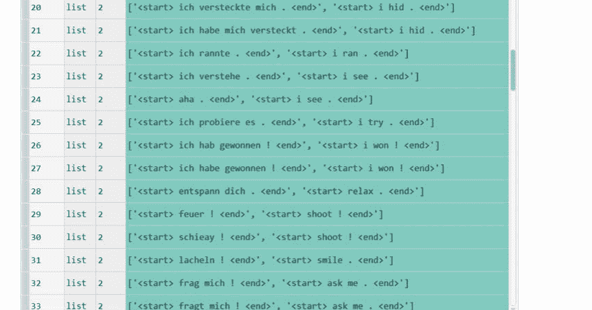

**图13.4** 用于我们实现简单德英翻译器的RNN-Att的训练数据子集，其中每个样本是一对句子，由一个德语句子及其英语翻译组成。

216 | 13 带注意力机制的RNN用于机器翻译

```
1. German Input: Ich finde es fantastisch .
1. Correct English Translation: I think it is fantastic .
1. Predicted English Translation: i find it .
2. German Input: Du bist sehr fantastisch .
2. Correct English Translation: You are very fantastic .
2. Predicted English Translation: you are thanks .
3. German Input: Du bist sehr fair .
3. Correct English Translation: You are very fair .
3. Predicted English Translation: you are thanks fair
4. German Input: Sie rennt schnell .
4. Correct English Translation: She runs fast .
4. Predicted English Translation: she runs .
5. German Input: Ihr seid trocken .
5. Correct English Translation: You are dry .
5. Predicted English Translation: you are dry .
6. German Input: Ich liege hier .
6. Correct English Translation: I am lying here .
6. Predicted English Translation: i am here .
7. German Input: Er sprach leise .
7. Correct English Translation: He spoke quietly .
7. Predicted English Translation: he spoke .
8. German Input: Ich habe gewonnen .
8. Correct English Translation: I won .
8. Predicted English Translation: i am won .
9. German Input: Du hast gewonnen .
9. Correct English Translation: You won .
9. Predicted English Translation: you lost won
10. German Input: Du bist lustig .
10. Correct English Translation: You are funny .
10. Predicted English Translation: you are fun .
```

图13.5 由第13.3节中给出的Python脚本生成的样本响应：所有用户输入的德语句子都是唯一的（即，单个单词存在于样本数据中，但句子本身不存在）。

上面Python脚本中实现的RNN-Att显示在图13.5中。所有用户输入的德语句子都是唯一的（即，与样本数据中的句子不同），但由样本数据中存在的单词组成。我们看到，我们简单的翻译器为某些输入生成了非常准确的响应。

## 13.4 用于RNN-Att机器翻译的Matlab脚本

在本节中，我们展示第13.3节中描述的机器翻译器示例的Matlab实现示例。下面给出的Matlab脚本的变量、函数和整体结构与第13.3节中的Python脚本示例保持相似，以便于比较。

在第17-21行，定义了样本数量、批大小、隐藏层、轮次和嵌入维度。在第30-44行，数据被分割成德语和英语句子，分别保存在名为`german_sentences`和`english_sentences`的变量中（两者都是`cell array`类型）。在第46-49行，调用一个名为`load_dataset`的函数，传入德语和英语句子，该函数返回编码和填充后的输入、预期输出（即目标）的cell数组，以及输出的唯一单词列表和字典。在第51-65行，对于目标cell数组，首先找到字母表大小（本例中有896个英语单词），然后将目标cell数组转换为`categorical cell array`，这是Matlab库所需的一种特殊数据类型。

在第67和68行，调用`create_rnn_model_with_attention`函数，传入目标字母表大小、嵌入层维度和英语中的唯一单词数，该函数使用嵌入层、隐藏层和字母表创建一个带注意力机制的RNN。

## 13 带注意力机制的RNN用于机器翻译

在第70-74行，为梯度下降算法（即所谓的Adam选项）、训练轮数、批处理大小、`每轮打乱`模式（即每轮改变样本顺序）以及硬件执行环境类型（即GPU、CPU等）设置了训练参数。在第76-163行，实现了一个简单的用户界面来运行脚本。在第85行和第96行，当用户选择选项1时，将使用上述定义的输入和目标张量、层和选项来训练一个新的RNN-Att模型。对于选项2，将在第91行加载一个先前训练好的模型。加载RNN-Att模型后，系统会提示用户：在第108至112行，通过输入选项1，从命令窗口应用单个查询；在第113至149行，运行之前保存在`questions.txt`文件中的一组查询；在第150至158行，通过输入选项3，保存当前的查询、响应和模型；或者在第159至161行，通过输入选项4，退出程序。

在第165-184行，实现了一个名为`load_dataset`的函数，其参数包括输入和目标字典。它根据德语字典生成编码后的输入数据，根据英语字典生成目标数据，分别称为`input_tensor`和`target_tensor`。它还为输入生成一个从词到数字的映射，称为`lang_tokenizer`，以及为目标生成一个从数字到词的映射，称为`reverseTokenizer`。在第186-193行，一个名为`tokenDictionary`的函数执行填充操作，并为输入和目标语言创建字典和唯一词列表。在第195至212行，`create_rnn_model_with_attention`函数创建了一个RNN-Att模型。它分别在第200、201和202行定义了输入层、嵌入层和多对多编码器层。在第204行调用了一个名为`DotProductAttentionLayer`的函数，该函数实现了注意力层。在第205-207行，定义了一个基于softmax的解码器，用于找到最高概率值的索引。在第208-211行，使用目标语言（即英语）中唯一词的数量定义了解码器层，所有权重均设为1，并且填充系数被设置为一个非常小的数字，以防止填充字符被用作预测的一部分（否则，连续的填充字符会看起来像合法的翻译）。在第214至229行，一个名为`predictResponse`的函数处理用户查询，将其应用于训练好的RNN-Att模型，并使用上述建立的映射生成输出句子。在第231至244行，`decoder`函数将稀疏的独热编码序列转换为目标语言中的单词。在第246至257行，一个名为`encoder`的函数对输入句子逐词应用稀疏独热编码。

## 13.4 用于RNN-Att机器翻译的Matlab脚本

```matlab
% The City College of New York, City University of New York
% Written by: Hasan Suca Kayman
% July 2024
% ml_translate_RNNwAtt is a simple machine translator that uses a
% Recurrent Neural Network with an Attention mechanism to translate from
% German to English. The training materials are a set of sentence pairs
% in German and English taken from the Internet.

% Setting a random seed for reproducibility
rng(301)

% Example queries file
queries_path = 'queries_words.txt';
% Data input file
data_path = 'cleaned_words.txt';

noof_samples = 3000;
batch_size = 16;
noof_hidden_layers = 256;
noof_epochs = 1000;
embedding_dim = 128;

% Read dialogs from a text file
fileID = fopen(data_path, 'r');
textData = textscan(fileID, '%s', 'Delimiter', '\n');
fclose(fileID);
% This gives us a cell array of strings (each line from the file)
textData = textData{1};

% Converting data type to cell
qna_list = cell(size(textData));
german_sentences_ = cell(noof_samples+1, 1);
english_sentences_ = cell(noof_samples+1, 1);

% Split each line into german sentences and english sentences
for i = 1:numel(textData)
    qna_list{i} = strsplit(textData{i}, '\t');
end

% Extract german sentences and english sentences
for i = 1:noof_samples+1
    german_sentences_{i} = qna_list{i}{1};
    english_sentences_{i} = qna_list{i}{2};
end

% Load and tokenize the dataset
[input_tensor_train, target_tensor_train, ...
    lang_tokenizer,rev_tokenizer,unique_words] = ...
    load_dataset(german_sentences_, english_sentences_);

% Set the unit count for alphabet sizes
alph_size = 0;
for i = 1:noof_samples+1
    if max(target_tensor_train{i}(:)) > alph_size
        alph_size = max(target_tensor_train{i}(:));
    end
end
% Add one for padding token
alph_size = alph_size + 1;

% Converting data type to categorical
for idx = 1:numel(target_tensor_train)
    target_tensor_train{idx} = categorical(target_tensor_train{idx},...
                                          0:alph_size-1);
end
% Create the RNNwAtt model with specified parameters
layers = create_rnn_model_with_attention(alph_size, ...
    embedding_dim, noof_hidden_layers,unique_words);

% Training the model
options = trainingOptions('adam', 'MaxEpochs', noof_epochs, ...
                          'MiniBatchSize', batch_size, ...
                          'Shuffle', 'every-epoch', ...
                          'ExecutionEnvironment','cpu');

% User interaction for training or loading a model
disp('OPTIONS:');
disp('1 - Train a new RNN-Att model');
disp('2 - Load an existing model');

option = input('Select an option by entering a number: ', 's');
switch option
    case '1'
        disp('********** NOW TRAINING A NEW RNN-Att MODEL **********');
        model = trainNetwork(input_tensor_train, target_tensor_train, ...
            layers, options);
        disp('********** RNN training complete **********');
    case '2'
        modelFileName = input(['Enter the file name of the' ...
            ' RNN-Att Model you want to load: '], 's');
        load(modelFileName, 'model');
        disp(['****** SUCCESSFULLY LOADED RNN-Att MODEL ' ...
            modelFileName,'******']);
    otherwise
        error('Invalid input: Input must be 1 or 2');
end

% User interaction for testing or saving a model
while true
    disp('OPTIONS:');
    disp('1 - Test this RNN-Att model with input');
    disp('2 - Test queries given in a file');
    disp('3 - Save existing model and logs');
    disp('4 - Exit');

    option = input('Select an option by entering a number: ', 's');
    switch option
        case '1'
            user_input = input('Enter your input: ', 's');
            predicted_sentence = predictResponse(model, lang_tokenizer, ...
                rev_tokenizer, string(user_input));
            disp(['Predicted English Translation: ', predicted_sentence]);
        case '2'
            fileID = fopen(queries_path, 'r');
            queries = textscan(fileID, '%s', 'Delimiter', '\n');
            queries = queries{1};
            fclose(fileID);
            % Initialize cell arrays for storing sentences
            german_sentences = cell(length(queries), 1);
            english_sentences = cell(length(queries), 1);
            % Split each line into German and English sentences
            for i = 1:length(queries)
                split_data = strsplit(queries{i}, '\t');
                german_sentences{i} = split_data{1};
                if numel(split_data) > 1
                    english_sentences{i} = split_data{2};
                else
                    % Handling cases where there is no tab character
                    english_sentences{i} = '';
                end
            end
            % Convert cell arrays to string arrays
            german_sentences = string(german_sentences);
            english_sentences = string(english_sentences);
            for index = 1:length(german_sentences)
                if isempty(german_sentences{index})
                    continue;
                end
                % Prediction function
                predicted_sentence = predictResponse(model, ...
                    lang_tokenizer, rev_tokenizer, german_sentences(index));
                % Display the results
                fprintf('%d. German Input: %s\n', index, ...
                    german_sentences(index));
                fprintf('%d. Correct English Translation: %s\n', ...
                    index, english_sentences(index));
                fprintf('%d. Predicted English Translation: %s\n', ...
                    index, predicted_sentence);
            end
        case '3'
            dtw = datestr(now, 'yyyy_mm_dd_HH_MM_SS');
            model_path =sprintf(...
                ('RNNwAtt_model_N%d_B%d_U%d_EP%d_EM%d_%s.mat'), ...
                noof_samples, batch_size, noof_hidden_layers, ...
                noof_epochs, embedding_dim, dtw);

            save(model_path, 'model');
            disp(['Successfully saved to', model_path]);
        case '4'
            disp('Exiting program');
            break;
    end
end

function [input_tensor, target_tensor, lang_tokenizer, reverseTokenizer, ...
    unique_words] = load_dataset(inp_lang, targ_lang)
    % Create dictionaries for inputs and targets
    [lang_tokenizer, ] = tokenDictionary(inp_lang);
```

## 13 带注意力机制的RNN用于机器翻译

```matlab
[targ_lang_tokenizer, reverseTokenizer, unique_words] = ...
    tokenDictionary(targ_lang);

% 初始化用于存储句子的元胞数组
input_tensor = cell(length(inp_lang), 1);
target_tensor = cell(length(targ_lang), 1);

% 编码所有输入和目标数据
for i = 1:length(inp_lang)
    input_tensor{i} = encoder(lang_tokenizer, inp_lang{i}, 10);
    target_tensor{i} = encoder(targ_lang_tokenizer, targ_lang{i}, 10);
end
% 转置为正确的维度
input_tensor = input_tensor';
target_tensor = target_tensor';
end
```

```matlab
function [tokenizer,reverseTokenizer,unique_words] = tokenDictionary(texts)
    joined_texts = join(string(texts));
    unique_words = unique(strsplit(joined_texts));
    unique_words = ['<pad>', unique_words];
    indices = 1:numel(unique_words);
    tokenizer = containers.Map(unique_words, indices);
    reverseTokenizer = containers.Map(indices, unique_words);
end
```

```matlab
% 使用指定参数创建一个带注意力机制的RNN模型
function layers = create_rnn_model_with_attention(alph_size, ...
    embedding_dim, rnn_units,unique_words)
    ClassLayer = classificationLayer;
    layers = [
        sequenceInputLayer(1)
        wordEmbeddingLayer(embedding_dim, alph_size)
        lstmLayer(rnn_units, 'OutputMode', 'sequence')
        % 点积注意力层
        DotProductAttentionLayer('attention')
        fullyConnectedLayer(alph_size)
        softmaxLayer
        ClassLayer];
    ClassLayer.Classes = unique_words;
    ClassLayer.ClassWeights = ones(1, alph_size-1);
    % 在计算损失时忽略填充符
    ClassLayer.ClassWeights(1.0) = 0.0001;
end
```

```matlab
function predicted_sentence = predictResponse(model, lang_tokenizer, ...
    rev_tokenizer, user_input)
    % 预处理输入句子
    preprocessed_sentence = '<start> '+ lower(user_input)+ ' <end>';
    % 对句子进行分词并填充到最大长度
    input_sequence = encoder(lang_tokenizer, preprocessed_sentence, ...
        length(strsplit(preprocessed_sentence)));
    % 生成预测
    predictions = classify(model, input_sequence);
    % 将标记转换回单词
    predicted_words = decoder(rev_tokenizer, predictions);
    % 移除开始和结束标签，并连接成单个句子
    predicted_sentence = strrep(predicted_words,'<start> ','');
    predicted_sentence = strrep(predicted_sentence,' <end>','');
    predicted_sentence = strrep(predicted_sentence,'<pad>','');
end
```

```matlab
function text = decoder(reverseTokenizer, sequence)
% 将稀疏独热编码的序列转换为单词：
    words = cell(1, numel(sequence));
    for i = 1:numel(sequence)
        intVal = double(string(sequence(i)));
        if intVal ~= 0 && reverseTokenizer.isKey(intVal)
            words{i} = reverseTokenizer(intVal);
        else
            words{i} = '';
        end
    end
    text = strjoin(words);
end

function sequence = encoder(tokenizer, text, max_length)
% 逐词对包含单词的序列应用稀疏独热编码：
    words = strsplit(text);
    sequence = zeros(1, max_length);
    sequence(:) = tokenizer('<pad>');
    for i = 1:length(words)
        if isKey(tokenizer, words{i})
            sequence(i) = tokenizer(words{i});
        end
    end
end
```

我们现在展示用于构建注意力机制的 `DotProductAttentionLayer` 类的实现，这是一个在Matlab中定义的骨架函数。此函数针对我们的示例进行了定制，首先使用公式 (12.1) 计算隐藏状态值，然后计算由公式 (12.2) 定义的注意力权重（第36至40行），最后计算如公式 (12.3) 所示的上下文向量（第42至53行）。

```matlab
classdef DotProductAttentionLayer < nnet.layer.Layer
    methods
        function layer = DotProductAttentionLayer(name)
            layer.Name = name;
            layer.Description = "点积注意力";
        end

        function context_vectors = predict(~, hs)
            [hiddenLayer, batchSize, num_time_steps] = size(hs);
            % disp(['X的形状: ', mat2str(size(X))]);

            if (batchSize == 1 && num_time_steps == 1)
                % 用于Matlab测试
                context_vectors = hs;
            else
                attentions = cell(1, num_time_steps);
                % 存储每个时间步的上下文向量
                context_vectors = dlarray(zeros(hiddenLayer, batchSize,...
                    num_time_steps, 'single'));

                for t = 1:num_time_steps
                    % 计算注意力分数
                    attention_scores = zeros(batchSize, t, 'single');
                    for tau = 1:t
                        % 为每个批次计算隐藏状态的点积
                        for b = 1:batchSize
                            attention_scores(b, tau) = dot(hs(:, b, t), ...
                                hs(:, b, tau));
                        end
                    end

                    % 溢出检查
                    max_scores = max(attention_scores, [], 2);
                    attention_scores = attention_scores - max_scores;
                    % 对注意力分数应用softmax
                    attention_weights = exp(attention_scores);
                    attention_weights = attention_weights ./ ...
                        sum(attention_weights, 2);
                    attentions{t} = attention_weights;

                    % 将上下文向量计算为隐藏状态的加权和
                    context_vector = zeros(hiddenLayer,batchSize,'single');
                    for tau = 1:t
                        % 将注意力权重与相应的隐藏状态相乘
                        context_vector = context_vector + (hs(:, :, tau)...
                            .* attention_weights(:, tau)');
                    end

                    % 存储此时间步的上下文向量
                    context_vectors(:, :, t) = context_vector;
                end % for
            end % if
        end % func: predict
    end % method: nnet.layer.Layer
end % class: DotProductAttentionLayer
```

对于一组用户查询，我们在Matlab中实现的RNN-Att生成的响应如图13.6所示。所有输入的德语句子都不在样本数据集中，尽管它们使用了样本数据中包含的德语单词。考虑到这是一个非常简单的模型，使用了几千个句子的样本集（而不是数百万个）进行训练

```
命令窗口
1. 德语输入: Ich finde es fantastisch .
1. 正确的英语翻译: I think it is fantastic .
1. 预测的英语翻译: i find it !
2. 德语输入: Du bist seht fantastisch .
2. 正确的英语翻译: You are very fantastic .
2. 预测的英语翻译: you are ok ?
3. 德语输入: Du bist sehr fair .
3. 正确的英语翻译: You are very fair .
3. 预测的英语翻译: you are ok fair .
4. 德语输入: Sie rennt schnell .
4. 正确的英语翻译: She runs fast .
4. 预测的英语翻译: tom are .
5. 德语输入: Ihr seid trocken .
5. 正确的英语翻译: You are dry .
5. 预测的英语翻译: you stink .
6. 德语输入: Ich liege hier .
6. 正确的英语翻译: I am lying here .
6. 预测的英语翻译: i am here .
7. 德语输入: Er sprach leise .
7. 正确的英语翻译: He spoke quietly .
7. 预测的英语翻译: he is .
8. 德语输入: Ich habe gewonnen .
8. 正确的英语翻译: I won .
8. 预测的英语翻译: i am won .
9. 德语输入: Du hast gewonnen .
9. 正确的英语翻译: You won .
9. 预测的英语翻译: you lost won
10. 德语输入: Du bist lustig .
10. 正确的英语翻译: You are funny .
10. 预测的英语翻译: you are fun .
```

**图13.6** 由第13.4节介绍的Matlab脚本生成的示例响应：所有用户输入的德语句子都是唯一的（即，单个单词存在于样本数据中，但句子本身不存在）。

仅需少量训练轮次，上述Matlab脚本生成的英文翻译结果就已非常接近其正确译文。这一结果表明，由注意力机制支持的循环神经网络模型是强大的工具，并且可以被切实可行地应用于现实场景。

## 13.5 总结

本章我们重点探讨了使用带有注意力机制的循环神经网络进行机器翻译的应用。由于句子中即使是最后一个词也可能改变其在另一种语言中的翻译，因此输出生成必须在输入句子的所有词语都被RNN-Att处理完毕后才能开始。机器翻译的另一个特点是，输入句子的长度可能与其译文长度不同。这些特性决定了需要采用多对多的RNN-Att架构。由于自然语言通常词汇量庞大，且样本数据量可能达到数百万级别，因此用于机器翻译的RNN-Att架构通常包含多个隐藏层和嵌入层。

## 13.6 第13章习题

1.  对于第13.3节中介绍的Python实现，如果增加训练轮次，训练时间和预测能力（即比较对相同用户查询的响应）会受到怎样的影响？
2.  对于第13.3节中介绍的Python实现，如果增加隐藏层数量，训练时间和预测能力（即比较对相同用户查询的响应）会受到怎样的影响？
3.  重复习题1，但改为增加批处理大小。
4.  重复习题1，但改为增加嵌入层大小。
5.  如果使用一个元素数量大约是原来两倍的数据集来训练第11.4节示例中的RNN，对训练成本和预测能力会产生什么影响？
6.  重复习题1，但针对第13.4节中介绍的Matlab实现。
7.  重复习题2，但针对第13.4节中介绍的Matlab实现。
8.  重复习题3，但针对第13.4节中介绍的Matlab实现。
9.  重复习题4，但针对第13.4节中介绍的Matlab实现。
10. 重复习题5，但针对第13.4节中介绍的Matlab实现。

# 14 遗传算法

## 14.1 引言

优化不同于在给定约束下寻找绝对最大值或最小值，它是在一*组*约束条件下为问题寻找最合适的解决方案。对于非线性、离散或不连续空间问题——这些是二十一世纪许多现实应用的特征——寻找最优解通常是一项具有挑战性的任务。当前与工程和管理任务相关的大多数优化问题往往涉及大量通常相互冲突的需求。一架飞往夏威夷的客机旨在通过选择最短路径来优化燃油消耗，同时避开途中的厚云层以减少可能给机翼带来额外压力的湍流，但又不能进行可能让乘客感到不适的剧烈机动。一位负责制造用于减轻帕金森病对老年患者影响的大脑监测芯片的经理，必须从具有不同经验水平和薪资要求的候选人中组建一个团队，成员包括医生、工程师、科学家、芯片制造商、法律专家以及销售和市场专家，同时还要控制在给定预算内。由于预算限制或候选人可用性，他们可能无法负担只选择每个领域的顶尖候选人，因此将被迫做出对项目有不利影响的决定。每位电影制片人、足球队经理或太空任务指挥官每天都面临着这类挑战。通过引入额外的复杂性层次，现代任务要求采用新的问题解决框架，因为这些需求通常超出了传统优化方法的范围。尽管满足多个相互冲突的标准对传统方法来说是一个艰巨的挑战，但多目标优化问题非常适合*受生物启发*（或*仿生*）的计算技术，这些技术旨在模拟自然界中发现的过程。受生物启发方法的典型例子包括：

-   *适者生存*：在给定种群中，只有更好（更适应）的个体才能生存，通常是那些能够适应动态变化环境条件的个体。
-   *群体行为*：一群鸟作为一个单一实体执行对群体生存至关重要的任务；例如，如果鸟群中的一只鸟在飞行时发现了一个好的食物源，整个鸟群都会受益于这个信息。
-   *物种进化*：在给定的物种种群中，为了生存，个体会进化以适应变化的环境条件；例如，岩石岛屿上的鸟类会长出长喙，以便从岩石缝隙中啄食蠕虫。
-   *社会行为*：不同物种之间以及同一物种种群内部的生存有利于那些即使只有微弱优势的个体，因此不同物种之间以及给定物种的成员之间存在着激烈的竞争。

满足于一个最优或近优解（而非全局最小值或最大值），仿生算法能够通过模拟自然界中观察到的进化过程，在原本大得难以处理的问题空间中进行操作。仿生技术的特点包括：

-   处理不可微、非线性和多模态问题；
-   并行化以应对计算密集型成本函数；
-   控制变量的可观察性（例如收敛性、适应度、多样性）；以及
-   如果设置得当，计算复杂度较低。

最受欢迎的仿生计算方法包括：

-   `遗传算法` [104] （第14、15、16和17章）
-   `粒子群优化` [105] （第18章第18.2节）
-   `差分进化` [106] （第18章第18.3节）以及
-   `语法进化` [107] （第18章第18.4节）。

在本章的剩余部分，我们将介绍遗传算法的基本要素及其基本操作和功能。

## 14.2 遗传算法要素

遗传算法模拟了自然界中观察到的进化过程。因此，采用了生物学术语来描述这些相似之处。一个所谓的`染色体`代表给定问题的一个可能解，被称为一个`个体`。通常，染色体由不可分割的构建块组成，称为`密码子`，其值随着遗传算法的进展而更新。以下是各种遗传算法应用中个体的几个例子：

-   移动节点要移动到的位置
-   买卖特定金融股票的价格
-   施加到给定端口的电压
-   切割特定机器零件的角度
-   添加到给定药物中的药物剂量
-   重复实验前的等待时间

在给定世代中个体的集合称为`种群`。种群中的每个个体独立地寻求找到最优解。种群中个体的数量代表了遗传算法在搜索空间中采用的并行度。尽管种群中的个体在每一代都会发生变化（更适应的子代取代适应性较差的亲代），但种群大小通常在整个世代中保持不变。

一个选择机制挑选亲代染色体进行`交叉`操作，产生一个或多个`后代`。以较小的概率，密码子可能会发生`突变`（其某些属性被随机改变）。一个种群通过选择、交叉和突变操作从一个`世代`进化到下一个世代。一个称为`适应度`的数学函数提供了候选解与整体优化目标接近程度的数值表示。为给定问题确定一个合适的适应度函数在所有仿生算法中都至关重要。

## 14.3 遗传算法的简单算法

现在，让我们介绍遗传算法的基本操作，如图14.2所示：

- **评估**：每个个体的优劣由适应度函数评估，该函数为个体分配一个数值，以便进行定量比较。
- **选择**：根据预定标准，选择父代以生成后代（通常优先选择表现更优的个体）。
- **繁殖**：使用选定的父代生成后代，并评估其适应度。
- **替换**：比现有种群成员更适应的后代将取代那些表现较差的个体，从而形成新一代。

在图14.3中，我们展示了实现简单遗传算法的伪代码[108]。首先，形成一个初始的候选解种群，其中染色体值是随机设置的。然后计算每个个体的适应度。根据适应度，选择父代，并通过交叉和变异操作形成后代。最后，评估后代是否可能被纳入下一代。

这个过程会重复预定的迭代次数，或者直到找到满意的解为止。每当表现更优的后代被纳入种群时，就称为形成了新一代。有几种机制可以选择后代作为新一代的一部分。最受欢迎的选择机制包括轮盘赌选择，其中染色体的适应度水平表示其被选为下一代父代的机会；以及精英选择，其中最适应的个体未经修改直接进入下一代，同时通常保持精英群体与种群规模的比例较小。

单点交叉操作在从两个父代染色体生成后代时很受欢迎，其中在两个父代中随机选择一个关键位点，并围绕该位点交换父代染色体之间的数据。要在两个父代之间执行单点交叉，每个父代的染色体长度为K位，首先选择一个随机整数CR ∈ (0, K − 1)。第一个子代通过取父代1的最高有效CR位和父代2的最低有效（K – CR）位创建。第二个子代通过取父代2的最高有效CR位和父代1的最低有效（K – CR）位创建。在图14.4所示的示例中，对两个父代执行了CR = 2的单点交叉，每个父代都有六位染色体，其中子代1的前两位来自父代2，后四位来自父代1，而子代2的前两位来自父代1，其余位来自父代2。

在不同的遗传算法实现中，交叉操作可以使用多个点或两个以上的父代来实现。例如，在两个父代的*两点交叉*中，随机选择两个点CR₁和CR₂来交换父代染色体。图14.5展示了CR₁ = 2和CR₂ = 4的两点交叉示例。与单点交叉相比，两点交叉更有利于保持种群中个体的多样性，从而更有效地探索搜索空间。

变异被定义为一种遗传操作，它随机改变染色体中的一个或多个位。通过小概率或使用预定义的概率分布模型（例如高斯分布），变异为种群引入多样性，使候选解不会陷入局部极值点，而是充分探索搜索空间以寻找全局极值点。

## 14.4 遗传算法示例

现在，让我们展示一个简单的例子来说明遗传算法的基本步骤。在图14.6中，我们看到一个由8个个体组成的种群，其染色体由12个密码子组成。在步骤1中，形成一个初始种群，个体的密码子值是随机选择的。在步骤2中，计算每个个体的适应度，用美元符号象征性表示。在此图中，我们假设个体拥有的美元符号越多，其适应度越高。在步骤3中，选择两个最适应的个体作为父代。在典型应用中，可能会选择多对父代在每一代生成多个子代。例如，可能会选择20%的个体作为父代，优先选择更适应的个体，如第14.3节所述。这三个步骤对应于图14.2中的评估和选择操作。

现在，是时候从选定的父代生成后代了，如图14.7所示。通过CR = 4的单点交叉操作，生成了两个子代。对一个子代执行了变异操作（是否应用变异由变异概率决定，通常是一个较小的值），其密码子7（随机确定）被替换为一个随机值（密码子7原来是51，被改为22）。这些操作对应于图14.2中的繁殖操作。

必须计算新生成子代的适应度，并决定它们是否将被纳入下一代，如图14.8所示。在这个简单的例子中，我们假设子代1和子代2的适应度值分别为2和5个美元符号。如图14.8的步骤6所示，两个子代都比种群中一些现有个体更适应。因此，这些子代被纳入新一代，而两个现有的表现不佳的个体（每个适应度为1个美元符号）被从种群中移除。这些操作在图14.2中表示为选择操作。

此时，我们的简单例子有了新一代的个体（包含两个新成员）。图14.6至图14.8所示的步骤将在后续世代中重复，直到获得可接受的结果（例如，生成一个具有10个美元符号的个体）或达到预定的世代数上限（例如，20代）。

## 14.5 遗传算法的收敛性

收敛性是一个指标，用于表明遗传算法从一代到下一代找到的解是否正在接近一个可接受且高质量的解。一个理想的结果是种群的最佳（或平均）适应度稳步提高。有时，由于问题设置不当，生物启发式方法可能找不到解。遗传算法不收敛的可能原因包括：

- 染色体大小太小
- 世代数不足
- 种群规模太小
- 适应度函数无法正确识别适应和不适应的个体
- 遗传算法机制不适合解决此类问题

| 个体 | 良好适应度 | 不良适应度 |
| :--- | :--- | :--- |
| 无人机移动的位置 | 无人机远离拥挤的社区 | 无人机停留在拥挤的社区 |
| 买卖股票的价格 | 低买高卖（获利） | 高买低卖（亏损） |
| 施加到端口的电压 | 电压在端口限制范围内 | 电压超出端口限制范围 |
| 切割机器零件的角度 | 机器零件能安装到位 | 机器零件无法安装到位 |
| 药物中的药物含量 | 药物有效 | 药物过强或过弱 |

**图14.1** 适应度函数以及具有良好和不良适应度的个体示例。

图14.1展示了各种适应度函数以及具有良好和不良适应度的个体示例。在第一个例子中，假设一个在无人机群中运行的无人机（无人驾驶飞行器或无人机）正在使用基于遗传算法的飞行控制算法来决定下一步移动到哪个位置。在这种情况下，染色体代表无人机可能移动到的位置。一个候选位置要具有良好的适应度值，它必须使无人机远离拥挤的无人机区域，但又不能使其与邻居断开连接。适应度差的位置会使无人机停留在其他无人机拥挤的区域，或者停留在没有邻居的孤立位置。在下一个例子中，染色体代表买卖金融股票的决策。一个卖出部分股票并买入其他股票，最终获利的候选解具有良好的适应度。一个在交易后亏损的解具有不良适应度。利润的大小代表了在多个良好解中解的优劣程度（即，获利最多的候选解是最好的）。同样，在最后一个例子中，遗传算法用于决定给患者使用多少抗癌药物。如果一个候选解导致肿瘤缩小，它就具有良好的适应度。缩小的程度可能是决定哪些解比其他解更好的标准之一。

如果这些参数中有一个或多个设置不当，遗传算法可能无法收敛到最优（或近似最优）解。可以定义多种分析和数值指标来预测和衡量遗传算法的收敛性，包括：

-   种群中的最佳适应度提升
-   个体适应度之间的方差减小
-   适应度值在代际间的振荡（如有）减少或消失

随着代际的推进，我们可能会观察到不收敛的迹象：

-   种群多样性降低（即所有个体看起来彼此相似）
-   适应度值开始在代际间波动
-   更优适应度的解决方案与较差适应度的解决方案无法区分

## 14.6 结语

生物启发计算技术通常应用于那些难以处理或计算强度过高、无法用经典方法解决的问题（例如非线性优化问题）。作为最受欢迎的生物启发技术之一，遗传算法凭借其相对简单的设计、较低的计算要求以及对软件开发平台的独立性，成为解决各种现实场景中众多优化问题的理想选择。要成功实施，必须谨慎选择遗传算法参数，包括染色体结构、父代选择机制、交叉方法、变异概率和适应度函数定义。

我们将在本书后续章节中介绍遗传算法的应用：第15章讨论在营养限制下寻找膳食菜单选择（即解决背包类问题），第16章讨论自主无人机的飞行控制，第17章讨论寻找旅行的最佳路线（即解决旅行商类问题），第18章讨论为给定的BNF语法生成语法正确的程序。

## 14.7 第14章练习

1) 请举一个你专业领域内尚未解决的问题例子，并说明你认为遗传算法可能解决它。

2) 为一架位于坐标(0,0,10)的无人机（UAV，即无人驾驶飞行器或无人机）设计一个遗传算法结构，使其找到合适的位置，该无人机有三个相邻无人机分别位于(10,0,10)、(10,10,10)和(0,10,10)位置。在此表示法中，我们假设(x,y,z)对应无人机位置的纬度、经度和高度。假设该无人机每次可以改变其纬度和/或经度和/或高度1个单位。例如，该无人机的一些可能位置包括(1,0,10)、(1,1,11)、(-1,1,9)等。
目标是找到一个基于遗传算法的飞行控制算法，使该无人机远离其邻居。为简化起见，你可以假设当无人机做决策时，其邻居不移动。
a) 建议一个染色体。
b) 定义一个适应度函数。（提示：你可以使用到邻居的距离作为适应度函数的一部分，使得将无人机移离邻居更远的候选位置比移近的更优。）
c) 种群中需要多少个体？
d) 遗传算法需要多少代？
e) 你的遗传算法实现会产生可接受的解决方案吗？你怎么知道？

3) 为一个10位数字锁组合设计一个遗传算法结构来寻找密钥。假设数字是二进制的（即0或1），秘密组合给出为1 0 1 0 1 0 1 0 1 0。你可以假设当一个组合应用于锁时，一个视觉指示器会显示匹配数字的总数（但不显示匹配数字的位置）；如果所有10位数字都匹配，锁就会打开。例如，如果将1 1 0 0 1 1 0 0 1 1应用于锁，指示器显示5，因为有5个匹配，如下划线所示：1 1 0 0 1 1 0 0 1 1。
a) 建议一个染色体。
b) 定义一个适应度函数。
c) 种群中需要多少个体？
d) 遗传算法需要多少代？
e) 你的遗传算法实现会产生可接受的解决方案吗？
f) 这个问题适合使用遗传算法来寻找解决方案吗？

4) 为一个8位数字锁组合设计一个遗传算法结构来寻找密钥。假设数字是0到9之间的整数，秘密组合给出为：1 9 9 6 2 0 0 1。你可以假设有一个视觉指示器可以显示给定候选解决方案的匹配数量，并且适应度函数可以直接访问任何候选解决方案的该指示器。
a) 建议一个染色体。
b) 建议一个适应度函数。
c) 种群中需要多少个体？
d) 遗传算法需要多少代？
e) 你提出的遗传算法实现会收敛到可接受的解决方案吗？
f) 这个问题适合使用遗传算法来寻找解决方案吗？

5) 蜜蜂如何知道要建造六边形的蜂巢，而不是正方形或三角形的？它们是在土木工程系上过建造最优结构的优化课程吗？

6) 你认为为什么章鱼有八条腿，而不是九条或七条？

# 15 用于膳食菜单选择的遗传算法

## 15.1 引言

基于人工智能的计算方法能够为原本难以处理的问题获得令人满意的解决方案，前提是能够为问题构建一个合适的模型。在本章中，我们研究一个众所周知的计算成本高昂的问题，即所谓的背包问题（KP）¹ [109]，并提出一个使用遗传算法的计算可行的解决方案。KP专门设计用于解决那些决策选择必须遵守一系列限制、以最大化任务结果为目标的挑战类型。

在工程领域，KP代表一类优化问题，其中存在多个且常常相互冲突的要求需要被选择以满足诸如最大化利润或最小化损失等目标。航空公司和海运货船必须选择货物以最大化利润，同时遵守给定航班的重量和容量限制。投资组合经理考虑潜在的投资机会及其预期回报，以在不超过分配预算的情况下最大化收益。项目经理可能需要从具有不同专业水平和薪资的工程师库中选择一个团队，同时包含最高才能水平的个体并保持总成本尽可能低。

作为一个例子，我们选择一个膳食菜单选择问题，其中将选择一组食物项目，每个项目都有卡路里和蛋白质值，使得所选项目的总卡路里量低于给定限制，同时总蛋白质含量尽可能大。考虑图15.1 [110]中显示的虚构电影院菜单。假设必须从此菜单中选择项目，使得总卡路里数保持在1000卡路里以下。这一限制意味着不能同时选择中份原味爆米花（600卡路里）和黄油配料（480卡路里），因为总卡路里将超过1000卡路里的限制。另一方面，一个有效的解决方案可能包括中份原味爆米花配纳乔奶酪（160卡路里），总卡路里为640，蛋白质为17克。然而，选择小份原味爆米花（300卡路里）和热狗（530卡路里）是一个更好的解决方案，因为它总共有26克蛋白质。我们可以很容易地看到，如果卡路里限制更高或食物项目数量很多，即使对于这样简单的例子，做出好的菜单选择也将是一项具有挑战性的任务。

从这个简单的例子中我们可以看到，要找到一个合适的菜单项目选择解决方案，我们必须尝试许多项目组合并检查它们是否满足饮食约束。如果菜单中有更多项目（例如，在典型的饮食菜单中，有数百个项目），这种选择就变成了一个艰巨的问题。事实上，KP的计算成本随着项目数量的线性增长而呈指数级增长¹。因此，我们不能使用传统方法来为背包类问题找到好的解决方案。

KP的应用领域通常超越工程问题，延伸到商业、金融、制造、任务选择、项目管理和战略决策。例如，在规划投资时，将财务资源分配到股票可以映射为一个最大化长期价值的KP。通过将预期回报、股价和预算分别表示为价值、权重和背包容量，可以通过解决KP来确定每只股票在拟议投资策略中的优先级和重要性 [111]。以下列表展示了KP典型应用的一小部分：

-   资源分配问题，其中必须在遵守给定预算和某些时间约束的情况下，对不可分割的项目或任务进行选择和调度。
-   在金属加工设施中，寻找切割原材料的最省料方法。
-   在保持关于卡路里、糖和碳水化合物的各种饮食限制的同时，选择营养项目，同时最大化蛋白质或纤维。
-   项目团队选择，以在特定预算内最大化生产力。
-   识别移动节点以进行路由网络连接，以最小化延迟并最大化整体吞吐量。
-   建筑工地、工厂、炼油厂、工厂车间等的电力分配管理和优化调度。

## 15.2 KP的定义

图15.2显示了一个重量容量为15公斤的背包，需要从中选择五个项目放入其中（示例取自 [112]）。每个项目都有不同的重量和价值（例如，项目

¹ 在英国称为背包

## 15.2 背包问题的定义

图 15.2 一个简单的背包问题示例——给定一个容量为 15 公斤的背包，目标是将物品放入背包，使得总价值最高且总重量小于 15 公斤（改编自 [112]）。

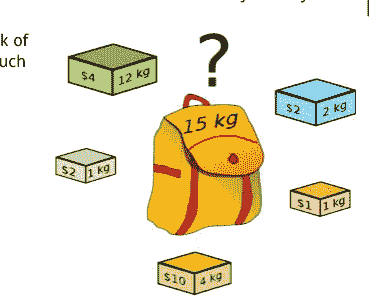

图 15.3 在假设每种物品只有一个副本的前提下，可放入图 15.2 所示背包的可能物品选择。

| 选择 | 选中的物品 | 总重量 | 总价值 |
| :--- | :--- | :--- | :--- |
| (a) |   | 14 公斤 | $8 |
| (b) |   | 11 公斤 | $11 |
| (c) |   | 14 公斤 | $12 |
| (d) |    | 14 公斤 | $6 |

（例如，一个重 12 公斤的物品价值为 7 美元，而一个重 9 公斤的物品价值为 10 美元）。目标是将一组这样的物品放入背包，使得总重量小于 15 公斤，同时保持总价值尽可能高。图 15.3 展示了几种可以放入背包的物品选择。例如，图 15.2a 所示的选择总重量为 14 公斤，累计价值为 9 美元。在图 15.3 所示的所有选择中，我们可以看到最有价值的选择是图 15.3c 中的那个。

这种表述被称为*背包问题*（KP）[113]。背包问题的名称由数学家托比亚斯·丹齐格在二十世纪初提出 [109]。正如本章将进一步讨论的，KP 有不同的版本，其中物品可能有单个或多个副本，并且有单个或多个约束条件（例如重量和体积）。对于图 15.4 给出的示例，如果每种物品有多个副本可用，解决方案是选择三个黄色和三个灰色盒子，总重量为 15 公斤，价值为 36 美元。如果每种物品只能选择一个副本，解决方案则包括除绿色盒子外的所有物品，总重量为 8 公斤，价值为 15 美元。

对于一组给定的物品，每个物品都有重量和价值，要放入一个容量有限的背包中，KP 被定义为从这组物品中选择物品，使得所选物品的总价值最大化，同时不超过其容量。由于解空间随着要放入背包的物品数量呈指数增长，KP 已被公认为一个计算上困难的问题。

让我们考虑一个重量容量为 $K_W$ 的背包。假设有 $n$ 个物品要装入背包，每个物品 $j$ 的重量为 $w_j$，价值为 $v_j$ 美元。KP 的一个好的解决方案应该选择一组可以放入背包的物品组合，同时为背包提供尽可能高的总价值。因此，KP 的解决方案试图实现以下目标：

$$\text{最大化} \sum_{j=1}^{n} x_j \cdot v_j \quad \text{约束条件为} \quad \sum_{j=1}^{n} w_j \cdot x_j \leq K_W, \qquad (15.1)$$

其中二元变量 $x_j$ 用于确定物品 $j$ 是否应放入背包；因此 $x_j \in \{0, 1\}$，$j = 1, 2, \cdots, n$。由于每个物品要么被选中，要么不被选中，这个版本的 KP 被称为 *0-1 KP*。

## 15.3 KP 的一个简单算法

如果使用直接的方法来解决 KP，即测试所有可能的解决方案，那么对于一个有 $n$ 个物品需要选择的 KP，总共有 $2^n$ 种物品组合需要考虑。图 15.5 展示了一个实现 0-1 KP 的类似方法的简单算法，其中考虑了所有可能的物品分配，然后将背包装满使其价值最高的物品作为最终解决方案。

如图 15.5 所示，找到 KP 解决方案所需的步骤数量相对于要放入背包的物品数量呈指数增长，这与具有线性或多项式增长的算法形成对比。没有线性或多项式时间解决方案的问题类型被称为 *NP 完全* [114]。获得 NP 完全问题解决方案所需的时间随着输入大小的线性增长而呈指数增长，这使得此类问题在实际应用中代价高昂。图 15.5 中的算法复杂度为 $O(n2^n)$（即对于 $n$ 个物品，它需要大约 $n \cdot 2^n$ 步来完成），这意味着向物品集中添加一个物品将使完成计算所需的时间加倍。因此，图 15.5 中的算法仅适用于解决物品数量非常少的 KP 应用。考虑到一个现实的菜单包含数百种食物选择，即使对于一个中等规模的现实问题，计算 KP 解决方案也可能需要检查数十亿种组合。因此，基于生物启发算法的技术对于在可行时间内解决现实的背包类问题是必要的。在第 15.5 节中，我们将介绍一种遗传算法（GA）来在线性时间内解决 KP，尽管解决方案可能不是绝对的全局最小值或最大值，而是一个近似值。

```
// 尝试背包物品的所有可能组合
for i = 1 to 2^n
    K_t = ∅  // 空背包
    w_t = 0; // 背包重量
    v_t = 0; // 背包价值;
    // 将物品添加到背包直到装满
    for i = 1 to n
        if(w_t + w_k ≤ K_w) then
            K_t ← x_k;
            w_t = w_t + w_k;
            v_t = v_t + v_k;
        end if
    end for
    // 根据需要更新最佳解决方案
    if (v_t ≥ v_best) then
        K_best = K_t;
        w_best = w_t;
        v_best = v_t;
    end if
end for
```

图 15.5 一个寻找 KP 最佳物品组合的简单算法。

## 15.4 KP 的变体

KP 有几种变体，每种都针对特定的应用进行定制。在一个版本中，每种物品有多个副本可供选择。在允许选择每种物品多个副本的情况下，图 15.6 展示了可以放入图 15.2 所示背包的可能物品。例如，图 15.6a 所示的选择包含了四个 2 公斤物品的副本。这类 KP 被称为有重复的背包问题（KPR）。考虑一个资源几乎无限但运输能力有限的救灾组织。该组织将从 KPR 解决方案中受益，以选择要派往危机地区的物品 [115]。让我们定义 $s_j$ 为物品 $j$ 在容量为 $K_w$ 的背包中可以被选择的最大次数。KPR 的正式表述为

$$\text{最大化} \sum_{j=1}^{n} x_j \cdot v_j \quad \text{约束条件为} \quad \sum_{j=1}^{n} w_j \cdot x_j \leq K_W, \quad 0 \leq x_j \leq s_j \text{ 对于 } j = 1, \cdots n,$$

其中 $x_j$ 是物品 $j$ 被选择的次数（$0 \leq x_j \leq s_j$ 对于 $j = 1, \cdots n$）。

旨在同时满足多个约束条件的 KP，例如当必须同时考虑背包有限的重量和体积容量时，被称为多维背包问题（MKP）。MKP 的目标是最大化适合背包的所有物品的价值，同时在确定其是否适合装箱之前检查每个物品的重量和体积。MKP 在现实任务中有许多应用。一家必须确定要派送的货物选择，同时考虑卡车的体积和重量限制的运输公司，可以将其问题构建为 MKP [116]。一个类似的 MKP 应用是膳食菜单选择，其中食物具有不同的营养特性（例如维生素、纤维、卡路里），每种都有健康摄入量的下限或上限。如果每种食物都与价格相关联，目标将是在遵守多种营养限制的同时，将成本控制在预算限制内。此外，饮食可能要求多样性，因此仅由蔬菜组成的菜单可能不受欢迎，成功的饮食选择必须包含多种物品。形式上，我们可以将 MKP 定义为

$$\text{最大化} \sum_{j=1}^{n} x_j \cdot v_j \quad \text{约束条件为} \quad \sum_{j=1}^{n} w_{ij} \cdot x_j \leq c_i, \quad \text{对于 } i = 1, \cdots m,$$

其中考虑了一组 $n$ 个物品用于一个有 $m$ 个限制的背包。例如，$m = 2$ 可以反映约束 $c_1$ 和 $c_2$，分别指背包的重量和体积限制。一个价值为 $v_j \geq 0$ 的物品 $j$ 使用受约束 $c_i$ 限制的量 $w_{ij} \geq 0$。在我们具有有限体积和重量容量的 MKP 示例中，$w_{1j}$ 表示物品 $j$ 的重量，$w_{2j}$ 表示其尺寸。

## 15.5 用于 KP 解决方案的遗传算法

现在让我们说明如何使用遗传算法（GA）来解决需要计算成本与物品数量成线性比例的背包类问题。假设本例的食物物品列表如图 15.7 所示，其中每个物品都有其卡路里数和提供的蛋白质含量。

对于设计为 KP 解决方案的 GA，可以定义一个二进制染色体来表示所选物品，其中如果相应的物品将被包含在背包中，则染色体位为 1，否则为 0。适应度函数可以定义为所选物品的总价值，但前提是总重量低于背包容量。只有代表有效物品选择的染色体才会在 GA 的后续世代中被考虑。对于一组 $n$ 个食物物品，染色体将是

$[x_1 \ x_2 \ \dots \ x_n] \text{ 其中 } x_i \in \{0, 1\},$

图 15.7 食物项目及其卡路里和蛋白质含量示例列表。

| 名称 | 卡路里 | 蛋白质 |
|---|---|---|
| 鸡蛋 | 17 | 5 |
| 虾 | 168 | 36 |
| 鸡肉 | 123 | 21 |
| 剑鱼 | 102 | 21 |
| 牛肉 | 255 | 36 |
| 面包 | 80 | 4 |
| 牛奶 | 80 | 8 |
| 橙子 | 65 | 1 |
| 番茄 | 13 | 1 |
| 香蕉 | 79 | 20 |

其中，如果选择了项目 $i$，则 $x_i = 1$，否则 $x_i = 0$。为方便起见，让我们重复公式 (15.1) 中定义的适应度函数：

$$\text{最大化} \sum_{i=1}^{n} x_i \cdot p_i \quad \text{约束条件为} \quad \sum_{i=1}^{n} x_i \cdot c_i \leq K_W.$$

计算公式 (15.1) 中的第一个求和意味着染色体（可视为一维矩阵）必须与食物表中包含蛋白质值的列进行如下乘法运算：

$$\text{蛋白质} = [x_1 \quad x_2 \quad \cdots \quad x_n] \cdot \begin{bmatrix} p_1 \\ p_2 \\ \vdots \\ p_n \end{bmatrix} = x_1 p_1 + x_2 p_2 + \cdots + x_n p_n. \tag{15.2}$$

在此上下文中，查找给定染色体中的总糖分意味着染色体必须乘以食物表中的糖分列：

$$\text{卡路里} = [x_1 \quad x_2 \quad \cdots \quad x_n] \cdot \begin{bmatrix} c_1 \\ c_2 \\ \vdots \\ c_n \end{bmatrix} = x_1 c_1 + x_2 c_2 + \cdots + x_n c_n \leq K_W,$$

其中 $c_i$ 是从图 15.7 给出的食物表中获取的食物项目 $i$ 的卡路里量。例如，考虑一个定义为

```
[ 1 0 1 0 1 0 0 0 0 1 ].
```

的个体。

该个体的适应度是染色体与食物表蛋白质列的矩阵乘法：

$$\text{适应度} = [ 1 \quad 0 \quad 1 \quad 0 \quad 1 \quad 0 \quad 0 \quad 0 \quad 0 \quad 1 ] \cdot \begin{bmatrix} 5 \\ 36 \\ 21 \\ 21 \\ 36 \\ 4 \\ 8 \\ 1 \\ 1 \\ 20 \end{bmatrix} = 5 + 21 + 36 + 20 = 82.$$

该染色体的总卡路里值可以使用公式 (15.1) 计算：

$$ \text{适应度} = [1\ 0\ 1\ 0\ 1\ 0\ 0\ 0\ 0\ 1] \cdot \begin{bmatrix} 17 \\ 168 \\ 123 \\ 102 \\ 255 \\ 80 \\ 80 \\ 65 \\ 13 \\ 79 \end{bmatrix} = 17 + 123 + 255 + 79 = 474. $$

## 15.6 使用遗传算法进行膳食菜单选择的 Python 脚本

在本节中，我们介绍一个实现膳食菜单选择问题的简单 Python 脚本。在此脚本中，第 20 至 155 行之间定义了一个名为 `GeneticOptimizerKP` 的类。在其第 22-40 行的构造函数中，初始化了该类使用的参数。在第 42 至 82 行的 `init_toolbox` 方法中，定义了遗传算法参数，包括个体、染色体值、适应度评估、交叉、变异和选择操作。

适应度函数在名为 `fit_func` 的方法中（第 88 和 89 行）呈现为染色体与输入蛋白质列的乘积：

```
np.dot(chromosome, self.items_df['Protein'])
```

在名为 `validate` 的方法中（第 95 和 96 行），呈现了染色体验证：

```
np.dot(self.A, chromosome) <= self.b)
```

其中 `A` 和 `b` 在名为 `fit` 的方法中定义（第 107 至 160 行）。在第 116 和 117 行，矩阵 `A` 被定义为输入文件的 `Calories` 列，而 `b` 被设置为 `calorie_capacity` 值。在第 20 行，种群被定义为

```
pop = self.toolbox.population(n=20)
```

其中对象 `pop` 包含 20 个个体。最佳个体的选择在第 126 行定义：

```
self.best_chromosome = tools.HallOfFame(1)
```

这表示适应度最佳的个体被保存在名为 `best_chromosome` 的变量中。在第 137 行，遗传算法参数被定义为

```
algorithm.eaSimple(pop, self.toolbox, cxpb=0.7, mutpb=0.2,
ngen=50, ... halloffame = self.best_chromosome, verbose = False)
```

其中 `cxpb` 和 `mutpb` 分别是交叉和变异概率，`ngen` 是运行遗传算法的代数。在第 158 和 159 行，分别设置了卡路里容量和输入文件。在第 160 行，实例化了一个名为 `optimizer` 的对象：

```
optimizer = GeneticOptimizerKP(calorie_capacity, items_file)
```

## 15.6 使用遗传算法进行膳食菜单选择的 Python 脚本

```python
# 纽约市立学院，纽约市立大学
# 由 Olga Chsherbakova 编写
# 2023 年 8 月
#

#  背包问题描述：
#
#  给定一个最大容量为 W 的背包和一组具有不同重量和价值的物品，
#  选择要放入背包的物品，使得所选物品的总价值最大化，
#  且不超过重量限制 W。

from deap import base, creator, tools, algorithms
import random
import pandas as pd
import numpy as np

# 该类提供了设置和运行遗传算法的方法，
# 用于解决给定约束下的背包问题。
class GeneticOptimizerKP:

    # 初始化
    # __init__ 方法接受 calorie_capacity 和 items_file 作为参数。
    # 它初始化用于存储参数、数据和工具配置的属性。
    def __init__(self, calorie_capacity, items_file):
        self.calorie_capacity = calorie_capacity
        self.items_file = items_file
        self.items_df = None
        self.chromosome_length = None
        self.A = None
        self.b = None
        self.toolbox = None
        self.best_chromosome = None

        # 使用 del 语句删除先前创建的个体（如果有的话）
        if hasattr(creator, "Fitness"):
            del creator.Fitness
        if hasattr(creator, "Individual"):
            del creator.Individual

    def _init_toolbox(self):
        # 创建一个继承自 base.Fitness 的 Fitness 类，权重为 (1.0,)
        creator.create("Fitness", base.Fitness, weights=(1.0,))
        # 创建一个继承自 list 的 Individual 类，并带有 fitness 属性
        creator.create("Individual", list, fitness=creator.Fitness)

        # 注册遗传算法所需的函数
        self.toolbox = base.Toolbox()
        # 生成一个随机整数（0 或 1），表示染色体中基因的可能值。
        self.toolbox.register("attr_bool", random.randint, 0, 1)
        # 该函数用于为遗传算法创建一个个体。
        self.toolbox.register("individual",
                              tools.initRepeat,
                              # 为该类创建一个个体
                              creator.Individual,
                              # 生成个体密码子的值
                              self.toolbox.attr_bool,
                              # 根据 chromosome_length 指定个体拥有的密码子数量
                              n=self.chromosome_length)
        # 为遗传算法创建一个个体种群
        self.toolbox.register("population", tools.initRepeat,
                              list, self.toolbox.individual)
        # 评估个体的适应度
        self.toolbox.register("evaluate", self.fit_func)
        # 为不满足约束的个体的适应度分数添加惩罚。
        self.toolbox.decorate("evaluate",
            tools.DeltaPenalty(self.validate, -1.0))
        # 注册交叉函数
        self.toolbox.register("mate", tools.cxOnePoint)
        # 执行位翻转变异。indpb 参数指定染色体中每个位被翻转的概率。
        self.toolbox.register("mutate", tools.mutFlipBit, indpb=0.01)
        # 来自 deap 的函数，执行锦标赛选择。
        # tournsize 指定锦标赛的个体数量。
        self.toolbox.register("select", tools.selTournament, tournsize=5)

    # fit_func 是遗传算法将最小化的适应度函数。
    # fit_func 返回值的总和的负数。
    # fit_func：输入是染色体，
    # 函数：-(chromosome * items_table.value)
    def fit_func(self, chromosome):
        return np.dot(chromosome, self.items_df['Protein']),

    # validate 函数接收一个染色体作为输入，如果它是有效的染色体则返回 True，
    # 否则返回 False。
    #
    # 有效性通过不等式 A*chromosome <= b 进行测试。
    def validate(self, chromosome):
        return np.dot(self.A, chromosome) <= self.b

    # 遗传算法的染色体将是一个二进制数字向量，其中每个位代表特定物品的选择：
    #    - 0 表示未选择该物品
    #    - 1 表示选择了该物品
    # 染色体长度是库存中的物品数量。
    # 示例：
    #    [1 0 1 0 0 0 0 0 1 1] - 此染色体表示 10 个物品的集合，
    #    其中选择了四个物品。

    def fit(self):
        # 从 csv 文件加载物品并将其存储到表中
        self.items_df = pd.read_csv(self.items_file)
        # 将染色体长度设置为物品数量
        self.chromosome_length = len(self.items_df)

        # A 和 b 用于对遗传算法应用以下约束：
        # A*chromosome <= b
        # 将 A 设置为卡路里向量，将 b 设置为卡路里容量：
        self.A = self.items_df['Calories']
        self.b = self.calorie_capacity

        self._init_toolbox()

        # 创建一个包含 20 个个体的初始种群
        pop = self.toolbox.population(n=20)
        # HallofFrame 类用于存储在进化过程中找到的最佳个体。
        # 以容量 1 创建它，这意味着它将存储单个最佳个体。
        self.best_chromosome = tools.HallOfFame(1)

        # cxpb=0.7：在个体之间执行交叉的概率，
        # 这意味着有 70% 的机会执行交叉。
        # mutpb=0.2：每个密码子执行变异的概率，
        # 这意味着每个密码子有 20% 的变异机会。
        # ngen=50：算法将运行的代数或迭代次数。
        # HallofFame 对象，最佳个体将存储在其中。
        # verbose=False：此参数决定是否显示算法进度详细信息。
        algorithms.eaSimple(pop, self.toolbox, cxpb=0.7, mutpb=0.2, ngen=50,
                            halloffame=self.best_chromosome, verbose=False)

        # 从 best_chromosome[0] 中检索最佳个体，
        # 它代表算法收敛到的最佳解决方案。

        if self.validate(self.best_chromosome[0]):
            selection = self.best_chromosome[0]
        else: # 如果无效，则将所有选择设为零：
```

## 15.7 使用遗传算法进行膳食菜单选择的Matlab脚本

Matlab有一个内置函数来实现遗传算法，称为`ga`，它需要定义几个选项，如图15.9所示。在Matlab实现中，种群中的每条染色体必须满足一个不等式约束，定义为

> A · 染色体† ≤ b† (15.3)

其中，在本例中，A是包含卡路里值的向量，b是卡路里上限，†表示矩阵转置运算符。如果此不等式不满足，Matlab会声明该个体无效并将其丢弃。

如图15.9所示，`ga`的参数包括适应度函数名称、染色体长度、线性不等式约束（即所谓的A和b矩阵）、非线性不等式约束（如果有）、染色体中密码子值的下界和上界、非线性约束（如果有）、染色体中整数密码子的位置，以及附加选项，如种群大小、交叉函数定义和最大代数。完成时，`ga`返回来自最后一代的最终种群数组，其中表现最佳的候选解位于数组顶部。

下面展示了一个使用遗传算法实现背包问题的Matlab脚本示例。糖容量在第13行定义。在第40行，适应度函数定义为染色体与食物项目表中蛋白质列的乘积。第40行的负号表示这是一个最大化问题。在第45行，卡路里值构成A向量，在第46行，第13行的卡路里容量被用作`ga`函数所需的b值，如公式(15.3)所定义。

```matlab
% The City College of New York, City University of New York
% Written by Ricardo Valdez and Kelvin Ma
% August, 2020
%
% KNAPSACK PROBLEM DESCRIPTION:
% Given a knapsack (bag) with a maximum capacity of W and a set of items
% of varying weights and value, select items to put place into the
% knapsack such that the total value of the selected items is maximized
% without exceeding the weight limit W.
%
clc;
clear;
calorie_capacity = 290; % user input; max calorie carried by knapsack;
items_file = 'items.csv'; % user input; data file
%
% load the items from a csv file and store it into a table
items_table = readtable(items_file);
fprintf('*********** READING ITEMS FROM %s ***********\n',items_file);
%fprintf('SUGAR CAPACITY IS SET TO %d\n',sugar_capacity);
%fprintf('CALORY CAPACITY IS SET TO %d\n', calory_capacity);
fprintf('CALORIE LIMIT IS SET TO %d\n', calorie_capacity);
%
% the chromosome for the genetic algorithm will be a vector of binary
% digits, where each bit represents the selection of a paticular item:
%   - 0 if the item is NOT selected
%   - 1 if the item is selected
%       chromosome length is the number of items in iventory
% example:
%    [1 0 1 0 0 0 0 1 1] - this chromosome represents a set of 10 items
% out of which four items are selected
%

% set the length of the chromosome to the number of items
chromosome_length = height(items_table);

% fit_func is the fitness function that will be minimized by the genetic
% algorithm. fit_func returns the negative of the sum of the value
% in fit_func: input is the chromosome, body is what follows it:
% -(chromosome * items_table.value)
fit_func = @(chromosome) -(chromosome * items_table.Protein);

% A and b are used to used to apply the following constraint on the
% genetic algorithm: A*chromosome <= b
% We set A to the vector of calories and b to the calorie capacity
A = items_table.Calories'; % ' means tranposed
b = calorie_capacity;

% Lb is a vector that represents the lowerbounds for each gene.
% since all genes are binary digits, the lowerbounds will be set to 0
% put zeros into Lb[1][length]
Lb = zeros(1,chromosome_length);
% Ub is a vector that represents the upperbounds for each gene.
% since all genes are binary digits, the upperbounds will be set to 1
% put ones into Ub[1] [length]
Ub = ones(1,chromosome_length);

% int_indices is an vector containing the indices of genes that are
% integers. since all genes are binary digits, all genes are integers.
% 1:chromosome_length creates a vector that increments from 1 to
% chromosome_length
int_indices = 1:chromosome_length;

% run the genetic algorithm
disp('******************* GA STARTING *******************');
% set options to: do not display
options = optimoptions('ga','display','off');
%options = optimoptions('ga','display','on'); % set to: display

% ga(fitness func, noof genes in chromosoem, A, b, A_eq, b_eq, Lb, Ub,...
% Non-lin contraint, indices for integer genes, additional options)
% vector of Aeq <= equations, vector of beq <= equations
% if integers are used in chromosome, they have to be left blank
selection = ga(fit_func,chromosome_length,A,b, ...
               [],[],Lb,Ub,[],int_indices, options);
disp('******************* GA FINISHED *******************');

% print out the genetic algorithm result:
message = sprintf('OPTIMAL SELECTION OF ITEMS: [');
for i = 1:chromosome_length
    if selection(i) == 1
        message = sprintf('%s %s', message, string(items_table.Name(i)));
    end
end
fprintf('%s]\n',message);
fprintf('TOTAL PROTEIN VALUE OF SELECTION: %d\n', ...
    selection * items_table.Protein);
fprintf('TOTAL CALORIE OF SELECTION: %d\n', ...
    selection * items_table.Calories);
disp('***************************************************')
```

由于遗传算法本质上是非确定性的，对于使用相同输入数据多次运行同一脚本，结果可能会有所不同，但所有结果都满足背包问题的限制，只是做出了不同的选择。换句话说，在保持总卡路里小于或等于定义限制的同时，遗传算法试图通过从食物表中进行选择来最大化总蛋白质含量。上面展示的Matlab脚本的两次运行如图15.10a和b所示。在第一次运行中，选择是鸡蛋、虾、剑鱼，总卡路里为287，蛋白质总量为62克，而第二次运行选择了鸡蛋、虾、番茄、香蕉，总卡路里为277，蛋白质为62克。当然，两个结果都低于290克糖的限制。

**图15.10** 第15.7节中展示的Matlab脚本的示例运行，生成的结果为：(a) 总卡路里287，蛋白质62克；(b) 总卡路里277，蛋白质62克。

## 15.8 结论

各种各样的现实生活应用可以被建模为背包问题（KP）或多重背包问题（MKP）类问题。将现实生活问题建模为KP或MKP需要计算工程师通常具备的经验和技能。由于KP和MKP是NP完全问题，需要使用进化算法（如遗传算法）才能在线性时间内获得解决方案。当使用现成的软件包（如Matlab、Python或类似软件）时，必须注意实现中使用的假设（通常未说明），因为它们可能会限制进化搜索在大型解空间中的探索。因此，可能需要实现专门定制的软件，以处理具有大数据集的计算密集型问题，从而控制遗传算法的变异概率、代数和停止标准。

## 15.9 第15章练习

- 1) 购物计划：给定如图15.11a所示的待购物品清单，Roberta有一个最多可装十公斤衣服的购物车。Roberta正在市场里，试图在不超过10公斤的情况下购买尽可能多的衣服。编写一个类似于第15.7节给出的Matlab脚本，为Roberta找到一个可接受的解决方案。
- 2) 空调选择：给定图15.11b中的空调制造商列表，Schon家计划为他们的房子购买两台空调。他们想确保这些空调

## 15.9 第15章练习

| 物品 | 重量 | 成本 |
|---|---|---|
| 衬衫 | 2 | 10 |
| 运动鞋 | 5 | 15 |
| 牛仔裤 | 4 | 12 |
| 正装鞋 | 6 | 20 |
| 袜子 | 1 | 9 |
| 背心 | 3 | 5 |
| 手表 | 2 | 25 |
| 领带 | 1 | 10 |
| 帽子 | 1 | 14 |

| 制造商 | 成本 | 功率 |
|---|---|---|
| 空调机组 A | 200 | 8 |
| 空调机组 B | 196 | 9.2 |
| 空调机组 C | 241 | 10.6 |
| 空调机组 D | 216 | 8.7 |
| 空调机组 E | 225 | 12.3 |
| 空调机组 F | 190 | 11.2 |

(a)

(b)

| 课程 | 成本 (€) | 学分 |
|---|---|---|
| CS101 C++ 入门 | 301 | 3 |
| CS102 计算机科学数学 | 315 | 4 |
| PHYS 201 大学物理 | 325 | 4 |
| CHEM101 化学入门 | 330 | 4 |
| HIST 202 美国历史 | 300 | 3 |
| PSY105 情绪与感知 | 313 | 3 |
| ENGR101 设计与分析 | 320 | 2 |
| EE212 电气系统 | 17 | 3 |
| MATH 292 微积分（第二部分） | 335 | 4 |
| ENGR202 使用 MATHLAB 进行分析 | 332 | 3 |

| 公司 | 类型 | 成本 (K) | 载客量 | 燃油 |
|---|---|---|---|---|
| A 公司 | 柴油 | 550 | 43 | 20 |
| A 公司 | 混合动力 | 706 | 42 | 15 |
| A 公司 | 压缩天然气 | 630 | 46 | 21 |
| B 公司 | 柴油 | 590 | 41 | 25 |
| B 公司 | 混合动力 | 700 | 39 | 17 |
| B 公司 | 压缩天然气 | 656 | 40 | 24 |
| C 公司 | 柴油 | 586 | 45 | 22 |
| C 公司 | 混合动力 | 698 | 44 | 18 |
| C 公司 | 压缩天然气 | 643 | 41 | 26 |
| D 公司 | 柴油 | 601 | 44 | 23 |
| D 公司 | 混合动力 | 720 | 45 | 22 |
| D 公司 | 压缩天然气 | 670 | 40 | 25 |

(c)

(d)

图 15.11 KP 练习：(a) 购物规划信息，(b) 空调选择信息，(c) 课程选择信息，以及 (d) 公共预算规划信息。

可以同时运行且不会导致家中停电（最大 24 kW）。编写一个类似于第 15.7 节中给出的 Matlab 脚本，为 Schon 家庭找到一个可接受的解决方案。

3) 课程选择：给定城市学院如图 15.11(c) 所示的课程列表，Stanley 希望在不超过 18 学分的前提下，尽可能多地选课，以便提前完成计算机工程学位。编写一个类似于第 15.7 节中给出的 Matlab 脚本，帮助 Stanley 进行课程选择。

4) 公共预算规划：巴黎市正试图从图 15.11d 所示的公交车中，选择一个组合（每个类别最多选一辆）。目标是在预算限制（最高 2,800,000 欧元）内，最大化乘客总数。编写一个类似于第 15.6 节中给出的 Python 脚本，为巴黎市找到一个可接受的解决方案。

# 16

## 用于无人机飞行控制的遗传算法

## 16.1 引言

在本章中，我们将介绍遗传算法在现实问题中的一个流行应用，即作为集群成员运行的无人机的飞行控制。通常，无人机能够自主做出飞行决策。在这个示例应用中，我们假设每架无人机的目标是在感兴趣的区域内均匀分布，使得每架无人机在通信范围允许的情况下，尽可能远离其近邻。当无人机之间没有同步、协作或主从机制时，这项任务尤其艰巨。选择无人机飞行控制作为本章主题，旨在展示遗传算法处理这些原本棘手问题的能力。

## 16.2 无人机集群

无人机，通常被称为 drone，能够在许多工程应用中消除部署昂贵设备和派遣人员以完成复杂目标的需要。一个无人机集群可以快速部署到感兴趣的区域，作为一个团队在没有预先存在的基础设施支持的情况下运行。无人机可以形成并维持一个移动自组织网络，以完成那些在传统通信基础设施（具有集中控制器、人工操作员和无人机间同步）下难以实现的任务 [18]。典型例子包括：在工业场地上空部署无人空中巡逻以检测有害气体泄漏；检查农田作物健康状况；早期检测森林火灾；在灾难场景中为地面实体（如消防员）维持临时通信基础设施（接入点和基站的星座）；或在救援任务中定位无线电波源 [19]。

如果无人机的重量小于 2 公斤且翼展小于一米，则通常被视为小型无人机。使用小型、廉价且可一次性使用的无人机，可以组建拥有数十甚至数百名成员的集群。可以从不同区域发射它们，例如固定地面（例如从基站）、移动地面（例如从卡车）或空中平台（例如直升机）。这类小型集群对于在难以到达的位置执行任务特别有用。尽管具有优势，小型无人机可能因其有限的电源和有效载荷能力而受到固有限制，这将其使用限制在短时间飞行。它们还具有有限的机载处理能力，这需要轻量级但快速的飞行控制算法。在图 16.1a 所示的示例中，美国国防部进行的一系列实验中，成功部署了超过 100 架小型无人机集群。从空中平台发射后，自主的 3D 打印 Perdix 无人机相互通信，完成了在目标上空盘旋并在空中形成圆圈的任务 [117]。

大型无人机的重量和尺寸范围很广。大型无人机可能重达一吨，翼展超过 10 米。与小型版本相比，它们具有能够携带更重有效载荷、飞行更远距离和更长时间的优势。然而，与小型无人机相比，它们的运营成本也往往更高，并且需要更广泛的基础设施来维护。由于大型无人机潜在坠毁的风险可能是灾难性的，它们在整个飞行过程中通常由飞行员操作。因此，大型无人机通常用于组建小型集群。农业任务，如作物喷粉和田地浇水，是经常分配给大型无人机的应用。图 16.1b 显示了一个大型无人机集群，其中每架无人机能够携带 10 升除草剂罐，并且每小时可以喷洒数十英亩。大型无人机集群大多在农村地区使用，由具有有限自主权的人类飞行员操作 [118]。

由于其操作灵活性和低维护成本，小型无人机集群的使用要广泛得多。在本章的其余部分，不失一般性，我们将重点介绍使用移动自组织网络作为通信手段的小型无人机集群。但是，我们应该注意，本章介绍的基于遗传算法的飞行控制算法同样可以有效地应用于大型无人机集群。在本章中，我们将交替使用 `drone`、`node`、`mobile node` 和 `UAV` 这些术语。

## 16.3 无人机飞行控制

不失一般性且为了简单起见，假设所有无人机在飞行和通信能力方面都是相同的。在这种设定下，所有无人机具有相同的最大通信范围，可以向范围内的近邻广播消息，空中速度和机动能力相同，并且都配备了能够做出飞行决策的机载计算机。

在为自主无人机设计飞行控制算法时，必须考虑几个因素。电源、飞行持续时间和有效载荷能力的限制只是其中的影响无人机运行及其可执行任务类型的方面众多。飞行控制算法的设计必须考虑这些硬件限制，以在多样化的操作中充分利用无人机的能力。

我们还需考虑小型无人机集群通常运行的环境条件。移动自组织网络（MANETs）通常部署于通信、能源和知识方面受到严格限制的应用场景。动态且快速变化的操作条件使得使用MANETs的自主无人机集群的拓扑控制任务更具挑战性：

-   每架无人机独立做出运动决策，无需人类干预。
-   无人机的能源和感知范围有限。
-   通信范围有限，每架无人机只能与其近邻通信。
-   没有中央控制器。
-   无人机不具备全局网络知识，因为拓扑结构持续变化。
-   每架无人机必须仅使用其本地信息来做出运动决策（例如，障碍物和地形表面知识）。
-   无人机事先对部署地形没有任何了解。

自主无人机集群——即每架无人机独立做出飞行决策并控制自身行动的安排——是完成广泛应用所必需的。此类无人机专门设计用于在动态环境中运行。在各种飞行控制策略中，基于遗传算法（GA）的技术是为每架无人机提供自主控制的良好候选方案。如果实现得当，基于GA的飞行控制可以为需要独立性和敏捷性的任务提供实时指导。设计良好的遗传算法能够适应不可预测的情况，无需进行冗余计算或与其他集群成员进行高速协调。

## 16.4 用于无人机飞行控制的简单遗传算法

现在，我们来介绍一种基于遗传算法的飞行控制算法框架，该算法可以引导自主无人机。获得一个良好的适应度函数对于遗传算法充分控制自主无人机的行为至关重要。应定义一个计算效率高的适应度函数，使其与飞行和任务目标紧密相关。仔细定义的染色体结构和适应度函数对于基于遗传算法的飞行控制算法收敛到良好解至关重要。在我们的语境中，收敛意味着无人机均匀分布在感兴趣的区域。如果无人机最终彼此之间的距离尽可能远（达到其通信范围允许的程度），则无人机对操作区域的覆盖将接近最大化。交叉和变异操作会极大地影响找到满意解所需的计算时间，同时消除无人机不必要的移动[18, 19]。

让一条染色体代表无人机在下一个时间点移动到的候选位置。在图16.2所示的伪代码中，遗传算法首先生成一个个体种群（即一组候选移动位置）。对于我们的示例，每个候选位置都使用适应度函数进行评估，该函数考虑了无人机的近邻位置。在每一代中，选择最佳的父代进行交叉操作，以获得下一代（希望是改进的）候选位置集合。这个过程在许多代中重复进行，直到找到满意的下一个位置或达到预定的代数。然后，无人机移动到遗传算法找到的最佳位置。

```
获取局部邻域信息； // 使用范围内的邻近无人机
生成新位置的初始种群； // 随机种群；
评估候选位置的适应度；
while (结束条件 == false)
{
    选择用于繁殖的父代；
        // 通常从最适应的个体中选择作为父代；
    通过交叉和变异生成后代；
        // 这些是新的候选位置
    评估后代并形成新一代；
        // 后代替换种群中适应度较低的成员（如果有）
}
移动到具有最佳适应度的位置；
```

图16.2 一种基于遗传算法的无人机飞行控制简单算法。

### 16.4.1 基于虚拟力的适应度函数

让我们介绍一种采用基于虚拟力的适应度函数的遗传算法，该虚拟力假设由相邻节点施加于一个节点。我们将此遗传算法称为**基于力的遗传算法（FGA）**[18]。位于以节点 $i$ 位置为中心、通信范围 $R_{COM}$ 为半径的球体内的节点，称为节点 $i$ 的*近邻*。在实现FGA时，我们提出每个近邻对节点 $i$ 施加一个虚拟（即想象的）力。这个虚拟力与节点 $i$ 和近邻之间的距离成反比。施加在节点 $i$ 上的总虚拟力，称为 $F_i$，是其所有近邻施加在 $i$ 上的力的总和。FGA使用移动节点上的总虚拟力作为该位置的适应度值。如果位置 $j$ 的总虚拟力小于位置 $k$，我们得出结论 $j$ 是比 $k$ *更适应*的位置。因此，对于一组候选位置，FGA适应度函数倾向于选择施加在给定节点上总力最小的位置。

假设移动节点 $i$ 在其通信范围内有两个邻居，即节点 $j$ 和 $k$。其两个近邻 $j$ 和 $k$ 施加在节点 $i$ 上的虚拟（即想象的）力 $R_{COM}$ 可以表述如下：

$$F_i = f_{j \rightarrow i} + f_{k \rightarrow i} = R_{COM} - \left( \sqrt{(x_i - x_j)^2 + (y_i - y_j)^2} \right) + R_{COM} - \left( \sqrt{(x_i - x_k)^2 + (y_i - y_k)^2} \right), \quad (16.1)$$

其中 $f_{j \rightarrow i}$ 和 $f_{k \rightarrow i}$ 分别表示近邻 $j$ 和 $k$ 施加在节点 $i$ 上的力，$x_v$ 和 $y_v$ 是节点 $v$ 的坐标（$v = i, j, k$）。如公式 (16.1) 所示，当每个近邻距离节点 $i$ 为 $R_{COM}$ 单位时，$F_i$ 变为 0，这是适应度的最佳值。因此，对于具有 $n$ 个近邻的给定节点 $i$ 的一般情况，如果所有邻居距离节点 $i$ 都是 $R_{COM}$ 单位，则获得最佳适应度。当所有节点独立获得此适应度时，将获得节点的均匀分布。

图16.3 节点 $i$ 及其两个近邻，即节点 $j$ 和 $k$；节点 $m$ 距离 $i$ 太远（即位于以节点 $i$ 位置为中心、半径为 $R_{COM}$ 的球体之外），因此对节点 $i$ 的适应度计算没有影响。

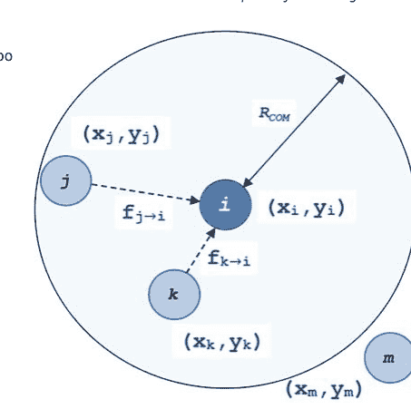

FGA可以使用其他适应度函数，例如Voronoi镶嵌[119]或Yao图[120]。例如，当采用Voronoi镶嵌时，候选位置与其镶嵌几何中心的距离可用作其适应度值[119]。

现在让我们展示FGA适应度函数计算的可视化。在图16.3中，我们观察到节点 $i$ 有两个近邻，即节点 $j$ 和 $k$。另一方面，节点 $m$ 距离 $i$ 太远（即它位于以节点 $i$ 为中心、半径为 $R_{COM}$ 的球体之外），因此对节点 $i$ 的适应度计算没有影响。请注意，节点 $m$ 将被纳入节点 $k$ 的适应度计算中，因为从 $k$ 到 $m$ 的距离小于 $R_{COM}$（即它们是近邻）。

### 16.4.2 FGA的演进过程

FGA在给定节点中的演进过程如下。最初，对于给定节点 $a$ 和种群大小 $N$，FGA考虑 $N$ 个随机选择的位置作为节点 $a$ 移动到的候选位置（即形成初始种群）：

$P_0^0(a), P_1^0(a), \cdots, P_{(N-1)}^0(a)$,

其中 $P_j^g(a)$ 表示节点 $a$ 在第 $g$ 代中的个体 $j$（即候选位置 $j$）（$g = 0$ 代表初始种群）。随机选择初始种群是遗传算法的优势之一，因为可以并行考虑广泛的初始位置。许多传统优化算法的成功在很大程度上取决于初始条件的质量，这意味着用户必须熟悉解空间才能做出良好的初始猜测。这是传统方法的一个缺点，因为即使对于特定主题的专家来说，也很难为复杂的优化问题找到合适的初始条件。

对于一般情况，候选位置 $p_C$ 的适应度计算为

$$\text{fitness}(p_C) = \begin{cases} \sum_{i=0}^n (R_{COM} - d_i) & \text{if } n \geq 1, \ \infty & \text{otherwise}, \end{cases}$$

其中 $n$ 是候选位置 $p_C$ 的近邻数量。适应度通过 $p_C$ 到其近邻的总距离来计算，前提是它至少有一个近邻。如果 $p_C$ 没有任何近邻，这意味着如果移动节点移动到位置 $p_C$，它将与其他节点断开连接。在这种情况下，会为其分配一个大的整数值作为适应度，作为对进一步考虑候选位置 $p_C$ 的惩罚。尽管公式 (16.2) 试图消除孤立的候选位置，但由于其他操作条件，节点在移动后仍可能与群体断开连接（即群体可能被分割）。例如，如果移动节点的移动速度远快于 FGA 更新其移动决策的频率，那么当 FGA 计算出新的方向时，其邻居可能已经不在原来的位置，群体可能会被错误地分割。在运行 FGA 的频率和节点速度之间找到平衡，是特定领域工程师需要解决的经验性问题。随着 FGA 为节点 $a$ 从第 $g$ 代进行到第 $(g + 1)$ 代，它执行以下遗传操作：

-   评估每个个体（即候选位置）的适应度
-   根据适应度从最佳到最差对个体进行排序
-   在第 $g$ 代中，优先选择表现更好的个体作为父代（即所谓的精英法）
-   执行交叉操作，从选定的父代生成后代
-   根据变异概率对后代执行变异操作
-   评估后代的适应度
-   用表现更好的后代（如果有的话）替换第 $g$ 代中适应度较低的个体，并形成第 $(g + 1)$ 代，如下所示：
    $P_0^{(g+1)}(a), P_1^{(g+1)}(a), \cdots, P_{(N-1)}^{(g+1)}(a)$
-   重复上述步骤，直到满足停止准则

随着代数的增加，FGA 会为移动节点找到更合适的位置，以便最终移动到那里。然而，必须为 FGA 确定一个停止准则，以避免振荡和可能的无限循环。这个准则高度依赖于应用要求。可以列出几个例子如下：

-   达到预定的代数或时间限制
-   最佳个体的适应度已达到令人满意的值
-   最佳个体的适应度在几代内没有改善
-   种群的平均适应度已达到令人满意的值
-   种群的平均适应度在几代内没有改善

节点停止运行 FGA 后，它会移动到最后一代中适应度最佳的个体所指示的最佳位置。图 16.4 说明了一个假设的情况，其中星号表示 FGA 为节点 $i$ 识别出的候选移动位置。我们可以在图 16.4a 中看到，在六个候选位置中，有些比其他位置更可取。例如，考虑位于节点 $j$ 和 $k$ 之间的候选位置。如果节点 $i$ 移动到这个位置，它将离节点 $j$ 和 $k$ 太近。同样，位于右上角远处的候选位置也不理想，因为移动到那里很可能会导致节点 $i$ 与节点 $j$ 和 $k$ 失去通信（距离将大于 $R_{COM}$）。如果图 16.4a 中显示的候选位置是 FGA 生成的最终种群，那么节点 $i$ 将不得不从这六个位置中选择一个并移动到那里。这六个假设位置中适应度最佳的应该是一个能让节点 $i$ 远离节点 $j$ 和 $k$，但又不会远到失去通信的位置。图 16.4b 显示了节点 $i$ 将要移动到的一个可能的最佳候选位置。一旦节点 $i$ 移动到这个位置，可以看到 $f_{j \to i}$ 和 $f_{k \to i}$ 将比移动前更小（即更好），如图 16.3a 所示。

在真实的群体中，由于条件因移动而动态快速变化，在节点之间建立协调或同步是不可行的。FGA 由每个节点周期性地独立运行，因为它们在所有节点持续移动时寻找更好的位置。运行 FGA 的频率取决于具体的应用及其操作特性。

### 16.4.3 FGA 的染色体

在遗传算法中，染色体的作用是生成候选解，这些候选解将通过适应度函数进行评估，以考虑是否纳入种群。染色体是当前优化问题参数的数值表示。由于 FGA 旨在将一群自主移动节点均匀地分布在感兴趣的区域，其染色体必须为移动节点在下一个时间步移动生成候选位置。在我们简单的例子中，如果我们假设移动节点的速度是恒定的，那么染色体代表移动节点将要移动的候选方向。

现在让我们定义一个可用于 FGA 以引导移动群体节点的染色体。我们将采用二进制染色体，其中密码子为 0 或 1。在我们的例子中，我们假设在二维空间中，移动节点只能向八个不同的方向移动，即东、西、北、南、东北、西北、东南和西南。需要三位来表示无人机可以移动的八个可能方向。显然，对于更高粒度的移动（例如 16、32 或更多位置），染色体中将需要额外的位。为了适应三维节点移动，我们将在染色体中需要额外的位。如果我们只考虑三个可能的垂直方向移动，即向上、向下和相同高度，我们将在染色体中需要两个额外的位。

258 | 16 用于无人机飞行控制的遗传算法

| 仰角 | 二进制编码 | 十进制 |
| :--- | :--- | :--- |
| 静止 | [0 0 x x x] | 0 |
| 向下 | [0 1 x x x] | 1 |
| 向上 | [1 0 x x x] | 2 |
| 相同高度 | [1 1 x x x] | 3 |

| 二维方向 | 二进制编码 | 十进制 |
| :--- | :--- | :--- |
| 北 | [x x 0 0 0] | 0 |
| 东北 | [x x 0 0 1] | 1 |
| 东 | [x x 0 1 0] | 2 |
| 东南 | [x x 0 1 1] | 3 |
| 南 | [x x 1 0 0] | 4 |
| 西南 | [x x 1 0 1] | 5 |
| 西 | [x x 1 1 0] | 6 |
| 西北 | [x x 1 1 1] | 7 |

用于无人机上下移动的染色体的最高有效 2 位：
染色体 = [c₄ c₃ x x x]

用于二维移动坐标的染色体的最低有效 3 位：
染色体：[x x c₂ c₁ c₀]

(a)

(b)

**图 16.5** 用于无人机移动的染色体：(a) 用于垂直移动的最高有效两位，以及 (b) 用于水平移动的最低有效三位。

这五位的排列方式可以有多种结构。在这个例子中，我们选择最高有效两位来表示无人机的垂直移动，而最低有效三位用于水平移动。我们还决定，如果最高有效两位是零，无论其余三位的值如何，无人机都不会移动。图 16.5a 和 b 说明了节点移动方向的染色体位分配。

图 16.6 显示了染色体最低有效三位每个可能值对应的二维移动方向枚举。例如，染色体 [x, x, 1, 1, 1] 表示节点将向西北方向移动，而 [x, x, 1, 0, 0] 则表示向南移动。最高有效两位标记为 x，目前不予考虑。

图 16.7 中的两个例子解释了给定染色体对移动节点的位移。在示例 1 中，染色体为 [x, x, 0, 0, 0]，这意味着节点将向北移动。由于速度是节点在单位时间内的位移，那么我们知道，在此染色体建议的移动之后，节点的新坐标将在 y 维度（即北）上增加速度的值，而其在 x 维度上的坐标将保持不变。这次移动后，节点将最终到达星号所示的位置。同样，在图 16.7 的示例 2 中，考虑染色体 [x, x, 1, 0, 1] 对应西南方向，这意味着初始坐标将在 x 和 y 维度上都减少速度的值。此染色体指示的新节点位置在图 16.7 中显示为星号。

在图 16.8 中，对于位于 (x₀, y₀) 位置的节点，展示了其染色体最低有效三位所有可能值对应的候选位置坐标。例如，如果

## 16.5 用于无人机飞行控制的遗传算法Python脚本

在本节中，我们将展示一个用于无人机飞行控制的Python脚本示例实现。由于此Python脚本运行在单板计算机上，我们假设可以按如下方式模拟由多个独立自主无人机组成的集群操作：一架无人机使用其近邻信息运行快速遗传算法来计算新位置，但它不会立即移动到该位置，而是等待所有其他无人机完成各自的计算。在所有无人机计算出它们的下一个移动位置后，我们假设它们同时移动到这些新位置。这将构成模拟实验的第一步。然后，它们再次逐一运行快速遗传算法，基于新的邻居信息计算下一个位置，并在模拟实验的第二步结束时移动到各自的新位置。步骤数是一个由用户定义的变量。

这种无需任何无人机间通信的同步实现，是对现实无人机中发生的并行独立计算的一种粗略近似。然而，它证明了快速遗传算法可能是实现集群成员均匀分布的一个有前景的候选方案。我们鼓励更高级的读者使用线程[121]和为每架无人机维护单独的近邻表来实现快速遗传算法，这将更接近于更真实的实现。

在第21-26行，定义了模拟步数、速度、通信范围、无人机数量、种群大小和代数。在第33-41行，随机分配了无人机的初始位置。每个高度都增加了`R_COM`，以防止无人机坠地。在第93-97行，使用图16.8中给出的公式定义了位移向量。在第105-140行，根据给定的染色体计算位移。在第142-154行，名为`get_neighbours`的函数根据无人机索引和当前模拟步数查找无人机的邻居。在第156-168行，名为`fit_func`的函数根据给定位置及其邻居的位置计算适应度分数。在第170-193行，名为`animate`的函数为模拟的每一步创建无人机位置的简易动画。

在第206-212行，遗传算法属性被注册到工具箱库中，包括密码子、染色体、种群、交叉、变异和选择操作。

在第214到240行，引入了一个主函数，它调用了上述描述的函数。交叉和变异概率在第218行定义。从第219行开始的循环迭代模拟步数。从第221行开始的循环迭代无人机数量。因此，在这两个循环内部，`UAV[i][j]`表示在时间步`i`、编号为`j`的无人机。无人机邻居在第225行通过调用`get_neighbours`函数设置。循环完成后，使用所有模拟步骤的无人机位置调用`animate`函数。

```python
# The City College of New York, City University of New York
# Written by Olga Chsherbakova
# September, 2023
#
#
#
# UAV Control with Genetic Algorithm
# Given the number of UAVs in a swarm and communication range, uniformly
# spread the swarm such that they retain connectivity with neighbours
# while maintaining a distance close to radius from all neighbours

from deap import base, creator, tools, algorithms
import matplotlib
import matplotlib.pyplot as plt
import matplotlib.animation as animation
from mpl_toolkits.mplot3d import Axes3D
import math
import numpy as np
import random

n_UAV = 10 # 20 total moves for each UAV to make
speed = 1 # constant speed of each UAV
rcom = 10 # radius of communication
n_times = 10 # number of UAVs = 20
solutions_per_pop = 10
num_generations = 50

# Give each UAV a random starting location within half rcom of 0
# we multiply by rcom/sqrt(2) so that the distance from (0,0,rcom)
# is always less than rcom.
# UAV_positions is a 2-d matrix: [uav_no][x,y,z]

UAV_positions = np.zeros(shape= (n_times + 1, n_UAV, 3))
for x in range (0, n_UAV):
    for y in range (0, 3):
        UAV_positions[0][x][y] = (rcom/math.sqrt(2)) * random.random()

        # we will assume that we want the UAVs to begin GA at a altitude
        # higher than rcom (this makes it less likely to crash in the ground)
        if (y%2 == 2):
            UAV_positions[0][x][y] += rcom
print("Starting Coordinates: ")
for i in range(0, n_UAV):
    print("UAV #{}:\t{}".format(i, UAV_positions[0][i]))

# Chromosomes
# The chromosome will represent the direction for the UAV to move
# Each chromosome will be represented as a vector of length 5
# Where the most significant 2 bits will represent altitude as such:
# [0, 0, x, x, x] = Stationary
# [0, 1, x, x, x] = Down
# [1, 0, x, x, x] = Up
# [1, 1, x, x, x] = Maintain current altitude
# There are 4 cardinal directions and 4 ordinal directions:
# North, Northeast, East, Southeast, South, Southwest, West, Northwest
# we can encode with the least significant 3 bits of the chromosome:
#   [x, x, 0,0,0] = North    [x, x, 0,0,1] = North-East
#   [x, x, 0,1,0] = East     [x, x, 0,1,1] = South-East
#   [x, x, 1,0,0] = South    [x, x, 1,0,1] = South-West
#   [x, x, 1,1,0] = West     [x, x, 1,1,1] = North-West
#
# Since there are no restrictions on the chromosomes other than length,
# there is no need for the A and b constraint matrices.
# The fitness function for these chromosomes are at the end of the script

chromosome_length = 5

# Displacement vectors on the X-Y plane
# Each direction and speed generate a displacement vector.
# The magnitude of this displacement vector is always equal to speed.
#
# Using the encodings for each direction, we can create an 2D array
# that holds the unit displacement vectors, then multiply all the unit
# vectors by speed. The array dimensions are
# displacement_vector[8][2] - 8 possible directions, 2 for x displacement
# and y displacement.
#
# for example, using the three least significant bits:
# (index) [unit displacement vector]          - north      (xx000 is binary 0)
# 0       [0, 1]                               - north      (xx000 is binary 0)
# 1       [1/sqrt(2), 1/sqrt(2)]               - northeast  (xx001 is binary 1)
# 2        [1, 0]                    - east       (xx010 is binary 2)
# 3        [1/sqrt(2), -1/sqrt(2)]   - southeast  (xx011 is binary 3)
# 4        [0, -1]                   - south      (xx100 is binary 4)
# 5        [-1/sqrt(2), -1/sqrt(2)]  - southwest  (xx101 is binary 5)
# 6        [-1, 0]                   - west       (xx110 is binary 6)
# 7        [-1/sqrt(2), 1/sqrt(2)]   - northwest  (xx110 is binary 7)

# chromosome : b2b1b0 -> convert to decimal 0-7 and use as an index:
# [N, NE, E, SE, S, SW, W, NW]
# chromosome 101 -> 5 -> SW

displacement_vectors = np.array([[0, 1], [1/math.sqrt(2), 1/math.sqrt(2)],
                                [1, 0], [1/math.sqrt(2), -1/math.sqrt(2)],
                                [0, -1], [-1/math.sqrt(2), -1/math.sqrt(2)],
                                [-1, 0], [-1/math.sqrt(2), 1/math.sqrt(2)]])
displacement_vectors = displacement_vectors * speed

# The calc_distance calculates distance between two points in 3D space.
def calc_distance(old_coordinates, new_coordinates):
    return math.sqrt((new_coordinates[0] - old_coordinates[0])**2 +
                     (new_coordinates[1] - old_coordinates[1])**2 +
                     (new_coordinates[2] - old_coordinates[2])**2)

# The decode function appears to be related to decoding a chromosome into a
# displacement vector. It takes a chromosome as input, which be represented
# as a binary sequence, and decodes it into a 3D displacement vector.
def decode(chromosome):
    # initializes a NumPy array called displacement to store the
    # resulting displacement vector. It initializes it with three zeros,
    # representing the (x, y, z) components of the displacement.
    displacement = np.zeros((3,), dtype=int)
    # If chromosome[0] is 0 and chromosome[1] is 0, it means there's no change
    # in the z-direction, so displacement[2] remains 0.
    if (chromosome[0] == 0 and chromosome[1] == 0):
        return displacement
    #If chromosome[0] is 0 and chromosome[1] is 1, it sets displacement[2]
    # to 1 * speed, implying a positive change in the z-direction.
    if (chromosome[0] == 0 and chromosome[1] == 1):
        displacement[2] = 1 * speed
    # If chromosome[0] is 1 and chromosome[1] is 0, it sets displacement[2]
    # to -1 * speed, implying a negative change in the z-direction.
    if (chromosome[0] == 1 and chromosome[1] == 0):
        displacement[2] = -1 * speed
    #If chromosome[0] is 1 and chromosome[1] is 1, it sets displacement[2]
    # to 0, which means that there is no change in the z-direction.
    if (chromosome[0] == 1 and chromosome[1] == 1):
        displacement[2] = 0

    # calculates an index based on the values of three elements in the
    # chromosome array to select a displacement vector from some predefined
    # array based on the values of these elements.
    LSB_index = 1 * chromosome[4] + 2 * chromosome[3] + 4 * chromosome[2]
    # sets the displacement[0] and displacement[1] components of the
    # displacement vector using values from array called displacement_vectors.
    # The specific values used are determined by the LSB_index calculated
    # in the previous step.
    displacement[0], displacement[1] = \
        displacement_vectors[LSB_index][0], displacement_vectors[LSB_index][1]
    return displacement

# This function finds neighbouring UAVs for a given UAV at a specific time.
def get_neighbours(time, UAV_index):
    neighbours = []
    for i in range(0, n_UAV):
        UAV = UAV_positions[time][i]
        # If the distance between the current UAV and the target UAV is less
        # than or equal to rcom, indicating that they are within communication
        # range, the current UAV is considered a neighbour, and its position
        # is appended to the neighbours list.
        if (UAV_index != i and calc_distance(UAV,
                UAV_positions[time][UAV_index]) <= rcom):
            neighbours.append(UAV)
    return neighbours
```

## 16.5 使用遗传算法的无人机飞行控制Python脚本

```python
# 根据无人机的位移、位置和邻居计算适应度分数。
def fit_func(individual, current_UAV_coordinates, neighbours):
    fitness_score = 0
    displacement = decode(individual)
    new_position = [current_UAV_coordinates[0] + displacement[0],
                    current_UAV_coordinates[1] + displacement[1],
                    current_UAV_coordinates[2] + displacement[2]]
    if (new_position[2] < 0 ):
        return [np.inf]
    for neighbour in neighbours:
        distance = calc_distance(neighbour, new_position)
        fitness_score += (rcom - distance)
    return [fitness_score]

def animate(UAV_positions):
    # 创建图形对象。
    fig = plt.figure()
    # 使用add_subplot()创建3D坐标轴对象。
    ax = fig.add_subplot(111, projection='3d')
    u, v = np.mgrid[0:2*np.pi:10j, 0:np.pi:10j]
    unit_sph_x = np.cos(u)*np.sin(v)
    unit_sph_y = np.sin(u)*np.sin(v)
    unit_sph_z = np.cos(v)
    fig.show()
    for i in range(0, n_times + 1):
        ax.clear()
        for j in range (0, n_UAV):
            sph_x = (rcom*unit_sph_x + UAV_positions[i][j][0])
            sph_y = (rcom*unit_sph_y + UAV_positions[i][j][1])
            sph_z = (rcom*unit_sph_z + UAV_positions[i][j][2])
            ax.plot_surface(sph_x,sph_y,sph_z, color='w', alpha = 0.05,
                            edgecolor = 'white')
        ax.scatter(UAV_positions[i,:, 0], UAV_positions[i,:, 1],
                   UAV_positions[i,:, 2], s = 30, color = 'r' )
        fig.canvas.draw()
        plt.pause(0.25)
        fig.canvas.flush_events()
    plt.show()

if hasattr(creator, "Fitness"):
    del creator.Fitness
if hasattr(creator, "Individual"):
    del creator.Individual

INDIVIDUAL_SIZE = chromosome_length
creator.create("Fitness", base.Fitness, weights=(-1.0, ))
creator.create("Individual", list, fitness=creator.Fitness)
toolbox = base.Toolbox()

# 属性生成器
toolbox.register("attr_bool", random.randint, 0, 1)
toolbox.register("individual",  tools.initRepeat,  creator.Individual,
                 toolbox.attr_bool, n=INDIVIDUAL_SIZE)
toolbox.register("population", tools.initRepeat, list, toolbox.individual)
toolbox.register("mate", tools.cxOnePoint)
toolbox.register("mutate", tools.mutFlipBit, indpb=0.01)
toolbox.register("select", tools.selTournament, tournsize=5)

def main():
    # CXPB 是两个个体进行交叉的概率
    # MUTPB 是个体发生变异的概率
    CXPB, MUTPB = 0.5, 0.2
    for i in range(0, n_times):
        print("\nTIME #{}\n".format(i))
        for j in range(0, n_UAV):
            print("\nRUNNING GA FOR UAV #{}\n".format(j))
            UAV = UAV_positions[i][j]
            print("CURRENT COORDINATES:\t{}\n".format(UAV))
            neighbours = np.array(get_neighbours(i,j))
            # print("neighbourS FOR UAV #{}\n{}".format(i, neighbours))
            toolbox.register("evaluate", fit_func, current_UAV_coordinates = UAV, neighbours = neighbours )
            pop = toolbox.population(solutions_per_pop)
            hof = tools.HallOfFame(1)
            pop, log = algorithms.eaSimple(pop, toolbox, CXPB, MUTPB,
                                           num_generations, verbose= False, halloffame=hof)
            new_coordinates = (UAV + decode(hof[0]))
            print("NEW COORDINATES:\t{}\n".format(new_coordinates))
            UAV_positions[i+1][j] = new_coordinates

    animate(UAV_positions)
main()
```

图16.9 展示了由10架无人机组成的集群在第16.5节给出的Python脚本引导下，经过10个仿真步骤后的最终位置：(a) 良好情况，所有无人机作为集群保持连接（使用 R_COM = 1 和 speed = 1），以及 (b) 不良情况，部分无人机与集群断开连接（使用 R_COM = 10 和 speed = 10）。

对由10架无人机组成的集群进行了10个步骤的仿真，其中每架无人机都由基于FGA的飞行控制使用上述Python脚本进行引导。图16.9展示了由第16.5节给出的Python脚本实现的FGA所引导的10架无人机集群的最终位置。在 R_COM = 1 和 speed = 1 的设置下，无人机在保持集群连接的同时分散在一个三维区域内，如图16.9a所示。然而，当无人机速度增加十倍时，我们在图16.9b中观察到，部分无人机与集群断开连接，从而导致集群分裂。这种不良性能很可能是由于FGA的决策无法跟上因无人机速度增加而导致的快速拓扑变化。

## 16.6 使用遗传算法的无人机飞行控制Matlab脚本

在本节中，我们展示一个实现无人机飞行控制的示例Matlab脚本。该Matlab脚本使用公式(16.1)和(16.2)中给出的适应度函数，以及第16.4节中定义的染色体长度和密码子含义（关于移动方向），并简化假设所有无人机具有相同的速度和通信范围。为了便于读者比较，Matlab脚本的结构与第16.5节中的Python脚本保持相似。与Python情况类似，由于脚本运行在单处理器环境中，每架无人机依次做出移动决策，然后它们一起移动到新位置。如果在脚本中使用线程，可以构建更真实的仿真，允许每架无人机进行伪并行决策和移动。鼓励高级读者将此处提供的脚本转换为使用线程的版本。

在第14-20行，定义了集群中的无人机数量、无人机速度、通信范围和移动次数（即仿真实验的长度）。在第24-47行，无人机位置被随机初始化，使得它们彼此之间的距离在 $R_{COM}$ 范围内，并且高度高于 $R_{COM}$，以确保它们在仿真过程中不会坠毁。第67行将染色体长度设置为5，密码子功能与第16.4.3节中定义的相同。第68、69和71行分别为遗传算法设置Matlab参数，即密码子的上下限值和染色体中使用的索引。图16.8中讨论的位移向量在第97-101行定义。

第107行到第146行之间的仿真循环代表了实验每一步中所有无人机要执行的所有操作。第111行到第145行之间的一次循环迭代对应于单架无人机执行的操作。在第114和115行，获取了该无人机的近邻列表。其当前位置在第117行设置。FGA的适应度函数在第122-124行被调用，使用以下输入：染色体、当前位置、速度、邻居、通信范围和位移向量。我们将在后面分析适应度函数，因为它定义在第168-192行。

在第131和132行，调用了遗传算法，它将候选位置返回到一个名为 `selection` 的数组中，其中顶部元素是性能最佳的候选位置。该位置在第135和137行被转换为该无人机要移动到的下一个位置的坐标，然后存储在 `UAV_Positions` 数组中，供下一个仿真步骤使用。无人机数量和动画步骤的循环分别在第144和145行完成。在计算出所有仿真实验步骤中所有无人机的位置后，使用动画显示它们。为此，在第149行，调用了一个名为 `visualize_UAVs3D` 的函数，其输入参数如下：所有步骤中无人机的位置、仿真步骤数、无人机数量以及无人机的通信范围。如后文进一步讨论的，该函数打开一个动画窗格，并显示每一步所有无人机的移动。在第150到162行，询问用户是否要重复动画。否则，脚本结束。

在第168行到第192行之间，调用了一个名为 `fitness_score` 的函数，其参数包括染色体、当前位置、速度、邻居数组、$R_{COM}$ 和位移向量。在第173行，调用了一个名为 `candidate_pos` 的函数，该函数定义在下面的第196-220行。它使用 `bi2de` 函数将二进制数转换为等效的十进制数，根据图16.8中显示的位移来计算下一个位置。例如，在第198行，如果最高两位是零，则该无人机的下一个位置将与其当前位置相同。类似地，在第203到206行，如果最高两位是01，无人机将向上移动，位移将基于剩余的三位。

在第149行，调用了 `VisualizeUAVs3D`，它在简单动画中显示每一步的无人机位置。在第150-162行，询问用户是重播动画还是退出脚本。在第163到192行，展示了一个名为 `fitness_function` 的函数。在第180-192行展示的循环中，计算了到每个邻居的候选位置的距离。如果该距离小于 $R_{COM}$，则变量 `fitness_score` 增加 $r_{com}$ 减去该距离的值，如公式(16.2)所示。对于没有邻居或在通信范围之外的候选位置，会分配一个大的整数作为其适应度惩罚值，以便在后续计算中不会考虑它。

在第193到222行，使用染色体，通过名为 `get_next_position` 的函数计算下一个位置。使用图16.8中提出的公式，计算节点位移和基于染色体值的下一个位置。

# 16 用于无人机飞行控制的遗传算法

% 纽约市立学院，纽约城市大学
% 作者：Kelvin Ma
% 2020年8月

% 使用遗传算法进行无人机控制
% 给定无人机集群中的无人机数量和通信半径，
% 使用遗传算法均匀地分散集群，使其在保持与邻居连通性的同时，
% 与所有邻居保持接近半径的距离。
clc; clear;
% 用户输入和初始化
%
% 用户输入：
noof_UAVs = 10; % 无人机数量 = 20
% 好的情况：速度 = 0.1 * rcom：rcom = 10，速度 = 1
% 坏的情况：当速度 == rcom：rcom = 10，速度 = 10
% 糟糕的情况：速度 = 0.8 * rcom：rcom = 10，速度 = 8
speed = 1; % 每架无人机的恒定速度
rcom = 10; % 通信半径
noof_moves = 10; % 每架无人机总共移动20次
% 创建一个3D矩阵来存储所有无人机的位置 - 初始化为全0
% UAV_positions[noof_UAVs] [3] [noof_moves]
% 3代表空间（x, y, z）坐标
UAV_positions = zeros(noof_UAVs, 3, noof_moves);

UAV_positions(:,:,1) = (rcom/sqrt(2)).*rand(noof_UAVs, 3);

% 给每架无人机一个在0点半径rcom范围内的随机起始位置
% rand函数创建一个维度为rand_mat[noof_UAVs] [3]的随机矩阵
% 其中每个元素在0到1之间，所以我们乘以rcom/sqrt(2)
% 这样距离(0,0,rcom)的距离总是小于rcom。
% UAV_positions是一个3维矩阵：[无人机编号] [x,y,z] [时间]
% 示例：时间1时无人机的位置：
%     5.7610    1.1145   14.6368 <- 无人机_1
%     6.4049    6.8631   10.2525 <- 无人机_2
%     0.8979    6.7682   16.0043
%     6.4585    3.4321   16.6043
%     4.4715    5.6588   14.7994
%     0.6897    1.0033   15.3580
%     1.9693    2.9823   15.2547
%     3.8670    6.4752   12.7735
%     6.7706    5.6018   14.6349
%     6.8228    6.7846   11.2105 <- 无人机_10

% 我们假设希望无人机在高于rcom的高度开始遗传算法（这降低了撞到地面的可能性）
UAV_positions(:,3,1) = UAV_positions(:,3,1)+rcom;
% 染色体
% 染色体将代表无人机移动的方向
% 每条染色体将表示为一个长度为5的向量
% 其中最高有效位的2位将表示高度，如下所示：
% [0, 0, x, x, x] = 静止
% [0, 1, x, x, x] = 向下
% [1, 0, x, x, x] = 向上
% [1, 1, x, x, x] = 保持当前高度
% 有4个基本方向和4个间方向 - 它们是：
% 北、东北、东、东南、南、西南、西、西北
% 我们可以用染色体的最低有效位3位进行编码：
%     [x, x, 0,0,0] = 北     [x, x, 0,0,1] = 东北
%     [x, x, 0,1,0] = 东      [x, x, 0,1,1] = 东南
%     [x, x, 1,0,0] = 南     [x, x, 1,0,1] = 西南
%     [x, x, 1,1,0] = 西      [x, x, 1,1,1] = 西北
%
% 由于染色体除了长度外没有其他限制，
% 因此不需要A和b约束矩阵。
% 这些染色体的适应度函数在脚本末尾。
chromosome_length = 5;
Lb = zeros(1,chromosome_length); % 基因值的下界
Ub = ones(1,chromosome_length); % 基因值的上界
% 染色体中为整数的索引（在这种情况下是全部）
int_indices = 1:chromosome_length;
% X-Y平面上的位移向量

## 16.6 使用遗传算法进行无人机飞行控制的Matlab脚本

% 染色体是无人机移动的方向。每个方向和速度在空间中为无人机生成一个位移向量。
% 这个位移向量的大小始终等于速度。
%
% 使用每个方向的编码，我们可以创建一个二维数组来保存单位位移向量，
% 然后将所有单位向量乘以速度。数组维度为
% displacement_vector[8][2] - 8个可能的方向，2代表x位移和y位移。
%
% 例如，使用最低有效位的3位：
% (索引) [单位位移向量]
% 1=(0+1) [0, 1] - 北 (xx000是二进制0)
% 2=(1+1) [1/sqrt(2), 1/sqrt(2)] - 东北 (xx001是二进制1)
% 3=(2+1) [1, 0] - 东 (xx010是二进制2)
% 4=(3+1) [1/sqrt(2), -1/sqrt(2)] - 东南 (xx011是二进制3)
% 5=(4+1) [0, -1] - 南 (xx100是二进制4)
% 6=(5+1) [-1/sqrt(2), -1/sqrt(2)] - 西南 (xx101是二进制5)
% 7=(6+1) [-1, 0] - 西 (xx110是二进制6)
% 8=(7+1) [-1/sqrt(2), 1/sqrt(2)] - 西北 (xx111是二进制7)
% 注意：+1是因为MATLAB向量从索引1开始
% 染色体：b2b1b0 -> 转换为十进制0-7并用作索引（+1）：
% [北, 东北, 东, 东南, 南, 西南, 西, 西北]
% 染色体101 -> 5 -> 5+1 -> 西南
displacement_vectors = [[0, 1]; [1/sqrt(2), 1/sqrt(2)]; ...
                        [1, 0]; [1/sqrt(2), -1/sqrt(2)]; ...
                        [0, -1]; [-1/sqrt(2), -1/sqrt(2)]; ...
                        [-1, 0]; [-1/sqrt(2), 1/sqrt(2)]];
displacement_vectors = speed .* displacement_vectors;
% 从时间0到结束为所有无人机运行遗传算法
% 设置选项为：不显示（将off改为iter以显示步骤）
options = optimoptions('ga','display','off'); % 设置为不显示

% 每架无人机必须在每个时间步运行自己的遗传算法
for t = 1:noof_moves-1
    fprintf("\n\n****** 当前时间是：%d******\n", t)
    % 遍历无人机，适应度函数将根据我们所在的无人机编号而变化
    for UAV_num = 1:noof_UAVs
        fprintf("****** 开始为无人机 #%d 运行遗传算法 *****\n", UAV_num)
        % 获取正在运行遗传算法的无人机的邻居 - 排除自身
        neighbours = UAV_positions(:,:,t);
        neighbours(UAV_num,:) = [];
        % 获取正在运行遗传算法的无人机的当前位置
        current_position = UAV_positions(UAV_num, :, t);

        % 为适应度函数创建一个函数指针
        % （在Matlab中，我们在循环内部声明这个，否则不会在每次循环迭代时更新参数值）
        fit_func = @(chromosome) fitness_function(chromosome, ...
                    current_position, speed, neighbours, rcom, ...
                    displacement_vectors);

        % 为当前节点运行遗传算法
        % Matlab有其默认的种群大小和代数
        % selection包含ga返回的最佳染色体（它是下一个移动方向）：
        selection = ga(fit_func,chromosome_length,[],[], ...
                    [],[],Lb,Ub,[],int_indices, options);

        % 根据ga的选择计算下一个位置：
        displacement=displacement_vectors(bi2de(selection(3:end),...
            'left-msb')+1,:);
        next_position = get_next_position(selection, current_position, ...
                            speed, displacement_vectors);

        % 记录这些位置以便下一次遗传算法使用
        UAV_positions(UAV_num,:,t+1) = next_position;
        fprintf("\t选择的适应度 = %f\n", fit_func(selection))
        fprintf("****** 在时间 %d 完成无人机 #%d 的遗传算法 *****\n", ...
            UAV_num, t)
    end
end

% 可视化无人机
visualize_UAVs3D(UAV_positions, noof_moves, noof_UAVs, rcom);
open_anim = true;
while open_anim == true
    fprintf("重播动画？\n\t输入1表示是\n\t输入2表示否\n");
    user_choice = input('');
    if user_choice == 2
        open_anim = false;
        fprintf('谢谢。祝您有美好的一天！\n');
        break;
    else
        close all
        visualize_UAVs3D(UAV_positions, noof_moves, noof_UAVs, rcom);
    end
end
% 适应度函数
% MATLAB中多行函数定义在脚本底部。

% MATLAB将使用遗传算法来最小化名为fitness_score的变量值
function fitness_score = fitness_function(chromosome, position, speed, ...
                                         neighbours, rcom, displacement_vectors)
    fitness_score = 0;
    neighbour_count = 0;
    % 根据染色体和位移向量计算候选位置
    candidate_pos = get_next_position(chromosome, position, speed, ...
        displacement_vectors);

    % 遍历所有邻居并计算适应度
    % fitness += (rcom - 与邻居[i]的距离)
    % 遗传算法最小化这个数字，越接近0越好
    for i = 1:length(neighbours)
        distance = norm(candidate_pos - neighbours(i,:));
        if distance <= rcom
            neighbour_count = neighbour_count + 1;
            fitness_score = fitness_score + (rcom - distance);
        end
    end
    % 对于没有邻居或撞到地面的位置的最大惩罚
    if neighbour_count < 1 || candidate_pos(3) <= rcom
        fitness_score = abs(intmax);
    end
end
% 从染色体获取下一个位置
% MATLAB中多行函数定义在脚本底部。
% 此函数从染色体获取下一个位置
function next_pos = get_next_position(chromosome, position, speed, ...
                                      displacement_vectors)
    if bi2de(chromosome(1:2)) == 0
        % 静止 - 下一个位置 = 当前位置
        next_pos = position;
    elseif bi2de(chromosome(1:2), 'left-msb') == 1
        % 无人机向上移动
        displacement = displacement_vectors(bi2de(chromosome(3:end), ...
            'left-msb')+1,:);
        next_pos(1:2)= position(1:2) + displacement;
        next_pos(3) = position(3) + speed;
    elseif bi2de(chromosome(1:2), 'left-msb') == 2
        % 无人机向下移动
        displacement = displacement_vectors(bi2de(chromosome(3:end), ...
            'left-msb')+1,:);
        next_pos(1:2)= position(1:2) + displacement;
        next_pos(3) = position(3) - speed;
    elseif bi2de(chromosome(1:2), 'left-msb') == 3
        % 无人机保持高度
        next_pos = position;
        displacement = displacement_vectors(bi2de(chromosome(3:end), ...
            'left-msb')+1,:);

## 16.7 结语

在本章中，我们介绍了一个流行应用的示例，即作为集群运行的自主无人机的飞行控制。在这个示例应用中，集群自主无人机的目标被设定为均匀分布在感兴趣的地理区域内，无需人类飞行员或中央控制器的任何干预。我们假设无人机除了其直接通信范围内的近邻外，没有关于集群成员位置的信息，并且无人机之间没有任何形式的协调或同步。这个示例实际上可以被视为许多现实世界无人机应用的简化版本，例如救援任务、环境保护任务、消防行动、多车辆运输等。

我们介绍了一种采用遗传算法的无人机飞行控制机制，其中染色体代表无人机在下一步将移动的方向。定义了一个适应度函数，想象虚拟力由其直接邻居施加到节点上。遗传算法倾向于选择使无人机远离其邻居但又不失去与它们通信的位置。可能使无人机孤立或使其过于靠近邻居的候选位置将不会具有良好的适应度值。

在该飞行控制算法的Python和Matlab实现中，我们展示了相对简单的脚本可以成功地为一组作为集群运行的自主无人机实现遗传算法。在这些简单的脚本中，我们看到无人机速度和通信范围是防止集群分裂的主要变量。

如果飞行控制的计算负载保持较轻，生物启发算法（如遗传算法）可以在实时（或近实时）飞行控制中执行。如果在染色体中包含更多条件或采用更先进的适应度函数，则可以构建更强大的飞行控制算法。然而，复杂性的增加意味着飞行控制的计算时间很可能会增加，这可能会阻止某些应用实时运行。

其他生物启发算法也可能用于作为集群运行的自主无人机的飞行控制。例如，通过将遗传算法替换为粒子群优化或差分进化算法（参见第18章第18.2节和第18.3节），可以轻松地采用类似的飞行控制机制。

## 16.8 第16章习题

1.  为图16.5中展示的FGA构建一个染色体，使其能够为无人机在每一步选择64个不同的移动方向。使用这种染色体有哪些优点和缺点？
2.  为图16.5中展示的FGA提出一个使用三个密码子（每个使用十进制值）的不同染色体。使用这种染色体有任何优点吗？有什么缺点？
3.  提出一个适应度函数，迫使无人机保持在一条直线上。
4.  使用线程修改第16.5节中给出的Python脚本。使用相同的参数值运行多次。你看到每次运行之间有任何差异吗？你认为为什么会发生这种情况？
5.  使用线程，对第16.6节中给出的Matlab脚本重复习题1。

# 17 用于路径优化的遗传算法

## 17.1 引言

在本章中，我们介绍遗传算法的另一个重要应用，即路径优化问题，其中需要以最小成本覆盖一组由具有不同成本值的线段互连的节点。我们可以将此问题可视化如下：给定一组城市，我们需要访问所有城市，使得路径的总长度最小。如果成本定义为在城市之间旅行的时间，那么目标就是以最短时间访问所有城市。这个问题在计算机科学中被称为`旅行商问题`（TSP），其中一名旅行商需要从同一个城市出发并返回，仅访问每个城市一次[122]。旅行商只能访问每个城市一次以及整个行程的总长度（或其等效成本）必须最小化的要求，使得旅行商问题类别成为一个艰巨的挑战。它们的解决方案复杂度随着城市数量及其之间连接的阶乘而增长。

工程任务的优化问题通常很复杂，并且经常需要确定一系列行动的最有效排序以完成给定的一组目标。考虑一家每天早上派遣数百辆卡车车队向一组地点分发包裹的快递公司。每辆卡车从一个基地位置出发，在一天中进行多次停靠，并在轮班结束时返回基地。管理者的目的是确保每次行程在行驶最短距离的同时访问尽可能多的投递点。

在另一个应用中，考虑全球每年生产超过7000万辆汽车的汽车制造业。对于每辆汽车，都有数千个螺丝需要拧紧，数千个点焊操作需要执行。拧紧螺丝或焊接金属点的顺序可以被表述为一个TSP。机器人从一个选定的点开始焊接，按照给定的顺序访问数十个点，直到完成最后一个点焊后返回其初始位置。在这种情况下，机器人和待焊接点分别对应于TSP的旅行商和城市。如果点焊或拧紧螺丝的机器人没有经过仔细编程，可能会在每辆汽车上浪费时间，从而可能显著影响工厂的产出和运营预算。这些应用节省的成本高达数百亿美元。同样，在电子行业，寻找机器人焊接元件或在印刷电路板上打孔的最佳顺序是对生产力有重大影响的问题。TSP解决方案可以最大限度地减少任何电子制造商的焊接时间、路径复杂性、能源和材料消耗[123]。

在本章中，我们提出一种基于遗传算法的旅行商问题解决方案，该方案利用遗传算法在线性时间内计算出最优路径（尽管不一定是绝对最小成本的路径）。我们展示了这种将问题相对简单地转化到人工智能领域的方法，可以使用Python和Matlab中的库函数来实现。

## 17.2 旅行商问题的定义

图17.1a展示了一个旅行商问题的示例，其中每个红点必须被访问一次，且环路的总长度最小[124]。一个可能的解如图17.1b所示。另一个旅行商问题的示例及其一个可能的解如图17.2所示[125]。研究人员之间存在全球性的竞赛，以衡量他们旅行商问题解决方案的有效性。示例包括覆盖瑞典的24,978个城镇和德国的15,112个城镇（图17.3）[124]，以及美国的3,143个县（接近最优的长度为93,466英里）（图17.4）[126]。对于这些基准测试，两个城市之间的道路长度被视为边的成本。

图17.5展示了旅行商问题的另一个简单示例，其中一位旅行者从底特律出发，必须在返回底特律之前访问芝加哥、哥伦布和印第安纳波利斯。连接这些城市的道路及其长度如图17.5所示，其中给出了几个可能的解。图17.5b中访问底特律、芝加哥、印第安纳波利斯、哥伦布并返回底特律的行程是成本最低的解。请注意，旅行商问题的解可能不是唯一的，并且可能存在多个具有相同最小成本的环路。

现在让我们正式定义旅行商问题。假设给定一个边加权的无向图 $G$，表示为 $G = (V, E, w)$，其中 $V$ 是一个顶点集，$|V| = n$（即 $V = v_1, v_2, \cdots, v_n$），$E$ 是一个有向边集，$|E| = m$（即 $E = e_1, e_2, \cdots, e_m$）。函数 $w$ 将边映射到其对应的权重（例如遍历成本、长度或难度）；因此 $w(e_i) = w_i, \forall e_i \in E$。换句话说，每条边 $e_i \in E$ 都关联一个成本 $w_i$。$G$ 中的*路径*定义为边的序列，其中每条边只出现一次（路径中可能不包含所有边）。$G$ 中的*环路*定义为从同一节点开始和结束的路径。*哈密顿环路* $H_c$ 是一个覆盖 $G$ 中所有节点恰好一次（起始和结束节点除外）的环路。基于这些定义，旅行商问题的目标是在给定的加权图中找到一个总权重最低的哈密顿环路。形式上，我们将旅行商问题定义为一个优化问题，如下所示：

$$\text{minimize} \sum_{j=1}^{n} w_j \text{ for } \forall e_i \in H_c \text{ and a given start vertex } v_s. \quad (17.1)$$

## 17.3 旅行商问题的一个简单算法

图17.6展示了一个直接的旅行商问题解决方案，该方案比较 $n$ 个节点之间所有可能环路的旅行成本。在选择成本最低的环路作为解之前，会考虑所有从选定城市出发并返回，同时访问其余 $(n - 1)$ 个城市的可能环路。

如图17.6所示，找到旅行商问题解所需的步骤数量随着待访问城市数量呈指数增长，因此属于NP完全问题类[128]。图17.6中的算法复杂度为 $\mathcal{O}(n!)$，这意味着对于 $n$ 个城市，它需要 $n!$ 次迭代才能完成，使其仅适用于城市数量相对较少的问题。在本章的第17.5节，我们将介绍一种使用遗传算法实现旅行商问题类问题的轻量级计算方法。

```
TSP = \phi; // 空的TSP环路
TSP_{best} = TSP; // 初始化最佳解；
C_{best} = C_{TSP}; // 初始化最佳成本；

// 对于环路中n个城市的所有排列：
while ( TSP还有更多排列 ) do
    TSP = 获取n个城市的新组合；
    if(C_{TSP} \leq C_{best}) then
        TSP_{best} = TSP; // 更新最佳解；
        C_{best} = C_{TSP}; // 更新最佳成本；
    end if
end while

return TSP_{best} 作为成本为 C_{best} 的最佳环路；
```

图17.6 在图中找到最低成本哈密顿环路的一个简单算法。

## 17.4 旅行商问题的变体

旅行商问题有几种变体，每种变体对其解施加了不同的限制。对于某些应用来说，每个城市恰好访问一次可能过于严格。例如，如果两个城市之间存在一条成本高昂的边（例如由于高速公路拥堵、速度限制或交通状况），通过多次访问某些剩余城市来避免此类边可能是更可取的。在允许多次访问的旅行商问题中，目标是在至少访问每个顶点一次（即根据需要允许在每个城市多次访问）的同时，最小化行程的总成本。图17.7a所示的路径是旅行商问题的一个解，它恰好访问每个城市一次，成本为510英里。如果将问题表述为允许多次访问的旅行商问题，如图17.7b所示，解的总行驶距离为320英里，其中托莱多被访问了两次。

在旅行商问题的另一个变体中，称为聚类旅行商问题，城市被划分为若干聚类，目标是确定访问所有聚类的最小成本路线，并且在移动到下一个聚类之前必须访问聚类内的每个城市。聚类旅行商问题的解可能旨在优化每个聚类内要访问的城市顺序以及聚类被访问的序列[129]。作为聚类旅行商问题的一个示例，考虑测试集成电路，通常将端口聚类，使得聚类中的任何端口具有相同的电压要求[123]。为了完成集成电路的检测，机器人测试探针必须在移动到下一个聚类之前测量聚类中所有端口的电压。最小化机器人的移动等同于聚类旅行商问题，其中每个聚类的每个端口都必须以最小成本被访问。

将图顶点划分为子集，并旨在通过恰好经过每个子集中的一个节点来找到最小成本路线的旅行商问题变体称为集合旅行商问题。在某些情况下，集合旅行商问题也被称为覆盖旅行商问题，因为它可以应用于在n个城市的一个子集中找到最小成本路线，使得不在路线中的每个城市都在路线中某个城市的预定义距离内。在覆盖旅行商问题中，每个被访问的城市及其相邻城市构成一个邻域集[130]。作为集合旅行商问题的典型应用，考虑通过测量多个端口来测试集成电路的任务，其中端口被分组，使得每组中只有一个端口需要被测量。最小化机器人测试探针的移动可以建模为集合旅行商问题。

## 17.5 旅行商问题的遗传算法解决方案

遗传算法可以为旅行商类问题找到解决方案，即使需要覆盖的节点数量达到数万甚至更多。为简单起见且不失一般性，假设所有城市都通过双向道路相互连接，这对应于一个具有无向边的完全连通图 $G$，如第17.2节所述。对于这种简化情况，染色体可以按访问顺序对城市进行编码。可以定义一个适应度函数来表示由染色体决定的环路的总成本，作为其适应度，如公式(17.1)所定义。遗传算法的一代将进化其种群中的一组个体，其中每个个体对应一个旅行商问题的解。

图17.8a展示了一个示例图，其中节点通过无向边连接，每条边关联一个整数成本值，表示遍历该边的难度。此示例使用了一个`完全连通图`，其中每个节点都通过无向边与其他所有节点连接。在这种简化形式中，旅行者可以从节点 $i$ 到 $j$ 或从 $j$ 到 $i$，成本相同。然而，在一般情况下，旅行商问题图不必是完全连通的，边也不一定是无向的（即，从节点 $i$ 到 $j$ 的有向边通常并不意味着旅行者也可以从 $j$ 到 $i$）。旅行商问题旨在找到从 $A$ 出发并返回 $A$，同时恰好覆盖所有边一次的所有可能环路中的最小成本环路。即使对于这个简单的例子，也有 $4^5$ 种可能性需要考虑。

图17.8b展示了一个称为 $CM$ 的连通性矩阵，它源自图17.8a中的完全连通图。连通性矩阵 $CM$ 是一个 ($n \times n$) 矩阵，其中元素 $CM[i][j]$ 表示从节点 $i$ 到节点 $j$ 的成本。例如，使用一个大小为 ($5 \times 5$) 的 $CM$ 矩阵，从节点0到2（即从节点A到节点C）的边关联的成本是 $CM[0][2] = 12$。由于我们在此示例中使用无向图 $G$，从 $i$ 到 $j$ 的边意味着从 $j$ 到 $i$ 也存在一条成本相同的连接。如图17.8b所示，$CM[0][2] = 12$ 意味着 $CM[2][0] = 12$。$CM$ 的对角线元素为零（即对于 ($i = 0, \cdots, n-1$)，$CM[i][i] = 0$），因为每个城市到自身的距离为零。

现在让我们将染色体定义为访问城市的顺序 $[c_i, c_j, \cdots, c_x]$，我们假设最后一个城市 $c_x$ 和第一个城市 $c_i$ 是连接的，覆盖了 $V$ 中的所有顶点。对于图17.8中的示例，染色体长度为5，因为有五个城市。适应度函数是染色体中选定边的总权重（即成本）：

$$\text{候选解的适应度} = \sum_{(i=1)}^{m} w_i + w_R,$$

其中 $w_i$ 是密码子 $c_m$（即染色体中的最后一个）中边的权重，$w_R$ 是从最后一个节点返回到起点的返回边的权重。对于图17.8中的示例，从节点 $A$ 出发，旅行商问题被定义为找到旅行者必须访问每个节点一次并以最小总成本返回 $A$ 的顺序。图17.9给出了两个候选解，即 $P_1 = A, B, C, D, E, A$ 和 $P_2 = A, B, C, E, D, A$。环路 $P_1$ 的总成本为24，而 $P_2$ 为31。在这两个候选解之间，显然 $P_1$ 比 $P_2$ 更优。

## 17.6 使用遗传算法进行路径优化的Python脚本

图17.9 展示了图17.8中旅行商问题的两个候选解。

| 示例解1 | 示例解2 |
|---|---|
| 路径1：A, B, C, D, E | 路径1：A, B, C, E, D |
| 染色体：[A, B, C, D, E] | 染色体：[A, B, C, E, D] |
| 适应度：2 + 4 + 3 + 10 + 5 = 24 | 适应度：2 + 4 + 3 + 3 + 10 = 31 |

类似的解法适用于旅行商问题的一般情况，其中部分节点并非与所有其他节点直接相连，且边可以是无向的、单向的或双向的。然而，由于染色体可能无意中包含未直接相连的城市，因此需要对每个染色体的有效性进行额外检查。

在本节中，我们将展示一个Python脚本实现，用于解决第17.5节讨论的简化版旅行商问题，其中所有城市通过双向边相互连接。假设我们有15个待访问的城市，其坐标如图17.10a和b所示。这些城市对应的连通性矩阵如图17.11所示。

在下面给出的示例Python脚本的第16行，指定了存储城市坐标的输入文件。第20行使用此输入文件创建了一个名为`df`的二维矩阵（即数据框）。第22行调用了`gps`库中定义的`generate_distance_matrix`函数来计算城市的连通性矩阵。第25行将染色体长度定义为城市数量。第32至50行定义了染色体和种群，供后续Python库中的遗传算法实现使用。第53至62行将适应度函数实现为一个循环，累加连通性矩阵中呈现的城市间距离。适应度值在第56行包含了从最后一个城市返回起点的距离。交叉、变异和选择算子分别在第69、72和75行定义。Python中的遗传算法实现格式如下：

```
algorithms.eaSimple(pop, toolbox, xoProb, mutProb, gens, selectCrit)
```

其中`pop`、`toolbox`、`xoProb`、`mutProb`、`gens`和`selectCrit`分别代表种群、Python库名称、交叉概率、变异概率、代数和选择标准。因此，第84行调用遗传算法的语句变为

```
algorithms.eaSimple(pop, toolbox, 0.7, 0.2, 40, halloffame=best_genome)
```

其中`halloffame`被指定为要选择的最佳基因组。第103至156行将最佳解绘制在地图上。

请注意，对于基于遗传算法的旅行商问题实现，如果设计不当，常规的交叉算子可能会出现问题。一对有效的染色体在应用交叉算子后可能产生无效的后代。例如，考虑图17.12a中所示的父代染色体，定义为[1 2 3 4 5]和[3 2 1 5 4]。假设在最高两位之后进行交叉。在这种情况下，后代将是[1 2 1 5 4]和[3 2 3 4 5]，由于两种情况都存在重复城市，因此是无效的。一种交叉操作，其后代的密码子被生成为父代密码子的排列，在第69行实现为

```
toolbox.register("mate", cxPartiallyMatched)
```

其中部分匹配（或映射）交叉[131]使用两个交叉点实现，如图17.12b所示。首先，将父代1和父代2的中间部分分别复制到后代2和后代1中，这定义了一个映射：3 ⇔ 2，4 ⇔ 6，5 ⇔ 1。然后，基于此映射，父代1的最高两位（即1和2）被映射到后代1的第5位和第3位。类似地，父代1的最低位（即6）被映射到后代1的第4位。后代2以相同方式获得。

图17.13 (a) 变异算子产生具有重复城市的无效后代，(b) 用于变异的索引打乱保留了后代的有效性。

对于变异算子也存在类似的担忧。如果不特别小心地实现，变异后的后代可能是无效的。考虑图17.13a中的例子，一个定义为[ 1 2 3 4 5 ]的后代将在次高位发生变异。通过随机替换此密码子（例如从2变为4），后代可能最终变为[ 1 4 3 4 5 ]，由于存在重复的密码子值，因此是无效的。然而，将变异实现为打乱两个密码子将始终保留后代的有效性。在图17.13b中，变异算子选择两个密码子并打乱它们，产生一个变异但有效的后代。这种打乱密码子值的变异算子在第72行实现为

```
toolbox.register("mutate", mutShuffleIndexes, indpb=0.05)
```

这表明变异算子将以0.05的概率执行。在第87行，最佳解被保存到名为`best_path`的数组中。在第93-101行，计算了最佳路径的成本。在第106至156行之间，使用Python库在地图上显示了此路径。

```
1 # The City College of New York, City University of New York
2 # Written by Ricardo Valdez
3 # August, 2020
4 
5 # travelling SALESMAN PROBLEM IMPLEMENTATION USING GA
6 # THIS IMPLEMENTATION USES deap LIBRARY FUNCTION CALLED eaSimple()
7 # deap: distributed evolutionary algorithms in python
8 # ea: evolutionary algorithm
9 # DEPENDENCIES: deap, basemap, and basemap-data-hires
10 from deap import creator, base, tools, algorithms
11 import random
12 import gps
13 import pandas as pd
14 import matplotlib.pyplot as plt
15 from mpl_toolkits.basemap import Basemap
16 
17 cities_file = 'cities.csv'
18 
19 # load city data into a dataframe df
20 df = pd.read_csv(cities_file)
21 ## generate a weight matrix where the weights are the distances between cities
22 distance_matrix = gps.generate_distance_matrix(df)
23 
24 ## set chromosome length to the number of cities
25 CHROM_LENGTH = len(distance_matrix)
26 
27 ## create a variable called FitnessMin with the create() function.
28 ## FitnessMin inherits from base.Fitness and it will store whether
29 ## the fitness should be minimized or maximized:
30 ##     if weights == -1.0, then minimize the fitness
31 ##     if weights == 1.0, then maximize the fitness
32 creator.create("FitnessMin", base.Fitness, weights=(-1.0,))
33 ## create a variable called Individual that will determine the
34 ## datastructure used for the chromosome.
35 ## Individual inherits from list and it will store integers.
36 creator.create("Individual", list, typecode='i', fitness=creator.FitnessMin)
37 
38 ## initialize a new toolbox variable to configure GA parameters:
39 toolbox = base.Toolbox()
40
```

图17.10 作为旅行商问题示例覆盖给定城市集合：(a) 本例中使用的城市集合，以及 (b) 它们的坐标。

```
city,latitude,longitude
Seattle,47.6131746,-122.4821479
New York City,40.6976701,-74.2598667
Miami,25.7825453,-80.2994988
Los Angeles,34.0522342,-118.2436833
Houston,29.8174782,-95.681482
Chicago,41.8339037,-87.8720481
Las Vegas,36.1251958,-115.3150848
Minneapolis,44.970797,-93.335184
El Paso,31.8113481,-106.546027
Portland,45.5154589,-122.676401
Kansas City,39.099724,-94.578331
Denver,39.742043,-104.991531
Memphis,35.1288636,-90.2509744
Burlington,44.4759,-73.2121
Boston,42.3601,-71.0589
```

图17.11 图17.10所示城市的连通性矩阵。

```
[[    0  2398  2733   959  1880  1730   874  1395  1375   681  1510  1026  1862  2333  2493]
 [ 2398     0  1087  2457  1417   710  2225  1007  1889  2558  1080  1614   951   266   201]
 [ 2733  1087     0  2355   979  1190  2181  1511  1639  2589  1238  1719   875  1351  1260]
 [  959  2457  2355     0  1377  1753   240  1540   719   335  1379   853  1614  2503  2615]
 [ 1880  1417   979  1377     0   937  1216  1055   660  1628   644   864   484  1590  1616]
 [ 1730   710  1190  1753   937     0  1519   349  1240  1847   399   905   480   760   861]
 [  874  2225  2181   240  1216  1519     0  1300   583   412  1151   615  1405  2266  2380]
 [ 1395  1007  1511  1540  1055   349  1300     0  1154  1583   410   695   699   986  1124]
 [ 1375  1889  1639   719   660  1240   583  1154     0   992   840   555   966  1994  2070]
 [  681  2558  2589   335  1628  1847   412  1583   992     0  1509   952  1793  2568  2698]
 [ 1510  1080  1238  1379   644   399  1151   410   840  1509     0   557   363  1158  1248]
 [ 1026  1614  1719   853   864   905   615   695   555   952   557     0   868  1651  1766]
 [ 1862   951   875  1614   484   480  1405   699   966  1793   363   868     0  1108  1145]
 [ 2333   266  1351  2503  1590   760  2266   986  1994  2568  1158  1651  1108     0   181]
 [ 2493   201  1260  2615  1616   861  2380  1124  2070  2698  1248  1766  1145   181     0]]
```

# 17 用于路径优化的遗传算法

```python
## 配置遗传算法的种群，使每条染色体初始化为从0到CHROM_LENGTH-1序列的随机排列
## range(CHROM_LENGTH): 创建一个从0到CHROM_LENGTH-1的列表
## range: [0,1,...,9] indices 是 range 的一个随机排列
toolbox.register("indices", random.sample, range(CHROM_LENGTH), CHROM_LENGTH)
## 将 indices 的内容分配为基因组中的基因
toolbox.register("genome", tools.initIterate, creator.Individual,
                toolbox.indices)
## 为种群中的每条染色体重复染色体分配
toolbox.register("population", tools.initRepeat, list, toolbox.genome)

## 定义适应度函数
def TSP_fit_func(chromosome):
    ## 对染色体中存储的路径总距离求和
    ## 初始化从最后一个元素到第一个元素的距离
    distance = distance_matrix[chromosome[-1]][chromosome[0]]
    ## 对所有 i，求和从 i 到 i+1 的所有距离
    for i in range(len(chromosome)-1):
        distance += distance_matrix[chromosome[i]][chromosome[i+1]]
    ## 返回路径距离作为适应度
    ## (在 deap 中，return 至少需要一个逗号 - 这是条愚蠢的规则)
    return distance,
## 通过传递适应度函数来配置评估参数
toolbox.register("evaluate", TSP_fit_func)

## 交叉算子的实现：
## 将繁殖函数设置为部分匹配交叉，该操作产生的子代也是排列
toolbox.register("mate", tools.cxPartiallyMatched)
## 设置5%的变异率，这会导致染色体中的基因被随机交换，且变异结果也是一个排列
toolbox.register("mutate", tools.mutShuffleIndexes, indpb=0.05)
## 将选择函数设置为锦标赛选择，该方法会随机挑选三条染色体并选择适应度最好的那条
toolbox.register("select", tools.selTournament, tournsize=3)

## 设置种群大小为 n=100 (n=20 或 n=10 可观察 n 的影响)
pop = toolbox.population(n=100)
## 使用变量 best_genome 存储具有最佳适应度的染色体
best_genome = tools.HallOfFame(1)

## 运行遗传算法以获得解
#algorithms.eaSimple(pop, toolbox, xo prob, mut prob, gens, store best)
algorithms.eaSimple(pop, toolbox, 0.7, 0.2, 40, halloffame=best_genome)

## 将解存储到 best_path
best_path = best_genome[0]
## 打印 best_path
print('\nBEST PATH:\n')
for i in range(len(best_path)):
    print(df['city'][best_path[i]])
print(df['city'][best_path[0]])
cost = 0
print('\nBEST PATH COST:\n')
for i in range(len(best_path)-1):
    tempo = distance_matrix[best_path[i]][best_path[i+1]]
    cost+= tempo
    print(df['city'][best_path[i]], tempo)
print(df['city'][best_path[0]],distance_matrix[len(best_path)-1][best_path[0]])
cost += distance_matrix[len(best_path)-1][best_path[0]]
print("TOTAL COST: ",cost)

# 绘制最佳路径

# 创建一个图形来绘制图表
fig = plt.figure(figsize=(10, 10))

## 确定地图的大小和位置
## 分辨率设置为低以减少运行时间
m = Basemap(projection='lcc', resolution='l',
            width=5.5E6, height=3.5E6,
            lat_0=39, lon_0=-96,)

## 设置海洋颜色为蓝色
m.drawmapboundary(fill_color='#DDEEFF')
## 设置大陆颜色为橙色
m.fillcontinents(color="#FFDDCC")
## 在地图上绘制海岸线
m.drawcoastlines(color='gray')
## 在地图上绘制国家边界线
drawcountries(color='black')
## 在地图上绘制州边界线
m.drawstates(color='gray')

## 创建两个空列表来存储地图绘图的 x 和 y 位置
X = []
Y = []

for i in range(CHROM_LENGTH):
    ## 将当前城市的（经度，纬度）对转换为用于绘图的（x，y）坐标
    tempX, tempY = m(df['longitude'][best_path[i]],
                    df['latitude'][best_path[i]])
    ## 将 tempX 和 tempY 分别添加到 X 和 Y 的末尾
    X.append(tempX)
    Y.append(tempY)

path_color = 'teal'
## 绘制最短路径
plt.plot(X,Y,path_color)
## 连接路径的第一个和最后一个城市以闭合循环：
## (-1 表示列表的最后一个元素)
plt.plot([X[-1],X[0]],[Y[-1],Y[0]],path_color)
## 在每个城市处绘制点
plt.plot(X,Y,'ok', markersize=7)

for i in range(CHROM_LENGTH):
    ## 在地图上标记每个城市
    plt.text(X[i],Y[i],' '+df['city'][best_path[i]],fontsize=10,
             fontweight='bold')
## 给图表一个标题
Plot_title = 'Best Route Found for TSP Using GA - Total cost: ' + str(cost)
plt.title(Plot_title, fontsize=20)

## 显示图表
plt.show()
```

当种群大小设置为10并使用10代遗传算法时，一次示例运行的结果如图17.14a所示，其中循环的总成本（即长度）为15,507。很明显这不是一个好的解决方案，因为遗传算法采用了较小的种群，并且没有足够的代数来改进其解决方案。一旦增加种群大小和代数，遗传算法的性能预计将显著提高。对于100的种群并使用遗传算法运行100代，最佳解决方案的成本为9,128，如图17.14b所示。

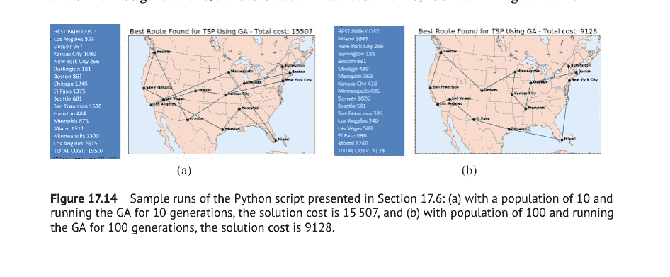

## 17.7 使用遗传算法进行路径优化的Matlab脚本

本节介绍一个使用遗传算法实现旅行商问题解决方案的Matlab脚本。为了便于读者比较，城市数量的输入文件与第17.6节给出的Python脚本保持相同。在第12-17行，城市名称及其纬度和经度的输入值保存在名为`cities`的数组中。在第20行，调用名为`genDistMat`的函数来计算输入城市的距离矩阵。在第20行和第25行，分别定义了名为`TSPlot`和`TSFitness`的函数。在第28行和第29行，定义了遗传算法的选项，其中种群大小设置为城市数量。在第32至37行，定义了旅行商问题特定的选项，其中名为`initPop`、`orderedxo`和`swapMut`的函数分别用于创建初始种群、部分匹配（也称为映射）交叉[131]和交换变异。这些函数在脚本后面定义。在第40行，通过以下方式调用遗传算法：

```matlab
best_path = ga(FitnessFnc, cities, [],[],[],[],[],[],[],
              options);
```

在第46-66行，定义了名为`get_distance`的函数，该函数计算给定为纬度和经度对的两个城市之间的距离。在第68-78行，名为`getDistMat`的函数为城市列表生成距离矩阵。在第80-88行，名为`initPop`的函数为旅行商问题生成随机初始种群，其中染色体由城市的索引组成。在第90-129行，名为`orderexo`的函数对两个父代执行部分映射交叉。在第131-176行，绘制最佳路径。在第178-190行，名为`TSFitness`的函数通过计算城市之间的总距离来计算个体的适应度。在第192-208行，通过名为`swapMut`的函数执行变异操作，该操作交换染色体的两个密码子。最后，在第210至229行之间，一个名为`print_best_path`的函数在屏幕上打印旅行商问题的解。

```matlab
% The City College of New York, City University of New York
% Written by Olga Chsherbakova and Hasan Suca Kayman
% August, 2024

% Genetic Algorithms for travelling Salesman

% Function to calculate distance between two geographic coordinates using
% Haversine formula
filename = 'cities.csv';

% Read cities data from CSV file
cities_table = readtable(filename);
% take all columns (Latitude, Longitude)
cities_data = table2array(cities_table(:, 2:3));
% take all columns (City Name, Latitude, Longitude)
cities_data_ = table2cell(cities_table(:, 1:3));
cities = length(cities_data);
% Generate a weight matrix where the weights are the distances
% between cities
distances = generate_distance_matrix(cities_data);

my_plot = @(options,state,flag) travelling_salesman_plot(options, ...
             state,flag,cities_data_);

FitnessFcn = @(x) travelling_salesman_fitness(x,distances);

% Set up the options for the genetic algorithm
options = optimoptions(@ga, 'PopulationType', 'custom', ...
             'InitialPopulationRange', [1;cities]);
```

## 17.7 使用遗传算法进行路径优化的Matlab脚本

```matlab
% 设置旅行商问题特定选项
options = optimoptions(options,'CreationFcn',@initialize_population, ...
    'CrossoverFcn',@ordered_crossover, ...
    'MutationFcn',@swap_mutate, ...
    'PlotFcn', my_plot, ...
    'MaxGenerations',500,'PopulationSize',60, ...
    'UseVectorized',true);

% 运行遗传算法
best_path = ga(FitnessFcn,cities,[],[],[],[],[],[],options);

% 打印最佳路径
print_best_path(cell2mat(best_path),cities_data_,distances);

% 用于TSP遗传算法的函数
% 计算两个位置之间的距离
function distance = get_distance(latitude1,longitude1,latitude2,longitude2)
    R = 6373.0; % 地球半径，单位：公里
    % 从度转换为弧度
    lat1 = deg2rad(latitude1);
    lon1 = deg2rad(longitude1);
    lat2 = deg2rad(latitude2);
    lon2 = deg2rad(longitude2);
    % 获取坐标变化量
    dlon = lon2 - lon1;
    dlat = lat2 - lat1;

    % 使用Haversine公式计算两个坐标之间的距离
    a = sin(dlat / 2)^2 + cos(lat1) * cos(lat2) * sin(dlon / 2)^2;
    c = 2 * atan2(sqrt(a), sqrt(1 - a));

    distance = R * c;
    % 将距离转换为英里
    distance = distance * 0.621371;
end

% 为城市列表生成距离矩阵的函数
function distance_matrix = generate_distance_matrix(cities)
    num_cities = size(cities, 1);
    distance_matrix = zeros(num_cities, num_cities);
    for i = 1:num_cities
        for j = 1:num_cities
            distance_matrix(i, j) = get_distance(cities(i, 1), ...
                cities(i, 2), cities(j, 1), cities(j, 2));
        end
    end
end

% 初始化种群
function pop = initialize_population(NVARS,FitnessFcn,options)
    totalPopulationSize = sum(options.PopulationSize);
    n = NVARS;
    pop = cell(totalPopulationSize,1);
    for i = 1:totalPopulationSize
        pop{i} = randperm(n);
    end
end

% 执行有序交叉以产生子代的函数
% 使用部分映射交叉
function childs = ordered_crossover(parents,options,NVARS, ...
    FitnessFcn,thisScore,thisPopulation)

    nKids = length(parents)/2;
    childs = cell(nKids,1);
    index = 1;

    for i=1:nKids
        parent1 = thisPopulation{parents(index)};
        parent2 = thisPopulation{parents(index+1)};
        index = index + 2;

        child = zeros(1, length(parent1));

        start_point = randi(length(parent1));
        end_point = mod((start_point + randi(length(parent1) - 2)), ...
            length(parent1));

        if start_point <= end_point
            child(start_point:end_point) = parent1(start_point:end_point);
        else
            child(start_point:end) = parent1(start_point:end);
            child(1:end_point) = parent1(1:end_point);
        end

        pointer = 1;
        for j = 1:length(parent1)
            if ~ismember(parent2(j), child)
                while child(pointer) ~= 0
                    pointer = pointer + 1;
                end
                child(pointer) = parent2(j);
            end
        end

        childs{i} = child;
    end
end

% 使用geoplot在地图上可视化最佳路径的函数
function state = travelling_salesman_plot(options,state,flag,cities_data_)
    [score,i] = min(state.Score);

    best_path = state.Population{i};
    persistent geoAx plotHandle;

    % 提取最佳路径的纬度和经度
    lats = cell2mat(cities_data_(best_path, 2));
    longs = cell2mat(cities_data_(best_path, 3));

    % 通过将起始城市添加到末尾来闭合回路
    lats = [lats; lats(1)];
    longs = [longs; longs(1)];

    % 仅创建一次GeographicAxes
    if isempty(geoAx) || ~isvalid(geoAx) || ...
            ~isvalid(ancestor(geoAx, 'figure'))
        clf;
        %figure('Position', [100, 100, 800, 600]);
        geoAx = geoaxes;
        geobasemap(geoAx, 'landcover');
        plotHandle = [];
    end

    % 如果存在先前的绘图，则删除它
    if ~isempty(plotHandle) && isvalid(plotHandle)
        delete(plotHandle);
    end

    % 绘制新路径并存储绘图句柄
    plotHandle = geoplot(geoAx, lats, longs, '-o', 'Color', ...
                         'red', 'LineWidth', 2);

    % 使用当前最佳成本更新标题
    title(geoAx, ['Best Route Found for TSP using GA - Total Cost: ',...
        num2str(score,'%.2f')]);

    % 在地图上添加城市名称
    city_names = cities_data_(best_path, 1);
    for i = 1:length(best_path)
        text(geoAx, lats(i), longs(i), city_names{i}, ...
            'VerticalAlignment', 'bottom', 'HorizontalAlignment', ...
            'center', 'FontSize', 8, 'FontWeight', 'bold');
    end
end

% 评估由染色体表示的路径总距离的函数
function scores = travelling_salesman_fitness(x,distances)
    scores = zeros(size(x,1),1);
    for j = 1:size(x,1)
        city = x{j};
        total_distance = distances(city(end),city(1));
        for i = 2:length(city)
            total_distance = total_distance + distances(city(i-1),city(i));
        end
        scores(j) = total_distance;
    end
end

% 通过交换染色体中的两个基因执行变异的函数
function mutationChildren = swap_mutation(parents,options,NVARS, ...
    FitnessFcn, state, thisScore,thisPopulation,mutationRate)

    mutationChildren = cell(length(parents),1);
    for i=1:length(parents)
        parent = thisPopulation{parents(i)};
        p = ceil(length(parent) * rand(1,2));
        while p(1)==p(2)
            p = ceil(length(parent) * rand(1,2));
        end
        child = parent;
        child(p(1)) = parent(p(2));
        child(p(2)) = parent(p(1));
        mutationChildren{i} = child;
    end
end

% 打印带有距离的最佳路径的函数
function print_best_path(best_path, cities_data, distance_matrix)
    num_cities = length(best_path);
    best_path = circshift(best_path,num_cities - find(best_path==2) + 1);

    fprintf('BEST PATH COST:\n');
    fprintf('%-15s  %-15s\n', 'City', 'Distance');
    total_distance = 0;
    for i = 1:num_cities
        current_city = best_path(i);
        next_city = best_path(mod(i, num_cities) + 1);
        current_city_info = cities_data(current_city, :);
        next_city_info = cities_data(next_city, :);
        distance = distance_matrix(current_city, next_city);
        total_distance = total_distance + distance;
        fprintf('%-15s %-15.2f\n', ...
            current_city_info{1}, distance);
    end
    fprintf('Total Distance: %.2f\n', total_distance);
end
```

本节介绍的Matlab脚本的两次示例运行结果如图17.15a至d所示。使用种群规模为60、运行600代的Matlab脚本，解决方案的总成本为8,435.07英里；而使用种群规模为10、运行10代的解决方案成本为12,760.53英里。由于第二次运行的种群规模太小且遗传算法运行代数不足，其性能比第一次运行差很多，这在预料之中。

## 17.8 结束语

旅行商问题代表了一类优化问题，其主要目标是找到覆盖一组通过具有不同成本值的边相互连接的点的最小成本回路。许多需要规划、调度、物流和装箱的复杂优化问题都适合被表述为旅行商问题。对于大型图，旅行商问题的算法解决方案在计算上是不可行的，因为计算成本随节点数量呈阶乘增长。

在本章中，我们提出了一种基于遗传算法的旅行商问题解决方案，其中待访问城市的顺序构成染色体，回路的长度是解决方案的适应度。我们提供了实现这种基于遗传算法的旅行商问题解决方案的简单Python和Matlab脚本。这种基于遗传算法的解决方案的计算复杂度与城市数量呈线性关系，尽管由于遗传算法的概率性质，对于大型问题（具有数万个节点）不能保证绝对最小值。然而，几乎总是能找到接近最小值的解决方案。

288 | 17 用于路径优化的遗传算法

BEST PATH COST:
City Distance
New York City 1087.63
Miami 875.78
Memphis 484.61
Houston 660.22
El Paso 583.13
Las Vegas 240.06
Los Angeles 335.13
San Francisco 681.15
Seattle 1026.16
Denver 557.43
Kansas City 410.78
Minneapolis 349.38
Chicago 760.22
Burlington 181.83
Boston 201.55
Total Distance: 8435.07

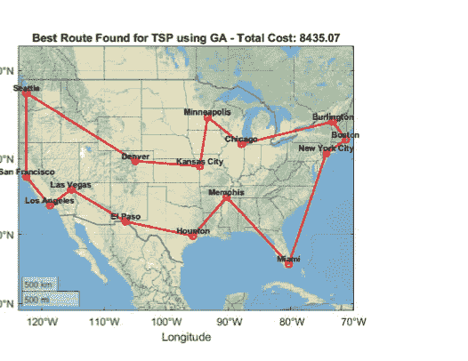

(a)

(b)

BEST PATH COST:
City Distance
New York City 266.51
Burlington 181.83
Boston 1260.08
Miami 1639.94
El Paso 1375.90
Seattle 1395.70
Minneapolis 349.38
Chicago 480.90
Memphis 1614.85
Los Angeles 240.06
Las Vegas 412.90
San Francisco 952.49
Denver 864.82
Houston 644.60
Kansas City 1080.57
Total Distance: 12760.53

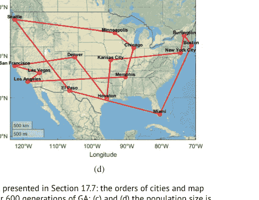

(c)

(d)

图17.15 第17.7节介绍的Matlab脚本的示例运行：城市顺序和地图显示。(a)和(b)种群规模为60，运行600代遗传算法；(c)和(d)种群规模为10，运行10代遗传算法。

| 国家 | 纬度 | 经度 |
|---|---|---|
| 特立尼达和多巴哥 | 10.423 | -61.297 |
| 格林纳达 | 12.179 | -61.647 |
| 开曼群岛 | 19.309 | -81.257 |
| 多米尼加共和国 | 15.399 | -61.339 |
| 巴巴多斯 | 13.178 | -59.548 |
| 波多黎各 | 18.249 | -66.628 |
| 牙买加 | 18.143 | -77.347 |
| 海地 | 19.073 | -72.241 |
| 圣文森特和格林纳丁斯 | 12.984 | -68.287 |
| 圣基茨和尼维斯 | 17.339 | -62.766 |
| 圣马丁 | 18.066 | -63.07 |
| 英属维尔京群岛 | 18.443 | -64.571 |
| 特立尼达和多巴哥 | 10.423 | -61.297 |

| 国家 | 纬度 | 经度 |
|---|---|---|
| 英格兰 | 52.599 | -1.467 |
| 澳大利亚 | -25.585 | 134.504 |
| 印度 | 23.406 | 79.458 |
| 尼日利亚 | 8.868 | 8.804 |
| 新西兰 | -44.056 | 170.354 |
| 加拿大 | 58.027 | -105.381 |
| 南非 | -29.046 | 25.063 |
| 加纳 | 7.921 | -1.204 |
| 肯尼亚 | 0.576 | 37.839 |
| 孟加拉国 | 23.73 | 90.306 |
| 斐济 | -18.011 | 179.035 |
| 冈比亚 | 13.44 | -15.491 |

(a)

(b)

| 国家 | 纬度 | 经度 |
|---|---|---|
| 日本 | 35.683 | 139.808 |
| 台湾 | 23.686 | 120.897 |
| 韩国 | 37.563 | 126.993 |
| 中国 | 31.255 | 121.475 |
| 菲律宾 | 14.582 | 120.974 |
| 越南 | 10.492 | 106.374 |
| 马来西亚 | 3.148 | 101.694 |
| 泰国 | 13.753 | 100.505 |
| 印度尼西亚 | -5.133 | 119.417 |
| 塔斯马尼亚 | -42.029 | 146.59 |
| 澳大利亚 | -33.869 | 151.207 |
| 新西兰 | -44.056 | 170.354 |
| 巴布亚新几内亚 | -9.482 | 147.189 |
| 斐济 | -18 | 179 |
| 关岛 | 13.421 | 144.739 |

| 城市 | 纬度 | 经度 |
|---|---|---|
| 伦敦 | 51.5 | -0.126 |
| 巴黎 | 48.863 | 2.33 |
| 都柏林 | 53.348 | -6.248 |
| 奥斯陆 | 59.912 | 10.75 |
| 斯德哥尔摩 | 59.33 | 18.068 |
| 赫尔辛基 | 60.176 | 24.933 |
| 塔林 | 59.443 | 24.753 |
| 柏林 | 52.501 | 13.402 |
| 布鲁塞尔 | 50.836 | 4.37 |
| 华沙 | 52.233 | 21.017 |
| 布拉格 | 50.067 | 14.466 |
| 维也纳 | 48.202 | 16.369 |
| 布达佩斯 | 47.498 | 19.04 |
| 明斯克 | 53.898 | 27.549 |

(c)

(d)

**图 17.16** (a) 加勒比海国家，(b) 前英联邦国家，(c) 西太平洋国家，以及 (d) Appleton 智能手机的城市。

## 17.9 第17章习题

1.  生成一个访问图 17.16a 中列出的所有加勒比海国家的循环。注意，该循环可以从任何国家开始，但必须只访问每个国家一次并返回起点。
2.  英国国王必须访问前英联邦国家。请找出一条行程，使其总路程最短且只访问每个国家一次。使用图 17.16b 中的坐标。
3.  马士基海运服务公司正计划在西太平洋地区运送汽车和电子产品。他们如何才能做到在每个国家恰好停留一次？各国的坐标见图 17.16c。
4.  Appleton 公司希望培训员工使用其最新的智能手机。最佳的可能路线是什么？坐标见图 17.16d。

# 18 进化方法

## 18.1 引言

在本章中，我们概述了主要的进化计算方法，包括第 18.2 节的 `粒子群优化`、第 18.3 节的 `差分进化` 和第 18.4 节的 `语法进化`。对于每种方法，我们都提供一个数值示例，以说明如何在任何语言和软件环境中实现该方法。

我们想指出进化算法日益强大的可并行化特性，这使其成为解决超大规模问题的绝佳候选者。人们可以轻易地设想，在不久的将来，数百万台湿件计算机并行运行粒子群优化算法，能够以低开销解决太空旅行问题。同样，用于探索星系的自主航天器的最佳飞行控制程序，可以通过语法进化算法生成，该算法使用真实的语法并在数百万台生物计算机上并行运行。

## 18.2 粒子群优化

基于在生物组织中观察到的机制，群体人工智能（SAI）被用于控制和分析分散自主系统的集体行为 [132]。SAI 系统中的智能体与其最近的邻居和外部环境进行交互，以表现出全局智能。

自组织可以定义为一种从低层级组件之间的交互中涌现出来的能力，这些组件并未被明确设计以实现某个目标 [133]。例如，社会性黄蜂能够建造精致的巢穴，每个工蜂根据局部环境放置建筑材料。通常，黄蜂更有可能在现有墙壁的角落区域添加材料，而不是开始建造一堵新墙 [134]。随着新材料的放置，巢穴的构型发生改变，这为后来访问该地点的其他黄蜂提供了新的信息。这种通过环境进行的间接通信被称为*共识主动性*。因此，即使是像黄蜂这样简单的昆虫，也能建造非常复杂的结构。自组织系统可能依赖于正反馈和负反馈、随机波动的放大以及个体之间多种直接或间接的共识主动性交互，以获得一个表现出涌现特性的动态系统，该系统具有分叉特性（即，当系统属性改变时，能够获得一个新的稳定解）。

粒子群优化（PSO）是一种受自然界中观察到的社会和集体行为（如鸟群和鱼群）启发的群体人工智能优化技术。它被开发为一种工具，用于解决最佳解决方案可以表示为空间中一个点的问题 [105]。PSO 是一种基于群体运动和智能的鲁棒随机优化技术。PSO 实现了社会交互原则来解决多维优化问题。在 PSO 中，如果一个个体找到了一个好的解决方案，其余个体会利用该知识。

PSO 是一种多智能体并行搜索方法，其中每个在搜索空间中飞行的粒子根据其自身经验（即历史数据）以及其他粒子的经验来调整其飞行路径。在给定时间 $t$，一个位置为 $P_j^t$、速度为 $V(t)$ 的粒子 $j$ 会跟踪其迄今为止达到的最佳适应度（称为 $P_j^{best}$）以及整个群体迄今为止获得的最佳全局值（称为 $G^{best}$）。令 $P_j^{g+1}$ 为粒子 $j$ 的新位置，$P_j^g$ 为其当前位置。我们按以下公式更新粒子 $j$ 的速度：

$V_{g+1} = w V_g + C_1 R_1 (P_j^{best} - P_j^g) + C_2 R_2 (G^{best} - P_j^g)$

其中 $V_{g+1}$ 和 $V_g$ 分别是粒子 $j$ 的新速度和当前速度，$w$ 是 $[0, 1]$ 范围内的实数，是惯性权重因子。实数 $C_1$ 和 $C_2$ 在 $[0, 4]$ 范围内，实数 $R_1$ 和 $R_2$ 在 $[0, 1]$ 范围内。

在公式 (18.1) 中，粒子 $j$ 的动量由 $w$ 控制，作为粒子先前经验与整体群体经验之间的权衡。当 $w = 0$ 时，粒子 $j$ 不考虑其任何先前知识，而 $w = 1$ 则意味着粒子不容易改变其方向。在速度更新中，$R_1$ 影响 $P_j^{best}$，而 $R_2$ 影响 $G^{best}$。对于经验对搜索的贡献，$C_1$ 代表粒子的自信程度，$C_2$ 表示粒子对整个群体运动的信心。粒子 $j$ 的新位置定义为 $P_j^{g+1} = P_j^g + V_{g+1}$。如果粒子 $j$ 的新位置具有更好的适应度，则更新其个人最佳和全局最佳适应度值。无论其适应度如何，粒子 $j$ 都会移动到新位置。

### PSO 的变体

为了应对多样化的工程应用，已经开发了几种不同类型的 PSO 算法。一种常用的群体优化方法称为离散 PSO（DPSO），它在离散值搜索空间上解决组合优化问题 [135]。在该算法中，每个粒子的位置和速度用离散值表示，这些值可以是实数或整数。另一种版本的 PSO 算法称为邻域搜索 PSO（NSPSO），它同时考虑局部邻域和全局群体来寻找其试验解。在 NSPSO 中，粒子首先探索其每个邻居的局部邻域，然后再考虑全局解空间 [136]。在另一种称为邻域保证收敛 PSO（GCPSO）的变体中，通过保持群体内的多样性来实现社交网络的结构，在寻找最佳下一位置时应用了距离限制 [137]。

### 18.2.1 PSO 的应用

PSO 可以轻松地应用于解决各种工程问题。例如，它在解决通信和计算机网络中的维护和路径发现类应用方面很受欢迎，特别是对于功率受限的移动节点。PSO 可以通过获得最优或近优传输路径来最小化通信成本，同时考虑能耗与流量强度[138]。PSO可用于大规模无线自组织网络中的功率管理问题，其中节点被聚类成较小的子网络，子网络之间只有相对较少的链路。PSO寻找稳定的节点簇，以确保网络中节能且稳定的通信[139]。

在数据挖掘应用中，需要处理大量信息，使得具有相似特征的数据块需要被分组在一起。PSO可以自动确定准确分类输入数据所需的最佳聚类数量。每个粒子代表一个位于聚类中心的数据元素，其中距离通过两个数据元素之间的相似性来衡量。使用相应的适应度函数来促进更密集且数据点数量更多的聚类[140]。

### 18.2.2 PSO操作

PSO使用多个代理（即粒子）组成一个群体，在搜索空间中飞行以寻找最佳解：

-   粒子根据自身的飞行经验以及其他粒子的飞行经验来调整其飞行。
-   每个粒子跟踪其在解空间中的坐标，这些坐标与该粒子迄今为止获得的最佳解（适应度）相关联。该值称为*个体最优*：$P_j^{(best)}$。
-   PSO跟踪的另一个重要值是群体中任何粒子迄今为止获得的最佳值。该值称为*全局最优*：$G^{best}$。

在第$g$代，粒子$j$具有位置$P_j^g$和速度$v(t)$。每个粒子都知道自己的个体最优位置和所有粒子的全局最优位置。在PSO中，将粒子$j$的速度从第$g$代演化到第$(g + 1)$代（即$P_j^g \rightarrow P_j^{g+1}$）的过程如下：

$V_{g+1} = w \cdot V_g + C_1 \cdot R_1 \cdot (P_j^{(best)} - P_j^g) + C_2 \cdot R_2 \cdot (G^{best} - P_j^g)$, (18.2)

其中使用了以下PSO优化参数：

-   $V_{g+1}$：粒子的新速度
-   $V_g$：粒子的当前速度
-   $P_j^g$：粒子的当前位置
-   $w$：惯性权重因子（范围在[0, 1]内的实数）
-   $R_1$：$P_j^{(best)}$在速度更新中的影响（范围在[0, 1]内的随机实数）
-   $R_2$：$G^{best}$在速度更新中的影响（范围在[0, 1]内的随机实数）[105]
-   $C_1$：粒子在速度更新中的自信心（范围在[0, 4]内的实数）
-   $C_2$：整个群体在速度更新中的群体信心（范围在[0, 4]内的实数）
-   $P_j^{(best)}$：粒子$j$迄今为止飞过的个体最优位置
-   $G^{best}$：群体中任何粒子迄今为止飞过的全局最优位置

参数$w$控制粒子的动量：

-   $w \ll 1$：从上一代保留的动量非常小。
-   $w = 0$：不保留上一时间步的知识；每一代都是独立的。
-   $w = 1$：粒子不容易改变方向——通常用于在开始时探索更大的区域。
-   $w$可以作为代数的函数递减（例如，开始时更多探索，后期更多依赖群体智能）。
-   通常，惯性权重$w$随着代数的增加而减小（例如，从0.9减小到0.4）[105]。

$C_1$是给定粒子的自信心：在给定代中，粒子自身经验对搜索的贡献程度（自我探索）。$C_2$代表群体信心，在给定代中所有粒子的运动（群体探索）。通常，$C_1$和$C_2$设置为1.5。

## 计算粒子的新位置

对于二维情况，设粒子$j$的新位置为：

$$P_{j,x}^{g+1} = P_{j,x}^g + V_{g+1,x}$$
$$P_{j,y}^{g+1} = P_{j,y}^g + V_{g+1,y}$$

其中

-   $P_{j,x}^{g+1}$：粒子$j$在第$(g + 1)$代在$x$维度的新位置
-   $P_{j,x}^g$：粒子$j$在第$g$代在$x$维度的当前位置
-   $V_{g+1,x}$：粒子$j$在$x$维度的新速度
-   $P_{j,y}^{g+1}$：粒子$j$在第$(g + 1)$代在$y$维度的新位置
-   $P_{j,y}^g$：粒子$j$在第$g$代在$y$维度的当前位置
-   $V_{g+1,y}$：粒子$j$在$y$维度的新速度

在找到粒子$j$的新位置后，PSO计算该新位置的适应度。如果新适应度优于个体最优和/或全局最优适应度，则相应地更新这些参数。无论适应度值如何，粒子$j$都会在新一代中移动到新位置。PSO算法的一个简单实现如图18.1所示。

```
for each particle
    initialize particle with feasible random number;
end
while (stopping criteria is not attained)
    for each particle
        Calculate the fitness value;
        if (fitness better than fitness value of P_best)
            Set current value as the new P_best;
        end
    end
    Choose the particle with the best fitness value among
    all particles as g_best;
    for each particle
        Calculate particle velocity;
        Calculate particle position;
        Update equation;
    end
end
```

图18.1 PSO的一个简单实现。

## PSO的基准测试：Rosenbrock函数

PSO的一个基准函数是Rosenbrock函数[141]，其二维情况定义为

$$f(x, y) = (1 - x^2) + 100(y - x^2)^2.$$

PSO的目标是找到Rosenbrock函数的最小值，该最小值位于(0, 0)，如图18.2所示。现在让我们演示此基准的PSO操作步骤。我们使用一个简单的PSO，包含五个粒子和图18.3a所示的参数。设粒子的初始随机位置如图18.3b所示。在此示例中，我们重点关注粒子3，并观察随着PSO算法的进展它如何演化。粒子3的初始位置随机选择为$P_3^0 = (0.49, -1.92)$（图18.3b）。粒子3的适应度为

$$f(P_3^0) = (1 - 0.49)^2 + 100(-1.92 - (0.49)^2)^2 = 3143.43.$$

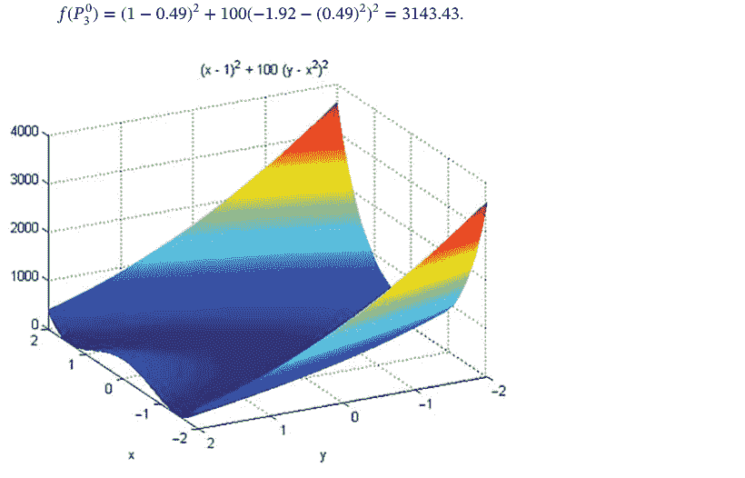

**图18.2** 作为PSO基准的Rosenbrock函数。

**图18.3** 使用Rosenbrock函数的PSO数值示例：(a) PSO参数值，以及(b) 五个粒子的随机初始位置。

| 本示例的参数值： |
| :--- |
| 种群大小：5 |
| 代数：4 |
| maxSpeed_x = +/- 1 |
| maxSpeed_y = +/- 1 |
| Range_x = [-2,2] |
| Range_y = [-2,2] |
| 适应度：$f(x,y) = (1-x)^2+100(y-x^2)^2$ |
| $C_1 = 1.5; C_2 = 1.5$ |
| w = 0.9 |
| (a) |

| 初始位置 |
| :---: | :---: |
| 粒子 | 位置 |
| 1 | (-0.2, 1.93) |
| 2 | (-0.52, 1.53) |
| 3 | (0.49, -1.92) |
| 4 | (-0.13, -1.51) |
| 5 | (1.87, 1.49) |
| (b) |

粒子3在$(0.49, -1.92)$处的个体最优为$f(P_3^{pbest}) = 3143.43$。群体的全局最优将从$f(P_1^{pbest}), \cdots, f(P_5^{pbest})$中选择最小值。现在让我们将粒子3从第0代演化到第1代。对于惯性权重$w = 0.9$，$R_1 = 0.8659$和$R_2 = 0.7489$，粒子3的新速度计算如下：

$V_x = 0.9 \cdot 0 + 1.5 \cdot 0.8659 \cdot (0.49 - 0.49) + 1.5 \cdot 0.7489 \cdot (1.87 - 0.49)$
$= 1.55 \mod 1 = 0.55$

$V_y = 0.9 \cdot 0 + 1.5 \cdot 0.8659 \cdot (-1.92 + 1.92) + 1.5 \cdot 0.7489 \cdot (1.49 + 1.92)$
$= 3.83 \mod 1 = 0.83$.

使用新速度，我们现在计算粒子3的新位置如下：

$P_3^1(x) = 0.49 + V_x = 1.04$
$P_3^1(y) = -1.92 + V_y = -1.08$.

新位置$P_3^1 = (0.49, 1.04)$的适应度计算为$f(P_3^1) = 504.63$。由于$f(P_3^1) < f(P_3^{(best)})$，新位置更优，将被存储为新的个体最优。因此，对于粒子3，我们有新位置$P_3^1 = (0.49, 1.04)$，速度为$V = (0.55, 0.83)$，个体最优为$P_3^{(best)} = (1.04, -1.08)$。五个粒子的适应度值、个体最优和全局最优位置如图18.4所示。我们看到全局最优是位置$G^{best} = (0.12, 1.44)$，这是粒子1的位置，其适应度值为$f(G^{best}) = 40.92$。所有五个粒子的新位置如图18.5所示（注意，为简洁起见，未显示除#3以外粒子的计算）。作为PSO算法的一部分，所有粒子无论适应度值如何都会移动到它们的新位置。

现在让我们将粒子3从第1代演化到第2代。在第1代，我们有：$P_3^1 = (1.04, -1.08)$，$P_3^{(best)} = (1.04, -1.08)$，$G^{best} = (0.35, 1.08)$且$f(G^{best}) = 40.92$。对于惯性权重$w = 0.73$，$R_1 = 0.43$和$R_2 = 0.9925$，粒子3的新速度为

$V_x = 0.73 \cdot 0.55 + 1.5 \cdot 0.43 \cdot (1.04 - 1.04) + 1.5 \cdot 0.9925 \cdot (0.12 - 1.04)$
$= 0.96$

$V_y = 0.73 \cdot 0.83 + 1.5 \cdot 0.43 * (-1.08 + 1.08) + 1.5 \cdot 0.9925 \cdot (1.44 + 1.08)$
$= 4.35 \mod 1 = 0.35$.

| 粒子 | 位置 | 适应度 | $P_{best}$ | $g_{best}$ |
| :---: | :---: | :---: | :---: | :---: |
| 1 | (0.12, 1.44) | 40.92 | $f(P_1^{pbest}) = 40.92$<br>$P_1^{pbest} = (0.12, 1.44)$ | |
| 2 | (0.16, 1.49) | 54.01 | $f(P_2^{pbest}) = 54.01$<br>$P_2^{pbest} = (0.16, 1.49)$ | |
| 3 | (1.04, -1.08) | 504.63 | $f(P_3^{pbest}) = 504.63$<br>$P_3^{pbest} = (1.04, -1.08)$ | $g_{best} = (0.12, 1.44)$<br>$f(g_{best}) = 40.92$ |
| 4 | (0.1, -1.14) | 595.97 | $f(P_4^{pbest}) = 595.97$<br>$P_4^{pbest} = (0.1, -1.14)$ | |
| 5 | (1.87, 1.49) | 54.06 | $f(P_5^{pbest}) = 54.06$<br>$P_5^{pbest} = (1.87, 1.49)$ | |

**图18.4** 所有粒子的适应度值以及个体最优和全局最优位置。

| 粒子 | 位置 |
|---|---|
| 1 | (-0.2, 1.93) |
| 2 | (-0.52, 1.53) |
| 3 | (0.49, -1.92) |
| 4 | (-0.13, -1.51) |
| 5 | (1.87, 1.49) |

| 粒子 | 位置 |
|---|---|
| 1 | (0.12, 1.44) |
| 2 | (0.16, 1.49) |
| 3 | (1.04, -1.08) |
| 4 | (0.1, -1.14) |
| 5 | (1.87, 1.49) |

图 18.5 五个粒子的新位置（注意，为简洁起见，未显示其他粒子的计算过程）。

使用新的速度，我们现在计算粒子 3 的新位置如下：

$P_3^2(x) = 1.04 + V_x = 0.08$ $P_3^2(y) = -1.08 + V_y = -0.73$。

新位置 $P_3^2 = (0.08, -0.73)$ 的适应度计算为 $f(P_3^2) = 160.34$。由于 $f(P_3^2) < f(P_3^{(best)})$，新位置优于当前个体最佳位置，并将被存储为新的个体最佳位置。因此，对于粒子 3，我们有一个新位置 $P_3^2 = (0.08, -0.73)$，速度为 $V = (-0.96, 0.35)$，个体最佳位置为 $P_3^{(best)} = (0.08, -0.73)$。所有五个粒子的适应度值、个体和全局最佳值以及新位置如图 18.6 和 18.7 所示。我们看到新的全局最佳位置是 $G^{best} = (0.35, 1.08)$，这是粒子 1 的新位置，其适应度值为 $f(G^{best}) = 1.17$。

在运行 PSO 过程达到预定的代数或满足用户定义的条件（例如，验证 PSO 在新代中没有对全局适应度值产生显著改进）后，PSO 通过选择最后一个 $G^{best}$ 作为其最终解来结束。

| 粒子 | 位置 | 适应度 | $P_{best}$ | $g_{best}$ |
|---|---|---|---|---|
| 1 | (0.35, 1.08) | 1.17 | $f(P_1^{pbest}) = 1.17$<br>$P_1^{pbest} = (0.35, 1.08)$ | |
| 2 | (0.59, 1.39) | 29.56 | $f(P_2^{pbest}) = 29.56$<br>$P_2^{pbest} = (0.59, 1.39)$ | |
| 3 | (0.08, -0.73) | 160.34 | $f(P_3^{pbest}) = 160.34$<br>$P_3^{pbest} = (0.08, -0.73)$ | $f(g_{best}) = 1.17$<br>$g_{best} = (0.35, 1.08)$ |
| 4 | (0.30, -1.02) | 425.02 | $f(P_4^{pbest}) = 425.02$<br>$P_4^{pbest} = (0.30, -1.02)$ | |
| 5 | (1.27, 1.42) | 35.64 | $f(P_5^{pbest}) = 35.64$<br>$P_5^{pbest} = (1.27, 1.42)$ | |

图 18.6 所有粒子的适应度值以及个体和全局最佳位置。

### 18.2.3 PSO 备注

PSO 是一种基于群体运动和智能的鲁棒随机优化技术。它由 James Kennedy（社会心理学家）和 Russell Eberhart（电气工程师）于 1995 年开发 [105]。PSO 将社会互动的概念应用于多维优化问题。在 PSO 中，如果一个个体找到了一个好的解决方案，所有其他个体也会利用该知识。PSO 的实现相对简单，只需调整少数参数（例如粒子速度）。PSO 是一种多智能体并行搜索方法，其中每个粒子（即智能体）在搜索空间中飞行。粒子的种群称为群体。PSO 易于并行化，因此非常适合具有大搜索空间的问题。PSO 算法非常适合控制自主无人机的拓扑结构，其中无人机的位置可以建模为粒子群 [142]。由于其在代际间移动粒子的特殊方式，与传统 AI 方法相比，它可能避免陷入局部极值点。

## 18.3 差分进化

差分进化（DE）是一种进化计算技术，最初由 Price 和 Storn 于 1995 年提出，用于求解高阶切比雪夫多项式方程 [106]。DE 与其他进化计算方法（如 GA 和 PSO）的不同之处在于，它不使用经典的交叉和变异算子，而是通过一个新的 `差分` 算子生成后代。这个新算子首先生成种群中两个随机选择的个体的 `差分` 向量，以创建一个新个体。由于为每个个体创建了不同的差分向量，与传统进化计算方法（通常由固定概率分布决定扰动）相比，DE 有更好的机会生成多样化的种群。DE 是自组织的，需要用户输入很少。

在 DE 中，一个在 $d$ 维空间中运行的具有 $N$ 个个体的种群，个体 $i$ 表示为一个 $d$ 维向量。在给定时间 $t$，DE 为每个个体 $i$ 创建两个解，称为 `变体` 解和 `试验` 解。如果试验解的表现优于个体 $i$，它将在时间 $(t + 1)$ 替换个体 $i$。让我们将第 $g$ 代的 $i$ 表示为 $P_i^g$。DE 将该个体演化到下一代 $(g + 1)$（即 $P_i^g \rightarrow P_i^{g+1}$）的过程如下。首先，通过从种群中选择三个其他个体（假设索引为 $k$、$r$ 和 $m$）来创建变体解 $V_i$。这三个索引必须互不相同且不同于 $i$。第 $g$ 代个体 $i$ 的变体计算如下 [143]：

$V_i = P_m^g + E \cdot (P_k^g + P_r^g)$

其中 $E$ 是控制差分向量放大程度的缩放因子（通常 $E \in [0, 2]$）。创建变体 $V_i$ 后，DE 生成一个称为 $U_i$ 的试验解，过程如下。对于维度 $x$，使用实数 $rand_x$ 和 $rnbr$（两者都是随机数且在 $[0, 1]$ 范围内）以及一个交叉常数（称为 $CR$），一个在 $[0, 1]$ 范围内的实数。如果 $rand_x < CR$ 或 $rnbr = 0$，则将维度 $x$ 的变体解 $V_i$ 赋值为试验解 $U_i$ 的 $x$ 维度。否则，使用 $P_{ix}^g$ 的现有值（即现有解的 $x$ 维度）来确定试验解 $U_i$ 在维度 $x$ 的值。试验解的其他维度以类似方式计算。对于 $U_i$，如果适应度 $f(U_i)$ 优于 $f(P_i^g)$，则它在第 $(g + 1)$ 代替换个体 $P_i^g$；否则，$P_i^g$ 作为下一代的解被保留。

### 18.3.1 DE 的不同版本

研究人员提出了不同版本的 DE 算法，每种算法都旨在应用于特定问题时提高其结果精度和计算性能。这些算法之间的主要差异源于用于选择变体解个体的方法、要选择的个体对数量以及用于组合个体的方法。例如，在一种称为 $DE/rand/Np/bin$ 的 DE 变体中，随机选择 $Np$ 对个体用于二项式组合方法。在二项式组合中，一个父代以概率 $p_a$ 从一个向量中选择，另一个以概率 $(1 - p_a)$ 选择 [144]。

其他 DE 变体使用当前种群中的最佳个体作为基础向量（例如在 $DE/best/Np/bin$ 中），或者使用至少两个差分向量来计算父代，其中一个从最佳向量和父代向量获得，其他则使用随机选择的向量计算（例如在 $DE/current-to-best/Np/bin$ 中）。也可以通过使用多点组合算子将试验解与一个个体组合，该算子随机选择多个切割点，在这些点上组合向量以获得后代 [145]。

### 18.3.2 DE 的应用

由于其简单的计算要求，DE 在需要多目标优化的领域有广泛的应用，其目标是找到一个满足多个且通常相互矛盾的目标的最优（或近似最优）解。由于其可并行化的特性，DE 可以并行执行，其中种群中的每个候选解可以并行评估。对于具有大搜索空间的问题，计算适应度函数可能需要很长时间（例如，每个个体需要数天的计算）。这在空间探索应用中很典型，其中每一步都涉及对种群中数千个个体中的每一个进行数百万次迭代的繁重计算，而实验需要数百万步 [142, 146]。

### 18.3.3 DE 的简单算法

实现 DE 的一个简单算法如图 18.8 所示。首先，创建一个包含 $N$ 个个体的随机种群作为候选解。然后，评估每个个体以获得其适应度值。在 DE 的每一代中，为种群中的每个个体创建一个变体解和一个试验解。

### 18.3.4 数值示例：通过DE求sinc函数的最大值

让我们使用差分进化算法（DE）来寻找sinc函数[147]的最大值，该函数定义为

$$\frac{\sin \sqrt{(x^2 + y^2)}}{\sqrt{(x^2 + y^2)}}$$

众所周知，传统方法（例如牛顿法、梯度上升法及其变体）很可能陷入局部最大值。sinc函数的值在所有点都是解析的，因为在零点处的可去奇点的极限值为1（图18.10a）。在实践中，超过50维的sinc函数很常见。在这个简化的例子中，我们将考虑在范围[0, 10]内的二维sinc函数。将此示例扩展到高维空间的sinc函数是直接的。在典型的实际案例中，DE的种群规模被选为维度的10倍。对于我们这个简单的例子，初始种群由随机选择的四个点组成。示例中使用的参数如图18.10b所示。

DE的初始随机选择种群及其在sinc函数中作为向量的描绘分别如图18.11a和b所示。在图18.11a中，$P_j^0$表示第0代中的位置$j$，作为sinc函数的潜在最大值。

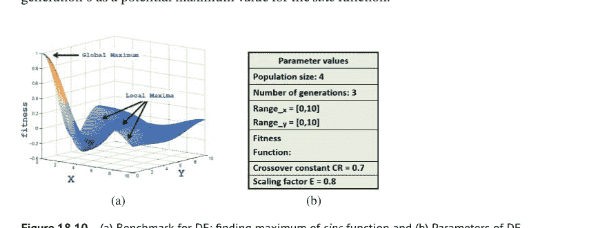

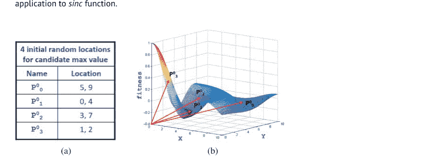

**将位置0从第0代演化到第1代：** 让我们将位置0从第0代演化到第1代（即 $P_0^0 \rightarrow P_0^1$）。构建一个变异向量 $V = (v_x, v_y)$ 如下：

- 假设我们选择：$m = 1, k = 2, r = 3; rnbr = 0; rand_x = 0.8; rand_y = 0.6$。回顾 $CR = 0.7$。我们有：
  $$v_x = 0 + 0.8 \cdot (3 - 1) = 1.6 \quad v_y = 4 + 0.8 \cdot (7 - 2) = 8.$$
- 对于 $U = (u_x, u_y)$ 的 $x$ 维度，由于 $(rand_x \le CR)$ 为假但 $(rnbr = 0)$，我们有：$u_x = v_x = 1.6$。对于 $y$ 维度，由于 $(rand_y \le CR)$ 为真，$u_y = v_y = 8$。
- 现在让我们计算试验解的适应度，并将其与第0代位置的适应度进行比较：$f(5, 9) = -0.0743$ 且 $f(1.6, 8) = 0.1169$，这意味着对于一个最大化问题 $f(U) > f(P_0^0)$。换句话说，试验解建议的第1代位置 $(1.6, 8)$ 是一个比 $P_0^0 = (5, 9)$ 更好的位置。因此，我们使用试验解 $U$ 给出的第1代位置：$P_0^1 = (1.6, 8)$。

**将位置1从第0代演化到第1代：** 将位置1从第0代演化到第1代（即 $P_1^0 \rightarrow P_1^1$），构建 $V = (v_x, v_y)$ 如下：

- 假设我们选择：$m = 2, k = 0, r = 3; rnbr = 1; rand_x = 0.4; rand_y = 0.8$。回顾 $CR = 0.7$。
  $$v_x = 3 + 0.8 \cdot (5 - 1) = 6.2 \quad v_y = 7 + 0.8 \cdot (9 - 2) = 12.6 = 10 \text{ (受 Range}_y\text{ 限制)}.$$
- 对于 $U = (u_x, u_y)$ 的 $x$ 维度，$(rand_x \le CR)$ 为真，我们有：$u_x = v_x = 6.2$。由于 $(rand_y \le CR)$ 为假但 $rnbr = 1$，我们有：$u_y = v_y = 1$。
- $f(0, 4) = -0.1892$ 且 $f(6.2, 10) = -0.06$，这意味着 $f(U) > f(P_1^0)$。换句话说，试验解建议的第1代位置 $(6.2, 10)$ 是一个比 $P_1^0 = (0, 4)$ 更好的位置。因此，我们使用试验解 $U$ 给出的第1代位置：$P_1^1 = (6.2, 10)$。

**将位置2从第0代演化到第1代：** 将位置2从第0代演化到第1代（即 $P_2^0 \rightarrow P_2^1$），构建 $V = (v_x, v_y)$ 如下：

- 假设我们选择：$m = 3, k = 0, r = 1; rnbr = 0; rand_x = 0.4; rand_y = 0.9$。回顾 $CR = 0.7$。
  $$v_x = 1 + 0.8 \cdot (5 - 0) = 5 \quad v_y = 2 + 0.8 \cdot (9 - 4) = 6.$$
- 对于 $U = (u_x, u_y)$ 的 $x$ 维度，$(rand_x \le CR)$ 为真，则：$u_x = v_x = 5$。对于 $y$ 维度，由于 $(rand_y \le CR)$ 为假且 $rnbr = 0$，我们有：$u_y = P_{2y}^1 = 7$。
- $f(5, 7) = -0.0852$ 且 $f(3, 7) = 0.1276$，这意味着 $f(U) < f(P_2^0)$。换句话说，试验解建议的第1代位置 $(5, 7)$ 并不是一个比 $P_2^0 = (3, 7)$ 更好的位置。因此，我们使用第0代的位置 $P_2^0$ 作为第1代的位置：$P_2^1 = (3, 7)$。

**将位置3从第0代演化到第1代：** 将位置3从第0代演化到第1代（即 $P_3^0 \rightarrow P_3^1$），构建变异向量 $V = (v_x, v_y)$ 如下：

- 假设我们选择：$m = 0, k = 1, r = 2; rnbr = 0; rand_x = 0.5; rand_y = 0.9$。使用 $CR = 0.7$，我们有：
  $$v_x = 5 + 0.8 \cdot (0 - 3) = 2.6 \quad v_y = 9 + 0.8 \cdot (4 - 7) = 6.6.$$
- 让我们构建一个试验解 $U = (u_x, u_y)$。对于 $x$ 维度，由于 $(rand_x \le CR)$ 为真，我们有：$u_x = v_x = 2.6$。对于 $y$ 维度，由于 $(rand_y \le CR)$ 为假且 $rnbr = 1$，我们有：$u_y = v_y = 6.6$。

---

```
initialize population; // random population;
for each individual in population do
    evaluate fitness of candidate;
end for

while (EndCriteria == false)
{
    for each individual i in population do
        create a variant solution;
        create a trial solution;
        if (fitness(trial) < fitness(i))
            replace individual i with trial solution;
        else
            keep individual i in population;
        end if
    end for
}
```

**图18.8** 一个实现DE的简单算法（这里假设较小的适应度值在选择下一代个体时更优）。

种群。DE根据适应度值决定是否在步骤 $(t + 1)$ 用其试验解替换个体 $i$。该算法持续演化一个个体种群，直到达到预定时间或达到适应度函数的满意解。

让我们考虑一个二维解空间，其候选解可以通过适应度函数 $f$ 进行评估（扩展到更高维空间是直接的）。在种群初始化之后，个体 $P_i^g$ 从第 $g$ 代演化到第 $(g + 1)$ 代（即 $P_i^g \rightarrow P_i^{g+1}$），方法是创建一个变异解 $V_i = (v_{ix}, v_{iy})$：

- 从当前种群中选择三个不同的个体作为 $k$、$r$ 和 $m$，使得这三个索引和 $i$ 都互不相同：$i \neq k \neq r \neq m$。
- 个体 $P_k^g$、$P_r^g$ 和 $P_m^g$ 将用于计算变异向量，如下所示：
  $$v_i = P_m^g + E \cdot (P_k^g - P_r^g),$$
  其中 $P_m^g$ 称为基向量，$(P_k^g - P_r^g)$ 称为差分向量，$E$（通常 $E \in [0, 2]$）是控制差分向量放大的缩放因子。
- 对于二维变异向量，我们有：
  $$v_{ix} = P_{mx}^g + E \cdot (P_{kx}^g - P_{rx}^g) \quad v_{iy} = P_{my}^g + E \cdot (P_{ky}^g - P_{ry}^g).$$

对于 $E = 1$ 的特殊情况，变异向量变为 $V_i = P_m^g + P_k^g - P_r^g$。使用变异解 $V_i$，创建一个试验解 $U_i = (u_{ix}, u_{iy})$ 如下：

- 生成 $rand_x$ 和 $rand_y$ – 范围 $(0, 1)$ 内的随机实数。
- 生成 $rnbr$ – 范围 $(0, 1)$ 内的随机整数（对于一般情况，$rnbr$ 是范围 $(0, d - 1)$ 内的随机整数）。
- $CR$（交叉常数）参数被选为范围 $(0,1)$ 内的实数。

试验解的 $x$ 维度确定如下：

- 如果 ($rand_x \leq CR$ 或 $rnbr = 0$)：使用 $x$ 维度的变异解作为试验解的 $x$ 维度：选择试验解为 $u_{ix} = v_{ix}$。
- 如果 ($rand_x > CR$ 且 $rnbr \neq 0$)：试验解的 $x$ 维度与第 $g$ 代个体的 $x$ 维度相同：$u_{ix} = P_{ix}^g$。

类似地，试验解的 $y$ 维度获得如下：

- 如果 ($rand_y \leq CR$ 或 $rnbr = 1$)：使用 $y$ 维度的变异解作为试验解的 $y$ 维度：选择试验解为 $u_{iy} = v_{iy}$。
- 如果 ($rand_y > CR$ 且 $rnbr \neq 1$)：试验解的 $y$ 维度与第 $g$ 代个体的 $y$ 维度相同：$u_{iy} = P_{iy}^g$。

图18.9展示了为所有四种可能情况生成试验解的示例（即仅选择 $x$、仅选择 $y$ 或同时选择 $x$ 和 $y$ 维度解）。

构建试验解 $U_i$ 后，计算其适应度 $f(U_i)$。然后将 $f(U_i)$ 与当前个体的适应度 $f(P_i^g)$ 进行比较。然后执行选择操作如下。如果试验解的适应度优于第 $g$ 代的当前个体，则将其选为第 $(g + 1)$ 代；否则，选择第 $g$ 代的当前个体，使得：

```
if ($f(U_i) < f(P_i^g)$) then $P_i^{g+1} = U_i$
else $P_i^{g+1} = P_i^g$.
```

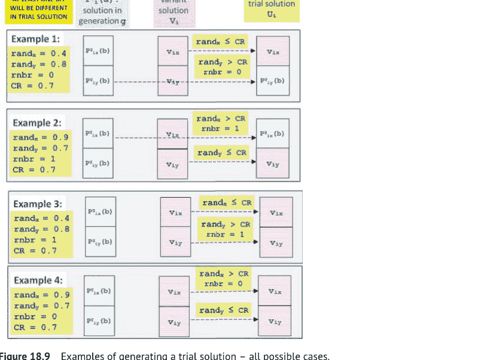

**图18.9** 生成试验解的示例——所有可能的情况。

$f(2.6, 6.6) = 0.1021$ 且 $f(1, 2) = 0.35$，这意味着 $f(U) < f(P_3^0)$。换句话说，第1代试验解建议的位置 $(2.6, 6.6)$ 并不比 $P_3^0 = (1, 2)$ 更好。因此，我们为第1代使用位置 $P_3^0$：$P_3^1 = (1, 2)$。

第0代和第1代的候选位置分别如图18.12和图18.13所示。

## 从第1代到第2代演化位置0

现在，让我们将位置0从第1代演化到第2代（即 $P_0^1 \rightarrow P_0^2$）。首先，我们按如下方式构建一个变异向量 $V = (v_x, v_y)$。假设我们选取：$m = 1, k = 3, r = 2; rnbr = 1; rand_x = 0.6; rand_y = 0.9$。给定 $CR = 0.7$，我们有：

$$v_x = 6.2 + 0.8 \cdot (1 - 3) = 4.6 \quad v_y = 10 + 0.8 \cdot (2 - 7) = 6.$$

- 让我们构建一个试验解 $U = (u_x, u_y)$。对于 $x$ 维度，由于 $(rand_x \leq CR)$ 为真但 $(rnbr = 0)$，我们有：$u_x = P_{0x}^1 = 4.6$。对于 $y$ 维度，由于 $(rand_y \leq CR)$ 为假但 $rnbr = 1$，我们有：$u_y = v_y = 6$。
- 试验解的适应度：$f(4.6, 6) = -0.1266$ 且 $f(1.6, 8) = 0.1169$，这意味着第2代试验解建议的位置 $(4.6, 6)$ 比 $P_0^1 = (1.6, 8)$ 更好。因此，我们为第2代使用试验解 $U$ 给出的位置：$P_0^2 = (4.6, 6)$。

## 从第1代到第2代演化位置1

将位置1从第1代演化到第2代（即 $P_1^1 \rightarrow P_1^2$），$V = (v_x, v_y)$ 按如下方式构建：

| 名称 | 位置 | 适应度 |
|---|---|---|
| $P_0^0$ | 5, 9 | -0.0743 |
| $P_1^0$ | 0, 4 | -0.1892 |
| $P_2^0$ | 3, 7 | 0.1276 |
| $P_3^0$ | 1, 2 | 0.35 |

| 名称 | 位置 | 适应度 |
|---|---|---|
| $P_0^1$ | 1.6, 8 | 0.1169 |
| $P_1^1$ | 6.2, 10 | -0.06 |
| $P_2^1$ | 3, 7 | 0.1276 |
| $P_3^1$ | 1, 2 | 0.35 |

**图18.12** 第1代的候选位置（$P_j^0$ 是第0代作为初始随机种群的候选位置 $j$，$P_j^1$ 是第1代的位置）。

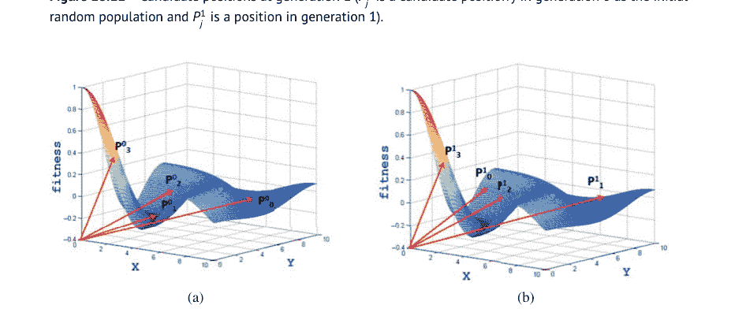

**图18.13** 最大化 $sinc$ 函数的候选位置：(a) 初始位置 和 (b) 第1代的位置。

假设我们选取：$m = 3, k = 0, r = 2; rnbr = 1; rand_x = 0.4; rand_y = 0.8$。给定 $CR = 0.7$，我们有：
$v_x = 1 + 0.8 \cdot (1.6 - 3) = -0.12 \rightarrow 0$（必须在0和 $Range_x$ 之间）
$v_y = 2 + 0.8 \cdot (8 - 7) = 2.8$。

让我们构建一个试验解 $U = (u_x, u_y)$。对于 $x$ 维度，由于 $(rand_x \le CR)$ 为真，我们有：$u_x = v_x = 0$。对于 $y$ 维度，由于 $(rand_y \le CR)$ 为假但 $rnbr = 1$，我们有：$u_y = v_y = 2.8$。

$f(0, 4) = -0.1892$ 且 $f(6.2, 10) = -0.06$，这意味着 $f(U) > f(P_1^1)$。换句话说，第2代试验解建议的位置 $(0, 2.8)$ 比 $P_1^1 = (6.2, 10)$ 更好。因此，我们为第2代使用试验解 $U$ 给出的位置：$P_1^2 = (0, 2.8)$。

## 从第1代到第2代演化位置2

将位置2从第1代演化到第2代（即 $P_2^1 \rightarrow P_2^2$），$V = (v_x, v_y)$ 按如下方式构建：

假设我们选取：$m = 1, k = 3, r = 0; rnbr = 0; rand_x = 0.4; rand_y = 0.8$。回顾 $CR = 0.7$。
$v_x = 6.2 + 0.8 \cdot (1 - 1.6) = 5.72 \quad v_y = 10 + 0.8 \cdot (2 - 8) = 5.2$。

让我们构建一个试验解 $U = (u_x, u_y)$。对于 $x$ 维度，由于 $(rand_x \le CR)$ 为真，我们有：$u_x = v_x = 5.72$。对于 $y$ 维度，由于 $(rand_y \le CR)$ 为假且 $rnbr = 0$，我们有：$u_y = P_{1y}^2 = 7$。

$f(5.72, 7) = -0.0415$ 且 $f(3, 7) = 0.1276$，这意味着 $f(U) < f(P_2^1)$。换句话说，第2代试验解建议的位置 $(5, 7)$ 并不比 $P_2^1 = (3, 7)$ 更好。因此，我们为第2代使用位置 $P_2^1$：$P_2^2 = (3, 7)$。

## 从第1代到第2代演化位置3

将位置3从第1代演化到第2代（即 $P_3^1 \rightarrow P_3^2$），$V = (v_x, v_y)$ 按如下方式构建：

假设我们选取：$m = 2, k = 0, r = 1; rnbr = 1; rand_x = 0.4; rand_y = 0.2$。回顾 $CR = 0.7$：
$v_x = 3 + 0.8 \cdot (1.6 - 6.2) = -0.68 \rightarrow 0 \quad v_y = 7 + 0.8 \cdot (8 - 10) = 5.4$。

对于 $U = (u_x, u_y)$ 的 $x$ 维度，由于 $(rand_x \le CR)$ 为真，我们有：$u_x = v_x = 0$。对于 $y$ 维度，由于 $(rand_y \le CR)$ 为真，我们有：$u_y = v_y = 5.4$。

$f(0, 5.4) = 0.1431$ 且 $f(1, 2) = 0.3518$，这意味着 $f(U) < f(P_3^1)$。换句话说，第2代试验解建议的位置 $(0, 5.4)$ 并不比 $P_3^1 = (1, 2)$ 更好。因此，我们为第2代使用位置 $P_3^1$：$P_3^2 = (1, 2)$。

第1代和第2代的位置分别如图18.14和图18.15所示。更多代以类似方式处理，并在最后一代选择最佳解作为最终解。

### 18.3.5 关于DE的备注

DE是最近引入该领域的人工智能技术之一。它不使用传统的遗传算子，如交叉和变异；而是使用变异解来决定下一代的搜索方向。由于这一特性，DE在生成多样化种群方面具有改进的机会，因为它对每个个体使用不同的扰动。实现DE的算法计算开销轻量，已被证明在金融应用中有效。与其他进化计算方法类似，DE也需要一个与应用领域需求相匹配的明确定义的适应度函数。

306 | 18 进化方法

| 名称 | 位置 | 适应度 |
|---|---|---|
| $P_0^1$ | 1.6, 8 | 0.1169 |
| $P_1^1$ | 6.2, 10 | -0.06 |
| $P_2^1$ | 3, 7 | 0.1276 |
| $P_3^1$ | 1, 2 | 0.35 |

| 名称 | 位置 | 适应度 |
|---|---|---|
| $P_0^2$ | 1.6, 8 | 0.12 |
| $P_1^2$ | 0, 2.8 | 0.119 |
| $P_2^2$ | 3, 7 | 0.13 |
| $P_3^2$ | 1, 2 | 0.35 |

**图18.14** 第2代的候选位置（$P_j^1$ 是第1代的候选位置 $j$，$P_j^2$ 是第2代的位置）。

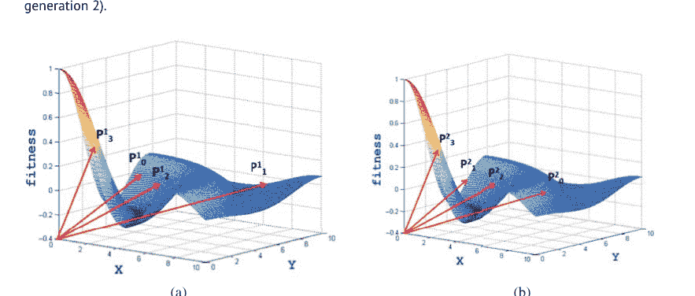

## 18.4 文法进化

文法进化（GE）是一种强大的技术，用于生成解决方案为计算机程序的问题。与任何编程语言一样，GE要求为可接受的解决方案定义一种语法，该语法针对每个应用是特定的。GE生成的程序可以使用任何标准编程语言实现。GE是一个强大的人工智能工具，特别是在需要考虑大量参数（每个参数都有自己的搜索空间）才能得出解决方案的问题中。一个GE应用的例子是为自动驾驶车辆设计有效的自动驾驶协议，其中需要评估数百个具有不同参数值的输入变量，以便实时做出安全决策。

### 18.4.1 GE的一个简单算法

图18.16展示了实现GE的一个简单算法。在此算法中，首先创建一个由随机选择的候选解组成的初始种群。这一步骤在大多数基于进化的计算技术（如GA、PSO和DE）中是常见的。候选解由染色体表示，染色体由一系列密码子数组成。程序使用个体的密码子值和为此应用定义的语言规则生成。在GE中，使用巴科斯-诺尔范式（BNF）[148, 149]来定义一组规则，以描述当前应用的语法。基于BNF规则从给定染色体推导程序的过程将在下一节描述。

一旦从染色体推导出程序，就必须计算其适应度值。由于解决方案是一个程序，因此必须有一个媒介让该程序执行并为应用生成结果。与其他进化方法类似，根据候选解的表现，将为其分配一个适应度值。例如，如果候选程序用于算法交易应用，它将在历史金融数据上执行。适应度可以是候选程序在一段时间内产生的利润。图18.16中的GE实现使用了传统GA中常见的标准选择、交叉和变异操作，以促进更适应的个体从一代传递到下一代。进化操作重复进行，直到找到满意的解决方案或达到停止标准。

```
initialize population; // random population;
for each individual in population do
    generate candidate solution using BNF rules;
    evaluate fitness of candidate;
end for

while (EndCriteria == false)
{
    select parents for reproduction;
        // typically among the fittest
        // individuals are selected
        // as parents;
    generate offspring by crossover and mutation;
    generate candidate solution using BNF rules;
    evaluate offspring and form new generation;
        // offspring replaces less fit
        // members of the population (if any)
}
```

**图18.16** 用于PSO的基准测试函数Rosenbrock函数。

### 18.4.2 GE的定义

由于GE中的解决方案是计算机程序，因此每个特定应用都需要一个定义可接受程序的有效语法的语法。在BNF中，编程语言的语法由一个元组 {N, T, P, S} 给出，其中 N 是非终结符变量的集合，T 是终结符（例如，数字或布尔变量值等字面符号），P 是一组产生式规则，S ∈ N 是开始符号 [148]。P 中的每条规则都使用元符号 ::= 来定义如何扩展非终结符。在产生式规则中，符号“|”分隔非终结符的替代定义。一对符号 < 和 > 分别定义非终结符的开始和结束。N 的元素通过一系列规则映射到 T。在这些规则中，N 的一个元素可以出现在规则的左侧或右侧。然而，终结符不能出现在左侧

## GE 的变体

一些 GE 实现使用 PSO 来探索可能解的搜索空间，以期在从一代移动到下一代时提高种群成员的适应度。这种 GE 的变体被称为语法群[151]。在 π 语法进化（πGE）中，提出了一种从 BNF 推导候选解的不同顺序[152]。在 πGE 中，密码子值用于指定接下来要展开的非终结符，而不是传统的从左到右的处理顺序。这种变体提供了更灵活的生成候选解的方法，因此预计在种群多样性至关重要的应用中更为有效。为了提高 GE 的搜索能力，加权分层 GE 基于基因型施加了一个层次结构，并根据这些符号的相对表达能力，用不同数量的位对语法符号进行编码[153]。

## GE 的应用

GE 已被应用于解决广泛学科中的大量工程问题。例如，GE 可用于群体机器人学，以管理作为单一系统运行的多个机器人。自主机器人的集体行为可以通过为每个个体机器人进化一组规则来合成。一个规定机器人动作的程序可以从 BNF 语法规则中推导出来[154]。

在金融领域，算法交易策略可以用 BNF 语法表示，以填充各种技术指标中的不同元参数[155]。同样，破产、公司分析和信用分类也在 GE 应用的范围内[156]。在生物信息学中，GE 可用于识别真核生物启动子，以鉴定生物基因[157]。

在电信领域，GE 可以生成能够识别网络上的恶意活动并设置适当访问策略以防止未经授权使用网络资源的程序[158]。可以设计一种 BNF 语法，以允许生成的程序检测网络攻击的方式来考虑网络流量[159]。GE 也可用于制定平衡潜在冲突目标（例如，安全风险、网络节点暴露以及授权用户方便访问网络资源）的安全规则。在此应用中，GE 的 BNF 语法可以推断多级安全策略，以确定可信实体及其适当的按需访问权限[160]。

## BNF 表示法

BNF 表示法将语言的语法表示为产生式规则，如下所示[149]：

- 终结符：语言中出现的项目（例如 +,-,0,1,...,9 等）
- 非终结符：它们是可以展开为一个或多个终结符和非终结符的项
- 语法可以用一个元组 G = {N, T, P, S} 表示，其中
  - N：非终结符的集合；例如，N = {exp, op, cond}
  - T：终结符的集合；例如，T = {1, 2, ..., 9, (, ), if, else}
  - P：产生式规则的集合；例如，< exp > ::= < exp > | < int >< cond >< int >
  - S：起始符号（S ∈ N）；例如，S = < exp >

## 圣达菲路径问题

圣达菲路径问题是人工蚂蚁问题的一个实例[107]，其目标是找到一个计算机程序来控制一个人工蚂蚁，使蚂蚁能够找到所有的食物块。图 18.17 显示了圣达菲路径，它包含 89 块食物，放置在 32 × 32 环形网格上的路径上。该路径有 144 个方格和 21 个转弯。图 18.18 显示了圣达菲路径问题的一个示例 BNF。一个人工蚂蚁在一个时间单位内可以执行以下动作之一：

- 左转
- 右转
- 向前移动

人工蚂蚁可以观察它当前面向的方格，并判断该方格是包含食物块还是空的。如果蚂蚁移动进入的方格中有食物，则假定蚂蚁会自动消耗食物，无需特定命令。报告的最佳解决方案在 545 步内完成路径[161]。使用图 18.18 所示的 BNF 语法生成的最佳性能程序如图 18.19 所示[107]。

## 人工蚂蚁的简单 BNF

现在让我们考虑一个如图 18.20 所示的示例 BNF，它比图 18.18 所示的更简单。图 18.21 展示了一个示例染色体（即基因型）以及使用该染色体和图 18.20 的 BNF 语法生成的表达式树（即表型）。该表达式树的逐步生成过程如图 18.22 至 18.23 所示。推导从考虑 BNF 的起始符号 S 表达式开始，在此示例中 S = <expr>（图 18.22）。在 <expr> 定位到表达式树的根节点后，我们观察到展开名为 <expr> 的非终结符有两个选择，即 `if food ahead then <act> else <act>` 和 `<expr>`。为了解决这个选择，我们使用基因组的第一个密码子，它是 0，这意味着 `if food ahead then <act> else <act>` 将被放置在 <expr> 下方。此时，终结符 `if food ahead then` 将被放置在 <expr> 下方，但非终结符 <act> 必须被解析。非终结符 <act> 有三个选择，即 `<move><expr>`、`<move>` 和 `<move><act>`。这个选择由基因组的下一个密码子解决，它是 2。因此，第三个选择 `<move><act>` 将被放入表达式树中 <act> 的下方。推导以类似的方式继续，直到树中的所有非终结符都使用基因组中的密码子值解析为终结符。

上述示例的构建方式使得图 18.20 中所示基因型的密码子值被预先定义，以匹配每个 BNF 规则可用的选择数量。然而，通常情况下，基因型的密码子值可能任意大。对于这些情况，我们可以使用模函数来获得由给定 BNF 规则中选择数量决定的适当密码子值。例如，图 18.24 显示了一个具有任意大整数值的基因型。在这种情况下，将应用模运算符来解决待评估非终结符的选择。例如，在 <expr> 定位到表达式树的根节点后，展开名为 <expr> 的非终结符的两个选择，即 `if food ahead then <act> else <act>` 和 `<expr>`，通过使用密码子值 0 来解决，即 `if food ahead then <act> else <act>`。终结符 `if food ahead then` 将被放置在 <expr> 下方，但非终结符 <act> 必须被解析。非终结符 <act> 有三个选择，即 `<move><expr>`、`<move>` 和 `<move><act>`。这个选择由基因组的下一个密码子解决，它是 5。这意味着选择将是 5 模 3 = 2，即 `<move><act>`。通常，当一个非终结符有 c 个选择且密码子值为 r 时，选择将是 (r 模 c)。为简单起见，图 18.24 中的基因型值被选择为通过应用图 18.20 的 BNF 生成与图 18.23 中相同的程序。

---

**原始文本中的代码块和表格内容：**

```
< int > ::= < digit > | < int >< digit >
```

```
< digit > ::= 0 | 1 | 2 | 3 | 4 | 5 | 6 | 7 | 8 | 9
```

```
choice = C_n modulo R_n
```

| 1001 | 1111 | 0100 | 1110 | 1001 |
|------|------|------|------|------|
| 9    | 15   | 4    | 14   | 9    |

```
< int >< digit >
```

```
< digit >< digit >< digit >
```

```
4 < digit >< digit >
```

```
48 < digit >
```

```
<expr> ::= <line> | <expr> <line>
<line> ::= if food-ahead then <expr> else <expr> | <move>
<move> ::= turn left | turn right | step ahead
```

```
if food-ahead
then
    step ahead
else
    turn left
    if food-ahead
    then
        step ahead
    else
        turn right; turn right
        if food-ahead
        then
            step ahead
        else
            turn left;
            step ahead
```

```
<expr> ::= if food-ahead then <act> else <act> | <expr>
<act> ::= <move><expr> | <move> | <move> <act>
<move> ::= turn left | turn right | step ahead
```

Genotype: 0 2 2 1 1 0 0 0 1 1 1 0

## 312 | 18 进化方法

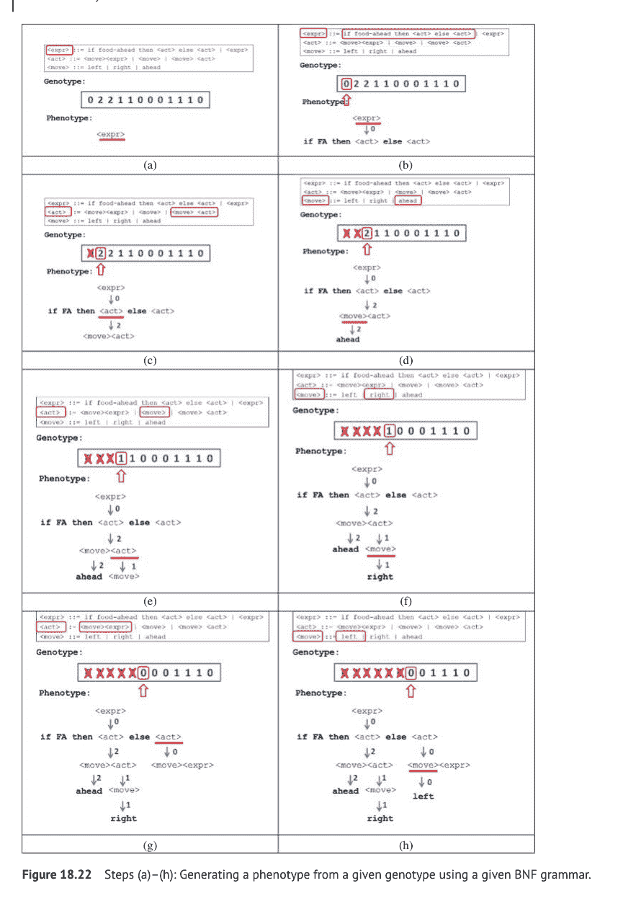

## 18.4 文法进化 | 313

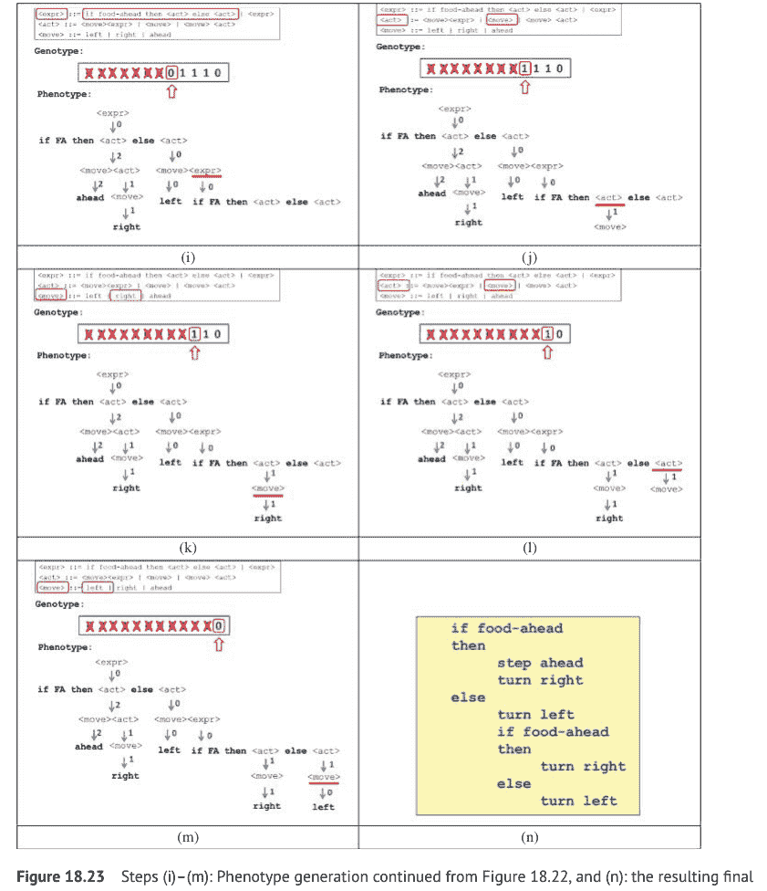

请注意，由于递归的存在，一个表现型可能无法完成。在这种情况下，转换会被中止，这与生物学中的情况类似。

图18.25展示了在包含三个食物点的简单路径上，计算图18.23n中程序适应度的步骤。在这个例子中，候选程序的适应度可以定义为由该候选程序控制移动的人工蚂蚁所消耗的食物数量。

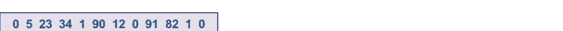

图18.24 一个具有任意大小密码子值的染色体示例，它生成了与图18.22中染色体相同的程序（使用模函数来生成BNF规则选择）。

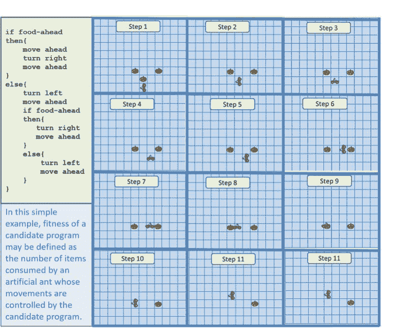

图18.25 使用包含三个食物点的简单路径，计算左上角所示程序的适应度。

### 18.4.3 用于实现GE的简单GA

现在让我们理解，由给定BNF生成的有效程序（即表现型）将如何作为进化算法的一部分使用。为简单起见，让我们首先假设我们将使用GA作为进化基因型的方法。

正如我们在第14章所学，在实现GA时，首先形成一个由候选解组成的初始种群，每个候选解都具有随机选择的密码子值的染色体。然后评估每个候选解的适应度，并根据候选解的适应度值对种群进行排序（图14.3）。根据预先确定的标准，选择一组候选解作为父代，通过使用交叉和变异算子生成下一代的后代。计算后代的适应度，并将先前的种群与后代暂时合并；然而，只有表现最好的部分种群被保留用于未来的世代。根据它们的适应度，表现不佳的后代可能不会被包含在新的种群中。

在将GE适配到GA框架中时，每个表现型通过在其原生环境中运行给定的BNF文法来进行评估。例如，如果BNF是为C++程序编写的，那么表现型将是一个C++程序，它将被编译和执行，并根据给定的标准评估其输出。另一方面，如果BNF是为Python脚本编写的，那么它将在BNF指定的环境中直接执行。假设BNF是为执行第4章所述的算法交易而编写的。那么表现型将被置于电子交易环境中，并观察其性能。根据期望的标准（例如它产生的利润金额），将为表现型（即GA种群中的候选解）分配一个适应度值。

### 18.4.4 关于GE的评述

GE是一种用于探索大型解空间的强大技术。它适用于解是计算机程序的问题。由于GE独立于编程语言和程序执行环境，它是一种通用技术，适用于从金融领域到太空探索任务的广泛应用。BNF文法的深度和每个基因组适应度函数计算的计算成本定义了GE的计算复杂性。

## 附录A

## 带有偏置的ANN

## A.1 引言

在表示现实问题的ANN模型中，需要一个偏置输入来更准确地调整权重并更快地收敛以减少输出误差。为了将偏置作为ANN模型的一部分，必须在ANN的每个隐藏层和输出层添加一个额外的输入。类似于连接神经元的常规ANN突触，偏置突触的权重也与最初被赋予随机值的权重相关联。因此，偏置输入通过前向和反向传播计算中的求和与激活函数与连接权重混合在一起。在训练期间，偏置权重根据误差值以类似于突触权重的方式进行更新。在本附录中，我们将推导在每次训练迭代中，使用输入偏置的ANN中用于更新神经元突触权重和偏置连接权重的方程。

## A.2 使用偏置输入进行训练

图A.1展示了一个带有偏置输入的隐藏层神经元，其中添加了一个权重为$B$的偏置连接作为神经元的输入之一。现在让我们为包含偏置输入的神经元的传入和传出连接制定权重。如图A.2所示，求和函数的工作方式如下：

```
$e_1 = (x_1 \cdot w_1) + (x_2 \cdot w_4) + b_1$
$e_2 = (x_1 \cdot w_2) + (x_2 \cdot w_5) + b_2$
$e_3 = (x_1 \cdot w_3) + (x_2 \cdot w_6) + b_3$。
```

激活函数$f(.)$应用于每个隐藏神经元的求和信号，如下所示：

```
$a_1 = f(e_1)$
$a_2 = f(e_2)$
$a_3 = f(e_3)$，
```

其中$a_1$、$a_2$和$a_3$的值是根据神经元所采用的激活函数确定的，如第2章公式(2.1)和(2.3)所示。类似地，在输出层，输出神经元有三个输入，它们被聚合为：

```
$e_4 = (a_1 \cdot w_7) + (a_2 \cdot w_8) + (a_3 \cdot w_9) + b_4$。
```

获得$e_4$后，将其馈送到激活函数$a_4 = f(e_4)$。

318 | 附录A 带有偏置的ANN

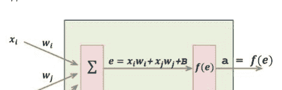

图A.1 ANN输出层中带有偏置输入的神经元。

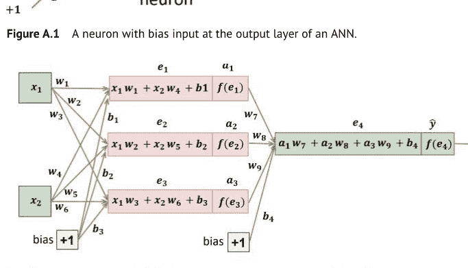

图A.2 隐藏层神经元中的求和与激活。

## A.3 前向传播

图A.3展示了一个简单的ANN，它有两个输入、一个隐藏层和一个输出层，并使用了偏置输入。类似于第2章第2.3.4节中的推导，我们有$x_1, x_2$和偏置作为神经元的输入。

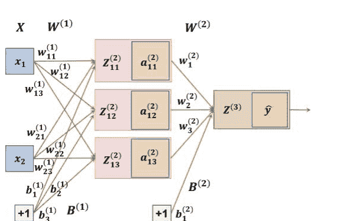

图A.3 带有两个偏置输入、一个隐藏层和一个带偏置输出的示例ANN。

### A.3.1 从输入到隐藏层的前向传播

现在让我们考虑ANN训练过程中的前向传播步骤。对于本节的推导，与第2.5节一样，我们将使用图A.3所示的简单ANN。对于这个简单ANN从输入到隐藏层的前向传播，我们有：

$Z_{(11)}^{(2)} = x_1 \cdot w_{11}^{(1)} + x_2 \cdot w_{21}^{(1)} + b_1^{(1)}$
$Z_{(12)}^{(2)} = x_1 \cdot w_{12}^{(1)} + x_2 \cdot w_{22}^{(1)} + b_2^{(1)}$
$Z_{(13)}^{(2)} = x_1 \cdot w_{13}^{(1)} + x_2 \cdot w_{23}^{(1)} + b_3^{(1)}$

使用第2章公式(2.1)中给出的sigmoid激活函数的定义，我们得到隐藏层神经元的以下输出：

$Z_{(11)}^{(2)} = x_1 \cdot w_{11}^{(1)} + x_2 \cdot w_{21}^{(1)} + b_1^{(1)}$
$Z_{(12)}^{(2)} = x_1 \cdot w_{12}^{(1)} + x_2 \cdot w_{22}^{(1)} + b_2^{(1)}$
$Z_{(13)}^{(2)} = x_1 \cdot w_{13}^{(1)} + x_2 \cdot w_{23}^{(1)} + b_3^{(1)}$

在输出层神经元处，三个输入突触和偏置的聚合产生

$Z^{(3)} = a_{11}^{(2)} \cdot w_1^{(2)} + a_{12}^{(2)} \cdot w_2^{(2)} + a_{13}^{(2)} \cdot w_3^{(2)} + b_1^{(2)}$

最后在输出层，使用sigmoid激活函数生成$\hat{y}$为

$\hat{y} = f(Z^{(3)}) = \frac{1}{1 + e^{-Z}}$
$= \frac{1}{1 + e^{-(a_{11}^{(2)} \cdot w_1^{(2)} + a_{12}^{(2)} \cdot w_2^{(2)} + a_{13}^{(2)} \cdot w_3^{(2)} + b_1^{(2)})}}$

### A.3.2 带有偏置输入的神经元反向传播

让我们回顾一下带有偏置输入的神经元的反向传播步骤，该神经元有两个输入$x_a$和$x_b$，以及一个通过权重$w_a$、$w_b$和$B$分别传入的偏置，生成输出$\hat{y}$，如图A.4所示。神经元的输出及其偏导数定义为

$\hat{y} = f(e)$，$\frac{\partial \hat{y}}{\partial e} = f'(e)$。

对于$e = x_a w_a + x_b w_b + B$，$e$相对于$w_a$、$w_b$和$B$的偏导数如下：

$\frac{\partial e}{\partial w_a} = x_a$，$\frac{\partial e}{\partial w_b} = x_b$，$\frac{\partial e}{\partial B} = 1$。

对于定义为$J = \frac{1}{2}(y - \hat{y})^2$的误差$J$，$J$相对于$w_a$的偏导数为

$\frac{\partial J}{\partial W_i} = -(y - \hat{y}) \frac{\partial \hat{y}}{\partial W_i} = -(y - \hat{y}) \frac{\partial \hat{y}}{\partial e} \frac{\partial e}{\partial W_i}$。

让我们定义$\delta = -(y - \hat{y})f'(e)$并将其代入上述误差方程：

$\frac{\partial J}{\partial w_a} = \delta \frac{\partial e}{\partial w_a} = \delta x_a$。

$J$相对于$w_b$的偏导数为

$\frac{\partial J}{\partial w_b} = -(y - \hat{y}) \frac{\partial \hat{y}}{\partial w_b} = -(y - \hat{y}) \frac{\partial \hat{y}}{\partial e} \frac{\partial e}{\partial w_b}$。

## 附录 A 带偏置的ANN

对于 $\delta = -(y - \hat{y})f'(e)$，我们有

$$\frac{\partial J}{\partial w_b} = \delta \frac{\partial e}{\partial w_b} = \delta x_b.$$

类似地，$J$ 对 $B$ 的偏导数为

$$\frac{\partial J}{\partial B} = -(y - \hat{y})\frac{\partial \hat{y}}{\partial B}Z = -(y - \hat{y})\frac{\partial \hat{y}}{\partial e}\frac{\partial e}{\partial B}.$$

再次使用 $\delta = -(y - \hat{y})f'(e)$，我们有

$$\frac{\partial J}{\partial B} = \delta \frac{\partial e}{\partial B} = \delta.$$

使用这些值，对于学习率 $\alpha$，权重将按如下方式更新：

$$w_a = w_a - \alpha \frac{\partial J}{\partial w_a}, \quad w_b = w_b - \alpha \frac{\partial J}{\partial w_b}, \quad B = B - \alpha \frac{\partial J}{\partial B}.$$

# 附录 B 带偏置的睡眠研究ANN

## B.1 在ANN中加入偏置项

将偏置输入加入到一个简单的ANN中，我们得到如图B.1所示的ANN。
一个用于反向传播的带偏置神经元如图B.2所示。

$$J = \frac{1}{2}(y - \hat{y})^2$$

$J$ 对 $b$ 的偏导数为

$$\frac{\partial J}{\partial b} = -(y - \hat{y})\frac{\partial \hat{y}}{\partial b} = -(y - \hat{y})\frac{\partial \hat{y}}{\partial e}\frac{\partial e}{\partial b}.$$

对于 $\delta = -(y - \hat{y})f'(e)$，我们有

$$\frac{\partial J}{\partial b} = \delta \cdot 1 = \delta.$$

### B.1.1 在矩阵中加入偏置

假设有 $k$ 个不同的偏置值，每个对应于第 $i$ 层具有 $k$ 个神经元的每个神经元：

$$b^{(i)} = [b_1 \ b_2 \ \cdots \ b_k].$$

对于 $n$ 个样本，偏置矩阵的维度变为样本数量乘以第 $i$ 层的神经元数量：

$$b^{(i)} = \begin{bmatrix} b_1 & b_2 & \cdots & b_k \\ b_1 & b_2 & \cdots & b_k \\ \vdots & \vdots & \ddots & \vdots \\ b_1 & b_2 & \cdots & b_k \end{bmatrix}.$$

$B^{(i)}$ 有 $n$ 行，每行有 $k$ 个元素。在每一行 $a$ 中，第 $j^{th}$ 个元素是相同的，最终导致 $B^{(i)}$ 的每一列具有相同的偏置值，如上所示。类似地，对于 $\delta$ 值，我们有以下矩阵：

$$\delta^{(i)} = \begin{bmatrix} \delta_1 & \delta_2 & \cdots & \delta_k \\ \delta_1 & \delta_2 & \cdots & \delta_k \\ \vdots & \vdots & \ddots & \vdots \\ \delta_1 & \delta_2 & \cdots & \delta_k \end{bmatrix}.$$

对于 $mean(\delta^{(i)})$，可以定义一个矩阵为：

$$mean(\delta^{(i)}) = [mean(\delta^{(1)}) \ mean(\delta^{(2)}) \ \cdots \ mean(\delta^{(k)})].$$

图B.1 用于睡眠研究示例的带偏置输入的简单ANN。

图B.2 用于睡眠研究示例的反向传播中带偏置的神经元。

### B.1.2 带偏置的前向传播

回顾归一化情况下的输入和输出值：

$$X = \begin{bmatrix} 0.3 & 1 \\ 0.5 & 0.2 \\ 1 & 0.4 \end{bmatrix} \quad Y = \begin{bmatrix} 0.75 \\ 0.82 \\ 0.93 \end{bmatrix}.$$

随机选择的 $W^{(1)}$ 和 $W^{(2)}$ 矩阵为

$$W^{(1)} = \begin{bmatrix} -0.2 & 0.8 & 0.3 \\ 0.6 & -0.4 & -0.2 \end{bmatrix} \quad W^{(2)} = \begin{bmatrix} -0.1 \\ 0.2 \\ 0.1 \end{bmatrix}.$$

随机选择的 $b^{(1)}$ 和 $b^{(2)}$ 矩阵为

$$b^{(1)} = [0.2 \quad -0.5 \quad 0.4] \quad b^{(2)} = [0.1]$$

$$Z^{(2)} = XW^{(1)} + B^{(1)} = \begin{bmatrix} 0.3 & 1 \\ 0.5 & 0.2 \\ 1 & 0.4 \end{bmatrix} \begin{bmatrix} -0.2 & 0.8 & 0.3 \\ 0.6 & -0.4 & -0.2 \end{bmatrix} + \begin{bmatrix} 0.2 & -0.5 & 0.4 \\ 0.2 & -0.5 & 0.4 \\ 0.2 & -0.5 & 0.4 \end{bmatrix}$$

$$= \begin{bmatrix} 0.7 & -0.6 & 0.3 \\ 0.2 & -0.2 & 0.5 \\ 0.2 & 0.1 & 0.6 \end{bmatrix}.$$

使用线性整流激活函数：

$$a^{(2)} = f(Z^{(2)}) = \begin{bmatrix} 0.7 & 0 & 0.3 \\ 0.2 & 0 & 0.5 \\ 0.2 & 0.1 & 0.6 \end{bmatrix}$$

$$Z^{(3)} = a^{(2)}W^{(2)} + B^{(2)} = \begin{bmatrix} 0.7 & 0 & 0.3 \\ 0.2 & 0 & 0.5 \\ 0.2 & 0.1 & 0.6 \end{bmatrix} \begin{bmatrix} -0.1 \\ 0.2 \\ 0.1 \end{bmatrix} + \begin{bmatrix} 0.1 \\ 0.1 \\ 0.1 \end{bmatrix} = \begin{bmatrix} 0.06 \\ 0.13 \\ 0.17 \end{bmatrix}$$

$$\hat{y} = f(Z^{(3)}) = \begin{bmatrix} 0.06 \\ 0.13 \\ 0.17 \end{bmatrix}$$

$$J = \sum \frac{1}{2}(y - \hat{y})^2 = \frac{1}{2}((0.75 - 0.06)^2 + (0.82 - 0.13)^2 + (0.93 - 0.17)^2) = 1.53$$

$$\delta^{(3)} = -(y - \hat{y}) .* f'(Z^{(3)}) = -\begin{bmatrix} 0.69 \\ 0.69 \\ 0.76 \end{bmatrix} .* \begin{bmatrix} 1 \\ 1 \\ 1 \end{bmatrix} = \begin{bmatrix} -0.69 \\ -0.69 \\ -0.76 \end{bmatrix},$$

其中 .* 表示逐元素乘法。

$$\delta^{(2)} = \delta^{(3)}W^{(2)T} .* f'(Z^{(2)}) = \begin{bmatrix} -0.69 \\ -0.69 \\ -0.76 \end{bmatrix} \begin{bmatrix} -0.1 & 0.2 & 0.1 \end{bmatrix} .* \begin{bmatrix} 1 & 0 & 1 \\ 1 & 0 & 1 \\ 1 & 1 & 1 \end{bmatrix}$$
$$= \begin{bmatrix} 0.07 & 0 & -0.07 \\ 0.07 & 0 & -0.07 \\ 0.08 & -0.15 & -0.08 \end{bmatrix}$$

$$\frac{\partial J}{\partial W^{(2)}} = a^{(2)T}\delta^{(3)} = \begin{bmatrix} 0.74 & 0.24 & 0 \\ 0 & 0 & 0.14 \\ 0.29 & 0.51 & 0.62 \end{bmatrix} \begin{bmatrix} -0.69 \\ -0.69 \\ -0.76 \end{bmatrix} = \begin{bmatrix} -0.84 \\ -0.11 \\ -1.02 \end{bmatrix}$$

$$\frac{\partial J}{\partial W^{(1)}} = X^T\delta^{(2)} = \begin{bmatrix} 0.3 & 0.5 & 1 \\ 1 & 0.2 & 0.4 \end{bmatrix} \begin{bmatrix} 0.07 & 0 & -0.07 \\ 0.07 & 0 & -0.07 \\ 0.08 & -0.15 & -0.08 \end{bmatrix} = \begin{bmatrix} 0.14 & -0.15 & -0.14 \\ 0.12 & -0.06 & -0.12 \end{bmatrix}$$

$$\frac{\partial J}{\partial b^{(2)}} = \text{mean } \delta^{(3)} = [-0.71]$$
$$\frac{\partial J}{\partial b^{(1)}} = \text{mean } \delta^{(2)} = \begin{bmatrix} 0.07 & -0.05 & -0.07 \\ 1 & 0.2 & 0.4 \end{bmatrix}.$$

现在让我们使用学习率 $\alpha = 0.25$ 计算带偏置的归一化值的新权重：

$$W^{(1)} = W^{(1)} - \alpha \frac{\partial J}{\partial W^{(1)}} = \begin{bmatrix} -0.2 & 0.8 & 0.3 \\ 0.6 & -0.4 & -0.2 \end{bmatrix} - 0.25 \begin{bmatrix} 0.14 & -0.15 & -0.14 \\ 0.12 & -0.06 & -0.12 \end{bmatrix}$$
$$= \begin{bmatrix} -0.24 & 0.84 & 0.34 \\ 0.57 & -0.39 & -0.17 \end{bmatrix}$$

$$W^{(2)} = W^{(2)} - \alpha \frac{\partial J}{\partial W^{(2)}} = \begin{bmatrix} -0.1 \\ 0.2 \\ 0.1 \end{bmatrix} - 0.25 \begin{bmatrix} -0.84 \\ -0.11 \\ -1.02 \end{bmatrix} = \begin{bmatrix} 0.11 \\ 0.23 \\ 0.36 \end{bmatrix}$$

$$b^{(1)} = b^{(1)} - \alpha \frac{\partial J}{\partial b^{(1)}} = [0.2 \ -0.5 \ 0.4] - 0.25 [0.07 \ -0.05 \ -0.07]$$
$$= [0.18 \ -0.49 \ 0.42]$$

$$b^{(2)} = b^{(2)} - \alpha \frac{\partial J}{\partial b^{(2)}} = [0.1] - 0.25 [-0.71] = [0.28].$$

### 归一化 – 带偏置的前向传播（第2轮）：

$$Z^{(2)} = XW^{(1)} + B^{(1)} = \begin{bmatrix} 0.3 & 1 \\ 0.5 & 0.2 \\ 1 & 0.4 \end{bmatrix} \begin{bmatrix} -0.24 & 0.84 & 0.34 \\ 0.57 & -0.39 & -0.17 \end{bmatrix} + \begin{bmatrix} 0.18 & -0.49 & 0.42 \\ 0.18 & -0.49 & 0.42 \\ 0.18 & -0.49 & 0.42 \end{bmatrix} = \begin{bmatrix} 0.68 & -0.63 & 0.35 \\ 0.17 & -0.15 & 0.56 \\ 0.17 & 0.19 & 0.69 \end{bmatrix}.$$

使用线性整流激活函数：

$$a^{(2)} = f(Z^{(2)}) = \begin{bmatrix} 0.68 & 0 & 0.35 \\ 0.17 & 0 & 0.56 \\ 0.17 & 0.19 & 0.69 \end{bmatrix}$$

$$Z^{(3)} = a^{(2)}W^{(2)} + B^{(2)} = \begin{bmatrix} 0.68 & 0 & 0.35 \\ 0.17 & 0 & 0.56 \\ 0.17 & 0.19 & 0.69 \end{bmatrix} \begin{bmatrix} 0.11 \\ 0.23 \\ 0.36 \end{bmatrix} + \begin{bmatrix} 0.28 \\ 0.28 \\ 0.28 \end{bmatrix} = \begin{bmatrix} 0.48 \\ 0.5 \\ 0.59 \end{bmatrix}$$

$$\hat{y} = f(Z^{(3)}) = \begin{bmatrix} 0.48 \\ 0.5 \\ 0.59 \end{bmatrix}$$

$$J = \sum \frac{1}{2}(y - \hat{y})^2 = \frac{1}{2}((0.75 - 0.48)^2 + (0.82 - 0.5)^2 + (0.93 - 0.59)^2) = 0.291.$$

注意，第1轮的误差为1.53，在第2轮显著降低。

### 归一化 – 带偏置的反向传播（第2轮）

$$\delta^{(3)} = -(y - \hat{y}). * f'(Z^{(3)}) = -\begin{bmatrix} 0.75 - 0.48 \\ 0.82 - 0.5 \\ 0.93 - 0.59 \end{bmatrix}. * \begin{bmatrix} 1 \\ 1 \\ 1 \end{bmatrix} = \begin{bmatrix} -0.27 \\ -0.32 \\ -0.34 \end{bmatrix},$$

其中 .* 表示逐元素乘法。

$$\delta^{(2)} = \delta^{(3)}W^{(2)T}. * f'(Z^{(2)}) = \begin{bmatrix} -0.27 \\ -0.32 \\ -0.34 \end{bmatrix} \begin{bmatrix} -0.11 & 0.23 & 0.36 \end{bmatrix}. * \begin{bmatrix} 1 & 0 & 1 \\ 1 & 0 & 1 \\ 1 & 1 & 1 \end{bmatrix} = \begin{bmatrix} -0.03 & 0 & -0.11 \\ -0.04 & 0 & -0.12 \\ -0.04 & -0.8 & -0.12 \end{bmatrix}$$

$$\frac{\partial J}{\partial W^{(2)}} = a^{(2)T}\delta^{(3)} = \begin{bmatrix} 0.68 & 0.17 & 0.17 \\ 0 & 0 & 0.19 \\ 0.35 & 0.56 & 0.69 \end{bmatrix} \begin{bmatrix} -0.27 \\ -0.32 \\ -0.34 \end{bmatrix} = \begin{bmatrix} -0.3 \\ -0.06 \\ -0.51 \end{bmatrix}$$

$$\frac{\partial J}{\partial W^{(1)}} = X^T\delta^{(2)} = \begin{bmatrix} 0.3 & 0.5 & 1 \\ 1 & 0.2 & 0.4 \end{bmatrix} \begin{bmatrix} -0.03 & 0 & -0.11 \\ -0.04 & 0 & -0.12 \\ -0.04 & -0.8 & -0.12 \end{bmatrix} = \begin{bmatrix} -0.07 & -0.08 & -0.21 \\ -0.05 & -0.03 & -0.17 \end{bmatrix}$$

## 附录 C

## CNN 中的反向传播

图 C.1 展示了第 7 章示例中使用的 ANN。这个全连接 ANN 在输入层和隐藏层之间有 (8x4) 个突触（即 $|W^{(1)}| = 32$），以及 (1x4) 个偏置（即 $|B^{(1)}| = 4$）；在隐藏层和输出层之间有 (4x2) 个神经元（即 $|W^{(2)}| = 8$），以及 (1x2) 个偏置（即 $|B^{(2)}| = 2$）。

回顾图 7.14c，由 UL 生成的 ANN 层的输入和权重为：

$X = [1.03 \ 0.53 \ 0.53 \ 1.03 \ 1.05 \ 1.05 \ 0.55 \ 1.05]$。

由于示例输入是 $O$ 形（图 7.7），预期的 ANN 输出为 $Y_1 = 1$ 和 $Y_2 = 0$。以矩阵形式表示，这些输出为：

$Y = [1 \ 0]$。

## ANN 的权重和偏置

为了说明 CNN 中的反向传播过程，假设初始 ANN 权重和偏置随机选择如下：

$W^{(1)} = \begin{bmatrix} -0.4 & -0.1 & 0.1 & 0.5 \\ 0.5 & -0.1 & 0.3 & 0.5 \\ -0.5 & 0.2 & 0.2 & 0.4 \\ 0.2 & -0.4 & 0.2 & 0.4 \\ 0.3 & -0.2 & 0.3 & -0.3 \\ 0.2 & 0.4 & 0.5 & 0.4 \\ 0.2 & -0.1 & 0.1 & 0.2 \\ -0.4 & 0.5 & 0.3 & -0.3 \end{bmatrix}$

$W^{(2)} = \begin{bmatrix} 0.4 & 0.2 \\ 0.3 & -0.2 \\ 0.5 & -0.3 \\ 0.1 & 0.3 \end{bmatrix}$

$B^{(1)} = [0.1 \ 0.3 \ 0.4 \ -0.2]$

$B^{(2)} = [0.1 \ 0.1]$。

## 从 ANN 开始的反向传播

假设我们通过全连接 ANN 进行前向和反向传播后获得了以下值（为简洁起见省略了中间计算，但它们与第 2 章中呈现的相同）：

$Y = [0.53 \ 0.41]$

$W^{(1)} = \begin{bmatrix} -0.4 & -0.8 & 0.12 & 0.52 \\ 0.51 & -0.11 & 0.31 & 0.49 \\ -0.52 & 0.22 & 0.2 & 0.36 \\ 0.2 & -0.35 & 0.21 & 0.4 \\ 0.33 & -0.2 & 0.27 & -0.31 \\ 0.19 & 0.37 & 0.41 & 0.42 \\ 0.2 & -0.17 & 0.17 & 0.23 \\ -0.31 & 0.51 & 0.32 & -0.31 \end{bmatrix}$

$W^{(2)} = \begin{bmatrix} 0.4 & 0.2 \\ 0.3 & -0.2 \\ 0.5 & -0.3 \\ 0.1 & 0.3 \end{bmatrix}$

$\delta^{(2)} = [0.8 \quad -0.7 \quad 0.13 \quad -0.11]$。

## 通过 CL 的反向传播

对于表示卷积层 delta 的 $\delta^C$ 和逐元素乘法 $.*$，我们有：

$$\delta^C = \delta^{(2)} \cdot W^{(1)T} .* f'(C) = [0.8 \quad -0.7 \quad 0.13 \quad -0.11] \begin{bmatrix} -0.4 & -0.8 & 0.12 & 0.52 \\ 0.51 & -0.11 & 0.31 & 0.49 \\ -0.52 & 0.22 & 0.2 & 0.36 \\ 0.2 & -0.35 & 0.21 & 0.4 \\ 0.33 & -0.2 & 0.27 & -0.31 \\ 0.19 & 0.37 & 0.41 & 0.42 \\ 0.2 & -0.17 & 0.17 & 0.23 \\ -0.31 & 0.51 & 0.32 & -0.31 \end{bmatrix}^T .* [1 \quad 1 \quad 1 \quad 1 \quad 1 \quad 1 \quad 1 \quad 1] = [-0.7 \quad 0.03 \quad -0.07 \quad 0.03 \quad 0.11 \quad -0.01 \quad 0.01 \quad 0.01].$$

## 从 PL 到 CL 的映射

基于 PL 在前向传播期间先前选择的每个最大值，我们现在将这些最大值映射到它们在 CL 生成的相应输入区域，如图 C.2a 和 b 所示。

对于滤波器 1，我们有：

$$\left(\frac{\partial J}{\partial F_1}\right)_1 = I_{C=1} \cdot \delta^{(2)} = [-1 \quad 1 \quad 1 \quad -1] \cdot (-0.07) = [0.07 \quad -0.07 \quad -0.07 \quad 0.07]$$

$$\left(\frac{\partial J}{\partial F_1}\right)_2 = I_{C=5} \cdot \delta^{(2)} = [-1 \quad 1 \quad -1 \quad -1] \cdot (0.03) = [-0.03 \quad 0.03 \quad -0.03 \quad -0.03]$$

$$\left(\frac{\partial J}{\partial F_1}\right)_3 = I_{C=5} \cdot \delta^{(2)} = [-1 \quad 1 \quad -1 \quad -1] \cdot (-0.07) = [0.07 \quad -0.07 \quad 0.07 \quad 0.07]$$

$$\left(\frac{\partial J}{\partial F_1}\right)_4 = I_{C=9} \cdot \delta^{(2)} = [-1 \quad 1 \quad 1 \quad -1] \cdot (0.03) = [-0.03 \quad 0.03 \quad 0.03 \quad -0.03],$$

其中 $I_{C=i}$ 表示第 $i^{th}$ 次卷积期间使用的输入矩阵区域，如图 C.2a 所示，而 $\left(\frac{\partial J}{\partial F_1}\right)_i$ 表示在第 $i^{th}$ 次池化输出处 $J$ 对滤波器 $F_1$ 的偏导数。

$$\frac{\partial J}{\partial F_1} = \sum_{i=1}^{4} \left(\frac{\partial J}{\partial F_1}\right)_i = [0.07 \quad -0.07 \quad -0.07 \quad 0.07] + [-0.03 \quad 0.03 \quad -0.03 \quad -0.03]$$
$$+ [0.07 \quad -0.07 \quad 0.07 \quad 0.07] + [-0.03 \quad 0.03 \quad 0.03 \quad -0.03]$$
$$= [0.08 \quad -0.08 \quad 0 \quad 0.08]$$

$$\frac{\partial J}{\partial B^{(1)}} = \sum_{n=1}^{4} \delta_n^C = (-0.07) + (0.03) + (-0.07) + (0.03) = -0.08.$$

类似地，对于滤波器 2，我们有：

$$\left(\frac{\partial J}{\partial F_2}\right)_1 = I_{C=2} \cdot \delta^{(2)} = [1 \quad -1 \quad -1 \quad 1] \cdot (0.11) = [0.11 \quad -0.11 \quad -0.11 \quad 0.11]$$

$$\left(\frac{\partial J}{\partial F_2}\right)_2 = I_{C=6} \cdot \delta^{(2)} = [1 \quad -1 \quad -1 \quad 1] \cdot (0.01) = [0.01 \quad -0.01 \quad -0.01 \quad 0.01]$$

$$\left(\frac{\partial J}{\partial F_2}\right)_3 = I_{C=7} \cdot \delta^{(2)} = [1 \quad -1 \quad 1 \quad 1] \cdot (0.01) = [0.01 \quad -0.01 \quad 0.01 \quad 0.01]$$

$$\left(\frac{\partial J}{\partial F_2}\right)_4 = I_{C=6} \cdot \delta^{(2)} = [1 \quad -1 \quad -1 \quad 1] \cdot (0.01) = [0.01 \quad -0.01 \quad -0.01 \quad 0.01],$$

其中 $I_{C=i}$ 表示第 $i^{th}$ 次卷积期间使用的输入矩阵区域，如图 C.2b 所示，而 $\left(\frac{\partial J}{\partial F_2}\right)_i$ 表示在第 $i^{th}$ 次池化输出处 $J$ 对滤波器 $F_2$ 的偏导数。

$$\frac{\partial J}{\partial F_2} = \sum_{i=1}^{4} \left(\frac{\partial J}{\partial F_2}\right)_i = [0.11 \quad -0.11 \quad -0.11 \quad 0.11] + [0.01 \quad -0.01 \quad -0.01 \quad 0.01]$$
$$+ [0.01 \quad -0.01 \quad 0.01 \quad 0.01] + [0.01 \quad -0.01 \quad -0.01 \quad 0.01]$$
$$= [0.14 \quad -0.14 \quad -0.12 \quad 0.14]$$

$$\frac{\partial J}{\partial B^{(2)}} = \sum_{n=5}^{8} \delta_n^C = (0.11) + (0.01) + (0.01) + (0.01) = 0.14.$$

## CNN 的新权重和偏置

设学习率为 $\alpha = 0.5$（这个速率在实际情况下通常过高，但这里选择它是为了演示权重的收敛）：

$$F_{1(new)} = F_1 - \alpha \frac{\partial J}{\partial F_1} = [1 \quad -1 \quad -1 \quad 1] - 0.5 [0.08 \quad -0.08 \quad 0 \quad 0.08]$$
$$= [0.96 \quad -0.96 \quad -1 \quad 0.96]$$

$$F_{2(new)} = F_2 - \alpha \frac{\partial J}{\partial F_2} = [-1 \quad 1 \quad 1 \quad -1] - 0.5 [0.14 \quad -0.14 \quad -0.12 \quad 0.14]$$
$$= [-1.07 \quad 1.07 \quad 1.06 \quad -1.07]$$

$$B_{(new)}^{(1)} = B^{(1)} - \alpha \frac{\partial J}{\partial B^{(1)}} = [0.1] - 0.5 [-0.08] = [0.14]$$

$$B_{(new)}^{(2)} = B^{(2)} - \alpha \frac{\partial J}{\partial B^{(2)}} = [0.2] - 0.5 [0.14] = [0.13],$$

其中方程左侧使用的下标 $(new)$ 表示滤波器和偏置的更新值，而当前值在右侧。修改滤波器和偏置后，训练继续进行，使用 ANN 输出进行新的前向传播和误差计算，然后进行反向传播以修改滤波器，如此循环往复。

$$\frac{\partial J}{\partial b^{(2)}} = mean \ \delta^{(3)} = [-0.31]$$

$$\frac{\partial J}{\partial b^{(1)}} = mean \ \delta^{(2)} = \begin{bmatrix} -0.04 & -0.03 & -0.11 \end{bmatrix}.$$

对于第 2 个训练周期，我们现在可以使用学习率 $\alpha = 0.25$ 计算归一化值的新权重和偏置：

$$W^{(1)} = W^{(1)} - \alpha \frac{\partial J}{\partial W^{(1)}} = \begin{bmatrix} -0.24 & 0.84 & 0.34 \\ 0.57 & -0.39 & -0.17 \end{bmatrix} - 0.25 \begin{bmatrix} 0.07 & -0.08 & -0.21 \\ 0.05 & -0.03 & -0.17 \end{bmatrix}$$
$$= \begin{bmatrix} -0.22 & 0.86 & 0.39 \\ 0.58 & -0.38 & -0.13 \end{bmatrix}$$

$$W^{(2)} = W^{(2)} - \alpha \frac{\partial J}{\partial W^{(2)}} = \begin{bmatrix} 0.11 & 0.23 \\ 0.36 \end{bmatrix} - 0.25 \begin{bmatrix} -0.3 \\ -0.06 \\ -0.51 \end{bmatrix} = \begin{bmatrix} 0.19 \\ 0.25 \\ 0.49 \end{bmatrix}$$

$$b^{(1)} = b^{(1)} - \alpha \frac{\partial J}{\partial b^{(1)}} = [0.18 \quad -0.49 \quad 0.42] - 0.25 [0.04 \quad -0.03 \quad -0.11]$$
$$= [0.19 \quad -0.48 \quad 0.45]$$

$$b^{(2)} = b^{(2)} - \alpha \frac{\partial J}{\partial b^{(2)}} = [0.28] - 0.25 [0.31] = [0.36].$$

使用这些新值，随着训练的继续，新的前向传播为新的训练周期开始。

## 附录 D

## RNN 中的时间反向传播

## D.1 RNN 中的反向传播

在本附录中，我们将给出在第10章讨论的RNN所使用的时间反向传播过程中，损失对RNN参数 $h$、$W$、$\Omega$、$V$、$c$ 和 $b$ 的偏导数计算表达式。让我们首先回顾第10章中RNN参数的定义：

$h_t = \Theta_h(W h_{t-1} + U x_t + b)$ (D.1)
$\Omega_t = V h_t + c$ (D.2)
$\hat{y}_t = \Theta_y(\Omega_t)$ (D.3)
$L_t = -\sum_{i=1}^{|I|} y_{t(i)}^o \ln(\hat{y}_{t(i)})$, (D.4)

其中 $\Theta_h$ 实现为 $\tanh$，$\Theta_y$ 实现为 $\text{softmax}$。为了最小化损失 $L$，必须计算其对 $U$、$W$、$V$、$b$ 和 $c$ 的梯度。回顾第10章的公式 (10.7)，交叉熵损失定义为

$L = -\sum_{t=1}^{\mathcal{T}} \sum_{i=1}^{|I|} y_{t(i)}^o \ln(\hat{y}_{t(i)})$.

利用公式 (D.4)，我们现在计算 $L_t$ 对 $\Omega_t$ 的第 $i^{\text{th}}$ 个元素（即 $\Omega_{t(i)}$）的偏导数如下：

$\frac{\partial L_t}{\partial \Omega_{t(i)}} = -\frac{\partial}{\partial \Omega_{t(i)}}(y_{t(i)}^o \ln(\hat{y}_{t(i)})) = -y_{t(i)}^o \frac{1}{\hat{y}_{t(i)}} \frac{\partial \hat{y}}{\partial \Omega_{t(i)}}$. (D.5)

根据第10章，我们有 $\text{softmax}$ 的定义为

$\hat{y}_t = \Theta_y = \text{softmax}(\Omega_t) = \begin{bmatrix} \frac{e^{\Omega_{t,1}}}{\sum_{j=1}^{|I|} e^{\Omega_{t,j}}} \\ \frac{e^{\Omega_{t,2}}}{\sum_{j=1}^{|I|} e^{\Omega_{t,j}}} \\ \vdots \\ \frac{e^{\Omega_{t,|I|}}}{\sum_{j=1}^{|I|} e^{\Omega_{t,j}}} \end{bmatrix} = \frac{e^{\Omega_{t,i}}}{\sum_{j=1}^{|I|} e^{\Omega_{t,j}}}$, (D.6)

其中 $|I|$ 是字母表 $I$ 的大小，$\Omega_{t,i}$ 是 $\Omega_t$ 矩阵的第 $i^{\text{th}}$ 个元素。从公式 (D.6) 中我们可以看到 $\hat{y}_t$ 的元素值在0和1之间。它表明原始输出 $\Omega_t$ 的元素（其值可能为负）被替换为它们的 $e$ 的幂（即 $e^{\Omega_{t,i}}$），并除以所有原始输出值作为 $e$ 的幂的总和。因此，$\hat{y}_t$ 向量的值是介于0和1之间的概率。

由于softmax是一个 $\mathbb{R}^{|I|} \to \mathbb{R}^{|I|}$ 的映射函数，其对 $\Omega_i$ 的导数如下：

$$\frac{\partial \hat{y}_t}{\Omega_t} = \begin{bmatrix} \frac{\partial \hat{y}_{t(1)}}{\partial \Omega_{t(1)}} & \cdots & \frac{\partial \hat{y}_{t(1)}}{\partial \Omega_{t(i)}} & \cdots & \frac{\partial \hat{y}_{t(1)}}{\partial \Omega_{t(|I|)}} \\ \vdots & & \vdots & & \vdots \\ \frac{\partial \hat{y}_{t(j)}}{\partial \Omega_{t(1)}} & \cdots & \frac{\partial \hat{y}_{t(j)}}{\partial \Omega_{t(i)}} & \cdots & \frac{\partial \hat{y}_{t(j)}}{\partial \Omega_{t(|I|)}} \\ \vdots & & \vdots & & \vdots \\ \frac{\partial \hat{y}_{t(|I|)}}{\partial \Omega_{t(1)}} & \cdots & \frac{\partial \hat{y}_{t(|I|)}}{\partial \Omega_{t(i)}} & \cdots & \frac{\partial \hat{y}_{t(|I|)}}{\partial \Omega_{t(|I|)}} \end{bmatrix}, \quad \text{(D.7)}$$

其中行数和列数都是字母表大小 $\|I\|$。现在让我们计算公式 (D.7) 所示矩阵中任意 $i$ 和 $j$ 值对应的 $\hat{y}_t$ 对 $\Omega_i$ 的偏导数值：

$$\frac{\partial \hat{y}_{t(j)}}{\partial \Omega_{t(i)}} = \frac{\partial}{\partial \Omega_{t(i)}} \left( \frac{e^{\Omega_{t(j)}}}{\sum_{k=1}^{|I|} e^{\Omega_{t(k)}}} \right),$$

其中 $i$ 和 $j$ 代表公式 (D.7) 中矩阵的不同元素。让我们考虑 $i = j$ 的情况：

$$\frac{\partial \hat{y}_{t(j)}}{\partial \Omega_{t(i)}} = \frac{e^{\Omega_{t(j)}} \sum_{k=1}^{|I|} e^{\Omega_{t(k)}} - e^{\Omega_{t(j)}} e^{\Omega_{t(i)}}}{\left( \sum_{k=1}^{|I|} e^{\Omega_{t(k)}} \right)^2}$$
$$= \frac{e^{\Omega_{t(j)}}}{\sum_{k=1}^{|I|} e^{\Omega_{t(k)}}} \left( \frac{\sum_{k=1}^{|I|} e^{\Omega_{t(k)}} - e^{\Omega_{t(i)}}}{\sum_{k=1}^{|I|} e^{\Omega_{t(k)}}} \right) = \frac{e^{\Omega_{t(j)}}}{\sum_{k=1}^{|I|} e^{\Omega_{t(k)}}} \left( 1 - \frac{e^{\Omega_{t(i)}}}{\sum_{k=1}^{|I|} e^{\Omega_{t(k)}}} \right)$$
$$= \hat{y}_{t(j)} (1 - \hat{y}_{t(i)}). \quad \text{(D.8)}$$

现在让我们考虑 $i \neq j$ 的情况：

$$\frac{\partial \hat{y}_{t(j)}}{\partial \Omega_{t(i)}} = \frac{-e^{\Omega_{t(j)}} e^{\Omega_{t(i)}}}{\left( \sum_{k=1}^{|I|} e^{\Omega_{t(k)}} \right)^2} = \frac{-e^{\Omega_{t(j)}}}{\sum_{k=1}^{|I|} e^{\Omega_{t(k)}}} \cdot \frac{e^{\Omega_{t(i)}}}{\sum_{k=1}^{|I|} e^{\Omega_{t(k)}}}$$
$$= -\hat{y}_{t(j)} \hat{y}_{t(i)}. \quad \text{(D.9)}$$

对于步骤 $t$ 且 $i = j$，将公式 (D.8) 代入公式 (D.5)，我们得到

$$\frac{\partial L_t}{\partial \Omega_{t(i)}} = -\sum_{j=1}^{|I|} y_{t(j)}^o \frac{1}{\hat{y}_{t(j)}} \hat{y}_{t(j)} (1 - \hat{y}_{t(i)}) = -y_{t(i)}^o (1 - \hat{y}_{t(i)}) = -y_{t(i)}^o + y_{t(i)}^o \hat{y}_{t(i)},$$

其中求和下只有一个元素被计算（即 $i = j$ 的情况）。对于步骤 $t$ 且 $i \neq j$，将公式 (D.9) 代入公式 (D.5)，我们得到

$$\frac{\partial L_t}{\partial \Omega_{t(i)}} = -\sum_{j=1}^{|I|} y_{t(j)}^o \frac{1}{\hat{y}_{t(j)}} (-\hat{y}_{t(j)} \hat{y}_{t(i)}) = \sum_{j=1, j \neq i}^{|I|} y_{t(j)}^o \hat{y}_{t(i)}.$$

因此，对于一般情况，我们有

$$\frac{\partial L_t}{\partial \Omega_{t(i)}} = -y_{t(i)}^o + y_{t(i)}^o \hat{y}_{t(i)} + \sum_{j=1, j \neq i}^{|I|} y_{t(j)}^o \hat{y}_{t(i)},$$

其中我们可以将 $y_{t(i)}^o \hat{y}_{t(i)}$ 包含在求和中，因为 $j \neq i$ 的情况缺失，并改变求和范围如下：

$$\frac{\partial L_t}{\partial \Omega_{t(i)}} = -y_{t(i)}^o + \sum_{j=1}^{|I|} y_{t(j)}^o \hat{y}_{t(i)},$$

其中 $\hat{y}_{t(i)}$ 与索引 $j$ 无关，因此可以提取到求和之外：

$$\frac{\partial L_t}{\partial \Omega_{t(i)}} = -y_{t(i)}^o + \hat{y}_{t(i)} \sum_{j=1}^{|I|} y_{t(j)}^o,$$

其中所有期望RNN输出的one-hot编码值的总和等于1：

$$\frac{\partial L_t}{\partial \Omega_{t(i)}} = \hat{y}_{t(i)} - y_{t(i)}^o,$$

这可以用于推广 $T$ 步的损失：

$$\frac{\partial L}{\partial \Omega_t} = \sum_{t=1}^T (\hat{y}_t - y_t^o). \tag{D.10}$$

现在让我们考虑 $L$ 对 $V$ 的偏导数：

$$\frac{\partial L}{\partial V} = \sum_{t=1}^T \frac{\partial L_t}{\partial V} = \sum_{t=1}^T \frac{\partial L_t}{\partial \hat{y}_t} \frac{\partial \hat{y}_t}{\partial \Omega_t} \frac{\partial \Omega_t}{\partial V} = \sum_{t=1}^T \frac{\partial L_t}{\partial \Omega_t} \frac{\partial \Omega_t}{\partial V}.$$

根据公式 (D.2)，我们知道 $\partial \Omega_t / \partial V = h_t^\dagger$。代入公式 (D.10)，我们得到

$$\frac{\partial L}{\partial V} = \sum_{t=1}^T (\hat{y}_t - y_t^o) \cdot h_t^\dagger. \tag{D.11}$$

对于 $L$ 对 $c$ 的偏导数，我们有

$$\frac{\partial L}{\partial c} = \sum_{t=1}^T \frac{\partial L_t}{\partial c} = \sum_{t=1}^T \frac{\partial L_t}{\partial \hat{y}_t} \frac{\partial \hat{y}_t}{\partial \Omega_t} \frac{\partial \Omega_t}{\partial c} = \sum_{t=1}^T \frac{\partial L_t}{\partial \Omega_t} \frac{\partial \Omega_t}{\partial c}.$$

根据公式 (D.2)，我们有 $\partial \Omega_t / \partial c = 1$。代入公式 (D.10)，我们得到

$$\frac{\partial L}{\partial c} = \sum_{t=1}^T (\hat{y}_t - y_t^o). \tag{D.12}$$

我们现在考虑 $L$ 对 $W$ 的偏导数。由于 $W$ 与前一个隐藏状态有关，我们对 $t = 1, \dots, 4$ 使用公式 (D.1) 中的递归关系：

$$h_1 = \Theta_h(W h_0 + U x_1 + b) \quad h_2 = \Theta_h(W h_1 + U x_2 + b)$$
$$h_3 = \Theta_h(W h_2 + U x_3 + b) \quad h_4 = \Theta_h(W h_3 + U x_4 + b).$$

通过将前一个隐藏状态项代入当前隐藏状态，我们得到

$$h_1 = \Theta_h(W h_0 + U x_1 + b)$$
$$h_2 = \Theta_h(W (\Theta_h(W h_0 + U x_1 + b)) + U x_2 + b)$$
$$h_3 = \Theta_h(W (\Theta_h(W (\Theta_h(W h_0 + U x_1 + b)) + U x_2 + b)) + U x_3 + b)$$
$$h_4 = \Theta_h(W \Theta_h(W \Theta_h(W \Theta_h(W h_0 + U x_1 + b)) + U x_2 + b)) + U x_3 + b) + U x_4 + b),$$

其中 $\Theta_h = \tanh$。让我们得到 $t = 1, \cdots, 4$ 时 $L_t$ 的偏导数：

$\frac{\partial L_1}{\partial W} = \frac{\partial L_1}{\partial \hat{y}_1} \frac{\partial \hat{y}_1}{\partial h_1} \frac{\partial h_1}{\partial W}$
$\frac{\partial L_2}{\partial W} = \frac{\partial L_2}{\partial \hat{y}_2} \frac{\partial \hat{y}_2}{\partial h_2} \frac{\partial h_2}{\partial h_1} \frac{\partial h_1}{\partial W} + \frac{\partial L_2}{\partial \hat{y}_2} \frac{\partial \hat{y}_2}{\partial h_2} \frac{\partial h_2}{\partial W}$
$\frac{\partial L_3}{\partial W} = \frac{\partial L_3}{\partial \hat{y}_3} \frac{\partial \hat{y}_3}{\partial h_3} \frac{\partial h_3}{\partial h_2} \frac{\partial h_2}{\partial h_1} \frac{\partial h_1}{\partial W} + \frac{\partial L_3}{\partial \hat{y}_3} \frac{\partial \hat{y}_3}{\partial h_3} \frac{\partial h_3}{\partial h_2} \frac{\partial h_2}{\partial W} + \frac{\partial L_3}{\partial \hat{y}_3} \frac{\partial \hat{y}_3}{\partial h_3} \frac{\partial h_3}{\partial W}$
$\frac{\partial L_4}{\partial W} = \frac{\partial L_4}{\partial \hat{y}_4} \frac{\partial \hat{y}_4}{\partial h_4} \frac{\partial h_4}{\partial h_3} \frac{\partial h_3}{\partial h_2} \frac{\partial h_2}{\partial h_1} \frac{\partial h_1}{\partial W} + \frac{\partial L_4}{\partial \hat{y}_4} \frac{\partial \hat{y}_4}{\partial h_4} \frac{\partial h_4}{\partial h_3} \frac{\partial h_3}{\partial h_2} \frac{\partial h_2}{\partial W} + \frac{\partial L_4}{\partial \hat{y}_4} \frac{\partial \hat{y}_4}{\partial h_4} \frac{\partial h_4}{\partial h_3} \frac{\partial h_3}{\partial W} + \frac{\partial L_4}{\partial \hat{y}_4} \frac{\partial \hat{y}_4}{\partial h_4} \frac{\partial h_4}{\partial W}$

然后我们可以将步骤 $t$ 的导数项推广如下：
$\frac{\partial L_t}{\partial W} = \sum_{k=1}^{t} \frac{\partial L_t}{\partial \hat{y}_t} \frac{\partial \hat{y}_t}{\partial h_t} \left( \prod_{j=k}^{t-1} \frac{\partial h_{j+1}}{\partial h_j} \right) \frac{\partial h_k}{\partial W}$.

现在让我们给出 $T$ 步的公式：
$\frac{\partial L}{\partial W} = \sum_{t=1}^{T} \left( \sum_{k=1}^{t} \frac{\partial L_t}{\partial \hat{y}_t} \frac{\partial \hat{y}_t}{\partial h_t} \left( \prod_{j=k}^{t-1} \frac{\partial h_{j+1}}{\partial h_j} \right) \frac{\partial h_k}{\partial W} \right)$. (D.13)

最后，我们将以下偏导数代入上述公式：
根据公式 (D.10)：$\frac{\partial L_t}{\partial \Omega_t} = (\hat{y}_t - y_t^o)$ (D.14)
根据公式 (D.2)：$\frac{\partial \Omega_t}{\partial h_t} = V^\dagger$ (D.15)
根据公式 (D.1)：$\frac{\partial h_{j+1}}{\partial h_j} = W^\dagger (1 - h_{j+1}^2)$ (D.16)
根据公式 (D.1)：$\frac{\partial h_k}{\partial W} = (1 - h_k^2) h_{k-1}$. (D.17)

将公式 (D.14)、(D.15)、(D.16) 和 (D.17) 代入公式 (D.13)，我们得到
$\frac{\partial L}{\partial W} = \sum_{t=1}^{T} \left( \sum_{k=1}^{t} (\hat{y}_t - y_t^o) V^\dagger \left( \prod_{j=k}^{t-1} W^\dagger (1 - h_{j+1}^2) \right) (1 - h_k^2) h_{k-1} \right)$. (D.18)

现在，让我们计算 $L$ 对 $U$ 的偏导数。类似于公式 (D.18) 中 $W$ 的情况，对于 $U$ 我们有
$\frac{\partial L}{\partial U} = \sum_{t=1}^{T} \left( \sum_{k=1}^{t} \frac{\partial L_t}{\partial \hat{y}_t} \frac{\partial \hat{y}_t}{\partial h_t} \left( \prod_{j=k}^{t-1} \frac{\partial h_{j+1}}{\partial h_j} \right) \frac{\partial h_k}{\partial U} \right)$. (D.19)

根据公式 (D.1)，我们有 $h_k$ 对 $U$ 的偏导数为
$\frac{\partial h_k}{\partial U} = (1 - h_k^2) x_k$. (D.20)

将公式 (D.14)、(D.15)、(D.16) 和 (D.20) 代入公式 (D.19)，我们得到

$$\frac{\partial L}{\partial U} = \sum_{t=1}^{T} \left( \sum_{k=1}^{t} (\hat{y}_t - y_t^o) V^\dagger \left( \prod_{j=k}^{t-1} W^\dagger (1 - h_{j+1}^2) \right) (1 - h_k^2) x_k \right). \quad (D.21)$$

以相同方式继续，$L$ 关于 $b$ 的梯度可类似公式 (D.19) 计算如下：

$$\frac{\partial L}{\partial b} = \sum_{t=1}^{T} \left( \sum_{k=1}^{t} \frac{\partial L_t}{\partial \hat{y}_t} \frac{\partial \hat{y}_t}{\partial h_t} \left( \prod_{j=k}^{t-1} \frac{\partial h_{j+1}}{\partial h_j} \right) \frac{\partial h_k}{\partial b} \right). \quad (D.22)$$

将公式 (D.14)、(D.15)、(D.16) 和 (D.20) 代入公式 (D.22)，我们得到

$$\frac{\partial L}{\partial b} = \sum_{t=1}^{T} \left( \sum_{k=1}^{t} (\hat{y}_t - y_t^o) V^\dagger \left( \prod_{j=k}^{t-1} W^\dagger (1 - h_{j+1}^2) \right) \right). \quad (D.23)$$

## D.2 嵌入层

当在 RNN 中使用嵌入层时，如第 10 章第 10.5 节所讨论，我们有

$$x_t = E \cdot x_t^o, \quad (D.24)$$

其中 $x_t^o$ 是 one-hot 编码的输入向量，$E$ 是嵌入权重矩阵。对于带有嵌入层的 RNN，上述公式 (D.1) 至 (D.4) 给出的所有前向传播方程仍然有效。然而，我们现在需要包含 $L$ 关于 $E$ 的偏导数，因为随着训练从一个 epoch 进行到另一个 epoch，$E$ 中的权重将会更新。唯一与 $E$ 相关的方程是公式 (D.24)。对于步骤 $t = 1, \cdots, 4$，我们有 $L$ 关于 $E$ 的偏导数如下：

$$\frac{\partial L_1}{\partial E} = \frac{\partial L_1}{\partial \hat{y}_1} \frac{\partial \hat{y}_1}{\partial h_1} \frac{\partial h_1}{\partial x_1} \frac{\partial x_1}{\partial E}$$

$$\frac{\partial L_2}{\partial E} = \frac{\partial L_2}{\partial \hat{y}_2} \frac{\partial \hat{y}_2}{\partial h_2} \frac{\partial h_2}{\partial h_1} \frac{\partial h_1}{\partial x_1} \frac{\partial x_1}{\partial E} + \frac{\partial L_2}{\partial \hat{y}_2} \frac{\partial \hat{y}_2}{\partial h_2} \frac{\partial h_2}{\partial x_2} \frac{\partial x_2}{\partial E}$$

$$\frac{\partial L_3}{\partial E} = \frac{\partial L_3}{\partial \hat{y}_3} \frac{\partial \hat{y}_3}{\partial h_3} \frac{\partial h_3}{\partial h_2} \frac{\partial h_2}{\partial h_1} \frac{\partial h_1}{\partial x_1} \frac{\partial x_1}{\partial E} + \frac{\partial L_3}{\partial \hat{y}_3} \frac{\partial \hat{y}_3}{\partial h_3} \frac{\partial h_3}{\partial h_2} \frac{\partial h_2}{\partial x_2} \frac{\partial x_2}{\partial E} + \frac{\partial L_3}{\partial \hat{y}_3} \frac{\partial \hat{y}_3}{\partial h_3} \frac{\partial h_3}{\partial x_3} \frac{\partial x_3}{\partial E}$$

$$\frac{\partial L_4}{\partial E} = \frac{\partial L_4}{\partial \hat{y}_4} \frac{\partial \hat{y}_4}{\partial h_4} \frac{\partial h_4}{\partial h_3} \frac{\partial h_3}{\partial h_2} \frac{\partial h_2}{\partial h_1} \frac{\partial h_1}{\partial x_1} \frac{\partial x_1}{\partial E} + \frac{\partial L_4}{\partial \hat{y}_4} \frac{\partial \hat{y}_4}{\partial h_4} \frac{\partial h_4}{\partial h_3} \frac{\partial h_3}{\partial h_2} \frac{\partial h_2}{\partial x_2} \frac{\partial x_2}{\partial E} + \frac{\partial L_4}{\partial \hat{y}_4} \frac{\partial \hat{y}_4}{\partial h_4} \frac{\partial h_4}{\partial h_3} \frac{\partial h_3}{\partial x_3} \frac{\partial x_3}{\partial E} + \frac{\partial L_4}{\partial \hat{y}_4} \frac{\partial \hat{y}_4}{\partial h_4} \frac{\partial h_4}{\partial x_4} \frac{\partial x_4}{\partial E}.$$

现在让我们展开 $\frac{\partial h_i}{\partial h_k}$ 如下：

$$\frac{\partial L_1}{\partial E} = \frac{\partial L_1}{\partial \hat{y}_1} \frac{\partial \hat{y}_1}{\partial h_1} \frac{\partial h_1}{\partial x_1} \frac{\partial x_1}{\partial E}$$

$$\frac{\partial L_2}{\partial E} = \frac{\partial L_2}{\partial \hat{y}_2} \frac{\partial \hat{y}_2}{\partial h_2} \frac{\partial h_2}{\partial h_1} \frac{\partial h_1}{\partial x_1} \frac{\partial x_1}{\partial E} + \frac{\partial L_2}{\partial \hat{y}_2} \frac{\partial \hat{y}_2}{\partial h_2} \frac{\partial h_2}{\partial x_2} \frac{\partial x_2}{\partial E}$$

$$\frac{\partial L_3}{\partial E} = \frac{\partial L_3}{\partial \hat{y}_3} \frac{\partial \hat{y}_3}{\partial h_3} \frac{\partial h_3}{\partial h_2} \frac{\partial h_2}{\partial h_1} \frac{\partial h_1}{\partial x_1} \frac{\partial x_1}{\partial E} + \frac{\partial L_3}{\partial \hat{y}_3} \frac{\partial \hat{y}_3}{\partial h_3} \frac{\partial h_3}{\partial h_2} \frac{\partial h_2}{\partial x_2} \frac{\partial x_2}{\partial E} + \frac{\partial L_3}{\partial \hat{y}_3} \frac{\partial \hat{y}_3}{\partial h_3} \frac{\partial h_3}{\partial x_3} \frac{\partial x_3}{\partial E}$$

$$\frac{\partial L_4}{\partial E} = \frac{\partial L_4}{\partial \hat{y}_4} \frac{\partial \hat{y}_4}{\partial h_4} \frac{\partial h_4}{\partial h_3} \frac{\partial h_3}{\partial h_2} \frac{\partial h_2}{\partial h_1} \frac{\partial h_1}{\partial x_1} \frac{\partial x_1}{\partial E} + \frac{\partial L_4}{\partial \hat{y}_4} \frac{\partial \hat{y}_4}{\partial h_4} \frac{\partial h_4}{\partial h_3} \frac{\partial h_3}{\partial h_2} \frac{\partial h_2}{\partial x_2} \frac{\partial x_2}{\partial E} + \frac{\partial L_4}{\partial \hat{y}_4} \frac{\partial \hat{y}_4}{\partial h_4} \frac{\partial h_4}{\partial h_3} \frac{\partial h_3}{\partial x_3} \frac{\partial x_3}{\partial E} + \frac{\partial L_4}{\partial \hat{y}_4} \frac{\partial \hat{y}_4}{\partial h_4} \frac{\partial h_4}{\partial x_4} \frac{\partial x_4}{\partial E}.$$

对于步骤 $t$，我们有以下公式：

$$\frac{\partial L_t}{\partial E} = \sum_{k=1}^{t} \frac{\partial L_t}{\partial \hat{y}_t} \frac{\partial \hat{y}_t}{\partial h_t} \prod_{j=k}^{t-1} \left( \frac{\partial h_{j+1}}{\partial h_j} \right) \frac{\partial h_k}{\partial x_k} \frac{\partial x_k}{\partial E}.$$

对于 $S$ 个步骤，我们有

$$\frac{\partial L}{\partial E} = \sum_{t=1}^{T} \left( \sum_{k=1}^{t} \frac{\partial L_t}{\partial \hat{y}_t} \frac{\partial \hat{y}_t}{\partial h_t} \prod_{j=k}^{t-1} \left( \frac{\partial h_{j+1}}{\partial h_j} \right) \frac{\partial h_k}{\partial x_k} \frac{\partial x_k}{\partial E} \right). \quad (D.25)$$

回顾我们从上面得到的各个偏导数为

$$\frac{\partial L_t}{\partial \hat{y}_t} = (\hat{y}_t - y_t^o)$$

$$\frac{\partial \hat{y}_t}{\partial h_t} = V^\dagger$$

$$\frac{\partial h_{j+1}}{\partial h_j} = W^\dagger (1 - h_{j+1}^2)$$

$$\frac{\partial h_k}{\partial x_k} = (1 - h_k^2) U$$

$$\frac{\partial x_k}{\partial E} = x_k^o.$$

将它们代入公式 (D.25)，我们得到

$$\frac{\partial L}{\partial E} = \sum_{t=1}^{T} \left( \sum_{k=1}^{t} (\hat{y}_t - y_t^o) V^\dagger \prod_{j=k}^{t-1} \left( W^\dagger (1 - h_{j+1}^2) \right) (1 - h_k^2) U x_k^o \right). \quad (D.26)$$

# 附录 E

## 带注意力机制的 RNN 中的时间反向传播

## E.1 RNN-Att 中的反向传播

在本附录中，对于使用注意力机制的 RNN，我们展示了在第 12 章 RNN-Att 中使用的时间反向传播过程中，损失关于参数 $h$、$A$、$W$、$Z$、$\Omega$、$V$、$c$ 和 $b$ 的偏导数的计算。

$h_t = \Theta_h(W h_{t-1} + U x_t + b)$ (E.1)

$A_{t,i} = h_i \cdot h_t$，对于 $i = 1, \dots t$ (E.2)

$softmax(A_{t,i}) = \frac{e^{A_{t,i}}}{\sum_{k=0}^t e^{A_{t,k}}}$，对于 $i = 1, \dots t$ (E.3)

$Z_t = \sum_{k=0}^t softmax(A_{t,k}) \cdot h_k$ (E.4)

$\Omega_t = V \cdot Z_t + c$ (E.5)

$\hat{y}_t = \Theta_y(\Omega_t)$ (E.6)

$L_t = -\sum_{i=1}^{|I|} y_{t(i)}^o \ ln(\hat{y}_{t(i)}),$ (E.7)

其中 $\Theta_h$ 和 $\Theta_y$ 分别表示公式 (E.1) 中的 $tanh$ 和公式 (E.6) 中的 $softmax$。附录 D 公式 (D.5) 中给出的 $\hat{y}_t$ 关于 $\Omega_t$ 的偏导数对于 RNN-Att 也有效，如下所示：

$\frac{\partial L_t}{\partial \Omega_t} = \hat{y}_t - y_t^o.$ (E.8)

由于权重矩阵 V 在时间步长内保持一致，我们可以在每个时间步长进行微分，然后汇总结果。根据公式 (E.8)、(E.4) 和 (E.5)，我们有

$\frac{\partial L}{\partial V} = \sum_{t=1}^T \frac{\partial L_t}{\partial V} = \sum_{t=1}^T \frac{\partial L_t}{\partial \hat{y}_t} \frac{\partial \hat{y}_t}{\partial \Omega_t} \frac{\partial \Omega_t}{\partial V} = \sum_{t=1}^T (\hat{y}_t - y_t^o) \cdot h_t^\top.$ (E.9)

对于 $c$，根据公式 (E.8) 和 (E.5)，我们有

$\frac{\partial L}{\partial c} = \sum_{t=1}^T \frac{\partial L_t}{\partial c} = \sum_{t=1}^T \frac{\partial L_t}{\partial \hat{y}_t} \frac{\partial \hat{y}_t}{\partial \Omega_t} \frac{\partial \Omega_t}{\partial c} = \sum_{t=1}^T (\hat{y}_t - y_t^o).$ (E.10)

# 附录E 带注意力机制的RNN中的时间反向传播

$L$ 对 $W$ 的偏导数必须通过递归计算，如公式 (E.1) 所示。我们从 $t=1$ 时 $L_1$ 对 $W$ 的偏导数开始：

$$\frac{\partial L_1}{\partial W} = \frac{\partial L_1}{\partial \hat{y}_1} \frac{\partial \hat{y}_1}{\partial \Omega_1} \frac{\partial \Omega_1}{\partial Z_1} \frac{\partial Z_1}{\partial h_1} \frac{\partial h_1}{\partial W}.$$

对于 $t=2$，$W$ 包含对 $h_1$ 和 $h_2$ 的依赖，因此有：

$$\frac{\partial L_2}{\partial W} = \left( \frac{\partial L_2}{\partial \hat{y}_2} \frac{\partial \hat{y}_2}{\partial \Omega_2} \frac{\partial \Omega_2}{\partial Z_2} \frac{\partial Z_2}{\partial h_1} \frac{\partial h_1}{\partial W} \right)$$
$$+ \left( \frac{\partial L_2}{\partial \hat{y}_2} \frac{\partial \hat{y}_2}{\partial \Omega_2} \frac{\partial \Omega_2}{\partial Z_2} \frac{\partial Z_2}{\partial h_2} \frac{\partial h_2}{\partial W} + \frac{\partial L_2}{\partial \hat{y}_2} \frac{\partial \hat{y}_2}{\partial \Omega_2} \frac{\partial \Omega_2}{\partial Z_2} \frac{\partial Z_2}{\partial h_2} \frac{\partial h_2}{\partial h_1} \frac{\partial h_1}{\partial W} \right).$$

类似地，在 $t=3$ 时，$W$ 包含对 $h_1$、$h_2$ 和 $h_3$ 的依赖，如下所示：

$$\frac{\partial L_3}{\partial W} = \left( \frac{\partial L_3}{\partial \hat{y}_3} \frac{\partial \hat{y}_3}{\partial \Omega_3} \frac{\partial \Omega_3}{\partial Z_3} \frac{\partial Z_3}{\partial h_1} \frac{\partial h_1}{\partial W} \right)$$
$$+ \left( \frac{\partial L_3}{\partial \hat{y}_3} \frac{\partial \hat{y}_3}{\partial \Omega_3} \frac{\partial \Omega_3}{\partial Z_3} \frac{\partial Z_3}{\partial h_2} \frac{\partial h_2}{\partial W} + \frac{\partial L_3}{\partial \hat{y}_3} \frac{\partial \hat{y}_3}{\partial \Omega_3} \frac{\partial \Omega_3}{\partial Z_3} \frac{\partial Z_3}{\partial h_2} \frac{\partial h_2}{\partial h_1} \frac{\partial h_1}{\partial W} \right)$$
$$+ \left( \frac{\partial L_3}{\partial \hat{y}_3} \frac{\partial \hat{y}_3}{\partial \Omega_3} \frac{\partial \Omega_3}{\partial Z_3} \frac{\partial Z_3}{\partial h_3} \frac{\partial h_3}{\partial W} + \frac{\partial L_3}{\partial \hat{y}_3} \frac{\partial \hat{y}_3}{\partial \Omega_3} \frac{\partial \Omega_3}{\partial Z_3} \frac{\partial Z_3}{\partial h_3} \frac{\partial h_3}{\partial h_2} \frac{\partial h_2}{\partial W} \right)$$
$$+ \frac{\partial L_3}{\partial \hat{y}_3} \frac{\partial \hat{y}_3}{\partial \Omega_3} \frac{\partial \Omega_3}{\partial Z_3} \frac{\partial Z_3}{\partial h_3} \frac{\partial h_3}{\partial h_2} \frac{\partial h_2}{\partial h_1} \frac{\partial h_1}{\partial W}.$$

对于 $t=4$，$L_4$ 的偏导数将包含 $h_1$、$h_2$、$h_3$ 和 $h_4$ 的项：

$$\frac{\partial L_4}{\partial W} = \left( \frac{\partial L_4}{\partial \hat{y}_4} \frac{\partial \hat{y}_4}{\partial \Omega_4} \frac{\partial \Omega_4}{\partial Z_4} \frac{\partial Z_4}{\partial h_1} \frac{\partial h_1}{\partial W} \right)$$
$$+ \left( \frac{\partial L_4}{\partial \hat{y}_4} \frac{\partial \hat{y}_4}{\partial \Omega_4} \frac{\partial \Omega_4}{\partial Z_4} \frac{\partial Z_4}{\partial h_2} \frac{\partial h_2}{\partial W} + \frac{\partial L_4}{\partial \hat{y}_4} \frac{\partial \hat{y}_4}{\partial \Omega_4} \frac{\partial \Omega_4}{\partial Z_4} \frac{\partial Z_4}{\partial h_2} \frac{\partial h_2}{\partial h_1} \frac{\partial h_1}{\partial W} \right)$$
$$+ \left( \frac{\partial L_4}{\partial \hat{y}_4} \frac{\partial \hat{y}_4}{\partial \Omega_4} \frac{\partial \Omega_4}{\partial Z_4} \frac{\partial Z_4}{\partial h_3} \frac{\partial h_3}{\partial W} + \frac{\partial L_4}{\partial \hat{y}_4} \frac{\partial \hat{y}_4}{\partial \Omega_4} \frac{\partial \Omega_4}{\partial Z_4} \frac{\partial Z_4}{\partial h_3} \frac{\partial h_3}{\partial h_2} \frac{\partial h_2}{\partial W} \right)$$
$$+ \frac{\partial L_4}{\partial \hat{y}_4} \frac{\partial \hat{y}_4}{\partial \Omega_4} \frac{\partial \Omega_4}{\partial Z_4} \frac{\partial Z_4}{\partial h_3} \frac{\partial h_3}{\partial h_2} \frac{\partial h_2}{\partial h_1} \frac{\partial h_1}{\partial W}$$
$$+ \left( \frac{\partial L_4}{\partial \hat{y}_4} \frac{\partial \hat{y}_4}{\partial \Omega_4} \frac{\partial \Omega_4}{\partial Z_4} \frac{\partial Z_4}{\partial h_4} \frac{\partial h_4}{\partial W} + \frac{\partial L_4}{\partial \hat{y}_4} \frac{\partial \hat{y}_4}{\partial \Omega_4} \frac{\partial \Omega_4}{\partial Z_4} \frac{\partial Z_4}{\partial h_4} \frac{\partial h_4}{\partial h_3} \frac{\partial h_3}{\partial W} \right)$$
$$+ \frac{\partial L_4}{\partial \hat{y}_4} \frac{\partial \hat{y}_4}{\partial \Omega_4} \frac{\partial \Omega_4}{\partial Z_4} \frac{\partial Z_4}{\partial h_4} \frac{\partial h_4}{\partial h_3} \frac{\partial h_3}{\partial h_2} \frac{\partial h_2}{\partial W} + \frac{\partial L_4}{\partial \hat{y}_4} \frac{\partial \hat{y}_4}{\partial \Omega_4} \frac{\partial \Omega_4}{\partial Z_4} \frac{\partial Z_4}{\partial h_4} \frac{\partial h_4}{\partial h_3} \frac{\partial h_3}{\partial h_2} \frac{\partial h_2}{\partial h_1} \frac{\partial h_1}{\partial W}.$$

现在让我们合并公共项：

$$\frac{\partial L_4}{\partial W} = \frac{\partial L_4}{\partial \hat{y}_4} \frac{\partial \hat{y}_4}{\partial \Omega_4} \frac{\partial \Omega_4}{\partial Z_4} \left( \left( \frac{\partial Z_4}{\partial h_1} \frac{\partial h_1}{\partial W} \right) + \left( \frac{\partial Z_4}{\partial h_2} \frac{\partial h_2}{\partial W} + \frac{\partial Z_4}{\partial h_2} \frac{\partial h_2}{\partial h_1} \frac{\partial h_1}{\partial W} \right) \right.$$
$$+ \left( \frac{\partial Z_4}{\partial h_3} \frac{\partial h_3}{\partial W} + \frac{\partial Z_4}{\partial h_3} \frac{\partial h_3}{\partial h_2} \frac{\partial h_2}{\partial W} + \frac{\partial Z_4}{\partial h_3} \frac{\partial h_3}{\partial h_2} \frac{\partial h_2}{\partial h_1} \frac{\partial h_1}{\partial W} \right)$$
$$+ \left. \left( \frac{\partial Z_4}{\partial h_4} \frac{\partial h_4}{\partial W} + \frac{\partial Z_4}{\partial h_4} \frac{\partial h_4}{\partial h_3} \frac{\partial h_3}{\partial W} + \frac{\partial Z_4}{\partial h_4} \frac{\partial h_4}{\partial h_3} \frac{\partial h_3}{\partial h_2} \frac{\partial h_2}{\partial W} + \frac{\partial Z_4}{\partial h_4} \frac{\partial h_4}{\partial h_3} \frac{\partial h_3}{\partial h_2} \frac{\partial h_2}{\partial h_1} \frac{\partial h_1}{\partial W} \right) \right).$$

让我们引入这个公式的更紧凑版本：

$$\frac{\partial L_4}{\partial W} = \frac{\partial L_4}{\partial \hat{y}_4} \frac{\partial \hat{y}_4}{\partial \Omega_4} \frac{\partial \Omega_4}{\partial Z_4} \left( \sum_{m=1}^{4} \sum_{k=1}^{m} \frac{\partial Z_4}{\partial h_m} \prod_{j=k}^{m-1} \frac{\partial h_{j+1}}{\partial h_j} \left( \frac{\partial h_k}{\partial W} \right) \right). \tag{E.11}$$

让我们将公式 (E.11) 推广到 $S$ 步：

$$\frac{\partial L}{\partial W} = \sum_{t=1}^{T} \frac{\partial L_t}{\partial W} = \sum_{t=1}^{T} \frac{\partial L_t}{\partial \hat{y}_t} \frac{\partial \hat{y}_t}{\partial \Omega_t} \frac{\partial \Omega_t}{\partial Z_t} \left( \sum_{m=1}^{t} \sum_{k=1}^{m} \frac{\partial Z_t}{\partial h_m} \prod_{j=k}^{m-1} \frac{\partial h_{j+1}}{\partial h_j} \left( \frac{\partial h_k}{\partial W} \right) \right). \tag{E.12}$$

根据公式 (E.1)-(E.7)，我们得到以下偏导数：

$$\frac{\partial L_t}{\partial \hat{y}_t} \frac{\partial \hat{y}_t}{\partial \Omega_t} = (\hat{y}_t - y_t^o) \tag{E.13}$$

$$\frac{\partial \Omega_t}{\partial Z_t} = V^\dagger \tag{E.14}$$

$$\frac{\partial Z_t}{\partial h_m} = A_{t,m} \tag{E.15}$$

$$\frac{\partial h_{j+1}}{\partial h_j} = W^\dagger (1 - h_{j+1}^2) \tag{E.16}$$

$$\frac{\partial h_k}{\partial W} = (1 - h_k^2) h_{k-1}. \tag{E.17}$$

将公式 (E.13) 到 (E.17) 代入公式 (E.12) 中 $L$ 对 $W$ 的偏导数，我们得到

$$\frac{\partial L}{\partial W} = \sum_{t=1}^{T} (\hat{y}_t - y_t^o) V^\dagger \left( \sum_{m=1}^{t} \sum_{k=1}^{m} A_{t,m} \prod_{j=k}^{m-1} W^\dagger (1 - h_{j+1}^2) \left( (1 - h_k^2) h_{k-1} \right) \right). \tag{E.18}$$

现在，让我们计算 $L$ 对 $U$ 的偏导数。类似于上面公式 (E.12) 中 $W$ 的情况，对于 $U$ 我们有

$$\frac{\partial L}{\partial U} = \sum_{t=1}^{T} \frac{\partial L_t}{\partial U} = \sum_{t=1}^{T} \frac{\partial L_t}{\partial \hat{y}_t} \frac{\partial \hat{y}_t}{\partial \Omega_t} \frac{\partial \Omega_t}{\partial Z_t} \left( \sum_{m=1}^{t} \sum_{k=1}^{m} \frac{\partial Z_t}{\partial h_m} \prod_{j=k}^{m-1} \frac{\partial h_{j+1}}{\partial h_j} \left( \frac{\partial h_k}{\partial U} \right) \right). \tag{E.19}$$

将公式 (E.13) 到 (E.17) 代入公式 (E.19) 中 $L$ 对 $U$ 的偏导数，我们得到

$$\frac{\partial L}{\partial U} = \sum_{t=1}^{T} (\hat{y}_t - y_t^o) V^\dagger \left( \sum_{m=1}^{t} \sum_{k=1}^{m} A_{t,m} \prod_{j=k}^{m-1} W^\dagger (1 - h_{j+1}^2) \left( (1 - h_k^2) x_k \right) \right). \tag{E.20}$$

$L$ 对 $b$ 的偏导数以类似方式计算。如同公式 (E.19) 中 $U$ 的情况，对于 $b$ 我们有

$$\frac{\partial L}{\partial b} = \sum_{t=1}^{T} \frac{\partial L_t}{\partial b} = \sum_{t=1}^{T} \frac{\partial L_t}{\partial \hat{y}_t} \frac{\partial \hat{y}_t}{\partial \Omega_t} \frac{\partial \Omega_t}{\partial Z_t} \left( \sum_{m=1}^{t} \sum_{k=1}^{m} \frac{\partial Z_t}{\partial h_m} \prod_{j=k}^{m-1} \frac{\partial h_{j+1}}{\partial h_j} \left( \frac{\partial h_k}{\partial b} \right) \right). \tag{E.21}$$

我们将公式 (E.13) 到 (E.17) 代入公式 (E.21)，得到

$$\frac{\partial L}{\partial b} = \sum_{t=1}^{T} (\hat{y}_t - y_t^o) V^\dagger \left( \sum_{m=1}^{t} \sum_{k=1}^{m} A_{t,m} \prod_{j=k}^{m-1} W^\dagger (1 - h_{j+1}^2) \left( (1 - h_k^2) \right) \right). \tag{E.22}$$

## E.2 嵌入层

关于在第12章第12.5节讨论的RNN-Att中使用嵌入层，我们有

$x_t = x_t^o E$

现在让我们重新排列上述方程中的各项：

$$\frac{\partial L_4}{\partial E} = \frac{\partial L_4}{\partial \hat{y}_4} \frac{\partial \hat{y}_4}{\partial \Omega_4} \frac{\partial \Omega_4}{\partial Z_4} \left( \frac{\partial Z_4}{\partial h_1} \frac{\partial h_1}{\partial x_1} \frac{\partial x_1}{\partial E} + \frac{\partial Z_4}{\partial h_2} \frac{\partial h_2}{\partial W} + \frac{\partial Z_4}{\partial h_2} \frac{\partial h_2}{\partial h_1} \frac{\partial h_1}{\partial x_1} \frac{\partial x_1}{\partial E} + \frac{\partial Z_4}{\partial h_3} \frac{\partial h_3}{\partial x_3} \frac{\partial x_3}{\partial E} + \frac{\partial Z_4}{\partial h_3} \frac{\partial h_3}{\partial h_2} \frac{\partial h_2}{\partial x_2} \frac{\partial x_2}{\partial E} + \frac{\partial Z_4}{\partial h_3} \frac{\partial h_3}{\partial h_2} \frac{\partial h_2}{\partial h_1} \frac{\partial h_1}{\partial x_1} \frac{\partial x_1}{\partial E} + \frac{\partial Z_4}{\partial h_4} \frac{\partial h_4}{\partial x_4} \frac{\partial x_4}{\partial E} + \frac{\partial Z_4}{\partial h_4} \frac{\partial h_4}{\partial h_3} \frac{\partial h_3}{\partial x_3} \frac{\partial x_3}{\partial E} + \frac{\partial Z_4}{\partial h_4} \frac{\partial h_4}{\partial h_3} \frac{\partial h_3}{\partial h_2} \frac{\partial h_2}{\partial x_2} \frac{\partial x_2}{\partial E} + \frac{\partial Z_4}{\partial h_4} \frac{\partial h_4}{\partial h_3} \frac{\partial h_3}{\partial h_2} \frac{\partial h_2}{\partial h_1} \frac{\partial h_1}{\partial x_1} \frac{\partial x_1}{\partial E} \right).$$

偏导数的更紧凑形式变为

$$\frac{\partial L_4}{\partial E} = \frac{\partial L_4}{\partial \hat{y}_4} \frac{\partial \hat{y}_4}{\partial \Omega_4} \frac{\partial \Omega_4}{\partial Z_4} \left( \sum_{m=1}^4 \sum_{k=1}^m \frac{\partial Z_4}{\partial h_m} \prod_{j=k}^{m-1} \frac{\partial h_{j+1}}{\partial h_j} \left( \frac{\partial h_k}{\partial x_k} \frac{\partial x_k}{\partial E} \right) \right).$$

对于 $\mathcal{T}$ 步，我们有

$$\frac{\partial L}{\partial E} = \sum_{t=1}^{\mathcal{T}} \frac{\partial L_t}{\partial \hat{y}_t} \frac{\partial \hat{y}_t}{\partial \Omega_t} \frac{\partial \Omega_t}{\partial Z_t} \left( \sum_{m=1}^t \sum_{k=1}^m \frac{\partial Z_t}{\partial h_m} \prod_{j=k}^{m-1} \frac{\partial h_{j+1}}{\partial h_j} \left( \frac{\partial h_k}{\partial x_k} \frac{\partial x_k}{\partial E} \right) \right). \quad (\text{E.24})$$

我们从上文得到各个偏导数为

$$\frac{\partial L_t}{\partial \Omega_t} = (\hat{y}_t - y_t^o)$$
$$\frac{\partial \Omega_t}{\partial Z_t} = V^\dagger$$
$$\frac{\partial Z_t}{\partial h_m} = \mathcal{A}_{t,m}$$
$$\frac{\partial h_{j+1}}{\partial h_j} = W^\dagger (1 - h_{j+1}^2)$$
$$\frac{\partial h_k}{\partial x_k} = (1 - h_k^2) U$$
$$\frac{\partial x_k}{\partial E} = x_k^o.$$

将这些代入公式 (E.24)，我们得到 $L$ 对 $E$ 的偏导数为

$$\frac{\partial L}{\partial E} = \sum_{t=1}^{\mathcal{T}} (\hat{y}_t - y_t^o) V^\dagger \left( \sum_{m=1}^t \sum_{k=1}^m \mathcal{A}_{t,m} \prod_{j=k}^{m-1} W^\dagger (1 - h_{j+1}^2) \left( (1 - h_k^2) U x_k^o \right) \right). \quad (\text{E.25})$$

## 参考文献

- 1 A. Pinar Saygin, I. Cicekli, and V. Akman, “图灵测试：50年后,” *Minds and Machines*, vol. 10, no. 4, pp. 463–518, 2000.
- 2 A. M. Turing, “计算机器与智能（1950年10月）,” *Mind* LIX (236): 433–460, doi:10.1093/mind/LIX.236.433, ISSN 0026-4423, 2009.
- 3 J. McCarthy, “约翰·麦卡锡教授 – jmc.stanford.edu,” http://jmc.stanford.edu/, [访问于 2023年7月6日].
- 4 N. J. Nilsson, “机器人 Shakey（技术报告 323，人工智能中心，SRI国际，加利福尼亚州门洛帕克），” 1984.
- 5 W. Saletan, “国际象棋冲击：人类与计算机的胜利合作,” *Slate. 原文存档于*, vol. 13, 2007.
- 6 “无人驾驶汽车可能颠覆的33个非汽车行业 - cbinsights.com,” https://www.cbinsights.com/research/13-industries-disrupted-driverless-cars/, [访问于 2023年7月6日].
- 7 “人工智能与机器人技术，特斯拉,” https://www.tesla.com/AI, [访问于 2023年7月9日].
- 8 A. Sherstinsky, “循环神经网络（RNN）和长短期记忆（LSTM）网络基础,” *Physica D: Nonlinear Phenomena*, vol. 404, p. 132306, 2020.
- 9 S. Khan, M. Naseer, M. Hayat, S. W. Zamir, F. S. Khan, and M. Shah, “视觉中的Transformer：综述,” *ACM Computing Surveys (CSUR)*, vol. 54, no. 10s, pp. 1–41, 2022.
- 10 “Gboard现在将使用AI根据对话自动建议表情符号、贴纸和GIF，91mobiles.com – 91mobiles.com,” https://www.91mobiles.com/hub/gboard-auto-suggest-emoji-gif-stickers-ai-details/, [访问于 2023年7月9日].
- 11 W. Bellamy-III, “空客将在设计FCAS飞行控制软件中使用AI - Avionics International - aviationtoday.com,” https://www.aviationtoday.com/2019/06/28/airbus-use-ai-designing-fcas-flight-control-software/, [访问于 2023年7月9日].
- 12 P. A. Langen, J. S. Katz, G. Dempsey, and J. Pompano, “使用人工智能远程监测高风险患者,” 1994, 美国专利 5,357,427.
- 13 A. Saribudak, Y. Dong, J. Hsieh, and M. U. Uyar, “基于病理切片细胞核簇的肾癌肿瘤生长建模,” *International Journal of Engineering and Technology*, vol. 8, no. 5, p. 375, 2016.
- 14 “彭博社 - 你是机器人吗？” https://www.bloomberg.com/news/articles/2016-09-20/microsoft-develops-ai-to-help-cancer-doctors-&hellip;-treatments#xj4y7vzkg, [访问于 2023年7月9日].
- 15 D. A. Hashimoto, G. Rosman, D. Rus, and O. R. Meireles, “手术中的人工智能：承诺与风险,” *Annals of Surgery*, vol. 268, no. 1, p. 70, 2018.
- 16 Á. Takács, I. Rudas, D. Bösl, and T. Haidegger, “高度自动化车辆与自动驾驶汽车[行业教程],” *IEEE Robotics & Automation Magazine*, vol. 25, no. 4, pp. 106–112, 2018.
- 17 N. O’Mahony, S. Campbell, L. Krpalkova, D. Riordan, J. Walsh, A. Murphy, and C. Ryan, “无人地面车辆视觉导航的深度学习：综述,” in *2018 29th Irish Signals and Systems Conference (ISSC)*. IEEE, 2018, pp. 1–6.
- 18 J. Kusyk, M. U. Uyar, K. Ma, E. Samoylov, R. Valdez, J. Plishka, S. E. Hoque, G. Bertoli, and J. Boksiner, “人工智能与博弈论控制的自主无人机集群,” *Evolutionary Intelligence*, vol. 14, pp. 1775–1792, 2021.
- 19 J. Zou, S. Gundry, J. Kusyk, M. Ü. Uyar, and C. S. Sahin, “用于水下传感器网络的3D遗传算法,” *International Journal of Ad Hoc and Ubiquitous Computing*, vol. 13, no. 1, pp. 10–22, 2013.
- 20 F. Azam, M. Sharif, M. Yasmin, and S. Mohsin, “基于人工智能的地震预测技术：综述,” *Sci Int*, vol. 26, no. 4, pp. 1495–1502, 2014.
- 21 T. Marwala and E. Hurwitz, *人工智能与经济理论：市场中的天网*. Springer, 2017, vol. 1.
- 22 N. Aletras, D. Tsarapatsanis, D. Preoţiuc-Pietro, and V. Lampos, “预测欧洲人权法院的司法判决：自然语言处理视角,” *PeerJ Computer Science*, vol. 2, p. e93, 2016.
- 23 K. L. Priddy and P. E. Keller, *人工神经网络：导论*. SPIE press, 2005, vol. 68.
- 24 T. Ma, F. Wang, J. Cheng, Y. Yu, and X. Chen, “用于传感器网络入侵检测的混合谱聚类与深度神经网络集成算法,” *Sensors*, vol. 16, no. 10, p. 1701, 2016.
- 25 M. Egmont-Petersen, D. de Ridder, and H. Handels, “使用神经网络的图像处理——综述,” *Pattern Recognition*, vol. 35, no. 10, pp. 2279–2301, 2002.
- 26 G. Bylinsky, “通过实践学习的计算机,” *Fortune*, vol. 128, no. 5, 1993.
- 27 J. Pradeep, E. Srinivasan, and S. Himavathi, “使用神经网络的手写字符识别系统中的对角特征提取,” in *2011 3rd international conference on electronics computer technology*, vol. 4. IEEE, 2011, pp. 364–368.
- 28 A. R. Naik and S. Pathan, “使用反向传播前馈神经网络的天气分类与预测,” *International Journal of Scientific and Research Publications*, vol. 2, no. 12, pp. 1–3, 2012.
- 29 B. Egeli, M. Ozturan, and B. Badur, “使用人工神经网络的股票市场预测,” *Decision Support Systems*, vol. 22, pp. 171–185, 2003.
- 30 D. C. Montgomery, E. A. Peck, and G. G. Vining, *线性回归分析导论*. John Wiley & Sons, 2021.
- 31 “神经网络揭秘，Welch Labs,” https://www.youtube.com/watch?v=bx e2T-V8XRs, 2020, [访问于 2023年7月28日].
- 32 N. Burkart and M. F. Huber, “监督机器学习可解释性综述,” *Journal of Artificial Intelligence Research*, vol. 70, pp. 245–317, 2021.
- 33 M. Usama, J. Qadir, A. Raza, H. Arif, K.-L. A. Yau, Y. Elkhatib, A. Hussain, and A. Al-Fuqaha, “用于网络的无监督机器学习：技术、应用与研究挑战,” *IEEE Access*, vol. 7, pp. 65 579–65 615, 2019.
- 34 L. P. Kaelbling, M. L. Littman, and A. W. Moore, “强化学习：综述,” *Journal of Artificial Intelligence Research*, vol. 4, pp. 237–285, 1996.
- 35 J. S. Judd, *神经网络设计与学习的复杂性*. MIT press, 1990, vol. 2.

36 “为人工神经网络标准化输入，” https://www.baeldung.com/cs/normalizing-inputs-artificial-neural-network, [访问于 2023年9月18日]。

37 K. Jing 和 J. Xu, “神经网络语言模型综述，” *arXiv 预印本 arXiv:1906.03591*, 2019。

38 H. Mavrodiev, “伦敦自行车共享数据集，” https://www.kaggle.com/datasets/hmavrodiev/london-bike-sharing-dataset, 2019, [访问于 2023年7月28日]。

39 J. Kamruzzaman 和 R. A. Sarker, “使用人工神经网络预测汇率：案例研究，” 载于 *国际神经网络与信号处理会议，2003年。2003年会议论文集*, 第1卷。IEEE, 2003, 第 793–797 页。

40 “随机振荡器，” https://en.wikipedia.org/wiki/Stochastic_oscillator, [访问于 2024年7月15日]。

41 J. Chen, “变化率定义、公式及其重要性，” https://www.investopedia.com/terms/r/rateofchange.asp, 2024, [访问于 2024年7月15日]。

42 M. Lesinski, T. Hortobágyi, T. Muehlbauer, A. Gollhofer, 和 U. Granacher, “平衡训练对健康老年人平衡能力的影响：系统评价与荟萃分析，” *运动医学*, 第 45 卷, 第 1721–1738 页, 2015。

43 C. Mitchell, “威廉姆斯 %R：定义、公式、用途及局限性，” https://www.investopedia.com/terms/w/williamsr.asp, 2021, [访问于 2024年7月15日]。

44 J. L. Person, *技术交易策略完全指南：如何利用枢轴点、蜡烛图及其他指标获利*. John Wiley & Sons, 2004, 第 217 卷。

45 https://mebfaber.com/2013/06/07/qtaa-paper-update-manage-your-risk-4/, 2013, [访问于 2023年7月28日]。

46 S. G. Anderson, “动量表明股价强度，” *Investopedia*, 2021, [访问于 2023年10月27日]。

47 “指数移动平均线，” https://www.fidelity.com/learning-center/trading-investing/technical-analysis/technical-indicator-guide/ema, [访问于 2024年7月15日]。

48 https://corporatefinanceinstitute.com/resources/knowledge/trading-investing/bollinger-bands/, [访问于 2023年7月28日]。

49 “指数移动平均线，” https://www.fidelity.com/learning-center/trading-investing/technical-analysis/technical-indicator-guide/bollinger-bands, [访问于 2024年7月15日]。

50 “简单移动平均线解释与交易策略 — TradingSim – tradingsim.com，” https://tradingsim.com/blog/simple-moving-average, [访问于 2024年7月15日]。

51 “高频数据，” https://en.wikipedia.org/wiki/High_frequency_data, [访问于 2024年7月15日]。

52 “2023年阿尔茨海默病事实与数据，” *阿尔茨海默病与痴呆*, 第 19 卷, 第 4 期, 第 1598–1695 页, 2023。[在线]。可访问：https://alz-journals.onlinelibrary.wiley.com/doi/abs/10.1002/alz.13016

53 “2021年阿尔茨海默病事实与数据，” *阿尔茨海默病与痴呆：阿尔茨海默病协会杂志*, 第 17 卷, 第 327–406 页, 2021。

54 I. Arevalo-Rodriguez, N. Smailagic, M. R. i Figuls, A. Ciapponi, E. Sanchez-Perez, A. Giannakou, O. L. Pedraza, X. B. Cosp, 和 S. Cullum, “用于检测轻度认知障碍（MCI）人群中阿尔茨海默病及其他痴呆的简易精神状态检查（MMSE），” *Cochrane 系统评价数据库*, 第 3 期, 2015。

55 T. Lee 和 H. Lee, “使用血液基因表达数据预测阿尔茨海默病，” *科学报告*, 第 10 卷, 第 1 期, 第 3485 页, 2020。

56 “阿尔茨海默病神经影像学倡议。” ADNI, adni.loni.usc.edu/。访问于 2023年8月15日。

57 C. Hinrichs 等人。 “在多模态框架中预测阿尔茨海默病的标志物：对 ADNI 人群中轻度认知障碍进展的分析。” *神经影像*, 第 55 卷, 第 2 期, 2011年3月, 第 574–89 页, https://doi.org/10.1016/j.neuroimage.2010.10.081。访问于 2019年12月30日。

58 Karteek Popuri 等人。 “使用机器学习将阿尔茨海默病的结构性 MRI 神经退行性变模式量化为痴呆评分：在来自 ADNI、AIBL、OASIS 和 MIRIAD 数据库的 8,834 张图像上进行独立验证。” *人脑映射*, 第 41 卷, 第 14 期, Wiley, 2020年7月, 第 4127–47 页, https://doi.org/10.1002/hbm.25115。访问于 2023年5月3日。

59 V. Mantzavinos 和 A. Alexiou, “阿尔茨海默病诊断的生物标志物。” *当前阿尔茨海默病研究*, 第 14 卷, 第 11 期, 2017年10月, https://doi.org/10.2174/1567205014666170203125942。

60 A. Saribudak, A. A. Subick, N. H. Kim, J. A. Rutta, 和 M. Ü. Uyar, “基因表达、海马体积损失和 MMSE 评分在计算阿尔茨海默病进展及药物治疗效果中的应用，” *IEEE/ACM 计算生物学与生物信息学汇刊*, 第 17 卷, 第 2 期, 第 608–622 页, 2018。

61 R. Cavoretto, “用于求解时变边值问题的自适应 LOOCV 核方法，” *应用数学与计算*, 第 429 卷, 第 127228 页, 2022。

62 D. Vidaurre, C. Bielza, 和 P. Larranaga, “L1 回归综述，” *国际统计评论*, 第 81 卷, 第 3 期, 第 361–387 页, 2013。

63 S. Bird, E. Klein, 和 E. Loper, *使用 Python 进行自然语言处理：用自然语言工具包分析文本*. “O’Reilly Media, Inc.”, 2009。

64 A. Yadav, A. Patel, 和 M. Shah, “解决自然语言处理中歧义性的综合综述，” *AI Open*, 第 2 卷, 第 85–92 页, 2021。

65 B. Charbuty 和 A. Abdulazeez, “基于决策树算法的机器学习分类，” *应用科学与技术趋势杂志*, 第 2 卷, 第 01 期, 第 20–28 页, 2021。

66 S. P. Lende 和 M. Raghuwanshi, “使用 NLP 技术的教育法案问答系统，” 载于 *2016年世界未来趋势研究与创新社会福利会议（Startup Conclave）*. IEEE, 2016, 第 1–6 页。

67 M. Allahyari, S. Pouriyeh, M. Assefi, S. Safaei, E. D. Trippe, J. B. Gutierrez, 和 K. Kochut, “文本摘要技术：简要调查，” *arXiv 预印本 arXiv:1707.02268*, 2017。

68 M. H. Miller, J. Muthuswamy, 和 R. E. Whaley, “标准普尔 500 指数基准变化的均值回归：套利引发还是统计幻觉？” *金融杂志*, 第 49 卷, 第 2 期, 第 479–513 页, 1994。

69 D. Boyd, S. Golder, 和 G. Lotan, “推文、推文、转推：Twitter 上转推的对话方面，” 载于 *2010年第43届夏威夷国际系统科学会议*. IEEE, 2010, 第 1–10 页。

70 https://neurdiness.wordpress.com/2018/05/17/deep-convolutional-neural-networks-as-models-of-the-visual-system-qa/, [访问于 2023年7月28日]。

71 K. Simonyan 和 A. Zisserman, “用于大规模图像识别的超深度卷积网络，” *arXiv 预印本 arXiv:1409.1556*, 2014。

72 Y. LeCun, L. Bottou, Y. Bengio, 和 P. Haffner, “应用于文档识别的基于梯度的学习，” *IEEE 会议论文集*, 第 86 卷, 第 11 期, 第 2278–2324 页, 1998。

73 C. Szegedy, W. Liu, Y. Jia, P. Sermanet, S. Reed, D. Anguelov, D. Erhan, V. Vanhoucke, 和 A. Rabinovich, “用卷积深入探索，” 载于 *IEEE 计算机视觉与模式识别会议论文集*, 2015, 第 1–9 页。

74 B. T. Polyak 和 A. B. Juditsky, “通过平均加速随机逼近，” *SIAM 控制与优化杂志*, 第 30 卷, 第 4 期, 第 838–855 页, 1992。

75 J. Denker, W. Gardner, H. Graf, D. Henderson, R. Howard, W. Hubbard, L. D. Jackel, H. Baird, 和 I. Guyon, “手写邮政编码数字的神经网络识别器，” *神经信息处理系统进展*, 第 1 卷, 1988。

76 R. Johnson 和 T. Zhang, “使用卷积神经网络进行文本分类时有效利用词序，” *arXiv 预印本 arXiv:1412.1058*, 2014。

77 M. Hashemi, “在输入卷积神经网络之前放大较小的图像：零填充与插值，” *大数据杂志*, 第 6 卷, 第 1 期, 第 1–13 页, 2019。

78 “什么是 OCR（光学字符识别）？ — TechTarget 定义 – techtarget.com，” https://www.techtarget.com/searchcontentmanagement/definition/OCR-optical-character-recognition, [访问于 2023年7月15日]。

79 “MNIST 手写数字数据库，Yann LeCun, Corinna Cortes 和 Chris Burges – yann.lecun.com，” http://yann.lecun.com/exdb/mnist/, [访问于 2023年7月15日]。

80 “mnist | TensorFlow 数据集 – tensorflow.org，” https://www.tensorflow.org/datasets/catalog/mnist/, [访问于 2023年7月15日]。

81 “2019–2024年全球使用中的语音助手数量 | Statista – statista.com，” https://www.statista.com/statistics/973815/worldwide-digital-voice-assistant-in-use/, [访问于 2023年7月15日]。

82 L. Wyse, “用于卷积神经网络处理的音频频谱图表示，” *arXiv 预印本 arXiv:1706.09559*, 2017。

83 E. O. Brigham, *快速傅里叶变换及其应用*. Prentice-Hall, Inc., 1988。

84 “频谱图 - Wiktionary – en.wiktionary.org，” https://en.wiktionary.org/wiki/spectrogram, [访问于 2023年7月15日]。

85 B. Gao 和 L. Pavel, “关于 softmax 函数的性质及其在博弈论和强化学习中的应用，” *arXiv 预印本 arXiv:1704.00805*, 2017。

86 D. Hakkani-Tür, G. Tür, A. Celikyilmaz, Y.-N. Chen, J. Gao, L. Deng, 和 Y.-Y. Wang, “使用双向 RNN-LSTM 的多领域联合语义帧解析。” 载于 *Interspeech*, 2016, 第 715–719 页。

87 H. Kameoka, W.-C. Huang, K. Tanaka, T. Kaneko, N. Hojo, 和 T. Toda, “多对多语音转换器网络，” *IEEE/ACM 音频、语音与语言处理汇刊*, 第 29 卷, 第 656–670 页, 2020。

88 S. Bagui, D. Nandi, S. Bagui, 和 R. J. White, “使用独热编码进行钓鱼邮件分类的机器学习与深度学习，” *计算机科学杂志*, 第 17 卷, 第 610–623 页, 2021。

89 P. Cerda, G. Varoquaux, 和 B. Kégl, “用于学习含噪声分类变量的相似性编码，” *机器学习*, 第 107 卷, 第 8–10 期, 第 1477–1494 页, 2018。

90 K. W. Church, “Word2vec，” *自然语言工程*, 第 23 卷, 第 1 期, 第 155–162 页, 2017。

91 J. Pennington, R. Socher, 和 C. D. Manning, “Glove：用于词表示的全局向量，” 载于 *2014年经验方法在自然语言处理会议（EMNLP）论文集*, 2014, 第 1532–1543 页。

92 A. Coates 和 A. Y. Ng, “编码与使用稀疏编码和向量量化训练的重要性，” 载于 *第28届国际机器学习会议（ICML-11）论文集*, 2011, 第 921–928 页。

93 Z. Zhang 和 M. Sabuncu, “用于训练带噪声标签深度神经网络的广义交叉熵损失，” *神经信息处理系统进展*, 第 31 卷, 2018。

## 参考文献

94 O. Hrinchuk, V. Khrulkov, L. Mirvakhabova, E. Orlova, and I. Oseledets, “用于高效模型压缩的张量化嵌入层，” *arXiv preprint arXiv:1901.10787*, 2019.

95 B. Hanin, “哪些神经网络架构会导致梯度爆炸和消失？” *Advances in Neural Information Processing Systems*, vol. 31, 2018.

96 M.-T. Luong, “基于注意力的神经机器翻译的有效方法，” *arXiv preprint arXiv:1508.04025*, 2015.

97 A. Pinar Saygin, I. Cicekli, and V. Akman, “图灵测试：50年后，” *Minds and Machines*, vol. 10, no. 4, pp. 463–518, 2000.

98 M. L. Mauldin, “聊天机器人、微型泥巴与图灵测试：参加勒布纳奖竞赛，” in *AAAI*, vol. 94, 1994, pp. 16–21.

99 K. Brush and J. Scardina, “什么是聊天机器人？” https://www.techtarget.com/searchcustomerexperience/definition/chatbot, techtarget.com, 2024, [访问于 2024年6月8日].

100 G. Caldareni, S. Jaf, and K. McGarry, “聊天机器人近期进展文献综述，” 2022, mDPI: 41. arXiv:2201.06657. doi:10.3390/info13010041.

101 G. Neubig, “神经机器翻译与序列到序列模型：教程，” *arXiv preprint arXiv:1703.01619*, 2017.

102 D. Bahdanau, K. Cho, and Y. Bengio, “通过联合学习对齐和翻译实现神经机器翻译，” 2016. [在线]. 可访问: https://arxiv.org/abs/1409.0473

103 M.-T. Luong, H. Pham, and C. D. Manning, “基于注意力的神经机器翻译的有效方法，” 2015. [在线]. 可访问: https://arxiv.org/abs/1508.04025

104 D. E. Goldberg, *搜索、优化和机器学习中的遗传算法*. Addison-Wesley, 1989.

105 R. Eberhart and J. Kennedy, “一种使用粒子群理论的新优化器，” in *MHS'95. 第六届国际微机与人文科学研讨会论文集*. IEEE, 1995, pp. 39–43.

106 R. Storn, “差分进化——一种用于连续空间全局优化的简单高效自适应方案，” *Technical report, International Computer Science Institute*, vol. 11, 1995.

107 J. R. Koza, *遗传编程：通过自然选择编程计算机*. MIT Press, 1992.

108 J. H. Holland, *自然与人工系统中的适应：入门分析及其在生物学、控制和人工智能中的应用*. MIT press, 1992.

109 W. Stephenson, “《数字——科学的语言》。作者：Tobias Dantzig。伦敦：George Allen & Unwin, Ltd., 1930。大皇冠8开本。260页，” *Journal of Mental Science*, vol. 77, no. 319, pp. 843–843, 1931.

110 “电影院食品营养指南，” https://www.pinterest.com/pin/497155246383350429/, [访问于 2024年8月2日].

111 F. Vaezi, S. Sadjadi, and A. Makui, “一种基于鲁棒背包问题的约束投资组合优化，” *International Journal of Engineering*, vol. 33, no. 5, pp. 841–851, 2020.

112 “背包问题 - 维基百科 – en.wikipedia.org，” https://en.wikipedia.org/wiki/Knapsack_problem, [访问于 2023年7月9日].

113 Ş. Uyar and H. T. Uyar, “对动态多维背包问题生成的批判性审视，” in *进化计算应用：EvoWorkshops 2009，德国蒂宾根，2009年4月15–17日。论文集*. Springer, 2009, pp. 762–767.

114 T. H. Cormen, C. E. Leiserson, R. Rivest, and C. Stein, “算法导论，” *London: MIT Press. Section*, vol. 25, pp. 636–40, 2009.

115 M. Alp Ertem and N. Buyurgan, “基于拍卖的灾难救援资源分配框架，” *Journal of Humanitarian Logistics and Supply Chain Management*, vol. 1, no. 2, pp. 170–188, 2011.

116 V. A. Vasyanin, “具有混合附件的运输单元分配与路径问题及其分解，” *Journal of Automation and Information Sciences*, vol. 47, no. 2, 2015.

117 S. Snow, “五角大楼成功测试全球最大微型无人机集群，” https://www.militarytimes.com/news/pentagon-congress/2017/01/09/pentagon-successfully-tests-worlds-largest-micro-drone-swarm/, [访问于 2023年7月9日].

118 “Rantizo 农业无人机 | 无人机应用与服务 – rantizo.com，” https://www.rantizo.com/, [访问于 2023年7月9日].

119 J. Zou, J. Kusyk, M. Ü. Uyar, S. Gundry, and C. S. Sahin, “用于自主移动节点自定位的生物启发与基于Voronoi的算法，” in *MILCOM 2012-2012 IEEE军事通信会议*. IEEE, 2012, pp. 1–6.

120 Q. Yao, J. Xiong, P. Liu, H. Zhou, G. Rao, J. Deng, S. Pan, and J. Wang, “Nd2Fe14B–Pr2Fe14B等值面相图的测定，” *Journal of Alloys and Compounds*, vol. 633, pp. 229–232, 2015.

121 G. Zaccone, *Python并行编程 Cookbook*. Packt Publishing Ltd, 2015.

122 K. L. Hoffman, M. Padberg, G. Rinaldi et al., “旅行商问题，” *Encyclopedia of Operations Research and Management Science*, vol. 1, pp. 1573–1578, 2013.

123 M. Grotschel, M. Junger, and G. Reinelt, “绘图与钻孔机器的最优控制：案例研究，” *Mathematical Methods of Operations Research*, vol. 35, no. 1, pp. 61–84, 1991.

124 K. Reagan, “旅行商的力量，” https://rjlipton.wordpress.com/2012/04/22/the-travelling-salesmans-power/, 2021, [访问于 2023年7月28日].

125 L. Jacobson, “将遗传算法应用于旅行商问题，” http://www.theprojectspot.com/tutorial-post/applying-a-genetic-algorithm-to-the-travelling-salesman-problem/5/, 2012, [访问于 2023年7月28日].

126 “最优县旅行路线，” https://www.math.uwaterloo.ca/tsp/county/index.html#:~:text=The%20optimal%20tour%20of%23C100,to%20make%20along%20the%20way., 2015, [访问于 2023年7月28日].

127 “旅行商问题，” https://en.wikipedia.org/wiki/Travelling_salesman_problem, 2023, [访问于 2023年7月28日].

128 T. H. Cormen, C. E. Leiserson, R. L. Rivest, and C. Stein, *算法导论*. MIT press, 2022.

129 J. A. Chisman, “聚类旅行商问题，” *Computers & Operations Research*, vol. 2, no. 2, pp. 115–119, 1975.

130 J. R. Current and D. A. Schilling, “覆盖旅行商问题，” *Transportation Science*, vol. 23, no. 3, pp. 208–213, 1989.

131 S. Varun Kumar and R. Panneerselvam, “用于解决VRP及其变体的遗传算法交叉算子研究及新型正弦运动交叉算子，” *International Journal of Computational Intelligence Research*, vol. 13, no. 7, pp. 1717–1733, 2017.

132 G. Beni and J. Wang, “蜂群机器人学中的群体智能，” in *NATO机器人与生物系统高级研讨会系统论文集*, vol. 102, 1989.

133 M. Gairing, B. Monien, and K. Tiemann, “信息不完全下的自私路由，” in *第十七届ACM并行算法与架构年会论文集*, 2005, pp. 203–212.

134 J. Sneyd, G. Theraula, E. Bonabeau, J.-L. Deneubourg, and N. R. Franks, *生物系统中的自组织*. Princeton University Press, 2001.

135 H. Shayeghi, M. Mahdavi, and A. Bagheri, “基于离散PSO算法的TNEP问题中输电线路负载优化，” *Energy Conversion and Management*, vol. 51, no. 1, pp. 112–121, 2010.

136 H. Wang, H. Sun, C. Li, S. Rahnamayan, and J.-s. Pan, “具有邻域搜索的多样性增强粒子群优化，” *Information Sciences*, vol. 223, pp. 119–135, 2013.

137 E. S. Peer, F. van den Bergh, and A. P. Engelbrecht, “在保证收敛的PSO中使用邻域，” in *2003 IEEE群体智能研讨会论文集. SIS'03 (Cat. No. 03EX706)*. IEEE, 2003, pp. 235–242.

138 Y. H. Robinson, M. Rajaram *et al.*, “基于粒子群优化的移动自组织网络能量感知多路径路由方案，” *The Scientific World Journal*, vol. 2015, 2015.

139 N. Keerthipriya and R. Latha, “使用粒子群优化的MANET自适应簇形成，” in *2015第三届信号处理、通信与网络国际会议 (ICSCN)*. IEEE, 2015, pp. 1–7.

140 D. Van der Merwe and A. P. Engelbrecht, “使用粒子群优化进行数据聚类，” in *2003年进化计算大会, 2003. CEC'03.*, vol. 1. IEEE, 2003, pp. 215–220.

141 S. Kok and C. Sandrock, “定位和表征扩展Rosenbrock函数的驻点，” *Evolutionary Computation*, vol. 17, no. 3, pp. 437–453, 2009.

142 S. Gundry, J. Zou, M. U. Uyar, C. S. Sahin, and J. Kusyk, “基于差分进化的MANET中自主且容错的车辆自组织，” *Ad Hoc Networks*, vol. 25, pp. 454–471, 2015.

143 X. Li, L. Xu, H. Wang, J. Song, and S. X. Yang, “一种基于差分进化的环境监测无线传感器网络路由算法，” *Sensors*, vol. 10, no. 6, pp. 5425–5442, 2010.

144 R. Gämperle, S. D. Müller, and P. Koumoutsakos, “差分进化参数研究，” *Advances in Intelligent Systems, Fuzzy Systems, Evolutionary Computation*, vol. 10, no. 10, pp. 293–298, 2002.

145 K. K. Mandal, V. Haldar, and N. Chakraborty, “应用于水火系统短期经济发电调度的不同差分进化变体比较，” in *2010年会议论文集 IPEC*. IEEE, 2010, pp. 836–841.

146 V. Plagianakos, D. Tasoulis, and M. N. Vrahatis, “差分进化主要应用领域综述，” *Advances in Differential Evolution*, pp. 197–238, 2008.

147 F. Stenger, “基于Whittaker基数或sinc函数的数值方法，” *Siam Review*, vol. 23, no. 2, pp. 165–224, 1981.

148 J. S. Rohl, “关于巴科斯-诺尔范式的注释，” *The Computer Journal*, vol. 10, no. 4, pp. 336–337, 1968.

149 D. D. McCracken and E. D. Reilly, “巴科斯-诺尔范式 (BNF)，” in *计算机科学百科全书*, 2003, pp. 129–131.

150 M. O'Neill, C. Ryan, M. O'Neil, and C. Ryan, *文法进化*. Springer, 2003.

151 M. O'Neill, F. Leahy, and A. Brabazon, “文法群：一种变长粒子群算法，” in *群体智能系统*. Springer, 2006, pp. 59–74.

152 M. O'Neill, A. Brabazon, M. Nicolau, S. M. Garraghy, and P. Keenan, “π 文法进化，” in *遗传与进化计算 – GECCO 2004：遗传与进化计算大会，美国华盛顿州西雅图，2004年6月26–30日。论文集，第二部分*. Springer, 2004, pp. 617–629.

## 索引

### a
激活函数 8
算法交易 3, 51, 55, 57
阿尔茨海默病 67
ADNI 68
基因表达 68
留一法交叉验证 69
M 系数 68
轻度认知障碍 67
简易精神状态检查 68
MMSE 68
阿尔茨海默病预后 4
人工神经网络 2, 7, 23
激活函数 8
算法交易 3, 51, 55, 57, 58
阿尔茨海默病 68
阿尔茨海默病预后 4
架构 3, 7
反向传播 14, 28, 30
回测 58
偏置 17
自行车租赁示例 3, 41
计算复杂度 18
前向传播 12, 28
隐藏层 25
输入 24
学习率 29, 32
留一法交叉验证 69
损失 17
自然语言处理 83
神经元 8
自然语言处理 4, 83
自然语言处理人工神经网络架构 88
输入输出归一化 19
归一化的输入输出 31
输出 24
线性整流单元 9
线性整流单元 9
Sigmoid 函数 9
睡眠研究示例 3, 25
突触 10
逐笔报价数据 88
训练 11, 12, 18
使用矩阵进行训练 26
更新权重 17, 29
权重 10
人工智能 1, 2
人工神经网络 2, 7, 23
注意力分数 193
注意力 191

### b
反向传播 14, 28, 30, 157
回测 58
巴科斯-瑙尔范式 307
偏置 17
自行车租赁示例 41
仿生计算 225
巴科斯-瑙尔范式 307
布林带 54, 55

### c
聊天机器人 4, 175, 179, 183
聊天机器人实现 179, 183
染色体 226
用于群体飞行的染色体 257
卷积神经网络 2, 4, 99
- 人工神经网络 99, 106
- 架构 102
- 计算成本 108
- 卷积层 99, 104
- 光学字符识别 4, 115, 119, 125
- 光学字符识别 115, 119, 125
- 池化层 99, 106
- 线性整流单元 99, 104
- 频谱图 133
- 语音识别 4, 133, 134, 138, 144
- 训练 100
- 展开层 99, 106
密码子 226
卷积层 99
卷积神经网络 2, 99
- 架构 4
交叉 226, 228
部分匹配交叉 284

### d
差分进化 298
解码器 153
饮食菜单选择 235, 240, 242, 245
差分进化 298
无人机飞行控制 251
无人机集群 251

### e
指数移动平均 54, 55
嵌入层 165, 200
编码器 153
进化算法 2, 5
- 巴科斯-瑙尔范式 307
- 差分进化 298
- 语法进化 5, 306
- 粒子群优化 5, 291
- 粒子群优化 5
指数移动平均 54

### f
金融技术指标 51
适应度 255
适应度函数 227, 254
基于力的适应度 255
前向传播 12, 28, 157

### g
遗传算法 4, 226
- 子代 228
- 染色体 226
- 用于群体飞行的染色体 257
- 密码子 226
- 交叉 226, 228
- 饮食菜单选择 235, 240, 242, 245
- 无人机飞行控制 251
- 适应度 255
- 适应度函数 227
- 飞行控制 251
- 基于力的适应度 255
- 语法进化 307
- 背包问题 235, 237
- 变异 226, 229
- 后代 228
- 父代 228
- 种群 226
- 部分匹配交叉 284
- 路径优化 274, 284
- 群体飞行适应度函数 254
- 旅行商问题 5, 273, 274, 278
- 两点交叉 229
- 无人机控制适应度函数 254
- 无人机飞行控制 5
- 无人机集群 251
基因表达 68
生成式人工智能 2
遗传算法 4, 226
语法进化 5, 306

### h
隐藏状态 153

### i
模仿游戏 175

### k
关键词 86
背包问题 235, 237

### l
学习率 29, 32
留一法交叉验证 69
伦敦自行车租赁示例 41
留一法交叉验证 69

### m
机器翻译 4, 209, 211, 216
多对多单细胞 210
Matlab 脚本
- 算法交易 63
- 阿尔茨海默病预后 75
- 自行车租赁示例 46
- 饮食菜单选择 245
- 机器翻译 216
- 自然语言处理实现 92
- 光学字符识别 125
- 循环神经网络聊天机器人 183
- 路径优化 284
- 睡眠研究示例 37
- 语音识别 144
- 无人机集群控制 264
动量 53, 55
变异 226, 229
- 路径优化 279
- 睡眠研究示例 34
- 语音识别 138
- 无人机集群控制 260

### n
自然语言处理 4
神经元 8
自然语言处理 4, 83
- 输入和输出 85
- 关键词 86
- 逐笔报价数据 88
- 推文 86
输入输出归一化 19

### r
线性整流单元 9
循环神经网络 2, 4, 151
循环神经网络 2, 4, 151
- 架构 4
- 注意力 191
- 反向传播 157
- 聊天机器人 4, 175, 179, 183
- 解码器 153
- 嵌入层 165
- 编码器 153
- 前向传播 157
- 隐藏层 164
- 隐藏状态 153
- 学习率 158
- 损失函数 157
- 多对多架构 175
- 多隐藏层 164
- 独热编码 156
- 一对一单细胞 153
- Softmax 函数 153, 155
- 训练 157
- 使用嵌入层进行训练 167
- 更新权重 158
带注意力的循环神经网络 4
循环神经网络-注意力 4, 191
- 注意力 191
- 注意力分数 193
- 上下文向量 192
- 解码器 191
- 嵌入层 200
- 编码器 191
- 学习率 195
- 损失 194
- 机器翻译 4, 209
- 多对多单细胞 210
- 一对一单细胞 191
- Softmax 函数 192, 194
- 训练 193
- 更新权重 195, 201
路径优化 274, 279, 284

### o
光学字符识别 4, 115
独热编码 156
光学字符识别 4, 115, 119, 125

### p
粒子群优化 291
池化层 99
粒子群优化 291
Python 脚本
- 算法交易 59
- 阿尔茨海默病预后 71
- 自行车租赁示例 41
- 饮食菜单选择 242
- 机器翻译 211
- 自然语言处理实现 89
- 光学字符识别 119
- 循环神经网络聊天机器人 179

### s
Sigmoid 函数 9, 10
简单移动平均 52
睡眠研究示例 25
简单移动平均 52, 55
Softmax 函数 153, 155, 194
频谱图 133
语音识别 4, 133, 134, 138, 144
突触 10

### t
逐笔报价数据 57, 58, 88
训练 11, 12, 18, 193
旅行商问题 5, 273, 274
- 染色体 278
图灵测试 1, 175
推文 86
两点交叉 229

### u
无人机 251
无人机飞行控制 5
无人机集群控制 260, 264
无人驾驶飞行器 251

### w
权重 10

## WILEY 最终用户许可协议

请访问 www.wiley.com/go/eula 获取 Wiley 电子书最终用户许可协议。