## 面向决策科学的机器学习：Python案例研究

S. Sumathi
Suresh V. Rajappa
L. Ashok Kumar
Surekha Paneerselvam

泰勒弗朗西斯出版集团

泰勒弗朗西斯出版集团

http://taylorandfrancis.com

## 面向决策科学的机器学习：Python案例研究

S. Sumathi
Suresh V. Rajappa
L. Ashok Kumar
Surekha Paneerselvam

第一版于2022年出版
由CRC出版社出版
地址：6000 Broken Sound Parkway NW, Suite 300, Boca Raton, FL 33487-2742

并由CRC出版社出版
地址：2 Park Square, Milton Park, Abingdon, Oxon, OX14 4RN

© 2022 S. Sumathi, Suresh V. Rajappa, L Ashok Kumar and Surekha Paneerselvam

*CRC出版社是泰勒弗朗西斯集团有限责任公司的商标*

我们已尽合理努力发布可靠的数据和信息，但作者和出版商无法对所有材料的有效性或其使用后果承担责任。作者和出版商已尽力追溯本出版物中所有复制材料的版权持有者，如果未获得以本形式出版的许可，我们向版权持有者致歉。如有任何版权材料未被确认，请来信告知，以便我们在任何未来的重印中予以更正。

除非美国版权法允许，否则本书的任何部分不得以任何形式（无论是电子、机械或其他方式，无论是现在已知或未来发明的，包括影印、缩微拍摄和录音）或任何信息存储或检索系统进行重印、复制、传输或利用，未经出版商书面许可。

如需影印或以电子方式使用本作品的材料，请访问 www.copyright.com 或联系版权结算中心（CCC），地址：222 Rosewood Drive, Danvers, MA 01923, 978-750-8400。对于在CCC上不可用的作品，请联系 mpkbookspermissions@tandf.co.uk

*商标声明*：产品或公司名称可能是商标或注册商标，仅用于识别和解释，无意侵权。

ISBN: 978-1-032-19356-4 (精装)
ISBN: 978-1-032-19357-1 (平装)
ISBN: 978-1-003-25880-3 (电子书)

DOI: 10.1201/9781003258803

由codeMantra使用Times字体排版

## 目录

前言
致谢
关于作者
引言

## 第1章 引言

1.1 数据科学简介
    1.1.1 数学
    1.1.2 统计学
1.2 描述结构模式
    1.2.1 结构模式的用途
1.3 机器学习与统计学
1.4 人工智能、机器学习、神经网络与深度学习之间的关系
1.5 数据科学生命周期
1.6 数据科学家的关键作用
    1.6.1 数据科学家与机器学习工程师的区别
1.7 现实世界案例
1.8 应用案例
    1.8.1 金融与保险行业
        1.8.1.1 欺诈缓解
        1.8.1.2 个性化定价
        1.8.1.3 反洗钱
    1.8.2 公用事业行业
        1.8.2.1 智能电表与智能电网
        1.8.2.2 管理灾难与停电
        1.8.2.3 合规性
    1.8.3 石油与天然气行业
        1.8.3.1 管理指数级增长
        1.8.3.2 3D地震成像与基尔霍夫方法
        1.8.3.3 快速处理与显示地震数据
    1.8.4 电子商务与高科技行业
        1.8.4.1 关联与互补产品
        1.8.4.2 跨渠道分析
        1.8.4.3 事件分析
本章小结
复习题

## 第2章 机器学习Python概述

2.1 引言
    2.1.1 Python程序执行流程
2.2 用于机器学习的Python
    2.2.1 为什么Python适合机器学习？
2.3 设置Python环境

### 2.3.1 Windows 上的 Python

### 2.3.2 Linux 上的 Python

### 2.3.2.1 Ubuntu

### 2.4 Python 基础

### 2.4.1 Python 运算符

#### 2.4.1.1 算术运算符

#### 2.4.1.2 比较运算符

#### 2.4.1.3 赋值运算符

#### 2.4.1.4 逻辑运算符

#### 2.4.1.5 成员运算符

#### 2.4.2 基本运算符的 Python 代码示例

#### 2.4.2.1 算术运算符

#### 2.4.2.2 比较运算符

## 2.4.2.3 逻辑运算符

## 2.4.2.4 成员运算符

## 2.4.3 流程控制

##### 2.4.3.1 If 与 elif 语句

### 2.4.3.2 循环语句

### 2.4.3.3 循环控制语句

## 2.4.4 流程控制语句的 Python 代码示例

### 2.4.4.1 条件语句

## 2.4.4.2 Python if...else 语句

## 2.4.4.3 Python if...elif...else 语句

## 2.4.4.4 For 循环

## 2.4.4.5 range() 函数

## 2.4.4.6 带 else 的 For 循环

## 2.4.4.7 While 循环

## 2.4.4.8 带 else 的 While 循环

## 2.4.4.9 Python Break 和 Continue

## 2.4.4.10 Python Break 语句

## 2.4.4.11 Python Continue 语句

#### 2.4.5 基本数据结构回顾及其在 Python 中的实现

### 2.4.5.1 数组数据结构

##### 2.4.5.2 Python 中的数组实现

### 2.4.5.3 链表

##### 2.4.5.4 Python 中的链表实现

### 2.4.5.5 栈和队列

### 2.4.5.6 队列

##### 2.4.5.7 Python 中的队列实现

### 2.4.5.8 搜索

##### 2.4.5.9 Python 中的搜索实现

## 2.4.5.10 排序

##### 2.4.5.11 Python 中的冒泡排序实现

## 2.4.5.12 插入排序

## 2.4.5.13 Python 中的插入排序实现

## 2.4.5.20 Python 中的数据结构及示例代码

## 2.4.5.21 Python 数据结构的代码示例

#### 2.4.6 Python 中的函数

### 2.4.6.1 函数的 Python 代码示例

### 2.4.6.2 从函数返回值

##### 2.4.6.3 变量作用域

## 2.4.6.4 函数参数

## 2.4.7 文件处理

## 2.4.8 异常处理

### 2.4.9 Python 调试

### 2.4.9.1 包

## 2.5 Numpy 基础

### 2.5.1 Numpy 简介

#### 2.5.1.1 数组创建

#### 2.5.1.2 数组切片

### 2.5.2 数值运算

### 2.5.3 Numpy 包的 Python 代码示例

#### 2.5.3.1 数组创建

#### 2.5.3.2 ndarray 的类与属性——.ndim

#### 2.5.3.3 ndarray 的类与属性——.shape

#### 2.5.3.4 ndarray 的类与属性——ndarray.size, ndarray.Itemsize, ndarray.resize

#### 2.5.3.5 ndarray 的类与属性——.dtype

### 2.5.3.6 基本操作

## 2.5.3.7 访问数组元素：索引

## 2.5.3.8 形状操作

#### 2.5.3.9 Numpy 中的通用函数 (ufunc)

## 2.5.3.10 广播

### 2.5.3.11 Args 和 Kwargs

## 2.6 Matplotlib 基础

### 2.6.1 使用 Matplotlib 创建图表

## 2.7 Pandas 基础

### 2.7.1 Pandas 入门

### 2.7.2 数据框

### 2.7.3 数据框的关键操作

#### 2.7.3.1 从列表创建数据框

#### 2.7.3.2 数据框中的行与列

## 2.8 计算复杂度

## 2.9 实际案例

### 2.9.1 使用 Pandas 实现

### 2.9.2 使用 Numpy 实现

### 2.9.3 使用 Matplotlib 实现

## 总结

## 复习题

# 练习题

# 第 3 章 机器学习的数据分析生命周期

## 3.1 简介

### 3.2 数据分析生命周期

### 3.2.1 阶段 1 – 数据发现

## 第3章 数据准备与探索性数据分析

### 3.2.2 阶段2 – 数据准备与探索性数据分析

### 3.2.2.1 探索性数据分析

### 3.2.3 阶段3 – 模型规划

### 3.2.4 阶段4 – 模型构建

### 3.2.5 阶段5 – 结果沟通

### 3.2.6 阶段6 – 模型优化与部署

总结

复习题

## 第4章 无监督学习

## 4.1 引言

## 4.2 无监督学习

### 4.2.1 聚类

### 4.3 聚类评估指标

## 4.3.1 距离度量

##### 4.3.1.1 闵可夫斯基距离

#### 4.3.2 相似度度量

## 4.4 聚类算法

#### 4.4.1 层次与划分聚类方法

#### 4.4.2 凝聚与分裂聚类方法

### 4.4.3 硬聚类与模糊聚类方法

#### 4.4.4 单一与多重聚类方法

#### 4.4.5 确定性与概率性聚类方法

### 4.5 k-均值聚类

#### 4.5.1 几何直觉与质心

## 4.5.2 算法

#### 4.5.3 选择k值

#### 4.5.4 空间与时间复杂度

#### 4.5.5 k-均值聚类的优缺点

### 4.5.5.1 优点

### 4.5.5.2 缺点

#### 4.5.6 使用Python实践k-均值聚类

##### 4.5.6.1 使用Python演示k-均值算法

## 4.5.7 模糊k-均值聚类算法

### 4.5.7.1 算法

### 4.5.8 模糊k-均值聚类的优缺点

## 4.6 层次聚类

#### 4.6.1 凝聚层次聚类

#### 4.6.2 分裂层次聚类

## 4.6.3 合并簇的技术

#### 4.6.4 空间与时间复杂度

## 4.6.5 层次聚类的局限性

#### 4.6.6 使用Python实践层次聚类

##### 4.6.6.1 数据集

### 4.7 高斯混合模型聚类

#### 4.7.1 期望最大化算法

## 4.8.2 空间与时间复杂度

#### 4.8.3 DBSCAN的优缺点

### 4.8.3.1 优点

### 4.8.3.2 缺点

#### 4.8.4 使用Python实践DBSCAN

总结

复习题

## 第5章 监督学习：回归

### 5.1 引言

### 5.2 监督学习 – 现实场景

## 5.3 监督学习的类型

#### 5.3.1 监督学习 – 分类

##### 5.3.1.1 分类 – 预测建模

#### 5.3.2 监督学习 – 回归

## 5.3.2.1 回归预测建模

## 5.3.3 分类与回归

#### 5.3.4 分类与回归问题的转换

## 5.4 线性回归

### 5.4.1 线性回归的类型

### 5.4.1.1 简单线性回归

### 5.4.1.2 多元线性回归

#### 5.4.2 几何直觉

## 5.4.3 数学公式

## 5.4.4 求解优化问题

### 5.4.4.1 极大值与极小值

##### 5.4.4.2 梯度下降

### 5.4.4.3 LMS（最小均方）更新规则

##### 5.4.4.4 SGD算法

#### 5.4.5 现实应用

### 5.4.5.1 预测分析

## 5.4.5.2 医疗结果预测

## 5.4.5.3 风速预测

## 5.4.5.4 环境影响监测

#### 5.4.6 使用Python实践线性回归

### 5.4.6.1 使用Python进行简单线性回归

### 5.4.6.2 使用Python进行多元线性回归

总结

复习题

## 第6章 监督学习：分类

## 6.1 引言

### 6.2 分类用例

## 6.3 逻辑回归

## 6.3.1 几何直觉

## 6.3.2 逻辑回归的变体

### 6.3.2.1 简单逻辑回归

### 6.3.2.2 多元逻辑回归

### 6.3.2.3 二元逻辑回归

### 6.3.2.4 多类逻辑回归

### 6.3.2.5 名义逻辑回归

## 6.3.2.6 有序逻辑回归

## 6.3.3 优化问题

## 6.3.4 正则化

#### 6.3.5 现实应用

##### 6.3.5.1 医疗诊断

### 6.3.5.2 文本分类

### 6.3.5.3 市场营销

#### 6.3.6 使用Python实践逻辑回归

## 6.3.6.1 变量描述

## 6.3.6.2 检查缺失值

## 6.3.6.3 将分类变量转换为虚拟指标

## 6.4 决策树分类器

### 6.4.1 决策树中的重要术语

## 6.4.2 决策树示例

#### 6.4.3 决策树样本

#### 6.4.4 决策树构建

#### 6.4.5 决策树使用的算法

### 6.4.5.1 ID3算法

### 6.4.5.2 C 4.5算法

### 6.4.5.3 CART算法

## 6.4.6 过拟合与欠拟合

### 6.4.6.1 过拟合

### 6.4.6.2 欠拟合

##### 6.4.6.3 剪枝以避免过拟合

## 6.4.7 优缺点

### 6.4.7.1 优点

### 6.4.7.2 缺点

## 6.4.8 决策树示例

### 6.4.9 使用决策树进行回归

#### 6.4.10 现实示例

##### 6.4.10.1 预测图书馆书籍

### 6.4.10.2 肿瘤识别

### 6.4.10.3 望远镜图像分类

##### 6.4.10.4 业务管理

### 6.4.10.5 故障诊断

### 6.4.10.6 医疗保健管理

### 6.4.10.7 数据挖掘中的决策树

#### 6.4.11 使用Python实践决策树

## 6.5 随机森林分类器

## 6.5.1 随机森林及其构建

#### 6.5.2 随机森林中的数据集采样

### 6.5.2.1 子集数据的创建

### 6.5.3 随机森林的伪代码

### 6.5.3.1 随机森林预测的伪代码

### 6.5.4 使用随机森林进行回归

### 6.5.5 使用随机森林进行分类

## 6.5.5.1 分类随机森林问题 – 示例

#### 6.5.6 随机森林的特征与属性

## 目录

6.5.6.1 特性 295

6.5.6.2 属性 296

6.5.7 随机森林的优缺点 296

6.5.7.1 优点 296

6.5.7.2 缺点 296

6.5.8 使用偏差和方差计算误差 296

6.5.8.1 偏差 296

6.5.8.2 方差 296

6.5.8.3 偏差和方差的属性 297

6.5.9 时间复杂度 297

6.5.10 极端随机树 297

6.5.11 实际案例 298

6.5.11.1 机器故障诊断 298

6.5.11.2 医疗领域 298

6.5.11.3 银行业 299

6.5.11.4 电子商务 300

6.5.11.5 安全领域 300

6.5.12 使用Python实践随机森林 300

6.6 支持向量机 306

6.6.1 几何直觉 307

6.6.2 数学公式 310

6.6.2.1 带噪声的最大间隔 312

6.6.2.2 松弛变量 ξi 312

6.6.3 损失最小化 315

6.6.4 对偶公式 317

6.6.5 核技巧 320

6.6.6 多项式核 320

6.6.6.1 Mercer定理 322

6.6.6.2 径向基函数（RBF）核 322

6.6.6.3 其他特定领域核 323

6.6.6.4 Sigmoid核 323

6.6.6.5 指数核 323

6.6.6.6 ANOVA核 323

6.6.6.7 有理二次核 323

6.6.6.8 多二次核 323

6.6.6.9 逆多二次核 323

6.6.6.10 圆形核 324

6.6.6.11 贝叶斯核 324

6.6.6.12 卡方核 324

6.6.6.13 直方图交集核 324

6.6.6.14 广义直方图交集核 324

6.6.7 nu-SVM 324

6.6.8 SVM回归 325

6.6.9 单类SVM 326

6.6.10 多类SVM 326

6.6.10.1 一对多 326

6.6.10.2 一对一 327

6.6.10.3 有向无环图SVM 327

6.6.11 SVM示例 328

6.6.12 实际应用 341

6.6.12.1 认知障碍分类 341

6.6.12.2 预处理 342

6.6.12.3 特征提取 342

6.6.12.4 SVM分类 342

6.6.12.5 流程 342

6.6.12.6 性能分析 343

6.6.12.7 文本分类 343

6.6.12.8 手写光学字符识别 344

6.6.12.9 自然语言处理 344

6.6.12.10 癌症预测 345

6.6.12.11 股市预测 345

6.6.12.12 蛋白质结构预测 346

6.6.12.13 使用SVM进行人脸检测 346

6.6.13 SVM的优缺点 347

6.7 使用Python实践SVM分类 347

6.7.1 支持向量 347

6.7.2 什么是超平面？ 348

总结 349

复习题 349

## 第7章 特征工程 351

7.1 引言 351

7.2 特征选择 352

7.2.1 包装法 353

7.2.1.1 前向选择 353

7.2.1.2 后向消除 353

7.2.1.3 穷举特征选择 354

7.2.2 嵌入法 354

7.3 因子分析 355

7.3.1 因子分析的类型 355

7.3.2 因子分析的工作原理 355

7.3.3 术语 356

7.3.3.1 因子的定义 356

7.3.3.2 因子载荷 356

7.3.3.3 特征值 356

7.3.3.4 共同度 356

7.3.3.5 因子旋转 356

7.3.3.6 选择因子数量 356

7.4 主成分分析 357

7.4.1 数据中心化 357

7.4.2 数据标准化 357

7.4.3 估计特征分解 357

7.4.4 数据投影 357

7.5 特征值与PCA 359

7.5.1 特征分解在PCA中的应用 359

7.6 特征降维 361

7.6.1 因子分析与主成分分析对比 362

7.7 使用Python实践PCA变换 362

7.8 线性判别分析 364

7.8.1 LDA中的数学运算 365

7.9 使用Python实践LDA变换 368

7.9.1 类内散布矩阵（Sw）的实现 368

7.9.2 类间散布矩阵（Sb）的实现 369

总结 371

复习题 371

## 第8章 强化学习 373

8.1 引言 373

8.2 强化学习 373

8.2.1 强化学习示例 375

8.3 强化学习与其他机器学习算法的区别？ 376

8.3.1 监督学习 376

8.4 强化学习的要素 376

8.4.1 策略 376

8.4.2 奖励信号 377

8.4.3 价值函数 377

8.4.3.1 奖励示例 377

8.4.4 环境模型 378

8.4.5 强化学习算法 378

8.4.6 在机器学习中实现强化学习的方法 379

8.5 马尔可夫决策过程 379

8.5.1 基础知识 379

8.5.2 价值函数 380

8.6 动态规划 381

8.6.1 策略评估 382

8.6.2 策略改进 383

8.6.3 策略迭代 385

8.6.4 动态规划的效率 385

8.6.5 使用Python实践动态规划 386

总结 387

复习题 387

## 第9章 使用Python的决策科学案例研究 389

9.1 案例1 – 使用需求价格弹性方法的零售价格优化 389

9.1.1 背景 389

9.1.2 理解数据 390

9.1.3 结论 400

9.2 案例2 – 购物篮分析（MBA） 401

9.2.1 引言 401

9.2.2 理解数据 401

9.2.3 结论 412

9.3 案例3 – 零售商销售预测 412

9.3.1 背景 412

9.3.2 理解数据 413

9.3.3 结论 418

9.4 案例4 – 预测财产和意外伤害（P&C）保险公司的保险索赔成本 419

9.4.1 背景 419

9.4.2 理解数据 419

## 前言

决策科学是一套用于指导个人和群体决策的定量工具集。它包括决策分析、成本效益分析、约束优化、风险分析和行为决策理论。决策科学通过将决策作为研究单元，为理解和设计解决此类问题的策略提供了独特的框架。机器学习通过评估大量解决方案与给定数据的匹配度，并选择最适合当前情况的方案，从而生成可用的模型。因此，机器学习可用于解决需要大量人力投入的问题。它能够高效、准确地为判断提供信息，并对具有挑战性的主题生成预测。保险公司可以利用由机器学习驱动的数据科学生命周期和决策科学平台，预测关键决策的可能结果，以实现最优的决策成果。决策制定后，其结果可用于指导未来的决策。因此，高价值的决策过程得以简化和重复，这对股东和保单持有人均有益处。

## 致谢

作者始终感谢全能者赐予的毅力和成就。

作者衷心感谢PSG机构管理受托人Shri L. Gopalakrishnan先生，以及印度哥印拜陀PSG技术学院代理校长Dr K. Prakasan博士，感谢他们在这次成功尝试中给予的全力合作和巨大鼓励。

Sumathi博士非常感谢她的女儿S. Priyanka，她在Sumathi博士专注于书籍工作期间提供了大量帮助，并实质性地承担了责任。她为丈夫Sai Vadivel先生提供的坚实支持感到高兴和自豪。Sumathi博士衷心感谢她的父母，他们减少了家庭事务并给予了持续支持。她非常感谢她的兄弟M.S. Karthikeyan先生，他一直是她进步的“激励者”。她感谢她的公婆给予的巨大精神支持。

Suresh V. Rajappa博士感谢他的妻子Padmini Govindarajan夫人，在本书撰写期间，她无论何时需要都给予了无条件的支持和时间。Suresh博士还感谢他的双胞胎女儿Dharshini Suresh女士和Varshini Suresh女士对本书的持续鼓励。他还要感谢他在毕马威（KPMG）的现任和前任同事，特别是Vimal Kumar Mehta先生的建议。Suresh博士还感谢Establishment Labs的首席执行官Juan José Chacón-Quirós和全球运营主管Pratip Dastidar的持续鼓励。最后，Suresh博士感谢Kloudlogic Inc.的负责人Srihari Govindarajan先生，他帮助校对了本书的材料并保持了他的理智。

L. Ashok Kumar博士想借此机会感谢那些帮助我完成本书的人。我感谢所有与我一起进行项目和研究工作的研究生和学生。但本书的撰写主要得益于我的家庭成员、父母和姐妹们的支持。最重要的是，我非常感谢我的妻子Y. Uma Maheswari在写作期间的持续支持。没有她，这一切都不可能实现。我要特别感谢我的女儿A.K. Sangamithra，感谢她的微笑和支持。我谨将此作品献给她。

Surekha Paneerselvam博士感谢她的父母、丈夫S. Srinivasan先生和女儿Saisusritha，他们在撰写本书的数月和数年中承担了许多额外的责任。他们以长远的眼光、深厚的品格和积极的态度完成了这一切，这确实配得上他们的名字。Surekha博士向Amma（Mata Amritanandamayi）的莲花足献上她谦卑的敬意。

作者感谢所有朋友、同事和研究助理，他们在所有努力中与他们同在，并以出色、难忘的帮助和协助成功完成了这项工作。

## 关于作者

**S. Sumathi博士**在哥印拜陀PSG技术学院电气与电子工程系担任教授，拥有30年的教学和研究经验。她的研究兴趣包括神经网络、模糊系统和遗传算法、模式识别与分类、数据仓库与数据挖掘、操作系统以及并行计算。她在同行评审期刊和国际会议上发表了40多篇论文。她曾与Springer和CRC Press等知名出版社合作出版书籍。

**L. Ashok Kumar博士**曾是加州圣迭戈州立大学的博士后研究员。他是印度-美国科学技术论坛BHAVAN奖学金和印度政府科技部SYST奖学金的获得者。他目前的研究重点是智能电网中可再生能源系统的集成以及可穿戴电子产品。他拥有3年的工业经验和19年的学术和研究经验。他在国际和国内期刊上发表了167篇技术论文，并在国内外会议上发表了157篇论文。他与CRC、Springer和Elsevier等主要出版社合作出版了十本书。他已完成26个印度政府资助的项目，目前有7个项目正在进行中。

**Suresh V. Rajappa博士，博士，PMP，MBA，**是一位经验丰富的资深IT管理咨询专业人士，拥有25年领导大型全球IT项目和计划的经验，涉及IT战略、金融IT（金融科技）转型战略、商业智能以及数据仓库/数据分析和管理，服务于多个行业的财富100强客户，为公司的营收和利润创造了数百万美元。他是一位成功的专业人士，能够招聘并领导岸上/岸下跨文化团队，在紧迫的期限和预算内交付复杂的企业级解决方案。他非常擅长将战略计划/项目举措分解为战术计划和流程，以实现激进的客户目标。他擅长利用战略合作伙伴关系、全球资源、流程改进和最佳实践，以最大化项目交付绩效和投资回报率。他是一位鼓舞人心的、以解决方案为导向的领导者，具有管理数百万美元损益/预算和变革管理计划的卓越能力。作为兼职教授，Suresh V. Rajappa博士在PSG技术学院为硕士和博士生教授数据科学。他的行业专长包括公用事业、金融（银行和保险）以及高科技制造。他是微软PASS会议、SAP Financials和SAP TechEd会议上关于数据分析相关主题的常客演讲者。他还为本科和研究生教授数据分析和IT项目管理。他也是国际人工智能、智能电网和智慧城市应用会议的主题演讲者。

**Surekha Paneerselvam博士**是印度班加罗尔Amrita Vishwa Vidyapeetham的Amrita工程学院电气与电子工程系的助理教授（高级），拥有20年的教学、工业和研究经验。她在国际和国内期刊及会议上发表了35篇论文。她与CRC Press和Springer等主要出版社合作出版了七本书。她的研究兴趣包括控制系统、计算智能、机器学习、信号与图像处理、嵌入式系统、实时操作系统和虚拟仪器。

## 引言

第1章描述了数据科学的基本概念以及决策科学中涉及的结构模式。通过介绍数据科学生命周期，重点阐述了机器学习与统计学之间的关系。简要介绍了数据科学家的关键角色，并强调了这些领域在现实世界中的应用。

第2章介绍了机器学习中Python编程的必要性、Python编程基础、数据结构及其Python实现。此外，我们向读者介绍了NumPy基础、Matplotlib基础、Pandas基础，以及使用Python编程涉及的计算复杂度。本章还为初学者提供了使用Python的编程示例。同时，也编程实现了一些现实世界的例子，以便读者理解如何使用NumPy、Pandas和Matplotlib库在Python中进行实现。

第3章重点介绍了机器学习数据分析生命周期所涉及的阶段。详细阐述了数据发现、数据准备与探索性数据分析、模型规划和模型构建等方面。读者还将了解沟通结果、优化和模型化模型的过程。本章详细解释了数据分析生命周期各阶段中成员的角色和职责。

第4章深入探讨了无监督学习的基础、距离度量、聚类概念、最常用的聚类算法、它们在实时问题解决中的应用及其局限性。

第5章讨论了机器学习中所有监督算法背后的基本思想。详细介绍了监督算法背后的数学概念，包括实例讲解和Python实现。本章还很好地解释了回归问题的监督算法及其Python实现。

监督学习方法从标记数据中学习。逻辑回归、决策树和支持向量机是广泛使用的各种监督学习分类算法。第6章详细描述了这些算法、它们的数学建模、优缺点、已解决的示例以及现实世界的应用，并提供了Python中的分步实现。

第7章深入分析了特征工程，并回顾了特征选择、包装模型和因子分析的基本要求，并提供了相关的Python示例。

第8章我们讨论了基于强化学习的目标导向学习，以及强化学习与其他机器学习算法相比有何不同。详细解释了强化学习的要素，如智能体、策略函数和价值函数，随后介绍了强化学习算法马尔可夫决策过程和动态规划。涵盖了价值函数、策略评估和改进，以及在Python中实现MDP和DP。

第9章重点介绍了机器学习在各个行业中的几个应用，用于解决传统编程无法适应多种组合推理的问题。第一个用例“使用需求价格弹性方法的零售价格优化”确定了可以获得最大利润的确切价格。我们在用例2“购物篮分析”中，基于超市的客户数据集展示了该应用，重点介绍了关联规则挖掘。用例3“零售商销售预测”展示了如何创建机器学习模型并确定特定商店每种产品的销售额。在用例4中，预测了财产和意外伤害保险公司的保险索赔成本。这个案例研究展示了如何清理数据、预处理数据以及处理异常值。

# 1 引言

### 学习目标

本章结束后，读者将能够

- 理解现实世界场景中对数据科学和机器学习的需求。
- 领会机器学习和深度学习的基础知识。
- 描述结构模式并理解其变体。
- 了解数据科学家在解决实际问题中的关键作用。
- 识别机器学习模型的现实世界应用领域。

## 1.1 数据科学简介

考虑算法并借助编程语言对其进行编码的过程可以由计算机执行。信息技术世界通过提供有用的软件使人们的生活更加便捷。设计模式为软件设计中通常出现的常见问题提供了一种通用的可重用解决方案。这些模式识别了类和对象之间的联系。模式的主要目的是提高开发过程的性能。本章将理解现实世界场景中对数据科学和机器学习的需求，重点介绍机器学习和深度学习的基础知识，了解如何描述结构模式并理解其变体。此外，还详细描述了数据科学家在解决现实世界应用中的关键作用。还说明了机器学习算法应用的几个领域。

数据科学是软件工程的一部分，我们研究信息的来源及其组织方式。它代表了我们如何将宝贵的资源转化为任何业务初始化和信息技术战略。数据科学允许挖掘大量数据，这有助于识别任何组织效率的模式。数据科学有一些领域：统计学、计算机科学学科、数据可视化和数据挖掘。数据科学家具备机器学习、分析和统计技能以及编码和算法方面的经验。数据科学在当今世界无处不在。想象一下，你正在前往一个新城市旅行。用户只需点击一下，就可以搜索一些旅游景点、餐厅、公园、酒店等。这怎么可能？正是数据科学在几秒钟内保存并将结果显示在你的手机屏幕上。

### 1.1.1 数学

数学无处不在，从数钱、温度计算、形状等。数据科学和数学在所有决策过程中都有着密切的关系，比如预测路线和寻找最佳答案。没有数学，所有这些任务都是不完整的。数据科学使用机器学习算法进行决策过程。

### 1.1.2 统计学

没有统计学，数据科学就一无是处，数据科学家需要较少理论的数据图形表示。商业提供者更喜欢数据可视化，如条形图，因为它更容易评估数据并获取更多信息。

## 1.2 描述结构模式

创建应用程序或软件是一项复杂的任务。如果没有按照适当的流程或模式创建，难度会更大——软件工程师使用一些模式来象征他们的应用程序模式，以解决许多问题。模式的选择取决于应用程序的要求。设计模式提高了开发过程；结构模式是关于类及其实例创建的。例如，要创建一个存储学生记录的网站，类将是Student，并将具有学生姓名、年龄、父亲姓名和地址等属性。

### 1.2.1 结构模式的用途

结构模式在有效解决问题方面发挥着重要作用，因为它涵盖了面向对象编程的核心概念，即类及其继承。这些模式允许类作为一个组协同工作。借助结构模式，软件工程师编写更少的源代码，因为大多数功能都是从继承的类中提取的。下面列出了一些常用的设计模式：

- **适配器设计模式**
  适配器模式在不同类的接口之间创建连接；让我们举一个现实生活中的例子：我们有两个用两种不同编程语言创建的应用程序。现在，你想在单个平台上编译这两个应用程序。适配器在这里起作用，因为它改变了一个实例的接口，以便其他实例可以轻松理解它。适配器隐藏了所有复杂的转换。
- **桥接设计模式**
  桥接设计模式将抽象与其实现分离。让我们以主插座为例，它控制房子的灯、风扇、电视和空调。这个主插座充当房子子开关之间的桥梁，控制电器的开启/关闭。
- **组合设计模式**
  组合设计模式用于将一组相同的实例视为一个实例。此模式创建相似对象的层次结构。例如，组合模式创建一个包含其对象部分的类。
  让我们通过一个将教师分组到不同部门的例子来理解这个模式，类将包含教师的所有详细信息，如姓名、工资、地址和部门，而*组合教师*类将使用教师类将教师添加到不同部门并打印教师。
- **装饰器设计模式**
  当需要向现有对象添加新功能而不改变类的整个结构时，使用装饰器设计模式。装饰器设计模式创建一个新类，该类抽象原始类并提供新添加的功能。让我们讨论一个装饰器设计模式的例子以更清楚地理解。假设我们需要开发一个知名汉堡餐厅的在线订购系统，该系统从客户那里获取所有需求，比如他们需要什么样的面包、肉饼和奶酪，并根据需求估算汉堡价格。
  由于客户定制可能因客户而异，为每种定制类型创建类将是一项困难的任务。在这里，我们可以创建一个装饰器模式类，它将包含所有定制汉堡的信息，如添加额外的奶酪、额外的肉饼等。主类将是具有常规基础价格的汉堡。通过使用装饰器类，可以扩展汉堡类，并根据定制添加价格。

## 引言

- **外观设计模式**
  外观设计模式类似于抽象，它隐藏了应用程序所有内部复杂的细节，并为客户端提供一个简单的接口来访问应用程序。让我们考虑一个杂货店的例子，店里摆满了各种商品。当顾客第一次光顾商店时，他无法搜索和找到他想购买的商品。于是他把清单交给店主，店主则把顾客所需的所有商品都给他。这就是外观设计模式的一个例子。

- **享元设计模式**
  享元设计模式，顾名思义，是“飞离重量”的模式，即从应用程序中释放内存。它通过减少源代码中的对象来释放内存并提升性能。享元设计可以称为代码优化。享元模式会搜索相似的对象并复用它们。如果没有找到匹配项，它会创建一个新对象。提升系统性能是软件的一个非功能性且至关重要的需求，因为它影响着软件的表现。假设我们有一个应用程序由于代码行数过多和缓存浪费而运行得非常慢；现在，享元设计模式就派上用场了。它会消除所有已创建的、浪费内存的相似对象。

- **私有类**
  这种模式用于数据至关重要的安全场景。创建一个私有类并存储数据，这些数据在整个代码中将保持相同的状态。私有类中定义的所有变量只能在其类内部访问。要访问私有类的属性，你需要为它们创建getter和setter方法。私有类用于需要对外部世界隐藏信息，只向你显示信息的场景。

- **代理**
  代理的核心是提供访问控制。在代理设计模式中，会创建一个类，该类代表其他类的功能。让我们以信用卡为例，它充当代理，包含了你银行账户的所有金额。

## 1.3 机器学习与统计学

机器学习能够预测更好、更准确的结果。它构建算法，利用输入数据的统计信息来预测输出。所有社交媒体网站都使用机器学习来在信息流中展示数据。机器学习的过程包括在数据中搜索模式并据此进行编程。一些机器学习的例子包括作为建议展示的广告和欺诈检测。一些机器学习方法如下：

**监督式机器学习算法**
监督式学习处理已知且分类的数据。它也可以对未分类的数据进行分类。在监督式学习中，一个样本集包含输入数据和期望的输出数据。基于此，新的测试数据可以很容易地被分类。例如，一个应用程序识别动物是食草动物、食肉动物还是杂食动物。使用监督式学习，它已经知道了动物的分类。现在，每当一个新的动物作为输入进入系统，系统将自动预测其类别。

**无监督式机器学习算法**
在无监督式学习的样本集中，数据是未知且未标记的。由于我们不知道输出，数据不能直接应用。它只是通过寻找数据之间的相似性来工作，并将它们归为一类。例如，根据客户购买的产品对客户进行分类，基于相似的产品，我们可以对客户进行分类。

**半监督式机器学习算法**
半监督式学习是监督式和无监督式学习的混合，因为其数据集包含已分类和未分类的数据。其目标是预测比用户提供的输出数据更有效、更准确的新数据。例如，你想购买一个产品并观看了相关产品的广告，突然，你想查看同一个产品的评论。尽管该产品来自不同的公司，但分类数据将是该公司发布的基本广告。

**强化式机器学习算法**
在强化学习中，机器不是从分类数据中学习；而是从其经验和预测中学习，一个代理（机器人化身）执行所有动作，找到所有可能的场景并找到最佳解决方案。像猜词游戏这样的游戏就是强化学习算法的最佳例子。统计学是数据、假设等的表示。它是点之间的相关性，包括单变量和多变量。

统计类型如下：

**预测连续变量：** 如果一个变量可以在最小值和最大值之间取值，那么它被称为连续变量，例如体重和年龄。它可能是确定性的或概率性的。确定性结果可以与相应的观察结果进行比较和评估。概率性结果以分布形式呈现。

**回归：** 它处理预测变量和结果变量之间的关系。它基于预测分析和建模来分析结果。让我们以节食应用为例，它根据你的日常饮食习惯、体重和身高来预测饮食计划。

**分类：** 它是根据相似类别对数据进行分组的过程。例如，根据栖息地对动物进行分类。

机器学习和统计学是两种不同的方法论，但它们有何相似之处？它们之间的相似之处在于从数据中进行预测。机器学习和统计学之间的主要区别在于处理数据的方式；机器学习只是使用算法来处理数据，而统计学则是通过数学方法从数据中寻找模式。

## 1.4 人工智能、机器学习、神经网络与深度学习之间的关系

研究人员和初学者之间一直存在关于人工智能（AI）、机器学习（ML）、神经网络（NNs）和深度学习（DL）的争论。一些流行的谷歌搜索问题包括“AI和ML不同吗？”，“ML和DL是一样的吗？”，“NN与ML和DL有何关系？”等等。数据科学家为这些术语给出了明确的定义：

**人工智能（AI）**，像数学和生物学一样，是一门科学。它研究如何创造能够创造性地解决问题的智能程序和机器，这在历史上一直被认为是人类的特权。

**机器学习（ML）**是AI的一个子类别，它允许系统在没有明确编程的情况下独立学习和改进。基于不同架构（例如，神经网络）的不同学习算法被用于ML来解决问题。

**深度学习（DL）**，也称为深度神经学习，是一种ML类型，它使用神经网络来评估各种元素，其结构类似于人类神经系统。


图 1.1 AI vs. ML vs. NN vs. DL 类比于套娃。

AI是计算机科学的一个分支，它教机器像人类一样思考和运作。DL是AI的一个分支，它通过模仿人类大脑的工作模式来处理和操作数据。例如，神经网络在DL中用于预测输出模式。让我们以最短路径计算应用为例来说明DL的工作原理。当我们匆忙并希望尽快到达目的地时，我们会寻找更短的路径。

系统将要求用户提供以下输入：

- 出发地
- 目的地

如前所述，DL基于神经网络，其节点类似于相互连接的神经元。神经元由输入层、隐藏层和输出层三层组成。输入层包含用户输入的记录，例如出发地和目的地。隐藏层包含所有的计算和实现，例如根据用户的出发地和目的地计算覆盖最少时间和公里数的最短路径。可以有一个或多个隐藏层。这里有一些DL实现具有多个隐藏层。最终的用户输出包含在输出层中。换句话说，它将向用户展示优化的最短路线。

AI、DL和ML都有一个共同点：它们都使用海量数据和现代计算机语言来预测结果。DL是这三者之间的相互关联。ML是AI的子集，而AI是ML的子集。

因此，如图所示，AI是一个广泛的概念，最早在20世纪50年代末爆发，引起了数据科学行业的重大转变。后来，在20世纪80年代末，ML被引入，它改进了AI的功能。最后，在20世纪90年代末，DL被引入，它结合了AI和ML（图1.2）。

## 1.5 数据科学生命周期

数据的收集、处理和分析，最终呈现出有意义的结果。所有这些过程都复杂且耗时。数据科学家需要一个合适的流程或周期来执行数据科学生命周期的任务。另一方面，处理大数据并非易事；数据科学家需要使用合适的工作流程来获得结果。数据科学生命周期包含六个阶段（图1.3）：

-   发现
-   数据准备
-   模型规划
-   模型构建
-   结果沟通
-   投入运营

**发现**
在开始项目之前，深入了解项目背景至关重要。在项目开始时，明确所有问题至关重要。收集项目期间所需的所有要求。数据科学家必须与客户进行问答环节，以更好地理解需求。快速回顾公司和项目的历史，查看过去是否做过类似项目以供参考。

**数据准备**
这一步在生命周期中扮演着关键且耗时的角色；此阶段充当数据的过滤过程。在此步骤中，完成所有清洗和剔除缺失属性的工作。为什么这个阶段耗时？当我们谈论大数据时，其规模可能是太字节甚至更大。清洗海量数据需要处理数百种场景。以变量“area”为例，其数据类型为整数。除了一条记录是小数外，所有记录都是整数。整数数据类型无法包含小数值；因此，你需要剔除那条特定的记录。

**模型规划**
在此阶段，你需要为项目选择机器学习模型，确定需要应用哪种算法，并选择能带来最佳可能结果的数学方法。

**模型构建**
一旦模型确定并创建完成，最常用的编程语言是Python。项目准备就绪后，我们部署系统并与客户共享。通过这种方式，客户自身可以进行质量保证。客户端的任何更改都会被紧急处理和解决。

**结果沟通**
客户应该对模型和结果有更清晰的理解，但这非常困难，因为客户通常不具备数据科学知识。因此，模型界面应透明且易于解释，这样客户才能更容易地理解。

**投入运营**
最后一步是完成项目的文档编写和维护。文档将帮助客户理解项目并高效运行。

## 1.6 数据科学家的关键角色

数据科学家的活动包括整理合适的数据和选择模型以满足应用需求。数据科学家负责管理和呈现准确的数据。数据科学家扮演着至关重要的角色，因为所有业务都依赖于数据分析和数据建模。

数据科学家的主要职责是以有意义的方式研究和处理数据，并解决各种问题。他们具备计算机科学、机器学习、大数据、统计学和数学的核心知识。此外，数据科学家精通Java和Python等不同的编程语言。数据科学家的工作始于收集、分析数据，并基于决策过程得出最终结论。科学家们也致力于大数据研究。

大数据有两种类型：

-   **饱和数据：** 数据主要以有序、排序的方式组织，例如，从生物识别设备、人脸识别设备以及不同地点的经纬度等设备收集的数据。
-   **非饱和数据：** 数据分散且无组织，需要在进一步处理前进行组织。例如，社交媒体广告数据、客户反馈数据、电子邮件、信件、帖子等都属于非饱和数据。

数据科学家管理这些类型的数据。以下是数据科学家工作的一些应用示例：

-   欺诈检测应用
-   预测性应用
-   成本估算应用
-   搜索引擎

### 1.6.1 数据科学家与机器学习工程师的区别

数据科学家负责根据业务需求对数据进行评估和分类。每当需要基于数据解决问题时，数据科学家就会发挥作用。数据科学家使用统计方法分析数据，并创建图表和图形以更好地理解结果。另一方面，机器学习工程师使用算法来解决问题。他们开发控制机器人和计算机的程序。他们实施或创建新的模型以获得更好的预测结果。

## 1.7 现实世界示例

人工智能、机器学习和深度学习在广泛的应用领域中日益普及。以下是一些这些领域得到广泛应用的常见领域：

**支票存款应用**
无论业务规模大小，人工智能都存在于各个领域。人工智能有助于所有的现金管理流程。人们厌恶去银行排队存支票。人工智能解决了这个问题。支票存款应用允许客户自动化整个交易过程。人工智能观察交易模式并将其保存在数据库中，现在如果在交易中识别出任何异常步骤，就会被视为欺诈。

**谷歌翻译**
谷歌翻译使用人工神经网络。它能在几秒钟内将一种语言的句子转换为另一种语言。它基于相同的模式识别工作。每当新词系统与历史记录中的模式匹配时，模式就会被保存在数据库中，并得出翻译结果。

**谷歌地图**
谷歌地图使用人工智能工具进行导航和计算最短路线。因此，当你迷路或身处陌生地方时，你只需谷歌搜索位置，它就能在几秒钟内显示导航。这是如何实现的？这完全归功于人工智能。

**在线购物推荐**
每当你在搜索引擎上搜索一个项目时，它都会被保存为历史记录。根据你的搜索，下次你会看到推荐的广告。这是如何实现的？这归功于人工智能。在线购物也是如此，每当你从在线商店购买一件商品，你就会开始收到与该产品和你的兴趣相关的建议。

**共享出行应用**
共享出行应用使用机器学习技术来预测乘车费用。因此，每当你预订一次行程，屏幕上会显示所有靠近你当前位置的车辆以及前往你目的地的预估费用。这是如何实现的？这归功于机器学习。

## 1.8 用例

以下是使用机器学习的行业用例：

### 1.8.1 金融与保险行业

#### 1.8.1.1 欺诈缓解

许多组织对欺诈检测重视不足；结果，他们遭受了重大损失。

##### 1.8.1.1.1 我们如何识别欺诈？

几乎每个行业都在发生各种欺诈和威胁。首要且最具挑战性的步骤是识别欺诈是如何发生的。欺诈可能发生在公司内部或外部。公司内部的欺诈可能像公司员工未经授权人员许可更改银行信息。同样，外部欺诈可能像网站黑客攻击或信用卡欺诈。无论哪种情况，要摆脱此类欺诈，数据科学在这里有所帮助。使用预测性数据科学方法，可以克服这个问题。

##### 1.8.1.1.2 用于欺诈检测的机器学习

如今，机器学习应用于各个领域。机器学习算法借助数据识别模式。它整合数据，将它们关联起来，并在发生重大事件之前得出欺诈结论。机器学习算法发现地点和产品之间的关联关系，并将其映射到与该特定领域相关的人员。这种方法的机器学习非常方便，因为它将数据与该领域的所有相关人员联系起来。

##### 1.8.1.1.3 保险行业的欺诈检测

保险行业完全关乎与客户建立关系。然而，要保持真实性并验证每位客户的信息几乎是不可能的，这会导致数据隐私问题。

这些问题可以通过实施数据分析和摄取平台来克服，该平台使数据协作成为可能，检查交易，并在保险产品中识别不恰当的信息。此解决方案能识别出关于投保人的异常信息。

##### 1.8.1.1.4 金融行业的欺诈检测

银行业依赖于需要捕获和保存的数据，例如客户服务电话、交易记录等。几乎不可能保存记录、跟踪和分析所有数据。

欺诈检测可能以多种形式出现，包括信用卡/借记卡欺诈、申请欺诈和账户接管。为了克服这些银行欺诈，业务提供商使用模式分析，这有助于分析数据并构建欺诈预防系统，以识别发生的异常交易。

## 1.8.1.2 个性化定价

### 1.8.1.2.1 什么是个性化定价？

个性化定价是指零售商已经了解客户，并且价格因客户而异，这取决于他们的特征和行为。让我们以一个商店市场为例，零售商以不同的价格向不同的客户销售相同的商品。长期停留并持续购买商品的客户，零售商提供特别折扣。

### 1.8.1.2.2 个性化定价如何运作？

如前所述，定价因客户而异。这是因为客户被分为不同的组，每个组都有不同的价格。每当新客户或老客户到来时，购买系统会根据他们的规格和过去的访问情况，将客户与最合适的组进行匹配。相应地，提供价格。

让我们以酒店管理系统为例，他们的价格取决于天气条件和假期。每当冬季下雪时，由于季节原因，酒店的定价很高。在同样的淡季，酒店为客户提供特别折扣。

### 1.8.1.2.3 客户对定制定价的反应

当有人支付更少时，没有人同意支付更多。当客户了解到定制定价时，大多数客户大声表达不满。即使是为产品支付较少费用的人也提出了异议。根据他们的理解，公司向不想购买产品的客户提供较低的价格以吸引他们。客户不知道向不同客户收取不同价格是合法的。

## 1.8.1.3 AML – 反洗钱

反洗钱是指识别那些将非法获得的钱显示为合法收入的罪犯的法律和程序。

### 1.8.1.3.1 AML 如何运作？

AML 针对非法活动，包括商业活动、银行详情、贸易商品、毒品走私以及将大量资金转移到其他国家。

所有这些活动都由为此工作雇佣的警官进行检查。他们需要记录周围所有可疑活动。

### 1.8.1.3.2 机器学习在反洗钱中的应用

为了检测罪犯，记录采取的每一步至关重要。手动操作几乎是不可能的。ML 在这里提供帮助；可以实施许多模型来抓捕罪犯。

**反洗钱软件**使用 ML 和 AI 构建，该软件可以从历史数据中学习和获取信息。例如，发现隐藏的模式，并识别数据之间的联系和关系。另一方面，检测和预测发生的可疑事件。该软件降低了误报和错误预测的风险。

基于 AI 的**分析引擎**有助于发现洗钱活动。它监控所有银行活动，如转账、支付、购买和投资；社交媒体活动也被监控，以跟踪嫌疑人进行的课外活动。

该引擎使用监督和无监督学习技术来发现发生的异常情况。

## 1.8.2 公用事业行业

### 1.8.2.1 智能电表和智能电网

智能电网是允许公用事业与其客户之间进行通信的数字技术；它控制能源消耗。一些智能电网包括智能电表、智能电器等。

智能电表是先进的电表，提供有关已用电量的统计信息；它根据使用情况按月/日/小时显示成本。所有信息都显示在数字屏幕上。

#### 1.8.2.1.1 机器学习在智能电表和电网中的应用

ML 技术降低了成本，减少了浪费，并提高了便利性。能源优化基于偏好进行，例如需要开启的必要电器（空调、电视、洗衣机等）。基于历史数据和偏好，智能电表使用分析模型工作。

它分析家庭的居民概况和能源概况；然后，根据收集的数据，预测居民概况和能源消耗。现在，根据预测的能源消耗，在额外的电力网上安装太阳能，以减少主电力网的需求。

### 1.8.2.2 管理灾难和停电

电力公用事业公司发现管理和规划自然灾害是一项艰巨的任务。此外，在灾难中恢复电力是一项危险的工作。让我们以雷暴为例，它摧毁了树木和电线，影响了受影响地区的电力供应。

由于城市发生重大风暴/飓风，人们面临 10-15 天的停电，生存变得具有挑战性。AI 通过使用预测工具将时间缩短到大约 4 天，该工具检测灾难后将受影响的区域。

一种预测性和数据驱动的方法将允许运营电力与紧急服务快速沟通，以实现即时恢复。它还可以控制和分析历史数据，以提高其有效性。

AI 已经控制了像地震这样的灾难。它存储有关建筑结构的信息，如土壤和砖块，以识别在地震情况下哪些建筑将有效。

### 1.8.2.3 合规性

公用事业公司的业务流程与普通公司不同，因为他们不购买产品并以更高的价格卖给客户。在公用事业中，价格由政府（或相关的公共事业委员会 - PUC）固定，每个人都必须遵守。

公用事业行业面临着来自老化的基础设施和快速变化的客户以及满足他们需求的巨大压力。

公用事业可以通过应用 AI 来满足不断变化的动态；第一步是改进公用事业计划并增加客户参与度，然后使用支持 AI 的数字体验来增强客户体验，该体验在移动设备上提供实时和安全的信息。

## 1.8.3 石油和天然气行业

### 1.8.3.1 管理指数级增长

石油几十年来一直是需求量最大的资源之一。石油供应商覆盖了世界一半的能源。石油被广泛使用，从车辆到工业。

使用 AI，该行业正在应用新技术以低利润率获得更多利润。借助 AI 传感器，公司可以记录故障。

定位和开采石油和天然气的公司需要大量的机械和工人，增加了成本。我们可以通过使用 AI 传感器来控制实时系统和监控数据收集来降低成本。

存储、处理并将石油和天然气交付给供应商的公司也使用 AI 进行预测和测量优化，以做出更好的决策，从而提高性能。

AI 正在日益增长，并在石油和天然气行业提高效率和成本效益。

### 1.8.3.2 3D 地震成像和 Kirchhoff

3D 地震是一种利用地下岩石的声波识别原油和天然气的工具。地震学家使用超灵敏设备记录岩石的声音。

#### 1.8.3.2.1 如何收集地震数据？

有两种类型的数据记录：

- **被动源：** 它们由地球的运动产生。人类无法感觉到，因为它们产生的振动非常小。
- **主动源：** 数据是通过向地球发送振动获得的。

#### 1.8.3.2.2 AI 和机器学习如何在这里工作？

使用 ML 算法，公司可以对油气田进行分组，这些算法用于预测和实施泵、跟踪器、涡轮机等的保存。此外，还实施了 DL 和 ML 技术，如图像处理、预测方法和分析工具。

### 1.8.3.3 快速处理和显示地震数据

ML 系统自动收集数据并识别它们之间的关系。首先，ML 识别所有数据模式，其中可能包括一些缺失的轨迹。它分析数据并识别它们之间的隐藏关系。现在，使用已知数据，它将识别另一组输入数据的缺失轨迹。

这种方法仅依赖于其经验，即从已识别的数据集中学习和得出的结论。它减少了识别缺失轨迹所浪费的成本和时间。

## 1.8.4 电子商务和高科技行业

### 1.8.4.1 关联和互补产品

如今，一切都与互联网相关，无论是购买物品、销售还是学习。大多数电子商务业务提供商都在寻找在线开展业务和销售商品。这些公司试图通过促销、展示广告和营销来销售他们的产品。AI 通过创建推荐系统发挥作用，该系统使用商品之间的互补性和相似性，并根据客户的需求和愿望提供最佳交易。

推荐系统基于关联设计。因此，它们重视用户兴趣，只推荐用户感兴趣的产品。

另一个关键因素是互补关联；它几乎应用于电子商务的每个领域，向客户提供互补产品。为了提高系统的准确性，向用户提供建议。

### 1.8.4.2 跨渠道分析

跨渠道分析是一种营销智能技术，允许来自不同平台的数据，包括广告、促销，并将其呈现在单一平台上。

它通过理解用户行为来缩小哪些类型的广告和产品在用户中受欢迎的范围。在电子商务网站中，数据分析师会调查并找出已创建的路径和链接。这些路径将有助于实现未来的营销。

## 1.8.4.3 事件分析

人工智能和机器学习无处不在，并因其解决问题的方法、算法和预测模型而广受欢迎。

分析在强大的人工智能系统中扮演着至关重要的角色。那些使用大量数据收集和集成，并拥有成熟模型分析能力的组织在此发挥着作用。

据观察，愿意采用人工智能技术的业务提供者会将数据和功能集成到其核心系统中。企业范围内的数据标准策略有助于分析和机器学习实践。

## 总结

**设计模式：** 在计算机科学中，它是对最常遇到问题的通用解决方案。它就像一个开发的虚拟模板。然后，基于模板代码编写整个源代码。设计模式有三种类型：创建型、结构型和行为型设计模式。

**数据科学：** 它是关于数据及其操作的研究，分析数据，将原始数据整理成有意义的形式。数据科学包括数学、计算机研究、经济学和统计学。

**计算机科学：** 它是处理计算机及其研究的科学分支，包括计算机如何工作以及如何操作它。研究计算机的人被称为计算机科学家。

**经济学：** 它涉及对建设、支出和分配的研究。

**机器学习：** 它完全关乎数据的表示、算法和模式。如今，数据科学家使用机器学习技术和模式来构建应用程序。

**人工智能：** 它是机器像人类一样行动的过程。例如，创建类人机器人。这之所以成为可能，是因为人工智能。

**统计学：** 数学的一个分支，涉及收集、整理、组织和以图形形式表示数据。它在以集合、图表和图形的形式得出结论方面表现出色。

**数据科学家：** 数据科学家负责管理和呈现准确的数据。数据科学家扮演着至关重要的角色，因为所有业务都依赖于数据分析和数据建模。

**面向对象编程：** 解释其类型，面向对象编程完全是关于创建类及其实例。数据被转换为对象，所有数据的行为都在类中执行。它是编写代码的一个极好方面。

**对象：** 类的实例被称为对象；如果我们需要访问类的属性和函数，就必须创建其对象。

**监督式机器学习算法：** 在这种类型的学习中，数据具有有意义的格式，机器对数据有一些了解，并可以预测输出。

## 复习题

1.  是否有必要使用设计模式？
2.  有多少种设计模式？
3.  代理设计模式如何提供帮助？
4.  给出一个私有类的例子。
5.  数学和统计学是一样的吗？
6.  遵循数据科学生命周期有多重要？
7.  数据科学生命周期的最后一步是什么？
8.  给出机器学习在现实生活中应用的例子。
9.  什么是深度学习？
10. 神经网络有哪些优势？
11. 哪种编程语言最适合实现机器学习？
12. 给出一个数据科学的现实例子。
13. 用一个例子解释数据科学生命周期。

## 2 机器学习的Python概述

### 学习目标

在本章结束时，读者将能够：

- 理解机器学习中Python的必要性，
- 通过简单的示例复习基本的Python编程概念，
- 复习与机器学习相关的Numpy、MatplotLib和Pandas库的基础知识，
- 理解计算复杂性，
- 使用Pandas、Numpy和MatplotLib实现基于Python的简单示例。

## 2.1 简介

Python是一种高级、面向对象的编程语言，易于学习；其语法易于记忆。它的高效性使其成为应用程序的最佳语言。该语言在数据科学和机器学习领域取得了成功。Python是一种解释型语言；它使用兼容的模块，而不是函数式编程标准的单一长指令列表。Python不会将其代码转换为机器代码。相反，它将代码转换为字节码，而CPU无法理解字节码。因此，我们需要一个解释器来执行字节码，如图2.1所示。这个解释器被称为虚拟机。本章介绍了机器学习中Python编程的必要性、Python编程的基础知识，以及使用Python实现的数据结构。此外，我们向读者介绍了Numpy基础、MatplotLib基础、Pandas基础以及使用Python编程所涉及的计算复杂性。本章还为初学者提供了使用Python的编程示例。还编写了一些现实世界的示例，以便读者理解如何使用Numpy、Pandas和MatplotLib库在Python中进行实现。

### 2.1.1 Python中程序执行的流程

解释器执行程序所采取的步骤：

1.  解释器读取代码的每一行，并检查是否发现任何语法错误。如果发现错误，它会停止翻译并显示错误消息。
2.  如果没有发现错误，解释器将代码翻译成称为字节码的等效语言。
3.  字节码被发送到Python虚拟机，字节码在虚拟机上再次执行，如果在此执行过程中发现任何错误，将显示错误消息。

## 2.2 用于机器学习的Python

Python是增长最快、用途最广的编程语言，因为它易于编程且复杂度较低。程序员可以轻松理解它。Python是开源的，具有许多优势，如可维护性、兼容性以及易于学习和理解。程序员可以快速编写和更新代码，没有任何复杂性。除此之外，它还是一种面向对象、解释型和交互式的编程语言。它包含类、对象、函数和错误处理功能。机器学习概念难以快速实现。

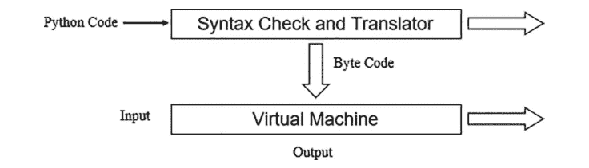

图2.1 带有解释器的Python代码。

大多数机器学习模型和概念都是使用Python构建的，因为它易于理解，且语法复杂度较低。

### 2.2.1 为什么Python适合机器学习？

在过去十年中，Python语言在机器学习、深度学习和人工智能领域日益普及，原因如下：

- Python是一种平台无关的语言。
- Python具有简洁且可读的代码，促进了复杂算法的快速测试，并使非程序员也能轻松使用该语言。
- 虽然复杂的算法和多样化的工作流程是机器学习的支撑，但Python的简单性允许开发人员编写可靠的代码。
- 开发人员可以专注于解决机器学习问题，而不是关注语言的技术细节。
- 它可以执行一系列复杂的机器学习任务，并使您能够快速构建原型，从而允许您测试产品的机器学习功能。
- Python附带多个框架和库，以减少开发人员的开发时间，并且这些库可以轻松配置。软件库是开发人员用于解决日常编程任务的预写代码。
- Python凭借其丰富的技术栈，拥有用于机器学习的广泛库。
- Python包含用于统计操作的统计库。它使数据可视化更容易。
- 更大的用户社区致力于持续更新和共享库。
- 如果组织将Python用于其他开发活动，例如桌面开发，这些技能可以轻松转移到机器学习项目。

本章讨论如何设置Python集成开发环境（IDE）、Python框架以及对机器学习和深度学习有用的库。

## 2.3 设置Python

要享受这种快速增长的编程语言，用户需要根据操作系统（如Windows、macOS和Linux）安装Python解释器。

### 2.3.1 Windows上的Python

- 从https://www.python.org/downloads/下载最新的Python安装包并运行可执行文件。
- 选择可选的安装选项；用户可以根据需要添加额外功能或调整位置。
- 要从任何命令提示符访问Python，请勾选第二个选项“Add Python 3.7 to PATH”，如图2.2所示。
- 用户现在可以从命令提示符验证安装。

## 2.3.2 在Linux上使用Python

Linux发行版通常已预装Python；要验证，请使用以下命令：

```
Python – version → Shell Response
Python2 – version $Python3 – version
```

如果安装的Python不是最新版本，而用户希望使用最新版本，则具体步骤取决于所使用的Linux发行版。

### 2.3.2.1 Ubuntu

如果用户使用的是Ubuntu 16.10或更新版本，请输入以下命令：

```
$ sudo apt-get update
$ sudo apt-get install python3.6
```

如果用户使用的是Ubuntu 14.0，则需要先启用个人软件包存档（PPA），然后输入以下命令：

```
$ sudo add-apt-repository ppa: deadsnakes/ppa
$ sudo apt-get update
$ sudo apt-get install python3.6
```

## 2.4 Python基础

Python是一种语法简洁的高级编程语言。作为先决条件，如果用户理解类、对象、接口等概念，将能更快地学习Python。本节将直接介绍Python运算符、流程控制、数据结构、函数、异常处理以及与Python编程相关的调试问题。

### 2.4.1 Python运算符

运算符用于操作操作数的值，并对变量和值执行运算。此外，它还执行所有的算术和逻辑运算。
示例：考虑表达式 3 + 4 = 7，其中3和4是操作数，+是运算符。
Python支持多种运算，包括算术运算、比较运算、赋值运算和逻辑运算。本节将结合相关的Python示例对这些运算进行详细讨论。

#### 2.4.1.1 算术运算符

算术运算符执行所有算术运算，如加法、减法、乘法和除法。表2.1列出了Python支持的所有算术运算。

#### 2.4.1.2 比较运算符

比较运算符用于比较变量并确定它们之间的关系；它返回True或False。表2.2列出了Python支持的比较运算符。

#### 2.4.1.3 赋值运算符

与其他编程语言类似，一组Python运算符用于为变量赋值，如表2.3所示。

#### 2.4.1.4 逻辑运算符

Python中的逻辑运算符用于组合条件语句。Python逻辑运算符列表如表2.4所示。

**表 2.1**
Python中的算术运算符

| 运算符 | 详情 | 示例 | 语法 |
| :--- | :--- | :--- | :--- |
| + | 两个操作数相加 | X + Y | X = 3; Y = 2; print(X + Y) |
| - | 两个操作数相减 | X - Y | X = 3; Y = 2; print(X - Y) |
| * | 两个操作数相乘 | X * Y | X = 3; Y = 2; print(X * Y) |
| / | 两个操作数相除 | X / Y | X = 2; Y = 2; print(X / Y) |
| % | 左操作数除以右操作数并返回余数 | X % Y | X = 2; Y = 2; print(X % Y) |
| ** | 幂运算，计算乘方 | X ** Y | X = 2; Y = 2; print(X ** Y) |
| // | 整除（地板除） | X // Y | X = 2; Y = 2; print(X // Y) |

**表 2.2**
Python中的比较运算符

| 运算符 | 详情 | 示例 |
| :--- | :--- | :--- |
| == | 两个操作数的值相等；返回True | X == Y |
| != | 两个操作数的值不相等；返回True | X != Y |
| <> | 两个操作数的值不相等；返回True，与 (!=) 相同 | X <> Y |
| > | 大于 | X > Y |
| < | 小于 | X < Y |
| >= | 大于或等于 | X >= Y |
| <= | 小于或等于 | X <= Y |

**表 2.3**
Python中的赋值运算符

| 运算符 | 详情 | 示例 |
| :--- | :--- | :--- |
| = | 将值赋给变量 | X=5 |
| += | 将右操作数加到左操作数，并将结果赋给左操作数 | X += Y |
| -= | 从左操作数中减去右操作数，并将结果赋给左操作数 | X -= Y |
| *= | 将左操作数乘以右操作数，并将结果赋给左操作数 | X *= Y |
| /= | 将左操作数除以右操作数，并将结果赋给左操作数 | X /= Y |
| %= | 计算两个变量的模，并将结果赋给左操作数 | X %=Y |
| **= | 计算乘方，并将结果赋给左操作数 | X **=Y |
| //= | 计算整除，并将结果赋给左操作数 | X //= Y |

**表 2.4**
Python中的逻辑运算符

| 运算符 | 详情 | 语法 |
| :--- | :--- | :--- |
| AND | 当两个条件都为True时，结果为True | X<5 and X<6 |
| OR | 当任一条件为True时，结果为True | X<5 or X<6 |
| NOT | 如果条件为True，则反转结果；将返回False | not (x<5 and x<10) |

#### 2.4.1.5 成员运算符

这些运算符用于测试是否在序列（如列表、字符串或元组）中存在某个成员。Python中使用两个成员运算符（in, not in）。它根据变量是否存在于指定的序列或字符串中来给出结果。

### 2.4.2 基本运算符的Python代码示例

运算符是Python中用于执行算术或逻辑计算的特殊符号。运算符操作的值称为操作数。本节为用户提供使用上述章节中讨论的运算符的Python代码片段。

#### 2.4.2.1 算术运算符

```
In [33]: 5+7 #adding integers
Out[33]:12

In [34]: 2+3+4+87
Out[34]:96

In [35]: 2*4+4+87 #Operators precedence(/, *, +, -)
Out[35]:99

In [36]: 2+10/2*5+20
        #order of operator precedence
        # 10/2 = 5
        # 5*5 = 25
        # 2+25+20=47
Out[36]:47.0
```

Machine Learning for Decision Sciences with Case Studies in Python

```
In [37]: 2+3*15%2+3*2
# 3*15 = 45
# 45%2 = 1
# 3*2=6
# 2+1+6=9
Out[37]:9
```

```
In [38]: x = 5 #variable declaration and initialization
```

```
In [39]: x#prints value of variable x
Out[39]:5
```

```
In [40]: type(x) #type is single argument built-in function and it returns
Data-type of the variable
Out[40]:int
```

```
In [41]: a = 2 #declaring a variable
```

```
In [42]: a
Out[42]:2
```

```
In [43]: type(a)
Out[43]:int
```

```
In [44]: a = 4
```

```
In [45]: atype(a)
Out[45]:int
```

```
In [46]: y = 5.67
ytype(y)
Out[46]:float
```

```
In [47]: x = 2.5/2 #Dividing float value by integer
#result will float since integer is upcasted.
```

```
In [48]: X #prints value of variable x
Out[48]:1.25
```

```
In [49]: type(x) #data-type of variable x
Out[49]:float
```

```
In [50]: #String varible declaration and initializiation
string_one= 'first string'
string_two= "second string"
string_three= "'third string'"
```

```
In [51]: string_one
Out[51]: 'firststring'
```

```
In [52]: print(string_two) #prints value stored in the variable stirng_two
second string
```

```
In [53]: type(string_one) #type is single argument built-in function and it
returns type of the variable
Out[53]:str
```

Overview of Python for Machine Learning

21

```
In [54]: type(string_three)
Out[54]:str
```

```
In [55]: #everything after # will be considered as a comment
```

```
In [56]: x = 4
```

```
In [57]: x
Out[57]:4
```

```
In [58]: type(x)
Out[58]:int
```

```
In [59]: #this is comment
        #this is second comment
```

```
In [60]: x = 15
        y = 4
```

```
In [61]: print('x + y =',x+y)
        x + y = 19
```

```
In [62]: print('x - y =',x-y) # Subtraction operation
        x - y = 11
```

```
In [63]: print(10-20) # NOTE:-lower is subtracted by higher value then result
is negative. """
        -10
```

```
In [64]: print('x * y =',x*y) # Multiplication operation
        x * y = 60
```

```
In [65]: print('x / y =',x/y) #Division- Result is accurate division value
        x / y = 3.75
```

```
In [66]: print('x // y =',x//y) # Floor division - division that results
into whole number adjusted to the left in the number line
        x // y = 3
```

```
In [67]: print('x **y=',x**y) # Exponent - left operand raised to the
power of right
        x ** y = 50625
```

```
In [68]: 25*25
Out[68]:625
```

#### 2.4.2.2 比较运算符

这些运算符比较操作数两侧的值并确定它们之间的关系。它也被称为关系运算符。各种比较运算符包括 (==,!=,>,<=, 等)。

```
In [69]: x = 20
        y = 35
```

```
In [70]: print('x>y is',x>y) # Operator Greater than - Left hand operand is
greater then returns TRUE
        x > y is False
```

## 2.4.2.3 逻辑运算符

逻辑运算符是与、或、非运算符。

```python
In [76]: x = True
         y = False

In [77]: print('x and y is', x and y)  # 逻辑与运算符 - 如果两者都为真或相同则为真
x and y is False

In [78]: print('x or y is', x or y)  # 逻辑或运算符 - 如果任一为真则为真
x or y is True

In [79]: print('not x is', not x)  # 逻辑非运算符 - 如果为真则返回假
not x is False
```

## 2.4.2.4 成员运算符

本节讨论 Python 中 `in` 和 `not in` 运算符的使用示例。例如，我们使用 `in` 和 `not in` 运算符来检查 `x=4` 和 `y=8` 的值是否在列表中。

```python
In [84]: x = 4
         y = 8
         list = [1, 2, 3, 4, 5]  # 列表是一个有序、可变且允许重复的集合
         if(x in list):
             print("第1行 - x 在给定列表中")
         else:
             print("第1行 - x 不在给定列表中")
         if(y not in list):
             print("第2行 - y 不在给定列表中")
         else:
             print("第2行 - y 在给定列表中")

         第1行 - x 在给定列表中
         第2行 - y 不在给定列表中
```

```python
In [85]: s = "sakshi"
```

```python
In [86]: 'a' in s  # IN 运算符用于验证或评估 s 的值
Out[86]: True
```

```python
In [87]: 'b' in s
Out[87]: False
```

```python
In [88]: "a" not in s  # NOT IN 运算符是
Out[88]: False
```

```python
In [89]: "b" not in s
Out[89]: True
```

```python
In [90]: import keyword
```

```python
In [91]: print(keyword.kwlist)
         ['False', 'None', 'True', 'and', 'as', 'assert', 'async',
         'await', 'break', 'class',
         'continue', 'def', 'del', 'elif', 'else', 'except', 'finally',
         'for', 'from', 'global',
         'if', 'import', 'in', 'is', 'lambda', 'nonlocal', 'not',
         'or', 'pass', 'raise', 'return', 'try', 'while', 'with', 'yield']
```

```python
In [92]: print(keyword.kwlist)
         ['False', 'None', 'True', 'and', 'as', 'assert', 'async',
         'await', 'break', 'class',
         'continue', 'def', 'del', 'elif', 'else', 'except', 'finally',
         'for', 'from', 'global',
         'if', 'import', 'in', 'is', 'lambda', 'nonlocal', 'not',
         'or', 'pass', 'raise', 'return', 'try', 'while', 'with', 'yield']
```

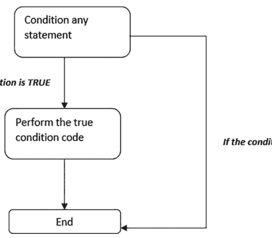

图 2.3 控制流语句。

## 2.4.3 流程控制

程序的流程是顺序的。语句逐条执行。当用户需要重复执行语句时，就会用到条件。在这种情况下，控制流语句就起作用了。控制流语句包括 `if` 条件、`for` 条件、`else`、`if-else` 和 `while` 循环。计算机程序理解真（True）和假（False）的语言；让我们用图 2.3 所示的流程图来解释这一点。

### 2.4.3.1 If & elif 语句

有时用户需要根据某些条件执行语句；对于多个条件，我们使用 `elif`。

```
If 表达式 :
    语句
Elif 表达式 :
    语句
Elif 表达式 :
    语句
Else 表达式 :
    语句
```

让我们用一个例子来解释，假设创建一个程序来识别数字是负数，否则如果数字是正数且是偶数，否则将该数字视为正奇数。

```
If y<0 :
    print "y 是负数"
elif
    y/2 = 0:
    print "y 是偶数"
else :
    print "y 是一个负数。"
```

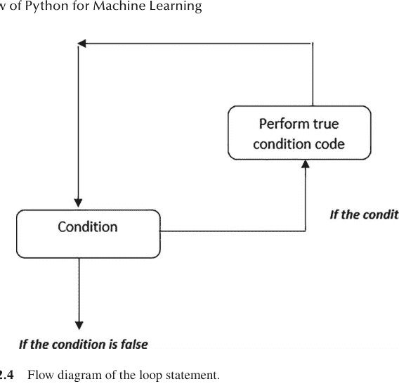

图 2.4 循环语句的流程图。

### 2.4.3.2 循环语句

循环语句允许我们多次执行一条语句。例如，如果用户想要打印他的名字十次，这种情况下循环将有所帮助；而不是写十次名字，使用循环函数并定义其范围。图 2.4 所示的流程图解释了循环语句。
如以下各节所述，有不同类型的循环语句，即 `for`、`while`、嵌套循环等。

**For 循环：** 循环使用每次执行时递增的迭代器变量重复执行语句。让我们以打印水果名称为例。设 "fruits" 是包含三种水果名称的列表。当程序执行时，每个水果都保存在变量 "I" 中，然后逐一打印。

```
Fruits = ["apple", "mango", "banana"];
For I in fruits :
    Print (i);
```

**While 循环：** 如果给定条件为真，则重复执行一组语句。例如，将前五个自然数相加。

```
I = 0;
While y<6:
    y = y+y
    I++;
```

**嵌套循环：** 在另一个循环内部使用循环称为嵌套循环。让我们以向班级每位学生分发四块巧克力为例。嵌套循环在这里会起作用，因为我们必须使用两个循环，即巧克力和学生。

```
chocolate = ["Cadbury", "kitkat", "mars", "galaxy"];
students = ["Alice", "Jhon", "Nick" ];
```

```python
For students in students :
    For chocolate in chocolate :
        Print (students + "got" + chocolate);
```

### 2.4.3.3 循环控制语句

为了改变代码执行的顺序，Python 提供了多种控制语句。以下是循环控制语句：

**Break 语句：** 用于退出循环。让我们以 20 个注册号为例，用户只想打印其中的十个注册号。

```
x=1;
While x <= 20:
    If x ==10:
        break
    Print (x)
    x++;
```

> 一旦循环到达第 10 个注册号，`break` 语句将退出循环，并且只显示 10 个注册号。

**Continue 语句：** 它类似于 `break` 语句，它退出当前循环迭代，但不会退出整个循环。让我们考虑与前面相同的例子，并将 `break` 替换为 `continue`。

```
x=1;
While x <= 20:
    if x ==10:
        continue
    Print (x)
    x++;
```

> 一旦循环到达第 10 个注册号，`continue` 语句将跳过本次迭代，显示从 1 到 20 的所有注册号，但不包括第 10 个注册号。

**Pass 语句：** 它也称为空操作符。执行时什么也不会发生。考虑一个由两名程序员完成的项目；其中一名生病了，无法在特定日期来上班。问题是另一名程序员无法接手工作。在这种情况下，生病程序员编写的所有函数都将使用 `pass` 语句留空。让我们考虑与前面相同的例子，并使用 `pass` 语句。

```
x=1;
While x <= 20:
    if x ==10:
        pass
        print "10 不包含在内"
    Print (x)
    x++;
```

> 一旦循环到达第 10 个注册号，`pass` 语句将起作用，显示从 1 到 20 的所有注册号，但不包括第 10 个注册号，因为我们跳过了它，并会打印 "10 不包含在内"。

## 2.4.4 流程控制语句的 Python 代码示例

### 2.4.4.1 条件语句

当我们只想在满足特定条件时执行代码时，就需要进行决策。Python 中使用 `if...elif...else` 语句进行决策。

```
语法：if 测试表达式: 语句(s)
```

程序评估测试表达式，并且仅当测试表达式为真时才执行语句。如果测试表达式为假，则不执行语句。在 Python 中，`if` 语句的主体通过缩进表示。主体以缩进开始，第一个未缩进的行标记结束。

## 2.4.4.2 Python if...else 语句

if...else 语法
if 测试表达式: if-else 的主体: else 的主体
if..else 语句会评估测试表达式，并且仅在测试条件为 True 时执行 if 的主体。如果条件为 False，则执行 else 的主体。缩进用于分隔代码块。

```python
In [1]:
a = 5 #声明和赋值。
if a == 7: #条件为假。
    print("True")
    print("True123") #这两条语句都不会被执行。
print("false") #只要遇到就会执行。
false
```

```python
In [2]:
num = 3
if num > 0:  #条件为真，则执行语句主体
    print(num, "is a positive number.")
print("This is always printed.") #只要遇到就会执行。
num = -1
if num > 0:
    print(num, "is a positive number.")
    #print("abc")
    print("This is also always printed.")
    #print("xyz")
print("xyz") #只要遇到就会执行。
3 is a positive number.
This is always printed.
xyz
```

```python
In [3]:
a = 5
if a == 4: #条件为真，执行条件语句的主体。
    print("True")
else:
    print("False") #每当条件失败时，将执行此语句。

#print ("in else") #第一个未缩进的行
False
```

```python
In [4]:
# 程序检查数字是正数还是负数
# 并显示相应的消息

num = -8

# 也尝试这两种变体。
# num = -5
# num = 0

if num >= -5:
    print("Positive or Zero")
    print("this no positive")
else: #条件失败，执行 Else 部分。
    print("Negative number")
Negative number
```

## 2.4.4.3 Python if...elif...else 语句

if...elif...else 语法

if 测试表达式: if 的主体 elif 测试表达式: elif 的主体 else: else 的主体。elif 是 else if 的缩写。它允许我们检查多个表达式。
如果 if 的条件为 False，它会检查下一个 elif 块的条件，依此类推。如果所有条件都为 False，则执行 else 的主体。根据条件，多个 if...elif...else 块中只有一个块会被执行。if 块只能有一个 else 块。但它可以有多个 elif 块。

```python
In [5]:
var = 150
if (var < 200 and var > 50): #带有逻辑 "and" 的条件，意味着两者都必须为真，其主体才会被执行。
    print("Expression value is less than 200")
    if var == 150: #嵌套的 if 条件
        print("Which is 150")
    elif var == 100: #内部的 else if 部分
        print("Which is 100")
    elif var == 50: #内部的 else if 部分
        print("Which is 50")
elif var < 50: #外部的 else if 部分
    print("Expression value is less than 50")
else: #外部的 else 部分
    print("Could not find true expression")
print ("Good bye!")
Expression value is less than 200
Which is 150
Good bye!
```

```python
In [6]:
# 在这个程序中，
# 我们检查数字是正数、
# 负数还是零，并
# 显示相应的消息

num = -8

# 也尝试这两种变体：
# num = 0
# num = -4.5

if num > 0:
    print("Positive number")
elif num == 0: #else if 条件语句。
    print("Zero")
else:
    print("Negative number")
Negative number
```

## 2.4.4.4 For 循环

Python 中的 for 循环用于遍历一个序列（列表、元组、字符串）或其他可迭代对象。遍历序列称为遍历。

for 循环语法
For Val in 序列: for 的主体
这里，Val 是一个变量，在每次迭代中获取序列中项目的值。
循环持续进行，直到我们到达序列中的最后一个项目。for 循环的主体通过缩进与代码的其余部分分隔开。

```python
In [7]:
# 查找存储在列表中所有数字之和的程序

# 数字列表
numbers = [6, 5, 3, 8, 4, 2, 5, 4, 11] #列表

# 用于存储总和的变量
sum = 0

# 遍历列表
# val 获取列表中的值，并递增直到列表范围。
for val in numbers:
    sum = sum + val

# 输出：总和为 48
print("The sum is", sum)
The sum is 48
```

```python
n = 6
# 从 0 迭代到 n 的范围
# range() 返回从 0（默认）到 N 的数字序列，步长为 1（默认）
for i in range(n):
    print(i)
print('DDD')
0
1
2
3
4
5
DDD
```

```python
In [9]:
a
Out[9]:
5
```

## 2.4.4.5 range() 函数

我们可以使用 range() 函数生成一个数字序列。range(10) 将生成从 0 到 9 的数字（10 个数字）。我们还可以定义起始值、停止值和步长，格式为 range(start, stop, step size)。如果未提供步长，则默认为 1。此函数不会将所有值存储在内存中；那样效率低下。因此它记住起始值、停止值、步长，并动态生成下一个数字。要强制此函数输出所有项目，我们可以使用 list() 函数。以下示例将对此进行说明。

```python
In [10]:
# 使用 range() 函数创建一个列表，从 2 开始，到 20 结束，步长为 2。
print(list(range(2, 20, 2)))
[2, 4, 6, 8, 10, 12, 14, 16, 18]
```

```python
In [11]:
a = range(10) # 为变量分配 range。
```

```python
In [8]:
a # 打印起始和结束范围。
Out[12]:
range(0, 10)
```

```python
In [13]:
# 打印起始和结束范围。
print(range(10))
range(0, 10)
```

```python
In [14]:
# 创建列表并将其分配给变量。
a = (list(range(10)))
```

```python
In [15]:
a # 默认情况下，range 从 0 开始，步长为 1。
Out[15]:
[0, 1, 2, 3, 4, 5, 6, 7, 8, 9]
```

```python
In [16]:
type(a) # 返回参数的类型
Out[16]:
List
```

```python
In [17]:
len(a) # 返回参数的长度
Out[17]:
10
```

```python
In [18]:
# 定义 range，包含起始和结束位置
print(list(range(2, 8))) #创建列表。
[2, 3, 4, 5, 6, 7]
```

```python
In [19]:
# 定义 range，包含起始、结束位置和增量值。
print(list(range(2, 20, 2)))  # 步长=2
[2, 4, 6, 8, 10, 12, 14, 16, 18]
```

我们可以将 range() 函数用于循环，以遍历数字序列。它可以与 len() 函数结合使用，通过索引遍历序列。以下示例说明了 range 函数的用法。

```python
In [20]:
# 使用索引遍历列表的程序

genre = ['pop', 'rock', 'jazz'] # 列表

# 使用索引遍历列表
for i in range(len(genre)): # 将范围定义为列表长度
    print("I like", genre[i]) # 使用索引遍历列表
    print("z")
I like pop
I like rock
I like jazz z
```

## 2.4.4.6 带 else 的 For 循环

for 循环也可以有一个可选的 else 块。如果 for 循环中序列的项目被耗尽，则执行 else 部分。break 语句可用于停止 for 循环。在这种情况下，else 部分将被忽略。因此，如果没有发生 break，for 循环的 else 部分才会运行。以下示例对此进行了说明。

```python
In [21]:
digits = [1, 2, 3]

for i in digits:
    print(i)
#else:
print("No items left.")
1
2
3
No items left.
```

## 2.4.4.7 While 循环

Python 编程语言中的 while 循环语句只要给定条件为 True，就会重复执行目标语句。Python 编程语言中 while 循环的语法是 –
while 表达式: 语句(s)
这里，语句(s) 可以是单条语句或语句块。条件可以是任何表达式，True 是任何非零值。当条件为 True 时，循环进行迭代。当条件变为 False 时，程序控制传递到循环之后的下一行。以下示例说明了 while 循环的一个应用：

```python
In [22]:
# 将自然数相加直到
# sum = 1+2+3+...+n 的程序

# 从用户获取输入，
# n = int(input("Enter n: "))

n = 10

# 初始化 sum 和计数器
sum = 0
i = 1

while i <= n:
    sum = sum + i
    i = i + 1 # 更新计数器

# 打印总和
print("The sum is", sum)
The sum is 55
```

```python
In [23]:
n = 5
i = 1
while (i <= n):
    if (i == 3):
        print(i)
    i = i + 1 # 每次迭代 i 递增
3
```

在上面的程序中，只要我们的计数器变量 *i* 小于或等于 *n*（在我们的程序中是 10），测试表达式就为 True。因此，我们需要在循环体中增加计数器变量的值。这一点非常重要（而且经常被遗忘）。如果不这样做，将导致无限循环（永不停止的循环）。

## 2.4.4.8 带 else 的 While 循环

与 for 循环一样，我们也可以为 while 循环设置一个可选的块。如果 while 循环中的条件评估为 False，则执行 else 部分。while 循环可以用 break 语句终止。在这种情况下，else 部分将被忽略。因此，如果没有发生 break 且条件为 False，while 循环的 else 部分才会运行。以下示例说明了 *带 else 的 while 循环*。

```python
In [24]:
# 说明在 while 循环中
# 使用 else 语句的示例

counter = 0

while counter < 0: #条件失败，其主体不会被执行
    print("Inside loop")
    counter = counter + 1
else:
    print("Inside else")
Inside else
```

## 2.4.4.9 Python Break 和 Continue

在 Python 中，break 和 continue 语句可以改变正常循环的流程。例如，循环会遍历一个代码块，直到测试表达式为 False。但是，有时我们希望在不检查测试表达式的情况下终止当前迭代甚至整个循环。break 和 continue 语句就用于这些情况。

## 2.4.4.10 Python Break 语句

break 语句终止包含它的循环。程序的控制流转向循环主体之后的语句。如果 break 语句在嵌套循环（一个循环在另一个循环内部）中，break 将终止最内层的循环。
语法
break
以下示例展示了 break 语句在 Python 中与 *for* 循环和 *while* 循环一起工作的情况：

## 2.4.4.11 Python Continue 语句

`continue` 语句用于跳过当前循环迭代中循环体内的剩余代码。循环不会终止，而是继续执行下一次迭代。

Continue 语法
continue

```python
for letter in 'Django': # 第一个示例
    if letter == 'D': # 条件为真时，通过返回到 for 循环语句来继续。
        continue
    print('Current Letter:', letter)
```

Current Letter: j
Current Letter: a
Current Letter: n
Current Letter: g
Current Letter: o

```python
# 展示在循环中使用 continue 语句的程序

for val in "string":
    if val == "i": # 条件为真时，通过返回到 for 循环语句来继续。
        continue
    print(val)

#print("The end")
```

s t r
n g

这个程序与上面的示例相同，只是 `break` 语句被替换成了 `continue`。如果字符串是 "i"，我们继续循环，不执行代码块的其余部分。因此，我们在输出中看到除了 "i" 之外的所有字母都被打印出来了。

```python
sequence=[1,2,3,4,5]
for var in sequence:
    #循环内的代码
    if var==3:
        continue
    print(var)
    #for 循环内的代码
#for 循环外的代码
```

1
2
4
5

## 2.4.5 基本数据结构及其在 Python 中的实现回顾

当我们处理海量数据时，组织和高效使用数据是一项挑战。近年来，应用程序变得越来越复杂，数据量巨大，这导致了数据搜索、处理器速度和处理多个请求方面的问题。因此，数据结构在信息技术领域证明了其解决此类复杂情况的效率。数据结构是组织此类数据的系统化方法，从而实现数据的高效使用。数据结构有一个*接口*，对应于该数据结构支持的一组操作和参数类型。数据结构操作中使用的算法的内部表示和定义由*实现*提供。数据结构的三个基本特征是适用性、时间效率和空间效率。

- **适用性：** 数据结构实现应能以正确的方式使用其接口。
- **时间效率：** 数据结构执行的操作应消耗尽可能少的时间。
- **空间效率：** 关于数据结构的操作应能占用尽可能少的内存。

在本节中，我们将回顾以下数据结构及其相关的 Python 示例：

- 数组数据结构
- 链表
- 栈和队列
- 查找
- 排序
- 递归

### 2.4.5.1 数组数据结构

数据结构使用数组来执行操作。众所周知，数组是用于存储属于同一数据类型的相似项目集合的实体。存储在数组中的项目称为*元素*，每个元素的位置被分配一个*索引*以访问或操作它。

通常，数组声明为 **data_type array_name [array_size]**。例如，
**Int matrixA [5]={1, 2, 3, 4, 5};**

在上面的例子中，需要考虑以下几点：

- 数组索引从 0 开始，而不是 1。
- 数组长度为 5 – 它可以存储五个元素。
- 通过其索引值访问每个元素；例如，第三个元素可以访问为 matrixA[2]。

```
#常用代码
# 代码    C 类型            Python 类型    最小字节数
# 'b'     signed char       int            1
# 'B'     unsigned char     int            1
# 'u'     Py_UNICODE        Unicode        2
# 'h'     signed short      int            2
# 'H'     unsigned short    int            2
# 'i'     signed int        int            2
# 'I'     unsigned int      int            2
# 'l'     signed long       int            4
# 'L'     unsigned long     int            4
# 'f'     float             float          4
# 'd'     double            float          8
```

### 2.4.5.2 数组在 Python 中的实现

```python
import array as arr
myArray = arr.array('d', [3.14, 3.5, 4.99])
print(myArray)  # 输出显示为 --> array('d', [3.14, 3.5, 4.99])
```

```python
import array as arr
myArray2 = arr.array('i', [1, 2, 3, 5, 7, 11, 13, 17, 19])
print("First element:", myArray2[0]) # 输出显示为 --> First element: 1
print("Second element:", myArray2[1]) # 输出显示为 --> Second element: 2
print("Last element:", myArray2[-1])  # 输出显示为 -->  Last element: 19
```

```python
# 数组切片
print(myArray2[2:5]) # 第3到第5个；输出显示为 --> array('i', [3, 5, 7])
print(myArray2[:-5]) # 开始到第4个；输出显示为 --> array('i', [1, 2, 3, 5])
print(myArray2[5:])  # 第6个到最后；输出显示为 --> array('i', [11, 13, 17, 19])
print(myArray2[:])   # 开始到最后；输出显示为 --> array('i', [1, 2, 3, 5, 7, 11, 13, 17, 19])
```

```python
# 更改数组中的值
# 更改第一个元素
myArray2[0] = 99
print(myArray2) # 数组的第一个值更改为 99；输出显示为 --> array('i', [99, 2, 3, 5, 7, 11, 13, 17, 19])
```

```python
# 更改第3和第4个元素
myArray2[2:3]= arr.array('i', [88,77])
print(myArray2) # 数组的第三和第四个值分别更改为 88 和 77；输出显示为 --> array('i', [99, 2, 88, 77, 5, 7, 11, 13, 17, 19])
```

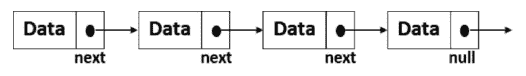

图 2.5 单链表。

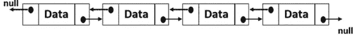

图 2.6 双链表。

### 2.4.5.3 链表

将数据存储为数组时，由于它们是静态结构，大小无法扩展或缩减以适应特定的数据集。用新的插入和删除来更新数组成本很高。这些限制在一定程度上通过使用链表得到了克服。

通过链接连接的一系列数据结构称为链表，或简称单链表，如图 2.5 所示。这个链接序列包含包含数据和链接元素的项目。链接元素提供到下一个链接的链接。链表的每个*链接*存储一组称为数据元素的数据。链表中的每个链接都有一个通过称为 *next* 的元素到下一个链接的链接。每个链表都有一个称为 *first* 的元素。总体而言，每个元素都有一个由数据和到下一个列表的引用组成的列表。最后一个列表由一个空引用组成。由于其动态特性，列表的数量可以根据需求扩展或收缩。

链表的缺点是我们无法访问列表中的单个元素。要访问单个项目，我们需要从第一个列表开始，一直遍历到需要访问该项目的位置。链表的另一个缺点是内存使用。除了在内存中存储元素外，在 32 位处理器上，每个引用元素还将占用大约 4 字节的内存。

链表的变体是双链表和循环链表。在双链表中，列表可以双向导航，即向前和向后，如图 2.6 所示。相比之下，在循环链表中，最后一个列表包含一个到第一个链接的链接，并且遍历是循环发生的。链表支持的操作包括插入、删除、显示和搜索。

### 2.4.5.4 链表在 Python 中的实现

```python
class Node:  #创建节点类
    def __init__(mySelf, data):
        mySelf.item = data
        mySelf.ref = None

class myLinkedList:  #创建单链表类
    def __init__(mySelf):
        mySelf.start_node = None  # 列表的第一个节点

    def traverse_list(mySelf):  # 遍历列表
        if mySelf.start_node is None: # 如果列表为空
            print("List has no element")
            return
        else:  # 如果列表不为空
            n = mySelf.start_node
            while n is not None:
```

## Python 在机器学习中的概述

```python
print(n.item, " ")
n = n.ref
```

```python
# 操作链表
```

```python
def insert_start(mySelf, data):  # 在列表开头插入值
    new_node = Node(data)
    new_node.ref = mySelf.start_node
    mySelf.start_node = new_node
```

```python
def insert_end(mySelf, data):  # 在列表末尾插入值
    new_node = Node(data)
    if mySelf.start_node is None:
        mySelf.start_node = new_node
        return
    n = mySelf.start_node
    while n.ref is not None:
        n = n.ref
    n.ref = new_node
```

```python
def insert_specific(mySelf, x, data):  # 在另一个特定项之后插入
    n = mySelf.start_node
    print(n.ref)
    while n is not None:
        if n.item == x:
            break
        n = n.ref
    if n is None:
        print("item not in the list")
    else:
        new_node = Node(data)
        new_node.ref = n.ref
        n.ref = new_node
```

```python
def insert_index(mySelf, index, data):  # 在特定索引之后插入
    if index == 1:
        new_node = Node(data)
        new_node.ref = mySelf.start_node
        mySelf.start_node = new_node
    i = 1
    n = mySelf.start_node
    while i < index - 1 and n is not None:
        n = n.ref
        i = i + 1
    if n is None:
        print("Index out of bound")
    else:
        new_node = Node(data)
        new_node.ref = n.ref
        n.ref = new_node
```

## 测试结果

```python
myLIST = myLinkedList()  # 创建 "myLIST" 作为 "myLinkedList" 类的对象
myLIST = [1, 2, 3]
myLIST.insert_end(1)  # 在末尾插入
myLIST.insert_end(3)
myLIST.insert_end(5)
myLIST.traverse_list()
myLIST.get_count()

myLIST.insert_start(7)  # 在开头插入
myLIST.insert_start(9)
myLIST.insert_start(11)
```

### 2.4.5.5 栈和队列

考虑一个现实世界中的栈的例子——一摞书或一叠盘子。我们只能从栈顶放置或移除一本书。这意味着栈操作只能从一端执行，即栈顶。这种数据结构通常被称为后进先出数据结构。最先放置的元素将最后被访问，最后放置的元素将最先被访问。将元素插入栈的过程称为 PUSH 操作，从栈中移除元素称为 POP 操作。

在数据结构中，栈可以使用数组和链表来实现。栈的大小可以是静态的，也可以是动态的（栈会增长）。

栈的主要操作包括 push 和 pop，如图 2.7 所示。为了检查栈的效率，用户必须跟踪栈上的数据。为了跟踪栈，可以使用 `peek()`、`isFull()` 和 `isEmpty()` 等函数。`peek()` 用于访问栈顶元素而不将其移除，而 `isFull()` 用于检查栈是否已满，`isEmpty()` 用于检查栈是否为空。

PUSH 操作涉及的一系列步骤通过图 2.8 中的流程图进行说明。初始化 PUSH 操作的第一步是检查栈是否已满。如果栈为空，PUSH 操作将继续；否则，将退出 PUSH 操作并返回错误。栈指针（栈顶）递增并指向内存中下一个可用空间以插入数据。数据元素被添加到该位置，并返回成功消息。

POP 操作涉及的步骤通过流程图说明，如图 2.9 所示。在 POP 操作中，数据从栈顶访问，栈顶递减到下一个较低的地址。最后，内存位置被释放。

使用列表和 collections.deque 在 Python 中实现栈

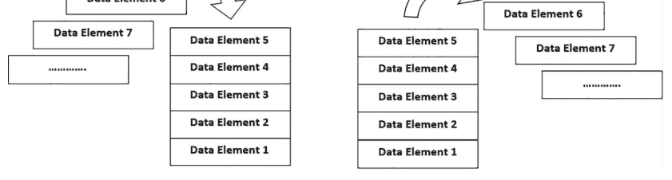

图 2.7 栈操作。

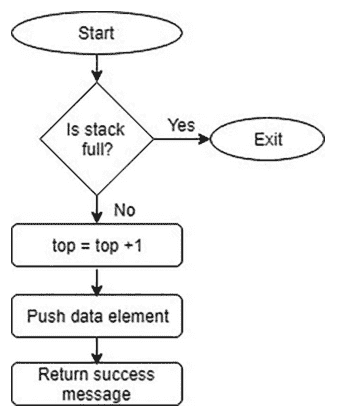

图 2.8 PUSH 操作流程图。

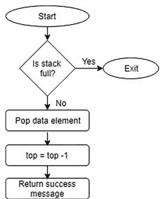

图 2.9 POP 操作流程图。

```python
myLIST = []
myLIST.append('I')
myLIST.append('Love')
myLIST.append('Python')
myLIST.append('Coding')

myLIST  # 返回值 --> ['I', 'Love', 'Python', 'Coding']

myLIST.pop()  # myLIST 返回值 --> ['I', 'Love', 'Python']
'Coding'
myLIST.pop()  # myLIST 返回值 --> ['I', 'Love']
'Python'
myLIST.pop()  # myLIST 返回值 --> ['I']
'Love'
```

```python
myLIST.pop()
'I'
# 当列表为空时
myLIST.pop()  # 我们得到错误 --> IndexError: "pop from empty list"

# 使用 collections.deque 作为栈
from collections import deque
myQUEUE = deque()
myQUEUE.append('I')
myQUEUE.append('Love')
myQUEUE.append('Python')
myQUEUE.append('Coding')

myQUEUE  # 返回值 --> deque(['I', 'Love', 'Python', 'Coding'])

myQUEUE.pop()  # myQUEUE 返回值 --> ['I', 'Love', 'Python']
'Coding'
myQUEUE.pop()  # myQUEUE 返回值 --> ['I', 'Love']
'Python'
myQUEUE.pop()  # myQUEUE 返回值 --> ['I']
'Love'
myQUEUE.pop()
'I'

# 当列表为空时
myQUEUE.pop()  # 我们得到错误 --> IndexError: "pop from empty list"
```

### 2.4.5.6 队列

尽管队列在外观上与栈相似，但队列可以从两端访问。数据通常从一端插入，从另一端移除。将元素插入队列的过程称为入队，从队列中移除元素称为出队。因此，队列基于先进先出的概念，如图 2.10 所示。不幸的是，队列使用两个独立的数据指针——front 和 rear——这使得程序员难以实现该算法。

队列的主要操作是入队和出队。为了跟踪队列，可以使用 `peek()`、`isFull()` 和 `isEmpty()` 等函数。`peek()` 用于访问队列前端的元素而不将其移除，而 `isFull()` 用于检查队列是否已满，`isEmpty()` 用于检查队列是否为空。

入队操作涉及的一系列步骤在图 2.11 所示的流程图中进行说明。初始化入队操作的第一步是检查队列是否已满。如果队列为空，插入操作将继续；否则，将退出流程并返回溢出错误——接下来，rear 指针递增并指向内存中下一个可用空间以插入数据。最后，数据元素被添加到该位置，并返回成功消息。

出队操作涉及的一系列步骤在图 2.12 所示的流程图中进行说明。在移除操作中，数据从 front 指针访问。front 指针递增以指向下一个可用的数据元素。


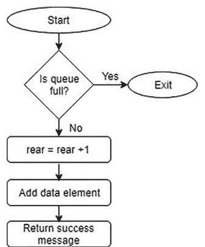

图 2.11 入队操作。

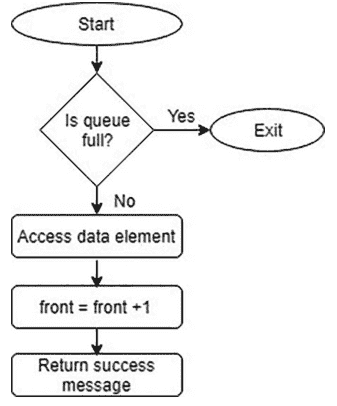

图 2.12 出队操作。

### 2.4.5.7 在 Python 中实现队列

```python
class Queue:

    # 构造函数
    def __init__(mySelf):
        mySelf.queue = list()
        mySelf.maxSize = 5
        mySelf.head = 0
        mySelf.tail = 0

    # 添加元素
    def enqueue(MySelf, data):
        # 检查队列是否已满
        if MySelf.size() >= MySelf.maxSize:
            return ("Queue Full")
        MySelf.queue.append(data)
        MySelf.tail += 1
        return True

    # 删除元素
    def dequeue(MySelf):
        # 检查队列是否为空
        if MySelf.size() <= 0:
            MySelf.resetQueue()
            return ("Queue Empty")
        data = MySelf.queue[MySelf.head]
        MySelf.head += 1
        return data

    # 计算大小
    def size(MySelf):
        return MySelf.tail - MySelf.head

    # 重置队列
    def resetQueue(MySelf):
        MySelf.tail = 0
        MySelf.head = 0
        MySelf.queue = list()
```

测试结果

```python
myQueue = Queue()
print(myQueue.enqueue(1))  # 打印 True
print(myQueue.enqueue(2))  # 打印 True
print(myQueue.enqueue(3))  # 打印 True
print(myQueue.enqueue(4))  # 打印 True
print(myQueue.enqueue(5))  # 打印 True
print(myQueue.enqueue(6))  # 打印 Queue Full!；因为我们定义的大小为 5

print(myQueue.size())  # 打印 5
print(myQueue.dequeue())  # 打印 5
print(myQueue.dequeue())  # 打印 4
print(myQueue.dequeue())  # 打印 3
print(myQueue.dequeue())  # 打印 2
print(myQueue.dequeue())  # 打印 1
print(myQueue.dequeue())  # 打印 Queue Empty；队列在此处重置

print(myQueue.enqueue(1))  # 打印 True
print(myQueue.enqueue(2))  # 打印 True
print(myQueue.enqueue(3))  # 打印 True
print(myQueue.enqueue(4))  # 打印 True
```

### 2.4.5.8 搜索

搜索是我们日常生活中常见的任务之一，例如，我们在图书馆搜索一本书，从联系人列表中搜索一个电话号码，搜索一把放错的钥匙等。在数据结构中搜索键元素的最简单形式是从数据结构的根开始追踪路径。当访问每个节点或列表时，算法会比较数据节点或列表中的元素，其中包含要搜索的关键元素。如果找到匹配项，则必须返回成功消息。否则，搜索将继续到下一个连续的节点或列表。如果搜索完成但未找到匹配项，则算法返回一个空值，表示在列表中未找到关键元素。

搜索算法在搜索前可以处理两种情况：

-   无论列表顺序如何进行搜索的算法。
-   对列表顺序有明确假设的算法。

基于这些情况，数据结构中有以下搜索算法：

-   线性搜索
-   二分搜索
-   插值搜索
-   哈希表

## 2.4.5.8.1 线性搜索

最简单的搜索算法之一是线性搜索算法。在此算法中，对列表中的所有项目逐一进行搜索。每个项目都与要搜索的项目进行比较；一旦找到搜索项，算法就会退出并返回搜索项所在的索引。否则，它会一直搜索到列表末尾，如果未找到匹配项，则返回一个空值。该过程通过流程图解释，如图2.13所示。考虑一个长度为n的数组arr。设x为要搜索的元素。最初，数组的索引设置为1，以确保数组至少包含一个元素。如果i > n，则搜索过程终止。如果arr[i]=x，则搜索过程终止，返回i作为返回值。如果未找到匹配项，则搜索过程继续，直到i=n。

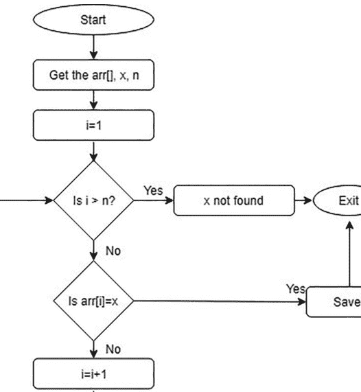

**图2.13** 线性搜索。

## 2.4.5.8.2 二分搜索

线性搜索在无序数据元素列表上表现良好。当无序搜索列表中的元素数量过多时，线性搜索算法会受到影响。该算法需要很长时间才能找到匹配项或搜索元素。但如果在执行搜索之前将数据元素列表按顺序排列，则搜索任务会变得简单。例如，考虑在我们的联系人列表中搜索一个人的电话号码。联系人列表中的姓名按字母顺序排列。因此，根据搜索元素的起始字母来限制搜索范围是有意义的。二分搜索算法可以利用这种情况。

在此算法中，每次搜索时都会进行比较。根据比较结果，列表的某些部分（不包含搜索元素）会从搜索过程中被排除。通常，通过比较列表中的中间项来执行搜索。搜索项可能位于列表的上半部分或下半部分。算法会排除不包含搜索元素的那一半列表，而包含搜索元素的另一半则再次与中间项进行比较。搜索过程通过每次排除一半列表来继续，直到找到匹配项。可以得出结论，二分搜索算法将可搜索列表减半，从而减少了比较次数。

二分搜索的过程通过流程图很好地解释，如图2.14所示。考虑一个有序数组arr，长度为n。设x为要搜索的元素。最初，数组的下界（LB）设置为1，上界（UB）设置为数组长度n。如果UB大于LB，则算法终止。否则，算法继续，首先根据UB和LB值计算中点。接下来，如果数组中由中点索引的元素大于搜索元素，则将UB设置为中点-1；如果数组中由中点索引的元素小于搜索元素，则将LB设置为中点+1。最后，如果数组中由中点索引的元素等于搜索元素，则保存索引中点。这表示搜索项x的位置。

## 2.4.5.8.3 插值搜索

插值搜索算法是二分搜索算法的一个变体。该算法基于探测位置进行搜索。最初，探测位置位于搜索列表的中间，然后随着算法的进展而修改。该算法通过流程图解释，如图2.15所示。该算法的工作原理与二分搜索类似，只是中点值的计算方式不同。

## 2.4.5.9 Python中的搜索实现

```python
mylist = [1, 2, 3, 5, 7, 11, 13, 17, 19, 23, 29, 31, 37, 41, 47] # 定义包含质数的列表
print('List has the items: ', mylist)
searchItem = int(input('Enter a number to search for: '))
found = False
for i in range(len(mylist)):
    if mylist[i] == searchItem:
        found = True
        print(searchItem, ' was found in the list at index ', i, '. So the number given is a prime number')
        break
if found == False:
    print(searchItem, ' was not found in the list!. So the given number is not a prime number')
```

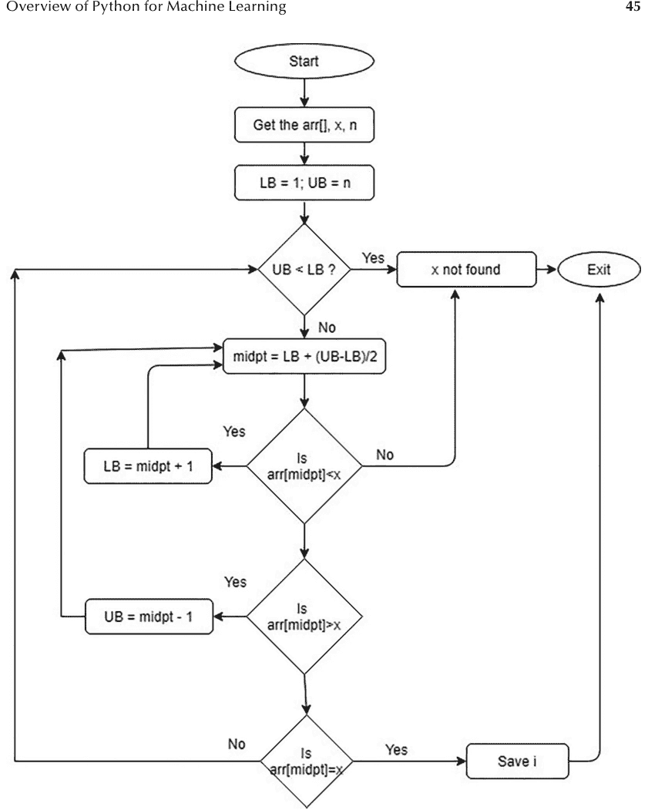

**图2.14** 二分搜索。

```
测试结果：
List has the items:  [1, 2, 3, 5, 7, 11, 13, 17, 19, 23, 29, 31, 37, 41, 47]
Enter a number to search for: 31
31  was found in the list at index  11. So the number given is a prime number
***************************
Enter a number to search for: 45
45  was not found in the list!. So the given number is not a prime number
***************************
```

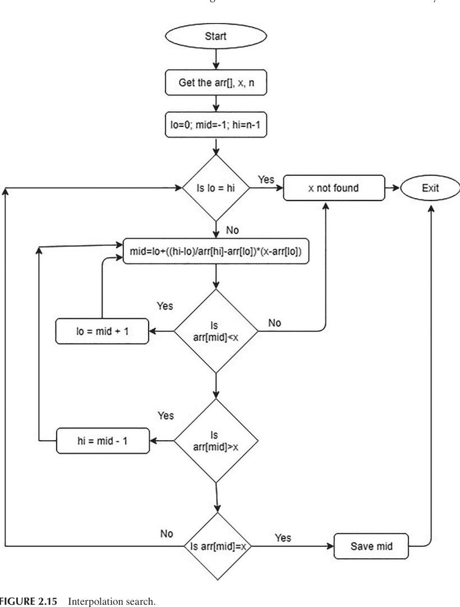

**图2.15** 插值搜索。

## 2.4.5.10 排序

在数据结构中，必须理解如何将一组元素按顺序排列。有多种方式或方法可以排列元素。排序是指将数据按特定格式排列的这些方法。排序算法提供了一组排列数据的程序。如果排序组织得当，搜索过程可以优化到高效水平。数据一旦排序，就可以以简单、可读的形式表示。最常见的排序顺序是字典顺序或数字顺序。

数据结构中的排序算法有冒泡排序、插入排序、选择排序、归并排序、希尔排序和快速排序。根据额外的内存需求，这些算法可以分为两大类——原地排序和非原地排序。当排序算法在数组本身内部工作而不消耗额外空间时，称为原地排序。原地排序算法的最佳例子是冒泡排序。另一方面，某些排序算法除了数组大小外还需要额外的空间（内存）。这个空间通常大于正在排序的元素。因此，这组算法被称为非原地排序，最好的例子之一是归并排序。

## 2.4.5.10.1 冒泡排序

最简单的排序算法之一是冒泡排序，也称为交换排序。该算法基于相邻元素之间的比较。如果元素顺序正确，则保持原位；如果元素顺序错误，则交换它们（互换位置）。该过程重复进行，直到所有元素都被比较和排序。该算法适用于排序较少的数据元素。

冒泡排序的过程在流程图中说明，如图2.16所示。考虑一个包含n个元素的数组arr[]。设i为指向数组中元素的索引。对于数组中的每个元素，比较arr[i]和arr[i+1]。如果arr[i]大于arr[i+1]，则交换元素，否则保持原位。该过程重复进行，比较数组arr的每一对，直到整个数组完全排序。

## 2.4.5.11 Python中的冒泡排序实现

```python
def bubbleSort(mylist):
    for passnum in range(len(mylist)-1, 0, -1):
        for i in range(passnum):
            if mylist[i] > mylist[i+1]:
                temp = mylist[i]
                mylist[i] = mylist[i+1]
                mylist[i+1] = temp

mylist = [1, 2, 3, 5, 47, 31, 13, 17, 19, 23, 29, 11, 37, 31, 47] # 用于冒泡排序的示例列表
print('the original list:', mylist) # 排序前
bubbleSort(mylist)
print('the sorted list:', mylist) # 排序后
```

测试结果

the original list: [1, 2, 3, 5, 47, 31, 13, 17, 19, 23, 29, 11, 37, 31, 47]
the sorted list: [1, 2, 3, 5, 11, 13, 17, 19, 23, 29, 31, 31, 37, 47, 47]

## 2.4.5.12 插入排序

插入排序算法是一种原地排序算法，它又基于比较。在此算法中，维护一个子数组，并持续对该子数组进行排序。数组的连续元素被添加或插入到此子数组中，并在子数组内进行排序。因此，得名插入排序。有时，该算法被称为在线算法，因为值被排序并添加到子数组中。

插入排序算法实现简单，并且在小数据集上效率很高。这种比较排序通过一次添加一个元素来构建排序数组。该算法通过流程图解释，如图2.17所示。考虑一个长度为n的数组arr[]。数组的第一个元素用于形成子数组，并记录其位置。选择下一个元素

## 2.4.5.13 Python 中的插入排序实现

```python
def myinsertionSort(mylist):
    # for every element in our array
    for index in range(1, len(mylist)):
        current = mylist[index]
        position = index

        while position > 0 and mylist[position-1] > current:
            print("Swapped {} for {}".format(mylist[position], mylist[position-1]))
            mylist[position] = mylist[position-1]
            print(mylist)
            position -= 1
        mylist[position] = current

    return mylist

mylist = [1, 2, 3, 5, 47, 31, 13, 17, 19, 23, 29, 11, 37, 31, 47]

print(myinsertionSort(mylist))
```

测试结果

```
print(myinsertionSort(mylist))
Swapped 31 for 47
[1, 2, 3, 5, 47, 47, 13, 17, 19, 23, 29, 11, 37, 31, 47]
Swapped 13 for 47
[1, 2, 3, 5, 31, 47, 47, 17, 19, 23, 29, 11, 37, 31, 47]
Swapped 47 for 31
[1, 2, 3, 5, 31, 31, 47, 17, 19, 23, 29, 11, 37, 31, 47]
Swapped 17 for 47
[1, 2, 3, 5, 13, 31, 47, 47, 19, 23, 29, 11, 37, 31, 47]
Swapped 47 for 31
[1, 2, 3, 5, 13, 31, 31, 47, 19, 23, 29, 11, 37, 31, 47]
Swapped 19 for 47
[1, 2, 3, 5, 13, 17, 31, 47, 47, 23, 29, 11, 37, 31, 47]
Swapped 47 for 31
[1, 2, 3, 5, 13, 17, 31, 31, 47, 23, 29, 11, 37, 31, 47]
Swapped 23 for 47
[1, 2, 3, 5, 13, 17, 19, 31, 47, 47, 29, 11, 37, 31, 47]
Swapped 47 for 31
[1, 2, 3, 5, 13, 17, 19, 31, 31, 47, 29, 11, 37, 31, 47]
Swapped 29 for 47
[1, 2, 3, 5, 13, 17, 19, 23, 31, 47, 47, 11, 37, 31, 47]
Swapped 47 for 31
[1, 2, 3, 5, 13, 17, 19, 23, 31, 31, 47, 11, 37, 31, 47]
Swapped 11 for 47
[1, 2, 3, 5, 13, 17, 19, 23, 29, 31, 47, 47, 37, 31, 47]
Swapped 47 for 31
[1, 2, 3, 5, 13, 17, 19, 23, 29, 31, 31, 47, 37, 31, 47]
Swapped 31 for 29
[1, 2, 3, 5, 13, 17, 19, 23, 29, 29, 31, 47, 37, 31, 47]
Swapped 29 for 23
[1, 2, 3, 5, 13, 17, 19, 23, 23, 29, 31, 47, 37, 31, 47]
Swapped 23 for 19
[1, 2, 3, 5, 13, 17, 19, 19, 23, 29, 31, 47, 37, 31, 47]
Swapped 19 for 17
[1, 2, 3, 5, 13, 17, 17, 19, 23, 29, 31, 47, 37, 31, 47]
Swapped 17 for 13
[1, 2, 3, 5, 13, 13, 17, 19, 23, 29, 31, 47, 37, 31, 47]
Swapped 37 for 47
[1, 2, 3, 5, 11, 13, 17, 19, 23, 29, 31, 47, 47, 31, 47]
Swapped 31 for 47
[1, 2, 3, 5, 11, 13, 17, 19, 23, 29, 31, 37, 47, 47, 47]
Swapped 47 for 37
[1, 2, 3, 5, 11, 13, 17, 19, 23, 29, 31, 37, 37, 47, 47]
[1, 2, 3, 5, 11, 13, 17, 19, 23, 29, 31, 31, 37, 47, 47]
```

## 2.4.5.14 选择排序

选择排序是另一种基于比较的原地排序算法。整个数组被分为两组：已排序部分和未排序部分。数组的已排序部分最初保持为空，未排序部分包含数组的所有元素。从未排序部分中选择具有最小值的元素，并将其作为第一个元素添加到已排序部分。已位于已排序部分的元素与最小元素交换位置。比较过程从未排序部分的下一个最小元素继续进行。该算法持续进行，直到未排序部分的所有元素都被比较完毕。该算法的流程图如图 2.18 所示。

## 2.4.5.15 Python 中的选择排序实现

```python
def selectionSort(myLIST):
    for fillslot in range(len(myLIST)-1, 0, -1):
        mp = 0  # Max Position
        for location in range(1, fillslot+1):
            if myLIST[location] > myLIST[mp]:
                mp = location

        temp = myLIST[fillslot]
        myLIST[fillslot] = myLIST[mp]
        myLIST[mp] = temp

myLIST = [1, 2, 3, 5, 47, 31, 13, 17, 19, 23, 29, 11, 37, 31, 47]
print('Before SELECTIONSORT:', myLIST)
selectionSort(myLIST)
print('After SELECTIONSORT:', myLIST)
```

测试结果

```
Before SELECTIONSORT: [1, 2, 3, 5, 47, 31, 13, 17, 19, 23, 29, 11, 37, 31, 47]

After SELECTIONSORT: [1, 2, 3, 5, 11, 13, 17, 19, 23, 29, 31, 31, 37, 47, 47]
```

## 2.4.5.16 归并排序

归并排序算法基于分治机制工作。数组首先被分成两半；然后，每一半部分再被分成相等的两半。分割过程持续进行，直到每个分割部分仅包含数组的一个元素（数组无法进一步分割）。然后，元素按照它们的分割顺序被组合（合并）。在元素组合过程中，会进行比较，并在连续的半数组中进行排序。最终，合并后的数组得到一个有序数组。归并排序的一个示例如图 2.19 所示。该算法的流程图如图 2.20 所示。

## 2.4.5.17 Python 中的归并排序实现

```python
def mergeSort(myLIST):
    print("Splitting ", myLIST)
    if len(myLIST) > 1:
        mid = len(myLIST) // 2
        lefthalf = myLIST[:mid]
        righthalf = myLIST[mid:]

        mergeSort(lefthalf)
        mergeSort(righthalf)

        i = j = k = 0
        while i < len(lefthalf) and j < len(righthalf):
            if lefthalf[i] < righthalf[j]:
                myLIST[k] = lefthalf[i]
                i = i + 1
            else:
                myLIST[k] = righthalf[j]
                j = j + 1
            k = k + 1

        while i < len(lefthalf):
            myLIST[k] = lefthalf[i]
            i = i + 1
            k = k + 1

        while j < len(righthalf):
            myLIST[k] = righthalf[j]
            j = j + 1
            k = k + 1
    print("Merging ", myLIST)

myLIST = [1, 6, 7, 8, 3, 2, 8]
mergeSort(myLIST)
print(myLIST)
```

测试结果

```
Splitting  [1, 6, 7, 8, 3, 2, 8]
Splitting  [1, 6, 7]
Splitting  [1]
Merging  [1]
Splitting  [6, 7]
Splitting  [6]
Merging  [6]
Splitting  [7]
Merging  [7]
Merging  [6, 7]
Merging  [1, 6, 7]
Splitting  [8, 3, 2, 8]
Splitting  [8, 3]
Splitting  [8]
Merging  [8]
Splitting  [3]
Merging  [3]
Merging  [3, 8]
Splitting  [2, 8]
Splitting  [2]
Merging  [2]
Splitting  [8]
Merging  [8]
Merging  [2, 8]
Merging  [2, 3, 8, 8]
Merging  [1, 2, 3, 6, 7, 8, 8]
[1, 2, 3, 6, 7, 8, 8]
```

## 2.4.5.18 希尔排序

希尔排序算法是插入排序算法的一种变体。它在以下特征上与插入算法有所不同：

-   插入排序算法对于几乎有序的数组更有效。
-   插入算法并非最优，因为它一次只将元素移动一个位置，因此消耗更多时间。

希尔排序通过比较相隔一定间隔的元素来改进插入排序。该算法使用插入排序对大间隔的元素进行排序。此外，间隔不断减小，直到值变为 1。这些间隔被称为间隔序列。因此，该算法允许多次通过不同组合的小间隔大小进行排序。当算法达到终止时，数组几乎已排序，因此普通的插入排序足以获得有序列表。希尔排序算法的流程图如图 2.21 所示。

## 2.4.5.19 快速排序

快速排序是基于将数组划分为更小子数组的高效数据结构算法之一。首先，选择一个基准值，并基于此值对大数组进行划分。数组的每个子组将根据基准值保存值。一旦数组被划分，快速排序算法会递归调用自身来对子数组进行排序。该算法对大规模数据高效。索引从数组的两端开始，一个索引从左侧开始，另一个从右侧开始。左侧索引选择小于基准的元素，而右侧索引选择大于基准值的元素。然后，根据比较结果比较并交换这两个选定的元素。该过程重复进行，直到基准左侧和右侧的所有元素都被比较完毕。最后，如果需要，基准值也会被移动以保持排序顺序。该算法的流程图如图 2.22 所示。

## 2.4.5.20 Python 中的数据结构及示例代码

数据结构的目的是将一些数据组合在一起。它用于存储数据的集合。Python 中有四种内置数据结构——列表、元组、字典和集合。

### 2.4.5.20.1 列表

列表是一种数据结构，它保存一个有序且相似的项目集合，即可以在给定列表中存储一系列成员。在 Python 中，列表用方括号初始化，每个项目用逗号分隔。列表中的项目通过索引存储。一旦项目存储在列表中，它们将来是可以更改的。如果用户想要存储一个班级的学生姓名，这很容易想象；学生姓名可以是相似的且是有序的。

```
示例：
StudentName = ["Alice", "Luna", "Alice", "Mack", "Jhon"]
输出：["Alice", "Luna", "Alice", "Mack", "Jhon"]
如果用户想要访问列表的第一个元素：print(StudentName[0])
```

### 2.4.5.20.2 元组

元组的主要目的是保存多个对象。它们与列表非常相似，但缺乏列表提供的广泛功能，即项目一旦存储就不可更改。要创建元组，需要在可选的括号内用逗号分隔定义特定项目。如果用户想要存储学生在不同科目中的最终得分，

```
Mack = ("Science", 20, "English", 30)
输出：("Science", 20, "English", 30)
```

## 2.4.5.20.3 字典

字典就像一个装有无序对象集合的盒子。它的作用类似于电话簿，根据人名（字典的键）保存电话号码，而电话号码则是其详细信息。在字典中，键必须始终是唯一的。

字典使用花括号初始化；键与值之间用冒号“:”分隔，各项之间用逗号分隔。各项可以是任何数据类型，但键必须是不可变的数据类型。

**示例：** 基于学号保存学生记录，学号将作为键，并且它始终是唯一的。

```
Dict={'enroll': '121', 'name': 'adam', 'class': 'first'}
Print dict['enroll']
Print dict['name']
要借助键访问值，Python使用以下代码：
Dict[enroll];
```

## 2.4.5.20.4 集合

集合的概念与我们在数学中学习的集合相同。一组无序的项目称为集合，用户可以求并集、交集和差集。它们的主要用途在于，当对象在集合中的存在性比其顺序或出现次数更重要时。

集合可以使用方括号初始化。让我们以一个相等集合为例。

```
**输入：**
A= {1, 2, 3};
B= {3,2, 1};
Print (A==B);
**输出：** true
```

## 2.4.5.21 Python 数据结构的代码示例

### 2.4.5.21.1 列表

列表是一系列值，这些值可以是任何类型。列表中的值称为元素。有几种方法可以创建新列表，最简单的是将元素括在方括号中。下面举例说明以便更好地理解。

```
In [8]: list= ['a',2,3,'xyz',True]

In [9]: list
Out[9]: ['a', 2, 3, 'xyz',True]

In [10]: x = [-10,-20,-30,-40] #在Python中，从左到右索引从0开始，从右到左则从-1开始
In [11]: x[1]
Out[11]:-20

In [12]: x[-2]
Out[12]:-30

In [13]: x[-1]
Out[13]:-40

In [14]: type(x)
Out[14]:list
```

Python 机器学习概览

59

```
In [15]: car= ['Merceedes','audi','bmw']
        print(car)

['Merceedes', 'audi', 'bmw']
```

### 2.4.5.21.2 嵌套列表

嵌套列表是包含在另一个列表中的列表。

```
In [16]: a = [10,20,30, ['abc','xyz']]

In [17]: a
Out[17]: [10, 20, 30, ['abc','xyz']]

In [18]: a[2]
Out[18]:30

In [19]: a[1]
Out[19]:20

In [20]: alist= [ [4, [True, False], 6, 8], [888, 999],[1,[2,3],3]]
        ifalist[0][1][0]:
            print(alist[1][0])
        else:
            print(alist[1][1])
        888
In [21]: alist[0][1][0]
Out[21]:True

In [22]: alist[2][1][1]
Out[22]:3

In [23]: alist[1][1]
Out[23]:999

In [24]: alist[0]
Out[24]: [4, [True, False], 6,8]

In [25]: alist[1]
Out[25]: [888,999]

In [26]: alist[0][3]
Out[26]:8

In [27]: alist[0][1]
Out[27]: [True,False]

In [28]: alist[0][0:2]
Out[28]: [4, [True,False]]

In [29]: x = []

In [30]: type(x)
Out[30]:list

In [31]: s = 'hello python'
```

In [32]: message= "Welcome to Python Class"

In [33]: message_list= message.split()

In [34]: message_list
Out[34]: ['Welcome', 'to', 'Python','Class']

In [35]: words = ['apple','mango','banana','fig','strawberry']

In [36]: words[1:7]
Out[36]: ['mango', 'banana', 'fig','strawberry']

In [37]: words[-2:4]
Out[37]:['fig']

In [38]: words[:]
Out[38]: ['apple', 'mango', 'banana', 'fig','strawberry']

In [39]: words[:2]
Out[39]: ['apple','mango']

In [40]: words[1:-1]
Out[40]: ['mango', 'banana','fig']

In [41]: words[-1]
Out[41]:'strawberry'

In [42]: len(words)
Out[42]:5

In [43]: words[3]
Out[43]:'fig'

In [44]: words.index('fig')
Out[44]:3

In [45]: words[1:3] #上界总是不包含在内
Out[45]: ['mango','banana']

In [46]: words[2:]
Out[46]: ['banana', 'fig','strawberry']

In [47]: words[-1]
Out[47]: 'strawberry'

In [48]: words[0:-1]
Out[48]: ['apple', 'mango', 'banana','fig']

In [49]: words[-2:5]
Out[49]: ['fig','strawberry']

In [50]: words[1:-1]
Out[50]: ['mango', 'banana','fig']

In [51]: words[:]
Out[51]: ['apple', 'mango', 'banana', 'fig','strawberry']

## Python 机器学习概览

```
In [52]: words[1:-1]
Out[52]: ['mango', 'banana','fig']
```

```
In [53]: words[2:4]
Out[53]: ['banana','fig']
```

```
In [54]: 'guava' in words
Out[54]: False
```

```
In [55]: animals = ['cat','dog','snake','fish','elephant','fish']
```

```
In [56]: animals.index('fish')
Out[56]:3
```

```
In [57]:len(animals) #检查列表中的元素数量
Out[57]:6
```

```
In [58]: x = words + animals x
Out[58]:['apple',
        'mango',
        'banana',
        'fig',
        'strawberry',
        'cat',
        'dog',
        'snake',
        'fish',
        'elephant',
        'fish']
```

```
In [59]: words.append('cherry')
```

```
In [60]: words
Out[60]: ['apple', 'mango', 'banana', 'fig', 'strawberry','cherry']
```

```
In [61]: words.extend(['Gua','vaGrapes','berries','pineapple'])
```

```
In [62]: words
Out[62]:['apple',
        'mango',
        'banana',
        'fig',
        'strawberry',
        'cherry',
        'Gua',
        'vaGrapes',
        'berries',
        'pineapple']
```

62 使用 Python 进行决策科学的机器学习

```
'banana',
'fig',
'strawberry',
'cherry',
'Gua',
'vaGrapes',
'pineapple']
In [66]: words.remove(words[1])

In [67]: words
Out[67]: ['apple',
          'banana',
          'fig',
          'strawberry',
          'cherry',
          'Gua',
          'vaGrapes',
          'pineapple']
In [68]: words.append('cherry')

In [69]: words
Out[69]: ['apple',
          'banana',
          'fig',
          'strawberry',
          'cherry',
          'Gua',
          'vaGrapes',
          'pineapple',
          'cherry']
In [70]: words.count('cherry')
Out[70]: 2

In [71]: words.remove('cherry')

In [72]: words
Out[72]: ['apple',
          'banana',
          'fig',
          'strawberry',
          'Gua',
          'vaGrapes',
          'pineapple',
          'cherry']
In [73]: my_list= [1,67,84,98,34,90,76,56]

In [74]: a = ['a','g','f']
         a.sort()
         a
Out[74]: ['a', 'f','g']

In [75]: my_list.sort()

In [76]: my_list
Out[76]: [1, 34, 56, 67, 76, 84, 90,98]
```

## Python 机器学习概览

```
In [77]: my_list= [1,67,22,9,77,13,78,48]
        print(my_list.sort())
        None
In [78]: my_list
Out[78]: [1, 9, 13, 22, 48, 67, 77,78]

In [79]: print(my_list)
        [1, 9, 13, 22, 48, 67, 77, 78]

In [80]: word=["apple","mango","banana","fig","strawberry"]
        word
        #word[0]
Out[80]: ['apple', 'mango', 'banana', 'fig','strawberry']

In [81]: word[1:5:3]
Out[81]: ['mango','strawberry']

In [82]: word[1:5:2]
Out[82]: ['mango','fig']

In [83]: word[0]
Out[83]: 'apple'

In [84]: my_list.sort(reverse = True) # 按降序排序列表，reverse为true

In [85]: my_list
Out[85]: [78, 77, 67, 48, 22, 13, 9,1]

In [104]: my_list.sort(reverse = False)# 对列表排序，Reverse为false表示按升序排列
         my_list
Out[104]: [1, 9, 13, 22, 48, 67, 77, 78]

In [87]: my_list*3
Out[87]: [1,
         9,
         13,
         22,
         48,
         67,
         77,
         78,
         1,
         9,
         13,
         22,
         48,
         67,
         77,
         78,
         1,
         9,
         13,
         22,
         48,
         67,
```

```
77,
78]
In [88]: my_list[1:7] #列表[起始索引:结束索引:步长]
Out[88]: [9, 13, 22, 48, 67,77]

In [89]: my_list[1:2]
Out[89]: [9]
```

### 2.4.5.21.3 元组

元组是一系列值，非常像列表。存储在元组中的值可以是任何类型，并用整数索引。重要的区别在于元组是不可变的。

```
In [90]: #要创建一个包含单个元素的元组，你必须包含
最后的逗号：
    t1 = ('a',)
    type(t1)
Out[90]:tuple

In [91]: t1 = ('a')
    type(t1)
Out[91]:str

In [92]: #另一种构造元组的方法是使用内置函数tuple。
    #不带参数时，它创建一个空元组：
    t = tuple() print (t)
    ()
In [93]: #如果参数是一个序列（字符串、列表或元组），
    #则对tuple的调用结果是一个包含该序列元素的元组：
    t = tuple('123')
    print (t)
    ('1', '2', '3')

In [94]: t1 = tuple("helloworld") print(t1)
('h', 'e', 'l', 'l', 'o', 'w', 'o', 'r', 'l', 'd')

In [95]: l = (1,2,2,3,'xyz',(3,4))

In [96]: l
Out[96]: (1, 2, 2, 3, 'xyz', (3, 4))

In [97]: l[1]
Out[97]: 2

In [98]: type(l)
Out[98]: tuple

In [99]: l.index(1)
Out[99]: 0

In [100]: l.count(2) #该元素出现的次数
Out[100]: 2

In [101]: b = l*5
```

## 2.4.5.21.4 字典

Python 字典是一种无序的项目集合。其他复合数据类型只有值作为元素，而字典则拥有键值对。字典在已知键的情况下，针对值的检索进行了优化。

```python
In [4]: # 字典变量的声明与定义
        ab = {'Suresh': 'Suresh@Sureshch.com', 'Ashok': 'Ashok@wall.org',
              'Sumathi': 'Sumathi@rubylang.org', 'Surekha': 'Surekha@hotmail.com'}
        print(ab)  # 单行打印

        # 而这里则按定义格式打印。
        ab
        {'Suresh': 'Suresh@Sureshch.com', 'Ashok': 'Ashok@wall.org',
         'Sumathi': 'Sumathi@rubylang.org', 'Surekha': 'Surekha@hotmail.com'}
```

```python
In [5]: mydict = {1: ['python', "2019-01-03"], 2.5: 'java', 3: 'C', 4: 'Machine Learning'}
```

```python
In [6]: mydict
Out[6]: {1: ['python', '2019-01-03'], 2.5: 'java', 3: 'C', 4: 'Machine Learning'}
```

```python
In [7]: type(mydict)  # 检查变量的类型
Out[7]: dict
```

```python
In [8]: print(ab)
        print(type(ab))
        {'Suresh': 'Suresh@Sureshch.com', 'Ashok': 'Ashok@wall.org',
         'Sumathi': 'Sumathi@ruby-lang.org', 'Surekha': 'Surekha@hotmail.com'}
        <class 'dict'>
```

```python
In [9]: print("Suresh's e-address is", ab['Suresh'])
        Suresh's e-address is Suresh@Sureshch.com
```

```python
In [10]: # 删除一个键值对
         del ab['Surekha']
```

```python
In [11]: ab
Out[11]: {'Suresh': 'Suresh@Sureshch.com', 'Ashok': 'Ashok@wall.org',
          'Sumathi': 'Sumathi@ruby-lang.org'}
```

```python
In [12]: # 添加一个键值对
         ab['Chinmay'] = 'Chinmay@python.org'
         ab
Out[12]: {'Suresh': 'Suresh@Sureshch.com', 'Ashok': 'Ashok@wall.org',
          'Sumathi': 'Sumathi@ruby-lang.org', 'Chinmay': 'Chinmay@python.org'}
```

```python
In [13]: mydict = {1: 2, 3: 4, 5: 6}
```

```python
In [14]: mydict
Out[14]: {1: 2, 3: 4, 5: 6}
```

```python
In [15]: dict1 = {1: 'carrots', 'two': [1, 2, 3], 6.4: 2, 9: 8}
```

```python
In [16]: dict1
Out[16]: {1: 'carrots', 'two': [1, 2, 3], 6.4: 2, 9: 8}
```

```python
In [17]: len(dict1)
Out[17]: 4
```

```python
In [18]: 'two' in dict1  # 检查值是否存在。
Out[18]: True
```

```python
In [19]: 'carrots' in dict1
Out[19]: False
```

```python
In [20]: dict1['two'] = 'radish'  # 为键添加新值。

In [21]: dict1
Out[21]: {1: 'carrots', 'two': 'radish', 6.4: 2, 9: 8}

In [22]: words = {'house': "haus", 'cat': "katze"}

In [23]: words["dog"] = "dogiee"  # 向字典变量添加新值。

In [24]: words
Out[24]: {'house': 'haus', 'cat': 'katze', 'dog': 'dogiee'}

In [25]: # 将值复制到另一个变量
        w = words.copy()
        # words["dog"] = "dogiee"
        print(w)
        {'house': 'haus', 'cat': 'katze', 'dog': 'dogiee'}

In [26]: # 检查结果
        w
Out[26]: {'house': 'haus', 'cat': 'katze', 'dog': 'dogiee'}

In [27]: # 清空值
        w.clear()
        # 现在检查结果
        w
Out[27]: {}

In [28]: words1 = {"red": "rounge", "blue": "bleu"}

In [29]: words2 = {"red": "round", "blue": "bluue"}

In [30]: words1.update(words2)  # 更新键值

In [31]: words1
Out[31]: {'red': 'round', 'blue': 'bluue'}

In [32]: # 列出像键和数据这样的项
        words1.items()
Out[32]: dict_items([('red', 'round'), ('blue', 'bluue')])

In [33]: # 仅列出键
        words1.keys()
Out[33]: dict_keys(['red', 'blue'])

In [34]: # 仅列出值
        words1.values()
Out[34]: dict_values(['round', 'bluue'])

In [35]: # 列出键
        for key in words1:
            print(key)
        red
        blue
```

```python
In [36]: # 合并两个字典变量中各自的键及其值。
        A = {'a': 72, 'b': 17, 'c': 8}
        B = {'a': 1308, 'b': 1, 'c': 12}
        combinedDict = {}
        for key in A.keys():
            if key in B.keys():
                combinedDict[key] = []
                combinedDict[key].append(A[key])
                combinedDict[key].append(B[key])

In [37]: combinedDict
Out[37]: {'a': [72, 1308], 'b': [17, 1], 'c': [8, 12]}
```

## 2.4.6 PYTHON 中的函数

为了执行一个将在整个项目中使用的任务，我们将这样的任务编码为一个函数，以便将来可以重用。因此，函数为项目提供了更好的模块化。此外，程序员使用函数可以更容易地管理代码。函数可以使用关键字“def”后跟函数名和括号来初始化；输入数据位于这些括号内，而文档字符串描述了函数的功能。这是一个可选的文档字符串。冒号（:）表示函数头的结束。让我们以编写一个两数相加的函数为例。

```python
def add(a, b):
    sum = a + b
    print('the sum is ', sum)
    return
```

我们可以使用函数名和参数来调用该函数：

```python
add(1, 2)
```

### 2.4.6.1 函数的 Python 代码示例

函数是一个有组织的、可重用的代码块，用于执行单个相关的操作。因此，函数为应用程序提供了更好的模块化和高度的代码重用。

```python
# 语法：def 函数名(参数): "函数文档字符串" 函数体
#         return [表达式]

In [1]: def my_first_function(name):  # 带参数的函数声明。
            return(name)
        print(my_first_function('suresh'))  # 必须传递参数。
        suresh
```

### 2.4.6.2 从函数返回值

用户可以使用函数返回单个值或多个值。

```python
In [2]: def add_two_numbers(num1=6, num2=5):  # 函数定义中参数的默认赋值。
            return (num1 + num2)
        # number1 = 34
        # number2 = 44.6
        result = add_two_numbers()  # 未传递值，因此使用默认值。
        print(result)
        11
```

```python
In [3]: def print_max(a, b):  # 带参数的函数，必须传递值。
            if a > b:
                print(a, 'is maximum')
            elif a == b:
                print(a, 'is equal to', b)
            else:
                print(b, 'is maximum')
        # 直接传递字面值
        # print_max(3, 4)

        x = 5
        y = 7
        # 将变量作为参数传递
        print_max(x, y)  # 必须传递参数，否则可能会返回错误。
        7 is maximum
```

### 2.4.6.3 变量的作用域

程序中的所有变量可能并非在程序的所有位置都可访问。这取决于用户在何处声明了变量。变量的作用域决定了用户可以访问特定标识符的程序部分。Python 中变量有两个基本作用域：

- i. 全局变量
- ii. 局部变量

以下示例展示了函数中全局变量和局部变量的使用：

```python
In [4]: total = 10  # 这是一个全局变量。
        # 函数定义在这里
        def sum(arg1, arg2):
            # 将两个参数相加并返回它们。"
            total1 = arg1 + arg2
            a = total + 2
            total  # 这里的 total 是局部变量。
            print("Inside the function local total : ", total1)
            print(total)
            return total1

        # 现在你可以调用 sum 函数
        sum(10, 20)
        # print ("Outside the function global total : ", total)

        Inside the function local total : 30 10
        Out[4]: 30
```

## 2.4.6.4 函数参数

用户可以通过以下几种类型的形参来调用函数：

- 关键字参数
- 默认参数
- 可变长度参数

## 2.4.6.4.1 关键字参数

关键字参数与函数调用相关。当用户在函数调用中使用关键字参数时，调用者通过参数名来标识参数。这允许用户跳过参数或以非顺序的方式放置它们，因为Python解释器可以使用提供的关键字将值与参数匹配。用户也可以通过以下方式对`printme()`函数进行关键字调用：

```python
In [1]: def printme(str):
    #"This prints a passed string into this function"
    print(str)
    return

# Now you can call printme function
printme(str= "My string")

My string
```

```python
In [3]: def func(a, b=5, c=10): # value assignment to function variable must be from right to left.
    print('a is', a, 'and b is', b, 'and c is', c)

func(2) # In this case, Default value of b&c are taken as its value.

func(25, c=24) # In this case, Default value of b alone is taken, since other two values are passed.

func(c=50, a=100)

a is 2 and b is 5 and c is 10
a is 25 and b is 5 and c is 24
a is 100 and b is 5 and c is 50
```

## 2.4.6.4.2 默认参数

默认参数是指在函数调用中未提供该参数的值时，会假定一个默认值的参数。以下示例展示了默认参数的概念；如果未传递，则打印默认年龄。

```python
In [9]: def say(message, times=3):
    print (message * times)

say('Hello ')

say('World ', 5)

Hello Hello Hello
World WorldWorldWorldWorld
```

```python
In [10]: # Function definition is here
    def printinfo(name, age = 35):
        #"This prints a passed info into this function"
        print("Name: ", name)
        print("Age ", age)
        return

    # Now you can call printinfo function
    printinfo( age = 50, name = "miki" )
    printinfo( name = "miki")

    Name: miki
    Age 50
    Name: miki
    Age 35
```

## 2.4.6.4.3 可变长度参数

用户可能需要处理比函数定义时指定的参数更多的参数。与必需参数和默认参数不同，这些参数是可变长度参数，在函数定义中没有命名。

带有非关键字可变参数的函数语法如下：
`deffunctionname([formal_args,] *var_args_tuple): "function_docstring" function_suite return [expression]`

在保存所有非关键字可变参数值的变量名前放置一个星号（*）。如果在函数调用期间未指定额外参数，则此元组保持为空。

```python
In [24]:# Function definition is here
    def printinfo(arg1, *vartuple):
        #This prints a variable passed arguments
        print("Output is: ")
        print (arg1)
        for var in vartuple:
            print (var)
        return
    # Now you can call printinfo function

    printinfo(10)
    printinfo(70, 60, 50)

Output is:
10

Output is:
70
60
50
```

```python
In [12]: def multiply(*nums): #*arg is the variable length list of the argument
    z  = 1
    for num in nums:
        z*=num
    print(z)

In [13]: multiply(2,3)
    6
```

```python
In [14]: multiply(2,3,5)
30
```

## 2.4.6.4.4 return语句

`return`语句`[expression]`退出一个函数，可选择将一个表达式返回给调用者。没有参数的`return`语句等同于`return None`。

```python
In [15]: # Function definition is here
    def sum(arg1, arg2):
        # Add both the parameters and return them."
        total= arg1 + arg2
        print("Inside the function : ", total)
        return total

    # Now you can call sum function
    total= sum(10, 20)
    print("Outside the function : ", total)

    Inside the function : 30
    Outside the function : 30
```

```python
In [32]: #Function to Find the biggest number.
    def maximum(x, y):
        if x>y:
            return x
        elif x== y:
            return 'The numbers are equal'
        else:
            return y

    c = maximum(2,3) print(c)

3
```

```python
In [33]: #Function to find its squares of a number.
    def square(x,y):
        return x*x,y*y
    t = square(2,3)
    print(t)
    (4, 9)
```

## 2.4.6.4.5 Lambda函数

Lambda函数的语法仅包含一条语句，如下所示：

```
lambda [arg1 [,arg2,.....argn]]:expression
```

```python
In [35]: double= lambda x: x**2
    print(double(10))

    100
In [36]: my_list= [1,5,4,6,11,34,12]
    new_list= list(filter(lambda x : (x%2 == 0),
    my_list)) print(new_list)

    [4, 6, 34, 12]
```

大多数编程语言如C、C++、Java使用花括号`{ }`来定义代码块。Python使用缩进。代码块（函数体、循环等）以缩进开始，以第一个未缩进的行结束。缩进量由用户决定，但必须在整个代码块中保持一致。通常，使用四个空格进行缩进，并且比制表符更受青睐。以下示例描述了这种场景：

```python
In [4]: for i in range(0,11): print(i)
        if i== 5:
            break #Break and Exit the loop
    print("a")

0
1
2
3
4
5
a
```

Python中强制缩进使代码看起来整洁干净。这导致Python程序看起来相似且一致。

```python
In [5]: a = 'apple'

    if a== 'apple': # Indented, If condition is true body of the if is executed
        print('Logging on...')
        print("True....")
    else:
        print('Incorrect password.')
        print('All done!')
        print("unindent line")

    print("Always print")

Logging on...
True....
Always print
```

```python
In [6]: """"learning about indentations learning about indentations""""
    If  i =='apple':
        print('Logging on....')
    else:
        print('Incorrect password')
    print('All done!')

Incorrect password
All done!
```

```python
In [7]:
#Anything after # is ignored by python
#comments in python
```

## 2.4.7 文件处理

文件处理允许应用程序访问计算机上可用的文件。因此，它在Web应用程序中扮演着重要角色。
处理文件的通用函数是*open()*函数。文件可以处于四种不同的状态：

- **读取：** 以只读方式打开文件，使用的关键字是“r”。
- **追加：** 打开文件以添加内容，使用的关键字是“a”。
- **写入：** 以写入方式打开文件，如果文件不存在则创建新文件，使用的关键字是“w”。
- **创建：** 创建一个新文件，如果文件已存在则标识错误，使用的关键字是“x”。
- **文本：** 默认是文本模式，使用的关键字是“t”。

**示例：** 假设我们有一个应用程序，可以上传计算机上的文档，并允许用户更新和创建文档。

### 读取文件

```python
q = open ("myfile.txt", "r")
print(q.read())
```

### 写入/创建文件

```python
q = open ("myfile.txt", "r")
q.write("hi")
q.close()
```

> Open函数是一个默认函数，它将返回文件对象，由于我们调用了read函数，因此它将打印文件中存在的数据。

### 删除文件

```python
import os
os.remove("myfile.txt")
```

## 2.4.8 异常处理

异常处理是在代码执行期间处理所有意外错误的过程。异常处理有助于处理错误，使程序不会停止工作。
有许多异常，如算术错误、系统错误、标准错误、索引错误和导入错误。
处理异常的语法是通过定义`try`和`except`块，一个`try`语句可以有多个异常块。

```python
try:
    #perform your action

except ExceptionI:
    #if error occurs perform this action
```

**索引错误**是执行期间最常见的错误；当列表包含十个元素而用户访问列表中不存在的索引时，就会发生此错误。让我们以水果列表为例。

```python
p= [apple, banana, orange, peach]
    try:
```

print "the fruit is " %(p[1])
print "the fruit is " %(p[4]) //这将引发异常，因为只有3个元素

except for Index Error :
print "no fruit found"

## 2.4.9 Python中的调试

从源代码中识别错误的过程称为调试。它帮助程序员逐步执行代码，并找出导致错误的确切代码行。允许程序员调试代码的软件称为调试器。

调试代码和识别错误的方法有很多。例如，一些开发者会打印所有可能执行出错的行。打印语句有助于显示每一步的输出；保存日志是另一种调试代码的方法。除此之外，许多调试工具可以帮助开发者自动化调试过程。

Python有一个调试器，称为PDB（Python调试器）。用户可以配置它来探索其包含的所有调试功能。这样，用户在调试时可以轻松查看代码并找出受影响的错误行。

PDB可以使用以下代码轻松配置：

```
import pdb;
Pdb.set_trace()
```

> 在执行过程中，一旦编译器到达这一行，命令提示符就会在终端中打开，显示所有调试信息。

以下是调试过程中使用的内置命令：

- 1. **List：** 允许用户查看当前正在执行的行。
- 2. **Up and Down：** 用户可以使用此命令更改执行位置。
- 3. **Step and Next：** 这两个命令都允许顺序执行代码。Next会跳到代码的下一行，忽略对另一个函数的调用。Step则不会忽略对其他函数的调用，会更深入地执行。
- 4. **Break：** 允许用户在不同点添加断点。它会停止调试。

### 2.4.9.1 包

举个例子，假设用户正在创建一个包含多个模块的应用程序，如果所有模块都放在一个位置，管理代码会变得非常困难。包有助于使用点表示法创建模块名称的层次结构。

包是包含多个包和模块本身的命名空间。它们是被导入到项目中的目录。该目录应包含一个名为"init.py"的文件。这表明它是一个Python库，并被导入到程序中。

*示例：* 假设我们有一个包含两个模块"a.py"和"b.py"的包。
现在用户可以使用以下包导入模块：
import package.a, package.b

## 2.5 NumPy基础

NumPy代表数值Python，它处理多维数组，并包含用于处理和访问数组的函数和对象。NumPy允许对数组执行所有逻辑和数学运算。

### 2.5.1 NumPy简介

NumPy是用于多维数组及其操作的库。它也被用作通用数据的有用多维容器。此外，NumPy还内置了线性代数函数。

NumPy的数组称为ndarray，因其多维特性而得名。它包含具有相同数据类型的数据集合。ndarray中的数据可以使用从零开始的索引进行访问。在NumPy中，数组的维度称为秩。

#### 2.5.1.1 数组创建

数组可以通过定义多个秩和数组大小以多种方式初始化。让我们初始化一个多维数组：

```
import Numpy as ns

a = ns.array([1, 2, 3])    # 创建一个秩为1的数组
print(type(a))             # 输出 "<class 'numpy.ndarray'>"
print(a.shape)             # 输出 "(3,)"
print(a[0], a[1], a[2])    # 输出 "1 2 3"
a[0] = 5                   # 更改数组的一个元素
print(a)                   # 输出 "[5, 2, 3]"

b = ns.array([[1,2,3],[4,5,6]])   # 创建一个秩为2的数组
print(b.shape)                    # 输出 "(2, 3)"
print(b[0, 0], b[0, 1], b[1, 0]) # 输出 "1 2 4"

## 输出如下所示
##<class 'numpy.ndarray'>
## (3,)
## 1 2 3
## [5 2 3]
## (2, 3)
## b1 2 4

import Numpy as ns

a = ns.zeros((3,3))    # 创建一个全零数组
print(a)               # 输出 "[[0. 0. 0.]
                       #         [0. 0. 0.]
                       #         [0. 0. 0.]]"

b = ns.ones((1,2))     # 创建一个全1数组
print(b)               # 输出 "[[ 1.  1.]]"

c = ns.full((2,2), 7)  # 创建一个常数数组
print(c)               # 输出 "[[ 7.  7.]
                       #         [ 7.  7.]]"

d = ns.eye(2)          # 创建一个2x2单位矩阵
print(d)               # 输出 "[[ 1.  0.]
                       #         [ 0.  1.]]"

e = ns.random.random((2,2))  # 创建一个填充随机值的数组
print(e)                      # 可能输出 "[[ 0.91940167  0.08143941]
                              #              [ 0.68744134  0.87236687]]"
```

#### 2.5.1.2 数组切片

数组切片是创建原始数组的副本，其中包含原始数组元素的索引。这是各种机器学习算法中使用的最强大的技术。

切片使用冒号“:”启动，冒号前后分别有“start”和“end”索引。切片从“start”索引开始，到“end”索引的前一个元素结束。

```
slice[start : end]
```

```
import Numpy as ns

# 创建以下形状为(3, 4)的秩为2的数组
# [[1,3,5,7]
#  [2,4,6,8]
#  [3,6,9,12]]
a = ns.array([[1,3,5,7], [2,4,6,8], [3,6,9,12]])

# 使用切片提取由前两行和第1、2列组成的子数组
# b是以下形状为(2, 2)的数组：
# [[2 3]
#  [6 7]]
b = a[:2, 1:3]

# 数组的切片是同一数据的视图，因此修改它
# 会修改原始数组。
print(a[0, 1])   # 输出 "3"
b[0, 0] = 99     # b[0, 0] 与 a[0, 1] 是同一数据
print(a[0, 1])   # 输出 "99"
```

### 2.5.2 数值运算

一旦数组创建完成，用户就可以对其进行算术运算。NumPy提供了大量的算术运算，包括算术运算和三角函数。NumPy中算术运算的一个示例如下所示。

```
import Numpy as ns

x = ns.array([[1,2],[3,4]], dtype=np.float64)
y = ns.array([[5,6],[7,8]], dtype=np.float64)

# 逐元素求和；两者都产生数组
# [[ 6.0  8.0]
#  [10.0 12.0]]
print(x + y)
print(ns.add(x, y))

# 逐元素求差；两者都产生数组
# [[-4.0 -4.0]
#  [-4.0 -4.0]]
print(x - y)
print(ns.subtract(x, y))

# 逐元素求积；两者都产生数组
# [[ 5.0 12.0]
#  [21.0 32.0]]
print(x * y)
print(ns.multiply(x, y))
```

# 表 2.5
NumPy中的附加函数

| 函数 | 用途 | 语法 |
| :--- | :--- | :--- |
| Real | 从复数中返回实部 | Numpy.real() |
| Imaginary | 从复数中返回虚部 | Numpy.imag() |
| Mode | 返回除法的余数 | Numpy.mod() |
| Conjugate | 返回复数的共轭部分 | Numpy.conj() |

```
# 逐元素除法；两者都产生数组
# [[ 0.2          0.33333333]
#  [ 0.42857143  0.5        ]]
print(x / y)
print(ns.divide(x, y))

# 逐元素平方根；产生数组
# [[ 1.          1.41421356]
#  [ 1.73205081  2.        ]]
print(ns.sqrt(x))
```

一组附加的NumPy函数如表2.5所示。
NumPy解决线性代数运算；下面提到一些函数。

- **Dot：** 它解决两个数组之间的点积。
- **Determinant：** 解决两个数组的行列式。
- **Multi Variate INVerse of the matrix (INV)：** 解决矩阵的乘法逆。

### 2.5.3 NumPy包的Python代码示例

本节给出的示例说明了使用NumPy声明数组以及数组变量类型。

#### 2.5.3.1 数组创建

创建数组有几种方法。例如，用户可以使用array函数从常规Python列表或元组创建数组。结果数组的类型由序列中元素的类型推导而来。

```
import numpy as np # 数组处理包 - 用户必须导入
该包才能创建和使用数组

x = np.array([1,2,3]) # 一维数组
x
## 输出 --> array([1, 2, 3])

x1 = np.array([1,2,3])
a = (1,3,5)
b = np.array(a) # 将数组a赋值给新变量
print(b)
## 输出 --> [1 3 5]

type(b) # 变量的类型
##输出 --> numpy.ndarray
```

Python 在机器学习中的概述

```
distance = [12,44,54,70,50]
time = [0.27,0.54,0.77,0.55,0.29]
distance1 = np.array(distance)
time1 = np.array(time)

type(distance)
##OUTPUT --> list
type(distance1)
##OUTPUT --> numpy.ndarray
```

## 数组创建

```
import numpy as np
arr1 = np.array([2,3,4])
arr1
##OUTPUT --> array([2, 3, 4])

import numpy as np
x = np.array([1,2,3])
arr2 = np.array([1.2, 3.5, 5.1])
arr2
##OUTPUT --> array([1.2, 3.5, 5.1])

arr3 = np.array(["abc","def"])
arr3
##OUTPUT --> array(['abc', 'def'], dtype='<U3')
arr3.dtype
##OUTPUT --> dtype('<U3')

arr4 = np.array(["xyz","ijk"])

# 一个常见的错误是调用 array 时传入多个数值参数，
# 而不是提供一个包含数字的列表作为参数。
# a = np.array(1,2,3,4)     # 错误
# a = np.array([1,2,3,4])   # 正确

# 数组将序列转换为二维数组，将序列的序列转换为三维数组，
# 以此类推。

b = np.array([[[[1.5,2,3], (4,5,6),(7,8,9)]]])
b
##OUTPUT --> array([[[[1.5, 2., 3. ],
##OUTPUT -->        [4., 5., 6. ],
##OUTPUT -->        [7., 8., 9. ]]]])

b.ndim # 数组的维度数。
##OUTPUT --> 4

b.shape # 数组的当前形状
##OUTPUT --> (1, 1, 3, 3)

c = np.array([ [1,2], [3,4] ], dtype=complex)
c
##OUTPUT --> array([[1.+0.j, 2.+0.j],
##OUTPUT -->        [3.+0.j, 4.+0.j]])
```

Python 在决策科学中的机器学习及案例研究

```
d = np.ones((3,3,4), dtype=np.int16) #2=数组数量
d
##OUTPUT --> array([[[1, 1, 1, 1],
##OUTPUT -->        [1, 1, 1, 1],
##OUTPUT -->        [1, 1, 1, 1]],
##OUTPUT -->
##OUTPUT -->       [[1, 1, 1, 1],
##OUTPUT -->        [1, 1, 1, 1],
##OUTPUT -->        [1, 1, 1, 1]],
##OUTPUT -->
##OUTPUT -->       [[1, 1, 1, 1],
##OUTPUT -->        [1, 1, 1, 1],
##OUTPUT -->        [1, 1, 1, 1]]], dtype=int16)

d.ndim
##OUTPUT --> 3

d.shape
##OUTPUT --> (3,3,4)

e = np.array([[[1,2],[3,4,5],[6,7,8,9]]])
e
##OUTPUT --> array([[[list([1, 2]), list([3, 4, 5]), list([6, 7, 8, 9])]],
dtype=object)

import numpy as np
a = np.arange(10,21,3)
print(a)
##OUTPUT --> [10 13 16 19] - 从10开始到21结束的数组，步长为3
s = slice(2,7)
s
print(a[s])
print(s)
##OUTPUT --> slice(2, 7, None)
a[2] = 3
print(a)
##OUTPUT --> [10 13  3 19] - 将第三个值（索引值2）从16改为3

s = slice(1)
print(a[s])
##OUTPUT --> [10]

a = ("a","b","c","d","e","f","g","h")
x = slice(4,6)
print(a[x])
##OUTPUT --> ('e', 'f')

b = np.arange(2.5,6.5)
b
##OUTPUT --> array([2.5, 3.5, 4.5, 5.5])
```

Python 在机器学习中的概述

```
# 切片单个元素
a = np.arange(10)
b = a[5]
print (b)
##OUTPUT --> 5

x = np.arange(10,21)
print(x)
##OUTPUT --> [10 11 12 13 14 15 16 17 18 19 20]

a = np.arange(10)**2 # 从零到九的数字的平方
a
##OUTPUT --> array([ 0,  1,  4,  9, 16, 25, 36, 49, 64, 81], dtype=int32)

a[0:6:2] = -1000  ## 请注意，从索引0开始到索引5，步长为2的元素将被更改为-1000
a
##OUTPUT --> array([-1000,     1, -1000,     9, -1000,    25,    36,
#        49,    64, 81], dtype=int32)
```

数组可以从头创建，如上所示，也可以从另一个数组创建。下面的代码示例展示了如何从现有数组创建数组。

```
# 从现有数组创建数组
import numpy as np

x = [1,2,3]
a = np.asarray(x)
print (a)
##OUTPUT --> [1,2,3]

# 设置 dtype
a = np.asarray(x, dtype = float)
print (a)
##OUTPUT --> [1. 2. 3.]

# 从元组创建 ndarray
x = (1,2,3)
a = np.asarray(x)
print (a)
##OUTPUT --> [1,2,3]

type(a)
##OUTPUT --> numpy.ndarray

# 从元组列表创建 ndarray
x = [(1,2,3),(4,5)]
a = np.asarray(x)
print (a)
##OUTPUT --> [(1, 2, 3) (4, 5)]

import numpy as np
x = np.arange(5)
print (x)
##OUTPUT --> [0 1 2 3 4]
```

```
# 设置 dtype
x = np.arange(5, dtype = float)
print (x)
##OUTPUT --> [0. 1. 2. 3. 4.]

# 设置起始和停止参数
x = np.arange(10,20)
print (x)
##OUTPUT --> [10 11 12 13 14 15 16 17 18 19]

import numpy as np
# numpy.linspace(start, stop, num=50, endpoint=True, retstep=False,
# dtype=None, axis=0)
x = np.linspace(10,20,4) # 返回在指定区间内均匀分布的数字。
# 从10开始，到20结束
print (x)
##OUTPUT --> [10.          13.33333333 16.66666667 20.          ]
# 请注意元素的数量

import numpy as np
x = np.linspace(10,20,10)
print (x)
##OUTPUT --> [10.          11.11111111 12.22222222 13.33333333 14.44444444
#        15.55555556
##OUTPUT -->  16.66666667 17.77777778 18.88888889 20.          ]
```

### 2.5.3.2 ndarray 的类和属性---.ndim

Numpy 的数组类是 “ndarray”，也称为 “numpy.ndarray”。这指的是数组的轴（维度）数。它也被称为数组的秩。

```
f = np.array([[[1.5,2,3], (4,5,6),(7,8,9)]]])
f.ndim
##OUTPUT --> 2

# 描述如何解释对应于数组项的固定大小内存块中的字节
f.dtype
##OUTPUT --> dtype('int32')

f.itemsize
##OUTPUT --> 4  ## 数组是32位长度；8字节；32/8 = 4

np_first_trial_cyclist = np.array([10,12,15,16]) # 创建一个包含数据的数组
np_second_trial_cyclist = np.array([20,25,30,45])
np_first_trial_cyclist + np_second_trial_cyclist # 两个数组相加
##OUTPUT --> array([30, 37, 45, 61])
```

### 2.5.3.3 ndarray 的类和属性---.shape

它由一个整数元组组成，显示数组在每个维度上的大小。“形状元组” 的长度就是秩或 ndim。

```
b = np.array([[[1.5,2,3], (4,5,6),(7,8,9)]]])
b
##OUTPUT --> array([[[[1.5, 2., 3. ],
##OUTPUT -->        [4., 5., 6. ],
##OUTPUT -->        [7., 8., 9. ]]]])

b.ndim # 数组的维度数。
##OUTPUT --> 4

b.shape # 数组的当前形状
##OUTPUT --> (1, 1, 3, 3)
```

### 2.5.3.4 ndarray 的类和属性—ndarray.size, ndarray.Itemsize, ndarray.resize

它给出数组中元素的总数。它等于形状元组各元素的乘积。Itemsize 描述如何解释对应于数组项的固定大小内存块中的字节。

```
import numpy as np
f = np.array([[1, 2,5], [3, 4,7]])
print (f)
##OUTPUT --> [[1 2 5]
##OUTPUT -->  [3 4 7]]
```

```
f.size
##OUTPUT --> 6 - 6个元素
```

# 描述如何解释对应于数组项的固定大小内存块中的字节

```
f.dtype
##OUTPUT --> dtype('int32')
```

```
f.itemsize
##OUTPUT --> 4  ## 数组是32位长度；8字节；32/8 = 4
```

```
f.resize (3,3)
f
##OUTPUT --> array([[1, 2, 5],
##OUTPUT -->        [3, 4, 7],
##OUTPUT -->        [0, 0, 0]]) - 注意最后的元素是零
```

### 2.5.3.5 ndarray 的类和属性—.dtype

它是一个描述数组中元素类型的对象。可以使用 Python 创建或指定。

```
import numpy as np
x = np.array([1,2,3])
arr2 = np.array([1.2, 3.5, 5.1])
arr2
##OUTPUT --> array([1.2, 3.5, 5.1])
```

```
arr3 = np.array(["abc","def"])
arr3
##OUTPUT --> array(['abc', 'def'], dtype='<U3')
arr3.dtype
##OUTPUT --> dtype('<U3')
```

```
c = np.array([ [1,2], [3,4] ], dtype=complex)
c
##OUTPUT --> array([[1.+0.j, 2.+0.j],
##OUTPUT -->        [3.+0.j, 4.+0.j]])
```

```
d = np.ones((3,3,4), dtype=np.int16) #2=数组数量
d
##OUTPUT --> array([[[1, 1, 1, 1],
##OUTPUT -->        [1, 1, 1, 1],
##OUTPUT -->        [1, 1, 1, 1]],
##OUTPUT -->
##OUTPUT -->       [[1, 1, 1, 1],
##OUTPUT -->        [1, 1, 1, 1],
##OUTPUT -->        [1, 1, 1, 1]],
##OUTPUT -->
##OUTPUT -->       [[1, 1, 1, 1],
##OUTPUT -->        [1, 1, 1, 1],
##OUTPUT -->        [1, 1, 1, 1]]], dtype=int16)
```

```
d.ndim
##OUTPUT --> 3
```

```
d.shape
##OUTPUT --> (3,3,4)
```

```
e = np.array([[[1,2],[3,4,5],[6,7,8,9]]])
e
##OUTPUT --> array([[[list([1, 2]), list([3, 4, 5]), list([6, 7, 8, 9])]],
dtype=object)
```

### 2.5.3.6 基本操作

Numpy 使用每个数组中元素的索引来执行基本操作。在这种情况下，我们查看的是四名自行车手在两次试验中的数据集，数组的向量加法给出了所需的输出。

```
import numpy as np
cyclist_trial = np.array([[10,12,15,16],[20,25,30,45]])
cyclist_trial
##OUTPUT --> array([[10, 12, 15, 16],
##OUTPUT -->        [20, 25, 30, 45]])
```

```
first_trial = cyclist_trial[0] # 赋值给所有列的行索引(0)处的值
first_trial # 打印分配给它的数据。
##OUTPUT --> array([10, 12, 15, 16])
```

```
second_trial = cyclist_trial[1]
second_trial
##OUTPUT --> array([20, 25, 30, 45])
```

```
third_trial = cyclist_trial[1][0] # 第二行，第一列
third_trial
##OUTPUT --> 20
```

```
tst = cyclist_trial[1,1] # 第二行第二列
tst
```

## 2.5.3.7 访问数组元素：索引

用户可以通过引用轴索引来访问数组的整行。此外，可以通过引用数组元素的索引来访问它们。也可以选择多个轴的特定索引。

```python
import numpy as np
a = np.arange(10,21,3)
print(a)
#OUTPUT --> [10 13 16 19] - 从10开始到21结束，步长为3的数组
s = slice(2,7)
s
print(a[s])
print(s)
#OUTPUT --> slice(2, 7, None)
a[2] = 3
print(a)
#OUTPUT --> [10 13 3 19] - 将第三个值（索引值2）从16改为3

s = slice(1)
print(a[s])
#OUTPUT --> [10]

a = ("a","b","c","d","e","f","g","h")
x = slice(4,6)
print(a[x])
#OUTPUT --> ('e', 'f')

b = np.arange(2.5,6.5)
b
#OUTPUT --> array([2.5, 3.5, 4.5, 5.5])

# 切片单个项目
a = np.arange(10)
b = a[5]
print (b)
#OUTPUT --> 5

x = np.arange(10,21)
print(x)
#OUTPUT --> [10 11 12 13 14 15 16 17 18 19 20]
```

```python
a = np.arange(10)**2 # 从零到九的数字的平方
a
#OUTPUT --> array([ 0,  1,  4,  9, 16, 25, 36, 49, 64, 81], dtype=int32)

a[0:6:2] = -1000  ## 请注意，从索引0开始到索引5，步长为2的元素将被更改为-1000
a
#OUTPUT --> array([-1000,     1, -1000,     9, -1000,    25,    36,    49,
       64,    81], dtype=int32)

# 从索引开始切片项目
a = np.arange(10)
print(a)
#OUTPUT --> [0 1 2 3 4 5 6 7 8 9]
print (a[2:])
#OUTPUT --> [2 3 4 5 6 7 8 9]

a = np.array([[1,2,3],[3,4,5],[4,5,6]])
print(a)
#OUTPUT --> [[1 2 3]
#OUTPUT -->  [3 4 5]
#OUTPUT -->  [4 5 6]]
a.ndim
#OUTPUT --> 2
# 从索引开始切片项目
#print ('Now we will slice the array from the index a[1:]')
print (a[1:])
#OUTPUT --> [[3 4 5]
#OUTPUT -->  [4 5 6]]

print (a[1][1])
#OUTPUT --> 4
print (a[1][1:])
#OUTPUT --> [4 5]

a=np.array([[1,2,3,4,5],[1,2,4,78,8],[3,6,8,4,3],([1,2,4],[2,3,4,4])])
print(a[2:])
#OUTPUT --> [list([3, 6, 8, 4, 3]) ([1, 2, 4], [2, 3, 4, 4])]
print(a[:1])
#OUTPUT --> [list([1, 2, 3, 4, 5])]
print(a[0:])
#OUTPUT --> [list([1, 2, 3, 4, 5]) list([1, 2, 4, 78, 8]) list([3, 6, 8, 4,
       3]) ([1, 2, 4], [2, 3, 4, 4])]
a.ndim
#OUTPUT --> 1

import numpy as np
np.random.random_sample((5,)) ## 返回半开区间[0.0,1.0)内的随机浮点数
#OUTPUT --> array([0.93582707, 0.45519645, 0.63904608, 0.72751779,
       0.03412199])

# 注意：再次运行时会生成随机数，输出将会不同。

type(np.random.random_sample())
#OUTPUT --> float
```

```python
a = np.random.random([2,3]) #索引（行数，列数）
a
#OUTPUT --> array([[0.44139017, 0.50624907, 0.68734659],
#OUTPUT -->        [0.52525588, 0.03275437, 0.52491101]])
```

```python
c = a.sum()
c
#OUTPUT --> 2.7179070918025525
```

```python
x = np.arange(20).reshape(5, 4)
#row, col = np.indices((2, 3))
#x[row, col]
x
#OUTPUT --> array([[ 0,  1,  2,  3],
#OUTPUT -->        [ 4,  5,  6,  7],
#OUTPUT -->        [ 8,  9, 10, 11],
#OUTPUT -->        [12, 13, 14, 15],
#OUTPUT -->        [16, 17, 18, 19]])
```

```python
row, col = np.indices((3, 2))
x[row, col]

#OUTPUT --> array([[0, 1],
#OUTPUT -->        [4, 5],
#OUTPUT -->        [8, 9]])
```

```python
a.min()
#OUTPUT --> 0.032754372323505976
```

```python
b = np.arange(12).reshape(3,4) # 在不改变数据的情况下，为数组赋予新形状。
b
#OUTPUT --> array([[ 0,  1,  2,  3],
#OUTPUT -->        [ 4,  5,  6,  7],
#OUTPUT -->        [ 8,  9, 10, 11]])
```

```python
b[2][1] # 第2行，第1列
#OUTPUT --> 9
```

```python
b.sum() # 数组b中数字的总和
#OUTPUT --> 66
```

```python
b.sum(axis=0) # 沿列求和
#OUTPUT --> array([ 6, 22, 38])
```

```python
A = np.array([[1,1],
             [0,1]])
B = np.array([[2,0],
             [3,4]])
```

```python
type(A)
#OUTPUT --> numpy.ndarray
```

```python
A*B   #逐元素乘积
#OUTPUT --> array([[2, 0],
#OUTPUT -->        [0, 4]])
```

```python
A@B  #矩阵乘法
#OUTPUT --> array([[5, 4],
#OUTPUT -->        [3, 4]])

A.dot(B)  #另一种矩阵乘法
#OUTPUT --> array([[5, 4],
#OUTPUT -->        [3, 4]])
```

多维数组可以为每个轴设置一个索引。这些索引以逗号分隔的元组形式给出：

```python
a = np.fromfunction(lambda i, j: i == j, (3, 3), dtype=int)
a
#OUTPUT --> array([[ True, False, False],
#OUTPUT -->        [False,  True, False],
#OUTPUT -->        [False, False,  True]])
```

```python
x = np.fromfunction(lambda i, j: i + j, (3, 3), dtype=int)
x
#OUTPUT --> array([[0, 1, 2],
#OUTPUT -->        [1, 2, 3],
#OUTPUT -->        [2, 3, 4]])
```

```python
import numpy as np
def f(x,y):
    return 10*x+y
b = np.fromfunction(f,(5,5),dtype=int)#(X,Y)是坐标
b
#OUTPUT --> array([[ 0,  1,  2,  3,  4],
#OUTPUT -->        [10, 11, 12, 13, 14],
#OUTPUT -->        [20, 21, 22, 23, 24],
#OUTPUT -->        [30, 31, 32, 33, 34],
#OUTPUT -->        [40, 41, 42, 43, 44]])
```

```python
b[2,3] # 第3行，第4个元素（请注意索引从0开始）
#OUTPUT --> 23
```

```python
b[0:5, 1] # b中第二列的每一行
#OUTPUT --> array([ 1, 11, 21, 31, 41])
```

```python
b[-1]  # 最后一行。等同于 b[-1,:]
#OUTPUT --> array([40, 41, 42, 43, 44])
```

## 2.5.3.8 形状操作

数组的形状可以被操作和修改。这决定了数组的朝向。

```python
#形状操作
#改变数组的形状

#数组的形状由沿每个轴的元素数量给出：
import numpy as np
a = np.floor(10*np.random.random((3,4)))
## 返回小于或等于指定表达式的最接近的整数值
a
#OUTPUT --> array([[4., 8., 4., 3.],
#OUTPUT -->  [2., 7., 2., 8.],
#OUTPUT -->  [1., 8., 5., 2.]])

a.shape
#OUTPUT --> (3,4)

#数组的形状可以通过多种命令来改变。
#请注意，以下三个命令都返回一个修改后的数组，但不会改变原始数组：

a.ravel() #展平的数组
#OUTPUT --> array([4., 8., 4., 3., 2., 7., 2., 8., 1., 8., 5., 2.])

# ravel()函数用于创建一个连续的展平数组。
# ravel()函数的目的
# 仅返回原始数组的引用/视图
# 如果你修改数组，你会注意到原始数组的值也会改变。
# Ravel比flatten()更快，因为它不占用任何内存。
# Ravel是一个库级函数。

a.shape
#OUTPUT --> (3,4)

a = a.reshape(6,2)
a

#OUTPUT --> array([[4., 8.],
#OUTPUT -->  [4., 3.],
#OUTPUT -->  [2., 7.],
#OUTPUT -->  [2., 8.],
#OUTPUT -->  [1., 8.],
#OUTPUT -->  [5., 2.]])

a.T #转置：行的值变为列
#OUTPUT --> array([[4., 4., 2., 2., 1., 5.],
#OUTPUT -->  [8., 3., 7., 8., 8., 2.]])

a
#OUTPUT --> array([[4., 8.],
#OUTPUT -->  [4., 3.],
#OUTPUT -->  [2., 7.],
#OUTPUT -->  [2., 8.],
#OUTPUT -->  [1., 8.],
#OUTPUT -->  [5., 2.]])

a.shape #重塑后
#OUTPUT --> (6,2)

a.resize((2,6))
a
#OUTPUT --> array([[4., 8., 4., 3., 2., 7.],
#OUTPUT -->  [2., 8., 1., 8., 5., 2.]])

a.shape
#OUTPUT --> (2,6)
```

## 2.5.3.9 Numpy中的通用函数（ufunc）

Numpy提供了称为通用函数的有用数学函数。这些函数对数组进行逐元素操作，产生另一个数组作为输出。

```python
np_sqrt =np.sqrt([2,4,9,16]) # 对每个值取平方根
np_sqrt
#OUTPUT --> array([1.41421356, 2.        , 3.        , 4.        ])
```

```python
from numpy import pi
np.cos(0) #返回作为参数传递的值的余弦值。传递给此函数的值应为弧度
#OUTPUT --> 1.0
```

```python
np.sin(pi/2) # X的正弦值
#OUTPUT --> 1.0
```

```python
np.sin(90)
#OUTPUT --> 0.8939966636005579
```

```python
np.cos(pi)
#OUTPUT --> -1.0
```

```python
pi # 返回PI的值
#OUTPUT --> 3.141592653589793
```

```python
np.floor([1.2,1.6,2.7,3.3,-0.3,-1.4])
#OUTPUT --> array([ 1.,  1.,  2.,  3., -1., -2.])
```

```python
np.sin(90 * np.pi / 180)
```

## 2.5.3.10 广播

Numpy使用广播在不同形状的数组之间执行算术运算。在此方法中，Numpy自动将较小的数组广播到较大的数组上。虽然广播可以帮助在不同形状的数组之间执行数学运算，但它们受到以下列出的某些约束。

当Numpy对两个数组进行操作时，它会逐元素比较它们的形状。只有在以下情况下，它才会发现这些形状兼容：

- 它们的维度相同，或者
- 其中一个维度的大小为1。

如果这些条件不满足，则会抛出“ValueError”，表明数组的形状不兼容。

```python
import numpy as np
a = np.array([1,2,3,4])
b = np.array([10,20,30,40])
c = a * b
c
#OUTPUT --> array([ 10,  40,  90, 160])
```

```python
a = np.array([5])
a
#OUTPUT --> array([5])
```

## Python 在机器学习中的概述

```python
d = a * b
print(d)
##OUTPUT -->[ 50 100 150 200]
type(d)
##OUTPUT -->numpy.ndarray
```

```python
e = np.array([4,5,6,7])
print(e)
##OUTPUT -->[4 5 6 7]
f = d*e
f
##OUTPUT -->array([ 200,  500,  900, 1400])
```

```python
f = e*7
print(f)
##OUTPUT -->[28 35 42 49]
```

```python
#Args and kwargs
def sum(*args):
    s = 0
    for i in args:
        s += i
    print("sum is", s)
```

```python
sum(1,2,3)
##OUTPUT --> sum is 6
```

```python
sum(1,2,3,4,5,6)
##OUTPUT --> sum is 21
```

### 2.5.3.11 Args 和 Kwargs

*Args 是 Numpy 参数的签名，这意味着可以传递其他位置参数。Python 函数定义中的特殊语法 **kwargs 用于传递一个关键字化的、可变长度的参数列表。我们使用双星号和名称 kwargs；原因是双星号允许我们传递关键字参数（以及任意数量的关键字参数）。

```python
def sum(*args):
    s = 0
    for i in args:
        s += i
    print("sum is", s)
```

```python
sum(1,2,3)
##OUTPUT --> sum is 6
```

```python
sum(1,2,3,4,5,6)
##OUTPUT --> sum is 21
```

#kwargs 允许我们传递可变数量的关键字参数，如下所示

```python
def my_func(**kwargs):
    for i,j in kwargs.items():
        print(i,j)
my_func(name='Suresh',sport='Cricket',Score=120)
##OUTPUT --> name Suresh
##OUTPUT --> sport Cricket
##OUTPUT --> Score 120
```

## 2.6 MATPLOTLIB 基础

创建数据的统计视图是最具挑战性的；Python 提供了一个名为“Matplotlib”的库。它功能强大，对于已经使用 Python 和 Numpy 的程序员来说易于理解。它与 Numpy 一起使用，提供二维图形视图。

Matplotlib 对于希望可视化其数据以提供最佳结果的数据科学家非常有用。Matplotlib 是 Python 数据可视化中最流行的模块。

要使用 matplotlib，用户应首先根据已安装的 Python 下载其包。用于绘制二维数据的库称为 **pyplot()**。Matplotlib 可以如下初始化：

```python
import matplotlib
import pyplot as plot
```

让我们以一项关于学生从食堂购买食品的调查为例。展示学生最常和最少食用的食品的图形表示。

```python
import numpy as ns
import matplotlib
import pyplot as plot
fooditems = ns.array(["Chips", "Burgers", "Sandwich", "Roll", "Patties", "Pizza"])
students = ns.array([0, 1, 2, 3, 4, 5, 6])
plot.title("Survey on food items")
plot.xlabel("x-axis represents the food item sold in the canteen")
plot.ylabel("y-axis represents the number of students purchase items")
plot.plot(fooditems, students)
plot.show()
```

输出：上述代码的输出如图 2.23 所示。

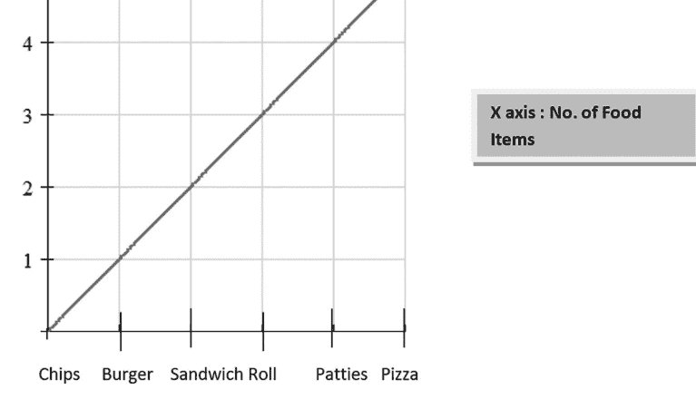

**图 2.23** matplotlib 说明的输出。

### 2.6.1 使用 MATPLOTLIB 创建图表

1.  **条形图：** 这是最常用的图表，用于显示数据表示。Matplotlib 提供了一个内置函数 `bar()` 来创建条形图。它接受三个输入变量：字段、值和颜色。让我们考虑同一个关于学生食用相同食品的调查示例。

```python
import numpy as ns
import matplotlib
import pyplot as plot
fooditems = ns.array(["Chips", "Burgers", "Sandwich", "Roll", "Patties", "Pizza"])
students = ns.array([10, 20, 30, 40, 50, 60])
plot.title("Survey on food items")
plot.xlabel("x axis represents the food item sold in canteen")
plot.ylabel("y axis represents the number of students purchase items")
plot.bar(fooditems, students, color='green')
plot.show()
```

输出：上述代码的输出如图 2.24 所示。

2.  **饼图：** 另一种图表类型是使用名为 `pie()` 的内置函数创建的饼图。Explode 定义了用于偏移每个楔形的半径比例。Labels 定义了图表将被分配的块；shadow 为饼图添加了额外效果。

```python
import numpy as ns
import matplotlib
import pyplot as plot
```

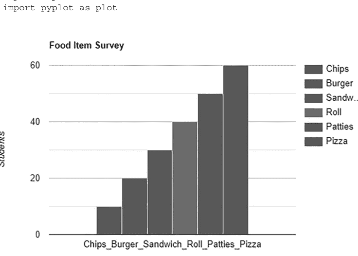

**图 2.24** 使用 matplotlib 绘制图表的说明输出。

## 食品调查

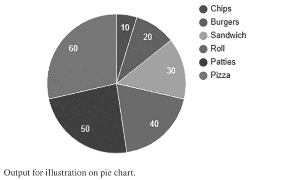

**图 2.25** 饼图说明的输出。

```python
fooditems = ns.array(["Chips", "Burgers", "Sandwich", "Roll", "Patties", "Pizza"])
students = ns.array([10, 20, 30, 40, 50, 60])
Explode = [0, 0, 0, 0, 0, 0]
plot.title("Survey on food items")
plot.pie(students, explode=Explode, label=fooditems, shadow=False, startangle=45)
plot.legend(title="Food items in canteen")
plot.show()
```

输出：上述代码的输出如图 2.25 所示。

## 2.7 PANDAS 基础

Pandas 是数据科学领域最受欢迎的 Python 库。它有助于在 Python 中处理二维数据表。它提供了灵活性和易用性。Pandas 被广泛应用于金融、商业、经济和分析等多个领域。

### 2.7.1 PANDAS 入门

Python 的主要缺点是它在数据准备和操作方面的功能非常有限。然后，Pandas 解决了这个问题；现在，它允许准备、操作、分析和建模数据。

让我们以计算机中以逗号分隔值（CSV）文件形式存在的数据为例，用户希望分析数据以得出结论。Pandas 将通过导入数据，并通过分析和清理数据（如果发现任何缺失字段）将其转换为有意义的方式，从而帮助用户过滤行和列中的数据。

Pandas 易于安装。例如，以下命令在命令行中用于安装 Pandas 包：

```bash
Conda install pandas
```

要在源代码中导入 Pandas，请使用以下代码：

```python
import pandas as pa
```

### 2.7.2 数据帧

Pandas 主要处理三种数据结构：

- Series
- Data Frames
- Panels

**Series：** 它是一个一维数组，可以保存任何数据。它就像 Excel 表中的一列。要从数组创建 series，请导入 numpy () 函数。

```python
import pandas as pd
import numpy as ns
a = ns.array(["apple", "banana", "orange", "peach"])
series = pd.series(a)
Print series
从 series 检索数据：
Print a[0]
```

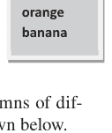

**数据帧：** 它是一个二维数组。它就像一个包含不同数据类型的行和列的表。让我们以存储学生信息为例，如下所示。

| 姓名 | 年龄 | 班级 | 平均分数 |
|---|---|---|---|
| Alice | 10 | 6 | 50 |
| Mack | 5 | 2 | 20 |
| Jason | 4 | 1 | 40 |
| Adam | 9 | 3 | 50 |

用于初始化数据帧的语法：
*Pandas.DataFrame (data, index, column, data type, copy)*
让我们详细解释每一项：

- **Data：** 以数组、列表、集合或任何其他数据结构形式输入的数据。
- **Index：** 表示要访问的行。
- **Column：** 表示数据中的列。
- **Data type：** 数据类型，即 int、string、float 等。
- **Copy：** 用于复制数据。

**创建数据帧：**

```python
import pandas as pd
import numpy as ns
a = ns.array(["apple", "banana", "orange", "peach"])
dataframe = pd.DataFrame(a)
Print dataframe
```

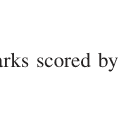

### 2.7.3 数据帧的关键操作

#### 2.7.3.1 从列表创建数据帧

可以使用列表创建数据帧。让我们以显示学生英语科目得分为例。

```python
import pandas as pd
list = [['Anna', 20], ['Jhon', 30], ['Adam', 55], ['Jason', 60]]
dataframe = pd.DataFrame(list, column=['Student Name', 'Marks Scored'], dtype=int)
Print dataframe
```

输出：

| | 学生姓名 | 得分 |
|---|---|---|
| 0 | Anna | 20 |
| 1 | Jhon | 30 |
| 2 | Adam | 55 |
| 3 | Jason | 60 |

#### 2.7.3.2 数据帧中的行和列

数据以包含行和列的表格形式保存。因此，我们可以执行多种操作，例如添加、选择、删除等。

##### 2.7.3.2.1 在数据帧中选择列

```python
import pandas as ps
data = {'name': ['Anna', 'Jhon', 'Adma', 'Jason'], 'Marks': [20, 30, 55, 60]}
dataframe = ps.DataFrame(data, index=[0, 1, 2, 3])
first = dataframe('name')
print(first)
```

##### 2.7.3.2.2 向现有数据帧添加列

```python
import pandas as ps
data = {'Name': ['Anna', 'Jhon', 'Adam', 'Jason'], 'Marks': [20, 30, 55, 60]}
dataframe = ps.DataFrame(data, index=[0, 1, 2, 3])
print(dataframe)
class = [1, 2, 3, 4]
dataframe['Class'] = class  # 添加新列
print("添加新列后")
print(dataframe)
```

输出：

| | 姓名 | 分数 |
|---|---|---|
| 0 | Anna | 20 |
| 1 | Jhon | 30 |
| 2 | Adam | 55 |
| 3 | Jason | 60 |

添加新列后

| | 姓名 | 分数 | 班级 |
|---|---|---|---|
| 0 | Anna | 20 | 1 |
| 1 | Jhon | 30 | 2 |
| 2 | Adam | 55 | 3 |
| 3 | Jason | 60 | 4 |

## 2.7.3.2.3 从数据框中删除一列

```python
import pandas as ps
data = {'Name' : ['Anna', 'Jhon', 'Adam', 'Jason'], 'Marks' : [20, 30, 55, 60], 'class' : [1,2,3,4]}
dataframe = ps.DataFrame(data, index = [0,1,2,3])
print (dataframe)
print ("delete the column class")
dataframe.pop('class')
print(dataframe) #deletes the column
```

## 2.8 计算复杂度

计算复杂度是指完成一项任务所需的资源数量。计算复杂度帮助程序员识别程序将面临的复杂程度，以便克服它。
程序或算法的复杂度随输入数据的不同而变化；通常以“f(n)”的形式表示，其中 n 表示输入的大小。
算法的计算复杂度是指在最坏情况下，算法解决问题所需的时间。算法可以按以下方式分析：

- **渐近分析：** 创建应用程序时，需要关注多个方面。这样的应用程序应该是用户友好的、快速的、易于配置的，并且性能是关键。没有人喜欢运行一个操作缓慢且在处理大量数据时表现不佳的应用程序。我们如何识别算法的速度，并判断该算法在处理大量输入时是否表现最佳？所有上述问题的答案就是渐近分析。

它评估算法在处理大量输入数据时的性能；它计算随着数据输入的增加，时间如何增长。当我们有两个解决同一问题的算法时，渐近分析将帮助计算并选择最合适的算法。
算法可以基于以下情况进行分析：

**最坏情况复杂度：** 算法将执行的最大步骤数。确定算法运行时间的上界。导致最大操作数的情况。例如，在数据中搜索一个不存在的元素，因为循环将迭代到最后以搜索该元素，这就是为什么它是最坏情况。
**平均情况复杂度：** 找出所有可能的输入，计算所消耗的时间，将所有计算值相加，然后除以输入的数量。这不容易做到，并且很少使用。
**最佳情况复杂度：** 它生成算法的下界。计算导致执行最少操作数的情况。
**空间复杂度：** 空间复杂度是解决问题所需的内存。假设问题需要大量内存。结果，程序将变得更加复杂。
**时间复杂度：** 算法解决问题所需的时间。时间包括程序的执行时间。

## 2.9 现实世界的例子

基于本章解释的主题，作者提供了现实世界的例子，以便更好地理解概念。

### 2.9.1 使用 PANDAS 的实现

Pandas 通过提升应用程序流程来帮助数据科学领域。它有助于以表格形式可视化数据。让我们以分析不同品牌乳制品的新数据为例。

信息将包含乳制品的不同属性，即 pH 值、多种维生素、密度和 0 到 5 之间的质量分数。质量分数是人工进行的三项测试的平均值。首先，让我们解释如何使用 Numpy 保存数据。

| 品牌 | pH | 能量 | 脂肪 | 质量分数 | 碳水化合物 | 蛋白质 | 钠 |
|---|---|---|---|---|---|---|---|
| Open Process Interface (OPI) | 3.51 | 30 | 66 | 2 | 23 | 40 | 12 |
| Milky | 3.20 | 60 | 11 | 3 | 70 | 50 | 13 |

从上表中，有三行。第一行是标题列。标题之后的每一行代表不同的产品及其质量。例如，第一行定义了品牌名称，然后是 pH 值、能量、脂肪等。

让我们使用 Matplotlib 输入数据：

```python
import pandas as ps
data = {'Brand': ['OPI', 'Milky'], 'PH': [3.51, 3.20], 'Energy' : [30,60],
'Fat' : [66, 11], 'Quality Score' : [2, 3], 'Carbohydrate' : [23, 70],
'Protein' : [40,50], 'Sodium' : [12, 13]}
dataframe = ps.DataFrame(data, index = [0,1])
print (dataframe)
```

1. 查找数据框中行和列的数量。
   `dataframe.shape`
2. 如何访问最后一行的值？
   `dataframe.tail(1)`
3. 我们如何访问第一行的值？
   `dataframe.head(1)`

### 2.9.2 使用 NUMPY 的实现

让我们解决寻找五个矩形面积和周长的问题。要找到面积和周长，我们需要矩形的长度和宽度。

```python
import numpy as ns
length = ns.array([5,10,15,20,25])
width = ns.array([20, 22, 24, 25, 26])
area = multiply(length, width)
perimeter1 = add(length, width)
perimeter = perimeter1 * 2
print(perimeter)
print(area)
```

### 2.9.3 使用 MATPLOTLIB 的实现

Matplotlib 提供数据的图形表示以进行可视化。借助 matplotlib，用户可以根据需要提取所需信息并将其绘制在图表上。让我们以使用 matplotlib 绘制直方图为例。

## 客户等待时间

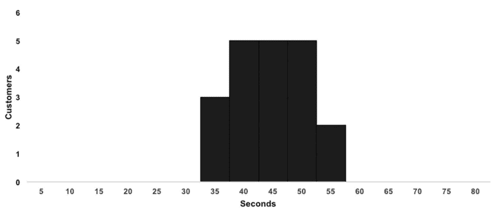

图 2.26 直方图输出。

当用户寻找身高、体重和客户等待时间等数据时，直方图是一种常见的图表类型。直方图数据在范围内根据其频率绘制。
Adam 在一家银行工作；最近，他收到了许多客户关于向投诉官员登记投诉等待时间的投诉。Adam 决定观察每位客户的等待时间。数据如下：

| 客户 | 时间（秒） |
|---|---|
| 客户 1 | 43 |
| 客户 2 | 35 |
| 客户 3 | 36.5 |
| 客户 4 | 50.2 |
| 客户 5 | 50.2 |

```python
import numpy as ns
import matplotlib.pyplot as plot
time = ns.array([43, 35, 36.5, 50.2, 50.2])
customer = ns.array(["Customer 1", "Customer 2", "Customer 3", "Customer 4",
"Customer 5"])
plot.title("Customer Wait Time Observation")
plot.xlabel("x axis represents the time in seconds")
plot.ylabel("y axis represents the customers")
plot.hist(time, customer)
plot.show()
```

输出 - 上述代码的输出如图 2.26 所示。

## 总结

- **Python：** 它是一种高级、交互式和面向对象的语言。Python 易于理解。大多数机器学习和人工智能算法都是用 Python 编写的。
- **Python 的主要用途：** 它被用作面向对象编程（OOP）语言和脚本语言，并且可以轻松地与 C、C++ 和 JAVA 等其他语言集成。它在数据科学、机器学习和深度学习中被广泛使用。
- **控制流语句：** 控制流描述了代码执行的程序顺序。控制语句通过条件语句（如循环和函数调用）来处理。
- **列表：** 列表是可变且有序的数据结构。列表的每个元素称为一个项。列表使用方括号初始化。
- **元组：** 元组是由逗号分隔的绝对对象序列。元组通过其索引访问。
- **字典：** 它是用于映射和存储数据的数据结构，其中键充当索引。键将是单个元素，而值可以是数组或列表。
- **集合：** 它与数学中的集合相同；它可能包含各种元素，并且元素的顺序未定义。
- **异常处理：** 错误有不同类型，需要处理以创建流畅的应用程序。异常处理是在程序执行期间克服意外错误的过程。每当方法内发生错误时，它会创建一个对象并将其交给异常处理程序块。
- **调试：** 识别和删除代码中错误的过程称为调试。它允许识别导致错误的确切行和函数。
- **Numpy：** 它是一个支持 N 维数组并具有复杂函数的库。它能够执行数学、统计操作等功能。
- **Matplotlib：** 它是另一个 Python 库，支持以 2D 和 3D 图表（如饼图、条形图和直方图）形式进行数据的图形表示。Matplotlib 在当今的业务中扮演着非常重要的角色，因为程序员使用这个库以图形方式显示业务状态。
- **Pandas：** Python 的库，以表格形式提供数据并执行算术函数，如加法、减法和倒数。

## 复习题

1. Python 中使用哪些内置数据类型？
2. 如何初始化一个列表？
3. 列表和元组之间的区别是什么？
4. 我们如何初始化一个字典？
5. break 语句的主要目的是什么？
6. continue 语句的用途是什么？
7. pass 语句的用途是什么？
8. Numpy 比列表更好吗？
9. 异常处理中 try 块的 else 部分何时执行？
10. 我们如何使用 Numpy 创建布尔数组？
11. 使用 matplotlib 可以创建哪些类型的图表？
12. 我们如何使用 Pandas 和 Numpy 删除缺失值？
13. Pandas 如何允许读取 CSV 文件？
14. 读取并打印数据的前十列。
15. 什么是计算复杂度？
16. plot() 函数的参数是什么？
17. 这行代码意味着什么 – import matplotlib.pyplot as plt？
18. 描述热图在 matplotlib 中的重要性？

## 19. Matplotlib 中有哪些可用的图表类型？
20. 编写代码来自定义图表颜色并添加图例？
21. 编写代码绘制带有颜色属性的散点图。
22. 如何为图表添加标签？
23. 解释直方图函数中的 bins 参数？
24. 什么是 rcdefaults()？
25. 柱状图、饼图和散点图之间的区别是什么？
26. 绘图的重要性是什么？
27. 列举 Pandas 中不同的数据结构类型？
28. 解释 Pandas 中的 Series。如何在 Pandas 中创建 Series 的副本？
29. 什么是 Pandas 数据框？如何在 Pandas 中创建一个空的数据框？
30. 解释 Pandas 中的 reindexing（重新索引）。
31. Pandas 库的主要特性是什么？
32. Pandas 的用途是什么？
33. 解释 Pandas 中的分类数据。
34. 在 Pandas 中创建数据框有哪些不同的方式？
35. 什么是 Pandas 中的时间序列？
36. Pandas 中使用的标准数据缺失标记是什么？
37. 不调用 Matplotlib 是否可以在 Pandas 中绘制直方图？如果可以，请编写代码绘制直方图？
38. 为什么需要使用 Python Pandas？

# 练习题

## Numpy

- 1. 将列表 [3.14, 14.22, 160, 36.36] 转换为一维数组。
- 2. 编写一个 Numpy 程序，创建一个 3×3 的矩阵，其值范围从 5 到 14。
- 3. 给定数组，在 Numpy 中编写程序反转数组
  [1,3,6,9,12,15,18,21,24,27,30]
- 4. 给定数组，使用 Numpy 将数组的数据类型更改为浮点数
  [1,3,6,9,12,15,18,21,24,27,30]
- 5. 给定一个数组，编写一个 Numpy 程序创建一个二维数组，其边界为 0，内部为 1。
  原始数组：
  [[ 1. 1. 1. 1. 1.]
  [ 1. 1. 1. 1. 1.]
  [ 1. 1. 1. 1. 1.]
  [ 1. 1. 1. 1. 1.]
  [ 1. 1. 1. 1. 1.]]
  期望输出：
  数组边界为 0，内部为 1
  [[ 0. 0. 0. 0. 0.]
  [ 0. 1. 1. 1. 0.]
  [ 0. 1. 1. 1. 0.]
  [ 0. 1. 1. 1. 0.]
  [ 0. 0. 0. 0. 0.]]
- 6. 给定元组，使用 Numpy 将其转换为数组
  ([1, 3, 5], [2, 4, 6])
- 7. 给定华氏温度数组值，使用公式 C= (F-32)*5/9 将其转换为摄氏度（注意：F 是值的数组）
  F=[60,70,80,90,100,110]
- 8. 给定数组，使用 Numpy 查找数组的长度、元素大小（以字节为单位）和数组的总字节数（注意：使用 size、itemsize 和 nbytes 关键字）
  [1,2,3,4,5,6,7,8,9,0]
- 9. 给定数组，使用 Numpy 对数组进行升序和降序排序
  [13,24,54,23,4,5,6,7,1,9]

## Pandas

给定一个 INFO.CSV 文件：

| 电压 (mV) | 时间 (s) |
|---|---|
| 10 | 2 |
| 20 | 3.5 |
| 33 | 3.8 |
| 23 | 2.1 |
| 55 | 5.8 |
| 44 | 4.9 |
| 200 | 33.5 |
| 500 | 89.2 |

- 1. 编写 Pandas 代码读取 INFO.CSV 文件。
- 2. 如何获取 INFO.CSV 文件的基本统计信息？
- 3. 以下代码的作用是什么？ –
  print(tabulate(print_table, headers=headers))
- 4. 编写 Pandas 代码删除缺失数据。
- 5. 编写 Pandas 代码，将 INFO.CSV 中的缺失数据替换为值 “test”。
- 6. 编写 Pandas 代码将浮点数转换为整数，反之亦然。
- 7. 如何将 Pandas 数据框转换为 Numpy 数组？
- 8. 编写 Pandas 代码获取特征（维度）名称。
- 9. 编写一个函数，将数据框中 “height” 列的所有值乘以 2.5。

## MatplotLib

- 1. 编写一个用于 3D 绘图的 matplotlib 代码。
- 2. 使用 “sin” 函数绘制正弦波图形
  a. Y 轴为电压 (mV)
  b. X 轴为时间 (s)
- 3. 如何将 matplotlib 图形保存到文件？
- 4. 给定 INFO.CSV 文件（包含电压和时间两列），绘制折线图来绘制这些值。
- 5. 在绘制图形之前进行缩放的目的是什么？

## 3 机器学习的数据分析生命周期

### 学习目标

在本章结束时，读者将能够：

- 理解机器学习（ML）数据分析生命周期所涉及的各个阶段。
- 领会数据发现、数据准备和探索性数据分析所涉及的方面。
- 理解模型规划和模型构建的要求。
- 深入了解如何沟通结果、优化和实施模型。
- 了解数据分析生命周期各阶段中成员的角色和职责。

### 3.1 引言

过去两年产生的数据量远超过去 50 年的总和。随着数据呈指数级增长，它带来了一个巨大的问题。我们必须妥善管理它，以便数据可以用于商业利益。采用并成功实施一个框架将帮助用户避免与数据相关的陷阱。该框架还有助于用户将时间集中在数据分析（从数据中推断）而非数据准备上，确保数据的严谨性和完整性，促进跨职能分析团队成员之间更好的过渡，实现可重复的规模扩展到其他分析，并支持研究结果的有效性。

一些现实世界的数据问题看起来复杂而混乱，但通过一个良好的框架方法，复杂的问题可以分解为更简单的模块，从而更容易解决。有时，应用经过测试的数据分析过程具有挑战性。因此，需要建立一个全面的方法来进行分析。一旦数据在多个时刻被收集，用户就开始分析数据，然后计划并确定工作的范围和数量。在此过程中，涉及的人员尝试探索不同的目标或解决与沟通目标不同的问题。文档过程有助于展示探索的严谨性，并在团队内部共享时为项目提供额外的可信度。这有助于团队进行知识共享，并采用这些方法和分析，以便在后续年份中可以重复并稍作修改。

存在一个定义明确的流程来开发数据科学项目。然而，始终建议采用一个数据分析生命周期框架，这也是本章的主要焦点。许多提出的框架阶段将是相似的。例如，数据发现和数据准备阶段将是通用的，只有细微差别。然而，有些阶段可能根本不需要。例如，框架的模型训练阶段要求用户创建训练和测试数据集；商业智能项目将没有这些阶段。此外，数据科学通常处理各种数据集，例如大数据，包括半结构化/非结构化数据和稀疏数据集。与仅关注商业智能的项目相比，这些数据集在数据准备、数据拼接和丰富方面需要更多的关注。

数据准备可能是 ML 项目中最重要的部分。它是最耗时的部分，尽管它似乎是最少被讨论的话题。数据准备也称为数据预处理，是将原始数据转换为适合建模的形式的行为。ML 算法要求输入数据为数值，大多数算法开发和部署都保持这一期望。因此，如果数据包含非数字的数据类型和值（如标签），则需要将数据更改为数字。此外，特定的 ML 算法对数据类型、规模、概率分布和输入变量之间的关系有特定的期望。你可能需要更改数据以满足这些期望。

数据准备的观点是发现如何最好地将问题未知的底层结构暴露给 ML 算法。这通常需要通过一系列不同的数据准备技术进行迭代实验，以发现什么有效或最佳。项目中使用的绝大多数 ML 算法已有数年甚至数十年的历史。这些算法的实现和应用已被充分理解。它们已经非常常规化，拥有像 Python 中 Scikit-learn 这样功能齐全的令人惊叹的开源 ML 库。项目之间不同的是数据。我们可能在新的应用设置中首次获取一个新数据集，以使用特定数据集作为预测建模项目的基础。因此，准备数据以最好地呈现给学习算法的问题是任何现代 ML 项目的主要任务。

数据准备的挑战在于每个数据集都是独特且不同的。数据集在变量数量（数十、数百、数千或更多）、变量类型（数值型、名义型、序数型、布尔型）、变量规模、值随时间的变化等方面各不相同。因此，这使得讨论数据准备成为一个挑战。要么使用特定的案例研究，要么专注于跨项目使用的通用方法。结果是两种方法都没有得到深入探讨。

### 3.2 数据分析生命周期

数据分析生命周期包含六个阶段，这些阶段在整个生命周期中是迭代进行的。图 3.1 所示的数据分析生命周期描绘了从数据发现到项目完成和运营阶段的端到端数据分析流程的最佳实践方法。这些阶段还涵盖了基于数据分析和决策科学领域既定方法的过程改进。

### 3.2.1 阶段 1 – 数据发现

数据发现阶段要回答的问题是“我们是否有足够的信息？”。数据发现是从各种来源收集和分析数据，以从隐藏的模式和趋势中获得洞察的过程。这是充分利用组织数据以支持关键业务决策的主要步骤。通过数据发现过程，数据在一系列步骤中被收集、组合和分析。目标是将混乱分散的数据变得干净、易于理解且用户友好。此阶段的主要重点是了解业务领域，包括从过去的经验中学习，并进一步评估支持项目所需的资源，例如人力资源、时间、技术和数据。业务问题必须以关注分析挑战的方式进行框架化，这将在后续的数据分析生命周期阶段中解决。最后，必须制定初始假设（IH）以验证并开始学习信息。

深入理解我们试图寻找答案的给定问题的领域至关重要。在某些情况下，数据科学家需要具备高级的计算和定量知识，以便应用可以是多学科的。这些科学家需要具备将启发式方法应用于不同业务和概念问题的技术、方法和模型的深入知识。具有定量专业知识的领域专家

## 3.2.1 第一阶段 – 业务理解

数据分析生命周期还将与数据科学家合作，以弥合领域知识与分析深度之间的差距。

在评估资源时，应重点关注可用于该流程的现有工具和技术，以及与后续阶段交互所需的系统类型。同时，还需要对组织内可用的分析设施进行评估。相关问题如下：

- a. 模型的最终用户需要什么类型的角色？
- b. 当前的开发模型能否推动成功？
- c. 组织内部是否具备这些角色？

此类评估将有助于决定当前及未来在数据处理类型方面的实施。此外，有必要验证现有信息是否足以支持当前项目的目标，或者是否需要收集数据、从外部来源购买数据，或对现有数据进行任何扩展或转换。

此外，为了项目的成功实施，一个优秀的项目团队需要由主题专家（SMEs）、领域专家、分析团队、客户和项目管理团队合理组合而成。同时，需要评估主题专家的比例，以确保工作团队在技能的深度和广度上有明确的重点。一旦确定了项目在团队、工具、数据和技术方面的清单，就需要进行另一轮评估来确定资源，否则需要增加额外资源。

一旦与利益相关者完成互动并获得了足够的领域知识，就可以结合经验来界定业务问题。随后，定义分析问题，在此阶段，需要明确利益相关者的角色、他们的项目需求、他们的兴趣以及他们评估项目的标准。由于项目的分析部分旨在服务于业务视角，因此有必要非常清晰地指出薄弱环节，以避免在项目工作中出现混乱。

根据参与者和利益相关者的数量，我们必须考虑使用负责、问责、咨询和知情（RACI）矩阵。这将清晰地展示每位利益相关者的期望和参与度，与参与者设定明确的期望，并避免在需要利益相关者（而非工作成果的主管）批准时出现延误。RACI矩阵是一种记录职责的方法。这些职责包括个人在项目中的角色、个人是否适合该项目等。RACI指的是项目中人员的角色：

- **负责（Responsible）：** 负责执行关键路径活动并期望主动完成任务的个人或群体。
- **问责（Accountable）：** 对决策负责的个人或群体。在此情况下，每个给定任务只分配一个问责人/群体，以确保明确的所有权和问责制。
- **咨询（Consult）：** 作为特定领域专家/主题专家的个人或群体，将在整个项目过程中提供咨询。
- **知情（Inform）：** 每当做出决策或采取行动时，需要被告知的个人或群体。

表3.1给出了一个RACI矩阵示例。

创建一个类似于RACI矩阵的框架将确保我们对项目中的问责制和职责有明确的共识。此外，与正确的人共享信息，使其了解进展。

很可能，项目发起人会从最终目标（或解决方案）开始。项目团队需要以此为参考，识别问题和期望的结果。因此，采访项目发起人（如CFO、CIO或总监等）变得至关重要。以下是一些采访项目发起人的技巧和示例，用于界定核心业务问题以及项目假设和约束条件。

- 我们作为项目的一部分试图解决什么业务问题？
- 哪些行业问题（稳定与动态行业等——数据可能是稳定的或快速变化的）会影响项目？
- 该项目的成功标准是什么（关键项目指标）？
- 分析需要多少历史信息？
- 该项目的范围和范围外是什么？（许多用户关注范围内的项目而忽略范围外的项目，这将在未来导致范围蔓延）
- 我们应在什么时间线和成本指导下工作（范围、时间和成本被称为三重约束。如果其中一个改变，另外两个需要被评估并适当改变，以避免项目成本超支和延误）？
- 我们从哪里获取数据？（内部数据源与外部数据源，单一数据源与多个数据源）
- 谁可以（组织内部或外部）担任项目的主题专家？
- 如何处理范围变更（变更控制委员会等）

**表3.1 RACI矩阵**

| 关键路径活动 | 利益相关者1 | 利益相关者2 | 利益相关者3 | 利益相关者4 | 利益相关者5 |
| :--- | :---: | :---: | :---: | :---: | :---: |
| 活动1 | R | R | A | C | I |
| 活动2 | R | C | I | A | I |
| 活动3 | C | R | A | C,I | I |
| 活动4 | R | R | A | I | I |

现在，可以形成初始假设（IHs）以批准或否决数据。始终鼓励制定几个IHs来测试并生成额外的假设想法。最初形成的IHs作为后续阶段进行分析的测试基础，并为额外的学习奠定基础。假设测试将在监督学习和无监督学习章节中更详细地介绍。最初，选择解决特定问题所需的数据类型以及数据源及其分类，例如结构化、半结构化或非结构化数据。必须考虑测试假设所需的数据量、类型和时间跨度。此外，应识别数据源以确保易于访问。在某些应用中，可能需要将原始数据输入模型运行。因此，必须确定访问数据的可能性，作为实验分析的基础。

一旦假设定义完成，就需要对数据状况进行彻底诊断。然后，可以列出从数据准备阶段到模型操作化阶段的应用工具和技术。此外，如果在此阶段进行了数据探索，就能明确数据量，这有助于构建和格式化数据。现在，在项目领域专家的帮助下，审查和验证信息的范围。

许多文章描述了如何成为各个领域的专家，特别是成为专家所需的练习量。此背景被称为刻意学习。为了发展所需的专业知识，识别问题的可能解决方案非常重要。这将引出一系列可能的解决方案。如果制定了IHs，那么就更容易得出关于分析模型的结论。

在进入下一阶段之前，需要确保以下几点：

- 有足够的信息来起草分析计划并分享以供同行评审。
- 是否对业务问题有清晰的理解，以及是否存在逐步解决问题的方法。
- 有足够的主题专家来支持问题的领域。
- 是否检测到项目的成功标准。

基于以上几点，问题定义更加清晰，有助于在后续阶段确定可能的分析方法选择。

## 3.2.2 第二阶段 – 数据准备与探索性数据分析

数据发现阶段的主要重点是确保“高质量数据的可用性”。在此阶段，准备一个分析沙箱，用于项目的剩余阶段。执行提取、加载和转换（ELT）以及提取、转换和加载（ETL），将相关数据导入沙箱。然后对数据进行转换以便进行分析。基本思路是清晰地理解数据，并采取必要的措施来处理数据。数据分析师将此过程称为数据丰富和协调，此阶段被认为是数据生命周期中最关键和最耗时的阶段之一。

在此阶段，定义一个空间来探索数据，而不干扰实时生产数据库。此外，所有类型的数据都应收集在沙箱中，因为分析项目需要大量和多样化的数据。因此，海量数据将包括摘要、结构化数据、原始数据馈送（例如传感器）和非结构化文本数据（日志数据）。因此，沙箱很大，几乎是组织企业数据仓库大小的10-50倍。

由于数据量巨大，必须确保强大的带宽和良好的网络连接来处理数据，以便能够轻松地从数据集中进行快速转换和提取。现在，数据分析师需要在ELT和ETL之间做出选择。在这种情况下，由于这是一个典型的数据处理方法问题，ELT比ETL更受青睐。在采用ELT的分析沙箱方法中，数据先被提取、加载，然后进行转换。这里，原始数据被提取并加载到分析沙箱中，然后再进行数据转换。采用这种方法是为了在数据被转换之前，将其作为沙箱中其他数据的一部分进行维护和保留。ELT和ETL方法之间的一些关键区别列于表3.2中。数据分析师根据数据需求做出选择。

例如，让我们考虑一个信用卡使用欺诈检测分析。通常，这个数据群体中的异常值可能代表更高风险的交易，这些交易可能被标记为欺诈性信用卡活动。使用ETL时，这些异常值可能在加载到数据库之前被无意中过滤掉或转换和清理。这可能会导致数据偏差。因此，鼓励使用提取、加载然后转换的方法（ELT），以保持数据的原始状态，并能够在加载到暂存区或操作数据存储（ODS）区域后对其进行转换。这种方法将为我们提供数据库中可用的干净数据进行分析，同时也保留原始形式的数据，以便在数据中发现隐藏特征。

Hadoop、Alpine Miner和SAS是我们可以用来将数据注入分析沙箱的一些工具。Hadoop可以执行并行摄取和自定义分析，用于解析网络流量、GPS位置分析、蛋白质组学分析、传感器数据收集、基因组分析，以及合并来自多个来源的大量非结构化数据馈送。Alpine Miner提供了一个用户友好的图形界面，用于创建分析工作流，包括数据操作和一系列分析事件，例如在PostgreSQL和其他大数据源上进行分阶段数据挖掘技术（例如，选择前100名客户，然后运行描述性统计和聚类）。我们可以使用Python库从各种来源获取数据。例如，使用Python Pandas库，我们可以从各种来源摄取数据。

```python
#Load the libraries
import pandas as pd
```

**表3.2：ELT和ETL方法的比较**

| 提取、转换和加载 | 提取、加载和转换 |
| :--- | :--- |
| 用于计算密集型转换和少量数据 | 优选并用于大量数据 |
| 转换在暂存区/ETL服务器区域完成 | 转换在目标系统（例如，分析沙箱）中执行 |
| 无数据重复；如果我们需要执行另一次转换，我们需要再次加载 | 数据重复；原始数据的副本可用于进一步转换和使用 |
| 数据首先加载到暂存层，然后推送到目标系统。耗时 | 数据仅一次直接加载到目标系统。因此更快 |
| 维护成本高，因为我们需要选择要加载和转换的数据 | 维护成本低，因为数据已在目标系统中可用 |
| 实现复杂性相对较低 | ELT流程要求用户对工具有深入的了解和专业技能 |
| 仅支持结构化数据；不支持数据湖 | 允许使用数据湖（分析沙箱）和非结构化数据 |

## 机器学习的数据分析生命周期

### 从平面文件源读取数据：

| 函数 | 描述 |
| :--- | :--- |
| `read_table(filepath_or_buffer[, sep, ...])` | 将通用分隔文件读入DataFrame。 |
| `read_csv(filepath_or_buffer[, sep, ...])` | 将逗号分隔值（csv）文件读入DataFrame。 |
| `read_fwf(filepath_or_buffer[, colspecs, ...])` | 将固定宽度格式化的行表读入DataFrame。 |

例如：

```python
dataset = pd.read_csv('C:/Python Files/50_Startups.csv')
```

### 从剪贴板读取数据：

| 函数 | 描述 |
| :--- | :--- |
| `read_clipboard([sep])` | 从剪贴板读取文本并传递给read_csv。 |

### 从Excel读取数据：

| 函数 | 描述 |
| :--- | :--- |
| `read_excel(*args, **kwargs)` | 将Excel文件读入Pandas DataFrame。 |
| `ExcelFile.parse([sheet_name, header, names, ...])` | 将指定的工作表解析为DataFrame。 |

| 函数 | 描述 |
| :--- | :--- |
| `ExcelWriter(path[, engine])` | 用于将DataFrame对象写入Excel工作表的类。 |

### 从JSON文件读取数据：

| 函数 | 描述 |
| :--- | :--- |
| `read_json(*args, **kwargs)` | 将JSON字符串转换为Pandas对象。 |
| `json_normalize(data[, record_path, meta, ...])` | 将半结构化JSON数据规范化为扁平表。 |

| 函数 | 描述 |
| :--- | :--- |
| `build_table_schema(data[, index, ...])` | 从数据创建表模式。 |

### 从HTML文件读取数据：

| 函数 | 描述 |
| :--- | :--- |
| `read_html(*args, **kwargs)` | 将HTML表读入DataFrame对象列表。 |

### 从Hadoop（HDFS文件）读取数据

| 函数 | 描述 |
| :--- | :--- |
| `read_hdf(path_or_buf[, key, mode, errors, ...])` | 从存储中读取，如果打开则关闭它。 |
| `HDFStore.put(key, value[, format, index, ...])` | 将对象存储在HDFStore中。 |
| `HDFStore.append(key, value[, format, axes, ...])` | 追加到文件中的表。 |
| `HDFStore.get(key)` | 检索存储在文件中的Pandas对象。 |
| `HDFStore.select(key[, where, start, stop, ...])` | 检索存储在文件中的Pandas对象，可选地基于where条件。 |
| `HDFStore.info()` | 打印存储的详细信息。 |
| `HDFStore.keys([include])` | 返回与HDFStore中存储的对象对应的键列表。 |
| `HDFStore.groups()` | 返回所有顶级节点的列表。 |
| `HDFStore.walk([where])` | 遍历Pandas对象的pytables组层次结构。 |

### 从结构化查询语言（SQL）表读取数据

| 函数 | 描述 |
| :--- | :--- |
| `read_sql_table()` | 将SQL数据库表读入DataFrame。 |
| `read_sql_query()` | 将SQL查询读入DataFrame。 |
| `read_sql()` | 将SQL查询或数据库表读入DataFrame。 |

我们可以从其他来源摄取数据，如Google BigQuery、SAS、STATA和SPSS。用户可以参考Pandas库帮助以获取支持的文件类型的最新列表。

在数据准备阶段，涉及的人员与所使用的工具同样重要。需要IT分析师和数据库分析师的适当指导和协助。如前所述，此阶段在分析生命周期中至关重要；如果获取的数据质量不佳，将难以执行生命周期过程中的后续步骤。除了数据准备外，此阶段还确保考虑额外的数据方面，并避免常见陷阱。数据准备阶段的一些注意事项如下：

-   确定所需的数据源。所有已识别的数据源是否都可用？需要确保对目标字段有适当的清晰度。
-   所需的数据是否干净？
-   内容和文件是否一致？

在准备数据时，需要确定项目中可以考虑的缺失/不一致数据的数量，换句话说，要理解对空白/不一致数据的允许程度。此外，如果有一致的数据可用但发现偏离正常情况，则必须评估数据类型的一致性。例如，如果数据预期是数字型的，则必须确认是否允许任何特殊字符，如字母数字字符。必须对数据列进行关键和严格的审查，以确保它们有意义且形式正确。此外，必须验证系统性错误发生的可能性。系统性错误可能由于传感器数据或无监督数据而发生。这可能导致不规则数据或缺失数据。必须审查数据，以评估数据定义在重复测量中是否一致。

### 3.2.2.1 探索性数据分析

数据可视化：一旦我们将数据从来源获取到分析沙箱，通过可视化技术进一步理解数据就很重要。Python有很多可视化库，比如Matplotlib（我们在第2章讨论过）到Seaborn，后者基于Matplotlib，具有高级数据可视化功能，帮助我们直观地理解数据行为。Seaborn库具有多种功能，包括允许比较多个变量的应用程序可编程接口、用于构建轻松可视化的多图网格、单变量（单变量分析）和双变量以比较数据子集。这些多种颜色调色板允许显示各种类型的模式。此外，Seaborn工作需要一些强制性的依赖库。它们是Numpy、Pandas、Matplotlib、SciPy和Statsmodels。

就像Python中的任何库一样，在开始使用之前，我们需要将Seaborn库导入到你的模型中以使用该库的功能。

```python
import seaborn as sns # Importing the library
```

Seaborn内置了数据集，供用户熟悉库的功能。要查看有哪些可用数据集，请使用以下命令：

```python
sns.get_dataset_names() # returns a list of all the available datasets
```

输出如下所示：

```
Out [2] :
['anagrams',
'anscombe',
'attention',
'brain_networks',
```

## 机器学习的数据分析生命周期

我们将使用一些现有数据集来理解绘图和可视化统计关系、理解给定数据集中变量关系的过程，以及这些关系如何依赖于其他变量。要探索的第一个 Seaborn 函数是 `relplot()`。这是一个二维数据可视化函数。首先，让我们使用 Seaborn 自带的 flights 数据集。

```python
# importing the required libraries
import numpy as np
import pandas as pd
import matplotlib.pyplot as plt
import seaborn as sns
sns.set(style="darkgrid") # style attribute is customizable and can take
# any value like darkgrid, ticks, etc.

fl = sns.load_dataset("flights") # Using fl as variable to denote Flights
# dataset. The user can use any var.
sns.relplot(x="passengers", y="month", data=fl);
```

输出如图 3.2 所示：
这是基本的绘图。我们可以使用 `relplot()` 函数中一个名为 “kind” 的参数，将此图转换为折线图、散点图或小提琴图。这将在本节的后面部分讨论。在此之前，我们需要探索 `relplot()` 函数的另一个参数。下一个重要的语义是 hue。使用 hue，我们可以添加另一个维度——年份。

```python
fl = sns.load_dataset("flights")
sns.relplot(x="passengers", y="month", hue="year", data=fl);
```

代码片段的输出如图 3.3 所示（年份已添加到图表中）。
其他参数如颜色、大小和样式可以自定义，如下方代码片段所示。相应的输出如图 3.4 和 3.5 所示，其中参数 “palette” 有轻微变化。

```python
sns.set(style="darkgrid")
fl = sns.load_dataset("flights")
sns.relplot(x="passengers", y="month", hue="year", palette="ch:r=-.5,l=.75", data=fl);
```

```python
sns.set(style="darkgrid")
fl = sns.load_dataset("flights")
sns.relplot(x="passengers", y="month", hue="year", palette="ch:r=1,l=.9", data=fl);
```

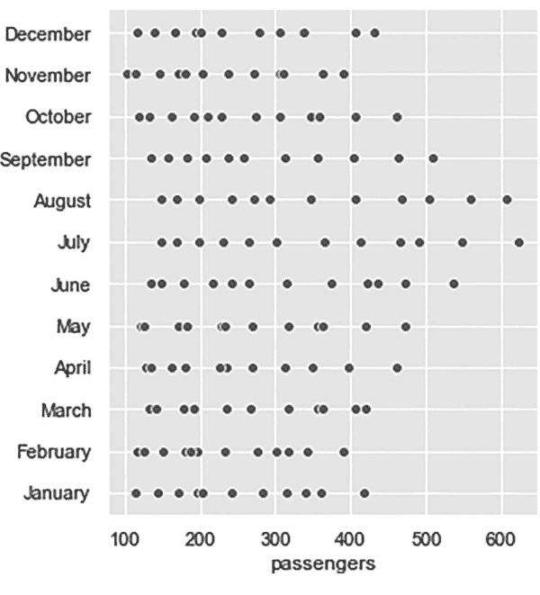

图 3.2 使用 Matplotlib 的基本绘图。

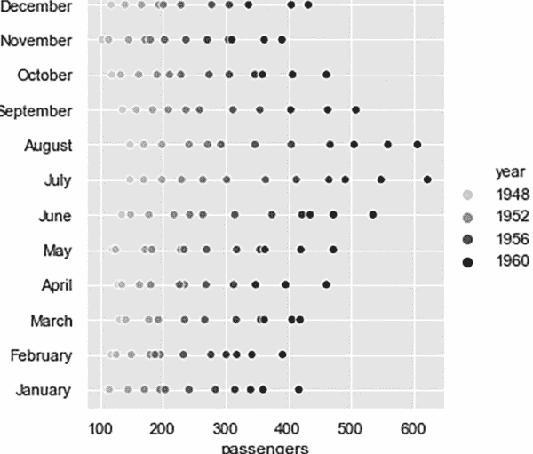

图 3.3 函数 relplot() 的示例。

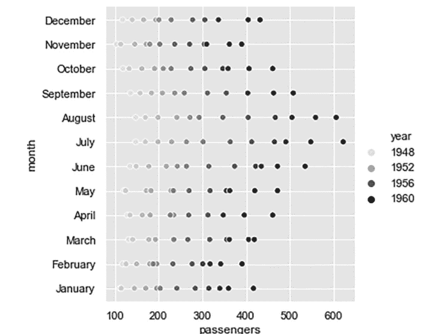

图 3.4 使用 palette="ch:r=-.5,l=.75" 的函数 relplot() 示例。

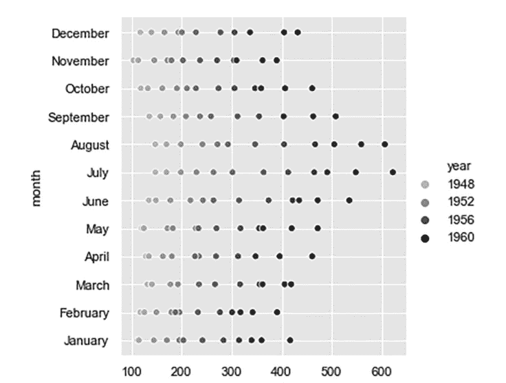

图 3.5 使用 palette="ch:r=1,l=.9" 的函数 relplot() 示例。


图 3.6 使用函数 palplot() 的输出。

Seaborn 中有可用的调色板。要了解这一点，

```python
import numpy as np
import seaborn as sns
import matplotlib.pyplot as plt
sns.set()
presentcolors = sns.color_palette()
sns.palplot(presentcolors)
```

这些代码行的输出如图 3.6 所示。
为了说明将图表转换为折线图，让我们使用 Pandas 作为数据源创建一个数据框。

```python
gr = pd.DataFrame({'Day': [1,2,3,4,5,6,7], 'Grocery': [30,80,45,50,51,90,76],
    'Clothes': [13,40,34,75,54,67,98], 'Utensils': [12,32,27,56,87,54,34]},
    index=[1,2,3,4,5,6,7])
g = sns.relplot(x="Day", y="Clothes", kind="line", data=gr)
g.fig.autofmt_xdate()
```

```python
gr = pd.DataFrame({'Day': [1,2,3,4,5,6,7], 'Grocery': [30,80,45,50,51,90,76],
    'Clothes': [13,40,34,75,54,67,98], 'Utensils': [12,32,27,56,87,54,34]},
    index=[1,2,3,4,5,6,7])
g = sns.relplot(x="Day", y="Grocery", kind="line", data=gr)
g.fig.autofmt_xdate()
```

图 3.7 和 3.8 中的图表显示了从数据框中提取的数据的折线图。
到目前为止，我们只使用了连续数据；让我们探索分类数据。`catplot()` 函数用于分类数据。这与前面讨论的函数 `relplot()` 类似。此函数可以分为散点图（包括 `stripplot()` 和 `swarmplot()`）、分布图（包括 `boxplot()`、`violinplot()` 和 `boxenplot()`）以及估计图（包括 `pointplot()`、`barplot()` 和 `countplot()`）。
我们将使用 Seaborn 中也提供的 tips 数据集。

```python
import seaborn as sns
import matplotlib.pyplot as plt
sns.set(style="ticks", color_codes=True)
tp = sns.load_dataset("tips")
sns.catplot(x="day", y="total_bill", data=tp);
```

默认输出如图 3.9 所示。
让我们使用 “kind” 参数将上面的图表转换为小提琴图。

```python
import seaborn as sns
import matplotlib.pyplot as plt
sns.set(style="ticks", color_codes=True)
tp = sns.load_dataset("tips")
sns.catplot(x="day", y="total_bill", kind="violin", data=tp);
```

上述代码的输出如图 3.10 所示。

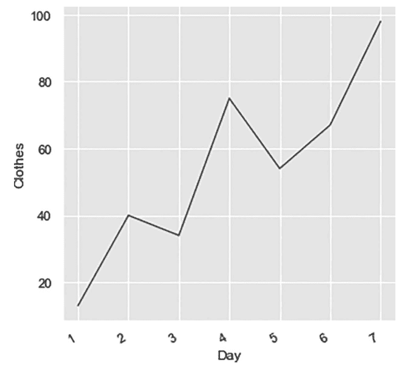

图 3.7 数据 “clothes” 与 “day” 的折线图。

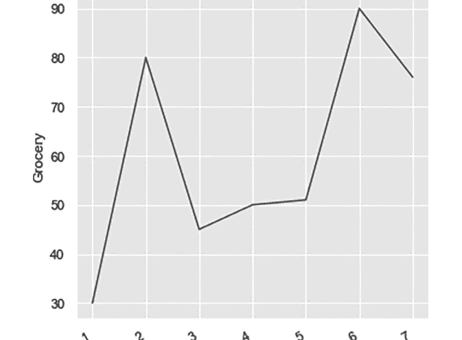

图 3.8 数据 “grocery” 与 “day” 的折线图。

## 用于决策科学的机器学习及 Python 案例研究

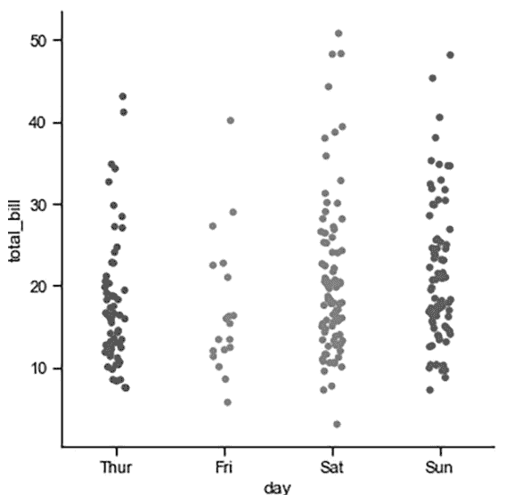

图 3.9 数据 “clothes” 与 “day” 的折线图。

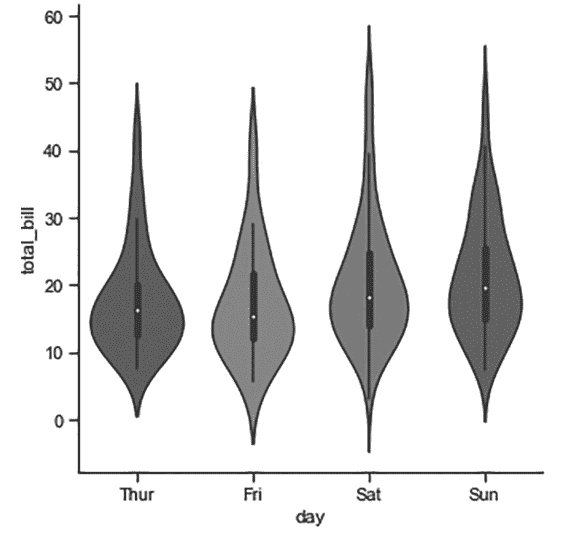

图 3.10 使用函数 catplot() 且参数 kind = “violin” 的示例。

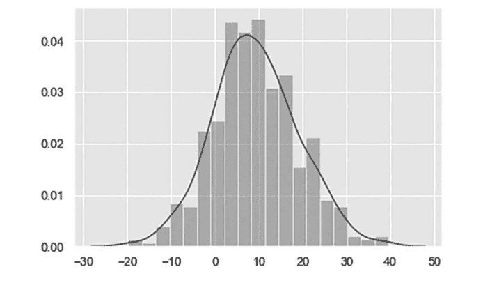

图 3.11 使用函数 distplot() 的示例——单变量。

既然我们已经探索了基本的可视化功能，让我们专注于在单变量和双变量的背景下理解数据。分布图函数 `distplot()` 用于此目的。让我们导入所有需要的库。

```python
import numpy as np
import pandas as pd
import seaborn as sns
import matplotlib.pyplot as plt
from scipy import stats
sns.set(color_codes=True)
tst = np.random.normal(loc=10, size=500, scale=10) # Univariate data
sns.distplot(tst);
```

输出如图 3.11 所示。
为了说明双变量，让我们创建两个数据框并将它们分配给变量 x 和 y。

```python
x = pd.DataFrame({'Day': [1,2,3,4,5,6,7], 'Accessaries': [30,80,90,23,60,46,76],
    'Cloths': [13,40,60,23,54,67,98], 'Shoes': [12,32,27,56,87,54,34]},
    index=[1,2,3,4,5,6,7])
y = pd.DataFrame({'Day': [8,9,10,11,12,13,14], 'Accessaries': [30,90,45,23,60,46,76],
    'Cloths': [13,40,60,23,54,67,98], 'Shoes': [12,32,27,56,87,54,34]},
    index=[8,9,10,11,12,13,14])
mean, cov = [0, 1], [(1,.5), (.5, 1)]
data = np.random.multivariate_normal(mean, cov, 200)
with sns.axes_style("white"):
    sns.jointplot(x=x, y=y, kind="kde", color="g");
```

输出如图 3.12 所示。
到目前为止，我们所有的讨论只涵盖了单网格图表。然而，Seaborn 允许并排绘制多个网格，以更好地可视化和推断数据。函数 `FacetGrid()` 将帮助我们实现这一点。
让我们使用一个简单的数据集 IRIS。样本数据如表 3.3 所示。

```python
sns.set(style="darkgrid")
ir = sns.load_dataset("iris")
```

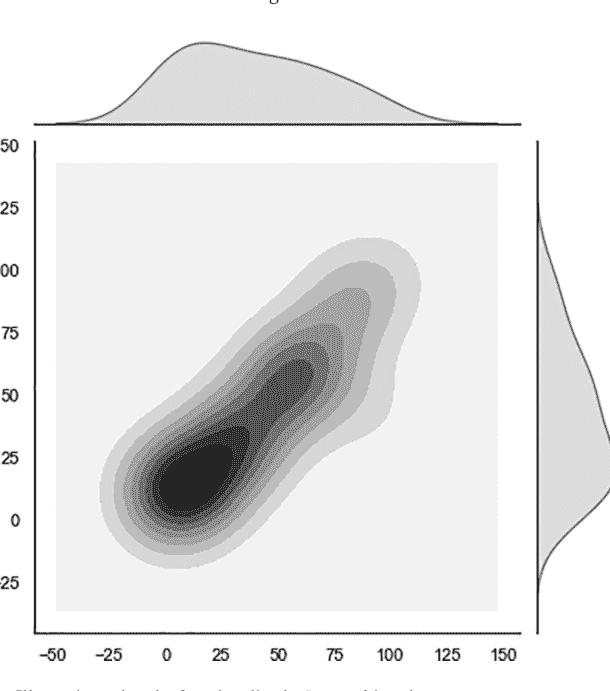

图 3.12 使用函数 distplot() 的示例——多变量。

表 3.3
IRIS 样本数据

| 花萼长度 | 花萼宽度 | 花瓣长度 | 花瓣宽度 | 物种 |
|---|---|---|---|---|
| 5.1 | 3.5 | 1.4 | 0.2 | Setosa |
| 4.9 | 3 | 1.4 | 0.2 | Setosa |
| 4.7 | 3.2 | 1.3 | 0.2 | Setosa |
| 4.6 | 3.1 | 1.5 | 0.2 | Setosa |
| 5 | 3.6 | 1.4 | 0.2 | Setosa |
| 5.4 | 3.9 | 1.7 | 0.4 | Setosa |
| 4.6 | 3.4 | 1.4 | 0.3 | Setosa |
| 5 | 3.4 | 1.5 | 0.2 | Setosa |
| 4.4 | 2.9 | 1.4 | 0.2 | Setosa |
| 4.9 | 3.1 | 1.5 | 0.1 | Setosa |
| 5.4 | 3.7 | 1.5 | 0.2 | Setosa |
| 4.8 | 3.4 | 1.6 | 0.2 | Setosa |
| 4.8 | 3 | 1.4 | 0.1 | Setosa |

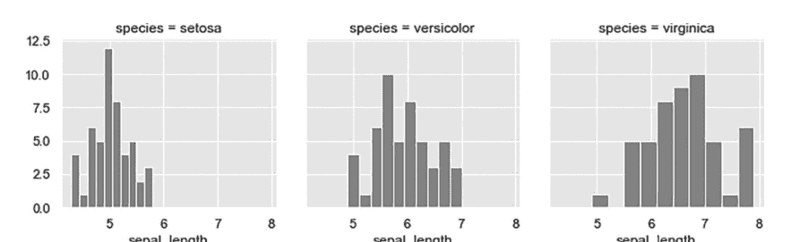

图 3.13 花萼长度与物种之间的相关性。

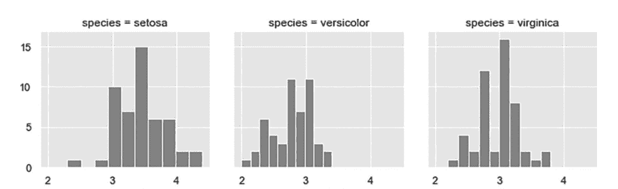

图 3.14 花萼宽度与物种之间的相关性。

```python
mp = sns.FacetGrid(ir, col="species")
mp.map(plt.hist, "sepal_length", color="g");
```

上述代码中花萼长度与物种之间的相关性在图 3.13 中清晰显示。

```python
sns.set(style="darkgrid")
ir = sns.load_dataset("iris")
mp = sns.FacetGrid(ir, col="species")
mp.map(plt.hist, "sepal_width", color="g");
```

上述代码中花萼宽度与物种之间的相关性在图 3.14 中清晰显示。
要比较成对的值，可以使用 `PairGrid()` 函数。

```python
sns.set(style="ticks")
a = sns.load_dataset("flights")
b = sns.PairGrid(a)
b.map(plt.scatter, color="g");
```

图 3.15 中显示的图表在不同的切片和切块中比较了乘客数量和年份。
我们已经探索了 Seaborn 中的基本图表/可视化示例。在传达定量见解时，拥有一个可呈现的图表非常重要。这项技术被称为控制图形美学。

## 机器学习的数据分析生命周期

在 Seaborn 中，我们可以使用以下代码生成一个正弦波，其输出如图 3.16 所示。

```python
import numpy as np
import seaborn as sns
import matplotlib.pyplot as plt

def sinplot(flip=1):
    ng = np.linspace(0, 14, 100)
    for i in range(1, 7):
        plt.plot(ng, np.sin(ng + i * .5) * (7 - i) * flip)
sinplot()
```

另一种可用的图表是箱线图。以下是示例代码片段，其输出如图 3.17 所示。

```python
import seaborn as sns
import matplotlib.pyplot as plt
sns.set(color_codes=True)
a = sns.load_dataset("tips")
sns.boxplot(x="day", y="total_bill", data=a);
```

以下代码演示了移除背景并以白色背景呈现的步骤，相应的输出如图 3.18 所示。

```python
sns.set()
sinplot()
```

在上面的图表中，我们可以注意到主题或背景已更改为白色。我们也可以进一步探索使用其他主题（例如，`dark`、`darkgrid`、`white` 和 `whitegrid`）。在之前的图表中，存在坐标轴；矩形线条环绕整个图表。这也可以使用 `despine()` 函数进一步自定义。代码如下所示，相应的输出如图 3.19 所示。

```python
import seaborn as sns
import matplotlib.pyplot as plt
sns.set(style="white", color_codes=True)
a = sns.load_dataset("tips")
sns.boxplot(x="day", y="total_bill", data=a);
sns.despine(offset=10, trim=True);
```

在多变量数据探索中，相关性分析是数据分析师用来理解数据的主要技术之一。它也被称为相关矩阵、自协方差矩阵、方差矩阵或离散矩阵。它是一个矩阵，其中 i-j 位置定义了数据集中第 i 个和第 j 个参数之间的相关性。

当数据点大致呈直线趋势时，变量之间具有近似的线性关系。在其他情况下，数据点接近一条直线，但通常这些点围绕直线趋势有相当大的变异性。一个称为相关性的综合度量描述了线性关联的强度。相关性总结了两个定量变量之间线性（直线）关联的强度和方向。它用 r 表示，取值在 -1 和 +1 之间。正的 r 值表示正相关，负的 r 值表示负相关。r 值越接近 1，数据点就越接近一条直线。因此，线性关联越强。另一方面，r 值越接近 0，线性关联就越弱。

为了演示，让我们以一个房价数据集为例。CSV 文件中的样本数据如图 3.20 所示。

| Id | MSSubClass | MSZoning | LotFrontage | LotArea | Street | Alley | LotShape | LandContour | Utilities | LotConfig | LandSlope | Neighborhood | Condition1 | Condition2 | BldgType | HouseStyle | OverallQual | OverallCond | YearBuilt | YearRemodAdd | RoofStyle | RoofMatl | Exterior1st | Exterior2nd | MasVnrType | MasVnrArea | ExterQual | ExterCond | Foundation | BsmtQual | BsmtCond | BsmtExposure | BsmtFinType1 | BsmtFinSF1 | BsmtFinType2 | BsmtFinSF2 | BsmtUnfSF | TotalBsmtSF | Heating | HeatingQC | CentralAir | Electrical | 1stFlrSF | 2ndFlrSF | LowQualFinSF | GrLivArea | BsmtFullBath | BsmtHalfBath | FullBath | HalfBath | BedroomAbvGr | KitchenAbvGr | KitchenQual | TotRmsAbvGrd | Functional | Fireplaces | FireplaceQu | GarageType | GarageYrBlt | GarageFinish | GarageCars | GarageArea | GarageQual | GarageCond | PavedDrive | WoodDeckSF | OpenPorchSF | EnclosedPorch | 3SsnPorch | ScreenPorch | PoolArea | PoolQC | Fence | MiscFeature | MiscVal | MoSold | YrSold | SaleType | SaleCondition | SalePrice |
|---|---|---|---|---|---|---|---|---|---|---|---|---|---|---|---|---|---|---|---|---|---|---|---|---|---|---|---|---|---|---|---|---|---|---|---|---|---|---|---|---|---|---|---|---|---|---|---|---|---|---|---|---|---|---|---|---|---|---|---|---|---|---|---|---|---|---|---|---|---|---|---|---|---|---|---|---|---|---|---|---|---|---|---|---|---|---|---|---|---|---|---|---|---|---|---|---|---|---|---|---|---|---|---|---|---|---|---|---|---|---|---|---|---|---|---|---|---|---|---|---|---|---|---|---|---|---|---|---|---|---|---|---|---|---|---|---|---|---|---|---|---|---|---|---|---|---|---|---|---|---|---|---|---|---|---|---|---|---|---|---|---|---|---|---|---|---|---|---|---|---|---|---|---|---|---|---|---|---|---|---|---|---|---|---|---|---|---|---|---|---|---|---|---|---|---|---|---|---|---|---|---|---|---|---|---|---|---|---|---|---|---|---|---|---|---|---|---|---|---|---|---|---|---|---|---|---|---|---|---|---|---|---|---|---|---|---|---|---|---|---|---|---|---|---|---|---|---|---|---|---|---|---|---|---|---|---|---|---|---|---|---|---|---|---|---|---|---|---|---|---|---|---|---|---|---|---|---|---|---|---|---|---|---|---|---|---|---|---|---|---|---|---|---|---|---|---|---|---|---|---|---|---|---|---|---|---|---|---|---|---|---|---|---|---|---|---|---|---|---|---|---|---|---|---|---|---|---|---|---|---|---|---|---|---|---|---|---|---|---|---|---|---|---|---|---|---|---|---|---|---|---|---|---|---|---|---|---|---|---|---|---|---|---|---|---|---|---|---|---|---|---|---|---|---|---|---|---|---|---|---|---|---|---|---|---|---|---|---|---|---|---|---|---|---|---|---|---|---|---|---|---|---|---|---|---|---|---|---|---|---|---|---|---|---|---|---|---|---|---|---|---|---|---|---|---|---|---|---|---|---|---|---|---|---|---|---|---|---|---|---|---|---|---|---|---|---|---|---|---|---|---|---|---|---|---|---|---|---|---|---|---|---|---|---|---|---|---|---|---|---|---|---|---|---|---|---|---|---|---|---|---|---|---|---|---|---|---|---|---|---|---|---|---|---|---|---|---|---|---|---|---|---|---|---|---|---|---|---|---|---|---|---|---|---|---|---|---|---|---|---|---|---|---|---|---|---|---|---|---|---|---|---|---|---|---|---|---|---|---|---|---|---|---|---|---|---|---|---|---|---|---|---|---|---|---|---|---|---|---|---|---|---|---|---|---|---|---|---|---|---|---|---|---|---|---|---|---|---|---|---|---|---|---|---|---|---|---|---|---|---|---|---|---|---|---|---|---|---|---|---|---|---|---|---|---|---|---|---|---|---|---|---|---|---|---|---|---|---|---|---|---|---|---|---|---|---|---|---|---|---|---|---|---|---|---|---|---|---|---|---|---|---|---|---|---|---|---|---|---|---|---|---|---|---|---|---|---|---|---|---|---|---|---|---|---|---|---|---|---|---|---|---|---|---|---|---|---|---|---|---|---|---|---|---|---|---|---|---|---|---|---|---|---|---|---|---|---|---|---|---|---|---|---|---|---|---|---|---|---|---|---|---|---|---|---|---|---|---|---|---|---|---|---|---|---|---|---|---|---|---|---|---|---|---|---|---|---|---|---|---|---|---|---|---|---|---|---|---|---|---|---|---|---|---|---|---|---|---|---|---|---|---|---|---|---|---|---|---|---|---|---|---|---|---|---|---|---|---|---|---|---|---|---|---|---|---|---|---|---|---|---|---|---|---|---|---|---|---|---|---|---|---|---|---|---|---|---|---|---|---|---|---|---|---|---|---|---|---|---|---|---|---|---|---|---|---|---|---|---|---|---|---|---|---|---|---|---|---|---|---|---|---|---|---|---|---|---|---|---|---|---|---|---|---|---|---|---|---|---|---|---|---|---|---|---|---|---|---|---|---|---|---|---|---|---|---|---|---|---|---|---|---|---|---|---|---|---|---|---|---|---|---|---|---|---|---|---|---|---|---|---|---|---|---|---|---|---|---|---|---|---|---|---|---|---|---|---|---|---|---|---|---|---|---|---|---|---|---|---|---|---|---|---|---|---|---|---|---|---|---|---|---|---|---|---|---|---|---|---|---|---|---|---|---|---|---|---|---|---|---|---|---|---|---|---|---|---|---|---|---|---|---|---|---|---|---|---|---|---|---|---|---|---|---|---|---|---|---|---|---|---|---|---|---|---|---|---|---|---|---|---|---|---|---|---|---|---|---|---|---|---|---|---|---|---|---|---|---|---|---|---|---|---|---|---|---|---|---|---|---|---|---|---|---|---|---|---|---|---|---|---|---|---|---|---|---|---|---|---|---|---|---|---|---|---|---|---|---|---|---|---|---|---|---|---|---|---|---|---|---|---|---|---|---|---|---|---|---|---|---|---|---|---|---|---|---|---|---|---|---|---|---|---|---|---|---|---|---|---|---|---|---|---|---|---|---|---|---|---|---|---|---|---|---|---|---|---|---|---|---|---|---|---|---|---|---|---|---|---|---|---|---|---|---|---|---|---|---|---|---|---|---|---|---|---|---|---|---|---|---|---|---|---|---|---|---|---|---|---|---|---|---|---|---|---|---|---|---|---|---|---|---|---|---|---|---|---|---|---|---|---|---|---|---|---|---|---|---|---|---|---|---|---|---|---|---|---|---|---|---|---|---|---|---|---|---|---|---|---|---|---|---|---|---|---|---|---|---|---|---|---|---|---|---|---|---|---|---|---|---|---|---|---|---|---|---|---|---|---|---|---|---|---|---|---|---|---|---|---|---|---|---|---|---|---|---|---|---|---|---|---|---|---|---|---|---|---|---|---|---|---|---|---|---|---|---|---|---|---|---|---|---|---|---|---|---|---|---|---|---|---|---|---|---|---|---|---|---|---|---|---|---|---|---|---|---|---|---|---|---|---|---|---|---|---|---|---|---|---|---|---|---|---|---|---|---|---|---|---|---|---|---|---|---|---|---|---|---|---|---|---|---|---|---|---|---|---|---|---|---|---|---|---|---|---|---|---|---|---|---|---|---|---|---|---|---|---|---|---|---|---|---|---|---|---|---|---|---|---|---|---|---|---|---|---|---|---|---|---|---|---|---|---|---|---|---|---|---|---|---|---|---|---|---|---|---|---|---|---|---|---|---|---|---|---|---|---|---|---|---|---|---|---|---|---|---|---|---|---|---|---|---|---|---|---|---|---|---|---|---|---|---|---|---|---|---|---|---|---|---|---|---|---|---|---|---|---|---|---|---|---|---|---|---|---|---|---|---|---|---|---|---|---|---|---|---|---|---|---|---|---|---|---|---|---|---|---|---|---|---|---|---|---|---|---|---|---|---|---|---|---|---|---|---|---|---|---|---|---|---|---|---|---|---|---|---|---|---|---|---|---|---|---|---|---|---|---|---|---|---|---|---|---|---|---|---|---|---|---|---|---|---|---|---|---|---|---|---|---|---|---|---|---|---|---|---|---|---|---|---|---|---|---|---|---|---|---|---|---|---|---|---|---|---|---|---|---|---|---|---|---|---|---|---|---|---|---|---|---|---|---|---|---|---|---|---|---|---|---|---|---|---|---|---|---|---|---|---|---|---|---|---|---|---|---|---|---|---|---|---|---|---|---|---|---|---|---|---|---|---|---|---|---|---|---|---|---|---|---|---|---|---|---|---|---|---|---|---|---|---|---|---|---|---|---|---|---|---|---|---|---|---|---|---|---|---|---|---|---|---|---|---|---|---|---|---|---|---|---|---|---|---|---|---|---|---|---|---|---|---|---|---|---|---|---|---|---|---|---|---|---|---|---|---|---|---|---|---|---|---|---|---|---|---|---|---|---|---|---|---|---|---|---|---|---|---|---|---|---|---|---|---|---|---|---|---|---|---|---|---|---|---|---|---|---|---|---|---|---|---|---|---|---|---|---|---|---|---|---|---|---|---|---|---|---|---|---|---|---|---|---|---|---|---|---|---|---|---|---|---|---|---|---|---|---|---|---|---|---|---|---|---|---|---|---|---|---|---|---|---|---|---|---|---|---|---|---|---|---|---|---|---|---|---|---|---|---|---|---|---|---|---|---|---|---|---|---|---|---|---|---|---|---|---|---|---|---|---|---|---|---|---|---|---|---|---|---|---|---|---|---|---|---|---|---|---|---|---|---|---|---|---|---|---|---|---|---|---|---|---|---|---|---|---|---|---|---|---|---|---|---|---|---|---|---|---|---|---|---|---|---|---|---|---|---|---|---|---|---|---|---|---|---|---|---|---|---|---|---|---|---|---|---|---|---|---|---|---|---|---|---|---|---|---|---|---|---|---|---|---|---|---|---|---|---|---|---|---|---|---|---|---|---|---|---|---|---|---|---|---|---|---|---|---|---|---|---|---|---|---|---|---|---|---|---|---|---|---|---|---|---|---|---|---|---|---|---|---|---|---|---|---|---|---|---|---|---|---|---|---|---|---|---|---|---|---|---|---|---|---|---|---|---|---|---|---|---|---|---|---|---|---|---|---|---|---|---|---|---|---|---|---|---|---|---|---|---|---|---|---|---|---|---|---|---|---|---|---|---|---|---|---|---|---|---|---|---|---|---|---|---|---|---|---|---|---|---|---|---|---|---|---|---|---|---|---|---|---|---|---|---|---|---|---|---|---|---|---|---|---|---|---|---|---|---|---|---|---|---|---|---|---|---|---|---|---|---|---|---|---|---|---|---|---|---|---|---|---|---|---|---|---|---|---|---|---|---|---|---|---|---|---|---|---|---|---|---|---|---|---|---|---|---|---|---|---|---|---|---|---|---|---|---|---|---|---|---|---|---|---|---|---|---|---|---|---|---|---|---|---|---|---|---|---|---|---|---|---|---|---|---|---|---|---|---|---|---|---|---|---|---|---|---|---|---|---|---|---|---|---|---|---|---|---|---|---|---|---|---|---|---|---|---|---|---|---|---|---|---|---|---|---|---|---|---|---|---|---|---|---|---|---|---|---|---|---|---|---|---|---|---|---|---|---|---|---|---|---|---|---|---|---|---|---|---|---|---|---|---|---|---|---|---|---|---|---|---|---|---|---|---|---|---|---|---|---|---|---|---|---|---|---|---|---|---|---|---|---|---|---|---|---|---|---|---|---|---|---|---|---|---|---|---|---|---|---|---|---|---|---|---|---|---|---|---|---|---|---|---|---|---|---|---|---|---|---|---|---|---|---|---|---|---|---|---|---|---|---|---|---|---|---|---|---|---|---|---|---|---|---|---|---|---|---|---|---|---|---|---|---|---|---|---|---|---|---|---|---|---|---|---|---|---|---|---|---|---|---|---|---|---|---|---|---|---|---|---|---|---|---|---|---|---|---|---|---|---|---|---|---|---|---|---|---|---|---|---|---|---|---|---|---|---|---|---|---|---|---|---|---|---|---|---|---|---|---|---|---|---|---|---|---|---|---|---|---|---|---|---|---|---|---|---|---|---|---|---|---|---|---|---|---|---|---|---|---|---|---|---|---|---|---|---|---|---|---|---|---|---|---|---|---|---|---|---|---|---|---|---|---|---|---|---|---|---|---|---|---|---|---|---|---|---|---|---|---|---|---|---|---|---|---|---|---|---|---|---|---|---|---|---|---|---|---|---|---|---|---|---|---|---|---|---|---|---|---|---|---|---|---|---|---|---|---|---|---|---|---|---|---|---|---|---|---|---|---|---|---|---|---|---|---|---|---|---|---|---|---|---|---|---|---|---|---|---|---|---|---|---|---|---|---|---|---|---|---|---|---|---|---|---|---|---|---|---|---|---|---|---|---|---|---|---|---|---|---|---|---|---|---|---|---|---|---|---|---|---|---|---|---|---|---|---|---|---|---|---|---|---|---|---|---|---|---|---|---|---|---|---|---|---|---|---|---|---|---|---|---|---|---|---|---|---|---|---|---|---|---|---|---|---|---|---|---|---|---|---|---|---|---|---|---|---|---|---|---|---|---|---|---|---|---|---|---|---|---|---|---|---|---|---|---|---|---|---|---|---|---|---|---|---|---|---|---|---|---|---|---|---|---|---|---|---|---|---|---|---|---|---|---|---|---|---|---|---|---|---|---|---|---|---|---|---|---|---|---|---|---|---|---|---|---|---|---|---|---|---|---|---|---|---|---|---|---|---|---|---|---|---|---|---|---|---|---|---|---|---|---|---|---|---|---|---|---|---|---|---|---|---|---|---|---|---|---|---|---|---|---|---|---|---|---|---|---|---|---|---|---|---|---|---|---|---|---|---|---|---|---|---|---|---|---|---|---|---|---|---|---|---|---|---|---|---|---|---|---|---|---|---|---|---|---|---|---|---|---|---|---|---|---|---|---|---|---|---|---|---|---|---|---|---|---|---|---|---|---|---|---|---|---|---|---|---|---|---|---|---|---|---|---|---|---|---|---|---|---|---|---|---|---|---|---|---|---|---|---|---|---|---|---|---|---|---|---|---|---|---|---|---|---|---|---|---|---|---|---|---|---|---|---|---|---|---|---|---|---|---|---|---|---|---|---|---|---|---|---|---|---|---|---|---|---|---|---|---|---|---|---|---|---|---|---|---|---|---|---|---|---|---|---|---|---|---|---|---|---|---|---|---|---|---|---|---|---|---|---|---|---|---|---|---|---|---|---|---|---|---|---|---|---|---|---|---|---|---|---|---|---|---|---|---|---|---|---|---|---|---|---|---|---|---|---|---|---|---|---|---|---|---|---|---|---|---|---|---|---|---|---|---|---|---|---|---|---|---|---|---|---|---|---|---|---|---|---|---|---|---|---|---|---|---|---|---|---|---|---|---|---|---|---|---|---|---|---|---|---|---|---|---|---|---|---|---|---|---|---|---|---|---|---|---|---|---|---|---|---|---|---|---|---|---|---|---|---|---|---|---|---|---|---|---|---|---|---|---|---|---|---|---|---|---|---|---|---|---|---|---|---|---|---|---|---|---|---|---|---|---|---|---|---|---|---|---|---|---|---|---|---|---|---|---|---|---|---|---|---|---|---|---|---|---|---|---|---|---|---|---|---|---|---|---|---|---|---|---|---|---|---|---|---|---|---|---|---|---|---|---|---|---|---|---|---|---|---|---|---|---|---|---|---|---|---|---|---|---|---|---|---|---|---|---|---|---|---|---|---|---|---|---|---|---|---|---|---|---|---|---|---|---|---|---|---|---|---|---|---|---|---|---|---|---|---|---|---|---|---|---|---|---|---|---|---|---|---|---|---|---|---|---|---|---|---|---|---|---|---|---|---|---|---|---|---|---|---|---|---|---|---|---|---|---|---|---|---|---|---|---|---|---|---|---|---|---|---|---|---|---|---|---|---|---|---|---|---|---|---|---|---|---|---|---|---|---|---|---|---|---|---|---|---|---|---|---|---|---|---|---|---|---|---|---|---|---|---|---|---|---|---|---|---|---|---|---|---|---|---|---|---|---|---|---|---|---|---|---|---|---|---|---|---|---|---|---|---|---|---|---|---|---|---|---|---|---|---|---|---|---|---|---|---|---|---|---|---|---|---|---|---|---|---|---|---|---|---|---|---|---|---|---|---|---|---|---|---|---|---|---|---|---|---|---|---|---|---|---|---|---|---|---|---|---|---|---|---|---|---|---|---|---|---|---|---|---|---|---|---|---|---|---|---|---|---|---|---|---|---|---|---|---|---|---|---|---|---|---|---|---|---|---|---|---|---|---|---|---|---|---|---|---|---|---|---|---|---|---|---|---|---|---|---|---|---|---|---|---|---|---|---|---|---|---|---|---|---|---|---|---|---|---|---|---|---|---|---|---|---|---|---|---|---|---|---|---|---|---|---|---|---|---|---|---|---|---|---|---|---|---|---|---|---|---|---|---|---|---|---|---|---|---|---|---|---|---|---|---|---|---|---|---|---|---|---|---|---|---|---|---|---|---|---|---|---|---|---|---|---|---|---|---|---|---|---|---|---|---|---|---|---|---|---|---|---|---|---|---|---|---|---|---|---|---|---|---|---|---|---|---|---|---|---|---|---|---|---|---|---|---|---|---|---|---|---|---|---|---|---|---|---|---|---|---|---|---|---|---|---|---|---|---|---|---|---|---|---|---|---|---|---|---|---|---|---|---|---|---|---|---|---|---|---|---|---|---|---|---|---|---|---|---|---|---|---|---|---|---|---|---|---|---|---|---|---|---|---|---|---|---|---|---|---|---|---|---|---|---|---|---|---|---|---|---|---|---|---|---|---|---|---|---|---|---|---|---|---|---|---|---|---|---|---|---|---|---|---|---|---|---|---|---|---|---|---|---|---|---|---|---|---|---|---|---|---|---|---|---|---|---|---|---|---|---|---|---|---|---|---|---|---|---|---|---|---|---|---|---|---|---|---|---|---|---|---|---|---|---|---|---|---|---|---|---|---|---|---|---|---|---|---|---|---|---|---|---|---|---|---|---|---|---|---|---|---|---|---|---|---|---|---|---|---|---|---|---|---|---|---|---|---|---|---|---|---|---|---|---|---|---|---|---|---|---|---|---|---|---|---|---|---|---|---|---|---|---|---|---|---|---|---|---|---|---|---|---|---|---|---|---|---|---|---|---|---|---|---|---|---|---|---|---|---|---|---|---|---|---|---|---|---|---|---|---|---|---|---|---|---|---|---|---|---|---|---|---|---|---|---|---|---|---|---|---|---|---|---|---|---|---|---|---|---|---|---|---|---|---|---|---|---|---|---|---|---|---|---|---|---|---|---|---|---|---|---|---|---|---|---|---|---|---|---|---|---|---|---|---|---|---|---|---|---|---|---|---|---|---|---|---|---|---|---|---|---|---|---|---|---|---|---|---|---|---|---|---|---|---|---|---|---|---|---|---|---|---|---|---|---|---|---|---|---|---|---|---|---|---|---|---|---|---|---|---|---|---|---|---|---|---|---|---|---|---|---|---|---|---|---|---|---|---|---|---|---|---|---|---|---|---|---|---|---|---|---|---|---|---|---|---|---|---|---|---|---|---|---|---|---|---|---|---|---|---|---|---|---|---|---|---|---|---|---|---|---|---|---|---|---|---|---|---|---|---|---|---|---|---|---|---|---|---|---|---|---|---|---|---|---|---|---|---|---|---|---|---|---|---|---|---|---|---|---|---|---|---|---|---|---|---|---|---|---|---|---|---|---|---|---|---|---|---|---|---|---|---|---|---|---|---|---|---|---|---|---|---|---|---|---|---|---|---|---|---|---|---|---|---|---|---|---|---|---|---|---|---|---|---|---|---|---|---|---|---|---|---|---|---|---|---|---|---|---|---|---|---|---|---|---|---|---|---|---|---|---|---|---|---|---|---|---|---|---|---|---|---|---|---|---|---|---|---|---|---|---|---|---|---|---|---|---|---|---|---|---|---|---|---|---|---|---|---|---|---|---|---|---|---|---|---|---|---|---|---|---|---|---|---|---|---|---|---|---|---|---|---|---|---|---|---|---|---|---|---|---|---|---|---|---|---|---|---|---|---|---|---|---|---|---|---|---|---|---|---|---|---|---|---|---|---|---|---|---|---|---|---|---|---|---|---|---|---|---|---|---|---|---|---|---|---|---|---|---|---|---|---|---|---|---|---|---|---|---|---|---|---|---|---|---|---|---|---|---|---|---|---|---|---|---|---|---|---|---|---|---|---|---|---|---|---|---|---|---|---|---|---|---|---|---|---|---|---|---|---|---|---|---|---|---|---|---|---|---|---|---|---|---|---|---|---|---|---|---|---|---|---|---|---|---|---|---|---|---|---|---|---|---|---|---|---|---|---|---|---|---|---|---|---|---|---|---|---|---|---|---|---|---|---|---|---|---|---|---|---|---|---|---|---|---|---|---|---|---|---|---|---|---|---|---|---|---|---|---|---|---|---|---|---|---|---|---|---|---|---|---|---|---|---|---|---|---|---|---|---|---|---|---|---|---|---|---|---|---|---|---|---|---|---|---|---|---|---|---|---|---|---|---|---|---|---|---|---|---|---|---|---|---|---|---|---|---|---|---|---|---|---|---|---|---|---|---|---|---|---|---|---|---|---|---|---|---|---|---|---|---|---|---|---|---|---|---|---|---|---|---|---|---|---|---|---|---|---|---|---|---|---|---|---|---|---|---|---|---|---|---|---|---|---|---|---|---|---|---|---|---|---|---|---|---|---|---|---|---|---|---|---|---|---|---|---|---|---|---|---|---|---|---|---|---|---|---|---|---|---|---|---|---|---|---|---|---|---|---|---|---|---|---|---|---|---|---|---|---|---|---|---|---|---|---|---|---|---|---|---|---|---|---|---|---|---|---|---|---|---|---|---|---|---|---|---|---|---|---|---|---|---|---|---|---|---|---|---|---|---|---|---|---|---|---|---|---|---|---|---|---|---|---|---|---|---|---|---|---|---|---|---|---|---|---|---|---|---|---|---|---|---|---|---|---|---|---|---|---|---|---|---|---|---|---|---|---|---|---|---|---|---|---|---|---|---|---|---|---|---|---|---|---|---|---|---|---|---|---|---|---|---|---|---|---|---|---|---|---|---|---|---|---|---|---|---|---|---|---|---|---|---|---|---|---|---|---|---|---|---|---|---|---|---|---|---|---|---|---|---|---|---|---|---|---|---|---|---|---|---|---|---|---|---|---|---|---|---|---|---|---|---|---|---|---|---|---|---|---|---|---|---|---|---|---|---|---|---|---|---|---|---|---|---|---|---|---|---|---|---|---|---|---|---|---|---|---|---|---|---|---|---|---|---|---|---|---|---|---|---|---|---|---|---|---|---|---|---|---|---|---|---|---|---|---|---|---|---|---|---|---|---|---|---|---|---|---|---|---|---|---|---|---|---|---|---|---|---|---|---|---|---|---|---|---|---|---|---|---|---|---|---|---|---|---|---|---|---|---|---|---|---|---|---|---|---|---|---|---|---|---|---|---|---|---|---|---|---|---|---|---|---|---|---|---|---|---|---|---|---|---|---|---|---|---|---|---|---|---|---|---|---|---|---|---|---|---|---|---|---|---|---|---|---|---|---|---|---|---|---|---|---|---|---|---|---|---|---|---|---|---|---|---|---|---|---|---|---|---|---|---|---|---|---|---|---|---|---|---|---|---|---|---|---|---|---|---|---|---|---|---|---|---|---|---|---|---|---|---|---|---|---|---|---|---|---|---|---|---|---|---|---|---|---|---|---|---|---|---|---|---|---|---|---|---|---|---|---|---|---|---|---|---|---|---|---|---|---|---|---|---|---|---|---|---|---|---|---|---|---|---|---|---|---|---|---|---|---|---|---|---|---|---|---|---|---|---|---|---|---|---|---|---|---|---|---|---|---|---|---|---|---|---|---|---|---|---|---|---|---|---|---|---|---|---|---|---|---|---|---|---|---|---|---|---|---|---|---|---|---|---|---|---|---|---|---|---|---|---|---|---|---|---|---|---|---|---|---|---|---|---|---|---|---|---|---|---|---|---|---|---|---|---|---|---|---|---|---|---|---|---|---|---|---|---|---|---|---|---|---|---|---|---|---|---|---|---|---|---|---|---|---|---|---|---|---|---|---|---|---|---|---|---|---|---|---|---|---|---|---|---|---|---|---|---|---|---|---|---|---|---|---|---|---|---|---|---|---|---|---|---|---|---|---|---|---|---|---|---|---|---|---|---|---|---|---|---|---|---|---|---|---|---|---|---|---|---|---|---|---|---|---|---|---|---|---|---|---|---|---|---|---|---|---|---|---|---|---|---|---|---|---|---|---|---|---|---|---|---|---|---|---|---|---|---|---|---|---|---|---|---|---|---|---|---|---|---|---|---|---|---|---|---|---|---|---|---|---|---|---|---|---|---|---|---|---|---|---|---|---|---|---|---|---|---|---|---|---|---|---|---|---|---|---|---|---|---|---|---|---|---|---|---|---|---|---|---|---|---|---|---|---|---|---|---|---|---|---|---|---|---|---|---|---|---|---|---|---|---|---|---|---|---|---|---|---|---|---|---|---|---|---|---|---|---|---|---|---|---|---|---|---|---|---|---|---|---|---|---|---|---|---|---|---|---|---|---|---|---|---|---|---|---|---|---|---|---|---|---|---|---|---|---|---|---|---|---|---|---|---|---|---|---|---|---|---|---|---|---|---|---|---|---|---|---|---|---|---|---|---|---|---|---|---|---|---|---|---|---|---|---|---|---|---|---|---|---|---|---|---|---|---|---|---|---|---|---|---|---|---|---|---|---|---|---|---|---|---|---|---|---|---|---|---|---|---|---|---|---|---|---|---|---|---|---|---|---|---|---|---|---|---|---|---|---|---|---|---|---|---|---|---|---|---|---|---|---|---|---|---|---|---|---|---|---|---|---|---|---|---|---|---|---|---|---|---|---|---|---|---|---|---|---|---|---|---|---|---|---|---|---|---|---|---|---|---|---|---|---|---|---|---|---|---|---|---|---|---|---|---|---|---|---|---|---|---|---|---|---|---|---|---|---|---|---|---|---|---|---|---|---|---|---|---|---|---|---|---|---|---|---|---|---|---|---|---|---|---|---|---|---|---|---|---|---|---|---|---|---|---|---|---|---|---|---|---|---|---|---|---|---|---|---|---|---|---|---|---|---|---|---|---|---|---|---|---|---|---|---|---|---|---|---|---|---|---|---|---|---|---|---|---|---|---|---|---|---|---|---|---|---|---|---|---|---|---|---|---|---|---|---|---|---|---|---|---|---|---|---|---|---|---|---|---|---|---|---|---|---|---|---|---|---|---|---|---|---|---|---|---|---|---|---|---|---|---|---|---|---|---|---|---|---|---|---|---|---|---|---|---|---|---|---|---|---|---|---|---|---|---|---|---|---|---|---|---|---|---|---|---|---|---|---|---|---|---|---|---|---|---|---|---|---|---|---|---|---|---|---|---|---|---|---|---|---|---|---|---|---|---|---|---|---|---|---|---|---|---|---|---|---|---|---|---|---|---|---|---|---|---|---|---|---|---|---|---|---|---|---|---|---|---|---|---|---|---|---|---|---|---|---|---|---|---|---|---|---|---|---|---|---|---|---|---|---|---|---|---|---|---|---|---|---|---|---|---|---|---|---|---|---|---|---|---|---|---|---|---|---|---|---|---|---|---|---|---|---|---|---|---|---|---|---|---|---|---|---|---|---|---|---|---|---|---|---|---|---|---|---|---|---|---|---|---|---|---|---|---|---|---|---|---|---|---|---|---|---|---|---|---|---|---|---|---|---|---|---|---|---|---|---|---|---|---|---|---|---|---|---|---|---|---|---|---|---|---|---|---|---|---|---|---|---|---|---|---|---|---|---|---|---|---|---|---|---|---|---|---|---|---|---|---|---|---|---|---|---|---|---|---|---|---|---|---|---|---|---|---|---|---|---|---|---|---|---|---|---|---|---|---|---|---|---|---|---|---|---|---|---|---|---|---|---|---|---|---|---|---|---|---|---|---|---|---|---|---|---|---|---|---|---|---|---|---|---|---|---|---|---|---|---|---|---|---|---|---|---|---|---|---|---|---|---|---|---|---|---|---|---|---|---|---|---|---|---|---|---|---|---|---|---|---|---|---|---|---|---|---|---|---|---|---|---|---|---|---|---|---|---|---|---|---|---|---|---|---|---|---|---|---|---|---|---|---|---|---|---|---|---|---|---|---|---|---|---|---|---|---|---|---|---|---|---|---|---|---|---|---|---|---|---|---|---|---|---|---|---|---|---|---|---|---|---|---|---|---|---|---|---|---|---|---|---|---|---|---|---|---|---|---|---|---|---|---|---|---|---|---|---|---|---|---|---|---|---|---|---|---|---|---|---|---|---|---|---|---|---|---|---|---|---|---|---|---|---|---|---|---|---|---|---|---|---|---|---|---|---|---|---|---|---|---|---|---|---|---|---|---|---|---|---|---|---|---|---|---|---|---|---|---|---|---|---|---|---|---|---|---|---|---|---|---|---|---|---|---|---|---|---|---|---|---|---|---|---|---|---|---|---|---|---|---|---|---|---|---|---|---|---|---|---|---|---|---|---|---|---|---|---|---|---|---|---|---|---|---|---|---|---|---|---|---|---|---|---|---|---|---|---|---|---|---|---|---|---|---|---|---|---|---|---|---|---|---|---|---|---|---|---|---|---|---|---|---|---|---|---|---|---|---|---|---|---|---|---|---|---|---|---|---|---|---|---|---|---|---|---|---|---|---|---|---|---|---|---|---|---|---|---|---|---|---|---|---|---|---|---|---|---|---|---|---|---|---|---|---|---|---|---|---|---|---|---|---|---|---|---|---|---|---|---|---|---|---|---|---|---|---|---|---|---|---|---|---|---|---|---|---|---|---|---|---|---|---|---|---|---|---|---|---|---|---|---|---|---|---|---|---|---|---|---|---|---|---|---|---|---|---|---|---|---|---|---|---|---|---|---|---|---|---|---|---|---|---|---|---|---|---|---|---|---|---|---|---|---|---|---|---|---|---|---|---|---|---|---|---|---|---|---|---|---|---|---|---|---|---|---|---|---|---|---|---|---|---|---|---|---|---|---|---|---|---|---|---|---|---|---|---|---|---|---|---|---|---|---|---|---|---|---|---|---|---|---|---|---|---|---|---|---|---|---|---|---|---|---|---|---|---|---|---|---|---|---|---|---|---|---|---|---|---|---|---|---|---|---|---|---|---|---|---|---|---|---|---|---|---|---|---|---|---|---|---|---|---|---|---|---|---|---|---|---|---|---|---|---|---|---|---|---|---|---|---|---|---|---|---|---|---|---|---|---|---|---|---|---|---|---|---|---|---|---|---|---|---|---|---|---|---|---|---|---|---|---|---|---|---|---|---|---|---|---|---|---|---|---|---|---|---|---|---|---|---|---|---|---|---|---|---|---|---|---|---|---|---|---|---|---|---|---|---|---|---|---|---|---|---|---|---|---|---|---|---|---|---|---|---|---|---|---|---|---|---|---|---|---|---|---|---|---|---|---|---|---|---|---|---|---|---|---|---|---|---|---|---|---|---|---|---|---|---|---|---|---|---|---|---|---|---|---|---|---|---|---|---|---|---|---|---|---|---|---|---|---|---|---|---|---|---|---|---|---|---|---|---|---|---|---|---|---|---|---|---|---|---|---|---|---|---|---|---|---|---|---|---|---|---|---|---|---|---|---|---|---|---|---|---|---|---|---|---|---|---|---|---|---|---|---|---|---|---|---|---|---|---|---|---|---|---|---|---|---|---|---|---|---|---|---|---|---|---|---|---|---|---|---|---|---|---|---|---|---|---|---|---|---|---|---|---|---|---|---|---|---|---|---|---|---|---|---|---|---|---|---|---|---|---|---|---|---|---|---|---|---|---|---|---|---|---|---|---|---|---|---|---|---|---|---|---|---|---|---|---|---|---|---|---|---|---|---|---|---|---|---|---|---|---|---|---|---|---|---|---|---|---|---|---|---|---|---|---|---|---|---|---|---|---|---|---|---|---|---|---|---|---|---|---|---|---|---|---|---|---|---|---|---|---|---|---|---|---|---|---|---|---|---|---|---|---|---|---|---|---|---|---|---|---|---|---|---|---|---|---|---|---|---|---|---|---|---|---|---|---|---|---|---|---|---|---|---|---|---|---|---|---|---|---|---|---|---|---|---|---|---|---|---|---|---|---|---|---|---|---|---|---|---|---|---|---|---|---|---|---|---|---|---|---|---|---|---|---|---|---|---|---|---|---|---|---|---|---|---|---|---|---|---|---|---|---|---|---|---|---|---|---|---|---|---|---|---|---|---|---|---|---|---|---|---|---|---|---|---|---|---|---|---|---|---|---|---|---|---|---|---|---|---|---|---|---|---|---|---|---|---|---|---|---|---|---|---|---|---|---|---|---|---|---|---|---|---|---|---|---|---|---|---|---|---|---|---|---|---|---|---|---|---|---|---|---|---|---|---|---|---|---|---|---|---|---|---|---|---|---|---|---|---|---|---|---|---|---|---|---|---|---|---|---|---|---|---|---|---|---|---|---|---|---|---|---|---|---|---|---|---|---|---|---|---|---|---|---|---|---|---|---|---|---|---|---|---|---|---|---|---|---|---|---|---|---|---|---|---|---|---|---|---|---|---|---|---|---|---|---|---|---|---|---|---|---|---|---|---|---|---|---|---|---|---|---|---|---|---|---|---|---|---|---|---|---|---|---|---|---|---|---|---|---|---|---|---|---|---|---|---|---|---|---|---|---|---|---|---|---|---|---|---|---|---|---|---|---|---|---|---|---|---|---|---|---|---|---|---|---|---|---|---|---|---|---|---|---|---|---|---|---|---|---|---|---|---|---|---|---|---|---|---|---|---|---|---|---|---|---|---|---|---|---|---|---|---|---|---|---|---|---|---|---|---|---|---|---|---|---|---|---|---|---|---|---|---|---|---|---|---|---|---|---|---|---|---|---|---|---|---|---|---|---|---|---|---|---|---|---|---|---|---|---|---|---|---|---|---|---|---|---|---|---|---|---|---|---|---|---|---|---|---|---|---|---|---|---|---|---|---|---|---|---|---|---|---|---|---|---|---|---|---|---|---|---|---|---|---|---|---|---|---|---|---|---|---|---|---|---|---|---|---|---|---|---|---|---|---|---|---|---|---|---|---|---|---|---|---|---|---|---|---|---|---|---|---|---|---|---|---|---|---|---|---|---|---|---|---|---|---|---|---|---|---|---|---|---|---|---|---|---|---|---|---|---|---|---|---|---|---|---|---|---|---|---|---|---|---|---|---|---|---|---|---|---|---|---|---|---|---|---|---|---|---|---|---|---|---|---|---|---|---|---|---|---|---|---|---|---|---|---|---|---|---|---|---|---|---|---|---|---|---|---|---|---|---|---|---|---|---|---|---|---|---|---|---|---|---|---|---|---|---|---|---|---|---|---|---|---|---|---|---|---|---|---|---|---|---|---|---|---|---|---|---|---|---|---|---|---|---|---|---|---|---|---|---|---|---|---|---|---|---|---|---|---|---|---|---|---|---|---|---|---|---|---|---|---|---|---|---|---|---|---|---|---|---|---|---|---|---|---|---|---|---|---|---|---|---|---|---|---|---|---|---|---|---|---|---|---|---|---|---|---|---|---|---|---|---|---|---|---|---|---|---|---|---|---|---|---|---|---|---|---|---|---|---|---|---|---|---|---|---|---|---|---|---|---|---|---|---|---|---|---|---|---|---|---|---|---|---|---|---|---|---|---|---|---|---|---|---|---|---|---|---|---|---|---|---|---|---|---|---|---|---|---|---|---|---|---|---|---|---|---|---|---|---|---|---|---|---|---|---|---|---|---|---|---|---|---|---|---|---|---|---|---|---|---|---|---|---|---|---|---|---|---|---|---|---|---|---|---|---|---|---|---|---|---|---|---|---|---|---|---|---|---|---|---|---|---|---|---|---|---|---|---|---|---|---|---|---|---|---|---|---|---|---|---|---|---|---|---|---|---|---|---|---|---|---|---|---|---|---|---|---|---|---|---|---|---|---|---|---|---|---|---|---|---|---|---|---|---|---|---|---|---|---|---|---|---|---|---|---|---|---|---|---|---|---|---|---|---|---|---|---|---|---|---|---|---|---|---|---|---|---|---|---|---|---|---|---|---|---|---|---|---|---|---|---|---|---|---|---|---|---|---|---|---|---|---|---|---|---|---|---|---|---|---|---|---|---|---|---|---|---|---|---|---|---|---|---|---|---|---|---|---|---|---|---|---|---|---|---|---|---|---|---|---|---|---|---|---|---|---|---|---|---|---|---|---|---|---|---|---|---|---|---|---|---|---|---|---|---|---|---|---|---|---|---|---|---|---|---|---|---|---|---|---|---|---|---|---|---|---|---|---|---|---|---|---|---|---|---|---|---|---|---|---|---|---|---|---|---|---|---|---|---|---|---|---|---|---|---|---|---|---|---|---|---|---|---|---|---|---|---|---|---|---|---|---|---|---|---|---|---|---|---|---|---|---|---|---|---|---|---|---|---|---|---|---|---|---|---|---|---|---|---|---|---|---|---|---|---|---|---|---|---|---|---|---|---|---|---|---|---|---|---|---|---|---|---|---|---|---|---|---|---|---|---|---|---|---|---|---|---|---|---|---|---|---|---|---|---|---|---|---|---|---|---|---|---|---|---|---|---|---|---|---|---|---|---|---|---|---|---|---|---|---|---|---|---|---|---|---|---|---|---|---|---|---|---|---|---|---|---|---|---|---|---|---|---|---|---|---|---|---|---|---|---|---|---|---|---|---|---|---|---|---|---|---|---|---|---|---|---|---|---|---|---|---|---|---|---|---|---|---|---|---|---|---|---|---|---|---|---|---|---|---|---|---|---|---|---|---|---|---|---|---|---|---|---|---|---|---|---|---|---|---|---|---|---|---|---|---|---|---|---|---|---|---|---|---|---|---|---|---|---|---|---|---|---|---|---|---|---|---|---|---|---|---|---|---|---|---|---|---|---|---|---|---|---|---|---|---|---|---|---|---|---|---|---|---|---|---|---|---|---|---|---|---|---|---|---|---|---|---|---|---|---|---|---|---|---|---|---|---|---|---|---|---|---|---|---|---|---|---|---|---|---|---|---|---|---|---|---|---|---|---|---|---|---|---|---|---|---|---|---|---|---|---|---|---|---|---|---|---|---|---|---|---|---|---|---|---|---|---|---|---|---|---|---|---|---|---|---|---|---|---|---|---|---|---|---|---|---|---|---|---|---|---|---|---|---|---|---|---|---|---|---|---|---|---|---|---|---|---|---|---|---|---|---|---|---|---|---|---|---|---|---|---|---|---|---|---|---|---|---|---|---|---|---|---|---|---|---|---|---|---|---|---|---|---|---|---|---|---|---|---|---|---|---|---|---|---|---|---|---|---|---|---|---|---|---|---|---|---|---|---|---|---|---|---|---|---|---|---|---|---|---|---|---|---|---|---|---|---|---|---|---|---|---|---|---|---|---|---|---|---|---|---|---|---|---|---|---|---|---|---|---|---|---|---|---|---|---|---|---|---|---|---|---|---|---|---|---|---|---|---|---|---|---|---|---|---|---|---|---|---|---|---|---|---|---|---|---|---|---|---|---|---|---|---|---|---|---|---|---|---|---|---|---|---|---|---|---|---|---|---|---|---|---|---|---|---|---|---|---|---|---|---|---|---|---|---|---|---|---|---|---|---|---|---|---|---|---|---|---|---|---|---|---|---|---|---|---|---|---|---|---|---|---|---|---|---|---|---|---|---|---|---|---|---|---|---|---|---|---|---|---|---|---|---|---|---|---|---|---|---|---|---|---|---|---|---|---|---|---|---|---|---|---|---|---|---|---|---|---|---|---|---|---|---|---|---|---|---|---|---|---|---|---|---|---|---|---|---|---|---|---|---|---|---|---|---|---|---|---|---|---|---|---|---|---|---|---|---|---|---|---|---|---|---|---|---|---|---|---|---|---|---|---|---|---|---|---|---|---|---|---|---|---|---|---|---|---|---|---|---|---|---|---|---|---|---|---|---|---|---|---|---|---|---|---|---|---|---|---|---|---|---|---|---|---|---|---|---|---|---|---|---|---|---|---|---|---|---|---|---|---|---|---|---|---|---|---|---|---|---|---|---|---|---|---|---|---|---|---|---|---|---|---|---|---|---|---|---|---|---|---|---|---|---|---|---|---|---|---|---|---|---|---|---|---|---|---|---|---|---|---|---|---|---|---|---|---|---|---|---|---|---|---|---|---|---|---|---|---|---|---|---|---|---|---|---|---|---|---|---|---|---|---|---|---|---|---|---|---|---|---|---|---|---|---|---|---|---|---|---|---|---|---|---|---|---|---|---|---|---|---|---|---|---|---|---|---|---|---|---|---|---|---|---|---|---|---|---|---|---|---|---|---|---|---|---|---|---|---|---|---|---|---|---|---|---|---|---|---|---|---|---|---|---|---|---|---|---|---|---|---|---|---|---|---|---|---|---|---|---|---|---|---|---|---|---|---|---|---|---|---|---|---|---|---|---|---|---|---|---|---|---|---|---|---|---|---|---|---|---|---|---|---|---|---|---|---|---|---|---|---|---|---|---|---|---|---|---|---|---|---|---|---|---|---|---|---|---|---|---|---|---|---|---|---|---|---|---|---|---|---|---|---|---|---|---|---|---|---|---|---|---|---|---|---|---|---|---|---|---|---|---|---|---|---|---|---|---|---|---|---|---|---|---|---|---|---|---|---|---|---|---|---|---|---|---|---|---|---|---|---|---|---|---|---|---|---|---|---|---|---|---|---|---|---|---|---|---|---|---|---|---|---|---|---|---|---|---|---|---|---|---|---|---|---|---|---|---|---|---|---|---|---|---|---|---|---|---|---|---|---|---|---|---|---|---|---|---|---|---|---|---|---|---|---|---|---|---|---|---|---|---|---|---|---|---|---|---|---|---|---|---|---|---|---|---|---|---|---|---|---|---|---|---|---|---|---|---|---|---|---|---|---|---|---|---|---|---|---|---|---|---|---|---|---|---|---|---|---|---|---|---|---|---|---|---|---|---|---|---|---|---|---|---|---|---|---|---|---|---|---|---|---|---|---|---|---|---|---|---|---|---|---|---|---|---|---|---|---|---|---|---|---|---|---|---|---|---|---|---|---|---|---|---|---|---|---|---|---|---|---|---|---|---|---|---|---|---|---|---|---|---|---|---|---|---|---|---|---|---|---|---|---|---|---|---|---|---|---|---|---|---|---|---|---|---|---|---|---|---|---|---|---|---|---|---|---|---|---|---|---|---|---|---|---|---|---|---|---|---|---|---|---|---|---|---|---|---|---|---|---|---|---|---|---|---|---|---|---|---|---|---|---|---|---|---|---|---|---|---|---|---|---|---|---|---|---|---|---|---|---|---|---|---|---|---|---|---|---|---|---|---|---|---|---|---|---|---|---|---|---|---|---|---|---|---|---|---|---|---|---|---|---|---|---|---|---|---|---|---|---|---|---|---|---|---|---|---|---|---|---|---|---|---|---|---|---|---|---|---|---|---|---|---|---|---|---|---|---|---|---|---|---|---|---|---|---|---|---|---|---|---|---|---|---|---|---|---|---|---|---|---|---|---|---|---|---|---|---|---|---|---|---|---|---|---|---|---|---|---|---|---|---|---|---|---|---|---|---|---|---|---|---|---|---|---|---|---|---|---|---|---|---|---|---|---|---|---|---|---|---|---|---|---|---|---|---|---|---|---|---|---|---|---|---|---|---|---|---|---|---|---|---|---|---|---|---|---|---|---|---|---|---|---|---|---|---|---|---|---|---|---|---|---|---|---|---|---|---|---|---|---|---|---|---|---|---|---|---|---|---|---|---|---|---|---|---|---|---|---|---|---|---|---|---|---|---|---|---|---|---|---|---|---|---|---|---|---|---|---|---|---|---|---|---|---|---|---|---|---|---|---|---|---|---|---|---|---|---|---|---|---|---|---|---|---|---|---|---|---|---|---|---|---|---|---|---|---|---|---|---|---|---|---|---|---|---|---|---|---|---|---|---|---|---|---|---|---|---|---|---|---|---|---|---|---|---|---|---|---|---|---|---|---|---|---|---|---|---|---|---|---|---|---|---|---|---|---|---|---|---|---|---|---|---|---|---|---|---|---|---|---|---|---|---|---|---|---|---|---|---|---|---|---|---|---|---|---|---|---|---|---|---|---|---|---|---|---|---|---|---|---|---|---|---|---|---|---|---|---|---|---|---|---|---|---|---|---|---|---|---|---|---|---|---|---|---|---|---|---|---|---|---|---|---|---|---|---|---|---|---|---|---|---|---|---|---|---|---|---|---|---|---|---|---|---|---|---|---|---|---|---|---|---|---|---|---|---|---|---|---|---|---|---|---|---|---|---|---|---|---|---|---|---|---|---|---|---|---|---|---|---|---|---|---|---|---|---|---|---|---|---|---|---|---|---|---|---|---|---|---|---|---|---|---|---|---|---|---|---|---|---|---|---|---|---|---|---|---|---|---|---|---|---|---|---|---|---|---|---|---|---|---|---|---|---|---|---|---|---|---|---|---|---|---|---|---|---|---|---|---|---|---|---|---|---|---|---|---|---|---|---|---|---|---|---|---|---|---|---|---|---|---|---|---|---|---|---|---|---|---|---|---|---|---|---|---|---|---|---|---|---|---|---|---|---|---|---|---|---|---|---|---|---|---|---|---|---|---|---|---|---|---|---|---|---|---|---|---|---|---|---|---|---|---|---|---|---|---|---|---|---|---|---|---|---|---|---|---|---|---|---|---|---|---|---|---|---|---|---|---|---|---|---|---|---|---|---|---|---|---|---|---|---|---|---|---|---|---|---|---|---|---|---|---|---|---|---|---|---|---|---|---|---|---|---|---|---|---|---|---|---|---|---|---|---|---|---|---|---|---|---|---|---|---|---|---|---|---|---|---|---|---|---|---|---|---|---|---|---|---|---|---|---|---|---|---|---|---|---|---|---|---|---|---|---|---|---|---|---|---|---|---|---|---|---|---|---|---|---|---|---|---|---|---|---|---|---|---|---|---|---|---|---|---|---|---|---|---|---|---|---|---|---|---|---|---|---|---|---|---|---|---|---|---|---|---|---|---|---|---|---|---|---|---|---|---|---|---|---|---|---|---|---|---|---|---|---|---|---|---|---|---|---|---|---|---|---|---|---|---|---|---|---|---|---|---|---|---|---|---|---|---|---|---|---|---|---|---|---|---|---|---|---|---|---|---|---|---|---|---|---|---|---|---|---|---|---|---|---|---|---|---|---|---|---|---|---|---|---|---|---|---|---|---|---|---|---|---|---|---|---|---|---|---|---|---|---|---|---|---|---|---|---|---|---|---|---|---|---|---|---|---|---|---|---|---|---|---|---|---|---|---|---|---|---|---|---|---|---|---|---|---|---|---|---|---|---|---|---|---|---|---|---|---|---|---|---|---|---|---|---|---|---|---|---|---|---|---|---|---|---|---|---|---|---|---|---|---|---|---|---|---|---|---|---|---|---|---|---|---|---|---|---|---|---|---|---|---|---|---|---|---|---|---|---|---|---|---|---|---|---|---|---|---|---|---|---|---|---|---|---|---|---|---|---|---|---|---|---|---|---|---|---|---|---|---|---|---|---|---|---|---|---|---|---|---|---|---|---|---|---|---|---|---|---|---|---|---|---|---|---|---|---|---|---|---|---|---|---|---|---|---|---|---|---|---|---|---|---|---|---|---|---|---|---|---|---|---|---|---|---|---|---|---|---|---|---|---|---|---|---|---|---|---|---|---|---|---|---|---|---|---|---|---|---|---|---|---|---|---|---|---|---|---|---|---|---|---|---|---|---|---|---|---|---|---|---|---|---|---|---|---|---|---|---|---|---|---|---|---|---|---|---|---|---|---|---|---|---|---|---|---|---|---|---|---|---|---|---|---|---|---|---|---|---|---|---|---|---|---|---|---|---|---|---|---|---|---|---|---|---|---|---|---|---|---|---|---|---|---|---|---|---|---|---|---|---|---|---|---|---|---|---|---|---|---|---|---|---|---|---|---|---|---|---|---|---|---|---|---|---|---|---|---|---|---|---|---|---|---|---|---|---|---|---|---|---|---|---|---|---|---|---|---|---|---|---|---|---|---|---|---|---|---|---|---|---|---|---|---|---|---|---|---|---|---|---|---|---|---|---|---|---|---|---|---|---|---|---|---|---|---|---|---|---|---|---|---|---|---|---|---|---|---|---|---|---|---|---|---|---|---|---|---|---|---|---|---|---|---|---|---|---|---|---|---|---|---|---|---|---|---|---|---|---|---|---|---|---|---|---|---|---|---|---|---|---|---|---|---|---|---|---|---|---|---|---|---|---|---|---|---|---|---|---|---|---|---|---|---|---|---|---|---|---|---|---|---|---|---|---|---|---|---|---|---|---|---|---|---|---|---|---|---|---|---|---|---|---|---|---|---|---|---|---|---|---|---|---|---|---|---|---|---|---|---|---|---|---|---|---|---|---|---|---|---|---|---|---|---|---|---|---|---|---|---|---|---|---|---|---|---|---|---|---|---|---|---|---|---|---|---|---|---|---|---|---|---|---|---|---|---|---|---|---|---|---|---|---|---|---|---|---|---|---|---|---|---|---|---|---|---|---|---|---|---|---|---|---|---|---|---|---|---|---|---|---|---|---|---|---|---|---|---|---|---|---|---|---|---|---|---|---|---|---|---|---|---|---|---|---|---|---|---|---|---|---|---|---|---|---|---|---|---|---|---|---|---|---|---|---|---|---|---|---|---|---|---|---|---|---|---|---|---|---|---|---|---|---|---|---|---|---|---|---|---|---|---|---|---|---|---|---|---|---|---|---|---|---|---|---|---|---|---|---|---|---|---|---|---|---|---|---|---|---|---|---|---|---|---|---|---|---|---|---|---|---|---|---|---|---|---|---|---|---|---|---|---|---|---|---|---|---|---|---|---|---|---|---|---|---|---|---|---|---|---|---|---|---|---|---|---|---|---|---|---|---|---|---|---|---|---|---|---|---|---|---|---|---|---|---|---|---|---|---|---|---|---|---|---|---|---|---|---|---|---|---|---|---|---|---|---|---|---|---|---|---|---|---|---|---|---|---|---|---|---|---|---|---|---|---|---|---|---|---|---|---|---|---|---|---|---|---|---|---|---|---|---|---|---|---|---|---|---|---|---|---|---|---|---|---|---|---|---|---|---|---|---|---|---|---|---|---|---|---|---|---|---|---|---|---|---|---|---|---|---|---|---|---|---|---|---|---|---|---|---|---|---|---|---|---|---|---|---|---|---|---|---|---|---|---|---|---|---|---|---|---|---|---|---|---|---|---|---|---|---|---|---|---|---|---|---|---|---|---|---|---|---|---|---|---|---|---|---|---|---|---|---|---|---|---|---|---|---|---|---|---|---|---|---|---|---|---|---|---|---|---|---|---|---|---|---|---|---|---|---|---|---|---|---|---|---|---|---|---|---|---|---|---|---|---|---|---|---|---|---|---|---|---|---|---|---|---|---|---|---|---|---|---|---|---|---|---|---|---|---|---|---|---|---|---|---|---|---|---|---|---|---|---|---|---|---|---|---|---|---|---|---|---|---|---|---|---|---|---|---|---|---|---|---|---|---|---|---|---|---|---|---|---|---|---|---|---|---|---|---|---|---|---|---|---|---|---|---|---|---|---|---|---|---|---|---|---|---|---|---|---|---|---|---|---|---|---|---|---|---|---|---|---|---|---|---|---|---|---|---|---|---|---|---|---|---|---|---|---|---|---|---|---|---|---|---|---|---|---|---|---|---|---|---|---|---|---|---|---|---|---|---|---|---|---|---|---|---|---|---|---|---|---|---|---|---|---|---|---|---|---|---|---|---|---|---|---|---|---|---|---|---|---|---|---|---|---|---|---|---|---|---|---|---|---|---|---|---|---|---|---|---|---|---|---|---|---|---|---|---|---|---|---|---|---|---|---|---|---|---|---|---|---|---|---|---|---|---|---|---|---|---|---|---|---|---|---|---|---|---|---|---|---|---|---|---|---|---|---|---|---|---|---|---|---|---|---|---|---|---|---|---|---|---|---|---|---|---|---|---|---|---|---|---|---|---|---|---|---|---|---|---|---|---|---|---|---|---|---|---|---|---|---|---|---|---|---|---|---|---|---|---|---|---|---|---|---|---|---|---|---|---|---|---|---|---|---|---|---|---|---|---|---|---|---|---|---|---|---|---|---|---|---|---|---|---|---|---|---|---|---|---|---|---|---|---|---|---|---|---|---|---|---|---|---|---|---|---|---|---|---|---|---|---|---|---|---|---|---|---|---|---|---|---|---|---|---|---|---|---|---|---|---|---|---|---|---|---|---|---|---|---|---|---|---|---|---|---|---|---|---|---|---|---|---|---|---|---|---|---|---|---|---|---|---|---|---|---|---|---|---|---|---|---|---|---|---|---|---|---|---|---|---|---|---|---|---|---|---|---|---|---|---|---|---|---|---|---|---|---|---|---|---|---|---|---|---|---|---|---|---|---|---|---|---|---|---|---|---|---|---|---|---|---|---|---|---|---|---|---|---|---|---|---|---|---|---|---|---|---|---|---|---|---|---|---|---|---|---|---|---|---|---|---|---|---|---|---|---|---|---|---|---|---|---|---|---|---|---|---|---|---|---|---|---|---|---|---|---|---|---|---|---|---|---|---|---|---|---|---|---|---|---|---|---|---|---|---|---|---|---|---|---|---|---|---|---|---|---|---|---|---|---|---|---|---|---|---|---|---|---|---|---|---|---|---|---|---|---|---|---|---|---|---|---|---|---|---|---|---|---|---|---|---|---|---|---|---|---|---|---|---|---|---|---|---|---|---|---|---|---|---|---|---|---|---|---|---|---|---|---|---|---|---|---|---|---|---|---|---|---|---|---|---|---|---|---|---|---|---|---|---|---|---|---|---|---|---|---|---|---|---|---|---|---|---|---|---|---|---|---|---|---|---|---|---|---|---|---|---|---|---|---|---|---|---|---|---|---|---|---|---|---|---|---|---|---|---|---|---|---|---|---|---|---|---|---|---|---|---|---|---|---|---|---|---|---|---|---|---|---|---|---|---|---|---|---|---|---|---|---|---|---|---|---|---|---|---|---|---|---|---|---|---|---|---|---|---|---|---|---|---|---|---|---|---|---|---|---|---|---|---|---|---|---|---|---|---|---|---|---|---|---|---|---|---|---|---|---|---|---|---|---|---|---|---|---|---|---|---|---|---|---|---|---|---|---|---|---|---|---|---|---|---|---|---|---|---|---|---|---|---|---|---|---|---|---|---|---|---|---|---|---|---|---|---|---|---|---|---|---|---|---|---|---|---|---|---|---|---|---|---|---|---|---|---|---|---|---|---|---|---|---|---|---|---|---|---|---|---|---|---|---|---|---|---|---|---|---|---|---|---|---|---|---|---|---|---|---|---|---|---|---|---|---|---|---|---|---|---|---|---|---|---|---|---|---|---|---|---|---|---|---|---|---|---|---|---|---|---|---|---|---|---|---|---|---|---|---|---|---|---|---|---|---|---|---|---|---|---|---|---|---|---|---|---|---|---|---|---|---|---|---|---|---|---|---|---|---|---|---|---|---|---|---|---|---|---|---|---|---|---|---|---|---|---|---|---|---|---|---|---|---|---|---|---|---|---|---|---|---|---|---|---|---|---|---|---|---|---|---|---|---|---|---|---|---|---|---|---|---|---|---|---|---|---|---|---|---|---|---|---|---|---|---|---|---|---|---|---|---|---|---|---|---|---|---|---|---|---|---|---|---|---|---|---|---|---|---|---|---|---|---|---|---|---|---|---|---|---|---|---|---|---|---|---|---|---|---|---|---|---|---|---|---|---|---|---|---|---|---|---|---|---|---|---|---|---|---|---|---|---|---|---|---|---|---|---|---|---|---|---|---|---|---|---|---|---|---|---|---|---|---|---|---|---|---|---|---|---|---|---|---|---|---|---|---|---|---|---|---|---|---|---|---|---|---|---|---|---|---|---|---|---|---|---|---|---|---|---|---|---|---|---|---|---|---|---|---|---|---|---|---|---|---|---|---|---|---|---|---|---|---|---|---|---|---|---|---|---|---|---|---|---|---|---|---|---|---|---|---|---|---|---|---|---|---|---|---|---|---|---|---|---|---|---|---|---|---|---|---|---|---|---|---|---|---|---|---|---|---|---|---|---|---|---|---|---|---|---|---|---|---|---|---|---|---|---|---|---|---|---|---|---|---|---|---|---|---|---|---|---|---|---|---|---|---|---|---|---|---|---|---|---|---|---|---|---|---|---|---|---|---|---|---|---|---|---|---|---|---|---|---|---|---|---|---|---|---|---|---|---|---|---|---|---|---|---|---|---|---|---|---|---|---|---|---|---|---|---|---|---|---|---|---|---|---|---|---|---|---|---|---|---|---|---|---|---|---|---|---|---|---|---|---|---|---|---|---|---|---|---|---|---|---|---|---|---|---|---|---|---|---|---|---|---|---|---|---|---|---|---|---|---|---|---|---|---|---|---|---|---|---|---|---|---|---|---|---|---|---|---|---|---|---|---|---|---|---|---|---|---|---|---|---|---|---|---|---|---|---|---|---|---|---|---|---|---|---|---|---|---|---|---|---|---|---|---|---|---|---|---|---|---|---|---|---|---|---|---|---|---|---|---|---|---|---|---|---|---|---|---|---|---|---|---|---|---|---|---|---|---|---|---|---|---|---|---|---|---|---|---|---|---|---|---|---|---|---|---|---|---|---|---|---|---|---|---|---|---|---|---|---|---|---|---|---|---|---|---|---|---|---|---|---|---|---|---|---|---|---|---|---|---|---|---|---|---|---|---|---|---|---|---|---|---|---|---|---|---|---|---|---|---|---|---|---|---|---|---|---|---|---|---|---|---|---|---|---|---|---|---|---|---|---|---|---|---|---|---|---|---|---|---|---|---|---|---|---|---|---|---|---|---|---|---|---|---|---|---|---|---|---|---|---|---|---|---|---|---|---|---|---|---|---|---|---|---|---|---|---|---|---|---|---|---|---|---|---|---|---|---|---|---|---|---|---|---|---|---|---|---|---|---|---|---|---|---|---|---|---|---|---|---|---|---|---|---|---|---|---|---|---|---|---|---|---|---|---|---|---|---|---|---|---|---|---|---|---|---|---|---|---|---|---|---|---|---|---|---|---|---|---|---|---|---|---|---|---|---|---|---|---|---|---|---|---|---|---|---|---|---|---|---|---|---|---|---|---|---|---|---|---|---|---|---|---|---|---|---|---|---|---|---|---|---|---|---|---|---|---|---|---|---|---|---|---|---|---|---|---|---|---|---|---|---|---|---|---|---|---|---|---|---|---|---|---|---|---|---|---|---|---|---|---|---|---|---|---|---|---|---|---|---|---|---|---|---|---|---|---|---|---|---|---|---|---|---|---|---|---|---|---|---|---|---|---|---|---|---|---|---|---|---|---|---|---|---|---|---|---|---|---|---|---|---|---|---|---|---|---|---|---|---|---|---|---|---|---|---|---|---|---|---|---|---|---|---|---|---|---|---|---|---|---|---|---|---|---|---|---|---|---|---|---|---|---|---|---|---|---|---|---|---|---|---|---|---|---|---|---|---|---|---|---|---|---|---|---|---|---|---|---|---|---|---|---|---|---|---|---|---|---|---|---|---|---|---|---|---|---|---|---|---|---|---|---|---|---|---|---|---|---|---|---|---|---|---|---|---|---|---|---|---|---|---|---|---|---|---|---|---|---|---|---|---|---|---|---|---|---|---|---|---|---|---|---|---|---|---|---|---|---|---|---|---|---|---|---|---|---|---|---|---|---|---|---|---|---|---|---|---|---|---|---|---|---|---|---|---|---|---|---|---|---|---|---|---|---|---|---|---|---|---|---|---|---|---|---|---|---|---|---|---|---|---|---|---|---|---|---|---|---|---|---|---|---|---|---|---|---|---|---|---|---|---|---|---|---|---|---|---|---|---|---|---|---|---|---|---|---|---|---|---|---|---|---|---|---|---|---|---|---|---|---|---|---|---|---|---|---|---|---|---|---|---|---|---|---|---|---|---|---|---|---|---|---|---|---|---|---|---|---|---|---|---|---|---|---|---|---|---|---|---|---|---|---|---|---|---|---|---|---|---|---|---|---|---|---|---|---|---|---|---|---|---|---|---|---|---|---|---|---|---|---|---|---|---|---|---|---|---|---|---|---|---|---|---|---|---|---|---|---|---|---|---|---|---|---|---|---|---|---|---|---|---|---|---|---|---|---|---|---|---|---|---|---|---|---|---|---|---|---|---|---|---|---|---|---|---|---|---|---|---|---|---|---|---|---|---|---|---|---|---|---|---|---|---|---|---|---|---|---|---|---|---|---|---|---|---|---|---|---|---|---|---|---|---|---|---|---|---|---|---|---|---|---|---|---|---|---|---|---|---|---|---|---|---|---|---|---|---|---|---|---|---|---|---|---|---|---|---|---|---|---|---|---|---|---|---|---|---|---|---|---|---|---|---|---|---|---|---|---|---|---|---|---|---|---|---|---|---|---|---|---|---|---|---|---|---|---|---|---|---|---|---|---|---|---|---|---|---|---|---|---|---|---|---|---|---|---|---|---|---|---|---|---|---|---|---|---|---|---|---|---|---|---|---|---|---|---|---|---|---|---|---|---|---|---|---|---|---|---|---|---|---|---|---|---|---|---|---|---|---|---|---|---|---|---|---|---|---|---|---|---|---|---|---|---|---|---|---|---|---|---|---|---|---|---|---|---|---|---|---|---|---|---|---|---|---|---|---|---|---|---|---|---|---|---|---|---|---|---|---|---|---|---|---|---|---|---|---|---|---|---|---|---|---|---|---|---|---|---|---|---|---|---|---|---|---|---|---|---|---|---|---|---|---|---|---|---|---|---|---|---|---|---|---|---|---|---|---|---|---|---|---|---|---|---|---|---|---|---|---|---|---|---|---|---|---|---|---|---|---|---|---|---|---|---|---|---|---|---|---|---|---|---|---|---|---|---|---|---|---|---|---|---|---|---|---|---|---|---|---|---|---|---|---|---|---|---|---|---|---|---|---|---|---|---|---|---|---|---|---|---|---|---|---|---|---|---|---|---|---|---|---|---|---|---|---|---|---|---|---|---|---|---|---|---|---|---|---|---|---|---|---|---|---|---|---|---|---|---|---|---|---|---|---|---|---|---|---|---|---|---|---|---|---|---|---|---|---|---|---|---|---|---|---|---|---|---|---|---|---|---|---|---|---|---|---|---|---|---|---|---|---|---|---|---|---|---|---|---|---|---|---|---|---|---|---|---|---|---|---|---|---|---|---|---|---|---|---|---|---|---|---|---|---|---|---|---|---|---|---|---|---|---|---|---|---|---|---|---|---|---|---|---|---|---|---|---|---|---|---|---|---|---|---|---|---|---|---|---|---|---|---|---|---|---|---|---|---|---|---|---|---|---|---|---|---|---|---|---|---|---|---|---|---|---|---|---|---|---|---|---|---|---|---|---|---|---|---|---|---|---|---|---|---|---|---|---|---|---|---|---|---|---|---|---|---|---|---|---|---|---|---|---|---|---|---|---|---|---|---|---|---|---|---|---|---|---|---|---|---|---|---|---|---|---|---|---|---|---|---|---|---|---|---|---|---|---|---|---|---|---|---|---|---|---|---|---|---|---|---|---|---|---|---|---|---|---|---|---|---|---|---|---|---|---|---|---|---|---|---|---|---|---|---|---|---|---|---|---|---|---|---|---|---|---|---|---|---|---|---|---|---|---|---|---|---|---|---|---|---|---|---|---|---|---|---|---|---|---|---|---|---|---|---|---|---|---|---|---|---|---|---|---|---|---|---|---|---|---|---|---|---|---|---|---|---|---|---|---|---|---|---|---|---|---|---|---|---|---|---|---|---|---|---|---|---|---|---|---|---|---|---|---|---|---|---|---|---|---|---|---|---|---|---|---|---|---|---|---|---|---|---|---|---|---|---|---|---|---|---|---|---|---|---|---|---|---|---|---|---|---|---|---|---|---|---|---|---|---|---|---|---|---|---|---|---|---|---|---|---|---|---|---|---|---|---|---|---|---|---|---|---|---|---|---|---|---|---|---|---|---|---|---|---|---|---|---|---|---|---|---|---|---|---|---|---|---|---|---|---|---|---|---|---|---|---|---|---|---|---|---|---|---|---|---|---|---|---|---|---|---|---|---|---|---|---|---|---|---|---|---|---|---|---|---|---|---|---|---|---|---|---|---|---|---|---|---|---|---|---|---|---|---|---|---|---|---|---|---|---|---|---|---|---|---|---|---|---|---|---|---|---|---|---|---|---|---|---|---|---|---|---|---|---|---|---|---|---|---|---|---|---|---|---|---|---|---|---|---|---|---|---|---|---|---|---|---|---|---|---|---|---|---|---|---|---|---|---|---|---|---|---|---|---|---|---|---|---|---|---|---|---|---|---|---|---|---|---|---|---|---|---|---|---|---|---|---|---|---|---|---|---|---|---|---|---|---|---|---|---|---|---|---|---|---|---|---|---|---|---|---|---|---|---|---|---|---|---|---|---|---|---|---|---|---|---|---|---|---|---|---|---|---|---|---|---|---|---|---|---|---|---|---|---|---|---|---|---|---|---|---|---|---|---|---|---|---|---|---|---|---|---|---|---|---|---|---|---|---|---|---|---|---|---|---|---|---|---|---|---|---|---|---|---|---|---|---|---|---|---|---|---|---|---|---|---|---|---|---|---|---|---|---|---|---|---|---|---|---|---|---|---|---|---|---|---|---|---|---|---|---|---|---|---|---|---|---|---|---|---|---|---|---|---|---|---|---|---|---|---|---|---|---|---|---|---|---|---|---|---|---|---|---|---|---|---|---|---|---|---|---|---|---|---|---|---|---|---|---|---|---|---|---|---|---|---|---|---|---|---|---|---|---|---|---|---|---|---|---|---|---|---|---|---|---|---|---|---|---|---|---|---|---|---|---|---|---|---|---|---|---|---|---|---|---|---|---|---|---|---|---|---|---|---|---|---|---|---|---|---|---|---|---|---|---|---|---|---|---|---|---|---|---|---|---|---|---|---|---|---|---|---|---|---|---|---|---|---|---|---|---|---|---|---|---|---|---|---|---|---|---|---|---|---|---|---|---|---|---|---|---|---|---|---|---|---|---|---|---|---|---|---|---|---|---|---|---|---|---|---|---|---|---|---|---|---|---|---|---|---|---|---|---|---|---|---|---|---|---|---|---|---|---|---|---|---|---|---|---|---|---|---|---|---|---|---|---|---|---|---|---|---|---|---|---|---|---|---|---|---|---|---|---|---|---|---|---|---|---|---|---|---|---|---|---|---|---|---|---|---|---|---|---|---|---|---|---|---|---|---|---|---|---|---|---|---|---|---|---|---|---|---|---|---|---|---|---|---|---|---|---|---|---|---|---|---|---|---|---|---|---|---|---|---|---|---|---|---|---|---|---|---|---|---|---|---|---|---|---|---|---|---|---|---|---|---|---|---|---|---|---|---|---|---|---|---|---|---|---|---|---|---|---|---|---|---|---|---|---|---|---|---|---|---|---|---|---|---|---|---|---|---|---|---|---|---|---|---|---|---|---|---|---|---|---|---|---|---|---|---|---|---|---|---|---|---|---|---|---|---|---|---|---|---|---|---|---|---|---|---|---|---|---|---|---|---|---|---|---|---|---|---|---|---|---|---|---|---|---|---|---|---|---|---|---|---|---|---|---|---|---|---|---|---|---|---|---|---|---|---|---|---|---|---|---|---|---|---|---|---|---|---|---|---|---|---|---|---|---|---|---|---|---|---|---|---|---|---|---|---|---|---|---|---|---|---|---|---|---|---|---|---|---|---|---|---|---|---|---|---|---|---|---|---|---|---|---|---|---|---|---|---|---|---|---|---|---|---|---|---|---|---|---|---|---|---|---|---|---|---|---|---|---|---|---|---|---|---|---|---|---|---|---|---|---|---|---|---|---|---|---|---|---|---|---|---|---|---|---|---|---|---|---|---|---|---|---|---|---|---|---|---|---|---|---|---|---|---|---|---|---|---|---|---|---|---|---|---|---|---|---|---|---|---|---|---|---|---|---|---|---|---|---|---|---|---|---|---|---|---|---|---|---|---|---|---|---|---|---|---|---|---|---|---|---|---|---|---|---|---|---|---|---|---|---|---|---|---|---|---|---|---|---|---|---|---|---|---|---|---|---|---|---|---|---|---|---|---|---|---|---|---|---|---|---|---|---|---|---|---|---|---|---|---|---|---|---|---|---|---|---|---|---|---|---|---|---|---|---|---|---|---|---|---|---|---|---|---|---|---|---|---|---|---|---|---|---|---|---|---|---|---|---|---|---|---|---|---|---|---|---|---|---|---|---|---|---|---|---|---|---|---|---|---|---|---|---|---|---|---|---|---|---|---|---|---|---|---|---|---|---|---|---|---|---|---|---|---|---|---|---|---|---|---|---|---|---|---|---|---|---|---|---|---|---|---|---|---|---|---|---|---|---|---|---|---|---|---|---|---|---|---|---|---|---|---|---|---|---|---|---|---|---|---|---|---|---|---|---|---|---|---|---|---|---|---|---|---|---|---|---|---|---|---|---|---|---|---|---|---|---|---|---|---|---|---|---|---|---|---|---|---|---|---|---|---|---|---|---|---|---|---|---|---|---|---|---|---|---|---|---|---|---|---|---|---|---|---|---|---|---|---|---|---|---|---|---|---|---|---|---|---|---|---|---|---|---|---|---|---|---|---|---|---|---|---|---|---|---|---|---|---|---|---|---|---|---|---|---|---|---|---|---|---|---|---|---|---|---|---|---|---|---|---|---|---|---|---|---|---|---|---|---|---|---|---|---|---|---|---|---|---|---|---|---|---|---|---|---|---|---|---|---|---|---|---|---|---|---|---|---|---|---|---|---|---|---|---|---|---|---|---|---|---|---|---|---|---|---|---|---|---|---|---|---|---|---|---|---|---|---|---|---|---|---|---|---|---|---|---|---|---|---|---|---|---|---|---|---|---|---|---|---|---|---|---|---|---|---|---|---|---|---|---|---|---|---|---|---|---|---|---|---|---|---|---|---|---|---|---|---|---|---|---|---|---|---|---|---|---|---|---|---|---|---|---|---|---|---|---|---|---|---|---|---|---|---|---|---|---|---|---|---|---|---|---|---|---|---|---|---|---|---|---|---|---|---|---|---|---|---|---|---|---|---|---|---|---|---|---|---|---|---|---|---|---|---|---|---|---|---|---|---|---|---|---|---|---|---|---|---|---|---|---|---|---|---|---|---|---|---|---|---|---|---|---|---|---|---|---|---|---|---|---|---|---|---|---|---|---|---|---|---|---|---|---|---|---|---|---|---|---|---|---|---|---|---|---|---|---|---|---|---|---|---|---|---|---|---|---|---|---|---|---|---|---|---|---|---|---|---|---|---|---|---|---|---|---|---|---|---|---|---|---|---|---|---|---|---|---|---|---|---|---|---|---|---|---|---|---|---|---|---|---|---|---|---|---|---|---|---|---|---|---|---|---|---|---|---|---|---|---|---|---|---|---|---|---|---|---|---|---|---|---|---|---|---|---|---|---|---|---|---|---|---|---|---|---|---|---|---|---|---|---|---|---|---|---|---|---|---|---|---|---|---|---|---|---|---|---|---|---|---|---|---|---|---|---|---|---|---|---|---|---|---|---|---|---|---|---|---|---|---|---|---|---|---|---|---|---|---|---|---|---|---|---|---|---|---|---|---|---|---|---|---|---|---|---|---|---|---|---|---|---|---|---|---|---|---|---|---|---|---|---|---|---|---|---|---|---|---|---|---|---|---|---|---|---|---|---|---|---|---|---|---|---|---|---|---|---|---|---|---|---|---|---|---|---|---|---|---|---|---|---|---|---|---|---|---|---|---|---|---|---|---|---|---|---|---|---|---|---|---|---|---|---|---|---|---|---|---|---|---|---|---|---|---|---|---|---|---|---|---|---|---|---|---|---|---|---|---|---|---|---|---|---|---|---|---|---|---|---|---|---|---|---|---|---|---|---|---|---|---|---|---|---|---|---|---|---|---|---|---|---|---|---|---|---|---|---|---|---|---|---|---|---|---|---|---|---|---|---|---|---|---|---|---|---|---|---|---|---|---|---|---|---|---|---|---|---|---|---|---|---|---|---|---|---|---|---|---|---|---|---|---|---|---|---|---|---|---|---|---|---|---|---|---|---|---|---|---|---|---|---|---|---|---|---|---|---|---|---|---|---|---|---|---|---|---|---|---|---|---|---|---|---|---|---|---|---|---|---|---|---|---|---|---|---|---|---|---|---|---|---|---|---|---|---|---|---|---|---|---|---|---|---|---|---|---|---|---|---|---|---|---|---|---|---|---|---|---|---|---|---|---|---|---|---|---|---|---|---|---|---|---|---|---|---|---|---|---|---|---|---|---|---|---|---|---|---|---|---|---|---|---|---|---|---|---|---|---|---|---|---|---|---|---|---|---|---|---|---|---|---|---|---|---|---|---|---|---|---|---|---|---|---|---|---|---|---|---|---|---|---|---|---|---|---|---|---|---|---|---|---|---|---|---|---|---|---|---|---|---|---|---|---|---|---|---|---|---|---|---|---|---|---|---|---|---|---|---|---|---|---|---|---|---|---|---|---|---|---|---|---|---|---|---|---|---|---|---|---|---|---|---|---|---|---|---|---|---|---|---|---|---|---|---|---|---|---|---|---|---|---|---|---|---|---|---|---|---|---|---|---|---|---|---|---|---|---|---|---|---|---|---|---|---|---|---|---|---|---|---|---|---|---|---|---|---|---|---|---|---|---|---|---|---|---|---|---|---|---|---|---|---|---|---|---|---|---|---|---|---|---|---|---|---|---|---|---|---|---|---|---|---|---|---|---|---|---|---|---|---|---|---|---|---|---|---|---|---|---|---|---|---|---|---|---|---|---|---|---|---|---|---|---|---|---|---|---|---|---|---|---|---|---|---|---|---|---|---|---|---|---|---|---|---|---|---|---|---|---|---|---|---|---|---|---|---|---|---|---|---|---|---|---|---|---|---|---|---|---|---|---|---|---|---|---|---|---|---|---|---|---|---|---|---|---|---|---|---|---|---|---|---|---|---|---|---|---|---|---|---|---|---|---|---|---|---|---|---|---|---|---|---|---|---|---|---|---|---|---|---|---|---|---|---|---|---|---|---|---|---|---|---|---|---|---|---|---|---|---|---|---|---|---|---|---|---|---|---|---|---|---|---|---|---|---|---|---|---|---|---|---|---|---|---|---|---|---|---|---|---|---|---|---|---|---|---|---|---|---|---|---|---|---|---|---|---|---|---|---|---|---|---|---|---|---|---|---|---|---|---|---|---|---|---|---|---|---|---|---|---|---|---|---|---|---|---|---|---|---|---|---|---|---|---|---|---|---|---|---|---|---|---|---|---|---|---|---|---|---|---|---|---|---|---|---|---|---|---|---|---|---|---|---|---|---|---|---|---|---|---|---|---|---|---|---|---|---|---|---|---|---|---|---|---|---|---|---|---|---|---|---|---|---|---|---|---|---|---|---|---|---|---|---|---|---|---|---|---|---|---|---|---|---|---|---|---|---|---|---|---|---|---|---|---|---|---|---|---|---|---|---|---|---|---|---|---|---|---|---|---|---|---|---|---|---|---|---|---|---|---|---|---|---|---|---|---|---|---|---|---|---|---|---|---|---|---|---|---|---|---|---|---|---|---|---|---|---|---|---|---|---|---|---|---|---|---|---|---|---|---|---|---|---|---|---|---|---|---|---|---|---|---|---|---|---|---|---|---|---|---|---|---|---|---|---|---|---|---|---|---|---|---|---|---|---|---|---|---|---|---|---|---|---|---|---|---|---|---|---|---|---|---|---|---|---|---|---|---|---|---|---|---|---|---|---|---|---|---|---|---|---|---|---|---|---|---|---|---|---|---|---|---|---|---|---|---|---|---|---|---|---|---|---|---|---|---|---|---|---|---|---|---|---|---|---|---|---|---|---|---|---|---|---|---|---|---|---|---|---|---|---|---|---|---|---|---|---|---|---|---|---|---|---|---|---|---|---|---|---|---|---|---|---|---|---|---|---|---|---|---|---|---|---|---|---|---|---|---|---|---|---|---|---|---|---|---|---|---|---|---|---|---|---|---|---|---|---|---|---|---|---|---|---|---|---|---|---|---|---|---|---|---|---|---|---|---|---|---|---|---|---|---|---|---|---|---|---|---|---|---|---|---|---|---|---|---|---|---|---|---|---|---|---|---|---|---|---|---|---|---|---|---|---|---|---|---|---|---|---|---|---|---|---|---|---|---|---|---|---|---|---|---|---|---|---|---|---|---|---|---|---|---|---|---|---|---|---|---|---|---|---|---|---|---|---|---|---|---|---|---|---|---|---|---|---|---|---|---|---|---|---|---|---|---|---|---|---|---|---|---|---|---|---|---|---|---|---|---|---|---|---|---|---|---|---|---|---|---|---|---|---|---|---|---|---|---|---|---|---|---|---|---|---|---|---|---|---|---|---|---|---|---|---|---|---|---|---|---|---|---|---|---|---|---|---|---|---|---|---|---|---|---|---|---|---|---|---|---|---|---|---|---|---|---|---|---|---|---|---|---|---|---|---|---|---|---|---|---|---|---|---|---|---|---|---|---|---|---|---|---|---|---|---|---|---|---|---|---|---|---|---|---|---|---|---|---|---|---|---|---|---|---|---|---|---|---|---|---|---|---|---|---|---|---|---|---|---|---|---|---|---|---|---|---|---|---|---|---|---|---|---|---|---|---|---|---|---|---|---|---|---|---|---|---|---|---|---|---|---|---|---|---|---|---|---|---|---|---|---|---|---|---|---|---|---|---|---|---|---|---|---|---|---|---|---|---|---|---|---|---|---|---|---|---|---|---|---|---|---|---|---|---|---|---|---|---|---|---|---|---|---|---|---|---|---|---|---|---|---|---|---|---|---|---|---|---|---|---|---|---|---|---|---|---|---|---|---|---|---|---|---|---|---|---|---|---|---|---|

一旦我们将文件加载到模型中，就可以在导入所有必要的库之前，对文件进行详细探索，如下所示。

```python
#import libraries
import numpy as np
import pandas as pd
import seaborn as sns
import matplotlib.pyplot as plt
from scipy.stats import norm

#load data file
data = pd.read_csv("House Price.csv")
data.shape
```

`data.shape` 命令的输出如下所示。

(1460, 81)

这意味着该 CSV 文件包含 1460 条记录和 81 列。
让我们更仔细地探索这个文件。

`data.columns`

输出如下所示，它显示了该文件中的所有列。

```
Index(['Id', 'MSSubClass', 'MSZoning', 'LotFrontage', 'LotArea', 'Street',
       'Alley', 'LotShape', 'LandContour', 'Utilities', 'LotConfig',
       'LandSlope', 'Neighborhood', 'Condition1', 'Condition2', 'BldgType',
       'HouseStyle', 'OverallQual', 'OverallCond', 'YearBuilt',
       'YearRemodAdd',
       'RoofStyle', 'RoofMatl', 'Exterior1st', 'Exterior2nd', 'MasVnrType',
       'MasVnrArea', 'ExterQual', 'ExterCond', 'Foundation', 'BsmtQual',
       'BsmtCond', 'BsmtExposure', 'BsmtFinType1', 'BsmtFinSF1',
       'BsmtFinType2', 'BsmtFinSF2', 'BsmtUnfSF', 'TotalBsmtSF', 'Heating',
       'HeatingQC', 'CentralAir', 'Electrical', '1stFlrSF', '2ndFlrSF',
       'LowQualFinSF', 'GrLivArea', 'BsmtFullBath', 'BsmtHalfBath',
       'FullBath',
       'HalfBath', 'BedroomAbvGr', 'KitchenAbvGr', 'KitchenQual',
       'TotRmsAbvGrd', 'Functional', 'Fireplaces', 'FireplaceQu',
       'GarageType',
       'GarageYrBlt', 'GarageFinish', 'GarageCars', 'GarageArea',
       'GarageQual',
       'GarageCond', 'PavedDrive', 'WoodDeckSF', 'OpenPorchSF',
       'EnclosedPorch', '3SsnPorch', 'ScreenPorch', 'PoolArea', 'PoolQC',
       'Fence', 'MiscFeature', 'MiscVal', 'MoSold', 'YrSold', 'SaleType',
       'SaleCondition', 'SalePrice'],
      dtype='object')
```

`data.head(10)`  # 显示该文件中的前十条记录

| Id | MSSubClass | MSZoning | ... | SaleType | SaleCondition | SalePrice |
|---|---|---|---|---|---|---|
| 0 | 1 | 60 | RL | ... | WD | Normal | 208500 |
| 1 | 2 | 20 | RL | ... | WD | Normal | 181500 |
| 2 | 3 | 60 | RL | ... | WD | Normal | 223500 |
| 3 | 4 | 70 | RL | ... | WD | Abnorml | 140000 |
| 4 | 5 | 60 | RL | ... | WD | Normal | 250000 |
| 5 | 6 | 50 | RL | ... | WD | Normal | 143000 |
| 6 | 7 | 20 | RL | ... | WD | Normal | 307000 |
| 7 | 8 | 60 | RL | ... | WD | Normal | 200000 |
| 8 | 9 | 50 | RM | ... | WD | Abnorml | 129900 |
| 9 | 10 | 190 | RL | ... | WD | Normal | 118000 |

`Data.tail()`  # 默认显示最后五条记录。

```
Id  MSSubClass  MSZoning  ...  SaleType  SaleCondition  SalePrice
1455  1456  60  RL  ...  WD  Normal  175000
1456  1457  20  RL  ...  WD  Normal  210000
1457  1458  70  RL  ...  WD  Normal  266500
1458  1459  20  RL  ...  WD  Normal  142125
1459  1460  20  RL  ...  WD  Normal  147500
```

`data['SalePrice'].describe()` # 仅提供 `SalePrice` 列的描述性统计。

```
count  1460.000000
mean  180921.195890
std  79442.502883
min  34900.000000
25%  129975.000000
50%  163000.000000
75%  214000.000000
max  755000.000000
Name: SalePrice, dtype: float64
```

要获取所有列的描述性统计，

```
Data.describe()
```

```
Id  MSSubClass  ...  YrSold  SalePrice
count  1460.000000  1460.000000  ...  1460.000000  1460.000000
mean  730.500000  56.897260  ...  2007.815753  180921.195890
std  421.610009  42.300571  ...  1.328095  79442.502883
min  1.000000  20.000000  ...  2006.000000  34900.000000
25%  365.750000  20.000000  ...  2007.000000  129975.000000
50%  730.500000  50.000000  ...  2008.000000  163000.000000
75%  1095.250000  70.000000  ...  2009.000000  214000.000000
max  1460.000000  190.000000  ...  2010.000000  755000.000000
```

现在将数据绘制成图表。

直方图（图 3.21）：

```python
plt.figure(figsize = (9, 5))
data['SalePrice'].plot(kind ="hist", color= "g")
```

折线图（图 3.22）：

```python
plt.figure(figsize = (9, 5))
data['SalePrice'].plot(kind ="line",color= "r")
```

现在让我们获取相关矩阵，这是一个表格数据，表示给定数据中变量对之间的“相关性”。

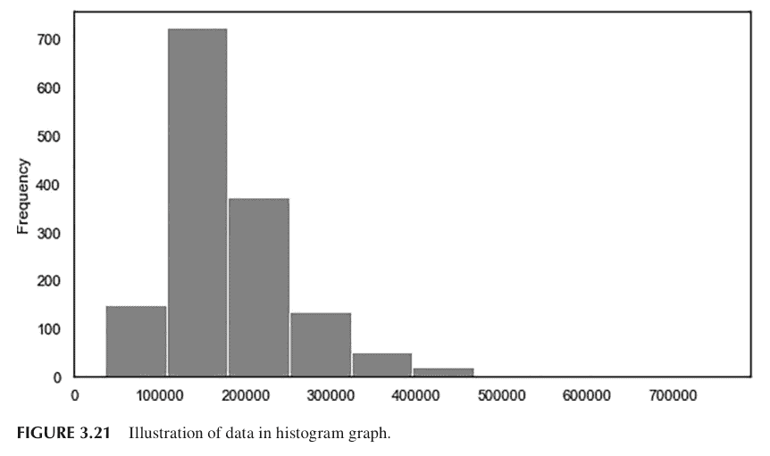

图 3.21 直方图中的数据图示。

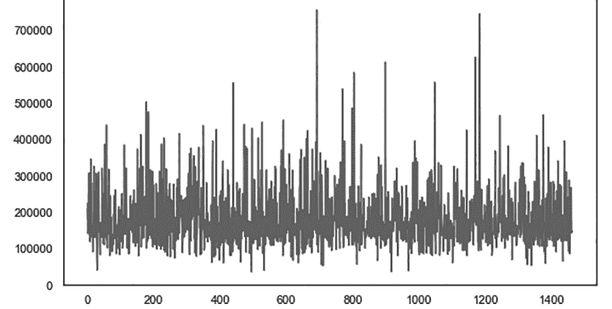

图 3.22 折线图中的数据图示。

```python
corr = data.corr()
f, ax = plt.subplots(figsize =(9, 8))
sns.heatmap(corr, ax = ax, cmap ="YlGnBu", linewidths = 0.2) #YlGnBu 是颜色调色板方案
```

输出如图 3.23 所示。

```
<matplotlib.axes._subplots.AxesSubplot at 0x2549578ff60>
```

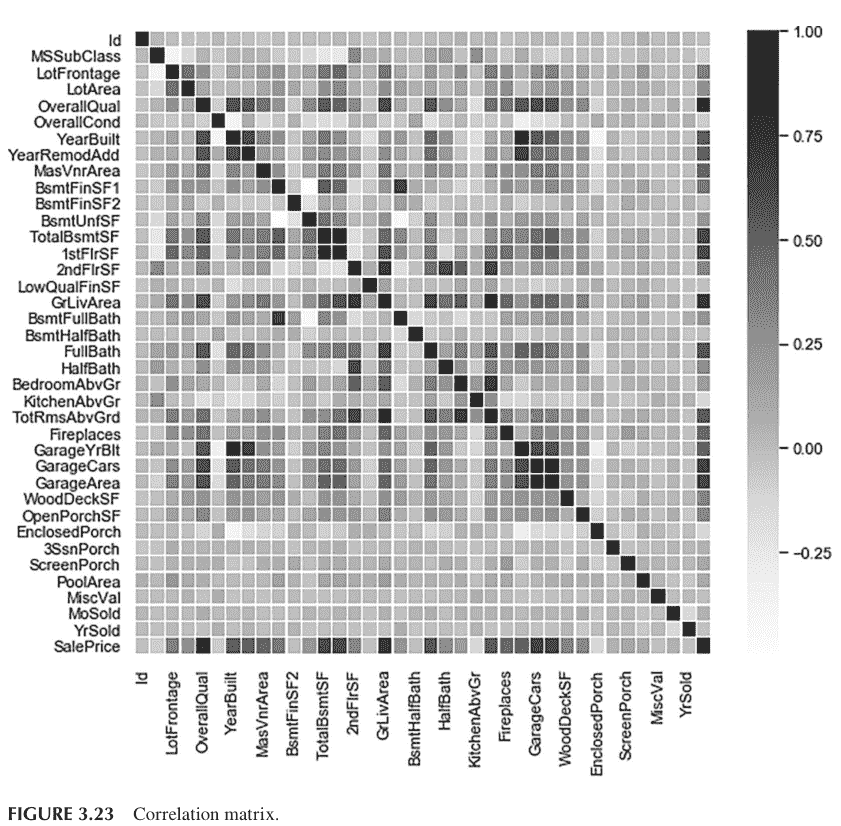

图 3.23 相关矩阵。

另一种可视化数据的形式是网格相关矩阵。

```python
corr = data.corr()
cg = sns.clustermap(corr, cmap ="YlGnBu", linewidths = 0.1);
plt.setp(cg.ax_heatmap.yaxis.get_majorticklabels(), rotation = 0)
cg
```

输出如图 3.24 所示。

既然我们已经探索了所有变量之间的相关性，现在让我们专注于 `SalePrice` 列，以及它与其他列的相关性（图 3.25）。

`k=20` # k：热力图中变量的数量——将与 `SalePrice` 进行比较的变量数量。

```python
cols = corr.nlargest(k, 'SalePrice')['SalePrice'].index
cm = np.corrcoef(data[cols].values.T)
f, ax = plt.subplots(figsize =(12, 10))
sns.heatmap(cm, ax = ax, cmap ="YlGnBu",
            linewidths = 0.1, yticklabels = cols.values,
            xticklabels = cols.values)
```

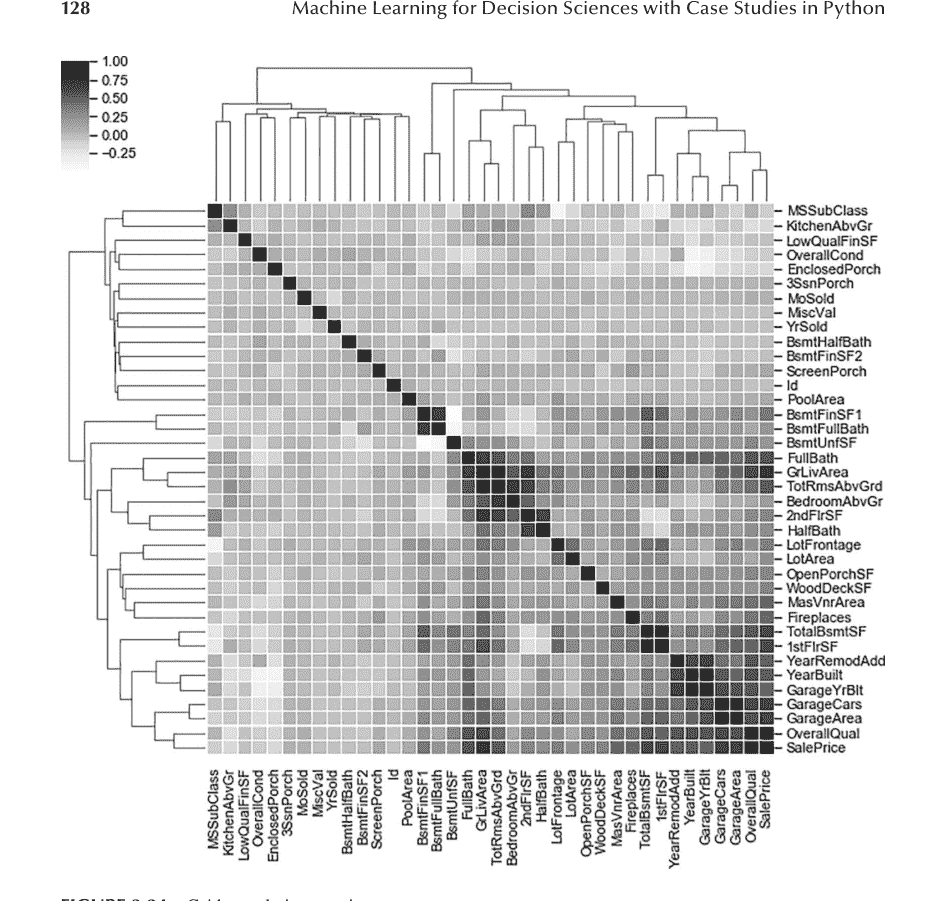

另一种清理和丰富数据的技术是类型转换。这是一种将数据转换为与源数据不同类型的技术。例如，源数据中的一个变量可能被编码为字符串/字符，即使该变量允许的值仅为数字（整数和浮点数类型）。简而言之，类型转换就是将一种数据类型转换为另一种数据类型。有基本函数如 `int()`、`string()` 和 `float()`，它们用于类型转换。`Int()` 函数用于整数字面量，`float()` 用于十进制数。在 Python 中，从一种数据类型转换为另一种数据类型非常直接。

```python
#Here is the code snippet -
x=float(2)
y=float(30.0)
z=float("20")
print(x)
print(y)
print(z)
```

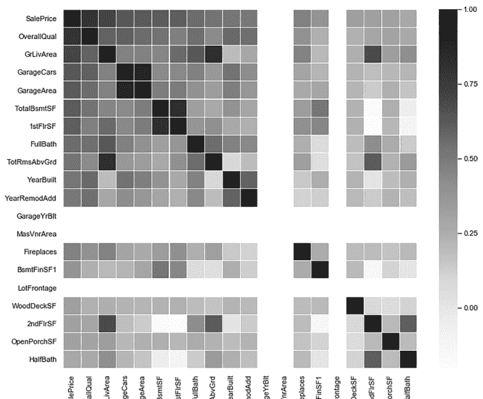

图 3.25 与其他列的相关矩阵。

输出为：

```
2.0
30.0
20.0
```

要理解变量的数据类型，请使用函数 `type()`。

类型转换有两种类型，即隐式和显式。在隐式转换中，Python 会自动将一种数据类型转换为另一种。此过程完全不需要用户参与。当你将一个整数和一个浮点数相加时，结果将自动转换为浮点数，而无需用户指定。例如，

```python
num_int = 123
num_float = 1.23

num_new = num_int + num_float

print("datatype of num_int:",type(num_int))
print("datatype of num_flo:",type(num_float))
print("Value of num_new:",num_new)
print("datatype of num_new:",type(num_new))
```

输出为：

```
datatype of num_int: <class 'int'>
datatype of num_flo: <class 'float'>
Value of num_new: 124.23
datatype of num_new: <class 'float'>
```

在显式转换中，用户必须显式地将对象的数据类型转换为所需的数据类型。我们使用预定义的函数如 `int()`、`float()` 和 `str()` 来执行显式类型转换。

```python
num_int = 123
num_str = "123"

print("Data type of num_int:",type(num_int))
print("Data type of num_str before Type Casting:",type(num_str))

num_str = int(num_str) # WE ARE EXPLICITELY CONVERTING THE datatype
print("Data type of num_str after Type Casting:",type(num_str))

num_sum = num_int + num_str

print("Sum of num_int and num_str:",num_sum)
print("Data type of the sum:",type(num_sum))
```

输出为：

```
Data type of num_int: <class 'int'>
Data type of num_str before Type Casting: <class 'str'>
Data type of num_str after Type Casting: <class 'int'>
Sum of num_int and num_str: 246
Data type of the sum: <class 'int'>
```

尽管类型转换是数据预处理中的一个便捷工具，但在使用时我们需要牢记一些注意事项。例如，当 Python 解释器进行隐式转换时，Python 会自动防止数据丢失。但是，当进行显式转换时，根据数据类型的不同，可能会发生数据丢失，这可能会影响需要数据准确性的过程。

当需要合并多个独立的数据集时，我们需要使用连接（joins）。例如，有一个主数据集和一个事务数据集；要组合这些数据集（表），我们需要使用连接。不同类型的连接如图 3.26 所示。我们可以使用 Python Pandas 库来进行内连接、全连接、左连接和右连接。内连接获取两个表中都存在的结果集。例如，你有两个来自不同来源的客户数据表，内连接将只带来两个表中都存在的共同数据。全连接或外连接返回数据集1和数据集2中匹配的所有记录。左连接返回左表（数据集1）的所有记录以及右表（数据集2）的匹配记录。

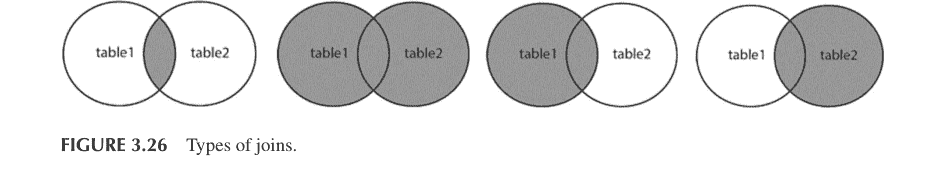

图 3.26 连接的类型。

最后，右连接返回右表（dataset2）的所有记录以及左表（dataset1）中匹配的记录。

例如，让我们在Pandas中创建一个客户DataFrame，如下所示：

```python
import pandas as pd
customer = pd.DataFrame({
    'id': [1, 2, 3, 4, 5, 6, 7, 8, 9, 10],
    'name': ['John', 'Joe', 'Cory', 'Steve', 'Richard', 'Tyler', 'Samuel', 'Daniel', 'Jeremy', 'Stephan'],
    'age': [20, 25, 15, 10, 40, 55, 35, 18, 23, 20],
    'Product_ID': [101, 0, 106, 0, 103, 104, 0, 0, 107, 105],
    'Purchased_Product': ['Watch', 'NA', 'Oil', 'NA', 'Shoes', 'Smartphone', 'NA', 'NA', 'Laptop', 'smartwatch'],
    'City': ['Delhi', 'Mumbai', 'Kolkatta', 'Chennai', 'Chennai', 'Coimbatore', 'Bangalore', 'Bangalore', 'Mumbai', 'Coimbatore']
})
customer
```

输出如下所示。

| Id | Name | Age | Product_ID | Purchased_Product | City |
|---|---|---|---|---|---|
| 0 | 1 | John | 20 | 101 | Watch | Delhi |
| 1 | 2 | Joe | 25 | 0 | NA | Mumbai |
| 2 | 3 | Cory | 15 | 106 | Oil | Kolkatta |
| 3 | 4 | Steve | 10 | 0 | NA | Chennai |
| 4 | 5 | Richard | 40 | 103 | Shoes | Chennai |
| 5 | 6 | Tyler | 55 | 104 | Smartphone | Coimbatore |
| 6 | 7 | Samuel | 35 | 0 | NA | Bangalore |
| 7 | 8 | Daniel | 18 | 0 | NA | Bangalore |
| 8 | 9 | Jeremy | 23 | 107 | Laptop | Mumbai |
| 9 | 10 | Stephan | 20 | 105 | Smartwatch | Coimbatore |

另一个数据框产品

```python
product = pd.DataFrame({
    'Product_ID': [101, 102, 103, 104, 105, 106, 107],
    'Product_name': ['Watch', 'Bag', 'Shoes', 'Smartphone', 'smartwatch', 'Oil', 'Laptop'],
    'Category': ['Fashion', 'Fashion', 'Fashion', 'Electronics', 'Study', 'Grocery', 'Electronics'],
    'Price': [299.0, 1350.50, 2999.0, 14999.0, 145.0, 110.0, 79999.0],
    'Seller_City': ['Delhi', 'Mumbai', 'Chennai', 'Kolkata', 'Delhi', 'Chennai', 'Bangalore']
})
product
```

产品DataFrame的输出如下：

| Product_ID | Product_name | Category | Price | Seller_City |
|---|---|---|---|---|
| 101 | Watch | Fashion | 299.0 | Delhi |
| 102 | Bag | Fashion | 1350.5 | Mumbai |
| 103 | Shoes | Fashion | 2999.0 | Chennai |
| 104 | Smartphone | Electronics | 14999.0 | Kolkata |
| 105 | Smartwatch | Study | 145.0 | Delhi |
| 106 | Oil | Grocery | 110.0 | Chennai |
| 107 | Laptop | Electronics | 79999.0 | Bangalore |

现在，让我们使用Pandas中的`merge()`函数将产品与客户合并。默认情况下，除非我们指定不同的连接类型，否则`merge`函数执行内连接。

```python
pd.merge(product, customer, on='Product_ID')
```

结果只显示了两个数据框中匹配的六行。

| Product_ID | Product_name | ... | Purchased_Product | City |
|---|---|---|---|---|
| 101 | Watch | ... | Watch | Delhi |
| 102 | Shoes | ... | Shoes | Chennai |
| 103 | Smartphone | ... | Smartphone | Coimbatore |
| 104 | Smartwatch | ... | Smartwatch | Coimbatore |
| 105 | Oil | ... | Oil | Kolkata |
| 106 | Laptop | ... | Laptop | Mumbai |

[6 rows × 10 columns]

要强制指定连接类型，我们需要指定`left_on`和`right_on`关键字。

```python
pd.merge(product, customer, left_on='Product_name', right_on='Purchased_Product')
```

| Product_ID_x | Product_name | ... | Purchases_Product | City |
|---|---|---|---|---|
| 101 | Watch | ... | Watch | Delhi |
| 103 | Shoes | ... | Shoes | Chennai |
| 104 | Smartphone | ... | Smartphone | Coimbatore |
| 105 | Smartwatch | ... | Smartwatch | Coimbatore |
| 106 | Oil | ... | Oil | Kolkata |
| 107 | Laptop | ... | Laptop | Mumbai |

另一种数据协调技术是数据整理。当我们以各种格式获取数据时，这种技术很有用。数据整理允许我们合并、分组和连接数据，以便进行分析或将其提供给另一个数据集。Python具有内置函数和功能，可以将这些整理技术应用于不同的数据集，以实现分析目标。我们将看一些描述这些方法的示例。正如我们讨论的，`merge()`函数有助于进行数据整理。另一种方法称为分组。数据集分组是数据分析中的一个常见需求，我们需要根据数据集中存在的各种分组来获取结果。Pandas具有内置的方法/函数，可以将数据滚动到不同的分组中。

```python
# import the pandas library
import pandas as pd
ipl_data = {'Team': ['CSK', 'RCB', 'KKR', 'KKR', 'DD',
                     'DD', 'DD', 'DD', 'SRH', 'MI', 'MI', 'MI'],
            'Rank': [1, 2, 2, 3, 3, 4, 1, 1, 2, 4, 1, 2],
            'Year': [2020, 2015, 2014, 2015, 2014, 2020, 2016, 2017, 2016, 2014, 2020,
                     2017],
            'Totalruns': [876, 789, 863, 673, 741, 812, 756, 788, 694, 701, 804, 690]}
df = pd.DataFrame(ipl_data)

grouped = df.groupby('Year')
print(grouped.get_group(2014))
```

输出如下所示。

```
  Team  Rank  Year  Totalruns
2  KKR     2  2014       863
4   DD     3  2014       741
9   MI     4  2014       701
```

另一个用于数据整理的有用Pandas函数是使用`concat()`函数连接数据。Pandas提供了各种工具，可以轻松地将Series、DataFrame和Panel对象组合在一起。下面的示例描述了`concat`函数沿一个轴执行连接操作。

```python
import pandas as pd
first_set = pd.DataFrame({
    'Name': ['Alex', 'Amy', 'Allen', 'Alice', 'Ayoung'],
    'subject_id': ['sub1', 'sub2', 'sub4', 'sub6', 'sub5'],
    'Marks_scored': [98, 90, 87, 69, 78]},
    index=[1, 2, 3, 4, 5])
second_set = pd.DataFrame({
    'Name': ['Billy', 'Brian', 'Bran', 'Bryce', 'Betty'],
    'subject_id': ['sub2', 'sub4', 'sub3', 'sub6', 'sub5'],
    'Marks_scored': [89, 80, 79, 97, 88]},
    index=[1, 2, 3, 4, 5])
print(pd.concat([first_set, second_set]))
```

输出如下所示。

```
     Name subject_id  Marks_scored
1    Alex       sub1            98
2     Amy       sub2            90
3   Allen       sub4            87
4   Alice       sub6            69
5  Ayoung       sub5            78
1   Billy       sub2            89
2   Brian       sub4            80
3    Bran       sub3            79
4   Bryce       sub6            97
5   Betty       sub5            88
```

执行审查过程以改进数据，确保计算在给定数据字段的列内保持一致。一些考虑因素如下：

-   确保数据分布在整个数据集中保持一致。如果不一致，数据准备团队会提出新的计划来处理这种情况。
-   评估数据的粒度、值的范围以及数据的聚合级别。
-   对于与时间相关的变量，时间测量是每天、每周还是每月？这足够好吗？时间是否在所有地方都以秒为单位测量？或者在某些地方是以毫秒为单位？这将在我们组合和协调数据时导致数据级别不匹配。确保数据源之间的最低数据级别一致。
-   数据是否经过标准化/规范化？比例是否一致？如果不一致，数据是正常还是不规则？在这种情况下，应用缩放函数来平滑数据。
-   如果考虑地理空间数据集，国家代码、州缩写和邮政编码在数据中是否一致？个人姓名是否规范化？是否考虑英制单位？是否考虑标准公制单位？
-   如何处理数据去重？当组合多个来源时，由于各种因素，如不正确的缩写、使用姓氏而不是全名，相同的记录在目标数据库中显示为重复记录。

在考虑时间序列分析或运行机器学习模型时，获得更深入的数据知识至关重要。如果有大量高质量数据可用，项目将进入规划阶段，重点是构建模型。

使用Python库，我们可以更好地进行数据处理。以下是数据处理的代码片段。

```python
# Import pandas
import pandas as pd
import numpy as np

# Read the file into a DataFrame: df
df = pd.read_csv('C:/Users/srajappa/Desktop/MLn using Python/dob_job_application_filings_subset.csv')

# Print the head of df
print(df.head(2))

# Print the tail of df
print(df.tail())

# Print the shape of df
print(df.shape)

# Print the columns of df
print(df.columns)

# .describe() method to calculate summary statistics of your data
print(df.describe())

df.info()

# .value_counts() method, which returns the frequency counts for each unique value in a column!
# Print the value counts for 'Borough'
print(df['Borough'].value_counts(dropna=False))

# Print the value_counts for 'State'
print(df['State'].value_counts(dropna=True))
```

## 3.2.3 第三阶段 – 模型规划

下一阶段是机器学习模型规划，旨在了解所选项目数据是否有合适的模型可用。在此阶段，将最终确定预期的方法、模型、方法和流程。此外，还需探索数据中变量之间的关系、主要变量以及合适的模型。由于此阶段在执行分析模型之前进行，因此需要仔细理解特征并选择模型。在此阶段，需要参考第一阶段建立的假设，从中我们得以了解数据并理解业务问题。初始假设有助于构建下一阶段要执行的分析，并选择正确的方法以达成目标。在此阶段，基于数据有以下一些考虑因素：

-   数据类型是主要因素，它将规定并限制下一阶段的工具和分析技术。根据所选数据（无论是文本数据还是事务数据），会应用不同的工具和方法（例如，使用Hadoop中的临床数据进行肿瘤预测——包含结构化、半结构化和非结构化数据，而天气预报则基于结构化数据）。
-   需要确保分析技术能够满足业务目标，并验证/证伪工作假设。
-   理解业务问题的解决方案是需要单次测试还是需要一系列技术来构建分析工作流。像SAS Miner这样的工具有助于设置一系列步骤和分析，并作为用户友好的界面来处理大型数据源。

根据数据类型和可用资源，需要进行审查，以检查较小的方法是否适用，或者是否需要新的方法。在许多情况下，想法源于在行业垂直领域解决的类似问题。
关于根据我们试图回答的问题来选择机器学习和深度学习模型，有一些指导原则和建议。具体的算法将在后续章节中详细解释：监督学习、无监督学习和深度学习模型章节。
我们需要理解机器学习模型的边界分类。有以下三个类别：

-   **监督学习：** 问题的答案是具体的，例如，一个有5年经验的机器学习工程师的薪水是多少？数据是带标签的，这类模型预测结果/未来。模型会得到直接反馈。真实标签（输入）和答案键（输出）也会提供给模型。
-   **无监督学习：** 数据复杂且未标记。目的是发现数据中的隐藏模式。模型不会得到反馈。
-   **强化学习：** 这类模型基于奖励系统。合适的行动是在特定情况下最大化奖励。这些算法基于一系列动作进行学习。

既然我们了解了算法的类型，让我们讨论决定模型类型选择的其他因素。

**训练集大小：** 我们都知道，当训练数据集不足时，总是会导致估计不佳。在不足的训练数据集上过度约束的模型总是会导致欠拟合；另一方面，约束不足的模型可能会导致数据集过拟合；在这两种情况下，结果都会表现不佳。因此，训练数据集的大小可能是我们在决定所选算法时起重要作用的因素。对于较小的训练数据集，由于低偏差/高方差分类器（如k近邻）可能过拟合训练数据集，高偏差/低方差分类器在此方面具有优势。

**训练时间：** 训练模型所需的时间因算法而异。此时间与数据集的大小和我们追求的准确性相关。

**参数数量：** 参数是性能良好模型中最重要的因素之一。因此，诸如误差容忍度和总迭代次数等组件取决于算法的性质。通常，对于具有大量参数的算法，需要最多的试错次数来寻找一个良好的组合。尽管拥有许多参数通常提供更多的灵活性，但使用特定算法和相同精度训练模型所需的时间可能对获得正确的设置很敏感。

**特征数量：** 与数据点数量相比，某些数据集的特征数量可能相当大。在处理自然语言处理数据集（更多是文本数据集）时，我们面临同样的情况。一些学习算法在处理大量特征时会消耗更长的训练时间，使工作变得不切实际。一些机器学习算法，如支持向量机，特别为此类情况设计。我们基于过去经验做出的这些假设并非适用于所有情况，我们需要更好地理解此类算法，以便为特定问题应用最佳算法。

**准确性：** 我们使用的机器学习算法用于做出实际决策，模型结果的更高准确性会带来更好的决策。错误的代价可能巨大，因此我们需要通过提高模型的准确性来最小化该成本。根据需求，所需的准确性会有所不同。近似通常就足够了，这可以大大减少处理时间。然而，近似技术可能导致训练数据集过拟合。

基于上述因素，根据情况，有关于推荐模型类型的启发式方法（表3.4）。

有许多可用的工具，让我们讨论一些流行的工具。

Python如今非常流行，具有一系列建模能力，包括一个用于构建具有复杂代码的机器学习模型的满意环境。此外，Python还可以与SQL协作，并通过开源连接对大数据运行统计分析和测试。其中一些能力使Python适合构建模型。此外，它包含超过2000个软件包，并且每天都在快速扩展最新的图形功能，从而使其用户友好且更强大。

SAP HANA和Microsoft SQL Server提供SQL服务，例如常见数据挖掘功能的数据库内分析、基本预测模型和复杂聚合。

## 3.2.4 第四阶段 – 模型构建

本阶段的目标是理解机器学习模型是否足够稳健。在此阶段，数据集被开发并分类为测试集、训练集、生产集和验证集。此外，还需要确保执行模型和工作流的合适环境，这包括快速硬件和并行处理。

在此阶段，模型将在训练数据上进行拟合，并使用测试数据进行评估。此操作通常在沙箱中进行，而非在实际的生产环境中。机器学习模型规划和模型构建存在大量重叠。在最终确定机器学习模型之前，我们可能在这两个阶段之间反复迭代很长时间。根据所采用的方法，某些方法需要使用训练数据集（在某些情况下，还需要验证数据集）。

尽管开发此步骤所需的建模技术和逻辑可能很复杂，但与所有数据预处理和方法定义工作相比，此阶段的实际持续时间可能非常简短。在实际项目中，第一和第二阶段通常需要更多时间来准备和研究数据，并构建数据的呈现方式。

作为本阶段的一部分，将执行以下步骤：

-   将第三阶段创建的模型投入实际应用。
-   在可能的情况下，将模型转换为SQL或其他适当的数据库语言，并将其作为数据库内函数运行。这比在内存中运行要快得多，也更高效。（使用SQL在大型数据集上运行Python模型）如果我们使用SAS软件，SAS评分加速器允许我们在浏览器中运行SAS模型。
-   对于测试和小型数据集，使用Python（或SAS）模型处理文件提取数据。
-   评估模型的有效性和结果（例如，它是否涵盖了大部分数据并具有强大的预测能力？）
-   调整变量输入，以微调模型以获得最佳结果。
-   记录模型的结果和逻辑。

在这些模型迭代和优化过程中，记录以下问题的答案以评估模型效率：

-   模型在测试和验证数据上看起来是否合理且准确？
-   模型的输出/行为对领域专家和主题专家是否有意义？换句话说，模型是否看起来在提供“正确的答案”或在业务背景下有意义的答案？
-   模型是否足够准确以满足成功标准？（效率、性能以及第一阶段定义的其他关键绩效指标）
-   模型是否避免了需要避免的错误？例如，根据具体情况，假阳性可能比假阴性更严重或更不严重。
-   拟合模型的参数值在业务领域背景下是否有意义？
-   我们是否需要更多数据或更多输入？我们是否需要转换或消除任何输入？
-   我们是否需要不同形式的模型？如果是这样，我们将需要回到机器学习模型规划阶段（第三阶段）并修改建模方法。

## 3.2.5 第五阶段 – 结果沟通

在预测和结果沟通阶段需要回答的问题是：“模型是否足够稳健，能够准确预测结果（在误差值范围内）？”首先，基于我们在数据发现阶段创建的标准（成功标准的关键绩效指标），我们与关键利益相关者共同决定模型在本阶段是成功还是失败。接下来，确定最重要的结果，量化业务价值，并撰写叙述性报告，向关键利益相关者综合和传达研究发现。

基于我们在数据发现阶段创建的标准（成功标准的关键绩效指标），我们与关键利益相关者共同决定模型在本阶段是成功还是失败。确定最重要的结果，量化业务价值，并撰写叙述性报告，向关键利益相关者综合和传达研究发现。由于研究发现很可能在企业内部多个层级（从高管到运营）传播，因此需要考虑如何构建研究发现的框架并有效描述其影响。

作为项目收尾的一部分，项目团队将提供对未来工作或改进现有流程的建议，同时考虑每位团队成员和利益相关者需要您完成的任务以及丰富数据的众多新用例。此外，这也是我们强调项目业务效益的阶段。最后，此阶段将作为将模型投入生产并使其运行的检查点。

作为本阶段的最后一步，既然模型已成功运行，将执行以下活动来记录从项目中吸取的经验教训：

-   评估模型的结果。
    -   研究发现是否具有统计显著性和一致性？如果是这样，结果的哪些特征/属性比较突出？如果不是，我们需要对模型进行哪些更改以进行优化和迭代，使其更具可持续性？
    -   哪些事实/细节让您感到惊讶，哪些与您在第一阶段提出的假设一致？将确认的结果与我们早期制定的想法相关联，通常会产生额外的想法和见解，如果我们没有在早期努力制定初始假设，这些想法和见解就会被遗漏。
-   通过分析观察到了哪些数据？
    -   其中最重要的发现是什么？
    -   这些发现是否具有商业价值或意义？根据模型产生的结果，我们可能需要花时间量化结果的业务影响，以便为演示做准备。

在本阶段结束时，我们将记录由于分析得出的重要发现和主要见解。此外，本阶段的最终成果将是外部利益相关者和赞助商眼中流程中最可见的部分，因此需要清晰地阐述研究发现的结果、方法和业务价值。

## 3.2.6 第六阶段 – 优化和模型运营化

在模型运营化阶段需要回答的问题是：“模型的技术预测是否已转化为业务语言，以便业务团队成员能够解释结果？”结果并据此采取行动？”项目团队在此项目阶段会交付最终报告、简报、代码和技术文档。最后，我们进行试点项目，并在真实环境中测试这些模型。至关重要的是，要确保一旦我们运行模型并获得结果，就能以适合委托方受众的方式呈现结果，并提供可证明的价值。如果我们无法将数据解读为他们能理解的语言，人们就不会认识到技术上准确的分析的价值。大量工作将付诸东流。

在此阶段，我们将评估工作的效益，并建立一个试点，以便在将工作扩展到更大的企业或消费者生态系统之前，以受控的方式启动工作。我们在第4步的沙箱中对模型进行了评分，大多数分析方法在第6阶段首次在生产环境中实施新的分析方法或模型。因此，我们主张从小规模试点部署开始，而不是大规模部署。这种方法将使我们能够将风险限制在相对于全企业部署的范围内，在小规模上了解性能和相关约束，并在全面部署前进行微调。

在规划此工作时，考虑在生产环境中为一组离散的单一产品或单一业务线运行模型，这将在实际环境中测试模型。这将使团队能够从部署中学习，并在全面启动前进行调整。请记住，此阶段可能会引入一组新的团队成员，即负责生产环境的成员，他们有一套新的问题和关注点。生产支持团队和管理员希望确保模型能够融入下游流程，并在生产环境中运行良好。在生产环境中运行模型时，要注意在将输入数据馈送给模型之前检查其不规则性。评估运行时间以及与制造环境中其他流程的资源竞争。

模型部署后，项目团队会在其投入生产一段时间后进行后续跟进，重新评估模型。评估模型是否达到目标和期望，以及期望的变化（如收入增加、客户流失减少）是否发生。如果这些最终结果没有发生，确定是由于模型不准确，还是其预测没有得到适当执行。如果需要，自动执行模型的重新训练/更新。无论如何，我们需要持续监控模型准确性，如果准确性下降，我们将需要重新训练模型。如果可能，为模型“越界”运行时设计警报。这包括输入远超出模型训练范围的情况，这可能导致模型输出不准确。如果这种情况经常发生，则需要重新训练。

分析项目通常会产生关于业务、问题或概念的新见解，而这些可能是人们以前认为理所当然或认为不可能深入挖掘的。如果合适，与您的分析团队举行事后分析会，讨论如果必须重做，我们会改变哪些流程或项目。

向不同群体展示结果是一项艰巨的任务。然而，由于每个群体都需要一组独特的数据，以下是为向主要赞助方分享分析结果而准备的一些通用原则。

面向业务受众：受众越偏向业务，我们就必须越简洁。大多数执行赞助方每天和每周都会收到大量简报。因此，确保演示文稿能快速切入要点，并将结果框架设定为对赞助方组织的价值。例如，如果我们正在与一家银行合作分析信用卡欺诈案例，请强调欺诈的频率、过去一个月或一年的案件数量，以及对银行造成的成本或收入影响（或者主要关注相反的方面，如果他们解决欺诈问题可能获得多少额外收入）。这将比深入探讨方法论更好地展示业务影响。我们需要包含关于分析方法和数据来源的支持信息。不过，通常我们倾向于仅将数据分析作为支持细节，或确保受众对该方法有信心。

面向分析师受众：如果您向其他分析师做演示，请花更多时间在流程和结果上。如果我们建立了一种全新的数据处理或评估方法，该方法将来可以重用或应用于类似问题，同事们会对这些技术更感兴趣。尽可能使用照片和截图。人们倾向于在一定程度上通过回忆心理图像来理解冗长的要点列表。

## 总结

市场上有许多数据分析生命周期框架；它们往往在相同的基本结构上变化不大。遵循这些阶段和活动将减轻实施ML项目时已知的陷阱。然而，用户需要注意各阶段之间的迭代性质。如果没有在前一阶段打下坚实的基础，下一阶段的活动将受到影响。因此，我们如何强调数据分析生命周期中数据发现和数据预处理阶段的重要性都不为过。Gartner Inc.最近对数据科学家的一项调查显示，他们超过80%的时间花在捕获、清理和组织数据上。剩下的不到20%的时间用于创建和优化ML模型。超过75%的人还报告说，准备数据是他们过程中最不愉快的部分。表3.6显示了数据分析项目中每项活动消耗的时间分布。

### 表3.6
项目中每项活动的时间消耗

| 项目活动 | 分配的项目时间百分比 |
| :--- | :--- |
| 收集数据 | 19% |
| 构建训练数据集 | 3% |
| 清理、丰富和组织数据 | 60% |
| 挖掘数据模式 | 9% |
| 优化算法 | 5% |
| 其他活动 | 4% |

### 表3.7
团队成员的关键角色和职责

| 关键项目角色 | 描述 |
| :--- | :--- |
| 项目发起人 | 负责项目存在、激励、解决核心业务问题并提供资金的人 |
| 业务用户 | 从项目/产品的最终结果中受益的成员。他们可以就最终结果的价值提供建议并接受咨询 |
| SMEs/主题专家（SMAs） | 拥有领域知识，主要在第1阶段和第2阶段指导项目团队的成员。他们可以是组织内部或外部的成员 |
| 项目经理 | 负责按时、按预算、按预期质量交付项目的关键成员 |
| 业务智能分析师 | 对数据、KPI和其他关键指标有深刻理解，并对数据可视化方面有清晰愿景的成员 |
| 数据工程师 | 拥有深厚技术技能以协助数据摄取查询，并在技术上负责将数据引入分析沙箱的成员 |
| 数据科学家 | 提供分析技术领域专业知识，为给定业务问题应用高效分析技术，并确保项目整体分析目标得以实现的成员 |
| 管理员 | 数据库管理员团队、平台管理员和云工程师的成员，负责配置和设置环境以支持分析团队 |

### 表3.8
分析师愿望清单

| 类别 | 详情 |
| :--- | :--- |
| 数据和工作空间 | 访问所有数据，包括来自各种来源的原始和聚合级别的结构化、半结构化和非结构化数据源。数据元素的更新数据字典和元数据。用于开发、暂存、测试和生产数据集的区域。在工作空间和暂存/测试区域之间移动数据。具有处理大型数据集和复杂ML模型计算能力的分析沙箱。 |
| 工具集 | 具有可视化功能的统计/数学和分析工具，如Python、SAS、Matlab、Tableau和Alteryx。协作工具，如SharePoint。错误日志工具，如Jira。 |

为了项目的成功实施，涉及许多角色。表3.7展示了团队成员的角色和职责。

最后，“分析师愿望清单”指的是对工具、数据访问和工作条件的建议，以确保员工在项目上保持高效，并增加取得良好结果的机会。这些要求反映了对更灵活的生态系统以存储数据和执行复杂、迭代分析的需求。除了上述技术要求外，项目还将受益于快速接触关键利益相关者和领域专家。表3.8说明了“分析师愿望清单”的几个示例。

## 复习题

1.  解释数据分析生命周期框架的重要性。
2.  描述分析生命周期的各个阶段，以及这些阶段如何与其他阶段相互作用。
3.  描述用于数据预处理的各种技术。
4.  相关性矩阵在数据准备中的意义是什么？
5.  什么是数据整理？
6.  有哪些数据可视化技术可以更好地理解数据？
7.  哪些类型的文件和数据可以引入分析沙箱？
8.  传统编程和ML模型构建之间有什么区别？
9.  如何确保分析项目的结果能恰当地传达给高管和其他分析师？
10. ELT和ETL有什么区别？
11. 解释几个可以有效实施ML的用例。
12. 解释连接类型及其意义。

## 4 无监督学习

**学习目标**

本章结束后，读者将能够

- 理解不同类型的聚类算法，即k-means、模糊k-means、层次（凝聚和分裂）以及DBSCAN算法
- 使用Python实现这些算法
- 基于多种评估指标分析算法的性能
- 认识聚类算法的局限性，并根据工作数据集选择合适的算法

## 4.1 引言

机器学习是系统化学习的一个有前景的领域。机器学习算法主要应用于跨学科领域，结合了来自优化理论、认知科学、数学、统计学和计算机科学等多个领域的思想。在本章中，读者将受益于机器学习这一广泛的基础领域，即无监督学习。当今的数据科学家应用各种机器学习算法从提供的数据中提取有价值的信息。大多数学习算法属于监督学习问题，因为我们对所呈现类型数据的输出具有先验知识。

相反，无监督学习是机器学习算法中一种复杂且具有挑战性的方法。尽管其复杂性，无监督学习算法的优势众多。这类算法已被证明具有足够的潜力，能够为以前无法解决的问题提供解决方案，并在机器学习和深度学习中获得了广泛普及。本章将解释无监督学习的基础知识、距离度量、聚类概念、最常用的聚类算法、它们在实时问题解决中的应用及其局限性。

## 4.2 无监督学习

无监督学习是一类自我组织的学习，帮助我们识别数据中与各种特征相关的模式或相似性。机器学习的三个主要类别是监督学习、无监督学习和强化学习。

考虑一个机器或系统，它从传感器接收一系列输入 $x_1, x_2, x_3, \dots$，其中 $x_t$ 是时间 $t$ 的感官输入。这种按时间顺序接收的输入称为数据。数据可以是任何实时测量，例如来自摄像头的图像，或来自太阳能电池板的电压或电流值。

在监督学习中，系统还会收到一系列期望输出 $y_1, y_2, \dots$，以及接收到的输入数据。系统的目标是学习在接收到连续输入时产生正确的输出。

在强化学习中，系统通过产生一组动作与其环境进行交互。这些动作反过来影响环境，这种变化导致系统接收到与每个动作对应的几个标量奖励或惩罚。因此，系统的目标是以最大化未来奖励或最小化未来惩罚的方式行动。

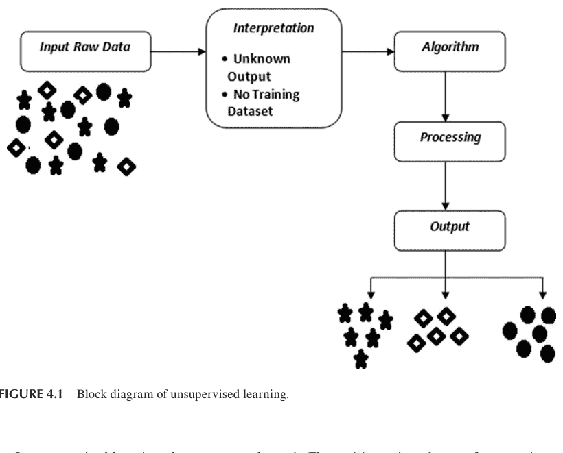

图 4.1 无监督学习的框图。

在无监督学习中，如图4.1所示，系统接收感官输入集合 $x_1, x_2, \dots$，但不获得目标输出（如监督学习），也不从其环境中获得奖励或惩罚（如强化学习）。尽管想象系统在没有任何环境反馈的情况下能学到什么似乎很神秘，但为无监督学习开发一个系统框架是可能的。该框架的目标是构建类似于输入数据的表示模型，这些模型可用于预测、决策等。

此时理解无监督学习的必要性很重要。在诸如语音识别等情况下，解释大型数据集的成本非常高。无监督学习已被证明在此类应用领域中是高效的。在数据挖掘中，可能存在用户无法预测数据可被划分为多少类的情况。无监督学习在此类情况下也被证明是成功的。

无监督学习分为两类，即参数无监督学习和非参数无监督学习。

- **参数无监督学习**
  当给定数据可以用参数分布表示时，这种情况称为*参数无监督学习*。该算法假设数据来自遵循固定参数集的概率分布总体。这些固定的参数集通常是均值和标准差。使用这些参数在正态分布数据上，可以轻松预测任何未来观察的概率。该学习算法涉及使用期望最大化（EM）算法构建高斯混合模型，以预测用于分类的样本数据的类别。这种无监督学习方法比任何监督学习方法都要复杂得多，研究尚未确定任何标准的准确性度量来验证算法的结果。

- **非参数无监督学习**
  在非参数化无监督学习中，从现实世界获得的数据被组合形成组或簇。这里，每个簇包含有关其组中存在的数据的一些信息。此方法主要用于分析和将数据塑形为更小的样本集。这里，学习不使用关于总体分布的任何假设，因此也称为无分布方法。

无监督学习中使用的两种主要方法是主成分分析和聚类分析，但最常用的方法是聚类。

### 4.2.1 聚类

聚类是流行的无监督学习问题之一。它从数据集合中确定一个结构。该结构由一组对象组成，其中成员具有某种相似关系。因此，聚类可以定义为一组对象，它们之间具有“相似”的属性，而与其他簇中的对象具有“不相似”的属性。

文献中对聚类一词有多种定义，一些常见的定义如下：

- 识别数据中组的方法。
- 将数据分割成同质组的方法。
- 将数据分割成组的方法，每个组中的点相似。
- 将数据分割成组的方法，其中每个组内的点相似，而不同组的点不相似。
- 将总体空间分割成点密度相对较高的区域，由点密度相对较低的区域分隔的方法。

聚类和分类之间肯定存在很大差异。在无监督学习中，聚类应用于一组未标记的数据，而无需了解数据集的任何信息。相反，在分类方法中，组或类是在应用适当的监督学习算法后，对一组未标记的数据形成的。

因此，聚类通常通过将相似的数据点分组到一个称为质心的中心周围来形成。聚类的边界通常定义不明确。根据边界，聚类分为硬聚类和模糊聚类。硬聚类具有明确的边界，而模糊聚类没有明确的边界。

将对象分组到聚类中的主要标准如下：

- 每个聚类应包含彼此相似的对象
- 每个聚类应与其他聚类不同，这意味着一个聚类中的对象与存在于其他聚类中的对象不同。

聚类技术提供了许多优势，但聚类的两个最重要的好处可以概述如下：

1. 噪声数据的识别和分析相对容易。
2. 聚类便于用户处理具有不同类型变量的数据。

## 4.3 聚类的评估指标

聚类的主要目标是在一组未标记的数据中找到内在的分组模式。但如何得出分组是最佳的结论？或者什么构成了一个好的

## 4.3.1 距离度量

根据聚类过程，我们已经讨论过相似的对象会被分组。控制这种相似性的参数是*距离度量*，它是衡量两点之间距离的关键属性之一。因此，两个或多个对象根据彼此之间的接近程度被分组到一个簇中。这种基于几何距离对对象进行分组的概念称为*基于距离的聚类*。

评估对象之间的距离完全取决于数据属性的类型。根据Kaufman和Rousseeuw（2005）的研究，用于形成簇的距离函数必须满足以下标准：

- 任意两个对象之间的距离应始终为正。
- 对象到其自身的距离始终为零。
- 距离具有对称性。
- 距离应始终满足三角不等式。从对象a到b再到c的距离应大于从a到c的直接距离。

假设数据集由具有相同物理单位的对象组成。在这种情况下，可以使用简单的欧几里得距离度量来评估距离，从而将对象分组到不同的簇中。D维空间中两个对象 $x_i$ 和 $x_j$ 之间的欧几里得距离表示如下：

$$d(x_i, x_j) = \sqrt{\sum_{k=1}^{D} (x_i^k - x_j^k)^2} = \|x_i - x_j\|$$ (4.1)

如果数据集由以相似物理单位表示的分量组成，那么欧几里得距离度量是成功分组数据实例的最佳选择。欧几里得距离主要用于数据向量的属性是D维欧几里得空间中的颜色分量、坐标或数值类型的情况。

### 4.3.1.1 闵可夫斯基度量

如果D维空间很大，则使用闵可夫斯基度量来评估距离。闵可夫斯基度量表示如下：

$$d(x_i, x_j) = \left( \sum_{k=1}^{D} |x_i^k - x_j^k|^p \right)^{1/p}$$

其中 $D$ 是数据的维度。在*欧几里得距离*中，$p = 2$，而*曼哈顿度量*的 $p = 1$。据文献报道，对于任何给定的应用，选择度量标准没有标准的理论指导。研究人员已利用领域知识制定了适当的度量。

## 4.3.2 相似性度量

存在一组相似性度量（邻近度量），用于获得给定数据集的特定聚类解：

### 邻近度量

邻近度量可以在聚类中定义在两个数据点之间。术语“邻近度”指的是样本彼此之间的相似性或不相似性。假设 $x_i$ 和 $x_j$ 是D维数据集中的两个数据点，如图4.3所示：

- 如果 $x_i$ 和 $x_j$ 相似，则相似性度量 $S(x_i, x_j)$ 较大。
- 如果 $x_i$ 和 $x_j$ 不相似，则不相似性（或距离）度量 $D(x_i, x_j)$ 较小。

文献中存在多种相似性度量，可用于评估相似性或不相似性。

- **向量：余弦距离**
  如果数据以向量形式表示，则根据以下公式使用余弦距离评估相似性度量

$$S(x_i, x_j) = \frac{x_i x_j}{\|x_i\| \|x_j\|}$$

- **集合：杰卡德距离**
  如果数据以集合形式表示，则根据以下公式使用杰卡德距离评估相似性度量
  $$J(A, B) = \frac{A \cap B}{A \cup B} = \frac{A \cap B}{|A| + |B| - |A \cap B|}, \text{ 其中 } 0 \leq J(A, B) \leq 1 \quad (4.4)$$
  如果集合 $A$ 和 $B$ 为空，则 $J(A, B) = 1$。

- **点：欧几里得距离**
  如果数据以点形式表示，则根据以下公式使用欧几里得距离评估相似性度量
  $$d(x_i, x_j) = \left( \sum_{k=1}^{D} |x_i^k - x_j^k|^p \right)^{1/p} \quad (4.5)$$
  其中 $p = 2$。

通常，良好的邻近度量也依赖于具体应用。例如，对于良好的邻近度量，聚类用户不应规范化从多个分布中抽取的数据。

## 4.4 聚类算法

本节介绍了聚类算法的广泛分类。分类是基于可用于聚类的数据的正交特性进行的。

### 4.4.1 层次聚类与划分聚类方法

在层次聚类中，数据集中的相似对象被分组到簇中，并可以表示为簇的*树*。在这里，任何两个簇是分离的，或者一个簇包含另一个簇，就像树的分支一样，因此称为层次聚类。

在划分聚类中，从给定数据集中形成多个组或划分。在这里，用户必须根据应用要求指定划分或簇的数量。

### 4.4.2 凝聚聚类与分裂聚类方法

凝聚和分裂聚类方法属于层次聚类家族，并且彼此以相反的方式工作。在凝聚方法中，数据集中的每个对象根据成对距离被分配到其簇中，然后合并簇。相反，在分裂方法中，数据集中的所有对象被分配到一个唯一的簇中，然后从该唯一簇进一步分裂簇。

### 4.4.3 硬聚类与模糊聚类方法

在确定给定数据集的聚类输出时，每个数据对象必须属于单个簇。这种方法称为硬聚类。但在实时场景中，数据可能属于多个簇，因为数据之间可能存在许多相似性关系。为了解决这个问题，使用了基于模糊集理论概念的模糊聚类算法。该算法允许对象根据一定的隶属度属于不同的簇。这种方法被称为模糊聚类方法。

到目前为止讨论的所有算法都将找到一个聚类结果，使得每个数据对象必须属于单个簇（称为硬聚类）。然而，在实时科学和工业应用中，一个数据对象可能属于一个或多个簇。现有的聚类方法已经通过模糊集理论的概念进行了扩展，以解决此类问题。模糊聚类算法允许对象同时属于多个簇，并具有不同的隶属度（Kutner等人，2005）。

### 4.4.4 单一特征聚类与多特征聚类方法

单一特征聚类和多特征聚类大多适用于获得分类学问题的解决方案。单一特征聚类算法一次使用数据集的一个特征或对象进行聚类。相比之下，多特征聚类算法一次使用所有数据集特征进行聚类。

### 4.4.5 确定性聚类与概率性聚类方法

在确定性聚类方法中，数据对象以确定性方式分组到簇中，而在概率性方法中，对象根据概率被分配到某个簇。

尽管如前一节所述，聚类使用了不同的方法，但只有少数成功且流行的算法源自这些方法。因此，以下部分将讨论最常用的聚类算法，例如k-means聚类、模糊k-means聚类、高斯混合模型和基于密度的聚类，这些算法用于实时应用。

## 4.5 k-MEANS 聚类

最简单和最常用的无监督学习算法之一是k-means聚类算法，由MacQueen于1967年提出。该算法将给定的无标签数据集分类为预定义数量的k个簇。

### 4.5.1 几何直觉，质心

k-means聚类算法的基本目标是定义k个质心，每个簇对应一个质心。这些预定义的质心应巧妙地放置，因为质心的不同位置会产生不同的输出。更好的方法是使质心彼此尽可能远离。一旦确定了质心的位置，数据集中的点就必须与最近的质心关联。重复此过程，直到没有点处于未关联状态。这被指定为分组或聚类的第一阶段。第一阶段完成后，计算一组新的k个质心。再次根据新的k个质心进行聚类。重复迭代过程，直到观察到当前迭代中的k个新质心与上一次迭代中评估的k个质心之间没有变化。一旦形成最终簇，就评估目标函数；在这种情况下，目标函数是最小化由以下公式给出的平方误差函数

$$J = \sum_{j=1}^{k} \sum_{i=1}^{n} \|x_i^j - c_j^2\|$$

其中 $\|x_i^j - c_j^2\|$ 是数据点 $x_i^j$ 和簇中心 $c_j$ 之间评估的距离。上述公式给出了n个数据点与其各自k个簇中心之间的信息。

为了最小化目标函数，k-means聚类算法应满足以下标准：准则1：如果一个聚类样本 $c$ 被视为集合中的聚类集合之一，则该样本应是使以下公式最小化的点。

$$\sum_{j=1}^{k} \sum_{i=1}^{n} \|x_i^j - c_j\|^2 \quad (4.7)$$

简而言之，目标函数应在聚类的样本上最小化。

准则2：一个点 $x_i^j$ 必须被分配到其质心 $c^*(x)$ 最接近的聚类，即 $c^*(x) = \arg \min_k \|x_i^j - c_j\|^2$。简而言之，目标函数应在 $x$ 的样本上最小化。

## 4.5.2 算法

k-means聚类算法的步骤如下所述：

- 步骤1：确定 $k$ 的值，并将 $k$ 个质心放置在由待聚类数据集组成的数据空间中。这 $k$ 个点代表初始的质心组。
- 步骤2：一旦质心固定，将数据集中的每个对象分配到具有最近质心的聚类。
- 步骤3：验证数据集的所有对象是否都已分配。然后，重新计算 $k$ 个质心的位置。
- 步骤4：重复步骤2和3，直到新质心与之前的质心没有变化。现在我们得到一组对象已分组的聚类。接下来，根据方程评估目标函数。

## 4.5.3 选择 k

在使用k-means算法为给定数据集寻找解决方案时，总会遇到如何确定初始 $k$ 个质心值的问题。基于对各种数据集的研究实验，有几种方法可以找到 $k$ 的最优值。$k$ 的最优值对于算法的正确收敛是必需的。以下是选择 $k$ 值的各种方法：

**肘部法则**
肘部法则是k-means聚类算法中用于寻找 $k$ 最优值的常用且流行的方法之一。首先，对于每个 $k$ 值，我们将初始化k-means并识别样本到最近聚类中心的平方距离之和。然后，绘制不同 $k$ 值与平方距离之和之间的图表。最后，在图表上识别出对应于 $k$ 的一个点，超过该点后平方距离之和开始下降。这个点被称为肘点，其 $k$ 值被选为 $k$ 的最优值。

**轮廓系数法**
轮廓系数法是确定从数据集中应形成多少个聚类的更好方法。我们假设数据已经通过k-means聚类被分成了 $k$ 个聚类。根据聚类的可用信息，轮廓系数 $s(i)$ 由公式4.8给出：

$$s(i) = \frac{x(i) - y(i)}{\max(x(i), y(i))} \quad (4.8)$$

其中 $x(i) = \frac{1}{c(i)-1}$。然后对于每个数据点，我们定义如下：

- $C(i)$ 表示分配给第 $i$ 个数据对象的聚类
- $|C(i)|$ 是分配给第 $i$ 个数据点的聚类中的数据对象数量
- $a(i)$ 是衡量第 $i$ 个数据对象与其所在聚类分组好坏程度的指标

$$a(i) = \frac{1}{|C(i)|-1} \sum_{C(i), i \neq j} d(i,j) \quad (4.9)$$

- $b(i)$ 是到最近的非自身聚类的平均相异度

$$b(i) = \min_{i \neq j} \left( \frac{1}{|C(j)|} \sum_{j \in C(j)} d(i,j) \right) \quad (4.10)$$

轮廓系数 $s(i)$ 如下所示：

$$s(i) = \frac{b(i) - a(i)}{\max(a(i), b(i))} \quad (4.11)$$

在无监督学习中，最优聚类数由 $k$ 的值决定，该值对应于 $s(i)$ 的最大值。

## 4.5.4 空间和时间复杂度

在空间方面，k-means算法只需要存储数据点和质心。因此，空间需求定义为 $O((m+k)n)$，其中 $k$ 是聚类数，$m$ 是数据点数，$n$ 是属性数。

在时间方面，k-means是一个关于数据点数量的线性算法。因此，k-means算法所需的时间为 $O(i*k*m*n)$，其中 $i$ 是算法收敛所需的迭代次数，$k$ 是聚类数，$m$ 是数据点数，$n$ 是属性数。

## 4.5.5 K-Means聚类的优缺点

### 4.5.5.1 优点

1. 当数据量很大时，具有高度的**可扩展性**。
2. 实现**更简单**。
3. 适用于许多新的现实世界示例。
4. 通过最小化以平方误差和（SSE）形式给出的优化函数，实现**更快的收敛**。
5. 基于计算成本，速度更快且更有效。

### 4.5.5.2 缺点

1. **k的选择**：在算法收敛中起非常重要作用的一个主要因素是 $k$ 的最优选择，这对于不同类型的问题来说很棘手。
2. **数据的大小和密度**：该算法无法很好地处理大小、形状和密度各异的聚类。在这种情况下，算法必须进行泛化。
3. **不属于任何聚类的点**：不属于任何聚类的点必须被移除。否则，经过迭代，这些点由于形成新的聚类而倾向于形成另一个质心。这会影响算法的性能。
4. **对初始值的依赖**：在k-means算法的情况下，$k$ 的值是有限的。对于较高的 $k$ 值，算法的性能会下降。
5. **聚类之间的重叠**：由于k-means聚类算法没有明确的不确定性度量，因此很难识别重叠区域中的点，并且将它们分配到聚类成为一项复杂的任务。

## 4.5.6 使用Python进行k-Means聚类实践

在开始聚类过程之前，来自原始未标记数据的数据点必须彼此很好地分离。在应用k-means算法之前，原始数据必须进行缩放或标准化。用户应确保数据点与其自身质心最相似，而与其他质心不相似。在多次聚类迭代中，可以随机选择一个质心，并将下一个质心放置在尽可能远离所选质心的位置。这有助于实现目标函数。

k-Means是一种更简单、更高效的无监督技术，适用于自然语言处理、计算机视觉和医学分析等各种现实领域。让我们从一个模糊k-means算法的简单示例开始。

### 4.5.6.1 使用Python说明k-Means算法

让我们考虑以下包含两个变量及其在十个个体上得分的数据集：
初始化数据集的Python代码如下：

| 受试者 | I | II |
|---|---|---|
| 1 | 1.5 | 1.0 |
| 2 | 1.5 | 2.0 |
| 3 | 2.5 | 2.0 |
| 4 | 2.5 | 5.0 |
| 5 | 3.0 | 4.0 |
| 6 | 6.0 | 7.0 |
| 7 | 3.5 | 5.0 |
| 8 | 1.0 | 1.0 |
| 9 | 3.5 | 4.5 |
| 10 | 4.5 | 5.0 |

```python
import random
import math

noOfClusters = 2
noOfDataSet = 10
low_range_sample = 7 #element 0 of DATA_SET.
high_range_sample = 5 #element 3 of DATA_SET.
high_number = math.pow(10, 10)

DATA_SET = [[1.5, 1.0], [1.5, 2.0], [2.5, 2.0], [2.5, 5.0], [3.0, 4.0],
            [6.0, 7.0], [3.5, 5.0], [1.0, 1.0], [3.5, 4.5], [4.5, 5.0]]

data = []
centroids = []
```

本示例的目标是将给定数据分成两个聚类。初始划分的选择使得两个个体的数据I和II基于欧几里得距离相距较远。本示例的质心坐标设置为 (1.5, 1.0) 和 (6.0, 7.0)。与此步骤相关的Python代码段如下：

| | 个体 | 平均向量（质心） |
|---|---|---|
| 组1 | 8 | (1.0, 1.0) |
| 组2 | 6 | (6.0, 7.0) |

```python
def init_centroids():
    centroids.append(Centroid(DATA_SET[low_range_sample][0], DATA_SET[low_range_sample][1]))
    centroids.append(Centroid(DATA_SET[high_range_sample][0], DATA_SET[high_range_sample][1]))

    print("Initial Centroids are at:")
    print("(", centroids[0].get_x(), ", ", centroids[0].get_y(), ")")
    print("(", centroids[1].get_x(), ", ", centroids[1].get_y(), ")")
    return
```

其余坐标按顺序取，并相对于所选初始质心计算欧几里得距离。说明如下：

```python
def initialize_datapoints():
    for i in range(noOfDataSet):
        newPoint = DataPoint(DATA_SET[i][0], DATA_SET[i][1])

        if(i == low_range_sample):
            newPoint.set_cluster(0)
        elif(i == high_range_sample):
            newPoint.set_cluster(1)
        else:
            newPoint.set_cluster(None)

        data.append(newPoint)
    return
```

### 欧几里得距离的计算

```python
def get_distance(dataPointX, dataPointY, centroidX, centroidY):
    # Calculate Euclidean distance.
    return math.sqrt(math.pow((centroidY - dataPointY), 2) + math.pow((centroidX - dataPointX), 2))
```

最初选择的质心被重新计算，我们发现初始划分被修改了。即使在这个阶段，为了确保正确分配到每个聚类，也会计算每个个体到其自身聚类和相反聚类的距离。质心如代码片段所示被重新计算。

```python
def recompute_centroids():
    xSum = 0
    ySum = 0
    sumInCluster = 0
```

## 4.5.7 模糊k-均值聚类算法

在模糊k-均值聚类中，待聚类数据中的点或对象具有一个概率值，该概率定义了其与每个簇的关联程度。这与传统的k-均值算法（数据点明确属于某个簇）是相反的。模糊k-均值特别处理的是归属程度。归属程度以概率来定义。这是通过用概率替代距离来实现的，而概率可以是距离的函数，例如概率与距离的倒数成正比。模糊k-均值聚类算法使用基于所定义概率的加权质心。

模糊k-均值算法在初始化、迭代和收敛方面与传统的k-均值算法相似。每个阶段获得的簇是基于概率分布演化而来的。模糊k-均值中的概率函数定义在[0,1]的范围内，其中“0”表示数据点远离质心，而“1”表示数据点最接近质心。

模糊k-均值算法由Dunn于1973年提出[27]，后来由Peizhuang于1981年改进[28]。聚类通过迭代地探索一组模糊组W和相关的簇中心C来执行，这些簇中心尽可能好地定义了数据点的结构。聚类后获得的划分矩阵将表示为W，大小为k×m，其中k表示簇的数量，m定义每个簇中的数据点数量。W也可以表示为W = [w_ab]，其中w_ab是关于数据点u_b从簇中心c_a的概率定义的隶属度，其中a表示从1到k变化的簇编号，b表示从1到m变化的每个簇中的数据点数量。在硬划分的情况下，W = [w_ab] = 0。模糊k-均值聚类算法的最终目标是根据公式4.12最小化平方误差函数E_s(C,W)的和：

$$E_s(C,W) = \sum_{b=1}^{m} \sum_{a=1}^{k} (w_{ab})^s \|u_b - c_a\|^2, s \in [1, \infty]$$

其中$s$是一个实数，是模糊系数。这是一个非常重要的因素，它影响着隶属度等级，从而有助于算法的性能。随着$s$值的增加，算法变得更加模糊，研究人员已经证明，模糊k-均值算法在$s$值范围$[1, \infty]$内收敛。这里，$w_{ab}$是$u_b$在簇$a$中的隶属度，$c_a$是簇中心，$||$运算符表示内积，显示数据点与簇之间的相似性。误差函数主要依赖于$W$和$C$，受以下两个主要约束：

$$\sum_{a=1}^{k} w_{ab} = 1, \text{ for } b = 1, 2, ... m \quad (4.13)$$

以及

$$0 < \sum_{b=1}^{m} w_{ab} < k, \text{ for } a = 1, 2, ... k$$

该算法通过迭代来最小化上述定义的误差函数。

### 4.5.7.1 算法

模糊k-均值聚类算法的步骤说明如下：

- **步骤1：** 选择一个最优的$k$值，它表示簇的数量。
- **步骤2：** 初始化与簇相关的k-均值隶属度$\mu_k$，并评估概率，使得每个数据点$x_i$被分配到一个簇$k$，$P(\mu_k \mid x_i, k)$。
- **步骤3：** 根据方程重新计算簇的质心。
- **步骤4：** 重复步骤2和3，直到收敛或达到指定的迭代次数，并且误差函数被最小化。

### 4.5.8 模糊k-均值聚类的优缺点

由于模糊k-均值聚类算法的工作方式与k-均值聚类相似，因此模糊k-均值聚类算法的大多数优点和局限性是共通的。不过，我们仍然可以区分这两种聚类算法如下：

**优点：**

- 对于与硬类别相关的分类问题，尽管进行了探索性数据分析，k-均值算法的表现优于模糊k-均值。
- 模糊k-均值聚类算法的潜在优势基于模糊聚类的隶属度值变得明显。对于分类问题，隶属度值显示出强大的偏态双峰分布。这是聚类算法中在类别之间实现适当聚类的一个主要优势。
- 对于大型数据集，建议使用模糊k-均值聚类算法来分析数据的子结构、已知的现有模式以及可用数据集中未探索的数据。

**缺点：**

- 模糊k-均值聚类算法需要更多的计算时间（比k-均值聚类慢）。与k-均值聚类相比，各种研究观察到，随着簇数量的增加，模糊k-均值聚类算法的计算时间增长得更快。

## 4.6 层次聚类

层次聚类算法，也称为层次聚类分析，是一种通过将同质数据点分组来创建簇树的方法。最终结果是一组簇，其中每个簇与其他所有簇都是不同的。

对于给定的六个原始数据点输入{A,B,C,D,E,F}，层次聚类分析计算距离矩阵。

让我们通过一个例子看看层次聚类是如何工作的。最初，每个观测值被视为一个组或簇。重复执行以下两个步骤，直到所有簇合并：

|   | A  | B  | C  | D  | E  |
|---|----|----|----|----|----|
| B | 16 |    |    |    |    |
| C | 47 | 37 |    |    |    |
| D | 72 | 57 | 40 |    |    |
| E | 77 | 65 | 30 | 31 |    |
| F | 79 | 66 | 35 | 23 | 10 |

- 识别两个更近的簇
- 合并识别出的两个簇

树状图表示簇之间的关系。所考虑示例的树状图如图4.4所示。

### 层次聚类的类型

层次聚类根据层次分解的执行方式被分类（图4.5）为凝聚型或分裂型。

### 4.6.1 凝聚型层次聚类

在凝聚型层次聚类中，树状图从底层开始构建。然后，从底部合并两个最相似或最近的簇。当所有数据点合并成一个簇时，算法停止合并过程。以下步骤（图4.6）描述了如何基于凝聚型层次聚类构建树状图：

## 4.6.2 划分式层次聚类

在划分式层次聚类中，聚类过程从树状图的顶部或根节点开始，此时所有数据点都位于一个单一的簇中。然后，它开始将根节点分裂为一组子簇。分裂过程会持续对每个子簇进行。只有当出现仅包含一个数据点的单点簇时，分裂过程才会停止。此外，自顶向下的划分式层次聚类比自底向上的方法更复杂，因为它使用了平坦聚类算法。最广泛使用的平坦聚类算法是k-means聚类。

如图4.7所示的自顶向下方法更准确，因为它提供了全局分布的完整概念，而自底向上的方法则基于局部分布进行决策。执行划分式聚类的步骤如下：

**初始化：** 最初从树状图的顶部或根节点开始，其中包含一个包含所有数据点的单一簇。

**重复**

-   选择要分裂的簇
-   确定如何分裂：使用平坦聚类算法（如k-means聚类）分裂该簇，并且

**直到终止条件：** 每个数据点都位于其自身的单点簇中。

## 4.6.3 合并簇的技术

为了定义用于合并两个簇的簇间距离，广泛使用以下方法：

-   最小距离或单链接
-   最大距离或全链接
-   组平均或平均链接
-   质心距离
-   Ward方法

**单链接：** 两个簇C1和C2之间的距离由属于不同簇的最近数据对象对之间的距离表示，如图4.8所示。单链接方法对离群值敏感，因为它们远离其他数据点。

$d_{\min}(C_1, C_2) = \min_{x \in C_1, y \in C_2} d(x, y)$ (4.14)

**全链接：** 两个簇C1和C2之间的距离由属于不同簇的最远数据对象对之间的距离表示，即两个数据对象之间的最大距离（图4.9）。

$d_{\min}(C_1, C_2) = \max_{x \in C_1, y \in C_2} d(x, y)$ (4.15)

全链接方法对离群值的敏感性较低，因为它们远离其他数据点。

**平均链接：** 两个簇的相似性由属于不同簇的所有数据对象对之间的平均相似性（图4.10）决定。

$d_{\min}(C_1, C_2) = \text{avg}_{x \in C_1, y \in C_2} d(x, y)$ (4.16)

平均链接方法对噪声和离群值具有鲁棒性。然而，平均链接的局限性在于它偏向于全局簇。

**质心距离：** 两个簇之间的距离由簇的均值（图4.11）之间的距离表示。

$d_{\text{mean}}(C_1, C_2) = d(m_1, m_2)$ (4.17)

**Ward方法：** Ward方法基于以下关系计算$P_i$和$P_j$距离的平方和：

$$\text{sim}(C_1, C_2) = \sum \left( \text{dist}(P_i, P_j)^2 \right) / |C_1| * |C_2| \quad (4.18)$$

它在处理噪声数据时表现良好，但Ward方法的问题在于它偏向于全局簇。

## 4.6.4 空间和时间复杂度

**空间复杂度：** 当数据点数量较多时，空间复杂度保持较高，因为需要更多空间来存储邻近度矩阵。
空间复杂度 $S = O(n^2)$，其中 $n$ 是输入数据对象的总数。
**时间复杂度：** 时间复杂度也很高，因为我们需要在每次迭代中更新相似度矩阵。
时间复杂度 $= O(n^3)$，其中 $n$ 是输入数据对象的总数。

## 4.6.5 层次聚类的局限性

-   对缩放高度敏感
-   难以处理噪声数据，且对离群值效率不高
-   空间和时间复杂度高

## 4.6.6 使用Python进行实际层次聚类

本节提供一个示例，使用凝聚层次聚类对随机数据点数据集（图4.12）进行聚类。首先，导入所需的所有库。

```
import random
import math
import matplotlib.pyplot as plt
import numpy as np
from numpy import random
```

下一步是获取数据。这里生成一个范围从0到100、具有30行和两列的随机数据。为了更清晰地展示数据点，还绘制了该数据集。

```
DATA_SET=random.randint(100, size=(30, 2))
print(DATA_SET)

labels = range(1, 100)
plt.figure(figsize=(10, 7))
plt.subplots_adjust(bottom=0.1)
plt.scatter(DATA_SET[:,0],DATA_SET[:,1], label='True Position')

for label, x, y in zip(labels, DATA_SET[:, 0], DATA_SET[:, 1]):
    plt.annotate(
        label,
        xy=(x, y), xytext=(-3, 3),
        textcoords='offset pixels', ha='right', va='bottom')
plt.show()
```

现在从sklearn cluster库导入聚类类AgglomerativeClustering。这里，簇数量设置为三，亲和度设置为欧几里得，链接设置为“ward”。

```
from sklearn.cluster import AgglomerativeClustering
cluster = AgglomerativeClustering(n_clusters=3, affinity='euclidean', linkage='average')
cluster.fit_predict(DATA_SET)
print(cluster.labels_)
plt.scatter(DATA_SET[:,0],DATA_SET[:,1], c=cluster.labels_, cmap='rainbow')
```

### 4.6.6.1 DATA_SET

[[ 8 27] [12 25] [42 20] [62 78] [41 69] [77 84] [64 43] [ 6 65] [14 42] [33 40] [71 82] [98 56] [66 93] [75 23] [17 22] [75 60] [73 56] [78 51] [36 17] [88 17] [25 59] [11 58] [ 6 66] [47  7] [17 46] [25 68] [54 66] [54 50] [46 83] [68 55]]

以下数组显示了数据点被聚类的模式：
[2 2 0 1 1 1 1 2 2 2 1 1 1 0 2 1 1 1 0 0 2 2 2 0 2 2 1 1 1 1]
这是一个一维数组，包含30个元素，对应于分配给30个数据点的簇。聚类输出如图4.13所示。

## 4.7 高斯混合聚类

高斯聚类算法是基于概率的，非常适合无标签或无监督数据。高斯聚类算法的性能类似于k-means聚类。然而，k-means聚类算法不考虑数据的分布或方差。此外，k-means算法仅在数据呈圆形时表现良好，不适合椭圆形数据分布。但高斯方法可以处理更细长的簇。

让我们通过一个简单的例子来理解，即根据RGB强度对图像进行分类。在图4.14中，考虑了没有标签的海洋（深色阴影圆圈）、森林（深灰色阴影圆圈）和沙漠（浅灰色圆圈）的图像。

选择图4.14中圈出的数据点$x_i$，并将概率$\pi_k$与每个高斯分量相关联。在这种情况下，$\pi$表示为

$\pi = [\pi_1 = 0.8, \pi_2 = 0.2, \pi_3 = 0]$

数据点$x_i$与第k个簇相关联的先验概率为

$p(z_i = k) = \pi_k$ (4.19)

在海洋簇中看到数据点$x_i$的似然性为

$p(x_i | z_i = k, \mu_k, \sigma_k^2)$ (4.20)

为了最大化似然性，我们可以使用EM算法。
基于模型的聚类的主要优点如下：

-   对可扩展性的敏感性较低
-   对任何数据分布都高度灵活

## 4.7.1 期望最大化

为了最大化高斯聚类的似然性，EM算法应运而生。让我们通过一个简单的例子来理解它。EM算法通过两个步骤迭代进行。期望步骤处理高斯参数：均值 $\mu$ 和协方差 $\Sigma_c$，而簇的混合系数 $\pi$ 是固定的。

**期望步骤（E步骤）：**
对于每个数据点 $x_i$ 和簇 $c$，使用下面的方程计算数据点 $x_i$ 属于簇 $c$ 的相对概率 $r_{ic}$。

$$r_{ic} = \frac{\pi N\left(x_i; \mu_c, \Sigma_c\right)}{\sum_{c'} \pi N\left(x_i; \mu_{c'}, \Sigma_{c'}\right)}$$

如果 $x_i$ 很可能属于第 $c$ 个簇，那么它将获得较高的值。因此，分母只是为了归一化，即使总和为1。

**最大化步骤（M步骤）：**
从相对概率 $r_{ic}$ 开始，更新簇的参数：均值 $\mu$、协方差 $\Sigma_c$ 和 $\pi$。
对于每个簇 $z=c$，使用加权数据点更新参数。

$$m_c = \sum_i r_{ic} \text{ (分配给簇 } c \text{ 的总责任度)}$$

$\pi_c = \frac{m_c}{m}$ (分配给簇 $c$ 的比例)

$\mu_c = \frac{1}{m_c} \sum_i r_{ic} x^{(i)}$ (已分配数据的加权均值)

$\Sigma_c = \frac{1}{m_c} \sum_i r_{ic} (x^{(i)} - \mu_c)^T (x^{(i)} - \mu_c)$ (已分配数据的加权协方差)

示例：假设 $x_k$ 是学生的分数，$p(x_k)$ 是其概率。

$x_1 = 30 \quad P(x_1) = \frac{1}{2}$

$x_2 = 18 \quad P(x_2) = \mu$

$x_3 = 0 \quad P(x_3) = 2\mu$

$x_4 = 23 \quad P(x_4) = \frac{1}{2} - 3\mu$

第一种情况：我们观察到分数在学生中的分布如下：
$x_1$：a 名学生
$x_2$：b 名学生
$x_3$：c 名学生
$x_4$：d 名学生

$P(a,b,c,d|\mu) \propto \left(\frac{1}{2}\right)^a * (\mu)^b * (2\mu)^c * \left(\frac{1}{2} - 3\mu\right)^d$

通过求导 $\frac{\partial P}{\partial \mu} = 0$ 来最大化。对函数取对数并最大化：

$P_L = \log\left(\frac{1}{2}\right)^a + \log(\mu)^b + \log(2\mu)^c + \log\left(\frac{1}{2} - 3\mu\right)^d$

$\frac{\partial P_L}{\partial \mu} = \frac{b}{\mu} + \frac{2c}{2\mu} - \frac{3d}{\frac{1}{2} - 3\mu} = 0$

$\Rightarrow \mu = \frac{b+c}{6(b+c+d)}$

假设 $a=14$，$b=6$，$c=9$，$d=10$，我们可以计算出 $\mu = \frac{1}{10}$。

第二种情况：我们观察到分数在学生中的分布如下：
$x_1 + x_2$：h 名学生
$x_3$：c 名学生
$x_4$：d 名学生

期望步骤：$\mu \rightarrow a = \frac{\frac{1}{2}}{\frac{1}{2} + \mu} h, b = \frac{\mu}{\frac{1}{2} + \mu} h$

最大化步骤：$a,b \rightarrow \mu = \frac{b+c}{6(b+c+d)}$ (4.25)

这种循环可以通过迭代来解决。

EM算法的时间复杂度为 O(NKD$^3$)，其中 $N$ 是数据对象的数量，$K$ 是高斯分量的数量，$D$ 是维度数。

EM算法的优点

- 保证收敛
- 每次迭代似然性都会增加

EM算法的缺点

- 当维度数量增加时，它变得非常复杂，因此用途有限。

## 4.7.2 使用Python实践高斯混合聚类

本示例使用sklearn库中的GaussianMixture将GMM应用于随机数据集。所有必要的库都已相应导入。使用numpy库的random函数生成一个大小为100的随机数据集，包含100行和两列。

```python
import numpy as np
import matplotlib.pyplot as plt
from sklearn.mixture import GaussianMixture
from numpy import random

DATA_SET=random.randint(100, size=(100, 2))
print(DATA_SET)
plt.plot(DATA_SET[:,0], DATA_SET[:,1], 'gx')
plt.axis('equal')
plt.show()

gmm = GaussianMixture(n_components=2)
gmm.fit(DATA_SET)
print(gmm.means_)
print('\n')
print(gmm.covariances_)

X, Y = np.meshgrid(np.linspace(-200, 400), np.linspace(-200,400))
XX = np.array([X.ravel(), Y.ravel()]).T
Z = gmm.score_samples(XX)
Z = Z.reshape((50,50))

plt.contour(X, Y, Z)
plt.scatter(DATA_SET[:, 0], DATA_SET[:, 1])

plt.show()
```

上述代码的输出如下：
列出了在0到100范围内生成的随机数据。数据的绘图如图4.15所示。

[[ 1 59] [32 88] [11 56] [79 47] [27 45] [87 71] [30 77] [93 31] [58 55]
[31 97] [36 77] [10 11] [93 33] [32 50] [88 82] [12 78] [26 4] [70 10] [66
3] [83 78] [52 63] [15 51] [22 2] [67 16] [38 22] [9 27] [83 64] [13 64] [86 1] [84 49] [69 26] [40 42] [68 98] [52 83] [6 39] [88 11] [70 61] [55 27] [7 17] [73 52] [44 70] [88 31] [0 37] [32 41] [10 19] [31 50] [22 21] [36 32] [66 69] [51 90] [94 93] [49 42] [25 78] [84 93] [87 4] [70 21] [95 91] [90 25] [6 27] [61 20] [54 83] [90 79] [41 79] [29 68] [47 7] [43 31] [89 42] [88 62] [19 26] [83 73] [99 71] [88 53] [90 91] [0 70] [9 1] [85 8] [78 1] [95 67] [67 53] [37 48] [35 25] [18 71] [73 97] [57 91] [0 80] [71 84] [15 48] [16 65] [53 36] [80 10] [94 9] [97 64] [11 75] [86 78] [34 80] [6 78] [81 56] [99 88] [88 0] [59 56]]

在这种情况下，输入是一组二维数据点。因此，高斯分布将是两个重叠高斯分布的同一张图。一旦模型收敛，均值和协方差就被确定，如下所示：

```
μ1 = [[43.89912658 36.92423653] [71.38718383 76.86583559]]
Σ1 = [[[ 931.53709452 -284.48772158] [-284.48772158 602.82022267]]]
μ2 = [[ 513.42101497 -31.36462194] [ -31.36462194 188.92292275]]]
```

本示例创建一个X和Y坐标范围从-200到400的网格，以使用EM算法计算GMM。然后将GMM绘制为原始数据上的等高线，如图4.16所示。可以观察到，在正态分布下，大多数数据点集中在均值附近，随着远离均值而减少。

## 4.8 基于密度的聚类算法

基于密度的聚类算法是一种无监督学习的非参数方法，用于对未标记数据进行聚类。各种基于密度的聚类算法包括DBSCAN、OPTICS、DENCLUE和CLIQUE。本节将详细讨论DBSCAN算法及其相关的Python实现。

## 4.8.1 DBSCAN（基于密度的带噪声应用空间聚类）

广泛使用的基于密度的技术是DBSCAN，由Ester等人（1996年）提出。DBSCAN的主要目标是识别密集区域。DBSCAN的主要高层思想如下：

- 将数据划分为三种类型的点（核心点、边界点和噪声点）。核心点是位于中心的高密度点，周围有许多邻居。
- 连接核心点以创建簇
- 将边界点分配给每个簇

涉及的两个参数是eps和MinPts。$\epsilon$邻域指的是半径 $\epsilon$ 内的对象。$\epsilon$邻域定义如下：

$\epsilon$邻域$(x) = \{y \in D : d(x, y) \leq \epsilon\}$

其中 $D$ 是数据集，$d$ 是数据对象之间的距离。

更高密度的对象区域应至少包含MinPts个对象。例如，如图4.17所示，让我们考虑MinPts=4。从图中可以推断出，$p$ 的密度高于 $q$ 的密度。

对于图4.18，分配的参数是eps=1单位和MinPts=5。根据给定的参数，数据点被分为三类：核心点、边界点和离群点，如图4.18所示。

如果一个数据点在半径 $\epsilon$ 内的对象数量多于MinPts，则它是核心点。边界点在半径 $\epsilon$ 内的对象数量少于MinPts，但它更靠近核心点。离群点是极端的数据对象。DBSCAN中的两种方法如下：

- 密度可达
- 密度相连

## 4.8.2 空间与时间复杂度

对于每个数据点，时间复杂度为 $O(n^2)$；必须确定其是否为核心点。因此，空间复杂度为 $O(n)$。

## 4.8.3 DBSCAN 的优缺点

### 4.8.3.1 优点

-   它可以处理异常值和噪声。
-   它适用于任何形状和大小的数据。

### 4.8.3.2 缺点

-   它无法处理密度变化的数据，并且对参数敏感。
-   确定参数的正确值并不容易。

## 4.8.4 使用 Python 实践 DBSCAN

本节将说明如何使用 Python 应用 DBSCAN。此处，使用 sklearn 库中的 `make_blobs` 函数生成随机聚类数据。在此案例中，数据经过了变换。与 k-means 算法相比，观察到在 k-means 中，数据仅围绕最近的聚类中心进行聚类，而在 DBSCAN 中，数据的整个平面都可以被聚类。为了说明这一特性，对生成的随机数据进行了变换。

生成的样本总数为 500，包含四个中心，`center_box` 参数设置在 [-20, 20] 范围内。从相应的库中导入了所需的函数。在使用 DBSCAN 函数时，参数 “eps” 在聚类中起着重要作用。当 “eps” 设置为较大值时，所有数据点都形成了一个聚类。同时，将 “eps” 设置为较小值会导致数据被标记为噪声。进行了多次实验以寻求平衡，在本例中，“eps” 设置为 0.2。因此，读者可以探索不同的 “eps” 值并观察数据聚类情况。

```python
import numpy as np
import matplotlib.pyplot as plt
from sklearn.datasets import make_blobs
from sklearn.cluster import DBSCAN
from sklearn.preprocessing import StandardScaler
from sklearn import metrics
```

```python
# generate some random cluster data
X, labels_true = make_blobs(n_samples=500, n_features=2, centers=4, cluster_std=1.0, center_box=(-20.0, 20.0), shuffle=True, random_state=100)
rng = np.random.RandomState(74)
```

```python
# transform the data to be stretched
transformation = rng.normal(size=(2, 2))
X = np.dot(X, transformation)
```

```python
scaler = StandardScaler()
X_scaled = scaler.fit_transform(X)
# cluster the data into five clusters
dbscan = DBSCAN(eps=0.123, min_samples = 2)
clusters = dbscan.fit_predict(X_scaled)
# plot the cluster assignments
plt.scatter(X[:, 0], X[:, 1], c=clusters, cmap="plasma")
plt.xlabel("Feature 0")
plt.ylabel("Feature 1")
```

```python
core_samples_mask = np.zeros_like(dbscan.labels_, dtype=bool)
core_samples_mask[dbscan.core_sample_indices_] = True
labels=dbscan.labels_
n_clusters_ = len(set(labels)) - (1 if -1 in labels else 0)
n_noise_ = list(labels).count(-1)
```

```python
print('Estimated number of clusters: %d' % n_clusters_)
print('Estimated number of noise points: %d' % n_noise_)
print("Adjusted Mutual Information: %0.3f"
      % metrics.adjusted_mutual_info_score(labels_true, labels))
print("Adjusted Rand Index: %0.3f"
      % metrics.adjusted_rand_score(labels_true, labels))
```

```python
print("Completeness: %0.3f" % metrics.completeness_score(labels_true, labels))
print("Homogeneity: %0.3f" % metrics.homogeneity_score(labels_true, labels))
print("V-measure: %0.3f" % metrics.v_measure_score(labels_true, labels))
```

在进行分析时，理解代码中涉及的度量指标非常重要。在实现 DBSCAN 的示例中，使用了 sklearn 库中的 `metrics` 函数来评估所有与聚类相关的指标。上述代码的输出如下所示，展示了 “eps”=0.2 时的所有指标。图 4.20 显示了为聚类选择的随机数据的聚类结果。

Estimated number of clusters: 4
Estimated number of noise points: 0
Adjusted Mutual Information: 1.000
Adjusted Rand Index: 1.000
Completeness: 1.000
Homogeneity: 1.000
V-measure: 1.000

随后将 “eps” 的值更改为 0.05，结果如下所示，聚类情况如图 4.21 所示。观察到，尽管所需的聚类数为 4，但算法估计的聚类数为 9。估计的噪声点数量也显著增加至 19。所有其他评估指标也存在差异。

Estimated number of clusters: 9
Estimated number of noise points: 19
Adjusted Mutual Information: 0.858
Adjusted Rand Index: 0.866
Completeness: 0.777
Homogeneity: 0.964
V-measure: 0.860

## 总结

无监督学习是一种机器学习技术，模型不需要监督。可以基于聚类和关联的概念来探索数据的未知模式。本章讨论了几种聚类算法，即 k-means 聚类、模糊 k-means 聚类、层次聚类（凝聚型和分裂型）以及 DBSCAN 聚类。通过使用 Python 实现示例，详细讨论了这些算法。无监督机器学习帮助你发现数据中的各种未知模式。无监督学习的主要局限性在于聚类过程缺乏精确信息。这可以通过探索和进行多次额外实验，改变模型参数来克服。

## 复习题

1.  假设我们想构建一个神经网络，将二维数据（即 $X=[x_1, x_2]$）分为两类：菱形和十字形。数据集包含 1000 个样本，包括菱形和十字形。使用 k-means 聚类和 DBSCAN 聚类算法对数据进行聚类，并评估聚类指标。比较算法的性能。通过改变模型参数列出你的观察结果。
2.  主成分分析在无监督学习中的作用是什么？请详细解释。
3.  列出所有无监督聚类算法，并确定每个算法相关的模型参数。然后，生成一个随机数据集，并解释每个算法在至少五种设置（覆盖最小和最大范围）下改变模型参数时的观察结果。
4.  模糊 k-means 算法的局限性是什么？
5.  讨论凝聚型层次聚类和分裂型层次聚类算法之间的区别。然后，在随机数据集上实现这些算法并观察输出。
6.  使用无监督学习算法进行聚类是否需要数据清洗？如果需要，适合的数据清洗方法是什么？请讨论。
7.  进行聚类分析所需的最小特征数是多少？
8.  假设 k-means 算法在同一数据集上运行两次。你观察到的结果相同吗？请证明你的答案。
9.  什么是树状图？为随机数据生成一个树状图。对于同一数据集，使用凝聚型聚类是否可能得到两个不同的树状图？请详细讨论。
10. 使用 k-means 聚类算法是否可能获得树状图？请讨论。
11. 用于评估聚类算法的所有评估指标是什么？列出它们并用相关方程解释。

## 5 监督学习
### 回归

### 学习目标

本章结束后，读者将能够

- 了解监督学习技术的基本范式及其背后的数学概念
- 理解监督学习在分类和回归问题中的概念
- 识别适用于回归问题的监督学习方法——线性回归
- 理解并使用Python实现线性回归以解决实际问题

### 5.1 引言

监督学习是机器学习算法的一种变体，用于学习输入-输出配对样本。医学图像分析、预测分析和计算机视觉应用都利用这些监督算法对数据进行分类。为了获得有用的见解并发现模式，数据科学家会使用各种类型的机器学习算法。通常，根据学习数据以预测未来的方法，这些算法分为两类：监督学习和无监督学习。用户通过监督学习算法以期望的方式学习大数据。监督学习是一种广泛使用的机器学习算法，它通过确定近似映射函数 Y=f(X) 来学习独立输入变量 (X) 和因变量输出变量 (Y) 之间的关系。这在图5.1中有所展示。其目标是学习一个最优映射函数，以了解它在对新的未知输入数据 (X) 进行外推时的效果如何。

监督学习技术包括支持向量机 (SVM)、线性回归、逻辑回归、多类分类和决策树。训练监督学习算法需要为每个输入提供正确的输出标签。例如，分类算法需要在经过正确标记相应数字 (1-10) 的数字图像数据集训练后，对1到10的数字图像进行分类。回归和分类是监督算法可以高效学习的两大类问题。回归和分类问题的区别在于，回归问题的输出变量是连续的或数值型的，而分类问题的输出变量是离散的或分类型的。本章介绍了机器学习中所有监督算法背后的基本思想。详细阐述了监督算法背后的数学概念、实例以及使用Python的实现。本章详细解释了回归问题的监督算法及其Python实现。线性回归是根据输入x预测输出y坐标的基本回归算法。本章讨论了简单线性回归和多元线性回归等多种线性回归方法。

### 5.2 监督学习——现实场景

监督学习是从标记数据中揭示隐藏模式和结构的任务。成功的监督学习需要技术专长来标记数据。在现实应用中，监督学习被广泛使用，例如目标检测、语言处理、语音识别、异常检测、产品推荐、信用风险分析、光学字符识别、医学诊断、蛋白质结构预测和生物识别。

图5.1 输入与输出之间的映射。

图5.2 使用监督学习进行预测。

## 5.3 监督学习的类型

监督技术使用标记数据训练模型。训练过程应持续进行，直到性能水平足够高。训练完成后，系统应能正确预测新的未见数据，如图5.2所示。

监督学习技术有两种类型：回归和分类。分类用于分离数据，而回归用于拟合数据。

### 5.3.1 监督学习——分类

分类是将给定输入数据划分为不同类别的过程。分类问题的输出是离散的或分类型的值，例如正或负、垃圾邮件或非垃圾邮件。将肿瘤分类为恶性或良性，以及分类个人账户是否被入侵，都是分类问题的例子。分类可以是二分类或多分类。逻辑回归是二分类的最佳例子。多分类是指输出类别超过两个的问题；例如，字母字符识别就是一个多分类问题。各种分类技术包括决策树、逻辑回归、随机森林、梯度提升树、SVM和朴素贝叶斯算法。

以下哪项是分类问题？

- 预测新推出的SUV在未来6个月的销量。
- 预测客户账户是否被入侵。

解答：预测汽车销量输出是一个连续值，因此不是分类问题。预测账户是否被入侵是一个分类问题，其输出值是分类型的。

图5.3 一个简单的分类示例。

#### 5.3.1.1 分类——预测建模

分类预测建模是近似一个从输入变量 (X) 到离散输出变量 (y) 的映射函数 (f) 的过程。映射函数 f 为给定的观测值预测其类别或类别。

分类问题要求将输入数据划分为两个或更多类别之一。输入数据可以是离散的或连续的值。具有两个不同类别的问题称为二类或二分类问题，例如真或假。具有两个以上类别的问题通常称为多分类问题，例如带有愤怒、悲伤和快乐标签的情感分析。

通常，分类模型为给定的输入预测一个连续的概率值，对应于每个输出类别。这些概率可以被解释为给定输入属于每个输出类别的可能性或置信度。预测概率可以通过选择概率最高的类别标签转换为类别值。例如，对于特定输入数据预测明天是否下雨，为输入数据分配概率，并选择概率大于截止值的标签，因为它具有最高的可能性，如图5.3所示。有许多方法可以衡量预测分类模型的性能，但最常见的是计算分类准确率。分类准确率是所有预测中正确分类的示例所占的百分比。

例如，如果一个分类预测模型进行了十次预测，其中七次正确，三次错误，那么仅基于这些预测的模型分类准确率计算如下：

```
accuracy = correct predictions / total predictions * 100
accuracy = 7 / 10 * 100 = 70%
```

### 5.3.2 监督学习——回归

回归是识别一个模型或函数的过程，用于将数据拟合到连续的实数值，而不是使用类别或离散值。例如，回归问题是基于数量的，其输出变量是实数或连续值，例如薪水、年龄、销售率、速度和体重。最简单的形式是线性回归，它试图用通过这些点的最优超平面或直线来拟合数据（图5.4）。

**以下哪项是回归任务？**

- 预测信用风险分析
- 预测一个人的国籍
- 预测特定地点明天的风速
- 预测产品评论的情感

## 5.3.2.1 回归预测建模

回归预测建模是近似一个从输入变量 (X) 到连续输出变量 (Y) 的映射函数 (f) 的过程。连续输出变量是一个实值，例如整数或浮点值。这些通常是数量，如金额和大小。

回归问题需要预测一个连续值，例如预测降雨量。实值或离散输入变量可用于回归分析。具有单个输入变量的问题是简单回归，具有多个输入变量的问题称为多元回归问题。时间序列预测问题是一种输入为有序时间值的回归问题。

由于预测回归模型预测的是一个数量，因此模型的性能必须使用预测误差来计算。估计预测回归模型性能的方法有很多。最广泛使用的是计算均方根误差 (RMSE)。

回归预测模型的 RMSE 计算示例：该模型进行了两次预测，一次预测值为 1.5，期望值为 1.0；另一次预测值为 3.3，期望值为 3.0，则 RMSE 为：

RMSE = sqrt(average(error²)) (5.1)

RMSE = sqrt(((1.0 – 1.5)² + (3.0 – 3.3)²)/2) = 0.412

## 5.3.3 分类与回归

根据目标值，可以将分类问题与回归问题区分开来，如图 5.5 所示。分类和回归问题都可以使用一些算法（如决策树和人工神经网络）通过微小的改动来学习。线性回归是一种回归预测建模算法，而逻辑回归是一种二元分类算法。分类算法可以使用准确率来评估，而回归算法可以使用 RMSE 来估计。

## 5.3.4 分类与回归问题之间的转换

在某些情况下，回归问题可用于预测离散值。这可以通过离散化技术实现，该技术将 $0 到 $1000 之间的连续值转换为两个离散的类别标签：类别 1（范围从 $0 到 $499）和类别 2（范围从 $500 到 $1000）。

同样，分类问题可用于预测数值。例如，目标输出标签可以转换为连续的数值范围。
如果存在自然的序数关系，那么从分类问题到回归的转换效果良好，否则可能导致性能不佳。

## 5.4 线性回归

回归分析是监督学习算法中广泛使用的预测技术。线性回归是回归分析最简单的形式，用于分析输入数据点背后的趋势。本节将通过实际示例解释回归的工作原理及其类型。
线性回归是一种监督学习技术，其中我们有一组带有标签输出的训练样本。它是一种简单的统计技术和可解释的方法，在预测分析中应用非常广泛。线性回归的主要优势在于能更可行地预测趋势。线性回归可用于在给定输入变量值的情况下预测连续目标变量。回归分析用于分析数据之间的关系以预测连续输出变量。换句话说，线性回归通过一条倾斜的直线来识别因变量和自变量之间的关系。这条倾斜的直线被称为回归线或最佳拟合线。回归模型的表示如图 5.6 所示。

为了理解线性回归背后的数学原理，让我们看一个简单的例子。给定一组 $n$ 个数据，样本可以表示为 $D = \{D_1, D_2, \dots, D_n\}$，如图 5.7 所示。单个数据点表示为 $D_i = \langle x_i, y_i \rangle$，其中 $x_i = (x_{i,1}, x_{i,2}, \dots, x_{i,d})$ 是大小为 $d$ 的输入向量，$y_i$ 是期望输出。其思想是找到最佳的线性关系函数 $x_i \sim f(x_i)$，使得对于所有 $i=1,2,\dots,n$，$y_i \sim f(x_i)$。

回归问题定义为：给定一个样本实例 $x$ 和 $y$，我们必须学习一个函数，使得

$fn : x \rightarrow y$

$f(x) = w_0 + w_1x_1 + w_2x_2 + \dots + w_dx_d = w_0 + \sum_{i=1}^{d} w_ix_i$ (5.2)

其中 $w_0, w_1, \dots, w_d$ 是权重参数。

线性回归的定义：给定一个包含 $N$ 个观测值 $\{x_n\}$（其中 $n=1, 2, \dots, N$）及其对应目标值 $\{t_n\}$ 的训练数据集。目标是预测新 $x$ 值对应的 $t$ 值。

### 5.4.1 线性回归的类型

线性回归的变体包括简单线性回归和多元线性回归，进一步分为线性和非线性，如图 5.8 所示。对于简单回归，输入或自变量是一个；而对于多元回归，则是两个或更多。

### 5.4.1.1 简单线性回归

简单线性回归仅包含一个输入或自变量。简单线性回归模型的形式由公式 5.3 给出：

$$y = \beta_0 + \beta_1 \cdot x$$ (5.3)

其中 $y$ 是因变量（输出），$x$ 是自变量（输入），$\beta_0$ 是截距，$\beta_1$ 是回归线的斜率。

有三种可能的情况。

- **情况 1：** $\beta_1 < 0$，表示变量 $x$ 对 $y$ 有负面影响。在这种情况下，如果 $x$ 增加，$y$ 减少，反之亦然。
- **情况 2：** $\beta_1 = 0$，表示变量 $x$ 对 $y$ 没有影响。
- **情况 3：** $\beta_1 > 0$，表示变量 $x$ 对 $y$ 有正面影响。在这种情况下，如果 $x$ 增加，$y$ 增加，反之亦然。

为了理解线性回归模型，让我们看一个简单的线性模型。例如，如果我们想根据记录的最高气温预测一个城市的峰值电力需求，可以构建一个简单的线性模型来预测明天的峰值需求。

$$y_i = \theta_1 \cdot x_i + \theta_2$$ (5.4)

即，预测峰值需求 = $\theta_1$ * 最高气温 + $\theta_2$
其中
$y_i$ 是输出或因变量，
$x_i$ 是输入或自变量，
$\theta_1 = 0.046$ 和 $\theta_2 = -1.46$ 是模型参数。

例如，如果记录的最高气温是 80°F，则预测输出为

$$y_i = \theta_1 \cdot x_i + \theta_2$$

$$y_i = 0.046 * 80 - 1.46$$

那么，预测的峰值需求输出为 2.19 GW。温度与峰值需求之间存在正相关关系（图 5.9）。

### 5.4.1.2 多元线性回归

多元线性回归包含多个输入或自变量。例如，让我们创建一个基于葡萄酒年份预测葡萄酒价格的模型。这里，因变量是葡萄酒的年份，自变量是葡萄酒的价格（图 5.10）。

## 5.4.2 几何直观

给定一个输入 $x$，目标是计算输出 $y$。线性函数可以是最优的直线函数，该直线可以通过斜率和与 $x$ 轴或 $y$ 轴的截距来表征，如图 5.14 所示。

让我们将这些蓝色点视为输入数据点，我们希望拟合一个线性函数。例如，根据给定的年龄 $x$ 预测身高 $y$。类似地，根据给定的房屋面积预测房屋价格。

图 5.15 展示了参数，其中总体直线是实际直线，其表达式为公式 5.5：

$y = \beta_0 + \beta_1x + \epsilon$ (5.5)

其中 $y$ 是线性因变量，$\beta_0$ 是总体 $y$ 截距，$\beta_1$ 是总体斜率，$\epsilon$ 是随机误差。该分布的均值和方差如下：

$E(y|x) = \beta_0 + \beta_1x$ (5.6)

$var(y|x) = var(\beta_0 + \beta_1x + \epsilon) = \sigma^2$ (5.7)

## 5.4.3 数学公式

直线的方程从数学上推导出线性回归技术的统计理论，如公式 5.8 所示：

$$y_i = \beta_0 + \beta_1 x_i + \epsilon_i \text{ for } i = 1, 2, \dots n$$

为了估计两个未知参数 $\beta_0$ 和 $\beta_1$，最小二乘准则为

$$S(\beta_0, \beta_1) = \sum_{i=1}^{n} (y_i - \beta_0 - \beta_1 x_i)^2$$

$\beta_0$ 和 $\beta_1$ 的最小二乘估计量，记为 $\hat{\beta}_0$ 和 $\hat{\beta}_1$，必须满足

$$\frac{\partial S}{\partial \beta_0} \bigg|_{\hat{\beta}_0, \hat{\beta}_1} = -2 \sum_{i=1}^{n} (y_i - \hat{\beta}_0 - \hat{\beta}_1 x_i) = 0 \quad (5.10)$$

以及

$$\frac{\partial S}{\partial \beta_1} \bigg|_{\hat{\beta}_0, \hat{\beta}_1} = -2 \sum_{i=1}^{n} (y_i - \hat{\beta}_0 - \hat{\beta}_1 x_i) x_i = 0 \quad (5.11)$$

简化这两个方程得到

$$n \hat{\beta}_0 + \hat{\beta}_1 \sum_{i=1}^{n} x_i = \sum_{i=1}^{n} y_i \quad (5.12)$$

$$\hat{\beta}_0 \sum_{i=1}^{n} x_i + \hat{\beta}_1 \sum_{i=1}^{n} x_i^2 = \sum_{i=1}^{n} y_i x_i \quad (5.13)$$

上述方程是最小二乘正规方程；正规方程的解为

$$\hat{y} = \hat{\beta}_0 + \hat{\beta}_1 \bar{x} \quad (5.14)$$

其中

$$\bar{y} = \frac{1}{n} \sum_{i=1}^{n} y_i \quad (5.15)$$

$$\bar{x} = \frac{1}{n} \sum_{i=1}^{n} x_i \quad (5.16)$$

$$\hat{\beta}_1 = \frac{S_{xy}}{S_{xx}} \quad (5.17)$$

其中

$$S_{xx} = \sum_{i=1}^{n} x_i^2 - \frac{\left(\sum_{i=1}^{n} x_i\right)^2}{n} = \sum_{i=1}^{n} (x_i - \bar{x})^2$$

$$S_{xy} = \sum_{i=1}^{n} x_i y_i - \frac{\left(\sum_{i=1}^{n} y_i\right)\left(\sum_{i=1}^{n} x_i\right)}{n} = \sum_{i=1}^{n} y_i (x_i - \bar{x}) \quad (5.18)$$

残差 $e$ 是观测值 $y_i$ 与其拟合值 $\hat{y}_i$ 之间的差值

$$e = y_i - \hat{y}_i \quad \text{for } i = 1, 2, ..., n \quad (5.19)$$

## 示例 5.1

火箭推进剂数据如表 5.1 所示，相应的散点图如图 5.16 所示。剪切强度与推进剂龄期之间存在关系。首先，求残差和直线方程。

$$S_{xx} = \sum_{i=1}^{n} x_i^2 - \frac{(\sum_{i=1}^{n} x_i)^2}{n} = 4677.69 - \frac{71,422.56}{20} = 1106.56$$

$$S_{xy} = \sum_{i=1}^{n} x_i y_i - \frac{(\sum_{i=1}^{n} y_i)(\sum_{i=1}^{n} x_i)}{n} = 528,492.64 - \frac{(267.25)(42,627.15)}{20} = -41,112.65$$

$$\hat{\beta}_1 = \frac{S_{xy}}{S_{xx}} = \frac{-41,112.65}{1106.56} = -37.15$$

$$\hat{\beta}_0 = \bar{y} - \hat{\beta}_1 \bar{x} = 2131.3575 - (37.15)13.3625 = 2627.82$$

火箭推进剂数据的计算结果，包括观测值、拟合值和残差，如表 5.2 所示。

### 表 5.1
火箭推进剂数据

| 观测序号, $i$ | 剪切强度, $y_i$ (psi) | 推进剂龄期, $x_i$ (周) |
| :--- | :--- | :--- |
| 1 | 2158.70 | 15.50 |
| 2 | 1678.15 | 23.75 |
| 3 | 2316.00 | 8.00 |
| 4 | 2061.30 | 17.00 |
| 5 | 2207.50 | 5.50 |
| 6 | 1708.30 | 19.00 |
| 7 | 1784.70 | 24.00 |
| 8 | 2575.00 | 2.50 |
| 9 | 2357.90 | 7.50 |
| 10 | 2256.70 | 11.00 |
| 11 | 2165.20 | 13.00 |
| 12 | 2399.55 | 3.75 |
| 13 | 1779.80 | 25.00 |
| 14 | 2336.75 | 9.75 |
| 15 | 1765.30 | 22.00 |
| 16 | 2053.50 | 18.00 |
| 17 | 2414.40 | 6.00 |
| 18 | 2200.50 | 12.50 |
| 19 | 2654.20 | 2.00 |
| 20 | 1753.70 | 21.50 |

### 表 5.2
火箭推进剂数据结果

| 推进剂龄期, $x_i$ (周) | 观测值, $y_i$ | 拟合值, $\hat{y}_i$ | 残差, $e_i$ |
|---|---|---|---|
| 15.50 | 2158.70 | 2051.94 | 106.76 |
| 23.75 | 1678.15 | 1745.42 | -67.27 |
| 8.00 | 2316.00 | 2330.59 | -14.59 |
| 17.00 | 2061.30 | 1996.21 | 65.09 |
| 5.50 | 2207.50 | 2423.48 | -215.98 |
| 19.00 | 1708.30 | 1921.90 | -213.60 |
| 24.00 | 1784.70 | 1736.14 | 48.56 |
| 2.50 | 2575.00 | 2534.94 | 40.06 |
| 7.50 | 2357.90 | 2349.17 | 8.73 |
| 11.00 | 2256.70 | 2219.13 | 37.57 |
| 13.00 | 2165.20 | 2144.83 | 20.37 |
| 3.75 | 2399.55 | 2488.50 | -88.95 |
| 25.00 | 1779.80 | 1698.98 | 80.82 |
| 9.75 | 2336.75 | 2265.58 | 71.17 |
| 22.00 | 1765.30 | 1810.44 | -45.14 |
| 18.00 | 2053.50 | 1959.06 | 94.44 |
| 6.00 | 2414.40 | 2404.90 | 9.50 |
| 12.50 | 2200.50 | 2163.40 | 37.10 |
| 2.00 | 2654.20 | 2553.52 | 100.68 |
| 21.50 | 1753.70 | 1829.02 | -75.32 |
| | $\sum y_i = 42,627.15$ | $\sum \hat{y}_i = 42,627.15$ | $\sum e_i = 0.00$ |

## 示例 5.2

根据表 5.3 中给出的数据预测线性回归模型，图 5.17 是相应的散点图。

### 表 5.3
碳氢化合物水平与氧气纯度数据

| 序号 | 碳氢化合物水平, x (%) | 氧气纯度, y (%) |
|---|---|---|
| 1 | 0.99 | 90.01 |
| 2 | 1.02 | 89.05 |
| 3 | 1.15 | 91.43 |
| 4 | 1.29 | 93.74 |
| 5 | 1.46 | 96.73 |
| 6 | 1.36 | 94.45 |
| 7 | 0.87 | 87.59 |
| 8 | 1.23 | 91.77 |
| 9 | 1.55 | 99.42 |
| 10 | 1.40 | 93.65 |
| 11 | 1.19 | 93.54 |
| 12 | 1.15 | 92.52 |
| 13 | 0.98 | 90.56 |
| 14 | 1.01 | 89.54 |
| 15 | 1.11 | 89.85 |
| 16 | 1.20 | 90.39 |
| 17 | 1.26 | 93.25 |
| 18 | 1.32 | 93.41 |
| 19 | 1.43 | 94.98 |
| 20 | 0.95 | 87.33 |

解：

n = 20

$$\sum_{i=1}^{20} x_i = 23.92 \quad \sum_{i=1}^{20} y_i = 1843.21$$

$$\bar{x} = 1.1960 \quad \bar{y} = 92.1605$$

$$\sum_{i=1}^{20} x_i^2 = 29.2892$$

$$\sum_{i=1}^{20} y_i^2 = 170,044.5321$$

$$\sum_{i=1}^{20} x_i y_i = 2214.6566$$

$$S_{xx} = \sum_{i=1}^{20} x_i^2 - \frac{(\sum_{i=1}^{20} x_i)^2}{20} = 29.2892 - \frac{(23.92)^2}{20} = 0.68088$$

以及

$$S_{xy} = \sum_{i=1}^{20} x_i y_i - \frac{(\sum_{i=1}^{20} x_i)(\sum_{i=1}^{20} y_i)}{20}$$
$$= 2214.6566 - \frac{(23.92)(1843.21)}{20} = 10.17744$$

因此，斜率和截距的最小二乘估计为

$$\beta_1 = \frac{S_{xy}}{S_{xx}} = \frac{10.17744}{0.68088} = 14.94748$$

以及

$$\beta_0 = \bar{y} - \beta_1 \bar{x} = 92.1605 - (14.94748)1.196 = 74.28331$$

线性回归模型为

$$y = 74.28331 + 14.94748x$$

## 示例 5.3

为了从数学上理解回归背后的原理，让我们看一个例子，其中表 5.4 给出了一个地区 15 个房屋的样本。其思想是根据房屋面积 x 预测价格 y。

这 15 个数据点绘制在图（图 5.18）中，其中 x 轴是以 100 平方英尺为单位的房屋面积，y 轴是价格。因此，给定这 15 个点，我们必须找到直线的方程。这是一个包含 15 个自变量的线性回归问题。

$$价格 = \beta_0 + \beta_1 * 房屋面积$$

## 表 5.4
实际房价与房屋面积数据

| 房屋编号 | 实际房价 (Y) | 房屋面积 (X) |
| :--- | :--- | :--- |
| 1 | 89.5 | 20.0 |
| 2 | 79.9 | 14.8 |
| 3 | 83.1 | 20.5 |
| 4 | 56.9 | 12.5 |
| 5 | 66.6 | 18.0 |
| 6 | 82.5 | 14.3 |
| 7 | 126.3 | 27.5 |
| 8 | 79.3 | 16.5 |
| 9 | 119.9 | 24.3 |
| 10 | 87.6 | 20.2 |
| 11 | 112.6 | 22.0 |
| 12 | 120.8 | 19.0 |
| 13 | 78.5 | 12.3 |
| 14 | 74.3 | 14.0 |
| 15 | 74.8 | 16.7 |
| 平均值 | 88.84 | 18.17 |

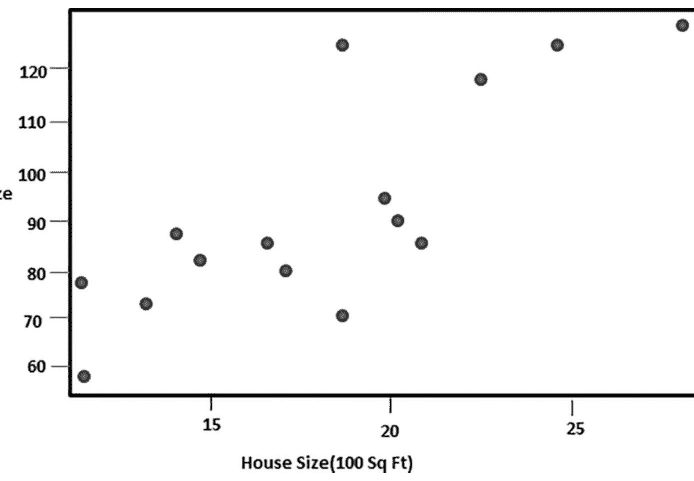

**图 5.18** 房屋面积与价格的散点图。

上述回归问题的方程如下：

$$y = \beta_0 + \beta_1x_1 + \beta_2x_2 + \beta_3x_3 + \beta_4x_4 + \beta_5x_5 + \cdots + \beta_px_p + \epsilon$$

其中 $p$ 是预测变量或自变量。我们假设给定 $x$ 时 $y$ 的期望值由总体直线给出。

$$E(Y|X) = \beta_0 + \beta_1x_1 + \beta_2x_2 + \beta_3x_3 + \beta_4x_4 + \beta_5x_5 + \cdots + \beta_px_p$$

为了最小化基于训练点的误差平方和，最小二乘直线方程如下：

$$\text{最小二乘直线} = \widehat{\beta}_0 + \widehat{\beta}_1x_1 + \widehat{\beta}_2x_2 + \widehat{\beta}_3x_3 + \cdots + \widehat{\beta}_px_p$$

现在我们可能拥有的数据并不能形成一条完美的直线。误差函数用于确定实际值与预测值之间的偏差。因此，关于误差的假设如下：

- 对于 $i = 0,1,2,...n$，$E(\varepsilon_i) = 0$
- $\sigma(\varepsilon_i) = \sigma_\varepsilon$，其中 $\sigma_\varepsilon$ 未知
- 误差 $\varepsilon_i$ 彼此独立
- 误差 $\varepsilon_i$ 服从正态分布（均值为 0，标准差为 $\sigma_\varepsilon$）

因此，这种噪声被称为高斯噪声或白噪声。

最小二乘回归线是唯一的一条直线，使得数据点（蓝色）与直线之间的垂直（$y$）距离平方和尽可能小。红色的垂直线是误差，如图 5.19 所示。

让我们考虑一个训练点 $d_i = (x_i, y_i)$，其中 $y_i$ 是实际值。其思想是使这些误差最小化。有多种方法可以识别模型的误差。平均绝对误差是一种简单的方法，它计算误差绝对值的平均值，公式如下：

$$\text{MAE} = \frac{1}{n} \sum_{i=1}^{n} |y_i - \hat{y}_i| \quad (5.20)$$

其中 $y_i$ 是实际值，$\hat{y}_i$ 是预测值。

均方误差表示为 MSE：

$$\text{MSE} = \frac{1}{n} \sum_{i=1}^{n} (y_i - \hat{y}_i)^2 \quad (5.21)$$

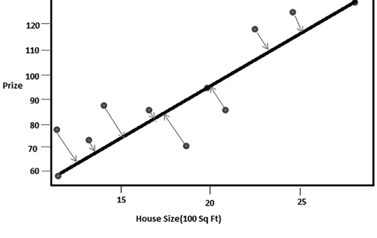

**图 5.19** 测量超平面与数据点之间的距离。

其中 $y_i$ 是实际值，$\hat{y}_i$ 是预测值。
均方根误差表示为 RMSE：

$$\text{RMSE} = \sqrt{\frac{1}{n} \sum_{i=1}^{n} (y_i - \hat{y}_i)^2}$$

根绝对误差，也称为残差平方和，表示为 RAE：

$$\text{RAE} = \frac{\sum_{i=1}^{n} |y_i - \hat{y}_i|}{\sum_{i=1}^{n} y_i - \bar{y}}$$

其中 $y_i$ 是实际值，$\hat{y}_i$ 是预测值，$\bar{y}$ 是 $y$ 的平均值。
根平方误差是 RSE，与 RAE 类似：

$$\text{RSE} = \frac{\sum_{i=1}^{n} (y_i - \hat{y}_i)^2}{\sum_{i=1}^{n} (y_i - \bar{y})^2}$$

对于 n 个数据点的最小二乘回归线方程为

$$y = ax + b$$

其中 $a$ 和 $b$ 是

$$a = \frac{n \sum_{i=1}^{n} x_i y_i - \sum_{i=1}^{n} x_i \sum_{i=1}^{n} y_i}{n \sum_{i=1}^{n} x_i^2 - (\sum_{i=1}^{n} x_i)^2}$$

$$b = \frac{1}{n} \left( \sum_{i=1}^{n} y_i - a \sum_{i=1}^{n} x_i \right)$$

## 示例 5.4

求表 5.5 中给定数据点集 $\{(-1, 0), (0, 2), (1, 4), (2, 5)\}$ 的最小二乘回归线。绘制给定的点并识别回归线。

### 表 5.5
样本数据点

| x | y | xy | x² |
|---|---|---|---|
| -1 | 0 | 0 | 1 |
| 0 | 2 | 0 | 0 |
| 1 | 4 | 4 | 1 |
| 2 | 5 | 10 | 4 |
| $\sum x = 2$ | $\sum y = 11$ | $\sum xy = 14$ | $\sum x^2 = 6$ |

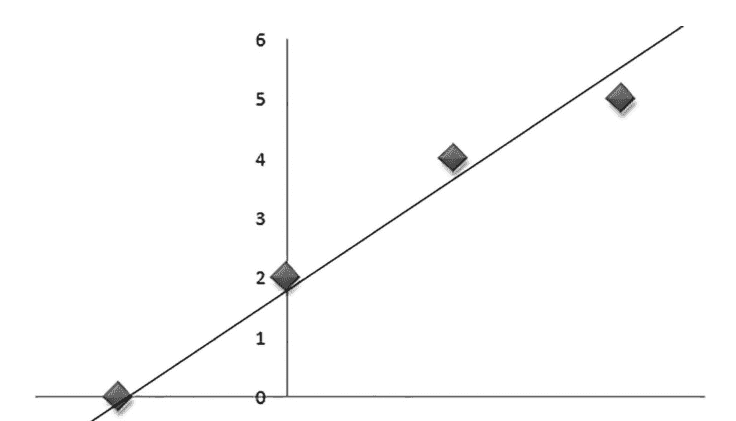

对于 $n$ 个数据点的最小二乘回归线方程为

$$y = ax + b$$

其中 $a$ 和 $b$ 是

$$a = \frac{n \sum_{i=1}^{n} x_i y_i - \sum_{i=1}^{n} x_i \sum_{i=1}^{n} y_i}{n \sum_{i=1}^{n} x_i^2 - \left( \sum_{i=1}^{n} x_i \right)^2}$$

$$b = \frac{1}{n} \left( \sum_{i=1}^{n} y_i - a \sum_{i=1}^{n} x_i \right)$$

$$a = \frac{4 * 14 - 2 * 11}{4 * 6 - 2^2}$$

$$a = 17/10 = 1.7$$

$$b = \frac{1}{4} (11 - 1.7 * 2)$$

$$b = 1.9$$

给定问题的最小二乘回归线如图 5.20 所示。

$$y = 1.7x + 1.9$$

## 示例 5.5

$x$ 的值及其对应的 $y$ 值如表 5.6 所示。

- i. 求最小二乘回归线 $y=ax+b$
- ii. 当 $x=10$ 时，估计 $y$ 的值。

### 表 5.6
示例 5.5 的数据

| x | 0 | 1 | 2 | 3 | 4 |
|---|---|---|---|---|---|
| y | 2 | 3 | 5 | 4 | 6 |

**解：**

对于 $n$ 个数据点的最小二乘回归线方程为

$$y = ax + b$$

其中 $a$ 和 $b$ 是

$$a = \frac{n \sum_{i=1}^{n} x_i y_i - \sum_{i=1}^{n} x_i \sum_{i=1}^{n} y_i}{n \sum_{i=1}^{n} x_i^2 - (\sum_{i=1}^{n} x_i)^2}$$

$$b = \frac{1}{n} \left( \sum_{i=1}^{n} y_i - a \sum_{i=1}^{n} x_i \right)$$

| x | y | xy | x^2 |
|---|---|---|---|
| 0 | 2 | 0 | 0 |
| 1 | 3 | 3 | 1 |
| 2 | 5 | 10 | 4 |
| 3 | 4 | 12 | 9 |
| 4 | 6 | 24 | 16 |
| $\sum x = 10$ | $\sum y = 20$ | $\sum xy = 49$ | $\sum x^2 = 30$ |

$$a = \frac{5 * 49 - 10 * 20}{5 * 30 - 10^2}$$

$$a = 0.9$$

$$b = \frac{1}{5} (20 - 0.9 * 10)$$

$$b = 2.2$$

因此，最小二乘回归方程为

$$y = 0.9x + 2.2$$

代入 $x=10$ 的值；则

$$y = 0.9 * 10 + 2.2$$

$$y = 11.2$$

该示例的输出如图 5.21 所示。

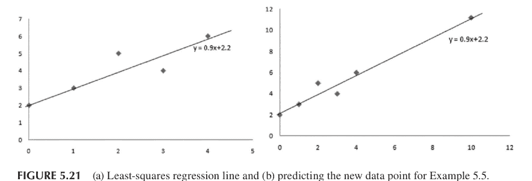

**图 5.21** (a) 最小二乘回归线和 (b) 为示例 5.5 预测新数据点。

### 表 5.7
年份与销售额数据

| x(年份) | 2005 | 2006 | 2007 | 2008 | 2009 |
| :--- | :--- | :--- | :--- | :--- | :--- |
| y(销售额) | 12 | 19 | 29 | 37 | 45 |

## 示例 5.6

一家公司每年的销售额（单位：百万美元）如表 5.7 所示。

- i. 求最小二乘回归线 $y = ax + b$
- ii. 使用最小二乘回归线作为模型来估计该公司 2012 年的销售额。

**解：**

首先，我们可以对数据进行归一化以便于计算。从 x 值中减去 2005。

| x(年份) | 0 | 1 | 2 | 3 | 4 |
| :--- | :--- | :--- | :--- | :--- | :--- |
| y(销售额) | 12 | 19 | 29 | 37 | 45 |

| x | y | xy | x^2 |
| :--- | :--- | :--- | :--- |
| 0 | 12 | 0 | 0 |
| 1 | 19 | 19 | 1 |
| 2 | 29 | 58 | 4 |
| 3 | 37 | 111 | 9 |
| 4 | 45 | 180 | 16 |
| $\sum x = 10$ | $\sum y = 142$ | $\sum xy = 368$ | $\sum x^2 = 30$ |

对于 $n$ 个数据点的最小二乘回归线方程为

$$y = ax + b$$

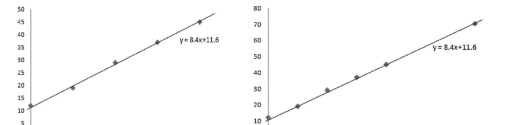

**图 5.22** (a) 最小二乘回归线和 (b) 为示例 5.6 预测新数据点。

其中 $a$ 和 $b$ 是

$$a = \frac{n \sum_{i=1}^{n} x_i y_i - \sum_{i=1}^{n} x_i \sum_{i=1}^{n} y_i}{n \sum_{i=1}^{n} x_i^2 - (\sum_{i=1}^{n} x_i)^2}$$

$$b = \frac{1}{n} \left( \sum_{i=1}^{n} y_i - a \sum_{i=1}^{n} x_i \right)$$

$$a = \frac{5 * 368 - 10 * 142}{5 * 30 - 10^2}$$

$$a = 8.4$$

$$b = \frac{1}{5} (142 - 8.4 * 10)$$

$$b = 11.6$$

最小二乘回归方程为

$$y = 8.4x + 11.6$$

为了估计该公司 2012 年的销售额，在最小二乘回归方程中代入 $x = 2012 – 2005 = 7$：

$$y = 8.4 * 7 + 11.6$$

$$y = 70.4 \text{ 百万美元}$$

给定示例的输出如图 5.22 所示。

## 示例 5.7

根据表 5.8 中显示的数据，预测汽车的二氧化碳排放量与发动机尺寸和气缸数的关系。求平均绝对误差。

- 自变量 ($x$)：发动机尺寸、气缸数和燃油消耗量
- 因变量 ($y$)：二氧化碳排放量

## 5.4.4 求解优化问题

优化问题可以通过两种不同的策略来求解：

- 推导出闭式解，以及
- 梯度下降法

为了理解推导闭式解的方法，让我们对均方误差 $J_n$ 求偏导数。对于最优的参数集，误差对每个参数的导数必须为 0。

$$\frac{\partial}{\partial w_j} J_n(w) = -\frac{2}{n} \sum_{i=1}^{n} (y_i - w_0 x_{i,0} - w_1 x_{i,1} - \cdots - w_d x_{i,d}) x_{i,j} = 0$$

导数向量

$$\text{grad}_w J_n(w) = \nabla_w (J_n(w)) = -\frac{2}{n} \sum_{i=1}^{n} (y_i - w^T x_i) x_i = 0$$

### 5.4.4.1 极大值与极小值

在图 5.23 中，数据中的峰值被称为极大值。全局极大值是整个数据中的最高峰。全局极小值是整个数据中的最低谷。

为了找到极小值，让我们看一个例子，令 $f'(z) = 0$ 并求解 $z$：

$$f(z) = z^2$$

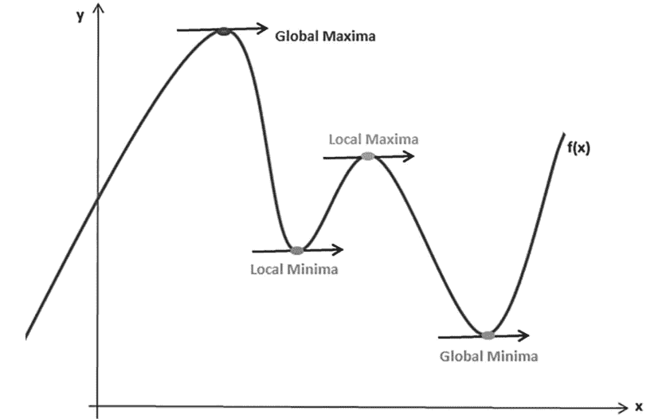

图 5.23 极大值与极小值的表示。

$f(z) = z^2$ 的导数是 $f'(z)$，可以写成

$$f'(z) = 2z \quad (5.31)$$

如果 $z = 0$，则导函数变为零，该点被称为局部极大值或局部极小值：

$$f'(z) = 0 \quad (5.32)$$

如果导数大于零或为正，函数递增，这意味着它正在远离谷底。否则，如果导数小于零或为负，函数递减，这意味着函数正向谷底移动。

通过假设 $z = -1$ 来寻找极小值，那么函数 $f'(z) = 2z$ 变为 $f'(-1) = 2 * -1 = -2$，这是递减的并向谷底移动（图 5.24）。然后，按梯度的大小增加 $z$。如果梯度的大小是 2，那么 $z$ 变为 1。

$$z = -1 + 2 = 1$$

对于第二次迭代，假设 $z = 1$，那么函数 $f'(z) = 2z$ 变为 $f'(1) = 2 * 1 = 2$，这是递增的并远离谷底。然后，按梯度的大小增加 $z$。如果梯度的大小是 2，那么 $z$ 变为 1。

$$z = 1 - 2 = -1$$

因此，它会在相同的两个点之间不断跳跃，这可以通过使用合适的学习率或步长来克服。

### 5.4.4.2 梯度下降法

梯度下降法是一种用于最小化机器学习中误差函数的优化算法。梯度下降法用于迭代地求解线性回归问题，如图 5.25 所示。

梯度下降法的目标是最小化误差函数。下面在图 5.26 中解释了使用梯度下降法最小化误差的抛物线简单例子。如果我们

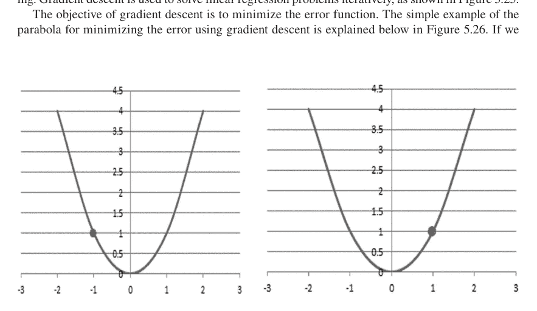

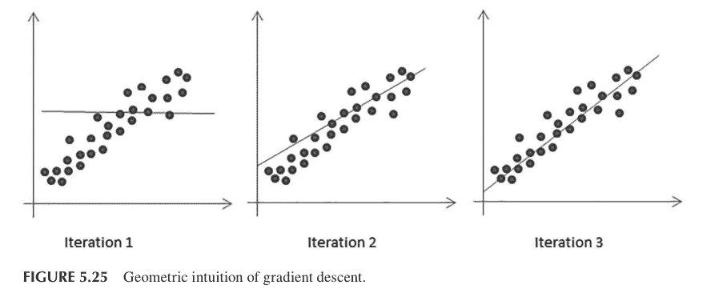

图 5.25 梯度下降法的几何直观。

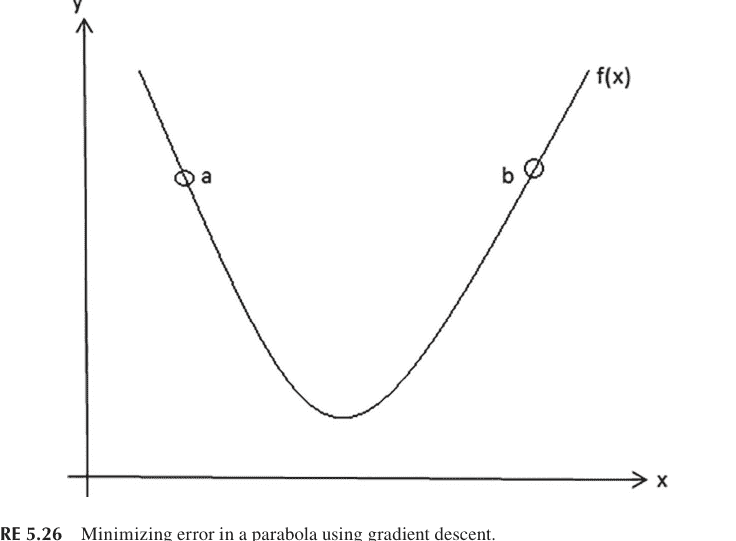

图 5.26 使用梯度下降法最小化抛物线中的误差。

从点 a 开始向左移动，函数 $f$ 是递增的。如果我们向右移动，它是递减的。因此，选择递减的方向。

但并非所有函数都像抛物线。另一个例子如图 5.27 所示，其中清晰地描绘了局部极小值和全局极小值。在这个图中，如果 $b$ 向右移动，它将达到局部极小值。

定义一个代价函数 $J(\theta)$：

$$J(\theta) = \frac{1}{2} \left( \sum_{i=1}^{m} h(x)^{(i)} - y^{(i)} \right)^2$$
$$h(x) = \sum_{i=0}^{n} \beta_i x_i$$

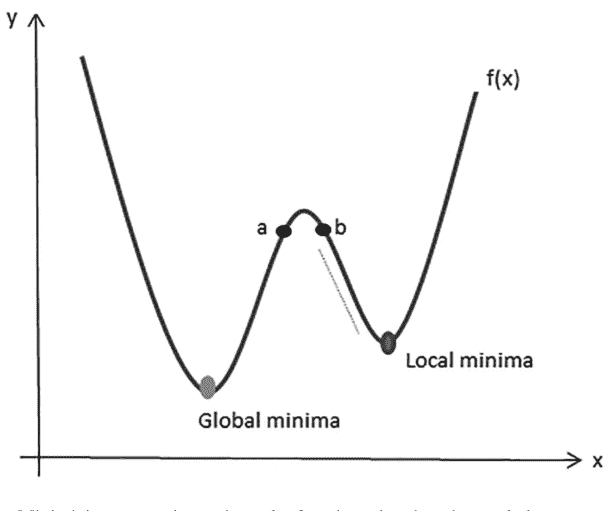

图 5.27 使用非抛物线的不规则函数最小化误差。

其中 $h(x)^{(i)}$ 是预测值，$y^{(i)}$ 是实际值。主要目标是学习 $\theta$，以最小化代价函数 $J(\theta)$。

梯度下降算法

开始

步骤 1：随机初始化 $\theta$
步骤 2：执行
{
步骤 3：$\theta = \theta - \alpha \nabla_{\theta} J(\theta)$
}
步骤 4：当($\alpha \| \nabla J \| > \varepsilon$)时

梯度下降算法如下。首先，随机初始化 $\theta$ 或通常设为零，然后进行迭代。学习率记为 $\alpha$。停止条件是 $J$ 变化不快或梯度足够小。然后，重复该过程，直到达到最小误差或无法进一步改进。

在梯度下降中，学习率 $\alpha$ 用于确保梯度下降是否正常工作。学习率 $\alpha$ 越小，收敛越慢。选择 $\alpha$ 为 0.001、0.01、0.1 和 1。

$$\theta_j = \theta_j - \alpha \frac{\partial}{\partial \theta_j} J(\theta) \quad (5.35)$$

令 $x$ 轴表示梯度下降中的迭代次数。如图 5.28 所示，$J(\theta)$ 应在每次迭代时递减。

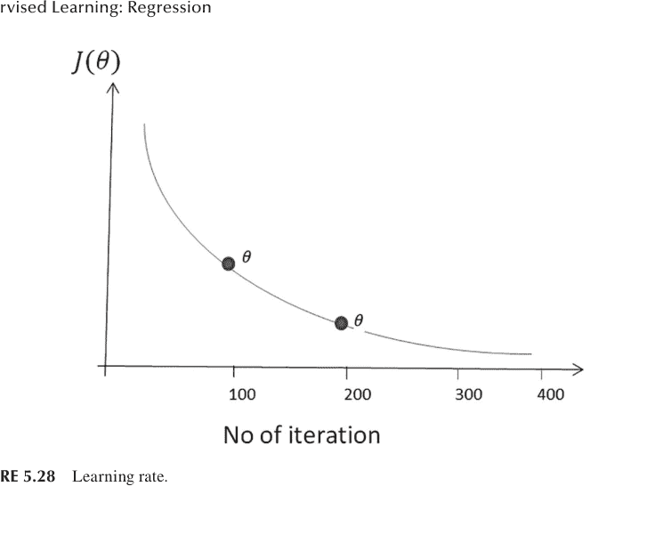

图 5.28 学习率。

### 5.4.4.3 LMS（最小均方）更新规则

对代价函数 $J(\theta)$ 应用导数：

$$\frac{\partial}{\partial \theta} J(\theta) = \frac{\partial}{\partial \theta_j} \frac{1}{2} (h(x) - y)^2$$
$$= 2 \cdot \frac{1}{2} (h(x) - y) \frac{\partial}{\partial \theta_j} (h(x) - y)$$
$$= (h(x) - y) \cdot \frac{\partial}{\partial \theta_j} \left( \sum_{i=0}^{n} \theta_i x_i - y \right)$$
$$= (h(x) - y) x_j$$

### 5.4.4.4 SGD 算法

随机梯度下降（SGD）是梯度下降法的一种广泛使用的变体。

随机梯度下降算法

开始

步骤 1：重复{
步骤 2：对于 $I=1$ 到 $m$ 执行
步骤 3：$\theta_j = \theta_j + \alpha (y^i - h(x^i)) x_j^{(i)}$（对于每个 $j$）
步骤 4：结束循环
}
步骤 5：直到收敛

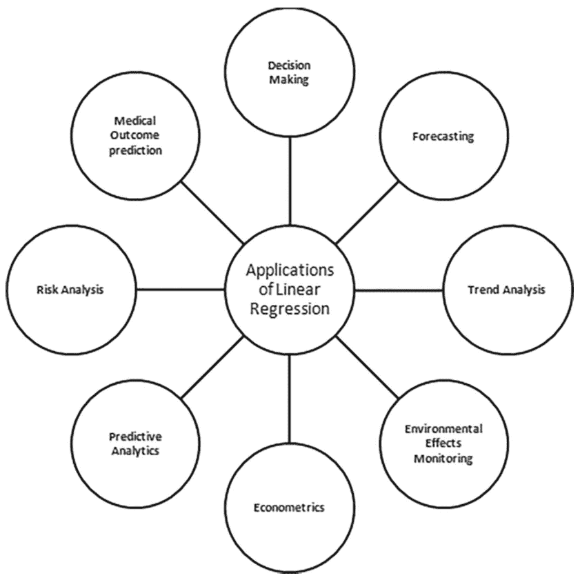

图 5.29 线性回归的应用。

## 5.4.5 现实世界应用

许多现实世界应用都利用了线性回归技术，如图 5.29 所示。分析随时间变化的趋势在商业领域扮演着重要角色。对 GDP、油价和股价的分析是趋势分析的著名例子。借助统计分析，企业可以获得新的见解并提高运营效率。

### 5.4.5.1 预测分析

它可以用于生成关于客户行为、理解业务以及影响盈利能力的因素的见解。线性回归可用于业务中评估趋势并进行估计或预测。线性回归还可以分析营销效果、定价和促销对产品销售的影响。线性回归也可用于评估金融服务或保险领域的风险。风险可以根据汽车属性、驾驶员信息或人口统计数据进行评估。此类分析的结果可能指导重要的业务决策。

## 5.4.5.2 医疗结果预测

线性回归在医疗分析中扮演着重要角色。例如，吸烟会缩短寿命，而线性回归可以分析这两个变量之间的关系。在这种情况下，这种关系可以使用简单线性回归来定义，如下所示：

$$LifeSpan = \beta_0 + \beta_1 Smoking$$

其中，寿命是因变量，吸烟是自变量。同样，通过添加另一个自变量社会经济地位，也可以使用多元线性回归形式来表示：

$$LifeSpan = \beta_0 + \beta_1 Smoking + \beta_1 Socioeconomicstatus$$

再举一个例子，为了根据粉尘暴露情况来衡量肺活量，请参考图5.31中的散点图，其中x轴是粉尘暴露量，y轴是肺活量的测量值（PEFR或PEAK呼气流量）。

$$PEFR = \beta_0 + \beta_1 \cdot Exposure$$

该模型的回归线如图5.32所示。

## 5.4.5.3 风速预测

风能是关键的可再生能源之一，它清洁且取之不尽。风速预测在风电场、灾害管理和航空领域起着关键作用。因此，它是风力发电领域的一项重要技术。由于其混沌和波动的特性，准确预测风速十分困难。风速取决于多个方面。因此，可以利用多元线性回归模型来设计模型。通常，风速预测有两种通用方法：短期预测涉及分钟和小时的时间尺度，而长期预测则涉及月或年的时间尺度。

## 5.4.5.4 环境影响监测

时间序列回归在环境流行病学中应用广泛。暴露于空气污染可能导致人类患上急性呼吸道感染。可以进行回归分析，以了解空气污染暴露对人类呼吸道感染的影响。这表示为

空气污染暴露 = $\beta_0 + \beta_1$ 呼吸道感染

在加拿大，环境影响监测计划使用统计线性回归技术来衡量纸浆厂或金属矿废水对水生生态系统的影响。

## 5.4.6 使用Python进行线性回归实践

### 5.4.6.1 使用Python进行简单线性回归

在实现回归之前，让我们先了解数据文件。我们使用的样本数据文件如下所示。它有两列——工作年限和薪水。我们的目标是根据工作年限来预测薪水。

Salary_Data.csv

该文件的示例截图如下所示：

| 工作年限 | 薪水 |
|---|---|
| 1.1 | 39,343 |
| 1.3 | 46,205 |
| 1.5 | 37,731 |
| 2 | 43,525 |
| 2.2 | 39,891 |
| 2.9 | 56,642 |
| 3 | 60,150 |
| 3.2 | 54,445 |
| 3.2 | 64,445 |
| 3.7 | 57,189 |
| 3.9 | 63,218 |
| 4 | 55,794 |
| 4 | 56,957 |
| 4.1 | 57,081 |
| 4.5 | 61,111 |
| 4.9 | 67,938 |
| 5.1 | 66,029 |
| 5.3 | 83,088 |
| 5.9 | 81,363 |
| 6 | 93,940 |

```python
# Coding →
# Importing the libraries
import numpy as np
import matplotlib.pyplot as plt
import pandas as pd

#For this example, we have created a sample file, Salary_Data.CSV file. I
#have placed it in my C:/Python #Files/ directory

# Importing the dataset
dataset = pd.read_csv('C:/Python Files/Salary_Data.csv')
X = dataset.iloc[:, :-1].values
y = dataset.iloc[:, 1].values

# Splitting the dataset into the Training set and Test set
from sklearn.cross_validation import train_test_split
X_train, X_test, y_train, y_test = train_test_split(X, y, test_size =
1/3, random_state = 0)

# Feature Scaling - It means changing the range of values without
#changing the shape of the distribution. The range is often set to 0 to 1

from sklearn.preprocessing import StandardScaler
sc_X = StandardScaler()
X_train = sc_X.fit_transform(X_train)
X_test = sc_X.transform(X_test)
```

监督学习：回归

211

```python
#sc_y = StandardScaler()
#y_train = sc_y.fit_transform(y_train)

# Fitting Simple Linear Regression to the Training set
from sklearn.linear_model import LinearRegression
regressor = LinearRegression()
regressor.fit(X_train, y_train)

# regression coefficients
print('Coefficients: \n', regressor.coef_)

# OUTPUT →
Coefficients:
[23651.14412001]

print(regressor.intercept_)

# OUTPUT →
71022.5

# Predicting the Test set results
y_pred = regressor.predict(X_test)

# Visualizing the Training set results
plt.scatter(X_train, y_train, color = 'red')
plt.plot(X_train, regressor.predict(X_train), color = 'blue')
plt.title('Salary vs Experience (Training set)')
plt.xlabel('Years of Experience')
plt.ylabel('Salary')
plt.show() #Figure 5.33

# Visualizing the Test set results
plt.scatter(X_test, y_test, color = 'red')
plt.plot(X_train, regressor.predict(X_train), color = 'blue')
plt.title('Salary vs Experience (Test set)')
plt.xlabel('Years of Experience')
plt.ylabel('Salary')
plt.show() ###Figure 5.34

from sklearn.metrics import mean_squared_error
mean_squared_error(y_test,y_pred)#mse
print(np.sqrt(mean_squared_error(y_test, y_pred))) #rmse

#OUTPUT →
4585.4157204675885

# print the R-squared value for the model
regressor.score(X_test, y_test)#rsquare

#OUTPUT →
0.9749154407708353
```

### 5.4.6.2 使用Python进行多元线性回归

让我们来了解多元线性回归的数据文件。我们使用的样本数据文件如下所示。它有五列，如下所示。我们的目标是根据多个变量——研发支出、管理支出、营销支出以及初创公司所在的州——来预测利润。
该文件的示例截图如图5.35所示。

| 研发支出 | 管理支出 | 营销支出 | 州 | 利润 |
|---|---|---|---|---|
| 165349.2 | 136897.8 | 471784.1 | New York | 192261.8 |
| 162597.7 | 151377.59 | 443898.53 | California | 191792.1 |
| 153441.51 | 101145.55 | 407934.54 | Florida | 191050.4 |
| 144372.41 | 118671.85 | 383199.62 | New York | 182902 |
| 142107.34 | 91391.77 | 366168.42 | Florida | 166187.9 |
| 131876.9 | 99814.71 | 362861.36 | New York | 156991.1 |
| 134615.46 | 147198.87 | 127716.82 | California | 156122.5 |
| 130298.13 | 145530.06 | 323876.68 | Florida | 155752.6 |
| 120542.52 | 148718.95 | 311613.29 | New York | 152211.8 |
| 123334.88 | 108679.17 | 304981.62 | California | 149760 |
| 101913.08 | 110594.11 | 229160.95 | Florida | 146122 |
| 100671.96 | 91790.61 | 249744.55 | California | 144259.4 |
| 93863.75 | 127320.38 | 249839.44 | Florida | 141585.5 |
| 91992.39 | 135495.07 | 252664.93 | California | 134307.4 |
| 119943.24 | 156547.42 | 256512.92 | Florida | 132602.7 |
| 114523.61 | 122616.84 | 261776.23 | New York | 129917 |
| 78013.11 | 121597.55 | 264346.06 | California | 126992.9 |
| 94657.16 | 145077.58 | 282574.31 | New York | 125370.4 |
| 91749.16 | 114175.79 | 294919.57 | Florida | 124266.9 |
| 86419.7 | 153514.11 | 0 | New York | 122776.9 |
| 76253.86 | 113867.3 | 298664.47 | California | 118474 |
| 78389.47 | 153773.43 | 299737.29 | New York | 111313 |
| 73994.56 | 122782.75 | 303319.26 | Florida | 110352.3 |

图5.35 样本数据集截图。

```python
# Multiple Linear Regression

# Importing the libraries
import numpy as np
import matplotlib.pyplot as plt
import pandas as pd

# Importing the dataset
dataset = pd.read_csv('C:/Users/mpandey1/Desktop/ML using Python Training/day4/Section 5 - Multiple Linear Regression/50_Startups.csv')
X = dataset.iloc[:, :-1].values
y = dataset.iloc[:, 4].values

# Encoding categorical data - since we cannot use the text values as it is.
from sklearn.preprocessing import LabelEncoder, OneHotEncoder
labelencoder = LabelEncoder()
X[:, 3] = labelencoder.fit_transform(X[:, 3])
onehotencoder = OneHotEncoder(categorical_features = [3])
X = onehotencoder.fit_transform(X).toarray()

# Avoiding the Dummy Variable Trap
X = X[:, 1:]

# Splitting the dataset into the Training set and Test set
from sklearn.cross_validation import train_test_split
```

X_train, X_test, y_train, y_test = train_test_split(X, y, test_size=0.2, random_state=0)

### 特征缩放
from sklearn.preprocessing import StandardScaler
sc_X = StandardScaler()
X_train = sc_X.fit_transform(X_train)
X_test = sc_X.transform(X_test)
sc_y = StandardScaler()
y_train = sc_y.fit_transform(y_train)

# 将多元线性回归模型拟合到训练集
from sklearn.linear_model import LinearRegression
regressor = LinearRegression()
regressor.fit(X_train, y_train)

### 预测测试集结果
y_pred = regressor.predict(X_test)

# 回归系数
print('Coefficients: \n', regressor.coef_)

#OUTPUT →
#Coefficients:
# [ -415.38222603  333.57777773 35726.28774249   851.30163448
#  4519.88277698]

print(regressor.intercept_)

#OUTPUT →
109446.44724999998

from sklearn.metrics import mean_squared_error
mean_squared_error(y_test, y_pred)  # 均方误差

print(np.sqrt(mean_squared_error(y_test, y_pred)))  # 均方根误差

#OUTPUT →
9137.99015279494

# 打印模型的R平方值
regressor.score(X_test, y_test)  # R平方

#OUTPUT →
0.9347068473282425

from sklearn.linear_model import Ridge
ridgeReg = Ridge(alpha=0.05, normalize=True)
ridgeReg.fit(X_train, y_train)
pred = ridgeReg.predict(X_test)
mean_squared_error(y_test, pred)  # 均方误差
ridgeReg.score(X_test, y_test)

#OUTPUT →
0.9091504993722859

from sklearn.linear_model import Lasso
lassoReg = Lasso(alpha=0.8, normalize=True)
lassoReg.fit(X_train, y_train)
pred1 = lassoReg.predict(X_test)
mean_squared_error(y_test, pred1)  # 均方误差
lassoReg.score(X_test, y_test)

#OUTPUT →
0.934827712684663

## 总结

本章介绍了监督学习的概念及其类型。本章详细分析了用于回归的监督学习。通过带有求解示例的简单和多元线性回归方法，清晰地阐述了寻找最优回归线的步骤。此外，还清晰地展示了用于收敛实际值与预测值之间误差的各种误差函数。举例说明了销售预测、医疗预测和风速预测等多种现实世界应用。最后，全面演示了使用Python实现简单和多元线性回归，从处理数据到特征缩放，从而确定输出。

## 复习题

1.  根据深度估算油井钻井成本。数据收集自菲律宾海上油井，见表5.10。绘制散点图。根据散点图，预测一个线性回归模型。
2.  计算上述问题的残差。
3.  通过适当的例子，找出简单线性回归和多元线性回归之间的区别。

### 表5.10
油井钻井数据

| 深度 | 成本 |
|---|---|
| 5000 | 2596.8 |
| 5200 | 3328.0 |
| 6000 | 3181.1 |
| 6538 | 3198.4 |
| 7109 | 4779.9 |
| 7556 | 5905.6 |
| 8005 | 5769.2 |
| 8207 | 8089.5 |
| 8210 | 4813.1 |
| 8600 | 5618.7 |
| 9026 | 7736.0 |
| 9197 | 6788.3 |
| 9926 | 7840.8 |
| 10,813 | 8882.5 |
| 13,800 | 10,489.5 |
| 14,311 | 12,506.6 |

Python案例研究中的决策科学机器学习

### 表5.11
广告数据

| 电视 | 广播 | 报纸 | 销售额 |
|---|---|---|---|
| 230.1 | 37.8 | 69.2 | 22.1 |
| 44.5 | 39.3 | 45.1 | 10.4 |
| 17.2 | 45.9 | 69.3 | 9.3 |
| 151.5 | 41.3 | 58.5 | 18.5 |
| 180.8 | 10.8 | 58.4 | 12.9 |

### 表5.12
水污染变量

| 变量 | 描述 |
|---|---|
| Y | 平均氮浓度（毫克/升） |
| x₁ | 农业用地百分比 |
| x₂ | 林地百分比 |
| x₃ | 居住用地百分比 |
| x₄ | 工业用地百分比 |

### 表5.13
纽约河流水污染数据

| 序号 | 河流 | Y | x₁ | x₂ | x₃ | x₄ |
|---|---|---|---|---|---|---|
| 1 | 奥利安 | 1.10 | 26 | 63 | 1.2 | 0.29 |
| 2 | 卡萨达加 | 1.01 | 29 | 57 | 0.7 | 0.09 |
| 3 | 奥特卡 | 1.90 | 54 | 26 | 1.8 | 0.58 |
| 4 | 内弗辛克 | 1.00 | 2 | 84 | 1.9 | 1.98 |
| 5 | 哈肯萨克 | 1.99 | 3 | 27 | 29.4 | 3.11 |
| 6 | 沃平杰 | 1.42 | 19 | 61 | 3.4 | 0.56 |
| 7 | 菲什基尔 | 2.04 | 16 | 60 | 5.6 | 1.11 |
| 8 | 霍尼奥伊 | 1.65 | 40 | 43 | 1.3 | 0.24 |
| 9 | 萨斯奎哈纳 | 1.01 | 28 | 62 | 1.1 | 0.15 |
| 10 | 切南戈 | 1.21 | 26 | 60 | 0.9 | 0.23 |
| 11 | 蒂奥夫尼奥加 | 1.33 | 26 | 53 | 0.9 | 0.18 |
| 12 | 西加拿大 | 0.75 | 15 | 75 | 0.7 | 0.16 |
| 13 | 东加拿大 | 0.73 | 6 | 84 | 0.5 | 0.12 |
| 14 | 萨拉纳克 | 0.80 | 3 | 81 | 0.8 | 0.35 |
| 15 | 奥萨布尔 | 0.76 | 2 | 89 | 0.7 | 0.35 |
| 16 | 布莱克 | 0.87 | 6 | 82 | 0.5 | 0.15 |
| 17 | 斯科哈里 | 0.80 | 22 | 70 | 0.9 | 0.22 |
| 18 | 拉奎特 | 0.87 | 4 | 75 | 0.4 | 0.18 |
| 19 | 奥斯威戈切 | 0.66 | 21 | 56 | 0.5 | 0.13 |
| 20 | 科霍克顿 | 1.25 | 40 | 49 | 1.1 | 0.13 |

### 表5.14
测验分数数据

| 学生 | $x_i$ | $y_i$ |
| :--- | :--- | :--- |
| 1 | 95 | 85 |
| 2 | 85 | 95 |
| 3 | 80 | 70 |
| 4 | 70 | 65 |
| 5 | 60 | 70 |

4.  找出电视、广播和报纸广告对销售额的影响，如表5.11所示。确定回归线。
5.  为表5.13中的给定数据找出多元回归模型。纽约河流水污染研究中的变量见表5.12。
6.  使用数据点 {(-2, -1), (1, 1), (3, 2)} 找出最小二乘回归线。在图中绘制给定的数据点和回归线。
7.  学生们参加了一门机器学习课程的入学测验。测验分数和机器学习成绩见表5.14。执行最小二乘回归并在图中绘制。


Taylor & Francis

Taylor & Francis Group

http://taylorandfrancis.com

# 6 监督学习分类

### 学习目标

在本章结束时，读者将能够

-   理解用于回归和分类的监督学习算法之间的区别
-   理解与分类问题相关的各种监督学习算法
-   了解逻辑回归、决策树、随机森林和支持向量机中涉及的基本数学概念
-   解决基于本章涵盖算法的示例
-   使用Python实现监督学习算法以解决实际问题

## 6.1 引言

分类问题的思想是将结果变量分为一个或多个类别。然后，监督学习方法从标记数据中学习。逻辑回归、决策树和支持向量机（SVM）是广泛使用的各种监督学习分类算法。本章详细描述了这些算法、它们的数学建模、优缺点、求解示例和现实世界应用，并提供了使用Python的分步实现。

## 6.2 分类的用例

分类技术用于预测分析、图像分类和文本分析。此外，许多现实世界的应用，如手写字符识别、自动驾驶汽车、遥感、市场营销和生物医学分析，都利用分类算法。在本章中，我们将在分类算法的背景下阐述几个现实世界的例子。

## 6.3 逻辑回归

逻辑回归是一种监督分类技术，被数据科学家广泛用于解决许多现实世界的问题。例如，可以使用逻辑回归获得关于大数据的各种有用见解。逻辑回归是一种更简单且强大的算法，适用于二元分类和多类分类问题。二元分类问题的一些例子是检测垃圾邮件、在线交易是否欺诈以及检查的肿瘤是否为恶性。在所有这些分类问题中，我们试图预测输出标签y是0（负类）还是1（正类）。

$$y \in \{0,1\} \begin{cases} 0 & \text{负类（例如，非欺诈交易）} \\ 1 & \text{正类（例如，欺诈交易）} \end{cases}$$

顾名思义，逻辑回归不是一个回归问题。它与线性回归不同，如表6.1所示。

## 表 6.1
线性回归与逻辑回归

**线性回归**

- 预测连续输出值
- 目标是找到最佳拟合直线

$$Y = \beta_0 + \beta_1x_1$$

- 用于解决回归分析问题
- 使用最小二乘回归估计参数
- 应用：股票价值预测、风速预测

**逻辑回归**

- 预测分类输出值
- 目标是找到一条 S 形曲线

$$\ln\left(\frac{p}{1-p}\right) = \beta_0 + \beta_1x_1$$

- 用于解决分类问题
- 使用极大似然估计来估计参数
- 应用：垃圾邮件分类、客户流失预测

## 6.3.1 几何直觉

逻辑回归利用 sigmoid 函数来分隔两个类别，如公式 6.1 所示。逻辑 sigmoid 函数也称为 logit 函数。

$$\sigma(z) = \frac{1}{1 + e^{-z}}$$

sigmoid 函数 $\sigma(z)$ 的值介于 0 和 1 之间，其形状如图 6.1 所示的 $S$ 形。假设函数或阈值 $h_\theta(x)$ 设为 0.5。

$$0 \leq h_\theta(x) \leq 1$$

$$h_\theta(x) = \sigma(\theta^T x) = \frac{1}{1 + e^{-(\theta^T x)}}$$

如果 $h_\theta(x) \geq 0.5$，则预测输出标签 $y$ 为 1。否则，如果 $h_\theta(x) < 0.5$，则预测输出标签 $y$ 为 0。让我们将权重向量视为 $\beta_i$，观测值记为 $x_i$，偏置 $\beta_0$ 视为线性回归中的截距。假设对于一个二分类问题，一个类别为 0，另一个类别为 1，预测概率的公式如下。

$$P(Y = 0 | X) = \frac{1}{1 + \exp\left[\beta_0 + \sum \beta_i x_i\right]}$$

$$P(Y = 1 | X) = \frac{\exp\left[\beta_0 + \sum \beta_i x_i\right]}{1 + \exp\left[\beta_0 + \sum \beta_i x_i\right]}$$

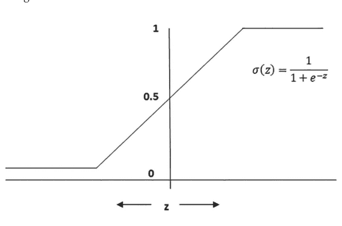

图 6.1 Sigmoid 曲线。

其中 exp[x] 类似于 $e^x$。更简单地，它可以重写为

$$P(Y = 0 | X) = \sigma\left(-\beta_0 + \sum \beta_i x_i\right) \quad (6.5)$$
$$P(Y = 1 | X) = 1 - \left[\sigma\left(-\beta_0 + \sum \beta_i x_i\right)\right] \quad (6.6)$$

其中

$$\sigma(z) = \frac{1}{1 + e^{-z}}$$

通过一个简单的例子，让我们理解如何根据年龄和吸烟习惯判断一个人是否患有肺部疾病。

$$P(D = 1 | \text{年龄, 吸烟习惯}) = \frac{1}{1 + e^{-(\beta_0 + \beta_1 \text{年龄} + \beta_2 \text{吸烟习惯})}}$$
$$P(D = 1 | x_1, x_2) = \frac{1}{1 + e^{-(\beta_0 + \beta_1 x_1 + \beta_2 x_2)}}$$
$$P(D = 0 | \text{年龄, 吸烟习惯}) = \frac{e^{-(\beta_0 + \beta_1 \text{年龄} + \beta_2 \text{吸烟习惯})}}{1 + e^{-(\beta_0 + \beta_1 \text{年龄} + \beta_2 \text{吸烟习惯})}}$$
$$P(D = 0 | x_1, x_2) = \frac{e^{-(\beta_0 + \beta_1 x_1 + \beta_2 x_2)}}{1 + e^{-(\beta_0 + \beta_1 x_1 + \beta_2 x_2)}}$$

其中
$D$ = 是否患有肺部疾病，离散值 {1 – 是，0 – 否}
$x_1$ = 年龄，连续值
$x_2$ = 吸烟习惯，离散值 {1 – 是，0 – 否}
为了估计参数 $\beta_0$、$\beta_1$ 和 $\beta_2$，使用了极大似然估计。

$$\ln\left(\frac{p}{1 - p}\right) = \beta_0 + \beta_1 x_1 \quad (6.7)$$

## 表 6.2
示例说明

| 心脏病发作 | 是 (1) | 否 (0) | 总计 |
| :--- | :--- | :--- | :--- |
| 是(1) | 3($R_{11}$) | 7($R_{12}$) | 10 |
| 否(0) | 6($R_{21}$) | 4($R_{22}$) | 10 |
| | 9 | 11 | 20 |

其中 $p/1-p$ 是优势比，$\ln(p/1-p)$ 是 logit 优势比。

$$\text{优势} = \frac{p(\text{事件})}{1-p(\text{事件})} \quad (6.8)$$

优势比是成功概率与失败概率的比值。让我们通过表 6.2 的一个简单说明来理解如何计算优势比。
接受过愤怒治疗的人患心脏病发作的优势 = $R_{11}/R_{21}=3/6=0.5$
未接受过愤怒治疗的人患心脏病发作的优势 = $R_{12}/R_{22}=7/4=1.75$
相对优势/优势比 = $(R_{12}/R_{22})/(R_{11}/R_{21})=1.75/0.5=0.285$
为了估计相对于愤怒治疗的心脏病发作概率，使用了逻辑函数

$$\ln\left(\frac{p}{1-p}\right) = \beta_0 + \beta_1x_1$$

其中 $\beta_0$ 和 $\beta_1$ 是回归系数，$p$ 是一个人患心脏病发作的概率。

## 6.3.2 逻辑回归的变体

逻辑回归的主要类型（图 6.2）有

- 简单逻辑回归
- 多元逻辑回归
- 二元逻辑回归

### 6.3.2.1 简单逻辑回归

这是一种更简单的形式，只有一个自变量。简单逻辑回归的一般形式是 $\ln\left(\frac{p}{1-p}\right) = \beta_0 + \beta_1$。仅基于一个变量（例如吸烟习惯）来预测心脏病的存在（是/否），就是简单逻辑回归类型。心脏病 $y$ 和吸烟习惯 $x_1$ 的变量描述为

$$\text{心脏病存在 } y = \begin{cases} 1 & \text{是} \\ 0 & \text{否} \end{cases}$$

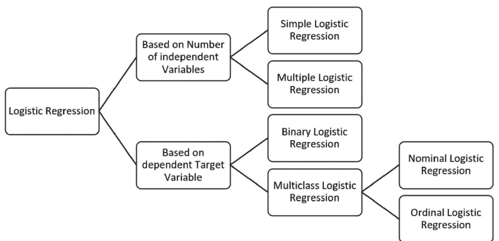

图 6.2 逻辑回归的变体。

$$\text{吸烟习惯 } x_1 = \begin{cases} 1 & \text{吸烟者} \\ 0 & \text{非吸烟者} \end{cases}$$

基于吸烟习惯 $x_1$ 预测心脏病 $y$ 的简单逻辑函数如下

$$\ln\left(\frac{p(y=1|x_1)}{1-p(y=1|x_1)}\right) = \beta_0 + \beta_1 x_1$$

### 6.3.2.2 多元逻辑回归

如果我们有多个自变量，例如 $\{x_1, x_2, \dots, x_n\}$，那么它被称为多元逻辑回归。多元逻辑回归的一般形式见公式 6.3

$$\ln\left(\frac{p}{1-p}\right) = \beta_0 + \beta_1 x_1 + \dots + \beta_n x_n \quad (6.9)$$

基于多个变量（例如吸烟习惯 $x_1$ 和年龄组 $x_2$）来预测心脏病 $y$（是/否）的存在，是多元逻辑回归的例子。

$$\ln\left(\frac{p(y=1|x_1, x_2)}{1-p(y=1|x_1, x_2)}\right) = \beta_0 + \beta_1 x_1 + \beta_2 x_2 \quad (6.10)$$

### 6.3.2.3 二元逻辑回归

它试图预测二元目标（0, 1）的概率。二元逻辑回归是一种更简单的方法，它利用了 sigmoid 函数。例如，如图 6.3 所示，基于湿度预测明天是否会下雨，目标因变量“是否会下雨”恰好包含两个类别，即下雨（1）和不下雨（0）。

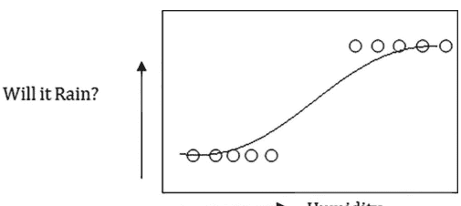

图 6.3 二元逻辑回归。

$$P(\text{下雨} = 0 \mid \text{湿度}) = \frac{e^{-(\beta_0 + \beta_1 \text{湿度})}}{1 + e^{-(\beta_0 + \beta_1 \text{湿度})}}$$

二元逻辑回归分类的其他一些例子：

- 哪些因素影响一个人决定去休闲旅行？
  $Y=1$ 如果去休闲旅行，否则为 0
- 哪些因素决定婴儿出生体重？
  $Y=1$ 如果婴儿出生体重偏低，否则为 0
- 哪个人群更可能投票支持新立法？
  $Y=1$ 如果一个人投了赞成票，否则为 0
- 哪些客户更可能购买新车？
  $Y=1$ 如果购买了新车，否则为 0

### 6.3.2.4 多类逻辑回归

多类逻辑回归试图预测两个以上目标类别的概率。对于多类分类问题，不使用 sigmoid 函数，而是使用 softmax 函数。多类逻辑回归分类的例子如下。

一个人将投票给哪个政党？

$$\begin{cases} \text{共和党} - 1 \\ \text{民主党} - 2 \\ \text{独立党} - 3 \end{cases}$$

一个人有什么样的症状？

$$\text{症状} \begin{cases} \text{无} - 0 \\ \text{轻度} - 1 \\ \text{中度} - 2 \\ \text{重度} - 3 \end{cases}$$

多类逻辑回归的两种类型是有序逻辑回归和名义逻辑回归。

### 6.3.2.5 名义逻辑回归

它是多类逻辑回归的一种类型，其中目标因变量包含两个以上的类别标签。名义类别变量中不存在固有的或自然的顺序。

## 6.3.2.6 有序逻辑回归

这是一种多类别逻辑回归，其目标变量包含两个以上的类别标签。有序类别变量中存在自然顺序。有序变量的例子包括学生成绩和肿瘤分级。

## 6.3.3 优化问题

优化是一个最小化或最大化问题。设实际输出为 $y$，预测输出为 $\hat{y}$，目标是最小化预测输出与实际输出之间的差异，如公式 6.4 所示。

目标是 $\min(\hat{y} - y)$

交叉熵损失函数 $L_{CE}$ 是逻辑回归模型中使用的函数

$L_{CE} = -\log p(y|x)$

$\log p(y|x) = y \log \hat{y} + (1-y) \log(1-\hat{y})$

$L_{CE} = -[y \log \hat{y} + (1-y) \log(1-\hat{y})]$

## 6.3.4 正则化

模型在训练数据上表现良好，但无法对新的未见数据进行分类，这被称为过拟合问题。当我们的模型拟合了过多数据时，就会发生过拟合。这可以通过使用正则化项来泛化逻辑回归模型来解决。正则化可以通过对权重参数添加惩罚项来实现。$L_1$ 和 $L_2$ 正则化是两种正则化形式。$L_2$ 正则化被广泛使用，其一般形式如公式 6.15 所示。

$\frac{\lambda}{2} ||w||^2 = \frac{\lambda}{2} \sum_{j=1}^{m} w_j^2$

其中 $\lambda$ 是正则化参数。

## 6.3.5 现实世界应用

### 6.3.5.1 医学诊断

多项研究利用逻辑回归进行疾病诊断。由队列研究收集的埃文斯县数据集使用逻辑回归模型预测心脏病的存在。埃文斯县数据集的部分变量见表 6.3。

用于预测冠心病的多重逻辑回归形式如图 6.4 所示。

$$\ln\left(\frac{P(\text{CHD} = 1 | \text{CAT}, \text{CHL}, \text{SMK}, \text{ECG})}{1 - P(\text{CHD} = 1 | \text{CAT}, \text{CHL}, \text{SMK}, \text{ECG})}\right) = \frac{1}{1 + e^{-(\beta_0 + \beta_1\text{CAT} + \beta_2\text{CHL} + \beta_3\text{SMK} + \beta_4\text{ECG})}}$$

几项关于癌症生存的研究使用了癌症数据集并进行了多类别有序逻辑回归，如图 6.5 所示。癌症数据集的部分变量见表 6.4。

### 6.3.5.2 文本分类

数据科学家广泛使用逻辑回归进行文本分析和分类。情感分析、Twitter 数据分类、垃圾邮件识别和推荐系统等多种应用都利用了逻辑回归。例如，你有一条电影评论，写着“非常无聊”，目标是预测这条评论是正面还是负面，如图 6.6 所示。

### 6.3.5.3 市场营销

逻辑回归技术被广泛用于分析客户行为、保留客户以及评估客户的信用度。客户流失预测应用更有效地使用了逻辑回归技术。在流失预测中，逻辑回归模型将客户分为三类：新获取的客户、现有客户和流失客户（决定终止关系的客户）。客户可能基于多种因素（如客户服务）终止关系。流失预测的变量描述见表 6.5。

## 6.3.6 使用 Python 实践逻辑回归

逻辑回归因其核心策略所使用的函数——逻辑函数而得名。逻辑函数，也称为 S 型函数，由统计学家开发，用于解释人口增长的特性：快速增长并在环境承载能力处达到上限。它是一条 S 形曲线，接受任何实数值并将其映射到 0 到 1 之间的值，但永远不会精确达到这些极限值。

```
1/(1+e^-value)
```

其中 *e* 是自然对数的底数（欧拉数或电子表格中的 EXP() 函数），value 是你想要转换的特定数值。下面是使用逻辑函数将 -5 到 5 之间的数字转换到 0 到 1 范围内的图表。

逻辑回归也是一种线性方法，但预测结果经过了逻辑函数的转换。这样做的影响是，我们不能像线性回归那样将预测理解为输入的线性组合；例如，从上面继续，模型可以表示为

$$p(X) = e^{\wedge}(b_0+b_1X) / (1+e^{\wedge}(b_0+b_1X))$$

我们不想过多深入数学细节，但我们可以将上述方程转换如下（通过对另一侧添加对数 (ln) 来移除指数项）：

$$\ln(p(X)/1-p(X)) = b_0 + b_1 * X$$

这很有用，因为我们可以看到右侧的输出再次是线性计算的（就像线性回归一样），而左侧的输入是默认类别概率的对数。左侧的这个比率被称为默认类别的几率（我们通常使用几率而不是概率；例如，赛马中使用几率而不是概率）。几率计算为事件发生的概率除以不发生的概率；例如，0.8/(1 – 0.8) 的几率是 4。因此，我们可以写成：

$$\ln(\text{odds}) = b_0 + b_1 * X$$

我们将左侧称为对数几率或 probit，因为几率经过了对数转换。当然，其他类型的函数也可以用于转换（这超出了本文的范围）。但是，通常要求将线性回归方程与概率联系起来的转换，称为链接函数，例如 probit 链接函数。然后，我们可以将指数放回其适当的位置并表示为

$$\text{odds} = e^{\wedge}(b_0 + b_1 * X)$$

所有这些让我们看到模型仍然是输入的线性组合，但这个线性组合与默认类别的对数几率相关。为了说明逻辑回归，我们将使用一个名为泰坦尼克号数据集的样本数据集。我们的目标是预测，根据变量（Pclass – 旅行的乘客等级、乘客姓名、乘客性别、乘客年龄、是否与其他乘客有亲属关系——（例如配偶、兄弟姐妹或父母/子女）以及支付的费用）的值，判断该人是否可能在泰坦尼克号事故中幸存。

名义变量的例子有

职业状况 $\begin{cases} \text{个体经营者} - 0 \\ \text{政府雇员} - 2 \\ \text{私营企业雇员} - 3 \\ \text{失业} - 1 \end{cases}$

例如，让我们考虑一个名为目标变量类型的名义变量。我们的目标是根据输入变量年龄组和吸烟状况对目标变量进行分类。

目标因变量 $Y = \text{癌症类型} \begin{cases} \text{肺癌} - 0, \\ \text{口腔癌} - 1 \\ \text{其他} - 2 \end{cases}$

自变量 $x_1 = \text{年龄组} \begin{cases} 0 & \text{如果 } \le 50 \\ 1 & \text{如果 } > 50 \end{cases}$

自变量 $x_2 = \text{吸烟} \begin{cases} 0 - \text{非吸烟者} \\ 1 - \text{吸烟者} \end{cases}$

为了执行多类别逻辑回归，让我们假设任何类别作为参考，然后分别与其他两个类别进行比较。例如，让我们考虑肺癌 {0} 作为参考类别，首先比较口腔癌 {1} 与肺癌 {0}，然后比较其他 {2} 与肺癌 {0}。然后，需要为每个单独的比较计算比值比 (OR)。

$\text{OR}_{1\text{vs}0} = \frac{P(Y=1)}{P(Y=0)}$

$\text{OR}_{2\text{vs}0} = \frac{P(Y=2)}{P(Y=0)}$

两个比较的 logit 表达式为

$\ln\left(\frac{P(Y=1)}{P(Y=0)}\right)$ 和 $\ln\left(\frac{P(Y=2)}{P(Y=0)}\right)$

口腔癌 {1} 与肺癌 {0} 类别的逻辑函数为

$\ln\left(\frac{P(Y=1|x_1, x_2)}{P(Y=0|x_1, x_2)}\right) = \frac{1}{1+e^{-(\beta_0+\beta_1 \text{ age group}+\beta_2 \text{ smoking})}}$

其他 {2} 与肺癌 {0} 类别的逻辑函数为

$\ln\left(\frac{P(Y=2|x_1, x_2)}{P(Y=0|x_1, x_2)}\right) = \frac{1}{1+e^{-(\beta_0+\beta_1 \text{ age group}+\beta_2 \text{ smoking})}}$

**表 6.3**
埃文斯县数据集变量描述

| 变量 | 值 | 类型 |
| :--- | :--- | :--- |
| CHD（冠心病） | 1 – 存在<br>0 – 不存在 | 离散，二元值 |
| CAT（儿茶酚胺水平） | 1 – 高<br>0 – 正常 | 离散，二元值 |
| CHL（胆固醇） | - | 连续 |
| SMK（吸烟） | 1 – 曾吸烟<br>0 – 从未吸烟 | 离散，二元值 |
| ECG（心电图异常） | 1 – 存在<br>0 – 不存在 | 离散，二元值 |

**表 6.4**
子宫内膜癌数据集

| 变量 | 值 | 类型 |
| :--- | :--- | :--- |
| 分级 | 0 – 高分化<br>1 – 中分化<br>2 – 低分化 | 离散，多类别有序 |
| 雌激素 | 1 – 曾使用<br>0 – 从未使用 | 离散，二元值 |
| 年龄 | - | 连续 |
| SMK（吸烟） | 1 – 当前吸烟者<br>0 – 非当前吸烟者 | 离散，二元值 |

**表 6.5**
流失预测

| 变量 | 值 | 类型 |
| :--- | :--- | :--- |
| 客户 (y) | 0 – 新客户<br>1 – 现有客户<br>2 – 流失客户 | 离散，多类别 |
| 客户服务 (x₁) | 1 – 满意<br>0 – 不满意 | 离散，二元值 |

# titanic.csv

| 是否幸存 | 船舱等级 | 姓名 | 性别 | 年龄 | 兄弟姐妹/配偶人数 | 父母/子女人数 | 票价 |
|---|---|---|---|---|---|---|---|
| 0 | 3 | Mr. Owen Harris Braund | Male | 22 | 1 | 0 | 7.25 |
| 1 | 1 | Mrs. John Bradley (Florence Briggs Thayer) Cumings | Female | 38 | 1 | 0 | 71.2833 |
| 1 | 3 | Miss. Laina Heikkinen | Female | 26 | 0 | 0 | 7.925 |
| 1 | 1 | Mrs. Jacques Heath (Lily May Peel) Futrelle | Female | 35 | 1 | 0 | 53.1 |
| 0 | 3 | Mr. William Henry Allen | Male | 35 | 0 | 0 | 8.05 |
| 0 | 3 | Mr. James Moran | Male | 27 | 0 | 0 | 8.4583 |
| 0 | 1 | Mr. Timothy J McCarthy | Male | 54 | 0 | 0 | 51.8625 |
| 0 | 3 | Master. Gosta Leonard Palsson | Male | 2 | 3 | 1 | 21.075 |
| 1 | 3 | Mrs. Oscar W (Elisabeth Vilhelmina Berg) Johnson | Female | 27 | 0 | 2 | 11.1333 |
| 1 | 2 | Mrs. Nicholas (Adele Achem) Nasser | Female | 14 | 1 | 0 | 30.0708 |
| 1 | 3 | Miss. Marguerite Rut Sandstrom | Female | 4 | 1 | 1 | 16.7 |
| 1 | 1 | Miss. Elizabeth Bonnell | Female | 58 | 0 | 0 | 26.55 |
| 0 | 3 | Mr. William Henry Saundercock | Male | 20 | 0 | 0 | 8.05 |
| 0 | 3 | Mr. Anders Johan Andersson | Male | 39 | 1 | 5 | 31.275 |
| 0 | 3 | Miss. Hulda Amanda Adolfina Vestrom | Female | 14 | 0 | 0 | 7.8542 |
| 1 | 2 | Mrs. (Mary D Kingcome) Hewlett | Female | 55 | 0 | 0 | 16 |
| 0 | 3 | Master. Eugene Rice | Male | 2 | 4 | 1 | 29.125 |
| 1 | 2 | Mr. Charles Eugene Williams | Male | 23 | 0 | 0 | 13 |
| 0 | 3 | Mrs. Julius (Emelia Maria Vandemoortele) Vander Planke | Female | 31 | 1 | 0 | 18 |
| 1 | 3 | Mrs. Fatima Masselmani | Female | 22 | 0 | 0 | 7.225 |
| 0 | 2 | Mr. Joseph J Fynney | Male | 35 | 0 | 0 | 26 |
| 1 | 2 | Mr. Lawrence Beesley | Male | 34 | 0 | 0 | 13 |

```python
import numpy as np
import pandas as pd
import seaborn as sb
import matplotlib.pyplot as plt
import sklearn

from pandas import Series, DataFrame
from pylab import rcParams
from sklearn import preprocessing
from sklearn.linear_model import LogisticRegression
from sklearn.cross_validation import train_test_split
from sklearn import metrics
from sklearn.metrics import classification_report
```

我们要做的第一件事是使用 Pandas 的 `read_csv()` 函数读入数据集。然后，我们将这些数据放入一个名为“titanic”的 Pandas DataFrame 中，并为每一列命名。

```python
data = pd.read_csv("titanic.csv")
data.columns = ['Survived','Pclass','Name','Sex','Age','Siblings/Spouses Aboard','Number of Parents/Children Aboard','Fare']
data.head()
```

# 输出结果如下所示 – 前5个值

| | 是否幸存 | 船舱等级 | 姓名 | 性别 | 年龄 | 兄弟姐妹/配偶人数 | 父母/子女人数 | 票价 |
|---|---|---|---|---|---|---|---|---|
| 0 | 0 | 3 | Mr. Owen Harris Braund | Male | 22.0 | 1 | 0 | 7.2500 |
| 1 | 1 | 1 | Mrs. John Bradley (Florence Briggs Thayer) Cum... | Female | 38.0 | 1 | 0 | 71.2833 |
| 2 | 1 | 3 | Miss. Laina Heikkinen | Female | 26.0 | 0 | 0 | 7.9250 |
| 3 | 1 | 1 | Mrs. Jacques Heath (Lily May Peel) Futrelle | Female | 35.0 | 1 | 0 | 53.1000 |
| 4 | 0 | 3 | Mr. William Henry Allen | Male | 35.0 | 0 | 0 | 8.0500 |

## 6.3.6.1 变量描述

是否幸存 – 生存情况（0=否；1=是）；船舱等级 – 乘客等级（1=一等舱；2=二等舱；3=三等舱）；姓名 – 姓名；性别 – 性别；年龄 – 年龄；兄弟姐妹/配偶人数 – 兄弟姐妹/配偶人数；父母/子女人数 – 父母/子女人数；票价 – 乘客票价（英镑）

## 6.3.6.2 检查缺失值

通过调用 `isnull()` 方法，然后对其结果调用 `sum()` 方法，可以轻松检查缺失值，该方法会返回 `isnull()` 方法返回的所有真值的计数。

```python
data.isnull()
#输出结果如下所示。
```

| | 是否幸存 | 船舱等级 | 姓名 | 性别 | 年龄 | 兄弟姐妹/配偶人数 | 父母/子女人数 | 票价 |
|---|---|---|---|---|---|---|---|---|
| 0 | False | False | False | False | False | False | False | False |
| 1 | False | False | False | False | False | False | False | False |
| 2 | False | False | False | False | False | False | False | False |
| 3 | False | False | False | False | False | False | False | False |
| 4 | False | False | False | False | False | False | False | False |
| 5 | False | False | False | False | False | False | False | False |
| 6 | False | False | False | False | False | False | False | False |
| 7 | False | False | False | False | False | False | False | False |
| 8 | False | False | False | False | False | False | False | False |
| 9 | False | False | False | False | False | False | False | False |
| 10 | False | False | False | False | False | False | False | False |
| 11 | False | False | False | False | False | False | False | False |
| 12 | False | False | False | False | False | False | False | False |
| 13 | False | False | False | False | False | False | False | False |
| 14 | False | False | False | False | False | False | False | False |
| 15 | False | False | False | False | False | False | False | False |
| 16 | False | False | False | False | False | False | False | False |
| 17 | False | False | False | False | False | False | False | False |
| 18 | False | False | False | False | False | False | False | False |
| 19 | False | False | False | False | False | False | False | False |
| 20 | False | False | False | False | False | False | False | False |
| 21 | False | False | False | False | False | False | False | False |
| 22 | False | False | False | False | False | False | False | False |
| 23 | False | False | False | False | False | False | False | False |
| 24 | False | False | False | False | False | False | False | False |
| 25 | False | False | False | False | False | False | False | False |
| 26 | False | False | False | False | False | False | False | False |
| 27 | False | False | False | False | False | False | False | False |
| 28 | False | False | False | False | False | False | False | False |
| 29 | False | False | False | False | False | False | False | False |
| ... | ... | ... | ... | ... | ... | ... | ... | ... |
| 857 | False | False | False | False | False | False | False | False |
| 858 | False | False | False | False | False | False | False | False |
| 859 | False | False | False | False | False | False | False | False |
| 860 | False | False | False | False | False | False | False | False |
| 861 | False | False | False | False | False | False | False | False |
| 862 | False | False | False | False | False | False | False | False |
| 863 | False | False | False | False | False | False | False | False |
| 864 | False | False | False | False | False | False | False | False |
| 865 | False | False | False | False | False | False | False | False |
| 866 | False | False | False | False | False | False | False | False |
| 867 | False | False | False | False | False | False | False | False |
| 868 | False | False | False | False | False | False | False | False |
| 869 | False | False | False | False | False | False | False | False |
| 870 | False | False | False | False | False | False | False | False |
| 871 | False | False | False | False | False | False | False | False |
| 872 | False | False | False | False | False | False | False | False |
| 873 | False | False | False | False | False | False | False | False |
| 874 | False | False | False | False | False | False | False | False |
| 875 | False | False | False | False | False | False | False | False |
| 876 | False | False | False | False | False | False | False | False |
| 877 | False | False | False | False | False | False | False | False |
| 878 | False | False | False | False | False | False | False | False |
| 879 | False | False | False | False | False | False | False | False |
| 880 | False | False | False | False | False | False | False | False |
| 881 | False | False | False | False | False | False | False | False |
| 882 | False | False | False | False | False | False | False | False |
| 883 | False | False | False | False | False | False | False | False |
| 884 | False | False | False | False | False | False | False | False |
| 885 | False | False | False | False | False | False | False | False |
| 886 | False | False | False | False | False | False | False | False |

887行×8列

```python
data.isnull().sum()
```

```
#输出结果如下所示。

Survived                     0
Pclass                       0
Name                         0
Sex                          0
Age                          0
Siblings/Spouses Aboard      0
Number of Parents/Children Aboard    0
Fare                         0
dtype: int64
```

```python
data.info()
```

```
<class 'pandas.core.frame.DataFrame'>
RangeIndex: 887 entries, 0 to 886
Data columns (total 8 columns):
 #   Column                    Non-Null Count  Dtype  
---  ------                    --------------  -----  
 0   Survived                  887 non-null    int64  
 1   Pclass                    887 non-null    int64  
 2   Name                      887 non-null    object 
 3   Sex                       887 non-null    object 
 4   Age                       887 non-null    float64
 5   Siblings/Spouses Aboard   887 non-null    int64  
 6   Number of Parents/Children Aboard 887 non-null    int64  
 7   Fare                      887 non-null    float64
dtypes: float64(2), int64(4), object(2)
memory usage: 55.5+ KB
```

那么，我们直接开始删除所有与预测生存无关的变量。我们至少应该保留以下变量：

- **Survived（是否幸存）：** 这个变量是相关的。
- **Pclass（客舱等级）：** 乘客在船上的等级是否会影响其生存能力？
- **Sex（性别）：** 乘客的性别是否会影响其生存率？
- **Age（年龄）：** 一个人的年龄是否会影响其生存率？
- **SibSp（兄弟姐妹/配偶数量）：** 船上亲属（兄弟姐妹或配偶）的数量是否会影响一个人的生存概率？
- **Parch（父母/子女数量）：** 船上亲属（子女或父母）的数量是否会影响一个人的生存概率？
- **Fare（票价）：** 一个人支付的票价是否会影响其生存能力？
- **Maybe（也许）：** 我们保留它。

```python
titanic_data = data.drop(['Pclass','Name'], 1)
titanic_data.head()
```

#输出结果如下所示 – 前5行

| | Survived | Sex | Age | Siblings/Spouses Aboard | Number of Parents/Children Aboard | Fare |
|---|---|---|---|---|---|---|
| 0 | 0 | Male | 22.0 | 1 | 0 | 7.2500 |
| 1 | 1 | Female | 38.0 | 1 | 0 | 71.2833 |
| 2 | 1 | Female | 26.0 | 0 | 0 | 7.9250 |
| 3 | 1 | Female | 35.0 | 1 | 0 | 53.1000 |
| 4 | 0 | Male | 35.0 | 0 | 0 | 8.0500 |

## 6.3.6.3 将分类变量转换为虚拟指标

我们需要做的下一件事是重新格式化我们的变量，以便它们能与模型配合使用。具体来说，我们需要将`Sex`和`Embarked`变量重新格式化为数值变量。

```python
gender = pd.get_dummies(titanic_data['Sex'], drop_first=True)
gender.head()
```

| | Male |
|---|---|
| 0 | 1 |
| 1 | 0 |
| 2 | 0 |
| 3 | 0 |
| 4 | 1 |

```python
titanic_dmy = pd.concat([titanic_data, gender], axis=1)
titanic_dmy.head()
```

| | Survived | Age | Siblings/Spouses Aboard | Number of Parents/Children Aboard | Fare | Male |
|---|---|---|---|---|---|---|
| 0 | 0 | 22.0 | 1 | 0 | 7.2500 | 1 |
| 1 | 1 | 38.0 | 1 | 0 | 71.2833 | 0 |
| 2 | 1 | 26.0 | 0 | 0 | 7.9250 | 0 |
| 3 | 1 | 35.0 | 1 | 0 | 53.1000 | 0 |
| 4 | 0 | 35.0 | 0 | 0 | 8.0500 | 1 |

```python
titanic_dmy.drop(['Fare'], axis=1, inplace=True)
titanic_dmy.head()
```

| | Survived | Age | Siblings/Spouses Aboard | Number of Parents/Children Aboard | Male |
|---|---|---|---|---|---|
| 0 | 0 | 22.0 | 1 | 0 | 1 |
| 1 | 1 | 38.0 | 1 | 0 | 0 |
| 2 | 1 | 26.0 | 0 | 0 | 0 |
| 3 | 1 | 35.0 | 1 | 0 | 0 |
| 4 | 0 | 35.0 | 0 | 0 | 1 |

监督学习：分类

235

```python
X = titanic_dmy.ix[:,(1,2,3,4)].values
y = titanic_dmy.ix[:,0].values
X_train, X_test, y_train, y_test = train_test_split(X, y, test_size =.3,
random_state=25)
```

部署和评估模型：

```python
LogReg = LogisticRegression()
LogReg.fit(X_train, y_train)
```

#输出结果如下所示。

```
LogisticRegression(C=1.0, class_weight=None, dual=False,
fit_intercept=True,
intercept_scaling=1, max_iter=100, multi_class='ovr', n_jobs=1,
penalty='l2', random_state=None, solver='liblinear', tol=0.0001,
verbose=0, warm_start=False)
```

```python
y_pred = LogReg.predict(X_test)
y_pred
```

#输出结果如下所示。

```
array([0, 1, 1, 0, 0, 0, 1, 0, 0, 1, 0, 0, 1, 0, 0, 0, 1, 1, 0, 0, 1, 0,
0, 0, 1, 0, 0, 0, 0, 0, 0, 0, 1, 0, 1, 0, 0, 0, 0, 0, 0, 0, 0, 0,
0, 0, 1, 0, 1, 0, 1, 0, 1, 0, 1, 1, 0, 0, 1, 0, 1, 0, 0, 0, 0, 0,
0, 1, 0, 0, 1, 1, 0, 1, 1, 0, 1, 0, 1, 0, 0, 0, 0, 0, 0, 0, 1, 0,
1, 0, 0, 0, 0, 1, 0, 0, 1, 0, 0, 1, 1, 1, 1, 0, 0, 1, 1, 0, 0, 0,
1, 0, 1, 1, 1, 0, 1, 0, 0, 1, 0, 1, 0, 0, 0, 1, 0, 1, 1, 1, 1, 0,
1, 1, 0, 0, 0, 1, 1, 1, 0, 0, 0, 1, 0, 1, 1, 0, 1, 1, 0, 1, 0, 0,
0, 0, 0, 0, 1, 1, 1, 0, 0, 0, 1, 0, 0, 0, 1, 0, 1, 0, 1, 0, 0, 1,
1, 0, 0, 1, 1, 0, 0, 0, 1, 1, 1, 0, 0, 0, 0, 1, 1, 0, 0, 1, 1, 0,
0, 0, 0, 1, 0, 0, 1, 1, 0, 1, 0, 0, 1, 0, 0, 0, 0, 0, 1, 0, 1, 1,
1, 0, 0, 0, 0, 0, 0, 0, 0, 0, 1, 0, 0, 0, 0, 1, 0, 0, 0, 1, 0, 1,
0, 1, 1, 0, 0, 1, 0, 1, 0, 0, 1, 0, 0, 1, 0, 0, 0, 1, 0, 1, 1, 0,
0, 0, 0], dtype=int64)
```

```python
from sklearn.metrics import confusion_matrix
confusion_matrix = confusion_matrix(y_test, y_pred)
confusion_matrix
```

#输出结果如下所示。

```
array([[140, 23],
[ 31, 73]], dtype=int64)
```

混淆矩阵结果告诉我们，137和69是正确预测的数量。相反，34和27是错误预测的数量。

```python
print(classification_report(y_test, y_pred))
```

#输出结果如下所示。

| | Precision | Recall | F1-score | Support |
|---|---|---|---|---|
| 0 | 0.82 | 0.86 | 0.84 | 163 |
| 1 | 0.76 | 0.70 | 0.73 | 104 |
| Avg/total | 0.80 | 0.80 | 0.80 | 267 |

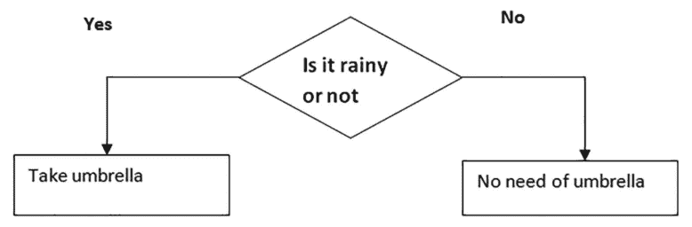

图6.7 示例决策树。

## 6.4 决策树分类器

决策树属于非参数监督学习。决策树是最流行的分类和预测算法之一。它用于数据挖掘、运筹学和机器学习（ML）。决策树是一种树形结构的分类器。决策节点和叶节点是决策树中的两个节点。在决策节点上进行测试。叶节点代表类别标签。从根到叶的路径代表分类规则。决策树是一种类似流程图的结构。在决策树的每个节点上进行测试，分支代表测试的结果。最后一个节点或叶节点代表类别标签。从根节点到叶节点的路径代表分类规则。决策树的目标是从数据集中创建一个决策模型，通过使用简单的决策规则来预测目标变量的值。决策树是决策的可视化表示。真实数据具有许多特征（例如，在鸢尾花中，特征是花瓣的宽度和长度）。这些特征在决策树中被清晰地表示出来。使用决策树可以很容易地识别特征之间的关系。使用决策树算法可以高效地构建决策树。

决策树问题可以从起始节点（即根节点）解决到结束节点。图6.7显示了示例决策树。决策树可用于分类或回归。决策树非常容易理解，因为它具有图形表示。

决策树是基于属性构建的。图6.7的属性是气候是否多雨。根据该属性构建决策树。本节详细解释了使用决策树算法时属性的选择。决策树的性能受到过拟合和欠拟合问题的影响。本节也讨论了解决这些问题的详细过程。如今，决策树在医疗、图书馆管理、医疗保健管理、商业管理、银行业等领域发挥着至关重要的作用；这些应用将被详细讨论。

### 6.4.1 决策树中的重要术语

图6.8代表一个简单的决策树。决策树中使用的各种术语如下：

- **根节点：** 树的整个总体由根节点表示。根节点被分成两个或更多节点。
- **决策节点：** 进一步细分为子节点的子节点称为决策节点。
- **分裂：** 将一个节点分裂成两个或更多节点的过程。
- **叶/终端节点：** 此节点也称为终端节点。不再分裂的节点称为终端节点。
- **剪枝：** 移除决策树中的子节点称为剪枝。

## 6.4.2 决策树示例

图6.9中的决策树展示了用于汽车选择的示例决策树。从该决策树中，我们可以轻松识别出高油耗（即，重量大的汽车和马力>86的轻型汽车）的汽车被选中用于购买。

**分支/子树：** 整棵树的一个子部分称为分支或子树。
**父节点/子节点：** 一个分裂成子节点的节点称为父节点。一个子节点称为子节点。
**信息增益：** 无法用于做功的能量量或系统无序程度的度量。

$$E(s) = \sum_{i=1}^{c} P \log P$$ (6.16)

其中
$s$ 是训练数据集
$c$ 是目标类别的数量
$P$ 是属于目标类别的训练数据的比例

图6.10中的决策树代表了是否打网球的决策。在根节点检查气候状况。气候可能是晴天、雨天和阴天。网球运动员可以选择叶节点为“是”的来打网球。表6.6代表了打网球的条件。

表6.6 天气预报数据

| 属性 | 条件 |
| :--- | :--- |
| 是 | 阴天<br>晴天且湿度高<br>雨天且风大 |
| 否 | 晴天且湿度低<br>雨天且风小 |

## 6.4.3 示例决策树

让我们考虑一个为贷款审批创建决策树的简单例子，如图6.11所示。首先，数据在根节点根据就业状况（即，已就业或未就业）被分成两部分。

**未就业者的决策树分类：** 如果申请人未就业，决策树进入节点A。然后，数据根据信用评分（即，高或低）进一步划分。信用评分高的申请人的贷款被批准。

**已就业者的决策树分类：** 如果申请人已就业，决策树进入节点B。然后，数据根据收入（即，高或低）进一步划分。收入高的申请人的贷款被批准。

## 6.4.4 决策树形成

让我们考虑一个具有四个属性的数据集，即A1、A2、A3和A4。假设决策树从属性A1（即，根节点）开始。数据在根节点根据属性A1被分成两部分。数据d1代表满足属性A1的数据。数据d2代表不满足属性A1的数据，如图6.12所示。

**数据d1：** d1中的所有数据都属于同一类别。因此它成为一个叶节点。
**数据d2：** 数据d2属于不同的类别。因此数据根据属性A3进一步划分。d3代表满足条件A3的数据。d4代表不满足条件A3的数据。

**数据d3：** 数据d3属于不同的类别。因此数据根据属性A4进一步划分。d5代表满足属性A4的数据，d6代表不满足条件A4的数据。
**数据d5、d6和d3：** d5、d6和d3中的数据属于同一类别。因此这些数据属于一个叶节点。

## 6.4.5 用于决策树的算法

具有许多属性（即，银行贷款基于就业状况和工资等属性发放）的数据集的根节点通过以下算法计算：

1.  CART 4.5
2.  ID3
3.  C 4.5

在ID3算法中，信息增益用于选择根属性。计算每个属性的信息增益，并选择信息增益高的属性作为根节点。在C 4.5算法中，增益信息用于计算根属性。选择增益比最大的属性作为根节点。CART 4.5算法使用基尼指数来识别根节点的属性。选择基尼指数低的属性作为根节点。

| 序号 | 算法 | 参数 | 最大/最小 |
|---|---|---|---|
| 1 | ID3算法 | 信息增益 | 最大 |
| 2 | C 4.5 | 增益指数 | 最大 |
| 3 | CART | 基尼指数 | 最小 |

### 6.4.5.1 ID3算法

如果决策树具有多个属性，则可以使用熵和信息增益来选择根节点属性。
**熵：** 熵是无序程度的度量。对于只有正值或负值的样本，熵很小。对于一半正值或一半负值的样本，熵很高。熵被定义为编码关于样本S的确定性和不确定性的信息的平均最优比特数。
**信息增益：** 增益是不确定性减少的度量。具有不同类别的样本信息增益较少。信息增益用熵表示。
设S为训练样本，$p+$为正样本数，$p-$为负样本数。则样本熵如图6.13所示。

$$Entropy(S) = p_+ (-\log_2 p_+) + p_- (-\log_2 p_-)$$
$$= - p_+ (\log_2 p_+) - p_-$$

样本关于属性a的信息增益为

$$Gain(S, A) = Entropy(s) - \sum \frac{S_v}{S} entropy(s_v)$$

### 6.4.5.2 C 4.5算法

C 4.5算法用于生成决策树，由Ross Quinlan开发。它是ID3算法的扩展。使用C 4.5开发的决策树用于分类；它被称为统计分类器。数据通过使用增益比进行划分。增益比最高的属性用作根节点。C 4.5与ID3算法类似，但此外，该算法还应用了归一化。

增益比 = 属性的增益/Splitinfo(A)。

Splitinfo(A) = $\sum_{j} \frac{D_j}{D} \log_2 \left( \frac{D_j}{D} \right)$ (6.19)

### 6.4.5.3 CART算法

CART代表分类和回归树算法。Breiman于1984年发现了该算法。它是一个简单的二叉树，其中一棵树有一个根节点和两个子节点。该算法可用于分类和回归问题。分类通过使用基尼指数完成。基尼指数代表每个类别的概率的平方。

基尼指数 = $1 - \sum_{k=0}^{n} p^2$ (6.20)

其中 $n$ 代表概率的数量。

## 6.4.6 过拟合与欠拟合

过拟合是学习过程与所有训练数据完全匹配的现象。结果，模型在训练数据上的准确性高，而在未训练数据上的准确性低。当决策树被设计为完美拟合训练数据集中的所有样本时，决策树中会发生过拟合（图6.14）。当训练模型未能捕捉到基本模式时，就会发生欠拟合。欠拟合（图6.14）正在破坏我们机器学习模型的准确性。

### 6.4.6.1 过拟合

- 过拟合是系统使用整个训练数据进行学习的场景。
- 它导致对数据的不准确预测。
- 过拟合可以通过使用剪枝（即，在不降低准确性的情况下从叶节点移除决策节点）来解决。

### 6.4.6.2 欠拟合

- 欠拟合模型不是一个合适的模型，它将导致在训练数据上表现不佳。

更多的数据划分将导致更大的决策树。更大的决策树具有更低的错误率。过拟合导致在训练数据上错误率高，而在测试数据上错误率低。在训练数据上准确性高，但在测试数据上准确性低，如图6.15所示。过拟合由于以下条件发生：

- 由于数据中的噪声
- 数据不足

由于噪声
在图6.16中，噪声点出现在训练数据中。系统在训练时因噪声点而过拟合。这将在测试数据中产生“数据不足”的错误。
上述训练样本有两个类别（一个代表圆形，另一个代表星形）。如图6.17所示，底部属于星形分类的数据较少。这导致了错误分类。

## 6.4.6.3 通过剪枝避免过拟合

可以通过以下方法消除过拟合：

- 预剪枝
- 后剪枝

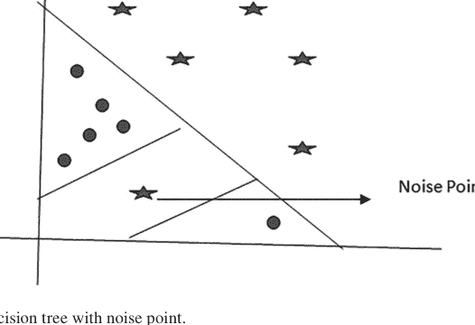

图6.16 带有噪声点的决策树。

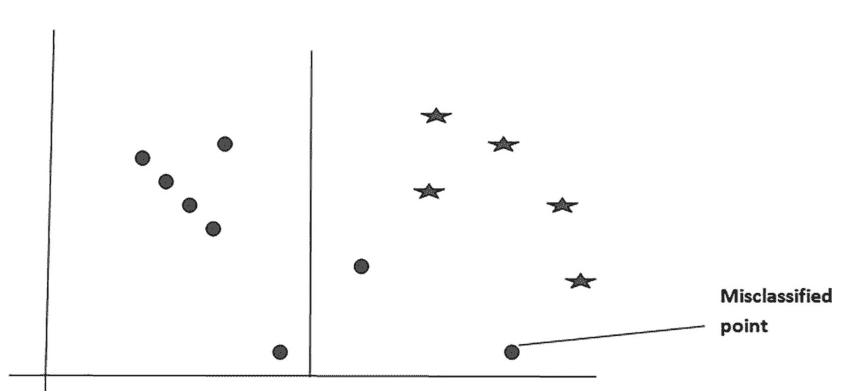

图6.17 数据较少的决策树。

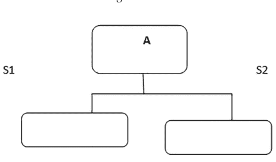

图6.18 在S1阶段进行预剪枝。

### 6.4.6.3.1 预剪枝

这是在决策树生长过程中进行剪枝的过程。当增益为负或正效益值较低时，停止树的生长。它用于在早期阶段阻止过拟合。
考虑图6.18，根节点基于属性A进行划分。计算决策树在S1和S2处的增益。如图6.18所示，由于增益值较低或为负，决策树将在S1和S2处停止。

### 6.4.6.3.2 后剪枝

后剪枝也称为反向剪枝（图6.19）。首先，构建一个完整的决策树。然后，通过移除最不重要的分支来提高树的准确性。在后剪枝中，首先让决策树完全生长。使用几种启发式方法来删除子节点。在整个树（即误差(T)）和ST1点（即误差(st1)）上测量误差。如果ST1处的误差小于误差T，那么我们可以移除该子树。剪枝可以通过使用减少误差剪枝、最小误差剪枝和基于代价的剪枝来完成。减少误差剪枝是最简单的剪枝算法。
在这种方法中，在整个树（即误差(T)）和ST1点（即误差(st1)）上测量误差。如果ST1处的误差小于误差T，那么我们可以移除该子树。在最小误差剪枝中，通过剪枝子树和不剪枝子树来计算每个非叶节点的错误率。如果剪枝后子树的错误率较高，则保留该子节点。在基于代价的剪枝中，也考虑误差和代价来剪枝数据。

## 6.4.7 优缺点

### 6.4.7.1 优点

- **可解释性**：易于理解。它可以处理分类数据和数值数据
- 在数据探索和处理缺失数据点方面很有用
- 非参数方法
- 捕捉非线性关系
- 简单的基于规则的方法
- 算法工作不需要显式的特征缩放
- 对于探索大型数据集以挑选出有用的变量非常有用。
- 数据准备工作所需的工作量很少。

### 6.4.7.2 缺点

- 高度复杂的决策树具有较低的偏差。
- 过拟合是决策树的主要问题
- 它不适用于连续变量
- 代价高

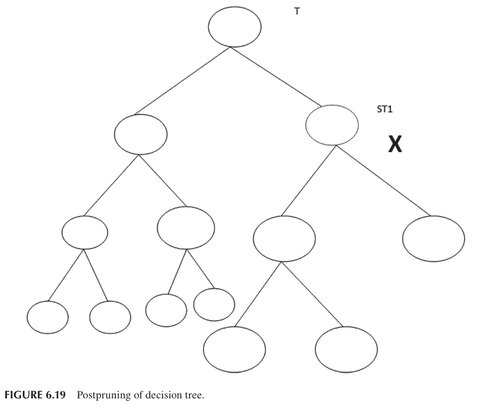

图6.19 决策树的后剪枝。

## 6.4.8 决策树示例

### 示例6.1：用于鸢尾花分类的简单决策树

该问题描述了使用鸢尾花创建一个非常简单的决策树。鸢尾花根据花瓣长度进行分类。花瓣长度 >2.45 的鸢尾花属于 versi-Setsoa，<1.75 的属于 Versicolor。花瓣长度在 2.45 和 1.75 之间的鸢尾花属于 Verginica。

根据表6.7中的数据为鸢尾花绘制决策树。鸢尾花的花瓣长度因花而异。取花瓣长度作为创建决策树的属性。

考虑图6.20所示的鸢尾花分类决策树。三种类型的鸢尾花分别是 iris Versisetosa、Versicolor 和 Virginica。在根节点处，数据根据花瓣宽度（即花瓣宽度长度 >2.45 cm）分为两部分。花瓣宽度 >2.45 cm 的属于 Versisetosa。同样在B点，数据根据花瓣宽度进一步划分。花瓣宽度 >1.75 的被分类为 Versicolor，花瓣宽度 <1.75 的被分类为 Virginica。

表6.7
鸢尾花数据

| 花 | 花瓣长度 |
| :--- | :--- |
| Versisetosa | >2.45 cm |
| Versicolor | <1.75 cm |
| Verginica | 在2.45和1.75之间 |

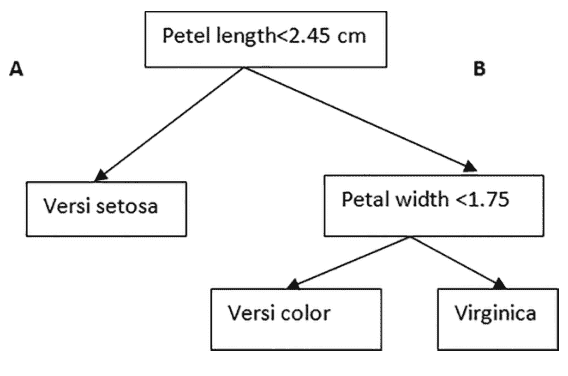

图6.20 用于鸢尾花分类的决策树。

### 示例6.2：使用决策树进行石油钻探

假设你拥有一块土地，你认为地下可能有石油。如果钻探，只有15%的机会发现石油，但回报是50,000美元。因此，钻探成本为15,000美元。为上述问题开发一个决策树。

**根节点：** 在上述问题中，根节点决定土地是否有石油。根节点有两个概率。土地可能有石油，也可能没有。这被称为分割点。给定数据在分割点处分为两部分。土地有石油，土地没有石油，如图6.21所示。表6.8表示钻探有石油土地的利润。

钻探土地获得的利润 = 50,000 – 15,000 = 35,000
不钻探土地获得的利润 = 0

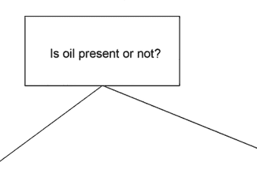

图6.21 从根节点开始的石油决策树。

表6.8
钻探有石油的土地

| 状态 | 成本 |
| :--- | :--- |
| 土地被钻探 | 成本 = $15,000 |
| 土地未被钻探 | 成本 = 0 |

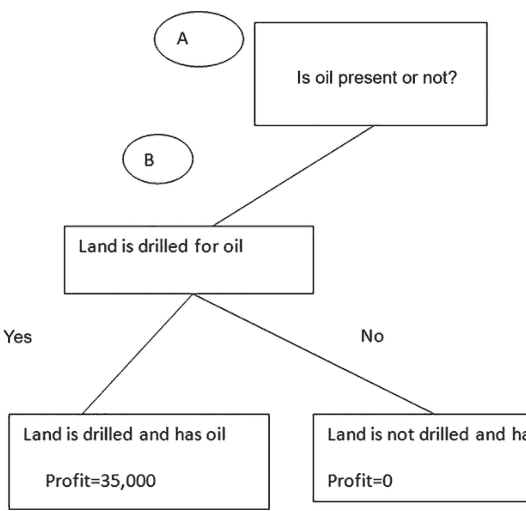

图6.22 从根节点到叶节点的石油决策树。

表6.9
钻探无石油的土地

| 状态 | 成本 |
| :--- | :--- |
| 土地被钻探 | $15,000 |
| 土地未被钻探 | $0 |

图6.22表示钻探有石油土地的决策树。
表6.9表示钻探无石油土地的成本。

钻探土地的损失 = -15,000
不钻探土地的损失 = 0

图6.23表示钻探土地的简单决策树。通过使用决策树，我们可以推断出钻探土地获取石油的盈亏。

### 示例6.3：购买笔记本电脑的决策树

为以下问题创建一个决策树。表6.10给出了购买笔记本电脑的详细信息。

## 互信息的计算

两个随机变量X和Y之间的互信息由下式给出

$I(X;Y) = H(X) - H(X|Y)$

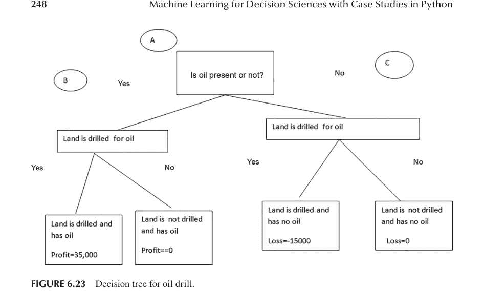

图6.23 石油钻探决策树。

表6.10
购买笔记本电脑的数据

| RID | 年龄 | 收入 | 类别 |
|---|---|---|---|
| 1 | ≤30 | 高 | 否 |
| 2 | ≤30 | 高 | 否 |
| 3 | 31 ... 40 | 高 | 是 |
| 4 | >40 | 中 | 是 |
| 5 | >40 | 低 | 是 |
| 6 | >40 | 低 | 否 |
| 7 | 31 ... 40 | 低 | 是 |

其中
$I(X; Y)$ 是 $X$ 和 $Y$ 的互信息
$H(X)$ 是 $X$ 的熵
$H (X|Y)$ 是给定 $Y$ 时 $X$ 的条件熵。

两个类别的互信息 $= -4 / 7 \log_2 (4 / 7) - 3 / 7 \log_2 (3 / 7)$
$= 4 / 7\log_2 (0.571) - 3 / 7\log_2 (0.48)$
$= 4 / 7(0.808) + 3 / 7(1.05)$
$= 0.461 + 0.45$
$= 0.911$

## 基于年龄的增益计算

| RID | 年龄 | 类别 |
|---|---|---|
| 1 | ≤30 | 否 |
| 2 | ≤30 | 是 |
| 3 | 31 ... 40 | 是 |
| 4 | >40 | 是 |
| 5 | >40 | 是 |
| 6 | >40 | 否 |
| 7 | 31 ... 40 | 是 |

对于年龄，我们有两个值 ≤ 30（1 – 否，1 – 是），两个值 31 ... 40（2 – 是，0 – 否），以及三个值 > 40（2 – 是，1 – 否）。

熵 = 2 / 7(0) + 2 / 7(0) + 3 / 7(-2 / 7 log₂(2 / 7) – 1 / 7 log₂(1 / 7))
= 3 / 7(2 / 7(-1.83) + 1 / 7(-2.81))
= 3 / 7(0.5228 + 0.4014)
= 0.3961

增益 = 0.911 – 0.391
= 0.52

## 基于收入的计算

| RID | 收入 | 类别 |
|---|---|---|
| 1 | 高 | 否 |
| 2 | 高 | 否 |
| 3 | 高 | 是 |
| 4 | 中 | 是 |
| 5 | 低 | 是 |
| 6 | 低 | 否 |
| 7 | 低 | 是 |

对于收入，我们有三个值 高（2 – 否，1 – 是），一个值 中（1 – 是，0 – 否），以及三个值 低（2 – 是，1 – 否）。

熵 = 3 / 7(-1 / 7 log₂(1 / 7) – (2 / 7) log₂(2 / 7))
+ 0 + 3 / 7(-2 / 7 log₂(-2 / 7) – 1 / 7 log₂(-1 / 7))
= 0.7922

增益 = 0.911 – 0.7922
= 0.1188

由于年龄具有最高的增益，数据根据年龄因素进行划分，如图6.24所示。

**决策科学机器学习及Python案例研究**

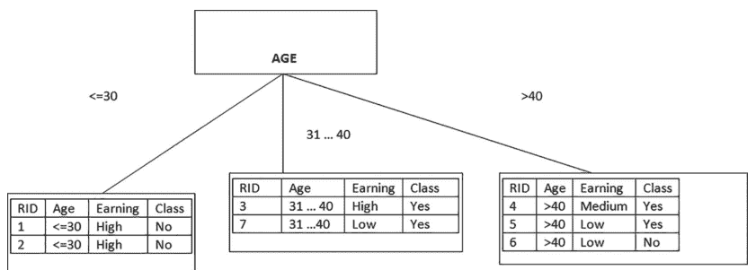

图 6.24 从根节点开始的笔记本电脑购买决策树。

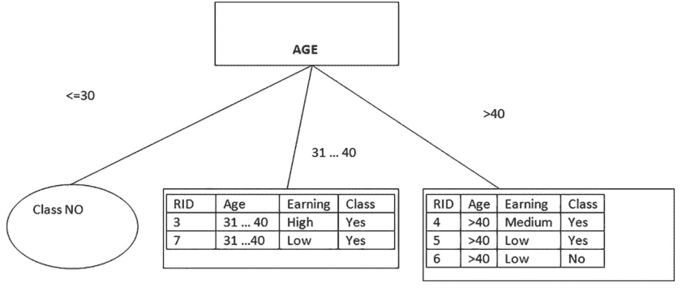

图 6.25 从根节点到叶节点的笔记本电脑购买决策树。

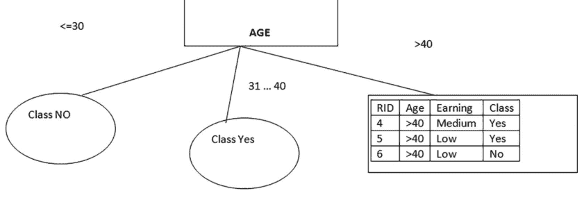

图 6.26 从根节点到叶节点的笔记本电脑购买决策树。

在上述决策图中，年龄≤30属于“否”类别，如图6.25所示。同样，年龄31-40属于“是”类别，如图6.26所示。年龄>40可以根据收入细分为两类。使用上述决策树，我们可以推断购买笔记本电脑的概率，如图6.27所示。

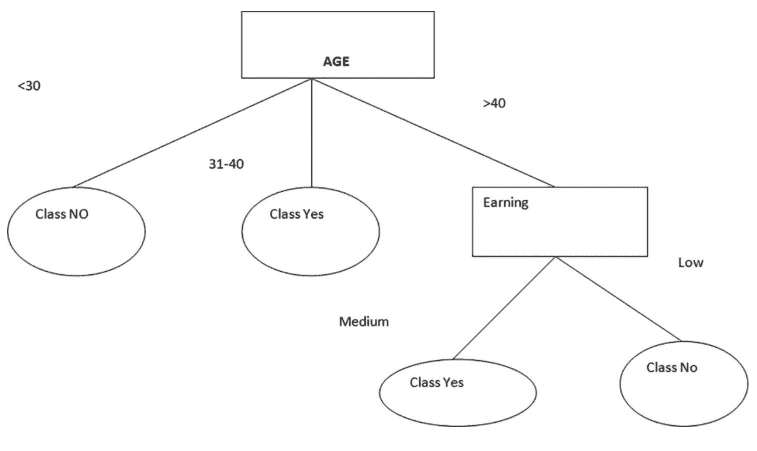

图 6.27 从根节点到叶节点的笔记本电脑购买决策树。

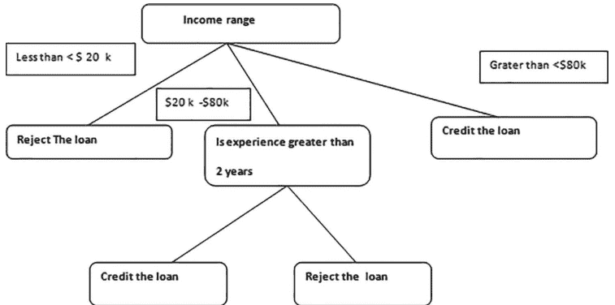

图 6.28 贷款审批决策树。

## 示例 6.4：一个简单的贷款审批决策树

为贷款审批创建一个决策树。

- 1. 如果收入低于2万美元，则无需批准贷款。
- 2. 如果收入在2万至8万美元之间，且工作经验超过2年，则批准贷款。
- 3. 如果收入超过8万美元，则批准贷款。

根据收入范围构建决策树。收入低于2万美元的申请被拒绝，收入超过8万美元的申请获得贷款批准。收入在2万至8万美元之间的申请人则根据工作经验详情进一步划分。从图6.28所示的决策树可以看出，工作经验超过2年且收入在2万至8万美元之间的人，以及收入超过8万美元的人，其贷款申请都会被批准。

## 示例 6.5：计算给定样本的熵

| 气候 | 温度 | 湿度 | 是否进行 |
| :--- | :--- | :--- | :--- |
| 晴朗 | 炎热 | 高 | 否 |
| 雨天 | 温和 | 正常 | 是 |
| 晴朗 | 温和 | 正常 | 是 |
| 雨天 | 温和 | 高 | 否 |
| 晴朗 | 炎热 | 正常 | 是 |
| 雨天 | 凉爽 | 正常 | 否 |

数据集的熵是“是”和“否”各自熵的总和。
天气数据中有四个“是”和两个“否”。
**天气数据集的熵**：

$$H(s) = \sum -p(c) \log_2 p(c)$$
$$= 0.3933 + 0.523$$
$$= 0.9163$$
$$P \text{ yes} = (-4/6) \log_2(4/6) = -(0.66)(-0.599) = 0.3933$$
$$P \text{ no} = (-2/6) \log_2(2/6) = 0.333 \times 1.584 = 0.523$$

## 示例 6.6：为表6.11中的数据构建决策树

有五个正样本和五个负样本
$$熵 = (-5/10) \log 2(5/10) + (-5/10) \log 2(5/10) = 1$$
基于年龄的增益计算结果如表6.12所示。

### 表 6.11
正负样本数据

| 年龄 | 竞争 | 类型 | 利润 |
| :--- | :--- | :--- | :--- |
| 老 | 是 | 软件 | 下降 |
| 老 | 否 | 软件 | 下降 |
| 老 | 否 | 硬件 | 下降 |
| 中 | 是 | 软件 | 下降 |
| 中 | 是 | 硬件 | 下降 |
| 中 | 否 | 硬件 | 上升 |
| 中 | 否 | 软件 | 上升 |
| 新 | 是 | 软件 | 上升 |
| 新 | 否 | 硬件 | 上升 |
| 新 | 否 | 软件 | 上升 |

熵(老) = 3/3 log₂(3/3) = 0

熵(中) = 2/4 log₂(2/4) + (2/4) log₂(2/4) = 1

熵(新) = 3/3 log(3/3) = 0

熵(年龄) = 3/10 * 0 + 4/10 * 1 + 3/10 * 0 = 0.4

增益 = 类别熵 – 熵(年龄) = 1 – 0.4 = 0.6

基于竞争的计算结果如表6.13所示。

熵(是) = 1/4 log₂(1/4) + 3/4 log₂(3/4) = 0.81127

熵(否) = 4/6 log₂(4/6) + 2/6 log₂(2/6) = 0.918295

熵(竞争) = 4/10 * 0.81127 + 6/10(0.9182) = 0.8745

增益 = 类别熵 – 熵(竞争) = 1 – 0.8745 = 0.1245

基于利润的计算结果如表6.14所示。

熵(软件) = 1/2 log₂(1/2) + 1/2 log₂(1/2) = 1

熵(硬件) = 1/2 log₂(1/2) + 1/2 log₂(1/2) = 1

熵(类型) = 2/4(1) + 2/4(1) = 4/4 = 1

增益 = 类别熵 – 熵(类型) = 1 – 1 = 0

### 表 6.12
基于年龄的增益计算

| 年龄 | 正样本 | 负样本 | I(P_i, N_i) |
|---|---|---|---|
| 老 | 0 | 3 | 0 |
| 中 | 2 | 2 | 1 |
| 新 | 3 | 0 | 0 |

### 表 6.13
基于竞争的计算

| 竞争 | 正样本 | 负样本 | I(P_i, N_i) |
|---|---|---|---|
| 是 | 1 | 3 | 0.81127 |
| 否 | 4 | 2 | 0.918295 |

### 表 6.14
基于利润的计算

| 类型 | 正样本 | 负样本 | I(P_i, N_i) |
|---|---|---|---|
| 软件 | 1 | 1 | 1 |
| 硬件 | 1 | 1 | 1 |

### 表 6.15
年龄与利润

| 年龄 | 利润 |
|---|---|
| 老 | 下降 |
| 老 | 下降 |
| 老 | 下降 |
| 中 | 下降 |
| 中 | 下降 |
| 中 | 上升 |
| 中 | 上升 |
| 新 | 上升 |
| 新 | 上升 |
| 新 | 上升 |

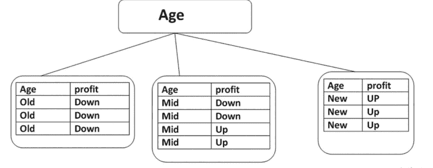

图 6.29 基于属性“年龄”的决策树。

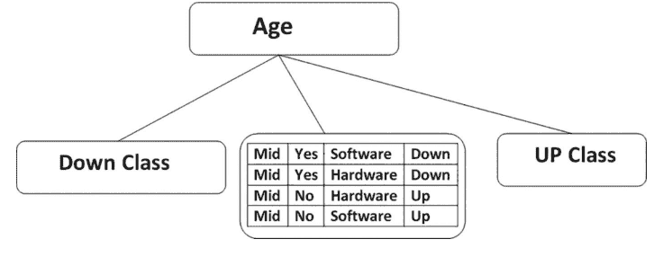

图 6.30 带有叶节点的决策树。

表6.15显示年龄具有较高的信息增益。这是因为决策树从年龄属性开始，如图6.29所示。
在上述树中，“老”和“新”参数都有负样本。因此，它表示为叶节点，如图6.30所示。
然后，数据根据竞争情况进一步划分，如图6.31所示。

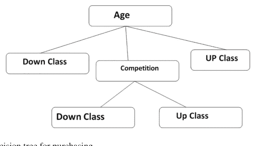

图 6.31 购买决策树。

## 示例 6.7：玩具产业

ABC玩具私人有限公司正在考虑在其现有产品线中增加一款新玩具。有三种备选行动方案。

- a. 加班以满足新玩具的需求。加班费用估计为每月2万卢比。
- b. 安装新设备，预计每月固定费用为8万卢比。
- c. 以每月3.5万卢比的费率租赁（租用）一台机器。

与上述三种方案相关的可变成本分别为每件玩具9卢比、7卢比和8卢比。玩具的单位价格与制造方案无关，固定为15卢比。玩具的预期需求如下。

- 10,000件，概率为0.5
- 20,000件，概率为0.3
- 50,000件，概率为0.2

公司应采用哪种方案来制造玩具？

### 给定数据

ABC玩具公司决定增加一个新产品。他们有三种备选方案。

- 1. 如果工人加班，他们每月获得2万卢比报酬，每件玩具的可变成本为9卢比
- 2. 如果安装新设备，他们每月需支付8万卢比，每件玩具7卢比
- 3. 以每月3.5万卢比的费率租赁机器，每件玩具8卢比

玩具的销售价格=15卢比

### 预期需求

- 10,000件，概率为0.5
- 20,000件，概率为0.3
- 50,000件，概率为0.2

从决策节点出发有三种备选方案，如图6.32所示。每个备选节点有三种需求，如表6.16所示。

```
利润 = 10,000 × 15 – 10,000 × 9 – 20,000 = 150,000 – 90,000 – 20,000
= 60,000 – 20,000 = 40,000
```

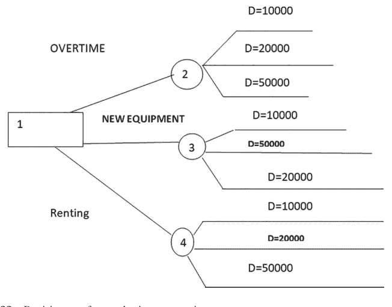

图 6.32 购买新设备的决策树。

### 表 6.16
备选方案及其需求

| 备选方案 | 单位价格 | 单位可变成本 | 月利润 (10,000件) | 月利润 (20,000件) | 月利润 (50,000件) |
|---|---|---|---|---|---|
| 加班 | 15 | 9 | 40,000 | 100,000 | 280,000 |
| 新设备 | 15 | 7 | 0 | 80,000 | 320,000 |
| 租赁 | 15 | 8 | 35,000 | 105,000 | 315,000 |

带有利润值的购买新设备决策树如图6.33所示。

在点2 = 0.5 × 40,000 + 0.3 × 100,000 + 0.2 × 280,000 = 106,000

在点3 = 0.5 × 0 + 0.3 × 80,000 + 0.2 × 320,000 = 88,000

在点4 = 0.5 × 35,000 + 0.3 × 105,000 + 0.2 × 315,000 = 112,000

最终设备采购的决策树如图6.34所示。

## 示例 6.8：为表6.17中的数据构建决策树

决策树中的不同节点如图6.35所示。
首先，我们需要绘制一个决策节点，如图6.36所示。
股票、共同基金和债券的结果是增长和下降。让我们考虑股票，增长概率为0.4，下降概率为0.6。收益为70和-13。决策树如图6.37所示。
同样，我们需要为其他共同基金和债券构建决策树。股票和共同基金的决策树如图6.38所示，股票和债券的决策树如图6.39所示。

## 监督学习：分类

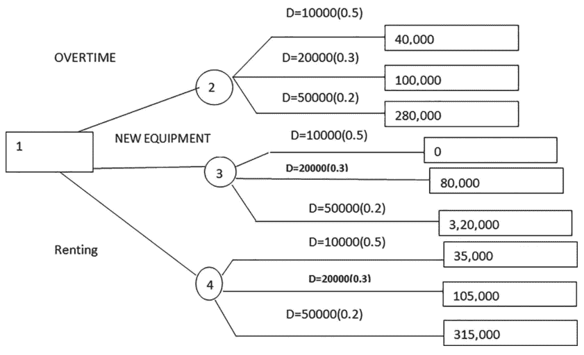

图 6.33 带有利润值的购买新设备决策树。

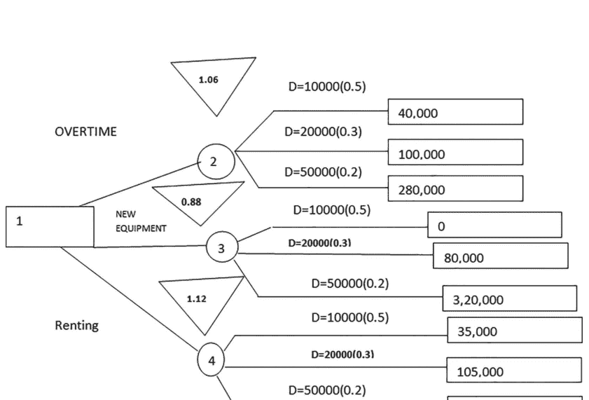

图 6.34 最终购买设备的决策树。

### 表 6.17 增长/衰退数据

| | 增长 | 衰退 |
|---|---|---|
| 股票 | 70 | -13 |
| 共同基金 | 53 | -5 |
| 债券 | 20 | 20 |
| 概率 | 0.4 | 0.6 |

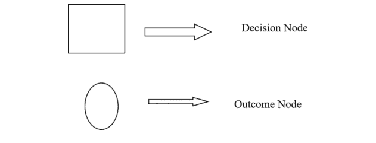

图 6.35 决策树符号。


图 6.36 决策树根节点。

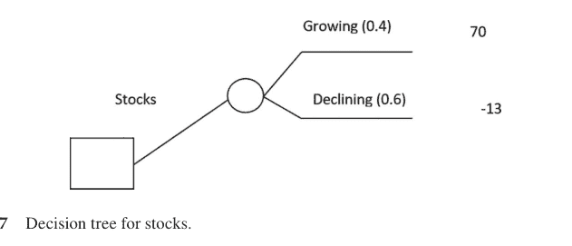

图 6.37 股票决策树。

股票决策树的期望值 = 0.4 × 70 + 0.6 × (−13) = 20.2
共同基金决策树的期望值 = 53 × 0.4 + 0.6 × (−5) = 18.2
由于债券的值为20，无需计算。期望值见表6.18。
在这些值中，股票的值最高。因此，决策应基于股票进行。

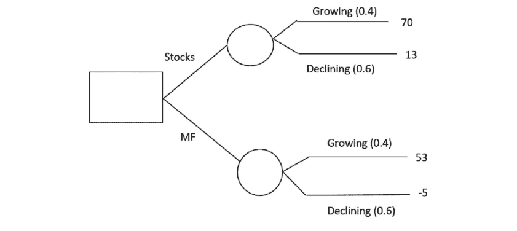

图 6.38 股票和共同基金决策树。

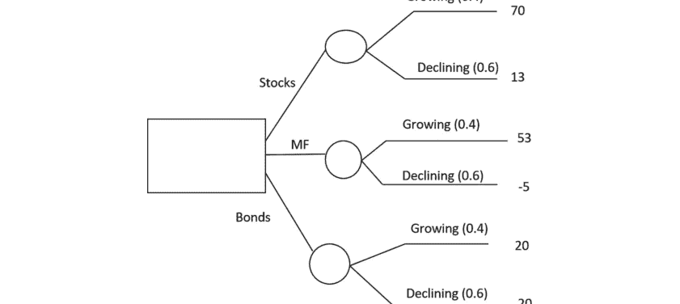

图 6.39 股票、共同基金和债券决策树。

### 表 6.18 增长/衰退数据的期望结果

| 序号 | 公司 | 期望值 |
|---|---|---|
| 1 | 股票 | 20.2 |
| 2 | 共同基金 | 18.2 |
| 3 | 债券 | 20 |

### 示例 6.9：为表 6.19 中给定的数据构建决策树

手机生产的概率为：盈利0.60，亏损0.40。
有两种技术，A和B（图6.40）。因此有两种可能性（技术A和技术B）（图6.41）。
技术A（盈利）的收益为$400,000
技术A（亏损）的收益为$200,000

260 面向决策科学的机器学习及Python案例研究

### 表 6.19 手机生产数据

| | 手机阶段生产 |
|---|---|
| | 盈利 | 亏损 |
| 技术A | $400,000 | $200,000 |
| 技术B | $300,000 | $150,000 |

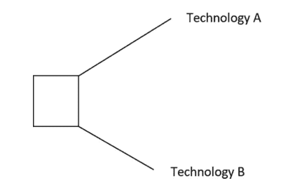

图 6.40 基于技术A和技术B的分类。

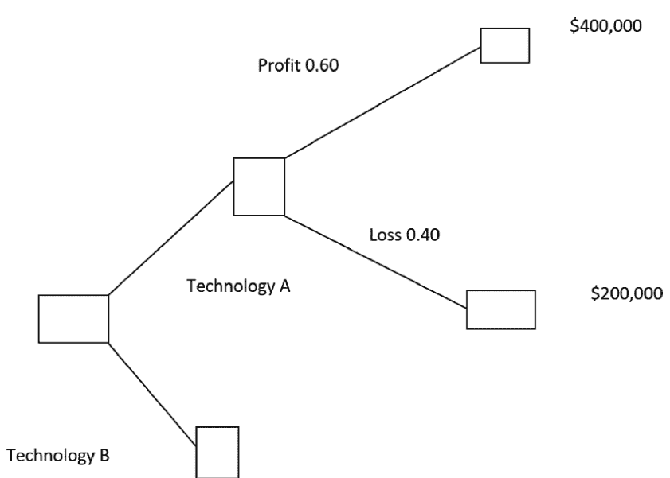

图 6.41 基于技术A和技术B分类的决策树。

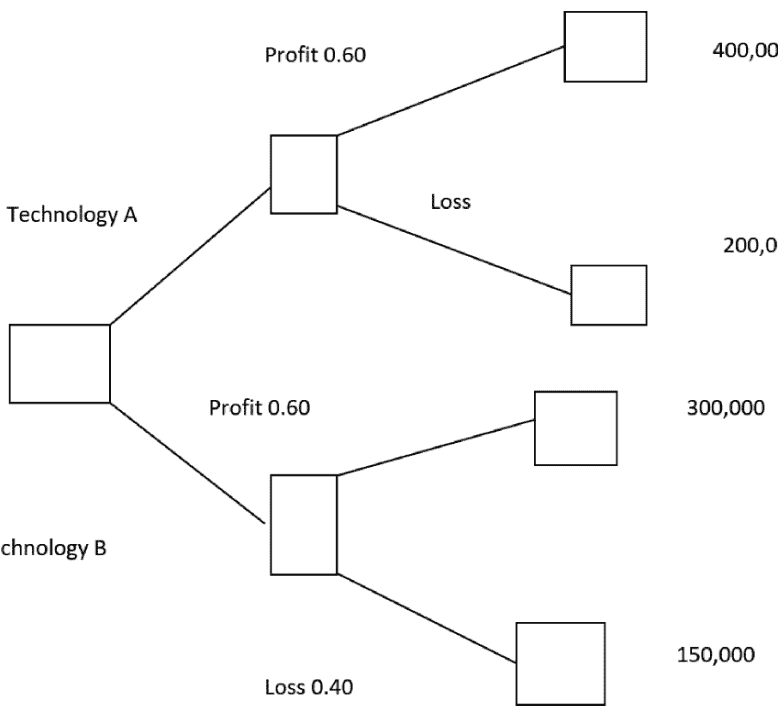

图 6.42 盈利与亏损的决策树。

### 技术A

| 盈利 | | 亏损 | |
|---|---|---|---|
| 金额 | 百分比 | 金额 | 百分比 |
| $400,000 | 0.60 | $200,000 | 0.40 |

盈利与亏损的决策树如图6.42所示。
技术B（盈利）的收益为$300,000
技术B（亏损）的收益为$150,000

### 技术B

| 盈利 | | 亏损 | |
|---|---|---|---|
| 金额 | 百分比 | 金额 | 百分比 |
| $300,000 | 0.60 | $150,000 | 0.40 |

技术A的期望值 = 400,000 × 0.60 + 200,000 × 0.40
= 240,000 + 80,000
= 320,000

技术B的期望值 = 300,000 × 0.60 + 150,000 × 0.40
= 180,000 + 60,000
= 240,000

**因此，我们得出结论，在这些组中，技术A的值最高。**

### 示例 6.10：购买新产品的决策

一家公司想要决定一个新产品。他们可以购买新产品，也可以自己生产新产品。产品可能有强劲的需求，也可能需求疲软。生产该产品的强劲需求为2500万美元，疲软需求为2000万美元亏损。购买该产品的强劲需求为500万美元，疲软需求为500万美元亏损。为上述问题绘制决策树。
根节点有两个概率：他们可以购买或生产新产品。相应的决策树如图6.43所示。
决策树根据强劲需求和疲软需求进一步划分，如图6.44所示。强劲需求的成本为2500万美元，疲软需求的成本为-2000万美元。
购买的强劲需求成本为500万美元，疲软需求成本为-500万美元，如图6.45所示。

生产产品的期望值 = (25 × 0.75) – 20(0.20)
= 18.75 – 4
= 14.75

购买产品的期望值 = (0.75 × 5) – (5 × 0.20)
= 3.75 – 1
= 2.75

### 6.4.9 使用决策树进行回归

决策树回归提取对象的特征并训练模型以预测数据。最顶层的节点代表根节点，最终节点代表叶节点。决策节点有两个或更多子分支，代表要测试的值。回归树将预测该值。

考虑以下回归树示例。一家医药公司生产一种感冒药，他们必须确定药物的剂量。药物以不同剂量给药，并使用回归树预测其有效性。

使用线性回归难以解决图6.46中的数据。因此可以使用非回归树来解决。回归树分类使用数值完成，而在分类树中，数据使用真或假条件进行分类。上述决策树在低剂量和高剂量时有效性较低。中等剂量显示出良好的结果。回归树从剂量<14.5 mL开始。六个样本属于剂量<14.5 mL，它们具有4.2%的剂量有效性（图6.47）。

剂量值>29 mL具有2.5%的剂量有效性。中等剂量具有52.8%的有效性。剂量值>23.5 mL具有100%的剂量有效性。相应的决策树如图6.48所示。

回归树用于预测。在图6.49中，为鸢尾花构建了一个回归决策树。数据根据条件x1 ≥ 0.1973被划分到根节点。然后，数据进一步划分，直到达到叶节点。假设你想预测值0.71，它沿着路径遍历，最终达到值0.1106。

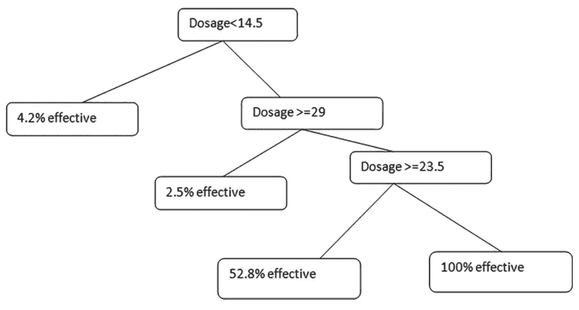

图 6.48 医疗数据的决策树。

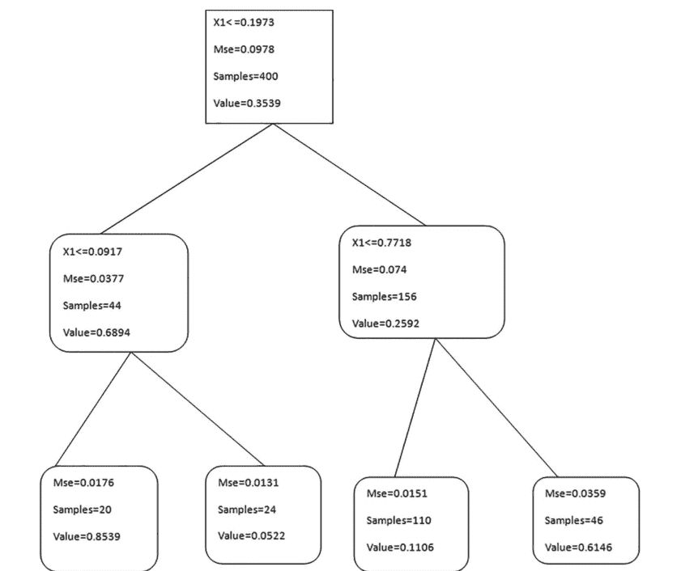

图 6.49 回归决策树。


图 6.50 决策树的应用。

### 6.4.10 现实世界的例子

决策树可用于解决现实世界的问题。本节介绍的一些决策树应用（图6.50）如下：

- 1. 预测图书馆图书使用情况
- 2. 肿瘤识别
- 3. 望远镜图像分类
- 4. 医疗保健管理
- 5. 故障诊断
- 6. 能源消耗
- 7. 欺诈性报表检测

### 6.4.10.1 预测图书馆图书

决策树用于预测图书馆图书的未来使用情况。哈佛学院图书馆使用此决策树算法将图书移至场外存储。图书馆存储空间有限，将需求低的图书存入远程存储。哈佛学院的大型图书馆面临空间不足的问题。因此，他们必须将旧书和不太有用的现代书籍移至远程存储。预期未来使用率较低的书籍必须移至远程存储。

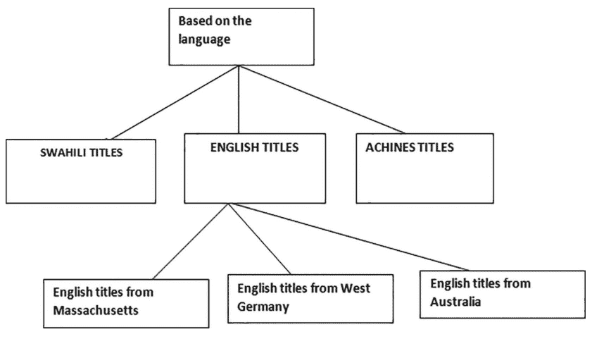

图 6.51 用于预测图书馆图书的简单决策树。

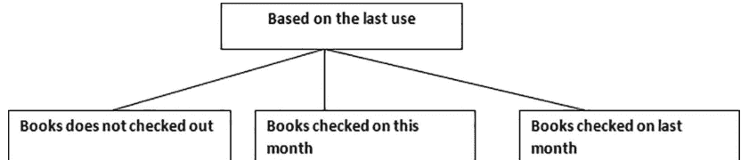

图 6.52 基于单一标准的决策树。

必须自动化综合统计以选择图书。选取了六个属性，例如借阅详情（过去和最近使用的次数）、出版日期、最近使用时间、语言、国家和字母前缀。根据EAR值，将图书移至场外存储。

图6.51代表简单的决策树。首先，树根据语言进行分类，然后根据出版国家进行分类。树也基于单一标准（即最近使用时间）构建，如图6.52所示。

图6.53代表基于Fussler和Simon选择策略的决策树分类。首先，基于根节点在语言属性之间划分以及根节点的子节点基于出版日期划分来构建决策树。

ID3算法用于设计决策树。首先，计算不同属性的信息增益，并选择增益最大的树来划分数据。然后，基于借阅情况创建节点。最后，通过剪枝评估平滑后的树。

### 6.4.10.2 肿瘤识别

决策树在医疗决策中起着重要作用。单个决策树、提升决策树和决策树森林都用于决策树。决策树分类为数据集分类提供了一种有效的方法。决策可以在训练和测试阶段进行。例如，乳腺癌是诊断最常见的癌症之一

**面向决策科学的机器学习：Python案例研究**

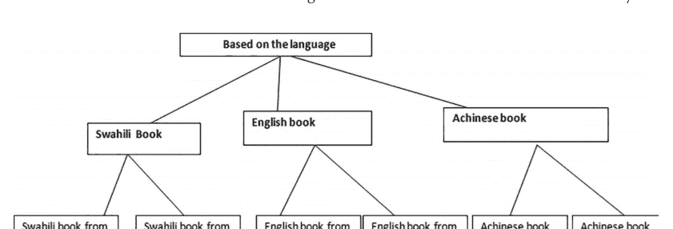

图6.53 基于Fussler和Simon选择策略的决策树。

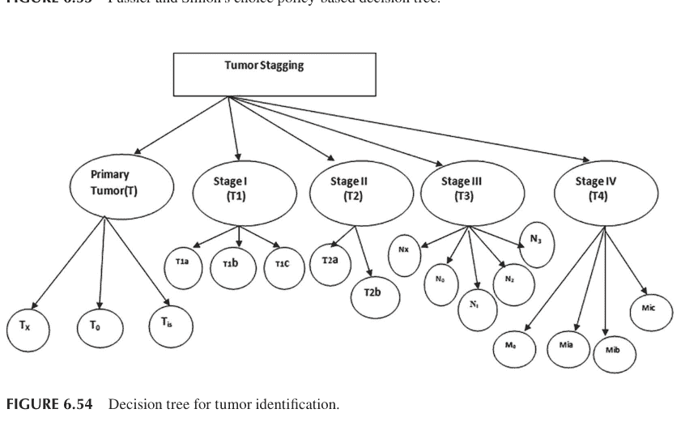

图6.54 用于肿瘤识别的决策树。

女性，早期乳腺癌诊断在降低死亡率方面起着重要作用。另一方面，乳腺X光检查有很高的漏诊癌症病例比例。这些病例可以通过使用决策支持系统来正确识别。

脑肿瘤是脑内异常细胞的聚集。它几乎可能发生在任何年龄的任何人身上。它甚至可能在不同的治疗阶段有所不同，但对每个患者的影响可能并不相同。MRI图像经过预处理以进行特征提取。首先，通过应用中值滤波技术引入噪声。接下来，使用幂律变换来增强图像。最后，将预处理后的图像输入决策树进行进一步分类。肿瘤可以通过以下特征进行识别，例如肿瘤分化程度、细胞密度、有丝分裂计数、年龄、位置和细胞类型。与其他分类方法相比，决策树方法能产生更高的准确率。

图6.54展示了肺部肿瘤的识别。如果肺部肿瘤<3厘米，则属于原发性肿瘤I期。肿瘤大小为3-5厘米属于II期肿瘤。肿瘤大小为5-7厘米属于III期肿瘤。肿瘤大小>7厘米属于IV期肿瘤。肿瘤根据长度进一步分类，如表6.20所示。

表6.20
肿瘤类型与长度

| 序号 | 肿瘤类型 | 描述 |
| :--- | :--- | :--- |
| 1 | T1a | <1厘米 |
| 2 | T1b | 1-2厘米 |
| 3 | T1C | 2-3厘米 |
| 4 | T2a | 3-4厘米 |
| 5 | T2b | 4-5厘米 |

### 6.4.10.3 望远镜图像分类

望远镜图像包括恒星、星系、宇宙射线、底片缺陷以及天空中的其他类型天体。决策树分类器用于识别望远镜图像中的宇宙射线撞击。决策树用于从望远镜图像中分类恒星和宇宙射线。从望远镜图像中提取特征，并使用决策树进行进一步分类。使用CART算法选择正确的属性。图6.55展示了用于望远镜图像分类的决策树。
$x_{20}$ 和 $x_{16}$ 是决策树的属性。该方法可达到95%的准确率。

### 6.4.10.4 商业管理

近年来，大多数公司都拥有自己的数据库。我们可以使用决策树从数据库中提取数据，因为数据可以根据领域进行提取。它也可用于欺诈检测或客户关系管理。客户关系管理用于调查访问在线服务的频率。数据的使用收集信息，相应的信息用于用户推荐。在线购物用户被平均分为两部分：频繁使用在线购物的用户和很少使用的用户。该模型还考虑了客户进行交易所需的时间、人力资源程度、产品价格以及产品需求的紧迫性。决策树在在线购物中取得了成功的结果。

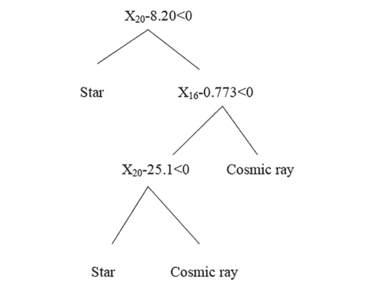

图6.55 用于望远镜图像分类的决策树。

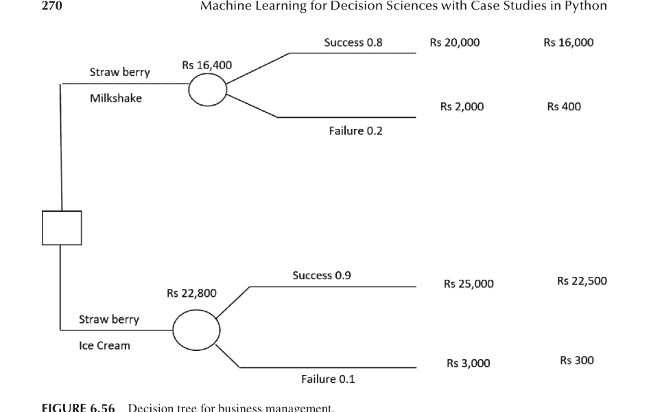

图6.56 用于商业管理的决策树。

表6.21
成功率与成本

| 序号 | 描述 | 比率 | 成本 |
|---|---|---|---|
| 1 | 草莓奶昔 - 成功 | 0.8 | 20,000 |
| 2 | 草莓奶昔 - 失败 | 0.2 | 2,000 |
| 3 | 草莓冰淇淋 - 成功 | 0.9 | 25,000 |
| 4 | 草莓冰淇淋 - 失败 | 0.1 | 3,000 |

图6.56中的决策树用于选择草莓奶昔或草莓冰淇淋业务。这两种业务的成功率、失败率和成本如表6.21所示。

草莓奶昔的总预估成本 = 0.8 × 20,000 + 0.2 × 2,000
= 16,000 + 400
= 16,400

草莓冰淇淋的总预估成本 = 0.9 × 25,000 + 0.1 × 3,000
= 22,500 + 300
= 22,800

在这两种估算中，可以证明生产草莓冰淇淋比生产草莓奶昔利润更高。

### 6.4.10.5 故障诊断

在输电线路上，应尽快检测、识别和排除故障。在电力传输线路安全中，错误检测和故障相位识别（故障分类）非常重要。使用在继电器点测量的电压和电流数据来识别和诊断线路中是否存在故障电阻的故障。将三相故障电流作为输入提供给决策树进行故障检测。在故障分类的情况下，将半周期的三相电流和零序电流样本作为决策树的输入，以对所有十种类型的故障进行分类。决策树（图6.57）为识别和分类电力系统中的缺陷提供了准确的结果。与SVM相比，DT还提供了更高的分类准确率。基于DT的方法在电力系统网络运行条件的广泛变化下得到了验证，因此可以应用于大型电力系统网络的在线故障检测。

### 6.4.10.6 医疗保健管理

决策树可用于医疗保健管理。数据挖掘用于从大型数据集中收集和查看易于解释的可视化信息。决策树的医疗用途包括诊断特定症状的医疗疾病。决策树识别的类别可以是独立的临床亚型或一种疾病。随着电子数据处理的出现，临床环境中定期跟踪的变量数量急剧增加。其中许多变量意义有限，因此可能不应包含在数据挖掘实验中。然而，许多重要的输入变量将用于决策树模型。图6.58展示了用于故障识别的决策树。

### 6.4.10.7 数据挖掘中的决策树

可以在分割图像的决策树上进行数据挖掘。图像分割是从图像中提取有用信息的过程。选择灰度值范围在180到240之间、局部变化>80且斜率变化>0.5的像素进行分割。例如，图6.59a中的图像使用决策树分割成图6.59b。

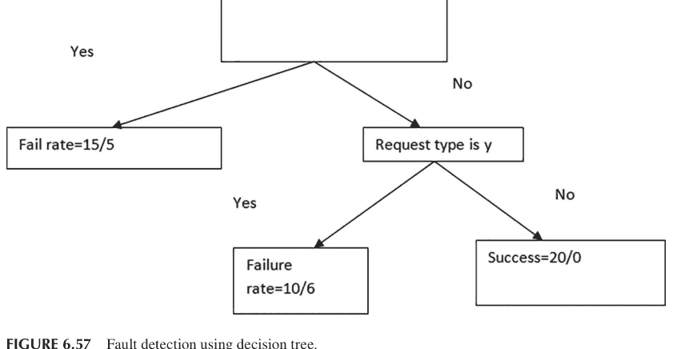

图6.57 使用决策树进行故障检测。

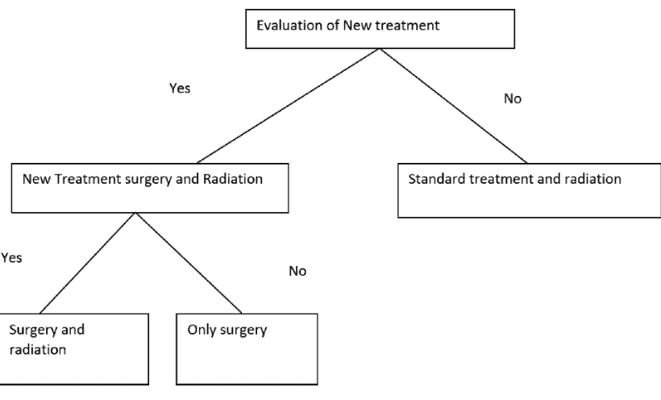

图6.58 决策树中的医疗保健管理。

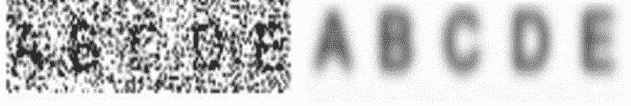

图6.59 分割数据噪声。

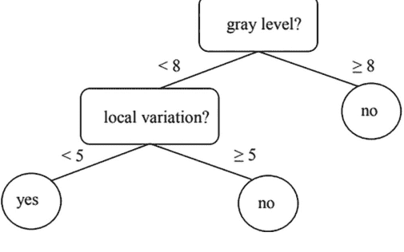

图6.60 分割数据噪声决策树。

通过检查灰度级别来识别外部轮廓，如图6.60所示。如果灰度级别大于八且局部变化大于五，则决策树的输出为“否”。

### 6.4.11 使用Python的决策树实践

决策树是广泛使用的监督模型，用于分类和回归任务。这些分类器在训练数据上构建一系列简单的if/else规则，通过这些规则预测目标值。决策树由于其结构简单，易于解释，因此可以可视化建模的树。

通过使用sklearn的export_graphviz函数，我们可以在Jupyter Notebook中显示树。在本演示中，我们将使用sklearn的wine数据集。

```
# Import packages for Decision Tree& GRAPHVIZ
from sklearn.tree import DecisionTreeClassifier, export_graphviz
from sklearn import tree
from sklearn.datasets import load_wine
from IPython.display import SVG  # Scalable Vector Graphics
from graphviz import Source
from IPython.display import display
```

```
# load Dataset
Data = load_write() ## Since the data set is part of the package; we can
directly load it
```

```
# The OUTPUT is shown below. Previewing gives all kinds of information about the dataset. #(Please note: the result contains actual data sample, Array information, Data set #Characteristics, Summary Statistics, Attributes Values to name a few. This will help the user to #understand the dataset.)
```

```
{'data': array([[1.423e+01
```

## 面向决策科学的机器学习：Python案例研究

| 特征 | 最小值 | 最大值 | 均值 | 标准差 |
| :--- | :--- | :--- | :--- | :--- |
| 酒精 | 11.0 | 14.8 | 13.0 | 0.8 |
| 苹果酸 | 0.74 | 5.80 | 2.34 | 1.12 |
| 灰分 | 1.36 | 3.23 | 2.36 | 0.27 |
| 灰分碱度 | 10.6 | 30.0 | 19.5 | 3.3 |
| 镁 | 70.0 | 162.0 | 99.7 | 14.3 |
| 总酚 | 0.98 | 3.88 | 2.29 | 0.63 |
| 类黄酮 | 0.34 | 5.08 | 2.03 | 1.00 |
| 非类黄酮酚 | 0.13 | 0.66 | 0.36 | 0.12 |
| 原花青素 | 0.41 | 3.58 | 1.59 | 0.57 |
| 色泽强度 | 1.3 | 13.0 | 5.1 | 2.3 |
| 色调 | 0.48 | 1.71 | 0.96 | 0.23 |
| 稀释酒的OD280/OD315 | 1.27 | 4.00 | 2.61 | 0.71 |
| 脯氨酸 | 278 | 1680 | 746 | 315 |

:缺失属性值：无
:类别分布：class_0 (59), class_1 (71), class_2 (48)
:创建者：R.A. Fisher
:捐赠者：Michael Marshall (MARSHALL%PLU@io.arc.nasa.gov)
:日期：1988年7月

这是UCI ML葡萄酒识别数据集的副本。
https://archive.ics.uci.edu/ml/machine-learning-databases/wine/wine.data

该数据是对意大利同一地区由三位不同种植者种植的葡萄酒进行化学分析的结果。对三种葡萄酒中发现的不同成分进行了十三项不同的测量。

原始所有者：
Forina, M. et al, PARVUS - An Extendible Package for Data Exploration, Classification and Correlation. Institute of Pharmaceutical and Food Analysis and Technologies, Via Brigata Salerno, 16147 Genoa, Italy.

引用：
Lichman, M. (2013). UCI Machine Learning Repository [http://archive.ics.uci.edu/ml]. Irvine, CA: University of California, School of Information and Computer Science.

.. topic:: 参考文献

(1) S. Aeberhard, D. Coomans and O. de Vel, Comparison of Classifiers in High Dimensional Settings, Tech. Rep. no. 92-02, (1992), Dept. of Computer Science and Dept. of Mathematics and Statistics, James Cook University of North Queensland. (Also submitted to Technometrics).

该数据与许多其他数据一起用于比较各种分类器。类别是可分的，尽管只有RDA达到了100%的正确分类率。
(RDA : 100%, QDA 99.4%, LDA 98.9%, 1NN 96.1% (z-transformed data))
(所有结果均使用留一法技术)

(2) S. Aeberhard, D. Coomans and O. de Vel, "THE CLASSIFICATION PERFORMANCE OF RDA" Tech. Rep. no. 92-01, (1992), Dept. of Computer Science and Dept. of Mathematics and Statistics, James Cook University of North Queensland. (Also submitted to Journal of Chemometrics).

'feature_names': ['alcohol', 'malic_acid', 'ash', 'alcalinity_of_ash', 'magnesium', 'total_phenols', 'flavanoids', 'nonflavanoid_phenols', 'proanthocyanins', 'color_intensity', 'hue', 'od280/od315_of_diluted_wines', 'proline']}

# 更好地理解数据 - 特征矩阵
X=data.data

# 目标向量
y=data.target

# 类别标签
labels=data.feature_names

# 打印数据集描述
print(data.DESCR)

estimator=DecisionTreeClassifier()
estimator.fit(X,y)

graph=Source(tree.export_graphviz(estimator,out_file=None,feature_names=labels, class_names=['0','1','2'],filled=True))

display(SVG(graph.pipe(format='svg')))
# 输出结果如下所示。

## 监督学习：分类

.. _wine_dataset:
葡萄酒识别数据集

**数据集特征：**

:实例数量：178（三个类别各50个）
:属性数量：13个数值型预测属性和类别
:属性信息：
- 酒精
- 苹果酸
- 灰分
- 灰分碱度
- 镁
- 总酚
- 类黄酮
- 非类黄酮酚
- 原花青素
- 色泽强度
- 色调
- 稀释酒的OD280/OD315
- 脯氨酸

+   - 类别：
    - class_0
    - class_1
    - class_2

: 汇总统计：

| 特征 | 最小值 | 最大值 | 均值 | 标准差 |
| :--- | :--- | :--- | :--- | :--- |
| 酒精 | 11.0 | 14.8 | 13.0 | 0.8 |
| 苹果酸 | 0.74 | 5.80 | 2.34 | 1.12 |
| 灰分 | 1.36 | 3.23 | 2.36 | 0.27 |
| 灰分碱度 | 10.6 | 30.0 | 19.5 | 3.3 |
| 镁 | 70.0 | 162.0 | 99.7 | 14.3 |
| 总酚 | 0.98 | 3.88 | 2.29 | 0.63 |
| 类黄酮 | 0.34 | 5.08 | 2.03 | 1.00 |
| 非类黄酮酚 | 0.13 | 0.66 | 0.36 | 0.12 |
| 原花青素 | 0.41 | 3.58 | 1.59 | 0.57 |
| 色泽强度 | 1.3 | 13.0 | 5.1 | 2.3 |
| 色调 | 0.48 | 1.71 | 0.96 | 0.23 |
| 稀释酒的OD280/OD315 | 1.27 | 4.00 | 2.61 | 0.71 |
| 脯氨酸 | 278 | 1680 | 746 | 315 |

:缺失属性值：无
:类别分布：class_0 (59), class_1 (71), class_2 (48)
:创建者：R.A. Fisher
:捐赠者：Michael Marshall (MARSHALL%PLU@io.arc.nasa.gov)
:日期：1988年7月

这是UCI ML葡萄酒识别数据集的副本。
https://archive.ics.uci.edu/ml/machine-learning-databases/wine/wine.data

该数据是对意大利同一地区由三位不同种植者种植的葡萄酒进行化学分析的结果。对三种葡萄酒中发现的不同成分进行了十三项不同的测量。

原始所有者：
Forina, M. et al, PARVUS - An Extendible Package for Data Exploration, Classification, and Correlation. Institute of Pharmaceutical and Food Analysis and Technologies, Via Brigata Salerno, 16147 Genoa, Italy.

引用：
Lichman, M. (2013). UCI Machine Learning Repository [http://archive.ics.uci.edu/ml]. Irvine, CA: University of California, School of Information and Computer Science.

.. topic:: 参考文献

(1) S. Aeberhard, D. Coomans and O. de Vel, Comparison of Classifiers in High Dimensional Settings, Tech. Rep. no. 92-02, (1992), Dept. of Computer Science and Dept. of Mathematics and Statistics, James Cook University of North Queensland. (Also submitted to Technometrics).

该数据与许多其他数据一起用于比较各种分类器。类别是可分的，尽管只有RDA达到了100%的正确分类率。
(RDA : 100%, QDA 99.4%, LDA 98.9%, 1NN 96.1% (z-transformed data))
(所有结果均使用留一法技术)

(2) S. Aeberhard, D. Coomans and O. de Vel, "THE CLASSIFICATION PERFORMANCE OF RDA" Tech. Rep. no. 92-01, (1992), Dept. of Computer Science and Dept. of Mathematics and Statistics, James Cook University of North Queensland. (Also submitted to Journal of Chemometrics).

## 监督学习：分类

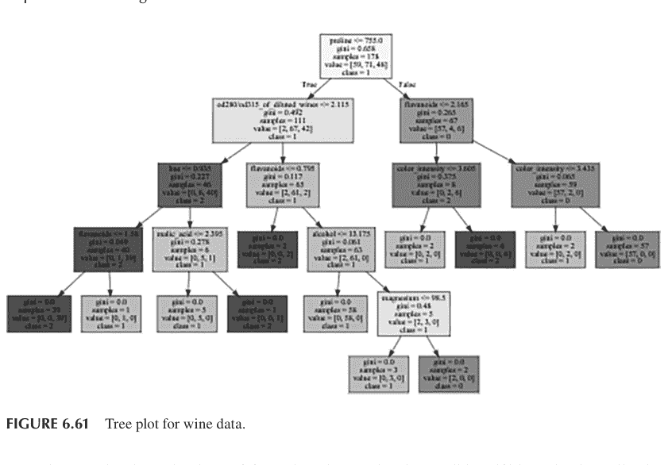

图6.61 葡萄酒数据的树状图。

在图6.61所示的树状图中，每个节点包含用于分割信息的条件（if/else规则）以及节点的一系列其他度量。例如，基尼函数指的是基尼不纯度，它是节点不纯度的一种度量，即节点内样本的同质性如何。当节点的所有样本都属于同一类别时，可以说该节点是纯的。在这种情况下，无需进一步分割，该节点被称为叶节点。样本数是节点内的实例数量，而值数组显示了这些实例在每个类别中的分布。在最底部，我们看到节点的多数类。当`export_graphviz`的`filled`选项设置为`true`时，每个节点会根据其多数类进行着色。

决策树倾向于通过构建复杂模型来过拟合信息（数据）。过拟合的模型可能无法很好地泛化到“未见过”的数据。避免过拟合的两种主要方法是预剪枝和后剪枝。预剪枝意味着在创建树之前限制其深度，而后剪枝则是在树构建完成后移除非信息性节点。

让我们以鸢尾花数据集为例。

```python
from sklearn.datasets import load_iris
from sklearn import tree
iris = load_iris()
clf = tree.DecisionTreeClassifier()
clf = clf.fit(iris.data, iris.target)
```

```python
import os
os.environ["PATH"] += os.pathsep + 'C:\Users\<<USERNAME>>\Downloads\graphviz-2.38.zip\release\bin'
# 注意：用户需要下载并安装Graphviz附加包。
import graphviz
from sklearn import tree
```

```python
import graphviz
dot_data = tree.export_graphviz(clf, out_file=None)
graph = graphviz.Source(dot_data)
graph.render("iris")
```

# 输出显示
`iris.pdf.`

# 使用 Graphviz 绘制树
dot_data = tree.export_graphviz(clf, out_file=None,
    feature_names=iris.feature_names,
    class_names=iris.target_names,
    filled=True, rounded=True,
    special_characters=True)
graph = graphviz.Source(dot_data)
graph

clf.predict(iris.data[:1,:])

# 输出如图 6.62 所示。

array([0])

clf.predict_proba(iris.data[:1,:])
# 输出如下所示。

array([[1., 0., 0.]])

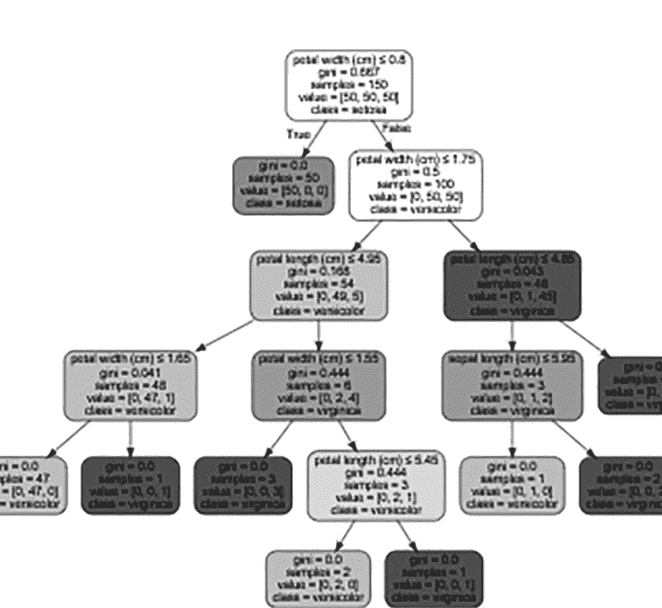

图 6.62 使用 Graphviz 绘制的树图。

sklearn 决策树分类器仅实现了预剪枝。预剪枝通常通过几个参数来控制，例如树的最大深度、节点保持分裂所需的最小样本数，以及通过设置 `max_depth` 为用户所需的树深度来选择叶节点所需的最小实例数。

注意下载适用于 Windows 的 graphviz：

https://graphviz.gitlab.io/_pages/Download/Download_windows.html

## 6.5 随机森林分类器

机器学习算法分为监督学习、无监督学习和强化学习。监督学习又分为分类和回归问题。决策树属于监督学习。决策树是一种流行的机器学习算法。它是一种用于分类和回归问题的树状结构。决策树是一种用于确定行动方案的树形图。树的每个分支代表可能的行动。熵（即数据集中的随机性或不可预测性的度量）和信息增益（即数据集分裂后熵的减少度量）用于构建决策树。测试在决策节点上进行，它有两个或更多分支，叶节点承载分类或决策。它用于分类和回归问题。树仅使用相关特征构建。因此，为了提高准确性，树必须构建得很深以学习高度不规则的模式。这会导致过拟合问题（即低偏差和高方差）。这个过拟合问题可以通过使用随机森林来解决。

随机森林是一种由许多决策树组成的分类算法。随机森林中的每棵树都会预测类别。获得多数投票的类别被选为随机森林模型的预测类别。随机森林是一种集成分类器，最早由贝尔实验室的 Tin Kam Ho 于 1995 年提出。它属于集成分类器，因为它使用多种机器学习算法进行分类。如果树的数量更多，那么随机森林模型的准确性就更高。

随机森林是一种在训练阶段通过构建多棵决策树来运行的方法。随机森林树的主要优点是由于多棵树的存在，训练较少。由于我们正在训练大量数据，随机森林中的系统准确性非常高。随机森林选择多数树的决策作为最终决策。随机森林基于 bagging 概念。

随机森林与决策树的区别在于寻找根节点和分裂特征节点的过程在随机森林中是随机完成的。规则是通过使用信息增益和基尼指数形成的。

带有决策树的随机森林示例如图 6.63 所示。两棵决策树将输入参数分类为 α，一棵将输入参数分类为 β。由于 α 获得多数投票，输入参数被分类为 α 类。随机森林用于 ETM 设备、目标检测和游戏，因为它具有高准确性和较少的训练时间。

随机森林基于 **bagging** 概念工作。在 bagging 中，给定的训练数据通过采样方法被分割成小的训练数据集。例如，在图 6.64 中，训练数据被

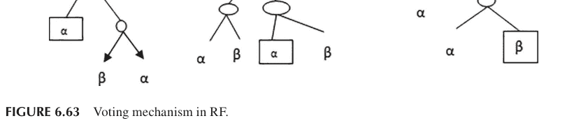

图 6.63 随机森林中的投票机制。

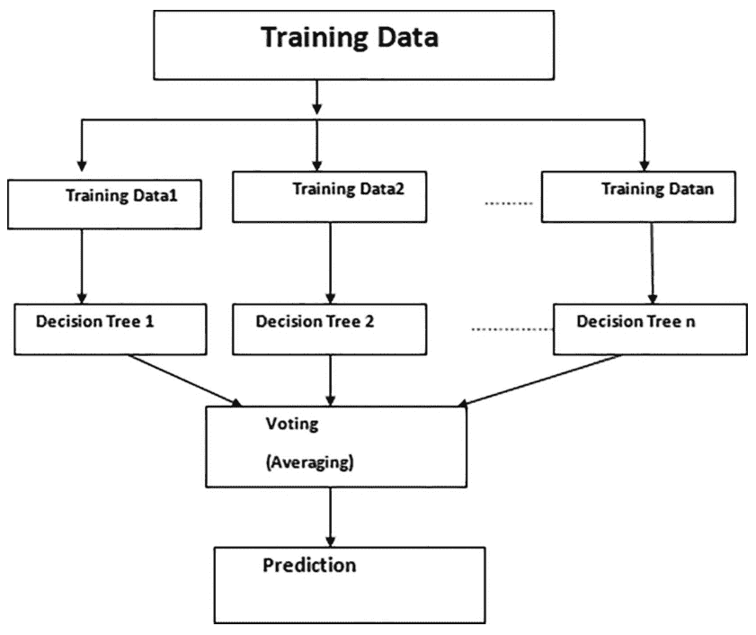

图 6.64 随机森林的表示。

划分为训练数据 1、训练数据 2，直到训练数据 n，每个决策树模型都从训练数据中重建。然后，构建 n 个模型，并使用多数投票方法进行预测。最后，获得多数投票的类别被选为模型的预测结果。

## 随机森林中使用的重要术语

- **熵：** 它是数据集中随机性或不可预测性的度量。
- **Bagging：** 它是一堆独立模型的并行训练。每个模型都使用数据的随机子集进行训练。
- **Boosting：** 它是一堆独立模型的顺序训练。每个节点都从前一个模型的错误中学习。
- **基尼指数：** 基尼指数衡量在随机选择时分类特定变量的错误程度或概率。

## 6.5.1 随机森林及其构建

Bagging 也称为自助聚合，用于创建随机森林。它用于避免过拟合。随机森林优于 bagging 树，因为在分类过程中考虑了所有子树的预测。

SM = \begin{bmatrix} fa_3 & fb_3 & c_3 \ . & . & . \ f_{12} & f_{12} & c_{12} \end{bmatrix} \quad (6.21)

特征 $a$ 是具有 $n$ 个数据的第一个样本，特征 $b$ 是具有 $n$ 个数据的第二个样本。$c_1, c_2, c_3, \dots, c_n$ 代表训练类别。

我们可以创建一个随机子集，如下所示。例如，令 $S_1, S_2, S_3, \dots$ 和 $S_m$ 为一个随机子集。

子集 1 $S_1 = \begin{bmatrix} fa_1 & fb_1 & c_1 \ . & . & . \ f_{35n} & f_{35n} & c_{35} \end{bmatrix}$

子集 2 $S_2 = \begin{bmatrix} fa_2 & fb_{12}. & c_2 \ . & . & . \ f_{20} & f_{20} & c_{20} \end{bmatrix}$

子集 $M$ $SM = \begin{bmatrix} fa_3 & fb_3 & c_3 \ . & . & . \ f_{12} & f_{12} & c_{12} \end{bmatrix}$

决策树是从子集 1、子集 2 和子集 $M$ 构建的，如图 6.65 所示。在此决策树（即决策树 1、决策树 2 和决策树 $M$）上进行预测。给定数据使用多数投票概念进行预测。获得最高投票的类别被选为随机森林模型的预测类别，如图 6.66 所示。

令 $X_1, X_2, X_3, \dots, X_n$ 为数据集中可用的参数。假设森林有 2 棵决策树，如图 6.67 所示。$X_1, X_3, X_4, \dots, X_n$ 将用于构建决策树 1，而 $X_3, X_4, X_5$ 和 $X_n$ 用于创建决策树 2。由于我们只使用部分数据，因此与其他方法相比，该模型非常高效。相关性表示两棵随机树之间的关系（即某些变量在两棵树中都使用）。对于相关性最高的树，森林错误率很高。强分类器具有较低的森林错误率。

图 6.68 表示一个随机森林示例。输入变量 $x$ 被提供给随机森林。这些变量被分成单独的训练集并提供给决策树。决策树的输出被组合，并选择投票较高的类别进行分类。

## 6.5.2 随机森林中数据集的采样

考虑一个包含 9000 条记录、8 个特征和 2 个类别的数据集（表 6.22）。表的每一行代表一条记录。列 F-1、F-2、F-3、...、F-8 代表特征。类别代表类别类型。从给定数据集中总共构建 $k$ 棵树。给定数据集被

# 子集 1

# 子集 2

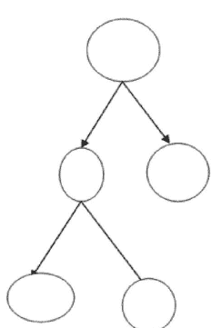

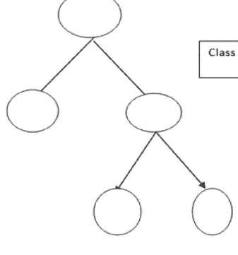

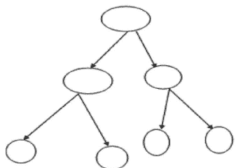

# 子集 M

图 6.65 从子集 1、子集 2 和子集 M 构建的决策树。

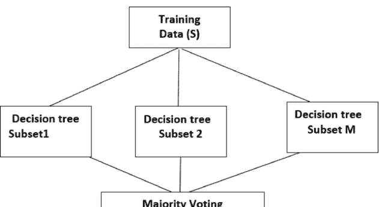

图 6.66 使用 bagging 创建随机森林。

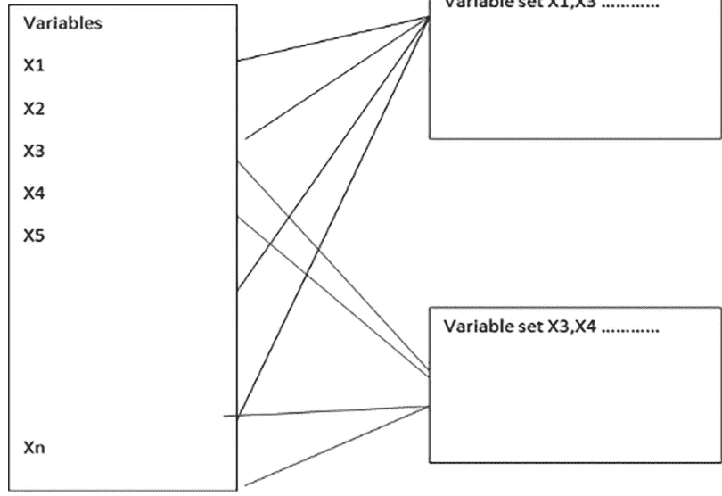

图 6.67 使用 bagging 划分数据。

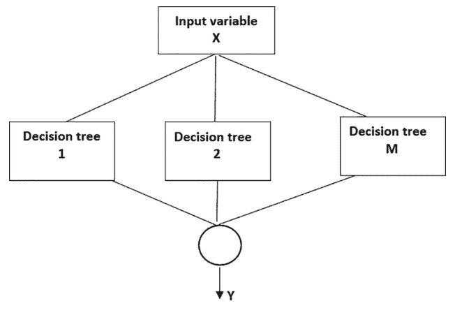

图 6.68 随机森林的示意图。

使用 bagging 或自助聚合被分成 $K$ 个采样。一个大小为 $n$ 的标准训练集 $D$ 通过从 $D$ 中均匀且有放回地采样，生成每个大小为 $n'$ 的新训练集 $D_i$。通过有放回采样，一些观测值可能在每个 $D_i$ 中重复出现。在上面的例子中，我们有 9000 个样本。

## 表 6.22
样本总数

| F-1 | F-2 | F-3 | F-4 | F-5 | F-6 | F-7 | F-8 | 类别 |
|---|---|---|---|---|---|---|---|---|
| Fa1 | Fb1 | Fc1 | Fd1 | Fe1 | Ff1 | Fg1 | Fh1 | 类别 A |
| Fa2 | Fb2 | Fc2 | Fd2 | Fe2 | Ff2 | Fg2 | Fh2 | 类别 B |
| Fa3 | Fb3 | Fc3 | Fd3 | Fe3 | Ff3 | Fg3 | Fh3 | 类别 A |
| Fa4 | Fb4 | Fc4 | Fd4 | Fe4 | Ff4 | Fg4 | Fh4 | 类别 B |
| Fa5 | Fb5 | Fc5 | Fd5 | Fe5 | Ff5 | Fg5 | Fh5 | 类别 A |
| Fa6 | Fb6 | Fc6 | Fd6 | Fe6 | Ff6 | Fg6 | Fh6 | 类别 B |
| Fa7 | Fb7 | Fc7 | Fd7 | Fe7 | Ff7 | Fg7 | Fh7 | 类别 A |
| Fa8 | Fb8 | Fc8 | Fd8 | Fe8 | Ff8 | Fg8 | Fh8 | 类别 B |
| Fa9 | Fb9 | Fc9 | Fd9 | Fe9 | Ff9 | Fg9 | Fh9 | 类别 A |
| - | - | - | - | - | - | - | - | - |
| - | - | - | - | - | - | - | - | - |
| - | - | - | - | - | - | - | - | - |
| Fai | Fbi | Fci | Fdi | Fei | Ffi | Fgi | Fhi | 类别 B |
| - | - | - | - | - | - | - | - | - |
| - | - | - | - | - | - | - | - | - |
| - | - | - | - | - | - | - | - | - |
| Fa9000 | Fb9000 | Fc9000 | Fd9000 | Fe9000 | Ff9000 | Fg9000 | Fh9000 | 类别 A |

## 表 6.23
从表 6.22 中选出的 6000 个样本

| F-1 | F-2 | F-3 | F-4 | F-5 | F-6 | F-7 | F-8 | 类别 |
|---|---|---|---|---|---|---|---|---|
| Fa1 | Fb1 | Fc1 | Fd1 | Fe1 | Ff1 | Fg1 | Fh1 | 类别 A |
| Fa2 | Fb2 | Fc2 | Fd2 | Fe2 | Ff2 | Fg2 | Fh2 | 类别 B |
| Fa3 | Fb3 | Fc3 | Fd3 | Fe3 | Ff3 | Fg3 | Fh3 | 类别 A |
| Fa4 | Fb4 | Fc4 | Fd4 | Fe4 | Ff4 | Fg4 | Fh4 | 类别 B |
| Fa5 | Fb5 | Fc5 | Fd5 | Fe5 | Ff5 | Fg5 | Fh5 | 类别 A |
| - | - | - | - | - | - | - | - | - |
| - | - | - | - | - | - | - | - | - |
| - | - | - | - | - | - | - | - | - |
| Fai | Fbi | Fci | Fdi | Fei | Ffi | Fgi | Fhi | 类别 B |
| - | - | - | - | - | - | - | - | - |
| - | - | - | - | - | - | - | - | - |
| - | - | - | - | - | - | - | - | - |
| Fa6000 | Fb6000 | Fc6000 | Fd6000 | Fe6000 | Ff6000 | Fg6000 | Fh6000 | 类别 A |

选择的样本数 = 2/3 (训练集数量)
= 2/3 * 9000
= 6000

随机选择了六千个样本，如表 6.23 所示。在这 6000 个数据集中，我们应用属性装袋（随机子空间创建）并创建决策树。如果我们有 *n* 个特征，则选择平方根 (*n*) 来创建决策树。在下面的例子中，我们有八个特征，8 的平方根约为 3。因此，我们从上述数据集（表 6.24）中选择三个特征；应用信息增益、增益率和基尼指数从样本中创建决策树。

## 表 6.24
决策树 1 的数据

| F-1 | F-5 | F-7 | 类别 |
|---|---|---|---|
| Fa1 | Fe1 | Fg1 | 类别 A |
| Fa2 | Fe2 | Fg2 | 类别 B |
| Fa3 | Fe3 | Fg3 | 类别 A |
| Fa4 | Fe4 | Fg4 | 类别 B |
| Fa5 | Fe5 | Fg5 | 类别 A |
| - | - | - | - |
| - | - | - | - |
| - | - | - | - |
| Fai | Fei | Fgi | 类别 B |
| - | - | - | - |
| - | - | - | - |
| - | - | - | - |
| Fa6000 | Fe6000 | Fg6000 | 类别 A |

## 表 6.25
特征的混淆矩阵

| | 预测为否 | 预测为是 | 行总计 |
|---|---|---|---|
| 总结果 = 200 | | | |
| 实际为否 | TN = 30 | FP = 25 | 55 |
| 实际为是 | FN = 15 | TP = 130 | 145 |
| 列总计 | 45 | 155 | |

从 6000 个数据中选择了三个特征，并构建了决策树 1。最后，为这些特征创建了一个混淆矩阵，如表 6.25 所示。

误分类率是从混淆矩阵计算得出的。
$M$ 是分类率：

$\frac{\text{FP} + \text{FN}}{\text{Total}} = \frac{25 + 15}{200} = 0.2$

误分类率较低的特征被选入决策树。

### 6.5.2.1 子集数据的创建

让我们考虑如图 6.69 所示的数据集，其中包含圆形 ● 和星形 ★。首先，我们需要使用抽样方法从数据集中创建一个子集。创建了三个子集：子集 1 有 6 个圆形和 3 个星形，子集 2 有 4 个圆形和 5 个星形，子集 3 有 2 个圆形和 5 个星形。让我们考虑如图 6.70 所示的子集。

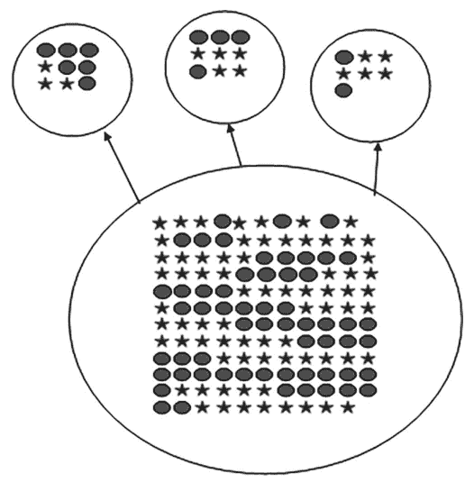

**图 6.69** 使用抽样方法从原始数据集创建子集。

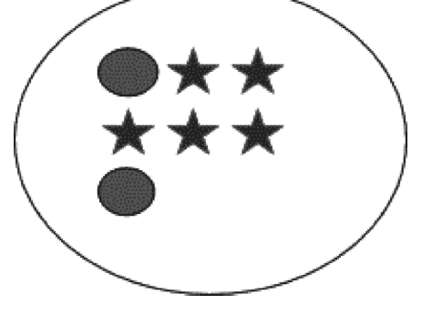

**图 6.70** 一个样本子集。

现在，为这些子集构建决策树。接下来，每个决策树都基于决策标准获得，最终形成一组决策树。最后，从所有决策树（子集）获得平均预测，并获得整体的随机森林预测，如图 6.71 所示。

### 6.5.3 随机森林的伪代码

- **步骤 1：** 从总共 $M$ 个特征中随机选择 $K$ 个特征，其中 $k$ 小于 $M$
- **步骤 2：** 在 $K$ 个特征中，使用最佳分裂节点计算节点“d”
- **步骤 3：** 使用最佳分裂将节点分裂为子节点

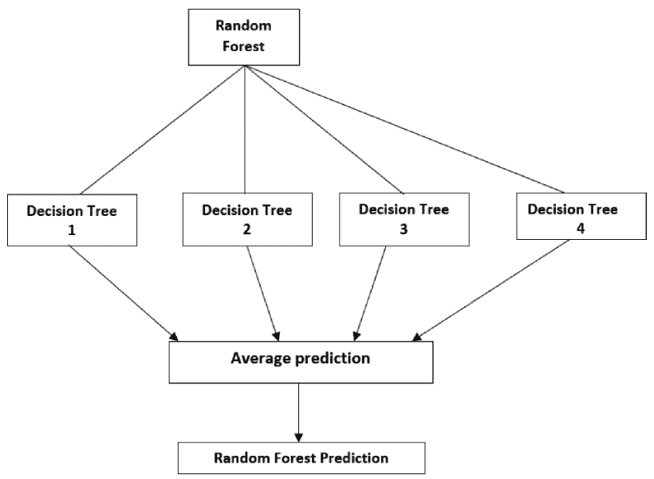

**图 6.71** 基于薪资创建决策树。

- **步骤 4：** 重复步骤 1-3，直到达到“i”个节点。
- **步骤 5：** 通过重复步骤 1-4 “n”次来构建森林，以创建“n”棵树。

让我们假设一个具有 *M* 个特征的数据集。使用抽样方法从数据集中选择 *K* 个特征。选择的 *K* 个特征应少于数据集中的 *M* 个特征。使用 *K* 个特征构建决策树。使用分裂节点，首先确定根节点和子节点。然后，使用分裂节点的概念构建树，直到达到叶节点。类似地，在随机森林中构建另一个决策树。

### 6.5.3.1 随机森林预测的伪代码

- **步骤 1：** 获取测试特征，并使用每个随机创建的决策树的规则来预测结果，并存储预测结果
- **步骤 2：** 计算每个预测目标的票数
- **步骤 3：** 将得票最高的预测目标视为随机森林算法的最终预测。

将输入提供给随机森林的所有决策树。然后，计算每个类别获得的票数。获得多数票的类别被选为模型的预测类别。

### 6.5.4 使用随机森林进行回归

我们也可以将随机森林用于回归。考虑样本 *X*。样本 *x* 被划分为子样本 1、样本 2、样本 3 和样本。从这些样本构建决策树 1、决策树 2、决策树 3 和决策树 *m*。每棵树都可以使用任何决策树算法（如 CART 和 ID3）构建。每个决策树都会产生一个值。每个决策树的输出在回归过程中被考虑。在分类过程中，使用投票机制。取每棵树的平均输出来计算最终类别，如图 6.72 所示。

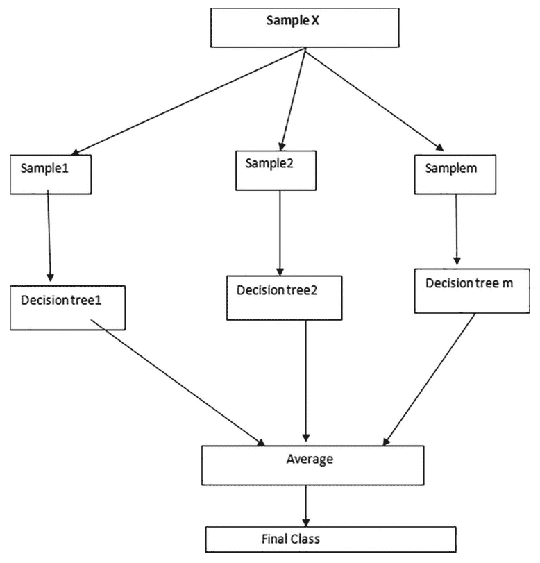

### 6.5.5 使用随机森林进行分类

本节通过一个合适的例子，说明将随机森林应用于分类问题的逐步过程。

**步骤 1：创建引导数据集**
考虑以下用于预测心脏病的数据集（表 6.26）。
引导数据集的大小应与原始数据集相同，并从给定数据集中随机选择。引导数据集是通过从原始数据集中随机选择数据创建的。在上面的例子中，首先选择了第 2 行的数据（表 6.27）。

## 表 6.26
原始数据集

| 胸痛 | 良好的血液循环 | 动脉阻塞 | 体重 | 心脏病 |
|---|---|---|---|---|
| 否 | 否 | 否 | 125 | 否 |
| 是 | 是 | 是 | 180 | 是 |
| 是 | 是 | 否 | 210 | 否 |
| 是 | 否 | 是 | 167 | 是 |

## 表 6.27
随机选择单个数据

| 胸痛 | 良好的血液循环 | 动脉阻塞 | 体重 | 心脏病 |
|---|---|---|---|---|
| 是 | 是 | 是 | 180 | 是 |

## 表 6.28
随机选择两个数据

| 胸痛 | 良好的血液循环 | 动脉阻塞 | 体重 | 心脏病 |
|---|---|---|---|---|
| 是 | 是 | 是 | 180 | 是 |
| 否 | 否 | 否 | 125 | 否 |

## 表 6.29
随机选择三个数据

| 胸痛 | 良好的血液循环 | 动脉阻塞 | 体重 | 心脏病 |
|---|---|---|---|---|
| 是 | 是 | 是 | 180 | 是 |
| 否 | 否 | 否 | 125 | 否 |
| 是 | 否 | 是 | 167 | 是 |

## 表 6.30
随机选择四个数据

| 胸痛 | 良好的血液循环 | 动脉阻塞 | 体重 | 心脏病 |
|---|---|---|---|---|
| 是 | 是 | 是 | 180 | 是 |
| 否 | 否 | 否 | 125 | 否 |
| 是 | 否 | 是 | 167 | 是 |
| 是 | 否 | 是 | 167 | 是 |

然后，选择了第一行的数据（表 6.28）。
然后，选择了最后一行的数据（表 6.29）。
然后再次选择了最后一行的数据（表 6.30）。
因此，我们从原始数据集中选择了四个数据（表 6.31）。

## 表 6.31
自助数据集

| 胸痛 | 血液循环良好 | 动脉阻塞 | 体重 | 心脏病 |
|---|---|---|---|---|
| 是 | 是 | 是 | 180 | 是 |
| 否 | 否 | 否 | 125 | 否 |
| 是 | 否 | 是 | 167 | 是 |
| 是 | 否 | 是 | 167 | 是 |

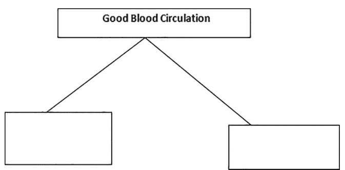

图 6.73 候选键的选择。

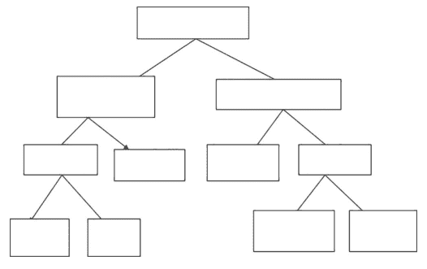

图 6.74 基于自助数据集的决策树。

## 步骤 2：使用自助数据集创建决策树，但每一步仅使用随机变量子集

在上面的例子中，我们有四个变量。我们不会选择所有四个变量，而是只选择两个变量作为候选变量（血液循环良好或动脉阻塞）。我们甚至可以使用决策树算法来选择候选键。让我们以血液循环良好作为候选键（图 6.73）。

然后，可以使用胸痛和体重进一步划分树。图 6.74 表示了该决策树。

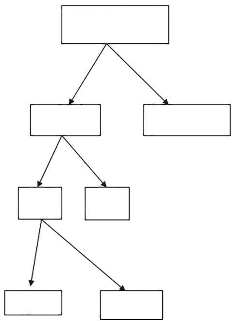

图 6.75 决策树 2。

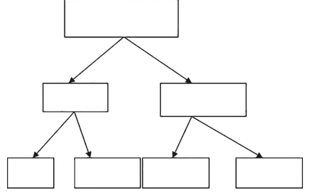

图 6.76 决策树 3。

然后，我们必须重复步骤 2，使用不同的自助数据集创建更多的决策树。决策树 2 和 3 如图 6.75 和 6.76 所示构建。

## 步骤 3：评估随机森林

创建随机森林后，我们必须评估其性能。考虑表 6.32 中所示的样本。

## 表 6.32
用于构建决策树 1 的样本

| 胸痛 | 血液循环良好 | 动脉阻塞 | 体重 | 心脏病 |
|---|---|---|---|---|
| 是 | 否 | 否 | 168 | |

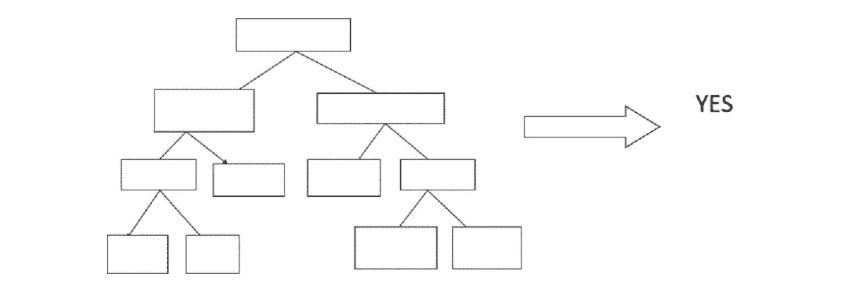

图 6.77 决策树 1 中的分类。


图 6.78 决策树 2 中的分类。


图 6.79 决策树 3 中的分类。

上述样本将被输入到决策树 1（图 6.77）。
从图 6.78 和 6.79 的决策树中，选择了“是”。最终，类别投票结果如表 6.33 所示。
同样，我们必须将变量输入到另一个决策树。最终，在输入所有决策树后，投票结果如表 6.34 所示。
因此，大多数投票属于“是”类别。所以数据属于“是”类别（表 6.35）。

## 表 6.33
投票结果

| 心脏病 |
| :---: |
| 是 | 否 |
| 1 | 0 |

## 表 6.34
所有决策树的投票结果

| 心脏病 |
| :---: |
| 是 | 否 |
| 5 | 1 |

## 表 6.35
多数投票结果

| 胸痛 | 血液循环良好 | 动脉阻塞 | 体重 | 心脏病 |
| :---: | :---: | :---: | :---: | :---: |
| 是 | 否 | 否 | 168 | 是 |

## 6.5.5.1 分类随机森林问题 – 示例

### 6.5.5.1.1 问题 1
为表 6.36 中的示例构建随机森林。
假设我们根据属性“房屋类型”来划分数据。“房屋类型”的值在 6 到 31 之间。数据集的可能划分为

- 房屋类型 ≤6
- 房屋类型 ≤10
- 房屋类型 ≤15
- 房屋类型 ≤30
- 房屋类型 ≤31

## 表 6.36
样本数据 – 房屋类型、薪资和类别

| 记录 | 属性 | | |
| :---: | :---: | :---: | :---: |
| | 房屋类型 | 薪资 | 类别 |
| 1 | 31 | 3 | 1 |
| 2 | 30 | 1 | 0 |
| 3 | 6 | 2 | 0 |
| 4 | 15 | 4 | 1 |
| 5 | 10 | 4 | 0 |

### 6.5.5.1.2 基尼指数

如果数据集 $D$ 包含 $n$ 个类别，则基尼指数定义为

$Gain(D) = 1 - \sum P_i^2$

其中 $P_i$ 表示正索引和负索引的概率之和

## 房屋类型 ≤6：

| 记录 | 零 | 一 | N=5 |
| :--- | :---: | :---: | :---: |
| 房屋类型 ≤6 | 1 | 0 | $n_1=1$ |
| 房屋类型 >6 | 2 | 2 | $n_2=4$ |

基尼（房屋类型≤6）= $1 - (1^2 + 0) = 0$
基尼（房屋类型 >6）= $1 - ((2/4)^2 + (2/4)^2) = 0.5$
基尼（划分）= $1/5(0) + 4/5(0.5) = 0.4$

## 房屋类型 ≤10

| 记录 | 零 | 一 | N=5 |
| :--- | :---: | :---: | :---: |
| 房屋类型 ≤10 | 2 | 0 | n1=2 |
| 房屋类型 >10 | 1 | 2 | n2=3 |

基尼（房屋类型 ≤6）= $1 - (1^2 + 0) = 0$
基尼（房屋类型 >10）= $1 - ((1/3)^2 + (2/3)^2) = 0.4452$
基尼（划分）= $2/5(0) + 3/5(0.445) = 0.2671$
房屋类型 ≥10 具有最低值。

| 基尼划分 | 值 |
| :--- | :---: |
| 房屋类型 ≤6 | 0.4000 |
| 房屋类型 ≤10 | 0.2671 |
| 房屋类型 ≤15 | 0.4671 |
| 房屋类型 ≤30 | 0.3000 |
| 房屋类型 ≤31 | 0.4800 |

## 最佳划分：

房屋类型 = $(10 + 15) / 2 = 12.5$

如果房屋类型 <12.5，则属于类别 0。如果房屋类型 >12.5，则属于类别 1，如图 6.80 所示。下一个基尼指数基于薪资，如图 6.81 所示。

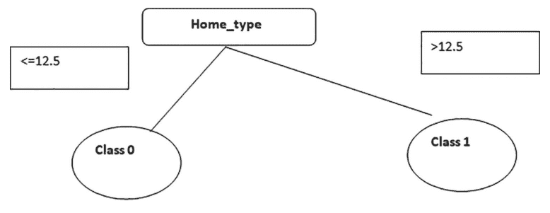

图 6.80 基于房屋类型创建随机森林。

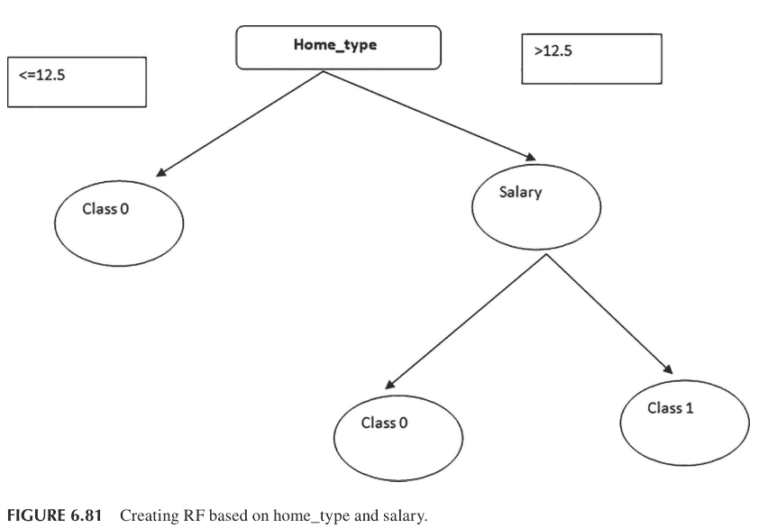

图 6.81 基于房屋类型和薪资创建随机森林。

## 6.5.6 随机森林的特征和属性

### 6.5.6.1 特征

- 它是目前最准确的算法，并且在大型数据集上运行迅速。
- 它可以处理数万个输入变量，而无需删除其中任何一个。
- 它计算多个变量在分类中的重要性。
- 随着森林的增长，它会生成泛化误差的内部无偏估计。
- 它提供了一种猜测缺失数据的方法，该方法效果良好，即使在有大量缺失数据的情况下也能保持准确性。
- 它包括在类别分布不均匀的数据集中平衡误差的技术。
- 创建的森林可以被保存并在将来用于其他数据。
- 创建原型以揭示变量与分类之间的关系。
- 它计算示例对之间的距离，这可用于聚类、检测异常值或提供数据的有趣视图（按比例）。
- 可以使用未标记的数据，利用上述功能创建无监督聚类、数据可视化和异常值识别。
- 它提供了一种通过实验寻找变量交互作用的机制。

### 6.5.6.2 属性

- 每棵树都具有最大强度。
- 每棵树与其他树的相关性最小。
- 树的集合对最终结果进行投票。

## 6.5.7 随机森林的优缺点

### 6.5.7.1 优点

- 可用于分类和回归任务。
- 处理缺失值并在数据缺失时保持准确性。
- 模型不会过拟合。
- 处理更高维度的更大数据集。

### 6.5.7.2 缺点

- 对分类效果好，但对回归效果不佳。
- 对模型的控制较少。

## 6.5.8 使用偏差和方差计算误差

偏差和方差表示结果与期望值的偏差。设 $F$ 为具有随机噪声的真实函数。那么，假设 $h$ 由于以下原因是不完美的。

### 6.5.8.1 偏差

H 无法完美拟合 f，因为它缺乏容量或复杂性。

### 6.5.8.2 方差

$H$ 拟合数据中的噪声，而忽略了真实函数 $f$。
设 $z$ 为任意点，生成的点为

$\Upsilon = f(z) + \epsilon$ (6.22)

期望值为

$E[\Upsilon] = f(z)$ (6.23)

方差为

$var[\Upsilon] = var[\epsilon]$ (6.24)

均方误差为

$$R(h) = E\left[(h(z) - \mathbb{Y})^2\right]$$
$$= E\left[h(z)^2\right] + E\left[\mathbb{Y}^2\right] - 2E\left[\mathbb{Y}h(z)\right]$$

其中 $\mathbb{Y}$ 和 $(z)$ 是独立的。
$\mathbb{Y}$ 和 $(z)$ 的方差为

$$= E\left[h(z)^2\right] + E\left[\mathbb{Y}^2\right] - 2E\left[\mathbb{Y}h(z)\right]$$
$$= \text{var}[h(z)] + E[h(Z)]^2 + \text{var}[\mathbb{Y}] + E[\mathbb{Y}]^2 - 2E[\mathbb{Y}]E[h(Z)]$$
$$= (E[h(z)] - E[\mathbb{Y}])^2 + \text{var}[h(z)] + \text{var}[\mathbb{Y}]$$
$$= (Eh(z) - f(Z))^2 + \text{var}[h(z)] + \text{var}[\mathbb{C}]$$

$(E[h(z)]-f(z))^2$ 表示平方偏差。它表示模型与真实数据分布函数之间的差异量。
$\text{var}[h(Z)]$ 表示方差。方差决定了风险因素。
$\text{var}[\mathbb{C}]$ 表示不可约误差。该误差是由于输入信号中引入的噪声造成的。

### 6.5.8.3 偏差和方差的属性

- 偏差过大会导致欠拟合。
- 方差过大会导致过拟合。
- 训练误差显示偏差。
- 测试误差显示偏差和方差。
- 如果 $n$ 值为无穷大，则方差为零。
- 当 $n$ 趋于无穷大且偏差为零时，模型具有足够的建模能力。
- 如果特征数量增加，则偏差会降低。
- 测试集中的噪声仅影响 $\text{var}(\mathbb{C})$。训练集中的噪声仅影响偏差和 $\text{var}(\mathbb{C})$。

## 6.5.9 时间复杂度

随机森林是一个决策树集成系统。创建一个完整的未剪枝决策树的时间复杂度为 $O(v * n \log(n))$，其中 $n$ 是记录数，$v$ 是变量/属性的数量。
设 $n$ tree 为随机森林中的树的数量，$m$ try 为每个节点的变量数。那么，单棵树的时间复杂度为 $o(m \text{ try} * n \log(n))$。
$n$ tree 的时间复杂度为 $o(n \text{ tree} * m \text{ try} * n \log(n))$。设树的深度为 $o(\log n)$。
设 $d$ 表示树的深度。那么，时间复杂度表示为 $o(n \text{ tree} * m \text{ try} * d * n)$。

## 6.5.10 极端随机树

极端随机树不使用 bagging 为每棵树创建训练样本集合。相反，使用相同的输入学习集来训练所有树。极端随机树强烈选择一个分裂节点（变量索引和变量分裂值都是随机选择的）。相比之下，随机森林考虑变量随机子集之间的最强分裂（最优

## 6.5.11 真实世界案例

随机森林是一种流行的机器学习算法。由于其包含多棵决策树，因此具有较高的准确率。它在分类和回归问题中扮演着重要角色。随机森林在以下一些应用领域中广受欢迎：

- 1. 机械故障诊断
- 2. 医疗领域
- 3. 银行业
- 4. 电子商务
- 5. 安全领域

### 6.5.11.1 机械故障诊断

随机森林算法是一种新颖的集成分类器，它通过创建多棵决策树来改进单棵树的分类性能。尽管目前已有许多故障诊断技术，如人工神经网络和支持向量机，但由于其快速的运算速度、树分类器的特性以及在计算机故障诊断中的高性能，对随机森林的研究仍然至关重要。此外，事实证明，通过与其他优化方法相结合，基于随机森林的诊断方法可以产生更准确的结果。

随机森林采用一组决策树，并通过多数投票算法来定义类别分组。因此，为了评估随机森林的性能，需要认真考虑过拟合问题。一些研究工作通过将随机森林与遗传算法相结合来完成。在这种方法中，随机森林是通过使用来自CART算法的决策树来构建的。该树通过递归地分裂节点来构建。树的构建基于样本数据和多数投票过程。选择得票最高的类别进行分类。可以通过使用遗传算法来增强随机森林。适者生存的规则应用于个体种群。遗传算法因其简单性和强大的特性而拥有强大的搜索能力。遗传算法用于参数优化。

### 6.5.11.2 医疗领域

#### 6.5.11.2.1 糖尿病视网膜病变分类分析

随机森林方法用于评估糖尿病视网膜病变（DR）眼底照片的数据识别。在美国乃至全球，DR是导致失明的主要原因之一。DR是一种慢性疾病，在得到有效治疗之前可能长期不被察觉。因此，早期检测可以提高治疗干预的机会，以减轻其影响。使用分级眼底照片和结构数据来评估随机森林和逻辑回归分类器。样本量对分类器性能的影响以及使用随机森林生成的条件概率作为描述DR风险的指标的可能性。使用可变的随机森林测量来识别影响分类质量的因素。通过比较有或没有DR的参与者，两种类型的数据都是有价值的。基于随机森林的模型比基于逻辑回归的模型提供了高得多的分类准确性。结合两种数据类型并未提高可靠性，但在随后4年监测中发生或未发生DR事件的健康参与者中增加了统计偏差。随机森林因子值参数显示，双眼微动脉瘤的数量似乎在分级眼底变量和药物数量之间的区分中起着最重要的作用。

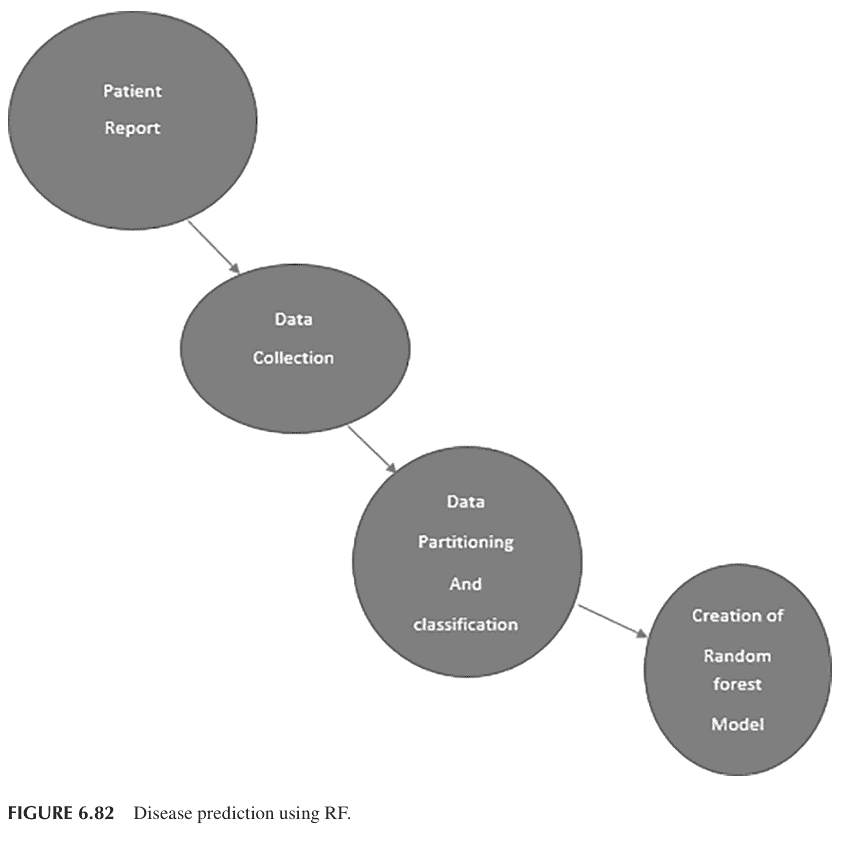

**图 6.82** 使用随机森林进行疾病预测。

在初始阶段，数据从患者报告中收集。收集的数据中不应有任何缺失数据。例如，在所有收集的属性中，其中一个属性应代表患者是否患有肝损伤。

图6.82展示了使用随机森林预测肝损伤。在初始阶段，数据从患者报告中收集。收集的数据中不应有任何缺失数据。在所有收集的属性中，其中一个属性应代表患者是否患有肝损伤。为上述模型收集了随机森林模型，其准确率为70.50%。数据来自UCI机器学习库。该数据集包含167个阴性测试和416个阳性测试，在不同的决策树上进行分类。最终输出通过投票机制选择。肝损伤的发生是由于吸入有害气体、摄入受污染的食物、不同种类的药物以及过量饮酒。预处理用于清理从数据中选择的数据属性。

### 6.5.11.3 银行业

随机森林算法在银行业有两个主要应用领域。这些应用旨在识别值得信赖的客户和发现欺诈客户。忠诚的客户不仅是付款良好的客户，也是能够获得大额贷款并按时支付银行贷款利息的客户。由于银行的成功完全依赖于忠诚客户，因此银行客户数据被高度评估，以根据客户数据确定忠诚客户的模式。

同样，需要识别对银行不重要的消费者，例如那些获得贷款、未能适当支付贷款利息以及即将流失的客户。然后，银行将有机会不批准该客户的贷款申请。在这种情况下，也使用随机森林算法来识别对银行无益的客户。

随机森林用于预测银行倒闭。分析银行层面的财务报表以识别银行的倒闭。随机森林提高了分类准确性，因为分类是在多棵树上进行的，而不是单棵树。随机森林通过分析银行层面的财务数据来预测银行倒闭事件，以区分活跃和不活跃的银行。数据来自银行范围。从这些数据中选择了8个指标，并将这些数据分为四组（盈利能力比率、资本充足率、贷款质量和资金来源）。这种方法可以应用于商业银行、储蓄银行和合作银行。使用阈值或解释变量来划分活跃和不活跃的银行。首先，基于给定数据构建大量的树。然后，基于投票机制选择类别。构建了三棵树进行测试：第一棵是单棵树，第二棵是包含多棵树的随机森林，第三棵是通过并行训练多棵树处理大型数据集。单棵树代表一棵决策树，其获得的准确率低于随机森林树。

首先，随机森林被构建为单棵树、包含多棵树的随机森林以及包含多棵并行树的随机森林。与单棵树随机森林相比，多棵树随机森林产生了更高的准确性。

解释变量是：

- 1. 贷款和资产的平均利率
- 2. 银行存款的平均利率。

### 6.5.11.4 电子商务

对于电子商务，随机森林仅用于推荐引擎的一小部分，针对不同类型的客户，以识别客户喜欢推荐商品的可能性。在非常大的数据集上运行随机森林算法需要高端GPU系统。如果没有GPU，机器学习模型也可以在云托管环境中运行。在线云计算系统可以从世界任何角落用于运行高端机器学习模型。

### 6.5.11.5 安全领域

近年来，随机森林在入侵检测系统中发挥了重要作用。由于物联网、大数据和云计算等技术的进步，计算机系统在商业中的使用日益增加。大量的数据被传输和处理。入侵检测系统维护数据的机密性和完整性。网络中的入侵检测系统应具有较低的误报率。随机森林算法在入侵检测系统中扮演着重要角色，因为它需要较少的训练时间和快速的预测。检测策略类型、问题域和软件架构用于创建随机森林模型。随机森林中使用了邻近度方法。从网络收集的各种数据包括主机日志（即操作系统和系统日志）、应用程序日志（即应用程序生成的数据）、网络流量（即OSI第3层）和无线流量（即OSI第1层）。数据可以通过集中式或分布式方法收集。在基于异常的检测中，识别与正常模式不同的模式。在基于签名的检测中，识别被滥用的数据；在基于规范的检测中，识别违反协议规范的数据。检测可以通过在线方式（即阻止IP地址）或离线方式进行。

## 6.5.12 使用Python实践随机森林

在实现随机森林分类器之前，让我们先了解数据文件。我们使用的示例数据文件如下所示。它有五列——用户ID、性别、年龄、估计工资以及他们是否进行过任何购买。我们的目标是使用随机森林分类器进行分类。

# Social_Network_Ads.csv

部分数据如下所示。

| 用户ID | 性别 | 年龄 | 预估薪资 | 是否购买 |
|---|---|---|---|---|
| 15624510 | 男 | 19 | 19,000 | 0 |
| 15810944 | 男 | 35 | 20,000 | 0 |
| 15668575 | 女 | 26 | 43,000 | 0 |
| 15603246 | 女 | 27 | 57,000 | 0 |
| 15804002 | 男 | 19 | 76,000 | 0 |
| 15728773 | 男 | 27 | 58,000 | 0 |
| 15598044 | 女 | 27 | 84,000 | 0 |
| 15694829 | 女 | 32 | 150,000 | 1 |
| 15600575 | 男 | 25 | 33,000 | 0 |
| 15727311 | 女 | 35 | 65,000 | 0 |
| 15570769 | 女 | 26 | 80,000 | 0 |
| 15606274 | 女 | 26 | 52,000 | 0 |
| 15746139 | 男 | 20 | 86,000 | 0 |
| 15704987 | 男 | 32 | 18,000 | 0 |
| 15628972 | 男 | 18 | 82,000 | 0 |
| 15697686 | 男 | 29 | 80,000 | 0 |
| 15733883 | 男 | 47 | 25,000 | 1 |
| 15617482 | 男 | 45 | 26,000 | 1 |
| 15704583 | 男 | 46 | 28,000 | 1 |
| 15621033 | 女 | 48 | 29,000 | 1 |
| 15649487 | 男 | 45 | 22,000 | 1 |
| 15736760 | 女 | 47 | 49,000 | 1 |
| 15714658 | 男 | 48 | 41,000 | 1 |
| 15599081 | 女 | 45 | 22,000 | 1 |

## 随机森林分类

### 导入库

```python
import numpy as np
import matplotlib.pyplot as plt
import pandas as pd
from sklearn.metrics import confusion_matrix, classification_report, roc_curve, auc
import statistics
```

### 导入数据集

```python
dataset = pd.read_csv('C:/Python Files/Decision Tree/Decision Tree/Source Files/Social_Network_Ads.csv')
X = dataset.iloc[:, [2, 3]].values
y = dataset.iloc[:, 4].values
```

### 将数据集划分为训练集和测试集

```python
from sklearn.cross_validation import train_test_split
X_train, X_test, y_train, y_test = train_test_split(X, y, test_size = 0.25, random_state = 0)
```

### 特征缩放

```python
from sklearn.preprocessing import StandardScaler
sc = StandardScaler()
X_train = sc.fit_transform(X_train)
X_test = sc.transform(X_test)
```

### 将随机森林分类器拟合到训练集

```python
from sklearn.ensemble import RandomForestClassifier
classifier = RandomForestClassifier(n_estimators = 10, criterion = 'entropy', random_state = 0)
classifier.fit(X_train, y_train)
```

### 预测测试集结果

```python
y_pred = classifier.predict(X_test)
```

### 生成混淆矩阵

```python
from sklearn.metrics import confusion_matrix
cm = confusion_matrix(y_test, y_pred)
```

```python
pd.crosstab(y_pred, y_test)
```

```
#OUTPUT
#col_0 0 1
#row_0
#0 63 3
#1 5 29
```

```python
total1 = sum(sum(cm))
```

### 根据混淆矩阵计算准确率

```python
accuracy = (cm[0,0] + cm[1,1]) / total1
print('Accuracy : ', accuracy)
```

```
#OUTPUT
#Accuracy : 0.92
```

```python
sensitivity = cm[0,0] / (cm[0,0] + cm[0,1])
print('Sensitivity : ', sensitivity)
```

```
#OUTPUT
#Sensitivity : 0.9264705882352942
```

```python
specificity = cm[1,1] / (cm[1,0] + cm[1,1])
print('Specificity : ', specificity)
```

```
#OUTPUT
#Specificity : 0.90625
```

```python
precision = cm[0,0] / (cm[0,0] + cm[1,0])
print('precision : ', precision)
```

```
#OUTPUT
#precision : 0.9545454545454546
```

```python
classifier.score(X_test, y_test)
```

```
#OUTPUT
#0.92
```

```python
print(classification_report(y_test, y_pred))
```

```
#OUTPUT
# precision recall f1-score support
#
# 0 0.95 0.93 0.94 68
# 1 0.85 0.91 0.88 32
#
#avg /total 0.92 0.92 0.92 100
```

```python
decisiontree5 = classifier.estimators_[5]
from sklearn import tree
from IPython.display import Image

tree.export_graphviz(decisiontree5, out_file='C:/Python Files/Decision Tree/Decision Tree/Source File/srandomforest_5_tree.dot')

Image(filename = 'C:/Python Files/Decision Tree/Decision Tree/Source Files/randomforest_5_tree.png')
```

## 输出文件如下所示，并在图6.83中展示


randomforest_5_tree.png

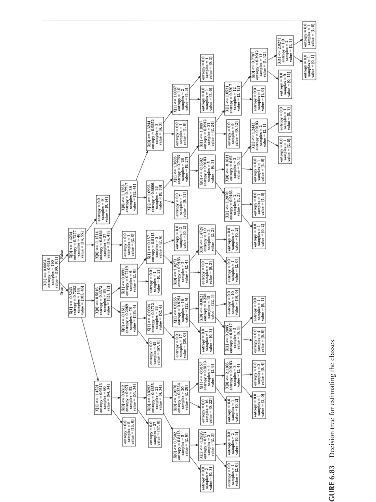

图6.83 用于估计类别的决策树。

### 回归器

```python
from sklearn.ensemble import RandomForestRegressor
# 根据多元回归中的前一个示例（50_Startups.csv），使用分类器
dataset1 = pd.read_csv('C:/Python Files/50_Startups.csv')
X1 = dataset1.iloc[:, :-1].values
y1 = dataset1.iloc[:, 4].values

# 对分类数据进行编码
from sklearn.preprocessing import LabelEncoder, OneHotEncoder
labelencoder = LabelEncoder()
X1[:, 3] = labelencoder.fit_transform(X1[:, 3])
onehotencoder = OneHotEncoder(categorical_features = [3])
X1 = onehotencoder.fit_transform(X1).toarray()

# 避免虚拟变量陷阱
X1 = X1[:, 1:]

### 将数据集划分为训练集和测试集
from sklearn.cross_validation import train_test_split
X_train1, X_test1, y_train1, y_test1 = train_test_split(X1, y1, test_size = 0.2, random_state = 0)

regr = RandomForestRegressor()

regr.fit(X_train1, y_train1)
```

```
#OUTPUT
# RandomForestRegressor(bootstrap=True, criterion='mse', max_depth=None,
#            max_features='auto', max_leaf_nodes=None,
#            min_impurity_decrease=0.0, min_impurity_split=None,
#            min_samples_leaf=1, min_samples_split=2,
#            min_weight_fraction_leaf=0.0, n_estimators=10, n_jobs=1,
#            oob_score=False, random_state=None, verbose=0,
#            warm_start=False)
```

### 预测测试集结果

```python
y_pred1 = regr.predict(X_test1)

from sklearn.metrics import mean_squared_error

mean_squared_error(y_test1, y_pred1) #mse

print(np.sqrt(mean_squared_error(y_test1, y_pred1))) #rmse
```

```
#OUTPUT
8029.705866133677
```

```python
# 打印模型的R平方值
regr.score(X_test1, y_test1) #rsquare
```

```
#OUTPUT
0.9495843301735848
```

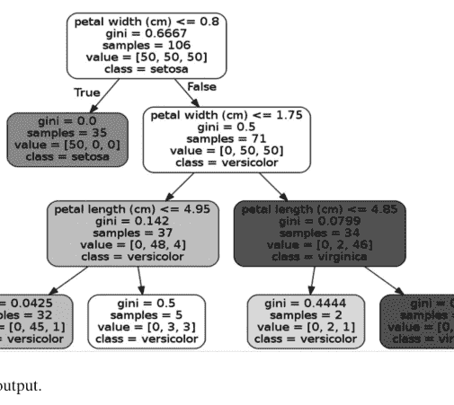

图6.84 随机森林输出。

```python
sst = sum(np.power(y_test1 - statistics.mean(y_test1), 2))
sse = sum(np.power((y_test1 - y_pred1), 2))

rsquared = (sst - sse) / sst

adjusted_r_squared = 1 - (1 - rsquared) * (len(y_test) - 1) / (len(y_test) - X_test.shape[1] - 1)
dt = regr.estimators_[5]

from sklearn.tree import export_graphviz
from IPython.display import Image

export_graphviz(dt, out_file='C:/Python Files/Decision Tree/Decision Tree/Source File/dt_regressor.dot', class_names = dataset1.Profit,
                rounded = True, filled = True)

##dot -Tpng sample_1.dot -o sample_1.png
Image(filename = 'C:/Python Files/Decision Tree/Decision Tree/Source File/tree_limited.png')
## 输出文件如下所示，并在图6.84中展示
```


# 6.6 支持向量机

机器学习旨在识别数据背后的模式，并构建能够从获得的经验中学习的系统。支持向量机因其利用优化技术并实现更高性能而获得了研究兴趣。支持向量机与其他经典机器学习技术不同，因为它利用了统计学思想。在机器学习中学习模型时，我们通常试图最小化训练阶段的误差，这会导致数据过拟合。支持向量机通过最大化间隔技术，巧妙地解决了过拟合问题。本章介绍了支持向量机和核函数的基本思想。支持向量机是最有效的基于核的监督机器学习分类器。这是一种复杂的分类技术，可以处理线性和非线性数据。核机器具有许多有用的特性来分析非线性数据。支持向量机的变体是支持向量回归，可用于解决回归分析问题。支持向量机是一种稳健的学习方法，这从其在工程各个领域的应用中可见一斑。它已被应用于现实世界的应用，包括手写体光学字符识别、人脸识别、说话人识别、自然语言处理、文本挖掘、药物设计、机器故障诊断、桥梁损伤评估和模式识别。理解支持向量机的唯一先决条件是基于拉格朗日乘子法的约束优化。在本节中，将详细讨论支持向量机的工作原理、潜在的统计概念、核技巧、线性和非线性支持向量机分类器、寻找最优超平面、最大间隔分类器、支持向量机的硬间隔和软间隔、支持向量机的变体、支持向量机的优缺点、支持向量回归分析以及应用。

## 6.6.1 几何直觉

支持向量机是一种监督学习算法，其中学习模型被提供输入集及其关联的输出或标签。支持向量机用于分类问题。分类问题可以看作是在特征空间中分离类别的任务。为了理解支持向量机的奥秘，考虑一个简单的二元分类问题作为例子，如图6.85所示。它包含一个将两个类别分开的决策边界或超平面。支持向量机的目标是选择一个用于分离类别的优化超平面。例如，在图6.85中，有许多可能的线可以分离这两个类别，而深色阴影粗线是所有其他线中的最优超平面。

支持向量是靠近决策边界的关键数据点。*支持向量机的主要目标*是为这个问题找到一个最优超平面分类器。最优超平面是为了识别支持向量与超平面之间的最大距离。

- a. 到最近负样本的距离 $d_2$ 小于到最近正样本的距离 $d_1$。与图6.86相反，
- b. 找到了最优超平面，其中到最近负样本的距离 $d_2$ 等于到最近正样本的距离 $d_1$。

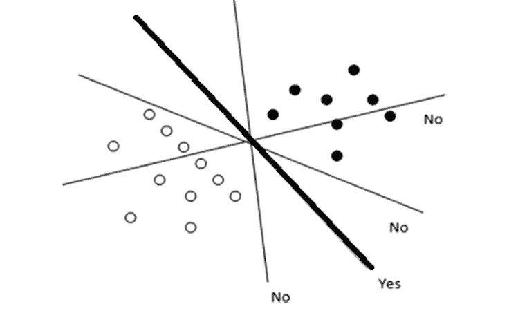

图6.85 识别最优超平面。

## 6.6.2 数学表述

让我们通过定义函数间隔和几何间隔来理解支持向量机背后的数学直觉。函数间隔定义为任意点 $(x_i, y_i)$ 与决策边界 $(w, b)$ 之间的距离。函数间隔 $\gamma^i$ 是点 $(x_i, y_i)$ 与决策边界之间的距离，其推导见公式 6.28。

$$\gamma^i = y_i (w^T x_i + b) \quad (6.28)$$

类似地，对于另一个离决策边界更远的点 $(x_j, y_j)$，其函数间隔如公式 6.29 所示。

$$\gamma^j = y_j (w^T x_j + b) \quad (6.29)$$

点 $(x_i, y_i)$ 的函数间隔大于点 $(x_j, y_j)$ 的函数间隔，如图 6.90 所示。函数间隔越大，置信度越高。

现在，我们可以定义一组训练点 $S = \{(x_1, y_1), (x_2, y_2), \dots, (x_m, y_m)\}$ 的函数间隔

$$\gamma = \min \gamma^i \text{ for } i = 1, 2, \dots, m \quad (6.30)$$

如果我们缩放 $w$ 和 $b$，函数间隔会变大。为了克服这个缺点，引入了几何间隔。图 6.91 显示**几何间隔**对于方程的缩放是不变的。令 $w$ 为垂直于决策面的向量。

令 $\frac{w}{\|w\|}$ 为垂直于决策面的单位向量。例如，假设 $w = (2, 3)$，则 $\|w\| = \sqrt{2^2 + 3^2}$

$$\frac{w}{\|w\|} = \left( \frac{2}{\sqrt{13}}, \frac{3}{\sqrt{13}} \right) \quad (6.31)$$

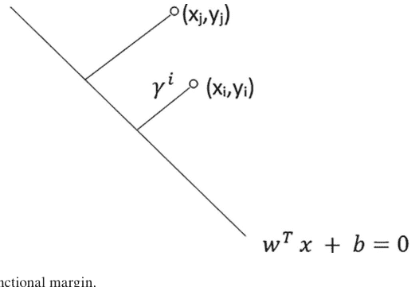

图 6.90 函数间隔。

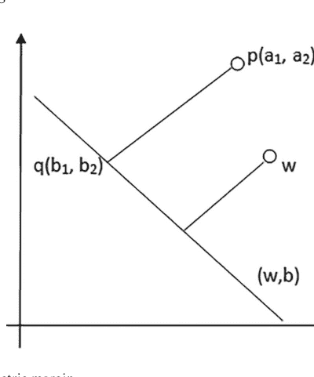

图 6.91 几何间隔。

现在，如果我们想找到点 $p$ 到点 $q$ 的距离。但这个距离是在 $w$ 的方向上，我们可以将其写为

$$p = q + \gamma \frac{w}{\|w\|} \quad (6.32)$$

上述公式 6.32 可以改写为

$$(a_1, a_2) = (b_1, b_2) + \gamma \frac{w}{\|w\|}$$
$$w^T \left( (a_1, a_2) - \gamma \frac{w}{\|w\|} \right) + b = 0$$
$$\gamma = y \frac{(w^T (a_1, a_2) + b)}{\|w\|} \quad (6.33)$$

现在，我们可以缩放 $\|w\|=1$；那么，

$$\gamma = y(w^T (a_1, a_2) + b) \quad (6.34)$$

归一化后，几何间隔为

$$\frac{\gamma}{\|w\|} \quad (6.35)$$

$$w^T x_i + b \geq \gamma \text{ 对于正类点}$$
$$w^T x_i + b < \gamma \text{ 对于负类点}$$

并且可以改写为

$$y_i(w^T x_i + b) \geq 1$$
$$y_i(w^T x_i + b) < 1 \text{ for } i = 1, 2, ..., m$$

$$\gamma = 1$$

$$\text{最大化 } \frac{1}{\|w\|} \equiv \text{最小化 } \frac{1}{2}\|w\|^2$$

因此，关于支持向量机在受线性约束下的优化问题表述如下：

$$\text{最小化 } \frac{1}{2}\|w\|^2 \quad (6.36)$$
$$\text{约束条件 } y_i(w^T x_i + b) \geq 1$$

## 6.6.2.1 带噪声的最大间隔

支持向量机可以非常有效地处理数据中的噪声。优化函数需要找到权重向量 $w$ 和 $b$，使得间隔宽度最大化。因此，间隔可以写成公式 6.37。

$$\text{最大 } \frac{2}{\|w\|} \quad (6.37)$$

并且对于 $m$ 个训练点中的每一个 $(x_i, y_i)$

$$\text{约束条件 } y_i(w^T x_i + b) \geq 1$$

并且可以改写为一个最小化问题

$$\|w\|^2 = w \cdot w \text{ 被最小化}$$

并且对于 $m$ 个训练点中的每一个 $(x_i, y_i)$

$$\text{约束条件 } y_i(w^T x_i + b) \geq 1$$

主要目标是最小化 $w \cdot w + c$，其中 $c$ 是错误点到其正确区域的距离。

## 6.6.2.2 松弛变量 $\xi_i$

在图 6.92 中，有两个被错误分类的松弛变量，记为 $\xi_1, \xi_2$，最大间隔记为 $M$，我们希望最大化它。

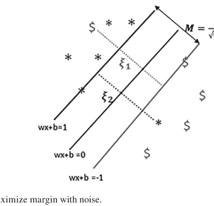

图 6.92 带噪声的最大间隔。

带噪声的最大间隔是通过添加由松弛变量引起的惩罚来定义的。

$$\text{最小化 } w \cdot w + c \sum_{k=1}^{n} \xi_k \quad (6.38)$$
$$\text{约束条件 } y_k(w \cdot x_k + b) \geq 1 - \xi_k, \quad k = 1, ..., m$$
$$\xi_k \geq 0, \quad k = 1, ..., m$$

该量的拉格朗日函数将在公式 6.39 中给出。

$$L(w, b, \xi, \alpha, \beta) = \frac{1}{2} w \cdot w + C \sum_{i=1}^{m} \xi_i + \sum_{i=1}^{m} \alpha_i [y_i(x \cdot w + b) - 1 + \xi_i] - \sum_{i=1}^{m} \beta_i \xi_i \quad (6.39)$$

其中 $\alpha_i$ 和 $\beta_i$ 是拉格朗日乘子 $\geq 0$

软支持向量机分离正类点和负类点。对偶问题的解在公式 6.40 中给出。

$$w = \sum_{i=1}^{m} \alpha_i y_i x_i \quad (6.40)$$

$$b = y_k(1 - \xi_k) - \sum_{i=1}^{m} \alpha_i y_i x_i x_k \quad (6.41)$$

对于任何满足 $\alpha_k > 0$ 的 $k$。对于分类，函数 $f(x)$ 如公式 6.42 所示。

$$f(x) = \sum_{i=1}^{m} \alpha_i y_i x_i \cdot x + b \quad (6.42)$$

其中 $x$ 是测试点，$\alpha_i$ 是非零支持向量。

然而，决策面分类器仍然是线性的，无法处理非线性情况。过拟合由软间隔支持向量机控制。软间隔与硬间隔支持向量机的区别如图 6.93 所示。

让我们看一个一维空间中的简单例子，如图 6.94 所示。假设我们有三个数据点和一个标量特征 $x$，其中有两个负类（$x=-3$ 和 $-1$）和一个正类（$x=2$）。这些数据很容易被许多线性分类器（$wx+b$）分开。所以让我们找到具有最大间隔的分类器。

$x = -3$ 且 $y = -1$

$x = -1$ 且 $y = -1$

$x = 2$ 且 $y = 1$

间隔约束被改写并在二维空间中可视化，如图 6.95 所示。满足我们间隔约束的参数集显示在绿色阴影区域。

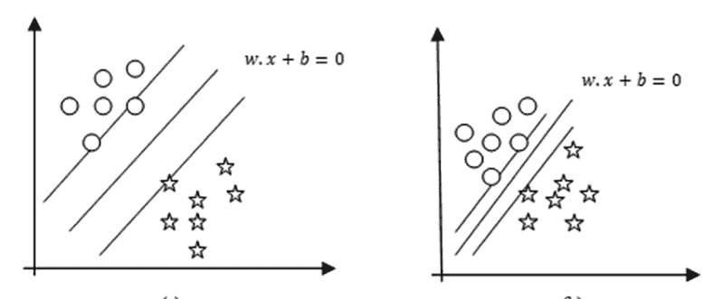

**图 6.93** (a) 软间隔支持向量机和 (b) 硬间隔支持向量机。

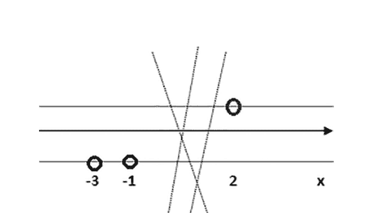

**图 6.94** 一维空间中的点。

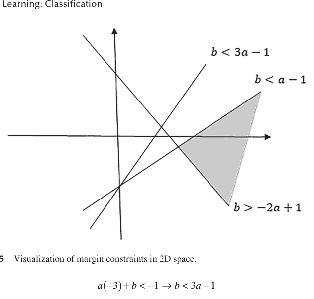

图 6.95 二维空间中间隔约束的可视化。

$$a(-3) + b < -1 \rightarrow b < 3a - 1$$
$$a(-1) + b < -1 \rightarrow b < a - 1$$
$$a(2) + b < +1 \rightarrow b > -2a + 1$$

最后，目标是最小化 $\|a\|$。

## 6.6.3 损失最小化

在图 6.96 中，数据点 $D$ 被错误分类，对于这种情况，支持向量机定义了松弛变量 $\xi$

$$\text{最小化 } \frac{1}{2}\|w\|^2 + C \sum_i \xi$$
$$\text{约束条件 } y_i(w^T x_i + b) \geq 1$$
$$\text{最小化 } \frac{1}{2}\|w\|^2 + C \sum_i \max(0, 1 - y_i(w^T x_i)) \quad (6.43)$$

其中 $C$ 是正则化参数，可以通过交叉验证来设置。

在对数据点进行分类时，一个实例可能有四种可能的情况，如图 6.96 所述。

- 1. 数据点 A 在正确的一侧，并且远离间隔，那么惩罚为 0
- 2. 数据点 B 在正确的一侧，并且更靠近间隔，那么惩罚为 0
- 3. 数据点 C 在正确的一侧，但在间隔内，非常靠近超平面，那么惩罚为 $1 - y_i(w^T x_i)$
- 4. 数据点 D 在错误的一侧；那么，惩罚为 $1 - y_i(w^T x_i)$

合页损失与 0-1 损失的比较如图 6.97 所示。

## 6.6.4 对偶形式

原始问题的拉格朗日对偶性是最小化 $f(w)$，其中 $w$ 是参数。存在两个线性约束：不等式约束 $g(w)$ 和等式约束 $h(w)$。

$$\min_w f(w) \quad (6.44)$$
$$\text{s.t. } g_i(w) \leq 0, \quad i = 1, 2, ..., k$$
$$h(w) = 0 \quad i = 1, 2, ..., l$$

广义拉格朗日函数表示为 $L(w, \alpha, \beta)$，其中 $\alpha, \beta$ 是拉格朗日乘子，且 $\alpha \geq 0$

$$L(w, \alpha, \beta) = f(w) + \sum_{i=1}^k \alpha_i g_i(w) + \sum_{i=1}^l \beta_i h_i(w) \quad (6.45)$$

引理：

$$\max_{\alpha, \beta, \alpha \geq 0} L(w, \alpha, \beta) = \begin{cases} f(w) & \text{如果 } w \text{ 满足原始约束} \\ \infty & \text{否则} \end{cases}$$

原始问题的解是 $p^*$，对偶问题是 $d^*$。

定理（弱对偶性）

$$p^* = \min_w \max_{\alpha, \beta, \alpha \geq 0} L(w, \alpha, \beta)$$
$$\nwarrow \searrow$$
$$d^* = \max_{\alpha, \beta, \alpha \geq 0} \min_w L(w, \alpha, \beta)$$

$$d^* = \max_{\alpha, \beta, \alpha \geq 0} \min_w L(w, \alpha, \beta) \leq \min_w \max_{\alpha, \beta, \alpha \geq 0} L(w, \alpha, \beta) = p^* \quad (6.46)$$

定理（强对偶性）

如果 $L(w, \alpha, \beta)$ 存在鞍点，则有 $d^* = p^*$。根据强对偶定理，当鞍点存在时，满足以下 Karush-Kuhn-Tucker (KKT) 条件。

$$\frac{\partial}{\partial w_i} L(w, \alpha, \beta) = 0, \quad i = 1, ..., k$$
$$\frac{\partial}{\partial b_i} L(w, \alpha, \beta) = 0, \quad i = 1, ..., l$$
$$\alpha_i g_i(w) = 0, \quad i = 1, ..., m$$
$$g_i(w) \leq 0, \quad i = 1, ..., m$$
$$\alpha_i \geq 0, \quad i = 1, ..., m$$

该定理指出，如果 $w^*, \alpha^*$ 和 $\beta^*$ 满足 KKT 条件，那么它就是原始问题和对偶问题的解。

$\alpha_i g_i(w) = 0$ (6.47)

如果 $\alpha_i > 0$，则 $g_i(w) = 0$。

现在，让我们看看如何解决 SVM 中的优化问题。应用拉格朗日乘子法后，带线性约束的二次规划如下。

在固定 $\alpha$ 的情况下，最小化 $w$ 和 $b$。

$\frac{\partial L_p}{\partial w} = 0 \rightarrow w = \sum_{i=1}^n \alpha_i y_i x_i$

$\frac{\partial L_p}{\partial b} = 0 \rightarrow \alpha_i y_i = 0$

$L_p(w, b, \alpha) = \sum_{i=1}^m \alpha_i - \frac{1}{2} \sum_{i,j=1}^m \alpha_i \alpha_j y_i y_j (x_i^T x_j) - b \sum_{i=1}^m \alpha_i y_i$ (6.48)

$L_p(w, b, \alpha) = \sum_{i=1}^m \alpha_i - \frac{1}{2} \sum_{i,j=1}^m \alpha_i \alpha_j y_i y_j (x_i^T x_j)$

现在，我们得到以下对偶问题，这是一个二次规划问题，总能找到全局最大值 $\alpha_i$。

$\max_{\alpha} J(\alpha) = \sum_{i=1}^m \alpha_i - \frac{1}{2} \sum_{i,j=1}^m \alpha_i \alpha_j y_i y_j (x_i^T x_j)$ (6.49)

s.t. $\alpha_i \geq 0$, $i = 1, ..., k$

$\sum_{i=1}^m \alpha_i y_i = 0$ (6.50)

得到拉格朗日乘子 $\alpha_i$ 后，参数向量 $w$ 可以如下重构：

$w = \sum_{i=1}^m \alpha_i y_i x_i w = \sum_{i \in SV} \alpha_i y_i x_i$ (6.51)

### 表 6.37 二维数据

| x1 | x2 | y | 拉格朗日乘子 α |
|---|---|---|---|
| 0.3858 | 0.4687 | 1 | 65.5261 |
| 0.4871 | 0.611 | -1 | 65.5261 |
| 0.9218 | 0.4103 | -1 | 0 |
| 0.7382 | 0.8936 | -1 | 0 |
| 0.1763 | 0.0579 | 1 | 0 |
| 0.4057 | 0.3529 | 1 | 0 |
| 0.9355 | 0.8132 | -1 | 0 |
| 0.2146 | 0.0099 | 1 | 0 |

最后，用新数据 z 进行计算

$$w^T z + b = \sum_{i \in SV} \alpha_i y_i (x_i^T z) + b$$

如果结果和为正，则将新数据 z 分类为 1；否则，如果和为负，则 z 被分类为 2。判别函数 w 取决于新数据 z 和支持向量 x_i 的点积。

**示例** 考虑表 6.37 所示的二维数据，其中包含八个实例。设 w=(w1, w2) 和 b 表示决策边界的参数；使用下面的方程，我们可以按如下方式求解 w1 和 w2：

$$w_1 = \sum_i \alpha_i y_i x_{i1} = 65.5621 * 1 * 0.3858 + 65.5621 * -1 * 0.4871 = -6.64$$
$$w_2 = \sum_i \alpha_i y_i x_{i2} = 65.5621 * 1 * 0.4687 + 65.5621 * -1 * 0.611 = -9.32$$

偏置项 b 使用以下方程计算

$$b^{(1)} = 1 - w \cdot x_1 = 1 - (-6.64)(0.3858) - (-9.32)(0.4687) = 7.9300$$
$$b^{(2)} = -1 - w \cdot x_2 = -1 - (-6.64)(0.4871) - (-9.32)(0.611) = 7.9289$$
$$\text{偏置 } b = \frac{b^{(1)} + b^{(2)}}{2} = 7.93$$

对应于这些参数的决策边界如图 6.98 所示。一旦找到决策边界，测试实例 z 将被分类为

$$f(z) = \text{sign} (w.z + b) = \text{sign} \left( \sum_{i=1}^N \alpha_i y_i x_i.z + b \right)$$

如果 f(z) = 1，则测试实例被分类为正类；否则，它被分类为负类。

## 6.6.5 核技巧

要探索核技巧机制，我们必须理解线性可分和非线性可分背后的数学原理。考虑一个具有类别标签 0 和 1 的二元分类问题。线性可分的情况是指一条直线可以将两个类别分开，而非线性可分的情况是指需要多条直线才能将两个类别分开。逻辑函数如 AND 函数和 OR 函数是线性可分的，而 XOR 函数是非线性可分的，如图 6.99 和 6.100 所示。本章第 6.6.10 节提供了理解该概念的求解示例。

## 6.6.6 多项式核

SVM 中核函数的概念在公式 6.53 中给出。

$$g(x) = w^T \emptyset(x) + b = \sum_{i \in SV} \alpha_i \emptyset(x_j)^T \emptyset(x) + b$$

核函数是特征空间中两个特征向量的点积，如公式 6.54 所示。

$$k(x_a, x_b) = \emptyset(x_a) \cdot \emptyset(x_b)$$

核函数的思想是用核函数替换点积。为了证明这一点，我们可以求解一个给定二维向量 $\vec{x} = [x_1, x_2]$ 的例子，其中 $x_1$ 和 $x_2$ 是向量的两个属性。设 $k(x_i, x_j) = (1 + x_i \cdot x_j)^2$；我们需要证明 $k(x_i, x_j) = \emptyset(x_i) \cdot \emptyset(x_j)$

$$k(x_i, x_j) = (1 + x_i \cdot x_j)^2$$

其中 $x_{i1}$ 和 $x_{i2}$ 是 $x_i$ 的两个属性，$x_{j1}$ 和 $x_{j2}$ 是 $x_j$ 的两个属性。

$k(x_i, x_j) = 1 + x_{i1}^2 x_{j1}^2 + 2x_{i1}x_{j1}x_{i2}x_{j2} + x_{i2}^2 x_{j2}^2 + 2x_{i1}x_{j1} + 2x_{i2}x_{j2}$

可以重写为

$k(x_i, x_j) = [1 \ x_{i1}^2 \ \sqrt{2}x_{i1}x_{i2} \ x_{i2}^2 \ \sqrt{2}x_{i1} \ \sqrt{2}x_{i2}] \cdot [1 \ x_{j1}^2 \ \sqrt{2}x_{j1}x_{j2} \ x_{j2}^2 \ \sqrt{2}x_{j1} \ \sqrt{2}x_{j2}]$
$= \emptyset(x_i) \cdot \emptyset(x_j)$

其中 $\emptyset(x) = [1 \ x_1^2 \ \sqrt{2}x_1x_2 \ x_2^2 \ \sqrt{2}x_1 \ \sqrt{2}x_2]$。因此，判别函数的解为

$g(x) = \sum_{i \in SV} \alpha_i k(x_i, x_j) + b$

常用的核函数有线性核、多项式核和高斯核。

线性核在公式 6.24 中给出。

$K(x_i, x_j) = x_i \cdot x_j$

非平稳核也称为多项式核。它非常适用于所有训练数据都已归一化的问题。$p$ 次多项式在公式 6.25 中给出。

$K(x_i, x_j) = (1 + x_i \cdot x_j)^p$

其中 $p$ 是多项式次数。

多项式核是一种非线性核，应满足 Mercer 定理。

### 6.6.6.1 Mercer 定理

一个核函数可以表示为

$k(x_i, x_j) = \emptyset(x_i) \cdot \emptyset(x_j)$

当且仅当对于任何函数 $g(x)$，使得 $\int g(x)^2 dx$ 有限时，有

$\int k(x, y) g(x) g(y) dx dy \geq 0$

### 6.6.6.2 径向基函数（RBF）核

最常见的核函数是 RBF 或高斯相似核，如图 6.101 所示。该核在点 x 附近产生高值，参数 $\sigma = 1$ 用于控制过拟合和欠拟合。RBF 核的方程在公式 6.27 中给出。

$K(x_i, x_j) = e^{-\frac{\|x_i - x_j\|^2}{2\sigma^2}}$

## 6.6.6.3 其他领域特定核函数

最具挑战性的部分是选择合适的核函数，这高度依赖于具体问题。

## 6.6.6.4 Sigmoid 核函数

使用 Sigmoid 核函数的支持向量机等价于一个简单的、没有隐藏层的两层神经网络，即所谓的多层感知器。它也被称为双曲正切核函数。它源于神经网络，其中人工神经元通常使用双极性 Sigmoid 机制作为激活函数。Sigmoid 核函数的方程由公式 6.59 给出。

$$K(x_i, x_j) = \tanh(\alpha x_i \cdot x_j - \delta)$$

## 6.6.6.5 指数核函数

它与高斯核函数非常接近，如下公式 6.60 所示。

$$K(x_i, x_j) = e^{-\left(\frac{\|x_i - x_j\|^2}{2\sigma^2}\right)}$$

## 6.6.6.6 ANOVA 核函数

据说它在多维回归问题中表现良好。

$$K(x_i, x_j) = \sum_{k=1}^n \exp\left(-\sigma(x_i^k - x_j^k)^2\right)^d$$

## 6.6.6.7 有理二次核函数

它的计算强度低于高斯核函数。如果高斯核函数计算成本过高，那么有理二次核函数可以作为替代方案。

$$k(x_i, x_j) = 1 - \frac{\|x_i - x_j\|^2}{\|x_i - x_j\|^2 + c}$$

## 6.6.6.8 多二次核函数

多二次核函数可用于与有理二次核函数相同的场景。与 Sigmoid 核函数一样，它也是非正定核函数的一个例子。

$$k(x_i, x_j) = \sqrt{\|x_i - x_j\|^2 + c^2}$$

## 6.6.6.9 逆多二次核函数

高斯核函数生成的核矩阵是满秩的，因此形成无限维特征空间。

$$k(x_i, x_j) = \frac{1}{\sqrt{\|x_i - x_j\|^2 + c^2}}$$

## 6.6.6.10 圆形核函数

圆形核函数用于地统计应用。它是各向同性平稳核函数的一个例子，在 $R_2$ 中是正定的。

$$k(x_i, x_j) = \frac{2}{\pi} \arccos\left(-\frac{\|x_i - x_j\|}{\sigma}\right) - \frac{2}{\pi} \frac{\|x_i - x_j\|}{\sigma}$$

## 6.6.6.11 贝叶斯核函数

贝叶斯核函数可以表示为

$$k(x, y) = \prod_{l=1}^N k_l(x_l, y_l)$$

## 6.6.6.12 卡方核函数

它源于卡方分布，表示如下：

$$k(x, y) = 1 - \sum_{l=1}^n \frac{(x_l - y_l)^2}{\frac{1}{2}(x_l + y_l)}$$

## 6.6.6.13 直方图相交核函数

它广泛用于图像分类，也被称为最小核函数。

$$k(x, y) = \sum_{l=1}^n \min(x_l, y_l)$$

## 6.6.6.14 广义直方图相交核函数

它是直方图相交核函数的一个变体，广泛应用于图像分类。

$$k(x, y) = \sum_{l=1}^n \min(|x_l|^\alpha, |y_l|^\beta)$$

## 6.6.7 NU SVM

在软间隔支持向量机中，寻找参数 $C$ 很困难。Scholkopf 等人引入了 nu SVM 来替代使用 $C$。nu 的取值范围在 0 和 1 之间。其函数由公式 6.70 给出。

最小化 $\frac{1}{2}\|w\|^2 - \gamma\rho + \frac{1}{2}\sum_l \xi^l$

约束条件为

$r^l(w^T x^l + w_0) \geq \rho - \xi^l, \xi^l \geq 0, \rho \geq 0$

## 6.6.8 支持向量机回归

让我们将支持向量机扩展到回归问题。给定训练数据 $\{(X_1, y_1) \dots (X_n, y_n)\}$，其中 $X_i \in R^m$，$y_i \in R$，其思想是学习一个最优函数，以便在给定 $X$ 的情况下预测 $y$。这个回归问题可以通过权重向量 $w$ 进行参数化，如下公式 6.71 所示，

$$g(X, W) = w_1 \emptyset_1(x) + \dots + w_{m'} \emptyset_{m'}(x) + b = w^T \emptyset(x) + b \quad (6.71)$$

其中 $\emptyset_i : R^m \rightarrow R$。如果我们选择 $\emptyset_i(X) = x_i$，那么它就是一个线性回归模型。通过指定 $Z = \emptyset(X) \in R^{m'}$，我们是在一个新变换的特征空间中学习一个线性模型。可以使用核函数来代替显式指定点积。

回归问题中的损失函数 $L$ 是为了最小化 $W$，由公式 6.72 给出，

$$\sum_i L(y_{i,g}(X_i, W)) \quad (6.72)$$

使用一种特殊的损失函数，称为 $\varepsilon$ 不敏感损失，它允许我们在支持向量机回归中使用核技巧，如公式 6.42 所示。

$$L_{\varepsilon}(y_i, g(X_i, W)) = \begin{cases} 0 & \text{如果 } |y_i - g(X_i, W)| < \varepsilon \\ |y_i - g(X_i, W)| - \varepsilon & \text{否则} \end{cases} \quad (6.73)$$

其中 $\varepsilon$ 是损失函数的参数，如果预测值在真实值的 $\varepsilon$ 范围内，则没有损失。并且选择绝对误差值而不是误差的平方以实现高鲁棒性。

因此，在 $\varepsilon$ 不敏感损失下的经验风险最小化将最小化

$$\sum_{i=1}^n \max(|y_i - \emptyset(X_i)^T W - b| - \varepsilon, o) \quad (6.74)$$

支持向量机回归的优化问题是找到 $W$，$b$，$\varepsilon_i$，$\varepsilon_i'$

$$\text{最小化 } \frac{1}{2} W^T W + C \left( \sum_{i=1}^n \varepsilon_i + \sum_{i=1}^n \varepsilon_i' \right) \quad (6.75)$$

$$\text{约束条件为 } y_i - W^T \emptyset(X_i) - b \leq \varepsilon + \varepsilon_i, \quad i = 1, \dots, n$$
$$W^T \emptyset(X_i) + b - y_i \leq \varepsilon + \varepsilon_i', \quad i = 1, \dots, n$$
$$\varepsilon_i \geq 0, \quad \varepsilon_i' \geq 0, \quad i = 1, \dots, n$$

为了构建支持向量机回归的对偶问题，引入非负乘子 $\alpha_i$ 和 $\alpha_i'$ 如下

$$\max_{\alpha, \alpha'} \sum_{i=1}^n y_i (\alpha_i - \alpha_i') - \varepsilon \sum_{i=1}^n (\alpha_i + \alpha_i') - \frac{1}{2} \sum_{i,j} (\alpha_i - \alpha_i')(\alpha_j - \alpha_j') \emptyset(X_i)^T \emptyset(X_j)^T \quad (6.76)$$

约束条件为 $\sum_{i=1}^{n} (\alpha_i - \alpha'_i) = 0$

$0 \leq \alpha_i, \alpha'_i \leq C, i = 1, ..., n$

## 6.6.9 单类支持向量机

离群点检测是单类支持向量机的一个例子。离群点检测用于异常检测，其中人们感兴趣的是检测异常或不寻常的观测值。训练数据包含离群点，这些离群点被定义为远离其他观测值的观测值。单类支持向量机是一种无监督学习算法，它学习数据点的边界，并且可以将任何位于边界之外的点分类为，你猜对了，离群点。

图 6.102 显示了一个例子，其中小猫和幼崽是目标类别，标签为 y=+1，而其他极端情况（既不是小猫也不是幼崽）是离群点 y=-1。图中显示了一个单类分类器，它将小猫和幼崽与所有其他对象区分开来。

## 6.6.10 多类支持向量机

通常，支持向量机是一个二元分类器，但在实时场景中，可能存在多个类别。多类分类可以使用一对一、一对多和有向无环图支持向量机方法来实现。

### 6.6.10.1 一对多

在一对多方法中，构建 k 个二元支持向量机分类器，其中 k 是类别数量。例如，有三个类别 {1, 2, 3}，如图 6.103 所示。最初，让我们通过假设类别 1 为正类，类别 2 和 3 为负类来进行二元分类。类似地，对其他四个类别重复相同的过程。

### 6.6.10.2 一对一

在一对一方法中，对于 $M$ 个类别，构建 $M(M - 1)/2$ 个分类器。图 6.104 显示了使用一对一方法解决三类支持向量机问题的架构。

### 6.6.10.3 有向无环图支持向量机

它是一对一方法和有向无环图概念的结合。对于三类示例 {1, 2, 3}，最初像一对一方法一样为类别 {1 和 2} 构建一个二元分类器。如果数据属于类别 1，则二元分类器移动到右节点，否则移动到左节点。最后，构建如图 6.105 所示的有向无环图来做出决策。叶节点表示最终的类别标签。

## 6.6.11 支持向量机示例

### 示例 6.11

让我们来看一个线性支持向量机问题。假设我们给定以下正标签数据点

$$\left\{\left(\begin{array}{l}3 \\ 1\end{array}\right),\left(\begin{array}{l}3 \\ -1\end{array}\right),\left(\begin{array}{l}6 \\ 1\end{array}\right),\left(\begin{array}{l}6 \\ -1\end{array}\right)\right\}$$

以及以下负标签数据点（见图 6.106）：

$$\left\{\left(\begin{array}{l}1 \\ 0\end{array}\right),\left(\begin{array}{l}0 \\ 1\end{array}\right),\left(\begin{array}{l}0 \\ -1\end{array}\right),\left(\begin{array}{l}-1 \\ 0\end{array}\right)\right\}$$

让我们确定一个简单的超平面来分离正负点。由于数据点是线性可分的，可以使用线性支持向量机。

让我们通过观察给定的输入数据来定义一个超平面。有三个支持向量被圈出，如图 6.107 所示，它们靠近超平面，分别是

$$\left\{s_{1}=\left(\begin{array}{l}1 \\ 0\end{array}\right), s_{2}=\left(\begin{array}{l}3 \\ 1\end{array}\right), s_{3}=\left(\begin{array}{l}3 \\ -1\end{array}\right)\right\}$$

在下文中，我们将使用添加了 1 作为偏置输入的增广向量

$$\left\{\widetilde{s_{1}}=\left(\begin{array}{l}1 \\ 0 \\ 1\end{array}\right), \widetilde{s_{2}}=\left(\begin{array}{l}3 \\ 1 \\ 1\end{array}\right), \widetilde{s_{3}}=\left(\begin{array}{l}3 \\ -1 \\ 1\end{array}\right)\right\}$$

## 6.106 线性支持向量机。

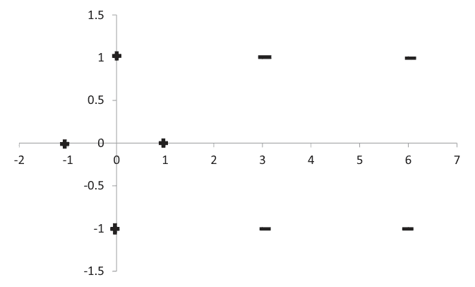

## 6.107 带有支持向量的线性可分数据点。

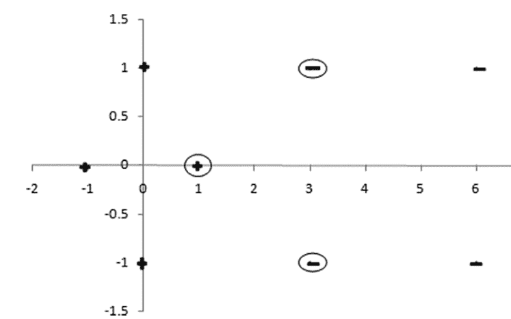

图 6.108 展示了支持向量机的架构，其对应的方程 6.77 至 6.79 如下所示。

$$\alpha_1 \emptyset(s_1) \cdot \emptyset(s_1) + \alpha_2 \emptyset(s_2) \cdot \emptyset(s_1) + \alpha_3 \emptyset(s_3) \cdot \emptyset(s_1) = -1 \quad (6.77)$$
$$\alpha_1 \emptyset(s_1) \cdot \emptyset(s_2) + \alpha_2 \emptyset(s_2) \cdot \emptyset(s_2) + \alpha_3 \emptyset(s_3) \cdot \emptyset(s_2) = +1 \quad (6.78)$$
$$\alpha_1 \emptyset(s_1) \cdot \emptyset(s_3) + \alpha_2 \emptyset(s_2) \cdot \emptyset(s_3) + \alpha_3 \emptyset(s_3) \cdot \emptyset(s_3) = +1 \quad (6.79)$$

## 6.108 线性支持向量机架构。

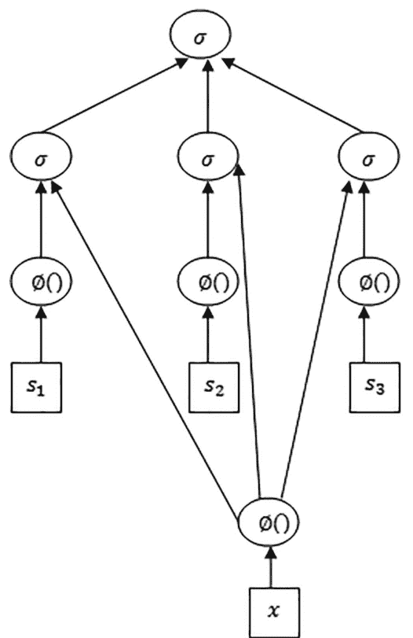

由于目前我们有 $\emptyset() = I$，上述方程简化为

$$\alpha_1 \widetilde{s_1} \cdot \widetilde{s_1} + \alpha_2 \widetilde{s_2} \cdot \widetilde{s_1} + \alpha_3 \widetilde{s_3} \cdot \widetilde{s_1} = -1$$
$$\alpha_1 \widetilde{s_1} \cdot \widetilde{s_2} + \alpha_2 \widetilde{s_2} \cdot \widetilde{s_2} + \alpha_3 \widetilde{s_3} \cdot \widetilde{s_2} = +1$$
$$\alpha_1 \widetilde{s_1} \cdot \widetilde{s_3} + \alpha_2 \widetilde{s_2} \cdot \widetilde{s_3} + \alpha_3 \widetilde{s_3} \cdot \widetilde{s_3} = +1$$

让我们将 $\widetilde{s_1}$、$\widetilde{s_2}$ 和 $\widetilde{s_3}$ 的值代入上述方程

$$\alpha_1 \begin{pmatrix} 1 & 0 & 1 \end{pmatrix} \cdot (1\ 0\ 1) + \alpha_2 \begin{pmatrix} 3 & 1 & 1 \end{pmatrix} \cdot (1\ 0\ 1) + \alpha_3 \begin{pmatrix} 3 & -1 & 1 \end{pmatrix} \cdot (1\ 0\ 1) = -1$$
$$\alpha_1 \begin{pmatrix} 1 & 0 & 1 \end{pmatrix} \cdot (3\ 1\ 1) + \alpha_2 \begin{pmatrix} 3 & 1 & 1 \end{pmatrix} \cdot (3\ 1\ 1) + \alpha_3 \begin{pmatrix} 3 & -1 & 1 \end{pmatrix} \cdot (3\ 1\ 1) = +1$$
$$\alpha_1 \begin{pmatrix} 1 & 0 & 1 \end{pmatrix} \cdot (3\ -1\ 1) + \alpha_2 \begin{pmatrix} 3 & 1 & 1 \end{pmatrix} \cdot (3\ -1\ 1) + \alpha_3 \begin{pmatrix} 3 & -1 & 1 \end{pmatrix} \cdot (3\ -1\ 1) = +1$$

$$2\alpha_1 + 4\alpha_2 + 4\alpha_3 = -1$$
$$4\alpha_1 + 11\alpha_2 + 9\alpha_3 = +1$$
$$4\alpha_1 + 9\alpha_2 + 11\alpha_3 = +1$$

通过求解上述方程组，我们得到 $\alpha_1 = -3.5$，$\alpha_2 = 0.75$，以及 $\alpha_3 = 0.75$。

现在，我们得到了 $\alpha_i$。超平面的方程可以写为

$$y = wx + b$$

$w$ 和 $b$ 的值由下式给出

$$\tilde{w} = \sum_i \alpha_i \cdot \tilde{s_i}$$

$$= -3.5 * \begin{pmatrix} 1 & 0 & 1 \end{pmatrix} + 0.75 * \begin{pmatrix} 3 & 1 & 1 \end{pmatrix} + 0.75 * \begin{pmatrix} 3 & -1 & 1 \end{pmatrix}$$

$$= \begin{pmatrix} 1 & 0 & -2 \end{pmatrix}$$

这里，$w = \begin{pmatrix} 1 & 0 \end{pmatrix}$ 且 $b = -2$。绘制该直线即可得到如图 6.109 所示的粗线表示的预期决策边界。

## 6.109 带有超平面的线性可分支持向量机。

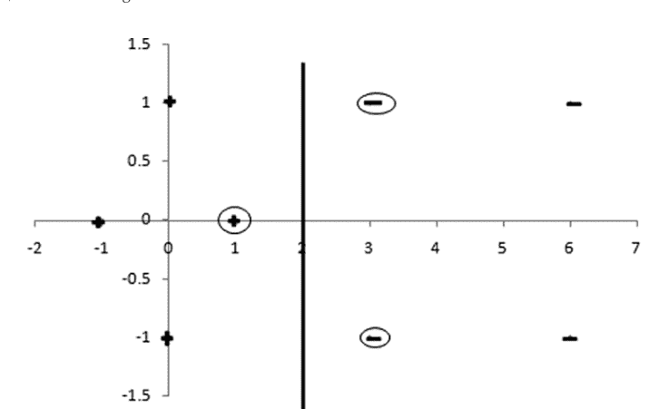

## 示例 6.12

使用支持向量机将给定的数据点分为两类，并找到最优超平面

| x | y | 标签 |
|---|---|-------|
| 1 | 1 | -ve |
| 2 | 1 | -ve |
| 1 | -1 | -ve |
| 2 | -1 | -ve |
| 4 | 0 | +ve |
| 5 | 1 | +ve |
| 5 | -1 | +ve |
| 6 | 0 | +ve |

首先，让我们在图中绘制数据点；负类点标记为‘-’，正类点标记为‘+’，如图 6.110 所示。

可能存在许多可能的超平面，如图 6.111 所示，目标是识别出最优超平面。

有三个支持向量（图 6.112），即 $S_1$、$S_2$ 和 $S_3$。

$$S_1 = \begin{pmatrix} 2 & 1 \end{pmatrix}, S_2 = \begin{pmatrix} 2 & -1 \end{pmatrix}, S_3 = \begin{pmatrix} 4 & 0 \end{pmatrix}$$

偏置输入为 1。因此，用偏置输入增强支持向量，然后 $S_1$、$S_2$ 和 $S_3$ 变为 $\widetilde{S_1}$、$\widetilde{S_2}$、$\widetilde{S_3}$，如下所示。

$$\widetilde{S_1} = \begin{pmatrix} 2 & 1 & 1 \end{pmatrix}, \widetilde{S_2} = \begin{pmatrix} 2 & -1 & 1 \end{pmatrix}, \widetilde{S_3} = \begin{pmatrix} 4 & 0 & 1 \end{pmatrix}$$

## 6.110 数据点表示。

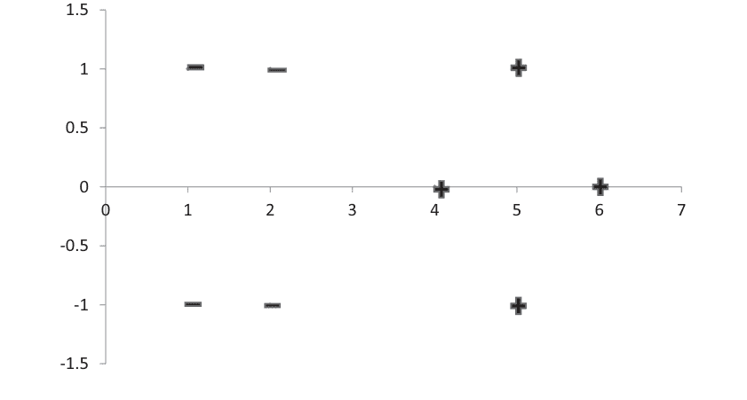

## 6.111 可能的超平面。

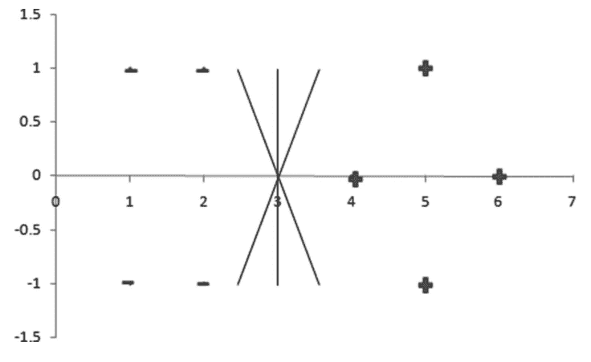

## 6.112 支持向量表示。

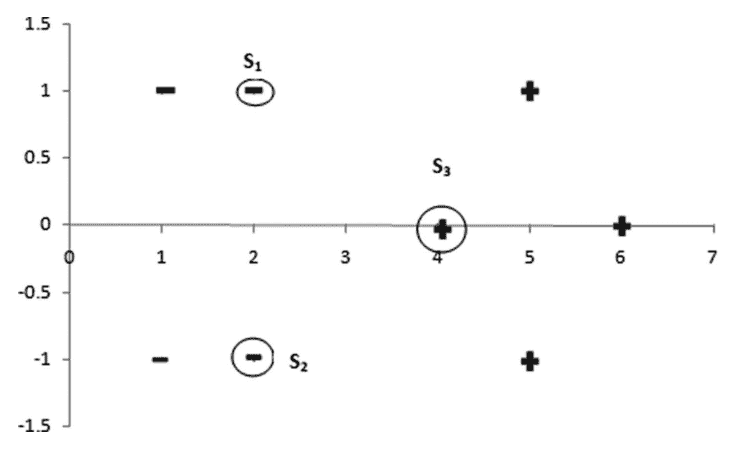

我们需要根据以下三个线性方程来求解三个参数 $\alpha_1, \alpha_2$ 和 $\alpha_3$

$$\alpha_1 \widetilde{S_1} \cdot \widetilde{S_1} + \alpha_2 \widetilde{S_2} \cdot \widetilde{S_1} + \alpha_3 \widetilde{S_3} \cdot \widetilde{S_1} = -1 \quad \text{(-ve class)}$$

$$\alpha_1 \widetilde{S_1} \cdot \widetilde{S_2} + \alpha_2 \widetilde{S_2} \cdot \widetilde{S_2} + \alpha_3 \widetilde{S_3} \cdot \widetilde{S_2} = -1 \quad \text{(-ve class)}$$

$$\alpha_1 \widetilde{S_1} \cdot \widetilde{S_3} + \alpha_2 \widetilde{S_2} \cdot \widetilde{S_3} + \alpha_3 \widetilde{S_3} \cdot \widetilde{S_3} = +1 \quad \text{(+ve class)}$$

让我们将 $\widetilde{S_1}$、$\widetilde{S_2}$、$\widetilde{S_3}$ 的值代入上述方程

$$\alpha_1 \begin{pmatrix} 2 & 1 & 1 \end{pmatrix} \begin{pmatrix} 2 \\ 1 \\ 1 \end{pmatrix} + \alpha_2 \begin{pmatrix} 2 & -1 & 1 \end{pmatrix} \begin{pmatrix} 2 \\ 1 \\ 1 \end{pmatrix} + \alpha_3 \begin{pmatrix} 4 & 0 & 1 \end{pmatrix} \begin{pmatrix} 2 \\ 1 \\ 1 \end{pmatrix} = -1$$
$$\alpha_1 \begin{pmatrix} 2 & 1 & 1 \end{pmatrix} \begin{pmatrix} 2 \\ -1 \\ 1 \end{pmatrix} + \alpha_2 \begin{pmatrix} 2 & -1 & 1 \end{pmatrix} \begin{pmatrix} 2 \\ -1 \\ 1 \end{pmatrix} + \alpha_3 \begin{pmatrix} 4 & 0 & 1 \end{pmatrix} \begin{pmatrix} 2 \\ -1 \\ 1 \end{pmatrix} = -1$$
$$\alpha_1 \begin{pmatrix} 2 & 1 & 1 \end{pmatrix} \begin{pmatrix} 4 \\ 0 \\ 1 \end{pmatrix} + \alpha_2 \begin{pmatrix} 2 & -1 & 1 \end{pmatrix} \begin{pmatrix} 4 \\ 0 \\ 1 \end{pmatrix} + \alpha_3 \begin{pmatrix} 4 & 0 & 1 \end{pmatrix} \begin{pmatrix} 4 \\ 0 \\ 1 \end{pmatrix} = +1$$

化简后，我们得到

$$6\alpha_1 + 4\alpha_2 + 9\alpha_3 = -1$$
$$4\alpha_1 + 6\alpha_2 + 9\alpha_3 = -1$$
$$9\alpha_1 + 9\alpha_2 + 17\alpha_3 = 1$$

求解上述三个联立方程后，我们得到

$$\alpha_1 = \alpha_2 = -3.25 \quad \text{and} \quad \alpha_3 = 3.5$$

区分两类的超平面由下式给出

$$\widetilde{w} = \sum_i \alpha_i S_i$$

$$\widetilde{w} = -3.25 \begin{pmatrix} 2 & 1 & 1 \end{pmatrix} - 3.25 \begin{pmatrix} 2 & -1 & 1 \end{pmatrix} + 3.5 \begin{pmatrix} 4 & 0 & 1 \end{pmatrix} = \begin{pmatrix} 1 & 0 & -3 \end{pmatrix}$$

因此，我们令 $y = wx + b$

其中 $w = \begin{pmatrix} 1 & 0 \end{pmatrix}$ 且 $b = -3$，该线性支持向量机的预期超平面如图 6.113 所示。

大多数现实世界的数据都具有非线性。让我们考虑一个一维空间中的非线性数据示例，如图 6.114 所示。

通过添加二次特征 $x_2 = x_1^2$ 将它们转换到高维空间，这反过来使数据线性可分，如图 6.115 所示。

线性不可分的数据将没有单一的超平面来分离它们。特征空间非线性模型中的数据点 $x$ 被映射到特征空间的线性模型 $\emptyset(x)$。在映射 $x \rightarrow \emptyset(x)$ 的过程中，计算成本变得非常高。我们可以通过在支持向量机中使用核函数来实现这种转换，而不会导致计算成本大幅增加。

图 6.116a 是线性不可分的，但当我们将这些点转换到适当的高维特征空间时，这些点可能变得线性可分，如图 6.116b 所示。

## 6.113 最优超平面。

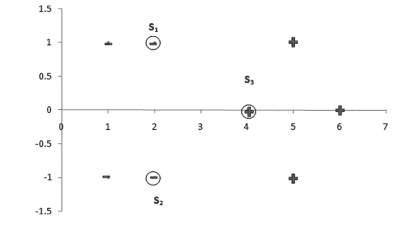

## 6.114 非线性可分数据。

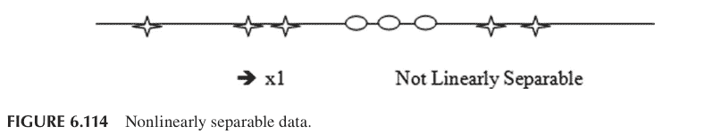

## 6.115 线性可分数据。

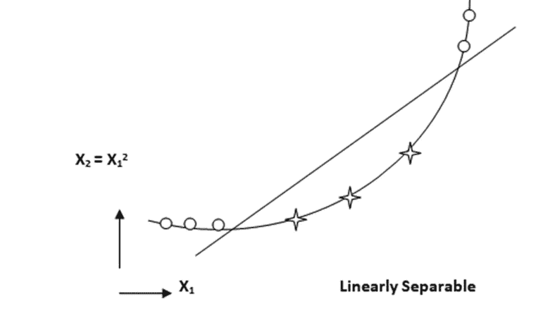

## 示例 6.13

让我们来看另一个解决非线性SVM问题的例子。假设我们给定以下标记为正类（用‘+’表示）的数据点

$$\left\{\left(\begin{array}{l}2 \ 2\end{array}\right),\left(\begin{array}{l}2 \ -2\end{array}\right),\left(\begin{array}{l}-2 \ -2\end{array}\right),\left(\begin{array}{l}-2 \ 2\end{array}\right)\right\}$$

以及以下标记为负类（用‘-’表示）的数据点（见图6.117）：

$$\left\{\left(\begin{array}{l}1 \ 1\end{array}\right),\left(\begin{array}{l}1 \ -1\end{array}\right),\left(\begin{array}{l}-1 \ -1\end{array}\right),\left(\begin{array}{l}-1 \ 1\end{array}\right)\right\}$$

这些点是非线性可分的，如图6.118所示。因此，我们必须使用非线性SVM；即映射函数 $\emptyset$ 是从输入空间到某个特征空间的非线性映射。该映射定义为

$$\emptyset\left(\begin{array}{l}x_{1} \ x_{2}\end{array}\right)=\left\{\begin{array}{l}\left(\begin{array}{l}4-x_{2}+\left|x_{1}-x_{2}\right| \ 4-x_{1}+\left|x_{1}-x_{2}\right|\end{array}\right) \ \left(\begin{array}{l}x_{1} \ x_{2}\end{array}\right)\end{array}\right. \begin{array}{l}\text { 如果 } \sqrt{x_{1}^{2}+x_{2}^{2}}>2 \ \text { 否则 }\end{array}$$

正例数据映射到特征空间后为

$$\left\{\left(\begin{array}{l}2 \ 2\end{array}\right),\left(\begin{array}{l}6 \ 2\end{array}\right),\left(\begin{array}{l}6 \ 6\end{array}\right),\left(\begin{array}{l}2 \ 6\end{array}\right)\right\}$$

负例数据映射后为

$$\left\{\left(\begin{array}{l}1 \ 1\end{array}\right),\left(\begin{array}{l}1 \ -1\end{array}\right),\left(\begin{array}{l}-1 \ -1\end{array}\right),\left(\begin{array}{l}-1 \ 1\end{array}\right)\right\}$$

这些点绘制如图6.119所示，支持向量（圈出）靠近由坐标给出的超平面。

$$\left\{s_1=\left(\begin{array}{l}1 \ 1\end{array}\right),s_2=\left(\begin{array}{l}2 \ 2\end{array}\right)\right\}$$

接下来，我们将使用添加了1作为偏置输入的增广向量

$$\left\{ s_1 = \begin{pmatrix} 1 \ 1 \ 1 \end{pmatrix}, s_2 = \begin{pmatrix} 2 \ 2 \ 1 \end{pmatrix} \right\}$$

下图表示了SVM的结构，其对应的方程如下。

$$\alpha_1 \emptyset(s_1) \cdot \emptyset(s_1) + \alpha_2 \emptyset(s_2) \cdot \emptyset(s_1) = -1$$
$$\alpha_1 \emptyset(s_1) \cdot \emptyset(s_2) + \alpha_2 \emptyset(s_2) \cdot \emptyset(s_2) = +1$$

由于目前我们有 $\emptyset() = 1$，这简化为

$$\alpha_1 \widetilde{s_1} \cdot \widetilde{s_1} + \alpha_2 \widetilde{s_2} \cdot \widetilde{s_1} = -1$$
$$\alpha_1 \widetilde{s_1} \cdot \widetilde{s_2} + \alpha_2 \widetilde{s_2} \cdot \widetilde{s_2} = +1$$

让我们将S1、S2和S3的值代入上述方程

$$\alpha_1 \begin{pmatrix} 1 \ 1 \ 1 \end{pmatrix} \cdot (1\ 1\ 1) + \alpha_2 \begin{pmatrix} 2 \ 2 \ 1 \end{pmatrix} \cdot (1\ 1\ 1) = -1$$
$$\alpha_1 \begin{pmatrix} 1 \ 1 \ 1 \end{pmatrix} \cdot (2\ 2\ 1) + \alpha_2 \begin{pmatrix} 2 \ 2 \ 1 \end{pmatrix} \cdot (2\ 2\ 1) = +1$$

$$3\alpha_1 + 5\alpha_2 = -1$$
$$5\alpha_1 + 9\alpha_2 = +1$$

解上述方程组，我们得到 $\alpha_1 = -7, \alpha_2 = 4$
现在，我们得到了 $\alpha_i$。超平面的方程可以写为
$$y = wx + b$$
$w$ 和 $b$ 的值由下式给出
$$\tilde{w} = \sum_i \alpha_i \cdot \tilde{s}_i$$
$$= -7 \cdot \begin{pmatrix} 1 \ 1 \ 1 \end{pmatrix} + 4 \cdot \begin{pmatrix} 2 \ 2 \ 1 \end{pmatrix}$$
$$= \begin{pmatrix} 1 \ 1 \ -3 \end{pmatrix}$$
这里，$w = \begin{pmatrix} 1 \ 1 \end{pmatrix}$ 且 $b = -3$。期望的决策边界是图6.120中所示的深色线。

## 示例 6.14

给定表格中的十个实例，这是一个如图6.121所示的非线性可分情况。如何使用核技巧将非线性可分转换为线性可分？
为了将特征空间从原始非线性空间转换，然后使用公式将 $x_1$ 和 $x_2$ 转换到高维空间 $z_1$ 和 $z_2$。
$$z_1 = x_1^2 \text{ 且 } z_2 = x_1 \cdot x_2$$
结果已制表，输出如图6.122所示。

340 机器学习在决策科学中的应用及Python案例研究

| x1 | x2 | y |
|---|---|---|
| 4 | 7 | -1 |
| 7 | 8 | -1 |
| 5.5 | 6 | -1 |
| 6 | 7 | -1 |
| 7.5 | 6.5 | -1 |
| 5.5 | 5 | 1 |
| 4 | 6 | 1 |
| 7 | 5.5 | 1 |
| 8.5 | 6 | 1 |
| 9 | 6.5 | 1 |

| z1 | z2 | y |
|---|---|---|
| 16 | 28 | -1 |
| 49 | 56 | -1 |
| 30.25 | 33 | -1 |
| 36 | 42 | -1 |
| 56.25 | 48.75 | -1 |
| 30.25 | 27.5 | 1 |
| 16 | 24 | 1 |
| 49 | 38.5 | 1 |
| 72.25 | 51 | 1 |
| 81 | 58.5 | 1 |

## 6.6.12 现实世界应用

SVM已被用于许多现实世界的应用中，例如图像分类、手写OCR、生物信息学和文本分类（图6.123）。此外，生物信息学领域已用于基于基因表达数据的癌症诊断和蛋白质二级结构预测。SVM的优点在于其解的稀疏性以及通过使用软间隔方法可以控制过拟合，这使其在广泛的应用中得以使用。

### 6.6.12.1 认知障碍分类

阿尔茨海默病（AD）是一种退行性脑疾病，也是痴呆症最常见的原因。痴呆症的症状包括记忆力减退以及思维、解决问题或语言方面的困难，严重影响患者的日常生活。轻度认知障碍（MCI）是AD的早期阶段，其特征是在没有痴呆症的情况下出现显著的认知障碍。在美国，2014年有超过520万人患有AD，据估计到2050年将有1380万美国人患有AD。因此，精确预测和诊断AD，尤其是在其预警阶段如MCI，已成为延缓甚至避免痴呆症的关键一步。

常用的模态包括磁共振成像（MRI）、功能磁共振成像（fMRI）和正电子发射断层扫描（PET）。由于其在临床环境中的易获得性，与其他模态相比，MRI最受研究人员关注。与AD相关的大脑结构变化可以使用MRI进行无创评估。

在早期阶段检测AD对于患者管理至关重要。AD的一些最早症状，如短期记忆丧失，常被误认为与衰老和压力有关；在早期阶段预测该疾病仍然具有挑战性。阿尔茨海默病神经影像计划（ADNI）数据集用于评估。系统的设计如图6.124所示。

### 6.6.12.2 预处理

对每张MRI脑图像应用三步预处理。预处理步骤如下：

- 步骤1：大脑中的头骨对于AD分析不是必需的，因此使用free surfer工具进行颅骨剥离
- 步骤2：使用free surfer工具将MRI图像分割为白质、灰质和脑脊液（CSF）
- 步骤3：进行直方图均衡化，通过修改强度分布来调整对比度。直方图均衡化在不损失数据的情况下是优选的；它均衡了图像的对比度。

### 6.6.12.3 特征提取

灰度共生矩阵（GLCM）用于提取每个感兴趣区域（ROI）的3D纹理参数。GLCM参数在表6.38中描述。

### 6.6.12.4 SVM分类

SVM将每个数据项绘制为n维空间中的一个点（其中n是你拥有的特征数量），每个特征的值是特定坐标的值。SVM通过核函数将原始特征映射到高维特征空间中构建最大分类器。具有经验缩放因子的高斯RBF核很好地将两类区分开来。最后，进行了五折交叉验证的SVM。

### 6.6.12.5 流程

**输入：** ADNI数据集
**输出：** 用于AD诊断的SVM模型，包含给定数据集的准确率

## 表 6.38
GLCM 参数

| 参数 | 描述 |
| :--- | :--- |
| 熵 | 衡量图像中像素的无序程度 |
| 能量 | 提供 GLCM 中元素平方和 |
| 对比度 | 衡量 GLCM 中的局部变化 |
| 相关性 | 衡量指定像素对联合出现的概率 |
| 同质性 | 衡量 GLCM 中元素分布接近 GLCM 对角线的程度 |
| 差异方差 | 衡量与图像灰度级差异分布相关的离散度 |
| 差异熵 | 衡量与图像灰度级差异分布相关的无序性 |

## 表 6.39
结果评估

| 性能指标 | 公式 | 结果 |
| :--- | :--- | :--- |
| 准确率 | $\frac{TP + TN}{TP + TN + FP + FN}$ | 0.7500 |
| 召回率/灵敏度 | $\frac{TP}{TP + FN}$ | 0.8600 |
| 特异性 | $\frac{TN}{TN + FP}$ | 0.6400 |
| 精确率 | $\frac{TP}{TP + FP}$ | 0.7049 |
| F-分数 | $\frac{2 * Recall * precision}{(Recall + precision)}$ | 0.7748 |

- 步骤 1：获取用于训练模型的数据集作为输入
- 步骤 2：为给定数据集选择特征和类别标签
- 步骤 3：设置分类类型的值（0 – C-SVC，1 – nu SVC，2 – 单类 SVM，3 – epsilon SVR，4 – nu-SVR）
- 步骤 4：设置核函数类型的值（0 – 线性，1 – 多项式，2 – RBF，3 – sigmoid: tanh）
- 步骤 5：设置 gamma 的值（1/属性数量）
- 步骤 6：设置代价的值（默认代价 1）。
- 步骤 7：根据指定选项，使用给定数据集训练模型。
- 步骤 8：对生成的模型执行交叉验证，折数为 10。
- 步骤 9：通过构建混淆矩阵计算模型的按类别准确率。

## 6.6.12.6 性能分析

算法的准确率通过使用混淆矩阵来实现。混淆矩阵说明了解决分类问题的准确性。混淆矩阵包含有关分类系统进行的实际分类和预测分类的信息。此类系统的性能通常使用矩阵数据进行评估，并在表 6.39 中呈现。

## 6.6.12.7 文本分类

随着电子信息量的增加，人们越来越有兴趣开发工具来帮助人们更好地查找、过滤和管理这些资源。在现实场景中，我们有成百上千的文件和邮件，需要组织和管理这些文件，因为随着数据的增加，人工文本分类非常耗时。基于规则的方法被用于文本分类，但它需要手动构建规则。垃圾邮件检测和文档主题建模都基于文本分类。例如，给定邮件内容，其思想是将其分类为是否为垃圾邮件。每个文档被表示为一个词向量。文档 $x$ 可以用向量 (doc2vec) 表示，即 $x \rightarrow \emptyset(x)$。

$$\emptyset_i(x) = \frac{tf_i \log(idf_i)}{k}$$

向量空间中两个文档（例如 $x$ 和 $y$）之间的距离表示为 $\emptyset(x) \cdot \emptyset(y)$ 的点积。使用核函数 $k(x, y) = \emptyset(x) \cdot \emptyset(y)$。SVM 在线性可分的文本分类应用中表现良好。核函数和核参数的选择提高了分类性能。Reuters 语料库在文本分类研究中很受欢迎。

## 6.6.12.8 手写光学字符识别

光学字符识别是将手写数字或文本转换为可编辑文档的过程，如图 6.125 所示。换句话说，它是将扫描文档和打印文档转换为可读和可编辑形式的过程。SVM 在识别手写字符方面优于其他机器学习模型。MNIST 是一个包含 60,000 个手写数字样本的开源数据集。与神经网络模型相比，SVM 实现了良好的准确率。NIST 和 USPS 是可用于评估的其他数据集。多项式核函数能以更好的准确率和更低的错误率给出良好结果。

将输入图像表示为向量 $x \in R$。学习一个 SVM 分类器 $f(x)$，使得，

$$f : x \rightarrow \{0, 1, 2, 3, 4, 5, 6, 7, 8, 9\}$$

## 6.6.12.9 自然语言处理

自然语言处理是自动分析和处理自然语言的过程。SVM 被用于各种自然语言处理技术，例如词性标注、词义消歧、文本分类、命名实体识别、信息检索和机器翻译。SVMTool 是一个开源工具，用于高效生成序列化词性标注器。对于给定的单词序列，词性标注器标注适当的词性，如图 6.126 所示。

SVM<sup>struct</sup> 是另一个用于自然语言处理应用的开源工具。SVM<sup>struct</sup> 支持诸如 SVM<sup>cfg</sup>（用于上下文无关文法的 SVM）、SVM<sup>multiclass</sup>（用于多类分类问题）和 SVM<sup>hmm</sup>（使用马尔可夫模型的特征）等任务。

## 6.6.12.10 癌症预测

在过去的二十年里，机器学习方法已被广泛应用于疾病预测。特别是，SVM 在生物信息学领域被广泛使用，例如基因分类、蛋白质分类和医学诊断。

SVM 分类器根据大小和基因表达将肿瘤分类为良性或恶性（图 6.127）。SVM 也可用于癌症复发和癌症预后预测。各种类型的数据，如临床病理学、临床基因表达和临床基因组学，可用于训练和测试模型。基于患者年龄和肿瘤大小的 SVM 示意图如图 6.128 所示。SVM 通过最优决策边界分为两类，称为良性 (O) 和恶性 x。

## 6.6.12.11 股票市场预测

在金融领域，机器学习方法产生了巨大影响。股票预测的目标是根据当前股票价格，决定近期股票价值是高还是低。预测可以是短期的，也可以是长期的。股票市场预测是一个非线性时间序列模型，因为预测具有不确定性，并取决于各种外部因素。因此，非线性 SVM 在股票市场预测中表现良好（图 6.129）。Google finance Python 是可用于股票预测的开源数据。

## 6.6.12.12 蛋白质结构预测

在生物信息学中，蛋白质结构预测在疾病诊断和药物生产中起着重要作用。蛋白质结构分类 (SCOP) 是用于蛋白质分类的数据库，由四个蛋白质结构域类别组成：(a) 全 α，(b) 全 β，(c) α / β，和 (d) α + β。SVM 最优地解决了这个四类问题。

## 6.6.12.13 使用 SVM 进行人脸检测

人脸检测在计算机视觉任务中被广泛使用。给定一张图像作为输入（可能是一张照片），目标是确定图像中是否存在任何人脸，并将人脸拟合到边界框中。然而，由于模式的显著差异，人脸检测是一项困难的任务（图 6.130）。

## 6.6.13 SVM 的优缺点

SVM 的优点是

- 能够处理高维数据集
- 使用核技巧高效处理非线性问题
- 非参数化
- 对异常值具有鲁棒性
- 支持向量的数量提供了待处理问题复杂性的良好指标
- 允许灵活使用各种参数调整（例如，线性与非线性、正则化等）

SVM 的缺点是

- SVM 对识别参数的最优值高度敏感
- 难以分析大型数据集

## 6.7 使用 Python 实践 SVM 分类

SVM 属于监督机器学习算法，用于分类和回归目的。SVM 更常用于分类问题，因此，这通常是我们将在下面的示例代码中关注的重点。
SVM 的核心思想是找到一个超平面，将数据集最佳地分为两类。

## 6.7.1 支持向量

支持向量是距离超平面最近的信息点，即数据集中的点，如果移除这些点，会改变分割超平面的位置。因此，它可以被视为信息集的关键元素。

## 6.7.2 什么是超平面？

对于一个只有两个特征的分类任务，你会将超平面视为一条线性分离并分类一组信息的直线。直观地说，我们的数据点离超平面越远，我们就越确信它们需要被正确分类。因此，我们希望数据点尽可能远离超平面，同时仍位于其正确的一侧。这样，当新的测试数据加入时，它落在超平面的哪一侧就决定了我们分配给它的类别。让我们重新审视鸢尾花数据集：

```python
import numpy as np
from sklearn.model_selection import cross_val_score, train_test_split
from sklearn import datasets
from sklearn import svm

iris = datasets.load_iris()

X_train, X_test, y_train, y_test = train_test_split(iris.data, iris.target, test_size=0.4, random_state=0)

# 使用训练数据构建一个用于预测鸢尾花分类的SVC模型
clf = svm.SVC(kernel='linear', C=1).fit(X_train, y_train)

# 现在用测试数据衡量其性能
clf.score(X_test, y_test)

# 输出如下所示。
0.9666666666666667
```

对于K折交叉验证，我们使用K=5

```python
# 让我们给cross_val_score一个模型、整个数据集及其“真实”值，以及折数：
scores = cross_val_score(clf, iris.data, iris.target, cv=5)

# 打印每一折的准确率：
print(scores)

# 以及所有5折的平均准确率：
print(scores.mean())

# 输出如下所示。
[0.96666667 1. 0.96666667 0.96666667 1. ]
0.9800000000000001
clf = svm.SVC(kernel='poly', C=1).fit(X_train, y_train)
scores = cross_val_score(clf, iris.data, iris.target, cv=5)
print(scores)
print(scores.mean())

# 输出如下所示。
[1. 1. 0.9 0.93333333 1. ]
0.9666666666666666
```

## 总结

本章介绍了应用于分类应用的监督学习算法。详细讲解了逻辑回归、决策树、随机森林和支持向量机，并提供了求解示例、实际应用以及Python实现。

需要记住的一些关键点如下：

- 决策树是一种树形结构的分类器。决策节点和叶节点是决策树中的两个节点。在决策节点上进行测试。叶节点代表类别标签。从根到叶的路径代表分类规则。信息增益是无法用于做功或衡量系统无序性的能量量。$\sum_{i=1}^{c} - P \log P$。
- 在ID3算法中，信息增益用于选择根属性。计算每个属性的信息增益，并选择信息增益高的属性作为根节点。
- 在C4.5算法中，增益信息用于计算根属性。选择增益比最大的属性作为根节点。
- CART算法使用基尼指数来识别根节点的属性。选择基尼指数低的属性作为根节点。
- 决策树的优点是：
    - 可解释性强，用于数据探索，能捕捉非线性关系，基于简单规则的方法。
- 决策树的缺点是低偏差和过拟合问题。
- 过拟合是学习过程与所有训练数据完全匹配的现象。模型在训练数据上准确率高，在未训练数据上准确率低。过拟合可以通过预剪枝和后剪枝来消除。
- 欠拟合发生在训练模型未能捕捉到基本模式时。欠拟合会破坏我们机器学习模型的准确性。
- 决策树用于预测图书馆书籍、识别肿瘤和分类望远镜图像。
- 随机森林是一种在训练阶段通过构建多个决策树来运行的方法。随机森林树的主要优点是由于多棵树的存在，训练量较少。
- 随机森林的各种特点包括高准确率、在大数据集上运行高效、错误少、能处理缺失数据、无过拟合。
- 随机森林的主要缺点是对模型控制较少，并且回归效果不佳。
- 创建一个完整的未剪枝决策树的时间复杂度为$O(v * n \log(n))$，其中$n$是记录数，$v$是变量/属性的数量。

## 复习题

1.  比较并对比线性回归和逻辑回归，并举例说明。
2.  详细讨论逻辑回归的各种类型。
3.  如果所有自变量都是连续的，是否可以使用逻辑模型？请说明理由。
4.  定义优势比。
5.  比较并对比名义逻辑回归和有序逻辑回归，并给出合适的例子。
6.  一个因变量或结果变量，比如方向，其值为北、南、东、西，是名义变量还是有序变量？另一个因变量称为症状，其值为无、轻度、中度和重度，是名义变量还是有序变量？请说明你的答案。
7.  设计一个合适的逻辑模型，并绘制清晰的示意图，使用输入变量年龄（分类）、性别（分类）和癌症类型（腺癌、腺鳞癌和其他）来区分肿瘤分级为三个类别：高分化、中分化和低分化。
8.  讨论逻辑回归在自然语言处理中的三个用例。
9.  解决下面的决策树以识别链球菌性喉炎和感冒。

| 喉咙痛 | 发烧 | 腺体肿胀 | 充血 | 头痛 | 诊断 |
|---|---|---|---|---|---|
| 是 | 是 | 是 | 是 | 是 | 链球菌性喉炎 |
| 是 | 是 | 否 | 是 | 否 | 感冒 |
| 是 | 否 | 是 | 否 | 否 | 链球菌性喉炎 |
| 否 | 是 | 否 | 是 | 否 | 感冒 |
| 否 | 否 | 是 | 否 | 否 | 链球菌性喉炎 |
| 否 | 是 | 否 | 是 | 是 | 感冒 |

10. 解释用于避免决策树过拟合的方法。
11. 解释决策树中使用的各种算法。
12. 为你自己创建一个用于分类和回归树的决策树。
13. 给出决策树的一些实际应用。
14. 我们如何将决策树与支持向量机结合用于分类过程？
15. 解释随机森林中的偏差和方差。
16. 给出随机森林的一些应用。
17. 随机森林的运行时复杂度是多少？
18. 为下表绘制一个随机森林。

| 血流 | 动脉阻塞 | 胸痛 | 体重 | 心脏病 |
|---|---|---|---|---|
| 正常 | 是 | 是 | 195 | 是 |
| 异常 | 否 | 否 | 130 | 否 |
| 异常 | 是 | 是 | 180 | 是 |
| 异常 | 是 | 是 | 180 | 是 |
| 正常 | 否 | 否 | 100 | 否 |
| 正常 | 是 | 否 | 150 | 是 |

19. 描述极端随机树。
20. 使用你自己的数据集创建一个随机森林，并用样本输入验证你的结果。
21. 举例解释线性可分和非线性可分数据。
22. 简要解释为什么支持向量机比逻辑回归更快、更准确。
23. 讨论硬间隔和软间隔，并绘制示意图。
24. 如何使用支持向量机进行多类分类？
25. 列出支持向量机中使用的不同核函数，并说明哪种最适合大规模数据集。
26. 列出一些可用于高度优化支持向量机的软件。
27. 识别AND函数的最优超平面。
28. 使用核技巧识别XOR函数的最优超平面。

# 7 特征工程

### 学习目标

在本章结束时，读者将能够

- 理解机器学习中特征工程的必要性
- 领会特征选择的方法
- 了解因子分析
- 理解使用PCA和LDA进行降维的概念
- 使用PCA和LDA实现基于Python的示例

## 7.1 引言

机器学习拟合数据中的统计类型以进行理解或预测。这些类型将特征作为输入。原始数据的特征表示被命名为特征数字。特征位于设备内的数据和模型之间，是了解机器学习流程的关键。特征工程是从原始数据中提取特征并将其转换为适合机器学习模型的格式的行为。它是机器学习流程中的一个重要步骤，因为合适的特征可以减少建模问题，从而使流程能够产生高质量的结果。专家们一致认为，构建机器学习流程的大部分时间都花在特征工程和统计清洗上。然而，尽管它很重要，这个话题并不经常被单独讨论。也许，这是因为相关的特征只能在每个模型和数据的上下文中定义；因为事实和模型如此多样化，很难在所有项目中概括特征工程的实践。

特征工程是通过改变其特征空间来改进数据库中模型预测的任务。改变此过程的现有策略依赖于通过实验引导的搜索进行灵活的空间测试，或者通过特征选择观察到的所有修改特征来显式扩展数据集。然而，这些方法在操作和/或内存方面会带来更高的计算成本。

特征工程是将原始数据转换为能够更好地表示推测模型中潜在问题的特征的过程，这导致了模型在不可见数据上准确性的提高。

特征工程是准备机器学习数据的核心任务。它是从给定特征中构建相关特征以提高预测性能的实践。特征工程涉及在给定的新设计特征中使用算术和积分算子等转换函数。转换有助于测量特征或将元素与目标类别之间的非线性关系转换为易于理解的线性关系。特征工程通常由数据科学家完成，他们依赖于其领域的技术和错误测试以及模型测试。为了进行自动特征工程，一些现有方法使用启发式特征质量度量和其他约定操作步骤在特征空间中进行定向搜索。

特征是原始数据的数字表示。有多种方法可以将原始数据转换为数值，这就是为什么特征最终可能看起来像许多东西。自然地，特征应该来自可用的数据类型。不太明确的空间也与模型相关；某些模型更适合某些类型的特征，反之亦然。合适的特征与正在进行的工作保持一致，并且应该易于模型处理。特征工程是根据给定的数据、模型和函数构建最相关特征的技术。如果没有## 7.1 特征工程

特征工程在机器学习工作流中的位置如图7.1所示。

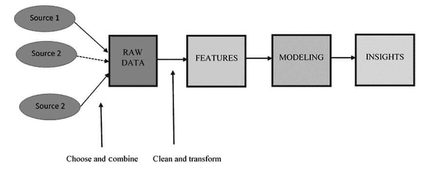

图7.1 特征工程在机器学习工作流中的位置。

如果特征不够，模型将无法完成最终任务。如果特征过多或许多特征无效，模型将更昂贵且更难训练。训练过程中的某些问题可能会影响模型的性能。

特征和模型位于原始数据和期望的洞察之间，如图7.1所示。在机器学习工作流中，不仅要选择模型，还要选择特征。这是一把双刃剑，一个选择会影响另一个。好的特征使下一步建模更容易，新兴模型能够完成你正在寻找的任务。负面的特征可能需要更复杂的模型才能达到相同的性能水平。在整本书中，我们将讨论不同的特征，并讨论不同类型数据和模型的优缺点。

了解特征工程在机器学习设备流程中的位置，突出了它并非独立的事实。

它是一个与数据选择和模型测试相关的重复过程，一遍又一遍，直到我们用完时间。

这个过程可能如下所示：

1.  **头脑风暴能力：** 深入问题，查看更多细节，学习其他问题的特征工程，看看你能借鉴什么。
2.  **设计能力：** 根据问题，可以使用自动特征提取、文本特征创建以及两者的组合。
3.  **选择能力：** 使用关键特征变异和特征选择方法，为你的工作模型准备一个或多个视图。
4.  **检查模型：** 使用选定的特征在不可见数据上评估模型准确性。

需要一个明确定义的问题来知道何时停止这个重复过程，然后继续尝试其他模型、其他模型配置、模型组合等。还需要设计一个经过深思熟虑的测试设备来衡量模型在不可见数据上的潜力。这将是特征工程过程获得的唯一衡量标准。

## 7.2 特征选择

特征选择策略已消除无用特征，以降低新兴模型的复杂性。最终目标是一个值得骄傲的模型，它计算快速，对推测几乎没有或没有损害。为了达到这样的模型，一些特征选择技术需要不止一次模型训练。换句话说，特征选择不是为了减少训练时间——事实上，一些策略增加了总训练时间——而是为了减少模型安装时间。简而言之，特征选择技术分为三类：预处理过滤方法，用于移除那些可能适用于模型的特征。例如，可以结合每个元素与答案灵活性之间的关系或交互知识，然后过滤掉低于阈值的特征。过滤技术比下面描述的包装技术便宜得多，但它们不考虑所使用的模型。因此，它们可能无法选择适合模型的特征。因此，最好在保存之前做出选择，以避免在进入训练步骤之前不必要地移除有用的特征。

### 7.2.1 包装方法

包装方法成本高昂，但尝试特征子集，这意味着它不会意外地剪掉那些不仅单独有用而且组合在一起时也有用的特征。包装方法将模型视为一个黑盒，该黑盒提供所提议特征子集的质量结果。有多种不同的方法可以过滤集合，下面将进行描述。

包装器使用搜索策略来搜索可能的特征子集空间，并通过ML算法上的性能质量来评估每个子集。实际上，任何搜索策略和算法的组合都可以用作包装器。其特点如下：

-   使用ML模型对特征子集进行评分
-   在每个子集上训练一个新模型
-   计算成本非常高
-   通常为给定的ML算法提供性能最佳的子集，但可能不适用于另一个算法
-   需要任意定义的停止标准

最常见的**搜索策略**组是顺序搜索，包括前向选择、后向消除和穷举搜索。随机化搜索是另一个流行的选择，包括进化计算算法，如遗传算法和模拟退火。

包装器中的另一个关键元素是**停止标准**。搜索过程基于三个标准停止：

-   性能提升
-   性能下降
-   达到预定义的特征数量

#### 7.2.1.1 前向选择

前向特征选择首先单独评估所有特征，并根据预设的评估标准选择生成最佳性能算法的特征。然后，算法评估所选特征的所有可能组合，并根据相同的预设标准选择产生最佳性能算法的配对。这个选择过程被称为贪婪的，因为它评估所有可能的单个、双个、三个和特征组合。因此，它的计算成本相当高，有时，如果特征空间很大，甚至不可行。

#### 7.2.1.2 后向消除

后向特征选择首先使用所有特征拟合一个模型。然后，它移除一个特征。接下来，它将移除那个产生最高性能算法（统计上最不显著）的特征，基于某个评估标准。第二步将移除第二个特征，即再次产生最佳性能算法的那个。它继续一个接一个地移除特征，直到满足某个标准。

#### 7.2.1.3 穷举特征选择

在穷举特征选择中，通过优化特定机器学习算法的指定性能指标，从所有可能的特征子集中选择最佳特征子集。例如，如果分类器是逻辑回归，数据集包含**四个**特征，算法将评估所有特征组合如下：

-   一个特征的所有可能组合
-   两个特征的所有可能组合
-   三个特征的所有可能组合
-   所有四个特征

并选择使逻辑回归分类器性能最佳（例如，分类准确率）的组合。这种穷举搜索的计算成本非常高。实际上，由于这种计算成本，它很少被使用。

### 7.2.2 嵌入方法

这些方法使特征选择成为模型训练过程的一部分。例如，决策树自然地进行特征选择，因为它在每个训练步骤中选择一个树划分元素。另一个例子是标准化器1，它可以添加到任何特定模型的训练目的中。ℓ1趋势鼓励使用较少特征而不是许多特征的模型，因此它也被称为模型上的稀疏性限制。包含的方法将特征选择作为模型训练过程的一部分。它们不如包装方法强大，但也不那么昂贵。与过滤器相比，嵌入方法选择特定于模型的特征。从这个意义上说，嵌入方法在计算成本和结果质量之间取得了平衡。这些步骤可以总结为解决特征选择问题的清单：

1.  你是否对问题领域有任何了解？如果是，创建一个增强的“临时”特征集。
2.  特征是否合适？如果不是，对它们进行归一化。
3.  你是否怀疑特征之间的依赖性？如果是，通过制定特征乘积或连接特征来扩展特征集。
4.  输入变量是否需要修剪？如果不是，创建析取特征或特征的加权和。
5.  特征是否需要单独评估？如果是，应用变量排名方法；否则，尝试获得基线结果。
6.  你是否有预测器？如果没有，停止。
7.  你是否怀疑数据是脏的？如果是，根据步骤5中获得的顶级变量作为代表性，识别异常值示例；验证或拒绝它们。
8.  你是否有首先尝试的想法？如果没有，应用线性预测器。然后，利用前向选择方法，以“探测”方法作为终止条件，或应用0-范数嵌入方法。作为评估，根据步骤5的排名结果，使用特征的递增子集创建一系列相同性质的预测器。是否可以用更小的子集匹配或改进性能？如果是，使用该子集的非线性预测器。
9.  你是否有新的想法、时间、计算资源和足够的示例？如果是，比较几种特征选择方法，包括你的新想法、相关系数、后向选择和嵌入方法。接下来，应用线性和非线性预测器。最后，通过模型选择选择最佳方法。
10. 是否需要稳定的解决方案来提高性能和理解？如果是，对数据进行子采样，并为几个“引导程序”重新进行分析。

## 7.3 因子分析

因子分析（FA）是一种分析实验数据的方法，旨在从一组显著变量中寻找潜在的影响因素或隐藏变量。它通过减少数据的灵活性来帮助转换数据。它减去所有变量的完整标准变异，并设定相同的点。

FA广泛应用于市场研究、营销、心理学、金融和绩效研究。例如，市场分析师利用FA来识别对价格敏感的客户，识别影响消费者偏好的产品特征，并帮助理解分销渠道的选择渠道。FA是一个直接的数学模型。它用于描述视觉变量之间的差异，并模糊一组称为因子的不可见变量。视觉差异被视为特征和误差项的直接组合。因子或潜在变量与多个具有共同响应模式的视觉变量相关联。每个因子描述了观测变量中一定量的变异性。它通过减少数据的灵活性来帮助转换数据。

$X_i = \beta_{i0} + \beta_{i1}F_1 + \beta_{i2}F_2 + (1)e_i$

FA是一种研究方法，用于探究若干感兴趣的变量 $X_1, X_2, \dots, X_k$ 是否与少数几个无形因子 $F_1, F_2, \dots, F_k$ 相关。

**假设：**

1.  数据中不存在异常值。
2.  样本量必须大于因子数。
3.  不存在完全多重共线性。
4.  变量之间不存在刚性。

### 7.3.1 因子分析的类型

-   探索性因子分析：这是社会研究人员和管理者分析因子最常用的方法。其基本假设是，任何明显的灵活性都与任何因子直接相关。
-   验证性因子分析（CFA）：其基本假设是，每个项目都与一组特定的观测变量相关联。CFA验证基本预期。

### 7.3.2 因子分析的工作原理

FA的主要目的是减少观测数量并检测不可见变量。这些有形变量帮助市场研究人员完成研究。观测变量的这种可识别变异可以通过两个步骤实现：

-   **因子提取：** 在此步骤中，使用方差划分方法（如主成分分析（PCA）和共同因子分析）来选择因子数量和提取方法。
-   **因子旋转：** 在此步骤中，旋转尝试将因子转换为不相关的因子。此步骤的主要目的是提高整体解释性。有多种旋转方法可用：方差最大旋转法、四次方最大旋转法和斜交旋转法。

### 7.3.3 术语

#### 7.3.3.1 因子的定义

因子是一个微妙的变量，描述了多个观测变量之间的相关性。因子的最大数量等于检测到的变量数量。每个因子都解释了视觉变异性中的一定变异。变异性非常低的因子已被移除。因子也称为隐藏变量、潜在变量或假设变量。

#### 7.3.3.2 因子载荷

因子载荷是一个矩阵，展示了每个变量与一个潜在因子之间的关系。它表达了观测变量与因子之间的相关系数。它显示了观测变量中定义的差异。

#### 7.3.3.3 特征值

特征值代表每个项目从总变异中定义的多样性。它也称为特征根。

#### 7.3.3.4 共同度

共同度是每个变量载荷平方的总和。代表共同变异。其值范围从0到1，接近1的值代表变异最大。

$\hat{h}_i^2 = \sum_{k=1}^n \hat{l}_{ik}^2$

#### 7.3.3.5 因子旋转

旋转是FA更好的转换工具。旋转可以是正交的或斜交的。它还以清晰的载荷模式分布了标准。

#### 7.3.3.6 选择因子数量

Kaiser方法是一种基于待选因子所定义的方差最重要部分的分析方法。特征值是确定因子数量的好方法。通常，大于1的特征值将被视为可选因子。图形方法将某些特征值因子表示为碎石图，如图7.2所示。这种碎石结构帮助我们确定因子数量，其中曲线形成一个肘部。

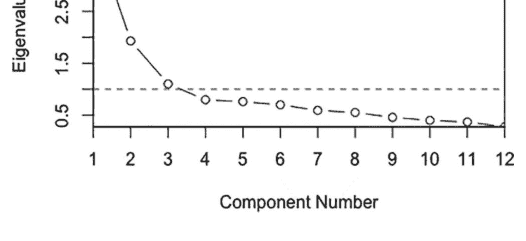

图 7.2 碎石图。

## 7.4 主成分分析

借助自动数据收集和特征生成技术，可以快速发现大量特征。但并非所有特征都有帮助。让我们讨论使用PCA进行特征降维。我们经常遇到这样的情况：特定的结果或决策不依赖于单个指标（预测变量），而是依赖于决策过程中的许多复杂因素。这就是所谓的维度灾难。众所周知，将重要因素的数量限制在一定范围内以得出正确结论非常重要。这个过程称为降维。在机器学习中，高维问题通过两种方式处理：

-   **特征选择：** 通过过滤不一致的特征来仔细选择关键特征。
-   **特征提取：** 我们从原始特征中创建新的相关特征。PCA是特征提取的关键手段之一。

同样，PCA将数据的相应特征转换为正交成分，以捕获数据中的所有重要信息，同时最小化其大小。
PCA可用于以下方式：

-   限制特征数量，但无法识别被忽略的不太重要的特征。
-   确保数据特征是独立的，即使特征没有被轻微解释。

### 7.4.1 中心化数据

特征分解产生变换矩阵，其中特征向量表示旋转矩阵，而特征值表示缩放因子。相反，协方差矩阵没有与数据平移相关的数据。不可否认，平移是由所需的仿射变换而非线性变换表示的。因此，在安装PCA以交换数据以获得不相关轴之前，需要通过从每个数据点中减去数据均值来计算任何现有的变化。这就像以某种方式输入数据，使其尺度变为零。

### 7.4.2 标准化数据

特征向量协方差矩阵在处理大数据差异时指向。相反，方差是一个绝对数，而不是相对数。这意味着以英寸测量的数据差异将远大于以英尺测量的相同数据。例如，一个特征表示物体的长度（以米为单位），而第二个特征表示物体的长度（以英寸为单位）。如果数据被标准化，最大的差异，因此最大的特征向量，将完全由第一个因子决定。为了避免这种基于PCA尺度的方法，它有助于通过将每个特征除以其标准差来标准化数据。当不同特征与不同度量相关时，这一点尤为重要。

### 7.4.3 估计特征分解

由于细节将显示给较大的特征向量以减小尺寸，因此必须确定特征分解。计算特征分解最广泛使用的方法之一是奇异值分解（SVD）。

### 7.4.4 投影数据

为了减小尺寸，数据会自动显示给最大的特征向量。设 *W* 是一个矩阵，其列包含最大的特征向量，设 *O* 是原始数据，其列包含不同的观测值。之后，投影数据 $O'$ 可以表示为 $O' = W^T O$。选择剩余值的数量，例如 $W$ 的列数，这可以直接定义在移除特征向量时需要保留的实际数据的变异数量。如果只存储 $N$ 个特征向量，并且 $e_1, \dots, e_N$ 表示相应的特征值，则投影原始d维数据后剩余的变异数量可以计算为：

$$s = \frac{\sum_{i=0}^{N} e_i}{\sum_{j=0}^{d} e_j}$$ (7.2)

1.  给定数据的原始特征值通过其均值和方差进行标准化，如公式7.3所示，其中 $k$ 是数据集中的实例数，$X_{(i)}$ 是数据点。

$$\mu = \frac{1}{n} \sum_{i=1}^{n} X_{(i)}$$ (7.3)

2.  用 $X_{(i)} - \mu$ 替换 $X_{(i)}$。
3.  使用公式7.4调整每个向量 $X_{j(i)}$ 的大小以获得单位方差。

$$\sigma_j^2 = \frac{1}{n}$$ (7.4)

4.  用 $\frac{X_{j(i)}}{\sigma}$ 替换 $X_{j(i)}$。
5.  确定协方差矩阵 $C_M$ 为：

$$C_M = \frac{1}{m} (X_{(i)}) (X_{(i)})^T$$ (7.5)

6.  确定 $C_M$ 的特征向量和相应的特征值。
7.  降低特征值并排序特征向量，选择包含最大特征值的 $k$ 个特征向量以获得 $V$。
8.  利用 $V$ 使用公式（7.6）将样本更改为新的子空间

$$y = V^T \times X$$ (7.6)

其中 $X$ 表示表示一个样本的 $d \times 1$ 维向量，$y$ 是在新子空间中转换后的 $k \times 1$ 维向量样本。设计的PCA计算复杂度的执行取决于描述每个数据点的特征数量P，由下式给出

$$O(P^3)$$ (7.7)

PCA的缩减比（RR）定义为目标维度数量与原始维度数量之间的关系。因此，当RR值变低时，PCA的效率更高。

## 7.5 特征值与PCA

PCA利用了特征分解的结构。“Eigen”是一个德语词，意为“自身的”。在此，矩阵（A）被分解为：

- 由矩阵（A）的特征值构成的对角矩阵
- 以及由矩阵（A）的特征向量构成的矩阵

一个方阵可以有一个特征向量，以及与矩阵尺寸相同数量的特征值。例如，一个4×4的矩阵将有四个特征值。

### 7.5.1 特征分解在PCA中的应用

假设有一个包含多种“预测变量”的数据库。以某种方式对预测变量进行中心化处理后，得到“n×n”的协方差矩阵。然后，这个协方差矩阵被分解为特征值和特征向量。协方差矩阵，也称为离散矩阵或方差-协方差矩阵，是一个矩阵，其第i行第j列的元素是随机向量中第i个和第j个特征之间的协方差。随机向量是一个具有最大维度的随机变量。从协方差结构和协方差矩阵中，可以定义以下方面：

- 随机变量（预测值）自身的协方差就是方差。
- 协方差矩阵主对角线上的每个元素表示每个随机变量的方差。
- 整个协方差矩阵是对称的。

因此，协方差矩阵包含方差（预测变量与自身的协方差）和协方差（预测变量之间）。特征向量是长度或大小等于1的单位向量。它通常被称为右向量，也称为列向量。特征值是特征向量中使用的系数，赋予向量其长度或大小。

因此，PCA是一种方法：

- 使用协方差矩阵衡量每个变量之间的关联程度。
- 使用**特征向量**解释数据分布的方向。
- 使用**特征值**揭示这些方向的相对重要性。
- PCA方法可以使用python中的numpy包（不使用sklearn包中的直接实现函数）通过线性代数工具来定义和执行。

考虑表7.1中的数据。

**表7.1**
用于实现特征分解的数据

| 年龄 | 体重 | 身高 |
| :--- | :--- | :--- |
| 20 | 60 | 4.5 |
| 35 | 65 | 5 |
| 40 | 70 | 5.5 |
| 45 | 75 | 6 |

这些数据可以表示为一个5×3的矩阵，并命名为A。

```
矩阵 A:
[[20.  60.   4.5]
 [35.  65.   5. ]
 [40.  70.   5.5]
 [45.  75.   6. ]]
```

让我们将此矩阵的特征中心化到均值，确定协方差矩阵，并如下所示实现特征分解。

```
# 计算每列的均值
M=np.mean(A.T, axis=1)
print("\n 列的均值 n:\n",M)

# 通过减去列均值来中心化列
C = A - M

print("\n 列中心化到其均值后的矩阵\n",C)

# 计算中心化矩阵的协方差矩阵
V=np.cov(C.T)

print("\n 协方差矩阵 :\n",V)

# 协方差矩阵的特征分解
eigen_values,eigen_vectors = LA.eig(V)

print("\n 特征值: \n",eigen_values)
print("\n 特征向量: \n",eigen_vectors)
```

```
列的均值 n:
[35.  67.5  5.25]

列中心化到其均值后的矩阵
[[-15.   -7.5  -0.75]
 [  0.   -2.5  -0.25]
 [  5.    2.5   0.25]
 [ 10.    7.5   0.75]]

协方差矩阵 :
[[116.66666667  66.66666667   6.66666667]
 [ 66.66666667  41.66666667   4.16666667]
 [  6.66666667   4.16666667   0.41666667]]

特征值:
[1.56053271e+02 2.69672869e+00 7.48573384e-17]

特征向量:
[[-8.62072917e-01 -5.06784259e-01 -1.19177337e-16]
 [-5.04269186e-01  8.57794613e-01 -9.95037190e-02]
 [-5.04269186e-02  8.57794613e-02  9.95037190e-01]]
```

从上面的输出可以清楚地看出，特征向量给出了PCA成分，而特征值给出了这些成分的解释方差。因此，由于有三个预测变量，所以得到了三个特征值。

- 现在可以根据特征值对特征向量进行排序，以减少新矩阵A的成分或轴的数量。
- 如果某个特征值接近零，则它们代表可丢弃的成分。
- 应选择总共“n”（此处为3）个或少数几个构成所选底部区域的元素。理想情况下，我们可以选择k（<n）个具有最大特征值的特征向量，称为主成分。

第一个成分的解释方差比率为：
*第一个成分的解释方差 / (所有解释方差的总和)*

```
exp_ratio1=eigen_values[0] / sum(eigen_values)
print("\n 第一个成分的解释比率:\n",exp_ratio1)

第一个成分的解释比率:
0.9830127326851055
```

- 可以注意到，第一个成分足以解释数据中高达98%的方差。因此，数据可以投影到一个4×1的矩阵，而不是4×3的矩阵，从而降低数据的维度，当然，会伴随少量的信息损失。

## 7.6 特征降维

机器学习的艺术始于创建合适的数据表示。通常，使用从原始输入中提取的特征可以获得更好的性能。创建特征表示可以为数据添加领域信息，并且可以由特定应用指定。然而，有许多方法可以创建通用特征，包括聚类、基本输入线性变换变量[PCA/SVD、线性判别分析（LDA）]、复杂的线性变换如谱变换（傅里叶、阿达玛）、小波变换或核卷积，以及对灵活子集应用简单函数，如单项式。

特征设计可以追求两个不同的目标：实现数据重构或更高效地进行预测。第一个问题是无监督学习问题。它非常接近数据压缩，许多算法在这两个领域都有应用。第二个问题是监督学习。当问题是监督学习时，是否有理由以无监督的方式选择特征？是的，有几种可能性。其他问题，例如文本处理应用，与有标签数据相比，带有无标签数据。此外，无监督特征的选择通常不会过度导致过拟合。

我们的目标是拥有一个算法友好的数据集。这是什么意思？

如果你有很多特征，会存在一些潜在问题：

- 模型复杂度高。
- 可能会产生很多噪声。
- 如果它们具有不同的尺度，会降低几种对尺度敏感的算法的性能。
- 在n维空间中进行更复杂的可视化。

这就是PCA的作用。它通过提取/消除重要/不重要的特征来降低数据集的维度。

PCA检测一种在计算方差尽可能大的同时减少数据大小的变化。PCA是多元分析中最古老的过程。PCA的基本概念是基于投影的过程。这里，具有n列（特征）的实际数据集X ∈ R n被投影到一个具有k或更低维度的子空间表示X ∈ R K（更少的列），同时保持原始数据的总量。

该算法的工作原理如下：为了将特征的维度从n维降低到k维，实施两个阶段：预处理阶段和降维阶段。首先，在预处理阶段（第7.4节中的步骤1-4），使用第7.4节中的公式7.3和7.4对数据进行预处理，以标准化其均值和方差。然后，在第二阶段（第7.4节中的步骤5-8），即降维阶段，根据第7.4节中的公式7.5和7.6计算协方差矩阵C_M、特征向量和特征值。

当使用PCA降维时，必须处理应该使用多少个主成分（$k$）的问题。与所有超参数一样，这个数字可以根据生成模型的质量进行更改。但有些测试不涉及昂贵的计算。因此，另一个选项是根据所需的总方差值来选择一个$k$。（此选项在scikit-learn包的PCA中可用。）投影到第$k$个成分上的方差为：

$$|Xv_k|^2 = ||u_k \sigma_k||^2 \sigma_k^2 \quad (7.8)$$

它是$X$的第$k$个最大奇异值的平方。矩阵的奇异值的有序列表称为其谱。因此，要确定使用多少个成分，可以对数据矩阵执行简单的谱分析，并选择保留足够方差的阈值。

为了保留足够的成分以覆盖数据中总方差的80%，选择$k$使得

$$\frac{\sum_{i=1}^{k} \sigma_i^2}{\sum_{i=1}^{d} \sigma_i^2} \geq 0.8 \quad (7.9)$$

PCA计算成本很高。它依赖于SVD，这是一个昂贵的过程。计算矩阵的完整SVD需要O函数（$nd^2+d^3$），假设$n \geq d$，即数据点多于特征数。即使我们只想要$k$个主成分，使用缩减SVD（单个$k$值和向量）仍然需要$O((n+d)^2k)=O(n^2k)$次操作。当数据点或特征数量很多时，这是可用的。以流式处理、批量更新或完整数据样本的形式执行PCA是困难的。SVD的流式计算、更新SVD以及从子样本计算SVD都是困难的研究问题。

存在算法，但代价是精度降低。一个含义是，当在训练集中找到的主成分上捕获测试数据时，必须预期较低的表示精度。此外，随着数据分布的变化，需要在当前数据集中重新计算主成分。

### 7.6.1 因子分析与主成分分析

- PCA成分定义了高度的变异性，而FA定义了数据中的协方差。
- PCA成分彼此完全正交，而FA不要求因子正交。
- PCA成分是观测变量的线性组合，而在FA中，观测变量是未观测变量或因子的线性组合。
- PCA成分未定义。在FA中，关键因子是集合且可解释的。
- PCA是一种降维方法，而FA是潜在变量方法。
- PCA是FA的一种类型。PCA是观测性的，而FA是建模技术。

## 7.7 使用Python实践PCA变换

在这个例子中，我们考虑PCA在降维中的作用。考虑一个包含100个点的随机数据集，并导入所有需要的库，如下所示。

```
import numpy as np
import matplotlib.pyplot as plt
import seaborn as sns; sns.set()
```

## 特征工程

```python
from sklearn.datasets import make_blobs
from sklearn.preprocessing import StandardScaler
from numpy import random
from sklearn.decomposition import PCA

DATA_SET = random.randint(100, size=(100, 2))
#print(DATA_SET)
plt.plot(DATA_SET[:, 0], DATA_SET[:, 1], 'gx')
plt.axis('equal')
plt.show()
```

通过PCA，数据中特征之间的关系通过估计一组主轴来量化，数据集可以基于这些主轴进行描述。在本示例中，我们使用scikit-learn的PCA估计器来实现这一点，并观察其参数，即“components”和“explained variance”，如下所示：

```python
pca = PCA(n_components=2)
pca.fit(DATA_SET)

print("PCA components: ", pca.components_)
print("PCA Explained Variance: ", pca.explained_variance_)
```

PCA用于降维，这个过程涉及将一个或多个较小的主成分置零。这会产生降维后的数据，同时保持最大的数据方差。以下代码部分展示了降维过程：

```python
pca = PCA(n_components=1)
pca.fit(DATA_SET)
DATA_SET_pca = pca.transform(DATA_SET)
print("original shape:   ", DATA_SET.shape)
print("transformed shape:", DATA_SET_pca.shape)
```

在这个例子中，`n_component`参数被设置为“1”，以将数据转换为单一维度。为了可视化转换效果，我们绘制了降维后数据的逆变换。

```python
DATA_SET_new = pca.inverse_transform(DATA_SET_pca)
plt.scatter(DATA_SET[:, 0], DATA_SET[:, 1], alpha=0.2)
plt.scatter(DATA_SET_new[:, 0], DATA_SET_new[:, 1], alpha=0.5)
plt.axis('equal');
```

**观察结果：**
用于降维的PCA观察结果如图7.3所示：
该图显示了随机生成的原始数据的散点图，数据规模为100×2。
参数“components”和“explained variance”代表了数据的主轴。
这是数据投影到主轴上时方差的一种度量。每个数据点在主轴上的投影就是数据的主成分，下面展示了本例中所选随机数据集的主成分。

```
PCA parameter components:
[[ 0.63796827 -0.77006265] [ 0.77006265  0.63796827]]
PCA parameter Explained Variance:  [931.51919577 711.44787494]
```

数据集的原始形状是100×2，使用PCA降维后，我们发现数据集已转换为100×1。

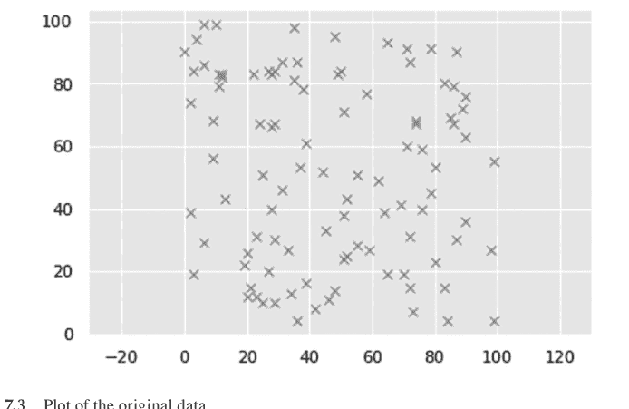

**图7.3** 原始数据的散点图。

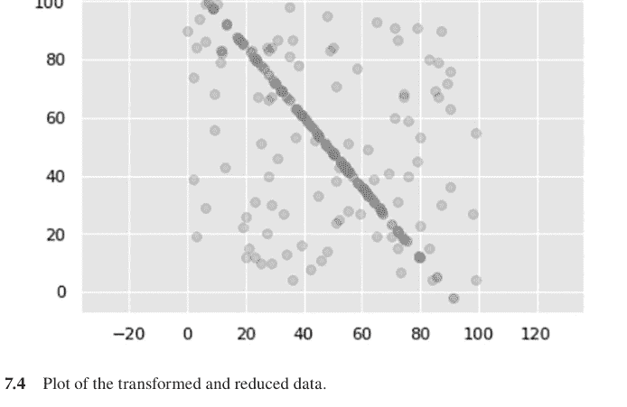

**图7.4** 转换和降维后数据的散点图。

```
Original shape of the data:     (100, 2)
Transformed shape of the data after PCA: (100, 1)
```

图7.4显示了转换后的数据点（深色阴影）和原始数据点（浅色阴影）的散点图。这表明，使用PCA可以移除沿最不重要主轴的数据点，并保留具有最高方差的数据点。

## 7.8 线性判别分析

线性判别分析（LDA）是降维问题中的一种常用方法，作为机器学习和模式分类应用的预处理步骤。同时，它常被用作黑盒，但有时其原理并未被充分理解。LDA能够轻松处理一个区域内波形不均匀的情况，并通过随机生成的测试数据来评估其性能。这种方法在任何数据集中都能提高类间方差与类内方差的比率，从而确保高区分度。在PCA中，原始数据集的结构和位置在转换到独立空间时会发生改变。而LDA不改变位置，只尝试提供额外的分割，并在指定类别之间绘制决策区域。这种方法也有助于更好地理解特征数据的分布。数据集可以被修改，并且测试向量可以通过两种不同的方式从转换空间中分离出来。

- **类别相关转换：** 这种方法旨在最大化类间方差与类内方差的比率。其主要目标是最大化这个比率，以获得足够的类别可分性。这种类别特定类型的方法使用两个优化标准来独立地转换数据集。
- **类别无关转换：** 这种方法旨在最大化总体方差与类内方差的比率。这种方法只使用一个优化标准来转换数据集，因此所有数据点，无论其类别身份如何，都使用此转换进行变换。在这种类型的LDA中，每个类别都被视为一个独立的类别，与其他所有类别相对立。

### 7.8.1 LDA中的数学运算

本节分析LDA中使用的数学函数。为了便于理解，将此概念应用于两类问题。每个数据集包含100个二维数据点。分类策略的数学设计如下：

**步骤1：** 创建数据集和测试集，这些数据集应在原始空间中分离，提供数据集和内置测试向量、数据集的图形结构以及原始空间中样本的测试向量。为便于参考，让我们将数据集表示为包含特征的矩阵，形式如下：

$$
set 1 = \begin{bmatrix} a_{11} & a_{12} \\ a_{21} & a_{22} \\ \vdots & \vdots \\ \vdots & \vdots \\ a_{m1} & a_{m2} \end{bmatrix} \quad set 2 = \begin{bmatrix} b_{11} & b_{12} \\ b_{21} & b_{22} \\ \vdots & \vdots \\ \vdots & \vdots \\ b_{m1} & b_{m2} \end{bmatrix} \quad (7.10)
$$

**步骤2：** 对于每个数据集和整个数据集，确定其均值。设$\mu_1$和$\mu_2$分别为集合1和集合2的均值，$\mu_3$表示整个数据的均值，这是通过合并集合1和集合2得到的，如公式7.11所示。

$$
\mu_3 = p_1 \times \mu_1 + p_2 \times \mu_2 \quad (7.11)
$$

其中$p_1$和$p_2$是类别的先验概率。概率因子假设为0.5。

**步骤3：** 在LDA中，为了制定类别可分性的标准，使用了类内散度和类间散度。类内散度是每个类别的期望协方差。散度度量使用公式7.12和7.13计算。

$$
S_w = \sum_j p_j \times (c_j) \quad (7.12)
$$

因此，对于两类问题，它表示为

$$S_w = 0.5 \times c_1 + 0.5 \times c_2$$

所有协方差矩阵都是对称的。设$c_1$和$c_2$分别为集合1和集合2的协方差。协方差矩阵使用公式7.14确定

$$c_j = (x_j - \mu_j)(x_j - \mu_j)^T$$

类间散度使用公式7.15确定

$$S_b = \sum_j (\mu_j - \mu_3) \times (\mu_j - \mu_3)^T$$

数据集的协方差$S_b$包含每个类别的均值向量。LDA中的优化标准代表了类间散度与类内散度的比率。通过最大化此标准获得的解代表了转换空间的轴。然而，类别相关转换的优化标准使用公式7.14和7.15确定。对于L类问题，需要为每个类别制定单独的优化标准。类别相关类型情况下的优化因子确定为

$$Criterion_j = inv(c_j) \times S_b$$

类别无关转换的优化标准确定为

$$Criterion = inv(S_w) \times S_b$$

**步骤4：** 转换的特征向量表示了应用转换的向量空间的一个一维不变子空间。这些由非零特征值组成的特征向量集都是线性无关的，并且在转换下保持不变。因此，任何向量空间都可以由给定特征向量的线性组合来表示。通过考虑所有对应于非零特征值的特征向量，可以获得非冗余的特征集，而忽略对应于零的特征值。因此，LDA的变换被获得为公式7.16和7.17中定义的不同标准的特征向量矩阵。

**步骤5：** 在任何L类问题中，存在$L-1$个非零特征值。在任何L类问题中，存在$L-1$个非零特征值。这是由于公式7.11中类别均值向量的问题。对应于非零特征值的特征向量是变化的定义。

现在我们有了转换矩阵，我们使用单个LDA变量或类别特定的转换来转换数据集。可以观察到，将所有数据集转换到单一轴上可以为数据分类提供精确的参数。转换空间中的决策边界是一条分隔转换后数据集的实线。因此，对于类别相关的LDA，

$$Transformed_{set_j} = Transform_j^T \times set_j$$

## 7.9 使用Python实践LDA变换

本节将讨论在样本数据上，使用Python实现类内散度和类间散度的计算。

### 7.9.1 类内散度（Sw）的实现

在此示例中，考虑类别1（$11 \times 2$）和类别2（$10 \times 2$），分别包含11个和10个样本。根据公式7.25，$S_{wj} = \sum_{x_i \in \omega_j} (x_i - \mu_j)(x_i - \mu_j)^T$，其中$x_i$是每个类别中每个实例的数据向量，$\mu_j$表示类别$j$的均值向量，计算该数据的类内散度矩阵$S_w$。确定类内散度矩阵的Python代码如下：

```python
import numpy as np
import matplotlib.pyplot as plt
```

```python
# 数据创建 - 这里为每个类别生成范围在[0,2]内的随机样本
class1 = np.array([[1.5,1.6,1.55,1.65,1.45,1.7,1.75,1.55,1.35, 1.8],[1.75,1, 1.5,1.65,1.45,1.22,1.75,1.5, 1.45, 1.65]])
class2 = np.array([[0.25,0.55,0.15,0.25,0.3,0.66,0.35,0.1,0.45,0.55], [1.5,1.25,1.15,1.25,1,1,1.45,1.5,1.33,1.45]])
```

```python
# 使用matplotlib中的plt函数绘制数据
fig = plt.figure(figsize=(10,10))
ax0 = fig.add_subplot(111)

ax0.scatter(class1[0],class1[1],marker='*',c='blue',edgecolor='blue')
ax0.scatter(class2[0],class2[1],marker='o',c='green',edgecolor='green')
plt.show()
```

```python
# 通过创建一个包含均值的2x1向量来计算每个类别的均值向量
mean_class1 = np.mean(class1,axis=1).reshape(2,1)
mean_class2 = np.mean(class2,axis=1).reshape(2,1)
```

```python
# 计算散度矩阵（类内）
scatter_class1 = np.dot((class1-mean_class1),(class1-mean_class1).T)
scatter_class2 = np.dot((class2-mean_class2),(class2-mean_class2).T)
```

```python
# 通过将类内散度相加来计算SW
SW = scatter_class1+scatter_class2
print(SW)
```

根据公式计算得到的类内散度（图7.5）结果是一个2×2矩阵，其元素如下所示：

类内散度 Sw = [[ 0.49509091 -0.03355455] [-0.03355455 0.85203273]]

### 7.9.2 类间散度（SB）的实现

对于上一节使用的相同数据，根据公式7.22，$S_B = \sum_{i=1}^{c} n_i (\mu_i - \mu) (\mu_i - \mu)^T$，计算类间散度矩阵，其中$\mu$是总体均值，$\mu_i$是相应类别的均值。这里，$n_i$是相应类别的样本量。

```python
import numpy as np
import matplotlib.pyplot as plt
```

```python
# 数据创建 - 这里为每个类别生成范围在[0,2]内的随机样本
class1 = np.array([[1.5,1.6,1.55,1.65,1.45,1.7,1.75,1.55,1.35, 1.8], [1.75,1, 1.5,1.65,1.45,1.22,1.75,1.5, 1.45, 1.65]])
class2 = np.array([[0.25,0.55,0.15,0.25,0.3,0.66,0.35,0.1,0.45,0.55,0.25], [1.5,1.25,1.15,1.25,1,1,1.45,1.5,1.33,1.45,1.15]])
```

```python
# 通过创建一个包含均值的2x1向量来计算每个类别的均值向量
mean_class1 = np.mean(class1,axis=1).reshape(2,1)
mean_class2 = np.mean(class2,axis=1).reshape(2,1)
```

```python
# 计算总体均值向量
ave_class = []
for i in range(len(class1)):
    row = []
    for j in range(len(class1[0])):
        row.append( ( class1[i][j] + class2[i][j] ) / 2 )
    ave_class.append(row)
print(ave_class)

overall_mean=np.mean(ave_class,axis=1).reshape(2,1)
print('overall mean=',overall_mean)

# 计算每个类别的样本量
n1=np.size(class1)
n2=np.size(class2)

Sb_class1=n1*(mean_class1 - overall_mean).dot((mean_class1 - overall_mean).T)
Sb_class2=n2*(mean_class2 - overall_mean).dot((mean_class2 - overall_mean).T)
```

```python
# 通过将类间散度相加来计算Sb
Sb = Sb_class1 + Sb_class2
print('Scatter between class Sb =',Sb)
```

上述代码的输出是大小为2×2的类间散度矩阵，如下所示：

```
Scatter between class Sb = [[16.13470868  2.82754909] [ 2.82754909  0.49673455]]
```

## 总结

本章简要讨论了特征工程。在为实现机器学习模型选择最佳特征时，始终最佳实践是确保所有计算出的特征都可用于未来的观测。此外，大多数特征必须具备预测潜力，并结合完整的领域知识进行详细分析。本章回顾了特征选择、包装模型和因子分析的基本要求。在选择特征时，发现降维起着主导作用。这主要通过主成分分析（PCA）和线性判别分析（LDA）等方法实现。本章通过相关的Python示例详细讨论了这些方法在降低数据维度方面的实现。

## 复习题

1.  什么是机器学习中的确定性算法？请讨论。
2.  什么是维度灾难？请在降维的背景下解释。
3.  讨论用于降低数据集维度的不同策略。
4.  当移除共线性特征时，数据集会发生什么变化？
5.  使用PCA和LDA在随机数据上开发一个降维模型。比较两种方法的性能。
6.  以下机器学习过程是否被视为特征工程的一部分？请给出合理的解释。
    -   a. 初始数据收集
    -   b. 数据清洗
    -   c. 归一化
7.  在提取特征时如何处理异常值？请讨论。
8.  列出对异常值敏感的机器学习模型。
9.  计算LDA中类别相关和类别无关情况下的散度矩阵。记录你的观察结果。
10. 使用本章讨论的算法，开发一个完整的LDA模型来阐述降维的概念。

# 泰勒与弗朗西斯

泰勒与弗朗西斯集团

http://taylorandfrancis.com

## 8 强化工程

### 学习目标

本章结束后，读者将能够

- 理解基于强化学习（RL）的目标导向学习
- 领会强化学习与其他机器学习算法的区别
- 了解强化学习的要素，如智能体、策略函数和价值函数
- 掌握与价值函数、策略评估和改进相关的马尔可夫决策过程（MDP）和动态规划（DP）
- 使用Python实现MDP和DP

### 8.1 引言

当我们思考学习的本质时，获取关于处理周围环境信息的想法可能是首先想到的。新生儿在玩耍、摆弄手指或左右张望时，并没有明确的指导者；相反，它直接通过感官与自然接触。利用这种联系可以揭示大量关于因果关系、行动效果以及实现目标所需行动的信息。在我们的一生中，这种接触无疑是我们了解环境和自身的丰富信息来源。如果我们打算在小组中学习烹饪，我们确切知道我们的位置对我们的行为有何反应，并且我们需要预测我们的行为将导致什么结果。几乎所有关于学习和知识获取的理论都支持协作学习作为一个基本概念。在本书中，我们探讨如何使用计算方法从交互中学习。我们不直接考虑人类或动物如何学习，而是研究所调查的环境，并评估人工智能研究人员或工程师众多学习方法的有效性。我们研究数学分析和计算实验的结构，以设计能够有效解决具有科学或经济意义问题的机器。我们测试的方法称为强化学习，它比其他机器学习（ML）方法更侧重于从交互中进行目标导向学习。本章讨论基于强化学习（RL）的目标导向学习，以及RL与其他ML算法的不同之处。详细解释了RL的要素，如智能体、策略函数和价值函数，随后介绍了RL算法马尔可夫决策过程（MDP）和动态规划（DP）。通过在Python中实现MDP和DP，涵盖了价值函数、策略评估和改进。

### 8.2 强化学习

RL是学习做什么的过程——如何将情境映射为行动——以提高数值奖励信号的价值。学习者不会被告知要遵循哪些步骤；相反，他必须确定哪些行动在尝试时能提供最高的奖励。在最激动人心和最困难的情况下，行动可能影响当前的奖励和下一个情境，从而影响所有后续的奖励。这是RL的两个最重要的部分：试错搜索和延迟奖励。

RL，与其他以“ing”结尾的问题（如ML和攀爬）一样，既是一个问题，也是一类成功解决该问题的方案，同时还是研究该问题及其解决方案的学科。用一个词来描述所有这三个问题很诱人，但关键是要在脑海中区分这三个问题。此外，区分RL中的问题和解决方案尤为重要；未能表达这种区别会导致很多困惑。

因此，我们设计一个RL问题，包括应用来自动态系统原理的概念，例如对马尔可夫完全匿名决策过程的完全控制。

学习智能体必须在某种程度上感知其自然状态，并采取影响该状态的行动。此外，智能体在考虑环境状态时应有一个目标或一套原则。马尔可夫决策方法旨在以最基本的方式结合这三个变量——情感、行动和目的——而不损害其中任何一个。我们回忆起，任何解决此类问题的有效策略都是RL方法。RL不同于监督学习，后者是ML中正在进行的研究类型。

监督学习基于由经验丰富的外部管理者作为培训计划一部分提供的分类示例。每个实例代表当前状况和程序在该情况下应执行的适当行动的特定标签，通常是将情况分配给一个类别。这种培训形式旨在使程序能够或整合其响应，以在训练集中未涵盖的情况下发挥最佳作用。这是学习知识的重要方法，但其本身并不足够。在协作问题中，找到期望行为的示例并表示智能体必须工作的所有环境通常是无效的。相反，智能体必须在未标记的区域中从其经验中研究，在那里人们期望学习最有价值。

RL也不同于无监督学习，后者通常被机器学习研究人员用于发现隐藏在未标记信息中的结构。尽管监督学习和无监督学习似乎是两种不同的ML模型，但它们不再如此。虽然很容易将RL视为一种无监督的学习形式，因为它不依赖于积极的行为模型，但RL旨在放大奖励信号，而不是试图识别隐藏的结构。发现智能体经验的结构在强化中可能非常有用，但它本身并不能解决增加奖励信号的RL挑战。因此，我们认为RL是第三种ML范式，与监督和无监督学习并列，也可能与其他范式不同。

探索与利用之间的权衡是RL中出现但其他类型学习中没有的挑战之一。RL智能体必须选择他或她过去尝试过并证明在产生奖励方面有效的行动，以获得最大利益。智能体不仅必须利用其经验来赢得奖励，还必须学习如何在未来做出最佳决策。问题在于，探索或利用都无法完美地进行。智能体必须尝试广泛的行动，同时继续倾向于那些似乎最有效的行动。在随机挑战中，每个行动必须重复多次，才能确定预期奖励的准确估计。数学家们研究这个探索与利用的问题已有数十年，但尚未解决。同时，我们只是认识到平衡探索与利用的困境不再可解。

RL的另一个显著特点是它明确处理了意图导向智能体应对不可预测环境的全部困难。例如，许多ML研究人员研究了监督学习，而没有指定这种能力在长期内可能如何有价值。同样，其他研究人员提出了具有类似目标的规划理论，但没有考虑规划在实时决策中的作用，或者需要制定计划的预测模型来自何处的问题。尽管这些策略取得了许多积极成果，但它们对远程子类型的共同关注是一个普遍问题。RL采取了相反的行为，从一个完整的、交互式的、目标实现的智能体开始。

此外，人们普遍认为，从一开始，智能体就必须在对其所面临的环境存在相当大的不确定性的情况下运作。当规划涉及RL时，它必须解决制定计划与选择实时行动之间的相互作用，此外还要了解环境模型是如何得出和发展的。当监督学习涉及RL时，它出于独特的原因，决定了哪些能力重要，哪些不重要。

## 8.2.1 强化学习示例

理解强化学习（RL）的一个绝佳方式，是考察一些引导其发展的示例和可行应用。

-   一位国际象棋大师施展妙招。一个即时、自发的选择，既体现了特殊位置和行动的重要性，也涉及选举规划，并等待可行的应对与反击。
-   一只小羚羊出生后奋力站立。如今它已能以每小时20英里的速度奔跑。
-   一个扫地机器人必须决定：是进入新房间寻找更多垃圾，还是开始返回充电站。它根据当前电池电量，以及过去定位充电器的速度和难易程度来做决策。

这些示例展示了一些基础到容易被忽视的功能。它们都涉及一个主动决策智能体与其环境之间的动态交互，智能体在环境信息模糊的情况下努力达成目标。智能体的行动会影响环境的未来状态（例如，下一步棋、炼油厂的储罐液位、机器人的下一个区域、其电池的未来电量），从而为后续行动提供依据。

由于正确的目标需要考虑行动的间接而非直接影响，因此可能需要深思熟虑或规划。同时，在所有这些情况下，行动的完成都无法完全预见；因此，智能体必须定期观察其环境并做出适当反应。例如，菲尔必须留意他倒入麦片碗的牛奶，以防溢出。许多示例中的目标如此独特，以至于智能体只能根据其亲身经历来预测目标的进展。

国际象棋选手知道他/她是否获胜，小羚羊知道何时摔倒，移动机器人知道何时电量耗尽。在每种情况下，智能体都能利用其热情（或反馈）来随时间提升表现。国际象棋选手通过精进评估局面的直觉来提升棋艺；小羚羊通过练习提高奔跑能力，等等。

## 8.3 强化学习与其他机器学习算法有何不同？

### 8.3.1 监督学习

在监督学习中，智能体知道要做什么工作以及哪些行动是合适的。数据科学家在带有标签的目标数据历史记录上训练智能体。智能体获得直接反馈，并能预测目标数据是否会发生变化。

强化学习不依赖于分类数据集。智能体不会被告知应采取哪些行动或执行任务的最佳方式。RL使用奖励和惩罚，而非与每个数据集选项相关的标签，来指示所执行的行动是积极还是消极。因此，智能体只有在完成任务后才会收到反馈。这种延迟的反馈和试错过程，是RL区别于监督学习的关键。

**强化学习 vs. 无监督学习：** 在无监督学习中，算法分析匿名数据，通过相似性或差异性来发现数据点和结构之间的隐藏关联。RL的目标是定义一个最优行动策略以获得最大的长期回报，这使其在主要目的上区别于无监督学习。

**强化学习与深度学习：** 大多数RL实现都使用深度学习模型。它们包含深度神经网络的使用，因为这是训练智能体的重要手段。深度学习非常适合识别图像、声音和文本中的复杂模式。此外，神经网络允许数据科学家将所有过程整合到一个单一模型中，而无需将智能体结构拆分成多个模块。

## 8.4 强化学习的要素

除了智能体和环境之外，RL系统还有四个基本组成部分——策略、奖励信号、价值函数和环境模型。

### 8.4.1 策略

策略表示在一段时间内指导智能体行为的信息。策略是已知环境状态区域的映射，以及在这些状态下应采取的步骤。它与心理学研究中所谓的“策略集”或“联想集”相辅相成。在某些情况下，策略可以是一个简单的查找表，而在另一些情况下，它可能包含复杂的计算和搜索过程。策略是强化智能体知识获取的核心，因为它直接决定了行为。通常，策略可以是随机的，为每个状态指定行动的概率分布。一般来说，策略就是智能体的行为。它可以是从状态到行动的映射。例如，

```
确定性策略，$d = \pi(p)$
随机策略，$\pi(d|p) = (D_t = d \| P_t = p)\pi(d|p)$
```

### 8.4.2 奖励信号

奖励信号代表了RL问题的目标。在每一步，环境向智能体发送一个称为奖励的数字。智能体的主要目标是最大化其随时间获得的总回报。奖励信号指定了智能体经历的积极和消极事件。我们可以将生物系统中的奖励视为愉快或痛苦的体验。它们是对智能体问题的简洁而描述性的说明。奖励信号是策略改变的主要驱动力。如果一个策略选择的行动之后跟随了一个较低的奖励，那么该策略在未来可能会被改变以选择不同的行动。环境的状态变化和行动通常被用作奖励信号。价值函数表明了什么是长期有益的，而奖励信号则指明了什么是短期可取的。

### 8.4.3 价值函数

在大多数情况下，价值函数是智能体从当前点开始在未来预期获得的总奖励。因此，价值反映了在评估了潜在状态及其可获得的奖励后，该状态的长期目标。相比之下，奖励表示即时的欲望。

例如，某个状态可能总是提供短暂而适度的奖励，但其价值仍然很高，因为它总是与其他提供更大奖励的状态相连。反之亦然。用人类的比喻来说，奖励类似于快乐（当高时），而更复杂的价值标准则决定了悲伤（当低时）。

奖励R是一个信号响应尺度，表示智能体在任务步骤中表现如何，以最大化累积奖励。RL依赖于这个奖励假设。

#### 8.4.3.1 奖励示例

-   驾驶直升机进行特技飞行
    -   按照预定路线飞行获得正奖励
    -   发生碰撞获得负奖励
-   在拼字游戏中击败世界冠军
    -   赢得/输掉一局游戏获得正/负奖励
-   管理投资组合
    -   银行账户中每种货币获得正奖励
-   控制发电站
    -   发电获得正奖励
    -   超过安全阈值获得负奖励
-   让人形机器人行走
    -   向前移动获得正奖励
    -   摔倒获得负奖励
-   玩多种不同的雅达利游戏并超越人类
    -   分数增加/减少获得正/负奖励

换句话说，奖励是首要的，而价值（如奖励预测）是次要的。如果没有奖励，就不会有价值，因为衡量价值的唯一目的就是为了获得更多奖励。然而，在选择和比较行动时，价值是一个主要考量因素。价值判断被用来选择行动。我们寻求能导致更高价值状态的行为，而不仅仅是更大的即时奖励，因为这些行为能为我们带来最佳的长期回报。坦率地说，定义价值比分配奖励要困难得多。实际上，可靠地衡量价值是几乎所有RL系统中最重要的挑战。定量测量是过去六十年来强化学习中学到的最重要的一课。价值函数由下式给出

$$\text{价值函数 } V_{\pi}(s) = \mathbb{E}_{\pi} \left[ R_{t+1} + \gamma R_{t+2} + \gamma^2 R_{t+3} + \cdots \mid D_t = d \right] \quad (8.3)$$

## 8.4.4 环境模型

强化学习要素的最后一个方面是加强环境模型。这模拟了环境的工作方式，或者更典型地，允许对环境将如何行动提出假设。例如，基于当前状态和环境的动作，模型可以预测未来的结果状态并遵循奖励。模型用于制定计划，其中我们推荐任何通过在体验潜在未来活动之前思考它们来决定行动方案的方法。使用建模和规划的强化学习解决方案被称为基于模型的方法，与简单的非模型方法形成对比，后者明确地让学习者进行试错——这几乎被认为是反规划的。当前的强化学习涵盖了从低级的、实验性的、基于试错的学习到高级的、深思熟虑的规划的广泛范围。

环境模型可以描述为

$$P_{ss'}^a = \mathbb{P} \left[ D_{t+1} = d' \mid D_t = d, B_t = e \right] \quad (8.4)$$
$$C_{s}^a = \mathbb{E} \left[ C_{t+1} \mid D_t = d, B_t = e \right] \quad (8.5)$$

其中 $P$ 预测下一个状态，$C$ 预测下一个奖励。

## 8.4.5 强化学习算法

强化学习问题主要可以基于以下关键要素来构建：

- **智能体():** 一个能够观察或发现环境并利用它的实体。
- **环境():** 智能体被呈现或围绕的场景。在强化学习中，我们依赖于随机环境；这意味着它是自然结构。它就是智能体工作的物理世界。
- **动作():** 动作是智能体在环境中采取的行动。
- **状态():** 在智能体采取每个动作后，由环境恢复的情况。它是智能体的当前状态。
- **奖励():** 从环境返回给智能体的反馈，用于评估智能体的动作。它是来自环境的响应。
- **策略():** 策略是智能体根据当前状态执行的下一个动作的方法。它是一种将智能体状态映射到动作的方法。
- **价值():** 它预测也将满足折扣因子，以实现长期和短期奖励的折衷。智能体在特定情况下通过采取行动可以获得的未来奖励。
- **Q值():** 与价值非常相似，但多接受一个参数作为当前动作 (a)。

该算法如下

**在每个步骤 $t$，智能体：** 执行由观察 $O_t$ 识别的动作 $A_t$ 并接收标量奖励 $R_t$
**环境：** 接收动作 $A_t$，产生观察 $O_{t+1}$，在 $t$ 时刻发出标量奖励 $R_{t+1}$。

## 8.4.6 在机器学习中实现强化学习的方法

机器学习中的强化学习可以使用三种主要方法实现。

1. **基于价值：** 基于价值的方法确定最优价值函数，表示在任何策略下状态的最大价值。因此，智能体假设在策略 π 下任何状态的长期回报。
2. **基于策略：** 基于策略的方法确定获得最高未来奖励的最优策略，而不恢复价值函数。在此方法中，智能体尝试使用任何策略，以便在每个步骤中采取的行动都能增加未来奖励。
   基于策略的方法特别有两种策略：
   - **确定性：** 在任何状态下，策略 (π) 产生相同的动作。
   - **随机性：** 产生的动作由概率决定。
3. **基于模型：** 在基于模型的方法中，环境创建一个虚拟模型，智能体检查该环境以进行分析。这种方法没有特定的算法或解决方案，因为虚拟模型对于每个环境都是独特的。

## 8.5 马尔可夫决策过程

在强化学习框架中，决策由智能体从环境中做出，作为称为环境状态的信号函数。本节定义了马尔可夫性质，该性质定义了环境的属性和特定兴趣下的状态信号。在本节中，我们不关注设计状态信号，而是关注信号可用的函数。

### 8.5.1 预备知识

状态应代表智能体的直接感觉，并能够向智能体传达更多信息。它不仅传达关于环境的一切，还传达对决策有用的一切。例如，如果智能体正在使用手机通信，它应该能够识别来电者是谁。如果智能体正在玩百家乐游戏，它应该知道下一张牌是什么。如果我们分析这些例子，环境中隐藏着一些状态信息，智能体知道可能有用，但智能体无法预测它，因为没有接收到相关的感觉。能够保留所有信息的状态信号被称为马尔可夫或具有马尔可夫性质。例如，棋子的位置可以作为马尔可夫状态，因为它封装了游戏中所有已进行位置序列的所有信息。虽然可能会错过一些序列，但未来所需的一切都被保留了。总的来说，我们可以说它应该保留到达此位置所做信号的历史。让我们考虑一组有限状态和奖励值，以及一个响应在时间 t 到 t+1 所采取动作的环境。响应取决于之前发生的所有事情。动力学通过陈述完整的概率分布来定义：

$P_r \{C_{t+1} = a, D_{t+1} = d' \mid D_0, B_0, C_1, \dots, D_{t-1}, B_{t-1}, C_t, D_t, B_t\}$ (8.6)

对于所有 r, d' 和所有过去事件的可能值，即 $D_0, B_0, C_1, \dots, D_{t-1}, B_{t-1}, C_t, D_t, B_t$。如果状态信号具有马尔可夫性质，那么环境在 t+1 的响应将取决于 t 时刻的状态和动作表示，环境的动力学由下式确定

$p(d', a \mid d, e) = P_r \{C_{t+1} = a, D_{t+1} = d' \mid D_t, B_t\}$ (8.7)

对于所有 a, d', $D_t$ 和 $B_t$。也可以说状态信号包含马尔可夫性质和马尔可夫状态，当且仅当（方程 8.7）等于（方程 8.6）对于所有 r, d'。以及所有过去事件的可能值，即 $D_0, B_0, C_1, \dots, D_{t-1}, B_{t-1}, C_t, D_t, B_t$。在这种情况下，环境和整个过程被称为具有马尔可夫性质。

如果环境遵循马尔可夫性质，给定当前状态和动作，单步动力学（方程 8.6）允许预测下一个状态并预期下一个奖励。通过重复此方程，可以预测所有未来状态并预期奖励，给定直到当前时间的整个历史。强化学习将马尔可夫性质视为一个重要标准，因为决策和价值被认为是当前状态的函数。因此，为了使它们强大且信息丰富，状态的表示必须具有指导性。

满足强化学习任务的马尔可夫性质被称为马尔可夫决策过程。如果状态和动作空间的数量有限，则称为有限马尔可夫决策过程。一个特定的有限马尔可夫决策过程由其状态和动作集以及环境的单步动力学确定。如果给定状态 ($d$) 和动作 ($e$)，则每个可行的下一个状态 ($d'$) 和奖励 ($a$) 对的概率由下式表示

$$p(d', a | d, e) = P_r \{C_{t+1} = a, D_{t+1} = d' | D_t = d, B_t = e\}$$

如果给出了方程 (8.8) 中表示的动力学，则可以轻松计算关于环境的任何细节，特别是对于每个状态-动作对，预期奖励为

$$r(d, e) = \mathbb{E}[C_{t+1} | D_t = d, B_t = e] = \sum_{a \in C} a \sum_{d' \in D} p(d', a | d, e)$$

状态转移的概率由下式给出，

$$p(d' | d, e) = P_r \{D_{t+1} = d' | D_t = d, B_t = e\} = \sum_{a \in C} p(d', a | d, e)$$

对于状态-动作-下一状态三元组，预期奖励由下式给出，

$$r(d, e, d') = \mathbb{E}[C_{t+1} | D_t = d, B_t = e, D_{t+1} = d'] = \frac{\sum_{a \in C} a \ p(d', a | d, e)}{p(d' | d, e)}$$

### 8.5.2 价值函数

本质上，每个强化学习算法都包含评估状态-动作对，以评估智能体在给定状态下执行给定动作的能力。“多好”的观点可以定义为关于未来奖励，或者更准确地说，关于预期回报。智能体未来预期收到的回报取决于它所采取的动作。因此，价值函数是根据特定策略定义的。

策略 $\pi$ 表示为从每个状态 $d \in D$ 和动作 $e \in A(d)$ 到在状态 $d$ 下采取动作 $e$ 的概率 $\pi(e | d)$ 的映射。策略 $\pi$ 下状态 $d$ 的值，表示为 $v_\pi(d)$，是从 $d$ 开始并在 $\pi$ 下继续的预期回报。对于马尔可夫决策过程，$v_\pi(d)$ 表示为

$$v_\pi(d) = \mathbb{E}_\pi[G_t | D_t = d] = \mathbb{E}_\pi\left[\sum_{0}^{\infty} \gamma^k C_{t+k+1} | D_t = d\right]$$

其中，给定一个遵循策略 $\pi$ 的智能体和时间步 $t$，$\mathbb{E}_\pi[.]$ 表示随机变量的期望值，$v_\pi$ 表示策略 $\pi$ 的状态价值函数。

类似地，在策略 $\pi$ 下，状态 $d$ 中采取行动 $e$ 的价值，即从 $d$ 开始的期望回报，由策略 $\pi$ 的动作价值函数 $q_{\pi}(d,e)$ 表示，其定义为

$$q_{\pi}(d,e) = \mathbb{E}_{\pi} \left[ G_t \mid D_t = d, B_t = e \right] = \mathbb{E}_{\pi} \left[ \sum_{0}^{\infty} \gamma^k C_{t+k+1} \mid D_t = d, B_t = e \right] \quad (8.13)$$

价值函数 $v_{\pi}$ 和 $q_{\pi}$ 可以通过经验来估计。例如，对于遇到的每个状态，如果一个智能体遵循策略 $\pi$ 并记录该状态实际回报的平均值，那么只要该状态被访问的次数趋近于无穷，这个平均值就会收敛到该状态的价值 $v_{\pi}(d)$。

如果对于在某个状态下采取的每个动作都考虑不同的平均值，那么所有这些平均值都会收敛到该动作的价值 $q_{\pi}(d, e)$。这种方法可以称为蒙特卡洛方法，即对大量实际回报的随机样本进行平均。

对于任何策略 $\pi$ 和任何状态 $d$，一致性条件存在于状态 $d$ 的价值与其可行后继状态的价值之间，表示为

$$v_{\pi}(d) = \mathbb{E}_{\pi} \left[ G_t \mid D_t = d \right]$$
$$= \mathbb{E}_{\pi} \left[ \sum_{0}^{\infty} \gamma^k C_{t+k+1} \mid D_t = d \right]$$
$$= \mathbb{E}_{\pi} \left[ \sum_{0}^{\infty} \gamma^k C_{t+k+2} \mid D_t = d \right] \quad (8.14)$$
$$= \sum_{e} \pi(e \mid d) \sum_{d'} \sum_{r} p(d', a \mid d, e) \left[ r + \gamma \mathbb{E}_{\pi} \left[ \sum_{k=0}^{\infty} \gamma^k C_{t+k+2} \mid D_{t+1} = d' \right] \right]$$
$$= \sum_{e} \pi(e \mid d) \sum_{d', a} p(d', a \mid d, e) \left[ r + \gamma v_{\pi}(d') \right]$$

这意味着，从集合 $A(d)$ 中选择动作 $e$，从集合 $D$ 中选择下一个状态 $d_0$，从集合 $B$ 中选择奖励 $a$。对于每一个三元组，计算其概率 $\pi(e \mid d) p(d_0, a \mid d, e)$，用其概率对括号内的量进行加权，最后对所有可能性求和以获得期望值。$v_{\pi}$ 的贝尔曼方程由（公式 8.14）给出，它展示了状态价值与其后继状态价值之间的关系。公式 (8.14)，即贝尔曼方程，对所有可能性进行平均，按其发生概率缩放每种可能性。它表明，初始状态的价值需要等于期望的下一个状态价值与期望奖励之和。价值函数 $v_{\pi}$ 被认为是其贝尔曼方程的唯一解。

## 8.6 动态规划

动态规划是在给定完美环境模型（作为马尔可夫决策过程）时寻找最优策略的算法集合。由于巨大的计算开销和对完美环境模型的需求，经典动态规划算法在强化学习中的实用性有限。然而，它们在理论上仍然被认为是重要的。事实上，这些方法被视为试图获得与动态规划相似的效果，但计算量更小，且不需要完美的环境模型。从这里开始，我们将环境视为一个有限马尔可夫决策过程。假设所有状态 ($D$)、动作 $A(d)$ 和奖励集合 $R$（对于 $d \in D$）都是有限的。其动态特性由一组概率 $p(d_0, a|d, e)$ 表示，适用于所有 $d \in D$，$e \in A(s)$，$a \in R$，以及 $d_0 \in D^+$，其中 + 表示如果问题不连续则为终止状态。尽管动态规划可以解决涉及连续状态和动作空间的问题，但精确解仅在少数情况下可获得。然而，对于连续状态和动作，必须对状态和动作空间进行量化，并使用有限状态动态规划技术。使用价值函数来组织和构建对合适策略的搜索是动态规划和强化学习的核心原则。

### 8.6.1 策略评估

动态规划中的策略评估是指计算随机策略 $\pi$ 的状态价值函数 $v_{\pi}$。这也可以称为预测问题。

$$v_{\pi}(s) = \mathbb{E}_{\pi} \left[ R_{t+1} + \gamma R_{t+2} + \gamma^2 R_{t+3} + \cdots | D_t = d \right]$$
$$= \mathbb{E}_{\pi} \left[ R_{t+1} + \gamma v_{\pi}(S_{t+1}) | S_t = s \right]$$
$$\sum_{e} \pi(e|d) \sum_{d', a} p(d', a|d, e) [a + \gamma v_{\pi}(d')]$$

其中 $\pi(e|d)$ 表示在策略 $\pi$ 下，在状态 $d$ 中选择动作 $e$ 的概率，而 $\pi$ 的下标表示遵循条件策略的期望。只要 $\gamma < 1$ 或者策略 $\pi$ 中所有状态都保证终止，$v_{\pi}$ 的值就保证存在且唯一。

如果环境的动态特性完全已知，那么公式 (8.16) 可以是关于 $|D|$ 个未知数 $v_{\pi}(d)$（$d \in D$）的 $|D|$ 个联立线性方程组。让我们考虑一系列近似的价值函数 $v_0, v_1, v_2, \dots$，每个函数将 $D^+$ 映射到 $\mathbb{R}$。初始近似价值函数 $v_0$ 是随机选择的，并使用 $v_{\pi}$ 的贝尔曼方程 (8.14) 作为更新规则来获得每个后续近似

$$v_{\pi}(s) = \mathbb{E}_{\pi} \left[ R_{t+1} + \gamma v_k(D_{t+1}) | D_t = d \right]$$
$$= \sum_{a} \pi(e|d) \sum_{d'} p(d', a|d, e) [a + \gamma v_k](d')$$

对于所有 $d \in D$。很明显，$v_k = v_{\pi}$ 是更新规则的一个不动点，因为 $v_{\pi}$ 的贝尔曼方程保证了这种情况下等式成立。通常，在保证 $v_{\pi}$ 存在的相同条件下，序列 $\{v_k\}$ 随着 $k \rightarrow \infty$ 收敛到 $v_{\pi}$。这个过程被称为迭代策略评估，如图 8.1 所示。

为了从 $v_k$ 得到每个后续近似 $v_{k+1}$，策略评估的迭代过程对每个状态 $d$ 应用相同的操作。状态 $d$ 的先前值用于从 $d$ 的先前状态值中获得新值。评估策略中可用的一步转移和期望的即时奖励。这个操作被称为全备份。根据状态-动作对，有多种不同类型的全备份，后继状态的估计值根据具体方式进行分组。由于动态规划算法中的备份依赖于所有可行的下一个状态，而不是采样的下一个状态，我们说所有动态规划算法都称为全备份。

```
读取 π，需要评估的策略
初始化数组 V(d) = 0，对于所有 d ∈ D⁺
循环
    Δ ← 0
    对于每个 d ∈ D:
        v ← V(d)
        V(d) ← Σₑ π(e|d) Σ_{d',a} p(d', a|d, e) [r + γV(d')]
        Δ ← max(Δ, |v - V(d)|)
直到 Δ < θ（小的正整数）
显示 V ≈ v_π
```

图 8.1 迭代策略评估。

### 8.6.2 策略改进

计算策略的价值函数是为了识别好的策略。让我们考虑，如果随机确定性策略 $\pi$ 的价值函数 $v_{\pi}$ 已知，我们想将其更改为某个状态 $d$ 的新策略。一个问题出现了：是继续使用当前策略好，还是采用新策略好？这个问题可以通过在 $d$ 中选择 $e$ 并继续使用旧策略 $\pi$ 来回答。这可以通过以下方式确定

$$q_{\pi}(d, e) = \mathbb{E}_{\pi} \left[ C_{t+1} + \gamma v_{\pi}(D_{t+1}) \mid D_t = d, B_t = e \right]$$
$$= \sum_{d',a} p(d', a|d, e)[a + \gamma v_{\pi}(d')] \quad (8.18)$$

主要思想是检查该值是大于还是小于 $v_{\pi}(d)$。如果该值更大，这意味着在 $d$ 中选择一次 $e$ 然后遵循 $\pi$（坚持每次都遵循 $\pi$）将是一个好的选择。在这种情况下，采用新策略会更好。这个结果被认为是策略改进定理。假设 $\pi$ 和 $\pi'$ 是一对确定性策略，使得对于所有 $d \in D$，

$$q_{\pi}(d, \pi'(d)) \geq v_{\pi}(d) \quad (8.19)$$

这里策略 $\pi'$ 必须优于或等于 $\pi$。这表明它应该从所有状态 $d \in D$ 获得更大或相等的期望回报。

$$v_{\pi'}(d) \geq v_{\pi}(d) \quad (8.20)$$

如果在公式 (8.19) 中的任何状态存在严格不等式，那么在公式 (8.20) 中的任何状态也必须存在严格不等式。这适用于原始确定性策略 $\pi$ 和新策略 $\pi'$ 中提到的两个策略。当然，公式 (8.19) 将对所有状态成立，除了 $d$。因此，如果 $q_{\pi}(d, e)$ 大于 $v_{\pi}(d)$，那么新策略优于原始确定性策略 $\pi$。

现在，让我们证明这个策略改进定理。让我们从公式 (8.19) 开始，展开 $q_{\pi}$，同时重新应用公式 (8.19)，直到我们得到 $v_{\pi'}(d)$，表示为$v_{\pi}(d) \leq q_{\pi}(d, \pi'(d))$
$= \mathbb{E}_{\pi'} [C_{t+1} + \gamma v_{\pi}(D_{t+1}) | D_t = d]$
$\leq \mathbb{E}_{\pi'} [C_{t+1} + \gamma q_{\pi}(D_{t+1}, \pi'(D_{t+1})) | D_t = d]$
$= \mathbb{E}_{\pi'} [C_{t+1} + \gamma \mathbb{E}_{\pi'} [C_{t+2} + \gamma v_{\pi}(D_{t+2})] | D_t = d]$
$= \mathbb{E}_{\pi'} [C_{t+1} + \gamma C_{t+2} + \gamma^2 v_{\pi}(D_{t+2}) | D_t = d]$
$\leq \mathbb{E}_{\pi'} [C_{t+1} + \gamma C_{t+2} + \gamma^2 C_{t+3} + \gamma^3 v_{\pi}(D_{t+3}) | D_t = d]$
$\leq \mathbb{E}_{\pi'} [C_{t+1} + \gamma C_{t+2} + \gamma^2 C_{t+3} + \gamma^3 C_{t+4} | D_t = d]$
$= v_{\pi'}(d)$

新的贪婪策略 $\pi'$，即被认为在所有状态和所有可行行动上进行改变的原生扩展，在每个状态根据 $q_{\pi}(D, e)$ 选择最佳行动，表示为

$\pi'(d) = \text{argmax}_a q_{\pi}(d, a)$
$= \text{argmax}_a \mathbb{E} [C_{t+1} + \gamma v_{\pi}(D_{t+1}) | D_t = d, B_t = e]$
$= \text{argmax}_a \sum_{d', a} p(d', a | d, e) [a + \gamma v_{\pi}(d')]$

其中 $\text{argmax}_a$ 表示使 $a$ 的值最大化的表达式。该贪婪策略满足公式 (8.19) 中描述的策略改进定理的条件。因此，我们得出结论，它几乎与原始确定性方法一样好。因此，策略改进指的是通过使新策略相对于旧策略的价值函数是贪婪的，从而使其优于旧策略的过程。

假设新的贪婪策略 $\pi_0$ 良好但不优于现有策略 $\pi$。那么，$v_{\pi} = v_{\pi_0}$，并且根据公式 (8.22)，对于所有 $d \in D$，有：

$v_{\pi'}(d) = \max_a \mathbb{E} [C_{t+1} + \gamma v_{\pi'}(D_{t+1}) | D_t = d, B_t = e]$
$= \max_a \sum_{s', a} p(d', a | d, e) [a + \gamma v_{\pi'}(s')]$

该方程类似于贝尔曼最优性方程，因此，$v_{\pi_0}$ 应该是 $v^*$，并且 $\pi$ 和 $\pi_0$ 都应该是最优策略。通常，随机策略 $\pi$ 表示从每个状态 $d$ 出发，对每个行动 $e$ 的概率 $\pi(e|d)$。具体来说，在标准定义下，策略改进定理在随机情况下成立，由下式给出

$q_{\pi}(d, \pi'(d)) = \sum_e \pi'(e, d) q_{\pi}(d, e)$

此外，如果在策略改进阶段存在联系，如公式 (8.22) 所示，那么在随机策略的情况下，无需从中选择单个行动。相反，每个最大化行动在新的贪婪策略下可能被赋予被选择的百分比机会。因为所有次优行动的概率为零，所以可以授权新的分配方案。

```
1. 设置初始值
   对于所有 $d \in D$，随机设置 $V(d) \in \mathbb{R}$ 和 $\pi(d) \in B(d)$
2. 策略评估
   循环
       $\Delta \leftarrow 0$
       对于每个 $d \in D$：
           $v \leftarrow V(d)$
           $V(d) \leftarrow \sum_{d',a} p(d', a | d, e) [r + \gamma V(d')]$
           $\Delta \leftarrow \max (\Delta, |v - V(d)|)$
       直到 $\Delta < \theta$（一个小的正整数）
3. 策略改进
   $pol_{st} \leftarrow true$
   对于每个 $d \in D$：
       $e \leftarrow \pi(d)$
       $\pi(d) \leftarrow \arg\max_a \sum_{d',a} p(d', a | d, e) [a + \gamma V(d')]$
       如果 $e \neq \pi(d)$，则 $pol_{st} \leftarrow false$
   如果 $pol_{st}$，则停止并返回 $V$ 和 $\pi$，否则转到步骤 2
```

图 8.2 求解 $v^*$ 的策略迭代。

## 8.6.3 策略迭代

一旦策略 $\pi$ 使用 $v_\pi$ 进行改进以提供更好的策略 $\pi'$，并且计算并改进 $v_{\pi'}$ 以产生更好的策略 $\pi''$。因此，通过以下方式获得一系列一致改进的策略和价值函数

$\pi_0 \xrightarrow{E} v_{\pi_0} \xrightarrow{I} \pi_1 \xrightarrow{E} v_{\pi_1} \xrightarrow{I} \pi_2 \xrightarrow{E} \dots \xrightarrow{I} \pi_* \xrightarrow{E} v_{\pi_*}$

其中 $\xrightarrow{E}$ 表示策略评估，$\xrightarrow{I}$ 表示策略改进。
因为在有限 MDP 中只有有限数量的策略，所以该技术应该专注于在有限次数的重复中实现最优策略和理想价值函数。策略迭代是确定最佳策略的过程的术语。策略迭代算法如图 8.2 所示。
在该算法中，如果策略不断在两个或多个最终良好的策略之间切换，算法将永远不会终止。

## 8.6.4 动态规划的效率

尽管 DP 对于真正大的问题并不理想，但与其他解决 MDP 的方法相比，它相对高效。在状态和行动数量方面，实现最优策略的 DP 技术的最坏情况时间复杂度是多项式的。假设 $n$ 是状态数，$m$ 是行动数，DP 技术所需的计算机操作少于 $n$ 和 $m$ 的多项式函数。因此，即使所需的策略总数为 $m^n$，DP 也能保证在多项式时间内找到最优策略。在这方面，DP 比策略空间中的直接搜索快指数级，因为直接搜索需要彻底研究每个策略才能提供保证。与 DP 方法相比，线性规划方法（也用于解决 MDP）的最坏情况交叉保证也相当好。然而，与 DP 相比，线性规划方法在状态较少时变得不可行。但是，只有 DP 技术对于最严重的情况是实用的。

因为状态数量随状态变量数量呈指数增长，即维数灾难（Bellman, 1957），DP 通常被认为是低效的。此外，在处理巨大的状态空间时，DP 优于直接搜索和线性规划。如果从良好的初始价值函数或策略开始，DP 的收敛速度比其理论最坏情况困难快得多。

## 8.6.5 使用 Python 的动态规划实践

```python
###导入库
import numpy as np
from tqdm import tqdm
import matplotlib.pyplot as plt
import seaborn as sns
sns.set_style("darkgrid")
%pylab inline
import random

####### 从 numpy 和 matplotlib 填充交互式命名空间
###策略迭代
###参数
gamma = 1 # 折扣率
rewardSize = -1
gridSize = 4
terminationStates = [[0,0], [gridSize-1, gridSize-1]]
actions = [[-1, 0], [1, 0], [0, 1], [0, -1]]
numIterations = 1000

###函数
def actionRewardFunction(initialPosition, action):
    if initialPosition in terminationStates:
        return initialPosition, 0
    reward = rewardSize
    finalPosition = np.array(initialPosition) + np.array(action)
    if -1 in finalPosition or 4 in finalPosition:
        finalPosition = initialPosition
    return finalPosition, reward
###初始化
valueMap = np.zeros((gridSize, gridSize))
states = [[i, j] for i in range(gridSize) for j in range(gridSize)]
####步骤 0 的价值函数
valueMap

####评估策略
deltas = []
for it in range(numIterations):
    copyValueMap = np.copy(valueMap)
    deltaState = []
    for state in states:
        weightedRewards = 0
        for action in actions:
            finalPosition, reward = actionRewardFunction(state, action)
            weightedRewards += (1/len(actions))*(reward+(gamma*valueMap[finalPosition[0], finalPosition[1]]))
        deltaState.append(np.abs(copyValueMap[state[0], state[1]]-weightedRewards))
        copyValueMap[state[0], state[1]] = weightedRewards
    deltas.append(deltaState)
    valueMap = copyValueMap
    if it in [0,1,2,9, 99, numIterations-1]:
        print("Iteration {}".format(it+1))
        print(valueMap)
        print("")

###绘制值
plt.figure(figsize=(20, 10))
plt.plot(deltas)
```

## 总结

强化学习是一种机器学习技术，专注于使用试错方法来训练算法。在每次行动后，算法（智能体）检查当前情况（状态），采取行动，并从环境中接收反馈（奖励）。正面反馈是一种奖励形式（在我们理解的意义上），而负面反馈是犯错的一种惩罚形式。本章讨论了基于强化学习的目标导向学习，以及强化学习与其他机器学习算法的不同之处。首先，详细讨论了强化学习的要素，如智能体、策略函数和价值函数，然后是强化学习技术，如 MDP 和 DP。最后，阐述了价值函数、策略评估、改进以及 Python 中 MDP 和 DP 的实现。

## 复习题

- 1. 列出一些强化学习的现实世界应用。从智能体、价值函数和策略函数的角度进行解释。
- 2. 比较强化学习与其他机器学习算法的性能。
- 3. 解释以下术语：策略、奖励、价值函数和环境模型。
- 4. 考虑一个足球场作为环境，一个机器人作为智能体。尝试使用贝尔曼方程对比赛进行建模。
- 5. 列出监督学习和强化学习在以下方面的区别：
    a. 数据集（有标签/无标签）
    b. 训练
    c. 与环境的交互
    d. 决策
- 6. 什么是同策略和异策略函数？请解释。
- 7. 探索 MDP 在交通灯控制决策中的应用。
- 8. 强化学习可以应用于自动驾驶汽车吗？解释该应用的智能体、奖励、行动和环境。

## 9 使用Python的决策科学案例研究

学习目标

本章结束后，读者将能够：

- 理解数据分析生命周期各阶段在机器学习（ML）问题中的应用，
- 理解给定问题的数据和问题目标，以便能够确定合适的算法，
- 为列出的用例识别替代的ML模型，
- 从应用角度理解常见ML模型之间的差异，并
- 使用Python实现本章提供的用例。

机器学习魅力无穷且不断发展。过去几年，ML在各行各业的应用一直在加速。从零售到金融服务，再到医疗保健和制造业，有多种用途可以解决与行业相关的业务问题。本章讨论了不同行业中的一些应用，以使用深度学习解决行业问题。传统编程无法容纳各种组合的逻辑。使用需求价格弹性方法，用例1，零售价格优化，找到了获得最大利润的确切价格。该用例重点介绍了理解数据、加载数据、探索数据和模型构建的逐步实施。在用例2，购物篮分析（MBA）中，我们展示了基于超市客户数据集的应用，从而突出了关联规则挖掘。基于Apriori和Fpgrowth算法比较了产品关联。用例3，零售商销售预测，旨在构建ML模型并找出特定商店每种产品的销售额。代码实现用于比较不同的回归模型，并确定梯度提升为最佳模型。预测财产和意外伤害（P&C）保险公司的保险索赔成本在用例4中介绍。本案例研究说明了数据清理、数据预处理和处理异常值。用例5，电子商务产品排名和情感分析，涉及理解数据、数据预处理-过滤（包括乱码、语言和亵渎检测）、特征提取、成对评论评分和进一步分类。

## 9.1 用例1 – 使用需求价格弹性方法的零售价格优化

### 9.1.1 背景

产品定价是租赁行业的一个重要方面，有多种策略来确定产品的最佳价格。因此，商品主要有两种类型。首先，有几种商品的价格会影响其销售。因此，这些产品价格的微小变化可能导致销售的显著变化。另一方面，商品的销售可能不受其价格的影响。这些产品通常是奢侈品和必需品，如某些药品。本笔记本将关注前一类商品，即价格改变产品需求的商品。

需求价格弹性（PED）是一个关键的经济指标，定义为需求随产品成本变化而变化的程度。通常，产品的需求随成本上升而下降。然而，在某些情况下，即使价格小幅上涨，需求也可能急剧下降，而在其他情况下，即使价格大幅上涨，需求也可能大致保持不变。因此，价格弹性一词定义为在其他条件不变的情况下，价格变化1%所导致的需求百分比变化。

用数学术语来说，PED是需求量（$q$）的百分比变化除以价格（$p$）的百分比变化。价格弹性（$\varrho$）的公式是$e = \%\Delta Q / \%\Delta P$。在本程序中，我们查看一家咖啡馆的商品销售情况，包括汉堡、可乐、柠檬水和咖啡。作为数据科学家，我们的任务是确定这些商品的最佳定价。如果价格定得太高，销量会下降；如果价格太低，利润率会下降。因此，需要回答的关键问题是“什么是最优价格点，能使利润最大化？”

### 9.1.2 理解数据

对于这个用例，我们将使用三个文件。第一个文件是时间维度，包含一年的所有日历日期，并且还有属性，表明日期是假日、周末还是学校假期。它还包含另一个属性，温度，这将决定是否可以进行户外用餐（作为分类变量）。第二个文件是产品主数据，包含产品列表，第三个文件包含销售交易。

```python
# -*- coding: utf-8 -*-
"""
Created on Thu Dec  3 17:19:01 2020

@author: Suresh Rajappa
"""

# Import the required libraries
import pandas as pd
import numpy as np
import statsmodels.api as sm
from statsmodels.formula.api import ols
import matplotlib.pyplot as plt
import seaborn as sns; sns.set(style="ticks", color_codes=True)

## Get multiple outputs in the same cell
from IPython.core.interactiveshell import InteractiveShell
InteractiveShell.ast_node_interactivity = "all"

## Ignore all warnings
import warnings
warnings.filterwarnings('ignore')
warnings.filterwarnings(action='ignore', category=DeprecationWarning)

## Display all rows and columns of a dataframe instead of a truncated version
from IPython.display import display
pd.set_option('display.max_columns', None)
pd.set_option('display.max_rows', None)

# # Load the data
sold = pd.read_csv('C:/Python Files/Usecases/Cafe Dataset - Product Master Data.csv')
transactions = pd.read_csv('C:/Python Files/Usecases/Cafe Dataset - Sales Transaction Data.csv')
date_info = pd.read_csv('C:/Python Files/Usecases/Cafe Dataset - Time Dimension.csv')
```

```python
# Understanding the Product master data
sold.head()
sold.describe()
sold.describe(include = ['O'])
sold[sold.isnull().any(axis=1)]
```

```python
# SELL_ID: a categorical variable identifier of the combination of items that are contained in the product.
# SELL_CATEGORY: "0" identifies single products; the category "2" identifies the combo ones.

# ITEM_ID: a categorical variable identifier of the item that is contained in the product.
# ITEM_NAME: a categorical variable, identifying the name of the item

sns.pairplot(sold) #Figure 9.1
```

```python
# Understanding the Transaction data
transactions.head()
transactions.describe()
transactions.describe(include = ['O'])
transactions[transactions.isnull().any(axis=1)]
```

```python
# Important: It's supposed the PRICE for that product on that day will not vary. In details:
# CALENDAR_DATE: a date/time variable, having the time always set to 00:00 AM.
# PRICE: a numeric variable associated with the price of the product identified by the SELL_ID.
# QUANTITY: a numeric variable associated with the quantity of the product sold, identified by the SELL_ID.
# SELL_ID: a categorical variable identifier of the product sold.
# SELL_CATEGORY: a categorical variable, category of the product sold.
plt.hist(transactions.PRICE) #Figure 9.2

sns.pairplot(transactions) #Figure 9.3
```

```python
date_info.head()
date_info.describe()
date_info.describe(include = ['O'])
date_info.dtypes
date_info[date_info.isnull().any(axis=1)]
date_info['HOLIDAY'] = date_info['HOLIDAY'].fillna("No Holiday")
date_info
sns.pairplot(date_info) #Figure 9.4
```

```python
# # Further understanding the data deeper

np.unique(date_info['HOLIDAY'])
date_info['CALENDAR_DATE'].min()
date_info['CALENDAR_DATE'].max()
```

图9.1 使用pairplot绘制的sold图。

图9.2 价格的直方图。

决策科学案例研究

393

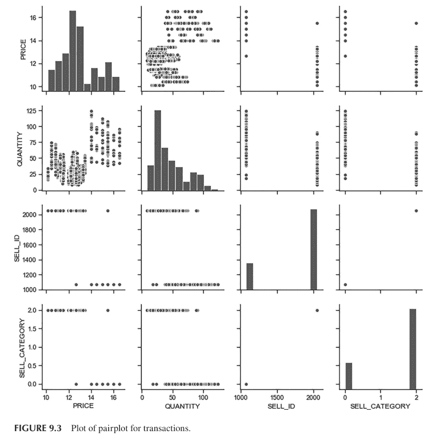

```
date_info.shape
date_info[date_info.isnull().any(axis=1)]
pd.concat([sold.SELL_ID, pd.get_dummies(sold.ITEM_NAME)], axis=1)
pd.concat([sold.SELL_ID, pd.get_dummies(sold.ITEM_NAME)], axis=1).
groupby(sold.SELL_ID).sum()

data1 = pd.merge(sold.drop(['ITEM_ID'],axis=1), transactions.drop(['SELL_
CATEGORY'], axis= 1), on = 'SELL_ID')
data1.head(20)
b = data1.groupby(['SELL_ID', 'SELL_CATEGORY', 'ITEM_NAME', 'CALENDAR_
DATE','PRICE']).QUANTITY.sum()

data1.shape
intermediate_data = b.reset_index()

data1.shape
b.shape
```

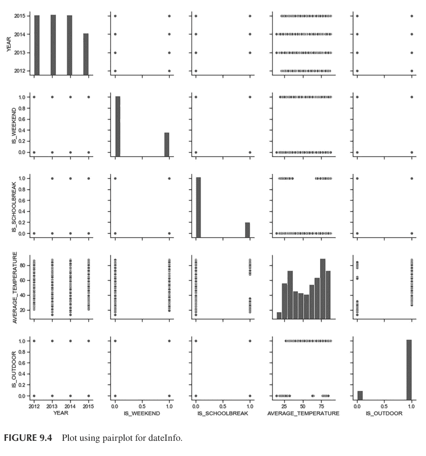

图 9.4 使用 pairplot 绘制 dateInfo 的图表。

```
intermediate_data.head()
intermediate_data['CALENDAR_DATE'].min()
intermediate_data['CALENDAR_DATE'].max()

combined_data = pd.merge(intermediate_data, date_info, on = 'CALENDAR_DATE')
combined_data.head()
combined_data.shape
combined_data[combined_data.isnull().any(axis=1)]

np.unique(combined_data['HOLIDAY'])
np.unique(combined_data['IS_WEEKEND'])
np.unique(combined_data['IS_SCHOOLBREAK'])

bau_data = combined_data[(combined_data['HOLIDAY']=='No Holiday') & (combined_data['IS_SCHOOLBREAK']==0) & (combined_data['IS_WEEKEND']==0)]
```

决策科学案例研究

395

```
bau_data.head()
bau_data.shape
```

```
np.unique(bau_data['HOLIDAY'])
np.unique(bau_data['IS_WEEKEND'])
np.unique(bau_data['IS_SCHOOLBREAK'])
bau_data[bau_data['IS_WEEKEND']==1]
bau_data[bau_data['HOLIDAY']!='No Holiday']
```

```
## 数据探索
plt.hist(bau_data.ITEM_NAME)
plt.hist(bau_data.PRICE)
plt.scatter(combined_data['PRICE'], combined_data['QUANTITY'])
plt.scatter(bau_data['PRICE'], bau_data['QUANTITY'])
```

```
sns.pairplot(combined_data[['PRICE','QUANTITY','ITEM_NAME']], hue = 'ITEM_NAME', plot_kws={'alpha':0.1})
```

```
sns.pairplot(bau_data[['PRICE','QUANTITY','ITEM_NAME']], hue = 'ITEM_NAME', plot_kws={'alpha':0.1})
```

# 价格密度图呈双峰分布。从图中可以看出，随着价格的提高，所有商品的销售量都减少了。然而，可乐在这种视图中被隐藏了。我们可以继续计算其价格弹性。

```
burger = combined_data[combined_data['ITEM_NAME'] == 'BURGER']
burger.head()
burger.shape
burger.describe()
sns.scatterplot(x = burger.PRICE, y = burger.QUANTITY )
```

# 从上面的散点图可以看出，销售的汉堡肯定有不同的类型。现在，让我们看看当用 SELL_ID 区分时的相同分布，SELL_ID 表示该汉堡是否是套餐的一部分，必须单独处理。

```
burger = combined_data[combined_data['ITEM_NAME'] == 'BURGER']
# print(burger)
# print(burger.describe())
sns.scatterplot(data = burger, x = burger.PRICE, y = burger.QUANTITY , hue = 'SELL_ID', legend=False, alpha = 0.1)
np.unique(combined_data.SELL_ID)
np.unique(combined_data.SELL_CATEGORY)
```

```
burger_1070 = combined_data[(combined_data['ITEM_NAME'] == 'BURGER') & (combined_data['SELL_ID'] == 1070)]
```

## 建模

```
# 这是针对合并数据的
burger_model = ols("QUANTITY ~ PRICE", data=burger_1070).fit()
print(burger_model.summary())
fig = plt.figure(figsize=(12,8))
fig = sm.graphics.plot_partregress_grid(burger_model, fig=fig)
```

```
burger = bau_data[bau_data['ITEM_NAME'] == 'BURGER']
burger.head()
burger.shape
burger.describe()
sns.scatterplot(x = burger.PRICE, y = burger.QUANTITY )
```

```
burger = bau_data[bau_data['ITEM_NAME'] == 'BURGER']
# print(burger)
# print(burger.describe())
sns.scatterplot(data = burger, x = burger.PRICE, y = burger.QUANTITY ,
hue = 'SELL_ID', legend=False, alpha = 0.1)
```

```
np.unique(bau_data.SELL_ID)
np.unique(bau_data.SELL_CATEGORY)
```

```
burger_1070 = bau_data[(bau_data['ITEM_NAME'] == 'BURGER') & (bau_
data['SELL_ID'] == 1070)]
burger_1070.head()
burger_1070.describe()
sns.scatterplot(data = burger_1070, x = burger_1070.PRICE, y =
burger_1070.QUANTITY, alpha = 0.1)
```

# 正如我们所看到的，散点图干净多了。尽管似乎确实存在两个独立的趋势。

```
burger_model = ols("QUANTITY ~ PRICE", data=burger_1070).fit()
print(burger_model.summary())
fig = plt.figure(figsize=(12,8))
fig = sm.graphics.plot_partregress_grid(burger_model, fig=fig)
```

# 让我们再次查看汉堡数据，看看是否有其他信息可以用来进一步优化我们的模型。

```
bau_data.head()
bau2_data = combined_data[(combined_data['HOLIDAY']=='No Holiday') &
(combined_data['IS_SCHOOLBREAK']==0) & (combined_data['IS_WEEKEND']==0) &
(combined_data['IS_OUTDOOR']==1)]
```

```
burger_1070 = bau2_data[(bau2_data['ITEM_NAME'] == 'BURGER') & (bau2_
data['SELL_ID'] == 1070)]
```

```
burger_1070.head()
burger_1070.describe()
sns.scatterplot(data = burger_1070, x = burger_1070.PRICE, y =
burger_1070.QUANTITY, alpha = 0.1)
```

决策科学案例研究

397

```
fig = sm.graphics.plot_ccpr(burger_model, "PRICE")

fig = plt.figure(figsize=(12,8))
fig = sm.graphics.plot_regress_exog(burger_model, "PRICE", fig=fig)

burger_2051 = combined_data[(combined_data['ITEM_NAME'] == 'BURGER') &
(combined_data['SELL_ID'] == 2051)]

burger_2051.head()
burger_2051.describe()
sns.scatterplot(data = burger_2051, x = burger_2051.PRICE, y =
burger_2051.QUANTITY, alpha = 0.1)

burger_model = ols("QUANTITY ~ PRICE", data=burger_2051).fit()
print(burger_model.summary())
fig = plt.figure(figsize=(12,8))
fig = sm.graphics.plot_partregress_grid(burger_model, fig=fig)
coke = combined_data[combined_data['ITEM_NAME'] == 'COKE']
coke.head()
coke.shape
coke.describe()
sns.scatterplot(x = coke.PRICE, y = coke.QUANTITY , alpha = 0.1)

coke_model = ols("QUANTITY ~ PRICE", data=coke).fit()
print(coke_model.summary())
fig = plt.figure(figsize=(12,8))
fig = sm.graphics.plot_partregress_grid(coke_model, fig=fig)
fig = plt.figure(figsize=(12,8))
fig = sm.graphics.plot_regress_exog(coke_model, 'PRICE', fig=fig)

df = combined_data[combined_data['ITEM_NAME'] == 'COFFEE']
df.head()
df.shape
df.describe()
sns.scatterplot(x = df.PRICE, y = df.QUANTITY , alpha = 0.1)

model = ols("QUANTITY ~ PRICE", data=df).fit()
print(model.summary())
fig = plt.figure(figsize=(12,8))
fig = sm.graphics.plot_partregress_grid(model, fig=fig)
fig = plt.figure(figsize=(12,8))
fig = sm.graphics.plot_regress_exog(model, 'PRICE', fig=fig)

df = combined_data[combined_data['ITEM_NAME'] == 'LEMONADE']
df.head()
df.shape
df.describe()
sns.scatterplot(x = df.PRICE, y = df.QUANTITY , alpha = 0.1)

model = ols("QUANTITY ~ PRICE", data=df).fit()
print(model.summary())
fig = plt.figure(figsize=(12,8))
fig = sm.graphics.plot_partregress_grid(model, fig=fig)
fig = plt.figure(figsize=(12,8))
fig = sm.graphics.plot_regress_exog(model, 'PRICE', fig=fig)
elasticities = {}
```

```
def create_model_and_find_elasticity(data):
    model = ols("QUANTITY ~ PRICE", data).fit()
    price_elasticity = model.params[1]
    print("Price elasticity of the product: " + str(price_elasticity))
    print(model.summary())
    fig = plt.figure(figsize=(12,8))
    fig = sm.graphics.plot_partregress_grid(model, fig=fig)
    return price_elasticity, model
```

```
price_elasticity, model_burger_1070 =
create_model_and_find_elasticity(burger_1070)
elasticities['burger_1070'] = price_elasticity
```

```
burger2051_data = bau2_data[(bau2_data['ITEM_NAME'] == "BURGER") & (bau2_
data['SELL_ID'] == 2051)]
elasticities['burger_2051'], model_burger_2051 =
create_model_and_find_elasticity(burger2051_data)
```

```
burger2052_data = bau2_data[(bau2_data['ITEM_NAME'] == "BURGER") & (bau2_
data['SELL_ID'] == 2052)]
elasticities['burger_2052'], model_burger_2052 =
create_model_and_find_elasticity(burger2052_data)
```

```
burger2053_data = bau2_data[(bau2_data['ITEM_NAME'] == "BURGER") & (bau2_
data['SELL_ID'] == 2053)]
elasticities['burger_2053'], model_burger_2053 =
create_model_and_find_elasticity(burger2053_data)
```

```
coke_data = bau2_data[bau2_data['ITEM_NAME'] == "COKE"]
create_model_and_find_elasticity(coke_data)
```

```
# 有两种可乐是套餐的一部分，而一种是单点的。因此，底部的分布很可能属于单点可乐。让我们验证一下。
coke_data = bau2_data[(bau2_data['ITEM_NAME'] == "COKE") & (bau2_
data['SELL_ID'] == 3067)]
elasticities['coke_3067'], model_coke_3067 =
create_model_and_find_elasticity(coke_data)
```

```
coke_data
coke_data_2053 = bau2_data[(bau2_data['ITEM_NAME'] == "COKE") & (bau2_
data['SELL_ID'] == 2053)]
elasticities['coke_2053'], model_coke_2053 =
create_model_and_find_elasticity(coke_data_2053)
```

```
coke_data_2051 = bau2_data[(bau2_data['ITEM_NAME'] == "COKE") & (bau2_
data['SELL_ID'] == 2051)]
elasticities['coke_2051'], model_coke_2051 =
create_model_and_find_elasticity(coke_data_2051)
```

```
lemonade_data_2052 = bau2_data[(bau2_data['ITEM_NAME'] == "LEMONADE") &
(bau2_data['SELL_ID'] == 2052)]
elasticities['lemonade_2052'], model_lemonade_2052 =
create_model_and_find_elasticity(lemonade_data_2052)
```

```
lemonade_data_3028 = bau2_data[(bau2_data['ITEM_NAME'] == "LEMONADE") &
(bau2_data['SELL_ID'] == 3028)]
```

## 决策科学案例研究

elasticities['lemonade_3028'], model_lemonade_3028 = create_model_and_find_elasticity(lemonade_data_3028)

coffee_data_2053 = bau2_data[(bau2_data['ITEM_NAME'] == "COFFEE") & (bau2_data['SELL_ID'] == 2053)]
elasticities['coffee_2053'], model_coffee_2053 = create_model_and_find_elasticity(coffee_data_2053)

coffee_data_3055 = bau2_data[(bau2_data['ITEM_NAME'] == "COFFEE") & (bau2_data['SELL_ID'] == 3055)]
elasticities['coffee_3055'], model_coffee_3055 = create_model_and_find_elasticity(coffee_data_3055)

### 在表格中列出商品及其价格弹性

elasticities

### 寻找最大利润的最优价格

# 现在，我们以可乐为例（上一个可乐数据的sell_id是2051），由于我们不知道可乐的进价，我们假设它略低于数据集中可乐的最低价格

coke_data = coke_data_2053
coke_data.PRICE.min()
coke_data.PRICE.max()

# 我们将可乐的进价设为9。我们现在希望设定可乐的价格以获得最大利润。PRICE是销售价格

buying_price_coke = 9

# coke_data.PROFIT = (coke_data.PRICE - buying_price_coke) * coke_data.QUANTITY
# 让我们看看不同价格点的利润：

start_price = 9.5
end_price = 20

test = pd.DataFrame(columns = ["PRICE", "QUANTITY"])
test['PRICE'] = np.arange(start_price, end_price, 0.01)

test['QUANTITY'] = model_coke_2051.predict(test['PRICE'])

test
test['PROFIT'] = (test["PRICE"] - buying_price_coke) * test["QUANTITY"]
test

plt.plot(test['PRICE'], test['QUANTITY'])
plt.plot(test['PRICE'], test['PROFIT'])
plt.show()

# 让我们找到获得最大利润的确切价格：
ind = np.where(test['PROFIT'] == test['PROFIT'].max())[0][0]
test.loc[[ind]]

def find_optimal_price(data, model, buying_price):
    start_price = data.PRICE.min() - 1
    end_price = data.PRICE.min() + 10
    test = pd.DataFrame(columns = ["PRICE", "QUANTITY"])
    test['PRICE'] = np.arange(start_price, end_price, 0.01)
    test['QUANTITY'] = model.predict(test['PRICE'])
    test['PROFIT'] = (test["PRICE"] - buying_price) * test["QUANTITY"]
    plt.plot(test['PRICE'], test['QUANTITY'])
    plt.plot(test['PRICE'], test['PROFIT'])
    plt.show()
    ind = np.where(test['PROFIT'] == test['PROFIT'].max())[0][0]
    values_at_max_profit = test.iloc[[ind]]
    return values_at_max_profit

### 计算所有商品的最优价格并列表展示

optimal_price = {}
buying_price = 9

optimal_price['burger_1070'] = find_optimal_price(burger_1070, model_burger_1070, buying_price)
optimal_price

optimal_price['burger_2051'] = find_optimal_price(burger2051_data, model_burger_2051, buying_price)

optimal_price['burger_2052'] = find_optimal_price(burger2052_data, model_burger_2052, buying_price)

optimal_price['burger_2053'] = find_optimal_price(burger2053_data, model_burger_2053, buying_price)
optimal_price['coke_2051'] = find_optimal_price(coke_data_2051, model_coke_2051, buying_price)
optimal_price['coke_2053'] = find_optimal_price(coke_data_2053, model_coke_2053, buying_price)
optimal_price['lemonade_2052'] = find_optimal_price(lemonade_data_2052, model_lemonade_2052, buying_price)
optimal_price['coffee_2053'] = find_optimal_price(coffee_data_2053, model_coffee_2053, buying_price)
optimal_price

coke_data_2051.PRICE.describe()

## 9.1.3 结论

基于其历史销售数据，这是咖啡馆必须为其商品设定的最优价格，以获得最高利润。需要注意的是，这是在正常日的情况。在“其他”日子，如假日或活动日，会对顾客的购买行为和模式产生不同的影响。通常，在这些日子会看到消费量的增加。这些情况必须单独处理。

同样，重要的是要排除除价格以外任何会影响顾客购买行为的外部因素，包括商品打折时的数据点。一旦新价格公布，持续监控销售和利润至关重要。如果这种定价方法是产品的一部分，可以创建一个仪表板来监控这些商品并计算利润的提升。

## 9.2 用例2 – 购物篮分析（MBA）

### 9.2.1 引言

顾客购物篮分析是大型零售商用来发现商品组合和关联的重要技术之一。这个过程是通过寻找在交易中共同出现的商品组合来完成的。换句话说，它允许零售商识别人们购买的商品之间的关联。这个假设基于这样一个理论：购买一件商品的顾客更有可能购买另一件相关商品。

例如，购买女式袜子的人通常也会购买童装。因此，零售连锁店的营销团队会针对那些购买女装和童装的顾客，并为他们提供折扣以购买第三件商品，比如小首饰（这对零售商来说利润率很高）。这也决定了商店的布局方式。其变体称为空间和容量分析。根据顾客行为，可以安排商店布局以最大化货架空间的收入。

因此，如果顾客购买了女装和童装，并看到首饰的折扣或优惠，他们就会被鼓励花更多的钱购买首饰。这就是所谓的购物篮分析，或市场购物篮分析，简称MBA。这只是一个例子。因此，如果我们获取超市成千上万件商品的数据，我们就能获得大量的洞察。这就是为什么关联规则挖掘如此重要。

### 9.2.2 理解数据

在这个例子中，我们使用一个详细描述顾客的数据集，如位置、年龄、收入和教育程度，以及产品和产品类别，它们提供了产品及其分组的详细信息，商店包含位置、面积、商店类型（是超市、迷你店等）、区域和时间维度的详细信息。我们还使用销售交易数据。

在这个解决方案中，我们使用Apriori和Fpgrowth算法。Apriori是一种基于关系数据库学习的频繁项集挖掘和关联规则挖掘算法。它通过识别数据集中重复出现的单个项目，并将其扩展到更大的项集来推进，只要这些项集在数据库中出现的频率足够高。另一方面，Fpgrowth，也称为频繁模式增长算法，仅根据用户的最小支持度生成频繁项集。Apriori和Fpgrowth算法之间的一个区别是，Fpgrowth算法不会多次扫描整个数据库，扫描时间线性增加。因此，Fpgrowth算法比Apriori算法快得多。

```python
#!/usr/bin/env python
# coding: utf-8
@author: Suresh Rajappa
# # 市场购物篮分析
#
# **什么是市场购物篮分析？**
#
# 市场购物篮分析是大型零售商利用顾客购买模式来发现商品之间关系的重要技术之一。
# 它通过寻找在交易中频繁共同出现的商品组合来工作。换句话说，它允许零售商识别人们购买的商品之间的关联
# # 针对Foodmart商店示例数据集的市场购物篮分析（MBA）
# Food Mart（FM）是美国的一家连锁便利店。这家私营公司的总部位于俄亥俄州的门托，目前在美国大约有**325家商店**。Food Mart采用特许经营系统。
```

### 导入库

```python
import pandas as pd
import numpy as np
import matplotlib.pyplot as plt
```

### 在同一个单元格中获取多个输出

```python
from IPython.core.interactiveshell import InteractiveShell
InteractiveShell.ast_node_interactivity = "all"
```

### 忽略所有警告

```python
import warnings
warnings.filterwarnings('ignore')
warnings.filterwarnings(action='ignore', category=DeprecationWarning)
```

### 显示数据框的所有行和列，而不是截断版本

```python
from IPython.display import display
pd.set_option('display.max_columns', None)
pd.set_option('display.max_rows', None)
```

### 加载和理解数据文件

#### 加载顾客数据集

```python
customer=pd.read_csv("/Python Files/Usecases/Use Case3/data/customer.csv")
customer.head()
```

#### 加载产品数据集

```python
product=pd.read_csv("../data/product.csv")
product.head()
```

#### 加载部门数据集

```python
product_class=pd.read_csv("../data/product_class.csv")
product_class.head()
```

#### 加载区域数据集

```python
region=pd.read_csv("../data/region.csv")
region.head()
```

#### 加载销售交易数据集

```python
df=pd.read_csv("../data/sales.csv")
df.head()
```

#### 加载商店数据集

```python
store=pd.read_csv("../data/store.csv")
store.head()
```

#### 加载按天时间数据集

```python
time_by_day=pd.read_csv("../data/time_by_day.csv")
time_by_day.head()

time_by_day.tail()
```

### 数据预处理

## 决策科学案例研究

### 在 df 数据框中合并客户数据集
```python
df=df.merge(customer,on='customer_id')
df.head()
```

### 在 df 数据框中合并产品数据集
```python
df=df.merge(product,on='product_id')
df.head()
```

### 在 df 数据框中合并部门数据集
```python
df=df.merge(product_class,on='product_class_id')
df.head()
```

### 在 df 数据框中合并商店数据集
```python
df=df.merge(store,on='store_id')
df.head()
```

### 在 df 数据框中合并区域数据集
```python
df=df.merge(region,on='region_id')
df.head()
```

### 在 df 数据框中合并按日时间数据集
```python
df=df.merge(time_by_day,on='time_id')
df.head()
```

### 将数据框转换为最终的 Foodmart 离线数据集
```python
df.to_csv("../data/Foodmart_dataset.csv")
```

## 探索性数据分析 (EDA)

### 导入库
```python
import pandas as pd
import numpy as np
import matplotlib.pyplot as plt
import seaborn as sns
import squarify
import networkx as nx
import warnings
import matplotlib as mpl
import gapminder as gapminder

get_ipython().run_line_magic('matplotlib', 'inline')

from mlxtend.frequent_patterns import apriori
from mlxtend.frequent_patterns import association_rules
```

### 加载 Foodmart 离线数据集
```python
df=pd.read_csv("../data/Foodmart_dataset.csv")
```

### Foodmart 数据集的大小
```python
df.shape
df.head()
```

## 数据探索

### 描述性统计
```python
df.describe()
df.describe(include='all')
```

### 缺失值
```python
df.isnull().sum()
```

### 数据类型
```python
df.dtypes
```

### 检查数据类型、缺失值、唯一值
```python
temp = pd.DataFrame(index=df.columns)
temp['data_type']=df.dtypes
temp['null_count']=df.isnull().sum()
temp['unique_count']=df.nunique()

temp
```

## 单变量分析

## 直方图

#### 部门 ID 频率图
```python
fig=plt.figure(figsize=(15,10))
df['product_class_id'].plot.hist(bins = 50)
plt.xlabel('department id')
```

#### 产品 ID 频率图
```python
fig=plt.figure(figsize=(15,10))
df['product_id'].plot.hist(bins = 100)
plt.xlabel('product id')
```

#### 单位销售额频率图
```python
fig=plt.figure(figsize=(15,10))
df['unit_sales'].plot.hist(bins = 25)
plt.xlabel('Unit Sales')
```

### 人们何时下单

#### 年份
```python
fig=plt.figure(figsize=(12,10))
df['the_year'].plot.hist(bins=10)
plt.xlabel('year')
plt.xticks([1996,1997,1998,1999])
```

#### 月份
```python
fig=plt.figure(figsize=(15,10))
df['the_month'].plot.hist(bins=50)
plt.xlabel('Month')
```

#### 月内日期
```python
fig=plt.figure(figsize=(15,10))
df['day_of_month'].plot.hist(bins=75)
plt.xlabel('Day of month')
```

#### 星期几
```python
df_day_freq=df['the_day'].value_counts()
fig=plt.figure(figsize=(15, 10))
df_day_freq.plot.bar()
```

### 首选商品

#### 产品 Top 10 首选
```python
df['products'] = 'Products'
products = df.truncate(before = 605, after = 615)
products = nx.from_pandas_edgelist(products, source = 'products', target = 'product_name', edge_attr = True)
products

warnings.filterwarnings('ignore')

plt.rcParams['figure.figsize']=(20,20)
pos=nx.spring_layout(products)
color=plt.cm.Reds(np.linspace(0,15,1))
nx.draw_networkx_nodes(products,pos,node_size=15000,node_color=color)
nx.draw_networkx_edges(products, pos, width = 3, alpha = 0.6, edge_color = 'black')
nx.draw_networkx_labels(products, pos, font_size = 20)
plt.axis('off')
plt.grid()
plt.title('Top 10 First Choices in Products', fontsize = 40)
plt.show()
```

#### 部门 Top 10 首选
```python
df['departments'] = 'Departments'
departments = df.truncate(before = 150, after = 195)
departments = nx.from_pandas_edgelist(departments, source = 'departments', target = 'department', edge_attr = True)

warnings.filterwarnings('ignore')

plt.rcParams['figure.figsize']=(20,20)
pos=nx.spring_layout(departments)
color=plt.cm.Blues(np.linspace(0,15,1))
nx.draw_networkx_nodes(departments,pos,node_size=15000,node_color=color)
nx.draw_networkx_edges(departments, pos, width = 3, alpha = 0.6, edge_color = 'black')
nx.draw_networkx_labels(departments, pos, font_size = 20)
plt.axis('off')
plt.grid()
plt.title('Top 10 First Choices in Departments', fontsize = 40)
plt.show()
```

### 订单量最高

#### 订单量最高的产品
```python
df['product_name'].value_counts()
```

#### 订单量最高的产品（百分比）
```python
df['product_name'].value_counts()/len(df)*100
```

#### 访问量最高的部门
```python
df['department'].value_counts()
```

#### 访问量最高的部门（百分比）
```python
df['department'].value_counts()/len(df)*100
```

#### 访问量最高的通道
```python
df['subcategory'].value_counts()
```

#### 访问量最高的通道（百分比）
```python
df['subcategory'].value_counts()/len(df)*100
```

### 条形图

#### 访问量最高通道的条形图
```python
df_subcategory_freq=df['subcategory'].value_counts().iloc[:50]
fig=plt.figure(figsize=(15,10))
df_subcategory_freq.plot.bar()
```

#### 访问量最高部门的条形图
```python
fig=plt.figure(figsize=(15,10))
df['department'].value_counts().plot(kind='bar')
```

#### 购买量最高产品的条形图
```python
df_freq_products=df['product_name'].value_counts().iloc[:50]
fig=plt.figure(figsize=(15, 10))
df_freq_products.plot.bar()
```

#### 购买量最高产品的数组
```python
y=df_freq_products.head(50).to_frame()
y.index
```

#### 购买量最高产品的树状图
```python
plt.rcParams['figure.figsize']=(20,20)
color=plt.cm.cool(np.linspace(0,1,50))
squarify.plot(sizes=y.values,label=y.index,alpha=0.8,color=color)
plt.title('tree map for frequent products')
plt.axis('off')
```

## 数据处理
```python
df.shape
```

### 删除重复项
```python
df.drop_duplicates()
df.shape
```

### 缺失值
```python
df.isnull().sum()
```

### 数据类型
```python
df.dtypes
```

## 双变量分析

### 条形图

#### 客户与每单产品数量的条形图
```python
data_user_orders_num=df.groupby('customer_id')['unit_sales'].count()
data_user_orders_num

source_data = {}
for i in range(10):
    source_data[str(10*i)+'~'+str(10*(i+1))]=len([x for x in list(data_user_orders_num) if x>=i*10 and x<(i+1)*10])

source_data

font_size=10
fig_size=(8,6)
mpl.rcParams['font.size']=font_size
mpl.rcParams['figure.figsize']=fig_size
bar_width=0.3

x_axis = tuple(source_data.keys())
y_axis = tuple(source_data.values())
#assign color
plt.bar(x_axis, y_axis, color='rgb')
# descriptions for x-axis, y-axis
plt.xlabel('Unit sales')
plt.ylabel("No. of customers")
plt.title("Orders Scatter Plot")
plt.show()
```

### 交易 ID
- 创建表示购物篮的交易 ID
```python
df['transaction_id'] = df['customer_id'].astype(str) + df['time_id'].astype(str)
df.head()
```

### 筛选列
```python
cols = [77,3,1,24]
order_products=df[df.columns[cols]]
order_products.head()
```

### 客户每单平均购买产品数
```python
data_user_products_num1=order_products.groupby('transaction_id')['product_id'].count()
data_user_products_num1=pd.DataFrame(data_user_products_num1)
data_user_products_num1['transaction_id']=list(data_user_products_num1.index)

data_user_products_num1.columns=['product_num','orderid']
data_user_products_num2=pd.merge(data_user_products_num1,df[['transaction_id','customer_id']],on='transaction_id',how='left')

data_user_products_num3=data_user_products_num2.groupby('customer_id')['product_num'].agg(['sum','count'])
data_user_products_num3['avg']=data_user_products_num3['sum']/data_user_products_num3['count']
data_user_products_num3.head()
```

## 各部门特色产品
```python
cols = [1,36,38,24]
departments=df[df.columns[cols]]
departments.head()
```

### 部门列表
```python
temp=['department']
for i in temp:
    print('@@@@@@Value Count in',i,'@@@@@@@@@@')
    print(df[i].value_counts())
```

### 生鲜部门
```python
produce=departments.loc[df['department'] == 'Produce']
produce.head()
```

### 生鲜部门特色产品
```python
top_produce=produce['product_name'].value_counts().iloc[:10]
top_produce.head()
```

### 零食部门特色产品
```python
snacks=df.loc[df['department']=='Snack Foods']
top_snacks=snacks['product_name'].value_counts().iloc[:10]
top_snacks.head()
```

### 家居用品部门特色产品
```python
household=df.loc[df['department']=='Household']
top_household=household['product_name'].value_counts().iloc[:10]
print(top_household)
```

### 冷冻食品部门特色产品
```python
frozen=df.loc[df['department']=='Frozen Foods']
top_frozen=frozen['product_name'].value_counts().iloc[:10]
print(top_frozen)
```

### 烘焙食品部门特色产品
```python
baking=df.loc[df['department']=='Baking Goods']
top_baking=baking['product_name'].value_counts().iloc[:10]
print(top_baking)
```

### 罐头食品部门特色产品
```python
canned=df.loc[df['department']=='Canned Foods']
top_canned=canned['product_name'].value_counts().iloc[:10]
print(top_canned)
```

### 乳制品部门特色产品
```python
dairy=(df.loc[df['department'] == 'Dairy'])
top_dairy=dairy['product_name'].value_counts().iloc[:10]
print(top_dairy)
```

### 健康与卫生部门特色产品
```python
dairy=(df.loc[df['department'] == 'Health and Hygiene'])
top_dairy=dairy['product_name'].value_counts().iloc[:10]
print(top_dairy)
```

### 饮料部门特色产品
```python
dairy=(df.loc[df['department'] == 'Beverages'])
top_dairy=dairy['product_name'].value_counts().iloc[:10]
print(top_dairy)
```

### 熟食部门特色产品
```python
dairy=(df.loc[df['department'] == 'Deli'])
top_dairy=dairy['product_name'].value_counts().iloc[:10]
print(top_dairy)
```

### 酒精饮料部门特色产品
```python
dairy=(df.loc[df['department'] == 'Alcoholic Beverages'])
top_dairy=dairy['product_name'].value_counts().iloc[:10]
print(top_dairy)
```

### 淀粉类食品部门特色产品
```python
dairy=(df.loc[df['department'] == 'Starchy Foods'])
top_dairy=dairy['product_name'].value_counts().iloc[:10]
print(top_dairy)
```

### 蛋类部门特色产品
```python
dairy=(df.loc[df['department'] == 'Eggs'])
```

## 决策科学案例研究

```python
top_dairy = dairy['product_name'].value_counts().iloc[:10]
print(top_dairy)
```

### 购物篮分析

```python
### 导入库
import pandas as pd
import numpy as np
from mlxtend.frequent_patterns import apriori
from mlxtend.frequent_patterns import association_rules
from sklearn.preprocessing import LabelEncoder
import seaborn as sns
import matplotlib.pyplot as plt
```

```python
### 筛选列
cols = [77, 3, 1, 24, 7, 2]
product_name = df[df.columns[cols]]
product_name.head()
```

```python
# 统计每种产品
# 产品出现的交易次数
productCountDf = product_name.groupby("product_id", as_index=False)['transaction_id'].count()
productCountDf.head()
```

```python
# 排列热门产品
productCountDf = productCountDf.sort_values("transaction_id", ascending=False)
productCountDf.head()
```

```python
# 最常购买的100种产品
topProdFrame = productCountDf.iloc[0:100, :]
productId = topProdFrame.loc[:, ["product_id"]]
topProdFrame
```

```python
# 包含最常购买产品的订单
MarketBasketdf = product_name[0:0]
for i in range(0, 99):
    pId = productId.iloc[i]['product_id']
    stDf = product_name[product_name.product_id == pId]
    MarketBasketdf = MarketBasketdf.append(stDf, ignore_index=False)

MarketBasketdf.head()
```

```python
# 将商品放入1笔交易中
basket = MarketBasketdf.groupby(['transaction_id', 'product_name'])['unit_sales'].sum().unstack().reset_index().fillna(0).set_index('transaction_id')
basket
```

### 独热编码

```python
# 将单位转换为1个编码值
def encode_units(x):
    if x <= 0:
        return 0
    if x >= 1:
        return 1
```

```python
basket_sets = basket.applymap(encode_units)
basket_sets.head()
```

```python
# 购物篮的大小和形状
basket_sets.size
basket_sets.shape
dummy = basket_sets.head(10000)
```

### Apriori算法

```python
# 导入Apriori和关联规则库
from mlxtend.frequent_patterns import apriori
from mlxtend.frequent_patterns import association_rules
```

```python
# 使用Apriori算法找出支持度为0.01%的频繁项集
frequent_itemsets = apriori(dummy, min_support=0.0001, use_colnames=True)
frequent_itemsets
```

```python
# 使用Apriori算法生成关联规则
apriori_rules = association_rules(frequent_itemsets, metric="lift", min_threshold=1)
apriori_rules
```

```python
# 筛选出具有较高概率的关联产品
apriori_rules[(apriori_rules['lift'] >= 50) & (apriori_rules['confidence'] >= 0.01)]
```

### 使用Apriori算法进行推荐

```python
def recommendations_using_Apriori(item):
    recommend = []
    for i in range(0, 2646):
        if item == apriori_rules.iloc[i, 0]:
            recommend.append(apriori_rules.iloc[i, 1])
    return recommend
```

```python
# 基于“更好的鸡肉面条汤”的5个推荐
product_name = {'Better Chicken Noodle Soup'}
recomentations = recommendations_using_Apriori(product_name)
print(*recomentations[0:5], sep="\n")
```

```python
# 基于“妈妈的土豆沙拉”的10个推荐
product_name = {'Moms Potato Salad'}
recomentations = recommendations_using_Apriori(product_name)
print(*recomentations[0:10], sep="\n")
```

```python
# 基于“卡林顿冰淇淋三明治”的15个推荐
product_name = {'Carrington Ice Cream Sandwich'}
recomentations = recommendations_using_Apriori(product_name)
print(*recomentations[0:15], sep="\n")
```

### Fpgrowth算法

```python
# 导入Fpgrowth库
from mlxtend.frequent_patterns import fpgrowth
```

```python
# 使用Fpgrowth算法找出支持度为0.001%的频繁项集
freq_items = fpgrowth(dummy, min_support=.0001, use_colnames=True)
freq_items
```

```python
# 使用Fpgrowth算法生成关联规则
fpgrowth_rules = association_rules(freq_items, metric="lift", min_threshold=1)
fpgrowth_rules
```

### 使用Fpgrowth算法进行推荐

```python
def recommendations_using_Fpgrowth(item):
    recommend = []
    for i in range(0, 2646):
        if item == fpgrowth_rules.iloc[i, 0]:
            recommend.append(fpgrowth_rules.iloc[i, 1])
    return recommend
```

```python
# 基于“更好的鸡肉面条汤”的5个推荐
product_name = {'Better Chicken Noodle Soup'}
recommendations = recommendations_using_Fpgrowth(product_name)
print(*recommendations[0:5], sep="\n")
```

```python
# 基于“妈妈的土豆沙拉”的10个推荐
product_name = {'Moms Potato Salad'}
recommendations = recommendations_using_Fpgrowth(product_name)
print(*recommendations[0:10], sep="\n")
```

```python
# 基于“卡林顿冰淇淋三明治”的15个推荐
product_name = {'Carrington Ice Cream Sandwich'}
recommendations = recommendations_using_Fpgrowth(product_name)
print(*recommendations[0:15], sep="\n")
```

### 比较Apriori与Fpgrowth算法

```python
# 计算Apriori算法的运行时间
import time
l = [0.01, 0.02, 0.03, 0.04, 0.05]
t = []
for i in l:
    t1 = time.time()
    apriori(dummy, min_support=i, use_colnames=True)
    t2 = time.time()
    t.append((t2 - t1) * 1000)
```

```python
# 计算Fpgrowth算法的运行时间
l = [0.01, 0.02, 0.03, 0.04, 0.05]
f = []
for i in l:
    t1 = time.time()
    fpgrowth(dummy, min_support=i, use_colnames=True)
    t2 = time.time()
    f.append((t2 - t1) * 1000)
```

```python
# Apriori与Fpgrowth算法运行时间对比图
sns.lineplot(x=l, y=f, label="fpgrowth")
sns.lineplot(x=l, y=t, label="apriori")
plt.xlabel("最小支持度阈值")
plt.ylabel("运行时间（毫秒）")
```

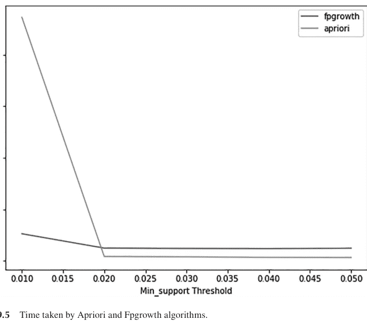

图 9.5 Apriori和Fpgrowth算法所花费的时间。

表 9.1 Apriori与Fpgrowth算法的区别

| Apriori算法 | Fpgrowth算法 |
| :--- | :--- |
| 内存占用更多 | 内存占用更少 |
| 耗时 | 比Apriori更快 |
| 基于树的算法 | 基于数组的算法 |
| 对数据库进行多次数据扫描 | 仅需扫描数据库两次 |
| 使用广度优先搜索 | 使用深度优先搜索 |

## 9.2.3 结论

我们使用了两种著名的算法，Apriori和Fpgrowth，来为项集挖掘开发产品关联。我们比较并评估了每种算法所花费的时间。图9.5中的图表显示了每种算法以毫秒为单位所花费的时间。表9.1展示了这些算法之间的一些细微差别。

## 9.3 用例3 – 零售商销售预测

### 9.3.1 背景

销售预测或预测销售额是机器学习的一个常见用例。销售预测可以识别基准、确定新举措的渐进影响、根据预期需求规划资源以及预测未来预算。一家零售商的数据科学家收集了不同城市各门店按产品分类的销售数据。同时，还定义了每种产品和每家门店的各种属性。本项目旨在构建一个机器学习模型，找出每种产品在特定门店的销售额。利用这个模型，零售商将试图理解产品和门店的特性，这些特性在提高销售额方面起着关键作用。

### 9.3.2 理解数据

我们使用的测试和训练数据集具有以下格式：商品标识符或productId，及其特征，如重量、脂肪含量和产品类别。这还包含有关门店的信息，例如门店成立时间、门店规模、位置和门店类型。示例数据如图9.6所示。

乍一看，我们可以看到“门店规模”列中有很多空值。我们将使用特征工程技术来检查数据，以查看哪些属性对分析有用，以及数据是否存在不平衡，这是缺失数据中非常常见的数据挑战。

| Item_Identifier | Item_Weight | Item_Fat_Content | Item_Visibility | Item_Type | Item_MRP | Outlet_Id | Outlet_Establishment |
| :--- | :--- | :--- | :--- | :--- | :--- | :--- | :--- |
| FDW58 | 20.75 | Low Fat | 0.007564836 | Snack Foods | 107.8622 | OUT049 | |
| FDW14 | 8.3 | reg | 0.038427677 | Dairy | 87.3198 | OUT017 | |
| NCN55 | 14.6 | Low Fat | 0.099574908 | Others | 241.7538 | OUT010 | |
| FDQ58 | 7.315 | Low Fat | 0.015388393 | Snack Foods | 155.034 | OUT017 | |
| FDY38 | | Regular | 0.118599314 | Dairy | 234.23 | OUT027 | |
| FDH56 | 9.8 | Regular | 0.063817206 | Fruits and Vegetables | 117.1492 | OUT046 | |
| FDL48 | 19.35 | Regular | 0.082601537 | Baking Goods | 50.1034 | OUT018 | |
| FDC48 | | Low Fat | 0.015782495 | Baking Goods | 81.0592 | OUT027 | |

图 9.6 销售预测数据。

```python
# 导入必要的库
# Matplot和seaborn用于绘图
get_ipython().run_line_magic('matplotlib', 'notebook')
from sklearn.linear_model import Ridge
from sklearn.model_selection import KFold, cross_val_score
import featuretools as ft
import numpy as np
import pandas as pd
from sklearn.model_selection import train_test_split
from sklearn.preprocessing import LabelEncoder
from scipy import stats
import matplotlib.pyplot as plt
from sklearn.model_selection import GridSearchCV
from sklearn.model_selection import RandomizedSearchCV
import seaborn as sns
get_ipython().run_line_magic('matplotlib', 'inline')
import warnings
warnings.filterwarnings('ignore')

### 导入数据集
train = pd.read_csv("train.csv")
test = pd.read_csv("test.csv")
print(train.shape, test.shape)

def concat(X, Y):
    df = pd.concat([X, Y], ignore_index=True)
    return df

df = concat(train, test)

# 理解数据和数据预处理
print(df.shape)
```

## 面向决策科学的机器学习：Python案例研究

```python
df.head()
#检查所有变量的空值数量
#Item_Weight有2439个空值
#Outlet_Size有4016个空值
df.isnull().sum()
#检查每个变量对应的唯一条目数量
df.apply(lambda x: len(x.unique()))
#定义一个函数：
#统计每列中唯一条目的频率及其名称
def frequency_each_item(X,Y):
    for i in Y:
        print("frequency of each category for",i)
        print(X[i].value_counts())
#统计每列中唯一条目的频率及其名称
category=['Item_Fat_Content','Item_Type','Outlet_Location_Type','Outlet_Size','Outlet_Type']
frequency_each_item(df,category)
mode_Outlet_Size=df.pivot_table(values='Outlet_Size', index='Outlet_Type',aggfunc=(lambda x: stats.mode(x)[0]))
print(mode_Outlet_Size)
bool2=df['Outlet_Size'].isnull()
df['Outlet_Size'][bool2]=df['Outlet_Type'][bool2].apply(lambda x : mode_Outlet_Size.loc[x]).values
sum(df['Outlet_Size'].isnull())
# 修正错误书写的数据
df['Item_Fat_Content'].replace(to_replace =['low fat','reg','LF'],value =['Low Fat','Regular','Low Fat'],inplace=True)
df['Item_Fat_Content'].value_counts()
df.head()
avg_item_weight=df.pivot_table(values='Item_Weight', index='Item_Identifier',aggfunc=[np.mean])
print(avg_item_weight)
bool=df['Item_Weight'].isnull()
df['Item_Weight'][bool]=df['Item_Identifier'][bool].apply(lambda x :avg_item_weight.loc[x]).values
sum(df['Item_Weight'].isnull())
#借助Item_Identifier列的前2个字母
#将食品类别简化为仅3种类型
df['Item_Type_combined']=df['Item_Identifier'].apply(lambda x : x[0:2])
df['Item_Type_combined'].replace(to_replace =['FD','DR','NC'],value =['Food','Drinks','Non_consumable'],inplace=True)
#删除冗余列
df=df.drop(columns=['Item_Type'])
df.head()
#计算同时为非消耗品的Item_fat_contents数量
bool3=df['Item_Type_combined']=='Non_consumable'
df['Item_Fat_Content'][bool3]='Non_edible'
df['Item_Fat_Content'].value_counts()
#使用特征工程并添加新列
df['yearsold']=2013-df['Outlet_Establishment_Year']
df=df.drop(columns=['Outlet_Establishment_Year'])
df.head()
# 将可见度列中的所有零值转换为均值
Item_Visibility_mean=df.pivot_table(index='Item_Identifier',values='Item_Visibility',aggfunc=[np.mean])
print(Item_Visibility_mean)
bool4=df['Item_Visibility']==0
df['Item_Visibility'][bool4]=df['Item_Identifier'][bool4].apply(lambda x:Item_Visibility_mean.loc[x]).values
df.head()
#检查不同数值列之间的相关性
df.corr()
# # 识别异常值并修复它们
df.describe()
sns.set(style="whitegrid")
ax = sns.boxplot(x=df["Item_Outlet_Sales"])
#众所周知，只有Item_Outlet_Sales存在异常值，我们可以修复它们，但
#修复它们会在很大程度上增加我们的RMSE分数
#绘制图表以进行更多分析
#随着商品MRP的增加，销售额价值增加
plt.scatter(df.Item_MRP,df.Item_Outlet_Sales,c='g')
plt.show()
sns.FacetGrid(df, col='Item_Type_combined', size=3, col_wrap=5).map(plt.hist, 'Item_Outlet_Sales').add_legend();
#对销售额贡献最大的是食品类商品
#贡献最小的是饮料类
sns.FacetGrid(df, col='Outlet_Location_Type', size=3, col_wrap=5).map(plt.hist, 'Item_Outlet_Sales').add_legend();
#三级类型的门店位置提供了最大的销售额，而其他
#两种类型提供的销售额最少
sns.FacetGrid(df, col='Outlet_Size', size=3, col_wrap=5).map(plt.hist, 'Item_Outlet_Sales').add_legend();
#小型门店提供了最大的销售额，而大型门店
#贡献最小
sns.FacetGrid(df, col='Item_Fat_Content', size=3, col_wrap=5).map(plt.hist, 'Item_Outlet_Sales').add_legend();
#人们最偏好脂肪含量最低的商品
sns.FacetGrid(df, col='Outlet_Type', size=3, col_wrap=2).map(plt.hist, 'Item_Outlet_Sales').add_legend();
#高销售额的大部分来自超市类型1
#杂货店的销售额最少
#对所有包含文本条目的列进行标签编码并删除
#Item_identifier
le=LabelEncoder()
list=['Item_Fat_Content','Outlet_Location_Type','Outlet_Size','Outlet_Type','Item_Type_combined','Outlet_Size']
for i in list:
    le.fit(df[i])
    df[i]=le.transform(df[i])
df_new=df.drop(columns='Item_Identifier')
df_new= pd.get_dummies(df_new,columns=['Outlet_Identifier'])
df_new.head()
#分离测试集和训练集
df_new_train=df_new.iloc[:8523,:]
df_new_test=df_new.iloc[8523:,:]
df_new_test=df_new_test.drop(columns=['Item_Outlet_Sales'])
Y_train=df_new_train['Item_Outlet_Sales']
df_train_test=df_new_train.drop(columns=['Item_Outlet_Sales'])
from sklearn.linear_model import LinearRegression
from sklearn.linear_model import Ridge
from sklearn.ensemble import RandomForestRegressor
from sklearn.ensemble import ExtraTreesRegressor
from sklearn.ensemble import BaggingRegressor
from sklearn.ensemble import GradientBoostingRegressor
from sklearn.linear_model import ElasticNet
from sklearn.neural_network import MLPRegressor
from sklearn.model_selection import KFold, cross_val_score
from xgboost import XGBRegressor
import xgboost as xgb
models = [('lr',LinearRegression()),('ridge',Ridge()),('rfr',RandomForestRegressor()),('etr',ExtraTreesRegressor()),('br',BaggingRegressor()),('gbr',GradientBoostingRegressor()),('en',ElasticNet()),('mlp',MLPRegressor())]
#创建函数以选择最佳的2个模型进行进一步的超参数调优
def basic_model_selection(x,y,cross_folds,model):
    scores=[]
    names = []
    for i, j in model:
        cv_scores = cross_val_score(j, x, y, cv=cross_folds,n_jobs=5)
        scores.append(cv_scores)
        names.append(i)
    for k in range(len(scores)):
        print(names[k],scores[k].mean())
basic_model_selection(df_train_test,Y_train,4,models)
#XGBoost矩阵的平均分数
# 定义data_dmatrix
data_dmatrix = xgb.DMatrix(data=df_train_test,label=Y_train)
# 导入XGBRegressor
xgb1 = XGBRegressor()
cv_score = cross_val_score(xgb1, df_train_test, Y_train, cv=4,n_jobs=5)
print(cv_score.mean())
# 梯度提升回归和XGBoost回归将用于进一步的超参数调优
def model_parameter_tuning(x,y,model,parameters,cross_folds):
    model_grid = GridSearchCV(model,parameters,cv = cross_folds,n_jobs = 5,verbose=True)
    model_grid.fit(x,y)
    y_predicted = model_grid.predict(x)
    print(model_grid.score)
    print(model_grid.best_params_)
    print("The RMSE score is",np.sqrt(np.mean((y-y_predicted)**2)))
#定义用于超参数调优的函数，并使用RMSE作为我的度量标准
parameters_xgb = {'nthread':[3,4],
    'learning_rate':[0.02,0.03], #所谓的`eta`值
    'max_depth': [3,2,4],
    'min_child_weight':[3,4,5],
    'silent': [1],
    'subsample': [0.5],
    'colsample_bytree': [0.7],
    'n_estimators': [300,320]
}
parameters_gbr={'loss':['ls','lad'],
    'learning_rate':[0.3],
    'n_estimators':[300],
    'min_samples_split':[3,4],
    'max_depth':[3,4],
    'min_samples_leaf':[3,4,2],
    'max_features':['auto','log2','sqrt']
}
# 定义用于参数调优的有用参数
# 以获得最佳输出
model_parameter_tuning(df_train_test,Y_train,xgb1,parameters_xgb,4)
gbr=GradientBoostingRegressor()
model_parameter_tuning(df_train_test,Y_train,gbr,parameters_gbr,4)
from sklearn.neural_network import MLPRegressor
mlp=MLPRegressor()
parameters_mlp = {'hidden_layer_sizes':[300,400,500],
    'activation':['relu','tanh'],
    'learning_rate':['adaptive'],
    'learning_rate_init':[0.001,0.004],
    'solver':['adam'],
    'max_iter':[200,300]
}
model_parameter_tuning(df_train_test,Y_train,mlp,parameters_mlp,4)
# 训练前对模型进行标准化
from sklearn.preprocessing import StandardScaler
scaler = StandardScaler()
standardized=scaler.fit_transform(df_train_test)
column_names = df_train_test.columns
df_standardized = pd.DataFrame(data=standardized,columns=column_names)
df_standardized.head()
basic_model_selection(df_standardized,Y_train,4,models)
#XGBoost矩阵的平均分数
# 定义data_dmatrix
data_dmatrix = xgb.DMatrix(data=df_standardized,label=Y_train)
# 导入XGBRegressor
xgb1 = XGBRegressor()
cv_score = cross_val_score(xgb1, df_standardized, Y_train, cv=4,n_jobs=5)
print(cv_score.mean())
# 用于超参数调优的模型是相同的XGBoost和
#梯度提升回归
model_parameter_tuning(df_standardized,Y_train,xgb1,parameters_xgb,4)
model_parameter_tuning(df_standardized,Y_train,gbr,parameters_gbr,4)
df_train_test.head()
# 使用鲁棒缩放器
# 我的数据集存在异常值，使其更容易出错
# 鲁棒缩放器也能处理异常值
# 它根据四分位数范围进行缩放
from sklearn.preprocessing import RobustScaler
from sklearn.preprocessing import MinMaxScaler
normalize = MinMaxScaler()
robust = RobustScaler(quantile_range = (0.1,0.8)) #四分位距范围
#是参数之一
robust_stan = robust.fit_transform(df_train_test)
robust_stan_normalize = normalize.fit_transform(robust_stan)
# 还使用MinMaxScaler对数据集进行了归一化，即将数据集
#置于(0,1)之间
```

df_robust_normalize = pd.DataFrame(robust_stan_normalize, columns=column_names)
df_robust_normalize.head()
basic_model_selection(df_robust_normalize, Y_train, 4, models)
cv_score = cross_val_score(xgb1, df_robust_normalize, Y_train, cv=4, n_jobs=5)
print(cv_score.mean())
model_parameter_tuning(df_robust_normalize, Y_train, xgb1, parameters_xgb, 4)
model_parameter_tuning(df_robust_normalize, Y_train, gbr, parameters_gbr, 4)

# 最佳模型
# 使用 RMSE 分数比较所有模型
# 当使用 Robust Scaler 和 MinMaxScaler 归一化时，梯度提升法是最佳方法
# 参数和 RMSE 分别如下
# {'learning_rate': 0.3, 'loss': 'lad', 'max_depth': 3, 'max_features':
# 'auto', 'min_samples_leaf': 2, 'min_samples_split': 2, 'n_estimators':
# 300}
# RMSE 分数为 1049.14085875651
robust_test = robust.fit_transform(df_new_test)
robust_normalize_test = normalize.fit_transform(robust_test)
df_test_robust_normalize = pd.DataFrame(robust_normalize_test, columns=column_names)
gbr = GradientBoostingRegressor(learning_rate=0.3, loss='lad', max_depth=3, min_samples_leaf=2, min_samples_split=3, n_estimators=300)

# 定义我将用于预测的最终模型
gbr.fit(df_robust_normalize, Y_train)
final_prediction = gbr.predict(df_test_robust_normalize)  # 预测门店销售额

# 预测结果是 numpy 数组形式
# 转换为 DataFrame
df_final_prediction = pd.DataFrame(final_prediction, columns=['Item_Outlet_Sales'])
df_final_prediction.head()

# 使用 Joblib 保存最终模型
import joblib
filename = 'final_model.sav'  # 模型名称
joblib.dump(gbr, filename)  # 它会保存在你当前的工作目录中

# 此命令再次加载模型
load_model = joblib.load(filename)

## 9.3.3 结论

在比较模型时，我们可以评估出总体上 XGBoost 模型表现最佳，其他模型紧随其后。这里需要注意的是，上述所有模型都是以其最基本的形式推导出来的，目的是确定它们如何用于销售预测。此外，模型仅经过轻微调整以最小化复杂性。

要确定哪个模型适合实际用例，我们必须考虑以下因素：

- 我们对模型复杂性与可解释性之间平衡的接受程度。
- 模型可以进行调整，特征可以被工程化以包含属性组合等。
- 理解我们应如何使用结果以及数据将如何输入模型。
- 使用交叉验证或类似实践调整模型，以避免数据过拟合和欠拟合。

## 9.4 用例 4——预测财产和意外险（P&C）保险公司的保险索赔成本

### 9.4.1 背景

财产和意外险（又称 P&C 保险）是帮助保护保险人及其所拥有财产的保险类型。财产保险有助于覆盖保险人拥有的物品，如房屋或汽车。另一方面，意外险是指包含责任保险的保单，旨在保护保险人，如果他们被认定对导致他人受伤或损坏其个人物品的事故负有法律责任。财产和意外险通常打包在一个保单中。清晰理解特定索赔的未来成本或严重程度，对保险公司至关重要，这将使其能够更有效地为其计划定价。此外，了解不同属性的视角将使公司能够更高效地评估潜在客户。

### 9.4.2 理解数据

给定的数据集包含 131 列（图 9.7）无标签数据，如示例截图所示。我们使用 Python 的 pickle 库来实现二进制协议，用于序列化和反序列化 Python 对象结构（“Pickling”是将 Python 对象层次结构转换为字节流的过程，而“unpickling”是 pickling 的逆操作）。

```python
# 导入包并加载训练数据
import pandas as pd
import numpy as np
import re
import matplotlib.pyplot as plt
from sklearn.impute import SimpleImputer
import seaborn as sns
from sklearn.feature_selection import VarianceThreshold
from sklearn.preprocessing import LabelEncoder
from sklearn.feature_selection import chi2
import math
import pickle  # 此模块实现了用于序列化和反序列化 Python 对象结构的二进制协议

# 修改显示选项以查看整个数据框
pd.options.display.max_columns = None

train_data = pd.read_csv("train.csv")

# 分析训练数据的大小
# 验证前几个观测值
# 检查列标题

train_data.shape
```

决策科学中的机器学习与 Python 案例研究

| id | cat1 | cat2 | cat3 | cat4 | cat5 | cat6 | cat7 | cat8 | cat9 | cat10 | cat11 | cat12 | cat13 | cat14 | cat15 | cat16 | cat17 | cat18 | cat19 | cat20 | cat21 | cat22 | cat23 | cat24 | cat25 | cat |
|---|---|---|---|---|---|---|---|---|---|---|---|---|---|---|---|---|---|---|---|---|---|---|---|---|---|---|
| 4 A | A | B | A | A | A | A | A | A | B | A | B | A | A | A | A | A | A | A | A | A | A | A | A | A | A | A |
| 6 A | A | B | A | B | A | A | A | A | B | B | A | B | A | B | A | A | A | A | A | A | A | A | B | A | A | A |
| 9 A | A | B | A | B | A | A | A | A | B | A | A | A | A | A | A | A | A | A | A | A | A | A | B | A | A | A |
| 12 A | A | B | A | A | A | A | A | A | A | A | A | A | A | A | A | A | A | A | A | A | A | A | A | A | A | A |
| 15 B | A | A | A | A | B | A | A | A | A | A | A | A | A | A | A | A | A | A | A | A | A | A | A | A | A | A |
| 17 A | A | A | A | A | B | A | A | A | A | A | A | A | A | A | A | A | A | A | A | A | A | A | A | A | A | A |
| 21 B | A | A | A | A | B | A | A | A | A | A | A | A | A | A | A | A | A | A | A | A | A | A | A | A | A | A |
| 28 B | A | B | A | A | A | A | A | A | B | A | A | A | B | A | A | A | A | A | A | A | A | A | A | A | A | A |
| 32 A | A | B | A | A | A | A | A | A | B | A | A | A | A | A | A | A | A | A | A | A | A | A | A | A | A | A |
| 43 A | A | A | A | A | A | A | A | A | B | A | A | A | A | A | A | A | A | A | A | A | A | A | A | A | A | A |
| 46 A | A | A | A | A | A | A | A | A | A | A | A | A | A | A | A | A | A | A | A | A | A | A | A | A | A | A |
| 50 A | A | A | A | A | A | A | A | A | A | A | A | A | A | A | A | A | A | A | A | A | A | A | A | A | A | A |
| 54 B | A | A | A | A | A | A | A | A | A | A | A | A | A | A | A | A | A | A | A | A | A | A | A | A | A | A |
| 62 B | A | A | A | A | A | A | A | A | A | A | A | A | A | A | A | A | A | A | A | A | A | A | A | A | A | A |
| 70 A | A | A | A | A | A | A | A | A | A | A | A | A | A | A | A | A | A | A | A | A | A | A | A | A | A | A |
| 71 A | A | A | A | A | A | A | A | A | A | A | A | A | A | A | A | A | A | A | A | A | A | A | A | A | A | A |
| 75 A | A | A | A | A | A | A | A | A | A | A | A | A | A | A | A | A | A | A | A | A | A | A | A | A | A | A |
| 77 A | A | A | A | A | A | A | A | A | A | A | A | A | A | A | A | A | A | A | A | A | A | A | A | A | A | A |
| 81 A | A | A | A | A | A | A | A | A | A | A | A | A | A | A | A | A | A | A | A | A | A | A | A | A | A | A |

图 9.7 用例 4 数据集的示例视图。

决策科学案例研究

421

```python
train_data.head()

column_names = np.array(train_data.columns)
print(column_names)

# 识别分类列和数值列，以检查数据分布和五数概括
column_datatypes = train_data.dtypes
categorical_columns = list(column_datatypes[column_datatypes == "object"].index.values)
continuous_columns = list(column_datatypes[column_datatypes == "float64"].index.values)
continuous_columns.remove('loss')

# 检查分类变量的分布
# 检查分类列中值分布的函数
# 训练数据和分类列列表
def category_distribution(train_data, categorical_columns):
    categorical_column_distribution = list()
    for cat_column in categorical_columns:
        categorical_column_distribution.append(train_data[cat_column].value_counts())
    return(categorical_column_distribution)

categorical_column_distribution = category_distribution(train_data, categorical_columns)

categorical_column_distribution

length_categorical_columns = list(map(lambda x: len(x), categorical_column_distribution))

# 统计具有相同唯一值数量的列数
distribution_dict = dict()
for val in length_categorical_columns:
    if val in distribution_dict.keys():
        count = distribution_dict[val]
        distribution_dict[val] = count + 1
    else:
        distribution_dict[val] = 1

distribution_dict

# 绘制条形图
# 显示具有相同唯一值数量的列数的图表
keys = distribution_dict.keys()
values = distribution_dict.values()
plt.bar(keys, values, width=0.8)
plt.xlabel('分类变量中的不同值', fontsize=15)
plt.ylabel('计数', fontsize=15)
plt.title('具有相同唯一值的分类标签', fontsize=20)
plt.rcParams['figure.figsize'] = [48/2.54, 10/2.54]
plt.show()

# 检查连续变量的分布
# 筛选出连续列并查看描述性统计
train_data[continuous_columns].describe()
```

## 数据清洗与预处理

# 检查各列是否存在缺失值
# 值为0表示没有缺失值
missing_values = train_data.isnull().sum()
np.max(missing_values)

# 手动在5行中插入空白值
total_rows = train_data.shape[0]
columns_with_blanks_cat = np.random.randint(1, 116, 2)
columns_with_blanks_cont = np.random.randint(117, 130, 3)
columns_with_blank = np.append(columns_with_blanks_cat, columns_with_blanks_cont)

# 为每一列随机插入5个空白值
for col in columns_with_blank:
    rows_with_blanks = np.random.randint(1, total_rows, 5)
    train_data.iloc[rows_with_blanks, col] = np.nan

# 验证存在缺失值的列数
missing_values = train_data.isnull().sum()
np.max(missing_values)

# 显示存在缺失值的列
columns_with_missing = train_data.columns[train_data.isnull().any()]
print(columns_with_missing)

### 数据预处理类，包含以下函数：
# missing_value_continuous: 处理连续变量缺失值的函数
# missing_value_categorical: 处理分类变量缺失值的函数
# outlier_treatment: 处理数据集中连续型异常值的函数

class Data_preprocessing:
    def __init__(self, train_data):
        self.train_data = train_data

    def missing_value_continuous(self, column_names_with_specific_type, imputation_type="mean"):
        if imputation_type == "mean":
            mean_imputer = SimpleImputer(missing_values=np.nan, strategy='mean')
            mean_imputer.fit(self.train_data[column_names_with_specific_type])
            self.train_data[column_names_with_specific_type] = mean_imputer.transform(self.train_data[column_names_with_specific_type])
        if imputation_type == "median":
            median_imputer = SimpleImputer(missing_values=np.nan, strategy='median')
            median_imputer.fit(self.train_data[column_names_with_specific_type])
            self.train_data[column_names_with_specific_type] = median_imputer.transform(self.train_data[column_names_with_specific_type])
        return self.train_data

    def missing_value_categorical(self, column_names_with_specific_type, imputation_type="most_frequent"):
        most_frequent = SimpleImputer(strategy="most_frequent")
        most_frequent.fit(self.train_data[column_names_with_specific_type])
        self.train_data[column_names_with_specific_type] = most_frequent.transform(train_data[column_names_with_specific_type])
        return self.train_data

    def outlier_treatment(self, Q1, Q3, IQR, columns_with_outlier, action):
        if action == "median":
            for i in range(len(columns_with_outlier)):
                column_name = columns_with_outlier[i]
                median_outlier = np.median(self.train_data[column_name])
                self.train_data.loc[self.train_data[((self.train_data[column_name] < (Q1[column_name] - (1.5 * IQR[column_name]))) | (self.train_data[column_name] > (Q3[column_name] + (1.5 * IQR[column_name]))))].index, column_name] = median_outlier
        if action == "mean":
            for i in range(len(columns_with_outlier)):
                column_name = columns_with_outlier[i]
                mean_outlier = np.mean(self.train_data[column_name])
                self.train_data.loc[self.train_data[((self.train_data[column_name] < (Q1[column_name] - (1.5 * IQR[column_name]))) | (self.train_data[column_name] > (Q3[column_name] + (1.5 * IQR[column_name]))))].index, column_name] = mean_outlier
        if action == "remove":
            for i in range(len(columns_with_outlier)):
                column_name = columns_with_outlier[i]
                self.train_data = self.train_data[~((self.train_data[column_name] < (Q1[column_name] - (1.5 * IQR[column_name]))) | (self.train_data[column_name] > (Q3[column_name] + (1.5 * IQR[column_name]))))]
        return self.train_data

Data_preprocessing_obj = Data_preprocessing(train_data)
train_data = Data_preprocessing_obj.missing_value_continuous(continuous_columns, "median")
train_data = Data_preprocessing_obj.missing_value_categorical(categorical_columns)

### 关于处理数据集中异常值的部分
ax = sns.boxplot(data=train_data[continuous_columns], orient="h", palette="Set2")

columns_with_outlier = ['cont7', 'cont9', 'cont10']

# 计算所有连续列的四分位距
Q1 = train_data[continuous_columns].quantile(0.25)
Q3 = train_data[continuous_columns].quantile(0.75)
IQR = (Q3 - Q1)
train_data = Data_preprocessing_obj.outlier_treatment(Q1, Q3, IQR, columns_with_outlier, "median")

ax = sns.boxplot(data=train_data[continuous_columns], orient="h", palette="Set2")

### 针对连续和分类特征的特征消除技术
# 数值变量特征选择的函数
# 移除方差恒定的变量
# 移除方差近似恒定（基于固定阈值）的变量
# 移除相关变量

def feature_selection_numerical_variables(train_data, qthreshold, corr_threshold, exclude_numerical_cols_list):
    num_columns = ['int16', 'int32', 'int64', 'float16', 'float32', 'float64']
    numerical_columns = list(train_data.select_dtypes(include=num_columns).columns)
    numerical_columns = [column for column in numerical_columns if column not in exclude_numerical_cols_list]

    # 移除方差恒定的变量
    constant_filter = VarianceThreshold(threshold=0)
    constant_filter.fit(train_data[numerical_columns])
    constant_columns = [column for column in train_data[numerical_columns].columns
                        if column not in train_data[numerical_columns].columns[constant_filter.get_support()]]
    if len(constant_columns) > 0:
        train_data.drop(labels=constant_columns, axis=1, inplace=True)

    # 从数据框中移除已删除的列
    numerical_columns = [column for column in numerical_columns if column not in constant_columns]

    # 移除方差近似恒定的变量
    # 移除准恒定变量
    qconstant_filter = VarianceThreshold(threshold=qthreshold)
    qconstant_filter.fit(train_data[numerical_columns])
    qconstant_columns = [column for column in train_data[numerical_columns].columns
                         if column not in train_data[numerical_columns].columns[constant_filter.get_support()]]
    if len(qconstant_columns) > 0:
        train_data.drop(labels=qconstant_columns, axis=1, inplace=True)

    # 从数据框中移除已删除的列
    numerical_columns = [column for column in numerical_columns if column not in qconstant_columns]

    # 移除相关变量
    correlated_features = set()
    correlation_matrix = train_data[numerical_columns].corr()
    ax = sns.heatmap(
        correlation_matrix,
        vmin=-1, vmax=1, center=0,
        cmap=sns.diverging_palette(20, 220, n=200),
        square=True)
    ax.set_xticklabels(
        ax.get_xticklabels(),
        rotation=45,
        horizontalalignment='right');
    # print(correlation_matrix)

    for i in range(len(correlation_matrix.columns)):
        for j in range(i):
            if abs(correlation_matrix.iloc[i, j]) > corr_threshold:
                colname = correlation_matrix.columns[i]
                colcompared = correlation_matrix.columns[j]
                # 检查被比较的列是否不在排除列表中
                if colcompared not in correlated_features:
                    correlated_features.add(colname)
    train_data.drop(labels=correlated_features, axis=1, inplace=True)

    return train_data, constant_columns, qconstant_columns, correlated_features

train_data, constant_columns, qconstant_columns, correlated_features = feature_selection_numerical_variables(train_data, 0.01, 0.75, ['loss', 'id'],)
correlated_features

### 处理分类变量之间的相关性
# 将编码器保存到磁盘，以便在测试数据上拟合
for cf1 in categorical_columns:
    le = LabelEncoder()
    le.fit(train_data[cf1].unique())
    filename = cf1 + ".sav"
    pickle.dump(le, open(filename, 'wb'))
    train_data[cf1] = le.transform(train_data[cf1])

# 计算分类列中唯一值数量的代码片段
df = pd.DataFrame(columns=["Column_Name", "Count"])
for cat in categorical_columns:
    unique_value_count = len(train_data[cat].unique())
    df = df.append({'Column_Name': cat, "Count": int(unique_value_count)}, ignore_index=True)
columns_unique_value = np.array(df.Count.value_counts().index)

# 识别依赖/相关分类变量并删除它们的代码片段
columns_to_drop_cat = set()
correlated_columns = dict()
for unique_value_count in columns_unique_value:
    if unique_value_count > 1:
        categorical_columns = df.loc[df.Count == unique_value_count, 'Column_Name']
        categorical_columns = categorical_columns.reset_index(drop=True)
        columns_length = len(categorical_columns)
        for col in range(columns_length - 1):
            column_to_compare = categorical_columns[col]
            columns_compare_against = categorical_columns[(col + 1):columns_length]

chi_scores =
chi2(train_data[columns_compare_against], train_data[column_to_compare])
if column_to_compare not in columns_to_drop_cat:
    columns_to_be_dropped = [i for i in range(len(columns_compare_against)) if chi_scores[1][i] <= 0.05]
    columns_to_drop_array = np.array(columns_compare_against[columns_to_be_dropped])
    correlated_columns[column_to_compare] = columns_to_drop_array
    columns_to_drop_cat.update(columns_to_drop_array)

train_data = train_data.drop(columns_to_drop_cat, axis=1)

correlated_features = list(correlated_features)
columns_to_drop_cat = list(columns_to_drop_cat)
columns_to_drop_cat.extend(correlated_features)
columns_to_drop = columns_to_drop_cat.copy()

# 将 columns_to_drop 文件输出为 CSV
columns_to_drop_df = pd.DataFrame(columns_to_drop, columns=['colnames'])
columns_to_drop_df.to_csv("/model/columns_to_drop.csv", index=False)

# ##### 可视化输出变量
# 可视化损失值的分布
# 损失的密度图和直方图
sns.distplot(train_data['loss'], hist=True, kde=True,
            bins=int(180/5), color='darkblue',
            hist_kws={'edgecolor': 'black'},
            kde_kws={'linewidth': 4})

# 我们将对因变量进行对数变换以减小其尺度
train_data['loss'] = np.log(train_data['loss'])

# 可视化损失值的分布
# 损失的密度图和直方图
sns.distplot(train_data['loss'], hist=True, kde=True,
            bins=int(180/5), color='darkblue',
            hist_kws={'edgecolor': 'black'},
            kde_kws={'linewidth': 4})

# 取反对数以将变量转换回其原始尺度
sns.distplot(np.exp(train_data['loss']), hist=True, kde=True,
            bins=int(180/5), color='darkblue',
            hist_kws={'edgecolor': 'black'},
            kde_kws={'linewidth': 4})

# ##### 拟合机器学习模型
from sklearn.ensemble import RandomForestRegressor
from sklearn.datasets import make_regression
from sklearn.model_selection import train_test_split
from sklearn.metrics import mean_squared_error
from sklearn.model_selection import RandomizedSearchCV

# 将 int64 列转换为分类类型
Column_datatypes = train_data.dtypes
Integer_columns = list(Column_datatypes.where(lambda x: x == "int64").dropna().index.values)
train_data[Integer_columns] = train_data[Integer_columns].astype('category', copy=False)
X, y = train_data.drop(['id', 'loss'], axis=1), train_data['loss']
X_train, X_test, y_train, y_test = train_test_split(X, y, test_size=0.33, random_state=42)
# 使用 100 棵决策树实例化模型
rf_base = RandomForestRegressor(n_estimators=100, random_state=42, oob_score=True)
rf_base.fit(X_train, y_train)

# 保存模型输出
pickle.dump(rf_base, open("basemodel_rf", 'wb'))

# 加载保存的模型并在测试数据上进行预测
basedmodel_rf = pickle.load(open("basemodel_rf", 'rb'))

# 验证基础模型的准确性
# 比较模型准确性
Y_test_predict_base = basedmodel_rf.predict(X_test)
print("基础模型准确性:", np.sqrt(mean_squared_error(y_test, Y_test_predict_base)))

# ###### 使用 RandomSearchCV 进行超参数调优
# 树的数量
n_estimators = [100, 200, 300, 400, 500]
# 每次分裂时考虑的特征数量
max_features = ['auto', 'sqrt']
# 树的最大深度
max_depth = [int(x) for x in np.linspace(10, 110, num=11)]
# 分裂节点所需的最小样本数
min_samples_split = [200, 400, 600]
# 叶节点所需的最小样本数
min_samples_leaf = [1, 2, 4]
# 为每棵树选择样本的方法
bootstrap = [True, False]

# 创建随机网格
random_grid = {'n_estimators': n_estimators,
               'max_features': max_features,
               'max_depth': max_depth,
               'min_samples_split': min_samples_split,
               'min_samples_leaf': min_samples_leaf,
               'bootstrap': bootstrap}

# 使用随机网格搜索最佳超参数
# 待调优的基础模型
rf = RandomForestRegressor()

# 5 折交叉验证，
# 搜索 150 种不同的组合，并使用所有可用核心
rf_tuned = RandomizedSearchCV(estimator=rf, param_distributions=random_grid, cv=3, n_iter=5, verbose=2, random_state=42, n_jobs=-1)

# 拟合随机搜索模型
rf_tuned.fit(X_train, y_train)

# 保存模型输出
pickle.dump(rf_tuned, open("tunedmodel_rf", 'wb'))

# 检查最佳参数
rf_tuned.best_params_

# 加载保存的模型并在测试数据上进行预测
tunedmodel_rf = pickle.load(open("tunedmodel_rf", 'rb'))

Y_test_predict_tuned = tunedmodel_rf.predict(X_test)
print("调优后模型准确性:", np.sqrt(mean_squared_error(y_test, Y_test_predict_tuned)))

# ##### 拟合 GBM 模型
from sklearn.ensemble import GradientBoostingRegressor  # GBM 算法
gbm_base = GradientBoostingRegressor(
    max_depth=2,
    n_estimators=3,
    learning_rate=1.0)

gbm_base.fit(X_train, y_train)

# 保存 GBM 模型
pickle.dump(gbm_base, open("basemodel_GBM", 'wb'))

# 加载保存的模型并在测试数据上进行预测
basemodel_GBM = pickle.load(open("basemodel_GBM", 'rb'))

Y_test_predict_tuned = basemodel_GBM.predict(X_test)
print("基础模型 GBM 准确性:", np.sqrt(mean_squared_error(y_test, Y_test_predict_tuned)))

##################### 模型损失函数预测
#####################################

#### 在新观测值上预测输出的脚本
import pandas as pd
import pickle
import numpy as np

test_data = pd.read_csv("test_data_subset.csv")

# 加载要删除的列文件
columns_to_drop = pd.read_csv("columns_to_drop.csv")
columns_to_Retain = set(test_data.columns.values) - set(columns_to_drop.colnames.values)
test_data = test_data[columns_to_Retain]

column_datatypes = test_data.dtypes
categorical_columns = list(column_datatypes[column_datatypes == "object"].index.values)

# 通过加载训练数据上拟合的编码来转换分类列

for cf1 in categorical_columns:
    filename = cf1 + ".sav"
    le = pickle.load(open(filename, 'rb'))

    # 如果观察到新的类别，则将其设置为 0 类
    le_dict = dict(zip(le.classes_, le.transform(le.classes_)))
    test_data[cf1] = test_data[cf1].apply(lambda x: le_dict.get(x, -1))

test_data_id = test_data['id']
test_data = test_data.drop('id', axis=1)

Column_datatypes = test_data.dtypes
Integer_columns = list(Column_datatypes.where(lambda x: x == "int64").dropna().index.values)
# 将 int64 列转换为分类类型
test_data[Integer_columns] = test_data[Integer_columns].astype('category', copy=False)

# 加载保存的模型并在测试数据上进行预测
tunedmodel_rf = pickle.load(open("tunedmodel_rf", 'rb'))

Y_test_predict = tunedmodel_rf.predict(test_data)
test_data['predict_loss'] = Y_test_predict
test_data['id'] = test_data_id
test_data = test_data[['id', 'predict_loss']]

test_data

############### 使用 FLASK API 进行操作化/部署到生产环境
#######################

from flask import Flask, request  # 导入主 Flask 类和 request
import pandas as pd
import pickle
import numpy as np
from pandas.io.json import json_normalize
app = Flask(__name__)  # 创建 Flask 应用

@app.route('/load_model', methods=['POST'])
def load_model():
    req_data = request.get_json()
    test_data_subset = pd.DataFrame.from_dict(json_normalize(req_data), orient='columns')

    # 加载要删除的列文件
    columns_to_drop = pd.read_csv("/model/columns_to_drop.csv")

    # 选择要保留的列
    columns_to_Retain = set(test_data_subset.columns.values) - set(columns_to_drop.colnames.values)
    test_data_selected_columns = test_data_subset[columns_to_Retain]

    # 从数据框中选择分类列
    column_datatypes = test_data_selected_columns.dtypes
    categorical_columns = list(column_datatypes[column_datatypes == "object"].index.values)

    # 读取标签编码器并将编码值应用于分类变量

for cf1 in categorical_columns:
    filename = "/model/"+cf1+".sav"
    le = pickle.load(open(filename, 'rb'))

    #if an new classes is observed, set it to the 0 class
    le_dict = dict(zip(le.classes_, le.transform(le.classes_)))
    test_data_selected_columns[cf1]=test_data_selected_columns[cf1].apply(lambda x: le_dict.get(x, -1))

test_data_id = test_data_selected_columns['id']
test_data_selected_columns = test_data_selected_columns.drop('id',axis=1)

#convert the interger columns to categories as required by the ML model
Column_datatypes= test_data_selected_columns.dtypes
Integer_columns = list(Column_datatypes.where(lambda x: x =="int64").dropna().index.values)

#convert the int64 columns categorical
test_data_selected_columns[Integer_columns] = test_data_selected_columns[Integer_columns].astype('category',copy=False)

#load the saved model and predict on the test data
tuned_model = pickle.load(open("/model/tunedmodel_rf", 'rb'))
Y_test_predict = tuned_model.predict(test_data_selected_columns)

#create a new output dataframe
output = pd.DataFrame()
output['id']=test_data_id
output['predict_loss']=Y_test_predict

output=output.to_json(orient='records')
return output
if __name__ =='__main__':
    app.run(debug=True,port=4000)#run app in debug mode on port 4000

## 9.5 用例5 – 电子商务产品排名与情感分析

### 9.5.1 背景

客户在购买产品时，可以通过电子商务应用程序获得额外的推荐福利，即评论。对于考虑购买这些产品的客户来说，评论无疑是宝贵且有效的。另一方面，客户将很难从海量的评论中筛选出相关的反馈。尽管如此，这些大量的评论对用户来说是一个问题，因为有用的过滤评估变得极其困难。在这个用例中，我们已经解决了相应的问题。接下来，我们将讨论如何根据评论与产品的相关性对其进行排名，以及如何评估不相关的评论。

本项目的阶段包括：理解数据、数据预处理-过滤（包括乱码、语言和脏话检测）、特征提取、成对评论评分以及进一步分类。结果将是一组评论，用于通过成对排名方法创建基于适用性的精确产品排名。该过程以时间线图的形式展示，如图9.8所示。

### 9.5.2 理解数据

我们将使用的数据集有两个不同的列：产品和答案选项，如下所示。我们将使用这个训练数据集进行数据分析和预处理，包括语言检测。此外，如下方的预处理数据代码所示，我们将对数据进行预处理（理解不良数据），以进行乱码和脏话检测。

#1. 数据预处理：这包含四个阶段。第一阶段是语言检测。第二阶段是乱码评论检测和过滤。第三阶段是脏话过滤。在最后一个阶段，进行拼写检查以纠正和提高数据质量。这些阶段如图9.9所示。

```
#!/usr/bin/env python
# coding: utf-8

%%capture
```

| 产品 | 答案选项 |
|---|---|
| Accucheck | 快速准确的配送 |
| Accucheck | 和往常一样，是正品 |
| Accucheck | 配送员的行为非常差。配送时间长，而其他在线商店提供更好的服务 |
| Accucheck | Fwegwrqdsdvwfg |
| Accucheck | 这些试纸符合我的要求 |
| Accucheck | 快速服务很好 |
| Accucheck | 收到10条试纸和2包采血针，而不是100条试纸 |
| Accucheck | 不适合我的机器 |
| Accucheck | 折扣和快速响应 |
| Accucheck | 快速配送，包装良好 |

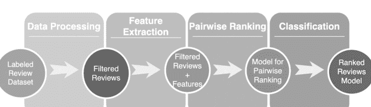

图9.8 电子商务产品排名与情感分析的实施阶段。

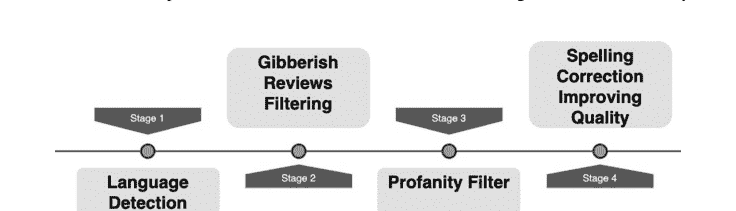

图9.9 数据预处理阶段。

```
!python3 -m spacy download en_core_web_sm
!python3 -m textblob.download_corpora

import pandas as pd
import numpy as np
from matplotlib import pyplot as plt
from pylab import rcParams
rcParams['figure.figsize'] = 7, 6

from copy import deepcopy
import seaborn as sns

import sys
sys.path.append('./utils')
from utils import review_feature
rf = review_feature()
%matplotlib inline

!ls data
df = pd.read_csv('data/train.csv')
df
```

```
# ## 分析以了解每个产品有多少信息丰富和多少不信息丰富的评论。
label_analysis = pd.crosstab(df['product'],df['label'], margins='All')
label_analysis

analysis = label_analysis.reset_index()
analysis.columns = ['product','not info', 'info', 'All']
analysis.iloc[:-1].plot(x="product", y=["not info", "info"], kind="bar")
```

```
# ## 让我们检查一下我们拥有的评论的长度质量？
df['review_len'] = df['answer_option'].apply(lambda x: len(x.split()))
df

checklen = []
for i in range(5,50, 5):
    checklen.append(len(df[ (df['review_len']>=i-5) &
(df['review_len']<i)]))
checklen

index = np.arange(len(checklen))
plt.bar(index, checklen)
plt.xlabel('评论长度', fontsize=15)
plt.ylabel('评论数量', fontsize=15)
plt.xticks(index, range(5,50,5), fontsize=15, rotation=30)
plt.title('评论调查长度分析')
plt.show()
```

```
# ## 我们拥有相当数量的详细评论（长度>=5）和短评论（长度<5）
# ## 数据预处理
# 
# ## 阶段1：语言检测
bad_reviews = []
for indx in df.index:
    review = df.at[indx, 'answer_option']
```

```
try:
    b = rf.language_detection(review)
    if b == 'hi' or b == 'mr':
        bad_reviews.append(indx)
except:
    bad_reviews.append(indx)
    print("语言异常评论:", review)
print("阶段1的不良评论数量: ", len(bad_reviews))

df[df.index.isin(bad_reviews)]

df = df[~df.index.isin(bad_reviews)].reset_index(drop = True)
```

```
# ## 阶段2：乱码评论
# 当我们从客户那里收集数据时，仅仅出于沮丧，许多人会写下乱码评论。
# 例如：svfsfg, fsdfgdfgfsgsfgdgh, ffgrthyryj, rhrhfas, kuopip
# 我们需要检测此类评论并将其过滤掉。
# 工作原理
# 我们可以从一堆英文文本中建立一个字符到字符转换的模型。例如，你可以找出't'后面跟着'h'的频率有多高（相当常见）。

# 如果你有一堆查询日志，你可能会首先建立一个通用英语文本模型，然后在该模型训练阶段大量加权你的查询。
# 背景阅读关于马尔可夫链。
# 来源：https://github.com/rrenaud/Gibberish-Detector
# 我们已经训练了一个模型并存储了其pickle文件。
bad_reviews = []
for indx in df.index:
    review = df.at[indx, 'answer_option']
    if rf.gibberish_detection(review, prefix_path = 'utils'):
        bad_reviews.append(indx)

print("阶段2的不良评论数量: ", len(bad_reviews))

bad_reviews

df[df.index.isin(bad_reviews)]

df = df[~df.index.isin(bad_reviews)].reset_index(drop = True)
```

```
# ## 阶段3：脏话检测
# 有时，评论者对配送或服务不满意，出于沮丧，他们会在评论中输入脏话。
# 脏话内容也会损害SEO排名
bad_reviews = []
for indx in df.index:
    review = df.at[indx, 'answer_option']
    if rf.english_swear_check(review) or rf.hindi_swear_check(review):
        bad_reviews.append(indx)

print("阶段3的不良评论数量: ", len(bad_reviews))

df[df.index.isin(bad_reviews)]
df = df[~df.index.isin(bad_reviews)].reset_index(drop = True)
```

```
# ## 阶段4：拼写纠正（可选阶段，非必需）
# 尝试提高具有高置信度拼写错误的评论质量。例如，将withut纠正为without
for indx in df.index:
    review = df.at[indx, 'answer_option']
    df.at[indx, 'answer_option'] = rf.spell_correct(review, 0.9)

# ## 阶段4.1：公司标签（可选阶段）
bad_reviews = []
for indx in df.index:
    review = df.at[indx, 'answer_option']
    if rf.competitive_brand_tag(review):
        bad_reviews.append(indx)

print("阶段4.1的不良评论数量: ", len(bad_reviews))

df[df.index.isin(bad_reviews)]

df = df[~df.index.isin(bad_reviews)].reset_index(drop = True)

print("预处理后的评论总数: ", len(df))

df.to_csv('data/Preprocessed_Reviews.csv',index = False)
```

```
# # 总结：
# 到目前为止，我们已经对数据进行了EDA（探索性数据分析）。
# 在4个主要阶段对评论进行了预处理。
# ### 初始评论数量为：1676
# ### 最终评论数量为：1655
# 我们必须在预处理中保持严格，以确保我们的网站上不显示不良内容。
# 通过预处理，我们减少了误报。
# ### 注意：你可能觉得只删除了21条评论，但当你进行大规模操作时，我们会观察到大约7-10%的总评论是垃圾内容。
```

## #特征工程：

这包含7个步骤的过程，如图9.10所示 - 从名词评分开始直到复合分数。


图9.10 七步特征工程过程。

## 决策科学案例研究

```python
#!/usr/bin/env python
# coding: utf-8
import pandas as pd
import numpy as np
from copy import deepcopy
import sys
sys.path.append('./utils')
from utils import review_feature
rf = review_feature()

from pandas_profiling import ProfileReport

df = pd.read_csv('data/Preprocessed_Reviews.csv').sort_values(by =
['product'], ignore_index = True)

df
```

特征提取涵盖了所有必要的属性/观点，而将特征量化可能是一项迫切需要的任务。因此，让我们讨论从评论中提取的所有特征。

步骤 1：名词强度 (Rn)：名词是被认为信息量最丰富的语言部分。名词的数量显示了评论的重要性，因为只有名词描述了评论的主要因素（它告诉我们评论是关于什么的）。我们进行了词性标注以在评论中找出名词，并计算分数如下：

步骤 2：分数 (Rn) = TFIDF(名词) / TFIDF(所有单词)

步骤 3：评论极性 (Rp)：其值介于 -1 到 +1 之间，它告诉我们评论是具有积极情感还是消极情感。

步骤 4：评论主观性 (Rs)：主观性可以衡量从客观到主观的情感，范围从 0 到 1。客观表达是事实，而主观表达是描述个人感受的观点。考虑以下表达：
Bournvita 与牛奶搭配味道极佳：主观
Bournvita 是棕色的：客观

步骤 5：评论复杂度 (Rc)：用于衡量一篇评论在特定产品整个评论语料库中独特词汇方面的质量和复杂程度。
Rc = 评论中独特单词的数量 / 整个语料库中独特单词的数量

步骤 6：评论单词长度 (Rw)：评论的单词数

步骤 7：服务标签 (Rd)：最简单的评论更多地谈论产品本身、它的味道、它的用途，因此谈论产品有效性的评论也是如此。评论基本上是为了描述产品。因此，我们制作了一个词典，可能将评论标记为基于服务的、配送评论和客户支持。使用 Levenshtein 距离对评论中的每个单词与词典中的单词进行模糊匹配。Levenshtein 距离有助于衡量两个序列之间的差异，并处理评论中的拼写错误。例如，评论可能错误地写成 "My delivery was on time" 而不是 "My delivery was on time"。在这种情况下，模糊匹配将帮助我们匹配这两个评论。

步骤 8：复合分数 (Rsc)：为了提高系统的效率。我们使用 VaderSentimentAnalyser 计算复合分数。这个库来自 VADER（Valence Aware Dictionary and sEntiment Reasoner）。这是一个基于词典和规则的情感分析工具，专门用于识别社交媒体内容中表达的情感。它能够识别俚语（例如，SUX!）、表情符号（®, ®）、表情符号（ : ），:D ）的情感，因此也能区分大写单词表达（I am SAD, I'm sad 是不同的表达）。

```python
#Rsc ≥ 0.5 (积极情感)
# -0.5 (积极情感)
# -0.5<Rsc<+0.5 (中性情感)
# Rsc≤ -0.5 (消极情感)
# 其他说明：我们特意没有将评论评分作为一个特征。包含评分会因为两个原因而扰乱整个系统：
# 1. 评分和评论之间常见的混淆。例如，有人给产品评了 '1'（在 1-5 的评分量表上，'1' 是 '最低'，'5' 是 '最高'），但写的评论却是 '非常好的有用药物'。
# 2. 来自客户的大部分评论要么是五星，要么是一星。
#
# TextBlob: https://textblob.readthedocs.io/en/dev/index.html
# VaderSentiment: https://github.com/cjhutto/vaderSentiment
# spaCy: https://spacy.io/
```

### 添加特征列

```python
df['Rn'] = 0.0
df['Rp'] = 0.0
df['Rs'] = 0.0
df['Rc'] = 0.0
df['Rd'] = 0.0
df['Rsc'] = 0.0
```

```python
df

product_list = df['product'].unique()
for product in product_list:
    data = df[df['product']==product]
    unique_bag = set()
    for review in data['answer_option']:
        review = review.lower()
        words = review.split()
        unique_bag = unique_bag.union(set(words))

    for indx in data.index:
        review = data.at[indx, 'answer_option']
        df.at[indx, 'Rp'] = rf.polarity_sentiment(review)
        df.at[indx, 'Rs'] = rf.subjectivity_sentiment(review)
        df.at[indx, 'Rd'] = rf.service_tag(review)
        df.at[indx, 'Rsc'] = rf.slang_emoji_polarity_compoundscore(review)
        df.at[indx, 'Rc'] = float(len(set(review.split()))) / float(len(unique_bag))

    df.loc[df['product']==product, 'Rn'] = rf.noun_score(data['answer_option'].values).values
```

```python
df
```

有了这些特征，我们已经从评论中提取了所有信息。

根据问题的用例，可以添加更多特征，如可读性分数：SMOG 指数。我们不采用可读性分数作为指标的原因是，我们收集的评论来自一线城市、二线城市和三线城市。我们不想通过添加这个来惩罚（来自弱势背景的）评论。来源 - [维基百科](https://en.wikipedia.org/wiki/Readability)

```python
df.to_csv('data/Features.csv',index = False)
```

### 现在进行更深入的分析

```python
profile = ProfileReport(df)

profile

profile.to_file(output_file="feature_analysis.html")
```

### 我们有 1655 条有用的评论，现在进入模型训练部分。

```python
#模型构建：
#!/usr/bin/env python
# coding: utf-8

import pandas as pd
import numpy as np
from joblib import load, dump
from copy import deepcopy
from statistics import mean

from sklearn.metrics import accuracy_score, classification_report, confusion_matrix
from collections import Counter

df = pd.read_csv('data/Features.csv')

df
```

排序是人类的一个典型问题。对评论是否有用（信息丰富）进行分类很容易。然而，根据有用性对评论进行排序是一项复杂的任务。我们的排序方法基于这个简单的教育理念。

成对排序方法应用于在半监督学习方法中对评论进行排序。成对排序方法在损失函数中查看一对文档，并预测相对顺序。目标不是确定相关性分数，而是找出哪个文档更相关。这种相关性是为了判断一篇评论相对于另一篇评论的偏好。在这种半监督学习方法中，输入和输出之间构建了映射。训练模型中的这种输入-输出对用于学习系统。

评论分类：我们将两组评论分开，用于训练我们的模型。集合 0 代表标签为 0 的评论，即那些不具信息性的评论。这些包括基于配送、客户支持、包装等的评论。这些评论不描述产品。

集合 1 代表标签为 1 的评论，即具有信息性且优于集合 0 所有评论的评论；

我们如何分类并确定评论的标签：我们整个评论排名系统基于这样一个理念：人类更容易对评论进行二元分类，我们称之为集合 0 和集合 1。

对于每个产品 'Accucheck'、'Becadexamin'、'Evion'、'Neurobion'、'Seven seascodLiverOil'、'Shelcal'、'Supradyn'、'shampoo'，我们请 10 个不同的人将评论标记为 1（信息性评论）和 0（非信息性评论）。请不同的参与者进行标记，以避免偏见，并使模型学习效果最佳。

```python
data_split = pd.crosstab(df['product'],df['label'])
data_split
```

### 构建训练集：

#### 我们将集合 1 中的每条评论与集合 0 中的所有评论进行成对比较，反之亦然

- (Rx, Ry, 1) 其中 x∈集合 1 且 y∈集合 0 → Rx 优于 Ry
- (Ry, Rx, 0) 其中 x∈集合 1 且 y∈集合 0 → Ry 劣于 Rx

#### 这现在变成了一个分类问题，如图 9.11 所示。

```python
def building_training_data(df):
    A = df[df['label']==1]
    A.loc[df['label']==1,'join'] = 'j'
    B = df[df['label']==0]
    B.loc[df['label']==0,'join'] = 'j'
    trainset1 = pd.merge(A,B,how='outer',on='join')
    trainset2 = pd.merge(B,A,how='outer',on ='join')

    trainset = pd.merge(trainset1,trainset2,how='outer')
    return trainset
```

```python
product_list = df['product'].unique()
data_stack = []
for product in product_list:
    temp = deepcopy(df[df['product']==product].iloc[:,2:])
    build_data = building_training_data(temp)
    print(product, len(temp), len(build_data))
```

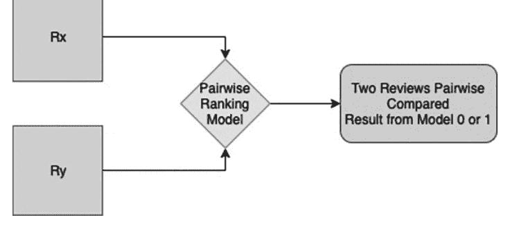

图 9.11 成对排序模型。

## 决策科学案例研究

```python
build_data.drop(columns = ['join','label_y'],inplace=True)
data = build_data.iloc[:,1:]
data['target'] = build_data.iloc[:,0]
data_stack.append(data)

train = pd.concat(data_stack).reset_index(drop = True)

train

X = train.iloc[:,:-1].values
y = train.iloc[:,-1].values

from sklearn.model_selection import train_test_split
X_train,X_test, y_train, y_test = train_test_split(X,y,test_size = 0.2,shuffle = True, stratify = y)
print("Test Len:",len(X_test)," ",len(y_test))

train

# # 快速检查-
# 线性模型
# 非线性模型
# 集成模型

# ## 线性模型：逻辑回归

from sklearn.linear_model import LogisticRegression
classifier = LogisticRegression()
classifier.fit(X_train,y_train)
print("Training Accuracy\n", accuracy_score(y_train,classifier.predict(X_train)))
print("Test Accuracy\n", accuracy_score(y_test,classifier.predict(X_test)))

print('CLASSIFICATION REPORT')
print("Training\n", classification_report(y_train,classifier.predict(X_train)))
print("Test \n", classification_report(y_test,classifier.predict(X_test)))

# ### 准确率：85%
# ### F1分数：85%

# ## 非线性模型：决策树
# 决策树
from sklearn.tree import DecisionTreeClassifier
classifier = DecisionTreeClassifier()
classifier.fit(X_train,y_train)

print("Training Accuracy\n", accuracy_score(y_train,classifier.predict(X_train)))
print("Test Accuracy\n", accuracy_score(y_test,classifier.predict(X_test)))

print('CLASSIFICATION REPORT')
print("Training\n", classification_report(y_train,classifier.predict(X_train)))
print("Test \n", classification_report(y_test,classifier.predict(X_test)))

# ## 集成模型：随机森林
from sklearn.ensemble import RandomForestClassifier
classifier = RandomForestClassifier(n_estimators=50, n_jobs = -1, oob_score = True,random_state=42)
classifier.fit(X_train,y_train)

print("Training Accuracy\n", accuracy_score(y_train,classifier.predict(X_train)))
print("Test Accuracy\n", accuracy_score(y_test,classifier.predict(X_test)))

print('CLASSIFICATION REPORT')
print("Training\n", classification_report(y_train,classifier.predict(X_train)))
print("Test \n", classification_report(y_test,classifier.predict(X_test)))

print("Test\nConfusion Matrix: \n", confusion_matrix(y_test, classifier.predict(X_test)))

## 使用袋外估计获得的训练数据集得分。
此属性仅在 oob_score 为 True 时存在。

classifier.oob_score_
feature_importances = pd.DataFrame(classifier.feature_importances_,
                                    index = train.iloc[:,:-1].columns,
                                    columns=['importance']).sort_values('importance',ascending=False)
feature_importances
dump(classifier, 'randomforest.joblib', compress = 2)

# ## 随机森林分类器权重已保存。
# ### 准确率：0.98
# ### oob_score：0.98
# 注意，如果在您的用例中数据量太小，无法进行训练-测试划分，
# 那么可以在整个数据集上训练模型，并衡量袋外得分。

#第二部分。模型排序指标
#排序方法的准确率
#在按评论分数对评论进行排序后，我们希望集合1中的所有评论
#都高于集合0中的所有评论。
#为了检验这个假设，我们开发了以下排序指标
#设我们数据集中1的数量为x。
# `单个产品的排序准确率 = 在前x个位置中找到的1的数量 / x

classifier = load('randomforest.joblib')

product_list = df['product'].unique()
df['win']=0
df['lose']=0
df['review_score'] = 0.0
df.reset_index(inplace = True, drop = True)

def score_giver(C,D):
    E = pd.merge(C,D,how='outer',on='j')
    E.drop(columns=['j'],inplace = True)
    q= classifier.predict(E.values)
    return Counter(q)

for product in product_list:
    data = df[df['product']==product]
    for indx in data.index:
        review = df.iloc[indx, 3:-3]
        review['j'] = 'jn'
        C = pd.DataFrame([review])
        D = data[data.index!=indx].iloc[:,3:-3]
        D['j'] = 'jn'
        score = score_giver(C,D)
        df.at[indx, 'win'] = 0 if score.get(1) is None else score.get(1)
        df.at[indx, 'lose'] = 0 if score.get(0) is None else score.get(0)
        df.at[indx, 'review_score'] = float(0 if score.get(1) is None else score.get(1)) / len(data) * 1.0

df = df.sort_values(by = ['product','review_score'], ascending = False)

r_accuracy =[]
for product in product_list:
    x = data_split[data_split.index == product][1][0]
    number_of_1_in_x = Counter(df[df['product']==product].iloc[:x, ]['label']).get(1)
    rank_accuracy = float(number_of_1_in_x*1.0 / x*1.0)
    print("Product: {} | Rank Accuracy: {}".format(product, rank_accuracy))
    r_accuracy.append(rank_accuracy)
print("Mean Rank Accuracy: {}".format(mean(r_accuracy)))

df

df.iloc[:, [0,1,-1]].to_csv('data/train_ranked_output.csv',index = False)

!ls
t = pd.read_csv('data/test.csv')
```

## 总结

在本章中，我们讨论了机器学习在各个行业中的几个应用，以解决传统编程无法处理多种组合推理的问题。第一个用例，使用需求价格弹性方法的零售价格优化，确定了能获得最大利润的确切价格。接下来，我们在用例2，购物篮分析中，基于超市客户数据集展示了应用，重点介绍了关联规则挖掘。然后，用例3，零售商销售预测，展示了如何创建机器学习模型并确定特定商店中每种产品的销售额。最后，在用例4中，为财产和意外伤害保险公司预测了保险索赔成本。这个案例研究展示了如何清理数据、预处理数据以及处理异常值。

## 复习题

1.  为MNIST手写数字分类数据开发生命周期分析阶段。
2.  使用葡萄酒质量数据集，应用不同的监督学习算法进行葡萄酒质量预测，并在模型参数方面比较结果。
3.  使用沃尔玛数据集开发一个用于销售预测的机器学习模型，从理解数据、数据预处理、探索性数据分析、模型构建到输出预测。
4.  评估用于无传感器驱动诊断的机器学习模型，并选择最佳模型。
5.  比较用于分类人体姿势和动作的监督学习算法。记录你的观察结果并确定最佳分类算法。
6.  使用无监督学习算法为BigMart销售实现一个预测模型，并比较它们的性能。此外，识别算法的时间和空间复杂度。
7.  为矿井社交媒体情绪和改善医疗保健数据集估算合适的机器学习模型。
8.  应用机器学习算法，使用Python中的自然语言处理来预测Quora问题对的含义。
9.  对于使用智能手机数据集的人体活动识别，确定选择特征的过程。在提取特征时如何处理异常值？
10. 基于主成分分析和线性判别分析为沃尔玛数据集开发特征工程模型。

## 附录

## 机器学习Python速查表

### Matplotlib速查表

```python
导入库
from matplotlib import pyplot as plt
```

```python
线型（续）
alpha= 0.1- 1
样板样式：
plt.style.use("fivethirtyeight")
plt.style.use("ggplot")
plt.style.use("seaborn")
```

```python
基本线图
x_values
days = [0, 1, 2, 3, 4, 5, 6]
y_values1
money_spent = [10, 12, 12, 10, 14, 22, 24]
y_values2
money_spent_2 = [11, 14, 15, 15, 22, 21, 12]
分配给一个绘图
plt.plot(days, money_spent)
plt.plot(days, money_spent_2)
plt.show()
```

```python
图例
# 创建图例
plt.legend(["first_line", "second_line", loc=])
# loc 数字代码
1 左上
2 右上
3 左下
4 右下
5 右侧
6 左中
7 右中
8 下中
9 上中
10 中心
loc 指定图例位置（如果未指定：找到“最佳”位置）
```

```python
子图
# 创建子图
plt.subplot(rows, columns, index_of_subplot)
# 示例
# 第一个子图
plt.subplot(1, 2, 1)
plt.plot(x, y, color='green')
# 第二个子图
plt.subplot(1, 2, 2)
plt.plot(x, y, color='steelblue')
# 格式化子图
plt.subplots_adjust( arguments)
left, right, top, bottom -边距
wspace, hspace 绘图之间的水平/垂直边距
包含所有子图的对象称为图形
始终将特定属性（颜色、标记等）直接放在plt.plot()下方
```

```python
图形
# 创建自定义大小的图形
plt.figure(figsize=(width, height))
plt.plot(x, y)
plt.savefig('tall_and_narrow.png/ .svg/ .pdf')
当我们制作大量绘图时，很容易出现已绘制但未显示的线条。如果我们不小心，这些“被遗忘”的线条将出现在您的新绘图中。为了确保没有任何杂散线条，您可以在绘制新图之前使用命令plt.close('all')清除所有现有绘图。
```

```python
线型
plt.plot(x, y, style=" ")
用于样式的关键词：
color= green, #AAAAAA
linestyle= dotted: ., dashed: -- 或 -.
marker= o, *, s, x, d, h
linewidth=1,2, ...
```

```python
修改刻度
# 指定要修改的子图
ax1 = plt.subplot( row, column, index)
# 属性
ax1.set_xticks([1, 2, 4])
ax1.set_yticks([ 0.1, 0.2, ...])
ax1.set_xticklabels(["Jan", "Feb", "Apr"], rotation=30)
# rotation=度数 旋转标签
ax1.set_yticklabels(["10%", "20%", ...])
即使只有一个绘图，我们也必须这样做
```

## 附录

## 坐标轴与标签

放大或缩小绘图：
`plt.axis(x_min, x_max, y_min, y_max)`

为坐标轴添加标签：
`plt.xlabel("str ")` / `plt.ylabel()` / `plt.title()`

## 堆叠条形图

```python
# 我们使用关键字 bottom 来实现这一点
# 顶部条形的 bottom 将被设置为高度
# 第一个条形
video_game_hours = [1, 2, 2, 1, 2]
plt.bar(range(len(video_game_hours)),
        video_game_hours)

# 第二个条形
book_hours = [2, 3, 4, 2, 1]
plt.bar(range(len(book_hours)),
        book_hours,
        bottom=video_game_hours)
# 获取 3 个及以上条形的每个底部位置
sport_hours = np.add(video_game_hours, book_hours)
```

## 在图表中添加文本

```python
plt.text(x_coord, y_coord, "text");
```

如果我们想比较“一个属性下的不同子属性”，可以使用堆叠条形图。例如：
属性：娱乐时间
子属性：游戏、阅读、...

## 简单条形图

```python
plt.bar(range(len(y_values)), y_values)
```

我们使用 `range(len(y_values))` 来为条形图中要表示的每个值获取一个刻度。

## 散点图

```python
plt.scatter(x_values, y_values)
```

## 并列条形图

```python
# 我们必须使用以下模式指定每个数据集在绘图中的位置：
n = ? # 特定数据集的数量
t = ? # 数据集的数量
d = ? # 条形组的数量
w = 0.8 # 每个条形的宽度
x_values1 = [t*element + w*n for element in range(d)]
# 获取两个条形中间的 x_values
middle_x = [ (a + b) / 2.0 for a, b in zip(x_values1, x_values2)]
```

## 误差线

```python
# 使用关键字 yerr 表示误差范围
values = [10, 13, 11, 15, 20]
yerr = [1, 3, 0.5, 2, 4] # 可以是单个值
plt.bar(y, x, yerr=yerr, capsize=10)
plt.show()
```

如果我们想在条形图中表示不确定范围，可以使用误差线。

## 饼图

```python
payment_names = ["Card Swipe", "Cash", "Apple Pay", "Other"]
payment_freqs = [270, 77, 32, 11]
# 创建饼图
plt.pie(payment_freqs)
plt.axis('equal')
# 两种标签方法
# 第一种方法
plt.legend(payment_names)
# 第二种方法（创建时直接指定）
plt.pie(payment_freqs, labels=payment_names)
# 显示每个切片占总量的百分比：
plt.pie(payment_freqs, labels=payment_names, autopct='%0.1f%%')
# autopct 接受一个字符串格式化指令
# %d%% -> 四舍五入到整数
plt.show()
```

## 填充区域（折线图）

```python
x = range(3)
y = [10, 12, 13]
y_lower = [8, 10, 11]
y_upper = [i + 2 for i in y]
# 计算百分比偏差
y_lower_bound = [element - (element * error_in_decimal) for element in original_list_of_y_values]
# 这是阴影误差区域
plt.fill_between(x, y_lower, y_upper, alpha=0.2)
# 这是折线本身
plt.plot(x, y)
plt.show()
```

返回折线周围的阴影区域。

## 直方图

```python
# 创建一个直方图
plt.hist(dataset, range=(0,100), bins=20)
# 指定分箱数量（默认 = 10）

# 创建多个直方图
plt.hist(a, alpha=0.5, normed=True)
plt.hist(b, histtype='step', linewidth=2, normed=True)
```

## Seaborn 速查表

```python
from matplotlib import pyplot as plt
import seaborn as sns
import numpy as np
```

Seaborn 是 Matplotlib 的扩展，具有更美观的语法和额外的图表类型。因此也需要导入 Matplotlib。

如果我们想计算聚合值，还需要导入 numpy。

```python
sns.boxplot(
    data=df,
    x='label',
    y='value',
    # 可选
    width=0.45
)
plt.show()
# 在 Seaborn 中，也可以在一个可视化中绘制多个箱线图
```

箱体代表四分位距。
箱体中间的线是中位数。
末端的线是第一和第三四分位数。
菱形表示异常值。

```python
{
    'font.size': 19.2,
    'grid.linewidth': 1.6,
    'legend.fontsize': 16.0,
    'lines.linewidth': 2.8,
    'lines.markeredgewidth': 0.0,
    'lines.markersize': 11.2,
    'patch.linewidth': 0.48,
    'xtick.labelsize': 16.0,
    'xtick.major.pad': 11.2,
    'xtick.major.width': 1.6,
    'xtick.minor.width': 0.8,
    'ytick.labelsize': 16.0,
    'ytick.major.pad': 11.2,
    'ytick.major.width': 1.6,
    'ytick.minor.width': 0.8
}
```

```python
sns.barplot(
    data=df,
    x="x value column",
    y="y value column",
    # 以下指定的所有内容都是可选的
    ci="sd",
    estimator=np.median,
    hue="column to compare"
)
plt.show()
# ci="sd" 将误差线更改为标准差
# estimator 用于指定聚合方式，接受任何可用于列表的参数。（代码中提供了示例）
# hue 添加一个嵌套分类变量，用于与“y value column”进行比较
```

```python
sns.violinplot(
    data=df, x="label", y="value"
)
```

两个沿中心线对称的 KDE 图。（仅为视觉效果）

白点代表中位数。

每个小提琴图中心的粗黑线代表四分位距。

从中心延伸的线是置信区间（95%）。

```python
sns.kdeplot(dataset1, shade=True)
sns.kdeplot(dataset2, shade=True)
...
```

KDE 图显示单变量数据集的分布。单变量数据集只有一个变量。（例如：温度）

`shade` 定义是否对线下区域进行着色。

如果指定的列需要先进行聚合，Seaborn 会自动执行该聚合。（默认为均值）

Seaborn 默认会提供一个显示自助法置信区间（95%）的误差线。

```python
# 如果你想快速查看调色板的样子
# 将调色板保存到变量：
palette = sns.color_palette("bright")
# 使用 palplot 并传入变量：
sns.palplot(palette)
# 在 Seaborn 中选择调色板：
sns.set_palette("Paired")
# 默认调色板
# -> deep, muted, pastel, bright, dark, colorblind

# 主题：（在绘图前调用）
sns.set_style("")
# -> darkgrid, whitegrid, dark, white, ticks

# 移除绘图边框（在绘图后调用）
sns.despine() # （默认：top=True, right=True）
# -> bottom, left

# 调整字体和标签大小
sns.set_context(context="paper", font_scale=1.4, rc={"grid.linewidth": 0.6})
```

```python
Median    np.median(df.column_name)
```

## Scikit-Learn Python 速查表

机器学习

监督学习
模型根据先前的输入-输出对将输入映射到输出。

无监督学习
不向模型提供训练，模型必须通过自训练机制发现输入的特征。

Scikit-learn 可用于分类、回归、聚类、降维、模型选择以及通过监督和无监督训练模型进行预处理。

### 基本命令

```python
>>> from sklearn import neighbors, datasets, preprocessing
>>> from sklearn.model_selection import train_test_split
>>> from sklearn.metrics import accuracy_score
>>> iris = datasets.load_iris()
>>> X, y = iris.data[:,:2], iris.target
>>> X_train, X_test, y_train, y_test = train_test_split(X, y, random_state=33)
>>> scaler = preprocessing.StandardScaler().fit(X_train)
>>> X_train = scaler.transform(X_train)
>>> X_test = scaler.transform(X_test)
>>> knn = neighbors.KNeighborsClassifier(n_neighbors=5)
>>> knn.fit(X_train, y_train)
>>> y_pred = knn.predict(X_test)
>>> accuracy_score(y_test, y_pred)
```

### 加载数据示例

```python
>>> import numpy as np
>>> X = np.random.random((20,2))
>>> y = np.array(['A','B','C','D','E','F','G','A','C','A','B'])
>>> X[X < 0.7] = 0
```

加载的数据应为数值型，并且必须存储为 NumPy 数组或 SciPy 稀疏矩阵。

### 处理加载的数据

#### 标准化

```python
>>> from sklearn.preprocessing import StandardScaler
>>> scaler = StandardScaler().fit(X_train)
>>> standardized_X = scaler.transform(X_train)
>>> standardized_X_test = scaler.transform(X_test)
```

#### 归一化

```python
>>> from sklearn.preprocessing import Normalizer
>>> scaler = Normalizer().fit(X_train)
>>> normalized_X = scaler.transform(X_train)
>>> normalized_X_test = scaler.transform(X_test)
```

#### 二值化

```python
>>> from sklearn.preprocessing import Binarizer
>>> binarizer = Binarizer(threshold=0.0).fit(X)
>>> binary_X = binarizer.transform(X)
```

### 训练与测试数据

```python
>>> from sklearn.model_selection import train_test_split
>>> X_train, X_test, y_train, y_test = train_test_split(X,y,random_state=0)
```

### 创建模型

#### 监督学习估计器

##### 线性回归

```python
>>> from sklearn.linear_model import LinearRegression
>>> lr = LinearRegression(normalize=True)
```

##### 支持向量机 (SVM)

```python
>>> from sklearn.svm import SVC
>>> svc = SVC(kernel='linear')
```

##### 朴素贝叶斯

```python
>>> from sklearn.naive_bayes import GaussianNB
>>> gnb = GaussianNB()
```

#### 无监督学习估计器

##### 主成分分析 (PCA)

```python
>>> from sklearn.decomposition import PCA
>>> pca = PCA(n_components=0.95)
```

##### K 均值聚类

```python
>>> from sklearn.cluster import KMeans
>>> k_means = KMeans(n_clusters=3, random_state=0)
```

### 模型拟合

#### 监督学习

```python
>>> lr.fit(X, y)
>>> knn.fit(X_train, y_train)
>>> svc.fit(X_train, y_train)
```

#### 无监督学习

```python
>>> k_means.fit(X_train)
>>> pca_model = pca.fit_transform(X_train)
```

## 附录

| 预测输出 | | |
| :--- | :--- | :--- |
| 有监督估计器 | 无监督估计器 | |
| >>> y_pred = svc.predict(np.random.random((2,5))) | >>> y_pred = k_means.predict(X_test) | |
| >>> y_pred = lr.predict(X_test) | | |
| >>> y_pred = knn.predict_proba(X_test) | | |

| 聚类指标模型性能 | | |
| :--- | :--- | :--- |
| 调整兰德指数 | 同质性 | 交叉验证 |
| >>> from sklearn.metrics import adjusted_rand_score | >>> from sklearn.metrics import homogeneity_score | >>> print(cross_val_score(knn, X_train, y_train, cv=4)) |
| >>> adjusted_rand_score(y_true, y_pred) | >>> homogeneity_score(y_true, y_pred) | >>> print(cross_val_score(lr, X, y, cv=2)) |

| 分类指标模型性能 | | |
| :--- | :--- | :--- |
| 准确率分数 | 分类报告 | 混淆矩阵 |
| >>> knn.score(X_test, y_test) | >>> from sklearn.metrics import classification_report | >>> from sklearn.metrics import confusion_matrix |
| >>> from sklearn.metrics import accuracy_score | >>> print(classification_report(y_test, y_pred)) | >>> print(confusion_matrix(y_test, y_pred)) |
| >>> accuracy_score(y_test, y_pred) | | |

# 参考文献

Aeberhard, S., Coomans, D., and de Vel, O. (1992a) RDA的分类性能。技术报告第92-01号，计算机科学系与数学与统计系，北昆士兰詹姆斯库克大学。

Aeberhard, S., Coomans, D., and de Vel, O. (1992b) 高维设置中分类器的比较，技术报告第92-02号，计算机科学系与数学与统计系，北昆士兰詹姆斯库克大学。

Ayodele, T. (2010) 机器学习算法类型。载于：Zhang, Y. (编) *机器学习新进展* (第19–48页)。InTech，伦敦。

Bellman, R. (1958). 动态规划与随机控制过程。*信息与控制 1*(3), 228–239。

Bioconductor.org. (2017) Bioconductor - BiocViews。[在线] 可访问：https://bioconductor.org/packages [访问于2017年12月28日]。

Bone, D., Goodwin, M., Black, M., Lee, C., Audhkhasi, K., and Narayanan, S. (2014) 应用机器学习促进自闭症诊断：陷阱与前景。*自闭症与发育障碍杂志*, 45(5), 1121–1136。

Breiman, L. (2001) 随机森林。*机器学习*, 45(1), 5–32。

Carbonell, J., Michalski, R., and Mitchell, T. (1983) 机器学习概述。载于：*机器学习*, 第3–23页。Springer，柏林海德堡。

Chen, T., and Guestrin, C. (2016) XGBoost：一个可扩展的树提升系统。载于*第22届ACM SIGKDD国际知识发现与数据挖掘会议论文集*, 第785–794页，ACM，旧金山。

Cortes, C., and Vapnik, V. (1995) 支持向量网络。*机器学习*, 20(3), 273–297。

Criminisi, A., and Shotton, J. (2013) *计算机视觉与医学图像分析的决策森林*。Springer，柏林。

Data-mining-blog.com. (2017) CeBIT 2010上的RapidMiner：企业版，Rapid-I与云挖掘 - 数据挖掘 - Blog.com。[在线] 可访问：http://www.data-mining-blog.com/cloud-mining/rapid-miner-cebit-2010/ [访问于2017年12月20日]。

De Ville, B. (2006) *商业智能与数据挖掘的决策树：使用SAS企业挖掘*。SAS研究所，卡里。

Díaz-Uriarte, R., and Alvarez de Andrés, S. (2006) 使用随机森林进行基因选择和微阵列数据分类。*BMC生物信息学*, 7, 3。

Dietterich, T.G. (2000) 构建决策树集成的三种方法的实验比较：Bagging、boosting和随机化。*机器学习*, 40(2), 139–157。

Drucker, H., Burges, C.J., Kaufman, L., Smola, A.J., and Vapnik, V. (1997) 支持向量回归机。载于*神经信息处理系统进展会议*, 圣地亚哥, 第155–161页。

Duda, R.O., Hart, P.E., and Sytork, D.G. (2001) *模式分类*, 第2版。John Wiley & Sons，霍博肯，新泽西州。

Friedman, J., Hastie, T., and Tibshirani, R. (2001) *统计学习基础*, 第1卷。Springer统计学丛书，纽约州纽约市。

Geladi, P., and Kowalski, B.R. (1986) 偏最小二乘回归：教程。*分析化学学报*, 185, 1–17。

Hastie, T., Tibshirani, R., and Friedman, J. (2000) *统计学习基础*。Springer统计学丛书，柏林，海德堡。

He, Q. (1999) 聚类算法在信息检索中应用的综述。技术报告UIUCLIS–1999/6+IRG，伊利诺伊大学厄巴纳-香槟分校。

Hehn, T.M., and Hamprecht, F.A. (2018) 确定性决策树的端到端学习。载于*德国模式识别会议*, 柏林, Springer, 第612–627页。

Ho, T.K. (1995) 随机决策森林。*第3届国际文档分析与识别会议论文集*, 蒙特利尔, QC, 1995年8月14–16日, 第278–282页。

Hyafil, L., and Rivest, R.L. (1976) 构建最优二叉决策树是NP完全问题。*信息处理快报*, 5(1), 15–17。

Jain, A.K., Murthy, M.N., and Flynn, P.J. (1999) 数据聚类，综述。*ACM计算调查*, 31(3), 265–323。

Jordan, M.I. (1994) 决策树建模的统计方法。载于*第七届计算学习理论年会论文集*, COLT'94, 纽约州纽约市, 第13–20页。

Karthikeyan, T., and Ravikumar, N. (2014) 关联规则挖掘综述。*计算机与通信工程高级研究国际杂志*, 3(1), 2278–1021。

Kohavi, R., and John, G. (1997) 特征子集选择的包装器。*人工智能*, 97(1–2), 273–324。

Kuhn, M., and Johnson, K. (2013) *应用预测建模*, 第26卷。Springer，柏林，海德堡。

Kutner, M.H., Nachtsheim, C.J., Neter, J., and Li, W. (2005) *应用线性统计模型*, 第5版。McGraw Hill，纽约。

LeCun, Y., Bengio, Y., and Hinton, G. (2015) 深度学习。*自然*, 521(7553), 436–444。

Linde, Y., Buzo, A., and Gray, R.M. (1980) 向量量化器设计算法。*IEEE通信汇刊*, COM-28(1), 84–95。

Montillo, A., Tu, J., Shotton, J., Winn, J., Iglesias, J., Metaxas, D., and Criminisi, A. (2013) 纠缠与可微信息增益最大化，第19章。载于：Criminisi, A. and Shotton, J. (编), *计算机视觉与医学图像分析的决策森林*, 第273–293页)。Springer，柏林，海德堡。

Prinzie, A., and Van den Poel, D. (2008) 多类分类的随机森林：随机多项式Logit。*专家系统应用*, 34(3), 1721–1732。

Puterman, M.L. (2014) *马尔可夫决策过程：离散随机动态规划*。John Wiley & Sons，霍博肯，新泽西州。

Quinlan, J.R. (1986) 决策树的归纳。*机器学习*, 1(1), 81–106。

Rakhmetulayeva, S.B., Duisembekova, K.S., Mamyrbekov, A.M., Kozhamzharova, D.K., Astaubayeva, G.N., and Stamkulova, K. (2018) 基于SVM的分类算法在确定结核病治疗效果中的应用。*计算机科学学报*, 130, 231–238。doi: 10.1016/j.procs.2018.04.034。

Rangarajan, L., and Nagabhushan, P. (2005) 用于降维和多维数据分类的线性回归。载于：Pal, S.K., Bandyopadhyay, S., and Biswas S. (编), *模式识别与机器智能*。PREMI 2005。计算机科学讲义, 第3776卷。Springer，柏林，海德堡。doi: 10.1007/11590316_25。

Rokach, L. (2016) 决策森林：二十年的研究。*信息融合*, 27, 111–125。

Shi, T., and Horvath, S. (2006) 使用随机森林预测器的无监督学习。*计算与图形统计杂志*, 15(1), 118–138。doi: 10.1198/106186006X94072。

Skiena, S.S. (2017) 线性与逻辑回归。载于：*数据科学设计手册*。计算机科学丛书。Springer，查姆。doi: 10.1007/978-3-319-55444-0_9。

Uyanik, G.K., and Güler, N. (2013) 多元线性回归分析研究。*社会与行为科学学报*, 106, 234–240。doi: 10.1016/j.sbspro.2013.12.027。

Vapnik, V.N. (1995) *统计学习理论*。Springer，纽约。

Xu, T., Duy Le, T., Liu, L., Su, N., Wang, R., Sun, B., Colaprico, A., Bontempi, G., and Li, J. (2017) CancerSubtypes：一个用于分子癌症亚型识别、验证和可视化的R/Bioconductor包。*生物信息学*, 33(19), 3131–3133。

Yahiaoui, O. Er, and Yumusak, N. (2017) 使用支持向量机进行结核病诊断自动识别的新方法。*生物医学研究*, 28(9), 1–9。

Zhang, Y. (2012) 支持向量机分类算法及其应用。载于：Liu, C., Wang, L., and Yang, A. (编), *信息计算与应用*。ICICA 2012。计算机与信息科学通讯, 第308卷。Springer，柏林，海德堡。doi: 10.1007/978-3-642-34041-3_27。

Zhang, Y., Zhu, Y., Lin, S., and Liu, X. (2011) *最小二乘支持向量机在故障诊断中的应用*。载于：Liu, C., Chang, J., and Yang, A. (编) ICICA 2011, 第二部分。CCIS, 第244卷, 第192–200页。Springer，海德堡。

datascienceschool.net。

Abdulhammed, R., Musafer, H., Alessa, A., Faezipour, M., and Abuzneid, A. (2019). 基于机器学习的网络入侵检测的特征降维方法。*电子学*, 8(3), 322。

# 参考文献

https://heartbeat.fritz.ai/understanding-the-mathematics-behind-k-means-clustering-40e1d55e2f4c.
https://ieeexplore.ieee.org/document/7837907.
https://towardsdatascience.com/selecting-the-best-machine-learning-algorithm-for-your-regression-problem-20c330bad4ef.
https://www.datacamp.com/community/tutorials/introduction-factor-analysis.
https://www.datascienceee.org/post/data-science-life-cycle.
https://www.displayr.com/what-is-hierarchical-clustering/.
https://www.ibm.com/cloud/learn/data-science-introduction#toc-data-scien-92g2jgm.
https://www.javatpoint.com/reinforcement-learning#Approaches.
https://www.jmlr.org/papers/volume3/guyon03a/guyon03a.pdf.
https://www.kaggle.com/datasets?datasetsOnly=true.
https://www.kaggle.com/datasets?tags=13302-Classification.
https://www.python-course.eu/linear_discriminant_analysis.php.
https://www.researchgate.net/publication/316994943_Linear_discriminant_analysis_A_detailed_tutorial.
https://www.visiondummy.com/2014/05/feature-extraction-using-pca.
incompleteideas.net.
jonathonbechtel.com.
machinelearningmastery.com.
medium.com.
myditto.tistory.com.

Taylor & Francis

Taylor & Francis Group

http://taylorandfrancis.com

# 索引

action 378
adapter design pattern 2
administrators 143
agent 378
agglomerative 159, 160, 164
Apriori algorithm 401, 412
array creation 76, 78
- indexing 85
array slicing 77
artificial intelligence 4
average linkage 162

bagging 282, 283
bargraph 93
Bellman optimality equation 384
bias 300, 301
boosting 283
bootstrap aggregating 283
brainstorm capabilities 352
branch/subtree 240
business intelligence analyst 142
business users 142

centroid distance 162
class-dependent transformation 366
classification 180, 181
classification predictive modeling 179
class-independent transformation 366
complete linkage 162
computational complexity 97
- asymptotic analysis 97
- average-case complexity 97
- best-case complexity 97
- space complexity 97
- time complexity 97
- worst-case complexity 97

data analytics life cycle 104
data and workspaces 144
data engineers 143
data frame from list 95
data frames 95
data preparation 7
data science 1
data science life cycle 6
data scientists 143
data structures 34
- array data structure 34, 35
- arrays in Python 35
- linked list 36
- linked list in Python 36
- queues 40
- stacks and queues 38
data structures in Python 55
- dictionary 58, 65
- list 55, 58
- nested list 59
- set 58
- tuples 55, 64
DBSCAN 170, 173
debugging 75; *另见* Python debugger
decision node 236
deep learning 4
density-connected 171, 172
density reachable 171, 172
describing structural patterns 2
deterministic policy 376, 380
devise capabilities 352
dimensionality reduction 357
discovery 7
distance-based clustering 148
distance measure 148
distplot 117
divisive 159, 161

elbow method 152
ELT 107, 108
ensemble model, random forest 440
entropy 240, 279–80
environment 378
ETL 107, 108
examine models 352
expectation step 166

FacetGrid 117
factor extraction 355
factor rotation 355, 356
file handling 74
- append 74
- create 74
- read 74
- text 74
- write 74
flow control 24
- if & elif statement 24
- loop statement 25
Fpgrowth algorithms 401, 412
functions in python
- default arguments 70
- keyword arguments 70
- lambda function 72
- return 68, 72
- variable-length arguments 71

Gini index 241, 279–80
global variables 69
gradient descent 202

HDFS files 110
heuristics 138

index error 74
information gain 240, 243

*k* clusters 151

leaf/terminal node 239

least-squares estimates 192

least-squares regression line 194, 195

linear model, logistic regression 439

linked list
- first 36
- link 36
- next 36

loading factor 356

local variables 69

logistic regression 219–29

loop control statement 26
- break statement 26
- continue statement 26
- for loop 25
- nested loop 25
- pass statement 26
- while loop 25

machine learning 4

maximization step 166

Mercer’s theorem 322

Minkowski metric 149

model-based 380

model building 7

model planning 7

non-parametric unsupervised learning 147

operationalize 7

palplot 114

parametric unsupervised learning 146

parent node/child node 237

pie chart 93

points, Euclidean distance 150

policy 378

policy-based 380

postpruning 246, 247

preprocessing 353

prepruning 246, 247

project manager 142

project sponsor 142

proximity measures 149

pruning 239

pyplot 92

Python 15, 16

Python debugger 75

Python on Linux 17

Python on Windows 16

Python operators
- arithmetic operators 18, 19
- assignment operators 18
- comparison operators 18, 21
- logical operators 18, 22
- membership operators 19, 23
- range() function 29

Q-value 378

RACI matrix 106

reading data from HTML files 110

reading data from JSON files 110

regression 179, 180, 181

regression predictive modeling 180

replot 113

reward signal 377

root mean squared error 180, 195

rooted absolute error 195

rooted square error 195

root node 239, 249

saturated data 8

seaborn 111

searching 42, 44
- binary search 44
- interpolation search 44
- linear search 43

select capabilities 352

semi-supervised machine learning algorithm 4

series 95

sets, Jaccard distance 150

silhouette method 152

single linkage 161

SMEs/subject matter advisors (SMAs) 142

sorting 46
- bubble sort 47
- insertion sort 47, 49
- merge sort 52, 53
- quicksort 55
- selection sort 51, 52
- shell sort 54

splitting 239

stacks and queues
- deque 38
- isEmpty 38, 40
- isFull 38, 40
- peek 38, 40

state 378

statistics types
- classification 4
- forecasting 4
- regression 4

stochastic gradient descent 205

stochastic policy 376, 380

structural patterns 2
- adapter design pattern 2
- bridge design pattern 2
- composite design pattern 2
- decorator design pattern 2
- façade design pattern 3
- private class 3
- proxy 3

structured query language 110

subnode 239

supervised machine learning algorithm 3

terminal 239

tools set 144

unsaturated data 8

unsupervised machine learning algorithm 3

value 378

value-based 379

variance 300, 301

vectors, cosine distance 149

Ward’s method 163

wrappers 353