# 面向地球科学的机器学习

运用 Python 解决地质问题

# Springer 地球科学、地理与环境教材系列

Springer 教材系列出版了涵盖地球科学、地理与环境科学的广泛教材。Springer 教材既提供全面的入门介绍，也为深入学习提供详尽的知识。清晰、易读的版式设计，以及章末总结、实例讲解、练习题和术语表等特色内容，帮助读者更好地掌握学科知识。Springer 教材是学生、研究人员和应用科学家的必备读物。

Maurizio Petrelli

# 面向地球科学的机器学习

运用 Python 解决地质问题

Maurizio Petrelli
物理与地质系
佩鲁贾大学
佩鲁贾，意大利

ISSN 2510-1307
ISSN 2510-1315（电子版）
Springer 地球科学、地理与环境教材系列
ISBN 978-3-031-35113-6
ISBN 978-3-031-35114-3（电子书）
https://doi.org/10.1007/978-3-031-35114-3

本研究由佩鲁贾大学支持

© 编者（如适用）及作者，经 Springer Nature Switzerland AG 2023 独家许可
本作品受版权保护。所有权利均由出版商独家许可，无论涉及材料的全部或部分，特别是翻译、转载、插图重用、朗诵、广播、以缩微胶片或任何其他物理方式复制，以及信息存储与检索、电子改编、计算机软件，或以目前已知或未来开发的类似或不同方法进行传输的权利。
本出版物中使用的一般性描述名称、注册名称、商标、服务标志等，即使没有具体声明，也不意味着这些名称不受相关保护性法律法规的约束，因此可以自由使用。
出版商、作者和编辑有理由相信，本书中的建议和信息在出版之日是真实准确的。无论是出版商还是作者或编辑，均不对本文所含材料或可能存在的任何错误或遗漏提供任何明示或暗示的保证。出版商对已出版地图中的管辖权主张和机构隶属关系保持中立。

封面插图：ipopba / stock.adobe.com

本 Springer 印刷品由注册公司 Springer Nature Switzerland AG 出版
注册公司地址为：Gewerbestrasse 11, 6330 Cham, Switzerland

本产品中的纸张可回收利用。

献给我的家人和朋友

# 前言

*面向地球科学的机器学习* 为地球科学家提供了一条从零开始逐步学习机器学习的路径，并包含运用 Python 解决地质问题的示例。本书面向所有层次的地球科学家，从学生到希望了解机器学习的学者和专业人士。要充分利用本书，需要具备 Python 编程的基础知识。如果您是 Python 的完全新手，我建议您从 Python 入门书籍开始，例如 *《地球科学数据分析中的 Python 入门》*。[^1] *面向地球科学的机器学习* 分为五个部分，并力求对地质学家友好。机器学习的数学知识以温和的方式提供，技术部分仅限于核心内容。第一部分以对地质学家友好的语言介绍机器学习的基础知识。它首先介绍定义、术语和基本概念（例如，学习范式的类型）。然后展示如何为机器学习应用设置 Python 环境，最后描述典型的机器学习工作流程。第二部分和第三部分分别关于无监督学习和监督学习。它们首先描述一些广泛使用的算法，然后提供应用于地球科学的示例，例如岩石火山学应用中的聚类和降维、多光谱数据聚类、测井数据相分类以及岩石学中的机器学习回归。第四部分涉及机器学习模型的扩展。当您的个人电脑开始因数据集的规模或模型的复杂性而吃力时，您就需要扩展了！最后，第五部分介绍深度学习。它首先描述 PyTorch 库，并提供一个地球科学的应用示例。如果您从事地球科学工作，并希望开始在项目中利用机器学习的力量，那么这里正是适合您的地方。

阿西西，意大利
2023年7月28日

Maurizio Petrelli

[^1]: https://bit.ly/python-mp.

# 致谢

我想感谢所有在我决定开始这项新的、充满挑战的冒险时鼓励我的人，这项冒险紧随那本令人满意但极其艰苦的挑战——*《地球科学数据分析中的 Python 入门：从描述性统计到机器学习》* 之后。首先，我要感谢佩鲁贾大学物理与地质系的同事们。我还要感谢 Erasmus Plus (E+) 项目，它支持了我在匈牙利、亚速尔群岛和德国的新海外教学之旅。特别感谢 Francois Holtz 教授（汉诺威莱布尼茨大学）、José Manuel Pacheco（亚速尔大学）和 Szabolcs Harangi 教授（布达佩斯厄特沃什大学），感谢他们允许我在他们的机构教授“机器学习入门”课程。此外，我感谢张周（浙江大学）和邱坤峰（中国地质大学），他们邀请我就机器学习在地球科学中的应用相关主题进行讲座和短期课程。我想感谢佩鲁贾大学的“合作与横向行动计划”，特别强调“3.1 - 灾害与复杂危机”、“4.1 - 人工智能数据管理与数据科学”和“4.4 - 信息科学与高性能计算”等工作包。特别感谢 Giampiero Poli 教授，感谢他在我职业生涯早期成为一位伟大的导师。最后，我衷心感谢我的家人，他们再次容忍我完成了这本书。

# 概述

# 请允许我自我介绍

大家好，欢迎阅读，我叫 Maurizio Petrelli，目前在意大利佩鲁贾大学（UniPg）物理与地质系工作。我的研究重点是火山的岩石学特征，特别关注喷发前事件的动力学和时间尺度。为此，我结合了经典和非常规的技术。自 2002 年以来，我一直在实验室进行深入工作，主要专注于发展 UniPg 的激光剥蚀电感耦合等离子体质谱（LA-ICP-MS）设施。2006 年 2 月，我获得了博士学位，论文题为“岩浆相互作用过程中的非动力学及其对岩浆混合作用的启示”。2021 年 9 月，我撰写了由 Springer Nature 出版的 *《地球科学数据分析中的 Python 入门：从描述性统计到机器学习》* 一书。自 2021 年 12 月起，我担任 UniPg 物理与地质系的副教授，目前正在开发一条新的研究方向，将机器学习技术应用于地质学。

# 排版约定

我在全书中使用特定的约定来标识不同类型的信息。例如，正文主体中使用的 Python 语句、命令和变量以斜体表示。Python 代码块高亮显示如下：

```
1 import numpy as np
2 
3 def sum(a,b):
4     return a + b
5 
6 c = sum(3,4)
```

## 共享代码

本书中呈现的所有代码均在 Anaconda Individual Edition 2023.03 版（Python 3.10.9）上进行了测试，并可在我的 GitHub 仓库（petrellim）中获取：

http://bit.ly/ml_earth_sciences

## 参与与合作

我始终对全球范围内的新合作持开放态度。欢迎通过电子邮件与我联系，讨论新想法或提出合作建议。您也可以通过我的个人网站或 Twitter 联系我。我喜欢在各地的短期课程中分享本书的内容。如果您有兴趣，请联系我，以便安排到您的机构进行访问。

## 目录

## 第一部分 地球科学家的机器学习基础概念

- 1 机器学习简介
  - 1.1 机器学习：定义与术语
  - 1.2 学习过程
  - 1.3 监督学习
  - 1.4 无监督学习
  - 1.5 半监督学习
  - 参考文献

- 2 为机器学习设置您的 Python 环境
  - 2.1 用于机器学习的 Python 模块
  - 2.2 用于机器学习的本地 Python 环境
  - 2.3 远程 Linux 机器上的 ML Python 环境
  - 2.4 使用您的远程实例
  - 2.5 准备隔离的深度学习环境
  - 2.6 基于云的机器学习环境
  - 2.7 加速您的 ML Python 环境
  - 参考文献

- 3 机器学习工作流程
  - 3.1 机器学习分步指南
  - 3.2 获取数据
  - 3.3 数据预处理
    - 3.3.1 数据检查
    - 3.3.2 数据清洗与插补
    - 3.3.3 类别特征编码
    - 3.3.4 数据增强
    - 3.3.5 数据缩放与转换
    - 3.3.6 组成数据分析 (CoDA)
    - 3.3.7 数据预处理工作示例
  - 3.4 训练模型
  - 3.5 模型验证与测试
    - 3.5.1 将研究数据集分为三部分
    - 3.5.2 交叉验证
    - 3.5.3 留一法交叉验证
    - 3.5.4 评估指标
    - 3.5.5 过拟合与欠拟合
  - 3.6 模型部署与持久化
  - 参考文献

### 第二部分 无监督学习

- 4 无监督机器学习方法
  - 4.1 无监督算法
  - 4.2 主成分分析
  - 4.3 流形学习
    - 4.3.1 等距特征映射
    - 4.3.2 局部线性嵌入
    - 4.3.3 拉普拉斯特征映射
    - 4.3.4 海森特征映射
  - 4.4 层次聚类
  - 4.5 基于密度的带噪声空间聚类应用
  - 4.6 均值漂移
  - 4.7 K-均值
  - 4.8 谱聚类
  - 4.9 高斯混合模型
  - 参考文献

- 5 岩石学中的聚类与降维
  - 5.1 揭示火山喷发的化学记录
  - 5.2 地质背景
  - 5.3 研究数据集
  - 5.4 数据预处理
    - 5.4.1 数据清洗
    - 5.4.2 组成数据分析 (CoDA)
  - 5.5 聚类分析
  - 5.6 降维
  - 参考文献

- 6 多光谱数据聚类
  - 6.1 来自地球观测卫星的光谱数据
  - 6.2 将多光谱数据导入 Python
  - 6.3 描述性统计
  - 6.4 预处理与聚类
  - 参考文献

### 第三部分 监督学习

- 7 监督机器学习方法
  - 7.1 监督算法
  - 7.2 朴素贝叶斯
  - 7.3 二次判别分析与线性判别分析
  - 7.4 线性与非线性模型
  - 7.5 损失函数、代价函数与梯度下降
  - 7.6 岭回归
  - 7.7 最小绝对收缩与选择算子
  - 7.8 弹性网络
  - 7.9 支持向量机
  - 7.10 监督最近邻
  - 7.11 基于树的方法
  - 参考文献

- 8 通过机器学习对测井数据相进行分类
  - 8.1 动机
  - 8.2 数据集检查与预处理
  - 8.3 模型选择与训练
  - 8.4 最终评估
  - 参考文献

- 9 岩石学中的机器学习回归
  - 9.1 动机
  - 9.2 LEPR 数据集与数据预处理
  - 9.3 组成数据分析
  - 9.4 模型训练与误差评估
  - 9.5 结果评估
  - 参考文献

### 第四部分 扩展机器学习模型

- 10 使用 Dask 进行并行计算与扩展
  - 10.1 热身：基本定义
  - 10.2 Dask 基础
  - 10.3 即时计算与惰性求值
  - 10.4 诊断与反馈
  - 参考文献

- 11 在云端扩展您的模型
  - 11.1 在云端扩展您的环境
  - 11.2 在云端扩展：困难的方式
  - 11.3 在云端扩展：简单的方式
  - 参考文献

## 第五部分 下一步：深度学习

### 12 深度学习简介
- 12.1 深度学习意味着什么？
- 12.2 PyTorch
- 12.3 PyTorch 张量
- 12.4 在 PyTorch 中构建前馈网络
- 12.5 如何训练前馈网络
    - 12.5.1 万能近似定理
    - 12.5.2 PyTorch 中的损失函数
    - 12.5.3 反向传播及其在 PyTorch 中的实现
    - 12.5.4 优化
    - 12.5.5 网络架构
- 12.6 应用示例
- 参考文献

## 第一部分 地球科学家的机器学习基础概念

## 第一章 机器学习简介

### 1.1 机器学习：定义与术语

Shai 和 Shai (2014) 将机器学习（ML）定义为“在数据中自动检测有意义的模式”。由于这是一个宽泛的定义，我将通过引用不同作者（例如，Samuel, 1959; Jordan & Mitchell, 2015; Géron, 2017; Murphy, 2012）的额外定义来缩小其范围。

例如，Murphy (2012) 将 ML 定义为“应用算法和方法在大型数据集中检测模式，并利用这些模式预测未来趋势、进行分类或做出其他类型的战略决策。”

在最早尝试定义 ML 的工作中，Samuel (1959) 将其主要目标之一概述为“一台计算机能够学习如何解决特定任务，而无需被显式编程。”我们也可以利用 Mitchell (1997) 更正式的定义：“一个计算机程序被称为从经验 E 中学习，针对某个任务 T 和某个性能度量 P，如果它在 T 上的性能（由 P 衡量）随着经验 E 而提高。”但是，对于计算机程序来说，“经验”是什么？在物理科学中，计算机程序的经验几乎总是与数据重合，因此我们可以将 Mitchell (1997) 的定义重新表述为：“一个计算机程序被称为从数据 D 中学习，针对某个任务 T 和某个性能度量 P，如果它在 T 上的性能（由 P 衡量）随着对 D 的分析而提高。”

ML 方法的一个共同特点是，它们试图在不需要详细指定要执行的任务的情况下解决问题（Shai & Shai, 2014）。特别是当人类程序员无法提供实现问题解决方案的明确路径时，这些方法通常能够解开所研究数据集中隐藏模式的复杂性并解决它。

通过使用集合论，我们可以将 ML 定义为人工智能（AI）的一个子集，AI 是自动化通常由人类执行的智力任务的努力（Chollet, 2021）（图 1.1）。请注意，AI 涵盖了一个广泛的领域，包括 ML 和深度学习（DL）。然而，AI 集合还包括许多其他方法和技术，其中一些不涉及学习。

总结一下，以下是 ML 算法的关键特征：

- ML 方法试图从数据集中提取有意义的模式；
- ML 算法不是被显式编程来解决特定任务的；
- 学习过程是 ML 中的一项基本任务；
- ML 方法从数据中学习；
- ML 是 AI 的一个子集；
- DL 是 ML 的一个子集。

当我们开始一门新学科时，第一个任务是学习基本概念和术语。表 1.1 提供了一个基本术语表，帮助地球科学家熟悉数据科学家使用的“语言”，这对新手来说通常很困难，有时甚至具有误导性。

### 1.2 学习过程

如上所述，ML 算法不是被编程来处理先验定义的概念模型，而是试图通过所谓的学习过程来揭示大型数据集的复杂性（Bishop, 2007; Shai & Shai, 2014）。换句话说，ML 算法的主要目标是将经验（即数据）转化为“知识”（Shai & Shai, 2014）。

为了更好地理解，我们可以将 ML 算法的学习过程与人类的学习过程进行比较。例如，人类通过观察周围的世界开始学习使用字母表，在那里他们发现声音、书写的字母、单词或短语。然后，在学校里，他们理解字母表的意义以及如何组合不同的字母。类似地，ML 算法使用训练数据来学习重要的模式，然后利用学到的专业知识来提供输出（Shai & Shai, 2014）。对 ML 算法进行分类的一种方式是根据其“监督”程度（即监督式、无监督式或半监督式；Shai & Shai, 2014）。

### 1.3 监督学习

监督式 ML 方法的训练总是同时向算法提供输入数据和期望的解决方案（即标签）。例如，回归和分类任务是监督式学习方法的适用问题。

在分类任务中（图 1.2a 和 b），ML 算法试图将新的观测值分配给特定的类别（即一组具有相同标签的实例）（Lee, 2019）。如果您不理解某些术语，请参考表 1.1。在回归问题中（图 1.2c 和 d），ML 算法试图根据观测值来猜测一个或多个因变量的值。

在本书后面，我们将广泛讨论回归和分类任务在地球科学问题中的应用（参见第三部分）。然而，图 1.2 概述了监督学习在分类和回归领域的两个地质学示例：（1）利用玻璃碎片成分识别火山源，这是火山灰地层学和火山灰年代学中的一个典型问题（Lowe, 2011），以及（2）基于单斜辉石化学成分反演岩浆储存温度（Petrelli et al., 2020）。

**表 1.1 基本 ML 术语。详细术语表请参考 Google™ 的在线 ML 课程：https://bit.ly/mlglossary**

| 术语 | 描述 |
| :--- | :--- |
| 张量 | 在 ML 中，张量一词通常描述一个多维数组 |
| 特征 | ML 算法使用的输入变量 |
| 属性 | 通常用作特征的同义词 |
| 标签 | 包含特定输入张量的正确“答案”或“结果” |
| 观测值 | 实例和样本的同义词；数据集的一行，由一个或多个特征表征。在有标签的数据集中，观测值也包含一个标签。在地球化学数据集中，观测值由一个样本组成 |
| 类别 | 由相同标签表征的一组观测值 |
| 预测 | ML 算法对特定输入观测值的输出 |
| 模型 | ML 算法在训练后学到的内容 |
| 训练模型 | 确定最佳模型的过程。它与学习过程同义 |
| 训练数据集 | 在学习过程中用于训练模型的研究数据集子集 |
| 验证数据集 | 在学习过程中用于验证模型的研究数据集子集 |
| 测试数据集 | 在验证过程后用于测试模型的独立数据集 |

### 1.4 无监督学习

无监督学习作用于未标记的训练数据。换句话说，ML 算法试图在没有外部解决方案输入的情况下，从所研究的数据集中识别出重要的模式。应用无监督学习的领域

### 聚类

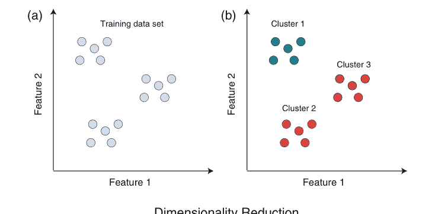

### 降维

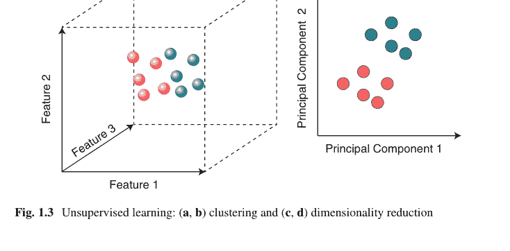

图 1.3 无监督学习：(a, b) 聚类和 (c, d) 降维

包括聚类、降维以及异常值或新颖性观测的检测。

聚类是将“相似”的观测分组到“同质”组中（见图 1.3a 和 b），这有助于在无标签数据集中发现未知模式。在地球科学中，聚类在地震学（例如，Trugman and Shearer, 2017）、遥感（例如，Wang et al., 2018）、火山学（例如，Caricchi et al., 2020）和地球化学（例如，Boujibar et al., 2021）等领域有着广泛的应用，仅举几例。

降低问题的维度（图 1.3c 和 d）减少了需要处理的特征数量，从而允许可视化高维数据集（例如，Morrison et al., 2017）或提高机器学习工作流的效率。

### 异常值检测

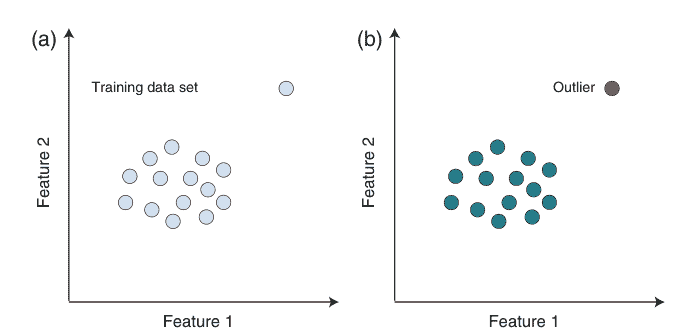

### 新颖性检测

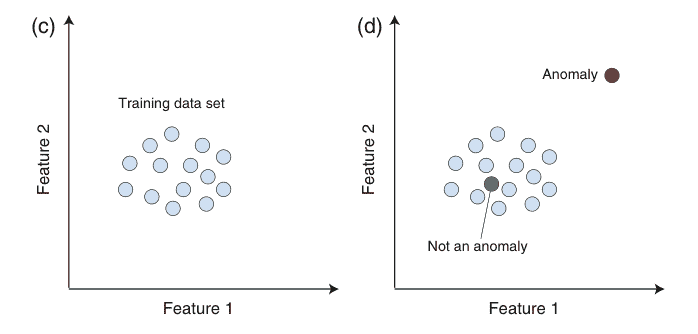

图 1.4 无监督学习：(a, b) 异常值和 (c, d) 新颖性检测

Tenenbaum 等人（2000）对降维提供了一个简洁但有效的定义：“在高维观测中寻找隐藏的有意义的低维结构。”

最后，异常值或新颖性观测的检测（图 1.4）涉及决定一个新观测是属于单一集合（即，内点）还是应被视为不同（即，异常值或新颖性）。异常值检测和新颖性检测的主要区别在于学习过程。在异常值检测（图 1.4a 和 b）中，训练数据同时包含内点和潜在的异常值。因此，算法试图定义哪些观测偏离了其他观测。在新颖性检测（图 1.4c 和 d）中，训练数据集仅包含内点，算法试图确定新观测是否为异常值（即，新颖性）。

### 半监督学习

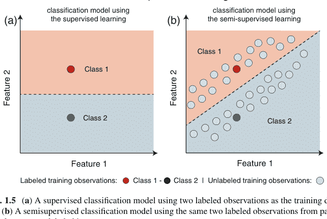

### 1.5 半监督学习

正如你可能认为的那样，半监督学习在某种程度上介于监督和无监督训练方法之间。通常，半监督算法从少量有标签数据和大量无标签数据中学习（Zhu & Goldberg, 2009）。更具体地说，当有标签数据稀缺或获取成本高昂时，半监督学习算法使用无标签数据来改进监督学习任务（Zhu & Goldberg, 2009）。为了更好地理解，请参见图 1.5。详细来说，图 1.5a 报告了一个监督分类模型的结果，该模型使用两个有标签观测作为训练数据集。此外，图 1.5b 显示了一个分类模型，该模型是基于图 1.5a 中相同的两个有标签数据集加上若干无标签观测，通过半监督学习得到的。

## 参考文献

Bishop, C. (2007). *模式识别与机器学习*. Springer Verlag.
Boujibar, A., Howell, S., Zhang, S., Hystad, G., Prabhu, A., Liu, N., Stephan, T., Narkar, S., Eleish, A., Morrison, S. M., Hazen, R. M., & Nittler, L. R. (2021). 前太阳系碳化硅颗粒的聚类分析：对其分类和天体物理学意义的评估. *天体物理学杂志. 通讯*, 907(2), L39. https://doi.org/10.3847/2041-8213/ABD102
Caricchi, L., Petrelli, M., Bali, E., Sheldrake, T., Pioli, L., & Simpson, G. (2020). 一种数据驱动的方法，用于研究2014–2015年Holuhraun–Bárðarbunga火山喷发（冰岛）中单斜辉石的化学变异性. *地球科学前沿, 8*. https://doi.org/10.3389/feart.2020.00018
Chollet, F. (2021). *Python深度学习*. (第2版). Manning.
Géron, A. (2017). *使用Scikit-Learn和TensorFlow进行机器学习实战：构建智能系统的概念、工具和技术*. O'Reilly Media, Inc.
Jordan, M., & Mitchell, T. (2015). 机器学习：趋势、观点和前景. *科学, 349*(6245), 255–260. https://doi.org/10.1126/science.aaa8415
Lee, W.-M. (2019). *Python机器学习*. John Wiley & Sons Inc.
Lowe, D. J. (2011). 火山灰年代学及其应用：综述. *第四纪地质年代学, 6*(2), 107–153. https://doi.org/10.1016/j.quageo.2010.08.003
Mitchell, T. M. (1997). *机器学习*. McGraw-Hill.
Morrison, S., Liu, C., Eleish, A., Prabhu, A., Li, C., Ralph, J., Downs, R., Golden, J., Fox, P., Hummer, D., Meyer, M., & Hazen, R. (2017). 矿物学系统的网络分析. *美国矿物学家, 102*(8), 1588–1596. https://doi.org/10.2138/am-2017-6104CCBYNCND
Murphy, K. P. (2012). *机器学习：概率视角*. MIT出版社.
Petrelli, M., Caricchi, L., & Perugini, D. (2020). 机器学习温压计：应用于含单斜辉石的岩浆. *地球物理研究杂志：固体地球, 125*(9). https://doi.org/10.1029/2020JB020130
Samuel, A. L. (1959). 使用跳棋游戏进行机器学习的一些研究. *IBM研究与发展杂志, 3*, 210–229.
Shai, S.-S., & Shai, B.-D. (2014). *理解机器学习：从理论到算法*. 剑桥大学出版社.
Tenenbaum, J. B., De Silva, V., & Langford, J. C. (2000). 用于非线性降维的全局几何框架. *科学, 290*(5500), 2319–2323. https://doi.org/10.1126/SCIENCE.290.5500.2319
Trugman, D., & Shearer, P. (2017). GrowClust：一种用于相对地震重新定位的层次聚类算法，应用于内华达州Spanish Springs和Sheldon地震序列. *地震研究通讯, 88*(2), 379–391. https://doi.org/10.1785/02220160188
Wang, Q., Zhang, F., & Li, X. (2018). 用于高光谱波段选择的最优聚类框架. *IEEE地球科学与遥感汇刊, 56*(10), 5910–5922. https://doi.org/10.1109/TGRS.2018.2828161
Zhu, X., & Goldberg, A. B. (2009). *半监督学习导论*. Morgan; Claypool Publishers.

## 第2章
为机器学习设置你的Python环境

### 2.1 用于机器学习的Python模块

在Python中开发机器学习模型既使用通用科学库（例如，NumPy、SciPy和pandas），也使用专用模块（例如，scikit-learn、¹ PyTorch、² 和 TensorFlow³）。

**Scikit-Learn** Scikit-learn是一个解决中小规模机器学习问题的Python模块（Pedregosa et al., 2011）。它实现了广泛的最先进机器学习算法，使其成为开始学习机器学习的最佳选择之一（Pedregosa et al., 2011）。

**PyTorch** PyTorch是一个Python包，它结合了用于张量管理、神经网络开发、自动微分计算和反向传播的高级功能（Paszke et al., 2019）。PyTorch库在Meta的AI⁴（前身为Facebook AI）研究团队内发展。此外，它受益于一个强大的生态系统和一个支持其发展的庞大用户社区（Papa, 2021）。

**TensorFlow** TensorFlow始于Google，并于2015年开源。它结合了工具、库和社区资源，用于在Python中开发和部署深度学习模型（Bharath & Reza Bosagh, 2018）。

¹ https://scikit-learn.org.
² https://pytorch.org.
³ https://www.tensorflow.org.
⁴ https://ai.facebook.com.

© 作者，根据Springer Nature Switzerland AG 2023的独家许可
M. Petrelli, *地球科学机器学习*, Springer地球科学、地理与环境教科书,
https://doi.org/10.1007/978-3-031-35114-3_2

### 2.2 用于机器学习的本地Python环境

Anaconda Python发行版的个人版<sup>5</sup>提供了一个“开箱即用”的科学Python环境示例，用于使用scikit-learn模块执行基本的机器学习任务。它还允许执行高级任务，例如安装专门为深度学习开发的库（例如，PyTorch和TensorFlow）。要安装Anaconda Python发行版的个人版，我建议遵循官方文档中给出的指导<sup>6</sup>。

首先，下载并运行适用于你的操作系统（即，Windows、Mac或Linux）的最新稳定安装程序。对于Windows或Mac用户，也提供图形安装程序。使用图形安装程序的安装过程与任何其他软件应用程序相同。Anaconda安装程序会自动安装Python核心和Anaconda Navigator，以及大约250个定义了用于科学可视化、分析和建模的完整环境的包。超过7500个额外的包，包括PyTorch和TensorFlow，可以根据需要从Anaconda仓库使用“conda”<sup>7</sup>包管理系统单独安装。开始学习和开发中小规模机器学习项目的基本工具与用于任何Python科学项目的工具相同。因此，我建议使用Spyder和JupyterLab。

Spyder<sup>8</sup>是一个集成开发环境，它结合了用于编写代码的文本编辑器、用于调试的检查工具以及用于执行代码的交互式Python控制台（图2.1）。

JupyterLab<sup>9</sup>是一个基于Web的开发环境，用于管理Jupyter Notebooks（即，用于创建和共享计算文档的Web应用程序，见图2.2）。

### 2.3 远程Linux机器上的机器学习Python环境

访问和使用远程计算基础设施对于大规模和数据密集型的机器学习工作流是强制性的。然而，本书的范围不包括详细描述如何开发高性能计算基础设施。只需说明，此类基础设施通常构成一个Linux实例集群（即，基于Linux操作系统的虚拟计算环境），因此我们仅限于描述如何连接和使用远程Linux实例。本节展示了如何

## 2 为机器学习设置你的Python环境

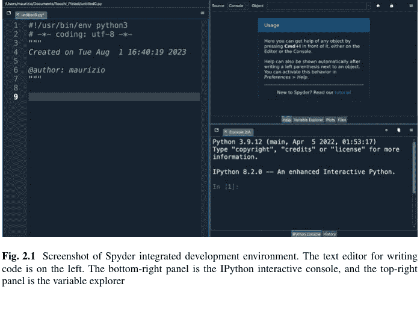

图 2.1 Spyder集成开发环境截图。左侧是用于编写代码的文本编辑器。右下方面板是IPython交互式控制台，右上方面板是变量资源管理器。

在亚马逊云科技™（AWS）设施上设置一个Debian实例。接下来，它将展示如何在你的AWS Debian实例上设置Anaconda个人版Python环境。

图2.3展示了“弹性计算云”（EC2）的亚马逊管理控制台。<sup>10</sup> 从EC2管理控制台，可以通过点击“启动新实例”按钮来启动一个新的计算实例。随后是一个引导式的分步流程。用户定义其计算实例的每个细节[即，（1）选择亚马逊机器镜像；（2）选择实例类型，（3）定义密钥对；进一步配置实例、添加存储、添加标签、配置安全组，以及（4）启动实例]。在步骤（1-4）（见图2.4）中，我选择了Debian 10 64位（x86）亚马逊机器镜像。同时，我选择了t2.micro实例类型，因为它符合“免费套餐”资格。请注意，其他选项也可能作为“免费套餐”提供，并且也可以选择大量的实例类型。例如，g5.48xlarge实例类型包含192个虚拟CPU、768 GiB内存和100 Gigabit的网络性能。总的计算能力仅取决于你可用的预算。步骤3（见图2.5）包括选择一个现有的密钥对或创建一个新的密钥对。“密钥对”提供安全凭证，以在连接到远程实例时证明你的身份。它由一个存储在远程实例中的“公钥”和一个托管在你机器上的“私钥”组成。任何拥有特定密钥对私钥的人都可以连接到存储关联公钥的实例。从你的Linux和Unix操作系统（包括Mac OS），你可以使用`ssh-keygen`命令创建密钥对。然而，EC2管理控制台允许你通过单击来创建和管理密钥对（图2.5）。我们可以安全地将所有其他实例参数设置为默认值，然后点击“启动实例”按钮。

最后一步是启动实例，初始化后，它会出现在EC2管理控制台中（图2.6）。要访问一个实例，在EC2管理控制台中选择它并点击“连接”按钮（图2.6），这将打开“连接到实例”窗口，显示所有可用的访问实例选项（图2.7）。我们的选择是使用安全外壳（SSH）协议访问实例（图2.7）。SSH协议是一种加密通信系统，用于在不安全的网络上进行安全的远程登录和网络服务。它允许你从办公桌或沙发上“安全地”连接并操作远程实例。要连接到远程实例，我们需要一个SSH客户端（例如，Mac OS终端或PuTTY<sup>11</sup>），并在其中输入以下命令：

```
ssh -i local_path/aws.pem user@user_name@host
```

其中，*ssh*命令从*user*账户初始化到*host*（即IP地址或域名）远程实例的SSH连接。-i选项选择一个特定的私钥（即*aws.pem*）与*host*实例中的公钥配对。对于图2.7所示的具体情况，我输入：

```
ssh -i /Users/maurizio/.ssh/aws.pem admin@ec2-52-91-26-146.compute-1.amazonaws.com
```

我们现在已连接到AWS计算设施中的远程实例（图2.8），并准备从命令行安装Anaconda Python个人版。在开始安装Anaconda Python个人版之前，我建议按如下方式升级Debian软件包：

```
$ sudo apt-get update
$ sudo apt-get dist-upgrade
```

*sudo apt-get update*命令获取更新的软件包列表。然后，*sudo apt-get dist-upgrade*将“智能地”升级这些软件包，而不会升级当前的Debian版本。现在使用*curl*下载最新的Anaconda Python发行版<sup>12</sup>（适用于Linux-x86_64）：

```
$ curl -O https://repo.anaconda.com/archive/Anaconda3-2023.03-Linux-x86_64.sh
```

如果*curl*不工作，请按如下方式安装它：

```
$ sudo apt-get install curl
```

此时，我们需要通过SHA-256校验和进行加密哈希验证，以验证安装程序的数据完整性。我们使用*sha256sum*命令和脚本文件名：

```
$ sha256sum Anaconda3-2023.03-Linux-x86_64.sh
```

结果是

```
19737d5c27b23a1d8740c5cb2414bf6253184ce745d0a912bb235a212a15e075
```

并且必须与Anaconda存储库中的加密哈希验证码匹配。<sup>13</sup> 最后一步，我们运行安装脚本：

```
$ bash Anaconda3-2023.03-Linux-x86_64.sh
```

它启动一个分步引导流程，从以下内容开始：

```
Welcome to Anaconda3 py310_2023.03-0

In order to continue the installation process, please review the license
agreement.
Please, press ENTER to continue
```

按“ENTER”键访问许可信息，并继续点击“ENTER”直到出现以下问题：

```
Do you approve the license terms? [yes|no]
```

输入“yes”进入下一步，即选择安装位置：

```
Anaconda3 will now be installed into this location:
/home/admin/anaconda3

  - Press ENTER to confirm the location
  - Press CTRL-C to abort the installation
  - Or specify a different location below
```

我建议按“ENTER”键保留默认位置。安装结束后，你会收到以下输出：

```
...
installation finished.
Do you wish the installer to initialize Anaconda3
by running conda init? [yes|no]
[no] >>>
```

输入“yes”。为使更改生效，请关闭并重新打开shell。现在，基础conda环境（由提示命令开头的(base)标识）应该已激活：

```
(base)  [ec2-user@ip-172-31-35-226 ~]$
```

用于Python中机器学习的基础环境现在已准备好在你的远程实例中使用。

### 2.4 使用你的远程实例

一旦你连接到远程实例，例如，通过

```
$ ssh -i local_path/aws.pem user@user_name@host
```

掌握基本的Linux操作系统命令是必须的。然而，对Linux操作系统的架构、命令和操作的详细解释再次超出了本书的范围。因此，我建议阅读专业书籍（Ward, 2021; Negus, 2015）以获得必要的技能。表2.1列出了允许你在本地机器和远程实例之间传输文件的常用命令。此外，它还提供了在Linux环境中进行文件管理的基本工具。

要将文件从本地机器复制到远程实例，反之亦然，我建议使用基于SSH协议的scp命令。具体来说，该命令是

```
$ scp  -i local_path/aws.pem filename user@host:/home/user/
    filename
```

<sup>10</sup> https://aws.amazon.com/ec2/.
<sup>11</sup> https://www.putty.org.
<sup>12</sup> https://repo.anaconda.com/archive/.
<sup>13</sup> https://docs.anaconda.com/anaconda/install/hashes/lin-3-64/.

### 2.4 使用远程实例

表 2.1 基本 Linux 命令

| 命令 | 描述 |
| :--- | :--- |
| ls | 查看目录内容 |
| cd.. | 返回上一级目录 |
| cd folder_name | 进入名为 folder_name 的文件夹 |
| cp myfile.jpg /new_folder | 将 myfile.jpg 复制到 new_folder 路径 |
| mv | 使用 mv 移动文件，语法与 cp 类似 |
| mkdir my_folder | 创建一个名为 my_folder 的新文件夹 |
| rm | 删除目录及其内容（使用 rm 时请务必小心！） |
| tar | 将多个文件归档为一个压缩文件 |
| chmod | 更改文件和目录的读、写和执行权限 |
| top | 显示正在运行的进程列表、CPU 使用率和内存使用率 |
| pwd | 打印当前工作目录（即您当前所在的目录） |
| sudo | 是“SuperUser Do”的缩写。它允许您运行需要管理权限的任务。使用 sudo 时请格外小心！ |

此命令将名为“filename”的文件从本地计算机复制到远程实例主机的 /home/user/ 文件夹。如第 2.3 节所述，aws.pem 私钥存储了安全登录主机实例的凭据。要将文件从远程实例复制到本地计算机，请使用

```
$ scp -i local_path/aws.pem user@host:/home/user/filename /localfolder/filename
```

最后，要启动 Python 脚本，我们使用 python 命令：

```
$ python myfile.py
```

要运行多个 Python 文件，您可以使用 bash 脚本，这是一个名为 my_bash_script.sh 的文本文件，然后按如下方式运行它：

```
$ bash my_bash_script.sh
```

以下是两个示例：

```
#!/bin/bash
/home/path_to_script/script1.py
/home/path_to_script/script2.py
/home/path_to_script/script3.py
/home/path_to_script/script4.py
```

以及

```
#!/bin/bash
/home/path_to_script/script1.py &
/home/path_to_script/script2.py &
/home/path_to_script/script3.py &
/home/path_to_script/script4.py &
```

分别用于顺序运行和并行运行它们。

请注意，Anaconda 个人版默认包含 scikit-learn。Tensorflow 和 PyTorch 等深度学习包必须单独安装。为避免冲突，我建议创建隔离的 Python 环境，以便分别使用 PyTorch 和 TensorFlow。

### 2.5 准备隔离的深度学习环境

Conda 是由 Anaconda[^14] 开发的开源包管理系统和环境管理系统，用于安装和更新 Python 包及依赖项。它还用于管理隔离的 Python 环境以避免冲突。例如，考虑以下语句：

```
conda create --name env_ml python=3.9 spyder scikit-learn
```

此语句创建一个名为 env_ml 的新 Python 3.9 环境，其中安装了 spyder、scikit-learn 及相关依赖项。要激活 env_ml 环境：

```
conda activate env_ml
```

要停用当前环境，请使用

```
conda deactivate
```

要列出可用的环境，请使用

```
conda info --envs
```

在生成的列表中，活动环境由 * 标记。此外，活动环境通常显示在命令提示符的开头 [例如，(base)]：

```
(base) admin@ip-172-31-59-186:~$
```

要删除环境，请使用

```
conda remove --name env_ml --all
```

以下语句

```
conda env export > env_ml.yml
```

[^14] https://www.anaconda.com/.

将活动环境的所有信息导出到名为 env_ml.yml 的文件中，然后可以使用该文件共享环境，允许其他人通过以下命令安装它：

```
conda env create -f env_ml.yml
```

更多关于环境管理的详细信息，请参阅 conda 官方文档。15 以下列表总结了创建基于 PyTorch 的具有深度学习功能的 ML 环境所涉及的所有步骤：

```
$ conda create --name env_pt python=3.9 spyder scikit-learn
$ conda activate env_pt
(env_pt)$ conda install pytorch torchvision torchaudio -c pytorch
```

最后一条命令在我的 Mac 上安装了仅支持 CPU 的 PyTorch。要找到适合您的硬件和操作系统的正确命令，请参阅 PyTorch 网站。16

类似地，要创建一个基于 scikit-learn 并具有 Tensorflow 深度学习功能的 ML 环境，请使用以下命令：

```
$ conda create --name env_tf --channel=conda-forge tensorflow
```

如您所见，我使用了一个特定的频道（即 conda-forge17）来下载 tensorflow 和 spyder。现在列出我的 conda 环境会得到

```
$ conda info --envs
Output:
# conda environments:
#
base                     * /opt/anaconda3
env_ml                     /opt/anaconda3/envs/env_ml
env_pt                     /opt/anaconda3/envs/env_pt
env_tf                     /opt/anaconda3/envs/env_tf
```

### 2.6 基于云的机器学习环境

我所说的基于云的 ML 环境，是指托管在云端的基于 Jupyter Notebook 的服务。例如 Google™ Colaboratory、Kaggle 和 Saturn Cloud。前两项服务，Google™ Colaboratory 和 Kaggle，均由 Google™ 管理，并提供具有有限计算资源的免费计划。最后，Saturn Cloud 提供包含 30 小时计算时间的免费计划。所有服务都允许在线使用 Jupyter Notebooks。

15 https://docs.conda.io/.
16 https://pytorch.org/get-started/locally/.
17 https://conda-forge.org.

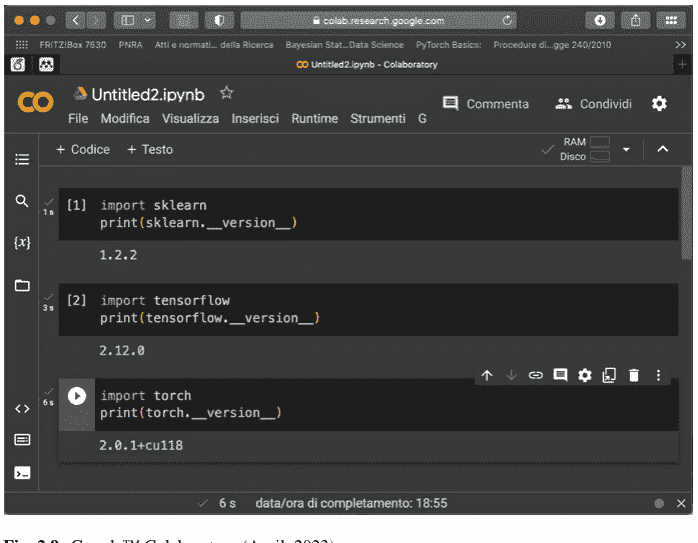

图 2.9 Google™ Colaboratory（2023 年 4 月）

图 2.9 和图 2.10 分别快速展示了 Google™ Colaboratory 和 Kaggle 的入门笔记本。此外，图 2.9 和图 2.10 显示 Google™ Colaboratory 和 Kaggle 都预装了 scikit-learn、Tensorflow 和 PyTorch，并可直接使用。使用 Saturn Cloud™，可以通过点击“New Python Server”服务器按钮（见图 2.11）启动一个新的 Python 服务器，这将打开一个新窗口，您可以在其中个性化实例。请注意，默认配置不包括 PyTorch 或 Tensorflow，尽管可以在“Extra Packages”部分（图 2.12）快速添加它们。例如，图 2.12 展示了如何添加 PyTorch。最后，图 2.13 演示了生成的环境同时包含 scikit-learn 和 PyTorch。

尽管所有报告的基于云的 ML Jupyter 环境都是强大且灵活的解决方案，但我建议初学者使用 Google™ Colaboratory 或 Saturn Cloud™。

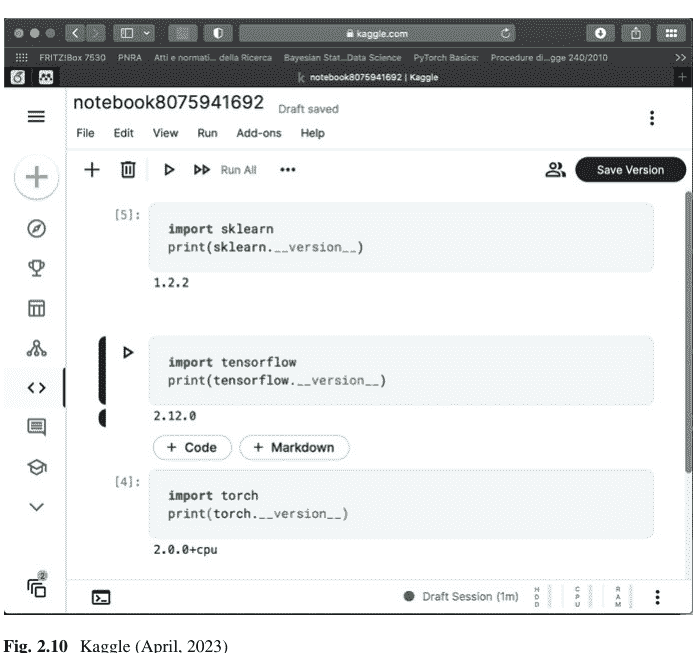

图 2.10 Kaggle（2023 年 4 月）


图 2.11 Saturn Cloud™（2023 年 4 月）

## 2 为机器学习设置您的 Python 环境

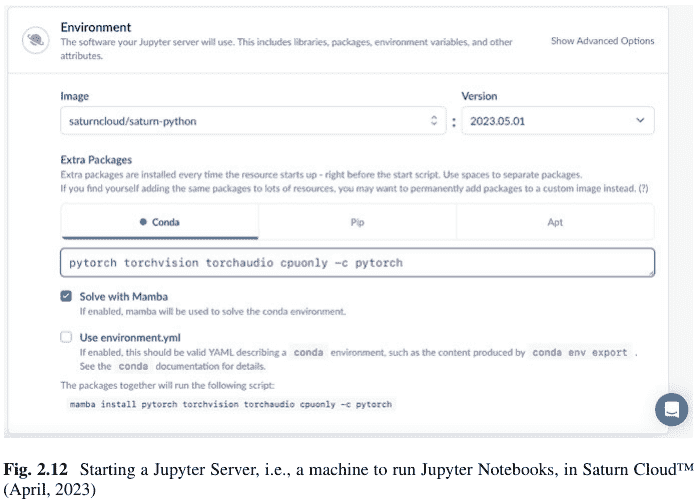

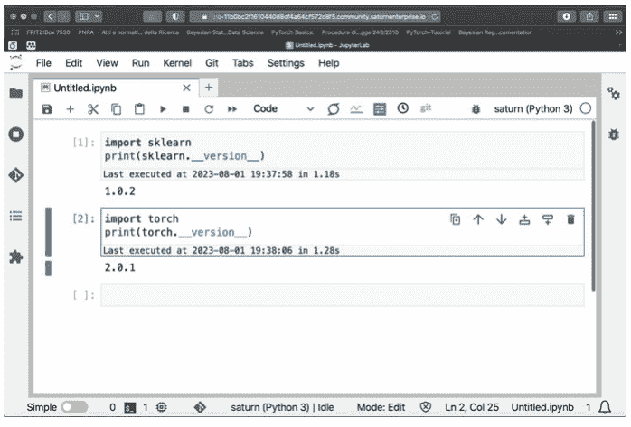

### 2.7 加速您的 ML Python 环境

Python 反对者的一个常见论点是，与 C 或 FORTRAN 等其他成熟的编程语言相比，Python 速度较慢。我们都同意这个论点，但在我看来，这不是重点。在科学计算中，Python 依赖于用更高性能语言（主要是 C 和 C++）开发的库，以及像 CUDA 这样的并行计算平台。¹⁸ 例如，用于科学计算的核心 Python 库 NumPy 就是基于优化的 C 代码。¹⁹ 对于 ML 用途，所有 scikit-learn、PyTorch 和 Tensorflow 都提供了一个基础版本的库，可以安全地安装在任何本地机器上，用于快速原型设计和中小规模问题。此外，也提供了针对密集计算应用的优化版本。例如，Intel™ for scikit-learn 扩展通过 10-100 倍的加速因子提升了基于 Intel 硬件的 Python ML 应用性能。²⁰ Intel™ for scikit-learn 扩展可以使用 *conda* 轻松安装。为防止冲突，我强烈建议创建一个新的 conda 环境，例如 *env_ml_intel*：

```
$ conda create -n env_ml_intel -c conda-forge python=3.9 scikit-learn-intelex scikit-learn rasterio matplotlib pandas spyder scikit-image seaborn
```

现在列出我的本地环境会得到

```
$ conda info --envs
Output:
# conda environments:
#
base                     *  /opt/anaconda3
env_ml                      /opt/anaconda3/envs/env_ml
env_pt                      /opt/anaconda3/envs/env_pt
env_tf                      /opt/anaconda3/envs/env_tf
env_ml_intel                /opt/anaconda3/envs/env_ml_intel
```

我保持 *base* 环境不变。然后我创建了两个通用 ML 环境，*env_ml* 和 *env_ml_intel*，后者由 Intel 优化。最后，我创建了两个深度学习环境 *env_pt* 和 *env_tf*，分别基于 PyTorch 和 Tensorflow。

请注意，PyTorch 和 Tensorflow 等深度学习库经过高度优化以支持 GPU 计算（例如 CUDA²¹ 和 ROCm²²）。例如，一个针对 Linux 操作系统优化的 Pytorch CUDA 版本可以很容易地通过 conda 安装，如下所示（2023 年 4 月）：

¹⁸ https://developer.nvidia.com/cuda-zone.
¹⁹ https://numpy.org.
²⁰ https://github.com/intel/scikit-learn-intelex.
²¹ https://developer.nvidia.com/cuda-zone.
²² https://rocmdocs.amd.com/en/latest/.

## 参考文献

Bharath, R., & Reza Bosagh, Z. (2018). *TensorFlow for deep learning*. O’Reilly.
Negus, C. (2015). *Linux Bible* (第9版, 第112卷). John Wiley & Sons, Inc.
Papa, J. (2021). *PyTorch pocket reference*. O’Reilly Media, Inc.
Paszke, A., Gross, S., Massa, F., Lerer, A., Bradbury, J., Chanan, G., Killeen, T., Lin, Z., Gimelshein, N., Antiga, L., Desmaison, A., Köpf, A., Yang, E., DeVito, Z., Raison, M., Tejani, A., Chilamkurthy, S., Steiner, B., Fang, L., et al. (2019). PyTorch: An imperative style, high-performance deep learning library. In *Advances in neural information processing systems, 32*.
Pedregosa, F., Varoquaux, G. G., Gramfort, A., Michel, V., Thirion, B., Grisel, O., Blondel, M., Prettenhofer, P., Weiss, R., Dubourg, V., Vanderplas, J., Passos, A., Cournapeau, D., Brucher, M., Perrot, M., & Duchesnay, É. (2011). Scikit-learn: Machine learning in Python. *Journal of Machine Learning Research, 12*, 2825–2830.
Ward, B. (2021). *How Linux works, 3rd Edition: What every superuser should know*. No Starch Press, Inc.

## 第3章
机器学习工作流程

### 3.1 机器学习步骤详解

图3.1展示了大多数机器学习项目通用的通用工作流程。第一步是获取数据。在地球科学领域，数据可以来自大规模地质或地球化学采样、遥感平台、测井分析或岩石学实验等，仅举几例。第二步是预处理，包括为后续的训练和验证步骤准备数据集所需的所有操作。训练模型涉及运行机器学习算法，这是机器学习工作流程的核心业务。验证步骤检查训练的质量，并确保模型具有泛化能力。步骤3和步骤4通常紧密相连，并多次迭代以提高结果质量。最后一步是部署和保护你的模型。

我们现在将评估每个步骤，并就如何在地球科学领域成功运行机器学习模型提供见解。

### 3.2 获取你的数据

你的数据集存储库可能有许多不同的格式。最简单的数据集是存储在文本（例如.csv）或Excel™文件中的表格数据。有时，结构化查询语言（SQL）数据库托管你的数据。较大的数据集可能存储在分层数据格式（HDF5）、¹优化行柱状（ORC）、²Feather（即Arrow IPC列式格式）³或Parquet格式⁴中，仅举几例。

对于能放入随机存取存储器（RAM）的数据，pandas可能是通过*DataFrames*进行数据导入和操作（例如，切片、过滤）的最佳选择。表3.1描述了pandas方法在输入/输出（I/O）方面的潜力。

如果数据集开始完全填满你的RAM，Dask⁵可能是管理数据并将Python代码扩展到并行环境的首选库。Dask是一个旨在通过Python中的并行计算处理“大数据”的库。Dask将*DataFrames*的概念扩展到Dask DataFrames，这是由许多较小的pandas *DataFrames*组成的大型并行*DataFrames*。我们将在本书第四部分介绍Dask和并行计算。在此之前，我们必须使用pandas导入地球科学机器学习应用的数据集（见代码清单3.1）。所研究的数据集可从华盛顿大学圣路易斯分校物理系空间科学实验室的网站⁶下载。它涉及从陨石中提取的太阳前SiC颗粒（Stephan et al., 2021）。

¹ https://www.hdfgroup.org/solutions/hdf5/.
² https://orc.apache.org.
³ https://arrow.apache.org/docs/python/feather.html.
⁴ https://parquet.apache.org.
⁵ https://dask.org.
⁶ https://presolar.physics.wustl.edu/presolar-grain-database/.

```
1 import pandas as pd
2 
3 my_data = pd.read_excel("PGD_SiC_2021-01-10.xlsx", sheet_name='PGD-SIC')
4 print(my_data.info(memory_usage="deep"))
5 
6 '''
Output:
<class 'pandas.core.frame.DataFrame'>
RangeIndex: 19978 entries, 0 to 19977
Columns: 123 entries, PGD ID to err[d(138Ba/136Ba)]
dtypes: float64(112), object(11)
memory usage: 29.4 MB
'''
```

**代码清单 3.1** 在Python中导入Excel数据集

我假设你熟悉pandas中的*read_excel*语句。如果不熟悉，我强烈建议你从入门书籍开始，例如《地球科学数据分析Python入门》（Petrelli, 2021）。代码清单3.1第4行的语句告诉你存储我们的数据集需要多少内存。在这种情况下，导入的数据集包含大约20,000行和123列，需要24.4 MB，远小于我的MacBook™ Pro的32 GB。

大数据集[即接近或超过太字节（10¹²）或拍字节（10¹⁵）]无法高效地存储在文本文件（如.csv文件）或Excel文件中。标准关系数据库（如PostgreSQL、MySQL和MS-SQL）可以存储大量信息，但与用于管理、处理和存储海量数据的*最先进的*高性能数据软件库和文件格式相比，效率低下（即太慢）。De Mauro等人（2016）提出的大数据正式定义涵盖了容量、速度和多样性三个概念：“大数据是一种信息资产，其特征是高容量、高速度和多样性，需要特定的技术和分析方法将其转化为价值。”关于大数据的数据存储和分析框架的详细描述超出了本书的范围，因此我建议有兴趣的读者参考专业文本（Pietsch, 2021; Panda et al., 2022）。在此，我们仅比较pandas在MacBook Pro（2.3 GHz四核Intel Core i7，32 GB RAM）上写入和读取GB级.csv和.hdf文件的性能。例如，代码清单3.2生成一个名为my_data的pandas *DataFrame*，大小约为10 GB，由26列和5 × 10⁷行中的随机数组成。我使用了my_data.info(memory_usage = "deep")，代码清单3.3，来检查my_data的实际内存使用情况，为9.7 GB。

代码清单3.4显示了分别写入（In [1]、In [2]和In [3]）和读取（In [4]、In [5]和In [6]）文本（.csv）、parquet和hdf5文件所需的执行时间。结果显示，保存.csv文件大约需要25分钟，这是相当长的时间！相比之下，保存parquet和hdf5文件分别需要7秒和12秒。读取时间处于相同的数量级：.csv文件约5分钟，parquet和hdf5文件约30秒。

```
1 import pandas as pd
2 import numpy as np
3 import string
4 
5 my_data = pd.DataFrame(np.random.normal(size=(50000000, 26)),
6                       columns=list(string.ascii_lowercase))
```

代码清单 3.2 生成一个约10 GB的中等大小数据集

```
1 In [1]: my_data.info(memory_usage="deep")
2 <class 'pandas.core.frame.DataFrame'>
3 RangeIndex: 50000000 entries, 0 to 49999999
4 Data columns (total 26 columns):
5  #   Column  Dtype  
6 ---  ------  -----  
7  0   a       float64
8  1   b       float64
9  2   c       float64
10  3   d       float64
11  4   e       float64
12  5   f       float64
13  6   g       float64
14  7   h       float64
15  8   i       float64
16  9   j       float64
17  10  k       float64
18  11  l       float64
19  12  m       float64
20  13  n       float64
21  14  o       float64
22  15  p       float64
23  16  q       float64
24  17  r       float64
25  18  s       float64
26  19  t       float64
27  20  u       float64
28  21  v       float64
```

表3.1 用于机器学习应用的标准和*最先进的*文件格式的Pandas导入方法

| 方法 | 描述 | 备注 |
|---|---|---|
| read_table() | 读取通用分隔文件 | 慢，不适用于大数据集 |
| read_csv() | 读取逗号分隔值（csv）文件 | 慢，不适用于大数据集 |
| read_excel() | 读取Excel文件 | 慢，不适用于大数据集 |
| read_sql() | 读取sql文件 | 慢，不适用于大数据集 |
| read_pickle() | 读取pickle对象 | 快，不适用于大数据集 |
| read_hdf() | 读取分层数据格式（HDF）文件 | 快，适用于大数据集 |
| read_feather() | 读取feather文件 | 快，适用于大数据集 |
| read_parquet() | 读取parquet文件 | 快，适用于大数据集 |
| read_orc() | 读取优化行柱状文件 | 快，适用于大数据集 |

## 3.3 数据预处理

预处理包含为数据集准备后续步骤（例如，训练和验证；Maharana 等人，2022）所需的所有操作。这一步至关重要，因为它将原始数据转换为适合构建机器学习模型的形式。在开发机器学习项目时，你很可能会将大部分时间用于为训练准备数据。具体来说，预处理指的是在进入训练阶段之前，对原始数据进行准备（例如，清理、组织、归一化）。此外，预处理还包括允许验证的初步步骤（例如，训练-测试集划分）。

### 3.3.1 数据检查

数据检查是对数据集的定性研究，有助于熟悉数据集。数据检查的一项基本任务是描述性统计，它提供了对数据“形状”和结构的清晰理解。为了了解描述性统计如何提供帮助，请考虑以下示例：通过查看直方图分布，你可以开始判断那些需要特定假设（例如，高斯结构）的方法是否适合分析你的数据。

代码清单 3.5 展示了如何对主要的位置描述性指标（如均值和中位数，例如 $p_{50}$ 或第 50 百分位数）以及离散度指标（如标准差和范围，例如 $range = max - min$ 或四分位距，例如 $iqr = p_{75} - p_{25}$）进行初步确定。

```
In [1]: sub_data = my_data[['12C/13C', '14N/15N']]

In [2]: sub_data.describe().applymap("{0:.0f}".format)

Out[2]:
        12C/13C  14N/15N
count    19581     2544
mean        66     1496
std        207     1901
min          1        4
25%         44      336
50%         55      833
75%         69     2006
max      21400    19023
```

**清单 3.5** 在 Python 中确定描述性统计量

图 3.2 和代码清单 3.6 展示了如何使用 Python 对数据集进行统计可视化。更具体地说，图 3.2 显示了数据在 $^{14}N/^{15}N$ 对 $^{12}C/^{13}C$ 投影中的分布（左图）以及 $^{12}C/^{13}C$ 的直方图分布（右图）。

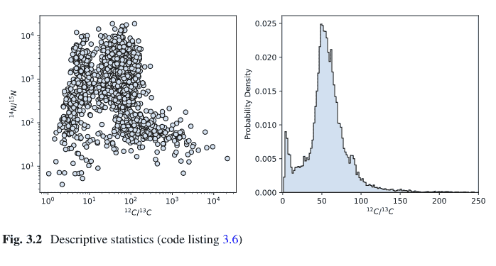

**图 3.2** 描述性统计（代码清单 3.6）

```python
import matplotlib.pyplot as plt

fig = plt.figure(figsize=(9,4))
ax1 = fig.add_subplot(1,2,1)
ax1.plot(my_data['12C/13C'], my_data['14N/15N'],
         marker='o', markeredgecolor='k',
         markerfacecolor='#BFD7EA', linestyle='',
         color='#7d7d7d',
         markersize=6)
ax1.set_yscale('log')
ax1.set_xscale('log')
ax1.set_xlabel(r'$^{12}C/^{13}C$')
ax1.set_ylabel(r'$^{14}N/^{15}N$')

ax2 = fig.add_subplot(1,2,2)
ax2.hist(my_data['12C/13C'], density=True, bins='auto',
         histtype='stepfilled', color='#BFD7EA', edgecolor='black',)
ax2.set_xlim(-1,250)
ax2.set_xlabel(r'$^{12}C/^{13}C$')
ax2.set_ylabel('Probability Density')

fig.set_tight_layout(True)
```

**清单 3.6** 在 Python 中获取描述性统计量

### 3.3.2 数据清洗与插补

在现实世界的数据集（如地质数据集）中，“不想要”的条目无处不在（Zhang, 2016）。例子包括空值（即缺失数据）、“非数字”（NaN）条目和大的异常值。清洗数据集主要包括移除这些不想要的条目。例如，`.dropna()` 和 `.fillna()` 方法在处理缺失数据时很有帮助；这些在 pandas 中被导入为 NaN（参见代码清单 3.7）。

```python
import pandas as pd

cleaned_data = my_data.dropna(
    subset=['d(135Ba/136Ba)', 'd(138Ba/136Ba)'])

print("Before cleaning: {} cols".format(my_data.shape[0]))
print("After cleaning: {} cols".format(cleaned_data.shape[0]))

'''
Output:
Before cleaning: 19978 cols
After cleaning: 206 cols
'''
```

**清单 3.7** 移除 NaN 值

具体来说，第 3 行的 `.dropna()` 移除了所有 $\delta^{135}Ba_{136}$ [‰] 或 $\delta^{138}Ba_{136}$ [‰] 同位素值缺失的行。

尽管移除包含缺失值的条目因其简单性而具有吸引力，但它也有一些缺点，其中最显著的是信息的丢失（Zhang, 2016）。特别是，当处理大量特征时，由于单个特征缺失，可能会移除大量的观测值，从而可能引入较大的偏差（Zhang, 2016）。一个可能的解决方案是数据插补，即用插补值替换缺失值。已经开发了几种数据插补方法，其中最简单的是用所研究特征的均值、中位数或众数替换缺失值（Zhang, 2016）。在 pandas 中，`.fillna()` 用文本或特定值替换 NaN 条目。此外，scikit-learn 中的 `SimpleImputer()` 用均值、中位数或众数插补缺失值。

一个更复杂的策略是使用回归进行数据插补（Zhang, 2016）。在这种情况下，你首先拟合一个回归模型（例如，线性或多项式），然后使用该模型来插补缺失值（Zhang, 2016）。在 scikit-learn 中，`IterativeImputer()` 函数开发了一种基于多重回归的插补策略。

### 3.3.3 类别特征编码

大多数可用的机器学习算法不支持使用类别（即，名义）特征。因此，类别数据必须被编码（即，转换为数字序列）。在 scikit-learn 中，`OrdinalEncoder()` 将类别特征编码为整数（即，从 0 到 $n_{categories} - 1$）。

### 3.3.4 数据增强

数据增强旨在通过增加数据集中的信息量来提高机器学习模型的泛化能力（Maharana 等人，2022），这包括添加现有数据的修改副本（例如，在图像分类中翻转或旋转的图像）或组合现有特征以生成新特征。例如，Maharana 等人（2022）描述了六种用于图像分析的数据增强技术：（1）符号增强，（2）基于规则的增强，（3）图结构增强，（4）混合增强，（5）特征空间增强，以及（6）神经增强（Maharana 等人，2022）。尽管特征增强的细节远超本书范围，但我们将在第 8 章中遵循 Bestagini 等人（2017）提出的策略来利用数据增强。

### 3.3.5 数据缩放与转换

数据集的缩放和转换通常是机器学习工作流程中的关键步骤。许多机器学习算法从对所研究数据集的初步“标准化”中获益匪浅。例如，所有使用欧几里得距离（这样的算法有很多！）作为基本度量的算法，在引入量级差异显著的特征时，可能会产生显著的偏差。

**定义** 在标准化的数据集中，所有特征都以零为中心，并且它们的方差处于相同的数量级。

如果一个特征的方差比其他特征的方差大几个数量级，它可能会起主导作用，并阻止算法正确学习其他特征。标准化数据集最简单的方法是减去均值并缩放到单位方差：

$$\tilde{x}_e^i = \frac{x_e^i - \mu^e}{\sigma_s^e}$$

在公式 (3.1) 中，$\tilde{x}_e^i$ 和 $x_e^i$ 分别是转换后的分量和原始分量。例如，它们可能属于化学元素 $e$（如 $\text{SiO}_2$ 或 $\text{TiO}_2$）的样本分布，该分布具有均值 $\mu^e$ 和标准差 $\sigma_s^e$。

Scikit-learn 在 `sklearn.preprocessing.StandardScaler()` 方法中实现了公式 (3.1)。

此外，scikit-learn 实现了额外的缩放器和转换器，它们分别执行线性和非线性转换。例如，`MinMaxScaler()` 将数据集中的每个特征缩放到给定的范围（例如，介于 0 和 1 之间）。

*QuantileTransformer()* 提供非线性变换，可缩小边缘异常值与正常值之间的距离；而 *PowerTransformer()* 则提供非线性变换，将数据映射到正态分布，以稳定方差并最小化偏度。

异常值的存在可能影响模型的输出。若数据集包含异常值，使用稳健的缩放器或转换器更为合适。默认情况下，*RobustScaler()* 会移除中位数，并根据四分位距对数据进行缩放。请注意，*RobustScaler()* 并不会移除任何异常值。表 3.2 总结了 scikit-learn 中可用的主要缩放器和转换器。

当估计不确定性被量化时（例如，通过一个标准差或一个标准误），可以清理数据集，移除所有误差超过您所选阈值的数据。

```python
import matplotlib.pyplot as plt
from sklearn.preprocessing import MinMaxScaler
from sklearn.preprocessing import StandardScaler
from sklearn.preprocessing import RobustScaler

X = my_data[['d(30Si/28Si)', 'd(29Si/28Si)']].to_numpy()

scalers = [("Unscaled", X),
           ("Standard Scaler", StandardScaler().fit_transform(X)),
           ("Min. Max. Scaler", MinMaxScaler().fit_transform(X)),
           ("Robust Scaler", RobustScaler().fit_transform(X))]

fig = plt.figure(figsize=(10,7))

for ix, my_scaler in enumerate(scalers):
    ax = fig.add_subplot(2,2,ix+1)
    scaled_X = my_scaler[1]
    ax.set_title(my_scaler[0])
    ax.scatter(scaled_X[:,0], scaled_X[:,1],
               marker='o', edgecolor='k', color='#db0f00',
               alpha=0.6, s=40)
    ax.set_xlabel(r'$\{\delta\}^{30}Si_{28} [\perthousand]$')
    ax.set_ylabel(r'$\{\delta\}^{29}Si_{28} [\perthousand]$')

fig.set_tight_layout(True)
```

**代码清单 3.8** 缩放器和转换器

最后，对数据取对数有时有助于减少样本的偏度，前提是数据集服从对数正态分布（Limpert 等人，2001；Corlett 等人，1957）。代码清单 3.8 展示了如何将各种缩放器和转换器应用于对数变换后的 $^{12}C/^{13}C$ SiC 数据，图 3.3 显示了结果。

表 3.2 scikit-learn 中的缩放器和转换器。描述摘自 scikit-learn 官方文档

| | 描述 |
|---|---|
| **缩放器** | |
| sklearn.preprocessing.StandardScaler() | 通过移除均值并缩放到单位方差来标准化特征 [公式 (3.1)] |
| sklearn.preprocessing.MinMaxScaler() | 通过将每个特征缩放到给定范围来转换特征。默认范围是 [0,1] |
| sklearn.preprocessing.RobustScaler() | 使用对异常值稳健的统计量来缩放特征。此缩放器移除中位数，并根据分位数范围缩放数据。默认分位数范围是四分位距 |
| **转换器** | |
| sklearn.preprocessing.PowerTransformer() | 逐特征应用幂变换，使数据更接近高斯分布 |
| sklearn.preprocessing.QuantileTransformer() | 使用分位数信息转换特征。此方法将特征转换为遵循均匀分布或正态分布。因此，对于给定特征，此转换倾向于分散最频繁的值 |

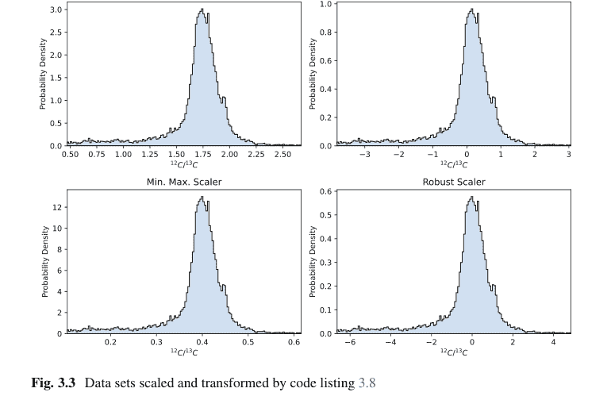

图 3.3 由代码清单 3.8 缩放和转换的数据集

### 3.3.6 成分数据分析 (CoDA)

在应用任何统计方法（包括机器学习算法）之前，必须验证其基本假设。例如，正态性假设是许多方法的基础。其他假设可能涉及样本空间的拓扑结构。地球化学测定是所谓成分数据的一个例子（Aitchison, 1982；Aitchison & Egozcue, 2005；Razum 等人, 2023），它们是非负多元数据的样本，表示为相对于一个固定总量（通常是总和为 1 或 100% 的百分比）的比例。成分数据的分析被称为“成分数据分析”（CoDA；Aitchison, 1984）。

在成分数据中，样本空间由 Aitchison 单形 $s^D$ 表示：

$$s^D = \left\{ \mathbf{x} = [x_1, x_2, x_i, \dots, x_D] \mid x_i > 0, \; i = 1, 2, \dots, D; \; \sum_{i=1}^D x_i = C \right\},$$

其中 $C$ 是一个常数，通常为 1 或 100。成分数据通常具有两个特征：(1) 数据始终为正；(2) 数据总和为常数（即它们不是独立的）。这些特征阻碍了许多统计方法的应用，因为这些方法通常假设输入样本在区间 $[-\infty, \infty]$ 内是独立的。从拓扑学的角度来看，单形（即成分向量的样本空间）与无约束数据相关的欧几里得空间有根本的不同（Aitchison, 1982；Aitchison & Egozcue, 2005；Razum 等人, 2023）。因此，任何依赖于欧几里得距离的方法都不应直接用于成分数据。有四种既定的变换可用于尝试将 Aitchison 单形映射到欧几里得空间。

#### 成对对数比变换 (*pwlr*) (Aitchison, 1982; Aitchison & Egozcue, 2005; Razum et al., 2023)

*pwlr* 变换将成分从 $D$ 维 Aitchison 单形等距映射到 $D(D-1)/2$ 维空间。具体来说，它计算每个可能的对数比，但考虑到 $\log(A/B) = -\log(B/A)$，因此只需要其中一个。在经过成对对数比变换的数据上，我们可以应用不依赖于协方差函数可逆性的多元方法。*pwlr* 变换后数据的解释相当简单，因为每个分量都源于一个简单的除法运算，然后通过对数变换来减少所得特征的偏度。

*pwlr* 变换由下式给出

$$pwlr(\mathbf{x}) = [\xi_{ij} \mid i < j = 1, 2, \dots, D],$$

其中 $\xi_{ij} = \ln(x_i/x_j)$。请注意，*pwlr* 的冗余性产生了 $D(D-1)/2$ 个特征，这对应于一个极高维的空间。

#### 加法对数比变换 (alr) (Aitchison, 1982; Aitchison & Egozcue, 2005; Razum et al., 2023)

alr 变换由下式给出

$$alr(\mathbf{x}) = \left[ \ln \frac{x_1}{x_D}, \ln \frac{x_2}{x_D}, \dots, \ln \frac{x_{D-1}}{x_D} \right].$$

alr 变换将向量从 D 维 Aitchison 单形非等距地映射到 (D-1) 维空间。

与 pwlr 的情况类似，alr 数据的解释相当简单，因为它们也源于一个简单的除法运算，然后通过对数变换来减少所得特征的偏度。

#### 中心化对数比变换 (clr)

此变换由下式给出

$$clr(\mathbf{x}) = \left[ \ln \frac{x_1}{g(\mathbf{x})}, \ln \frac{x_2}{g(\mathbf{x})}, \dots, \ln \frac{x_D}{g(\mathbf{x})} \right],$$

其中 $g_m(\mathbf{x})$ 是 $\mathbf{x}$ 各部分的几何平均值。clr 变换将向量从 D 维 Aitchison 单形等距映射到 D 维欧几里得空间。然后，clr 变换后的数据可以由所有不依赖于协方差满秩的多元工具进行分析（Aitchison, 1982；Aitchison & Egozcue, 2005；Razum 等人, 2023）。

#### 正交对数比变换 (olr)

此变换也称为等距对数比变换 (ilr)。$\mathbf{x}$ 相对于基元素 $\mathbf{e}_l$（$l = 1, 2, \dots, n-1$）的 olr 坐标定义为（Egozcue & Pawlowsky-Glahn, 2005）

$$x_l^* = \sqrt{\frac{rs}{r+s}} \ln \left[ \frac{g(x_{k+1}, \dots, x_{k+r})}{g(x_{k+r+1}, \dots, x_{k+r+s})} \right],$$

其中 $x_l^*$ 是部分组 $x_{k+1}, \dots, x_{k+r}$ 和 $g(x_{k+r+1}, \dots, x_{k+r+s})$ 之间的平衡，而 $\mathbf{e}_l$ 是这两组部分的平衡元素（Egozcue & Pawlowsky-Glahn, 2005）。

请注意，“通过定义与单形中正交坐标系直接相关的平衡，每种多元统计技术都可以不受任何限制地使用，并且数据可以得到适当的统计评估”（Razum 等人, 2023）。上述每种变换都具有独特的属性，可用于成分数据分析。clr 变换通常用于构建成分双标图和进行聚类分析（van den Boogaart & Tolosana-Delgado, 2013）。尽管 alr 变换后的数据可以使用多元统计工具进行分析，但 alr 变换定义了“斜基中的坐标，如果从 alr 坐标计算通常的欧几里得距离，这会影响距离”（van den Boogaart & Tolosana-Delgado, 2013）。因此，alr 变换“不应用于涉及距离、角度和形状的情况，因为它会使它们变形”（Pawlowsky-Glahn & Buccianti, 2011）。任何多元技术都可以安全地应用于*ilr*变换后的数据，因为它与单纯形的正交基相关（Razum et al., 2023）。
在Python中，scikit-bio<sup>7</sup>和pyrolite<sup>8</sup>都在CoDA框架下为我们提供了相应的方法。

### 3.3.7 数据预处理的工作示例

代码清单3.9和3.10展示了Boujibar等人（2021）为研究前太阳碳化硅（SiC）颗粒的聚类而进行的数据预处理的逐步复现。如果您无法理解Boujibar等人（2021）研究的具体宇宙化学问题，请不要担心。本示例旨在重点展示如何为机器学习研究准备数据集。

```
1 import pandas as pd
2 import matplotlib.pyplot as plt
3 import numpy as np
4 from sklearn.preprocessing import StandardScaler
5 from sklearn.preprocessing import RobustScaler
6 
# 导入数据
8 my_data = pd.read_excel("PGD_SiC_2021-01-10.xlsx",
9                         sheet_name='PGD-SiC')
10 
# 限制为感兴趣的特征
12 my_data = my_data[['PGD ID', 'PGD Type', 'Meteorite', '12C/13C',
13                    'err+[12C/13C]', 'err-[12C/13C]', '14N/15N',
14                    'err+[14N/15N]', 'err-[14N/15N]',
15                    'd(29Si/28Si)', 'err[d(29Si/28Si)]',
16                    'd(30Si/28Si)', 'err[d(30Si/28Si)]']]
17 
# 删除NaN值
19 my_data = my_data.dropna()
20 
# 移除具有较大硅误差的M型颗粒
22 my_data = my_data[~((my_data['err[d(30Si/28Si)]']>10) &
23                     (my_data['err[d(29Si/28Si)]']>10) &
24                     (my_data['PGD Type']== 'M'))]
25 
# 排除C型和U型颗粒
27 my_data = my_data[(my_data['PGD Type']=='X') |
28                   (my_data['PGD Type']=='N') |
29                   (my_data['PGD Type']=='AB') |
30                   (my_data['PGD Type']=='M')  |
31                   (my_data['PGD Type']=='Y')  |
32                   (my_data['PGD Type']=='Z')]
33 
# 排除受污染的颗粒
35 my_data = my_data[~(((my_data['12C/13C']<93.56) &
36                       (my_data['12C/13C']>88.87)) &
37                      ((my_data['14N/15N']<339.94) &
38                       (my_data['14N/15N']>248)) &
39                      ((my_data['d(30Si/28Si)']<50)&
40                       (my_data['d(30Si/28Si)']>-50)) &
41                      ((my_data['d(29Si/28Si)']<50)&
42                       (my_data['d(29Si/28Si)']>-50))
43                      )]
```

**清单 3.9** 数据预处理工作示例（第1部分）

```
1  # 将硅同位素delta值转换为同位素比值
2  Si29_28_0 = 0.0506331
3  Si30_28_0 = 0.0334744
4  my_data['30Si/28Si'] = ((my_data['d(30Si/28Si)']/1000)+1) *
5                          Si30_28_0
6  my_data['29Si/28Si'] = ((my_data['d(29Si/28Si)']/1000)+1) *
7                          Si29_28_0
8  
9  my_data['log_12C/13C'] = np.log10(my_data['12C/13C'])
10 my_data['log_14N/15N'] = np.log10(my_data['14N/15N'])
11 my_data['log_30Si/28Si'] = np.log10(my_data['30Si/28Si'])
12 my_data['log_29Si/28Si'] = np.log10(my_data['29Si/28Si'])
13 
# 保存到Excel
15 my_data.to_excel("sic_filtered_data.xlsx")
16 
# 使用StandardScaler()和RobustScaler()进行缩放
18 X = my_data[['log_12C/13C','log_14N/15N','log_30Si/28Si',
19              'log_29Si/28Si']].values
20 
21 scalers =[("未缩放", X),
22           ("标准缩放器",StandardScaler().fit_transform(X)),
23           ("稳健缩放器",RobustScaler().fit_transform(X))
24           ]
25 
# 绘制图形
27 fig = plt.figure(figsize=(15,8))
28 
29 for ix, my_scaler in enumerate(scalers):
30     scaled_X = my_scaler[1]
31     ax = fig.add_subplot(2,3,ix+1)
32     ax.set_title(my_scaler[0])
33     ax.scatter(scaled_X[:,0], scaled_X[:,1],
34                marker='o', edgecolor='k', color='#db0f00',
35                alpha=0.6,  s=40)
36     ax.set_xlabel(r'$log_{10}[^{12}C/^{13}C]$')
37     ax.set_ylabel(r'$log_{10}[^{14}N/^{15}N]$')
38 
39     ax1 = fig.add_subplot(2,3,ix+4)
40     ax1.set_title(my_scaler[0])
41     ax1.scatter(scaled_X[:,2], scaled_X[:,3],
42                 marker='o', edgecolor='k', color='#db0f00',
43                 alpha=0.6,  s=40)
44     ax1.set_xlabel(r'$log_{10}[^{30}Si/^{28}Si]$')
45     ax1.set_ylabel(r'$log_{10}[^{29}Si/^{28}Si]$')
46 
47 fig.set_tight_layout(True)
```

**清单 3.10** 数据预处理工作示例（第2部分）

代码清单3.9首先导入所有必需的库和方法（即pandas、matplotlib、numpy，以及scikit-learn中的*StandardScaler*和*RobustScaler*）。工作流程从第8行开始，我们创建一个名为*my_data*的pandas DataFrame，从Excel™导入SiC分析数据集。所有后续步骤都是为*my_data*进行预处理，以便机器学习算法处理。

请注意，在代码清单3.9中，

- 第12行将特征限制为感兴趣的那些。
- 第19行移除非数值数据（即Not a Number，或NaN）。
- 第22行移除“PGD Type”列中标记为“M”且具有较大误差的所有行。
- 第27行将数据集限制为PGD-Type列中的特定标签（即特定的SiC类别，如X、N、AB、M、Y和Z，与当前分类一致）（Stephan et al., 2021）。
- 第35行移除受污染的颗粒，即那些同位素特征与地球过于相似的颗粒。

然后，在代码清单3.10中，

- 第2-5行将硅值从δ符号转换为同位素比值。
- 第7-10行应用对数变换，与*alr* CoDA变换一致。
- 第13行将*my_data*保存到Excel™，以记录缩放前的预处理结果。
- 第16行定义*X*，一个四特征的numpy数组，其形状被大多数scikit-learn机器学习算法接受。
- 第18行定义了三种场景：（1）未缩放数据，（2）使用StandardScaler()缩放，（3）使用RobustScaler()缩放。
- 第24-42行执行缩放（第27行）并显示图3.4中的图表。

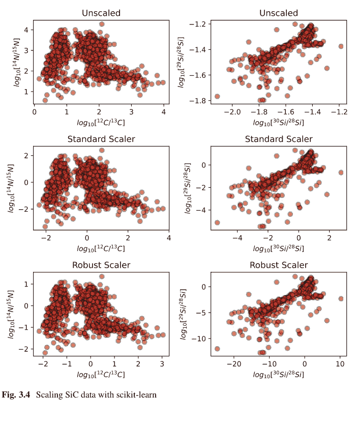

图3.4显示了代码清单3.9和3.10的结果。正如预期的那样，应用各种缩放器和转换器不会改变数据结构。然而，它强烈影响了所研究特征的位置和分布。例如，当未缩放时，$^{12}C/^{13}C$的对数范围从0到4，平均值约为1.7（另见图3.3）。标准缩放器和稳健缩放器分别使用均值和中位数将数据集中心化到零，但它们产生不同的分布，因为稳健缩放器还考虑了异常值的存在。对于没有异常值的对称分布，我们期望标准缩放器和稳健缩放器产生相似的结果。

```
import numpy as np
import matplotlib.pyplot as plt
from sklearn.preprocessing import StandardScaler
from sklearn.mixture import GaussianMixture as GMM

my_colors = ['#AF41A5','#0A3A54','#0F7F8B','#BFD7EA','#F15C61',
             '#C82127','#ADADAD','#FFFFFF', '#EABD00']

scaler = StandardScaler().fit(X)
scaled_X = scaler.transform(X)

my_model = GMM(n_components = 9, random_state=(42)).fit(scaled_X)

Y = my_model.predict(scaled_X)

fig, ax = plt.subplots()

for my_group in np.unique(Y):
    i = np.where(Y == my_group)
    ax.scatter(scaled_X[i,0], scaled_X[i,1],
               color=my_colors[my_group],
               label=my_group + 1 ,  edgecolor='k', alpha=0.8)

ax.legend(title='聚类')

ax.set_xlabel(r'$log_{10}[^{12}C/^{13}C]$')
ax.set_ylabel(r'$log_{10}[^{14}N/^{15}N]$')
fig.tight_layout()
```

**清单 3.11** 将GaussianMixture()算法应用于SiC数据

## 3.4 训练模型

图3.5是一个速查表，指导我们为scikit-learn库选择模型。⁹

Scikit-learn在无监督学习（即聚类和降维）和监督学习（即回归和分类）领域都有应用。在监督学习中，分类算法的例子包括支持向量分类器（见第7.9节）和K近邻（见第7.10节）。在回归领域，例子包括随机梯度下降（SGD）、支持向量（SVR）和集成回归器。无监督学习的例子，如果我们考虑降维，包括局部线性嵌入（LLE，见第4.3节）和主成分分析（PCA，见第4.2节）。对于聚类，例子包括K均值、高斯混合模型（GMM，见第4.9节）和谱聚类。

⁹ https://scikit-learn.org/stable/tutorial/machine_learning_map/.

## 3.4 训练模型

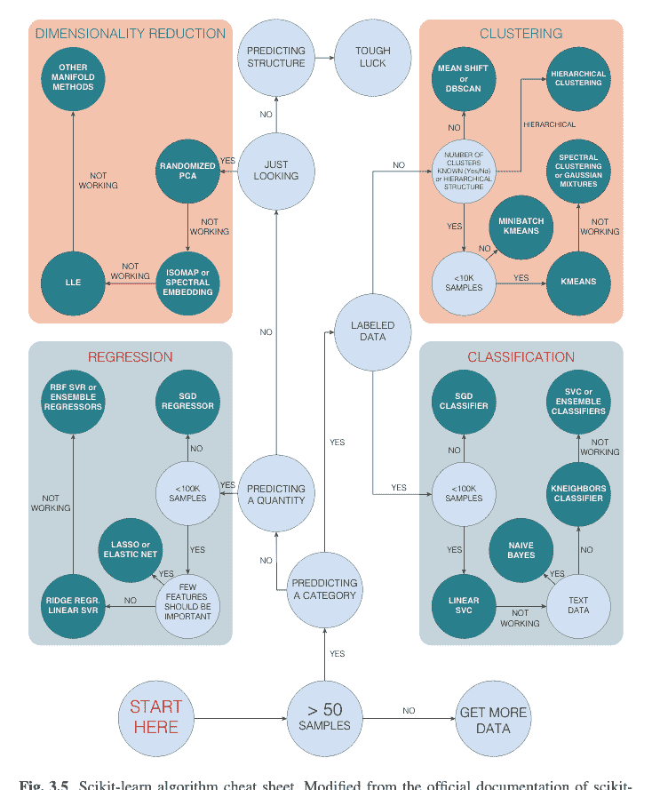

图 3.5 Scikit-learn 算法速查表。改编自 scikit-learn 官方文档

我们将在第 4 章和第 7 章详细讨论最受欢迎的机器学习算法，这两章分别涉及无监督学习和监督学习。

现在，我将展示一个训练无监督算法的简单示例，用于 SiC 分析，我们将其作为地球化学和宇宙化学科学领域科学数据集的代理。代码清单 3.11 展示了如何使用高斯混合模型（见第 4.9 节）对 SiC 数据进行聚类，数据已通过代码清单 3.9 和 3.10 进行了预处理。训练的核心在第 12 行，我在此参数化了

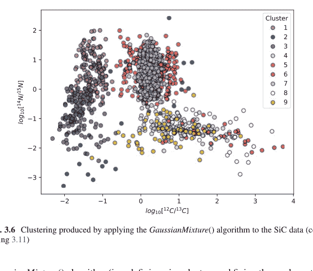

图 3.6 对 SiC 数据应用 *GaussianMixture()* 算法（代码清单 3.11）产生的聚类结果

*GaussianMixture()* 算法（即定义九个聚类，并固定伪随机数生成器的随机状态，以便读者能够完全重现我的结果）。

一般来说，scikit-learn 中的 *.fit()* 方法启动机器学习算法的训练。然后，使用 *.predict()* 方法，我们获得结果或将获得的知识转移到未知数据上。图 3.6 展示了使用 *GaussianMixture()* 进行聚类的结果（见代码清单 3.11 的第 16-29 行）。

### 3.5 模型验证与测试

模型的验证和测试是机器学习中继预处理和训练之后的第三个基本步骤。它们使我们能够评估模型的“优劣”。

#### 3.5.1 将研究数据集划分为三部分

Hastie 等人（2017）清晰地描述了通过将研究数据集划分为三部分来进行模型验证和测试的方法（图 3.7）：机器学习中模型评估的最佳方法“是将数据集随机划分为三部分：一个训练集、一个验证集和一个测试集。训练集用于拟合


图 3.7 将研究数据集划分为三部分

模型；验证集用于估计预测误差以进行模型选择；测试集用于评估最终选定模型的泛化误差。”

```python
from sklearn import preprocessing
from sklearn.model_selection import train_test_split

le = preprocessing.LabelEncoder()
le.fit(my_data['PGD Type'])
y = le.transform(my_data['PGD Type'])

X_train_valid, X_test, y_train_valid, y_test = train_test_split(
    X, y, test_size=0.20)

X_train, X_valid, y_train, y_valid = train_test_split(
    X, y, test_size=0.25)
```

代码清单 3.12 在 scikit-learn 中将研究数据集划分为三部分

通常，我们使用训练数据集来训练一组候选模型，这些模型可以是不同的算法、一个使用不同超参数（即影响算法行为的一个或多个变量）调整的单一算法，或者两者的组合。然后，我们使用验证数据集来评估候选模型，并根据结果选择最佳模型。最后，我们使用测试数据集检查所选模型。例如，scikit-learn 中的 *train_test_split()* 方法将数据集随机划分为两部分（例如，训练集加验证集和测试集）。再次对训练集加验证集应用 *train_test_split()* 方法，可进一步将其划分为训练集和验证集。

请注意，代码清单 3.12 的第 4-6 行语句只是将与特定 SiC 类别（即 M、Y、Z、X、AB 和 N）相关的标签转换为 0 到 5 之间的整数值。这种方法便于在回归和分类领域的监督方法执行过程中管理标签。

#### 3.5.2 交叉验证

交叉验证（CV）过程可以看作是将研究数据集静态划分为三部分的演进。

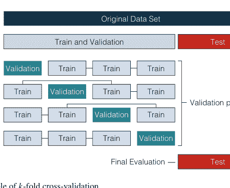

图 3.8 *k* 折交叉验证示例

在交叉验证过程中，初始数据集被划分为两部分：测试集和训练集加验证集。然后，在最基本的交叉验证策略（称为 *k* 折 CV）中，联合的训练集和验证集被划分为 *k* 个更小的批次（图 3.8）。以下步骤包括重复进行候选模型的训练和验证，如下所示：(1) 我们使用 *k* − 1 折作为训练集；(2) 训练结果使用剩余的一折数据进行验证；(3) 我们对下一个划分重复此过程。

```python
from sklearn import svm
from sklearn import preprocessing
from sklearn.model_selection import cross_validate

le = preprocessing.LabelEncoder()
le.fit(my_data['PGD Type'])
y = le.transform(my_data['PGD Type'])

my_model = svm.SVC(kernel='linear', C=1, random_state=42)

cv_results = cross_validate(my_model, scaled_X, y, cv=5,
                            scoring='accuracy')

print(cv_results['test_score'])

'''
Output:
[0.98529412 0.97785978 0.9704797  0.98154982 0.95940959]
'''
```

代码清单 3.13 将线性支持向量分类器应用于 SiC 数据

```python
from sklearn import svm
from sklearn import preprocessing
from sklearn.model_selection import GridSearchCV

le = preprocessing.LabelEncoder()
le.fit(my_data['PGD Type'])
y = le.transform(my_data['PGD Type'])

parameters = {'kernel':('linear', 'rbf'), 'C':[0.1, 1, 10]}
my_model = svm.SVC()

my_grid_search = GridSearchCV(my_model, parameters,
                             cv = 4, scoring='accuracy')

my_grid_search.fit(scaled_X, y)
```

**代码清单 3.14** 通过 *k* 折 CV 进行模型评估和选择

候选模型的性能可以通过使用选定的指标并平均获得的 *k* 个结果来估计。例如，代码清单 **3.13** 展示了如何在 scikit-learn 中使用 *cross_validate()* 方法执行 *k* 折 CV。在将“PGD Type”列中的五个标签（即 M、Y、Z、X、AB、N）转换为 0 到 5 的数值索引后（见第 5 至 7 行），我们定义了一个线性支持向量分类器（见第 **7.9** 节），其特征为超参数 *C* = 1（第 9 行）。最后，我们通过将数据集划分为五折并使用准确率作为指标来执行 *k* 折 CV。正如预期，我们获得了五个准确率估计值，每个划分一个。

```
In [01]: my_grid_search.best_estimator_
Out[01]: SVC(C=10, kernel='linear')

In [02]: my_grid_search.best_score_
Out[02]: 0.9778761061946903

In [03]: my_grid_search.cv_results_
Out[03]:
{'mean_fit_time': array([0.00605977, 0.02105349, 0.00482285,
                0.01113951, 0.00554657, 0.00662667]),
 'std_fit_time': array([3.7539e-04, 6.0314e-04, 2.1346e-04,
                7.0395e-04, 5.5384e-04, 3.1989e-05]),
 'mean_score_time': array([0.00242817, 0.01987976, 0.00181627,
                0.00979719, 0.00133586, 0.00618142]),
 'std_score_time': array([7.4277e-05, 1.6316e-03, 1.6929e-04,
                2.7074e-04, 2.2063e-04, 6.4881e-04]),
 'param_C': masked_array(data=[0.1, 0.1, 1, 1, 10, 10],
                mask=[False, False, False, False, False, False],
                fill_value='?', dtype=object),
 'param_kernel': masked_array(data=['linear', 'rbf', 'linear',
                                    'rbf', 'linear', 'rbf'],
                mask=[False, False, False, False, False, False],
                fill_value='?', dtype=object),
 'params':    [{'C': 0.1, 'kernel': 'linear'},
              {'C': 0.1, 'kernel': 'rbf'},
              {'C': 1, 'kernel': 'linear'},
              {'C': 1, 'kernel': 'rbf'},
              {'C': 10, 'kernel': 'linear'},
              {'C': 10, 'kernel': 'rbf'}],
 'split0_test_score': array([0.92330383, 0.8879056 , 0.98230088,
              0.91150442, 0.97935103, 0.97050147]),
 'split1_test_score': array([0.9380531 , 0.88495575, 0.97935103,
              0.92625369, 0.98525074, 0.97935103]),
 'split2_test_score': array([0.92330383, 0.89380531, 0.97345133,
              0.91740413, 0.97640118, 0.96460177]),
 'split3_test_score': array([0.91740413, 0.88495575, 0.96755162,
              0.90560472, 0.97050147, 0.96460177]),
 'mean_test_score': array([0.92551622, 0.8879056 , 0.97566372,
              0.91519174, 0.97787611, 0.96976401]),
 'std_test_score': array([0.00762838, 0.00361282, 0.00566456,
              0.00762838, 0.00531792, 0.0060364 ]),
 'rank_test_score': array([4, 6, 2, 5, 1, 3], dtype=int32)}
```

**代码清单 3.15** 如何获取 *GridSearchCV()* 的结果

使用 *k* 折交叉验证，可以通过重复执行 *n* 次 *k* 折 CV 来评估 *n* 个不同的候选模型。例如，scikit-learn 中的 *GridSearchCV()* 方法对特定估计器（即机器学习算法）的参数值范围执行穷举搜索（即评估所有可能的参数组合）。例如，*GridSearchCV()* 方法可用于确定机器学习算法超参数的最佳选择，例如支持向量机（见第 7.9 节）的 *C* 参数和“核函数”。代码清单 3.14 详细展示了如何为选定的超参数定义网格（第 9 行）。在第 10 行，我们定义了模型（即一个支持向量分类器）。在第 12 行，我们为我们的支持向量分类器模型定义了网格搜索，使用第 9 行定义的参数、四折交叉验证和准确率作为指标。最后，在第 15 行，我们实际执行了所有定义参数组合的网格搜索。具体来说，第 9 行定义了两个核函数和三个 *C* 值。因此，网格搜索执行六次交叉验证，并将 *scaled_X* 数据集划分为四折。

代码清单 3.15 展示了如何获取 *GridSearchCV()* 的结果。更具体地说，*best_estimator_*、*best_score_* 和 *cv_results_* 属性分别为我们提供了最优的超参数组合、最佳分数和一个包含所有结果的字典。

#### 3.5.3 留一法交叉验证

留一法（或 LOO）交叉验证是 *k* 折 CV 的一个极限情况。使用 LOO 方法时，每个训练集是通过取除一个样本外的所有样本创建的。然后，使用留下的那个样本创建测试集。

import numpy as np
from sklearn import svm
from sklearn.model_selection import LeaveOneOut
from sklearn.model_selection import cross_validate
import matplotlib.pyplot as plt

loo = LeaveOneOut()

my_model = svm.SVC(kernel='linear', C=1, random_state=42)

cv_results = cross_validate(my_model, scaled_X, y, cv=loo,
                            scoring='accuracy')

fig, ax = plt.subplots()
my_x = [0,1]
my_height = [np.count_nonzero(cv_results['test_score'] == 0),
             np.count_nonzero(cv_results['test_score'] == 1)]
my_bar = ax.bar(x = my_x, height=my_height, width=1,
                color=['#F15C61', '#BFD7EA'],
                tick_label=['wrongly classified', 'correctly classified'],
                edgecolor='k')
ax.set_ylabel('occurrences')
ax.set_title('LOO cross validation n = {}'.format(len(scaled_X)))
ax.bar_label(my_bar)
ax.set_ylim(0,1600)

代码清单 3.16 留一法交叉验证

在留一法（LOO）方法中，交叉验证通常覆盖所有潜在的训练集（即所研究数据集的每个样本）。代码清单 3.16 展示了如何在与代码清单 3.13 相同的研究案例上执行留一法交叉验证。图 3.9 显示了代码清单 3.16 的留一法交叉验证结果。在所研究的具体案例中，代码清单 3.13 交叉验证了 1356 个模型，每个模型将所研究的样本之一作为测试数据集，其余所有样本用于训练。

### 3.5.4 评估指标

您可能已经注意到，验证过程是基于某个评估指标的。例如，代码清单 3.13、3.13 和 3.16 指定了 `scoring='accuracy'`，这意味着到目前为止给出的所有示例都使用准确率作为量化模型“好坏”的指标。请注意，存在大量可用于验证模型的评估指标。例如，表 3.3、3.4 和 3.5 分别列出了 scikit-learn 中可用于分类、回归和聚类的评估指标。¹⁰ 这些表格中报告的所有指标都遵循相同的约定：模型的好坏程度随着所选指标返回值的增加而增加。换句话说，对于特定指标，较高的值比较低的值更好。

**图 3.9** 留一法交叉验证的结果（代码清单 3.16）

### 3.5.5 过拟合与欠拟合

在训练机器学习模型时，应绝对避免过拟合和欠拟合。过拟合是指训练好的模型在拟合训练集时表现得异常好，但在处理真实世界数据时性能却很差（Shai & Shai, 2014）。换句话说，过拟合发生在“我们的假设对训练数据拟合得*太好*的时候（Shai & Shai, 2014）”。相反，当我们的假设过于简单（例如，我们尝试训练一个线性模型来拟合非线性模式；见图 3.10）时，就会出现欠拟合，这意味着存在较大的近似误差（Shai & Shai, 2014）。

¹⁰ https://scikit-learn.org/stable/modules/model_evaluation.html.

#### 表 3.3 scikit-learn 中分类的评估指标和评分

| 指标中的方法 | 关键字 | 描述 |
|---|---|---|
| .accuracy_score | 'accuracy' | 准确率分类得分 |
| .balanced_accuracy_score | 'balanced_accuracy' | 计算平衡准确率 |
| .top_k_accuracy_score | 'top_k_accuracy' | Top-k 准确率分类 |
| .average_precision_score | 'average_precision' | 计算平均精度 |
| .brier_score_loss | 'neg_brier_score' | 计算布里尔分数损失 |
| .precision_score | 'precision', 'precision_micro', 'precision_macro', 'precision_weighted', 'precision_samples' | 计算精确率 |
| .f1_score | 'f1', 'f1_micro', 'f1_macro', 'f1_weighted', 'f1_samples' | 计算 F1 分数 |
| .recall_score | 'recall', 'recall_micro', 'recall_macro', 'recall_weighted', 'recall_samples' | 计算召回率 |
| .jaccard_score | 'jaccard', 'jaccard_micro', 'jaccard_macro', 'jaccard_weighted', 'jaccard_samples' | Jaccard 相似系数 |
| .roc_auc_score | 'roc_auc', 'roc_auc_ovr', 'roc_auc_ovo', 'roc_auc_ovr_weighted', 'roc_auc_ovo_weighted' | 受试者工作特征曲线下面积 (ROC AUC) |

## 3.6 模型部署与持久化

机器学习模型的部署和持久化是我们工作流程的最后一步。有许多选项可以确保模型的持久化，例如使用 pickle、joblib 的管道、开放神经网络交换格式^11^ 和预测模型标记语言^12^ 格式。

^11^ https://onnx.ai.
^12^ https://dmg.org.

### 表 3.4 scikit-learn 中回归的评估指标和评分

| 指标中的方法 | 关键字 | 描述 |
|---|---|---|
| .explained_variance_score | 'explained_variance' | 可解释方差回归得分 |
| .max_error | 'max_error' | 计算最大残差误差 |
| .mean_absolute_error | 'neg_mean_absolute_error' | 平均绝对误差回归损失 |
| .mean_squared_error | 'neg_mean_squared_error' | 均方误差回归损失 |
| | 'neg_root_mean_squared_error' | 均方根误差回归损失 |
| .mean_squared_log_error | 'neg_mean_squared_log_error' | 均方对数误差回归损失 |
| .median_absolute_error | 'neg_median_absolute_error' | 中位数绝对误差回归损失 |
| .r2_score | 'r2' | R² 决定系数得分 |
| .mean_poisson_deviance | 'neg_mean_poisson_deviance' | 平均泊松偏差回归损失 |
| .mean_gamma_deviance | 'neg_mean_gamma_deviance' | 平均伽马偏差回归损失 |
| .mean_absolute_percentage_error | 'neg_mean_absolute_percentage_error' | 平均绝对百分比误差回归损失 |

正如 scikit-learn 官方文档¹³ 所报告的，joblib 的管道存在一些维护和安全问题。例如，它们假设模型部署在相同的环境中（即相同的库版本和 Python 核心）。由于上述问题，我建议使用开放神经网络交换格式或预测模型标记语言格式来确保您的机器学习模型的持久化。这些格式旨在提高模型在不同计算架构上的可移植性和长期存档能力。

¹³ https://scikit-learn.org/stable/model_persistence.html.

### 表 3.5 scikit-learn 中聚类的评估指标和评分

| 指标中的方法 | 关键字 | 描述 |
|---|---|---|
| .adjusted_mutual_info_score | 'adjusted_mutual_info_score' | 两个聚类之间的调整互信息 |
| .adjusted_rand_score | 'adjusted_rand_score' | 经机会调整的兰德指数 |
| .completeness_score | 'completeness_score' | 给定真实标签的聚类标签的完整性度量 |
| .fowlkes_mallows_score | 'fowlkes_mallows_score' | 衡量一组点的两个聚类的相似性 |
| .homogeneity_score | 'homogeneity_score' | 给定真实标签的聚类标签的同质性度量 |
| .mutual_info_score | 'mutual_info_score' | 两个聚类之间的互信息 |
| .normalized_mutual_info_score | 'normalized_mutual_info_score' | 两个聚类之间的标准化互信息 |
| .rand_score | 'rand_score' | 兰德指数 |
| .v_measure_score | 'v_measure_score' | 给定真实标签的 V-measure 聚类标签 |

**图 3.10** 过拟合与欠拟合

## 参考文献

Aitchison, J. (1982). The statistical analysis of compositional data. *Journal of the Royal Statistical Society. Series B (Methodological)*, 44(2), 139–177.

Aitchison, J. (1984). The statistical analysis of geochemical compositions. *Journal of the International Association for Mathematical Geology*, 16(6), 531–564.

Aitchison, J., & Egozcue, J. J. (2005). Compositional data analysis: Where are we and where should we be heading? *Mathematical Geology*, 37(7), 829–850. https://doi.org/10.1007/S11004-005-7383-7

Bestagini, P., Lipari, V., & Tubaro, S. (2017). A machine learning approach to facies classification using well logs. In *SEG Technical Program Expanded Abstracts* (pp. 2137–2142). https://doi.org/10.1190/segam2017-17729805.1

Boujibar, A., Howell, S., Zhang, S., Hystad, G., Prabhu, A., Liu, N., Stephan, T., Narkar, S., Eleish, A., Morrison, S. M., Hazen, R. M., & Nittler, L. R. (2021). Cluster analysis of presolar silicon carbide grains: Evaluation of their classification and astrophysical implications. *The Astrophysical Journal. Letters*, 907(2), L39. https://doi.org/10.3847/2041-8213/ABD102

Corlett, W. J., Aitchison, J., & Brown, J. A. C. (1957). The lognormal distribution, with special reference to its uses in economics. *Applied Statistics*, 6(3), 228. https://doi.org/10.2307/2985613

De Mauro, A., Greco, M., & Grimaldi, M. (2016). A formal definition of Big Data based on its essential features. *Library Review*, 65(3), 122–135. https://doi.org/10.1108/LR-06-2015-0061/FULL/XML

Egozcue, J. J., & Pawlowsky-Glahn, V. (2005). Groups of parts and their balances in compositional data analysis. *Mathematical Geology*, 37(7), 795–828. https://doi.org/10.1007/S11004-005-7381-9

Hastie, T., Tibshirani, R., & Friedman, J. (2017). *The elements of statistical learning* (2nd ed.). Springer.

Limpert, E., Stahel, W. A., & Abbt, M. (2001). Log-normal distributions across the sciences: Keys and clues. https://doi.org/10.1641/0006-3568(2001)051[0341:LNDATS]2.0.CO;2

Maharana, K., Mondal, S., & Nemade, B. (2022). A review: Data pre-processing and data augmentation techniques. In *Global Transitions Proceedings*. https://doi.org/10.1016/J.GLTP.2022.04.020

Panda, D. K., Lu, X., & Shankar, D. (2022). *High-performance big data computing*. MIT Press.

Pawlowsky-Glahn, V., & Buccianti, A. (2011). *Compositional data analysis*. Wiley Online Library.

Petrelli, M. (2021). *Introduction to Python in earth science data analysis*. Springer International Publishing. https://doi.org/10.1007/978-3-030-78055-5

Pietsch, W. (2021). *Big Data*. Cambridge University Press. https://doi.org/10.1017/97811085888676

Razum, I., Iljanić, N., Petrelli, M., Pawlowsky-Glahn, V., Miko, S., Moska, P., & Giaccio, B. (2023). Statistically coherent approach involving log-ratio transformation of geochemical data enabled tephra correlations of two late Pleistocene tephra from the eastern Adriatic shelf. *Quaternary Geochronology*, 74, 101416. https://doi.org/10.1016/J.QUAGEO.2022.101416

Shai, S.-S., & Shai, B.-D. (2014). *Understanding machine learning: From theory to algorithms*. Cambridge University Press.

Stephan, T., Bose, M., Boujibar, A., Davis, A. M., Gyngard, F., Hoppe, P., Hynes, K. M., Liu, N., Nittler, L. R., Ogliore, R. C., & Trappitsch, R. (2021). The Presolar Grain Database for silicon carbide—grain type assignments (abstract). In *Lunar Planetary Science* (vol. 52, p. 2358).

van den Boogaart, K. G., & Tolosana-Delgado, R. (2013). *Analyzing compositional data with R*. Springer Berlin Heidelberg. https://doi.org/10.1007/978-3-642-36809-7/COVER

Zhang, Z. (2016). Missing data imputation: focusing on single imputation. *Annals of Translational Medicine*, 4(1), 9. https://doi.org/10.3978/J.ISSN.2305-5839.2015.12.38

## 第二部分
无监督学习

## 第4章
无监督机器学习方法

### 4.1 无监督算法

如第1章所述，无监督学习过程作用于无标签数据，并试图从所研究的数据集中提取显著模式。在本章中，我将简要介绍图3.5中报告的用于降维和聚类的无监督算法。最后，我提供一些具体的参考文献，以便读者能够更深入地了解支配这些机器学习方法的数学原理。具体来说，我首先描述降维算法，包括主成分分析和基于流形学习的方法。然后，我描述聚类方法，如层次聚类、DBSCAN、均值漂移、$K$均值、谱聚类和高斯混合模型。

### 4.2 主成分分析

主成分分析（PCA）是一种多元统计方法，它从数据集中提取相关信息，并将其表示在低维空间中（Jolliffe & Cadima, 2016）。它旨在通过降低问题的维度来提高数据集的可解释性，同时最小化信息损失（Jolliffe & Cadima, 2016）。具体来说，它创建新的不相关变量（即通过原始变量的线性组合），称为“主成分”，这些变量最大化方差（Jolliffe & Cadima, 2016）。

从数学上讲，PCA是一个特征值-特征向量问题（Jolliffe & Cadima, 2016）。考虑一个由$p$个数值变量上的$n$个观测值组成的$d$维样本集$X = \{\mathbf{x}_1, \mathbf{x}_2, \mathbf{x}_j, \dots, \mathbf{x}_p\}$。样本集$X$等价于一个$n \times p$的数据矩阵$\mathbf{X}$，其第$j$列是第$j$个变量的观测向量$\mathbf{x}_j$（Jolliffe & Cadima, 2016）。我们寻找矩阵$\mathbf{X}$的列的具有最大方差的线性组合（Jolliffe & Cadima, 2016）。这样的线性组合由下式给出

$$\sum_{j=1}^{p} a_j \mathbf{x}_j = \mathbf{X}\mathbf{a}, \quad (4.1)$$

其中$\mathbf{a} = \{a_1, a_2, \dots, a_p\}$是一个常数向量（Jolliffe & Cadima, 2016）。由公式(4.1)定义的任何线性组合的方差由Jolliffe和Cadima (2016)给出

$$var(\mathbf{X}\mathbf{a}) = \mathbf{a}^T \mathbf{S} \mathbf{a}, \quad (4.2)$$

其中$\mathbf{S}$是与数据集相关的样本协方差矩阵（Jolliffe & Cadima, 2016）。

该问题的解决方案（即识别具有最大方差的线性组合）包括找到一个$d$维向量$\mathbf{a}$，使二次型$\mathbf{a}^T \mathbf{S} \mathbf{a}$最大化（Jolliffe & Cadima, 2016）。为了获得确定的解，最常见的限制是假设使用单位范数向量（即要求$\mathbf{a}^T \mathbf{a} = 1$）。现在问题等价于最大化关系式（Jolliffe & Cadima, 2016）

$$\mathbf{a}^T \mathbf{S} \mathbf{a} - \lambda \left( \mathbf{a}^T \mathbf{a} - 1 \right). \quad (4.3)$$

对向量$\mathbf{a}$求导并令其等于零向量后，我们得到（Jolliffe & Cadima, 2016）

$$\mathbf{S}\mathbf{a} = \lambda \mathbf{a}. \quad (4.4)$$

在公式(4.4)中，$\mathbf{a}$是单位范数特征向量，$\lambda$是$\mathbf{S}$的对应特征值（Jolliffe & Cadima, 2016）。$\mathbf{S}$的全部特征向量是解决以下问题的解：获得最多$d$个新的线性组合$\mathbf{X}\mathbf{a}_k = \sum_{j=1}^{d} a_{jk} \mathbf{x}_j$，这些组合在与先前线性组合不相关的条件下依次最大化方差（Jolliffe, 2002; Jolliffe & Cadima, 2016）。

### 4.3 流形学习

流形学习方法背后的主要思想是，尽管自然数据集通常被描绘在非常高维的空间中，但由于生成数据的过程通常具有很少的自由度，因此它们可以在低维中被描述（Zheng & Xue, 2009）。从数学角度来看，流形学习方法试图将数据建模为“位于或接近嵌入在高维空间中的低维流形”（Zheng & Xue, 2009）。下面，我将介绍流形学习的基本概念，但如果你计划在研究中使用这些技术，我强烈建议你更深入地了解细节（Zheng & Xue, 2009）。

**流形** 一个$d$维流形$\mathbb{M}$是一个拓扑空间，它在局部上同胚于$\mathbb{R}^d$。

**同胚映射** 从一个代数结构到另一个相同类型的映射，它保留所有相关结构。

**嵌入** 流形$\mathbb{M}$到$\mathbb{R}^d$的嵌入是从$\mathbb{M}$到$\mathbb{R}^d$子集的光滑同胚映射。

#### 4.3.1 等距特征映射

等距特征映射（Isomap）是一种机器学习算法，它“能够发现支撑复杂自然观测的非线性自由度”（Tenenbaum et al., 2000）。它包括三个主要步骤：(1) 构建邻域图，(2) 计算最短路径，(3) 构建$d$维嵌入（Tenenbaum et al., 2000）。实际上，Isomap在保持所有点之间测地线距离的同时，寻找低维嵌入。在scikit-learn中，方法*Isomap()*执行等距特征映射。

#### 4.3.2 局部线性嵌入

局部线性嵌入（LLE）（Roweis & Saul, 2000）是一种机器学习算法，它“计算高维输入的低维、保持邻域的嵌入”（Roweis & Saul, 2000）。实际上，LLE将输入映射到一个单一的全局低维坐标系（Roweis & Saul, 2000）。此外，其优化过程不涉及局部最小值（Roweis & Saul, 2000）。换句话说，LLE在保持局部邻域内距离的同时，寻找数据的低维投影。在scikit-learn中，LLE在方法*LocallyLinearEmbedding()*中实现。

#### 4.3.3 拉普拉斯特征映射

拉普拉斯特征映射（Belkin & Niyogi, 2003）首先从$\mathbb{R}^d$中的数据集开始，构建一个包含邻域信息的图，然后使用拉普拉斯算子计算低维表示。实际上，拉普拉斯特征映射包括三个主要步骤：(1) 构建邻接图，(2) 选择权重，(3) 计算特征映射。

#### 4.3.4 海森特征映射

海森特征映射（Donoho & Grimes, 2003）与拉普拉斯特征映射类似，但用海森算子替换了拉普拉斯算子。拉普拉斯和海森特征映射之间的主要区别在于海森特征映射能够克服拉普拉斯特征映射的“凸性限制”（Zheng & Xue, 2009）。在scikit-learn中，海森特征映射可以通过*LocallyLinearEmbedding()*执行，即与LLE相同的方法，但指定*method = ‘hessian'*。

### 4.4 层次聚类

层次聚类算法（Johnson, 1967）构建数据集结构的层次表示，其中层次结构中每一层的聚类是通过合并或拆分下一层或上一层的聚类来组装的（Johnson, 1967; Hastie et al., 2017）。存在两种主要的层次聚类范式：凝聚式（即自底向上）和分裂式（即自顶向下）。凝聚式策略从底部开始，每个观测值形成一个聚类（Johnson, 1967; Hastie et al., 2017）。接下来，在每个后续层级，算法递归地将选定的一对聚类合并为一个聚类。合并（即连接）的标准基于特定的度量（Johnson, 1967; Hastie et al., 2017）。

相比之下，分裂式方法从一个包含所有观测值的单个聚类开始，在每个后续层级，使用相异性度量递归地将一个现有聚类拆分为两个新聚类（Johnson, 1967; Hastie et al., 2017）。在scikit-learn中，方法*AgglomerativeClustering()*使用自底向上的方法执行凝聚式层次聚类。连接标准基于相异性的概念。要理解这个概念，考虑两组观测值；聚类$G$和$H$。层次聚类基于成对观测相异性$d_{ij}$的集合来估计$G$和$H$之间的相异性$d(G, H)$，其中对中的成员$i$在$G$中，成员$j$在$H$中。

## 4.5 基于密度的带噪声应用空间聚类

表 4.1 凝聚聚类中的连接选项

| 参数 | 方程 | 备注 |
| :--- | :--- | :--- |
| linkage='single' | $d_{cl}(G, H) = \min_{i \in G, j \in H} d_{ij}$ | 使用两个集合中所有观测值之间的最小距离 |
| linkage='complete' | $d_{cl}(G, H) = \max_{i \in G, j \in H} d_{ij}$ | 使用两个集合中所有观测值之间的最大距离 |
| linkage='average' | $d_{ga}(G, H) = \frac{1}{n_g n_h} \sum_{i \in G} \sum_{j \in H} d_{ij}$ | 使用两个集合中每个观测值距离的平均值 |

属于 $H$ (Hastie et al., 2017)。使用 *AgglomerativeClustering()* 时，连接准则可以是单连接、完全连接、组平均或 Ward 连接（表 4.1）。

最后，Ward 连接准则（scikit-learn 中的默认选项）指出，两个簇 $G$ 和 $H$ 之间的距离是它们合并时平方和的增加量：

$$\Delta(G, H) = \frac{|G| |H|}{|G| + |H|} \|\boldsymbol{m}_G + \boldsymbol{m}_H\|^2, \quad (4.5)$$

其中 $\Delta$ 是合并簇 $G$ 和 $H$ 的“合并成本”。同时，$\boldsymbol{m}$、$|G|$ 和 $|H|$ 分别是簇的中心以及 $G$ 和 $H$ 的基数。

不相似度 $d_{ij}$ 可以通过使用不同的度量来估计。使用 *AgglomerativeClustering()* 方法时，它们可以是“欧几里得”或“曼哈顿”等。对于 Ward 连接，唯一接受的度量是“欧几里得”[见公式 (4.5)]。

## 4.5 基于密度的带噪声应用空间聚类

基于密度的带噪声应用空间聚类算法（DBSCAN）依赖于“一种旨在发现任意形状簇的基于密度的簇概念”（Ester et al., 1996）。从拓扑学角度看，如果在距离 $\epsilon$ 内存在预定义的最小数量的其他样本（即核心样本的邻居），则 DBSCAN 将其识别为核心样本（Ester et al., 1996）。一个簇是一组核心样本及其邻居。任何既不是核心样本也不是邻居的样本（即它与任何核心样本的距离至少为 $\epsilon$）被标记为异常值（Ester et al., 1996）。请注意，DBSCAN 不需要指定簇的数量。

### 4.6 均值漂移

均值漂移算法是一种用于聚类分析的非参数技术（Comaniciu & Meer, 2002）；它估计所研究的 $d$ 维特征空间中的核密度（Derpanis, 2005）。因此，核密度估计定义了一个经验概率密度函数，其中“密集区域”标识了底层分布的局部最大值（即众数）（Derpanis, 2005）。最后，均值漂移算法执行梯度上升（即，它搜索直到收敛于经验概率密度函数中的这些最大值）（Derpanis, 2005）。详细来说，对于给定观测值 $\mathbf{x}_i$ 的均值漂移过程如下（Derpanis, 2005; Comaniciu & Meer, 2002）：

- 1. 计算步骤 $t$ 处的均值漂移向量 $\mathbf{m}(\mathbf{x}_i^t)$；
- 2. 平移密度估计窗口：$\mathbf{x}_i^{t+1} = \mathbf{x}_i^t + m(\mathbf{x}_i^t)$；
- 3. 重复步骤 1 和 2 直到收敛。

均值漂移向量定义如下[Comaniciu and Meer (2002) 中的公式 (17)]：

$$\mathbf{m}(\mathbf{x}_i) = \left[ \frac{\sum_{i=1}^n \mathbf{x}_i g\left(\left\|\frac{\mathbf{x}-\mathbf{x}_i}{h}\right\|^2\right)}{\sum_{i=1}^n g\left(\left\|\frac{\mathbf{x}-\mathbf{x}_i}{h}\right\|^2\right)} - \mathbf{x} \right],$$

其中函数 $g(x)$ 是所选核估计的导数，$h$（即带宽参数）定义了核的半径（Comaniciu & Meer, 2002）。

在 scikit-learn 中，*MeanShift()* 方法使用平坦核执行均值漂移聚类。请注意，scikit-learn 中均值漂移算法的默认参数设置会自动确定簇的数量和最优的 $h$（即带宽）。但是，可以通过使用 *bandwidth* 参数手动调整 $h$。

### 4.7 K-均值

$K$-均值是一种聚类技术，旨在最小化同一簇中点之间的平均平方距离（Arthur & Vassilvitskii, 2007）。请注意，$K$-均值算法需要指定簇的数量。从数学上讲，$K$-均值算法可以表示如下：给定一个整数 $k$ 和 $\mathbb{R}^d$ 中的 $n$ 个数据点的集合，目标是选择 $k$ 个中心，以最小化每个点与其最近中心之间的总平方距离（即惯性 $\phi$）（Arthur & Vassilvitskii, 2007）：

$$\phi = \sum_{\mathbf{x} \in X} \min_{\mathbf{c} \in C} \|\mathbf{x} - \mathbf{c}\|^2. \tag{4.7}$$

通常，$K$-均值实现（例如，在 scikit-learn 中）指的是 Lloyd (1982) 提出的解决方案。详细来说，Arthur 和 Vassilvitskii (2007) 提出的算法包括四个步骤：

- 1. 任意选择初始 $k$ 个中心 $C = \{\mathbf{c}_1, \mathbf{c}_2, \dots, \mathbf{c}_k, \}$；
- 2. 对于每个 $i \in \{1, \dots, k\}$，将簇 $Y_i$ 设置为 $X$ 中更接近 $\mathbf{c}_i$ 的点的集合；
- 3. 通过平均分配给每个先前中心的所有样本来定义新的质心 $\mathbf{c}_i$；
- 4. 重复步骤 2 和 3，直到 $C$ 不再显著变化。

在 scikit-learn 中，方法 $KMeans()$ 实现了 $K$-均值聚类。此外，$MiniBatchKMeans()$ 通过使用小批量来节省计算时间，从而修改了 $K$-均值算法。

### 4.8 谱聚类

谱聚类（Von Luxburg, 2007）是一种将聚类与降维相结合的机器学习技术（Sugiyama, 2015）。详细来说，谱聚类使用核函数将样本转换到特征空间，然后应用保持局部性的投影来降低维度（见图 4.1）。请注意，特征空间中的保持局部性投影等同于第 4.3.3 节中描述的拉普拉斯特征映射流形方法（Sugiyama, 2015）。在实践中，谱聚类执行样本之间相似性（或亲和性）矩阵的低维嵌入（Von Luxburg, 2007）。最后，谱聚类使用聚类方法（例如，$K$ 均值）来获得簇标签（Sugiyama, 2015; Von Luxburg, 2007）。

在 scikit-learn 中，方法 $SpectralClustering()$ 应用谱聚类。请注意，$SpectralClustering()$ 需要预先指定簇的数量。

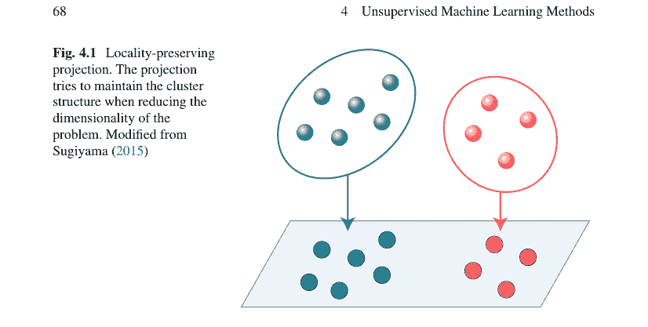

### 4.9 高斯混合模型

高斯混合模型（GMM）试图将所研究数据集的底层概率密度函数重构为由有限数量的具有未知参数的高斯分布混合生成的（McLachlan & Peel, 2000）。

为了理解 GMM 的工作原理，考虑一个 $d$ 维（即由 $d$ 个变量或特征表征）的独立同分布观测样本集 $X = \{\mathbf{x}_1, \mathbf{x}_2, \ldots, \mathbf{x}_n\}$（McLachlan & Peel, 2000）。有限混合模型（FMM）假设观测值 $\mathbf{x} \in X$ 源自一个由 $g$ 个分量混合描述的概率密度函数（McLachlan & Peel, 2000; Scrucca et al., 2016）：

$$f(\mathbf{x}, \psi) = \sum_{i=1}^{g} \pi_i f_i(\mathbf{x}, \theta_i), \quad (4.8)$$

其中 $g$ 和 $\psi = \{\pi_1, \ldots, \pi_{g-1}, \theta_1, \ldots, \theta_g\}$ 分别是混合分量的数量和模型的参数（Scrucca et al., 2016）。同时，$f_i(\mathbf{x}, \theta_i)$ 是样本观测值 $\mathbf{x}$ 的第 $i$ 个分量密度，并由向量 $\theta_i$ 参数化。最后，$\{\pi_1, \ldots, \pi_{g-1}\}$ 是混合权重（Scrucca et al., 2016）。

在许多应用中，分量密度 $f_i(\mathbf{x}, \theta_i)$ 被假定属于同一参数族（McLachlan & Peel, 2000）。在某些应用中，分量密度被取为不同的。有限高斯混合模型的实现假设 $f_i(\mathbf{x}, \theta_i)$ 为多元正态分布，$G$ 固定，并包括估计模型参数 $\psi$（McLachlan & Peel, 2000）。

在 scikit-learn 中，方法 *GaussianMixture()* 和 *BayesianGaussianMixture()* 分别实现了基于期望最大化（EM）（Dempster et al., 1977）和变分贝叶斯推断（Hastie et al., 2017; Blei & Jordan, 2006）的有限高斯混合模型。变分贝叶斯推断类似于与期望最大化算法相比，前者通过整合先验分布信息增加了一个正则化步骤（Hastie et al., 2017; Blei & Jordan, 2006）。其目的是避免在期望最大化解中经常出现的病态特例（Blei & Jordan, 2006）。

## 参考文献

Arthur, D., & Vassilvitskii, S. (2007). K-Means++: The advantages of careful seeding. In *Proceedings of the Eighteenth Annual ACM-SIAM Symposium on Discrete Algorithms* (pp. 1027–1035).
Belkin, M., & Niyogi, P. (2003). Laplacian eigenmaps for dimensionality reduction and data representation. *Neural Computation*, 15(6), 1373–1396.
Blei, D. M., & Jordan, M. I. (2006). Variational inference for Dirichlet process mixtures. *Bayesian Analysis*, 1(1), 121–143. https://doi.org/10.1214/06-BA104
Comaniciu, D., & Meer, P. (2002). Mean shift: A robust approach toward feature space analysis. *IEEE Transactions on Pattern Analysis and Machine Intelligence*, 24(5), 603–619.
Dempster, A. P., Laird, N. M., & Rubin, D. B. (1977). Maximum likelihood from incomplete data via the EM algorithm. *Journal of the Royal Statistical Society: Series B (Methodological)*, 39(1), 1–22. https://doi.org/10.1111/j.2517-6161.1977.tb01600.X
Derpanis, K. G. (2005). Mean shift clustering. In *Lecture Notes* (vol. 32).
Donoho, D. L., & Grimes, C. (2003). Hessian eigenmaps: Locally linear embedding techniques for high-dimensional data. *Proceedings of the National Academy of Sciences*, 100(10), 5591–5596.
Ester, M., Kriegel, H.-P., Sander, J., Xu, X., et al. (1996). A density-based algorithm for discovering clusters in large spatial databases with noise. In *kdd* (Vol. 96, No. 34, pp. 226–231).
Hastie, T., Tibshirani, R., & Friedman, J. (2017). *The elements of statistical learning* (2nd ed.). Springer.
Johnson, S. C. (1967). Hierarchical clustering schemes. *Psychometrika*, 32(3), 241–254.
Jolliffe, I. T. (2002). *Principal component analysis*. Springer-Verlag. https://doi.org/10.1007/B98835
Jolliffe, I. T., & Cadima, J. (2016). Principal component analysis: a review and recent developments. *Philosophical Transactions of the Royal Society A: Mathematical, Physical and Engineering Sciences*, 374(2065). https://doi.org/10.1098/rsta.2015.0202
Lloyd, S. (1982). Least squares quantization in PCM. *IEEE Transactions on Information Theory*, 28(2), 129–137. https://doi.org/10.1109/TIT.1982.1056489
McLachlan, G. J., & Peel, D. (2000). *Finite mixture models*. Wiley.
Roweis, S. T., & Saul, L. K. (2000). Nonlinear dimensionality reduction by locally linear embedding. *Science*, 290(5500), 2323–2326. https://doi.org/10.1126/science.290.5500.2323
Scrucca, L., Fop, M., Murphy, T. B., & Raftery, A. E. (2016). mclust 5: Clustering, classification and density estimation using gaussian finite mixture models. *The R Journal*, 8(1), 289–317. https://doi.org/10.32614/RJ-2016-021
Sugiyama, M. (2015). *Introduction to statistical machine learning*. Elsevier Inc. https://doi.org/10.1016/C2014-0-01992-2
Tenenbaum, J. B., De Silva, V., & Langford, J. C. (2000). A global geometric framework for nonlinear dimensionality reduction. *Science*, 290(5500), 2319–2323. https://doi.org/10.1126/science.290.5500.2319
Von Luxburg, U. (2007). A tutorial on spectral clustering. *Statistics and Computing*, 17(4), 395–416.
Zheng, N., & Xue, J. (2009). Manifold Learning. In *Statistical learning and pattern analysis for image and video processing* (pp. 87–119). London: Springer. https://doi.org/10.1007/978-1-84882-312-94

## 第5章
岩石学中的聚类与降维

### 5.1 揭示火山喷发的化学记录

无监督机器学习方法可以帮助我们解读存储在单次喷发或多次火山事件晶体载荷中的化学记录（Caricchi et al., 2020b; Boschetty et al., 2022; Musu et al., 2023）。该记录通常包括不同晶体相（如橄榄石、单斜辉石、斜方辉石、角闪石、斜长石、石榴石和石英）的主量元素化学成分（即多元成分数据）（Boschetty et al., 2022; Aitchison & Egozcue, 2005; Aitchison, 1982, 1984）。这些相中的每一个都为揭示火山管道系统的复杂动力学（Ubide et al., 2021）及其演化（Costa et al., 2020; Petrelli & Zellmer, 2020）提供了线索。

在结晶过程中（图5.1），矿物生长并调整其结构特征和化学成分，以适应熔体成分和岩浆系统的热力学条件（Ubide et al., 2021）。例如，从晶体核心到边缘的同心化学环带反映了岩浆系统随时间施加的序列变化（图5.1）。在中等至高度过冷度（$\Delta T = T_{\text{液相线}} - T_{\text{结晶}}$）下的中等至快速生长，可能导致自形晶体中的扇形分带或骨架状至树枝状结构（图5.1）。此外，成分梯度的扩散再平衡可以进一步改变晶体中的化学模式（Costa et al., 2020; Petrelli & Zellmer, 2020）。

在浅部地壳层位（图5.1），喷发前和喷发期间的动力学包括一系列复杂的过程，如岩浆分异、补给、混合、同化和脱气（Ubide et al., 2021）。探究喷发的晶体载荷为我们提供了必要的信息，以揭示火山管道系统在喷发前和喷发期间的复杂动力学（Ubide et al., 2021）。

在本章中，我重点关注Musu等人（2023）报告的数据集，该数据集包含2021年2月至4月期间埃特纳山东南火山口连续熔岩喷泉喷发的单斜辉石（cpx）分析数据（Musu et al., 2023）。

Musu等人（2023）专注于cpx分析，因为（1）cpx通常存在于基性至中性岩浆中，（2）cpx在广泛的温度$T$和压力$P$范围内结晶，（3）cpx化学成分取决于岩浆成分、含水量、压力和温度（Musu et al., 2023），这使得cpx成为一个稳健的温压计（Putirka, 2008; Petrelli et al., 2020; Jorgenson et al., 2022; Higgins et al., 2021）和岩浆系统化学演化的精细记录器（Ubide & Kamber, 2018; Caricchi et al., 2020b; Boschetty et al., 2022）。

### 5.2 地质背景

埃特纳山位于意大利半岛南端的西西里岛东部（图5.2），是欧洲最大的活火山（Branca & Del Carlo, 2004），也是世界上最活跃的火山之一（Cappello et al., 2013; Corsaro & Miraglia, 2022）。

埃特纳火山表现出不同的喷发行为，从溢流式到爆炸式，包括斯特朗博利式和剧烈的熔岩喷泉事件（Branca & Del Carlo, 2004; Ferlito et al., 2014; Corsaro & Miraglia, 2022）。喷发来自山顶火山口和侧翼的裂缝喷口（Musu et al., 2023; Branca & Del Carlo, 2004; Di Renzo et al., 2019）。山顶区域由四个活动喷口组成：Voragine (VOR)、Bocca Nuova (BN)、东北火山口 (NEC) 和东南火山口 (SEC)。其中，SEC是最年轻且最活跃的喷口（Andronico & Corsaro, 2011; Di Renzo et al., 2019; Corsaro & Miraglia, 2022）。

一个周期性的喷发序列于2020年12月13日在SEC开始，并产生了超过60次阵发性喷发；换句话说，这是“火山特别剧烈的喷发，是这个喷发周期中最危险和最紧张的阶段，此时整个火山口空腔都被打开”（Paffengoltz, 1978）。

### 5.3 研究数据集

该数据集包含沿单斜辉石边缘到核心剖面收集的主量元素化学分析数据，点间距为2 μm（Musu et al., 2023）。总共采集了1250个分析数据（Musu et al., 2023），使用的是日内瓦大学的JEOL 8200电子探针和洛桑大学的JEOL JXA-8530F（Musu et al., 2023）。单斜辉石样品属于2021年2月16日、19日、28日和3月2日、10日熔岩喷泉沉积物中采集的火山砾。

### 5.4 数据预处理

代码清单5.1和5.2揭示了我们的数据预处理策略，包括数据可视化的最后一步。该策略包括首先清理数据，然后将其转换为成分数据分析（CoDA；参见第3.3.6节）和“稳健”归一化。最后，对得到的CoDA转换和缩放后的数据进行可视化。

#### 5.4.1 数据清理

代码清单5.1主要是一个初步的数据清理过程。具体来说，函数*calc_cations_on_oxygen_basis()*（第4-29行）根据特定晶体相化学式中固定的氧原子数，计算特定化学分析得出的阳离子数量。我们处理的是单斜辉石分析，因此基础化学式包含六个氧原子和四个阳离子（第36行）。此外，我们定义了0.06的容差，这意味着我们丢弃所有在化学式中返回少于3.94或多于4.06个阳离子的分析。我们主要丢弃的是不良的化学分析（例如，受污染影响的分析，熔体污染，或其他问题）。如果您不理解这一步，请参考矿物学入门教材以获取更多细节（Okrusch & Frimmel, 2020）。另一个针对无水晶体相的检验是检查封闭性（即，验证氧化物总和是否接近 100 wt. %；第 32 和 33 行）。

```python
import numpy as np
import pandas as pd

def calc_cations_on_oxygen_basis(myData0, my_ph, my_el, n_ox):
    Weights = {
        'SiO2': [60.0843, 1.0, 2.0], 'TiO2': [79.8788, 1.0, 2.0],
        'Al2O3': [101.961, 2.0, 3.0], 'FeO': [71.8464, 1.0, 1.0],
        'MgO': [40.3044, 1.0, 1.0], 'MnO': [70.9375, 1.0, 1.0],
        'CaO': [56.0774, 1.0, 1.0], 'Na2O': [61.9789, 2.0, 1.0],
        'K2O': [94.196, 2.0, 1.0], 'Cr2O3': [151.9982, 2.0, 3.0],
        'P2O5': [141.937, 2.0, 5.0], 'H2O': [18.01388, 2.0, 1.0]}
    myData = myData0.copy()
    myData = myData.add_prefix(my_ph + '_')
    for el in my_el: # Cation mole proportions
        myData[el + '_cat_mol_prop'] = myData[my_ph +
                '_' + el] * Weights[el][1] / Weights[el][0]
    for el in my_el: # Oxygen mole proportions
        myData[el + '_oxy_mol_prop'] = myData[my_ph +
                '_' + el] * Weights[el][2] / Weights[el][0]
    totals = np.zeros(len(myData.index)) # Ox mole prop tot
    for el in my_el:
        totals += myData[el + '_oxy_mol_prop']
    myData['tot_oxy_prop'] = totals
    totals = np.zeros(len(myData.index)) # totcations
    for el in my_el:
        myData[el + '_num_cat'] = n_ox * myData[el +
                '_cat_mol_prop'] / myData['tot_oxy_prop']
        totals += myData[el + '_num_cat']
    return totals

my_dataset = pd.read_table('ETN21_cpx_all.txt')
my_dataset = my_dataset[(my_dataset.Total > 98) &
                        (my_dataset.Total < 102)]
Elements = {'cpx': ['SiO2', 'TiO2', 'Al2O3',
            'FeO', 'MgO', 'MnO', 'CaO', 'Na2O', 'Cr2O3']}
Cat_Ox_Tolerance = {'cpx': [4, 6, 0.06]}
my_dataset['Tot_cations'] = calc_cations_on_oxygen_basis(
            myData0=my_dataset,
            my_ph='cpx',
            my_el=Elements['cpx'],
            n_ox=Cat_Ox_Tolerance['cpx'][1])

my_dataset = my_dataset[(
    my_dataset['Tot_cations'] < Cat_Ox_Tolerance['cpx'][0] +
    Cat_Ox_Tolerance['cpx'][2]) & (
    my_dataset['Tot_cations'] > Cat_Ox_Tolerance['cpx'][0] -
    Cat_Ox_Tolerance['cpx'][2])]
```

代码清单 5.1 数据预处理的初始步骤

继续看代码清单 5.2，我们注意到它首先从数据集中分离出我们感兴趣的化学元素（即 SiO2、TiO2、Al2O3、FeO、MgO、CaO 和 Na2O；第 6–9 行）。数据清理的最后一步是移除所有包含低于或超过 0.1 和 99.9 百分位数数据的行（第 11–13 行）。

### 5.4.2 成分数据分析 (CoDA)

地球化学数据集的研究属于成分数据分析 (CoDA) 领域。在此背景下，氧化物以百分比表示，因此其名义总和为 100%，这定义了一个“封闭”或“成分”数据集（Aitchison, 1982, 1984; Aitchison & Egozcue, 2005）。直接对封闭数据集进行统计分析可能会导致问题（Aitchison, 1982, 1984; Aitchison & Egozcue, 2005），因为某些统计方法要求数据呈正态分布，且不受恒定总和的约束（Boschetti et al., 2022）。

```python
from skbio.stats.composition import ilr
from sklearn.preprocessing import RobustScaler
import matplotlib.pyplot as plt
import seaborn as sns

elms_for_clustering = {'cpx': ['SiO2', 'TiO2',
                'Al2O3', 'FeO', 'MgO', 'CaO', 'Na2O']}

my_dataset = my_dataset[elms_for_clustering['cpx']]

my_dataset = my_dataset[((
    my_dataset < my_dataset.quantile(0.001)) |
    (my_dataset > my_dataset.quantile(0.999))).any(axis=1)]

my_dataset_ilr = ilr(my_dataset)

transformer = RobustScaler(
    quantile_range=(25.0, 75.0)).fit(my_dataset_ilr)

my_dataset_ilr_scaled = transformer.transform(my_dataset_ilr)

fig = plt.figure(figsize=(8, 8))

for i in range(0, 6):
    ax1 = fig.add_subplot(3, 2, i+1)
    sns.kdeplot(my_dataset_ilr_scaled[:, i], fill=True,
                color='k', facecolor='#c7ddf4', ax=ax1)
    ax1.set_xlabel('scaled ilr_' + str(i+1))
fig.align_ylabels()
fig.tight_layout()
```

代码清单 5.2 成分数据分析 (CoDA)

正如我们在第 3.3.6 节所知，直接对成分数据集进行多元统计分析在形式上是不正确的，并且可能使结果产生偏差或导致其他问题（Aitchison, 1982; Aitchison & Egozcue, 2005; Aitchison, 1984）。已经提出了不同的数据转换方法，以便将标准和高级统计方法应用于成分数据集。例如加性对数比 (*alr*)、中心化对数比 (*clr*) 和等距对数比 (*ilr*) 转换（Aitchison, 1982; Aitchison & Egozcue, 2005; Aitchison, 1984）。我在第 3.3.6 节简要介绍了 CoDA 分析，并在其中给出了执行 *alr*、*clr* 和 *ilr* 转换的公式。

在代码清单 5.2 的第 15 行，我们对数据应用 *ilr* 转换，然后根据中位数和四分位距进行缩放（第 17–20 行）；即，我们应用 *RobustScaler()*。然后我们可视化生成的特征（图 5.3）。

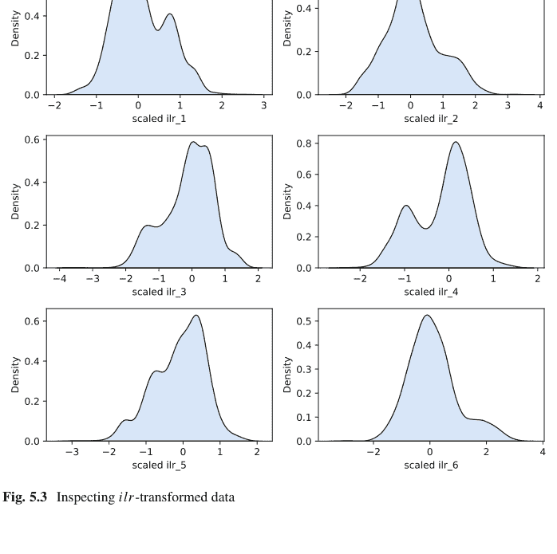

**图 5.3** 检查 *ilr* 转换后的数据

## 5.5 聚类分析

代码清单 5.3 展示了如何在 Python 中开发层次聚类树状图（图 5.4）。树状图是一种树形图，用于报告层次聚类估计的结果（参见第 4.4 节）。

```python
import numpy as np
from sklearn.cluster import AgglomerativeClustering
from scipy.cluster.hierarchy import dendrogram, set_link_color_palette

def plot_dendrogram(model, **kwargs):
    counts = np.zeros(model.children_.shape[0])
    n_samples = len(model.labels_)
    for i, merge in enumerate(model.children_):
        current_count = 0
        for child_idx in merge:
            if child_idx < n_samples:
                current_count += 1
            else:
                current_count += counts[child_idx - n_samples]
        counts[i] = current_count

    linkage_matrix = np.column_stack([model.children_,
                                      model.distances_,
                                      counts]).astype(float)

    dendrogram(linkage_matrix, **kwargs)

model = AgglomerativeClustering(linkage='ward',
                                affinity='euclidean',
                                distance_threshold=0,
                                n_clusters=None)

model.fit(my_dataset_ilr_scaled)

fig, ax = plt.subplots(figsize=(10, 6))
ax.set_title('Hierarchical clustering dendrogram')

plot_dendrogram(model, truncate_mode='level', p=5,
                color_threshold=0,
                above_threshold_color='black')

ax.set_xlabel('Number of points in node')
ax.set_ylabel('Height')
```

代码清单 5.3 在 Python 中开发层次聚类树状图

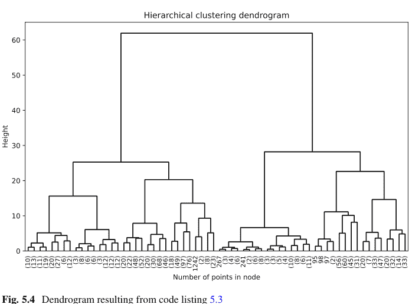

**图 5.4** 代码清单 5.3 生成的树状图

树状图可以垂直（图 5.4）或水平定向。可以通过在 *dendrogram()* 方法中使用 *orientation* 参数轻松更改方向，该参数接受 "top"、"bottom"、"left" 或 "right" 值。

```python
th = 16.5
fig, ax = plt.subplots(figsize=(10, 6))
ax.set_title("Hierarchical clustering dendrogram")
set_link_color_palette(['#000000', '#C82127', '#0A3A54',
                       '#0F7F8B', '#BFD7EA', '#F15C61', '#E8BFE7'])

plot_dendrogram(model, truncate_mode='level', p=5,
               color_threshold=th,
               above_threshold_color='grey')

plt.axhline(y=th, color="k", linestyle="--", lw=1)
ax.set_xlabel("Number of points in node")

fig, ax = plt.subplots(figsize=(10, 6))
ax.set_title("Hierarchical clustering dendrogram")
ax.set_ylabel('Height')

plot_dendrogram(model, truncate_mode='lastp', p=6,
               color_threshold=0,
               above_threshold_color='k')

ax.set_xlabel("Number of points in node")
```

**代码清单 5.4** 优化树状图

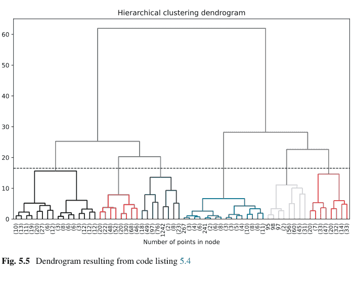

图 5.5 代码清单 5.4 生成的树状图

当垂直定向时，垂直刻度表示聚类之间的距离或相似度。如果我们画一条水平线，所截取的叶节点数量（例如，参见图 5.5）定义了该特定高度下的聚类数量。增加高度会减少聚类数量。在我们的具体案例中，将阈值固定在 16.5 定义了六个聚类（参见代码清单 5.4 和图 5.5）。

```python
from sklearn.cluster import AgglomerativeClustering
from sklearn.decomposition import PCA
import numpy as np
import matplotlib.pyplot as plt

my_colors = {0:'#0A3A54',
             1:'#E08B48',
             2:'#BFBFBF',
             3:'#BD22C6',
             4:'#FD787B',
             5:'#67CF62' }
#PCA
model_PCA = PCA()
model_PCA.fit(my_dataset_ilr_scaled)
my_PCA = model_PCA.transform(my_dataset_ilr_scaled)

fig, ax = plt.subplots()
ax.scatter(my_PCA[:,0], my_PCA[:,1],
            alpha=0.6,
            edgecolors='k')

ax.set_title('Principal Component Analysis')
ax.set_xlabel('PC_1')
ax.set_ylabel('PC_2')
```

**清单 5.5** 绘制前两个主成分

## 5.6 降维

*ilr* 转换后的数据集包含六个特征（图 5.3）。为了可视化我们数据的结构，我执行了主成分分析（PCA；参见第 4.2 节），它包含一种线性降维，使用数据集的奇异值分解将其投影到低维空间。
代码清单 5.5 展示了如何对我们的数据集应用 PCA。此外，它还为我们提供了一个二元图（图 5.6），显示了前两个主成分。

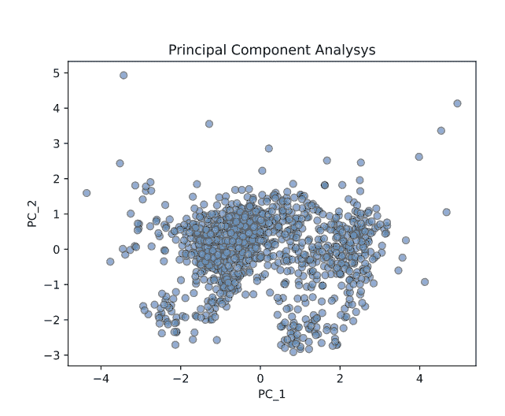

**图 5.6** 前两个主成分的散点图

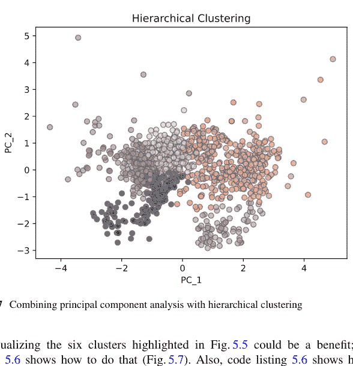

**图 5.7** 结合主成分分析与层次聚类

可视化图 5.5 中突出显示的六个聚类可能有益；代码清单 5.6 展示了如何做到这一点（图 5.7）。此外，代码清单 5.6 展示了如何应用并可视化（图 5.8）$K$-均值聚类（第 4.7 节）。

```python
#AgglomerativeClustering
model_AC = AgglomerativeClustering(linkage='ward',
                                   affinity='euclidean',
                                   n_clusters=6)
my_AC = model_AC.fit(my_dataset_ilr_scaled)

fig, ax = plt.subplots()
label_to_color = [my_colors[i] for i in my_AC.labels_]
ax.scatter(my_PCA[:,0], my_PCA[:,1],
           c=label_to_color, alpha=0.6,
           edgecolors='k')
ax.set_title('Hierarchical Clustering')
ax.set_xlabel('PC_1')
ax.set_ylabel('PC_2')
my_dataset['cluster_HC'] = my_AC.labels_

#KMeans
from sklearn.cluster import KMeans
myKM = KMeans(n_clusters=6).fit(my_dataset_ilr_scaled)

fig, ax = plt.subplots()
label_to_color = [my_colors[i] for i in myKM.labels_]
ax.scatter(my_PCA[:,0], my_PCA[:,1],
            c=label_to_color, alpha=0.6,
            edgecolors='k')
ax.set_title('KMeans')
ax.set_xlabel('PC_1')
ax.set_ylabel('PC_2')
my_dataset['cluster_KM'] = myKM.labels_
```

**清单 5.6** 结合主成分分析与层次聚类和 *K*-均值聚类方法

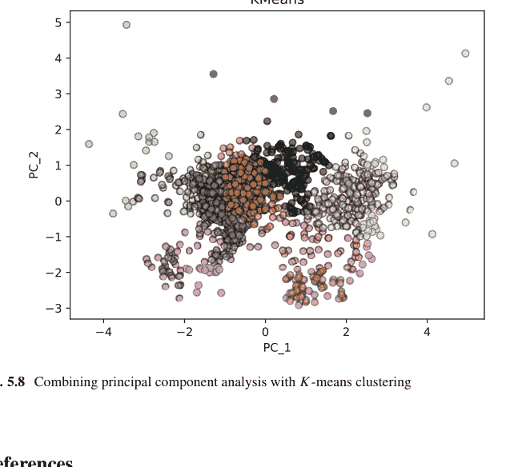

**图 5.8** 结合主成分分析与 *K*-均值聚类

## 参考文献

Aitchison, J. (1982). The statistical analysis of compositional data. *Journal of the Royal Statistical Society. Series B (Methodological)*, 44(2), 139–177.

Aitchison, J. (1984). The statistical analysis of geochemical compositions. *Journal of the International Association for Mathematical Geology*, 16(6), 531–564.

Aitchison, J., & Egozcue, J. J. (2005). Compositional data analysis: Where are we and where should we be heading? *Mathematical Geology*, 37(7), 829–850. https://doi.org/10.1007/S11004-005-7383-7

Andronico, D., & Corsaro, R. A. (2011). Lava fountains during the episodic eruption of South-East Crater (Mt. Etna), 2000: Insights into magma-gas dynamics within the shallow volcano plumbing system. *Bulletin of Volcanology*, 73(9), 1165–1178. https://doi.org/10.1007/S00445-011-0467-Y/FIGURES/8

Boschetty, F. O., Ferguson, D. J., Cortés, J. A., Morgado, E., Ebmeier, S. K., Morgan, D. J., Romero, J. E., & Silva Parejas, C. (2022). Insights into magma storage beneath a frequently erupting Arc Volcano (Villarrica, Chile) from unsupervised machine learning analysis of mineral compositions. *Geochemistry, Geophysics, Geosystems*, 23(4), e2022GC010333. https://doi.org/10.1029/2022GC010333

Branca, S., & Del Carlo, P. (2004). Eruptions of Mt. Etna during the past 3,200 years: A revised compilation integrating the historical and stratigraphic records. *Geophysical Monograph Series*, 143, 1–27. https://doi.org/10.1029/143GM02

Cappello, A., Bilotta, G., Neri, M., & Negro, C. D. (2013). Probabilistic modeling of future volcanic eruptions at Mount Etna. *Journal of Geophysical Research: Solid Earth*, 118(5), 1925–1935. https://doi.org/10.1002/JGRB.50190

Caricchi, L., Petrelli, M., Bali, E., Sheldrake, T., Pioli, L., & Simpson, G. (2020b). A data driven approach to investigate the chemical variability of clinopyroxenes from the 2014–2015 Holuhraun–Bárðarbunga eruption (Iceland). *Frontiers in Earth Science*, 8.

Corsaro, R. A., & Miraglia, L. (2022). Near real-time petrologic monitoring on volcanic glass to infer magmatic processes during the February–April 2021 paroxysms of the South-East Crater, Etna. *Frontiers in Earth Science*, 10, 222. https://doi.org/10.3389/FEART.2022.828026/BIBTEX

Costa, F., Shea, T., & Ubide, T. (2020). Diffusion chronometry and the timescales of magmatic processes. *Nature Reviews Earth and Environment*, 1(4), 201–214. https://doi.org/10.1038/s43017-020-0038-x

Di Renzo, V., Corsaro, R. A., Miraglia, L., Pompilio, M., & Civetta, L. (2019). Long and short-term magma differentiation at Mt. Etna as revealed by Sr-Nd isotopes and geochemical data. *Earth-Science Reviews*, 190, 112–130. https://doi.org/10.1016/J.EARSCIREV.2018.12.008

Ferlito, C., Coltorti, M., Lanzafame, G., & Giacomoni, P. P. (2014). The volatile flushing triggers eruptions at open conduit volcanoes: Evidence from Mount Etna volcano (Italy). *Lithos*, 184–187, 447–455. https://doi.org/10.1016/J.LITHOS.2013.10.030

Higgins, O., Sheldrake, T., & Caricchi, L. (2021). Machine learning thermobarometry and chemometry using amphibole and clinopyroxene: a window into the roots of an arc volcano (Mount Liamuiga, Saint Kitts). *Contributions to Mineralogy and Petrology*, 177(1), 1–22. https://doi.org/10.1007/S00410-021-01874-6

Jorgenson, C., Higgins, O., Petrelli, M., Bégué, F., & Caricchi, L. (2022). A machine learning-based approach to clinopyroxene thermobarometry: Model optimization and distribution for use in Earth Sciences. *Journal of Geophysical Research: Solid Earth*, 127(4), e2021JB022904. https://doi.org/10.1029/2021JB022904

Musu, A., Corsaro, R. A., Higgins, O., Jorgenson, C., Petrelli, M., & Caricchi, L. (2023). The magmatic evolution of South-East Crater (Mt. Etna) during the February-April 2021 sequence of lava fountains from a mineral chemistry perspective. *Bulletin of Volcanology*, 85, 33.

Okrusch, M., & Frimmel, H. E. (2020). *Mineralogy*. Springer Berlin Heidelberg. https://doi.org/10.1007/978-3-662-57316-7

Paffengoltz, K. N. (1978). *Geological dictionary*. Nedra Publishing.

Petrelli, M., Caricchi, L., & Perugini, D. (2020). Machine learning thermo-barometry: Application to clinopyroxene-bearing magmas. *Journal of Geophysical Research: Solid Earth*, 125(9). https://doi.org/10.1029/2020JB020130

Petrelli, M., & Zellmer, G. (2020). *Rates and timescales of magma transfer, storage, emplacement, and eruption*. https://doi.org/10.1002/9781119521143.ch1

Putirka, K. (2008). Thermometers and barometers for volcanic systems. https://doi.org/10.2138/rmg.2008.69.3

Ubide, T., & Kamber, B. (2018). Volcanic crystals as time capsules of eruption history. *Nature Communications*, 9(1). https://doi.org/10.1038/s41467-017-02274-w

Ubide, T., Neave, D., Petrelli, M., & Longpré, M.-A. (2021). Editorial: Crystal archives of magmatic processes. *Frontiers in Earth Science*, 9. https://doi.org/10.3389/feart.2021.749100

## 第六章
多光谱数据的聚类分析

### 6.1 来自对地观测卫星的光谱数据

诸如Sentinel¹和Landsat²等对地观测卫星任务为我们提供了多光谱、高光谱和全色数据。Sentinel对地观测卫星任务是欧洲航天局³开发的哥白尼计划的一部分，而Landsat计划则由美国国家航空航天局（NASA）和美国地质调查局（USGS）共同管理（参见脚注2）。

光谱图像是地表反射率或辐射在电磁波谱不同波段的二维表示。多光谱和高光谱数据分别由在宽波段和窄波段（有时是准连续波段）范围内运行的多个传感器获取。相比之下，全色图像则由覆盖整个可见光范围的探测器获取。

多光谱、高光谱和全色数据可以组合和调制，以生成新的指数⁴（例如，广义差异植被指数或归一化差异积雪指数），这些指数突出了特定现象并有助于数据解释。

例如，Sentinel-2多光谱仪器在13个光谱波段上运行。标记为B2、B3、B4和B8的四个波段提供10米的空间分辨率，标记为B5、B6、B7、B8a、B11和B12的六个波段提供20米的空间分辨率，标记为B1、B9和B10的三个波段提供60米的空间分辨率（图6.1）。

¹ https://sentinels.copernicus.eu.
² https://landsat.gsfc.nasa.gov.
³ https://www.esa.int.
⁴ https://www.usgs.gov/landsat-missions/landsat-surface-reflectance-derived-spectral-indices.

© The Author(s), under exclusive license to Springer Nature Switzerland AG 2023
M. Petrelli, *Machine Learning for Earth Sciences*, Springer Textbooks in Earth Sciences, Geography and Environment,
https://doi.org/10.1007/978-3-031-35114-3_6

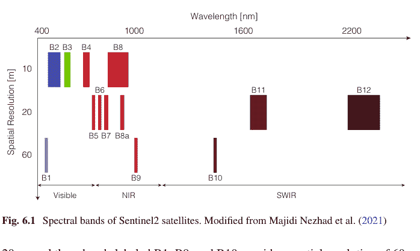

图 6.1 Sentinel2卫星的光谱波段。修改自Majidi Nezhad等人（2021）

### 6.2 将多光谱数据导入Python

多光谱数据可以从众多访问点下载，例如USGS Earth Explorer⁵、哥白尼开放访问中心⁶和Theia⁷。

以图6.2为例，它展示了从Theia门户下载的Sentinel2数据中B4、B3和B2波段重组形成的RGB（即红、绿、蓝）图像。图像位置在澳大利亚新南威尔士州南部⁸。方形图像的每边长约110公里。

图6.3显示了从Theia下载的Sentinel2数据仓库的数据结构。该仓库遵循MUSCATE⁹命名法，包含一个元数据文件、一个快速查看文件、多个Geo-Tiff图像文件以及两个子仓库MASKS和DATA，其中包含补充数据。命名使我们能够唯一标识每个产品，它由许多标签组成，以平台标识（即Sentinel2B）开始，后跟格式为YYYYMMDD-HHmmSS-sss的获取日期（例如，20210621-001635-722），其中YYYY是年份，MM是月份，DD是日期，HH是24小时制的小时，mm是分钟，SS是秒，sss是毫秒。后续标签涉及产品级别（例如，L2A）、地理区域（例如，T55HDB_C）和产品版本（例如，V2-2）。字母L、一个数字和另一个字母表征不同的产品级别，但L0级除外，它是压缩的原始数据，后面不跟任何字母。L1A、L1B和L2A级别分别对应未压缩的原始数据、经过辐射校正的辐射数据和经过正射校正的底部大气反射率。¹⁰ 光谱Geo-Tiff文件还使用了额外的标签，即SRE和FRE，它们分别对应于未校正坡度效应的地表反射率图像和校正了坡度效应的地表反射率图像。我们将处理FRE数据。

为了导入Sentinel2多光谱数据，我使用了Rasterio¹¹，这是一个基于Numpy和GeoJSON（即一种旨在表示地理特征及其非空间属性的开放标准格式）的Python API，用于读取、写入和管理Geo-Tiff数据。

⁵ https://earthexplorer.usgs.gov.
⁶ https://scihub.copernicus.eu.
⁷ https://catalogue.theia-land.fr.
⁸ https://bit.ly/ml_geart.
⁹ https://www.theia-land.fr/en/product/sentinel-2-surface-reflectance/.
¹⁰ https://sentinels.copernicus.eu/web/sentinel/technical-guides/sentinel-2-msi.
¹¹ https://rasterio.readthedocs.io/.

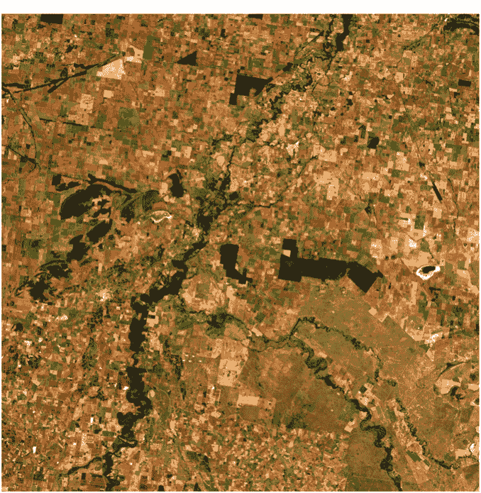

**图 6.2** RGB合成图像，其中B4、B3和B2波段分别调节红、绿、蓝通道的强度

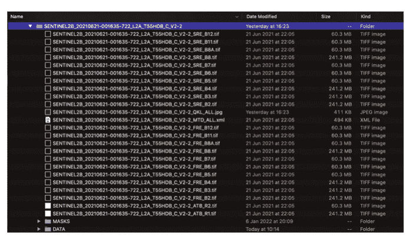

图 6.3 Sentinel2数据结构

如果您遵循了第2章的说明，您名为*env_ml*和*env_ml_intel*的Python机器学习环境已经包含了Rasterio。使用Rasterio，打开Geo-Tiff文件非常简单（参见代码清单6.1）。

```python
import rasterio
import numpy as np

imagePath = 'SENTINEL2B_20210621-001635-722_L2A_T55HDB_C_V2-2/SENTINEL2B_20210621-001635-722_L2A_T55HDB_C_V2-2_FRE_'

bands_to_be_imported = ['B2', 'B3', 'B4', 'B8']

bands_dict = {}
for band in bands_to_be_imported:
    with rasterio.open(imagePath+ band +'.tif', 'r',
                       driver='GTiff') as my_band:
        bands_dict[band] = my_band.read(1)
```

代码清单 6.1 使用Rasterio在Python中导入Sentinel2数据

代码清单6.1创建了一个NumPy数组字典（即*bands_dict*），其中包含来自B2、B3、B4和B8的光谱信息，分别对应蓝、绿、红和近红外波段。在代码清单6.1中，我们将导入限制在四个波段，它们都以相同的空间分辨率10米获取。但是，该脚本可以轻松扩展以导入更多波段。

组合来自*bands_dict*字典的数据可以实现许多不同的表示。例如，Sovdat等人（2019）解释了如何获得Sentinel-2数据的“自然色”表示。

解释如何获得具有自然颜色的完美平衡图像超出了本书的范围，因此我们仅限于组合B2、B3和B4波段，它们大致对应于我们眼睛感知的蓝、绿和红色。

详细来说，可以轻松导出并绘制一个明亮、可能过度饱和（Sovdat等人，2019）的图像（即*r_g_b*）（参见代码清单6.2和图6.2）。我们从对比度拉伸后的*bands_dict*字典开始（第11-17行），并将值缩放到[0,1]区间。这就是所谓的“真彩色”表示。有时，B3（红）和B4（绿）波段与B8（近红外）波段组合以实现“假彩色”表示。假彩色合成图像通常用于突出植物密度和健康状况（例如，参见图6.4）。代码清单6.3展示了如何构建Sentinel2数据的假彩色表示（即*nir_r_g*）。

```python
1 import numpy as np
2 from skimage import exposure, io
3 from skimage.transform import resize
4 import matplotlib.pyplot as plt
5
6 r_g_b = np.dstack([bands_dict['B4'],
7                     bands_dict['B3'],
8                     bands_dict['B2']])
9
10 # 对比度拉伸并在[0,1]之间重新缩放
11 p2, p98 = np.percentile(r_g_b, (2,98))
12 r_g_b = exposure.rescale_intensity(r_g_b, in_range=(p2, p98))
13 r_g_b = r_g_b / r_g_b.max()
14
15 fig, ax = plt.subplots(figsize=(8, 8))
16 ax.imshow(r_g_b)
17 ax.axis('off')
```

**代码清单 6.2** 使用B4、B3和B2波段绘制RGB图像

```python
1 import numpy as np
2 from skimage import exposure, io
3 from skimage.transform import resize
4 import matplotlib.pyplot as plt
5
6 nir_r_g = np.dstack([bands_dict['B8'],
7                      bands_dict['B4'],
8                      bands_dict['B3']])
9
10 # 对比度拉伸并在[0,1]之间重新缩放
11 p2, p98 = np.percentile(nir_r_g, (2,98))
```

### 6.3 描述性统计

任何机器学习工作流的第一步通常都涉及描述性统计。对于我们的Sentinel2数据集，代码清单6.4展示了如何通过可视化从Geo-Tiff数据派生的四波段（即B2、B3、B4和B5）数组来获取描述性统计信息。在第5行，我们从代码清单6.1创建的字典中创建了一个(10980, 10980, 4)的数组（即*my_array_2d*，其宽度、高度和深度分别为10980、10980和4）。在下一步（第10行），我们创建了一个新数组（*my_array_1d*），将*my_array_2d*从(10980, 10980, 4)重塑为(120560400, 4)。这是准备在scikit-learn中进行机器学习处理的数组的典型维度。将*my_array_1d*转换为pandas DataFrame（即*my_array_1d_pandas*）便于可视化（见第18-46行）并生成最基本的描述性统计信息（即清单6.5）。代码清单6.5揭示了关于输入特征的集中趋势、离散程度和分布形状的基本信息。

```
1 import numpy as np
2 import matplotlib.pyplot as plt
3 import pandas as pd
4 
5 my_array_2d = np.dstack([bands_dict['B2'],
                           bands_dict['B3'],
                           bands_dict['B4'],
                           bands_dict['B8']])
6 
7 my_array_1d = my_array_2d[:,:,:4].reshape(
8     (my_array_2d.shape[0] * my_array_2d.shape[1],
9      my_array_2d.shape[2]))
10 
11 my_array_1d_pandas = pd.DataFrame(my_array_1d,
12                                  columns=['B2', 'B3', 'B4', 'B8'])
13 
14 
15 fig, (ax1, ax2) = plt.subplots(1, 2, figsize=(7,3))
16 my_medianprops = dict(color='#C82127', linewidth = 1)
17 my_boxprops = dict(facecolor='#BFD7EA', edgecolor='#000000')
18 ax1.boxplot(my_array_1d_pandas, vert=False, whis=(0.5, 99.5),
19            showfliers=False, labels=my_array_1d_pandas.columns,
20            patch_artist=True, showcaps=False,
21            medianprops=my_medianprops, boxprops=my_boxprops)
22 ax1.set_xlim(-0.1,0.5)
23 ax1.set_xlabel('Surface reflectance Value')
24 ax1.set_ylabel('Band Name')
25 ax1.grid()
26 ax1.set_facecolor((0.94, 0.94, 0.94))
27 
28 colors=['#BFD7EA','#0F7F8B','#C82127','#F15C61']
29 for band, color in zip(my_array_1d_pandas.columns, colors):
30     ax2.hist(my_array_1d_pandas[band], density=True,
31              bins='doane', range=(0,0.5), histtype='step',
32              linewidth=1, fill=True, color=color, alpha=0.6,
33              label=band)
34     ax2.hist(my_array_1d_pandas[band], density=True,
35              bins='doane', range=(0,0.5), histtype='step',
36              linewidth=0.5, fill=False, color='k')
37 ax2.legend(title='Band Name')
38 ax2.set_xlabel('Surface Reflectance Value')
39 ax2.set_ylabel('Probability Density')
40 ax2.xaxis.grid()
41 ax2.set_facecolor((0.94, 0.94, 0.94))
42 plt.tight_layout()
43 plt.savefig('descr_stat_sat.pdf')
```

**清单 6.4** 描述性统计与数据可视化

例如，图6.5显示，B2、B3、B4和B8的反射率数据有99%落在0.015–0.420的范围内。然而，最大值总是大于1（即反射率数据的理论上限）。反射率值大于1的异常值可能是由表面或云层的镜面效应引起的（Schaepman-Strub et al., 2006）。

```
In [1]: my_array_1d_pandas.describe().applymap("{0:.3f}".format)
Out[1]:
          B2          B3          B4          B8
count  120560400.000  120560400.000  120560400.000  120560400.000
mean        0.042         0.062         0.076         0.186
std         0.013         0.016         0.026         0.056
min         0.000         0.000         0.000         0.000
25%         0.035         0.053         0.061         0.151
50%         0.042         0.062         0.076         0.177
75%         0.049         0.070         0.091         0.210
max         1.443         1.304         1.277         1.201
```

**清单 6.5** 使用pandas *describe()*进行描述性统计

如果处理不当，大的异常值可能会影响机器学习模型的结果。因此，我建议实施一种基于稳健统计（参见，例如，Petrelli, 2021）的策略来移除异常值，或应用稳健缩放器（参见第3.3.5段）。

### 6.4 预处理与聚类

本节介绍了一个简化的流程来对我们的Sentinel2数据进行聚类。作为输入特征，我使用了*my_array_1d*，它包含来自B2、B3、B4和B8的反射率数据。请注意，文献中报道了许多不同的策略来选择输入特征，例如使用波段比值、特定指数或波段、波段比值和指数的组合（例如，Ge et al., 2020）。由于存在大的异常值，我选择了scikit-learn中的*RobustScaler()*算法（代码清单6.6和6.7的第6行）。

```
1 from sklearn.preprocessing import RobustScaler
2 from sklearn import cluster
3 import matplotlib.colors as mc
4 import matplotlib.pyplot as plt
5
6 X = RobustScaler().fit_transform(my_array_1d)
7 my_ml_model = cluster.KMeans(n_clusters=5)
8 learning = my_ml_model.fit(X)
9 labels_1d = learning.labels_
10
11 labels_1d = my_ml_model.predict(X)
12 labels_2d = labels_1d.reshape(my_array_2d[:,:,0].shape)
13
14 cmap = mc.LinearSegmentedColormap.from_list("", ["black","red","yellow", "green", "blue"])
15 fig, ax = plt.subplots(figsize=[18,18])
16 ax.imshow(labels_2d, cmap=cmap)
17 ax.axis('off')
```

**清单 6.6** 实现*K*-均值聚类

```
1 from sklearn.preprocessing import RobustScaler
2 from sklearn import mixture
3 import matplotlib.colors as mc
4 import matplotlib.pyplot as plt
5
6 X = RobustScaler().fit_transform(my_array_1d)
7 my_ml_model = mixture.GaussianMixture(n_components=5,
8     covariance_type="full")
9 labels_1d = my_ml_model.predict(X)
10
11 labels_2d = labels_1d.reshape(my_array_2d[:,:,0].shape)
12
13 cmap = mc.LinearSegmentedColormap.from_list("", ["black","red","yellow", "green","blue"])
14 fig, ax = plt.subplots(figsize=[18,18])
15 ax.imshow(labels_2d, cmap=cmap)
16 ax.axis('off')
```

**清单 6.7** 实现高斯混合聚类

对于第一次聚类尝试（代码清单6.6），我选择了*K*-均值算法，并将聚类数量固定为五个（第7行）。然后我在第8行启动了无监督学习。第11和12行收集了*K*-均值算法分配给*my_array_1d*每个元素（即图像的每个像素）的标签（即0到4的数字），并将这些元素以与原始图像相同的二维几何形状呈现（图6.2）。最后，使用不同颜色（即第14-17行）绘制的不同聚类结果如图6.6所示。

对于第二次聚类尝试（代码清单6.7），我选择了高斯混合算法，同样将聚类数量固定为五个（第7行）。图6.7显示了由高斯混合算法获得的聚类结果。

## 参考文献

Ge, W., Cheng, Q., Jing, L., Wang, F., Zhao, M., & Ding, H. (2020). Assessment of the capability of sentinel-2 imagery for iron-bearing minerals mapping: A case study in the cuprite area, Nevada. *Remote Sensing*, 12(18), 3028. https://doi.org/10.3390/RS12183028

Majidi Nezhad, M., Heydari, A., Pirshayan, E., Groppi, D., & Astiaso Garcia, D. (2021). A novel forecasting model for wind speed assessment using sentinel family satellites images and machine learning method. *Renewable Energy*, 179, 2198–2211. https://doi.org/10.1016/J.RENENE.2021.08.013

Petrelli, M. (2021). *Introduction to python in earth science data analysis*. Berlin: Springer. https://doi.org/10.1007/978-3-030-78055-5

Schaepman-Strub, G., Schaepman, M. E., Painter, T. H., Dangel, S., & Martonchik, J. V. (2006). Reflectance quantities in optical remote sensing—definitions and case studies. *Remote Sensing of Environment*, 103(1), 27–42. https://doi.org/10.1016/J.RSE.2006.03.002

Sovdat, B., Kadunc, M., Batič, M., & Milčinski, G. (2019). Natural color representation of Sentinel-2 data. *Remote Sensing of Environment*, 225, 392–402. https://doi.org/10.1016/J.RSE.2019.01.036

## 第三部分
监督学习

## 第七章
监督机器学习方法

### 7.1 监督算法

监督算法通过使用训练数据集中出现的标签（即解决方案）来进行学习。本章将介绍图3.5中所示的用于回归和分类的监督机器学习算法。此外，对于希望深入了解这些机器学习方法背后数学原理的读者，我们提供了具体的参考文献。

### 7.2 朴素贝叶斯

由于地质学学生很少接触贝叶斯统计，因此在描述其在机器学习（例如，朴素贝叶斯）中的应用之前，我先在此介绍贝叶斯定理。

**概率** 图7.1描述了一个简化的岩石结构集合，包含 $n_{\text{tot}} = 10$ 个元素。该集合来自六块斑状、一块全晶质和三块无斑晶的火成岩。因此，随机挑选一块含有橄榄石的岩石的概率 $P(\text{ol})$ 为 3/10。在贝叶斯统计推断中，概率 $P(\text{ol})$ 被称为“先验概率”，即在收集新数据之前事件发生的概率。

**条件概率** 假设我们现在想知道，如果挑选一块具有暗色基质的岩石，那么这块岩石含有橄榄石的概率是多少。在这种情况下，条件概率 $P(\text{ol}|\text{dark}) = 1/3$。

**联合概率** 请记住，“条件概率”一词并非“联合概率”的同义词，这两个概念不应混淆。同时，请务必使用正确的符号：对于联合概率，各项之间用逗号分隔 [例如，*P* (ol, dark)]，而对于条件概率，各项之间用竖线分隔 [例如，*P* (ol|dark)]。请注意，*P* (ol, dark) 是随机挑选一块既含有橄榄石又具有暗色基质的岩石的概率 [即，*P* (ol, dark) = 1/10]。相比之下，*P* (ol|dark) 是在具有暗色基质的岩石中，含有橄榄石的岩石的概率，*P* (ol|dark) = 1/3。联合概率和条件概率的关系如下：

$$P(\text{ol, dark}) = P(\text{ol|dark})P(\text{dark}).$$

**推导贝叶斯公式** 如公式 (7.1) 所示，我们可以写成

$$P(\text{dark, ol}) = P(\text{dark|ol})P(\text{ol}).$$

由于 $P(\text{dark}, \text{ol}) = P(\text{ol}, \text{dark})$，公式 (7.1) 和 (7.2) 的右边项必须相等：

$$P(\text{dark}|\text{ol})P(\text{ol}) = P(\text{ol}|\text{dark})P(\text{dark}). \tag{7.3}$$

将公式 (7.3) 两边同时除以 $P(\text{ol})$，我们得到针对此特定情况的贝叶斯公式：

$$P(\text{dark}|\text{ol}) = \frac{P(\text{ol}|\text{dark})P(\text{dark})}{P(\text{ol})}. \tag{7.4}$$

将公式 (7.4) 推广，我们得到著名的贝叶斯方程：

$$P(A|B) = \frac{P(B|A)P(A)}{P(B)}. \tag{7.5}$$

**用于分类的朴素贝叶斯** 为了理解朴素贝叶斯机器学习算法，我提出与 Zhang (2004) 描述的相同的工作流程。假设你想对一个集合 $X = (x_1, x_2, x_3, \dots, x_n)$ 进行分类，并且 $c$ 是你的类别标签。为简单起见，假设 $c$ 严格为正 (+) 或负 (-)；换句话说，我们只有两个类别。在这种情况下，贝叶斯公式的形式为

$$P(c|X) = \frac{P(X|c)P(c)}{P(X)}. \tag{7.6}$$

当且仅当

$$f_b(X) = \frac{P(c = +|X)}{P(c = -|X)} \geq 1, \tag{7.7}$$

时，$X$ 被分类为属于类别 $c = +$，其中 $f_b(X)$ 是贝叶斯分类器。

现在假设所有特征都是独立的（即，朴素假设）。我们可以写成

$$P(X|c) = P(x_1, x_2, x_3, \dots, x_n|c) = \prod_{i=1}^{n} P(x_i|c). \tag{7.8}$$

由此产生的朴素贝叶斯分类器 $f_{nb}(X)$，或简称“朴素贝叶斯”分类器，可以写成

$$f_{nb}(X) = \frac{P(c = +)}{P(c = -)} \prod_{i=1}^{n} \frac{P(x_i|c = +)}{P(x_i|c = -)}. \tag{7.9}$$

请注意，朴素假设是一个很强的约束，在地球科学中经常被违反。如果特征独立性被违反，我们有两个选择：第一个是不使用朴素假设来估计 $P(X|c)$ (Kubat, 2017)。然而，使用这个选项不可避免地会增加问题的复杂性 (Kubat, 2017)。第二个选择更务实：我们通过适当的数据预处理来减少特征依赖性。正如 Kubat (2017) 所建议的，一个起点是避免使用冗余特征。

在 scikit-learn 中，*GaussianNB()* 方法实现了高斯朴素贝叶斯算法，用于分类，其中假设 $P(X|c)$ 服从多元正态分布。

### 7.3 二次判别分析与线性判别分析

与朴素贝叶斯类似，二次判别分析和线性判别分析（分别为 QDA 和 LDA）都依赖于贝叶斯定理。假设 $f_c(x)$ 是 $X$ 在类别 $c$ 中的类条件密度，并令 $\pi_c$ 为类别 $c$ 的先验概率，其中 $\sum_{c=1}^K \pi_c = 1$，$K$ 是类别数。贝叶斯定理指出 (Kubat, 2017)

$$P(c|X) = \frac{f_c(x)\pi_c}{\sum_{l=1}^K f_l(x)\pi_l}.$$

现在，将每个类别密度建模为多元高斯分布，

$$f_c(x) = \frac{1}{(2\pi)^{p/2} |\Sigma_c|^{1/2}} e^{-\frac{1}{2}(x-\mu_c)^T \Sigma_c^{-1}(x-\mu_c)}.$$

我们定义了 QDA。如果类别具有共同的协方差矩阵（即，$\Sigma_c = \Sigma \ \forall \ c$），则 LDA 构成了 QDA 的一个特例。LDA 和 QDA 之间的主要区别在于，最终的决策边界分别是线性函数还是二次函数。

LDA 和 QDA 的算法相似，只是在 QDA 中必须为每个类别估计单独的协方差矩阵。给定大量的特征，这意味着计算参数的急剧增加。对于 $K$ 个类别和 $p$ 个特征，LDA 和 QDA 分别计算 $(K-1)x(p+1)$ 和 $(K-1)x[p(p+3)/2+1]$ 个参数。在 scikit-learn 中，方法 *LinearDiscriminantAnalysis()* 和 *QuadraticDiscriminantAnalysis()* 分别执行 LDA 和 QDA。

### 7.4 线性模型与非线性模型

Sugiyama (2015) 将 $d$ 维参数线性模型定义为

$$f_{\theta}(\boldsymbol{x}) = \sum_{j=i}^b \theta_j \phi_j(\boldsymbol{x}) = \boldsymbol{\theta}^T \boldsymbol{\phi}(\boldsymbol{x}),$$

其中 $\boldsymbol{x}$、$\boldsymbol{\phi}$ 和 $\boldsymbol{\theta}$ 分别是 $d$ 维输入向量、基函数和基函数的参数，$b$ 是基函数的数量。例如，给定一维输入，公式 (7.12) 简化为 (Sugiyama, 2015)

$$f_{\boldsymbol{\theta}}(\boldsymbol{x}) = \sum_{j=i}^{b} \theta_j \phi_j(\boldsymbol{x}) = \boldsymbol{\theta}^T \boldsymbol{\phi}(\boldsymbol{x}), \quad (7.13)$$

其中

$$\boldsymbol{\phi}(\boldsymbol{x}) = (\phi_1(\boldsymbol{x}), \dots, \phi_b(\boldsymbol{x}))^T, \quad (7.14)$$

且

$$\boldsymbol{\theta} = (\theta_1, \dots, \theta_b)^T. \quad (7.15)$$

请注意，参数线性模型在 $\boldsymbol{\theta}$ 上是线性的，并且可以处理直线（即，输入线性模型，如代码清单 7.1 和图 7.2）：

$$\boldsymbol{\phi}(\boldsymbol{x}) = (1, x)^T, \quad (7.16)$$

$$\boldsymbol{\theta} = (\theta_1, \theta_2)^T. \quad (7.17)$$

参数线性模型也可以处理非线性函数，例如多项式（例如，代码清单 7.1 和图 7.2）：

$$\boldsymbol{\phi}(\boldsymbol{x}) = (1, x, x^2, \dots, x^{b-1})^T, \quad (7.18)$$

$$\boldsymbol{\theta} = (\theta_1, \theta_2, \dots, \theta_b)^T. \quad (7.19)$$

```python
import numpy as np
import matplotlib.pyplot as plt

x = np.arange(1,6)
y = np.array([0,1,2,9,9])

fig, ax = plt.subplots()
ax.scatter(x, y, marker = 'o', s = 100, color = '#c7ddf4',
    edgecolor = 'k')

orders = np.array([1,2,4])
colors = ['#ff464a','#342a77','#4881e9']
linestiles = ['-','--','-.']

for order, color, linestile in zip(orders, colors, linestiles):
    betas = np.polyfit(x, y, order)
    func = np.poly1d(betas)
    x1 = np.linspace(0.5,5.5, 1000)
    y1 = func(x1)
    ax.plot(x1, y1, color=color, linestyle=linestyle, label="Linear-in-parameters model of order " + str(order))

ax.legend()
ax.set_xlabel('A quantity relevant in geology\n(e.g., time)')
ax.set_ylabel('A quantity relevant in geology\n(e.g., spring flow rate)')
fig.tight_layout()
```

**清单 7.1** 以多项式回归为例的参数线性建模

**图 7.2** 代码清单 7.1 的结果

给定一个包含 $p$ 个值的输入向量 $x$，参数线性模型仍然可以处理输入线性问题，例如管理超平面：

$$\phi(x) = (1, x_1, x_2, \dots, x_p)^T, \quad (7.20)$$
$$\theta = (\theta_1, \theta_2, \dots, \theta_b)^T. \quad (7.21)$$

在这种情况下，基函数的数量对应于输入向量的维度加一（即，$b = p + 1$）。一些作者更倾向于报告

将 $\theta$ 单独分离出来，称之为“偏置”（即 $\theta_0$），并将问题重新表述如下：

$$\phi(\boldsymbol{x}) = (x_1, x_2, \dots, x_{b=p})^T, \quad (7.22)$$
$$\boldsymbol{\theta} = (\beta_0, \boldsymbol{\beta}), \quad (7.23)$$

其中

$$\boldsymbol{\beta} = (\beta_1, \beta_2, \dots, \beta_{b=p},)^T. \quad (7.24)$$

所有无法表示为参数线性形式的 $f_{\theta}(\boldsymbol{x})$ 模型都属于非线性建模领域（Sugiyama, 2015）。

## 7.5 损失函数、代价函数与梯度下降

大多数机器学习算法都涉及模型优化 [例如，公式 (7.13) 中的 $f_{\theta}(\boldsymbol{x})$]。就本书而言，“优化”一词指的是调整模型参数 $\boldsymbol{\theta}$，以最小化或最大化一个衡量模型预测与训练数据一致性的函数。

通常，我们想要最小化或最大化的函数被称为**目标函数**（Goodfellow et al., 2016）。在最小化的情况下，目标函数有诸如代价函数、损失函数和误差函数等名称。这些术语通常可以互换使用（Goodfellow et al., 2016），但有时会使用特定术语，如损失函数或代价函数来描述特定任务。

例如，一些作者使用**损失函数**一词来衡量模型与训练数据集中单个标签的匹配程度（Goodfellow et al., 2016）。平方损失就是损失函数的一个例子：

$$L(\boldsymbol{\theta}) = [y_i - f_{\theta}(\boldsymbol{x}_i)]^2, \quad (7.25)$$

其中 $y_i$ 和 $f_{\theta}(\boldsymbol{x}_i)$ 分别是标记的（即真实的或测量的）值和我们模型预测的值。同时，$\boldsymbol{x}$ 和 $\boldsymbol{\theta}$ 分别是输入和控制模型的参数。

类似地，**代价函数**在整个数据集上评估损失函数，并有助于评估模型的整体性能（Goodfellow et al., 2016）。均方误差就是代价函数的一个例子：

$$C(\boldsymbol{\theta}) = \frac{1}{n} \sum_{i=1}^{n} [y_i - f_{\theta}(\boldsymbol{x}_i)]^2, \quad (7.26)$$

其中 $n$ 是训练数据集中元素的数量。

通常，我们的目标是最小化代价函数 $C(\boldsymbol{\theta})$，而梯度下降（GD）是实现这一目标的合适方法。GD 通过更新控制我们模型 [即 $f_{\boldsymbol{\theta}}(\mathbf{x})$] 的参数（在我们的情况下是 $\boldsymbol{\theta}$）来工作，更新方向与代价函数梯度 $\nabla C(\boldsymbol{\theta})$ 的方向相反（Sugiyama, 2015）：

$$\boldsymbol{\theta}^{t+1} = \boldsymbol{\theta}^{t} - \gamma \nabla C(\boldsymbol{\theta}^{t}).$$

在最简单的线性回归例子中，$\mathbf{x} \in \mathbb{R}$，

$$f_{\boldsymbol{\theta}}(\mathbf{x}) = \theta_1 + \theta_2 x,$$

均方误差代价函数为

$$C(\boldsymbol{\theta}) = \frac{1}{n} \sum_{i=1}^{n} [y_i - (\theta_1 + \theta_2 x_i)]^2.$$

请注意，$\mathbb{R}$ 中的简单线性例子可以很容易地推广到 $\mathbb{R}^d$。同时，请注意这里提出的线性回归例子在以下情况下具有众所周知且易于应用的最小二乘解析解：线性（即 $x$ 在 $y$ 的均值上是线性的）、独立性（即观测值相互独立）和正态性 [即对于任何固定的 $x$ 值，$y$ 服从正态分布（Maronna et al., 2006）]。然而，这个不言自明的例子展示了 GD 的工作原理。

要开发一个 GD，第一步是计算 $C(\boldsymbol{\theta})$ 关于 $\theta_1$ 和 $\theta_2$ 的偏导数。因此，我们写出

$$D_{\theta_1} = \frac{-2}{n} \sum_{i=1}^{n} [y_i - (\theta_1 + \theta_2 x_i)],$$

$$D_{\theta_2} = \frac{-2}{n} \sum_{i=1}^{n} [y_i - (\theta_1 + \theta_2 x_i)]x_i.$$

```python
import numpy as np
import matplotlib.pyplot as plt
line_colors = ['#F15C61','#0F7F8B','#0A3A54','#C82127']

# linear data set with noise
n = 100
theta_1, theta_2 = 3, 1 # target value for theta_1 & theta_2
x = np.linspace(-10, 10, n)
np.random.seed(40)
noise = np.random.normal(loc=0.0, scale=1.0, size=n)
y = theta_1 + theta_2 * x + noise
fig, (ax1, ax2) = plt.subplots(2, 1, figsize=(6, 12))
ax1.scatter(x, y, c='#BFD7EA', edgecolor='k')
my_theta_1, my_theta_2  = 0, 0 # arbitrary initial values
gamma = 0.0005 # learning rate
t_final = 10001 # number of iterations
n = len(x)
to_plot,  cost_function = [1, 25, 500, 10000], []
# Gradient Descent
for i in range(t_final):
    #Eq. 4.30
    D_theta_1 = (-2/n)*np.sum(y-(my_theta_1 + my_theta_2*x))
    #Eq. 4.31
    D_theta_2 = (-2/n)*np.sum(x*(y-(my_theta_1+my_theta_2*x)))

    my_theta_1 = my_theta_1 - gamma * D_theta_1 #Eq. 4.32
    my_theta_2 = my_theta_2 - gamma * D_theta_2 #Eq. 4.33
    cost_function.append((1/n) * np.sum(y - (my_theta_1 +
        my_theta_2 * x))**2)

    if i in to_plot:
        color_index = to_plot.index(i)
        my_y = my_theta_1 + my_theta_2 * x
        ax1.plot(x,my_y, color=line_colors[color_index],
                 label='iter:  {:.0f}'.format(i) + ' - ' +
                r'$\theta_1 = $' + '{:.2f}'.format(my_theta_1) +
                ' - ' +
                r'$\theta_2 = $' + '{:.2f}'.format(my_theta_2))
ax1.set_xlabel('x')
ax1.set_ylabel('y')
ax1.legend()
cost_function = np.array(cost_function)
iterations = range(t_final)
ax2.plot(iterations,cost_function, color='#C82127',
         label='mean squared-error cost function Eq.4.29')
ax2.set_xlabel('Iteration')
ax2.set_ylabel('Cost Function Value')
ax2.legend()
fig.tight_layout()
```

**代码清单 7.2** Python 中梯度下降的一个简单示例

然后，GD 通过迭代方法优化我们模型的参数：

$$\theta_1^{t+1} = \theta_1^t - \gamma D_{\theta_1}, \quad (7.32)$$

$$\theta_2^{t+1} = \theta_2^t - \gamma D_{\theta_2}, \quad (7.33)$$

其中 $\gamma$ 是合适的学习率。代码清单 **7.2** 和图 **7.3** 展示了如何实现公式 **(7.28)**–**(7.32)** 所描述的 GD 优化。

随机梯度下降（SGD）算法（Bottou, 2012）通过基于单个随机选取的样本 $\hat{f}_{\theta_t}(\boldsymbol{x}_t)$ 来估计 $C(\theta)$ 的梯度，从而简化了 GD 算法：

$$\boldsymbol{\theta}^{t+1} = \boldsymbol{\theta}^t - \gamma \nabla C[y, \hat{f}_{\theta_t}(\boldsymbol{x}_t)].$$

*sklearn.linear_model* 中的 *SGDClassifier()* 和 *SGDRegressor()* 分别在分类和回归领域实现了 SGD。通常，我们使用一种介于 GD 和 SGD 之间的方法，即使用训练数据集的一小部分随机样本来估计梯度。这种方法被称为“小批量 GD”。

总结一下，GD 始终使用整个学习数据集。与 GD 相反，SGD 和小批量 GD 分别从单个样本和训练数据集的一小部分计算梯度。

当出现大量局部极大值和极小值时，SGD 和小批量 GD 的效果优于 GD。在这种情况下，GD 可能会在第一个局部最小值处停止，而 SGD 和小批量 GD 由于比 GD 噪声大得多，倾向于探索梯度的邻近区域。请注意，纯 SGD 的噪声显著，而小批量 GD 倾向于对计算出的梯度取平均，从而产生比 SGD 更稳定的结果。在机器学习中，SGD 和小批量 GD 的使用远多于 GD，因为后者计算成本过高，同时对于凸问题仅提供微小的精度增益。对于许多局部极大值和极小值，SGD 和小批量 GD 也比 GD 更准确，因为它们可以“跳过”局部最小值，并有望找到更好的解决方案。

## 7.6 岭回归

岭回归是一种最小二乘法，它通过对回归系数的大小施加惩罚来收缩这些系数（Hastie et al., 2017）。回归从一个标记的数据集（$\mathbf{x}_i$, $y_i$）开始，其中 $y_i$ 是标签，$\mathbf{x}_i = (x_{i1}, x_{i2}, \dots, x_{ip})^T$ 是预测变量（即输入）（Hastie et al., 2017; Tibshirani, 1996）。

岭回归中的代价函数可以表示为（Hastie et al., 2017; Tibshirani, 1996）

$$C(\theta_0, \boldsymbol{\theta}) = \frac{1}{2n} \sum_{i=1}^{n} \left( y_i - \theta_0 - \sum_{j=1}^{p} x_{ij} \theta_j \right)^2 + \lambda \sum_{j=1}^{p} \theta_j^2, \quad (7.35)$$

其中参数 $\lambda$ 被称为“正则化惩罚项”。岭回归通过添加一个等同于系数幅度平方的惩罚项 [即公式 (7.35) 的第二项] 来执行所谓的 L2 范数正则化。

在 $\lambda = 0$ 的极限情况下，岭回归退化为普通最小二乘回归。正确选择 $\lambda$ 有助于避免过拟合问题。相反，对于较大的 $\lambda$，欠拟合会成为一个问题。

## 7.7 最小绝对收缩与选择算子

“最小绝对收缩与选择算子”，也称为 LASSO，是一种通过最小化残差平方和来解决线性问题的方法，其约束条件是系数绝对值之和必须小于给定常数（Tibshirani, 1996）。LASSO 的主要特点是它倾向于选择具有较少非零系数的解，从而减少控制预测器的参数数量。LASSO 代价函数可以表示为（Tibshirani, 1996）

$$C(\theta_0, \boldsymbol{\theta}) = \frac{1}{2n} \sum_{i=1}^{n} \left( y_i - \theta_0 - \sum_{j=1}^{p} x_{ij} \theta_j \right)^2 + \lambda \sum_{j=1}^{p} |\theta_j|. \quad (7.36)$$

与岭回归相比，LASSO算法通过添加一个等同于系数绝对值之和的惩罚项（即公式(7.36)的第二项）来执行所谓的L1范数正则化。

请注意，LASSO同时减少了收缩和维度；换句话说，它减少了求解特征的数量，而岭回归仅进行收缩（Hastie et al., 2017; Tibshirani, 1996）。

## 7.8 弹性网络

弹性网络（Zou & Hastie, 2005）是一种同时执行L1和L2范数正则化的线性回归模型（Friedman et al., 2010）：

$$C(\theta_0, \boldsymbol{\theta}) = \frac{1}{2n} \sum_{i=1}^{n} \left( y_i - \theta_0 - \sum_{j=1}^{p} x_{ij} \theta_j \right)^2 + \lambda \sum_{j=1}^{p} \left[ \frac{1-\alpha}{2} \theta_j^2 + \alpha |\theta_j| \right]. \quad (7.37)$$

当$\alpha = 1$时，弹性网络与LASSO相同；而当$\alpha = 0$时，弹性网络趋近于岭回归。对于$0 < \alpha < 1$，惩罚项（即公式(7.37)的第二项）介于L1和L2范数正则化之间。

## 7.9 支持向量机

支持向量机（SVMs）是一组监督式机器学习算法，在分类任务中表现卓越（Cortes & Vapnik, 1995）。SVMs的优势依赖于三个特点：（1）SVMs在高维空间中效率很高，（2）SVMs能有效建模现实世界问题，（3）SVMs在具有许多属性的数据集上表现良好，即使可用于训练模型的样本很少（Cortes & Vapnik, 1995）。SVMs在数值上实现了以下思想：输入被非线性映射到高维特征空间$F$（Cortes & Vapnik, 1995），并在该空间$F$中构建一个线性决策面（Cortes & Vapnik, 1995）。

首先，考虑一个带标签的训练数据集$(y_i, \boldsymbol{x}_i)$，其中$\boldsymbol{x}_i$是$p$维的[即$\boldsymbol{x}_i = (x_{1i}, x_{2i}, \ldots, x_{pi})$]，$i = 1, 2, \ldots, n$，$n$是样本数量。同时，假设第一类的标签$y_i = 1$，第二类的标签$y_i = -1$，定义了一个二分类问题（即$y_i \in \{-1, 1\}$）。

现在，基于以下线性输入判别函数定义一个线性分类器：

$$f(\boldsymbol{x}) = \boldsymbol{w}^T \cdot \boldsymbol{x} + b. \quad (7.38)$$

由公式(7.38)定义的两类之间的决策边界（即被分类为正或负的区域）是一个超平面。

如果存在一个向量$\boldsymbol{w}$和一个标量$b$使得

$$(\boldsymbol{w}^T \boldsymbol{x}_i + b)y_i \geq 1, \quad \forall i = 1, 2, \ldots, n. \quad (7.39)$$

则这两类是线性可分的。这意味着我们可以正确分类所有样本。最优超平面的定义如下：它以最大间隔分离训练数据集

$$m(\boldsymbol{w}) = \frac{1}{\|\boldsymbol{w}\|}. \quad (7.40)$$

最后，最大间隔分类器（即硬间隔SVM）是使$m(\boldsymbol{w})$最大化的判别函数，这等价于最小化$\|\boldsymbol{w}\|^2$：

$$\min_{\boldsymbol{w}, b} \frac{1}{2} \|\boldsymbol{w}\|^2 \quad (7.41)$$

约束条件为

$$(\boldsymbol{w}^T \boldsymbol{x}_i + b)y_i \geq 1, \quad \forall i = 1, 2, \ldots, n. \quad (7.42)$$

硬间隔SVM要求类别线性可分的强假设，这可以被视为例外，而非普遍规则。为了允许误差[即$\boldsymbol{\xi} = (\xi_1, \xi_2, \ldots, \xi_n)$]，我们可以引入软间隔SVM的概念：

$$\min_{\boldsymbol{w}, b, \boldsymbol{\xi}} \left[ \frac{1}{2} \|\boldsymbol{w}\|^2 + C \sum_{i=1}^n \xi_i \right] \quad (7.43)$$

约束条件为

$$(\boldsymbol{w}^T \boldsymbol{x}_i + b)y_i \geq 1 - \xi_i, \quad \xi_i \geq 0, \quad \forall i = 1, 2, \ldots, n, \quad (7.44)$$

其中$C > 0$是一个可调参数，用于控制间隔误差。由公式(7.38)定义的线性分类器可以通过定义判别函数（Cortes & Vapnik, 1995）推广到非线性输入

$$f(\mathbf{x}) = \mathbf{w}^T \cdot \phi(\mathbf{x}) + b, \quad (7.45)$$

其中$\phi(\mathbf{x})$是一个函数，它将非线性可分的输入$\mathbf{x}$映射到更高维度的特征空间$F$。如果我们将权重向量$\mathbf{w}$表示为训练样本的线性组合（即$\mathbf{w} = \sum_{i=1}^n \alpha_i \mathbf{x}_i$），那么在特征空间$F$中，我们有

$$f(\mathbf{x}) = \sum_{i=1}^n \alpha_i \phi(\mathbf{x}_i)^T \phi(\mathbf{x}) + b. \quad (7.46)$$

公式(7.45)和(7.46)背后的思想是将非线性分类函数映射到更高维度的特征空间$F$，在该空间中分类函数是线性的（图7.4）。定义一个核函数$K(\mathbf{x}_i, \mathbf{x})$为

$$K(\mathbf{x}_i, \mathbf{x}) = \phi(\mathbf{x}_i)^T \phi(\mathbf{x}), \quad (7.47)$$

我们有

$$f(\mathbf{x}) = \sum_{i=1}^n \alpha_i K(\mathbf{x}_i, \mathbf{x}) + b. \quad (7.48)$$

使用核函数时，我们不需要知道或计算$\phi()$，这使我们能够将线性变换应用于更高维度的问题。scikit-learn中的SVM实现[例如$SVC()$和$SVR()$]允许使用线性、多项式、Sigmoid和径向基核函数[$K(\mathbf{x}_i, \mathbf{x})$，表7.1]。

## 7.10 监督式最近邻

监督式$k$近邻是一种机器学习算法，它使用相似性（如距离函数（Bentley, 1975））进行回归和分类。具体来说，$k$近邻方法通过使用一个度量（通常是$k$个最近邻的逆距离加权平均）来预测数值目标（Bentley, 1975）。权重可以是均匀的，也可以通过核函数计算。欧几里得距离度量通常用于测量两个实例之间的距离，尽管也有其他度量可用（见表7.2）。请注意，闵可夫斯基距离在$p = 1$和$2$时分别简化为曼哈顿距离和欧几里得距离。Bentley (1975) 对$k$近邻算法进行了广泛而详细的描述。

在scikit-learn中，$KNeighborsClassifier()$和$KNeighborsRegressor()$方法分别基于$k$近邻执行分类和回归。

### 支持向量机

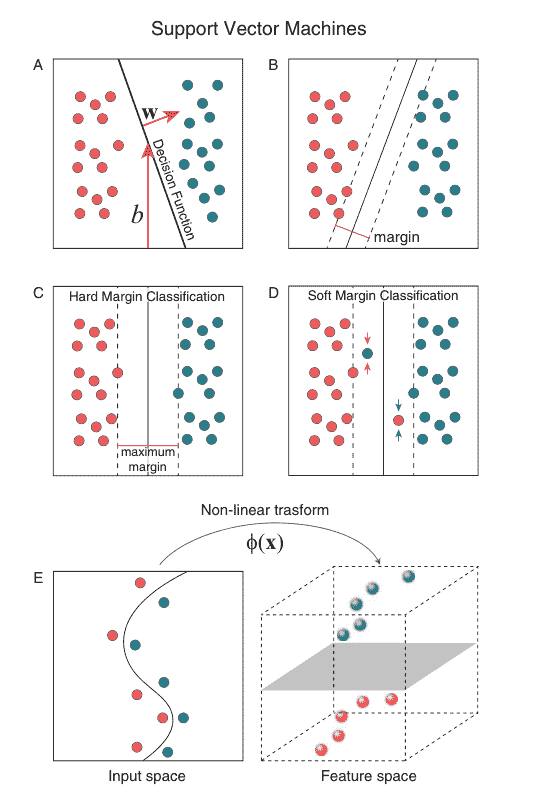

表7.1 scikit-learn中用于SVC()和SVR()方法的核函数

| 核函数 | 方程 | 标识符 |
|---|---|---|
| 线性 | $K(\mathbf{x}_i, \mathbf{x}) = (\mathbf{x}_i \cdot \mathbf{x}')$ | kernel='linear' |
| 多项式 | $K(\mathbf{x}_i, \mathbf{x}) = (\mathbf{x}_i \cdot \mathbf{x}' + r)^d$ | kernel='poly' |
| Sigmoid | $K(\mathbf{x}_i, \mathbf{x}) = tanh(\mathbf{x}_i \cdot \mathbf{x}' + r)$ | kernel='sigmoid' |
| 径向基函数 | $K(\mathbf{x}_i, \mathbf{x}) = exp(-\lambda \|\mathbf{x}_i - \mathbf{x}'\|^2)$ | kernel='rbf' |

表7.2 可用于监督式最近邻和其他机器学习算法的选定距离度量

| 距离 | 标识符 | 参数 | 方程 |
| :--- | :--- | :--- | :--- |
| 欧几里得 | 'euclidean' | 无 | $\sqrt{\sum_{j=1}^{D} |x_j - y_j|^2}$ |
| 曼哈顿 | 'manhattan' | 无 | $\sum_{j=1}^{D} |x_j - y_j|$ |
| 切比雪夫 | 'chebyshev' | 无 | $\max |x_j - y_j|$ |
| 闵可夫斯基 | 'minkowski' | $p, (w=1)$ | $\left(\sum_{j=1}^{D} w |x_j - y_j|^p\right)^{1/p}$ |

## 7.11 基于树的方法

**决策树** 在描述决策树如何工作之前，让我先介绍图7.5中强调的几个定义。*根节点*是决策树的起始节点，包含参与过程的整个数据集。*父节点*是被分割成子节点的节点。*子节点*是父节点的子节点。最后，*叶节点*或*终端节点*是终止树的节点，它们不会被分割以生成额外的子节点。

决策树算法（Breiman et al., 1984）及其变体（如随机森林和极端随机树）将输入空间分割成子区域，从而允许执行回归和分类任务（见图7.5）（Kubat, 2017）。具体来说，每个节点映射输入空间中的一个区域，该区域在节点内使用分割标准进一步划分为子区域。因此，决策树的工作流程是

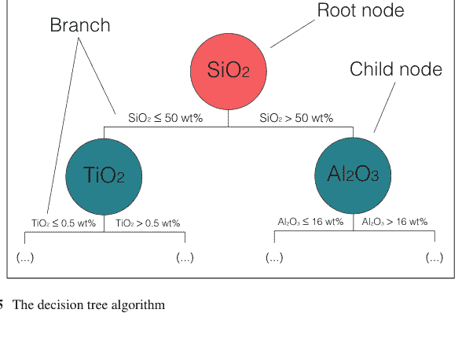

决策树通过一系列决策（即分裂）逐步分割输入空间，形成非重叠区域，叶节点与输入区域之间存在一一对应关系（Kubat, 2017）。不幸的是，尽管决策树算法形式简单，但往往容易出现过拟合和欠拟合（参见第3.5.5节），导致其预测精度低于其他预测器（Song & Lu, 2015）。

为避免过拟合和欠拟合，人们开发了更稳健的算法，称为集成预测器。例如随机森林、梯度提升和极端随机树方法。关于决策树模型的更多细节可参考Breiman等人（1984）的著作。

### 随机森林

随机森林算法（Breiman, 2001）基于“bagging”技术，这是一种自助聚合技术，通过对多个自助样本的预测结果取平均来降低方差（Hastie et al., 2017）。具体而言，随机森林算法使用bagging创建预测器的多个版本（即多棵树），然后评估这些预测器以获得聚合预测器（Hastie et al., 2017）。具体来说，对于给定的训练数据集（样本量为$n$），bagging通过从原始训练数据集中均匀有放回抽样（即自助法）生成$k$个新的训练集（Hastie et al., 2017）。接下来，使用这$k$个新创建的训练集训练$k$棵决策树，通常通过回归任务取平均或分类任务取多数投票的方式进行组合（Hastie et al., 2017）。随机森林算法的详细描述可参考Breiman（2001）和Hastie等人（2017）的著作。

### 极端随机树

极端随机树算法（Geurts et al., 2006）与随机森林算法相似，主要有两点不同：（i）它通过选择完全随机的分割点来分裂节点；（ii）它使用整个训练样本而非自助样本来生长树（Geurts et al., 2006）。树的预测结果通常通过分类任务的多数投票或回归任务的算术平均进行聚合，以得到最终预测（Geurts et al., 2006）。极端随机树算法的完整描述由Geurts等人（2006）给出。

## 参考文献

Bentley, J. L. (1975). Multidimensional binary search trees used for associative searching. *Communications of the ACM, 18*(9), 509–517. https://doi.org/10.1145/361002.361007
Bottou, L. (2012). Stochastic gradient descent tricks. In G. Montavon, G. B. Orr, & K.-R. Müller (Eds.), *Neural networks: Tricks of the trade* (2nd ed., pp. 421–436). Berlin: Springer. https://doi.org/10.1007/978-3-642-35289-8_25
Breiman, L. (2001). Random forests. *Machine Learning, 45*(1), 5–32. https://doi.org/10.1023/A:1010933404324
Breiman, L., Friedman, J. H., Olshen, R. A., & Stone, C. J. (1984). *Classification and regression trees*. Boca Raton: Chapman and Hall/CRC.
Cortes, C., & Vapnik, V. (1995). Support-vector networks. *Machine Learning*, *20*(3), 273–297. https://doi.org/10.1007/BF00994018
Friedman, J., Hastie, T., & Tibshirani, R. (2010). Regularization paths for generalized linear models via coordinate descent. *Journal of Statistical Software*, *33*(1), 1. https://doi.org/10.18637/jss.v033.i01
Geurts, P., Ernst, D., & Wehenkel, L. (2006). Extremely randomized trees. *Machine Learning*, *63*(1), 3–42. https://doi.org/10.1007/S10994-006-6226-1
Goodfellow, I., Bengio, Y., & Courville, A. (2016). *Deep learning* (vol. 29). Cambridge: MIT Press.
Hastie, T., Tibshirani, R., & Friedman, J. (2017). *The elements of statistical learning* (2nd ed.). Berlin: Springer.
Kubat, M. (2017). *An introduction to machine learning*. Berlin: Springer. https://doi.org/10.1007/978-3-319-63913-0
Maronna, R. A., Martin, R. D., & Yohai, V. J. (2006). *Robust statistics: Theory and methods*. Hoboken: Wiley. https://doi.org/10.1002/0470010940
Song, Y. Y., & Lu, Y. (2015). Decision tree methods: Applications for classification and prediction. *Shanghai Archives of Psychiatry*, *27*(2), 130. https://doi.org/10.11919/J.ISSN.1002-0829.215044
Sugiyama, M. (2015). *Introduction to statistical machine learning*. Amsterdam: Elsevier. https://doi.org/10.1016/C2014-0-01992-2
Tibshirani, R. (1996). Regression shrinkage and selection via the lasso. *Journal of the Royal Statistical Society: Series B (Methodological)*, *58*(1), 267–288. https://doi.org/10.1111/J.2517-6161.1996.TB02080.X
Zhang, H. (2004). The optimality of Naive Bayes. The Florida AI Research Society.
Zou, H., & Hastie, T. (2005). Regularization and variable selection via the elastic net. *Journal of the Royal Statistical Society: Series B (Statistical Methodology)*, *67*(2), 301–320. https://doi.org/10.1111/J.1467-9868.2005.00503.X

## 第8章
通过机器学习对测井数据相进行分类

### 8.1 动机

通过测井数据分析识别井中的相是许多地质领域的常见任务，例如圈闭储层表征、沉积学分析和沉积环境解释（Hernandez-Martinez et al., 2013; Wood, 2021）。当我发现FORCE 2020¹机器学习竞赛（Bormann et al., 2020）和SEG 2016²机器学习竞赛（M. Hall & Hall, 2017）时，我开始构思本章。在这两项竞赛中，学生和早期研究人员尝试使用他们选择的机器学习算法，在提供给所有参赛者的标记数据集上进行训练，以识别测井数据（即伽马射线、电阻率、光电效应等）盲数据集中的岩相。2016年版本的参赛者得到了Brendon Hall（B. Hall, 2016）以及Hall和Hall（M. Hall & Hall, 2017）的教程支持。此外，Bestagini等人（2017）描述了实现2016年版本最终目标的策略。请注意，FORCE 2020机器学习竞赛的入门笔记本³包含了开始所需的一切：它展示了如何导入训练数据集、检查导入的数据集，以及开始基于随机森林算法开发模型。

本章重点介绍FORCE 2020机器学习竞赛，通过逐步开发机器学习工作流程（即描述性统计、算法选择、模型优化、模型训练以及将模型应用于盲数据集）并讨论每个步骤，使一切尽可能简单。

¹ https://github.com/bolgebrygg/Force-2020-Machine-Learning-competition.
² https://github.com/seg/2016-ml-contest.
³ https://bit.ly/force2020_ml_start.

© The Author(s), under exclusive license to Springer Nature Switzerland AG 2023
M. Petrelli, *Machine Learning for Earth Sciences*, Springer Textbooks in Earth Sciences, Geography and Environment,
https://doi.org/10.1007/978-3-031-35114-3_8

### 8.2 数据集检查与预处理

对于FORCE 2020机器学习竞赛，⁴一个入门Jupyter笔记本已与标记的训练数据集（即包含单个文件train.csv的压缩train.zip文件）和两个测试集（即leaderboard_test_features.csv和hidden_test.csv）一起在GitHub上提供。⁵如今，所有三个文件都已标记，这意味着它们也包含正确的解决方案，要么在名为FORCE_2020_LITHOFACIES_LITHOLOGY的列中，要么在单独的文件中（Bormann et al., 2020）。上述数据集根据NOLD 2.0⁶许可证提供，包含挪威近海90多口井的测井数据（B. Hall, 2016; Bormann et al., 2020）。

我们首先使用pandas导入三个数据集，并查看所研究井的空间分布（代码清单8.1；图8.1）。

```python
import pandas as pd
import matplotlib.pyplot as plt

data_sets = ['train.csv', 'hidden_test.csv', 'leaderboard_test_features.csv']
labels = ['Train data', 'Hidden test data', 'Leaderboard test data']
colors = ['#BFD7EA','#0A3A54','#C82127']

fig, ax = plt.subplots()

for my_data_set, my_color, my_label in zip(data_sets, colors, labels):
    my_data = pd.read_csv(my_data_set, sep=';')
    my_Weels = my_data.drop_duplicates(subset=['WELL'])
    my_Weels = my_Weels[['X_LOC', 'Y_LOC']].dropna() / 100000
    
    ax.scatter(my_Weels['X_LOC'], my_Weels['Y_LOC'],
               label=my_label, s=80, color=my_color,
               edgecolor='k', alpha=0.8)

ax.set_xlabel('X_LOC')
ax.set_ylabel('Y_LOC')
ax.set_xlim(4,6)
ax.set_ylim(63,70)
ax.legend(ncol=3)
plt.tight_layout()
```

清单8.1 所研究井的空间分布

⁴ https://xeek.ai/challenges/force-well-logs/overview.
⁵ https://bit.ly/force2020_ml_data.
⁶ https://data.norge.no/nlod/en/2.0.

## 8 通过机器学习进行测井数据相分类

图8.1显示，井位主要分布在三个集群中。作为地质学家，我们预期距离较近的井应具有相似的岩相分布。因此，井位可能显著影响我们机器学习模型的训练。有多种策略可将井的空间分布纳入机器学习模型；其中最简单的策略是将X_LOC和Y_LOC作为模型特征。更精细的策略可能包括对井的空间分布进行初步聚类，并基于聚类结果采用学习方法。为开发一个智能且简单的工作流程，我们选择了第一种方案（即直接将X_LOC和Y_LOC作为模型特征）。

图8.2展示了代码清单8.2的结果，揭示了所研究数据集的两个主要特征。第一个特征与特征持续性相关。许多特征，如自然伽马能谱（SGR）、横波声波测井（DTS）、微电阻率测量（RMIC）和平均机械钻速（ROPA），包含超过60%的缺失值（见图8.2上图）。因此，处理缺失值的策略是必需的。鉴于我们希望保持本章所介绍的机器学习工作流程的简单性，仅使用缺失值少于40%的特征。此外，所有缺失值均用各特征的平均值替代。在统计学中，用其他值替代缺失值的过程称为“特征插补”（Zou等人，2015）。在scikit-learn中，*SimpleImputer()*和*IterativeImputer()*可用于特征插补（参见第3.3.2节）。

图8.2 代码清单8.2的结果。检查特征持续性和类别平衡

```python
import pandas as pd
import numpy as np
import matplotlib.pyplot as plt

lithology_keys = {30000: 'Sandstone',
                  65030: 'Sandstone/Shale',
                  65000: 'Shale',
                  80000: 'Marl',
                  74000: 'Dolomite',
                  70000: 'Limestone',
                  70032: 'Chalk',
                  88000: 'Halite',
                  86000: 'Anhydrite',
                  99000: 'Tuff',
                  90000: 'Coal',
                  93000: 'Basement'}

train_data = pd.read_csv('train.csv', sep=';')

class_abundance = np.vectorize(lithology_keys.get)(
    train_data['FORCE_2020_LITHOFACIES_LITHOLOGY'].values)
unique, counts = np.unique(class_abundance, return_counts=True)

my_colors = ['#0F7F8B'] * len(unique)
my_colors[np.argmax(counts)] = '#C82127'
my_colors[np.argmin(counts)] = '#0A3A54'

fig, (ax1, ax2) = plt.subplots(2,1, figsize=(7,14))

ax2.barh(unique,counts, color=my_colors)
ax2.set_xscale("log")
ax2.set_xlim(1e1,1e6)
ax2.set_xlabel('Number of Occurrences')
ax2.set_title('Class Inspection')

Feature_presence = train_data.isna().sum()/train_data.shape[0]*100

Feature_presence = Feature_presence.drop(
    labels=['FORCE_2020_LITHOFACIES_LITHOLOGY',
           'FORCE_2020_LITHOFACIES_CONFIDENCE', 'WELL'])

Feature_presence.sort_values().plot.barh(color='#0F7F8B',ax=ax1)
ax1.axvline(40, color='#C82127', linestyle='--')
ax1.set_xlabel('Percentage of Missing Values')
ax1.set_title('Feature Inspection')

plt.tight_layout()
```

**清单8.2** 检查特征持续性和类别平衡

所研究数据集的第二个关键特征在观察类别分布时清晰显现（见图8.2下图）：训练数据集高度不平衡，部分类别出现次数超过10^5次，而其他类别如硬石膏和基底岩仅出现10^3或10^2次。因此，处理训练数据集不平衡的策略也是必需的。

一些机器学习算法，如本章讨论的算法，试图通过调整其超参数来应对训练数据集的不平衡。更精细的策略可能涉及：（1）对多数类进行欠采样，（2）对少数类进行过采样，（3）结合过采样和欠采样方法，以及（4）创建集成平衡集（Lemaître等人，2017）。

```python
import numpy as np

fig = plt.figure(figsize=(8,4))

train_data['log_RDEP'] = np.log10(train_data['RDEP'])

to_be_plotted = ['RDEP', 'log_RDEP']

for index, my_feature in enumerate(to_be_plotted):
    ax = fig.add_subplot(1,2,index+1)
    min_val = np.nanpercentile(train_data[my_feature],1)
    max_val = np.nanpercentile(train_data[my_feature],99)
    my_bins = np.linspace(min_val,max_val,30)
    ax.hist(train_data[my_feature], bins=my_bins,
            density = True,  color='#BFD7EA',
            edgecolor='k')
    ax.set_ylabel('Probability Density')
    ax.set_xlabel(my_feature)

plt.tight_layout()
```

**清单8.3** 所选特征的对数变换

某些特征的直方图分布（代码清单8.3和图8.3）显示它们高度偏斜，这对于某些机器学习算法（例如，假设所研究特征服从正态分布的算法）可能是一个问题。因此，我们对选定的特征应用对数变换以减少偏斜度（见图8.3右图）。

**图8.3** 代码清单8.3的结果。所选特征的对数变换

如第3.3章所讨论，数据增强的目标是通过增加数据集中的信息量来提高机器学习模型的泛化能力。这种方法包括添加可用数据的修改副本（例如，在图像分类中翻转或旋转图像）或组合现有特征以生成新特征。例如，Bestagini等人（2017）提出了三种数据增强方法：二次扩展特征向量、考虑二阶交互项以及定义增强梯度特征向量。为了部分模仿Bestagini等人（2017）提出的数据增强策略，我们提供了一个计算增强梯度特征向量的代码清单（代码清单8.4）。

```python
def calculate_delta(dataFrame):
    delta_features = ['CALI', 'log_RMED', 'log_RDEP', 'RHOB', 'DTC', 'DRHO', 'log_GR', 'NPHI', 'log_PEF', 'SP']
    wells = dataFrame['WELL'].unique()
    for my_feature in delta_features:
        values = []
        for well in wells:
            col_values = dataFrame[dataFrame['WELL'] == well][my_feature].values
            col_values_ = np.array([col_values[0]]+list(col_values[:-1]))
            delta_col_values = col_values-col_values_
            values = values + list(delta_col_values)
        dataFrame['Delta_' + my_feature] = values
    return dataFrame
```

**清单8.4** 计算增强梯度特征向量的函数

总结来说，我们的预处理策略始于：（i）选择缺失值少于40%的特征，（ii）用每个数据集中各特征的平均值替换缺失值，（iii）对高度偏斜分布的特征应用对数变换，以及（iv）增强数据。步骤（i）至（iv）在一系列函数中实现（见代码清单8.5），并组合在pandas的pipe()链中以自动化预处理（代码清单8.6）。此外，pre_processing_pipeline()函数（代码清单8.6）将导入的.csv文件存储在单个HDF5文件（分层数据格式第5版）中。如第3.3节所述，HDF5是一个用于管理、处理和存储异构数据的高性能库。所有相关数据集都以pandas DataFrame的形式存储在HDF5文件中，便于快速读写。在第3-6行，函数检查输出文件是否存在。如果存在，函数会删除现有文件。在第16行，函数将每个处理后的数据集追加到新创建的文件中。

### 8.2 数据集检查与预处理

```python
import os
import pandas as pd
import numpy as np
from sklearn.preprocessing import OrdinalEncoder
from sklearn.impute import SimpleImputer

def replace_inf(dataFrame):
    to_be_replaced = [np.inf, -np.inf]
    for replace_me in to_be_replaced:
        dataFrame = dataFrame.replace(replace_me, np.nan)
    return dataFrame

def log_transform(dataFrame):
    log_features = ['RDEP', 'RMED', 'PEF', 'GR']
    for my_feature in log_features:
        dataFrame.loc[dataFrame[my_feature] < 0, my_feature] = dataFrame[
            dataFrame[my_feature] > 0].RDEP.min()
        dataFrame['log_' + my_feature] = np.log10(dataFrame[my_feature])
    return dataFrame

def calculate_delta(dataFrame):
    delta_features = ['CALI', 'log_RMED', 'log_RDEP', 'RHOB',
                      'DTC', 'DRHO', 'log_GR', 'NPHI',
                      'log_PEF', 'SP', 'BS']
    wells = dataFrame['WELL'].unique()
    for my_feature in delta_features:
        values = []
        for well in wells:
            my_val = dataFrame[dataFrame['WELL'] == well][my_feature].values
            my_val_ = np.array([my_val[0]] + list(my_val[:-1]))
            delta_my_val = my_val - my_val_
            values = values + list(delta_my_val)
        dataFrame['Delta_' + my_feature] = values
    return dataFrame

def categorical_encoder(dataFrame, my_encoder, cols):
    dataFrame[cols] = my_encoder.transform(dataFrame[cols])
    return dataFrame

def feature_selection(dataFrame):
    features = ['CALI', 'Delta_CALI', 'log_RMED', 'Delta_log_RMED',
                'log_RDEP', 'Delta_log_RDEP', 'RHOB', 'Delta_RHOB',
                'SP', 'Delta_SP', 'DTC', 'Delta_DTC', 'DRHO', 'Delta_DRHO',
                'log_GR', 'Delta_log_GR', 'NPHI', 'Delta_NPHI',
                'log_PEF', 'Delta_log_PEF', 'BS', 'Delta_BS',
                'FORMATION', 'X_LOC', 'Y_LOC', 'DEPTH_MD']
    dataFrame = dataFrame[features]
    return dataFrame

def pre_processing_pipeline(input_files, out_file):
    try:
        os.remove(out_file)
    except OSError:
        pass

    for ix, my_file in enumerate(input_files):
        my_dataset = pd.read_csv(my_file, sep=';')

        try:
            my_dataset['FORCE_2020_LITHOFACIES_LITHOLOGY'].to_hdf(
                out_file, key=my_file[:-4] + '_target')
        except:
            my_target = pd.read_csv('leaderboard_test_target.csv', sep=';')
            my_target['FORCE_2020_LITHOFACIES_LITHOLOGY'].to_hdf(
                out_file, key=my_file[:-4] + '_target')

        if ix == 0:
            # Fitting the categorical encoders
            my_encoder = OrdinalEncoder()
            my_encoder.set_params(handle_unknown='use_encoded_value',
                                 unknown_value=-1,
                                 encoded_missing_value=-1).fit(
                                     my_dataset[['FORMATION']])

        my_dataset = (my_dataset.
                      pipe(replace_inf).
                      pipe(log_transform).
                      pipe(calculate_delta).
                      pipe(categorical_encoder,
                           my_encoder=my_encoder, cols=['FORMATION']).
                      pipe(feature_selection))
        my_dataset.to_hdf(out_file, key=my_file[:-4])

        imputer = SimpleImputer(missing_values=np.nan, strategy='mean')
        imputer = imputer.fit(my_dataset[my_dataset.columns])
        my_dataset[my_dataset.columns] = imputer.transform(
            my_dataset[my_dataset.columns])
        my_dataset.to_hdf(out_file, key=my_file[:-4])

my_files = ['train.csv', 'leaderboard_test_features.csv', 'hidden_test.csv']
pre_processing_pipeline(input_files=my_files, out_file='ml_data.h5')
```

**代码清单 8.8** 预处理 `pipe()` 链，包括分类特征

### 8.3 模型选择与训练

数据预处理之后，接下来的基本步骤是模型选择、优化和训练。回顾一下，我们处理的是一个分类问题，因此我们从监督学习算法中进行选择。接下来，我们将测试scikit-learn中的极端随机树算法 [即 *ExtraTreesClassifier()*]。选择 *ExtraTreesClassifier()* 是一个任意的选择，建议读者探索不同的机器学习方法，例如支持向量机。

在我们的具体案例中，*ExtraTreesClassifier()* 依赖于许多超参数，例如树的数量、考察的特征数量以及分裂准则。

```python
import pandas as pd
from sklearn.ensemble import ExtraTreesClassifier
from sklearn.model_selection import train_test_split
from sklearn.model_selection import GridSearchCV
import joblib as jb
from sklearn.preprocessing import StandardScaler

X = pd.read_hdf('ml_data.h5', 'train').values
y = pd.read_hdf('ml_data.h5', 'train_target').values

X_train, X_test, y_train, y_test = train_test_split(
    X, y, test_size=0.2, random_state=10, stratify=y)

scaler = StandardScaler()
X_train = scaler.fit_transform(X_train)

param_grid = {
    'criterion': ['entropy', 'gini'],
    'min_samples_split': [2, 5, 8, 10],
    'max_features': ['sqrt', 'log2', None],
    'class_weight': ['balanced', None]
    }

classifier = ExtraTreesClassifier(n_estimators=250,
                                   n_jobs=-1)

CV_rfc = GridSearchCV(estimator=classifier, param_grid=param_grid
                       , cv= 3, verbose=10)
CV_rfc.fit(X_train, y_train)

jb.dump(CV_rfc, 'ETC_grid_search_results_rev_2.pkl')
```

**代码清单 8.9** 使用 *GridSearchCV()* 进行网格搜索

所有这些超参数可以取不同的值，这些值可能对模型的分类能力产生正面或负面影响。寻找所考察超参数最佳组合的最简单方法是进行网格搜索，其过程包括为每个超参数定义最相关的值，然后为每种可能的组合训练和评估一个模型。表 8.1 列出了为网格搜索选择的超参数。scikit-learn 中的 *GridSearchCV()* 方法用于在 Python 中进行网格搜索（代码清单 8.9）。导入所有必需的库（第 1-6 行）后，导入预处理后的训练数据集（第 8 行）及其标签（第 9 行）。接下来，训练数据集被分成两部分：一部分（即 *X_train*）用于网格搜索内的训练和验证，另一部分（即 *X_test*）不参与训练，用于测试网格搜索期间获得的结果，并进一步测试是否存在过拟合等潜在问题。下一步（第 14 和 15 行）包括将网格搜索涉及的数据集缩放为零均值和单位方差（参见第 3.3.5 段）。第 17-22 行定义了网格搜索涉及的参数集。所选超参数的组合形成了一个包含 48 个模型的网格，每个模型通过交叉验证（见第 3.5.2 节）重复三次（第 27 行的 cv = 3），总共进行 144 次尝试。

在我的配备 2.3 GHz 四核 Intel™ Core i7 处理器和 32 GB 内存的 MacBook Pro 上运行代码清单 8.9 大约需要 8 小时。图 8.5 的上图显示了所有 48 个模型的准确率分数，按其排名排序（代码清单 8.10），并突出显示了表现最佳的模型产生的准确率分数大于 0.95。如此强劲的表现可能表明我们对训练数据集存在过拟合，因此，作为第一步，我们将三个表现最佳的模型（代码清单 8.10）应用于测试数据集（即 X_test）。图 8.5 的下图显示，X_test 的准确率分数与网格搜索交叉验证得到的结果（即 ≈0.96）处于同一数量级，这并不支持存在严重过拟合的观点。

```python
from joblib import load
import numpy as np
import matplotlib.pyplot as plt
import pandas as pd
from sklearn.ensemble import ExtraTreesClassifier
from sklearn.model_selection import train_test_split
from sklearn.preprocessing import StandardScaler

CV_rfc = load('ETC_grid_search_results_rev_2.pkl')

my_results = pd.DataFrame.from_dict(CV_rfc.cv_results_)
my_results = my_results.sort_values(by=['rank_test_score'])

# Plot the results of the GridSearch
fig = plt.figure()
ax1 = fig.add_subplot(2,1,1)
ax1.plot(my_results['rank_test_score'], my_results['mean_test_score'], marker='o',
         markeredgecolor='#0A3A54', markerfacecolor='#C82127',
         color='#0A3A54',
         label='Grid Search Results')
ax1.set_xticks(np.arange(1,50,4))
ax1.invert_xaxis()
ax1.set_xlabel('Model ranking')
ax1.set_ylabel('Accuracy scores')
ax1.legend()

# Selecting the best three performing models
my_results = my_results[my_results['mean_test_score']>0.956]

# Load and scaling
X = pd.read_hdf('ml_data.h5', 'train').values
y = pd.read_hdf('ml_data.h5', 'train_target').values

X_train, X_test, y_train, y_test = train_test_split(
    X, y, test_size=0.2, random_state=10, stratify=y)

scaler = StandardScaler()
X_train = scaler.fit_transform(X_train)
X_test = scaler.transform(X_test)

leaderboard_test_features = pd.read_hdf('ml_data.h5', 'leaderboard_test_features').values
hidden_test = pd.read_hdf('ml_data.h5', 'hidden_test').values

leaderboard_test_features_scaled = scaler.transform(leaderboard_test_features)
hidden_test_scaled = scaler.transform(hidden_test)

# Apply the three best performing model on the test dataset and on the unknowns
leaderboard_test_res = {}
hidden_test_res  = {}
test_score  = []
rank_model  = []
for index, row in my_results.iterrows():
    classifier = ExtraTreesClassifier(n_estimators=250, n_jobs=8,
    random_state=64, **row['params'])
    classifier.fit(X_train, y_train)
    my_score = classifier.score(X_test,y_test)
    test_score.append(my_score)
    rank_model.append(row['rank_test_score'])

    my_leaderboard_test_res = classifier.predict(
    leaderboard_test_features_scaled)
    my_hidden_test_res = classifier.predict(hidden_test_scaled)
    leaderboard_test_res['model_ranked_' + str(row[
    'rank_test_score'])] = my_leaderboard_test_res
    hidden_test_res['model_ranked_' + str(row['rank_test_score'])
    ] = my_hidden_test_res

leaderboard_test_res_pd = pd.DataFrame.from_dict(
    leaderboard_test_res)
hidden_test_res_pd = pd.DataFrame.from_dict(hidden_test_res)
leaderboard_test_res_pd.to_hdf('ml_data.h5', key= 'leaderboard_test_res')
hidden_test_res_pd.to_hdf('ml_data.h5', key= 'hidden_test_res')

# plot the resultson the test dataset
ax2 = fig.add_subplot(2,1,2)
labels = my_results['rank_test_score']
validation_res = np.around(my_results['mean_test_score'], 2)
test_res = np.around(np.array(test_score),2)
x = np.arange(len(labels))
width = 0.35
rects1 = ax2.bar(x - width/2, validation_res, width, label='Validation data set', color='#C82127')
rects2 = ax2.bar(x + width/2, test_res, width, label='Test data set', color='#0A3A54')
ax2.set_ylabel('Accuracy scores')
ax2.set_xlabel('Model ranking')
ax2.set_ylim(0,1.7)
ax2.set_xticks(x, labels)
ax2.legend()
ax2.bar_label(rects1, padding=3)
ax2.bar_label(rects2, padding=3)
fig.align_ylabels()
fig.tight_layout()
```

**代码清单 8.10** 将三个表现最佳的模型应用于测试数据集和未知样本

```python
import numpy as np
import matplotlib.pyplot as plt
from sklearn.metrics import accuracy_score
import pandas as pd

leaderboard_test_res= pd.read_hdf('ml_data.h5', 'leaderboard_test_res')
hidden_test_res = pd.read_hdf('ml_data.h5', 'hidden_test_res')

leaderboard_test_target = pd.read_hdf('ml_data.h5', 'leaderboard_test_features_target').values
hidden_test_target = pd.read_hdf('ml_data.h5', 'hidden_test_target').values

leaderboard_accuracy_scores = []
hidden_accuracy_scores = []

for (leaderboard_column, leaderboard_data), (hidden_column, hidden_data) in zip(leaderboard_test_res.iteritems(), hidden_test_res.iteritems()):
    leaderboard_accuracy_scores.append(np.around(accuracy_score(leaderboard_data, leaderboard_test_target),2))
    hidden_accuracy_scores.append(np.around(accuracy_score(hidden_data, hidden_test_target),2))

# plot the resultson the test dataset
plt, ax1 = plt.subplots()
labels = leaderboard_test_res.columns
x = np.arange(len(labels))
width = 0.35
rects1 = ax1.bar(x - width/2, leaderboard_accuracy_scores, width, label='Leaderboard test data set', color='#C82127')
rects2 = ax1.bar(x + width/2, hidden_accuracy_scores, width, label='Hidden test data set', color='#0A3A54')
ax1.set_ylabel('Accuracy scores')
#ax1.set_xlabel('Model ranking')
ax1.set_ylim(0,1.1)
ax1.set_xticks(x, labels)
ax1.legend()
ax1.bar_label(rects1, padding=3)
ax1.bar_label(rects2, padding=3)
```

**代码清单 8.11** 绘制从排行榜和隐藏测试数据集获得的结果

三个表现最佳的模型也被运行以预测未知样本（即排行榜和隐藏测试数据集）。排行榜和隐藏测试数据集的准确率分数（图 8.6）（即从 0.79 到 0.81）突出表明，我们的机器学习模型在独立测试数据集上仍然表现令人满意，因此我们进入下一节，在那里我们根据 FORCE2020 挑战赛的评估标准来检查模型。

## 8.4 最终评估

为了评估每个模型的优劣，FORCE2020 挑战赛采用了一种基于惩罚矩阵的自定义评分策略（代码清单 8.12）。

```python
import numpy as np

A = np.load('penalty_matrix.npy')
def score(y_true, y_pred):
    S = 0.0
    y_true = y_true.astype(int)
    y_pred = y_pred.astype(int)
    for i in range(0, y_true.shape[0]):
        S -= A[y_true[i], y_pred[i]]
    return S/y_true.shape[0]
```

代码清单 8.12 自定义评分函数

在代码清单 8.12 中，`y_true` 和 `y_pred` 分别是预期（即正确）值和预测值，它们被转换为 0 到 11 的整数索引，如表 8.2 所示。

FORCE2020 评分策略的主要目标是，对易于识别的岩性的预测错误施加比对难以识别的岩性的预测错误更重的惩罚。为实现此目标，`score()` 函数使用图 8.7 所示的惩罚矩阵（代码清单 8.13）对每个真实值-预测值对进行加权。更具体地说，`score()` 函数返回与每个真实值-预测值对相对应的惩罚矩阵值（例如，如果你将岩盐误判为砂岩，则返回 4；参见图 8.7）。接下来，该函数对所有评分值求和，然后通过将结果值除以预测数量来计算“平均”分数。

表 8.2 将目标文件中的标签与岩相名称及评分函数的索引对应起来

| 标签 | 岩相 | 索引 |
|---|---|---|
| 30000 | '砂岩' | 0 |
| 65030 | '砂岩/页岩' | 1 |
| 65000 | '页岩' | 2 |
| 80000 | '泥灰岩' | 3 |
| 74000 | '白云岩' | 4 |
| 70000 | '石灰岩' | 5 |
| 70032 | '白垩' | 6 |
| 88000 | '岩盐' | 7 |
| 86000 | '硬石膏' | 8 |
| 99000 | '凝灰岩' | 9 |
| 90000 | '煤' | 10 |
| 93000 | '基底' | 11 |

```python
import numpy as np
import matplotlib.pyplot as plt
import seaborn as sns

A = np.load('penalty_matrix.npy')

my_labels = ['Sandstone','Sandstone/Shale','Shale','Marl', 'Dolomite',
            'Limestone','Chalk','Halite','Anhydrite','Tuff','Coal','Basement']

fig, ax = plt.subplots(figsize=(15, 12))
ax.imshow(A)
ax = sns.heatmap(A, annot=True, xticklabels = my_labels, yticklabels = my_labels)
fig.tight_layout()
```

代码清单 8.13 惩罚矩阵

```python
import numpy as np
import pandas as pd

A = np.load('penalty_matrix.npy')
def score(y_true, y_pred):
    S = 0.0
    y_true = y_true.astype(int)
    y_pred = y_pred.astype(int)
    for i in range(0, y_true.shape[0]):
        S -= A[y_true[i], y_pred[i]]
    return S/y_true.shape[0]

target = np.full(1000, 5) # Limestone
predicted = np.full(1000, 5)  # Limestone
print("Case 1: " + str(score(target, predicted)))

predicted = np.full(1000, 6)  # Chalk
print("Case 2: " + str(score(target, predicted)))

predicted = np.full(1000, 7) # Halite
print("Case 3: " + str(score(target, predicted)))

hidden_test_target = pd.read_hdf('ml_data.h5',
                                 'hidden_test_target').values
predicted = np.random.randint(0, high=12,
                    size=1000) # Random predictions
print("Case 4: " + str(score(target, predicted)))

''' Output:

Case 1: 0.0
Case 2: -1.375
Case 3: -4.0
Case 4: -3.04625

'''
```

**代码清单 8.14** 自定义评分函数

基于图 8.7 和代码清单 8.12，我们可以认为正确的预测对分数的贡献为零。因此，如果你正确猜出了所有预测，评分函数将返回零（参见代码清单 8.14，案例 1）。相反，在石灰岩样本数据集上系统性地预测白垩，会返回 −1.375（代码清单 8.14，案例 2）。在石灰岩样本数据集上系统性地预测岩盐，会返回 −4.0（代码清单 8.14，案例 3），这比案例 2 受到的惩罚要重得多。最后，考虑隐藏测试数据集，一个提供随机预测的虚拟模型产生的分数接近 −3（代码清单 8.14，案例 4）。

图 8.8 显示了将上述评分策略应用于排行榜和隐藏测试数据集的结果。尽管很简单，但通过代码清单 8.9 中实现的网格搜索产生的两个性能最佳的模型，其表现（即 > -0.50）与 FORCE2020 挑战赛中排名靠前的模型相似。

```python
import matplotlib.pyplot as plt
import pandas as pd
import numpy as np

A = np.load('penalty_matrix.npy')
def score(y_true, y_pred):
    S = 0.0
    y_true = y_true.astype(int)
    y_pred = y_pred.astype(int)
    for i in range(0, y_true.shape[0]):
        S -= A[y_true[i], y_pred[i]]
    return S/y_true.shape[0]

lithology_numbers = {30000: 0, 65030: 1, 65000: 2, 80000: 3,
    74000: 4, 70000: 5,
    70032: 6, 88000: 7, 86000: 8, 99000: 9,
    90000: 10, 93000: 11}

# Load test data
leaderboard_test_res = pd.read_hdf('ml_data.h5', 'leaderboard_test_res')
hidden_test_res = pd.read_hdf('ml_data.h5', 'hidden_test_res')

leaderboard_test_target = pd.read_hdf('ml_data.h5', 'leaderboard_test_features_target').values
leaderboard_test_target = np.vectorize(lithology_numbers.get)(leaderboard_test_target)
hidden_test_target = pd.read_hdf('ml_data.h5', 'hidden_test_target').values
hidden_test_target = np.vectorize(lithology_numbers.get)(hidden_test_target)

leaderboard_accuracy_scores = []
hidden_accuracy_scores = []
for (leaderboard_column, leaderboard_data), (hidden_column, hidden_data) in zip(leaderboard_test_res.iteritems(), hidden_test_res.iteritems()):

    leaderboard_data = np.vectorize(lithology_numbers.get)(leaderboard_data)
    leaderboard_accuracy_scores.append(np.around(score(leaderboard_data, leaderboard_test_target),4))
    hidden_data = np.vectorize(lithology_numbers.get)(hidden_data)
    hidden_accuracy_scores.append(np.around(score(hidden_data,
    hidden_test_target),4))

# plot the results
plt, ax1 = plt.subplots()
labels = leaderboard_test_res.columns
x = np.arange(len(labels))
width = 0.35
rects1 = ax1.bar(x - width/2, leaderboard_accuracy_scores, width,
    label='Leaderboard test data set', color='#C82127')
rects2 = ax1.bar(x + width/2, hidden_accuracy_scores, width,
    label='Hidden test est data set', color='#0A3A54')
ax1.set_ylabel('Accuracy scores')
ax1.set_ylim(0,-0.7)
ax1.set_xticks(x, labels)
ax1.legend()
ax1.bar_label(rects1, padding=-12)
ax1.bar_label(rects2, padding=-12)
```

**代码清单 8.15** 在排行榜和隐藏测试数据集上的最终评分

## 参考文献

Bestagini, P., Lipari, V., & Tubaro, S. (2017). A machine learning approach to facies classification using well logs. SEG Technical Program Expanded Abstracts, pp. 2137–2142. https://doi.org/10.1190/SEGAM2017-17729805.1

Bormann, P., Aursand, P., Dilib, F., Manral, S., & Dischington, P. (2020). FORCE 2020 Well well log and lithofacies dataset for machine learning competition. Dataset on Zenodo. https://doi.org/10.5281/ZENODO.4351156

Hall, B. (2016). Facies classification using machine learning. *Leading Edge*, 35(10), 906–909. https://doi.org/10.1190/TLE35100906.1/ASSET/IMAGES/LARGE/TLE35100906.1FIG2.JPEG

Hall, M., & Hall, B. (2017). Distributed collaborative prediction: Results of the machine learning contest. *The Leading Edge*, 36(3), 267–269. https://doi.org/10.1190/TLE36030267.1

Hernandez-Martinez, E., Perez-Muñoz, T., Velasco-Hernandez, J. X., Altamira-Areyan, A., & Velasquillo-Martinez, L. (2013). Facies recognition using multifractal hurst analysis: Applications to well-log data. *Mathematical Geosciences*, 45(4), 471–486. https://doi.org/10.1007/S11004-013-9445-6/FIGURES/9

Lemaître, G., Nogueira, F., & Aridas, C. K. (2017). Imbalanced-learn: A python toolbox to tackle the curse of imbalanced datasets in machine learning. *Journal of Machine Learning Research*, 18(17), 1–5.

Wood, D. A. (2021). Enhancing lithofacies machine learning predictions with gamma-ray attributes for boreholes with limited diversity of recorded well logs. *Artificial Intelligence in Geosciences*, 2, 148–164. https://doi.org/10.1016/J.AIG.2022.02.007

Zou, Q., Ni, L., Zhang, T., & Wang, Q. (2015). Deep learning based feature selection for remote sensing scene classification. *IEEE Geoscience and Remote Sensing Letters*, 12(11), 2321–2325. https://doi.org/10.1190/LGRS.2015.2475299

## 第9章
岩石学中的机器学习回归


### 9.1 研究动机

解读活火山供给系统中的岩浆储存深度和温度是火山学和岩石学的一个核心问题（参见，例如，Putirka, 2008）。例如，岩浆储存深度有助于表征火山管道系统（参见，例如，Petrelli et al., 2018; Ubide and Kamber, 2018; Ubide et al., 2021）。此外，为了使用基于扩散的地质年代计，必须估算岩浆温度（参见，例如，Costa et al., 2020）。迄今为止，设计地质压力计或地质温度计的一种稳健且广泛应用的策略主要基于熔体与晶体之间平衡反应过程中熵和体积的变化（参见Putirka, 2008 和 Putirka, 2008，以及其中的参考文献）。例如，矿物-熔体或仅矿物温度计或压力计的校准包括五个主要步骤：(1) 确定与熵和体积显著变化相关的化学平衡（Putirka, 2008）；(2) 获取温度和压力已知的合适实验数据集（例如，实验相关系库的数据集；Hirschmann et al., 2008）；(3) 根据化学分析计算晶体相的组分；(4) 选择回归策略；以及 (5) 验证模型（Putirka, 2008）。最近，许多作者已经证明了基于机器学习的温压计的潜力（参见，例如，Petrelli et al., 2020; Jorgenson et al., 2022）。本章讨论了如何校准基于与熔体相平衡的斜方辉石以及仅基于斜方辉石的机器学习温压计。

### 9.2 LEPR 数据集与数据预处理

实验相关系库（LEPR）（Hirschmann et al., 2008）包含超过5000个岩石学实验，模拟了温度在500至2500 °C之间、压力高达25 GPa或更高的火成系统。LEPR数据集可以从专用门户下载。¹ 在LEPR数据集中，每个实验对应的条目包括实验数据（即，起始材料的组成、实验温度和压力、实验结束时的相及其相关组成）和元数据（例如，作者、实验室、设备、氧逸度）。对于本章，我下载了一个Excel™文件并将其命名为LEPR_download.xls。在Excel™文件中，名为“Experiments”的工作表包含所有元数据和相关信息，如起始材料的组成、实验温度和压力以及实验结束时存在的相。以相名称命名的工作表（例如，Liquid, Clinopyroxene, Olivine）包含每个实验中该特定相的化学组成。一个索引表征每个实验，链接不同工作表中的信息。

作为预处理策略（参见代码清单9.1），我们定义了函数 *data_pre_processing()*，它 (1) 从Excel™导入LEPR数据集（第103和104行），(2) 创建一个pandas *pipe()* 用于基本操作，如调整列名、转换所有Fe数据（如FeO<sub>tot</sub>）、筛选特征以及将NaN填充为零（第115至120行）；(3) 开始将相信息存储在.hd5文件中（第123、153和154行）；(4) 将所有相关数据组合到一个pandas DataFrame中（第128–130行）；(5) 基于SiO<sub>2</sub>、压力 *P* (GPa) 和温度 *T* (°C) 进行筛选（第132–141行）；(6) 移除化学分析不符合斜方辉石化学式的条目（第143–145行）；(7) 打乱数据集（第147和148行）；(8) 将标签与输入特征分离（第150和151行）；以及 (9) 将所有内容存储在.hd5文件中（第153和154行）。

第157行的语句触发了数据预处理。结果是一个名为ml_data.h5的hdf5文件，其中包含一个名为“Liquid_Orthopyroxene”的DataFrame，该DataFrame托管了来自LEPR数据集的预处理实验数据。此外，它将标签 *T* 和 *P* 存储在名为“labels”的DataFrame中。最后，它包含所有感兴趣的原始数据，分别存储在名为“Liquid”、“Orthopyroxene”和“starting_material”的三个DataFrame中。

图9.1和图9.2分别显示了熔体相和斜方辉石相中不同化学元素的概率密度（代码清单9.2）。代码清单9.2从hdf5文件ml_data.h5中导入Liquid_Orthopyroxene DataFrame（第5行）。

¹ https://lepr.earthchem.org/.

```python
import os
import pandas as pd
import numpy as np

Elements = {
    'Liquid': ['SiO2', 'TiO2', 'Al2O3', 'FeOtot', 'MgO',
               'MnO', 'CaO', 'Na2O', 'K2O'],
    'Orthopyroxene': ['SiO2', 'TiO2', 'Al2O3', 'FeOtot',
                      'MgO', 'MnO', 'CaO', 'Na2O', 'Cr2O3']}

def calculate_cations_on_oxygen_basis(
        myData0, myphase, myElements, n_oxygens):

    Weights = {'SiO2': [60.0843, 1.0, 2.0],
               'TiO2': [79.8788, 1.0, 2.0],
               'Al2O3': [101.961, 2.0, 3.0],
               'FeOtot': [71.8464, 1.0, 1.0],
               'MgO': [40.3044, 1.0, 1.0],
               'MnO': [70.9375, 1.0, 1.0],
               'CaO': [56.0774, 1.0, 1.0],
               'Na2O': [61.9789, 2.0, 1.0],
               'K2O': [94.196, 2.0, 1.0],
               'Cr2O3': [151.9982, 2.0, 3.0],
               'P2O5': [141.937, 2.0, 5.0],
               'H2O': [18.01388, 2.0, 1.0]}

    myData = myData0.copy()
    # Cation mole proportions
    for el in myElements:
        myData[el + '_cat_mol_prop'] = myData[myphase +
                '_' + el] * Weights[el][1] / Weights[el][0]
    # Oxygen mole proportions
    for el in myElements:
        myData[el + '_oxy_mol_prop'] = myData[myphase +
                '_' + el] * Weights[el][2] / Weights[el][0]
    # Oxygen mole proportions totals
    totals = np.zeros(len(myData.index))
    for el in myElements:
        totals += myData[el + '_oxy_mol_prop']
    myData['tot_oxy_prop'] = totals
    # totcations
    totals = np.zeros(len(myData.index))
    for el in myElements:
        myData[el + '_num_cat'] = n_oxygens * myData[el +
                '_cat_mol_prop'] / myData['tot_oxy_prop']
        totals += myData[el + '_num_cat']
    return totals

def filter_by_cryst_formula(dataFrame, myphase, myElements):

    c_o_Tolerance = {'Orthopyroxene': [4, 6, 0.025]}

    dataFrame['Tot_cations'] = calculate_cations_on_oxygen_basis(
        myData0=dataFrame, myphase=myphase,
        myElements=myElements,
        n_oxygens=c_o_Tolerance[myphase][1])

    dataFrame = dataFrame[
        (dataFrame['Tot_cations'] < c_o_Tolerance[myphase][0]
                        + c_o_Tolerance[myphase][2]) &
        (dataFrame['Tot_cations'] > c_o_Tolerance[myphase][0]
                        - c_o_Tolerance[myphase][2])]

    dataFrame = dataFrame.drop(columns=['Tot_cations'])
    return dataFrame

def adjustFeOtot(dataFrame):
    for i in range(len(dataFrame.index)):
        try:
            if pd.to_numeric(dataFrame.Fe2O3[i]) > 0:
                dataFrame.loc[i, 'FeOtot'] = (
                    pd.to_numeric(dataFrame.FeO[i]) + 0.8998 *
                    pd.to_numeric(dataFrame.Fe2O3[i]))
            else:
                dataFrame.loc[i,
                    'FeOtot'] = pd.to_numeric(dataFrame.FeO[i])
        except:
            dataFrame.loc[i, 'FeOtot'] = 0
    return dataFrame

def adjust_column_names(dataFrame):
    dataFrame.columns = [c.replace('Wt: ', '')
                        for c in dataFrame.columns]
    dataFrame.columns = [c.replace(' ', '')
                        for c in dataFrame.columns]
    return dataFrame

def select_base_features(dataFrame, my_elements):
    dataFrame = dataFrame[my_elements]
    return dataFrame

def data_imputation(dataFrame):
    dataFrame = dataFrame.fillna(0)
    return dataFrame

def data_pre_processing(phase_1, phase_2, out_file):

    try:
        os.remove(out_file)
    except OSError:
        pass

    starting = pd.read_excel('LEPR_download.xls',
                            sheet_name='Experiment')
    starting = adjust_column_names(starting)
    starting.name = ''
    starting = starting[['Index', 'T(C)', 'P(GPa)']]
    starting.to_hdf(out_file, key='starting_material')
```

### 9.2 LEPR 数据集与数据预处理

```python
phases = [phase_1, phase_2]

for ix, my_phase in enumerate(phases):
    my_dataset = pd.read_excel('LEPR_download.xls',
                               sheet_name=my_phase)
    my_dataset = (my_dataset
                  .pipe(adjust_column_names)
                  .pipe(adjustFeOtot)
                  .pipe(select_base_features,
                        my_elements=Elements[my_phase])
                  .pipe(data_imputation))

    my_dataset = my_dataset.add_prefix(my_phase + '_')
    my_dataset.to_hdf(out_file, key=my_phase)

my_phase_1 = pd.read_hdf(out_file, phase_1)
my_phase_2 = pd.read_hdf(out_file, phase_2)

my_dataset = pd.concat([starting,
                        my_phase_1,
                        my_phase_2], axis=1)

my_dataset = my_dataset[(my_dataset['Liquid_SiO2'] > 35) &
                        (my_dataset['Liquid_SiO2'] < 80)]

my_dataset = my_dataset[(
    my_dataset['Orthopyroxene_SiO2'] > 0)]

my_dataset = my_dataset[(my_dataset['P(GPa)'] <= 2)]

my_dataset = my_dataset[(my_dataset['T(C)'] >= 650) &
                        (my_dataset['T(C)'] <= 1800)]

my_dataset = filter_by_cryst_formula(dataFrame=my_dataset,
                                     myphase=phase_2,
                                     myElements=Elements[phase_2])

my_dataset = my_dataset.sample(frac=1,
                               random_state=50).reset_index(drop=True)

my_labels = my_dataset[['Index', 'T(C)', 'P(GPa)']]
my_dataset = my_dataset.drop(columns=['T(C)', 'P(GPa)'])

my_labels.to_hdf(out_file, key='labels')
my_dataset.to_hdf(out_file,
                  key=phase_1 + '_' + phase_2)

data_pre_processing(phase_1='Liquid',
                    phase_2='Orthopyroxene',
                    out_file='ml_data.h5')
```

代码清单 9.1 预处理策略的实现

图 9.1 代码清单 9.2 的结果。熔体相的描述性统计

### 9.2 LEPR 数据集与数据预处理

```python
import pandas as pd
import matplotlib.pyplot as plt
import seaborn as sns

my_dataset = pd.read_hdf('ml_data.h5', 'Liquid_Orthopyroxene')

Elements = {
    'Liquid': ['SiO2', 'TiO2', 'Al2O3', 'FeOtot', 'MgO',
               'MnO', 'CaO', 'Na2O', 'K2O', 'H2O'],
    'Orthopyroxene': ['SiO2', 'TiO2', 'Al2O3', 'FeOtot',
                      'MgO', 'MnO', 'CaO', 'Na2O', 'K2O', 'Cr2O3']}

fig = plt.figure(figsize=(7, 9))
x_labels_melt = [r'SiO$_2$', r'TiO$_2$', r'Al$_2$O$_3$',
                 r'FeO$_t$', r'MnO', r'MgO', r'CaO',
                 r'Na$_2$O', r'K$_2$O', r'H$_2$O']
for i, col in enumerate(Elements['Liquid']):
    ax1 = fig.add_subplot(5, 2, i + 1)
    sns.kdeplot(my_dataset['Liquid_' + col], fill=True,
                color='k', facecolor='#BFD7EA', ax=ax1)
    ax1.set_xlabel(x_labels_melt[i] + '  [wt. %] the melt')
    if i in [0, 2, 4, 6, 8]:
        ax1.set_ylabel('Prob. Density')
    else:
        ax1.set(ylabel=None)

fig.align_ylabels()
fig.tight_layout()

fig1 = plt.figure(figsize=(7, 9))
x_labels_cpx = [r'SiO$_2$', r'TiO$_2$', r'Al$_2$O$_3$',
                r'FeO$_t$', r'MnO', r'MgO', r'CaO',
                r'Na$_2$O', r'K$_2$O', r'Cr$_2$O$_3$']
for i, col in enumerate(Elements['Orthopyroxene']):
    ax2 = fig1.add_subplot(5, 2, i + 1)
    sns.kdeplot(my_dataset['Orthopyroxene_' + col], fill=True,
                color='k', facecolor='#BFD7EA', ax=ax2)
    ax2.set_xlabel(x_labels_cpx[i] + '  [wt. %] in opx')
    if i in [0, 2, 4, 6, 8]:
        ax2.set_ylabel('Prob. Density')
    else:
        ax2.set(ylabel=None)

fig1.align_ylabels()
fig1.tight_layout()
```

代码清单 9.2 应用于斜方辉石的描述性统计

### 9.3 成分数据分析

在第 3.3.6 节中，我们介绍了成分数据分析的基本概念，并讨论了为什么大多数高级统计技术在没有适当转换的情况下无法应用于成分数据。事实上，许多统计方法假设数据在 $-\infty$ 到 $+\infty$ 范围内是独立的。本质上，成分特征的范围是 0 到 100（或 0 到 1），并且不是独立的，因为改变一个元素的值会自动影响其他组分的丰度（Aitchison, 1982）。决策树集成方法，如随机森林（Song & Lu, 2015）和极端随机化树（Geurts et al., 2006），对数据结构没有特定的假设。因此，它们可以应用于未转换的数据（Aitchison, 1982）。然而，最近的研究报告称，当应用于对数比成对转换的数据时，树集成方法表现更好（Tolosana-Delgado et al., 2019）。尽管基于树的集成方法并不严格要求 CoDA 转换，但它们受益于从现有特征派生的新特征（即成对对数比）的引入，例如特征输入空间的扩展。结果是减少了过拟合，从而提高了泛化能力。本章比较了极端随机化树算法应用于未转换数据和未转换数据加上对数比成对转换数据的结果，如 Tolosana-Delgado et al. (2019) 所建议的。为了将对数比成对转换添加到我们的预处理策略中，我们只需在代码清单 9.1 中添加一个新函数。代码清单 9.3 展示了我们预处理策略的最终版本，其中现在包含了对数比成对转换。

```python
import os
import pandas as pd
import numpy as np

Elements = {
    'Liquid': ['SiO2', 'TiO2', 'Al2O3', 'FeOtot', 'MgO',
               'MnO', 'CaO', 'Na2O', 'K2O'],
    'Orthopyroxene': ['SiO2', 'TiO2', 'Al2O3', 'FeOtot',
                      'MgO', 'MnO', 'CaO', 'Na2O', 'Cr2O3']}

def calculate_cations_on_oxygen_basis(
        myData0, myphase, myElements, n_oxygens):

    Weights = {'SiO2': [60.0843, 1.0, 2.0],
               'TiO2': [79.8788, 1.0, 2.0],
               'Al2O3': [101.961, 2.0, 3.0],
               'FeOtot': [71.8464, 1.0, 1.0],
               'MgO': [40.3044, 1.0, 1.0],
               'MnO': [70.9375, 1.0, 1.0],
               'CaO': [56.0774, 1.0, 1.0],
               'Na2O': [61.9789, 2.0, 1.0],
               'K2O': [94.196, 2.0, 1.0],
               'Cr2O3': [151.9982, 2.0, 3.0],
               'P2O5': [141.937, 2.0, 5.0],
               'H2O': [18.01388, 2.0, 1.0]}

    myData = myData0.copy()
    # 阳离子摩尔比例
    for el in myElements:
        myData[el + '_cat_mol_prop'] = myData[myphase +
                                              '_' + el] * Weights[el][1] / Weights[el][0]
    # 氧原子摩尔比例
    for el in myElements:
        myData[el + '_oxy_mol_prop'] = myData[myphase +
                                              '_' + el] * Weights[el][2] / Weights[el][0]
    # 氧原子摩尔比例总和
    totals = np.zeros(len(myData.index))
    for el in myElements:
        totals += myData[el + '_oxy_mol_prop']
    myData['tot_oxy_prop'] = totals
    # 总阳离子数
    totals = np.zeros(len(myData.index))
    for el in myElements:
        myData[el + '_num_cat'] = n_oxygens * myData[el +
                                                     '_cat_mol_prop'] / myData['tot_oxy_prop']
        totals += myData[el + '_num_cat']
    return totals

def filter_by_cryst_formula(dataFrame, myphase, myElements):

    c_o_Tolerance = {'Orthopyroxene': [4, 6, 0.025]}

    dataFrame['Tot_cations'] = calculate_cations_on_oxygen_basis(
        myData0=dataFrame, myphase=myphase,
        myElements=myElements,
        n_oxygens=c_o_Tolerance[myphase][1])

    dataFrame = dataFrame[
        (dataFrame['Tot_cations'] < c_o_Tolerance[myphase][0]
         + c_o_Tolerance[myphase][2]) &
        (dataFrame['Tot_cations'] > c_o_Tolerance[myphase][0]
         - c_o_Tolerance[myphase][2])]

    dataFrame = dataFrame.drop(columns=['Tot_cations'])
    return dataFrame

def adjustFeOtot(dataFrame):
    for i in range(len(dataFrame.index)):
        try:
            if pd.to_numeric(dataFrame.Fe2O3[i]) > 0:
                dataFrame.loc[i, 'FeOtot'] = (
                    pd.to_numeric(dataFrame.FeO[i]) + 0.8998 *
                    pd.to_numeric(dataFrame.Fe2O3[i]))
            else:
                dataFrame.loc[i,
                              'FeOtot'] = pd.to_numeric(dataFrame.FeO[i])
        except:
```

## 9.3 组成数据分析

```python
78            dataFrame.loc[i,'FeOtot'] = 0
79    return dataFrame
80
81def adjust_column_names(dataFrame):
82    dataFrame.columns = [c.replace('Wt: ', '')
83                         for c in dataFrame.columns]
84    dataFrame.columns = [c.replace(' ', '')
85                         for c in dataFrame.columns]
86    return dataFrame
87
88def select_base_features(dataFrame, my_elements):
89    dataFrame = dataFrame[my_elements]
90    return dataFrame
91
92def data_imputation(dataFrame):
93    dataFrame = dataFrame.fillna(0)
94    return dataFrame
95
96def pwlr(dataFrame, my_phases):
97
98    for my_pahase in my_phases:
99        my_indexes  = []
100        column_list = Elements[my_pahase]
101
102        for col in column_list:
103            col = my_pahase + '_' + col
104            my_indexes.append(dataFrame.columns.get_loc(col))
105            my_min = dataFrame[col][dataFrame[col] > 0].min()
106            dataFrame.loc[dataFrame[col] == 0,
107                col] = dataFrame[col].apply(
108                lambda x: np.random.uniform(
109                    np.nextafter(0.0, 1.0),my_min))
110
111        for ix in range(len(column_list)):
112            for jx in range(ix+1, len(column_list)):
113                col_name = 'log_' + dataFrame.columns[
114                    my_indexes[jx]] + '_' + dataFrame.columns[
115                        my_indexes[ix]]
116                dataFrame.loc[:,col_name] =  np.log(
117                    dataFrame[dataFrame.columns[my_indexes[jx]]] /
118                    dataFrame[dataFrame.columns[my_indexes[ix]]])
119    return dataFrame
120
121def data_pre_processing(phase_1, phase_2, out_file):
122
123    try:
124        os.remove(out_file)
125    except OSError:
126        pass
127
128    starting = pd.read_excel('LEPR_download.xls',
129                             sheet_name='Experiment')
130    starting= adjust_column_names(starting)
131    starting.name = ''
132    starting = starting[['Index', 'T(C)','P(GPa)']]
133    starting.to_hdf(out_file, key='starting_material')
134
135    phases = [phase_1, phase_2]
136
137    for ix, my_phase in enumerate(phases):
138        my_dataset =  pd.read_excel('LEPR_download.xls',
139                                   sheet_name = my_phase)
140
141        my_dataset = (my_dataset.
142                      pipe(adjust_column_names).
143                      pipe(adjustFeOtot).
144                      pipe(select_base_features,
145                           my_elements= Elements[my_phase]).
146                      pipe(data_imputation))
147
148        my_dataset = my_dataset.add_prefix(my_phase + '_')
149        my_dataset.to_hdf(out_file, key=my_phase)
150
151    my_phase_1 = pd.read_hdf(out_file, phase_1)
152    my_phase_2 = pd.read_hdf(out_file, phase_2)
153
154    my_dataset = pd.concat([starting,
155                            my_phase_1,
156                            my_phase_2], axis=1)
157
158    my_dataset = my_dataset[(my_dataset['Liquid_SiO2'] > 35)&
159                            (my_dataset['Liquid_SiO2'] < 80)]
160
161    my_dataset = my_dataset[(my_dataset['Orthopyroxene_SiO2'] > 0)]
162
163    my_dataset = my_dataset[(my_dataset['P(GPa)'] <= 2)]
164
165    my_dataset = my_dataset[(my_dataset['T(C)'] >= 650)&
166                            (my_dataset['T(C)'] <= 1800)]
167
168    my_dataset = filter_by_cryst_formula(dataFrame = my_dataset,
169                                         myphase = phase_2,
170                                         myElements = Elements[phase_2])
171
172    my_dataset = my_dataset.sample(frac=1,
173                                  random_state=50).reset_index(drop=True)
174
175    my_labels = my_dataset[['Index', 'T(C)', 'P(GPa)']]
176    my_dataset = my_dataset.drop(columns=['T(C)','P(GPa)'])
177
178    my_labels.to_hdf(out_file, key='labels')
179    my_dataset.to_hdf(out_file, key= phase_1 + '_' + phase_2)
180
181    my_dataset = pwlr(my_dataset,
182                      my_phases= [phase_1, phase_2])
183    my_dataset.to_hdf(out_file,
184                      key= phase_1 + '_' + phase_2 + '_lrpwt')
185
186
187 data_pre_processing(phase_1='Liquid' ,
188                     phase_2='Orthopyroxene',
189                     out_file='ml_data.h5')
```

代码清单 9.3 我们预处理策略的最终实现

### 9.4 模型训练与误差评估

与 Petrelli 等人 (2020) 的研究一致，我们在预处理后的数据集上训练极端随机树算法。同时，我们使用蒙特卡洛模拟来传播误差并评估模型的优度。蒙特卡洛方法包括多次重复 (i) 数据集的随机划分，以及 (ii) 从不同的随机种子开始训练算法（代码清单 9.4）。为实现这一目标，我们定义了一个名为 `monte_carlo_simulation()` 的函数（第 9 行）。在此函数内，我们重复进行训练-验证集划分 n 次（第 16–18 行）、归一化至零均值和单位方差（第 20–22 行）、训练（第 24–26 行）、预测（第 27 行）、误差评估（第 29–35 行）以及结果存储（第 36–42 行）。

```python
1 import pandas as pd
2 import numpy as np
3 from sklearn.preprocessing import StandardScaler
4 from sklearn.ensemble import ExtraTreesRegressor
5 from sklearn.model_selection import train_test_split
6 from sklearn.metrics import r2_score
7 from sklearn.metrics import mean_squared_error
8
9 def monte_carlo_simulation(X, y, indexes, n, key_res):
10
11     r2 = []
12     RMSE = []
13
14     for i in range(n):
15         my_res = {}
16         X_train, X_valid,  y_train, y_valid, \
17             indexes_train, indexes_valid = train_test_split(
18                 X, y.ravel(), indexes, test_size=0.2)
19
20         scaler = StandardScaler().fit(X_train)
21         X_train = scaler.transform(X_train)
22         X_valid = scaler.transform(X_valid)
23
24         regressor = ExtraTreesRegressor(n_estimators=450,
25                                         max_features=1).fit(
26                                         X_train, y_train)
27         my_prediction = regressor.predict(X_valid)
28
29         my_res = {'indexes_valid': indexes_valid,
30                   'prediction': my_prediction}
31
32         my_res_pd = pd.DataFrame.from_dict(my_res)
33         r2.append(r2_score(y_valid, my_prediction))
34         RMSE.append(np.sqrt(mean_squared_error(y_valid,
35                                               my_prediction)))
36         my_res_pd.to_hdf('ml_data.h5',
37                          key= key_res + '_res_' + str(i))
38
39     my_scores = {'r2_score': r2,
40                  'root_mean_squared_error': RMSE}
41     my_scores_pd = pd.DataFrame.from_dict(my_scores)
42     my_scores_pd.to_hdf('ml_data.h5', key = key_res + '_scores')
43
44
45 my_keys = ['Liquid_Orthopyroxene', 'Liquid_Orthopyroxene_lrpwt']
46
47 for my_key in my_keys:
48
49     # 液相加斜方辉石校准
50     liquid_opx = pd.read_hdf('ml_data.h5', my_key)
51     print(liquid_opx.columns)
52     X_liquid_opx = liquid_opx.values
53     my_labels = pd.read_hdf('ml_data.h5', 'labels')
54     my_y = my_labels['T(C)'].values
55     my_indexes = my_labels['Index'].values
56     monte_carlo_simulation(X = X_liquid_opx, y = my_y,
57                           indexes = my_indexes,
58                           n =1000, key_res = my_key)
59
60     # 仅斜方辉石校准
61     opx = liquid_opx.loc[:,
62               ~liquid_opx.columns.str.startswith('Liquid')]
63     X_opx = opx.values
64     my_key = my_key.replace("Liquid_", "")
65     monte_carlo_simulation(X = X_opx,
66                           y = my_y, indexes = my_indexes,
67                           n =1000, key_res = my_key)
```

代码清单 9.4 在蒙特卡洛模拟中训练模型

### 9.5 结果评估

图 9.3 和图 9.4 展示了蒙特卡洛模拟的结果（源自代码清单 9.5）；上图对应原始数据，而下图显示了原始数据加上由对数比值成对变换衍生的特征后的结果。

请注意，添加由对数比值成对变换衍生的特征似乎改善了温度计仅基于斜方辉石校准的性能（图 9.3）。在这种情况下，均方根误差和 $r^2$ 分别提高了 14 °C 和 0.4。

与仅基于斜方辉石的校准相反，液相加斜方辉石系统并未从添加由对数比值成对变换衍生的特征中受益（图 9.4）。在这种情况下，均方根误差仅相差 4 °C，且 $r^2$ 稳定在 0.95。

## 9.4 结果

图 9.4 代码清单 9.5 的结果（即液体-斜方辉石系统的蒙特卡洛模拟）

```python
import pandas as pd
import numpy as np
import matplotlib.pyplot as plt

for my_key in ['Orthopyroxene', 'Liquid_Orthopyroxene']:

    fig = plt.figure(figsize=(8,8),constrained_layout=True)
    subfigs = fig.subfigures(nrows=2, ncols=1)
    for j, (trans, my_title) in enumerate(zip(['', '_lrpwt'],
            [my_key, my_key+' log-ratio pairwise transformation'])):
        my_scores = pd.read_hdf('ml_data.h5',
                                my_key + trans + '_scores')

        RMSE_ML_valid_median_T = np.median(
            my_scores['root_mean_squared_error'])
        R2_valid_median_T = np.median(my_scores['r2_score'])

        subfigs[j].suptitle(my_title.replace('_', '-'))

        # left panel
        ax = subfigs[j].add_subplot(1, 2, 1)
        bins = np.arange(30, 70, 2)
        ax.hist(my_scores['root_mean_squared_error'], bins=bins,
                density = True, color = '#BFD7EA',
                edgecolor = 'k',
                label='Hist. distribution')
        ax.axvline(RMSE_ML_valid_median_T,
                color='#C82127',
                label='Median: {:.0f}  C'.format(
                    RMSE_ML_valid_median_T))
        ax.set_xlabel('Root Mean Squared Error')
        ax.set_ylabel('Prob. Density')
        ax.legend()

        # right panel
        ax = subfigs[j].add_subplot(1, 2, 2)
        bins = np.arange(0.875, 1, 0.005)
        ax.hist(my_scores['r2_score'], bins = bins,
                density = True, color = '#BFD7EA',
                edgecolor='k',
                label='Hist. distribution')
        ax.axvline(R2_valid_median_T, color='#C82127',
                label='Median: {:.2f}'.format(
                    R2_valid_median_T))
        ax.set_xlabel(r'r$^2$ score')
        ax.set_ylabel('Prob. Density')
        ax.legend()
```

代码清单 9.5 绘制蒙特卡洛模拟的结果

## 参考文献

Aitchison, J. (1982). 组成数据的统计分析。*英国皇家统计学会杂志 B 辑（方法论）*, 44(2), 139–177.

Costa, F., Shea, T., & Ubide, T. (2020). 扩散年代学与岩浆过程的时间尺度。*自然评论：地球与环境*, 1(4), 201–214. https://doi.org/10.1038/s43017-020-0038-x

Geurts, P., Ernst, D., & Wehenkel, L. (2006). 极端随机树。*机器学习*, 63(1), 3–42. https://doi.org/10.1007/S10994-006-6226-1

Hirschmann, M., Ghiorso, M., Davis, F., Gordon, S., Mukherjee, S., Grove, T., Krawczynski, M., Medard, E., & Till, C. (2008). 实验相关系数据库（LEPR）：一个用于实验岩浆相平衡数据的数据库和网络门户。*地球化学、地球物理、地球系统*, 9(3). https://doi.org/10.1029/2007GC001894

Jorgenson, C., Higgins, O., Petrelli, M., Bégué, F., & Caricchi, L. (2022). 基于机器学习的单斜辉石温压计方法：模型优化与地球科学应用分发。*地球物理研究杂志：固体地球*, *127*(4), e2021JB022904. https://doi.org/10.1029/2021JB022904

Petrelli, M., Caricchi, L., & Perugini, D. (2020). 机器学习温压计：在含单斜辉石岩浆中的应用。*地球物理研究杂志：固体地球*, *125*(9). https://doi.org/10.1029/2020JB020130

Petrelli, M., El Omari, K., Spina, L., Le Guer, Y., La Spina, G., & Perugini, D. (2018). 岩浆中水的聚集时间尺度及其对爆炸性喷发短预警时间的意义。*自然通讯*, *9*(1), 770. https://doi.org/10.1038/s41467-018-02987-6

Putirka, K. (2008). 火山系统的温度计和压力计。*矿物学与地球化学评论*, *69*(1), 61–120. https://doi.org/10.2138/rmg.2008.69.3

Song, Y. Y., & Lu, Y. (2015). 决策树方法：分类与预测的应用。*上海精神医学档案*, *27*(2), 130. https://doi.org/10.11919/j.issn.1002-0829.215044

Tolosana-Delgado, R., Talebi, H., Khodadadzadeh, M., & Boogaart, K. G. (2019). 关于机器学习算法与组成数据。载于*第八届组成数据分析国际研讨会论文集 (CoDaWork2019)* (pp. 172–175).

Ubide, T., & Kamber, B. (2018). 作为喷发历史时间胶囊的火山晶体。*自然通讯*, *9*(1), 326. https://doi.org/10.1038/s41467-017-02274-w

Ubide, T., Neave, D., Petrelli, M., & Longpré, M.-A. (2021). 社论：岩浆过程的晶体档案。*地球科学前沿*, *9*. https://doi.org/10.3389/feart.2021.749100

# 第四部分
扩展机器学习模型

# 第10章
使用 Dask 进行并行计算与扩展

## 10.1 热身：基本定义

**处理器、CPU、核心** “处理器”和“中央处理单元”（CPU）的传统定义是“一种微处理器芯片，它基于输入顺序（即逐个）执行一系列基本处理任务”（Caesar Wu, 2015）。然而，现代 CPU 通过集成许多组件和托管缓存存储器，在很大程度上超越了这一传统定义。现代 CPU 通过应用符合处理器传统定义的自包含执行块来复制和执行最基本的处理任务（Caesar Wu, 2015）。这些自包含执行块通常被称为“核心”（Caesar Wu, 2015）。

**多核处理器与并行硬件** 多核处理器、芯片多处理器（CMP）和并行硬件常被用作同义词（Peter Pacheco, 2020）。CMP 在一个芯片上集成了许多处理器和缓存存储器。并行硬件现在无处不在——几乎不可能找到一台不使用多核处理器的现代笔记本电脑、台式机或服务器（Peter Pacheco, 2020）。

**图形处理单元（GPU）** “GPU 是由大规模并行、比高性能 CPU 中通常更小、更专用的内核组成的多核处理单元。GPU 架构能高效处理向量数据（数字数组），通常被称为向量架构。”¹

**现场可编程门阵列（FPGA）** “FPGA 是具有可编程硬件结构的集成电路。与 CPU 和 GPU 这些软件可编程的固定架构不同，FPGA 是可重构的。为 FPGA 编写软件时，编译后的指令会变成在 FPGA 结构上空间布局的硬件组件，这些组件可以全部并行执行。”（见脚注 1）。

**分布式计算** 分布式计算是“由多个处理器组成的计算机系统，每个处理器都有自己的本地存储器，通过网络连接。处理器发出的加载或存储指令只能寻址本地存储器，并提供不同的机制进行全局通信”（David, 2011）。

**串行代码** 串行代码是为单个处理器构思和编写的代码（Peter Pacheco, 2020）。如果你在多个处理器或分布式架构上运行串行代码，性能不会神奇地提高，因为指令是由一个可用核心顺序执行的。

**并行计算** 并行计算是一种计算策略，其中许多计算或进程同时执行（Peter Pacheco, 2020）。并行计算利用多个处理器（即 CMP、GPU 和 FPGA）或分布式架构（Peter Pacheco, 2020）。

## 10.2 Dask 基础

Dask² 的目标是通过为 pandas、NumPy 和 scikit-learn 等 Python 科学库添加对象可扩展性来克服单机限制（Daniel, 2019）。Dask 由三个主要层次组成：（1）调度器，（2）低级应用程序编程接口（API），和（3）高级 API（图 10.1）。本章主要讨论管理 Dask 数组、Dask DataFrames 和 Dask ML 的高级 API，它们分别允许我们扩展 NumPy、pandas 和 scikit-learn 对象。使用 Dask 时，我们的主要目标是扩展单机的能力，使其能够处理超出其原生 RAM 能力的数据集，并部署集群以利用大数据集或极其复杂的模型。

**Dask 数组** Dask 数组将许多 NumPy 数组组合成块（即单个 NumPy 数组）排列在网格中（图 10.2）。它们是 NumPy 数组的并行友好版本。定义 Dask 数组就像定义 NumPy 数组一样简单；唯一的区别是你需要导入 dask.array 而不是 NumPy（图 10.3）。例如，图 10.3 展示了如何创建一个包含随机数的 10⁵ × 10⁵ Dask 数组。在 Jupyter Notebooks 中，你可以轻松获取关于所创建 Dask 数组的大量信息（图 10.3）。

¹ https://intel.ly/39XimzH.
² https://www.dask.org.

## 10.2 Dask 基础

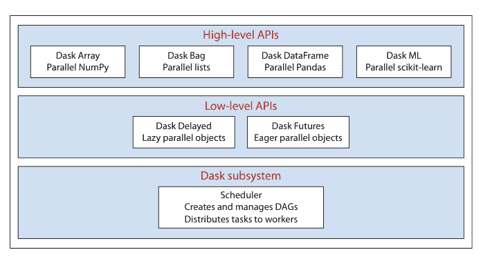

**图 10.1** Dask 基础，改编自 (Daniel, 2019)

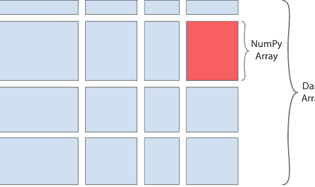

**图 10.2** Dask 数组，改编自 https://examples.dask.org/array.html

```python
[1]: import dask.array as da
    x = da.random.random((100000, 100000), chunks=(1000, 1000))
    x
```

| | 数组 | 块 |
|---|---|---|
| 字节 | 74.51 GiB | 7.63 MiB |
| 形状 | (100000, 100000) | (1000, 1000) |
| 计数 | 10000 个任务 | 10000 个块 |
| 类型 | float64 | numpy.ndarray |

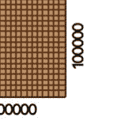

**图 10.3** 定义一个 Dask 数组

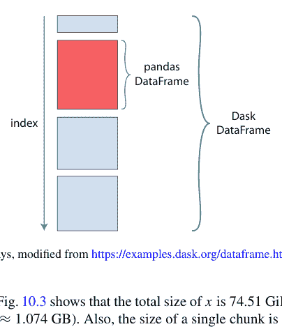

例如，图 10.3 显示 $x$ 的总大小为 74.51 GiB（即 Gibibytes，GiB，1 GiB $\approx$ 1.074 GB）。同时，单个块的大小为 7.63 MiB。

### Dask 数据帧

Dask DataFrame 是 pandas DataFrame 的并行对应物（图 10.4）。它们由许多沿索引分割的较小 pandas DataFrame 组成（表 10.1）。

为了了解如何使用 Dask DataFrame，让我们导入我们在第 8 章中开发并保存为 HDF5 格式的数据集。图 10.5 展示了 Jupyter Notebook 的一部分，并重点说明了如何从文件 *ml_data.h5* 导入 Dask DataFrame。请注意，该过程与 pandas 中的类似。唯一的区别在于导入的是 *dask.DataFrame* 而不是 *pandas.DataFrame*。还需注意，Dask 将 DataFrame 分成了两部分，并且所有行都用省略号 (...) 填充，而不是实际值。这是因为数据集受到“惰性”求值的影响（详见第 10.3 节）。要物理导入 *train_dataset*，Dask 需要额外使用 *compute()* 方法（图 10.6）。

### Dask ML

模型扩展可以解决与 (1) 数据大小和 (2) 模型大小相关的两个常见问题（表 10.2，图 10.7）。当你的数据集能舒适地放入计算环境的空闲 RAM 中时（即你正在处理一个小数据集；见表 10.2），Pandas、NumPy 和 scikit-learn 是开发机器学习策略的首选库。在这种情况下，不需要也不建议沿图 10.7 的 $x$ 维度进行扩展。

例如，图 10.8 中的代码清单展示了如何使用 Numpy 定义（第 2 行）一个由 $10^8$ 个正态分布伪随机数组成的小数据集 *my_data*，其均值和标准差分别为一和二。第 3 行和第 4 行只是检查 *my_data* 的均值和标准差是否分别为一和二。最后，第 5 行估算了 *my_data* 所需的内存，大约为 0.745 GiB。

然而，当数据集的大小达到 RAM 的上限（包括使用硬盘产生的任何虚拟内存）时，内存错误开始出现（见图 10.9 中的代码清单）。例如，在一个拥有 16 GB 空闲内存的 Linux 系统中，将 *my_data* 的大小增加到 2.5 × 10⁹ 会产生“内存错误”，因为操作系统“无法为形状为 (2 500 000 000) 且数据类型为 float64 的数组分配 18.6 GiB”。这显然是一个数据大小问题，因为我生成的是一个“中等数据集”（见表 10.2）。

使用 Dask 数组可以让你以最小的代码更改来克服这个问题。例如，图 10.10 中的代码清单在拥有 16 GB 空闲 RAM 的 Linux 操作系统上使用 Dask 数组（即 NumPy 数组的并行模拟）来完成之前使用 NumPy 无法完成的简单操作（即代码清单 10.9）。

当模型大小成为问题时（例如，模型增长过大或变得过于复杂），所有计算都需要极长的时间。例如，第 8 章中进行的网格搜索花了几个小时才完成。虽然等待几个小时可能不是大问题，但仅仅增加网格搜索的维度（例如，增加调查的超参数数量并使网格更密集）或决策树集成的复杂性（例如，增加估计器的数量），执行时间就会急剧增加到几天甚至几周。要优化多个机器学习模型，所需的总时间很容易达到数月甚至数年。

因此，Dask ML 的主要目标是为流行的机器学习库（如 scikit-Learn (Pedregosa et al., 2011)、XGBoost 等）在 Python 中提供可扩展的机器学习。

表 10.1 用于导入和创建 Dask DataFrame 的 Dask 方法。请注意，其中大多数等同于 pandas 方法，即表 3.1（改编自 https://docs.dask.org/en/stable/dataframe-api.html）

| 方法 | 描述 |
|---|---|
| read_table() | 读取通用分隔文件 |
| read_csv() | 读取逗号分隔值 (csv) 文件 |
| read_fwf() | 读取固定宽度文件 |
| read_parquet() | 读取 parquet 文件 |
| read_hdf() | 读取分层数据格式 (HDF) 文件 |
| read_json() | 从一组 JSON 文件创建 Dask DataFrame |
| read_orc() | 从 ORC 文件创建 Dask DataFrame |
| read_sql_table() | 读取 SQL 数据库表 |
| read_sql_query() | 读取 SQL 查询 |
| read_sql() | 读取 SQL 查询或数据库表 |
| from_array() | 读取任何可切片的数组 |
| from_bcolz() | 读取 BColz CTable |
| from_dask_array() | 从 Dask Array 创建 Dask DataFrame |
| from_delayed() | 从多个 Dask Delayed 对象创建 Dask DataFrame |
| from_map() | 从自定义函数映射创建 Dask DataFrame 集合 |
| from_pandas() | 从 Pandas DataFrame 构建 Dask DataFrame |
| from_dict() | 从 Python 字典构建 Dask DataFrame |
| Bag_to_dataframe() | 从 Dask Bag 创建 Dask DataFrame |

```python
[1]: import dask.dataframe as dd

[3]: train_dataset = dd.read_hdf('ml_data.h5', key='train')

[4]: train_dataset

[4]: Dask DataFrame Structure:
              CALI  Delta_CALI  log_RMED  Delta_log_RMED  log_RDEP  Delta_log_RDEP
npartitions=2
              float64     float64   float64         float64   float64         float64
                ...         ...       ...             ...       ...             ...
                ...         ...       ...             ...       ...             ...
Dask Name: read-hdf, 2 tasks
```

图 10.5 将存储在 HDF5 文件中的 pandas DataFrame 导入为 Dask DataFrame

```python
[5]: train_dataset.compute()
```

```python
[5]:
          CALI  Delta_CALI  log_RMED  Delta_log_RMED  log_RDEP  Delta_log_RDEP
0  19.480835    0.000000  0.207206        0.000000  0.254954        0.000000
1  19.468800   -0.012035  0.208997        0.001791  0.254220       -0.000735
2  19.468800    0.000000  0.211243        0.002246  0.255449        0.001230
3  19.459282   -0.009518  0.209942       -0.001301  0.255638        0.000189
4  19.453100   -0.006182  0.204847       -0.005096  0.254137       -0.001501
...
1170506  8.423170    0.001802  0.247442        0.000026  0.241466        0.000024
1170507  8.379244   -0.043926  0.247442        0.000026  0.241466        0.000024
1170508  8.350248   -0.028996  0.247442        0.000026  0.241466        0.000024
1170509  8.313779   -0.036469  0.247442        0.000026  0.241466        0.000024
1170510  8.294910   -0.018868  0.247442        0.000026  0.241466        0.000024

1170511 行 × 26 列
```

图 10.6 物理导入存储在 HDF5 文件中的 pandas DataFrame 为 Dask DataFrame

表 10.2 根据数据大小对数据集进行分类。改编自 Daniel (2019)

| 数据集大小 | 大致大小范围 | 适合放入 RAM？ | 适合放入本地磁盘？ |
| :--- | :--- | :--- | :--- |
| 小数据集 | 小于系统上的空闲 RAM（例如 16 GB） | 是 | 是 |
| 中等数据集 | 大于系统上的空闲 RAM 且小于本地磁盘容量（例如 2 TB） | 否 | 是 |
| 大数据集 | 大于本地磁盘容量 | 否 | 否 |

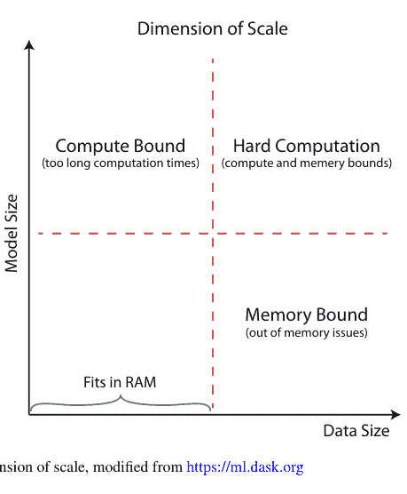

图 10.7 扩展维度，改编自 https://ml.dask.org

```python
In [1]: import numpy as np

In [2]: my_dataset = np.random.normal(loc=1.0, scale=2.0, size=100000000)

In [3]: np.mean(my_dataset)
Out[3]: 0.9995566509046069

In [4]: np.std(my_dataset)
Out[4]: 1.9999512502789483

In [5]: my_dataset.nbytes / 1024**3
Out[5]: 0.7450580596923828
```

图 10.8 处理小数据集（即完全适合你的 RAM 预算）

## 10.3 即时计算与惰性求值

Python 通常使用所谓的“即时”计算，这简单意味着 Python 会立即执行每个操作，例如转换和计算。例如，图 10.11 展示了即时函数 `simple_lithopress()`（第 2 行）的定义，该函数在假设密度和重力加速度均为常数的情况下估算岩石静压力。我们在第 3 行和第 4 行揭示了该函数的即时特性，因为一旦我们在代码工作流中调用 `simple_lithopress()`，它就会返回一个计算好的值；换句话说，计算是立即完成的。

```python
[1]: def simple_lithopress(z, ro, g):
        p_MPa = z*g*ro/1e6 # return the pressure in MPa
        return p_MPa

[3]: my_pressure = simple_lithopress(z=2000, ro=2900, g=9.8)

[3]: my_pressure

[3]: 56.84
```

**图 10.11** 定义即时函数 `simple_lithopress()`

```python
[4]: import numpy as np
```

```python
[5]: %%time
z_dist = np.random.normal(loc=2000, scale=200, size= 10000000)
ro_dist = np.random.normal(loc=2900, scale=290, size= 10000000)
g_dist = np.random.normal(loc=9.8, scale=0.1, size= 10000000)
my_pressure_dist = simple_lithopress(z=z_dist, ro = ro_dist, g = g_dist)
CPU times: user 854 ms, sys: 106 ms, total: 960 ms
Wall time: 963 ms
```

```python
[6]: my_pressure_dist.nbytes / 1024**2 # size in MB
```

```python
[6]: 76.2939453125
```

**图 10.12** 使用“即时” *simple_lithopress()* 执行蒙特卡洛误差传播

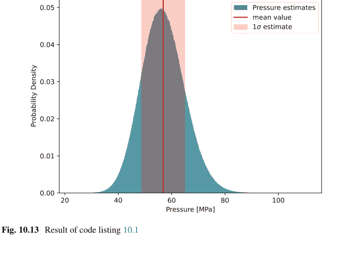

类似地，如果我们结合 NumPy 数组和 *simple_lithopress()* 函数执行蒙特卡洛误差传播（图 10.12），我们会得到一个持续时间不到一秒的即时执行，并生成一个包含 10^7 个元素（≈76 MB）的数组。
为了了解我们正在做什么，图 10.13 展示了由深度、密度和重力加速度估算值计算出的压力分布，同时也考虑了误差估计。

```python
import matplotlib.pyplot as plt

my_pressure_mean = np.mean(my_pressure_dist)
my_pressure_std = np.std(my_pressure_dist)

fig, ax = plt.subplots()
ax.hist(my_pressure_dist, density=True, bins='auto',
        color='#0F7F8B', label='Pressure estimates')
ax.axvline(my_pressure_mean, color='#C82127', label='mean value')
ax.axvspan(my_pressure_mean - my_pressure_std,
           my_pressure_mean + my_pressure_std,
           color='#F15C61', alpha=0.4,
           label=r'1$\sigma$ estimate')
ax.set_xlabel('Pressure [MPa]')
ax.set_ylabel('Probability Density')
ax.legend()
plt.show()
```

**代码清单 10.1** 绘制蒙特卡洛误差传播的结果。

惰性求值与即时计算不同。在惰性求值下，Dask 会为涉及的函数、操作和转换准备一个有向无环图（DAG）。但它不会执行任何计算。DAG 是源自图论的数学对象。DAG 和图论背后的理论超出了本书的范围，因此请参考专业文献来学习 DAG 的详细信息（Xu, 2003; Fiore & Campos, 2013; Maurer, 2013）。

本节主要关注学习使用 DAG 进行计算的主要好处。最重要的好处之一是，你的计算的结构和复杂性可以在运行之前进行评估和可视化，这带来了许多优势。例如，它允许你决定是在单台机器、小型集群还是高性能计算设施上运行你的代码。图 10.14 展示了如何对图 10.12 中执行的蒙特卡洛误差传播进行惰性求值，生成的 DAG 如图 10.15 所示。这是一个简单的结构，显示在为深度、密度和重力加速度生成三个正态分布后，*simple_lithopress()* 函数将它们作为输入并生成输出。如果我们把三个输入数组的大小从 10^7 增加到 10^8，DAG 的结构会发生变化（图 10.16）。具体来说，我们定义了一个所谓的“易并行”工作负载（图 10.17）。

```python
[1]: import dask.array as da
    from dask import delayed

[2]: def simple_lithopress(z, ro, g):
        p_MPa = z*g*ro/1e6 # return the pressure in MPa
        return p_MPa

    z_da = da.random.normal(loc=2000, scale=200, size= 10000000)
    ro_da = da.random.normal(loc=2900, scale=290, size= 10000000)
    g_da = da.random.normal(loc=9.8, scale=0.1, size= 10000000)

    my_pressure_da = da.map_blocks(simple_lithopress, z_da, g_da, ro_da)

[3]: my_pressure_da = simple_lithopress(z=z_da, ro = ro_da, g = g_da)

[4]: my_pressure_da.visualize(filename='my_DAG.pdf')
```

**图 10.14** 如何在 Dask 中可视化 DAG

**图 10.15** 由上述代码清单生成的简单 DAG

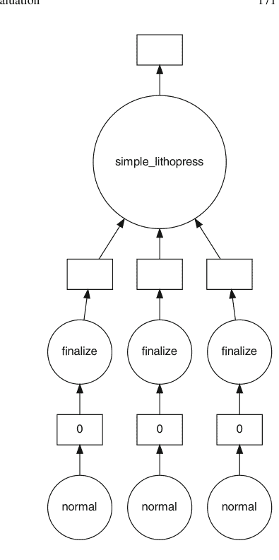

**图 10.16** 如果我将输入数组的维度从 $10^7$ 增加到 $10^8$，我在我的 MacBook Pro 上得到的 DAG

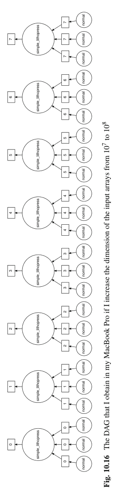

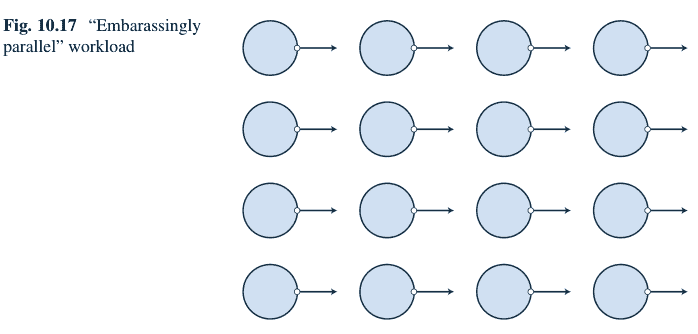

## 10.4 诊断与反馈

Dask 分布式调度器提供了一个有效的交互式仪表板，它由丰富的监控和性能分析工具生态系统组成，可以通过 Web 浏览器访问（图 10.18）。图 10.18 的左侧面板和右侧面板分别显示了一个 Jupyter Notebook 和 Dask 交互式仪表板。Jupyter Notebook 在第 2 行启动 Dask 客户端及其交互式仪表板，然后定义（第 3 行和第 4 行）、评估（第 5 行），最后触发（第 6 行，正在进行中，因此显示为 *）计算。监控器的右侧部分显示了由 Jupyter Notebook 在第 6 行触发的正在进行的进程期间的 Dask 交互式仪表板。

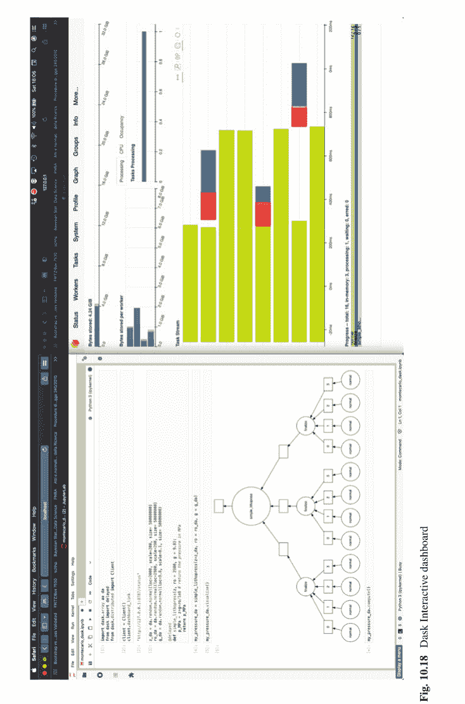

## 参考文献

Caesar Wu, R. B. (2015). *Cloud data centers and cost modeling: A complete guide to planning, designing and building a cloud data center*, (1st ed.). Burlington: Morgan Kaufmann.

Daniel, J. C. (2019). *Data science with python DASK*. New York: Manning Publications.

David, P. (2011). *Encyclopedia of parallel computing*. New York: Springer. https://doi.org/10.1007/978-0-387-09766-4

Fiore, M., & Devesas Campos, M. (2013). The algebra of directed acyclic graphs. In B. Coecke, L. Ong, & P. Panangaden (Eds.), *Computation, logic, games, and quantum foundations. The many facets of Samson Abramsky*. Lecture notes in computer science (Vol. 7860). Berlin, Heidelberg: Springer. https://doi.org/10.1007/978-3-642-38164-5_4

Maurer, S. B. (2013). *Directed acyclic graphs*. Routledge Handbooks Online. Milton Park: Routledge. https://doi.org/10.1201/B16132-10

Pedregosa, F., Varoquaux, G. G., Gramfort, A., Michel, V., Thirion, B., Grisel, O., Blondel, M., Prettenhofer, P., Weiss, R., Dubourg, V., Vanderplas, J., Passos, A., Cournapeau, D., Brucher, M., Perrot, M., & Duchesnay, É. (2011). Scikit-learn: Machine learning in python. *Journal of Machine Learning Research*, 12, 2825–2830.

Peter Pacheco, M. M. (2020). *An introduction to parallel programming* (2nd ed.). Burlington: Morgan Kaufmann.

Xu, J. (2003). *Theory and application of graphs* (vol. 10). New York: Springer. https://doi.org/10.1007/978-1-4419-8698-6

## 第11章
在云端扩展你的模型

### 11.1 在云端扩展你的环境

术语“可扩展性”指的是系统管理不断增长的工作量的能力。如前一章所述，必须扩展计算或内存限制以处理机器学习模型。在云计算设施的背景下，术语“扩展”指的是快速高效地增加（或减少）计算资源能力以处理不再适合当前资源（即RAM、CPU和存储能力）的模型的能力。扩展计算基础设施存在两种主要策略：纵向扩展或横向扩展（Bekkerman等人，2012）。

**纵向扩展**
纵向扩展，或称垂直扩展，包括用更强大的实例替换当前的计算实例（图11.1）。例如，我们可以增加核心数量、内存容量和/或存储能力（图11.2）。

**横向扩展**
横向扩展，或称水平扩展，包括通过复制实例并并行运行来增加计算能力（图11.3）。


图11.1 纵向扩展与缩减

亚马逊网络服务的计算优化实例

| 实例大小 | vCPU | 内存 (GiB) |
|---|---|---|
| r6a.large | 2 | 16 |
| r6a.xlarge | 4 | 32 |
| r6a.2xlarge | 8 | 64 |
| r6a.4xlarge | 16 | 128 |
| r6a.8xlarge | 32 | 256 |
| r6a.12xlarge | 48 | 384 |
| r6a.16xlarge | 64 | 512 |
| r6a.24xlarge | 96 | 768 |
| r6a.32xlarge | 128 | 1024 |
| r6a.48xlarge | 192 | 1536 |
| r6a.metal | 192 | 1536 |

图11.2 纵向扩展与缩减

### 11.2 云端扩展：困难的方式

“困难”的扩展方式包括在亚马逊网络服务（AWS）、谷歌计算引擎、微软Azure或其他提供商中管理所有配置并执行所有技术步骤。

使用云提供商进行纵向扩展相当简单。只需选择更大或更小的实例分别进行扩展和缩减即可（图11.2）。此外，一些提供商提供特定的自动扩展服务；例如，亚马逊声称“AWS Auto Scaling监控您的应用程序并自动调整容量，以在尽可能低的成本下保持稳定、可预测的性能。使用AWS Auto Scaling，可以轻松地在几分钟内为多个服务中的多个资源设置应用程序扩展。该服务提供了一个简单而强大的用户界面，让您可以为包括Amazon EC2实例在内的资源构建扩展计划。……¹”

相比之下，横向扩展不像纵向扩展那样直接。Dask文档建议使用Kubernetes和Helm解决方案。Kubernetes是“一个可移植、可扩展的开源平台，用于管理容器化工作负载和服务，它促进了声明式配置和自动化。”² Helm是“一个用于Kubernetes的开源软件包管理器。它提供了提供、共享和使用为Kubernetes构建的软件的能力。”³ Dask文档声称“使用Kubernetes和Helm，可以轻松地在云资源上启动Dask集群和Jupyter笔记本服务器。”⁴ 然而，Dask文档中给出的说明假设Kubernetes集群和Helm已经安装并准备就绪。不幸的是，对于新手来说，设置Kubernetes集群和Helm并不简单。许多云提供商的详细说明可在指南“Zero to JupyterHub”中找到。⁵

¹ https://aws.amazon.com/autoscaling/.
² https://kubernetes.io/docs/concepts/overview/what-is-kubernetes/.
³ https://helm.sh/docs/.
⁴ https://docs.dask.org/en/stable/deploying-kubernetes-helm.html.
⁵ https://zero-to-jupyterhub.readthedocs.io/en/latest/kubernetes/.

### 11.3 云端扩展：简单的方式

#### Saturn Cloud

Saturn Cloud⁶ 是一个基于云的平台，旨在支持使用Python、⁷ R、⁸ Julia、⁹ 和其他编程语言工作的数据科学家。如图11.4所示的资源是Saturn Cloud平台的构建块。术语“资源”指的是一个完整的计算和编码环境。每个资源都是独立的，因此您可以将不同的活动分开。Saturn Cloud托管解决方案¹⁰ 是一种“按需付费”服务，这意味着您按小时支付计算资源费用。例如，在撰写本书期间，Medium（2个vCPU和4 GB RAM）和V100-16×Large（64个vCPU、8个vGPU和488 GB RAM）资源的成本分别为每小时0.06美元和34.24美元。还存在一个资源有限的免费托管计划。接下来的章节将利用免费托管计划进行第一步扩展，之后将展示在Hosted Pro计划上获得的结果。如果您打算重现这些结果，还提供了有关成本的详细信息。

⁶ https://saturncloud.io.
⁷ https://www.python.org.
⁸ https://www.r-project.org.
⁹ https://julialang.org.
¹⁰ https://saturncloud.io/plans/hosted/.

#### 在Saturn Cloud上加速GridSearchCV

在第8.3节中，我们执行了GridSearchCV，这是对控制极端随机树算法的超参数进行的广泛搜索（见代码清单8.9和表8.1）。目的是找到提供最高准确度的超参数组合。这种超参数组合产生了48个模型的网格，每个模型通过交叉验证重复三次，总共144次尝试。如第8章所述，在我的配备2.3 GHz四核Intel™ i7 CPU和32 GB RAM的MacBook pro上运行代码清单8.9大约需要8小时。

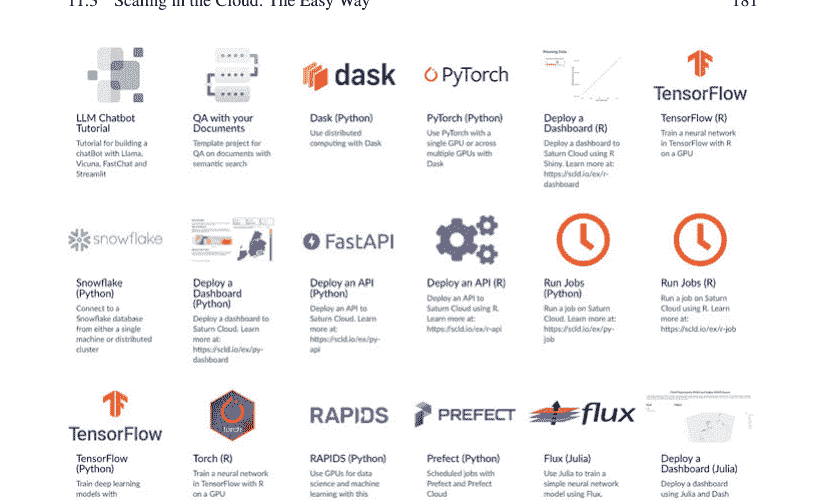

在Saturn Cloud中，免费托管计划允许使用2× Large实例（即八个核心和64 GB RAM）对支持我的MacBook Pro的硬件进行轻微扩展，因此我们扩展到2× Large实例并运行代码清单8.9。首先，我们注册Saturn Cloud并点击“New Python Server”按钮（图11.5），这将启动一个引导程序，允许配置一个新的实例，为基本的Python数据分析、机器学习以及可能的Dask并行处理做好准备。

图11.6和图11.7显示了配置新实例的所有步骤。建议使用一个不言自明的名称，例如*scale_GridSearchCV_Joblib*，100 Gi磁盘空间，以及2×large实例。另外，请记住添加*ytables*作为额外包；这是使用*Conda Install*安装的。PyTables库允许读取和保存HDF5文件。保持所有其他选项不变，然后点击*Create*。

实例现在已准备就绪（图11.8）。接下来的步骤包括启动实例、创建新的Jupyter Notebook以及上传HDF5文件*ml_data.h5*（图11.9）。最后，我们准备在2×large实例中复制代码清单8.9（图11.10）。请注意，（图11.10）中的第二个代码块只是将输出报告到名为*data.log*的日志文件中。拟合（即第五个代码块）持续了5小时15分钟，这比我的MacBook Pro的8小时快得多。


图11.5 启动新的python服务器

接下来，我们激活Hosted Pro计划<sup>11</sup>，并将图11.10中的代码逐步扩展到8×Large实例（即32个核心和256 GB RAM，成本为3.30美元/小时）和16×Large实例（即64个核心和512 GB RAM，成本为6.59美元/小时），将计算时间分别提高到大约2小时和1小时。

最后一步，我扩展了图11.10中报告的代码。为此，我通过点击*New Dask Cluster*（图11.8）创建了一个Dask集群，这将打开集群配置窗口（图11.11）。此外，我选择了一个16×Large调度器（即64个核心和512 GB RAM）和四个8×Large工作节点（即32个核心和256 GB RAM）。要在新创建的Dask集群中运行*GridSearchCV*，图11.10中报告的代码只需要最少的更改，这些更改都在图11.12中报告。我从*dask_saturn*导入了*SaturnCluster*（代码块1），为*ExtraTreesClassifier*和*GridSearchCV*都使用了*n_jobs = -1*（即嵌套并行）（代码块4），定义了*SaturnCluster*客户端（代码块5），并使用*dask*作为拟合引擎运行了*Joblib*（代码块6）。在最后一种情况下，拟合*GridSearchCV*耗时不到25分钟！

<sup>11</sup> https://saturncloud.io/plans/hosted/.

### 11.3 云端扩展：简便之道

#### 创建 Jupyter 服务器

Jupyter 服务器允许你通过 JupyterLab、终端或 SSH 进行交互式代码编写。


图 11.6 设置 Python 服务器参数

环境
你的 Jupyter 服务器将使用的软件。这包括库、包、环境变量和其他属性。

| 镜像 | 版本 |
| :--- | :--- |
| saturncloud/saturn-python | 2023.05.01 |

额外包
额外包会在每次资源启动时安装——就在启动脚本之前。使用空格分隔包。
如果你发现自己在很多资源中添加相同的包，你可能希望将包永久添加到自定义镜像中。

- Conda
- Pip
- Apt

pytables
使用 Mamba 解决
如果启用，将使用 mamba 来解决 conda 环境。

使用 environment.yml
如果启用，这应该是描述 conda 环境的有效 YAML，例如 `conda env export` 生成的内容。详情请参阅 conda 文档。

这些包将一起运行以下脚本：

```
mamba install pytables
```

创建
取消

图 11.7 设置 Python 服务器参数

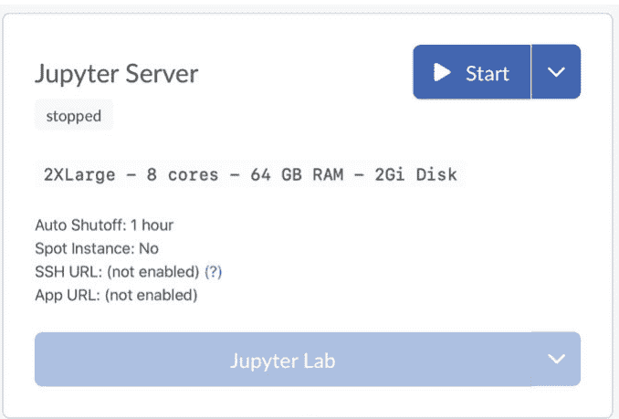

图 11.8 启动 Python 服务器

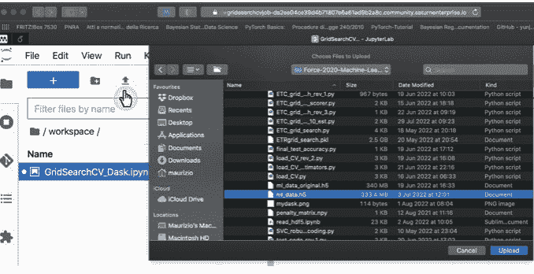

图 11.9 上传 hdf5 文件

```
[1]: import joblib as jb
import pandas as pd
from sklearn.ensemble import ExtraTreesClassifier
from sklearn.model_selection import GridSearchCV, train_test_split
from sklearn.pipeline import Pipeline
from sklearn.preprocessing import StandardScaler

Last executed at 2023-08-03 17:36:30 in 660ms
```

```
[2]: import logging
import sys

so = open("data.log", 'w', 10)
sys.stdout.echo = so
sys.stderr.echo = so

get_ipython().log.handlers[0].stream = so
get_ipython().log.setLevel(logging.INFO)

Last executed at 2023-08-03 17:36:31 in 4ms
```

```
[3]: X = pd.read_hdf('~/workspace/ml_data.h5', 'train').values
y = pd.read_hdf('~/workspace/ml_data.h5', 'train_target').values

X_train, X_test, y_train, y_test = train_test_split(
    X, y, test_size=0.2, random_state=10, stratify=y)

Last executed at 2023-08-03 17:36:36 in 682ms
```

```
[4]: param_grid = {
    'classifier__criterion': ['entropy', 'gini'],
    'classifier__min_samples_split': [2, 5, 8, 10],
    'classifier__max_features': ['sqrt', 'log2', None],
    'classifier__class_weight': ['balanced', None]
    }

clf = Pipeline([('scaler', StandardScaler()),
                ('classifier',ExtraTreesClassifier(n_estimators=250, n_jobs=-1))])

CV_rfc = GridSearchCV(estimator=clf, refit=True, param_grid=param_grid,
                      cv= 3, verbose=10)

Last executed at 2023-08-03 17:36:36 in 4ms
```

```
[5]: CV_rfc.fit(X_train, y_train)
```

```
[6]: jb.dump(CV_rfc, 'ETC_grid_search_results_rev_3_baseline.pkl')

Last executed at 2023-08-03 18:24:12 in 4.99s
```

```
[6]: ['ETC_grid_search_results_rev_3_baseline.pkl']
```

```
[7]: CV_rfc.best_params_

Last executed at 2023-08-03 18:24:13 in 4ms
```

```
[7]: {'classifier__class_weight': 'balanced',
 'classifier__criterion': 'entropy',
 'classifier__max_features': None,
 'classifier__min_samples_split': 2}
```

图 11.10 扩展 *GridSearchCV*

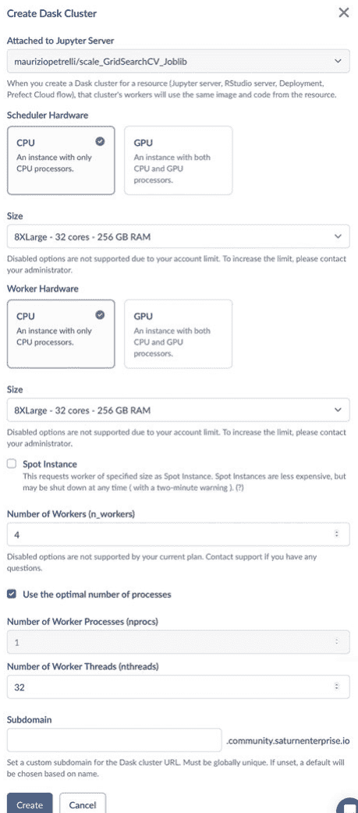

图 11.11 设置新的 dask 集群

```
[1]: import joblib as jb
import pandas as pd
from sklearn.ensemble import ExtraTreesClassifier
from sklearn.model_selection import GridSearchCV, train_test_split
from sklearn.pipeline import Pipeline
from sklearn.preprocessing import StandardScaler
from dask.saturn import SaturnCluster
from dask.distributed import Client

Last executed at 2023-08-03 17:03:38 in 800ms
```

```
[2]: import logging
import sys

so = open("data.log", 'w', 10)
sys.stdout.echo = so
sys.stderr.echo = so

get_ipython().log.handlers[0].stream = so
get_ipython().log.setLevel(logging.INFO)

Last executed at 2023-08-03 17:03:39 in 4ms
```

```
[3]: X = pd.read_hdf('~/workspace/ml_data.h5', 'train').values
y = pd.read_hdf('~/workspace/ml_data.h5', 'train_target').values

X_train, X_test, y_train, y_test = train_test_split(
    X, y, test_size=0.2, random_state=10, stratify=y)

Last executed at 2023-08-03 17:03:41 in 791ms
```

```
[4]: param_grid = {
    'classifier__criterion': ['entropy', 'gini'],
    'classifier__min_samples_split': [2, 5, 8, 10],
    'classifier__max_features': ['sqrt', 'log2', None],
    'classifier__class_weight': ['balanced', None]
    }

clf = Pipeline([('scaler',  StandardScaler()),
                ('classifier',ExtraTreesClassifier(n_estimators=250, n_jobs=-1))])

CV_rfc = GridSearchCV(estimator=clf, refit=True, param_grid=param_grid,
                      cv= 3, verbose=1, n_jobs=-1)

Last executed at 2023-08-03 17:03:42 in 5ms
```

```
[5]: client = Client(SaturnCluster())

Last executed at 2023-08-03 17:03:45 in 660ms

INFO:dask-saturn:Cluster is ready
INFO:dask-saturn:Registering default plugins
INFO:dask-saturn:Success!
```

```
[6]: with jb.parallel_backend("dask"):
    _ = CV_rfc.fit(X_train, y_train)

Last executed at 2023-08-03 17:27:58 in 24m 6.78s
Fitting 3 folds for each of 48 candidates, totalling 144 fits
```

```
[8]: jb.dump(_, 'ETC_grid_search_results_rev_3_dask.pkl')

Last executed at 2023-08-03 17:28:33 in 4.95s
```

```
[8]: ['ETC_grid_search_results_rev_3_dask.pkl']
```

```
[9]: _.best_params_

Last executed at 2023-08-03 17:28:38 in 5ms
```

```
[9]: {'classifier__class_weight': 'balanced',
 'classifier__criterion': 'entropy',
 'classifier__max_features': None,
 'classifier__min_samples_split': 2}
```

图 11.12 扩展 *GridSearchCV*

## 参考文献

Bekkerman, R., Bilenko, M., & Langford, J. (2012). *扩展机器学习：并行与分布式方法*. 剑桥：剑桥大学出版社。

## 第五部分

## 下一步：深度学习

## 第 12 章
深度学习简介

### 12.1 深度学习意味着什么？

如第 1 章所述，机器学习算法通过从数据中提取模式来获取知识。

换句话说，它们试图将所研究特征提供的表示映射以产生输出（Goodfellow 等人，2016）。因此，特征在机器学习中至关重要，因为它们提供了构建表示的信息。然而，仅仅将表示映射以提供输出通常是不够的。因此，我们必须训练机器学习系统，不仅要发现从表示到输出的映射，还要发现表示本身（Goodfellow 等人，2016）。这种方法被称为表示学习。在复杂问题中（例如，具有许多特征或极大数据集的问题），学习表示并非易事。

> “深度学习通过引入用其他更简单表示来表达的表示，解决了表示学习中的这个核心问题。深度学习使计算机能够从简单的概念中构建复杂的概念”（Goodfellow 等人，2016）。

深度学习的一个典型例子是多层感知器，它是一个将一组输入映射到输出值的数学函数（Goodfellow 等人，2016）。该函数由许多更简单的函数组合而成（图 12.1）。为了更好地理解，图 12.1 展示了深度学习方法如何通过组合更简单的概念（如角点和轮廓）来表示图像的概念，而这些概念又由边缘定义（Goodfellow 等人，2016）。在图 12.1 中，输入馈送到可见层，然后一系列隐藏层从初始输入中逐步提取和处理抽象特征。最后一层提供输出（例如，学习过程中开发的表示的映射结果）（Goodfellow 等人，2016）。

从数学角度来看，深度前馈网络（或多层感知器）旨在近似某个函数 $f^*$（Goodfellow 等人，2016）。具体来说，它定义了一个映射 $\mathbf{y} = f(\mathbf{x}; \boldsymbol{\theta})$，并学习参数 $\boldsymbol{\theta}$ 的值，以实现对函数最准确的近似（Goodfellow 等人，2016）（图 12.2）。为什么是前馈？因为数据通过函数从输入 $\mathbf{x}$ 流经用于定义 $f$ 的中间计算，最终到达输出 $\mathbf{y}$。为什么是网络？因为网络通常通过组合许多不同的函数来表达。例如，我们可以将三个函数 $f^{(1)}$、$f^{(2)}$ 和 $f^{(3)}$ 组合成一个链来定义 $f(x) = f^{(3)}(f^{(2)}(f^{(1)}(x)))$（Goodfellow 等人，2016）。具体来说，$f^{(1)}$ 是网络的第一层，$f^{(2)}$ 是第二层，依此类推（Goodfellow 等人，2016）。链的总长度定义了模型的深度。这就是它们被称为“深度”的原因。前馈网络的最后一层提供输出。在训练过程中，我们调整 $f(\mathbf{x}; \boldsymbol{\theta})$ 中的 $\boldsymbol{\theta}$ 参数，以匹配 $f^*(\mathbf{x})$（Goodfellow 等人，2016）。

## 12.2 PyTorch

“PyTorch 是一个用于深度学习的优化张量库，支持 GPU 和 CPU。”¹ 张量（即多维数组）是 PyTorch 的基础。此外，PyTorch 还包含 *autograd* 引擎（参见 *torch.autograd*），它可以计算导数，甚至支持复杂的数据结构。PyTorch 的其他模块主要基于张量和 *autograd* 引擎。例如，*torch.nn* 模块提供了常见的神经网络层和其他架构组件。*torch.optim* 则实现了用于学习过程的*最先进*优化策略（Imambi 等人，2021）。

## 12.3 PyTorch 张量

PyTorch 张量是多维数组（图 12.3），类似于 NumPy 中的数组。然而，与 NumPy 数组相比，PyTorch 张量可以 (1) 在图形处理单元（GPU）上执行加速操作，(2) 原生支持分布式环境，并且 (3) 在必要时跟踪操作图（Imambi 等人，2021）。PyTorch 张量的初始化方式模仿了 NumPy 数组的做法。最后，NumPy 数组可以轻松地作为 PyTorch 张量导入（图 12.4）。

¹ https://pytorch.org/docs/stable/index.html.

```python
[1]: import torch
Last executed at 2022-08-15 09:51:44 in 7.11s
```

### 一维张量 → 向量

```python
[2]: zeros = torch.zeros(6)
print(zeros)
Last executed at 2022-08-15 09:40:55 in 84ms
tensor([0., 0., 0., 0., 0., 0.])
```

### 二维张量 → 矩阵

```python
[3]: ones = torch.ones(2, 3)
print(ones)
Last executed at 2022-08-15 09:40:56 in 27ms
tensor([[1., 1., 1.],
        [1., 1., 1.]])
```

### 三维张量

```python
[4]: random1 = torch.randn(2, 3, 3)
print(random1)
Last executed at 2022-08-15 09:40:57 in 8ms
tensor([[[ 0.2335, -1.5447,  1.4459],
         [ 0.9062,  0.9170,  2.1128],
         [-0.8420,  0.0852,  1.4125]],

        [[ 2.5360,  0.0471, -0.7606],
         [ 0.3327,  0.4224,  0.4928],
         [-0.3284, -0.5549,  0.2324]]])
```

### 从 Python 列表创建张量

```python
[5]: my_list = [3, 6, 8, 6, 8, 9]
tensor1 = torch.tensor(my_list, dtype = torch.float)
print(tensor1)
Last executed at 2022-08-15 09:40:58 in 5ms
tensor([3., 6., 8., 6., 8., 9.])
```

### 从 NumPy 数组创建张量

```python
[6]: import numpy as np

np_array = np.array([3, 4, 5, 7, 9])
tensor2 = torch.from_numpy(np_array)
tensor3 = torch.tensor(np_array)
print(tensor2)
print(tensor3)
Last executed at 2022-08-15 09:41:02 in 4ms
tensor([3, 4, 5, 7, 9])
tensor([3, 4, 5, 7, 9])
```

图 12.4 向量、矩阵、张量

```python
[1]: import torch
Last executed at 2022-08-17 16:45:10 in 7.27s
```

### 在 GPU 上工作

```python
[2]: torch.cuda.is_available()
Last executed at 2022-08-17 16:45:10 in 34ms
```

[2]: True

```python
[3]: random_cuda1 = torch.randn(500000000, device='cuda')
random_cuda2 = torch.randn(500000000, device='cuda')
Last executed at 2022-08-17 16:45:17 in 7.31s
```

```python
[4]: power_cuda = random_cuda1 ** random_cuda2
Last executed at 2022-08-17 16:45:17 in 13ms
```

```python
[5]: random_cpu1 = torch.randn(500000000, device='cpu')
random_cpu2 = torch.randn(500000000, device='cpu')
Last executed at 2022-08-17 16:45:26 in 8.55s
```

```python
[6]: power_cpu = random_cpu1 ** random_cpu2
Last executed at 2022-08-17 16:45:29 in 3.10s
```

图 12.5 向量、矩阵、张量

默认情况下，PyTorch 张量位于 CPU 上。但是，如果 GPU 可用，可以通过使用 device 参数（即 device='cuda'，图 12.5 中的代码块 3）轻松地在 GPU 上定义它们（参见图 12.5 中的代码块 2）。图 12.5 中的代码块 3-6 仅仅突出了在 'cuda' 设备（即 GPU）上执行的幂运算仅需 7 毫秒，这比在 CPU 上执行相同操作所需的约 3 秒要快得多。

## 12.4 在 PyTorch 中构建前馈网络

图 12.6 展示了如何在 PyTorch 中开发图 12.2 所示的前馈神经网络（即多层感知机）。

该前馈神经网络由一个输入层（第 1 层）组成，该层接受具有四个特征的输入向量。ReLU 函数处理输入特征并将结果转发到一个隐藏层（第 2 层），该层具有四个神经元和一个 ReLU 激活函数（即 ReLU 函数）。最后，输出层返回一个标量作为输出。

在 PyTorch 中，神经网络是一个具有嵌套结构的模块。换句话说，神经网络由一个包含其他模块（即层）的模块组成。

```python
[1]: import torch
from torch import nn
Last executed at 2022-08-17 16:34:00 in 571ms
```

```python
[2]: class MultilayerPerceptron(nn.Module):
    '''
    多层感知机示例
    '''
    def __init__(self):
        super().__init__()
        self.layers = nn.Sequential(
            nn.Linear(4, 4),
            nn.ReLU(),
            nn.Linear(4, 4),
            nn.ReLU(),
            nn.Linear(4, 1)
        )

    def forward(self, x):
        return self.layers(x)
Last executed at 2022-08-17 16:34:00 in 4ms
```

```python
[3]: device = "cuda" if torch.cuda.is_available() else "cpu"

print(f"Using {device} device")
Last executed at 2022-08-17 16:34:00 in 4ms
Using cpu device
```

```python
[4]: model = MultilayerPerceptron().to(device)

print(model)
Last executed at 2022-08-17 16:34:00 in 32ms
MultilayerPerceptron(
  (layers): Sequential(
    (0): Linear(in_features=4, out_features=4, bias=True)
    (1): ReLU()
    (2): Linear(in_features=4, out_features=4, bias=True)
    (3): ReLU()
    (4): Linear(in_features=4, out_features=1, bias=True)
  )
)
```

图 12.6 在 PyTorch 中开发多层感知机

模型可以位于 CPU 或 GPU 上（图 12.6 中的代码块 3 和 4），前提是 GPU 可用。

## 12.5 如何训练前馈网络

### 12.5.1 万能近似定理

万能近似定理（Hornik 等人，1989；Cybenko，1989）指出，具有线性输出层和至少一个隐藏层的前馈网络可以近似 $\mathbb{R}^n$ 的任何闭有界子集上的任何连续函数（Goodfellow 等人，2016），这意味着具有隐藏层的前馈网络是万能近似器（Goodfellow 等人，2016）。换句话说，“万能近似定理意味着无论我们试图学习什么函数，我们都知道一个大型的[多层感知机]将能够表示这个函数”（Goodfellow 等人，2016）。然而，尽管万能近似定理如此断言，但并不能保证训练过程会正确地学习目标函数（Goodfellow 等人，2016）。例如，用于训练的优化算法可能无法找到描述所需函数的 theta 参数的正确值。此外，训练过程可能会因为过拟合而选择错误的函数（Goodfellow 等人，2016）。为了避免这些问题，我们希望找到 (1) 一个稳健的损失函数 $L(\theta)$，(2) 一种计算模型参数梯度的策略 [即 $L(\theta)$ 的 $\Delta_{\theta}L(\theta)$]，以及 (3) 一种高效的优化算法来下降 $\Delta_{\theta}L(\theta)$ 并找到 $L(\theta)$ 的最小值。

### 12.5.2 PyTorch 中的损失函数

损失函数（或代价函数）计算一个数值，学习过程将尝试最小化该数值（参见第 7.5 节）。通常，损失函数通过（例如，减法）比较期望输出（即标签）和模型的当前输出（Stevens 等人，2020）。表 12.1 列出了 PyTorch 中可用的损失函数。

### 12.5.3 反向传播及其在 PyTorch 中的实现

在前馈神经网络中，信息从输入 $\mathbf{x}$ 开始，流经隐藏层，最终产生输出 $\mathbf{y}$（Goodfellow 等人，2016）。这个过程的名称是前向传播。在训练开始时，前向传播产生一个输出 $\mathbf{y}$ 和一个相关的代价函数 $J(\theta)$，该函数依赖于未优化的 $\theta$ 参数（Goodfellow 等人，2016）。

反向传播算法通过从输出（即代价函数）向后传播信息来计算 $L(\theta)$ 的梯度（Goodfellow 等人，2016）。请注意，反向传播只允许我们定义 $L(\theta)$ 的梯度。然后我们需要一个优化算法，例如随机梯度下降算法（第 7.5 节），来沿着这个梯度进行学习（Goodfellow 等人，2016）。详细描述反向传播算法超出了本书的范围，因此请参阅 Goodfellow 等人（2016）或其他专业书籍以获取更多细节。

表 12.1 PyTorch 中的损失函数：https://bit.ly/pyt-loss-functions

| 损失函数 | 描述 |
|---|---|
| nn.L1Loss | 基于平均绝对误差（MAE）的损失函数 |
| nn.MSELoss | 基于均方误差（平方 L2 范数）的损失函数 |
| nn.CrossEntropyLoss | 计算输入与目标之间的交叉熵损失 |
| nn.CTCLoss | 联结主义时序分类损失 |
| nn.NLLLoss | 负对数似然损失 |
| nn.PoissonNLLLoss | 目标服从泊松分布的负对数似然损失 |
| nn.GaussianNLLLoss | 高斯负对数似然损失 |
| nn.KLDivLoss | KL 散度损失 |
| nn.BCELoss | 目标与输入概率之间的二元交叉熵 |
| nn.BCEWithLogitsLoss | 将 Sigmoid 层和 BCELoss 结合在一个类中 |
| nn.MarginRankingLoss | 给定输入 $x_1$、$x_2$（两个一维小批量或零维张量）和标签 $y$（一个一维小批量或零维张量，包含 1 或 $-1$）来度量损失 |
| nn.HingeEmbeddingLoss | 给定输入张量 $x$ 和标签张量 $y$（包含 1 或 $-1$）来度量损失 |
| nn.MultiLabelMarginLoss | 优化多类多分类铰链损失（基于间隔的损失） |
| nn.HuberLoss | 创建一个标准，如果逐元素绝对误差低于 delta，则使用平方项，否则使用按 delta 缩放的 L1 项（Huber 损失） |
| nn.SmoothL1Loss | 创建一个标准，如果逐元素绝对误差低于 beta，则使用平方项，否则使用 L1 项 |
| nn.SoftMarginLoss | 创建一个标准，用于优化输入张量 $x$ 和目标张量 $y$（包含 1 或 $-1$）之间的二分类逻辑损失 |
| nn.MultiLabelSoftMarginLoss | 基于最大熵，优化输入 $x$ 和大小为 $(N, C)$ 的目标 $y$ 之间的多标签一对多损失 |
| nn.CosineEmbeddingLoss | 给定输入张量 $x_1$、$x_2$ 和一个值为 1 或 $-1$ 的标签张量 $y$ 来度量损失 |
| nn.MultiMarginLoss | 创建并优化多类分类铰链损失（基于间隔的损失） |
| nn.TripletMarginLoss | 给定输入张量 $x_1$、$x_2$、$x_3$ 和一个大于零的间隔值来度量三元组损失 |
| nn.TripletMarginWithDistanceLoss | 给定输入张量 $a$、$p$ 和 $n$（分别代表锚点、正样本和负样本），以及一个非负实值函数（“距离函数”）来计算锚点与正样本（“正距离”）和锚点与负样本（“负距离”）之间的关系，从而度量三元组损失 |

## 12.5 如何训练前馈网络

表 12.2 PyTorch 中的优化算法：https://bit.ly/pytorch-optim

| 优化算法 | 描述 |
| --- | --- |
| Adadelta | 实现 Adadelta 算法 |
| Adagrad | 实现 Adagrad 算法 |
| Adam | 实现 Adam 算法 |
| AdamW | 实现 AdamW 算法 |
| SparseAdam | 实现适用于稀疏张量的 Adam 算法的惰性版本 |
| Adamax | 实现 Adamax 算法（基于无穷范数的 Adam 变体） |
| ASGD | 实现平均随机梯度下降 |
| LBFGS | 实现 L-BFGS 算法，深受 minFunc 启发 |
| NAdam | 实现 NAdam 算法 |
| RAdam | 实现 RAdam 算法 |
| RMSprop | 实现 RMSprop 算法 |
| Rprop | 实现弹性反向传播算法 |
| SGD | 实现随机梯度下降（可选带动量） |

引擎 *torch.autograd* 是 PyTorch 的自动微分引擎。它定义了一个有向无环图，其叶子节点是输入张量，根节点是输出张量。通过这种方式，它利用链式法则计算梯度。

### 12.5.4 优化

一旦定义，torch 的 optim 子模块（即 *torch.optim*）存储了优化算法（表 12.2）。

### 12.5.5 网络架构

本节简要概述一些流行的神经网络架构。

#### 多层感知机

多层感知机是图 12.2 所示的神经网络结构。它由感知机（即人工神经元）的全连接层组成。选择最优的隐藏层数量并不总是直接明了的，通常由背景知识和实验驱动（Hastie 等人，2017）。隐藏单元太少，模型可能没有足够的灵活性来捕捉数据中的非线性；隐藏单元太多，如果使用适当的正则化，额外的权重可以被收缩至零。”常见应用通常使用 5-100 个隐藏层（Hastie 等人，2017）。第 7 章描述的大多数机器学习模型（例如支持向量机或逻辑回归）都可以通过仅包含一两层的多层感知机来模拟（Aggarwal，2018）。

#### 径向基函数网络

径向基函数网络由浅层（即仅两层）神经网络组成，其中第一层和第二层分别是无监督和监督的（Aggarwal，2018）。径向基函数网络基于 Cover 关于模式可分性的定理（Cover，1965），该定理指出，当模式分类问题通过非线性变换映射到高维空间时，更有可能线性可分。径向基函数网络背后的思想接近于最近邻分类器，但在第二层增加了监督步骤（Aggarwal，2018）。此外，它们类似于使用径向基函数作为核训练的支持向量机。然而，径向基函数网络比核支持向量机更通用（Aggarwal，2018）。

#### 受限玻尔兹曼机

受限玻尔兹曼机（RBM）是一种依赖于能量最小化的无监督神经网络架构（Fischer & Igel，2012）。尽管 RBM 在 20 世纪 80 年代就被提出（Aggarwal，2018），但计算能力的提升和新的学习策略的发展使得 RBM 近年来更具吸引力（Fischer & Igel，2012）。RBM 对于创建生成模型很有用（Fischer & Igel，2012），并且与概率图模型密切相关（Koller & Friedman，2009）。此外，RBM 已被提议作为所谓“深度信念网络”的构建模块（Hinton 等人，2006）。训练 RBM 与训练前馈网络有很大不同，因为它不能使用反向传播（Fischer & Igel，2012）。相反，RBM 依赖于蒙特卡洛采样进行训练（Fischer & Igel，2012）。

#### 循环神经网络

循环神经网络（RNN）旨在研究序列数据，如文本句子、时间序列和其他离散序列（Abraham 和 Tyagi，2022）。关于 RNN 的一个重要点是，它们考虑了后续输入对先前输入的潜在依赖性，这使得它们非常适合时间序列预测或语音识别等任务（Kumar & Abraham，2022；Aggarwal，2018）。RNN 使用一种称为“时间反向传播”的特定反向传播算法（Aggarwal，2018），该算法在学习过程中考虑了输入的序列性质。RNN 的一个缺点是其复杂的优化和训练过程，使得它们难以掌握，尤其是对新手而言（Kumar & Abraham，2022；Aggarwal，2018）。循环神经网络架构的专门变体也被提出以解决特定问题，例如使用长短期记忆网络处理长期依赖性（Hochreiter & Schmidhuber，1997）。

#### 卷积神经网络

卷积神经网络（CNN）是受生物学启发的网络，应用于视频和语音识别、推荐系统、图像分类和分割、自然语言处理以及时间序列预测（参见，例如，Yamashita 等人，2018）。CNN 模仿动物的视觉皮层功能（Fukushima，1980），旨在“通过使用多个构建模块（如卷积层、池化层和全连接层），利用反向传播自动且自适应地学习特征的空间层次结构”（Fukushima，1980）。

CNN 非常适合处理网格状数据，如 RGB 图像或频谱图，它使用三种主要类型的层：卷积层、池化层和全连接层（Fukushima，1980）。前两种层类型提取特征，第三层将提取的特征映射到最终输出。

卷积层在 CNN 中起着基础性作用（Yamashita 等人，2018）。它们通常由三个组件组成：输入数据、滤波器（或核）和特征图（Yamashita 等人，2018）。为了更好地理解，请考虑图 12.7 所示的示例，其中输入和核分别是 6 × 6 和 3 × 3 的数组。输出是一个 4 × 4 的数组，称为“特征图”、“激活图”或“卷积特征”，它源于将滤波器（即点积）系统地应用于输入的不同部分。每次卷积后，CNN 对输出应用一个激活函数，如修正线性单元（ReLU），然后进入下一层（Yamashita 等人，2018）。

池化层降低维度（或下采样），从而减少输入中的参数数量。它们通常由一个应用聚合函数（如最大池化或平均池化）的滤波器组成（Fukushima，1980）。最大池化选择滤波器输出最大的像素并将其发送到输出数组。类似地，平均池化计算滤波器内的平均值并将其发送到输出数组。如果你抱怨池化层丢失了大量信息，你是对的。然而，池化层降低了模型的复杂性，提高了其效率，并限制了过拟合的风险（Fukushima，1980）。最后，全连接层模仿多层感知机。例如，CNN 广泛应用于语义图像分割（参见，例如，Badrinarayanan 等人，2017；Long 等人，2015；Milletari 等人，2016）。语义图像分割包括识别图像中被特定主体（如人）占据的区域（即像素），如图 12.8 所示。

## 12.6 示例应用

**问题描述**
作为深度学习势函数在地球科学中的一个应用示例，我们现在讨论如何训练和验证一个卷积神经网络，以从卫星记录中识别建筑物轮廓。

该问题属于机器学习分类子领域，称为“语义图像分割”（见图12.8）。在本例中，我们希望从航空影像标注数据集（Maggiori等人，2017）中识别出图像中被建筑物占据的区域或像素（例如，见图12.9）。图12.9的右侧面板以掩码形式展示了解决方案，其中白色和黑色分别定义了建筑物和非建筑物区域。我们想知道是否可以训练一个CNN来生成图12.9所示的解决方案。为了尝试一个简化的解决方案，我使用PyTorch训练了U-Net CNN（Ronneberger等人，2015）。

### 数据集与预处理

作为起点，我下载了航空影像标注数据集（Maggiori等人，2017），该数据集包含360张经过正射校正的RGB（红、绿、蓝）图像，这些图像与官方地籍记录相关联（Maggiori等人，2017）。整个数据集覆盖了多个区域，例如奥斯汀（美国）、芝加哥（美国）、维也纳（奥地利）、东蒂罗尔和西蒂罗尔（奥地利）、旧金山（美国）和因斯布鲁克（奥地利）。横向分辨率为0.3米，每个图块为5000 × 5000像素（Maggiori等人，2017）。对于180个图块，还提供了包含建筑物和非建筑物两个语义类别的掩码（Maggiori等人，2017）。对于本文提供的案例研究，我从奥斯汀选择了10个图块。对于每个图块，我还收集了相关的掩码，用于训练和验证模型。我使用5 × 5网格从每个图块中提取了25张1000 × 1000像素的图像（对每个掩码也执行了相同的操作）。最终得到的数据集包含245张图像和245个掩码。然后，我将数据集分为两部分，分别用于训练（220张）和验证（25张）。

### U-Net架构

U-Net是一种“全卷积网络”（Long等人，2015）。全卷积网络背后的主要概念是接受任意大小的输入，并产生相应大小的输出，同时实现高效的推理和学习（Long等人，2015）。

图12.10展示了U-Net架构。它由一个收缩网络（左侧）和一个扩展路径（右侧；Ronneberger等人，2015）组成。收缩路径应用了一系列两个3 × 3卷积，每个卷积后跟一个ReLU和2 × 2最大池化（Ronneberger等人，2015）。接下来，在扩展路径中，U-Net架构对特征图进行上采样，然后进行一个2 × 2卷积（“上卷积”）和两个3 × 3卷积，每个卷积后跟一个ReLU（Ronneberger等人，2015）。最后一层应用一个1 × 1卷积，将每个64分量的特征向量映射到所需的类别数（Ronneberger等人，2015）。代码清单12.1展示了U-Net的PyTorch实现。²

```python
""" Full assembly of the parts to form the complete network """

from .unet_parts import *

class UNet(nn.Module):
    def __init__(self, n_channels, n_classes, bilinear=False):
        super(UNet, self).__init__()
        self.n_channels = n_channels
        self.n_classes = n_classes
        self.bilinear = bilinear

        self.inc = DoubleConv(n_channels, 64)
        self.down1 = Down(64, 128)
        self.down2 = Down(128, 256)
        self.down3 = Down(256, 512)
        factor = 2 if bilinear else 1
        self.down4 = Down(512, 1024 // factor)
        self.up1 = Up(1024, 512 // factor, bilinear)
        self.up2 = Up(512, 256 // factor, bilinear)
        self.up3 = Up(256, 128 // factor, bilinear)
        self.up4 = Up(128, 64, bilinear)
        self.outc = OutConv(64, n_classes)

    def forward(self, x):
        x1 = self.inc(x)
        x2 = self.down1(x1)
        x3 = self.down2(x2)
        x4 = self.down3(x3)
        x5 = self.down4(x4)
        x = self.up1(x5, x4)
        x = self.up2(x, x3)
        x = self.up3(x, x2)
        x = self.up4(x, x1)
        logits = self.outc(x)
        return logits
```

**清单 12.1** PyTorch中的U-Net实现

### 结果

图12.11展示了将训练好的模型（1260个周期）应用于从原始数据集中提取的25张验证图像之一的结果。右上方面板显示了原始图像（即输入的RGB矩阵），左上方面板显示了建筑物-非建筑物掩码。请记住，我们使用了建筑物-非建筑物掩码来训练模型，并在验证期间作为质量控制。图12.11的右下方面板显示了预测的掩码。最后，左下方面板将预测掩码与原始图像进行比较，以突出显示结果的质量。

深入探讨语义图像分割在地球科学中的应用超出了本书的范围。对于感兴趣的读者，我强烈推荐查看TorchGeo库³（Stewart等人，2021）。

² https://github.com/milesial/Pytorch-UNet.

³ https://pytorch.org/blog/geospatial-deep-learning-with-torchgeo/.

## 参考文献

Aggarwal, C. C. (2018). *神经网络与深度学习*. 纽约: Springer. https://doi.org/10.1007/978-3-319-94463-0

Badrinarayanan, V., Kendall, A., & Cipolla, R. (2017). SegNet: 一种用于图像分割的深度卷积编码器-解码器架构. *IEEE模式分析与机器智能汇刊*, 39(12), 2481–2495. https://doi.org/10.1109/TPAMI.2016.2644615

Cover, T. M. (1965). 线性不等式系统的几何与统计性质及其在模式识别中的应用. *IEEE电子计算机汇刊*, EC-14(3), 326–334. https://doi.org/10.1109/PGEC.1965.264137

Fischer, A., & Igel, C. (2012). 受限玻尔兹曼机导论. 载于 *模式识别、图像分析、计算机视觉与应用进展. 计算机科学讲义（包括人工智能讲义和生物信息学讲义子系列）* (卷 7441, pp. 14–36). https://doi.org/10.1007/978-3-642-33275-3_2/COVER

Fukushima, K. (1980). Neocognitron: 一种不受位置偏移影响的模式识别自组织神经网络模型. *生物控制论*, 36(4), 193–202. https://doi.org/10.1007/BF00344251

Goodfellow, I., Bengio, Y., & Courville, A. (2016). *深度学习* (卷 29). 剑桥: MIT Press.

Hastie, T., Tibshirani, R., & Friedman, J. (2017). *统计学习基础* (第2版). 柏林: Springer.

Hinton, G. E., Osindero, S., & Teh, Y. W. (2006). 深度信念网络的快速学习算法. *神经计算*, 18(7), 1527–1554. https://doi.org/10.1162/neco.2006.18.7.1527

Hochreiter, S., & Schmidhuber, J. (1997). 长短期记忆. *神经计算*, 9(8), 1735–1780. https://doi.org/10.1162/neco.1997.9.8.1735

Imambi, S., Prakash, K. B., & Kanagachidambaresan, G. R. (2021). *PyTorch深度学习*. 纽约: Manning.

Koller, D., & Friedman, N. (2009). *概率图模型*. 剑桥: MIT Press.

Kumar, T. A., & Abraham, A. (2022). *循环神经网络：概念与应用*. 博卡拉顿: CRC Press.

Long, J., Shelhamer, E., & Darrell, T. (2015). 用于语义分割的全卷积网络. 载于 *2015 IEEE计算机视觉与模式识别会议 (CVPR)* (pp. 3431–3440). https://doi.org/10.1109/CVPR.2015.7298965

Maggiori, E., Tarabalka, Y., Charpiat, G., & Alliez, P. (2017). 语义标注方法能否泛化到任何城市？Inria航空影像标注基准. 载于 *国际地球科学与遥感研讨会 (IGARSS)* (pp. 3226–3229). https://doi.org/10.1109/IGARSS.2017.8127684

Milletari, F., Navab, N., & Ahmadi, S. A. (2016). V-Net: 用于体医学图像分割的全卷积神经网络. 载于 *论文集 - 2016 第四届3D视觉国际会议, 3DV 2016* (pp. 565–571). https://doi.org/10.1109/3DV.2016.79

Ronneberger, O., Fischer, P., & Brox, T. (2015). U-net: 用于生物医学图像分割的卷积网络. 载于 *医学图像计算与计算机辅助干预 – MICCAI 2015. 计算机科学讲义（包括人工智能讲义和生物信息学讲义子系列）* (卷 9351, pp. 234–241). https://doi.org/10.1007/978-3-319-24574-4_28/COVER

Stevens, E., Antiga, L., & Viehmann, T. (2020). *PyTorch深度学习*. 纽约: Manning.

Stewart, A. J., Robinson, C., Corley, I. A., Ortiz, A., Ferres, J. M. L., & Banerjee, A. (2021). TorchGeo: 地理空间数据的深度学习. https://doi.org/10.48550/arxiv.2111.08872

Yamashita, R., Nishio, M., Do, R. K. G., & Togashi, K. (2018). 卷积神经网络：概述及其在放射学中的应用. *影像学见解*, 9(4), 611–629. https://doi.org/10.1007/S13244-018-0639-9/FIGURES/15