# 使用Python进行金融风险管理的机器学习

风险建模算法

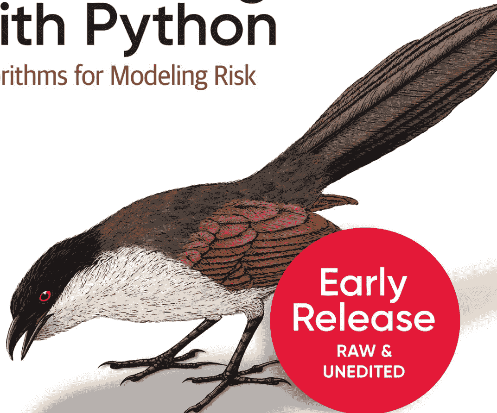

早期发布
原始与未编辑

Abdullah Karasan

# 使用Python进行金融风险管理的机器学习

风险建模算法

> 通过早期发布电子书，您可以在书籍的最早期形式——作者撰写时的原始未编辑内容——中获取书籍，从而在这些书籍正式发布之前很久就能利用这些技术。

# Abdullah Karasan

# 使用Python进行金融风险管理的机器学习

作者：Abdullah Karasan

版权所有 © 2022 Abdullah Karasan。保留所有权利。

印刷于美国。

由O'Reilly Media, Inc.出版，地址：1005 Gravenstein Highway North,
Sebastopol, CA 95472。

O'Reilly书籍可用于教育、商业或销售推广用途。大多数书籍也提供在线版本
(http://oreilly.com)。如需更多信息，请联系我们的企业/机构
销售部门：800-998-9938 或 corporate@oreilly.com。

收购编辑：Michelle Smith

开发编辑：Michele Cronin

制作编辑：Daniel Elfanbaum

内页设计师：David Futato

封面设计师：Karen Montgomery

插画师：Kate Dullea

2021年12月：第一版

# 早期发布修订历史

- 2020-02-26：首次发布
- 2021-05-19：第二次发布
- 2021-09-10：第三次发布

发布详情请参见 http://oreilly.com/catalog/errata.csp?isbn=9781492085256。

O'Reilly标志是O'Reilly Media, Inc.的注册商标。*使用Python进行金融风险管理的机器学习*、封面图片及相关商业外观是O'Reilly Media, Inc.的商标。

本书所表达的观点为作者个人观点，不代表出版商观点。虽然出版商和作者已尽最大努力确保本书所含信息和说明的准确性，但出版商和作者对任何错误或遗漏概不负责，包括但不限于因使用或依赖本书而造成的损害责任。使用本书所含信息和说明的风险由您自行承担。如果本书包含或描述的任何代码示例或其他技术受开源许可或他人知识产权约束，您有责任确保您的使用符合此类许可和/或权利。

978-1-492-08518-8

[LSI]

# 前言

人工智能和机器学习反映了技术的自然演进，随着计算能力的提升，计算机能够处理大型数据集并处理数字以识别模式和异常值。

> ——贝莱德（2019）

金融建模有着悠久的历史，成功完成了许多任务，但同时也因这些模型缺乏*灵活性*和*非包容性*而受到严厉批评。2007-2008年金融危机加剧了这场辩论，并为金融建模领域的创新和不同方法铺平了道路。

当然，这场金融危机并非推动人工智能在金融领域应用的唯一原因，还有另外两个主要驱动因素促进了人工智能在金融领域的采用。也就是说，数据可用性在1990年代增强了计算能力并加强了研究。

金融稳定理事会（2017）通过以下陈述强调了这一事实的有效性：

> “人工智能和机器学习的许多应用或‘用例’已经存在。这些用例的采用是由供应因素（如技术进步和金融部门数据及基础设施的可用性）和需求因素（如盈利需求、与其他公司的竞争以及金融监管要求）共同驱动的。”

> ——FSB

作为金融建模的一个分支，金融风险管理随着人工智能的采用而不断发展，同时在金融决策过程中扮演着日益重要的角色。在其著名的著作中，博斯特罗姆（2014）指出人类历史上有两个重要的革命：*农业革命*和*工业革命*。这两场革命的影响如此深远，以至于任何类似规模的第三场革命将在两周内使世界经济规模翻倍。更引人注目的是，如果第三场革命由人工智能完成，其影响将更为深远。

因此，人们对于人工智能应用通过利用大数据和理解风险过程的复杂结构来以前所未有的规模塑造金融风险管理寄予厚望。

通过本研究，我旨在填补金融领域基于机器学习应用的空白，从而提高金融模型的预测和度量性能。由于参数模型存在低方差-高偏差问题，机器学习模型凭借其灵活性可以解决这一问题。此外，作为金融领域的常见问题，数据分布的变化总是对模型结果的可靠性构成威胁，但机器学习模型可以适应这种变化模式，使模型拟合得更好。因此，金融领域对适用的机器学习模型有着巨大的需求，而本书的主要特色在于包含了金融风险管理中全新的基于机器学习的建模方法。

简而言之，本书旨在改变当前严重依赖参数模型的金融风险管理格局。推动这一转变的主要动机是近期基于机器学习模型的高精度金融模型的经验。因此，本书面向那些对金融和机器学习有初步了解的人，因为我只对这些主题提供了简要解释。

因此，本书的目标读者包括但不限于金融风险分析师、金融工程师、风险专员、风险建模师、模型验证师、量化风险分析师、投资组合分析师以及对金融和数据科学感兴趣的人。

鉴于目标读者的背景，具备金融和数据科学的入门级知识将使您从本书中获得最大收益。然而，这并不意味着来自不同背景的人无法理解本书的主题。相反，只要读者花费足够的时间并参考其他金融和数据科学书籍，来自不同背景的读者也能掌握这些概念。

本书共分为十章。

# 第1章

介绍了主要的风险管理概念。因此，它涵盖了风险、风险类型（如市场风险、信用风险、操作风险、流动性风险）以及风险管理。在定义了风险之后，讨论了风险类型，然后解释了风险管理，并阐述了其重要性以及如何用于减轻损失的问题。接下来，讨论了可以解决市场失灵的非对称信息。为此，我们将重点关注信息不对称和逆向选择。

# 第2章

展示了使用传统模型的时间序列应用，即移动平均模型、自回归模型、自回归积分移动平均模型。在本部分中，我们学习如何使用API访问金融数据以及如何使用它。本章的主要目的是为我们提供一个基准，将传统的时间序列方法与时间序列建模的最新发展进行比较，这是下一章的主要焦点。

# 第3章

介绍了用于时间序列建模的深度学习工具。循环神经网络和长短期记忆网络是两种能够对具有时间维度的数据进行建模的方法。此外，本章还让我们了解了深度学习模型在时间序列建模中的适用性。

# 第4章

专注于波动率预测。金融市场的日益融合导致了金融市场的长期不确定性，这

# 第5章

采用基于机器学习的模型来提升传统市场风险模型（即风险价值VaR和预期短缺ES）的估计性能。VaR是一种量化方法，用于衡量在特定时间段和置信水平下，因市场波动导致的公允价值潜在损失不会超过的限额。而预期短缺则关注分布的尾部，涉及重大且意外的损失。VaR模型使用去噪协方差矩阵开发，ES模型则结合了数据的流动性维度进行构建。

# 第6章

尝试引入一种全面的基于机器学习的方法来估计信用风险。机器学习模型基于历史信用信息及其他数据进行应用。该方法从风险分桶开始（这是巴塞尔协议所建议的），并继续使用不同的模型：贝叶斯估计、马尔可夫链模型、支持向量分类、随机森林、神经网络和深度学习。在本章的最后部分，将对这些模型的性能进行比较。

# 第7章

使用高斯混合模型来建模流动性，流动性被认为是风险管理中一个被忽视的维度。该模型允许我们在本章中纳入流动性代理的不同方面，从而能够以更稳健的方式捕捉流动性对金融风险的影响。

# 第8章

涵盖操作风险，这种风险主要由于公司内部弱点而导致失败。操作风险有多种来源，但欺诈风险是其中最耗时且对公司运营最具破坏性的风险之一。在本章中，欺诈将是我们的主要关注点，并将开发新的方法，以基于机器学习模型实现性能更优的欺诈检测应用。

# 第9章

介绍了一种全新的公司治理风险建模方法：股价崩盘。许多研究发现股价崩盘与公司治理之间存在经验性联系。本章使用最小协方差行列式模型，试图揭示公司治理风险组成部分与股价崩盘之间的关系。

# 第10章

利用合成数据来估计不同的金融风险。本章旨在强调合成数据的兴起，它帮助我们最小化有限历史数据的影响。因此，合成数据使我们能够拥有足够大且高质量的数据，从而提高模型的质量。

# 第一部分 风险管理基础

## 第1章 风险管理基础

> **致早期读者的说明**

通过早期发布电子书，您可以在书籍的最早期形式——作者撰写时的原始未编辑内容——中获取书籍，从而在这些书籍正式发布之前很久就能利用这些技术。

这将是最终书籍的第1章。请注意，GitHub仓库将在稍后激活。

如果您对我们如何改进本书的内容和/或示例有意见，或者您在本章中发现缺失的材料，请联系编辑 mcronin@oreilly.com。

> *2007年，没有人会想到风险职能在过去八年中发生了如此大的变化。人们很自然地会期望下一个十年的变化会少一些。然而，我们相信情况可能恰恰相反。*

—Harle et al. (2016)

风险管理是一个不断发展的过程。由于长期存在的风险管理实践无法跟上最近的发展或成为正在展开的危机的先兆，持续的演变是不可避免的。因此，在风险管理过程中，监控并采纳结构性断裂带来的变化至关重要。适应变化意味着重新定义风险管理的组成部分和工具，而这正是本书的核心内容。

传统上，在金融领域，金融实证研究非常注重统计推断。计量经济学建立在统计推断的原理之上。这些类型的模型专注于潜在数据生成过程的结构和变量之间的关系。然而，机器学习模型并不假定定义潜在的数据生成过程，而是被视为实现预测目的的手段（Lommers et al. 2021）。因此，机器学习模型往往更以数据为中心，并以预测准确性为导向。

此外，数据稀缺和不可用一直是金融领域的问题，不难猜测计量经济学模型在这种情况下表现不佳。鉴于机器学习模型通过合成数据生成解决了数据不可用的问题，机器学习模型已成为金融领域的首要议程，金融风险管理当然也不例外。

在深入细节并讨论这些工具之前，有必要介绍主要的风险管理概念。因此，本书的这一部分介绍了金融风险管理的基本概念，我将在全书中引用这些概念。这些概念包括风险、风险类型、风险管理、回报以及一些与风险管理相关的概念。

### 风险

风险在生活过程中始终存在，但由于其抽象性质，理解和评估风险比了解它要困难一些。风险被视为某种危险的东西，它可能以预期或非预期的形式出现。预期风险是已被定价的东西，而非预期风险则几乎无法计入，因此它可能是毁灭性的。

可以想象，对于风险的定义没有普遍的共识。然而，从金融的角度来看，风险指的是可能的潜在损失或公司可能暴露的不确定性水平。不同的是，McNeil et al. (2015)将风险定义为：

> 任何可能对组织实现其目标和执行其战略的能力产生不利影响的事件或行动，或者，损失或低于预期回报的可量化可能性。
—Harle et al. (2016)

这些定义侧重于风险的负面方面，意味着成本与风险相伴而行，但也应该注意，它们之间并不一定存在一对一的关系。例如，如果风险是预期的，那么产生的成本相对较低（甚至可以忽略不计），而非预期风险的成本则可能很高。

### 回报

所有金融投资都是为了获得利润，这也称为回报。更正式地说，回报是在给定时间段内投资所获得的收益。因此，回报指的是风险的正面方面。在全书中，风险和回报将分别指代下行风险和上行风险。

可以想象，风险和回报之间存在权衡，承担的风险越高，实现的回报就越大。由于提出一个最佳解决方案是一项艰巨的任务，这种权衡是金融领域最具争议的问题之一。然而，Markowitz (1952)为这个长期存在的问题提出了一个直观且吸引人的解决方案。他定义风险的方式（在此之前一直模糊不清）简洁明了，并导致了金融研究格局的转变。Markowitz (1952)使用标准差$\sigma_{R_i}$来量化风险。这种直观的定义允许研究人员在金融中使用数学和统计学。标准差的数学定义如下（Hull, 2012）：

$$\sigma = \sqrt{\mathbb{E}(R^2) - [\mathbb{E}(R)]^2}$$

其中R和$\mathbb{E}$符号分别代表年回报率和期望值。本书多次使用符号$\mathbb{E}$，因为期望回报代表了我们感兴趣的回报。这是因为在定义风险时，我们讨论的是概率。当涉及到投资组合方差时，协方差就进入了画面，公式变为：

### 投资组合方差与标准差

$$\sigma_p^2 = w_a^2\sigma_a^2 + w_b^2\sigma_b^2 + 2w_aw_b\text{Cov}(r_a, r_b)$$

其中 $w$ 表示权重，$\sigma^2$ 是方差，$\text{Cov}$ 是协方差。

对上述方差取平方根，即可得到投资组合的标准差：

$$\sigma_p = \sqrt{\sigma_p^2}$$

换言之，投资组合的预期收益是各资产收益的加权平均，可表示为：

$$\mathbb{E}(R) = \sum_{i}^{n} w_i R_i = w_1 R_1 + w_2 R_2 \cdots + w_n R_n$$

让我们通过可视化来探索风险与收益的关系。为此，我们构建一个假设的投资组合，并使用 Python 计算必要的统计量。

```python
In [1]: import statsmodels.api as sm
        import numpy as np
        import plotly.graph_objs as go
        import matplotlib.pyplot as plt
        import plotly
        import warnings
        warnings.filterwarnings('ignore')
```

```python
In [2]: n_assets = 5
        n_simulation = 500
```

```python
In [3]: returns = np.random.randn(n_assets, n_simulation)
```

```python
In [4]: rand = np.random.rand(n_assets)
        weights = rand/sum(rand)
```

```python
        def port_return(returns):
            rets = np.mean(returns, axis=1)
            cov = np.cov(rets.T, aweights=weights, ddof=1)
            portfolio_returns = np.dot(weights, rets.T)
            portfolio_std_dev = np.sqrt(np.dot(weights, np.dot(cov, weights)))
            return portfolio_returns, portfolio_std_dev
```

```python
In [5]: portfolio_returns, portfolio_std_dev = port_return(returns)
```

```python
In [6]: print(portfolio_returns)
        print(portfolio_std_dev)
        0.005773455631074148
        0.016994274496417057
```

```python
In [7]: portfolio = np.array([port_return(np.random.randn(n_assets, i))
                            for i in range(1, 101)])
```

```python
In [8]: best_fit = sm.OLS(portfolio[:, 1], sm.add_constant(portfolio[:, 0])).fit().fittedvalues
```

```python
In [9]: fig = go.Figure()
        fig.add_trace(go.Scatter(name='Risk-Return Relationship', x=portfolio[:,0],
                                 y=portfolio[:,1], mode='markers'))
        fig.add_trace(go.Scatter(name='Best Fit Line', x=portfolio[:,0],
                                 y=best_fit, mode='lines'))
        fig.update_layout(xaxis_title = 'Return', yaxis_title = 'Standard Deviation',
                          width=900, height=470)
        plotly.offline.iplot(fig, filename="images/risk_return.png")
        fig.show()
```

- 考虑的资产数量
- 进行的模拟次数
- 从正态分布生成随机样本作为收益率
- 生成随机数以计算权重
- 计算权重
- 用于计算预期投资组合收益和投资组合标准差的函数
- 调用函数的结果
- 打印预期投资组合收益和投资组合标准差的结果
- 重新运行函数 100 次
- 为了绘制最佳拟合线，我运行了线性回归
- 绘制交互式图表用于可视化

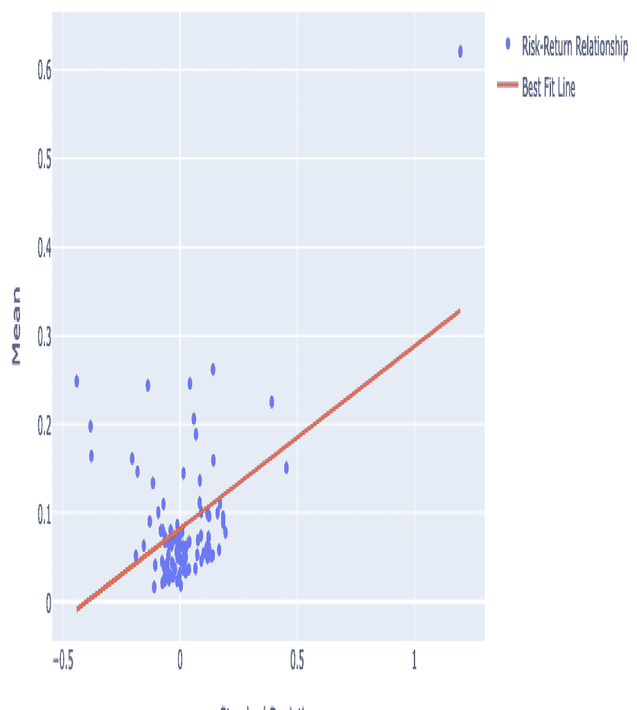

图 1-1. 风险与收益关系

图 1-1 通过上述 Python 代码生成，证实了风险与收益相伴而生，但这种相关性的大小取决于个股和金融市场状况。

### 风险管理

金融风险管理是处理金融市场不确定性带来的风险的过程。它涉及评估组织面临的金融风险，并制定与内部优先事项和政策一致的管理策略（Horcher, 2011）。

根据这一定义，由于每个组织面临不同类型的风险，公司处理风险的方式是完全独特的。每家公司都应适当评估风险并采取必要的行动。然而，这并不一定意味着一旦识别出风险，就需要尽可能地降低它。

因此，风险管理并非不惜一切代价地降低风险。降低风险可能需要牺牲收益，并且在一定程度上是可以容忍的，因为公司在寻求降低风险的同时也在寻求更高的收益。因此，在降低风险的同时最大化利润，应该是一项精细且定义明确的任务。

管理风险是一项精细的任务，因为它伴随着成本，尽管处理风险需要特定的公司政策，但存在一个通用的风险策略框架。这些策略包括：

- *忽略*：在此策略中，公司接受所有风险及其后果，并倾向于不采取任何行动。
- *转移*：此策略涉及通过对冲或其他方式将风险转移给第三方。
- *缓解*：公司制定策略来缓解风险，部分原因是其有害影响可能被认为过大而无法承受，和/或抑制了与之相关的收益。
- *接受风险*：如果公司采用*接受风险*的策略，他们会适当识别风险并承认其益处。换言之，当假设某些活动产生的特定风险能为股东带来价值时，可以选择此策略。

### 主要金融风险

金融公司在其业务生命周期中面临各种风险。这些风险可以被划分为不同的类别，以便更容易地识别和评估。这些主要的金融风险类型包括市场风险、信用风险、操作风险和流动性风险，但这并非详尽无遗的列表。然而，在本书中，我们将主要关注这些金融风险类型。让我们来看看这些风险类别。

### 市场风险

这种风险源于金融市场因素的变化。更具体地说，例如，*利率*上升可能会对持有空头头寸的公司产生不利影响。

第二个例子可以是关于市场风险的另一个来源；*汇率*。一家从事国际贸易、其商品以美元计价的公司，极易受到美元汇率变化的影响。

正如你所想象的，*商品价格*的任何变化都可能对公司财务的可持续性构成威胁。有许多基本面因素直接影响商品价格，例如市场参与者、运输成本等。

### 信用风险

信用风险是最普遍的风险之一。当交易对手未能履行债务时，就会产生信用风险。例如，如果借款人无法支付其款项，信用风险就实现了。信用质量的恶化也是风险的一个来源，因为它会降低组织可能持有的证券的市场价值（Horcher, 2011）。

### 流动性风险

在 2007-2008 年金融危机重创金融市场之前，流动性风险一直被忽视。从那时起，关于流动性风险的研究得到了加强。流动性是指投资者执行其交易的速度和便利性。这个定义也被称为交易流动性风险。流动性风险的另一个维度是融资流动性风险，可以定义为筹集现金或获得信贷以资助公司运营的能力。

如果公司无法在短时间内将其资产变现，这就属于流动性风险范畴，这对公司的财务管理和声誉相当有害。

### 操作风险

管理操作风险不仅是一项清晰且可预见的任务，而且由于该风险复杂且具有内部性质，它会消耗公司大量的资源。现在的问题是：金融公司如何做好风险管理？他们是否为此任务分配了必要的资源？风险对公司可持续性的重要性是否得到了恰当的评估？

顾名思义，当公司或行业的固有运营对日常运营、盈利能力或可持续性构成威胁时，就会产生操作风险。操作风险包括欺诈活动、未能遵守法规或内部程序、因缺乏培训造成的损失等。

那么，如果一家公司毫无准备地暴露于一种或多种此类风险中，会发生什么？虽然这种情况并不常见，但我们从历史事件中知道答案，公司可能会违约并陷入巨大的财务困境。

### 重大金融崩溃

风险管理有多重要？这个问题可以用一本数百页的书来回答，但事实上，金融机构中风险管理的兴起本身就说明了这一点。特别是，在全球金融危机之后，风险管理被描述为“风险管理的巨大失败”（Buchholtz and Wiggins, 2019）。事实上，2007-2008 年爆发的全球金融危机只是冰山一角。无数的失败风险管理方面的不足为金融体系的这次崩溃铺平了道路。要理解这次崩溃，我们需要回溯并深入探究过去金融风险管理的失败案例。一家名为长期资本管理公司（LTCM）的对冲基金，就生动地展现了金融崩溃的实例。

LTCM组建了一支由顶尖学者和从业者组成的团队。这吸引了大量资金流入该公司，并以10亿美元开始交易。到1998年，LTCM控制着超过1000亿美元的资产，并大量投资于包括俄罗斯在内的一些新兴市场。因此，由于*避险需求*¹，俄罗斯债务违约对LTCM的投资组合造成了深远影响，使其遭受重创，最终导致LTCM破产（Allen, 2003）。

金属贸易公司（Metallgesellschaft, MG）是另一家因糟糕的金融风险管理而不复存在的公司。MG主要经营天然气和石油市场。由于对天然气和石油价格的高度敞口，在价格大幅下跌后，MG需要资金。平仓空头头寸导致了约15亿美元的损失。

阿玛兰斯顾问公司（Amaranth Advisors, AA）是另一家对冲基金，因重仓单一市场并误判其投资带来的风险而破产。到2006年，AA吸引了约90亿美元的管理资产，但由于天然气期货和期权价格下跌，损失了近一半。AA的违约归因于低迷的天然气价格和误导性的风险模型（Chincarini, 2008）。

简而言之，Stulz在其题为“风险管理失败：它们是什么？何时发生？”（2008）的论文中，总结了导致违约的主要风险管理失败：

- 1) 对已知风险的错误衡量
- 2) 未能考虑风险
- 3) 未能将风险传达给高层管理人员
- 4) 未能监控风险
- 5) 未能管理风险
- 6) 未能使用适当的风险指标

因此，全球金融危机并非促使监管机构和金融机构重新设计其金融风险管理的唯一事件。相反，它是压垮骆驼的最后一根稻草。在危机之后，监管机构和金融机构都吸取了教训并改进了流程。最终，这一系列事件推动了金融风险管理的兴起。

### 金融风险管理中的信息不对称

尽管完全理性决策者的假设在理论上是直观的，也是现代金融理论的主要基石，但它过于完美而不切实际。因此，这一观点受到了行为经济学家的抨击，他们认为心理学在决策过程中起着关键作用。

> 做决定就像说散文——人们一直在做，无论有意识还是无意识。因此，决策这个话题被许多学科所共享，从数学和统计学，到经济学和政治学，再到社会学和心理学，这并不奇怪。

—Kahneman and Tversky (1984)

信息不对称与金融风险管理密不可分，因为融资成本和公司估值深受信息不对称的影响。也就是说，公司资产估值的不确定性可能会提高借贷成本，从而威胁到公司的可持续性（参见 DeMarzo and Darrell (1995) 以及 Froot, Scharfstein, and Stein (1993)）。

因此，上述失败的根源更深层次地在于，理性决策者生活的完美假设世界无法解释它们。此时，人类本能和不完美的世界开始发挥作用，多学科的融合提供了更合理的解释。结果证明，*逆向选择*和*道德风险*是解释市场失败的两个突出类别。

### 逆向选择

这是一种信息不对称，其中一方试图利用其信息优势。当卖方比买方拥有更多信息时，就会出现逆向选择。Akerlof (1970) 将这一现象完美地概括为“柠檬市场”。在这个框架中，“柠檬”指的是低质量商品。

考虑一个有柠檬车和高质量车的市场，买方知道很可能买到柠檬车，这降低了均衡价格。然而，卖方更清楚车是柠檬车还是高质量车。因此，在这种情况下，交易带来的好处可能会消失，交易无法达成。

由于复杂性和不透明性，危机前的抵押贷款市场是逆向选择的一个好例子。更详细地说，借款人比贷款人更了解自己的还款意愿和能力。金融风险是通过贷款的证券化，即抵押贷款支持证券（MBS）创造出来的。从这一点来看，抵押贷款的发起人比购买这些证券的投资者更了解其中的风险。

让我们尝试用Python对逆向选择进行建模。它在保险业中很容易观察到，因此我想专注于这个行业来建模逆向选择。

假设消费者的效用函数为：

$$U(x) = e^{\gamma x}$$

其中 x 是收入，$\gamma$ 是一个参数，取值在0到1之间。

> **注意**
>
> 效用函数是用来表示消费者对商品和服务偏好的工具，对于风险厌恶型个体，它是凹函数。

本例的最终目标是根据消费者效用来决定是否购买保险。

为了实践，我假设收入为2美元，事故成本为1.5美元。

现在是时候计算损失概率 π 了，它是外生给定的，并且服从均匀分布。

最后一步，为了找到均衡，我必须定义保险的供给和需求。以下代码块展示了我们如何对逆向选择进行建模。

```
In [10]: import matplotlib.pyplot as plt
        import numpy as np
        plt.style.use('seaborn')
```

```
In [11]: def utility(x):
            return(np.exp(x ** gamma))❶
```

```
In [12]: pi = np.random.uniform(0,1,20)
        pi = np.sort(pi)❷
```

```
In [13]: print('The highest three probability of losses are {}'.format(pi[-3:]))❸
        The highest three probability of losses are [0.73279622 0.82395421
        0.88113894]
```

```
In [14]: y = 2
        c = 1.5
        Q = 5
        D = 0.01
        gamma = 0.4
```

```
In [15]: def supply(Q):
            return(np.mean(pi[-Q:]) * c)❹
```

```
In [16]: def demand(D):
            return(np.sum(utility(y - D) > pi * utility(y - c) + (1 - pi) *
            utility(y)))❺
```

```
'g', label='insurance supply')
plt.ylabel("Average Cost")
plt.xlabel("Number of People")
plt.legend()
plt.savefig('images/adverse_selection.png')
plt.show()
```

- 1. 编写一个风险厌恶效用函数。
- 2. 从均匀分布中生成随机样本。
- 3. 选取最后三个项目。
- 4. 编写一个保险合同供给函数。
- 5. 编写一个保险合同需求函数。

图1-2展示了保险供给和需求曲线。令人惊讶的是，两条曲线都是向下倾斜的，这意味着随着更多的人需求合同，并且更多的人加入合同，风险会降低，从而影响保险合同的价格。

直线代表保险供给和合同的平均成本，而呈阶梯状下降的线代表保险合同的需求。当我们从高风险客户开始分析时，你可以看到，随着越来越多的人加入合同，风险水平与平均成本一起降低。

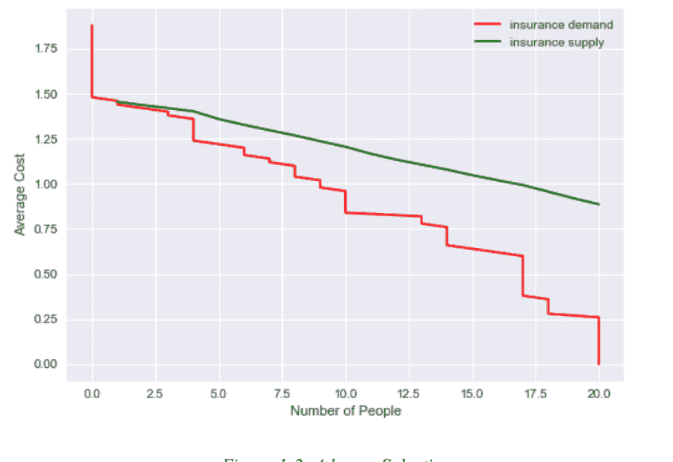

图1-2. 逆向选择

### 道德风险

市场失败也源于信息不对称。在道德风险情况下，合同的一方承担的风险比另一方更大。形式上，道德风险可以定义为：信息更充分的一方利用其掌握的私有信息，损害他人利益的情况。

为了更好地理解道德风险，可以从信贷市场给出一个简单的例子：假设实体A要求获得信贷，用于资助一个被认为可行的项目。如果实体A在未事先通知贷款银行的情况下，将贷款用于偿还银行C的信贷债务，就会产生道德风险。在分配信贷时，银行可能遇到的道德风险情况源于信息不对称，这降低了银行的贷款意愿，并成为银行在信贷分配过程中投入大量精力的原因之一。

有人认为，美联储为长期资本管理公司进行的救助行动在某种程度上可被视为道德风险，因为美联储是在缺乏诚信的情况下签订合同的。

### 结论

本章介绍了金融风险管理的主要概念，以确保我们达成共识。这些复习内容在本书中对我们帮助很大，因为我们将会使用这些术语和概念。

此外，第一章的最后一部分讨论了一种行为方法，旨在剖析金融代理人的理性，以便我们拥有更全面的工具来解释金融风险的来源。

在下一章中，我们将讨论时间序列方法，这是金融分析的主要支柱之一，因为大多数金融数据都具有时间维度，需要特别注意和专门的技术来处理。

### 延伸资源

本章引用的文章：

-   Akerlof, George A. “The market for “lemons”: Quality uncertainty and the market mechanism.” In Uncertainty in economics, pp. 235-251. Academic Press, 1978.
-   Buchholtz, Alec, and Rosalind Z. Wiggins. “Lessons Learned: Thomas C. Baxter, Jr., Esq.” Journal of Financial Crises 1, no. 1 (2019): 202-204.
-   Chincarini, Ludwig. “A case study on risk management: lessons from the collapse of amaranth advisors llc.” Journal of Applied Finance 18, no. 1 (2008): 152-74.
-   DeMarzo, Peter M., and Darrell Duffie. “Corporate incentives for hedging and hedge accounting.” The review of financial studies 8, no. 3 (1995): 743-771.
-   Froot, Kenneth A., David S. Scharfstein, and Jeremy C. Stein. “Risk management: Coordinating corporate investment and financing policies.” The Journal of Finance 48, no. 5 (1993): 1629-1658.
-   Lommers, Kristof, Ouns El Harzli, and Jack Kim. “Confronting Machine Learning With Financial Research.” Available at SSRN 3788349 (2021).
-   Stulz, René M. “Risk management failures: What are they and when do they happen?” Journal of Applied Corporate Finance 20, no. 4 (2008): 39-48.

本章引用的书籍：

-   Horcher, Karen A. Essentials of financial risk management. Vol. 32. John Wiley & Sons, 2011.
-   Hull, John. Risk management and financial institutions, + Web Site. Vol. 733. John Wiley & Sons, 2012.
-   Kahneman, D., and A. Tversky. “Choices, Values, and Frames. American Psychological Association.” (1984): 341-350.
-   Harle, P., Havas, A., & Samandari, H. (2016). The future of bank risk management. McKinsey Global Institute.
-   McNeil, Alexander J., Rüdiger Frey, & Paul Embrechts. Quantitative risk management: concepts, techniques and tools-revised edition. Princeton university press, 2015.

> 1 “逃向优质资产”一词指的是一种羊群行为，投资者远离股票等风险资产，转而持有政府债券等更安全的资产。

## 第二章 时间序列建模导论

> 给早期发布读者的说明

通过早期发布电子书，您可以在书籍的最早期形式——作者未经编辑的原始内容——中获取书籍，从而在这些书籍正式发布之前很久就能利用这些技术。

这将是最终书籍的第2章。请注意，GitHub仓库将在稍后激活。

如果您对我们如何改进本书内容和/或示例有意见，或者您注意到本章中有缺失的材料，请联系编辑 mcronin@oreilly.com。

> 市场行为是通过大量历史数据来研究的，例如货币或股票价格的高频买卖报价。正是数据的丰富性使得市场的实证研究成为可能。虽然无法进行受控实验，但可以在历史数据上进行广泛的测试。

— Henri Poincare

某些模型能更好地解释某些现象，某些方法能以可靠的方式捕捉事件的特征。时间序列建模就是一个生动的例子，因为绝大多数金融数据都具有时间维度，这使得时间序列应用成为金融领域必不可少的工具。简而言之，数据的顺序及其之间的相关性非常重要。

在本书的这一章中，将讨论经典的时间序列模型，并比较这些模型的性能。此外，基于深度学习的时间序列分析将在[待添加链接]中介绍，它在数据准备和模型结构方面采用了完全不同的方法。将要介绍的经典模型包括移动平均模型（MA）、自回归模型（AR），以及最后的自回归积分移动平均模型（ARIMA）。这些模型的共同点在于它们都利用了历史观测值所携带的信息。如果这些历史观测值来自误差项，则称为移动平均；如果这些观测值来自时间序列本身，则称为自回归。另一个模型，即ARIMA，是这些模型的扩展。

以下是时间序列的正式定义：

> 时间序列是一组观测值 $X_t$，每个观测值都在特定时间 $t$ 记录。离散时间时间序列（本书主要讨论的类型）是指观测时间集合 $T_0$ 是一个离散集合，例如在固定时间间隔进行观测的情况。当观测在某个时间区间内连续记录时，就得到连续时间序列。
—Brockwell and Davis (2016)

让我们观察具有时间维度的数据是什么样子。图2-1展示了1980-2020年期间的石油价格，下面的Python代码向我们展示了生成此图的一种方法。

```
In [1]: import quandl
       import matplotlib.pyplot as plt
       import warnings
       warnings.filterwarnings('ignore')
       plt.style.use('seaborn')

In [2]: oil = quandl.get("NSE/OIL", authtoken="vEjGTysiCFBuN-z5bjGP",
                       start_date="1980-01-01",
                       end_date="2020-01-01")

In [3]: plt.figure(figsize=(10, 6))
       plt.plot(oil.Close)
       plt.ylabel('$')
       plt.xlabel('Date')
       plt.savefig('images/Oil_Price.png')
       plt.show()
```

从 *Quandl* 数据库提取数据

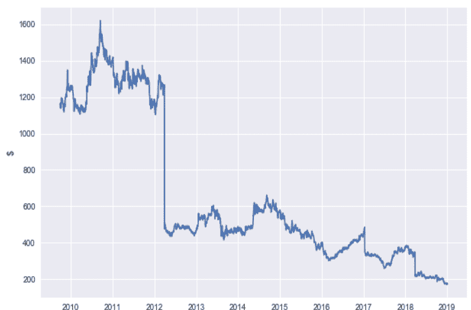

图2-1. 1980-2020年间的石油价格

> ### 注意

API，即应用程序编程接口，是一种设计用于通过代码检索数据的工具。我们将在本书中使用不同的API。在前面的实践中，使用了 *Quandl* API。

Quandl API允许我们访问 *Quandl* 网站上的金融、经济和另类数据。要获取您的Quandl API，请首先访问 [quandl网站](https://www.quandl.com) 并按照必要步骤获取您自己的API密钥。

从上面提供的定义可以理解，时间序列模型可应用于多个领域，例如：

-   医疗保健
-   金融
-   经济学
-   网络分析
-   天文学
-   天气

时间序列方法的优越性源于这样一个观点：观测值在时间上的相关性能更好地解释当前值。拥有在时间上具有相关结构的数据意味着违反了著名的独立同分布假设（简称IID），而该假设是许多模型的核心。

> **IID的定义**

IID假设使我们能够将数据的联合概率建模为观测值概率的乘积。过程 $X_t$ 被称为均值为0、方差为 $\sigma^2$ 的IID过程：

$$X_t \sim IID(0, \sigma^2)$$

因此，由于时间上的相关性，同期股票价格的动态变化可以通过其自身的历史值更好地理解。我们如何理解数据的动态变化？这是一个我们可以通过阐述时间序列的组成部分来回答的问题。

### 时间序列的组成部分

时间序列有四个组成部分，即趋势、季节性、周期性和残差。在Python中，我们可以使用 *seasonal_decompose* 函数轻松地可视化时间序列的组成部分：

```
In [4]: import yfinance as yf
        import numpy as np
        import pandas as pd
        import datetime
        import statsmodels.api as sm
        from statsmodels.tsa.stattools import adfuller
        from statsmodels.tsa.seasonal import seasonal_decompose

In [5]: ticker = '^GSPC'
        start = datetime.datetime(2015, 1, 1)
        end = datetime.datetime(2021, 1, 1)
        SP_prices = yf.download(ticker, start=start, end=end, interval='1mo').Close
```

### 趋势

趋势表示在给定时间段内增加或减少的一般倾向。一般来说，当时间序列的起始点和结束点不同，或呈现上升/下降斜率时，就存在趋势。

```python
In [7]: plt.figure(figsize=(10, 6))
        plt.plot(SP_prices) ❶
        plt.title('S&P-500 Prices')
        plt.ylabel('$')
        plt.xlabel('Date')
        plt.savefig('images/SP_price.png')
        plt.show()
```

除了标普500指数价格暴跌的时期外，我们在图2-3中看到2010年至2020年间有明显的上升趋势。

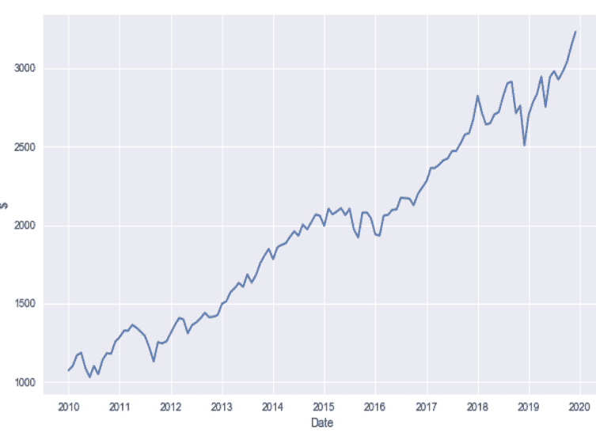

绘制折线图并非理解趋势的唯一选择。相反，我们有一些其他强大的工具来完成这项任务。因此，在这一点上，值得讨论两个重要的统计概念：

- 自相关函数
- 偏自相关函数

自相关函数，简称ACF，是一种分析时间序列当前值与其滞后值之间关系的统计工具。绘制ACF图使我们能够轻松观察时间序列中的序列依赖性。

$$\hat{\rho}(h) = \frac{\text{Cov}(X_t, X_{t-h})}{\text{Var}(X_t)}$$

图2-4表示自相关函数图。图2-4中显示的垂直线代表相关系数，第一条线表示序列与其0阶滞后的相关性，即与其自身的相关性。第二条线表示时间t-1和t处的序列值之间的相关性。根据这些，我们可以得出结论，标普500表现出序列依赖性。标普500数据的当前值与滞后值之间似乎存在很强的依赖性，因为ACF图中线条所代表的相关系数衰减缓慢。

```python
In [8]: sm.graphics.tsa.plot_acf(SP_prices, lags=30)
        plt.xlabel('Number of Lags')
        plt.savefig('images/acf_SP.png')
        plt.show()
```

绘制自相关函数

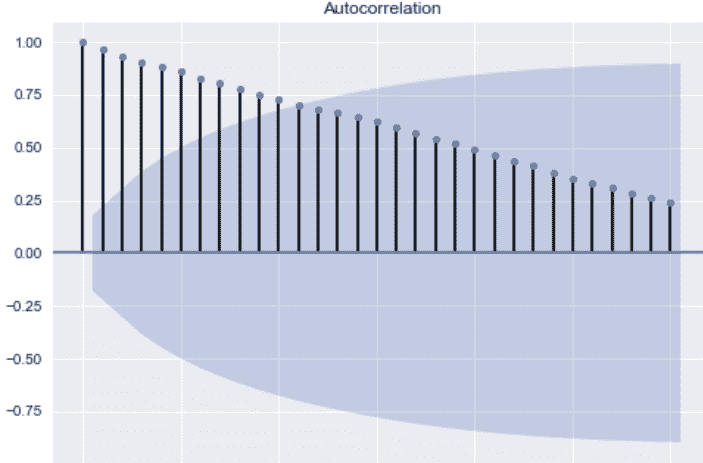

图2-4. 标普500的自相关函数图

那么，自相关的可能来源是什么？以下是一些原因：

- 自相关的主要来源是“延续”，即先前的观测值对当前观测值有影响。
- 模型设定错误。
- 测量误差，这基本上是观测值与实际值之间的差异。
- 遗漏了一个具有解释力的变量。

偏自相关函数（PACF）是另一种检验$X_t$与$X_{t-p}, p \in \mathbb{Z}$之间关系的方法。ACF通常被认为是MA(q)模型中的有用工具，仅仅因为PACF不会快速衰减而是趋近于0。然而，ACF的模式更适用于MA。另一方面，PACF与AR(p)过程配合良好。

PACF提供了在控制其他相关性的情况下，时间序列当前值与其滞后值之间相关性的信息。

乍一看不容易理解发生了什么。让我给你举个例子。假设我们想计算$X_t$和$X_{t-h}$之间的偏相关。为此，我考虑$X_t$与$X_{t-1}$和$X_{t-2}$之间的相关结构。

用数学表达：

$$\hat{\rho}(h) = \frac{\text{Cov}(X_t, X_{t-h} | X_{t-1}, X_{t-2}, \dots, X_{t-h-1})}{\sqrt{\text{Var}(X_t | X_{t-1}, X_{t-2}, \dots, X_{t-h-1}) \text{Var}(X_{t-h} | X_{t-1}, X_{t-2}, \dots, X_{t-h-1})}}$$

其中h是滞后阶数。

```python
In [9]: sm.graphics.tsa.plot_pacf(SP_prices, lags=30)
        plt.xlabel('Number of Lags')
        plt.savefig('images/pacf_SP.png')
        plt.show()
```

绘制偏自相关函数

图2-5展示了原始标普500数据的PACF。在解释PACF时，我们关注代表置信区间的深色区域之外的尖峰。图2-5在不同滞后阶数处显示了一些尖峰，但滞后16阶超出了置信区间。因此，选择一个具有16阶滞后的模型可能是明智的，这样我就能包含所有直到16阶的滞后。

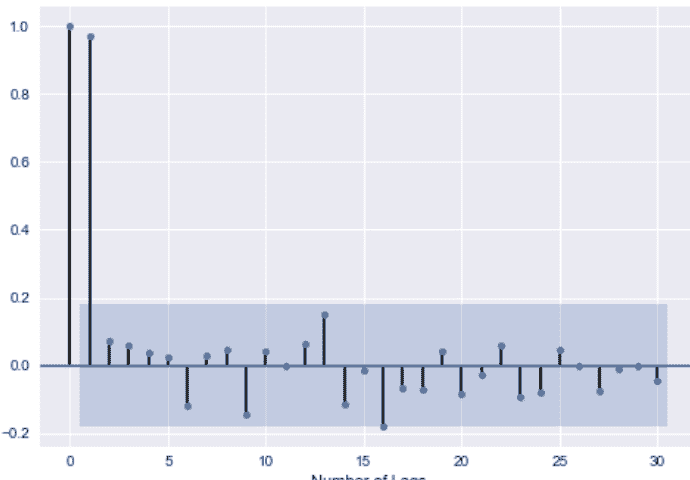

图2-5. 标普500的偏自相关函数图

如前所述，PACF以隔离中间效应的方式衡量序列当前值与其滞后值之间的相关性。

### 季节性

如果存在固定时间段内的规律性波动，则存在季节性。例如，能源使用可能表现出季节性特征。更具体地说，能源使用量在一年中的某些时期会上升和下降。

为了展示我们如何检测季节性成分，让我们使用FRED数据库，该数据库包含来自80多个来源的超过500,000个经济数据系列，涵盖与许多领域相关的问题和信息，如银行、就业、汇率、国内生产总值、利率、贸易和国际交易等。

```python
In [10]: from fredapi import Fred
         import statsmodels.api as sm

In [11]: fred = Fred(api_key='78b14ec6ba46f484b94db43694468bb1')#插入你的api密钥

In [12]: energy = fred.get_series("CAPUTLG2211A2S",
                                 observation_start="2010-01-01",
         energy.head(12)
Out[12]: 2010-01-01    83.7028
         2010-02-01    84.9324
         2010-03-01    82.0379
         2010-04-01    79.5073
         2010-05-01    82.8055
         2010-06-01    84.4108
         2010-07-01    83.6338
         2010-08-01    83.7961
         2010-09-01    83.7459
         2010-10-01    80.8892
         2010-11-01    81.7758
         2010-12-01    85.9894
         dtype: float64
```

```python
In [13]: plt.plot(energy)
         plt.title('Energy Capacity Utilization')
         plt.ylabel('$')
         plt.xlabel('Date')
         plt.savefig('images/energy.png')
         plt.show()
```

```python
In [14]: sm.graphics.tsa.plot_acf(energy, lags=30)
         plt.xlabel('Number of Lags')
         plt.savefig('images/energy_acf.png')
         plt.show()
```

从FRED数据库获取2010-2020年期间的能源产能利用率。

图2-6显示了近10年期间的周期性起伏，每年年初产能利用率较高，然后在年底下降，证实了能源产能利用率存在季节性。

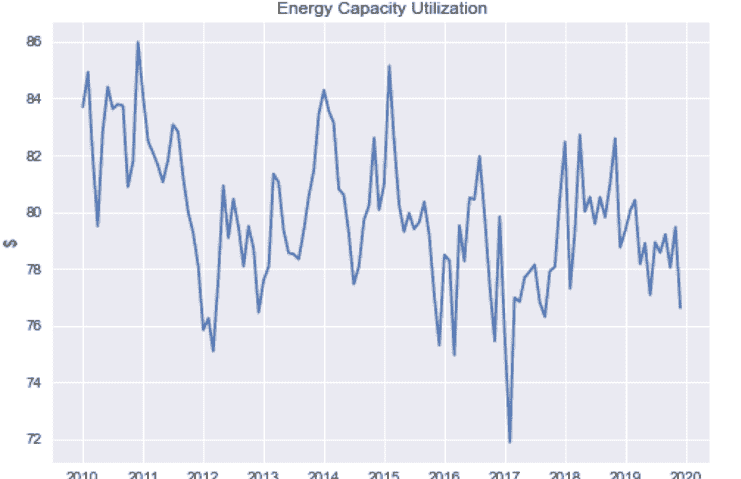

图2-6. 能源产能利用率的季节性

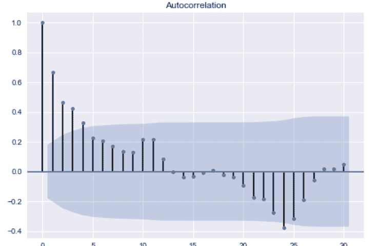

图2-7. 能源产能利用率的ACF

### 周期性

如果数据没有显示固定周期的运动怎么办？这时，周期性就出现了。当出现高于趋势的周期性变化时，它就存在。有些人混淆了周期性和季节性，因为它们都表现出扩张和收缩。然而，我们可以将周期性视为商业周期，它需要很长时间才能完成其周期，并且在长期内有起伏。因此，周期性与季节性的不同之处在于没有固定时期的波动。周期性的一个例子可能是房屋购买（或销售）取决于抵押贷款利率。也就是说，当抵押贷款利率下调（或上调）时，会促进房屋购买（或销售）。

### 残差

残差被称为时间序列的不规则成分。从技术上讲，残差等于观测值与相关拟合值之间的差异。因此，我们可以将其视为模型的剩余部分。

正如我们之前讨论的，时间序列模型缺乏一些核心假设，但这并不一定意味着时间序列模型没有假设。我想强调最突出的一个，即*平稳性*。

平稳性意味着时间序列的统计特性，如均值、方差和协方差，不会随时间变化。

平稳性有两种形式：

1) 弱平稳性：如果时间序列$X_t$满足以下条件，则称其为平稳的：

- $X_t$具有有限方差，$\mathbb{E}(X_t^2) < \infty, \forall t \in \mathbb{Z}$
- $X_t$的均值是常数且仅依赖于时间，$\mathbb{E}(X_t) = \mu, t \forall \in \mathbb{Z}$
- 协方差结构$\gamma(t, t+h)$仅依赖于时间差：

$\gamma(h) = \gamma_h + \gamma(t+h, t)$

换句话说，时间序列应具有有限方差、常数均值，以及作为时间差函数的协方差结构。

### 强平稳性

如果 $X_{t1}, X_{t2}, \dots X_{tk}$ 的联合分布与平移后的集合 $X_{t1+h}, X_{t2+h}, \dots X_{tk+h}$ 的分布相同，则称为强平稳性。因此，强平稳性意味着随机过程中随机变量的分布在时间平移后保持不变。

那么，为什么我们需要平稳性呢？原因有二。

首先，在估计过程中，随着时间的推移，保持某种分布是至关重要的。换句话说，如果时间序列的分布随时间变化，它就会变得不可预测，无法建模。

时间序列模型的最终目标是预测。为此，我们首先需要估计系数，这对应于机器学习中的学习过程。一旦我们完成学习并进行预测分析，我们假设估计期间的数据分布以某种方式保持不变，即我们拥有相同的估计系数。如果情况并非如此，我们应该重新估计系数，因为无法使用先前估计的系数进行预测。

结构性断裂（如金融危机）会导致分布发生转变。我们需要谨慎且单独地处理这一时期。

拥有平稳数据的另一个原因是，根据假设，一些统计模型要求数据是平稳的，但这并不意味着只有某些模型需要平稳性。相反，所有模型都需要平稳性，但即使你向模型输入非平稳数据，一些模型在设计上也会将其转换为平稳数据并进行处理。Python中的内置函数可以方便地进行如下分析：

```
In [15]: stat_test = adfuller(SP_prices)[0:2]①
        print("The test statistic and p-value of ADF test are {}".format(stat_test))②
The test statistic and p-value of ADF test are (0.030295120072926063,
0.9609669053518538)
```

+   ① 对平稳性进行ADF检验
② 打印ADF检验的检验统计量和p值（保留前四位小数）

下图2-4显示了缓慢衰减的滞后，这表明数据是非平稳的，因为时间序列滞后之间的高相关性持续存在。

总的来说，理解非平稳性有两种方法：可视化和统计方法。后者当然具有更好、更稳健的检测非平稳性的方法。然而，为了加深我们的理解，让我们从自相关函数（ACF）开始。缓慢衰减的ACF意味着数据是非平稳的，因为它在时间上表现出强相关性。这就是我在标普500数据中观察到的情况。

检测非平稳性的统计方法更可靠，*ADF*检验是广泛认可的检验方法。根据上述检验结果，p值为0.99表明数据存在非平稳性，我们需要在继续之前处理这个问题。

差分是消除非平稳性的有效技术。差分无非是用序列的当前值减去其一阶滞后值，即 $x_t - x_{t-1}$，以下Python代码展示了如何应用此技术：

```
In [16]: diff_SP_price = SP_prices.diff()

In [17]: plt.figure(figsize=(10, 6))
    plt.plot(diff_SP_price)
    plt.title('Differenced S&P-500 Price')
    plt.ylabel('$')
    plt.xlabel('Date')
    plt.savefig('images/diff_SP_price.png')
    plt.show()

In [18]: sm.graphics.tsa.plot_acf(diff_SP_price.dropna(),lags=30)
    plt.xlabel('Number of Lags')
    plt.savefig('images/diff_acf_SP.png')
    plt.show()

In [19]: stat_test2=adfuller(diff_SP_price.dropna())[0:2]
    print("The test statistic and p-value of ADF test after differencing are {}"\n        .format(stat_test2))
    The test statistic and p-value of ADF test after differencing are
    (-7.0951058730170855, 4.3095548146405375e-10)
```

+   1. 对标普500价格进行差分
2. 基于差分后的标普500数据的ADF检验结果

进行一阶差分后，我们重新运行ADF检验以查看其是否有效，结果确实有效。ADF检验极低的p值告诉我，标普500数据现在是平稳的。

这可以从下面提供的折线图中观察到。与原始的标普500图不同，图2-8显示了围绕均值的波动，且波动性相似，这意味着我们得到了一个平稳序列。

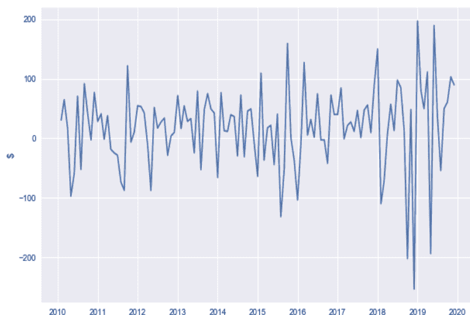

图2-8. 去趋势后的标普500价格

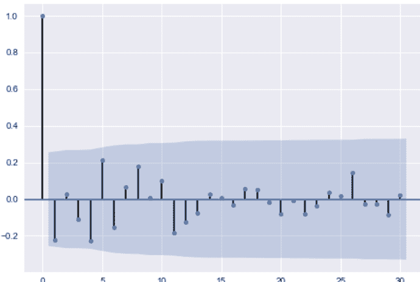

图2-9. 去趋势后的标普500价格

不用说，趋势并非非平稳性的唯一指标。季节性是另一个来源，现在我们将学习一种处理它的方法。

首先，让我们观察能源产能利用率的ACF（图2-7），它显示出周期性的起伏，这是非平稳性的标志。

为了消除季节性，我们首先应用*重采样*方法计算年度平均值，该平均值用作以下公式的分母：

$$\text{季节性指数} = \frac{\text{季节性时间序列的值}}{\text{季节性平均值}}$$

因此，应用的结果——*季节性指数*——给出了我们去季节化的时间序列。以下代码展示了我们如何在Python中编写此公式。

```
In [20]: seasonal_index = energy.resample('Q').mean()
In [21]: dates = energy.index.year.unique()
        deseasonalized = []
        for i in dates:
            for j in range(1, 13):
                deseasonalized.append((energy[str(i)][energy[str(i)].index.month==j]))
        concat_deseasonalized = np.concatenate(deseasonalized)
```

```
In [22]: dseason_energy = []
        for i,s in zip(range(0, len(energy), 3), range(len(seasonal_index))):
            dseason_energy.append(concat_deseasonalized[i:i+3] / seasonal_index.iloc[s])❺
        concat_dseason_energy = np.concatenate(dseason_energy)
        dseason_energy = pd.DataFrame(concat_dseason_energy, index=energy.index)
        dseason_energy.columns = ['Deaseasonalized Energy']
        dseason_energy.head()
Out[22]:          Deaseasonalized Energy
        2010-01-01          1.001737
        2010-02-01          1.016452
        2010-03-01          0.981811
        2010-04-01          0.966758
        2010-05-01          1.006862
```

```
In [23]: sm.graphics.tsa.plot_acf(dseason_energy, lags=10)
        plt.xlabel('Number of Lags')
        plt.savefig('images/dseason_energy_acf.png')
        plt.show()
In [24]: sm.graphics.tsa.plot_pacf(dseason_energy, lags=10)
        plt.xlabel('Number of Lags')
        plt.savefig('images/dseason_energy_pacf.png')
        plt.show()
```

+   ❶ 计算能源利用率的季度平均值。
❷ 定义进行季节性分析的年份。
❸ 计算*季节性指数*公式的分子。
❹ 连接去季节化的能源利用率。
❺ 使用预定义公式计算*季节性指数*。

图2-10表明，在滞后1和2处存在统计上显著的相关性，但ACF没有显示任何周期性特征，这是去季节化的另一种说法。

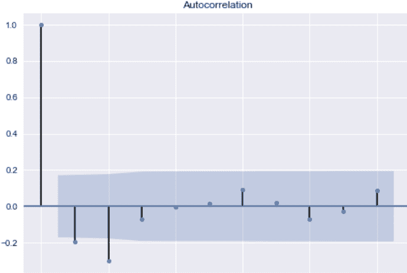

图2-10. 能源利用率的去季节化ACF

类似地，在图2-11中，尽管我们在某些滞后处有尖峰，但偏自相关函数（PACF）没有显示任何周期性的起伏。因此，我们可以说数据已使用季节性指数公式进行了去季节化。

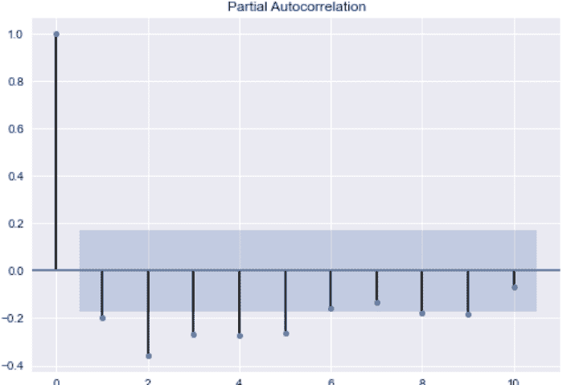

图2-11. 能源利用率的去季节化PACF

我们现在得到的是能源产能利用率中周期性起伏减少，这意味着数据已经去季节化。

最后，我们准备好继续讨论时间序列模型。

### 时间序列模型

传统的时间序列模型是单变量模型，它们遵循以下阶段：

-   **识别：** 在此过程中，我们使用ACF、PACF探索数据，识别模式，并进行统计检验。
-   **估计：** 这部分涉及通过适当的优化技术估计系数。
-   **诊断：** 估计完成后，我们需要检查信息准则或ACF/PACF是否表明模型是有效的。如果是，我们进入预测阶段。

### 预测

这部分更多涉及模型的性能。在预测中，我们基于估计来预测未来值。

图2-12展示了建模过程。因此，在变量识别和估计过程之后，模型得以运行。只有在运行了适当的诊断之后，我们才能进行预测分析。

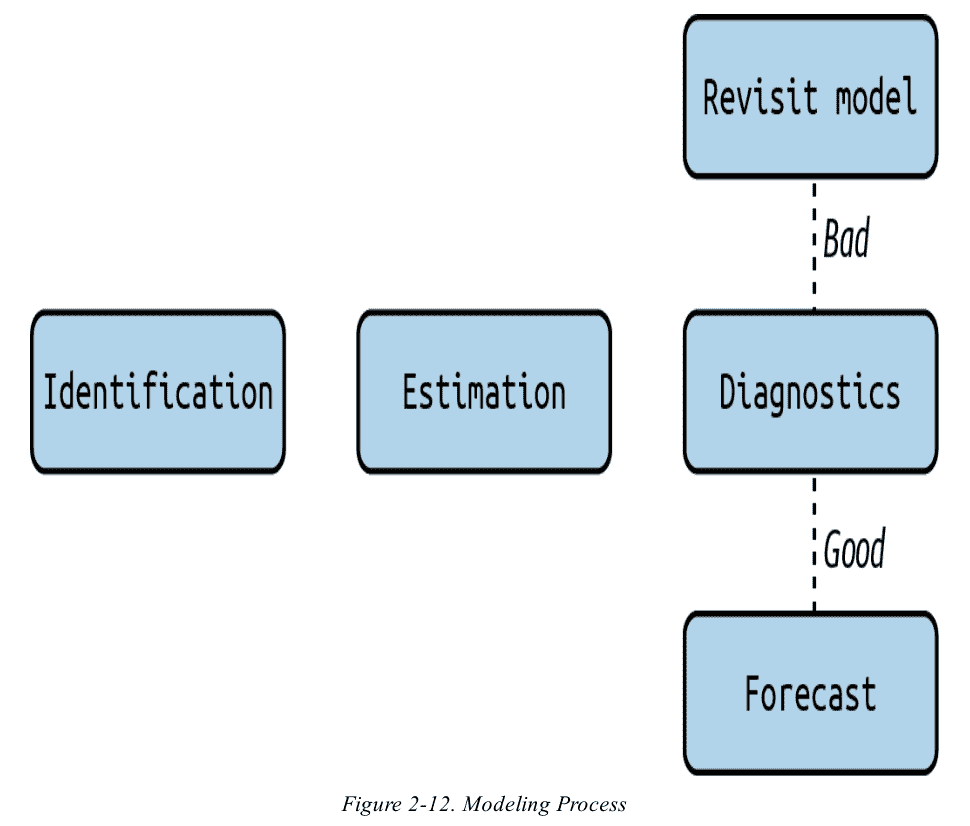

在对具有时间维度的数据进行建模时，我们应该考虑相邻时间点之间的相关性。这种考虑将我们引向之前讨论过的时间序列建模。我在时间序列建模中的目标是拟合一个模型，并理解一个在时间上随机波动的时间序列的统计特性。

回顾一下关于IID过程的讨论，这是最基本的时间序列模型，有时也被称为白噪声。让我们来探讨白噪声的概念。

### 白噪声

如果时间序列 $\epsilon_t$ 满足以下条件，则称其为白噪声：

$$\epsilon_t \sim WN(0, \sigma_\epsilon^2)$$
$$\text{Corr}(\epsilon_t, \epsilon_s) = 0, \forall t \neq s$$

换句话说，$\epsilon_t$ 的均值为0，方差恒定。此外，$\epsilon_t$ 的连续项之间没有相关性。

嗯，很容易说白噪声过程是平稳的，白噪声的图在时间上围绕均值以随机方式波动。

然而，由于白噪声是由不相关的序列构成的，从预测的角度来看，它并不是一个有吸引力的模型。不同的是，不相关性阻碍了我们预测未来值。

正如我们在下面的图2-13中可以观察到的，白噪声围绕均值振荡，且完全无规律。

```
In [25]: mu = 0
        std = 1
        WN = np.random.normal(mu, std, 1000)

        plt.plot(WN)
        plt.xlabel('Number of Simulation')
        plt.savefig('images/WN.png')
        plt.show()
```

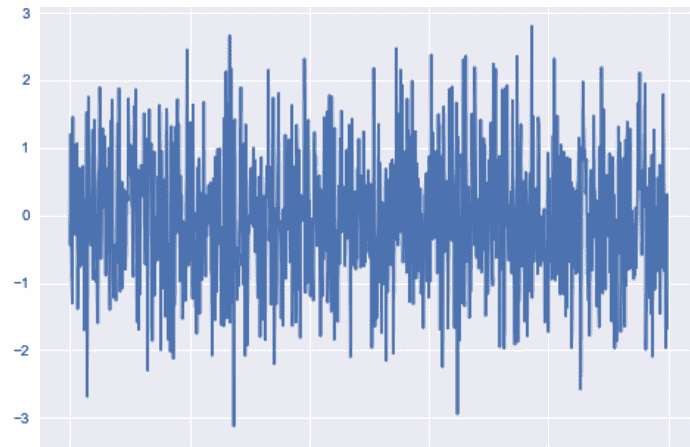

图2-13. 白噪声过程

从现在开始，我们需要在运行时间序列模型之前确定最佳的滞后数。可以想象，决定最佳滞后数是一项具有挑战性的任务。最广泛使用的方法是：*ACF*、*PACF*和*信息准则*。ACF和PACF已经讨论过，为了全面起见，信息准则（简称AIC）也将被介绍。

### 信息准则

检测最佳滞后数是一项繁琐的任务。我们需要一个标准来决定哪个模型最适合数据，因为可能存在许多潜在的好模型。赤池信息准则，简称AIC，正如Cavanaugh和Neath（2019）所指出的：

> AIC被引入作为最大似然原理的扩展。最大似然通常用于在模型的结构和维度确定后估计模型的参数。

AIC的数学定义为：

$AIC = -2ln(MaximumLikelihood) + 2d$

其中d是参数的总数。方程中的最后一项2d旨在降低过拟合的风险。它也被称为*惩罚项*，通过它我可以过滤掉模型中不必要的冗余。

BIC是另一个用于选择最佳模型的信息准则。BIC中的惩罚项大于AIC中的惩罚项。

$BIC = -2ln(MaximumLikelihood) + ln(n) * d$

其中n是观测值的数量。

请注意，如果所提出的模型是有限维的，你需要谨慎对待AIC。Clifford和Hurvich（1989）很好地阐述了这一点：

> 如果真实模型是无限维的（这在实践中似乎是最常见的情况），AIC提供了对有限维近似模型的渐近有效选择。然而，如果真实模型是有限维的，渐近有效的方法，例如赤池的FPE（Akaike, 1970）、AIC和Parzen的CAT（Parzen, 1977），并不能提供一致的模型阶数选择。

让我们开始探讨经典的时间序列模型——移动平均模型。

### 移动平均模型

移动平均（MA）和残差是密切相关的模型。移动平均可以被视为平滑模型，因为它倾向于考虑残差的滞后值。为了简单起见，让我们从MA(1)开始：

$$X_t = \epsilon_t + \alpha\epsilon_{t-1}$$

只要 $\alpha \neq 0$，它就具有非平凡的相关结构。直观地说，MA(1)告诉我们时间序列仅受 $\epsilon_t$ 和 $\epsilon_{t-1}$ 的影响。

一般形式下，MA(q)方程变为：

$$X_t = \epsilon_t + \alpha_1\epsilon_{t-1} + \alpha_2\epsilon_{t-2}\dots + \alpha_q\epsilon_{t-q}$$

从现在开始，为了保持一致，我们将对两家主要IT公司，即*苹果*和*微软*的数据进行建模。*雅虎财经*提供了一个便捷的工具，可以获取2019年1月1日至2021年1月1日期间相关股票的收盘价。

第一步，我们删除了缺失值，并检查数据是否平稳，结果如预期，苹果和微软的股票价格都不具有平稳结构。因此，此时需要采取的步骤是取一阶差分使这些数据平稳，并将数据划分为`训练集`和`测试集`。以下代码展示了我们如何在Python中完成这些操作。

```
In [26]: ticker = ['AAPL', 'MSFT']
        start = datetime.datetime(2019, 1, 1)
        end = datetime.datetime(2021, 1, 1)
        stock_prices = yf.download(ticker, start=start, end = end, interval='1d').Close❶
        [*********************100%**********************]  2 of 2 completed

In [27]: stock_prices = stock_prices.dropna()

In [28]: for i in ticker:
            stat_test = adfuller(stock_prices[i])[0:2]
            print("The ADF test statistic and p-value of {} are {}".format(i,stat_test))
        The ADF test statistic and p-value of AAPL are  (0.29788764759932335, 0.9772473651259085)
        The ADF test statistic and p-value of MSFT are  (-0.8345360070598484, 0.8087663305296826)

In [29]: diff_stock_prices = stock_prices.diff().dropna()

In [30]: split = int(len(diff_stock_prices['AAPL'].values) * 0.95)❷
```

```
diff_train_aapl = diff_stock_prices['AAPL'].iloc[:split]③
diff_test_aapl = diff_stock_prices['AAPL'].iloc[split:]④
diff_train_msft = diff_stock_prices['MSFT'].iloc[:split]⑤
diff_test_msft = diff_stock_prices['MSFT'].iloc[split:]⑥
```

```
In [31]: diff_train_aapl.to_csv('diff_train_aapl.csv')⑦
        diff_test_aapl.to_csv('diff_test_aapl.csv')
        diff_train_msft.to_csv('diff_train_msft.csv')
        diff_test_msft.to_csv('diff_test_msft.csv')
```

```
In [32]: fig, ax = plt.subplots(2, 1, figsize=(10, 6))
        plt.tight_layout()
        sm.graphics.tsa.plot_acf(diff_train_aapl,lags=30, ax=ax[0], title='ACF - Apple')
        sm.graphics.tsa.plot_acf(diff_train_msft,lags=30, ax=ax[1], title='ACF - Microsoft')
        plt.savefig('images/acf_ma.png')
        plt.show()
```

1.  获取月度股票收盘价。
2.  将数据按95%和5%划分。
3.  将95%的苹果股票价格数据分配给训练集。
4.  将5%的苹果股票价格数据分配给测试集。
5.  将95%的微软股票价格数据分配给训练集。
6.  将5%的微软股票价格数据分配给测试集。
7.  保存数据以备将来使用。

观察图2-14的第一个面板，可以发现在某些滞后处存在显著的尖峰，为了稳妥起见，我们选择滞后9作为短期移动平均模型，滞后22作为长期移动平均。这意味着在建模MA时，阶数9将作为我们的短期阶数，阶数22将作为我们的长期阶数。

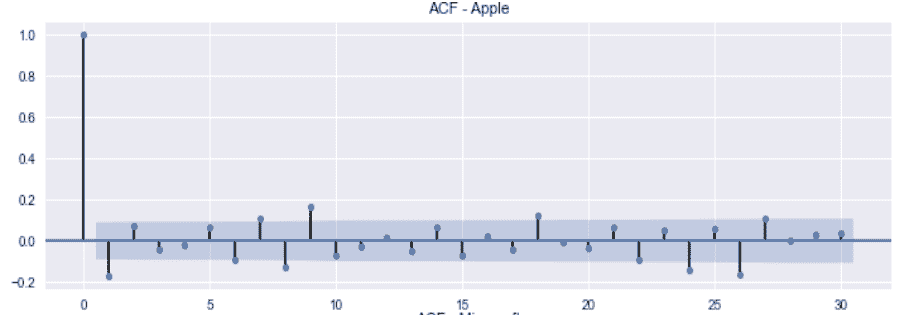

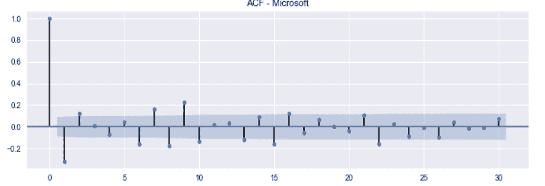

图2-14. 一阶差分后的ACF

```
In [33]: short_moving_average_appl = diff_train_aapl.rolling(window=9).mean()
        long_moving_average_appl = diff_train_aapl.rolling(window=22).mean()
```

```
In [34]: fig, ax = plt.subplots(figsize=(10, 6))
        ax.plot(diff_train_aapl.loc[start:end].index,
                diff_train_aapl.loc[start:end],
                label='Stock Price', c='b')
        ax.plot(short_moving_average_appl.loc[start:end].index,
                short_moving_average_appl.loc[start:end],
                label = 'Short MA',c='g')
        ax.plot(long_moving_average_appl.loc[start:end].index,
                long_moving_average_appl.loc[start:end],
                label = 'Long MA',c='r')
        ax.legend(loc='best')
        ax.set_ylabel('Price in $')
        ax.set_title('Stock Prediction-Apple')
        plt.savefig('images/ma_apple.png')
        plt.show()
```

1.  苹果股票的短期窗口移动平均
2.  苹果股票的长期窗口移动平均

+   3. 苹果股票价格一阶差分的折线图
4. 苹果股票短期移动平均结果可视化
5. 苹果股票长期移动平均结果可视化

图2-15展示了短期移动平均模型结果（绿色）和长期移动平均模型结果（红色）。正如预期，短期移动平均对苹果股票每日价格变化的反应比长期移动平均更敏感。这是合理的，因为考虑较长的移动平均会产生更平滑的预测。

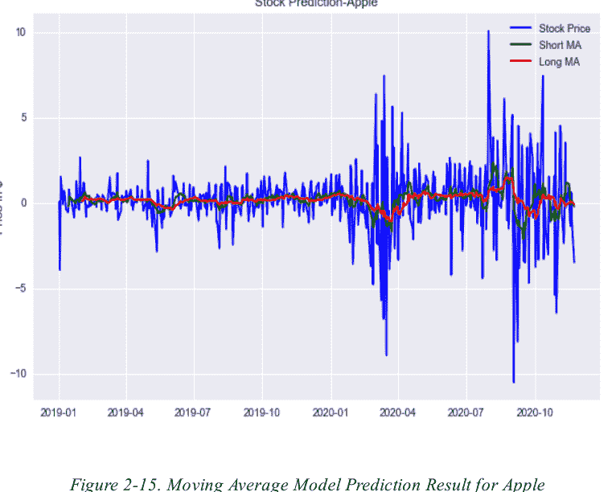

图2-15. 苹果股票移动平均模型预测结果

下一步，我们将尝试使用不同窗口的移动平均模型来预测微软股票价格。但在继续之前，我想说明，为短期和长期移动平均分析选择合适的窗口是良好建模的关键。在图2-14的第二面板中，似乎在滞后2和23处有显著的尖峰，这些滞后分别用于短期和长期移动平均分析。确定窗口后，让我们使用以下应用将数据拟合到移动平均模型。

```
In [35]: short_moving_average_msft = diff_train_msft.rolling(window=2).mean()
        long_moving_average_msft = diff_train_msft.rolling(window=23).mean()

In [36]: fig, ax = plt.subplots(figsize=(10, 6))
        ax.plot(diff_train_msft.loc[start:end].index,
                diff_train_msft.loc[start:end],
                label='Stock Price',c='b')
        ax.plot(short_moving_average_msft.loc[start:end].index,
                short_moving_average_msft.loc[start:end],
                label = 'Short MA',c='g')
        ax.plot(long_moving_average_msft.loc[start:end].index,
                long_moving_average_msft.loc[start:end],
                label = 'Long MA',c='r')
        ax.legend(loc='best')
        ax.set_ylabel('$')
        ax.set_xlabel('Date')
        ax.set_title('Stock Prediction-Microsoft')
        plt.savefig('images/ma_msft.png')
        plt.show()
```

类似地，在图2-16中，基于短期移动平均分析的预测比长期移动平均模型的预测反应更灵敏。但在微软的案例中，短期移动平均预测似乎与真实数据非常接近。

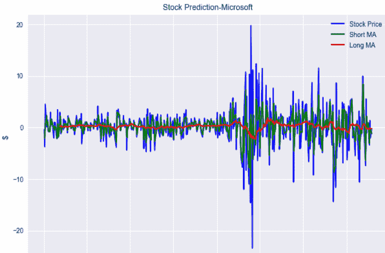

图2-16. 微软股票移动平均模型预测结果

### 自回归模型

连续项之间的依赖结构是自回归模型最显著的特征，因为在这个模型中，当前值是对其自身滞后值进行回归。因此，我们基本上是通过使用其过去值的线性组合来预测时间序列 $X_t$ 的当前值。从数学上讲，AR(p) 的一般形式可以写成：

$$X_t = c + \alpha_1 X_{t-1} + \alpha_2 X_{t-2}... + \alpha_p X_{t-p} + \epsilon_t$$

其中 $\epsilon_t$ 表示残差，c 是截距项。AR(p) 模型意味着直到 p 阶的过去值对 $X_t$ 具有一定的解释力。如果这种关系的记忆较短，那么很可能用较少的滞后数来建模 $X_t$。

我们已经讨论了时间序列的一个主要特性，即*平稳性*，另一个重要特性是*可逆性*。在介绍了 AR 模型之后，现在是时候展示 MA 过程的可逆性了。如果它可以转换为无限 AR 模型，则称其为可逆的。

不同地，在某些情况下，MA 可以写成一个无限 AR 过程。这些情况是具有平稳协方差结构、确定性部分和可逆的 MA 过程。这样做，我们得到了另一个模型，称为*无限 AR*，这得益于 $|\alpha| < 1$ 的假设。

$$X_t = \epsilon_t + \alpha\epsilon_{t-1}$$
$$= \epsilon_t + \alpha(X_{t-1} - \alpha\epsilon_{t-2})$$
$$= \epsilon_t + \alpha X_{t-1} - \alpha^2\epsilon_{t-2}$$
$$= \epsilon_t + \alpha X_{t-1} - \alpha^2(X_{t-2} + \alpha\epsilon_{t-3})$$
$$= \epsilon_t + \alpha X_{t-1} - \alpha^2 X_{t-2} + \alpha^3\epsilon_{t-3})$$
$$= ...$$
$$= \alpha X_{t-1} - \alpha^2 X_{t-2} + \alpha^3\epsilon_{t-3} - \alpha^4\epsilon_{t-4} + ... - (-\alpha)^n\epsilon_{t-n}$$

进行必要的数学运算后，方程得到以下形式：

$$\alpha^n\epsilon_{t-n} = \epsilon_t - \sum_{i=0}^{n-1} \alpha^i X_{t-i}$$

在这种情况下，如果 $|\alpha| < 1$。那么 $n \rightarrow \infty$

$$\mathbb{E}\left(\epsilon_t - \sum_{i=0}^{n-1} \alpha^i X_{t-i}\right)^2 = \mathbb{E}(\alpha^{2n}\epsilon_{t-n}^2 \rightarrow \infty)$$

最终，MA(1) 过程变为：

$$\epsilon_t = \sum_{i=0}^{\infty} \alpha^i X_{t-i}$$

由于 AR 和 MA 过程之间的对偶性，可以将 AR(1) 表示为无限 MA，即 MA($\infty$)。换句话说，AR(1) 过程可以表示为创新项过去值的函数。

$$X_t = \epsilon_t + \theta X_{t-1}$$
$$= \theta(\theta X_{t-2} + \epsilon_{t-1}) + \epsilon_t$$
$$= \theta^2 X_{t-2} + \theta \epsilon_{t-1} + \epsilon_t$$
$$= \theta^2(\theta X_{t-3} + \theta \epsilon_{t-2}) \theta \epsilon_{t-1} + \epsilon_t$$
$$X_t = \epsilon_t + \epsilon_{t-1} + \theta^2 \epsilon_{t-2} + \dots + \theta^t X_t$$

当 $n \rightarrow \infty$ 时，$\theta^t \rightarrow 0$，因此我可以将 AR(1) 表示为一个无限 MA 过程。

在接下来的分析中，我们运行自回归模型来预测苹果和微软的股票价格。与移动平均不同，偏自相关函数是找出自回归模型中最佳阶数的有用工具。这是因为在 AR 中，我们的目标是找出时间序列在两个不同时间点（例如 $X_t$ 和 $X_{t-k}$）之间的关系，为此我需要过滤掉中间其他滞后的影响。

```
In [37]: sm.graphics.tsa.plot_pacf(diff_train_aapl,lags=30)
        plt.title('PACF of Apple')
        plt.xlabel('Number of Lags')
        plt.savefig('images/pacf_ar_aapl.png')
        plt.show()
In [38]: sm.graphics.tsa.plot_pacf(diff_train_msft,lags=30)
        plt.title('PACF of Microsoft')
        plt.xlabel('Number of Lags')
        plt.savefig('images/pacf_ar_msft.png')
        plt.show()
```

根据图2-17（来自苹果股票价格的一阶差分），我们观察到在滞后29处有一个显著的尖峰，图2-18显示我们在滞后23处有一个类似的尖峰。因此，29和23将分别用于苹果和微软的 AR 建模。

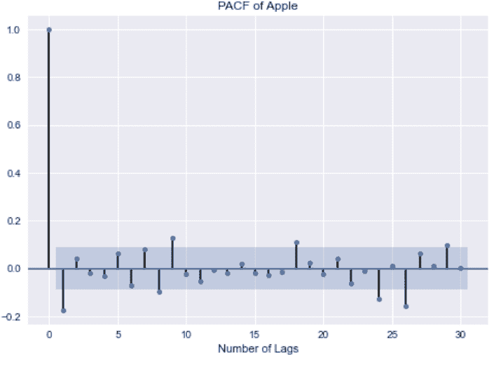

图2-17. 苹果的 PACF

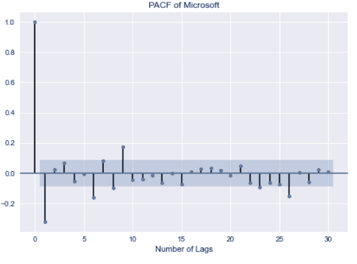

图2-18. 微软的 PACF

```
In [39]: from statsmodels.tsa.ar_model import AutoReg
        import warnings
        warnings.filterwarnings('ignore')
```

```
In [40]: ar_aapl = AutoReg(diff_train_aapl.values, lags=26)
        ar_fitted_aapl = ar_aapl.fit()❶
```

```
In [41]: ar_predictions_aapl = ar_fitted_aapl.predict(start=len(diff_train_aapl),
        end=len(diff_train_aapl)\n        + len(diff_test_aapl) - 1,
        dynamic=False)❷
```

```
In [42]: for i in range(len(ar_predictions_aapl)):
        print('==' * 25)
        print('predicted values:{:.4f} & actual values:
{:.4f}'.format(ar_predictions_aapl[i],

diff_test_aapl[i]))❸
```

```
==================================================
predicted values:1.9207 & actual values:1.3200
==================================================
predicted values:-0.6051 & actual values:0.8600
==================================================
predicted values:-0.5332 & actual values:0.5600
==================================================
predicted values:1.2686 & actual values:2.4600
==================================================
predicted values:-0.0181 & actual values:3.6700
==================================================
predicted values:1.8889 & actual values:0.3600
==================================================
predicted values:-0.6382 & actual values:-0.1400
==================================================
predicted values:1.7444 & actual values:-0.6900
==================================================
predicted values:-1.2651 & actual values:1.5000
==================================================
predicted values:1.6208 & actual values:0.6300
==================================================
predicted values:-0.4115 & actual values:-2.6000
==================================================
predicted values:-0.7251 & actual values:1.4600
==================================================
predicted values:0.4113 & actual values:-0.8300
==================================================
predicted values:-0.9463 & actual values:-0.6300
==================================================
predicted values:0.7367 & actual values:6.1000
==================================================
predicted values:-0.0542 & actual values:-0.0700
==================================================
```

预测值：0.1617 & 实际值：0.8900
========================================
预测值：-1.0148 & 实际值：-2.0400
========================================
预测值：0.5313 & 实际值：1.5700
========================================
预测值：0.3299 & 实际值：3.6500
========================================
预测值：-0.2970 & 实际值：-0.9200
========================================
预测值：0.9842 & 实际值：1.0100
========================================
预测值：0.3299 & 实际值：4.7200
========================================
预测值：0.7565 & 实际值：-1.8200
========================================
预测值：0.3012 & 实际值：-1.1500
========================================
预测值：0.7847 & 实际值：-1.0300

In [43]: ar_predictions_aapl = pd.DataFrame(ar_predictions_aapl)④
        ar_predictions_aapl.index = diff_test_aapl.index⑤

In [44]: ar_msft = AutoReg(diff_train_msft.values, lags=26)
        ar_fitted_msft = ar_msft.fit()⑥

In [45]: ar_predictions_msft = ar_fitted_msft.predict(start=len(diff_train_msft),
                                                    end=len(diff_train_msft) + len(diff_test_msft) - 1,
                                                    dynamic=False)⑦

In [46]: ar_predictions_msft = pd.DataFrame(ar_predictions_msft)⑧
        ar_predictions_msft.index = diff_test_msft.index⑨

1. 使用AR模型拟合苹果股票数据。
2. 预测苹果股票价格。
3. 比较预测值与真实观测值。
4. 将数组转换为数据框以分配索引。
5. 将测试数据索引分配给预测值。
6. 使用AR模型拟合微软股票数据。
7. 预测微软股票价格。
8. 将数组转换为数据框以分配索引。
9. 将测试数据索引分配给预测值。

In [47]: fig, ax = plt.subplots(2, 1, figsize=(18, 15))

        ax[0].plot(diff_test_aapl, label='Actual Stock Price', c='b')
        ax[0].plot(ar_predictions_aapl, c='r', label="Prediction")
        ax[0].set_title('Predicted Stock Price-Apple')
        ax[0].legend(loc='best')
        ax[1].plot(diff_test_msft, label='Actual Stock Price', c='b')
        ax[1].plot(ar_predictions_msft, c='r', label="Prediction")
        ax[1].set_title('Predicted Stock Price-Microsoft')
        ax[1].legend(loc='best')
        for ax in ax.flat:
            ax.set(xlabel='Date', ylabel='$')
        plt.savefig('images/ar.png')

        plt.show()

图2-19展示了基于AR模型的预测结果。红线代表苹果和微软的股票价格预测，蓝线代表真实数据。结果显示，在捕捉股票价格方面，AR模型的表现不如MA模型。

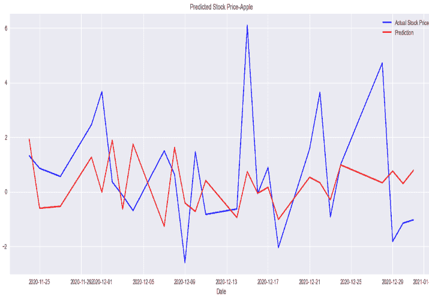

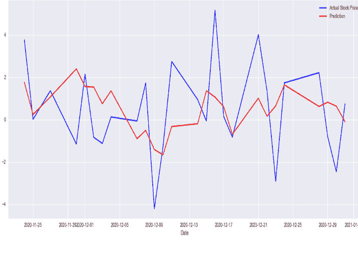

图2-19. 自回归模型预测结果

### 自回归积分滑动平均模型

自回归积分滑动平均模型，简称ARIMA，是时间序列过去值和白噪声的函数。然而，ARIMA被提出作为AR和MA的推广，但它们没有积分参数，这使我们能够将原始数据输入模型。在这方面，即使我们包含非平稳数据，ARIMA也能通过正确定义积分参数使其平稳。

ARIMA有三个参数，即p、d、q。正如我们从之前的时间序列模型中所熟悉的，p和q分别指AR和MA的阶数。但d控制水平差分。如果d=1，相当于一阶差分；如果d取值为0，则意味着模型是ARMA。

d大于1是可能的，但不如d为1常见。ARIMA (p,1,q) 方程具有以下结构：

```
$X_t = \alpha_1 dX_{t-1} + \alpha_2 dX_{t-2}... + \alpha_p dX_{t-p} + \epsilon_t + \beta_1 d\epsilon_{t-1} + \beta_2 d\epsilon_{t-2}... + \beta_q d\epsilon_{t-q}$
```

其中d指差分。

由于它是一个被广泛接受和适用的模型，让我们讨论一下ARIMA模型的优缺点，以便更熟悉该模型。

### 优点

-   ARIMA允许我们使用原始数据，而无需考虑其是否平稳。
-   它在处理高频数据时表现良好。
-   与其他模型相比，它对数据波动的敏感性较低。

### 缺点

-   ARIMA可能无法捕捉季节性。
-   它在处理长序列和短期（每日、每小时）数据时效果更好。
-   由于ARIMA中没有自动更新，分析期间不应出现结构性断裂。
-   ARIMA过程中没有调整会导致不稳定性。

现在，我们将使用相同的股票（即苹果和微软）来展示ARIMA的工作原理和表现。

In [48]: from statsmodels.tsa.arima_model import ARIMA

In [49]: split = int(len(stock_prices['AAPL'].values) * 0.95)
    train_aapl = stock_prices['AAPL'].iloc[:split]
    test_aapl = stock_prices['AAPL'].iloc[split:]
    train_msft = stock_prices['MSFT'].iloc[:split]
    test_msft = stock_prices['MSFT'].iloc[split:]

In [50]: arima_aapl = ARIMA(train_aapl, order=(9, 1, 9))❶
    arima_fitted_aapl = arima_aapl.fit()❷

In [51]: arima_msft = ARIMA(train_msft, order=(6, 1, 6))❸
    arima_fitted_msft = arima_msft.fit()❹

In [52]: arima_predictions_aapl = arima_fitted_aapl.predict(start=len(train_aapl),
                                        end=len(train_aapl) + len(test_aapl) - 1,
                                        dynamic=False)❺

    arima_predictions_msft = arima_fitted_msft.predict(start=len(train_msft),
                                        end=len(train_msft) + len(test_msft) - 1,
                                        dynamic=False)❻

In [53]: arima_predictions_aapl = pd.DataFrame(arima_predictions_aapl)
    arima_predictions_aapl.index = diff_test_aapl.index
    arima_predictions_msft = pd.DataFrame(arima_predictions_msft)
    arima_predictions_msft.index = diff_test_msft.index❼

❶ 为苹果股票配置ARIMA模型。
❷ 将ARIMA模型拟合到苹果股票价格。
❸ 为微软股票配置ARIMA模型。
❹ 将ARIMA模型拟合到微软股票价格。
❺ 基于ARIMA预测苹果股票价格。
❻ 基于ARIMA预测微软股票价格。
❼ 为预测值构建索引

In [54]: fig, ax = plt.subplots(2, 1, figsize=(18, 15))

        ax[0].plot(diff_test_aapl, label='Actual Stock Price', c='b')
        ax[0].plot(arima_predictions_aapl, c='r', label="Prediction")
        ax[0].set_title('Predicted Stock Price-Apple')
        ax[0].legend(loc='best')
        ax[1].plot(diff_test_msft, label='Actual Stock Price', c='b')
        ax[1].plot(arima_predictions_msft, c='r', label="Prediction")
        ax[1].set_title('Predicted Stock Price-Microsoft')
        ax[1].legend(loc='best')
        for ax in ax.flat:
            ax.set(xlabel='Date', ylabel='$')
        plt.savefig('images/ARIMA.png')
        plt.show()

图2-20展示了基于苹果和微软股票价格的预测结果，由于我在AR和MA模型中使用了相同的阶数，结果与这些模型相同。

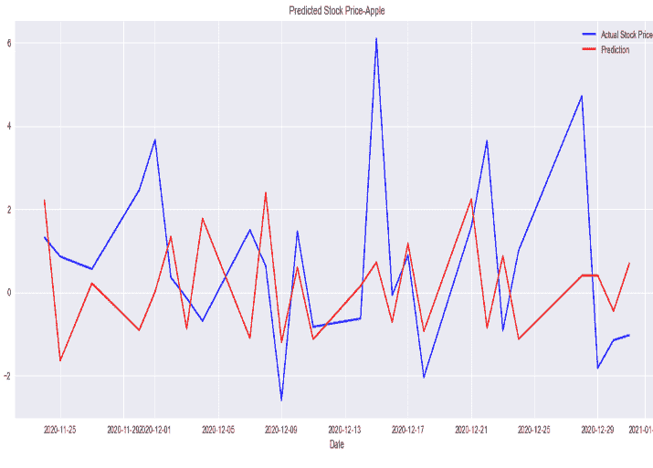

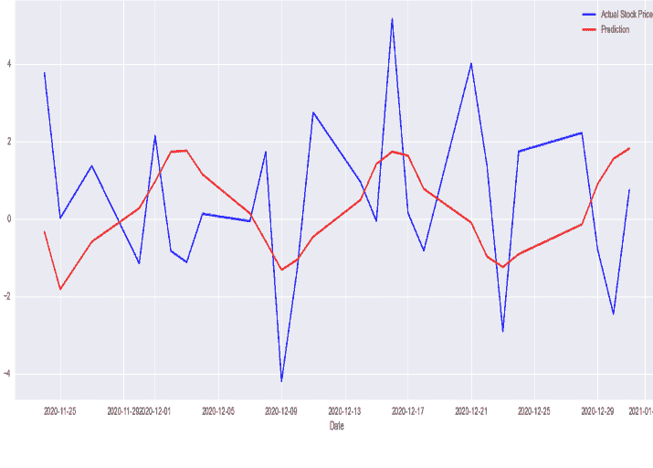

图2-20. ARIMA预测结果

在此推测下，值得讨论时间序列模型最优滞后选择的替代方法。AIC是我在此用于选择适当滞后数的方法。请注意，尽管AIC的结果建议(4, 0, 4)，但模型在这些阶数下不收敛。因此，改用(4, 1, 4)。

In [55]: import itertools

In [56]: p = q = range(0, 9)❶
        d = range(0, 3)❷
        pdq = list(itertools.product(p, d, q))❸
        arima_results_aapl = []❹
        for param_set in pdq:
            try:
                arima_aapl = ARIMA(train_aapl, order=param_set)❺
                arima_fitted_aapl = arima_aapl.fit()❻
                arima_results_aapl.append(arima_fitted_aapl.aic)❼
            except:
                continue
        print('*'*25)
        print('The Lowest AIC score is {:.4f} and the corresponding parameters are {}'.format(pd.DataFrame(arima_results_aapl).where(pd.DataFrame(arima_results_aapl).T.notnull().all()).min()[0], pdq[arima_results_aapl.index(min(arima_results_aapl))]))❽
        *************************
        The Lowest AIC score is 1951.9810 and the corresponding parameters are (4, 0, 4)

In [57]: arima_aapl = ARIMA(train_aapl, order=(4, 1, 4))❾
        arima_fitted_aapl = arima_aapl.fit()❾

In [58]: p = q = range(0, 6)
        d = range(0, 3)
        pdq = list(itertools.product(p, d, q))
        arima_results_msft = []
        for param_set in pdq:
            try:
                arima_msft = ARIMA(stock_prices['MSFT'], order=param_set)
                arima_fitted_msft = arima_msft.fit()
                arima_results_msft.append(arima_fitted_msft.aic)
            except:
                continue
        print('*'*25)
        print('The Lowest AIC score is {:.4f} and the corresponding parameters are {}'.format(pd.DataFrame(arima_results_msft).where(pd.DataFrame(arima_results_msft).T.notnull().all()).min()[0],

### 预测苹果和微软的股票价格。

```python
In [59]: arima_msft = ARIMA(stock_prices['MSFT'], order=(4, 2, 4))
        arima_fitted_msft = arima_msft.fit()
```

```python
In [60]: arima_predictions_aapl = arima_fitted_aapl.predict(start=len(train_aapl),
                                        end=len(train_aapl) + len(test_aapl) - 1,
                                        dynamic=False)

        arima_predictions_msft = arima_fitted_msft.predict(start=len(train_msft),
                                        end=len(train_msft) + len(test_msft) - 1,
                                        dynamic=False)
```

```python
In [61]: arima_predictions_aapl = pd.DataFrame(arima_predictions_aapl)
        arima_predictions_aapl.index = diff_test_aapl.index
        arima_predictions_msft = pd.DataFrame(arima_predictions_msft)
        arima_predictions_msft.index = diff_test_msft.index
```

```python
In [62]: fig, ax = plt.subplots(2, 1, figsize=(18, 15))

        ax[0].plot(diff_test_aapl, label='Actual Stock Price', c='b')
        ax[0].plot(arima_predictions_aapl, c='r', label="Prediction")
        ax[0].set_title('Predicted Stock Price-Apple')
        ax[0].legend(loc='best')
        ax[1].plot(diff_test_msft, label='Actual Stock Price', c='b')
        ax[1].plot(arima_predictions_msft, c='r', label="Prediction")
        ax[1].set_title('Predicted Stock Price-Microsoft')
        ax[1].legend(loc='best')
        for ax in ax.flat:
            ax.set(xlabel='Date', ylabel='$')
        plt.savefig('images/ARIMA_AIC.png')
        plt.show()
```

为苹果和微软确定的阶数分别为 (4, 1, 4) 和 (4, 2, 4)。ARIMA 在预测股票价格方面表现良好。然而，请注意，阶数识别不当会导致拟合效果差，进而产生远非令人满意的预测结果。

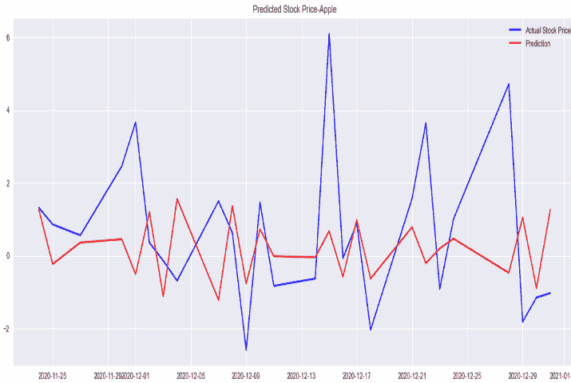

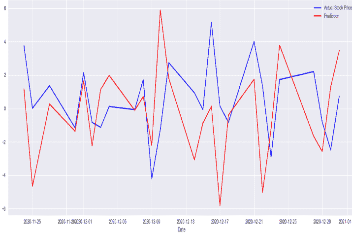

图 2-21. ARIMA 预测结果

### 结论

时间序列分析在金融分析中扮演着核心角色。这主要是因为大多数金融数据都具有时间维度，而这类数据需要谨慎建模。因此，本章是首次尝试对具有时间维度的数据进行建模，为此我们采用了经典的时间序列模型，即移动平均、自回归模型，以及最终的自回归积分移动平均模型。你认为这就是全部了吗？绝对不是！在下一章中，我们将看到如何使用深度学习模型对时间序列进行建模。

### 进一步资源

本章引用的文章：

Hurvich, Clifford M., and Chih-Ling Tsai. “Regression and time series model selection in small samples.” Biometrika 76, no. 2 (1989): 297-30.

本章引用的书籍：

- Buduma, N. and Locascio, N., 2017. Fundamentals of deep learning: Designing next-generation machine intelligence algorithms. O’Reilly Media, Inc.
- Brockwell, Peter J., and Richard A. Davis. Introduction to time series and forecasting. Springer, 2016.
- Walsh, Norman, and Leonard Muellner. DocBook: the definitive guide. O’Reilly Media, Inc., 1999.

## 第 3 章. 用于时间序列建模的深度学习

> **致早期读者的说明**

通过早期发布电子书，您可以在书籍的最早期形式——作者撰写时的原始未编辑内容——中获取书籍，从而在这些书籍正式发布之前很久就能利用这些技术。

这将是最终书籍的第 3 章。请注意，GitHub 仓库将在稍后激活。

如果您对我们如何改进本书的内容和/或示例有意见，或者您在本章中发现缺失的材料，请联系编辑 mcronin@oreilly.com。

> ... *是的，图灵机在给定足够内存和足够时间的情况下可以计算任何可计算函数，这是事实，但大自然必须实时解决问题。为此，它利用了大脑的神经网络，这些网络就像地球上最强大的计算机一样，拥有大规模并行处理器。在这些处理器上高效运行的算法最终将胜出。*

— Terrence J. Sejnowski (2018)

深度学习最近已成为一个流行词，这有充分的理由，尽管改进深度学习实践的尝试并非首次。然而，深度学习近二十年来备受赞赏的原因是可以理解的。深度学习是一个抽象的概念，很难用几句话来定义。

与神经网络不同，深度学习具有更复杂的结构，隐藏层定义了其复杂性。因此，一些研究人员使用隐藏层数量作为比较基准来区分神经网络和深度学习，这很有用，但并非区分两者的严谨方法。因此，一个恰当的定义能使事情变得清晰。

从高层次来看，深度学习可以定义为：

> 深度学习方法是具有多层表示的表示学习方法，通过组合简单但非线性的模块获得，每个模块将一层的表示（从原始输入开始）转换为更高层、稍微更抽象的表示。
> —Le Cunn et al. (2015)

深度学习的应用可以追溯到 1940 年代，当时《控制论》出版，然后连接主义思维在 1980 年代和 1990 年代占据主导地位。最后，近年来深度学习的发展，如反向传播和神经网络，创造了我们所知的深度学习领域。嗯，基本上我们谈论的是深度学习的三次浪潮，现在，人们不禁要问为什么深度学习正处于其鼎盛时期？Goodfellow et al. (2016) 列出了一些可能的原因，包括：

- 数据规模的增加
- 模型规模的增加
- 准确性、复杂性和现实世界影响的增加

似乎现代技术和数据可用性为深度学习时代铺平了道路，在这个时代，新的数据驱动方法被提出，使我们能够使用非常规模型对时间序列进行建模。这一发展引发了深度学习的新一波浪潮。在深度学习中，有两种方法因其能够包含更长时间段的能力而脱颖而出：“循环神经网络”（RNN）和“长短期记忆”（LSTM）。

RNN 和 LSTM 是其中的两种。在本部分中，我们将在简要讨论理论背景后，专注于这些模型在 Python 中的实用性。

### 循环神经网络

循环神经网络具有至少一个反馈连接的神经网络结构，因此网络可以学习序列。反馈连接导致循环，使我们能够揭示非线性特性。这种类型的连接为我们带来了一个新的且非常有用的特性：*记忆*。因此，RNN 不仅可以利用输入数据，还可以利用先前的输出，这在时间序列建模方面听起来很有吸引力。

RNN 有多种形式，例如：

- 一对一：它由单个输入和单个输出组成，这使其成为最基本的 RNN 类型。
- 一对多：在这种形式中，RNN 为单个输入产生多个输出。
- 多对一：与一对多结构相反，多对一具有多个输入和单个输出。
- 多对多：它具有多个输出和输入，被称为 RNN 最复杂的结构。

RNN 中的隐藏单元将自身反馈到神经网络中，因此 RNN 与前馈神经网络不同，具有循环层，这使其成为对时间序列数据建模的合适方法。因此，在 RNN 中，神经元的激活来自前一个时间步，表明 RNN 代表了网络实例的累积状态（Buduma, 2017）。

正如 Nielsen (2019) 所总结的：

- RNN 按时间步一次一个地有序进行。
- 网络的状态从一个时间步到另一个时间步保持不变。

### RNN 根据时间步更新其状态。

这些维度如图 3-1 所示。可以清楚地看到，右侧的 RNN 结构具有时间步，这是其与前馈网络的主要区别。

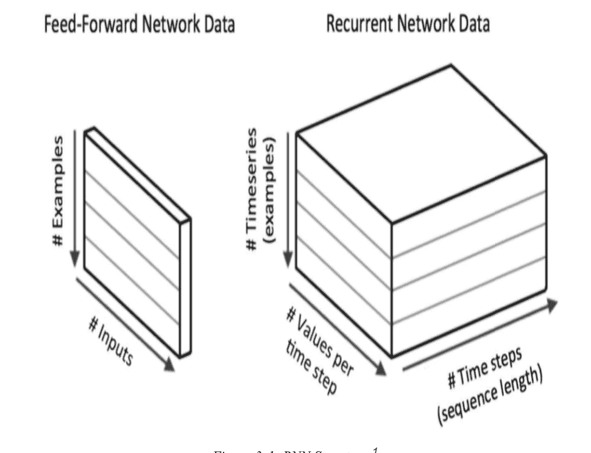

RNN 具有三维输入，分别是：

-   批量大小
-   时间步数
-   特征数量

批量大小表示观测值的数量或数据的行数。时间步数是向模型输入数据的次数。最后，特征数量是每个样本的列数。

```python
In [1]: import numpy as np
import pandas as pd
import math
import datetime
import yfinance as yf
import matplotlib.pyplot as plt
import tensorflow as tf
from tensorflow.keras.models import Sequential
from tensorflow.keras.callbacks import EarlyStopping
from tensorflow.keras.layers import (Dense, Dropout, Activation,
                                    Flatten, MaxPooling2D,SimpleRNN)
from sklearn.model_selection import train_test_split
import warnings
warnings.filterwarnings('ignore')
```

```python
In [2]: n_steps = 13
n_features = 1
```

```python
In [3]: model = Sequential()
model.add(SimpleRNN(512, activation='relu',
                   input_shape=(n_steps, n_features),
                   return_sequences=True))
model.add(Dropout(0.2))
model.add(Dense(256, activation = 'relu'))
model.add(Flatten())
model.add(Dense(1, activation='linear'))
```

```python
In [4]: model.compile(optimizer='rmsprop', loss='mean_squared_error',metrics=['mse'])
```

1.  定义要输入到 RNN 模型中的步数。
2.  将特征数量定义为 1。
3.  调用一个 Sequential 模型来运行 RNN。
4.  确定隐藏神经元的数量、激活函数和输入形状。
5.  添加一个 Dropout 层以防止过拟合。
6.  添加另一个具有 256 个神经元和 *relu* 激活函数的隐藏层。
7.  展平模型，将三维矩阵转换为向量。
8.  添加一个具有 *linear* 激活函数的输出层。
9.  编译 RNN 模型。

```python
In [5]: def split_sequence(sequence, n_steps):
    X, y = [], []
    for i in range(len(sequence)):
        end_ix = i + n_steps
        if end_ix > len(sequence) - 1:
            break
        seq_x, seq_y = sequence[i:end_ix], sequence[end_ix]
        X.append(seq_x)
        y.append(seq_y)
    return np.array(X), np.array(y)
```

1.  编写一个名为 *split_sequence* 的函数来定义回溯期。

图 3-2 显示了苹果和微软的股票价格预测结果。尽管预测结果看起来不错，但它未能捕捉到极端值。

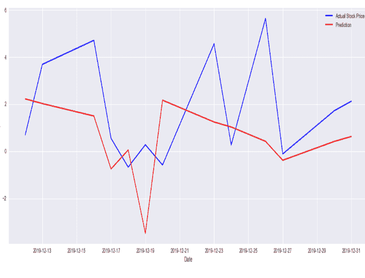

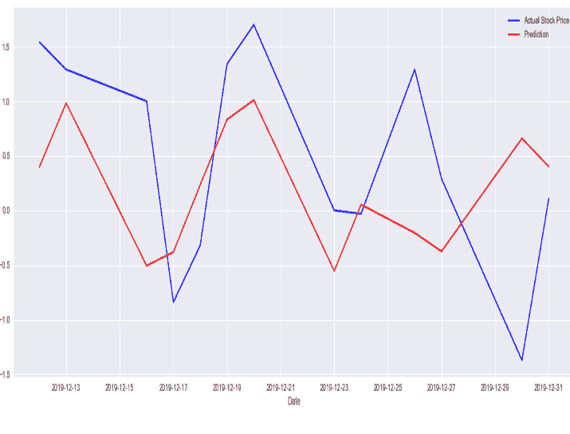

图 3-2. RNN 预测结果

即使我们能获得令人满意的预测性能，RNN 模型的缺点也不应被忽视。该模型的主要缺点是：

-   梯度消失或爆炸问题。详细解释请参见下方的侧边说明。
-   训练 RNN 是一项非常困难的任务，因为它需要大量的数据。
-   当使用 *tanh* 激活函数时，RNN 无法处理非常长的序列。

> ## 说明
>
> 梯度消失是深度学习中一个常见的问题，尤其是在设计不当时。如果在反向传播过程中梯度趋于变小，就会出现梯度消失问题。这意味着神经元学习得如此之慢，以至于优化过程陷入停滞。
>
> 与梯度消失问题不同，梯度爆炸问题发生在反向传播中的微小变化导致优化过程中权重发生巨大更新时。

### 激活函数

激活函数是用于确定神经网络结构中输出的数学方程。激活函数是在隐藏层中引入非线性的工具，从而使我们能够对非线性问题进行建模。

在激活函数中，以下是最著名的几种：

-   Sigmoid：该激活函数允许我们在模型中引入微小变化时，纳入少量的输出。其值介于 0 和 1 之间。*sigmoid* 的数学表示为：

$$\text{sigmoid}(x) = \frac{1}{1 + \exp(-\sum_i w_i x_i - b)}$$

其中 w 是权重，x 表示数据，b 代表偏置，下标 i 表示特征。

-   Tanh：如果你处理的是负数，*tanh* 就是你的激活函数。与 sigmoid 函数相反，它的范围在 -1 和 1 之间。tanh 公式为：

$$\tanh(x) = \frac{\sinh(x)}{\cosh(x)}$$

-   Linear：使用 *linear* 激活函数使我们能够在自变量和因变量之间建立线性关系。*linear* 激活函数接收输入，乘以权重并形成输出，与输入成正比。因此，它是时间序列模型的便捷激活函数。线性激活函数的形式为：

$$f(x) = wx$$

-   Rectified Linear：*Rectified Linear* 激活函数，也称为 *ReLU*，如果输入为零或低于零，则输出为零。如果输入大于 0，则它随 x 线性增长。数学上表示为：

$$ReLU(x) = \max(0, x)$$

-   Softmax：它广泛应用于分类问题，类似于 sigmoid，因为 *softmax* 将输入转换为与输入数字的指数成正比的概率分布：

$$softmax(x_i) = \frac{exp(x_i)}{\sum_i exp(x_i)}$$

Haviv 等人 (2019) 对 RNN 的缺点进行了很好的阐述：

> *这是由于网络对其过去状态的依赖，并通过它们依赖于整个输入历史。这种能力是有代价的——RNN 以难以训练而闻名 (Pascanu et al., 2013a)。这种困难通常与在尝试跨长时间传播误差时出现的梯度消失有关 (Hochreiter, 1998)。当训练成功时，网络的隐藏状态代表了这些记忆。理解这种表示如何在训练过程中形成，可以为改进记忆相关任务的学习开辟新的途径。*

### 长短期记忆

长短期记忆，简称 LSTM，是一种深度学习方法，由 Hochreiter 和 Schmidhuber (1997) 开发，主要基于门控循环单元 (GRU)。

GRU 的提出是为了解决梯度消失问题，这是神经网络结构中的一个常见问题，当权重更新变得太小以至于无法在网络中产生显著变化时就会发生。GRU 由两个门组成：*更新*门和*重置*门。当检测到早期观测值非常重要时，我们就不更新隐藏状态。类似地，当早期观测值不显著时，它会导致状态重置。

正如我们之前讨论的，RNN 最吸引人的特点之一是其连接过去和现在信息的能力。然而，当“长期依赖”问题出现时，这种能力就变成了一个弱点。长期依赖意味着模型从早期的观测中学习。

例如，让我们看下面的句子：

> *Countries have their own currencies as in USA where people transact with dollar*

在短期依赖的情况下，已知下一个预测的词是关于一种货币，但如果问是哪种货币？那么，事情就变得复杂了，因为文本中可能有各种货币，这意味着长期依赖。需要追溯到很早才能找到关于使用美元的国家的相关信息。

LSTM 试图以一种方式解决 RNN 在长期依赖方面的弱点，即 LSTM 有一个非常有用的工具来消除不必要的信息，从而使其工作更高效。LSTM 通过门来工作，使 LSTM 能够忘记不相关的数据。这些门是：

-   遗忘门
-   输入门
-   输出门

遗忘门的创建是为了筛选必要和不必要的信息，从而使 LSTM 比 RNN 更高效地执行任务。在此过程中，如果信息不相关，激活函数 sigmoid 的值将变为零。遗忘门可以表示为：

$$F_t = \sigma(X_t W_I + h_{t-1} W_f + b_f)$$

其中 $\sigma$ 是激活函数，$h_{t-1}$ 是前一个隐藏状态，$W_I$ 和 $W_h$ 是权重，最后 $b_f$ 是遗忘单元中的偏置参数。

输入门由当前时间步 $X_t$ 和前一个时间步 $t - 1$ 的隐藏状态提供信息。输入门的目标是确定应添加到长期状态的信息程度。输入门可以表示为：

$$I_t = \sigma(X_t W_I + h_{t-1} W_h + b_I)$$

输出门基本上决定了应读取的输出程度，其工作原理如下：

$$O_t = \sigma(X_t W_O + h_{t-1} W_O + b_I)$$

门并非 LSTM 的唯一组成部分。其他组成部分包括：

- 候选记忆单元
- 记忆单元
- 隐藏状态

候选记忆单元决定了信息传递到单元状态的程度。不同的是，候选单元中的激活函数是 tanh，并采用以下形式：

$$\widehat{C_t} = \phi(X_t W_c + h_{t-1} W_c + b_c)$$

记忆单元使 LSTM 能够记住或遗忘信息：

$$C_t = F_t \odot C_{t-1} + I_t \odot \widehat{C_t}$$

其中 $\odot$ 是哈达玛积。

在这个循环网络中，隐藏状态是传递信息的工具。记忆单元将输出门与隐藏状态联系起来：

$$h_t = \phi(c_t) \odot O_t$$

让我们尝试使用 LSTM 预测苹果和微软的股票价格，看看它是如何工作的：

```python
In [18]: from tensorflow.keras.layers import LSTM
```

```python
In [19]: n_steps = 13
        n_features = 1
```

```python
In [20]: model = Sequential()
        model.add(LSTM(512, activation='relu',
                      input_shape=(n_steps, n_features),
                      return_sequences=True))❶
        model.add(Dropout(0.2))
        model.add(LSTM(256,activation='relu'))
        model.add(Flatten())
        model.add(Dense(1, activation='linear'))
```

```python
In [21]: model.compile(optimizer='rmsprop', loss='mean_squared_error', metrics=['mse'])
```

❶ 调用 LSTM 模型并确定神经元和特征的数量

```python
In [22]: history = model.fit(X_aapl, y_aapl,
                           epochs=400, batch_size=150, verbose=0,
                           validation_split = 0.10)
```

```python
In [23]: start = X_aapl[X_aapl.shape[0] - 13]
        x_input = start
        x_input = x_input.reshape((1, n_steps, n_features))
```

```python
In [24]: tempList_aapl = []
        for i in range(len(diff_test_aapl)):
            x_input = x_input.reshape((1, n_steps, n_features))
            yhat = model.predict(x_input, verbose=0)
            x_input = np.append(x_input, yhat)
            x_input = x_input[1:]
            tempList_aapl.append(yhat)
```

> **注意**

均方根传播（*RMSprop*）的核心思想是一种优化方法，我们计算梯度平方的加权平均和梯度平方的指数平均，即每个权重的平方梯度的移动平均。然后，找到权重的差值，用于计算新的权重。

$$v_t = \rho v_{t-1} + (1 - \rho) g_t^2$$

$$\Delta w_t = -\frac{\nu}{\sqrt{\eta + \epsilon}} g_t$$

$$w_{t+1} = w_t + \Delta w_t$$

**图 3-3** 展示了预测结果，LSTM 似乎在拟合极端值方面优于 RNN。

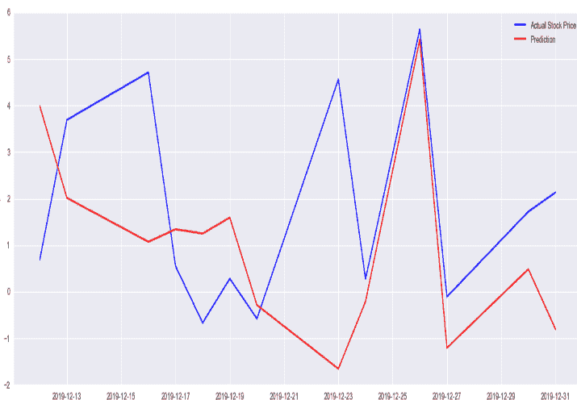

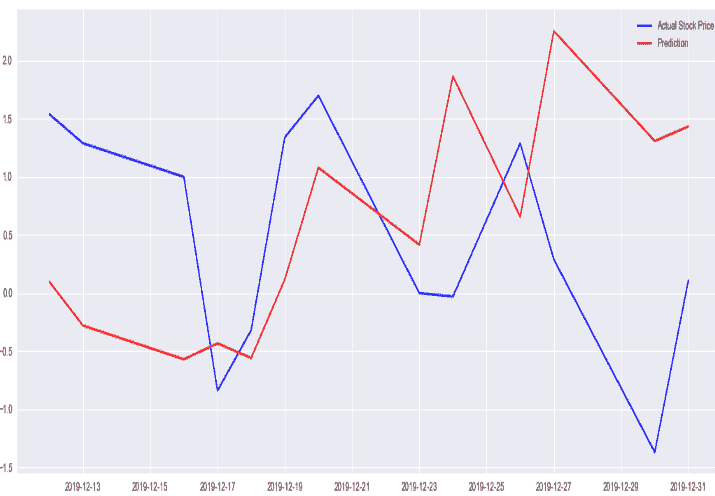

图 3-3. LSTM 预测结果

### 结论

本章致力于基于深度学习的股票价格预测。使用的模型是 RNN 和 LSTM，它们具有处理更长时间段的能力。这些模型虽然没有显示出显著的改进，但仍然可以用于建模时间序列数据。在我们的案例中，LSTM 考虑了 13 步的回溯期进行预测。作为扩展，将多个特征纳入基于深度学习的模型是明智的做法，而这在参数化时间序列模型中是不允许的。

在下一部分，将讨论基于参数化和机器学习模型的波动率预测，以便我们能够比较这些模型的性能。

### 进一步资源

本章引用的文章：

- Ding, Daizong, Mi Zhang, Xudong Pan, Min Yang, and Xiangnan He. “Modeling extreme events in time series prediction.” In Proceedings of the 25th ACM SIGKDD International Conference on Knowledge Discovery & Data Mining, pp. 1114-1122. 2019.
- Haviv, Doron, Alexander Rivkind, and Omri Barak. “Understanding and controlling memory in recurrent neural networks.” arXiv preprint arXiv:1902.07275 (2019).
- Hochreiter, Sepp, and Jürgen Schmidhuber. “Long short-term memory.” Neural computation 9, no. 8 (1997): 1735-1780.
- LeCun, Yann, Yoshua Bengio, and Geoffrey Hinton. “Deep learning.” nature 521, no. 7553 (2015): 436-444.

本章引用的书籍：

- Nielsen, A. Practical Time Series Analysis: Prediction with Statistics and Machine Learning. (2019).
- Patterson, Josh, and Adam Gibson. Deep learning: A practitioner’s approach. O’Reilly Media, Inc., 2017.
- Sejnowski, Terrence J. The deep learning revolution. Mit Press, 2018.

1 Patterson et. al, 2017. “Deep learning: A practitioner’s approach.”

# 第二部分. 用于市场、信用、流动性和操作风险的机器学习

## 第四章. 基于机器学习的波动率预测

> **致早期发布读者的说明**

通过早期发布电子书，您可以在书籍的最早形式中获取内容——即作者在撰写过程中的原始未编辑内容——因此您可以在这些书籍正式发布之前很久就利用这些技术。

这将是最终书籍的第 4 章。请注意，GitHub 仓库将在稍后激活。

如果您对我们如何改进本书的内容和/或示例有意见，或者您注意到本章中缺少材料，请联系编辑 mcronin@oreilly.com。

> *条件收益分布最关键的特征可以说是其二阶矩结构，这在经验上是该分布占主导地位的时变特征。这一事实催生了大量关于收益波动率建模和预测的文献。*

—Andersen et al. (2003)

“有些概念容易理解但难以定义。波动率也是如此。”这可能是马科维茨之前某人的名言，因为他对波动率的建模方式非常清晰和直观。马科维茨提出了他著名的投资组合理论，其中波动率被定义为标准差，因此从那时起，金融与数学变得更加紧密地交织在一起。

波动率是金融的支柱，因为它不仅为投资者提供信息信号，还是各种金融模型的输入。

是什么让波动率如此重要？答案强调了不确定性的重要性，这是金融模型的主要特征。

金融市场日益融合导致了金融市场的长期不确定性，这反过来又强调了波动率的重要性，即金融资产价值变化的程度。波动率已被用作风险的代理变量，是许多领域（如资产定价和风险管理）中最重要的变量之一。它的强大存在和滞后性甚至使其成为必须建模的对象。因此，巴塞尔协议于 1996 年生效，波动率作为风险度量在风险管理中发挥了关键作用（Karasan and Gaygisiz, 2020）。

在 Black (1976)、Raju and Ghosh (2004)、Andersen and Bollerslev (1997)、Dokuchaev (2014) 和 De Stefani et al. (2017) 的开创性研究之后，关于波动率估计的文献数量庞大且不断增长。因此，我们谈论的是使用 ARCH 和 GARCH 类型模型进行波动率预测的悠久传统，其中存在一些可能导致失败的缺点，例如波动率聚类、信息不对称等。尽管这些问题通过不同的模型得到了解决，但最近金融市场的波动加上机器学习的发展，使研究人员重新思考波动率估计。

在本章中，我们的目标是展示如何使用基于机器学习的模型来增强预测性能。我们将研究各种机器学习算法，即支持向量回归、神经网络和深度学习，以便我们能够比较预测性能。

对波动率建模等同于对不确定性建模，以便我们更好地理解和处理不确定性，使我们能够对现实世界有足够好的近似。为了衡量所提模型在多大程度上解释了实际情况，我们需要计算收益波动率，这也被称为*已实现波动率*。已实现波动率是已实现方差的平方根，而已实现方差是收益平方的和。已实现波动率用于计算波动率预测方法的性能。以下是收益波动率的公式：

### ARCH 模型

早期对波动率建模的尝试之一由恩格尔（Engel，1982）提出，被称为 ARCH 模型。ARCH 模型是一个单变量模型，基于历史资产收益率。ARCH(p) 模型具有以下形式：

$$\sigma_t^2 = \omega + \sum_{k=1}^p \alpha_k (r_{t-k})^2$$

其中

$$r_t = \sigma_t \epsilon_t$$

其中 $\epsilon_t$ 被假定服从正态分布。在这个参数模型中，我们需要满足一些假设才能保证方差严格为正。为此，应满足以下条件：

- $\omega > 0$
- $\alpha_k \geq 0$

所有这些方程告诉我们，ARCH 是一个单变量非线性模型，其中波动率是用过去收益率的平方来估计的。ARCH 最显著的特征之一是它具有时变条件方差$^1$的性质，因此 ARCH 能够对被称为波动率聚集的现象进行建模，即正如本华·曼德博（Benoit Mandelbrot，1963）所指出的，大的变动往往伴随着同方向的大变动，小的变动往往伴随着小变动。因此，一旦重要公告进入市场，可能会导致巨大的波动。

以下代码块展示了如何绘制聚集现象及其外观：

```
In [5]: retv = ret.values

In [6]: plt.figure(figsize=(10, 6))
        plt.plot(s_p500.index[1:], ret)
        plt.title('Volatility clustering of S&P-500')
        plt.ylabel('Daily returns')
        plt.xlabel('Date')
        plt.savefig('images/vol_clustering.png')
        plt.show()
```

❶ 将数据框转换为 numpy 表示。

与已实现波动率中的尖峰类似，图 4-2 显示了一些大的波动，毫不奇怪，这些起伏发生在重要事件周围，例如 2020 年中期的 Covid-19 大流行。

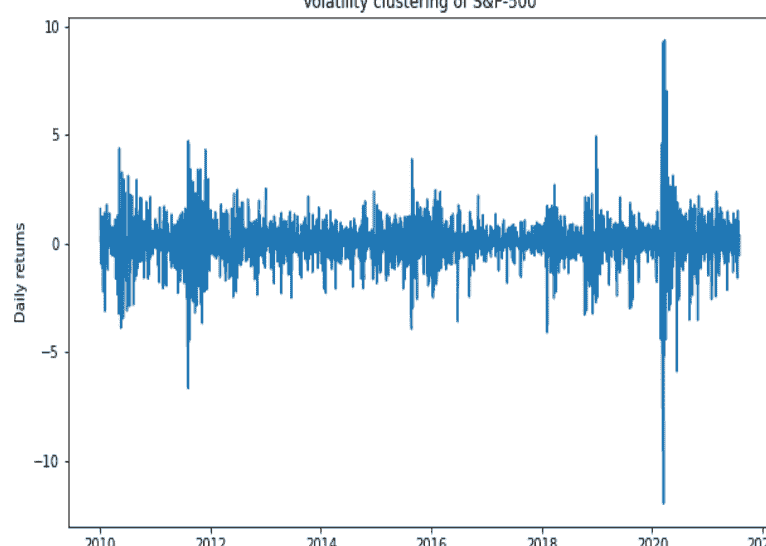

图 4-2. 波动率聚集 - S&P-500

尽管它具有诸如简单性、非线性、易用性和可调整用于预测等吸引人的特点，但它也有某些缺点，可以列举如下：

- 对正负冲击的反应相同。
- 强假设，例如对参数的限制。
- 由于对大的变动调整缓慢，可能导致错误预测。

这些缺点促使研究人员致力于 ARCH 模型的扩展，Bollerslev（1986）和 Taylor（2008）提出了 GARCH 模型。

现在，我们将使用 ARCH 模型来预测波动率，但首先让我们生成自己的 Python 代码，然后将其与内置的 Python 代码进行比较以查看差异。

```
In [7]: n = 252
        split_date = ret.iloc[-n:].index
```

```
In [8]: sgm2 = ret.var()
    K = ret.kurtosis()
    alpha = (-3.0 * sgm2 + np.sqrt(9.0 * sgm2 ** 2 - 12.0 * (3.0 * sgm2 - K) * K)) / (6 * K)
    omega = (1 - alpha) * sgm2
    initial_parameters = [alpha, omega]
    omega,alpha
Out[8]: (0.6345749196895419, 0.46656704131150534)
```

```
In [9]: @jit(nopython=True, parallel=True)
    def arch_likelihood(initial_parameters, retv):
        omega = abs(initial_parameters[0])
        alpha = abs(initial_parameters[1])
        T = len(retv)
        logliks = 0
        sigma2 = np.zeros(T)
        sigma2[0] = np.var(retv)
        for t in range(1, T):
            sigma2[t] = omega + alpha * (retv[t - 1]) ** 2
        logliks = np.sum(0.5 * (np.log(sigma2)+retv ** 2 / sigma2))
        return logliks
```

```
In [10]: logliks = arch_likelihood(initial_parameters, retv)
    logliks
Out[10]: 1453.127184488521
```

```
In [11]: def opt_params(x0, retv):
        opt_result = opt.minimize(arch_likelihood, x0=x0, args = (retv),
                                 method='Nelder-Mead',
                                 options={'maxiter': 5000})
        params = opt_result.x
        print('\nResults of Nelder-Mead minimization\n{}\n{}'
              .format(''.join(['-'] * 28), opt_result))
        print('\nResulting params = {}'.format(params))
        return params
```

```
In [12]: params = opt_params(initial_parameters, retv)

    Results of Nelder-Mead minimization
    ----------------------------
    final_simplex: (array([[0.70168795, 0.39039044],
           [0.70163494, 0.3904423 ],
           [0.70163928, 0.39033154]]), array([1385.79241695, 1385.792417  ,
           1385.79241907]))
           fun: 1385.7924169507244
           message: 'Optimization terminated successfully.'
           nfev: 62
           nit: 33
           status: 0
           success: True
           x: array([0.70168795, 0.39039044])

    Resulting params = [0.70168795 0.39039044]
```

```
In [13]: def arch_apply(ret):
            omega = params[0]
            alpha = params[1]
            T = len(ret)
            sigma2_arch = np.zeros(T + 1)
            sigma2_arch[0] = np.var(ret)
            for t in range(1, T):
                sigma2_arch[t] = omega + alpha * ret[t - 1] ** 2
            return sigma2_arch
```

```
In [14]: sigma2_arch = arch_apply(ret)
```

1.  定义分割位置并将分割后的数据分配给 *split* 变量。
2.  计算 S&P-500 的方差。
3.  计算 S&P-500 的峰度。
4.  确定斜率系数 α 的初始值。
5.  确定常数项 ω 的初始值。
6.  使用并行处理以减少处理时间。
7.  取绝对值并将初始值分配给相关变量。
8.  确定波动率的初始值。
9.  迭代 S&P-500 的方差。
10. 计算对数似然。
11. 调用函数。
12. 最小化对数似然函数。
13. 创建一个变量 *params* 用于存储优化后的参数。

好了，我们通过自己的优化方法和 ARCH 方程使用 ARCH 对波动率进行了建模。那么，将其与内置的 Python 代码进行比较如何？这个内置代码可以从 ARCH 库导入，并且极其易于应用。内置代码的结果如下所示，结果表明这两个结果彼此非常相似。

```
In [15]: arch = arch_model(ret, mean='zero', vol='ARCH', p=1).fit(disp='off')
        print(arch.summary())
Zero Mean - ARCH Model Results
==============================================================================
Dep. Variable:              Adj Close   R-squared:                       0.000
Mean Model:                 Zero Mean   Adj. R-squared:                  0.000
Vol Model:                       ARCH   Log-Likelihood:              -4063.63
Distribution:                  Normal   AIC:                           8131.25
Method:            Maximum Likelihood   BIC:                           8143.21
No. Observations:                 2914
Date:                Tue, Sep 07 2021   Df Residuals:                     2914
Time:                        11:19:08   Df Model:                           0
==============================================================================
                 Volatility Model
==============================================================================
                 coef    std err          t      P>|t|  95.0% Conf. Int.
------------------------------------------------------------------------------
omega          0.7018   5.006e-02     14.018  1.214e-44 [  0.604,  0.800]
alpha[1]       0.3910   7.016e-02      5.573  2.506e-08 [  0.253,  0.529]
==============================================================================
Covariance estimator: robust
```

$$\hat{\sigma} = \sqrt{\frac{1}{n-1} \sum_{n=1}^{N} (r_n - \mu)^2}$$

其中 $r$ 和 $\mu$ 是收益率和收益率均值，$n$ 是观测数量。

让我们看看在 Python 中如何计算收益率波动率：

```
In [1]: import numpy as np
    from scipy.stats import norm
    import scipy.optimize as opt
    import yfinance as yf
    import pandas as pd
    import datetime
    import time
    from arch import arch_model
    import matplotlib.pyplot as plt
    from numba import jit
    from sklearn.metrics import mean_squared_error
    import warnings
    warnings.filterwarnings('ignore')
```

```
In [2]: stocks = '^GSPC'
    start = datetime.datetime(2010, 1, 1)
    end = datetime.datetime(2021, 8, 1)
    s_p500 = yf.download(stocks, start=start, end = end, interval='1d')
    [*********************100%**********************]  1 of 1 completed
```

```
In [3]: ret = 100 * (s_p500.pct_change()[1:]['Adj Close'])❶
    realized_vol = ret.rolling(5).std()
```

```
In [4]: plt.figure(figsize=(10, 6))
    plt.plot(realized_vol.index,realized_vol)
    plt.title('Realized Volatility- S&P-500')
    plt.ylabel('Volatility')
    plt.xlabel('Date')
    plt.savefig('images/realized_vol.png')
    plt.show()
```

❶ 基于调整收盘价计算 S&P-500 的收益率。

图 4-1 显示了 2010-2021 年期间 S&P-500 的已实现波动率。最引人注目的观察是 Covid-19 大流行前后的尖峰。

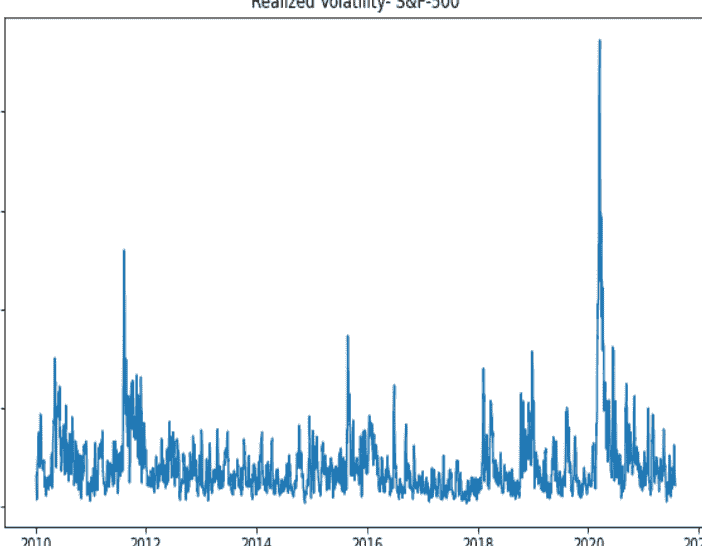

图 4-1. 已实现波动率 - S&P-500

波动率的估计方式对相关分析的可靠性和准确性有着不可否认的影响。因此，本章将讨论经典的和基于机器学习的波动率预测技术，以展示基于机器学习的模型优越的预测性能。为了比较全新的基于机器学习的模型，我们从对经典波动率建模开始。一些非常著名的经典波动率模型包括但不限于：

- ARCH
- GARCH
- GJR-GARCH
- EGARCH

是时候深入研究经典波动率模型了。让我们从 ARCH 模型开始。

尽管开发我们自己的代码总是有益的，并能加深我们的理解，但内置代码的美妙之处不仅限于其简洁性。使用内置代码寻找最优滞后值是其另一个优势，同时还具备优化的运行流程。

我们所需要做的就是创建一个`for`循环并定义一个合适的信息准则。下面，我们选择贝叶斯信息准则（BIC）作为模型选择方法，以确定滞后阶数。选择BIC的原因在于，只要我们有足够大的样本量，BIC就是一个可靠的模型选择工具，正如Burnham和Anderson（2002年和2004年）所讨论的那样。现在，我们从1到5阶滞后迭代ARCH模型。

```
In [16]: bic_arch = []

for p in range(1,5):
    arch = arch_model(ret, mean='zero', vol='ARCH', p=p)\n        .fit(disp='off')
    bic_arch.append(arch.bic)
    if arch.bic == np.min(bic_arch):
        best_param = p
arch = arch_model(ret, mean='Constant', vol='ARCH', p=p)\n    .fit(disp='off')
print(arch.summary())
forecast = arch.forecast(start=split_date[0])
forecast_arch = forecast
Constant Mean - ARCH Model Results
```

```
==============================================================================
==============================================================================
Dep. Variable:              Adj Close   R-squared:                     0.000
Mean Model:             Constant Mean   Adj. R-squared:                0.000
Vol Model:                      ARCH   Log-Likelihood:            -3691.03
Distribution:                  Normal   AIC:                         7394.06
Method:            Maximum Likelihood   BIC:                         7429.92
No. Observations:                2914
Date:             Tue, Sep 07 2021   Df Residuals:                  2913
Time:                     11:19:11   Df Model:
```

### 均值模型

```
==============================================================================
                  coef    std err          t      P>|t|      95.0% Conf. Int. 
------------------------------------------------------------------------------
mu             0.0852   1.391e-02      6.128   8.877e-10   [5.798e-02, 0.113]
==============================================================================
```

### 波动率模型

```
==============================================================================
                  coef    std err          t      P>|t|      95.0% Conf. Int. 
------------------------------------------------------------------------------
omega           0.2652   2.618e-02     10.130   4.052e-24   [  0.214,   0.317]
alpha[1]        0.1674   3.849e-02      4.350   1.361e-05   [9.198e-02, 0.243]
alpha[2]        0.2357   3.679e-02      6.406   1.496e-10   [  0.164,   0.308]
alpha[3]        0.2029   3.959e-02      5.127   2.950e-07   [  0.125,   0.281]
alpha[4]        0.1910   4.270e-02      4.474   7.687e-06   [  0.107,   0.275]
==============================================================================
```

协方差估计量：稳健

```
In [17]: rmse_arch = np.sqrt(mean_squared_error(realized_vol[-n:] / 100,
                                        np.sqrt(forecast_arch\n                                                .variance.iloc[-len(split_date):]
                                                / 100)))
        print('The RMSE value of ARCH model is {:.4f}'.format(rmse_arch))
The RMSE value of ARCH model is 0.0896
```

```
In [18]: plt.figure(figsize=(10, 6))
        plt.plot(realized_vol / 100, label='Realized Volatility')
        plt.plot(forecast_arch.variance.iloc[-len(split_date):] / 100,
                 label='Volatility Prediction-ARCH')
        plt.title('Volatility Prediction with ARCH', fontsize=12)
        plt.legend()
```

```
plt.savefig('images/arch.png')
plt.show()
```

- 1. 在指定区间内迭代ARCH参数p。
- 2. 使用不同的p值运行ARCH模型。
- 3. 寻找最小的贝叶斯信息准则分数以选择最佳模型。
- 4. 使用最佳p值运行ARCH模型。
- 5. 基于优化的ARCH模型预测波动率。
- 6. 计算RMSE分数。

基于我们第一个模型的波动率预测结果如图4-3所示。

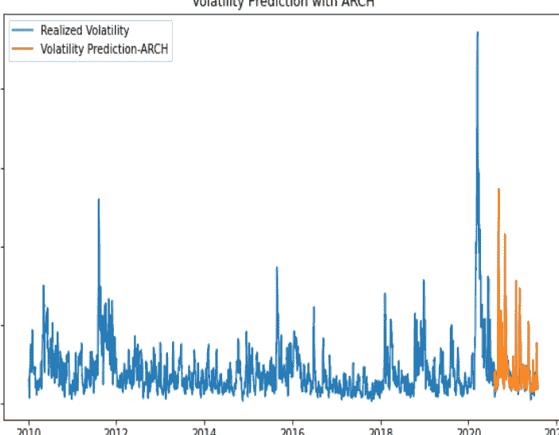

图4-3. 使用ARCH进行波动率预测

### GARCH模型

GARCH模型是ARCH模型的扩展，它纳入了滞后的条件方差。因此，通过添加p个滞后的条件方差，ARCH得到了改进，这使得GARCH模型成为一个多元模型，因为它是一个针对条件方差的自回归移动平均模型，包含p个滞后的平方收益率和q个滞后的条件方差。GARCH (p, q) 可以表述为：

$$\sigma_t^2 = \omega + \sum_{k=1}^{q} \alpha_k r_{t-k}^2 + \sum_{k=1}^{p} \beta_k \sigma_{t-k}^2$$

其中 $\omega$、$\beta$ 和 $\alpha$ 是待估计的参数，q 和 p 是模型中的最大滞后阶数。为了得到一致的GARCH模型，应满足以下条件：

- $\omega > 0$
- $\beta \geq 0$
- $\alpha \geq 0$
- $\beta + \alpha < 1$

ARCH模型无法捕捉历史新息的影响。然而，作为一个更简约的模型，GARCH模型可以解释历史新息的变化，因为GARCH模型可以表示为无限阶的ARCH。让我们展示GARCH如何表示为无限阶的ARCH。

$$\sigma_t^2 = \omega + \alpha r_{t-1}^2 + \beta \sigma_{t-1}^2$$

然后将 $\sigma_{t-1}^2$ 替换为 $\omega + \alpha r_{t-2}^2 + \beta \sigma_{t-2}^2$

$$\sigma_t^2 = \omega + \alpha r_{t-1}^2 + \beta(\omega + \alpha r_{t-2}^2 \sigma_{t-2}^2)$$
$$= \omega(1 + \beta) + \alpha r_{t-1}^2 + \beta \alpha r_{t-2}^2 + \beta^2 \sigma_{t-2}^2)$$

现在，让我们将 $\sigma_{t-2}^2$ 替换为 $\omega + \alpha r_{t-3}^2 + \beta \sigma_{t-3}^2$ 并进行必要的数学运算，我们最终得到：

$$\sigma_t^2 = \omega(1 + \beta + \beta^2 + \dots) + \alpha \sum_{k=1}^{\infty} \beta^{k-1} r_{t-k}$$

与ARCH模型类似，在Python中使用GARCH建模波动率有多种方法。让我们首先尝试使用优化技术开发我们自己的Python代码。接下来，将使用 *arch* 库来预测波动率。

```
In [19]: a0 = 0.0001
        sgm2 = ret.var()
        K = ret.kurtosis()
```

```
h = 1 - alpha / sgm2
alpha = np.sqrt(K * (1 - h ** 2) / (2.0 * (K + 3)))
beta = np.abs(h - omega)
omega = (1 - omega) * sgm2
initial_parameters = np.array([omega, alpha, beta])
print('Initial parameters for omega, alpha, and beta are \n{}\n{}\n{}'.format(omega, alpha, beta))
```

omega、alpha和beta的初始参数为
0.43471178001576827
0.512827280537482
0.02677799855546381

```
In [20]: retv = ret.values
```

```
In [21]: @jit(nopython=True, parallel=True)
def garch_likelihood(initial_parameters, retv):
    omega = initial_parameters[0]
    alpha = initial_parameters[1]
    beta = initial_parameters[2]
    T = len(retv)
    logliks = 0
    sigma2 = np.zeros(T)
    sigma2[0] = np.var(retv)
    for t in range(1, T):
        sigma2[t] = omega + alpha * (retv[t - 1]) ** 2 + beta * sigma2[t-1]
    logliks = np.sum(0.5 * (np.log(sigma2) + retv ** 2 / sigma2))
    return logliks
```

```
In [22]: logliks = garch_likelihood(initial_parameters, retv)
print('The Log likelihood is {:.4f}'.format(logliks))
```

对数似然值为 1387.7215

```
In [23]: def garch_constraint(initial_parameters):
    alpha = initial_parameters[0]
    gamma = initial_parameters[1]
    beta = initial_parameters[2]
    return np.array([1 - alpha - beta])
```

```
In [24]: bounds = [(0.0, 1.0), (0.0, 1.0), (0.0, 1.0)]
```

```
In [25]: def opt_paramsG(initial_parameters, retv):
    opt_result = opt.minimize(garch_likelihood,
                              x0=initial_parameters,
                              constraints=np.array([1 - alpha - beta]),
                              bounds=bounds, args=(retv),
                              method='Nelder-Mead',
                              options={'maxiter': 5000})
    params = opt_result.x
```

print('\nNelder-Mead 最小化结果\n{}\n{}'\n    .format('-' * 35, opt_result))
print('-' * 35)
print('\n所得参数 = {}'.format(params))
return params

In [26]: params = opt_paramsG(initial_parameters, retv)

Nelder-Mead 最小化结果
-----------------------------------
final_simplex: (array([[0.03918956, 0.17370549, 0.78991502],
       [0.03920507, 0.17374466, 0.78987403],
       [0.03916671, 0.17377319, 0.78993078],
       [0.03917324, 0.17364595, 0.78998753]]), array([979.87109624, 979.8710967 ,
       979.87109865, 979.8711147 ]))
           fun: 979.8710962352685
         message: '优化成功终止。'
            nfev: 178
             nit: 102
           status: 0
          success: True
                x: array([0.03918956, 0.17370549, 0.78991502])
-----------------------------------

所得参数 = [0.03918956 0.17370549 0.78991502]

In [27]: def garch_apply(ret):
            omega = params[0]
            alpha = params[1]
            beta = params[2]
            T = len(ret)
            sigma2 = np.zeros(T + 1)
            sigma2[0] = np.var(ret)
            for t in range(1, T):
                sigma2[t] = omega + alpha * ret[t - 1] ** 2 + beta * sigma2[t-1]
            return sigma2

我们从自己的 GARCH 代码中得到的参数近似为：

- $\omega = 0.0375$
- $\alpha = 0.1724$
- $\beta = 0.7913$

以下内置 Python 代码证实我们做得很好，因为通过内置代码获得的参数与我们的几乎相同。因此，我们已经学会了如何编写 GARCH 和 ARCH 模型来预测波动率。

In [28]: garch = arch_model(ret, mean='zero', vol='GARCH', p=1, o=0, q=1)\n            .fit(disp='off')
print(garch.summary())

零均值 - GARCH 模型结果
==============================================================================
因变量:              Adj Close   R-squared:                       0.000
均值模型:                零均值   Adj. R-squared:                  0.000
波动模型:                     GARCH   对数似然:               -3657.62
分布:                  正态   AIC:                           7321.23
方法:            最大似然   BIC:                           7339.16
观测数:                 2914
日期:                Tue, Sep 07 2021   残差自由度:                     2914
时间:                        11:19:28   模型自由度:                           0
==============================================================================
                 系数    标准误          t      P>|t|      95.0% 置信区间
------------------------------------------------------------------------------
omega          0.0392   8.422e-03      4.652  3.280e-06   [2.268e-02,5.569e-02]
alpha[1]       0.1738   2.275e-02      7.637  2.225e-14       [  0.129,  0.218]
beta[1]        0.7899   2.275e-02     34.715 4.607e-264       [  0.745,  0.835]
==============================================================================
协方差估计量: 稳健

很明显，使用 GARCH(1, 1) 很容易，但我们如何知道这些参数是最优的呢？让我们根据最低的 BIC 值来确定最优参数集。

In [29]: bic_garch = []

for p in range(1, 5):
    for q in range(1, 5):
        garch = arch_model(ret, mean='zero', vol='GARCH', p=p, o=0, q=q)\n            .fit(disp='off')
        bic_garch.append(garch.bic)
        if garch.bic == np.min(bic_garch):
            best_param = p, q
garch = arch_model(ret, mean='zero', vol='GARCH', p=p, o=0, q=q)\n    .fit(disp='off')
print(garch.summary())
forecast = garch.forecast(start=split_date[0])
forecast_garch = forecast

零均值 - GARCH 模型结果
==============================================================================
因变量:              Adj Close   R-squared:                       0.000
均值模型:                 零均值   Adj. R-squared:                  0.000
波动模型:                       GARCH   对数似然:              -3653.12
分布:                  正态   AIC:                           7324.23
方法:            最大似然   BIC:                           7378.03
观测数:                 2914
日期:                Tue, Sep 07 2021   残差自由度:                     2914
时间:                        11:19:30   模型自由度:                           0
波动率模型
==============================================================================
                 系数    标准误          t      P>|t|    95.0% 置信区间
------------------------------------------------------------------------------
omega          0.1013  6.895e-02    1.469    0.142 [-3.388e-02, 0.236]
alpha[1]       0.1347  3.680e-02    3.660  2.525e-04 [6.255e-02, 0.207]
alpha[2]       0.1750      0.103    1.707  8.781e-02 [-2.593e-02, 0.376]
alpha[3]       0.0627      0.163    0.386    0.700   [ -0.256, 0.382]
alpha[4]       0.0655  8.901e-02    0.736    0.462   [ -0.109, 0.240]
beta[1]    1.7151e-15      0.734  2.337e-15    1.000   [ -1.438, 1.438]
beta[2]        0.2104      0.298    0.707    0.480   [ -0.373, 0.794]
beta[3]        0.2145      0.547    0.392    0.695   [ -0.857, 1.286]
beta[4]        0.0440      0.233    0.189    0.850   [ -0.412, 0.500]
================================================================================
协方差估计量: 稳健

In [30]: rmse_garch = np.sqrt(mean_squared_error(realized_vol[-n:] / 100,
                                        np.sqrt(forecast_garch\n                                                .variance.iloc[-len(split_date):]
                                                / 100)))

        print('GARCH 模型的 RMSE 值为 {:.4f}'.format(rmse_garch))
GARCH 模型的 RMSE 值为 0.0878

In [31]: plt.figure(figsize=(10,6))
        plt.plot(realized_vol / 100, label='已实现波动率')
        plt.plot(forecast_garch.variance.iloc[-len(split_date):] / 100,
                 label='波动率预测-GARCH')
        plt.title('使用 GARCH 进行波动率预测', fontsize=12)
        plt.legend()
        plt.savefig('images/garch.png')
        plt.show()

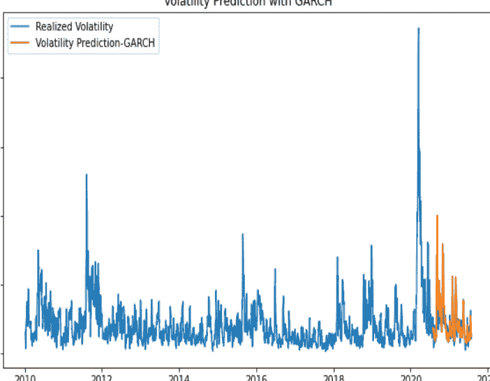

图 4-4. 使用 GARCH 进行波动率预测

将 GARCH 应用于波动率建模的主要原因是，收益率能被 GARCH 模型很好地拟合，部分原因是波动聚集现象，并且 GARCH 不假设收益率是独立的，这允许对收益率的尖峰厚尾特性进行建模。然而，尽管具有这些有用的特性和直观性，GARCH 无法对冲击做出非对称响应 (Karasan and Gaygisiz (2020))。为了解决这个问题，Glosten, Jagannathan 和 Runkle (1993) 提出了 GJR-GARCH。

### GJR-GARCH

该模型在建模公告的非对称效应方面表现良好，即坏消息比好消息具有更大的影响。换句话说，在存在非对称性的情况下，损失的分布比收益的分布具有更厚的尾部。该模型的方程包含一个额外的参数 $\gamma$，其形式如下：

$$\sigma_t^2 = \omega + \sum_{k=1}^q (\alpha_k r_{t-k}^2 + \gamma r_{t-k}^2 I(\epsilon_{t-1} < 0)) + \sum_{k=1}^p \beta_k \sigma_{t-k}^2$$

其中 $\gamma$ 控制公告的非对称性，如果

- $\gamma = 0$，则对过去冲击的响应相同
- $\gamma > 0$，则对过去负冲击的响应强于正冲击
- $\gamma < 0$，则对过去正冲击的响应强于负冲击

In [32]: bic_gjr_garch = []

        for p in range(1, 5):
            for q in range(1, 5):
                gjrgarch = arch_model(ret,mean='zero', p=p, o=1, q=q)\n                    .fit(disp='off')
                bic_gjr_garch.append(gjrgarch.bic)
                if gjrgarch.bic == np.min(bic_gjr_garch):
                    best_param = p, q
        gjrgarch = arch_model(ret,mean='zero', p=p, o=1, q=q)\n                    .fit(disp='off')
        print(gjrgarch.summary())
        forecast = gjrgarch.forecast(start=split_date[0])
        forecast_gjrgarch = forecast

零均值 - GJR-GARCH 模型结果

| | | | |
|---|---|---|---|
| 因变量: | Adj Close | R-squared: | 0.000 |
| 均值模型: | 零均值 | Adj. R-squared: | 0.000 |
| 波动模型: | GJR-GARCH | 对数似然: | -3588.89 |
| 分布: | 正态 | AIC: | 7197.78 |
| 方法: | 最大似然 | BIC: | 7257.55 |
| 观测数: | 2914 | | |
| 日期: | Tue, Sep 07 2021 | 残差自由度: | |

### EGARCH

与GJR-GARCH模型一样，由Nelson（1991）提出的EGARCH模型也是控制非对称公告效应的工具，并且它以对数形式指定，因此无需施加限制以避免负波动率。

$$\log(\sigma_t^2) = \omega + \sum_{k=1}^{p} \beta_k \log\sigma_{t-k}^2 + \sum_{k=1}^{q} \alpha_i \frac{|r_{k-1}|}{\sqrt{\sigma_{t-k}^2}} + \sum_{k=1}^{q} \gamma_k \frac{r_{t-k}}{\sqrt{\sigma_{t-k}^2}}$$

EGARCH方程的主要区别在于，方程左侧的方差取了对数。这表明了杠杆效应，即过去的资产收益率与波动率之间存在负相关关系。如果 $\gamma < 0$，则意味着存在杠杆效应；如果 $\gamma \neq 0$，则表明波动率具有非对称性。

```
In [35]: bic_egarch = []

for p in range(1, 5):
    for q in range(1, 5):
        egarch = arch_model(ret, mean='zero',vol='EGARCH', p=p, o=1, q=q)\n                .fit(disp='off')
        bic_egarch.append(egarch.bic)
        if egarch.bic == np.min(bic_egarch):
            best_param = p, q
egarch = arch_model(ret, mean='zero', vol='EGARCH', p=p, o=1, q=q)\n        .fit(disp='off')
print(egarch.summary())
forecast = egarch.forecast(start=split_date[0])
forecast_egarch = forecast
Zero Mean - EGARCH Model Results
```

```
==============================================================================
=======
Dep. Variable:          Adj Close   R-squared:                     0.000
Mean Model:             Zero Mean   Adj. R-squared:                0.000
Vol Model:              EGARCH      Log-Likelihood:            -3575.09
Distribution:               Normal   AIC:                        7170.17
Method:         Maximum Likelihood   BIC:                        7229.94
No. Observations:            2914
Date:            Tue, Sep 07 2021   Df Residuals:                 2914
Time:                    11:19:38   Df Model:                        0
Volatility Model
==============================================================================
=======
coef    std err          t      P>|t|     95.0% Conf. Int.
```

```
omega        -1.9786e-03  8.231e-03     -0.240     0.810
[-1.811e-02,1.415e-02]
alpha[1]       0.1879  8.662e-02      2.170  3.004e-02   [1.816e-02,
0.358]
alpha[2]       0.0661      0.130      0.508      0.612   [ -0.189,
0.321]
alpha[3]      -0.0129      0.212 -6.081e-02      0.952   [ -0.429,
0.403]
alpha[4]       0.0936  9.336e-02      1.003      0.316  [-8.936e-02,
0.277]
gamma[1]      -0.2230  3.726e-02     -5.986  2.149e-09   [ -0.296,
-0.150]
beta[1]        0.8400      0.333      2.522  1.168e-02   [  0.187,
1.493]
beta[2]       4.1051e-14    0.658  6.235e-14      1.000   [ -1.290,
1.290]
beta[3]       1.2375e-14    0.465  2.659e-14      1.000   [ -0.912,
0.912]
beta[4]        0.0816      0.202      0.404      0.686   [ -0.314,
0.478]
==============================================================================
========

Covariance estimator: robust
```

```
In [36]: rmse_egarch = np.sqrt(mean_squared_error(realized_vol[-n:] / 100,
                                        np.sqrt(forecast_egarch.variance\n                                        .iloc[-len(split_date):]
                                        / 100)))

print('The RMSE value of EGARCH models is {:.4f}'.format(rmse_egarch))
The RMSE value of EGARCH models is 0.0895
```

```
In [37]: plt.figure(figsize=(10, 6))
plt.plot(realized_vol / 100, label='Realized Volatility')
plt.plot(forecast_egarch.variance.iloc[-len(split_date):] / 100,
         label='Volatility Prediction-EGARCH')
plt.title('Volatility Prediction with EGARCH', fontsize=12)
plt.legend()
plt.savefig('images/egarch.png')
plt.show()
```

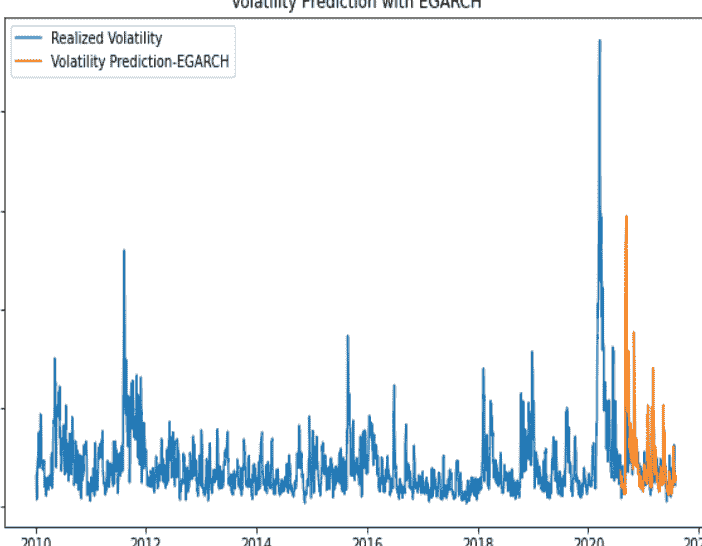

图 4-6. 使用EGARCH进行波动率预测

根据RMSE结果，表现最好和最差的模型分别是GARCH和ARCH。但我们上面使用的所有模型在性能上差异不大。特别是在坏消息/好消息公布期间，由于市场的非对称性，EGARCH和GJR-GARCH的表现可能有所不同。

| 模型 | RMSE |
|---|---|
| ARCH | 0.0896 |
| GARCH | 0.0878 |
| GJR-GARCH | 0.0880 |
| EGARCH | 0.0895 |

到目前为止，我们已经讨论了经典的波动率模型，但从现在开始，我们将探讨如何使用机器学习和贝叶斯方法来建模波动率。在机器学习的背景下，支持向量机和神经网络将是首先介绍的模型。让我们开始吧。

### 支持向量回归-GARCH

支持向量机是一种监督学习算法，可应用于分类和回归。SVM的目标是找到一条能将两个类别分开的直线。这听起来很简单，但挑战在于：几乎有无数条线可以用来区分这些类别。但我们寻找的是能够完美区分这些类别的最优直线。

在线性代数中，这条最优直线被称为*超平面*，它最大化了距离超平面最近但属于不同类别的点之间的距离。这两个点，即支持向量之间的距离，被称为*间隔*。因此，在SVM中，我们试图做的是最大化支持向量之间的间隔。

用于分类的SVM被标记为支持向量分类。保留SVM的所有特性，它也可以应用于回归。同样，在回归中，目标是找到最小化误差并最大化间隔的超平面。这种方法被称为支持向量回归，在本部分中，我们将把这种方法应用于GARCH模型。将这两种模型结合起来，产生了一个不同的名称：*SVR-GARCH*。

### 核函数

如果我们处理的数据无法线性分离会怎样？这会给我们带来巨大的麻烦，但别担心，我们有核函数来解决这个问题。这是一种很好且简单的方法，用于建模非线性和高维数据。在核SVM中，我们采取的步骤是：

1.  将数据移动到高维空间
2.  找到合适的超平面
3.  返回到初始数据

为此，我们使用核函数。利用特征映射的思想，表明我们的原始变量被映射到一组新的量，并传递给学习算法。

最后，在优化过程中，我们使用以下主要核函数代替输入数据：

-   多项式核：$K(x, z) = (x^T z + b)$。
-   径向基（高斯）核：$K(x, z) = \exp\left(-\frac{|x-z|^2}{2\sigma^2}\right)$。
-   指数核：$K(x, z) = \exp\left(-\frac{|x-z|}{\sigma}\right)$。其中x是输入，b是偏置或常数，z是$x^2$的线性组合。

以下代码展示了在Python中运行SVR-GARCH之前的准备工作。这里最关键的步骤是获取自变量，即已实现波动率和历史收益率的平方。

```
In [38]: from sklearn.svm import SVR
    from scipy.stats import uniform as sp_rand
    from sklearn.model_selection import RandomizedSearchCV
    from sklearn.metrics import mean_squared_error
```

### SVR-GARCH 应用

1.  计算已实现波动率，并为其分配一个名为 `realized_vol` 的新变量。

2.  为不同的 SVR 核函数创建新变量。

让我们运行并查看第一个使用线性核函数的 SVR-GARCH 应用。将使用均方根误差（RMSE）作为比较的度量标准。

```python
In [39]: realized_vol = ret.rolling(5).std()
realized_vol = pd.DataFrame(realized_vol)
realized_vol.reset_index(drop=True, inplace=True)
```

```python
In [40]: returns_svm = ret ** 2
returns_svm = returns_svm.reset_index()
del returns_svm['Date']
```

```python
In [41]: X = pd.concat([realized_vol, returns_svm], axis=1, ignore_index=True)
X = X[4:].copy()
X = X.reset_index()
X.drop('index', axis=1, inplace=True)
```

```python
In [42]: realized_vol = realized_vol.dropna().reset_index()
realized_vol.drop('index', axis=1, inplace=True)
```

```python
In [43]: svr_poly = SVR(kernel='poly')
svr_lin = SVR(kernel='linear')
svr_rbf = SVR(kernel='rbf')
```

```python
In [44]: para_grid = {'gamma': sp_rand(),
'C': sp_rand(),
'epsilon': sp_rand()}
clf = RandomizedSearchCV(svr_lin, para_grid)
clf.fit(X.iloc[:-n].values,
realized_vol.iloc[1:-(n-1)].values.reshape(-1,))
predict_svr_lin = clf.predict(X.iloc[-n:])
```

```python
In [45]: predict_svr_lin = pd.DataFrame(predict_svr_lin)
predict_svr_lin.index = ret.iloc[-n:].index
```

```python
In [46]: rmse_svr = np.sqrt(mean_squared_error(realized_vol.iloc[-n:] / 100,
predict_svr_lin / 100))
print('The RMSE value of SVR with Linear Kernel is {:.6f}'.format(rmse_svr))
```

The RMSE value of SVR with Linear Kernel is 0.000648

```python
In [47]: realized_vol.index = ret.iloc[4:].index
```

```python
In [48]: plt.figure(figsize=(10, 6))
    plt.plot(realized_vol / 100, label='Realized Volatility')
    plt.plot(predict_svr_lin / 100, label='Volatility Prediction-SVR-GARCH')
    plt.title('Volatility Prediction with SVR-GARCH (Linear)', fontsize=12)
    plt.legend()
    plt.savefig('images/svr_garch_linear.png')
    plt.show()
```

1.  确定用于调优的超参数空间。
2.  使用 `RandomizedSearchCV` 进行超参数调优。
3.  将线性核函数的 SVR-GARCH 拟合到数据。
4.  基于最后 252 个观测值预测波动率，并将其存储在 `predict_svr_lin` 中。

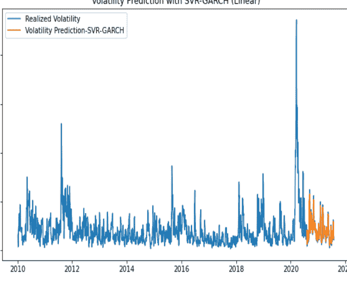

图 4-7 展示了预测值和实际观测值。通过目测，可以判断 SVR-GARCH 表现良好。正如你可能猜测的，如果数据集是线性可分的，线性核函数效果很好，这也是 _奥卡姆剃刀原则_<sup>3</sup> 的建议。如果不是呢？让我们继续使用 RBF 和多项式核函数。前者使用围绕观测值的椭圆曲线，而后者与前两者不同，也关注样本的组合。现在让我们看看它们如何工作。

下面可以找到使用 RBF 核函数的 SVR-GARCH 应用，该函数将数据投影到新的向量空间。从实践角度来看，使用不同核函数的 SVR-GARCH 应用并非一个劳动密集型过程，我们只需要切换核函数名称即可。

```python
In [49]: para_grid ={'gamma': sp_rand(),
            'C': sp_rand(),
            'epsilon': sp_rand()}
clf = RandomizedSearchCV(svr_rbf, para_grid)
clf.fit(X.iloc[:-n].values,
        realized_vol.iloc[1:-(n-1)].values.reshape(-1,))
predict_svr_rbf = clf.predict(X.iloc[-n:])
```

```python
In [50]: predict_svr_rbf = pd.DataFrame(predict_svr_rbf)
        predict_svr_rbf.index = ret.iloc[-n:].index
```

```python
In [51]: rmse_svr_rbf = np.sqrt(mean_squared_error(realized_vol.iloc[-n:] / 100,
                                        predict_svr_rbf / 100))
        print('The RMSE value of SVR with RBF Kernel is {:.6f}'.format(rmse_svr_rbf))
        The RMSE value of SVR with RBF Kernel is  0.000942
```

```python
In [52]: plt.figure(figsize=(10, 6))
        plt.plot(realized_vol / 100, label='Realized Volatility')
        plt.plot(predict_svr_rbf / 100, label='Volatility Prediction-SVR_GARCH')
        plt.title('Volatility Prediction with SVR-GARCH (RBF)', fontsize=12)
        plt.legend()
        plt.savefig('images/svr_garch_rbf.png')
        plt.show()
```

RMSE 分数和可视化结果都表明，使用线性核函数的 SVR-GARCH 优于使用 RBF 核函数的 SVR-GARCH。线性核函数和 RBF 核函数的 SVR-GARCH 的 RMSE 分别为 0.000453 和 0.000986。因此，使用线性核函数的 SVR 确实表现良好。

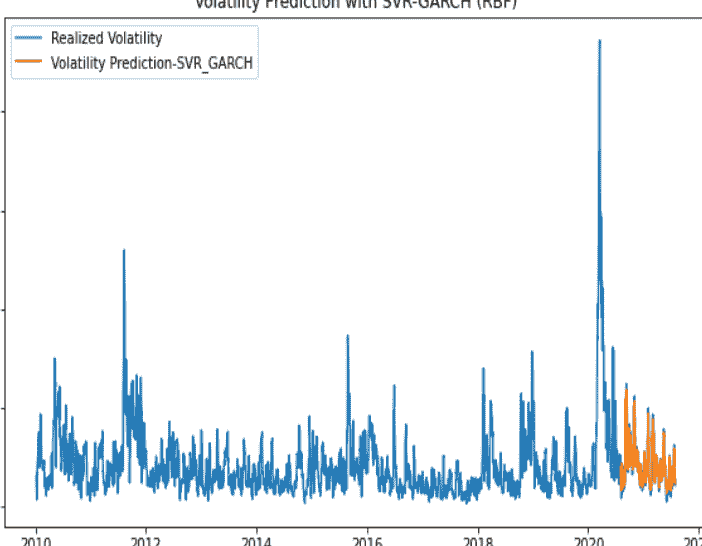

最后，使用了多项式核函数的 SVR-GARCH，但结果表明其 RMSE 最低，这意味着它是这三种不同应用中表现最差的核函数。

```python
In [53]: para_grid = {'gamma': sp_rand(),
                'C': sp_rand(),
                'epsilon': sp_rand()}
clf = RandomizedSearchCV(svr_poly, para_grid)
clf.fit(X.iloc[:-n].values,
        realized_vol.iloc[1:-(n-1)].values.reshape(-1,))
predict_svr_poly = clf.predict(X.iloc[-n:])

In [54]: predict_svr_poly = pd.DataFrame(predict_svr_poly)
predict_svr_poly.index = ret.iloc[-n:].index

In [55]: rmse_svr_poly = np.sqrt(mean_squared_error(realized_vol.iloc[-n:] / 100,
                                    predict_svr_poly / 100))
print('The RMSE value of SVR with Polynomial Kernel is {:.6f}'.format(rmse_svr_poly))
The RMSE value of SVR with Polynomial Kernel is 0.005291
```

```python
In [56]: plt.figure(figsize=(10, 6))
    plt.plot(realized_vol/100, label='Realized Volatility')
    plt.plot(predict_svr_poly/100, label='Volatility Prediction-SVR-GARCH')
    plt.title('Volatility Prediction with SVR-GARCH (Polynomial)', fontsize=12)
    plt.legend()
    plt.savefig('images/svr_garch_poly.png')
    plt.show()
```

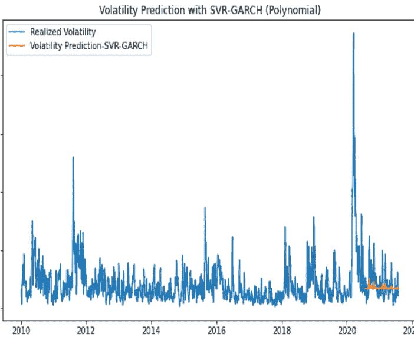

### 神经网络

神经网络（NN）是深度学习的基石。在神经网络中，数据通过多个阶段进行处理以做出决策。每个神经元将点积的结果作为输入，并将其用作激活函数的输入以做出决策。

$$z = w_1x_1 + w_2x_2 + b$$

其中 b 是偏置，w 是权重，x 是输入数据。

在此过程中，输入数据在隐藏层和输出层中经历各种数学操作。一般来说，神经网络有三种类型的层：

- 输入层
- 隐藏层
- 输出层

输入层包含原始数据。从输入层到隐藏层，我们学习系数。根据网络结构，可能有一个或多个隐藏层。网络拥有的隐藏层越多，其结构就越复杂。隐藏层位于输入层和输出层之间，通过激活函数执行非线性变换。

最后，输出层是产生输出并做出决策的层。

在机器学习中，梯度下降是用于最小化代价函数的工具，但由于神经网络的链式结构，在神经网络中仅使用梯度下降是不可行的。因此，提出了一种称为反向传播的新概念来最小化代价函数。反向传播的思想基于计算观测输出和实际输出之间的误差，并将此误差传递给隐藏层。因此，我们向后移动，主要方程的形式为：

$$\delta^l = \frac{\delta J}{\delta z^l_j}$$

其中 z 是线性变换，$\delta$ 代表误差。还有很多内容可以说，但为了保持进度，我在此停止。对于那些想深入了解神经网络背后数学原理的人，请参考 Wilmott (2013) 和 Alpaydin (2020)。

### 梯度下降

假设我们位于山顶，试图到达使代价函数最小化的平台。形式上，梯度下降是一种优化算法，用于通过以下更新规则搜索使代价函数最小化的最佳参数空间（w, b）：

$$\theta_{t+1} = \theta_t - \lambda \frac{\delta J}{\delta \theta_t}$$

其中 $\theta(w, b)$ 是权重 w 和偏置 b 的函数。J 是代价函数，$\lambda$ 是学习率，它是一个常数，决定我们希望多快地最小化代价函数。在每次迭代中，我们更新参数以最小化误差。

简而言之，梯度下降算法的工作方式如下：

1.  为 w 和 b 选择初始值。
2.  沿着与梯度指向相反的方向移动 $\lambda$ 步。
3.  在每次迭代中更新 w 和 b。
4.  重复步骤 2 直到收敛。

现在，我们使用 scikit-learn Python 中的 *MLPRegressor* 模块应用基于神经网络的波动率预测，尽管在 Python 中运行神经网络有多种选择$^4$。根据我们介绍的神经网络结构，结果如下所示。

```python
In [57]: from sklearn.neural_network import MLPRegressor
        NN_vol = MLPRegressor(learning_rate_init=0.001, random_state=1)
        para_grid_NN = {'hidden_layer_sizes': [(100, 50), (50, 50), (10, 100)],
                        'max_iter': [500, 1000],
                        'alpha': [0.00005, 0.0005 ]}
        clf = RandomizedSearchCV(NN_vol, para_grid_NN)
        clf.fit(X.iloc[:-n].values,
```

### 贝叶斯方法

我们处理概率的方式至关重要，因为它区分了经典（或频率学派）方法与贝叶斯方法。根据前一种方法，相对频率将收敛于真实概率。然而，贝叶斯应用基于主观解释。与频率学派不同，贝叶斯统计学家将概率分布视为不确定的，并且会随着新信息的加入而进行修正。

由于这两种方法对概率的解释不同，似然函数——定义为在给定一组参数下观测事件的概率——的计算方式也不同。

从联合密度函数出发，我们可以给出似然函数的数学表示：

$\mathcal{L}(\theta|x_1, x_2, \dots, x_p) = \text{Pr} (x_1, x_2, \dots, x_p|\theta)$

在所有可能的 $\theta$ 值中，我们试图做的是决定哪一个更有可能。在似然函数提出的统计模型下，观测数据 $x_1, \dots, x_p$ 是最可能出现的。

事实上，你熟悉基于这种方法的估计，即最大似然估计。在明确了贝叶斯方法与频率学派方法的主要区别之后，现在是时候深入探讨贝叶斯定理了。

### 贝叶斯定理

贝叶斯方法基于条件分布，该分布表明概率衡量的是一个人对不确定事件的了解程度。因此，贝叶斯应用提出了一种规则，可用于根据新信息更新一个人持有的信念：

> 当我们拥有关于某个参数的先验信息时，就会使用贝叶斯估计。例如，在查看样本以估计分布的均值之前，我们可能有一些先验信念，认为它接近2，介于1和3之间。当我们拥有小样本时，这种先验信念尤其重要。在这种情况下，我们感兴趣的是将数据告诉我们的信息（即从样本计算出的值）与我们的先验信息结合起来。

— (Rachev et al., 2008)

与频率学派应用类似，贝叶斯估计基于概率密度 Pr ($x|\theta$)。然而，正如我们之前讨论的，贝叶斯方法和频率学派方法处理参数集 $\theta$ 的方式不同。频率学派假设 $\theta$ 是固定的，而在贝叶斯设定中，它被视为随机变量，其概率被称为先验密度 Pr ($\theta$)。哦不！我们又有了一个不同的术语，但别担心，它很容易理解。

根据这些信息，我们可以使用先验密度 Pr ($\theta$) 来估计 $\mathcal{L}(x|\theta)$，并得出以下公式。当我们需要估计给定观测值的参数的条件分布时，会使用先验。

$$\Pr(\theta|x_1, x_2, \dots, x_p) = \frac{\mathcal{L}(x_1, x_2, \dots, x_p|\theta) \Pr(\theta)}{\Pr(x_1, x_2, \dots, x_p)}$$

或

$$\Pr(\theta|data) = \frac{\mathcal{L}(data|\theta) \Pr(\theta)}{\Pr(data)}$$

其中

- $\Pr(\theta|data)$ 是后验密度，它提供了给定观测数据下关于参数的信息。
- $\mathcal{L}(data|\theta)$ 是似然函数，它估计给定参数下数据的概率。
- $\Pr(\theta)$ 是先验概率。它是参数的概率。先验基本上是关于估计的初始信念。
- 最后，Pr 是证据，用于更新先验。

因此，贝叶斯定理表明后验密度与先验项和似然项成正比，但与证据项成反比。由于证据用于缩放，我们可以将此过程描述为：

realized_vol.iloc[1:-(n-1)].values.reshape(-1, ))③
NN_predictions = clf.predict(X.iloc[-n:])④

In [58]: NN_predictions = pd.DataFrame(NN_predictions)
        NN_predictions.index = ret.iloc[-n:].index

In [59]: rmse_NN = np.sqrt(mean_squared_error(realized_vol.iloc[-n:] / 100,
                                        NN_predictions / 100))
        print('The RMSE value of NN is {:.6f}'.format(rmse_NN))
        The RMSE value of NN is 0.000583

In [60]: plt.figure(figsize=(10, 6))
        plt.plot(realized_vol / 100, label='Realized Volatility')
        plt.plot(NN_predictions / 100, label='Volatility Prediction-NN')
        plt.title('Volatility Prediction with Neural Network', fontsize=12)
        plt.legend()
        plt.savefig('images/NN.png')
        plt.show()

1. 导入 *MLPRegressor* 库。
2. 配置神经网络模型。
3. 将神经网络模型拟合到训练数据⁵。
4. 基于最后252个观测值预测波动率，并将结果存储在 *NN_predictions* 变量中。

图4-10展示了基于神经网络模型的波动率预测结果。尽管其性能合理，但我们可以调整隐藏神经元的数量，以生成一个深度学习模型。为此，我们可以应用Keras库，这是一个人工神经网络的Python接口。

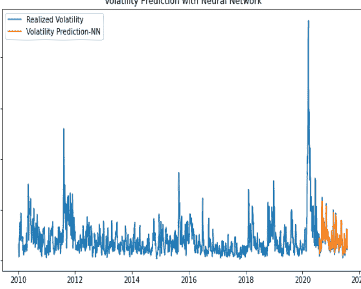

图4-10. 使用神经网络进行波动率预测

现在，是时候使用深度学习来预测波动率了。基于Keras，配置网络结构很容易。我们需要做的就是确定特定层的神经元数量。这里，第一个和第二个隐藏层的神经元数量分别为256和128。由于波动率是连续类型，我们只有一个输出神经元。

In [61]: import tensorflow as tf
        from tensorflow import keras
        from tensorflow.keras import layers

In [62]: model = keras.Sequential(
            [layers.Dense(256, activation="relu"),
             layers.Dense(128, activation="relu"),
             layers.Dense(1, activation="linear"),])❶

In [63]: model.compile(loss='mse', optimizer='rmsprop')❷

In [64]: epochs_trial = np.arange(100, 400, 4)❸
        batch_trial = np.arange(100, 400, 4)❸

DL_pred = []
DL_RMSE = []
for i, j, k in zip(range(4), epochs_trial, batch_trial):
    model.fit(X.iloc[:-n].values,
              realized_vol.iloc[1:-(n-1)].values.reshape(-1,),
              batch_size=k, epochs=j, verbose=False)④
    DL_predict = model.predict(np.asarray(X.iloc[-n:]))⑤
    DL_RMSE.append(np.sqrt(mean_squared_error(realized_vol.iloc[-n:] / 100,
                                             DL_predict.flatten() / 100)))⑥
    DL_pred.append(DL_predict)
    print('DL_RMSE_{}:{:.6f}'.format(i+1, DL_RMSE[i]))
DL_RMSE_1:0.000524
DL_RMSE_2:0.001118
DL_RMSE_3:0.000676
DL_RMSE_4:0.000757

In [65]: DL_predict = pd.DataFrame(DL_pred[DL_RMSE.index(min(DL_RMSE))])
        DL_predict.index = ret.iloc[-n:].index

In [66]: plt.figure(figsize=(10, 6))
        plt.plot(realized_vol / 100, label='Realized Volatility')
        plt.plot(DL_predict / 100, label='Volatility Prediction-DL')
        plt.title('Volatility Prediction with Deep Learning', fontsize=12)
        plt.legend()
        plt.savefig('images/DL.png')
        plt.show()

1. 通过决定层数和神经元数量来配置网络结构。
2. 使用损失函数和优化器编译模型。
3. 使用 *np.arange* 决定训练轮次和批大小。
4. 拟合深度学习模型。
5. 基于训练阶段获得的权重预测波动率。
6. 通过展平预测结果来计算RMSE分数。

结果表明，随着层数的增加，我们获得了最小的RMSE分数，这是完全可以理解的，因为在大多数情况下，层数和模型性能在达到某一点之前是同步提升的，之后模型往往会过拟合。为特定数据确定合适的层数是深度学习的关键，这意味着我们在模型出现过拟合问题之前就停止添加更多层。

图4-11展示了由以下代码得出的波动率预测结果，它表明深度学习也为波动率建模提供了强大的工具。

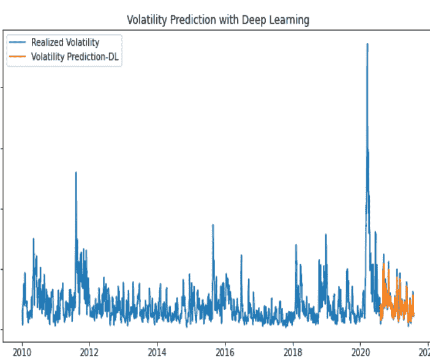

图4-11. 使用深度学习进行波动率预测

后验概率 ∝ 似然函数 × 先验概率

其中 ∝ 表示“与……成正比”

在此背景下，贝叶斯定理听起来很有吸引力，不是吗？确实如此，但它也有代价，即解析上的难以处理。即使贝叶斯定理在理论上很直观，但总体上很难通过解析方法求解。这是贝叶斯定理广泛应用的主要障碍。不过，好消息是数值方法为求解这个概率模型提供了可靠的方法。

因此，人们提出了一些方法来处理贝叶斯定理中的计算问题。这些方法提供了近似解，可以列举如下：

-   求积近似
-   最大后验估计
-   网格法
-   基于采样的方法
-   梅特罗波利斯-黑斯廷斯算法
-   吉布斯采样器
-   无回转采样器

在这些方法中，让我们重点关注梅特罗波利斯-黑斯廷斯算法，这将是我们用于建模贝叶斯定理的方法。梅特罗波利斯-黑斯廷斯（M-H）方法基于马尔可夫链蒙特卡洛（MCMC）。此外，最大后验估计将在[待添加链接]中讨论。因此，在继续之前，最好先谈谈MCMC方法。

### 马尔可夫链蒙特卡洛

马尔可夫链是我们用来描述状态间转移概率的模型，它是一种游戏规则。如果当前状态 $s_t$ 的概率仅取决于最近的状态 $s_{t-1}$，则该链被称为马尔可夫链。

$$\Pr(s_t|s_{t-1}, s_{t-2}, \dots, s_{t-p}) = \Pr(s_t|s_{t-1})$$

因此，MCMC依赖于马尔可夫链来寻找具有最高后验概率的参数空间 $\theta$。随着样本量的增长，参数值会逼近后验密度。

$$\lim_{j \to +\infty} \theta^j \xrightarrow{D} \Pr(\theta|x)$$

其中 D 表示分布近似。参数空间的实现值可用于对后验进行推断。简而言之，MCMC方法帮助我们从后验密度中收集独立同分布的样本，以便我们可以计算后验概率。

为了说明，我们可以参考图4-12。该图告诉我们从一个状态转移到另一个状态的概率。为简单起见，我们将概率设为0.2，例如，从学习状态转移到睡眠状态的概率为0.2。

```python
In [67]: import quantecon as qe
        from quantecon import MarkovChain
        import networkx as nx
        from pprint import pprint
```

```python
In [68]: P = [[0.5, 0.2, 0.3],
        [0.2, 0.3, 0.5],
        [0.2, 0.2, 0.6]]

        mc = qe.MarkovChain(P, ('studying', 'travelling', 'sleeping'))
        mc.is_irreducible
Out[68]: True
```

```python
In [69]: states = ['studying', 'travelling', 'sleeping']
        initial_probs = [0.5, 0.3, 0.6]
        state_space = pd.Series(initial_probs, index=states, name='states')
```

```python
In [70]: q_df = pd.DataFrame(columns=states, index=states)
        q_df = pd.DataFrame(columns=states, index=states)
        q_df.loc[states[0]] = [0.5, 0.2, 0.3]
        q_df.loc[states[1]] = [0.2, 0.3, 0.5]
        q_df.loc[states[2]] = [0.2, 0.2, 0.6]
```

```python
In [71]: def _get_markov_edges(Q):
            edges = {}
            for col in Q.columns:
                for idx in Q.index:
                    edges[(idx,col)] = Q.loc[idx,col]
            return edges
        edges_wts = _get_markov_edges(q_df)
        pprint(edges_wts)
        {('sleeping', 'sleeping'): 0.6,
         ('sleeping', 'studying'): 0.2,
         ('sleeping', 'travelling'): 0.2,
         ('studying', 'sleeping'): 0.3,
         ('studying', 'studying'): 0.5,
         ('studying', 'travelling'): 0.2,
         ('travelling', 'sleeping'): 0.5,
         ('travelling', 'studying'): 0.2,
         ('travelling', 'travelling'): 0.3}
```

```python
In [72]: G = nx.MultiDiGraph()
        G.add_nodes_from(states)
        for k, v in edges_wts.items():
            tmp_origin, tmp_destination = k[0], k[1]
            G.add_edge(tmp_origin, tmp_destination, weight=v, label=v)

        pos = nx.drawing.nx_pydot.graphviz_layout(G, prog='dot')
        nx.draw_networkx(G, pos)
        edge_labels = {(n1, n2):d['label'] for n1, n2, d in G.edges(data=True)}
        nx.draw_networkx_edge_labels(G , pos, edge_labels=edge_labels)
        nx.drawing.nx_pydot.write_dot(G, 'mc_states.dot')
```

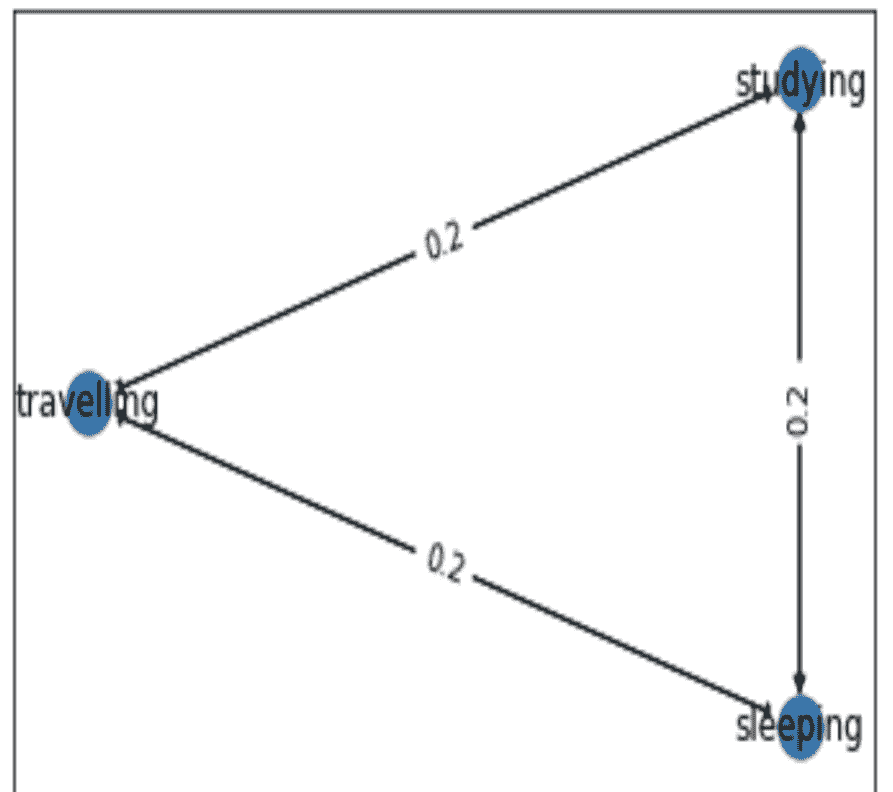

图4-12. 不同状态间的交互

有两种常见的MCMC方法：梅特罗波利斯-黑斯廷斯算法和吉布斯采样器。这里，我们深入探讨前者。

### 梅特罗波利斯-黑斯廷斯算法

梅特罗波利斯-黑斯廷斯（M-H）算法允许我们通过两个步骤进行高效的采样：首先我们从提议密度中抽取样本，然后在第二步中决定接受或拒绝。

设 $q(\theta|\theta^{t-1})$ 为提议密度，$\theta$ 为参数空间。M-H的整个算法可以概括为：

1.  从参数空间 $\theta$ 中为 $\theta^1$ 选择初始值。
2.  从提议密度中选择一个新的参数值 $\theta^2$，为方便起见，可以是高斯分布或均匀分布。
3.  计算以下接受概率：
$$\text{Pr}_a \left(\theta^*, \theta^{t-1}\right) = min \left(1, \frac{p(\theta^*) / q(\theta^* | \theta^{t-1})}{p(\theta^{t-1}) / q(\theta^{t-1} | \theta^*)}\right)$$
4.  如果 $\text{Pr}_a \left(\theta^*, \theta^{t-1}\right)$ 大于从均匀分布U(0,1)中抽取的样本值。
5.  从步骤2重复。

嗯，这看起来令人生畏，但别担心。Python中有内置代码使得M-H算法的应用变得容易得多。我们使用*PyFlux*库来利用贝叶斯定理。让我们去应用M-H算法来预测波动率。

```python
In [73]: import pyflux as pf
        from scipy.stats import kurtosis

In [74]: model = pf.GARCH(ret.values, p=1, q=1)❶
        print(model.latent_variables)❷
        model.adjust_prior(1, pf.Normal())❸
        model.adjust_prior(2, pf.Normal())❸
        x = model.fit(method='M-H', iterations='1000')❹
        print(x.summary())
        Index  Latent Variable  Prior  Prior Hyperparameters
        V.I. Dist  Transform
        ========================================
        ========================================
        0  Vol Constant  Normal  mu0: 0, sigma0: 3
        Normal  exp
        1  q(1)  Normal  mu0: 0, sigma0: 0.5
        Normal  logit
        2  p(1)  Normal  mu0: 0, sigma0: 0.5
        Normal  logit
        3  Returns Constant  Normal  mu0: 0, sigma0: 3
        Normal  None
        Acceptance rate of Metropolis-Hastings is 0.00285
        Acceptance rate of Metropolis-Hastings is 0.2444
```

```python
Tuning complete! Now sampling.
Acceptance rate of Metropolis-Hastings is 0.237925
GARCH(1,1)
```

```
==============================================================================
==============================================================================
Dependent Variable: Series                    Method: Metropolis
                                                Hastings
Start Date: 1                                  Unnormalized Log
Posterior: -3635.1999
End Date: 2913                                 AIC:
7278.39981852521
Number of observations: 2913                   BIC:
7302.307573553048
==============================================================================
==============================================================================
Latent Variable                     Median          Mean
95% Credibility Interval
==============================================================================
==============================================================================
Vol Constant                        0.0425          0.0425
(0.0342 | 0.0522)
q(1)                                0.1966          0.1981
(0.1676 | 0.2319)
p(1)                                0.7679          0.767
(0.7344 | 0.7963)
Returns Constant                    0.0854          0.0839
(0.0579 | 0.1032)
==============================================================================
==============================================================================
None
```

```python
In [75]: model.plot_z([1, 2])⑤
        model.plot_fit(figsize=(15, 5))⑥
        model.plot_ppc(T=kurtosis, nsims=1000)⑦
```

1.  使用PyFlux库配置GARCH模型。
2.  打印潜在变量（参数）的估计值。
3.  调整模型潜在变量的先验分布。
4.  使用M-H过程拟合模型。

### 5. 绘制潜变量。
6. 绘制拟合模型。
7. 绘制后验检验的直方图。

可视化我们迄今为止在基于贝叶斯的GARCH模型进行波动率预测方面所做的工作结果是值得的。

图4-13展示了潜变量的分布。潜变量q聚集在0.2附近，而另一个潜变量p的值主要介于0.7和0.8之间。

### 潜变量图

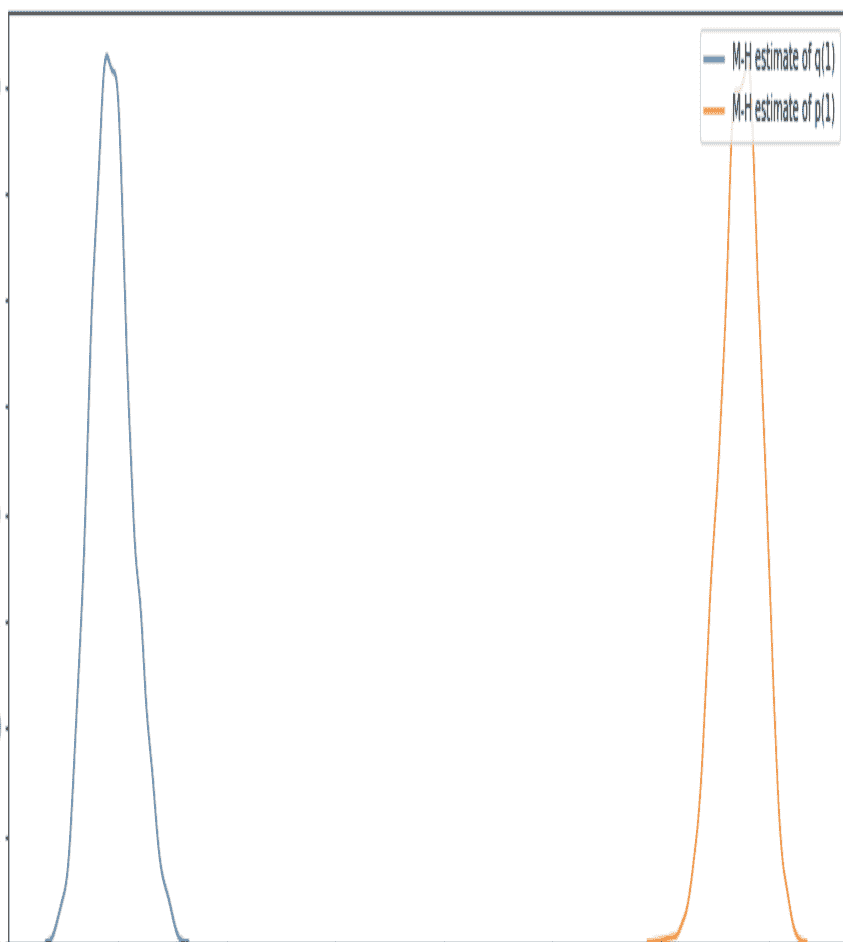

图4-13. 潜变量

图4-14展示了去均值波动率序列和基于贝叶斯方法的GARCH预测结果。

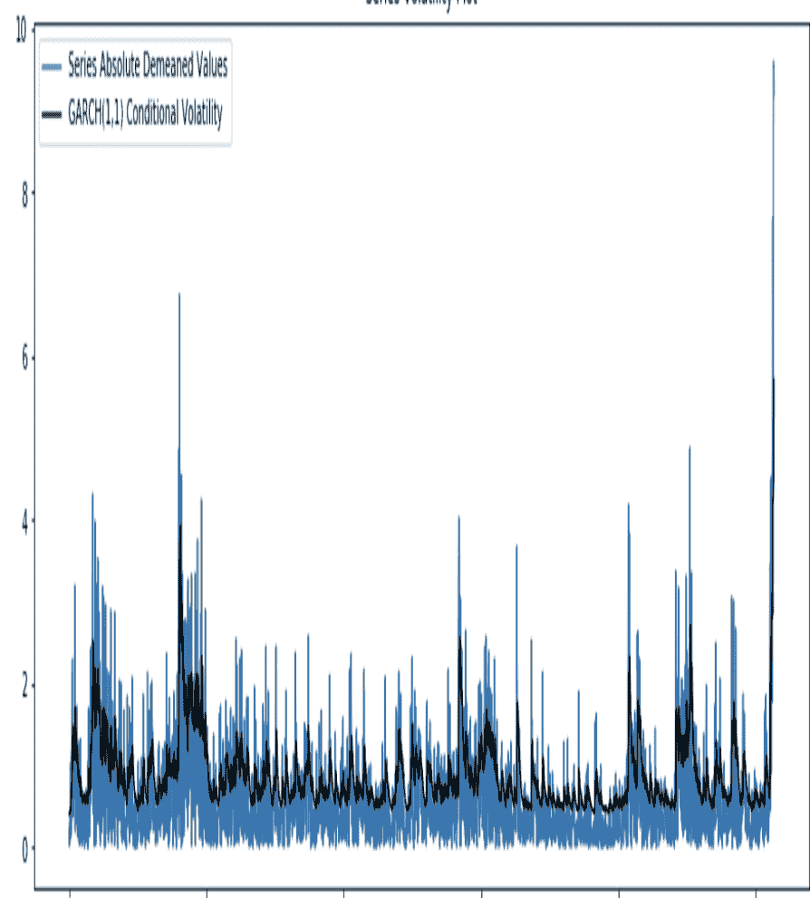

图4-14. 模型拟合

图4-15将贝叶斯模型的后验预测与数据进行了可视化，以便我们能够检测是否存在系统性差异。垂直线代表检验统计量，结果表明观测值大于我们模型的值。

### 后验预测

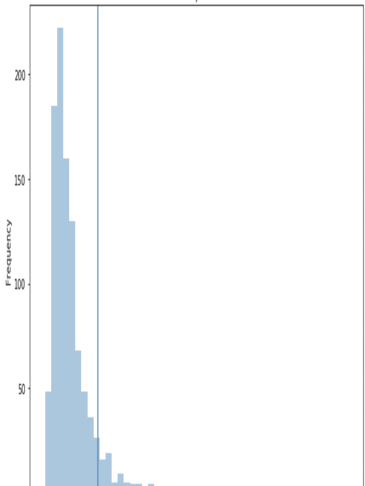

图4-15. 后验预测

完成训练部分后，我们已准备好进入下一阶段，即预测。预测分析针对252步提前进行，并根据已实现波动率计算均方根误差。

```
In [76]: bayesian_prediction = model.predict_is(n, fit_method='M-H')❶
Acceptance rate of Metropolis-Hastings is 0.1127
Acceptance rate of Metropolis-Hastings is 0.17795
Acceptance rate of Metropolis-Hastings is 0.2532

Tuning complete! Now sampling.
Acceptance rate of Metropolis-Hastings is 0.255425
```

```
In [77]: bayesian_RMSE = np.sqrt(mean_squared_error(realized_vol.iloc[-n:] / 100,
                                bayesian_prediction.values / 100))❷
print('The RMSE of Bayesian model is {:.6f}'.format(bayesian_RMSE))
The RMSE of Bayesian model is 0.004090
```

```
In [78]: bayesian_prediction.index = ret.iloc[-n:].index
```

```
In [79]: plt.figure(figsize=(10, 6))
plt.plot(realized_vol / 100,
         label='Realized Volatility')
plt.plot(bayesian_prediction['Series'] / 100,
         label='Volatility Prediction-Bayesian')
plt.title('Volatility Prediction with M-H Approach', fontsize=12)
plt.legend()
plt.savefig('images/bayesian.png')
plt.show()
```

❶ 样本内波动率预测。
❷ 计算均方根误差分数。

最终，我们准备好观察贝叶斯方法的预测结果，以下代码为我们实现了这一点。

图4-16可视化了基于Metropolis-Hastings的贝叶斯方法的波动率预测，该方法似乎在2020年底出现超调，并且该方法的整体表现表明它并非最佳方法之一，因为它仅优于使用多项式核的SVR-GARCH。

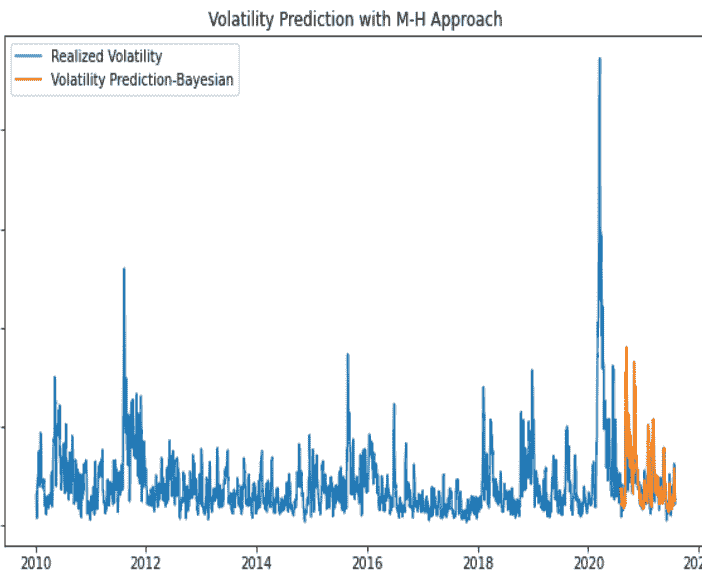

图4-16. 贝叶斯波动率预测

### 结论

波动率预测是理解金融市场动态的关键，因为它有助于我们衡量不确定性。话虽如此，它被用作许多金融模型（包括风险模型）的输入。这些事实强调了拥有准确波动率预测的重要性。传统上，参数方法如ARCH、GARCH及其扩展已被广泛使用，但这些模型存在不灵活的问题。为了解决这个问题，数据驱动模型被认为是有前景的，本章试图利用这些模型，即支持向量机、神经网络和基于深度学习的模型，结果表明数据驱动模型优于参数模型。

在下一章中，将从理论和实证角度讨论市场风险这一核心金融风险主题，并将结合机器学习模型以进一步改进该风险的估计。

### 延伸资源

本章引用的文章：

- Andersen, Torben G., Tim Bollerslev, Francis X. Diebold, and Paul Labys. “Modeling and forecasting realized volatility.” Econometrica 71, no. 2 (2003): 579-625.
- Andersen, Torben G., and Tim Bollerslev. “Intraday periodicity and volatility persistence in financial markets.” Journal of empirical finance 4, no. 2-3 (1997): 115-158.
- Black, Fischer. “Studies of stock market volatility changes.” 1976 Proceedings of the American statistical association business and economic statistics section (1976).
- Burnham, Kenneth P., and David R. Anderson. “Multimodel inference: understanding AIC and BIC in model selection.” Sociological methods & research 33, no. 2 (2004): 261-304.
- Engle, Robert F. “Autoregressive conditional heteroskedasticity with estimates of the variance of UK inflation.” Econometrica 50, no. 4 (1982): 987-1008.
- De Stefani, Jacopo, Olivier Caelen, Dalila Hattab, and Gianluca Bontempi. “Machine Learning for Multi-step Ahead Forecasting of Volatility Proxies.” In MIDAS@ PKDD/ECML, pp. 17-28. 2017.
- Dokuchaev, Nikolai. “Volatility estimation from short time series of stock prices.” Journal of Nonparametric statistics 26, no. 2 (2014): 373-384.
- Karasan, Abdullah, and Esma Gaygisiz. “Volatility Prediction and Risk Management: An SVR-GARCH Approach.” The Journal of Financial Data Science 2, no. 4 (2020): 85-104.
- Mandelbrot, Benoit. “New methods in statistical economics.” Journal of political economy 71, no. 5 (1963): 421-440.
- Raju, M. T., and Anirban Ghosh. “Stock market volatility–An international comparison.” Securities and Exchange Board of India (2004).

本章引用的书籍：

- Alpaydin, E., 2020. Introduction to machine learning. MIT press.
- Burnham, Kenneth P., and David R. Anderson. “A practical information-theoretic approach.” Model selection and multimodel inference (2002).
- Focardi, Sergio M. Modeling the market: New theories and techniques. Vol. 14. John Wiley & Sons, 1997.
- Rachev, Svetlozar T., John SJ Hsu, Biliiana S. Bagasheva, and Frank J. Fabozzi. Bayesian methods in finance. Vol. 153. John Wiley & Sons, 2008.
- Wilmott, Paul. Machine Learning-An Applied Mathematics Introduction. John Wiley & Sons, 2013.

1 条件方差意味着波动率估计是资产收益率过去值的函数。
2 更多信息请参阅此说明：http://cs229.stanford.edu/notes/cs229-notes3.pdf
3 奥卡姆剃刀，也称为简约法则，指出在给定一组解释时，更简单的解释是最合理和可能的。
4 在这些替代方案中，Tensorflow、PyTorch和Neurolab是最突出的库。
5 请参阅此手册：https://scikit-learn.org/stable/modules/generated/sklearn.neural_network.MLPClassifier.html

## 第5章. 市场风险

> ### 给早期发布读者的说明

通过早期发布电子书，您可以在书籍的最早形式中获取内容——即作者在写作过程中的原始未编辑内容——因此您可以在这些书籍正式发布之前很久就利用这些技术。

这将是最终书籍的第5章。请注意，GitHub仓库稍后将激活。

如果您对我们如何改进本书的内容和/或示例有意见，或者您注意到本章中缺少材料，请联系编辑 mcronin@oreilly.com。

风险在金融中无处不在，但难以量化。首要要知道的是区分金融风险的来源，因为针对不同来源的金融风险使用相同的工具可能并非明智之举。

因此，处理不同来源的金融风险至关重要，因为不同金融风险的影响以及为缓解风险而开发的工具完全不同。假设公司面临巨大的市场波动，公司投资组合中的所有资产都容易受到这些波动引发的风险影响。然而，应该开发不同的工具来应对来自客户概况的风险。此外，应记住不同的风险因素对资产价格有显著贡献。所有这些例子都意味着在金融中评估风险因素需要仔细考虑。

如前所述，这些主要是市场风险、信用风险、流动性风险和操作风险。显然，其他类型的风险可以添加到这个金融风险列表中，但它们可以被视为这些风险的子集。

### 四大主要风险类型。因此，这些风险类型将是我们本章讨论的重点。

市场风险是指由汇率、利率、通货膨胀等金融指标变化所引发的风险。具体而言，市场风险可指因市场价格波动导致的表内及表外头寸损失风险（BIS, 2020）。现在让我们看看这些因素如何影响市场风险。假设通货膨胀率上升可能对金融机构的当前盈利能力构成威胁，因为通胀会推高利率压力。这反过来又会影响借款人的资金成本。这些例子可以进一步扩展，但我们也应注意这些金融风险源之间的相互作用。也就是说，当单一金融风险源发生变化时，其他风险源不可能保持不变。话虽如此，金融指标在某种程度上是相互关联的，这意味着必须考虑这些风险源之间的相互作用。

可以想象，衡量市场风险有不同的工具。其中，最突出且被广泛接受的工具是风险价值（VaR）和预期短缺（ES）。本章的最终目标是利用机器学习的最新进展来增强这些方法。此时，人们不禁要问：传统模型在金融领域是否已经失效？而基于机器学习的模型有何不同？

我将首先着手回答第一个问题。传统模型无法应对的首要挑战是金融系统的复杂性。由于某些强假设或仅仅无法捕捉数据引入的复杂性，长期存在的传统模型已开始被基于机器学习的模型所取代。

普拉多对此有精辟的论述：

> 考虑到现代金融系统的复杂性，研究人员不太可能通过目视检查数据或运行几次回归就能揭示一个理论的构成要素。
—普拉多（《资产管理员的机器学习》，2020年，第4页）

为了回答第二个问题，明智的做法是思考机器学习模型的工作逻辑。与旧的统计方法不同，机器学习模型试图揭示变量之间的关联，识别关键变量，并使我们能够在无需完善理论的情况下，找出变量对因变量的影响。事实上，这正是机器学习模型的美妙之处，因为它无需许多限制性强的假设，就能让我们发现理论，更不用说要求这些理论了。

> 统计学和机器学习（ML）的许多方法原则上都可用于预测和推断。然而，统计学长期以来一直专注于推断，这是通过创建和拟合特定项目的概率模型来实现的……相比之下，机器学习专注于预测，它使用通用学习算法在通常丰富而杂乱的数据中寻找模式。
—布兹多克（《统计学与机器学习》，2018年，第232页）

在接下来的部分，我们将开始讨论市场风险模型。首先，我们将讨论风险价值（VaR）和预期短缺（ES）的应用。在介绍这些模型的传统应用之后，我们将学习如何使用基于机器学习的方法来应用它们。让我们开始吧。

### 风险价值

VaR模型的出现源于一位摩根大通高管的需求，他希望获得一份总结报告，显示摩根大通在一天内可能面临的损失和风险。在这份报告中，高管们以汇总的方式了解机构承担的风险。计算市场风险的方法被称为VaR。因此，这是VaR的起点，如今它已变得如此普及，以至于监管机构强制要求采用它。

VaR的采用可以追溯到20世纪90年代，尽管对VaR进行了大量扩展并提出了新的模型，但它至今仍在使用。那么，是什么让它如此具有吸引力？这或许才是需要解答的问题。答案来自凯文·道德：

> VaR数值有两个重要特征。首先，它提供了跨不同头寸和风险因素的共同一致的风险度量。它使我们能够以一种可比且一致的方式衡量与固定收益头寸相关的风险，例如，与衡量与股票头寸相关的风险的方式相一致。VaR为我们提供了一个共同的风险标尺，这个标尺使机构能够以以前不可能的新方式管理其风险。VaR的另一个特征是它考虑了不同风险因素之间的相关性。如果两种风险相互抵消，VaR会考虑这种抵消，并告诉我们总体风险相当低。
—道德（2002年，第10页）

事实上，VaR基本上解决了投资者最常见的问题之一：

给定风险水平，我的投资最大预期损失是多少？

VaR为这个问题提供了一个非常直观和实用的答案。在这方面，它用于衡量公司在给定时期和预定义置信区间内的最坏预期损失。假设一项投资的日VaR为1000万美元，置信区间为95%。这意味着：投资者在一天内遭受超过1000万美元损失的概率为5%。

根据上述定义，VaR的组成部分包括置信区间、时间范围、资产或投资组合的价值以及标准差，因为我们讨论的是风险。

总之，VaR分析中有一些要点需要强调：

- VaR需要估计损失概率
- VaR关注潜在损失。我们讨论的不是实际或已实现的损失，而是一种损失预测
- VaR有三个关键要素：
    - 定义损失水平的标准差
    - 评估风险的固定时间范围
    - 置信区间

那么，VaR可以通过三种不同的方法来衡量：

- 方差-协方差VaR
- 历史模拟VaR
- 蒙特卡洛VaR

### 方差-协方差法

方差-协方差法也称为参数法，因为假设数据服从正态分布。由于这一假设，方差-协方差法很常见，但值得注意的是，收益率并非正态分布。参数形式的假设使得方差-协方差法的应用变得实用且易于操作。

与所有VaR方法一样，我们可以处理单个资产或投资组合。然而，处理投资组合需要谨慎，因为需要估计相关性结构和投资组合方差。正是在这一点上，相关性进入了视野，并使用历史数据来计算相关性、均值和标准差。在使用基于机器学习的方法增强这一点时，相关性结构将是我们关注的重点。

假设我们有一个单一资产，如图5-1所示，该资产的均值为零，标准差为1，如果持有期为1，则相应的VaR值可以通过资产价值乘以相应的Z值和标准差来计算。因此，正态性假设使事情变得更容易，但它是一个强假设，因为不能保证资产收益率服从正态分布，实际上大多数资产收益率并不遵循正态分布。此外，由于正态性假设，尾部的潜在风险可能无法被捕捉到。因此，正态性假设是有代价的。

```python
In [1]: import pandas as pd
import numpy as np
import matplotlib.pyplot as plt
import datetime
import yfinance as yf
from scipy.stats import norm
import requests
from io import StringIO
import seaborn as sns; sns.set()
import warnings
warnings.filterwarnings('ignore')
plt.rcParams['figure.figsize'] = (10,6)
```

```python
In [2]: mean = 0
std_dev = 1
x = np.arange(-5, 5, 0.01)
y = norm.pdf(x, mean, std_dev)
pdf = plt.plot(x, y)
min_ylim, max_ylim = plt.ylim()
plt.text(np.percentile(x, 5), max_ylim * 0.9, '95%:{:.4f}'.format(np.percentile(x, 5)))
plt.axvline(np.percentile(x, 5), color='r', linestyle='dashed', linewidth=4)
plt.title('Value-at-Risk Illustration')
plt.savefig('images/VaR_Illustration.png')
plt.show()
```

```python
In [3]: mean = 0
std_dev = 1
x = np.arange(-5, 5, 0.01)
y = norm.pdf(x, mean, std_dev)❶
pdf = plt.plot(x, y)
min_ylim, max_ylim = plt.ylim()❷
plt.text(np.percentile(x, 5), max_ylim * 0.9, '95%:{:.4f}'.format(np.percentile(x, 5)))❸
plt.axvline(np.percentile(x, 5), color='r', linestyle='dashed', linewidth=4)
plt.title('Value-at-Risk Illustration')
plt.savefig('images/VaR_Illustration.png')
plt.show()
```

❶ 基于给定的x、均值和标准差生成概率密度函数。

### 5.3 方差-协方差法

2.  限制x轴和y轴。
3.  将x的位置指定为x数据的5%分位数。

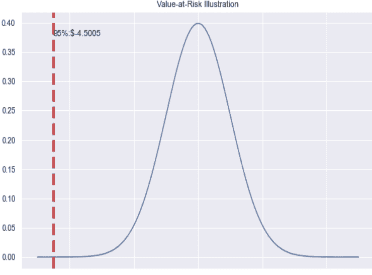

图5-1. 在险价值示意图

> ## 注意

根据Fama（1965）的研究，由于存在肥尾和不对称性，一些股票价格收益率并不遵循正态分布。相反，它们遵循尖峰分布。这一实证观察表明，股票收益率的峰度高于正态分布。

高峰度意味着肥尾，这可能导致极端的负收益。由于方差-协方差法无法捕捉肥尾，因此它无法估计极端负收益，而这种收益在危机时期尤其可能发生。

让我们看看如何在Python中应用方差-协方差VaR。为说明起见，考虑一个包含两种资产的投资组合，方差-协方差VaR的公式如下：

$$VaR = V\sigma_p\sqrt{t}Z_{\alpha}$$

$$\sigma_p = \sqrt{w_1^2\sigma_1^2 + w_2^2\sigma_2^2 + \rho w_1 w_2 \sigma_1 \sigma_2}$$

$$\sigma_p = \sqrt{w_1\sigma_1 + w_2 + \sigma + 2w_1w_2\sum_{1,2}}$$

```python
In [4]: def getDailyData(symbol):
            parameters = {'function': 'TIME_SERIES_DAILY_ADJUSTED',
                         'symbol': symbol,
                         'outputsize':'full',
                         'datatype': 'csv',
                         'apikey': 'LL1WA15IW41XV2T2'}❶

            response = requests.get('https://www.alphavantage.co/query',
                                   params=parameters)❷

            # Process the CSV file retrieved
            csvText = StringIO(response.text)❸
            data = pd.read_csv(csvText, index_col='timestamp')
            return data
```

```python
In [5]: symbols = ["IBM", "MSFT", "INTC"]
        data3 = []
        for symbol in symbols:
            data3.append(getDailyData(symbol)[::-1]['close']['2020-01-01': '2020-12-31'])❹

        stocks = pd.DataFrame(data3).T
        stocks.columns = symbols
```

```python
In [6]: stocks.head()
Out[6]:
        IBM      MSFT     INTC
timestamp
2020-01-02  135.42   160.62   60.84
2020-01-03  134.34   158.62   60.10
2020-01-06  134.10   159.03   59.93
2020-01-07  134.19   157.58   58.93
2020-01-08  135.31   160.09   58.97
```

1.  确定从Alpha Vantage提取数据所需的参数。
2.  向Alpha Vantage网站发起请求。
3.  打开响应文件，该文件为文本格式。
4.  反转涵盖检查期的数据，并附加IBM、MSFT和INTC的每日股价。

> **注意**

Alpha Vantage是一家与主要交易所和机构合作的数据提供公司。使用Alpha Vantage API，可以访问不同时间间隔（即日内、每日、每周等）的股票价格、股票基本面和外汇信息。更多信息，请参阅[Alpha Vantage的网站](https://www.alphavantage.co/)。

```python
In [7]: stocks_returns = (np.log(stocks) - np.log(stocks.shift(1))).dropna()
      stocks_returns
Out[7]:
            IBM      MSFT      INTC
timestamp
2020-01-03 -0.008007 -0.012530 -0.012238
2020-01-06 -0.001788  0.002581 -0.002833
2020-01-07  0.000671 -0.009160 -0.016827
2020-01-08  0.008312  0.015803  0.000679
2020-01-09  0.010513  0.012416  0.005580
...              ...       ...       ...
2020-12-24  0.006356  0.007797  0.010679
2020-12-28  0.001042  0.009873  0.000000
2020-12-29 -0.008205 -0.003607  0.048112
2020-12-30  0.004352 -0.011081 -0.013043
2020-12-31  0.012309  0.003333  0.021711

[252 rows x 3 columns]
```

```python
In [8]: stocks_returns_mean = stocks_returns.mean()
      weights = np.random.random(len(stocks_returns.columns))
      weights /= np.sum(weights)
      cov_var = stocks_returns.cov()
      port_std = np.sqrt(weights.T.dot(cov_var).dot(weights))
```

```python
In [9]: initial_investment = 1e6
      conf_level = 0.95
```

```python
In [10]: def VaR_parametric(initial_investment, conf_level):
         alpha = norm.ppf(1 - conf_level, stocks_returns_mean, port_std)❻
         for i, j in zip(stocks.columns, range(len(stocks.columns))):
             VaR_param = (initial_investment - initial_investment * (1 + alpha))
[j]❼
             print("Parametric VaR result for {} is {} ".format(i, VaR_param))
         VaR_param = (initial_investment-initial_investment * (1 + alpha))
         print('--' * 25)
         return VaR_param
```

```python
In [11]: VaR_param = VaR_parametric(initial_investment, conf_level)
         VaR_param
         Parametric VaR result for IBM is 42199.839069714886
         Parametric VaR result for MSFT is 40618.179754271754
         Parametric VaR result for INTC is 42702.930219301255
         --------------------------------------------------
```

```python
Out[11]: array([42199.83906971, 40618.17975427, 42702.9302193 ])
```

- ❶ 计算对数收益率。
- ❷ 为权重生成随机数。
- ❸ 生成权重。
- ❹ 计算协方差矩阵。
- ❺ 求投资组合标准差。
- ❻ 使用百分点函数（ppf）计算特定值的Z分数。
- ❼ 估计方差-协方差VaR模型。

给定时间范围，在险价值的结果会发生变化，这是因为持有资产的时间越长，投资者面临的风险就越大。如图5-2所示，VaR随持有时间的增加而增加，增加的幅度为$\sqrt{t}$。此外，投资组合清算的持有期最长。考虑到报告目的，30天的期限可能对投资者更合适，如图5-2所示。

```python
In [12]: var_horizon = []
        time_horizon = 30
        for j in range(len(stocks_returns.columns)):
            for i in range(1, time_horizon + 1):
                var_horizon.append(VaR_param[j] * np.sqrt(i))
        plt.plot(var_horizon[:time_horizon], "o",
                 c='blue', marker='*', label='IBM')
        plt.plot(var_horizon[time_horizon:time_horizon + 30], "o",
                 c='green', marker='o', label='MSFT')
        plt.plot(var_horizon[time_horizon + 30:time_horizon + 60], "o",
                 c='red', marker='v', label='INTC')
        plt.xlabel("Days")
        plt.ylabel("USD")
        plt.title("VaR over 30-day period")
        plt.savefig('images/VaR_30_day.png')
        plt.legend()
        plt.show()
```

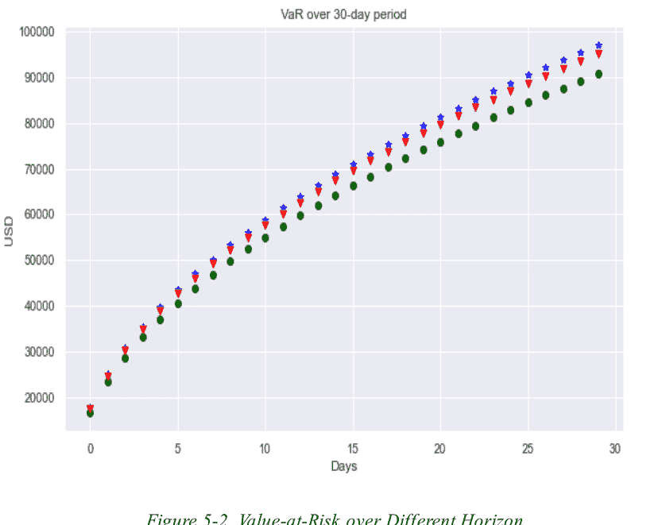

图5-2. 不同时间范围的在险价值

我们通过列出方差-协方差法的优缺点来结束本部分。

### 优点

- 易于计算
- 不需要大量样本

### 缺点

- 假设观测值服从正态分布
- 对非线性结构效果不佳
- 需要计算协方差矩阵

因此，尽管假设正态性听起来很吸引人，但它可能不是估计VaR的最佳方法，尤其是在资产收益率不服从正态分布的情况下。幸运的是，还有其他不需要正态性假设的方法，这些模型被称为*历史模拟VaR*模型。

### 历史模拟法

具有强假设（如正态分布）可能是导致估计不准确的原因。解决这个问题的方法被称为历史模拟VaR。这是一种经验方法，我们不是使用参数方法，而是找到分位数，这是方差-协方差法中Z表的等价物。假设置信区间为95%，那么将使用5%来代替Z表值，我们只需要将这个分位数乘以初始投资即可。

以下是历史模拟VaR的步骤：

- 获取投资组合（或单个资产）的资产收益率。
- 根据置信区间找到相应的收益率分位数。
- 将此分位数乘以初始投资。

```python
In [13]: def VaR_historical(initial_investment, conf_level):
            Hist_percentile95 = []
            for i, j in zip(stocks_returns.columns, range(len(stocks_returns.columns))):
                Hist_percentile95.append(np.percentile(stocks_returns.loc[:, i], 5))
                print("Based on historical values 95% of {}'s return is {:.4f}".format(i, Hist_percentile95[j]))
                VaR_historical = (initial_investment-initial_investment * (1 + Hist_percentile95[j]))
                print("Historical VaR result for {} is {:.2f} ".format(i, VaR_historical))
                print('--' * 35)
```

```python
In [14]: VaR_historical(initial_investment,conf_level)
Based on historical values 95% of IBM's return is -0.0371
Historical VaR result for IBM is 37081.53
-----------------------------------------------------------------------
Based on historical values 95% of MSFT's return is -0.0426
```

MSFT的历史VaR结果为42583.68
-------------------------------------------------------------------
基于历史数据，INTC收益率的95%分位数为-0.0425
INTC的历史VaR结果为42485.39
-------------------------------------------------------------------

1.  计算股票收益率的95%分位数
2.  估算历史模拟VaR

历史模拟VaR方法隐含地假设历史价格变动具有相似的模式，即不存在结构性突变。该方法的优缺点如下：

### 优点

-   无需分布假设
-   对非线性结构处理效果良好
-   计算简便

### 缺点

-   需要大样本
-   对计算能力要求高
-   对于像成长型公司股票这类具有模糊性的公司，可能会产生误导

### 蒙特卡洛模拟VaR

在深入探讨蒙特卡洛模拟VaR估算之前，最好先简要介绍一下蒙特卡洛模拟。蒙特卡洛是一种计算机化的数学方法，用于在没有解析解的情况下进行估算。因此，它是一种高效的数值近似工具。蒙特卡洛依赖于从给定分布中进行重复随机抽样。

Glasserman很好地阐述了蒙特卡洛背后的逻辑：

> 蒙特卡洛方法基于概率与体积之间的类比。测度论的数学形式化了概率的直观概念，将一个事件与一组结果相关联，并将该事件的概率定义为其相对于可能结果总体的体积或测度。蒙特卡洛反向使用了这一等式，通过将体积解释为概率来计算一组的体积。

——Glasserman（《金融工程中的蒙特卡洛方法》，2003年，第11页）

从应用角度来看，蒙特卡洛与历史模拟VaR非常相似，但它不使用历史观测值。相反，它从给定分布中生成随机样本。因此，蒙特卡洛通过提供可能结果与概率之间的联系来帮助决策者，这使其成为金融领域高效且适用的工具。

数学上的蒙特卡洛可以定义为：

设 $X_1, X_2, \dots, X_n$ 是独立同分布的随机变量，$f(x)$ 是一个实值函数。那么，大数定律指出：

$$E(f(X)) \approx \frac{1}{N} \sum_{i}^{N} f(X_i)$$

简而言之，蒙特卡洛模拟不过是生成随机样本并计算其均值。在计算上，它遵循以下步骤：

-   定义域
-   生成随机数
-   迭代并汇总结果

确定数学上的 $\pi$ 是一个简单但具有说明性的蒙特卡洛应用示例。

假设我们有一个半径 r = 1、面积为4的圆。圆的面积是 $\pi$，而我们试图容纳该圆的正方形面积是4。其比值为：

$\frac{\pi}{4}$ 公式1

为了单独求出 $\pi$，圆与正方形面积的比例可以定义为：

$\frac{圆的周长}{正方形的面积} = \frac{m}{n}$ 公式2

一旦我们将公式1和公式2等同起来，结果就是：

$\pi = 4x\frac{m}{n}$

如果我们一步一步来，第一步是定义域，即[-1,1]。因此，圆内的数字满足：$x^2 + y^2 \leq 1$。

第二步是生成满足上述条件的随机数。也就是说，我们需要均匀分布的随机样本，这在Python中是一个相当简单的任务。为了实践，我将使用numpy库生成100个均匀分布的随机数：

```
In [15]: x = np.random.uniform(-1, 1, 100)
        y = np.random.uniform(-1, 1, 100)
```

```
In [16]: sample = 100
        def pi_calc(x, y):
            point_inside_circle = 0
            for i in range(sample):
                if np.sqrt(x[i] ** 2 + y[i] ** 2) <= 1:
                    point_inside_circle += 1
            print('pi value is {}'.format(4 * point_inside_circle/sample))
```

```
In [17]: pi_calc(x,y)
        pi value is 3.36
```

```
In [18]: x = np.random.uniform(-1, 1, 1000000)
        y = np.random.uniform(-1, 1, 1000000)
```

```
In [19]: sample = 1000000

        def pi_calc(x, y):
            point_inside_circle = 0
            for i in range(sample):
                if np.sqrt(x[i] ** 2 + y[i] ** 2) < 1:
                    point_inside_circle += 1
            print('pi value is {:.2f}'.format(4 * point_inside_circle/sample))
```

```
In [20]: sim_data = pd.DataFrame([])
        num_reps = 1000
        mean = np.random.random(3)
        std = np.random.random(3)
        for i in range(len(stocks.columns)):
            temp = pd.DataFrame(np.random.normal(mean[i], std[i], num_reps))
            sim_data = pd.concat([sim_data, temp],axis=1)
        sim_data.columns = ['Simulation 1', 'Simulation 2', 'Simulation 3']
```

```
In [21]: sim_data
Out[21]:    Simulation 1  Simulation 2  Simulation 3
0          0.475188      1.587426      1.334594
1          0.547615     -0.169073      0.684107
2          0.486227      1.533680      0.755307
3          0.494880     -0.230544      0.471358
4          0.580477      0.388032      0.493490
..             ...           ...           ...
995        0.517479      0.387384      0.539328
996        0.286267      0.680610      0.409003
997        0.398601      0.733176      0.820090
998        0.624548      0.482050      0.821792
999        0.627089      1.405230      1.275521

[1000 rows x 3 columns]
```

```
In [22]: def MC_VaR(initial_investment, conf_level):
            MC_percentile95 = []
            for i, j in zip(sim_data.columns, range(len(sim_data.columns))):
                MC_percentile95.append(np.percentile(sim_data.loc[:, i], 5))
                print("Based on simulation 95% of {}'s return is {:.4f}"
                      .format(i, MC_percentile95[j]))
                VaR_MC = (initial_investment-initial_investment *
                          (1 + MC_percentile95[j]))
                print("Simulation VaR result for {} is {:.2f} ".format(i, VaR_MC))
                print('--'*35)
```

```
In [23]: MC_VaR(initial_investment, conf_level)
        Based on simulation 95% of Simulation 1's return is 0.3294
        Simulation VaR result for Simulation 1 is -329409.17
        -----------------------------------
        Based on simulation 95% of Simulation 2's return is 0.0847
        Simulation VaR result for Simulation 2 is -84730.05
        -----------------------------------
        Based on simulation 95% of Simulation 3's return is 0.1814
        Simulation VaR result for Simulation 3 is -181376.94
-----------------------------------------------------------------------
```

1.  从均匀分布中生成随机数。
2.  检查点是否在半径为1的圆内。
3.  计算每只股票收益率的95%分位数，并将结果附加到名为 $MC\_percentile95$ 的列表中。
4.  估算蒙特卡洛VaR。

### 去噪

波动无处不在，但要找出哪种波动最有价值是一项艰巨的任务。一般来说，市场中有两种信息：*噪声*和*信号*。前者只产生随机信息，而后者则为我们提供了有价值的信息，投资者可以据此获利。举例来说，假设市场中有两个主要参与者：使用噪声信息的噪声交易者，以及利用信号或内幕信息的知情交易者。噪声交易者的交易动机由随机行为驱动。因此，流向市场的信息信号对某些噪声交易者来说被认为是买入信号，而对另一些人则是卖出信号。

然而，知情交易者被认为是理性的，因为内幕知情交易者能够评估信号，因为她知道这是私人信息。

因此，对信息的持续流动应谨慎对待。简而言之，来自噪声交易者的信息可被视为噪声，而来自内幕人士的信息可被视为信号，这才是重要的信息。无法区分噪声和信号的投资者可能无法获得利润和/或无法正确评估风险。

现在，问题变成了如何区分流向金融市场的信息流。我们如何区分噪音与信号？又该如何利用这些信息？

现在是讨论马尔琴科-帕斯图尔定理的合适时机，该定理帮助我们获得一个同质的协方差矩阵。马尔琴科-帕斯图尔定理允许我们利用协方差矩阵的特征值从噪音中提取信号。

> 注意

设 $A \in \mathbb{R}^{n \times n}$ 为一个方阵。那么，如果满足 $Ax = \lambda x$，则 $\lambda \in \mathbb{R}$ 是 A 的一个特征值，$x \in \mathbb{R}^n \setminus \{0\}$ 是 A 的对应特征向量。

特征值和特征向量在金融背景下具有特殊含义。特征向量对应于协方差矩阵中的方差，而特征值则显示了特征向量的大小。具体来说，最大的特征向量对应于最大的方差，其大小等于相应的特征值。由于数据中存在噪音，一些特征值可以被视为随机的，因此检测并过滤这些特征值以仅保留信号是有意义的。

为了区分噪音和信号，我们将马尔琴科-帕斯图尔定理的概率密度函数拟合到含噪音的协方差矩阵上。马尔琴科-帕斯图尔定理的概率密度函数采用以下形式（Prado, 2020）：

$$f(\lambda) = \begin{cases} \frac{T}{N} \sqrt{(\lambda_+ - \lambda)(\lambda - \lambda_-)} & \text{if } \lambda \in [\lambda_-, \lambda_+] \\ 0, & \text{if } \lambda \notin [\lambda_-, \lambda_+] \end{cases}$$

其中 $\lambda_+$ 和 $\lambda_-$ 分别是最大和最小特征值。

在下面的代码块中（这是对 Prado (2020) 提供代码的轻微修改），我们将生成马尔琴科-帕斯图尔分布的概率密度函数和核密度估计，后者允许我们以非参数方法对随机变量进行建模。然后，将马尔琴科-帕斯图尔分布拟合到数据上。

```python
In [24]: def mp_pdf(sigma2, q, obs):
            lambda_plus = sigma2 * (1 + q ** 0.5) ** 2
            lambda_minus = sigma2 * (1 - q ** 0.5) ** 2
            l = np.linspace(lambda_minus, lambda_plus, obs)
            pdf_mp = 1 / (2 * np.pi * sigma2 * q * l) * np.sqrt((lambda_plus  - l) * (l - lambda_minus))
            pdf_mp = pd.Series(pdf_mp, index=l)
            return pdf_mp
```

```python
In [25]: from sklearn.neighbors import KernelDensity

def kde_fit(bandwidth,obs,x=None):
    kde = KernelDensity(bandwidth, kernel='gaussian')
    if len(obs.shape) == 1:
        kde_fit=kde.fit(np.array(obs).reshape(-1, 1))
    if x is None:
        x=np.unique(obs).reshape(-1, 1)
    if len(x.shape) == 1:
        x = x.reshape(-1, 1)
    logprob = kde_fit.score_samples(x)
    pdf_kde = pd.Series(np.exp(logprob), index=x.flatten())
    return pdf_kde
```

```python
In [26]: corr_mat = np.random.normal(size=(10000, 1000))
corr_coef = np.corrcoef(corr_mat, rowvar=0)
sigma2 = 1
obs = corr_mat.shape[0]
q = corr_mat.shape[0] / corr_mat.shape[1]

def plotting(corr_coef, q):
    ev, _ = np.linalg.eigh(corr_coef)
    idx = ev.argsort()[::-1]
    eigen_val = np.diagflat(ev[idx])
    pdf_mp = mp_pdf(1., q=corr_mat.shape[1] / corr_mat.shape[0], obs=1000)

    kde_pdf = kde_fit(0.01, np.diag(eigen_val))
    ax = pdf_mp.plot(title="Marchenko-Pastur Theorem",
                     label="M-P", style='r--')
    kde_pdf.plot(label="Empirical Density", style='o-', alpha=0.3)
    ax.set(xlabel="Eigenvalue", ylabel="Frequency")
    ax.legend(loc="upper right")
    plt.savefig('images/MP_fit.png')
```

```python
plt.show()
return plt
```

```python
In [27]: plotting(corr_coef, q);
```

1.  计算最大期望特征值。
2.  计算最小期望特征值。
3.  生成马尔琴科-帕斯图尔分布的概率密度函数。
4.  初始化核密度估计。
5.  将核密度拟合到观测值。
6.  在观测值上评估对数密度模型。
7.  从正态分布生成随机样本。
8.  将协方差矩阵转换为相关矩阵。
9.  计算相关矩阵的特征值。
10. 将 numpy 数组转换为对角矩阵。
11. 调用 *mp_pdf* 函数来估计马尔琴科-帕斯图尔分布的概率密度函数。
12. 调用 *kde_fit* 函数将核分布拟合到数据。

图 5-3 显示马尔琴科-帕斯图尔分布与数据拟合良好。得益于马尔琴科-帕斯图尔定理，我们能够区分噪音和信号，而过滤掉噪音的数据被称为去噪数据。

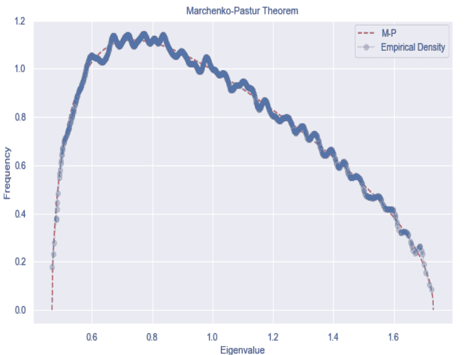

到目前为止，我们已经讨论了对协方差矩阵进行去噪的主要步骤，以便我们可以将其代入 VaR 模型，这被称为 *去噪 VaR* 估计。对协方差矩阵去噪无非是从数据中移除不必要的信息（噪音）。因此，我们利用来自市场的信号，它告诉我们市场中正在发生一些重要的事情。协方差矩阵去噪包括以下阶段¹：

-   基于相关矩阵计算特征值和特征向量。
-   使用核密度估计，为特定特征值找到特征向量。
-   将马尔琴科-帕斯图尔分布拟合到核密度估计。
-   使用马尔琴科-帕斯图尔分布找到最大理论特征值。
-   计算大于理论值的特征值的平均值。
-   使用这些新的特征值和特征向量计算去噪相关矩阵。
-   通过新的相关矩阵计算去噪协方差矩阵。

在附录中，你可以找到包含所有这些步骤的算法，但在这里我想向你展示，利用 Python 中的 *portfoliolab* 库，只需几行代码就能轻松应用并找到去噪协方差矩阵：

```python
In [28]: import portfoliolab as pl

In [29]: risk_estimators = pl.estimators.RiskEstimators()

In [30]: stock_prices = stocks.copy()

In [31]: cov_matrix = stocks_returns.cov()
cov_matrix
Out[31]: 
          IBM      MSFT      INTC
IBM   0.000672  0.000465  0.000569
MSFT  0.000465  0.000770  0.000679
INTC  0.000569  0.000679  0.001158

In [32]: tn_relation = stock_prices.shape[0] / stock_prices.shape[1]❶
         kde_bwidth = 0.25❷
         cov_matrix_denoised = risk_estimators.denoise_covariance(cov_matrix,
                                                                 tn_relation,
                                                                 kde_bwidth)❸
         cov_matrix_denoised = pd.DataFrame(cov_matrix_denoised,
                                            index=cov_matrix.index,
                                            columns=cov_matrix.columns)
         cov_matrix_denoised
Out[32]: 
          IBM      MSFT      INTC
IBM   0.000672  0.000480  0.000589
MSFT  0.000480  0.000770  0.000638
INTC  0.000589  0.000638  0.001158

In [33]: def VaR_parametric_denoised(initial_investment, conf_level):
             port_std = np.sqrt(weights.T.dot(cov_matrix_denoised).dot(weights))❹
             alpha = norm.ppf(1 - conf_level, stocks_returns_mean, port_std)
             for i,j in zip(stocks.columns,range(len(stocks.columns))):
                 print("Parametric VaR result for {} is {} ".format(i,VaR_param))
             VaR_params = (initial_investment - initial_investment * (1 + alpha))
```

```python
print('--' * 25)
return VaR_params
```

```python
In [34]: VaR_parametric_denoised(initial_investment, conf_level)
    Parametric VaR result for IBM is [42199.83906971 40618.17975427
    42702.9302193 ]
    Parametric VaR result for MSFT is [42199.83906971 40618.17975427
    42702.9302193 ]
    Parametric VaR result for INTC is [42199.83906971 40618.17975427
    42702.9302193 ]
    --------------------------------------------------
```

```python
Out[34]: array([42259.80830949, 40678.14899405, 42762.89945907])
```

```python
In [35]: symbols = ["IBM", "MSFT", "INTC"]
    data3 = []
    for symbol in symbols:
        data3.append(getDailyData(symbol)[::-1]['close']['2007-04-01': '2009-02-01'])
    stocks_crisis = pd.DataFrame(data3).T
    stocks_crisis.columns = symbols
```

```python
In [36]: stock_prices = stocks_crisis.copy()
```

```python
In [37]: stocks_returns = (np.log(stocks) - np.log(stocks.shift(1))).dropna()
```

```python
In [38]: cov_matrix = stocks_returns.cov()
```

```python
In [39]: VaR_parametric(initial_investment, conf_level)
    Parametric VaR result for IBM is 42199.839069714886
    Parametric VaR result for MSFT is 40618.179754271754
    Parametric VaR result for INTC is 42702.930219301255
    --------------------------------------------------
```

```python
Out[39]: array([42199.83906971, 40618.17975427, 42702.9302193 ])
```

```python
In [40]: VaR_parametric_denoised(initial_investment, conf_level)
    Parametric VaR result for IBM is [42199.83906971 40618.17975427
    42702.9302193 ]
    Parametric VaR result for MSFT is [42199.83906971 40618.17975427
    42702.9302193 ]
    Parametric VaR result for INTC is [42199.83906971 40618.17975427
    42702.9302193 ]
    --------------------------------------------------
```

```python
Out[40]: array([42259.80830949, 40678.14899405, 42762.89945907])
```

### 观测值数量 T 与变量数量 N 的关系。
2.  确定核密度估计的带宽。
3.  生成去噪协方差矩阵。
4.  将去噪协方差矩阵纳入 VaR 公式。

传统 VaR 与去噪 VaR 之间的差异在危机时期更为显著。在危机期间，资产之间的相关性会变得更高，这有时被称为*相关性崩溃*。相关性崩溃可能带来的后果是双重的：

-   市场风险增加，导致分散化投资的效果减弱。
-   使得对冲变得更加困难。

为了验证这一现象，我们考察了 2017-2018 年的金融危机时期，确切的危机时期由美国国家经济研究局（NBER）确定，该机构负责公布商业周期（更多信息请参见 [https://www.nber.org/research/data/us-business-cycle-expansions-and-contractions](https://www.nber.org/research/data/us-business-cycle-expansions-and-contractions)）。

结果证实，在危机期间，相关性以及 VaR 都会变高。

现在，我们设法使用去噪协方差矩阵（而非直接从数据计算得到的经验矩阵）来获得基于机器学习的 VaR。尽管 VaR 具有吸引力且易于使用，但它并非一个一致的风险度量。要成为一个一致的风险度量，需要满足某些条件或公理。你可以将这些公理视为风险度量的技术要求。

令 $\alpha \in (0, 1)$ 为固定的置信水平，$(\Omega, \mathcal{F}, P)$ 为一个概率空间，其中 $\Omega$ 代表样本空间，$\mathcal{F}$ 表示样本空间的子集，$P$ 是概率测度。

> **注意**

举例说明，假设 $\omega$ 是抛硬币所有可能结果的集合，$\omega=\{H,T\}$（H 代表正面，T 代表反面）。$\mathscr{F}$ 可以视为抛两次硬币，$F=2^{|\omega|}=2^2$。最后，概率测度 P 表示得到反面的概率是 0.5。

以下是一致风险度量的四个公理：

1)  平移不变性：对于所有结果 Y 和常数 $a \in \mathscr{R}$，我们有

$$VaR(Y_1 + Y_2) = VaR(Y) + a$$

这意味着，如果向投资组合中加入无风险金额 a，其 VaR 将减少 a 的数额。

2)  次可加性：对于所有 $Y_1$ 和 $Y_2$，我们有

$$VaR(Y_1 + Y_2) \leq VaR(Y_1) + VaR(Y_2)$$

此公理强调了分散化在风险管理中的重要性。将 $Y_1$ 和 $Y_2$ 视为两项资产，如果两者都包含在投资组合中，其结果应比单独包含它们时具有更低的在险价值。让我们检查 VaR 是否满足次可加性假设：

```
In [41]: asset1 = [-0.5, 0, 0.1, 0.4]❶
        VaR1 = np.percentile(asset1, 90)
        print('VaR for the Asset 1 is {:.4f}'.format(VaR1))
        asset2 = [0, -0.5, 0.01, 0.4]❷
        VaR2 = np.percentile(asset2, 90)
        print('VaR for the Asset 2 is {:.4f}'.format(VaR2))
        VaR_all = np.percentile(asset1 + asset2, 90)
        print('VaR for the portfolio is {:.4f}'.format(VaR_all))
        VaR for the Asset 1 is 0.3100
        VaR for the Asset 2 is 0.2830
        VaR for the portfolio is 0.4000

In [42]: asset1 = [-0.5, 0, 0.05, 0.03]❶
        VaR1 = np.percentile(asset1, 90)
        print('VaR for the Asset 1 is {:.4f}'.format(VaR1))
        asset2 = [0, -0.5, 0.02, 0.8]❷
        VaR2 = np.percentile(asset2,90)
        print('VaR for the Asset 2 is {:.4f}'.format(VaR2))
        VaR_all = np.percentile(asset1 + asset2 , 90)
        print('VaR for the portfolio is {:.4f}'.format(VaR_all))
        VaR for the Asset 1 is 0.0440
        VaR for the Asset 2 is 0.5660
        VaR for the portfolio is 0.2750
```

-   第一项资产的收益率
-   第二项资产的收益率

结果表明，投资组合的 VaR 小于各项资产 VaR 之和，这由于通过分散化降低了风险，因此是合理的。更详细地说，通过分散化，投资组合的 VaR 应低于各项资产 VaR 之和，因为分散化降低了风险，进而降低了投资组合的 VaR。

3)  正齐次性：对于所有结果 Y 和 a>0，我们有
$$VaR(aY) = aVaR(L)$$
这意味着风险与投资组合的价值同步变化，即如果投资组合的价值增加 a 的数额，风险也增加 a 的数额。

4)  单调性：对于任意两个结果 $Y_1$ 和 $Y_2$，如果 $Y_1 \le Y_2$，则
$$VaR(Y_1) \ge VaR(Y_2)$$
起初这可能令人费解，但它是直观的。单调性表明，具有更高回报的资产具有更低的 VaR。

根据以上讨论，我们现在知道 VaR 不是一个一致的风险度量。但不要担心，VaR 并非我们估计市场风险的唯一工具。预期短缺是另一种一致的市场风险度量。

### 预期短缺

与 VaR 不同，预期短缺关注分布的尾部。更详细地说，预期短缺使我们能够考虑市场中的意外风险。然而，这并不意味着预期短缺和 VaR 是两个完全不同的概念。相反，它们是相关的，即可以用 VaR 来表达预期短缺。

现在让我们假设损失分布是连续的，那么预期短缺可以数学定义为：

$$ES_{\alpha} = \frac{1}{1-\alpha} \int_{\alpha}^{1} q_u du$$

其中 q 表示损失分布的分位数。预期短缺公式表明，它不过是 $(1 - \alpha)\%$ 损失的概率加权平均值。

让我们代入 $q_u$ 和 VaR，得到以下等式：

$$ES_{\alpha} = \frac{1}{1-\alpha} \int_{\alpha}^{1} VaR_u du$$

或者，它是超过 VaR 的损失的均值，如下所示：

$$ES_{\alpha} = E(L|L > VaR_{\alpha})$$

损失分布可以是连续的或离散的，正如你可以想象的，如果它是离散形式，预期短缺会有所不同，如下所示：

$$ES_{\alpha} = \frac{1}{1-\alpha} \sum_{n=0}^{1} max(L_n) * P(L_n)$$

其中 $max(L_n)$ 表示第 n 个最高损失，$Prob(L_n)$ 表示第 p 个最高损失的概率。

```
In [43]: def ES_parametric(initial_investment , conf_level):
            alpha = - norm.ppf(1 - conf_level,stocks_returns_mean,port_std)
            for i,j in zip(stocks.columns, range(len(stocks.columns))):
                VaR_param = (initial_investment * alpha)[j]❶
                ES_param = (1 / (1 - conf_level)) * norm.expect(lambda x:
VaR_param,
                                                                 lb = conf_level)❷
                print(f"Parametric ES result for {i} is {ES_param}")

In [44]: ES_parametric(initial_investment, conf_level)
        Parametric ES result for IBM is 144370.82004213505
        Parametric ES result for MSFT is 138959.76972934653
        Parametric ES result for INTC is 146091.9565067016
```

-   估计方差-协方差 VaR。
-   给定置信区间，基于 VaR 估计 ES。

ES 也可以基于历史观测值计算。类似于历史模拟 VaR 方法，可以放宽参数假设。为此，首先找到对应于 95% 的收益率（或损失），然后计算大于 95% 的观测值的均值，即得结果。以下是我们的做法：

```
In [45]: def ES_historical(initial_investment, conf_level):
            for i, j in zip(stocks_returns.columns,
range(len(stocks_returns.columns))):
                ES_hist_percentile95 = np.percentile(stocks_returns.loc[:, i], 5)❶
                ES_historical = stocks_returns[str(i)][stocks_returns[str(i)] <=
                                        ES_hist_percentile95].mean()
❷
                print("Historical ES result for {} is {:.4f} "
                      .format(i, initial_investment * ES_historical))

In [46]: ES_historical(initial_investment, conf_level)
        Historical ES result for IBM is -64802.3898
        Historical ES result for MSFT is -65765.0848
        Historical ES result for INTC is -88462.7404
```

-   计算收益率的 95% 分位数。
-   基于历史观测值估计 ES。

到目前为止，我们已经了解了如何以传统方式对预期短缺进行建模。现在，是时候引入基于机器学习的方法，以进一步提高 ES 模型的估计性能和可靠性了。

### 流动性增强的预期短缺

如前所述，ES为我们提供了一个连贯的风险度量来衡量市场风险。然而，尽管我们将金融风险区分为市场风险、信用风险、流动性风险和操作风险，但这并不意味着这些风险彼此完全无关。相反，它们在某种程度上是相关的。也就是说，一旦金融危机冲击市场，市场风险的飙升会伴随着信贷额度的收缩，进而增加流动性风险。

考虑到经济状况，流动性不足的影响会有所不同，因为在市场大幅下跌时它变得普遍，但在正常时期则更易管理。因此，其影响在熊市中会更为显著。

这一事实得到了Antoniades的支持，他指出：

> 共同的流动性资产池是流动性风险影响抵押贷款信贷供给的资源约束。在2007-2008年金融危机期间，银行融资条件压力的主要来源是批发融资市场经历的融资流动性不足。

—Antoniades (《流动性风险与2007-2008年信贷紧缩：来自抵押贷款申请微观层面数据的证据》，2014年，第6页)

忽视风险的流动性维度可能导致低估市场风险。因此，用流动性风险来增强ES可能会得到更准确和可靠的估计。嗯，这听起来很有吸引力，但我们如何找到流动性的代理指标呢？

> 注意

流动性可以定义为资产在极短时间内出售的容易程度，且不会对市场价格产生重大影响。流动性有两个主要衡量指标：

- 市场流动性：资产交易的容易程度。
- 融资流动性：投资者获得融资的容易程度。

流动性及其引发的风险将在第7章中更详细地讨论。因此，大部分讨论将留待该章进行。

在文献中，买卖价差度量常被用于建模流动性。简而言之，买卖价差是买卖价格之间的差额。换句话说，它是买方愿意支付的最高可用价格（买入价）与卖方愿意接受的最低价格（卖出价）之间的差额。因此，买卖价差提供了一种衡量交易成本的工具。

就买卖价差是交易成本的良好指标而言，它也是流动性的良好代理指标，因为交易成本是流动性的组成部分之一。价差可以根据其侧重点以不同方式定义。以下是我们将用于将流动性风险纳入ES模型的买卖价差。

- 有效价差

    有效价差 $= 2 * |(P_t - P_{mid})|$

    其中 $P_t$ 是时间 t 的交易价格，$P_{mid}$ 是当时买卖报价的中点（$ (P_{ask} - P_{bid})/2 $）。

- 比例报价价差

    比例报价价差 $= (P_{ask} - P_{bid})/P_{mid}$

    其中 $P_{ask}$ 是卖出价，$P_{bid}$ 和 $P_{mid}$ 分别是买入价和中间价。

- 报价价差

    报价价差 = $P_{ask} - P_{bid}$

- 比例有效价差

    比例有效价差 = $2 * (|P_t - P_{mid}|)/P_{mid}$

#### 有效成本

有效成本 = $\begin{cases} (P_t - P_{mid})/P_{mid} & \text{买方发起} \\ (P_{mid}/P_t)/P_{mid} & \text{卖方发起} \end{cases}$

当交易以高于报价中间价的价格执行时，发生买方发起的交易。类似地，当交易以低于报价中间价的价格执行时，发生卖方发起的交易。

现在，我们需要找到一种方法将这些买卖价差纳入ES模型，以便我们能够同时考虑流动性风险和市场风险。我们采用两种不同的方法来完成这项任务。第一种是采用Chordia等人（2000年）以及Pastor和Stambaugh（2003年）建议的买卖价差截面均值。第二种方法是应用Mancini等人（2013年）提出的主成分分析（PCA）。

截面均值就是对买卖价差求平均值。使用这种方法，我们能够生成一个市场整体流动性的度量。平均公式如下：

$L_{M,t} = \frac{1}{N} \sum_{i}^{N} L_{i,t}$

其中 $L_{M,t}$ 是市场流动性，$L_{i,t}$ 是个体流动性度量，在我们的案例中即买卖价差。

$ES_L = ES + \text{流动性成本}$

$ES_L = \frac{1}{1-\alpha} \int_{\alpha}^{1} VaR_u du + \frac{1}{2} P_{last}(\mu + k\sigma)$

其中

- $P_{last}$ 是收盘价。
- $\mu$ 是价差的均值。
- k 是适应厚尾的缩放因子。
- $\sigma$ 是价差的标准差。

```python
In [47]: bid_ask = pd.read_csv('bid_ask.csv')❶
```

```python
In [48]: bid_ask['mid_price'] = (bid_ask['ASKHI'] + bid_ask['BIDLO']) / 2❷
        buyer_seller_initiated = []
        for i in range(len(bid_ask)):
            if bid_ask['PRC'][i] > bid_ask['mid_price'][i]:❸
                buyer_seller_initiated.append(1)❹
            else:
                buyer_seller_initiated.append(0)❺
        
        bid_ask['buyer_seller_init'] = buyer_seller_initiated
```

```python
In [49]: effective_cost = []
        for i in range(len(bid_ask)):
            if bid_ask['buyer_seller_init'][i] == 1:
                effective_cost.append((bid_ask['PRC'][i] - bid_ask['mid_price'][i]) /
                                      bid_ask['mid_price'][i])❻
            else:
                effective_cost.append((bid_ask['mid_price'][i] - bid_ask['PRC'][i]) /
                                      bid_ask['mid_price'][i])❼
        bid_ask['effective_cost'] = effective_cost
```

```python
In [50]: bid_ask['quoted'] = bid_ask['ASKHI'] - bid_ask['BIDLO']❽
        bid_ask['prop_quoted'] = (bid_ask['ASKHI'] - bid_ask['BIDLO']) / \
                                bid_ask['mid_price']❽
        bid_ask['effective'] = 2 * abs(bid_ask['PRC'] - bid_ask['mid_price'])❽
        bid_ask['prop_effective'] = 2 * abs(bid_ask['PRC'] - bid_ask['mid_price']) / \
                                bid_ask['PRC']❽
```

```python
In [51]: spread_measures = bid_ask.iloc[:, -5:]
        spread_measures.corr()
Out[51]:              effective_cost    quoted  prop_quoted  effective  \
        effective_cost          1.000000  0.441290     0.727917   0.800894   
        quoted                  0.441290  1.000000     0.628526   0.717246   
        prop_quoted             0.727917  0.628526     1.000000   0.514979
        effective               0.800894  0.717246  0.514979  1.000000
        prop_effective          0.999847  0.442053  0.728687  0.800713

          prop_effective
effective_cost     0.999847
quoted             0.442053
prop_quoted        0.728687
effective          0.800713
prop_effective     1.000000
```

```python
In [52]: spread_measures.describe()
Out[52]: effective_cost  quoted  prop_quoted  effective  prop_effective
         count  756.000000  756.000000  756.000000  756.000000  756.000000
         mean     0.004247    1.592583    0.015869    0.844314    0.008484
         std      0.003633    0.921321    0.007791    0.768363    0.007257
         min      0.000000    0.320000    0.003780    0.000000    0.000000
         25%      0.001517    0.979975    0.010530    0.300007    0.003029
         50%      0.003438    1.400000    0.013943    0.610000    0.006874
         75%      0.005854    1.962508    0.019133    1.180005    0.011646
         max      0.023283    8.110000    0.055451    6.750000    0.047677
```

```python
In [53]: high_corr = spread_measures.corr().unstack()\
                .sort_values(ascending=False).drop_duplicates()
        high_corr[(high_corr > 0.80) & (high_corr != 1)]
Out[53]: effective_cost  prop_effective    0.999847
         effective       effective_cost    0.800894
         prop_effective  effective         0.800713
         dtype: float64
```

```python
In [54]: sorted_spread_measures = bid_ask.iloc[:, -5:-2]
```

```python
In [55]: cross_sec_mean_corr = sorted_spread_measures.mean(axis=1).mean()
        std_corr = sorted_spread_measures.std().sum() / 3
```

```python
In [56]: df = pd.DataFrame(index=stocks.columns)
        last_prices = []
        for i in symbols:
            last_prices.append(stocks[i].iloc[-1])
        df['last_prices'] = last_prices
```

### PCA与流动性调整ES

#### PCA分析

PCA是一种用于降维的方法。它旨在用尽可能少的成分提取尽可能多的信息。也就是说，在本例中，从5个特征中，我们依据下图5-4选取2个成分。因此，我们以牺牲信息损失为代价进行降维。因为，根据我们设定的截止点，我们选择成分数量，而我们舍弃的成分数量就对应着我们损失的信息量。

更具体地说，图5-4开始变平的点意味着我们保留的信息较少，这就是PCA的截止点。然而，这并非易事，因为在截止点和保留信息之间存在权衡。也就是说，一方面，我们设定的截止点越高（成分数量越多），我们保留的信息就越多（降维程度越低）。另一方面，截止点越低（成分数量越少），我们保留的信息就越少（降维程度越高）。获得更平缓的碎石图并非选择合适数量成分的唯一标准。那么，选择合适数量成分的可能标准是什么？以下是PCA可能的截止标准：

-   解释方差大于80%
-   特征值大于1
-   碎石图开始变平的点

然而，降维并非我们利用PCA的唯一目的。在本研究中，我们应用PCA是为了获取流动性的独特特征。因为，PCA为我们从数据中筛选出最重要的信息。

PCA背后的数学原理在附录中有详细讨论。

> ### 警告
>
> 请注意，流动性调整也可应用于VaR。同样的流程适用于VaR。数学上，
>
> $$VaR_L = \sigma_p \sqrt{t} Z_{\alpha} + \frac{1}{2} P_{last} (\mu + k\sigma)$$
>
> 此应用留给读者自行完成。

#### PCA实现

```python
In [60]: from sklearn.decomposition import PCA
        from sklearn.preprocessing import StandardScaler
```

```python
In [61]: scaler = StandardScaler()
        spread_measures_scaled = scaler.fit_transform(np.abs(spread_measures))❶
        pca = PCA(n_components=5)❷
        prin_comp = pca.fit_transform(spread_measures_scaled)❸
```

```python
In [62]: var_expl = np.round(pca.explained_variance_ratio_, decimals=4)❹
        cum_var = np.cumsum(np.round(pca.explained_variance_ratio_, decimals=4))❺
        print('Individually Explained Variances are:\n{}'.format(var_expl))
        print('=='*30)
        print('Cumulative Explained Variances are: {}'.format(cum_var))
        Individually Explained Variances are:
        [0.7494 0.1461 0.0983 0.0062 0.    ]
        ============================================================
        Cumulative Explained Variances are: [0.7494 0.8955 0.9938 1.    1.    ]
```

```python
In [63]: plt.plot(pca.explained_variance_ratio_)
        plt.xlabel('Number of Components')
        plt.ylabel('Variance Explained')
        plt.title('Scree Plot')
        plt.savefig('Scree_plot.png')
        plt.show()
```

```python
In [64]: pca = PCA(n_components=2)
        pca.fit(np.abs(spread_measures_scaled))
        prin_comp = pca.transform(np.abs(spread_measures_scaled))
        prin_comp = pd.DataFrame(np.abs(prin_comp), columns = ['Component 1',
                                                               'Component 2'])
        
        print(pca.explained_variance_ratio_*100)
        [65.65640435 19.29704671]
```

```python
In [65]: def myplot(score, coeff, labels=None):
            xs = score[:, 0]
            ys = score[:, 1]
            n = coeff.shape[0]
            scalex = 1.0 / (xs.max() - xs.min())
            scaley = 1.0 / (ys.max() - ys.min())
            plt.scatter(xs * scalex * 4, ys * scaley * 4, s=5)
            for i in range(n):
                plt.arrow(0, 0, coeff[i, 0], coeff[i, 1], color = 'r', alpha=0.5)
                if labels is None:
                    plt.text(coeff[i, 0], coeff[i, 1], "Var"+str(i), color='black')
                else:
                    plt.text(coeff[i,0 ], coeff[i, 1], labels[i], color='black')
            
            plt.xlabel("PC{}".format(1))
            plt.ylabel("PC{}".format(2))
            plt.grid()
```

```python
In [66]: spread_measures_scaled_df = pd.DataFrame(spread_measures_scaled,
                                               columns=spread_measures.columns)
```

```python
In [67]: myplot(np.array(spread_measures_scaled_df)[:, 0:2],
        np.transpose(pca.components_[0:2,:]),
        list(spread_measures_scaled_df.columns))
        plt.savefig('Bi_plot.png')
        plt.show()
```

#### PCA步骤

1.  对价差度量进行标准化。
2.  将主成分数量确定为5。
3.  将主成分应用于*spread_measures_scaled*。
4.  观察五个主成分的解释方差。
5.  观察五个主成分的累积解释方差。
6.  绘制*碎石图*。
7.  根据碎石图，确定在PCA分析中使用的成分数量为2。
8.  绘制*双标图*以观察成分与特征之间的关系。

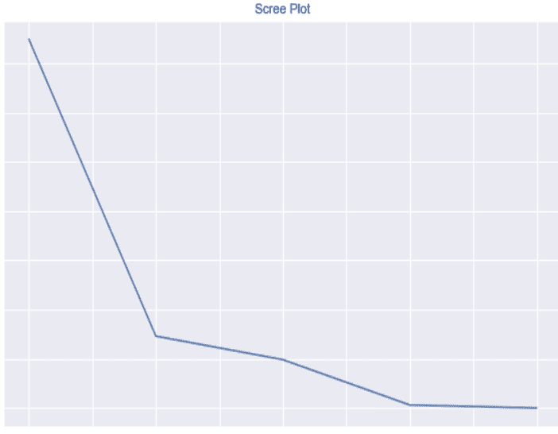

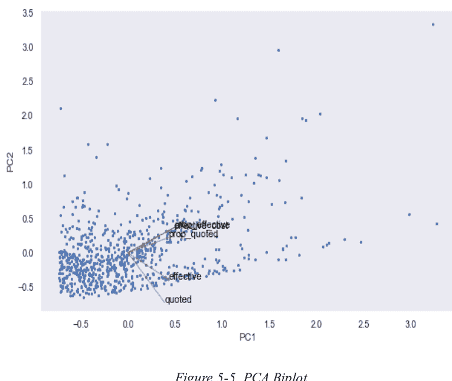

#### 流动性调整ES计算

好的，我们现在拥有了所有必要的信息，结合这些信息，我们能够计算流动性调整ES。毫不意外，以下代码显示，与标准ES应用相比，流动性调整ES提供了更大的值。这意味着在ES估计中纳入流动性维度会导致更高的风险。请注意，在危机期间，这种差异将更为显著。

```python
In [68]: prin_comp1_rescaled = prin_comp.iloc[:,0] * prin_comp.iloc[:,0].std()\n                  + prin_comp.iloc[:, 0].mean()❶
        prin_comp2_rescaled = prin_comp.iloc[:,1] * prin_comp.iloc[:,1].std()\n                  + prin_comp.iloc[:, 1].mean()❷
        prin_comp_rescaled = pd.concat([prin_comp1_rescaled, prin_comp2_rescaled],
                  axis=1)
        prin_comp_rescaled.head()
Out[68]:    Component 1  Component 2
0      1.766661    1.256192
1      4.835170    1.939466
2      3.611486    1.551059
```

#### 流动性调整ES实现

```python
In [57]: def ES_parametric(initial_investment, conf_level):
        ES_params = []
        alpha = - norm.ppf(1 - conf_level, stocks_returns_mean, port_std)
        for i,j in zip(stocks.columns,range(len(stocks.columns))):
            VaR_param = (initial_investment * alpha)[j]
            ES_param = (1 / (1 - conf_level)) * norm.expect(lambda x: VaR_param, lb = conf_level)
            ES_params.append(ES_param)
        return ES_params
```

```python
In [58]: ES_params = ES_parametric(initial_investment,conf_level)
        for i in range(len(symbols)):
            print(f'The Expected Shortfall result for {symbols[i]} is {ES_params[i]}')
        The Expected Shortfall result for IBM is 144370.82004213505
        The Expected Shortfall result for MSFT is 138959.76972934653
        The Expected Shortfall result for INTC is 146091.9565067016
```

```python
In [59]: k = 1.96
        for i, j in zip(range(len(symbols)), symbols):
            print('The liquidity Adjusted ES of {} is {}'.format(j, ES_params[i] + (df.loc[j].values[0] / 2) * (cross_sec_mean_corr + k * std_corr)))
        The liquidity Adjusted ES of IBM is 144443.0096816674
        The liquidity Adjusted ES of MSFT is 139087.3231105412
        The liquidity Adjusted ES of INTC is 146120.5272712512
```

#### 流动性调整ES步骤

1.  导入*bid_ask*数据。
2.  计算中间价。
3.  定义买方和卖方发起交易的条件。
4.  如果满足上述给定条件，则返回1，并将其追加到*buyer_seller_initiated*列表中。
5.  如果不满足上述给定条件，则返回0，并将其追加到*buyer_seller_initiated*列表中。
6.  如果*buyer_seller_initiated*变量取值为1，则运行相应的有效成本公式。
7.  如果*buyer_seller_initiated*变量取值为0，则运行相应的有效成本公式。
8.  计算报价价差、比例报价价差、有效价差和比例有效价差。
9.  获得相关矩阵并按列列出。
10. 筛选出大于80%的相关性。
11. 计算价差度量的截面均值。
12. 获得价差的标准差。
13. 从*stocks*数据中筛选出最后观察到的股票价格。
14. 估计流动性调整ES。

### 结论

市场风险一直受到密切关注，因为它揭示了公司对源自市场事件的风险的脆弱程度。在金融风险管理教科书中，通常会介绍VaR和ES模型，这是理论和实践中两个突出且常用模型。本章在介绍这些模型之后，引入了前沿模型来重新审视和改进模型估计。为此，我们首先尝试区分以噪声和信号形式流动的信息，这被称为去噪。接下来，使用去噪后的协方差矩阵来改进VaR估计。然后，讨论了作为一致性风险度量的ES模型。我们用来改进该模型的方法是基于流动性的方法，通过这种方法，我们重新审视ES模型并使用流动性成分进行增强，从而在估计ES时能够考虑流动性风险。

市场风险估计的进一步改进也是可能的，但本章的目的是提供思路和工具，为基于机器学习的市场风险方法奠定良好基础。然而，你可以更进一步，应用不同的工具。在下一章中，我们将讨论由巴塞尔银行监管委员会等监管机构提出的信用风险建模，并使用基于机器学习的方法来丰富该模型。

### 进一步资源

本章引用的文章：

- Antoniades, Adonis. “Liquidity Risk and the Credit Crunch of 2007-2008: Evidence from Micro-Level Data on Mortgage Loan Applications.” Journal of Financial and Quantitative Analysis (2016): 1795-1822.
- Bzdok, D., N. Altman, and M. Krzywinski. “Points of significance: statistics versus machine learning.” Nature Methods (2018): 1-7.
- BIS, Calculation of RWA for market risk, 2020.
- Chordia, Tarun, Richard Roll, and Avanidhar Subrahmanyam. “Commonality in liquidity.” Journal of financial economics 56, no. 1 (2000): 3-28.
- Mancini, Loriano, Angelo Ranaldo, and Jan Wrampelmeyer. “Liquidity in the foreign exchange market: Measurement, commonality, and risk premiums.” The Journal of Finance 68, no. 5 (2013): 1805-1841.
- Pástor, Ľuboš, and Robert F. Stambaugh. “Liquidity risk and expected stock returns.” Journal of Political economy 111, no. 3 (2003): 642-685.

本章引用的书籍：

- Dowd, Kevin. An introduction to market risk measurement. John Wiley & Sons, 2003.
- De Prado ML. Machine learning for asset managers. Cambridge University Press, 2020.

1 该程序的详细信息可在此链接找到 [ https://hudsonthames.org/portfolio-optimisation-with-portfoliolab-estimation-of-risk/

## 关于作者

**阿卜杜拉·卡拉桑**出生于德国柏林。他在加济大学-安卡拉学习经济学和工商管理后，获得了密歇根大学-安娜堡分校的硕士学位，并在中东技术大学-安卡拉获得了金融数学博士学位。他曾在土耳其财政部担任财务总监。最近，他开始为土耳其和美国的公司担任高级数据科学顾问和讲师。目前，他是Datajarlabs的数据科学顾问和Thinkful的数据科学导师。