Francesca Lazzeri，博士


## 使用Python进行时间序列预测的机器学习

WILEY


## 使用Python®进行时间序列预测的机器学习

Francesca Lazzeri，博士

WILEY

## 使用Python®进行时间序列预测的机器学习

版权所有 © 2021 归John Wiley & Sons, Inc.所有，印第安纳州印第安纳波利斯
加拿大同步出版

ISBN: 978-1-119-68236-3
ISBN: 978-1-119-68237-0 (ebk)
ISBN: 978-1-119-68238-7 (ebk)

美国制造

未经出版商事先书面许可，或未经向版权结算中心支付适当费用获得授权，不得以任何形式或任何方式（电子、机械、影印、录制、扫描或其他方式）复制、存储于检索系统或传播本出版物的任何部分，除非符合1976年美国版权法第107条或第108条的规定。版权结算中心地址：222 Rosewood Drive, Danvers, MA 01923，电话：(978) 750-8400，传真：(978) 646-8600。向出版商请求许可应致函：Permissions Department, John Wiley & Sons, Inc., 111 River Street, Hoboken, NJ 07030，电话：(201) 748-6011，传真：(201) 748-6008，或在线访问 www.wiley.com/go/permissions。

**责任限制/免责声明：** 出版商和作者对本作品内容的准确性或完整性不作任何陈述或保证，并明确否认所有保证，包括但不限于对特定用途适用性的保证。销售或宣传材料不得创建或扩展任何保证。本书所含的建议和策略可能不适用于所有情况。本书的销售基于出版商不提供法律、会计或其他专业服务的理解。如需专业协助，应寻求合格专业人士的服务。出版商和作者均不对由此产生的损害负责。本作品中提及的任何组织或网站作为引用和/或进一步信息的潜在来源，并不意味着作者或出版商认可该组织或网站可能提供的信息或其可能做出的建议。此外，读者应注意，本作品中列出的互联网网站在本书撰写至阅读期间可能已更改或消失。

有关我们其他产品和服务的一般信息，请在美国境内致电 (877) 762-2974，美国境外致电 (317) 572-3993 或传真 (317) 572-4002 联系我们的客户服务部。

Wiley 以多种印刷和电子格式出版，并提供按需印刷。本书标准印刷版本中包含的部分材料可能未包含在电子书或按需印刷版本中。如果本书提及了您购买版本中未包含的 CD 或 DVD 等媒体，您可以在 booksupport.wiley.com 下载此材料。有关 Wiley 产品的更多信息，请访问 www.wiley.com。

**美国国会图书馆控制号：** 2020947403

**商标：** Wiley 和 Wiley 标志是 John Wiley & Sons, Inc. 和/或其关联公司在美国和其他国家/地区的商标或注册商标，未经书面许可不得使用。Python 是 Python Software Foundation 的注册商标。所有其他商标均为其各自所有者的财产。John Wiley & Sons, Inc. 与本书中提及的任何产品或供应商均无关联。

## 关于作者

**Francesca Lazzeri**，博士，是一位经验丰富的科学家和机器学习从业者，拥有超过十年的学术和行业经验。她目前在微软领导一个由云AI倡导者和开发者组成的国际团队，管理大量客户组合，并在云端构建智能自动化解决方案。

Francesca 是大数据技术创新和将基于机器学习的解决方案应用于现实世界问题的专家。她的工作统一于两个目标：更好地理解微观经济数据，并利用这些见解优化企业决策。她的研究涵盖机器学习、统计建模、时间序列计量经济学和预测等多个领域，以及能源、石油和天然气、零售、航空航天、医疗保健和专业服务等多个行业。

在加入微软之前，她是哈佛大学技术与运营管理部的研究员。Francesca 定期在世界各地的大学和研究机构教授应用分析和机器学习课程。您可以在 Twitter 上找到她：@frlazzeri。

## 关于技术编辑

**James York-Winegar** 拥有数学和物理学学士学位以及信息与数据科学硕士学位。他曾在学术界、医疗保健和科技咨询领域工作。James 目前与公司合作，通过启用其数据基础设施、安全性和元数据管理来支持机器学习工作负载。他还在加州大学伯克利分校教授机器学习课程，专注于扩展大数据机器学习技术。

在离开学术界之前，James 最初专注于实验物理与理论物理以及材料科学的交叉领域。他的研究重点是非氧化物玻璃或硫系玻璃的光结构转变。这使 James 接触到处理极大量数据和高性能计算，他的工作至今仍引领着他。

James 通过咨询经验接触了许多行业，包括教育、娱乐、大宗商品、金融、电信、消费品包装、初创公司、生物技术和科技。凭借这些经验，他帮助公司了解其数据的可能性以及如何启用新功能或商业机会。您可以在 linkedin.com/in/winegarj/ 找到他的 LinkedIn 个人资料。

## 致谢

在过去的几年里，我有幸与来自微软和 Wiley 的许多数据科学家、云倡导者、开发者和专业人士合作：所有这些人都在本书的创作和写作过程中激励和支持着我。我特别感谢微软的云倡导团队，感谢他们的信任和鼓励，以及让我的工作变得如此轻松和愉快。

感谢 John Wiley & Sons 的副出版商 Jim Minatel，他从出版过程开始就与我合作，并充当我的工作与编辑团队之间的桥梁。与内容赋能经理 Pete Gaughan、项目编辑 David Clark（他管理了从大纲到完成手稿的过程）以及内容精炼专家 Saravanan Dakshinamurthy（他管理了本书开发的最后阶段并使其顺利进行）合作非常愉快。我感谢技术审稿人 James Winegar 提供的支持和指导，并希望将来我们能一起参与其他项目。

最后但同样重要的是，我将永远感激我的女儿 Nicole，她让我想起这个世界的美好，并激励我成为最好的自己；感谢我的丈夫 Laurent，他无条件且无尽的支持、灵感和鼓励；感谢我的父母 Andrea 和 Anna Maria，以及我的兄弟 Marco，他们始终在我身边，在我人生的各个阶段都相信我。

—Francesca Lazzeri

# 目录概览

- 致谢 ... vii
- 引言 ... xv
- **第1章** 时间序列预测概述 ... 1
- **第2章** 如何在云端设计端到端时间序列预测解决方案 ... 29
- **第3章** 时间序列数据准备 ... 61
- **第4章** 时间序列预测的自回归和自动化方法简介 ... 101
- **第5章** 时间序列预测的神经网络简介 ... 137
- **第6章** 时间序列预测的模型部署 ... 167
- 参考文献 ... 197
- 索引 ... 199

# 目录

致谢 vii

引言 xv

## 第1章 时间序列预测概述 1

- 时间序列预测的机器学习方法 3
- 用于时间序列预测的监督学习 14
- 用于时间序列预测的Python 21
- 时间序列预测的实验设置 24
- 总结 26

## 第2章 如何在云端设计端到端的时间序列预测解决方案 29

- 时间序列预测模板 31
- 业务理解与性能指标 33
- 数据摄入 36
- 数据探索与理解 39
- 数据预处理与特征工程 40
- 模型构建与选择 42
- 需求预测建模技术概述 44
- 模型评估 46
- 模型部署 48
- 预测解决方案验收 53
- 用例：需求预测 54
- 总结 58

## 第3章 时间序列数据准备 61

- 用于时间序列数据的Python 62
- 时间序列的常见数据准备操作 65
- 时间戳与时间段 66
- 转换为时间戳 69
- 提供格式参数 70
- 索引 71
- 时间/日期组成部分 76
- 频率转换 78
- 时间序列探索与理解 79
- 如何开始时间序列数据分析 79
- 时间序列中缺失值的数据清洗 84
- 时间序列数据的归一化与标准化 86
- 时间序列特征工程 89
- 日期时间特征 90
- 滞后特征与窗口特征 92
- 滚动窗口统计 95
- 扩展窗口统计 97
- 总结 98

## 第4章 时间序列预测的自回归与自动化方法简介 101

- 自回归 102
- 移动平均 119
- 自回归移动平均 120
- 自回归积分移动平均 122
- 自动化机器学习 129
- 总结 136

## 第5章 时间序列预测的神经网络简介 137

- 将深度学习加入时间序列工具箱的理由 138
- 深度学习神经网络能够从原始和不完美数据中自动学习和提取特征 140
- 深度学习支持多输入和多输出 142
- 循环神经网络擅长从输入数据中提取模式 143
- 用于时间序列预测的循环神经网络 144
- 循环神经网络 145
- 长短期记忆网络 147
- 门控循环单元 148
- 如何为LSTM和GRU准备时间序列数据 150
- 如何开发用于时间序列预测的GRU和LSTM 154
- Keras 155
- TensorFlow 156
- 单变量模型 156
- 多变量模型 160
- 总结 164

## 第6章 时间序列预测的模型部署 167

- 实验设置与Azure Machine Learning SDK for Python简介 168
- 工作区 169
- 实验 169
- 运行 169
- 模型 170
- 计算目标、运行配置和脚本运行配置 171
- 镜像与Web服务 172
- 机器学习模型部署 173
- 如何选择合适的工具以成功部署模型 175
- 带有部署示例的时间序列预测解决方案架构 177
- 训练和部署ARIMA模型 179
- 配置工作区 182
- 创建实验 183
- 创建或附加计算集群 184
- 将数据上传到Azure 184
- 创建估算器 188
- 将作业提交到远程集群 188
- 注册模型 189
- 部署 189
- 定义入口脚本和依赖项 190
- 自动模式生成 191
- 总结 196
- 参考文献 197
- 索引 199

# 引言

时间序列数据是用于不同行业未来决策、战略和规划运营的重要信息来源：从市场营销和金融到教育、医疗保健和机器人技术。在过去的几十年里，基于机器学习模型的预测也已成为私营和公共部门非常流行的工具。

目前，大多数关于基于机器学习模型的时间序列预测的资源和教程通常分为两类：针对特定预测场景的代码演示仓库，缺乏概念细节；以及学术风格的预测理论和数学公式解释。这两种方法对于学习都非常有帮助，如果您有兴趣理解理论假设背后的数学原理，我强烈推荐使用这些资源。

本书填补了这一空白：为了解决实际的业务问题，数据科学家需要一个系统且结构良好的预测框架作为指导，并应用于现实世界的数据科学场景。这本实践指南的目的是引导您完成构建、训练、评估和部署时间序列预测模型的实用模型开发框架的核心步骤。

本书的第一部分（第1章和第2章）致力于时间序列的概念介绍，您可以在其中学习时间序列表示、建模和预测的基本方面。

在第二部分（第3章至第6章），我们深入探讨用于预测时间序列数据的自回归和自动化方法，例如移动平均、自回归积分移动平均以及用于时间序列数据的自动化机器学习。然后，我介绍了用于时间序列预测的神经网络，重点介绍了循环神经网络等概念以及不同RNN单元的比较。最后，我将指导您完成在Azure上模型部署和操作化的最重要步骤。

在此过程中，我通过提供示例并使用各种开源Python包和Azure，展示了如何将这些模型应用于现实世界的数据科学场景。遵循这些指导原则，您应该准备好在日常工作中处理时间序列数据，并选择合适的工具进行分析。

# 本书涵盖什么内容？

本书全面介绍了机器学习和深度学习在时间序列预测中的核心概念、术语、方法和应用：理解这些原则可以带来更灵活和成功的时间序列应用。

具体来说，本书包含以下章节：

**第1章：时间序列预测概述** 本书的第一章致力于时间序列的概念介绍，您可以在其中学习时间序列表示、建模和预测的基本方面，例如时间序列分析和用于时间序列预测的监督学习。

我们还将探讨用于时间序列数据的不同Python库，以及pandas、statsmodels和scikit-learn等库如何分别帮助您进行数据处理、时间序列建模和机器学习。

最后，我将为您提供为时间序列预测设置Python环境的一般建议。

**第2章：如何在云端设计端到端的时间序列预测解决方案** 第二章的目的是从实践和业务角度提供一个端到端的时间序列预测系统指南，通过介绍一个时间序列预测模板和一个贯穿本书的真实数据科学场景，来展示所讨论的一些时间序列概念、步骤和技术。

**第3章：时间序列数据准备** 在本章中，我将引导您完成为预测模型准备时间序列数据的最重要步骤。良好的时间序列数据准备会产生干净且精心策划的数据，从而带来更实用、更准确的预测。

Python是一种非常强大的数据处理编程语言，为时间序列数据提供了各种库套件，并对时间序列分析提供了出色的支持，例如SciPy、NumPy、Matplotlib、pandas、statsmodels和scikit-learn。

你还将学习如何对时间序列数据进行特征工程，其目标有两个：准备符合机器学习算法要求的合适输入数据集，以及提升机器学习模型的性能。

## 第四章：时间序列预测的自回归与自动化方法简介

在本章中，你将了解一系列可用于时间序列预测的自回归方法，并可在你的预测问题上进行测试。本章的不同章节结构旨在为你提供关于每种方法的足够信息，以便通过一个可运行的代码示例入门，并指引你获取更多相关信息的途径。

我们还将探讨用于时间序列预测的自动化机器学习，以及这种方法如何帮助你完成模型选择和超参数调优任务。

## 第五章：时间序列预测的神经网络简介

在本章中，我将讨论数据科学家在构建时间序列预测解决方案时，可能仍需考虑深度学习的一些实际原因。然后，我将介绍循环神经网络，并展示如何在你的时间序列预测问题上实现几种类型的循环神经网络。

## 第六章：时间序列预测的模型部署

在本章中，我将介绍用于构建和运行机器学习工作流的 Azure Machine Learning SDK for Python。你将概览该 SDK 中一些最重要的类，以及如何使用它们在 Azure 上构建、训练和部署机器学习模型。

通过部署机器学习模型，企业可以开始充分利用他们构建的预测性和智能模型，从而将自身转变为真正的 AI 驱动型企业。

最后，我将展示如何在 Azure 上构建端到端的数据管道架构，并提供可推广用于不同时间序列预测解决方案的部署代码。

## 本书的读者支持

本书还提供了大量使用 Python 及其技术库的示例代码和教程，读者可以利用这些资源学习如何解决现实世界的时间序列问题。

读者可以通过以下链接访问示例代码和笔记本：

`aka.ms/ML4TSFwithPython`

## 配套下载文件

在你学习本书示例的过程中，所需的所有项目文件均可从 `aka.ms/ML4TSFwithPython` 下载。每个文件都包含示例笔记本和数据，你可以用它们来验证知识、练习技术技能，并构建自己的时间序列预测解决方案。

## 如何联系出版商

如果你认为在本书中发现了错误，请告知我们。在 John Wiley & Sons，我们深知为客户提供准确内容的重要性，但即使我们尽最大努力，错误仍可能发生。为了提交可能的勘误，请通过电子邮件将其发送至我们的客户服务团队 `wileysupport@wiley.com`，邮件主题请注明“Possible Book Errata Submission”。

## 如何联系作者

我们感谢你对本书的反馈和提问！你可以在 Twitter 上找到我，账号是 @frlazzeri。

# 第一章
## 时间序列预测概述

*时间序列*是一种衡量事物随时间变化的数据类型。在时间序列数据集中，*时间*列本身并不代表一个变量：它实际上是一个可用于对数据集进行排序的主要结构。这种主要的时间结构使得时间序列问题更具挑战性，因为数据科学家需要应用特定的数据预处理和特征工程技术来处理时间序列数据。

然而，它也代表了数据科学家可以利用的额外知识来源：你将学习如何利用这些时间信息从时间序列数据中推断出见解，例如趋势和季节性信息，从而使你的时间序列更易于建模，并将其用于多个行业的未来战略和规划运营。从金融到制造业和医疗保健，时间序列预测在揭示与时间相关的业务洞察方面一直发挥着重要作用。

以下是一些时间序列预测可以帮助你解决的问题示例：

- 下个季度，不同杂货店中数千种食品类别的预期销售量是多少？
- 车辆租赁三年后的转售价值是多少？
- 每条主要国际航空航线以及每个舱位等级的乘客数量是多少？
- 能源供应链基础设施中的未来电力负荷是多少，以便供应商确保效率并防止能源浪费和盗窃？

图 1.1 中的图表展示了应用于能源负荷用例的时间序列预测示例。

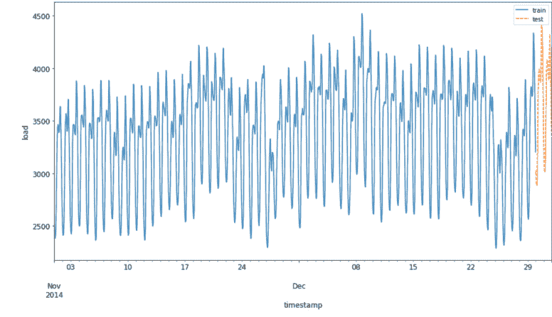

本书的第一章致力于对时间序列进行概念性介绍——并辅以一些实际示例——你将学习时间序列表示、建模和预测的基本方面。具体来说，我们将讨论以下内容：

- *时间序列预测的机器学习方法* – 在本节中，你将学习一些重要概念的标准定义，例如时间序列、时间序列分析和时间序列预测，并了解为什么时间序列预测是一个基础性的跨行业研究领域。
- *用于时间序列预测的监督学习* – 为什么你想将时间序列预测问题重新构建为监督学习问题？在本节中，你将学习如何将你的预测场景重塑为监督学习问题，从而能够使用大量的线性和非线性机器学习算法。
- *用于时间序列预测的 Python* – 在本节中，我们将探讨用于时间序列数据的不同 Python 库，以及像 pandas、statsmodels 和 scikit-learn 这样的库如何分别帮助你处理数据、进行时间序列建模和机器学习。
- *时间序列预测的实验设置* – 本节将为你提供设置用于时间序列预测的 Python 环境的一般建议。

让我们开始学习，在描述和建模时间序列时必须考虑的一些重要元素。

## 时间序列预测的机器学习方法

在第一章的第一节中，我们将一起探讨为什么时间序列预测是一个基础性的跨行业研究领域。此外，你将学习一些处理时间序列数据、进行时间序列分析和构建时间序列预测解决方案的重要概念。

使用时间序列预测解决方案的一个例子是简单地外推过去的趋势来预测下周的每小时温度。另一个例子是开发一个复杂的线性随机模型来预测短期利率的走势。时间序列模型还被用于预测航空运力需求、季节性能源需求和未来的在线销售额。

在时间序列预测中，数据科学家的假设是，没有因果关系影响我们试图预测的变量。相反，他们分析时间序列数据集的历史值，以理解和预测其未来值。用于生成时间序列预测模型的方法可能涉及使用简单的确定性模型，例如线性外推，或使用更复杂的深度学习方法。

由于其适用于许多现实问题，例如欺诈检测、垃圾邮件过滤、金融和医疗诊断，以及其产生可操作结果的能力，机器学习和深度学习算法近年来受到了广泛关注。通常，深度学习方法已被开发并应用于单变量时间序列预测场景，其中时间序列由在相等时间增量上顺序记录的单个观测值组成（Lazzeri 2019a）。

因此，它们的表现往往不如朴素和经典预测方法，例如指数平滑和自回归积分移动平均（ARIMA）。这导致了一种普遍的误解，即深度学习模型在时间序列预测场景中效率低下，许多数据科学家们想知道，是否真的有必要在他们的时间序列工具箱中增加另一类方法，例如卷积神经网络（CNN）或循环神经网络（RNN）（我们将在第5章“时间序列预测神经网络导论”中更详细地讨论这一点）（Lazzeri 2019a）。

在时间序列中，数据的时序排列被记录在一个特定的列中，该列通常被称为*时间戳*、*日期*或简称为*时间*。如图1.2所示，机器学习数据集通常是一个数据点列表，包含重要信息，这些信息在时间视角上被平等对待，并用作输入以生成输出，该输出代表我们的预测。相反，时间序列数据集则添加了时间结构，所有数据点都具有由该时间维度所确定的特定值。

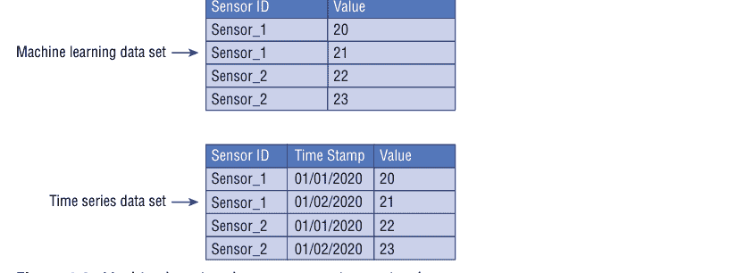

**图1.2：** 机器学习数据集与时间序列数据集

既然你对时间序列数据有了更好的理解，那么理解时间序列分析和时间序列预测之间的区别也很重要。这两个领域紧密相关，但服务于不同的目的：时间序列分析是关于识别内在结构并推断时间序列数据的隐藏特征，以便从中获取有用信息（如趋势或季节性变化——这些都是我们将在本章后面讨论的概念）。

数据科学家通常利用时间序列分析出于以下原因：

-   清晰洞察历史时间序列数据的底层结构。
-   提高对时间序列特征的解释质量，以更好地为问题领域提供信息。
-   预处理并执行高质量的特征工程，以获得更丰富、更深入的历史数据集。

时间序列分析用于许多应用，如过程和质量控制、公用事业研究和人口普查分析。它通常被认为是分析和准备时间序列数据以进行建模步骤的第一步，该步骤被恰当地称为*时间序列预测*。

时间序列预测涉及采用机器学习模型，在历史时间序列数据上训练它们，并利用它们来预测未来的预测结果。如图1.3所示，在时间序列预测中，未来的输出是未知的，它基于机器学习模型在历史输入数据上的训练方式。

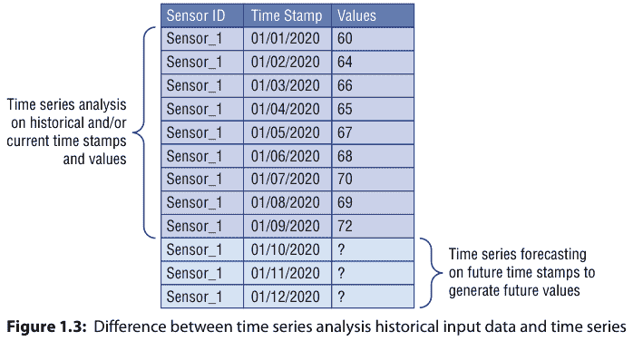

不同的历史和当前现象可能会影响时间序列中数据的值，这些事件被诊断为时间序列的组成部分。识别这些不同的影响或组成部分并将其分解，以便将它们与数据水平分离，这一点非常重要。

如图1.4所示，时间序列分析中有四个主要类别的组成部分：*长期运动或趋势*、*季节性短期运动*、*周期性短期运动*以及*随机或不规则波动*。

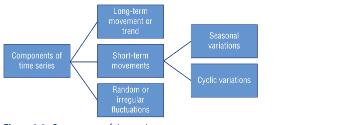

## 第1章 ■ 时间序列预测概述

让我们更仔细地看看这四个组成部分：

-   *长期运动*或*趋势*指的是时间序列值在长时间间隔内整体增加或减少的运动。观察到趋势在时间序列数据集过程中改变方向是很常见的：它们可能在不同时刻增加、减少或保持稳定。然而，总体上你会看到一个主要趋势。人口数量、农业生产和制造的物品只是趋势可能发挥作用的一些例子。
-   *短期运动*有两种不同的类型：
    -   *季节性变化*是周期性的时间波动，显示相同的变化，并且通常在不到一年的周期内重复出现。季节性总是具有固定且已知的周期。大多数情况下，如果数据是按小时、天、周、季度或月记录的，这种变化将存在于时间序列中。不同的社会习俗（如节假日和庆典）、天气季节和气候条件在季节性变化中起着重要作用，例如雨季雨伞和雨衣的销售，以及夏季空调的销售。
    -   另一方面，*周期性变化*是当数据表现出非固定周期的上升和下降时存在的重复模式。一个完整的周期是一个循环，但一个循环不会有特定的预定时间长度，即使这些时间波动的持续时间通常超过一年。周期性变化的一个经典例子是商业周期，即国内生产总值围绕其长期增长趋势的上下波动：它通常可以持续几年，但当前商业周期的持续时间是事先未知的。

如图1.5所示，周期性变化和季节性变化是时间序列预测中相同短期运动的一部分，但它们呈现出数据科学家需要识别和利用的差异，以构建准确的预测模型：

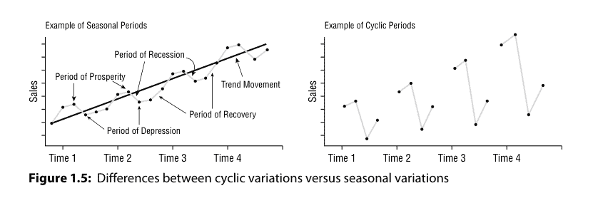

-   *随机或不规则波动*是导致时间序列数据变化的最后一个元素。这些波动是不可控、不可预测且不稳定的，例如地震、战争、洪水和任何其他自然灾害。

数据科学家经常将前三个组成部分（长期运动、季节性短期运动和周期性短期运动）称为时间序列数据中的*信号*，因为它们实际上是可以从数据本身推导出的确定性指标。另一方面，最后一个组成部分（随机或不规则波动）是数据中值的任意变化，你无法真正预测，因为这些随机波动的每个数据点都独立于上述其他信号，例如长期和短期运动。因此，数据科学家经常将其称为*噪声*，因为它是由难以观察到的潜在变量触发的，如图1.6所示。

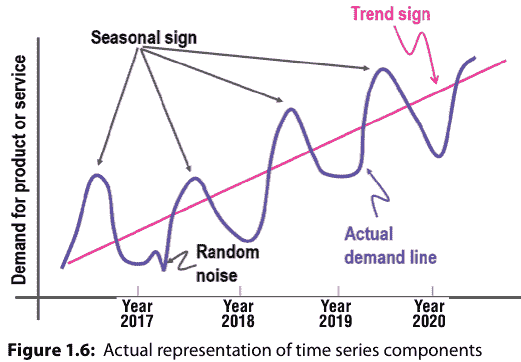

数据科学家需要仔细识别每个组成部分在时间序列数据中存在的程度，以便能够构建准确的机器学习预测解决方案。为了识别和测量这四个组成部分，建议首先执行分解过程，以从数据中移除组成部分的影响。在这些组成部分被识别和测量，并最终用于构建额外特征以提高预测准确性之后，数据科学家可以利用不同的方法来重新组合并将这些组成部分添加回预测结果中。

理解这四个时间序列组成部分以及如何识别和移除它们，是构建任何时间序列预测解决方案的战略性第一步，因为它们可以帮助理解时间序列中的另一个重要概念，这可能有助于提高机器学习算法的预测能力：平稳性。*平稳性*意味着时间序列的统计参数不随时间变化。换句话说，时间序列数据分布的基本属性，如均值和方差，在时间上保持不变。因此，平稳的时间序列过程更容易分析和建模，因为基本假设是它们的属性不依赖于时间，并且在未来将与过去历史时期相同。经典地，你应该使你的时间序列平稳。

平稳性有两种重要形式：*强平稳性*和*弱平稳性*。当一个时间序列的所有统计参数不随时间变化时，它被定义为具有强平稳性。当一个时间序列的均值和自协方差函数不随时间变化时，它被定义为具有弱平稳性。

或者，表现出数据值变化的时间序列，如趋势或季节性，显然不是平稳的，因此更难以预测和建模。为了获得准确和一致的预测结果，需要将非平稳数据转换为平稳数据。尝试使时间序列平稳的另一个重要原因是能够获得有意义的样本统计量，如均值、方差以及与其他变量的相关性，这些可以用来获取更多见解并更好地理解你的数据，并且可以作为额外特征包含在你的时间序列数据集中。

然而，在某些情况下，未知的非线性关系无法通过经典方法确定，例如自回归、移动平均和自回归综合移动平均方法。这些信息在构建机器学习模型时非常有用，并且可以在特征工程和特征选择过程中使用。实际上，许多经济时间序列在以其原始测量单位可视化时远非平稳，即使经过季节性调整，它们通常仍会表现出趋势、周期和其他非平稳特征。

时间序列预测涉及在观测值之间存在有序关系的数据上开发和使用预测模型。在数据科学家开始构建他们的预测解决方案之前，强烈建议定义以下预测方面：

-   *预测模型的输入和输出* – 对于即将构建预测解决方案的数据科学家来说，思考他们可用于进行预测的数据以及他们想要预测的未来内容至关重要。输入是提供给模型以进行未来值预测的历史时间序列数据。输出是未来时间步的预测结果。例如，由电网中传感器收集的过去七天的能源消耗数据被视为输入数据，而预测第二天能源消耗的预测值被定义为输出数据。

## 第一章 ■ 时间序列预测概述

**预测模型的粒度级别** – 时间序列预测中的粒度代表每个时间戳捕获的最低详细数值级别。粒度与时间序列数值的采集频率相关：通常在物联网场景中，数据科学家需要处理由传感器每隔几秒采集一次的时间序列数据。物联网通常定义为一组连接到互联网的设备，它们共同收集、共享和存储数据。物联网设备的例子包括空调单元中的温度传感器和安装在远程油泵上的压力传感器。有时，对时间序列数据进行聚合可能是构建和优化时间序列模型的重要步骤：时间聚合是指将单个资源在指定时间段（例如，每天、每周或每月）内的所有数据点进行组合。通过聚合，每个粒度周期内收集的数据点被聚合成一个单一的统计值，例如所有收集数据点的平均值或总和。

**预测模型的预测范围** – 预测模型的预测范围是指需要预测的未来时间长度。这些范围通常从短期预测范围（少于三个月）到长期范围（超过两年）不等。短期预测通常用于短期目标，如物料需求计划、调度和预算；另一方面，长期预测通常用于预测涵盖五年以上的长期目标，如产品多元化、销售和广告。

**预测模型的内生和外生特征** – 内生和外生是经济学术语，分别描述影响业务生产、效率、增长和盈利能力的内部和外部因素。*内生特征*是输入变量，其值由系统中的其他变量决定，输出变量依赖于它们。例如，如果数据科学家需要构建一个预测模型来预测每周的汽油价格，他们可以考虑将主要旅行假期作为内生变量，因为价格可能因周期性需求上升而上涨。

另一方面，*外生特征*是不受系统中其他变量影响的输入变量，输出变量依赖于它们。外生变量具有一些共同特征（Glen 2014），例如：

- 它们进入模型时是固定的。
- 它们在模型中被视为给定值。
- 它们影响模型中的内生变量。
- 它们不由模型决定。
- 它们不由模型解释。

在上面预测每周汽油价格的例子中，虽然假期旅行时间表基于周期性趋势增加了需求，但汽油的总成本可能受到石油储备价格、社会政治冲突或油轮事故等灾难的影响。

**预测模型的结构化或非结构化特征** – 结构化数据包含明确定义的数据类型，其模式使其易于搜索，而非结构化数据包含通常不易搜索的数据，包括音频、视频和社交媒体帖子等格式。结构化数据通常存在于关系数据库中，其字段存储长度明确的数据，如电话号码、社会安全号码或邮政编码。即使是像姓名这样的可变长度文本字符串也包含在记录中，使得搜索变得简单（Taylor 2018）。

非结构化数据具有内部结构，但不是通过预定义的数据模型或模式构建的。它可能是文本的或非文本的，由人类或机器生成。典型的人类生成的非结构化数据包括电子表格、演示文稿、电子邮件和日志。典型的机器生成的非结构化数据包括卫星图像、天气数据、地形和军事行动。

在时间序列的背景下，非结构化数据不呈现系统的时间依赖模式，而结构化数据显示系统的时间依赖模式，例如趋势和季节性。

**预测模型的单变量或多变量性质** – 单变量数据的特点是只有一个变量。它不涉及原因或关系。其描述性属性可以在一些估计中识别，例如集中趋势（均值、众数、中位数）、离散度（范围、方差、最大值、最小值、四分位数和标准差）以及频率分布。单变量数据分析以其在确定两个或多个变量之间的关系、相关性、比较、原因、解释和变量间偶然性方面的局限性而闻名。通常，它不提供有关因变量和自变量的进一步信息，因此，在涉及多个变量的任何分析中是不够的。

为了从这种多指标问题中获得结果，数据科学家通常使用多变量数据分析。这种多变量方法不仅有助于考虑模型中的多个特征，还将揭示外部变量的影响。

时间序列预测可以是单变量或多变量。术语*单变量时间序列*是指由在相等时间增量上顺序记录的单个观测值组成的时间序列。与统计学的其他领域不同，单变量时间序列模型包含其自身的滞后值作为独立变量（itl.nist.gov/div898/handbook/pmc/section4/pmc44.htm）。这些滞后变量可以像多元回归中的独立变量一样发挥作用。多变量时间序列模型是单变量情况的扩展，涉及两个或多个输入变量。它不仅限于自身的历史信息，还包含其他变量的历史信息。当多个相关时间序列随时间同时被观测到，而不是像单变量情况那样只观测到一个序列时，就会出现多变量过程。单变量时间序列的例子包括我们将在第四章“时间序列预测的一些经典方法介绍”中讨论的ARIMA模型。从输入和输出的角度考虑这个问题可能会增加进一步的区别。输入和输出之间的变量数量可能不同；例如，数据可能不是对称的。你可能有多个变量作为模型的输入，而只对预测其中一个变量作为输出感兴趣。在这种情况下，模型中假设多个输入变量有助于预测单个输出变量，并且是预测所必需的。

**预测模型的单步或多步结构** – 时间序列预测描述的是预测下一个时间步的观测值。这被称为单步预测，因为只预测一个时间步。与单步预测相对的是多步或多步时间序列预测问题，其目标是预测时间序列中的一系列值。许多时间序列问题涉及仅使用过去观测到的值来预测一系列值的任务（Cheng et al. 2006）。此任务的例子包括预测农作物产量、股票价格、交通量和电力消耗的时间序列。至少有四种常用的多步预测策略（Brownlee 2017）：

- *直接多步预测：* 直接方法需要为每个预测时间戳创建一个单独的模型。例如，在预测未来两小时能源消耗的情况下，我们需要开发一个模型来预测第一小时的能源消耗，以及一个单独的模型来预测第二小时的能源消耗。
- *递归多步预测：* 多步预测可以递归处理，其中创建一个单一的时间序列模型来预测下一个时间戳，然后使用先前的预测来计算后续的预测。例如，在预测

## 用于时间序列预测的监督学习

机器学习是人工智能的一个子集，它使用（例如深度学习等）技术，使机器能够利用经验来改进任务表现（aka.ms/deeplearningVSmachinelearning）。学习过程基于以下步骤：

1.  将数据输入算法。（在此步骤中，你可以向模型提供额外信息，例如通过执行特征提取。）
2.  使用这些数据训练模型。
3.  测试并部署模型。
4.  使用部署好的模型执行自动化预测任务。换句话说，调用并使用部署好的模型来接收模型返回的预测结果（aka.ms/deeplearningVSmachinelearning）。

机器学习是实现人工智能的一种方式。通过使用机器学习和深度学习技术，数据科学家可以构建能够执行通常与人类智能相关任务的计算机系统和应用程序。这些任务包括时间序列预测、图像识别、语音识别和语言翻译（aka.ms/deeplearningVSmachinelearning）。

机器学习主要有三类：*监督学习*、*无监督学习*和*强化学习*。在接下来的几段中，我们将更仔细地探讨这些机器学习类别中的每一类：

### 监督学习

*监督学习*是一种机器学习系统，其中输入（即数据集中变量的值的集合）和期望输出（目标变量的预测值）都是提供的。数据被预先识别和标记，为算法提供一个用于未来数据处理的学习记忆。数值标签的一个例子是与二手车相关的销售价格（aka.ms/MLAlgorithmCS）。监督学习的目标是研究许多这样的标记示例，然后能够对未来数据点进行预测，例如，为与标记过程中使用的车辆具有相似特征的其他二手车分配准确的销售价格。它被称为监督学习，是因为数据科学家监督算法从训练数据集中学习的过程（www.aka.ms/MLAlgorithmCS）：他们知道正确答案，并在学习过程中迭代地与算法分享这些答案。监督学习有几种具体类型。其中最常见的两种是*分类*和*回归*：

- *分类*：分类是一种监督学习类型，用于识别新信息属于哪个类别。它可以回答简单的二选一问题，例如是或否、真或假，例如：
    - 这条推文是积极的吗？
    - 这位客户会续订服务吗？
    - 两张优惠券中哪一张吸引更多客户？
    分类也可以用于预测多个类别中的一个，在这种情况下称为多类别分类。它回答具有多个可能答案的复杂问题，例如：
    - 这条推文的情绪是什么？
    - 这位客户会选择哪项服务？
    - 多项促销活动中哪一项吸引更多客户？
- *回归*：回归是一种监督学习类型，用于通过估计变量之间的关系来预测未来。数据科学家使用它来实现以下目标：
    - 估计产品需求
    - 预测销售数字
    - 分析营销回报

### 无监督学习

*无监督学习*是一种机器学习系统，其中输入的数据点没有与之关联的标签。在这种情况下，数据没有被预先标记，因此无监督学习算法本身可以组织数据并描述其结构。这可能意味着将其分组为簇，或者找到观察复杂数据结构的不同方式（aka.ms/MLAlgorithmCS）。

### 时间序列预测策略

- *直接-递归混合多步预测*：直接策略和递归策略可以结合使用，以提供两种方法的优点（Brownlee 2017）。例如，可以为每个未来时间戳构建一个不同的模型，但是每个模型可以利用先前时间步的模型所做的预测作为输入值。在预测未来两小时能源消耗的情况下，可以构建两个模型，第一个模型的输出用作第二个模型的输入。
- *多输出预测*：多输出策略需要开发一个能够预测整个预测序列的模型。例如，在预测未来两小时能源消耗的情况下，我们将开发一个模型，并在一次计算中应用它来预测接下来的两个小时（Brownlee 2017）。

### 连续或非连续时间序列

呈现一致时间间隔（例如，每五分钟、每两小时或每季度）的时间序列被定义为连续的（Zuo et al. 2019）。另一方面，时间上不均匀的时间序列可以被定义为非连续的：非连续时间序列背后的原因通常是缺失或损坏的值。在跳到数据插补方法之前，了解数据缺失的原因很重要。最常见的三个原因是：

- *随机缺失*：随机缺失意味着数据点缺失的倾向与缺失数据无关，但与某些观测数据有关。
- *完全随机缺失*：某个值缺失的事实与其假设值以及其他变量的值无关。
- *非随机缺失*：两个可能的原因是缺失值取决于假设值，或者缺失值取决于其他变量的值。

在前两种情况下，根据缺失值的出现情况删除具有缺失值的数据是安全的，而在第三种情况下，删除具有缺失值的观测值可能会在模型中产生偏差。根据你要解决的问题类型，有不同的数据插补解决方案，很难提供通用的解决方案。

此外，由于其时间特性，只有一些统计方法适用于时间序列数据。我已确定了一些最常用的方法，并将其作为结构化指南列在图1.7中。

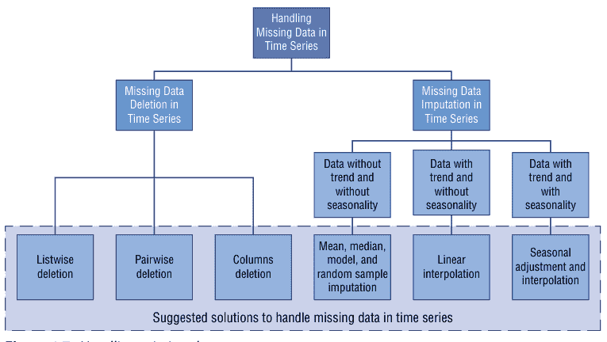

从图1.7的图表中你可以观察到，列表删除法会删除具有一个或多个缺失值的观测值的所有数据。特别是如果缺失数据仅限于少数观测值，你可能只是选择将这些案例从分析中排除。然而，在大多数情况下，使用列表删除法是不利的。这是因为*完全随机缺失*方法的假设通常很少得到支持。因此，列表删除法会产生有偏差的参数和估计。

*成对删除法*分析所有存在感兴趣变量的案例，因此基于分析基础最大化所有可用数据。这种技术的一个优点是它增加了分析的效力，但它也有许多缺点。它假设缺失数据是完全随机缺失的。如果你进行成对删除，那么最终会导致不同数量的观测值贡献于模型的不同部分，这可能使解释变得困难。

*删除列*是另一种选择，但保留数据总是比丢弃数据更好。有时，如果数据在超过60%的观测值中缺失，你可以删除变量，但前提是该变量不显著。话虽如此，插补总是比删除变量更可取的选择。

### 时间序列特定的插补方法

- *线性插值*：此方法适用于具有一定趋势的时间序列，但不适用于季节性数据。
- *季节性调整和线性插值*：此方法适用于同时具有趋势和季节性的数据。
- *均值、中位数和众数*：计算整体均值、中位数或众数是一种非常基础的插补方法；它是唯一一个不利用时间序列特征或变量之间关系的经过测试的函数。它非常快，但有明显的缺点。一个缺点是均值插补会减少数据集中的方差。

在本章的下一节中，我们将讨论如何将时间序列塑造成监督学习问题，从而能够使用大量的线性和非线性机器学习算法。

无监督学习有几种类型，例如聚类分析、异常检测和主成分分析：

-   *聚类分析*：聚类分析是一种无监督学习，用于将相似的数据点分隔成直观的组别。数据科学家在需要发现数据中的结构时会使用它，例如以下示例：
    - 执行客户细分
    - 预测客户偏好
    - 确定市场价格

-   *异常检测*：异常检测是一种监督学习，用于识别和预测罕见或异常的数据点。数据科学家在需要发现异常情况时会使用它，例如以下示例：
    - 捕捉异常的设备读数
    - 检测欺诈
    - 预测风险

异常检测采用的方法是简单地学习正常活动的样子（使用非欺诈交易的历史记录），并识别任何显著不同的内容。

-   *主成分分析*：主成分分析是一种通过使用更少的不相关变量来表示特征空间，从而降低其维度的方法。数据科学家在需要组合输入特征以丢弃最不重要的特征，同时仍保留数据集中特征的最有价值信息时，会使用它。

当数据科学家需要回答以下问题时，主成分分析非常有帮助：

- 我们如何理解每个变量之间的关系？
- 我们如何查看收集到的所有变量，并专注于其中几个？
- 我们如何避免模型对数据过拟合的风险？

-   *强化学习*是一种机器学习系统，其中算法被训练来做出一系列决策。该算法通过采用试错过程来提出问题的解决方案（aka.ms/MLAlgorithmCS），从而学会在不确定、可能复杂的环境中实现目标。

数据科学家需要预先定义问题，算法因其执行的操作而获得奖励或惩罚。其目标是最大化总奖励。模型需要弄清楚如何执行任务以最大化奖励，从完全随机的试验开始。以下是强化学习应用的一些示例：

- 用于交通信号控制的强化学习
- 用于优化化学反应的强化学习
- 用于个性化新闻推荐的强化学习

当数据科学家选择算法时，需要考虑许多不同的因素（aka.ms/AlgorithmSelection）：

-   *评估标准*：评估标准帮助数据科学家通过使用不同的指标来监控机器学习模型对数据的表示程度，从而评估其解决方案的性能。它们是训练流程中验证模型的重要步骤。不同的机器学习方法有不同的评估指标，例如分类场景的准确率、精确率、召回率、F分数、受试者工作特征（ROC）和曲线下面积（AUC），以及回归场景的平均绝对误差（MAE）、均方误差（MSE）、R平方分数和调整后的R平方。MAE是一种可用于衡量预测准确性的指标。顾名思义，它是绝对误差的平均值：绝对误差是预测值与实际值之差的绝对值，并且它是尺度相关的：该指标未按平均需求进行缩放的事实，对于需要比较不同时间序列准确性的数据科学家来说可能是一个限制。对于时间序列预测场景，数据科学家还可以使用平均绝对百分比误差（MAPE）来比较不同预测和拟合方法的拟合度。该指标将准确性表示为MAE的百分比，并允许数据科学家比较不同尺度的不同序列的预测。
- *训练时间*：训练时间是训练机器学习模型所需的时间量。训练时间通常与整体模型准确性密切相关。此外，一些算法对数据点的数量比其他算法更敏感。当时间有限时，它可能驱动算法的选择，尤其是在数据集很大时。
- *线性*：线性是一种数学函数，用于识别数据集数据点之间的特定关系。这种数学关系意味着数据点可以图形化表示为一条直线。线性算法在算法上往往简单且训练速度快。不同的机器学习算法利用线性。线性分类算法（如逻辑回归和支持向量机）假设数据集中的类别可以通过一条直线分开。线性回归算法假设数据趋势遵循一条直线。

-   *参数数量*：机器学习参数是数据科学家通常需要手动选择以提高算法性能的数字（例如错误容忍度、迭代次数、算法行为变体之间的选项数量）（aka.ms/AlgorithmSelection）。算法的训练时间和准确性有时可能对获得正确的设置非常敏感。通常，具有大量参数的算法需要最多的试错来找到一个好的组合。虽然这是确保你已覆盖参数空间的好方法，但训练模型所需的时间随参数数量呈指数增长。好处是拥有许多参数通常表明算法具有更大的灵活性。只要你能找到正确的参数设置组合，它通常可以实现非常好的准确性（aka.ms/AlgorithmSelection）。

-   *特征数量*：特征是数据科学家希望基于其预测结果的现象属性。大量的特征可能会使某些学习算法过载，导致训练时间过长。数据科学家可以执行特征选择和降维等技术来减少他们需要处理的特征数量和维度。虽然这两种方法都用于减少数据集中的特征数量，但有一个重要的区别：
    - *特征选择*只是选择和排除给定的特征，而不改变它们。
    - *降维*将特征转换为更低的维度。

牢记这些重要的机器学习概念，你现在可以学习如何将你的预测场景重塑为监督学习问题，从而获得大量线性和非线性机器学习算法。

时间序列数据可以表示为监督学习问题：数据科学家通常通过利用先前的时间步长并将其用作输入，然后利用下一个时间步长作为模型的输出，将他们的时间序列数据集转换为监督学习。图1.8显示了原始时间序列数据集和转换为监督学习的数据集之间的差异。

我们可以从图1.8中总结一些观察结果，如下所示：

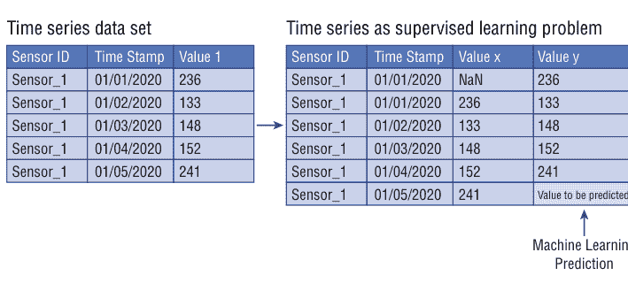

图1.8：作为监督学习问题的时间序列数据集

-   Sensor_1在先前时间步长（例如，2020年1月1日）的值成为监督学习问题中的输入（值x）。
- Sensor_1在后续时间步长（例如，2020年1月2日）的值成为监督学习问题中的输出（值y）。
- 需要注意的是，在机器学习算法的训练过程中，需要保持Sensor_1值之间的时间顺序。
- 通过对时间序列数据执行此转换，生成的监督学习数据集将在值x的第一行显示一个空值（NaN）。这意味着没有先前的值x可用于预测时间序列数据集中的第一个值。我们建议删除此行，因为我们无法将其用于时间序列预测解决方案。
- 最后，序列中最后一个值之后的下一个待预测值是未知的：这是需要由我们的机器学习模型预测的值。

我们如何将任何时间序列数据集转换为监督学习问题？数据科学家通常利用先前时间步长的值来预测后续时间步长的值，使用一种称为*滑动窗口方法*的统计方法。一旦应用滑动窗口方法并转换了时间序列数据集，数据科学家就可以使用标准的线性和非线性机器学习方法来建模他们的时间序列数据。

之前和在图1.8中，我使用了*单变量时间序列*的示例：这些是每个时间点只观察到一个变量的数据集，例如每小时的能源负荷。然而，滑动窗口方法可以应用于当时间序列数据集在每个时间步长包含多个历史变量，且目标是预测未来多个变量时：这类时间序列数据集被称为*多元时间序列*（我将在本书后续章节详细讨论此概念）。

我们可以将此时间序列数据集重构为窗口宽度为1的监督学习问题。这意味着我们将使用Value 1和Value 2的前一时间步长值。同时，我们也能获取Value 1的下一时间步长值。随后，我们将预测Value 2的下一时间步长值。如图1.9所示，这将为每个训练模式提供三个输入特征和一个待预测的输出值。

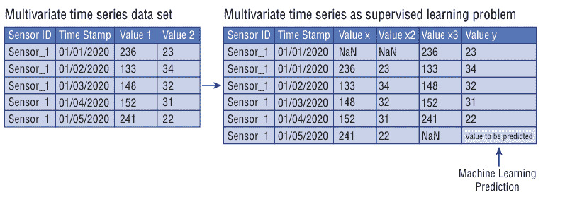

**图1.9：** 作为监督学习问题的多元时间序列

在图1.9的示例中，我们预测了两个不同的输出变量（Value 1和Value 2），但数据科学家通常需要为单个输出变量预测多个未来时间步长。这被称为*多步预测*。在多步预测中，数据科学家需要指定要预测的未来时间步长数量，在时间序列中也称为*预测范围*。多步预测通常呈现两种不同格式：

- *单步预测：* 当数据科学家需要预测下一个时间步长（$t + 1$）时
- *多步预测：* 当数据科学家需要预测两个或更多（$n$）未来时间步长（$t + n$）时

例如，需求预测模型会根据截至当前的销售数据，预测商品下周及未来两周的销售量。在股票市场中，根据截至今日的股价，可以预测未来24小时和48小时的股价。使用天气预报引擎，可以预测未来一天及整周的天气（Brownlee 2017）。

滑动窗口方法也可应用于多步预测解决方案，将其转化为监督学习问题。如图1.10所示，我们可以使用与图1.8相同的单变量时间序列数据集作为示例，并将其构建为窗口宽度为1的监督学习两步预测数据集（Brownlee 2017）。

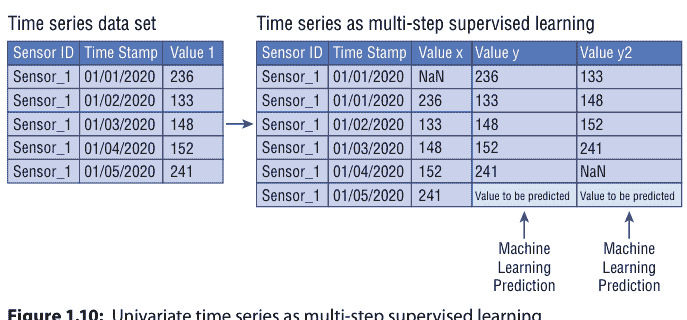

如图1.10所示，数据科学家无法使用此样本数据集的第一行（时间戳01/01/2020）和倒数第二行（时间戳01/04/2020）来训练其监督模型；因此我们建议将其移除。此外，这个新版本的监督数据集仅包含一个变量Value x，数据科学家可利用它来预测最后一行（时间戳01/05/2020）的Value y和Value y²。

在下一节中，你将了解用于时间序列数据的不同Python库，以及pandas、statsmodels和scikit-learn等库如何分别帮助你进行数据处理、时间序列建模和机器学习。

最初为金融时间序列（如每日股市价格）开发的、健壮且灵活的数据结构，可应用于任何领域的时间序列数据，包括市场营销、医疗保健、工程等众多领域。借助这些工具，你可以轻松地在任何粒度级别上组织、转换、分析和可视化数据——既可以深入研究特定时间段的细节，也可以缩小范围探索不同时间尺度（如月度或年度汇总、周期性模式和长期趋势）上的变化。

## 用于时间序列预测的Python

在本节中，我们将探讨用于时间序列数据的不同Python库，以及pandas、statsmodels和scikit-learn等库如何分别帮助你进行数据处理、时间序列建模和机器学习。Python生态系统是应用机器学习的主导平台。

采用Python进行时间序列预测的主要理由在于，它是一种通用编程语言，既可用于实验，也可用于生产环境。它易于学习和使用，主要因为该语言注重可读性。Python是一种动态语言，非常适合交互式开发和快速原型设计，同时具备支持大型应用程序开发的能力。

Python也因其出色的库支持而被广泛用于机器学习和数据科学，并且拥有多个用于时间序列的库，例如NumPy、pandas、SciPy、scikit-learn、statsmodels、Matplotlib、datetime、Keras等。下面我们将更详细地了解本书中将使用的Python时间序列库：

- **SciPy**：SciPy是一个基于Python的开源软件生态系统，用于数学、科学和工程。其核心包包括NumPy（基础n维数组包）、SciPy库（科学计算基础库）、Matplotlib（综合2D绘图库）、IPython（增强型交互式控制台）、SymPy（符号数学库）和pandas（数据结构与分析库）。为大多数其他库奠定基础的两个SciPy库是NumPy和Matplotlib：

- **NumPy**是用于Python科学计算的基础包。它包含（除其他外）以下内容：
    - 强大的n维数组对象
    - 复杂的（广播）函数
    - 集成C/C++和Fortran代码的工具
    - 实用的线性代数、傅里叶变换和随机数功能

最新的NumPy文档可在numpy.org/devdocs/找到。它包括用户指南、完整参考文档、开发者指南、元信息以及“NumPy增强提案”（包括NumPy路线图和主要新功能的详细计划）。

- **Matplotlib**：Matplotlib是一个Python绘图库，可在多种硬拷贝格式和跨平台交互环境中生成出版物质量的图形。Matplotlib可用于Python脚本、Python和IPython shell、Jupyter notebook、Web应用程序服务器以及四种图形用户界面工具包。

Matplotlib只需几行代码即可生成绘图、直方图、功率谱、条形图、误差图、散点图等。最新的Matplotlib文档可在Matplotlib用户指南（matplotlib.org/3.1.1/users/index.html）中找到。

此外，还有三个更高级的SciPy库，它们为Python中的时间序列预测提供了关键功能，分别是用于数据处理、时间序列建模和机器学习的pandas、statsmodels和scikit-learn：

- **Pandas**：Pandas是一个开源的、BSD许可的库，为Python编程语言提供高性能、易于使用的数据结构和数据分析工具。Python长期以来在数据整理和准备方面表现出色，但在数据分析和建模方面则稍显不足。Pandas有助于填补这一空白，使你能够在Python中完成整个数据分析工作流程，而无需切换到更特定领域的语言（如R）。

最新的pandas文档可在pandas用户指南（pandas.pydata.org/pandas-docs/stable/）中找到。

Pandas是一个NumFOCUS赞助的项目。这将有助于确保pandas作为世界级开源项目的开发成功。

Pandas并未实现线性回归和面板回归之外的重要建模功能；对此，请参考下面的statsmodels和scikit-learn。

- **Statsmodels**：Statsmodels是一个Python模块，提供用于估计多种不同统计模型以及进行统计检验和统计数据探索的类和函数。每个估计器都有广泛的结果统计列表。结果经过与现有统计软件包的测试以确保其正确性。该软件包在开源的Modified BSD（3-clause）许可下发布。

最新的statsmodels文档可在statsmodels用户指南（statsmodels.org/stable/index.html）中找到。

- **Scikit-learn**：Scikit-learn是一个简单高效的数据挖掘和数据分析工具。特别是，该库使用统一的接口实现了一系列机器学习、预处理、交叉验证和可视化算法。它建立在NumPy、SciPy和Matplotlib之上，并在开源的Modified BSD（3-clause）许可下发布。

Scikit-learn专注于机器学习数据建模。它不涉及数据的加载、处理、操作和可视化。因此，数据科学家通常将使用scikit-learn与其他库（如 NumPy、pandas 和 Matplotlib）结合使用，以进行数据处理、预处理和可视化。

最新的 scikit-learn 文档可在 scikit-learn 用户指南（scikit-learn.org/stable/index.html）中找到。

在本书中，我们还将使用 Keras 进行时间序列预测：

- *Keras*：Keras 是一个高级神经网络 API，用 Python 编写，能够运行在 TensorFlow、CNTK 和 Theano 之上。数据科学家通常在需要满足以下条件的深度学习库时使用 Keras：
    - 允许轻松快速地进行原型设计（通过用户友好性、模块化和可扩展性）
    - 支持卷积网络和循环网络，以及两者的组合
    - 在中央处理单元（CPU）和图形处理单元（GPU）上无缝运行

最新的 Keras 文档可在 Keras 用户指南（keras.io）中找到。

既然你已经更好地了解了本书中将用于构建端到端预测解决方案的不同 Python 包，我们可以进入本章的下一个也是最后一个部分，该部分将为你提供为时间序列预测设置 Python 环境的一般建议。

## 时间序列预测的实验设置

在本节中，你将学习如何在 Visual Studio Code 中开始使用 Python 以及如何设置你的 Python 开发环境。具体来说，本教程需要以下内容：

- *Visual Studio Code*：Visual Studio Code（VS Code）是一个轻量级但功能强大的源代码编辑器，可在你的桌面上运行，并适用于 Windows、macOS 和 Linux。它内置了对 JavaScript、TypeScript 和 Node.js 的支持，并拥有丰富的扩展生态系统，支持其他语言（如 C++、C#、Java、Python、PHP、Go）和运行时（如 .NET 和 Unity）。
- *Visual Studio Code Python 扩展*：Visual Studio Code Python 扩展是一个 Visual Studio Code 扩展，为 Python 语言（针对所有积极支持的语言版本：2.7、≥ 3.5）提供丰富的支持，包括 IntelliSense、代码检查、调试、代码导航、代码格式化、Jupyter notebook 支持、重构、变量资源管理器和测试资源管理器等功能。
- *Python 3*：Python 3.0 最初于 2008 年发布，是该语言的最新主要版本，最新版本 Python 3.8 于 2019 年 10 月发布。在本书的大多数示例中，我们将使用 Python 版本 3.8。

需要注意的是，Python 3.x 与 2.x 系列版本不兼容。该语言大部分相同，但许多细节，尤其是内置对象（如字典和字符串）的工作方式发生了很大变化，并且许多已弃用的功能最终被移除。以下是一些 Python 3.0 资源：
    - Python 文档（python.org/doc/）
    - 最新 Python 更新（aka.ms/PythonMS）

如果你尚未安装，请安装 VS Code。接下来，从 Visual Studio Marketplace 安装 VS Code 的 Python 扩展。有关安装扩展的更多详细信息，请参见扩展市场。Python 扩展名为 Python，由 Microsoft 发布。

除了 Python 扩展，你还需要安装 Python 解释器，请按照以下说明操作：

- 如果你使用的是 Windows：
    - 从 python.org 安装 Python。你通常可以使用页面上首先出现的“Download Python”按钮来下载最新版本。
    - 注意：如果你没有管理员权限，在 Windows 上安装 Python 的另一个选项是使用 Microsoft Store。Microsoft Store 提供 Python 3.7 和 Python 3.8 的安装。请注意，使用此方法可能会遇到与某些包的兼容性问题。
    - 有关 Windows 上 Python 的更多信息，请参见 python.org 上的“在 Windows 上使用 Python”。

- 如果你使用的是 macOS：
    - 不支持 macOS 上的系统 Python 安装。相反，建议通过 Homebrew 进行安装。要在 macOS 上使用 Homebrew 安装 Python，请在终端提示符下使用 `brew install python3`。
    - 注意：在 macOS 上，请确保你的 VS Code 安装位置包含在 PATH 环境变量中。有关更多信息，请参见这些设置说明。

- 如果你使用的是 Linux：
    - Linux 上内置的 Python 3 安装运行良好，但要安装其他 Python 包，你必须使用 `get-pip.py` 安装 pip。

要验证你是否已成功在计算机上安装 Python，请运行以下命令之一（取决于你的操作系统）：

- *Linux/macOS*：打开终端窗口并输入以下命令：
    ```
    python3 --version
    ```
- *Windows*：打开命令提示符并运行以下命令：
    ```
    py -3 --version
    ```

如果安装成功，输出窗口应显示你安装的 Python 版本。

## 结论

在本章中，我引导你了解了为预测模型准备时间序列数据的核心概念和步骤。通过一些时间序列的实际示例，我们讨论了时间序列表示、建模和预测的一些基本方面。

具体来说，我们讨论了以下主题：

- *时间序列预测的机器学习方法*：在本节中，你学习了一些重要概念的标准定义，如时间序列、时间序列分析和时间序列预测。你还发现了为什么时间序列预测是一个基础性的跨行业研究领域。
- *用于时间序列预测的监督学习*：在本节中，你学习了如何将你的预测场景重塑为监督学习问题，从而能够使用大量的线性和非线性机器学习算法。
- *用于时间序列预测的 Python*：在本节中，我们了解了用于时间序列数据的不同 Python 库，如 pandas、statsmodels 和 scikit-learn。
- *时间序列预测的实验设置*：本节为你提供了为时间序列预测设置 Python 环境的一般指南。

在下一章中，我们将讨论一些实际概念，如时间序列预测框架及其应用。此外，你将了解从事预测项目的数据科学家可能面临的一些注意事项。最后，我将介绍一个用例和一些成功构建机器学习预测解决方案的关键技术。

# 第 2 章
## 如何在云端设计端到端的时间序列预测解决方案

正如我们在第 1 章“时间序列预测概述”中所讨论的，时间序列预测是一种通过研究过去现象的行为和表现，并假设未来事件将与历史趋势和行为相似，从而通过时间序列来预测事件的方法。

如今，时间序列预测在各种应用中执行，包括天气预报、地震预测、天文学、金融和控制工程。在许多现代和现实世界的应用中，时间序列预测使用计算机技术，包括云计算、人工智能和机器学习，来构建和部署端到端的预测解决方案。

为了解决行业中的实际业务问题，拥有一个系统化且结构良好的模板至关重要，数据科学家可以将其用作指南，并应用于解决现实世界的业务场景。本第二章的目的是从实际角度提供一个端到端的系统化时间序列预测指南，介绍以下概念：

- *时间序列预测模板*：时间序列预测模板是一组任务，从定义业务问题开始，一直到部署时间序列预测模型并准备好供外部或公司内部使用。

## 第2章 ■ 如何设计端到端时间序列预测解决方案

在第一节中，我将介绍成功构建机器学习预测解决方案的一些关键技术。具体来说，我们将深入探讨以下步骤：

- *业务理解与性能指标定义*：业务理解与性能指标定义步骤概述了在做出投资决策之前需要理解和考虑的业务方面。它解释了如何界定当前的业务问题，以确保预测分析和机器学习确实有效且适用。
- *数据摄取*：数据摄取是收集和导入数据以进行清理、分析或存储到数据库的过程。当今企业收集大量结构化和非结构化数据，旨在利用这些数据发现实时或近实时的洞察。
- *数据探索与理解*：一旦原始数据被摄取并安全存储，就可以进行探索了。数据探索与理解阶段是关于获取原始数据并将其转换为可用于数据清理和特征工程的形式。
- *数据预处理与特征工程*：数据预处理与特征工程是数据科学家清理数据集中的异常值和缺失数据，并利用原始数据创建额外特征以供其机器学习模型使用的步骤。在机器学习中，特征是您试图分析的现象的一个可量化变量。对于某些类型的数据，特征的数量可能比数据点的数量大得多。
- *模型构建与选择*：建模阶段是将数据转换为模型的过程。该过程的核心是先进的算法，它们扫描历史数据（训练数据），提取模式，并构建一个模型。该模型随后可用于对未用于构建模型的新数据进行预测。
- *模型部署*：部署是将机器学习模型集成到现有生产环境中，以便开始使用它基于数据做出实际业务决策的方法。它是机器学习生命周期的最后阶段之一。
- *预测解决方案验收*：在时间序列预测解决方案部署的最后阶段，数据科学家需要确认并验证管道、模型及其在生产环境中的部署是否满足其成功标准。
- *用例：需求预测*：在本章末尾，我将介绍一个真实世界的数据科学场景，该场景将在本书中用于展示所讨论的一些时间序列概念、步骤和技术。我相信每个人都必须学会聪明地处理海量数据，因此本书包含了大型数据集，可公开免费访问。

现在让我们开始，一起探索如何将此时间序列预测模板应用于您的时间序列数据和解决方案。

## 时间序列预测模板

此模板是一个敏捷且迭代的框架，用于高效地交付时间序列预测解决方案。它包含了促进成功实施时间序列预测计划的最佳实践和结构的精华。目标是帮助企业充分利用其数据的优势，并在云端构建端到端的预测解决方案。

为了处理日益增长的预测问题的多样性和复杂性，近年来已经开发了许多机器学习和深度学习预测技术。正如我们将在第4章“时间序列预测的一些经典方法介绍”和第5章“时间序列预测的神经网络介绍”中讨论的那样，每种预测技术都有其特殊的应用，必须谨慎选择正确的技术用于特定应用。您越了解可用于预测场景的算法组合，您的预测工作就越有可能成功。

机器学习算法的选择取决于许多因素——您试图回答的业务问题、历史数据的相关性和可用性、您需要达到的准确性和成功指标、预测范围以及您的团队构建预测解决方案的时间。这些约束必须在不同层面上持续权衡（Lazzeri 2019b）。

图2.1展示了一个时间序列预测模板：这里的目的是通过讨论数据科学家或公司应如何处理预测问题、介绍几种方法、描述可用的方法以及解释如何将每个步骤与预测问题的不同方面相匹配，来概述这个领域。

如图2.1所示，我们的模板包含不同的步骤：

1. 业务理解与性能指标定义
2. 数据摄取
3. 数据探索与理解
4. 数据预处理与特征工程
5. 模型构建与选择
6. 模型部署
7. 预测解决方案验收

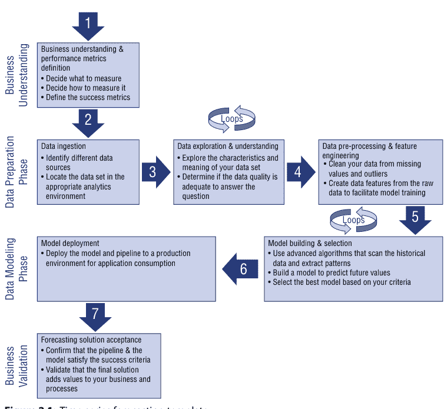

图2.1：时间序列预测模板

在此过程中，您需要记住一些必要的迭代循环（在步骤3和5上）：

- *数据探索与理解* – 数据探索与理解是数据科学家将使用多种不同的统计技术和可视化方法来探索数据并更好地理解其本质的时刻。在这个阶段，数据科学家可能会有额外的问题，并需要请求和摄取额外或不同的数据，并重新评估在此过程开始时定义的性能指标。
- *模型构建与选择* – 在模型构建与选择阶段，数据科学家可能会有新的想法，例如构建并包含在模型中的新特征、要尝试的新参数，甚至是新的算法。

在本章接下来的几节中，我们将深入探讨这些不同的步骤，并向您介绍我们将在本书中使用的用例。

## 业务理解与性能指标

业务理解与性能指标定义步骤概述了在做出投资决策之前需要理解和考虑的业务方面。它解释了如何界定当前的业务问题，以确保预测分析和机器学习确实有效且适用。对于大多数组织来说，缺乏数据不是问题。事实上，情况恰恰相反：通常有太多的信息可用，以至于难以对未来做出清晰的决策。

面对如此多需要整理的数据，组织需要一个明确的策略来阐明以下业务方面：

- 预测如何帮助组织转型业务、更好地管理成本并推动更高的卓越运营？
- 组织是否对其未来希望实现的目标有明确且清晰阐述的目的和愿景？
- 组织如何获得C级高管和利益相关者的支持，以采用这种预测方法和数据驱动的愿景，并将其贯穿到业务的不同部分？

公司需要对其业务和决策过程有清晰的理解，以支持预测解决方案。这第一步的目标是确定关键性能指标、数据和特征，这些将作为模型目标，其相关指标将用于确定项目的成功，同时识别业务可以访问或需要获取的相关数据来源。

拥有正确的心态后，曾经令人望而生畏的大量不同信息就变成了一个简单、清晰的决策点。组织必须从正确的问题开始。问题应该是可衡量的、清晰和简洁的，

## 第2章 ■ 如何设计端到端时间序列预测解决方案

并且与他们的核心业务直接相关。在这个阶段，设计问题以筛选或排除针对特定业务问题或机会的潜在解决方案非常重要。例如，从一个明确定义的问题开始：一家零售公司正面临成本上升，无法再向客户提供有竞争力的价格。解决这个业务问题的众多问题之一可能包括：“公司能否在不损害质量的情况下缩减运营？”

组织需要完成两项主要任务来回答这类问题（Lazzeri 2019b）：

- *定义业务目标*：公司需要与业务专家和其他利益相关者合作，以理解并识别业务问题。
- *制定正确的问题*：公司需要制定具体的问题，以定义预测团队可以瞄准的业务目标。

为了成功地将这一愿景和业务目标转化为可操作的结果，下一步是建立清晰的绩效指标。在这第二步中，组织需要关注以下两个分析方面（Lazzeri 2019b）：

- 什么是解决该业务问题并得出准确结论的最佳预测方法？
- 如何将这一愿景转化为能够改善业务的可操作结果？这一步分解为三个子步骤：
    - 决定衡量什么。
    - 决定如何衡量。
    - 定义成功指标。

让我们更仔细地看看每个子步骤：

- *决定衡量什么* – 让我们以*预测性维护*为例，这是一种用于预测在用机器何时可能发生故障的技术，以便提前规划其维护。事实证明，这是一个非常广泛的领域，有各种各样的最终目标，例如预测故障的根本原因、识别哪些部件需要更换以及何时更换、在故障发生后提供维护建议等等（Lazzeri 2019b）。

许多公司正在尝试预测性维护，并拥有来自各种传感器和系统的大量数据。但是，通常情况下，客户没有足够的故障历史数据，这使得预测性维护变得非常困难——毕竟，模型需要在这些故障历史数据上进行训练，以预测未来的故障事件。

因此，虽然阐述任何分析项目的愿景、目的和范围很重要，但关键是要从收集正确的数据开始。一旦你清楚地了解了将要衡量什么，你就需要决定如何衡量它，以及实现这一目标的最佳分析技术是什么。接下来，我们将讨论如何做出这些决策并选择最佳的机器学习方法来解决你的业务问题（Lazzeri 2019b）。

- 决定如何衡量它 – 思考组织如何衡量其数据同样重要，尤其是在数据收集和摄取阶段之前。这个子步骤需要问的关键问题如下：
    - 时间范围是什么？
    - 度量单位是什么？
    - 应该包含哪些因素？

这一步的一个核心目标是确定预测分析需要预测的关键业务变量。我们将这些变量称为模型目标，并使用与之相关的指标来确定项目的成功。此类目标的两个例子是销售预测或订单欺诈的概率。

一旦你决定了解决业务问题的最佳机器学习方法，并确定了预测分析需要预测的关键业务变量，你就需要定义一些成功指标，以帮助你定义项目的成功。

- 定义成功指标 – 在识别关键业务变量之后，将业务问题转化为数据科学问题并定义将定义项目成功的指标非常重要。此时，通过提出并细化相关、具体且明确的问题来重新审视项目目标也很重要。有了这些数据，公司可以提供客户促销活动以减少客户流失。一个经常出现的例子：一个组织可能希望为某个特定用例提供业务论证，其中基于云的解决方案和机器学习是重要组成部分（Lazzeri 2019b）。

与本地部署解决方案不同，在基于云的解决方案的情况下，前期成本部分很小，大部分成本要素与实际使用量相关。组织应该很好地理解运营预测解决方案（短期或长期）的业务价值。事实上，认识到每次预测操作的业务价值非常重要。在能源需求预测的例子中，准确预测未来24小时的电力负荷可以防止过度生产或有助于防止电网过载，这可以按日以财务节省的形式量化。

以下是计算需求预测解决方案财务效益的基本公式：

$$\left( \frac{\text{存储成本} + \text{数据出口成本} + \text{预测事务成本}}{\text{预测事务数量}} \right) = \frac{\text{预测的财务价值}}{\text{预测事务数量}}$$

如今，组织创建、获取并存储结构化、半结构化和非结构化数据的组合，这些数据可以被挖掘以获取洞察，并用于机器学习应用以改进运营。因此，对于公司来说，学习如何成功管理获取和导入数据以供立即使用或存储在数据库中的过程至关重要。

正如上面能源示例中所讨论的，今天的公司依赖数据来做各种决策——预测趋势、预测市场、规划未来需求并了解他们的客户。然而，你如何将公司的所有数据放在一个地方，以便做出正确的决策？

在下一节中，我们将讨论一些技术和最佳实践，以支持公司的数据摄取过程，并将数据从多个不同的来源移动到一个地方。

## 数据摄取

当今企业收集大量结构化和非结构化数据，旨在利用这些数据发现实时或近实时的洞察，以指导决策并支持数字化转型。数据摄取是获取和导入数据以供立即使用或存储在数据库中的过程。

数据可以通过三种不同的方法摄取：批处理、实时处理和流处理：

- **批处理时间序列数据处理** – 一个常见的大数据场景是对静态数据进行批处理。在这种场景下，源数据被加载到数据存储中，可以由源应用程序本身或由编排工作流完成。然后，数据由并行作业就地处理，该作业也可以由编排工作流启动，如图2.2所示。

处理可能包括多个迭代步骤，然后将转换后的结果加载到分析数据存储中，供分析和报告组件查询。要了解更多关于如何选择批处理技术的信息，你可以阅读关于Azure Time Series Insights的文章，网址为aka.ms/TimeSeriesInsights。

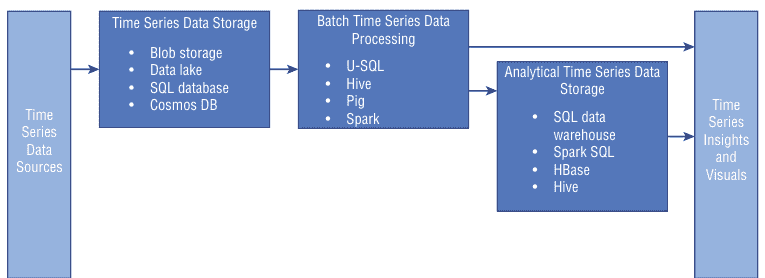

**图2.2：** 时间序列批处理数据处理架构

- *实时数据处理* – 实时处理处理实时捕获的数据流，并以最小的延迟进行处理，以生成实时（或近实时）报告或自动响应。例如，实时交通监控解决方案可能使用传感器数据来检测高交通量。这些数据可用于动态更新地图以显示拥堵情况，或自动启动高占用率车道或其他交通管理系统。要了解更多关于推荐用于实时处理解决方案的技术，你可以阅读文章，网址为aka.ms/RealTimeProcessing。
- *流数据* – 对于流数据，数据会立即从传入的数据流中处理（aka.ms/RealTimeProcessing）。捕获实时消息后，解决方案必须通过过滤、聚合以及以其他方式准备数据以供分析来处理它们，如图2.3所示。

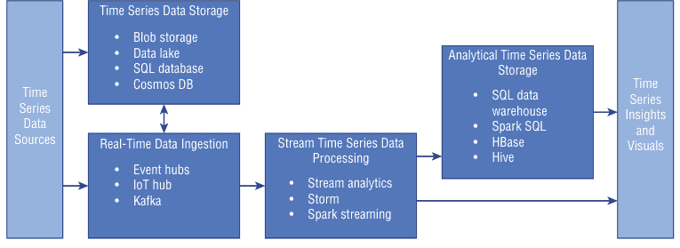

**图2.3：** 实时和流数据处理架构

## 第2章 ■ 如何设计端到端时间序列预测解决方案

有效的数据摄取流程始于对数据源的优先级排序、对单个文件的验证，以及将数据项路由到正确的目的地。此外，数据摄取管道将流数据和批处理数据从现有数据库和数据仓库移动到数据湖。

在数据收集阶段，数据科学家和架构师需要协同工作，通常评估两种不同类型的工具：时间序列数据收集工具和存储工具。

- *时间序列数据收集工具* – 时间序列数据收集工具是帮助你提取和组织原始数据的工具。例如 Stream Analytics，它是一个实时分析和复杂事件处理引擎，旨在同时分析和处理来自多个来源的大量快速流数据（aka.ms/AzureStreamAnalytics）。可以从包括设备、传感器、点击流、社交媒体源和应用程序在内的多个输入源中提取信息，并识别其中的模式和关系。这些模式可用于触发操作和启动工作流，例如创建警报、向报告工具提供信息，或存储转换后的数据以供后续使用。

另一个数据收集工具的例子是 Data Factory，这是一个为复杂的混合提取-转换-加载（ETL）、提取-加载-转换（ELT）和数据集成项目构建的托管云服务。它允许你创建数据驱动的工作流，以编排数据移动和大规模转换数据（aka.ms/AzureStreamAnalytics）。

- *数据存储工具* – 存储工具是允许你存储数据的数据库。这些工具以结构化或非结构化形式存储数据，并可以以集成的方式聚合来自多个平台的信息，例如 Cosmos DB：当今的应用程序需要高度响应且始终在线（aka.ms/MicrosoftCosmosDB）。为了实现低延迟和高可用性，这些应用程序的实例需要部署在靠近其用户的数据中心。Cosmos DB 是一个全球分布的多模型数据库服务，使你能够跨全球多个区域弹性且独立地扩展吞吐量和存储（www.aka.ms/MicrosoftCosmosDB）。

在需求预测的情况下，负荷数据需要持续且频繁地进行预测，我们必须确保原始数据通过一个坚实可靠的数据摄取流程流动。摄取过程必须保证原始数据在所需时间可用于预测过程。这意味着数据摄取频率应大于预测频率。

如果我们的需求解决方案每天早上8:00生成一次新的预测，那么我们需要确保过去24小时内收集的所有数据在那时已完全摄取，并且必须包括最后一小时的数据。

既然你对数据摄取有了更好的理解，我们就可以进行数据探索了。在下一节中，我们将更仔细地研究不同的数据探索技术，以便将数据的重要方面带入焦点，为后续的时间序列分析做准备。

## 数据探索与理解

数据探索是数据分析的第一步，通常涉及总结数据集的主要特征，包括其大小、准确性、数据中的初始模式以及其他属性。执行可靠和准确预测所需的原始数据源必须满足一些基本的数据质量标准。尽管可以使用高级统计方法来补偿一些可能的数据质量问题，但我们仍然需要确保在摄取新数据时达到一些基本的数据质量阈值（Lazzeri 2019b）。

以下是关于原始数据质量的一些考虑因素：

- *缺失值* – 这指的是特定测量未被收集的情况。这里的基本要求是，对于任何给定时间段，缺失值率不应大于10%。在单个值缺失的情况下，应使用预定义值（例如，‘9999’）来表示，而不是‘0’，因为‘0’可能是一个有效的测量值。
- *测量准确性* – 消耗量或温度的实际值应准确记录。不准确的测量将产生不准确的预测。通常，测量误差相对于真实值应低于1%。
- *测量时间* – 要求收集的数据的实际时间戳相对于实际测量的真实时间偏差不超过10秒。
- *同步性* – 当使用多个数据源（例如，消耗量和温度）时，我们必须确保它们之间没有时间同步问题。这意味着任何两个独立数据源收集的时间戳之间的时间差不应超过10秒。
- *延迟* – 正如前面在“数据摄取”部分所讨论的，我们依赖于可靠的数据流和摄取过程。为了控制这一点，我们必须确保控制数据延迟。这被指定为实际测量发生的时间与数据被加载的时间之间的时间差。

有效利用数据探索可以增强对数据领域特征的整体理解，从而能够创建更准确的模型。

数据探索提供了一组简单的工具来获得对数据的基本理解。数据探索的结果在把握数据结构、值的分布、极端值的存在以及数据集内的相互关系方面可能非常强大：这些信息为应用正确的进一步数据预处理和特征工程提供了指导（Lazzeri 2019b）。

一旦原始数据被摄取、安全存储并探索完毕，它就准备好被处理了。数据准备阶段基本上是获取原始数据并将其转换（转换、重塑）为适合建模阶段的形式。这可能包括简单的操作，例如直接使用原始数据列及其实际测量值、标准化值，以及更复杂的操作，例如时间滞后。新创建的数据列被称为数据特征，生成这些特征的过程被称为特征工程。在这个过程结束时，我们将得到一个从原始数据派生出来的新数据集，可用于建模。

## 数据预处理与特征工程

数据预处理和特征工程是数据科学家从数据集中清理异常值和缺失数据，并使用原始数据创建额外特征以馈送其机器学习模型的步骤。具体来说，特征工程是将数据转换为特征以作为机器学习模型输入的过程，高质量的特征有助于提高整体模型性能。特征也非常依赖于我们试图用机器学习解决方案解决的底层问题。

在机器学习中，特征是你试图分析的现象的一个可量化变量，通常由数据集中的一个列表示。考虑一个通用的二维数据集，每个观测值由一行表示，每个特征由一列表示，该列对于一个观测值将有一个特定的值，如图2.4所示。

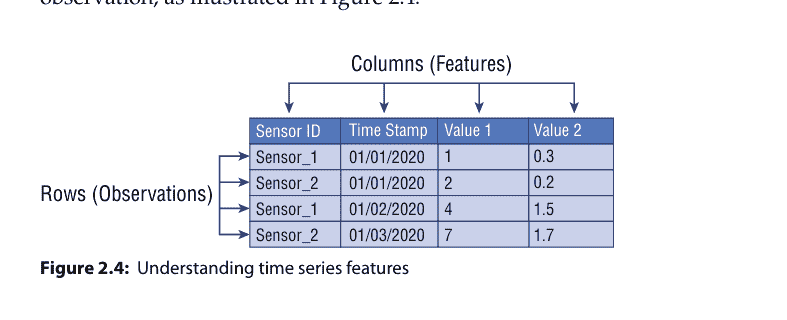

因此，如图2.4中的示例所示，每一行通常表示一个特征向量，所有观测值的整个特征集形成一个二维特征矩阵，也称为特征集。这类似于表示二维数据的数据框或电子表格。通常，机器学习算法处理这些数值矩阵或张量，因此大多数特征工程技术涉及将原始数据转换为这些算法可以轻松理解的某种数值表示。

根据数据集，特征可以分为两种主要类型：

- *固有原始特征* 通常已经是你的数据集的一部分，不需要额外的数据操作或特征工程，因为它们通常直接从数据源生成和收集。
- *派生特征* 通常通过数据操作或特征工程创建；在这个阶段，数据科学家需要从现有数据属性中提取特征。

以下列表包括一些包含在预测模型中的常见数据派生特征：

- *时间驱动特征*：这些特征源自日期/时间戳数据。它们被提取并转换为分类特征，例如：
    - 一天中的时间 – 这是一天中的小时，取值范围为0到23。
    - 星期几 – 这代表星期几，取值范围为1（星期日）到7（星期六）。
    - 月中的天 – 这代表实际日期，取值范围为1到31。
    - 一年中的月份 – 这代表月份，取值范围为1（一月）到12（十二月）。
    - 周末 – 这是一个二值特征，工作日取值为0，周末取值为1。
    - 假日 – 这是一个二值特征，普通日取值为0，假日取值为1。
    - 傅里叶项 – 傅里叶项是从时间戳派生出的权重，用于捕获数据中的季节性（周期）。由于我们的数据中可能有多个季节，我们可能需要多个傅里叶项。例如，需求值可能具有年度、每周和每日的季节/周期，这将导致三个傅里叶项。
- *独立测量特征*：独立特征包括我们希望用作模型中预测变量的所有数据元素。这里我们排除了需要预测的因变量特征。

## 建模与选择

建模阶段是将数据转换为模型的过程。该过程的核心是先进的算法，它们扫描历史数据（训练数据），提取模式，并构建模型。该模型随后可用于对未用于构建模型的新数据进行预测。

一旦我们有了一个可靠的工作模型，我们就可以用它来对包含所需特征的新数据进行评分。评分过程将使用持久化的模型（来自训练阶段的对象）来预测目标变量。

此时，区分机器学习中的训练集、验证集和测试集也很重要，如图2.5所示。


- *训练数据集* – 训练数据集代表数据科学家决定用于拟合机器学习模型的数据量。通过训练数据集，可以训练机器学习算法从历史数据中学习，以预测未来的数据点。
- *验证数据集* – 验证数据集是用于在调整模型超参数时，对在训练数据集上拟合的模型提供无偏评估的数据量。数据科学家通常利用验证数据集来微调机器学习模型的超参数。超参数是模型中的附加因素，其值用于控制并最终改进模型本身的学习过程。数据科学家观察验证集的结果来更新超参数的水平，从而改进他们的模型。
- *测试数据集* – 测试数据集是用于通过查看训练和测试数据集上的预测误差，来确定模型是欠拟合（模型在训练数据集上表现不佳）还是过拟合（模型在训练数据集上表现良好，但在测试数据集上表现不佳）的数据量。测试数据集仅在模型通过训练和验证数据集完全训练和验证后才使用。数据科学家通常利用测试数据集来评估不同的机器学习模型。

既然你更好地理解了这些数据集之间的区别，那么了解如何将数据集划分为训练集、验证集和测试集的建议也很重要。这个决定主要取决于两个因素：

- 我们数据中的样本总数
- 你正在训练的实际模型。

一些模型需要大量数据进行训练，因此在这种情况下，我们需要为更大的训练集进行优化。超参数很少的模型将易于验证和调整，因此我们可能可以减少验证集的大小，但如果我们的模型有许多超参数，我们也会希望拥有一个大的验证集。此外，如果我们必须处理没有超参数或超参数不易调整的模型，我们可能就不需要验证数据集。总而言之，与机器学习中的许多其他事情一样，训练-测试-验证的划分比例也相当具体于你的用例（Lazzeri 2019b）。

在接下来的章节中，我们将讨论一些最流行的经典时间序列技术和深度学习方法，以及如何将它们应用于你的数据，以构建、训练、测试和验证你的预测模型。其中一些技术将在第4章和第5章中更详细地讨论。

## 需求预测建模技术概述

准确预测未来序列的能力在许多行业至关重要：金融、供应链和制造业只是几个例子。经典的时间序列技术已经为这项任务服务了几十年，但现在深度学习方法——类似于计算机视觉和自动翻译中使用的方法——也有潜力彻底改变时间序列预测（Lazzeri 2019b）。

在需求预测的情况下，我们使用按时间排序的历史数据。我们通常将包含时间维度的数据称为时间序列。时间序列建模的目标是找到与时间相关的趋势、季节性和自相关性（随时间变化的相关性），并将这些形式化为一个模型。

近年来，已经开发了先进的算法来适应时间序列预测并提高预测准确性。我在这里简要讨论其中一些。这些信息并非旨在作为机器学习和预测的概述，而是作为需求预测中常用建模技术的简要调查。

- *移动平均（MA）* – 这是最早用于时间序列预测的分析技术之一，至今仍是最常用的技术之一。它也是更高级预测技术的基础。通过移动平均，我们通过平均最近的K个数据点来预测下一个数据点，其中K表示移动平均的阶数。移动平均技术具有平滑预测的效果，因此可能无法很好地处理数据中的大幅波动。
- *指数平滑* – 这是一系列使用最近数据点的加权平均值来预测下一个数据点的方法。其思想是为较新的值分配更高的权重，并为较旧的测量值逐渐降低此权重。该系列中有多种不同的方法，包括处理数据中的季节性，如Holt-Winters季节性方法。其中一些方法也考虑了数据的季节性。
- *自回归积分移动平均（ARIMA）* – 这是另一种常用于时间序列预测的方法系列。它实际上将自回归方法与移动平均相结合。自回归方法使用回归模型，通过取先前的时间序列值来计算下一个日期点。ARIMA方法还应用差分方法，包括计算数据点之间的差值并使用这些差值代替原始测量值。最后，ARIMA还使用了上面讨论的移动平均技术。所有这些方法以不同方式组合构成了ARIMA方法系列。ETS和ARIMA目前广泛用于需求预测和许多其他预测问题。在许多情况下，它们被组合在一起以提供非常准确的结果。
- *广义多元回归* – 这可能是机器学习和统计学领域中最重要的建模方法。在时间序列的背景下，我们使用回归来预测未来的值（例如需求）。在回归中，我们取预测变量的线性组合，并在训练过程中学习这些预测变量的权重（也称为系数）。目标是产生一条回归线来预测我们的预测值。当目标变量是数值型时，回归方法是合适的，因此也适用于时间序列预测。回归方法范围广泛，包括非常简单的回归模型（如线性回归）和更高级的模型（如决策树、随机森林、神经网络和提升决策树）。

由于其适用于许多现实问题，如欺诈检测、垃圾邮件过滤、金融和医学诊断，以及其产生可操作结果的能力，深度学习神经网络近年来受到了广泛关注。通常，深度学习方法已被开发并应用于单变量时间序列预测场景，其中时间序列由在相等时间增量上顺序记录的单个观测值组成（Lazzeri 2019a）。

因此，它们通常比朴素和经典预测方法（如指数平滑和ARIMA）表现更差。这导致了一种普遍的误解，即深度学习模型在时间序列预测场景中效率低下，许多数据科学家想知道是否真的有必要在他们的时间序列工具包中添加另一类方法，如卷积神经网络或循环神经网络。深度学习是机器学习算法的一个子集，它通过将输入数据表示为向量，并通过一系列巧妙的线性代数运算将其转换为给定输出来学习提取这些特征（Lazzeri 2019a）。

然后，数据科学家使用称为损失函数的方程来评估输出是否符合预期。该过程的目标是使用每次训练输入的损失函数结果来指导模型提取特征，以便在下一次传递中产生更低的损失值。这个过程已被用于聚类和分类大量信息，如数百万张卫星图像；来自YouTube的数千个视频和音频记录，以及来自Twitter的历史、文本和情感数据。

## 第2章 ■ 如何设计端到端时间序列预测解决方案

深度学习神经网络具有三大核心内在能力：

-   它们能够学习从输入到输出的任意映射关系。
-   它们支持多输入和多输出。
-   它们能够自动提取跨越长序列的输入数据中的模式。

得益于这三个特性，当数据科学家处理更复杂但仍然非常普遍的问题（例如时间序列预测）时，它们能提供巨大帮助。在尝试了不同的时间序列预测模型后，你需要根据你的数据和具体的时间序列场景选择最佳模型。模型选择是模型开发过程中不可或缺的一部分，在下一节中，我们将讨论模型评估如何帮助你找到最能代表你数据的最佳模型，并理解所选模型在未来的表现如何（Lazzeri 2019b）。

## 模型评估

模型评估在建模步骤中扮演着关键角色。在此步骤中，我们使用真实数据来验证模型及其性能。在建模阶段，我们使用部分可用数据来训练模型。在评估阶段，我们使用剩余的数据来测试模型。实际上，这意味着我们向模型输入新的数据，这些数据经过重构，并包含与训练数据集相同的特征。

然而，在验证过程中，我们使用模型来预测目标变量，而不是提供可用的目标变量。我们通常将此过程称为模型评分。然后，我们会使用真实的目标值并与预测值进行比较。这里的目标是衡量并最小化预测误差，即预测值与真实值之间的差异。

量化误差度量至关重要，因为我们希望微调模型并验证误差是否确实在减小。微调模型可以通过修改控制学习过程的模型参数，或通过添加或删除数据特征（称为参数扫描）来实现。实际上，这意味着我们可能需要在特征工程、建模和模型评估阶段之间多次迭代，直到能够将误差降低到所需水平。

需要强调的是，预测误差永远不会为零，因为没有任何模型能够完美预测每一个结果。然而，业务上存在一个可接受的误差范围。在验证过程中，我们希望确保模型的预测误差处于或优于业务容忍水平。因此，在问题制定阶段开始时设定可容忍误差的水平非常重要。

有多种方法可以衡量和量化预测误差。具体来说，有一种与时间序列相关的评估技术，特别是针对需求预测：MAPE。MAPE 代表平均绝对百分比误差。通过 MAPE，我们计算每个预测点与该点实际值之间的差异。然后，我们通过计算差异相对于实际值的比例来量化每个点的误差。最后一步，我们对这些值取平均值。用于 MAPE 的数学公式如下：

$$MAPE = \left( \frac{1}{n} \sum \frac{|Actual\ Values - Forecasted\ Values|}{|Actual\ Values|} \right) \times 100$$

MAPE 对尺度敏感，在处理低销量数据时不应使用。请注意，由于 *Actual Values* 也代表公式的分母，当实际需求为零时，MAPE 是未定义的。此外，当实际值不为零但非常小时，MAPE 通常会取极端值。这种尺度敏感性使得 MAPE 在作为低销量数据的误差度量时几乎毫无价值。

这里还有其他几种重要的评估技术需要提及：

-   *平均绝对偏差 (MAD)* – 该公式以单位衡量误差的大小。MAD 是分析单个项目误差时的良好统计量。但是，如果你对多个项目汇总 MAD，需要注意高销量产品可能会主导结果——稍后会详细讨论。MAPE 和 MAD 是迄今为止最常用的误差度量统计量。预测文献中有大量替代统计量，其中许多是 MAPE 和 MAD 的变体（Stellwagen 2011）。
-   *平均绝对偏差 (MAD)/均值比率* – 这是 MAPE 的一种替代方法，更适合间歇性和低销量数据。如前所述，当实际值等于零时无法计算百分比误差，并且在处理低销量数据时可能取极端值。当你开始对多个时间序列平均 MAPE 时，这些问题会被放大。MAD/均值比率试图通过将 MAD 除以均值来克服这个问题——本质上是重新缩放误差，使其在不同尺度的时间序列之间具有可比性。该统计量的计算正如其名称所示——它就是 MAD 除以均值（Stellwagen 2011）。
-   *几何平均相对绝对误差 (GMRAE)* – 该指标用于衡量样本外预测性能。它使用朴素模型（即，下一期的预测是本期的实际值）与当前选定模型之间的相对误差来计算。GMRAE 为 0.54 表示当前模型的误差大小仅为使用朴素模型对相同数据集生成的误差大小的 54%。由于 GMRAE 基于相对误差，它比 MAPE 和 MAD 对尺度的敏感性更低（Stellwagen 2011）。
-   *对称平均绝对百分比误差 (SMAPE)* – 这是 MAPE 的一种变体，其分母使用实际值的绝对值和预测值的绝对值的平均值来计算。一些人更喜欢使用此统计量而非 MAPE，并且它在几次预测竞赛中被用作准确性度量（Stellwagen 2011）。

在为预测解决方案选择最佳模型后，数据科学家通常需要部署它。在下一节中，我们将更仔细地研究部署过程，即你将机器学习模型集成到现有生产环境中以开始使用它基于数据做出实际业务决策的方法。这是机器学习生命周期的最后阶段之一。

## 模型部署

模型部署是你将机器学习模型集成到现有生产环境中以开始使用它基于数据做出实际业务决策的方法。它是机器学习生命周期的最后阶段之一，也可能是最繁琐的阶段之一。通常，组织的 IT 系统与传统的模型构建语言不兼容，迫使数据科学家和程序员花费宝贵的时间和精力重写它们（Lazzeri 2019c）。

一旦我们确定了建模阶段并验证了模型性能，我们就准备好进入部署阶段。在此上下文中，部署意味着使客户能够通过大规模运行实际预测来使用该模型。

机器学习模型部署是将机器学习算法转换为 Web 服务的过程。我们将此转换过程称为操作化：操作化机器学习模型意味着将其转换为可消费的服务并嵌入到现有生产环境中（Lazzeri 2019c）。

模型部署是机器学习模型工作流的基本步骤（图 2.6），因为通过机器学习模型部署，公司可以开始充分利用他们构建的预测和智能模型，基于模型结果发展业务实践，从而将自身转变为真正的数据驱动型企业。

## 第2章 ■ 如何设计端到端时间序列预测解决方案

当我们思考机器学习时，注意力会集中在机器学习工作流的关键组件上，例如数据源与摄取、数据管道、机器学习模型训练与测试、如何进行特征工程以及使用哪些变量来提高模型准确性。所有这些步骤都很重要；然而，思考如何随时间推移使用这些模型和数据，同样是每个机器学习管道中的关键步骤。只有当模型被部署并投入运营后，我们才能开始从模型的预测中提取真正的价值和业务效益（Lazzeri 2019c）。

成功的模型部署对于数据驱动型企业至关重要，原因如下：

- 部署机器学习模型意味着将模型提供给外部客户和/或公司内部的其他团队和利益相关者使用。
- 通过部署模型，公司内部的其他团队可以使用它们、向其发送数据并获取预测结果，这些结果反过来又被填充回公司系统，以提高训练数据的质量和数量。
- 一旦这个过程启动，公司将在生产环境中构建和部署更多的机器学习模型，并掌握将模型从开发环境迁移到业务运营系统的稳健且可重复的方法。

许多公司将机器赋能工作视为一种技术实践。然而，它更像是一项由业务驱动、始于公司内部的倡议；为了成为数据驱动型公司，至关重要的是，那些目前成功运营和理解业务的人员，需要与负责机器学习部署工作流的团队紧密合作（Lazzeri 2019c）。

从机器学习解决方案创建的第一天起，数据科学团队就应与业务对口人员进行互动。保持持续互动以理解模型*实验*过程，同时兼顾模型*部署*和*使用*步骤，这一点至关重要。大多数组织都在努力释放机器学习的潜力来优化其运营流程，并让数据科学家、分析师和业务团队使用同一种语言沟通。

此外，机器学习模型必须在历史数据上进行训练，这要求创建一个预测数据管道，这项活动涉及多项任务，包括数据处理、特征工程和调优。每一项任务，甚至到库的版本和缺失值的处理，都必须从开发环境精确复制到生产环境。有时，开发和生产中使用的技术差异会导致机器学习模型部署困难。

公司可以使用机器学习管道来创建和管理工作流，将机器学习各个阶段串联起来。例如，一个管道可能包括数据准备、模型训练、模型部署和推理/评分阶段。每个阶段可以包含多个步骤，每个步骤都可以在不同的计算目标上无人值守地运行。管道步骤是可重用的，如果该步骤的输出没有改变，则无需重新运行后续步骤即可再次运行。管道还允许数据科学家在机器学习工作流的不同领域协作（Lazzeri 2019c）。

对于希望通过机器学习转型运营的公司来说，构建、训练、测试并最终部署机器学习模型通常是一个繁琐而缓慢的过程。此外，即使经过数月的开发，交付了一个基于单一算法的机器学习模型，管理团队也几乎没有手段知道他们的数据科学家是否创建了一个优秀的模型，以及如何将其扩展和投入运营。

接下来，我将分享一些关于公司如何选择正确工具以成功进行模型部署的指导原则。我将使用 Azure 机器学习服务来说明这个工作流，但它也可以用于您选择的任何机器学习产品。

模型部署工作流应基于以下三个简单步骤（Lazzeri 2019c）：

- 注册模型 – 注册的模型是构成您模型的一个或多个文件的逻辑容器。例如，如果您的模型存储在多个文件中，您可以将它们作为单个模型注册到工作区中。注册后，您可以下载或部署注册的模型，并接收所有已注册的文件。当您创建 Azure 机器学习工作区时，机器学习模型会被注册。该模型可以来自 Azure 机器学习，也可以来自其他地方。
- 准备部署（指定资产、用途、计算目标） – 要将模型部署为 Web 服务，您必须创建推理配置（`inference config`）和部署配置。推理或模型评分是部署的模型用于预测的阶段，最常见的是在生产数据上进行。在推理配置中，您指定提供模型服务所需的脚本和依赖项。在部署配置中，您指定如何在计算目标上提供模型服务的详细信息。

入口脚本接收提交给已部署 Web 服务的数据并将其传递给模型。然后，它获取模型返回的响应并将其返回给客户端。该脚本特定于您的模型；它必须理解模型期望和返回的数据（Lazzeri 2019c）。该脚本包含两个用于加载和运行模型的函数：

- `init()` – 通常，此函数将模型加载到全局对象中。此函数仅在 Web 服务的 Docker 容器启动时运行一次。
- `run(input_data)` – 此函数使用模型根据输入数据预测值。运行的输入和输出通常使用 JSON 进行序列化和反序列化。您也可以处理原始二进制数据。您可以在将数据发送给模型之前或返回给客户端之前对其进行转换。

当您注册模型时，您提供一个模型名称，用于在 Azure 注册表中管理模型。您使用此名称与 `Model.get_model_path()` 一起检索本地文件系统上模型文件的路径。如果您注册的是一个文件夹或一组文件，此 API 将返回包含这些文件的目录路径。

- 将模型部署到计算目标 – 最后，在部署之前，您必须定义部署配置。部署配置特定于将托管 Web 服务的计算目标。例如，在本地部署时，您必须指定服务接受请求的端口。表 2.1 列出了可用于托管 Web 服务部署的计算目标或计算资源。

**表 2.1：** 可用于托管 Web 服务部署的计算目标示例

| 计算目标 | 用途 | 描述 |
| :--- | :--- | :--- |
| 本地 Web 服务 | 测试/调试 | 适用于有限的测试和故障排除。硬件加速取决于使用本地系统中的库。 |
| Notebook VM Web 服务 | 测试/调试 | 适用于有限的测试和故障排除。 |
| Azure Kubernetes 服务 (AKS) | 实时推理 | 适用于大规模生产部署。提供快速响应时间和部署服务的自动缩放。Azure 机器学习 SDK 不支持集群自动缩放。要更改 AKS 集群中的节点，请使用 Azure 门户中 AKS 集群的 UI。 |
| Azure 容器实例 (ACI) | 测试或开发 | 适用于需要 <48 GB RAM 的低规模、基于 CPU 的工作负载。 |
| Azure 机器学习计算 | 批量推理 | 在无服务器计算上运行批量评分。支持普通和低优先级虚拟机。 |
| Azure IoT Edge | IoT 模块 | 在 IoT 设备上部署和服务 ML 模型。 |
| Azure Data Box Edge | 通过 IoT Edge | 在 IoT 设备上部署和服务 ML 模块。 |

在部署需求预测解决方案时，我们感兴趣的是部署一个超越预测 Web 服务、促进整个数据流的端到端解决方案。当我们调用新的预测时，我们需要确保模型接收最新的数据特征。这意味着新收集的原始数据需要不断被摄取、处理并转换为模型构建所依据的所需特征集。

同时，我们希望将预测数据提供给最终消费客户。以下是能源需求预测周期中发生的步骤：

- 数百万个部署的数据仪表不断实时生成功耗数据。
- 这些数据被收集并上传到云存储库。
- 在处理之前，原始数据按照业务定义聚合到变电站或区域级别。
- 然后进行特征处理，生成模型训练或评分所需的数据——特征集数据存储在数据库中。
- 调用重新训练服务来重新训练预测模型——更新后的模型版本被持久化，以便评分 Web 服务可以使用。
- 按照适合所需预测频率的时间表调用评分 Web 服务。
- 预测数据存储在数据库中，最终消费客户端可以访问。
- 消费客户端检索预测结果，将其应用回电网，并根据所需的用例进行消费。

如图 2.7 所示，在我们构建了一组性能良好的模型之后，我们可以将其投入运营，供其他应用程序使用。

## 预测解决方案的验收

在时间序列预测解决方案开发的最后阶段，数据科学家需要确认流程、模型及其在生产环境中的部署是否满足客户和最终用户的目标。假设一个组织具备所有正确的要素，包括合适的员工文化，他们仍然需要一个合适的技术平台来支持数据科学家的生产力，并帮助他们快速创新和迭代。一个现代化的云分析环境将使收集数据、分析、实验以及快速将成果部署给特定客户群体变得异常简单。这种能力正成为数据驱动型组织（无论规模大小）的必备条件（Lazzeri 2019c）。

如果没有这样的平台，数据科学家将难以快速进行大量实验的迭代，无法从失败和成功中迅速学习，也无法从数据中发现有趣且可操作的洞察。缺乏正确的文化、基础设施和工具，组织最终将发现自己落后于更灵活的竞争对手。

在客户验收阶段，主要涉及两项任务：

- *系统验证* – 确认已部署的模型和流程满足客户需求。
- *项目交接* – 将项目移交给将在生产环境中运行该系统的实体（Lazzeri 2019b）。

客户应验证系统是否满足其业务需求，以及系统是否能以可接受的准确度回答问题，以便将系统部署到生产环境中供其客户应用程序使用。所有文档都已定稿并经过审查。项目移交给负责运营的实体。该实体可能是，例如，IT部门、客户数据科学团队或负责在生产环境中运行系统的客户代理。

成功驾驭这些文档的能力，很可能决定基于机器学习的预测解决方案的可行性和持久性。

为了使这些数据科学生命周期更加具体，我现在将介绍一个需求预测用例，该用例将在本书中贯穿使用，用于解释说明并展示一些预测场景和示例代码。

## 用例：需求预测

在本节最后，我将介绍一个真实世界的数据科学场景，我将在本书中贯穿使用它来展示目前讨论的一些概念、步骤和技术：需求预测用例。我相信每个人都必须学会如何巧妙地处理海量数据，因此本书包含了大型数据集，这些数据集是开放且可免费访问的。

在过去的几年里，物联网、替代能源和大数据融合在一起，在公用事业和能源领域创造了巨大的机遇。与此同时，公用事业和整个能源行业看到消费趋于平稳，消费者要求更好的方式来控制其能源使用。因此，公用事业和智能电网公司迫切需要创新和自我更新。此外，许多电力和公用事业电网正在变得过时，维护和管理成本非常高昂。

在能源领域，需求预测可以通过多种方式帮助解决关键的业务问题。事实上，需求预测可以被视为该行业许多核心用例的基础。通常，我们考虑两种类型的能源需求预测：短期和长期。每种预测可能服务于不同的目的并采用不同的方法。两者之间的主要区别在于预测的时间范围，即我们预测的未来时间跨度。

在能源需求的背景下，短期负荷预测定义为对电网各部分（或整个电网）在不久的将来聚合负荷的预测。在此背景下，*短期*定义为1小时到24小时的时间范围。在某些情况下，48小时的时间范围也是可能的。因此，短期负荷预测在电网的运营用例中非常常见。

短期负荷预测模型主要基于近期（过去一天或一周）的消费数据，并使用预测温度作为重要的预测因子。如今，获取未来一小时至24小时的准确温度预测已不那么具有挑战性。这些模型对季节性模式或长期消费趋势不太敏感。

短期负荷预测解决方案也可能产生大量的预测调用（服务请求），因为它们是按小时调用的，在某些情况下甚至频率更高。同样常见的是，每个单独的变电站或变压器都表示为一个独立模型，因此预测请求的数量甚至更大。

长期负荷预测的目标是预测时间范围从一周到数月（在某些情况下为数年）的电力需求。这个时间范围主要适用于规划和投资用例。

对于长期场景，拥有覆盖多年（至少三年）的高质量数据非常重要。这些模型通常会从历史数据中提取季节性模式，并利用外部预测因子，如天气和气候模式。

需要明确的是，预测时间范围越长，预测的准确性可能越低。因此，除了实际预测值外，生成一些置信区间非常重要，这将允许人们在规划过程中考虑可能的变异。

由于长期负荷预测的消费场景主要是规划，我们可以预期预测量要低得多（与短期负荷预测相比）。我们通常会看到这些预测嵌入到可视化工具（如Excel或PowerBI）中，并由用户手动调用。

表2.2比较了短期和长期预测在最重要属性方面的差异。

### 表2.2：短期与长期预测对比

| 属性 | 短期负荷预测 | 长期负荷预测 |
| :--- | :--- | :--- |
| **预测时间范围** | 1小时至48小时 | 1至6个月或更长 |
| **数据粒度** | 小时级 | 小时级或日级 |
| **典型用例** | 需求/供应平衡<br>峰值小时预测<br>需求响应 | 长期规划<br>电网资产规划<br>资源规划 |
| **典型预测因子** | 日或周<br>一天中的小时<br>小时温度 | 月份<br>日期<br>长期温度和气候 |
| **历史数据范围** | 两到三年的数据 | 五到十年的数据 |
| **典型准确度** | MAPE（平均绝对百分比误差）5%或更低 | MAPE（平均绝对百分比误差）25%或更低 |
| **预测频率** | 每小时或每24小时生成一次 | 每月、每季度或每年生成一次 |

从表2.2可以看出，区分短期和长期预测场景非常重要，因为它们代表了不同的业务需求，并且可能具有不同的部署和消费模式。

任何基于高级分析的解决方案都依赖于数据。具体来说，当涉及预测分析和预测时，我们依赖于持续、动态的数据流。在能源需求预测的情况下，这些数据可以直接从智能电表获取，或者已经聚合在本地数据库中。我们还依赖其他外部数据源，例如天气和温度。这种持续的数据流必须被编排、调度和存储。

对于这个特定的用例，我们将使用来自GEFCom2014竞赛的公共数据集“负荷预测数据”。GEFCom2014的负荷预测赛道是关于概率负荷预测的。完整数据作为我们GEFCom2014论文的附录发布：（Hong et al. 2016）。

在本书的其余部分，您可以从aka.ms/EnergyDataSet下载该数据集。该数据集包含三年的小时级电力负荷和2012年至2014年间的温度值。一个准确且快速的预测需要实施三个预测模型：

- 长期模型，能够预测未来几周或几个月的用电量
- 短期模型，能够预测未来一小时内的过载情况
- 温度模型，能够在多种情景下预测未来温度

由于温度是长期模型的重要预测因子，因此需要持续生成多情景温度预测，并将其作为输入馈送到长期模型中。此外，为了在短期内获得更高的预测精度，需要为一天中的每个小时建立一个更精细的模型。

在确定了所需的数据源后，我们希望确保收集到的原始数据包含正确的数据特征。为了构建一个可靠的需求预测模型，我们需要确保收集的数据包含能够帮助预测未来需求的数据元素。以下是关于原始数据结构（模式）的一些基本要求。

原始数据由行和列组成。每次测量表示为单行数据。每行数据包含多列（也称为特征或字段）：

- *时间戳* – 时间戳字段表示测量记录的实际时间。它应符合常见的日期/时间格式之一。应同时包含日期和时间部分。在大多数情况下，不需要将时间记录到秒级精度。指定数据记录所在的时区非常重要。
- *负荷值* – 这是给定日期/时间的实际消耗量。消耗量可以用kWh（千瓦时）或任何其他首选单位来衡量。需要注意的是，测量单位必须在数据中的所有测量值中保持一致。在某些情况下，消耗量可能通过三个电力相位提供。在这种情况下，我们需要收集所有独立的消耗相位。
- *温度* – 温度通常从独立来源收集。但是，它应与消耗数据兼容。它应包含如上所述的时间戳，以便与实际消耗数据同步。温度值可以用摄氏度或华氏度指定，但应在所有测量值中保持一致。

我们将在本书接下来的几章中使用这个需求预测用例来讨论许多经典方法、机器学习方法和深度学习方法。

## 结论

本第二章的目的是从实践角度提供一个端到端的时间序列预测系统模板：我介绍了一些构建端到端时间序列预测解决方案的最重要概念。

具体来说，我们详细讨论了以下概念：

- *时间序列预测模板* – 这是一系列任务，从定义业务问题开始，一直到部署并准备好供外部或公司内部使用的时间序列预测模型。

我们的模板基于以下步骤：

- *业务理解和性能指标定义* – 业务理解和性能指标定义步骤概述了我们在做出投资决策之前需要理解和考虑的业务方面。
- *数据摄取* – 数据摄取是收集和导入数据以进行清理和分析或存储在数据库中的过程。
- *数据探索和理解* – 一旦原始数据被摄取并安全存储，就可以进行探索和理解。
- *数据预处理和特征工程* – 数据预处理和特征工程是数据科学家清理数据集中的异常值和缺失数据，并使用原始数据创建额外特征以馈送到其机器学习模型中的步骤。
- *模型构建和选择* – 建模阶段是将数据转换为模型的过程。该过程的核心是扫描历史数据（训练数据）、提取模式并构建模型的高级算法。该模型随后可用于预测未用于构建模型的新数据。
- *模型部署* – 部署是将机器学习模型集成到现有生产环境中以开始使用它基于数据做出实际业务决策的方法。它是机器学习生命周期的最后阶段之一。
- *预测解决方案验收* – 在时间序列预测解决方案部署的最后阶段，数据科学家需要确认和验证管道、模型及其在生产环境中的部署是否满足其成功标准。
- *用例：需求预测* – 在本章末尾，我介绍了一个真实世界的数据科学场景，我们将在本书中使用它来展示所讨论的一些时间序列概念、步骤和技术。

在下一章“时间序列数据准备”中，我们将讨论一些最受欢迎的时间序列数据准备概念和技术。具体来说，我们将更仔细地研究处理时间序列数据时的重要步骤：

- 用于时间序列数据的Python
- 时间序列数据探索和理解
- 时间序列特征工程

# 第3章

## 3 时间序列数据准备

在本章中，我将引导你完成为预测模型准备时间序列数据的最重要步骤。*数据准备*是转换原始数据的实践，以便数据科学家可以将其输入机器学习算法以发现洞察，并最终做出预测。

每个机器学习算法都期望以特定格式的数据作为输入，因此时间序列数据集通常需要一些清理和特征工程过程，然后才能生成有用的洞察。时间序列数据集可能有缺失值或包含异常值，因此数据准备和清理阶段至关重要。由于时间序列数据具有时间属性，只有一些统计方法适用于时间序列数据。良好的时间序列数据准备会产生干净且精心策划的数据，从而带来更实用、更准确的预测。

具体来说，在本章中我们将讨论以下内容：

- *用于时间序列数据的Python* – Python是一种非常强大的数据处理编程语言，为时间序列数据提供了各种库套件，并为时间序列分析提供了出色的支持。在第3章的这一节中，你将看到SciPy、NumPy、Matplotlib、pandas、statsmodels和scikit-learn等库如何帮助你准备、探索和分析时间序列数据。
- *时间序列探索和理解* – 在第3章的这一节中，你将学习探索、分析和理解时间序列数据的第一步。具体来说，本节将重点介绍如何开始时间序列数据分析以及如何计算和审查时间序列数据的摘要统计信息；然后你将学习如何对时间序列中的缺失时段进行数据清理；最后，你将看到如何执行时间序列数据的归一化和标准化。
- *时间序列特征工程* – 特征工程是使用原始数据创建额外特征或变量以增强数据集的过程。在第3章的这一节中，你将学习如何对时间序列数据执行特征工程，目标有两个：准备符合机器学习算法要求的适当输入时间序列数据集；以及提高机器学习模型的性能。如果特征工程执行正确，它会在新的输入特征和输出特征之间建立更强的关系，以便监督学习算法进行建模。

让我们开始学习如何轻松使用Python并利用多个库来准备和分析时间序列数据。

## 用于时间序列数据的Python

由于出色的库支持，Python目前是时间序列数据最主流的平台之一。有一些用于时间序列的Python库，如图3.1所示。

如图3.1所示，SciPy是一个基于Python的开源软件生态系统，用于数学、科学和工程。它包括用于统计、优化、积分、线性代数、傅里叶变换、信号和图像处理、常微分方程求解器等的模块。你可以在以下链接中找到有关SciPy的更多信息：

- 网站：scipy.org/
- 文档：docs.scipy.org/
- 源代码：github.com/scipy/scipy
- 错误报告：github.com/scipy/scipy/issues
- 行为准则：scipy.github.io/devdocs/dev/conduct/code_of_conduct.html

SciPy旨在与NumPy数组一起工作，并提供许多用户友好且高效的数值例程，例如用于数值积分和优化的例程。它们易于使用、安装，并可在所有流行的操作系统上运行。

NumPy是用于Python科学计算的基础包。它包含（但不限于）以下组件：

- 强大的N维数组对象
- 复杂的（广播）函数
- 集成C/C++和Fortran代码的工具
- 实用的线性代数、傅里叶变换和随机数功能

NumPy是一个实用的Python库，也可用作通用数据的多维容器。这一额外功能使NumPy能够高效快速地处理多种不同的数据库。您可以通过以下链接找到更多关于SciPy的信息：

- 网站：numpy.org
- 文档：docs.scipy.org/
- 源代码：github.com/numpy/numpy
- 错误报告：github.com/numpy/numpy/issues
- 贡献：numpy.org/devdocs/dev/index.html

Matplotlib是一个基于NumPy数组构建的数据可视化库，旨在与更广泛的SciPy生态系统协同工作。它是一个完整的数据绘图库，允许数据科学家构建动态和交互式的可视化图表。此外，它还允许数据科学家连接并处理大量数据，以构建敏捷的可视化效果。

Matplotlib可用于Python脚本、Python和IPython shell、Web应用程序服务器以及各种图形用户界面工具包。您可以通过以下链接找到更多关于Matplotlib的信息：

- 网站：matplotlib.org/
- 文档：matplotlib.org/users/index.html
- 源代码：github.com/matplotlib/matplotlib
- 错误报告：github.com/matplotlib/matplotlib/issues
- 贡献：matplotlib.org/devdocs/devel/contributing.html

有三个更高级的SciPy库为Python中的时间序列预测提供了关键特性：

- pandas
- statsmodels
- scikit-learn

pandas建立在NumPy包之上，是数据科学家用于导入和分析数据的一个非常方便且流行的包。pandas的主要数据结构是*DataFrame*，这是一个包含行和命名列的数据表。pandas提供了时间序列特定的功能，例如日期范围生成和频率转换、移动窗口统计、日期偏移和滞后。您可以通过以下链接找到更多关于pandas的信息：

- 网站：pandas.pydata.org/
- 文档：pandas.pydata.org/docs/user_guide/index.html
- 源代码：github.com/pandas-dev/pandas
- 错误报告：github.com/pandas-dev/pandas/issues
- 贡献：pandas.pydata.org/docs/development/index.html

statsmodels是一个Python模块，它使用pandas DataFrames支持广泛的统计函数和类。数据科学家也用它来进行统计检验和统计数据探索。您可以通过以下链接找到更多关于statsmodels的信息：

- 网站：statsmodels.org/
- 文档：statsmodels.org/stable/user-guide.html
- 源代码：github.com/statsmodels/statsmodels
- 错误报告：github.com/statsmodels/statsmodels/issues
- 贡献：github.com/statsmodels/statsmodels/blob/master/CONTRIBUTING.rst

scikit-learn是一个主要用Python编写，并基于NumPy、SciPy和Matplotlib构建的库。该库为机器学习和统计建模提供了许多有用的功能，包括支持向量机、随机森林、k近邻、分类、回归和聚类。您可以通过以下链接找到更多关于scikit-learn的信息：

- 网站：scikit-learn.org/stable/
- 文档：scikit-learn.org/stable/user_guide.html
- 源代码：github.com/scikit-learn/scikit-learn
- 错误报告：github.com/scikit-learn/scikit-learn/issues
- 贡献：scikit-learn.org/stable/developers/contributing.html

在本章的剩余部分，我们将更深入地探讨Numpy、Matplotlib和pandas如何对处理时间序列数据非常有帮助，而在接下来的章节中，我们将分别讨论如何使用statsmodels和scikit-learn进行时间序列建模和机器学习。

## 第3章 ■ 时间序列数据准备

### 时间序列的常见数据准备操作

pandas (pandas.pydata.org) 提供了多样化的功能组合来支持时间序列数据。以下关键特性对于pandas中的时间序列预测非常重要：

- 从各种来源和格式解析时间序列信息
- 生成固定频率的日期和时间跨度序列
- 操作和转换带有时区信息的日期时间
- 将时间序列重采样或转换为特定频率
- 使用绝对或相对时间增量执行日期和时间算术运算

pandas涵盖了四个通用的时间相关概念：

- *日期时间*：一个特定的日期和时间，支持时区，例如月、日、年、小时、秒、微秒。
- *时间增量*：用于操作日期的绝对时间持续时间。
- *时间跨度*：由一个时间点及其相关频率定义的时间持续时间。
- *日期偏移*：遵循日历算术的相对时间持续时间。

如表3.1所示，这四个通用的时间相关概念具有不同的特性和主要的创建方法。

表3.1：pandas支持的四种通用时间相关概念

| 概念 | 标量类 | 数组类 | 数据类型 | 创建方法 |
| :--- | :--- | :--- | :--- | :--- |
| 日期时间 | 时间戳 | DatetimeIndex | datetime64[ns] 或 datetime64[ns, tz] | to_datetime 或 date_range |
| 时间增量 | Timedelta | TimedeltaIndex | timedelta64[ns] | to_timedelta 或 timedelta_range |
| 时间跨度 | Period | PeriodIndex | period[freq] | Period 或 period_range |
| 日期偏移 | DateOffset | None | None | DateOffset |

在表3.1中，对于Python新手来说，有几个额外的概念需要解释：

- *标量类*：标量类是一个单独的数值，定义了一个向量空间。由多个标量描述的量（例如同时具有方向和大小）称为向量。
- *数组类*：数组类是一种数据结构，用于保存固定数量的相同数据类型的值。
- *数据类型*：数据类型是对不同数据对象的标记。它表示数据集中值的类型，用于理解如何存储和操作数据。
- *主要创建方法*：一组通常编写和使用的函数和操作，用于对数据执行单个或一组操作。如果编写得当，函数可以为您的Python代码提供更好的效率、可重复性和模块化。

在接下来的几节中，我们将讨论一些使用pandas处理时间序列数据时最常用的操作。

### 时间戳与时间段

Python中的pandas库为时间序列数据提供了全面且内置的支持。以下示例以及本章其余部分将重点介绍能源需求预测。通常，需求预测是利用历史需求数据来预测未来需求（或特定产品和服务的数量），从而为未来的计划（如规划产品库存优化策略、分配营销投资以及估算满足客户需求的新产品和服务的成本）做出明智的商业决策。

能源需求预测是需求预测的一种类型，其目标是预测能源电网上的未来负荷（或能源需求）。对于能源行业的公司来说，这是一项关键的业务运营，因为运营商需要在电网消耗的能源和供应给它的能源之间保持微妙的平衡。通常，电网运营商可以做出短期决策来管理向电网的能源供应并保持负荷平衡。因此，准确的短期能源需求预测对于运营商自信地做出这些决策至关重要。本场景详细介绍了构建机器学习能源需求预测解决方案的过程。

让我们首先看看*时间戳*数据的概念，这是最基本的时间序列数据类型，可帮助您将值与特定时间点相结合。这意味着您数据集中的每个数据点都将具有您可以利用的时间信息，如下方示例代码所示：

```python
# import necessary Python packages
import pandas as pd
import datetime as dt
import numpy as np

pd.Timestamp(dt.datetime(2014, 5, 1))

# or we can use
pd.Timestamp('2014-06-01')

# or we can use
pd.Timestamp(2014, 6, 1)
```

这些示例的结果将如下所示：

```
Timestamp('2014-06-01 00:00:00')
```

在许多时间序列场景中，将数据集中的数据点链接到时间区间也可能很有用。`Period`表示的时间区间可以从日期时间字符串格式推断出来，如下例所示：

```python
pd.Period('2014-06')
```

输出：

```
Period('2014-06', 'M')
```

其中'M'代表月份。`Period`表示的时间区间也可以显式指定：

```python
pd.Period('2014-06', freq='D')
```

输出：

```
Period('2014-06-01', 'D')
```

其中'D'代表天。`Timestamp`和`Period`也可以用作索引：在这种情况下，`Timestamp`和`Period`的列表会分别被自动转换为`DatetimeIndex`和`PeriodIndex`。让我们从`Timestamp`开始，如下例所示：

```python
dates = [pd.Timestamp('2014-06-01'),
        pd.Timestamp('2014-06-02'),
        pd.Timestamp('2014-06-03')]

ts_data = pd.Series(np.random.randn(3), dates)

type(ts_data.index)
```

输出：
`pandas.core.indexes.datetimes.DatetimeIndex`

如果我们想查看索引格式，可以运行以下代码：

```python
ts_data.index
```

输出：
`DatetimeIndex(['2014-06-01', '2014-06-02', '2014-06-03'], dtype='datetime64[ns]', freq=None)`

现在让我们看看时间戳的输出：

```python
ts_data
```

输出：

```
2014-06-01   -0.28
2014-06-02    0.41
2014-06-03   -0.53
dtype: float64
```

现在让我们用`Period`重复这个练习：

```python
periods = [pd.Period('2014-01'), pd.Period('2014-02'), pd.Period('2014-03')]
ts_data = pd.Series(np.random.randn(3), periods)
type(ts_data.index)
```

输出：
`pandas.core.indexes.period.PeriodIndex`

如果我们想查看索引格式，可以运行以下代码：

```python
ts_data.index
```

输出：

```
PeriodIndex(['2014-01', '2014-02', '2014-03'], dtype='period[M]',
           freq='M')
```

现在让我们看看时间戳的输出：

```python
ts_data
```

输出：

```
2014-01    0.43
2014-02   -0.10
2014-03   -0.04
Freq: M, dtype: float64
```

正如你从前面的例子中看到的，pandas允许你捕获这两种表示形式并在它们之间进行转换。pandas使用`Timestamp`的实例来表示时间戳，使用`DatetimeIndex`的实例来表示时间戳序列。

## 转换为时间戳

通常，数据科学家会将数据集中的时间组件或包含日期的列表示为Series或DataFrame的索引，以便可以针对时间元素执行数据预处理和清理操作。下面的示例显示，当传入一个Series时，这会返回一个具有相同索引的Series：

```python
pd.to_datetime(pd.Series(['Jul 31, 2012', '2012-01-10', None]))
```

输出将是

```
0   2012-07-31
1   2012-01-10
2          NaT
dtype: datetime64[ns]
```

另一方面，下面的示例显示，当传入一个类列表对象时，这会被转换为`DatetimeIndex`：

```python
pd.to_datetime(['2012/11/23', '2012.12.31'])
```

输出将是

```
DatetimeIndex(['2012-11-23', '2012-12-31'], dtype='datetime64[ns]',
              freq=None)
```

最后，如果你使用的日期是以日开头的（即欧洲风格），你可以传递`dayfirst`标志：

```python
pd.to_datetime(['04-01-2014 10:00'], dayfirst=True)
```

输出将是

```
DatetimeIndex(['2014-01-04 10:00:00'], dtype='datetime64[ns]',
              freq=None)
```

`dayfirst`标志也适用于多个日期，如下例所示：

```python
pd.to_datetime(['14-01-2014', '01-14-2012'], dayfirst=True)
```

输出将是

```
DatetimeIndex(['2014-01-14', '2012-01-14'], dtype='datetime64[ns]',
              freq=None)
```

## 提供格式参数

除了必需的日期时间字符串外，还可以传递`format`参数以确保特定的解析并定义时间变量的结构和顺序，如下例所示：

```python
pd.to_datetime('2018/11/12', format='%Y/%m/%d')
```

输出将是

```
Timestamp('2018-11-12 00:00:00')
```

如果你还需要在日期中定义小时和分钟，可以按如下方式格式化时间序列数据：

```python
pd.to_datetime('11-11-2018 00:00', format='%d-%m-%Y %H:%M')
```

输出将是

```
Timestamp('2018-11-11 00:00:00')
```

此外，`date`、`datetime`和`time`对象都支持`strftime(format)`方法，用于在显式格式字符串的控制下创建表示时间的字符串。另一方面，`datetime.strptime()`类方法从表示日期和时间的字符串以及相应的格式字符串创建`datetime`对象。

换句话说，`strptime()`和`strftime()`是两种流行的方法，用于将对象从字符串转换为datetime对象，反之亦然。`strptime()`可以读取包含日期和时间信息的字符串并将其转换为datetime对象，而`strftime()`将datetime对象转换回字符串。

表3.2提供了`strftime()`与`strptime()`方法的高级比较。

表3.2：strftime()和strptime()功能比较

| 功能能力 | STRFTIME | STRPTIME |
| :--- | :--- | :--- |
| 功能能力 | 根据给定格式将对象转换为字符串 | 根据相应格式将字符串解析为datetime对象 |
| 功能方法 | 实例方法 | 类方法 |
| 支持该功能的Python对象 | date; datetime; time | datetime |
| 功能签名 | strftime(format) | strptime(date_string, format) |

# 索引

pandas有一个非常有用的数据配置和对齐方法，称为reindex()。这是一种非常方便的技术，尤其是在数据科学家必须处理依赖标签对齐功能的数据集时。换句话说，重新索引你的数据集意味着调整所有数据点以遵循沿特定轴的给定标签集。

此外，DatetimeIndex可以用作包含时间序列结构的pandas对象的索引。DatetimeIndex对象具有常规Index对象的基本功能，还提供了用于频率处理、选择和切片的高级时间序列特定方法，如下例所示，这些示例使用了我们的ts_data集。

让我们首先导入必要的Python包来下载数据集：

```python
# import necessary Python packages to download the data set
import os
from common.utils import load_data
from common.extract_data import extract_data

# adjust the format of the data set
pd.options.display.float_format = '{:,.2f}'.format
np.set_printoptions(precision=2)
```

然后我们可以下载我们的ts_data集：

```python
# download ts_data set
# change the name of the directory with your folder name
data_dir = './energy'

if not os.path.exists(os.path.join(data_dir, 'energy.csv')):
    # download and move the zip file
    !wget https://mlftsfwp.blob.core.windows.net/mlftsfwp/GEFCom2014.zip
```

继续（续）

```python
!mv GEFCom2014.zip ./energy
# if not done already, extract zipped data and save as csv
extract_data(data_dir)
```

最后，我们需要将CSV文件中的数据加载到pandas DataFrame中。在下面的具体示例中，我们选择并仅使用ts_data集的load列，并将其命名为ts_data_load：

```python
# load the data from csv into a pandas dataframe
ts_data_load = load_data(data_dir)[['load']]
ts_data_load.head()
```

DatetimeIndex可以用作包含时间序列结构的pandas对象的索引，如下例所示：

```python
ts_data_load.index
```

输出将是

```
DatetimeIndex(['2012-01-01 00:00:00', '2012-01-01 01:00:00',
               '2012-01-01 02:00:00', '2012-01-01 03:00:00',
               '2012-01-01 04:00:00', '2012-01-01 05:00:00',
               '2012-01-01 06:00:00', '2012-01-01 07:00:00',
               '2012-01-01 08:00:00', '2012-01-01 09:00:00',
               ...
               '2014-12-31 14:00:00', '2014-12-31 15:00:00',
               '2014-12-31 16:00:00', '2014-12-31 17:00:00',
               '2014-12-31 18:00:00', '2014-12-31 19:00:00',
               '2014-12-31 20:00:00', '2014-12-31 21:00:00',
               '2014-12-31 22:00:00', '2014-12-31 23:00:00'],
              dtype='datetime64[ns]', length=26304, freq='H')
```

现在让我们切片我们的ts_data集，以仅访问时间序列的特定部分：

```python
ts_data_load[:5].index
```

以及

```python
ts_data_load[::2].index
```

输出将分别是

```
DatetimeIndex(['2012-01-01 00:00:00', '2012-01-01 01:00:00',
               '2012-01-01 02:00:00', '2012-01-01 03:00:00',
               '2012-01-01 04:00:00'],
              dtype='datetime64[ns]', freq='H')
```

并且

```
DatetimeIndex(['2012-01-01 00:00:00', '2012-01-01 02:00:00',
               '2012-01-01 04:00:00', '2012-01-01 06:00:00',
               '2012-01-01 08:00:00', '2012-01-01 10:00:00',
               '2012-01-01 12:00:00', '2012-01-01 14:00:00',
               '2012-01-01 16:00:00', '2012-01-01 18:00:00',
               ...
               '2014-12-31 04:00:00', '2014-12-31 06:00:00',
               '2014-12-31 08:00:00', '2014-12-31 10:00:00',
               '2014-12-31 12:00:00', '2014-12-31 14:00:00',
               '2014-12-31 16:00:00', '2014-12-31 18:00:00',
               '2014-12-31 20:00:00', '2014-12-31 22:00:00'],
              dtype='datetime64[ns]', length=13152, freq='2H')
```

为了方便访问更长的时间序列，你也可以将年份或年份和月份作为字符串传入：

```
ts_data_load['2011-6-01']
```

输出结果将是

```
load
2012-06-01 00:00:00    2,474.00
2012-06-01 01:00:00    2,349.00
2012-06-01 02:00:00    2,291.00
2012-06-01 03:00:00    2,281.00
2012-06-01 04:00:00    2,343.00
2012-06-01 05:00:00    2,518.00
2012-06-01 06:00:00    2,934.00
2012-06-01 07:00:00    3,235.00
2012-06-01 08:00:00    3,348.00
2012-06-01 09:00:00    3,405.00
2012-06-01 10:00:00    3,459.00
2012-06-01 11:00:00    3,479.00
2012-06-01 12:00:00    3,478.00
2012-06-01 13:00:00    3,495.00
2012-06-01 14:00:00    3,473.00
2012-06-01 15:00:00    3,439.00
2012-06-01 16:00:00    3,404.00
2012-06-01 17:00:00    3,337.00
2012-06-01 18:00:00    3,291.00
2012-06-01 19:00:00    3,261.00
2012-06-01 20:00:00    3,309.00
2012-06-01 21:00:00    3,197.00
2012-06-01 22:00:00    2,916.00
2012-06-01 23:00:00    2,619.00
```

下面的示例指定了一个结束时间，该时间包含了我们 `ts_data` 数据集中最后一天的所有时间点：

```
ts_data_load['2012-1':'2012-2-28']
```

输出结果将是

```
load
2012-01-01 00:00:00    2,698.00
2012-01-01 01:00:00    2,558.00
2012-01-01 02:00:00    2,444.00
2012-01-01 03:00:00    2,402.00
2012-01-01 04:00:00    2,403.00
2012-01-01 05:00:00    2,453.00
2012-01-01 06:00:00    2,560.00
2012-01-01 07:00:00    2,719.00
2012-01-01 08:00:00    2,916.00
2012-01-01 09:00:00    3,105.00
2012-01-01 10:00:00    3,174.00
2012-01-01 11:00:00    3,180.00
2012-01-01 12:00:00    3,184.00
2012-01-01 13:00:00    3,147.00
2012-01-01 14:00:00    3,122.00
2012-01-01 15:00:00    3,137.00
2012-01-01 16:00:00    3,486.00
2012-01-01 17:00:00    3,717.00
2012-01-01 18:00:00    3,659.00
2012-01-01 19:00:00    3,513.00
2012-01-01 20:00:00    3,344.00
2012-01-01 21:00:00    3,129.00
2012-01-01 22:00:00    2,873.00
2012-01-01 23:00:00    2,639.00
2012-01-02 00:00:00    2,458.00
2012-01-02 01:00:00    2,354.00
2012-01-02 02:00:00    2,294.00
2012-01-02 03:00:00    2,288.00
2012-01-02 04:00:00    2,353.00
2012-01-02 05:00:00    2,503.00
... ...
2012-02-27 18:00:00    3,966.00
2012-02-27 19:00:00    3,845.00
2012-02-27 20:00:00    3,626.00
2012-02-27 21:00:00    3,355.00
2012-02-27 22:00:00    3,070.00
2012-02-27 23:00:00    2,837.00
2012-02-28 00:00:00    2,681.00
2012-02-28 01:00:00    2,584.00
2012-02-28 02:00:00    2,539.00
2012-02-28 03:00:00    2,535.00
2012-02-28 04:00:00    2,626.00
2012-02-28 05:00:00    2,916.00
2012-02-28 06:00:00    3,316.00
2012-02-28 07:00:00    3,524.00
2012-02-28 08:00:00    3,594.00
2012-02-28 09:00:00    3,615.00
2012-02-28 10:00:00    3,600.00
2012-02-28 11:00:00    3,579.00
2012-02-28 12:00:00    3,506.00
2012-02-28 13:00:00    3,478.00
2012-02-28 14:00:00    3,429.00
2012-02-28 15:00:00    3,406.00
2012-02-28 16:00:00    3,477.00
2012-02-28 17:00:00    3,742.00
2012-02-28 18:00:00    3,927.00
2012-02-28 19:00:00    3,858.00
2012-02-28 20:00:00    3,687.00
2012-02-28 21:00:00    3,420.00
2012-02-28 22:00:00    3,122.00
2012-02-28 23:00:00    2,875.00
1416 rows × 1 columns
```

以下示例指定了一个精确的结束时间：

```
ts_data_load['2012-1':'2012-1-2 00:00:00']
```

输出结果将是

```
load
2012-01-01 00:00:00    2,698.00
2012-01-01 01:00:00    2,558.00
2012-01-01 02:00:00    2,444.00
2012-01-01 03:00:00    2,402.00
2012-01-01 04:00:00    2,403.00
2012-01-01 05:00:00    2,453.00
2012-01-01 06:00:00    2,560.00
2012-01-01 07:00:00    2,719.00
2012-01-01 08:00:00    2,916.00
2012-01-01 09:00:00    3,105.00
2012-01-01 10:00:00    3,174.00
2012-01-01 11:00:00    3,180.00
2012-01-01 12:00:00    3,184.00
2012-01-01 13:00:00    3,147.00
2012-01-01 14:00:00    3,122.00
2012-01-01 15:00:00    3,137.00
2012-01-01 16:00:00    3,486.00
2012-01-01 17:00:00    3,717.00
2012-01-01 18:00:00    3,659.00
2012-01-01 19:00:00    3,513.00
2012-01-01 20:00:00    3,344.00
2012-01-01 21:00:00    3,129.00
2012-01-01 22:00:00    2,873.00
2012-01-01 23:00:00    2,639.00
2012-01-02 00:00:00    2,458.00
```

还有一个函数可以用于时间序列数据集，它与切片类似：`truncate()`。`truncate` 函数假设 `DatetimeIndex` 中任何未指定的日期组件为 0 值，这与切片不同，切片会返回任何部分匹配的日期：

```
ts_data_load.truncate(before='2013-11-01', after='2013-11-02')
```

输出结果将是

| | load |
|---|---|
| 2013-11-01 00:00:00 | 2,506.00 |
| 2013-11-01 01:00:00 | 2,419.00 |
| 2013-11-01 02:00:00 | 2,369.00 |
| 2013-11-01 03:00:00 | 2,349.00 |
| 2013-11-01 04:00:00 | 2,425.00 |
| 2013-11-01 05:00:00 | 2,671.00 |
| 2013-11-01 06:00:00 | 3,143.00 |
| 2013-11-01 07:00:00 | 3,438.00 |
| 2013-11-01 08:00:00 | 3,486.00 |
| 2013-11-01 09:00:00 | 3,541.00 |
| 2013-11-01 10:00:00 | 3,591.00 |
| 2013-11-01 11:00:00 | 3,585.00 |
| 2013-11-01 12:00:00 | 3,532.00 |
| 2013-11-01 13:00:00 | 3,491.00 |
| 2013-11-01 14:00:00 | 3,430.00 |
| 2013-11-01 15:00:00 | 3,358.00 |
| 2013-11-01 16:00:00 | 3,347.00 |
| 2013-11-01 17:00:00 | 3,478.00 |
| 2013-11-01 18:00:00 | 3,636.00 |
| 2013-11-01 19:00:00 | 3,501.00 |
| 2013-11-01 20:00:00 | 3,345.00 |
| 2013-11-01 21:00:00 | 3,131.00 |
| 2013-11-01 22:00:00 | 2,883.00 |
| 2013-11-01 23:00:00 | 2,626.00 |
| 2013-11-02 00:00:00 | 2,447.00 |

## 时间/日期组件

最后，在处理时间序列数据时，重要的是要记住你可以从 `Timestamp` 或 `DatetimeIndex` 访问的所有日期和时间属性。表 3.3 为你总结了所有这些属性。

## 第 3 章 ■ 时间序列数据准备

77

表 3.3：来自 `Timestamp` 和 `DatetimeIndex` 的日期和时间属性

| 属性 | 描述 |
| :--- | :--- |
| `year` | 日期时间的年份 |
| `month` | 日期时间的月份 |
| `day` | 日期时间的日 |
| `hour` | 日期时间的小时 |
| `minute` | 日期时间的分钟 |
| `second` | 日期时间的秒 |
| `microsecond` | 日期时间的微秒 |
| `nanosecond` | 日期时间的纳秒 |
| `date` | 返回 `datetime.date`（不包含时区信息） |
| `time` | 返回 `datetime.time`（不包含时区信息） |
| `timetz` | 返回带有时区信息的本地时间 `datetime.time` |
| `dayofyear` | 一年中的序数日 |
| `weekofyear` | 一年中的周序数 |
| `week` | 一年中的周序数 |
| `dayofweek` | 星期几的数字，星期一 = 0，星期日 = 6 |
| `weekday` | 星期几的数字，星期一 = 0，星期日 = 6 |
| `quarter` | 日期的季度：1-3月 = 1，4-6月 = 2，依此类推 |
| `days_in_month` | 日期时间所在月份的天数 |
| `is_month_start` | 逻辑值，指示是否为月份的第一天（由频率定义） |
| `is_month_end` | 逻辑值，指示是否为月份的最后一天（由频率定义） |
| `is_quarter_start` | 逻辑值，指示是否为季度的第一天（由频率定义） |
| `is_quarter_end` | 逻辑值，指示是否为季度的最后一天（由频率定义） |
| `is_year_start` | 逻辑值，指示是否为年份的第一天（由频率定义） |
| `is_year_end` | 逻辑值，指示是否为年份的最后一天（由频率定义） |
| `is_leap_year` | 逻辑值，指示日期是否属于闰年 |

## 频率转换

在以下示例中，我们将使用 `ts_data` 数据集中的所有变量（包括负荷和温度变量），来理解数据科学家如何对时间序列数据进行频率转换。

首先，让我们加载 `ts_data` 数据集，并可视化两个变量的前10行数据：

```
ts_data = load_data(data_dir)
ts_data.head(10)
```

输出结果如下：

| | Load | temp |
|---|---|---|
| 2012-01-01 00:00:00 | 2,698.00 | 32.00 |
| 2012-01-01 01:00:00 | 2,558.00 | 32.67 |
| 2012-01-01 02:00:00 | 2,444.00 | 30.00 |
| 2012-01-01 03:00:00 | 2,402.00 | 31.00 |
| 2012-01-01 04:00:00 | 2,403.00 | 32.00 |
| 2012-01-01 05:00:00 | 2,453.00 | 31.33 |
| 2012-01-01 06:00:00 | 2,560.00 | 30.00 |
| 2012-01-01 07:00:00 | 2,719.00 | 29.00 |
| 2012-01-01 08:00:00 | 2,916.00 | 29.00 |
| 2012-01-01 09:00:00 | 3,105.00 | 33.33 |

用于更改频率的主要函数是 `asfreq()` 方法。该方法将时间序列转换为指定的频率，并可选择提供填充方法来填充/回填缺失值。对于 `DatetimeIndex`，这基本上只是一个围绕 `reindex()` 的轻量但便捷的包装器，它会生成一个 `date_range` 并调用 `reindex`，如下例所示：

```
daily_ts_data = ts_data.asfreq(pd.offsets.BDay())
daily_ts_data.head(5)
```

运行此示例将打印转换后的 `ts_data_daily` 数据集的前五行：

| | load | temp |
|---|---|---|
| 2012-01-02 | 2,458.00 | 43.67 |
| 2012-01-03 | 2,780.00 | 26.33 |
| 2012-01-04 | 3,184.00 | 6.00 |
| 2012-01-05 | 3,014.00 | 22.33 |
| 2012-01-06 | 2,992.00 | 17.00 |

`asfreq` 函数可选择提供填充方法来填充/回填缺失值。它返回符合指定频率的新索引的原始数据，如下所示：

```
daily_ts_data.asfreq(pd.offsets.BDay(), method='pad')
daily_ts_data.head(5)
```

运行此示例将打印使用 'pad' 方法转换后的 `daily_ts_data` 数据集的前五行：

```
           load  temp
2012-01-02  2,458.00  43.67
2012-01-03  2,780.00  26.33
2012-01-04  3,184.00   6.00
2012-01-05  3,014.00  22.33
2012-01-06  2,992.00  17.00
```

有关 pandas 对时间序列支持的更多信息，请访问网站 pandas.pydata.org/docs/user_guide/timeseries.html。

接下来，我将讨论如何探索和分析你的时间序列数据集，以及如何进行预处理和特征工程以丰富你的时间序列数据集。

## 时间序列探索与理解

在接下来的章节中，你将学习探索、分析和理解时间序列数据的第一步。我们将重点关注以下主题：

- 如何开始时间序列数据分析
- 如何计算和审查时间序列数据的汇总统计量
- 如何对时间序列中的缺失周期进行数据清洗
- 如何进行时间序列数据的归一化和标准化

## 如何开始时间序列数据分析

正如你在本章第一节所看到的，pandas 在处理和操作时间序列数据方面已被证明非常有效：pandas 有一些内置的 `datetime` 函数，使得处理时间序列数据变得简单，因为在这类数据集中，时间是数据科学家可以利用来获取有用见解的最重要变量和维度。

现在，让我们使用 `head()` 函数查看我们的 `ts_data` 数据集，以了解我们拥有什么样的数据。此函数返回时间序列数据集的前 *n* 行，对于快速获取数据集中数据类型和结构的概览非常有用：

```
ts_data.head(10)
```

如下所示，数据集被分为三列：小时时间戳列、负荷列和温度列：

```
                     load  temp
2012-01-01 00:00:00  2,698.0  32.0
2012-01-01 01:00:00  2,558.0  32.7
2012-01-01 02:00:00  2,444.0  30.0
2012-01-01 03:00:00  2,402.0  31.0
2012-01-01 04:00:00  2,403.0  32.0
2012-01-01 05:00:00  2,453.0  31.3
2012-01-01 06:00:00  2,560.0  30.0
2012-01-01 07:00:00  2,719.0  29.0
2012-01-01 08:00:00  2,916.0  29.0
2012-01-01 09:00:00  3,105.0  33.3
```

作为第二步，获取时间序列数据集的摘要非常重要，以防存在空值行。我们可以通过使用 Python 中的 `isna()` 函数来实现。此函数接受标量或类数组对象，并指示值是否缺失，如下例所示：

```
ts_data.isna().sum()
```

输出结果为：

```
load    0
temp    0
dtype: int64
```

如我们所见，我们的数据集中没有空值。下一步是理解我们变量的格式。pandas 的 `.dtypes` 方法使这成为可能，因为它返回一个包含每列数据类型的序列：

```
ts_data.dtypes
```

输出结果为：

```
load    float64
temp    float64
dtype: object
```

我们可以看到负荷和温度列都是 `float64`，这是一种占用64位存储空间的浮点数。浮点数表示实数，书写时用小数点分隔整数部分和小数部分。

作为后续步骤，我们需要计算和审查时间序列数据集的一些汇总统计量：汇总统计量通过描述关键特征（如平均值、分布、潜在相关性或依赖性）来总结大量数据。计算时间序列的描述性统计量可以帮助你了解值的分布和离散程度。这可能有助于我们稍后在为建模准备数据集时进行数据缩放甚至数据清洗的想法。

在 pandas 中，描述性统计量包括那些总结数据集分布的中心趋势、离散程度和形状的有用指标，不包括 NaN 值。`describe()` 函数创建加载的时间序列的摘要，包括均值、标准差、中位数、最小值和最大值：

```
ts_data.describe()
```

输出结果为：

```
          load      temp
count 26,304.00 26,304.00
mean  3,303.77     47.77
std     564.58     19.34
min   1,979.00    -13.67
25%   2,867.00     32.67
50%   3,364.00     48.33
75%   3,690.00     63.67
max   5,224.00     95.00
```

对于数值数据，结果索引包含计数、均值、标准差、最小值和最大值统计量，以及下四分位数、中位数（50%）和上四分位数。默认情况下，下四分位数是25，上四分位数是75。50%分位数与中位数相同。

另一方面，对于对象数据（例如字符串或时间戳），结果索引呈现计数、唯一值、最常见值和频率。数据科学家需要记住，最常见值（top）并不代表最常见的值；频率（freq）代表最常见的值。其他重要信息包括时间戳，如第一个和最后一个条目。如果多个对象值具有最高计数，则计数和最常见值结果将从具有最高计数的值中任意选择。

最后，对于 DataFrame 中呈现的混合数据类型，默认选项是仅返回数值列的评估。如果 DataFrame 仅包含对象和分类数据而没有任何数值列，则默认选项是显示对象和分类列的概览。如果给定 `include=all` 作为选项，则最终结果将包含每种类型属性的概览。

正如你在第1章“时间序列预测概述”中所学，通常时间序列包含特定的时间相关信息和特征，例如以下内容：

- **趋势：** 此特征描述了时间序列值在较长（但非季节性或周期性）时期内相对于较高或较低值的可见变化。
- **季节性：** 此特征描述了时间序列在固定时间段内重复出现的持续模式。
- **周期性：** 此特征描述了时间序列数据中上升和下降变化的重复出现的持续模式，但它不显示固定模式。
- **噪声：** 此特征描述了时间序列数据中的不规则值，也称为噪声，因为它不呈现重复出现的持续模式。

## 第三章 ■ 时间序列数据准备

通过使用 `statsmodels` Python 模块，该模块包含一个 `tsa`（时间序列分析）包以及 `seasonal_decompose()` 函数，我们可以可视化这四个组成部分，并从时间序列数据中获得额外的洞察。

`statsmodels.tsa` 包包含有助于处理时间序列数据的模型类和功能。一些模型示例包括单变量自回归（AR）模型、向量自回归（VAR）模型和单变量自回归移动平均（ARMA）模型。非线性模型的一些示例包括马尔可夫转换动态回归和自回归。

`statsmodels.tsa` 包还包含时间序列的描述性统计，例如自相关、偏自相关函数和周期图。它还提供了处理自回归和移动平均滞后多项式的技术（statsmodels.org/devel/tsa.html）。

让我们使用 `statsmodels` 和 `seasonal_decompose()` 函数，仅针对我们的目标变量——负载变量，提取并可视化 `ts_data` 集的组成部分。首先，让我们导入所有必要的包：

```python
# import necessary Python packages
import statsmodels.api as sm
import warnings
import matplotlib
import matplotlib.pyplot as plt
import matplotlib.dates as mdates

%matplotlib inline

warnings.filterwarnings("ignore")
```

出于实际原因，我们将仅可视化负载数据集的一个子集：

```python
ts_data_load = ts_data['load']
decomposition = sm.tsa.seasonal_decompose(
    load['2012-07-01':'2012-12-31'], model='additive')

fig = decomposition.plot()
matplotlib.rcParams['figure.figsize'] = [10.0, 6.0]
```

输出将是图 3.2 所示的图表。

从图 3.2 中，我们可以观察到一个更清晰的图表，它向我们展示了季节性遵循一个一致的模式，而趋势则遵循一个不规则的模式。为了进一步研究我们时间序列中的趋势，我们可以将趋势与观测到的时间序列一起绘制出来。

为此，我们将使用 Matplotlib 的 `.YearLocator()`，这是一个在每年指定日期（该日期是 base 的倍数）上设置刻度的函数。对于绘图，我们将每年设置为从一月（month = 1）开始，并将月份设置为次要定位器，每三个月（intervals = 3）显示一次刻度。然后，我们使用 DataFrame 的索引作为 x 轴，负载变量作为 y 轴来绘制数据集。我们对趋势观测值执行了相同的步骤。

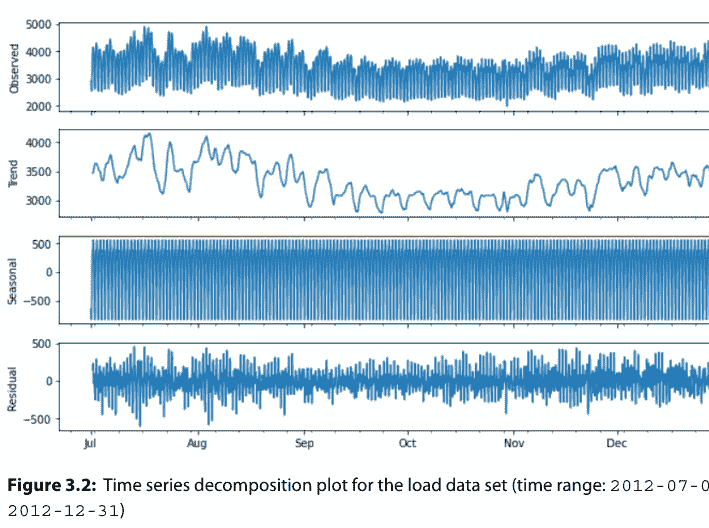

**图 3.2：** 负载数据集的时间序列分解图（时间范围：2012-07-01 至 2012-12-31）

```python
decomposition = sm.tsa.seasonal_decompose(load, model='additive')

fig, ax = plt.subplots()
ax.grid(True)

year = mdates.YearLocator(month=1)
month = mdates.MonthLocator(interval=1)

year_format = mdates.DateFormatter('%Y')
month_format = mdates.DateFormatter('%m')

ax.xaxis.set_minor_locator(month)
ax.xaxis.grid(True, which='minor')
ax.xaxis.set_major_locator(year)
ax.xaxis.set_major_formatter(year_format)

plt.plot(load.index, load, c='blue')
plt.plot(decomposition.trend.index, decomposition.trend, c='white')
```

输出将是图 3.3 所示的图表。

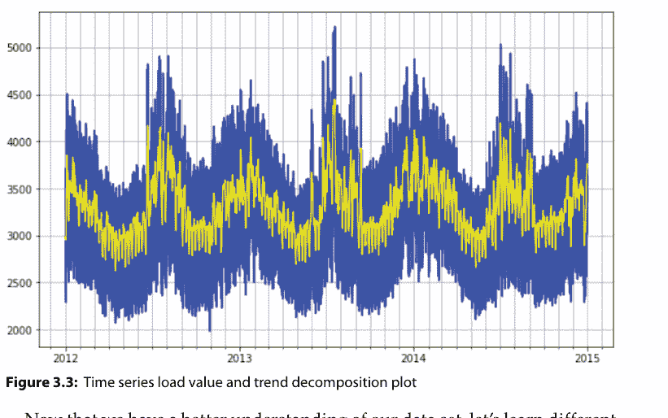

现在我们对数据集有了更好的理解，让我们学习不同的数据清洗和缺失值插补技术。

## 时间序列中缺失值的数据清洗

处理时间序列数据涉及清洗、缩放，甚至在获得任何有意义的结果之前进行深度预处理操作。在接下来的几段中，我们将讨论一些用于清洗、重新缩放和准备时间序列数据的最常用技术。

缺失值在时间序列中表现为时间戳变量或其他值中的序列间隙。缺失值可能由于多种不同原因出现在时间序列中，包括记录失败或由于数据源层面或数据管道中的问题导致的记录不准确。

为了识别这些时间戳间隙，我们首先创建一个我们期望在时间序列中出现的时间段索引。如果我们再次查看我们的 ts_data 集，我们可以通过在两个最接近的非缺失值之间进行插值来填充缺失值。`dataframe.interpolate()` 函数用于填充 DataFrame 或序列中的 NA 值：它是一个非常有效的填充缺失值的函数。但是，对于具有 MultiIndex 的 DataFrame 和序列，仅支持 `method='linear'`。

在下面的示例中，我们使用二次函数并设置限制为 8。这个限制意味着如果连续出现超过 8 个缺失值，则不会对这些缺失值进行插值，它们将保持缺失状态。这是为了避免在非常遥远的时间段之间进行虚假插值。此外，我们设置 `limit_direction='both'`：插值的限制方向可以设置为 'forward'、'backward' 或 'both'；默认值为 'forward'：

```python
ts_data_load.interpolate(limit=8, method='linear', limit_direction='both')
```

输出将是

```
2012-01-01 00:00:00    2,698.00
2012-01-01 01:00:00    2,558.00
2012-01-01 02:00:00    2,444.00
2012-01-01 03:00:00    2,402.00
2012-01-01 04:00:00    2,403.00
2012-01-01 05:00:00    2,453.00
2012-01-01 06:00:00    2,560.00
2012-01-01 07:00:00    2,719.00
2012-01-01 08:00:00    2,916.00
2012-01-01 09:00:00    3,105.00
2012-01-01 10:00:00    3,174.00
2012-01-01 11:00:00    3,180.00
2012-01-01 12:00:00    3,184.00
2012-01-01 13:00:00    3,147.00
2012-01-01 14:00:00    3,122.00
2012-01-01 15:00:00    3,137.00
2012-01-01 16:00:00    3,486.00
2012-01-01 17:00:00    3,717.00
2012-01-01 18:00:00    3,659.00
2012-01-01 19:00:00    3,513.00
2012-01-01 20:00:00    3,344.00
2012-01-01 21:00:00    3,129.00
2012-01-01 22:00:00    2,873.00
2012-01-01 23:00:00    2,639.00
2012-01-02 00:00:00    2,458.00
2012-01-02 01:00:00    2,354.00
2012-01-02 02:00:00    2,294.00
2012-01-02 03:00:00    2,288.00
2012-01-02 04:00:00    2,353.00
2012-01-02 05:00:00    2,503.00
...
2014-12-30 18:00:00    4,374.00
2014-12-30 19:00:00    4,270.00
2014-12-30 20:00:00    4,140.00
2014-12-30 21:00:00    3,895.00
2014-12-30 22:00:00    3,571.00
2014-12-30 23:00:00    3,313.00
2014-12-31 00:00:00    3,149.00
2014-12-31 01:00:00    3,055.00
2014-12-31 02:00:00    3,014.00
2014-12-31 03:00:00    3,025.00
2014-12-31 04:00:00    3,115.00
2014-12-31 05:00:00    3,337.00
2014-12-31 06:00:00    3,660.00
2014-12-31 07:00:00    3,906.00
2014-12-31 08:00:00    4,043.00
2014-12-31 09:00:00    4,077.00
2014-12-31 10:00:00    4,073.00
2014-12-31 11:00:00    4,030.00
2014-12-31 12:00:00    3,982.00
2014-12-31 13:00:00    3,933.00
2014-12-31 14:00:00    3,893.00
2014-12-31 15:00:00    3,912.00
2014-12-31 16:00:00    4,141.00
2014-12-31 17:00:00    4,319.00
2014-12-31 18:00:00    4,199.00
2014-12-31 19:00:00    4,012.00
2014-12-31 20:00:00    3,856.00
2014-12-31 21:00:00    3,671.00
2014-12-31 22:00:00    3,499.00
2014-12-31 23:00:00    3,345.00
Freq: H, Name: load, Length: 26304, dtype: float64
```

在下一个示例中，我们利用 `scipy.stats` 包，用一个常见的值 0 来填充缺失的温度值。许多有用的统计函数位于这个子包 `scipy.stats` 中（你可以使用 `info(stats)` 查看这些函数的完整列表，并且可以在 `docs.scipy.org/doc/scipy/reference/tutorial/stats.html` 找到更多信息和教程）：

```python
from scipy import stats
temp_mode = np.asscalar(stats.mode(ts_data['temp']).mode)
ts_data['temp'] = ts_data['temp'].fillna(temp_mode)
ts_data.isnull().sum()
```

输出将是

```
load    0
temp    0
dtype: int64
```

正如你从结果中看到的，缺失值的数量现在已减少，即使没有完全消除。如果你的数据集中仍然包含剩余的缺失值记录，你可以在创建模型特征之后再删除它们。现在让我们看看如何在下一节中规范化时间序列数据。

## 时间序列数据规范化和标准化

规范化是将数据从原始尺度重新缩放的过程，使得所有值都在 0 和 1 的范围内，它涉及估计数据集中可用的最小值和最大值。它可能很有用，并且甚至在某些机器学习算法中也是必需的，特别是当你的时序数据具有不同度量和维度的输入值和特征时。

对于使用距离估计的机器学习算法，如k近邻算法，以及对输入值进行权重校准的线性回归和神经网络，归一化是必要的。然而，重要的是要记住，如果你的时序数据呈现出明显的趋势，估计这些期望值可能会很困难，归一化可能不是解决你问题的最佳方法。

你可以使用scikit-learn对象MinMaxScaler来归一化你的数据集：`sklearn.preprocessing.MinMaxScaler`。这个估计器单独转换每个特征，使其处于给定的范围内，例如0和1的范围（www.scikit-learn.org/stable/modules/generated/sklearn.preprocessing.MinMaxScaler.html）。

这种转换也可以反转，因为有时数据科学家将预测值转换回原始尺度以进行报告或绘图是有用的。这可以通过调用`inverse_transform()`函数来完成。下面是一个归一化`ts_data`集的示例：如示例所示，缩放器要求数据以行和列的矩阵形式提供。加载的数据作为pandas DataFrame加载。然后必须将其重塑为单列矩阵：

```
from pandas import Series
from sklearn.preprocessing import MinMaxScaler

# prepare data for normalization
values = load.values
values = values.reshape((len(values), 1))

# train the normalization
scaler = MinMaxScaler(feature_range=(0, 1))
scaler = scaler.fit(values)
print('Min: %f, Max: %f' % (scaler.data_min_, scaler.data_max_))
```

输出将是

```
Min: 1979.000000, Max: 5224.000000
```

然后使用重塑后的数据集来拟合缩放器，数据集被归一化，然后反转归一化转换以再次显示原始值：

```
# normalize the data set and print the first 5 rows
normalized = scaler.transform(values)
for i in range(5):
    print(normalized[i])

# inverse transform and print the first 5 rows
inversed = scaler.inverse_transform(normalized)
for i in range(5):
    print(inversed[i])
```

输出将是

```
[0.22]
[0.18]
[0.14]
[0.13]
[0.13]
[2698.]
[2558.]
[2444.]
[2402.]
[2403.]
```

运行该示例会打印加载数据集的前五行，显示相同的五个值的归一化形式，然后使用反转转换功能将值恢复到原始尺度。还有另一种类型的重新缩放，它对超出预期值范围的新值更具鲁棒性：标准化。

标准化数据集涉及重新缩放值的分布，使得观测值的均值为0，标准差为1。这个过程意味着减去均值或使数据居中。与归一化一样，标准化在你的时序数据具有不同维度的输入值时，在某些机器学习算法中是有用的，甚至是必需的。标准化假设你的观测值符合具有良好均值和标准差的高斯分布（钟形曲线）。这包括支持向量机、线性和逻辑回归等算法，以及其他假设或在高斯数据下性能更好的算法。

为了对数据集应用标准化过程，数据科学家需要准确估计其数据中值的均值和标准差。你可以使用scikit-learn对象StandardScaler来标准化你的数据集：`sklearn.preprocessing.StandardScaler`。此功能通过移除均值并缩放到单位方差来标准化特征。通过计算训练集样本的相关统计信息，对每个特征独立进行居中和缩放。然后存储均值和标准差，以便使用`transform`在后续数据上使用（scikit-learn.org/stable/modules/generated/sklearn.preprocessing.StandardScaler.html）。

下面是一个标准化我们的负载数据集的示例：

```
# Standardize time series data
from sklearn.preprocessing import StandardScaler
from math import sqrt

# prepare data for standardization
values = load.values
values = values.reshape((len(values), 1))

# train the standardization
scaler = StandardScaler()
scaler = scaler.fit(values)
print('Mean: %f, StandardDeviation: %f' % (scaler.mean_, sqrt(scaler.var_)))
```

输出将是

```
Mean: 3303.769199, StandardDeviation: 564.568521
```

```
# standardization the data set and print the first 5 rows
normalized = scaler.transform(values)
for i in range(5):
    print(normalized[i])

# inverse transform and print the first 5 rows
inversed = scaler.inverse_transform(normalized)
for i in range(5):
    print(inversed[i])
```

输出将是

```
[-1.07]
[-1.32]
[-1.52]
[-1.6]
[-1.6]
[2698.]
[2558.]
[2444.]
[2402.]
[2403.]
```

运行该示例会打印数据集的前五行，打印相同值的标准化形式，然后打印恢复到原始尺度的值。
在下一节中，你将学习如何使用Python对时序数据进行特征工程，以使用机器学习算法建模你的时序问题。

## 时序特征工程

如第1章所述，在我们开始使用机器学习算法之前，时序数据需要重新建模为监督学习数据集。在人工智能和机器学习领域，监督学习被定义为一种方法，数据科学家需要向其机器学习算法提供输入和输出数据。

在下一步中，监督学习算法（例如，用于回归问题的线性回归，用于分类和回归问题的随机森林，用于分类问题的支持向量机）检查训练数据集并产生一个数学函数，该函数可用于推断新示例和预测。

在时序中，数据科学家必须通过识别他们需要在未来日期预测的变量（例如，下周一的未来销售数量）来构建模型的输出，然后利用历史数据和特征工程来创建输入变量，这些变量将用于对该未来日期进行预测。

特征工程工作主要有两个目标：

- *创建正确的输入数据集以馈送机器学习算法*：在这种情况下，时序预测中特征工程的目的是从历史和原始数据中创建输入特征，并将数据集塑造成监督学习问题。
- *提高机器学习模型的性能*：特征工程的第二个最重要目标是生成输入特征与输出特征或要预测的目标变量之间的有效关系。通过这种方式，可以提高机器学习模型的性能。

我们将涵盖四类不同的时间特征，它们在时序场景中非常有用：

- 日期时间特征
- 滞后特征和窗口特征
- 滚动窗口统计
- 扩展窗口统计

在接下来的几节中，我们将更详细地讨论每一种时间特征，我将用Python中的实际例子来解释它们。

## 日期时间特征

日期时间特征是从每个观测值的时间戳值创建的特征。这些特征的一些例子是每个观测值的整数小时、月份、星期几。数据科学家可以使用pandas执行这些日期时间特征转换，并向其原始数据集添加新列（小时、月份和星期几列），其中小时、月份和星期几信息是从每个观测值的时间戳值中提取的。

下面是一些使用我们的ts_data集执行此操作的示例Python代码：

```
ts_data['hour'] = [ts_data.index[i].hour for i in range(len(ts_data))]
ts_data['month'] = [ts_data.index[i].month for i in range(len(ts_data))]
ts_data['dayofweek'] = [ts_data.index[i].day for i in range(len(ts_data))]
print(ts_data.head(5))
```

运行此示例会打印转换后数据集的前五行：

| | load | temp | hour | month | dayofweek |
|---|---|---|---|---|---|
| 2012-01-01 00:00:00 | 2,698.00 | 32.00 | 0 | 1 | 1 |
| 2012-01-01 01:00:00 | 2,558.00 | 32.67 | 1 | 1 | 1 |
| 2012-01-01 02:00:00 | 2,444.00 | 30.00 | 2 | 1 | 1 |
| 2012-01-01 03:00:00 | 2,402.00 | 31.00 | 3 | 1 | 1 |
| 2012-01-01 04:00:00 | 2,403.00 | 32.00 | 4 | 1 | 1 |

通过利用这些额外的知识，如小时、月份和星期几的值，数据科学家可以对他们的数据以及输入特征和输出特征之间的关系获得额外的见解，并最终为他们的时序预测解决方案构建更好的模型。以下是一些可以构建并生成额外重要信息的其他特征示例：

- 是否周末
- 一天中的分钟数
- 是否夏令时
- 是否公共假期
- 一年中的季度
- 一天中的小时
- 营业时间之前或之后
- 一年中的季节

从上面的例子可以看出，日期时间特征不仅限于整数值。数据科学家还可以构建二进制特征，例如一个特征，如果时间戳信息在营业时间之前，其值等于1；如果时间戳信息在营业时间之后，其值等于0。最后，在处理时序数据时，重要的是要记住所有可以从Timestamp或DatetimeIndex访问的日期和时间属性。（本章中的表3.2为你总结了所有这些属性）。

日期时间特征是数据科学家开始使用时序数据进行特征工程工作的一种非常有用的方式。在下一节中，我将介绍另一种为你的数据集构建输入特征的方法：滞后和窗口特征。为了构建这些特征，数据科学家需要利用和提取序列在之前或未来时期的值。

## 滞后特征与窗口特征

滞后特征是指在先前时间步的值，它们被认为是有用的，因为其创建基于这样一个假设：过去发生的事情可能会影响未来，或包含关于未来的某种内在信息。例如，如果你想预测第二天下午4点的类似销售额，那么生成前一天下午4点的销售特征可能会有益。

滞后特征中一个有趣的类别被称为*嵌套*滞后特征：为了创建嵌套滞后特征，数据科学家需要确定过去的一个固定时间段，并按该时间段对特征值进行分组——例如，前两小时、前三天和前一周的销售数量。

pandas库提供了`shift()`函数，帮助从时间序列数据集中创建这些移位或滞后特征：该函数将索引按所需的周期数进行移位，并可选择时间频率。`shift`方法接受一个`freq`参数，该参数可以接受`DateOffset`类、类似`timedelta`的对象或`offset`别名。偏移别名是数据科学家在处理时间序列数据时可以利用的一个重要概念，因为它代表了为常用时间序列频率给出的字符串别名的数量，如表3.4所示。

表3.4：Python中支持的偏移别名

| 偏移别名 | 描述 |
|---|---|
| B | 工作日频率 |
| C | 自定义工作日频率 |
| D | 日历日频率 |
| W | 周频率 |
| M | 月末频率 |
| SM | 半月末频率（15日和月末） |
| BM | 工作月末频率 |
| CBM | 自定义工作月末频率 |
| MS | 月初频率 |
| SMS | 半月初频率（1日和15日） |
| BMS | 工作月初频率 |
| CBMS | 自定义工作月初频率 |
| Q | 季末频率 |
| BQ | 工作季末频率 |
| QS | 季初频率 |
| BQS | 工作季初频率 |
| A, Y | 年末频率 |
| BA, BY | 工作年末频率 |
| AS, YS | 年初频率 |
| BAS, BYS | 工作年初频率 |
| BH | 工作小时频率 |
| H | 小时频率 |
| T, min | 分钟频率 |
| S | 秒频率 |
| L, ms | 毫秒 |
| U, us | 微秒 |
| N | 纳秒 |

以下是如何在ts_data集上使用偏移别名的示例：

```
ts_data_shift = ts_data.shift(4, freq=pd.offsets.BDay())
ts_data_shift.head(5)
```

运行此示例将打印转换后的ts_data_shift数据集的前五行：

```
                load  temp
2012-01-05 00:00:00  2,698.00  32.00
2012-01-05 01:00:00  2,558.00  32.67
2012-01-05 02:00:00  2,444.00  30.00
2012-01-05 03:00:00  2,402.00  31.00
2012-01-05 04:00:00  2,403.00  32.00
```

除了改变数据和索引的对齐方式外，DataFrame和Series对象还有一个便捷方法`tshift()`，它使用索引的频率（如果可用）将索引中的所有日期按指定的偏移量进行更改，如下例所示：

```
ts_data_shift_2 = ts_data.tshift(6, freq='D')
ts_data_shift_2.head(5)
```

运行此示例将打印转换后的ts_data_shift_2数据集的前五行：

```
                load  temp
2012-01-07 00:00:00  2,698.00  32.00
2012-01-07 01:00:00  2,558.00  32.67
2012-01-07 02:00:00  2,444.00  30.00
2012-01-07 03:00:00  2,402.00  31.00
2012-01-07 04:00:00  2,403.00  32.00
```

请注意，使用`tshift`时，第一个条目是NaN值，因为数据没有被重新对齐。当未传递频率值时，它会在不重新对齐数据的情况下移动索引。如果传递了频率值（在这种情况下，索引必须是日期或日期时间，否则将引发NotImplementedError），索引将使用周期数和频率值进行增加。

将数据集移动1会创建一个新的“t”列，并为第一行添加一个NaN（未知）值。未移动的时间序列数据集代表“t+1”。让我们用一个具体的例子来说明。我们可以使用我们的ts_data集来计算滞后负载特征，如下所示：

```
def generated_lagged_features(ts_data, var, max_lag):
    for t in range(1, max_lag+1):
        ts_data[var+'_lag'+str(t)] = ts_data[var].shift(t, freq='1H')
```

在上面的示例代码中，我们首先创建一个名为`generated_lagged_features`的函数，然后我们生成八个额外的滞后特征，频率为一小时，如下所示：

```
generated_lagged_features(ts_data, 'load', 8)
generated_lagged_features(ts_data, 'temp', 8)
print(ts_data.head(5))
```

运行此示例将打印转换后的数据集的前五行：

| load | temp | hour | month | dayofweek | load_lag1 | load_lag2 | load_lag3 | load_lag4 | load_lag5 | ... |
|---|---|---|---|---|---|---|---|---|---|---|
| 2012-01-01 00:00:00 | 2,698.00 | 32.00 | 0 | 1 | 1 | nan | nan | nan | nan | nan | ... |
| 2012-01-01 01:00:00 | 2,558.00 | 32.67 | 1 | 1 | 1 | 2,698.00 | nan | nan | nan | nan | ... |
| 2012-01-01 02:00:00 | 2,444.00 | 30.00 | 2 | 1 | 1 | 2,558.00 | 2,698.00 | nan | nan | nan | ... |
| 2012-01-01 03:00:00 | 2,402.00 | 31.00 | 3 | 1 | 1 | 2,444.00 | 2,558.00 | 2,698.00 | nan | nan | ... |
| 2012-01-01 04:00:00 | 2,403.00 | 32.00 | 4 | 1 | 1 | 2,402.00 | 2,444.00 | 2,558.00 | 2,698.00 | nan | ... |

| temp_lag1 | temp_lag2 | temp_lag3 | temp_lag4 | temp_lag5 | ... |
|---|---|---|---|---|---|
| 2012-01-01 00:00:00 | nan | nan | nan | nan | nan | ... |
| 2012-01-01 01:00:00 | 32.00 | nan | nan | nan | nan | ... |
| 2012-01-01 02:00:00 | 32.67 | 32.00 | nan | nan | nan | ... |
| 2012-01-01 03:00:00 | 30.00 | 32.67 | 32.00 | nan | nan | ... |
| 2012-01-01 04:00:00 | 31.00 | 30.00 | 32.67 | 32.00 | nan | ... |

| temp_lag6 | load_lag7 | load_lag8 | temp_lag7 | temp_lag8 |
|---|---|---|---|---|
| 2012-01-01 00:00:00 | nan | nan | nan | nan | nan |
| 2012-01-01 01:00:00 | nan | nan | nan | nan | nan |
| 2012-01-01 02:00:00 | nan | nan | nan | nan | nan |
| 2012-01-01 03:00:00 | nan | nan | nan | nan | nan |
| 2012-01-01 04:00:00 | nan | nan | nan | nan | nan |

[5行 x 21列]

添加滞后特征的操作称为滑动窗口方法或窗口特征：上面的示例展示了如何应用窗口宽度为八的滑动窗口方法。窗口特征是对先前时间步的固定窗口内值的汇总。

根据你的时间序列场景，你可以扩大窗口宽度并包含更多滞后特征。数据科学家在执行添加滞后特征操作之前常问的一个问题是窗口应该设置多大。一个好的方法是构建一系列不同的窗口宽度，并交替地将它们添加到数据集中或从中移除，以观察哪个对你的模型性能有更明显的积极影响。

理解滑动方法对于构建另一种称为滚动窗口统计的附加特征方法非常有帮助，我们将在下一节中讨论。

## 滚动窗口统计

在时间序列数据集中构建和使用滚动窗口统计的主要目标是通过定义一个范围来计算给定数据样本值的统计量，该范围包括样本本身以及所用样本之前和之后的一些指定数量的样本。

数据科学家在计算滚动统计时的一个关键步骤是定义一个滚动观测窗口：在每个时间点，数据科学家需要获取滚动窗口中的观测值，并使用它们来计算他们决定使用的统计量。在第二步中，他们需要移动到下一个时间点，并在下一个观测窗口上重复相同的计算。

更受欢迎的滚动统计之一是移动平均。它取一个移动的时间窗口，并计算该时间段的平均值或均值作为当前值。pandas提供了一个`rolling()`函数，该函数提供滚动窗口计算，并在每个时间步创建一个包含值窗口的新数据结构。然后，我们可以对为每个时间步收集的值窗口执行统计函数，例如计算均值。

数据科学家可以使用pandas中的`concat()`函数来构建一个只包含我们新列的新数据集。该函数沿特定轴连接pandas对象，并可选择沿其他轴进行集合逻辑操作。它还可以在连接轴上添加一层分层索引，如果传递的轴号上的标签相同（或重叠），这可能很有用。

下面的示例演示了如何使用pandas实现这一点，窗口大小为6：

```
# 创建一个滚动均值特征
from pandas import concat

load_val = ts_data[['load']]
shifted = load_val.shift(1)

window = shifted.rolling(window=6)
means = window.mean()
new_dataframe = concat([means, load_val], axis=1)
new_dataframe.columns = ['load_rol_mean', 'load']

print(new_dataframe.head(10))
```

运行上面的示例将打印我们新数据集的前10行：

| load_rol_mean | load |
|---|---|
| 2012-01-01 00:00:00 | nan | 2,698.00 |
| 2012-01-01 01:00:00 | nan | 2,558.00 |
| 2012-01-01 02:00:00 | nan | 2,444.00 |
| 2012-01-01 03:00:00 | nan | 2,402.00 |
| 2012-01-01 04:00:00 | nan | 2,403.00 |
| 2012-01-01 05:00:00 | nan | 2,453.00 |
| 2012-01-01 06:00:00 | 2,493.00 | 2,560.00 |
| 2012-01-01 07:00:00 | 2,470.00 | 2,719.00 |
| 2012-01-01 08:00:00 | 2,496.83 | 2,916.00 |
| 2012-01-01 09:00:00 | 2,575.50 | 3,105.00 |

下面是一个示例，展示了如何创建宽度为4的窗口，使用`rolling()`函数，并构建一个包含更多汇总统计量（如窗口内的最小值、平均值和最大值）的数据集：

```python
# create rolling statistics features
from pandas import concat

load_val = ts_data[['load']]
width = 4
shifted = load_val.shift(width - 1)
window = shifted.rolling(window=width)

new_dataframe = pd.concat([window.min(),
    window.mean(), window.max(), load_val], axis=1)
new_dataframe.columns = ['min', 'mean', 'max', 'load']

print(new_dataframe.head(10))
```

运行该代码会打印出新数据集的前10行，其中包含刚刚创建的新特征：最小值、平均值和最大值：

| | min | mean | max | load |
|---|---|---|---|---|
| 2012-01-01 00:00:00 | nan | nan | nan | 2,698.00 |
| 2012-01-01 01:00:00 | nan | nan | nan | 2,558.00 |
| 2012-01-01 02:00:00 | nan | nan | nan | 2,444.00 |
| 2012-01-01 03:00:00 | nan | nan | nan | 2,402.00 |
| 2012-01-01 04:00:00 | nan | nan | nan | 2,403.00 |
| 2012-01-01 05:00:00 | nan | nan | nan | 2,453.00 |
| 2012-01-01 06:00:00 | 2,402.00 | 2,525.50 | 2,698.00 | 2,560.00 |
| 2012-01-01 07:00:00 | 2,402.00 | 2,451.75 | 2,558.00 | 2,719.00 |
| 2012-01-01 08:00:00 | 2,402.00 | 2,425.50 | 2,453.00 | 2,916.00 |
| 2012-01-01 09:00:00 | 2,402.00 | 2,454.50 | 2,560.00 | 3,105.00 |

另一种在时间序列预测场景中可能有用的窗口特征是扩展窗口统计特征：它包含序列中所有先前的数据。我们将在下一节讨论并学习如何构建它。

## 扩展窗口统计

扩展窗口是包含所有先前数据的特征。pandas提供了一个`expanding()`函数，该函数提供扩展转换，并为每个时间步组装所有先前值的集合：Python为`Rolling()`和`expanding()`函数提供了相同的接口和功能。

下面是一个在ts_data集上计算扩展窗口的最小值、平均值和最大值的示例：

```python
# create expanding window features
from pandas import concat

load_val = ts_data[['load']]
window = load_val.expanding()
new_dataframe = concat([window.min(),
window.mean(), window.max(), load_val.shift(-1)], axis=1)
new_dataframe.columns = ['min', 'mean', 'max', 'load+1']
print(new_dataframe.head(10))
```

运行该示例会打印出新数据集的前10行，其中包含额外的扩展窗口特征：

| | min | mean | max | load+1 |
|---|---|---|---|---|
| 2012-01-01 00:00:00 | 2,698.00 | 2,698.00 | 2,698.00 | 2,558.00 |
| 2012-01-01 01:00:00 | 2,558.00 | 2,628.00 | 2,698.00 | 2,444.00 |
| 2012-01-01 02:00:00 | 2,444.00 | 2,566.67 | 2,698.00 | 2,402.00 |
| 2012-01-01 03:00:00 | 2,402.00 | 2,525.50 | 2,698.00 | 2,403.00 |
| 2012-01-01 04:00:00 | 2,402.00 | 2,501.00 | 2,698.00 | 2,453.00 |
| 2012-01-01 05:00:00 | 2,402.00 | 2,493.00 | 2,698.00 | 2,560.00 |
| 2012-01-01 06:00:00 | 2,402.00 | 2,502.57 | 2,698.00 | 2,719.00 |
| 2012-01-01 07:00:00 | 2,402.00 | 2,529.62 | 2,719.00 | 2,916.00 |
| 2012-01-01 08:00:00 | 2,402.00 | 2,572.56 | 2,916.00 | 3,105.00 |
| 2012-01-01 09:00:00 | 2,402.00 | 2,625.80 | 3,105.00 | 3,174.00 |

在本节中，你已经了解了如何使用特征工程将时间序列数据集转换为用于机器学习的监督学习数据集，并提升机器学习模型的性能。

## 结论

在本章中，你学习了为预测模型准备时间序列数据最重要和最基本的步骤。良好的时间序列数据准备能产生干净且经过精心整理的数据，从而带来更准确的预测。具体来说，在本章中你学习了以下内容：

- *用于时间序列数据的Python* – Python是一种非常强大的数据处理编程语言，为时间序列数据提供了丰富的库套件，并对时间序列分析有出色的支持。在本节中，你学习了SciPy、NumPy、Matplotlib、pandas、statsmodels和scikit-learn等库如何帮助你准备、探索和分析时间序列数据。
- *时间序列探索与理解* – 在第二部分中，你学习了探索、分析和理解时间序列数据的第一步，例如如何计算和审查时间序列数据的汇总统计量，如何对时间序列中的缺失期进行数据清洗，以及如何进行时间序列数据的归一化和标准化。
- *时间序列特征工程* – 特征工程是使用历史行数据为最终用于训练模型的数据集创建额外变量和特征的过程。在第三章的最后一部分，你学习了如何对时间序列数据进行特征工程。

在下一章中，你将发现一套经典的时间序列预测方法，你可以在你的预测问题上进行测试。我将引导你了解不同的方法，如自回归、自回归移动平均、自回归积分移动平均和自动化机器学习。

# 第四章
## 自回归和自动化时间序列预测方法简介

构建预测是任何业务不可或缺的一部分，无论是关于收入、库存、在线销售还是客户需求预测。时间序列预测之所以如此基础，是因为现实世界中存在许多具有时间维度的问题和相关数据。

应用机器学习模型来加速预测，能够实现智能解决方案的可扩展性、性能和准确性，从而改善业务运营。然而，构建机器学习模型通常耗时且复杂，需要考虑许多因素，例如迭代算法、调整机器学习超参数以及应用特征工程技术。随着时间序列数据的出现，这些选项成倍增加，因为数据科学家需要考虑额外的因素，例如趋势、季节性、节假日和外部经济变量。

在本章中，你将发现一套经典的时间序列预测方法，你可以在你的预测问题上进行测试。以下段落的结构旨在为你提供关于每种方法的足够信息，以便你能够开始使用一个可运行的代码示例，并知道在哪里可以找到关于该方法的更多信息。

具体来说，我们将探讨以下经典方法：

- *自回归* – 这种时间序列技术假设下一个时间戳的未来观测值与先前时间戳的观测值通过线性关系相关。
- *移动平均* – 这种时间序列技术在回归方法中利用先前的预测误差来预测下一个时间戳的未来观测值。与自回归技术一起，移动平均方法是更通用的自回归移动平均和自回归积分移动平均模型的关键组成部分，这些模型呈现了更复杂的随机配置。
- *自回归移动平均* – 这种时间序列技术假设下一个时间戳的未来观测值可以表示为先前时间戳的观测值和残差误差的线性函数。
- *自回归积分移动平均* – 这种时间序列技术假设下一个时间戳的未来观测值可以表示为先前时间戳的差分观测值和残差误差的线性函数。我们还将探讨自回归积分移动平均方法的一个扩展，称为带有外生回归变量的季节性自回归积分移动平均。
- *自动化机器学习（自动化ML）* – 这种时间序列技术遍历一系列不同的时间序列预测机器学习算法，同时为你的场景执行最佳模型选择、超参数调优和特征工程。

如你所见，经典的时间序列预测方法通常关注历史数据与未来结果之间的线性关系。尽管如此，它们在广泛的时间序列问题上表现良好。在探索更复杂的时间序列深度学习方法（第5章，“时间序列预测神经网络简介”）之前，最好确保你已经充分利用了经典的线性时间序列预测方法。

## 自回归

自回归是一种仅依赖于时间序列先前输出的时间序列预测方法：这种技术假设下一个时间戳的未来观测值与先前时间戳的观测值通过线性关系相关。换句话说，在自回归中，时间序列中的一个值是基于同一时间序列中的先前值进行回归的。在本书的这一章中，我们将学习如何使用Python实现用于时间序列预测的自回归。

在自回归中，前一个时间戳的输出值成为预测下一个时间戳值的输入值，误差遵循简单线性回归模型中关于误差的通常假设。在自回归中，用于预测下一个时间戳值的时间序列中先前输入值的数量称为*阶数*（通常我们用字母 $p$）。这个阶数值决定了将使用多少个先前的数据点：通常，数据科学家通过测试不同的值并观察哪个模型产生最小的赤池信息准则（AIC）来估计 p 值。我们将在本章后面讨论 AIC 和贝叶斯信息准则（BIC）这两种惩罚似然准则。

数据科学家将当前预测值（输出）基于紧邻的前一个值（输入）的自回归称为一阶自回归，如图 4.1 所示。

| 传感器 ID | 时间戳 | 值 X | 值 y |
| :--- | :--- | :--- | :--- |
| Sensor_1 | 01/01/2020 | NaN | 236 |
| Sensor_1 | 01/01/2020 | 236 | 133 |
| Sensor_1 | 01/02/2020 | 133 | 148 |
| Sensor_1 | 01/03/2020 | 148 | 152 |
| Sensor_1 | 01/04/2020 | 152 | 241 |
| Sensor_1 | 01/05/2020 | 241 | ? |


如果你需要使用前两个值来预测下一个时间戳的值，那么这种方法被称为二阶自回归，因为下一个时间戳的值将使用两个先前的值作为输入进行预测，如图 4.2 所示。

| 传感器 ID | 时间戳 | 值 X | 值 y |
| :--- | :--- | :--- | :--- |
| Sensor_1 | 01/01/2020 | NaN | 236 |
| Sensor_1 | 01/01/2020 | 236 | 133 |
| Sensor_1 | 01/02/2020 | 133 | 148 |
| Sensor_1 | 01/03/2020 | 148 | 152 |
| Sensor_1 | 01/04/2020 | 152 | 241 |
| Sensor_1 | 01/05/2020 | 241 | ? |


## 第 4 章 ■ 自回归与自动化方法简介

更一般地说，*n 阶*自回归是一种多元线性回归，其中时间序列在任何时间 *t* 的值是该时间序列中先前值的线性函数。由于这种序列依赖性，自回归的另一个重要方面是*自相关*：自相关是一种统计特性，当一个时间序列与其自身的先前或滞后版本存在线性关系时就会出现。

自相关对于自回归至关重要，因为输出（即我们需要预测的目标变量）与特定滞后变量（即用作输入的先前时间戳的一组值）之间的相关性越强，自回归就可以在该特定变量上赋予更大的权重。因此，该变量被认为具有很强的预测能力。

此外，一些回归方法，如线性回归和普通最小二乘回归，依赖于一个隐含的假设，即用于训练模型的训练数据集中不存在自相关。这些方法，如线性回归和普通最小二乘回归，被定义为*参数*方法，因为与之一起使用的数据集呈现正态分布，并且它们的回归函数是根据从数据中估计的有限数量的未知参数来定义的。

出于所有这些原因，自相关可以帮助数据科学家为其时间序列预测解决方案选择最合适的方法。此外，自相关对于从你的数据和变量之间获得额外的见解，以及识别时间序列数据中的隐藏模式（如季节性和趋势）非常有用。

为了检查你的自回归数据中是否存在自相关，你可以使用 pandas 提供的两个不同的内置绘图，称为 `lag_plot` (pandas.pydata.org/docs/reference/api/pandas.plotting.lag_plot.html) 和 `autocorrelation_plot` (pandas.pydata.org/docs/reference/api/pandas.plotting.autocorrelation_plot.html)。

这些函数可以从 `pandas.plotting` 导入，并接受一个 Series 或 DataFrame 作为参数。这两个图都是你可以用来查看时间序列数据集中是否存在自相关的可视化检查，如表 4.1 所示。

### 表 4.1：pandas.plotting.lag_plot API 参考和描述

| API 参考 | pandas.plotting.lag_plot |
| :--- | :--- |
| **参数** | series : 时间序列 |
| | lag : 散点图的滞后值，默认为 1 |
| | ax : matplotlib 轴对象，可选 |
| | kwds : matplotlib 散点方法关键字参数，可选 |
| **返回值** | class: matplotlib.axis.Axes |

下面是一个为我们的 ts_data_load 数据集创建滞后图的示例。首先，让我们导入所有必要的库并将数据加载到 pandas DataFrame 中：

```
# Import necessary libraries
import datetime as dt
import os
import warnings
from collections import UserDict
from glob import glob

import matplotlib.pyplot as plt
import numpy as np
import pandas as pd
from common.utils import load_data, mape
from IPython.display import Image

%matplotlib inline

pd.options.display.float_format = "{:,.2f}".format
np.set_printoptions(precision=2)
warnings.filterwarnings("ignore")

# Load the data from csv into a pandas dataframe
ts_data_load = load_data(data_dir)[['load']]
ts_data_load.head()
```

现在，让我们通过仅选择 load 列，为我们的 ts_data_load 数据集创建一个滞后图：

```
# Import lag_plot function
from pandas.plotting import lag_plot
plt.figure()

# Pass the lag argument and plot the values.
# When lag=1 the plot is essentially data[:-1] vs. data[1:]
# Plot our ts_data_load set
lag_plot(ts_data_load)
```

滞后图用于检查数据集或时间序列是否是随机的：随机数据在滞后图中不应表现出任何结构。让我们看看图 4.3 中说明的结果。

在图 4.3 中，我们可以看到大量能量值集中在图的对角线附近。这清楚地显示了数据集的这些观测值之间存在某种关系或相关性。此外，我们可以使用自相关图，如表 4.2 所述。

### 表 4.2：pandas.plotting.autocorrelation_plot API 参考和描述

| API 参考 | pandas.plotting.autocorrelation_plot |
| :--- | :--- |
| **参数** | series : 时间序列<br><br>lag : 散点图的滞后值，默认为 1<br><br>ax : matplotlib 轴对象，可选<br><br>kwds : 关键字<br><br>传递给 matplotlib 绘图方法的选项 |
| **返回值** | class: matplotlib.axis.Axes |

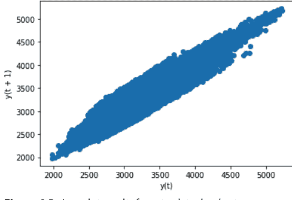

**图 4.3：** ts_data_load 数据集的滞后图结果

数据科学家也经常应用自相关图，通过计算不同时间滞后下数据值的自相关来检查时间序列的随机性。如果时间序列是随机的，那么所有时间滞后的自相关值都应该接近于零。如果时间序列是非随机的，那么一个或多个自相关值将显著不为零。

下面是一个为我们的 ts_data_load 数据集创建自相关图的示例。

```
# Import autocorrelation_plot function
from pandas.plotting import autocorrelation_plot
plt.figure()

# Pass the autocorrelation argument and plot the values
autocorrelation_plot(ts_data_load)
```

让我们看看图 4.4 中说明的结果。

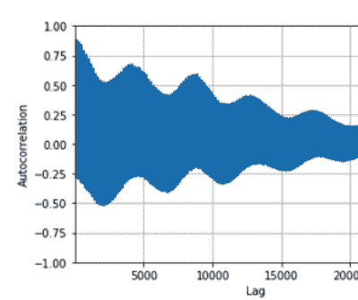

**图 4.4：** ts_data_load 数据集的自相关图结果

由于我们的 ts_data_load 数据集非常精细，并且包含大量的小时数据点，我们无法看到自相关图中应该显示的水平线。因此，我们可以创建数据集的一个子集（例如，我们可以选择 2014 年 8 月的第一周），并再次应用自相关图函数，如下面的示例代码所示：

```
# Create subset
ts_data_load_subset = ts_data_load['2014-08-01':'2014-08-07']

# Import autocorrelation_plot function
from pandas.plotting import autocorrelation_plot
plt.figure()

# Pass the autocorrelation argument and plot the values
autocorrelation_plot(ts_data_load_subset)
```

我们现在可以查看自相关图的结果，如图 4.5 所示。

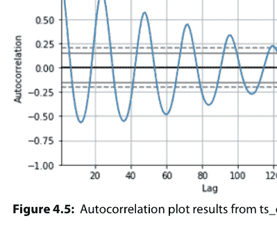

**图 4.5：** ts_data_load_subset 的自相关图结果

如图4.5所示，自相关图在纵轴上显示自相关函数的值。其取值范围为-1到1。图中显示的水平线对应95%和99%的置信区间，其中虚线代表99%置信区间。自相关图旨在揭示时间序列的数据点之间是正相关、负相关还是相互独立。

时间序列按滞后阶数绘制的自相关图也称为自相关函数（ACF）。Python通过statsmodels库（statsmodels.org/devel/generated/statsmodels.graphics.tsaplots.plot_acf.html）中的`plot_acf()`函数支持ACF分析。以下是使用statsmodels库的`plot_acf()`函数计算并绘制我们的ts_data_load数据集自相关图的示例：

```
# Import plot_acf() function
from statsmodels.graphics.tsaplots import plot_acf

# Plot the acf function on the ts_data_load set
plot_acf(ts_data_load)
pyplot.show()
```

现在让我们对ts_data_load_subset运行相同的`plot_acf()`函数：

```
# Import plot_acf() function
from statsmodels.graphics.tsaplots import plot_acf

# Plot the acf function on the ts_data_load_subset
plot_acf(ts_data_load_subset)
pyplot.show()
```

运行这些示例将创建两个二维图，如图4.6和图4.7所示，其中x轴显示滞后值，y轴显示-1到1之间的相关性。

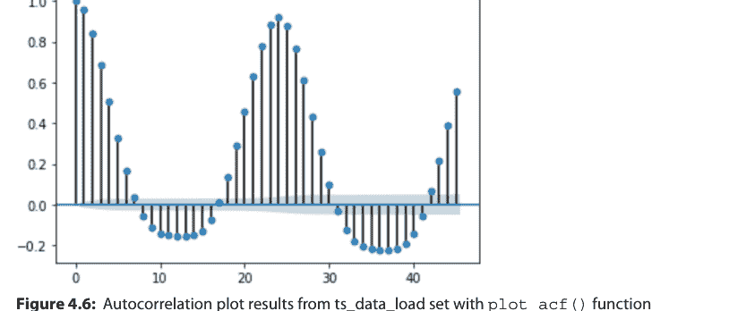

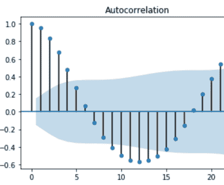

**图4.7：** 使用statsmodels库的plot_acf()函数对ts_data_load_subset进行自相关图分析的结果

如图4.6和图4.7所示，置信区间以锥形绘制。默认情况下，这被设置为95%的置信区间，表明超出此锥形的相关性值很可能是真实相关。

另一个需要考虑的重要概念是偏自相关函数（PACF），它是一种条件相关。它是在假设我们考虑其他一组变量值的情况下，两个变量之间的相关性。在回归分析中，这种偏相关可以通过关联两个不同回归的残差来找到。

在时间序列数据集中，某个时间戳的值与另一个先前时间戳的值之间的自相关，既包括这两个值之间的直接相关，也包括间接相关。这些间接相关是被观测值与中间时间戳值之间相关性的线性函数。

Python通过statsmodels库（statsmodels.org/stable/generated/statsmodels.graphics.tsaplots.plot_pacf.html）中的`plot_pacf()`函数支持PACF分析。下面的示例使用statsmodels库的`plot_pacf()`函数计算并绘制了我们的ts_data_load数据集前20个滞后阶数的偏自相关函数：

```
# Import plot_pacf() function
from statsmodels.graphics.tsaplots import plot_pacf

# Plot the pacf function on the ts_data_load dataset
plot_pacf(ts_data_load, lags=20)
pyplot.show()
```

## 第4章 自回归与自动化方法简介

类似地，以下示例使用statsmodels库的`plot_pacf()`函数计算并绘制了我们的ts_data_load_subset数据集前30个滞后阶数的偏自相关函数：

```
# import plot_pacf() function
from statsmodels.graphics.tsaplots import plot_pacf

# plot the pacf function on the ts_data_load_subset
plot_pacf(ts_data_load_subset, lags=30)
pyplot.show()
```

x值（在我们的示例中是ts_data_load）可以是序列或数组。参数`lags`显示将绘制多少个滞后阶数的PACF。运行这些示例将创建两个二维图，分别显示前20个和30个滞后阶数的偏自相关，如图4.8和图4.9所示。

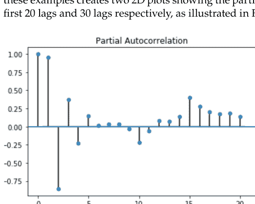

图4.8：使用statsmodels库的plot_pacf()函数对ts_data数据集进行自相关图分析的结果

当数据科学家需要理解和确定自回归和移动平均时间序列方法的阶数时，ACF和PACF函数的概念及其相应图表变得尤为重要。有两种方法可用于识别AR(p)模型的阶数：

- ACF和PACF函数
- 信息准则

如图4.8所示，ACF是一个自相关函数，它提供了序列与其滞后值自相关程度的信息。简单来说，它描述了序列的当前值与其过去值的关联程度。正如我们在第3章“时间序列数据准备”中所看到的，时间序列数据集可能包含趋势、季节性和周期性模式等成分。ACF在寻找相关性时会考虑所有这些成分。

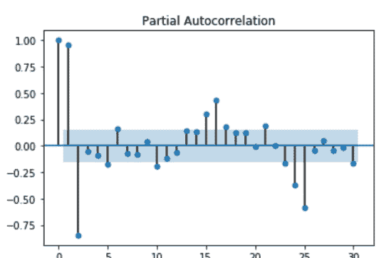

**图4.9：** 使用statsmodels库的plot_pacf()函数对ts_data_load_subset进行自相关图分析的结果

另一方面，PACF是另一个重要函数，它不像ACF那样寻找当前值与滞后值的相关性，而是寻找残差与下一个滞后值的相关性。它是一个衡量增加另一个滞后阶数所带来的增量收益的函数。因此，如果通过PACF函数我们发现残差中存在可以被下一个滞后阶数建模的隐藏信息，我们可能会得到良好的相关性，并在建模时将该滞后阶数作为特征保留。

现在让我们看看为什么这两个函数在构建自回归模型时很重要。正如本章开头所述，自回归是基于这样一个假设的模型：时间序列的当前值可以通过同一时间序列的先前值获得：当前值是其过去值的加权平均。

为了避免时间序列模型中的多重共线性特征，有必要使用PACF图来找到自回归过程的最佳特征或阶数，因为它移除了由早期滞后解释的变异，所以我们只得到相关的特征（图4.8）。注意，我们与滞后阶数高达6的滞后值有良好的正相关；这是ACF图切断上置信阈值的点。虽然我们与第六个滞后阶数有良好的相关性，但我们不能全部使用它们，因为这会造成多重共线性问题；这就是为什么我们转向PACF图以仅获取最相关的滞后阶数。

在图4.9中，我们可以看到滞后阶数高达6的滞后值在图表首次切断上置信区间之前具有良好的相关性。这就是我们的p值，即自回归过程的阶数。我们可以使用前6个滞后阶数的线性组合来建模给定的自回归过程。在图4.9中，我们还可以看到滞后阶数高达1的滞后值在图表首次切断上置信区间之前具有良好的相关性。这是我们的p值，即自回归过程的阶数。然后我们可以使用第一个滞后阶数来建模这个自回归过程。

在模型中包含的滞后变量越多，模型对数据的拟合就越好；然而，这也可能带来过拟合数据的风险。信息准则通过对所使用的参数数量施加惩罚来调整模型的拟合优度。有两种流行的调整后拟合优度度量：

- AIC
- BIC

为了从这两个度量中获取信息，你可以使用Python中的`summary()`函数、`params`属性或`aic`和`bic`属性。这些信息准则用于拟合多个模型，每个模型具有不同数量的参数，并选择具有最低贝叶斯信息准则的模型。例如，如果我们有一个AR(5)模型，最低的信息准则结果将表示值为5。

从0.11版本开始，statsmodels引入了一个专门用于自回归的新类（`statsmodels.org/stable/generated/statsmodels.tsa.ar_model.AutoReg.html`），如表4.3所示。

**表4.3：** statsmodels中的自回归类

| 自回归方法 | 描述与属性 |
| :--- | :--- |
| `ar_model.AutoReg(endog, lags[, trend, ...])` | 自回归AR-X(p)模型 |
| `ar_model.AutoRegResults(model, params, ...)` | 用于保存AutoReg模型拟合结果的类 |
| `ar_model.ar_select_order(endog, maxlag[, ...])` | 自回归AR-X(p)模型阶数选择 |

`ar_model.AutoReg`模型通过应用以下要素来估计参数：

- *条件最大似然（CML）估计量*，这是一种涉及最大化条件对数似然函数的方法，其中被视为已知的参数要么通过理论假设固定，要么更常见地由估计值替代（Lewis-Beck, Bryman, and Liao 2004）。

并支持以下要素：

- *外生回归变量*（或独立变量，即对目标变量值产生影响的变量），更具体地说，支持*ARX模型*（带有外生变量的自回归模型）。ARX模型及相关模型也可以通过`arima.ARIMA`类和`SARIMAX`类进行拟合。

- *季节性效应*，定义为时间序列中系统性的、与日历相关的效应。

Python支持使用statsmodels库（statsmodels.org/stable/generated/statsmodels.tsa.ar_model.AutoReg.html）中的`AutoReg`模型进行自回归建模，如表4.4所示。

表4.4：statsmodels中自回归类的定义和参数

| 类名 | statsmodels.tsa.ar_model.autoreg |
| :--- | :--- |
| **定义** | 使用CML估计器估计ARX模型的类。 |
| **参数** | array_like |
| **endog** | 一维内生响应变量。即因变量。 |
| **参数** | {int, list[int]} |
| **Lags** | 如果是整数，则为模型中包含的滞后阶数；如果是列表，则为要包含的滞后索引列表。 |
| **参数** | 模型中要包含的趋势： |
| **trend** | 'n' - 无趋势。 |
| : {'n', 'c', 't', 'ct'} | 'c' - 仅常数项。 |
| | 't' - 仅时间趋势。 |
| | 'ct' - 常数项和时间趋势。 |
| **参数** | bool |
| **seasonal** | 指示是否在模型中包含季节性虚拟变量的标志。如果seasonal为True且趋势包含'c'，则第一个周期将从季节性项中排除。 |
| **参数** | array_like, 可选 |
| **exog** | 模型中要包含的外生变量。必须与endog具有相同的观测数，并且应对齐，使得endog[i]对exog[i]进行回归。 |
| **参数** | {None, int} |
| **hold_back** | 从估计样本中排除的初始观测数。如果为None，则hold_back等于模型中的最大滞后阶数。设置为非零值可生成具有不同滞后长度的可比较模型。 |

## 114 第4章 ■ 自回归与自动化方法导论

表4.4（续）

| 类名 | statsmodels.tsa.ar_model.autoreg |
| :--- | :--- |
| **参数** | {None, int} |
| **period** | 数据的周期。仅在seasonal为True时使用。如果使用包含已识别频率的pandas对象作为endog，则可以省略此参数。 |
| **参数** | str |
| **missing** | 可用选项为'none'、'drop'和'raise'。如果为'none'，则不进行nan检查。如果为'drop'，则删除任何包含nan的观测值。如果为'raise'，则引发错误。默认为'none'。 |

我们可以通过首先创建`AutoReg`模型，然后调用`fit()`函数在我们的数据集上训练它来使用这个包。让我们看看如何将这个包应用于我们的`ts_data`数据集：

```python
# Import necessary libraries
%matplotlib inline
import matplotlib.pyplot as plt
import seaborn as sns
from statsmodels.tsa.ar_model import AutoReg, ar_select_order
from statsmodels.tsa.api import acf, pacf, graphics

# Apply AutoReg model
model = AutoReg(ts_data_load, 1)
results = model.fit()
results.summary()
```

`results.summary()`返回AutoReg模型的结果摘要：

| AUTOREG模型结果 | | | |
| :--- | :--- | :--- | :--- |
| **因变量：** | **LOAD** | **观测数：** | **26304** |
| 模型： | AutoReg(1) | **对数似然** | -171640 |
| 方法： | 条件极大似然估计 | **创新项标准差** | 165.1 |
| 日期： | 2020年1月28日，星期二 | **AIC** | 10.213 |
| 时间： | 17:05:24 | **BIC** | 10.214 |
| 样本： | 2012年1月1日 | **HQIC** | 10.214 |
| | -2057 | | |

| 系数 | 标准误 | Z | P>|Z| | [0.025 | 0.975] |
|---|---|---|---|---|---|
| 截距 | 144.5181 | 5.364 | 26.945 | 0 | 134.006 | 155.03 |
| load.L1 | 0.9563 | 0.002 | 618.131 | 0 | 0.953 | 0.959 |

| 根 | 实部 | 虚部 | 模 | 频率 |
|---|---|---|---|---|
| AR.1 | 1.0457 | +0.0000j | 1.0457 | 0 |

AutoReg支持与普通最小二乘（OLS）模型相同的协方差估计器。在下面的示例中，我们使用`cov_type="HC0"`，即怀特协方差估计器。怀特检验用于检测回归分析中的异方差误差：怀特检验的原假设是误差的方差相等。虽然参数估计值相同，但所有依赖于标准误的量都会改变（White 1980）。

在下面的示例中，我展示了如何应用协方差估计器`cov_type="HC0"`并输出结果摘要：

```python
# Apply covariance estimators cov_type="HC0" and output the summary
res = model.fit(cov_type="HC0")
res.summary()
```

| AUTOREG模型结果 | | | |
|---|---|---|---|
| 因变量： | LOAD | 观测数： | 26304 |
| 模型： | AutoReg(1) | 对数似然 | -171640 |
| 方法： | 条件极大似然估计 | 创新项标准差 | 165.1 |
| 日期： | 2020年1月28日，星期二 | AIC | 10.213 |
| 时间： | 20:29:08 | BIC | 10.214 |
| 样本： | 2012年1月1日 -2057 | HQIC | 10.214 |

| 系数 | 标准误 | Z | P>|Z| | [0.025 | 0.975] |
|---|---|---|---|---|---|
| 截距 | 144.5181 | 5.364 | 26.945 | 0 | 134.006 | 155.03 |
| load.L1 | 0.9563 | 0.002 | 618.131 | 0 | 0.953 | 0.959 |

## 第4章 ■ 自回归与自动化方法导论

| 实部 | 虚部 | 模 | 频率 |
|---|---|---|---|
| 1.0457 | +0.0000j | 1.0457 | 0 |

通过使用`plot_predict`，我们可以可视化预测结果。下面我们生成大量预测，以展示模型捕获的强季节性：

```python
# Define figure style, plot package and default figure size
sns.set_style("darkgrid")
pd.plotting.register_matplotlib_converters()

# Default figure size
sns.mpl.rc("figure", figsize=(16, 6))

# Use plot_predict and visualize forecasts
figure = results.plot_predict(720, 840)
```

前面的代码输出一个预测图，如图4.10所示。


`plot_diagnostics`表明模型捕获了数据中的关键特征，如下面的示例代码所示：

```python
# Define default figure size
fig = plt.figure(figsize=(16,9))

# Use plot_predict and visualize forecasts
fig = res.plot_diagnostics(fig=fig, lags=20)
```

上面的代码输出四种不同的可视化，如图4.11所示。

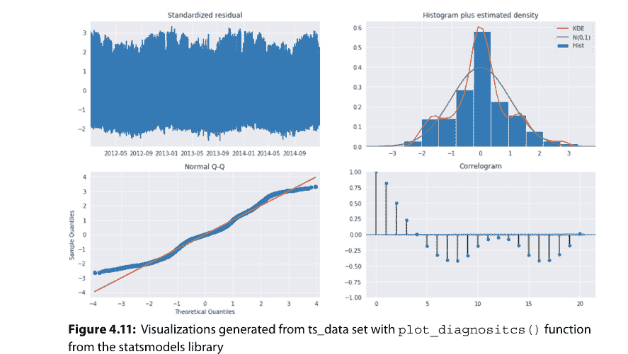

最后，我们可以测试`AutoReg()`函数的预测能力：预测是使用结果实例的`predict`方法生成的。默认生成静态预测，即单步预测。生成多步预测需要使用`dynamic=True`。

在下面的示例代码中，我们在`ts_data`数据集上应用`predict`方法。我们对训练集的数据准备将涉及以下步骤：

1. 定义训练集和测试集的开始日期。
2. 过滤原始数据集，仅包含为训练集保留的时间段。
3. 缩放时间序列，使值落在区间(0, 1)内。为此操作，我们将使用`MinMaxScaler()`；这是一个估计器，它对每个特征单独进行缩放和平移，使其在训练集上处于给定范围内——例如在零和一之间（scikit-learn.org/stable/modules/generated/sklearn.preprocessing.MinMaxScaler.html）。

在下面的示例代码中，我们首先定义训练和测试数据集的开始日期：

```python
# Define the start date for the train and test sets
train_start_dt = '2014-11-01 00:00:00'
test_start_dt = '2014-12-30 00:00:00'
```

## 第4章 自回归与自动化方法导论

作为第二步，我们过滤原始数据集，仅包含为训练集保留的时间段：

```python
# Create train set containing only the model features
train = ts_data_load.copy()[
    (ts_data_load.index >= train_start_dt)
    & (ts_data_load.index < test_start_dt)][['load']]
test = ts_data_load.copy()[
    ts_data_load.index >= test_start_dt][['load']]

print('Training data shape: ', train.shape)
print('Test data shape: ', test.shape)
```

然后我们将数据缩放到(0, 1)范围内，并指定要预测的步数。此转换应在训练集和测试集上进行校准，如下面的示例代码所示：

```python
# Scale train data to be in range (0, 1)
from sklearn.preprocessing import MinMaxScaler
scaler = MinMaxScaler()
train['load'] = scaler.fit_transform(train)
train.head()

# Scale test data to be in range (0, 1)
test['load'] = scaler.transform(test)
test.head()
```

我们还需要指定要预测的步数，如下面的示例代码所示：

```python
# Specify the number of steps to forecast ahead
HORIZON = 3
print('Forecasting horizon:', HORIZON, 'hours')
```

现在我们可以为每个预测步长创建一个测试数据点，如下面的示例代码所示：

```python
# Create a test data point for each HORIZON
test_shifted = test.copy()

for t in range(1, HORIZON):
    test_shifted['load+'+str(t)] = test_shifted['load']
    .shift(-t, freq='H')

test_shifted = test_shifted.dropna(how='any')
test_shifted.head(5)
```

最后，我们可以使用`predict`方法在测试数据上进行预测：

## 移动平均

移动平均技术利用回归方法中的先前预测误差来预测未来时间戳的观测值：每个未来观测值都可以被视为先前预测误差的加权移动平均。

与自回归技术一起，移动平均方法是更通用的自回归移动平均和自回归积分移动平均模型的重要组成部分，这些模型呈现了更复杂的随机配置。

移动平均模型与自回归模型非常相似：如上一段所述，自回归模型表示过去观测值的线性组合，而移动平均模型表示过去误差项的组合。数据科学家通常将移动平均模型应用于时间序列数据，因为它们非常擅长通过将模型拟合到误差项来直接解释误差过程中的隐藏或不规则模式。

Python 通过 `statsmodels.tsa.arima_model.ARMA` 类（statsmodels.org/stable/generated/statsmodels.tsa.arima_model.ARMA.html）支持移动平均方法，该类来自 statsmodels，通过将自回归模型的阶数设置为 0 并在 order 参数中定义移动平均模型的阶数：

```
MovAvg_Model = ARMA(ts_data_load, order=(0, 1))
```

statsmodels 库提供了 `ARMA()` 类的定义和参数，如表 4.5 所示。

**表 4.5：** statsmodels 中的自回归移动平均

| 自回归移动平均 | 描述和属性 |
| :--- | :--- |
| `arima_model.ARMA(endog, order[, exog, ...])` | 自回归移动平均，或 ARMA(p,q) 模型 |
| `arima_model.ARMAResults(model, params[, ...])` | 用于保存 ARMA 模型拟合结果的类 |

在本节中，你学习了如何使用 Python 和移动平均模型构建预测。在下一节中，你将了解使用 Python 开发和实现自回归移动平均模型的最佳包和类。

## 自回归移动平均

自回归移动平均（ARMA）模型在时间序列建模中一直扮演着关键角色，因为它们的线性结构有助于显著简化线性预测（Zhang 等人，2015）。
ARMA 方法由两部分组成：

- 一个自回归
- 一个移动平均模型

与自回归和移动平均模型相比，ARMA 模型提供了平稳时间序列最有效的线性模型，因为它们能够用最少的参数对未知过程进行建模（Zhang 等人，2015）。
特别是，ARMA 模型用于通过两个多项式来描述弱平稳随机时间序列。第一个多项式用于自回归，第二个用于移动平均。通常这种方法被称为 ARMA(p,q) 模型，其中：

- p 代表自回归多项式的阶数，
- q 代表移动平均多项式的阶数。

在这里，我们将看到如何从 AR(p)、MA(q) 和 ARMA(p,q) 过程模拟时间序列，以及如何根据从 ACF 和 PACF 中收集的见解将时间序列模型拟合到数据。

Python 通过 statsmodels 中的 `ARMA()` 函数（statsmodels.org/stable/generated/statsmodels.tsa.arima_model.ARMA.html）支持 ARMA 模型的实现。statsmodels 库提供了 `ARMA()` 类的定义和参数，如表 4.6 所示。

**表 4.6：** statsmodels 中自回归移动平均类的定义和参数

| 类名 | STATSMODELS.TSA.ARIMA_MODEL.ARMA |
| :--- | :--- |
| **定义** | 估计自回归移动平均 (p,q) 模型的类。 |
| **参数** | `array_like` |
| **endog** | 内生（因）变量。 |
| **参数** | `iterable` |
| **Order** | 模型的 (p,q) 阶数，用于指定要使用的 AR 参数和 MA 参数的数量。 |
| **参数** | `array_like, optional` |
| **exog** | 一个可选的外生变量数组。这不应包括常数或趋势。你可以在 fit 方法中指定此项。 |
| **参数** | `array_like, optional` |
| **dates** | 一个由 datetime 对象组成的类数组对象。如果为 endog 或 exog 提供了 pandas 对象，则假定其具有 DateIndex。 |
| **参数** | `str, optional` |
| **freq** | 时间序列的频率。pandas 偏移量或 'B'、'D'、'W'、'M'、'A' 或 'Q'。如果提供了 dates，则此项可选。 |

现在让我们进入下一节，学习如何利用自回归和自回归移动平均，使用我们的 `ts_data_load` 数据集构建自回归积分移动平均模型。

## 自回归积分移动平均

自回归积分移动平均（ARIMA）模型被认为是更简单的自回归移动平均（ARMA）模型的发展，并包含了积分的概念。

事实上，自回归移动平均（ARMA）和自回归积分移动平均（ARIMA）具有许多相似的特征：它们的元素是相同的，因为它们都利用了通用的自回归 AR(p) 和通用的移动平均模型 MA(q)。正如你之前所学，AR(p) 模型使用时间序列中的先前值进行预测，而 MA(q) 使用序列均值和先前误差进行预测（Petris, Petrone, and Campagnoli 2009）。

ARMA 和 ARIMA 方法之间的主要区别在于积分和差分的概念。ARMA 模型是一个平稳模型，它在平稳时间序列（其统计特性，如均值、自相关和季节性，不依赖于序列被观测的时间）上表现非常好。

可以通过差分技术使时间序列平稳化（例如，通过从时间 t 观测到的值中减去时间 t–1 观测到的值）。估计需要多少非季节性差分才能使时间序列平稳的过程称为积分（I）或积分方法。

ARIMA 模型有三个主要组成部分，表示为 p、d、q；在 Python 中，你可以为每个组成部分分配整数值，以指示你需要应用的特定 ARIMA 模型。这些参数定义如下：

- $p$ 代表 ARIMA 模型中包含的滞后变量数量，也称为*滞后阶数*。
- $d$ 代表时间序列数据集中的原始值被差分的次数，也称为*差分阶数*。
- $q$ 表示移动平均窗口的大小，也称为*移动平均阶数*。

如果上述参数之一不需要使用，可以为该特定参数分配值 0，这表示不使用该模型元素。

现在让我们看看 Python 中 ARIMA 模型的一个扩展，称为 SARIMAX，它代表带有外生因子的季节性自回归积分移动平均。数据科学家在处理具有季节性周期的时间序列数据集时通常应用 SARIMAX。此外，SARIMAX 模型支持季节性和外生因子，因此它们不仅需要 ARIMA 所需的 $p$、$d$ 和 $q$ 参数，还需要另一个

## 第四章 ■ 自回归与自动化方法简介

针对季节性方面，需要一组 $p$、$d$ 和 $q$ 参数，以及一个名为 $s$ 的参数，它代表时间序列数据集中季节性周期的周期性。

Python 通过 statsmodels 库（`statsmodels.org/dev/generated/statsmodels.tsa.statespace.sarimax.SARIMAX.html`）支持 `SARIMAX()` 类，如表 4.7 所示。

**表 4.7：** statsmodels 中的带外生因子的季节性自回归积分移动平均模型

| 季节性自回归积分移动平均 | 描述与属性 |
|---|---|
| `sarimax.SARIMAX(endog[, exog, order, ...])` | 带外生回归变量的季节性自回归积分移动平均模型 |
| `sarimax.SARIMAXResults(model, params, ...[, ...])` | 用于保存拟合 SARIMAX 模型结果的类 |

statsmodels 库提供了表 4.8 所示的 `SARIMAX()` 类的定义和参数。

**表 4.8：** statsmodels 中季节性自回归积分移动平均类的定义和参数

| 类名 | `STATSMODELS.TSA.STATESPACE.SARIMAX.SARIMAX` |
|---|---|
| **定义** | 用于估计带外生回归变量的季节性自回归积分移动平均模型的类。 |
| **参数** | `array_like` |
| **endog** | 观测到的时间序列过程 $y_t$。 |
| **参数** | `array_like`, *可选* |
| **exog** | 外生回归变量数组，形状为 $n\_obs \times k$。 |
| **参数** | `iterable` 或 `iterable of iterables`, *可选* |
| **order** | 模型的 $(p,d,q)$ 阶，分别对应 AR 参数、差分阶数和 MA 参数的数量。$d$ 必须是整数，表示过程的积分阶数，而 $p$ 和 $q$ 可以是整数，表示 AR 和 MA 的阶数（即包含所有直到这些阶数的滞后项），也可以是可迭代对象，指定要包含的特定 AR 和/或 MA 滞后项。默认为 AR(1) 模型：$(1,0,0)$。 |
| **参数** | `iterable, 可选` |
| **seasonal_order** | 模型季节性成分的 $(p,d,q,s)$ 阶，分别对应 AR 参数、差分阶数、MA 参数和周期性。$d$ 必须是整数，表示过程的积分阶数，而 $p$ 和 $q$ 可以是整数，表示 AR 和 MA 的阶数（即包含所有直到这些阶数的滞后项），也可以是可迭代对象，指定要包含的特定 AR 和/或 MA 滞后项。$s$ 是整数，表示周期性（季节中的周期数）；对于季度数据通常为 4，对于月度数据通常为 12。默认为无季节性效应。 |
| **参数** | `str{'n','c','t','ct'}, iterable, 可选` |
| **trend** | 控制确定性趋势多项式 $A(t)$ 的参数。可以指定为字符串，其中 'c' 表示常数（即趋势多项式的零次项），'t' 表示随时间变化的线性趋势，'ct' 表示两者兼有。也可以指定为可迭代对象，按照 *numpy.poly1d* 的方式定义多项式，例如 [1,1,0,1] 表示 $a+bt+ct^3$。默认为不包含趋势成分。 |
| **参数** | `bool, 可选` |
| **measurement_error** | 是否假设内生观测值 *endog* 的测量存在误差。默认为 False。 |
| **参数** | `bool, 可选` |
| **time_varying_regression** | 当提供了解释变量 *exog* 时使用，用于选择是否允许外生回归变量的系数随时间变化。默认为 False。 |
| **参数** | `bool, 可选` |
| **mle_regression** | 是否将外生变量的回归系数作为最大似然估计的一部分，或者通过卡尔曼滤波（即递归最小二乘法）进行处理。如果 *time_varying_regression* 为 True，则此项必须设置为 False。默认为 True。 |
| **参数** | `bool, 可选` |
| **simple_differencing** | 是否使用部分条件最大似然估计。如果为 True，则在估计之前进行差分，这会丢弃前 $sD+d$ 个初始行，但会导致状态空间公式更小。有关使用此选项时解释结果的重要细节，请参见“注释”部分。如果为 False，则将完整的 SARIMAX 模型置于状态空间形式，以便所有数据点都可用于估计。默认为 False。 |
| **参数** | `bool, 可选` |
| **enforce_stationarity** | 是否转换 AR 参数以强制模型自回归成分的平稳性。默认为 True。 |
| **参数** | `bool, 可选` |
| **enforce_invertibility** | 是否转换 MA 参数以强制模型移动平均成分的可逆性。默认为 True。 |
| **参数** | `bool, 可选` |
| **hamilton_representation** | 是否使用 ARMA 过程的 Hamilton 表示（如果为 True）或 Harvey 表示（如果为 False）。默认为 False。 |
| **参数** | `bool, 可选` |
| **concentrate_scale** | 是否从似然函数中集中尺度（误差项的方差）。这会将最大似然估计的参数数量减少一个，但尺度参数的标准误差将不可用。 |
| **参数** | `int, 可选` |
| **trend_offset** | 时间趋势值的起始偏移量。默认为 1，因此如果 `trend='t'`，则趋势等于 1, 2, ..., nobs。通常仅在通过扩展先前数据集创建模型时设置。 |
| **参数** | `bool, 可选` |
| **use_exact_diffuse** | 是否对非平稳状态使用精确扩散初始化。默认为 False（在这种情况下使用近似扩散初始化）。 |

现在让我们看看如何将 SARIMAX 模型应用于我们的 `ts_data_load` 数据集。在以下代码示例中，我们将演示如何执行以下操作：

- 为训练 SARIMAX 时间序列预测模型准备时间序列数据
- 实现一个简单的 SARIMAX 模型来预测时间序列中接下来的 HORIZON 步（从时间 $t + 1$ 到 $t + HORIZON$）
- 评估模型

在下面的示例代码中，我们导入必要的库：

```python
# Import necessary libraries
from statsmodels.tsa.statespace.sarimax import SARIMAX
from sklearn.preprocessing import MinMaxScaler
import math
from common.utils import mape
```

此时，我们需要将数据集分为训练集和测试集。我们在训练集上训练模型。模型训练完成后，我们在测试集上评估模型。我们必须确保测试集覆盖的时间段晚于训练集，以确保模型不会从未来时间段的信息中获益。

我们将 2014 年 9 月 1 日至 10 月 31 日的时期分配给训练集（两个月），将 2014 年 11 月 1 日至 12 月 31 日的时期分配给测试集（两个月）。由于这是每日能源消耗数据，存在很强的季节性模式，但消耗量与最近几天的消耗量最为相似。因此，使用相对较小的时间窗口进行数据训练应该就足够了：

```python
# Create train set containing only the model features
train = ts_data_load.copy()[
    (ts_data_load.index >= train_start_dt)
    & (ts_data_load.index < test_start_dt)][['load']]
test = ts_data_load.copy()[
    ts_data_load.index >= test_start_dt][['load']]

print('Train data shape: ', train.shape)
print('Test data shape: ', test.shape)
```

我们对训练集和测试集的数据准备还包括对时间序列进行缩放，使其值落在区间 (0, 1) 内：

```python
# Scale train data to be in range (0, 1)
scaler = MinMaxScaler()
train['load'] = scaler.fit_transform(train)
train.head()

# Scale test data to be in range (0, 1)
test['load'] = scaler.transform(test)
test.head()
```

指定要预测的步数以及 SARIMAX 模型的阶数和季节性阶数非常重要：

```python
# Specify the number of steps to forecast ahead
HORIZON = 3
print('Forecasting horizon:', HORIZON, 'hours')
```

然后我们指定 SARIMAX 模型的阶数和季节性阶数，如以下示例代码所示：

```python
# Define the order and seasonal order for the SARIMAX model
order = (4, 1, 0)
seasonal_order = (1, 1, 0, 24)
```

我们终于能够构建并拟合模型了，如下方示例代码所示：

```python
# Build and fit the SARIMAX model
model = SARIMAX(endog=train, order=order, seasonal_order=seasonal_order)
results = model.fit()

print(results.summary())
```

我们现在执行所谓的“滚动前向验证”。在实践中，每当有新数据可用时，时间序列模型都会被重新训练。这使得模型能够在每个时间步做出最佳预测。

从时间序列的起点开始，我们在训练数据集上训练模型。然后，我们对下一个时间步进行预测。接着，将预测值与已知值进行评估。之后，训练集会扩展以包含该已知值，并重复此过程。（请注意，为了更高效的训练，我们保持训练集窗口大小固定，因此每次向训练集添加新观测值时，我们都会从集合的开头移除一个观测值。）

这个过程提供了对模型在实际应用中表现的更稳健的估计。然而，其代价是需要创建大量模型。如果数据量较小或模型较简单，这是可以接受的，但在大规模应用时可能会成为问题。

滚动前向验证是时间序列模型评估的黄金标准，推荐在您自己的项目中使用：

```python
# Create a test data point for each HORIZON step
test_shifted = test.copy()

for t in range(1, HORIZON):
    test_shifted['load'+str(t)] = test_shifted['load'].shift(-t, freq='H')

test_shifted = test_shifted.dropna(how='any')
```

我们可以在测试数据上进行预测，并使用一个更简单的模型（通过指定不同的阶数和季节性阶数）进行演示：

```python
%%time
# Make predictions on the test data
training_window = 720

train_ts = train['load']
test_ts = test_shifted

history = [x for x in train_ts]
history = history[(-training_window):]

predictions = list()

# Let's use a simpler model
order = (2, 1, 0)
seasonal_order = (1, 1, 0, 24)

for t in range(test_ts.shape[0]):
    model = SARIMAX(endog=history, order=order, seasonal_order=seasonal_order)
    model_fit = model.fit()
    yhat = model_fit.forecast(steps=HORIZON)
    predictions.append(yhat)
    obs = list(test_ts.iloc[t])
    # move the training window
    history.append(obs[0])
    history.pop(0)
    print(test_ts.index[t])
    print(t+1, ': predicted =', yhat, 'expected =', obs)
```

让我们将预测值与实际负荷进行比较：

```python
# Compare predictions to actual load
eval_df = pd.DataFrame(predictions,
    columns=['t'+str(t) for t in range(1, HORIZON+1)])
eval_df['timestamp'] = test.index[0:len(test.index)-HORIZON+1]
eval_df = pd.melt(eval_df, id_vars='timestamp',
    value_name='prediction', var_name='h')
eval_df['actual'] = np.array(np.transpose(test_ts)).ravel()
eval_df[['prediction', 'actual']] = scaler.inverse_transform(eval_df[['prediction', 'actual']])
```

计算平均绝对百分比误差（MAPE）也很有帮助，它衡量了所有预测中误差的百分比大小，如下例所示：

```python
# Compute the mean absolute percentage error (MAPE)
if (HORIZON > 1):
    eval_df['APE'] = (eval_df['prediction'] - eval_df['actual']).abs() / eval_df['actual']
    print(eval_df.groupby('h')['APE'].mean())
```

为了查看MAPE结果，我们同时打印单步预测MAPE结果和多步预测MAPE结果：

```python
# Print one-step forecast MAPE
print('One step forecast MAPE: ', (mape(eval_df[eval_df['h']
== 't+1']['prediction'],
eval_df[eval_df['h'] == 't+1']['actual']))*100, '%')

# Print multi-step forecast MAPE
print('Multi-step forecast MAPE: ',
mape(eval_df['prediction'], eval_df['actual'])*100, '%')
```

在本节中，您学习了如何为您的预测解决方案构建、训练、测试和验证SARIMAX模型。现在让我们进入下一节，学习如何利用自动机器学习进行时间序列预测。

## 自动机器学习

在本节中，您将学习如何使用Azure机器学习（aka.ms/AzureMLservice）中的自动机器学习来训练时间序列预测回归模型。设计预测模型类似于使用自动机器学习（aka.ms/AutomatedML）设置典型的回归模型；然而，重要的是要理解针对时间序列数据存在哪些配置选项和预处理步骤：自动机器学习中预测回归任务与回归任务之间最重要的区别在于，需要在数据集中包含一个变量作为指定的时间戳列（aka.ms/AutomatedML）。

以下Python示例向您展示如何执行以下操作：

- 为使用自动机器学习进行时间序列预测准备数据
- 使用'AutoMLConfig'在AutoMLConfig对象中配置特定的时间序列参数
- 使用AmlCompute（一种允许您轻松创建单节点或多节点计算的托管计算基础设施）训练模型
- 探索工程化特征和结果

如果您使用的是基于云的Azure机器学习计算实例，您可以使用Jupyter笔记本或JupyterLab体验开始编码。您可以在docs.microsoft.com/en-us/azure/machine-learning/how-to-configure-environment找到有关如何为Azure机器学习配置开发环境的更多信息。

否则，您需要完成配置步骤以建立与Azure机器学习工作区的连接。您可以访问以下链接来配置您的Azure机器学习工作区，并学习如何在Azure机器学习上使用Jupyter笔记本：

- Aka.ms/AzureMLConfiguration
- Aka.ms/AzureMLJupyterNotebooks

在以下示例中，我们设置重要的资源和包，以便在Azure机器学习上运行自动机器学习，并管理笔记本中可能出现的警告消息：

```python
# Import resources and packages for Automated ML and time series forecasting
import logging
from sklearn.metrics import mean_absolute_error, mean_squared_error, r2_score
from matplotlib import pyplot as plt
import pandas as pd
import numpy as np
import warnings
import os
import azureml.core
from azureml.core import Experiment, Workspace, Dataset
from azureml.train.automl import AutoMLConfig
from datetime import datetime

# manage warning messages
warnings.showwarning = lambda *args, **kwargs: None
```

作为设置的一部分，您已经创建了一个Azure ML工作区对象（Aka.ms/AzureMLConfiguration）。此外，对于自动机器学习，您还需要创建一个Experiment对象，这是工作区中用于运行机器学习实验的命名对象：

```python
# Select a name for the run history container in the workspace
experiment_name = 'automatedML-timeseriesforecasting'

experiment = Experiment(ws, experiment_name)
output = {}
output['SDK version'] = azureml.core.VERSION
output['Subscription ID'] = ws.subscription_id
output['Workspace'] = ws.name
output['Resource Group'] = ws.resource_group
output['Location'] = ws.location
output['Run History Name'] = experiment_name
pd.set_option('display.max_colwidth', -1)
outputDf = pd.DataFrame(data = output, index = [''])
outputDf.T
```

执行自动机器学习实验的远程运行需要一个计算目标。Azure机器学习计算是一种托管计算基础设施，允许您创建单节点或多节点计算。在本教程中，我们创建AmlCompute作为您的训练计算资源。要了解更多关于如何设置和使用计算目标进行模型训练的信息，您可以访问docs.microsoft.com/en-us/azure/machine-learning/how-to-set-up-training-targets。重要的是要记住，与其他Azure服务一样，与Azure机器学习服务相关的某些资源（如AmlCompute）存在限制。请阅读这篇关于默认限制以及如何请求更多配额的文章：aka.ms/AzureMLQuotas。

现在让我们导入AmlCompute和计算目标，并为我们的集群选择一个名称，检查计算目标是否已存在于工作区中：

```python
# Import AmlCompute and ComputeTarget for the experiment
from azureml.core.compute import ComputeTarget, AmlCompute
from azureml.core.compute_target import ComputeTargetException

# Select a name for your cluster
amlcompute_cluster_name = "tsf-cluster"

# Check if that cluster does not exist already in the workspace
try:
    compute_target = ComputeTarget(workspace=ws, name=amlcompute_cluster_name)
    print('Found existing cluster, use it.')
except ComputeTargetException:
    compute_config = AmlCompute.provisioning_configuration(vm_size='STANDARD_DS12_V2', max_nodes=6)
    compute_target = ComputeTarget.create(ws, amlcompute_cluster_name, compute_config)
    compute_target.wait_for_completion(show_output=True)
```

现在让我们定义并准备时间序列数据，以便使用自动机器学习进行预测。在这个自动机器学习示例中，我们使用纽约市能源需求数据集（mis.nyiso.com/public/P-58Blist.htm）：该数据集包含以表格格式存储的纽约市消费数据，包括每小时频率的能源需求和数值天气特征。本实验的目的是通过构建一个利用同一地理区域历史能源数据的预测解决方案，来预测纽约市未来24小时的能源需求。

如果您有兴趣探索其他公共数据集和特征（如天气、卫星图像、社会经济数据），并将它们添加到此能源数据集中以提高机器学习模型的准确性，我建议查看Azure开放数据集目录：aka.ms/AzureOpenDatasetsCatalog。

对于我们的自动机器学习实验，我们需要确定目标列，它代表我们想要预测的目标变量。时间列是我们的时间戳列，它定义了数据集的时间结构。

最后，还有两个额外的列，*temp* 和 *precip*，它们代表了我们可以包含在预测实验中的两个额外的数值天气变量：

```python
# Identify the target and time column names in our data set
target_column_name = 'demand'
time_column_name = 'timeStamp'
```

此时，我们可以使用 TabularDataset 类 (docs.microsoft.com/en-us/python/api/azureml-core/azureml.data.tabulardataset?view=azure-ml-py) 来加载数据集。要开始使用表格数据集，请参阅 aka.ms/tabulardataset-samplenotebook。

```python
# load the data set using the TabularDataset class
ts_data = Dataset.Tabular.from_delimited_files(
    path = "https://automlsamplenotebookdata.blob.core.windows.net/automl-sample-notebook-data/nyc_energy.csv"
).with_timestamp_columns(fine_grain_timestamp=time_column_name)
ts_data.take(5).to_pandas_dataframe().reset_index(drop=True)
```

这个能源数据集缺少 2017 年 8 月 10 日 5:00 之后所有时间点的能源需求值。下面，我们从数据集末尾减少并删除包含这些缺失值的行：

```python
# Delete a few rows of the data set due to large number of NaN values
ts_data = ts_data.time_before(datetime(2017, 10, 10, 5))
```

我们进行的第一个划分是训练集和测试集：2017 年 8 月 8 日 5:00 之前及当天的数据将用于训练，之后的数据将用于测试：

```python
# Split the data set into train and test sets
train = ts_data.time_before(datetime(2017, 8, 8, 5), include_boundary=True)
train.to_pandas_dataframe().reset_index(drop=True).sort_values(time_column_name).tail(5)

test = ts_data.time_between(datetime(2017, 8, 8, 6), datetime(2017, 8, 10, 5))
test.to_pandas_dataframe().reset_index(drop=True).head(5)
```

预测范围是模型应该预测的未来时间戳的数量。在这个例子中，我们将范围设置为 24 小时：

```python
# Define the horizon length to 24 hours
max_horizon = 24
```

对于预测任务，自动化 ML 使用针对时间序列数据特定的预处理和估计步骤 (aka.ms/AutomatedML)。它首先检测时间序列样本频率（例如，每小时、每天、每周），并为缺失的时间点创建新记录以使序列连续。然后，它通过前向填充来填补目标列中的缺失值，并使用列中值来填补特征列中的缺失值，并创建基于粒度的特征以实现不同序列间的固定效应。最后，它创建基于时间的特征以帮助学习季节性模式，并将分类变量编码为数值。要了解更多关于此过程的信息，请访问页面 aka.ms/AutomatedML。

AutoMLConfig 对象定义了自动化 ML 任务所需的设置和数据：数据科学家需要定义标准的训练参数，如任务类型、迭代次数、训练数据和交叉验证次数。对于预测任务，必须设置一些影响实验的额外参数。表 4.9 总结了每个参数及其用法。

表 4.9：使用 AutoML Config 类配置的自动化 ML 参数

| 属性 | 描述 |
|---|---|
| Task | forecasting |
| primary_metric | 这是你想要优化的指标。预测支持以下主要指标：spearman_correlation, normalized_root_mean_squared_error, r2_score, normalized_mean_absolute_error |
| blocked_models | blocked_models 中的模型不会被 AutoML 使用。 |
| experiment_timeout_hours | 实验终止前可以花费的最大时间（以小时为单位）。 |
| training_data | 实验中要使用的训练数据。 |
| label_column_name | 标签列的名称。 |
| compute_target | 用于训练的远程计算。 |
| n_cross_validations | 交叉验证分割的次数。滚动原点验证用于以时间一致的方式分割时间序列。 |
| enable_early_stopping | 如果分数在短期内没有提高，则启用提前终止的标志。 |
| time_column_name | 你的时间列的名称。 |
| max_horizon | 你希望在训练数据之外预测的周期数。周期从你的数据中推断。 |

下面的代码展示了如何在 Python 中设置这些参数。具体来说，你将使用 `blocked_models` 参数来排除一些模型。你可以选择从 `blocked_models` 列表中移除模型，并增加 `experiment_timeout_hours` 参数值，以查看你的自动化 ML 结果：

```python
# Automated ML configuration
automl_settings = {
    'time_column_name': time_column_name,
    'max_horizon': max_horizon,
}

automl_config = AutoMLConfig(task='forecasting',
                             primary_metric='normalized_root_mean_squared_error',
                             blocked_models = ['ExtremeRandomTrees', 'AutoArima', 'Prophet'],
                             experiment_timeout_hours=0.3,
                             training_data=train,
                             label_column_name=target_column_name,
                             compute_target=compute_target,
                             enable_early_stopping=True,
                             n_cross_validations=3,
                             verbosity=logging.INFO,
                             **automl_settings)
```

我们现在调用实验对象的 submit 方法并传递运行配置。根据数据和迭代次数，这可能需要运行一段时间。可以指定 `show_output = True` 将当前运行的迭代打印到控制台：

```python
# Initiate the remote run
remote_run = experiment.submit(automl_config, show_output=False)
remote_run
```

下面我们使用 `get_output` 方法从所有训练迭代中选择最佳模型：

```python
# Retrieve the best model
best_run, fitted_model = remote_run.get_output()
fitted_model.steps
```

对于自动化 ML 中的时间序列任务类型，你可以查看特征工程过程的详细信息。以下代码显示了每个原始特征及其以下属性：

- 原始特征名称
- 由此原始特征形成的工程特征数量
- 检测到的类型
- 特征是否被丢弃
- 原始特征的特征转换列表

```python
# Get the featurization summary as a list of JSON
featurization_summary = fitted_model.named_steps['timeseriestransformer'].get_featurization_summary()

# View the featurization summary as a pandas dataframe
pd.DataFrame.from_records(featurization_summary)
```

现在我们已经为预测场景检索到了最佳模型，它可以用于对测试数据进行预测。首先，我们需要从测试集中移除目标值：

```python
# Make predictions using test data
X_test = test.to_pandas_dataframe().reset_index(drop=True)
y_test = X_test.pop(target_column_name).values
```

对于预测，我们将使用 `forecast` Python 函数，如以下示例代码所示：

```python
# Apply the forecast function
y_predictions, X_trans = fitted_model.forecast(X_test)
```

为了评估预测的准确性，我们将其与实际的能源值进行比较，并使用 MAPE 指标进行评估。我们还使用 `align_outputs` 函数来将输出显式地与输入对齐：

```python
# Apply the align_outputs function
# in order to line up the output explicitly to the input
from forecasting_helper import align_outputs
from azureml.automl.core._vendor.automl.client.core.common import metrics
from automl.client.core.common import constants

ts_results_all = align_outputs(
    y_predictions, X_trans, X_test, y_test, target_column_name)

# Compute metrics for evaluation
scores = metrics.compute_metrics_regression(
    ts_results_all['predicted'],
    ts_results_all[target_column_name],
    list(constants.Metric.SCALAR_REGRESSION_SET),
    None,
    None,
    None)
```

在本章的这一节中，你学习了如何利用自动化 ML 来处理你的时间序列场景。要了解更多关于如何将自动化 ML 用于分类、回归和预测场景的信息，你可以访问 aka.ms/AutomatedML。

## 结论

在本章中，你学习了如何使用自回归方法和 Azure 机器学习中的自动化 ML 来训练时间序列预测回归模型。具体来说，我们探讨了以下方法：

- *自回归* – 这种时间序列技术假设下一个时间戳的未来观测值与先前时间戳的观测值通过线性关系相关。
- *移动平均* – 这种时间序列技术在回归方法中利用先前的预测误差来预测下一个时间戳的未来观测值。与自回归技术一起，移动平均方法是更通用的自回归移动平均和自回归积分移动平均模型的关键组成部分，这些模型呈现了更复杂的随机配置。
- *自回归移动平均* – 这种时间序列技术假设下一个时间戳的未来观测值可以表示为先前时间戳的观测值和残差误差的线性函数。
- *自回归积分移动平均* – 这种时间序列技术假设下一个时间戳的未来观测值可以表示为先前时间戳的差分观测值和残差误差的线性函数。
- *自动化 ML* – 这种时间序列技术遍历一系列不同的机器学习算法用于时间序列预测，同时为你的场景执行最佳模型选择、超参数调优和特征工程。

在下一章中，我们将学习如何将深度学习方法应用于时间序列场景。

## 第五章

## 时间序列预测的神经网络导论

正如我们在前几章所讨论的，准确预测未来序列的能力在许多行业中至关重要：金融、供应链和制造业只是其中几个例子。经典的时间序列技术已经为这项任务服务了几十年，但现在，深度学习方法——类似于计算机视觉和自动翻译中使用的方法——也有潜力彻底改变时间序列预测。

由于深度学习神经网络适用于许多现实问题，例如欺诈检测、垃圾邮件过滤、金融和医疗诊断，并且能够产生可操作的结果，近年来受到了广泛关注。通常，深度学习方法已被开发并应用于单变量时间序列预测场景，其中时间序列由在相等时间增量上顺序记录的单个观测值组成（Lazzeri 2020）。

因此，它们的表现往往不如朴素和经典的预测方法，例如自回归积分移动平均（ARIMA）。这导致了一种普遍的误解，即深度学习模型在时间序列预测场景中效率低下，许多数据科学家想知道是否真的有必要在他们的时间序列工具包中添加另一类方法，如卷积神经网络或循环神经网络（Lazzeri 2020）。

在本章中，我们将讨论数据科学家在构建时间序列预测解决方案时可能仍然考虑深度学习的一些实际原因。具体来说，我们将仔细研究以下重要主题：

- *将深度学习添加到时间序列工具包的理由* – 深度学习神经网络能够自动学习从输入到输出的任意复杂映射，并支持多个输入和输出。这些是强大的特性，为时间序列预测提供了巨大的前景，特别是在具有复杂非线性依赖关系、多值输入和多步预测的问题上。这些特性，加上更现代神经网络的能力，可能提供巨大的前景，例如卷积神经网络提供的自动特征学习，以及循环神经网络对序列数据的原生支持。在本节中，你将发现深度学习神经网络在时间序列预测方面的承诺能力。具体来说，我们将讨论以下深度学习方法的能力：
    - 深度学习神经网络能够从原始和不完美的数据中自动学习和提取特征。
    - 深度学习支持多个输入和输出。
    - 循环神经网络——特别是长短期记忆（LSTM）网络——擅长提取输入数据中跨越相对较长序列的模式。
- *用于时间序列预测的循环神经网络* – 在本节中，我将介绍一种非常流行的人工神经网络类型：循环神经网络，也称为RNN。循环神经网络是一类允许先前输出用作输入同时具有隐藏状态的神经网络。
- *如何为时间序列预测开发GRU和LSTM* – 在第五章的最后这一节，你将学习如何为深度学习模型准备数据，并为一系列时间序列预测问题开发GRU模型。

## 将深度学习添加到时间序列工具包的理由

机器学习的目标是找到特征来训练一个模型，将输入数据（如图像、时间序列或音频）转换为给定的输出（如标题、价格值或转录）。深度学习是机器学习算法的一个子集，它通过将输入数据表示为向量，并通过一系列线性代数运算将其转换为给定输出来学习提取这些特征。为了进一步阐明深度学习和机器学习之间的区别，让我们首先分别定义这两个研究领域：

- *机器学习*是使用算法分解数据、从中学习，然后利用这些数据对某种现象进行预测的实践。学习过程通常基于以下步骤：
    1. 我们向算法输入数据。
    2. 然后我们使用这些数据来教我们的模型如何从先前的观测中学习。
    3. 我们运行测试以检查我们的模型是否从先前的观测中学到了足够的东西，并评估其性能。
    4. 如果模型表现良好（基于我们的期望和要求），我们将其部署并投入生产，使其可供组织内或外部的其他利益相关者使用。
    5. 最后，我们使用部署的模型来执行某个自动预测任务。

- *深度学习*是机器学习的一个子集。深度学习算法是基于人工神经网络的特定类型的机器学习算法。在这种情况下，学习过程基于与机器学习相同的步骤，但之所以称为“深度”，是因为算法的结构基于由多个输入层、输出层和隐藏层组成的人工神经网络，这些层包含将输入数据转换为下一层可以使用的信息的单元，以便在深度学习模型部署后执行某个自动预测任务。

比较这两种技术并理解主要区别非常重要。机器学习和深度学习之间的主要区别总结在表5.1中。

**表5.1：** 机器学习与深度学习的关键区别

| 特征类别 | 所有机器学习 | 仅深度学习 |
| :--- | :--- | :--- |
| **数据点数量** | 可以使用少量数据进行预测。 | 需要使用大量训练数据进行预测。 |
| **硬件依赖性** | 可以在低端机器上运行。不需要大量的计算能力。 | 依赖于高端机器。本质上执行大量的矩阵乘法运算。GPU可以有效地优化这些运算。 |
| **特征化过程** | 需要用户准确识别和创建特征。 | 从数据中学习高级特征并自行创建新特征。 |
| **学习方法** | 将学习过程分解为更小的步骤。然后将每个步骤的结果组合成一个输出。 | 通过端到端地解决问题来推进学习过程。 |
| **执行时间** | 训练时间相对较短，从几秒到几小时不等。 | 通常需要很长时间来训练，因为深度学习算法涉及许多层。 |
| **输出** | 输出通常是数值，如分数或分类。 | 输出可以有多种格式，如文本、分数或声音。 |

来源：aka.ms/deeplearningvsmachinelearning

然后，数据科学家使用称为损失函数的方程来评估输出是否符合预期。该过程的目标是利用每次训练输入的损失函数结果来指导模型提取特征，以便在下一次传递中产生更低的损失值（Lazzeri 2019a）。深度学习神经网络有三个主要的内在能力：

- 深度学习神经网络能够从原始和不完美的数据中自动学习和提取特征。
- 深度学习支持多个输入和输出。
- 循环神经网络——特别是长短期记忆（LSTM）网络和门控循环单元（GRU）——擅长提取输入数据中跨越相对较长序列的模式。

得益于这三个特性，当数据科学家处理更复杂但仍然非常普遍的问题时，例如时间序列预测，它们可以提供很大的帮助（Lazzeri 2019a）。

## 深度学习神经网络能够从原始和不完美的数据中自动学习和提取特征

时间序列是一种衡量事物随时间变化的数据类型。在时间序列中，时间不仅仅是一个度量标准，而是一个主要轴。这个额外的维度对时间序列数据来说既代表机遇也代表约束，因为它提供了额外的信息来源，但使时间序列问题更具挑战性，因为需要对数据进行专门处理（Lazzeri 2019a）。

此外，这种时间结构可以携带额外信息，如趋势和季节性，数据科学家需要处理这些信息，以便使他们的时间序列更容易使用任何类型的经典预测方法进行建模。神经网络通过消除对大规模特征工程过程、数据缩放程序以及通过差分使数据平稳化的即时需求，可用于时间序列预测问题。

在现实世界的时间序列场景中——例如天气预报、空气质量和交通流量预测，以及基于流式物联网设备（如地理传感器）的预测场景——不规则的时间结构、缺失值、强噪声以及多个变量之间的复杂相互关系，对经典预测方法构成了限制。

这些技术通常依赖于干净、完整的数据集才能表现良好；缺失值、异常值和其他不完美的特征通常不被支持。谈到更人工和完美的数据集，经典预测方法基于数据集变量之间存在线性关系和固定时间依赖性的假设，这一假设默认排除了探索变量之间更复杂、可能更有趣的关系的可能性。

数据科学家在为经典分析准备数据时必须做出主观判断——例如用于去除趋势的滞后周期——这既耗时又为过程引入了人为偏差。相反，神经网络对输入数据和映射函数中的噪声具有鲁棒性，甚至可以在存在缺失值的情况下支持学习和预测。卷积神经网络（CNN）是一类神经网络，在图像识别和分类等领域已被证明非常有效。CNN在识别人脸、物体和交通标志方面取得了成功，此外还为机器人和自动驾驶汽车的视觉提供支持。CNN的名称来源于“卷积”算子（Lazzeri 2019a）。

在CNN的情况下，卷积的主要目的是从输入图像中提取特征。卷积通过学习图像特征，使用输入数据的小方块来保留像素之间的空间关系。换句话说，模型学习如何自动从原始数据中提取对正在解决的问题直接有用的特征。这被称为表示学习，CNN以这样的方式实现这一点：无论特征在数据中如何出现（即所谓的变换或失真不变性），都能提取特征。CNN从原始输入数据中学习和自动提取特征的能力可以应用于时间序列预测问题。

一系列观测值可以被视为一维图像，CNN模型可以读取并将其精炼为最相关的元素。CNN的这种能力在时间序列分类任务中得到了很好的证明，例如室内运动预测，使用无线传感器强度数据来预测建筑物内受试者的位置和运动（Lazzeri 2019a）。

## 深度学习支持多输入和多输出

现实世界的时间序列预测具有挑战性，原因有几个，例如具有多个输入变量、需要预测多个时间步长，以及需要对多个物理站点执行相同类型的预测。深度学习算法可以应用于时间序列预测问题，并提供诸如处理具有噪声复杂依赖关系的多个输入变量的能力等好处（Lazzeri 2019a）。

具体来说，神经网络可以被配置为支持映射函数中任意但固定数量的输入和输出。这意味着神经网络可以直接支持多变量输入，为多变量预测提供直接支持。单变量时间序列，顾名思义，是具有单个时间依赖变量的序列。例如，我们想预测特定地点的下一个能源消耗：在单变量时间序列场景中，我们的数据集将基于两个变量：时间值和历史能源消耗观测值（Lazzeri 2019a）。

多变量时间序列具有多个时间依赖变量。每个变量不仅依赖于其过去的值，还依赖于其他变量。这种依赖性用于预测未来值。让我们再次考虑上面的例子。

现在假设我们的数据集包括天气数据，如温度值、露点、风速和云量百分比，以及过去四年的能源消耗值。在这种情况下，需要考虑多个变量来最优地预测能源消耗值。这样的序列将属于多变量时间序列的范畴。

使用神经网络，可以指定任意数量的输出值，为需要多变量预测甚至多步预测方法的更复杂的时间序列场景提供直接支持。深度学习方法可用于进行多步预测的两种主要方法是：

- *直接法*，其中开发一个单独的模型来预测每个预测提前期
- *递归法*，其中开发一个单一模型来进行单步预测，并且该模型被递归使用，其中先前的预测被用作输入来预测后续的提前期

当预测短期连续的提前期块时，递归方法可能是有意义的，而当预测不连续的提前期时，直接方法可能更有意义。当我们需要预测几天内多个连续和不连续提前期的混合时，直接方法可能更合适；例如，空气污染预测问题或用于预测客户想要什么然后自动发货的预期发货预测就是这种情况（Lazzeri 2019a）。

使用深度学习算法进行时间序列预测的关键是选择多个输入数据。我们可以考虑三个主要的数据源，这些数据可以用作输入并映射到目标变量的每个预测提前期：

- *单变量数据*，例如来自被预测的目标变量的滞后观测值。
- *多变量数据*，例如来自其他变量的滞后观测值（例如，在空气污染预测问题中的天气和目标）。
- *元数据*，例如关于被预测的日期或时间的数据。这类数据可以提供对历史模式的额外洞察，有助于创建更丰富的数据集和更准确的预测（Brownlee 2017）。

## 循环神经网络擅长从输入数据中提取模式

循环神经网络（RNN）创建于20世纪80年代，但由于图形处理单元计算能力的增强，最近才开始流行。它们对序列数据特别有用，因为每个神经元或单元都可以使用其内部记忆来维护关于先前输入的信息。RNN中有循环，允许在读取输入时跨神经元传递信息。

然而，简单的循环网络存在一个根本问题，即无法捕获序列中的长期依赖关系。这是RNN在实践中逐渐消失的主要原因，直到在神经网络内部使用LSTM单元取得了一些很好的结果。将LSTM添加到网络中就像添加了一个记忆单元，可以从输入的最开始记住上下文（Lazzeri 2019a）。

LSTM神经网络是一种特殊类型的RNN，具有一些内部上下文状态单元，这些单元充当长期或短期记忆单元。LSTM网络的输出由这些单元的状态调节。当我们需要神经网络的预测依赖于输入的历史上下文而不仅仅是最后一个输入时，这是一个非常重要的特性。它们是一种为包含观测序列的输入数据添加原生支持的神经网络。序列的添加是被近似函数的一个新维度。网络可以学习输入随时间到输出的映射函数，而不仅仅是将输入映射到输出。

## 第5章 ■ 时间序列预测神经网络简介

在需要理解LSTM网络工作原理时，视频处理的例子非常有效：在一部电影中，当前帧发生的内容很大程度上取决于上一帧的内容。在一段时间内，LSTM网络试图学习从过去保留什么、保留多少，以及从当前状态保留多少信息，这使其相较于其他类型的神经网络更为强大（Lazzeri 2019a）。

这种能力可用于任何时间序列预测场景，其中自动从数据中学习时间依赖性可能非常有帮助。在最简单的情况下，网络一次从序列中接收一个观测值，并能够学习哪些先前的观测值是重要的，以及它们与预测的相关性。该模型既学习从输入到输出的映射，也学习输入序列中哪些上下文对该映射有用，并能根据需要动态改变此上下文。

不足为奇，这种方法常被金融行业用于构建预测汇率的模型，其基于的理念是过去的行为和价格模式可能影响货币走势，并可用于预测未来的价格行为和模式。另一方面，数据科学家在实施神经网络架构时需要注意一些缺点。需要大量数据，模型需要超参数调优和多次优化循环。

在本节中，我们讨论了三种神经网络能力，当数据科学家处理更复杂但仍非常常见的问题（如时间序列预测）时，这些能力可以提供很大帮助。在下一节中，我们将深入探讨一些基本概念，以更好地理解神经网络如何用于时间序列预测（Lazzeri 2019a）。

## 用于时间序列预测的循环神经网络

循环神经网络（RNN），也称为自联想或反馈网络，属于一类人工神经网络，其中单元之间的连接形成有向循环。这创造了网络的内部状态，使其能够表现出动态的时间行为（Poznyak, Oria, and Poznyak 2018）。

RNN可以利用其内部记忆来处理输入序列，而不仅仅是将输入映射到输出，它能够利用一个映射函数将输入在*时间*上映射到输出。RNN已在许多涉及时间序列或序列数据的应用中展示了最先进的结果，包括机器翻译和语音识别。

特别是，LSTM是一种RNN架构，在不同的时间处理任务上表现尤为出色，LSTM网络能够成功解决输入数据中的大时间滞后问题。LSTM网络具有几个优良特性，如强大的预测能力以及捕获长期时间依赖性和可变长度观测值的能力（Che et al. 2018）。

利用定制RNN模型与LSTM模型的强大功能，是有效建模时间序列数据的一个有前景的途径：在本章接下来的几节中，你将看到RNN、LSTM和Python如何帮助数据科学家为其时间序列预测解决方案构建精确的模型。

## 循环神经网络

RNN是具有隐藏状态和循环的神经网络，允许信息随时间持续存在。在本节中，我将首先介绍*循环单元*的概念及其记忆如何工作，最后解释它们如何用于处理序列数据（如时间序列）。

不同类型的神经网络（如前馈网络）基于在训练期间从上下文和历史中学习以产生预测的理念：RNN使用隐藏状态（或记忆）的概念，以便能够通过将每个神经元更新为一个新的计算单元来生成结果或预测，该单元能够记住它之前看到的内容（Bianchi et al. 2018）。

这种记忆保存在单元内部，以数组或向量的形式存在，因此当单元读取输入时，它也会处理记忆的内容，将信息结合起来。通过同时使用两者（来自输入的知识和来自记忆的知识），该单元现在能够进行预测（Y）并更新记忆本身，如图5.1所示。

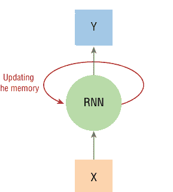

**图5.1：** 循环神经网络单元表示

RNN单元被描述为循环单元，因为当前值对先前事件的依赖类型是*循环的*，可以看作是同一节点的多个副本，每个副本向后继节点传递循环消息。让我们在图5.2中可视化这种递归关系。

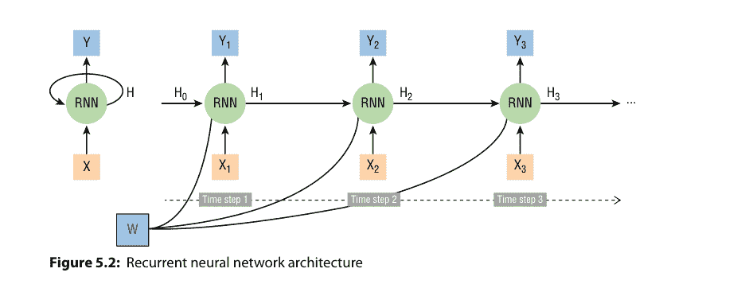

**图5.2：** 循环神经网络架构

在图5.2中，表示了一个RNN架构。RNN有一个内部隐藏状态，表示为H，可以反馈到网络中。在此图中，RNN处理输入值X并产生输出值Y。隐藏状态，表示为H，允许信息从网络的一个节点转发到下一个节点，组织成序列或向量。该向量现在包含有关当前输入和先前输入的信息。该向量经过tanh激活，输出是新的隐藏状态。tanh激活用于调节流经网络的值，并始终将值保持在-1和1之间。由于这种结构，RNN可以成为尝试解决各种序列问题的良好建模选择，例如时间序列预测、语音识别或图像描述（Bianchi 2018）。

如你所见，在图5.2中，有一个额外的元素表示为W。W表示每个单元有三组权重，一组用于输入（X），另一组用于前一时间步的输出（H），还有一组用于当前时间步的输出（Y）。这些权重值由训练过程确定，可以通过应用一种称为梯度下降的流行优化技术来识别。

简单来说，梯度是函数的斜率，可以定义为一组参数对其输入的偏导数。梯度是用于更新神经网络权重的值：函数代表我们想要使用神经网络解决的问题，并选择适当的参数来更新这些神经网络权重。为了计算梯度下降，我们需要计算损失函数及其相对于权重的导数。我们从函数上的一个随机点开始，沿着函数梯度的负方向移动，以达到函数值最小的点（Zhang et al. 2019）。

在图5.2中，我们似乎对输入序列中的不同项目应用了相同的权重。这意味着我们跨输入共享参数。如果我们不能跨输入共享参数，那么RNN就变成了一个普通的神经网络，其中每个输入节点都需要自己的权重。

相反，RNN可以利用其隐藏状态属性，将一个输入与下一个输入联系起来，并在串行输入中组合此输入连接。

尽管潜力巨大，RNN也有一些局限性，因为它们存在短期记忆问题。例如，如果输入序列足够长，它们无法将信息从早期时间步传递到后期时间步，并且在反向传播过程中经常忽略序列开头的重要信息。我们将此问题称为*梯度消失问题*，如图5.3所示。

在反向传播期间，循环神经网络会遭受此问题，因为梯度在随时间反向传播时会减小。如果梯度值变得极小，它就无法对网络学习过程做出贡献。LSTM通过引入对RNN架构的更改来解决这个问题，这些更改涉及它们如何使用输入计算输出和隐藏状态：具体来说，LSTM在架构中引入了额外的元素，称为*门*和*单元状态*。LSTM有多种变体，我们将在下一节中更详细地讨论它们。

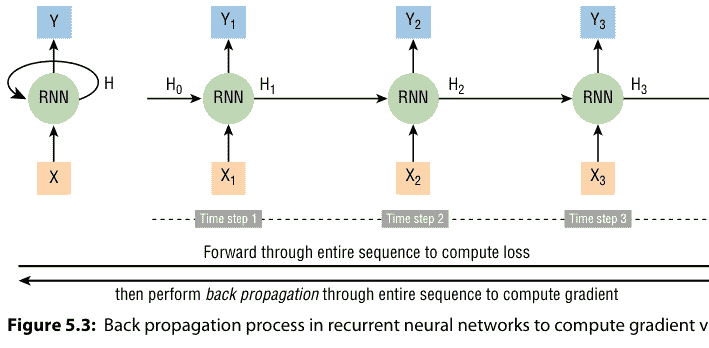

## 长短期记忆

LSTM能够学习长期依赖性，这是在需要建模时间序列数据时的一项有用能力。如前一节所述，LSTM有助于保留可以通过时间和层反向传播的误差，而不会丢失重要信息的风险：LSTM具有称为门和单元状态的内部机制，可以调节信息流（Zhang et al. 2019）。

单元决定存储和释放什么、多少以及何时存储和释放信息：它们通过迭代猜测、反向传播误差和通过梯度下降调整权重的过程来学习何时允许信息进入、离开或被删除。图5.4说明了信息如何流经单元并由不同的门控制。

在图5.4中，需要特别注意的是，LSTM记忆单元在转换输入和传递信息时同时利用了*加法*和*乘法*。加法步骤本质上是LSTM的秘诀：当误差必须在深度上反向传播时，它能保持误差恒定。它们不是通过将当前状态与新输入相乘来影响下一个单元状态，而是将两者相加，而遗忘门仍然依赖于乘法。

为了更新单元状态，我们有*输入门*。来自前一个隐藏状态和当前输入的信息通过*sigmoid函数*传递，以获得0到1之间的值：越接近0意味着遗忘，越接近1意味着记忆。正如你在图5.4中可能已经注意到的，LSTM还有一个*遗忘门*，尽管它们的专长实际上是维护和传递来自遥远事件的信息到最终输出。遗忘门决定哪些信息应该被遗忘，哪些信息应该被记忆和传递。

最后，我们有*输出门*，它决定下一个隐藏状态应该是什么。首先，前一个隐藏状态和当前输入被传入sigmoid函数。然后，新修改的单元状态通过tanh函数传递。tanh的输出与sigmoid的输出相乘，以决定隐藏状态应保留哪些信息（Zhang et al. 2019）。

在下一节中，我们将讨论一种特定类型的LSTM网络，称为门控循环单元：它们旨在解决标准循环神经网络中出现的梯度消失问题。门控循环单元由KyungHyun Cho及其同事于2014年提出（Cho et al. 2014），是LSTM网络的一种稍微精简的变体，通常提供相当的性能，并且计算速度显著更快。

## 门控循环单元

在上一节中，我们讨论了循环神经网络中梯度的计算方式。特别是，你看到了矩阵的长乘积可能导致梯度消失或发散。GRU也可以被视为LSTM的一种变体，因为两者设计相似，并且在某些情况下产生同样出色的结果。

GRU网络不利用单元状态，而是使用隐藏状态来传递信息。与LSTM不同，GRU网络仅包含三个门，并且不维护内部单元状态。存储在LSTM循环单元内部单元状态中的信息被整合到GRU的隐藏状态中。这种组合信息被聚合并传递到下一个GRU（Cho et al. 2014）。

前两个门，*重置门*和*更新门*，有助于解决标准RNN的梯度消失问题：这两个门是两个向量，决定哪些信息应传递到输出（Cho et al. 2014）。它们的独特之处在于，它们可以被训练以保留很久以前的信息，而不会随时间将其移除，或者删除与预测无关的信息。

- *更新门* – 更新门帮助模型确定需要将多少过去的信息（来自先前的时间步）传递到未来。这非常强大，因为模型可以决定复制所有过去的信息，从而消除梯度消失问题的风险。
- *重置门* – 重置门是另一个用于决定遗忘多少过去信息的门。

最后还有第三个门：

- *当前记忆门* – 这个门被整合到重置门中，用于在输入中引入一些非线性并使输入零均值化。将其整合到重置门中的另一个动机是减少过去信息对当前传递到未来的信息的影响（Cho et al. 2014）。

GRU是解决循环神经网络中梯度消失问题的非常有用的机制。梯度消失困境发生在机器学习中，当梯度变得很小时，这阻碍了权重调整其值。

在下一节中，我们将讨论如何为LSTM和GRU准备时间序列数据。时间序列数据在用于训练监督学习模型（如LSTM神经网络）之前需要进行准备。时间序列必须转换为具有输入和输出组件的样本。

## 如何为LSTM和GRU准备时间序列数据

你的时间序列数据集需要进行转换，才能用于拟合监督学习模型。正如你在第3章“时间序列数据准备”中所学，你首先需要将时间序列数据加载到pandas DataFrame中，以便执行以下操作：

1.  按时间戳索引数据以进行基于时间的过滤
2.  在具有命名列的表格中可视化你的数据
3.  识别缺失的时段和缺失值
4.  创建前导、滞后和附加变量

此外，你的时间序列数据需要转换为两个张量，如图5.5所示。

从图5.5可以看出，样本数、时间步长和特征代表了进行预测（X）所需的内容，而样本和预测范围代表了进行的预测（y）。如果我们以单变量时间序列问题为例（例如，如果我们想预测下一个能源负荷量），我们关注的是单步预测（例如，下一小时），那么先前时间步的观测值（例如，前四个小时的四个能源负荷值），即所谓的滞后观测值，被用作输入，输出是下一个时间步（预测范围）的观测值，如图5.6所示。

首先，我们需要将数据集分为训练集、验证集和测试集；这样我们可以执行以下重要步骤：

1.  我们在训练集上训练模型。
2.  然后使用验证集在每个训练周期后评估模型，并确保模型没有过拟合训练数据。
3.  模型训练完成后，我们在测试集上评估模型。
4.  处理时间序列数据时，确保验证集和测试集都覆盖比训练集更晚的时间段非常重要，这样模型就不会从未来时间戳的信息中受益。

让我们首先导入所有必要的Python库和函数：

```python
# Import necessary libraries
import os
import warnings
import matplotlib.pyplot as plt
import numpy as np
import pandas as pd
import datetime as dt
from collections import UserDict
from sklearn.preprocessing import MinMaxScaler
from IPython.display import Image
%matplotlib inline

from common.utils import load_data, mape

pd.options.display.float_format = '{:,.2f}'.format
np.set_printoptions(precision=2)
warnings.filterwarnings("ignore")
```

对于我们的能源预测示例，我们将2014年11月1日至2014年12月31日期间分配给测试集。2014年9月1日至10月31日期间分配给验证集。所有其他时间段可用于训练集：

```python
valid_st_data_load = '2014-09-01 00:00:00'
test_st_data_load = '2014-11-01 00:00:00'

ts_data_load[ts_data_load.index < valid_st_data_load][['load']].rename(columns={'load':'train'}) \
    .join(ts_data_load[(ts_data_load.index >=valid_st_data_load) & (ts_data_load.index < test_st_data_load)][['load']] \
    .rename(columns={'load':'validation'}), how='outer') \
    .join(ts_data_load[test_st_data_load:][['load']].rename(columns={'load':'test'}), how='outer') \
    .plot(y=['train', 'validation', 'test'], figsize=(15, 8), fontsize=12)
plt.xlabel('timestamp', fontsize=12)
plt.ylabel('load', fontsize=12)
plt.show()
```

上述代码示例将绘制我们的训练集、验证集和测试集，如图5.7所示。

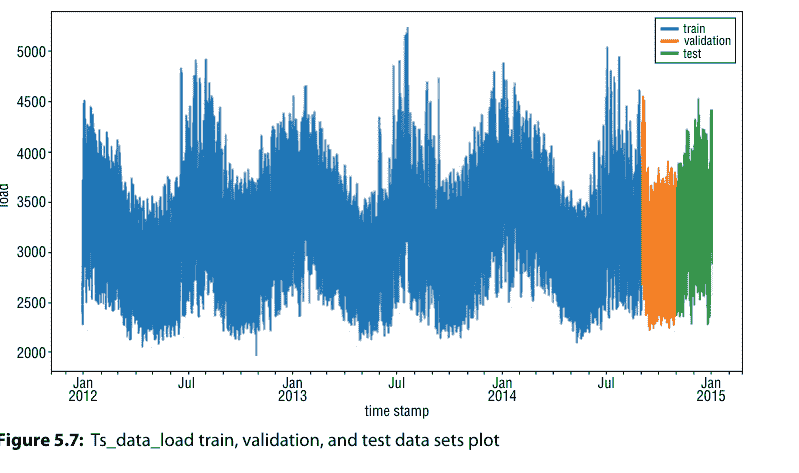

**图5.7：** ts_data_load训练集、验证集和测试集绘图

如下方示例代码所示，我们将T（滞后变量的数量）设置为6。这意味着每个样本的输入是前6小时负荷值的向量。选择T=6是任意的；在最终确定之前，你应该咨询业务专家并尝试不同的选项。我们还将预测范围（horizon）设置为1，因为我们感兴趣的是预测ts_data_load数据集的下一小时（t + 1）：

```
T = 6
HORIZON = 1
```

我们对训练集的数据准备将涉及以下步骤（图5.8）。在下面的示例代码中，我们将解释如何执行此数据准备过程的前四个步骤：

```
# 步骤1：从正确的数据范围获取训练数据
train = ts_data_load.copy()[ts_data_load.index < valid_st_data_load][['load']]

# 步骤2：将数据缩放到(0, 1)范围内。
scaler = MinMaxScaler()
train['load'] = scaler.fit_transform(train)

# 步骤3：移动数据框以创建输入样本
train_shifted = train.copy()
train_shifted['y_t+1'] = train_shifted['load'].shift(-1, freq='H')

for t in range(1, T+1):
    train_shifted[str(T-t)] = train_shifted['load'].shift(T-t, freq='H')
y_col = 'y_t+1'
X_cols = ['load_t-5',
          'load_t-4',
          'load_t-3',
          'load_t-2',
          'load_t-1',
          'load_t']
train_shifted.columns = ['load_original']+[y_col]+X_cols

# 步骤4：丢弃缺失值
train_shifted = train_shifted.dropna(how='any')
train_shifted.head(5)
```

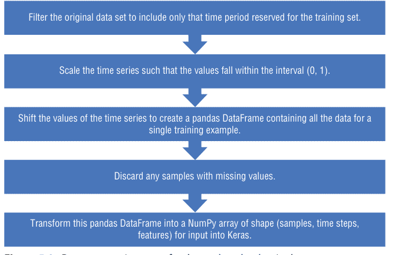

**图5.8：** ts_data_load训练数据集的数据准备步骤

现在我们需要执行数据准备过程的最后一步，将目标变量和输入特征转换为NumPy数组。X需要是（样本数，时间步长，特征数）的形状。在我们的ts_data_load数据集中，我们有23370个样本，6个时间步长，和1个特征（负荷）：

```
# 步骤5：将此pandas数据框转换为numpy数组
y_train = train_shifted[y_col].as_matrix()
X_train = train_shifted[X_cols].as_matrix()
```

此时，我们准备将X输入重塑为三维数组，如下方示例代码所示：

```
X_train = X_train.reshape(X_train.shape[0], T, 1)
```

我们现在得到目标变量的向量，其形状为：

```
y_train.shape
```

输入特征的张量现在具有以下形状：

```
x_train.shape
```

最后，你需要对验证数据集遵循上述相同的过程和步骤，并从训练集中保留T小时的数据以构建初始特征。

在本节中，你学习了如何将时间序列数据集转换为适合拟合LSTM或GRU模型的三维结构。具体来说，你学习了如何将时间序列数据集转换为二维监督学习格式，以及如何将二维时间序列数据集转换为适合LSTM和GRU的三维结构。

在下一节中，你将学习如何为时间序列预测问题开发一系列GRU模型。

## 如何为时间序列预测开发GRU和LSTM

LSTM和GRU模型都可以应用于时间序列预测。在本节中，你将学习如何为时间序列预测场景开发GRU模型。本节分为四个部分：

- *Keras* – 在本节中，你将了解Keras在时间序列预测方面的能力概述：Keras是一个用Python编写的开源神经网络库。它能够在不同的深度学习工具（如TensorFlow）之上运行。
- *TensorFlow* – TensorFlow是一个用于高性能数值计算的开源软件库。其灵活的架构允许轻松构建模型并在各种平台上部署计算。
- *单变量模型* – 单变量时间序列是指由在相等时间间隔内顺序记录的单个（标量）观测值组成的时间序列。在本节中，你将学习如何将GRU模型应用于单变量时间序列数据。
- *多变量模型* – 多变量时间序列具有多个时间相关变量。每个变量不仅依赖于其过去的值，还依赖于其他变量。在本节中，你将学习如何将GRU模型应用于多变量时间序列数据。

## Keras

Keras是一个Python封装库，能够在不同的深度学习工具（如TensorFlow）之上运行。最重要的是，Keras是一个支持卷积网络和循环网络的API，并且可以在中央处理单元（CPU）和图形处理单元（GPU）上无缝运行。此外，Keras是根据四个指导原则开发的（Nguyen et al. 2019）：

- *用户友好性和极简主义* – Keras是一个以用户体验为中心设计的API，提供一致且简单的API来构建和训练深度学习模型。
- *模块化* – 使用Keras时，数据科学家需要将他们的模型开发周期视为一个模块化过程，其中独立的组件（如神经层、损失函数、优化器、激活函数）可以轻松地以不同方式利用和组合以创建新模型。
- *易于扩展* – 与前一个原则相关，Keras的第三个原则是为用户提供扩展现有模块和添加新模块的能力，以改进模型开发周期。
- *与Python协作* – 如前所述，Keras是一个Python封装库，其模型在Python代码中定义（keras.io）。

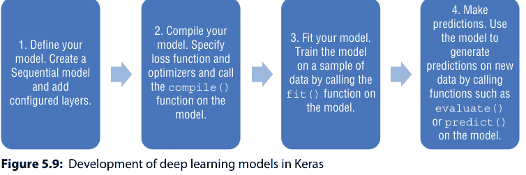

如图5.9所示，使用Keras开发深度学习模型的第一步是定义模型。主要的模型类型是一系列称为*Sequential*的层，它是层的线性堆栈。
一旦模型定义完成，第二步是编译模型，它利用底层框架来优化模型将要执行的计算。编译后，模型必须拟合数据（使用Keras开发深度学习模型的第三步）。最后，训练完成后，你可以使用模型对新数据进行预测。

在本节中，你了解了用于深度学习研究和开发的Keras Python库。在下一节中，你将学习TensorFlow是什么，以及为什么它对数据科学家在处理大规模分布式训练和推理时很有用。

## TensorFlow

TensorFlow是一个用于使用数据流图进行数值计算的开源库。它由Google Brain团队创建和维护，并在Apache 2.0开源许可下发布。TensorFlow最有益的功能之一是，数据科学家可以使用高级Keras API使用TensorFlow构建和训练他们的模型，这使得TensorFlow和机器学习的入门变得容易（tensorflow.org）。

图中的节点代表数学运算，而图的边代表在它们之间传递的多维数据数组（张量）。分布式TensorFlow架构包含具有内核实现的分布式主控和工作服务（Nguyen et al. 2019）。TensorFlow被创建用于研究、开发和生产系统，因为它能够在单CPU系统、GPU、移动设备和大规模分布式系统上运行。

此外，TensorFlow通过诸如Keras函数式API等功能为你提供了灵活性和控制力，便于快速原型设计和调试，并且它支持一个强大的附加库和模型生态系统供你实验，包括Ragged Tensors、TensorFlow Probability、Tensor2Tensor和BERT（tensorflow.org）。

在本节中，你了解了用于深度学习研究和开发的Keras Python库。在下一节中，你将学习如何为单变量时间序列预测场景实现GRU模型。

## 单变量模型

LSTM和GRU可用于建模单变量时间序列预测问题。这些问题包含单个观测序列，模型需要从过去的观测序列中学习，以预测序列中的下一个值。

在本例中，我们将实现一个简单的RNN预测模型，其结构如图5.10所示。

现在让我们导入所有必要的Keras包，以定义我们的模型：

```
# 导入必要的包
from keras.models import Model, Sequential
from keras.layers import GRU, Dense
from keras.callbacks import EarlyStopping
```

此时需要定义几个方面：

- 潜在维度（`LATENT_DIM`）：这是RNN层中的单元数量。
- 批量大小（`BATCH_SIZE`）：这是每个小批量的样本数量。
- 训练轮数（`EPOCHS`）：这是训练算法遍历所有样本的最大次数。

让我们在下面的示例代码中定义它们：

```
LATENT_DIM = 5
BATCH_SIZE = 32
EPOCHS = 10
```

现在我们可以定义模型并创建一个Sequential模型，如下面的示例代码所示：

```
model = Sequential()
model.add(GRU(LATENT_DIM, input_shape=(T, 1)))
model.add(Dense(HORIZON))
```

下一步，我们需要编译模型。我们指定损失函数和优化器，并在模型上调用`compile()`函数。对于这个特定示例，我们使用均方误差作为损失函数。Keras文档推荐为RNN使用优化器RMSprop：

```
model.compile(optimizer='RMSprop', loss='mse')
model.summary()
```

运行上面的示例代码将输出以下摘要表：

| 层（类型） | 输出形状 | 参数数量 |
| :--- | :--- | :--- |
| gru_1 (GRU) | (None, 5) | 105 |
| dense_1 (Dense) | (None, 1) | 6 |
| **总参数：** | 111 | |
| **可训练参数：** | 111 | |
| **不可训练参数：** | 0 | |

我们现在需要指定早停标准。早停是一种正则化方法，用于在使用迭代方法（如梯度下降）训练机器学习模型时避免过拟合。在我们的示例中，我们将使用早停作为验证的一种形式，以检测神经网络监督训练期间何时开始过拟合；在收敛之前停止训练以避免过拟合（“早停”）。

在我们的案例中，我们在每个训练轮次后监控验证集上的验证损失（在本例中为均方误差）。如果验证损失在`patience`轮次后没有改善`min_delta`，我们就停止训练，如下面的示例代码所示：

```
GRU_earlystop = EarlyStopping(monitor='val_loss', min_delta=0,
patience=5)
```

现在我们可以通过在模型本身上调用`fit()`函数，在数据样本上训练模型来拟合模型：

```
model_history = model.fit(X_train,
                          y_train,
                          batch_size=BATCH_SIZE,
                          epochs=EPOCHS,
                          validation_data=(X_valid, y_valid),
                          callbacks=[GRU_earlystop],
                          verbose=1)
```

现在让我们使用创建的模型对新数据进行预测，并通过在模型上调用`evaluate()`或`predict()`等函数来生成预测。为了评估模型，您首先需要对测试数据集执行上面列出的数据准备步骤。

在测试数据准备步骤之后，我们现在可以对测试数据集进行预测，并将这些预测与我们的实际负载值进行比较：

```
ts_predictions = model.predict(X_test)
ts_predictions
```

```
ev_ts_data = pd.DataFrame(ts_predictions, columns=['t'+str(t) for t in range(1, HORIZON+1)])
ev_ts_data['timestamp'] = test_shifted.index
ev_ts_data = pd.melt(ev_ts_data, id_vars='timestamp', value_name='prediction', var_name='h')
ev_ts_data['actual'] = np.transpose(y_test).ravel()
ev_ts_data[['prediction', 'actual']] = scaler.inverse_transform(ev_ts_data[['prediction', 'actual']])
ev_ts_data.head()
```

运行上面的示例将产生以下结果：

| 时间戳 | h | 预测值 | 实际值 |
|---|---|---|---|
| 2014-11-01 05:00:00 | t+1 | 2,673.13 | 2,714.00 |
| 2014-11-01 06:00:00 | t+1 | 2,947.12 | 2,970.00 |
| 2014-11-01 07:00:00 | t+1 | 3,208.74 | 3,189.00 |
| 2014-11-01 08:00:00 | t+1 | 3,337.19 | 3,356.00 |
| 2014-11-01 09:00:00 | t+1 | 3,466.88 | 3,436.00 |

为了评估我们的模型，我们可以计算所有预测的平均绝对百分比误差（MAPE），如下面的示例代码所示：

```
# %load -s mape common/utils.py
def mape(ts_predictions, actuals):
    """平均绝对百分比误差"""
    return ((ts_predictions - actuals).abs() / actuals).mean()

mape(ev_ts_data['prediction'], ev_ts_data['actual'])
```

MAPE为0.015，意味着我们的模型准确率为99.985%。我们可以通过绘制测试集第一周的预测值与实际值来完成我们的练习：

```
ev_ts_data[ev_ts_data.timestamp<'2014-11-08']
.plot(x='timestamp', y=['prediction', 'actual'],
      style=['r', 'b'], figsize=(15, 8))
plt.xlabel('时间戳', fontsize=12)
plt.ylabel('负载', fontsize=12)
plt.show()
```

运行上面的示例代码将绘制出图5.11所示的可视化图。
在图5.11中，我们可以观察到我们的RNN模型产生的预测值与实际值的对比。
既然我们已经研究了用于单变量数据的GRU模型，现在让我们将注意力转向多变量数据：当数据涉及三个或更多变量时，它被归类为多变量，因为它包含多个因变量。在下一节中，我们将讨论多变量GRU模型。

## 多变量模型

多变量时间序列数据意味着每个时间步有多个观测值的数据。在本节中，我们将演示如何完成以下步骤：

- 为训练RNN预测模型准备时间序列数据。
- 获取Keras API所需形状的数据。
- 在Keras中实现一个RNN模型，以预测时间序列中的下一步（时间t + 1）。该模型使用最近的温度值以及负载作为模型输入。
- 启用早停以降低模型过拟合的可能性。
- 在测试数据集上评估模型。

对于上述每个步骤，我们将使用我们的ts_data集作为示例。让我们首先将数据加载到pandas DataFrame中：

```
ts_data = load_data(data_dir)
ts_data.head()
```

运行上面的示例代码将输出以下表格：

| | 负载 | 温度 |
|---|---|---|
| 2012-01-01 00:00:00 | 2,698.00 | 32.00 |
| 2012-01-01 01:00:00 | 2,558.00 | 32.67 |
| 2012-01-01 02:00:00 | 2,444.00 | 30.00 |
| 2012-01-01 03:00:00 | 2,402.00 | 31.00 |
| 2012-01-01 04:00:00 | 2,403.00 | 32.00 |

正如您从上表中注意到的，我们现在处理的是一个多变量数据集，因为我们有两个变量：负载和温度。正如我们在上一节中所做的那样，我们现在需要创建验证和测试数据集，并定义我们的T（滞后数量）和我们的HORIZON（我们想要预测未来多少小时），如下面的示例代码所示：

```
valid_st_data_load = '2014-09-01 00:00:00'
test_st_data_load = '2014-11-01 00:00:00'

T = 6
HORIZON = 1
```

我们创建包含负载和温度特征的训练数据集，并为y值拟合一个缩放器，如本示例代码所示：

```
from sklearn.preprocessing import MinMaxScaler
y_scaler = MinMaxScaler()
y_scaler.fit(train[['load']])
```

我们还需要缩放输入特征数据（负载和温度值）：

```
X_scaler = MinMaxScaler()
train[['load', 'temp']] = X_scaler.fit_transform(train)
```

在我们的示例中，我们将使用`TimeSeriesTensor`便捷类来执行以下步骤：

1.  移动时间序列的值，以创建一个包含单个训练示例所有数据的pandas DataFrame。
2.  丢弃任何包含缺失值的样本。
3.  将此pandas DataFrame转换为形状为（样本数，时间步长，特征数）的NumPy数组，以输入到Keras中。

此类接受以下参数，如下面的示例代码所示：

- `dataset`：原始时间序列
- `H`：预测范围
- `tensor_structure`：一个描述张量结构的字典，形式为 `{ 'tensor_name' : (range(max_backward_shift, max_forward_shift), [feature, feature, ...]) }`
- `freq`：时间序列频率
- `drop_incomplete`：（布尔值）是否丢弃不完整的样本

```
tensor = {'X': (range(-T+1, 1), ['load', 'temp'])}
ts_train_inp = TimeSeriesTensor(dataset=train,
```

## 结论

深度学习神经网络是强大的引擎，能够从输入到输出的任意映射中学习，支持多输入多输出，并能自动提取跨越长时间序列的输入数据中的模式。所有这些特性共同使得神经网络在处理更复杂的时间序列预测问题时成为得力工具，这些问题涉及大量数据、具有复杂关系的多变量，甚至是多步时间序列任务。

在本章中，我们讨论了数据科学家在构建时间序列预测解决方案时，可能仍希望考虑深度学习的一些实际原因。

具体来说，我们深入探讨了以下重要主题：

- *将深度学习加入时间序列工具箱的理由* – 你了解了深度学习神经网络如何能够自动学习从输入到输出的任意复杂映射，并支持多输入多输出。
- *用于时间序列预测的循环神经网络* – 在本节中，我介绍了一种非常流行的人工神经网络类型：循环神经网络，也称为RNN。我们还讨论了循环神经网络的一个变体，即所谓的长短期记忆单元，并学习了如何为LSTM和GRU模型准备时间序列数据。
- *如何开发用于时间序列预测的GRU和LSTM* – 在第5章的最后这一节中，你学习了如何开发用于时间序列预测的长短期记忆模型。特别是，你学习了如何为时间序列预测问题开发GRU模型。

在下一章，第6章“时间序列预测的模型部署”中，你将学习如何将你的机器学习模型部署为Web服务：下一章的目的是全面概述将时间序列预测解决方案投入运营和生产所需的工具和概念。

# 第6章
时间序列预测的模型部署

在整本书中，我介绍了一些真实世界的数据科学场景，用以展示一些关键的时间序列概念、步骤和代码。在最后一章中，我将通过运用这些用例和数据集，引导你完成构建和部署一些时间序列预测解决方案的过程。

本章的目的是通过讨论以下主题，全面概述构建和部署你自己的时间序列预测解决方案所需的工具：

- *实验设置与Azure Machine Learning SDK for Python简介* – 在本节中，我将介绍用于构建和运行机器学习工作流的Azure Machine Learning SDK for Python。你将概览SDK中一些最重要的类，以及如何使用它们在Azure上构建、训练和部署机器学习模型。

具体来说，在本节中你将发现以下概念和资产：

- `Workspace`，这是云端的基础资源，用于实验、训练和部署机器学习模型。
- `Experiment`，这是另一个基础的云资源，代表一系列试验（单个模型运行）的集合。
- `Run`，代表实验的一次单独试验。
- `Model`，用于处理机器学习模型的云端表示。
- `ComputeTarget`、`RunConfiguration`、`ScriptRunConfig`，这些是用于创建和管理计算目标的抽象父类。计算目标代表可用于训练机器学习模型的各种资源。
- `Image`，这是一个抽象父类，用于将模型打包成包含运行时环境和依赖项的容器镜像。
- `Webservice`，这是用于为模型创建和部署Web服务的抽象父类。

- *机器学习模型部署* – 在本节中，我们将进一步讨论机器学习模型部署，即将机器学习模型集成到现有生产环境中，以便开始基于数据制定实际业务决策的方法。通过机器学习模型部署，企业可以开始充分利用他们构建的预测性和智能模型，从而转型为真正的AI驱动型企业。

- *带部署示例的时间序列预测解决方案架构* – 在本章的最后这一节中，我们将构建、训练和部署一个需求预测解决方案。我将演示如何构建一个端到端的数据管道架构和部署代码，该架构可推广用于不同的时间序列预测解决方案。

# 实验设置与Azure Machine Learning SDK for Python简介

Azure Machine Learning为数据科学家和开发者提供SDK和服务，用于准备数据以及训练和部署机器学习模型。在本章中，我们将使用Azure Machine Learning SDK for Python (`aka.ms/AzureMLSDK`) 来构建和运行机器学习工作流。

以下各节总结了SDK中一些最重要的类，你可以使用它们来构建你的时间序列预测解决方案：你可以在Azure Machine Learning SDK for Python的官方网站上找到关于以下所有类的信息。

## 工作区

`Workspace` 是一个基于 Python 的函数，可用于实验、训练和部署机器学习模型。你可以导入该类，并使用以下代码创建新的工作区：

```python
from azureml.core import Workspace
ws = Workspace.create(name='myworkspace',
                     subscription_id='<your-azure-subscription-id>',
                     resource_group='myresourcegroup',
                     create_resource_group=True,
                     location='eastus2'
                     )
```

建议在已有要用于工作区的 Azure 资源组时，将 `create_resource_group` 设置为 False。某些函数可能会提示进行 Azure 身份验证。有关 Azure ML SDK for Python 中 `Workspace` 类的更多信息，请访问 aka.ms/AzureMLSDK。

## 实验

`Experiment` 是一个云资源，代表一系列试验（单个模型运行）的集合。以下代码通过名称从 `Workspace` 中获取实验对象，如果该名称不存在，则创建一个新的实验对象 (aka.ms/AzureMLSDK)：

```python
from azureml.core.experiment import Experiment
experiment = Experiment(workspace=ws, name='test-experiment')
```

你可以运行以下代码来获取 `Workspace` 中包含的所有实验对象的列表，如下所示：

```python
list_experiments = Experiment.list(ws)
```

有关 Azure ML SDK for Python 中 `Experiment` 类的更多信息，请访问 aka.ms/AzureMLSDK。

## 运行

`Run` 类代表实验的一次试验。`Run` 是一个对象，用于监控试验的异步执行、存储试验输出、分析结果以及访问生成的工件。你可以在实验代码中使用 `Run` 将指标和工件记录到 `Run History` 服务 (aka.ms/AzureMLSDK)。

在以下代码中，我展示了如何通过提交实验对象和运行配置对象来创建运行对象：

```python
tags = {"prod": "phase-1-model-tests"}
run = experiment.submit(config=your_config_object, tags=tags)
```

如你所见，你可以使用 `tags` 参数为运行附加自定义类别和标签。此外，你可以使用静态列表函数从实验中获取所有运行对象的列表。你需要指定 `tags` 参数以按之前创建的标签进行筛选：

```python
from azureml.core.run import Run
filtered_list_runs = Run.list(experiment, tags=tags)
```

有关 Azure ML SDK for Python 中 `Run` 类的更多信息，请访问 aka.ms/AzureMLSDK。

## 模型

`Model` 类用于处理不同机器学习模型的云表示。你可以使用模型注册在 Azure 云中的工作区存储和版本控制你的模型。注册的模型通过名称和版本进行标识。每次你注册一个与现有模型同名的模型时，注册表会递增版本号 (aka.ms/AzureMLSDK)。

以下示例展示了如何使用 scikit-learn 构建一个简单的本地分类模型，在工作区中注册该模型，并从云端下载该模型：

```python
from sklearn import svm
import joblib
import numpy as np

# customer ages
X_train = np.array([50, 17, 35, 23, 28, 40, 31, 29, 19, 62])
X_train = X_train.reshape(-1, 1)
# churn y/n
y_train = ["yes", "no", "no", "no", "yes", "yes", "yes", "no", "no", "yes"]

clf = svm.SVC(gamma=0.001, C=100.)
clf.fit(X_train, y_train)

joblib.dump(value=clf, filename="churn-model.pkl")
```

此外，你可以使用 `register` 函数在工作区中注册模型：

```python
from azureml.core.model import Model
model = Model.register(workspace=ws,
    model_path="churn-model.pkl",
    model_name="churn-model-test")
```

拥有注册模型后，将其部署为 Web 服务是一个简单的过程：

1.  你需要创建并注册一个镜像。此步骤配置 Python 环境及其依赖项。
2.  第二步，你需要创建一个镜像。
3.  最后，你需要附加你的镜像。

有关 Azure ML SDK for Python 中 `Run` 类的更多信息，请访问 aka.ms/AzureMLSDK。

## 计算目标、运行配置和脚本运行配置

`ComputeTarget` 类是用于创建和管理计算目标的父类。计算目标代表可用于训练机器学习模型的各种资源。计算目标可以是本地机器，也可以是云资源，例如 Azure Machine Learning Compute、Azure HDInsight 或远程虚拟机 (aka.ms/AzureMLSDK)。

首先，你需要设置一个 `AmlCompute`（`ComputeTarget` 的子类）目标。对于下面的示例，我们可以重用简单的 scikit-learn 流失模型，并将其构建到当前目录中的独立文件 `train.py` 中 (aka.ms/AzureMLSDK)。在文件末尾，我们创建一个名为 `outputs` 的新目录，用于存储 `joblib.dump()` 序列化的已训练模型：

```python
# train.py
from sklearn import svm
import numpy as np
import joblib
import os

# customer ages
X_train = np.array([50, 17, 35, 23, 28, 40, 31, 29, 19, 62])
X_train = X_train.reshape(-1, 1)
# churn y/n
y_train = ["cat", "dog", "dog", "dog", "cat", "cat", "cat", "dog",
    "dog", "cat"]
clf = svm.SVC(gamma=0.001, C=100.)
clf.fit(X_train, y_train)
```

```python
os.makedirs("outputs", exist_ok=True)
joblib.dump(value=clf, filename="outputs/churn-model.pkl")
```

接下来，你可以通过实例化 RunConfiguration 对象并设置类型和大小来创建计算目标 (aka.ms/AzureMLSDK)：

```python
from azureml.core.runconfig import RunConfiguration
from azureml.core.compute import AmlCompute
list_vms = AmlCompute.supported_vmsizes(workspace=ws)
compute_config = RunConfiguration()
compute_config.target = "amlcompute"
compute_config.amlcompute.vm_size = "STANDARD_D1_V2"
```

现在，你可以使用 ScriptRunConfig 并指定 submit() 函数的 config 参数来提交实验：

```python
from azureml.core.experiment import Experiment
from azureml.core import ScriptRunConfig
script_run_config = ScriptRunConfig(source_directory=os.getcwd(),
script="train.py", run_config=compute_config)
experiment = Experiment(workspace=ws, name="compute_target_test")
run = experiment.submit(config=script_run_config)
```

有关 Azure ML SDK for Python 中这些类的更多信息，请访问 aka.ms/AzureMLSDK。

## 镜像和 Web 服务

Image 类是用于将模型打包到包含运行时环境和依赖项的容器镜像中的父类。Webservice 类是另一个父类，用于为你的模型创建和部署 Web 服务 (aka.ms/AzureMLSDK)。

以下代码展示了创建镜像并使用其部署 Web 服务的基本示例。ContainerImage 类扩展了镜像并创建了一个 Docker 镜像。

```python
from azureml.core.image import ContainerImage
image_config = ContainerImage.image_configuration(execution_script="score.py",
runtime="python",
conda_file="myenv.yml",
description="test-image-config")
```

在此示例中，score.py 处理 Web 服务的请求/响应。该脚本定义了两个方法：init() 和 run()。

```python
image = ContainerImage.create(name="test-image",
models=[model],
image_config=image_config,
workspace=ws)
```

要将镜像部署为 Web 服务，你首先需要构建部署配置，如以下示例代码所示：

```python
from azureml.core.webservice import AciWebservice
deploy_config = AciWebservice.deploy_configuration(cpu_cores=1,
memory_gb=1)
```

之后，你可以使用部署配置创建 Web 服务，如下面的示例代码所示：

```python
from azureml.core.webservice import Webservice
service = Webservice.deploy_from_image(deployment_config=deploy_config,
image=image,
name=service_name,
workspace=ws
)
service.wait_for_deployment(show_output=True)
```

在本章的第一部分，我介绍了 SDK 中一些最重要的类（更多信息请访问 aka.ms/AzureMLSDK）以及使用它们的常见设计模式。在下一节中，我们将探讨 Azure Machine Learning 上的机器学习部署。

## 机器学习模型部署

模型部署是将机器学习模型集成到现有生产环境中，以便开始基于数据制定实际业务决策的方法。只有当模型部署到生产环境后，它们才开始增加价值，这使得部署成为关键步骤 (Lazzeri 2019c)。

模型部署是机器学习模型工作流的基本步骤（图 6.1）。通过机器学习模型部署，公司可以开始充分利用他们构建的预测和智能模型，从而将自身转变为真正的数据驱动型企业。

当我们思考机器学习时，我们将注意力集中在关键组件上，例如数据源、数据管道、如何测试我们机器学习应用程序核心的机器学习模型、如何进行特征工程，以及使用哪些变量使模型更准确。所有这些步骤都很重要；然而，思考我们如何随着时间的推移消费这些模型和数据，也是机器学习管道中的关键步骤。只有当模型被部署并投入运营后，我们才能开始从模型的预测中提取真正的价值和业务效益。

## 第6章 时间序列预测的模型部署

成功的模型部署对于数据驱动型企业至关重要，原因如下：

-   部署机器学习模型意味着将模型提供给外部客户和/或公司内部的其他团队及利益相关者使用。
-   当你部署模型后，公司内部的其他团队就可以使用它们，向其发送数据并获取预测结果，这些结果反过来又会反馈到公司系统中，从而提升训练数据的质量和数量。
-   一旦这个流程启动，公司就会开始在生产环境中构建和部署更多的机器学习模型，并掌握将模型从开发环境迁移到业务运营系统的稳健且可重复的方法（Lazzeri 2019c）。

从组织的角度来看，许多公司将AI赋能视为一项技术工作。然而，它更像是一项由业务驱动、始于公司内部的倡议；为了成为一家AI驱动的公司，至关重要的是，那些当前成功运营并理解业务的人员，也应负责构建和驱动从模型训练到模型部署和监控的整个机器学习流程。

从机器学习流程的第一天起，机器学习团队就应该与业务合作伙伴进行互动。保持持续互动以理解模型实验过程，同时兼顾模型部署和使用步骤，这一点至关重要。大多数组织都在努力释放机器学习的潜力以优化其运营流程，并让数据科学家、分析师和业务团队使用同一种语言沟通（Lazzeri 2019c）。

此外，机器学习模型必须在历史数据上进行训练，这要求创建一个预测数据管道，这项活动涉及多项任务，包括数据处理、特征工程和调优。每一项任务，小到库的版本和缺失值的处理，都必须从开发环境精确复制到生产环境。有时，开发和生产中使用的技术差异会导致机器学习模型部署困难。

公司可以使用机器学习管道来创建和管理工作流，将机器学习的各个阶段串联起来。例如，一个管道可能包括数据准备、模型训练、模型部署和推理/评分阶段。每个阶段可以包含多个步骤，每个步骤都可以在不同的计算目标上无人值守地运行。

## 如何选择合适的工具以实现成功的模型部署

当前手工构建机器学习模型的方法对于那些希望通过AI转型运营的公司来说，速度太慢且效率低下。即使经过数月的开发，交付了一个基于单一算法的模型，管理团队也几乎没有手段知道他们的数据科学家是否创建了一个优秀的模型，以及如何将其投入运营（Lazzeri 2019c）。

下面，我将分享一些关于公司如何选择合适工具以实现成功模型部署的指导原则。我将使用Azure机器学习服务来说明这个工作流，但它也可以用于你选择的任何机器学习产品。

模型部署工作流应基于以下三个简单步骤：

-   注册模型。
-   准备部署（指定资产、用途、计算目标）。
-   将模型部署到计算目标。

正如我们在上一节中看到的，`Model` 是构成你模型的一个或多个文件的逻辑容器。例如，如果你有一个存储在多个文件中的模型，你可以将它们作为一个模型注册到工作区中。注册后，你可以下载或部署已注册的模型，并接收所有已注册的文件。

当你创建Azure机器学习工作区时，机器学习模型会被注册。该模型可以来自Azure机器学习，也可以来自其他地方。

要将你的模型部署为Web服务，你必须创建一个推理配置（`InferenceConfig`）和一个部署配置。推理，或模型评分，是部署的模型用于预测的阶段，最常见的是在生产数据上进行。在 `inferenceConfig` 中，你指定提供模型服务所需的脚本和依赖项。在部署配置中，你指定如何在计算目标上提供模型服务的详细信息（Lazzeri 2019c）。

入口脚本接收提交给已部署Web服务的数据，并将其传递给模型。然后，它获取模型返回的响应并将其返回给客户端。该脚本特定于你的模型；它必须理解模型期望和返回的数据。

该脚本包含两个用于加载和运行模型的函数：

-   `init()` – 通常，此函数将模型加载到一个全局对象中。此函数仅在Web服务的Docker容器启动时运行一次。
-   `run(input_data)` – 此函数使用模型根据输入数据预测一个值。`run` 的输入和输出通常使用JSON进行序列化和反序列化。你也可以处理原始二进制数据。你可以在将数据发送给模型之前或返回给客户端之前对其进行转换。

当你注册一个模型时，你会提供一个模型名称，用于在注册表中管理该模型。你使用此名称与 `Model.get_model_path()` 一起检索模型文件在本地文件系统上的路径。如果你注册的是一个文件夹或一组文件，此API将返回包含这些文件的目录路径。

最后，在部署之前，你必须定义部署配置。部署配置特定于将托管Web服务的计算目标。例如，在本地部署时，你必须指定服务接受请求的端口。以下计算目标或计算资源可用于托管你的Web服务部署：

-   *本地Web服务和笔记本虚拟机（VM）Web服务* – 这两个计算目标用于测试和调试。它们被认为适用于有限的测试和故障排除。
-   *Azure Kubernetes服务（AKS）* – 此计算目标用于实时推理。它被认为适用于大规模生产部署。
-   *Azure容器实例（ACI）* – 此计算目标用于测试。它被认为适用于需要小于48 GB RAM的低规模、基于CPU的工作负载。
-   *Azure机器学习计算* – 此计算目标用于批量推理，因为它能够在无服务器计算目标上运行批量评分。
-   *Azure IoT Edge* – 这是一个IoT模块，能够在IoT设备上部署和服务机器学习模型。
-   *Azure Stack Edge* – 开发人员和数据科学家可以通过IoT Edge使用此计算目标。

在本节中，我介绍了机器学习模型部署的一些常见挑战，我们讨论了为什么成功的模型部署对于释放AI的全部潜力至关重要，为什么公司在模型部署方面遇到困难，以及如何选择合适的工具以实现成功的模型部署。

接下来，我们将把你在本章前两节学到的知识应用到一个真实的需求预测用例中。

## 带有部署示例的时间序列预测解决方案架构

在本章的最后一节，我们将在Azure上构建、训练和部署一个能源需求预测解决方案。对于这个特定用例，我们将使用GEFCom2014能源预测竞赛的数据。更多信息，请参阅“概率能源预测：2014年全球能源预测竞赛及未来展望”（Tao Hong等人，2016）。

原始数据由行和列组成。每个测量值表示为单行数据。每行数据包含多列（也称为特征或字段）。在确定所需的数据源后，我们希望确保收集到的原始数据包含正确的数据特征。为了构建可靠的需求预测模型，我们需要确保收集的数据包含有助于预测未来需求的数据元素。以下是关于原始数据结构（模式）的一些基本要求：

-   *时间戳* – 时间戳字段表示测量记录的实际时间。它应符合常见的日期/时间格式之一。应包含日期和时间部分。在大多数情况下，无需将时间记录到秒级精度。指定数据记录所在的时区非常重要。
-   *负荷* – 提供了公用事业的每小时历史负荷数据。这是在给定日期/时间的实际消耗量。消耗量可以用kWh（千瓦时）或任何其他首选单位来衡量。需要注意的是，测量单位在数据中的所有测量值之间必须保持一致。在某些情况下，消耗量可能通过三个电力相位提供。在这种情况下，我们需要收集所有独立的消耗相位。

- *温度* – 提供了该公用事业的逐小时历史温度数据。温度通常从独立来源收集。但是，它应与消耗数据兼容。它应包含如上所述的时间戳，以便与实际消耗数据同步。温度值可以指定为摄氏度或华氏度，但应在所有测量中保持一致。

建模阶段是将数据转换为模型的过程。该过程的核心是先进的算法，它们扫描历史数据（训练数据），提取模式，并构建模型。该模型随后可用于预测未用于构建模型的新数据。

## 建模与评分过程

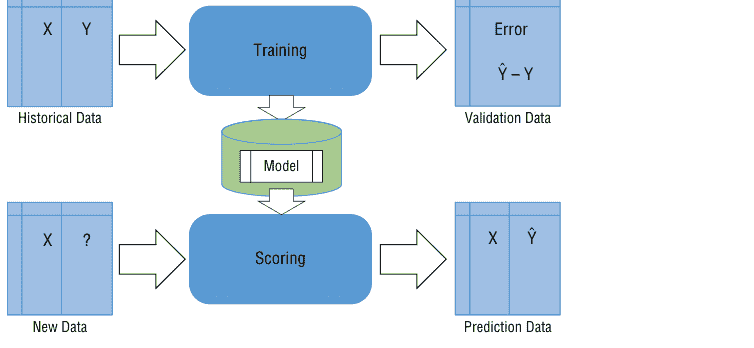

**图 6.2：** 建模与评分过程

从图 6.2 可以看出，历史数据为训练模块提供输入。历史数据是结构化的，其中独立特征表示为 X，因变量（目标变量）表示为 Y。X 和 Y 都是在数据准备过程中产生的。训练模块由一个算法组成，该算法扫描数据并学习其特征和模式。实际算法由数据科学家选择，并应与我们试图解决的问题类型最匹配。

训练算法通常分为回归（预测数值结果）、分类（预测分类结果）、聚类（识别组别）和预测。训练模块生成模型作为一个对象，可以存储以供将来使用。在训练期间，我们还可以通过使用验证数据并测量预测误差来量化模型的预测准确性。

一旦我们有了一个可用的模型，我们就可以用它来对包含所需特征（X）的新数据进行评分。评分过程将使用持久化的模型（来自训练阶段的对象）并预测由 Ŷ 表示的目标变量。

在需求预测的情况下，我们使用按时间排序的历史数据。我们通常将包含时间维度的数据称为时间序列。时间序列建模的目标是找到与时间相关的趋势、季节性和自相关（随时间变化的相关性），并将这些因素整合到一个模型中。近年来，已经开发了先进的算法来适应时间序列预测并提高预测准确性。

## 训练和部署 ARIMA 模型

在接下来的几节中，我将展示如何为能源需求预测构建、训练和部署一个 ARIMA 模型。让我们从数据设置开始：本示例中的数据取自 GEFCom2014 预测竞赛。它包含 2012 年至 2014 年间三年的逐小时电力负荷和温度值。

让我们导入必要的 Python 模块以开始：

```
# Import modules
import os
import shutil
import matplotlib.pyplot as plt
from common.utils import load_data, extract_data, download_file
%matplotlib inline
```

第二步，您需要下载数据并将其存储在数据文件夹中：

```
data_dir = './data'

if not os.path.exists(data_dir):
    os.mkdir(data_dir)

if not os.path.exists(os.path.join(data_dir, 'energy.csv')):
    # Download and move the zip file
    download_file('https://mlftsfwp.blob.core.windows.net/mlftsfwp/GEFCom2014.zip')
    shutil.move('GEFCom2014.zip', os.path.join(data_dir, 'GEFCom2014.zip'))
    # If not done already, extract zipped data and save as csv
    extract_data(data_dir)
```

完成上述任务后，您就可以将 CSV 中的数据加载到 pandas DataFrame 中：

```
energy = load_data(data_dir)[['load']]
energy.head()
```

此代码将产生如图 6.3 所示的输出。

| | load |
|---|---|
| 2012-01-01 00:00:00 | 2698.0 |
| 2012-01-01 01:00:00 | 2558.0 |
| 2012-01-01 02:00:00 | 2444.0 |
| 2012-01-01 03:00:00 | 2402.0 |
| 2012-01-01 04:00:00 | 2403.0 |

**图 6.3：** 能源数据集的前几行

为了可视化我们的数据集并确保所有数据都已上传，让我们首先绘制所有可用的负荷数据（2012年1月至2014年12月）：

```
energy.plot(y='load', subplots=True, figsize=(15, 8), fontsize=12)
plt.xlabel('timestamp', fontsize=12)
plt.ylabel('load', fontsize=12)
plt.show()
```

上面的代码将输出如图 6.4 所示的图表。

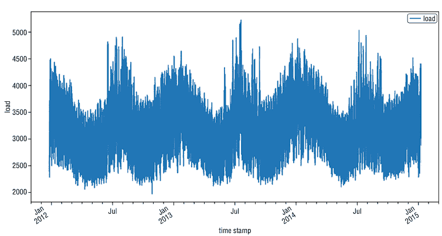

**图 6.4：** 负荷数据集图表

在前面的示例（图 6.4）中，我们绘制了数据集的第一列（时间戳被用作 DataFrame 的索引）。如果您想打印另一列，可以调整变量 `column_to_plot`。

现在让我们通过绘制 2014 年 7 月的第一周来可视化数据的子样本：

```
energy['7/1/2014':'7/7/2014'].plot(y=column_to_plot, subplots=True,
figsize=(15, 8), fontsize=12)
plt.xlabel('timestamp', fontsize=12)
plt.ylabel(column_to_plot, fontsize=12)
plt.show()
```

这将创建包含 2014 年 7 月第一周数据点的图表，如图 6.5 所示。

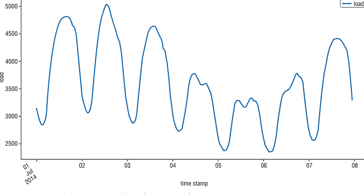

**图 6.5：** 2014年7月第一周的负荷数据集图表

如果您能够成功运行此笔记本并看到所有可视化效果，那么您就可以进入训练步骤了。让我们从配置部分开始：此时您需要设置您的 Azure Machine Learning 服务工作区并配置您的笔记本库。更多信息，请访问 aka.ms/AzureMLConfiguration 并按照笔记本中的说明操作。

训练脚本执行一个训练实验。一旦数据准备就绪，您就可以训练模型并在 Azure 上查看结果。

有几个步骤需要遵循：

- 配置工作区。
- 创建实验。
- 创建或附加计算集群。
- 将数据上传到 Azure。
- 创建估计器。
- 将工作提交到远程集群。
- 注册模型。
- 部署模型。

让我们从导入 Azure Machine Learning Python SDK 库和其他模块以及配置工作区开始。

## 配置工作区

首先，您需要导入 Azure Machine Learning Python SDK 和训练脚本所需的其他 Python 模块：

```
import datetime as dt
import math
import os
import urllib.request
import warnings

import azureml.core
import azureml.dataprep as dprep
import matplotlib.pyplot as plt
import numpy as np
import pandas as pd
from azureml.core import Experiment, Workspace
from azureml.core.compute import AmlCompute, ComputeTarget
from azureml.core.environment import Environment
from azureml.train.estimator import Estimator
from IPython.display import Image, display
from sklearn.preprocessing import MinMaxScaler
from statsmodels.tsa.statespace.sarimax import SARIMAX

get_ipython().run_line_magic("matplotlib", "inline")
pd.options.display.float_format = "{:,.2f}".format
np.set_printoptions(precision=2)
warnings.filterwarnings("ignore")  # specify to ignore warning messages
```

第二步，您需要配置您的工作区。您可以通过运行以下代码来设置您的 Azure Machine Learning (Azure ML) 服务 (aka.ms/AzureMLservice) 工作区并配置您的笔记本库：

```
# Configure the workspace, if no config file has been downloaded.
subscription_id = os.getenv("SUBSCRIPTION_ID", default="<Your Subscription ID>")
resource_group = os.getenv("RESOURCE_GROUP", default="<Your Resource Group>")
workspace_name = os.getenv("WORKSPACE_NAME", default="<Your Workspace Name>")
workspace_region = os.getenv("WORKSPACE_REGION", default="<Your Workspace Region>")

try:
    ws = Workspace(subscription_id = subscription_id,
                   resource_group = resource_group,
                   workspace_name = workspace_name)
    ws.write_config()
    print("Workspace configuration succeeded")
```

## 创建实验

我们现在创建一个 Azure 机器学习实验，它将帮助跟踪所使用的具体数据以及模型训练任务日志。如果所选工作区上已存在该实验，运行将被添加到现有实验中。如果不存在，实验将被添加到工作区，如以下代码所示：

```python
experiment_name = 'energydemandforecasting'
exp = Experiment(workspace=ws, name=experiment_name)
```

## 创建或附加计算集群

此时，您需要创建或附加一个现有的计算集群。对于训练 ARIMA 模型，一个 CPU 集群就足够了，如下方代码所示。请注意，`min_nodes` 参数为 0，这意味着默认情况下集群中将没有机器：

```python
# choose a name for your cluster
compute_name = os.environ.get("AML_COMPUTE_CLUSTER_NAME", "cpucluster")

compute_min_nodes = os.environ.get("AML_COMPUTE_CLUSTER_MIN_NODES", 0)
compute_max_nodes = os.environ.get("AML_COMPUTE_CLUSTER_MAX_NODES", 4)

# This example uses CPU VM. For using GPU VM, set SKU to STANDARD_NC6
vm_size = os.environ.get("AML_COMPUTE_CLUSTER_SKU", "STANDARD_D2_V2")

if compute_name in ws.compute_targets:
    compute_target = ws.compute_targets[compute_name]
    if compute_target and type(compute_target) is AmlCompute:
        print('found compute target. just use it. ' + compute_name)
else:
    print('creating a new compute target...')
    provisioning_config = AmlCompute.provisioning_configuration(
        vm_size=vm_size,
        min_nodes=compute_min_nodes,
        max_nodes=compute_max_nodes
    )

    # create the cluster
    compute_target = ComputeTarget.create(ws, compute_name, provisioning_config)

    # can poll for a minimum number of nodes and for a specific timeout.
    compute_target.wait_for_completion(show_output=True, min_node_count=None, timeout_in_minutes=20)

    # For a more detailed view of current
    # AmlCompute status, use 'get_status()'
    print(compute_target.get_status().serialize())
```

## 将数据上传到 Azure

现在，您需要通过将数据从本地计算机上传到 Azure，使其可远程访问。然后，就可以进行远程训练了。数据存储是与您的工作区关联的一个便捷构造，用于上传或下载数据。您也可以从远程计算目标与之交互。它由 Azure Blob 存储账户支持。能源文件被上传到数据存储根目录下名为 `energy_data` 的目录中：

- 首先，您可以下载 GEFCom2014 数据集，并将文件保存到本地的数据目录中，这可以通过执行单元格中的注释行来完成。本示例中的数据取自 GEFCom2014 预测竞赛。它包含 2012 年至 2014 年间三年的每小时电力负荷和温度值。
- 然后，数据被上传到附加到您工作区的默认 Blob 数据存储。能源文件被上传到数据存储根目录下名为 `energy_data` 的目录中。数据上传必须仅在第一次运行。如果您再次运行，它将跳过已存在于数据存储上的文件的上传。

```python
# save the files into a data directory locally
data_folder = './data'

#data_folder = os.path.join(os.getcwd(), 'data')
os.makedirs(data_folder, exist_ok=True)

# get the default datastore
ds = ws.get_default_datastore()
print(ds.name, ds.datastore_type, ds.account_name, ds.container_name, sep='\n')

# upload the data
ds.upload(src_dir=data_folder,
          target_path='energy_data',
          overwrite=True,
          show_progress=True)

ds = ws.get_default_datastore()
print(ds.datastore_type, ds.account_name, ds.container_name)
```

现在我们需要创建一个训练脚本：

```python
# ## Training script
# This script will be given to the estimator
# which is configured in the AML training script.
# It is parameterized for training on `energy.csv` data.

#%%
# ### Import packages.
# utils.py needs to be in the same directory as this script,
# i.e., in the source directory `energydemandforecasting`.

#%%
import argparse
import os
import numpy as np
import pandas as pd
import azureml.data
import pickle

from statsmodels.tsa.statespace.sarimax import SARIMAX
from sklearn.preprocessing import MinMaxScaler
from utils import load_data, mape
from azureml.core import Run
```

```python
#%%
# ### Parameters
# * COLUMN_OF_INTEREST: The column containing data that will be forecasted.
# * NUMBER_OF_TRAINING_SAMPLES:
#   The number of training samples that will be trained on.
# * ORDER:
#   A tuple of three non-negative integers
#   specifying the parameters p, d, q of an Arima(p,d,q) model,
#   where:
#     * p: number of time lags in autoregressive model,
#     * d: the degree of differencing,
#     * q: order of the moving average model.
# * SEASONAL_ORDER:
#   A tuple of four non-negative integers
#   where the first three numbers
#   specify P, D, Q of the Arima terms
#   of the seasonal component, as in ARIMA(p,d,q)(P,D,Q).
#   The fourth integer specifies m,
#   i.e, the number of periods in each season.

#%%
COLUMN_OF_INTEREST = 'load'
NUMBER_OF_TRAINING_SAMPLES = 2500
ORDER = (4, 1, 0)
SEASONAL_ORDER = (1, 1, 0, 24)
```

```python
#%%
# ### Import script arguments
# Here, Azure will read in the parameters, specified in the AML training.

#%%
parser = argparse.ArgumentParser(description='Process input arguments')
parser.add_argument('--data-folder', default='./data/', type=str, dest='data_folder')
parser.add_argument('--filename', default='energy.csv', type=str, dest='filename')
parser.add_argument('--output', default='outputs', type=str, dest='output')
args = parser.parse_args()
data_folder = args.data_folder
filename = args.filename
output = args.output
print('output', output)
```

```python
#%%
# ### Prepare data for training
# * Import data as pandas dataframe
# * Set index to datetime
# * Specify the part of the data that the model will be fitted on
# * Scale the data to the interval [0, 1]

#%%
# Import data
energy = load_data(os.path.join(data_folder, filename))
# As we are dealing with time series, the index can be set to datetime.
energy.index = pd.to_datetime(energy.index, infer_datetime_format=True)

# Specify the part of the data that the model will be fitted on.
train = energy.iloc[0:NUMBER_OF_TRAINING_SAMPLES, :]

# Scale the data to the interval [0, 1].
scaler = MinMaxScaler()
train[COLUMN_OF_INTEREST] = scaler.fit_transform(
    np.array(train.loc[:, COLUMN_OF_INTEREST].values).reshape(-1, 1)
)
```

```python
#%%
# ### Fit the model

#%%
model = SARIMAX(
    endog=train[COLUMN_OF_INTEREST].tolist(),
    order=ORDER,
    seasonal_order=SEASONAL_ORDER
)
model.fit()
```

```python
#%%
# ### Save the model
# The model will be saved on Azure in the specified directory as a pickle file.

#%%
# Create a directory on Azure in which the model will be saved.
os.makedirs(output, exist_ok=True)
```

## 创建估算器

现在让我们看看如何创建估算器。为了启动这个过程，我们需要创建一些参数。以下参数将被传递给估算器：

- **source_directory**：将被上传到 Azure 的目录，其中包含脚本 `train.py`
- **entry_script**：将被执行的脚本（`train.py`）
- **script_params**：将传递给入口脚本的参数
- **compute_target**：上面创建的计算集群
- **conda_dependencies_file**：脚本所需的 conda 环境中的包。

```python
script_params = {
    "--data-folder": ds.path("energy_data").as_mount(),
    "--filename": "energy.csv",
}
script_folder = os.path.join(os.getcwd(), "energydemandforecasting")

est = Estimator(
    source_directory=script_folder,
    script_params=script_params,
    compute_target=compute_target,
    entry_script="train.py",
    conda_dependencies_file="azureml-env.yml",
)
```

## 将作业提交到远程集群

你可以使用 Azure Machine Learning SDK、Azure 门户、Azure CLI 或 Azure Machine Learning VS Code 扩展来创建和管理计算目标。以下示例代码向你展示如何将工作提交到远程集群：

```python
run = exp.submit(config=est)

# 将 show_output 指定为 True 以获取详细日志
run.wait_for_completion(show_output=False)
```

## 注册模型

训练脚本的最后一步将文件 `outputs/arima_model.pkl` 写入运行作业的集群虚拟机中名为 outputs 的目录。Outputs 是一个特殊目录，因为该目录中的所有内容都会自动上传到你的工作区。此内容会出现在你工作区中实验的运行记录中。因此，模型文件现在也已在你的工作区中可用。

你也可以查看与该运行关联的文件。最后一步，我们在工作区中注册模型，将其保存在 Azure 的 Models 下，以便你和其他协作者稍后可以查询、检查和部署此模型。通过注册模型，它现在在你的工作区中可用：

```python
# 查看与该运行关联的文件
print(run.get_file_names())

## 注册模型
model = run.register_model(model_name='arimamodel',
    model_path='outputs/arimamodel.pkl')
```

## 部署

一旦我们确定了建模阶段并验证了模型性能，我们就准备好进入部署阶段。在此上下文中，*部署* 意味着使客户能够通过大规模运行实际预测来使用该模型。部署的概念在 Azure ML 中至关重要，因为我们的主要目标是持续调用预测，而不仅仅是从数据中获取洞察。部署阶段是我们使模型能够大规模被使用的部分。

在能源需求预测的背景下，我们的目标是调用连续和定期的预测，同时确保模型有可用的新鲜数据，并且预测数据被发送回消费客户端。

Azure ML 中主要的可部署构建块是 Web 服务。这是在云中启用预测模型消费的最有效方式。Web 服务封装了模型，并用 REST API（应用程序编程接口）将其包装起来。该 API 可以作为任何客户端代码的一部分使用，如图 6.6 所示。

Web 服务部署在云上，可以通过其公开的 REST API 端点调用，你可以在图 6.6 中看到。来自不同领域的不同类型的客户端可以同时通过 Web API 调用该服务。Web 服务还可以扩展以支持数千个并发调用。

部署模型需要以下组件：

- 一个入口脚本。此脚本接受请求，使用模型对请求进行评分，并返回结果。
- 依赖项，例如运行入口脚本或模型所需的辅助脚本或 Python/Conda 包。
- 托管部署模型的计算目标的部署配置。此配置描述了运行模型所需的内存和 CPU 要求等。

这些实体被封装到推理配置和部署配置中。推理配置引用入口脚本和其他依赖项。使用 SDK 时，这些配置以编程方式定义；使用 CLI 执行部署时，则定义为 JSON 文件。

# 定义你的入口脚本和依赖项

入口脚本接收提交到已部署 Web 服务的数据，并将其传递给模型。然后，它获取模型返回的响应并将其返回给客户端。该脚本特定于你的模型；它必须理解模型期望和返回的数据。

该脚本包含两个加载和运行模型的函数：`init()` 和 `run(input_data)` 函数。当你注册模型时，你会提供一个用于在注册表中管理模型的模型名称。你使用此名称与 `Model.get_model_path()` 一起检索本地文件系统上模型文件的路径。如果你注册的是一个文件夹或一组文件，此 API 将返回包含这些文件的目录的路径。

当你注册模型时，你会给它一个名称，该名称对应于模型放置的位置，无论是在本地还是在服务部署期间。以下示例将返回一个名为 `sklearn_mnist_model.pkl` 的单个文件的路径（该文件以名称 `sklearn_mnist` 注册）：

```python
model_path = Model.get_model_path('sklearn_mnist')
```

# 自动模式生成

要为你的 Web 服务自动生成模式，你需要在其中一个已定义类型对象的构造函数中提供输入和输出的示例，类型和示例用于自动创建模式（aka.ms/ModelDeployment）。

要使用模式生成，请在你的 Conda 环境文件中包含 `inference-schema` 包。之后，你需要在 `input_sample` 和 `output_sample` 变量中定义输入和输出示例格式。以下示例演示了如何为我们的能源需求预测解决方案接受和返回 JSON 数据。首先，必须检索用于训练的工作区：

```python
ws = Workspace.from_config()
print(ws.name, ws.resource_group, ws.location, ws.subscription_id, sep = '\n')
```

我们已经在训练脚本中注册了模型。但如果你要使用的模型仅保存在本地，你可以取消注释并运行以下单元格，该单元格将在工作区中注册你的模型。可能需要调整参数：

```python
# model = Model.register(model_path = "path_of_your_model",
#                        model_name = "name_of_your_model",
#                        tags = {'type': "Time series ARIMA model"},
#                        description = "Time series ARIMA model",
#                        workspace = ws)

# 获取已注册的模型
model = Model.list(ws, name='arimamodel')[0]
print(model)
```

我们现在需要为模型部署获取或注册一个环境（aka.ms/ModelDeployment）。由于在我们的示例中，我们已经在训练脚本中注册了环境，我们可以直接检索它：

```python
my_azureml_env = Environment.get(workspace=ws, name="my_azureml_env")

inference_config = InferenceConfig(
    entry_script="energydemandforecasting/score.py", environment=my_azureml_env
)
```

之后，可以安排部署配置，如下方示例代码所示：

```python
# 设置部署配置
deployment_config = AciWebservice.deploy_configuration(cpu_cores=1, memory_gb=1)

aci_service_name = "aci-service-arima"
```

最后，可以定义部署配置以及要部署的 Web 服务名称和位置，如下方示例代码所示：

```python
# Define the web service
service = Model.deploy(
    workspace=ws,
    name=aci_service_name,
    models=[model],
    inference_config=inference_config,
    deployment_config=deployment_config,
)
service.wait_for_deployment(True)
```

以下是名为 `score.py` 的评分文件中代码的概述：

```python
### score.py
#### Import packages
import pickle
import json
import pandas as pd
from sklearn.preprocessing import MinMaxScaler

from azureml.core.model import Model

MODEL_NAME = 'arimamodel'
DATA_NAME = 'energy'
DATA_COLUMN_NAME = 'load'
NUMBER_OF_TRAINING_SAMPLES = 2500
HORIZON = 10

#### Init function
def init():
    global model
    model_path = Model.get_model_path(MODEL_NAME)
    # deserialize the model file back into a sklearn model
    with open(model_path, 'rb') as m:
        model = pickle.load(m)

#### Run function
def run(energy):
    try:
        # load data as pandas dataframe from the json object.
        energy = pd.DataFrame(json.loads(energy)[DATA_NAME])
        # take the training samples
        energy = energy.iloc[0:NUMBER_OF_TRAINING_SAMPLES, :]

        scaler = MinMaxScaler()
        energy[DATA_COLUMN_NAME] = scaler.fit_transform(energy[[DATA_COLUMN_NAME]])
        model_fit = model.fit()

        prediction = model_fit.forecast(steps=HORIZON)
        prediction = pd.Series.to_json(pd.DataFrame(prediction), date_format='iso')

        # you can return any data type as long as it is JSON-serializable
        return prediction
    except Exception as e:
        error = str(e)
        return error
```

在部署之前，必须定义部署配置。部署配置特定于将托管 Web 服务的计算目标。部署配置不是你的入口脚本的一部分。它用于定义将托管模型和入口脚本的计算目标的特性 (aka.ms/ModelDeployment)。你可能还需要创建计算资源——例如，如果你的工作区尚未关联 Azure Kubernetes 服务。

表 6.1 提供了为每个计算目标创建部署配置的示例：

**表 6.1：为每个计算目标创建部署配置**

| 计算目标 | 部署配置示例 |
| :--- | :--- |
| 本地 | `deployment_config = LocalWebservice.deploy_configuration(port=8890)` |
| Azure 容器实例 | `deployment_config = AciWebservice.deploy_configuration(cpu_cores=1, memory_gb=1)` |
| Azure Kubernetes 服务 | `deployment_config = AksWebservice.deploy_configuration(cpu_cores=1, memory_gb=1)` |

对于这个特定示例，我们将创建一个 Azure 容器实例 (ACI)，当你需要快速部署和验证模型或正在测试一个开发中的模型时，通常会使用它。

首先，你必须使用 CPU 核心数、内存大小和其他参数（如描述）来配置服务。然后，你必须从镜像部署服务。

你只能部署一次服务。如果你想再次部署，请更改服务名称或直接在 Azure 上删除现有服务：

```python
# load the data to use for testing and encode it in json
energy_pd = load_data('./data/energy.csv')
energy = pd.DataFrame.to_json(energy_pd, date_format='iso')
energy = json.loads(energy)
energy = json.dumps({"energy": energy})
```

```python
# Call the service to get the prediction for this time series
prediction = aci_service.run(energy)
```

如果你愿意，在这最后一步，你可以绘制预测结果。以下示例将帮助你完成以下三项任务：

- 将预测转换为包含正确索引和列的 DataFrame。
- 按照训练时的方式缩放原始数据。
- 绘制原始数据和预测数据。

```python
# prediction is a string, convert it to a dictionary
prediction = ast.literal_eval(prediction)

# convert the dictionary to pandas dataframe
prediction_df = pd.DataFrame.from_dict(prediction)

prediction_df.columns = ['load']
prediction_df.index = energy_pd.iloc[2500:2510].index

# Scale the original data
scaler = MinMaxScaler()
energy_pd['load'] = scaler.fit_transform(np.array(energy_pd.loc[:, 'load'].values).reshape(-1, 1))

# Visualize a part of the data before the forecasting
original_data = energy_pd.iloc[1500:2501]

# Plot the forecasted data points
fig = plt.figure(figsize=(15, 8))

plt.plot_date(x=original_data.index, y=original_data, fmt='-', xdate=True, label="original load", color='red')
plt.plot_date(x=prediction_df.index, y=prediction_df, fmt='-', xdate=True, label="predicted load", color='yellow')
```

在部署能源需求预测解决方案时，我们感兴趣的是部署一个端到端的解决方案，它超越了预测 Web 服务，并促进了整个数据流。当我们调用新的预测时，我们需要确保模型接收的是最新的数据特征。这意味着新收集的原始数据需要不断地被摄取、处理并转换为模型构建所依据的所需特征集。

同时，我们希望将预测数据提供给最终消费客户。图 6.7 展示了一个示例数据流循环（或数据管道）。

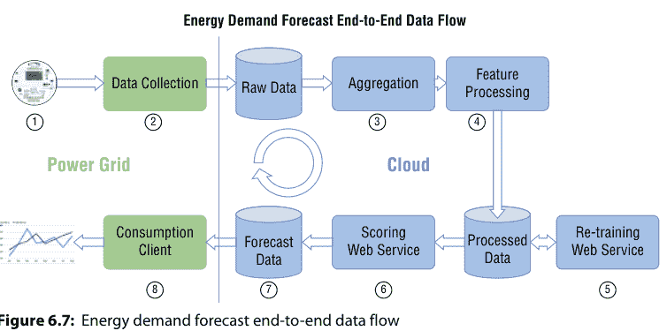

**图 6.7：** 能源需求预测端到端数据流

以下是作为能源需求预测循环一部分发生的步骤：

1. 数百万个部署的数据仪表不断实时生成电力消耗数据。
2. 这些数据被收集并上传到云存储库（如 Azure 存储）。
3. 在处理之前，原始数据按照业务定义聚合到变电站或区域级别。
4. 然后进行特征处理，生成模型训练或评分所需的数据——特征集数据存储在数据库中（如 Azure SQL 数据库）。
5. 调用重训练服务来重新训练预测模型。更新后的模型版本被持久化，以便评分 Web 服务可以使用它。
6. 按照适合所需预测频率的时间表调用评分 Web 服务。
7. 预测数据存储在最终消费客户可以访问的数据库中。
8. 消费客户端检索预测结果，并将其应用回电网，并根据所需的用例进行消费。

需要注意的是，整个循环是完全自动化的，并按计划运行。

## 结论

在最后一章中，我们深入探讨了构建和部署一些时间序列预测解决方案的过程。具体而言，本章全面概述了构建和部署你自己的时间序列预测解决方案的工具：

- **实验设置与 Azure Machine Learning SDK for Python 简介** – 我介绍了 Azure Machine Learning SDK for Python 以构建和运行机器学习工作流，你学习了以下概念和资产：
    - `Workspace`，这是你在云中用于实验、训练和部署机器学习模型的基础资源。
    - `Experiment`，这是另一个基础云资源，代表一系列试验（单个模型运行）的集合。
    - `Run`，代表实验的一次单独试验。
    - `Model`，用于处理机器学习模型的云表示。
    - `ComputeTarget`、`RunConfiguration`、`ScriptRunConfig`，这些是用于创建和管理计算目标的抽象父类。计算目标代表你可以训练机器学习模型的各种资源。
    - `Image`，这是将模型打包到包含运行时环境和依赖项的容器镜像中的抽象父类。
    - `Webservice`，这是为你的模型创建和部署 Web 服务的抽象父类。
- **机器学习模型部署** – 本节介绍了机器学习模型部署，即将机器学习模型集成到现有生产环境中，以便开始基于数据制定实际业务决策的方法。
- **时间序列预测解决方案架构与部署示例** – 在最后一节中，我们构建、训练并部署了一个端到端的数据管道架构，并逐步讲解了部署代码和示例。

# 参考文献

Bianchi, Filippo Maria, and Enrico Maiorino, Michael Kampffmeyer, Antonello Rizzi, Robert Jenssen. 2018. *Recurrent Neural Networks for Short-Term Load Forecasting*. Berlin, Germany: Springer.

Brownlee, Jason. 2017. *Introduction to Time Series Forecasting With Python - Discover How to Prepare Data and Develop Models to Predict the Future*. Machine Learning Mastery. https://machinelearningmastery.com/introduction-to-time-series-forecasting-with-python/.

Che, Zhengping, and Sanjay Purushotham, Kyunghyun Cho, David Sontag, Yan Liu. 2018. “Recurrent Neural Networks for Multivariate Time Series with Missing Values.” *Scientific Reports* 8. https://doi.org/10.1038/s41598-018-24271-9.

Cheng H., Tan PN., Gao J., Scripps J. 2006. “Multistep-Ahead Time Series Prediction.” In: Ng WK., Kitsuregawa M., Li J., Chang K. (eds) *Advances in Knowledge Discovery and Data Mining*, PAKDD 2006. Lecture Notes in Computer Science 3918. Berlin, Heidelberg: Springer. https://doi.org/10.1007/11731139_89.

Cho, Kyunghyun, and Bart van Merriënboer, Caglar Gulcehre, Fethi Bougares, Holger Schwenk, Y Bengio. 2014. *Learning Phrase Representations using RNN Encoder-Decoder for Statistical Machine Translation*. https://doi.org/10.3115/v1/D14-1179.

Glen, Stephanie. 2014. “Endogenous Variable and Exogenous Variable: Definition and Classifying.” *Statistics How To* blog. https://www.statisticshowto.com/endogenous-variable/.

Lazzeri, Francesca. 2019a. “3 reasons to add deep learning to your time series toolkit.” *O’Reilly Ideas* blog. https://www.oreilly.com/content/3-reasons-to-add-deep-learning-to-your-time-series-toolkit/.

Lazzeri, Francesca. 2019b. “Data Science Mindset: Six Principles to Build Healthy Data-Driven Organizations.” InfoQ blog. https://www.infoq.com/articles/data-science-organization-framework.

Lazzeri, Francesca. 2019c. “How to deploy machine learning models with Azure Machine Learning.” Educative.io blog. https://www.educative.io/blog/how-to-deploy-your-machine-learning-model.

Lewis-Beck, Michael S., and Alan Bryman, Tim Futing Liao. 2004. *The Sage Encyclopedia of Social Science Research Methods*. Thousand Oaks, Calif: Sage.

Nguyen, Giang, and Stefan Dlugolinsky, Martin Bobak, Viet Tran, Alvaro Lopez Garcia, Ignacio Heredia, Peter Malík, Ladislav Hluchý. 2019. “Machine Learning and Deep Learning frameworks and libraries for large-scale data mining: a survey.” *Artificial Intelligence Review* 52: 77–124. https://doi.org/10.1007/s10462-018-09679-z.

Petris, G., and S. Petrone, P. Campagnoli. 2009. *Dynamic Linear Models in R*. Springer.

Poznyak, T., and J.I.C. Oria, A. Poznyak. 2018. *Ozonation and Biodegradation in Environmental Engineering: Dynamic Neural Network Approach*. Elsevier Science.

Stellwagen, Eric. 2011. “Forecasting 101: A Guide to Forecast Error Measurement Statistics and How to Use Them.” ForecastPRO blog. https://www.forecastpro.com/Trends/forecasting101August2011.html.

Hong, Tao, and Pierre Pinson, Fan Shu, Hamidreza Zareipour, Alberto Troccoli, Rob J. Hyndman. 2016. “Probabilistic Energy Forecasting: Global Energy Forecasting Competition 2014 and Beyond.” *International Journal of Forecasting* 32, no. 3 (July-September): 896–913.

Taylor, Christine. 2018. “Structured vs. Unstructured Data.” Datamation blog. https://www.datamation.com/big-data/structured-vs-unstructured-data.html.

White, Halbert. 1980. “A Heteroskedasticity-Consistent Covariance Matrix Estimator and a Direct Test for Heteroskedasticity.” *Econometrica, Econometric Society* 48, no.4 (May):817–838.

Zhang, Ruiyang, and Zhao Chen, Chen Su, Jingwei Zheng, Oral Büyüköztürk, Hao Sun. 2019. “Deep long short-term memory networks for nonlinear structural seismic response prediction.” *Computers & Structures* 220: 55–68. https://doi.org/10.1016/j.compstruc.2019.05.006.

Zhang Y, and YT Zhang, JY Wang, XW Zheng. 2015. “Comparison of classification methods on EEG signals based on wavelet packet decomposition.” *Neural Comput Appl* 26, no. 5:1217–1225.

Zuo, Jingwei, and Karine Zeitouni, Yehia Taher. 2019. ISETS: Incremental Shapelet Extraction from Time Series Stream. In: Brefeld U., Fromont E., Hotho A., Knobbe A., Maathuis M., Robardet C. (eds) Machine Learning and Knowledge Discovery in Databases. ECML PKDD 2019. *Lecture Notes in Computer Science* 11908: Springer, Cham. https://doi.org/10.1007/978-3-030-46133-1_53.

# 索引

## A

ACF（自相关函数），108，110，111
ACI（Azure 容器实例），51，176，193
调整后的R平方，17
AI（人工智能）
- 成为AI驱动的公司，174
- 机器学习是其子集，14
`aic` 属性，112
空气质量预测，141
赤池信息准则（AIC），103，112，114，115
AKS（Azure Kubernetes 服务），51，176
算法
- 用于适应时间序列预测并提高预测精度，44–45
- 影响选择的因素，17，31
`align_outputs` 函数，135
AmlCompute，129，130，131
异常检测，作为无监督学习的一种类型，16
Apache 2.0，156
应用机器学习，Python生态系统是其主导平台，22
`ar_model.AutoReg` 模型，112
曲线下面积（AUC），17
ARIMA（自回归积分滑动平均）。*参见* 自回归积分滑动平均（ARIMA）
ARMA（自回归滑动平均）。*参见* 自回归滑动平均（ARMA）
`ARMA()` 类，120
`ARMA()` 函数，121
AR(p) 模型，110，121，122
数组类，定义，66
人工智能（AI）
- 成为AI驱动的公司，174
- 机器学习是其子集，14
ARX模型（带外生变量的自回归），113
`asfreq()` 方法，78
自联想网络，144
自相关
- 自相关图，104–111
- 定义，104
自相关函数（ACF），108，110，111
`autocorrelation_plot`，104，105
自动化机器学习（自动化ML），102，129–136
`AutoMLConfig` 类，133
`AutoMLConfig` 对象，133
`AutoReg()` 函数，117
`AutoReg` 模型，113，114
自回归
- 自相关是其一个方面，104–111
- statsmodels中的自回归类，112
- 作为时间序列预测的经典方法，101
- 定义，102
- statsmodels中自回归类的定义和参数，113–114
- 一阶自回归方法，103
- 使用`plot_predict()`函数从ts_data集生成的预测图，116
- 马尔可夫转换动态回归和自回归，82
- n阶自回归，104
- 阶数，102–103
- `predict` 方法，118–119
- 二阶自回归方法，103
- `AutoReg` 模型的结果摘要，114–116
- 使用`plot_diagnostics()`函数从ts_data集生成的可视化，117
带外生变量的自回归（ARX模型），113
statsmodels中的自回归类，112，114

## B

反向传播过程，在循环神经网络中用于计算梯度值，147，148
批量时间序列数据处理，36–37
贝叶斯信息准则（BIC），103，112，114，115
BERT，156
bic属性，112
blacklist_models参数，134
业务理解和性能指标定义
- 决定如何衡量，34，35
- 决定衡量什么，34–35
- 定义业务目标，34
- 定义成功指标，34，35
- 提出正确的问题，34
- 作为时间序列预测模板中的步骤，30，31，33–36

## C

单元状态，在LSTM架构中，147，148，149
Cho, KyungHyun，148
经典预测方法
- 基础，141
- 示例，3，45，137
分类，作为监督学习的一种类型，15
聚类分析，作为无监督学习的一种类型，16
CNN（卷积神经网络），4，141–142
CNTK，24
列删除，作为处理时间序列中缺失数据的解决方案，13
计算集群，创建或附加，183–184
计算目标
- 为每个计算目标创建部署配置，193
- 用于托管Web服务部署的示例，51–52
- 执行自动化ML远程运行的要求，130
- 设置和使用以进行模型训练，130–131
ComputeTarget类，168，171–172
concat()函数，95
条件最大似然（CML）估计量，112，113
ContainerImage类，172
连续时间序列值，预测模型的，12–13
卷积，目的，141
卷积神经网络（CNN），4，141–142
Cosmos DB，38
当前记忆门，在GRU网络中，149
循环，定义，81
循环模式，作为时间序列数据集的组成部分，110–111
循环短期运动，作为时间序列分析中四个主要组成部分类别之一，5，6，7
循环变化，作为短期运动的一种类型，6

## D

d，作为ARIMA模型三个主要组成部分之一，122，123，124
数据。*另见* 数据清洗；数据探索与理解；数据摄入；数据归一化与标准化；数据准备；数据预处理与特征工程；数据缩放；数据缩放；数据存储
- 缺失数据的处理，13
- 不完美的数据，140–142
- 原始数据，39，140–142，177
- 数据缺失的原因，12
- 流数据，37
- 时间序列数据，44，140–141，150
- 类型，定义，66
- 单变量数据，10，143，159
数据清洗，30，80，84–86
数据探索与理解，作为时间序列预测模板中的步骤，30，31，32–33，39–40

## 数据工厂，38

## 数据摄取
- 批处理时间序列数据处理，36–37
- 数据存储工具，38
- 定义，30
- 实时数据处理，37
- 作为时间序列预测模板中的步骤，30，31，36–39
- 流数据，37
- 时间序列数据收集工具，38

### 数据归一化与标准化，在时间序列数据集中，86–89

### 数据偏移，作为 pandas 捕获的四种通用时间相关概念之一，65

### 数据准备
- 时间序列的常见数据准备操作，65–66
- 转换为时间戳，69–70
- 时间序列缺失值的数据清洗，84–86
- 日期时间特征，90–91
- 定义，61
- 描述，40
- 扩展窗口统计，97–98
- 频率转换，78–79
- 如何开始时间序列数据分析，79–84
- 索引，71–76
- 滞后特征和窗口特征，92–95
- 作为流程的一部分，50
- 作为时间序列预测模板的一部分，32
- 提供格式参数，70–71
- 用于时间序列数据的 Python，62–79
- 滚动窗口统计，95–97
- ts_data_load 训练数据集的步骤，153
- 时间序列数据归一化与标准化，86–89
- 时间序列探索与理解，79–89
- 时间序列特征工程，89–98
- 时间/日期组成部分，76–77
- 时间戳与时期，66–69

### 数据预处理与特征工程，
- 作为时间序列预测模板中的步骤，
- 30，32，40–42

### 数据重缩放，47，86，88

### 数据缩放，80，84，86，88，126，141

### 数据集划分，42，43

### 数据集
- 能源数据集，前几行，180
- 负荷数据集，时间序列分解图，83
- 机器学习数据集，与时间序列数据集对比，4
- 表格数据集，132
- 测试数据集。参见测试数据集
- 时间序列数据集。参见时间序列数据集
- 训练数据集。参见训练数据集/训练集
- ts_data 数据集。参见 ts_data 数据集
- 验证数据集。参见验证数据集

### 数据存储，36，37，38，185

### DataFrame，64，69，72，81，83，84，87，104，105，150，153，160，161，179，180，194

### dataframe.interpolate() 函数，84

### 日期列，在时间序列数据集中，4

### 日期时间，作为 pandas 捕获的四种通用时间相关概念之一，65，66

### 日期时间特征，90–91

### datetime（库），22

### 日期/时间组成部分，76–77

### datetime 函数，79

### DatetimeIndex，71，72，76，77，78

### 深度学习
- 与机器学习对比，139–140
- 定义，139
- 发展与应用，3
- 在 Keras 中开发深度学习模型，155
- 神经网络的内在能力，46
- 常见误解，137
- 将其加入时间序列工具包的理由，138–144
- 作为机器学习的子集，138，139
- 支持多输入和多输出，142–143
- 使用，14

### 差分阶数，又称 d，122

### 删除列，作为处理时间序列缺失数据的解决方案，13

### 需求预测解决方案
- 计算其财务收益，36
- 数据摄取过程，38–39

### 需求预测
- 定义，66
- 示例，66
- 模型，20

### 需求预测建模技术
- 预测解决方案验收，53–54
- 模型部署，48–53
- 模型评估，46–48
- 概述，44–57
- 用例：需求预测，54–57

### 依赖项，190

### 因变量特征，42

### 部署，术语使用，189

### 部署配置，190，191–192，193

### 派生特征，41

### describe() 函数，80

### 降维，18

### 直接多步预测，11，142–143

### 直接-递归混合多步预测，12

### 失真不变性，141

## E

### ELT（提取-加载-转换），38

### 内生特征，预测模型的，9

### 能源数据集，前几行，180

### 能源需求数据集，纽约市，131–136

### 能源需求预测周期，52–53，194

### 能源需求预测
- 定义，67
- 作为部署端到端解决方案，193
- 端到端数据流，194
- Azure 上的解决方案，177–195

### energy_data 目录，184，185

### 入口脚本，51，176，188，189，190，193

### 误差度量，46，47

### 估计器
- 条件最大似然（CML）估计器，112，113
- 协方差估计器，115
- 创建，188
- MinMaxScaler() 作为，117
- 使用，87

### ETL（提取-转换-加载），38

### ETS（指数平滑），3，44，45

### 评估
- 作为选择算法的因素之一，17
- 模型评估，46–48

### 外生特征，预测模型的，9–10

### 外生回归变量，112–113

### expanding() 函数，97

### 扩展窗口统计，90，97–98

### 实验，创建，183

### Experiment 类，167，169，183

### experiment_timeout_hours 参数，134

### 指数平滑（ETS），3，44，45

### 提取-加载-转换（ELT），38

### 提取-转换-加载（ETL），38

### 需求预测建模技术，44–57

### 预测解决方案验收，作为时间序列预测模板中的步骤，30，32

### 遗忘门，在 LSTM 架构中，148

### 格式参数，70–71

### 欺诈检测，时间序列预测在该问题上的适用性，3，45，137

### 频率转换，64，78–79

## F

### 特征工程，4，8，30，32，40–42，50，53，89–98，134，141，175

### 特征。另见时间特征；窗口特征
- 日期时间特征，90–91
- 定义，40
- 派生特征，41
- 预测模型的内生特征，9
- 预测模型的外生特征，9–10
- 独立测量特征，41
- 固有原始特征，41
- 滞后特征，42，92，94–95
- 负荷值，57
- 数量作为选择算法的因素，18
- 选择，18
- 预测模型的结构化特征，10
- 温度，57
- 时间驱动特征，41
- 时间序列特征，40
- 时间戳，57
- 类型，41–42
- 预测模型的非结构化特征，10

### 前馈网络，145

### 反馈网络，143

### 字段，示例，57

### 金融，时间序列预测在该问题上的适用性，3，45，137

### fit() 函数，114

### 预测函数，135

### 预测范围，20，56，132，161

### 预测图，使用 plot_predict() 函数从 ts_data 数据集生成，116

### 预测模型
- 方面，8–14

## G

### 门控循环单元（GRU）
- 如何为时间序列预测开发它们，154–164
- 如何为它们准备时间序列数据，150–154
- 概述，148–149

### 门，在 LSTM 架构中，147

### GEFCom2014 能源预测竞赛，56，177，179，184–185

### 一般多元回归，45

### 几何平均相对绝对误差（GMRAE），47–48

### 梯度下降，146

### 粒度级别，预测模型的，9

## H

### Holt-Winters 季节性方法，44

### 范围，预测模型的，9

## I

### Image 类，168，172

### 图像识别，系统与应用，14

### 不完美数据，深度学习神经网络能够自动从中学习和提取特征，140–142

### 独立测量特征，41

### 索引，71–76

### 推理配置，190

### 固有原始特征，41

### init() 函数，176，190

### 输入门，在 LSTM 架构中，148

### 输入
- 深度学习支持多输入，142–143
- 预测模型的，8

### inverse_transform() 函数，87

### IoT 设备，示例，9

### IPython，22

### 不规则波动，作为时间序列分析中四种主要成分之一，5，7

## K

### Keras，22，24，154，155–156，157

## L

### 滞后特征，42，92，94–95

### 滞后观测值，143，150

### 滞后阶数，又称 p，122

### 滞后变量，11，112，122，152

### lag_plot，104–106

### 语言翻译，系统与应用，14

### 延迟，作为原始数据质量，39

### 线性插值，作为处理时间序列缺失数据的解决方案，13，14

### 线性度，作为选择算法的因素，17–18

### 整行删除，作为处理时间序列缺失数据的解决方案，13

### 负荷，作为字段/特征，177

### 负荷数据集图，180，181

### 负荷数据集，时间序列分解图，83

### “负荷预测数据”（公共数据集），56

### 负荷值
- 作为字段/特征，57
- 时间序列的，83

### 长短期记忆（LSTM）神经网络
- 如何为时间序列预测开发它们，154–164
- 如何为它们准备时间序列数据，150–154
- 介绍，143–145
- 概述，147–148

### 长期负荷预测（LTLF），55–56

### 长期趋势（或趋势），作为时间序列分析中四种主要成分之一，5，7

### 长期趋势，42

### 随机缺失，作为数据缺失的原因，12

### 完全随机缺失，作为数据缺失的原因，12，13

### 非随机缺失，作为数据缺失的原因，12

### 缺失值，12–13，32，39，50，78，84，86，132，133，141，150，153，161，175

### Model 类，168，170–171，175

## 模型部署
- 定义，173
- 部署配置，176
- 如何选择合适的工具以成功部署，175–177
- 概述，48–53，173–175
- 作为时间序列预测模板中的步骤，30，32

### 模型评估，46–48

### 模型实验过程，49

### 建模与评分过程，178

### 建模构建与选择，作为时间序列预测模板中的步骤，30，32，33，42–43

### 模型，注册。参见模型注册

### 修正 BSD（三条款）许可证，23

### 移动平均（MA），44，95，102，119，120

### MSE（均方误差），17

### 多输出预测，12

### 多步预测，11–12，20，21，117，142

### 多步结构，预测模型的，11–12

### 多步监督学习，单变量时间序列作为，21

### 多元数据，示例，143

### 多元模型，使用 LSTMs 和 GRUs，160–164

### 多元性质，预测模型的，10–11

### 多元时间序列，11，20，142，154，160

## M

### MA（移动平均），44，95，102，119，120

### 机器学习
- 类别，14–18
- 与深度学习对比，139–140
- 定义，14，139
- 目标，138
- 机器学习模型工作流，173，174
- 模型部署，173–177
- 模型注册，50，51，170–171，174，175–176，181，189，190，191

### 机器学习数据集，与时间序列数据集对比，4

### 机器学习管道，49，50，173，174，175

### 马尔可夫转换动态回归，82

### Matplotlib，22–23，63–64，82–83

### 均值、中位数、模型和随机样本插补，作为处理时间序列缺失数据的解决方案，13，14

### 平均绝对偏差（MAD），47

### 平均绝对偏差（MAD）/均值比率，47

### 平均绝对误差（MAE），17

### 平均绝对百分比误差（MAPE），17，47，128，135，159

### 均方误差（MSE），17

### 测量精度，作为原始数据质量，39

### 医疗诊断，时间序列预测在该问题上的适用性，3，45，137

### 元数据，示例，143

### MinMaxScaler，87

## N

### 朴素模型，47–48

### 神经网络
- 卷积神经网络（CNNs），141–142
- 用于时间序列预测的介绍，137–165
- 长短期记忆（LSTM）神经网络，143–145，147–164
- 循环神经网络（RNNs），143–154

### 纽约市能源需求数据集，131–136

### 噪声，7，81

### 非连续时间序列值，预测模型的，12–13

### 归一化，86–87

### Notebook VM Web 服务，51，176

### n 阶自回归，104

### NumFOCUS，23

### NumPy，22，23，61，62，63，64，65

## O

### 偏移别名，Python 支持的，92–93

### 单步预测，20

## 204 索引 ■ O–S

阶数，在自回归中，102–103
移动平均阶数，又称 q，122
普通最小二乘（OLS）模型，115
输出门，在 LSTM 架构中，148
输出
- 深度学习支持多输出，142–143
- 预测模型的输出，8

Python 库。*另见* datetime（库）；Keras；Matplotlib；NumPy；pandas；scikit-learn；SciPy；statsmodels
- 导入，151
- 用于时间序列数据的库概览，63
- 使用，21
Python 3，25

## P

p，作为 ARIMA 模型三个主要组成部分之一，122, 123, 124
成对删除，作为处理时间序列中缺失数据的解决方案，13
pandas，21, 22, 23, 24, 63, 64, 65, 66, 69, 71, 72, 79, 80, 87, 90, 92, 96, 97, 104, 105, 106, 150, 153, 160, 161, 179
pandas.plotting.lag_plot API 参考与描述，104, 106
参数，作为选择算法的因素之一，18
参数化方法，104
params 属性，112
偏自相关函数（PACF），109, 110, 111
管道
- 数据摄入管道，38
- 数据管道，49, 84, 173, 195
- 部署，32
- 机器学习管道，49, 50, 173, 174, 175
- 预测数据管道，50, 175
- 训练管道，17
- 验证，54
plot_act() 函数，108
plot_diagnostics() 函数，116
plot_pacf()，109, 110
plot_predict() 函数，116
precip，作为 Automated ML 中的列，132
predict 方法，117, 118–119
预测数据管道，50, 175
预测误差，46–47, 178
预测性维护，34
主要创建方法，66
主成分分析，作为无监督学习的一种类型，16
“概率性能源预测：2014 年全球能源预测竞赛及未来展望”（Hong），177
项目交接，作为客户验收阶段的任务，54
Python
- 时间序列的常见数据准备操作，65–66
- 转换为时间戳，69–70
- 频率转换，78–79
- 索引，71–76
- 支持的偏移别名，92–93
- 提供格式参数，70–71
- 用于时间序列数据，62–79
- 用于时间序列预测，21–24
- 时间/日期组件，76–77
- 时间戳与时期，66–69

## Q

q，作为 ARIMA 模型三个主要组成部分之一，122, 123, 124

## R

不规则张量，156
随机（或不规则波动），作为时间序列分析四个主要组成部分类别之一，5, 7
原始数据
- 关于其模式的基本要求，177
- 深度学习神经网络能够自动从原始数据中学习和提取特征，140–142
- 原始数据的质量，39
实时数据处理，37
受试者工作特征（ROC），17
循环神经网络（RNNs）
- 将其添加到时间序列工具包中，4
- 擅长提取输入数据中的模式，143–144
- 使用 Keras 实现的简单 RNN 模型结构，157, 160
- 用于多元预测场景的、使用 Keras 实现的简单 RNN 模型结构，162
- 用于时间序列预测，144–154
循环单元，145
递归多步预测，11–12, 142
模型注册，50, 51, 170–171, 174, 175–176, 181, 189, 190, 191
回归，作为监督学习的一种类型，15
reindex()，71, 78
重新索引，71
强化学习，作为机器学习的一个类别，14, 16–18
远程集群，向其提交作业，188
表示学习，141
重置门，在 GRU 网络中，149
results.summary()，114–115
RNNs（循环神经网络）。*参见* 循环神经网络（RNNs）
ROC（受试者工作特征），17
rolling() 函数，95, 97
滚动窗口统计，90, 95–97
R 平方分数，17
Run 类，168, 169–170
RunConfiguration 类，168, 172
run(input_data) 函数，176, 190

## S

SARIMAX（带外生因子的季节性自回归积分移动平均），122–129
SARIMAX() 类，123
标量类，66
模式生成，191
scikit-learn，21, 22, 23–24, 63, 64, 65, 87, 88, 170, 171
SciPy，22, 23, 62, 63, 64, 65
scipy.stats 包，86
score.py，172, 192
ScriptRunConfig 类，168, 172
季节性调整和插值，作为处理时间序列中缺失数据的解决方案，13, 14
带外生因子的季节性自回归积分移动平均（SARIMAX），122–129
季节性效应，113
季节性短期波动，作为时间序列分析四个主要组成部分类别之一，5, 6, 7
季节性变化，5, 6
seasonal_decompose() 函数，82
季节性，6, 8, 10, 13, 14, 41, 44, 55, 81, 82, 104, 110–111, 116, 122, 123, 141, 179
Sequential，155
shift() 函数，92
短期负荷预测（STLF），55–56
sigmoid 函数，在 LSTM 架构中，148
信号，在时间序列数据集中，7
单步结构，预测模型的，11
sklearn.preprocessing.MinMaxScaler，87
sklearn.preprocessing.StandardScaler，88
滑动窗口方法，19, 21, 95
解决方案架构
- 自动模式生成，191
- 配置工作区，182–183
- 创建估计器，188
- 创建实验，183
- 创建或附加计算集群，183–184
- 定义入口脚本和依赖项，190
- 能源数据集的前几行，180
- 负荷数据集图，180, 181
- 模型部署，189
- 建模和评分过程，178
- 向远程集群提交作业，188
- 用于带部署示例的时间序列预测，177–195
- 将数据上传到 Azure，184–188
垃圾邮件过滤，时间序列预测在该问题上的适用性，3, 45, 137
语音识别，系统和应用，14
标准缩放器，88
标准化，88–89
平稳性，7–8
statsmodels，21, 22, 23, 63, 64, 65, 108, 109, 110, 111, 112, 113, 116, 117, 120, 121, 123
statsmodels.tsa 包，82
存储工具，38
流分析，38
流数据，37
strftime() 函数，71
强平稳性，8
strptime() 函数，71
结构化特征，预测模型的，10
summary() 函数，112
监督学习
- 作为机器学习的一个类别，14–15
- 分类作为其一种类型，15
- 定义，89–90
- 回归作为其一种类型，15
- 用于时间序列预测，14–21
- 类型，15
对称平均绝对百分比误差（SMAPE），48
SymPy，22
同步性，作为原始数据质量，39
系统验证，作为客户验收阶段的任务，54

## T

表格数据集，使用，132
tanh 激活，146
temp，作为 Automated ML 中的列，132
温度，作为字段/特征，57, 178
Tensor2Tensor，156
TensorFlow，24, 154, 156
TensorFlow Probability，156
测试数据集，42, 43, 117, 152, 158, 160, 161, 164
测试集，42, 43, 117, 118, 126, 132, 135, 150, 151, 159
Theano，24
时间列，在时间序列数据集中，1, 4
时间增量，作为 pandas 捕获的四种通用时间相关概念之一，65, 66
时间驱动特征，41
时间特征
- 日期时间特征，90–91
- 扩展窗口统计，90, 97–98
- 滞后特征和窗口特征，90, 92–95
- 滚动窗口统计，90, 95–97
测量时间，作为原始数据质量，39
时间序列分析
- 与时间序列预测的比较，4–5
- 使用，4–5
时间序列组成部分，实际表示，7
时间序列数据
- 定义，44, 140–141
- 将其转换为两个张量，150
时间序列数据分析
- 时间序列中缺失值的数据清洗，84–86
- 如何开始，79–84
- 时间序列数据归一化和标准化，86–89
时间序列数据收集工具，38
时间序列数据集
- 将其表示为监督学习问题，18–19
- 与机器学习数据集的对比，4
时间序列，定义，1
时间序列探索与理解，如何开始时间序列数据分析，79–84
时间序列特征工程，89–98
时间序列特征，理解，40
时间序列预测
- 应用，29
- 应用于能源负荷用例，2
- 方面，8–14
- 与时间序列分析的比较，4–5
- 可帮助解决的问题示例，1–2, 3
- 实验设置，24–26
- 四个主要组成部分类别，5–7
- 作为基础的跨行业研究领域，3
- 自回归和自动化方法介绍，101–135
- Python 用于，21–24
- 监督学习用于，14–21
- 使用，5
时间序列预测模板
- 定义，29
- 图示，32
- 步骤，30–32
时间序列工具包，4, 45, 137, 138–144
时间跨度，作为 pandas 捕获的四种通用时间相关概念之一，65, 66
时间戳，作为字段/特征，57, 177
时间/日期组件，76–77
Timestamp，76, 77
时间戳列，在时间序列数据集中，4
时间戳间隙，84
时间戳
- 转换为，69–70
- 与时期对比，66–69
交通流量预测，141
训练数据集/训练集，42, 43, 117, 118, 126–127, 132, 150, 151, 152, 153, 154
训练
- 线性算法的训练，17
- 模型的训练，14, 17, 18, 21, 42, 43, 49, 114, 126, 127, 129, 138, 140, 149, 150, 155, 163, 168, 169, 171, 174, 179–182
训练脚本，181, 182, 185, 189, 191
训练时间，作为选择算法的因素，17
变换不变性，141
趋势
- 定义，81
- 作为时间序列分析四个主要组成部分类别之一，5, 6, 7
- 作为时间序列数据集组成部分，110–111
趋势分解图，时间序列的，83
truncate() 函数，76
ts_data 集，71–72, 74, 78, 79, 82, 84, 87, 91, 93, 94, 97, 114, 116, 117, 160
ts_data_load，72, 105, 106, 107, 108, 109, 110, 111, 121, 125, 152, 153
单变量模型，LSTM 和 GRU 在其中的使用，154, 156–160
单变量性质，预测模型的，10–11
单变量时间序列
- 定义，19, 154
- 作为多步监督学习，21
- 将时间序列数据转换为两个张量以解决单变量时间序列问题，150
- 术语使用，11
非结构化特征，预测模型的，10
无监督学习，作为机器学习的一个类别，14, 15–16
更新门，在 GRU 网络中，149
用例：需求预测，作为时间序列预测模板中的步骤，31, 54–57
公用事业和能源领域
- 需求预测在其中的应用，55–57
- 面临的挑战，54

## V

验证
- 业务验证，32
- 交叉验证，23, 133
- 早停作为验证的一种形式，158
- 系统验证，54
- 滚动向前验证，127
验证数据集，42, 43, 150, 151, 152, 154, 161, 162, 178
验证损失，158
梯度消失问题，147
向量自回归（VAR）模型，82
Visual Studio Code Python 扩展，24–26
Visual Studio Code (VS Code)，24, 25
可视化，使用 plot_diagnostics() 函数从 ts_data 集生成，117

## W

滚动向前验证，127
弱平稳性，8
天气预测，20, 141
Web 服务
- 自动为其生成模式，191
- 将机器学习算法转换为，48
- 为你的模型创建和部署，50, 168, 171, 172, 173, 175, 176
- 部署和使用，190
- 作为 Azure ML 中主要的可部署构建块，189
- 名称定义，192
- 重新训练，195
- 评分，195
Webservice 类，168, 173, 175–176
怀特协方差估计量/怀特检验，115
窗口特征，95, 97–98
工作区，182–183
Workspace 函数，167, 169, 182–183

## Y

.YearLocator() 函数，82

## WILEY 最终用户许可协议

请访问 www.wiley.com/go/eula 以获取 Wiley 电子书最终用户许可协议。