# 面向石油天然气行业的Python机器学习指南

数据、算法、代码与应用的分步详解

Hoss Belyadi
Obsertelligence, LLC

Alireza Haghighat
IHS Markit

Gulf Professional Publishing
Elsevier旗下品牌

Gulf Professional Publishing是Elsevier旗下品牌
地址：50 Hampshire Street, 5th Floor, Cambridge, MA 02139, United States
地址：The Boulevard, Langford Lane, Kidlington, Oxford, OX5 1GB, United Kingdom

版权所有 © 2021 Elsevier Inc. 保留所有权利。

未经出版商书面许可，不得以任何形式或任何方式（电子或机械，包括影印、录制或任何信息存储和检索系统）复制或传播本出版物的任何部分。有关如何寻求许可、出版商许可政策的更多信息以及我们与版权结算中心和版权许可机构等组织的安排详情，请访问我们的网站：www.elsevier.com/permissions。

本书及其包含的个人贡献受出版商版权保护（除非另有说明）。

## 注意事项

本领域的知识和最佳实践在不断变化。随着新的研究和经验拓宽我们的理解，研究方法、专业实践或医疗方法可能需要进行调整。

从业者和研究人员在评估和使用本文描述的任何信息、方法、化合物或实验时，必须始终依赖自己的经验和知识。在使用此类信息或方法时，他们应注意自身及他人的安全，包括对其负有专业责任的各方。

在法律允许的最大范围内，对于因产品责任、疏忽或其他原因，或因使用或操作本文材料中包含的任何方法、产品、说明或想法而造成的任何人身伤害和/或财产损害，出版商、作者、撰稿人或编辑均不承担任何责任。

## 美国国会图书馆编目出版数据

本书的编目记录可从美国国会图书馆获取

## 英国图书馆编目出版数据

本书的编目记录可从英国图书馆获取

ISBN: 978-0-12-821929-4

> 有关所有Gulf Professional Publishing出版物的信息，请访问我们的网站：https://www.elsevier.com/books-and-journals

出版人：Joe Hayton
高级组稿编辑：Katie Hammon
编辑项目经理：Hillary Carr
制作项目经理：Poulouse Joseph
封面设计师：Christian Bilbow

由TNQ Technologies排版

## 作者简介

Hoss Belyadi是Obsertelligence, LLC的创始人兼首席执行官，专注于提供人工智能（AI）内部培训和解决方案。作为西弗吉尼亚大学、马里埃塔学院和圣弗朗西斯大学等多所大学的兼职教师，Belyadi先生教授数据分析、天然气工程、提高石油采收率和水力压裂设计等课程。凭借在全球各种常规和非常规油藏中超过10年的经验，他从事各种机器学习项目，并在多所大学、组织和能源部（DOE）举办短期课程。Belyadi先生是《非常规油藏水力压裂》（第一版和第二版）的主要作者，也是《面向石油天然气行业的Python机器学习指南》的作者。Hoss拥有西弗吉尼亚大学石油与天然气工程学士和硕士学位。

Alireza Haghighat博士是IHS Markit工程解决方案的高级技术顾问和讲师，专注于油藏/生产工程和数据分析。在加入IHS之前，他在Eclipse/Montage资源公司担任高级油藏工程师近5年。作为油藏工程师，他参与了利用数据分析进行井动态评估、非常规资产（Utica和Marcellus）的产量瞬态分析、资产开发、水力压裂/油藏模拟、DFIT分析和储量评估等工作。他在宾夕法尼亚州立大学（PSU）担任兼职教师5年，在石油工程/能源、商业和金融系授课。Haghighat博士发表了多篇关于机器学习在智能井、CO₂封存建模和非常规油藏生产分析中应用的技术论文和书籍章节。他拥有西弗吉尼亚大学石油与天然气工程博士学位和代尔夫特理工大学石油工程硕士学位。

## 致谢

我们要感谢整个Elsevier团队，包括Katie Hammon、Hilary Carr和Poulouse Joseph，感谢他们在出版过程中持续的支持，使出版工作得以成功。我，Hoss Belyadi，要感谢两位真正帮助本书语法和技术审阅的人。首先，我要感谢我美丽的妻子Samantha Walstra，在过去两年撰写本书的过程中给予的持续支持和鼓励。我还要向Neda Nasiriani博士表示最深切的感谢，感谢她对本书的技术审阅。

我，Alireza Haghighat，要感谢我的博士导师Shahab D. Mohaghegh博士。他是石油天然气行业人工智能与机器学习应用的先驱，在我学习石油数据分析的旅程中给予了指导。我要感谢我的妻子Neda Nasiriani博士，她在撰写本书的过程中给予了极大的支持。她鼓励我写作，提出了改进建议，并从计算机科学的角度审阅了本书的每一章。我还要感谢Samantha Walstra审阅本书的技术写作。

# 第1章

## 机器学习与Python简介

### 引言

人工智能（AI）和机器学习（ML）在各行各业日益普及。企业、大学、政府和研究团体已经认识到AI和ML在自动化各种流程的同时提高预测能力的真正潜力。AI和ML的潜力是各行各业的显著变革推动者。自动驾驶汽车、欺诈检测、语音识别、垃圾邮件过滤、亚马逊和Facebook的产品与内容推荐等技术AI的进步，为各公司创造了巨大的净资产价值。能源行业正处于将AI应用于不同应用的初始阶段。其在能源行业的普及度上升，得益于传感器和高性能计算服务（如Apache Hadoop、NoSQL等）等新技术，这些技术使得在不同研究领域能够进行大数据的采集和存储。大数据指的是数量过于庞大，无法使用常用工具和技术（例如，太字节的数据）进行处理（即收集、存储和分析）的数据量。过去几年，该领域的出版物数量呈指数级增长。快速搜索石油工程师协会OnePetro或美国石油地质学家协会（AAPG）过去几年石油天然气行业的出版物数量即可证明这一事实。随着更多公司认识到将AI融入日常运营所带来的附加值，将会有更多创新的想法涌现。本书旨在提供一个分步、易于遵循的工作流程，介绍如何使用Python（一种免费的开源编程语言）在能源行业中应用AI。随着阅读的深入，您会注意到Python社区通过提供各种库来轻松高效地执行ML算法所取得的惊人成就。因此，我们的主要目标是通过这份分步指南，分享我们在能源行业中各种ML应用的知识。无论您是数据科学/编程语言的新手还是高级用户，本书的编写方式都适合任何人。我们将在全书中使用许多示例

## 人工智能

AI、ML、大数据和数据挖掘等术语在不同组织中被混用。因此，在深入探讨各种应用之前，理解每个术语的真实含义至关重要。人工智能（AI）简单来说就是使用机器或计算机智能，而非人类或动物智能。它是计算机科学的一个分支，研究计算机如何模拟人类智能过程，如学习、推理、问题解决和自我修正。创造能够像人类一样工作、反应并模仿认知功能的智能机器，是人工智能的主要目标。人工智能的例子包括电子邮件分类（归类）、智能个人助理（如Siri、Alexa和Google）、自动应答器、流程自动化、安全监控、欺诈检测与预防、模式与图像识别、产品推荐与购买预测、智能搜索、销售、销量与商业预测、广告定向投放、新闻推送个性化、恐怖活动检测、自动驾驶汽车、健康诊断、抵押贷款违约预测、房价预测、智能投顾（自动化投资组合管理）以及虚拟旅行助手。如上所示，人工智能领域在未来数十年内将持续增长，潜力非凡。此外，过去几年对数据科学岗位的需求也呈指数级增长，企业迫切寻找拥有认证大学研究生（最好是博士学位）的计算机科学家、数学家、数据科学家和工程师。

## 数据挖掘

数据挖掘是计算机科学中的一个术语，定义为使用一组不同的技术（如机器学习）从数据库中提取特定信息的过程，这些信息通常是隐藏的、未明确提供给用户的。它也被称为**数据库知识发现（KDD）**。教某人打篮球是机器学习；而利用某人来寻找最佳篮球中锋则是数据挖掘。数据挖掘被机器学习算法用来发现各种线性和非线性关系之间的联系。数据挖掘常用于帮助企业**收集**各方面的数据，例如非生产时间、销售趋势、生产关键绩效指标、钻井数据、完井数据、股市关键指标和信息等。数据挖掘也可用于浏览网站、在线平台和社交媒体，以收集和汇编信息（Belyadi等人，2019）。

## 机器学习

机器学习（ML）是*人工智能*的一个子集。它被定义为使用各种算法教计算机在数据中寻找模式，以用于未来预测和预报，或作为性能优化的质量检查。机器学习使计算机能够在没有明确编程的情况下学习。其中一些模式可能是隐藏的，因此，发现这些隐藏模式可以为任何组织增加显著的股东价值。请注意，数据挖掘处理的是搜索特定信息，而机器学习则专注于执行特定任务。本书第2章将讨论各种类型的机器学习算法。另请注意，深度学习是机器学习的一个子集，它使用多层神经网络用于各种目的，包括但不限于图像和人脸识别、时间序列预测、自动驾驶汽车、语言翻译等。深度学习算法的例子包括卷积神经网络（CNN）和循环神经网络（RNN），它们将在第6章结合各种油气应用进行讨论。

## Python速成课程

在涵盖所有算法以及Python代码的要点之前，理解Python的基础知识至关重要。因此，本章将用于阐述基础知识，然后再深入探讨各种工作流程和示例。

## Anaconda简介

强烈建议下载Anaconda，这是Python数据科学的标准平台，其安装包含了许多必要的库。本书中使用的大多数库已随Anaconda预装，因此无需单独下载。未在Anaconda中预装的库将在各章节中提及。

## Anaconda安装

要安装Anaconda，请访问Anaconda网站（www.anaconda.com）并点击“Get Started”。然后，点击“Download Anaconda Installers”，并下载适用于Windows或Mac的最新版本Anaconda。Anaconda发行版将包含超过250个软件包，其中一些将在本书中使用。如果您不下载Anaconda，大多数库必须使用命令提示符窗口单独安装。因此，强烈建议下载Anaconda，以避免下载本书中将使用的大部分库。请注意，虽然安装Anaconda会安装大多数库，但仍有一些库需要使用命令提示符或Anaconda提示符窗口单独安装。对于那些未预装的库，只需从“开始”菜单中打开“Anaconda prompt”，然后输入“pip install (库名)”，其中“库名”是要安装的库的名称。Anaconda成功安装后，在开始菜单中搜索“Jupyter Notebook”。Jupyter Notebook是一个基于网络的交互式计算笔记本环境。Jupyter Notebook加载迅速、用户友好，并将在本书中全程使用。还有其他用户界面，如Spyder、JupyterLab等。图1.1显示了打开后的Jupyter Notebook窗口。只需进入“桌面”并创建一个名为“ML Using Python”的文件夹。然后，进入创建的文件夹（“ML Using Python”），并点击右上角的“New”，如图1.2所示。

您现在已正式启动了一个新的Jupyter Notebook，并准备好开始编码，如图1.3所示。

如图1.4所示，左上角表示笔记本为“Untitled”。只需点击“Untitled”并将Jupyter Notebook命名为“Python Fundamentals”。

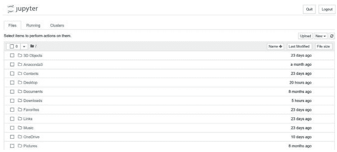

图1.1 Jupyter Notebook窗口。


图1.2 打开新的Jupyter Notebook。


图1.3 空白的Jupyter Notebook。


图1.4 Python Fundamentals。

## Jupyter Notebook界面选项

要在Jupyter Notebook中运行一行代码，可以使用“Run”按钮，或者更推荐使用“SHIFT + ENTER”。要在Jupyter Notebook中添加一行，按“ALT + ENTER”或直接使用“Insert → Cell Below”。“Insert Cell Above”也可用于在当前单元格上方插入单元格。要删除Jupyter Notebook中的一行，在选中该行时，按“DD”（换句话说，连续按两次“D”键）。如果在编码过程中任何时候想要停止Jupyter Notebook，可以选择“Kernel → Interrupt”或“Kernel → Restart”来重启单元格。“Kernel → Restart and Run All”是Jupyter Notebook中另一个便捷工具，可用于从头到尾运行整个笔记本，而不是使用“SHIFT + ENTER”手动运行每一行代码，后者可能会降低工作效率。以下是一些推荐在Jupyter Notebook中使用的便捷快捷键：

- Shift + Enter → 运行当前单元格，选择下方单元格
- Ctrl + Enter → 运行选定的单元格
- Alt + Enter → 运行当前单元格，在下方插入新单元格
- Ctrl + S → 保存并创建检查点
- Enter → 进入编辑模式
- 在命令模式下按“ESC”可退出编辑模式。
- H → 显示所有快捷键（在命令模式下使用H）
- Up → 选择上方单元格
- Down → 选择下方单元格
- Shift + Up → 向上扩展选择单元格（在命令模式下使用）

## 使用Python的油气行业机器学习指南

Shift + Down → 向下扩展选中的单元格（在命令模式下使用）
A → 在上方插入单元格（在命令模式下使用）
B → 在下方插入单元格（在命令模式下使用）
X → 剪切选中的单元格（在命令模式下使用）
C → 复制选中的单元格（在命令模式下使用）
V → 在下方粘贴单元格（在命令模式下使用）
Shift + V → 在上方粘贴单元格（在命令模式下使用）
DD（按两次"D"键）→ 删除选中的单元格（在命令模式下使用）
Z → 撤销单元格删除（在命令模式下使用）
Ctrl + A → 全选（在命令模式下使用）
Ctrl + Z → 撤销（在命令模式下使用）

请花些时间使用这些键盘快捷键，以熟悉Jupyter Notebook的用户界面。本书中其他重要注意事项：

-   Jupyter Notebook在自动补全某些代码方面非常有用。需要记住的关键字是"tab"键，它将帮助自动补全和更快地编码。例如，如果想导入matplotlib库，只需输入"mat"并按tab键。将出现两个可用选项，如"math"和"matplotlib"。这个重要功能使您能够更快地获取库。此外，它还有助于在编码时记住语法、库或命令名称。因此，为了养成更快的编码习惯，请随意使用"tab"键进行自动填充和自动补全。
-   另一个特别有用的快捷键是"shift + tab"。在库的括号内按一次此键将打开该库的所有关联功能。例如，如果在导入"import numpy as np"后输入np.linspace()并按一次"shift + tab"，它将弹出一个窗口，显示所有可以传递的参数。按两次、三次和四次"shift + tab"将不断扩展参数窗口，直到占据页面的一半。

## 基本数学运算

接下来，让我们回顾Python中的基本运算：

```
4*4
Python output=16
```

请注意，如果在单元格中输入以下数学运算，Python将使用**运算顺序**来求解；因此，下面示例的答案是42。

```
4*4+2*4+9*2
Python output=42
```

```
(4*2)+(8*7)
Python output=64
```

要将变量或数字提升到幂，可以使用"**"。例如，

```
10**3
Python output=1000
```

也可以使用"%"符号找到除法的余数。例如，13除以2的余数是1。

```
13%2
Python output=1
```

## 赋值变量名

在Python中赋值变量名时，重要的是要注意变量名不能以数字开头。

```
x=100
y=200
z=300
d=x+y+z
d
Python output=600
```

为了分隔变量名，建议使用下划线。如果定义一个中间有空格的变量名，如"critical rate"，Python将给出"无效语法"错误。因此，必须在critical和rate之间使用下划线(_)，并将"critical_rate"用作变量名。

## 创建字符串

要创建字符串，可以使用单引号或双引号。

```
x='I love Python'
Python output= 'I love Python'

x="I love Python"
Python output= 'I love Python'
```

要索引字符串，可以使用方括号([])表示法和元素编号。至关重要的是要记住，Python中的索引从0开始。假设变量名y被定义为字符串"Oil_Gas"，y[0]表示Oil_Gas中的第一个元素，而y[5]表示Oil_Gas中的第六个元素，因为索引从0开始。

```
y="Oil_Gas"
y[0]
Python output= 'O'

y[5]
Python output= 'a'
```

要获取前4个字母，可以使用y[0:4]。

```
y[0:4]
Python output= 'Oil_'
```

要获取整个字符串，只需使用y[:]即可。因此，

```
y[:]
Python output= 'Oil_Gas'
```

另一种索引所有内容直到第n个元素的方法如下：

```
y[:6]
Python output= 'Oil_Ga'
```

y[:6]本质上表示索引所有内容**直到第六个元素**（不包括第六个元素）。也可以使用y[2:]来索引第二个元素及其之后的内容。

```
y[2:]
Python output= 'l_Gas'
```

要获取字符串的长度，只需使用"len()"即可。例如，要获取变量z中定义的字符串"The optimum well spacing is 950 ft"的长度，可以使用len()来完成。

```
z='The optimum well spacing is 950 ft'
len(z)
Python output=34
```

## 定义列表

可以如下定义列表：

```
list=['Land','Geology','Drilling']
list
Python output=['Land', 'Geology', 'Drilling']

list.append('Frac')
list
Python output=['Land', 'Geology', 'Drilling', 'Frac']
```

要向上面的列表中追加一个数字，如100，可以执行以下代码行：

```
list.append(100)
list
Python output=['Land', 'Geology', 'Drilling', 'Frac', 100]
```

要从列表中索引，可以使用与**字符串索引**相同的方括号表示法。例如，使用print语法打印上面定义列表中的不同元素如下：

```
print (list[0])
print (list[1])
print (list[2])
print (list[3])
print (list[4])
Python output=
Land
Geology
Drilling
Frac
100
```

要获取元素1到4（不包括第四个元素），可以使用以下行：

```
list[0:4]
Python output= ['Land', 'Geology', 'Drilling', 'Frac']
```

请注意，list[0:4]不包括第四个元素，在本例中是100。

要**替换**第一个元素为"Title_Search"，可以使用以下行：

```
list[0]='Title_Search'
list
Python output= ['Title_Search', 'Geology', 'Drilling', 'Frac', 100]
```

要替换更多元素并保留最后一个元素100，可以使用以下行：

```
list[0]='Reservoir_Engineer'
list[1]='Data_Engineer'
list[2]='Data_Scientist'
list[3]='Data Enthusiast'
list
Python output= ['Reservoir_Engineer', 'Data_Engineer', 'Data_Scientist', 'Data Enthusiast', 100]
```

## 创建嵌套列表

嵌套列表是指一个列表内部包含其他列表。

```
nested_list=[10,20, [30,40,50,60]]
nested_list
Python output= [10, 20, [30, 40, 50, 60]]
```

要从上面的nested_list中获取数字30，可以使用以下行：

```
nested_list[2][0]
Python output=30
```

嵌套列表可能会变得混乱，尤其是当方括号内的嵌套列表数量增加时。让我们检查下面名为**nested_list2**的示例。如果目标是从下面显示的nested_list2中获取**数字3**，则需要三个方括号来完成此任务。首先，使用**nested_list2[2]**获取[30, 40, 50, 60, [4, 3, 1]]。然后，使用**nested_list2[2][4]**获取[4, 3, 1]，最后要获取3，使用**nested_list2[2][4][1]**。

```
nested_list2=[10,20, [30,40,50,60, [4,3,1]]]
nested_list2[2][4][1]
Python output=3
```

## 创建字典

到目前为止，我们已经介绍了字符串和列表，下一节将讨论字典。使用字典时，使用花括号({})。下面创建了一个字典并命名为"a"，用于各种ML模型及其各自的分数。

```
a={'ML_Models':['ANN','SVM','RF','GB','XGB'],
    'Score':[90,85,95,90,100]}
a
Python output={'ML_Models': ['ANN', 'SVM', 'RF', 'GB', 'XGB'],
    'Score': [90, 85, 95, 90, 100]}
```

要从此字典中索引，可以使用以下命令。如图所示，调用a['ML_Models']会列出ML_Models下的ML模型名称。

```
a['ML_Models']
Python output=['ANN', 'SVM', 'RF', 'GB', 'XGB']
```

要获取包括ANN、SVM和RF在内的ML模型名称，不包括其余部分，可以使用以下命令。

```
a['ML_Models'][0:3]
Python output=['ANN', 'SVM', 'RF']
```

另一个嵌套字典示例如下：

```
d={'a':{'inner_a':[1,2,3]}}
d
{'a': {'inner_a': [1, 2, 3]}}
```

如果目标是显示上面字典中的数字2，可以使用以下索引来完成此任务。第一步是使用d['a']这将显示 `{'inner_a': [1, 2, 3]}`。接下来，使用 `d['a']['inner_a']` 将得到 `[1, 2, 3]`。最后，要选取数字 2，我们只需添加索引 1 即可得到 `d['a']['inner_a'][1]`。

```
d['a']['inner_a'][1]
Python output=2
```

## 创建元组

与使用**方括号**的列表不同，元组使用**圆括号**来定义元素序列。使用列表的一个优点是项目可以被赋值；然而，元组不支持项目赋值，这意味着它们是不可变的。例如，让我们创建一个列表并替换其中一个元素，然后用元组来检验相同的概念。如下所示，创建了一个包含 4 个元素 100、200、300 和 400 的列表。索引为 0 的元素 100 被替换为 "New"，新列表如下：

```
list=[100,200,300,400]
list[0]='New'
list
Python output= ['New', 200, 300, 400]
```

接下来，让我们用相同的数字创建一个元组，如下所示：

```
t= (100,200,300,400)
t
Python output= (100, 200, 300, 400)
```

如上所示，Python 生成了一个元组列表。现在，让我们将 "New" 赋值给上面生成的元组中的第一个元素。然而，运行此操作后，Python 将返回一个错误，指出 "**元组对象不支持项目赋值。**" 这本质上是列表和元组之间的主要区别。

```
t[0]='New'
```

## 创建集合

集合由唯一元素定义，这意味着多次定义相同的数字只会返回唯一数字，不会显示重复的数字。可以使用花括号 ({}) 来生成一个集合，如下所示。如图所示，生成的输出只有 100、200、300，因为每个数字都重复了两次。

```
set={100,200,300,100,200,300}
set
Python output={100, 200, 300}
```

`add()` 语法可以附加到集合上，以在集合末尾添加一个数字，如下所示：

```
set.add(400)
set
Python output={100, 200, 300, 400}
```

## If 语句

If 语句可能是任何编程语言中最重要的概念之一。让我们从一个简单的例子开始，定义如果 100 等于 200，则打印 "good job"，否则打印 "not good"。确保 "if 100 == 200:" 和 "else:" 后面的打印语句是缩进的，否则会收到错误。在 Jupyter Notebook 中可以使用 "tab" 键进行缩进。请注意，在 Python 中缩进意味着 4 个空格。

```
if 100==200:
    print('Good Job!')
else:
    print('Not Good!')
Python output=Not Good!
```

现在，让我们定义 X、Y 和 Z 变量，并编写另一个引用这些变量的 if 语句。如下所示，如果 X 大于 Y，则打印 "GOOD"，但事实并非如此。因此，可以使用 "elif" 术语来定义多个条件。下一个条件是如果 Z < Y，则打印 "SO SO"，这同样不成立，因此使用 "else" 术语来定义所有其他情况，输出将是 "BAD"。

```
X=100
Y=200
Z=300
if X>Y:
    print('Good')
elif Z<Y:
    print('SO SO')
else:
    print('BAD')
Python output=BAD
```

上面的 if 语句也可以写成如下形式，以获得数字输出而不是字符串。

```
X=100
Y=200
Z=300
if X>Y:
    A=X+Y
elif Z<Y:
    B=X+Y+Z
else:
    C=2*(X+Y+Z)
C
Python output=1200
```

让我们再做一个 if 语句的例子。首先，让我们定义 n 为用户可以输入的数字。如果 n 等于 0，则打印 "ZERO"。如果 n 小于 0，则打印 "NEGATIVE Number"，最后如果 n 大于 0，则打印 "POSITIVE Number"。运行下面的代码时，输入一个数字并点击回车。接下来，根据输入的数字，将打印相应的语句。

```
n=float(input("Enter any number"))
if n==0:
    print('ZERO')
elif n>0:
    print('POSITIVE Number')
else:
    print('NEGATIVE Number')
```

## For 循环

For 循环是任何编程语言中另一个非常有用的工具，它允许遍历一个序列。让我们定义 i 为 0 到 5（不包括 5）之间的范围。然后编写一个 for 循环，结果打印出 0 到 4。如下所示，"for x in i" 等同于 "for x in range(0,5)"。

```
i=range(0,5)
for x in i:
    print(x)
Python output=
0
1
2
3
4
```

另一个 for 循环示例可以写成如下形式：

```
for x in range(0,3):
    print('Edge computing in the O&G industry is very valuable')
Python output=Edge computing in the O&G industry is very valuable
Edge computing in the O&G industry is very valuable
Edge computing in the O&G industry is very valuable
```

"break" 函数允许在遍历所有项目之前停止循环。下面是在 for 循环中使用 if 语句和 break 函数的示例。如下所示，如果 for 循环看到 "Frac_Crew_2"，它将中断并完成 for 循环迭代。

```
Frac_Crews=['Frac_Crew_1', 'Frac_Crew_2', 'Frac_Crew_3',
'Frac_Crew_4']
for x in Frac_Crews:
    print(x)
    if x=='Frac_Crew_2':
        break
Python output=Frac_Crew_1
Frac_Crew_2
```

使用 "continue" 语句，可以停止循环的当前迭代并继续下一次迭代。例如，如果希望跳过 "Frac_Crew_2" 并移动到下一个名称，可以使用 continue 语句，如下所示：

```
Frac_Crews=['Frac_Crew_1', 'Frac_Crew_2', 'Frac_Crew_3',
'Frac_Crew_4']
for x in Frac_Crews:
    if x=='Frac_Crew_2':
        continue
    print(x)
Python output=Frac_Crew_1
Frac_Crew_3
Frac_Crew_4
```

"range" 函数也可以用于不同的增量。默认情况下，range 函数使用以下序列生成数字：start、stop、increments。例如，如果希望从数字 10 开始，最终数字为 18，增量为 4，可以编写以下行：

```
for x in range(10, 19, 4):
    print(x)
Python output=10
14
18
```

## 嵌套循环

嵌套循环是指一个循环位于另一个循环内部。在各种 ML 优化程序中，例如网格搜索（将讨论），嵌套循环对于优化 ML 超参数非常常见。下面是一个嵌套循环的简单示例：

```
Performance=["Low_Performing", "Medium_Performing",
    'High_Performing']
Drilling_Crews=["Drilling_Crew_1", "Drilling_Crew_2",
    "Drilling_Crew_3"]
for x in Performance:
    for y in Drilling_Crews:
        print(x, y)
Python output=Low_Performing Drilling_Crew_1
Low_Performing Drilling_Crew_2
Low_Performing Drilling_Crew_3
Medium_Performing Drilling_Crew_1
Medium_Performing Drilling_Crew_2
Medium_Performing Drilling_Crew_3
High_Performing Drilling_Crew_1
High_Performing Drilling_Crew_2
High_Performing Drilling_Crew_3
```

让我们尝试另一个 for 循环示例，首先创建一个空列表，然后对数字列表执行基本代数运算，如下所示：

```
i=[10,20,30,40]
out=[]
for x in i:
    out.append(x**2+200)
print(out)
Python output=[300, 600, 1100, 1800]
```

## 列表推导式

列表推导式是快速执行计算的另一种强大方式。上面列出的计算可以在以下列表推导式中简化：

```
[x**2+200 for x in i]
Python output=[300, 600, 1100, 1800]
```

如上面的列表推导式示例所示，首先写下所需的数学计算，然后在方括号内写 "for x in i"。下面是另一个示例：

```
y=[5,6,7,8,9,10]
[x**2+3*x+369 for x in y]
Python output=[409, 423, 439, 457, 477, 499]
```

如上所示，y 中的每个元素都经过二次方程 "x^2+3x+369"。这是编写相同代码的更高级方式。乍一看可能不直观，但随着时间的推移，列表推导式会变得更容易理解和应用。

## 定义函数

Python 中的下一个概念是定义函数。可以使用 "def" 后跟 "return" 来定义函数，以执行各种数学方程：

```
def linear_function(n):
    return 2*n+20
linear_function(20)
Python output=60
```

如上所示，首先使用语法 "def" 定义任何想要的名称。然后，返回所需的方程。最后，调用定义的名称，后跟要用于运行计算的数字。
下面是另一个示例：

```
def Turner_rate(x):
    return x**2+50
Turner_rate(20)
Python output=450
```

## Pandas 简介

Pandas 是 Python 中最著名的库之一，它本质上旨在复制 Python 中的 Excel 表格格式。Pandas 的主要作用是数据操作和分析，在实施 ML 模型之前广泛用于数据预处理。在学习了 pandas 和 numpy（接下来将讨论）库的基础知识后，构建各种 ML 模型变得容易得多。首先，让我们创建一个字典，并将该字典转换为 pandas 表格格式，如下所示：

```
dictionary={'Column_1':[10,20,30],'Columns_2':[40,50,60],
    'Column_3':[70,80,90]}
dictionary
Python output={'Column_1': [10, 20, 30], 'Columns_2': [40, 50, 60],
    'Column_3': [70, 80, 90]}
```

要将此字典转换为数据框，可以使用 **pd.DataFrame** 命令行。在命令行之前 "import pandas as pd" 也很重要，如下所示：

```
import pandas as pd
dictionary=pd.DataFrame(dictionary)
dictionary
Python output=Fig. 1.5
```

## 1.5 将字典转换为数据框。

上述命令可以一步完成，如下所示：

```python
dictionary=pd.DataFrame({'Column_1':[10,20,30],'Columns_2':
    [40,50,60],'Column_3':[70,80,90]})
dictionary
```

| Column_1 | Columns_2 | Column_3 |
|---|---|---|
| 0 | 10 | 40 | 70 |
| 1 | 20 | 50 | 80 |
| 2 | 30 | 60 | 90 |

为了练习，让我们创建另一个包含3列的数据框，列名分别为 drilling_CAPEX、completions_CAPEX 和 production CAPEX，但使用 well_1、well_2 和 well_3 作为索引，而不是 0、1 和 2。如下所示，可以添加 "index" 来定义每一行或索引的名称。请注意，下面的代码中添加了两次反斜杠（\）符号。添加反斜杠本质上是告诉 Python，代码的剩余部分将在下一行继续。否则，如果代码的一部分突然出现在下一行，Python 将会返回错误。

```python
CAPEX=pd.DataFrame({'Drilling_CAPEX':[2000000,2200000,2100000],
    'Completions_CAPEX':[5000000,5200000,5150000], 'Production_\n    CAPEX':\n    [500000,550000,450000]}, index=['Well_1','Well_2','Well_3'])
CAPEX
```

| | Drilling_CAPEX | Completions_CAPEX | Production_CAPEX |
|---|---|---|---|
| Well_1 | 2000000 | 5000000 | 500000 |
| Well_2 | 2200000 | 5200000 | 550000 |
| Well_3 | 2100000 | 5150000 | 450000 |

图 1.6 CAPEX 数据框表格。

接下来，让我们使用 "np.random.seed"（种子数为100）创建一个 8 × 5 的矩阵，并将这个矩阵数组转换为一个名为 "life_cycle" 的数据框，如下所示。请注意，可以使用 ".split" 函数来代替在单引号或双引号内定义索引和列名，如下所示，以节省输入。请注意，本章将详细介绍 numpy。现在，只需确保使用 "import numpy as np" 导入 numpy 库，如下所示：

18 使用 Python 的油气机器学习指南

```python
from numpy.random import randn
import numpy as np
seed=100
np.random.seed(seed)
life_cycle=pd.DataFrame(randn(8,5),index='Land Seismic Geology\nDrilling Completions Production Facilities Midstream'.split(),
columns='Cycle_1 Cycle_2 Cycle_3 Cycle_4 Cycle_5'.split())
life_cycle
```

| | Cycle_1 | Cycle_2 | Cycle_3 | Cycle_4 | Cycle_5 |
|---|---|---|---|---|---|
| **Land** | -1.749765 | 0.342680 | 1.153036 | -0.252436 | 0.981321 |
| **Seismic** | 0.514219 | 0.221180 | -1.070043 | -0.189496 | 0.255001 |
| **Geology** | -0.458027 | 0.435163 | -0.583595 | 0.816847 | 0.672721 |
| **Drilling** | -0.104411 | -0.531280 | 1.029733 | -0.438136 | -1.118318 |
| **Completions** | 1.618982 | 1.541605 | -0.251879 | -0.842436 | 0.184519 |
| **Production** | 0.937082 | 0.731000 | 1.361556 | -0.326238 | 0.055676 |
| **Facilities** | 0.222400 | -1.443217 | -0.756352 | 0.816454 | 0.750445 |
| **Midstream** | -0.455947 | 1.189622 | -1.690617 | -1.356399 | -1.232435 |

图 1.7 life_cycle 数据框。

如上面的 Python 输出所示，生成了一个种子数为100的随机 **8×5矩阵数据框**，索引名称为 Land、Seismic 等，列名称为 Cycle_1、Cycle_2 等。这个数据框被称为 "life_cycle"。数据框看起来像 Excel 表格，易于阅读和执行各种计算。现在，让我们仅使用 ".head" 和 ".tail" pandas 函数来可视化 **前两行和后两行数据**：

```python
life_cycle.head(2)
```

| | Cycle_1 | Cycle_2 | Cycle_3 | Cycle_4 | Cycle_5 |
|---|---|---|---|---|---|
| **Land** | -1.749765 | 0.34268 | 1.153036 | -0.252436 | 0.981321 |
| **Seismic** | 0.514219 | 0.22118 | -1.070043 | -0.189496 | 0.255001 |

图 1.8 life_cycle 头部。

```python
life_cycle.tail(2)
```

| | Cycle_1 | Cycle_2 | Cycle_3 | Cycle_4 | Cycle_5 |
|---|---|---|---|---|---|
| Facilities | 0.222400 | -1.443217 | -0.756352 | 0.816454 | 0.750445 |
| Midstream | -0.455947 | 1.189622 | -1.690617 | -1.356399 | -1.232435 |

图 1.9 life_cycle 尾部。

".describe" 函数也可用于提供每列的基本统计信息（计数、均值、标准差、最小值、25%、50%、75% 和最大值）。让我们也获取 life_cycle 数据框的基本统计信息，如下所示：

```python
life_cycle.describe()
```

| | Cycle_1 | Cycle_2 | Cycle_3 | Cycle_4 | Cycle_5 |
|---|---|---|---|---|---|
| count | 8.000000 | 8.000000 | 8.000000 | 8.000000 | 8.000000 |
| mean | 0.065566 | 0.310844 | -0.101020 | -0.221480 | 0.068616 |
| std | 1.019031 | 0.946721 | 1.142760 | 0.745362 | 0.829178 |
| min | -1.749765 | -1.443217 | -1.690617 | -1.356399 | -1.232435 |
| 25% | -0.456467 | 0.033065 | -0.834775 | -0.539211 | -0.237823 |
| 50% | 0.058994 | 0.388922 | -0.417737 | -0.289337 | 0.219760 |
| 75% | 0.619935 | 0.845656 | 1.060558 | 0.061992 | 0.692152 |
| max | 1.618982 | 1.541605 | 1.361556 | 0.816847 | 0.981321 |

图 1.10 life_cycle 描述。

另一个非常有用的函数是 ".cumsum()" 函数，它将计算每列的累计值。当试图添加一列随时间变化的累计产量（基于日产量或月产量）时，这特别有用。让我们将 ".cumsum()" 函数应用于 life_cycle 数据框，如下所示：

```python
life_cycle.cumsum()
```

| | Cycle_1 | Cycle_2 | Cycle_3 | Cycle_4 | Cycle_5 |
|---|---|---|---|---|---|
| Land | -1.749765 | 0.342680 | 1.153036 | -0.252436 | 0.981321 |
| Seismic | -1.235547 | 0.563860 | 0.082992 | -0.441932 | 1.236322 |
| Geology | -1.693574 | 0.999024 | -0.500603 | 0.374915 | 1.909043 |
| Drilling | -1.797985 | 0.467743 | 0.529130 | -0.063220 | 0.790725 |
| Completions | -0.179003 | 2.009348 | 0.277251 | -0.905656 | 0.975243 |
| Production | 0.758079 | 2.740349 | 1.638807 | -1.231894 | 1.030919 |
| Facilities | 0.980479 | 1.297132 | 0.882455 | -0.415440 | 1.781364 |
| Midstream | 0.524532 | 2.486754 | -0.808162 | -1.771839 | 0.548930 |

图 1.11 life_cycle 累计值。

要仅从创建的 "life_cycle" 数据框中选择一列，只需在方括号内传入列名即可，如下所示：

```python
life_cycle['Cycle_2']
```

```
Land          0.342680
Seismic       0.221180
Geology       0.435163
Drilling     -0.531280
Completions   1.541605
Production    0.731000
Facilities   -1.443217
Midstream     1.189622
Name: Cycle_2, dtype: float64
```

图 1.12 Cycle_2 列。

获取列的推荐方法是在方括号内传入列名。然而，另一种方法是使用 ".列名"，如下所示，以获取相同的信息：

```python
life_cycle.Cycle_2
```

请注意，不推荐使用第二种方法，因为如果列名中包含任何空格，Python 将会产生错误消息。例如，如果 "Cycle_2" 列的名称被定义为 "Cycle 2"，并且调用 "life_cycle.Cycle 2" 来获取此列，Python 将会产生无效语法错误。**因此，强烈建议在方括号内传入列名。**

要选择多列，请使用 **双括号** 表示法，如下所示：

```python
life_cycle[['Cycle_2','Cycle_3','Cycle_4']]
```

| | Cycle_2 | Cycle_3 | Cycle_4 |
|---|---|---|---|
| **Land** | 0.342680 | 1.153036 | -0.252436 |
| **Seismic** | 0.221180 | -1.070043 | -0.189496 |
| **Geology** | 0.435163 | -0.583595 | 0.816847 |
| **Drilling** | -0.531280 | 1.029733 | -0.438136 |
| **Completions** | 1.541605 | -0.251879 | -0.842436 |
| **Production** | 0.731000 | 1.361556 | -0.326238 |
| **Facilities** | -1.443217 | -0.756352 | 0.816454 |
| **Midstream** | 1.189622 | -1.690617 | -1.356399 |

图 1.13 Cycle_2、Cycle_3 和 Cycle_4 列。

使用 pandas 也很容易进行快速计算。例如，如果必须将 life_cycle 数据框中的所有周期相加，以创建一个名为 "life_cycle['Cycle_Total']" 的新 life_cycle 数据框，可以使用以下几行代码：

```python
life_cycle['Cycle_Total']=life_cycle['Cycle_1']+life_cycle\n    ['Cycle_2']+life_cycle['Cycle_3']+life_cycle['Cycle_4']+\nlife_cycle['Cycle_5']
life_cycle['Cycle_Total']
```

```
Land           0.474835
Seismic       -0.269139
Geology        0.883109
Drilling      -1.162413
Completions    2.250791
Production     2.759077
Facilities    -0.410271
Midstream     -3.545775
Name: Cycle_Total, dtype: float64
```

图 1.14 Cycle_Total。

请注意，在 Jupyter Notebook 中进行计算时，若需在行中间换行，请始终使用反斜杠（\）；否则，Python 将无法识别计算将在下一行继续。

让我们创建另一个名为 "life_cycle['Cycles_1_2_Mult']" 的列，如下所示：

```
life_cycle['Cycle_1_2_Mult']=life_cycle['Cycle_1']*life_cycle['Cycle_2']
life_cycle['Cycle_1_2_Mult']
Python output=Fig. 1.15
```

```
Land        -0.599610
Seismic      0.113735
Geology     -0.199317
Drilling     0.055472
Completions  2.495831
Production   0.685007
Facilities  -0.320971
Midstream   -0.542405
Name: Cycle_1_2_Mult, dtype: float64
```

图 1.15 Cycle_1 和 Cycle_2 的乘积。

现在调用 life_cycle 数据框，将显示包含两个新增列的整个数据框：

```
life_cycle
Python output=Fig. 1.16
```

| | Cycle_1 | Cycle_2 | Cycle_3 | Cycle_4 | Cycle_5 | Cycle_Total | Cycle_1_2_Mult |
|---|---|---|---|---|---|---|---|
| Land | -1.749765 | 0.342680 | 1.153036 | -0.252436 | 0.981321 | 0.474835 | -0.599610 |
| Seismic | 0.514219 | 0.221180 | -1.070043 | -0.189496 | 0.255001 | -0.269139 | 0.113735 |
| Geology | -0.458027 | 0.435163 | -0.583595 | 0.816847 | 0.672721 | 0.883109 | -0.199317 |
| Drilling | -0.104411 | -0.531280 | 1.029733 | -0.438136 | -1.118318 | -1.162413 | 0.055472 |
| Completions | 1.618982 | 1.541605 | -0.251879 | -0.842436 | 0.184519 | 2.250791 | 2.495831 |
| Production | 0.937082 | 0.731000 | 1.361556 | -0.326238 | 0.055676 | 2.759077 | 0.685007 |
| Facilities | 0.222400 | -1.443217 | -0.756352 | 0.816454 | 0.750445 | -0.410271 | -0.320971 |
| Midstream | -0.455947 | 1.189622 | -1.690617 | -1.356399 | -1.232435 | -3.545775 | -0.542405 |

图 1.16 包含新增计算列的 life_cycle 数据框。

## 在数据框中删除行或列

要删除数据框中的行或列，可以使用 ".drop()" 语法。如果此删除操作需要永久生效，请确保包含 "inplace = True"，因为 Python 的 pandas 中默认的 inplace 值为 False。要删除行，使用 axis = 0（这是 Python pandas 中的默认值）；要删除列，使用 axis = 1，如下所示。下面是一个删除最后两个新创建列（Cycle_Total 和 Cycle_1_2_Mult）的示例。Axis = 1 表示删除列，inplace = True 表示此更改是永久的。

```
life_cycle.drop(labels=['Cycle_Total','Cycle_1_2_Mult'], axis=1,
    inplace=True)
life_cycle
Python output=The original life_cycle data frame without the added
    calculated columns.
```

要删除名为 Land 和 Seismic 的前两行，可以使用以下命令：

```
life_cycle.drop(labels=['Land','Seismic'], axis=0, inplace=True)
life_cycle
Python output=Fig. 1.17
```

| | Cycle_1 | Cycle_2 | Cycle_3 | Cycle_4 | Cycle_5 |
|---|---|---|---|---|---|
| **Geology** | -0.458027 | 0.435163 | -0.583595 | 0.816847 | 0.672721 |
| **Drilling** | -0.104411 | -0.531280 | 1.029733 | -0.438136 | -1.118318 |
| **Completions** | 1.618982 | 1.541605 | -0.251879 | -0.842436 | 0.184519 |
| **Production** | 0.937082 | 0.731000 | 1.361556 | -0.326238 | 0.055676 |
| **Facilities** | 0.222400 | -1.443217 | -0.756352 | 0.816454 | 0.750445 |
| **Midstream** | -0.455947 | 1.189622 | -1.690617 | -1.356399 | -1.232435 |

图 1.17 删除前两行后的 life_cycle 数据框。

## loc 和 iloc

loc 用于通过**标签**选择行和列。loc 的格式是先指定感兴趣的行，然后是感兴趣的列。让我们创建一个 5×5 的随机数矩阵，如下所示：

```
from numpy.random import randn
seed=200
np.random.seed(seed)
matrix=pd.DataFrame(randn(5,5), columns='Cycle_1 Cycle_2 Cycle_3 Cycle_4 Cycle_5'.split())
matrix
Python output=Fig. 1.18
```

| | Cycle_1 | Cycle_2 | Cycle_3 | Cycle_4 | Cycle_5 |
|---|---|---|---|---|---|
| 0 | -1.450948 | 1.910953 | 0.711879 | -0.247738 | 0.361466 |
| 1 | -0.032950 | -0.221347 | 0.477257 | -0.691939 | 0.792006 |
| 2 | 0.073249 | 1.303286 | 0.213481 | 1.017349 | 1.911712 |
| 3 | -0.529672 | 1.842135 | -1.057235 | -0.862916 | 0.237631 |
| 4 | -1.154182 | 1.214984 | -1.293759 | 0.822723 | -0.332151 |

图 1.18 matrix 数据框。

从上面的 5×5 矩阵中，让我们选择第 0 到 2 行以及所有列，如下所示：

```
matrix.loc[0:2,:]
Python output=Fig. 1.19
```

| | Cycle_1 | Cycle_2 | Cycle_3 | Cycle_4 | Cycle_5 |
|---|---|---|---|---|---|
| 0 | -1.450948 | 1.910953 | 0.711879 | -0.247738 | 0.361466 |
| 1 | -0.032950 | -0.221347 | 0.477257 | -0.691939 | 0.792006 |
| 2 | 0.073249 | 1.303286 | 0.213481 | 1.017349 | 1.911712 |

图 1.19 matrix 数据框的前三行。

如上所示，必须使用方括号表示法与 ".loc[]" 一起使用。此外，":" 可以用来表示所有行或所有列。上面的代码也可以重写如下，结果相同：

```
matrix.loc[[0,1,2],:]
Python output=same as above
```

请注意，如果感兴趣的行是连续的，建议使用 [0:2] 而不是指定行 0、1 和 2。如果感兴趣的行不连续，则可以使用上面的命令。

要选择所有行和前两列，可以使用以下代码：

```
matrix.loc[:,['Cycle_1','Cycle_2']]
Python output=Fig. 1.20
```

| | Cycle_1 | Cycle_2 |
|---|---|---|
| 0 | -1.450948 | 1.910953 |
| 1 | -0.032950 | -0.221347 |
| 2 | 0.073249 | 1.303286 |
| 3 | -0.529672 | 1.842135 |
| 4 | -1.154182 | 1.214984 |

图 1.20 Cycle_1 和 Cycle_2 列。

要选择前四行以及 Cycle_3 和 Cycle_5 列，命令可以写成如下形式：

```
matrix.loc[0:3,['Cycle_3','Cycle_5']]
Python output=Fig. 1.21
```

| | Cycle_3 | Cycle_5 |
|---|---|---|
| 0 | 0.711879 | 0.361466 |
| 1 | 0.477257 | 0.792006 |
| 2 | 0.213481 | 1.911712 |
| 3 | -1.057235 | 0.237631 |

图 1.21 前四行以及 Cycle_3 和 Cycle_5 列。

请注意，loc 在选择范围时是**包含**两端的。例如，当选择 matrix.loc[0:3,:] 时，它将返回第 0、1、2 和 3 行。然而，当使用 iloc 时，它将**包含**第一个数字但**不包含**第二个数字。因此，当选择 matrix.iloc[0:3,:] 时，它将仅返回第 0、1 和 2 行，并**排除**第 3 行。"iloc" 用于通过**整数**位置选择行和列。这就是为什么它被称为 iloc（"i" 代表整数，loc 代表位置）。让我们使用 iloc 来获取 matrix 数据框的所有行和仅前两列：

26 Machine Learning Guide for Oil and Gas Using Python

```
matrix.iloc[:,0:2]
Python output=the output of this is the same as "matrix.loc[:,['Cycle_1','Cycle_2']]"
```

如果希望从 matrix 数据框中获取数字 1.017349，可以使用 iloc，如下所示：

```
matrix.iloc[2,3]
Python output=1.0173489526279178
```

上面的代码将简单地选择第 3 行（因为 Python 中的索引从 0 开始）和第 4 列的数字。要选择特定的行和列，可以使用下面的表示法：

```
matrix.iloc[[0,2,4],[0,2,4]]
Python output=Fig. 1.22
```

| | Cycle_1 | Cycle_3 | Cycle_5 |
|---|---|---|---|
| 0 | -1.450948 | 0.711879 | 0.361466 |
| 2 | 0.073249 | 0.213481 | 1.911712 |
| 4 | -1.154182 | -1.293759 | -0.332151 |

图 1.22 iloc 选择各种行和列。

因此，loc 主要用于标签，iloc 主要用于整数选择。loc 在两端都是包含的，而 iloc 在一端是包含的，在另一端是不包含的。

请注意，如果希望从 matrix 数据框中获取前两列，以下两种方法将产生相同的结果：

```
matrix[['Cycle_1','Cycle_2']]
matrix.loc[:,['Cycle_1','Cycle_2']]
Python output for both lines of codes=Fig. 1.20
```

"ix" 允许在执行选择时混合使用标签和整数。因此，它是 loc 和 iloc 的混合体。请注意，ix 已被弃用，通常建议在任何编码中使用 loc 和 iloc。因此，本书将不讨论它，因为在较新的 Python 版本中使用 "ix" 会收到属性错误。

## 条件选择

Pandas 允许进行条件选择以过滤所需数据。为了说明一个例子，让我们创建一个 8×4 的 matrix 数据框，如下所示：

from numpy.random import randn
seed=400
np.random.seed(seed)
Decision=pd.DataFrame(randn(8,4),columns='Drill No_Drill Frac No_Frac'.split())
Decision
Python output=Fig. 1.23

| | Drill | No_Drill | Frac | No_Frac |
|---|---|---|---|---|
| 0 | -1.130571 | 0.696200 | -0.432293 | 0.741020 |
| 1 | -0.478137 | 1.386040 | 0.125180 | 1.148860 |
| 2 | -2.350259 | 0.183293 | -0.311386 | -0.294066 |
| 3 | 0.400061 | 1.005500 | 0.501643 | -0.000668 |
| 4 | 1.303972 | 1.073324 | -0.515345 | 1.662900 |
| 5 | 0.551817 | -0.579494 | -0.848800 | -0.410862 |
| 6 | 2.160625 | -1.557699 | 0.134852 | 0.005454 |
| 7 | 0.646549 | -0.592073 | 0.551924 | 1.378349 |

图 1.23 决策数据框。

如果希望针对某个条件返回布尔值，可以按如下方式传递数据框和条件：

```
Decision>0
Python output=Fig. 1.24
```

要返回某一列的布尔值，可以这样做：

```
Decision['Drill']>0
Python output=Fig. 1.25
```

要选择“Drill”列中大于0的行，可以执行以下操作。

```
Decision[Decision['Drill']>0]
Python output=Fig. 1.26
```

28 使用Python的油气机器学习指南

| Drill | No_Drill | Frac | No_Frac |
|---|---|---|---|
| False | True | False | True |
| False | True | True | True |
| False | True | False | False |
| True | True | True | False |
| True | True | False | True |
| True | False | False | False |
| True | False | True | True |
| True | False | True | True |

图 1.24 当 decision>0 时的布尔返回值。

0 False
1 False
2 False
3 True
4 True
5 True
6 True
7 True
Name: Drill, dtype: bool

图 1.25 当 decision[Drill]>0 时的布尔返回值。

| Drill | No_Drill | Frac | No_Frac |
|---|---|---|---|
| 0.400061 | 1.005500 | 0.501643 | -0.000668 |
| 1.303972 | 1.073324 | -0.515345 | 1.662900 |
| 0.551817 | -0.579494 | -0.848800 | -0.410862 |
| 2.160625 | -1.557699 | 0.134852 | 0.005454 |
| 0.646549 | -0.592073 | 0.551924 | 1.378349 |

图 1.26 筛选后的决策数据框。

如上所述，仅选择了“Drill”列中值大于0的所有行。
也可以应用多条件筛选，如下所示：

```
Decision[(Decision['Drill']>0) & (Decision['No_Drill']>0) &
(Decision['Frac']>0) & (Decision['No_Frac']<0)]
Python output=Fig. 1.27
```

| Drill | No_Drill | Frac | No_Frac |
|---|---|---|---|
| 3 | 0.400061 | 1.0055 | 0.501643 | -0.000668 |

图 1.27 使用多条件筛选的决策数据框。

请注意，在Python中使用“&”代替“and”。如果将“&”符号替换为“and”，Python将返回错误。因此，上述条件语句表示Drill、No_Drill和Frac列都应大于0，而No_Frac应小于0。此条件仅在决策数据框的索引3（或第4行）处满足。
另一个条件语句是使用“|”表示“或”，如下所示。例如，如果需要Drill列大于0 **或** No_Drill列小于0，Python将筛选出不符合这些条件的剩余行。

```
Decision[(Decision['Drill']>0) | (Decision['No_Drill']<0)]
Python output=Fig. 1.26
```

条件筛选对于在实施机器学习模型之前自动化各种流程非常有用。随着源文件中数据量的增加，在执行任何分析之前，先在Python中执行所有筛选过程要方便得多。

## Pandas groupby

Groupby是一种将行分组在一起并对其执行聚合函数的非常有用的方法。为了说明这个概念，让我们创建一个包含3个不同公司名称以及每个公司和人员的销售额的数据框，如下所示：

```
df=pd.DataFrame({'Corporation_Name':['CVX','EXXON', 'CVX',
'EXXON', 'GE','GE'],'Sales_Person':['Adam','Alex', 'Bruce',
'Jessica', 'Natalie','Rachel'],'Sales_Amount':[2000,5000,
10000,45000,60000, 20000]})
df
Python output=Fig. 1.28
```

30 使用Python的油气机器学习指南

| Corporation_Name | Sales_Person | Sales_Amount |
| :--- | :--- | :--- |
| 0 | CVX | Adam | 2000 |
| 1 | EXXON | Alex | 5000 |
| 2 | CVX | Bruce | 10000 |
| 3 | EXXON | Jessica | 45000 |
| 4 | GE | Natalie | 60000 |
| 5 | GE | Rachel | 20000 |

图 1.28 df 数据框。

要按公司获取销售额的平均值，可以使用groupby函数，如下所示：

```
df_group_by=df.groupby('Corporation_Name')
df_group_by.mean()
Python output=Fig. 1.29
```

| Corporation_Name | Sales_Amount |
| :--- | :--- |
| CVX | 6000 |
| EXXON | 25000 |
| GE | 40000 |

图 1.29 按公司划分的销售额平均值。

以下代码行也会产生相同的结果：

```
df.groupby('Corporation_Name').mean()
df_group_by.std()
Python output=Fig. 1.30
```

| Corporation_Name | Sales_Amount |
| :--- | :--- |
| CVX | 5656.854249 |
| EXXON | 28284.271247 |
| GE | 28284.271247 |

图 1.30 按公司划分的销售额标准差。

Groupby也可以同时对多个列执行。例如，要对名为“df”的数据框按名为“col_name1”和“col_name_2”的两列进行分组并执行平均聚合函数，请使用以下格式：

```
df.groupby(['col_name_1', 'col_name_2']).mean()
```

其他有用的内置pandas聚合函数如下所列：

- count() = 项目总数
- mean(), median() = 平均值和中位数
- first(), last() = 第一个和最后一个项目
- std(), var() = 标准差和方差
- mad() = 平均绝对偏差
- prod() = 所有项目的乘积
- size() = 计算组大小
- sum() = 计算组值的总和

利用groupby函数的另一种有用方法是应用describe函数，按列名创建摘要。

```
df.groupby('Corporation_Name').describe().transpose()
```

Python output=Fig. 1.31

| | Corporation_Name | CVX | EXXON | GE |
|---|---|---|---|---|
| Sales_Amount | count | 2.000000 | 2.000000 | 2.000000 |
| | mean | 6000.000000 | 25000.000000 | 40000.000000 |
| | std | 5656.854249 | 28284.271247 | 28284.271247 |
| | min | 2000.000000 | 5000.000000 | 20000.000000 |
| | 25% | 4000.000000 | 15000.000000 | 30000.000000 |
| | 50% | 6000.000000 | 25000.000000 | 40000.000000 |
| | 75% | 8000.000000 | 35000.000000 | 50000.000000 |
| | max | 10000.000000 | 45000.000000 | 60000.000000 |

图 1.31 按组描述。

## Pandas 数据框连接

连接是另一个常用的pandas函数，用于垂直或水平地附加各种列。连接也可以使用多个文件来完成。本节稍后将讨论将各种文件导入Python。为了说明这个概念，让我们创建三个名为df1、df2和df3的数据框，如下所示：

32 使用Python的油气机器学习指南

```
df1=pd.DataFrame({'A':['H1','H2','H3','H4'],
    'B':['I1','I2','I3','I4'],'C':['J1','J2','J3','J4'],
    'D':['K1','K2','K3','K4']}, index=[0,1,2,3])
df1
Python output=Fig. 1.32
```

| | A | B | C | D |
|---|---|---|---|---|
| 0 | H1 | I1 | J1 | K1 |
| 1 | H2 | I2 | J2 | K2 |
| 2 | H3 | I3 | J3 | K3 |
| 3 | H4 | I4 | J4 | K4 |

图 1.32 df1 数据框。

```
df2=pd.DataFrame({'A':['H5','H6','H7','H8'],
    'B':['I5','I6','I7','I8'],'C':['J5','J6','J7','J8'],
    'D':['K5','K6','K7','K8']}, index=[4,5,6,7])
df2
Python output=Fig. 1.33
```

| | A | B | C | D |
|---|---|---|---|---|
| 4 | H5 | I5 | J5 | K5 |
| 5 | H6 | I6 | J6 | K6 |
| 6 | H7 | I7 | J7 | K7 |
| 7 | H8 | I8 | J8 | K8 |

图 1.33 df2 数据框。

```
df3=pd.DataFrame({'A':['H9','H10','H11','H12'],
    'B':['I9','I10','I11','I12'],'C':['J9','J10','J11','J12'],
    'D':['K9','K10','K11','K12'],'E':['L1','L2','L3','L4']},
    index=[8,9,10,11])
df3
Python output=Fig. 1.34
```

| | A | B | C | D | E |
|---|---|---|---|---|---|
| 8 | H9 | I9 | J9 | K9 | L1 |
| 9 | H10 | I10 | J10 | K10 | L2 |
| 10 | H11 | I11 | J11 | K11 | L3 |
| 11 | H12 | I12 | J12 | K12 | L4 |

图 1.34 df3 数据框。

请注意，df3有一个额外的名为“E”的列。因此，在组合df1、df2和df3时，请注意生成的连接数据框。可以使用“pd.concat()”函数将一个数据框直接粘贴到另一个数据框下方，如下所示：

```
pd.concat([df1,df2,df3])
Python output=Fig. 1.35
```

请注意，每个数据框都直接粘贴在另一个数据框下方。最后一个数据框有一个额外的列。因此，E列在df1和df2中显示“NaN”，但在df3中显示实际元素。要水平连接数据框，可以在pd.concat()函数内放置axis = 1，如下所示：

```
pd.concat([df1,df2,df3],axis=1)
Python output=Fig. 1.36
```

| | A | B | C | D | E |
|---|---|---|---|---|---|
| 0 | H1 | I1 | J1 | K1 | NaN |
| 1 | H2 | I2 | J2 | K2 | NaN |
| 2 | H3 | I3 | J3 | K3 | NaN |
| 3 | H4 | I4 | J4 | K4 | NaN |
| 4 | H5 | I5 | J5 | K5 | NaN |
| 5 | H6 | I6 | J6 | K6 | NaN |
| 6 | H7 | I7 | J7 | K7 | NaN |
| 7 | H8 | I8 | J8 | K8 | NaN |
| 8 | H9 | I9 | J9 | K9 | L1 |
| 9 | H10 | I10 | J10 | K10 | L2 |
| 10 | H11 | I11 | J11 | K11 | L3 |
| 11 | H12 | I12 | J12 | K12 | L4 |

图 1.35 垂直拼接 df1、df2 和 df3。

## Pandas 合并

除了拼接，有时可能需要将具有独特属性的表合并在一起。例如，如果一个地质属性表需要与一个以“API 编号”为唯一标识符的井数据表合并，那么在 pandas 中可以轻松完成。在查看代码示例之前，让我们先定义一些在 Python 中用于合并的关键术语。以下定义来自官方 pandas 文档（链接 = https://pandas.pydata.org/pandas-docs/stable/reference/api/pandas.DataFrame.merge.html）：

- left=仅使用左侧数据框的键，类似于 SQL 的左外连接
- right=仅使用右侧数据框的键，类似于 SQL 的右外连接
- outer=使用两个数据框键的并集，类似于 SQL 的全外连接
- inner=使用两个数据框键的交集，类似于 SQL 的内连接；保留左侧键的顺序。

图 1.37 展示了内连接、左连接、右连接和外连接之间的区别。让我们创建两个数据框，并基于它们的“unique_ID”进行连接，如下所示：

```
test1=pd.DataFrame({'A':['X1','X2','X3','X4'],
    'B':['Y1','Y2','Y3','Y4'], 'unique_ID':['Z1','Z2','Z3',
    'Z5'],})
test1
Python output=Fig. 1.38

test2=pd.DataFrame({'C':['L1','L2','L3','L4'],
    'D':['M1','M2','M3','M4'], 'unique_ID':['Z1','Z2','Z3','Z6']})
test2
Python output=Fig. 1.39
```

| | A | B | C | D | A | B | C | D | A | B | C | D | E |
|---|---|---|---|---|---|---|---|---|---|---|---|---|---|
| 0 | H1 | I1 | J1 | K1 | NaN | NaN | NaN | NaN | NaN | NaN | NaN | NaN | NaN |
| 1 | H2 | I2 | J2 | K2 | NaN | NaN | NaN | NaN | NaN | NaN | NaN | NaN | NaN |
| 2 | H3 | I3 | J3 | K3 | NaN | NaN | NaN | NaN | NaN | NaN | NaN | NaN | NaN |
| 3 | H4 | I4 | J4 | K4 | NaN | NaN | NaN | NaN | NaN | NaN | NaN | NaN | NaN |
| 4 | NaN | NaN | NaN | NaN | H5 | I5 | J5 | K5 | NaN | NaN | NaN | NaN | NaN |
| 5 | NaN | NaN | NaN | NaN | H6 | I6 | J6 | K6 | NaN | NaN | NaN | NaN | NaN |
| 6 | NaN | NaN | NaN | NaN | H7 | I7 | J7 | K7 | NaN | NaN | NaN | NaN | NaN |
| 7 | NaN | NaN | NaN | NaN | H8 | I8 | J8 | K8 | NaN | NaN | NaN | NaN | NaN |
| 8 | NaN | NaN | NaN | NaN | NaN | NaN | NaN | NaN | H9 | I9 | J9 | K9 | L1 |
| 9 | NaN | NaN | NaN | NaN | NaN | NaN | NaN | NaN | H10 | I10 | J10 | K10 | L2 |
| 10 | NaN | NaN | NaN | NaN | NaN | NaN | NaN | NaN | H11 | I11 | J11 | K11 | L3 |
| 11 | NaN | NaN | NaN | NaN | NaN | NaN | NaN | NaN | H12 | I12 | J12 | K12 | L4 |

图 1.36 水平拼接 df1、df2 和 df3。

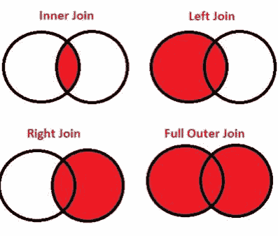

图 1.37 合并概念。

| | A | B | unique_ID |
|---|---|---|---|
| 0 | X1 | Y1 | Z1 |
| 1 | X2 | Y2 | Z2 |
| 2 | X3 | Y3 | Z3 |
| 3 | X4 | Y4 | Z5 |

图 1.38 test1 数据框。

| | C | D | unique_ID |
|---|---|---|---|
| 0 | L1 | M1 | Z1 |
| 1 | L2 | M2 | Z2 |
| 2 | L3 | M3 | Z3 |
| 3 | L4 | M4 | Z6 |

图 1.39 test2 数据框。

请注意，Z1、Z2 和 Z3 在两个数据框中都存在；然而，Z5 和 Z6 并非在两个数据框中都存在。让我们使用内连接（如图 1.37 所解释和说明的那样）基于“unique_ID”列连接这两个数据框：

```
pd.merge(test1,test2,on='unique_ID', how='inner')
Python output=Fig. 1.40
```

| | A | B | unique_ID | C | D |
|---|---|---|---|---|---|
| 0 | X1 | Y1 | Z1 | L1 | M1 |
| 1 | X2 | Y2 | Z2 | L2 | M2 |
| 2 | X3 | Y3 | Z3 | L3 | M3 |

图 1.40 使用“inner”合并 test1 和 test2 数据框。

请注意，只有前三行具有相同 unique_ID 的行被匹配并显示为合并后的结果数据框。现在，让我们重复相同的合并操作，只是将“inner”替换为“outer”，如下所示：

```
pd.merge(test1,test2,on='unique_ID', how='outer')
Python output=Fig. 1.41
```

| | A | B | unique_ID | C | D |
|---|---|---|---|---|---|
| 0 | X1 | Y1 | Z1 | L1 | M1 |
| 1 | X2 | Y2 | Z2 | L2 | M2 |
| 2 | X3 | Y3 | Z3 | L3 | M3 |
| 3 | X4 | Y4 | Z5 | NaN | NaN |
| 4 | NaN | NaN | Z6 | L4 | M4 |

图 1.41 使用“outer”合并 test1 和 test2 数据框。

如上所示，“outer”将显示两个数据框中的所有行。也可以使用多列进行这些计算。如果希望基于其他列进行合并，只需将所有列的名称放在一个括号内传递即可。让我们创建另外两个名为 test3 和 test4 的数据框，并基于两个唯一列进行合并：

```
test3=pd.DataFrame({'A':['X1','X2','X3','X4'],'B':['Y1','Y2','Y3','Y4'],
    'unique_ID_1':['Z1','Z2','Z5','Z6'],
    'unique_ID_2':['N1','N2','N6','N7']})

test4=pd.DataFrame({'C':['L1','L2','L3','L4'],'D':['M1','M2',
    'M3','M4'],'unique_ID_1':['Z1','Z2','Z9','Z10'],
    'unique_ID_2':['N1','N2','N11','N12']})
```

test3 和 test4 数据框将如下所示：

| | A | B | unique_ID_1 | unique_ID_2 | | C | D | unique_ID_1 | unique_ID_2 |
|---|---|---|---|---|---|---|---|---|---|
| 0 | X1 | Y1 | Z1 | N1 | 0 | L1 | M1 | Z1 | N1 |
| 1 | X2 | Y2 | Z2 | N2 | 1 | L2 | M2 | Z2 | N2 |
| 2 | X3 | Y3 | Z5 | N6 | 2 | L3 | M3 | Z9 | N11 |
| 3 | X4 | Y4 | Z6 | N7 | 3 | L4 | M4 | Z10 | N12 |

test 3 和 4 数据框

让我们使用内连接基于 unique_ID_1 和 unique_ID_2 合并这两个数据框，如下所示：

```
pd.merge(test3,test4, on=['unique_ID_1','unique_ID_2'],
    how='inner')
```

Python output=Fig. 1.42

| | A | B | unique_ID_1 | unique_ID_2 | C | D |
|---|---|---|---|---|---|---|
| 0 | X1 | Y1 | Z1 | N1 | L1 | M1 |
| 1 | X2 | Y2 | Z2 | N2 | L2 | M2 |

图 1.42 使用“inner”合并 test3 和 4 数据框。

## Pandas 连接

除了合并，还可以在 pandas 中执行连接。连接是一种便捷的方法，可以将两个具有不同索引的数据框的两列组合成一个结果数据框。它与 pd.merge() 相同，只是使用索引（行）进行连接。让我们创建另外两个名为 test5 和 test6 的数据框，并使用 pd.join() 函数连接这两个表：

```
test5=pd.DataFrame({'A':['X1','X2','X3','X4'],
    'B':['Y1','Y2','Y3','Y4']}, index=['H1','H2','H3','H4'])
test6=pd.DataFrame({'C':['X1','X2','X3','X4'],
    'D':['Y1','Y2','Y3','Y4']}, index=['H2','H3','H1','H0'])
```

Test5 和 test6 数据框将如下所示：

| | A | B | | C | D |
|---|---|---|---|---|---|
| **H1** | X1 | Y1 | **H2** | X1 | Y1 |
| **H2** | X2 | Y2 | **H3** | X2 | Y2 |
| **H3** | X3 | Y3 | **H1** | X3 | Y3 |
| **H4** | X4 | Y4 | **H0** | X4 | Y4 |

test 5 和 6 数据框。

pd.join() 函数可以如下使用，基于它们的索引合并这两个数据框：

```
test5.join(test6, how='inner')
Python output=Fig. 1.43
```

| | A | B | C | D |
|---|---|---|---|---|
| **H1** | X1 | Y1 | X3 | Y3 |
| **H2** | X2 | Y2 | X1 | Y1 |
| **H3** | X3 | Y3 | X2 | Y2 |

图 1.43 使用“inner”连接 test5 和 test6。

```
test5.join(test6, how='outer')
Python output=Fig. 1.44
```

请注意，如果索引只是整数值，而不是上面所示的 H0、H1 等，也可以执行相同的连接操作。

40 Machine Learning Guide for Oil and Gas Using Python

| | A | B | C | D |
|---|---|---|---|---|
| **H0** | NaN | NaN | X4 | Y4 |
| **H1** | X1 | Y1 | X3 | Y3 |
| **H2** | X2 | Y2 | X1 | Y1 |
| **H3** | X3 | Y3 | X2 | Y2 |
| **H4** | X4 | Y4 | NaN | NaN |

图 1.44 使用“outer”连接 test5 和 test6。

## Pandas 操作

在本节中，将探讨和说明一些重要且有用的 pandas 操作。让我们创建一个名为 df_ops 的数据框，如下所示：

```
df_ops=pd.DataFrame({'A':[24,21,74,21],
    'B':[32,31,65,54],'C':['a','b','c','d']})
df_ops
Python output=Fig. 1.45
```

| | A | B | C |
|---|---|---|---|
| **0** | 24 | 32 | a |
| **1** | 21 | 31 | b |
| **2** | 74 | 65 | c |
| **3** | 21 | 54 | d |

图 1.45 df_ops 数据框。

要获取唯一值的列表，可以使用`.unique()`函数，如下所示：

```
df_ops['A'].unique()
Python output=array([24, 21, 74], dtype=int64)
```

要获取唯一值的数量，可以改用`.nunique()`函数。这将返回数据框中唯一元素的数量。

```
df_ops['A'].nunique()
Python output=3
```

我们也可以简单地获取每列中唯一元素的数量，如下所示：

```
df_ops.nunique()
Python output=Fig. 1.46
```

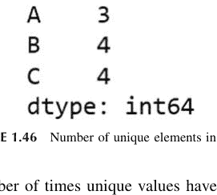

要获取每列中唯一值重复的次数，可以使用`.value_counts()`：

```
df_ops['B'].value_counts()
Python output=Fig. 1.47
```

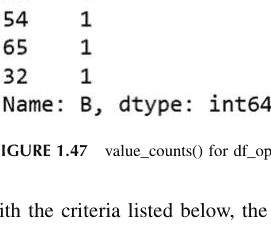

要返回满足以下条件的值，可以编写如下代码行：

42 Machine Learning Guide for Oil and Gas Using Python

- A列大于或等于20
- B列大于或等于35
- C列等于"c"

```
df_ops[(df_ops['A']>=20) & (df_ops['B']>=35) & (df_ops['C']== 'c')]
Python output=Fig. 1.48
```

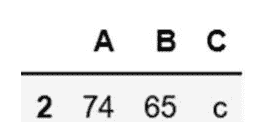

图 1.48 筛选后的 df_ops。

Pandas的`apply`函数可用于执行快速计算。首先使用`def`函数定义`economics`。然后，将此经济计算应用于df_ops数据框的A列，如下所示：

```
def economics(x):
    return x**2
df_ops['A'].apply(economics)
Python output=Fig. 1.49
```

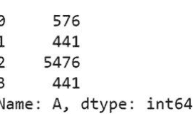

图 1.49 apply函数示例。

这可能是编写代码的冗长版本。因此，可以使用pandas的`lambda表达式`来简化代码，并更快、更轻松地执行相同的计算。

## Pandas lambda表达式

如前所述，pandas的lambda表达式可以与apply函数结合使用，无需预先定义函数即可执行快速计算。例如，如果希望将df_ops数据框B列的值乘以4，可以将以下lambda表达式与`apply`函数结合使用来执行此计算：

```
df_ops['B'].apply(lambda x: x*4)
Python output=Fig. 1.50
```

```
0    128
1    124
2    260
3    216
Name: B, dtype: int64
```

图 1.50 Lambda表达式示例。

让我们创建另外5列并将其附加到df_ops数据框，如下所示：

```
df_ops['D']=df_ops['A'].apply(lambda x: x**2+1)
df_ops['E']=df_ops['B'].apply(lambda x: x**3+x**2+1)
df_ops['F']=df_ops['A'].apply(lambda x: x**4+x**2+5)
df_ops['G']=df_ops['B'].apply(lambda x: x**2+10)
df_ops['ALL']=df_ops['A'].apply(lambda x: x**2+10)+df_ops['A'].apply(lambda x: x**2+10)
df_ops
Python output=Fig. 1.51
```

| | A | B | C | D | E | F | G | ALL |
|---|---|---|---|---|---|---|---|---|
| 0 | 24 | 32 | a | 577 | 33793 | 332357 | 1034 | 1172 |
| 1 | 21 | 31 | b | 442 | 30753 | 194927 | 971 | 902 |
| 2 | 74 | 65 | c | 5477 | 278851 | 29992057 | 4235 | 10972 |
| 3 | 21 | 54 | d | 442 | 160381 | 194927 | 2926 | 902 |

图 1.51 Lambda表达式。

要获取所有列的列表，可以使用`.columns`函数，如下所示：

```
df_ops.columns
Python output=Index(['A', 'B', 'C', 'D', 'E', 'F', 'G', 'ALL'],
      dtype='object')
```

要按升序或降序对值进行排序，可以执行以下操作：

```
df_ops.sort_values('ALL', ascending=True)
Python output=Fig. 1.52
```

| | A | B | C | D | E | F | G | ALL |
|---|---|---|---|---|---|---|---|---|
| 1 | 21 | 31 | b | 442 | 30753 | 194927 | 971 | 902 |
| 3 | 21 | 54 | d | 442 | 160381 | 194927 | 2926 | 902 |
| 0 | 24 | 32 | a | 577 | 33793 | 332357 | 1034 | 1172 |
| 2 | 74 | 65 | c | 5477 | 278851 | 29992057 | 4235 | 10972 |

图 1.52 使用ALL列对值进行排序。

## 处理pandas中的缺失值

处理缺失值是另一个关键的预处理步骤，必须执行此步骤才能使数据准备好进行任何机器学习分析。处理NA值的主要方法如下：

- 删除NA
- 用基本数学函数填充NA
- 使用本书监督学习章节中将讨论的各种算法

## 删除NA

可以使用`.dropna()`执行删除NA，如下所示。首先，让我们创建一个包含一些缺失值的数据框。为此，必须导入pandas和numpy库。请注意，numpy是一个线性代数库，是Python科学计算的基础包。PyData生态系统中的几乎所有库都严重依赖numpy作为其基本构建块之一。创建df_missing数据框后，让我们可视化前5行数据。

```
import pandas as pd
import numpy as np
df_missing=pd.DataFrame({'A':[1,20,31,43,59,np.nan,6,4,5,2,5,6,7,3,np.nan],
    'B':[1,20,np.nan,43,52,32,6,9,5,2,90,6,np.nan,3,100],
    'C':[1,30,68,43,np.nan,32,6,4,np.nan,2,5,6,888,3,100]})
df_missing.head(5)
Python output=Fig. 1.53
```

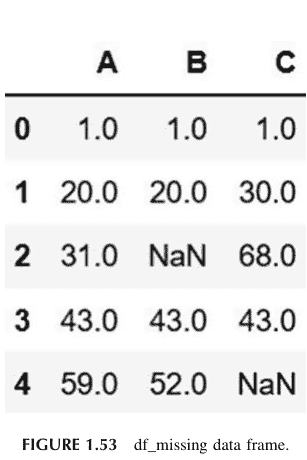

图 1.53 df_missing数据框。

如图所示，每列都有几个NA值。要删除包含缺失值的行，可以应用`.dropna()`：

```
df_missing.dropna(how='any')
```

Python output=Fig. 1.54

如果希望仅在所有列都有缺失值时才删除NA值，可以改用`how = 'all'`来执行此操作。此外，要删除包含缺失值的列（而不是行），请在dropna函数的括号内使用`axis = 1`，如下所示：

```
df_missing.dropna(how='any', axis=1)
```

请注意，可以在括号内使用`thresh`，要求输入要删除的行或列的非NA值数量。要使这些更改永久生效，在括号内包含`inplace = True`非常重要。这是因为pandas的默认值为`inplace = False`。

46 Machine Learning Guide for Oil and Gas Using Python

| | A | B | C |
|---|---|---|---|
| 0 | 1.0 | 1.0 | 1.0 |
| 1 | 20.0 | 20.0 | 30.0 |
| 3 | 43.0 | 43.0 | 43.0 |
| 6 | 6.0 | 6.0 | 6.0 |
| 7 | 4.0 | 9.0 | 4.0 |
| 9 | 2.0 | 2.0 | 2.0 |
| 10 | 5.0 | 90.0 | 5.0 |
| 11 | 6.0 | 6.0 | 6.0 |
| 13 | 3.0 | 3.0 | 3.0 |

图 1.54 删除NA单元格后的df_missing数据框。

## 填充NA

下一个有用的函数称为`.fillna()`，用于用数值或字符串填充缺失数据。让我们创建另一个数据框并将其命名为df_filling，如下所示：

```
df_filling=pd.DataFrame({'A':[43,59,np.nan,6,3,np.nan],
    'B':[1,20,np.nan,43,np.nan,32],'C':[np.nan,32,6,4,np.nan,2]})
df_filling
Python output=Fig. 1.55
```

要永久地用"Hydraulic Fracturing"填充缺失值，请输入以下代码行：

```
df_filling.fillna(value='Hydraulic Fracturing', inplace=True)
df_filling
Python output=Fig. 1.56
```

| | A | B | C |
|---|---|---|---|
| 0 | 43.0 | 1.0 | NaN |
| 1 | 59.0 | 20.0 | 32.0 |
| 2 | NaN | NaN | 6.0 |
| 3 | 6.0 | 43.0 | 4.0 |
| 4 | 3.0 | NaN | NaN |
| 5 | NaN | 32.0 | 2.0 |

图 1.55 df_filling数据框。

| | A | B | C |
|---|---|---|---|
| 0 | 43 | 1 | Hydraulic Fracturing |
| 1 | 59 | 20 | 32 |
| 2 | Hydraulic Fracturing | Hydraulic Fracturing | 6 |
| 3 | 6 | 43 | 4 |
| 4 | 3 | Hydraulic Fracturing | Hydraulic Fracturing |
| 5 | Hydraulic Fracturing | 32 | 2 |

图 1.56 使用"Hydraulic Fracturing"填充的df_filling数据框。

要用一些统计聚合函数填充缺失值，让我们导入相同的数据框，并应用每列的均值来代替缺失值，如下所示：

```
df_filling_mean=pd.DataFrame({'A':[43,59,np.nan,6,3,np.nan],
'B':[1,20,np.nan,43,np.nan,32],'C':[np.nan,32,6,4,np.nan,2]})
df_filling_mean.fillna(value=df_filling_mean.mean(), inplace=True)
Python output=Fig. 1.57
```

如图所示，A列的缺失值被填充为27.75，这是43、59、6和3的算术平均值。其他统计函数，如标准差(.std())、中位数(.median())、方差(.var())、偏度(.skew())、峰度(.kurt())、最小值(.min())、最大值(.max())、计数(.count())等，也可以应用（这并不是推荐使用这些

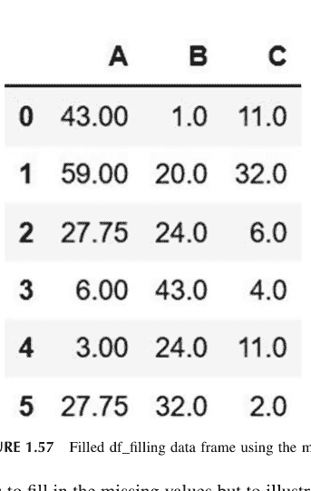

（此处并非使用统计方法来填充缺失值，而是为了说明这些选项的可用性）。

其他便捷函数如 "ffill" 和 "bfill" 可用于填充缺失值，如下所示：

-   ffill = 将上一个有效观测值向前填充，以填充下一个观测值
-   bfill = 使用下一个有效观测值来填充前一个值

让我们使用 bfill 方法，创建一个名为 df_filling_backfill 的数据框，并应用 "bfill" 作为方法来**临时**填充缺失值。如果希望此更改永久生效，只需添加 "inplace = True"。

```
df_filling_backfill=pd.DataFrame({'A':[43,59,np.nan,6,3,np.nan],
    'B':[1,20,np.nan,43,np.nan,32],'C':[np.nan,32,6,4,np.nan,2]})
df_filling_backfill.fillna(method='bfill')
Python output=Fig. 1.58
```

| | A | B | C |
|---|---|---|---|
| 0 | 43.0 | 1.0 | 32.0 |
| 1 | 59.0 | 20.0 | 32.0 |
| 2 | 6.0 | 43.0 | 6.0 |
| 3 | 6.0 | 43.0 | 4.0 |
| 4 | 3.0 | 32.0 | 2.0 |
| 5 | NaN | 32.0 | 2.0 |

图 1.58 使用 bfill 方法填充后的 df_filling 数据框。

## Numpy 简介

Numpy 是 Python 中的一个线性代数库，也是 Python 的基础库之一，几乎所有其他库都建立在它之上。它也被认为非常快速，在进行任何类型的机器学习分析时，可以简单地作为主要库之一导入。强烈建议安装 Anaconda 发行版，以确保所有底层库和依赖项都已安装。Numpy 数组将在本书中贯穿使用，并表现为两种不同的格式：向量和矩阵。向量和矩阵的主要区别在于，向量是一维数组，而矩阵是二维数组。让我们实现以下代码：

生成一个数字列表，并将其放在名为 "A" 的变量下，如下所示。然后可以使用 np.array 函数将列表转换为数组，如下所示：

```
import numpy as np
A=[1,2,3,4,5,6,7,8,9,10]
np.array(A)
Python output=array([ 1, 2, 3, 4, 5, 6, 7, 8, 9, 10])
```

也可以如下生成一个二维数组：

```
B=[[4,5,6],[7,8,9],[10,11,12]]
np.array(B)
Python output=Fig. 1.59
```

```
array([[ 4, 5, 6],
       [ 7, 8, 9],
       [10, 11, 12]])
```

图 1.59 B 数组。

有各种内置函数，如 np.arange，可用于生成数组。例如，要生成一个从 0 开始、到 40 结束、步长为 5 的数组，可以使用以下代码行：

```
np.arange(0,40,5)
Python output=array([ 0, 5, 10, 15, 20, 25, 30, 35])
```

输入 np.arange() 后，在**括号内**按 shift + tab 将会弹出一个窗口，显示必须传递的参数。在本例中，这些参数是 start、stop 和 step。Numpy 库也可用于使用 np.zeros 和 np.ones 创建一维或二维数组，如下所示：

```
np.zeros(5)
Python output=array([0., 0., 0., 0., 0.])

np.zeros((5,5))
Python output=Fig. 1.60
```

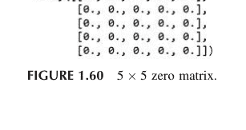

```
np.ones(5)
Python output=array([1., 1., 1., 1., 1.])
np.ones((5,5))
Python output=Fig. 1.61
```

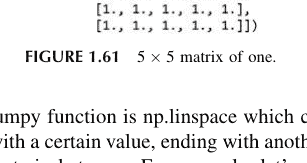

另一个有用的 numpy 函数是 np.linspace，可用于创建一个从某个值开始、到另一个值结束、并在其间具有指定增量数的 np 数组。例如，让我们创建一个从 0 到 20 并将其分为 10 个等增量的数组，如下所示：

```
np.linspace(0,20,10)
Python output=array([0., 2.22222222, 4.44444444, 6.66666667,
       8.88888889, 11.11111111, 13.33333333, 15.55555556, 17.77777778,
       20.])
```

"np.linspace" 是一个有用的函数，可用于在训练机器学习模型后生成用于敏感性分析的数组。本书将广泛使用此函数。

在线性代数中，单位矩阵（也称为幺矩阵）是一个 n x n 的方阵，其对角线上为 1，其他位置为 0。可以使用 numpy 库生成单位矩阵，如下所示：

```
np.eye(10)
Python output=Fig. 1.62
```

```
array([[1., 0., 0., 0., 0., 0., 0., 0., 0., 0.],
       [0., 1., 0., 0., 0., 0., 0., 0., 0., 0.],
       [0., 0., 1., 0., 0., 0., 0., 0., 0., 0.],
       [0., 0., 0., 1., 0., 0., 0., 0., 0., 0.],
       [0., 0., 0., 0., 1., 0., 0., 0., 0., 0.],
       [0., 0., 0., 0., 0., 1., 0., 0., 0., 0.],
       [0., 0., 0., 0., 0., 0., 1., 0., 0., 0.],
       [0., 0., 0., 0., 0., 0., 0., 1., 0., 0.],
       [0., 0., 0., 0., 0., 0., 0., 0., 1., 0.],
       [0., 0., 0., 0., 0., 0., 0., 0., 0., 1.]])
```

图 1.62 10 x 10 单位矩阵。

如图所示，上述单位矩阵是一个 10 x 10 的矩阵，对角线上为 1，其他位置为 0。

## 使用 numpy 生成随机数

Numpy 在生成随机数方面具有广泛的功能。例如，要从均匀分布中生成一个随机样本，可以使用以下命令行：

```
seed=100
np.random.seed(seed)
np.random.rand(5)
Python output=array([0.54340494, 0.27836939, 0.42451759,
       0.84477613, 0.00471886])
```

要生成一个 5 x 5 的随机数矩阵，可以使用以下代码行：

```
seed=100
np.random.seed(seed)
np.random.rand(5,5)
Python output=Fig. 1.63
```

```
array([[0.54340494, 0.27836939, 0.42451759, 0.84477613, 0.00471886],
       [0.12156912, 0.67074908, 0.82585276, 0.13670659, 0.57509333],
       [0.89132195, 0.20920212, 0.18532822, 0.10837689, 0.21969749],
       [0.97862378, 0.81168315, 0.17194101, 0.81622475, 0.27407375],
       [0.43170418, 0.94002982, 0.81764938, 0.33611195, 0.17541045]])
```

图 1.63 5 x 5 随机数矩阵。

请注意，由于每次生成随机数时都选择了相同的种子数，因此生成的随机数将是相同的。种子数可以固定，或者简单地移除种子数，以便每次执行代码行时获得不同的随机数。

如果希望生成的随机数具有正态或高斯分布，只需在 "np.random.rand" 末尾添加 "n"，如下所示："np.random.randn"：

```
seed=100
np.random.seed(seed)
np.random.randn(5)
Python output=array([-1.74976547, 0.3426804, 1.1530358,
       -0.25243604, 0.98132079])
seed=100
np.random.seed(seed)
np.random.randn(5,5)
Python output=
array([[-1.74976547, 0.3426804, 1.1530358, -0.25243604, 0.98132079],
       [ 0.51421884, 0.22117967, -1.07004333, -0.18949583, 0.25500144],
       [-0.45802699, 0.43516349, -0.58359505, 0.81684707, 0.67272081],
       [-0.10441114, -0.53128038, 1.02973269, -0.43813562, -1.11831825],
       [ 1.61898166, 1.54160517, -0.25187914, -0.84243574, 0.18451869]])
```

也可以使用 np.random.randint() 生成整数随机数。要创建 10 个介于 1 和 500 之间的整数随机数，可以使用以下代码行，而无需使用固定的种子数：

```
np.random.randint(1,500,10)
```

现在，让我们创建一个介于 20 和 30（不包括 30）之间的 numpy 数组，并将该数组重塑为 5 x 2 的二维矩阵。reshape 函数是将各种 numpy 数组转换为不同形状的有用术语。

```
A=np.arange(20,30)
A.reshape(5,2)
Python output=Fig. 1.64
```

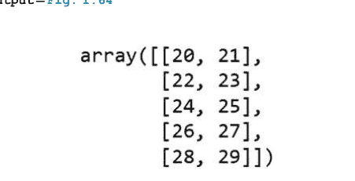

图 1.64 重塑后的数组。

此外，还可以使用以下关键字确定上述数组的最大值、最小值、最大值和最小值的位置、平均值和标准差：

-   A.min() = 获取 A 数组中的最小值
-   A.max() = 获取 A 数组中的最大值
-   A.argmin() = 获取 A 数组中最小值的位置
-   A.argmax() = 获取 A 数组中最大值的位置
-   A.std() = 获取 A 数组的标准差
-   A.mean() = 获取 A 数组的平均值

## Numpy 索引和选择

Numpy 索引和选择是另一个必须理解的重要工具。让我们创建一个介于 30 和 40（包括 40）之间的数组，并将其命名为变量名 X。如果希望获取索引 0 到 7，可以写成 "X[0:7]"（如下所示）。请注意，也可以使用 "X[:7]" 而不是 "X[0:7]" 来获得相同的输出。Python 默认将 "X[:7]" 识别为获取从索引 0 到索引 7（不包括索引 7）的所有索引。初学者通常会从使用 "X[0:7]" 开始，随着 Python 水平的提高，会切换到 "X[:7]"。

```
X=np.arange(30,41)
X
Python output=array([30, 31, 32, 33, 34, 35, 36, 37, 38, 39, 40])

X[0:7]
Python output=array([30, 31, 32, 33, 34, 35, 36])
```

代码 "X[:]" 将返回创建的变量中的所有索引，如下所示：

```
X[:]
Python output=array([30, 31, 32, 33, 34, 35, 36, 37, 38, 39, 40])
```

如果希望获取索引 2 及之后的索引，可以使用 "X[2:]" 来表示，如下所示：

```
X[2:]
Python output=array([32, 33, 34, 35, 36, 37, 38, 39, 40])
```

让我们创建数组 X 的一个副本，将其乘以 2 并命名为 Y，如下所示：

```
Y=X.copy()*2
Y
Python output=array([60, 62, 64, 66, 68, 70, 72, 74, 76, 78, 80])
```

在下面的示例中，索引 60、62、64、66 和 68（Y 数组中的前 5 个索引）被替换为通用数字 1000。

Y[0:5]=1000
Y
Python 输出=array([1000, 1000, 1000, 1000, 1000, 70, 72, 74, 76, 78, 80])

索引也可以应用于二维数组。让我们创建一个具有4行4列（4维矩阵）的矩阵，如下所示：

```
array_2d=np.array([[50,52,54],[56,58,60],[62,64,66],[68,70,72]])
array_2d
Python 输出=图 1.65
```

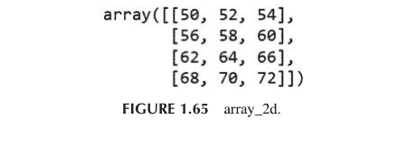

如果需要上述4维矩阵中的数字64，可以使用符号"array_2d[2,1]"来获取。2代表行号，1代表列号。请注意，如前所述，Python中的索引从0开始。因此，在此示例中，2表示第三行，1表示第二列。

```
array_2d[2,1]
Python 输出=64
```

要获取数字64、66、70和72，可以使用"array_2d[2:,1:]"来获取第三行及以后和第二列及以后的数据。在此示例中，"2:"表示第三行及以后，而"1:"表示第二列及以后。

```
array_2d[2:,1:]
Python 输出=图 1.66
```

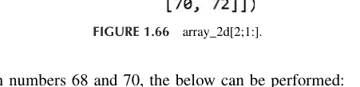

要获取数字68和70，可以执行以下操作：

```
array_2d[3,0:2]
Python 输出=array([68, 70])
```

请花些时间创建各种n维矩阵，并获取各种行和列的组合，以熟悉这个概念。

## 参考文献

Belyadi, H., Fathi, E., & Belyadi, F. (2019). *非常规储层水力压裂*（第2版）。Elsevier。

# 第2章

## 数据导入与可视化

### 使用pandas进行数据导入和导出

本章将详细讨论使用各种Python库进行数据可视化。在讨论数据可视化之前，让我们先介绍使用pandas进行数据导入。要导入csv或excel文件，可以使用"pd.read"语法，如下所示。如图2.1所示，可以按键盘上的"tab"键查看可用选项列表。要导入excel文件，只需选择"pd.read_excel"。

```
import pandas as pd
df=pd.read_csv('Chapter2_Shale_Gas_Wells_DataSet.csv')
```

要将数据框写入csv或excel文件，可以执行以下代码行：

```
df=df.describe()
df.to_csv('Shale Gas Wells Description.csv', index=False)
```

Python 输出 = 这将把"Shale Gas Wells Description" csv文件写入与原始"ipynb" Python脚本相同的文件夹中。

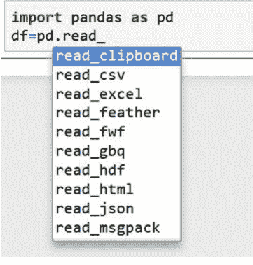

要获取文件保存的确切目录，只需执行"pwd"，如下所示：

```
Pwd
Python 输出='C:\Users\hossb\Desktop\Files\Machine Learning (ML)\Chapters\Chapter 2\Codes'
```

执行"pwd"时，将显示存储Python ".ipynb"的目录。请注意，默认情况下，将数据框写入文件时，"index = True"，这意味着行号将显示在导出的文件中；但是，要避免显示索引号，只需像上面显示的那样设置"index = False"。要以excel格式读取同一个文件，让我们创建另一个数据框并将其命名为df2：

```
df2=pd.read_excel('Chapter2_Shale_Gas_Wells_DataSet.xlsx',
sheet_name='Shale Gas Wells')
```

请注意，可以指定"sheet_name"以将正确的excel工作表导入Jupyter Notebook（如果excel文档中有多个工作表）。要将df2数据框的描述导入到一个工作表名称为"New_Sheet"、文件名为"Excel_Output"的excel文件中，可以执行以下两行代码：

```
df2=df2.describe()
df2.to_excel('Excel_Output.xlsx', sheet_name='New_Sheet')
```

要将天然气定价的HTML表格读取到"DataFrame"对象的"列表"中，可以执行以下代码：

```
df3=pd.read_html('https://www.eia.gov/dnav/ng/hist/n9190us3m.htm')
df3
```

Python 输出=图2.2展示了使用美国能源信息署数据自1973年以来的天然气定价。

请注意，从互联网读取HTML在整页都是表格格式时最为有效。要创建一个简单的SQL引擎内存，然后创建一个临时的SQL light引擎，可以执行以下操作：

```
from sqlalchemy import create_engine
engine=create_engine('sqlite:///:memory:')
```

要将df数据框写入SQL文件，然后使用"pd.read_sql"读取该文件，可以执行以下代码行：

```
df.to_sql('my_table', engine)
sqldf=pd.read_sql('my_table',con=engine)
sqldf
```

Python 输出=图2.3展示了输出，这是一个sqldf数据框描述。

```
[
         0
0  View History: Monthly Annual Download Data (XL...
1  U.S. Natural Gas Wellhead Price (Dollars per T...,
         0
0  View History: Monthly Annual  Download Data (XLS File),
         0
0  View History: Monthly Annual,
         0    1    2    3    4
0  View History: NaN  Monthly NaN  Annual,
         Year    Jan    Feb    Mar    Apr    May    Jun    Jul    Aug    Sep    Oct
0  1973.0    NaN    NaN    NaN    NaN    NaN    NaN    NaN    NaN    NaN    NaN
1  1974.0    NaN    NaN    NaN    NaN    NaN    NaN    NaN    NaN    NaN    NaN
2    NaN    NaN    NaN    NaN    NaN    NaN    NaN    NaN    NaN    NaN    NaN
3  1975.0    NaN    NaN    NaN    NaN    NaN    NaN    NaN    NaN    NaN    NaN
4  1976.0  0.54  0.54  0.54  0.55  0.55  0.58  0.58  0.60  0.60  0.62
5  1977.0  0.67  0.71  0.75  0.77  0.77  0.82  0.83  0.82  0.83  0.84
6  1978.0  0.87  0.88  0.89  0.88  0.91  0.91  0.89  0.91  0.92  0.92
7  1979.0  1.02  1.05  1.10  1.11  1.15  1.17  1.20  1.24  1.24  1.28
8    NaN    NaN    NaN    NaN    NaN    NaN    NaN    NaN    NaN    NaN    NaN
9  1980.0  1.37  1.42  1.46  1.51  1.56  1.57  1.64  1.64  1.69  1.71
10  1981.0  1.77  1.81  1.86  1.93  1.95  1.95  2.01  2.02  2.08  2.11
11  1982.0  2.23  2.30  2.35  2.40  2.45  2.45  2.47  2.53  2.56  2.60
12  1983.0  2.66  2.66  2.58  2.53  2.53  2.59  2.52  2.58  2.67  2.58
13  1984.0  2.67  2.71  2.67  2.64  2.67  2.70  2.68  2.69  2.62  2.63
14    NaN    NaN    NaN    NaN    NaN    NaN    NaN    NaN    NaN    NaN    NaN
15  1985.0  2.64  2.71  2.62  2.64  2.53  2.58  2.51  2.47  2.42  2.37
```

图 2.2 使用pd.read_html读取HTML。

| 索引 | 阶段间距 | bbl/ft | 井间距 | 倾角 | 厚度 | 水平段长度 | 注入速率 | 孔隙度 | ISIP | 含水饱和度 | LG百分比 | 压力梯度 |
|---|---|---|---|---|---|---|---|---|---|---|---|---|
| 0 计数 | 506.000000 | 506.000000 | 506.000000 | 506.000000 | 506.000000 | 506.000000 | 506.000000 | 506.000000 | 506.000000 | 506.000000 | 506.000000 | 506.000000 |
| 1 均值 | 147.640316 | 35.13487 | 820.158103 | 0.069170 | 162.365613 | 8153.089657 | 63.076051 | 7.337549 | 7010.490119 | 19.213439 | 64.45455 | 0.930257 |
| 2 标准差 | 18.362128 | 10.533197 | 135.736986 | 0.253994 | 15.471044 | 942.303981 | 7.250106 | 0.749451 | 1211.452205 | 3.198579 | 18.427813 | 0.046507 |
| 3 最小值 | 140.000000 | 30.000000 | 650.000000 | 0.000000 | 120.000000 | 4500.000000 | 55.000000 | 5.500000 | 5000.000000 | 15.000000 | 15.000000 | 0.750000 |
| 4 25% | 140.000000 | 30.000000 | 700.000000 | 0.000000 | 153.000000 | 7617.750000 | 57.000000 | 6.600000 | 5000.000000 | 16.800000 | 55.000000 | 0.940000 |
| 5 50% | 141.000000 | 30.000000 | 800.000000 | 0.000000 | 165.000000 | 8051.000000 | 61.000000 | 7.500000 | 7643.000000 | 17.700000 | 69.000000 | 0.950000 |
| 6 75% | 148.000000 | 36.000000 | 900.000000 | 0.000000 | 176.000000 | 8608.000000 | 69.000000 | 8.000000 | 7783.000000 | 24.100000 | 79.700000 | 0.950000 |
| 7 最大值 | 330.000000 | 75.000000 | 1350.000000 | 1.000000 | 185.000000 | 11500.000000 | 80.000000 | 8.500000 | 8200.000000 | 25.000000 | 95.000000 | 0.950000 |

图 2.3 sqldf数据框描述。

## 数据可视化

数据可视化是数据准备和分析中最重要的方面之一。在此步骤中，使用各种图表（如分布图、箱线图、散点图等）来可视化数据并识别异常值。使用本章讨论的基本图表可以轻松识别异常值。使用数据可视化有助于理解数据的内在特性，是在应用适当的机器学习算法之前的关键步骤。

## Matplotlib 库

Matplotlib 是 Python 中最重要且最常用的可视化库之一。它在绘制图形的各个方面提供了极大的灵活性。该库的设计旨在提供与 Matlab 图形绘制类似的用户交互体验。该库的主要优势之一是其多功能性，几乎可以绘制任何图形。然而，绘制更复杂的图形可能具有挑战性，这将需要更多的编码。如果希望探索本章未涵盖的一些更复杂图形，请参阅 Matplotlib 的网站（Matplotlib 网站：https://matplotlib.org/tutorials/introductory/sample_plots.html）。请注意，matplotlib 创建的是静态图像文件，如 JPEG 或 PNG 文件，一旦创建便不会改变。

要开始创建一些图形，让我们导入 pandas、numpy 和 matplotlib 库。同时添加了 `"%matplotlib inline"`（仅在 Jupyter Notebook 中），以便所有图形都在 Jupyter Notebook 中显示。变量 x 和 y 也可以如下创建：

```
import numpy as np
import pandas as pd
import matplotlib.pyplot as plt
%matplotlib inline
x=np.linspace(0,10,100)
y=x**3
```

现在，让我们使用 "plt.plot" 绘制上面创建的 x 和 y 变量。请注意，可以简单地输入任何颜色，如下所示。在此图中，使用了红色、线宽为 4 以及线型为 "--"。此外，"plt.xlabel" 和 "plt.ylabel" 用于显示 x 和 y 标签，"plt.title" 用于显示图形的标题。

```
plt.plot(x,y,'red',linewidth=4, linestyle='--')
plt.xlabel('Time')
plt.ylabel('Number of iterations')
plt.title('Number of Iterations Vs. Time')
```

Python 输出=图 2.4

接下来，让我们使用 matplotlib 库创建一个包含三个图形的子图，如下所示。代码的第一行用于定义图形尺寸。在此示例中，使用了 10 乘 5 的 figsize。10 代表图形的长度，5 代表宽度。请随意调整这些数字，直到获得所需的图形尺寸。此外，"plt.subplot(1,3,1)" 代表一个包含 1 行、3 列的图形，以及子图中的第 1 个图形。换句话说，"plt.subplot(1,3,1)" 可以视为 plt.subplot(行,列,图形编号)。

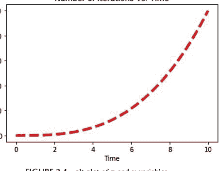

图 2.4 x 和 y 变量的 plt 图。

```
fig=plt.figure(figsize=(10,5))
plt.subplot(1,3,1)
plt.plot(x,y,'b')
plt.title('Plot 1')
plt.subplot(1,3,2)
plt.plot(y*2,x**2,'r')
plt.title('Plot 2')
plt.subplot(1,3,3)
plt.plot(x,y,'purple')
plt.title('Plot 3')
```

Python 输出=图 2.5

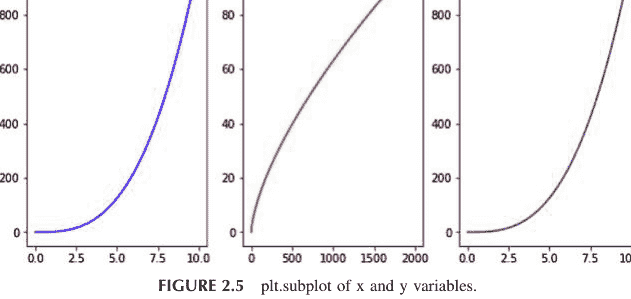

图 2.5 x 和 y 变量的 plt.subplot。

接下来，让我们在一个大图形内创建两个图形。这可以通过首先创建一个空图形来实现。然后，使用 "fig.add_axes" 添加每个图形的尺寸，如下所示。之后，可以简单地添加每个图形及其标题和标签，如图所示。

```
# plt.figure() 创建一个空图形
fig=plt.figure()
# 可以定义 figsize
fig=plt.figure(figsize=(10,6))
# 然后可以为每个图形添加尺寸（左、下、宽度、高度）
fig1=fig.add_axes([0.1,0.1,0.8,0.8])
fig2=fig.add_axes([0.25,0.5,0.3,0.2])
# 可以绘制每个图形并添加坐标轴和标题
fig1.plot(x,y)
fig1.set_title('Large Plot')
fig1.set_xlabel('Time')
fig1.set_ylabel('Number of iteration')
fig2.plot(x*2,y)
fig2.set_title('Small Plot')
fig2.set_xlabel('Time')
fig2.set_ylabel('Number of iteration')
Python 输出=图 2.6
```

绘制子图的另一种方法是使用 "fig.axis" 命令，如下所示：

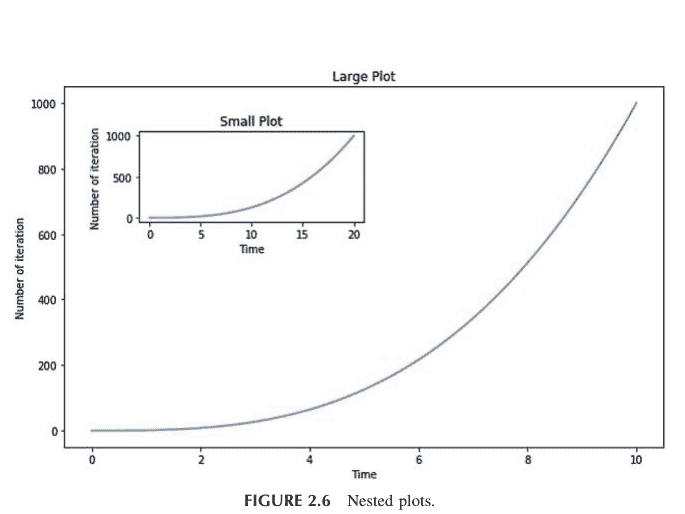

图 2.6 嵌套图形。

```
fig,axes=plt.subplots(nrows=2,ncols=2,figsize=(5,5),dpi=100)
# 第一行第一列的图形 #1
axes[0,0].plot(x,y)
axes[0,0].set_title('Plot 1')
axes[0,0].set_xlabel('Time')
axes[0,0].set_ylabel('Production 1')
# 第一行第二列的图形 #2
axes[0,1].plot(y,x)
axes[0,1].set_title('Plot 2')
axes[0,1].set_xlabel('Time')
axes[0,1].set_ylabel('Production 2')
# 第二行第一列的图形 #3
axes[1,0].plot(y,x**2)
axes[1,0].set_title('Plot 3')
axes[1,0].set_xlabel('Time')
axes[1,0].set_ylabel('Production 3')
# 第二行第二列的图形 #4
axes[1,1].plot(x,y**2)
axes[1,1].set_title('Plot 4')
axes[1,1].set_xlabel('Time')
axes[1,1].set_ylabel('Production 4')
plt.tight_layout()
```

Python 输出=图 2.7

如上所示，图 2.7 子图包含 2 行 2 列（nrows = 2, ncols = 2）。定义了 "figsize" 和 dpi 为 100 以设置图形分辨率（请随意相应调整）。"axes[0,0].plot(x,y)" 表示将 x 和 y 变量（之前定义）作为 x 轴和 y 轴绘制在位于第一行第一列的第一个图形上。标题、x 和 y 轴标签也可以使用 "axes[行编号, 列编号].set_title('名称'),"、"axes[行编号, 列编号].set_xlabel('名称')," 和 "axes[行编号, 列编号].set_ylabel('名称')" 来设置。请注意，"plt.tight_layout()" 用于避免重叠。这是 matplotlib 中一个非常有用的函数。

让我们使用 csv 文件导入天然气定价数据，并将其称为 "df_ng"，如下所示：

```
df_ng=pd.read_csv('Chapter2_Natural_Gas_Pricing_DataSet.csv',
parse_dates=['Date'],index_col=['Date'])
df_ng.head()
```

Python 输出=图 2.8

请注意，在导入 csv 文件时使用了 "parse_dates = ['Date']" 和 "index_col = ['Date']"，以确保绘图时日期列的格式/读取正确且不会重叠。接下来，让我们绘制日期与天然气价格随时间变化的图。要调用天然气价格列（在此数据框中称为 Value），可以使用 df_ng['Value']，要调用 csv 文件中的日期列，可以使用 "df_ng.index.values"。

64 使用 Python 的油气机器学习指南

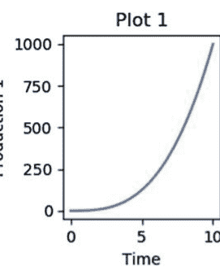

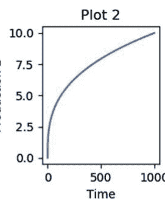

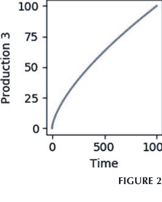

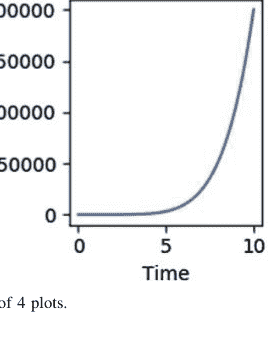

图 2.7 包含 4 个图形的子图。

Value

| 日期 | 值 |
|---|---|
| 1997-01-01 | 5.25 |
| 1997-02-01 | 2.86 |
| 1997-03-01 | 2.95 |
| 1997-04-01 | 3.45 |
| 1997-05-01 | 3.57 |

图 2.8 df_ng 数据框。

```
fig=plt.figure(figsize=(10,10), dpi=90)
plt.plot(df_ng.index.values,df_ng['Value'], color='red')
plt.xlabel('Date')
plt.ylabel('Gas Pricing, $/MMBTU')
plt.title('Gas Pricing Vs. Date')
```

Python 输出=图 2.9

让我们创建另外两个名为 g 和 h 的变量，并绘制这些变量，但这次使用 "ax.set_xlim([0,8])" 设置 x 和 y 轴的限制，将 x 轴限制在 0 到 8 之间，使用 "ax.set_ylim([0,80])" 将 y 轴限制在 0 到 80 之间。此示例旨在**展示** matplotlib 库的自定义灵活性，包括但不限于颜色、线宽、线型、标记大小、标记填充颜色、标记边缘宽度、标记边缘颜色、图形各部分的字体大小，以及在图形内添加文本，如下所示 "ax.text(3,3, "Commodity Pricing Plot", fontsize = 30, color = "red")"。请探索下面列出的各种自定义代码

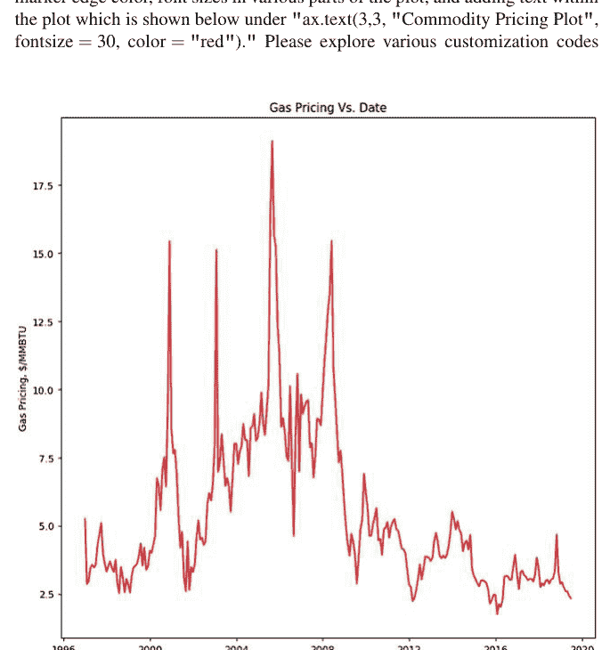

图 2.9 天然气定价图。

和数字，以了解每个大小和变量对结果的影响。我们建议复制并粘贴下面的代码，并开始探索下面列出的各种参数和大小。

```
g=np.linspace(1,10,5)
h=g**2
fig=plt.figure(figsize=(10,10))
ax=fig.add_axes([0,0,1,1])
# 使用 RGB 十六进制代码自定义颜色（使用链接 https://www.rapidtables.com/web/color/RGB_Color.html 查找您的自定义颜色）
# 可以使用线型，如 '--', '-.', 'steps'
# 可以使用标记，如 'o' 和 '+' 在图形上显示标记
ax.plot(g,h, color='#FF8C00', linewidth=3, linestyle='-.', alpha=1, marker='o', markersize=10, markerfacecolor='green', markeredgewidth=3, markeredgecolor='red')
ax.set_xlabel('Time')
ax.set_ylabel('Pricing')
ax.set_title('Time Vs. Pricing')
ax.set_xlim([0,8])
ax.set_ylim([0,80])
plt.rc('font', size=18) # 控制默认文本大小
plt.rc('axes', titlesize=18) # 坐标轴标题的字体大小
plt.rc('axes', labelsize=18) # x 和 y 标签的字体大小
plt.rc('xtick', labelsize=18) # 刻度标签的字体大小
plt.rc('ytick', labelsize=18) # 刻度标签的字体大小
plt.rc('legend', fontsize=18) # 图例字体大小
plt.rc('figure', titlesize=18) # 图形标题的字体大小
ax.text(3,3, 'Commodity Pricing Plot', fontsize=30, color='red')
Python 输出=图 2.10
```

为了说明使用 matplotlib 在主轴和次轴上绘制两个独立列，让我们通过导入 "Chapter2_Production_DataSet.csv"、沿行删除 NA 值（如第 1 章所述）并读取数据的前几行（将显示前 5 行）来讨论另一个示例，如下所示：

```
df=pd.read_csv('Chapter2_Production_DataSet.csv')
df.dropna(axis=0).head()
Python 输出=图 2.11
```

要在同一坐标轴上绘制气体流量、套管压力和油管压力，运行以下代码行（本章前面已讨论过）：

```
fig=plt.figure(figsize=(10,7))
plt.plot(df['Prod Date'],df['Gas Prod'], color='red')
plt.plot(df['Prod Date'],df['Casing'], color='blue')
plt.plot(df['Prod Date'],df['Tubing'], color='green')
plt.title('Production Rate Vs. Time')
plt.xlabel('Time (days)')
plt.ylabel('Gas Production Rate (MSCF/D), Casing Pressure (psi), Tubing Pressure (psi)')
Python 输出=图 2.12
```

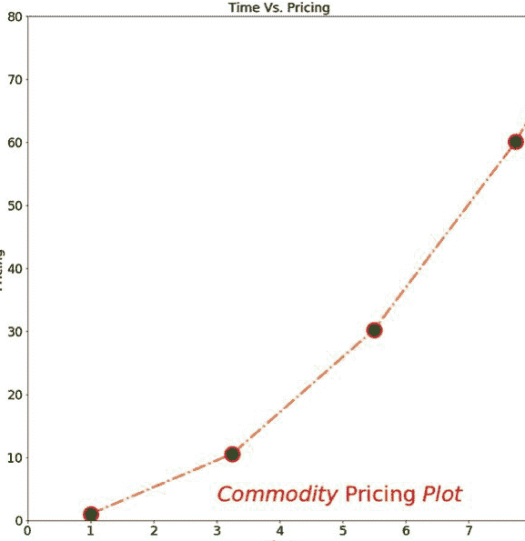

图 2.10 matplotlib 中的自定义绘图。

| 井名 | 生产日期 | 产气量 | 产水量 | 油管压力 | 套管压力 | 管线压力 |
|---|---|---|---|---|---|---|
| MIP 4H | 74 | 2614.0 | 33.0 | 363.6 | 837.5 | 197.0 |
| MIP 4H | 75 | 2601.0 | 32.0 | 358.8 | 835.8 | 197.0 |
| MIP 4H | 76 | 2590.0 | 33.0 | 357.1 | 833.1 | 197.0 |
| MIP 4H | 77 | 2555.0 | 31.0 | 358.2 | 831.4 | 197.0 |
| MIP 4H | 78 | 2575.0 | 29.0 | 353.6 | 836.5 | 197.0 |

图 2.11 生产数据表头。

与将所有三列都放在主坐标轴上不同，让我们将产气速率绘制在主坐标轴上，将套管压力绘制在次坐标轴上，**如下所示**。`ax1` 用于在主坐标轴（红色）上绘制生产日期与产气量的关系，`ax2` 用于在次坐标轴（蓝色）上绘制生产日期与套管压力的关系。请注意，`"ax2 = ax1.twinx()"` 用于实例化一个共享相同 x 轴的第二个坐标轴。

68 使用 Python 的油气机器学习指南

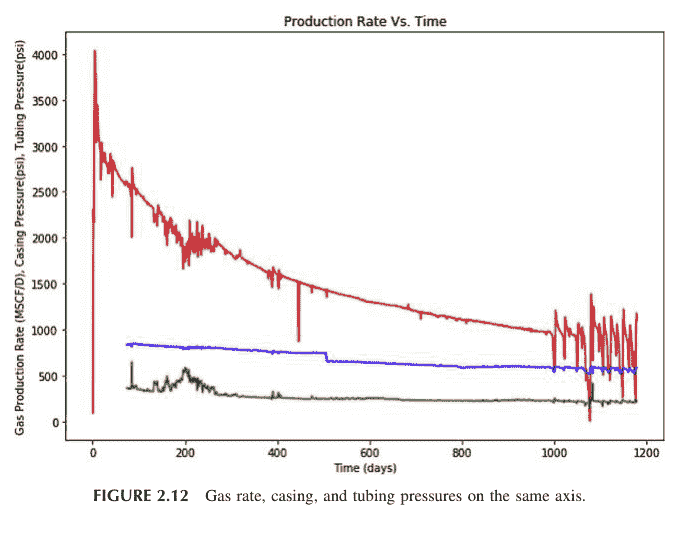

图 2.12 产气速率、套管压力和油管压力在同一坐标轴上。

```
fig, ax1=plt.subplots()
ax1.plot(df['Prod Date'],df['Gas Prod'], color='red')
ax1.set_xlabel('time (days)')
ax1.set_ylabel('Gas Production Rate', color='red')
ax1.tick_params(axis='y', labelcolor='red')
ax2=ax1.twinx() # instantiate a second axes that shares the same x-axis
ax2.plot(df['Prod Date'],df['Casing'], color='blue')
ax2.set_ylabel('Casing Pressure', color='blue')
ax2.tick_params(axis='y', labelcolor='blue')
fig.tight_layout()
Python output=Fig. 2.13
```

## 使用 matplotlib 绘制测井曲线

matplotlib 库的另一个有用优势是绘制测井数据。让我们使用来自 MSEEL 项目的 MIP_4H 井声波测井数据，该数据可通过以下链接公开获取：
http://www.mseel.org/data/Wells_Datasets/MIP/MIP_4H/GandG_and_Reservoir_Engineering/

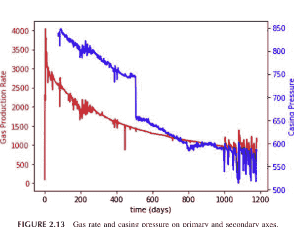

图 2.13 产气速率和套管压力在主、次坐标轴上。

下载后，将 excel 文件另存为 csv 文件。让我们导入 csv 文件并将其命名为 "df_log"，如下所示：

```
python
df_log=pd.read_csv('Chapter2_Sonic_Log_MIP_4H_DataSet.csv')
df_log.columns
Python output=Index(['Well_Name', 'DEPT', 'DPHZ', 'DT', 'GR_EDTC',
       'HCAL', 'HDRA', 'NPHI', 'PEFZ', 'RHOZ', 'RLA3', 'RLA4', 'RLA5',
       'RM_HRLT', 'SPHI', 'SVEL', 'TENS', 'TT1', 'TT2', 'TT3', 'TT4'],
      dtype='object')
```

如上所示，此测井曲线包含许多不同的属性。让我们使用上面讨论的子图概念，将深度 (DEPT) 绘制在 y 轴上，将伽马射线 (GR_EDTC)、中子孔隙度 (NPHI)、体积密度 (RHOZ) 和光电效应 (PEFZ) 绘制在 x 轴上，并排显示在 4 个不同的道（道 1 到道 4）中。一旦编写了第一个道的代码，其余的道只需复制并更改 "User#"、道的名称、道的列号以及属性的颜色即可。请注意，此测井曲线尚未进行质量检查和控制以排除井径扩大影响，该曲线只是基于公开可用的数据按原样绘制。

```
python
# This will create 1 row and 4 columns with the title "MIP_4H Sonic log"
fig,ax=plt.subplots(nrows=1, ncol=4, figsize=(16,12),sharey=True)
fig.suptitle("MIP_4H Sonic Log", fontsize=30)
Name='MIP_4H'
# Track #1 which will assign "Use1" to be GR and "Use2" to be the depth
User1=df_log[df_log['Well_Name']==Name]['GR_EDTC']
User2=df_log[df_log['Well_Name']==Name]['DEPT']
```

# "ax[0]" 将绘制第一列道，".twiny()" 是一个共享 y 轴的方法。
ax1=ax[0].twiny()
ax1.invert_yaxis()
# 这将绘制 "User1"（即伽马射线）在 x 轴上，"User2"（即深度）在 y 轴上
ax1.plot(User1,User2, color='black',linestyle='-')
# 这将设置 x 轴标签和颜色。
ax1.set_xlabel('GR_EDTC',color='black')
# 这将调整刻度标签、颜色以及应用刻度标签的坐标轴
ax1.tick_params(axis='x', color='black')
# 这表示数据区域边界并调整标签位置
ax1.spines['top'].set_position(('outward',1))
# Track #2:
User3=df_log[df_log['Well_Name']==Name]['NPHI']
User4=df_log[df_log['Well_Name']==Name]['DEPT']
ax2=ax[1].twiny()
ax2.invert_yaxis()
ax2.plot(User3,User4, color='red',linestyle='-')
ax2.set_xlabel('NPHI',color='red')
ax2.tick_params(axis='x', color='red')
ax2.spines['top'].set_position(('outward',1))
# Track #3:
User5=df_log[df_log['Well_Name']==Name]['RHOZ']
User6=df_log[df_log['Well_Name']==Name]['DEPT']
ax3=ax[2].twiny()
ax3.invert_yaxis()
ax3.plot(User5,User6, color='green',linestyle='-')
ax3.set_xlabel('RHOZ',color='green')
ax3.tick_params(axis='x', color='green')
ax3.spines['top'].set_position(('outward',1))
# Track #4:
User7=df_log[df_log['Well_Name']==Name]['PEFZ']
User8=df_log[df_log['Well_Name']==Name]['DEPT']
ax4=ax[3].twiny()
ax4.invert_yaxis()
ax4.plot(User7,User8, color='brown',linestyle='-')
ax4.set_xlabel('PEFZ',color='brown')
ax4.tick_params(axis='x', color='brown')
ax4.spines['top'].set_position(('outward',1))

Python output=Fig. 2.14 (如果您想反转 y 轴，只需在上面的代码末尾添加 "plt.gca().invert_yaxis()" 即可实现)。

## Seaborn 库

Seaborn 是一个统计绘图库，构建在 matplotlib 之上。Seaborn 库具有许多可用于快速绘图的默认样式，并且设计为与 pandas 库良好协作。正如稍后通过各种示例将要展示的，seaborn 库的主要优势之一是与 matplotlib 相比，它需要更少的编码。使用此库，只需一行或几行代码即可快速创建各种高分辨率、美观且复杂的图表。此库特别适用于演示文稿的创建。Seaborn 库的缺点是，尽管包含了大多数重要的图表，但其图表集合不如 matplotlib 库广泛，只能创建库中存在的统计图表。Seaborn 中一些常见且有用的图表包括分布图、联合图、配对图、地毯图、核密度估计 (KDE) 图、条形图、计数图、箱线图、小提琴图和蜂群图。让我们开始导入 seaborn 库（以粗体突出显示）和 "Shale Gas Wells" 数据集。该数据集的链接如下：

https://www.elsevier.com/books-and-journals/book-companion/9780128219294

```
import numpy as np
import pandas as pd
import matplotlib.pyplot as plt
import seaborn as sns
%matplotlib inline
df_Shale=pd.read_csv('Chapter2_Shale_Gas_Wells_DataSet.csv')
df_Shale.columns
```

```
Python output=Index(['Stage Spacing', 'bbl/ft', 'Well Spacing',
       'Dip', 'Thickness', 'Lateral Length', 'Injection Rate', 'Porosity',
       'ISIP', 'Water Saturation', 'Percentage of LG', 'Pressure Gradient',
       'Proppant Loading', 'EUR', 'Category'], dtype='object')
```

## 分布图

在进行任何类型的机器学习分析之前，理解数据集最重要的图表之一是分布图。这里绘制了每个参数的分布以供分析。使用分布图的主要原因是确保输入和输出特征的分布是正态（高斯）的。这是因为大多数机器学习算法假设参数的分布是正态的。因此，当参数分布非正态时，应应用各种技术对其进行归一化。可以使用 Seaborn 库绘制分布图。如下所示，使用 "sns.distplot" 方法绘制每个参数的分布。此外，可以指定颜色并将 bin 数量设置为一个数字。否则，如果 "bins = None"，Freedman-Diaconis 规则将作为 seaborn 库中的默认参数。

请注意，Freedman-Diaconis 规则是一种流行的方法，于 1981 年开发，用于选择直方图中使用的 bin 宽度。bin 宽度的计算如下所示 (Freedman & Diaconis, 1981)：

> $Bin Width = 2 \frac{IQR(x)}{\sqrt[3]{n}}$

在此方程中，IQR(x) 是数据的四分位距，n 是样本 x 中的观测数。四分位距定义为第 75 百分位数和第 25 百分位数之差 (IQR = Q3-Q1)。IQR 也被称为 "中间 50%"、"H-跨度" 或 "中跨度" (Kokoska & Zwillinger, 2000)。

让我们以一个样本为例计算 IQR，假设数字如下：
1,3,5,2,6,12,17,8,15,18,20
步骤 1) 将数字按顺序排列如下：
1,2,3,5,6,**8**,12,15,17,18,20
步骤 2) 找到中位数。此示例的中位数是 8。
步骤 3) 为了更容易识别 Q1 和 Q3，让我们在中位数上下的数字周围加上括号，如下所示：
(1,2,3,5,6),8,(12,15,17,18,20)

步骤 4) Q1 定义为数据**下半部分**的中位数，Q3 定义为数据**上半部分**的中位数。因此，在此示例中，Q1 = 3，Q3 = 17。
(1,2,**3**,5,6),**8**.(12,15,**17**,18,20)
步骤 5) 最后一步是用 Q3 减去 Q1，如下所示：

IQR = 17 – 3 = 14

要从图中移除 KDE 线，只需添加 "KDE=False"，因为默认参数为 True。下面是井距的分布图，颜色为蓝色，x 轴标签为 "Well Spacing"，y 轴标签为 "Frequency"，标题为 "Distribution Plot for Well Spacing"。要绘制其他特征（参数）的分布，只需将 "df_Shale['Well Spacing']" 替换为 "df_Shale['所需列的名称']"，并相应调整大小、标签和标题。

```
fig=plt.figure(figsize=(5,5))
sns.distplot(df_Shale['Well Spacing'], color='blue', bins=None)
plt.xlabel('Well Spacing')
plt.ylabel('Frequency')
plt.title('Distribution Plot for Well Spacing')
Python output=Fig. 2.15
```

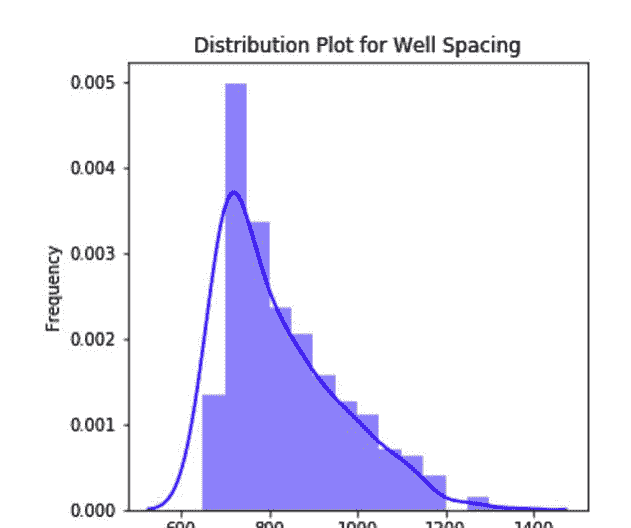

图 2.15 井距分布图。

## 联合图

联合图是可视化两个参数之间关系及其分布的另一种有用方式。要绘制联合图，可以使用 "sns.jointplot" 方法。请注意，在编码过程中的任何时候，如果记不清确切的方法，在输入前几个单词后，按下 shift 键，所有可用选项都会显示出来，这是一个非常有用的功能。请注意，不同方法（或属性）的自动补全功能是 IDE（集成开发环境）如 Jupyter 的特性。让我们在两个单独的联合图中绘制阶段间距和支撑剂负载与 EUR 的关系。传入 x 轴（阶段间距）和 y 轴（EUR），并定义 "kind = 'scatter'" 以将这两个变量绘制为散点图。请注意，kind 可以替换为其他选项，如 regular、kde 和 hex。此外，要在图上显示皮尔逊相关系数和 P 值，请记住导入 scipy stats 库并传入 "stat_func = stats.pearsonr"，如下所示：

```
from scipy import stats
sns.jointplot(df_Shale['Stage Spacing'], df_Shale['EUR'], color='blue',
kind='scatter', stat_func=stats.pearsonr)
Python output=Fig. 2.16
```

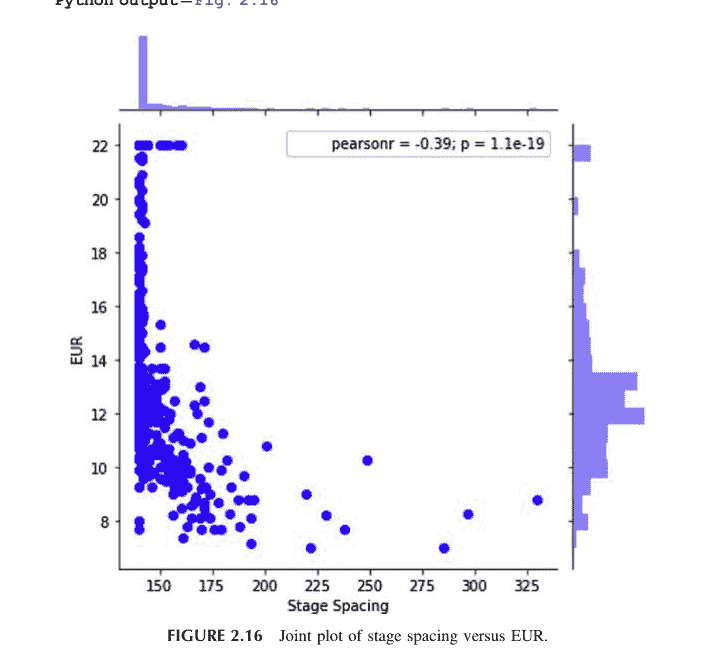

让我们也使用另一个联合图导入支撑剂负载与 EUR 的关系。请将 "kind" 下的 scatter 替换为 "kde"，如下粗体所示。KDE 代表核密度估计，通过将内部转换为阴影等高线图来在边缘绘制 KDE。

```
sns.jointplot(df_Shale['Proppant Loading'], df_Shale['EUR'],
    color='blue', kind='kde', stat_func=stats.pearsonr)
Python output=Fig. 2.17
```

## 配对图

另一种非常有用的图，可以在一个图中显示所有参数之间的关系，称为 seaborn 库中的配对图。与单独绘制散点图不同，配对图可以使用一行代码（sns.pairplot()）绘制所有变量之间的关系。如果导入的数据框中存在分类数据，可以指定 "hue = '列名'" 来确定数据框中应使用哪一列进行颜色编码。在 df_Shale 数据框中，有一个名为 "Category" 的列，包含两个分类名称 "Vintage" 和 "New_Design"，用于对配对图进行颜色编码，如下所示。

```
sns.pairplot(df_Shale, hue='Category', kind='scatter')
Python output=Fig. 2.18
```

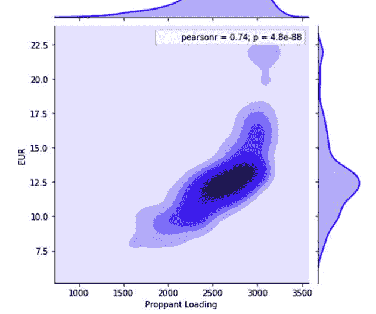

图 2.17 使用 "kind = kde" 的支撑剂负载与 EUR 的联合图。

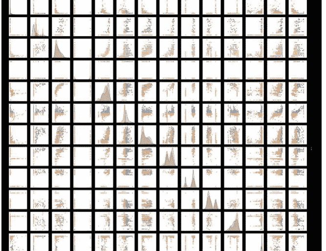

图 2.18 hue = "Category" 的配对图。

## 回归图

回归图基本上是带有叠加回归线的散点图。lmplot() 结合了线性回归模型拟合（regplot()）和 FacetGrid()。FacetGrid 类有助于理解数据集子集中多个变量之间的关系，如图 2.19 所示。请注意，与 regplot() 相比，回归图计算密集。让我们使用 lmplot() 在 x 轴上绘制 "Lateral Length"，在 y 轴上绘制 "EUR"，并将 hue 设置为等于 "Category"。之后，移除 hue = 'Category' 并改用 "sns.regplot()" 方法来比较这两种方法。很明显，生成的图是相同的，但图形形状不同。因此，根据 seaborn 库文档，regplot() 和 lmplot() 密切相关，其中 regplot() 是轴级函数，而 lmplot() 是图形级函数，结合了 regplot() 和 FaceGrid()（Seaborn.lmplot, n.d.）。

```
sns.lmplot(x='Lateral Length',y='EUR', data=df_Shale, hue='Category')
Python output=Fig. 2.19
```

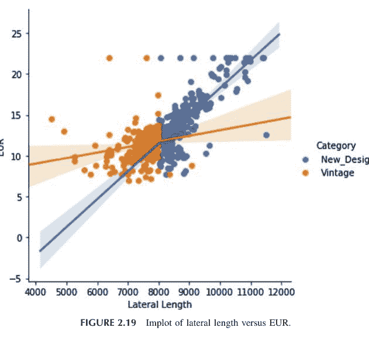

让我们也使用 lmplot 来可视化孔隙度与含水饱和度的关系，并使用 "col = 'Category'" 来显示两个并排的 lmplot，如下所示：

```
sns.lmplot(x='Porosity',y='Water Saturation',data=df_Shale,
col='Category',aspect=0.8,height=5)
Python output=Fig. 2.20
```

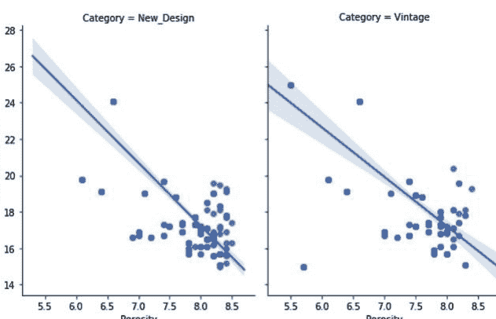

图 2.20 使用 col = "Category" 的回归图。

## 条形图

条形图也可以使用 "sns.barplot()" 绘制。让我们使用 "estimator = mean" 在条形图上绘制 Category 与 EUR 的关系，如下所示。请注意，其他**估计器**如 std（标准差）、中位数和总和也可以传递以生成这些条形图。术语 "estimator" 用于设置在条形图中绘制不同类别时使用的聚合函数。例如，当使用 "estimator = np.mean" 时，会计算每个类别的平均值并显示在图上。在下面的示例中，"Vintage" 和 "New_Design" 类别的平均 EUR 显示在条形图上。

```
sns.barplot(df_Shale['Category'],df_Shale['EUR'],estimator=np.mean)
Python output=Fig. 2.21
```

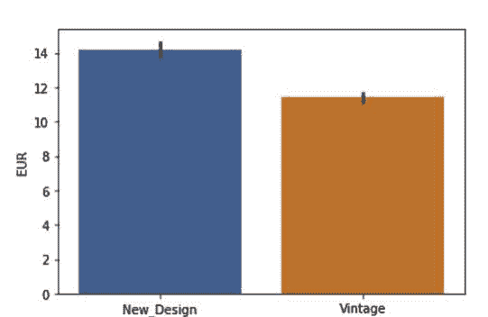

图 2.21 使用 estimators = np.mean 的 Category 与 EUR 的条形图。

## 计数图

Seaborn 还具有内置的计数图功能，可以使用。"sns.countplot()" 将显示每个类别的值计数。下面的示例显示了每个完井设计类别（Vintage 与 New_Design）的值计数。

```
sns.countplot(df_Shale['Category'])
Python output=Fig. 2.22
```

## 箱线图

另一种重要的可视化图，建议与分布图配对使用的是箱线图。箱线图是识别异常值和离群点的优秀可视化工具。请注意，可以从箱线图中获取以下参数：

- 中位数（第 50 百分位数）
- 第一四分位数（第 25 百分位数）
- 第三四分位数（第 75 百分位数）
- 四分位距（第 25 至第 75 百分位数）
- 最大值：这不是数据集中的最大值，定义为：Q3 + 1.5 * IQR
- 最小值：这不是数据集中的最小值，定义为：Q1 - 1.5 * IQR
- 离群点是位于上述定义的 "最小值" 和 "最大值" 之外的点。

图 2.23 说明了上述定义，以便于理解箱线图。

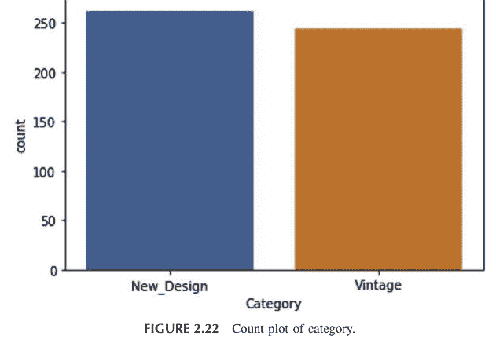

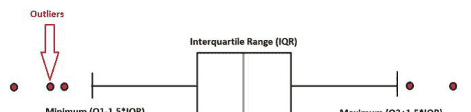

图 2.23 箱线图说明。

下面是使用绿色绘制的孔隙度箱线图示例：

```
sns.boxplot(df_Shale['Porosity'], color='green')
Python output=Fig. 2.24
```

让我们也使用 sns.boxplot 绘制 Category 与 EUR 的关系。"Palette = 'rainbow'" 也可以用于自定义配色方案。

```
sns.boxplot(df_Shale['Category'],df_Shale['EUR'],palette='rainbow')
Python output=Fig. 2.25
```

## 小提琴图和蜂群图

接下来可以使用 seaborn 库可视化的高级可视化图称为小提琴图和蜂群图。小提琴图是除箱线图外另一种有用的可视化工具。与箱线图相比，小提琴图的主要优势在于能够显示

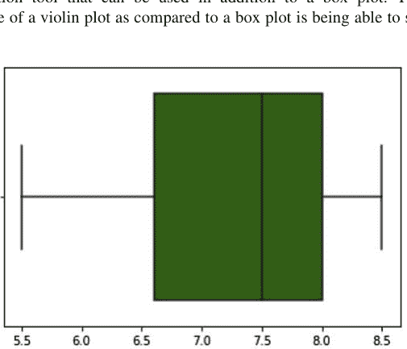

图 2.24 孔隙度箱线图。

## KDE 图

KDE 代表核密度估计，用于可视化连续变量的概率密度，并用于非参数分析。请注意，KDE 图在确定分布形状方面很有用。当 KDE 应用于单个参数时，观测值的密度绘制在一个轴上，高度绘制在另一个轴上（[可视化数据集的分布，无日期](https://example.com)）。可以使用 `sns.kdeplot()` 方法绘制 KDE。下面是绘制含水饱和度与 EUR 的示例（双变量密度图）。`cmap = 'Reds'` 颜色映射使用红色绘制图表，`shade = True` 在 KDE 曲线下方区域提供阴影。

```
sns.kdeplot(df_Shale['Water Saturation'],df_Shale['EUR'],cmap='Reds',
shade=True, shade_lowest=False)
Python output=Fig. 2.28
```

## 热力图

下一个用于识别参数间关系的非常重要的图表称为热力图，可以使用 `sns.heatmap()` 进行此类绘图。除了绘制热力图外，在热力图内添加皮尔逊相关系数以识别共线参数也极其重要。皮尔逊相关系数计算如下：

$$P_{X, Y} = \frac{cov(X, Y)}{\sigma_X \sigma_Y}$$ (2.2)

其中 cov(X,Y) 是参数 X 和 Y 之间的协方差，$\sigma_X$ 是参数 X 的标准差，$\sigma_Y$ 是参数 Y 的标准差。皮尔逊相关系数的范围在 -1 和 1 之间。正值表示一个变量相对于另一个变量增加或减少的趋势。另一方面，负值表示一个变量值的增加是由于另一个变量值的减少，反之亦然。相关系数 (R) 的平方称为决定系数 ($R^2$)。(皮尔逊相关系数, 2008)。请注意，一般经验法则是移除相关系数绝对值在 |±90%| 以上的共线输入变量，因为这些变量提供相同的信息；因此是冗余的，并且会增加输入数据集的维度。除非这些共线参数恰好由于其他因素（如时间）而共线，否则最好移除这些参数。例如，油气行业几乎在同一时间转向更紧密的井段间距和更高的支撑剂负载。因此，皮尔逊相关系数可能显示这两个参数之间存在负共线性；然而，本质上，这是由于时间因素，而不是这两个变量之间固有的共线性。在这个特定示例中，可以训练两个独立的模型来理解每个变量对模型的影响。让我们使用 `sns.heatmap()` 来可视化这一点。如下所示，`df_Shale.corr()`（在 Python 中用于定义皮尔逊相关系数，调用 `.corr()` 时的默认方法是 'pearson'）将用于绘制热力图，`annot = True` 将在热力图上显示实际值。设置 `annot = False` 时，皮尔逊相关值将显示在热力图上。请注意，也可以使用 `df_Shale.corr(method='spearman')` 传递其他方法，如 "spearman" 和 "kendall"，而不是默认情况下的 "pearson" 方法。

```
fig=plt.figure(figsize=(17,8))
sns.heatmap(df_Shale.corr(), cmap='coolwarm', annot=True,
linewidths=4, linecolor='black')
Python output=Fig. 2.29
```

## 聚类图

聚类图可用于将矩阵数据集绘制为层次聚类热力图，seaborn 为此目的提供了一个强大的内置函数。层次聚类的概念在本书的无监督聚类章节中有详细讨论。因此，在本节中，将通过代码示例进行说明，而不解释概念。为了可视化，让我们导入下面的天然气定价 csv 文件。

https://www.elsevier.com/books-and-journals/book-companion/9780128219294

下面的代码演示了导入名为 "Chapter2_Natural_Gas_Pricing_Version2_DataSet" 的 csv 文件，然后使用 "Month" 列作为行，"Prior to 2000" 列作为列，并使用每月天然气价格的平均值作为 "values" 来透视 df_ngp 数据框。为了本示例的说明目的，请注意 "Prior to 2000" 列是一个任意的分类列，对于 2000 年之前的每个天然气价格为 0，之后为 1。之后，可以简单地可视化每月天然气价格的热力图。

```
df_ngp=pd.read_csv('Chapter2_Natural_Gas_Pricing_Version2_DataSet.csv')
df_ngp_pivot=df_ngp.pivot_table(values='Value',index='Month',
columns='Prior to 2000')
fig=plt.figure(figsize=(10,5))
sns.heatmap(df_ngp_pivot,annot=True,linecolor='white',
linewidths=3)
Python output=Fig. 2.30
```

接下来，让我们使用 `sns.clustermap()` 来使用层次聚类热力图可视化数据。`standard_scale = 1` 标准化维度，对于每一行或每一列，减去最小值并除以其最大值。

```
sns.clustermap(df_ngp_pivot,cmap='coolwarm',standard_scale=1)
Python output=Fig. 2.31
```

## PairGrid 图

PairGrid 图类似于配对图，其中所有变量相互绘制（如前所述）。PairGrid 图只是提供了更大的灵活性来创建各种图表并自定义图表。在下面的示例中，创建了 df_Shale 数据框的 PairGrid 图。直方图用于绘制所有对角线图，对角线上方的部分是散点图，下方部分是 KDE 图。请注意，"Category" 用于区分 "New Design" 和 "Vintage"。注意脚本中的粗体文本。

```
Shale_Properties=sns.PairGrid(df_Shale, hue='Category')
Shale_Properties.map_diag(plt.hist)
Shale_Properties.map_upper(plt.scatter)
Shale_Properties.map_lower(sns.kdeplot)
Python output=Fig. 2.32
```

## Plotly 和 cufflinks

Plotly 是一个开源的**交互式** Python 可视化库，其图表质量高于 matplotlib 和 seaborn。Plotly 提供了许多交互功能，如缩放、平移、框选和套索选择、自动缩放等。此外，将鼠标悬停在图表上会显示每个点背后的基础数据，这使其成为一个超级强大的可视化库。图片的质量使得 plotly 也非常适合用于演示目的。plotly 的优势之一是，如果用户喜欢在 R 编程语言中创建的图表，它就像 "R" 一样。

## 2.3.2 Plotly与Cufflinks

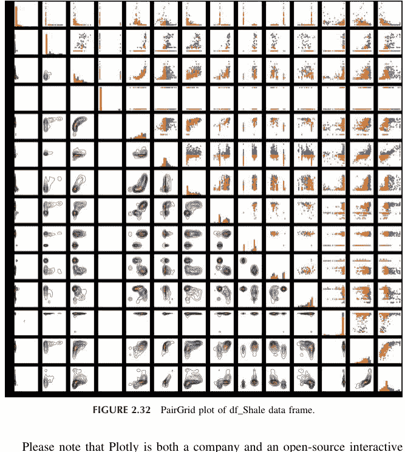

**图 2.32** df_Shale数据框的PairGrid图。

请注意，Plotly既是一家公司，也是一个开源的交互式数据可视化库。顾名思义，Plotly公司专注于商业智能的数据可视化，例如创建仪表板、报告等。Plotly公司发布了一个名为plotly的开源交互式数据可视化库，该库主要专注于交互式数据可视化，正如稍后将展示的那样。单独使用Plotly Python库可以创建交互式绘图，保存为.html文件。虽然这些绘图是高质量的交互式绘图，但它们无法连接到变化的数据源。因此，为了创建针对变化数据源的交互式实时仪表板，可以将“Dash”库与plotly库结合使用。Dash也是Plotly公司的一个开源库，允许使用各种交互组件和绘图来创建完整的仪表板。Dash库和创建仪表板不在本书中讨论，因为它超出了本书的范围。Cufflinks将plotly与pandas连接起来。请访问plotly.ly网站获取更多信息。Plotly和Cufflinks不包含在Anaconda包中，因此，请使用Anaconda提示符窗口下载这两个包，如下所示：

```
pip install plotly
pip install cufflinks
```

通过Anaconda提示符窗口下载后，插入以下代码行以离线使用此库。如果pandas和numpy库已在之前的模块中导入，则无需重新导入这些库，如下所示。

```
import pandas as pd
import numpy as np
%matplotlib inline
from plotly.offline import download_plotlyjs, init_notebook_mode,
    plot, iplot
import cufflinks as cf
init_notebook_mode(connected=True) # For Notebooks
cf.go_offline() # For offline use
```

让我们使用plotly库绘制bbl/ft与EUR的关系图。请注意，可以使用数据框后跟“.iplot()”语法。在括号内传递kind、x、y、size和color。如下所示，可以将鼠标悬停在任何点上，选中的点将显示在绘图上。

```
df_Shale.iplot(kind='scatter',x='bbl/ft',y='EUR',
    mode='markers', size=4, color='red',xTitle='Water Loading (bbl/ft)',
    yTitle='EUR (BCF)', title='Water Loading Vs. EUR')
```

**Python输出=图 2.33**

让我们使用plotly库快速绘制一个井距的箱线图。这次，传入“kind = 'box'”。

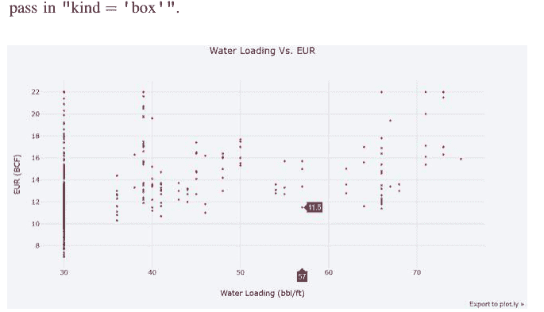

**图 2.33** 使用plotly库绘制的水加载与EUR的散点图。

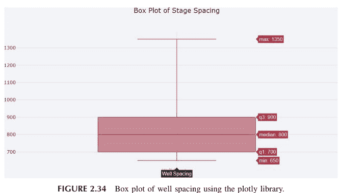

**图 2.34** 使用plotly库绘制的井距箱线图。

```
df_Shale['Well Spacing'].iplot(kind='box',color='red',
    title='Box Plot of Stage Spacing')
Python输出=图 2.34
```

也可以绘制所有参数的箱线图，如下所示。请注意，由于大多数参数的值较小，只能轻松可视化其中一些参数。要绘制几个选定的参数，请使用“df_Shale[['Parameter 1 name','Parameter 2 name']].iplot(kind = 'box')”。这将允许选择几个参数，而不是所有参数。

```
df_Shale.iplot(kind='box', title='Box Plot of all Parameters')
Python输出=图 2.35
```

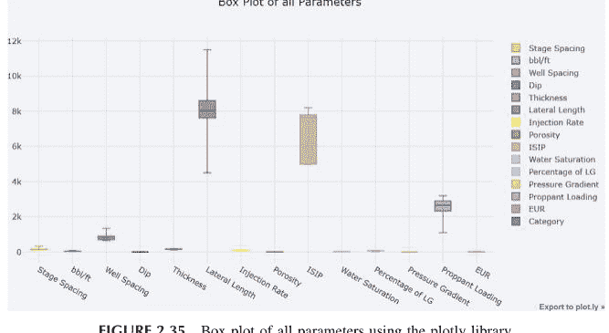

**图 2.35** 使用plotly库绘制的所有参数箱线图。

90 使用Python的油气机器学习指南

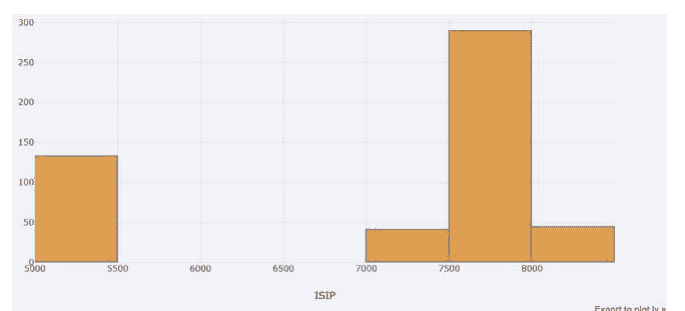

**图 2.36** 使用plotly库绘制的ISIP分布图。

要绘制ISIP的直方图，可以编写以下代码行：

```
python
df_Shale['ISIP'].iplot(kind='hist', xTitle='ISIP')

Python输出=图 2.36
```

让我们也绘制一个水加载与砂加载的气泡图，并使用EUR作为气泡大小的标准，如下所示。请注意，可以使用“kind = 'bubble'”来定义气泡图。

```
python
df_Shale.iplot(kind='bubble',x='Proppant Loading',y='bbl/ft',size='EUR',title='Bubble Plot Based on EUR',xTitle='Proppant Loading (#/ft)',yTitle='Water Loading (bbl/ft)',zTitle='EUR')

Python输出=图 2.37
```

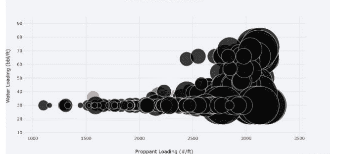

**图 2.37** 使用plotly库绘制的水加载与砂加载的气泡图（基于EUR的气泡大小）。

除了使用iplot，还可以使用其他形式的plotly编码来绘制各种绘图。首先，让我们导入以下两行代码。请注意，“plotly.graph_objs”有几个用于创建图形选项的有用函数，稍后将进行演示。

```
import plotly.graph_objs as go
import plotly.offline as pyo
```

要创建plotly图形，必须首先定义“data”和“layout”变量。“data”定义如下：EUR（y轴）与阶段间距（x轴），使用“mode = 'markers'”，标记大小、颜色和符号分别为9、rgb(23, 190, 207)和方形。x轴、y轴和标题在“layout”变量下定义。最后，在“go.Figure()”下传入“data”和“layout”，并使用pyo.plot()创建.html绘图，如下所示。请注意，可以使用“mode = lines”将此散点图转换为折线图。

```
data=[go.Scatter(x=df_Shale['Stage Spacing'], y=df_Shale['EUR'],
    mode='markers',marker=dict(size=9, color='rgb(23, 190, 207)',
    symbol='square', line={'width':2}))]
layout=go.Layout(title='Stage Spacing Vs. EUR', xaxis=dict(title=
    'Stage Spacing'), yaxis=dict(title='EUR'), hovermode='closest')
fig=go.Figure(data=data, layout=layout)
pyo.plot(fig, filename='scatter.html')
```

Python输出=图 2.38

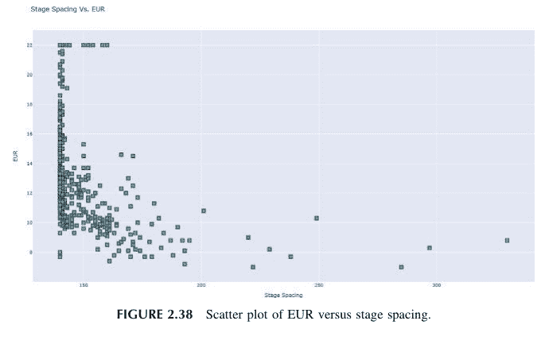

**图 2.38** EUR与阶段间距的散点图。

plotly中的一些默认rgb颜色如下所列：
rgb(23, 190, 207) = 蓝绿色，rgb(188, 189, 34) = 咖喱黄绿色，
rgb(127, 127, 127) = 中灰色，rgb(227, 119, 194) = 覆盆子酸奶粉色，
rgb(140, 86, 75) = 栗棕色，rgb(148, 103, 189) = 柔和紫色，
rgb(214, 39, 40) = 砖红色，rgb(44, 160, 44) = 熟芦笋绿色，
rgb(255, 127, 14) = 安全橙色，rgb(31, 119, 180) = 柔和蓝色
（参考 https://plotly.com/python/）

现在，让我们创建一个散点图，将阶段间距和水/英尺放在同一个x轴上，使用Trace 1和2，如下所示：

```
trace1=go.Scatter(x=df_Shale['Stage Spacing'], y=df_Shale['EUR'],
mode='markers', name='Stage Spacing')
trace2=go.Scatter(x=df_Shale['bbl/ft'], y=df_Shale['EUR'],
mode='markers', name='Water per ft') data=[trace1,trace2]
layout=go.Layout(title='Scatter Charts of Stage Spacing and Water
per ft')
fig=go.Figure(data=data,layout=layout)
pyo.plot(fig)
Python输出=图 2.39
```

接下来，让我们创建一个气泡图，显示x轴上的阶段间距，y轴上的EUR，气泡大小由横向长度决定，气泡颜色由每英尺水量决定。将“size = df_Shale['Lateral Length']”除以300的原因是为了减小气泡的大小。如果大小由一个较小的数字分类，则可能需要乘以一个数字来增大气泡的大小。因此，请随意更改此数字，直到获得所需的气泡大小。

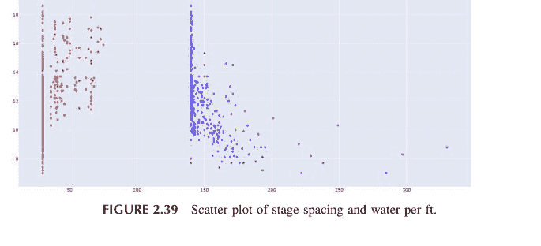

**图 2.39** 阶段间距和每英尺水量的散点图。

```
data=[go.Scatter(x=df_Shale['Stage Spacing'], y=df_Shale['EUR'],
    mode='markers', marker=dict(size=df_Shale['Lateral Length']/300,
    color=df_Shale['bbl/ft'], showscale=True))]
layout=go.Layout(title='Stage Spacing Vs. EUR, Sized by Lateral
    Length, and Colored by Water per ft', xaxis=dict(title='Stage
    spacing'), yaxis=dict(title='EUR'), hovermode='closest')
fig=go.Figure(data=data, layout=layout)
pyo.plot(fig)
Python输出=图 2.40
```

接下来，可以编写以下代码来绘制支撑剂加载的箱线图。请注意，“boxpoints = 'all'”显示所有原始支撑剂加载数据点，用于提供对该特征分布的更多见解。“boxpoints = 'outliers'”将仅显示异常值抖动点。“jitter”范围在0到1之间。数字越小，抖动点左右分布越不分散，反之亦然。“pointpos”决定抖动点在绘图中的位置。值为0表示点将在箱线图的顶部，+1或+2表示抖动点将在右侧，-1或-2表示抖动点将在左侧（可以指定-2到+2的范围）。

```
data=[go.Box(y=df_Shale['Proppant Loading'], boxpoints='all',
    jitter=0.5,pointpos=-2)]
layout=go.Layout(title='Proppant Loading', hovermode='closest')
fig=go.Figure(data=data, layout=layout)
pyo.plot(fig)
Python输出=图 2.41
```

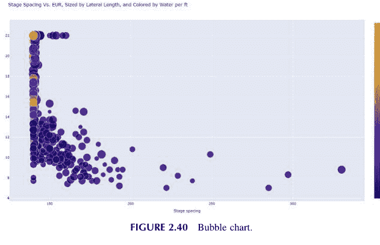

**图 2.40** 气泡图。

## 第三章

## 机器学习工作流程与类型

### 引言

在深入探讨各种机器学习（ML）算法和类型之前，理解典型的ML工作流程和类型至关重要。一个常见的ML工作流程包括但不限于：（i）数据收集与整合，（ii）数据清洗，包括（a）数据可视化，（b）异常值检测，以及（c）数据插补，（iii）特征排序/选择，（iv）归一化/标准化，（v）交叉验证，（vi）模型开发，（vii）网格搜索进行参数微调与优化，以及（viii）最终，部署训练好的模型。本章将详细讨论ML的每个步骤，以提供一个可应用于任何ML项目的实用工作流程。此外，还将深入探讨各种类型的ML，如监督学习、无监督学习、半监督学习和强化学习。数据科学知识与领域专业知识的结合是成功实施ML项目的关键。不幸的是，石油天然气（O&G）行业已经目睹了许多ML项目失败，原因在于数据科学家和领域专家未能妥善合作，各自为政。

## 机器学习工作流程

## 数据收集与整合

全球各地的公司在将其问题应用于AI和ML项目时，拥有不同的工作流程；然而，本章的目标是提供一个可用于解决任何问题的实用工作流程。数据收集与整合是任何ML项目中最重要的步骤之一。许多ML项目仅仅因为缺乏数据而失败。因此，在深入项目之前，了解组织内部的数据可用性非常重要。如果数据根本不可用或获取难度极大，建议专注于那些数据可用且极有可能提供切实成果的项目，以展示ML在组织内的潜力。如果你的组织是AI和ML应用的新手，建议寻找一些实际用例，通过几个项目验证概念，并展示与ML和AI实际应用相关的切实价值。由于数据来自许多不同的来源，组织必须拥有一个可依赖的中央数据仓库。集中式数据仓库允许组织内的每个人为不同项目使用相同的数据。石油天然气及其他行业必须摆脱使用Excel电子表格，转而使用像SQL这样的集中式数据仓库来存储所有数据。不幸的是，由于低效的数据存储系统，在许多公司，数据科学家不得不花费80%的时间收集数据，只有20%的时间分析数据。如果能花费不到5%的时间获取必要信息，而将大部分时间用于分析数据并发现非常规问题以应用ML解决各种复杂问题，这难道不是非常强大且有回报的吗？当数据存储在集中位置时，无需访问多个来源即可获取执行ML分析所需的必要数据。如果你的公司规模较小且为私营，值得投资建立一个数据仓库，将来自不同来源的数据汇编到一个来源中。设置可能是一个耗时的项目，但从长远来看会有回报。即使你的公司打算出售资产并变现，建立数据仓库仍然很重要，因为这将是任何主要运营商的卖点。数据是新的黄金，谁拥有最好的数据存储和分析系统，谁就能在创造显著财务效益方面最具实力。

在进入数据清洗之前，理解“数据中心”这个术语很重要。数据中心只是一个建筑、多个建筑，或建筑内的一个专用空间，用于为组织容纳硬件、数据存储、服务器、计算机系统等。数据中心有以下不同类型：

- **本地数据中心**，也称为本地部署数据中心，是由组织私有拥有和控制的一组服务器。因此，对硬件有完全的控制权。在本地数据中心，需要前期资本投资，这是此类数据中心最大的缺点之一。前期资本投资用于购买建立数据中心所需的服务器和网络硬件。此外，由于硬件会老化并需要维护/更换，因此存在与维护硬件相关的持续维护成本。本地数据中心通常可扩展性有限，因为需要时间来使额外的服务器上线。如观察到的，本地数据中心无论使用量多少，都会占用空间和电力。数据中心的安全性完全取决于本地IT团队。此外，更新不是自动的，依赖于IT团队。本地数据中心的主要优点是使用成本更容易理解（与云数据中心相比），可以维护隐私，并且对硬件有完全的控制权。本地数据中心就像买房子。如果购买的房子中任何东西坏了，完全由你负责修理和维护。本地数据中心通常适合那些已经在IT基础设施上投入大量资本的小型公司。

- **云数据中心：** 与本地数据中心相反，在云数据中心中，实际的硬件由相关的云公司管理和运行。有各种云数据中心提供商，如亚马逊网络服务（AWS）、微软Azure（也称为Azure）和谷歌云平台（GCP）。与本地数据中心需要大量前期资本投资相反，云数据中心前期投资很少，并且是一个可扩展的模型。云数据中心需要很少的知识和更少的人力即可启动，实施周期短，具有独立平台，自动更新，易于远程访问，并且客户按使用付费。一些缺点是对硬件和操作系统的控制较少，成本结构复杂，以及需要密切监控隐私和访问权限。一些公司只是不习惯在云数据中心中放弃太多控制权，他们喜欢对硬件、数据等拥有完全的内部控制。请注意，主要的云提供商具有广泛的安全级别，因为每年花费数十亿美元来确保客户数据隐私。云数据中心可以看作是租用公寓，无需前期首付（投资），并且可以立即租用。当设备损坏时，物业管理公司会修复这些损坏的物品。云数据中心适合任何规模的大多数组织。

- **混合数据中心：** 这仅仅是本地数据中心、私有云或公有云的组合。请注意，公有云由云提供商提供给多个客户（公司），而私有云是不与任何其他组织共享的云服务。注意，在公有云中，每个客户的数据和应用程序对其他云客户保持隐藏，因此不共享数据。在私有云上，服务和基础设施维护在专用网络上。此外，硬件和软件都专用于你的特定组织。

## 云计算与边缘计算

在终端设备上生成数据后，数据可以通过公共互联网传输到云端进行处理，*或者*数据可以通过边缘设备在现场处理。在第二种情况下，数据被发送到本地存在的设备，该设备被称为边缘设备。当数据在云端处理时，称为云计算。然而，当数据在边缘进行近实时或实时数据处理时，称为边缘计算。

**图 2.41** 支撑剂负载箱线图（包括抖动点）。

此外，让我们按如下方式编写孔隙度和含水饱和度的箱线图代码：

```python
data=[go.Box(y=df_Shale['Porosity'],name='Porosity'),
go.Box(y=df_Shale['Water Saturation'],name='Water Saturation')]
layout=go.Layout(title='Porosity and Water Saturation Box Plots',
hovermode='closest')
fig=go.Figure(data=data, layout=layout)
pyo.plot(fig)
```

**Python 输出=图 2.42**

**图 2.42** 孔隙度和含水饱和度箱线图。

也请花些时间探索plotly库中的“go.Histogram”用于分布图，“go.Bar”用于条形图，以及“go.Heatmap”用于热图。另请注意，plotly express（import plotly.express as px）也可以作为plotly库的简化版本用于这些讨论的图表。这些是本书中将使用的一些主要图表。其他自定义图表可以通过matplotlib、seaborn和plotly库文档找到。

## 参考文献

Freedman, D., & Diaconis, P. (1981). *On the histogram as a density estimator: L2 theory*. https://doi.org/10.1007/BF01025868

Kokoska, S., & Zwillinger, D. (2000). *CRC standard probability and statistics tables and formulae*. Student Edition. CRC Press, 9780849300264.

seaborn.lmplot. (n.d.). Retrieved May 10, 2020, from https://seaborn.pydata.org/generated/seaborn.lmplot.html.

Pearson's Correlation Coefficient. (2008). *Encyclopedia of public health*. https://doi.org/10.1007/978-1-4020-5614-7

Visualizing the distribution of a dataset. (n.d.). Retrieved May 15, 2020, from https://seaborn.pydata.org/tutorial/distributions.html.

云计算的一些优势在于它由他人负责维护，并且如前所述，它是一个可扩展的模型。边缘计算的主要优势在于，所有数据处理都可以在边缘完成，并且控制命令可以发送回边缘设备，实现实时或近实时的反馈控制循环。无需将数据发送到云端进行处理，再将控制命令传回边缘，从而避免了延迟。因此，其主要优势是靠近指令源的近实时控制。另一个优势是在边缘处理大量数据，然后将剩余数据发送回云端。近实时反馈循环以及通过在边缘执行大部分处理来节省带宽，是边缘计算的两个主要优势。边缘计算的主要缺点是，由于其定义上是局部化的，如果你试图在更大规模上进行扩展，最好将所有这些数据发送到云端，在那里可以在现场层面运行算法。因此，为了获得更高水平的可见性以及在现场层面进行更广泛的优化，云计算更为优越。在边缘部署机器学习模型将对油气行业的实时价值主张产生巨大影响。

## 数据清洗

数据收集和集成之后，下一个关键步骤是数据清洗。许多机器学习项目失败，是因为在应用机器学习算法之前，没有花足够的时间来解释和清洗数据。不存在所谓的快速机器学习分析，因为将机器学习正确应用于任何项目都需要仔细的数据解释和清洗。在数据清洗中，有几个主要步骤如下：

- **数据可视化**：数据清洗的第一步是数据可视化。许多机器学习模型失败，仅仅是因为在开始分析之前没有进行适当的数据清洗。数据的质量检查和控制可能是任何机器学习分析中最重要的部分。糟糕的数据很容易破坏模型并产生意想不到的错误结果。如第2章所述，Python中的Matplotlib、Seaborn和Plotly等可视化库包非常适合用于可视化，这有助于发现异常点。理解每个特征的分布也至关重要。推荐评估的图表包括分布图、箱线图和散点图。
- **异常值检测**：如前所述，数据可视化有助于发现异常点。此外，使用分布图、散点图、交叉图、热图和箱线图查看参数，可以轻松地将参数可视化，区分出合理范围内的参数和完全偏离图表的参数。例如，如果大多数每英尺支撑剂数据在1000到4000磅/英尺之间，而有两个数据点在10,000磅/英尺，那么调查这些异常点就很重要。要么调查这些异常点的有效性，要么在进入下一步之前直接移除它们。此外，在数据清洗和异常值检测之前和之后，必须获取数据的基本统计信息，包括每个参数的频率、最小值、最大值、平均值、中位数和标准差，以确保最终的参数范围是令人满意的。
- **数据填充**：处理缺失数据的各种方法如下：
  1) 直接删除任何包含N/A值的数据行：这是处理缺失数据最简单的方法，这种方法的缺点是，由于移除了许多包含缺失信息的样本，样本数量可能会急剧减少。
  2) 用现有值的平均值和中位数替换缺失值。尽管这种方法非常简单且易于执行，但我们不建议采用这种方法来填充缺失数据。除非有经过验证的数据支持这种方法，否则直接删除缺失数据行可能比引入错误数据更好。
  3) 使用Python中的Fancyimpute包以及k近邻（KNN）和链式方程多重插补（MICE）等算法来填充缺失数据。这些算法将在监督学习章节（第5章）末尾讨论。这些算法只有在满足以下条件时才能很好地工作：缺失参数与现有参数之间存在内在关系。例如，如果一口井的每英尺砂量缺失，但该井的每英尺水量可用，这些算法可能会产生有意义的答案。使用这些算法可能产生低准确度的挑战在于，当一口井的信息缺失时，大部分信息可能都缺失了。当数据集中只有一两个参数零星缺失，而其他参数之间存在内在关系时，Python中的fancy impute包是一个强大的工具。当一口井的数据中大多数参数都缺失时，不建议使用这些包，因为它们很可能产生错误的结果。在使用这些包时，请务必在应用KNN或MICE之前对数据进行归一化或标准化。这些算法将在监督学习章节中详细讨论。

## 特征排序与选择

任何机器学习分析中下一个重要的步骤是特征排序，然后是特征选择。这时，领域专业知识在成功的机器学习项目中扮演着重要角色。如果数据科学家在某个行业没有实际经验，那么理解变量之间的关系将极其困难。这个例子说明了在解决问题时，结合领域专业知识和人工智能知识的必要性。第一步是确定数据科学家试图解决的问题类型。问题是关于土地、钻井、完井、油藏、生产、设施，还是多个不同学科问题的组合？假设问题是一个与生产相关的机器学习问题。第一步是找一位经验丰富的生产工程师，并将其与数据科学家配对。这几乎可以确保走上解决问题的正确道路。原因很简单，因为生产工程师了解主题（在这种情况下是生产工程和操作）的每一个细节。假设试图解决的主题是气举优化。生产工程师确切了解影响气举周期的参数细节以及气举实际运行的细节。另一方面，数据科学家理解算法及其背后的统计原理。因此，特征选择直接与领域专业知识相关。

在某些情况下，工程师和数据科学家不一定知道每个特征的影响，也不确定在机器学习项目中必须选择哪些特征。因此，执行特征排序以观察每个特征对期望输出的影响非常重要。有许多算法可用于执行特征排序，例如随机森林（RF）、极端随机森林或额外树（XRF）、梯度提升（GB），以及文献中许多其他算法。这些算法及其Python应用将在监督学习章节中详细讨论。

在执行特征选择时，特征共线性也非常重要。如第2章所述，请确保绘制输入变量的皮尔逊相关系数热图，以研究特征的共线性。如果特征是共线的，向模型提供相同的信息可能会导致模型混淆。只需删除其中一个共线输入即可。如果两个输入对于理解都很重要，建议为每个共线特征训练两个单独的模型。

## 缩放、归一化或标准化

为了确保学习算法不会因数据的量级而产生偏差，数据（输入和输出特征）必须进行缩放。这也可以通过使每个输入值大致处于相同范围来加速优化算法（如梯度下降），这些算法将在模型开发中使用。请注意，并非所有机器学习算法都需要特征缩放。一般的经验法则是，利用数据样本之间距离或相似性的算法，如人工神经网络（ANN）、KNN、支持向量机（SVM）和k均值聚类，对特征变换敏感。然而，一些基于树的算法，如决策树（DT）、RF和GB，则不受特征缩放的影响。这是因为基于树的模型不是基于距离的模型，可以轻松处理不同范围的数据。特征。这就是为什么基于树的模型被称为“尺度不变”，因为它们无需进行特征缩放。上述每种算法都将在后续章节中详细讨论。三种主要的缩放类型被称为：

- **特征归一化：** 特征归一化确保每个特征被缩放到[0,1]区间。这是一个关键步骤，仅仅因为当特征具有不同量级时，模型会产生偏差。例如，如果机器学习模型中的两个特征是地表压裂施工排量和地表压裂施工压力，地表压裂施工排量可能在60到110 bpm之间变化，而地表压裂施工压力可能在8000到12,500 psi之间变化。如果不将这些特征缩放到0和1之间，模型将偏向于数值较大的压裂施工压力。特征归一化的主要缺点之一是，当边界在0和1之间时，会得到较小的标准差，这可能会抑制异常值（如果有的话）的影响。特征归一化的公式如框3.1所示。
- **特征标准化（z-Score归一化）：** 标准化将每个具有高斯分布的特征转换为均值为0、标准差为1的高斯分布。请注意，标准化不会改变数据的底层分布结构。一些学习算法，如SVM，假设数据围绕0分布，且方差具有相同的量级。如果此条件不满足，算法将偏向于方差较大的特征。特征标准化可以使用框3.2进行。

接下来经常被问到的问题是使用归一化还是标准化。这个问题的答案取决于具体应用。在聚类算法中，如k-means聚类、层次聚类、基于密度的带噪声应用空间聚类（DBSCAN）等，标准化很重要，因为需要基于距离度量来比较特征相似性。另一方面，对于某些算法，如人工神经网络（ANN）和图像处理，归一化变得更加重要（Raschka, n.d.）。

> **框3.1 特征归一化**
>
> $$Feature\ normalization(X') = \frac{X - min(X)}{max(X) - min(X)}$$ (3.1)
>
> 其中$X'$是归一化后的数据点，$min(X)$是数据集的最小值，$max(X)$是数据集的最大值。

## 框3.2 特征标准化

$Feature\ standardization(X') = \frac{X - \mu}{\sigma}$ (3.2)

其中$X'$是标准化后的数据点，$\mu$是数据集的均值，$\sigma$是数据集的标准差。

## 交叉验证

在应用各种机器学习模型之前，当使用监督式机器学习算法时，必须应用交叉验证。各种类型的机器学习算法将很快讨论，因此，目前只需记住，当使用监督式机器学习模型时需要交叉验证。无监督式机器学习模型不需要交叉验证，因为数据仅用于聚类。交叉验证有不同的类型，如下所示：

- **留出法：** 这是最简单的交叉验证类型之一，其中一部分数据从训练数据集中留出。例如，在一个有10万行数据的数据集中，70%或7万行用于训练模型，30%或3万行用于测试模型。训练集和测试集的划分是随机选择的。请注意，在Python中可以定义一个种子数，以复制任何依赖于随机数抽取的过程，例如训练集和测试集的划分。可以猜测，留出法的主要缺点之一是，由于训练是随机进行的，无法定义哪些数据行用于训练，哪些用于测试。如果用于机器学习分析的数据集很小，这可能导致完全不同的机器学习模型结果。
- **K折交叉验证：** 这种技术是留出法的扩展，其中数据集被分成K个子集，留出法重复K次。在k折交叉验证中，数据集首先会被随机打乱，然后使用这些切片进行训练/测试划分。在每一轮中，K个切片中的一个将被保留作为测试数据。例如，对于一个有10万行数据的数据集，当选择10折时，k折交叉验证执行如下：
    - 首先，前1万行数据用作测试集，其余9万行用作训练集。
    - 接下来，第1万到2万行用作测试集，其余数据集（第1千到1万行和第2万到10万行）用作训练集。
    - 然后，第2万到3万行用作测试集，其余数据集（第1千到2万行和第3万到10万行）用作训练集。
    - 此过程重复10次，或直到达到定义的k折。换句话说，每次使用K个子集中的一个作为测试集，其余K-1个作为训练集。
    - 最后，评估指标在10次试验（对于10折交叉验证）中取平均值。
    - 这简单地表明，每个数据点在测试集中出现一次，在训练集中出现九次（对于10折交叉验证）。

k折交叉验证的主要优点之一是它减少了偏差和方差（将讨论），因为大部分数据同时用于训练和测试。请注意，随着K值的增加，计算时间也会增加。因此，请确保进行快速的敏感性分析，看看是否可以用更少的K值（如五折或三折）来优化问题，而不会降低模型性能。图3.1说明了五折交叉验证。

- **分层k折交叉验证**：当机器学习模型的输出变量（也称为响应变量）存在严重不平衡时，可以使用分层k折交叉验证。例如，假设一个分类模型的输出中，70%被分类为“继续”，30%被分类为“评估”。这被称为**模型不平衡**，因为**输出**分类的比例为70%–30%。因此，分层k折交叉验证确保每个折都代表所有数据层。此过程旨在确保每个测试折的输出分布相似。换句话说，k折交叉验证以一种方式变化，使得每个折包含每个目标类的大致相同比例的样本。例如，在一个有10万行数据的分层k折交叉验证中，如果3万行被分类为“评估”，7万行被分类为“继续”，并且使用10折交叉验证，那么每个折将包含3K（3万除以10折）的“评估”类和7K（7万除以10）的“继续”类。当没有模型不平衡时，分层k折交叉验证不是必需的。
- **留P法交叉验证（LPOCV）**：这是另一种交叉验证类型，其中评估所有可能的P个测试数据点的组合。在这种技术中，P个数据点从训练数据中留出。如果有N个数据点，则使用N–P个数据点来训练模型，使用P个点来验证或测试模型。此过程重复进行，直到所有组合都被划分并测试完毕。然后，对所有试验的评估指标取平均值。例如，如果使用100行数据且P = 5，则95行（N–P）将用作训练，5行将用作测试。此过程重复进行，直到所有组合都被划分并测试完毕。

图3.2可用于执行LPOCV。这是一个只有3行数据的数据集，P = 2，仅用于说明目的，在现实世界中并不简单实用。现在想象一下，对于一个有10万行数据的数据集，这将需要多少计算时间。因此，这种技术可以提供非常准确的评估指标估计，但对于大型数据集来说非常耗时。因此，留一法交叉验证（LOOCV）（P = 1）更常用，因为它比P大于1的LPOCV需要更少的计算时间。在LOOCV中，**折数**将等于**数据点数**。因此，建议在使用小型数据集时使用这种交叉验证技术。实际上，LPOCV可能非常耗时，在项目时间和计算能力有限的情况下，不是一个可行的技术。图3.3说明了具有9次迭代的LOOCV。

## 盲集验证

除了训练集和测试集划分外，还必须应用盲集验证来评估模型的预测准确性。盲集是完全预留出来的一部分数据，既不用于训练也不用于测试。这允许对模型的准确性进行完全无偏的评估。例如，假设我们有50条声波测井数据来构建一个机器学习模型在需要预测横波和纵波传播时间的场景中。在进行任何分析之前，建议提取10%—20%的数据作为**盲集**。之后，将剩余的80%—90%的数据输入并划分为**训练集**和**测试集**。在本例中，如果使用20%作为盲集，那么从50口井中取20%即10口井的数据作为盲集。剩余的40口井数据用于训练集和测试集。训练机器学习模型后，将训练好的模型应用于盲集（10口井）以评估模型性能。因此，在这个问题中，将存在训练集准确率、测试集准确率和盲集准确率。请注意，在某些文献中，测试集和盲集可互换使用。

## 偏差-方差权衡

机器学习中一个非常重要的概念是偏差-方差权衡。在深入探讨该概念之前，我们先定义偏差和方差：

**偏差**是指模型假设的简化。换句话说，机器学习模型无法捕捉真实关系的能力被称为“偏差”。高偏差模型无法捕捉输入和输出特征之间的真实关系，通常导致模型过度简化。高偏差模型的一个例子是将线性回归用于非线性数据集。

**方差**指的是模型对给定数据点预测的变异性。高方差模型意味着它能很好地拟合训练数据，但在预测测试数据时表现不佳。换句话说，它能很好地记忆训练数据，但由于泛化能力低，无法预测测试数据。

如果一个模型很简单（意味着它没有捕捉到数据中的大部分复杂性），则称为欠拟合模型。欠拟合模型是高偏差和低方差模型的另一个名称，如图3.4所示。另一方面，如果一个模型非常复杂，并且在训练集中捕捉了数据中所有潜在的复杂性，则称为过拟合模型。过拟合模型意味着它具有高方差和低偏差。理想的模型应具有**低偏差**和**低方差**，如图3.5所示。

## 模型开发与集成

完成步骤（i）—（v）后，下一步是选择合适的算法来建模问题。请注意，在机器学习分析的这一阶段，应评估各种算法以选择最有效的算法。没有一种算法适用于所有情况，底层数据将决定用于该问题的算法类型。有各种监督学习、无监督学习和强化学习算法可用，下文将进行讨论。开发成功的机器学习模型后，保存并应用该模型。训练好的模型现在可以部署或集成到实时运营中心。

## 机器学习类型

## 监督学习

在这种类型的机器学习中，M个输入（$x_i$）和输出（$y_i$）的数据集都是可用的。$x$是一个$M$乘$N$的矩阵，其中$M$是数据点的数量，$N$是输入特征或属性的数量。$y_i$是响应特征的向量。以数字形式表示的响应特征（$y_i$）表示回归问题。否则，它是一个分类或模式识别问题。让我们假设$x_i$是一个包含10个特征（砂水比（SWR）、地质储量（GIP）、簇间距、每簇支撑剂负载、每簇平均速率、地质复杂性、BTU含量、井距、压降策略和每级簇数）的矩阵，这些特征来自在Haynesville页岩储层钻探和完井的2000口井，$y_i$是这2000口井每1000英尺水平段的估算最终采收率（EUR）。如果问题是找出这些特征与EUR/1000英尺之间的模式，它可以被视为一个回归问题。然而，如果$y_i$表示这2000口井在增产过程中是否存在井间干扰，而不是每1000英尺水平段的EUR，那么问题就变成了一个分类问题。在这两种情况下，都可以使用监督学习算法，因为输入$X_i$和输出$y_i$的配对是可用的。请注意，监督学习算法也可以有多个输出。对于上述相同问题，模型的输出可以定义为每英尺30天累计产气量（CUM 30/ft）、CUM 60/ft、...、CUM 720/ft。因此，可以训练一个多输出机器学习模型来预测CUM 30/ft、CUM 60/ft、...、CUM 720/ft，而不是使用以EUR/1000英尺为输出的监督单输出模型。监督学习算法的例子包括但不限于人工神经网络（ANN）、支持向量机（SVM）、决策树（DT）、随机森林（RF）、极端随机森林（ERF）、梯度提升（GB）、自适应梯度提升（AGB）、多元线性回归（MLR）、逻辑回归（LR）和KNN。

### 无监督学习

在这种类型的机器学习中，只有输入特征（$x_i$）的数据集可用，没有关联的标签。因此，需要在输入数据中寻找现有模式。无监督学习和监督学习技术的主要区别在于，无监督学习没有输出可以与预测进行比较，而在监督学习中，模型预测总是可以与实际可用的输出进行比较。无监督学习可以潜在地减少组织内的人力劳动，因为无监督学习算法可以代替人力来筛选大量数据以进行聚类。这可以提高效率。无监督学习算法的例子包括k均值聚类、层次聚类、DBSCAN、主成分分析（PCA）和Apriori算法。使用无监督学习算法的一个例子是确定公司矿权范围内的类型曲线边界。勘探与生产公司主要利用生产动态、地质特征、土地、基础设施和产能来确定类型曲线边界。所有这些重要特征都可以简单地作为输入特征输入到无监督学习模型中。然后可以应用聚类算法对数据进行聚类。数据聚类后，根据每口井的纬度和经度绘制结果聚类图，以确定每个感兴趣区域的适当类型曲线边界。这是一种无偏见的强大无监督技术，可以在不使用人为干预的情况下提供类型曲线边界和区域的现实视图。

### 半监督学习

半监督机器学习是结合使用**无监督**和**监督**学习。如果有大量未标记数据可用，第一步是使用某种无监督学习算法对数据进行聚类（标记数据）。然后，从无监督技术获得的标记数据可以用作监督学习算法的输出。因此，结合使用无监督和监督算法来解决问题。请注意，使用无监督技术对数据进行聚类不一定能获得理想的标记类别。因此，在使用无监督技术之前对数据进行处理对于获得理想的标记类别至关重要。在某些情况下，使用领域专业知识在将数据用于监督学习算法之前对其进行标记可能花费更少的时间。

### 强化学习

强化学习是一种引导行动以最大化即时行动及其后续行动奖励的学习技术。在这种类型的机器学习算法中，机器通过使用计算方法从行动中学习来持续训练自身。强化学习不同于监督学习，因为不需要标记的输入/输出对。想象一下，你是一个9岁的篮球运动员，看着你的导师扣篮得分。然后你设法降低篮球篮筐并用它来练习扣篮。你已经学会扣篮可以用于得分的积极行动。现在，你尝试升高篮筐并再次扣篮，结果在落地时扭伤了脚踝。然后你意识到，如果使用不当，它可能用于伤害自己的消极行动。这个学习过程帮助孩子学会正确使用篮球篮筐进行积极而非消极的行动。人类通过互动和强化学习来学习。通过试错以及奖励和惩罚进行学习是强化学习最重要的特征。强化学习也可以用于石油和天然气行业的各种目的。使用强化学习的一个例子是生产柱塞井或间歇井。例如，强化学习可用于调整生产设定点，以决定何时开井或关井。这可以通过模型持续学习导致生产性能不佳（不良行为）的设定点或导致生产性能优异（良好行为）的设定点来实现。在学习了良好和不良行为后，可以在没有人为干预的情况下自动优化设定点。将强化学习与边缘计算设备相结合可以为各种石油和天然气公司和部门带来巨大价值。两种最常用的强化学习算法是马尔可夫决策过程（MDP）和Q学习。

## 降维

降维是通过获取一组重要变量来减少变量数量的过程。当特征之间高度相关时，通常可以使用某种类型的降维算法来减少特征数量，而不是使用所有共线特征。当数据集中存在许多相关属性时，降维是一种有效的方法。例如，许多共线的地质特征可以简化为少数几个重要特征。降维算法的例子包括主成分分析（PCA）、非负矩阵分解（NMF）和随机邻域嵌入（SNE）。

## 主成分分析（PCA）

PCA的目标是在数据集中寻找模式，并降低共线特征的维度，以在保留所有重要信息的同时提高计算效率。执行PCA需要以下步骤：

-   按照工作流程部分讨论的，对数据集进行标准化。
-   计算协方差矩阵（也称为方差-协方差矩阵）。
-   从协方差矩阵计算特征向量和特征值。
-   将特征值按降序排序，并选择**n个特征向量**。n是应用PCA后的维度数量。
-   计算主成分并降低数据集的维度。

通过一个分步示例来说明PCA概念会更容易理解。因此，让我们查看表3.1。如该表所示，显示了五口不同井的基质渗透率、天然裂缝渗透率和有效**渗透率**值。

**表3.1** 渗透率属性（纳达西）。

| 基质渗透率 | 天然裂缝渗透率 | 有效渗透率 |
| :--- | :--- | :--- |
| 30 | 75 | 120 |
| 45 | 90 | 145 |
| 20 | 65 | 120 |
| 100 | 140 | 185 |
| 50 | 90 | 130 |

1)  PCA的第一步是标准化数据集；但是，为了本说明目的使用更简单的数字，此步骤被跳过了。请确保在执行任何实际示例之前完成此操作，否则PCA将不准确。

2)  表中的数据可以重写为矩阵 $X$：

$$X = \begin{bmatrix} 30 & 75 & 120 \\ 45 & 90 & 145 \\ 20 & 65 & 120 \\ 100 & 140 & 185 \\ 50 & 90 & 130 \end{bmatrix}$$

3)  使用以下方程计算 $X$ 的协方差矩阵：

$$cov(X, Y) = \frac{1}{n-1} \sum_{i=1}^{n} (X_i - \bar{X})(Y_i - \bar{Y})$$

必须计算以下场景的协方差：
-   协方差(基质渗透率, 基质渗透率)，协方差(天然裂缝渗透率, 基质渗透率)，协方差(有效渗透率, 基质渗透率)，协方差(基质渗透率, 天然裂缝渗透率)，协方差(天然裂缝渗透率, 天然裂缝渗透率)，协方差(有效渗透率, 天然裂缝渗透率)，协方差(基质渗透率, 有效渗透率)，协方差(天然裂缝渗透率, 有效渗透率)，协方差(有效渗透率, 有效渗透率)

换句话说，表3.2展示了矩阵 $X$ 的协方差矩阵：

因此，矩阵 $X$ 的协方差如下：

$$矩阵\ X\ 的\ 协方差 = \begin{bmatrix} 764 & 712 & 645 \\ 712 & 666 & 610 \\ 645 & 610 & 590 \end{bmatrix}$$

**表3.2** 协方差矩阵。

| 渗透率协方差矩阵 | 基质渗透率 | 天然裂缝渗透率 | 有效渗透率 |
| :--- | :--- | :--- | :--- |
| 基质渗透率 | 764 | 712 | 645 |
| 天然裂缝渗透率 | 712 | 666 | 610 |
| 有效渗透率 | 645 | 610 | 590 |

如上协方差矩阵 $X$ 的对角线所示，764是基质渗透率的协方差，与天然裂缝渗透率（666）和有效渗透率（590）相比是最高的数字。这本质上表明基质渗透率的变异性高于天然裂缝渗透率和有效渗透率。所有渗透率值之间存在正协方差。这表明当一个渗透率增加时，另一个也会增加。

4)  计算上述协方差矩阵的特征值和特征向量。方阵 $X$ 的特征值可以如下计算：

$$行列式(X - \lambda I) \quad (3.6)$$

其中 $\lambda$ 是特征值，$I$ 是单位矩阵。让我们将矩阵 $X$ 代入上述方程如下：

$$det\left(\begin{pmatrix} 764 & 712 & 645 \\ 712 & 666 & 610 \\ 645 & 610 & 590 \end{pmatrix} - \lambda \begin{pmatrix} 1 & 0 & 0 \\ 0 & 1 & 0 \\ 0 & 0 & 1 \end{pmatrix}\right) \quad (3.7)$$

简化不包括行列式的矩阵如下：

$$\begin{pmatrix} 764 & 712 & 645 \\ 712 & 666 & 610 \\ 645 & 610 & 590 \end{pmatrix} - \begin{pmatrix} \lambda & 0 & 0 \\ 0 & \lambda & 0 \\ 0 & 0 & \lambda \end{pmatrix} \xrightarrow{简化} \begin{pmatrix} 764 - \lambda & 712 & 645 \\ 712 & 666 - \lambda & 610 \\ 645 & 610 & 590 - \lambda \end{pmatrix} \quad (3.8)$$

将行列式加回简化后的矩阵：

$$det\begin{pmatrix} 764 - \lambda & 712 & 645 \\ 712 & 666 - \lambda & 610 \\ 645 & 610 & 590 - \lambda \end{pmatrix} \xrightarrow{计算\ 行列式\ 并\ 将\ 方程\ 设为\ 0}$$

$$-\lambda^3 + 2020\lambda^2 - 57455\lambda + 24950 = 0$$
$$\lambda_1 \approx 0.441$$
$$\lambda_2 \approx 28.408$$
$$\lambda_3 \approx 1991.151$$
$$(3.9)$$

Lambda 1、2和3代表特征值。现在是时候计算上述特征值的特征向量了。特征向量在下面表示为 $V_1$、$V_2$ 和 $V_3$，并使用克莱姆法则计算。

$$v_1 \approx \begin{pmatrix} 4.029 \\ -5.227 \\ 1 \end{pmatrix}$$

$$v_2 \approx \begin{pmatrix} -0.608 \\ -0.278 \\ 1 \end{pmatrix}$$

$$v_3 \approx \begin{pmatrix} 1.152 \\ 1.079 \\ 1 \end{pmatrix}$$

5)  按步骤4中计算的特征值降序对特征向量进行排序。

$$\begin{pmatrix} 1991.151 \\ 28.408 \\ 0.441 \end{pmatrix}$$

对于此示例，让我们将原始三维特征空间降维到二维特征子空间。因此，与最大两个特征值1991.151和28.408相关的特征向量如下：

$$K = \begin{bmatrix} 1.152 & -0.608 \\ 1.079 & -0.278 \\ 1 & 1 \end{bmatrix}$$

$e1$ 和 $e2$ 代表前两个特征向量。最后，最后一步是取 $3 \times 2$ 维的 $K$ 矩阵，并使用以下方程进行变换：

$$变换后\ 数据 = 特征\ 矩阵 \times K$$

特征矩阵代表原始标准化矩阵（对于此示例，渗透率矩阵未标准化），$K$ 代表前 $K$ 个特征向量。

## 使用scikit-learn库进行PCA

既然PCA组件的概念已经清楚，让我们回顾Python代码，并将PCA应用于一个完井数据集，试图将维度从4个参数减少到2个或3个参数。在一个新的Jupyter Notebook中，让我们导入将用于PCA的重要库。然后，导入位于以下链接的“Chapter3_Completions_DataSet”：https://www.elsevier.com/books-and-journals/book-companion/9780128219294

```python
import numpy as np
import pandas as pd
import matplotlib.pyplot as plt
import seaborn as sns
from scipy import stats
%matplotlib inline
df=pd.read_excel('Chapter3_Completions_DataSet.xlsx')
df.describe()
```

**Python输出=图3.6**

| | 阶段间距 | 簇间距 | 每英尺砂量（#每英尺） | 每英尺水量（加仑每英尺） |
|---|---|---|---|---|
| 计数 | 144.000000 | 144.000000 | 144.000000 | 144.000000 |
| 均值 | 197.908333 | 39.713194 | 2949.275000 | 57.986111 |
| 标准差 | 28.411963 | 5.702597 | 1414.559452 | 37.618435 |
| 最小值 | 146.200000 | 26.000000 | 798.000000 | 5.000000 |
| 25% | 173.400000 | 36.400000 | 1197.000000 | 15.000000 |
| 50% | 193.800000 | 39.000000 | 3351.600000 | 65.000000 |
| 75% | 217.600000 | 42.900000 | 4069.800000 | 90.000000 |
| 最大值 | 268.600000 | 57.200000 | 5506.200000 | 125.000000 |

**图3.6** df属性描述。

下一步是使用“standard scaler”库对数据集进行标准化。让我们导入标准缩放器库并将其应用于数据框“df”。请注意，“scaler.transform(df)”将标准化应用于df数据集。此过程完成后，数据被转换为numpy数组。因此，下一步是将缩放后的特征（标准化数据）从numpy数组更改为数据框，以便在PCA中轻松使用。

```python
from sklearn.preprocessing import StandardScaler
scaler=StandardScaler()
scaler.fit(df)
scaled_features=scaler.transform(df)
scaled_features=pd.DataFrame(scaled_features, columns=['Stage Spacing', 'Cluster Spacing', 'Sand per ft (# per ft)', 'Water per ft (gal per ft)'])
scaled_features.head()
```

**Python输出=图3.7**

| | 阶段间距 | 簇间距 | 每英尺砂量（#每英尺） | 每英尺水量（加仑每英尺） |
|---|---|---|---|---|
| 0 | -0.865617 | 1.018309 | -1.299677 | -1.280053 |
| 1 | -1.105788 | -0.125501 | -1.299677 | -1.280053 |
| 2 | -1.345959 | 0.332023 | -1.356287 | -1.280053 |
| 3 | -1.466045 | 0.103261 | -1.243066 | -1.280053 |
| 4 | -0.985703 | 1.247071 | -1.299677 | -1.280053 |

**图3.7** 均值为0、标准差为1的标准化特征。

接下来，让我们从“sklearn.decomposition”导入PCA，并将两个主成分应用于缩放后的特征，如下所示。请注意，`n_components`表示希望获得的主成分数量。在此示例中，获得了两个主成分，这本质上意味着将数据集从四个特征转换为两个特征，并降低了数据集的维度。请注意，该库默认使用奇异值分解（SVD）来提高计算效率，这是完整SVD的LAPACK实现或随机截断SVD（Halko等人，2009年）。

```python
from sklearn.decomposition import PCA
PCA= PCA(n_components=2)
PCA.fit(scaled_features)
Transformed_PCA=PCA.transform(scaled_features)
Transformed_PCA
Python output=Fig. 3.8
```

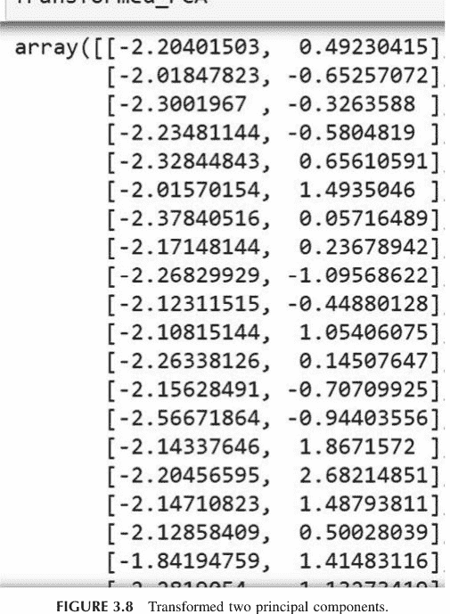

图 3.8 转换后的两个主成分。

“Transformed_PCA”以numpy数组的形式显示了两个主成分。接下来，让我们绘制这些生成的主成分，如下所示：

```python
plt.figure(figsize=(10,6))
plt.scatter(Transformed_PCA[:,0],Transformed_PCA[:,1])
plt.xlabel('First Principal Component')
plt.ylabel('Second Principal Component')
Python output=Fig. 3.9
```

要获取每个主成分的特征向量，即第一个成分中每个变量的系数与第二个成分的系数，可以在Python中使用“PCA.components_”。这些分数提供了对生成的两个主成分中影响最大的变量的见解。这些分数的范围在-1到1之间，-1和1的分数表示对成分的最大影响。

```python
df_components=pd.DataFrame(PCA.components_,columns=['Stage Spacing', 'Cluster Spacing', 'Sand per ft (# per ft)', 'Water per ft (gal per ft)'])
df_components
Python output=
```

| Stage Spacing | Cluster Spacing | Sand per ft (# per ft) | Water per ft (gal per ft) |
|---|---|---|---|
| 0 | 0.519427 | -0.271276 | 0.580313 | 0.565545 |
| 1 | 0.387659 | 0.919532 | 0.024583 | 0.059802 |

PCA成分。

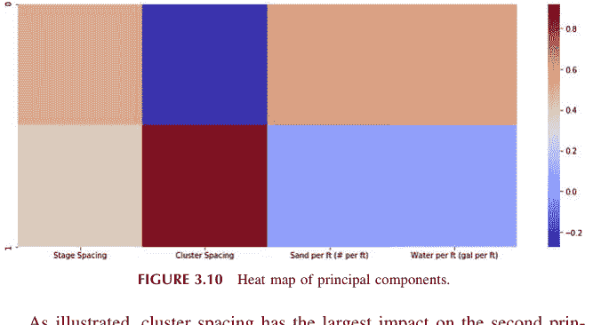

图 3.10 主成分热图。

如图所示，簇间距对第二主成分的影响最大，**得分为0.919532**。我们还可以通过seaborn库使用热图来可视化这一点。

```python
plt.figure(figsize=(15,6))
sns.heatmap(df_components,cmap='coolwarm')
Python output=Fig. 3.10
```

热图说明了各种特征与主成分之间的相关性关系。每个主成分显示为一行，得分较高的主成分与列中的特定特征更相关。这有助于识别对每个主成分特别重要的特征。这些主成分的简化版本现在可以用于输入到机器学习模型中。请记住，如果使用简化特征，在构建机器学习模型后很难得出这些特征重要性的结论。例如，如果八个特征被简化为两个特征，并且使用简化的维度保留了大部分数据，那么需要注意的是，理解这些特征对目标变量的影响将很困难。这是PCA的主要缺点之一。因此，如果目标是理解特定变量（特征）在回归或分类场景中对机器学习模型输出的敏感性，那么保留将用于敏感性分析的特征非常重要。最后，要将生成的两个主成分导出到CSV文件，让我们首先将numpy数组转换为数据框，然后将其写入Jupyter Notebook所在目录的csv文件中。

```python
transformed_PCA=pd.DataFrame(Transformed_PCA, columns=['First Principal Component', 'Second Principal Component'])
transformed_PCA.to_csv('Two Principal Components.csv')
Python output=A CSV file will get generated in the same folder that Jupyter Notebook resides.
```

## 非负矩阵分解（NMF）

NMF的主要目标是将一个矩阵分解为两个矩阵。NMF是一种矩阵分解技术。如前所述，PCA创建的因子可以是正的也可以是负的；然而，NMF只创建正因子。当高维数据集被转换为低维时，只要可以接受丢失一些原始特征，PCA是可取的。NMF的一些应用包括图像处理、转录过程、文本挖掘、加密编码/解码以及视频和音乐的分解。假设矩阵$A$被分解为两个矩阵$X$和$Y$，如下所示：

$$A \approx X \times Y$$

因此，对于维度为**m乘n**（$m \times n$）的矩阵$A$（矩阵的每个元素必须大于0，即$a_{ij}>=0$），NMF将矩阵$A$分解为维度为**m乘r**（$m \times r$）和**r乘n**（$r \times n$）的两个矩阵$X$和$Y$，其中每个元素$x_{ij}>=0$且$y_{ij}>=0$。

$$\begin{bmatrix} \ \ \ \end{bmatrix} \times \begin{bmatrix} \ \ \end{bmatrix} = \begin{bmatrix} \ \ \ \end{bmatrix}$$

$X$ $Y$ $A$

例如，假设$A$由$m$行$a_1, a_2, ..., a_m$组成，$X$由$n$行$x_1, x_2, ..., x_n$组成，$Y$由$K$行$y_1, y_2, ..., y_k$组成。$A$中的每一行可以被视为一个数据点。

$$A = \begin{bmatrix} a1 \ a2 \ a3 \ ... \ an \end{bmatrix} \quad X = \begin{bmatrix} \bar{x}1 \ \bar{x}2 \ \bar{x}3 \ ... \ \bar{x}n \end{bmatrix} \quad Y = \begin{bmatrix} y1 \ y2 \ y3 \ ... \ yn \end{bmatrix}$$

其中$\bar{x}i = [xi1xi2\cdots xin]$。让我们总结如下：

$$ai = [xi1 \quad xi2 \quad ... \quad xin] \times \begin{bmatrix} y1 \ y2 \ ... \ yn \end{bmatrix} = \sum_{j=1}^{n} xij \times yj$$

NMF的目标是最小化$A-XY$的平方距离，关于$X$和$Y$，注意$X$和$Y$必须大于或等于0。换句话说，目标是最小化以下函数：

$\|A - XY\|^2$ (3.18)

请注意，可以使用欧几里得或弗罗贝尼乌斯（将在后续章节中讨论）来最小化此类函数。有两种流行的数值方法来解决这个问题。第一种方法称为坐标下降法，其中固定$X$，使用梯度下降优化$Y$。然后固定$Y$，使用梯度下降优化$X$。重复此过程直到满足容差。另一种方法称为乘法技术。请注意，在这两种方法中，都会找到一个局部最小值，这通常足够有用（Cichocki & Phan, 2009）。

## 使用scikit-learn进行非负矩阵分解

让我们导入用于PCA的相同数据集，但这次应用NMF。如果为此练习创建了一个新的Jupyter Notebook，请确保在继续下一步之前导入pandas和numpy库。之后，让我们通过从sklearn包导入预处理库来规范化数据。该库用于数据规范化。请注意，“feature_range=(0,1)”本质上将使用本章前面讨论的规范化公式将数据规范化到0和1之间。

```python
df=pd.read_excel('Chapter3_Completions_DataSet.xlsx')
from sklearn import preprocessing
scaler=preprocessing.MinMaxScaler(feature_range=(0,1))
scaler.fit(df)
df_scaled=scaler.transform(df)
# After applying data normalization, df_scaled will be in an array
# format. Therefore, use pandas library to convert into a data frame as
# shown below.
df_scaled=pd.DataFrame(df_scaled, columns=['Stage Spacing',
'Cluster Spacing', 'Sand per ft (# per ft)', 'Water per ft (gal
per ft)'])
df_scaled
Python output=Fig. 3.11
```

接下来，让我们从“sklearn.decomposition”导入NMF库，并将两个成分应用于df_scaled数据集。之后，使用两个成分、cd求解器（坐标下降求解器）和frobenius损失函数应用NMF。请注意，“mu”是一种乘法更新求解器，也可以在求解器下使用。

| 阶段间距 | 射孔簇间距 | 每英尺砂量（磅/英尺） | 每英尺水量（加仑/英尺） |
|---|---|---|---|
| 0 | 0.222222 | 0.625000 | 0.067797 | 0.041667 |
| 1 | 0.166667 | 0.416667 | 0.067797 | 0.041667 |
| 2 | 0.111111 | 0.500000 | 0.050847 | 0.041667 |
| 3 | 0.083333 | 0.458333 | 0.084746 | 0.041667 |
| 4 | 0.194444 | 0.666667 | 0.067797 | 0.041667 |
| ... | ... | ... | ... | ... |
| 139 | 0.722222 | 0.458333 | 0.745763 | 0.833333 |
| 140 | 0.666667 | 0.458333 | 0.779661 | 0.958333 |
| 141 | 0.722222 | 0.458333 | 0.694915 | 0.916667 |
| 142 | 0.416667 | 0.291667 | 0.694915 | 0.750000 |
| 143 | 0.694444 | 0.500000 | 0.830508 | 0.916667 |

图 3.11 归一化特征。

| 阶段间距 | 射孔簇间距 | 每英尺砂量（磅/英尺） | 每英尺水量（加仑/英尺） |
|---|---|---|---|
| 0 | 1.4408 | 0.1877 | 1.9898 | 1.9848 |
| 1 | 0.6368 | 2.3017 | 0.0526 | 0.0000 |

图 3.12 NMF 成分。

```
from sklearn.decomposition import NMF
nmf=NMF(n_components=2, init=None, solver='cd',beta_loss='frobenius',random_state=100)
nmf_transformed=nmf.fit_transform(df_scaled)
df_scaled_components=pd.DataFrame(np.round(nmf.components_,4),
columns=df_scaled.columns)
df_scaled_components
Python output=Fig. 3.12
```

如观察所示，生成的成分均为正值。接下来，我们如下将这些成分绘制在热力图中（如果使用新的 Jupyter Notebook，请确保已导入可视化库）：

```
plt.figure(figsize=(15,6))
sns.heatmap(df_scaled_components,cmap='coolwarm')
Python output=Fig. 3.13
```

最后，最终的降维二维成分可如下获得：

```
nmf_transformed.
Python output=Fig. 3.14.
```

122 使用 Python 的油气机器学习指南

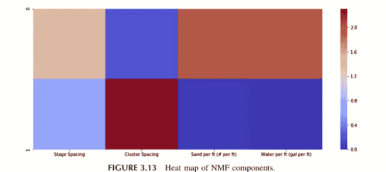

图 3.13 NMF 成分热力图。

| | 0 | 1 |
|---|---|---|
| 0 | 0.026080 | 0.270967 |
| 1 | 0.027337 | 0.180380 |
| 2 | 0.013042 | 0.211297 |
| 3 | 0.018034 | 0.190421 |
| 4 | 0.020670 | 0.286060 |
| ... | ... | ... |
| 139 | 0.401350 | 0.169978 |
| 140 | 0.426674 | 0.157624 |
| 141 | 0.408085 | 0.167790 |
| 142 | 0.340134 | 0.083775 |
| 143 | 0.430479 | 0.177035 |

图 3.14 使用 NMF 得到的最终降维二维成分。

## 参考文献

Cichocki, A., & Phan, A.-H. (2009). *大规模非负矩阵和张量分解的快速局部算法* (Vol.E92-A (3), pp. 708–721). 电子、信息与通信工程师学会. https://doi.org/10.1587/transfun.E92.A.708.

Halko, N., Martinsson, P.-G., & Tropp, J. (2009). 工业与应用数学学会. In *通过随机性发现结构：构建近似矩阵分解的概率算法*. https://arxiv.org/pdf/0909.4061.pdf.

Raschka, S. (n.d.). *关于特征缩放和归一化*. 检索于 2020 年 2 月 15 日, 来自 https://sebastianraschka.com/Articles/2014_about_feature_scaling.html#z-score-standardization-or-min-max-scaling. (原始作品发表于 2014).

# 第 4 章

## 无监督机器学习：聚类算法

### 无监督机器学习简介

如第 3 章所述，无监督**机器学习 (ML)** 算法可有力地应用于聚类分析。存在多种最常用的聚类算法类型。聚类算法在油气行业的一些应用包括：Ansari 等人提出的使用 k-means 聚类进行积液检测、感兴趣区域（类型曲线）聚类以及岩性分类聚类。使用聚类算法背后的思想是对数据进行聚类或划分。例如，如果期望的结果是将一口生产气井划分为积液与未积液状态，则可以使用聚类算法来进行这种划分。有人可能会问，Turner 和 Coleman 速率可以使用经验方程进行此类划分，但这些方法是为垂直常规井开发的，不适用于具有多级水力压裂的斜井和水平井。使用聚类技术允许人们独立于几十年前开发的经验方程进行此类分析，并利用数据的力量将每口井划分为积液与未积液状态。在油气行业使用无监督聚类技术的另一个例子是类型曲线聚类。勘探与生产运营商利用他们对区域的了解，如地质特征、生产动态、BTU 含量、与管道的距离等，来定义每个地层的类型曲线区域和边界。可以想象，考虑到所有会影响结果的特征，这个过程可能非常难以理解。因此，可以利用数据和无监督 ML 算法的力量将相似的区域聚类在一起。所有上述特征都可以用作无监督 ML 模型的输入特征，聚类算法将指示每一行数据属于哪个聚类。无监督算法在油气行业的另一个应用是岩性分类。监督和无监督 ML 模型都可用于岩性分类。如果使用无监督 ML 模型来实现此目的，其思想是使用自动化技术（而不是让地质学家手动进行）来自动化识别地质地层（如砂岩、石灰岩、页岩等）的过程。如果模型聚类得当，这些聚类算法在与人工解释进行比较时应提供相似的分类结果。聚类算法也可用于聚类一秒钟压裂阶段数据，以帮助筛选检测。在所有这些应用中，重要的是要注意，某些算法在第一次尝试时可能不会产生理想的结果。至关重要的是要更改/调整数据，直到算法理解聚类数据的最佳方式。例如，在对积液检测数据进行聚类时，仅向模型提供基本属性（如气量、套管压力、油管压力和管线压力）可能还不够。可能需要其他参数，如气量的斜率和标准差，以便模型能够根据领域专业知识正确地对数据进行聚类。ML 分析严重依赖领域专业知识来理解和深入理解问题。没有领域专业知识，大多数 ML 项目都可能导致不满意的结果。本章将讨论 k-means 聚类、层次聚类和基于密度的带噪声应用空间聚类 (DBSCAN)。此外，还将讨论其他无监督异常检测算法。

### K-means 聚类

K-means 是一种强大而简单的无监督 ML 算法，用于将数据聚类成不同的组。K-means 聚类也可用于异常值检测。K-means 聚类最大的挑战之一是确定必须使用的最佳聚类数量。领域专业知识在确定聚类数量方面起着关键作用。例如，如果意图是将干气井的数据聚类为积液与未积液状态，则领域专业知识指导使用两个聚类。另一方面，如果希望使用聚类来划分类型曲线区域，则应应用不同数量的聚类，并在确定定义类型曲线边界所需的聚类数量之前可视化结果。如果问题超级复杂，确定聚类数量根本不可行，则可以使用“肘部”法来了解可能需要的潜在聚类数量。在这种方法中，k-means 算法在不同的聚类数量（2 个聚类、3 个聚类等）下运行多次。然后，将“聚类数量”绘制在 x 轴上，“簇内误差平方和”绘制在 y 轴上，直到观察到肘点。将聚类数量增加到超过肘点不会显著改善 k-means 算法的结果。图 4.1 说明了在 4 个聚类时出现的肘点或最佳聚类数量。这种方法为选择聚类数量提供了一些见解，但测试更高的

## K-means 聚类是如何工作的？

将 K-means 聚类分解为逐步流程后，理解它实际上非常简单。因此，让我们来回顾一下将 K-means 聚类应用于任何数据时的逐步流程：

1.  **标准化数据**，因为基于距离度量的特征相似性是 K-means 聚类的关键。因此，不同的尺度可能会使结果偏向于具有较大值的特征。
2.  **确定聚类数量**，可以使用 (i) 肘部法则、(ii) 轮廓系数或 (iii) 层次聚类。如果不确定，可以编写一个 "for 循环" 来计算误差平方和与聚类数量的关系。之后，确定将要使用的聚类数量。
3.  数据集中质心的初始化可以是**随机初始化**或有目的地选择。大多数开源机器学习软件（包括 Python 的 scikit learn 库）的默认初始化方法是随机初始化。如果随机初始化效果不佳，仔细选择初始质心可能会对模型有所帮助。
4.  接下来，计算每个数据点（实例）与随机选择（或仔细选择）的聚类质心之间的距离。然后，根据下面介绍的距离计算（通常使用欧几里得距离）将每个数据点分配给每个聚类质心。例如，如果在数据集中随机选择了两个质心，模型将计算每个数据点到质心 #1 和 #2 的距离。在这种情况下，每个数据点将根据其到随机初始化的聚类质心的距离，被聚类到质心 #1 或 #2 下。计算距离的方法有多种。此步骤可以总结为根据距离将每个数据点分配给每个聚类质心。最接近质心 #1 的点将被分配给质心 #1，最接近质心 #2 的点将被分配给质心 #2。以下是常用的距离函数，其中最常见的是欧几里得距离函数：

    欧几里得距离函数 = $\sqrt{\sum_{k=1}^{n} (x_{ik} - \mu_{jk})^2}$

    曼哈顿距离函数 = $\sum_{k=1}^{n} |x_{ik} - \mu_{jk}|$ (4.2)

    闵可夫斯基距离函数 = $\left( \sum_{k=1}^{n} (|x_{ik} - \mu_{jk}|)^q \right)^{1/q}$

    其中，假设每个实例有 $n$ 个特征，可以计算第 $i$ 个实例 ($x_i$) 到聚类 $j$ 的质心 ($\mu_j$) 的距离。$q$ 代表范数的阶数。$q$ 等于 1 的情况代表曼哈顿距离，$q$ 等于 2 的情况代表欧几里得距离。

为了说明具有 3 个特征的数据集的欧几里得距离计算，让我们将欧几里得距离应用于以下两个向量：(3,9,−5) 和 (8,−1,12)

$$\sqrt{\sum_{i=1}^{k} (x_i - y_i)^2} = \sqrt{(8-3)^2 + (-1-9)^2 + (12-(-5))^2} = \sqrt{25 + 100 + 289} = \sqrt{414} = 20.35$$

5.  然后，找到分配给每个聚类质心（在步骤 4 中分配）的实例的平均值，并通过将聚类质心移动到每个聚类实例的平均值来重新计算每个聚类的新质心。
6.  由于在步骤 5 中已经创建了新的质心，在此步骤中，根据其中一个距离函数将每个数据点重新分配给新生成的质心。
7.  重复步骤 5 和 6，直到模型收敛。这表明额外的迭代不会导致最终质心选择发生显著变化。换句话说，聚类质心将不再移动。

图 4.2 展示了在二维空间数据集上应用 K-means 聚类的逐步工作流程。

K-means 与许多其他算法一样并非完美无缺，其主要缺点如下：

-   K-means 对离群点非常敏感。因此，在应用 K-means 聚类之前，请务必调查离群点。这回到了应用任何机器学习算法的最初步骤之一，即数据可视化。如果离群点无效，请确保在使用 K-means 算法之前将其移除。否则，请使用对噪声更稳健的算法，例如 DBSCAN（将稍后讨论）。
-   K-means 需要预先定义聚类数量。这也可以被归类为一个缺点。

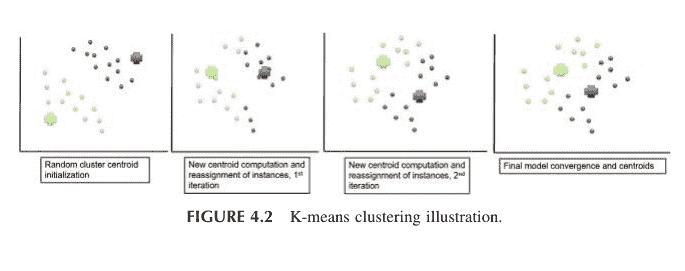

图 4.2 K-means 聚类示意图。

## 使用 scikit-learn 库的 K-means 聚类应用

K-means 聚类的应用之一是**典型曲线聚类**。典型曲线聚类可以根据各种因素确定，例如地质特征、生产动态、BTU 等。当前的行业实践是利用生产动态知识和地质领域专业知识来定义典型曲线边界。虽然这可能是一个可接受的解决方案，但使用像 K-means 这样的聚类算法可以提供对典型曲线边界更深入的见解，而无需人为认知偏差。因此，下面是一个包含 438 口井及其相应地质特征的数据集。虽然可以将其他特征（如生产动态）添加到此分析中，但此聚类的目标是仅使用地质特征对数据进行聚类。可以使用以下链接获取此合成生成的数据集：

https://www.elsevier.com/books-and-journals/book-companion/9780128219294

该数据集包括七个参数：伽马射线、体积密度、电阻率、含水饱和度、Phih（孔隙度*厚度）、TOC（总有机碳含量）和 TVD（真垂直深度）。Excel 文件名为 "Chapter4_Geologic_DataSet"。让我们首先导入必要的库，如下所示：

```python
import pandas as pd
import numpy as np
import matplotlib.pyplot as plt
import seaborn as sns
%matplotlib inline
```

接下来，让我们导入名为 "Chapter4_Geologic_DataSet" 的 Excel 数据集，并开始可视化每个参数的分布，以了解将用于聚类分析的基础数据。

```python
df=pd.read_excel('Chapter4_Geologic_DataSet.xlsx')
df.describe()
```

Python 输出=图 4.3

要可视化每个参数的分布，请使用下面的代码并更改列名以绘制每个特征。

| | GR_API | Bulk Density, gcc | Resistivity, ohm-m | Water Saturation, fraction | PhiH, ft | TOC, fraction | TVD, ft |
|---|---|---|---|---|---|---|---|
| count | 438.000000 | 438.000000 | 438.000000 | 438.000000 | 438.000000 | 438.000000 | 438.000000 |
| mean | 157.972603 | 2.242265 | 22.438356 | 0.159863 | 20.283105 | 0.063221 | 9935.125571 |
| std | 30.396528 | 0.019978 | 7.971895 | 0.037465 | 3.187825 | 0.008410 | 827.981530 |
| min | 66.000000 | 2.209100 | 5.000000 | 0.100000 | 10.000000 | 0.032000 | 8046.000000 |
| 25% | 139.000000 | 2.228425 | 17.000000 | 0.130000 | 19.000000 | 0.057000 | 9372.250000 |
| 50% | 155.000000 | 2.239300 | 22.000000 | 0.150000 | 20.000000 | 0.065000 | 9844.500000 |
| 75% | 178.000000 | 2.255925 | 26.000000 | 0.190000 | 22.000000 | 0.070000 | 10440.000000 |
| max | 259.000000 | 2.319600 | 49.000000 | 0.310000 | 33.000000 | 0.077000 | 12474.000000 |

图 4.3 地质数据描述。

以下是用于展示伽马射线分布的代码。只需使用其他列名即可绘制其他参数。

```python
sns.distplot(df['GR_API'], label='Clustering Data', norm_hist=True,
            color='g')
```

Python 输出=请绘制所有参数的分布图，**图 4.4** 将是结果。

接下来，让我们绘制所有参数之间的热力图，以寻找潜在的共线性特征。

```python
fig=plt.figure(figsize=(15,8))
sns.heatmap(df.corr(), cmap='coolwarm', annot=True, linewidths=4,
            linecolor='black')
```

Python 输出=**图 4.5**

如**图 4.5**所示，TOC（总有机碳含量）与体积密度具有-0.99的负皮尔逊相关系数。这是合理的，因为TOC是从体积密度派生出的计算特征。因此，让我们使用下面的代码行将TOC从分析中移除，因为在聚类时，TOC和体积密度会提供相同的信息。下面的代码行将永久地从“df”数据框中删除TOC。请记住，当希望永久删除目标列时，需要使用“inplace = True”。

```python
df.drop(['TOC, fraction'], axis=1, inplace=True)
```

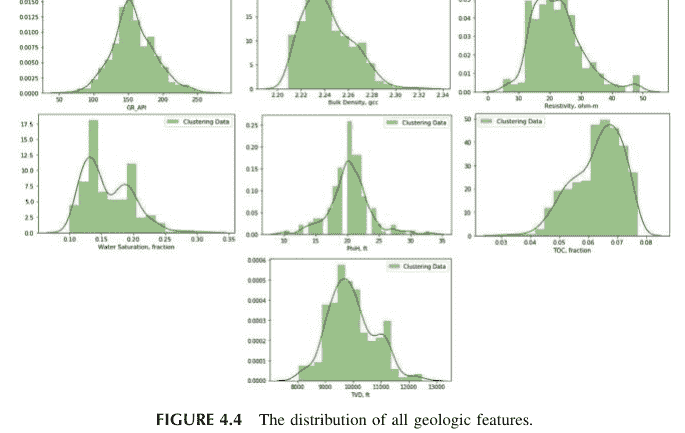

**图 4.4** 所有地质特征的分布。

132 使用Python的油气机器学习指南

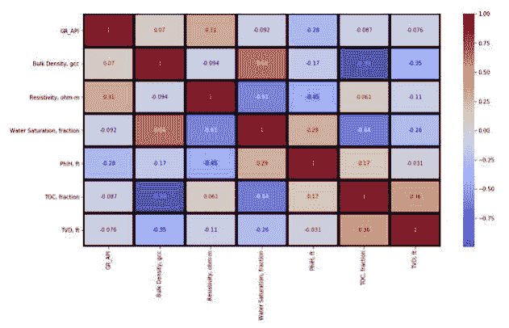

**图 4.5** 地质特征热力图。

接下来，让我们导入StandardScaler库，并在将数据输入k-means算法之前对数据进行标准化：

```python
from sklearn.preprocessing import StandardScaler
scaler=StandardScaler()
df_scaled=scaler.fit(df)
df_scaled=scaler.transform(df)
df_scaled
```

Python 输出=图 4.6

接下来，让我们导入k-means库，并编写一个for循环来计算簇内误差平方和。之后，让我们使用matplotlib库绘制簇数量（x轴）与簇内误差平方和（y轴）的关系图：

```python
from sklearn.cluster import KMeans
distortions=[]
for i in range (1,21):
    km=KMeans(n_clusters=i,random_state=1000,
    init='k-means++', n_init=1000, max_iter=500)
    km.fit(df_scaled)
    distortions.append(km.inertia_)
plt.plot(range(1,21),distortions, marker='o')
plt.xlabel('Number of Clusters')
plt.ylabel('Distortion (Within Cluster Sum of Squared Errors)')
plt.title('The Elbow Method showing the optimal k')
```

Python 输出=图 4.7

```
array([[-1.31654221, -1.63691997,  0.07053355, -0.79799783,  0.85324677,
         0.88856422],
       [ 0.39613573, -1.19092098, -0.18063471,  0.27088   , -0.08890975,
        -0.00377924],
       [ 0.26439127, -0.81507913, -1.05972362,  1.07253837,  0.22514243,
        -0.22746968],
       ...,
       [-0.03203375,  0.96891686, -0.30621884,  0.27088   , -0.7170141 ,
        -1.12102229],
       [-0.52607547,  0.50287296, -1.05972362,  1.33975783,  0.5391946 ,
         0.55846969],
       [-0.32845878, -0.45928217, -0.43180297,  0.27088   ,  1.16729895,
        -0.65913177]])
```

**图 4.6** 标准化后的地质数据。

n_clusters代表在应用k-means聚类时希望选择的簇数量。在本例中，由于目标是绘制从1到20的不同簇数量，因此n_clusters被设置为“i”，而“i”被定义为1到21之间的范围。术语“init”指的是初始化方法，可以设置为“random”，这将随机初始化质心。本例中使用了一种更可取的方法，称为“k-means++”，根据scikit库的定义，它指的是以一种智能的方式选择初始聚类中心以加速收敛。使用“k-means++”初始化质心使其彼此远离，这可能比随机初始化产生更好的结果（Clustering, n.d.）。“max_iter”指的是单次运行的最大迭代次数。“random_state”被设置为1000，以便在确定质心初始化的随机数生成时具有可重复的方法。换句话说，如果再次运行，k-means的结果将是相同的，因为使用了相同的种子数来生成随机数。默认值

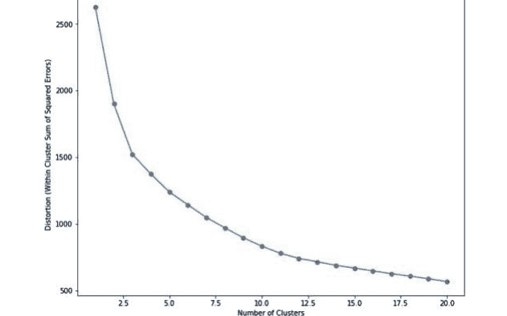

**图 4.7** 肘部点。

“n_jobs”的默认值为1，这意味着在执行和运行k-means聚类时将使用1个处理器。如果选择-1，则将使用所有可用的处理器。请注意，选择“n_jobs = -1”可能导致Python占用大量CPU，其他任务的响应速度会因此变慢；因此，请确定您的计算机可以处理的处理器数量，并相应地选择n_jobs。在上面的for循环中，使用定义的参数创建了一个k-means聚类类的实例，并将其分配给变量“km”。之后，使用参数“df_Scaled”（即标准化数据）调用了方法“km.fit”。接下来，惯性结果被追加到最初定义的名为“distortions”的空列表中。其余代码只是在线图中绘制x和y。要获取惯性数字列表，只需输入“print(distortions)”。

```python
print(distortions)
```

Python 输出=图 4.8

肘部技术的目的是找到要选择的期望簇数量。在这个合成生成的地质数据集中，没有关于要选择的簇数量的先验知识。因此，根据图 4.7所示的肘部点，选择了10个簇。从失真值可以看出，随着簇数量的增加，当前簇点与先前簇点之间的惯性值差异减小。请注意，10个簇不是一个精确的解决方案，可以选择更多或更少的簇来查看这些井中簇分布与簇数量的关系。

下一步是假设10个簇，并继续进行标记数据集和获取每个簇质心的下一阶段。在下面的代码中，使用了相同的假设（random_state = 1000, init = 'k-means++', n_init = 1000, max_iter = 500）和10个簇。之后，使用“kmeans.cluster_centers_”获取10个簇和6个地质特征的聚类质心。请注意，这些质心是标准化版本，必须使用逆转换将其转换回原始形式才有意义。

```python
n=10
kmeans=KMeans(n_clusters=n,random_state=1000,init='k-means++',
    n_init=1000, max_iter=500)
kmeans=kmeans.fit(df_scaled)
print(kmeans.cluster_centers_)
```

Python 输出=图 4.9

[2628.0, 1900.0636934980364, 1522.4518114963212, 1374.229197843318, 1239.1811054000568, 1143.0882975129625, 1048.4651256952159, 970.4133087183873, 896.0488099115373, 832.6979063326, 779.337555936982, 741.3035042464755, 715.511223018482, 689.2615091696939, 668.1997271560688, 647.2713751646522, 626.2988895440585, 608.0596346197101, 588.1268896977692, 566.9805505987356]

**图 4.8** 惯性数字。

```
[[-0.81376234 -0.84668052  0.35502005 -0.76527708  0.34691776 -0.3705674 ]
 [-0.63019609  1.182783   -0.5776426   0.96478859 -0.16489011 -0.19384786]
 [-0.11678936 -0.20043572 -0.82697437  0.63429846  0.19583089 -0.31751012]
 [-0.93899675 -0.870945   -0.27133436 -0.74851275 -0.01330459  1.5069037 ]
 [ 1.49714297  1.42135886  2.61809734 -0.89343335 -2.06295198 -0.64341298]
 [ 0.93027358  1.88836765 -0.92867931  2.10656149  0.29341464 -0.76343302]
 [ 0.93004747 -0.96638294  0.37457934 -0.77924559  0.21963274  0.61264753]
 [ 1.82650412 -0.05790694  0.36356319 -0.61985153 -1.55448656  0.7942515 ]
 [ 0.29438666  0.14662858  1.25909764 -0.59758324 -0.67775757 -0.76365738]
 [-0.43702597  0.55465562 -0.72948387  0.94387715  2.20250797 -0.35747435]]
```

**图 4.9** 标准化后的聚类质心。

下一步是获取每口井的标签。只需按如下方式调用“kmeans.labels_”：

```python
labels=kmeans.labels_
labels
```

Python 输出=图 4.10

接下来，让我们将“df_scaled”从数组转换为数据框，并将每口井的标签簇添加到该数据框中，如下所示：

```python
df_scaled=pd.DataFrame(df_scaled,columns=df.columns[0:6])
df_scaled['clusters']=labels
df_scaled
```

Python 输出=图 4.11

```
array([3, 2, 2, 2, 0, 9, 4, 0, 6, 6, 1, 9, 1, 1, 6, 8, 3, 1, 3, 8, 8, 0,
       3, 7, 8, 2, 9, 2, 3, 2, 5, 1, 6, 1, 2, 5, 8, 6, 0, 9, 9, 1, 1, 2,
       8, 9, 7, 8, 3, 1, 8, 8, 0, 0, 0, 6, 3, 0, 6, 1, 2, 0, 3, 9, 2, 6,
       3, 4, 4, 6, 2, 2, 3, 0, 7, 4, 3, 1, 5, 8, 9, 2, 6, 6, 6, 3, 9, 1,
       8, 0, 8, 4, 3, 6, 6, 1, 1, 1, 1, 1, 9, 6, 6, 0, 2, 9, 0, 0, 5, 9,
       9, 7, 0, 0, 0, 8, 3, 7, 6, 8, 9, 1, 2, 6, 2, 8, 2, 8, 8, 6, 0, 8,
       9, 2, 8, 0, 1, 8, 3, 7, 3, 7, 5, 0, 2, 2, 3, 8, 9, 0, 1, 3, 1, 9,
       7, 0, 8, 3, 2, 8, 5, 6, 3, 8, 4, 2, 5, 9, 3, 8, 0, 2, 8, 1, 1, 2,
       3, 0, 3, 6, 3, 0, 5, 8, 1, 9, 9, 1, 2, 2, 1, 2, 3, 0, 2, 5, 5, 7,
       3, 4, 3, 4, 0, 6, 8, 8, 3, 3, 6, 3, 8, 8, 5, 0, 1, 2, 2, 1, 2, 7,
       1, 1, 1, 1, 9, 8, 8, 4, 5, 5, 5, 0, 6, 6, 3, 6, 2, 3, 2, 2, 8, 6,
       8, 4, 8, 5, 2, 2, 1, 2, 3, 7, 4, 8, 6, 1, 2, 2, 1, 2, 2, 2, 2, 2,
       1, 1, 6, 0, 6, 0, 8, 2, 2, 1, 2, 9, 3, 7, 0, 3, 2, 3, 2, 5, 8, 1,
       1, 9, 5, 9, 3, 3, 8, 7, 0, 6, 2, 2, 8, 8, 8, 2, 5, 6, 6, 6, 3, 0,
       3, 1, 2, 2, 4, 0, 6, 7, 2, 3, 1, 2, 1, 6, 3, 3, 3, 3, 6, 7, 6, 2,
       2, 9, 9, 8, 1, 0, 6, 3, 8, 7, 7, 6, 8, 0, 3, 6, 0, 2, 2, 1, 1, 2,
       1, 6, 3, 6, 3, 6, 6, 2, 2, 2, 0, 3, 6, 6, 6, 8, 8, 6, 6, 3, 7, 2,
       2, 1, 1, 2, 2, 2, 4, 1, 1, 2, 9, 2, 0, 3, 6, 5, 1, 5, 0, 8, 8, 0,
       6, 1, 5, 5, 0, 1, 1, 1, 2, 7, 6, 7, 6, 6, 3, 8, 1, 4, 8, 8, 8, 0,
       8, 0, 7, 2, 5, 0, 0, 3, 1, 8, 0, 7, 3, 2, 2, 0, 1, 1, 1, 2])
```

**图 4.10** K-means标签。

| GR_API | 体积密度，克/立方厘米 | 电阻率，欧姆-米 | 含水饱和度，分数 | PhiH，英尺 | 垂深，英尺 | 聚类 |
|---|---|---|---|---|---|---|
| 0 | -1.316542 | -1.636920 | 0.070534 | -0.797998 | 0.853247 | 0.888564 | 3 |
| 1 | 0.396136 | -1.190921 | -0.180635 | 0.270880 | -0.088910 | -0.003779 | 2 |
| 2 | 0.264391 | -0.815079 | -1.059724 | 1.072538 | 0.225142 | -0.227470 | 2 |
| 3 | 0.264391 | -0.815079 | -1.059724 | 1.072538 | 0.225142 | -0.227470 | 2 |
| 4 | -0.756628 | -0.599596 | -0.055051 | 0.003661 | 1.167299 | -0.862267 | 0 |
| ... | ... | ... | ... | ... | ... | ... | ... |
| 433 | -1.151862 | -0.579552 | 0.196118 | -0.530778 | 0.539195 | -0.399167 | 0 |
| 434 | -0.559012 | 0.878715 | -0.306219 | 1.072538 | -0.402962 | 0.182428 | 1 |
| 435 | -0.032034 | 0.968917 | -0.306219 | 0.270880 | -0.717014 | -1.121022 | 1 |
| 436 | -0.526075 | 0.502873 | -1.059724 | 1.339758 | 0.539195 | 0.558470 | 1 |
| 437 | -0.328459 | -0.459282 | -0.431803 | 0.270880 | 1.167299 | -0.659132 | 2 |

438 行 × 7 列

图 4.11 标准化后的带标签数据。

接下来，让我们通过将每个变量乘以其标准差并加上其均值，将数据恢复到原始（未标准化）形式，如下所示。请注意，scikit-learn 中的 `scaler.inverse_transform()` 也可以用于将数据转换回其原始形式。请确保在 Jupyter Notebook 中复制以下代码时，代码是连续的。例如，由于空间限制，下面代码中的 `df_scaled['Water Saturation, fraction']` 被分成了两行。因此，请确保代码行连续，以避免出现错误。

```
df_scaled['GR_API']=(df_scaled['GR_API']*(df['GR_API'].std())+df['GR_API'].mean())
df_scaled['Bulk Density, gcc']=(df_scaled['Bulk Density, gcc']*(df['Bulk Density, gcc'].std())+df['Bulk Density, gcc'].mean())
df_scaled['Resistivity, ohm-m']=(df_scaled['Resistivity, ohm-m']*(df['Resistivity, ohm-m'].std())+df['Resistivity, ohm-m'].mean())
df_scaled['Water Saturation, fraction']=(df_scaled['Water Saturation, fraction']*(df['Water Saturation, fraction'].std())+df['Water Saturation, fraction'].mean())
df_scaled['PhiH, ft']=(df_scaled['PhiH, ft']*(df['PhiH, ft'].std())+df['PhiH, ft'].mean())
df_scaled['TVD, ft']=(df_scaled['TVD, ft']*(df['TVD, ft'].std())+df['TVD, ft'].mean())
```

为了获得易于理解的聚类质心版本，让我们按 `clusters` 进行分组，并取每个聚类的均值，如下所示：

```
Group_by=df_scaled.groupby(by='clusters').mean()
Group_by
Python output=Fig. 4.12
```

| 聚类 | GR_API | 体积密度，克/立方厘米 | 电阻率，欧姆-米 | 含水饱和度，分数 | PhiH，英尺 | 垂深，英尺 |
|---|---|---|---|---|---|---|
| 0 | 133.237053 | 2.225350 | 25.268539 | 0.131192 | 21.389018 | 9628.302607 |
| 1 | 138.816830 | 2.265895 | 17.833450 | 0.196009 | 19.757464 | 9774.623125 |
| 2 | 154.422612 | 2.238261 | 15.845803 | 0.183627 | 20.907380 | 9672.233056 |
| 3 | 129.430362 | 2.224865 | 20.275307 | 0.131820 | 20.240692 | 11182.814005 |
| 4 | 203.480551 | 2.270661 | 43.309553 | 0.126390 | 13.706774 | 9402.391509 |
| 5 | 186.249690 | 2.279991 | 15.035022 | 0.238786 | 21.218460 | 9303.017133 |
| 6 | 186.242817 | 2.222959 | 25.424463 | 0.130668 | 20.983256 | 10442.386413 |
| 7 | 213.491986 | 2.241108 | 25.336644 | 0.136640 | 15.327673 | 10592.751143 |
| 8 | 166.920935 | 2.245194 | 32.475750 | 0.137474 | 18.122532 | 9302.831362 |
| 9 | 144.688531 | 2.253346 | 16.622987 | 0.195226 | 27.304316 | 9639.143409 |

图 4.12 易于理解的聚类质心。

如图 4.12 所示，每个聚类质心代表每个特征平均值的平均值。例如，聚类 3（因为索引从 0 开始）的平均 GR 为 154.422 API，体积密度为 2.238 克/立方厘米，电阻率为 15.845 欧姆-米，含水饱和度为 18.3627%，Phi*H 为 20.907 英尺，垂深为 9672.233 英尺。

下一步是了解每个聚类的计数数量。让我们使用以下代码行来获取它。

```
df_scaled.groupby(by='clusters').count()
Python output=Fig. 4.13
```

类型曲线聚类的最后一步是根据井的经纬度在地图上绘制这些井，以评估聚类结果。此外，领域专业知识在确定最佳聚类数量以成功定义类型曲线区域/边界方面起着关键作用。例如，如果您的公司区块内目前有 10 个类型曲线区域，那么可以使用 10 个聚类作为起点来评估 k-means 聚类的结果。对于这个合成数据集，忽略了绘制和评估聚类结果的最后一步。但是，请确保始终可视化聚类结果，并相应地调整所选的聚类数量。

| 聚类 | GR_API | 体积密度，克/立方厘米 | 电阻率，欧姆-米 | 含水饱和度，分数 | PhiH，英尺 | 垂深，英尺 |
|---|---|---|---|---|---|---|
| 0 | 49 | 49 | 49 | 49 | 49 | 49 |
| 1 | 62 | 62 | 62 | 62 | 62 | 62 |
| 2 | 75 | 75 | 75 | 75 | 75 | 75 |
| 3 | 54 | 54 | 54 | 54 | 54 | 54 |
| 4 | 14 | 14 | 14 | 14 | 14 | 14 |
| 5 | 23 | 23 | 23 | 23 | 23 | 23 |
| 6 | 57 | 57 | 57 | 57 | 57 | 57 |
| 7 | 21 | 21 | 21 | 21 | 21 | 21 |
| 8 | 56 | 56 | 56 | 56 | 56 | 56 |
| 9 | 27 | 27 | 27 | 27 | 27 | 27 |

图 4.13 每个聚类质心中的井数。

## K-means 聚类应用：手动计算示例

来自 500 口井的生产数据，如气产量、套管压力、油管压力和管线压力，被收集到一个数据源中。在使用 k-means++ 初始化和 **欧几里得距离** 函数应用 **两个聚类** 的 k-means 聚类后，数据收敛到两个聚类质心，如表 4.1 所示。请指出以下数字将属于哪个聚类（1 或 2）：

解答：步骤 1) 计算从给定点到 **聚类 1** 的欧几里得距离函数，如下所示：气产量= 4200 千标准立方英尺/天，套管压力= 800 磅/平方英寸，油管压力= 700 磅/平方英寸，管线压力= 500 磅/平方英寸

聚类 1 到给定点的距离 =

```
$\sqrt{(4200 - 4300)^2 + (800 - 640)^2 + (700 - 520)^2 + (500 - 360)^2} = 360$
```

步骤 2) 计算从给定点到 **聚类 2** 的欧几里得距离函数，如下所示：

聚类 2 到给定点的距离 =

```
$\sqrt{(4200 - 3900)^2 + (800 - 2050)^2 + (700 - 590)^2 + (500 - 500)^2} = 1194$
```

步骤 3) 如果计算出的距离最小，则分配给聚类 1。在此示例中，聚类 1（步骤 1）的计算距离小于聚类 2（步骤 2）的计算距离。因此，这些提议的数字（本示例中提供）将被聚类为聚类 1。如果有多个聚类质心，只需计算每个感兴趣的新数据行到每个聚类质心的距离，并使用 if 语句将每行数据分配到每个聚类。最小的距离将分配给第一个聚类，最大的距离将分配给最后一个聚类，中间的可以按其距离大小的顺序分配。请注意，生成的 k-means 聚类质心可以很容易地编程为实时检测积液。

| 属性 | 聚类 1 | 聚类 2 |
| :--- | :--- | :--- |
| 气产量（千标准立方英尺/天） | 4300 | 3900 |
| 套管压力（磅/平方英寸） | 640 | 2050 |
| 油管压力（磅/平方英寸） | 520 | 590 |
| 管线压力（磅/平方英寸） | 360 | 500 |
| 气产量 = 4200 千标准立方英尺/天，套管压力 = 800 磅/平方英寸，油管压力 = 700 磅/平方英寸，管线压力 = 500 磅/平方英寸。 | | |

## 轮廓系数

评估聚类质量的另一个指标称为轮廓分析。轮廓分析也可以应用于其他聚类算法。轮廓系数的范围在 -1 和 1 之间，其中较高的轮廓系数表示模型具有更 **连贯** 的聚类。换句话说，接近 +1 的轮廓系数意味着样本远离相邻聚类。值为 0 意味着样本位于两个相邻聚类之间的决策边界上或非常接近该边界。最后，负值表明样本可能被错误地分配到了错误的聚类（Rousseeuw, 1987）。

要计算轮廓系数，必须计算聚类内聚度 (a) 和聚类分离度 (b)。聚类内聚度是指一个实例（样本）与同一聚类中所有其他数据点之间的平均距离，而聚类分离度是指一个实例（样本）与最近聚类中所有其他数据点之间的平均距离。轮廓系数可以如下所示计算。轮廓系数本质上是聚类分离度与内聚度之差除以两者中的最大值（Rousseeuw, 1987）。

$$s = \frac{b - a}{\max(a, b)}$$

## scikit-learn 库中的轮廓系数

让我们应用轮廓系数，并使用图形工具绘制聚类中样本聚集紧密程度的度量。**请确保将此代码放在数据未标准化之前。** `silhouette_vals = silhouette_samples(df_scaled,labels,metric = 'euclidean')` 中使用的 `df_scaled` 指的是数据未标准化之前的 `df_scaled`。

```
from matplotlib import cm
from sklearn.metrics import silhouette_samples
cluster_labels=np.unique(labels)
n_clusters=cluster_labels.shape[0]
silhouette_vals=silhouette_samples(df_scaled,labels,
    metric='euclidean')
y_ax_lower, y_ax_upper=0,0
```

yticks=[]
for i, c in enumerate(cluster_labels):
    c_silhouette_vals=silhouette_vals[labels==c]
    c_silhouette_vals.sort()
    y_ax_upper +=len(c_silhouette_vals)
    color=cm.jet(float(i)/n_clusters)
    plt.barh(range(y_ax_lower,y_ax_upper),c_silhouette_vals,
        height=1,edgecolor='none',color=color)
    yticks.append((y_ax_lower+y_ax_upper)/2.)
    y_ax_lower +=len(c_silhouette_vals)
silhouette_avg=np.mean(silhouette_vals)
plt.axvline(silhouette_avg,color="red",linestyle="--")
plt.yticks(yticks, cluster_labels +1)
plt.ylabel('Cluster')
plt.xlabel('silhouette coefficient')

Python 输出=图 4.14

参考文献：Raschka and Mirjalili, 2019, Python Machine Learning: Machine Learning and Deep Learning with Python, scikit-learn, and TensorFlow 2, Packt.

如图 4.14 所示，所有簇的平均轮廓系数约为 0.41。可以使用不同的簇数重复此过程，以找到使用不同簇数时的平均轮廓系数。具有最大平均轮廓值的簇数是理想的。

## 层次聚类

另一种强大的无监督机器学习算法被称为层次聚类。层次聚类是一种将相似实例分组到簇中的算法。层次聚类与 k-means 聚类一样，使用**基于距离的算法**来测量簇之间的距离。层次聚类主要有两种类型，如下所示：

- 1) **凝聚层次聚类（加法层次聚类）：** 在这种类型中，每个点被分配到一个簇。例如，如果数据集中有 10 个点，在应用层次聚类开始时将有 10 个簇。之后，基于距离函数（如欧几里得距离），将最近的簇对合并。此迭代重复进行，直到只剩下一个簇。
- 2) **分裂层次聚类：** 这种类型的层次聚类的工作方式与凝聚层次聚类相反。因此，如果有 10 个数据点，所有数据点最初将属于一个单一的簇。之后，将簇中最远的点分裂出来，此过程持续进行，直到每个簇只有一个点。

为了进一步解释层次聚类的概念，让我们逐步了解一个将凝聚层次聚类应用于包含 4 口井及其各自 EUR 的小型数据集的示例，如下所示。请注意，由于这是一维数据，在计算距离之前未对数据进行标准化。换句话说，对于这个特定示例，不标准化数据是可以的。

4 口井数据集

| 井号 | EUR/1000 ft (BCF/1000 ft) |
| :--- | :--- |
| 1 | 1.4 |
| 2 | 1.2 |
| 3 | 2.5 |
| 4 | 2.0 |

步骤 1) 解决此问题的第一步是创建**邻近矩阵**。邻近矩阵简单地存储每两个点之间的距离。为了为此示例创建邻近矩阵，创建了一个 n 乘 n 的方阵。n 代表观测值的数量。因此，可以创建一个如表 4.2 所示的 4*4 邻近矩阵。

矩阵的对角线元素将为 0，因为每个元素到自身的距离为 0。为了计算点 1 和点 2 之间的距离，让我们使用欧几里得距离函数，如下所示：

$$\sqrt{(1.2 - 1.4)^2} = 0.2$$

类似地，表 4.2 中其余的距离也是这样计算的。接下来，识别邻近矩阵中的最小距离，并合并具有最小距离的点。从该表中可以看出，最小距离是点 1 和点 2 之间的 0.2。因此，可以合并这两个点。让我们更新簇，然后更新邻近矩阵。要将点 1 和点 2 合并在一起，可以选择平均值、最大值或最小值。对于此示例，选择了最大值。因此，井号 1 和 2 之间的最大 EUR/1000 ft 为 1.4。

更新后的簇（井 1 和 2 合并为一个簇）

| 井号 | EUR/1000 ft (BCF/1000FT) |
| :--- | :--- |
| (1,2) | 1.4 |
| 3 | 2.5 |
| 4 | 2.0 |

让我们使用新的合并簇重新创建邻近矩阵，如表 4.3 所示。

簇 3 和 4 现在（如表 4.3 中粗体所示）可以合并为一个簇，最小距离为 0.5。井号 3 和 4 之间的最大 EUR/1000 ft 为 2.5。让我们更新表格如下：

更新后的簇（井 3 和 4 合并为一个簇）

| 井号 | EUR/1000 ft (BCF/1000 ft) |
| :--- | :--- |
| 1,2 | 1.4 |
| 3,4 | 2.5 |

最后，让我们重新创建邻近矩阵，如表 4.4 所示。现在，所有簇 1、2、3 和 4 可以合并为一个簇。这本质上就是凝聚层次聚类的工作原理。示例问题从四个簇开始，以一个簇结束。

表 4.2 邻近矩阵，第一次迭代。

| 井号 | 1 | 2 | 3 | 4 |
| :--- | :--- | :--- | :--- | :--- |
| 1 | 0 | **0.2** | 1.1 | 0.6 |
| 2 | **0.2** | 0 | 1.3 | 0.8 |
| 3 | 1.1 | 1.3 | 0 | 0.5 |
| 4 | 0.6 | 0.8 | 0.5 | 0 |

表 4.3 邻近矩阵，第二次迭代。

| 井号 | 1,2 | 3 | 4 |
| :--- | :--- | :--- | :--- |
| 1,2 | 0 | 1.1 | 0.6 |
| 3 | 1.1 | 0 | **0.5** |
| 4 | 0.6 | **0.5** | 0 |

表 4.4 邻近矩阵，第三次迭代。

| 井号 | 1,2 | 3,4 |
| :--- | :--- | :--- |
| 1,2 | 0 | 1.1 |
| 3,4 | 1.1 | 0 |

## 树状图

树状图用于显示对象之间的层次关系，是层次聚类的输出。树状图可能有助于在应用层次聚类时确定要选择的簇数。树状图也有助于获取数据的整体结构。为了说明使用树状图的概念，让我们为上面的层次聚类示例创建一个树状图。如图 4.15 所示，井号 1 和 2 之间的距离为 0.2，如 y 轴（距离）所示，井号 3 和 4 之间的距离为 0.5。最后，合并的簇 1,2 和 3,4 相连，距离为 1.1。

图 4.15 树状图示例。

树状图中较长的垂直线表示簇之间的距离较大。根据一般经验法则，识别具有最长距离或分支（垂直线）的簇。较短的分支彼此更相似。例如，在图 4.15 中，一个簇组合了两个较小的分支（簇 1 和 2），另一个簇组合了另外两个较小的分支（簇 3 和 4）。因此，在此示例中可以选择两个簇。请注意，最佳簇数是主观的，可能受到问题、问题的领域知识和应用的影响。

## 在 scikit-learn 库中实现树状图和层次聚类

让我们使用 scikit-learn 库来应用树状图和层次聚类。请创建一个新的 Jupyter Notebook，并开始导入主要库，然后使用以下链接访问层次聚类数据集，该数据集包含 200 口井及其各自的原始地质储量（GIP）和 EUR/1000 ft。

https://www.elsevier.com/books-and-journals/book-companion/9780128219294

```python
import pandas as pd
import numpy as np
import matplotlib.pyplot as plt
import seaborn as sns
%matplotlib inline
df=pd.read_excel('Chapter4_GIP_EUR_DataSet.xlsx')
df.describe()
```

Python 输出=图 4.16

| | GIP (BCFperSection) | EURper1000ft |
|---|---|---|
| **计数** | 200.00000 | 200.000000 |
| **均值** | 199.84800 | 2.201754 |
| **标准差** | 86.67358 | 1.132611 |
| **最小值** | 49.50000 | 0.043860 |
| **25%** | 136.95000 | 1.524123 |
| **50%** | 202.95000 | 2.192982 |
| **75%** | 257.40000 | 3.201754 |
| **最大值** | 452.10000 | 4.342105 |

图 4.16 df 描述。

接下来，让我们在应用层次聚类之前对数据进行标准化，如下所示：

```python
from sklearn.preprocessing import StandardScaler
scaler = StandardScaler()
df_scaled = scaler.fit(df)
df_scaled = scaler.transform(df)
```

接下来，让我们创建树状图。首先，导入 `scipy.cluster.hierarchy as shc` 库。请确保在 `dend = shc.dendrogram(shc.linkage(df_scaled, method = 'ward'))` 中传入 `df_scaled`，即数据集的标准化版本。

```python
import scipy.cluster.hierarchy as shc
plt.figure(figsize=(15, 10))
dend = shc.dendrogram(shc.linkage(df_scaled, method='ward'))
plt.title("Dendrogram")
plt.xlabel('Samples')
plt.ylabel('Distance')
Python output = Fig. 4.17
```

如图 4.17 所示，黑色虚线与 5 条垂直线相交。这条黑色水平虚线是基于观察到的最长距离或分支绘制的，具有主观性。因此，你可以随意调整 `n_clusters`

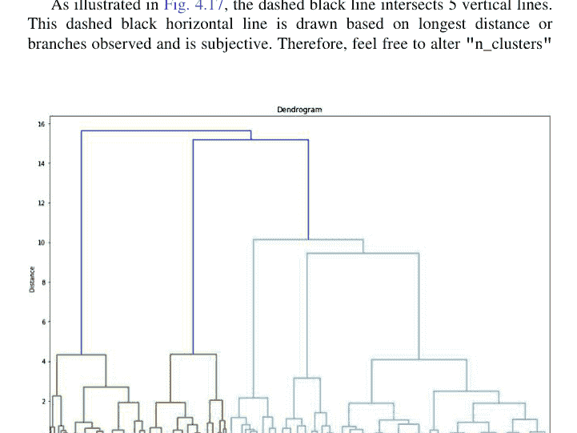

图 4.17 生成的树状图。

并可视化聚类结果。现在，让我们导入凝聚聚类，并将凝聚聚类应用于 `df_scaled` 数据框。在 `AgglomerativeClustering` 中，可以通过属性 `n_clusters` 访问所需的聚类数量，`affinity` 返回用于计算链接的度量。在此示例中，选择了欧几里得距离。链接决定了观测集之间使用哪种距离。`linkage` 参数可以设置为 (i) ward, (ii) average, (iii) complete 或 maximum, 以及 (iv) single。

根据 scikit-learn 库，`ward` 最小化被合并簇的方差。`average` 使用两个集合中每个观测值之间距离的平均值。`complete` 或 `maximum` 链接使用两个集合中所有观测值之间的最大距离。`single` 使用两个集合中所有观测值之间的最小距离。本示例中使用了默认的 `ward` 链接。在 `HC` 下定义层次聚类标准后，将 `fit_predict()` 应用于标准化数据集 (df_scaled)。

```python
from sklearn.cluster import AgglomerativeClustering
HC = AgglomerativeClustering(n_clusters=5, affinity='euclidean', linkage='ward')
HC = HC.fit_predict(df_scaled)
HC
Python output = Fig. 4.18.
```

让我们使用 pandas 的 `pd.DataFrame` 将 `df_scaled` 转换为数据框。然后，如下所示，将轮廓系数应用于此数据集。

```python
df_scaled = pd.DataFrame(df_scaled, columns=df.columns[0:2])
df_scaled['Clusters'] = HC
df_scaled
Python output = Fig. 4.19
```

```
array([4, 3, 4, 3, 4, 3, 4, 3, 4, 3, 4, 3, 4, 3, 4, 3, 4, 3, 4, 3, 4, 3,
       4, 3, 4, 3, 4, 3, 4, 3, 4, 3, 4, 3, 4, 3, 4, 3, 4, 3, 4, 3, 4, 3,
       4, 3, 4, 3, 4, 3, 4, 3, 4, 3, 4, 3, 4, 3, 4, 3, 4, 3, 4, 3, 4, 3,
       4, 3, 4, 3, 4, 3, 4, 3, 4, 3, 4, 3, 4, 3, 4, 3, 4, 3, 4, 3, 4, 3,
       4, 3, 4, 3, 4, 3, 4, 3, 4, 3, 4, 3, 4, 3, 4, 3, 4, 3, 4, 3, 4, 3,
       4, 3, 4, 3, 4, 3, 4, 3, 4, 3, 4, 3, 4, 3, 4, 3, 4, 3, 4, 3, 4, 3,
       4, 3, 4, 3, 4, 3, 4, 3, 4, 3, 4, 3, 4, 3, 4, 3, 4, 3, 4, 3, 4, 3,
       4, 3, 4, 3, 4, 3, 4, 3, 4, 3, 4, 3, 4, 3, 4, 3, 4, 3, 4, 3, 4, 3,
       4, 3, 4, 3, 4, 3, 4, 3, 4, 3, 4, 3, 4, 3, 4, 3, 4, 3, 4, 3, 4, 3,
       4, 3, 4, 3, 4, 3, 4, 3, 4, 3, 4, 3, 4, 3, 4, 3, 4, 3, 4, 3, 4, 3,
       4, 3, 4, 3, 4, 3, 4, 3, 4, 3, 4, 3, 4, 3, 4, 3, 4, 3, 4, 3, 4, 3,
       4, 3, 4, 3, 4, 3, 4, 3, 4, 3, 4, 3, 4, 3, 4, 3, 4, 3, 4, 3, 4, 3,
       4, 3, 4, 3, 4, 3, 4, 3, 4, 3, 4, 3, 4, 3, 4, 3, 4, 3, 4, 3, 4, 3,
       4, 3, 4, 3, 4, 3, 4, 3, 4, 3, 4, 3, 4, 3, 4, 3, 4, 3, 4, 3, 4, 3,
       4, 3, 4, 3, 4, 3, 4, 3, 4, 3, 4, 3, 4, 3, 4, 3, 4, 3, 4, 3, 4, 3,
       4, 3, 4, 3, 4, 3, 4, 3, 4, 3, 4, 3, 4, 3, 4, 3, 4, 3, 4, 3, 4, 3,
       4, 3, 4, 3, 4, 3, 4, 3, 4, 3, 4, 3, 4, 3, 4, 3, 4, 3, 4, 3, 4, 3,
       4, 3, 4, 3, 4, 3, 4, 3, 4, 3, 4, 3, 4, 3, 4, 3, 4, 3, 4, 3, 4, 3,
       4, 3, 4, 3, 4, 3, 4, 3, 4, 3, 4, 3, 4, 3, 4, 3, 4, 3, 4, 3, 4, 3,
       4, 3, 4, 3, 4, 3, 4, 3, 4, 3, 4, 3, 4, 3, 4, 3, 4, 3, 4, 3, 4, 3,
       4, 3, 4, 3, 4, 3, 4, 3, 4, 3, 4, 3, 4, 3, 4, 3, 4, 3, 4, 3, 4, 3,
       4, 3, 4, 3, 4, 3, 4, 3, 4, 3, 4, 3, 4, 3, 4, 3, 4, 3, 4, 3, 4, 3,
       4, 3, 4, 3, 4, 3, 4, 3, 4, 3, 4, 3, 4, 3, 4, 3, 4, 3, 4, 3, 4, 3,
       4, 3, 4, 3, 4, 3, 4, 3, 4, 3, 4, 3, 4, 3, 4, 3, 4, 3, 4, 3, 4, 3,
       4, 3, 4, 3, 4, 3, 4, 3, 4, 3, 4, 3, 4, 3, 4, 3, 4, 3, 4, 3, 4, 3,
       4, 3, 4, 3, 4, 3, 4, 3, 4, 3, 4, 3, 4, 3, 4, 3, 4, 3, 4, 3, 4, 3,
       4, 3, 4, 3, 4, 3, 4, 3, 4, 3, 4, 3, 4, 3, 4, 3, 4, 3, 4, 3, 4, 3,
       4, 3, 4, 3, 4, 3, 4, 3, 4, 3, 4, 3, 4, 3, 4, 3, 4, 3, 4, 3, 4, 3,
       4, 3, 4, 3, 4, 3, 4, 3, 4, 3, 4, 3, 4, 3, 4, 3, 4, 3, 4, 3, 4, 3,
       4, 3, 4, 3, 4, 3, 4, 3, 4, 3, 4, 3, 4, 3, 4, 3, 4, 3, 4, 3, 4, 3,
       4, 3, 4, 3, 4, 3, 4, 3, 4, 3, 4, 3, 4, 3, 4, 3, 4, 3, 4, 3, 4, 3,
       4, 3, 4, 3, 4, 3, 4, 3, 4, 3, 4, 3, 4, 3, 4, 3, 4, 3, 4, 3, 4, 3,
       4, 3, 4, 3, 4, 3, 4, 3, 4, 3, 4, 3, 4, 3, 4, 3, 4, 3, 4, 3, 4, 3,
       4, 3, 4, 3, 4, 3, 4, 3, 4, 3, 4, 3, 4, 3, 4, 3, 4, 3, 4, 3, 4, 3,
       4, 3, 4, 3, 4, 3, 4, 3, 4, 3, 4, 3, 4, 3, 4, 3, 4, 3, 4, 3, 4, 3,
       4, 3, 4, 3, 4, 3, 4, 3, 4, 3, 4, 3, 4, 3, 4, 3, 4, 3, 4, 3, 4, 3,
       4, 3, 4, 3, 4, 3, 4, 3, 4, 3, 4, 3, 4, 3, 4, 3, 4, 3, 4, 3, 4, 3,
       4, 3, 4, 3, 4, 3, 4, 3, 4, 3, 4, 3, 4, 3, 4, 3, 4, 3, 4, 3, 4, 3,
       4, 3, 4, 3, 4, 3, 4, 3, 4, 3, 4, 3, 4, 3, 4, 3, 4, 3, 4, 3, 4, 3,
       4, 3, 4, 3, 4, 3, 4, 3, 4, 3, 4, 3, 4, 3, 4, 3, 4, 3, 4, 3, 4, 3,
       4, 3, 4, 3, 4, 3, 4, 3, 4, 3, 4, 3, 4, 3, 4, 3, 4, 3, 4, 3, 4, 3,
       4, 3, 4, 3, 4, 3, 4, 3, 4, 3, 4, 3, 4, 3, 4, 3, 4, 3, 4, 3, 4, 3,
       4, 3, 4, 3, 4, 3, 4, 3, 4, 3, 4, 3, 4, 3, 4, 3, 4, 3, 4, 3, 4, 3,
       4, 3, 4, 3, 4, 3, 4, 3, 4, 3, 4, 3, 4, 3, 4, 3, 4, 3, 4, 3, 4, 3,
       4, 3, 4, 3, 4, 3, 4, 3, 4, 3, 4, 3, 4, 3, 4, 3, 4, 3, 4, 3, 4, 3,
       4, 3, 4, 3, 4, 3, 4, 3, 4, 3, 4, 3, 4, 3, 4, 3, 4, 3, 4, 3, 4, 3,
       4, 3, 4, 3, 4, 3, 4, 3, 4, 3, 4, 3, 4, 3, 4, 3, 4, 3, 4, 3, 4, 3,
       4, 3, 4, 3, 4, 3, 4, 3, 4, 3, 4, 3, 4, 3, 4, 3, 4, 3, 4, 3, 4, 3,
       4, 3, 4, 3, 4, 3, 4, 3, 4, 3, 4, 3, 4, 3, 4, 3, 4, 3, 4, 3, 4, 3,
       4, 3, 4, 3, 4, 3, 4, 3, 4, 3, 4, 3, 4, 3, 4, 3, 4, 3, 4, 3, 4, 3,
       4, 3, 4, 3, 4, 3, 4, 3, 4, 3, 4, 3, 4, 3, 4, 3, 4, 3, 4, 3, 4, 3,
       4, 3, 4, 3, 4, 3, 4, 3, 4, 3, 4, 3, 4, 3, 4, 3, 4, 3, 4, 3, 4, 3,
       4, 3, 4, 3, 4, 3, 4, 3, 4, 3, 4, 3, 4, 3, 4, 3, 4, 3, 4, 3, 4, 3,
       4, 3, 4, 3, 4, 3, 4, 3, 4, 3, 4, 3, 4, 3, 4, 3, 4, 3, 4, 3, 4, 3,
       4, 3, 4, 3, 4, 3, 4, 3, 4, 3, 4, 3, 4, 3, 4, 3, 4, 3, 4, 3, 4, 3,
       4, 3, 4, 3, 4, 3, 4, 3, 4, 3, 4, 3, 4, 3, 4, 3, 4, 3, 4, 3, 4, 3,
       4, 3, 4, 3, 4, 3, 4, 3, 4, 3, 4, 3, 4, 3, 4, 3, 4, 3, 4, 3, 4, 3,
       4, 3, 4, 3, 4, 3, 4, 3, 4, 3, 4, 3, 4, 3, 4, 3, 4, 3, 4, 3, 4, 3,
       4, 3, 4, 3, 4, 3, 4, 3, 4, 3, 4, 3, 4, 3, 4, 3, 4, 3, 4, 3, 4, 3,
       4, 3, 4, 3, 4, 3, 4, 3, 4, 3, 4, 3, 4, 3, 4, 3, 4, 3, 4, 3, 4, 3,
       4, 3, 4, 3, 4, 3, 4, 3, 4, 3, 4, 3, 4, 3, 4, 3, 4, 3, 4, 3, 4, 3,
       4, 3, 4, 3, 4, 3, 4, 3, 4, 3, 4, 3, 4, 3, 4, 3, 4, 3, 4, 3, 4, 3,
       4, 3, 4, 3, 4, 3, 4, 3, 4, 3, 4, 3, 4, 3, 4, 3, 4, 3, 4, 3, 4, 3,
       4, 3, 4, 3, 4, 3, 4, 3, 4, 3, 4, 3, 4, 3, 4, 3, 4, 3, 4, 3, 4, 3,
       4, 3, 4, 3, 4, 3, 4, 3, 4, 3, 4, 3, 4, 3, 4, 3, 4, 3, 4, 3, 4, 3,
       4, 3, 4, 3, 4, 3, 4, 3, 4, 3, 4, 3, 4, 3, 4, 3, 4, 3, 4, 3, 4, 3,
       4, 3, 4, 3, 4, 3, 4, 3, 4, 3, 4, 3, 4, 3, 4, 3, 4, 3, 4, 3, 4, 3,
       4, 3, 4, 3, 4, 3, 4, 3, 4, 3, 4, 3, 4, 3, 4, 3, 4, 3, 4, 3, 4, 3,
       4, 3, 4, 3, 4, 3, 4, 3, 4, 3, 4, 3, 4, 3, 4, 3, 4, 3, 4, 3, 4, 3,
       4, 3, 4, 3, 4, 3, 4, 3, 4, 3, 4, 3, 4, 3, 4, 3, 4, 3, 4, 3, 4, 3,
       4, 3, 4, 3, 4, 3, 4, 3, 4, 3, 4, 3, 4, 3, 4, 3, 4, 3, 4, 3, 4, 3,
       4, 3, 4, 3, 4, 3, 4, 3, 4, 3, 4, 3, 4, 3, 4, 3, 4, 3, 4, 3, 4, 3,
       4, 3, 4, 3, 4, 3, 4, 3, 4, 3, 4, 3, 4, 3, 4, 3, 4, 3, 4, 3, 4, 3,
       4, 3, 4, 3, 4, 3, 4, 3, 4, 3, 4, 3, 4, 3, 4, 3, 4, 3, 4, 3, 4, 3,
       4, 3, 4, 3, 4, 3, 4, 3, 4, 3, 4, 3, 4, 3, 4, 3, 4, 3, 4, 3, 4, 3,
       4, 3, 4, 3, 4, 3, 4, 3, 4, 3, 4, 3, 4, 3, 4, 3, 4, 3, 4, 3, 4, 3,
       4, 3, 4, 3, 4, 3, 4, 3, 4, 3, 4, 3, 4, 3, 4, 3, 4, 3, 4, 3, 4, 3,
       4, 3, 4, 3, 4, 3, 4, 3, 4, 3, 4, 3, 4, 3, 4, 3, 4, 3, 4, 3, 4, 3,
       4, 3, 4, 3, 4, 3, 4, 3, 4, 3, 4, 3, 4, 3, 4, 3, 4, 3, 4, 3, 4, 3,
       4, 3, 4, 3, 4, 3, 4, 3, 4, 3, 4, 3, 4, 3, 4, 3, 4, 3, 4, 3, 4, 3,
       4, 3, 4, 3, 4, 3, 4, 3, 4, 3, 4, 3, 4, 3, 4, 3, 4, 3, 4, 3, 4, 3,
       4, 3, 4, 3, 4, 3, 4, 3, 4, 3, 4, 3, 4, 3, 4, 3, 4, 3, 4, 3, 4, 3,
       4, 3, 4, 3, 4, 3, 4, 3, 4, 3, 4, 3, 4, 3, 4, 3, 4, 3, 4, 3, 4, 3,
       4, 3, 4, 3, 4, 3, 4, 3, 4, 3, 4, 3, 4, 3, 4, 3, 4, 3, 4, 3, 4, 3,
       4, 3, 4, 3, 4, 3, 4, 3, 4, 3, 4, 3, 4, 3, 4, 3, 4, 3, 4, 3, 4, 3,
       4, 3, 4, 3, 4, 3, 4, 3, 4, 3, 4, 3, 4, 3, 4, 3, 4, 3, 4, 3, 4, 3,
       4, 3, 4, 3, 4, 3, 4, 3, 4, 3, 4, 3, 4, 3, 4, 3, 4, 3, 4, 3, 4, 3,
       4, 3, 4, 3, 4, 3, 4, 3, 4, 3, 4, 3, 4, 3, 4, 3, 4, 3, 4, 3, 4, 3,
       4, 3, 4, 3, 4, 3, 4, 3, 4, 3, 4, 3, 4, 3, 4, 3, 4, 3, 4, 3, 4, 3,
       4, 3, 4, 3, 4, 3, 4, 3, 4, 3, 4, 3, 4, 3, 4, 3, 4, 3, 4, 3, 4, 3,
       4, 3, 4, 3, 4, 3, 4, 3, 4, 3, 4, 3, 4, 3, 4, 3, 4, 3, 4, 3, 4, 3,
       4, 3, 4, 3, 4, 3, 4, 3, 4, 3, 4, 3, 4, 3, 4, 3, 4, 3, 4, 3, 4, 3,
       4, 3, 4, 3, 4, 3, 4, 3, 4, 3, 4, 3, 4, 3, 4, 3, 4, 3, 4, 3, 4, 3,
       4, 3, 4, 3, 4, 3, 4, 3, 4, 3, 4, 3, 4, 3, 4, 3, 4, 3, 4, 3, 4, 3,
       4, 3, 4, 3, 4, 3, 4, 3, 4, 3, 4, 3, 4, 3, 4, 3, 4, 3, 4, 3, 4, 3,
       4, 3, 4, 3, 4, 3, 4, 3, 4, 3, 4, 3, 4, 3, 4, 3, 4, 3, 4, 3, 4, 3,
       4, 3, 4, 3, 4, 3, 4, 3, 4, 3, 4, 3, 4, 3, 4, 3, 4, 3, 4, 3, 4, 3,
       4, 3, 4, 3, 4, 3, 4, 3, 4, 3, 4, 3, 4, 3, 4, 3, 4, 3, 4, 3, 4, 3,
       4, 3, 4, 3, 4, 3, 4, 3, 4, 3, 4, 3, 4, 3, 4, 3, 4, 3, 4, 3, 4, 3,
       4, 3, 4, 3, 4, 3, 4, 3, 4, 3, 4, 3, 4, 3, 4, 3, 4, 3, 4, 3, 4, 3,
       4, 3, 4, 3, 4, 3, 4, 3, 4, 3, 4, 3, 4, 3, 4, 3, 4, 3, 4, 3, 4, 3,
       4, 3, 4, 3, 4, 3, 4, 3, 4, 3, 4, 3, 4, 3, 4, 3, 4, 3, 4, 3, 4, 3,
       4, 3, 4, 3, 4, 3, 4, 3, 4, 3, 4, 3, 4, 3, 4, 3, 4, 3, 4, 3, 4, 3,
       4, 3, 4, 3, 4, 3, 4, 3, 4, 3, 4, 3, 4, 3, 4, 3, 4, 3, 4, 3, 4, 3,
       4, 3, 4, 3, 4, 3, 4, 3, 4, 3, 4, 3, 4, 3, 4, 3, 4, 3, 4, 3, 4, 3,
       4, 3, 4, 3, 4, 3, 4, 3, 4, 3, 4, 3, 4, 3, 4, 3, 4, 3, 4, 3, 4, 3,
       4, 3, 4, 3, 4, 3, 4, 3, 4, 3, 4, 3, 4, 3, 4, 3, 4, 3, 4, 3, 4, 3,
       4, 3, 4, 3, 4, 3, 4, 3, 4, 3, 4, 3, 4, 3, 4, 3, 4, 3, 4, 3, 4, 3,
       4, 3, 4, 3, 4, 3, 4, 3, 4, 3, 4, 3, 4, 3, 4, 3, 4, 3, 4, 3, 4, 3,
       4, 3, 4, 3, 4, 3, 4, 3, 4, 3, 4, 3, 4, 3, 4, 3, 4, 3, 4, 3, 4, 3,
       4, 3, 4, 3, 4, 3, 4, 3, 4, 3, 4, 3, 4, 3, 4, 3, 4, 3, 4, 3, 4, 3,
       4, 3, 4, 3, 4, 3, 4, 3, 4, 3, 4, 3, 4, 3, 4, 3, 4, 3, 4, 3, 4, 3,
       4, 3, 4, 3, 4, 3, 4, 3, 4, 3, 4, 3, 4, 3, 4, 3, 4, 3, 4, 3, 4, 3,
       4, 3, 4, 3, 4, 3, 4, 3, 4, 3, 4, 3, 4, 3, 4, 3, 4, 3, 4, 3, 4, 3,
       4, 3, 4, 3, 4, 3, 4, 3, 4, 3, 4, 3, 4, 3, 4, 3, 4, 3, 4, 3, 4, 3,
       4, 3, 4, 3, 4, 3, 4, 3, 4, 3, 4, 3, 4, 3, 4, 3, 4, 3, 4, 3, 4, 3,
       4, 3, 4, 3, 4, 3, 4, 3, 4, 3, 4, 3, 4, 3, 4, 3, 4, 3, 4, 3, 4, 3,
       4, 3, 4, 3, 4, 3, 4, 3, 4, 3, 4, 3, 4, 3, 4, 3, 4, 3, 4, 3, 4, 3,
       4, 3, 4, 3, 4, 3, 4, 3, 4, 3, 4, 3, 4, 3, 4, 3, 4, 3, 4, 3, 4, 3,
       4, 3, 4, 3, 4, 3, 4, 3, 4, 3, 4, 3, 4, 3, 4, 3, 4, 3, 4, 3, 4, 3,
       4, 3, 4, 3, 4, 3, 4, 3, 4, 3, 4, 3, 4, 3, 4, 3, 4, 3, 4, 3, 4, 3,
       4, 3, 4, 3, 4, 3, 4, 3, 4, 3, 4, 3, 4, 3, 4, 3, 4, 3, 4, 3, 4, 3,
       4, 3, 4, 3, 4, 3, 4, 3, 4, 3, 4, 3, 4, 3, 4, 3, 4, 3, 4, 3, 4, 3,
       4, 3, 4, 3, 4, 3, 4, 3, 4, 3, 4, 3, 4, 3, 4, 3, 4, 3, 4, 3, 4, 3,
       4, 3, 4, 3, 4, 3, 4, 3, 4, 3, 4, 3, 4, 3, 4, 3, 4, 3, 4, 3, 4, 3,
       4, 3, 4, 3, 4, 3, 4, 3, 4, 3, 4, 3, 4, 3, 4, 3, 4, 3, 4, 3, 4, 3,
       4, 3, 4, 3, 4, 3, 4, 3, 4, 3, 4, 3, 4, 3, 4, 3, 4, 3, 4, 3, 4, 3,
       4, 3, 4, 3, 4, 3, 4, 3, 4, 3, 4, 3, 4, 3, 4, 3, 4, 3, 4, 3, 4, 3,
       4, 3, 4, 3, 4, 3, 4, 3, 4, 3, 4, 3, 4, 3, 4, 3, 4, 3, 4, 3, 4, 3,
       4, 3, 4, 3, 4, 3, 4, 3, 4, 3, 4, 3, 4, 3, 4, 3, 4, 3, 4, 3, 4, 3,
       4, 3, 4, 3, 4, 3, 4, 3, 4, 3, 4, 3, 4, 3, 4, 3, 4, 3, 4, 3, 4, 3,
       4, 3, 4, 3, 4, 3, 4, 3, 4, 3, 4, 3, 4, 3, 4, 3, 4, 3, 4, 3, 4, 3,
       4, 3, 4, 3, 4, 3, 4, 3, 4, 3, 4, 3, 4, 3, 4, 3, 4, 3, 4, 3, 4, 3,
       4, 3, 4, 3, 4, 3, 4, 3, 4, 3, 4, 3, 4, 3, 4, 3, 4, 3, 4, 3, 4, 3,
       4, 3, 4, 3, 4, 3, 4, 3, 4, 3, 4, 3, 4, 3, 4, 3, 4, 3, 4, 3, 4, 3,
       4, 3, 4, 3, 4, 3, 4, 3, 4, 3, 4, 3, 4, 3, 4, 3, 4, 3, 4, 3, 4, 3,
       4, 3, 4, 3, 4, 3, 4, 3, 4, 3, 4, 3, 4, 3, 4, 3, 4, 3, 4, 3, 4, 3,
       4, 3, 4, 3, 4, 3, 4, 3, 4, 3, 4, 3, 4, 3, 4, 3, 4, 3, 4, 3, 4, 3,
       4, 3, 4, 3, 4, 3, 4, 3, 4, 3, 4, 3, 4, 3, 4, 3, 4, 3, 4, 3, 4, 3,
       4, 3, 4, 3, 4, 3, 4, 3, 4, 3, 4, 3, 4, 3, 4, 3, 4, 3, 4, 3, 4, 3,
       4, 3, 4, 3, 4, 3, 4, 3, 4, 3, 4, 3, 4, 3, 4, 3, 4, 3, 4, 3, 4, 3,
       4, 3, 4, 3, 4, 3, 4, 3, 4, 3, 4, 3, 4, 3, 4, 3, 4, 3, 4, 3, 4, 3,
       4, 3, 4, 3, 4, 3, 4, 3, 4, 3, 4, 3, 4, 3, 4, 3, 4, 3, 4, 3, 4, 3,
       4, 3, 4, 3, 4, 3, 4, 3, 4, 3, 4, 3, 4, 3, 4, 3, 4, 3, 4, 3, 4, 3,
       4, 3, 4, 3, 4, 3, 4, 3, 4, 3, 4, 3, 4, 3, 4, 3, 4, 3, 4, 3, 4, 3,
       4, 3, 4, 3, 4, 3, 4, 3, 4, 3, 4, 3, 4, 3, 4, 3, 4, 3, 4, 3, 4, 3,
       4, 3, 4, 3, 4, 3, 4, 3, 4, 3, 4, 3, 4, 3, 4, 3, 4, 3, 4, 3, 4, 3,
       4, 3, 4, 3, 4, 3, 4, 3, 4, 3, 4, 3, 4, 3, 4, 3, 4, 3, 4, 3, 4, 3,
       4, 3, 4, 3, 4, 3, 4, 3, 4, 3, 4, 3, 4, 3, 4, 3, 4, 3, 4, 3, 4, 3,
       4, 3, 4, 3, 4, 3, 4, 3, 4, 3, 4, 3, 4, 3, 4, 3, 4, 3, 4, 3, 4, 3,
       4, 3, 4, 3, 4, 3, 4, 3, 4, 3, 4, 3, 4, 3, 4, 3, 4, 3, 4, 3, 4, 3,
       4, 3, 4, 3, 4, 3, 4, 3, 4, 3, 4, 3, 4, 3, 4, 3, 4, 3, 4, 3, 4, 3,
       4, 3, 4, 3, 4, 3, 4, 3, 4, 3, 4, 3, 4, 3, 4, 3, 4, 3, 4, 3, 4, 3,
       4, 3, 4, 3, 4, 3, 4, 3, 4, 3, 4, 3, 4, 3, 4, 3, 4, 3, 4, 3, 4, 3,
       4, 3, 4, 3, 4, 3, 4, 3, 4, 3, 4, 3, 4, 3, 4, 3, 4, 3, 4, 3, 4, 3,
       4, 3, 4, 3, 4, 3, 4, 3, 4, 3, 4, 3, 4, 3, 4, 3, 4, 3, 4, 3, 4, 3,
       4, 3, 4, 3, 4, 3, 4, 3, 4, 3, 4, 3, 4, 3, 4, 3, 4, 3, 4, 3, 4, 3,
       4, 3, 4, 3, 4, 3, 4, 3, 4, 3, 4, 3, 4, 3, 4, 3, 4, 3, 4, 3, 4, 3,
       4, 3, 4, 3, 4, 3, 4, 3, 4, 3, 4, 3, 4, 3, 4, 3, 4, 3, 4, 3, 4, 3,
       4, 3, 4, 3, 4, 3, 4, 3, 4, 3, 4, 3, 4, 3, 4, 3, 4, 3, 4, 3, 4, 3,
       4, 3, 4, 3, 4, 3, 4, 3, 4, 3, 4, 3, 4, 3, 4, 3, 4, 3, 4, 3, 4, 3,
       4, 3, 4, 3, 4, 3, 4, 3, 4, 3, 4, 3, 4, 3, 4, 3, 4, 3, 4, 3, 4, 3,
       4, 3, 4, 3, 4, 3, 4, 3, 4, 3, 4, 3, 4, 3, 4, 3, 4, 3, 4, 3, 4, 3,
       4, 3, 4, 3, 4, 3, 4, 3, 4, 3, 4, 3, 4, 3, 4, 3, 4, 3, 4, 3, 4, 3,
       4, 3, 4, 3, 4, 3, 4, 3, 4, 3, 4, 3, 4, 3, 4, 3, 4, 3, 4, 3, 4, 3,
       4, 3, 4, 3, 4, 3, 4, 3, 4, 3, 4, 3, 4, 3, 4, 3, 4, 3, 4, 3, 4, 3,
       4, 3, 4, 3, 4, 3, 4, 3, 4, 3, 4, 3, 4, 3, 4, 3, 4, 3, 4, 3, 4, 3,
       4, 3, 4, 3, 4, 3, 4, 3, 4, 3, 4, 3, 4, 3, 4, 3, 4, 3, 4, 3, 4, 3,
       4, 3, 4, 3, 4, 3, 4, 3, 4, 3, 4, 3, 4, 3, 4, 3, 4, 3, 4, 3, 4, 3,
       4, 3, 4, 3, 4, 3, 4, 3, 4, 3, 4, 3, 4, 3, 4, 3, 4, 3, 4, 3, 4, 3,
       4, 3, 4, 3, 4, 3, 4, 3, 4, 3, 4, 3, 4, 3, 4, 3, 4, 3, 4, 3, 4, 3,
       4, 3, 4, 3, 4, 3, 4, 3, 4, 3, 4, 3, 4, 3, 4, 3, 4, 3, 4, 3, 4, 3,
       4, 3, 4, 3, 4, 3, 4, 3, 4, 3, 4, 3, 4, 3, 4, 3, 4, 3, 4, 3, 4, 3,
       4, 3, 4, 3, 4, 3, 4, 3, 4, 3, 4, 3, 4, 3, 4, 3, 4, 3, 4, 3, 4, 3,
       4, 3, 4, 3, 4, 3, 4, 3, 4, 3, 4, 3, 4, 3, 4, 3, 4, 3, 4, 3, 4, 3,
       4, 3, 4, 3, 4, 3, 4, 3, 4, 3, 4, 3, 4, 3, 4, 3, 4, 3, 4, 3, 4, 3,
       4, 3, 4, 3, 4, 3, 4, 3, 4, 3, 4, 3, 4, 3, 4, 3, 4, 3, 4, 3, 4, 3,
       4, 3, 4, 3, 4, 3, 4, 3, 4, 3, 4, 3, 4, 3, 4, 3, 4, 3, 4, 3, 4, 3,
       4, 3, 4, 3, 4, 3, 4, 3, 4, 3, 4, 3, 4, 3, 4, 3, 4, 3, 4, 3, 4, 3,
       4, 3, 4, 3, 4, 3, 4, 3, 4, 3, 4, 3, 4, 3, 4, 3, 4, 3, 4, 3, 4, 3,
       4, 3, 4, 3, 4, 3, 4, 3, 4, 3, 4, 3, 4, 3, 4, 3, 4, 3, 4, 3, 4, 3,
       4, 3, 4, 3, 4, 3, 4, 3, 4, 3, 4, 3, 4, 3, 4, 3, 4, 3, 4, 3, 4, 3,
       4, 3, 4, 3, 4, 3, 4, 3, 4, 3, 4, 3, 4, 3, 4, 3, 4, 3, 4, 3, 4, 3,
       4, 3, 4, 3, 4, 3, 4, 3, 4, 3, 4, 3, 4, 3, 4, 3, 4, 3, 4, 3, 4, 3,
       4, 3, 4, 3, 4, 3, 4, 3, 4, 3, 4, 3, 4, 3, 4, 3, 4, 3, 4, 3, 4, 3,
       4, 3, 4, 3, 4, 3, 4, 3, 4, 3, 4, 3, 4, 3, 4, 3, 4, 3, 4, 3, 4, 3,
       4, 3, 4, 3, 4, 3, 4, 3, 4, 3, 4, 3, 4, 3, 4, 3, 4, 3, 4, 3, 4, 3,
       4, 3, 4, 3, 4, 3, 4, 3, 4, 3, 4, 3, 4, 3, 4, 3, 4, 3, 4, 3, 4, 3,
       4, 3, 4, 3, 4, 3, 4, 3, 4, 3, 4, 3, 4, 3, 4, 3, 4, 3, 4, 3, 4, 3,
       4, 3, 4, 3, 4, 3, 4, 3, 4, 3, 4, 3, 4, 3, 4, 3, 4, 3, 4, 3, 4, 3,
       4, 3, 4, 3, 4, 3, 4, 3, 4, 3, 4, 3, 4, 3, 4, 3, 4, 3, 4, 3, 4, 3,
       4, 3, 4, 3, 4, 3, 4, 3, 4, 3, 4, 3, 4, 3, 4, 3, 4, 3, 4, 3, 4, 3,
       4, 3, 4, 3, 4, 3, 4, 3, 4, 3, 4, 3, 4, 3, 4, 3, 4, 3, 4, 3, 4, 3,
       4, 3, 4, 3, 4, 3, 4, 3, 4, 3, 4, 3, 4, 3, 4, 3, 4, 3, 4, 3, 4, 3,
       4, 3, 4, 3, 4, 3, 4, 3, 4, 3, 4, 3, 4, 3, 4, 3, 4, 3, 4, 3, 4, 3,
       4, 3, 4, 3, 4, 3, 4, 3, 4, 3, 4, 3, 4, 3, 4, 3, 4, 3, 4, 3, 4, 3,
       4, 3, 4, 3, 4, 3, 4, 3, 4, 3, 4, 3, 4, 3, 4, 3, 4, 3, 4, 3, 4, 3,
       4, 3, 4, 3, 4, 3, 4, 3, 4, 3, 4, 3, 4, 3, 4, 3, 4, 3, 4, 3, 4, 3,
       4, 3, 4, 3, 4, 3, 4, 3, 4, 3, 4, 3, 4, 3, 4, 3, 4, 3, 4, 3, 4, 3,
       4, 3, 4, 3, 4, 3, 4, 3, 4, 3, 4, 3, 4, 3, 4, 3, 4, 3, 4, 3, 4, 3,
       4, 3, 4, 3, 4, 3, 4, 3, 4, 3, 4, 3, 4, 3, 4, 3, 4, 3, 4, 3, 4, 3,
       4, 3, 4, 3, 4, 3, 4, 3, 4, 3, 4, 3, 4, 3, 4, 3, 4, 3, 4, 3, 4, 3,
       4, 3, 4, 3, 4, 3, 4, 3, 4, 3, 4, 3, 4, 3, 4, 3, 4, 3, 4, 3, 4, 3,
       4, 3, 4, 3, 4, 3, 4, 3, 4, 3, 4, 3, 4, 3, 4, 3, 4, 3, 4, 3, 4, 3,
       4, 3, 4, 3, 4, 3, 4, 3, 4, 3, 4, 3, 4, 3, 4, 3, 4, 3, 4, 3, 4, 3,
       4, 3, 4, 3, 4, 3, 4, 3, 4, 3, 4, 3, 4, 3, 4, 3, 4, 3, 4, 3, 4, 3,
       4, 3, 4, 3, 4, 3, 4, 3, 4, 3, 4, 3, 4, 3, 4, 3, 4, 3, 4, 3, 4, 3,
       4, 3, 4, 3, 4, 3, 4, 3, 4, 3, 4, 3, 4, 3, 4, 3, 4, 3, 4, 3, 4, 3,
       4, 3, 4, 3, 4, 3, 4, 3, 4, 3, 4, 3, 4, 3, 4, 3, 4, 3, 4, 3, 4, 3,
       4, 3, 4, 3, 4, 3, 4, 3, 4, 3, 4, 3, 4, 3, 4, 3, 4, 3, 4, 3, 4, 3,
       4, 3, 4, 3, 4, 3, 4, 3, 4, 3, 4, 3, 4, 3, 4, 3, 4, 3, 4, 3, 4, 3,
       4, 3, 4, 3, 4, 3, 4, 3, 4, 3, 4, 3, 4, 3, 4, 3, 4, 3, 4, 3, 4, 3,
       4, 3, 4, 3, 4, 3, 4, 3, 4, 3, 4, 3, 4, 3, 4, 3, 4, 3, 4, 3, 4, 3,
       4, 3, 4, 3, 4, 3, 4, 3, 4, 3, 4, 3, 4, 3, 4, 3, 4, 3, 4, 3, 4, 3,
       4, 3, 4, 3, 4, 3, 4, 3, 4, 3, 4, 3, 4, 3, 4, 3, 4, 3, 4, 3, 4, 3,
       4, 3, 4, 3, 4, 3, 4, 3, 4, 3, 4, 3, 4, 3, 4, 3, 4, 3, 4, 3, 4, 3,
       4, 3, 4, 3, 4, 3, 4, 3, 4, 3, 4, 3, 4, 3, 4, 3, 4, 3, 4, 3, 4, 3,
       4, 3, 4, 3, 4, 3, 4, 3, 4, 3, 4, 3, 4, 3, 4, 3, 4, 3, 4, 3, 4, 3,
       4, 3, 4, 3, 4, 3, 4, 3, 4, 3, 4, 3, 4, 3, 4, 3, 4, 3, 4, 3, 4, 3,
       4, 3, 4, 3, 4, 3, 4, 3, 4, 3, 4, 3, 4, 3, 4, 3, 4, 3, 4, 3, 4, 3,
       4, 3, 4, 3, 4, 3, 4, 3, 4, 3, 4, 3, 4, 3, 4, 3, 4, 3, 4, 3, 4, 3,
       4, 3, 4, 3, 4, 3, 4, 3, 4, 3, 4, 3, 4, 3, 4, 3, 4, 3, 4, 3, 4, 3,
       4, 3, 4, 3, 4, 3, 4, 3, 4, 3, 4, 3, 4, 3, 4, 3, 4, 3, 4, 3, 4, 3,
       4, 3, 4, 3, 4, 3, 4, 3, 4, 3, 4, 3, 4, 3, 4, 3, 4, 3, 4, 3, 4, 3,
       4, 3, 4, 3, 4, 3, 4, 3, 4, 3, 4, 3, 4, 3, 4, 3, 4, 3, 4, 3, 4, 3,
       4, 3, 4, 3, 4, 3, 4, 3, 4, 3, 4, 3, 4, 3, 4, 3, 4, 3, 4, 3, 4, 3,
       4, 3, 4, 3, 4, 3, 4, 3, 4, 3, 4, 3, 4, 3, 4, 3, 4, 3, 4, 3, 4, 3,
       4, 3, 4, 3, 4, 3, 4, 3, 4, 3, 4, 3, 4, 3, 4, 3, 4, 3, 4, 3, 4, 3,
       4, 3, 4, 3, 4, 3, 4, 3, 4, 3, 4, 3, 4, 3, 4, 3, 4, 3, 4, 3, 4, 3,
       4, 3, 4, 3, 4, 3, 4, 3, 4, 3, 4, 3, 4, 3, 4, 3, 4, 3, 4, 3, 4, 3,
       4, 3, 4, 3, 4, 3, 4, 3, 4, 3, 4, 3, 4, 3, 4, 3, 4, 3, 4, 3, 4, 3,
       4, 3, 4, 3, 4, 3, 4, 3, 4, 3, 4, 3, 4, 3, 4, 3, 4, 3, 4, 3, 4, 3,
       4, 3, 4, 3, 4, 3, 4, 3, 4, 3, 4, 3, 4, 3, 4, 3, 4, 3, 4, 3, 4, 3,
       4, 3, 4, 3, 4, 3, 4, 3, 4, 3, 4, 3, 4, 3, 4, 3, 4, 3, 4, 3, 4, 3,
       4, 3, 4, 3, 4, 3, 4, 3, 4, 3, 4, 3, 4, 3, 4, 3, 4, 3, 4, 3, 4, 3,
       4, 3, 4, 3, 4, 3, 4, 3, 4, 3, 4, 3, 4, 3, 4, 3, 4, 3, 4, 3, 4, 3,
       4, 3, 4, 3, 4, 3, 4, 3, 4, 3, 4, 3, 4, 3, 4, 3, 4, 3, 4, 3, 4, 3,
       4, 3, 4, 3, 4, 3, 4, 3, 4, 3, 4, 3, 4, 3, 4, 3, 4, 3, 4, 3, 4, 3,
       4, 3, 4, 3, 4, 3, 4, 3, 4, 3, 4, 3, 4, 3, 4, 3, 4, 3, 4, 3, 4, 3,
       4, 3, 4, 3, 4, 3, 4, 3, 4, 3, 4, 3, 4, 3, 4, 3, 4, 3, 4, 3, 4, 3,
       4, 3, 4, 3, 4, 3, 4, 3, 4, 3, 4, 3, 4, 3, 4, 3, 4, 3, 4, 3, 4, 3,
       4, 3, 4, 3, 4, 3, 4, 3, 4, 3, 4, 3, 4, 3, 4, 3, 4, 3, 4, 3, 4, 3,
       4, 3, 4, 3, 4, 3, 4, 3, 4, 3, 4, 3, 4, 3, 4, 3, 4, 3, 4, 3, 4, 3,
       4, 3, 4, 3, 4, 3, 4, 3, 4, 3, 4, 3, 4, 3, 4, 3, 4, 3, 4, 3, 4, 3,
       4, 3, 4, 3, 4, 3, 4, 3, 4, 3, 4, 3, 4, 3, 4, 3, 4, 3, 4, 3, 4, 3,
       4, 3, 4, 3, 4, 3, 4, 3, 4, 3, 4, 3, 4, 3, 4, 3, 4, 3, 4, 3, 4, 3,
       4, 3, 4, 3, 4, 3, 4, 3, 4, 3, 4, 3, 4, 3, 4, 3, 4, 3, 4, 3, 4, 3,
       4, 3, 4, 3, 4, 3, 4, 3, 4, 3, 4, 3, 4, 3, 4, 3, 4, 3, 4, 3, 4, 3,
       4, 3, 4, 3, 4, 3, 4, 3, 4, 3, 4, 3, 4, 3, 4, 3, 4, 3, 4, 3, 4, 3,
       4, 3, 4, 3, 4, 3, 4, 3, 4, 3, 4, 3, 4, 3, 4, 3, 4, 3, 4, 3, 4, 3,
       4, 3, 4, 3, 4, 3, 4, 3, 4, 3, 4, 3, 4, 3, 4, 3, 4, 3, 4, 3, 4, 3,
       4, 3, 4, 3, 4, 3, 4, 3, 4, 3, 4, 3, 4, 3, 4, 3, 4, 3, 4, 3, 4, 3,
       4, 3, 4, 3, 4, 3, 4, 3, 4, 3, 4, 3, 4, 3, 4, 3, 4, 3, 4, 3, 4, 3,
       4, 3, 4, 3, 4, 3, 4, 3, 4, 3, 4, 3, 4, 3, 4, 3, 4, 3, 4, 3, 4, 3,
       4, 3, 4, 3, 4, 3, 4, 3, 4, 3, 4, 3, 4, 3, 4, 3, 4, 3, 4, 3, 4, 3,
       4, 3, 4, 3, 4, 3, 4, 3, 4, 3, 4, 3, 4, 3, 4, 3, 4, 3, 4, 3, 4, 3,
       4, 3, 4, 3, 4, 3, 4, 3, 4, 3, 4, 3, 4, 3, 4, 3, 4, 3, 4, 3, 4, 3,
       4, 3, 4, 3, 4, 3, 4, 3, 4, 3, 4, 3, 4, 3, 4, 3, 4, 3, 4, 3, 4, 3,
       4, 3, 4, 3, 4, 3, 4, 3, 4, 3, 4, 3, 4, 3, 4, 3, 4, 3, 4, 3, 4, 3,
       4, 3, 4, 3, 4, 3, 4, 3, 4, 3, 4, 3, 4, 3, 4, 3, 4, 3, 4, 3, 4, 3,
       4, 3, 4, 3, 4, 3, 4, 3, 4, 3, 4, 3, 4, 3, 4, 3, 4, 3, 4, 3, 4, 3,
       4, 3, 4, 3, 4, 3, 4, 3, 4, 3, 4, 3, 4, 3, 4, 3, 4, 3, 4, 3, 4, 3,
       4, 3, 4, 3, 4, 3, 4, 3, 4, 3, 4, 3, 4, 3, 4, 3, 4, 3, 4, 3, 4, 3,
       4, 3, 4, 3, 4, 3, 4, 3, 4, 3, 4, 3, 4, 3, 4, 3, 4, 3, 4, 3, 4, 3,
       4, 3, 4, 3, 4, 3, 4, 3, 4, 3, 4, 3, 4, 3, 4, 3, 4, 3, 4, 3, 4, 3,
       4, 3, 4, 3, 4, 3, 4, 3, 4, 3, 4, 3, 4, 3, 4, 3, 4, 3, 4, 3, 4, 3,
       4, 3, 4, 3, 4, 3, 4, 3, 4, 3, 4, 3, 4, 3, 4, 3, 4, 3, 4, 3, 4, 3,
       4, 3, 4, 3, 4, 3, 4, 3, 4, 3, 4, 3, 4, 3, 4, 3, 4, 3, 4, 3, 4, 3,
       4, 3, 4, 3, 4, 3, 4, 3, 4, 3, 4, 3, 4, 3, 4, 3, 4, 3, 4, 3, 4, 3,
       4, 3, 4, 3, 4, 3, 4, 3, 4, 3, 4, 3, 4, 3, 4, 3, 4, 3, 4, 3, 4, 3,
       4, 3, 4, 3, 4, 3, 4, 3, 4, 3, 4, 3, 4, 3, 4, 3, 4, 3, 4, 3, 4, 3,
       4, 3, 4, 3, 4, 3, 4, 3, 4, 3, 4, 3, 4, 3, 4, 3, 4, 3, 4, 3, 4, 3,
       4, 3, 4, 3, 4, 3, 4, 3, 4, 3, 4, 3, 4, 3, 4, 3, 4, 3, 4, 3, 4, 3,
       4, 3, 4, 3, 4, 3, 4, 3, 4, 3, 4, 3, 4, 3, 4, 3, 4, 3, 4, 3, 4, 3,
       4, 3, 4, 3, 4, 3, 4, 3, 4, 3, 4, 3, 4, 3, 4, 3, 4, 3, 4, 3, 4, 3,
       4, 3, 4, 3, 4, 3, 4, 3, 4, 3, 4, 3, 4, 3, 4, 3, 4, 3, 4, 3, 4, 3,
       4, 3, 4, 3, 4, 3, 4, 3, 4, 3, 4, 3, 4, 3, 4, 3, 4, 3, 4, 3, 4, 3,
       4, 3, 4, 3, 4, 3, 4, 3, 4, 3, 4, 3, 4, 3, 4, 3, 4, 3, 4, 3, 4, 3,
       4, 3, 4, 3, 4, 3, 4, 3, 4, 3, 4, 3, 4, 3, 4, 3, 4, 3, 4, 3, 4, 3,
       4, 3, 4, 3, 4, 3, 4, 3, 4, 3, 4, 3, 4, 3, 4, 3, 4, 3, 4, 3, 4, 3,
       4, 3, 4, 3, 4, 3, 4, 3, 4, 3, 4, 3, 4, 3, 4, 3, 4, 3, 4, 3, 4, 3,
       4, 3, 4, 3, 4, 3, 4, 3, 4, 3, 4, 3, 4, 3, 4, 3, 4, 3, 4, 3, 4, 3,
       4, 3, 4, 3, 4, 3, 4, 3, 4, 3, 4, 3, 4, 3, 4, 3, 4, 3, 4, 3, 4, 3,
       4, 3, 4, 3, 4, 3, 4, 3, 4, 3, 4, 3, 4, 3, 4, 3, 4, 3, 4, 3, 4, 3,
       4, 3, 4, 3, 4, 3, 4, 3, 4, 3, 4, 3, 4, 3, 4, 3, 4, 3, 4, 3, 4, 3,
       4, 3, 4, 3, 4, 3, 4, 3, 4, 3, 4, 3, 4, 3, 4, 3, 4, 3, 4, 3, 4, 3,
       4, 3, 4, 3, 4, 3, 4, 3, 4, 3, 4, 3, 4, 3, 4, 3, 4, 3, 4, 3, 4, 3,
       4, 3, 4, 3, 4, 3, 4, 3, 4, 3, 4, 3, 4, 3, 4, 3, 4, 3, 4, 3, 4, 3,
       4, 3, 4, 3, 4, 3, 4, 3, 4, 3, 4, 3, 4, 3, 4, 3, 4, 3, 4, 3, 4, 3,
       4, 3, 4, 3, 4, 3, 4, 3, 4, 3, 4, 3, 4, 3, 4, 3, 4, 3, 4, 3, 4, 3,
       4, 3, 4, 3, 4, 3, 4, 3, 4, 3, 4, 3, 4, 3, 4, 3, 4, 3, 4, 3, 4, 3,
       4, 3, 4, 3, 4, 3, 4, 3, 4, 3, 4, 3, 4, 3, 4, 3, 4, 3, 4, 3, 4, 3,
       4, 3, 4, 3, 4, 3, 4, 3, 4, 3, 4, 3, 4, 3, 4, 3, 4, 3, 4, 3, 4, 3,
       4, 3, 4, 3, 4, 3, 4, 3, 4, 3, 4, 3, 4, 3, 4, 3, 4, 3, 4, 3, 4, 3,
       4, 3, 4, 3, 4, 3, 4, 3, 4, 3, 4, 3, 4, 3, 4, 3, 4, 3, 4, 3, 4, 3,
       4, 3, 4, 3, 4, 3, 4, 3, 4, 3, 4, 3, 4, 3, 4, 3, 4, 3, 4, 3, 4, 3,
       4, 3, 4, 3, 4, 3, 4, 3, 4, 3, 4, 3, 4, 3, 4, 3, 4, 3, 4, 3, 4, 3,
       4, 3, 4, 3, 4, 3, 4, 3, 4, 3, 4, 3, 4, 3, 4, 3, 4, 3, 4, 3, 4, 3,
       4, 3, 4, 3, 4, 3, 4, 3, 4, 3, 4, 3, 4, 3, 4, 3, 4, 3, 4, 3, 4, 3,
       4, 3, 4, 3, 4, 3, 4, 3, 4, 3, 4, 3, 4, 3, 4, 3, 4, 3, 4, 3, 4, 3,
       4, 3, 4, 3, 4, 3, 4, 3, 4, 3, 4, 3, 4, 3, 4, 3, 4, 3, 4, 3, 4, 3,
       4, 3, 4, 3, 4, 3, 4, 3, 4, 3, 4, 3, 4, 3, 4, 3, 4, 3, 4, 3, 4, 3,
       4, 3, 4, 3, 4, 3, 4, 3, 4, 3, 4, 3, 4, 3, 4, 3, 4, 3, 4, 3, 4, 3,
       4, 3, 4, 3, 4, 3, 4, 3, 4, 3, 4, 3, 4, 3, 4, 3, 4, 3, 4, 3, 4, 3,
       4, 3, 4, 3, 4, 3, 4, 3, 4, 3, 4, 3, 4, 3, 4, 3, 4, 3, 4, 3, 4, 3,
       4, 3, 4, 3, 4, 3, 4, 3, 4, 3, 4, 3, 4, 3, 4, 3, 4, 3, 4, 3, 4, 3,
       4, 3, 4, 3, 4, 3, 4, 3, 4, 3, 4, 3, 4, 3, 4, 3, 4, 3, 4, 3, 4, 3,
       4, 3, 4, 3, 4, 3, 4, 3, 4, 3, 4, 3, 4, 3, 4, 3, 4, 3, 4, 3, 4, 3,
       4, 3, 4, 3, 4, 3, 4, 3, 4, 3, 4, 3, 4, 3, 4, 3, 4, 3, 4, 3, 4, 3,
       4, 3, 4, 3, 4, 3, 4, 3, 4, 3, 4, 3, 4, 3, 4, 3, 4, 3, 4, 3, 4, 3,
       4, 3, 4, 3, 4, 3, 4, 3, 4, 3, 4, 3, 4, 3, 4, 3, 4, 3, 4, 3, 4, 3,
       4, 3, 4, 3, 4, 3, 4, 3, 4, 3, 4, 3, 4, 3, 4, 3, 4, 3, 4, 3, 4, 3,
       4, 3, 4, 3, 4, 3, 4, 3, 4, 3, 4, 3, 4, 3, 4, 3, 4, 3, 4, 3, 4, 3,
       4, 3, 4, 3, 4, 3, 4, 3, 4, 3, 4, 3, 4, 3, 4, 3, 4, 3, 4, 3, 4, 3,
       4, 3, 4, 3, 4, 3, 4, 3, 4, 3, 4, 3, 4, 3, 4, 3, 4, 3, 4, 3, 4, 3,
       4, 3, 4, 3, 4, 3, 4, 3, 4, 3, 4, 3, 4, 3, 4, 3, 4, 3, 4, 3, 4, 3,
       4, 3, 4, 3, 4, 3, 4, 3, 4, 3, 4, 3, 4, 3, 4, 3, 4, 3, 4, 3, 4, 3,
       4, 3, 4, 3, 4, 3, 4, 3, 4, 3, 4, 3, 4, 3, 4, 3, 4, 3, 4, 3, 4, 3,
       4, 3, 4, 3, 4, 3, 4, 3, 4, 3, 4, 3, 4, 3, 4, 3, 4, 3, 4, 3, 4, 3,
       4, 3, 4, 3, 4, 3, 4, 3, 4, 3, 4, 3, 4, 3, 4, 3, 4, 3, 4, 3, 4, 3,
       4, 3, 4, 3, 4, 3, 4, 3, 4, 3, 4, 3, 4, 3, 4, 3, 4, 3, 4, 3, 4, 3,
       4, 3, 4, 3, 4, 3, 4, 3, 4, 3, 4, 3, 4, 3, 4, 3, 4, 3, 4, 3, 4, 3,
       4, 3, 4, 3, 4, 3, 4, 3, 4, 3, 4, 3, 4, 3, 4, 3, 4, 3, 4, 3, 4, 3,
       4, 3, 4, 3, 4, 3, 4, 3, 4, 3, 4, 3, 4, 3, 4, 3, 4, 3, 4, 3, 4, 3,
       4, 3, 4, 3, 4, 3, 4, 3, 4, 3, 4, 3, 4, 3, 4, 3, 4, 3, 4, 3, 4, 3,
       4, 3, 4, 3, 4, 3, 4, 3, 4, 3, 4, 3, 4, 3, 4, 3, 4, 3, 4, 3, 4, 3,
       4, 3, 4, 3, 4, 3, 4, 3, 4, 3, 4, 3, 4, 3, 4, 3, 4, 3, 4, 3, 4, 3,
       4, 3, 4, 3, 4, 3, 4, 3, 4, 3, 4, 3, 4, 3, 4, 3, 4, 3, 4, 3, 4, 3,
       4, 3, 4, 3, 4, 3, 4, 3, 4, 3, 4, 3, 4, 3, 4, 3, 4, 3, 4, 3, 4, 3,
       4, 3, 4, 3, 4, 3, 4, 3, 4, 3, 4, 3, 4, 3, 4, 3, 4, 3, 4, 3, 4, 3,
       4, 3, 4, 3, 4, 3, 4, 3, 4, 3, 4, 3, 4, 3, 4, 3, 4, 3, 4, 3, 4, 3,
       4, 3, 4, 3, 4, 3, 4, 3, 4, 3, 4, 3, 4, 3, 4, 3, 4, 3, 4, 3, 4, 3,
       4, 3, 4, 3, 4, 3, 4, 3, 4, 3, 4, 3, 4, 3, 4, 3, 4, 3, 4, 3, 4, 3,
       4, 3, 4, 3, 4, 3, 4, 3, 4, 3, 4, 3, 4, 3, 4, 3, 4, 3, 4, 3, 4, 3,
       4, 3, 4, 3, 4, 3, 4, 3, 4, 3, 4, 3, 4, 3, 4, 3, 4, 3, 4, 3, 4, 3,
       4, 3, 4, 3, 4, 3, 4, 3, 4, 3, 4, 3, 4, 3, 4, 3, 4, 3, 4, 3, 4, 3,
       4, 3, 4, 3, 4, 3, 4, 3, 4, 3, 4, 3, 4, 3, 4, 3, 4, 3, 4, 3, 4, 3,
       4, 3, 4, 3, 4, 3, 4, 3, 4, 3, 4, 3, 4, 3, 4, 3, 4, 3, 4, 3, 4, 3,
       4, 3, 4, 3, 4, 3, 4, 3, 4, 3, 4, 3, 4, 3, 4, 3, 4, 3, 4, 3, 4, 3,
       4, 3, 4, 3, 4, 3, 4, 3, 4, 3, 4, 3, 4, 3, 4, 3, 4, 3, 4, 3, 4, 3,
       4, 3, 4, 3, 4, 3, 4, 3, 4, 3, 4, 3, 4, 3, 4, 3, 4, 3, 4, 3, 4, 3,
       4, 3, 4, 3, 4, 3, 4, 3, 4, 3, 4, 3, 4, 3, 4, 3, 4, 3, 4, 3, 4, 3,
       4, 3, 4, 3, 4, 3, 4, 3, 4, 3, 4, 3, 4, 3, 4, 3, 4, 3, 4, 3, 4, 3,
       4, 3, 4, 3, 4, 3, 4, 3, 4, 3, 4, 3, 4, 3, 4, 3, 4, 3, 4, 3, 4, 3,
       4, 3, 4, 3, 4, 3, 4, 3, 4, 3, 4, 3, 4, 3, 4, 3, 4, 3, 4, 3, 4, 3,
       4, 3, 4, 3, 4, 3, 4, 3, 4, 3, 4, 3, 4, 3, 4, 3, 4, 3, 4, 3, 4, 3,
       4, 3, 4, 3, 4, 3, 4, 3, 4, 3, 4, 3, 4, 3, 4, 3, 4, 3, 4, 3, 4, 3,
       4, 3, 4, 3, 4, 3, 4, 3, 4, 3, 4, 3, 4, 3, 4, 3, 4, 3, 4, 3, 4, 3,
       4, 3, 4, 3, 4, 3, 4, 3, 4, 3, 4, 3, 4, 3, 4, 3, 4, 3, 4, 3, 4, 3,
       4, 3, 4, 3, 4, 3, 4, 3, 4, 3, 4, 3, 4, 3, 4, 3, 4, 3, 4, 3, 4, 3,
       4, 3, 4, 3, 4, 3, 4, 3, 4, 3, 4, 3, 4, 3, 4, 3, 4, 3, 4, 3, 4, 3,
       4, 3, 4, 3, 4, 3, 4, 3, 4, 3, 4, 3, 4, 3, 4, 3, 4, 3, 4, 3, 4, 3,
       4, 3, 4, 3, 4, 3, 4, 3, 4, 3, 4, 3, 4, 3, 4, 3, 4, 3, 4, 3, 4, 3,
       4, 3, 4, 3, 4, 3, 4, 3, 4, 3, 4, 3, 4, 3, 4, 3, 4, 3, 4, 3, 4, 3,
       4, 3, 4, 3, 4, 3, 4, 3, 4, 3, 4, 3, 4, 3, 4, 3, 4, 3, 4, 3, 4, 3,
       4, 3, 4, 3, 4, 3, 4, 3, 4, 3, 4, 3, 4, 3, 4, 3, 4, 3, 4, 3, 4, 3,
       4, 3, 4, 3, 4, 3, 4, 3, 4, 3, 4, 3, 4, 3, 4, 3, 4, 3, 4, 3, 4, 3,
       4, 3, 4, 3, 4, 3, 4, 3, 4, 3, 4, 3, 4, 3, 4, 3, 4, 3, 4, 3, 4, 3,
       4, 3, 4, 3, 4, 3, 4, 3, 4, 3, 4, 3, 4, 3, 4, 3, 4, 3, 4, 3, 4, 3,
       4, 3, 4, 3, 4, 3, 4, 3, 4, 3, 4, 3, 4, 3, 4, 3, 4, 3, 4, 3, 4, 3,
       4, 3, 4, 3, 4, 3, 4, 3, 4, 3, 4, 3, 4, 3, 4, 3, 4, 3, 4, 3, 4, 3,
       4, 3, 4, 3, 4, 3, 4, 3, 4, 3, 4, 3, 4, 3, 4, 3, 4, 3, 4, 3, 4, 3,
       4, 3, 4, 3, 4, 3, 4, 3, 4, 3, 4, 3, 4, 3, 4, 3, 4, 3, 4, 3, 4, 3,
       4, 3, 4, 3, 4, 3, 4, 3, 4, 3, 4, 3, 4, 3, 4, 3, 4, 3, 4, 3, 4, 3,
       4, 3, 4, 3, 4, 3, 4, 3, 4, 3, 4, 3, 4, 3, 4, 3, 4, 3, 4, 3, 4, 3,
       4, 3, 4, 3, 4, 3, 4, 3, 4, 3, 4, 3, 4, 3, 4, 3, 4, 3, 4, 3, 4, 3,
       4, 3, 4, 3, 4, 3, 4, 3, 4, 3, 4, 3, 4, 3, 4, 3, 4, 3, 4, 3, 4, 3,
       4, 3, 4, 3, 4, 3, 4, 3, 4, 3, 4, 3, 4, 3, 4, 3, 4, 3, 4, 3, 4, 3,
       4, 3, 4, 3, 4, 3, 4, 3, 4, 3, 4, 3, 4, 3, 4, 3, 4, 3, 4, 3, 4, 3,
       4, 3, 4, 3, 4, 3, 4, 3, 4, 3, 4, 3, 4, 3, 4, 3, 4, 3, 4, 3, 4, 3,
       4, 3, 4, 3, 4, 3, 4, 3, 4, 3, 4, 3, 4, 3, 4, 3, 4, 3, 4, 3, 4, 3,
       4, 3, 4, 3, 4, 3, 4, 3, 4, 3, 4, 3, 4, 3, 4, 3, 4, 3, 4, 3, 4, 3,
       4, 3, 4, 3, 4, 3, 4, 3, 4, 3, 4, 3, 4, 3, 4, 3, 4, 3, 4, 3, 4, 3,
       4, 3, 4, 3, 4, 3, 4, 3, 4, 3, 4, 3, 4, 3, 4, 3, 4, 3, 4, 3, 4, 3,
       4, 3, 4, 3, 4, 3, 4, 3, 4, 3, 4, 3, 4, 3, 4, 3, 4, 3, 4, 3, 4, 3,
       4, 3, 4, 3, 4, 3, 4, 3, 4, 3, 4, 3, 4, 3, 4, 3, 4, 3, 4, 3, 4, 3,
       4, 3, 4, 3, 4, 3, 4, 3, 4, 3, 4, 3, 4, 3, 4, 3, 4, 3, 4, 3, 4, 3,
       4, 3, 4, 3, 4, 3, 4, 3, 4, 3, 4, 3, 4, 3, 4, 3, 4, 3, 4, 3, 4, 3,
       4, 3, 4, 3, 4, 3, 4, 3, 4, 3, 4, 3, 4, 3, 4, 3, 4, 3, 4, 3, 4, 3,
       4, 3, 4, 3, 4, 3, 4, 3, 4, 3, 4, 3, 4, 3, 4, 3, 4, 3, 4, 3, 4, 3,
       4, 3, 4, 3, 4, 3, 4, 3, 4, 3, 4, 3, 4, 3, 4, 3, 4, 3, 4, 3, 4, 3,
       4, 3, 4, 3, 4, 3, 4, 3, 4, 3, 4, 3, 4, 3, 4, 3, 4, 3, 4, 3, 4, 3,
       4, 3, 4, 3, 4, 3, 4, 3, 4, 3, 4, 3, 4, 3, 4, 3, 4, 3, 4, 3, 4, 3,
       4, 3, 4, 3, 4, 3, 4, 3, 4, 3, 4, 3, 4, 3, 4, 3, 4, 3, 4, 3, 4, 3,
       4, 3, 4, 3, 4, 3, 4, 3, 4, 3, 4, 3, 4, 3, 4, 3, 4, 3, 4, 3, 4, 3,
       4, 3, 4, 3, 4, 3, 4, 3, 4, 3, 4, 3, 4, 3, 4, 3, 4, 3, 4, 3, 4, 3,
       4, 3, 4, 3, 4, 3, 4, 3, 4, 3, 4, 3, 4, 3, 4, 3, 4, 3, 4, 3, 4, 3,
       4, 3, 4, 3, 4, 3, 4, 3, 4, 3, 4, 3, 4, 3, 4, 3, 4, 3, 4, 3, 4, 3,
       4, 3, 4, 3, 4, 3, 4, 3, 4, 3, 4, 3, 4, 3, 4, 3, 4, 3, 4, 3, 4, 3,
       4, 3, 4, 3, 4, 3, 4, 3, 4, 3, 4, 3, 4, 3, 4, 3, 4, 3, 4, 3, 4, 3,
       4, 3, 4, 3, 4, 3, 4, 3, 4, 3, 4, 3, 4, 3, 4, 3, 4, 3, 4, 3, 4, 3,
       4, 3, 4, 3, 4, 3, 4, 3, 4, 3, 4, 3, 4, 3, 4, 3, 4, 3, 4, 3, 4, 3,
       4, 3, 4, 3, 4, 3, 4, 3, 4, 3, 4, 3, 4, 3, 4, 3, 4, 3, 4, 3, 4, 3,
       4, 3, 4, 3, 4, 3, 4, 3, 4, 3, 4, 3, 4, 3, 4, 3, 4, 3, 4, 3, 4, 3,
       4, 3, 4, 3, 4, 3, 4, 3, 4, 3, 4, 3, 4, 3, 4, 3, 4, 3, 4, 3, 4, 3,
       4, 3, 4, 3, 4, 3, 4, 3, 4, 3, 4, 3, 4, 3, 4, 3, 4, 3, 4, 3, 4, 3,
       4, 3, 4, 3, 4, 3, 4, 3, 4, 3, 4, 3, 4, 3, 4, 3, 4, 3, 4, 3, 4, 3,
       4, 3, 4, 3, 4, 3, 4, 3, 4, 3, 4, 3, 4, 3, 4, 3, 4, 3, 4, 3, 4, 3,
       4, 3, 4, 3, 4, 3, 4, 3, 4, 3, 4, 3, 4, 3, 4, 3, 4, 3, 4, 3, 4, 3,
       4, 3, 4, 3, 4, 3, 4, 3, 4, 3, 4, 3, 4, 3, 4, 3, 4, 3, 4, 3, 4, 3,
       4, 3, 4, 3, 4, 3, 4, 3, 4, 3, 4, 3, 4, 3, 4, 3, 4, 3, 4, 3, 4, 3,
       4, 3, 4, 3, 4, 3, 4, 3, 4, 3, 4, 3, 4, 3, 4, 3, 4, 3, 4, 3, 4, 3,
       4, 3, 4, 3, 4, 3, 4, 3, 4, 3, 4, 3, 4, 3, 4, 3, 4, 3, 4, 3, 4, 3,
       4, 3, 4, 3, 4, 3, 4, 3, 4, 3, 4, 3, 4, 3, 4, 3, 4, 3, 4, 3, 4, 3,
       4, 3, 4, 3, 4, 3, 4, 3, 4, 3, 4, 3, 4, 3, 4, 3, 4, 3, 4, 3, 4, 3,
       4, 3, 4, 3, 4, 3, 4, 3, 4, 3, 4, 3, 4, 3, 4, 3, 4, 3, 4, 3, 4, 3,
       4, 3, 4, 3, 4, 3, 4, 3, 4, 3, 4, 3, 4, 3, 4, 3, 4, 3, 4, 3, 4, 3,
       4, 3, 4, 3, 4, 3, 4, 3, 4, 3, 4, 3, 4, 3, 4, 3, 4, 3, 4, 3, 4, 3,
       4, 3, 4, 3, 4, 3, 4, 3, 4, 3, 4, 3, 4, 3, 4, 3, 4, 3, 4, 3, 4, 3,
       4, 3, 4, 3, 4, 3, 4, 3, 4, 3, 4, 3, 4, 3, 4, 3, 4, 3, 4, 3, 4, 3,
       4, 3, 4, 3, 4, 3, 4, 3, 4, 3, 4, 3, 4, 3, 4, 3, 4, 3, 4, 3, 4, 3,
       4, 3, 4, 3, 4, 3, 4, 3, 4, 3, 4, 3, 4, 3, 4, 3, 4, 3, 4, 3, 4, 3,
       4, 3, 4, 3, 4, 3, 4, 3, 4, 3, 4, 3, 4, 3, 4, 3, 4, 3, 4, 3, 4, 3,
       4, 3, 4, 3, 4, 3, 4, 3, 4, 3, 4, 3, 4, 3, 4, 3, 4, 3, 4, 3, 4, 3,
       4, 3, 4, 3, 4, 3, 4, 3, 4, 3, 4, 3, 4, 3, 4, 3, 4, 3, 4, 3, 4, 3,
       4, 3, 4, 3, 4, 3, 4, 3, 4, 3, 4, 3, 4, 3, 4, 3, 4, 3, 4, 3, 4, 3,
       4, 3, 4, 3, 4, 3, 4, 3, 4, 3, 4, 3, 4, 3, 4, 3, 4, 3, 4, 3, 4, 3,
       4, 3, 4, 3, 4, 3, 4, 3, 4, 3, 4, 3, 4, 3, 4, 3, 4, 3, 4, 3, 4, 3,
       4, 3, 4, 3, 4, 3, 4, 3, 4, 3, 4, 3, 4, 3, 4, 3, 4, 3, 4, 3, 4, 3,
       4, 3, 4, 3, 4, 3, 4, 3, 4, 3, 4, 3, 4, 3, 4, 3, 4, 3, 4, 3, 4, 3,
       4, 3, 4, 3, 4, 3, 4, 3, 4, 3, 4, 3, 4, 3, 4, 3, 4, 3, 4, 3, 4, 3,
       4, 3, 4, 3, 4, 3, 4, 3, 4, 3, 4, 3, 4, 3, 4, 3, 4, 3, 4, 3, 4, 3,
       4, 3, 4, 3, 4, 3, 4, 3, 4, 3, 4, 3, 4, 3, 4, 3, 4, 3, 4, 3, 4, 3,
       4, 3, 4, 3, 4, 3, 4, 3, 4, 3, 4, 3, 4, 3, 4, 3, 4, 3, 4, 3, 4, 3,
       4, 3, 4, 3, 4, 3, 4, 3, 4, 3, 4, 3, 4, 3, 4, 3, 4, 3, 4, 3, 4, 3,
       4, 3, 4, 3, 4, 3, 4, 3, 4, 3, 4, 3, 4, 3, 4, 3, 4, 3, 4, 3, 4, 3,
       4, 3, 4, 3, 4, 3, 4, 3, 4, 3, 4, 3, 4, 3, 4, 3, 4, 3, 4, 3, 4, 3,
       4, 3, 4, 3, 4, 3, 4, 3, 4, 3, 4, 3, 4, 3, 4, 3, 4, 3, 4, 3, 4, 3,
       4, 3, 4, 3, 4, 3, 4, 3, 4, 3, 4, 3, 4, 3, 4, 3, 4, 3, 4, 3, 4, 3,
       4, 3, 4, 3, 4, 3, 4, 3, 4, 3, 4, 3, 4, 3, 4, 3, 4, 3, 4, 3, 4, 3,
       4, 3, 4, 3, 4, 3, 4, 3, 4, 3, 4, 3, 4, 3, 4, 3, 4, 3, 4, 3, 4, 3,
       4, 3, 4, 3, 4, 3, 4, 3, 4, 3, 4, 3, 4, 3, 4, 3, 4, 3, 4, 3, 4, 3,
       4, 3, 4, 3, 4, 3, 4, 3, 4, 3, 4, 3, 4, 3, 4, 3, 4, 3, 4, 3, 4, 3,
       4, 3, 4, 3, 4, 3, 4, 3, 4, 3, 4, 3, 4, 3, 4, 3, 4, 3, 4, 3, 4, 3,
       4, 3, 4, 3, 4, 3, 4, 3, 4, 3, 4, 3, 4, 3, 4, 3, 4, 3, 4, 3, 4, 3,
       4, 3, 4, 3, 4, 3, 4, 3, 4, 3, 4, 3, 4, 3, 4, 3, 4, 3, 4, 3, 4, 3,
       4, 3, 4, 3, 4, 3, 4, 3, 4, 3, 4, 3, 4, 3, 4, 3, 4, 3, 4, 3, 4, 3,
       4, 3, 4, 3, 4, 3, 4, 3, 4, 3, 4, 3, 4, 3, 4, 3, 4, 3, 4, 3, 4, 3,
       4, 3, 4, 3, 4, 3, 4, 3, 4, 3, 4, 3, 4, 3, 4, 3, 4, 3, 4, 3, 4, 3,
       4, 3, 4, 3, 4, 3, 4, 3, 4, 3, 4, 3, 4, 3, 4, 3, 4, 3, 4, 3, 4, 3,
       4, 3, 4, 3, 4, 3, 4, 3, 4, 3, 4, 3, 4, 3, 4, 3, 4, 3, 4, 3, 4, 3,
       4, 3, 4, 3, 4, 3, 4, 3, 4, 3, 4, 3, 4, 3, 4, 3, 4, 3, 4, 3, 4, 3,
       4, 3, 4, 3, 4, 3, 4, 3, 4, 3, 4, 3, 4, 3, 4, 3, 4, 3, 4, 3, 4, 3,
       4, 3, 4, 3, 4, 3, 4, 3, 4, 3, 4, 3, 4, 3, 4, 3, 4, 3, 4, 3, 4, 3,
       4, 3, 4, 3, 4, 3, 4, 3, 4, 3, 4, 3, 4, 3, 4, 3, 4, 3, 4, 3, 4, 3,
       4, 3, 4, 3, 4, 3, 4, 3, 4, 3, 4, 3, 4, 3, 4, 3, 4, 3, 4, 3, 4, 3,
       4, 3, 4, 3, 4, 3, 4, 3, 4, 3, 4, 3, 4, 3, 4, 3, 4, 3, 4, 3, 4, 3,
       4, 3, 4, 3, 4, 3, 4, 3, 4, 3, 4, 3, 4, 3, 4, 3, 4, 3, 4, 3, 4, 3,
       4, 3, 4, 3, 4, 3, 4, 3, 4, 3, 4, 3, 4, 3, 4, 3, 4, 3, 4, 3, 4, 3,
       4, 3, 4, 3, 4, 3, 4, 3, 4, 3, 4, 3, 4, 3, 4, 3, 4, 3, 4, 3, 4, 3,
       4, 3, 4, 3, 4, 3, 4, 3, 4, 3, 4, 3, 4, 3, 4, 3, 4, 3, 4, 3, 4, 3,
       4, 3, 4, 3, 4, 3, 4, 3, 4, 3, 4, 3, 4, 3, 4, 3, 4, 3, 4, 3, 4, 3,
       4, 3, 4, 3, 4, 3, 4, 3, 4, 3, 4, 3, 4, 3, 4, 3, 4, 3, 4, 3, 4, 3,
       4, 3, 4, 3, 4, 3, 4, 3, 4, 3, 4, 3, 4, 3, 4, 3, 4, 3, 4, 3, 4, 3,
       4, 3, 4, 3, 4, 3, 4, 3, 4, 3, 4, 3, 4, 3, 4, 3, 4, 3, 4, 3, 4, 3,
       4, 3, 4, 3, 4, 3, 4, 3, 4, 3, 4, 3, 4, 3, 4, 3, 4, 3, 4, 3, 4, 3,
       4, 3, 4, 3, 4, 3, 4, 3, 4, 3, 4, 3, 4, 3, 4, 3, 4, 3, 4, 3, 4, 3,
       4, 3, 4, 3, 4, 3, 4, 3, 4, 3, 4, 3, 4, 3, 4, 3, 4, 3, 4, 3, 4, 3,
       4, 3, 4, 3, 4, 3, 4, 3, 4, 3, 4, 3, 4, 3, 4, 3, 4, 3, 4, 3, 4, 3,
       4, 3, 4, 3, 4, 3, 4, 3, 4, 3, 4, 3, 4, 3, 4, 3, 4, 3, 4, 3, 4, 3,
       4, 3, 4, 3, 4, 3, 4, 3, 4, 3, 4, 3, 4, 3, 4, 3, 4, 3, 4, 3, 4, 3,
       4, 3, 4, 3, 4, 3, 4, 3, 4, 3, 4, 3, 4, 3, 4, 3, 4, 3, 4, 3, 4, 3,
       4, 3, 4, 3, 4, 3, 4, 3, 4, 3, 4, 3, 4, 3, 4, 3, 4, 3, 4, 3, 4, 3,
       4, 3, 4, 3, 4, 3, 4, 3, 4, 3, 4, 3, 4, 3, 4, 3, 4, 3, 4, 3, 4, 3,
       4, 3, 4, 3, 4, 3, 4, 3, 4, 3, 4, 3, 4, 3, 4, 3, 4, 3, 4, 3, 4, 3,
       4, 3, 4, 3, 4, 3, 4, 3, 4, 3, 4, 3, 4, 3, 4, 3, 4, 3, 4, 3, 4, 3,
       4, 3, 4, 3, 4, 3, 4, 3, 4, 3, 4, 3, 4, 3, 4, 3, 4, 3, 4, 3, 4, 3,
       4, 3, 4, 3, 4, 3, 4, 3, 4, 3, 4, 3, 4, 3, 4, 3, 4, 3, 4, 3, 4, 3,
       4, 3, 4, 3, 4, 3, 4, 3, 4, 3, 4, 3, 4, 3, 4, 3, 4, 3, 4, 3, 4, 3,
       4, 3, 4, 3, 4, 3, 4, 3, 4, 3, 4, 3, 4, 3, 4, 3, 4, 3, 4, 3, 4, 3,
       4, 3, 4, 3, 4, 3, 4, 3, 4, 3, 4, 3, 4, 3, 4, 3, 4, 3, 4, 3, 4, 3,
       4, 3, 4, 3, 4, 3, 4, 3, 4, 3, 4, 3, 4, 3, 4, 3, 4, 3, 4, 3, 4, 3,
       4, 3, 4, 3, 4, 3, 4, 3, 4, 3, 4, 3, 4, 3, 4, 3, 4, 3, 4, 3, 4, 3,
       4, 3, 4, 3, 4, 3, 4, 3, 4, 3, 4, 3, 4, 3, 4, 3, 4, 3, 4, 3, 4, 3,
       4, 3, 4, 3, 4, 3, 4, 3, 4, 3, 4, 3, 4, 3, 4, 3, 4, 3, 4, 3, 4, 3,
       4, 3, 4, 3, 4, 3, 4, 3, 4, 3, 4, 3, 4, 3, 4, 3, 4, 3, 4, 3, 4, 3,
       4, 3, 4, 3, 4, 3, 4, 3, 4, 3, 4, 3, 4, 3, 4, 3, 4, 3, 4, 3, 4, 3,
       4, 3, 4, 3, 4, 3, 4, 3, 4, 3, 4, 3, 4, 3, 4, 3, 4, 3, 4, 3, 4, 3,
       4, 3, 4, 3, 4, 3, 4, 3, 4, 3, 4, 3, 4, 3, 4, 3, 4, 3, 4, 3, 4, 3,
       4, 3, 4, 3, 4, 3, 4, 3, 4, 3, 4, 3, 4, 3, 4, 3, 4, 3, 4, 3, 4, 3,
       4, 3, 4, 3, 4, 3, 4, 3, 4, 3, 4, 3, 4, 3, 4, 3, 4, 3, 4, 3, 4, 3,
       4, 3, 4, 3, 4, 3, 4, 3, 4, 3, 4, 3, 4, 3, 4, 3, 4, 3, 4, 3, 4, 3,
       4, 3, 4, 3, 4, 3, 4, 3, 4, 3, 4, 3, 4, 3, 4, 3, 4, 3, 4, 3, 4, 3,
       4, 3, 4, 3, 4, 3, 4, 3, 4, 3, 4, 3, 4, 3, 4, 3, 4, 3, 4, 3, 4, 3,
       4, 3, 4, 3, 4, 3, 4, 3, 4, 3, 4, 3, 4, 3, 4, 3, 4, 3, 4, 3, 4, 3,
       4, 3, 4, 3, 4, 3, 4, 3, 4, 3, 4, 3, 4, 3, 4, 3, 4, 3, 4, 3, 4, 3,
       4, 3, 4, 3, 4, 3, 4, 3, 4, 3, 4, 3, 4, 3, 4, 3, 4, 3, 4, 3, 4, 3,
       4, 3, 4, 3, 4, 3, 4, 3, 4, 3, 4, 3, 4, 3, 4, 3, 4, 3, 4, 3, 4, 3,
       4, 3, 4, 3, 4, 3, 4, 3, 4, 3, 4, 3, 4, 3, 4, 3, 4, 3, 4, 3, 4, 3,
       4, 3, 4, 3, 4, 3, 4, 3, 4, 3, 4, 3, 4, 3, 4, 3, 4, 3, 4, 3, 4, 3,
       4, 3, 4, 3, 4, 3, 4, 3, 4, 3, 4, 3, 4, 3, 4, 3, 4, 3, 4, 3, 4, 3,
       4, 3, 4, 3, 4, 3, 4, 3, 4, 3, 4, 3, 4, 3, 4, 3, 4, 3, 4, 3, 4, 3,
       4, 3, 4, 3, 4, 3, 4, 3, 4, 3, 4, 3, 4, 3, 4, 3, 4, 3, 4, 3, 4, 3,
       4, 3, 4, 3, 4, 3, 4, 3, 4, 3, 4, 3, 4, 3, 4, 3, 4, 3, 4, 3, 4, 3,
       4, 3, 4, 3, 4, 3, 4, 3, 4, 3, 4, 3, 4, 3, 4, 3, 4, 3, 4, 3, 4, 3,
       4, 3, 4, 3, 4, 3, 4, 3, 4, 3, 4, 3, 4, 3, 4, 3, 4, 3, 4, 3, 4, 3,
       4, 3, 4, 3, 4, 3, 4, 3, 4, 3, 4, 3, 4, 3, 4, 3, 4, 3, 4, 3, 4, 3,
       4, 3, 4, 3, 4, 3, 4, 3, 4, 3, 4, 3, 4, 3, 4, 3, 4, 3, 4, 3, 4, 3,
       4, 3, 4, 3, 4, 3, 4, 3, 4, 3, 4, 3, 4, 3, 4, 3, 4, 3, 4, 3, 4, 3,
       4, 3, 4, 3, 4, 3, 4, 3, 4, 3, 4, 3, 4, 3, 4, 3, 4, 3, 4, 3, 4, 3,
       4, 3, 4, 3, 4, 3, 4, 3, 4, 3, 4, 3, 4, 3, 4, 3, 4, 3, 4, 3, 4, 3,
       4, 3, 4, 3, 4, 3, 4, 3, 4, 3, 4, 3, 4, 3, 4, 3, 4, 3, 4, 3, 4, 3,
       4, 3, 4, 3, 4, 3, 4, 3, 4, 3, 4, 3, 4, 3, 4, 3, 4, 3, 4, 3, 4, 3,
       4, 3, 4, 3, 4, 3, 4, 3, 4, 3, 4, 3, 4, 3, 4, 3, 4, 3, 4, 3, 4, 3,
       4, 3, 4, 3, 4, 3, 4, 3, 4, 3, 4, 3, 4, 3, 4, 3, 4, 3, 4, 3, 4, 3,
       4, 3, 4, 3, 4, 3, 4, 3, 4, 3, 4, 3, 4, 3, 4, 3, 4, 3, 4, 3, 4, 3,
       4, 3, 4, 3, 4, 3, 4, 3, 4, 3, 4, 3, 4, 3, 4, 3, 4, 3, 4, 3, 4, 3,
       4, 3, 4, 3, 4, 3, 4, 3, 4, 3, 4, 3, 4, 3, 4, 3, 4, 3, 4, 3, 4, 3,
       4, 3, 4, 3, 4, 3, 4, 3, 4, 3, 4, 3, 4, 3, 4, 3, 4, 3, 4, 3, 4, 3,
       4, 3, 4, 3, 4, 3, 4, 3, 4, 3, 4, 3, 4, 3, 4, 3, 4, 3, 4, 3, 4, 3,
       4, 3, 4, 3, 4, 3, 4, 3, 4, 3, 4, 3, 4, 3, 4, 3, 4, 3, 4, 3, 4, 3,
       4, 3, 4, 3, 4, 3, 4, 3, 4, 3, 4, 3, 4, 3, 4, 3, 4, 3, 4, 3, 4, 3,
       4, 3, 4, 3, 4, 3, 4, 3, 4, 3, 4,

## 无监督机器学习：聚类算法

| GIP (BCFperSection) | EURper1000ft | 聚类 |
|---|---|---|
| 0 | -1.738999 | -0.434801 | 4 |
| 1 | -1.738999 | 1.195704 | 3 |
| 2 | -1.700830 | -1.715913 | 4 |
| 3 | -1.700830 | 1.040418 | 3 |
| 4 | -1.662660 | -0.395980 | 4 |
| ... | ... | ... | ... |
| 195 | 2.268791 | 1.118061 | 1 |
| 196 | 2.497807 | -0.861839 | 0 |
| 197 | 2.497807 | 0.923953 | 1 |
| 198 | 2.917671 | -1.250054 | 0 |
| 199 | 2.917671 | 1.273347 | 1 |

图 4.19 层次聚类数据框。

```python
from matplotlib import cm
from sklearn.metrics import silhouette_samples
cluster_labels=np.unique(HC)
n_clusters=cluster_labels.shape[0]
silhouette_vals=silhouette_samples(df_scaled,HC,metric='euclidean')
y_ax_lower, y_ax_upper=0,0
yticks=[]
for i, c in enumerate(cluster_labels):
    c_silhouette_vals=silhouette_vals[HC==c]
    c_silhouette_vals.sort()
    y_ax_upper +=len(c_silhouette_vals)
    color=cm.jet(float(i)/n_clusters)
    plt.barh(range(y_ax_lower,y_ax_upper),
        c_silhouette_vals,height=1,edgecolor='none',color=color)
    yticks.append((y_ax_lower+y_ax_upper)/2.)
    y_ax_lower +=len(c_silhouette_vals)
silhouette_avg=np.mean(silhouette_vals)
plt.axvline(silhouette_avg,color="red",linestyle="--")
plt.yticks(yticks, cluster_labels +1)
plt.ylabel('Cluster')
plt.xlabel('silhouette coefficient')
```

Python 输出=图 4.20

如图 4.20 所示，该数据集的轮廓系数较高（接近 0.7）。建议使用轮廓系数来评估数据集的聚类效果。

接下来，让我们对数据进行反标准化，并显示每个聚类的均值：

```python
df_scaled['GIP (BCFperSection)']=(df_scaled['GIP (BCFperSection)']*(df['GIP(BCFperSection)'].std()))+df['GIP(BCFperSection)'].mean())
df_scaled['EURper1000ft']=(df_scaled['EURper1000ft']*(df['EURper1000ft'].std()))+df['EURper1000ft'].mean())
Group_by=df_scaled.groupby(by='Clusters').mean()
Group_by
```

Python 输出=图 4.21

如上所述，第一个聚类（聚类 0）代表低 EUR/高 GIP，第二个聚类（聚类 1）代表高 EUR/高 GIP，第三个聚类（聚类 2）代表中等 EUR/中等 GIP，第四个聚类（聚类 3）代表高 EUR/低 GIP，最后，最后一个聚类（聚类 4）代表低 EUR 和低 GIP。

请注意，层次聚类中的树状图可用于在应用 k-means 聚类之前确定要选择的聚类数量。换句话说，如果在应用 k-means 聚类之前不确定要选择的聚类数量，可以使用树状图来找出聚类数量。这是除了本书 k-means 聚类部分之前讨论的肘部法则和轮廓分析之外的另一种方法。

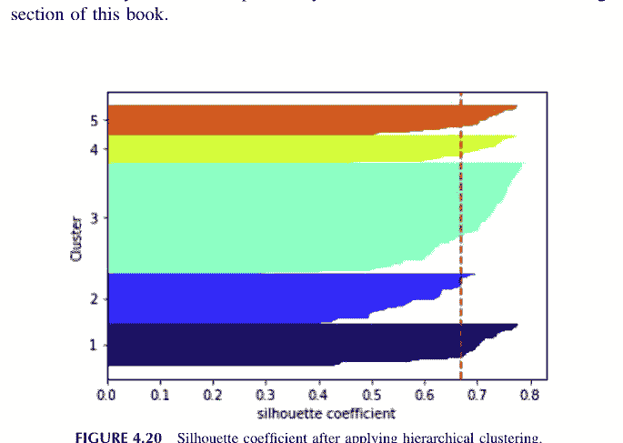

图 4.20 应用层次聚类后的轮廓系数。

| 聚类 | GIP (BCFperSection) | EURper1000ft |
| :--- | :--- | :--- |
| 0 | 295.279503 | 0.680128 |
| 1 | 285.792052 | 3.605628 |
| 2 | 184.139503 | 2.154681 |
| 3 | 82.520600 | 3.514146 |
| 4 | 86.520674 | 0.914015 |

图 4.21 使用层次聚类得到的聚类均值。

## 基于密度的带噪声应用空间聚类（DBSCAN）

DBSCAN 是一种基于密度的聚类算法，其中数据点被划分为由低密度区域分隔的高密度区域。该算法由 Martin Ester、Hans-Peter Kriegel、Jörg Sander 和 Xiaowei Xu 于 1996 年提出（Ester 等人，1996 年，第 226–231 页）。使用该算法的主要原因如下：

- 可以检测任意形状的聚类
- DBSCAN 对于非常大的数据集非常高效

在 DBSCAN 中，每个实例的密度是基于该实例特定半径（ε）内的样本数量来衡量的。每个半径为 epsilon (ε) 的圆都有最小数量的数据点。DBSCAN 由**两个参数**定义：(i) epsilon (ε) 和 (ii) MinPts。参数 ε 指定了圆的半径，以及观测值（点）之间必须有多近才能被视为同一聚类的一部分。MinPts 被定义为在数据点半径内应被视为核心点的观测值（邻居）的**最小**数量。如图 4.22 所示，点的分类主要有三种：

- **核心点**：核心点指定一个密集区域。核心点在其半径 ε 内必须至少有 MinPts 个相邻样本（Al-Fuqaha，无日期）。
- **边界点**：边界点在 epsilon 内的点数少于指定数量（MinPts），但它位于核心点的邻域内。
- **噪声点**：噪声点既不是核心点也不是边界点。

DBSCAN 最大的优势之一是可以移除噪声点，并且每个点都不会被分配到一个聚类（与 k-means 聚类不同）。

150 使用 Python 的油气机器学习指南

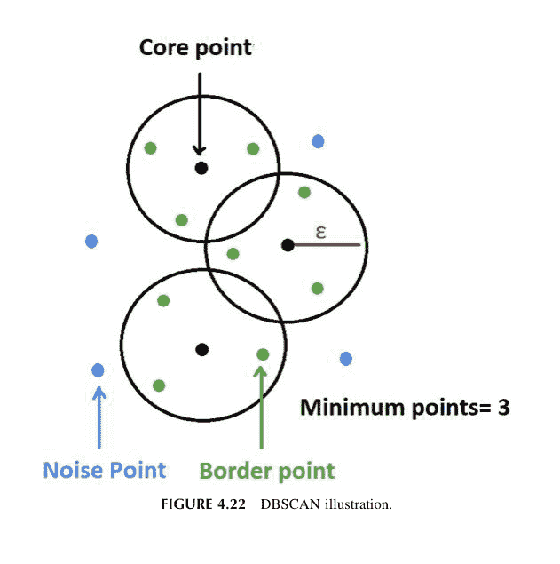

图 4.22 DBSCAN 图示。

此外，不需要定义聚类的数量，因为 epsilon (ε) 和 MinPts 将用于确定**期望的聚类密度，从而产生特定**数量的聚类。然而，选择这些超参数需要领域专业知识。应用 DBSCAN 后，对结果聚类数据的可视化和解释至关重要。如果 epsilon 参数设置得太高，DBSCAN 可能只解释为一个聚类。另一方面，如果 epsilon 参数设置得太低，DBSCAN 可能会产生许多不必要的聚类。此外，如果 MinPts（最小样本数）设置得太高，DBSCAN 可能会将良好的相邻点解释为噪声。因此，DBSCAN 应用中最大的挑战之一是在使用算法时设置 epsilon 和 MinPts 参数。强烈建议执行多次迭代以微调这些超参数，然后进行可视化，直到获得满意的聚类。此外，可以使用以下准则来估计超参数（Schubert 等人，2017 年）：

- 对于二维数据，使用默认值 MinPts = 4
- 对于更高维度的数据集，MinPts = 2*维度

确定 MinPts 后，可以按如下方式确定 epsilon：

绘制按距离排序的样本（x 轴）与 k-最近邻（KNN）距离（y 轴）的图表，其中 K = MinPts（Rahmah & Sitanggang，无日期）

最后，在图中选择“肘部”，其中 k-distance 值即为 epsilon 值，如图 4.23 所示。

## DBSCAN 如何工作？

应用 DBSCAN 算法的步骤如下：

1. DBSCAN 从一个任意点开始。然后从 epsilon (ε) 参数中检索相邻的观测值。
2. 如果该点基于定义的 epsilon 半径包含 **MinPts**，DBSCAN 开始形成聚类。否则，该点被标记为“噪声”。请注意，该点稍后可能会在另一个点的调查半径内被找到。因此，它可能成为聚类的一部分。
3. 如果一个点被发现是核心点，则调查半径（epsilon）内的点是聚类的一部分。
4. 继续此过程，直到找到**密度连接的聚类**。
5. 一个新的点可以重新启动工作流程，该点可能被分类为新聚类的一部分或被标记为噪声。

Ester 等人定义的密度连接聚类如下：

> 一个点 *a* 相对于 *epsilon* 和 *MinPts* 与点 *b* 密度连接，如果存在一个点 *c*，使得 *a* 和 *b* 都相对于 *epsilon* 和 *MinPts* 从 *c* 密度可达。

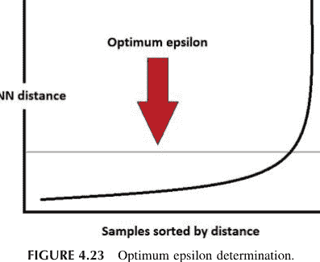

图 4.23 最佳 epsilon 的确定。

## scikit-learn 库中的 DBSCAN 实现和示例

让我们使用 scikit-learn 将 DBSCAN 应用于一个包含 1007 口井的数据集，其中包括杨氏模量、泊松比和闭合压力（最小水平应力）。练习是使用 DBSCAN 对数据进行聚类。首先，使用以下链接导入 DBSCAN 聚类 csv 文件：
https://www.elsevier.com/books-and-journals/book-companion/9780128219294
让我们启动一个新的 Jupyter Notebook，并导入所有必要的库以及 "Chapter4_Geomechanics_DataSet.csv" 文件，如下所示：

```python
import numpy as np
import pandas as pd
import matplotlib.pyplot as plt
import seaborn as sns
%matplotlib inline
df=pd.read_csv('Chapter4_Geomechanics_DataSet.csv')
df.describe()
```

Python 输出=图 4.24

接下来，使用 seaborn 库可视化每个参数的分布。

```python
sns.distplot(df['Closure Pressure (psi)'],label='Clustering Data',
    norm_hist=True, color='r')
plt.legend()
# Repeat the same code for the other parameters but change to parameter
# names "YM (MMpsi)" and "PR"
```

绘制所有特征后的 Python 输出=图 4.25

| | 闭合压力 (psi) | 杨氏模量 (MMpsi) | 泊松比 |
|---|---|---|---|
| **计数** | 1007.000000 | 1007.000000 | 1007.000000 |
| **均值** | 9500.000000 | 5.000000 | 0.250000 |
| **标准差** | 2212.788225 | 0.395503 | 0.066015 |
| **最小值** | 1479.148671 | 4.474815 | 0.034032 |
| **25%** | 7924.313997 | 4.686613 | 0.206557 |
| **50%** | 9737.579335 | 4.776741 | 0.249805 |
| **75%** | 11321.568010 | 5.451288 | 0.291797 |
| **最大值** | 13264.890570 | 5.858267 | 0.458470 |

图 4.24 DBSCAN 描述。

接下来，我们按如下方式对数据进行标准化：

```python
from sklearn.preprocessing import StandardScaler
scaler = StandardScaler()
df_scaled = scaler.fit(df)
df_scaled = scaler.transform(df)
```

在应用DBSCAN之前，使用KNN库估算epsilon的值非常重要。因此，首先导入该库，然后应用邻居数为6的KNN。选择6的原因是，这是一个三维数据库，推荐将MinPts设置为维度数的两倍。由于MinPts为6，因此在KNN算法中选择的邻居数也是6。因此，在创建K=6的KNN模型后，该模型可用于拟合“df_scaled”（标准化数据）。在无监督KNN算法中，会计算每个点到其最近邻居的距离。在本例中，由于K=6，因此计算每个点到6个最近邻居的距离。KNN方法产生两个数组。第一个数组包含到最近邻居点的距离，第二个数组则是这些点的索引。请注意，“NearestNeighbors”实现了无监督的最近邻学习。KNN也可用于监督回归和分类问题。监督KNN算法将在下一章详细讨论。

```python
from sklearn.neighbors import NearestNeighbors
Neighbors = NearestNeighbors(n_neighbors=6)
nbrs = Neighbors.fit(df_scaled)
distances, indices = nbrs.kneighbors(df_scaled)
```

接下来，按如下方式对结果进行排序和绘图：

```python
fig = plt.figure(figsize=(10, 8))
distances = np.sort(distances, axis=0)
distances = distances[:, 1]
plt.plot(distances)
plt.title('Finding the optimum epsilon')
plt.xlabel('Samples sorted by distance')
plt.ylabel('6th NN distance')
```

**Python输出=图4.26**

如图4.26所示，最佳epsilon约为0.3。接下来，我们导入DBSCAN库并将DBSCAN应用于“df_scaled”。请注意，在scikit-learn库中，“eps”是用于表示DBSCAN算法中epsilon的术语。根据scikit-learn库，“min_sample”指的是“一个点被视为核心点所需的邻域样本数，包括该点本身”。换句话说，“min_sample”就是之前讨论的**MinPts**。在本例中，距离测量使用了“欧几里得距离”。

**图4.26** 最佳epsilon的确定。

```python
from sklearn.cluster import DBSCAN
Clustering = DBSCAN(eps=0.3, min_samples=6, metric='euclidean')
DB = Clustering.fit_predict(df_scaled)
```

要获取每行数据的标签并转换为数据框，可以执行以下代码：

```python
labels = pd.DataFrame(DB, columns=['clusters'])
labels
```

Python输出=图4.27

接下来，让我们将聚类结果添加到标准化数据（df_scaled）中。一旦数据处于数据框中，就将输入特征（YM、PR和闭合压力）转换为其原始状态（标准化之前）。

```python
df_scaled = pd.DataFrame(df_scaled, columns=df.columns[0:3])
df_scaled['clusters'] = DB
df_scaled['Closure Pressure (psi)'] = (df_scaled['Closure Pressure (psi)'] * (df['Closure Pressure (psi)'].std()) + df['Closure Pressure (psi)'].mean())
df_scaled['YM (MMpsi)'] = (df_scaled['YM (MMpsi)'] * (df['YM (MMpsi)'].std()) + df['YM (MMpsi)'].mean())
df_scaled['PR'] = (df_scaled['PR'] * (df['PR'].std()) + df['PR'].mean())
```

| clusters |
|---|
| 0 | 0 |
| 1 | 0 |
| 2 | 0 |
| 3 | 0 |
| 4 | 0 |
| ... | ... |
| 1002 | -1 |
| 1003 | 0 |
| 1004 | 0 |
| 1005 | 0 |
| 1006 | 0 |

图4.27 使用DBSCAN标记的聚类。

接下来，让我们计算均值并按聚类列进行分组。如图所示，最终得到9个聚类。如前所述，聚类的数量是根据定义的epsilon和MinPts来确定和计算的。因此，在应用任何类型的聚类算法后，可视化数据以确保结果聚类有意义是极其重要的。由于这是一个合成生成的数据库，结果聚类并未基于其经纬度绘制。但是，请务必在任何数据库上绘制结果聚类，以便从结果聚类中获取更多知识。下面的“-1”聚类表示离群点。DBSCAN是可用于**离群点检测**的众多方法之一。

```python
Group_by_mean = df_scaled.groupby(by='clusters').mean()
Group_by_mean
Python输出=图4.28
```

请注意，讨论过的所有三种聚类技术主要适用于连续变量。分类特征（转换为二进制值）之间的距离计算可以进行，但需要一些额外的预处理，例如使用OneHotEncoder将分类值转换为数值。

| clusters | Closure Pressure (psi) | YM (MMpsi) | PR |
| :--- | :--- | :--- | :--- |
| **-1** | 8559.325853 | 5.093442 | 0.251312 |
| **0** | 9103.763751 | 4.721670 | 0.269255 |
| **1** | 9923.806912 | 4.698112 | 0.379960 |
| **2** | 8606.155092 | 5.569215 | 0.193501 |
| **3** | 11175.672378 | 5.502061 | 0.244701 |
| **4** | 6054.320378 | 4.748625 | 0.088967 |
| **5** | 4656.636445 | 4.632924 | 0.140017 |
| **6** | 9868.815507 | 4.483571 | 0.268379 |
| **7** | 12062.134910 | 5.625208 | 0.159870 |

图4.28 DBSCAN聚类（每个聚类的平均值）。

## 关于聚类的重要说明

尽管无监督聚类技术在从数据中解读信息方面非常强大，但需要注意的是，在某些情况下，聚类可能不是最合适的选择，而下一章将讨论的监督机器学习可能更有意义。首先需要考虑的是数据是否有任何标记类别。如果数据的每一行已经关联了标签，并且这些标签是自动或手动创建的，那么监督机器学习可能会带来更好的结果。另一方面，有些问题标记起来非常耗时。在这些情况下，无监督聚类技术可以简化流程。石油和天然气行业成功解决的问题之一是积液聚类。与使用Turner和Coleman技术标记类别不同，k-means聚类成功地将数据聚类为积液和未积液两个独立组。这非常强大，因为聚类技术独立地将数据划分为积液和未积液两个独立的聚类，而不是使用几十年前为垂直常规井开发的Turner和Coleman计算方法。

聚类验证是聚类中的另一个重要步骤。如前所述，轮廓系数是分析结果聚类的一种方法。如果所有结果聚类的平均轮廓系数为0.2（例如），那么聚类可能无法为数据提供太多洞察。在这些情况下，监督机器学习模型可能会提供更多帮助。

最后，正如本章所讨论的，在应用任何聚类技术后，应用基本统计度量（如每个结果聚类的均值）是极其重要的。例如，假设一个数据库使用k-means聚类被划分为积液和未积液两个独立的聚类。假设输入到无监督模型的特征是产气量、套管-油管压力、管线压力和产水量。聚类1和聚类2的平均结果值如表4.5所示。如表所示

表4.5 结果聚类示例。

| 聚类 | 产气量 (MSCF/D) | 套管-油管压力 (psi) | 管线压力 (psi) | 产水量 (BBL/D) |
| :--- | :--- | :--- | :--- | :--- |
| 聚类 0 (积液) | 1000 | 200 | 500 | 20 |
| 聚类 1 (未积液) | 1002 | 198 | 499 | 19 |

## 异常值检测

异常值检测算法是检测数据集中异常值的强大且实用的工具。首先，在深入探讨各种异常值检测算法之前，我们来定义一些术语：

- **异常值：** 异常值就是与数据集中其他点差异极大的点。例如，如果某个区域的平均GIP在100到200 BCF/section之间，那么一个GIP为20或350 BCF/section的点就可以被视为异常值点。
- **异常检测：** 是在数据集中寻找异常值的过程。

异常检测在许多行业都有应用，包括银行、金融、制造业、保险、石油和天然气行业等。异常检测在银行业的一个主要应用是检测客户的大额存款或可疑交易。如果你拥有信用卡，你可能接到过银行的电话，询问一笔你很可能没有参与的可疑交易。因此，银行业每年通过使用异常检测算法寻找异常值来检测欺诈行为，节省了数十亿美元。异常检测也可用于保险行业，以检测欺诈性保险索赔和赔付。在制造业和石油天然气行业，异常检测可用于检测机器和设备在预防性维护和预测故障方面的异常行为。例如，发现压裂泵的异常行为可以进行预防性维护，从而可能延长压裂设备的使用寿命。异常活动检测也可用于IT行业，以检测网络入侵者。既然我们已经确定了异常检测在不同行业的一些用例，让我们回顾一些可用于异常检测的算法。请注意，DBSCAN是可用于异常检测的算法之一，由于它已经讨论过，本节将不再赘述。

## 孤立森林

孤立森林是一种无监督机器学习算法，可用于异常检测，其工作原理基于隔离异常值的原则（Tony Liu 等人，2008）。孤立森林基于决策树算法，该算法将在下一章讨论。顾名思义，该算法通过从给定数据集中随机选择一个特征，并在该特征的最小值和最大值之间随机选择一个**分割**值来隔离特征。换句话说，它在该特征的范围内选择一个随机的**分割**值。接下来，如果选择的值使该点位于上方，则将特征范围的最小值更改为该值；否则，如果选择的值使该点位于下方，则将特征范围的最大值更改为该值。重复最后两个步骤，直到这些点被隔离。这些步骤重复的次数称为“隔离次数”。隔离次数越低，该点就越异常。这是因为随机特征划分会导致异常点的树路径更短。换句话说，异常点需要更少的随机划分次数才能被检测为异常。正如稍后将在Python中演示的那样，孤立森林使用孤立树的集成（通过一个名为“n_estimators”的参数）来隔离异常值。要计算孤立森林中的异常分数，可以使用下面的公式。

$$s(x, n) = 2^{-\frac{E(h(x))}{c(n)}}$$

其中：

$$c(n) = 2H(n-1) - \left(\frac{2(n-1)}{n}\right)$$

$n$ 定义为数据点的数量，$c(n)$ 是一个参考指标，用于将分数归一化到0和1之间，以便于解释。$E(h(x))$ 指的是孤立森林的平均路径长度。路径长度表示一个点是正常的还是异常的。H是调和数，可以如下估算：

$$H(i) = \ln(i) + \gamma$$

其中 $\gamma = 0.5772156649$（欧拉-马斯刻若尼常数）

## 使用scikit-learn的孤立森林

让我们通过一个例子来了解如何使用孤立森林在石油工程师的收入与消费习惯数据集中寻找异常值。该数据集可以通过以下链接找到：

https://www.elsevier.com/books-and-journals/book-companion/9780128219294

让我们导入所有必要的库（pandas、numpy和常规可视化库）来开始，并导入“Chapter4_PE_Income_Spending_DataSet.csv”数据集。如下所示，该数据集有4列数据，其中一列是石油工程师性别的分类特征。因此，使用pandas库中的“pd.get_dummies”方法将此分类特征转换为虚拟/指示变量至关重要。

160 使用Python的石油天然气机器学习指南

| | Petroleum_Engineer_Age | Petroleum_Engineer_Income (K$) | Spending_Habits (From 1 to 100) |
|---|---|---|---|
| count | 200.000000 | 200.000000 | 200.000000 |
| mean | 38.850000 | 140.000000 | 47.690000 |
| std | 13.969007 | 60.717651 | 24.532346 |
| min | 18.000000 | 34.676354 | 0.950000 |
| 25% | 28.750000 | 95.937913 | 33.012500 |
| 50% | 36.000000 | 142.173052 | 47.500000 |
| 75% | 49.000000 | 180.317041 | 69.350000 |
| max | 70.000000 | 316.710700 | 94.050000 |

图4.29 石油工程师收入/消费数据集。

```python
import pandas as pd
import numpy as np
import seaborn as sns
import matplotlib.pyplot as plt
%matplotlib inline
df=pd.read_csv('Chapter4_PE_Income_Spending_DataSet.csv')
df.describe()
```

Python输出=图4.29

“pd.get_dummies”将为每个类别创建一列，并在每个相应的列中用0和1替换每个类别。在此示例中，由于petroleum_engineer_gender列有两个类别，对df数据集应用“pd.get_dummies”后，将添加两个新列，如下所示：

- Petroleum_Engineer_Gender_Male
- Petroleum_Engineer_Gender_Female

请注意，表示一个分类特征列只需要k-1（k减1）个分类特征。例如，如果一个分类特征有两个类别（男性和女性），则只需要k-1或1个额外列即可为机器学习模型提供足够的信息。一个简单快捷的方法是在“pd.get_dummies”方法中设置“drop_first = True”（请注意，pandas中默认的“drop_first”为“False”）。这将自动删除其中一个列，并且只添加一列，即“Petroleum_Engineer_Gender_Male”。

```python
df=pd.get_dummies(df,drop_first=True)
df
```

Python输出=图4.30

让我们也看看“Petroleum_Engineer_Age”、“Petroleum_Engineer_Income (K$)”和“Spending_Habits (From 1 to 100)”的箱线图。确保将下面显示的每个箱线图代码行独立放置，否则箱线图将会重叠。

无监督机器学习：聚类算法 第4章 | 161

| Petroleum_Engineer_Age | Petroleum_Engineer_Income (K$) | Spending_Habits (From 1 to 100) | Petroleum_Engineer_Gender_Male |
|---|---|---|---|
| 0 | 19 | 34.676354 | 37.05 | 1 |
| 1 | 21 | 34.676354 | 76.95 | 1 |
| 2 | 20 | 36.988111 | 5.70 | 0 |
| 3 | 23 | 36.988111 | 73.15 | 0 |
| 4 | 31 | 39.299868 | 38.00 | 0 |
| ... | ... | ... | ... | ... |
| 195 | 35 | 277.410832 | 75.05 | 0 |
| 196 | 45 | 291.281374 | 26.60 | 0 |
| 197 | 32 | 291.281374 | 70.30 | 1 |
| 198 | 32 | 316.710700 | 17.10 | 1 |
| 199 | 30 | 316.710700 | 78.85 | 1 |

图4.30 应用get_dummies后的df。

```python
sns.boxplot(df['Petroleum_Engineer_Age'], color='orange')
sns.boxplot(df['Petroleum_Engineer_Income (K$)'], color='orange')
sns.boxplot(df['Spending_Habits (From 1 to 100)'], color='orange')
```

Python输出=图4.31

接下来，让我们从scikit-learn库导入孤立森林算法，并将其应用于“df”数据框，如下所示。“n_estimators”指的是将在森林中构建的集成树的数量。“max_sample”指的是为训练每个基础估计器而抽取的样本数量。如果max_samples设置为大于提供的总样本数，则所有样本都将用于所有树。换句话说，将不进行采样。

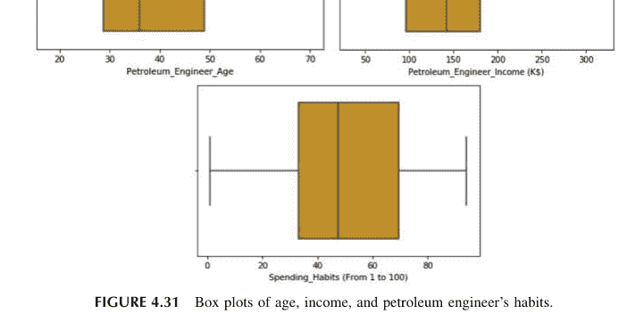

图4.31 年龄、收入和石油工程师习惯的箱线图。

对数据集中的异常值检测具有**显著**影响的下一个重要参数被称为“污染度”。“污染度”指的是预期的异常值比例，其取值范围在0到1之间。数值越低，识别出的异常值数量就越少。较高的“污染度”值将导致数据集中出现更多的异常值。因此，请花几分钟时间，将污染度值从0.1更改为0.2、0.3、...、0.9，以观察异常值检测的差异。一旦定义了clf模型，就使用“clf.fit(df)”将此定义好的模型应用于“df”数据框。

```python
from sklearn.ensemble import IsolationForest
clf=IsolationForest(n_estimators=100,
    max_samples=250,random_state=100, contamination=0.1)
clf.fit(df)
```

如图4.32所示，警告消息本质上表明，由于输入的“max_sample”为250，大于样本总数（本练习中为200），因此“max_sample”将被设置为200。

接下来，让我们使用“clf.decision_function(df)”获取隔离森林分数，将其放入“df”数据框，并使用直方图绘制“df['Scores']”，如下所示。负的分数值表示存在异常点。

```python
df['Scores']=clf.decision_function(df)
plt.figure(figsize=(12,8))
plt.hist(df['Scores'])
plt.title('Histogram of Average Anomaly Scores: Lower Scores=More\nAnomalous Samples')
```

请随意调用“df”以观察添加了“Scores”列后的结果“df”数据框。下一步是通过将“clf.predict(df.iloc[:,:4])”应用于“PE_Age”、“PE_Income”、“PE_Spending habits”和“PE_gender_male”的前4列来预测异常。不要将“predict”函数应用于“df”，因为上一步已经添加了异常分数。将“predict”函数应用于前4列后，让我们查看被分类为“-1”的结果异常行。“-1”表示存在异常，“1”代表正常数据点。

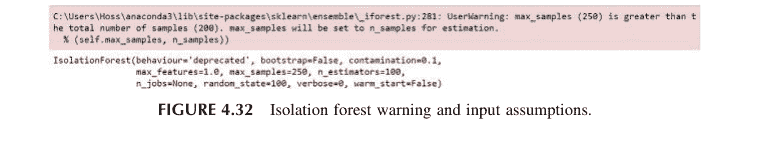

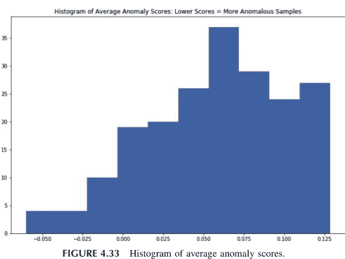

图4.33 平均异常分数直方图。

```python
df['Anomaly']=clf.predict(df.iloc[:,:4])
Anomaly=df.loc[df['Anomaly']==-1]
Anomaly_index=list(Anomaly.index)
Anomaly
```

最后，让我们在PE_Income和PE_Spending_Habits的散点图上可视化异常点，并根据异常点进行颜色编码。

| Petroleum_Engineer_Age | Petroleum_Engineer_Income (K$) | Spending_Habits (From 1 to 100) | Petroleum_Engineer_Gender_Male | Scores | Anomaly |
|---|---|---|---|---|---|
| 0 | 19 | 34.676354 | 37.05 | 1 | -0.032601 | -1 |
| 1 | 21 | 34.676354 | 76.95 | 1 | -0.004939 | -1 |
| 2 | 20 | 36.988111 | 5.70 | 0 | -0.060046 | -1 |
| 6 | 35 | 41.611625 | 5.70 | 1 | -0.006933 | -1 |
| 8 | 64 | 43.923382 | 2.85 | 1 | -0.058308 | -1 |
| 10 | 67 | 43.923382 | 13.30 | 1 | -0.058579 | -1 |
| 12 | 58 | 46.235139 | 14.25 | 0 | -0.012855 | -1 |
| 14 | 37 | 46.235139 | 12.35 | 1 | -0.010101 | -1 |
| 18 | 52 | 53.170410 | 27.55 | 1 | -0.008263 | -1 |
| 30 | 60 | 69.352708 | 3.80 | 0 | -0.011495 | -1 |
| 32 | 53 | 76.287979 | 3.80 | 1 | -0.000866 | -1 |
| 33 | 18 | 76.287979 | 87.40 | 1 | -0.024124 | -1 |
| 40 | 65 | 87.846764 | 33.25 | 0 | -0.001817 | -1 |
| 140 | 57 | 173.381770 | 4.75 | 1 | -0.014385 | -1 |
| 162 | 19 | 187.252312 | 4.75 | 1 | -0.008069 | -1 |
| 178 | 59 | 214.993395 | 13.30 | 1 | -0.005844 | -1 |
| 194 | 47 | 277.410632 | 15.20 | 0 | -0.009086 | -1 |
| 196 | 45 | 291.281374 | 26.60 | 0 | -0.033078 | -1 |
| 198 | 32 | 316.710700 | 17.10 | 1 | -0.044971 | -1 |
| 199 | 30 | 316.710700 | 78.85 | 1 | -0.040967 | -1 |

图4.34 异常数据。

```python
plt.figure(figsize=(12,8))
groups=df.groupby('Anomaly')
for name, group in groups:
    plt.plot(group['Petroleum_Engineer_Income (K$)'],
             group['Spending_Habits (From 1 to 100)'],
             marker='o', linestyle='', label=name)
plt.xlabel('Petroleum Engineer Income')
plt.ylabel('Spending Habits')
plt.title('Isolation Forests - Anomalies')
```

## 局部异常因子（LOF）

LOF是另一种有用的无监督机器学习算法，它根据局部邻域而非整个数据分布来识别异常值（Breunig等人，2000年）。LOF是一种基于密度的技术，它使用最近邻搜索来识别异常点。使用LOF的优势在于能够识别相对于局部点簇而言是异常值的点。例如，当使用局部异常因子技术时，会识别某个点的邻居，并与邻居点的密度进行比较。使用LOF模型时可以应用以下步骤：

- 1) 使用距离函数（如欧几里得距离或曼哈顿距离）计算点P与所有给定点之间的距离。

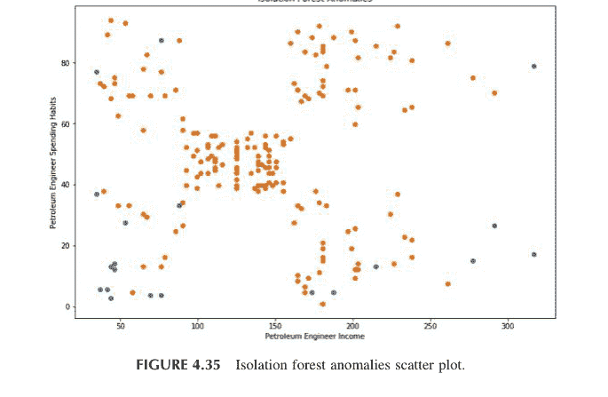

- 2) 找到k（k-最近邻）个最近的点。例如，如果K=3，则找到第3个最近邻的距离。
- 3) 找到k个最近的点。
- 4) 使用以下方程找到局部可达密度：

$$lrd_k(O) = \frac{\|N_k(O)\|}{\sum_{O' \in N_k(O)} reachdist_k(O' \leftarrow O)}$$

其中可达距离可以如下计算：
$$reachdist_k(O' \leftarrow O) = \max\{dist_k(O), \ dist(O, \ O')\}$$
请注意，Nk(O)指的是邻居的数量。
- 5) 最后一步是计算局部异常因子，如下所示：

$$LOF_k(O) = \frac{\sum_{O' \in N_k(O)} \frac{lrd_k(O')}{lrd_k(O)}}{\|N_k(O)\|}$$

## 使用scikit-learn的局部异常因子

Scikit-learn库也可用于应用局部异常因子算法。应用LOF之前不应忘记的主要步骤之一是确保在应用算法之前对数据进行标准化。LOF基于最近邻方法，其中使用了距离计算。因此，具有较大幅度的特征将主导距离计算。因此，让我们使用与应用隔离森林算法相同的数据集，并在应用LOF之前对数据集进行标准化。为避免混淆，请启动一个新的Jupyter Notebook，导入必要的库，导入隔离森林数据集（将其称为df），完全按照之前所示应用“pd.get_dummies”，并如下所示标准化数据：

```python
from sklearn.preprocessing import StandardScaler
scaler=StandardScaler()
df_scaled=scaler.fit(df)
df_scaled=scaler.transform(df)
```

接下来，让我们导入LOF库，定义具有40个邻居、污染度为0.1的模型，使用欧几里得距离计算，并如下所示应用“fit(df_scaled)”。请注意，较大的**n_neighbor**或**K**可能导致远离最高密度区域的点被错误分类为异常值，即使这些点可能是某个点簇的一部分。另一方面，如果K太小，则可能导致相对于非常小的局部点区域对异常值进行错误分类。因此，强烈建议交替调整K值，直到达到满意的异常值检测水平。

```python
from sklearn.neighbors import LocalOutlierFactor
clf=LocalOutlierFactor(n_neighbors=40, contamination=.1,
    metric='euclidean')
clf.fit(df_scaled)
```

训练样本的异常分数可以使用“negative_outlier_factor_”属性获得。接下来，让我们在直方图中绘制“clf.negative_outlier_factor_”。请注意，**较小**的异常分数表示更**异常的点**。要找到异常点，只需将异常分数从高到低排序。最小的值表示异常点。

```python
df_scaled=pd.DataFrame(df_scaled,
    columns=['Petroleum_Engineer_Age',
    'Petroleum_Engineer_Income (K$)',
    'Spending_Habits (From 1 to 100)',
    'Petroleum_Engineer_Gender_Male'])
df_scaled['Scores']=clf.negative_outlier_factor_
plt.figure(figsize=(12,8))
plt.hist(df_scaled['Scores'])
plt.title('Histogram of Negative Outlier Factor')
```

接下来，让我们使用“clf.fit_predict”并将其应用于前4列（不包括刚刚添加的异常分数列）。然后，通过识别“-1”的异常来定位异常。请注意，-1的异常表示异常点，1的异常表示正常点。另请注意，由于数据在应用LOF之前已进行标准化，因此新添加的列只是添加到了“df_scaled”中。

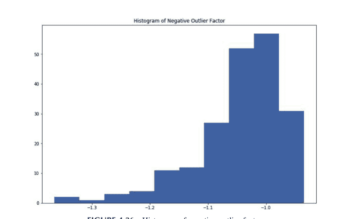

图4.36 负异常因子直方图。

与“df”数据框相对的数据框。因此，下表和图中显示的数字将以标准化形式呈现。要将其转换回原始形式，只需通过乘以每个原始列的标准差并加上平均值，将其恢复为正常形式（非标准化形式）。

```python
df_scaled['Anomaly']=clf.fit_predict(df_scaled.iloc[:,:4])
Anomaly=df_scaled.loc[df_scaled['Anomaly']==-1]
Anomaly_index=list(Anomaly.index)
Anomaly
```

Python输出=图4.37

最后一步是绘图以评估生成的异常点。请花些时间调整“n_neighbors”和“contamination”参数，并观察新的异常点。此外，花些时间比较孤立森林和局部异常因子的异常检测结果。

```python
plt.figure(figsize=(12,8))
groups=df_scaled.groupby("Anomaly")
for name, group in groups:
    plt.plot(group['Petroleum_Engineer_Income (K$)'], group
    ['Spending_Habits (From 1 to 100)'], marker="o", linestyle="",
    label=name)
plt.xlabel('Petroleum Engineer Income')
plt.ylabel('Petroleum Engineer Spending Habits')
plt.title('Local Outlier Factor Anomalies')
```

Python输出=图4.38

| Petroleum_Engineer_Age | Petroleum_Engineer_Income (K$) | Spending_Habits (From 1 to 100) | Petroleum_Engineer_Gender_Male | Scores | Anomaly |
|---|---|---|---|---|---|
| 2 | -1.352802 | -1.700830 | -1.715913 | -0.886405 | -1.384813 | -1 |
| 6 | -0.276302 | -1.624491 | -1.715913 | -0.886405 | -1.260564 | -1 |
| 7 | -1.137502 | -1.624491 | 1.700384 | -0.886405 | -1.198362 | -1 |
| 8 | 1.804932 | -1.586321 | -1.832378 | 1.128152 | -1.188293 | -1 |
| 10 | 2.020232 | -1.586321 | -1.405340 | 1.128152 | -1.154745 | -1 |
| 11 | -0.276302 | -1.586321 | 1.894492 | -0.886405 | -1.235479 | -1 |
| 12 | 1.374332 | -1.548152 | -1.366519 | -0.886405 | -1.162219 | -1 |
| 19 | -0.276302 | -1.433644 | 1.855671 | -0.886405 | -1.206570 | -1 |
| 22 | 0.513132 | -1.357305 | -1.754735 | -0.886405 | -1.188463 | -1 |
| 162 | -1.424569 | 0.780183 | -1.754735 | 1.128152 | -1.172355 | -1 |
| 188 | 0.154298 | 1.619911 | -1.288876 | -0.886405 | -1.158835 | -1 |
| 190 | -0.348068 | 1.619911 | -1.055946 | -0.886405 | -1.156661 | -1 |
| 192 | -0.419835 | 2.001605 | -1.638270 | 1.128152 | -1.165080 | -1 |
| 193 | -0.081002 | 2.001605 | 1.583920 | -0.886405 | -1.155576 | -1 |
| 194 | 0.584869 | 2.268791 | -1.327697 | -0.886405 | -1.270311 | -1 |
| 195 | -0.276302 | 2.268791 | 1.118061 | -0.886405 | -1.155690 | -1 |
| 196 | 0.441365 | 2.497807 | -0.861839 | -0.886405 | -1.285226 | -1 |
| 197 | -0.491602 | 2.497807 | 0.923953 | 1.128152 | -1.197818 | -1 |
| 198 | -0.491602 | 2.917671 | -1.250054 | 1.128152 | -1.269415 | -1 |
| 199 | -0.635135 | 2.917671 | 1.273347 | 1.128152 | -1.323574 | -1 |

图4.37 使用LOF识别的异常点。

168 使用Python的油气机器学习指南

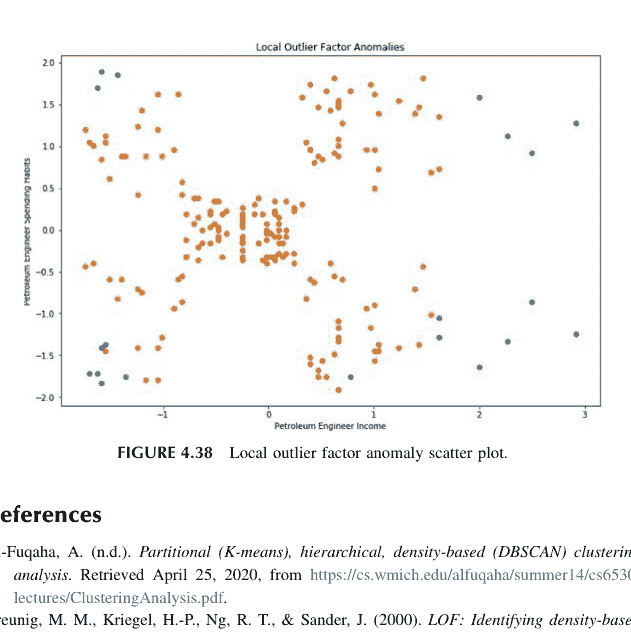

图4.38 局部异常因子异常散点图。

## 参考文献

Al-Fuqaha, A. (n.d.). *划分（K-means）、层次、基于密度（DBSCAN）聚类分析*. 检索于2020年4月25日，来自 https://cs.wmich.edu/alfuqaha/summer14/cs6530/lectures/ClusteringAnalysis.pdf.

Breunig, M. M., Kriegel, H.-P., Ng, R. T., & Sander, J. (2000). *LOF：识别基于密度的局部异常值*. https://doi.org/10.1145/342009.335388

聚类. (n.d.). 检索于2020年4月11日，来自 https://scikit-learn.org/stable/modules/clustering.html (原始作品发表于2019年).

Ester, M., Kriegel, H.-P., Sander, J., & Xu, X. (1996). *一种用于在大型空间数据库中发现噪声聚类的基于密度的算法*. AAAI Press. https://dl.acm.org/doi/10.5555/3001460.3001507.

Rahmah, N., & Sitanggang, I. S. (n.d.). 在DBSCAN算法中确定最优epsilon（Eps）值以对苏门答腊泥炭地热点数据进行聚类. *IOP会议系列：地球与环境科学*. IOP Publishing. https://doi.org/10.1088/1755-1315/31/1/012012

Rousseeuw, P. (1987). 轮廓系数：一种用于解释和验证聚类分析的图形辅助工具. *计算与应用数学, 20*(53), 65. https://doi.org/10.1016/0377-0427(87)90125-7

Schubert, E., Sander, J., Ester, M., Kriegel, H. P., & Xu, X. (2017). *DBSCAN revisited, revisited：为什么以及如何（仍然）使用DBSCAN* (第42卷). 计算机协会. https://doi.org/10.1145/3068335

Tony Liu, F., Ming Ting, K., & Zhou, Z.-H. (2008). 载于 *2008年第八届IEEE国际数据挖掘会议*. 孤立森林. https://doi.org/10.1109/ICDM.2008.17

# 第5章

## 监督学习

### 概述

本章将讨论以下监督机器学习（ML）算法：

- (i) 多元线性回归
- (ii) 逻辑回归
- (iii) K近邻（KNN）
- (iv) 支持向量机（SVM）
- (v) 决策树
- (vi) 随机森林
- (vii) 极端随机树
- (viii) 梯度提升
- (ix) 极端梯度提升
- (x) 自适应梯度提升

在讨论每种算法的概念并提供数学背景之后，将使用scikit-learn库演示每种算法在多个实际油气问题中的实现，例如产量优化、人力资源员工可持续性预测、声波测井（横波和纵波旅行时）预测、经济（净现值）预测以及水力压裂可压性识别与预测。最后，在本章末尾，将讨论各种插补技术，如K近邻（KNN）、链式方程多元插补（MICE）和迭代插补器，以处理缺失信息。

## 线性回归

回归算法有不同类型，如线性回归、岭回归、多项式回归、Lasso回归等，每种都适用于不同的目的。例如，线性回归最适合在显示两个变量之间线性关系的图表上绘制一条直线。当特征之间存在高度共线性时，使用岭回归。当特征之间的关系是非线性时，多项式回归是合适的。线性回归是最简单和最常用的回归ML算法形式之一。线性回归的方程如下：

$$y = mx + b$$

其中m是直线的斜率，b是截距，x是自变量（输入特征），y是因变量（输出特征）。在线性回归中，使用“最小二乘法”来找到斜率和y截距。最小二乘法使每个数据点到拟合直线的平方距离最小化。对于具有多个输入特征的多元线性回归模型，可以使用以下方程：

$$y = m_1x_1 + m_2x_2 + ... + m_nx_n + b$$

请注意，使用多元线性回归模型时，它假设输入和输出特征之间存在线性关系。此外，它假设自变量（输入特征）是连续的而非离散的。大多数石油工程相关问题在输入和输出特征之间存在非线性关系。因此，在处理一些非线性问题时，必须谨慎使用此算法。我们将讨论最适合非线性问题的其他算法。

## 回归评估指标

在深入探讨scikit-learn中多元线性回归模型的实现之前，让我们回顾一些除了已经详细阐述的R和R²之外的回归评估指标。

- 1) **平均绝对误差（MAE）：** 是误差**绝对值**的平均值。它简单来说就是实际值和预测值之间差值的绝对值的平均值。MAE也被称为损失函数，因为目标是最小化这个损失函数，其定义如下：

$$\frac{1}{n} \sum_{i=1}^{n} |y_i - \widehat{y_i}|$$

其中 $y_i$ 是第 $i^{th}$ 个样本点的输出，$\widehat{y_i}$ 是从模型获得的估计值。

- 2) **均方误差（MSE）：** 顾名思义，它指的是平方误差的平均值，如下所示。MSE也被认为是一个需要最小化的损失函数。MSE在现实世界ML应用中被广泛使用的原因之一是，与MAE相比，当使用MSE作为目标函数时，较大的误差会受到更大的惩罚。

$$\frac{1}{n} \sum_{i=1}^{n} (y_i - \widehat{y_i})^2$$

3) **均方根误差 (RMSE)**：RMSE 基本上是 MSE 的平方根，如下所示。请注意，RMSE 也是一个非常流行的损失函数，因为它具有可解释性。

$$\sqrt{\frac{1}{n} \sum_{i=1}^{n} \left(y_{i}-\hat{y}_{i}\right)^{2}}$$ (5.5)

## 多元线性回归模型在 scikit-learn 中的应用

多元线性回归可以在 scikit-learn 中轻松实现。在本练习中，使用了一个包含以下地质信息的数据集：

- 孔隙度 (%)
- 基质渗透率 (nd)
- 声阻抗 (kg/m2s × 10^6)
- 脆性比
- 总有机碳含量 (%)
- 镜质体反射率 (%)

目标是训练一个**多元线性回归**模型，以理解每个变量对生产性能的影响。在本练习中，使用 A√K/横向英尺 (md^1/2 × ft) 作为输出特征。A√K 是非常规储层通过产量瞬态分析 (RTA) 获得的产能指标，相当于常规储层中的 kh。A√K 简单来说就是横截面积乘以渗透率的平方根。它本质上是一个显示每口井产能强度的指标。

本练习的数据集可通过以下链接找到：
https://www.elsevier.com/books-and-journals/book-companion/9780128219294

打开一个新的 Jupyter Notebook，让我们开始导入重要的库，并将 "sns.set_" 样式设置为 "darkgrid"，如下所示。请注意，有 5 个预设的 seaborn 主题，如 darkgrid、whitegrid、dark、white 和 ticks，可以根据个人喜好选择。

```
import numpy as np
import pandas as pd
import matplotlib.pyplot as plt
%matplotlib inline
import seaborn as sns
sns.set_style("darkgrid")
df=pd.read_csv('Chapter5_Geologic_DataSet.csv')
df.describe().transpose()
```

Python 输出=图 5.1

| | count | mean | std | min | 25% | 50% | 75% | max |
|---|---|---|---|---|---|---|---|---|
| Porosity (%) | 200.0 | 10.493805 | 2.079824 | 4.585000 | 9.03875 | 10.549000 | 12.181750 | 16.485000 |
| Matrix Perm (nd) | 200.0 | 433.075000 | 173.101415 | 113.000000 | 312.25000 | 403.500000 | 528.750000 | 987.000000 |
| Acoustic impedance (kg/m2s*10^6) | 200.0 | 3.265735 | 0.623574 | 1.408000 | 2.80225 | 3.250500 | 3.679500 | 5.093000 |
| Brittleness Ratio | 200.0 | 57.794340 | 16.955346 | 13.128000 | 45.30600 | 59.412000 | 69.915000 | 101.196000 |
| TOC (%) | 200.0 | 3.970700 | 1.907119 | 0.100000 | 2.47000 | 4.120000 | 5.400000 | 8.720000 |
| Vitrinite Reflectance (%) | 200.0 | 1.571440 | 0.240662 | 0.744000 | 1.41600 | 1.568000 | 1.714000 | 2.290000 |
| Aroot(K) | 200.0 | 50.000000 | 11.505310 | 24.437856 | 41.96103 | 49.692285 | 58.986667 | 77.270733 |

图 5.1 数据集的基本统计信息。

接下来，让我们使用子图可视化每个参数的分布，如下所示。如图所示，每个参数的分布似乎都是正态的，这是理想的。

```
f, axes=plt.subplots(4, 2, figsize=(12, 12))
sns.distplot(df['Porosity (%)'], color="red", ax=axes[0, 0])
sns.distplot(df['Matrix Perm (nd)'], color="olive", ax=axes[0, 1])
sns.distplot(df['Acoustic impedance (kg/m2s*10^6)'], color="blue", ax=axes[1, 0])
sns.distplot(df['Brittleness Ratio'], color="orange", ax=axes[1, 1])
sns.distplot(df['TOC (%)'], color="black", ax=axes[2, 0])
sns.distplot(df['Vitrinite Reflectance (%)'], color="green", ax=axes[2, 1])
sns.distplot(df['Aroot(K)'], color="cyan", ax=axes[3, 0])
plt.tight_layout()
```

Python 输出=图 5.2

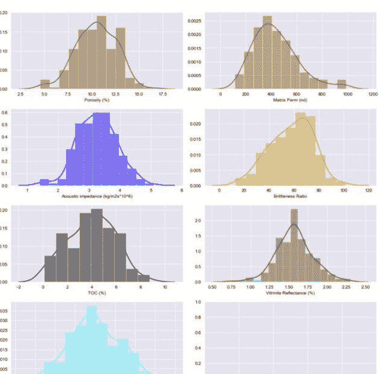

图 5.2 每个变量的分布图。

除了分布图，我们还可以如下可视化每个参数的箱线图：

```
f, axes=plt.subplots(4, 2, figsize=(12, 12))
sns.boxplot(df['Porosity (%)'], color="red", ax=axes[0, 0])
sns.boxplot(df['Matrix Perm (nd)'], color="olive", ax=axes[0, 1])
sns.boxplot(df['Acoustic impedance (kg/m2s*10^6)'], color="blue",
            ax=axes[1, 0])
sns.boxplot(df['Brittleness Ratio'], color="orange", ax=axes[1, 1])
sns.boxplot(df['TOC (%)'], color="black", ax=axes[2, 0])
sns.boxplot(df['Vitrinite Reflectance (%)'], color="green",
            ax=axes[2, 1])
sns.boxplot(df['Aroot(K)'], color="cyan", ax=axes[3, 0])
plt.tight_layout()
```

Python 输出=图 5.3

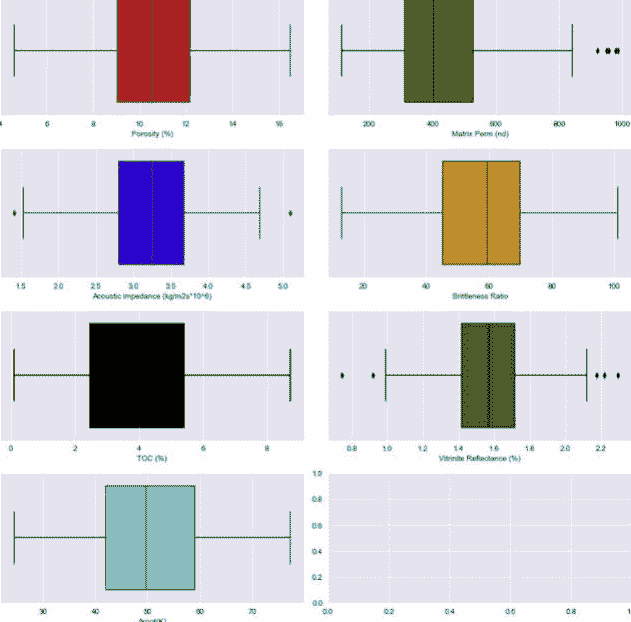

图 5.3 每个变量的箱线图。

同样重要的是，通过散点图了解输入特征与 Aroot(K)（输出特征）之间的关系，如下所示：

```
f, axes=plt.subplots(3, 2, figsize=(12, 12))
sns.scatterplot(df['Porosity (%)'],df['Aroot(K)'], color="red", ax=axes[0, 0])
sns.scatterplot(df['Matrix Perm (nd)'],df['Aroot(K)'], color="olive", ax=axes[0, 1])
sns.scatterplot(df['Acoustic impedance (kg/m2s*10^6)'], df['Aroot(K)'],color="blue", ax=axes[1, 0])
sns.scatterplot(df['Brittleness Ratio'], df['Aroot(K)'], color="orange", ax=axes[1, 1])
sns.scatterplot(df['TOC (%)'], df['Aroot(K)'],color="black", ax=axes[2, 0])
sns.scatterplot(df['Vitrinite Reflectance (%)'],df['Aroot(K)'], color="green", ax=axes[2, 1])
plt.tight_layout()
```

Python 输出=图 5.4

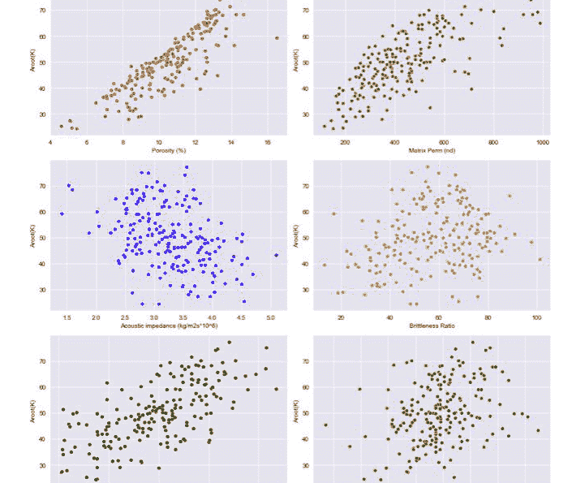

图 5.4 每个变量与 Aroot(K) 的散点图。

为了找出是否存在共线性输入特征，让我们使用 seaborn 库绘制一个热力图，每个方格内显示皮尔逊相关系数。如图所示，孔隙度和基质渗透率高度相关，皮尔逊相关系数为 0.76。此外，孔隙度和总有机碳含量 (TOC) 具有很强的皮尔逊相关系数 0.71。由于基质渗透率和 TOC 提供了与孔隙度相似的信息，建议在进行下一步之前删除这两个特征。

```
plt.figure(figsize=(14,10))
sns.heatmap(df.corr(),linewidths=2, linecolor='black',cmap='viridis', annot=True)
```

Python 输出=图 5.5

要删除基质渗透率和 TOC，可以使用 pandas 的 drop 语法，如下所示。请确保 "inplace=True" 以确保这两列被永久删除。

```
df.drop(['TOC (%)', 'Matrix Perm (nd)'], axis=1, inplace=True)
```

接下来，让我们在应用多元线性回归之前对输入特征进行归一化。Scikit-learn 库有一个预处理部分，可以将感兴趣的特征归一化到 0 到 1 之间的范围，如下所示。首先，"from sklearn import preprocessing"，然后定义 MinMax 缩放器的范围为 0 到 1，并将其赋值给变量 "scaler"。之后，将 "scaler.fit" 函数应用于 "df" 数据框（包括输入和输出特征），以基于数据 (df) 创建缩放器模型。接下来，使用 "scaler.transform(df)" 转换 df 数据框，使其范围在 0 到 1 ([0,1]) 之间，并将其称为 "df_scaled"。最后，打印 "df_scaled" 以查看缩放后的数据框，该数据框将以每个特征在 0 到 1 之间的数组格式呈现。请注意，scaler.transform 方法将返回一个 numpy 数组。因此，在下一步中，使用 "pd.DataFrame" 将数据 (df_scaled) 转换回 pandas 数据框。

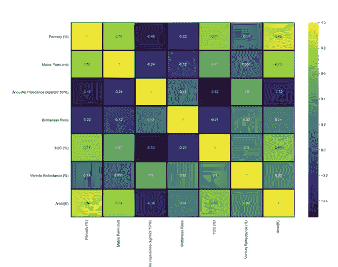

图 5.5 显示皮尔逊相关系数的热力图。

```
from sklearn import preprocessing
scaler=preprocessing.MinMaxScaler(feature_range=(0,1))
scaler.fit(df)
df_scaled=scaler.transform(df)
print(df_scaled)
```

Python 输出=图 5.6

```
array([[0.32529412, 0.45373134, 0.9600763 , 0.71134021, 0.45177576],
       [0.34294118, 0.57910448, 0.48003815, 0.48969072, 0.31917731],
       [0.43941176, 0.81492537, 0.84289413, 0.92268041, 0.47793158],
       [0.65411765, 0.40298507, 0.39337784, 0.48969072, 0.65669029],
       [0.64529412, 0.56716418, 0.        , 0.5       , 0.28514944],
       [0.46941176, 0.42089552, 0.5812781 , 0.3814433 , 0.50238885],
       [0.40823529, 0.49253731, 0.71903529, 0.4742268 , 0.43843026],
       [0.29588235, 0.5880597 , 0.5731026 , 0.51546392, 0.30503973],
       [0.35117647, 0.34328358, 0.74710451, 0.54123711, 0.42118734],
       [0.39411765, 0.72537313, 0.75296362, 0.88659794, 0.47808031],
       [0.49941176, 0.28059701, 0.68360812, 0.43298969, 0.56731787],
       [0.56705882, 0.30149254, 0.51996185, 0.47938144, 0.66317086],
       [0.60411765, 0.45373134, 0.75909524, 0.54123711, 0.66004008],
       [0.63764706, 0.37910448, 0.61983922, 0.64948454, 0.75497868],
       [0.42823529, 0.36716418, 0.75323614, 0.36597938, 0.48654097],
       [0.28176471, 0.64179104, 0.64164055, 0.62886598, 0.31453193],
       [0.76470588, 0.53731343, 0.33451424, 0.5257732 , 0.72852016],
       [0.53117647, 0.37313433, 0.25194168, 0.48969072, 0.37073953],
       [0.48117647, 0.52238806, 0.76958714, 0.54123711, 0.5328626 ],
       [0.34823529, 0.67462687, 0.51614661, 0.82989691, 0.37235832],
       [0.67823529, 0.32835821, 0.58073307, 0.59793814, 0.80599842],
       [0.57470588, 0.33731343, 0.48834991, 0.40721649, 0.58482678],
       [0.35705882, 0.32835821, 0.06458646, 0.28350515, 0.08318242],
       [0.20470588, 0.6       , 0.36517237, 0.39690722, 0.08962854],
       [0.71235294, 0.03283582, 0.57787164, 0.40206186, 0.86469824],
       [0.04235294, 0.6358209 , 0.5943589 , 0.38659794, 0.05359477],
       [0.54294118, 0.37910448, 0.5681973 , 0.57216495, 0.6288773 ],
       [0.54       , 0.73432836, 0.28559749, 0.62886598, 0.41542785],
       [0.34294118, 0.83880597, 0.27878458, 0.58762887, 0.14341982],
       [0.37294118, 0.48358209, 0.54912113, 0.53608247, 0.37724263],
       [0.70176471, 0.46865672, 0.48984875, 0.78350515, 0.82375655],
       [0.48176471, 0.34925373, 0.35318163, 0.34020619, 0.36633696],
       ...])
```

图 5.6 归一化后的特征（数据的上半部分）。

接下来，让我们按照以下方式将numpy数组转换为数据框：

```python
df_scaled = pd.DataFrame(df_scaled, columns=['Porosity (%)',
    'Acoustic impedance (kg/m2s*10^6)', 'Brittleness Ratio',
    'Vitrinite Reflectance (%)', 'Aroot(K)'])
```

由于数据现在已转换为数据框，为了训练一个监督式机器学习模型，让我们定义x特征（输入特征），在本例中是孔隙度、声阻抗、脆性比和镜质体反射率。唯一的y特征是Aroot(K)。"x_scaled"代表归一化后的输入特征。"y_scaled"代表归一化后的Aroot(K)特征。

```python
y_scaled = df_scaled['Aroot(K)']
x_scaled = df_scaled.drop(['Aroot(K)'], axis=1)
```

训练模型的下一步是将数据划分为训练集和测试集。scikit-learn中的model_selection库可用于随机划分数据，如下所示。首先，从"sklearn.model_selection"导入"train_test_split"。接下来，为了获得相同的结果，让我们固定随机种子（本例中选择了1000，但任何数字都可以作为种子，目的是能够重现该过程）。X_train和y_train代表被分配为**训练**部分的输入和输出数据点（在本例中是随机选择的，占数据的70%）。X_test和y_test代表被分配为**测试**部分的输入和输出数据点，占数据的30%（"test_size=0.3"）。要查看哪些行被选为训练数据，哪些被选为测试数据，只需在单独的代码行中输入"X_train"或"X_test"，输出结果将显示基于种子数1000选择的作为训练或测试的输入特征行。

```python
from sklearn.model_selection import train_test_split
seed = 1000
np.random.seed(seed)
X_train, X_test, y_train, y_test = train_test_split(x_scaled,
    y_scaled, test_size=0.3)
X_train
```

Python输出=图5.7

在图5.7中，索引号如44、101、25等被选为训练行。140行（200行的70%）被选为训练集，其余60行被选为测试集。接下来，让我们从scikit-learn导入线性回归模型。然后，放置"lm=LinearRegression()"来初始化一个名为"lm"的线性模型实例。

```python
from sklearn.linear_model import LinearRegression
np.random.seed(seed)
lm = LinearRegression()
```

接下来，让我们将lm模型拟合到"(X_train, y_train)"，这将把线性回归模型拟合到训练行上。

```python
lm.fit(X_train, y_train)
```

178 使用Python的油气机器学习指南

| | Porosity (%) | Acoustic impedance (kg/m2s*10^6) | Brittleness Ratio | Vitrinite Reflectance (%) |
|---|---|---|---|---|
| 44 | 0.695294 | 0.382090 | 0.453468 | 0.726804 |
| 101 | 0.401176 | 0.525373 | 0.562611 | 0.407216 |
| 25 | 0.042353 | 0.635821 | 0.594359 | 0.386598 |
| 3 | 0.654118 | 0.402985 | 0.393378 | 0.489691 |
| 68 | 0.487647 | 0.641791 | 0.515874 | 0.608247 |
| ... | ... | ... | ... | ... |
| 94 | 0.541176 | 0.459701 | 0.814007 | 0.572165 |
| 192 | 0.812941 | 0.325373 | 0.365445 | 0.546392 |
| 71 | 0.448235 | 0.489552 | 0.658945 | 0.505155 |
| 87 | 0.490000 | 0.602985 | 0.713585 | 0.567010 |
| 179 | 0.039412 | 0.692537 | 0.710587 | 0.381443 |

140行 × 4列

图5.7 X_train（训练输入特征）。

接下来，让我们通过调用"lm.intercept_"获取模型的截距。

```python
print(lm.intercept_)
```

Python输出=-0.29565316262910485

现在，让我们通过调用"lm.coef_"获取线性回归模型的系数。如下所示，孔隙度的系数约为1.070，声阻抗的系数为-0.178，等等。这些系数与上面获得的截距值一起，可用于构建多元线性回归模型方程。然后，该方程可用于预测输出特征（Aroot(K)）。在使用这些系数和截距值之前，请确保在将数据输入到构建的多元线性回归方程之前对数据进行归一化处理。这是因为我们在将数据输入到多元线性回归模型之前对数据进行了归一化。

```python
coeff_df = pd.DataFrame(lm.coef_, x_scaled.columns,
    columns=['Coefficient'])
coeff_df
```

Python输出=图5.8

| | Coefficient |
|---|---|
| Porosity (%) | 1.069765 |
| Acoustic impedance (kg/m2s*10^6) | -0.178141 |
| Brittleness Ratio | 0.426330 |
| Vitrinite Reflectance (%) | 0.231669 |

图5.8 线性回归模型系数。

接下来，让我们将训练好的"lm"模型应用于"X_test"，以获得与测试数据部分相关的预测y值。为此，使用"lm.predict(X_test)"。之后，我们可以绘制模型的预测值（y_pred）与"y_test"（测试集的实际y值）的对比图。这将使我们能够评估模型的准确性。如下所示，预测值与实际值似乎落在45度线上，这意味着测试精度应该很高。接下来，我们将通过导入sklearn中的metrics库来获取R²值。

```python
plt.figure(figsize=(10,8))
y_pred = lm.predict(X_test)
plt.plot(y_test, y_pred, 'b.')
plt.xlabel('Testing Actuals')
plt.ylabel('Testing Predictions')
plt.title('Actual Vs. Predicted, Testing Data Set (30% of the data)')
```

Python输出=图5.9

让我们从sklearn.metrics导入R²分数库，并如下获取测试集的R²值：

```python
from sklearn.metrics import r2_score
test_set_r2 = r2_score(y_test, y_pred)
print('Testing r^2:', round(test_set_r2, 2))
```

Python输出=Testing r^2: 0.94

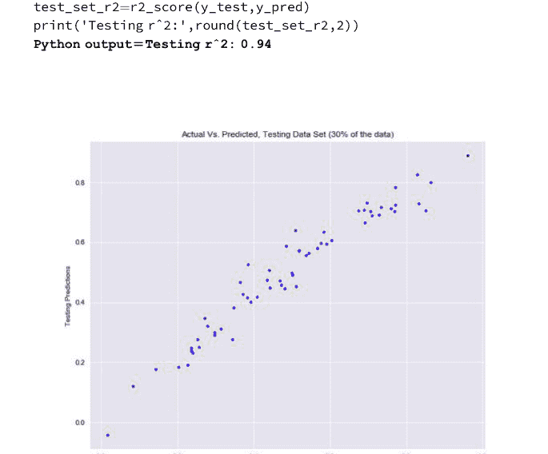

图5.9 实际值与预测值，测试数据集。

让我们也从metrics库中获取MAE、MSE和RMSE，如下所示：

```python
from sklearn import metrics
print('MAE:', round(metrics.mean_absolute_error(y_test, y_pred), 5))
print('MSE:', round(metrics.mean_squared_error(y_test, y_pred), 5))
print('RMSE:', round(np.sqrt(metrics.mean_squared_error(y_test, y_pred)), 5))
```

Python输出=
MAE: 0.03793
MSE: 0.00266
RMSE: 0.05159

现在，让我们创建一个残差分布的直方图，表示预测y值与实际y值之间的差异，如下所示：

```python
sns.distplot((y_test - y_pred))
```

Python输出=图5.10

当残差呈正态分布时，这是模型是该数据集正确选择的一个标志。

接下来，让我们使用statsmodel，这是一个为scipy提供统计计算补充的Python包（Statsmodels, 2020），来获取多元线性回归模型的摘要统计信息。

```python
import statsmodels.api as sm
X = sm.add_constant(X_train)
model = sm.OLS(y_train, X).fit()
predictions = model.predict(X)
model_stats = model.summary()
print(model_stats)
```

Python输出=图5.11

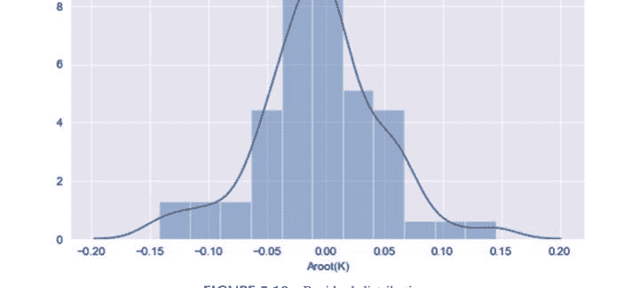

```
OLS回归结果
==============================================================================
因变量:                Aroot(K)   R-squared:                       0.946
模型:                            OLS   调整后R-squared:                  0.944
方法:                 最小二乘法   F统计量:                     589.0
日期:                Sat, 20 Jun 2020   Prob (F-statistic):           2.26e-94
时间:                        11:15:44   对数似然值:                 218.37
观测数:                 140   AIC:                            -426.7
残差自由度:                     135   BIC:                            -411.7
模型自由度:                           4                                         
协方差类型:            非稳健                                         
==============================================================================
                 系数    标准误          t      P>|t|      [0.025      0.975]
------------------------------------------------------------------------------
常数项         -0.2957      0.030     -9.761      0.000      -0.356      -0.236
孔隙度 (%)   1.0698      0.035     30.654      0.000       1.001       1.139
声阻抗 (kg/m2s*10^6)  -0.1781      0.040     -4.400      0.000      -0.258      -0.098
脆性比   0.4263      0.027     16.083      0.000       0.374       0.479
镜质体反射率 (%)   0.2317      0.039      5.899      0.000       0.154       0.309
==============================================================================
Omnibus:                        6.746   Durbin-Watson:                   2.148
Prob(Omnibus):                  0.034   Jarque-Bera (JB):                9.002
偏度:                          -0.195   Prob(JB):                      0.0111
峰度:                       4.136   条件数:                         20.9
==============================================================================

警告:
[1] 标准误假设误差的协方差矩阵被正确指定。
```


如图5.11所示，每个参数的截距和系数与之前获得的结果一致。这个摘要表提供了模型结果的更详细显示，非常有用。

## 单变量敏感性分析

单变量（OVAT）是一种常用的敏感性分析工具，其中一次改变一个变量，以观察每个变量变化对模型输出的**独立**影响。这意味着在调整感兴趣的输入特征时，所有其他输入变量保持不变。例如，可以使用训练数据集中每个参数的平均值或中位数作为其他参数的值，同时改变感兴趣的参数。在本例中，创建了一个名为"敏感性分析"的Excel工作表。每个输入特征的敏感性分析如下：

- 孔隙度从4.5%增加到16.5%，增量为1%，同时保持其他参数大致为训练集的平均值，以从训练模型中获取Aroot(K)的预测值。
- 声阻抗从1.4增加到5，增量为0.1，同时保持其他参数大致为训练集的平均值，以从训练模型中获取Aroot(K)的预测值。

-   脆性比从13增加到103，增量为10，同时保持其他参数约为训练集的平均值，以从训练模型中获取Aroot(K)的预测值。
-   镜质体反射率从0.74增加到2.34，增量为0.2，同时保持其他参数约为训练集的平均值，以从训练模型中获取Aroot(K)的预测值。
-   由于输出特征不能为空（否则Python会报错），因此为整列选择了一个任意的Aroot(K)值50。请注意，Aroot(K)是将被预测的列，只要输出单元格填充了值，代码就会运行，否则Python会报错。

注意：需要强调的是，为每个输入特征选择的敏感性范围位于该特征的最小值和最大值之间。理解这一点非常重要，因为强烈建议避免对超出训练数据集范围的范围进行敏感性分析。换句话说，不要使用机器学习模型来外推模型从未见过的点。机器学习模型适用于插值，但不适用于外推。

让我们从线性回归分析中导入名为"Chapter5_Geologic_Sensitivity_DataSet.xlsx"的Excel文件，该文件位于同一Notebook的下方：
https://www.elsevier.com/books-and-journals/book-companion/9780128219294

```
df_sensitivity=pd.read_excel('Chapter5_Geologic_Sensitivity_DataSet.xlsx')
df_sensitivity.describe().transpose()
Python output=Fig. 5.12
```

由于训练数据集在应用多元线性回归模型之前已进行归一化，因此在请求预测之前，让我们首先对敏感性数据集进行归一化，如下所示：

```
scaled_sensitivity=scaler.transform(df_sensitivity)
```

让我们还将生成的numpy数组（缩放后的敏感性）转换为数据框，并为此敏感性数据集定义输入和输出特征。

| | count | mean | std | min | 25% | 50% | 75% | max |
|---|---|---|---|---|---|---|---|---|
| **孔隙度 (%)** | 69.0 | 10.500000 | 1.635992 | 4.50 | 10.5 | 10.50 | 10.5 | 16.50 |
| **声阻抗 (kg/m2s*10^6)** | 69.0 | 3.223188 | 0.787988 | 1.40 | 3.1 | 3.25 | 3.3 | 5.00 |
| **脆性比** | 69.0 | 58.855072 | 11.020403 | 13.00 | 59.0 | 59.00 | 59.0 | 103.00 |
| **镜质体反射率 (%)** | 69.0 | 1.505217 | 0.188357 | 0.74 | 1.5 | 1.50 | 1.5 | 2.34 |
| **Aroot(K)** | 69.0 | 50.000000 | 0.000000 | 50.00 | 50.0 | 50.00 | 50.0 | 50.00 |

图 5.12 df_sensitivity 描述。

```
scaled_sensitivity=pd.DataFrame(scaled_sensitivity, columns=
    ['Porosity (%)', 'Acoustic impedance (kg/m2s*10^6)',
    'Brittleness Ratio', 'Vitrinite Reflectance (%)', 'Aroot(K)'])
y_scaled_sensitivity=scaled_sensitivity['Aroot(K)']
x_scaled_sensitivity=scaled_sensitivity.drop(['Aroot(K)'],
    axis=1)
```

至此，敏感性数据集已导入，并且已定义了x和y特征。现在，让我们应用训练好的"lm"模型到"x_scaled_sensitivity"，以预测敏感性数据框中每一行的y值。

```
y_pred_sensitivity=lm.predict(x_scaled_sensitivity)
```

"y_pred_sensitivity"是一个数组。因此，让我们将其转换为数据框并为其指定列名。之后，由于生成的预测值是归一化的，因此需要将预测的敏感性y值转换回其原始形式，如下所示。这可以通过将预测的Aroot(K)值乘以原始数据集的最大值与最小值之差，然后将结果项加到原始Aroot(K)数据框的最小值上来实现。

```
y_pred_sensitivity=pd.DataFrame(y_pred_sensitivity,columns=
    ['Predicted Aroot(K)'])
y_pred_sensitivity=y_pred_sensitivity['Predicted Aroot(K)']*(df
    ['Aroot(K)'].max()-df['Aroot(K)'].min())+df['Aroot(K)'].min()
```

接下来，让我们通过绘制每个变量与"y_pred_sensitivity"的关系图来检查每个变量对Aroot(K)的影响。首先，使用np.linspace创建一个介于孔隙度值4.5和16.5之间的数组，包含13个值，这将产生如前所述的以1%为增量的孔隙度值。接下来，绘制por与"y_pred_sensitivity.iloc[0:13]"的关系图。如第1章所述，".iloc[0:13]"将分配从索引0到12的预测Aroot(K)值（这些是与孔隙度相关的预测Aroot(K)值）。如下图所示，随着孔隙度的增加，Aroot(K)也显著增加。因此，可以观察到每个自变量对目标特征（在此示例问题中定义为Aroot(K)）的定性和定量影响。请注意，偏依赖图将在第7章中用于执行类似的敏感性分析。如果希望使用一组特定的输入特征来预测输出，此方法非常有用。

```
plt.figure(figsize=(8,5))
por=np.linspace(4.5,16.5,13)
plt.scatter(por,y_pred_sensitivity.iloc[0:13])
plt.title('Porosity Impact on Aroot(K) Sensitivity')
plt.xlabel('Porosity (%)')
plt.ylabel('Aroot(K)')
Python output=Fig. 5.13
```

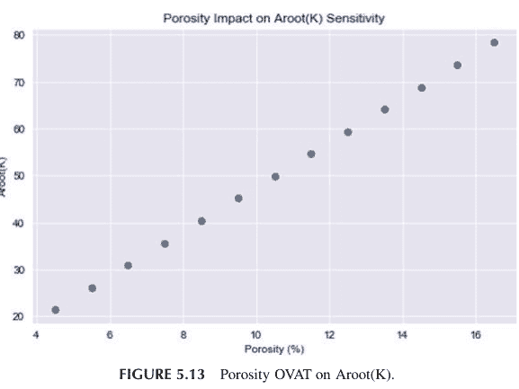

图 5.13 孔隙度对Aroot(K)的OVAT影响。

让我们也理解其他三个变量对Aroot(K)的独立和定量影响，如下所示：

```
plt.figure(figsize=(8,5))
AI=np.linspace(1.4,5,37)
plt.scatter(AI,y_pred_sensitivity.iloc[13:50])
plt.title('AI Impact on Aroot(K) Sensitivity')
plt.xlabel('AI')
plt.ylabel('Aroot(K)')
Python output=Fig. 5.14
```

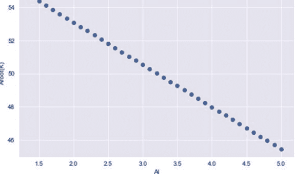

图 5.14 声阻抗 (AI) 对Aroot(K)的OVAT影响。

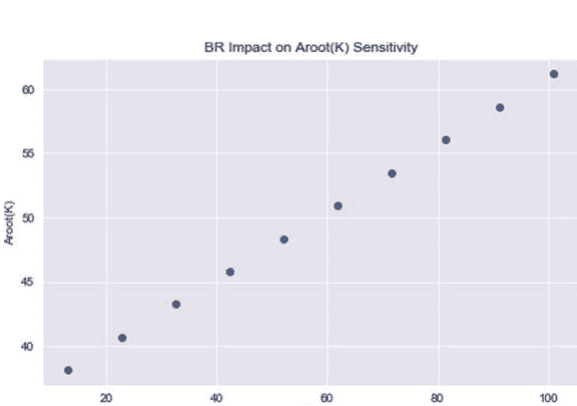

图 5.15 脆性比 (BR) 对Aroot(K)的OVAT影响。

```
plt.figure(figsize=(8,5))
BR=np.linspace(13,101,10)
plt.scatter(BR,y_pred_sensitivity.iloc[50:60])
plt.title('BR Impact on Aroot(K) Sensitivity')
plt.xlabel('BR')
plt.ylabel('Aroot(K)')
Python output=Fig. 5.15
```

```
plt.figure(figsize=(8,5))
VR=np.linspace(0.74,2.34,9)
plt.scatter(VR,y_pred_sensitivity.iloc[60:69])
plt.title('VR Impact on Aroot(K) Sensitivity')
plt.xlabel('VR')
plt.ylabel('Aroot(K)')
Python output=Fig. 5.16
```

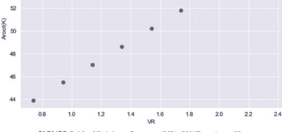

图 5.16 镜质体反射率 (VR) 对Aroot(K)的OVAT影响。

## 逻辑回归

逻辑回归是另一种强大的监督机器学习算法，用于二元分类问题（当目标是分类变量时）。理解逻辑回归的最佳方式是将其视为用于分类问题的线性回归。逻辑回归本质上使用下面定义的逻辑函数来建模二元输出变量（Tolles & Meurer, 2016）。线性回归和逻辑回归之间的主要区别在于，逻辑回归的范围被限制在0和1之间。此外，与线性回归不同，逻辑回归不要求输入和输出变量之间存在线性关系。这是由于对优势比（稍后定义）应用了非线性对数变换。

$$逻辑函数 = \frac{1}{1 + e^{-x}}$$ (5.6)

在逻辑函数方程中，$x$是输入变量。让我们将$-20$到$20$的值**输入**到逻辑函数中。如图5.17所示，输入已被转换到0和1之间。

与线性回归使用MSE或RMSE作为损失函数不同，逻辑回归使用称为"最大似然估计 (MLE)"的损失函数，这是一种条件概率。如果概率大于0.5，预测将被分类为类别0。否则，将被分配为类别1。在推导逻辑回归之前，让我们首先定义**logit**函数。Logit函数定义为优势的自然对数。0.5的概率对应于logit为0，小于0.5的概率对应于负的logit值，大于0.5的概率对应于正的logit值。需要强调的是，如图5.17所示，逻辑函数的范围在0和1之间。

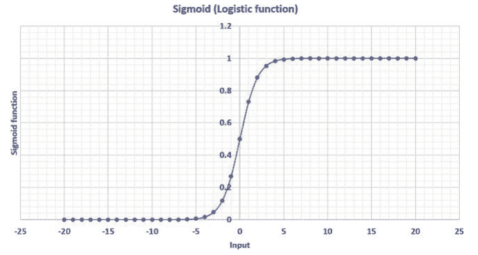

**图 5.17** 应用于$-20$到$20$范围的逻辑回归。

$(P \in [0,1])$，而 logit 函数可以是负无穷到正无穷之间的任意实数 $(P \in [-\infty, \infty])$。

$$odds = \frac{P}{1-P} \rightarrow \text{logit}(P) = \ln\left(\frac{P}{1-P}\right) \quad (5.7)$$

让我们将 $P$ 的 logit 设为等于 $mx + b$，因此：

$$\text{logit}(P) = mx + b \rightarrow mx + b = \ln\left(\frac{P}{1-P}\right)$$
$$\left(\frac{P}{1-P}\right) = e^{(mx+b)} \rightarrow P = \frac{e^{(mx+b)}}{1+e^{(mx+b)}} \rightarrow P(x) = \frac{1}{1+e^{-(mx+b)}} \quad (5.8)$$

在 scikit-learn 中使用逻辑回归之前，让我们回顾一些用于评估分类模型（如逻辑回归）的非常重要的分类指标。

## 分类模型评估指标

分类准确率定义如下：

$$Accuracy = \frac{\text{Number of correct predictions}}{\text{Number of all predictions}} \quad (5.9)$$

尽管准确率提供了模型在预测正确类别方面的总体准确性理解，但在评估分类模型时使用准确率的一个主要问题是数据集中存在不平衡的类别分布。例如，在一个包含 100 万行的数据集中，10 万行被分配到类别 0，其余 90 万行被分配到类别 1，这被归类为不平衡分布。因此，建议使用混淆矩阵以获取更多关于评估模型准确性的信息。混淆矩阵显示了每个类别的正确和错误预测。例如，如果一个分类机器学习模型预测了两个类别，混淆矩阵会显示每个类别的真实和错误预测。在使用逻辑回归模型的二元分类问题中，混淆矩阵是一个 $2 \times 2$ 矩阵。对于 N 个输出的分类问题，将使用 NxN（N 乘 N）矩阵。现在，让我们定义混淆矩阵中使用的术语，假设一个包含类别 A 和 B 的 $2 \times 2$ 混淆矩阵：

- 真阳性：机器学习模型将样本正确分类为类别 A 的次数
- 假阴性：机器学习模型将样本错误分类为类别 A 的次数
- 假阳性：机器学习模型将样本错误分类为类别 B 的次数
- 真阴性：机器学习模型将样本正确分类为类别 B 的次数

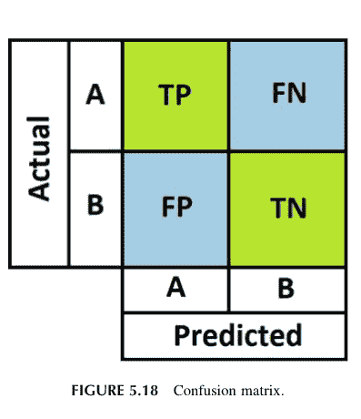

图 5.18 混淆矩阵。

其思想是最大化真阳性和真阴性实例，同时最小化假阳性和假阴性实例。图 5.18 展示了一个包含两个类别（A 和 B）的混淆矩阵，并使用了上述术语。

精确率和召回率是用于评估分类模型的指标。这些参数提供了对模型准确性的更深入见解。精确率和召回率定义如下：

$$Precision = \frac{True\ positive}{Predicted\ results} = \frac{True\ positive}{True\ positive + false\ positive}$$
$$Recall = \frac{True\ positive}{Actual\ results} = \frac{True\ positive}{True\ positive + false\ negative}$$
(5.10)

如图所示，精确率衡量模型在评估正类别时的准确性。换句话说，在预测的正类别中，精确率确定了实际为正的数量。当假阳性的代价非常高时，更倾向于使用精确率。例如，机器学习可用于垃圾邮件检测。在电子邮件检测中，假阳性表示一封非垃圾邮件被识别为垃圾邮件。因此，如果精确率不高，最终用户可能无法收到重要邮件。因此，精确率和召回率之间存在权衡。如前所述，精确率和召回率不能同时最大化，根据项目需求，其中一个会比另一个更受青睐。这两个指标成反比。

召回率衡量实际正例的数量。当与**假阴性**相关的代价很高时，使用召回率。在银行业，欺诈检测非常重要。因此，如果一笔欺诈性交易被预测为非欺诈性，可能会给银行带来可怕的后果。总结如下：

- 与假阳性相关的高代价：最大化精确率
- 与假阴性相关的高代价：最大化召回率

在石油和天然气行业，如果目标是提前分类出砂阶段，其思想是发出警告，并确保任何可能导致井出砂（砂堵）的实例都被分类为出砂。否则，可能会导致代价高昂的出砂。因此，与假阴性相关的代价很高，训练分类机器学习模型时的目标是最大化召回率。这将导致对每个警报进行适当调查，以保持谨慎。

在解决类别分布不均匀的问题时，另一个可以使用的分类指标是 F1 分数，因为它同时考虑了假阳性和假阴性。当需要在精确率和召回率之间取得平衡时，F1 分数也很有益。F1 分数的公式如下：

$$F_{1,score} = 2 \frac{Precision \times recall}{Precision + recall}$$

## 使用 scikit-learn 的逻辑回归

机器学习分类模型有许多不同的应用，包括石油和天然气行业的人力资源。在本练习中，使用一个包含 10 个输入特征和 1 个输出特征的人力资源数据集来确定员工是否会离职。该数据集可在以下链接中找到：

https://www.elsevier.com/books-and-journals/book-companion/9780128219294

输入特征如下：
迟到百分比、项目主动性百分比、项目按时交付百分比、邮件交换百分比、响应性百分比、专业邮件回复百分比、分享想法百分比、帮助同事百分比、LinkedIn 上的创业帖子百分比、Facebook 评论百分比。

输出特征称为“离职”，是一个二元类别，其中 0 代表员工留下，1 代表员工离职。请注意，此数据集不需要任何归一化，因为所有输入特征都是百分比，并且已经处于相同的尺度上。考虑到这一点，让我们开始一个新的 Jupyter Notebook，并开始导入以下常用库，并导入本练习中将使用的数据集：

```
import numpy as np
import pandas as pd
import matplotlib.pyplot as plt
import seaborn as sns
```

190 使用 Python 的石油和天然气机器学习指南

| | count | mean | std | min | 25% | 50% | 75% | max |
|---|---|---|---|---|---|---|---|---|
| Late show up percentage | 1000.0 | 0.501025 | 0.187179 | 0.0 | 0.367040 | 0.495075 | 0.639074 | 1.0 |
| Project initiative percentage | 1000.0 | 0.483284 | 0.184640 | 0.0 | 0.359586 | 0.486289 | 0.622330 | 1.0 |
| Percentage of project delivery on time | 1000.0 | 0.427376 | 0.187881 | 0.0 | 0.286459 | 0.413932 | 0.552530 | 1.0 |
| Percentage of emails exchanged | 1000.0 | 0.400711 | 0.144444 | 0.0 | 0.295613 | 0.397399 | 0.496453 | 1.0 |
| Percentage of responsiveness | 1000.0 | 0.537204 | 0.182367 | 0.0 | 0.416221 | 0.539818 | 0.661523 | 1.0 |
| Percentage of professional email response | 1000.0 | 0.484969 | 0.182355 | 0.0 | 0.350552 | 0.483522 | 0.612790 | 1.0 |
| Percentage of sharing ideas | 1000.0 | 0.471185 | 0.179900 | 0.0 | 0.344950 | 0.458429 | 0.592071 | 1.0 |
| Percentage of helping colleagues | 1000.0 | 0.519861 | 0.194477 | 0.0 | 0.381461 | 0.515514 | 0.661990 | 1.0 |
| Percentage of entrepreneurial posts on LinkedIn | 1000.0 | 0.521589 | 0.193181 | 0.0 | 0.374331 | 0.526394 | 0.669513 | 1.0 |
| Percentage of Facebook comments | 1000.0 | 0.576462 | 0.162826 | 0.0 | 0.464761 | 0.586543 | 0.689762 | 1.0 |
| Quitting | 1000.0 | 0.500000 | 0.500250 | 0.0 | 0.000000 | 0.500000 | 1.000000 | 1.0 |

图 5.19 人力资源描述。

```
%matplotlib inline
df=pd.read_excel('Chapter5_HR_DataSet.xlsx')
df.describe().transpose()
Python output=Fig. 5.19
```

让我们绘制分布图和小提琴图，如下所示：

```
f, axes=plt.subplots(5, 2, figsize=(12, 12))
sns.distplot(df['Late show up percentage'], color="red", ax=axes[0, 0])
sns.distplot(df['Project initiative percentage'], color="olive", ax=axes[0, 1])
sns.distplot(df['Percentage of project delivery on time'], color="blue", ax=axes[1, 0])
sns.distplot(df['Percentage of emails exchanged'], color="orange", ax=axes[1, 1])
sns.distplot(df['Percentage of responsiveness'], color="black", ax=axes[2, 0])
sns.distplot(df['Percentage of professional email response'], color="green", ax=axes[2, 1])
sns.distplot(df['Percentage of sharing ideas'], color="cyan", ax=axes[3, 0])
sns.distplot(df['Percentage of helping colleagues'], color="brown", ax=axes[3, 1])
sns.distplot(df['Percentage of entrepreneurial posts on LinkedIn'], color="purple", ax=axes[4, 0])
sns.distplot(df['Percentage of Facebook comments'], color="pink", ax=axes[4, 1])
plt.tight_layout()
Python output=Fig. 5.20
```

```
f, axes=plt.subplots(5, 2, figsize=(12, 12))
sns.violinplot(df['Late show up percentage'], color="red", ax=axes[0, 0])
```

## 5.20 人力资源数据集分布。

```python
sns.violinplot(df['Project initiative percentage'], color="olive",
    ax=axes[0, 1])
sns.violinplot(df['Percentage of project delivery on time'],
    color="blue", ax=axes[1, 0])
sns.violinplot(df['Percentage of emails exchanged'],
    color="orange", ax=axes[1, 1])
sns.violinplot(df['Percentage of responsiveness'], color="black",
    ax=axes[2, 0])
sns.violinplot(df['Percentage of professional email response'],
    color="green", ax=axes[2, 1])
sns.violinplot(df['Percentage of sharing ideas'], color="cyan",
    ax=axes[3, 0])
sns.violinplot(df['Percentage of helping colleagues'],
    color="cyan", ax=axes[3, 1])
sns.violinplot(df['Percentage of entrepreneurial posts on LinkedIn'],
    color="cyan", ax=axes[4, 0])
sns.violinplot(df['Percentage of Facebook comments'],
    color="cyan", ax=axes[4, 1])
plt.tight_layout()
```

Python 输出=图 5.21

192 使用Python的油气行业机器学习指南

如分布图所示，所有输入特征均呈现正态分布，且未显示任何异常值。接下来，我们绘制如下皮尔逊相关系数热力图。该数据集中似乎不存在共线性输入特征。在本练习中，将使用下图所示的全部10个特征。然而，在讨论其他一些算法（如随机森林、极端梯度提升树、梯度提升等）时，可以使用特征排序来移除对模型输出影响可忽略不计的不重要特征。

```python
plt.figure(figsize=(12,10))
sns.heatmap(df.corr(), annot=True, linecolor='white',
    linewidths=2, cmap='Accent')
```

Python 输出=图 5.22

请注意，可以显示各种“cmap”或颜色映射，如图5.23所示。

监督学习章节 | 5 193

## 5.22 人力资源数据集皮尔逊相关热力图。

BuPu, BuPu_r, CMRmap, CMRmap_r, Dark2, Dark2_r, GnBu, GnBu_r, Greens, Greens_r, Greys, Greys_r, OrRd, OrRd_r, Oranges, Oranges_r, PRGn, PRGn_r, Paired, Paired_r, Pastel1, Pastel1_r, Pastel2, Pastel2_r, PiYG, PiYG_r, PuBu, PuBuGn, PuBuGn_r, PuBu_r, PuOr, PuOr_r, PuRd, PuRd_r, Purples, Purples_r, RdBu, RdBu_r, RdGy, RdGy_r, RdPu, RdPu_r, RdYlBu, RdYlBu_r, RdYlGn, RdYlGn_r, Reds, Reds_r, Set1, Set1_r, Set2, Set2_r, Set3, Set3_r, Spectral, Spectral_r, Wistia, Wistia_r, YlGn, YlGnBu, YlGnBu_r, YlGn_r, YlOrBr, YlOrBr_r, YlOrRd, YlOrRd_r, afmhot, afmhot_r, autumn, autumn_r, binary, binary_r, bone, bone_r, brg, brg_r, bwr, bwr_r, cividis, cividis_r, cool, cool_r, coolwarm, coolwarm_r, copper, copper_r, cubehelix, cubehelix_r, flag, flag_r, gist_earth, gist_earth_r, gist_gray, gist_gray_r, gist_heat, gist_heat_r, gist_ncar, gist_ncar_r, gist_rainbow, gist_rainbow_r, gist_stern, gist_stern_r, gist_yarg, gist_yarg_r, gnuplot, gnuplot2, gnuplot2_r, gnuplot_r, gray, gray_r, hot, hot_r, hsv, hsv_r, inferno, inferno_r, jet, jet_r, magma, magma_r, nipy_spectral, nipy_spectral_r, ocean, ocean_r, pink, pink_r, plasma, plasma_r, prism, prism_r, rainbow, rainbow_r, rocket, rocket_r, seismic, seismic_r, spring, spring_r, summer, summer_r, tab10, tab10_r, tab20, tab20_r, tab20b, tab20b_r, tab20c, tab20c_r, terrain, terrain_r, twilight, twilight_r, twilight_shifted, twilight_shifted_r, viridis, viridis_r, vlag, vlag_r, winter, winter_r

## 5.23 颜色方案选项。

现在，我们来定义x和y变量。如前所述，所有参数都已在0到1的范围内，因此无需进行归一化。如下所示，除“离职”列外的所有特征均用作特征，“离职”列用作输出特征。

```python
x_features=df.drop('Quitting',axis=1)
y=df['Quitting']
```

接下来，导入“train_test_split”，定义随机种子为50，并使用70/30的比例随机划分（70%用于训练，30%随机用于测试）。

```python
from sklearn.model_selection import train_test_split
seed=50
np.random.seed(seed)
X_train, X_test, y_train, y_test=train_test_split(x_features,y,
test_size=0.30)
```

接下来，我们导入逻辑回归库并将其命名为“lr”。在使用逻辑回归算法时，有一些超参数可以优化，它们如下：

- scikit-learn在逻辑回归中提供的求解器选项有“newton-cg”、“lbfgs”、“liblinear”、“sag”、“saga”。

newton-cg是一种使用海森矩阵的牛顿法。海森矩阵由19世纪德国数学家路德维希·奥托·海森发展而来，它使用标量值函数的二阶偏导数的方阵。请注意，由于此方法计算二阶导数，因此对于大型数据集，此求解器可能较慢。

下一个常用的算法是scikit-learn 0.22.0中的默认算法，称为**lbfgs**。lbfgs代表有限内存Broyden–Fletcher–Goldfarb–Shanno算法。lbfgs是一种求解无约束非线性优化问题的迭代方法，它通过梯度评估来近似二阶导数矩阵的更新。它被称为短期记忆，因为它只存储最近的几次更新（Avriel, 2003）。

“liblinear”使用坐标下降算法，该算法基于在循环中最小化函数的坐标方向。此求解器在高维数据上表现良好（Wright, 2015）。

“sag”是随机平均梯度下降（将详细讨论）。“saga”是“sag”的扩展，允许L1正则化（下文讨论）。请注意，“sag”和“saga”对于较大数据集更快。

如前所述，当一个模型被记忆并专门针对特定训练集进行调整，而无法在应用于测试集或盲集时进行准确预测时，这被称为过拟合。过拟合本质上意味着模型未能泛化以高精度预测测试集或盲集，这被认为是开发机器学习模型时的一个主要挑战。因此，使用正则化来避免过拟合。正则化是引入额外微调参数以防止过拟合的过程。有多种技术可以避免过拟合，一些常用的技术是正则化、交叉验证和丢弃法。

正则化就是降低模型复杂度的过程。可以通过惩罚损失函数来降低模型复杂度。

损失函数简单来说就是实际值与预测值之间差值的平方和，如下所示：

$$\sum_{i=1}^{n} (y_i - \widehat{y})^2 \quad (5.12)$$

可以在上述方程中添加一个正则化项，如下所示（红色高亮部分）：

$$\sum_{i=1}^{n} (y_i - \widehat{y})^2 + \lambda \sum_{i=1}^{n} \theta_i^2 \quad (5.13)$$

$\theta_i$ 代表特征的权重，$\lambda$ 代表正则化强度（惩罚）参数。正则化参数决定了应用于权重的惩罚量。如果不需要正则化，只需设置 $\lambda=0$，这将消除所讨论方程中的正则化表达式。较大的 $\lambda$ 可能导致模型欠拟合，而较小的 $\lambda$ 可能导致模型过拟合。在后续章节讨论网格搜索时，正则化参数可以作为使用网格搜索进行模型优化的超调参数之一。

正则化参数的例子有 $L_1$ 和 $L_2$ 正则化。$L_1$ 正则化被称为 $L_1$ 范数或Lasso正则化。在 $L_1$ 正则化中，权重的绝对值被惩罚，如下所示。此外，$L_1$ 正则化具有稀疏解，对异常值具有鲁棒性，并且可能有多个解。请注意，$L_1$ 生成简单模型，无法解释复杂模式。因此，对于复杂模式识别，建议使用 $L_2$ 正则化。

$$\sum_{i=1}^{n} (y_i - \widehat{y})^2 + \lambda \sum_{i=1}^{n} |\theta_i| \quad (5.14)$$

另一方面，$L_2$ 正则化被称为岭回归正则化，它使用所有特征权重的平方和，如下高亮所示。在 $L_2$ 正则化中，权重被强制变小。与 $L_1$ 正则化相比，$L_2$ 正则化具有非稀疏解，对异常值不鲁棒，并且在处理复杂数据模式时表现更好。$L_2$ 正则化始终有一个解。

$$\sum_{i=1}^{n} (y_i - \widehat{y})^2 + \lambda \sum_{i=1}^{n} \theta_i^2 \quad (5.15)$$

C是 $\lambda$（正则化强度）的倒数，C的默认值为1。C是SVM算法中使用的基本参数之一，本章稍后将更详细地讨论。

$$C = \frac{1}{\lambda}$$

(5.16)

```python
from sklearn.linear_model import LogisticRegression
np.random.seed(seed)
lr=LogisticRegression(penalty='l2', C=1.0,solver='lbfgs')
```

逻辑回归的模型参数都定义在"lr"下。让我们将lr模型应用于拟合(X_train,y_train)，如下所示：

```python
lr.fit(X_train,y_train)
```

接下来，让我们应用训练好的"lr"模型来预测"X_test"，并将结果数组称为"y_pred"，如下所示：

```python
y_pred=lr.predict(X_test)
```

为了生成前面讨论的混淆矩阵和分类指标，从"sklearn.metrics"导入"classification_report"和"confusion_matrix"，并打印y_test（实际测试输出值）和y_pred（预测测试输出值）的混淆矩阵。此外，生成结果混淆矩阵的热力图：

```python
from sklearn.metrics import classification_report,confusion_matrix
print(confusion_matrix(y_test,y_pred))
sns.heatmap(confusion_matrix(y_test,y_pred), annot=True,
            cmap='viridis')
```

Python输出=图5.24

```
[[143   9]
 [  4 144]]
```

```
<matplotlib.axes._subplots.AxesSubplot at 0x19e1f604f48>
```

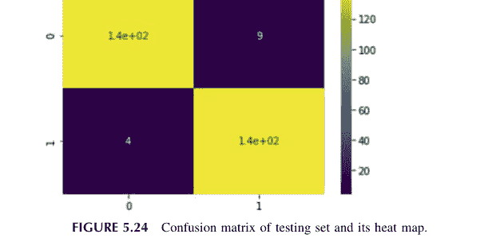

图5.24 测试集的混淆矩阵及其热力图。

| | precision | recall | f1-score | support |
|---|---|---|---|---|
| 0 | 0.97 | 0.94 | 0.96 | 152 |
| 1 | 0.94 | 0.97 | 0.96 | 148 |
| accuracy | | | 0.96 | 300 |
| macro avg | 0.96 | 0.96 | 0.96 | 300 |
| weighted avg | 0.96 | 0.96 | 0.96 | 300 |

图5.25 分类报告。

如图5.24所示，152个实例中有143个被正确分类为类别0（未离职），9个被错误分类到该类别。另一方面，148个实例中有144个被正确分类为类别1（离职），只有4个实例被错误分类。

接下来，让我们也获取分类报告，如下所示：

```python
print(classification_report(y_test,y_pred))
Python输出=图5.25
```

模型的整体准确率为96%。此外，每个类别的精确率和召回率百分比都很高，范围在94%到97%之间，且每个组中的类别实例是平衡的。可以通过手动更改一些微调参数或使用网格搜索优化（推荐方法）来提高此模型的准确性，这将在第7章中讨论。目前，只需手动更改一些微调参数并观察其对模型的影响。

## K近邻

K近邻，也称为KNN，是最简单的监督式机器学习算法之一，用于分类和回归问题。KNN被认为是一种非参数算法，这意味着不对底层数据做任何假设（Cover & Hart, 1967）。KNN算法基于相似邻近性，使用距离计算来工作。开发KNN模型时使用以下步骤：

1.  确定最近邻的数量，也称为K。例如，如果K=2，将根据距离计算选择两个最近的点来确定一个实例将被分配到哪个类别（在分类问题中）。在KNN算法中选择K可能具有挑战性。选择较小的K意味着对结果的影响更大。另一方面，选择较大的K可能导致更平滑的决策边界，方差更低但偏差增加。选择K的一种方法是使用不同的K邻居（如1、2等）训练模型，以查看哪个K在模型验证章节中讨论的交叉验证技术下能产生最高的测试准确率。在进行下一步之前，请确保对数据进行标准化。

198 使用Python的油气机器学习指南

表5.1 石油和天然气价格类别（KNN示例）。

| 石油价格（美元/桶） | 天然气价格（美元/百万英热单位） | 类别 |
| :--- | :--- | :--- |
| 90 | 4 | 强劲 |
| 40 | 2 | 疲软 |
| 60 | 3 | 强劲 |
| 80 | 3.5 | 强劲 |
| 35 | 1.5 | 疲软 |

2.  使用距离函数（如欧几里得距离）计算每个实例与所有训练样本之间的距离。
3.  接下来，将距离从低到高排序。然后，根据步骤1中选择的最近邻数量（K）选择最近的邻居。换句话说，选择距离最小的K个邻居。
4.  获取步骤3中获得的最近邻的类别（分类）或数值（回归）。
5.  使用最近邻的平均值（在回归问题中）或多数票（在分类问题中）来预测实例的值或类别。

为了说明这一点，让我们逐步进行一个KNN分类示例。以下两个特征（石油价格和天然气价格）属于"疲软"和"强劲"两个类别。使用3个最近邻（K=3）和欧几里得距离计算来分类表5.1中的点(20, 2.2)是属于"疲软"还是"强劲"。换句话说，石油价格为20美元/桶、天然气价格为2.2美元/百万英热单位将属于哪个类别。

步骤1）计算每一行与给定点(20,2.2)之间的欧几里得距离，如下所示：

```
(90, 4) 和 (20, 2.2) 之间的欧几里得距离
= √((90 - 20)² + (4 - 2.2)²) = 70.02

(40, 2) 和 (20, 2.2) 之间的欧几里得距离
= √((40 - 20)² + (2 - 2.2)²) = 20.00

(60, 3) 和 (20, 2.2) 之间的欧几里得距离
= √((60 - 20)² + (3 - 2.2)²) = 40.01

(80, 3.5) 和 (20, 2.2) 之间的欧几里得距离
= √((80 - 20)² + (3.5 - 2.2)²) = 60.01

(35, 1.5) 和 (20, 2.2) 之间的欧几里得距离
= √((35 - 20)² + (1.5 - 2.2)²) = 15.02
```

表5.2 KNN分类的距离从低到高排序。

| 石油价格（美元/桶） | 天然气价格（美元/百万英热单位） | 类别 | 欧几里得距离 |
| :--- | :--- | :--- | :--- |
| 35 | 1.5 | 疲软 | 15.02 |
| 40 | 2 | 疲软 | 20.00 |
| 60 | 3 | 强劲 | 40.01 |
| 80 | 3.5 | 强劲 | 60.01 |
| 90 | 4 | 强劲 | 70.02 |

步骤2）按距离从低到高排序，如表5.2所示。
步骤3）由于K=3，且三个最近邻中的两个（表5.2中加粗的行）被分类为"疲软"，因此点(20,2.2)将被分类为"疲软"。

KNN具有以下优点：

- 如上例所示，KNN易于实现。
- 它被认为是一种惰性算法，这本质上意味着在做出实时决策之前不需要预先训练。换句话说，它记忆训练数据集，而不是从训练数据集中学习一个判别函数（Raschka, n.d.）。
- 与本章后面将讨论的许多其他算法相比，其两个主要参数是K的数量和距离函数。

使用KNN的一些缺点如下：

- 距离计算在高维数据集中效果不佳；因此，在高维数据集中使用KNN可能具有挑战性。
- 此外，当使用KNN进行预测时，在大型训练数据集中的预测成本很高。这是因为KNN需要在整个数据集中搜索最近邻。
- 由于必须计算每个实例到所有训练样本的距离，计算上可能会变得密集。
- KNN算法对分类特征效果不佳，因为使用分类特征进行维度距离计算很困难。

## 使用scikit-learn实现KNN

打开一个新的Jupyter Notebook，导入必要的库，并导入与前面示例中使用的相同的人力资源数据集。

200 使用Python的油气机器学习指南

```python
import numpy as np
import pandas as pd
import matplotlib.pyplot as plt
import seaborn as sns
%matplotlib inline
df=pd.read_excel('Chapter5_HR_DataSet.xlsx')
```

由于在逻辑回归部分已经针对同一数据库展示了各种可视化图，让我们继续进行数据标准化。如前所述，KNN在确定最近邻时使用基于距离的计算；因此，建议在应用KNN之前对数据进行标准化。此外，通过删除数据集的最后一列来定义x_standardized特征作为模型的输入变量。y只是最后一列，是模型的输出。

```python
from sklearn.preprocessing import StandardScaler
scaler=StandardScaler()
scaler.fit(df.drop('Quitting',axis=1))
y=df['Quitting']
x_standardized_features=scaler.transform(df.drop('Quitting',axis=1))
x_standardized_features=pd.DataFrame(x_standardized_features, columns=df.columns[:-1])
x_standardized_features.head()
Python输出=图5.26
```

接下来，导入模型选择库，并使用train_test_split将数据分为70/30的比例。确保传入"x_standardized_features"和"y"，如下所示。由于70%的数据将用作训练，因此将随机选择700行作为训练数据，其余300行将用于测试模型。

```python
from sklearn.model_selection import train_test_split
seed=1000
np.random.seed(seed)
X_train, X_test, y_train, y_test=train_test_split(x_standardized_features,y, test_size=0.30)
```

接下来，让我们从"sklearn.neighbors"导入"KNeighborsClassifier"，并定义KNN参数为一个邻居，并使用欧几里得距离。

| 迟到百分比 | 项目参与百分比 | 项目按时交付百分比 | 响应性百分比 | 电子邮件回复百分比 | 更改想法百分比 | 帮助同事百分比 | LinkedIn企业家帖子百分比 | Facebook评论百分比 |
|---|---|---|---|---|---|---|---|---|
| 0 | -0.123542 | 0.185907 | -0.913431 | 0.319629 | -1.033637 | -2.308375 | -0.798851 | -1.482368 | -0.949719 | -0.643314 |
| 1 | -1.084836 | -0.430348 | -1.025313 | 0.625388 | -0.444947 | -1.152706 | -1.129797 | -0.202240 | -1.828051 | 0.636759 |
| 2 | -0.788702 | 0.339318 | 0.301511 | 0.755873 | 2.031693 | -0.870156 | 2.599818 | 0.285707 | -0.682494 | -0.377850 |
| 3 | 0.982841 | 1.069193 | -0.621399 | 0.625299 | 0.452620 | -0.267220 | 1.750208 | 1.066491 | 1.241325 | -1.026987 |
| 4 | 1.139275 | -0.640392 | -0.709819 | -0.057175 | 0.822886 | -0.936773 | 0.596782 | -1.472352 | 1.040772 | 0.276510 |

图5.26 人力资源标准化数据。

距离计算。之后，将定义的“KNN”模型应用于“(X_train, y_train)”进行模型训练。

```python
from sklearn.neighbors import KNeighborsClassifier
np.random.seed(seed)
KNN=KNeighborsClassifier(n_neighbors=1, metric='euclidean')
KNN.fit(X_train,y_train)
```

在应用模型之前，让我们创建一个for循环，测试从1到50的不同邻居数量，并评估模型在测试准确率上的表现。首先，导入metrics模块以便在循环结束时获得准确率。接下来，创建一个名为“Score”的空列表。然后，编写一个for循环，K的范围从1到50（包括50），拟合“(X_train, y_train)”，预测“X_test”（30%的测试数据集），将预测值放入“y_pred”，并将“y_test”（实际输出值）和“y_pred”（预测输出值）之间的准确率分数追加到“Scores”中，这是最初创建的空列表。请确保for循环下的所有内容都进行了缩进。

```python
from sklearn import metrics
Scores=[]
for k in range(1, 51):
    KNN=KNeighborsClassifier(n_neighbors=k,metric='euclidean')
    KNN.fit(X_train, y_train)
    y_pred=KNN.predict(X_test)
    Scores.append(metrics.accuracy_score(y_test, y_pred))
```

由于测试分数值已追加到“Score”中，因此可视化不同试验K值下的结果准确率分数非常重要，如下所示：

```python
plt.figure(figsize=(10,8))
plt.plot(range(1, 51), Scores)
plt.xlabel('K Values')
plt.ylabel('Testing Accuracy')
plt.title('K Determination Using KNN', fontsize=20)
Python output=Fig. 5.27
```

如图所示，当K等于5时，测试准确率似乎是最高的之一。在更高的K值处也观察到其他峰值，但5将是此数据集中的首选。因此，让我们这次使用5个邻居应用KNN模型，并继续获取混淆矩阵和分类报告。请注意，“print('\n')”只是在输出代码中添加额外的空格。

202 使用Python的油气机器学习指南

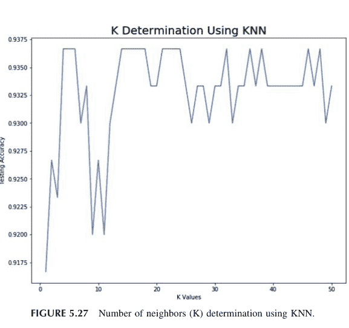

图 5.27 使用KNN确定邻居数量（K）。

```python
from sklearn.metrics import classification_report,confusion_matrix
np.random.seed(seed)
KNN=KNeighborsClassifier(n_neighbors=5,metric='euclidean')
KNN.fit(X_train,y_train)
y_pred=KNN.predict(X_test)
print('\n')
print(confusion_matrix(y_test,y_pred))
print('\n')
print(classification_report(y_test,y_pred))
Python output=Fig. 5.28
```

```
[[142  9]
 [ 10 139]]
```

| | precision | recall | f1-score | support |
|---|---|---|---|---|
| 0 | 0.93 | 0.94 | 0.94 | 151 |
| 1 | 0.94 | 0.93 | 0.94 | 149 |
| accuracy | | | 0.94 | 300 |
| macro avg | 0.94 | 0.94 | 0.94 | 300 |
| weighted avg | 0.94 | 0.94 | 0.94 | 300 |

图 5.28 混淆矩阵和分类报告。

## 支持向量机

SVM是另一种监督式机器学习算法形式，可用于分类和回归问题。与许多机器学习算法的目标是最小化代价函数不同，SVM的目标是通过一个分离超平面最大化支持向量之间的间隔（Cortes & Vapnik, 1995）。在图5.29中，绘制了一个分离超平面（黑色实线）来将蓝色实例与红色实例分开。这个超平面的绘制方式是为了最大化两侧的间隔。请注意，必须绘制尽可能宽的间隔来分离红色和蓝色实例。最接近分离超平面的蓝色和红色实例被称为支持向量，这就是为什么该算法被称为支持向量机。虚线蓝色和红色线到分离超平面（黑色实线）的距离称为“间隔”。如前所述，其思想是最大化两侧的间隔。此图说明了二维空间的情况，对于n维空间，超平面将是n-1维。例如，对于二维空间（两个特征），超平面将是一维的，即一条线。对于三维空间（三个输入特征），超平面变成一个二维平面。对于四维空间（四个特征），超平面将是三维的。此图说明了线性可分情况下最简单的分类问题形式。

这里的目标是最大化支持向量之间的间隔。图5.29展示了一个具有两个输入特征、用于二元分类且线性可分的数据集。不幸的是，大多数现实世界的应用问题并非如此。因此，当数据线性不可分时，考虑以下两个概念非常重要。

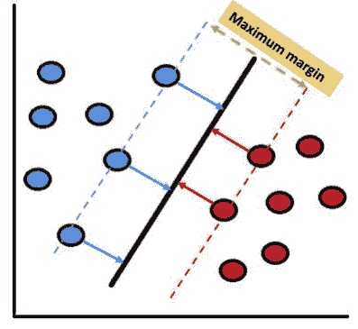

图 5.29 支持向量机分类示意图。

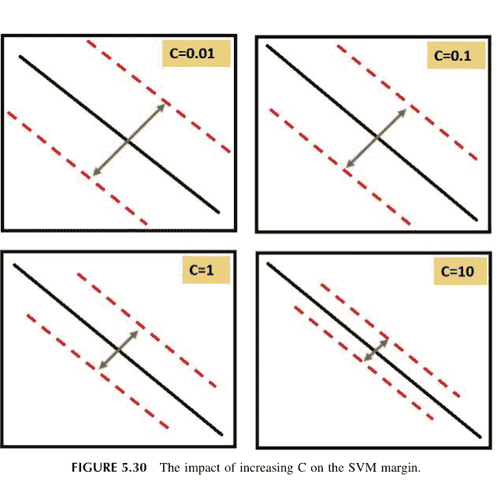

图 5.30 增加C对SVM间隔的影响。

1) **软间隔：** 用于找到一条分类线，但这条线会容忍一个或少数几个错误分类的实例。这种容忍程度由SVM算法中的参数“C”表示。如图5.30所示，C本质上是一个在拥有**宽间隔**和正确**分类训练数据**之间进行权衡的参数。在使用SVM时，C充当正则化参数。C是可用于网格搜索优化的参数之一（将在模型验证章节中讨论）。

    - 较大的C = 较小的间隔宽度（较小的间隔）= 错误分类时产生更大的惩罚 = 更高的训练准确率和更低的测试准确率 = 泛化能力较弱
    - 较小的C = 较大的间隔宽度（较大的间隔）= 错误分类时产生更小的惩罚 = 更低的训练准确率和更高的测试准确率 = 泛化能力较强

当C较大时，决策边界将依赖于更少的支持向量，因为间隔更窄。

2) **核技巧：** 当数据线性不可分时，核技巧利用现有特征并应用一些变换函数来创建新特征。例如，在处理非线性可分数据时，可以使用线性、多项式或径向基函数（rbf）变换。

在scikit-learn库中，有不同的核函数可供选择，如“linear”、“poly”、“rbf”、“sigmoid”等。最流行、通常提供最高准确率的是poly和rbf。因此，让我们回顾这两种变换函数：

    - 多项式核（或poly核）：
        多项式核本质上是一个生成新特征的转换器。使用多项式核的SVM可以生成非线性决策边界。可能无法用一条线分离X和Y的numpy数组。然而，在应用多项式转换器之后，可以画一条线来分离X和Y数组。多项式核定义为：

        $K(X_1, X_2) = (a + X_1^T X_2)^b$

        在此方程中，$X_1$和$X_2$是输入空间中的向量，$a$是常数且大于或等于零，最后$b$是多项式核的次数。

    - 径向基函数（rbf）：
        Rbf核是一个转换器，使用所有其他点到特定点或中心的距离度量来生成新特征。最流行的rbf核是**高斯径向基函数**。例如，如果X和Y数组无法用一条线分离，可以应用使用两个中心的高斯径向基函数变换来生成新特征。高斯径向基函数定义为：

        $K(X_1, X_2) = exp(\gamma ||X_1 - X_2||^2)$

        在此方程中，$X_1$和$X_2$是输入空间中的向量，$||X_1 - X_2||$是$X_1$和$X_2$之间的欧几里得距离。$\gamma$也称为gamma，用于控制新特征对决策边界的影响。当gamma值较低时，在绘制决策边界时会考虑较远的点，这将导致更直的决策边界。较低的gamma值在训练模型时往往会导致欠拟合。另一方面，当gamma较高时，在绘制决策边界时只考虑较近的点（波浪形的决策边界）。这是因为较高的gamma值对决策边界有更大的影响。结果，边界会更加波浪形。较高的gamma值往往会导致过拟合。因此，在使用rbf核函数时，请确保在网格搜索优化中包含各种gamma值。图5.31说明了增加gamma对SVM边界的影响。如图所示，随着gamma增加，模型倾向于过拟合和记忆，而不是构建一个泛化的模型。

## scikit-learn 中的支持向量机实现

本节将介绍如何在 Python 中逐步构建一个用于支持向量机实现的机器学习模型。水力压裂设计中最重要的参数之一是岩石的地质力学性质。泊松比、杨氏模量和最小水平应力等地质力学性质决定了裂缝几何形状以及压裂作业的难易程度。杨氏模量高、泊松比低的脆性岩石更容易压裂，而延性岩石则更难进行水力压裂。岩石的地质力学性质可以通过声波测井来确定。但是，请注意，在每口井上都进行声波测井要么在经济上不可行，要么成本会非常高。因此，可以利用现有的声波测井数据来训练一个机器学习模型，以预测横波和纵波的传播时间（Δt_s 和 Δt_c）。杨氏模量和泊松比的计算公式如下（Belyai 等人，2019）：

$$R_v = \frac{\Delta t_s}{\Delta t_c}$$

$$\Delta t_s = \text{横波传播时间，} \mu\text{秒/英尺（从声波测井获得）}$$

$$\Delta t_c = \text{纵波传播时间，} \mu\text{秒/英尺（从声波测井获得）}$$

(5.20)

横波和纵波的传播时间直接从声波测井中获取。本练习的目标是使用支持向量机训练一个机器学习模型来预测横波和纵波的传播时间。训练好机器学习模型后，可以使用包含伽马射线、体积密度、电阻率、总孔隙度或中子孔隙度以及深度等基本测井属性的三组合测井，在无法获取声波测井数据的区域预测横波和纵波的传播时间。因此，与其花费更多资金获取新的声波测井数据，不如使用训练好的机器学习模型来**预测**横波和纵波的传播时间，从而计算地质力学性质。泊松比、地层模量和动态杨氏模量可以按如下公式计算：

泊松比 = $v = \frac{0.5R_v^2 - 1}{R_v^2 - 1}$

(5.21)

地层模量 = $G = 1.34 \times 10^{10} \times \frac{\rho_b}{\Delta t_s^2}$

其中 $\rho_b$ 是体积密度，单位为克/立方厘米。

动态杨氏模量 = $E = 2G(1 + v)$

最小水平应力 = $P_c = \frac{v}{1 - v}(\sigma_v - \alpha P_p) + \alpha P_p + \sigma_{tectonic}$

(5.22)

其中 $\sigma_v$ 是垂直应力，单位为磅/平方英寸，$\alpha$ 是 Biot 常数，$P_p$ 是孔隙压力，单位为磅/平方英寸，$\sigma_{tectonic}$ 是构造应力，单位为磅/平方英寸。

现在概念已经清晰，让我们来介绍本练习中将使用的数据集。MIP-3H 井的声波测井数据来自 MSEEL 网站（http://www.mseel.org/research/research_MIP.html），本示例使用的数据集可以在以下网址找到：https://www.elsevier.com/books-and-journals/book-companion/9780128219294

本练习的输入数据如下：

- 深度、电阻率、伽马射线、总孔隙度、有效孔隙度和体积密度

该模型将有两个输出特征：横波传播时间（$\Delta t_s$）和纵波传播时间（$\Delta t_c$）。因此，这将是一个多输出（两个输出）回归机器学习模型。请注意，仅使用一条测井曲线来训练这样的模型，本练习的目的是展示逐步过程和概念。因此，如果您计划在组织内应用此模型，请确保使用更多的井来训练一个可靠的模型。打开一个新的 Jupyter Notebook，并开始导入基本库，如下所示：

```python
import numpy as np
import pandas as pd
import matplotlib.pyplot as plt
%matplotlib inline
import seaborn as sns
df=pd.read_excel('Chapter5_Geomechanical_Properties_Prediction_DataSet.xlsx')
df.describe()
```

Python 输出=图 5.32

| | 深度 | 电阻率 | 伽马射线 | 总孔隙度 | 有效孔隙度 | 体积密度 | 纵波传播时间 | 横波传播时间 |
|---|---|---|---|---|---|---|---|---|
| count | 1904.000000 | 1904.000000 | 1904.000000 | 1904.000000 | 1904.000000 | 1904.000000 | 1904.000000 | 1904.000000 |
| mean | 7280.750000 | 146.141582 | 116.270437 | 0.059863 | 0.036853 | 2.652268 | 73.176217 | 123.929532 |
| std | 274.890887 | 322.646089 | 61.220418 | 0.023739 | 0.023542 | 0.072419 | 10.732976 | 19.252592 |
| min | 6805.000000 | 17.413170 | 24.463470 | 0.002870 | 0.002120 | 2.428950 | 50.805650 | 85.474240 |
| 25% | 7042.875000 | 62.688825 | 84.264097 | 0.042928 | 0.019688 | 2.601138 | 64.791450 | 114.705535 |
| 50% | 7280.750000 | 85.495010 | 115.770395 | 0.055185 | 0.037425 | 2.658085 | 72.718335 | 127.887235 |
| 75% | 7518.625000 | 121.405746 | 130.947013 | 0.074783 | 0.054220 | 2.707355 | 80.846762 | 137.370110 |
| max | 7756.500000 | 7223.240720 | 623.150210 | 0.142080 | 0.119320 | 2.849760 | 101.455720 | 184.778790 |

图 5.32 df 基本统计信息。

接下来，使用分布图和箱线图绘制每个特征，如下所示：

```python
f, axes=plt.subplots(4, 2, figsize=(12, 12))
sns.distplot(df['Depth'], color="red", ax=axes[0, 0])
sns.distplot(df['Gamma Ray'], color="olive", ax=axes[0, 1])
sns.distplot(df['Total Porosity'], color="blue", ax=axes[1, 0])
sns.distplot(df['Effective Porosity'], color="orange",
    ax=axes[1, 1])
sns.distplot(df['Resistivity'], color="black", ax=axes[2, 0])
sns.distplot(df['Bulk Density'], color="green", ax=axes[2, 1])
sns.distplot(df['Compression Wave Travel Time'], color="cyan",
    ax=axes[3, 0])
sns.distplot(df['Shear Wave Travel Time'], color="brown", ax=axes
    [3, 1])
plt.tight_layout()
```

Python 输出=图 5.33

快速查看分布图可以发现，电阻率和伽马射线曲线呈对数正态分布，而非正态分布。我们还可以可视化每个特征的箱线图以找出异常点，如下所示：

```python
f, axes=plt.subplots(4, 2, figsize=(12, 12))
sns.boxplot(df['Depth'], color="red", ax=axes[0, 0])
sns.boxplot(df['Gamma Ray'], color="olive", ax=axes[0, 1])
sns.boxplot(df['Total Porosity'], color="blue", ax=axes[1, 0])
sns.boxplot(df['Effective Porosity'], color="orange", ax=axes[1, 1])
sns.boxplot(df['Resistivity'], color="black", ax=axes[2, 0])
sns.boxplot(df['Bulk Density'], color="green", ax=axes[2, 1])
sns.boxplot(df['Compression Wave Travel Time'], color="cyan",
    ax=axes[3, 0])
sns.boxplot(df['Shear Wave Travel Time'], color="brown", ax=axes
    [3, 1])
plt.tight_layout()
```

Python 输出=图 5.34

图 5.34 每个特征的箱线图。

对于本练习，我们筛选电阻率值大于 0 且小于 1000 Ω-m，伽马射线大于 0 且小于 400 gAPI 的数据，如下所示：

```python
df=df[(df['Resistivity'] > 0) & (df['Resistivity'] < 1000)]
df=df[(df['Gamma Ray'] > 0) & (df['Gamma Ray'] < 400)]
```

接下来，绘制皮尔逊相关系数的热力图，如下所示：

```python
plt.figure(figsize=(12,10))
sns.heatmap(df.corr(), annot=True, linecolor='white',
    linewidths=2, cmap='summer')
```

**Python 输出=图 5.35**

如图所示，有效孔隙度和总孔隙度之间的皮尔逊相关系数为 0.9。由于这些参数提供相同的信息，我们直接删除**有效孔隙度**，因为总孔隙度与输出特征之间的关系（更高的皮尔逊相关系数）比有效孔隙度与输出特征之间的关系更强。

```python
df.drop(['Effective Porosity'],axis=1, inplace=True)
```

**图 5.35** 皮尔逊相关系数热力图。

接下来，使用 MinMax 缩放器将所有特征缩放到 0 到 1 之间，如下所示：

```python
from sklearn import preprocessing
scaler=preprocessing.MinMaxScaler(feature_range=(0,1))
scaler.fit(df)
df_scaled=scaler.transform(df)
```

由于 df_scaled 现在是数组格式，我们将其转换为数据框，然后定义 x_scaled 和 y_scaled 特征。请注意，输出特征是纵波和横波传播时间这两个特征，这就是为什么两个参数都包含在 "y_scaled" 下。

```python
df_scaled=pd.DataFrame(df_scaled, columns=['Depth', 'Resistivity',
    'Gamma Ray', 'Total Porosity', 'Bulk Density',
    'Compression Wave Travel Time', 'Shear Wave Travel Time'])
y_scaled=df_scaled[['Compression Wave Travel Time',
    'Shear Wave Travel Time']]
x_scaled=df_scaled.drop(['Compression Wave Travel Time',
    'Shear Wave Travel Time'], axis=1)
```

接下来，我们导入 train_test_split 并使用 70/30 的比例划分数据，如下所示（确保使用相同的随机种子）：

```python
from sklearn.model_selection import train_test_split
seed=1000
np.random.seed(seed)
X_train,X_test,y_train,y_test=train_test_split(x_scaled,
    y_scaled, test_size=0.30)
```

接下来，我们从 "sklearn.svm" 导入 SVR（支持向量回归）。此外，由于这是一个多输出模型，我们从 "sklearn.multioutput" 导入 "MultiOutputRegressor"，如下所示：

```python
from sklearn.svm import SVR
from sklearn.multioutput import MultiOutputRegressor
```

接下来，我们定义 SVR 模型，如下所示：

```python
np.random.seed(seed)
SVM=MultiOutputRegressor((SVR(kernel='rbf', gamma=1,C=1)))
```

如图所示，gamma 和 C 值被赋值为 1，模型中使用了 rbf 核函数。这些参数绝不是最优超参数，强烈建议使用网格搜索来优化此模型。接下来，将 "SVM" 拟合到 "(X_train, y_train)" 并预测 "(X_train)" 和 "(X_test)"，如下所示：

```python
SVM.fit(X_train,y_train)
y_pred_train=SVM.predict(X_train)
y_pred_test=SVM.predict(X_test)
```

在“y_train['Compression Wave Travel Time']”和“y_pred_train[:,0]”之间。请注意，“y_pred_train[:,0]”是压缩波旅行时间的预测**训练**值。此外，“y_pred_train[:,1]”是剪切波旅行时间的预测训练值。计算预测训练准确率是为了更好地了解模型在训练数据集上的准确性。然而，请注意，训练机器学习模型时真正重要的是获得**测试**准确率。如果训练准确率恰好很高，但测试准确率很低，则表明模型已经过拟合。换句话说，模型可以在训练样本上产生高准确率，但一旦向模型引入未知数据集，模型就无法准确预测。

```python
corr_train1=np.corrcoef(y_train['Compression Wave Travel Time'],
    y_pred_train[:,0]) [0,1]
corr_train2=np.corrcoef(y_train['Shear Wave Travel Time'],
    y_pred_train[:,1]) [0,1]
print('Compression Wave Travel Time Train Data r^2=',
    round(corr_train1**2,4),'r=', round(corr_train1,4))
print('Shear Wave Travel Time Train Data r^2=',
    round(corr_train2**2,4),'r=', round(corr_train2,4))
```

**Python 输出=**
**压缩波旅行时间训练数据 r^2=0.9257 r=0.9621**
**剪切波旅行时间训练数据 r^2=0.9182 r=0.9582**

接下来，让我们也获取测试准确率：

```python
corr_test1=np.corrcoef(y_test['Compression Wave Travel Time'],
    y_pred_test[:,0]) [0,1]
corr_test2=np.corrcoef(y_test['Shear Wave Travel Time'],
    y_pred_test[:,1]) [0,1]
print('Compression Wave Travel Time Test Data r^2=',
    round(corr_test1**2,4),'r=', round(corr_test1,4))
print('Shear Wave Travel Time Test Data r^2=',
    round(corr_test2**2,4),'r=', round(corr_test2,4))
```

**Python 输出=**
**压缩波旅行时间测试数据 r^2=0.928 r=0.9633**
**剪切波旅行时间测试数据 r^2=0.9277 r=0.9632**

接下来，让我们获取压缩波和剪切波旅行时间测试集的MAE、MSE和RMSE，如下所示：

```python
from sklearn import metrics
print('Testing Compression MAE:', round(metrics.mean_absolute_error
    (y_test['Compression Wave Travel Time'], y_pred_test[:,0]),4))
print('Testing Compression MSE:', round(metrics.mean_squared_error
    (y_test['Compression Wave Travel Time'], y_pred_test[:,0]),4))
print('Testing Compression RMSE:', round(np.sqrt(metrics.mean_
    squared_error(y_test['Compression Wave Travel Time'], y_pred_test
    [:,0])),4))
```

**Python 输出=**
测试压缩 MAE: 0.0457
测试压缩 MSE: 0.0036
测试压缩 RMSE: 0.0599

```python
print('Testing Shear MAE:', round(metrics.mean_absolute_error(y_test['Shear Wave Travel Time'], y_pred_test[:,1]),4))
print('Testing Shear MSE:', round(metrics.mean_squared_error(y_test['Shear Wave Travel Time'], y_pred_test[:,1]),4))
print('Testing Shear RMSE:', round(np.sqrt(metrics.mean_squared_error(y_test['Shear Wave Travel Time'], y_pred_test[:,1])),4))
```

**Python 输出=**
测试剪切 MAE: 0.0437
测试剪切 MSE: 0.0029
测试剪切 RMSE: 0.0542

下一步是绘制训练和测试的实际值与预测值，如下所示：

```python
plt.figure(figsize=(10,8))
plt.plot(y_test['Compression Wave Travel Time'], y_pred_test[:,0], 'b.')
plt.xlabel('Compression Wave Travel Time Testing Actual')
plt.ylabel('Compression Wave Travel Time Testing Prediction')
plt.title('Compression Wave Travel Time Testing Actual Vs. Prediction')
```

**Python 输出=图 5.36**

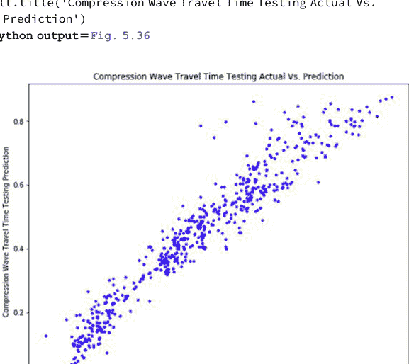

图 5.36 压缩波旅行时间测试实际值与预测值（归一化值）。

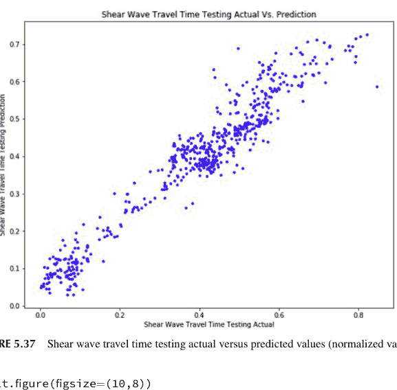

图 5.37 剪切波旅行时间测试实际值与预测值（归一化值）。

```python
plt.figure(figsize=(10,8))
plt.plot(y_test['Shear Wave Travel Time'], y_pred_test[:,1], 'b.')
plt.xlabel('Shear Wave Travel Time Testing Actual')
plt.ylabel('Shear Wave Travel Time Testing Prediction')
plt.title('Shear Wave Travel Time Testing Actual Vs. Prediction')
```

**Python 输出=图 5.37**

最后一步是应用一些完整的盲数据集（盲测井），以查看该训练模型应用于新的盲井时的表现。然后，将训练模型的预测值与实际的剪切波和压缩波旅行时间值进行比较。如果准确率令人满意且误差低，只需继续将训练好的机器学习模型应用于具有三组合测井但未使用声波测井的区域。这将消除投资更多声波测井的需要，并能够以非常好的精度预测剪切波和压缩波旅行时间，从而计算岩石力学性质，如杨氏模量、泊松比和最小水平应力。

## 决策树

决策树是另一种监督式机器学习算法，可用于分类和回归问题。在讨论与决策树密切相关的随机森林之前，了解决策树的工作原理至关重要。决策树将数据分割成子树，然后这些子树再被分割成其他子树。如图5.38所示，**根节点**位于最顶层，本质上代表整个总体；**决策节点**也称为**内部节点**，有两个或更多分支；最后，**终端节点**也称为**叶节点**，是最低层的节点，不再进行分割。请注意，术语“分割”定义为将一个节点分割成两个或多个子节点。

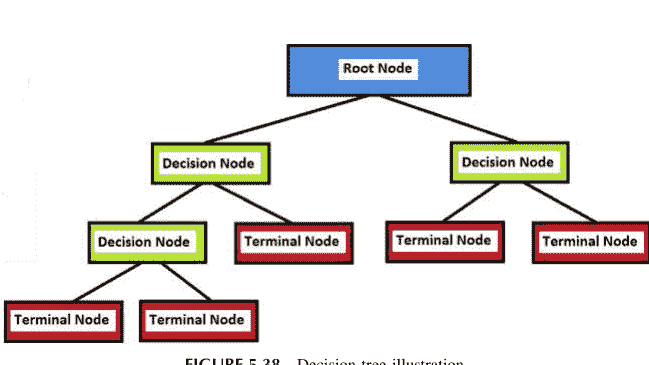

图 5.38 决策树示意图。

有多种决策树算法，如ID3、C4.5、C5.0和CART。ID3代表迭代二分器3，于1986年开发（Quinlan, 1986）。该算法使用自顶向下的贪心方式在**分类**特征上构建决策树，以产生最大的信息增益（将讨论）。此外，ID3使用多路树。C4.5是决策树中使用的另一种算法，它移除了特征必须是分类的限制。C5.0是Quinlan的最新版本，它比C4.5使用更少的内存并构建更小的规则集。最后，CART代表分类和回归树，与C4.5类似，但它支持数值型目标变量，并且不计算规则集。CART创建二叉树，在每个节点产生最大的信息增益。请注意，scikit-learn库使用CART算法的优化版本（scikit-learn, n.d.）。

## 属性选择技术

在具有N个属性的数据集中，决定哪些属性位于根节点或内部节点可能复杂且具有挑战性。属性选择的一些最重要标准如下：

-   1) **熵**：简单来说，是不确定性或纯度的度量，计算如下。请注意，高熵意味着低纯度。

$$E(S) = \sum_{i=1}^{c} -P_i \log_2 P_i$$ (5.23)

其中c是类别数，$P_i$是数据集中某个类别的概率。例如，如果有100个样本，分为“压裂”和“不压裂”两类。假设40个样本属于“压裂”类，60个样本属于“不压裂”类，则熵可以计算如下：

$$-\frac{40}{100}\log_2\frac{40}{100} - \frac{60}{100}\log_2\frac{60}{100} = 0.97$$ (5.24)

从数学上讲，多个属性的熵可以计算如下：

$$E(X, Y) = \sum_{c \in Y} P(c)E(c)$$ (5.25)

其中$X$是当前状态，$Y$是选定的属性。$P(c)$是属性的概率，$E(c)$是属性的熵。对于下面列出的表格，让我们计算熵：

| 条件 | 继续 | 筛除 | 总和 |
| :--- | :---: | :---: | :---: |
| 平稳压力 | 4 | 1 | 5 |
| 压力上升 | 4 | 2 | 6 |
| 快速上升 | 1 | 4 | 5 |
| 总和 | 9 | 7 | 16 |

让我们进行熵的计算，如下所示：

$$Probability(Flat\ Pressure) \times Entropy(4, 1) + Probability(Rising\ Pressure) \times Entropy(4, 2) + Probability(Rapid\ Rise) \times Entropy(1, 4)$$
$$= \frac{5}{16} \times Entropy(4, 1) + \frac{6}{16} \times Entropy(4, 2) + \frac{5}{16} \times Entropy(1, 4)$$ (5.26)

让我们首先计算每个项的熵值，并代入上述公式：

$$Entropy(4, 1) = -\frac{4}{5}\log_2\frac{4}{5} - \frac{1}{5}\log_2\frac{1}{5} = 0.7219$$
$$Entropy(4, 2) = -\frac{4}{6}\log_2\frac{4}{6} - \frac{2}{6}\log_2\frac{2}{6} = 0.9183$$
$$Entropy(1, 4) = -\frac{1}{5}\log_2\frac{1}{5} - \frac{4}{5}\log_2\frac{4}{5} = 0.7219$$

将熵值代回讨论的公式中，如下所示：

$$\frac{5}{16} \times Entropy(4, 1) + \frac{6}{16} \times Entropy(4, 2) + \frac{5}{16} \times Entropy(1, 4)$$
$$= \left(\frac{5}{16} \times 0.7219\right) + \left(\frac{6}{16} \times 0.9183\right) + \left(\frac{5}{16} \times 0.7219\right) = 0.7956$$

2) **信息增益 (IG)**：在构建决策树时，找到能产生最高信息增益和最小熵的属性非常重要。信息增益指的是一个属性根据其目标分类来分离训练样本的效果。请注意，信息增益倾向于较小的分区，其计算公式如下：

$$IG(Y, X) = E(Y) - E(Y, X)$$

**信息增益示例**：计算上一个示例的信息增益。

1) 计算目标变量的熵，如下所示：

$$Entropy(9, 7) = -\frac{9}{16}\log_2\frac{9}{16} - \frac{7}{16}\log_2\frac{7}{16} = 0.9887$$

2) 计算信息增益，如下所示：

$$IG(outcome, pressure\ trend) = 0.9887 - 0.7956 = 0.1931$$

3) **基尼指数**：与信息增益相反，基尼指数倾向于较大的分区，其计算方法是从1中减去每个类别的概率平方和，如下所示。请注意，在完美分类的示例中，基尼指数将等于0。

$$Gini = 1 - \sum_{i=1}^{c} (P_i)^2 = 1 - \left(P(class\ A)^2 + P(class\ B)^2 + ... + P(class\ N)^2\right)$$

其中 $P_i$ 是一个元素被分类到特定类别的概率。使用决策树最困难的挑战之一是过拟合。避免过拟合的方法之一是剪枝。剪枝指的是修剪掉那些在分类实例或影响整体准确性方面提供信息不多的树枝或部分。在使用决策树时，使用交叉验证以确保模型没有过拟合也很重要。另一种方法是使用随机森林算法，它通常比单个决策树表现更好。本章的下一节将详细介绍随机森林。上述讨论的标准，如信息增益和基尼指数，用于属性选择，这些标准将计算每个属性的值。让我们假设选择信息增益作为属性选择的标准。对这些值进行排序，并将具有最高值的属性放在根节点。

## 使用 scikit-learn 的决策树

在本节中，使用一个包含以下输入特征的数据库，将其与一个名为总有机碳含量的输出特征联系起来。其思想是构建一个有监督的回归决策树模型，以能够预测总有机碳含量。

- 输入特征包括：厚度、体积密度、电阻率、有效体积、有效孔隙度、粘土体积和含水饱和度。
- 输出特征是总有机碳含量。

本练习中使用的数据集可以在以下位置找到：
https://www.elsevier.com/books-and-journals/book-companion/9780128219294

让我们开始一个新的 Jupyter Notebook，并导入主要库和 df 数据框，如下所示：

```python
import numpy as np
import pandas as pd
import matplotlib.pyplot as plt
import seaborn as sns
%matplotlib inline
df=pd.read_excel('Chapter5_TOC_Prediction_DataSet.xlsx')
df.describe().transpose()
Python output=Fig. 5.39
```

| | count | mean | std | min | 25% | 50% | 75% | max |
|---|---|---|---|---|---|---|---|---|
| Thickness_ft | 987.0 | 150.448933 | 52.452284 | 50.218753 | 123.462354 | 141.662622 | 166.707110 | 475.992627 |
| Bulk Density_gg per cc | 987.0 | 2.423001 | 0.019059 | 2.386117 | 2.409469 | 2.422639 | 2.433418 | 2.540608 |
| Resistivity_ohm m | 987.0 | 3.892432 | 1.342193 | 1.680451 | 3.120852 | 3.650354 | 4.319585 | 15.970625 |
| Effective Porosity_Fraction | 987.0 | 0.061492 | 0.014805 | 0.017432 | 0.051250 | 0.061158 | 0.072289 | 0.096054 |
| Clay Volume_Fraction | 987.0 | 0.271257 | 0.045289 | 0.153118 | 0.238607 | 0.264785 | 0.303776 | 0.413083 |
| Water Saturation_Fraction | 987.0 | 0.435876 | 0.080023 | 0.230041 | 0.372234 | 0.442414 | 0.490972 | 0.683304 |
| TOC_Fraction | 987.0 | 0.052630 | 0.005062 | 0.030830 | 0.051026 | 0.053662 | 0.056100 | 0.069907 |

图 5.39 df 描述。

接下来，让我们可视化每个特征的分布图，如下所示：

```python
f, axes=plt.subplots(4, 2, figsize=(12, 12))
sns.distplot(df['Thickness_ft'], color="red", ax=axes[0, 0])
sns.distplot(df['Bulk Density_gg per cc'], color="blue", ax=axes[0, 1])
sns.distplot(df['Resistivity_ohmsm'], color="orange", ax=axes[1, 0])
sns.distplot(df['Effective Porosity_Fraction'], color="green", ax=axes[1, 1])
sns.distplot(df['Clay Volume_ Fraction'], color="cyan", ax=axes[2, 0])
sns.distplot(df['Water Saturation_Fraction'], color="brown", ax=axes[2, 1])
sns.distplot(df['TOC_Fraction'], color="black", ax=axes[3, 0])
plt.tight_layout()
```

Python 输出=图 5.40

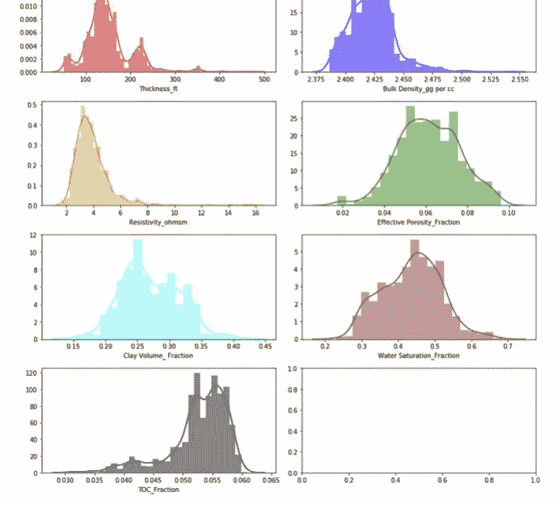

图 5.40 每个特征的分布图。

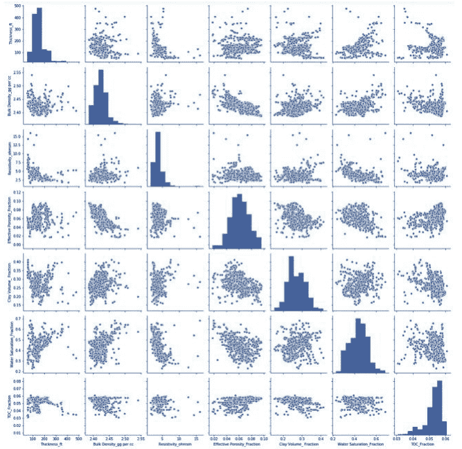

此外，让我们查看所有特征的配对图，如下所示：

```python
sns.pairplot(df)
Python output=Fig. 5.41
```

让我们也查看皮尔逊相关系数的热力图，如下所示：

```python
plt.figure(figsize=(12,10))
sns.heatmap(df.corr(), annot=True, linecolor='white',
           linewidths=2, cmap='coolwarm')
Python output=Fig. 5.42
```

请注意，如图 5.42 所示，皮尔逊相关系数的最高绝对值出现在体积密度和有效孔隙度之间，系数为−0.72。只要模型的整体测试精度不降低，就可以考虑移除其中一个参数。

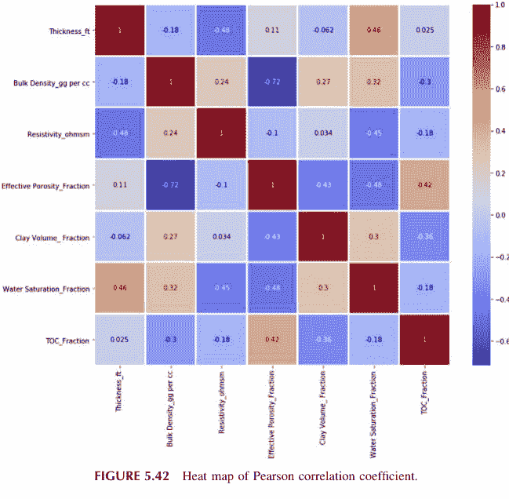

图 5.42 皮尔逊相关系数热力图。

在这种情况下，两个参数都被保留在模型中。请随意移除一个并测试模型的准确性。

基于树的算法，如决策树、随机森林等，不需要特征归一化或标准化。例如，在应用决策树时，由于树是向下分支的，归一化或标准化不会有帮助。让我们定义 x 和 y 变量，如下所示：

```python
x=df.drop(['TOC_Fraction'], axis=1)
y=df['TOC_Fraction']
```

接下来，导入 train_test_split 库并使用 70/30 的分割比例，如下所示：

```python
from sklearn.model_selection import train_test_split
seed=1000
np.random.seed(seed)
X_train,X_test,y_train, y_test=train_test_split(x, y, test_size=0.30)
```

接下来，从 sklearn.tree 导入 "DecisionTreeRegressor"，如下所示。对于分类问题，只需使用 "DecisionTreeClassifier"。

```python
from sklearn.tree import DecisionTreeRegressor
```

接下来，让我们定义决策树中使用的参数。"Criterion" 用于衡量分裂的质量。在 scikit-learn 中使用 "DecisionTreeRegressor" 时提供的选项有 "mse"（代表均方误差）、"mae"（代表平均绝对误差）和 "friedman_mse"（代表带有弗里德曼改进分数的均方误差）。在本示例中，选择了 "mse"；然而，这是在应用网格搜索时可以使用的一个超参数。请注意，在分类问题中，"criterion" 下可以使用 "gini"（代表基尼指数）或 "entropy"（代表信息增益）。

下一个参数称为 "**max_depth**"，根据 scikit-learn 的定义，它是“树的最大深度”，默认值为 "None"，这意味着“节点会被扩展”，直到所有叶子节点都是纯净的，或者直到所有叶子节点包含的样本数少于 "min_samples_split"（稍后讨论）。本质上，决策树的最大深度可以是“训练样本数-1”，但请注意，这样的深度可能导致严重的过拟合。因此，如果决策树模型过拟合，请减小 "max_depth"，并且如前所述，始终确保使用交叉验证。请注意，过低的 "max_depth" 可能导致欠拟合。因此，请使用不同的 "max_depth" 值比较训练和测试精度分数。"max_depth" 越高，树越深，与该树关联的分裂就越多。更多的分裂意味着捕获更多的信息。因此，更高的深度会导致过拟合。

下一个参数称为 "**min_sample_split**"，根据 scikit-learn 库的定义，它是“分裂内部节点所需的最小样本数”。请参考图 5.38，注意内部节点与决策节点相同，它可以有子节点并分支到其他节点。请注意，"min_sample_split" 的值过高可能导致欠拟合，因为较高的 "min_sample_split" 值会阻止模型学习细节。换句话说，"min_sample_split" 越高，树的约束就越大，因为它必须在每个节点考虑更多的样本。scikit-learn 中的默认值是 2。只需将 "min_sample_split" 从默认值 2 增加到 100，就会导致模型精度大幅降低。因此，这是用于控制过拟合的参数之一，并且可以在执行网格搜索优化时用作超参数。

"**min_sample_leaf**" 是另一个用于控制过拟合的参数，根据 scikit-learn 的定义，该参数是“叶节点所需的最小样本数”。“min_sample_split”和“min_sample_leaf”的关键区别在于，前者关注内部或决策节点，而后者关注叶节点或终端节点。较高的 "min_sample_leaf" 值也会导致严重的欠拟合，而较低的值则会导致过拟合。请确保在执行网格搜索优化（在第 7 章讨论）时，将此参数作为要优化的超参数之一。

下一个指标被称为“**max_features**”，在scikit-learn库中定义为“寻找最佳分割时要考虑的特征数量”。例如，在分类问题中，每次进行分割时，决策树算法会使用定义的特征数量，并采用基尼系数或信息增益。使用“max_feature”的主要目的之一是通过选择较低的“max_features”值来减少过拟合。一些可用的选项包括“auto”、“sqrt”、“log2”，默认值为“None”，它将“max_features”设置为特征数量。“auto”同样将“max_features”设置为特征数量。“sqrt”将“max_features”设置为特征数量的平方根，而“log2”则将其设置为特征数量的以2为底的对数。如果计算时间和过拟合是主要考虑因素，建议使用“sqrt”或“log2”。

下一个参数被称为“**ccp_alpha**”，用于剪枝目的。默认情况下，不进行剪枝。让我们如下定义决策树参数：

```
np.random.seed(seed)
dtree=DecisionTreeRegressor(criterion='mse', splitter='best',
    max_depth=None, min_samples_split=4, min_samples_leaf=2,
    max_features=None,ccp_alpha=0)
```

让我们将“dtree”应用于“(X_train,y_train)”，如下所示：

```
dtree.fit(X_train,y_train)
```

现在模型已经拟合了训练输入和输出，让我们如下应用它来预测“X_train”和“X_test”。应用于“X_train”的主要原因是能够同时获得模型的训练准确率和测试准确率。

```
y_pred_train=dtree.predict(X_train)
y_pred_test=dtree.predict(X_test)
```

接下来，让我们如下获取训练和测试的R²值：

```
corr_train=np.corrcoef(y_train, y_pred_train) [0,1]
print('Training Data R^2=',round(corr_train**2,4),'R=',
    round(corr_train,4))
**Python output=Training Data R^2=0.975 R=0.9874**

corr_test=np.corrcoef(y_test, y_pred_test) [0,1]
print('Testing Data R^2=',round(corr_test**2,4),'R=',
    round(corr_test,4))
**Python output=Testing Data R^2=0.6833 R=0.8266**
```

如图所示，训练R²为97.5%。然而，测试R²仅为68.33%。因此，请花些时间手动调整一些超参数，看看是否能提高测试准确率。网格搜索优化将在第7章介绍。目前，只需专注于手动调整这些超参数，直到测试准确率达到最优。接下来，让我们如下可视化训练实际值与预测值以及测试实际值与预测值：

```
plt.figure(figsize=(10,8))
plt.plot(y_train, y_pred_train, 'g.')
plt.xlabel('TOC Training Actual')
plt.ylabel('TOC Training Prediction')
plt.title('TOC Training Actual Vs. Prediction')
Python output=Fig. 5.43
```

```
plt.figure(figsize=(10,8))
plt.plot(y_test, y_pred_test, 'g.')
plt.xlabel('TOC Testing Actual')
plt.ylabel('TOC Testing Prediction')
plt.title('TOC Testing Actual Vs. Prediction')
Python output=Fig. 5.44
```

为了比较测试集的实际TOC值和预测值，可以添加以下代码行：

```
TOC_Actual_Prediction=pd.DataFrame({'Actual':y_test,
    'Predicted':y_pred_test})
TOC_Actual_Prediction
Python output=Fig. 5.45
```

为了从所有方面正确评估模型，让我们也如下添加MAE、MSE和RMSE：

```
from sklearn import metrics
print('MAE:', round(metrics.mean_absolute_error(y_test, y_pred_test),5))
print('MSE:', round(metrics.mean_squared_error(y_test, y_pred_test),5))
print('RMSE:', round(np.sqrt(metrics.mean_squared_error(y_test, y_pred_test)),5))
Python output=MAE: 0.00127
MSE: 1e-05
RMSE: 0.00278
```

决策树还允许通过调用“dtree.feature_importances_”进行特征排序，如下所示：

```
dtree.feature_importances_
Python output=array([0.28651806, 0.11955648, 0.13959011, 0.24352775, 0.13713719, 0.07367041])
```

让我们使用龙卷风图将其可视化，如下所示：

```
feature_names=df.columns[:-1]
plt.figure(figsize=(10,8))
feature_imp=pd.Series(dtree.feature_importances_,
    index=feature_names).sort_values(ascending=False)
sns.barplot(x=feature_imp, y=feature_imp.index)
plt.xlabel('Feature Importance Score Using Decision Tree')
plt.ylabel('Features')
plt.title("Feature Importance Ranking")
Python output=Fig. 5.46
```

如图5.46所示，厚度和有效孔隙度是影响模型输出（定义为TOC）的两个最重要特征。请注意，随着该模型准确率的提高，特征排序也会发生变化。

请注意，train_test_split是随机进行的，70%的数据用作训练，30%的数据用作测试。让我们也进行五折交叉验证，以观察得到的平均R²，如下所示：

```
from sklearn.model_selection import cross_val_score
np.random.seed(seed)
scores_R2=cross_val_score(dtree, x, y,cv=5,scoring='r2')
print(" R2_Cross-validation scores: {}". format(scores_R2))
Python output=R2_Cross-validation scores: [0.69672778 0.56657738 0.51290659 0.60992366 0.76534161]

print(" Average R2_Cross-validation scores: {}".
    format(scores_R2.mean()))
Python output=Average R2_Cross-validation scores:
0.6302954016341682
```

如图所示，首先从“sklearn.model_selection”导入“cross_val_score”库。接下来，使用“dtree”作为模型，x和y作为输入和输出变量，cv或交叉验证为5（五折交叉验证），并使用R²作为度量标准。然后，打印每一折的R²，最后取所有5个R²值的平均值，得到本例的平均交叉验证R²。可以看出，五折交叉验证的R²似乎略低于train_test_split技术。

## 随机森林

随机森林是另一种强大的监督机器学习算法，可用于回归和分类问题。随机决策森林的一般技术最早由Ho在1995年提出（Kam Ho, 1995）。随机森林是决策树的集成，或者可以看作是决策树的森林。由于随机森林将许多决策树模型组合成一个，因此被称为集成算法。例如，与其构建一棵决策树来预测EUR/1000 ft，使用单棵树可能会由于预测中的**方差**而导致错误值。避免在预测EUR/1000 ft时出现这种方差的一种方法是，从数百或数千棵决策树中获取预测，并使用这些树的平均值来计算最终答案。将许多决策树组合成一个模型，本质上是使用随机森林背后的基本概念。单个决策树做出的预测可能不准确，但当它们组合在一起时，预测将更接近平均值。随机森林通常比单个决策树更准确的原因是，它融合了来自许多预测的更多知识。对于回归问题，随机森林使用决策树的平均值进行最终预测。然而，如前所述，分类问题也可以通过随机森林解决，方法是采用预测类别的多数投票。另一种集成学习方法是梯度提升，接下来将讨论。图5.47说明了单个决策树与由决策树集成组成的随机森林之间的区别。

将多个决策树组合成一个主要有两种类型，如下所示：

- **Bagging**，也称为“自助聚合”，用于随机森林。Bagging最早由Leo Breiman在1994年的一份技术报告中提出（Breiman, 1994）。在bagging或自助聚合中，使用许多**独立构建**模型的平均值。在bagging中，决策树基于随机采样的数据子集进行训练，采样是有放回抽样。请注意，自助法是一种统计重采样技术，这意味着样本是有放回地抽取的。换句话说，自助法背后的思想是，在单个决策树中，某些样本会被多次使用（Efron, 1979）。

在应用随机森林算法时，使用袋装法的主要优势之一是**降低模型方差**。例如，当使用单个决策树时，它非常容易过拟合，并且可能对数据中的噪声敏感。然而，自助聚合减少了这个问题。当使用特征袋装法时，在决策树的每个分裂点，并非考虑所有输入特征。换句话说，只使用输入特征的一个**随机子集**。假设一个数据集有10个输入特征和1个输出特征。再假设砂岩含量/英尺和簇间距（10个特征中的两个）对输出特征（EUR/1000英尺）的影响最大。在应用袋装法时，由于使用了输入特征的随机子集，这将有助于减少砂岩含量/英尺和簇间距对目标类别（本例中为EUR/1000英尺）的影响。本质上，选择输入特征的随机子集会导致决策树之间的相关性降低，从而实现更多的多样性。

- 另一方面，提升法（用于梯度提升中）也被认为是一种集成技术，其中模型是按顺序构建的，而不是**独立**构建的。在提升法中，对预测错误的实例赋予更高的权重。因此，提升法的重点是那些预测不准确的挑战性案例。与袋装法使用**等权**平均不同，提升法使用**加权平均**，其中对性能更好的模型赋予更高的权重。换句话说，在提升法中，预测不准确的样本会获得更高的权重，这将导致它们被更频繁地采样。这是袋装法可以独立执行而提升法必须按顺序执行的主要原因。与袋装法降低方差不同，提升法试图降低偏差。除了梯度提升，AdaBoost（自适应梯度提升）和XGBoost（极端梯度提升）都是提升算法的例子。

由于随机森林中使用的大部分术语已在本章的决策树部分介绍过，让我们开始将随机森林应用于之前在决策树部分介绍的同一个TOC数据集，并比较两个模型的准确性。

## 使用scikit-learn实现随机森林

在本节中，将使用决策树部分使用的同一个TOC数据集来应用随机森林回归。因此，打开一个新的Jupyter Notebook，并遵循决策树部分介绍的完全相同的代码（或使用现有的Jupyter Notebook继续）。不是从sklearn.ensemble导入"DecisionTreeRegressor"，而是按如下方式导入"RandomForestRegressor"：

```
from sklearn.ensemble import RandomForestRegressor
```

接下来，让我们在"RandomForestRegressor"内部定义参数。随机森林模型中有多个重要的超调参数，如"n_estimators"、"criterion"、"max_depth"等。其中一些参数在决策树部分已经介绍过，其余的将在这里介绍。"n_estimators"定义了森林中树的数量。通常，这个数字越高，模型越准确，而不会导致过拟合。在下面的示例中，"n_estimators"被设置为5000，这意味着将构建5000棵独立的决策树，并将这5000棵树的平均值用作每个预测行的预测值。该模型选择了"mse"作为"criterion"，这意味着希望降低方差。由于希望选择之前讨论的自助聚合，因此将"bootstrap"设置为"True"。如果"bootstrap"设置为"False"，则使用整个数据集来构建每棵决策树。"n_jobs"设置为"-1"，以尝试使用所有处理器。如果不需要，只需将-1更改为不同的整数值即可。

```
np.random.seed(seed)
rf=RandomForestRegressor(n_estimators=5000,
    criterion='mse',max_depth=None, min_samples_split=4,
    min_samples_leaf=2, max_features='auto', bootstrap=True,
    n_jobs=-1)
```

接下来，让我们将这些定义的"rf"参数应用于训练输入和输出特征（X_train, y_train），并获得训练集和测试集的准确性，如下所示：

```
rf.fit(X_train,y_train)
y_pred_train=rf.predict(X_train)
y_pred_test=rf.predict(X_test)
corr_train=np.corrcoef(y_train, y_pred_train) [0,1]
print('Training Data R^2=',round(corr_train**2,4),'R=',
    round(corr_train,4))
Python output=Training Data R^2=0.9658 R=0.9827
```

```
corr_test=np.corrcoef(y_test, y_pred_test) [0,1]
print('Testing Data R^2=',round(corr_test**2,4),'R=',
    round(corr_test,4))
Python output=Testing Data R^2=0.8182 R=0.9046
```

如观察到的，测试集的R²为81.82%，而决策树为68.33%。因此，在不进行进一步参数微调的情况下，随机森林算法似乎优于决策树。让我们也如下可视化实际值与预测值的训练和测试数据集的交叉图：

```
plt.figure(figsize=(10,8))
plt.plot(y_train, y_pred_train, 'r.')
plt.xlabel('TOC Training Actual')
plt.ylabel('TOC Training Prediction')
plt.title('TOC Training Actual Vs. Prediction')
Python output=Fig. 5.48
```

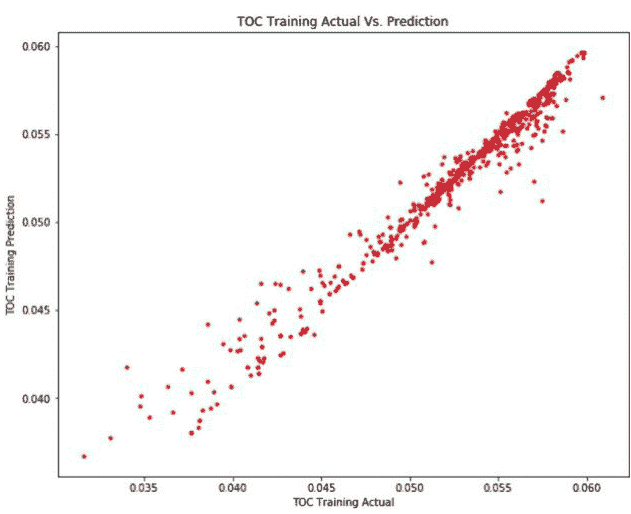

图 5.48 TOC训练集实际值与预测值。

```
plt.figure(figsize=(10,8))
plt.plot(y_test, y_pred_test, 'r.')
plt.xlabel('TOC Testing Actual')
plt.ylabel('TOC Testing Prediction')
plt.title('TOC Testing Actual Vs. Prediction')
Python output=Fig. 5.49
```

接下来，让我们也如下获取测试集的MAE、MSE和RMSE：

```
from sklearn import metrics
print('MAE:', round(metrics.mean_absolute_error(y_test, y_pred_test),5))
print('MSE:', round(metrics.mean_squared_error(y_test, y_pred_test),5))
print('RMSE:', round(np.sqrt(metrics.mean_squared_error(y_test, y_pred_test)),5))
Python output=MAE: 0.00118
MSE: 0.0
RMSE: 0.00201
```

如图所示，MAE、MSE和RMSE值低于决策树模型。接下来，让我们也使用随机森林获取特征排名，如下所示：

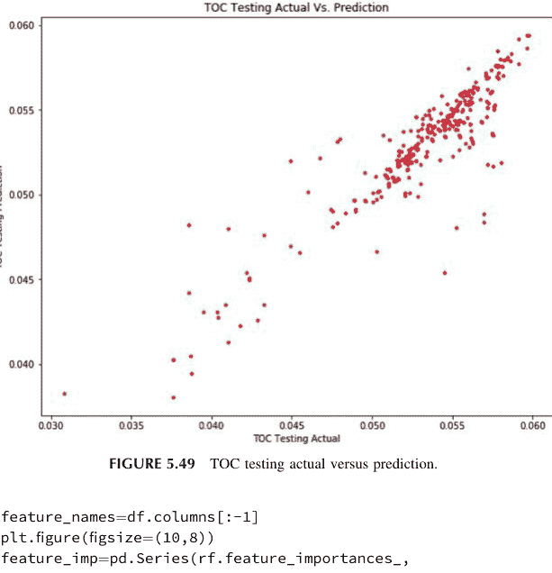

图 5.49 TOC测试集实际值与预测值。

```
feature_names=df.columns[:-1]
plt.figure(figsize=(10,8))
feature_imp=pd.Series(rf.feature_importances_,
    index=feature_names).sort_values(ascending=False)
sns.barplot(x=feature_imp, y=feature_imp.index)
plt.xlabel('Feature Importance Score Using Random Forest')
plt.ylabel('Features')
plt.title("Feature Importance Ranking")
Python output=Fig. 5.50
```

如图5.50所示，随机森林获得的重要特征与决策树获得的不同。这主要归因于随机森林模型更高的准确性。建议选择准确性更高的模型，在本例中即为随机森林模型。基于树的算法，如决策树、随机森林、极端随机树等，使用节点纯度的百分比改进来自然地对输入特征进行排序。如前所述，在分类问题中，其思想是最小化基尼不纯度（如果选择基尼不纯度）。因此，导致基尼不纯度最大减少的节点出现在树的开始，而减少最少的节点出现在树的末尾。这就是基于树的算法进行特征排序的方式。

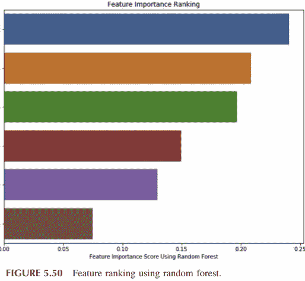

图 5.50 使用随机森林的特征排名。

为了与决策树模型保持一致，让我们也进行五折交叉验证，以观察随机森林模型的平均R²，如下所示：

```
from sklearn.model_selection import cross_val_score
np.random.seed(seed)
scores_R2=cross_val_score(rf, x, y,cv=5,scoring='r2')
print(" R2_Cross-validation scores: {}". format(scores_R2))
Python output=R2_Cross-validation scores: [0.76480359 0.78500227 0.74946927 0.82476465 0.74985886]
print(" Average R2_Cross-validation scores: {}".
format(scores_R2.mean()))
Average R2_Cross-validation scores: 0.7747797298703516
```

平均而言，随机森林的交叉验证R²为77.48%，而决策树模型为63.03%。

## 极端随机树

在继续梯度提升之前，本节介绍极端随机树。极端随机树是另一种监督机器学习算法，类似于随机森林，可用于分类和回归问题。如前一节所述，随机森林使用自助法，这意味着样本是有放回地抽取的。然而，极端随机树算法使用整个原始样本。在scikit-learn库中，默认术语为

## 使用 scikit-learn 实现极端随机树

让我们将极端随机树应用于相同的 TOC 数据集。启动一个新的 Jupyter Notebook，并按照相同的代码步骤操作，直到导入极端随机树库，如下所示（或者继续使用同一个 Jupyter Notebook）。对于分类问题，可以使用 "ExtraTreesClassifier" 代替 "ExtraTreesRegressor"。

```
from sklearn.ensemble import ExtraTreesRegressor
```

接下来，让我们定义极端随机树的参数，将其应用于 "(X_train, y_train)"，并预测 "(X_train)" 和 "X_test"，如下所示：

```
np.random.seed(seed)
et=ExtraTreesRegressor(n_estimators=5000,
    criterion='mse',max_depth=None, min_samples_split=4,
    min_samples_leaf=2, max_features='auto', bootstrap=False,
    n_jobs=-1)
et.fit(X_train,y_train)
y_pred_train=et.predict(X_train)
y_pred_test=et.predict(X_test)
```

如上所示，"bootstrap" 被设置为 "False"，并且该算法同样选择了 5000 棵树。接下来，获取训练集和测试集的 R² 值，如下所示：

```
corr_train=np.corrcoef(y_train, y_pred_train)[0,1]
print('Training Data R^2=',round(corr_train**2,4),'R=',round(corr_train,4))
Python output=Training Data R^2=0.9832 R=0.9916
```

```
corr_test=np.corrcoef(y_test, y_pred_test)[0,1]
print('Testing Data R^2=',round(corr_test**2,4),'R=',round(corr_test,4))
Python output=Testing Data R^2=0.8663 R=0.9307
```

当比较极端随机树与随机森林的测试 R² 时，测试 R² 的准确率似乎高出几个百分点。请注意，这两个模型都尚未优化，其准确率有可能进一步提高。接下来，让我们绘制训练集和测试集的实际值与预测值对比图。

```
plt.figure(figsize=(10,8))
plt.plot(y_train, y_pred_train, 'b.')
plt.xlabel('TOC Training Actual')
plt.ylabel('TOC Training Prediction')
plt.title('TOC Training Actual Vs. Prediction')
Python output=Fig. 5.51
```

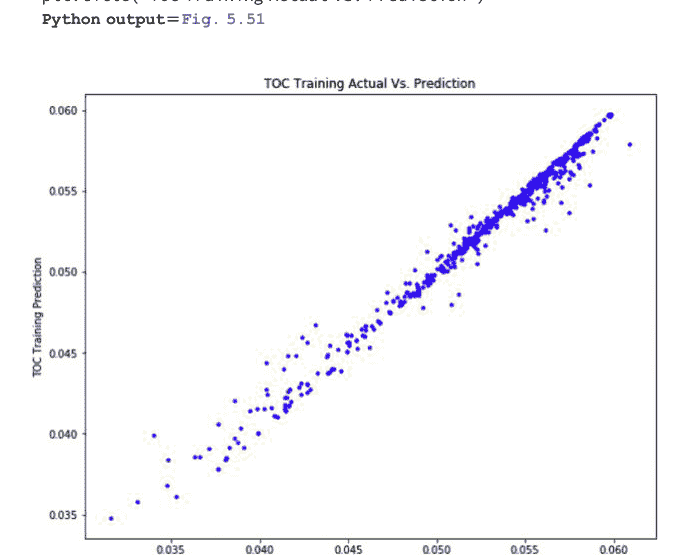

图 5.51 TOC 训练集实际值与预测值对比。

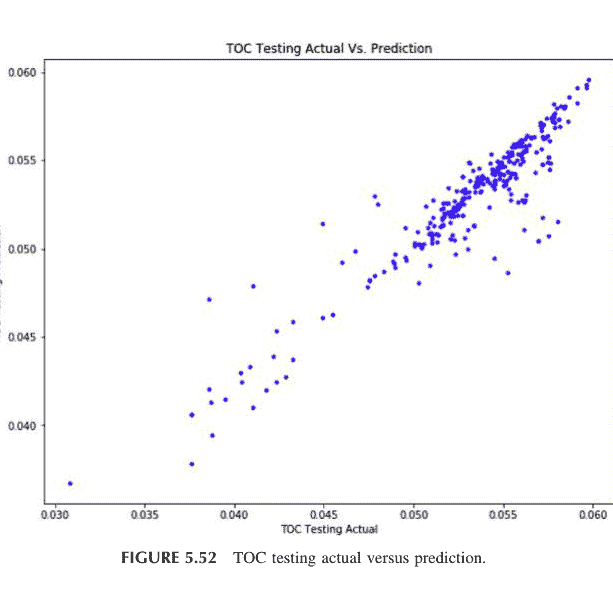

图 5.52 TOC 测试集实际值与预测值对比。

```
plt.figure(figsize=(10,8))
plt.plot(y_test, y_pred_test, 'b.')
plt.xlabel('TOC Testing Actual')
plt.ylabel('TOC Testing Prediction')
plt.title('TOC Testing Actual Vs. Prediction')
Python output=Fig. 5.52
```

接下来，让我们以表格形式并排查看实际值与预测值，如下所示：

```
TOC_Actual_Prediction=pd.DataFrame({'Actual':y_test,
    'Predicted':y_pred_test})
TOC_Actual_Prediction
Python output=Fig. 5.53
```

同时，让我们获取 MAE、MSE 和 RMSE，如下所示：

```
from sklearn import metrics
print('MAE:', round(metrics.mean_absolute_error(y_test,
    y_pred_test),5))
print('MSE:', round(metrics.mean_squared_error(y_test,
    y_pred_test),5))
print('RMSE:', round(np.sqrt(metrics.mean_squared_error(y_test,
    y_pred_test)),5))
Python output=MAE: 0.00104
MSE: 0.0
RMSE: 0.00176
```

| 实际值 | 预测值 |
|---|---|
| 834 0.051979 | 0.051964 |
| 604 0.053110 | 0.053851 |
| 747 0.057625 | 0.054805 |
| 908 0.057235 | 0.056245 |
| 545 0.054575 | 0.053831 |
| ... | ... |
| 809 0.056807 | 0.054295 |
| 166 0.054815 | 0.054232 |
| 172 0.058651 | 0.058608 |
| 263 0.058120 | 0.057312 |
| 427 0.051019 | 0.050779 |

297 行 × 2 列

图 5.53 测试数据集的 TOC 实际值与预测值对比。

如图所示，极端随机树模型似乎具有最低的 MAE、MSE 和 RMSE。这并不意味着极端随机树模型每次都会优于随机森林或其他算法。每个问题都必须单独且独立地处理，以找到能产生最高测试准确率的最佳机器学习算法。让我们使用训练好的极端随机树模型进行特征排序，如下所示：

```
feature_names=df.columns[:-1]
plt.figure(figsize=(10,8))
```

238 使用 Python 的油气机器学习指南

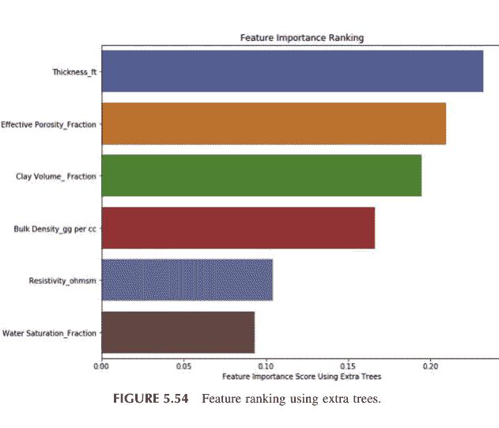

图 5.54 使用极端随机树进行特征排序。

```
feature_imp=pd.Series(et.feature_importances_,
    index=feature_names).sort_values(ascending=False)
sns.barplot(x=feature_imp, y=feature_imp.index)
plt.xlabel('Feature Importance Score Using Extra Trees')
plt.ylabel('Features')
plt.title("Feature Importance Ranking")
Python output=Fig. 5.54
```

如图 5.54 所示，使用极端随机树算法的整体特征排序与随机森林相似。对 TOC 影响最大的前三个特征似乎是厚度、有效孔隙度和粘土体积。

为了与决策树和随机森林模型保持一致，让我们也执行五折交叉验证，以观察极端随机树模型的平均 R² 结果，如下所示：

```
from sklearn.model_selection import cross_val_score
np.random.seed(seed)
scores_R2=cross_val_score(et, x, y,cv=5,scoring='r2')
print(" R2_Cross-validation scores: {}". format(scores_R2))
Python output=R2_Cross-validation scores: [0.78910151 0.82774583
0.78219988 0.84719793 0.80344111]
print(" Average R2_Cross-validation scores: {}".
    format(scores_R2.mean()))
Average R2_Cross-validation scores: 0.8099372535306054
```

如图所示，使用极端随机树模型进行五折交叉验证获得的平均 R² 值为 80.99%，而之前介绍的决策树和随机森林模型分别为 63.03% 和 77.48%。

## 梯度提升

梯度提升是另一种集成监督机器学习算法，可用于分类和回归问题。随机森林、极端随机树、梯度提升等算法被称为**集成**算法的主要原因是，最终模型是基于许多单独模型生成的。如 bagging/boosting 比较部分所述，梯度提升将顺序训练许多模型，并对预测错误的实例赋予更高的权重。因此，训练过程中的重点是具有挑战性的案例。使用梯度提升进行顺序模型训练将逐渐最小化损失函数。损失函数的最小化方式类似于人工神经网络模型（将在下一章讨论），其中权重会被优化。在梯度提升中，构建弱学习器后，会将预测值与实际值进行比较。预测值与实际值之间的差异代表了模型的误差率。模型的误差率现在可用于计算梯度，这本质上是损失函数的偏导数。梯度用于确定模型参数需要改变的方向，以在下一轮训练中减少误差。与神经网络模型的目标是在**单个模型**中最小化损失函数不同，梯度提升结合了多个模型的预测。因此，梯度提升使用了随机森林/极端随机树中的一些超参数，以及人工神经网络模型中使用的其他超参数，如学习率、损失函数等。这些超参数将在下一章详细讨论。

## 使用 scikit-learn 实现梯度提升

在本节中，目标是使用梯度提升训练一个机器学习模型，以使用以下输入特征预测每口井在 $3/MMBTU 气价下的净现值 (NPV)：

- 水平段长度 (ft)、段长 (ft)、砂水比或 SWR (lb/gal)、每英尺砂量 (lb/ft)、每英尺水量 (BBL/ft)、估计最终采收率或 EUR (BCF)

本示例的数据集可在以下位置找到：
https://www.elsevier.com/books-and-journals/book-companion/9780128219294
因此，让我们打开一个新的 Jupyter Notebook，并开始导入以下库和数据集，如下所示：

## 5.5.1 数据描述与可视化

首先，我们查看数据集的描述性统计信息。

| | count | mean | std | min | 25% | 50% | 75% | max |
|---|---|---|---|---|---|---|---|---|
| Lateral_length | 258.0 | 8911.663566 | 2995.195633 | 2439.500000 | 6433.225000 | 8089.450000 | 11582.100000 | 16918.400000 |
| Stage_length | 258.0 | 223.834920 | 52.900698 | 85.600003 | 178.830607 | 204.708946 | 263.308520 | 386.754534 |
| Sand_to_water_ratio | 258.0 | 1.268741 | 0.338050 | 0.119433 | 1.108849 | 1.249180 | 1.437271 | 2.442476 |
| Sand_per_ft | 258.0 | 2066.112041 | 903.288312 | 310.728368 | 1416.164360 | 2027.515360 | 2777.796760 | 4964.854720 |
| Water_per_ft | 258.0 | 39.069433 | 15.740073 | 8.118385 | 26.593500 | 40.575506 | 51.229328 | 75.340213 |
| EUR_BCF | 258.0 | 9.795406 | 6.193401 | 0.173786 | 5.212174 | 8.570267 | 12.465853 | 37.375668 |
| NPV_at_3.0_MMBTU_Gas_Pricing | 258.0 | -0.634117 | 3.631055 | -8.092757 | -3.107133 | -1.587870 | 1.061966 | 13.828945 |

**图 5.55** df描述。

```python
import numpy as np
import pandas as pd
import matplotlib.pyplot as plt
import seaborn as sns
%matplotlib inline
sns.set_style("darkgrid")
df=pd.read_excel('Chapter5_NPV_DataSet.xlsx')
df.describe().transpose()
```

接下来，我们查看以下特征的分布图、箱线图和散点图：

```python
f, axes=plt.subplots(4, 2, figsize=(12, 12))
sns.distplot(df['Lateral_length'], color="red", ax=axes[0, 0])
sns.distplot(df['Stage_length'], color="olive", ax=axes[0, 1])
sns.distplot(df['Sand_to_water_ratio'], color="blue",
    ax=axes[1, 0])
sns.distplot(df['Sand_per_ft'], color="orange", ax=axes[1, 1])
sns.distplot(df['Water_per_ft'], color="black", ax=axes[2, 0])
sns.distplot(df['EUR_BCF'], color="green", ax=axes[2, 1])
sns.distplot(df['NPV_at_3.0_MMBTU_Gas_Pricing'], color="cyan",
    ax=axes[3, 0])
plt.tight_layout()
```

**图 5.56** df的分布图。

如图所示，大部分参数的分布呈正态分布。阶段长度在200到250英尺之间似乎有一个轻微的凹陷。

```python
f, axes=plt.subplots(4, 2, figsize=(12, 12))
sns.boxplot(df['Lateral_length'], color="red", ax=axes[0, 0])
sns.boxplot(df['Stage_length'], color="olive", ax=axes[0, 1])
sns.boxplot(df['Sand_to_water_ratio'], color="blue", ax=axes[1, 0])
sns.boxplot(df['Sand_per_ft'], color="orange", ax=axes[1, 1])
sns.boxplot(df['Water_per_ft'], color="black", ax=axes[2, 0])
sns.boxplot(df['EUR_BCF'], color="green", ax=axes[2, 1])
sns.boxplot(df['NPV_at_3.0_MMBTU_Gas_Pricing'], color="cyan",
    ax=axes[3, 0])
plt.tight_layout()
```

**图 5.57** df的箱线图。

```python
f, axes=plt.subplots(3, 2, figsize=(12, 12))
sns.scatterplot(df['Lateral_length'],df['NPV_at_3.0_MMBTU_Gas_Pricing'], color="red", ax=axes[0, 0])
sns.scatterplot(df['Stage_length'],df['NPV_at_3.0_MMBTU_Gas_Pricing'], color="olive", ax=axes[0, 1])
sns.scatterplot(df['Sand_to_water_ratio'], df['NPV_at_3.0_MMBTU_Gas_Pricing'],color="blue", ax=axes[1, 0])
sns.scatterplot(df['Sand_per_ft'], df['NPV_at_3.0_MMBTU_Gas_Pricing'],color="orange", ax=axes[1, 1])
sns.scatterplot(df['Water_per_ft'], df['NPV_at_3.0_MMBTU_Gas_Pricing'],color="black", ax=axes[2, 0])
sns.scatterplot(df['EUR_BCF'],df['NPV_at_3.0_MMBTU_Gas_Pricing'], color="green", ax=axes[2, 1])
plt.tight_layout()
```

**图 5.58** 散点图。

接下来，我们使用热力图可视化皮尔逊相关系数：

```python
plt.figure(figsize=(14,10))
sns.heatmap(df.corr(),linewidths=2,
    linecolor='black',cmap='coolwarm', annot=True)
```

**图 5.59** 皮尔逊相关系数热力图。

## 5.5.2 梯度提升回归模型

由于梯度提升是一种基于树的算法，因此不需要进行归一化。因此，我们如下定义x和y变量：

```python
x=df.drop(['NPV_at_3.0_MMBTU_Gas_Pricing'], axis=1)
y=df['NPV_at_3.0_MMBTU_Gas_Pricing']
```

接下来，导入`train_test_split`并将数据按70/30的比例划分（70%用于训练，30%用于测试）：

```python
from sklearn.model_selection import train_test_split
seed=1000
np.random.seed(seed)
X_train, X_test, y_train, y_test=train_test_split(x, y,
    test_size=0.3)
```

接下来，我们导入`GradientBoostingRegressor`库并定义该算法的参数。`n_estimators`定义为提升阶段的数量，换句话说，它是森林中树的数量。请注意，大量的树通常不会导致过拟合。因此，可以随意增加树的数量以观察结果。学习率决定了在最小化损失函数的每次连续迭代中的步长。默认值为0.1。`loss`指的是要优化的损失函数。`ls`是本次练习中使用的最小二乘损失函数。让我们通过以下示例直观地理解最小二乘回归。

### 5.5.2.1 最小二乘回归示例

使用最小二乘回归计算直线方程，并计算下表中EUR和NPV之间的误差差异：

**EUR与NPV示例。**

| EUR (x-variable) | NPV (y-variable) |
|---|---|
| 5 | 3 |
| 2 | 0.2 |
| 8 | 7 |
| 9 | 10 |
| 3 | 1 |

**步骤1)** 计算$x^2$、$xy$、$x$的总和、$y$的总和、$x^2$的总和以及$xy$的总和，如下表所示：

**计算示例。**

| EUR (x) | NPV (y) | $x^2$ | $x \times y$ |
|---|---|---|---|
| 5 | 3 | 25 | 15 |
| 2 | 0.2 | 4 | 0.4 |
| 8 | 7 | 64 | 56 |
| 9 | 10 | 81 | 90 |
| 3 | 1 | 9 | 3 |
| 总计 (27) | 总计 (21.2) | 总计 (183) | 总计 (164.4) |

**步骤2)** 计算斜率($m$)如下：

$$m = \frac{N \sum (xy) - \sum x \sum y}{N \sum (x^2) - (\sum x)^2} = \frac{(5 \times 164.4) - (27 \times 21.2)}{(5 \times 183) - (27^2)} = 1.3419 \quad (5.33)$$

**步骤3)** 计算截距($b$)如下：

$$b = \frac{\sum y - m \sum x}{N} = \frac{21.2 - (1.3419 \times 27)}{5} = -3.00645 \quad (5.34)$$

**步骤4)** 组装直线方程如下：

$$y = mx + b \rightarrow y = 1.3419x - 3.00645 \quad (5.35)$$

**步骤5)** 最后一步是比较$y$值与步骤4中计算的直线方程得出的$y$值，如下表所示：

**$y$值与直线方程计算的$y$值之间的差异。**

| NPV (y) | 直线方程计算的$y$值 | 差异 (误差) |
|---|---|---|
| 3 | 3.7032 | 0.7032 |
| 0.2 | $-0.3226$ | $-0.5226$ |
| 7 | 7.7290 | 0.7290 |
| 10 | 9.0710 | $-0.9290$ |
| 1 | 1.0194 | 0.0194 |

因此，本次练习中使用最小二乘回归来最小化损失函数。请注意，其他损失函数如`lad`、`huber`和`quantile`也可以使用。`lad`代表最小绝对偏差，与MAE相同，本质上最小化残差的绝对值。`huber`是`ls`和`lad`损失函数的组合，由Peter Huber开发（Huber, 1964）。最后，`quantile`允许分位数回归，其中必须指定alpha。

默认的`criterion`参数是`friedman_mse`，即带有Friedman改进分数的MSE。其他标准如`mse`和`mae`也可以使用，但`friedman_mse`非常稳健，因为它提供了很好的近似值。其余参数之前已经讨论过。

```python
from sklearn.ensemble import GradientBoostingRegressor
np.random.seed(seed)
gb=GradientBoostingRegressor(loss='ls', learning_rate=0.1,
    n_estimators=100, criterion='friedman_mse',
    min_samples_split=4, min_samples_leaf=2, max_depth=3,
    max_features=None)
```

接下来，我们拟合`(X_train, y_train)`并预测测试数据：

```python
gb.fit(X_train,y_train)
y_pred_train=gb.predict(X_train)
y_pred_test=gb.predict(X_test)
```

我们还获取训练和测试数据的$R^2$如下：

```python
corr_train=np.corrcoef(y_train, y_pred_train) [0,1]
print('Training Data R^2=',round(corr_train**2,4),'R=',
    round(corr_train,4))
```

输出：Training Data R^2=0.9903 R=0.9952

```python
corr_test=np.corrcoef(y_test, y_pred_test) [0,1]
print('Testing Data R^2=',round(corr_test**2,4),'R=',
    round(corr_test,4))
```

输出：Testing Data R^2=0.9168 R=0.9575

我们还可视化训练和测试的实际值与预测值如下：

```python
plt.figure(figsize=(10,8))
plt.plot(y_train, y_pred_train, 'b.')
plt.xlabel('NPV Training Actual')
plt.ylabel('NPV Training Prediction')
plt.title('NPV Training Actual Vs. Prediction')
```

**图 5.60** 训练数据实际值与预测值。

```python
plt.figure(figsize=(10,8))
plt.plot(y_test, y_pred_test, 'b.')
plt.xlabel('NPV Testing Actual')
plt.ylabel('NPV Testing Prediction')
plt.title('NPV Testing Actual Vs. Prediction')
```

**图 5.61** 测试数据实际值与预测值。

## 极端梯度提升

极端梯度提升，也称为XGBoost，由陈天奇（Chen & Guestrin, 2016）开发，是另一种用于分类和回归问题的集成监督机器学习算法。XGBoost是一种梯度提升方法，与梯度提升模型的区别如下：

- XGBoost使用L₁和L₂正则化，这有助于模型泛化并减少过拟合。
- 如之前在梯度提升部分所讨论的，梯度提升模型的误差率用于计算梯度，这本质上是损失函数的偏导数。相比之下，XGBoost使用损失函数的**二阶**偏导数。使用损失函数的二阶偏导数将提供关于梯度方向的更多信息。
- 由于树构建的并行化，XGBoost通常比梯度提升更快。
- XGBoost可以处理数据集中的缺失值；因此，数据准备不那么耗时。

## 使用scikit-learn实现极端梯度提升

让我们也使用之前的数据集来应用XGBoost的回归版本，看看它的性能。启动一个新的Jupyter Notebook，并按照梯度提升部分所示的相同先前步骤操作，直到完成train_test_split（或者继续使用同一个Jupyter Notebook）。不要导入"GradientBoostingRegressor"，而是如下面所示导入"XGBRegressor"。对于分类问题，只需导入"XGBClassifier"即可。在导入下面所示的"XGBRegressor"库之前，请确保使用Anaconda命令提示符使用以下命令安装此库：pip install xgboost

```
from xgboost import XGBRegressor
```

接下来，让我们定义XGBoost参数。Objective设置为"reg:squarederror"，它使用平方误差来最小化损失函数。"n_estimators"指定树的数量（正如之前多个部分所讨论的）。学习率定义了步长，这意味着所有树中的每个权重都将乘以这个值（在这种情况下使用了0.1）。学习率可以在0到1之间。"reg_alpha"控制叶权重的L1正则化。较高的"reg_alpha"会导致更多的正则化。"reg_lambda"指定叶权重的L2正则化。"max_depth"指定在任何提升运行期间树的最大深度。"gamma"根据预期的损失减少来决定是否继续对树的叶节点进行进一步分区。

```
np.random.seed(seed)

xgb=XGBRegressor(objective ='reg:squarederror',n_estimators=200,
reg_lambda=1, gamma=0,max_depth=3, learning_rate=0.1,
reg_alpha=0.1)
```

接下来，让我们将定义的模型"xgb"应用于拟合训练数据（70%训练）。此外，还如下获取"y_pred_train"和"y_pred_test"：

```
xgb.fit(X_train,y_train)
y_pred_train=xgb.predict(X_train)
y_pred_test=xgb.predict(X_test)
```

接下来，如下获取训练和测试数据集的R²：

```
corr_train=np.corrcoef(y_train, y_pred_train) [0,1]
print('Training Data R^2=',round(corr_train**2,4),'R=',
round(corr_train,4))
Python output=Training Data R^2=0.9957 R=0.9979

corr_test=np.corrcoef(y_test, y_pred_test) [0,1]
print('Testing Data R^2=',round(corr_test**2,4),'R=',
round(corr_test,4))
Python output=Testing Data R^2=0.9138 R=0.9559
```

此外，如下可视化训练和测试的实际值与预测值：

```
plt.figure(figsize=(10,8))
plt.plot(y_train, y_pred_train, 'm.')
plt.xlabel('NPV Training Actual')
plt.ylabel('NPV Training Prediction')
plt.title('NPV Training Actual Vs. Prediction')
Python output=Fig. 5.64
```

让我们也如下获取30%测试数据的MAE、MSE和RMSE：

```
from sklearn import metrics
print('MAE:', round(metrics.mean_absolute_error(y_test, y_pred_test),5))
print('MSE:', round(metrics.mean_squared_error(y_test, y_pred_test),5))
print('RMSE:', round(np.sqrt(metrics.mean_squared_error(y_test, y_pred_test)),5))
Python output=MAE: 0.76514
MSE: 1.06659
RMSE: 1.03276
```

让我们也获取每个输入变量的特征重要性以及**排列特征重要性**。排列特征重要性定义为当单个特征值被随机打乱时模型分数的下降（Breiman, 2011）。排列特征重要性通过计算模型分数的下降来评估输入和输出特征。模型分数下降越大，输入特征对模型的影响越大，其排名就越高。可以通过从"sklearn.inspection"导入"permutation_importance"库并传入训练好的模型（在这种情况下是"gb"）、测试集（在这种情况下是"X_test,y_test"）、n_repeats（在这种情况下使用了10）和random_state（使用之前使用的种子数1000）来获得排列重要性。请注意，"n_repeats"指的是特征被随机打乱的次数。在这个例子中，每个特征被随机打乱了10次，并返回特征重要性的样本。

```
from sklearn.inspection import permutation_importance
feature_importance=gb.feature_importances_
sorted_features=np.argsort(feature_importance)
pos=np.arange(sorted_features.shape[0]) + .5
fig=plt.figure(figsize=(12, 6))
plt.subplot(1, 2, 1)
plt.barh(pos, feature_importance[sorted_features],
    align='center')
plt.yticks(pos, np.array(df.columns)[sorted_features])
plt.title('Feature Importance')
result=permutation_importance(gb, X_test, y_test,
    n_repeats=10,random_state=seed)
sorted_idx=result.importances_mean.argsort()
plt.subplot(1, 2, 2)
plt.boxplot(result.importances[sorted_idx].T, vert=False,
    labels=np.array(df.columns)[sorted_idx])
plt.title("Permutation Importance (test set)")
fig.tight_layout()
plt.show()
Python output=Fig. 5.62
```

让我们也调用"result"，它将在前两行显示每个特征的**平均**排列重要性分数（基于随机打乱10次）。接下来的两行显示每个特征随机打乱10次的**标准差**。最后，结果的其余部分显示每个特征的每个数组中**10个元素**的单个排列分数列表。由于有6个输入特征，因此也有6个数组，每个数组包含基于10次随机打乱的10个元素。

result
Python output=Fig. 5.63

```
{'importances_mean': array([ 5.62673558e-02,  4.21978379e-03, -1.68587786e-03,  1.08985184e-02,
       1.29103662e-02,  2.28967526e+00]),
 'importances_std': array([0.01485314, 0.00449182, 0.00290839, 0.00638356, 0.00391517,
       0.27624977]),
 'importances': array([[ 8.15151462e-02,  3.95292772e-02,  7.02221645e-02,
         3.65059457e-02,  6.03294438e-02,  4.96642294e-02,
         5.30148570e-02,  5.79832600e-02,  3.92243716e-02,
         7.46848629e-02],
       [ 7.44887785e-03,  9.59443016e-03,  2.58807132e-03,
        -1.38147086e-03, -1.05835466e-03,  9.27570663e-03,
         5.14050355e-03,  4.35297088e-03, -2.86902680e-03,
         9.10612984e-03],
       [ 4.48758354e-03,  1.25757307e-03, -2.61008665e-03,
        -1.66488246e-03, -5.10349406e-03, -3.54065341e-03,
        -4.17053339e-03,  1.94360646e-04, -5.02201479e-03,
        -6.86631099e-03],
       [ 2.01027500e-02,  1.38400077e-02,  1.45205740e-02,
         8.05278583e-03,  9.32294255e-04,  1.76246999e-02,
         3.92768661e-03,  1.23552019e-02,  2.21219261e-03,
         1.14429341e-02],
       [ 1.92971526e-02,  1.29535259e-02,  1.81843586e-02,
         1.41525885e-02,  1.00042563e-02,  9.58542022e-03,
         9.02224063e-03,  1.14259918e-02,  7.47400867e-03,
         1.70041187e-02],
       [ 1.78325738e+00,  2.50606649e+00,  2.24622373e+00,
         2.09877842e+00,  2.87685350e+00,  2.45690805e+00,
         2.17434168e+00,  2.27078646e+00,  2.36532335e+00,
         2.11821354e+00]])}
```

图 5.63

就像之前的例子一样，让我们应用10折交叉验证来查看结果R²，如下所示：

```
from sklearn.model_selection import cross_val_score
np.random.seed(seed)
scores_R2=cross_val_score(gb, x, y,cv=10,scoring='r2')
print(" R2_Cross-validation scores: {}". format(scores_R2))
Python output=R2_Cross-validation scores: [0.8862245 0.87216255 0.76550356 0.946582 0.94277734 0.89203469 0.54233081 0.9442973 0.93938502 0.80444424]

print(" Average R2_Cross-validation scores: {}". format(scores_R2.mean()))
Python output=Average R2_Cross-validation scores: 0.8535741998748938
```

如图所示，10折交叉验证的平均R²分数比从随机70/30分割验证中获得的R²分数低约6%。

## 自适应梯度提升

自适应梯度提升，或称AdaBoost，是另一种监督式机器学习提升算法。在自适应提升中，通过改变训练数据集的分布，**增加**了那些难以分类或预测的样本观测的权重。与AdaBoost修改样本分布不同，在梯度提升中，分布**不**会被修改，弱学习器在强学习器的剩余误差上进行训练。请记住，弱学习器被定义为与真实分类具有强相关性的分类器。换句话说，它的分类或预测能力仅比随机猜测略好。另一方面，强学习器是与真实分类具有**更强**相关性的分类器。

## 使用scikit-learn实现自适应梯度提升

让我们打开一个新的Jupyter Notebook，并按照之前讨论的相同步骤进行，直到完成train_test_split部分（或者继续使用同一个Jupyter Notebook）。让我们按如下方式导入"AdaBoostRegressor"库：

```python
from sklearn.ensemble import AdaBoostRegressor
```

请注意，如果是分类问题，只需改用"AdaBoostClassifier"即可。接下来，定义自适应提升回归算法中的超参数。"base_estimator"定义了提升集成是如何构建的。如果选择"None"，则默认使用"DecisionTreeRegressor(max_depth=3)"作为模型估计器。在本例中，首先从"sklearn.tree"导入了"DecisionTreeRegressor()"，并将决策树算法内的超参数调整为最大深度为"None"，"min_sample_split"为4，"min_sample_leaf"为2。可以使用"linear"、"square"和"exponential"损失函数。本例中使用了线性损失函数，但您可以随意调整为其他两种并观察其影响。其余参数如"n_estimators"和"learning_rate"之前已经讨论过。

```python
from sklearn.tree import DecisionTreeRegressor
np.random.seed(seed)
agb=AdaBoostRegressor(base_estimator=
    DecisionTreeRegressor(max_depth=None,min_samples_split=4,
    min_samples_leaf=2), n_estimators=200,
    learning_rate=0.1,loss='linear')
```

接下来，将"agb"拟合到"(X_train,y_train)"，并对训练和测试数据进行预测，然后获取训练和测试数据的R²值，如下所示：

```python
agb.fit(X_train,y_train)
y_pred_train=agb.predict(X_train)
y_pred_test=agb.predict(X_test)
corr_train=np.corrcoef(y_train, y_pred_train)[0,1]
print('Training Data R^2=',round(corr_train**2,4),'R=',
    round(corr_train,4))
```

Python输出=Training Data R^2=0.9984 R=0.9992

```python
corr_test=np.corrcoef(y_test, y_pred_test)[0,1]
print('Testing Data R^2=',round(corr_test**2,4),'R=',
    round(corr_test,4))
```

Python输出=Testing Data R^2=0.8917 R=0.9443

接下来，让我们可视化训练和测试数据的实际NPV值与预测NPV值，如下所示：

```python
plt.figure(figsize=(10,8))
plt.plot(y_train, y_pred_train, 'y.')
plt.xlabel('NPV Training Actual')
plt.ylabel('NPV Training Prediction')
plt.title('NPV Training Actual Vs. Prediction')
```

Python输出=Fig. 5.67

```python
plt.figure(figsize=(10,8))
plt.plot(y_test, y_pred_test, 'y.')
plt.xlabel('NPV Testing Actual')
plt.ylabel('NPV Testing Prediction')
plt.title('NPV Testing Actual Vs. Prediction')
```

Python输出=Fig. 5.68

接下来，让我们获取MAE、MSE和RMSE，如下所示：

```python
from sklearn import metrics
print('MAE:', round(metrics.mean_absolute_error(y_test, y_pred_test),5))
print('MSE:', round(metrics.mean_squared_error(y_test, y_pred_test),5))
print('RMSE:', round(np.sqrt(metrics.mean_squared_error(y_test, y_pred_test)),5))
```

Python输出=MAE: 0.77298
MSE: 1.33434
RMSE: 1.15514

接下来，让我们获取特征重要性和排列重要性，如下所示：

```python
from sklearn.inspection import permutation_importance
feature_importance=agb.feature_importances_
sorted_features=np.argsort(feature_importance)
pos=np.arange(sorted_features.shape[0]) + .5
fig=plt.figure(figsize=(12, 6))
plt.subplot(1, 2, 1)
plt.barh(pos, feature_importance[sorted_features],
    align='center')
plt.yticks(pos, np.array(df.columns)[sorted_features])
plt.title('Feature Importance')
result=permutation_importance(agb, X_test, y_test,
    n_repeats=10,random_state=seed)
sorted_idx=result.importances_mean.argsort()
plt.subplot(1, 2, 2)
plt.boxplot(result.importances[sorted_idx].T, vert=False,
    labels=np.array(df.columns)[sorted_idx])
plt.title("Permutation Importance (test set)")
fig.tight_layout()
```

Python输出=Fig. 5.69

如图5.69所示，该算法得到的前四个特征与之前讨论的两种梯度提升算法一致。最后，让我们也对"agb"应用10折交叉验证，以观察得到的R²：

```python
from sklearn.model_selection import cross_val_score
np.random.seed(seed)
```

## 压裂强度分类示例

下一个示例将回顾一个分类问题，并应用所讨论的算法，使用 scikit-learn 库来解决该问题。机器学习在石油和天然气行业的一个应用是预测预计难以处理的水力压裂阶段。换句话说，如果这些阶段能在压裂开始日期之前被提前标记出来，就能在压裂开始日期之前提供大量信息，并消除压裂作业期间的意外情况。这些信息也可以提供给现场的压裂主管和顾问。在本练习中，每个阶段有以下输入特征可用：以英尺为单位的测量深度、以欧姆-米为单位的电阻率、杨氏模量与泊松比之比（YM/PR，单位为 10^6 psi）、以 gAPI 为单位的伽马射线以及以 psi 为单位的最小水平应力。然后，完井工程师使用实际的压裂处理数据将每个阶段分类为 0 或 1。0 表示压裂不具挑战性的阶段，1 表示难以处理的阶段，这导致需要使用更多的化学药剂来处理该阶段。

https://www.elsevier.com/books-and-journals/book-companion/9780128219294

让我们启动一个新的 Jupyter Notebook，并导入常用的库以及下面的压裂阶段数据集：

```python
import numpy as np
import pandas as pd
import matplotlib.pyplot as plt
import seaborn as sns
%matplotlib inline
sns.set_style("darkgrid")
```

让我们查看压裂阶段数据集的描述。如下所示，有 1000 个阶段被标记为 0 或 1。

```python
df=pd.read_excel('Chapter5_Fracability_DataSet.xlsx')
df.describe().transpose()
```

Python 输出=图 5.70

接下来，让我们使用分布图、箱线图和散点图来可视化数据：

```python
f, axes=plt.subplots(3, 2, figsize=(12, 12))
sns.distplot(df['MD_ft'], color="red", ax=axes[0, 0])
sns.distplot(df['Resistivity'], color="olive", ax=axes[0, 1])
sns.distplot(df['YM/PR'], color="blue", ax=axes[1, 0])
sns.distplot(df['GR'], color="orange", ax=axes[1, 1])
sns.distplot(df['Minimum Horizontal Stress Gradient'], color="black", ax=axes[2, 0])
plt.tight_layout()
```

Python 输出=图 5.71

```python
f, axes=plt.subplots(3, 2, figsize=(12, 12))
sns.boxplot(df['MD_ft'], color="red", ax=axes[0, 0])
sns.boxplot(df['Resistivity'], color="olive", ax=axes[0, 1])
sns.boxplot(df['YM/PR'], color="blue", ax=axes[1, 0])
sns.boxplot(df['GR'], color="orange", ax=axes[1, 1])
sns.boxplot(df['Minimum Horizontal Stress Gradient'], color="black", ax=axes[2, 0])
plt.tight_layout()
```

Python 输出=图 5.72

| | count | mean | std | min | 25% | 50% | 75% | max |
|---|---|---|---|---|---|---|---|---|
| MD_ft | 1000.0 | 14000.000000 | 4289.740397 | 2571.130190 | 10943.676726 | 13864.280986 | 17149.039581 | 25382.097071 |
| Resistivity | 1000.0 | 500.000000 | 179.604705 | -2.624400 | 364.746085 | 497.077253 | 620.324542 | 970.103975 |
| YM/PR | 1000.0 | 24.000000 | 8.388762 | 4.917917 | 17.708133 | 23.399724 | 29.588017 | 49.567271 |
| GR | 1000.0 | 300.000000 | 122.443017 | -2.296323 | 210.515488 | 302.737171 | 387.137024 | 627.305824 |
| Minimum Horizontal Stress Gradient | 1000.0 | 0.926601 | 0.234990 | 0.292125 | 0.747472 | 0.932445 | 1.106538 | 1.508552 |
| Fracability | 1000.0 | 0.500000 | 0.500250 | 0.000000 | 0.000000 | 0.500000 | 1.000000 | 1.000000 |

图 5.70 压裂阶段数据集的基本统计信息。

让我们也按压裂性列可视化压裂阶段数据的配对图。

```python
sns.pairplot(df,hue='Fracability', palette="viridis")
```

Python 输出=图 5.73

让我们也可视化每个类别的计数图，以确保两个类别之间的计数是平衡的：

```python
plt.figure(figsize=(10,8))
sns.countplot(df['Fracability'])
plt.title('Count Plot of Fracability', fontsize=15)
plt.xlabel('Categories', fontsize=15)
plt.xlabel('Count', fontsize=15)
```

Python 输出=图 5.74

接下来，让我们查看皮尔逊相关系数的热力图，如下所示：

```python
plt.figure(figsize=(12,10))
sns.heatmap(df.corr(),linewidths=2,
    linecolor='black',cmap='plasma', annot=True)
```

Python 输出=图 5.75

接下来，让我们使用 MinMax 缩放器对输入特征进行归一化，如下所示：

```python
from sklearn import preprocessing
scaler=preprocessing.MinMaxScaler(feature_range=(0, 1))
y=df['Fracability']
x=df.drop(['Fracability'], axis=1)
x_scaled=scaler.fit(x)
x_scaled=scaler.transform(x)
```

接下来，应用 70/30 的训练集/测试集划分，如下所示：

```python
seed=50
np.random.seed(seed)
from sklearn.model_selection import train_test_split
x_train, x_test, y_train, y_test=train_test_split(x_scaled,y,
test_size=0.30)
```

## 支持向量机分类模型

让我们首先训练一个 SVM 模型，如下所示：

```python
from sklearn import svm
np.random.seed(seed)
svm=svm.SVC(C=1.0, kernel='rbf', degree=3, gamma=1, tol=0.001)
svm.fit(x_train, y_train)
from sklearn.metrics import accuracy_score
from sklearn.metrics import confusion_matrix
```

```python
from sklearn.metrics import classification_report
y_pred=svm.predict(x_test)
cm=confusion_matrix(y_test, y_pred)
print('Accuracy Score:',accuracy_score(y_test, y_pred))
print('Confusion Matrix:')
print(cm)
print(classification_report(y_test, y_pred))
sns.heatmap(cm, center=True, annot=True, cmap='viridis',
            linewidths=3, linecolor='black')
plt.show()
```

Python 输出=图 5.76

```
Accuracy Score: 0.9366666666666666
Confusion Matrix:
[[138  14]
 [  5 143]]
              precision    recall  f1-score   support

           0       0.97      0.91      0.94       152
           1       0.91      0.97      0.94       148

    accuracy                           0.94       300
   macro avg       0.94      0.94      0.94       300
weighted avg       0.94      0.94      0.94       300
```

图 5.76 SVM 模型摘要。

让我们使用 10 折交叉验证来代替 train_test_split：

```python
from sklearn.model_selection import cross_val_score
np.random.seed(seed)
scores=cross_val_score(svm, x_scaled, y,cv=10,
scoring='accuracy')
print("Cross-validation scores: {}". format(scores))
print("Average cross-validation score: {}". format(scores.mean()))
```

Python 输出=交叉验证分数: [0.94 0.93 0.93 0.93 0.9 0.95
0.92 0.95 0.97 0.97]
平均交叉验证分数: 0.9390000000000003

## 随机森林分类模型

接下来，让我们在同一个 Jupyter Notebook 中应用随机森林模型：

```python
from sklearn.ensemble import RandomForestClassifier
np.random.seed(seed)
rf=RandomForestClassifier(n_estimators=5000, criterion='gini',
max_depth=None, min_samples_split=2, min_samples_leaf=5,
max_features='auto')
rf.fit(x_train, y_train)
y_pred=rf.predict(x_test)
cm=confusion_matrix(y_test, y_pred)
print('Accuracy Score:',accuracy_score(y_test, y_pred))
print('Confusion Matrix:')
print(cm)
print(classification_report(y_test, y_pred))
sns.heatmap(cm, center=True, annot=True, cmap='coolwarm',
linewidths=3, linecolor='black')
plt.show()
```

Python 输出=图 5.77

让我们也获取该模型的特征排名和排列重要性。如图所示，最小水平应力和 YM/PR 似乎对模型输出（定义为二元分类器）的影响最大。

```python
from sklearn.inspection import permutation_importance
feature_importance=rf.feature_importances_
sorted_features=np.argsort(feature_importance)
pos=np.arange(sorted_features.shape[0]) + .5
fig=plt.figure(figsize=(12, 6))
plt.subplot(1, 2, 1)
plt.barh(pos, feature_importance[sorted_features], align='center',
color='green')
```

266 使用Python的油气行业机器学习指南

```
Accuracy Score: 0.9366666666666666
Confusion Matrix:
[[139  13]
 [  6 142]]
```

| | precision | recall | f1-score | support |
|---|---|---|---|---|
| 0 | 0.96 | 0.91 | 0.94 | 152 |
| 1 | 0.92 | 0.96 | 0.94 | 148 |
| accuracy | | | 0.94 | 300 |
| macro avg | 0.94 | 0.94 | 0.94 | 300 |
| weighted avg | 0.94 | 0.94 | 0.94 | 300 |

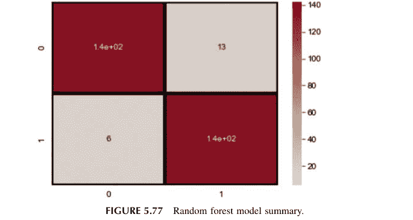

图 5.77 随机森林模型摘要。

```
plt.yticks(pos, np.array(df.columns)[sorted_features])
plt.title('Feature Importance')
result=permutation_importance(rf, x_test, y_test,
    n_repeats=10,random_state=seed)
sorted_idx=result.importances_mean.argsort()
plt.subplot(1, 2, 2)
plt.boxplot(result.importances[sorted_idx].T, vert=False,
    labels=np.array(df.columns)[sorted_idx])
plt.title("Permutation Importance (test set)")
fig.tight_layout()
Python output=Fig. 5.78
```

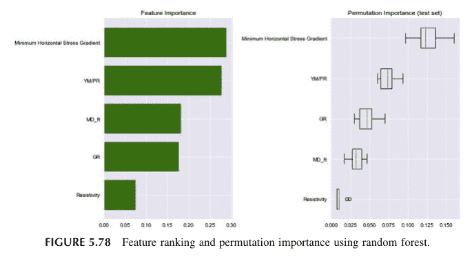

图 5.78 使用随机森林的特征排名和排列重要性。

我们还通过以下方式获取10折交叉验证的平均R²准确率：

```
np.random.seed(seed)
scores=cross_val_score(rf, x_scaled, y,cv=10,scoring='accuracy')
print("Cross-validation scores: {}". format(scores))
print("Average cross-validation score: {}". format(scores.mean()))
Python output=Cross-validation scores: [0.94 0.93 0.92 0.91 0.91 0.95 0.92 0.93 0.93 0.95]
Average cross-validation score: 0.9289999999999999
```

## 极端随机树分类模型

接下来，我们应用极端随机树算法，如下所示：

```
from sklearn.ensemble import ExtraTreesClassifier
np.random.seed(seed)
et=ExtraTreesClassifier(n_estimators=5000, criterion='gini',
    max_depth=None, min_samples_split=2, min_samples_leaf=5,
    max_features='auto')
et.fit(x_train, y_train)
y_pred=et.predict(x_test)
cm=confusion_matrix(y_test, y_pred)
print('Accuracy Score:',accuracy_score(y_test, y_pred))
print('Confusion Matrix:')
print(cm)
print(classification_report(y_test, y_pred))
sns.heatmap(cm, center=True, annot=True, cmap='Accent',
    linewidths=3, linecolor='black')
plt.show()
Python output=Fig. 5.79
```

268 使用Python的油气行业机器学习指南

```
Accuracy Score: 0.9333333333333333
Confusion Matrix:
[[137  15]
 [  5 143]]
```

| | precision | recall | f1-score | support |
|---|---|---|---|---|
| 0 | 0.96 | 0.90 | 0.93 | 152 |
| 1 | 0.91 | 0.97 | 0.93 | 148 |
| accuracy | | | 0.93 | 300 |
| macro avg | 0.93 | 0.93 | 0.93 | 300 |
| weighted avg | 0.94 | 0.93 | 0.93 | 300 |

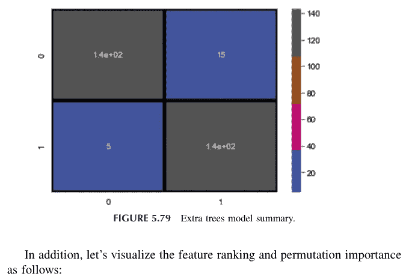

此外，我们通过以下方式可视化特征排名和排列重要性：

```
from sklearn.inspection import permutation_importance
feature_importance=et.feature_importances_
sorted_features=np.argsort(feature_importance)
pos=np.arange(sorted_features.shape[0]) + .5
fig=plt.figure(figsize=(12, 6))
plt.subplot(1, 2, 1)
plt.barh(pos, feature_importance[sorted_features],
    align='center', color='brown')
plt.yticks(pos, np.array(df.columns)[sorted_features])
plt.title('Feature Importance')
result=permutation_importance(et, x_test, y_test,
    n_repeats=10,random_state=seed)
sorted_idx=result.importances_mean.argsort()
```

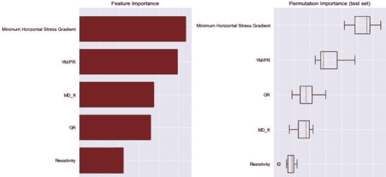

图 5.80 使用极端随机树的特征排名和排列重要性。

```
plt.subplot(1, 2, 2)
plt.boxplot(result.importances[sorted_idx].T, vert=False,
    labels=np.array(df.columns)[sorted_idx])
plt.title("Permutation Importance (test set)")
fig.tight_layout()
Python output=Fig. 5.80
```

我们还通过以下方式获取10折交叉验证的平均R²准确率：

```
np.random.seed(seed)
scores=cross_val_score(et, x_scaled, y,cv=10,scoring='accuracy')
print("Cross-validation scores: {}". format(scores))
print("Average cross-validation score: {}". format(scores.mean()))
Python output=Cross-validation scores: [0.94 0.92 0.91 0.92 0.9 0.94 0.93 0.93 0.93 0.97]
Average cross-validation score: 0.929
```

## 梯度提升分类模型

接下来，我们同样应用梯度提升算法，如下所示：

```
from sklearn.ensemble import GradientBoostingClassifier
np.random.seed(seed)
gb =GradientBoostingClassifier(loss='deviance',
    learning_rate=0.1, n_estimators=2000, criterion='friedman_mse',
    min_samples_split=2, min_samples_leaf=1, max_depth=3,
    max_features=None)
gb.fit(x_train, y_train)
y_pred=gb.predict(x_test)
cm=confusion_matrix(y_test, y_pred)
```

270 使用Python的油气行业机器学习指南

```
Accuracy Score: 0.9266666666666666
Confusion Matrix:
[[137  15]
 [  7 141]]
```

| | precision | recall | f1-score | support |
|---|---|---|---|---|
| 0 | 0.95 | 0.90 | 0.93 | 152 |
| 1 | 0.90 | 0.95 | 0.93 | 148 |
| accuracy | | | 0.93 | 300 |
| macro avg | 0.93 | 0.93 | 0.93 | 300 |
| weighted avg | 0.93 | 0.93 | 0.93 | 300 |

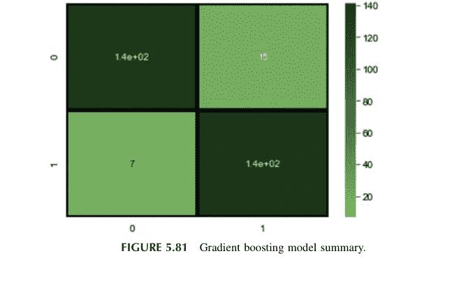

图 5.81 梯度提升模型摘要。

```
print('Accuracy Score:',accuracy_score(y_test, y_pred))
print('Confusion Matrix:')
print(cm)
print(classification_report(y_test, y_pred))
sns.heatmap(cm, center=True, annot=True, cmap='Greens',
            linewidths=3, linecolor='black')
plt.show()
Python output=Fig. 5.81
```

同样，通过以下方式获取该模型的特征排名和排列重要性：

```
from sklearn.inspection import permutation_importance
feature_importance=gb.feature_importances_
sorted_features=np.argsort(feature_importance)
pos=np.arange(sorted_features.shape[0]) + .5
```

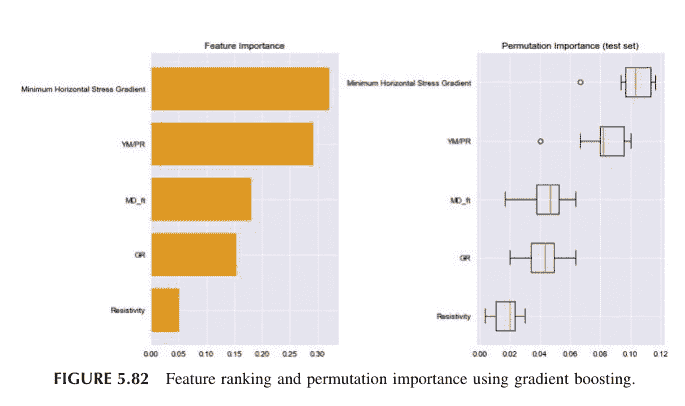

图 5.82 使用梯度提升的特征排名和排列重要性。

```
fig=plt.figure(figsize=(12, 6))
plt.subplot(1, 2, 1)
plt.barh(pos, feature_importance[sorted_features], align='center',
         color='orange')
plt.yticks(pos, np.array(df.columns)[sorted_features])
plt.title('Feature Importance')
result=permutation_importance(gb, x_test, y_test, n_repeats=10,
                              random_state=seed)
sorted_idx=result.importances_mean.argsort()
plt.subplot(1, 2, 2)
plt.boxplot(result.importances[sorted_idx].T, vert=False,
            labels=np.array(df.columns)[sorted_idx])
plt.title("Permutation Importance (test set)")
fig.tight_layout()
Python output=Fig. 5.82
```

接下来，通过以下方式获取10折交叉验证的平均R²准确率：

```
np.random.seed(seed)
scores=cross_val_score(gb, x_scaled, y,cv=10,scoring='accuracy')
print("Cross-validation scores: {}". format(scores))
print("Average cross-validation score: {}". format(scores.mean()))
Python output=Cross-validation scores: [0.95 0.89 0.89 0.91 0.89
0.92 0.9 0.94 0.95 0.94]
Average cross-validation score: 0.9179999999999998
```

## 极端梯度提升分类模型

下一步是将XGBoost算法应用于压裂阶段数据，如下所示：

```
from xgboost import XGBClassifier
np.random.seed(seed)
xgb=XGBClassifier(objective='binary:logistic',
    n_estimators=5000, reg_lambda=1, gamma=0,max_depth=3,
    learning_rate=0.1, alpha=0.5)
xgb.fit(x_train, y_train)
y_pred=xgb.predict(x_test)
cm=confusion_matrix(y_test, y_pred)
print('Accuracy Score:',accuracy_score(y_test, y_pred))
print('Confusion Matrix:')
print(cm)
print(classification_report(y_test, y_pred))
sns.heatmap(cm, center=True, annot=True, cmap='ocean',
    linewidths=3, linecolor='black')
plt.show()
Python output=Fig. 5.83
```

Accuracy Score: 0.9266666666666666
Confusion Matrix:
[[135  17]
 [  5 143]]

| | precision | recall | f1-score | support |
|---|---|---|---|---|
| 0 | 0.96 | 0.89 | 0.92 | 152 |
| 1 | 0.89 | 0.97 | 0.93 | 148 |
| accuracy | | | 0.93 | 300 |
| macro avg | 0.93 | 0.93 | 0.93 | 300 |
| weighted avg | 0.93 | 0.93 | 0.93 | 300 |

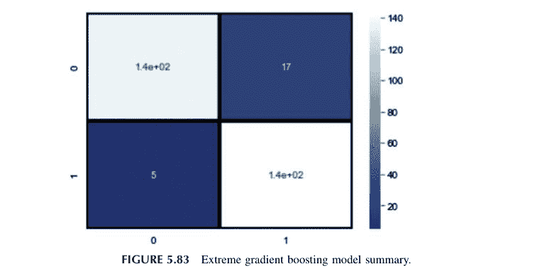

图 5.83 极端梯度提升模型摘要。

接下来，使用XGBoost模型绘制特征排名和排列重要性，如下所示：

```
from sklearn.inspection import permutation_importance
feature_importance=xgb.feature_importances_
sorted_features=np.argsort(feature_importance)
pos=np.arange(sorted_features.shape[0]) + .5
fig=plt.figure(figsize=(12, 6))
plt.subplot(1, 2, 1)
plt.barh(pos, feature_importance[sorted_features], align='center',
    color='purple')
plt.yticks(pos, np.array(df.columns)[sorted_features])
plt.title('Feature Importance')
result=permutation_importance(xgb, x_test, y_test, n_repeats=10,
    random_state=seed)
sorted_idx=result.importances_mean.argsort()
plt.subplot(1, 2, 2)
plt.boxplot(result.importances[sorted_idx].T, vert=False,
    labels=np.array(df.columns)[sorted_idx])
plt.title("Permutation Importance (test set)")
fig.tight_layout()
```

Python output=Fig. 5.84

最后，我们使用XGBoost进行10折交叉验证以获取平均R²，如下所示：

```
np.random.seed(seed)
scores=cross_val_score(xgb, x_scaled, y, cv=10,
    scoring='accuracy')
print("Cross-validation scores: {}". format(scores))
print("Average cross-validation score: {}". format(scores.mean()))
```

Python output=Cross-validation scores: [0.93 0.92 0.91 0.92 0.89 0.91 0.92 0.93 0.97 0.94]
Average cross-validation score: 0.924

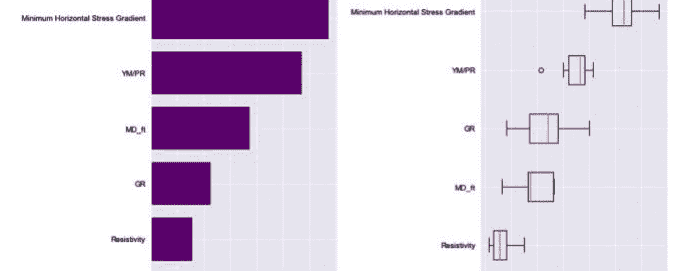

图 5.84 使用极端梯度提升的特征排名和排列重要性。

## 处理缺失数据（插补技术）

本章主要关注可用于解决各种问题的监督算法。第1章中简要讨论的另一个重要概念是处理缺失数据。之前已经讨论了处理缺失数据的基本类型。以下是处理缺失数据的几种常见方法：

1)  简单地移除任何含有N/A值的样本：这是处理缺失数据最简单的方法，其缺点是由于移除了缺失信息，样本数量可能会大幅减少。例如，如果2000口井中有1000口井缺少一个重要特征，移除缺少特征的井将导致只剩下1000口井。这比可纳入机器学习模型的井数减少了50%。

2)  用现有数据的均值、中位数、最频繁值、缺失后的第一个值、缺失前的最后一个值替换缺失值：尽管这种方法过于简单且易于执行，但通常不推荐使用，因为有其他更强大的算法可以替代。

3)  一些算法，如k-近邻（KNN）和MICE，可用于填充缺失数据。这些算法仅在满足以下两个条件时才能发挥出色作用：
-   缺失参数与现有参数之间存在内在关系。例如，如果某口井的砂/英尺数据缺失，但该井的每英尺水量数据可用，这些算法可能会产生有意义的答案。
-   大多数具有内在关系的特征必须存在。使用这些算法时可能遇到的一个挑战是，当一口井缺少一个特征时，它可能也缺少其他重要特征。例如，在收集竞争对手数据时，当一口井缺少砂加载量时，它通常也缺少水加载量、级间距等。

当数据集中有一两个参数零星缺失，而其他参数之间存在内在关系时，Python中的`fancyimpute`包是一个强大的工具。当一口井的数据中大部分参数都缺失时，不建议使用这些包，因为它们很可能产生错误的结果。使用这些包时，请务必在应用KNN和MICE等算法之前对数据进行归一化或标准化。K-近邻使用特征相似性来预测缺失值。KNN本质上是根据数据集中点的相似程度来分配新值。KNN的优点是比简单使用均值、中位数或最频繁值方法更准确。使用KNN的缺点是计算成本高，这意味着它通过将整个训练数据集存储在内存中来工作。此外，KNN对数据集中的异常值敏感。因此，请确保在使用前移除异常值并对数据进行标准化。

## 链式方程多重插补

多重插补涉及多次填充缺失值，创建多个“完整”数据集。Schafer和Graham（2002）对此进行了详细描述。缺失值是基于给定个体的观测值以及数据中其他参与者观测到的关系进行插补的，假设观测变量包含在插补模型中。多重插补程序，特别是MICE，非常灵活，可用于广泛的场景。使用MICE时采取以下步骤：

步骤1）对数据集中的每个缺失值执行简单插补，例如均值插补。这些均值插补可以被详细描述为“占位符”（Azur等人，2011）。

步骤2）将一个变量（“var”）的“占位符”均值插补重新设置为缺失（Azur等人，2011）。

步骤3）然后，“var”将成为回归模型中的因变量，所有其他变量成为回归模型中的自变量（Azur等人，2011）。

步骤4）然后，使用回归模型的插补预测值替换“var”的缺失值（Azur等人，2011）。

步骤5）然后对每个具有缺失数据的变量重复步骤2-4。遍历每个变量构成一次迭代或“循环”。在一个循环结束时，所有缺失值都已用反映观测数据关系的回归预测值替代（Azur等人，2011）。

步骤6）重复步骤2到4多次循环，每次循环更新插补值。用户可以指定要执行的循环次数。在这些循环结束时，保留最终的插补值，从而产生一个插补数据集（Azur等人，2011）。

## Python中的Fancy impute实现

如前所述，填充缺失值有多种应用。插补缺失值的主要应用之一是测井分析。可以使用各种技术（如KNN、MICE、迭代插补器等）对被认为被冲刷掉的数据部分进行插补。此外，如果有可用于获取缺失数据的重要特征，也可以对井数据（钻井、完井和生产）进行插补。本节将介绍在Marcellus页岩中，使用KNN和MICE对某一级水力压裂数据的每秒数据进行缺失值插补的实现。这些数据来自MSEEL公开数据集，并且为了本次练习，移除了部分地面处理压力数据。文件可在以下链接找到：

https://www.elsevier.com/books-and-journals/book-companion/9780128219294

打开一个新的Jupyter Notebook，并开始导入以下库：

```python
import numpy as np
import pandas as pd
import matplotlib.pyplot as plt
import seaborn as sns
import missingno as msno
%matplotlib inline
df=pd.read_excel('Chapter5_Imputation_DataSet.xlsx')
df.describe()
```

Python输出=图5.85

可视化每个特征中的缺失数据非常重要，如下所示：

```python
plt.figure(figsize=(10,8))
sns.heatmap(df.isnull(),yticklabels=False,cbar=False,
    cmap='viridis')
```

Python输出=图5.86

接下来，让我们使用“missingno”库以稍微不同的方法可视化缺失数据，如下所示。请注意，该库用于缺失数据的探索性可视化。

| | 地面处理压力 | 浓度 | 支撑剂浓度 |
|---|---|---|---|
| count | 4588.000000 | 4752.000000 | 4752.000000 |
| mean | 8142.469922 | 99.710795 | 1.422033 |
| std | 85.671249 | 3.308136 | 0.703032 |
| min | 7913.000000 | 64.400000 | 0.000000 |
| 25% | 8088.000000 | 99.900000 | 1.000000 |
| 50% | 8116.000000 | 100.300000 | 1.500000 |
| 75% | 8193.000000 | 100.700000 | 2.000000 |
| max | 8708.000000 | 101.600000 | 3.500000 |

图5.85 缺失数据集描述。

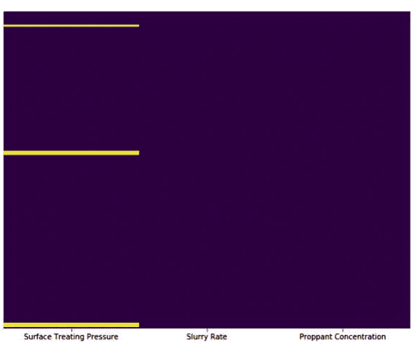

图5.86 缺失数据可视化。

```python
missingdata_df=df.columns[df.isnull().any()].tolist()
msno.matrix(df[missingdata_df])
```

Python输出=图5.87

接下来，获取每个特征的缺失值数量（在本练习中，只有地面处理压力有缺失数据），如下所示：

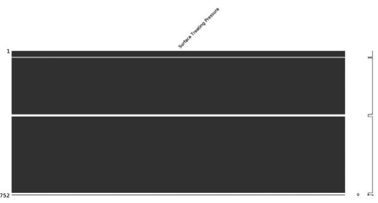

图5.87 使用“missingno”库进行缺失数据可视化。

```python
missing_val_count_by_column=(df.isnull().sum())
print(missing_val_count_by_column
    [missing_val_count_by_column > 0])
```

**Python输出=地面处理压力 164**
dtype: int64

接下来，对数据进行标准化，如下所示：

```python
from sklearn.preprocessing import StandardScaler
scaler=StandardScaler()
scaler.fit(df)
df_scaled=scaler.transform(df)
df_scaled=pd.DataFrame(df_scaled, columns=['Surface Treating\n    Pressure', 'Slurry Rate', 'Proppant Concentration'])
```

首先，在“Anaconda prompt”中，使用“pip install fancyimpute”安装库，如下所示。接下来，使用两个最近邻和KNN算法来插补缺失值：

```python
from fancyimpute import KNN
X_filled_knn=KNN(k=2).fit_transform(df_scaled)
X_filled_knn=pd.DataFrame(X_filled_knn,columns=['Surface Treating\n    Pressure', 'Slurry Rate', 'Proppant Concentration'])
X_filled_knn
```

**Python输出=图5.88**

接下来，由于数据在输入KNN插补算法之前已经标准化，因此需要转换回其原始形式并导出为csv文件。

```python
X_filled_knn['Surface Treating Pressure']=(X_filled_knn['Surface\n    Treating Pressure']*df['Surface Treating Pressure'].std())+df\n    ['Surface Treating Pressure'].mean()
X_filled_knn['Slurry Rate']=(X_filled_knn['Slurry\n    Rate']*df['Slurry\n    Rate'].std())+df['Slurry\n    Rate'].mean()
X_filled_knn['Proppant Concentration']=(X_filled_knn['Proppant\n    Concentration']*df['Proppant\n    Concentration'].std())+df\n    ['Proppant Concentration'].mean()
X_filled_knn.to_csv('KNN_Imputation.csv', index=False)
```

接下来，导入MICE库并应用MICE算法来填充平均处理压力列中的缺失数据，如下所示：

```python
from impyute.imputation.cs import mice
imputed_training=mice(df_scaled.values)
imputed_training=pd.DataFrame(imputed_training,columns=
    ['Surface Treating Pressure', 'Slurry Rate', 'Proppant\n    Concentration'])
```

正在填充第 1/4752 行，缺失值为 0，已用时间：6.403
正在填充第 101/4752 行，缺失值为 0，已用时间：6.403
正在填充第 201/4752 行，缺失值为 0，已用时间：6.403
正在填充第 301/4752 行，缺失值为 0，已用时间：6.428
正在填充第 401/4752 行，缺失值为 0，已用时间：6.432
正在填充第 501/4752 行，缺失值为 0，已用时间：6.432
正在填充第 601/4752 行，缺失值为 0，已用时间：6.432
正在填充第 701/4752 行，缺失值为 0，已用时间：6.436
正在填充第 801/4752 行，缺失值为 0，已用时间：6.436
正在填充第 901/4752 行，缺失值为 0，已用时间：6.436
正在填充第 1001/4752 行，缺失值为 0，已用时间：6.440
正在填充第 1101/4752 行，缺失值为 0，已用时间：6.440
正在填充第 1201/4752 行，缺失值为 0，已用时间：6.440
正在填充第 1301/4752 行，缺失值为 0，已用时间：6.444
正在填充第 1401/4752 行，缺失值为 0，已用时间：6.444
正在填充第 1501/4752 行，缺失值为 0，已用时间：6.444
正在填充第 1601/4752 行，缺失值为 0，已用时间：6.448
正在填充第 1701/4752 行，缺失值为 0，已用时间：6.448
正在填充第 1801/4752 行，缺失值为 0，已用时间：6.448
正在填充第 1901/4752 行，缺失值为 0，已用时间：6.448
正在填充第 2001/4752 行，缺失值为 0，已用时间：6.452
正在填充第 2101/4752 行，缺失值为 1，已用时间：6.452
正在填充第 2201/4752 行，缺失值为 0，已用时间：6.460
正在填充第 2301/4752 行，缺失值为 0，已用时间：6.460
正在填充第 2401/4752 行，缺失值为 0，已用时间：6.464
正在填充第 2501/4752 行，缺失值为 0，已用时间：6.464
正在填充第 2601/4752 行，缺失值为 0，已用时间：6.464
正在填充第 2701/4752 行，缺失值为 0，已用时间：6.468
正在填充第 2801/4752 行，缺失值为 0，已用时间：6.468
正在填充第 2901/4752 行，缺失值为 0，已用时间：6.468
正在填充第 3001/4752 行，缺失值为 0，已用时间：6.472
正在填充第 3101/4752 行，缺失值为 0，已用时间：6.472
正在填充第 3201/4752 行，缺失值为 0，已用时间：6.472
正在填充第 3301/4752 行，缺失值为 0，已用时间：6.476
正在填充第 3401/4752 行，缺失值为 0，已用时间：6.476
正在填充第 3501/4752 行，缺失值为 0，已用时间：6.476
正在填充第 3601/4752 行，缺失值为 0，已用时间：6.476
正在填充第 3701/4752 行，缺失值为 0，已用时间：6.480
正在填充第 3801/4752 行，缺失值为 0，已用时间：6.480
正在填充第 3901/4752 行，缺失值为 0，已用时间：6.480
正在填充第 4001/4752 行，缺失值为 0，已用时间：6.484
正在填充第 4101/4752 行，缺失值为 0，已用时间：6.484
正在填充第 4201/4752 行，缺失值为 0，已用时间：6.484
正在填充第 4301/4752 行，缺失值为 0，已用时间：6.488
正在填充第 4401/4752 行，缺失值为 0，已用时间：6.488
正在填充第 4501/4752 行，缺失值为 0，已用时间：6.488
正在填充第 4601/4752 行，缺失值为 0，已用时间：6.492
正在填充第 4701/4752 行，缺失值为 1，已用时间：6.496

| | 地面处理压力 | 浓浆速率 | 支撑剂浓度 |
|---|---|---|---|
| 0 | -2.678786 | -10.675047 | -2.022926 |
| 1 | -1.663165 | -10.554120 | -2.022926 |
| 2 | -1.091149 | -10.433193 | -2.022926 |
| 3 | -0.717588 | -10.282035 | -2.022926 |
| 4 | -0.122224 | -10.070413 | -2.022926 |
| ... | ... | ... | ... |
| 4747 | -0.682566 | -0.003264 | -2.022926 |
| 4748 | -0.659219 | 0.026968 | -2.022926 |
| 4749 | -0.495785 | 0.057200 | -2.022926 |
| 4750 | -0.554154 | 0.057200 | -2.022926 |
| 4751 | -0.519133 | 0.057200 | -2.022926 |

图 5.88 KNN Python 输出。

接下来，将数据转换回其原始形式并导出到 Excel，如下所示：

```
imputed_training['Surface Treating Pressure']=(imputed_training['Surface Treating Pressure']*df['Surface Treating Pressure'].std())+df['Surface Treating Pressure'].mean()
imputed_training['Slurry Rate']=(imputed_training['Slurry Rate']*df['Slurry Rate'].std())+df['Slurry Rate'].mean()
imputed_training['Proppant Concentration']=(imputed_training['Proppant Concentration']*df['Proppant Concentration'].std())+df['Proppant Concentration'].mean()
imputed_training.to_csv('MICE_Imputation.csv', index=False)
```

迭代填充器以**循环方式**填充缺失值，其中在每一步中，选择一个特征列作为模型输出，其余列被视为输入。然后，基于 x 和 y 变量构建一个回归模型，然后使用训练好的回归模型来预测缺失的 y 值。这以迭代方式对每个特征执行此操作，并重复“max_iter”轮填充。让我们将迭代填充器应用于标准化数据集，如下所示：

```
from fancyimpute import IterativeImputer
X_filled_ii=IterativeImputer(max_iter=10).fit_transform(df_scaled)
X_filled_ii=pd.DataFrame(X_filled_ii,columns=['Surface Treating Pressure', 'Slurry Rate', 'Proppant Concentration'])
X_filled_ii['Surface Treating Pressure']=(X_filled_ii['Surface Treating Pressure']*df['Surface Treating Pressure'].std())+df['Surface Treating Pressure'].mean()
X_filled_ii['Slurry Rate']=(X_filled_ii['Slurry Rate']*df['Slurry Rate'].std())+df['Slurry Rate'].mean()
X_filled_ii['Proppant Concentration']=(X_filled_ii['Proppant Concentration']*df['Proppant Concentration'].std())+df['Proppant Concentration'].mean()
X_filled_ii.to_csv('Iterative_Imputer_Imputation.csv', index=False)
```

让我们使用迭代填充器，但例外的是它将运行 5 次，并使用平均填充作为最终输出。

```
from fancyimpute import IterativeImputer
XY_incomplete=df_scaled
n_imputations=5
XY_completed=[]
for i in range(n_imputations):
    imputer=IterativeImputer(sample_posterior=True, random_state=i)
    XY_completed.append(imputer.fit_transform(XY_incomplete))
XY_completed_mean=np.mean(XY_completed, 0)
XY_completed_std=np.std(XY_completed, 0)
XY_completed=np.array(XY_completed)
XY_completed_mean=pd.DataFrame(XY_completed_mean,columns=['Surface Treating Pressure', 'Slurry Rate', 'Proppant Concentration'])
XY_completed_mean['Surface Treating Pressure']=(XY_completed_mean['Surface Treating Pressure']*df['Surface Treating Pressure'].std())+df['Surface Treating Pressure'].mean()
XY_completed_mean['Slurry Rate']=(XY_completed_mean['Slurry Rate']*df['Slurry Rate'].std())+df['Slurry Rate'].mean()
XY_completed_mean['Proppant Concentration']=(XY_completed_mean['Proppant Concentration']*df['Proppant Concentration'].std())+df['Proppant Concentration'].mean()
XY_completed_mean.to_csv('Mean_Iterative_Imputer.csv', index=False)
```

请随时将相同的工作流程和方法应用于任何其他问题的缺失值填充。此外，请确保首先将其应用于完整数据集，其中一部分数据被有意移除以测试模型。然后，将不同算法讨论的填充值与实际值进行比较，以理解不同模型的准确性。

## 机械钻速（ROP）优化示例

另一个可以说明的回归示例是钻井机械钻速（ROP）预测和优化。在钻井过程中会捕获各种重要特征。这些特征包括但不限于大钩载荷、转速、扭矩、钻压（WOB）、压差、伽马和 ROP。一个必须预测或优化的重要输出特征被称为 ROP。最大化 ROP 是钻井的绝对目标。因此，ROP 最大化的关键是构建一个监督回归机器学习模型，其中 ROP 可以用作模型的输出。一旦训练出令人满意的模型，就可以轻松预测新井的 ROP。此外，本书的最后一章（进化优化）可用于找到导致 ROP 最大化的输入特征集。

在本节中，使用了 MSEEL 项目中的 MIP3H 和 5H，如下链接所示：
http://www.mseel.org/research/research_MIP.html
数据已清理，可使用以下门户访问：
https://www.elsevier.com/books-and-journals/book-companion/9780128219294

一口井用作训练数据集，另一口井用作完全盲集，以测试模型的准确性和能力。本分析使用了每口井曲线段和水平段基于深度的数据。这是因为我们仅对曲线段和水平段的机械钻速优化感兴趣。强烈建议使用目标区域内的所有钻井数据（数十口或数百口井）来构建更全面的模型。本示例用于说明工作流程，当纳入更多井和数据时，模型预测能力的准确性无疑可以得到提高。在本示例中，曲线段和水平段被合并处理，然而，当纳入更多井时，更好的方法可能是通过为曲线段和水平段分别建立两个独立的模型来独立评估它们。

本练习中使用的输入特征如下：

-   井深（`Hole Depth`，单位为英尺的测量深度或MD）
-   大钩载荷（`Hook Load`，单位Klbs）
-   转盘转速（`Rotary rpm`）
-   转盘扭矩（`Rotary Torque`，单位Klbs-ft）
-   钻压（`Weight on Bit`，单位Klbs）
-   压差（`Differential Pressure`，单位psi）
-   井底伽马（`Gamma Ray at Bit`，单位gAPI）

模型的输出是机械钻速（`ROP`），单位为英尺/小时（`ft/hr`）。

第一步是导入必要的库和训练数据集，如下所示：

```python
import numpy as np
import pandas as pd
import matplotlib.pyplot as plt
import seaborn as sns
%matplotlib inline
df=pd.read_csv('Training_Data_Set_One_Well.csv')
```

获取每个特征的基本统计信息，并在继续之前验证每个特征的范围以确保异常值被移除：

```python
df.describe().transpose()
```

Python输出 = 图 5.89

| | count | mean | std | min | 25% | 50% | 75% | max |
|---|---|---|---|---|---|---|---|---|
| Hole Depth | 7934.0 | 10487.930804 | 2289.973781 | 6524.000 | 8500.250 | 10487.500 | 12469.750 | 14454.00 |
| Hook Load | 7934.0 | 129.672107 | 7.724432 | 107.200 | 123.800 | 129.500 | 134.400 | 156.40 |
| Rotary RPM | 7934.0 | 65.961054 | 24.280720 | 9.000 | 49.000 | 70.000 | 90.000 | 101.00 |
| Rotary Torque | 7934.0 | 11.459822 | 3.386672 | 2.701 | 9.096 | 11.373 | 14.198 | 20.05 |
| Weight on Bit | 7934.0 | 19.826758 | 5.611785 | 0.000 | 16.300 | 20.400 | 23.900 | 39.40 |
| Differential Pressure | 7934.0 | 520.255067 | 142.477894 | 2.900 | 429.350 | 565.900 | 627.700 | 783.30 |
| Gamma at Bit | 7934.0 | 211.783237 | 81.536917 | 54.120 | 148.240 | 204.710 | 235.290 | 600.00 |
| Rate Of Penetration | 7934.0 | 143.107280 | 55.738087 | 1.610 | 100.160 | 161.160 | 185.240 | 259.29 |

图 5.89 df基本统计信息。

接下来，让我们可视化每个特征的分布图，如下所示：

```python
f, axes =plt.subplots(4, 2, figsize=(12, 12))
sns.distplot(df['Hole Depth'], color="red", ax=axes[0, 0],
            axlabel='Measured Depth (ft)')
sns.distplot(df['Hook Load'], color="olive", ax=axes[0, 1],
            axlabel='Hook Load (Klbs)')
sns.distplot(df['Rate Of Penetration'], color="blue", ax=axes
            [1, 0],axlabel='Rate of Penetration (ft/hr)')
sns.distplot(df['Rotary RPM'], color="orange", ax=axes[1, 1],
            axlabel='Rotary rpm')
sns.distplot(df['Rotary Torque'], color="black",
            ax=axes[2, 0],axlabel='Rotary Torque (Klbs-ft)')
sns.distplot(df['Weight on Bit'], color="green",
            ax=axes[2, 1],axlabel='Weight on bit (Klbs)')
sns.distplot(df['Differential Pressure'], color="brown",
            ax=axes[3, 0],axlabel='Differential Pressure (psi)')
sns.distplot(df['Gamma at Bit'], color="gray", ax=axes[3, 1],
            axlabel='Gamma Ray at Bit (gAPI)')
plt.tight_layout()
```

Python输出 = 图 5.90

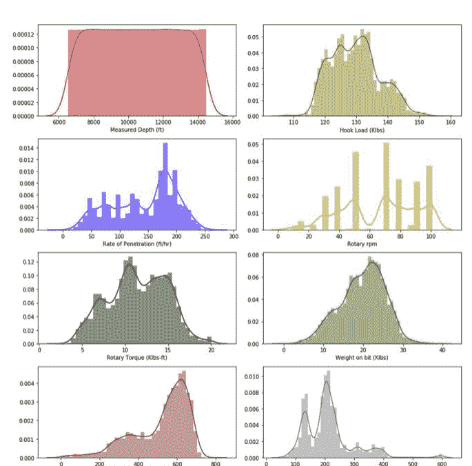

图 5.90 钻井特征分布图。

如观察到的，每个参数都有良好的分布，这仅基于一口井的训练数据，并且通过纳入更多井可以改善每个特征的分布。让我们也可视化箱线图，如下所示：

```python
f, axes =plt.subplots(4, 2, figsize=(12, 12))
sns.boxplot(df['Hole Depth'], color="red", ax=axes[0, 0])
sns.boxplot(df['Hook Load'], color="olive", ax=axes[0, 1])
sns.boxplot(df['Rate Of Penetration'], color="blue",
    ax=axes[1, 0])
sns.boxplot(df['Rotary RPM'], color="orange", ax=axes[1, 1])
sns.boxplot(df['Rotary Torque'], color="black", ax=axes[2, 0])
sns.boxplot(df['Weight on Bit'], color="green", ax=axes[2, 1])
sns.boxplot(df['Differential Pressure'], color="brown",
    ax=axes[3, 0])
sns.boxplot(df['Gamma at Bit'], color="gray", ax=axes[3, 1])
plt.tight_layout()
```

Python输出 = 图 5.91

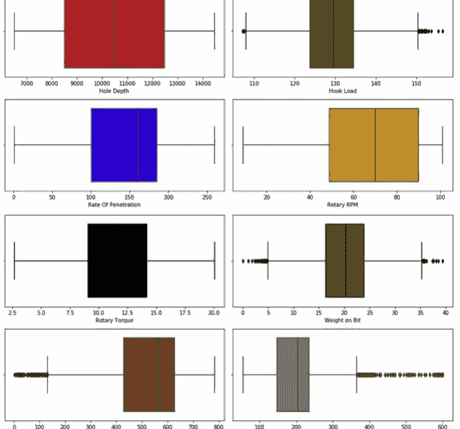

图 5.91 钻井特征箱线图。

可以生成皮尔逊相关系数热力图，如下所示：

```python
plt.figure(figsize=(12,10))
sns.heatmap(df.corr(), annot=True, linecolor='white',
    linewidths=2, cmap='coolwarm')
```

Python输出 = 图 5.92

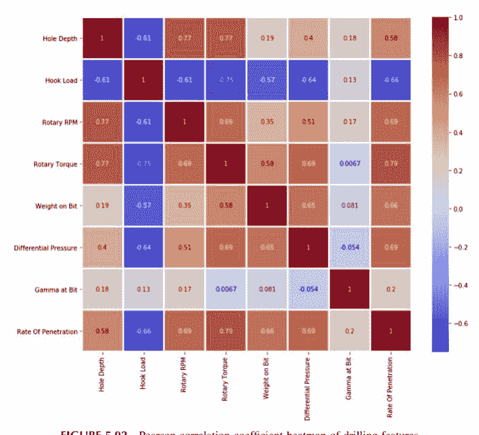

图 5.92 钻井特征皮尔逊相关系数热力图。

如图所示，大多数特征，如转速、扭矩、钻压、压差等，与机械钻速具有强相关性。这非常令人鼓舞，因为这可能表明这些特征对于机械钻速很重要。接下来，让我们使用MinMax缩放器来归一化数据，如下所示：

```python
from sklearn import preprocessing
scaler=preprocessing.MinMaxScaler(feature_range=(0,1))
scaler.fit(df)
df_scaled=scaler.transform(df)
```

让我们也定义缩放后的X和y变量，如下所示：

```python
df_scaled=pd.DataFrame(df_scaled, columns=['Hole Depth', 'Hook Load', 'Rotary RPM', 'Rotary Torque', 'Weight on Bit', 'Differential Pressure', 'Gamma at Bit', 'Rate Of Penetration'])
y_scaled=df_scaled[['Rate Of Penetration']]
x_scaled=df_scaled.drop(['Rate Of Penetration'], axis=1)
```

接下来，将数据拆分为训练集和测试集（70/30拆分）：

```python
from sklearn.model_selection import train_test_split
seed=1000
np.random.seed(seed)
X_train, X_test,y_train, y_test=train_test_split(x_scaled, y_scaled, test_size=0.30)
```

让我们首先使用支持向量机模型来检验模型的性能：

```python
from sklearn.svm import SVR
np.random.seed(seed)
SVM =SVR(kernel='rbf', gamma=1.5,C=5)
SVM.fit(X_train,np.ravel(y_train))
```

同时，获取训练集和测试集的R²值，如下所示：

```python
y_pred_train=SVM.predict(X_train)
y_pred_test=SVM.predict(X_test)
corr_train=np.corrcoef(y_train['Rate Of Penetration'], y_pred_train)[0,1]
print('ROP Train Data r^2=',round(corr_train**2,4),'r=', round(corr_train,4))
```

Python输出 =
ROP Train Data r^2=0.8967 r=0.947

```python
corr_test=np.corrcoef(y_test['Rate Of Penetration'], y_pred_test)[0,1]
print('ROP Test Data r^2=',round(corr_test**2,4),'r=', round(corr_test,4))
```

Python输出 =
ROP Test Data r^2=0.901 r=0.9492

考虑到仅使用了一口井进行训练测试拆分，结果看起来是合理的。请注意，本模型中尚未优化微调参数，如gamma、C等，第7章可用于执行此步骤。接下来，绘制机械钻速测试实际值与预测值的对比图，如下所示：

```python
plt.figure(figsize=(10,8))
plt.plot(y_test['Rate Of Penetration'], y_pred_test, 'b.')
plt.xlabel('ROP Testing Actual')
plt.ylabel('ROP Testing Prediction')
plt.title('ROP Testing Actual vs. Prediction')
```

Python输出 = 图 5.93

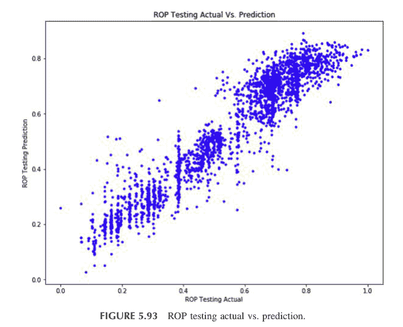

图 5.93 机械钻速测试实际值与预测值对比。

让我们也获取平均绝对误差（MAE）、均方误差（MSE）和均方根误差（RMSE）：

```python
from sklearn import metrics
print('Testing ROP MAE:', round(metrics.mean_absolute_error(y_test['Rate Of Penetration'], y_pred_test),4))
print('Testing ROP MSE:', round(metrics.mean_squared_error(y_test['Rate Of Penetration'], y_pred_test),4))
print('Testing ROP RMSE:', round(np.sqrt(metrics.mean_squared_error(y_test['Rate Of Penetration'], y_pred_test)),4))
```

Python输出 =
Testing ROP MAE: 0.0514
Testing ROP MSE: 0.0048
Testing ROP RMSE: 0.0689

接下来，第二口井是用于测试模型准确性的盲井。由于仅使用一口井来训练模型，且在训练过程中未观察到足够的参数变化，因此预期该完整盲集上的准确性结果会较低。该文件命名为“Blind_Data_Set”，并按如下方式导入：

```python
df_blind=pd.read_csv('Chapter5_ROP_Blind_DataSet.csv')
```

在定义盲数据集上的 X 和 y 变量之前，首先使用“scaler.transform”对数据进行归一化，如下所示。这确保了数据基于训练数据集中每个特征的最小值和最大值进行归一化。

```python
scaled_blind=scaler.transform(df_blind)
```

对盲数据集应用“scaler.transform”后，数据被转换为 numpy 数组。因此，让我们将数据从数组转换为数据框，并定义“x_scaled_blind”和“y_scaled_blind”。

```python
scaled_blind=pd.DataFrame(scaled_blind, columns=['Hole Depth',
    'Hook Load', 'Rotary RPM', 'Rotary Torque','Weight on Bit',
    'Differential Pressure', 'Gamma at Bit','Rate Of Penetration'])
y_scaled_blind=scaled_blind['Rate Of Penetration']
x_scaled_blind=scaled_blind.drop(['Rate Of Penetration'],axis=1)
```

接下来，使用训练好的“SVM”模型在盲数据集上预测输出变量（ROP），如下所示：

```python
y_pred_blind=SVM.predict(x_scaled_blind)
```

同时获取盲数据集的 R² 值，如下所示：

```python
corr_test=np.corrcoef(y_scaled_blind, y_pred_blind)[0,1]
print('ROP Blind Data r^2=',round(corr_test**2,4),'r=',
    round(corr_test,4))
```

Python 输出=
ROP Blind Data r^2=0.6823 r=0.826

如图所示，盲集的 R² 值较低（如预期）。这仅仅是由于训练数据集的规模较小以及训练过程中缺乏足够的训练变化。此示例说明了在模型投入生产或商业化之前，测试各种盲集以确保模型保持准确性的重要性。接下来，让我们绘制 ROP 盲集实际值与预测值的对比图，如下所示：

```python
plt.figure(figsize=(10,8))
plt.plot(y_scaled_blind, y_pred_blind, 'g.')
plt.xlabel('ROP Blind Actual')
plt.ylabel('ROP Blind Prediction')
plt.title('ROP Blind Actual vs. Prediction')
```

Python 输出=图 5.94

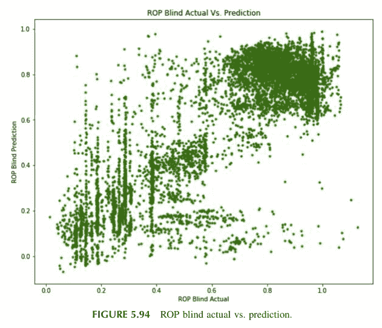

图 5.94 ROP 盲集实际值与预测值对比。

接下来，为了可视化实际盲集和预测的 ROP 数据集，可以编写以下代码：

```python
plt.figure(figsize=(6,12))
sns.scatterplot(y_scaled_blind, df_blind['Hole Depth'],
    label='Actual Blind Data', color='blue')
sns.scatterplot(y_pred_blind, df_blind['Hole Depth'],
    label='Predicted Blind Data', color='green')
```

Python 输出=图 5.95

290 使用 Python 的油气机器学习指南

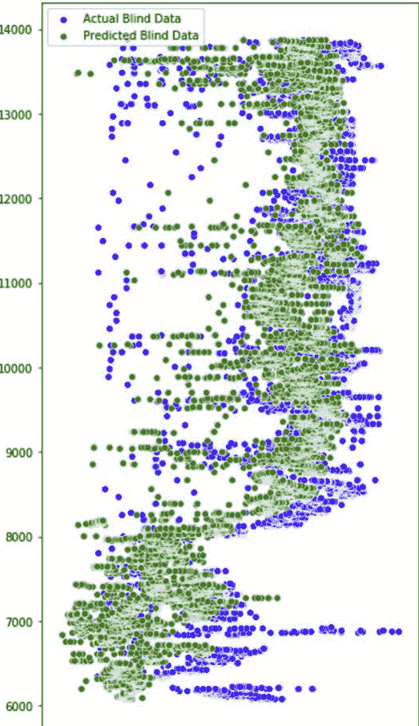

图 5.95 ROP 盲集与预测对比图。

如图所示，整体趋势似乎还可以，应测试其他算法以查看它们与 SVM 相比的性能。让我们也在同一个 Jupyter Notebook 文件中训练一个额外树模型，看看它的表现如何，如下所示：

```python
from sklearn.ensemble import ExtraTreesRegressor
np.random.seed(seed)
ET=ExtraTreesRegressor(n_estimators=100,criterion='mse',
    max_depth=None, min_samples_split=2,
    min_samples_leaf=1)
ET.fit(X_train,np.ravel(y_train))
y_pred_train=ET.predict(X_train)
y_pred_test=ET.predict(X_test)
corr_train=np.corrcoef(y_train['Rate Of Penetration'],
    y_pred_train)[0,1]
print('ROP Train Data r^2=',round(corr_train**2,4),'r=',
    round(corr_train,4))
```

Python 输出=ROP Train Data r^2=1.0 r=1.0

```python
corr_test=np.corrcoef(y_test['Rate Of Penetration'], y_pred_test)[0,1]
print('ROP Test Data r^2=',round(corr_test**2,4),'r=',
    round(corr_test,4))
```

Python 输出=
ROP Test Data r^2=0.9503 r=0.9748

让我们也使用额外树模型可视化 ROP 测试实际值和预测值的散点图，如下所示：

```python
plt.figure(figsize=(10,8))
plt.plot(y_test['Rate Of Penetration'], y_pred_test, 'b.')
plt.xlabel('ROP Testing Actual')
plt.ylabel('ROP Testing Prediction')
plt.title('ROP Testing Actual vs. Prediction Using Extra Trees Model')
```

Python 输出=图 5.96

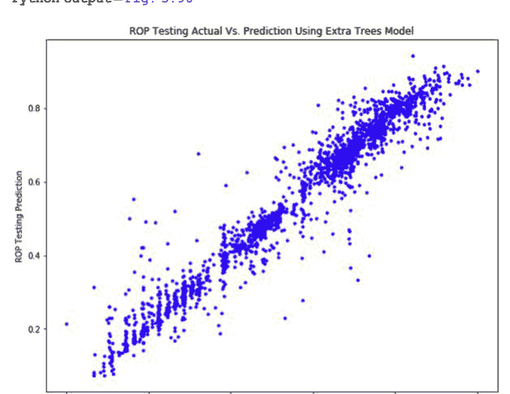

图 5.96 使用额外树模型的 ROP 测试实际值与预测值对比。

如图所示，使用额外树时的测试准确性高于之前的模型（SVM）。让我们也将这个训练好的额外树模型应用于之前导入的盲数据集，如下所示：

```python
y_pred_blind=ET.predict(x_scaled_blind)
corr_test=np.corrcoef(y_scaled_blind, y_pred_blind)[0,1]
print('ROP Blind Data r^2=',round(corr_test**2,4),'r=',
      round(corr_test,4))
```

Python 输出=
ROP Blind Data r^2=0.7476 r=0.8646

如上所示，盲集的准确性也高于 SVM 模型的盲集准确性。
接下来，绘制 ROP 盲集实际值与预测值的对比图，如下所示：

```python
plt.figure(figsize=(10,8))
plt.plot(y_scaled_blind, y_pred_blind, 'g.')
plt.xlabel('ROP Blind Actual')
plt.ylabel('ROP Blind Prediction')
plt.title('ROP Blind Actual vs. Prediction Using Extra Trees Model')
```

Python 输出=图 5.97

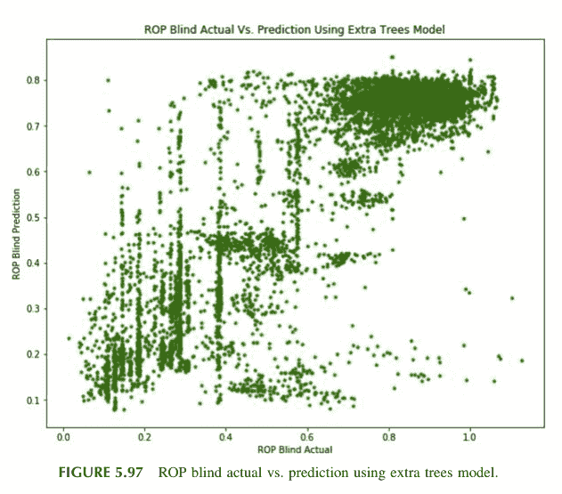

图 5.97 使用额外树模型的 ROP 盲集实际值与预测值对比。

最后，让我们也绘制其随深度变化的函数图，如下所示：

```python
plt.figure(figsize=(6,12))
sns.scatterplot(y_scaled_blind, df_blind['Hole Depth'],
    label='Actual Blind Data', color='blue')
sns.scatterplot(y_pred_blind, df_blind['Hole Depth'],
    label='Predicted Blind Data', color='green')
```

Python 输出=图 5.98

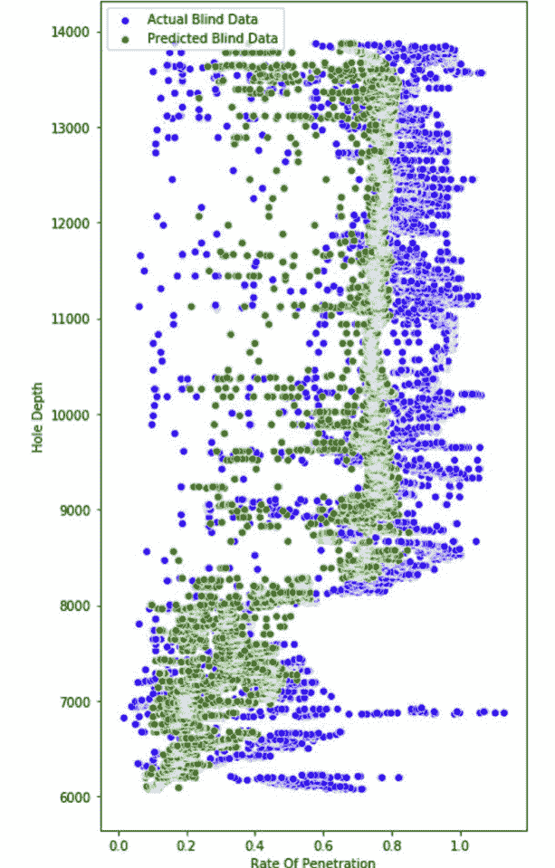

图 5.98 使用额外树模型的 ROP 盲集与预测对比图。

如图所示，当应用于盲数据集时，额外树模型在高层面上似乎表现不佳。请花些时间应用其他涵盖的算法，看看是否有任何讨论过的算法能够超越 SVM 或额外树的准确性。此示例旨在展示一个概念验证，即基于训练一口井并在同一井场上测试另一口井来训练模型以预测 ROP，由于缺乏足够的训练数据，预期结果尚可。下一步是基于数十口或数百口井构建模型，然后测试准确性以确保预测能力可用。尽管本问题中选择的特征似乎是正确的特征，但这并不意味着不应考虑其他重要特征。数据的公开可用性极其有限。因此，请利用您的领域专业知识，确保使用所有可用特征，在您的组织内构建更稳健、更强大的机器学习模型，并将数十口或数百口井纳入您的训练部分。让我们也使用额外树算法获取特征重要性，如下所示：

```python
feature_names =df.columns[:-1]
plt.figure(figsize=(10,8))
feature_imp=pd.Series(ET.feature_importances_,
    index=feature_names).sort_values(ascending=False)
sns.barplot(x=feature_imp, y=feature_imp.index)
plt.xlabel('Feature Importance Score Using Extra Trees')
plt.ylabel('Features')
plt.title("Feature Importance Ranking")
```

Python 输出=图 5.99

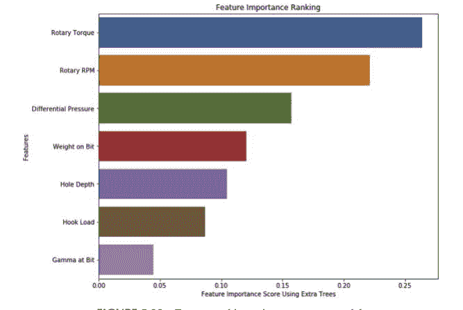

图 5.99 使用额外树模型的特征排名。

请确保也应用网格搜索优化来微调每个选定 ML 模型的参数，并使用本书的最后一章（进化优化）来找到能使 ROP 最大化的最佳输入特征集。

## 参考文献

Avriel, M. (2003). *非线性规划：分析与方法*. Dover Publishing.

Azur, M., Stuart, E., Frangakis, C., & Philip, L. (2011). 链式方程多重插补：它是什么以及如何工作？ *国际精神病学研究方法杂志*, 20(1), 40–49.

Belyadi, H., Fathi, E., & Belyadi, F. (2019). *非常规储层水力压裂* (第2版). Elsevier, 9780128176658.

Breiman, L. (1994). *Bagging 预测器*. 加州大学伯克利分校统计系. https://www.stat.berkeley.edu/~breiman/bagging.pdf.

Breiman, L. (2011). *随机森林*. Springer. https://doi.org/10.1023/A:1010933404324.

Chen, T., & Guestrin, C. (2016). *XGBoost：一个可扩展的树提升系统*. 康奈尔大学. https://doi.org/10.1145/2939672.2939785.

Cortes, C., & Vapnik, V. (1995). 支持向量网络. https://doi.org/10.1007/BF00994018.

Cover, T., & Hart, P. (1967). 最近邻模式分类. *IEEE 信息论汇刊*, 13, 21–27. https://pdfs.semanticscholar.org/a3c7/50febe8e72a1e377fbae1a723768b233e9e9.pdf?_ga=2.114560259.5041978.1593729195-1056142191.1593729195.

Efron, B. (1979). Bootstrap 方法：再看 jackknife. *统计年鉴*, 7(1), 1–26. https://doi.org/10.1214/aos/1176344552.

Huber, P. (1964). 位置参数的稳健估计. *数学统计年鉴*, 35(1), 73–101. https://doi.org/10.1214/aoms/1177703732.

Kam Ho, T. (1995). *随机决策森林* (第278–282页). https://web.archive.org/web/20160417030218/http://ect.bell-labs.com/who/tkh/publications/papers/odt.pdf.

Quinlan, R. (1986). *决策树的归纳*. 1 pp. 81–106. https://hunch.net/~coms-4771/quinlan.pdf.

Raschka, S. (n.d.). 为什么最近邻是一个惰性算法？ 检索于 2020年7月3日, 来自 https://sebastianraschka.com/faq/docs/lazy-knn.html.

Schafer, J. L., & Graham, J. W. (2002). 缺失数据：我们对现状的看法. *心理学方法*, 7, 147–177. https://doi.org/10.1111/1467-9574.00218.

scikit-learn. (n.d.). 检索于 2020年7月17日, 来自 https://scikit-learn.org/stable/modules/tree.html#tree-algorithms-id3-c4-5-c5-0-and-cart.

Statsmodels. (2020). https://pypi.org/project/statsmodels/.

Tolles, J., & Meurer, W. J. (2016). 逻辑回归：将患者特征与结果联系起来. *美国医学会杂志*. https://doi.org/10.1001/jama.2016.7653.

Wright, S. (2015). *坐标下降算法*. Springer. https://doi.org/10.1007/s10107-015-0892-3.

## 第六章

## 神经网络与深度学习

## 神经网络简介与基本架构

人工智能（AI）可定义为一系列分析和数值工具的集合，旨在学习和模拟一个过程。当学习过程完成后，人工智能便能够处理和应对新的情况。神经网络、遗传算法和模糊逻辑是人工智能的基石（Mohaghegh, 2000）。

神经网络声称其人工信息处理与生物神经网络密切相关。神经元是构成人工神经网络的主要元素。它们彼此之间传递信号，就像人脑中的神经元一样。人工神经元通过关联权重和非线性激活函数，将多个输入连接到一个或多个输出。当数据输入神经网络时，它们会通过特定的算法经历一个学习过程，以找到合适的权重，这些权重描述了输出相对于多个输入的行为。

神经网络在探索和分析那些在传统建模中似乎未被利用的大型历史数据库方面具有巨大潜力（Mohaghegh, 2000）。换句话说，神经网络应应用于数学建模不切实际的情况。石油和天然气行业的问题性质是复杂的。这些问题可以通过非常规方法（如人工智能）来解决。

人工神经网络最初是由McCulloch和Pitts根据大脑中生物神经元的行为发展而来的（Mohaghegh, 2000）。神经网络中的信息处理模仿了生物系统中神经元的机制。图6.1展示了一个神经系统的示意性模块体，也称为神经元。通常，一个神经元由细胞体、轴突和树突组成，树突通过突触连接与另一个神经元相连。信息交流通过进入细胞的树突的电信号进行。根据输入的特性，神经元受到刺激并释放一个通过轴突传递的输出信号。如果电位达到足够大的阈值，该动作被称为“触发信号”（Mohaghegh, 2000）。一个神经元的输出信号是另一个神经元的输入，后者产生一个新的电化学脉冲作为输出。大脑中的每个模块可能有超过100,000个神经元连接到数千个其他神经元，形成了神经网络的复杂架构；这种神经网络架构是人脑学习过程的基础。

人工神经网络是基于生物神经网络的功能进行数学建模的。从现在起，神经网络和人工神经网络将互换使用。神经网络有两个主要应用：聚类（无监督分类）和寻找一组数值输入（属性）与输出（目标）之间的相关性。神经网络通常由一系列按顺序分层结构排列的“神经元”组成。每个输入和输出变量可以被分配到一个类似于生物神经元的节点。节点被组织成层，包括一个输入层、一个或多个隐藏层以及一个输出层，输入层和输出层相互连接，如图6.2所示。神经网络的拓扑结构定义了隐藏层的数量以及每个隐藏层中用于连接输入层到输出层的节点数量。两个节点之间的连接（来自连续层的突触）由权重 *wij* 表示，其中 *i* 和 *j* 分别代表输入层和输出层中的节点。权重作为一个给定值，类似于电信号的强度。兴奋性反射由权重的正值表示，而抑制性反射则由负值表示（Kriesel, 2005）。

隐藏层中的每个节点接收来自输入层节点的信号，考虑偏置，最后使用激活函数产生输出信号。为了解释这个过程（图6.2），假设“n”个输入节点。让我们用 *Ii* 表示来自第 *i* 个输入节点的信号，用 *wij* 表示从节点 *i* 到节点 *j* 的信号权重，用 *θj* 表示偏置。隐藏层中节点 *j* 的动作电位（*hj*）计算如下加权和。

$$h_j = \sum_{i=1}^{N} w_{ij} \cdot I_i + \theta_j$$ (6.1)

偏置或 $\theta_j$ 是一个输出值为1的伪节点，当输入值为0时使用。最后一步是计算节点的输出（oj）。输出使用激活函数（F）计算，该函数根据节点的动作电位（$h_j$）确定输出信号的幅度。根据函数类型和偏置值，激活函数生成一个介于0和1之间，或 $-1$ 到 1 之间的值。通常，神经网络模型中使用了四种类型的激活函数（F）：(i) F_阶跃函数, (ii) F_ReLU, (iii) F_sigmoid, 和 (iv) F_tanh。激活函数帮助神经网络理解数据中的非线性和复杂模式。

对于 $F_{step}$，如果动作电位（$h_j$）小于0，激活函数取值为0，*当它大于或等于0时* 取值为1。

$$oj = F_{step}(hj) = \begin{cases} 0, & hj < 0 \\ 1, & hj \ge 0 \end{cases} \quad (6.2)$$

修正线性单元（ReLU）是使用最广泛的激活函数。如果动作电位小于0，激活函数值为0。对于大于0的动作电位值，激活函数值与动作电位值相同。换句话说，ReLU实际上是一个最大值函数，即 $F_{ReLU} = Max(0, hj)$ 或：

$$oj = F_{ReLU}(hj) = \begin{cases} 0, & hj < 0 \\ hj, & hj \ge 0 \end{cases} \quad (6.3)$$

Sigmoid函数使用以下关系式，其值范围从0到1。对于大的负数，sigmoid函数返回0；对于大的正数，它返回1。Sigmoid激活函数最近的使用较少（与其他激活函数相比）。这是因为该函数的梯度可能不适合权重优化（稍后讨论），并且sigmoid的输出不是以0为中心的。

$$oj = F_{sigmoid}(hj) = \frac{1}{1 + e^{-hj}} \quad (6.4)$$

Tanh激活函数与sigmoid函数类似，主要区别在于其返回值范围从 $-1$ 到 1。Tanh比sigmoid激活函数更受青睐，因为它是以0为中心的，并且具有更好的梯度性能。所有上述激活函数如图6.3所示。

$$oj = F_{tanh}(hj) = tanh(hj) = \frac{1 - exp(-2hj)}{1 + exp(-2hj)} \quad (6.5)$$

为了求解包含神经网络中所有节点的方程组，可以通过将所有上述方程重写为矩阵形式来利用线性代数。

例如，假设没有偏置，公式6.1可以写成：

$$H = W.I$$

其中W是权重矩阵，I是输入向量，H是动作电位向量。为了使用激活函数并计算每个隐藏层的输出向量，可以将sigmoid函数应用于向量H的所有元素，如下所示：

$$o = F(H)$$

神经网络的拓扑结构由神经元之间的连接模式和数据传播方式决定。上述过程可以对每个隐藏层重复进行，同时考虑到第一个隐藏层节点的输出将是第二个隐藏层的输入。这个连续的过程持续进行，直到找到最后一个或最终隐藏层的输出。当输出结果没有反馈到层和单元时，这个过程被称为“前馈”。这些权重如何优化的过程将在下一节中解释。

## 反向传播技术

神经网络训练过程的目标是调整计算出的权重，直到模型能够正确估计输出值。反向传播方法需要更新权重以最小化误差，即网络输出与目标值之间的差异。这些误差通过网络反向传播。反向传播过程包括一个前馈计算以找到初始输出，一个误差

## 梯度下降与反向传播

“梯度下降”法是一种寻找复杂函数最小值的常用方法，用于计算权重变化。该方法寻找达到函数最小值的最陡路径。陡峭度被定义为函数的斜率（一阶导数），用于向最小值方向迈步。因此，将误差值视为网络权重的函数，梯度下降技术通过迈步大小为误差梯度“∂e/∂w”的步长，来最小化误差相对于权重的值。为了最小化误差函数，可以通过将输出误差乘以激活函数的梯度（链式法则）来对其进行修改。根据误差是正还是负，激活函数的梯度可能向上或向下移动（Fausett, 1993）。

反向传播过程对于最后一层或输出层来说是直接的，因为误差可以使用输出值和目标值计算得出（e = t_k - o_k）。在最后一层，为了根据误差调整权重，输出层每个神经元k处的误差梯度（δk）通过以下公式计算：

$$\frac{\partial e_k}{\partial w_k} = \delta_k = (t_k - o_k) \frac{\partial F(O_k)}{\partial w_k}$$ (6.6)

其中 o_k 和 t_k 是输出层神经元k处的输出值和目标值，F 是激活函数。如果在隐藏层中没有目标值，则权重调整参数可以按如下方式计算：

$$\delta_j = \frac{\partial F(O_j)}{\partial W_j} \sum_{k=1}^{n} w_{jk} \delta_k$$ (6.7)

然后，新权重（$W_{jk}^n$）通过以下方程进行操作：

$$w_{jk}^n = w_{jk}^{n-1} + \Delta w_{jk}, \quad \Delta w_{jk} = \alpha.\delta_k$$ (6.8)

其中 α 代表学习率，取值在0到1之间；该值决定了权重调整和学习速度的速率。较小的 α 值会导致较低的学习率，而较高的值可能导致网络不稳定或陷入局部最优。为了克服这个问题，建议使用“动量”项（μ）。它增加了朝向全局最小值的步长，并绕过局部最小值。因此，可以使用以下方程计算新权重：

$$\Delta_{j, k}^n = \alpha.\delta_k + \mu.\Delta w_{j, k}^{n-1}$$ (6.9)

为了开始训练过程，有必要为权重分配初始随机值。这些值可以在-1到1的范围内以均匀概率分布随机选择。然而，根据网络拓扑结构和激活函数的类型，可能需要一些特定的随机权重初始化。对于具有“n”个传入链接的节点，一个常见的权重初始化规则是在 $\pm\frac{1}{\sqrt{n}}$ 范围内随机采样（Rashid, 2016）。

在训练过程之前，应准备数据集，以防止激活函数向1方向平坦化，这将使梯度下降方法失效。当输入值较大时会发生这种情况（图6.3）。为此，建议将所有输入缩放或归一化到0.01（而不是零）到1的范围内。对于输出值，也可以应用相同的重新缩放过程，考虑0-1的范围。

## 数据划分

构建神经网络模型的主要目标是利用其预测能力。这意味着当模型暴露于训练阶段未使用的新数据集时，应能预测出可靠的输出。为了确保模型的预测可靠，整个数据集应划分为三个部分：训练集、测试集和验证集。训练数据集仅用于模型训练，即前面讨论的权重修改过程。训练模型后，可以使用网络未见过且在训练过程中未使用的部分数据来验证其可靠性。这部分用于验证模型预测精度（能力）的数据被称为测试集。值得一提的是，可以调整神经网络拓扑和参数（例如，层数、每层节点数、学习率等），以提高模型在测试数据集上的准确性。因此，必须在训练和测试期间未见过的数据集部分上再次测量模型的准确性。这部分数据被称为验证集。

最常用的划分技术是随机采样。例如，通常将70%的数据用于训练，15%用于测试，15%用于验证。还有一些其他技术使用过采样，这有助于在低频区间周围填充新的数据点。如果任何输入属性代表非均匀性，则训练数据集应包含来自代表性较低区间的一些数据点。否则，神经网络将无法在如此低密度区间内预测出可靠的输出。

神经网络训练过程的最后一步是决定何时结束。在神经网络训练期间，“Epoch”表示整个训练过程的一个完整周期（前馈计算、查找误差和反向传播）。在大多数情况下，需要经过多次迭代或epoch才能完成训练过程。神经网络训练期间的主要目标是最小化全局误差或“损失函数”，定义如下（此公式实际上是均方误差；MSE）：

$$E = \frac{1}{n} \sum_{i=1}^{n} (t_{ik} - o_{ik})^2$$

随着epoch数量的增加，训练和测试数据集的误差通常会减少。如果测试数据集的误差减少，则训练过程应继续。当测试误差开始增加而训练误差继续减少时，神经网络开始记忆训练模式，这种活动不会提高模型的泛化能力。此时，建议停止训练过程（图6.4）。在某些情况下，epoch迭代会持续一定次数（例如，1000次）或一段时间（例如，24小时），具体取决于计算能力。最后，选择并记住达到测试数据集最小误差时的epoch信息非常重要。

训练神经网络模型所需的步骤总结如下：

1.  归一化或重新缩放输入和输出数据
2.  将数据划分为训练集、验证集和测试集
3.  定义神经网络的拓扑结构，描述隐藏层数、每个隐藏层的节点（神经元）数、激活函数、学习率、动量、求解器等。
4.  初始化所有权重和偏置值
5.  对于隐藏层中的每个节点，使用公式6.5（根据激活函数的类型，也可以使用公式6.2、6.3和6.4）计算节点的输出，并继续前馈过程，直到计算出输出层的最终输出
6.  计算相对于实际输出的输出层误差，并使用公式6.6、6.8和6.9更新前一层节点的权重。
7.  对于其余的隐藏层，使用公式6.7、6.8和6.9更新节点和权重
8.  重复步骤5，并使用更新后的权重计算新的输出
9.  使用公式6.10计算全局误差。根据终止条件（epoch数量或验证数据集的最小误差）停止训练

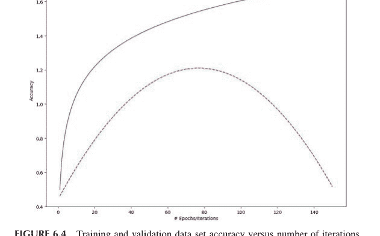

## 神经网络在石油和天然气行业的应用

神经网络在不同的勘探与开发学科中展示了广泛的应用，但如果传统方法能提供可靠的解决方案，则不建议实施神经网络。神经网络能够在大型历史数据集中进行精确分析，而这些数据集无法通过传统建模揭示明确信息（Mohaghegh, 2000）。

神经网络在石油和天然气行业的早期应用主要与油藏表征有关，特别是从测井曲线中获取孔隙度、渗透率和流体饱和度。测井曲线通常用作神经网络的输入，而岩心结果（如孔隙度和渗透率）被视为输出。当没有岩心数据时，可以使用测井曲线预测油藏特征（Mohaghegh, 2000）。此外，还可以训练神经网络，使用常规电缆测井（如自然伽马、密度和感应测井）生成合成磁共振测井（Mohaghegh et al., 2000）。

神经网络的另一个著名应用是石油和天然气PVT性质估算。有许多经验相关式用于估算某些PVT性质。Gharbi等人（Gharbi & Elsharkawy, 1997）使用从世界各地收集的5200个PVT数据点训练了一个通用神经网络，以预测泡点压力（Pb）和原油体积系数（Bob），作为溶解气油比（Rs）、气体比重（γg）、原油比重（γo）和油藏温度的函数。结果比现有的PVT相关式更准确。

神经网络还被用于预测管道中蜡沉淀的条件。决定蜡形成的一个重要参数是温度。Adeyemi等人（Adeyemi & Sulaimon, 2012）使用包括分子量、密度和活化能在内的数据组合训练了一个神经网络，为蜡析出温度（WAT）提供了非常好的估算。

Mohaghegh等人（Mohaghegh et al., 1995）使用反向传播神经网络，对Clinton砂岩储气库中水力压裂后气井产能进行了预测。该研究的输入参数包括完井日期、井型、砂层厚度、流量测试值、压裂段数、压裂液类型、总用水量、总砂量、酸液体积、注入速率、注入压力等井场数据。输出变量为压裂增产后的最大流量。神经网络以极高的精度预测了压裂后的气井产能。此外，神经网络与遗传算法结合，用于优化压裂作业并筛选出最佳的重复压裂候选井。

神经网络的另一项应用是开发代理储层模型（SRM，近期也称为“智能代理”）——它是储层模拟模型的复制品，能够以高精度和短计算时间重现模拟结果。SRM可以很好地替代储层模拟模型，尤其是在需要大量模拟运行的情况下。风险评估、不确定性分析、优化和历史拟合是典型的需要大量模拟运行的分析。Amini等人（Amini et al., 2012）为澳大利亚CO2封存场地的储层模拟模型开发了一个SRM，该模型包含100,000个网格块。基于网格的SRM通过12次模拟运行开发，为神经网络生成了一个全面的数据库，包括所有储层网格块的井数据、静态数据和动态数据。

由Mohaghegh发明的自顶向下模型（TDM，Mohaghegh et al., 2012）是神经网络的另一项应用，它整合了钻井数据、测井曲线、岩心、试井、生产历史等现场测量数据，以构建一个全面的全油田储层模型。Haghighat等人（Haghighat et al., 2014）利用井的静态数据（储层性质、完井信息）和动态数据（如每月生产天数等操作信息），分析了Wattenberg油田-Niobrara非常规资产中145口井的生产动态。

除了上述应用外，神经网络在石油和天然气工业中还用于钻头诊断（Arehart, 1990）、地震波形反演（Gunter & Albert, 1992）、地震属性标定（Johnston, 1993）、基于测井曲线的岩性预测（Ford & Kelly, 2001）、点蚀电位预测（Gartland et al., 1999）、储层相分类（Tang, 2008）、提高采收率方法评估与筛选（Surguchev & Li, 2000）、卡钻预测（Siruvuri et al., 2006）、地层损害评估（Kalam et al., 1996）、注水分析（Nakutnyy et al., 2008）、导电裂缝识别（Thomas & La Pointe, 1995）、钻头弹跳检测（Vassallo & Bernasconi, 2004）以及石英传感器标定（Schultz & Chen, 2003）。

## 表6.1 干气井输入属性列表。

| 输入 | | |
| :--- | :--- | :--- |
| **地质** | **钻井** | **完井** |
| 孔隙度 (%) | 水平段长度 (ft) | 支撑剂/英尺 (#/ft) |
| 厚度 (ft) | 上倾/下倾 | 段间距 (ft) |
| 含水饱和度 (%) | 井距 (ft) | 流体/英尺 (bbl/ft) |
| 压力梯度 (psi/ft) | | 注入速率 (bbl/minute) |
| | | 瞬时关井压力-ISIP (psi) |
| | | 线性胶百分比 (%) |

## 示例1：页岩储层中的最终可采储量预测

在本示例中，我们将使用神经网络作为非线性回归估计器，以寻找20年天然气EUR¹（最终可采储量）与多个井/储层属性（如地质、钻井和完井属性）之间的相关性。我们的数据集包含一个页岩资产中的507口干气水平多段压裂井。值得一提的是，此数据并非实际数据集。您可以在以下位置找到“页岩气井”数据集：https://www.elsevier.com/books-and-journals/book-companion/9780128219294。所有属性的列表如表6.1所示。

让我们澄清一些将在神经网络训练中使用的输入属性。产层地质层高表示“厚度”。上倾/下倾属性是一个分类输入。为了使用学习算法，这些数据被转换为数字。上倾井赋值为1，下倾井赋值为0。井距是两口相邻井之间的距离。计算井距有多种方法，这超出了本章的范围。关于完井参数，请参考《非常规储层水力压裂》（Belyadi et al. 2019）一书。

## 描述性统计

如第一章所述，要将数据作为数据集加载到Python中，必须将“Chapter6_Shale Gas Wells.csv”上传到Jupyter notebook。接下来，应使用pandas在Python中加载数据。

> 1. 通常的做法是将输出变量EUR按水平段长度进行归一化，并从模型中移除水平段长度作为输入。

```
import pandas as pd
dataset=pd.read_csv('Chapter6_Shale Gas Wells.csv')
```

页岩气井数据集包含14列和506行（第一行是数据标题）。在开始数据准备之前，通过运行以下代码片段来审查数据特征或简单的描述性统计非常重要。一些统计摘要参数，如最小值、最大值和平均值，将用于生成输出与属性之间的趋势。

```
print(dataset.describe())
Python output=Fig. 6.5
```

## 数据预处理

如本章前面所述，为防止激活函数收敛到1，必须对所有输入和输出数据进行归一化或重新缩放。

| | 段间距 | bbl/ft | 井距 | 倾角 | 厚度 |
|---|---|---|---|---|---|
| count | 506.000000 | 506.000000 | 506.000000 | 506.000000 | 506.000000 |
| mean | 147.640316 | 35.134387 | 820.158103 | 0.069170 | 162.365613 |
| std | 18.392128 | 10.533197 | 135.736986 | 0.253994 | 15.471044 |
| min | 140.000000 | 30.000000 | 650.000000 | 0.000000 | 120.000000 |
| 25% | 140.000000 | 30.000000 | 700.000000 | 0.000000 | 153.000000 |
| 50% | 141.000000 | 30.000000 | 800.000000 | 0.000000 | 165.000000 |
| 75% | 148.000000 | 36.000000 | 900.000000 | 0.000000 | 176.000000 |
| max | 330.000000 | 75.000000 | 1350.000000 | 1.000000 | 185.000000 |

| | 水平段长度 | 注入速率 | 孔隙度 | ISIP |
|---|---|---|---|---|
| count | 506.000000 | 506.000000 | 506.000000 | 506.000000 |
| mean | 8153.086957 | 63.079051 | 7.337549 | 7010.490119 |
| std | 942.393981 | 7.250106 | 0.749451 | 1211.452205 |
| min | 4500.000000 | 55.000000 | 5.500000 | 5000.000000 |
| 25% | 7617.750000 | 57.000000 | 6.600000 | 5000.000000 |
| 50% | 8051.000000 | 61.000000 | 7.500000 | 7643.000000 |
| 75% | 8608.000000 | 69.000000 | 8.000000 | 7783.000000 |
| max | 11500.000000 | 80.000000 | 8.500000 | 8200.000000 |

| | 含水饱和度 | 线性胶百分比 | 压力梯度 |
|---|---|---|---|
| count | 506.000000 | 506.000000 | 506.000000 |
| mean | 19.213439 | 64.845455 | 0.930257 |
| std | 3.198579 | 18.427813 | 0.046507 |
| min | 15.000000 | 15.000000 | 0.750000 |
| 25% | 16.800000 | 55.900000 | 0.940000 |
| 50% | 17.700000 | 69.900000 | 0.950000 |
| 75% | 24.100000 | 79.700000 | 0.950000 |
| max | 25.000000 | 95.000000 | 0.950000 |

| | 支撑剂铺置浓度 | EUR |
|---|---|---|
| count | 506.000000 | 506.000000 |
| mean | 2567.065217 | 12.845455 |
| std | 413.792220 | 3.067064 |
| min | 1100.000000 | 7.000000 |
| 25% | 2317.500000 | 11.000000 |
| 50% | 2642.000000 | 12.400000 |
| 75% | 2897.750000 | 13.700000 |
| max | 3200.000000 | 22.000000 |

图6.5 页岩气井数据集的统计摘要。

在本示例中，输入和输出数据使用sklearn库中的MinMaxScaler进行归一化，如下所示。“X”用作输入属性矩阵，“y”用作模型的输出。归一化后的数据存储到“Xnorm”和“ynorm”中。

```
X=dataset.iloc[:,0:13]
y=dataset.iloc[:,13].values
from sklearn.preprocessing import MinMaxScaler
sc=MinMaxScaler()
Xnorm=pd.DataFrame(data=sc.fit_transform(X))
yshape=pd.DataFrame(data=y.reshape(-1,1))
ynorm=pd.DataFrame(data=sc.fit_transform(yshape))
print(Xnorm)
Python output=Fig. 6.6
```

第一个示例的目标是训练一个神经网络，以检测每口井的EUR与所有属性或输入特征之间的模式。有时，当属性数量很多时（本例并非特指），建议确定每个属性对EUR（输出）的相对影响程度。此过程也称为特征排序。通过确定最重要的特征，可以忽略排名较低的属性，从而提高训练速度和训练模型的性能。

Python库中有多种特征排序算法。根据所使用的数学和公式，每种算法可能导致不同的排序层次。为了减少排序顺序的不确定性，建议使用不同的方法并比较它们的排序结果。本示例中使用了两种方法，读者也有机会测试其他算法。其中一些排序技术也在第5章中讨论过。

在开始特征排序之前，可视化每对属性的数据趋势很有用。“成对图”是seaborn可视化库中一个简单实用的绘图工具，它使用以下命令创建所有属性的直方图和散点图：

```
import seaborn as sns
sns.pairplot(dataset)
Python output=Fig. 6.7
```

| | 0 | 1 | 2 | 3 | 4 | 5 | 6 | 7 |
|---|---|---|---|---|---|---|---|---|
| 0 | 0.0 | 0.177778 | 0.285714 | 0.0 | 0.692308 | 0.577571 | 0.36 | 0.933333 |
| 1 | 0.0 | 0.000000 | 0.357143 | 0.0 | 0.830769 | 0.548000 | 0.20 | 0.766667 |
| 2 | 0.0 | 0.000000 | 0.357143 | 0.0 | 0.830769 | 0.694429 | 0.40 | 0.766667 |
| 3 | 0.0 | 0.000000 | 0.428571 | 0.0 | 0.846154 | 0.658571 | 0.56 | 0.933333 |
| 4 | 0.0 | 0.000000 | 0.428571 | 0.0 | 0.846154 | 0.687143 | 0.48 | 0.933333 |
| .. | ... | ... | ... | ... | ... | ... | ... | ... |
| 501 | 0.0 | 0.000000 | 0.142857 | 0.0 | 0.615385 | 0.581000 | 0.32 | 0.566667 |
| 502 | 0.0 | 0.000000 | 0.071429 | 0.0 | 0.615385 | 0.490286 | 0.24 | 0.566667 |
| 503 | 0.0 | 0.000000 | 0.071429 | 0.0 | 0.615385 | 0.654286 | 0.08 | 0.566667 |
| 504 | 0.0 | 0.000000 | 0.142857 | 0.0 | 0.615385 | 0.619429 | 0.12 | 0.566667 |
| 505 | 0.0 | 0.000000 | 0.142857 | 0.0 | 0.615385 | 0.473143 | 0.20 | 0.566667 |

图6.6 前七个属性的归一化数据。

页岩气井数据集的配对图如图6.7所示。由于有14个变量（13个属性和1个目标变量），配对图包含14×14个子图。在对角线上，每个对应变量的直方图展示了各输入特征的分布情况。散点图显示了每两个变量之间的关系。通过使用交叉图，可以确定相关的属性。从模型中移除共线性输入参数极为重要，因为这些参数提供的是相同的信息。因此，为了提升训练性能，建议移除共线性参数。此外，还可以可视化目标变量（EUR）与其他属性之间的整体关系。例如，在图6.7中，可以清晰地看到水平段长度与EUR之间的关系。另一方面，EUR与地层倾角之间没有显著关系。

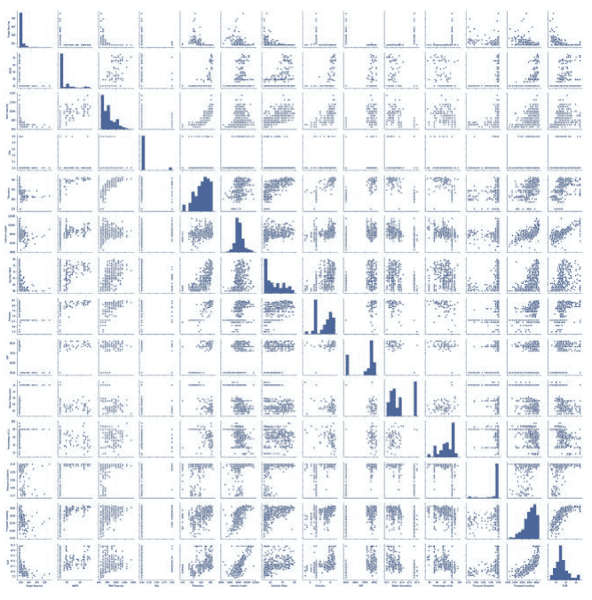

图6.7 页岩气井的配对图。

计算EUR与所有属性之间相关性的第一种技术称为“斯皮尔曼等级相关”。这是一种非参数度量，显示两个变量在单调方式（递增或递减趋势）下的统计依赖性。在此方法中，计算斯皮尔曼相关系数或ρ来衡量两个变量之间的影响程度。ρ介于-1和1之间。当ρ接近1或-1时，两个变量高度相关。正的ρ值表示递增趋势，负的ρ值表示递减趋势。Python的“stats”库中的“Spearmanr”返回一个协方差或ρ矩阵以及P值矩阵（P值是一种假设检验，用于查看一对变量是否相关）。ρ矩阵包含每对变量之间的相关系数。斯皮尔曼技术可用于对页岩气井数据集中影响EUR的特征进行排序，使用以下代码行：

```
from scipy import stats
import matplotlib.pyplot as plt
datanorm=sc.fit_transform(dataset)
stats.spearmanr(dataset)
rho, pval=stats.spearmanr(datanorm)
corr=pd.Series(rho[:13,13], index=X.columns)
corr.plot(kind='barh')
plt.show()
Python output=Fig. 6.8
```

请注意，“rho”是一个14×14的矩阵，表示每对变量之间的相关系数。要找出EUR与其他属性之间的关系，可以使用rho矩阵最后一列（rho[:13,13]）的ρ值与列标题（X.columns）绘制条形图。使用“斯皮尔曼等级相关”得到的页岩气井特征重要性如图6.8所示。

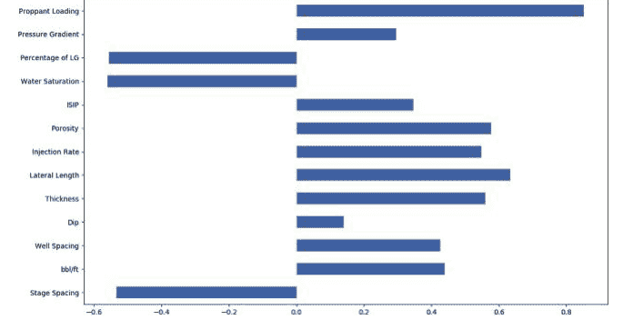

图6.8 使用斯皮尔曼等级相关对页岩气井进行的特征排序。

图6.8显示，段间距、含水饱和度和线性胶（LG）百分比对EUR有负面影响。如果这些参数增加，EUR将会减少。其他属性与EUR呈正相关。通过观察相关系数的大小，很明显支撑剂充填量、水平段长度、段间距、含水饱和度和LG百分比对EUR的影响最大。

可用于特征排序的第二种技术是“随机森林”模型（在第5章已详细讨论）。该方法基于将数据划分为子集——在决策树的每一层——以具有最小方差估计器的属性为主要目标（对于分类数据则是最小熵）。为了减轻单个决策树的高方差和过拟合，随机森林通过创建多棵树和平均估计器来注入随机性。因此，树每一层（基于不同属性值）的方差减少量可以作为该属性重要性的指标。让我们从“sklearn”中调用“RandomForestRegressor”，看看哪些属性对天然气产量或EUR的贡献更大。在此示例中，假设每棵树的最大深度为10，RandomForestRegressor的其余参数设置为sklearn的默认值。请注意，缩放和归一化会影响不同特征之间的相关性，对于随机森林数据应避免使用。

```
import matplotlib.pyplot as plt
from sklearn.ensemble import RandomForestRegressor
model=RandomForestRegressor(max_depth=10, random_state=0)
model.fit(X,y)
feat_importances=pd.Series(model.feature_importances_,
    index=X.columns)
feat_importances.nlargest(13).plot(kind='barh')
plt.show()
Python output=Fig. 6.9
```

页岩气井的特征重要性如图6.9所示。对于这个特定的数据集，与地质参数相比，钻井和完井参数似乎对产量的贡献更大。如图所示，水平段长度的影响最大。其次，每英尺的支撑剂充填量对EUR的影响程度排第二。唯一具有一定重要性的地质参数是地层厚度。另一方面，孔隙度、地层倾角和每英尺液体量（bbl/ft）对EUR的重要性最低。请注意，建议将水平段长度作为输入特征移除。相反，应通过水平段长度对EUR进行归一化，并使用EUR/1000英尺作为模型的输出。如果储量审计员要求查看，此示例说明了水平段长度对EUR性能的重要性。

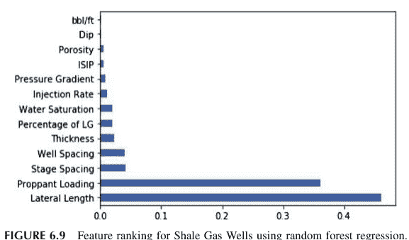

神经网络训练过程之前的最后一步是数据划分。使用sklearn库的“train_test_split”命令来划分页岩气井数据集。“train_test_split”将数据随机划分为训练集和测试集（此处没有验证集划分，但我们可以对测试数据运行相同的命令将其划分为测试集和验证集）。在此命令中，必须定义包含在训练中的数据集比例，介于0和1之间。以下命令将数据随机划分为70%的训练集（表示为X_train和y_train）和30%的测试集（表示为X_test和y_test）。值得一提的是，数据划分的随机性（随机性）将导致在相同数据库和相同神经网络拓扑结构上训练的神经网络性能不唯一。但是，可以添加种子数以获得相同的结果。

```
import numpy as np
seed=50
np.random.seed(seed)
from sklearn.model_selection import train_test_split
X_train, X_test, y_train, y_test=train_test_split(Xnorm, ynorm, test_size=0.3)
```

原始数据样本（Xnorm）包含506行或井。划分数据后，X_train包含354口井，如图6.10所示，这是506口井的70%。

## 神经网络训练

既然神经网络训练的数据集已准备就绪，让我们构建一个神经网络来回归天然气EUR与13个输入属性之间的关系。为此，必须使用“Keras”库中的“Dense”和“Sequential”命令。“Sequential”定义神经网络配置的主要特征，例如损失函数类型或全局误差（公式6.10）、优化器方法（梯度下降算法之一）用于最小化误差，以及分类问题中使用的标准（度量）。Dense确定层属性，例如每层（输入、输出和隐藏层）中的节点数、激活函数类型以及隐藏层数量。“fit”命令通过指定输入、输出和停止标准来启动训练过程。如前所述，一旦达到特定迭代次数且测试数据中的误差不再下降，训练过程即可停止。请在命令提示符下使用“pip install keras”和“pip install tensorflow”确保这些库已安装。Anaconda默认未安装这些库。如果未安装这些库，下面演示的代码将返回错误。以下代码行用于训练模型：

```
from keras.models import Sequential
from keras.layers import Dense
from keras.callbacks import EarlyStopping
model=Sequential()
model.add(Dense(13, activation='relu',input_dim=13))
model.add(Dense(13, activation='relu'))
model.add(Dense(1))
np.random.seed(seed)
model.compile(optimizer='adam', loss='mean_squared_error')
early_stopping_monitor=EarlyStopping(patience=3)
history=model.fit(X_train,y_train,epochs=100,
    validation_data=(X_test, y_test),
    callbacks=[early_stopping_monitor])
```

# 314 使用Python的油气机器学习指南

| 0 | 1 | 2 | 3 | 4 | 5 | 6 | 7 | 8 | 9 | 10 | 11 | 12 |
|---|---|---|---|---|---|---|---|---|---|---|---|---|
| 251 | 0.000000 | 0.222222 | 0.571429 | 0.0 | 0.907692 | 0.551286 | 0.92 | 0.800000 | 0.739063 | 0.27 | 0.69125 | 0.95 | 0.948571 |
| 3 | 0.000000 | 0.000000 | 0.428571 | 0.0 | 0.846154 | 0.658571 | 0.56 | 0.933333 | 0.913125 | 0.07 | 0.64875 | 1.00 | 0.966667 |
| 257 | 0.005263 | 0.200000 | 0.071429 | 0.0 | 0.461538 | 0.985429 | 0.12 | 0.866667 | 0.825938 | 0.15 | 0.04250 | 1.00 | 0.906667 |
| 35 | 0.000000 | 0.000000 | 0.214286 | 0.0 | 0.769231 | 0.454429 | 0.32 | 0.800000 | 0.825938 | 0.18 | 0.70250 | 1.00 | 0.780476 |
| 339 | 0.000000 | 0.000000 | 0.357143 | 0.0 | 0.738462 | 0.464429 | 0.56 | 0.833333 | 0.825938 | 0.07 | 0.80875 | 1.00 | 0.779048 |
| ... | ... | ... | ... | ... | ... | ... | ... | ... | ... | ... | ... | ... | ... |
| 289 | 0.000000 | 0.533333 | 0.571429 | 0.0 | 0.953846 | 0.575571 | 0.80 | 0.833333 | 0.782500 | 0.20 | 0.42500 | 0.95 | 0.785238 |
| 109 | 0.005263 | 0.000000 | 0.142857 | 0.0 | 0.723077 | 0.511143 | 0.08 | 0.700000 | 0.825938 | 0.38 | 0.88250 | 1.00 | 0.618571 |
| 395 | 0.100000 | 0.000000 | 0.071429 | 0.0 | 0.369231 | 0.557571 | 0.00 | 0.366667 | 0.000000 | 0.91 | 0.80875 | 1.00 | 0.575238 |
| 480 | 0.063158 | 0.000000 | 0.214286 | 0.0 | 0.692308 | 0.513714 | 0.36 | 0.366667 | 0.000000 | 0.91 | 0.80875 | 1.00 | 0.751429 |
| 176 | 0.000000 | 0.000000 | 0.214286 | 0.0 | 0.738462 | 0.471143 | 0.56 | 0.866667 | 0.825938 | 0.21 | 0.42500 | 1.00 | 0.768571 |

图6.10 训练数据集。

在本例中，使用了一个具有两个隐藏层的神经网络。输入节点有13个，等于属性的数量；输出节点有1个，即“gas EUR”。两个隐藏层各有13个节点。所有层的激活函数均为“Relu”，即修正线性单元（图6.3，分段线性）。优化算法是“adam”，它根据梯度变化的动量来计算学习率（Kingma & Ba, 2015）。损失函数是“均方误差”，定义见公式6.10。神经网络拓扑结构示意图如图6.11所示。

本例中，训练轮数（epochs）指定为100。当训练过程开始时，训练集和测试集的损失值通常都很高。随着训练轮数的增加，两个数据集的损失值都会下降，直到测试集的损失或准确率不再提升。神经网络前九个轮次的进展如图6.12所示。

在进度报告中，展示了轮次编号、每个轮次的运行时间以及训练集和测试集的损失值。理想情况是，随着迭代次数（轮次）的增加，训练集和测试集的损失值都下降。在特定情况下，训练损失值下降，但测试损失值开始上升。此时，网络将开始记忆训练数据及其对应的权重，这将导致过拟合。为了防止过拟合，代码中使用了“早停监控器”。为此命令定义了“patience = 3”的标准，意味着如果经过三个轮次后，测试数据集的损失值或性能没有改善，则停止模型训练。这种情况可能在达到目标轮数之前很久就发生（本例中发生在第50轮，而总轮数设置为100）。训练和测试损失历史记录如图6.13所示，使用以下代码绘制：

```
plt.plot(history.history['loss'])
plt.plot(history.history["val_loss"],"r--")
plt.title('Model Loss')
plt.ylabel('loss value')
plt.xlabel('# epochs')
plt.legend(['train', 'test'], loc='upper right')
plt.show()
```

Python输出=图6.13

训练过程完成后，可以使用训练好的模型进行预测。为了获得模型对新数据或未见过的数据（测试集）的输出结果，使用“model.predict”函数。必须向模型提供一个包含全部13个属性的输入矩阵，以获得相应的EUR。在本例中，希望将实际或测量的天然气EUR与模型的预测值进行比较。如前所述，所有属性和目标值（EUR）都已重新缩放至0到1之间的值。要将神经网络的输出缩放回实际范围，可以使用以下公式：

EUR = EUR.Min + Ynorm × (EUR.Max – EUR.Min)

Y norm可以是训练模型的预测值。为了将测量值与预测值进行比较，在图上显示趋势的R²值很有用。计算R²时，使用“sklearn.metrics”库中的“r2_score”。以下代码将绘制训练集和测试集的预测天然气EUR与测量EUR的对比图，并在图上显示R²值。图表如图6.14所示。

```
from sklearn.metrics import r2_score
EUR_test=y_test*(y.max()-y.min())+y.min()
EUR_train=y_train*(y.max()-y.min())+y.min()
EUR_test_prediction=model.predict(X_test)*(y.max()-y.min())+\n    y.min()
EUR_train_prediction=model.predict(X_train)*(y.max()-y.min())+\n    y.min()
r2_test=r2_score(EUR_test, EUR_test_prediction)
r2_train=r2_score(EUR_train, EUR_train_prediction)
fig, ax=plt.subplots()
ax.scatter(EUR_test, EUR_test_prediction)
ax.plot([EUR_test.min(), EUR_test.max()], [EUR_test.min(),
    EUR_test.max()], 'k--', lw=4)
ax.set_xlabel('EUR_Test_Measured(Bcf)')
ax.set_ylabel('EUR_Test_Predicted(Bcf)')
plt.text(14,22,"R2="+str(r2_test).format("%.2f"))
plt.show()
fig, ax=plt.subplots()
ax.scatter(EUR_train, EUR_train_prediction)
ax.plot([EUR_train.min(), EUR_train.max()], [EUR_train.min(),
    EUR_train.max()], 'k--', lw=4)
ax.set_xlabel('EUR_Train_Measured(Bcf)')
ax.set_ylabel('EUR_Train_Predicted(Bcf)')
plt.text(14,22,"R2="+str(r2_train).format("%.2f"))
plt.show()
Python输出=图6.14
```

## 示例2：为原油开发PVT相关性

石油/油藏工程计算严重依赖于相态行为和PVT数据。这些计算涵盖原始地质储量估算、管道压降、多孔介质中的流体流动、产量递减分析和试井。获取PVT数据最常用的方法是通过实验室测试。在此方法中，为了计算PVT性质，油样通过多种方法进行测试。其中一些测试非常复杂、耗时且昂贵。另一方面，一些性质如原油API度或气体比重则很容易获得。而像溶解气油比、泡点/露点和凝析油析出（凝析气藏）等性质则需要复杂的实验室测试。在石油和天然气行业中，通常的做法是推导数学和经验相关性，以某些容易获得的参数为函数来确定一个PVT参数。统计回归技术主要用于推导不同PVT性质的经验相关性。这些相关性可以在*油藏工程手册*（Ahmed, 2006）或其他烃类性质参考书（McCain, 1999）中找到。

“泡点”定义为液态油相中形成第一个气泡时的压力。当压力降至泡点以下时，更多的气体从油中释放出来，单相液体变为两相。泡点（bp）是PVT性质之一，无法在实验室中轻易测量。因此，几位作者（Ahmed, 2006）提出了几种相关性，如“Standing, Vasque/Beggs, Glaso, Marhoun, and Petrosky/Farshad”。除了统计回归技术，也可以使用神经网络来开发PVT性质之间的相关性。第二个示例使用了一个PVT数据集，包含249个PVT²样本，包括温度、溶解气油比（RS）、气体比重、原油API度和泡点压力（Pbp）。“PVT数据”可在以下位置找到：https://www.elsevier.com/books-and-journals/book-companion/9780128219294。

2. 本示例类似于Osman等人（2001）所做的工作。

第一步是导入数据并研究描述性统计。需要将“PVT Data.csv”上传到Jupyter notebook，然后使用pandas在Python中加载数据。PVT数据的描述性统计如图6.15所示。

```
import pandas as pd
dataset=pd.read_csv('Chapter6_PVT Data.csv')
print(dataset.describe())
Python输出=图6.15
```

将数据上传到“dataset”后，应确定神经网络的输入和输出并进行归一化。本例中的输入包括前四列，即温度、Rs、气体比重和原油API度，输出是Pbp。使用“MinMaxScaler”将数据归一化为输入“Xnorm”和输出“ynorm”。

```
X=dataset.iloc[:,0:4]
y=dataset.iloc[:,4].values
from sklearn.preprocessing import MinMaxScaler
sc=MinMaxScaler()
Xnorm=pd.DataFrame(data=sc.fit_transform(X))
yshape=pd.DataFrame(data=y.reshape(-1,1))
ynorm=pd.DataFrame(data=sc.fit_transform(yshape))
```

在本例中，进行了特征排序，以查看每个参数对输出数据的相对重要性。与之前的示例类似，使用“斯皮尔曼等级相关”和“随机森林”根据它们对Pbp的影响对所有输入参数进行排序。两种方法的代码如下。

```
# "斯皮尔曼等级相关"特征排序
from scipy import stats
import matplotlib.pyplot as plt
datanorm=sc.fit_transform(dataset)
stats.spearmanr(dataset)
rho, pval=stats.spearmanr(datanorm)
corr=pd.Series(rho[:4,4], index=X.columns)
corr.plot(kind='barh')
```

| | 温度 | Rs | 气体比重 | 原油API度 | Pbp |
|---|---|---|---|---|---|
| count | 249.000000 | 249.000000 | 249.000000 | 249.000000 | 249.000000 |
| mean | 147.796271 | 411.145756 | 1.012870 | 31.658760 | 1424.602150 |
| std | 41.936641 | 291.829082 | 0.162192 | 5.036067 | 908.669973 |
| min | 70.447234 | 27.832416 | 0.797048 | 17.854225 | 131.484967 |
| 25% | 116.365357 | 183.034832 | 0.885612 | 28.469070 | 697.772696 |
| 50% | 142.257643 | 348.735793 | 0.978741 | 32.604282 | 1252.802615 |
| 75% | 176.074354 | 587.055416 | 1.113760 | 35.875571 | 1937.635034 |
| max | 282.911419 | 1471.094081 | 1.632588 | 39.714096 | 4306.643567 |

plt.show()
# "随机森林"特征排序
from sklearn.ensemble import RandomForestRegressor
model=RandomForestRegressor(max_depth=10, random_state=0)
model.fit(X,y)
feat_importances=pd.Series(model.feature_importances_,
    index=X.columns)
feat_importances.nlargest(4).plot(kind='barh')
plt.show()
Python output=Fig. 6.16

两种特征排序方法的结果如图6.16所示。两种方法都表明Rs对泡点压力的影响最大。斯皮尔曼等级相关法说明了气体比重和油API对Pbp的负面影响。这意味着随着气体比重和油API的增加，Pbp会降低。基于"随机森林"方法，油API、气体比重和温度对Pbp的影响依次递减。

在页岩气井示例中，使用了"keros"库进行神经网络训练。本示例中，使用"sklearn.neural_network"库中的"MLPRegressor"来定义神经网络拓扑结构。首先，应将PVT数据集划分为训练集和测试集。70%的数据分配给训练集，30%分配给测试集。如前所述，神经网络的输出是Pbp，输入是四个PVT参数。因此，神经网络有三层：输入层、隐藏层和输出层。隐藏层分配了七个神经元。本示例的神经网络拓扑结构如图6.17所示。注意，通过在MLPRegressor中使用"hidden_layer_sizes=(7,5)"命令，可以添加一个包含5个神经元的隐藏层。

隐藏层的激活函数是"tanh"或双曲正切函数。用于梯度下降法的优化器属于"拟牛顿"技术族或"lbfgs"。该方法是一种通过假设最优点周围的函数是二次函数来搜索局部最小值的算法。参数"alpha"用于通过惩罚较大的权重来调节网络以克服过拟合。控制权重更新的学习率为0.1。最大迭代次数为200。

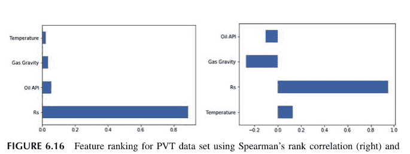

图6.16 使用斯皮尔曼等级相关法（右）和随机森林（左）对PVT数据集进行特征排序。

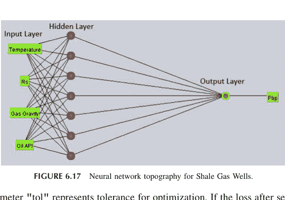

图6.17 页岩气井的神经网络拓扑结构。

参数"tol"表示优化的容差。如果经过几次迭代后损失的改善量不大于tol，训练过程将停止。模型训练通过以下代码完成：

```
import numpy as np
seed=50
np.random.seed(seed)
from sklearn.model_selection import train_test_split
X_train, X_test, y_train, y_test=train_test_split(Xnorm, ynorm, test_size=0.3)
from sklearn.neural_network import MLPRegressor
np.random.seed(seed)
clf=MLPRegressor(hidden_layer_sizes=(7), activation='tanh', solver='lbfgs', alpha=1, learning_rate_init=0.1, max_iter=200, random_state=None, tol=0.01)
y_train_Ravel=y_train.values.ravel()
clf.fit(X_train,y_train_Ravel)
```

训练过程完成后，需要绘制预测值并与实际值进行比较，以评估模型的性能。在本示例中，使用训练集和测试集的输入数据来预测泡点压力。然后，将预测值与实际值绘制在一起，并附上趋势线和R²，以查看模型的性能。以下代码用于绘制图6.18中的结果。

```
from sklearn.metrics import r2_score
Ppb_test=y_test*(y.max()-y.min())+y.min()
Ppb_train=y_train*(y.max()-y.min())+y.min()
Ppb_test_prediction=clf.predict(X_test)*(y.max()-y.min())+\ny.min()
Ppb_train_prediction=clf.predict(X_train)*(y.max()-y.min())+\ny.min()
```

322 使用Python的油气机器学习指南

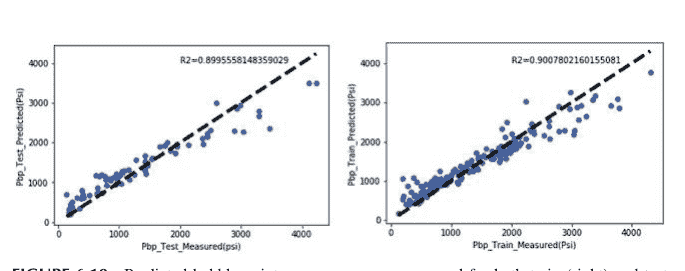

图6.18 训练集（右）和测试集（左）的预测泡点压力与实测值对比。

```
python
r2_test=r2_score(Pbp_test, Pbp_test_prediction)
r2_train=r2_score(Pbp_train, Pbp_train_prediction)
fig, ax=plt.subplots()
ax.scatter(Pbp_test, Pbp_test_prediction)
ax.plot([Pbp_test.min(), Pbp_test.max()], [Pbp_test.min(),
    Pbp_test.max()], 'k--', lw=4)
ax.set_xlabel('Pbp_Test_Measured(psi)')
ax.set_ylabel('Pbp_Test_Predicted(Psi)')
plt.text(2000,4000,"R2="+str(r2_test).format("%.2f"))
plt.show()
fig, ax=plt.subplots()
ax.scatter(Pbp_train, Pbp_train_prediction)
ax.plot([Pbp_train.min(), Pbp_train.max()], [Pbp_train.min(),
    Pbp_train.max()], 'k--', lw=4)
ax.set_xlabel('Pbp_Train_Measured(Psi)')
ax.set_ylabel('Pbp_Train_Predicted(Psi)')
plt.text(2000,4000,"R2="+str(r2_train).format("%.2f"))
plt.show()
Python output=Fig. 6.18
```

本示例的最后一步是将神经网络性能与PVT相关式进行比较。1988年，"Marhoun"确定了一个根据某些PVT性质估算泡点压力的相关式（Ahmed, 2006）。他使用了来自69个中东油样的160个测量值，并提出了以下相关式：

$$Pb = aR_s^b \gamma_g^c \gamma_o^d T^e$$ (6.11)

其中

$T$ = 温度 ($^\circ$R)
$\gamma_o$ = 油比重
$\gamma_g$ = 气体比重
相关系数 $a-e$ 的值如下：
$a = 5.38E-03, b = 0.715082, c = -1.877784, d = 3.1437, \text{and } e = 1.32657$

为了在Marhoun相关式中使用"PVT数据集"，需要进行两项更改。温度单位应从°F转换为°R，方法是将°F加上460。油API比重（API）也应使用以下公式转换为油比重（γo）：

$$\gamma_o = \frac{145}{API + 135}$$ (6.12)

这些更改应应用于存储PVT数据的数据集。为了保持数据集中的所有数据完整，生成了一个深拷贝，命名为"DatasetTempGamma"。接下来，使用Marhoun相关式（PBP_Marhoun）计算泡点压力，并与clf神经网络的预测值进行比较。

```
DatasetTempGamma=dataset.copy()
DatasetTempGamma['Temperature'] +=460
DatasetTempGamma['Oil API']=145/(DatasetTempGamma['Oil API']+135)
PBP_Marhoun=0.00538088*(pow(DatasetTempGamma['Rs'],0.715082))*\n    (pow(DatasetTempGamma['Gas Gravity'],-1.877784))*\n    (pow(DatasetTempGamma['Oil API'],3.1437))*\n    (pow(DatasetTempGamma['Temperature'],1.32657))
Pbp_NN=clf.predict(Xnorm)*(y.max()-y.min())+y.min()
r2_NN=r2_score(dataset['Pbp'], Pbp_NN)
r2_Marhoun=r2_score(dataset['Pbp'], PBP_Marhoun)
fig, ax=plt.subplots()
ax.scatter(dataset['Pbp'], Pbp_NN)
ax.plot([dataset['Pbp'].min(), dataset['Pbp'].max()],
    [dataset['Pbp'].min(), dataset['Pbp'].max()], 'k--', lw=4)
ax.set_xlabel('Pbp_Measured(psi)')
ax.set_ylabel('Pbp_Neural Network(Psi)')
plt.text(2000,4000,"R2="+str(r2_NN).format("%.2f"))
fig, ax = plt.subplots()
ax.scatter(dataset['Pbp'], PBP_Marhoun)
ax.plot([dataset['Pbp'].min(), dataset['Pbp'].max()],
    [dataset['Pbp'].min(), dataset['Pbp'].max()], 'k--', lw=4)
ax.set_xlabel('Pbp_Measured(Psi)')
ax.set_ylabel('Pbp_Marhoun(Psi)')
plt.text(2000,4000,"R2="+str(r2_Marhoun).format("%.2f"))
plt.show()
Python output=Figs. 6.19 and 6.20
```

Marhoun相关式和神经网络与实际数据的对比结果如图6.19和6.20所示。Marhoun相关式与实际泡点压力的R²为0.87，而神经网络结果与实际泡点压力的R²为0.9。这表明神经网络的性能优于Marhoun相关式。神经网络是建模数据间复杂关系的强大工具；然而，传统模型有许多局限性，可能无法捕捉所有潜在的复杂性。

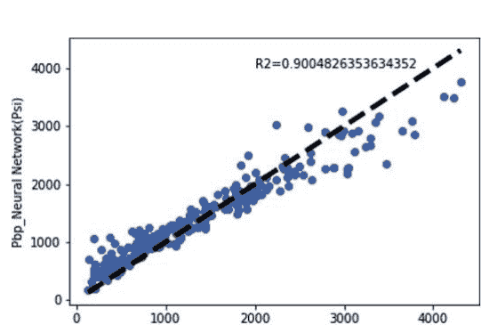

图6.19 神经网络预测的泡点压力与实测值对比。

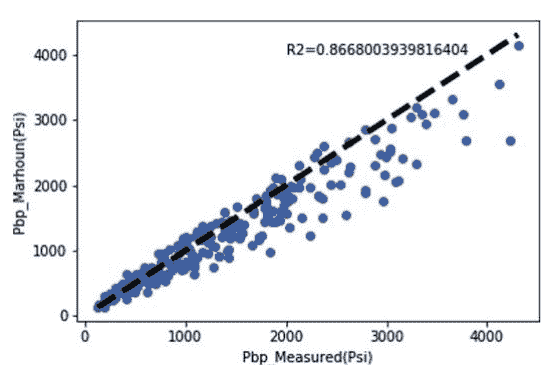

图6.20 Marhoun相关式预测的泡点压力与实测值对比。

## 深度学习

如第1章所述，人工智能（AI）被定义为使用计算机执行通常由人类智能处理的任务，如学习、推理和发现。机器学习（ML）是AI的一个子集，主要关注帮助机器解释数据模式的算法。根据数据是否被标记，学习过程可以是监督的或无监督的。

由于过去几十年技术的进步，可生成和存储的数据量已大幅增加。目前，以文本、图像、语音和视频形式产生的数据已超过200万万亿字节（Forbes.Com）。预计这一数值未来还将显著增长。因此，如果机器学习算法能够接触到更多带标签的数据，这种接触可以提升机器学习模型的性能。这些算法具有高度可并行化的特点，这意味着它们能够受益于现代图形处理单元（GPU）的架构。而这些架构在几十年前深度学习（DL）刚提出时并不存在。超级计算机和云计算使并行处理更快、成本更低。最后，由于TensorFlow等开源工具箱（本章示例中将讨论）的出现，构建这些模型变得极其简单。本章后续我们将使用Keras——一个以TensorFlow为后端的高级接口——来构建一个用于一秒压裂数据预测的长短期记忆（LSTM）模型。

图6.21展示了人工智能（AI）、机器学习（ML）和深度学习（DL）之间的区别。AI简单来说就是使用机器智能而非人类智能；ML是AI的一个子集，指各种算法（其中一些已讨论过），无需显式编程。最后，DL是ML的一个子集，它使用不同形式的复杂神经网络作为学习算法，以发现大数据集中的模式。因此，DL的主要构建模块是神经网络。定义神经网络结构的关键参数之一是连接输入和输出节点的隐藏层数量。隐藏层的数量决定了神经网络的深度。在深度神经网络中，隐藏层的数量可以从5层到数百甚至数千层不等。深度神经网络的另一个特征是神经元的连接方式。在本章的理论和示例中，我们假设每个神经元都与下一层的所有神经元相连。在深度神经网络中，连续层之间的神经元可以不完全连接。因此，神经网络的架构可能通过部分神经元/层连接、反向连接和权重共享而改变。这些神经网络架构将在本章后续部分介绍。

DL有许多应用，尤其是在有足够带标签数据的领域。语音识别在许多设备（如手机）中使用DL来识别语音模式。图像识别是DL在汽车、游戏、电子商务、医疗、制造和教育行业中的另一个广泛应用。DL的另一个重要用途是在自然语言处理（NLP）中，用于文本分类/提取/摘要、自动更正、翻译和市场情报。DL还用于自动驾驶汽车、欺诈检测、电影制作和产品推荐系统。

DL算法有超过10种类型。每种算法都适合处理前面提到的特定应用。最广泛使用的DL算法包括卷积神经网络（CNN）、循环神经网络（RNN）、LSTM（RNN的一个子集）、自组织映射（SOM）、自编码器和生成对抗网络（GAN）。例如，CNN在图像识别方面非常强大，而RNN可以处理文本和语音识别。本节将解释CNN、RNN和LSTM的理论。最后，将展示一个使用LSTM预测水力压裂处理压力的示例。

## 卷积神经网络（CNN）

CNN最初是为处理图像识别，特别是手写数字识别而开发的。CNN的工作原理是将图像从低阶到高阶分解为三个尺度。在低阶，图像的小细节或局部特征（如线条、边缘和曲线）可以通过神经网络的早期层提取出来。随后，更深层会将这些特征组合起来，最终层则重建整个图像（Kelleher）。CNN用于图像分类的整个训练过程包括不同的操作，如卷积、激活函数、池化和全连接层。下面将详细解释每个操作。

## 卷积

在图像识别和分类中，第一步是将图像离散化为像素。每个像素根据形状和颜色可以有一个值。让我们从一个简单的例子开始，将一个加号图像离散化为7×7像素。黑色像素可以用1表示，白色像素用0表示（图6.22）。

卷积操作是CNN的核心部分，它对图像的选定区域应用特定的滤波器或核函数来检测局部特征。换句话说，通过卷积，可以一次专注于图像的特定特征，方法是应用特定的滤波器。滤波器在图像上移动，以检测与每个特征（如线条、边缘、曲线等）相关的特定模式。在选定区域中找到模式时，核函数会返回大的正值。如果为每个特定滤波器分配一个二维矩阵，则卷积操作可以被视为选定区域（一个二维矩阵）与滤波器之间点积的所有元素之和。让我们考虑一个3×3矩阵作为线条检测的滤波器。一个中间列所有元素都等于1的3×3矩阵用于垂直线检测，一个中间行所有元素都等于1的3×3矩阵用于水平线检测（所有其他元素都等于零）。滤波器从图像的第一列和第一行的3×3像素区域开始。然后，点积结果的所有元素之和存储在特征图的第一个元素中，特征图是一个5×5矩阵。滤波器向右滑动一列，重复相同操作，直到到达最后一列。接下来，它从第一列重新开始，向下滑动一行，应用相同的过程。然后它产生5×5特征图的第2行第1列的元素。这个过程重复进行，直到覆盖整个图像。使用垂直和水平线滤波器的卷积过程如图6.23所示。可以使用多个滤波器（核函数）来提取图像的各种特征图。所有这些特征图的数组构成了网络的卷积层。

## 激活函数

在大多数模式识别实践中，输入和输出之间的关系是非线性的。为了捕捉非线性模式，使用了激活函数，这是一种非线性变换。本章已讨论过激活函数。CNN中最常见的激活函数是修正线性单元（ReLU）（图6.3）。在卷积过程之后，ReLU激活函数应用于特征图的每个元素。例如，应用ReLU激活函数后垂直线特征的特征图如图6.24所示。请注意，ReLU函数对任何负值都返回零。由于本例中的特征图没有负值，应用ReLU激活函数不会改变初始特征图。

## 池化层

CNN中的下一步包括池化，通过提取主要特征来减小卷积特征图的大小。这种特征图的降维在保留重要信息的同时，减少了所需的计算能力，尤其是在处理大图像时。在池化操作中，图像的一部分由滤波器或核覆盖

## 全连接层

生成池化特征图后，它们会经过一个展平过程，生成一个一维矩阵，该矩阵将被视为深度神经网络的输入层。图6.26展示了一个展平示例。接下来，神经网络通过训练过程对图像进行分类。整个工作流程如图6.27所示。

## 循环神经网络

在许多数据分析问题中，需要处理序列数据，例如时间序列或文本句子。当涉及时间或序列时，神经网络应能够处理每个时间步数据的重要性。这可以通过油气行业预测未来产量来说明。当一口井的产量递减时，每个时间步的产油量不仅是地质、完井、钻井和地面设施的函数，而且与之前时间步的产油量也密切相关。RNN旨在处理连续数据。RNN的主要特点是，前一个时间步的输出值用于计算当前时间步的输出。RNN的示意图如图6.28所示。

在RNN中，前一个时间步的隐藏层状态（$A^{t-1}$）被视为记忆，并向前传递并乘以权重向量（$W_{aa}$）。然后，可以使用以下方程计算当前隐藏层状态（$A^t$）和输出（$O^t$）：

$$A^t = F(W_{ai}I^t + W_{aa}A^{t-1} + \theta_a)$$

$$O^t = F(W_{ao}A^t + \theta_o)$$

其中$F$是激活函数，$W_{ai}$是输入层和隐藏层之间的权重矩阵，$W_{ao}$是隐藏层和输出层之间的权重矩阵，$\theta_a$是隐藏层偏置，$\theta_o$是输出层偏置。RNN中隐藏层的示意图如图6.29所示。

对于RNN的训练，使用了反向传播技术。整体过程与本章前面解释的类似。然而，由于RNN中存在多个序列或隐藏层，使用梯度下降技术可能具有挑战性。例如，早期时间步的误差梯度变得非常小，这被称为梯度消失问题。在这种情况下，较早层的权重不会改变，神经网络在训练过程中无法从数据中学习。为了解决梯度消失问题，Hochreiter和Schmidhuber在1997年引入了LSTM（Raschka & Mirjalili）。

LSTM由相互连接的记忆单元组成，这些单元在序列数据的训练过程中控制信息流。每个单元包括3个操作单元，它们相互作用以通过序列反向传播保留误差。这些类似于计算机存储器的单元是：输入门、遗忘门和输出门。这些门的作用是控制数据何时进入、存储和/或离开单元。连接单元和单元组件的示意图如图6.30所示。

每个单元的一个重要特征，被视为单元的记忆，是单元状态（C）。单元状态依次通过所有单元，负责保留或遗忘先前的信息。在每个时间步，前一个时间的单元状态（$C^{t-1}$）、前一个时间的隐藏层状态（$A^{t-1}$）和输入数据（$I^t$）进入单元。最初，输入数据（$I^t$）和前一个时间的隐藏层状态（$A^{t-1}$）通过“遗忘门”。遗忘门的输出（$f^t$）决定了哪些信息保留，哪些信息从上一步遗忘。遗忘门的输出计算如下：

$$f^t = F_{sigmoid}(W_{if}I^t + W_{Af}A^t + \theta_f)$$

其中$W_{if}$是遗忘门中输入数据的权重矩阵，$W_{Af}$是遗忘门中隐藏层状态的权重矩阵，$\theta_f$是遗忘门中的偏置。

然后，前一个时间的隐藏层状态（$A^{t-1}$）和输入数据（$I^t$）通过“输入门”，该门负责通过以下方程更新单元状态：

$$i^t = F_{sigmoid}(W_{ii}I^t + W_{Ai}A^t + \theta_i)$$
$$g^t = F_{tanh}(W_{ig}I^t + W_{Ag}A^t + \theta_g)$$
$$C^t = (C^{t-1} \times f^t) + (i^t \times g^t)$$

其中$W_{ii}$、$W_{Ai}$、$W_{ig}$、$W_{Ag}$是输入门两个部分（sigmoid和tanh激活）中输入数据和隐藏层状态的权重矩阵。

最后，在“输出门”中，通过考虑更新后的单元状态（$C^t$）来决定更新隐藏层状态（$A^t$），使用以下方程：

$$O^t = F_{sigmoid}(W_{io}I^t + W_{Ao}A^{t-1} + \theta_o)$$
$$A^t = O^t \times F_{tanh}(C^t)$$

其中$W_{io}$和$W_{Ao}$是输出门中输入数据和隐藏层状态的权重矩阵（Raschka & Mirjalili）。

## 深度学习在油气行业的应用

油气行业可被视为大数据的主要生产者之一。光纤、卫星图像、地震数据、井下仪表/流量计记录、测井曲线以及其他信息源每天都用于评估、监测和决策。许多油气公司现在正与亚马逊、谷歌和微软等IT巨头合作，将所有数据存储在云端并利用高计算能力。这导致了深度学习在油气行业应用的急剧增长，下面将讨论其中一些应用。

Crnkovic等人（Crnkovic-Friis & Erlandson, 2015）使用深度学习从Eagle Ford页岩一个地区的地质数据估算EUR。数据集包括800口井和200,000个数据点。七个地质参数，如孔隙度、厚度、含水饱和度等，被填充到地质网格中并在井级别取平均值。他们使用堆叠去噪自编码器作为深度学习方法，并将EUR作为目标特征。他们观察到验证集的平均绝对百分比误差为28%。Omrani等人（Shoeibi Omrani et al., 2019）评估了不同方法（物理模型、递减曲线分析、深度学习和混合模型）对不同气田短期（6周）和长期（数年）产量预测的性能。他们使用井口压力、累积产量和油嘴尺寸作为输入，产量作为神经网络的输出。预测的产量被添加到累积产量中以预测新的产量。他们观察到深度学习模型可以高精度地预测短期预测。Gupta等人（Gupta et al., 2019）利用深度神经网络分析井壁图像。他们使用全卷积网络（FCN），这是一种CNN形式但没有密集连接层，来检测地质特征，如诱导裂缝、天然裂缝和沉积面。他们使用来自四口井的标记井壁图像来训练局部和全局模型，这些模型将用于自动井壁图像分析。Alakeely等人（Alakeely & Horne, 2020）使用CNN和RNN对油藏行为进行建模。在他们的研究中，使用油藏模拟生成基于不同井网的数据集。数据集包括压力、注入和生产数据作为输入，压力或产量作为目标特征。他们比较了CNN和RNN模型在预测油藏性能方面的性能。

Dramsch等人（Dramsch & Lüthje, 2018）使用CNN进行二维地震解释。二维测线地震切片被标记为不同特征，如陡倾反射层、连续高振幅区域、盐丘侵入等。之后，使用三个不同的CNN网络（Waldeland CNN、VGG16和ResNet 50）进行训练。他们比较了这些CNN网络在地震相分类方面的性能。Zhang等人（Zhang et al., 2019）训练了一个深度CNN模型来拾取地震图像中的断层，并确定断层倾角和方位角。他们生成了100,000个包含一条线性断层的三维合成图像（数据体）用于训练，以及10,000个图像用于验证CNN模型。训练后的模型在来自不同地区（如墨西哥湾、北海和特立尼达深水）的各种地震图像上进行了断层拾取测试。Shen等人（Shen & Cao, 2020）开发了一个基于CNN的模型，用于识别水力压裂作业中的球座事件。他们使用浆液流速、井口压力及其一阶和二阶导数作为输入数据来训练CNN模型，以预测球座事件。Das等人（Das & Mukerji, 2019）使用CNN从叠前地震数据中获取岩石物理性质。他们使用两种方法训练CNN，以映射叠前地震数据与岩石物理性质（如孔隙度、粘土体积和含水饱和度）之间的相关性。在第一种方法中，他们使用具有两个独立网络的级联CNN。第一个网络从叠前地震数据预测弹性性质（Vp、Vs和RHOB），第二个网络从弹性性质预测岩石物理性质。在第二种方法中，称为端到端，CNN直接查找岩石物理数据和叠前地震数据之间的相关性。Chaki等人（Chaki et al., 2020）利用深度和循环神经网络为流动模拟器制作代理模型。他们使用了Brugge油藏模型，该模型包括60,000个网格块，有20口生产井和10口注入井。该模型在垂直方向上有九个网格层（地层网格层）。每个网格层被分配一个渗透率乘数。他们训练了深度和

## 使用LSTM进行压裂处理压力预测

在本节中，我们将使用单段压裂阶段数据来构建一个LSTM模型，利用过去60秒的砂浆速率和支撑剂浓度数据来预测下一秒的处理压力。这是为了展示概念验证。在本练习中，将使用前60秒的数据来预测下一秒（第61秒）。此后，将使用第2到61秒的数据来预测下一秒（第62秒）。此过程将持续进行。下图说明了这一概念。60秒是本练习中选择的一个任意窗口大小，也可以评估其他窗口大小，如30、90、120等。

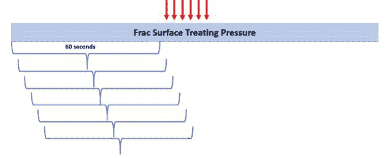

第一步是导入主要库，然后是从以下门户获取的单秒压裂数据集：
https://www.elsevier.com/books-and-journals/book-companion/9780128219294

```python
import numpy as np
import pandas as pd
import matplotlib.pyplot as plt
from sklearn.preprocessing import MinMaxScaler
%matplotlib inline
data= pd.read_excel('Chapter6_Frac_Stage_Data.xlsx')
data.head()
```

Python输出=图6.31

| Time | SLUR RATE | PROP CON | TR PRESS |
|---|---|---|---|
| 0 | 1 | 49.4 | 0.0 | 8560 |
| 1 | 2 | 50.1 | 0.0 | 8537 |
| 2 | 3 | 50.1 | 0.0 | 8534 |
| 3 | 4 | 49.3 | 0.0 | 8617 |
| 4 | 5 | 49.2 | 0.0 | 8646 |

图6.31 高频压裂数据头部。

如图所示，该数据集有四个主要列：

-   以秒为单位的时间
-   以桶/分钟（bpm）为单位的砂浆速率，表示为“SLUR RATE”
-   以磅/加仑（ppg）为单位的支撑剂浓度，表示为“PROP CON”
-   以psi为单位的处理压力，表示为“TR PRESS”

接下来，让我们使用以下代码绘制地面处理压力数据和砂浆速率：

```python
fig, ax1 = plt.subplots(figsize=(15,8))
plt.figure(figsize=(15,8))
ax2 = ax1.twinx()
ax1.plot(data['Time'], data['TR PRESS'], 'b')
ax2.plot(data['Time'], data['SLUR RATE'], 'g')
ax1.set_xlabel('Time (seconds)')
ax1.set_ylabel('Surface Treating Pressure (psi)', color='b')
ax2.set_ylabel('Slurry Rate (bpm)', color='g')
```

Python输出=图6.32

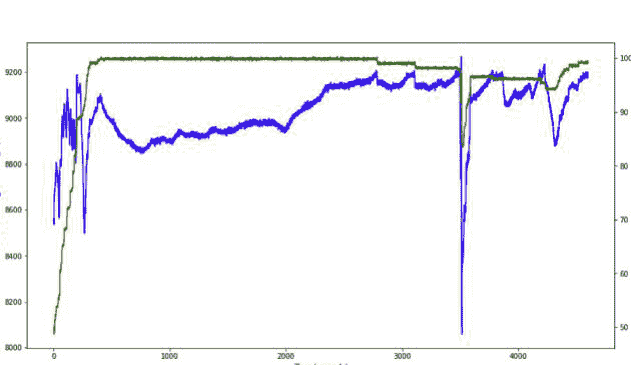

图6.32 地面处理压力和砂浆速率图。

接下来，让我们将数据分为训练集和测试集。在本例中，前4500秒将用于训练，最后100秒将用作测试：

```python
start_time = 1
end_time = 4500
#Define the data range used for training as follows:
filter = (data['Time'] > start_time) & (data['Time'] <= end_time)
data_training = data.loc[filter].copy()
data_training.tail()
```

Python输出=图6.33

| Time | SLUR RATE | PROP CON | TR PRESS |
|------|-----------|----------|----------|
| 4495 | 4496 | 98.7 | 1.0 | 9127 |
| 4496 | 4497 | 98.8 | 1.0 | 9125 |
| 4497 | 4498 | 98.5 | 1.0 | 9131 |
| 4498 | 4499 | 98.4 | 1.0 | 9136 |
| 4499 | 4500 | 98.6 | 1.0 | 9145 |

图6.33 训练数据的尾部。

接下来，按如下方式定义测试数据的范围。请注意，此压裂数据集有4600行，其中前4500行用于训练，最后100行用于测试。

```python
start_time2 = 4500
end_time2 = 4600
filter2 = (data['Time'] > start_time2) & (data['Time'] <= end_time2)
data_testing = data.loc[filter2].copy()
data_testing.tail()
```

Python输出=图6.34

| Time | SLUR RATE | PROP CON | TR PRESS |
|------|-----------|----------|----------|
| 4595 | 4596 | 99.1 | 1.0 | 9194 |
| 4596 | 4597 | 99.0 | 1.0 | 9201 |
| 4597 | 4598 | 99.0 | 1.0 | 9184 |
| 4598 | 4599 | 99.3 | 1.0 | 9178 |
| 4599 | 4600 | 99.0 | 1.0 | 9188 |

图6.34 测试数据的尾部。

接下来，按如下方式删除时间列：

```python
training_data= data_training.drop(['Time'], axis=1)
```

然后，按如下方式对训练数据进行归一化：

```python
scaler=MinMaxScaler()
training_data= scaler.fit_transform(training_data)
```

接下来，首先为X_train和y_train创建一个空列表，如下所示：

```python
X_train= []
y_train= []
```

然后，编写一个for循环，从60迭代到“training_data”的长度。接下来，在这个for循环内，取名为“X_train”的空列表，并附加从0到60的训练数据（training_data[i-60:i]）。然后，在同一个for循环内，取名为“y_train”的空列表，并将第61行的训练数据附加为“y_train”。这使得X_train为前60行，y_train为第61行。

```python
for i in range(60,training_data.shape[0]):
    X_train.append(training_data[i-60:i])
    y_train.append(training_data[i,0])
```

现在，让我们在将X_train和y_train输入LSTM模型之前，将其转换为numpy数组。通常，LSTM期望数据采用特定的3D数组格式。因此，让我们将数据转换为该格式：

```python
X_train, y_train = np.array(X_train), np.array(y_train)
```

此外，可以按如下方式获取X_train和y_train的形状：

```python
X_train.shape, y_train.shape
```

Python输出=
((4439, 60, 3), (4439,))

如图所示，X_train的形状为4439（即4499减去60），是一个3维数据（3个输入特征）。4439代表“批大小”，60代表“时间跨度”，3代表“输入维度”。因此，LSTM模型的输入是3D数组。

由于X_train和y_train已经定义，现在是时候构建LSTM模型了。首先，按如下方式导入必要的库：

-   来自keras的第一个模块称为“Sequential”，用于初始化神经网络。
-   来自keras的第二个模块称为“Dense”，用于添加全连接神经网络层。
-   “LSTM”顾名思义是从keras导入的另一个模块，用于添加LSTM层。
-   最后，导入keras中的“Dropout”模块，以确保添加dropout层来防止过拟合。

```python
from tensorflow.keras import Sequential
from tensorflow.keras.layers import Dense,LSTM, Dropout
```

在本练习中，使用了构建深度学习的顺序方法。在这种方法中，可以非常容易地将层添加到网络中，如下所示。首先，确保固定种子数（使用种子数100），如下所示。然后，将“Sequential”放在模型名称“Frac_LSTM”下。可以随意将模型名称更改为任何想要的名称。

```python
import tensorflow as tf
import random as python_random
def reset_seeds():
    np.random.seed(100)
    python_random.seed(100)
    tf.random.set_seed(100)
reset_seeds()
Frac_LSTM = Sequential()
```

接下来，添加第一个具有200个单元（单元代表输出空间的维度）、“relu”激活函数的LSTM层，并将“return_sequences”设置为“True”。当设置为true时，它将返回输出序列中的最后一个输出。LSTM模型的输出可以是2D数组或3D数组，具体取决于“return_sequences”参数。请注意：

-   如果“return_sequences”设置为True，输出将是一个3D数组（batch_size, time_steps, units）。
-   如果“return_sequences”设置为False，输出将是一个2D数组（batch_size, units）。

最后，将“input_shape”设置为训练数据集的形状。`"X_train.shape[1],3"`基本上会返回`"60,3"`。之后，添加一个`Dropout`层，比例为0.3，表示将丢弃30%的层。再添加两个与第一层配置相同的层，如下所示。请注意，在第一层之后，其他层无需指定`"input_shape"`。因此，如图所示，第二层和第三层的`"input_shape"`参数被省略了。最后，添加一个`Dense`层，设置`"units = 1"`，指定输出为1个单元。

```
Frac_LSTM.add(LSTM(units=200, activation='relu', return_sequences=True, input_shape=(X_train.shape[1],3)))
Frac_LSTM.add(Dropout(0.3))
Frac_LSTM.add(LSTM(units=200, activation='relu', return_sequences=True))
Frac_LSTM.add(Dropout(0.3))
Frac_LSTM.add(LSTM(units=200, activation='relu'))
Frac_LSTM.add(Dropout(0.3))
Frac_LSTM.add(Dense(units=1))
```

接下来，获取Frac_LSTM模型的摘要，如下所示：

```
Frac_LSTM.summary()
Python output=Fig. 6.35
```

Model: "sequential"

| Layer (type) | Output Shape | Param # |
| :--- | :--- | :--- |
| lstm (LSTM) | (None, 60, 200) | 163200 |
| dropout (Dropout) | (None, 60, 200) | 0 |
| lstm_1 (LSTM) | (None, 60, 200) | 320800 |
| dropout_1 (Dropout) | (None, 60, 200) | 0 |
| lstm_2 (LSTM) | (None, 200) | 320800 |
| dropout_2 (Dropout) | (None, 200) | 0 |
| dense (Dense) | (None, 1) | 201 |

Total params: 805,001
Trainable params: 805,001
Non-trainable params: 0

FIGURE 6.35 Frac LSTM summary.

接下来，使用`"adam"`优化器和`"mean_squared_error"`作为损失函数来编译模型。这将使用平方误差的均值作为损失函数来最小化误差。

```
Frac_LSTM.compile(optimizer='adam', loss='mean_squared_error')
```

然后，将`"Frac_LSTM"`拟合到定义的X_train和y_train，使用100个epoch或迭代次数，批处理大小为32。epoch数量越高，运行的迭代次数就越多，模型生成所需的时间也越长。请随意更改优化器、epoch数量、批处理大小、dropout百分比、LSTM单元数、激活函数等，以找到模型的最佳超参数。

```
history=Frac_LSTM.fit(X_train,y_train, epochs=100, batch_size=32, shuffle=True)
Python output=Fig. 6.36
```

```
Epoch 90/100
4439/4439 [==============================] - 44s 10ms/sample - loss: 2.0579e-04
Epoch 91/100
4439/4439 [==============================] - 46s 10ms/sample - loss: 1.8662e-04
Epoch 92/100
4439/4439 [==============================] - 44s 10ms/sample - loss: 2.1588e-04
Epoch 93/100
4439/4439 [==============================] - 45s 10ms/sample - loss: 2.0377e-04
Epoch 94/100
4439/4439 [==============================] - 48s 11ms/sample - loss: 1.9440e-04
Epoch 95/100
4439/4439 [==============================] - 47s 11ms/sample - loss: 2.8725e-04
Epoch 96/100
4439/4439 [==============================] - 46s 10ms/sample - loss: 2.2165e-04
Epoch 97/100
4439/4439 [==============================] - 48s 11ms/sample - loss: 2.3116e-04
Epoch 98/100
4439/4439 [==============================] - 47s 11ms/sample - loss: 2.0920e-04
Epoch 99/100
4439/4439 [==============================] - 48s 11ms/sample - loss: 1.9204e-04
Epoch 100/100
4439/4439 [==============================] - 51s 11ms/sample - loss: 1.5980e-04
```

FIGURE 6.36 Last 10 epochs of the LSTM Model.

既然模型已经训练完成，让我们来准备一个测试数据集。为了预测测试数据集的压力，获取训练数据集的最后60秒（行）非常重要。因此，使用tail函数定义训练数据的最后60秒，如下所示：

```
past_60_secs= data_training.tail(60)
```

接下来，将这最后60秒的训练数据集附加到测试数据集，如下所示：

```
df=past_60_secs.append(data_testing, ignore_index=True)
df.head()
Python output=Fig. 6.37
```

342 Machine Learning Guide for Oil and Gas Using Python

| Time | SLUR RATE | PROP CON | TR PRESS |
|---|---|---|---|
| 0 | 4441 | 98.6 | 1.0 | 9132 |
| 1 | 4442 | 98.7 | 1.0 | 9122 |
| 2 | 4443 | 98.6 | 1.0 | 9124 |
| 3 | 4444 | 98.8 | 1.0 | 9125 |
| 4 | 4445 | 98.8 | 1.0 | 9127 |

FIGURE 6.37 df head.

接下来，从df数据框中删除`"Time"`列，如下所示：

```
df=df.drop(['Time'], axis=1)
df.describe()
Python output=Fig. 6.38
```

| | SLUR RATE | PROP CON | TR PRESS |
|---|---|---|---|
| count | 160.000000 | 160.0 | 160.000000 |
| mean | 98.878125 | 1.0 | 9156.781250 |
| std | 0.307899 | 0.0 | 22.452934 |
| min | 98.200000 | 1.0 | 9118.000000 |
| 25% | 98.600000 | 1.0 | 9137.000000 |
| 50% | 98.900000 | 1.0 | 9158.500000 |
| 75% | 99.100000 | 1.0 | 9176.000000 |
| max | 99.500000 | 1.0 | 9201.000000 |

FIGURE 6.38 df description.

如上所述，由于测试数据（定义为原始导入excel文件的最后100行）被附加到训练数据的最后60秒，因此`"df"`下的总行数为160。接下来，对测试数据进行归一化，如下所示：

```
testing_inputs= scaler.transform(df)
```

接下来，为X_test和y_test创建两个空列表（就像之前对训练数据执行的操作一样），如下所示：

```
X_test=[]
y_test=[]
```

之后，如前所述，创建一个类似的for循环并附加到创建的空列表中：

```
for i in range(60,testing_inputs.shape[0]):
    X_test.append(testing_inputs[i-60:i])
    y_test.append(testing_inputs[i,0])
```

接下来，将X_test和y_test转换为numpy数组，如下所示：

```
X_test, y_test= np.array(X_test), np.array(y_test)
X_test.shape, y_test.shape
Python output=
((100, 60, 3), (100,))
```

接下来，使用训练好的`"Frac_LSTM"`模型预测`"X_test"`，转换为数据框，并将列命名为`"Predicted TR PRESS"`。

```
y_pred=Frac_LSTM.predict(X_test)
y_pred=pd.DataFrame(y_pred,columns=['Predicted TR PRESS'])
y_pred.head()
Python output=Fig. 6.39
```

| | Predicted TR PRESS |
|---|---|
| 0 | 0.964235 |
| 1 | 0.964230 |
| 2 | 0.964221 |
| 3 | 0.964215 |
| 4 | 0.964209 |

FIGURE 6.39 Predicted normalized treating pressure head.

之后，将预测的y_pred（预测的y值）和y_test（实际的y值）恢复到其原始形式（未归一化形式），为绘图做准备，如下所示：

```
y_pred['Predicted TR PRESS']=y_pred['Predicted TR PRESS']*(data['TR PRESS'].max()-data['TR PRESS'].min())+(data['TR PRESS'].min())
y_test=pd.DataFrame(y_test,columns=['Actual TR PRESS'])
y_test['Actual TR PRESS']=y_test['Actual TR PRESS']*(data['TR PRESS'].max()-data['TR PRESS'].min())+(data['TR PRESS'].min())
y_test.head()
Python output=Fig. 6.40
```

| | Actual TR PRESS |
|---|---|
| 0 | 9223.445736 |
| 1 | 9228.135659 |
| 2 | 9230.480620 |
| 3 | 9228.135659 |
| 4 | 9228.135659 |

FIGURE 6.40 Actual unnormalized treating pressure head.

让我们也获取未归一化的预测处理压力，如下所示：

```
y_pred['Predicted TR PRESS'].head()
Python output=Fig. 6.41
```

```
0    9224.724609
1    9224.717773
2    9224.707031
3    9224.700195
4    9224.692383
Name: Predicted TR PRESS, dtype: float32
```

FIGURE 6.41 Predicted unnormalized treating pressure head.

下一步是将y_test和y_pred相对于时间进行可视化，以观察匹配情况。

```
plt.figure(figsize=(14,5))
plt.plot(y_test, color='red', label='Actual TR PRESS')
plt.plot(y_pred['Predicted TR PRESS'], color='blue', label='Predicted TR PRESS')
plt.title('Frac Treating Pressure Actual Vs. Prediction')
plt.xlabel('Time (seconds)')
plt.ylabel('Surface Treating Pressure (psi)')
plt.legend()
Python output=Fig. 6.42
```

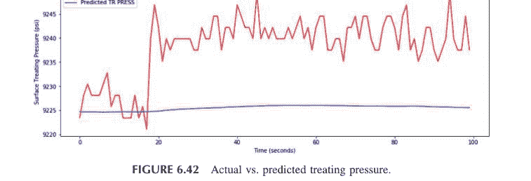

FIGURE 6.42 Actual vs. predicted treating pressure.

如上图所示，实际压力和预测压力之间的差异大约为20 psi；可以更改窗口大小、epoch数量、单元数等，以获得更好的匹配。请记住，该模型是为了预测下一秒的压裂处理压力而开发的

## 术语表

- **e** 误差，节点输出与目标值之间的差值
- **E** 全局误差
- **F** 激活函数
- **g** 气体比重
- **h<sub>j</sub>** 隐藏层节点 j 的动作电位
- **I<sub>i</sub>** 节点 i 的输入信号
- **j** 隐藏层中的误差梯度
- **j** 节点 j 的偏置
- **k** 输出层中的误差梯度
- **n** 节点的入链数量
- **P<sub>b</sub>** 泡点压力（psi）
- **T** 温度（°F）
- **w<sub>ij</sub>** 从节点 i 到节点 j 的信号权重
- **α** 学习率

## 参考文献

- Adeyemi, B., & Sulaimon, A. (2012). 使用人工神经网络预测蜡的形成。发表于 *尼日利亚年度国际会议与展览*，拉各斯。
- Alakeely, A., & Horne, R. N. (2020年8月1日). *使用卷积和循环神经网络模拟油藏行为*。石油工程师协会。 https://doi.org/10.2118/201193-PA.
- Ahmed, T. (2006). *油藏工程手册*。伯灵顿：爱思唯尔。
- Amini, S., Mohaghegh, S. D., Gaskari, R., & Bromhal, G. (2012). 使用代理油藏建模技术对二氧化碳封存项目进行不确定性分析。发表于 *SPE西部地区会议*，贝克斯菲尔德。
- Arehart, R. (1990). 使用神经网络进行钻头诊断。*SPE 计算机应用*，2(04)，24–28。
- Bao, A., Gildin, E., Huang, J., & Coutinho, E. J. (2020年7月). 通过EnKF增强的循环神经网络实现数据驱动的油藏端到端产量预测。发表于 *SPE拉丁美洲和加勒比石油工程会议论文*，虚拟会议。 https://doi.org/10.2118/199005-MS.
- Belyadi, H., Belyadi, F., & Fathi, E. (2019). *非常规油藏水力压裂*。爱思唯尔公司。
- Chaki, S., Zagayevskiy, Y., Shi, X., Wong, T., & Noor, Z. (2020年1月). 用于动态油藏系统代理建模的机器学习：深度神经网络DNN和循环神经网络RNN应用。发表于 *国际石油技术会议论文*，沙特阿拉伯达兰。 https://doi.org/10.2523/IPTC-20118-MS.
- Crnkovic-Fris, L., & Erlandson, M. (2015年9月28日). *基于地质驱动的EUR预测使用深度学习*。石油工程师协会。 https://doi.org/10.2118/174799-MS
- Das, V., & Mukerji, T. (2019年9月). 使用卷积神经网络从叠前地震数据预测岩石物理性质。发表于 *SEG国际博览会和年会论文*，美国德克萨斯州圣安东尼奥。 https://doi.org/10.1190/segam2019-3215122.1.
- Dramsch, J. S., & Lüthje, M. (2018年11月30日). *在最先进CNN架构上进行深度学习地震相分析*。勘探地球物理学家学会。
- Gupta, K. D., Vallega, V., Maniar, H., Marza, P., Xie, H., Ito, K., & Abubakar, A. (2019年1月1日). *用于井眼图像解释的深度学习方法*。岩石物理学家和测井分析师协会。
- https://www.forbes.com/sites/bernardmarr/2018/05/21/how-much-data-do-we-create-every-day-the-mind-blowing-stats-everyone-should-read/?sh=45826cef60ba.
- Fausett, L. V. (1993). *神经网络基础：架构、算法与应用*。培生教育。
- Ford, D. A., & Kelly, M. C. (2001). 使用神经网络从测井曲线预测岩性。发表于 *SEG年会，圣安东尼奥*。
- Gartland, S., Owen, G., Cottis, R., & Turega, M. (1999). 用于预测点蚀电位的神经网络方法。发表于 *CORROSION 99，圣安东尼奥*。
- Gharbi, R. B., & Elsharkawy, A. M. (1997). 用于估算原油系统PVT性质的通用神经网络模型。发表于 *SPE亚太石油和天然气会议暨展览会，吉隆坡*。
- Gunter, R., & Albert, T. (1992). 使用神经网络进行地震波形反演。发表于 *1992 SEG年会，新奥尔良*。
- Haghighat, S. A., Mohaghegh, S. D., Gholami, V., & Moreno, D. (2014). 使用智能自顶向下建模对Niobrara油田进行生产分析。发表于 *SPE北美西部和落基山联合会议，丹佛*。
- Johnston, D. H. (1993). 使用神经网络进行地震属性标定。发表于 *SEG年会，华盛顿*。
- Kalam, M., Al-Alawi, S., & Al-Mukheini, M. (1996). 使用人工神经网络评估地层损害。发表于 *SPE地层损害控制研讨会，拉斐特*。
- Kelleher, J. D. *深度学习（麻省理工学院出版社基础知识系列）*。（第177页）。麻省理工学院出版社。Kindle版。
- Kingma, D. P., & Ba, J. L. (2015). Adam：一种随机优化方法。发表于 *国际学习表征会议*。
- Kriesel, D. (2005). *神经网络简介*。波恩 www.dkriesel.com。
- Madasu, S., & Rangarajan, K. P. (2018年11月). 用于实时多级泵送数据的深度循环神经网络DRNN模型。发表于 *OTC北极技术会议论文*，美国德克萨斯州休斯顿。 https://doi.org/10.4043/29145-MS.
- McCain, W. D., Jr. (1999年1月1日). *石油流体性质*（第2版）。PennWell公司，ISBN 9780878143351。
- Mohaghegh, S. (2000). 石油工程中的虚拟智能应用：第1部分——人工神经网络。*石油技术杂志*；52(09)，64–73。
- Mohaghegh, S. D., Goddard, C., Popa, A., Ameri, S., & Bhuiyan, M. (2000). 通过合成测井曲线进行油藏表征。发表于 *SPE东部地区会议，摩根敦*。
- Mohaghegh, S., Grujic, O., Zargari, S., Kalantari-Dahaghi, A., & Bromhol, G. (2012). 产油气页岩油藏的自顶向下智能油藏建模；案例研究。*国际石油、天然气和煤炭技术杂志*，5(1)。
- Mohaghegh, S., McVey, D., Aminian, K., & Ameri, S. (1995). 在缺乏油藏数据的情况下预测气藏的增产效果。*SPE油藏工程*，11(04)，268–272。
- Nakutnyy, P., Asghari, K., & Torn, A. (2008). 通过应用神经网络分析水驱。发表于 *加拿大国际石油会议，卡尔加里*。
- Omrani, S. P., Vecchia, A. L., Dobrovolschi, L., Van Baalen, T., Poort, J., Octaviano, R., Binn-Tahir, H., & Esteban Muñoz, E. (2019). *应用于产量预测的深度学习和混合方法*。发表于阿布扎比国际石油展览会暨会议论文，阿联酋阿布扎比，2019年11月。 https://doi.org/10.2118/197498-MS.
- Raschka, S., & Mirjalili, V. Python机器学习 - 第二版：使用Python、scikit-learn和TensorFlow进行机器学习和深度学习。（第548页）。Packt出版社。Kindle版。
- Rashid, T. (2016). 制作你自己的神经网络，CreateSpace独立出版平台。
- Schultz, R., & Chen, D. (2003). 石英传感器的动态神经网络校准。发表于SPE年度技术会议暨展览会，丹佛。
- Siruvuri, C., Nagarakanti, S., & Samuel, R. (2006). 卡钻预测与避免：一种卷积神经网络方法。发表于IADC/SPE钻井会议，迈阿密。
- Shen, Y., & Cao, D. (2020年9月24日). 使用卷积神经网络开发用于实时水力压裂分析系统的球座事件识别算法。石油工程师协会。 https://doi.org/10.2118/200003-MS.
- Sun, J. J., Battula, A., Hruby, B., & Hossaini, P. (2020年7月). 应用基于物理和数据驱动的技术，利用高频数据进行实时砂堵预测。发表于SPE/AAPG/SEG非常规资源技术会议论文，虚拟会议。 https://doi.org/10.15530/urtec-2020-3349.
- Surguchev, L., & Li, L. (2000). 使用人工神经网络进行提高采收率评价和适用性筛选。发表于SPE/DOE提高采收率研讨会，塔尔萨。
- Tang, H. (2008). 使用人工神经网络方法改进碳酸盐岩油藏相分类。发表于加拿大国际石油会议，卡尔加里。
- Tian, C., & Horne, R. N. (2017年10月). 用于永久井下压力计数据分析的循环神经网络。发表于SPE年度技术会议暨展览会论文，美国德克萨斯州圣安东尼奥。 https://doi.org/10.2118/187181-MS.
- Thomas, A. L., & La Pointe, P. R. (1995). 使用神经网络识别导流裂缝。发表于第35届美国岩石力学研讨会。里诺：USRMS。
- Vassallo, M., & Bernasconi, G. (2004). 使用神经网络检测钻头弹跳。发表于SEG年会，丹佛。
- Zhang, Q., Yusifov, A., Joy, C., Shi, Y., & Wu, X. (2019年9月25日). FaultNet：用于三维自动断层拾取的深度CNN模型。勘探地球物理学家学会。

## 延伸阅读

- Osman, E., Abdel-Wahhab, O., & Al-Marhoun, M. (2001). 使用神经网络预测原油PVT性质。发表于SPE中东石油展，巴林。
- Publishing, AI. 面向初学者的Python深度学习：使用TensorFlow 2.0和Keras的理论与实践（面向初学者的机器学习与数据科学）（第140页）：AI Publishing LLC。Kindle版。

# 第7章

## 模型评估

机器学习的主要目标是构建能够发现数据中模式的模型。这些数据驱动的模型通常经过训练以处理聚类或回归问题。模型的质量可以通过其在给定新（未见过的）数据时的预测准确性来评估。为了提高模型的质量或预测性能，首先需要定义评估指标和评分系统。然后，这些指标结合评估方法可用于选择提升模型质量的最佳策略。一些模型增强技术包括但不限于：(i) 针对特定模型的超参数优化，(ii) 训练不同的模型，以及 (iii) 最后，在数据划分时改变训练集和测试集的比例。本章将涵盖评估指标和技术。接着，讨论最佳模型选择方法。最后，介绍一些Python中的模型处理实践，例如模型保存/加载。所有这些方法都将应用于油气相关问题。

## 评估指标与评分

有多种评估指标用于评估机器学习模型的性能。二元分类、多项式分类和回归是本章将使用特定指标进行评估的主要学习技术。监督分类问题最广泛使用的一些评估指标示例包括精确率、准确率、召回率、F1分数和混淆矩阵。对于无监督聚类问题，推荐使用轮廓系数。均方误差（MSE）和R²是回归模型（例如神经网络）最常用的指标。“出砂预测”、“岩石分类”和“PVT估算”是本章将用于模型评估的三个示例。

## 二元分类：出砂预测

出砂是许多运营商一直在处理的问题之一。出砂可能基于高流量、应力状态、岩石地质力学特性和完井设计而发生。出砂预测非常重要，因为它有助于生产工程师制定防砂策略。基于实际经历过出砂的油井数据，可以训练一个二元分类器模型来预测一口井是否会发生出砂。在出砂预测示例中，使用了一个包含来自北亚得里亚盆地29口井的数据集（Moricca等人，1994年；Gharagheizi等人，2017年）。出砂数据集由表7.1中的属性组成。

**表7.1 出砂数据集中的油井属性。**

| 符号 | 定义 | 符号 | 定义 |
| :--- | :--- | :--- | :--- |
| TVD | 真垂直深度 | BHFP | 井底流动压力 |
| TT | 传播时间 | DD | 生产压差 |
| COH | 地层内聚强度 | EOVS | 有效上覆岩层压力 |
| Qg | 天然气流量 | SPF | 每英尺射孔数 |
| Qw | 水流量 | Hperf | 射孔段 |

本示例中的目标变量是出砂，如果发生出砂则视为1，如果油井未出砂则视为0。数据集“出砂”可在以下链接找到：https://www.elsevier.com/books-and-journals/book-companion/9780128219294。数据加载和描述性统计通过以下代码完成：

```
#data loading and descriptive statistics
import pandas as pd
dataset=pd.read_csv('Chapter7_Sand Production.CSV')
print(dataset.describe())
Python output=Fig. 7.1
```

数据的描述性统计如图7.1所示。在29口井中，有21口井观察到出砂。由于数据属性具有不同的范围，建议在学习过程中将数据缩放到0到1之间（数据集也可以进行标准化；适当的数据转换可以通过模型的性能来确定，这将在本章中解释）。可以使用第6章中提到的特征排序技术，如斯皮尔曼等级相关或随机森林，来查看哪些属性在出砂中起重要作用。本节的目标是比较二元分类问题的不同评估指标。“K近邻”（KNN）算法将用于训练一个模型，预测哪口井会出砂。对于训练过程，更重要的是模型评估，数据应划分为训练集和测试集。数据缩放、划分和训练KNN模型可以通过以下代码完成。

```
# Define input(x) and target(y)
x=dataset.iloc[:,1:11]
y=dataset.iloc[:,11].values
# Scale input data between 0 and 1
from sklearn.preprocessing import MinMaxScaler
sc=MinMaxScaler()
xnorm=pd.DataFrame(data=sc.fit_transform(x))
# Partition data into test and train
import numpy as np
seed=50
np.random.seed(seed)
from sklearn.model_selection import train_test_split
x_train, x_test, y_train, y_test=train_test_split(xnorm,
    y, test_size=0.3)
# Train binary classifier (k-neighbor) and predict on train and test data
# set
from sklearn.neighbors import KNeighborsClassifier
KNC=KNeighborsClassifier(n_neighbors=3,leaf_size=3)
KNC.fit(x_train,y_train)
y_train_predict=KNC.predict(x_train)
y_test_predict=KNC.predict(x_test)
```

第一个评估指标是“准确率”，定义为正确预测与总预测的比率。训练好的KNN模型对测试数据集的预测结果如表7.2所示。在测试数据集（y_test）中，有九个观测值，其中六口井出砂（值为1），三口井未出砂（值为0）。当模型正确预测值为1或出砂时，称为真阳性（TP）。在本示例中，有五个TP。当模型对值为0或未出砂做出正确预测时，称为真阴性（TN）。如果模型错误地预测为1或出砂，则定义为假阳性（FP）或第一类错误。最后，如果模型错误地预测为0或未出砂，则定义为假阴性（FN）或第二类错误。在本示例中，有六个TP，一个TN和两个FP。模型的预测中没有FN。

**表7.2 测试数据集的模型预测。**

| y_test | y_test-predict | 预测状态 |
| :--- | :--- | :--- |
| 0 | 0 | TN |
| 1 | 1 | TP |
| 0 | 1 | FP |
| 1 | 1 | TP |
| 1 | 1 | TP |
| 1 | 1 | TP |
| 0 | 1 | FP |
| 1 | 1 | TP |
| 1 | 1 | TP |

基于上述定义，准确率可以定义为：

$$accuracy = \frac{TP + TN}{TP + TN + FP + FN}$$

在本示例中，准确率计算为 (6 + 1)/(6 + 1+2 + 0) = 0.78。在Python中，分类问题的准确率可以通过以下代码计算：

```
from sklearn.metrics import accuracy_score
accuracy_test=accuracy_score(y_test, y_test_predict)
print('Accuracy_test: %f' % accuracy_test)
Python output:
Accuracy_test: 0.777778
```

在二元分类中，当每个类别的样本数量非常不平衡时，准确率可能不是评估模型预测性能的好指标（Albon，2018年）。油气行业中一些不平衡类别的例子包括发生井喷或严重管道泄漏/溢油的油井。对于不平衡的数据集，最好使用“精确率”，定义为正确或TP与模型预测的所有阳性样本的比率。需要提及的是，样本较少的类别（如井喷数量）被视为阳性。

$$precision = \frac{TP}{TP + FP}$$

在出砂示例中，有6个TP和2个FP。因此，精确率计算为 (6)/(6 + 2) = 0.75。在Python中，分类问题的精确率通过以下代码获得：

```
from sklearn.metrics import precision_score
precision_test=precision_score(y_test, y_test_predict)
print('Precision_test: %f' % precision_test)
Python output:
Precision_test: 0.750000
```

分类问题的另一个评估指标是“召回率”。它定义为所有实际阳性值中被正确预测为阳性的比例。所有实际阳性值包括TP和FN（FN实际上是阳性值，但被错误地预测为阴性的）。召回率识别模型预测阳性值的能力。数学上，召回率可以定义为：

$$recall = \frac{TP}{TP + FN}$$

对于本示例，有6个TP和0个FN。召回率计算为 (6)/(6 + 0) = 1。在Python中，分类问题的召回率通过以下代码获得：

```
from sklearn.metrics import recall_score
recall_test=recall_score(y_test, y_test_predict)
print('Recall_test: %f' % recall_test)
Python output:
Recall_test: 1.000000
```

选择合适的指标有时与分类问题的目标有关。在某些情况下，目标是获得高精确率，而在其他情况下，获得高召回率是必要的。为了在精确率和召回率之间取得平衡，另一个指标定义为“F1分数”，它是精确率和召回率的调和平均值。考虑到精确率是TP与所有预测为阳性的值的比率，召回率是TP与所有实际阳性值的比率，F1分数可以定义为：

$$F1 = 2 \times \frac{Precision \times Recall}{Precision + Recall}$$

在本示例中，精确率为0.75，召回率为1；因此，F1分数计算为 2 × (0.75 × 1)/(0.75 + 1) = 0.857。计算出砂示例中F1分数的Python代码如下：

```
from sklearn.metrics import f1_score
f1_test=f1_score(y_test, y_test_predict)
print('F1 score_train: %f' % f1_test)
Python Output=
F1 score_train: 0.857143
```

对于二分类器，还有一些其他的评估指标，如“Cohen_Kappa_score”或“Roc_auc_score”，留给读者自行探索。然而，也可以为二分类问题生成一份包含最重要评估指标的综合报告。在sklearn中，通过导入`classification_report`，可以将每个类别的精确率、召回率、F1分数和支持数汇总在一个表格中。支持数是指每个类别中的实例数量。例如，在出砂问题的测试数据集中，类别1（出砂井）有六口井，类别0（不出砂井）有三口井。类别1和类别0的支持数分别为六和三。在分类报告中，有两种平均值。“宏平均”是指在平均过程中为每个类别分配相同的权重。“加权平均”则计算分数的均值，其权重与每个类别中的数据量成比例。出砂问题测试数据集的分类报告可以通过以下代码获得。以下代码的输出如图7.2所示。

```
from sklearn.metrics import classification_report
print(classification_report(y_test, y_test_predict))
Python output=Fig. 7.2
```

| | 精确率 | 召回率 | F1分数 | 支持数 |
|---|---|---|---|---|
| 0 | 1.00 | 0.33 | 0.50 | 3 |
| 1 | 0.75 | 1.00 | 0.86 | 6 |
| 准确率 | | | 0.78 | 9 |
| 宏平均 | 0.88 | 0.67 | 0.68 | 9 |
| 加权平均 | 0.83 | 0.78 | 0.74 | 9 |

图7.2 出砂问题测试数据集的分类报告。

## 多类分类：岩相分类

多类分类问题的评估指标与二分类几乎相同。对于多类问题，另一个推荐的指标是混淆矩阵。为了说明混淆矩阵，本节使用了由“Dubois, Bohling, and Chakrabarti”（Dubois等人，2007）设计的“岩相分类”问题。数据可在以下链接找到：https://www.elsevier.com/books-and-journals/book-companion/9780128219294。

在这个问题中，目标是估计堪萨斯州一个气藏的岩石岩相。数据来自九口具有不同测井曲线的井。整个数据集包括九个岩石类别或岩相（模型输出），以及七个作为输入或预测变量的测井属性。本示例中有3232个样本。岩相类别和测井属性分别如表7.3和表7.4所示。

在这个问题中，目标是训练一个分类模型，为新的（测试）数据预测每个类别。“逻辑回归”被用作多类分类器。其他分类器将在“网格搜索与模型选择”一节中讨论。与之前的问题类似，由于所有输入数据不在同一范围内，因此有必要将它们缩放到0和1之间。同样需要将数据划分为训练集和测试集。25%的数据用于测试。数据导入、缩放、划分以及训练逻辑回归模型可以通过以下代码完成。数据的描述性统计如图7.3所示。

表7.3 岩相分类问题中的岩相类别。

| 类别编号 | 岩相 |
| :--- | :--- |
| 1 | 陆相砂岩 |
| 2 | 陆相粗粉砂岩 |
| 3 | 陆相细粉砂岩 |
| 4 | 海相粉砂岩和页岩 |
| 5 | 泥岩（石灰岩） |
| 6 | 泥粒灰岩（石灰岩） |
| 7 | 白云岩 |
| 8 | 颗粒灰岩（石灰岩） |
| 9 | 叶状藻障积岩（石灰岩） |

表7.4 岩相分类问题中的测井属性。

| 测井属性（预测变量） | |
| :--- | :--- |
| 伽马射线 | GR |
| 电阻率 | ILD_log10 |
| 光电效应 | PE |
| 中子-密度孔隙度差 | DeltaPHI |
| 平均中子-密度孔隙度 | PHIND |
| 海相指示 | NM_M |
| 相对位置 | RELPOS |

```
#导入数据并打印描述性统计
import pandas as pd
import seaborn as sns
```

356 使用Python的油气机器学习指南

| | 岩相 | 深度 | GR | ILD_log10 | DeltaPHI | \ |
|---|---|---|---|---|---|---|
| 计数 | 3232.000000 | 3232.000000 | 3232.000000 | 3232.000000 | 3232.000000 | |
| 均值 | 4.422030 | 2875.824567 | 66.135769 | 0.642719 | 3.559642 | |
| 标准差 | 2.504243 | 131.006274 | 30.854826 | 0.241845 | 5.228948 | |
| 最小值 | 1.000000 | 2573.500000 | 13.250000 | -0.025949 | -21.832000 | |
| 25% | 2.000000 | 2791.000000 | 46.918750 | 0.492750 | 1.163750 | |
| 50% | 4.000000 | 2893.500000 | 65.721500 | 0.624437 | 3.500000 | |
| 75% | 6.000000 | 2980.000000 | 79.626250 | 0.812735 | 6.432500 | |
| 最大值 | 9.000000 | 3122.500000 | 361.150000 | 1.480000 | 18.600000 | |

| | PHIND | PE | NM_M | RELPOS |
|---|---|---|---|---|
| 计数 | 3232.000000 | 3232.000000 | 3232.000000 | 3232.000000 |
| 均值 | 13.483213 | 3.725014 | 1.498453 | 0.520287 |
| 标准差 | 7.698980 | 0.896152 | 0.500075 | 0.286792 |
| 最小值 | 0.550000 | 0.200000 | 1.000000 | 0.010000 |
| 25% | 8.346750 | 3.100000 | 1.000000 | 0.273000 |
| 50% | 12.150000 | 3.551500 | 1.000000 | 0.526000 |
| 75% | 16.453750 | 4.300000 | 2.000000 | 0.767250 |
| 最大值 | 84.400000 | 8.094000 | 2.000000 | 1.000000 |

图7.3 岩相数据库的描述性统计。

```
dataset=pd.read_csv('Chapter7_Facies Data.CSV')
print(dataset.describe())
x=dataset.iloc[:,4:11]
y=dataset.iloc[:,0].values
#将输入数据缩放到0到1之间
from sklearn.preprocessing import MinMaxScaler
sc=MinMaxScaler()
xnorm=pd.DataFrame(data=sc.fit_transform(x))
#将数据划分为训练集和测试集
from sklearn.model_selection import train_test_split
seed=50
x_train, x_test, y_train, y_test=train_test_split(xnorm, y,
    random_state=1)
#导入逻辑回归并训练模型
from sklearn.linear_model import LogisticRegression
LG=LogisticRegression(max_iter=200).fit(x_train,y_train)
y_predict=LG.predict(x_test)
```

“混淆矩阵”是评估多类分类器性能最广泛使用的指标之一。在混淆矩阵中，有时以热图形式显示，每一行代表一个实际或目标类别。每一列显示模型对每个类别的预测。因此，每个单元格中的值是预测值和实际值的组合。矩阵对角线上的值显示了模型对每个类别的正确预测数量。对于一个好的模型，我们期望看到对角线条目中大部分为非零值，其他位置为零值。如果观测计数分散在整个矩阵中，则意味着模型性能不佳。在岩相分类问题中，数据集被划分为75%用于训练，25%用于测试（这是`train_test_split`的默认设置）。因此，测试数据集包含808个样本。比较测试数据集真实类别和预测类别的混淆矩阵，可以通过以下Python代码绘制。混淆矩阵如图7.4所示。

```
import matplotlib.pyplot as plt
import numpy as np
from sklearn.metrics import confusion_matrix
matrix=confusion_matrix(y_test, y_predict)
cv=np.arange(1,10)
dataframe=pd.DataFrame(matrix,index=cv,columns=cv)
# 创建热图
sns.heatmap(dataframe, annot=True, cbar=None, cmap="Blues")
plt.title("混淆矩阵"), plt.tight_layout()
plt.ylabel("真实类别"), plt.xlabel("预测类别")
plt.show()
Python output=Fig. 7.4
```

在这个问题中，有九个岩相类别。因此，混淆矩阵表示九行（真实类别）和九列（模型预测）。让我们回顾一下模型对类别1（陆相砂岩）的性能。在测试数据集中，有62个样本属于类别1。因此，真实类别有62个。查看第1行的所有值，可以推断出，在62个样本中，模型预测有27个样本属于类别1（正确预测），34个样本属于类别2，1个样本属于类别3。第1列的值表明模型预测了38

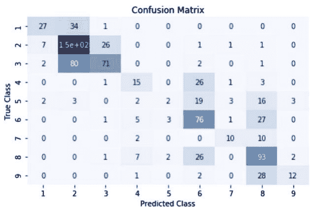

图7.4 岩相分类问题的混淆矩阵。

样本被预测为类别1（第1列所有值的总和）。如前所述，有27个样本被正确预测为属于类别1。然而，有7个被预测为类别1的样本实际上属于类别2，2个样本属于类别3，2个样本属于类别5。对于每个类别，可以通过详细查看混淆矩阵来评估模型的性能。

随着类别数量的增加，使用混淆矩阵可能不容易理解模型的整体性能。因此，一个更好的选择是使用“classification_report”。精确率、召回率和F1分数是与分类报告相关的指标。对于多分类问题，每个类别的精确率是正确预测的类别样本数与所有预测为该类别的样本数之比。在此示例中，对于类别1，在38个被预测为类别1的样本中，有27个样本被正确预测为属于类别1。基于上述数值，模型在测试数据集上预测类别1的精确率为27/38 = 0.71。召回率计算为正确预测的类别样本数与所有真实类别样本数之比。在此示例中，对于类别1，在62个样本中有27个被正确预测，因此召回率为27/62 = 0.44。有了精确率和召回率，就可以计算每个类别的F1分数。岩相分类问题的分类报告可以通过以下代码计算。

```
from sklearn.metrics import classification_report
print(classification_report(y_test, y_predict))
```

Python输出=图7.5

| | 精确率 | 召回率 | F1分数 | 支持度 |
|---|---|---|---|---|
| 1 | 0.71 | 0.44 | 0.54 | 62 |
| 2 | 0.56 | 0.81 | 0.66 | 185 |
| 3 | 0.70 | 0.46 | 0.55 | 156 |
| 4 | 0.47 | 0.33 | 0.38 | 46 |
| 5 | 0.29 | 0.04 | 0.07 | 50 |
| 6 | 0.50 | 0.67 | 0.57 | 113 |
| 7 | 0.62 | 0.45 | 0.53 | 22 |
| 8 | 0.52 | 0.71 | 0.60 | 131 |
| 9 | 0.71 | 0.28 | 0.40 | 43 |
| 准确率 | | | 0.56 | 808 |
| 宏平均 | 0.56 | 0.46 | 0.48 | 808 |
| 加权平均 | 0.57 | 0.56 | 0.54 | 808 |

图7.5 岩相逻辑回归模型的分类报告。

## 回归问题的评估指标

回归模型有两个常见的评估指标：均方误差和决定系数R²。均方误差或损失函数衡量回归模型的平方误差总和，其定义如公式6.10所示。误差定义为目标输出与模型预测之间的差值。对误差进行平方处理可以得到正数，并对较大的误差值施加更大的惩罚。均方误差越高，意味着模型的性能越差。在神经网络训练过程中，目标是通过权重优化来最小化验证数据集的均方误差或损失函数。页岩气井问题的均方误差如图6.12和6.13所示。回归问题的另一个指标是决定系数或R平方。它衡量目标值相对于模型预测的方差量：

$$R^2 = 1 - \frac{\sum_{i=1}^{n} (y_i - \widehat{y}_i)^2}{\sum_{i=1}^{n} (y_i - \overline{y}_i)^2}$$

在这个R²方程中，yi是目标值，$\widehat{y}_i$是模型的预测值，$\overline{y}_i$是所有目标值的平均值。R²值越接近1，表明模型性能越好。如第6章所示，Python中的R²可以通过“r2_score”方法确定。页岩气井和PVT问题的R²如图6.14、6.18–6.20所示。

## 交叉验证

介绍了多种评估指标，以了解机器学习模型在测试数据或模型从未见过的数据上的表现。为了选择测试数据，整个数据集通常按70%和30%的比例划分为训练集和测试集。模型通过使用训练数据进行学习过程来构建，然后通过测试数据进行评估。上述过程的缺点是，评估结果可能会因测试数据集中选取的样本而产生偏差。此外，模型在训练过程中被剥夺了部分数据（测试集）。为了获得覆盖整个数据集的更通用的模型评估，推荐使用“交叉验证”。

在“k折交叉验证”中，这是最常见的交叉验证版本，整个数据集被划分为k个“折”。K通常在5到10之间。在模型训练的第一次迭代中，第一折作为测试数据集，其余（k-1）折作为训练数据集。当模型训练完成后，将在测试数据集（即第一折）上计算指标分数。然后，在下一次迭代中，第二折作为测试数据集，其余（k-1）折作为训练数据集。接下来，在训练数据集（除第二折外的所有折）上构建第二个模型，并在第二折上确定分数。此过程持续进行，直到完成第k次迭代。每次迭代的评估分数也会被确定并在最后报告。五折交叉验证的示例如图7.6所示。

## 分类问题的交叉验证

在Python中，可以通过scikit-learn库中的“cross_val_score”函数执行交叉验证。对于此函数，需要指定至少五个参数：(i) 用于训练和评估的模型，(ii) 输入数据集，(iii) 输出数据集，(iv) 折数（默认为3），(v) 指标分数。交叉验证将应用于本章和第6章涵盖的三个机器学习示例。砂岩产出示例的Python代码如下（这是本章开头用于训练砂岩产出问题KNN的代码的延续）：

```
from sklearn.model_selection import cross_val_score
scores=cross_val_score(KNC, xnorm, y, cv=5, scoring='accuracy')
print("Cross-validation scores: {}". format(scores))
print("Average cross-validation score: {}". format(scores.mean()))
Python output=
Cross-validation scores: [0.66666667 1. 1. 0.66666667 1.]
Average cross-validation score: 0.8666666666666666
```

在此示例中，KNN用作二分类模型，“xnorm”和“y”是输入和输出数据集，折数为5，评估指标是“准确率”。根据交叉验证结果，各折的准确率分数范围从0.67到1，平均值为0.87。因此，预计模型的整体性能准确率约为0.86。然而，各折准确率分数的较大范围可能意味着模型高度依赖于用于训练的某些特定折。这可能是由于数据集规模较小造成的。让我们使用以下Python代码对岩相分类问题进行五折交叉验证（这是本章开头用于训练岩相分类问题逻辑回归模型的代码的延续）：

```
from sklearn.model_selection import cross_val_score
scores_kfold=cross_val_score(LG, xnorm, y,cv=5)
print("Kfold Cross-validation scores: {}". format(scores_kfold))
print("Average Kfold cross-validation score: {}". format
    (scores_kfold.mean()))
```

**Python输出=**
**K折交叉验证分数：** [0.52704791 0.53323029 0.48916409 0.48297214 0.57120743]
**平均K折交叉验证分数：** 0.5210339695953221

对于岩相分类问题，准确率分数范围从0.48到0.57，平均值为0.52。与砂岩产出问题相比，准确率较低。然而，由于岩相分类问题中存在更多样本，分数值的变异较小。

## 回归问题的交叉验证

为了将k折交叉验证应用于回归模型，使用第6章的PVT估算问题。在此问题中，使用了249个PVT样本，包括温度、溶解气油比、气体比重和石油API度，通过神经网络将它们与泡点压力相关联。训练神经网络后，为测试和训练数据集计算了R²和均方误差。现在，向该示例添加五折交叉验证，使用以下Python代码获取每折的均方误差和R²（确保将以下代码作为第6章PVT问题的延续使用）。

```
import numpy as np
seed=50
np.random.seed(seed)
y_norm_Ravel=ynorm.values.ravel()
from sklearn.model_selection import cross_val_score
scores_MSE=cross_val_score(clf, Xnorm,
    y_norm_Ravel,cv=5,scoring='neg_mean_squared_error')
print("MSE_ Cross-validation scores: {}". format(scores_MSE))
print(" Average Kfold cross-validation MSE_score: {}". format
    (scores_MSE.mean()))
scores_R2=cross_val_score(clf, Xnorm, y_norm_Ravel,cv=5,scoring=
    'r2')
print(" R2_Cross-validation scores: {}". format(scores_R2))
print(" Average R2_Cross-validation scores: {}". format
    (scores_R2.mean()))
```

**Python输出=图7.7**

## 362 使用Python的油气机器学习指南

```
MSE_Cross-validation scores: [-0.0055198 -0.00155995 -0.01205835 -0.01779542 -0.00282173]
Average Kfold cross-validation MSE_score: -0.007951048760489427
R2_Cross-validation scores: [0.93905578 0.7947706 0.94509814 0.63662807 0.89653764]
Average R2_Cross-validation scores: 0.8424180443306877
```

图 7.7 PVT神经网络模型的交叉验证报告。

在PVT估算问题的交叉验证中，R²的范围从0.64到0.95，平均值为0.84，这对于模型性能来说是一个相当不错的值。

### 分层K折交叉验证

在K折交叉验证中，整个数据集被分成K折，在K-1折上训练模型，并在剩余的一折上迭代测试模型。每一折中属于不同目标类别的样本百分比可能不同。为了在每一折中保持整个数据集中不同类别的百分比，建议使用“分层”K折交叉验证（Muller & Guido, 2016）。在出砂示例中，72%的观测值（井）经历了出砂，28%没有。因此，通过使用分层K折交叉验证，每一折包含72%的出砂井和28%的未出砂井。值得一提的是，在`cross_val_score`中，当“cv”是整数时，分层K折交叉验证将是默认选项。出砂问题的分层K折交叉验证可以在Python中用以下代码完成：

```
from sklearn.model_selection import StratifiedKFold
skfold=StratifiedKFold(n_splits=5,shuffle=True, random_state=100)
scoresSK=cross_val_score(KNC, xnorm, y,cv=skfold,scoring='accuracy')
print(" StratifiedKFold Cross-validation scores: {}". format (scoresSK))
print(" Average StratifiedKFold cross-validation score: {}". format (scoresSK.mean()))
```

Python输出=
StratifiedKFold Cross-validation scores: [1. 0.83333333 0.83333333 0.83333333 1. ]
Average StratifiedKFold cross-validation score: 0.9

另一种交叉验证方法是“留一法”。在这种方法中，折数与数据集中的样本数量相同。将要训练的模型数量与样本数量相同。如果样本数量很高，这种方法在计算上可能非常耗时，因为需要训练与数据样本数量相等的模型。对于岩相分类问题，留一法交叉验证可以用以下Python代码完成：

```
from sklearn.model_selection import LeaveOneOut
loo=LeaveOneOut()
scores_loo=cross_val_score(LG, xnorm, y, cv=loo)
print(" Number of cv iterations-Leave one Out: ", len(scores_loo))
print(" Mean accuracy Leave one Out: {}". format(scores_loo.mean()))
Python output=
Number of cv iterations-Leave one Out: 3232
Mean accuracy Leave one Out: 0.5590965346534653
```

本章介绍的最后一种交叉验证方法是Shuffle-Split。在这种方法中，需要定义迭代次数或分割次数。然后，应指定测试集和训练集的百分比。在每次分割中，数据集将根据指定的百分比划分为训练集和测试集。在K折交叉验证中，K折中有一折用于测试。然而，在Shuffle-Split交叉验证中，可以控制每次分割中用于测试模型的数据百分比。出砂示例的Shuffle-Split交叉验证在Python中如下所示：

```
from sklearn.model_selection import ShuffleSplit
sh_sp=ShuffleSplit(test_size =.25, train_size =.75, n_splits = 5,
    random_state=50)
scoresSP=cross_val_score(KNC, xnorm, y, cv=sh_sp)
print(" Cross-validation scores:{}". format(scoresSP))
print(" Mean accuracy: {}". format(scoresSP.mean()))
Python output=
Cross-validation scores: [0.75 1. 0.75 0.75 0.75]
Mean accuracy: 0.8
```

在此代码中，调用了sklearn中的“ShuffleSplit”。迭代次数为5。在每次分割中，75%的数据用于训练，25%用于测试。执行交叉验证后，平均准确率为0.8。岩相分类示例的Shuffle-Split交叉验证在Python中如下所示：

```
from sklearn.model_selection import ShuffleSplit
sh_sp=ShuffleSplit(test_size =.25, train_size =.75, n_splits = 6,
    random_state=50)
scores_SP=cross_val_score(LG, xnorm, y, cv=sh_sp)
print(" Cross-validation scores:{}". format(scores_SP))
print(" Mean accuracy: {}". format(scores_SP.mean()))
Python output=
Cross-validation scores:[0.54455446 0.56064356 0.5779703
    0.54455446 0.55321782 0.57549505]
Mean accuracy: 0.5594059405940595
```

在岩相分类示例中，分割次数为6。数据依次按75%和25%划分为训练集和测试集。所有分割在测试数据集上的交叉验证准确率平均值为0.56。PVT估算示例的Shuffle-Split交叉验证在Python中如下所示：

```
import numpy as np
seed=50
np.random.seed(seed)
from sklearn.model_selection import ShuffleSplit
from sklearn.model_selection import cross_val_score
sh_sp=ShuffleSplit(test_size =.3, train_size =.7, n_splits = 8,
    random_state=50)
scores=cross_val_score(clf, Xnorm, y_norm_Ravel, cv=sh_sp,
    scoring='r2')
print(" Cross-validation scores:{}". format(scores))
print(" Mean R2: {}". format(scores.mean()))
Python output=
Cross-validation scores: [0.89955581 0.94445178 0.77980894
    0.78714374 0.94654158 0.91353788 0.79064149 0.84369953]

Mean R2: 0.8631725957628656
```

在PVT估算示例中，考虑了8次分割，70%的数据用于神经网络训练，30%用于模型测试。本例中的评估指标是R²。八次分割的交叉验证R²分数范围从0.78到0.95，平均值为0.86。

### 网格搜索与模型选择

在前面的章节中，介绍了不同的模型评估指标与交叉验证方法相结合，以评估模型的预测性能。训练机器学习模型的最终目标是找到并训练一个具有最佳性能的模型。模型的性能在很大程度上取决于超参数的选择。为了最大化模型的性能，必须选择优化的超参数组合。此外，对于分类或回归等特定问题，可以使用多种模型。因此，为了获得最佳的预测性能，有必要选择具有优化超参数组合的最佳模型。本节将讨论一些获取最佳超参数组合和选择最佳模型的技术。

### 用于超参数优化的网格搜索

为了优化模型性能并获得最佳的超参数集，首先应该生成各种各样的超参数组合。然后，通过搜索这些超参数组合，有可能找到返回最高模型性能的组合。通过搜索所有组合来找到最佳超参数集可以通过“网格搜索”来完成。为了说明网格搜索，将使用一个for循环为出砂问题生成搜索空间，然后找到最佳的超参数集。

在出砂示例中，使用了KNN进行二元分类。对于这个模型，在多个超参数中，选择了邻居数量、权重函数和叶节点大小进行网格搜索。为超参数分配了不同的值和函数。对于每种超参数组合，执行了五折交叉验证，并计算了各折的平均准确率。最终，将有24个具有不同超参数组合的模型及其准确率。返回具有最高准确率模型的组合就是优化的超参数。出砂问题的初始网格搜索Python代码如下：

```
from sklearn.neighbors import KNeighborsClassifier
#define k-nearest neighbor's combination of hyper-parameters
highest_score=0
i=0
for n in [2,3,4,5]:
    for w in ['uniform','distance']:
        for l in [2,3,4]:
            #Train a model with each combination of hyper-parameters and
            #calculate the accuracy
            KNCG=KNeighborsClassifier(n_neighbors=n,
                                      weights=w, leaf_size=l)
            scores=cross_val_score(KNCG, xnorm, y,
                                   cv=5,scoring='accuracy')
            scoreg=scores.mean()
            print("iteration:",i," score:",scoreg,
                  " NN:",n," weight:",w," leaf size:",l)
            i+=1
#Find the hyper-parameters that returns a model with the highest
#accuracy score
            if scoreg >= highest_score:
                highest_score=scoreg
                best_parameters={' n_neighbors':
                                 n, 'weights': w,'leaf_size':l}
print(" Highest score: ", (highest_score))
print(" Best parameters: ", format(best_parameters))
```

Python输出=图 7.8

通过查看结果，观察到迭代3、4和5返回了最高分数。这意味着2个邻居、“distance”权重以及等于“2,3,4”的叶节点大小的组合是产生最高分数（准确率）0.9的最佳组合。为了将超参数的网格搜索与交叉验证结合起来，可以使用sklearn库中的“GridSearchCV”。在GridSearchCV中，要调整的所有超参数集作为字典传入，模型类型是另一个输入参数（对于出砂示例是KNN模型）。然后，GridSearchCV方法根据给定输入和输出特征的最佳超参数组合训练模型。出砂问题的网格搜索与交叉验证

## 7.8 k-近邻模型性能

```
iteration: 0  score: 0.8933333333333333  NN: 2  weight: uniform  leaf size: 2
iteration: 1  score: 0.8933333333333333  NN: 2  weight: uniform  leaf size: 3
iteration: 2  score: 0.8933333333333333  NN: 2  weight: uniform  leaf size: 4
iteration: 3  score: 0.9  NN: 2  weight: distance  leaf size: 2
iteration: 4  score: 0.9  NN: 2  weight: distance  leaf size: 3
iteration: 5  score: 0.9  NN: 2  weight: distance  leaf size: 4
iteration: 6  score: 0.8666666666666666  NN: 3  weight: uniform  leaf size: 2
iteration: 7  score: 0.8666666666666666  NN: 3  weight: uniform  leaf size: 3
iteration: 8  score: 0.8666666666666666  NN: 3  weight: uniform  leaf size: 4
iteration: 9  score: 0.8666666666666666  NN: 3  weight: distance  leaf size: 2
iteration: 10  score: 0.8666666666666666  NN: 3  weight: distance  leaf size: 3
iteration: 11  score: 0.8666666666666666  NN: 3  weight: distance  leaf size: 4
iteration: 12  score: 0.7533333333333333  NN: 4  weight: uniform  leaf size: 2
iteration: 13  score: 0.7533333333333333  NN: 4  weight: uniform  leaf size: 3
iteration: 14  score: 0.7533333333333333  NN: 4  weight: uniform  leaf size: 4
iteration: 15  score: 0.8666666666666666  NN: 4  weight: distance  leaf size: 2
iteration: 16  score: 0.8666666666666666  NN: 4  weight: distance  leaf size: 3
iteration: 17  score: 0.8666666666666666  NN: 4  weight: distance  leaf size: 4
iteration: 18  score: 0.8  NN: 5  weight: uniform  leaf size: 2
iteration: 19  score: 0.8  NN: 5  weight: uniform  leaf size: 3
iteration: 20  score: 0.8  NN: 5  weight: uniform  leaf size: 4
iteration: 21  score: 0.8  NN: 5  weight: distance  leaf size: 2
iteration: 22  score: 0.8  NN: 5  weight: distance  leaf size: 3
iteration: 23  score: 0.8  NN: 5  weight: distance  leaf size: 4
Highest score:  0.9
Best parameters:  {'n_neighbors': 2, 'weights': 'distance', 'leaf_size': 4}
```

图7.8 经过24次迭代后k-近邻模型的性能。

生产问题的Python代码如下。最佳模型的输出使用整个数据集计算，并与实际目标值进行比较，使用分类报告。

```python
#Grid Search with Cross-validation
from sklearn.model_selection import GridSearchCV
Neighbor=[2,3,4,5]
Weight=['uniform','distance']
Leaf=[2,3,4]
hyperparameters=dict(n_neighbors=Neighbor,
    weights=Weight,leaf_size=Leaf)
KNN=KNeighborsClassifier()
gridsearch=GridSearchCV(KNN, hyperparameters, cv=5)
Best_Model=gridsearch.fit(xnorm, y)
print('Best n_neighbors:', Best_Model.best_estimator_.get_params()['n_neighbors'])
print('Best weights:', Best_Model.best_estimator_.get_params()['weights'])
print('Best leaf_size:', Best_Model.best_estimator_.get_params()['leaf_size'])
B=Best_Model.predict(xnorm)
from sklearn.metrics import classification_report
print(classification_report(y, B))
```

Python输出=图7.9

```
Best n_neighbors: 2
Best weights: distance
Best leaf_size: 2

            precision    recall  f1-score   support

           0       1.00      1.00      1.00         8
           1       1.00      1.00      1.00        21

    accuracy                           1.00        29
   macro avg       1.00      1.00      1.00        29
weighted avg       1.00      1.00      1.00        29
```

图7.9 砂粒生产问题的网格搜索结果。

根据网格搜索结果，最佳模型是通过使用邻居数2、权重为距离、叶节点大小为2的超参数获得的。有时，当超参数组合数量很高时，网格搜索在计算上可能非常耗尽。在这种情况下，在随机选择的超参数组合集合内进行搜索可能更有效。在Python中，可以从sklearn库中使用“RandomizedSearchCV”进行随机超参数搜索。对于这种方法（RandomizedSearchCV），与普通网格搜索类似，需要将模型类型、超参数空间和交叉验证折数作为输入参数传入。此外，还需要定义迭代次数，该次数等于随机选择的超参数组合的数量。迭代次数的默认值为10。砂粒生产问题的随机超参数搜索Python代码如下：

```python
from sklearn.model_selection import RandomizedSearchCV
Neighbor=[2,3,4,5]
Weight=['uniform','distance']
Leaf=[2,3,4]
hyperparameters=dict(n_neighbors=Neighbor,
    weights=Weight,leaf_size=Leaf)
KNN=KNeighborsClassifier()
gridsearch_randomized=RandomizedSearchCV(KNN,
    hyperparameters,n_iter=12,random_state=1, cv=5)
Best_Model=gridsearch_randomized.fit(xnorm, y)
print('Best n_neighbors:', Best_Model.best_estimator_.get_params()
    ['n_neighbors'])
print('Best weights:', Best_Model.best_estimator_.get_params()
    ['weights'])
print('Best leaf_size:', Best_Model.best_estimator_.get_params()
    ['leaf_size'])
BRG=Best_Model.predict(xnorm)
from sklearn.metrics import classification_report
print(classification_report(y, BRG))
```

Python输出=图7.10

```
Best n_neighbors: 2
Best weights: distance
Best leaf_size: 4

            precision    recall  f1-score   support

           0       1.00      1.00      1.00         8
           1       1.00      1.00      1.00        21

    accuracy                           1.00        29
   macro avg       1.00      1.00      1.00        29
weighted avg       1.00      1.00      1.00        29
```

图7.10 砂粒生产问题的随机网格搜索结果。

通过随机搜索，基于12次迭代，最佳模型是使用邻居数为2、权重为距离、叶节点大小为4的超参数获得的。

在前面的例子中，网格搜索应用于二分类问题。接下来，我们使用网格搜索来优化一个多分类问题的模型，即岩相分类的例子。在岩相分类的例子中，使用“逻辑回归”作为分类模型。两个超参数“惩罚项”和“正则化强度的倒数”（记为C）将用于网格搜索。惩罚项考虑为l1或l2。对于超参数C，从1到10000的对数尺度中选择20个值。在搜索过程中，目标是找到提供最高准确率模型的惩罚项和C的最佳组合。岩相分类问题的网格搜索可以在Python中通过以下代码完成：

```python
from sklearn.model_selection import GridSearchCV
penalty=['l1','l2']
C=np.logspace(0,4,20)
LRG=LogisticRegression(multi_class='auto',solver='liblinear',
                       max_iter=200)
hyperparameters=dict(C=C,penalty=penalty)
gridsearch=GridSearchCV(LRG,hyperparameters, cv=5, verbose=0)
Best_Model=gridsearch.fit(xnorm, y)
print('Best penalty:', Best_Model.best_estimator_.get_params()['penalty'])
print('Best C:', Best_Model.best_estimator_.get_params()['C'])
B=Best_Model.predict(x_test)
from sklearn.metrics import classification_report
print(classification_report(y_test, B))
```

Python输出=图7.11

根据网格搜索结果，最佳模型是通过使用l2惩罚项和C等于48.3获得的。优化后模型（网格搜索后）的平均精度为0.58。如果组合数量很高，也可以使用随机搜索。

```
Best penalty: l2
Best C: 48.32930238571752

| | precision | recall | f1-score | support |
|---|---|---|---|---|
| 1 | 0.60 | 0.58 | 0.59 | 62 |
| 2 | 0.59 | 0.68 | 0.63 | 185 |
| 3 | 0.66 | 0.56 | 0.60 | 156 |
| 4 | 0.56 | 0.48 | 0.52 | 46 |
| 5 | 0.33 | 0.08 | 0.13 | 50 |
| 6 | 0.53 | 0.67 | 0.59 | 113 |
| 7 | 0.44 | 0.50 | 0.47 | 22 |
| 8 | 0.58 | 0.66 | 0.62 | 131 |
| 9 | 0.79 | 0.63 | 0.70 | 43 |
| accuracy | | | 0.59 | 808 |
| macro avg | 0.57 | 0.54 | 0.54 | 808 |
| weighted avg | 0.58 | 0.59 | 0.58 | 808 |
```

图7.11 使用网格搜索的岩相分类示例的分类报告。

最后一个超参数网格搜索的例子是PVT问题，它使用神经网络进行回归。如第6章所述，“MLPRegressor”被用作神经网络训练算法。对于PVT网格搜索优化，隐藏层中的神经元数量、激活函数、惩罚参数（alpha）和初始学习率被选为要调整的超参数。将返回最佳模型，该模型在选择最佳模型时使用，并计算整个数据集的模型输出。将使用五折交叉验证，以R²作为指标来评估最佳模型的性能。网格搜索优化结果的最佳超参数组合可以通过“best_estimator_”访问。执行PVT估算示例网格搜索优化的Python代码如下：

```python
from sklearn.model_selection import GridSearchCV
from sklearn.neural_network import MLPRegressor
import numpy as np
seed=50
np.random.seed(seed)
hyperparameters=[{'hidden_layer_sizes': [2,3,4,5,6,7],
    'activation':['relu','tanh'],'solver':['lbfgs'], 'alpha':
    [0.0001,0.001,0.01,0.1,1,10], 'batch_size':['auto'], 'learning_rate':
    ['constant'], 'learning_rate_init':[0.001,0.01,0.1,1], 'max_iter':
    [500]}]
MLPR=MLPRegressor()
gridsearch=GridSearchCV(MLPR, hyperparameters, cv=5, verbose=0)
Best_Model=gridsearch.fit(Xnorm, y_norm_Ravel)
print('hidden_layer_sizes:',
    Best_Model.best_estimator_.get_params()['hidden_layer_sizes'])
```

## 模型选择

在上一节中，网格搜索仅应用于一个模型，以找到能返回最佳性能模型的超参数。对于许多模式识别、分类、聚类和回归问题，可以使用不同的机器学习算法或模型。这里的问题是，对于特定的数据集，哪种模型和超参数组合的表现最好。在这种情况下，搜索空间包括不同的学习算法（模型）和超参数。

我们将使用相带分类问题来更清晰地说明模型选择。在相带分类问题中，逻辑回归被用于将岩石类型分为九个不同的组。在上一节中，网格搜索得出最佳逻辑回归模型的平均精度为0.58。这一次，在搜索空间中，除了逻辑回归，还包含了随机森林分类器。对于随机森林分类器，估计器的数量和分类器的最大特征数是搜索空间中的超参数。对于逻辑回归，“惩罚项和正则化强度”（C）在搜索空间中。这里的目标是找出哪种学习算法和超参数组合能返回最佳模型。相带分类问题的模型选择和超参数优化的Python代码如下：

```python
import numpy as np
from sklearn.linear_model import LogisticRegression
from sklearn.ensemble import RandomForestClassifier
from sklearn.model_selection import GridSearchCV
from sklearn.pipeline import Pipeline
np.random.seed(50)
pipe = Pipeline([("clf", LogisticRegression(solver='liblinear',
    max_iter=200))])

log_classifier = {"clf": [LogisticRegression(solver='liblinear',
    max_iter=200)],
    "clf__penalty": ['l1', 'l2'],
    "clf__C": np.arange(0.1, 100, 20)}

ranforest_classifier = {"clf": [RandomForestClassifier(random_state=0)],
    "clf__n_estimators": np.arange(10, 300, 10),
    "clf__max_features": [1, 2, 3]}

grid = [ranforest_classifier, log_classifier]

gridsearch_models = GridSearchCV(pipe, grid, cv=5, verbose=0,
    n_jobs=-1)
Best_modelM = gridsearch_models.fit(x_train, y_train)

print(Best_modelM.best_estimator_.get_params()["clf"])
y_BM=Best_modelM.predict(x_test)
from sklearn.metrics import classification_report
print(classification_report(y_test, y_BM))
```

Python输出：
RandomForestClassifier(max_features=2, n_estimators=80,
    random_state=0)

| | 精度 | 召回率 | F1分数 | 支持数 |
|---|---|---|---|---|
| 1 | 0.81 | 0.71 | 0.76 | 62 |
| 2 | 0.71 | 0.78 | 0.74 | 185 |
| 3 | 0.75 | 0.73 | 0.74 | 156 |
| 4 | 0.79 | 0.72 | 0.75 | 46 |
| 5 | 0.64 | 0.42 | 0.51 | 50 |
| 6 | 0.70 | 0.77 | 0.73 | 113 |
| 7 | 0.68 | 0.77 | 0.72 | 22 |
| 8 | 0.75 | 0.76 | 0.76 | 131 |
| 9 | 0.95 | 0.91 | 0.93 | 43 |
| 准确率 | | | 0.74 | 808 |
| 宏平均 | 0.75 | 0.73 | 0.74 | 808 |
| 加权平均 | 0.74 | 0.74 | 0.74 | 808 |

使用模型选择和网格搜索的相带分类示例的分类报告

从网格搜索结果可以看出，随机森林分类器在相带分类问题的分类性能上优于逻辑回归。通过将估计器数量设置为80，最大特征数设置为2，获得了最佳模型。该最佳模型被用于在测试数据集上预测不同的类别，并与目标值进行比较。根据分类报告结果，使用随机森林分类器对九个类别的加权平均精度为0.74，这比逻辑回归好得多。

## 偏依赖图

当一个机器学习模型被训练完成，并且其预测性能通过交叉验证等评估技术得到验证后，就可以使用该模型进行预测或敏感性分析。有时需要理解一个或多个输入属性对目标值的影响。一种方法是创建一个包含所有输入属性的矩阵，并将每个属性的值保持为平均值或任何其他期望值。然后，在期望范围内改变需要进行敏感性分析的特定属性。最后，通过使用输入数据矩阵（其中一个属性是变化的）并预测模型响应，可以识别目标与输入属性之间的依赖关系。

在Python中，目标与输入变量之间的交互可以通过“偏依赖图（PDPs）”来可视化。PDP的作用是绘制模型输出在多个输入变量组合上的平均值与特定输入变量的关系图。为了可视化目标与两个输入变量之间的关系，可以使用热图、等高线图或3D图（scikit）。

在第6章中，神经网络被用于将天然气EUR与13个不同的地质、钻井和完井变量相关联。在本章中，PDP被用于找出天然气EUR与一些重要输入变量之间的依赖关系。在第6章中，基于特征排序分析，确定了水平段长度和支撑剂加载量对EUR的影响最大。一些输入变量对与天然气EUR之间的偏依赖关系可以通过以下Python代码绘制：

```python
import numpy as np
import pandas as pd
import matplotlib.pyplot as plt
from sklearn.pipeline import make_pipeline
from sklearn.neural_network import MLPRegressor
from sklearn.inspection import partial_dependence
from sklearn.inspection import plot_partial_dependence
from sklearn.preprocessing import MinMaxScaler
import seaborn as sns
dataset=pd.read_csv('Chapter7_Shale Gas Wells.csv')
X=dataset.iloc[:,0:13]
y=dataset.iloc[:,13].values
seed=15
np.random.seed(seed)
```

## 训练集的大小

机器学习模型的可靠性取决于多个因素，如问题复杂度（输入、输出的数量及其相互关系）、模型选择、合适的超参数以及可用于训练/测试的数据量。关于可靠机器学习模型所需数据的大小，有两个重要问题。第一个是：达到高性能模型所需的最小样本或观测数量是多少？第二个问题是：添加新样本是否能提升模型性能（通常，拥有更多样本会提升模型质量）。例如，对于气体EUR预测问题，可以提出：训练一个具有可靠预测能力的模型所需的最小井数据量是多少？或者，要获得对泡点压力的稳健预测，所需的最小PVT样本数是多少？当数据集中的井数很重要时，这可能是一个具有挑战性的问题。对于井数较少的绿色油田，确定使模型可靠的最小井数至关重要。

有一些统计方法可以使用假设检验和置信区间来确定数据集中的最小样本数。然而，在机器学习问题中，模型的复杂度（超参数数量或模型类型）非常重要。为了评估训练样本大小对模型性能的影响，可以使用“学习曲线”（Albon, 2018）。为了在Python中使用`learning_curve`，必须指定机器学习模型、输入和输出（目标）数据、训练数据样本的范围、交叉验证的折数，以及最终的评分指标。指定这些参数后，`learning_curve`算法从最小样本大小开始，将其分割成折，训练模型，最后测量训练折和测试折的分数。然后，它增加样本数量并重复上述过程，直到达到范围内的最大样本数。最后，可以将模型性能（在训练和测试数据上）与数据中的样本数量进行可视化。例如，将`learning_curve`应用于PVT问题。使用学习曲线解决PVT问题的Python代码如下：

```python
import numpy as np
import pandas as pd
from sklearn.model_selection import learning_curve
from sklearn.neural_network import MLPRegressor
import matplotlib.pyplot as plt
from sklearn.preprocessing import MinMaxScaler
dataset=pd.read_csv('Chapter7_PVT Data.csv')
X=dataset.iloc[:,0:4]
y=dataset.iloc[:,4].values
sc=MinMaxScaler()
Xnorm=pd.DataFrame(data=sc.fit_transform(X))
seed=50
np.random.seed(seed)
clfB = MLPRegressor(activation='relu',alpha=0.01,
    hidden_layer_sizes=7, learning_rate_init=0.01,
    max_iter=500, solver='lbfgs',random_state=20)
train_sample_sizes, train_MSEscores,test_MSEscores = learning_curve(clfB,Xnorm,y,cv=5,
    scoring='neg_mean_absolute_error',n_jobs=-1,
    train_sizes=np.linspace(0.1,1.0,100),random_state=10)
train_MSEmean = np.mean(train_MSEscores, axis=1)
test_MSEmean = np.mean(test_MSEscores, axis=1)
plt.plot(train_sample_sizes, -train_MSEmean, color="k",
    label="Training MSE score")
plt.plot(train_sample_sizes, -test_MSEmean,'--', color="k",
    label="Cross-validation MSE score")
plt.title("Learning Curve for PVT Data Set")
plt.xlabel("Training Set Sample Size"), plt.ylabel("MSE Score"),
plt.legend(loc="best")
plt.tight_layout()
plt.show()
```

Python输出=图7.15

如图7.15所示，当训练数据集中的样本数量增加时，训练的平均MSE变化不大，而交叉验证的平均MSE则下降。当训练数据集中的样本数量达到120时，交叉验证的平均MSE稳定在105。这意味着要获得最高的MSE或最佳

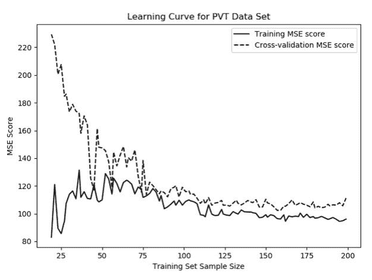

图7.15 PVT估计问题的学习曲线。

374 使用Python的油气机器学习指南

```python
from sklearn.model_selection import train_test_split
X_train, X_test, y_train, y_test=train_test_split(X, y, test_size=0.25)
model=make_pipeline(MinMaxScaler(), MLPRegressor(hidden_layer_sizes=(25,25),
                                                learning_rate_init=0.01,
                                                early_stopping=True,max_iter=500))
model.fit(X_train, y_train)
print("Test R2 score: {:.2f}".format(model.score(X_test, y_test)))
features=['Stage Spacing','bbl/ft','Proppant Loading','Dip',
          'Thickness','Lateral Length','Injection Rate','Porosity',
          'Percentage of LG']
plot_partial_dependence(model,X, features,
                       n_jobs=3, grid_resolution=20)
fig = plt.gcf()
fig.suptitle('Partial dependence of Gas EUR\n for Stage Spacing,bbl/ft,'
             'Proppant Loading,Dip,Thickness,Lateral Length,Injection Rate,'
             'Porosity,Percentage of LG')
fig.subplots_adjust(hspace=0.3)
```

Python输出=图7.12 测试R2分数：0.79

注意：以“fig.suptitle”开头的三行代码在Jupyter中应在同一行。

管道用于连接数据预处理步骤（MinMaxScaler）和模型（MLPRegressor），并将它们组装在一起。这种组装消除了对数据进行缩放的需要，因为MinMaxScaler是管道内流程的一部分。如图7.12所示，气体EUR与bbl/ft、支撑剂负载、倾角、厚度和注入速率之间存在增长趋势

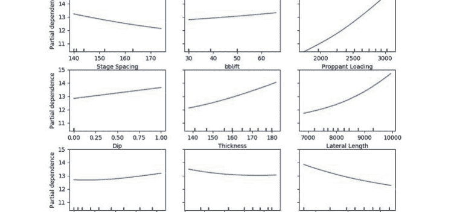

图7.12 气体EUR与多个输入属性的偏依赖图。

。随着射孔间距和线性凝胶百分比的降低，气体EUR增加。最后，孔隙度对气体EUR没有显示出显著影响。查看两个输入属性之间的相互作用及其对目标输出的影响也很重要。水平段长度和支撑剂负载对气体EUR的影响可以使用以下代码通过热图显示：

```python
features_LLPL=[('Lateral Length','Proppant Loading')]
plot_partial_dependence(model,X, features_LLPL, n_jobs=3,
    grid_resolution=20)
fig=plt.gcf()
fig.suptitle('Gas EUR vs. Lateral Length and Proppant Loading')
```

Python输出=图7.13

如图7.13所示，可以找到任何支撑剂负载和水平段长度组合下的气体EUR。根据热图观察，通过钻更长的井和泵送更多的支撑剂可以获得更高的气体EUR。除了热图，支撑剂负载和水平段长度之间的相互作用对气体EUR的影响也可以通过“3D交互图”来描绘。显示两个属性在三维空间中交互的Python代码如下。在图7.14中，描绘了EUR相对于不同水平段长度和支撑剂负载值的3D曲面。

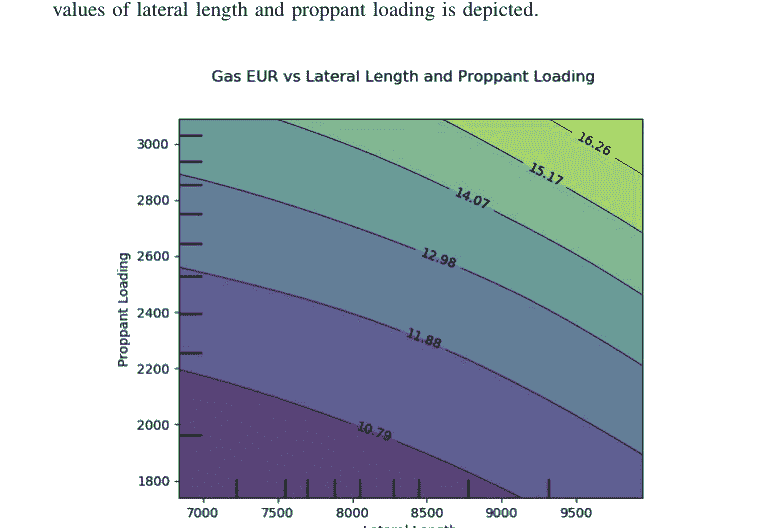

图7.13 水平段长度和支撑剂负载对气体EUR影响的热图。

376 使用Python的油气机器学习指南

```python
from mpl_toolkits.mplot3d import Axes3D
fig=plt.figure()
features1=('Proppant Loading', 'Lateral Length')
pdp, axes=partial_dependence(model, X_train, features=features1,
    grid_resolution=30)
XX, YY=np.meshgrid(axes[0], axes[1])
Z=pdp[0].T
ax=Axes3D(fig)
surf=ax.plot_surface(XX, YY, Z, rstride=1, cstride=1, cmap=plt.cm.
    BuPu, edgecolor='k0')
ax.set_xlabel(features1[0])
ax.set_ylabel(features1[1])
ax.set_zlabel('Gas EUR')
ax.view_init(elev=30, azim=150)
plt.colorbar(surf)
plt.suptitle('Partial dependence of Gas EUR vs.\n Lateral Length'
    'and Proppant Loading')
plt.subplots_adjust(top=1)
plt.show()
```

Python输出=图7.14

注意：以“plt.suptitle”开头的两行代码在Jupyter中应在同一行。

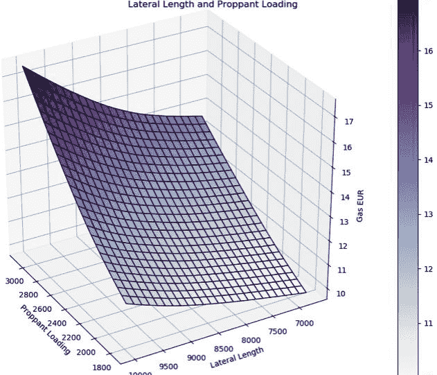

图7.14 显示水平段长度/支撑剂负载与气体EUR之间相互作用的3D图。

对于PVT估算问题，要评估模型（神经网络）性能，至少需要120个PVT样本。增加更多样本不会显著提升模型性能。

## 保存与加载模型

本章讨论了评估、验证和优化多种机器学习算法的不同方法。最终目标是构建性能最优的模型。当最佳模型训练完成后，有必要将其保存为文件，以便后续用于新数据集的预测。构建scikit-learn模型后，可以将其保存为"pickle"文件（一种Python文件格式），或使用"joblib库"保存为jupyter目录中的".joblib文件"。然后，可以加载保存的模型进行预测。以岩相分类为例，使用网格搜索优化后的超参数，通过训练数据集训练随机森林分类器。随后保存模型。最后，在其他Python文件中加载保存的模型，对测试数据集进行预测。在Python中，可以使用以下代码保存岩相分类问题的训练模型：

```python
import pandas as pd
from sklearn.pipeline import make_pipeline
from sklearn.preprocessing import MinMaxScaler
from sklearn.ensemble import RandomForestClassifier
dataset=pd.read_csv('Chapter7_Facies Data.CSV')
x=dataset.iloc[:,4:11]
y=dataset.iloc[:,0].values
import numpy as np
seed=50
np.random.seed(seed)
from sklearn.model_selection import train_test_split
```

| | precision | recall | f1-score | support |
|---|---|---|---|---|
| 1 | 0.92 | 0.73 | 0.82 | 82 |
| 2 | 0.73 | 0.86 | 0.79 | 215 |
| 3 | 0.78 | 0.71 | 0.74 | 181 |
| 4 | 0.61 | 0.61 | 0.61 | 51 |
| 5 | 0.60 | 0.38 | 0.47 | 68 |
| 6 | 0.60 | 0.60 | 0.60 | 142 |
| 7 | 0.81 | 0.64 | 0.71 | 33 |
| 8 | 0.60 | 0.76 | 0.67 | 139 |
| 9 | 0.98 | 0.75 | 0.85 | 59 |
| accuracy | | | 0.71 | 970 |
| macro avg | 0.74 | 0.67 | 0.69 | 970 |
| weighted avg | 0.72 | 0.71 | 0.71 | 970 |

图7.16 使用保存的模型对岩相问题测试数据集进行随机森林分类预测。

380 使用Python的油气机器学习指南

```python
x_train, x_test, y_train, y_test=train_test_split(x, y,
    test_size=0.3)
model = make_pipeline(MinMaxScaler(),RandomForestClassifier
    (max_features=2, n_estimators=80, random_state=0,))
rfmodel1=model.fit(x_train,y_train)
from joblib import dump
dump(rfmodel1,"rfmodel1.joblib")
Python output:
['rfmodel1.joblib']
```

```python
import pandas as pd
from joblib import load
dataset=pd.read_csv('Chapter7_Facies Data.CSV')
x=dataset.iloc[:,4:11]
y=dataset.iloc[:,0].values
import numpy as np
seed=50
np.random.seed(seed)
from sklearn.model_selection import train_test_split
x_train, x_test, y_train, y_test=train_test_split(x, y,
    test_size=0.3)
Model=load('rfmodel1.joblib')
yModel=Model.predict(x_test)
from sklearn.metrics import classification_report
print(classification_report(y_test, yModel))
Python output:Fig 7.16
```

## 参考文献

Albon, C. (2018年4月10日). *Python机器学习手册：从预处理到深度学习的实用解决方案* (第1版). O'Reilly Media. ISBN-10 : 9781491989388.

Dubois, M. K., Bohling, G. C., & Chakrabarti, S. (2007). 四种岩石相分类方法的比较. *Computers & Geosciences, 33*(5), 599–617. https://doi.org/10.1016/j.cageo.2006.08.011.

Gharagheizi, F., Mohammadi, A. H., Arabloo, M., & Shokrollahi, A. (2017年6月). 使用可靠的分类方法预测油藏出砂临界点. *Petroleum, 3*(2), 280–285. https://doi.org/10.1016/j.petlm.2016.02.001. https://scikit-learn.org/stable/auto_examples/inspection/plot_partial_dependence.html.

Morica, G., Ripa, G., Sanfilippo, F., & Santarelli, F. J. (1994). *盆地尺度岩石力学：出砂现象的现场观察*. 荷兰代尔夫特：石油工程岩石力学.

Muller, A. C., & Guido, S. (2016年10月25日). *Python机器学习入门：数据科学家指南* (第1版). O'Reilly Media. ISBN-10 : 1449369413.

# 第8章

## 模糊逻辑

在几乎所有复杂问题中，都需要处理不确定性。过去2000年里，用于处理问题中不确定性的逻辑主要源自亚里士多德逻辑或斯多葛逻辑。在这种逻辑中，二元信仰导致了一条重要规则：要么是事实，要么不是事实。这种逻辑以非黑即白或二值的方式看待世界，例如，天空要么是蓝色的，要么不是蓝色的（Kosko, 1994）。逐渐地，从17世纪开始，哲学家和科学家们意识到，某些科学陈述不可能完全为真或完全为假。他们开始从确定性（非黑即白）的陈述转向灰色或模糊的陈述。

斯多葛逻辑由乔治·布尔改进并以代数方式表述为布尔逻辑。他的工作还包括阐述如何使用概率理论分析大量社会数据。在布尔出版《思维规律》（其中涵盖了逻辑和概率理论）几十年后，德国数学家格奥尔格·康托尔引入了康托尔集或"集合论"。布尔和康托尔的工作是概率理论的基础，在处理问题中的不确定性方面非常强大。概率理论主要适用于受随机性支配的问题。对于部分信息不可靠，或定义问题的语言存在不精确和模糊性的情况，概率理论并不十分实用。在这些情况下，不确定性和模糊性应使用不同的技术来处理（Rajasekaran & Pai, 2013）。

从20世纪初开始，许多科学家如查尔斯·桑德斯·皮尔士、扬·卢卡西维茨和马克斯·布莱克开始考虑逻辑世界中的模糊性。他们提出了多值逻辑（假设有两个以上的真值）和模糊集。20世纪60年代，加州大学伯克利分校的教授洛特菲·A·扎德发表了他关于模糊集的著名论文（Zadeh, 1965）。在他的工作中，他引入了隶属函数来覆盖每个可能值的范围。然后，他提出了与经典集合运算类似的模糊集运算。扎德的工作和出版物是模糊逻辑的基础。自他的工作以来，模糊逻辑得到了显著发展。日本工程师和科学家将模糊逻辑的能力应用于各种系统和产品中，拥有数千项专利（Kosko, 1994）。模糊逻辑已广泛应用于各种行业和学科的系统/过程控制、模式识别与分类、决策、优化以及预测/预报。

自四十年前以来，模糊逻辑在油气行业得到了广泛应用，涉及钻井、岩石物理、完井设计、系统控制、油田开发优化、油藏描述、产量分配等多个领域。Mohaghegh是油气行业应用模糊逻辑的先驱之一。他将模糊逻辑与神经网络和遗传算法结合使用，为绿河盆地选择最佳的重复压井候选井（Mohaghegh, 2000）。他还应用模糊逻辑进行非常规资源中的模式识别和天然裂缝系统制图（Mohaghegh, 2017）。Gholami等人使用模糊岩石分类对高分辨率地质模型进行粗化，以用于流动模拟（Gholami & Mohaghegh, 2009）。Xion和Holditch展示了如何设计最优的增产措施，并开发了用于措施类型、隔层条件、注入方式和地层伤害诊断的模糊评估器（Xion & Holditch, 1995）。Rivera等人使用模糊逻辑设计压裂设施的压力控制系统，考虑了广泛的流体类型和泵送条件（Rivera, 1994）。Aminzadeh等人将模糊逻辑与神经网络结合，用于油气藏排序和识别高潜力目标（Aminzadeh & Brouwer, 2006）。Ahmed等人利用模糊逻辑，使用地面钻井参数和钻井液性能估算钻头机械钻速（Ahmed et al., 2019）。模糊逻辑还用于估算岩体岩石强度（Sari, 2016）、合采井产量分配（Widarsono et al., 2005）以及生产系统油嘴尺寸控制（Odedele & Ibrahim, 2014）。

本章将简要讨论经典集合论，为读者理解模糊集理论做准备。对于模糊集，将解释隶属函数、模糊集运算和近似推理。最后，将结合油气相关示例（如油嘴控制和岩石类型分类）讨论模糊推理和模糊聚类。

## 经典集合论

经典集合是唯一项目的集合，通常用花括号{}表示。RockType = {Sandstone, Limestone, Carbonate, Shale}。RockType集合包含不同的岩石类型。

如图8.1所示，可以使用维恩图可视化一个集合，并显示其与其他集合的关系。每个圆圈代表一个集合；共同成员由圆圈的重叠部分表示。全集（用U表示）包含正在使用集合建模的上下文中的所有元素。U的任何子集都可以被视为全集中的一个集合。

对象x的元素属于集合A，表示为x ∈ A。例如，Limestone ∈ RockType表示石灰岩是RockType集合的成员。集合的基数是集合内项目的数量。集合A的基数表示为|A|。例如，当RockType的基数为4时，|RockType| = 4。空集是不包含任何项目的集合。例如，A = {}表示一个基数为|A| = 0的空集。通常空集表示为ϕ。单元素集是一个集合

## 集合运算

两个集合的**并集**包含两个集合中的所有元素。例如，
$$A = \{a, b, c\}, \quad B = \{b, d\}, \quad A \cup B = \{a, b, c, d\}$$
并集可以用维恩图表示，如图8.1中的阴影区域所示。

两个集合的交集包含两个集合中的共同元素。下面请看A和B之间的一个交集示例及其对应的维恩图（图8.2），其中阴影区域表示$A \cap B$。
$$A = \{a, b, c\}, \quad B = \{b, d\}, \quad A \cap B = \{b\}$$

集合$A$的**补集**包含全集U中除集合$A$中的元素外的所有元素。集合$A$的补集表示为$A^c$。假设一个日本汽车公司的集合$J = \{\text{Mazda, Toyota, Honda}\}$，那么$J^c$就是除马自达、本田和丰田之外的所有汽车公司的集合。集合J的补集$J^c$如图8.3中的阴影区域所示。

请注意，一个集合与其补集的交集是空集，而一个集合与其补集的并集是全集，即$J \cap J^c = \emptyset$且$J \cup J^c = U$。

集合$A$相对于集合$B$的**差集**表示为$A-B$，它包含所有属于$A$但不属于$B$的元素。$A-B = \{a, c\}$，$B-A = \{d\}$。$A-B$的维恩图如图8.4所示。

## 集合性质

**交换律：** 并集和交集运算满足交换律，这意味着集合的顺序不会改变结果。

$A \cup B = B \cup A$
$A \cap B = B \cap A$ (8.1)

**结合律：** 对三个集合进行的并集和交集运算满足结合律，即运算的顺序无关紧要，请注意括号具有最高优先级，因此括号内的运算先执行：

$A \cup (B \cup C) = (A \cup B) \cup C$
$A \cap (B \cap C) = (A \cap B) \cap C$

**分配律：** 当对三个集合应用并集和交集时，第一个运算可以按如下方式分配：

$A \cup (B \cap C) = (A \cup B) \cap (A \cup C)$
$A \cap (B \cup C) = (A \cap B) \cup (A \cap C)$

**幂等律：** 该定律指出，一个集合与自身的并集或交集仍然是该集合。

$A \cup A = A$
$A \cap A = A$

**同一律：** 考虑空集和全集U，对于集合$A$、$\phi$、$E$的运算，以下等式成立。

$A \cup \phi = A$
$A \cup U = U$
$A \cap \phi = \phi$
$A \cap U = A$

**吸收律：** 一个集合$A$与同一集合$A$和另一个集合$B$的交集的并集是$A$。同样，一个集合$A$与集合$A$和另一个集合$B$的并集的交集也是$A$。

$A \cup (A \cap B) = A$
$A \cap (A \cup B) = A$

**对合律：** 对一个集合应用两次补集运算将得到该集合本身。

$(A^c)^c = A$

**传递律：** 传递律适用于子集关系，如果集合$A$是集合$B$的子集，而集合$B$是集合$C$的子集，那么集合$A$将是集合$C$的子集。

$if \ A \subset B \ and \ B \subset C \ then \ A \subset C$

**德摩根律：** 两个集合的并集的补集可以计算为这些集合的补集的交集。同样，两个集合的交集的补集可以计算为这些集合的补集的并集。

## 模糊集

### 定义

在经典集合论中，解释了论域中存在两个群体。一个群体包含论域的所有成员，另一个群体包含非成员。想象一个包含储层岩石（如页岩和砂岩）的论域。因此，在这个论域中，任何岩石要么是页岩，要么是砂岩，才能成为成员。任何其他岩石，例如包含80%砂岩和20%石灰岩的岩石，不被视为成员。在经典集合中，对论域的成员值是明确的，非成员为0，成员为1。然而，在模糊集中，可以假设部分成员资格，并为集合分配不同程度的成员资格。需要注意的是，模糊集主要用于处理不确定性和精确性。不确定性在某种程度上与语言变量有关，如老、年轻、高、矮。模糊集可用于量化和分析语言变量。例如，考虑年龄和语言变量“年轻”和“年老”。假设45岁以下的人为年轻，45岁以上的人为年老。在这个例子中，论域包括年轻人和老年人。根据年龄，一个人要么是年老的，要么不是年老的，这代表了0或1的成员资格（图8.5）。

这种明确的划分并不总是合理的，因为有人可能会认为阈值应该是50而不是45。由于变老的概念是在时间过程中发生的，而不是在某个特定年龄，因此“年老”变量可以被视为一个模糊概念，并用曲线而不是直线来表示。

如图8.6所示，在定义为[0,100]的年龄论域上，为两个模糊集“年轻”和“年老”绘制了一条曲线。绘制这条曲线有不同的方法。这里假设对“年老”集合的成员资格从40岁左右开始，并逐渐增加直到80岁。这允许对不同年龄做出更合乎逻辑的决策（策略），特别是那些在40-80岁范围内的人，他们对“年轻”组和“年老”组都有一定的成员资格。例如，对于50岁，对“年轻”组的成员资格是0.88，对“年老”组是0.12，而对于60岁，对“年老”和“年轻”组的成员资格都是0.5。模糊集概念允许在许多系统中进行更平滑和更有效的控制，包括温度控制、汽车自动变速器、手写识别以及油气问题，如投资决策、重复压裂候选选择和油嘴管理。

### 数学函数

请记住，在经典集合论中，论域$X$中元素的成员资格是0或1，这意味着考虑一个集合$A$，其中元素$x \in X$要么在集合中（1），要么不在集合中（0）。然而，对于模糊集，论域$X$中的每个元素都定义了一个成员资格范围，范围是[0,1]（包含端点）。为模糊集制定成员资格值的函数称为*成员函数*，对于模糊集$A$和论域$X$表示如下：

$\mu_A(x)$，对于$x \in X$。(8.10)

为了在给定成员函数$\mu_A(x)$的情况下定义论域$X$中的模糊集$A$，定义了一组有序对如下：

$A = \{(x, \mu_A(x))|x \in X\}$ (8.11)

模糊集的一个例子如图8.6所示，其中50岁对“年轻”和“年老”模糊集的成员资格是$\mu_{Young}(50) = 0.88$，$\mu_{Old}(50) = 0.12$。

模糊集的**支撑集**是论域X中成员函数非零的元素集合，即$\mu_A(x) > 0$，$x \in X$。模糊集A的**核**是满足$\mu_A(x) = 1$的元素集合。模糊集A的**边界**是论域中成员资格非零且不等于1的部分。模糊集A的**交叉点**是满足$\mu_A(x) = 0.5$的集合。核、支撑集和边界如图8.7所示。

### 成员函数类型

模糊集可以使用多种成员函数。这些成员函数对于每个集合都是一维的；然而，当引入更复杂的模糊系统时，高阶成员函数可以从多个成员函数推导出来。根据输入变量的行为，可以使用以下一维形式的成员函数：(i) 三角形，(ii) 梯形，(iii) 高斯型，和 (iv) S型（Himanshu & Lone, 2019）。一些成员函数具有线性形式，例如三角形和梯形，由于其线性形式而存在一些限制。然而，线性成员函数对于模糊系统的说明和初始设计更简单。平滑的成员函数，例如高斯型和S型，设计起来更复杂但更有效。

用于自动化控制。同时请注意，大多数隶属函数可以定义为单侧函数，以覆盖整个论域值范围。三角隶属函数由公式 (8.12) 中的三个参数 [a,b,c] 表征，其示例如图 8.8 所示。

$$\mu_{Triangular}(x) = \max\left(\min\left(\frac{x-a}{b-a}, \frac{c-x}{c-b}\right), 0\right)$$

梯形隶属函数可由四个参数 [a,b,c,d] 表征，具体定义如下。

$$\mu_{Trapezoid}(x) = \max\left(\min\left(\frac{x-a}{b-a}, 1, \frac{d-x}{d-c}\right), 0\right)$$

其中 $\frac{x-a}{b-a}$ 表示上升沿，$\frac{d-x}{d-c}$ 表示具有负斜率的下降沿。梯形隶属函数的示例如图 8.9 所示。

本章将主要使用梯形隶属函数。请注意，单侧梯形隶属函数可通过令 $a = b$ 或 $c = d$ 来指定。

下一个隶属函数是高斯函数，它遵循高斯分布，由两个参数 $(m, \sigma)$ 表征。函数形式如下所示，示例如图 8.10 所示。

$$\mu_{Gaussian}(x) = \exp\left(-\frac{1}{2}\left(\frac{x-m}{\sigma}\right)^2\right)$$

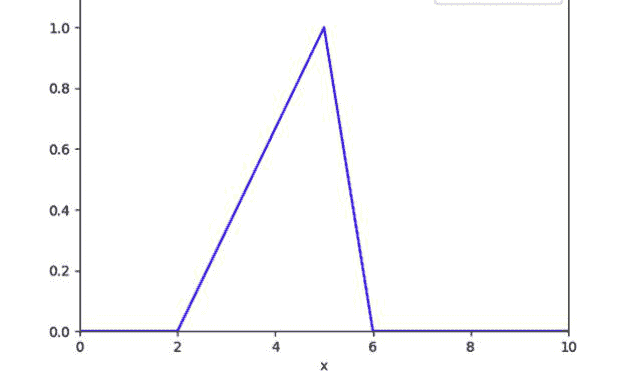

图 8.8 三角隶属函数。

## 梯形隶属函数

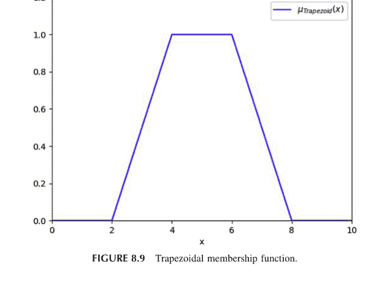

图 8.9 梯形隶属函数。

## 高斯隶属函数

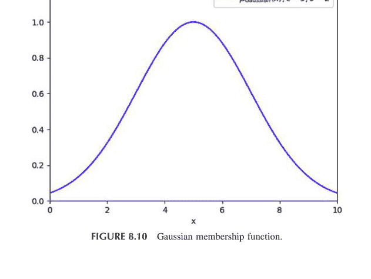

图 8.10 高斯隶属函数。

下一个隶属函数是 S 形函数，由两个参数 $[a,c]$ 表征，其函数形式如下：

$$\mu_{Sigmoidal} = \frac{1}{1 + exp(-a(x - c))}$$

S 形隶属函数的一个示例用于图 8.6 中的“年轻”和“年老”模糊集示例。

## 模糊集运算

模糊集 $A$ 的**子集**是模糊集 $B$ 的子集，($A \subset B$)，如果以下条件成立：

$$\forall x \in X, \mu_A(x) \leq \mu_B(x)$$

图 8.11 阐释了此概念。

模糊集 $A$ 的**补集**是一个模糊集 $Ac$，其隶属函数定义如下：

$$\mu_{A^c}(x) = 1 - \mu_A(x)$$

两个模糊集 $A$ 和 $B$ 的**并集**是一个模糊集 $U$，其隶属函数定义为两个集合 $A$ 和 $B$ 隶属函数值的最大值，如下所示：

$$\mu_C(x) = \max\{\mu_A(x), \mu_B(x)\}$$

模糊集 $A$ 和 $B$ 的并集示例如图 8.12 所示。

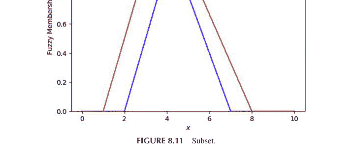

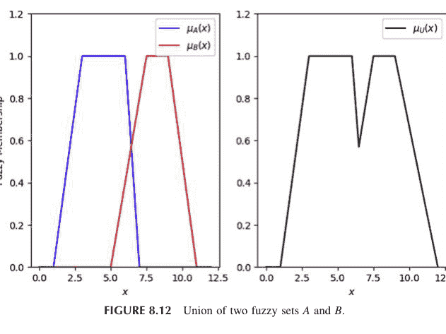

图 8.12 两个模糊集 A 和 B 的并集。

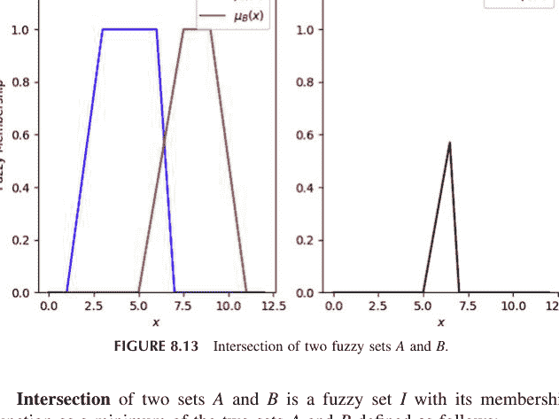

图 8.13 两个模糊集 A 和 B 的交集。

两个集合 A 和 B 的**交集**是一个模糊集 I，其隶属函数定义为两个集合 A 和 B 隶属函数值的最小值，如下所示：

$\mu_C(x) = \min\{\mu_A(x), \mu_B(x)\}$ (8.19)

两个集合 A 和 B 的交集示例如图 8.13 所示。

## 模糊推理系统

模糊推理系统是基于模糊理论的原理控制系统。该系统的主要组成部分是 (i) 模糊化，(ii) 模糊规则定义，(iii) 模糊推理，以及 (iv) 决策的去模糊化 (Himanshu & Lone, 2019)。所有这些步骤将在下一节的温度控制系统和节气门尺寸控制示例中进行说明。这四个步骤帮助我们定义一个基于使用模糊集定义和表征的语言值的逻辑框架。该系统类似于人类使用推理陈述来解决某些问题的方式。这种控制在许多工程问题中（包括油气作业）被认为很强大。执行模糊推理系统有三种方法：Mamdani、Takagi-Sugeno 和 Tsukamoto (Himanshu & Lone, 2019)。本书中，Mamdani 推理用于两个示例。模糊推理系统的一般工作流程如图 8.14 所示。

## 输入模糊化

对于 (i) 模糊化，每个输入变量 ($I_i$) 和输出变量 ($O_i$) 都在一个有意义的论域（值范围）上考虑。同时，使用该输入变量的一组语言估值。例如，对于温度，可以定义一个范围 [30, 120]，并使用两个语言变量“冷”和“热”来表征我们系统中温度的状态。作为模糊化步骤的一部分，必须为该论域中的所有变量定义一个隶属函数 ($\mu_i(x)$, $x \in I_i$)。请注意，隶属函数可以是不同的形式，例如三角形、梯形、高斯形。例如，语言值“冷”和“热”的隶属函数 $\mu_{Cold}(x)$ 和 $\mu_{Hot}(x)$ 可以如图 8.15 所示，其隶属函数定义如下：

$$\mu_{Cold}(x) = \max\left(\min\left(1, \frac{80-x}{80-60}\right), 0\right) \quad (8.20)$$

$$\mu_{Hot}(x) = \max\left(\min\left(\frac{x-60}{80-60}, 1\right), 0\right) \quad (8.21)$$

考虑一个温度控制系统，其中根据输入的温度和湿度水平控制风扇转速。为了执行

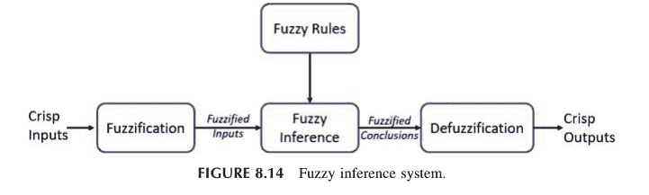

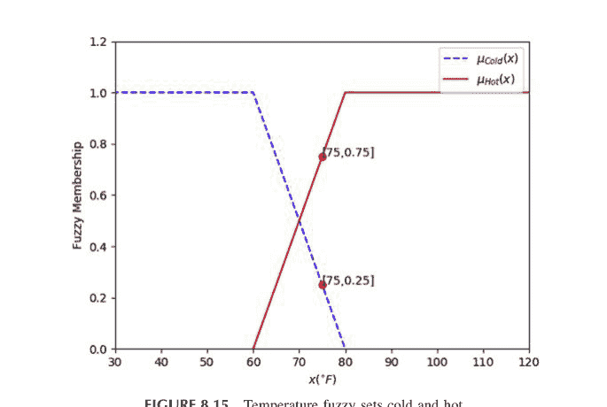

(i) 模糊化，为该系统的变量（包括输入和输出变量）定义了模糊集。隶属函数如图 8.16 所示。温度使用“冷”和“热”语言值描述，采用如上所述的梯形隶属函数。湿度使用“低”和“高”值描述，采用梯形隶属函数。风扇转速使用三个隶属函数定义，分别对应低、中、高风扇转速，采用梯形、三角形和梯形隶属函数。每个隶属函数的论域可以在图 8.16 中作为 x 轴限制观察到。

下一步是每个精确输入值 Ii 的模糊化，其中为该输入变量 Ii 定义的不同模糊集分配隶属度（0 到 1 之间的值）。例如，对于温度控制系统，假设温度值为 75°F，通过将 75 代入 μCold(x) 和 μHot(x) 可以获得模糊集“冷”和“热”的隶属值，结果分别为 0.25 和 0.75。现在这些隶属值可以在下一步 (ii) 模糊规则定义中定义的模糊规则中使用，以推导蕴含并进而做出决策。

## 模糊规则

模糊集的另一个重要组成部分是 (ii) 模糊规则定义，它们应如何解释，以及如何从中推导决策。模糊规则定义如下：

> 如果 x 是 C → y 是 D。 (8.22)

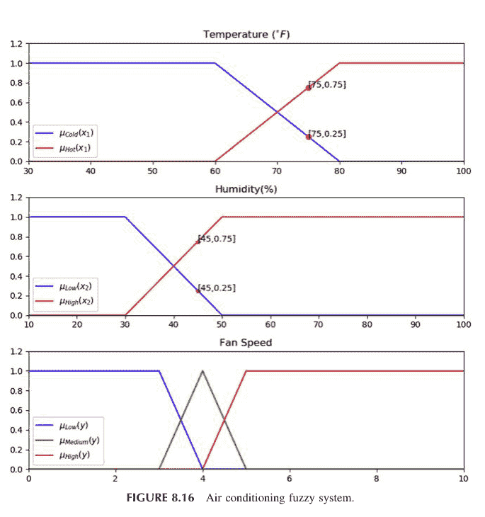

其解释为：如果输入 x 在模糊集 C 中（前提），则要做出的决策在模糊集 D 中（结论）。在此规则中，集合 C 和 D 是分别用于表征输入和输出语言变量的模糊集。第一个表达式称为前提，第二个表达式称为规则的结论。这些规则用于根据输入到模糊系统的精确输入推导结论（控制系统）。

对于一个具有 N 个输入变量 $I_1, \cdots, I_N$ 的系统，每个输入变量有 $C_1, \cdots, C_N$ 个不同的语言值，可以推导出的规则总数为 $2^{2N-1} \prod_{i=1}^{N} C_i$，其中 $2^{2N-1}$ 考虑了规则的不同组合（AND、OR）以及使用模糊集或其补集（NOT）。请注意，逻辑中的 AND 运算定义为交集，OR 运算定义为并集，NOT 定义为补集，这些在前面的章节中已定义。例如，在前面定义的具有两个输入变量（温度和湿度）的温度控制系统中。输出或控制动作是风扇转速。温度有两个语言值“冷”和“热”，湿度有“低”和“高”，风扇转速有三个语言值“低”、“中”和“高”。对于这个系统，可以推导出四条规则，如表 8.1 所示。请注意，如果考虑输入值的补集（NOT），可以定义另一组 12 条规则，使用不同模糊集的 AND 组合，总共产生 16 条规则。此外，如果使用输入值模糊集的 OR 组合，可以推导出另外 16 条规则，总共产生 $2^{2 \times 2^{-1}(2 \times 2)} = 32$ 条可能的规则。

对于此示例，温度控制系统考虑以下规则集：

- 1) 如果温度是冷 AND 湿度是低 $\rightarrow$ 风扇转速低，
- 2) 如果温度是冷 AND 湿度不是低 $\rightarrow$ 风扇转速中，
- 3) 如果温度是热 OR 湿度是高 $\rightarrow$ 风扇转速中，
- 4) 如果温度是热 AND 湿度是高 $\rightarrow$ 风扇转速高。

请注意，通常使用规则的聚合进行决策，这些规则由领域专家根据不同的输入值和相应的控制动作定义。

## 推理

为了从为系统定义的一组规则中得出结论（(iii) 推理步骤），在给定一组输入值的情况下，计算每条规则前提的强度，称为前提的“触发强度”。显示为 $\mu_{premise(i)}(x_1, x_2)$ 的规则触发强度量化了给定一组精确输入值 $x_1, x_2$ 时规则前提的强度。请注意，前提可以具有输入变量的不同组合，例如 AND、OR、NOT。计算每条规则的触发强度根据该规则中使用的模糊集运算而有所不同（参见模糊集运算部分）。例如，考虑输入值：温度表示为 $x_1 = 75^\circ F$，湿度表示为 $x_2 = 43\%$，

表 8.1 温度湿度规则空间。

| 风扇转速 | 湿度 |
| :--- | :--- |
| | AND | 低 | 高 |
| 温度 | 冷 | 低 | 中 |
| | 高 | 中 | 高 |

为我们的空调系统定义的这四条规则的计算触发强度如下：

1) 如果温度是冷且湿度是低 → 风扇速度低
$\mu_{premise(1)}(75, 43) = \min(\mu_{Cold}(75), \mu_{Low}(43)) = \min(0.25, 0.35) = 0.25$

2) 如果温度是冷且湿度不是低 → 风扇速度中
$\mu_{premise(2)}(75, 43) = \min(\mu_{Cold}(75), 1 - \mu_{Low}(43)) = \min(0.25, 0.65) = 0.25$

3) 如果温度是热或湿度是高 → 风扇速度中
$\mu_{premise(3)}(75, 43) = \max(\mu_{Hot}(75), \mu_{High}(43)) = \max(0.75, 0.65) = 0.75$

4) 如果温度是热且湿度是高 → 风扇速度高
$\mu_{premise(4)}(75, 43) = \min(\mu_{Hot}(75), \mu_{High}(43)) = \min(0.75, 0.65) = 0.65$

请注意，任何其他规则组合的触发强度可以类似地计算。此外，在此示例中，所有规则都具有非零的触发强度值，导致所有规则都处于活动状态。但是，如果某些规则的触发强度等于0，则这些规则被视为不活动，并且不会被考虑用于决策。接下来，将展示如何使用活动规则为一组规则推导模糊蕴含。

给定输入值（例如，$(x_1, x_2)$）的每个规则决策（$D_i$）的蕴含模糊集计算为计算出的触发信号 $\mu_{premise(i)}(x_1, x_2)$ 与同一规则决策的隶属函数（$\mu_{D_i}(y)$）的交集，如下所示：

$\mu_{D_i}(y) = \min\left(\mu_{premise(i)}(x_1, x_2), \mu_{D_i}(y)\right)$ (8.23)

这些蕴含模糊集可以针对所有四个规则的决策值（风扇速度）进行计算：$D_1 = \text{低}$，$D_2 = \text{中}$，$D_3 = \text{中}$，和 $D_4 = \text{高}$，如下所示：

$\mu_{D_1}(y) = \min\left(\mu_{premise(1)}(75, 43), \mu_{Low}(y)\right) = \min(0.25, \mu_{Low}(y)) = 0.25$

$\mu_{D_2}(y) = \min\left(\mu_{premise(2)}(75, 43), \mu_{Medium}(y)\right) = \min(0.25, \mu_{Medium}(y)) = 0.25$

$\mu_{D_3}(y) = \min\left(\mu_{premise(3)}(75, 43), \mu_{Medium}(y)\right) = \min(0.75, \mu_{Medium}(y)) = 0.75$

$\mu_{D_4}(y) = \min\left(\mu_{premise(4)}(75, 43), \mu_{High}(y)\right) = \min(0.65, \mu_{High}(y)) = 0.65$

你可以在图 8.16 中看到 $\mu_{Low}(y)$、$\mu_{Medium}(y)$、$\mu_{High}(y)$。蕴含模糊集 $\mu_{D_1}(y)$、$\mu_{D_2}(y)$、$\mu_{D_3}(y)$、$\mu_{D_4}(y)$ 如图 8.17 所示绘制。

接下来，所有这些蕴含模糊集必须聚合成一个模糊集以做出最终决策。为了聚合从 n 条规则蕴含的 n 个集合，必须使用所有蕴含集合的交集来推导最终决策模糊集，如下所示：

$$\mu_{Aggr}(y) = \max_{i=1}^{n} \mu_{D_i}(y) \quad (8.24)$$

温度控制示例的聚合模糊集如图 8.18 所示。

## 去模糊化

最后，在步骤 (iv) 去模糊化中，聚合模糊集必须被解释为模糊推理系统的清晰输出（控制动作）。有多种方法可以解释聚合模糊集。其中一些方法包括 (i) 重心法（质心），(ii) 最大值法（Himanshu & Lone, 2019）。请注意，这些只是一些去模糊化的示例方法，可以设计其他方法来满足系统的需求。这些方法将在此处解释并在以下示例中说明。

(i) 重心或质心去模糊化方法使用蕴含聚合模糊集下的面积，使用以下公式：

$$y = \frac{\int y \mu_{Aggr}(y) dy}{\int \mu_{Aggr}(y) dy} \quad (8.25)$$

其中 $\mu_{Aggr}(y)$ 是聚合蕴含模糊集，分母中的积分部分 $\int \mu_{Aggr}(y)$ 表示 $\mu_{Aggr}(y)$ 下方的面积。对于非平滑隶属函数，可以通过将面积划分为 N 个熟悉的形状，并计算每个部分的面积（表示为 Ai）以及每个区域的质心（表示为 yi），然后使用以下方程进行平均来计算质心：

$$y = \frac{\sum_{i}^{N} y_i A_i}{\sum_{i}^{N} A_i}$$ (8.26)

(ii) 最大值去模糊化方法基于在决策值的论域中找到从蕴含模糊集（$\mu_{Aggr}(y)$）获得的最大隶属度。选择最大值有不同的方式，例如，最大值中的第一个（FOM），最大值中的最后一个（LOF），它们分别选择给出最大隶属度值的最小和最大决策值 y。

## 模糊推理示例：节流阀调节

此示例基于 Odedele 等人的工作（Odedele & Ibrahim, 2014），该工作使用模糊逻辑推理模型来控制节流阀尺寸，从而通过考虑油管头压力、气液比（GLR）和产量的范围来控制油井产量。此示例中的控制器接收油管头压力、GLR 和产量作为输入变量，并决定是保持节流阀不变、增大节流阀尺寸还是减小节流阀尺寸（输出）。此系统的输出是关于节流阀尺寸应增加或减少多少（%）的建议。为了使用模糊推理系统对此问题建模，应采取上一节所示的步骤，如下所示：(i) 模糊化：有必要为所有输入和输出变量生成模糊隶属函数，用于将清晰输入值模糊化。(ii) 模糊规则定义：根据输入参数的不同组合定义模糊规则，以便做出适当的决策。(iii) 推理步骤聚合规则输出，最后，(iv) 执行去模糊化以获得清晰输出，从而做出相应决策。大多数模糊逻辑操作可以在 Python 中使用 "scikit-fuzzy" 或 "skfuzzy" 工具箱（[pythonhosted](https://pythonhosted.org/)）完成。为了在 Python 中使用此工具箱，有必要使用 "pip install scikit-fuzzy" 命令安装它。让我们通过定义所有变量并使用以下代码在 Python 中生成梯形隶属函数来开始解决此问题：

```python
import numpy as np
import skfuzzy as fuzz
import matplotlib.pyplot as plt
# Define universe variables
# Tubing Head pressure (x_THP) values range from 70 to 540 psi
# Gas Liquid ratio (x_GLR) values range from 0 to 27 Mscf/bbl
# Oil production rate (x_q) values range from 60 to 649 bbl/day
# Choke Adjustment values (x_choke) range from -15 to 30 percentage
# change
x_THP=np.arange(70, 541, 0.01)
x_GLR=np.arange(0, 28, 0.01)
x_q=np.arange(60, 650, 0.01)
x_choke=np.arange(-15, 30, 0.01)

# Create trapezoidal fuzzy membership functions for low, medium, and
# high linguistic variables.
THP_low=fuzz.trapmf(x_THP, [70, 70, 80, 120])
THP_med=fuzz.trapmf(x_THP, [80, 120, 230, 300])
THP_hi=fuzz.trapmf(x_THP, [230, 300, 540, 540])
GLR_low=fuzz.trapmf(x_GLR, [0, 0, 2, 4])
GLR_med=fuzz.trapmf(x_GLR, [2, 4, 7, 10])
GLR_hi=fuzz.trapmf(x_GLR, [7, 10, 27, 27])
q_low=fuzz.trapmf(x_q,[60, 60, 90, 160])
q_med=fuzz.trapmf(x_q, [90, 160, 260, 330])
q_hi=fuzz.trapmf(x_q, [260, 330, 650, 650])
choke_increase=fuzz.trapmf(x_choke,[-15, -15, -12, -9])
choke_fixed=fuzz.trapmf(x_choke, [-12, -9, 8,13])
choke_decrease=fuzz.trapmf(x_choke, [8,13, 30,30])

# Plot value ranges and the trapezoidal membership functions
fig, (ax0, ax1, ax2,ax3)=plt.subplots(nrows=4, figsize=(8, 9))
ax0.plot(x_THP, THP_low, 'b', linewidth=1.5, label='Low')
ax0.plot(x_THP, THP_med, 'g', linewidth=1.5, label='Medium')
ax0.plot(x_THP, THP_hi, 'r', linewidth=1.5, label='High')
ax0.set_title('Tubing Head Pressure')
ax0.legend()
ax1.plot(x_GLR, GLR_low, 'b', linewidth=1.5, label='Low')
ax1.plot(x_GLR, GLR_med, 'g', linewidth=1.5, label='Medium')
ax1.plot(x_GLR, GLR_hi, 'r', linewidth=1.5, label='High')
ax1.set_title('GLR')
ax1.legend()
ax2.plot(x_q, q_low, 'b', linewidth=1.5, label='Low')
ax2.plot(x_q, q_med, 'g', linewidth=1.5, label='Medium')
ax2.plot(x_q, q_hi, 'r', linewidth=1.5, label='High')
ax2.set_title('Flow Rate')
ax2.legend()
ax3.plot(x_choke, choke_increase, 'b', linewidth=1.5, label='Low')
ax3.plot(x_choke, choke_fixed, 'g', linewidth=1.5, label='Medium')
ax3.plot(x_choke, choke_decrease, 'r', linewidth=1.5, label='High')
ax3.set_title('Choke Change( %)')
ax3.legend()
# Not Showing top and right axes
for ax in (ax0, ax1, ax2,ax3):
    ax.spines['top'].set_visible(False)
    ax.spines['right'].set_visible(False)
    ax.get_xaxis().tick_bottom()
    ax.get_yaxis().tick_left()
plt.tight_layout()
Python output=Fig. 8.19
```

如图 8.19 所示，输入变量被分为低、中、高三类，使用梯形隶属函数，其范围在 Python 代码中使用 np.arange 显示。为了创建模糊隶属函数，有必要导入 "skfuzzy" 并使用 ".trapmf" 作为梯形模糊隶属函数。对于每个类别（低、中、高），需要提供四个点作为梯形的边缘来生成隶属函数。例如，当使用 "THP_med = fuzz.trapmf(x_THP, [80, 120, 230,300])" 来定义油管头压力的中等类别时，对于低于 80 psi 的 THP 值，中等隶属度为零。当 THP 从 80 psi 开始增加到 120 psi 时，中等隶属度从 0 线性增加到 1。然后，当 THP 从 120 psi 增加到 230 psi 时，中等隶属度保持为 1。最后，当 THP 从 230 psi 增加到 300 psi 时，中等隶属度从 1 减少到 0。对于节流阀尺寸的百分比，考虑了三个类别：减小节流阀（RC）、保持节流阀（无变化-NC）和增大节流阀（IC）。值得一提的是，在“无变化”场景中，也可以进行中等程度的调整。对于此控制器，节流阀尺寸最多可增加 15%，最多可减少 30%。负值表示节流阀应增大，反之亦然。为了将油井的操作条件保持在安全区域，决定节流阀尺寸增加不超过 15%。下一步是定义模糊规则，以便根据输入变量做出受控决策。例如，一条模糊规则可以是：如果油管头压力低、GLR 低且产量低，则增大节流阀尺寸。另一条规则是：如果油管头压力高、GLR 低且产量高，则减小节流阀尺寸。由于有三个输入变量，每个变量分为三类，考虑 OR 和 AND，总可能的规则数为 $2^{2\times3-1} \times 3^3 = 864$。

每个谓词的组合与非运算。本例中，考虑了表8.2所列的10条规则。

让我们考虑一组输入值：油管压力（THP）为265 psi，气液比（GLR）为20 mscf/bbl，产量为300 bbl/day。为了根据上述定义的模糊推理系统对这些精确值进行模糊化，应使用`interp_membership`命令。例如，在命令`THP_mem_med = fuzz.interp_membership(x_THP, THP_med, 265)`中，265 psi对中等类的隶属度被确定为0.5（图8.19）。用于计算每个输入参数在指定值（265 psi、20 mscf/day和300 bbl/day）下隶属度的Python代码如下。指定值对低、中、高类的隶属度值如表8.3所示。

### 表8.2 油嘴控制的模糊规则。

| 规则 | 1 | 2 | 3 | 4 | 5 | 6 | 7 | 8 | 9 | 10 |
| :--- | :--- | :--- | :--- | :--- | :--- | :--- | :--- | :--- | :--- | :--- |
| THP(psi) | 低 | 低 | 低 | 中 | 中 | 中 | 高 | 高 | 高 | 高 |
| GLR (mscf/bbl) | 低 | 中 | 高 | 低 | 中 | 高 | 低 | 中 | 高 | 低 |
| 产量(bbl/day) | 低 | 低 | 低 | 中 | 中 | 中 | 高 | 高 | 高 | 低 |
| 油嘴尺寸控制 | 增大油嘴 | 增大油嘴 | 增大油嘴 | 保持不变 | 保持不变 | 保持不变 | 减小油嘴 | 减小油嘴 | 减小油嘴 | 增大油嘴 |

### 表8.3 THP 265 psi、GLR 20 mscf/bbl和q 300 bbl/day的模糊隶属度值。

| 描述 | 值 |
|---|---|
| 265 psi对低THP的隶属度 | 0 |
| 265 psi对中THP的隶属度 | 0.5 |
| 265 psi对高THP的隶属度 | 0.5 |
| 20 mscf/bbl对低GLR的隶属度 | 0 |
| 20 mscf/bbl对中GLR的隶属度 | 0 |
| 20 mscf/bbl对高GLR的隶属度 | 1 |
| 300 bbl/day对低q的隶属度 | 0 |
| 300 bbl/day对中q的隶属度 | 0.43 |
| 300 bbl/day对高q的隶属度 | 0.57 |

```
# 激活THP 265 psi、GLR 20 mscf/day和q 300 bbl/day的模糊隶属函数
THP_mem_lo=fuzz.interp_membership(x_THP, THP_low, 265)
THP_mem_med=fuzz.interp_membership(x_THP, THP_med, 265)
THP_mem_hi=fuzz.interp_membership(x_THP, THP_hi, 265)
GLR_mem_lo=fuzz.interp_membership(x_GLR, GLR_low, 20)
GLR_mem_med=fuzz.interp_membership(x_GLR, GLR_med, 20)
GLR_mem_hi=fuzz.interp_membership(x_GLR, GLR_hi, 20)
q_mem_lo=fuzz.interp_membership(x_q, q_low, 300)
q_mem_med=fuzz.interp_membership(x_q, q_med, 300)
q_mem_hi=fuzz.interp_membership(x_q, q_hi, 300)
```

根据表8.2所示的模糊规则、表8.3所示的输入参数对每个类的隶属度，以及上一节解释的(iii)推理步骤，可以计算所有规则的激活强度。只有规则6和规则9具有非零激活强度，因此是激活的。让我们看看如何计算规则6的激活强度。规则6指出：如果THP为中等且GLR为高且q为中等，则保持油嘴尺寸或油嘴无变化（NC）。由于应用了AND运算符，应选择三个输入隶属度中的最小值来计算规则6的激活强度。最小隶属度值为0.43。该值被分配给保持油嘴尺寸类，以计算规则6的激活强度，如图8.20所示。

应执行相同的程序来计算规则9的激活强度。当计算出两个激活强度后，需要使用“max”运算符执行模糊聚合以找到整体模糊集。这些步骤在上一节中已详细解释。计算激活强度和模糊聚合的Python代码如下：

```
# 规则6的激活强度计算
# 如果THP为中等且GLR为高且q为中等，则油嘴中等
active_rule6=np.amin([THP_mem_med, GLR_mem_hi, q_mem_med])
choke_activation_6=np.fmin(active_rule6, choke_fixed)
# 规则9的激活强度计算
# 如果THP为高且GLR为高且q为高，则减小高油嘴
active_rule9=np.amin([THP_mem_hi, GLR_mem_hi, q_mem_hi])
choke_activation_9=np.fmin(active_rule9, choke_decrease)
choke0=np.zeros_like(x_choke)
#绘制规则的隶属函数
fig, ax0=plt.subplots(figsize=(8, 2))
ax0.fill_between(x_choke, choke0, choke_activation_6, facecolor='b', alpha=0.7)
ax0.plot(x_choke, choke_activation_6, 'b', linewidth=0.5, linestyle='--')
ax0.fill_between(x_choke, choke0, choke_activation_9, facecolor='r', alpha=0.7)
ax0.plot(x_choke, choke_activation_9, 'r', linewidth=0.5, linestyle='--')
ax0.set_title('输出隶属度活动')
ax0.plot(x_choke, choke_increase, 'b', linewidth=1.5, label='增大油嘴尺寸')
ax0.plot(x_choke, choke_fixed, 'g', linewidth=1.5, label='保持油嘴尺寸')
ax0.plot(x_choke, choke_decrease, 'r', linewidth=1.5, label='减小油嘴尺寸')
ax0.set_title('油嘴尺寸')
ax0.legend()
# 不显示顶部和右侧坐标轴
for ax in (ax0,):
    ax.spines['top'].set_visible(False)
    ax.spines['right'].set_visible(False)
    ax.get_xaxis().tick_bottom()
    ax.get_yaxis().tick_left()
plt.tight_layout()
```

图8.20 规则6的激活强度。

图8.21 使用max运算符聚合规则6和规则9。

```
# 将两个输出隶属函数或激活强度聚合在一起
aggregated=np.fmax(choke_activation_6, choke_activation_9)
Python输出=图8.21
```

此问题的最后一步是计算步骤(iv)解模糊中的油嘴控制决策，这有助于得出油嘴变化百分比（决策变量）的精确值。这可以使用`defuzz`命令并指定聚合的激活强度和解模糊算法来完成。本例中，使用“重心法”进行解模糊（在defuzz命令中使用centroid关键字表示重心法解模糊）。解模糊及Python中的结果可通过以下代码找到：

```
# 使用重心法计算解模糊结果
choke=fuzz.defuzz(x_choke, aggregated, 'centroid')
choke_activation=fuzz.interp_membership(x_choke, aggregated, choke)
# 绘制结果
fig, ax0=plt.subplots(figsize=(8, 3))
ax0.plot(x_choke, choke_increase, 'b', linewidth=0.5, linestyle='--')
ax0.plot(x_choke, choke_fixed, 'g', linewidth=0.5, linestyle='--')
ax0.plot(x_choke, choke_decrease, 'r', linewidth=0.5, linestyle='--')
ax0.fill_between(x_choke, choke0, aggregated, facecolor='Orange', alpha=0.7)
ax0.plot([choke, choke], [0, choke_activation], 'k', linewidth=1.5, alpha=0.9)
ax0.set_title('聚合隶属度与结果（线）')
# 不显示顶部和右侧坐标轴
for ax in (ax0,):
    ax.spines['top'].set_visible(False)
    ax.spines['right'].set_visible(False)
    ax.get_xaxis().tick_bottom()
    ax.get_yaxis().tick_left()
plt.tight_layout()
print (choke)
Python输出=图8.22
```

图8.22 聚合模糊集的解模糊。

根据模糊控制系统决策，考虑到油管压力（265 psi）、气液比（20 mscf/bbl）和油流量（300 bbl/day）的输入变量，需要将油嘴减小10.1%。此问题已逐步解决，以展示模糊推理系统的工作原理。此问题也可以使用`skfuzzy control`包来处理，该包适用于模糊系统设计。使用控制包解决油嘴控制问题的Python代码如下：

```
import numpy as np
import skfuzzy
from skfuzzy import control
# 定义模糊控制系统的输入变量
THP=control.Antecedent(np.arange(70, 541, 1), 'THP')
GLR=control.Antecedent(np.arange(0, 28, 1), 'GLR')
q=control.Antecedent(np.arange(60, 650, 1), 'q')
choke=control.Consequent(np.arange(-15,30,0.01), 'choke')
# 创建梯形模糊隶属函数
THP['low']=skfuzzy.trapmf(THP.universe, [70, 70, 80, 120])
THP['med']=skfuzzy.trapmf(THP.universe, [80, 120, 230, 300])
THP['hi']=skfuzzy.trapmf(THP.universe, [230, 300, 540, 540])
GLR['low']=skfuzzy.trapmf(GLR.universe, [0, 0, 2, 4])
GLR['med']=skfuzzy.trapmf(GLR.universe, [2, 4, 7, 10])
GLR['hi']=skfuzzy.trapmf(GLR.universe, [7, 10, 27, 27])
q['low']=skfuzzy.trapmf(q.universe,[60, 60, 90, 160])
q['med']=skfuzzy.trapmf(q.universe, [90, 160, 260, 330])
q['hi']=skfuzzy.trapmf(q.universe, [260, 330, 650, 650])
choke['IC']=skfuzzy.trapmf(choke.universe,[-15, -15, -12, -9])
choke['NC']=skfuzzy.trapmf(choke.universe, [-12, -9, 8, 13])
choke['RC']=skfuzzy.trapmf(choke.universe, [8,13, 30, 30])
# 绘制油嘴隶属函数
choke.view()
```

Python输出=图8.23

解决此问题需要导入`skfuzzy`和来自skfuzzy的control API。使用`control.Antecedent`来定义输入变量（THP、GLR、以及 q) 及其在模糊推理系统中的范围。使用 "Control.Consequent" 来定义模糊控制决策（即节流阀调整百分比）的范围。然后，为每个输入变量分配了梯形模糊隶属函数（`skfuzzy.trapmf`）。每个隶属函数的图可以通过 ".view" 函数创建。节流阀隶属函数和模糊类别如图 8.23 所示。下一步是定义模糊规则并将其应用于控制系统。为了进行三维可视化并显示输入数据的所有范围，在表 8.2 中先前定义的规则基础上增加了七条规则。这可以通过以下 Python 代码实现：

```python
# 在模糊控制系统中定义规则，将输入连接到节流阀控制决策
rule1=control.Rule(THP['low'] & GLR['low'] & q['low'], choke['IC'])
rule2=control.Rule(THP['low'] & GLR['med'] & q['low'], choke['IC'])
rule3=control.Rule(THP['low'] & GLR['hi'] & q['low'], choke['IC'])
rule4=control.Rule(THP['med'] & GLR['low'] & q['med'], choke['NC'])
rule5=control.Rule(THP['med'] & GLR['med'] & q['med'], choke['NC'])
rule6=control.Rule(THP['med'] & GLR['hi'] & q['med'], choke['NC'])
rule7=control.Rule(THP['hi'] & GLR['low'] & q['hi'], choke['RC'])
rule8=control.Rule(THP['hi'] & GLR['med'] & q['hi'], choke['RC'])
rule9=control.Rule(THP['hi'] & GLR['hi'] & q['hi'], choke['RC'])
rule10=control.Rule(THP['hi'] & GLR['low'] & q['low'], choke['IC'])
# 用于三维绘图的附加规则
rule11=control.Rule(THP['low'] & GLR['hi'] & q['hi'], choke['NC'])
rule12=control.Rule(THP['med'] & GLR['med'] & q['low'], choke['IC'])
rule13=control.Rule(THP['hi'] & GLR['med'] & q['low'], choke['NC'])
rule14=control.Rule(THP['hi'] & GLR['med'] & q['low'], choke['NC'])
rule15=control.Rule(THP['med'] & GLR['med'] & q['hi'], choke['RC'])
rule16=control.Rule(THP['low'] & GLR['med'] & q['med'], choke['IC'])
rule17=control.Rule(THP['low'] & GLR['med'] & q['hi'], choke['NC'])
# 定义具有10条规则的模糊控制系统基础类
choke_control=control.ControlSystem([rule1, rule2, rule3, rule4,
    rule5, rule6, rule7, rule8, rule9, rule10,rule11,rule12,rule13,rule14,
    rule15,rule16,rule17])
# 从控制系统计算结果
choking=control.ControlSystemSimulation(choke_control)
# 使用输入向控制系统提供输入
choking.input['THP']=265
choking.input['GLR']=20
choking.input['q']=300
# 计算模糊系统的结果
choking.compute()
print (choking.output['choke'])
# 绘制规则和最终决策
choke.view(sim=choking)
```

Python 输出=图 8.24

410 使用Python的油气机器学习指南

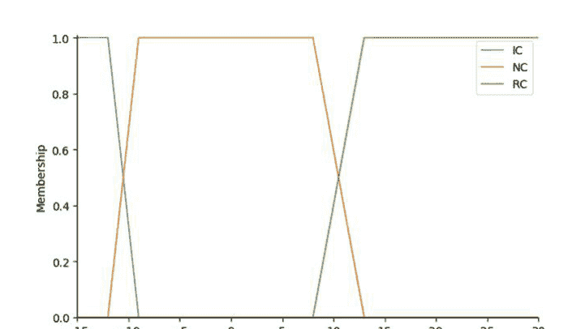

图 8.23 节流阀梯形隶属函数。

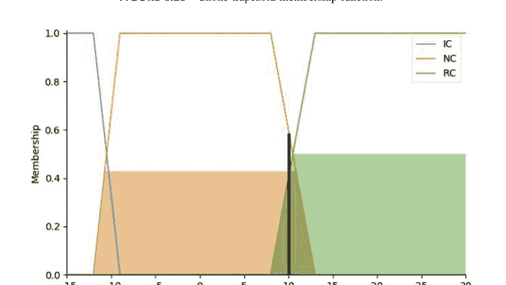

图 8.24 聚合模糊集去模糊化的最终结果。

每条规则都使用 `control.Rule` 定义。然后，通过使用 "control.ControlSystem" 函数考虑所有10条规则来创建控制系统。为了模拟系统中的所有规则并应用控制器，使用了 "control.ControlSystemSimulation"。最后，使用 ".input" 确定输入参数，并通过 ".compute" 函数确定节流阀控制决策。节流阀尺寸的去模糊化输出为10.1，解释为将节流阀减小10.1%。

为了查看不同输入值的决策值，接下来可以编写一个油管头压力（THP）、流量（q）和固定气液比（GLR）为5 mscf/bbl的三维图代码如下：

```python
n=50
THP_highres=np.linspace(70, 540, n+1)
q_highres=np.linspace(60, 640, n+1)
x, y=np.meshgrid(THP_highres, q_highres)
z=np.zeros_like(x)
# 循环遍历输入值以计算相应的控制值
for i in range(n+1):
    for j in range(n+1):
        choking.input['THP']=x[i, j]
        choking.input['GLR']=5
        choking.input['q']=y[i, j]
        choking.compute()
        z[i, j]=choking.output['choke']
# 绘制三维图
import matplotlib.pyplot as plt
from mpl_toolkits.mplot3d import Axes3D
fig=plt.figure(figsize=(8, 10))
ax=fig.add_subplot(111, projection='3d')
surf=ax.plot_surface(x, y, z, cmap='YlGnBu', linewidth=0.5)
fig.colorbar(surf, ax=ax, shrink=0.3, aspect=5)
ax.set_xlabel('THP (psi)')
ax.set_ylabel('q (bbl/d)')
ax.set_zlabel('Choke Adjustment (-%)')
Python 输出=图 8.25
```

图 8.25 中的三维图显示了在气液比恒定的情况下，当流量和油管头压力在其范围内变化时，应采取何种控制动作来改变节流阀。对于流量低于300桶/天且油管头压力低于250 psi的条件，节流阀应最多增加10%。对于流量高于300桶/天且油管头压力高于250 psi的条件，节流阀尺寸应最多减小20%。

## 模糊C均值聚类

在属于无监督学习范畴的聚类问题中，目标是将数据集划分为若干类别，使得每个类别中的样本彼此相似，而与其他类别中的样本相比差异较大。第4章讨论了不同的聚类技术。本节将解释模糊逻辑在无监督聚类问题中的应用。为了了解模糊逻辑如何在聚类算法中使用，让我们快速回顾一下第4章的K均值聚类。

412 使用Python的油气机器学习指南

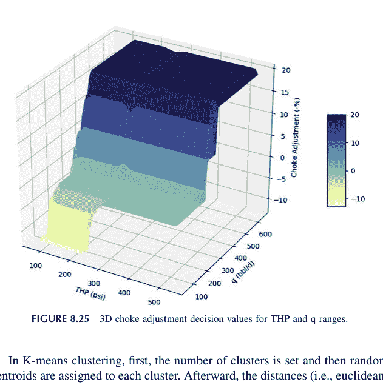

图 8.25 THP和q范围的三维节流阀调整决策值。

在K均值聚类中，首先设定聚类数量，然后为每个聚类分配随机质心。之后，计算数据点与质心之间的距离（即欧几里得距离）。根据数据点到类别质心的最小距离，将其分配到各个类别。计算每个类别的新质心，然后根据新计算的到每个类别质心的距离，将数据点重新分配到各个类别。这些步骤（计算新质心、计算距离、将数据重新分配到各个类别）重复进行，直到质心与上一步相同（收敛）。在这种技术中，每个数据点仅根据其到类别质心的最小距离属于一个类别。在模糊聚类（也称为“模糊c均值”聚类）中，通过计算每个数据点到类别中心的隶属度，每个数据点可以属于多个类别。

为了理解模糊c均值聚类的工作原理，假设 $X = \{x_1, x_2, \cdots, x_n\}$ 是数据集空间。每个数据点有m个属性，因此 $x_i$ 可以定义为一个属性向量 $x_i = (x_{i1}, x_{i2}, \cdots, x_{im})$。该空间是m维的。因此，$x_{ij}$ 可以视为第 $i$ 个数据点的第 $j$ 个属性。假设数据集中有c个聚类，因此聚类集合定义为 $C = \{C_1, C_2, \cdots, C_c\}$。对于C空间中的每个聚类，确定一个属于V空间的质心v，V空间定义为 $V = \{v_1, v_2, \cdots, v_c\}$。由于数据集是m维的，每个质心有m个属性，即 $v_i = (v_{i1}, v_{i2}, \cdots, v_{im})$。对于每个数据点，可以使用公式 (8.28) 确定其对每个类别的隶属度（$u_{ik}$）。由于有n个数据点和c个聚类，形成一个模糊划分矩阵 $U = (u_{ik})_{(n \times c)}$，其中 $u_{ik}$ 是第 $i^{th}$ 个数据点对第 $k^{th}$ 个聚类的隶属度，且 $\sum_{k=1}^{c} u_{ik} = 1$。模糊c均值聚类算法的最终目标是最小化目标函数 $J_h(U, V)$，该函数是每个数据点到每个类别质心的加权距离的二次和（Ren et al., 2016）：

$$J_h(U, V) = \sum_{k=1}^{c} \sum_{i=1}^{n} u_{ik}^f d_{ik}^2 \quad (8.27)$$

在公式 (8.27) 中，$d_{ik}$ 是第 $ith$ 个数据点与第 $kth$ 个类别质心之间的欧几里得距离，f 是类别模糊指数。随着f的增加，预期会看到更模糊的隶属度。通常，f应在1.5–2.5的范围内，通常假设为2。模糊c均值聚类是一个迭代过程，从随机初始化隶属度开始，更新质心和隶属度，直到满足目标函数的最小化标准。在每次迭代中，使用公式 (8.28) 和 (8.29) 计算并更新隶属度值（$u_{ik}$）和质心（$v_k$）：

$$u_{ik} = \frac{1}{\sum_{j=1}^{c} \left( \frac{d_{ik}}{d_{jk}} \right)^{2/(f-1)}} \quad (8.28)$$

$$v_k = \frac{\sum_{i=1}^{n} u_{ik}^f x_i}{\sum_{i=1}^{n} u_{ik}^f} \quad (8.29)$$

模糊c均值聚类算法通过以下步骤的迭代过程工作：

1.  初始化类别数量（c）、模糊指数（f）、最大迭代次数（$I_{max}$）和误差阈值（e）。
2.  随机初始化模糊隶属度矩阵 $U^{(0)}$。
3.  在步骤t，通过公式 (8.29) 确定类别质心（$V^{(t)}$）。
4.  通过公式 (8.27) 计算目标函数（$J_h^t$）。如果 $J_h^t - J_h^{t-1} < e$ 且 t 小于最大迭代次数（Imax），则停止算法；否则，重复步骤2、3和4。

模糊c均值聚类是一种计算成本低、运行速度快的简单算法。然而，与其他聚类技术类似，它可能受到以下事实的影响：模糊隶属度矩阵的初始化、聚类数量的初始化、噪声和异常值的存在可能会影响最终结果。

在以下示例中，将使用模糊C均值聚类为孔隙度-渗透率数据集确定多个聚类。该合成数据集包含120个样本，其孔隙度和渗透率值来自岩心数据。目标是基于具有两个属性的样本来定义不同的岩石类型。通常，在岩石类型聚类问题中，样本具有许多属性。当属性数量超过2时，难以可视化不同类别与多个属性之间的关系。为了区分和可视化所有类别与多个属性的关系，本示例使用了具有两个属性的样本。同样值得一提的是，通常渗透率与孔隙度之间存在对数趋势。因此，渗透率值应使用对数刻度。由于孔隙度和渗透率值处于不同的范围，数据集也应缩放到0-1的范围。使用模糊C均值聚类对孔隙度-渗透率数据进行岩石类型分类，可通过以下Python代码实现：https://www.elsevier.com/books-and-journals/book-companion/9780128219294

```python
import pandas as pd
import numpy as np
import matplotlib.pyplot as plt
import skfuzzy
import math
#Specify colors for different classes
colors=['b', 'grey', 'g', 'r', 'c', 'm', 'y', 'k', 'lime', 'purple']
#import Dataset and change permeability to log-scale
dataset = pd.read_csv(
'Chapter8_Fuzzy_Clustering_Porosity_Permeability.CSV')
ds_log=pd.DataFrame.copy(dataset)
ds_log['Permeability']=ds_log['Permeability'].apply(math.log10)
# Scale the data from 0 to 1
from sklearn.preprocessing import MinMaxScaler
scaler=MinMaxScaler()
scaler.fit(ds_log)
ds_log_scaled=scaler.transform(ds_log)
#Transpose Scaled data for Fuzzy Cluster Algorithm
ds_log_scaled=ds_log_scaled.T
#Plot permeability vs porosity
plt.figure()
plt.plot(dataset['Porosity'],dataset['Permeability'],'ro')
plt.xlabel('Porosity(%)')
plt.ylabel('Permeability(md)')
#Plot permeability vs porosity with scaled data
plt.figure()
plt.plot(ds_log_scaled[0,:],ds_log_scaled[1,:],'ro')
plt.xlabel('Porosity')
plt.ylabel('Permeability')
```

Python输出=图8.26

在图8.26中，展示了渗透率在进行对数缩放以及数据缩放到0-1范围之前和之后的渗透率与孔隙度值。为了运行模糊C均值聚类算法，需要从skfuzzy库中调用"skfuzzy.cluster.cmeans"。将使用多个for循环，通过改变质心数量、训练算法和可视化结果，将聚类数量从2变化到9。以下Python代码执行模糊C均值聚类和可视化：

```python
# Defining loops for Fuzzy C-means clustering and visualization with 8 #plots
import numpy as np
seed=50
np.random.seed(seed)
fig1, axes1=plt.subplots(2, 4, figsize=(12, 8))
fig1.suptitle('Fuzzy c-means clustering for Log scaled data')
fpcs=[]
n=2
for ax in axes1.reshape(-1):
    cntr, u, u0, d, jm, p, fpc=skfuzzy.cluster.cmeans(ds_log_scaled, n, 1.5, error=0.001, maxiter=500,init=None)
```

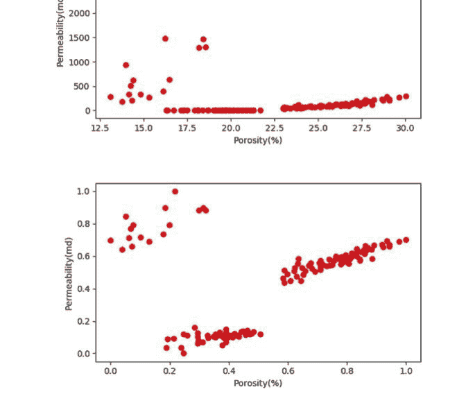

图8.26 渗透率与孔隙度值（底部图显示缩放后的数据）。

416 使用Python的油气机器学习指南

```python
# Plotting defined classes, for each data point in the data set
cluster_membership=np.argmax(u, axis=0)
for i in range(n):
    ax.plot(ds_log_scaled[0,:][cluster_membership==i],
            ds_log_scaled[1,:][cluster_membership==i], '.',
            color=colors[i])
    # Mark the centroid for each class
for x in cntr:
    ax.plot(x[0], x[1], 'r*')
ax.set_title('Centers={0}; FPC={1:.2f}'.format(n, fpc))
# Fuzzy partition coefficient storing
fpcs.append(fpc)
n = n + 1
```

Python输出=图8.27

在此示例中，类别数量（n）从2变化到9。对于每个类别数量值，使用skfuzzy.cluster.cmean对"ds_log_scaled"数据集进行分类，类别模糊指数为1.5，误差阈值（作为停止标准）为0.001，最大迭代次数为500。如果误差（即两次连续迭代之间目标函数的差值）低于0.001或迭代次数达到500，算法将停止。当算法停止时，在每个类别数量下，它会返回几个模糊C均值聚类参数。"Cntr"是一个二维数组，包含每个类别的质心坐标。"u"是最终的模糊划分矩阵（二维数组），显示每个数据点对每个聚类的隶属度。"u0"是模糊划分矩阵的初始随机猜测。"d"是一个矩阵（二维数组），包含每个数据点到类别质心的最终欧几里得距离。"p"是迭代次数。最后，"fcp"是一个非常重要的参数，是模糊划分系数，范围从0到1，代表评估模糊聚类算法性能的有效性指标（Bezdek, 2013）。FCP值越高，表示聚类质量越好。FCP通过以下公式计算：

$$FCP = \frac{1}{N} \sum_{k=1}^{N} \sum_{i=1}^{c} u_{ik}^2$$ (8.30)

在图8.27中，孔隙度-渗透率数据集从2个类别聚类到9个类别。每个类别用不同的颜色显示，质心用红色星号表示。对于每个类别数量，FCP显示在图的顶部。在这些示例中，基于孔隙度和渗透率对岩石进行分组的最佳类别数量是3，这也由最高的FCP值0.99表示。为了找到最佳类别数量，也可以绘制模糊划分系数与类别数量的关系图，并找到最大值。这可以通过以下Python代码实现：

# 对数缩放数据的模糊C均值聚类

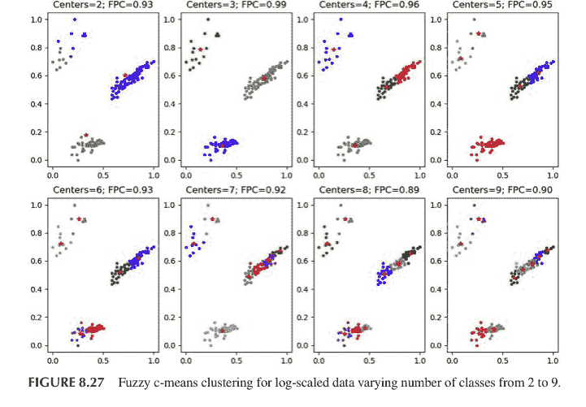

图8.27 对数缩放数据的模糊C均值聚类，类别数量从2变化到9。

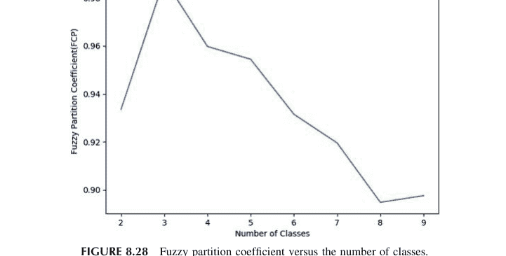

图8.28 模糊划分系数与类别数量的关系。

```python
#Plot fuzzy partition coefficient vs number of classes
plt.plot(np.arange(2,10), fpcs)
plt.xlabel("Number of Classes")
plt.ylabel("Fuzzy Partition Coefficient(FCP)")
Python输出=图8.28
```

如图8.28所示，当类别数量从2增加到3时，模糊划分系数也达到最大值0.99。当类别数量增加到大于3的值时，模糊划分系数开始下降。这意味着，基于这个特定的孔隙度/渗透率数据集，最佳类别数量或岩石类型数量是3。

## 参考文献

Ahmed, S.,A., Elkatatny, S., Ali, A. Z., Mahmoud, M., & Abdulraheem, A. (2019年3月22日). 使用模糊逻辑预测页岩地层中的机械钻速。见 *国际石油技术会议*。 https://doi.org/10.2523/IPTC-19548-MS.

Aminzadeh, F., & Brouwer, F. (2006年1月1日). *整合神经网络和模糊逻辑以改进储层性质预测和前景排名*。勘探地球物理学家学会。

Bezdek, J. C. (2013). *基于模糊目标函数算法的模式识别*。美国：Springer US。

Gholami, V., & Mohaghegh, S. D. (2009年1月1日). *静态和动态储层性质的智能放大*。石油工程师学会。 https://doi.org/10.2118/124477-MS.

Himanshu, S., & Lone, Y. A. (2019年11月30日). *使用Python的深度神经模糊系统：来自工业的案例研究和应用*（第1版）。Apress, 978-1-4842-5360.

Kosko, Bart (1994年6月1日). *模糊思维：模糊逻辑的新科学*。Hyperion。再版。ISBN-10: 078688021X.

Mohaghegh, S. (2000年11月1日). *石油工程中的虚拟智能应用：第3部分——模糊逻辑*。石油工程师学会。 https://doi.org/10.2118/62415-JP.

Mohaghegh, S. D. (2017年8月7日). 使用人工智能（AI）绘制Utica页岩中的天然裂缝网络。见 *非常规资源技术会议*。 https://doi.org/10.15530/URTEC-2017-2669739.

Odedele, T., & Ibrahim, H. D. (2014年7月2–4日). 使用模糊逻辑推理模型的油井性能诊断系统。见 *2014年世界工程大会论文集*（第I卷）。英国伦敦：WCE 2014。 https://pythonhosted.org/scikit-fuzzy/.

Rajasekaran, S., & Pai, G. A. Vijayalakshmi (2013年6月16日). *神经网络、模糊逻辑和遗传算法：综合与应用*。PHI Learning Private Limited, ISBN 978-81-203-2186-1.

Ren, M., Liu, P., Wang, Z., & Yi, J. (2016). 一种用于确定最佳聚类数量的自适应模糊C均值算法。*计算智能与神经科学*, 2016, 12. https://doi.org/10.1155/2016/2647389.

Rivera, V. P. (1994年1月1日). *模糊逻辑控制压裂液表征设施中的压力*。石油工程师学会。 https://doi.org/10.2118/28239-MS.

Sari, M. (2016年1月1日). 使用模糊推理系统估算岩体强度。见 *国际岩石力学与岩石工程学会*。

Widarsono, B., Atmoko, H., Yuwono, I. P., Saptono, F., Tunggal, & Ridwan. (2005年1月1日). *模糊逻辑在确定合采井产量分配中的应用*。石油工程师学会。 https://doi.org/10.2118/93275-MS.

Xiong, H., & Holditch, S. A. (1995年1月1日). *模糊逻辑在油井增产处理设计中的应用研究*。石油工程师学会。 https://doi.org/10.2118/27672-PA.

Zadeh, Lotfi A. (1965年1月6日). 模糊集合。*信息与控制*, 8(3), 338–353.

# 第9章

## 进化优化

优化是大多数油气相关问题的最终且最重要的步骤。优化可以定义为选择一组属性以实现流程的最佳结果。简单来说，优化是在合理范围内选择输入值，以最大化或最小化目标函数。油气行业中一些著名的优化示例包括：最大化采收率、最大化项目的净现值（NPV）、最小化被称为CAPEX的资本支出、最小化产水量、最大化碳氢化合物产量、最小化环境足迹、最小化模型误差（历史拟合）等。这些最大化/最小化过程可以通过优化某些问题来实现，例如井距、完井设计、注入速率和油管尺寸选择。请注意，前面章节涵盖的一些机器学习技术实际上就是优化问题。在聚类问题中，目标是找到最佳类别数量以区分数据中的非均质性。在神经网络中，目标是优化权重以最小化模型误差（目标值与预测值之间的差异）。所有这些例子都表明了优化过程的重要性。

优化算法主要分为“确定性”和“随机性”两类。确定性优化处理那些可以用稳健的数学公式建模为目标函数的问题。通过使用一些线性/非线性编程，可以改变自变量并研究它们对目标函数的影响，从而向最优点（最小值/最大值）移动。如果使用导数优化算法（例如第6章解释的梯度下降法），则最优解是确定性的。由于目标函数的结果和优化算法中都没有随机性，因此如果重复多次优化过程，最终的优化结果不会改变。然而，如果目标函数（即蒙特卡洛模拟）或优化算法中存在随机变量，则该优化过程被认为是随机的。随机优化方法的一些例子包括模拟退火、交叉熵法、随机搜索、群算法和进化算法。

本章将讨论两种随机优化技术：遗传算法和粒子群算法。将为每种方法提供简要理论，并附带油气相关的Python示例。

## 遗传算法

20世纪中叶，计算机科学家开始向大自然学习，特别是自然进化，以处理那些需要在大量备选方案中进行广泛搜索的具有挑战性的优化问题。遗传算法由Rechenberg提出，并由John Holland在1960-70年代发展（Rajasekaran & Pai, 2013），主要基于达尔文的“适者生存”进化论。适者生存与这样的观点相关：在生存方面最成功的生物是那些最能适应其环境的生物。在一个生物种群中，父母产生后代。最适应的后代存活下来，然后成为父母，这个过程通过选择、交叉、变异和遗传不断延续。1990年代，John Koza引入了“遗传编程”，它利用遗传算法来寻找解决任务的最佳计算机程序（Mohaghegh, 2000）。遗传算法模拟了自然选择的过程。因此，需要有一个解决方案/生物的种群，在生物学中被称为染色体。每条染色体由基因组成，基因可以是二进制值、数字、符号或字符。接下来，需要通过目标函数评估每个解决方案/染色体的适应度。适应度值较高的染色体经历一个交配过程，涉及基因的交叉和变异，产生新的染色体（后代）。适应度较高的新染色体被选中进行交配过程并产生新一代的概率更高。最适应的染色体，即优化问题的解决方案，将在几次迭代（代）后找到。

遗传算法是一种流行的优化器，其优点包括无需进行任何导数计算。它还可以处理连续和离散函数，并在具有大量参数的大型搜索空间中工作。然而，由于它是一个随机过程，解决方案可能具有不确定性且不可重复（tutorialspoint）。

遗传算法在油气行业已有多种应用。遗传算法在油气行业的首次应用是由Goldberg等人在其博士工作中开发的，该工作由John Holland指导（Goldberg, 1983）。在他的工作中，提出了一种学习分类器系统（LCS），通过接收一些输入变量（如入口/出口压力和流量、一天中的时间、一年中的时间、压力变化率和温度）来优化天然气管道性能。LCS的决策是选择最佳流量或检测天然气泄漏。Mohaghegh等人展示了如何使用混合神经遗传方法来优化俄亥俄州东北部Clinton砂岩的重复压裂作业的水力压裂设计（Mohaghegh, 2000）。他使用神经网络根据一些重要的完井属性来预测井的压裂后产能。然后，他利用神经网络作为遗传算法的适应度函数，以找到获得最高压裂后产能的最佳完井参数组合。Jefferys使用遗传算法，通过搜索具有不同轴向载荷和径向压力的各种结构设计，来最小化海上结构柱的重量（Jefferys, 1993）。Martinez等人展示了如何实施遗传算法来优化使用气举作业的油井的石油产量。这项工作的目标是在考虑有限天然气供应的情况下，为油田中的每口井分配最佳气量（Martinez et al., 1994）。Sarich使用遗传算法来优化投资决策。在这项工作中，目标是在30,000,000美元的资本预算约束下，从30口潜在井中选择最佳钻井数量，并最大化NPV（Sarich, 2001）。Emrick等人使用遗传算法来优化具有某些非线性约束的井位。他们使用数值模拟器作为适应度评估器，以找到优化的生产井/注入井的数量、位置和轨迹，从而实现NPV最大化（Emerick et al., 2009）。Morales等人将遗传算法应用于凝析气藏，使用非均质油藏模拟模型进行井位优化。他们得出了能够最大化累计产气量的最佳井坐标（x,y,z）和方向（Morales et al., 2010）。遗传算法在油气行业的另一个应用与Chaari等人的工作有关，他们使用集成的神经网络和遗传算法来模拟管道中的两相压降（Chaari et al., 2020）。他们使用遗传算法来找到最佳数量的输入参数，以训练神经网络，从而以最高精度（最小误差）预测管道中的压降。遗传算法还用于油气行业的许多其他应用，例如岩石物理学（Fang et al., 1992）、地震反演（Salamanca et al., 2017）、蒸汽注入优化（Bybee, 2005）和油藏表征（Romero et al., 2000）。

## 遗传算法工作流程

为了理解遗传算法的工作流程，有必要回顾一些相关术语。“种群”是待优化问题的所有解决方案的空间。“染色体”实际上是问题的一个解决方案。“基因”是每条染色体的构建块。在计算机二进制语言中，0和1被分配给基因的值，称为“等位基因”。在现实世界的种群空间中，解决方案不是二进制格式的。为了计算方便，最好通过“编码”过程将解决方案空间转换为二进制系统空间，这称为“基因型”。“适应度”评估器通常是一个数学函数或目标函数，应通过优化过程最大化或最小化。过程（适应度评估器在某些情况下可能与目标函数不同）。适应度评估器决定了种群空间中解的优劣程度。图9.1展示了“基因型”及其组成部分的示意图：

遗传算法包含以下步骤，并重复执行直到满足某个终止条件：(i) “种群初始化”，(ii) “适应度计算”，(iii) “父代选择”，(iv) “交叉操作”，以及 (v) “变异”。这些步骤的示意图见图9.2。接下来，将解释这些步骤，并通过一个最大化示例说明其Python实现。以下代码包含该示例的初始变量设置。

```
#Variables Initialization
import random
import numpy as np
import matplotlib.pyplot as plt
from mpl_toolkits.mplot3d import axes3d
seed=11
random.seed(seed)
up_limit, low_limit=30, -30
```

遗传算法的第一步是 (i) “种群初始化”。初始解空间的特征（解的数量和染色体大小）应选择得足够多样化，以覆盖解的各种组合。较大的种群规模需要较高的计算能力，而较小的规模则会降低交配和后代质量。初始种群的规模可以作为一个调节参数来提升遗传算法的性能。通常，随机初始化最常用于生成初始种群；该方法的Python代码如下所示。然而，在某些情况下，会使用启发式初始化，即在随机初始化的种群中注入一些基于问题先验知识的良好解，以改善算法向最优解的收敛性。

```
#Population Initialization
# Define the Method to Generate a population by choosing samples
#uniformly at random from the range specified
def gen_sample_population(size, x_limits, y_limits):
    x_low, x_up=x_limits
    y_low, y_up=y_limits
    population=np.zeros((size,2))
    for i in range(size):
        population[i,0]=random.uniform(x_low,
                                       x_up)
        population[i,1]=random.uniform(y_low,
                                       y_up)
    return population
# Producing a population
population=gen_sample_population(size=50,
                                 x_limits=(low_limit, up_limit),
                                 y_limits=(low_limit, up_limit))
# Plot the individual pairs in a sample generation
fig, ax0=plt.subplots(1,1)
ax0.set_title('A Sample Generation')
ax0.set_xlabel('X')
ax0.set_ylabel('Y')
ax0.plot(population[:,0],population[:,1],'ro')
Python output=Fig. 9.3
```

在此代码中，定义了一个名为 `gen_sample_population` 的方法，它通过从均匀分布（`random.uniform`）中抽取随机数，生成一个大小为50的样本种群，X和Y的范围分别作为元组 `x_limits` 和 `y_limits` 传入。为了获得可重复的结果，应使用 `random.seed(seed)` 方法将随机数种子固定为11。该样本种群的绘图如图9.3所示。

请注意，种群环境或模型可以是 (a) 稳态（增量式）或 (b) 代际式。在稳态模型中，少量后代会替换相同数量的父代。在代际种群中，后代的数量等于种群规模。换句话说，后代会替换所有前代或父代。

遗传算法在种群初始化之后的下一步是 (ii) “适应度计算”，其中每个解的质量通过“适应度函数”来计算。该函数接收解作为输入，并返回一个输出，表示该解对于优化问题的适应程度或合适程度。通过使用适应度函数，可以比较种群中所有解的质量，并确定哪些解是最优的。在许多情况下，适应度函数可以与目标函数相同。以下代码定义了一个简单的适应度函数，其形式为 `f(x,y)=5−(x²+y²)`，具有一个全局最大值，并绘制了该函数。

```
#Fitness Function
# defining the fitness function which is f(x,y)=5-(x^2+y^2)
def function(point):
    return (5-(point[0] ** 2+point[1] ** 2))
#plot the fitness function
from mpl_toolkits.mplot3d import Axes3D
n=50
# linspace returns n equally spaced values over the interval low_limit
#to up_limit
x_vals=np.linspace(low_limit, up_limit, n+1)
y_vals=np.linspace(low_limit, up_limit, n+1)
# meshgrid returns the coordinate matrices by combining all the
#combinations of x_vals and y_vals and creates an n*n x and y spaces
x, y=np.meshgrid(x_vals, y_vals)
z=np.zeros_like(x)
# two nested loops to iterate over all 50 * 50 space for x and y values
for i in range(n+1):
    for j in range(n+1):
        z[i,j]=function([x[i,j], y[i,j]])
#Plot the 3D plot
fig=plt.figure()
#adding 3d projection for the plot
ax0=fig.add_subplot(111,projection='3d')
surf=ax0.plot_surface(x, y, z, rstride=1, cstride=1, cmap='viridis',
linewidth=0, antialiased=False)
#r'' will allow for adding latex code in the title, $$ indicates a latex
#formula
ax0.set_title(r'$5-(x^2+y^2)$')
ax0.set_xlabel('X')
ax0.set_ylabel('Y')
plt.tight_layout()
Python output=Fig. 9.4
```

在上面的代码中，定义了适应度函数，并将其绘制为三维图，如图9.4所示。

如果适应度函数非常复杂且计算成本高昂，则需要进行一些近似以简化适应度函数。如果目标是最大化 `f(x)`，适应度函数可以与 `f(x)` 相同。然而，对于最小化问题，适应度函数应转换为 `-1×f(x)`。正值和非零值对遗传算法更为有利。因此，适应度函数应进行转换以满足这些条件（tutorialspoint）。

下一步是 (iii) “父代选择”。当所有解的适应度确定后，父代选择过程会选择哪些解应配对作为父代，以生成下一代的后代。在父代选择和繁殖过程中，保持最优解的配对与维持选择多样性（覆盖整个解空间）之间的平衡非常重要，以防止过早收敛并陷入局部最优。有多种父代选择方法，如轮盘赌选择、玻尔兹曼选择、锦标赛选择、排名选择、稳态选择和随机选择。

轮盘赌选择被认为是一种适应度比例选择方法，在遗传算法中广泛使用。在此方法中，每个解被分配一个与其适应度值成比例的概率。具有更高概率的解有更大的机会被选中进行交配和繁殖。为了理解轮盘赌选择，假设有一个圆形轮盘，被分成与种群中解数量相等的n个部分。解、适应度值和轮盘赌（饼图）如表9.1和图9.5所示。更高的适应度值会导致更大的部分尺寸。

为了选择一个解作为父代，轮盘会旋转。旋转结束后，位于选择点前方的轮盘部分被选为第一个父代。被选中的机会与每个部分的大小或适应度值成正比。为了选择下一个父代，可以将第一个选中的父代从种群中移除。轮盘再次旋转，在下一个停止点，位于选择点前方的解被选中。也可以有两个选择点。因此，每次轮盘旋转可以选出两个父代。轮盘赌选择方法的细节将在一个示例中解释。

## 9.1 轮盘赌选择的染色体与适应度值

| 解 | 适应度 |
| :--- | :--- |
| S1 | 12 |
| S2 | 2 |
| S3 | 4.5 |
| S4 | 3 |
| S5 | 8 |
| S6 | 5 |
| S7 | 1 |
| S8 | 7 |

```python
#Parent Selection: Roulette
# select fit individuals as parents
def roul_choice(sorted_population):
    func_vals=np.array([function(x) for x in sorted_population])
    min_fitness=func_vals[0]
# Make all fitness values positive so probabilities can be calculated
#next
    if min_fitness < 0:
        func_vals += -min_fitness
    fitness_sum=sum(func_vals)
# Draw a random variable from uniform distribution
    rand=random.uniform(0, 1)
    acc=0
```

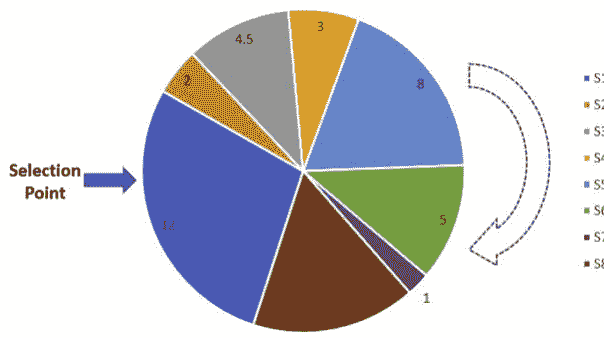

**图 9.5** 轮盘赌选择示意图。

```python
for i in range(len(sorted_population)):
    fitness=func_vals[i]
    # Probability of each individual being selected is calculated
    prob=fitness/fitness_sum
    acc += prob
    if rand <= acc:
        return sorted_population[i]
```

在上述代码中，可以看到 `roul_choice` 方法，该方法随机选择父代，其被选中的概率与其适应度值成正比。换句话说，适应度更高的个体被选为父代的概率更高。这一逻辑通过将区间 (0,1)（我们的轮盘）划分为若干块（饼图切片）来实现，每块的大小等于该切片的概率 $\frac{fitness}{fitness\_sum}$。例如，如果有四个个体 x1,\cdots,x4，其适应度值分别为 3、6、9 和 12，则它们被选中的概率分别为 0.1、0.2、0.3 和 0.4。因此，如果随机抽取的结果落在区间 [0,0.1]、(0.1,0.3]、(0.3, 0.6]、(0.6, 1] 内，则将分别选择个体 x1、x2、x3、x4。

在“锦标赛”选择方法中，从种群中随机选择 k 个解。其中适应度最高的解被视为父代。通过重复相同的过程，可以选择下一个父代。还有其他一些父代选择方法，如“排序”选择、“随机”选择和玻尔兹曼选择。

(iv) “交叉操作”是选择父代之后的下一步。当父代被选中并配对后，应将其染色体组合以产生后代。染色体遗传信息的组合通过交叉操作完成。在“单点”或“单点交叉”操作中，随机选择染色体上的一个断裂点，将其分为两段（tutorialspoint）。第二段的基因信息在染色体之间交换以产生后代。此过程如图 9.6 所示。在“两点交叉”操作中，不是选择一个断裂点，而是随机选择两个断裂点。然后，两个断裂点之间的基因信息在父代之间交换以产生后代，如图 9.7 所示。在“均匀交叉”操作中，为染色体中的每个基因分配一个 0 到 1 之间的随机值。如果某个基因的随机数大于或等于 0.5，则交换该基因，如图 9.8 所示。

下面是一个简单的交叉操作，它取父代值的平均值来创建子代（对于实数，可以使用几何平均或算术平均进行交叉）：

```python
#Crossover
def crossover(point_1, point_2):
    return [(point_1[0] + point_2[0])/2,(point_1[1] + point_2[1])/2]
```

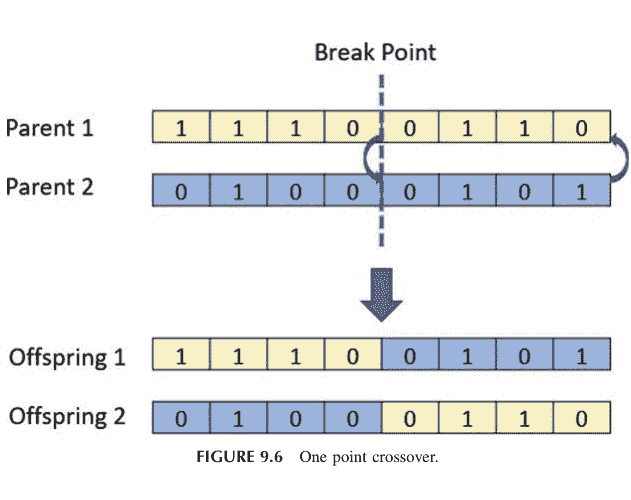

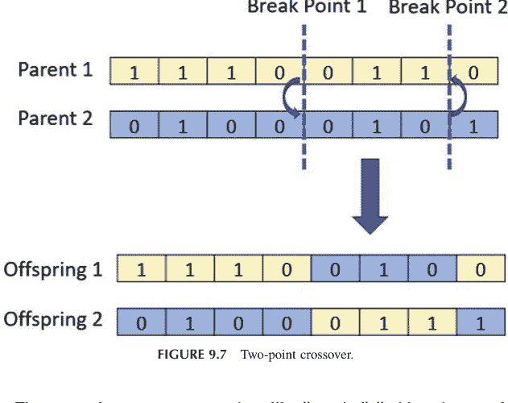

还有其他交叉操作，如“矩阵”、“算术重组”和“戴维斯顺序”。交叉的一个重要特征是交叉率/概率，定义为通过交叉操作产生的后代染色体与初始父代种群的比率。例如，如果 100 条父代染色体中有 70 条后代染色体是通过交叉产生的，则交叉率为 0.7。交叉率的范围是 0 到 1。

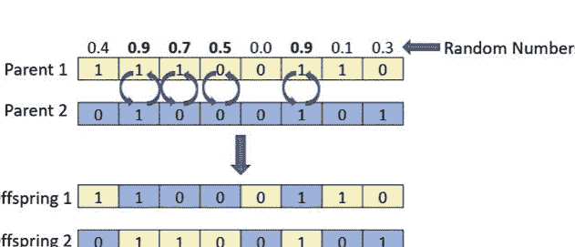

(v) “变异”发生在交叉操作产生后代染色体之后，其中一些基因被微调以增加新一代的多样性。这个过程称为变异。最常见的变异算子是“位翻转”。在“位翻转”变异中，随机选择一个或多个位，然后翻转该位的**等位基因**（值），如图 9.9 所示。变异率可用于了解发生变异的位占总位数的百分比。变异率通常小于交叉率。

```python
#Mutation
def mutate(point):
    mute_x=point[0] + random.uniform(-0.5, 0.5)
    mute_y=point[1] + random.uniform(-0.5, 0.5)
# Guarantee to be kept inside boundaries
    mute_x=min(max(mute_x, low_limit), up_limit)
    mute_y=min(max(mute_y, low_limit), up_limit)
    return [mute_x,mute_y]
```

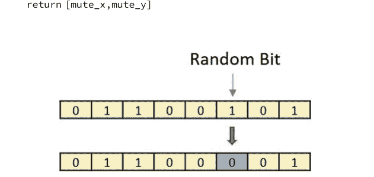

在此代码中，变异是通过向个体添加一个小的随机值来完成的。必须确保变异后的值落在指定范围内。所有这些步骤 (ii)–(v) 都封装在以下名为 `make_next_generation` 的方法中。

```python
#Make Next Generation: steps (ii)-(v)
# (ii) Fitness Function used for (iii) Parents selection and then (iv)
#Crossover and (v) Mutation used to Generate next generation
def offspring_generation(curr_population):
    next_generation=np.zeros(np.shape(curr_population))
    # Sort items in the previous_population array based on their function
    #value
    sorted_population=sorted(curr_population,key=function)
    population_size=len(curr_population)
    for i in range(population_size):
        # (iii) Parent Selection
        first_parent=roul_choice(sorted_population)
        second_parent=roul_choice(sorted_population)
        # Crossover
        offspring=crossover(first_parent, second_parent)
        # Mutation
        offspring=mutate(offspring)
        next_generation[i,:]=offspring
    return next_generation
```

在这些代码行中，展示了使用 (ii) 适应度函数进行 (iii) 父代选择，以及执行 (iv) 交叉和 (v) 变异以创建新一代的所有步骤。

当新一代解被创建后，该过程通过执行步骤 (ii) 适应度评估、(iii) 父代选择、配对、(iv) 交叉和 (v) 变异来重复。上述循环持续进行，直到达到遗传算法的终止条件。终止条件可以是以下之一：(a) 当种群在过去 N 次迭代中没有改进（考虑一个阈值），(b) 当达到指定的迭代次数，(c) 获得适应度函数的定义值。遗传算法工作流程如下列代码所示：

```python
#Genetics Algorithm Workflow
from matplotlib.patches import ConnectionPatch
#Perform the Genetics Algorithm to generate generations and find the
#best individuals in each generation
generations=100
best_val=float('-inf')
best_pair=np.zeros((2))

prev_best_pair=np.zeros_like(best_pair)
best_population=-1
# Threshold for improvement in order to continue the search
threshold=10e-5
stop=False
coordsA="data"
coordsB="data"
fig, ax0=plt.subplots(1,1)
ax0.set_xlabel('X')
ax0.set_ylabel('Y')
ax0.set_title(r'$5-(x^2+y^2)$')
ax0.grid(True)
# Mark the optimum Individuals [0,0] as a star
ax0.plot([0], [0], 'g*', markersize=15, linewidth=0.15,
    label='Optimum Individual')
ax0.legend(loc='lower left')
# (i) Population Initialization
population=gen_sample_population(size=50, x_limits=(low_limit,
    up_limit), y_limits=(low_limit, up_limit))
# (ii) Fitness Function Calculation
func_vals=np.array([function(x) for x in population])
gen_max_val=max(func_vals)
best_population=1
# Update the best value obtained so far
best_val=gen_max_val
best_pair=population[np.argmax(func_vals),:]
print('Generation:' ,1, ' Best individual: ',best_pair)
# Loop through the number of generations
for i in range(1, generations):
    print("Iteration number: ", i+1)
# (ii) Fitness Function used for (iii) Parents selection and then (iv)
    #Crossover and (v) Mutation used to Generate next generation
    population=offspring_generation(population)
    func_vals=np.array([function(x) for x in population])
    gen_max_val=max(func_vals)
# check if this generation maximum value (gen_max_val) is better than
#our best value (best_val) found thus far.
    if (gen_max_val > best_val):
        diff=abs(gen_max_val - best_val)
# If the improvement amount (diff) is less than threshold set
#stop=True => Break the loop, otherwise continue the search
        stop=True if diff < threshold else False
        best_population=i + 1
# Update the best value obtained so far
        best_val=gen_max_val
        prev_best_pair=np.copy(best_pair)
```

best_pair=population[np.argmax(func_vals),:]
print('Generation:',i+1, ' individual: ',best_pair,
      'Improves the optimal value by amount ', diff)
# 如果是在第1次迭代之后，则绘制箭头以显示向新best_pair的演化过程
if(i > 1):
    # 在图上用'o'标记绘制best_pair点
    ax0.plot([best_pair[0]],[best_pair[1]], 'o')
    # 用迭代次数(i+1)标记每个best_pair点
    ax0.text(best_pair[0] + 0.001 ,
             best_pair[1]+0.015 ,'{ }'.format(i+1))
    # 创建从prev_best_point到best_point的箭头，以显示向新个体(best_pair)的演化过程
    con=ConnectionPatch(prev_best_pair,
                        best_pair, coordsA=coordsA, coordsB=coordsB,
                        arrowstyle="-|>", shrinkA=2, shrinkB=2,
                        mutation_scale=15, fc="w")
    ax0.add_artist(con)
if (stop):
    break
# 打印最终的最佳个体
print('Final Result is from iteration: ',best_population,
      ' for coordinates: ', best_pair , ' best value: ', best_val)

Python output=Fig. 9.10

在此代码中，展示了所有步骤(i)–(v)，并且重复步骤(ii)–(v)，直到实现的改进小于定义为10e-5的阈值，或达到最大迭代代数=100。此工作流的结果可在图9.10中观察到。如图所示，遗传算法的结果在多次迭代中逐渐接近标记为星号的最优值[0,0]。第3、4、12、16、18、19、20、22、25、27、31、62代改进了最佳值。最佳值来自第62次迭代，坐标为[0.0122, -0.0087]，值为4.9998。当第62代产生的改进为6.8536e-05，小于定义为10e-05的阈值时，算法终止。这被解释为解已足够接近最优值，算法可以终止。

## 遗传算法示例：EUR优化

在此示例中，目标是使用遗传算法找到使一口井的估算最终采收率（EUR）最大化的最佳钻井和完井参数。为此，需要一个模型来预测一口井在不同地质、钻井和完井参数下的EUR。该模型将是评估钻井和完井作业有效性的适应度函数。使用第6章和第7章介绍的页岩气井示例进行优化。实现遗传算法以找到特定位置一口井的最佳水平段长度和支撑剂用量，从而获得最高的EUR。与之前的示例类似，第一步是加载页岩气井数据，定义输入和输出，将数据归一化到0到1的范围，将数据分为训练集和测试集，最后训练一个神经网络。上述步骤可以使用以下Python代码完成：

```
import numpy as np
import pandas as pd
import matplotlib.pyplot as plt
from sklearn.pipeline import make_pipeline
from sklearn.neural_network import MLPRegressor
from mpl_toolkits.mplot3d import Axes3D
from sklearn.preprocessing import MinMaxScaler
#Import the data set
dataset=pd.read_csv('Chapter9_Shale Gas Wells.csv')
X=dataset.iloc[:,0:13]
y=dataset.iloc[:,13].values
# Fix the seed number for splitting the data into training and testing
seed=15
np.random.seed(seed)
from sklearn.model_selection import train_test_split
X_train, X_test, y_train, y_test=train_test_split(X, y, test_size=0.25)
```

```
#Specifying the neural network topology with MLPRegressor including 2
#hidden layers
global modelNN
modelNN=make_pipeline(MinMaxScaler(), MLPRegressor(
    hidden_layer_sizes=(25,25),learning_rate_init=0.01,
    early_stopping=True,max_iter=500))
#Training the model
modelNN.fit(X_train, y_train)
print("Test R2 score: {:.2f}".format(modelNN.score(X_test,
    y_test)))
Python Output=
Test R2 score: 0.79
```

使用管道来归一化数据，然后将其输入神经网络。有两个隐藏层，每层有25个神经元，初始学习率为0.01。测试数据集的R²为0.79。下一步是导入遗传算法优化器，并调用它来找到井EUR的最大值，涉及两个变量：水平段长度和支撑剂用量。应通过Anaconda提示符（pypi）中的"pip install genetic algorithm"命令安装"Genetic algorithm"库。遗传算法通常寻找函数的最小值。因此，神经网络函数应乘以-1以返回最大值。之后，需要指定变量的范围作为解空间。使用名为"varbound"的二维数组来定义每个变量的最小值和最大值。在页岩气井示例中，有13个属性。从这13个属性中，水平段长度和支撑剂用量应分别在4500到11,500英尺和1100到3200磅/英尺之间变化。其余变量等于主数据集（X）中的平均值。倾角应为零，表示井是下倾的。实际上，可以查看井的位置并使用相应的地质参数，如孔隙度、地层厚度和含水饱和度。接下来，可以使用遗传算法来优化钻井和完井等设计变量。使神经网络输出为负并定义变量的Python代码如下：

```
from geneticalgorithm import geneticalgorithm as ga
def f(X):
    # Reshape the column vector X to a row vector X_Row
    X_Row=X.reshape(1,-1)
    # Return negative value for since GA minimizes the objective function
    return -1*modelNN.predict(X_Row)
#Lateral Length (4,500 ft to 11,500 ft) and Proppant loading (1100#/ft
#to 3200#/ft). The rest of the attributes should be equal to average.
#Dip attribute should be zero.
varbound=np.array([[0.0,0.0]]*13)
avg_vals=X.mean(axis=0)
```

```
varbound[:,0]=avg_vals; varbound[:,1]=avg_vals
varbound[5,0] =4500
varbound[5,1]=11500
varbound[3,0]=0
varbound[3,1]=0
varbound[12,0]=1100
varbound[12,1]=3200
```

下一步是在algorithm_param中定义遗传算法参数。此示例没有最大迭代次数；但是，当100次迭代后没有实现改进时，算法停止。解或染色体的种群大小为100。变异概率定义经历变异的位点百分比，为0.1（10%）。elit_ratio，即一小部分最适应的染色体将不经任何改变传递到下一代，为0.1。交叉概率（或速率）定义通过交叉算子生成的后代染色体的百分比，为0.5（50%）。Parent_portion表示新种群中包含父代染色体的百分比，为0.2。这意味着在新的迭代中，20%的种群是父代，80%是后代染色体。交叉类型是均匀的，意味着为每个位分配随机数，随机值高于0.5的位被交换。接下来，需要使用函数"f"（实际上是神经网络的负值）、解的维度（此示例中为13）、解的边界（variable_boundaries）以及算法参数来标识遗传算法模型。指定所有模型要求后，可以使用model.run命令运行遗传算法。遗传算法的收敛报告和解可以分别通过"model.report"和"model.output_dict"访问。运行遗传算法并查看结果可以使用以下Python代码完成：

```
algorithm_param={'max_num_iteration': None, 'population_size':100,
    'mutation_probability':0.1,'elit_ratio': 0.1,
    'crossover_probability': 0.5,'parents_portion': 0.2,
    'crossover_type':'uniform','max_iteration_without_improv':100}
model=ga(function=f,dimension=13,variable_type='real',
    variable_boundaries=varbound,
    algorithm_parameters=algorithm_param)
model.run()
convergence=model.report
solution=model.output_dict
```

遗传算法的输出如图9.11所示。收敛报告实际上是一个图表，显示了目标函数值与迭代次数。从第70次迭代开始，经过100次迭代后，适应度函数未观察到改善。优化的解是一个包含所有属性的数组。计算得出最大天然气EUR为20.8Bcf，对应的优化水平段长度和支撑剂充填浓度分别为11498英尺和3199.9磅/英尺（数组中的第6和第13个属性）。为了可视化解空间，使用以下Python代码绘制了计算出的EUR值与水平段长度和支撑剂充填浓度组合关系的曲面图：

```python
n=100
m=50
# linspace returns n and m equally spaced values over the interval
#passed to it
x_vals=np.linspace(4500,11500,n+1)
y_vals=np.linspace(1100,3200,m+1)
# meshgrid returns the coordinate matrices by combining all the
#combinations of x_vals and y_vals and creates an n*m x and y spaces
x,y=np.meshgrid(x_vals, y_vals)
z=np.zeros_like(x)
item=np.array([0.0]*13)
item [:]=avg_vals
for i in range(m+1):
    for j in range(n+1):
```

```
The best solution found:
[1.47640316e+02 3.51343874e+01 8.20158103e+02 0.00000000e+00
1.62365613e+02 1.14983729e+04 6.30790514e+01 7.33754941e+00
7.01049012e+03 1.92134387e+01 6.48454545e+01 9.30256917e-01
3.19921888e+03]

Objective function:
-20.758964946179123
```

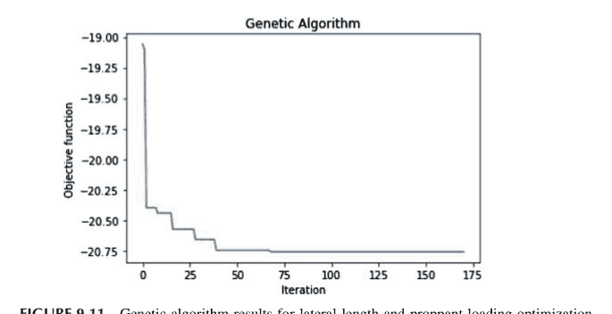

图 9.11 水平段长度和支撑剂充填浓度优化的遗传算法结果。

```python
item[3]=0
item[5]=x[i,j]
item[12]=y[i,j]
z[i,j]=-1 *f(item)
fig=plt.figure()
#adding 3d projection for the plot
ax0=plt.axes(projection='3d')
surf=ax0.plot_surface(x, y, z, rstride=1, cstride=1,
    cmap='viridis', linewidth=0, antialiased=False)
ax0.set_xlabel('Lateral Length(ft)')
ax0.set_ylabel('Proppant Loading(#/ft)')
ax0.set_title('EUR(Bcf)')
plt.tight_layout()
Python output=Fig. 9.12
```

如图9.12所示，EUR的最大值出现在水平段长度和支撑剂充填浓度的最大值处，这与遗传算法优化的结果几乎相似。

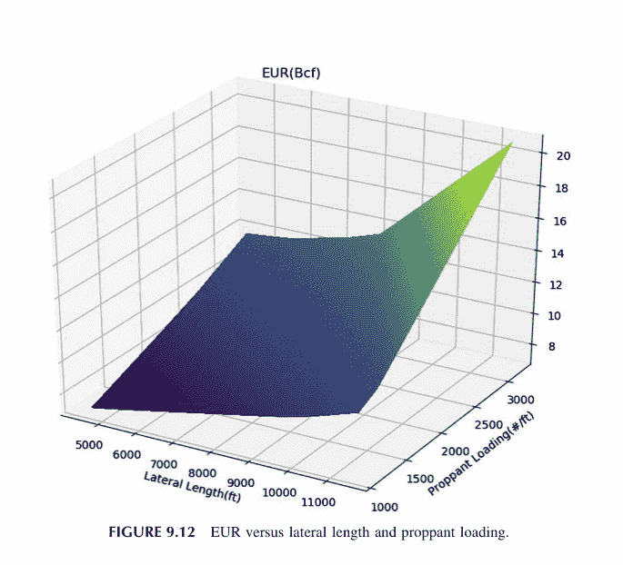

图 9.12 EUR与水平段长度和支撑剂充填浓度的关系。

## 粒子群优化

上一节介绍了遗传算法，这是一种基于自然的搜索优化方法。遗传算法实际上遵循了达尔文根据自然选择提出的进化理论。本节将介绍另一种基于自然的优化算法——“粒子群优化”（PSO）。

群体被视为一群移动的粒子（在自然界中可以是蜜蜂、鸟类或鱼），它们试图形成一个集群，而每个粒子似乎都在无组织地移动。在自然界中，群体在粒子之间表现出某种社会认知行为，帮助它们解决诸如寻找食物或逃避捕食者等问题。群体粒子的文化行为可以归类为评估、比较和模仿（Eberhart等人，2001）。首先，粒子需要评估环境，以区分吸引或排斥的特征，从而做出适当的决策。然后，个体（粒子）将自己与他人进行比较，找出哪些粒子处于更好的位置。最后，个体模仿那些处于优越位置的粒子。上述原则帮助粒子适应环境、应对挑战并解决难题。科学家和工程师试图利用粒子群智能行为的相同原理来解决复杂的优化问题。

Kennedy和Eberhart于1995年在一次神经网络会议上介绍了粒子群优化，随后于2001年出版了《*群体智能*》一书（Eberhart等人，2001）。与遗传算法类似，粒子群优化能够优化具有不可微目标函数的问题（这是基于梯度的优化器的主要要求）。PSO应用于各种优化问题，如神经网络训练、模糊控制、模式识别、机器人/纳米机器人，甚至电影特效。

PSO在石油和天然气行业有多种应用。Mohamed等人使用PSO进行油藏历史拟合（Mohamed等人，2011）。合成油藏模拟模型历史拟合的目标是估计断层特征，如断距厚度、高渗透率和低渗透率因子。他们使用产油量和产水量作为历史拟合的两个目标函数。Isebor等人应用了多种无导数优化器，如粒子群优化，以制定最佳开发方案（Isebor等人，2013）。他们使用了二维油藏模型，包括带有注水井和采油井的河道。通过决定井的数量、位置和控制策略来优化开发方案。Al-Nemer等人（Al-Nemer等人，2015）评估了四种随机优化算法（如粒子群优化）在压力瞬态分析（试井）中生成自动类型曲线匹配的性能。使用双孔隙度油藏模型（由Warren和Root提出）来模拟添加了噪声的压力数据，这些数据被视为真实压力数据。然后，应用PSO来估计裂缝渗透率、基质孔隙度、表皮系数、探测半径、储容比和层间流动参数。Jesmani等人应用PSO为两个不同的案例研究寻找最佳井位（Jesmani等人，2015）。在一个案例研究中，他们使用了一个合成油藏模型，地质数据取自挪威海的Norne油田。他们使用PSO通过寻找井距、水平段长度、方向的最佳组合，并将井保持在油藏的特定部分，来最大化净现值。Ottah等人利用PSO进行油藏历史拟合，并使用物质平衡技术寻找含水层特性（Ottah等人，2015）。Self等人应用粒子群优化，通过寻找最佳操作参数来降低钻井成本（Self等人，2016）。在这项工作中，他们将机械钻速（ROP）作为目标函数，并通过调整井下钻压、转速、起钻深度和钻头组合来最小化每英尺成本（在第5章中，构建并讨论了一个使用各种输入钻井特征来估计ROP的监督机器学习模型）。Al-Mudhafar等人展示了粒子群优化在优化非常规油藏CO2-EOR过程中的应用（Al-Mudhafar等人，2017）。他们使用了一个带有五个注入井/生产井的黑油油藏模型，来预测经历CO2驱油的页岩油藏30年的性能。他们考虑了八个优化参数，如注入/生产/浸泡时间、最小井底压力和最大产油/注入速率。Khan等人实施了PSO，以最大化包含智能井的天然裂缝性碳酸盐岩油藏的采收率（Khan等人，2018）。这项研究的目标是确定流入控制阀（油嘴设置）的最佳设置，以最大化采收率。Yan等人将PSO应用于多层地质导向（Yan等人，2018）。他们希望使用随钻测井（LWD）测量数据，并利用粒子群优化来估计一些参数，如地层边界和地层电阻率。PSO在石油和天然气行业还有其他应用，如地球物理数据反演（Fernandez-Martinez等人，2008）、岩石边坡稳定性分析中临界破坏面的定位（Javadzadeh & Javadzadeh，2008）、油藏模型的预选（Le Ravalec-Dupin等人，2010）和生产优化（Zhao等人，2011）。

## 粒子群优化理论

为了理解粒子群理论的基础，了解一个关于鸟群决策的著名例子很有帮助。当飞行的鸟类决定降落时，它们需要解决一个复杂的问题，找到一个优化的着陆点，这个点要有最大的机会找到食物，同时被捕食的风险最小。鸟群能够作为社会行为进行沟通和分享信息，这一事实使它们能够找到最优解。鸟群社会行为中最重要的因素是每只鸟（粒子）将其自身知识与群体知识相平衡。鸟类开始寻找解决方案

## 粒子群优化算法

粒子群优化（PSO）算法模拟鸟群的觅食行为。鸟群中的个体（粒子）在搜索空间中移动，通过共享信息来寻找最优解。假设食物的位置是未知的，每只鸟（粒子）会评估自己当前位置与食物的距离（适应度值），然后将这个信息传递给其他鸟。接着，它们会跟随找到最佳解决方案（即距离食物最近）的鸟。

粒子群优化的目标是找到目标函数 $f(X)$ 的最优解，其中 $X$ 是一个包含 $n$ 个变量的向量，$X = [x_1, x_2, x_3, ..., x_n]$。在PSO中，$X$ 也被视为位置向量，$f(X)$ 是适应度或目标函数。通过适应度函数，可以评估每个位置的好坏并与其他位置进行比较。在每个时间或迭代步 $t$，一个包含 $P$ 个粒子的群体（每个粒子用索引 $i$ 表示）包含粒子 $i$ 的位置和速度向量，分别为 $X_i^t = (x_{i1}, x_{i2}, x_{i3}, ..., x_{in})^t$ 和 $V_i^t = (v_{i1}, v_{i2}, v_{i3}, ..., v_{in})^t$。群体中所有粒子的目标是在每次迭代后向最优解移动，直到达到全局最优。对于第 $i$ 个粒子，迭代 $t+1$ 时的速度向量 $V_{ij}^{t+1}$ 决定了该粒子第 $j$ 个变量的新位置 $X_{ij}^{t+1}$，其计算公式如下（Almeida & Leite, 2019）：

$$X_{ij}^{t+1} = X_{ij}^t + V_{ij}^{t+1}$$ (9.1)

其中 $i$ 从 1 到 $P$，$j$ 从 1 到 $n$。为了找到每个粒子的新位置，需要使用以下公式计算 $V_{ij}^{t+1}$：

$$V_{ij}^{t+1} = wV_{ij}^t + c_1r_1^t(pbest_{ij} - X_{ij}^t) + c_2r_2^t(gbest_{ij} - X_{ij}^t)$$ (9.2)

粒子在迭代 $t+1$ 时的速度受三个分量影响：惯性（$wV_{ij}^t$）、个体认知分量 $c_1r_1^t(pbest_{ij} - X_{ij}^t)$ 和社会分量 $c_2r_2^t(gbest_{ij} - X_{ij}^t)$。在惯性项中，$w$ 称为惯性权重常数，它控制着全局搜索（探索）和局部搜索（利用）之间的平衡。当 $w$ 较高时，粒子主要遵循先前的方向；而较低的 $w$ 值则让粒子能够移动到不同的区域。个体认知分量计算粒子当前位置（$X_{ij}^t$）与其历史最佳位置（$pbest_{ij}$）之间的差异，并乘以权重因子 $c_1$ 和随机数 $r_1^t$。该分量决定了粒子自身经验在寻找搜索空间中最优点时的重要性。随机参数 $r_1^t$ 防止粒子陷入局部最优。社会分量考虑了粒子之间可以相互通信并共享其先前经验信息的事实。通过粒子间的通信，可以找到群体中某个粒子获得的最佳适应度值，即全局最佳点 $gbest_{ij}$。因此，粒子当前位置（$X_{ij}^t$）与全局最佳点（$gbest_{ij}$）之间的差异是驱使粒子朝向全局最优移动的驱动力（Almeida & Leite, 2019）。这个驱动力乘以社会学习因子（$c_2$）和随机变量 $r_2^t$。图9.13展示了如何计算粒子 $i$ 的新位置。

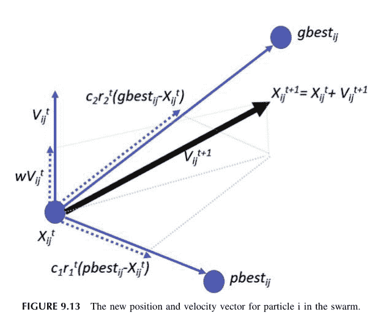

**图9.13** 群体中粒子 $i$ 的新位置和速度向量。

PSO可以通过以下步骤执行：

- (i) 初始化粒子的位置（$X^0_{ij}$）、速度（$V^0_{ij}$）和最佳位置（$pbest_{ij}$）
- (ii) 根据每个粒子的初始位置评估其适应度值，然后计算全局最佳位置
- (iii) 更新粒子的历史最佳位置（$pbest_{ij}$）和全局最佳位置（$gbest_{ij}$）
- (iv) 更新粒子的速度和位置
- (v) 如果满足终止条件，则结束过程；否则返回步骤 (iii)。

为了说明PSO的步骤，考虑目标函数 $-50\cos(x)\cos(y)+x^2+y^2$，该函数有四个局部最小值点 $[-3, -3], [-3, 3], [3, -3], [3, 3]$，其值为 -31，以及一个全局最小值点 $[0, 0]$，其值为 -50。该函数的3D图如图9.14所示。

图9.14可以使用以下Python代码绘制：

```python
#3D plot
import numpy as np
import math
import random
import matplotlib.pyplot as plt
#function that models the problem
def function(position):
    return -50*math.cos(position[0])*math.cos(position[1]) + \
           position[0]**2 + position[1]**2
#plot the fitness function
from mpl_toolkits.mplot3d import Axes3D
n=100
low_limit=-5
up_limit=5
# Creates n equally spaced values between low_limit and up_limit
x_vals=np.linspace(low_limit,up_limit,n+1)
y_vals=np.linspace(low_limit,up_limit,n+1)
# Create n*n matrices x and y with all combinations of x_vals and y_vals
x,y=np.meshgrid(x_vals, y_vals)
z=np.zeros_like(x)
for i in range(n+1):
    for j in range(n+1):
        z[i,j]=function([x[i,j],y[i,j]])
#Plot the 3D plot
fig=plt.figure()
#adding 3d projection to the plot
ax0=plt.axes(projection='3d')
surf=ax0.plot_surface(x, y, z, rstride=1, cstride=1,
    cmap='viridis', linewidth=0, antialiased=False)
# Plot the contour plot of z values
ax0.contourf(x, y, z, zdir='z', offset=-50, cmap='viridis')
ax0.set_title(r'$-50\cos(x)\cos(y) + x^2 + y ^2$')
ax0.set_xlabel('X')
ax0.set_ylabel('Y')
plt.tight_layout()
Python output=Fig. 9.14
```

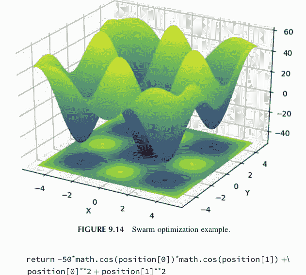

**图9.14** 粒子群优化示例。

在这个例子中，说明了PSO问题的所有五个步骤。首先，初始化所有参数 w, c1, c2 和其他变量。停止准则也设置为 10e-05，这意味着如果一次迭代到下一次迭代的改进小于此阈值，算法将停止。粒子数量（n_particles）设置为 50，最大迭代次数（n_itr）设置为 50。在此代码中，最优解 [0, 0] 用星号标记。

```python
#Parameter Initialization
#Initializing the velocity calculation parameters
w=0.2
c1=0.5
c2=0.9
seed=12
np.random.seed(seed)
n_itr=50
threshold=10e-05
n_particles=50
```

接下来，粒子的位置通过从均匀分布中抽样进行随机初始化。同时，最佳值和位置的初始值设置为无穷大，因为这是一个最小化问题，任何值都会小于无穷大。因此，最佳值将被正确更新。速度值（velocity）初始化为零。

```python
#Variable Initialization
# (i) Particle position initialization
curr_pos=np.random.uniform(-30,30,(n_particles,2))
part_best_pos=curr_pos
part_best_val=np.array([float('inf') for _ in range(n_particles)])
glob_best_val=float('inf')
glob_best_prev_val=float('inf')
glob_best_pos=np.array([float('inf'), float('inf')])
velocity=([np.array([0, 0]) for _ in range(n_particles)])
iteration=0
markers=['o', 'x', 'c*', 'r+', 'bo', 'x']
c=0
```

在这个for循环中，步骤 (ii)–(v) 会重复执行，直到满足停止准则或达到最大迭代次数（n_itr）。在每次迭代中，每个粒子的最佳位置（part_best_pos）以及所有粒子中的最佳位置（glob_best_pos）都会被更新。最后，每个粒子的速度基于其上一次迭代的速度加上随机加权的社会和局部速度调整项进行更新。新位置基于这个新速度和粒子的当前位置计算得出。

```python
fig, ax0=plt.subplots(1,1)
ax0.set_xlabel('X')
ax0.set_ylabel('Y')
ax0.set_title(r'$-50\cos(x)\cos(y) + x^2 + y ^2$')
ax0.grid(True)
# Mark the optimum Individuals [0,0] as a star
ax0.plot([0], [0], 'g*', markersize=20,
label='Optimum Individual')
ax0.legend(loc='lower left')
plt.tight_layout()
#Steps (ii)-(v)
for iteration in range (n_itr+1):
    print ('Iteration: ', iteration)
    for i in range(n_particles):
# (ii) Evaluate fitness value
        fit_candidate=function(curr_pos[i])
# (iii) Update particle best position and global best position
        if(part_best_val[i] >= fit_candidate):
            part_best_val[i]=fit_candidate
            part_best_pos[i]=curr_pos[i]

    part_vals=np.array([function(x) for x in curr_pos])
    parts_best_val=min(part_vals)
    best_part=curr_pos[np.argmin(part_vals),:]
    if(glob_best_val >= parts_best_val):
        glob_best_prev_val=glob_best_val
        glob_best_val=parts_best_val
        glob_best_pos=best_part
# Plot selected iterations particles positions
    if (iteration in [2,5,7,9,11,14]):
        ax0.plot(part_best_pos[:,0],part_best_pos[:,1],
        markers[c],label='{}'.format(iteration),
        markersize=c+3)
        c=c + 1
# (iv)  Update the particle velocities and new positions
    for i in range(n_particles):
        new_velocity=(w*velocity[i]) + (c1*np.random.uniform()) \
        * (part_best_pos[i] - curr_pos \
        [i]) + (c2*np.random.uniform()) * \
        (glob_best_pos-curr_pos[i])
```

new_position = new_velocity + curr_pos[i]
curr_pos[i] = new_position
velocity[i] = new_velocity
# (v) 如果满足终止条件则终止
if(abs(glob_best_val - glob_best_prev_val) < threshold):
    break
ax0.legend()
print("The best position is ", glob_best_pos, "in iteration number ", iteration)

图9.15展示了PSO运行的多个快照。图中绘制了粒子在第2、5、7、9、11和14次迭代时的位置。全局最优值（glob_best_val）在第14次迭代后不再改善，其值为-49.9984，对应位置为[x=-0.00789019 y=-0.00041137]。该值非常接近最优值-50。如图所示，在每个绘制的迭代中，粒子都越来越接近全局最小值点[0, 0]。请注意，在位置[-3, -3]、[-3, 3]、[3, -3]、[3, 3]处存在四个局部最小值，其值为-31（见图9.14）。

## NPV最大化示例

在此示例中，使用Yu等人（Yu & Sepehroori, 2013）的研究数据，通过粒子群优化算法优化水力压裂水平井的设计。在Yu的研究中，建立了一个数值油藏模拟器来模拟Barnett页岩气井的生产。该模拟器通过纳入孔隙度/渗透率的不确定性，并改变裂缝间距、裂缝半长、裂缝导流能力和井距等设计参数，找到了38种生产方案。对于每种方案，根据特定的天然气价格和资本支出/运营支出假设计算了净现值（NPV）。最后，生成了一个响应面，以找到NPV与设计/地质参数之间的相关性。

对于此示例，首先将生成一个多项式曲面函数作为目标函数。然后，使用PSO来寻找优化的完井设计参数。加载数据、导入库、定义输入和输出、查看描述性统计数据以及将数据拆分为训练集和测试集（80%训练，20%测试）可以通过以下Python代码完成：

NPV数据集可在以下位置找到：https://www.elsevier.com/books-and-journals/book-companion/9780128219294

```
import numpy as np
import pandas as pd
from sklearn.pipeline import make_pipeline
```

| | 孔隙度 | 渗透率(md) | 裂缝半长(ft) |
|---|---|---|---|
| 计数 | 38.000000 | 38.000000 | 38.000000 |
| 均值 | 0.061579 | 0.000292 | 300.000000 |
| 标准差 | 0.016526 | 0.000191 | 83.827364 |
| 最小值 | 0.040000 | 0.000050 | 200.000000 |
| 25% | 0.042500 | 0.000050 | 200.000000 |
| 50% | 0.060000 | 0.000295 | 300.000000 |
| 75% | 0.080000 | 0.000500 | 400.000000 |
| 最大值 | 0.080000 | 0.000500 | 400.000000 |

| | 裂缝导流能力(md-ft) | 裂缝间距(ft) | 井距(ft) |
|---|---|---|---|
| 计数 | 38.000000 | 38.000000 | 38.000000 |
| 均值 | 24.842105 | 65.526316 | 757.894737 |
| 标准差 | 19.130457 | 25.542478 | 198.142153 |
| 最小值 | 1.000000 | 10.000000 | 500.000000 |
| 25% | 4.500000 | 40.000000 | 525.000000 |
| 50% | 25.000000 | 60.000000 | 800.000000 |
| 75% | 44.500000 | 80.000000 | 975.000000 |
| 最大值 | 50.000000 | 100.000000 | 1000.000000 |

| | 净现值($MM) |
|---|---|
| 计数 | 38.000000 |
| 均值 | 8.905263 |
| 标准差 | 4.044078 |
| 最小值 | 2.200000 |
| 25% | 6.100000 |
| 50% | 8.500000 |
| 75% | 12.100000 |
| 最大值 | 18.900000 |

图9.16 NPV数据集描述性统计。

```
from sklearn.linear_model import LinearRegression
from sklearn.preprocessing import PolynomialFeatures
from sklearn.linear_model import LassoCV
from sklearn.preprocessing import MinMaxScaler
import matplotlib.pyplot as plt
dataset=pd.read_csv('Chapter9_NPV Data Set.csv')
X=dataset.iloc[:,:6]
y=dataset.iloc[:,6].values
print(dataset.describe())
seed=15
np.random.seed(seed)
from sklearn.model_selection import train_test_split
X_train, X_test, y_train, y_test=train_test_split(X, y,
    test_size=0.2)
Python output=Fig. 9.16
```

为了建立NPV与六个设计参数之间的相关性，使用正则化回归来寻找具有多项式特征的拟合。为输入参数生成了3阶多项式特征。“Lasso”（最小绝对收缩和选择算子），也称为L1正则化，是一种将权重的绝对值作为惩罚项添加到回归目标函数中以防止过拟合的技术。Alpha是正则化回归的参数。Lasso中的Epsilon是alpha-min与alpha-max的比率。交叉验证（CV）也用于获取最佳回归参数（在第7章中解释）。应用了管道（Pipeline）来构建一个模型，该模型包括用于数据归一化的MinMaxScaler、在输入数据中生成多项式特征、以及使用带CV的Lasso正则化进行回归。当多项式模型训练完成后，可以使用以下Python代码绘制预测NPV与实际NPV的散点图以及R²分数：

```
#使用Lasso参数进行多项式模型回归，并进行4折交叉验证
model=make_pipeline(MinMaxScaler(),PolynomialFeatures(3,
    interaction_only=False), LassoCV(eps=0.0005,n_alphas=10,
    max_iter=10000, normalize=True,cv=4))
model.fit(X_train,y_train)
#预测输出并计算R2分数
y_pred_Test=np.array(model.predict(X_test))
test_scoreTest=model.score(X_test,y_test)
y_Pred_Test_Train=np.array(model.predict(X))
test_scoreTest_Train=model.score(X,y)
#绘制输出图
fig, ax=plt.subplots()
ax.scatter(y_test,y_pred_Test)
ax.plot([0, 18], [0, 18], 'k--', lw=4)
ax.set_xlabel('NPV_Test(MM$)')
ax.set_ylabel('NPV_Predicted(MM$)')
plt.text(2,17,"R2="+str(test_scoreTest).format("%.2f"))
plt.show()
fig, ax=plt.subplots()
ax.scatter(y,y_Pred_Test_Train)
ax.plot([0, 20], [0, 20], 'k--', lw=4)
ax.set_xlabel('NPV_Test_Train(MM$)')
ax.set_ylabel('NPV_Predicted(MM$)')
plt.text(2,18,"R2="+str(test_scoreTest_Train ).format("%.2f"))
plt.show()
```

Python output=Fig. 9.17

如图9.17所示，模型在测试集和整个数据集上预测NPV与实际NPV的R²值分别为0.63和0.91。该模型将用于NPV的优化。在此示例中，考虑优化两个参数：裂缝半长和井距（井间距）。裂缝半长变化范围为200至400英尺，井距变化范围为500至1000英尺。其他参数视为常数：孔隙度=0.06，渗透率=1E-4md，裂缝导流能力=26(md-ft)，裂缝间距=40英尺。在使用PSO之前，绘制了NPV值随可变裂缝半长和井距变化的曲面图，以查看最大NPV可能出现的位置。NPV 3D曲面可以通过以下Python代码绘制：

```
# 绘制可变裂缝半长(FH)和井距(WD)的3D曲面图
from mpl_toolkits.mplot3d import axes3d
n=20
m=25
FH_vals=np.linspace(200,400,n+1)
WD_vals=np.linspace(500,1000,m+1)
FH,WD=np.meshgrid(FH_vals, WD_vals)
z=np.zeros_like(FH)
item=np.array([0.0]*6)
item[0]=.06
item[1]= 10e-05
item[3]=26
item[4]=40
for i in range(m+1):
    for j in range(n+1):
        item[2]=FH[i,j]
        item[5]=WD[i,j]
        z[i,j]=model.predict(item.reshape(1,-1))
fig=plt.figure()
#为子图1,1,1添加3d投影
ax0=fig.add_subplot(111, projection='3d')
surf=ax0.plot_surface(FH, WD, z, rstride=1, cstride=1,
    cmap='viridis', linewidth=0, antialiased=False)
ax0.set_xlabel('Fracture Half Length(ft)')
ax0.set_ylabel('Well Distance(ft)')
ax0.set_title('NPV(MM$)')
```

Python output=Fig. 9.18

从图9.18可以看出，高NPV值出现在高裂缝半长和长井距处。在Python中，可以使用“pyswarm”包来执行PSO（pythonhosted）。应通过“pip install pyswarm”命令安装Pyswarm。与遗传算法类似，有必要为解空间中的所有变量定义范围。这可以通过在“lb”和“ub”数组中为变量指定下界（lb）和上界（ub）来实现。除裂缝半长和井距外的所有变量应保持为常数。由于在pyswarm中，上界值应高于下界，因此将在下界值上添加一个等于10E-10的theta值。用于生成上界。PSO的目标是最大化净现值（NPV），因此，多项式模型应乘以-1（Pyswarm返回函数的最小值）。PSO用作粒子群优化算法。在PSO中，需要指定目标函数（f）、下界（lb）、上界（ub）、种群中的粒子数量（种群规模，本例中为200）、速度权重（omega=0.3）、C1值（phip=0.5）、C2值（phig=0.7）、最大迭代次数（maxiter=1000）以及种群最佳位置的最小步长（minstep=1e-8）。解将保存到“xopt”中，最优值将写入“fopt”。以裂缝半长和井距为设计变量，对NPV多项式函数执行PSO的Python代码如下：

```python
from pyswarm import pso
theta=10e-10
lb=np.array([0.06, 10e-05, 200, 26, 40, 500])
ub=np.array([0.06, 10e-05, 400, 26, 40, 1000])
ub += theta
def f(X):
    return -model.predict(X.reshape(1,-1))
xopt, fopt=pso(f, lb, ub,swarmsize=200, omega=0.3, phip=.5,
phig=0.7, maxiter=1000, minstep=1e-8)
```

```python
print(xopt)
print(fopt)
```

Python输出=
停止搜索：种群最佳位置变化小于1e-08
[6.00000003e-02 1.00000403e-04 4.00000000e+02 2.60000000e+01
 4.00000000e+01 1.00000000e+03]
[-10.26411093]

结果表明，在裂缝半长为400英尺、井距为1000英尺时，可实现1026万美元的最大净现值。

## 参考文献

Al-Mudhafar, W. J., Dalton, C. A., & Al Musabeh, M. I. (2017年5月5日). *通过混合粒子群与多项式和样条回归进行元建模，以优化非常规油藏中的二氧化碳提高采收率*. 石油工程师协会. https://doi.org/10.2118/186045-MS

Al-Nemer, A. A., Issaka, M. B., Awotunde, A. A., & Al-Hashem, H. S. (2015年3月8日). *双重孔隙油藏试井的全局优化策略*. 石油工程师协会. https://doi.org/10.2118/172588-MS

Almeida de, B. S. G., & Leite, V. C. (2019年12月3日). 粒子群优化：解决工程问题的强大技术. 载于 J. Del Ser, E. Villar, & E. Osaba (编), *群体智能——最新进展、新视角与应用*. IntechOpen. https://doi.org/10.5772/intechopen.89633. 可从 https://www.intechopen.com/books/swarm-intelligence-recent-advances-new-perspectives-and-applications/particle-swarm-optimization-a-powerful-technique-for-solving-engineering-problems 获取.

Bybee, K. (2005年6月1日). *使用遗传算法优化周期性蒸汽采油*. 石油工程师协会. https://doi.org/10.2118/0605-0068-JPT

Chaari, M., Ben Hmida, J., Seibi, A. C., & Fekih, A. (2020年8月1日). *用于管道中两相压降稳态建模的集成遗传算法/人工神经网络方法*. 石油工程师协会. https://doi.org/10.2118/201191-PA

Eberhart, R. C., Shi, Y., & Kennedy, J. (2001年4月11日). *群体智能* (第1版). Morgan kaufmann. ASIN: B001IV75CG.

Emerick, A. A., Silva, E., Messer, B., Almeida, L. F., Szwarcmann, D., Pacheco, M. A. C., & Vellasco, M. M. B. R. (2009年1月1日). *使用带非线性约束的遗传算法进行井位优化*. 石油工程师协会. https://doi.org/10.2118/118808-MS

Fang, J. H., Karr, C. L., & Stanley, D. A. (1992年1月1日). *遗传算法及其在岩石物理学中的应用*. 石油工程师协会.

Fernandez-Martinez, J. L., García-Gonzalo, M. E., Fernández-Alvarez, J. P., Menéndez Pérez, C. O., & Kuzma, H. A. (2008年1月1日). *粒子群优化（PSO）：一个简单而强大的地球物理反演算法族*. 勘探地球物理学家协会.

Goldberg, D. E. (1983). *使用遗传算法和规则学习的计算机辅助天然气管道操作* (博士论文). 密歇根州安娜堡：密歇根大学.

https://pypi.org/project/geneticalgorithm/.
https://pythonhosted.org/pyswarm/.
https://www.tutorialspoint.com/genetic_algorithms.

Isebor, O. J., Echeverria Ciaurri, D., & Durlofsky, L. J. (2013年2月18日). *使用无导数程序的通用油田开发优化*. 石油工程师协会. https://doi.org/10.2118/163631-MS

Javadzadeh, E., & Javadzadeh, R. (2008年1月1日). *用于岩石边坡稳定性分析中临界破坏面定位的毕肖普法与粒子群优化*. 国际岩石力学与岩石工程学会.

Jefferys, E. R. (1993年1月1日). *遗传算法的设计应用*. 石油工程师协会. https://doi.org/10.2118/26367-MS

Jesmani, M., Bellout, M. C., Hanea, R., & Foss, B. (2015年9月14日). *在现实油田开发约束下进行最优井位部署的粒子群优化算法*. 石油工程师协会. https://doi.org/10.2118/175590-MS

Khan, M. R., Saeed, A., Asad, A., Tariq, Z., & Tauqeer, M. (2018年1月1日). *利用基于粒子群优化的计算智能最大化天然裂缝性碳酸盐岩油藏的采收率*. 石油工程师协会. https://doi.org/10.2118/195664-MS

Le Ravalec-Dupin, M., Enchery, G., Baroni, A., & Da-Veiga, S. (2010年1月1日). *基于地质统计学岩石物理地震反演的油藏模型预选*. 石油工程师协会. https://doi.org/10.2118/131310-MS

Martinez, E. R., Moreno, W. J., Moreno, J. A., & Maggiolo, R. (1994年1月1日). *遗传算法在气举注入分配中的应用*. 石油工程师协会. https://doi.org/10.2118/26993-MS

Mohaghegh, S. (2000年10月1日). *石油工程中的虚拟智能应用：第2部分——进化计算*. 石油工程师协会. https://doi.org/10.2118/61925-JPT

Mohamed, L., Christie, M. A., & Demyanov, V. (2011年1月1日). *历史拟合与不确定性量化：多目标粒子群优化方法*. 石油工程师协会. https://doi.org/10.2118/143067-MS

Morales, A. N., Gibbs, T. H., Nasrabadi, H., & Zhu, D. (2010年1月1日). *使用遗传算法优化凝析气藏中的井位部署*. 石油工程师协会. https://doi.org/10.2118/130999-MS

Ottah, D. G., Ikiensikimama, S. S., & Matemilola, S. A. (2015年8月4日). *使用粒子群优化算法进行水层匹配与物质平衡——PSO*. 石油工程师协会. https://doi.org/10.2118/178319-MS

Rajasekaran, S., & Pai, G. A. Vijayalakshmi (2013年6月16日). *神经网络、模糊逻辑与遗传算法：综合与应用*. PHI Learning Private Limited. ISBN-978-81-203-2186-1.

Romero, C. E., Carter, J. N., Gringarten, A. C., & Zimmerman, R. W. (2000年1月1日). *用于油藏表征的改进遗传算法*. 石油工程师协会. https://doi.org/10.2118/64765-MS

Salamanca, A., Gutiérrez, E., & Montes, L. (2017年10月23日). *地震反演遗传算法的优化*. 勘探地球物理学家协会.

Sarich, M. D. (2001年1月1日). *使用遗传算法改进投资决策*. 石油工程师协会. https://doi.org/10.2118/68725-MS

Self, R., Atashnezad, A., & Hareland, G. (2016年9月14日). *通过使用粒子群算法寻找最优操作参数来降低钻井成本*. 石油工程师协会. https://doi.org/10.2118/180280-MS

Yan, L., Lu, H., Shen, Q., Wang, H., Fu, X., & Chen, J. (2018年11月30日). *使用粒子群优化的多层地质导向反演*. 勘探地球物理学家协会.

Yu, W., & Sepehrnoori, K. (2013). 非常规气藏中多口水力压裂水平井的优化. *石油工程杂志, 2013*, 文章 151898, 16页.

Zhao, H., Chen, C., Do, S. T., Li, G., & Reynolds, A. C. (2011年1月1日). *最大化用于生产优化的动态二次插值模型*. 石油工程师协会. https://doi.org/10.2118/141317-MS

# 索引

*注：页码后跟“f”表示图表，“t”表示表格，“b”表示方框。*

## A

绝对值，170
吸收定律，386
声阻抗，181，184f
激活函数，328，328f–329f
自适应梯度提升，254–258
- 使用 scikit-learn 实现，255–258
凝聚层次聚类，141
聚合模糊集，410f
空调模糊系统，396f
Anaconda
- 安装，3–4，4f–5f
- 简介，3
异常检测，158
人工智能（AI），2，297，324，325f
人工神经网络，298
属性选择技术，215–218

## B

Bagging，228–229
条形图，77–78，78f
基本数学运算，6–7
偏差，107
偏差-方差权衡，107
盲集验证，106–107
自助聚合，228–229
边界点，149
箱线图，79–80，80f
括号，11
脆性比（BR），185f
气泡图，93f
泡点，318，324f
构建独立模型，228–229

## C

CAPEX，419
类别，76–77，76f
ccp_alpha，223
重心，407
节流阀调节，400–411
- 节流阀隶属函数，408–409
- 节流阀梯形隶属函数，410f
染色体，420–422
经典集合论，382–387
所讨论算法的分类示例，258–273
云计算，325
聚类，157–158
聚类图，84–85，85f
收集数据，2
配色方案选项，193f
商品价格图，65–66
连接，31–33
条件选择，26–29
混淆矩阵，188f，356–357
control.ControlSystem 函数，410
卷积，327，327f
卷积神经网络（CNN），326
核心点，149
计数图，79，79f
协方差矩阵，112–113，112t
临界速率，7
交叉操作，428，429f–430f
交叉验证（CV），104–106，359–364，448
- 用于分类，360–361
- 留出法，104
- K 折交叉验证，104–105
- 留 P 法交叉验证（LPOCV），105–106
- 用于回归，361–362
- 分层 K 折，105，362–364
原油 PVT 关联，318–323
Cufflinks，86–95
cumsum() 函数，19

## D

数据清洗，100–101
- 数据插补，99
- 数据可视化，98–99
- 异常值检测，99
数据导出，57–58
数据框
- 删除列，23
- 删除行，23
数据收集，97–100
数据导入，57–58
数据插补，99
数据集成，97–100
数据挖掘，2
DatasetTempGamma，323
数据可视化，98–99
- cufflinks，86–95
- Matplotlib 库，60–68，61f
- plotly，86–95，88f–90f
- seaborn 库，70–86
- 测井绘图，68–70
日期预处理，308–313
决策，440–441
决策节点，214–215
决策树，214–227
- 使用 scikit-learn，218–227
深度学习（DL），324–326，325f
- 应用，326
  - 图像识别，326
  - 自然语言处理（NLP），326
  - 油气行业，333–335
  - 语音识别，326
- 类型，326
去模糊化，399–400
德摩根定律，386
树状图，143–144，143f
- scikit-learn 库，144–148，144f–146f
基于密度的带噪声应用空间聚类（DBSCAN）
- 边界点，149
- 核心点，149
- 密度相连簇，151
- 期望密度，149–150
- 超参数估计，149–150
- 噪声点，149
- 最优 epsilon 确定，151f
- scikit-learn 库，152–156
- 步骤，151
密度相连簇，151
描述性统计，307–308
期望密度，149–150
确定性优化，419
字典，创建，10–11
降维，111–121
- 主成分分析（PCA），111–118
  - 成分，117，122f
  - 协方差矩阵，112–113，112t
  - 热图，118，118f
  - n 个特征向量，111
- 非负矩阵分解（NMF），119–121
- 渗透率，111–114
- scikit-learn 库，114–118
- 3D 交互图，375，376f
基于距离的算法，140–141
分布图，72–73，73f
分裂层次聚类，141
双括号表示法，21
删除列，数据框，23
删除缺失值，44–45
删除行，数据框，23
双重孔隙度储层模型，439–440

## E

早停监控器，315–316
编码，421–422
集成，239
熵，215–217
估算最终采收率（EUR），433–438，437f–438f
回归问题的评估指标，359
极端随机树（extremely randomized trees），233–239
- 分类模型，267–269
- 使用 scikit-learn 实现，234–239
极端梯度提升模型，250–254，272f–273f
- 分类模型，271–273
- 使用 scikit-learn 实现，250–254

## F

岩相分类，354–358，371–372
- 岩相类别，355t
- 测井属性，355t
假阴性（FN），188–189，351，353
假阳性（FP），351
Python 中的 Fancy impute 实现，275–281
特征归一化，103，103b
特征排序，101–102
特征选择，101–102
特征标准化，103，104b
前馈，300–301
填充缺失值，46–48
触发信号，297–298
适应度，421–422
- 计算，424
For 循环，13–14
Freedman–Diaconis 规则，72
全卷积网络（FCN），333–334
函数，定义，16
模糊 C 均值聚类，411–418
模糊控制系统决策，408
模糊推理系统，394，394f
- 节流阀调节，400–411
- 去模糊化，399–400
- 模糊规则，395–397
- 推理，397–399
- 输入模糊化，394–395
模糊逻辑，381–382
- 经典集合论，382–386
- 模糊 C 均值聚类，411–418
- 模糊推理系统
  - 节流阀调节，400–411
  - 去模糊化，399–400
  - 模糊规则，395–397
  - 推理，397–399
  - 输入模糊化，394–395
- 模糊集
  - 定义，387–388
  - 数学函数，388–389
  - 隶属函数类型，389–393
模糊划分系数，417f
模糊规则，395–397，404t
模糊集
- 定义，387–388
- 数学函数，388–389
- 隶属函数类型，389–393
- 运算，392–393

## G

气液比（GLR），400–401
高斯函数，390
高斯隶属函数，391f
高斯径向基函数，205
遗传算法
- 染色体，420
- 估算最终采收率（EUR），433–438，437f–438f
- 遗传编程，420
- 学习分类器系统（LCS），420–421
- 适者生存，420
- 工作流程，421–433，423f
  - 染色体，421–422
  - 交叉操作，428，429f–430f
  - 编码，421–422
  - 适应度，421–422，424
  - 基因型，421–422，422f
  - 变异，430，430f
  - 父代选择，425–426
  - 种群，421–423
  - 步骤，422
遗传编程，420
基因型，421–422，422f
基尼指数，217–218
梯度提升模型，239–250，270f
- 分类模型，269–271
- 使用 scikit-learn 实现，239–250
GradientBoostingRegressor 库，243
梯度下降法，302
图形处理单元（GPU），325
网格搜索与模型选择
- 超参数，364–371
- 模型选择，371–373
GridSearchCV 方法，365–366

## H

处理缺失数据（插补技术），274–281
热图，83–84，118，118f
层次聚类
- 凝聚层次聚类，141
- 数据框，147f
- 定义，140–141
- 树状图，143–144，143f
- scikit-learn 库，144–148，144f–146f
- 基于距离的算法，140–141
- 分裂层次聚类，141
- 邻近矩阵，141，142t–143t
- 轮廓系数，148f
留出法，104
超参数估计，149–150

## I

幂等律，386
同一律，386
If 语句，12–13
iloc，23–26
图像识别，326
箱线图，76–77，76f
信息增益（IG），217
输入模糊化，394–395
集成开发环境（IDE），74
交互式可视化库，86
内部节点，214–215
无效语法，7
对合律，386
孤立森林，158–164
- scikit-learn，159–164

## J

联合图，74–75，74f–75f
Jupyter Notebook，3–6，4f

## K

核密度估计（KDE）图，82–83，83f
K 折交叉验证，104–105，359–360
K 均值聚类，126–140，138t，412
- 应用，138–139
- 图示，129f
- 标签，135f
- scikit-learn 库，130–138
- 轮廓系数，139–140，140f
  - scikit-learn 库，139–140
- 标准化标签数据，136f
- 逐步过程，128–129
- 逐步工作流程，129
K 近邻（KNN）算法，197–202，274，350–351
k 近邻模型，366f
数据库中的知识发现（KDD），2

## L

标签，23–26
结合律，385–386
交换律，384–385
分配律，386
lbfgs，194
叶节点，214–215
学习分类器系统（LCS），420–421
最小二乘法，169–170
最小二乘回归，246
留一法，362–363
留 P 法交叉验证（LPOCV），105–106
线性回归，169–185
- 模型系数，178f
列表
- 推导式，15
- 定义，8–9
loc，23–26
局部离群因子（LOF），164–165
- scikit-learn，165–167
随钻测井（LWD），439–440
逻辑回归，186–187，354–355，368
- scikit-learn，189–197
Logit 函数，186–187
长短期记忆（LSTM），325，332，332f
- 压裂处理压力预测，335–345，335f–336f
低偏差，107
低方差，107

## M

机器学习（ML），3，324，325f
- 强化学习，110
- 半监督学习，110
- 监督学习，108–109
- 无监督学习，109
- 工作流程
  - 偏差-方差权衡，107
  - 盲集验证，106–107
  - 交叉验证，104–106
  - 数据清洗，100–101
  - 数据收集，97–100
  - 数据集成，97–100
  - 特征归一化，103，103b
  - 特征排序，101–102
  - 特征选择，101–102
  - 特征标准化，103，104b
  - 模型开发，107–108
  - 模型集成，107–108
  - 归一化，102–103
  - 缩放，102–103
  - 标准化，102–103
  - Z 分数归一化，103
Marhoun 关联，323
Matplotlib 库，60–68，61f
Max_depth，222
Max_features，223
最大似然估计（MLE），186–187
平均绝对误差（MAE），170
均方误差（MSE），170，315，349，359
中位数，82
隶属函数，388
分类模型评估指标，187–189
Min_sample_leaf，222
Min_sample_split，222
MLPRegressor，368–369
模型开发，107–108

## 模型评估

- 交叉验证，359–364
  - 用于分类，360–361
  - 用于回归，361–362
  - 分层K折，362–364
- 评估指标与评分，349–359
- 网格搜索与模型选择
  - 用于超参数，364–371
- 模型选择，371–373
- 偏依赖图
  - 保存-加载模型，379–380
  - 训练集大小，377–379
- 偏依赖图 (PDP)，373–376

## 模型集成，107–108

## MSEEL项目，68

## 多条件过滤，29

## 多元线性回归模型，170–171

- scikit-learn，171–181

## 多重评估指标，359

## 链式方程多重插补 (MICE)，275–281

## 变异，430，430f

- 热力图，122f
- scikit-learn，120–121
- 奇异值分解 (SVD)，116
- 二维分量，122f

## Numpy

- 索引，53–55
- 简介，48–51
- 随机数生成，51–53
- 选择，53–55

## O

## 单变量敏感性分析，181–185

## 优化算法

- 资本支出 (CAPEX)，419
- 定义，419
- 确定性优化，419
- 净现值 (NPV)，419
- 随机优化，419
- 遗传算法。参见遗传算法
- 粒子群优化。参见粒子群优化

## 最优epsilon确定，151f

## 最优模型复杂度，108f

## 运算顺序，6

## 异常值检测算法，99，158–165

## N

## 天然气定价，85

## 自然语言处理 (NLP)，326

## 创建嵌套列表，9–10

## 嵌套循环，14–15

## 净现值 (NPV)，419

## 神经网络

- 激活函数，328
- 在油气行业的应用，305–306
- 反向传播技术，301–303
- 卷积神经网络 (CNN)，326
- 卷积操作，327
- 数据划分，303–305
- 深度学习 (DL)，324–326，333–335
- 全连接层，329，330f
- 简介与基本架构，297–301
- 池化层，328–329
- 页岩储层采收率预测，307–318
- 循环神经网络 (RNNs)，330–333
- 拓扑结构，300–301
- 训练，313–318，316f，359

## 噪声点，149

## 非负矩阵分解 (NMF)，119–121

- 目标，119

## P

## PairGrid图，85–86，87f

## 配对图，75–76，76f

## Pandas，16–22

- 数据导出，57–58
- 数据框连接，31–33
- 数据导入，57–58
- 处理缺失值，44
- groupby，29–31
- 连接，38–39
- lambda，42–44
- 合并，34–38
- 操作，40–42
- pd.read选项，57，57f

## 括号，11

## 父代选择，425–426

## 偏依赖图

- 保存-加载模型，379–380
- 训练集大小，377–379

## 偏依赖图 (PDP)，373–376

## 粒子群优化 (PSO)

- 交叉验证 (CV)，448
- 决策，440–441
- 定义，439–452
- 双孔隙度储层模型，439–440
- 随钻测井 (LWD)，439–440
- 净现值最大化，446–452，446f–447f
- 步骤，442
- 理论，440–446

## pd.read选项，57，57f

## 皮尔逊相关性，83–84

- 系数，175，175f，210，210f，221f，242，244f，260，263f

## 惩罚/正则化强度，371–372

## 渗透率，111–114

## 排列特征重要性，248

## Plotly，86–95，88f–90f

## 多项式核，205

## 池化层，328–329，329f

## 种群，421–422

- 初始化，422–423

## 孔隙度箱线图，80，80f

## 孔隙度-渗透率数据，414

## 邻近矩阵，141，142t–143t

## 原油PVT相关性，318–323

## Python

- 代码，368–369，371–372，375，377，402–403，405–406，408–409，416
- 用于出砂预测，360
- 速成课程，3
- 基础，5f

## 回归评估指标，170–171

## 回归问题的评估指标，359

## 正则化，194–195

## 强化学习，110

## 可靠的机器学习模型，377

## 残差分布，180f

## 均方根误差 (RMSE)，171

## 根节点，214–215

## Q

## 拟牛顿技术，320–321

## R

## 径向基函数，205

## 随机森林，228–233，312

- 分类模型，265–267
- 分类器，371–372
- 使用scikit-learn实现，229–233

## RandomForestRegressor，312

## RandomizedSearchCV，367

## 随机子集，228–229

## 机械钻速 (ROP) 优化示例，281–295

## 修正线性单元 (ReLU)，300，328，329f

## 循环神经网络 (RNNs)，331f

- 层，331，331f
- 长短期记忆 (LSTM)，332，332f

## 回归算法，169–170

## S

## 出砂预测，349–354，350f

## 保存-加载模型，379–380

## Scikit-learn，114–118，152–156

- 使用scikit-learn实现自适应梯度提升，255–258
- 使用scikit-learn实现决策树，218–227
- 使用scikit-learn实现极端随机树，234–239
- 使用scikit-learn实现极端梯度提升，250–254
- 使用scikit-learn实现梯度提升，239–250
- 孤立森林，159–164
- K-means聚类，130–138
- 使用scikit-learn实现KNN，199–202
- 局部离群因子 (LOF)，165–167
- 使用scikit-learn实现逻辑回归，189–197
- scikit-learn中的多元线性回归模型，171–181
- 使用scikit-learn实现随机森林，229–233
- 轮廓系数，139–140
- 在scikit-learn中实现支持向量机，206–214

## Seaborn库，70–86

- 条形图，77–78，78f
- 箱线图，79–80，80f
- 聚类热力图，84–85，85f
- 计数图，79，79f
- 分布图，72–73，73f
- 热力图，83–84
- 回归图，76–77，76f
- 联合图，74–75，74f–75f
- 核密度估计 (KDE) 图，82–83，83f
- PairGrid图，85–86，87f
- 配对图，75–76，76f
- 蜂群图，80–82
- 小提琴图，80–82，81f

## 二阶偏导数，250

## 半监督学习，110

## 集合，11–12

- 操作，384

## 页岩气井，308，308f，310，310f，312–313，315f，320

## 页岩气井，70–71，359

## 页岩储层采收率预测，307–318

## 洗牌分割交叉验证，363

## Sigmoid函数，300

## 轮廓系数

- 层次聚类，148f
- K-means聚类，139–140，140f
- scikit-learn库，139–140

## 单一模型，239

## 奇异值分解 (SVD)，116

## 平滑隶属函数，389–390

## 斯皮尔曼等级相关，311，311f

## 语音识别，326

## 标准差，249

## 标准化标签数据，136f

## 随机优化，419

## 分层K折，362–364

- 交叉验证，362

## 分层k折交叉验证，105

## 字符串

- 创建，7–8
- 索引，9

## 超级计算机，325

## 监督学习，108–109

- 自适应梯度提升，254–258
  - 使用scikit-learn实现，255–258
- 属性选择技术，215–218
- 所讨论算法的分类示例，258–273
- 决策树，214–227
  - 使用scikit-learn，218–227
- 极端随机树，233–239
  - 分类模型，267–269
  - 使用scikit-learn实现，234–239
- 极端梯度提升，250–254
  - 分类模型，271–273
  - 使用scikit-learn实现，250–254
- 梯度提升，239–250
  - 分类模型，269–271
  - 使用scikit-learn实现，239–250
- 处理缺失数据（插补技术），274–281
- K近邻，197–202
  - 使用scikit-learn实现KNN，199–202
- 线性回归，169–185
- 逻辑回归，186–187
  - scikit-learn，189–197
- 分类模型评估指标，187–189
- scikit-learn中的多元线性回归模型，171–181
- 链式方程多重插补，275–281
- 单变量敏感性分析，181–185
- 随机森林，228–233
  - 分类模型，265–267
  - 使用scikit-learn实现，229–233
- 机械钻速优化示例，281–295
- 回归评估指标，170–171
- 支持向量机，203–214
  - 分类模型，262–265
  - 在scikit-learn中实现，206–214

## 代理储层模型 (SRM)，306

## 适者生存，420

## 蜂群图，80–82

## T

## Tanh激活函数，300

## 温度湿度规则空间，396–397，397t

## TensorFlow，325

## 终端节点，214–215

## 自顶向下模型 (TDM)，306

## 传递律，386

## 梯形隶属函数，390，391f

## 基于树的算法，221，232

## 三角隶属函数，389–390，390f

## 真负例 (TN)，351

## 真正例 (TP)，351，353

## 创建元组，11

## U

## 无监督机器学习，109

- 异常检测，158
- 聚类，157–158
- DBSCAN。参见基于密度的带噪声应用空间聚类 (DBSCAN)
- 定义，125–126
- 层次聚类。参见层次聚类
- 孤立森林，158–164
  - 污染，161–162
  - scikit-learn，159–164
  - 警告和输入假设，162f
- K-means聚类。参见K-means聚类
- 局部离群因子 (LOF)，164–165
  - 异常值，167f–168f
  - scikit-learn，165–167
- 异常值检测算法，158–165

## 模型缩减，228–229

## 小提琴图，80–82，81f

## 镜质体反射率 (VR)，182，185f

## W

## Wattenberg油田-Niobrara，306

## 测井曲线绘制，68–70

## Y

## 年轻和年老清晰隶属函数，387，387f

## 杨氏模量，258–259

## V

## 变量名赋值，7

## 方差，107

## Z

## Z-score标准化，103