# 面向过程工业的机器学习系列

# 动态过程系统的Python机器学习

基于动态数据构建过程建模、预测与监控解决方案的实践指南

第一版

Ankur Kumar, Jesus Flores-Cerrillo

# 动态过程系统的Python机器学习

基于动态数据构建过程建模、预测与监控解决方案的实践指南

Ankur Kumar
Jesus Flores-Cerrillo

谨以此书献给我们的配偶、家人、朋友、祖国以及所有数据科学爱好者

> न चोर हार्यं न च राज हार्यं न भातृ भाज्यं न च भारकारी
व्ययं कृते वर्धत एव नित्यं विद्याधनं सर्वधनप्रधानम्

无人能窃取，无王能夺走，
它不可分割，亦不沉重难携，
你消耗或花费，它反而增长；你分享，它便扩展，
知识的财富，是你所能拥有的最珍贵财富。

- 一则流行的梵文诗颂

# 动态过程系统的Python机器学习

[www.MLforPSE.com](http://www.MLforPSE.com)

版权所有 © 2023 Ankur Kumar

保留所有权利。未经作者事先书面许可，不得以任何形式或任何方式复制或传播本书的任何部分。

在本书的编写过程中，我们已尽一切努力确保所呈现信息的准确性，并获得了使用受版权保护材料的许可。然而，对于因使用本书所含信息而导致的错误或遗漏，以及由此产生的任何损失或损害，作者不承担任何明示或暗示的保证、法律责任或责任。

封面图片中的工厂图像来源于 https://pixabay.com/。

如需申请许可，请通过 MLforPSE@gmail.com 联系作者。

首次出版：2023年6月

# 关于作者

**Ankur Kumar** 拥有德克萨斯大学奥斯汀分校过程系统工程博士学位（2016年）和印度理工学院孟买分校化学工程学士学位（2012年）。他目前在林德集团卓越中心的先进数字技术与系统组工作，为林德的氢气和空气分离工厂开发了多个基于机器学习的内部监控和过程控制解决方案。Ankur的工具在林德内外屡获殊荣。最近，他的其中一个工具PlantWatch（一个全厂故障检测与诊断工具）获得了捷克共和国工业联合会颁发的2021年工业4.0奖。Ankur已撰写或合著了10多篇经同行评审的期刊论文（涉及数据驱动过程建模与优化领域），是许多顶级研究期刊的常任审稿人，并曾在多个国际会议上担任分会场主席。Ankur还在2019年至2021年间担任《过程控制杂志》的副编辑。

**Jesus Flores-Cerrillo** 目前是林德集团研发部副主任，负责管理林德卓越中心的先进数字技术与系统组。他在监控技术以及先进过程控制与优化解决方案的开发和实施方面拥有超过20年的经验。Jesus拥有麦克马斯特大学化学工程博士学位，并在多元统计和先进过程控制等领域撰写或合著了40多篇经同行评审的期刊论文。他的团队开发和实施新颖的工厂监控、机器学习和工业物联网解决方案，以提高林德流程的效率和可靠性。Jesus的团队获得了美国制造商协会制造领导力委员会颁发的2020年人工智能与高级分析领导力奖。

# 致读者

包含完整代码实现的Jupyter笔记本和Spyder脚本可在 [https://github.com/ML-PSE/Machine_Learning_for_DPS](https://github.com/ML-PSE/Machine_Learning_for_DPS) 下载。代码更新将在必要时进行，并在GitHub仓库中更新。本书文本材料的更新将在Leanpub ([www.leanpub.com](http://www.leanpub.com)) 和Google Play ([https://play.google.com/store/books](https://play.google.com/store/books)) 上提供。我们非常感谢您提供关于本书中任何更正和/或印刷错误的信息。

# 系列简介

在21世纪，数据科学已成为每个制造业工作文化不可或缺的一部分，过程工业也不例外。从预测性维护到过程监控，从故障诊断到先进过程控制，基于机器学习的解决方案正被用于实现更高的过程可靠性和效率。然而，能够充分满足新兴过程数据科学家需求的书籍却寥寥无几。现有的有限资源包括：1) 未能考虑过程工厂特定特征和需求的通用数据科学书籍；2) 对基础数学细节进行严谨而冗长论述的过程领域专业书籍，这对工业实践者来说过于理论化。可以理解，这留下了很大的改进空间。人们寻求的是以过程系统为背景、强调应用方面，并提供在过程工业中已被证明有用的机器学习技术指导性介绍的书籍。本系列“面向过程工业的机器学习”旨在填补这一空白，为过程数据科学新手降低入门门槛。

该系列的第一本书《*过程系统工程的Python机器学习*》涵盖了机器学习的基础知识，并概述了主要适用于静态系统的广泛机器学习方法。使用真实过程数据集，提供了构建用于过程监控、软测量、预测性维护等机器学习解决方案的分步指导。涵盖了与过程系统相关的方面，例如通过PCA/PLS对相关变量建模、处理噪声多维数据集中的异常值、使用强化学习控制过程等。本系列的第二本书专注于动态系统，并沿着广泛的动态建模选择提供了指导性介绍。重点放在经典方法（ARX、CVA、ARMAX、OE等）和现代神经网络方法上。通过示例说明了时间序列分析、噪声建模、系统辨识和过程故障检测方面的应用。该系列的未来书籍将继续关注过程工业的其他方面和需求。希望这些书能帮助过程数据科学家找到创新的机器学习解决方案，以应对过程工业面临的现实问题。

该系列的书籍将对希望“学习”机器学习的在职过程工程师以及希望了解过程系统需求和特征的数据科学家都有用。通过专注于实用指南和真实的工业案例研究，我们希望这些书能促进数据科学在过程工业中的更广泛传播。

本系列的前作
(https://MLforPSE.com/books/)

# 面向过程工业的机器学习系列

# 过程系统工程的Python机器学习

利用过程数据实现卓越运营

2023版

Ankur Kumar, Jesus Flores-Cerrillo

# 前言

模型预测控制（MPC）和实时优化（RTO）是驱动过程工业的最关键技术之一。任何有经验的过程工程师都会证明，MPC和RTO的成功在很大程度上取决于底层过程模型的准确性。同样，其他重要过程技术（如动态数据协调、过程监控等）的关键要求也是获得准确的过程模型。在这些工具调试期间的建模工作很容易消耗掉高达90%的项目成本和时间。现代数据革命使得大量过程数据易于获取，而为复杂工业过程构建高保真度第一性原理动态模型的实际困难，使得经验性的数据驱动/机器学习（ML）模型的使用日益普及。使用过程数据构建动态模型被称为系统辨识（SysID），这是一个非常成熟的领域，拥有广泛的文献。然而，对于刚接触这个领域的过程数据科学家（PDS）来说，也很容易被SysID的数学知识所淹没，并“淹没”在SysID术语的海洋中。已经有一些关于时间序列分析的值得注意的机器学习书籍；然而，在过程工业中，输入-输出模型更为重要。不幸的是，能够满足对动态过程建模（DPM）感兴趣的现代PDS需求，而不会用过多的数学细节压垮他们的书籍并不多，这正是我们撰写本书的动机：具体来说，一本读者友好且易于理解的书，全面介绍已被证明对构建动态过程模型有用的机器学习技术，并侧重于实际应用。

现在您应该清楚，本书旨在向在职过程工程师和新兴PDS讲授DPM。在这样做的同时，本书试图避免许多通用机器学习书籍陷入的一个陷阱：过度强调“现代”和复杂的机器学习技术，如人工神经网络（ANN），而对经典DPM方法处理不足。像FIR和ARX这样的经典技术仍然主导着工业解决方案商业供应商提供的动态建模解决方案，其“机器学习”程度不亚于ANN。这两种技术以及其他经典技术（如OE、ARIMAX、CVA）早于ANN狂热时代，并且在提供与ANN相当（即使不是更优）的性能方面经受住了时间的考验。相应地，除了像RNN这样的现代机器学习技术外，本书的相当一部分内容致力于经典动态模型，重点在于理解建模决策的含义，例如ARX模型中隐含噪声模型假设的影响、数据差分的影响等。

基于我们过去几年为各种工业应用构建过程模型的经验，本书精选了一系列已被证明对动态过程建模（DPM）有用的机器学习技术。本书的主要目标可概括如下：

-   降低系统辨识（SysID）领域新入行者的入门门槛
-   为读者提供系统辨识技术的实用知识
-   使读者能够通过直观理解不同方法的优缺点，为其问题明智地选择合适的系统辨识技术
-   为使用系统辨识方法开发软测量、过程监控、预测性维护等工具提供分步指导

本书采用教程式风格。重点在于指南和实际例证，在理论与概念见解之间取得微妙平衡。强调动手学习，因此提供了详细的代码示例和工业规模数据集，以具体化实施细节。我们刻意避免用数学细节压垮读者，而是将其作为更好理解概念的工具。完整的代码实现已提供在GitHub仓库中。尽管现有系统辨识文献大多使用MATLAB作为编程环境，但本书采用了Python，因为它在广泛的机器学习社区中极受欢迎。现在有多个Python库可用，使得使用Python进行动态过程建模变得便捷。

我们非常有信心，本书将使读者能够自信地为具有挑战性的问题构建动态模型。祝愿他们在职业生涯中一切顺利。

## 谁应该阅读本书

本书以应用为导向的方法旨在以连贯、读者友好且易于理解的方式，快速全面地介绍动态建模方法。以下几类读者会发现本书有用：

1.  刚进入系统辨识领域的数据科学家
2.  希望更深入理解底层概念的商业过程建模软件常规用户
3.  寻求为动态系统开发过程建模和监控解决方案指导的实践过程数据科学家
4.  刚进入数据科学领域的过程工程师或过程工程专业学生

## 前提条件

无需机器学习或Python的先前经验。假定具备本科水平的基础线性代数和微积分知识。

## 本书结构

在过程系统工程的机器学习这一广泛主题下，本书是该系列第一本书（涉及机器学习基础及其在过程工业中的各种应用）的延伸；然而，它也可以作为独立文本使用。为了妥善处理系统辨识的各个方面，本书分为三个部分。**第1部分**提供了机器学习对动态过程建模重要性的视角，并奠定了机器学习动态过程建模（ML-DPM）的基础。**第2部分**详细介绍了经典机器学习技术，编写时考虑了不同的建模需求和过程特征，这些决定了模型对当前问题的适用性。这些包括但不限于：存在多个相关输出、过程非线性、需要低模型偏差、需要准确建模扰动信号等。**第3部分**专注于人工神经网络和深度学习。虽然深度学习是当前机器学习社区的流行词，但我们想提醒读者不要被诱惑为每个问题都部署深度学习模型。例如，第2部分涵盖的模型仍然主导着工业控制器中使用的模型组合，并且通常可以提供与人工神经网络相当（甚至更优）的性能，而麻烦相对较少。

## 符号表示

本书采用以下符号表示不同类型的变量：

-   小写字母表示向量（$x \in \mathbb{R}^{m \times 1}$），大写字母表示矩阵（$X \in \mathbb{R}^{n \times m}$）
-   向量和矩阵的单个元素分别表示为 $x_j$ 和 $x_{ij}$。
-   数据集中的任何第 $i$ 个向量表示为带下标的小写字母（例如，$x_i \in \mathbb{R}^{m \times 1}$）。它与单个元素 $x_j$ 的区别将从相应上下文中明确。

## 安装所需包

本书使用SIPPY包（https://github.com/CPCLAB-UNIPI/SIPPY）进行输入输出系统的经典动态建模。以下是关于安装该包的一些说明：

-   可以从其GitHub仓库下载包代码。您可以将包发行版中提供的‘sippy’文件夹放在工作目录中以使用提供的模型。
-   要运行本书提供的代码，不需要Slycot包。
-   Control包的版本应 < 0.9（https://github.com/CPCLAB-UNIPI/SIPPY/issues/48）。

## 目录

### 第1部分 引言与基础

-   **第1章：机器学习与动态过程建模** 1
    -   1.1. 过程系统工程、动态过程建模与机器学习
        -   动态过程模型的组成部分
    -   1.2. 机器学习动态过程建模工作流程
    -   1.3. 基于机器学习的动态模型分类
    -   1.4. 动态过程建模在过程工业中的应用
-   **第2章：脚本环境** 15
    -   2.1. Python简介
    -   2.2. Spyder和Jupyter简介
    -   2.3. Python语言：基础
    -   2.4. 科学计算包：基础
        -   Numpy
        -   Pandas
    -   2.5. 与系统辨识相关的Python库
    -   2.6. 典型的系统辨识脚本
-   **第3章：动态数据集的探索性分析与可视化：图形工具** 35
    -   3.1. 可视化图表：简单而强大的工具
    -   3.2. 自相关函数（ACF）
        -   使用ACF进行推断的示例
    -   3.3. 偏自相关函数（PACF）
    -   3.4. 互相关函数（CCF）
        -   使用CCF进行推断的示例
    -   3.5. 功率谱密度（PSD）与周期图
-   **第4章：基于机器学习的动态建模：工作流程与最佳实践** 48
    -   4.1. 系统辨识工作流程
    -   4.2. 辨识测试/输入信号设计
        -   伪随机二进制序列（PRBS）
        -   广义二进制噪声（GBN）
    -   4.3. 数据预处理
        -   （测量）噪声去除
        -   中心化与缩放
        -   趋势与漂移去除
    -   4.4. 模型结构选择
    -   4.5. 模型辨识与性能评估
        -   模型阶次选择
    -   4.6. 模型质量检查与诊断
        -   残差分析
        -   瞬态响应检查
        -   仿真响应检查
        -   参数误差检查

### 第2部分 用于动态建模的经典机器学习方法

-   **第5章：时间序列分析：概念与应用**
    -   5.1. 时间序列分析：简介
    -   5.2. 自回归（AR）模型：简介
        -   模型阶次选择
    -   5.3. 移动平均（MA）模型：简介
        -   模型阶次选择
    -   5.4. 自回归移动平均（ARMA）模型：简介
        -   模型阶次选择
    -   5.5. 使用ARMA模型监控CSTR中的受控变量
    -   5.6. 自回归积分移动平均（ARIMA）模型：简介
        -   模型阶次选择
    -   5.7. 使用ARIMA进行信号预测
-   **第6章：输入输出建模 – 第1部分：简单但流行的经典线性模型**
    -   6.1. FIR模型：简介
    -   6.2. 工业炉的FIR建模
    -   6.3. ARX模型：简介
    -   6.4. 工业炉的FIR建模
    -   6.5. FIR和ARX MIMO模型
-   **第7章：输入输出建模 – 第2部分：正确处理过程噪声**
    -   7.1. PEM模型
    -   7.2. ARMAX模型：简介
    -   7.3. 精馏塔的ARMAX建模

## 第一部分 引言与基础

## 第一章 机器学习与动态过程建模：导论

过程工业的运行本质上是动态的。在诸如炼油厂等复杂的过程工厂中，每秒可能记录数千个过程测量值，以捕捉关键的过程趋势。工厂工程师经常采用动态过程模型来预测过程变量的未来值，应用于过程控制、过程监控等领域。机器学习（ML）提供了一种便捷的机制，将动态过程建模（DPM）的需求与现代过程工厂中可用的大量数据资源结合起来。

本章概述了机器学习能为动态过程建模提供什么。本章还探讨了机器学习社区与动态过程建模社区之间的一个分歧。前者通常倾向于声称机器学习已沦为单纯的“模型拟合”操作，而后者则坚持需要“专家”来构建“成功”的模型。我们将尝试调和这两种不同的观点。

总体而言，本章将快速概览如何利用机器学习的力量进行动态过程建模。具体涵盖以下主题：

- 动态过程建模简介及对机器学习的需求
- 基于机器学习的动态过程建模（ML-DPM）项目的典型工作流程
- 流行的ML-DPM方法和模型分类
- 动态过程建模在过程工业中的应用

现在，让我们系好安全带，踏上这段激动人心的旅程，揭开机器学习用于动态过程建模的神秘面纱。

### 1.1 过程系统工程、动态过程建模与机器学习

过程工业是一个总称，指代石化、化工、电力、造纸、水泥、制药等行业。这些行业使用加工厂制造中间或最终消费品。如图1.1所示，这些工厂管理层的首要关注点是通过主动的过程监控、质量控制、数据协调等实现最优设计、运营和高可靠性。所有这些任务都属于过程系统工程（PSE）的范畴。

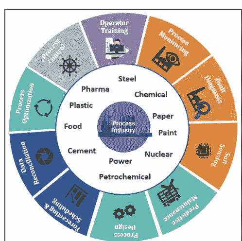

过程系统工程任务的共同主题是，它们都依赖于可靠的动态数学过程模型，这些模型能够利用当前和过去的过程测量值准确预测过程的未来状态。因此，动态过程建模是过程系统工程师的一项核心技能。过程工业历史上一直利用第一性原理/现象学模型和经验/数据驱动模型进行动态过程建模。虽然前者模型保真度更高，但对于复杂系统，后者模型更容易构建。近年来，机器学习/数据科学的普及度急剧上升，工厂收集的传感器测量值呈指数级增长，这重新引发了人们对基于机器学习的动态过程建模的兴趣。过程数据科学家可以使用多种经典和“现代”的机器学习方法进行动态过程建模。本书的剩余部分将带您快速浏览这些方法。现在，让我们直接深入了解ML-DPM的细节。

### 动态过程模型的组成部分

在动态过程建模的背景下，过程系统中有三种类型的变量/信号，如图1.2所示。我们希望预测的测量信号称为输出，而可以操纵以影响输出的测量信号称为输入。在工业过程中，这些输出很少仅受输入影响或完全由输入解释。这个无法解释的部分归因于噪声信号，它可能表现为测量噪声或过程噪声（未测量的扰动或影响系统的未测量信号通常是过程噪声的原因）。在下面显示的pH中和过程示例中，过程噪声对应于废水酸度和/或流量的未测量波动，这会导致过程输出的扰动。

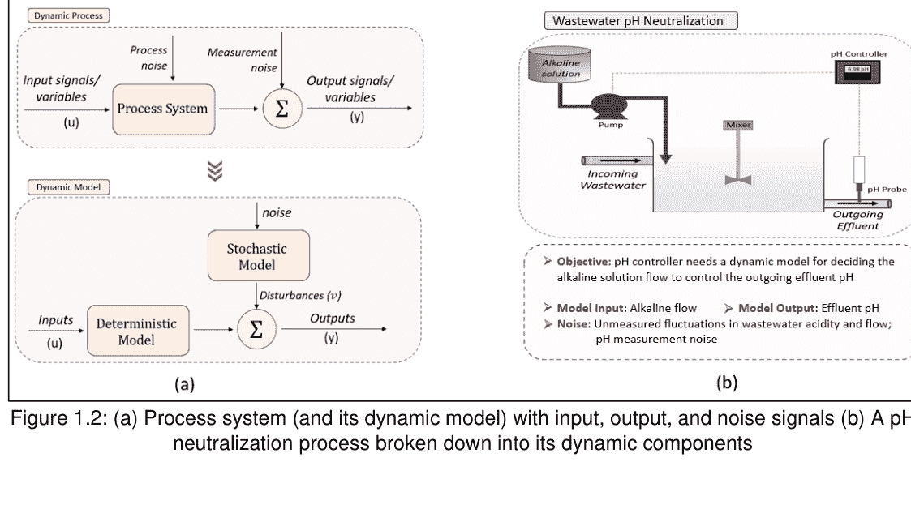

测量噪声和过程噪声的影响可以归为一类，并通过上图所示的随机模型来解释。由此产生的扰动信号概括了过程的所有不确定特性。随机模型和确定性模型可以同时估计，也可以分别估计。

> 在工程界，使用测量数据构建动态系统数学模型的任务称为系统辨识（SysID）。此外，对没有输入变量的动态系统进行建模的任务称为时间序列分析。

### 动态建模符号

在本书中，我们将关注时不变离散时间模型，其中信号假定以规则的采样间隔$T$时间单位记录。在时间$kT$（$k$是任意整数）的输出$y$将表示为$y(k)$。因此，系统辨识需要找出三个信号$y(k)$、$u(k)$和$v(k)$之间的关系。对于pH示例，一个简单的离散时间线性模型可能如下所示：

$$\hat{y}_{pH}(k) = \alpha \hat{y}_{pH}(k-1) + \beta u_{alkaline}(k-1)$$
$$y_{pH}(k) = \hat{y}_{pH}(k) + v(k)$$

其中$\alpha$和$\beta$是可估计的模型参数，扰动变量$v(k)$概括了所有的不确定性。这里，输出在第$k$个时刻的值取决于输出和输入的过去值以及扰动。在后面的章节中，我们将研究如何使用随机模型来表征$v(k)$。

> 我们再怎么强调正确处理过程扰动信号的重要性也不为过。匆忙时，你可能倾向于忽略随机分量。然而，这样做只会招致失望，因为你最终可能得到有偏差的确定性模型，其性能不尽如人意。随机模型和确定性模型之间的这种相互联系对于初学者过程数据科学家来说可能并不明显。当你读完本书时，这种联系将变得显而易见。

### 静态模型与动态模型

在进一步讨论之前，让我们快速看看动态模型与静态模型有何不同。考虑图1.3中的单输入单输出（SISO）过程，其中输入发生阶跃变化，并观察相应的输出变化。

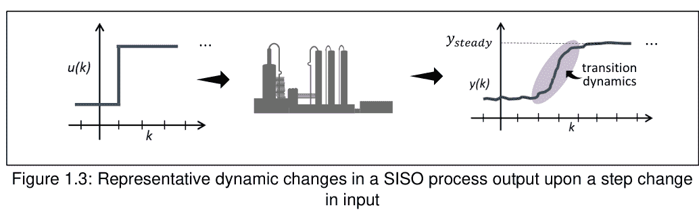

- 在静态模型中，我们只关心能够预测$y_{steady}$作为输入$u$阶跃变化的影响。
- 另一方面，在动态模型中，我们还关心过渡动态过程。
- 显然，动态模型估计是一个要求更高的问题，对于具有随机分量的多变量系统，其复杂性只会增加。

### 离散时间模型的有效性

可以说，过程系统（本质上是连续的）的连续时间描述比离散时间描述更自然，这并不为过。然而，在计算机控制的工业工厂中，来自底层连续过程的信号被采样并在离散时间点提供。因此，专注于离散时间模型是有充分理由的。

当使用第一性原理方法时，离散时间模型可以作为底层过程的近似描述，也可以是精确描述。例如，考虑以下微分方程：

$$\frac{dy}{dt} = f(y(t), u(t))$$

通过前向差分近似导数得到：

$$\frac{y(t+T) - y(t)}{T} = f(y(t), u(t)); \quad T \text{ 是采样间隔}$$

$$\Rightarrow y(t+T) = y(t) + T f(y(t), u(t))$$

或

$$y(k+1) = y(k) + T f(y(k), u(k)); \quad k = \frac{t}{T}$$

离散时间模型

在另一种情况下，如果输入变量在采样间隔之间保持恒定，那么对于线性过程，可以推导出精确的解析离散时间表示。

## 7.4. OE模型：简介

## 7.5. Box-Jenkins模型：简介

## 7.6. ARIMAX模型：简介

## 第八章：状态空间模型：MIMO系统的高效建模

### 8.1. 状态空间模型：简介

### 8.2. 通过CVA进行状态空间建模

- 数学背景
- 超参数选择

### 8.3. 通过CVA对玻璃熔炉建模

### 8.4. 使用CVA监控工业化工厂

- 过程监控/故障检测指标

## 第九章：非线性系统辨识：超越线性模型

### 9.1. 非线性系统辨识：简介

### 9.2. NARX模型：简介

### 9.3. 使用NARX对换热器过程进行非线性辨识

### 9.4. 块结构非线性模型简介

## 附录A1：闭环辨识：反馈过程建模

## 第三部分 人工神经网络与深度学习

## 第十章：人工神经网络：处理复杂非线性系统

### 10.1. ANN：简介

### 10.2. 使用FFNN-NARX对换热器建模

### 10.3. RNN：简介

- RNN输出
- 基于RNN的NARX拓扑
- LSTM网络

### 10.4. 使用LSTM对换热器建模

### 1.2 ML-DPM 工作流程

图 1.4 展示了系统辨识中涉及的典型步骤。如你所见，SysID 不仅仅是曲线拟合。总体而言，它包含五项主要任务：数据收集、探索性数据分析、数据预处理、模型辨识和模型验证。尽管我们将在第 4 章详细研究每个步骤，但这里先快速概览一下：

- **数据收集与探索性数据分析**：拥有“合适”的数据绝对至关重要，而训练数据的“丰富性”要求也是不可或缺的。在上一节中我们看到，动态建模比静态建模要求更高，因此对动态建模的训练数据有更严格的要求。训练数据可以从历史数据库中获取，也可以进行新的实验。训练输入应使得输出数据包含我们感兴趣的动态变化。

探索性数据分析（EDA）涉及对数据进行初步（通常是手动的）调查，以“感受”系统的特性。活动可能包括生成一些图形图表，以检查数据中是否存在趋势、季节性和非平稳性。在 EDA 期间做出的推断有助于在 SysID 的后续步骤中做出正确的选择。

- **数据预处理**：此步骤包含多项活动，旨在移除训练数据中对模型辨识不重要（甚至有害）的部分。它可能涉及移除异常值和噪声、去除趋势等。或者，也可以对训练数据进行处理，以根据模型的最终用途调整模型的准确性。例如，如果模型用于控制目的，则可以对训练数据进行预滤波，以增强模型对高频信号的准确性。总体而言，通用准则是：数据集条件越好，成功进行 SysID 的机会就越大。

- **模型训练**：模型训练是 SysID 中最关键的步骤，包含几个子步骤。首先，必须选择扰动模型和确定性模型的类型。模型的最终用途、可用的*先验*系统知识以及期望的建模复杂度决定了这些选择。例如，如果模型用于仿真目的，则 OE¹ 结构可能优于 ARX；如果过程扰动与过程输入具有不同的动态特性，则 ARMAX 将更可取；如果追求计算便利性，则 ARX 通常是首选，并且优于其他复杂结构（如循环神经网络）。模型结构选择之后是模型参数估计。由于有许多专门的库可用于执行参数估计，这个子步骤在很大程度上是“免干预”的。

¹ 我们将在后续章节中介绍这些模型结构。

- **模型验证**：一旦模型拟合完成，下一步就是检查模型是否真正代表了底层过程。建模者可以使用多种技术。例如，你可以检查模型在未用于参数估计的数据集上的性能，绘制建模误差以寻找残留模式，或者检查模型是否与系统的*先验*信息一致。通常，你的第一个模型会无法通过验证程序。经验丰富的建模者可以利用验证结果来推断失败的原因。一些可能的原因示例包括：
    - 训练数据不够“丰富”
    - 训练数据预处理不充分
    - 模型结构选择错误
    - 估计算法未收敛

一旦诊断出来，就进行适当的修正，然后继续迭代过程。

我们希望你能理解，SysID 不仅仅是黑箱式地应用建模算法来估计模型参数。在 SysID 过程中，建模者需要积极参与多个实际方面。毫不夸张地说，SysID 是一门艺术，本书的其余部分将帮助你获得必要的技能，成为一名 SysID 艺术家！

### 1.3 基于 ML 的动态模型分类

由于数十年的研究开发出了多种专门技术，系统辨识领域极其广泛。图 1.5 概述了本书将涵盖的一些流行方法和模型。这些模型仅代表所有 SysID 模型的一个子集，此选择基于我们关于这些模型对过程系统建模相关性的经验。我们主要关注时不变²、离散时间模型，这些展示的模型可以帮助你处理在过程工业中遇到的大多数 DPM 问题。

² 时间变量不作为显式变量出现的模型。

图 1.5：本书涵盖的一些流行 SysID 方法和模型

图 1.5 中有几个值得注意的点。首先，线性模型的明显主导地位：你可能预期非线性模型更适合对复杂工业过程系统建模，但事实证明，线性模型在 DPM 中通常是合理的。其合理性源于工业过程通常在最优点附近运行，使得线性模型在过程控制和过程监控应用中成为相当好的近似。如果模型的最终用途是过程仿真或设计，其中系统对宽范围输入变量的响应是关注的重点，那么非线性模型可能被证明更合适。在线性类别中，存在不同的建模选项以适应具有不同特性的过程系统，例如，多变量输出、存在相关噪声、扰动与输入共享动态特性、仅存在测量噪声、存在漂移或非平稳性等。

线性模型子树根部的分类基于用于模型拟合的方法论。PEM 方法采用最小化预测误差，而子空间方法基于矩阵代数，不涉及任何参数优化的优化过程。³ 如果这些术语现在对你来说意义不大，请不要担心；它们很快就会变得“显而易见”。如果没有接受过这些不同模型和方法之间细微差别的培训，你可能一开始就不知道哪种模型最适合你的系统。本书将帮助你获得足够的概念理解，从而能够熟练地做出正确的选择，并快速获得你梦寐以求的模型。

³ 另一个区别是 PEM 用于获得输入-输出模型，而 SIM 用于获得状态空间模型。

### 模型类型

在公式 1 中，我们看到了表示动态过程模型的一种方式。图 1.5 中的模型可用于生成动态系统的其他表示形式；下图展示了我们将学习在本书中使用机器学习推导的不同形式/类型的模型。我们还将理解这些不同模型形式的优缺点。

图 1.6：动态过程模型的不同形式（我们将在本书中学习生成），它们的定义特征，以及相应的代表性示例

### 为什么仔细选择模型很重要：一个简单的说明

考虑所示过程：

如果不小心，你可能会忽略测量噪声的存在，并尝试拟合以下输入-输出模型来估计模型参数 $a$ 和 $b$。

**拟合模型（ARX 形式）：** $y(k+1) + a y(k) = b u(k)$

数据文件 ‘simpleProcess.csv’ 包含从真实过程中获得的 1000 个 $u$ 和 $y$ 样本。以下是使用此数据得到的参数估计值，

$\hat{a} = -0.6628 (\pm 0.016) , \hat{b} = 0.7174 (\pm 0.035)$

括号中的值表示标准误差

这里有两点令人震惊：估计值严重不准确，而且参数误差估计似乎表明对这些错误值有很高的置信度！我们的方法哪里出了问题？原因是 SNR（信噪比）值不是很高（数据是在 SNR ~ 10 下生成的），并且拟合的 ARX 模型是真实过程的错误输入-输出形式。正确的形式应该是以下

**正确的输入-输出模型**

方程误差不是白噪声（如 ARX 模型中假设的），而是有色的！

忽略相关方程误差的存在会导致有偏（不准确）的参数估计。希望这个简单的说明能说服你不要盲目应用“方便”的模型。本书的第二部分将为你的 ML-DPM 武器库添加多种建模工具，以帮助避免此类建模错误。

### 1.4 DPM在过程工业中的应用

在图1.1中，我们看到了动态模型在过程工业中的一些应用。为了进一步说明典型的工厂操作员或管理人员如何使用这些多样化的应用，图1.7将DPM应用与过程工厂中典型的决策层级并列展示。如今，工厂操作的每一步都严重依赖于基于DPM的工具，而机器学习已被证明是快速构建这些工具的有效途径。你可以使用图1.5中的模型来构建这些工具，或者如果你使用商业供应商的解决方案，你会发现他们在产品中采用了这些模型。例如，在过程控制领域，FIR模型一直是工业MPC控制器的基石。在过去几年中，商业供应商因其提供的优势而将CVA模型纳入其产品中。Aspen的最新产品DMC3⁴，将神经网络用于MPC和推断建模。ARX、BJ模型也用于工业MPC⁵。

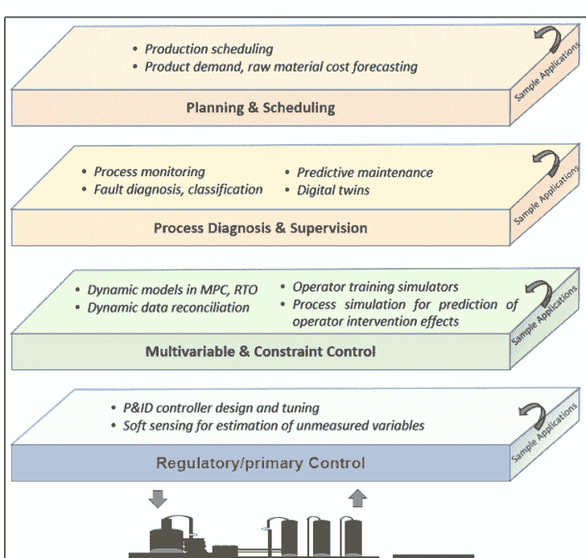

⁴ https://www.aspentech.com/en/products/msc/aspen-dmc3
⁵ Qin and Badgwell, A survey of industrial model predictive control technology. *Control Engineering Practice*, 2003

-   基础控制层主要由（PID）控制阀组成。潜在的DPM应用可能涉及使用软传感器来估计难以测量的受控变量。

-   多变量控制层通常由MPC和RTO模块组成。在这里，代表工厂变量之间多变量关系的动态模型被用于确保工厂的最佳运行。另一个有趣的应用是开发操作员培训模拟器（OTSs）来培训工厂操作员。

-   过程诊断层确保及时的故障检测和诊断。在这里，过程测量值可以与动态模型的预测值进行比较，以检查是否存在过程异常。

-   生产调度层拥有动态模型，利用产品需求和/或原材料成本的预测来确定短期最优生产计划。

至此，我们快速尝试建立了过程工业、动态过程建模和机器学习之间的联系。现在你应该清楚，现代过程工业严重依赖动态过程建模来实现其降低维护成本、提高生产率、可靠性、安全性和产品质量的目标。基于ML的DPM有助于快速构建工具，以促进实现这些目标。

本导论章节也告诫了盲目应用“便捷”的ML模型进行动态建模。你的过程数据将在系统辨识的每个阶段向你提出几个问题。这些问题没有直接的答案，只有一些经过时间考验的指导原则可用。虽然本书的其余部分将使你熟悉这些原则，但责任仍然在于你，需要运用你的过程洞察力和SysID理解来做出正确的建模选择。是的，记住那句古老的建议⁶：“所有模型都是错的，但有些是有用的。”

### 本章小结

本章向你强调了DPM在过程工业中的重要性以及机器学习在其中扮演的角色。我们熟悉了典型的SysID工作流程，探讨了其不同的任务，并审视了可用于模型辨识的不同ML模型。我们还探讨了ML在过程工业中被证明有用的应用领域。在下一章中，我们将迈出第一步，了解我们将用于执行包含SysID代码的Python脚本的环境。

## 第2章

### 脚本环境

在上一章中，我们研究了系统辨识的各个方面，并了解了其在过程工业中的不同用途。在本章中，我们将快速熟悉Python语言以及我们将用于编写ML代码、执行它们并查看结果的脚本环境。本章不会让你成为Python专家，但会让你对这门语言有足够的理解，以便入门并帮助理解后续章节中的多个章节内代码实现。如果你已经了解Python的基础知识，有首选的代码编辑器，并且知道典型SysID脚本的一般结构，那么你可以直接跳到第3章。

如果你浏览系统辨识文献，你会发现几乎完全使用MATLAB软件作为计算环境。这主要归功于系统辨识工具箱，这是由Lennart Ljung教授（系统辨识领域的传奇人物）开发的一个非常强大的MATLAB工具箱。不幸的是，这个工具不是免费提供的，而且MATLAB在ML社区中还没有像Python那样普及。幸运的是，Python社区中有许多好心人已经为SysID的各个方面开发了专门的库。大多数流行的SysID模型现在都可以使用现成的Python库生成。考虑到Python在深度学习领域的主导地位，Python成为SysID脚本编写的绝佳选择。

在上述背景下，我们将涵盖以下主题，以使你熟悉Python：

-   Python语言简介
-   Spyder和Jupyter简介，这两款流行的代码编辑器
-   Python数据结构和科学计算库概述
-   用于系统辨识的Python库
-   典型的ML-DPM/SysID脚本概述

### 2.1 Python简介

Python是一种高级通用计算机编程语言，可用于应用开发和科学计算。如果你使用过其他计算机语言，如Visual Basic、C#、C++、Java，那么你会理解Python是一种解释型和动态语言。如果没有，那么可以将Python视为计算机语言列表中的另一个名字。更重要的是，Python提供了几个特性，使其与其他语言区分开来，成为机器学习的首选语言。图2.1列出了其中一些特性。Python提供了所有工具，可以方便地执行ML-DPM项目的所有步骤，即数据收集、数据探索、数据预处理、模型辨识、可视化和向最终用户的解决方案部署。此外，免费可用的工具使编写Python代码变得非常容易⁷。


### 安装Python

可以从*python.com*网站下载官方最新版本的Python。然而，安装和使用Python最方便的方法是安装Anaconda（*www.anaconda.com*），这是一个开源的Python发行版。除了核心Python，Anaconda还安装了许多其他有用的包。Anaconda附带一个名为Anaconda Navigator的GUI（图2.2），你可以从中启动其他几个工具。

> ⁷ 本章的大部分内容与《Machine Learning in Python for Process Systems Engineering》一书的第2章内容相似，并已进行适当修改以保持本书的独立性。


图2.2：Anaconda Navigator GUI

### 运行/执行Python代码

安装Anaconda后，你可以在任何文本编辑器（如Notepad）中编写代码，将其保存为.py格式，然后通过Anaconda命令终端运行。然而，一个方便的替代方法是使用IDE（集成开发环境）。IDE不仅允许创建.py脚本，还可以即时执行它们，即我们可以在集成环境中进行代码编辑并立即查看结果。在众多可用的Python IDE（PyCharm、VS Code、Spyder等）中，我们发现Spyder是最方便且功能丰富的，因此将在下一节中讨论。

Jupyter Notebooks是编写和执行Python代码的另一种非常流行的方式。这些笔记本允许将代码、执行结果、解释性文本和多媒体资源组合在一个文档中。正如你可以想象的，这使得保存和共享完整的数据分析变得非常容易。

在下一节中，我们将为你提供足够的Spyder和Jupyter知识，以便你可以开始使用它们。

### 2.2 Spyder 与 Jupyter 简介

图 2.3 展示了启动 Spyder 时出现的界面（及其不同组件）。主要有以下 3 个组件：

- *编辑器：* 你可以在此输入并保存代码。点击 ▶ 按钮可执行活动编辑器选项卡中的代码。
- *控制台：* 脚本执行结果显示在此处。它也可用于执行 Python 命令并与工作区中的变量进行交互。
- *变量资源管理器：* 运行编辑器脚本或控制台生成的所有变量都显示在此处，并可进行交互式浏览。

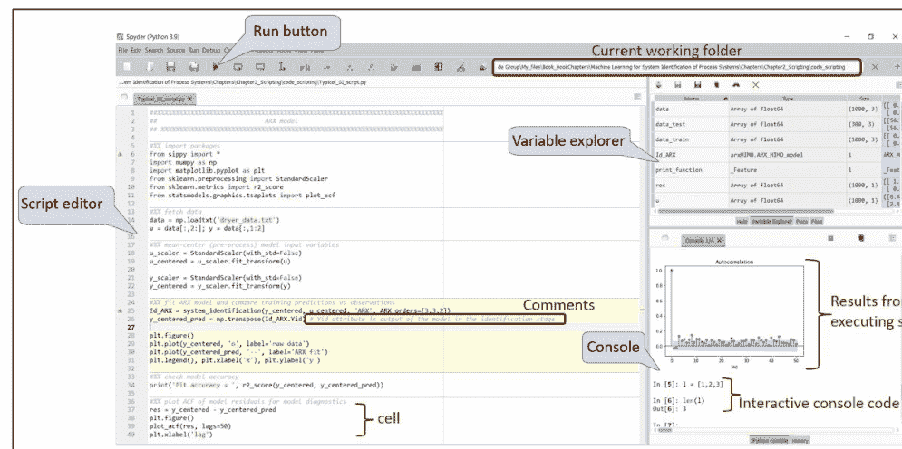

与任何 IDE 一样，Spyder 提供了多种便捷功能。你可以将脚本划分为单元格，并选择仅执行选定的单元格（通过按 Ctrl + Enter 键）。智能感知功能允许你通过按 Tab 键自动补全代码。丰富的调试功能使故障排除更加容易。这些只是 Spyder 可用功能的一部分。鼓励你探索 Spyder 图形用户界面上的不同选项（例如暂停和取消脚本执行、清除变量工作区等）。

使用 Spyder 时，如果你关闭并重新打开脚本，则必须再次运行脚本才能查看执行结果。与此相反，请考虑图 2.4 中的 Jupyter 界面。请注意，Jupyter 界面在浏览器中打开。我们可以将显示的代码、执行输出和解释性文本/图形保存为 (.ipnb) 文件，并在 Jupyter notebook 中重新打开文件时保持其完整无损。

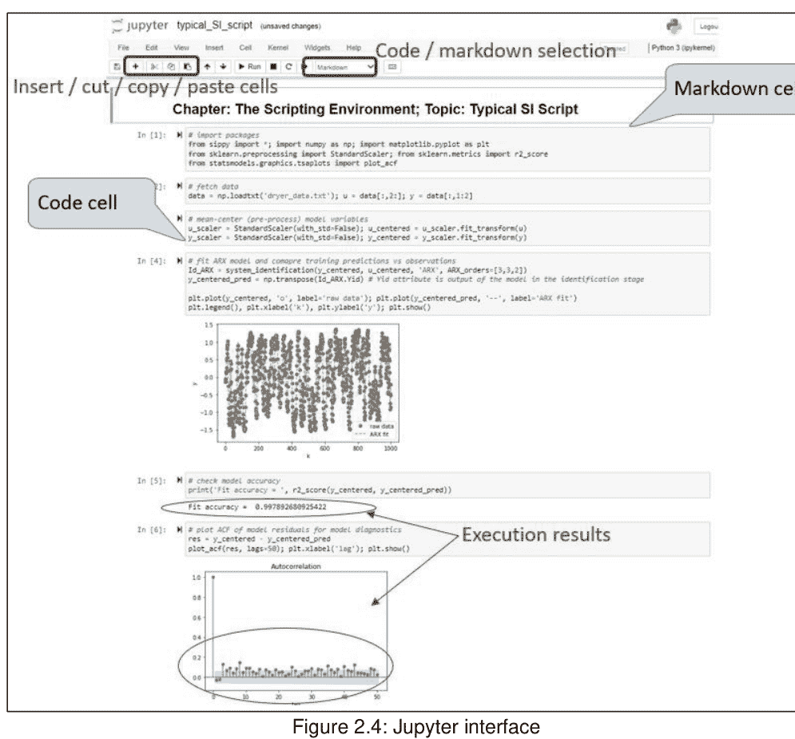

你可以将任何输入单元格指定为代码或 markdown（格式化的解释性文本）。你可以按 Ctrl + Enter 键执行任何活动单元格。所有输入单元格都可以通过 *单元格* 菜单执行。

至此，我们对 Spyder 和 Jupyter 界面的快速概览就完成了。你可以选择其中任何一个来学习本书其余部分的代码。

### 2.3 Python 语言：基础

在当前和下一节中，我们将看到几个使用 Python 和科学包操作数据的简单示例。虽然这些简单的操作在没有更大背景的情况下可能显得平淡无奇（且枯燥），但它们构成了本书后面介绍的更复杂脚本的构建模块。因此，至少快速浏览一下这些内容是值得的。

请注意，你会在这些示例中经常看到 '#'；这些井号用于在代码中插入解释性注释。Python 会忽略（不执行）一行中 # 之后写的所有内容。

#### 基本数据类型

在 Python 中，你使用 4 种数据类型

```
# 4 data types: int, float, str, bool
i = 2 # integer; type(i) = int
f = 1.2 # floating-point number; type(f) = float
s = 'two' # string; type(s) = str
b = True # boolean; type(b) = bool
```

定义变量后，你可以执行基本操作

```
# print function prints/displays the specified message
print(i+2) # displays 4
print(f*2) # displays 2.4
```

#### 列表、元组作为有序序列

相关数据（不一定具有相同的数据类型）可以作为序列排列在列表中，如下所示

```
# different ways of creating lists
list1 = [2,4,6]
list2 = ['air',3,1,5]
list3 = list(range(4)) # equals [0,1,2,3]; range function returns a sequence of numbers starting
                        # from 0 (default) with increments of 1 (default)
list3.append(8) # returns [0,1,2,3,8]; append function adds new items to existing list
list4 = list1 + list2 # equals [2,4,6,'air',3,1,5]
list5 = [list2, list3] # nested list [['air', 3, 1, 5], [0, 1, 2, 3,8]]
```

元组是另一种像列表一样的序列结构，不同之处在于它们的元素和大小不能更改。由于元组是不可变的/不可更改的，它们更节省内存。

```
# creating tuples
tuple1 = (0,1,'two')
tuple2 = (list1, list2) # equals ([2, 4, 6, 8], ['air', 3, 1, 5])
```

下面的几个示例说明了列表推导式，这是一种从其他序列创建新列表的非常有用的方法

```
# generate powers of individual items in list3
newList1 = [item**2 for item in list3] # equals [0,1,4,9,64]

# nested list comprehension
newList2 = [item2**2 for item2 in [item**2 for item in list3]] # equals [0,1,16,81,4096]
```

#### 序列的索引和切片

列表中的单个元素可以如下访问和修改

```
# working with single item using positive or negative indexes
print(list1[0]) # displays 2, the 1st item in list1
list2[1] = 1 # list2 becomes ['air',1,1,5]
print(list2[-2]) # displays 1, the 2nd last element in list2
```

请注意，Python 索引从零开始。很多时候，我们需要处理列表中的多个项目。这可以很容易地完成，如下所示。

```
# accessing multiple items through slicing
# Syntax: givenList[start,stop,step]; if unspecified, start=0, stop=list length, step=1
print(list4[0:3]) # displays [2,4,6], the 1st, 2nd, 3rd items; note that index 3 item is excluded
```

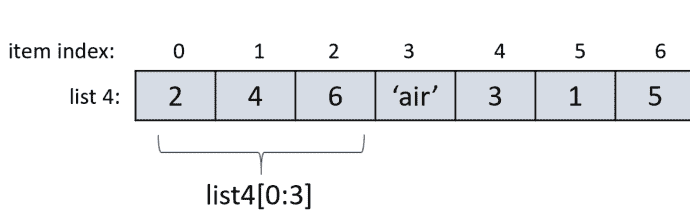

```
print(list4[:3]) # same as above
print(list4[4:len(list4)]) # displays [3,1,5]; len() function returns the number of items in list
print(list4[4:]) # same as above
print(list4[::3]) # displays [2, 'air', 5]
print(list4[::-1]) # displays list 4 backwards [5, 1, 3, 'air', 6, 4, 2]
list4[2:4] = [0,0,0] # list 4 becomes [2, 4, 0, 0, 0, 3, 1, 5]
```

#### 执行控制语句

这些语句允许你控制代码的执行顺序。你可以选择性地或多次执行脚本的任何特定部分。让我们看看如何实现这些

```
# selectively execute code based on condition
if list1[0] > 0:
    list1[0] = 'positive'
else:
    list1[0] = 'negative'

# list1 becomes ['positive', 4, 6]
```

```
# compute sum of squares of numbers in list3
sum_of_squares = 0
for i in range(len(list3)):
    sum_of_squares += list3[i]**2

print(sum_of_squares) # displays 78
```

#### 自定义函数

之前我们使用了 Python 的内置函数（len(), append()）来执行为这些函数预定义的操作。Python 也允许定义我们自己的自定义函数。自定义函数的优点在于，我们可以定义一组指令，然后在脚本和项目中多次重用它们。

为了说明，让我们定义一个函数来计算列表中元素的平方和

```
# define function instructions
def sumSquares(givenList):
    sum_of_squares = 0
    for i in range(len(givenList)):
        sum_of_squares += givenList[i]**2

    return sum_of_squares

# call/re-use the custom function multiple times
print(sumSquares(list3)) # displays 78
```

> 你可能已经注意到，在我们上面的自定义函数代码中，我们使用了不同的缩进（代码行开头的空格数）来将 'for 循环' 代码与函数的其余代码分开。这种做法实际上是 Python 强制执行的，如果不遵循，将导致错误或缺陷。虽然其他流行语言如 C++、C# 使用花括号 ({}) 来界定代码块（函数体、循环、if 语句等），但 Python 使用缩进。你可以选择缩进量，但必须在代码块内保持一致。

至此，我们对 Python 基础知识的极其选择性的介绍就结束了。然而，这应该足以让你理解后续章节中的代码。现在让我们继续学习专门的科学计算包。

### 2.4 科学计算包：基础

虽然核心 Python 数据结构非常方便，但它们对于机器学习任务所需的高级数据操作来说并不十分方便。幸运的是，存在像 NumPy、SciPy、Pandas 这样的专门包，它们提供了适合科学计算的便捷多维表格数据结构。让我们快速熟悉一下这些包。

#### NumPy

在 NumPy 中，ndarray 是基本的数据结构，它将数据放在值的网格中。下面的插图展示了如何创建一维和二维数组以及如何访问它们的元素

```
# import numpy package & create a 2D array
import numpy as np
arr2D = np.array([[1,4,6],[2,5,7]])

# getting information about arr2D
print(arr2D.size) # returns 6, the no. of items
print(arr2D.ndim) # returns 2, the no. of dimensions
print(arr2D.shape) # returns tuple(2,3) corresponding to 2 rows & 3 columns
```

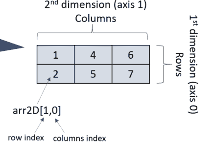

# 创建一个一维数组
arr1D = np.array([1,4,6])

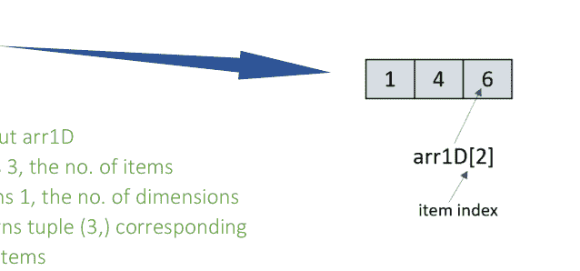

```
# 获取关于arr1D的信息
print(arr1D.size) # 返回3，即元素数量
print(arr1D.ndim) # 返回1，即维度数
print(arr1D.shape) # 返回元组(3,)，对应3个元素
```

请注意，行和列的概念不适用于一维数组。另外，你可能已经注意到，我们在脚本中使用NumPy包之前先导入了它（‘np’只是一个简短的别名）。导入包使得其所有函数和子包都可在我们的脚本中使用。

#### 创建NumPy数组

之前，我们看到了如何将列表转换为NumPy数组。还有其他方法可以创建NumPy数组。下面展示了一些示例

```
# 创建数字序列
arr1 = np.arange(3, 6) # 与Python的range函数相同；结果为array([3,4,5])
arr2 = np.arange(3, 9, 2) # 第三个参数定义步长；结果为array([3,5,7])
arr3 = np.linspace(1,7,3) # 从1到7创建3个等间距的值；结果为array([1., 4., 7.])
```

```
# 创建特殊数组
arr4 = np.ones((2,1)) # 形状为(2,1)且所有元素为1的数组
arr5 = np.zeros((2,2)) # 所有元素为零；通常在脚本开始时用作占位符数组
arr6 = np.eye(2) # 对角线元素为1
```

```
# 为现有数组添加轴（例如，将一维数组转换为二维数组）
print(arr1[:, np.newaxis])
>>>[[3]
    [4]
    [5]]
```

```
arr7 = arr1[:, None] # 与上面相同
```

```
# 组合/堆叠数组
print(np.hstack((arr1, arr2))) # 水平堆叠传入的数组
>>> [3 4 5 3 5 7]

print(np.vstack((arr1, arr2))) # 垂直堆叠传入的数组
>>> [[3 4 5]
    [3 5 7]]

print(np.hstack((arr5,arr4))) # 数组4作为一列添加到arr5中
>>> [[0. 0. 1.]
    [0. 0. 1.]]

print(np.vstack((arr5,arr6))) # 数组6的行添加到arr5上
>>> [[0. 0.]
    [0. 0.]
    [1. 0.]
    [0. 1.]]
```

## **基本NumPy函数**

NumPy提供了几个有用的函数，如mean、sum、sort等，用于操作和分析NumPy数组。你可以指定需要分析数据的维度（轴）。以sum函数为例

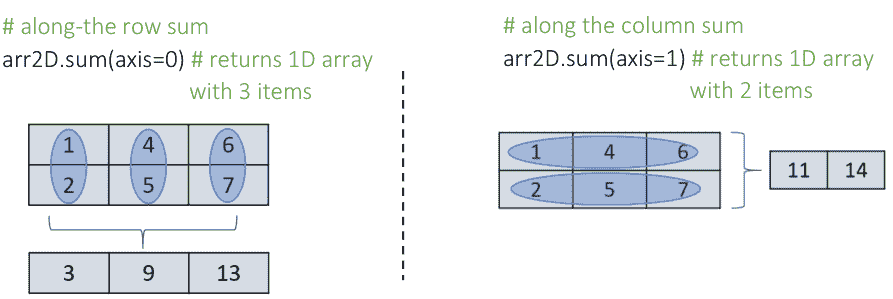

执行arr2D.sum()返回整个数组的标量和，即25。

## **数组索引和切片**

访问单个元素和切片NumPy数组的方式与Python列表类似

```
# 访问单个元素
print(arr2D[1,2]) # 返回7
```

```
# 切片
arr8 = np.arange(10).reshape((2,5)) # 将一维数组重新排列为形状(2,5)
print((arr8[0:1,1:3]))
>>> [[1 2]]
```

```
print((arr8[0,1:3])) # 注意这里返回的是一维数组，而不是上面的二维数组
>>> [1 2]
```

```
# 访问整行或整列
print(arr8[1]) # 返回第二行，为array([5,6,7,8,9])；等同于arr8[1,:]
print(arr8[:, 4]) # 返回第五列的元素，为一维数组
>>> [4 9]
```

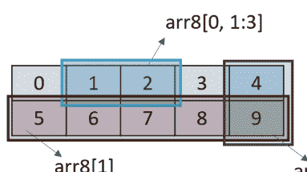

关于NumPy数组切片需要注意的一个重要事项是，对切片视图所做的任何更改也会修改原始数组！请看以下示例

```
# 从arr8中提取一个子数组并修改它
arr8_sub = arr8[:, :2] # 所有行的第0列和第1列
arr8_sub[1,1] = 1000
print(arr8) # arr8也被修改了！！
>>> [[ 0  1  2  3  4]
    [ 5 1000  7  8  9]]
```

当我们只需要处理大型数组/数据集的一小部分时，这个特性变得非常方便。我们可以简单地处理一个更精简的视图，而不是携带整个大数据集。然而，有时我们可能需要实际处理子数组的独立副本，而不必担心修改原始数组。这可以通过copy方法来实现。

```
# 使用copy方法获取独立副本
arr8 = np.arange(10).reshape((2,5))
arr8_sub2 = arr8[:, :2].copy()
arr8_sub2[1, 1] = 100 # arr8在这里不会受到影响
```

花式索引是获取副本而不是被索引数组视图的另一种方式。花式索引简单来说就是使用整数或布尔数组/列表来访问数组元素。下面的示例阐明了这个概念

```
# 简单索引和花式索引的组合
arr8_sub3 = arr8[:, [0, 1]] # 注意列是如何通过列表索引的
arr8_sub3[1, 1] = 100 # arr8_sub3变得与arr8_sub2相同，但arr8在这里没有被修改
```

```
# 使用布尔掩码选择子数组
arr8_sub4 = arr8[arr8 > 5] # 返回array([6,7,8,9])，即所有大于5的值
arr8_sub4[0] = 0 # 同样，arr8不受影响
```

#### 向量化操作


> 假设你需要对两个一维数组进行逐元素求和。一种方法是在循环中一次访问每个索引处的元素并求和。另一种方法是一次性对多个索引处的元素求和。后一种方法称为向量化操作，对于大型数据集和复杂操作，可以显著提升计算时间。

```
#### 向量化操作
vec1 = np.array([1,2,3,4])
vec2 = np.array([5,6,7,8])
vec_sum = vec1 + vec2 # 返回array([6,8,10,12])；无需遍历索引0到3
```

```
# 稍复杂的操作（计算向量之间的距离）
vec_distance = np.sqrt(np.sum((vec1 - vec2)**2)) # vec_distance = 8.0
```

#### 广播

考虑以下arr2D和arr1D数组的求和

```
# arr2D和arr1D的逐元素加法
arr_sum = arr2D + arr1D
```

NumPy允许不同维度的数组之间进行逐元素操作，这得益于“广播”，其中较小的数组被隐式扩展以与较大的数组兼容，如下图所示。可以想象，这是一个非常方便的特性，有关广播规则及不同示例场景的更多细节，建议查阅官方文档⁹。

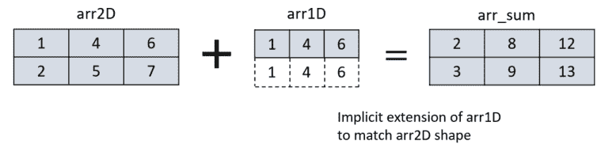

## **Pandas**

Pandas是另一个非常强大的科学包。它建立在NumPy之上，提供了多种数据结构和功能，使得（表格）数据分析和预处理非常方便。一些值得注意的特性包括基于标签的切片/索引、（类似SQL的）数据分组/聚合、数据合并/连接以及时间序列功能。Series和DataFrame分别是Pandas提供的类一维和类二维数组结构

```
# Series（一维结构）
import pandas as pd

data = [10,8,6]
s = pd.Series(data)
print(s)
>>>
0    10
1     8
2     6
dtype: int64

# DataFrame（二维结构）
data = [[1,10],[1,8],[1,6]]
df = pd.DataFrame(data, columns=['id', 'value'])
print(df)
>>>
   id  value
0   1     10
1   1      8
2   1      6

# 从Series创建DataFrame
s2 = pd.Series([1,1,1])
df = pd.DataFrame({'id':s2, 'value':s}) # 与上面相同
```

请注意，s.values和df.values将Series和DataFrame转换为相应的NumPy数组。

#### 数据访问

Pandas允许使用标签以及整数位置来访问DataFrame的行和列。你会发现这个特性非常方便。

```
# 选择列
print(df['id']) # 返回'id'列，为一个Series
print(df.id) # 与上面相同
print(df[['id']]) # 返回列表中指定的列，为一个DataFrame
>>>     id
0  1
1  1
2  1

# 选择行
df.index = [100, 101, 102] # 为了说明，将行索引从[0,1,2]更改为[100,101,102]
print(df)
>>>     id  value
100  1     10
101  1     8
102  1     6

print(df.loc[101]) # 返回第二行，为一个Series；可以提供列表以选择多行
print(df.iloc[1]) # 基于整数位置的选择；结果与上面相同

# 选择单个元素
print(df.loc[101, 'value']) # 返回8
print(df.iloc[1, 1]) # 与上面相同
```

#### 数据聚合

如前所述，Pandas有助于快速分析数据。查看下面一个基于分组的均值聚合的快速示例

```
# 使用df创建另一个DataFrame
df2 = df.copy()
df2.id = 2 # 将'id'列的所有元素设为2
df2.value *= 4 # 将'value'列的所有元素乘以4
print(df2)
>>>     id  value
100  2     40
```

### 2.5 与系统辨识相关的 Python 库

在上一章中，我们了解了几种用于系统辨识的动态建模方法。我们也看到了数据准备和后续残差评估步骤中涉及的一些预处理流程。从技术上讲，可以使用前面描述的科学计算包来实现系统辨识算法，但这可能既繁琐又不便。幸运的是，Python 用户社区提供了多个库，使得实现系统辨识算法变得非常便捷。图 2.5 展示了其中一些库。

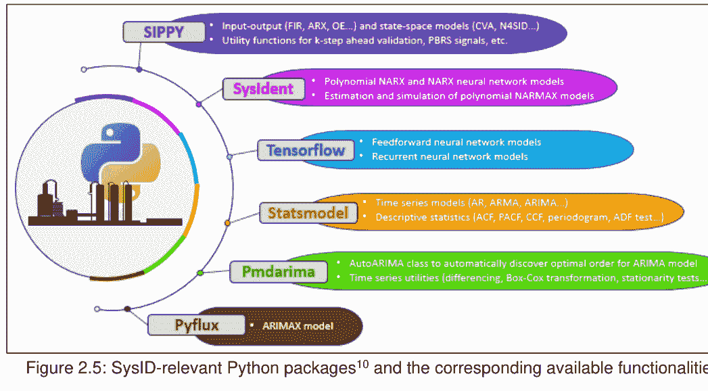

你将发现我们在接下来的章节中会大量使用这些包。我们理解上图中的许多术语现在对你来说可能还很陌生，但我们认为让你对 Python 在系统辨识方面能提供什么有个‘感觉’是件好事。

> 请注意，我们在图 2.5 中没有包含著名的 Sklearn 库，该库提供了许多通用的机器学习相关功能，如数据集划分、标准化、评分等。我们的系统辨识脚本也将广泛使用 Sklearn 库。

最后要传达的信息是，Python 提供了大多数你在其他语言（如 R 和 MATLAB）中能找到的系统辨识工具。

### 2.6 典型的系统辨识脚本

在第 1 章的图 1.4 中，我们以图形方式描绘了系统辨识练习的不同阶段。现在让我们看看一个典型的系统辨识脚本是什么样子。你也将了解如何利用 Python、NumPy 和高级包进行机器学习动态过程建模脚本编写。我们将在接下来的几章中更详细地研究系统辨识的多个方面，但这个简单的脚本是一个良好的开端。这个简单脚本的目标是从文件中获取一个输入变量和一个输出变量的数据，并在它们之间建立一个 ARX 模型。前几行代码负责导入脚本将使用的库。

```python
# import packages
from sippy import system_identification
import numpy as np
import matplotlib.pyplot as plt
from sklearn.preprocessing import StandardScaler
from sklearn.metrics import r2_score
from statsmodels.graphics.tsaplots import plot_acf
```

我们之前研究过 NumPy。SIPPY、Sklearn 和 Statsmodels 在上一节中已经介绍过。我们在这里看到的另一个库¹¹ 是 matplotlib¹²，它用于创建可视化图表。接下来的几行代码获取原始数据并对其进行均值中心化处理。

```python
# fetch data
data = np.loadtxt('InputOutputData.txt')
u = data[:,2:]; y = data[:,1:2] # first column is timestamp

# mean-center (pre-process) model variables
u_scaler = StandardScaler(with_std=False)
u_centered = u_scaler.fit_transform(u)
y_scaler = StandardScaler(with_std=False)
y_centered = y_scaler.fit_transform(y)
```

¹¹ 如果你的机器上没有安装任何需要的包/库，你可以在 Spyder 控制台运行命令 `pip install <package-name>` 来获取它。
¹² Seaborn 是另一个用于创建精美图表的流行库。

这里使用 NumPy 的 loadtxt 函数读取文件 InputOutputData.txt 中以空格分隔的数据。数据存储在一个二维 NumPy 数组 *data* 中，其中第 2 列和第 3 列分别包含输出变量和输入变量的数据。使用 NumPy 切片来分离 *u* 和 *y* 数据。之后，对变量进行预处理以进行均值中心化。接下来，拟合一个 ARX 模型[^13] 并用于进行预测。

```python
# fit ARX model and compare training predictions vs observations
ld_ARX = system_identification(y_centered, u_centered, 'ARX', ARX_orders=[3,3,2])
y_centered_pred = np.transpose(ld_ARX.Yid) # Yid gives predictions during identification
```

**拟合模型** $\rightarrow$ $y(k) - 0.98y(k-1) + 0.02y(k-2) + 0.12y(k-3) = 0.02u(k-1) + 0.06u(k-2) + 0.07u(k-3)$

```python
plt.figure()
plt.plot(y_centered, 'o', label='raw data')
plt.plot(y_centered_pred, '--', label='ARX fit')
plt.legend(), plt.xlabel('k'), plt.ylabel('y')
```

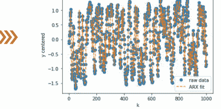

在最后一步，进行模型质量评估。

```python
# Assess model accuracy
print('Fit accuracy = ', r2_score(y_centered, y_centered_pred))
>>> Fit accuracy = 0.998

# plot ACF of model residuals
res = y_centered - y_centered_pred
plot_acf(res, lags=50)
plt.xlabel('lag')
```

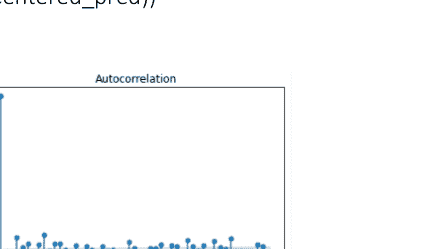

残差图表明需要进一步优化模型。在后面的章节中，我们将学习如何做出这种推断以及我们有哪些可用的补救措施来进行模型优化。

> [^13] SIPPY：模型系数可以通过模型对象的 *G*（或 NUMERATOR 和 DENOMINATOR）属性获得。更多详情请参阅 SIPPY 的手册。

尽管还有更多高级的机器学习和系统辨识方面，但上述代码非常具有代表性地展示了机器学习动态过程建模脚本的内容。希望你也感受到了 Sklearn 和 SIPPY 库的强大功能，它们有助于将复杂的机器学习算法封装在用户友好的函数中。

### 总结

在本章中，我们熟悉了将用于编写和执行机器学习脚本的脚本环境。我们了解了两种流行的 Python 脚本 IDE、Python 语言的基础知识，并学习了如何使用 NumPy 和 Pandas 操作数据。我们还了解了 Python 中可用的与系统辨识相关的库，并看到了一个典型的系统辨识 Python 脚本可能是什么样子。在下一章中，你将学习用于动态数据集初步研究和可视化的几种图形工具。

## 第 3 章
### 动态数据集的探索性分析与可视化：图形工具

在第 1 章中，我们曾提到系统辨识是一门艺术。这门艺术的一部分在于通过数据和模型残差的可视化图形进行探索性分析，从而做出正确的推断。是的，你没看错：即使我们拥有所有花哨的算法，有时对数据的目视检查仍然是快速评估数据集和模型有效性的最佳工具。可视化图表通常能提供关于模型结构和模型故障排除的关键线索，并构成系统辨识推断阶段的重要组成部分。这些图表将在本书的章节示例中反复使用，因此我们认为最好立即介绍这些图形工具背后的概念。

可视化图表的范围可以从简单的时间序列图到高级的谱密度图。它们可以帮助我们快速做出一些有根据的判断，例如数据的平稳性、确定性趋势与随机趋势、有色噪声的存在、模型残差的白噪声特性等。如果你现在还不理解这些动态建模特有的术语，请不要担心。我们将在本章重点介绍这些图表的生成和概念理解，并在后面的章节中学习如何利用这些图表进行推断。

具体来说，我们将涵盖以下主题

- 自相关和自协方差图
- 偏自相关图
- 互相关和互协方差图
- 频谱、谱密度图、周期图

### 3.1 可视化图表：简单而强大的工具

在系统辨识中，从探索性数据分析（EDA）的初始步骤到模型验证的最后一步，对数据图表的仔细审视都是一个关键环节。考虑图3.1中的图表*a*和*b*，它们是两种不同场景下输出信号的时间序列图。仅通过目视检查就能明显看出，原始输出信号包含趋势。可以进一步推断，图表*a*表现出确定性趋势，而图表*b*表现出随机趋势<sup>14</sup>。EDA过程中的此类评估可以帮助过程建模者为其系统选择合适的模型类别。

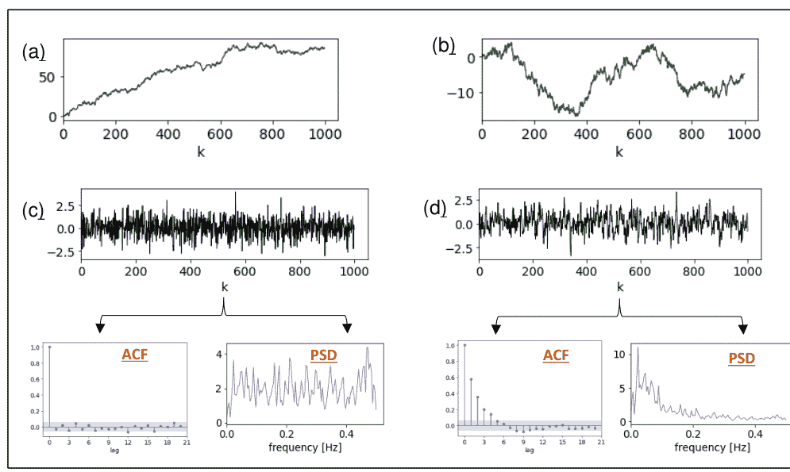

进一步考虑图表3.1*c*和*d*。这里，所示的含噪信号可能对应于扰动信号或模型残差（观测值与模型预测值之间的差异）。与之前的例子不同，这里的时间序列图无法提供任何快速明显的评估。然而，派生的可视化图表——自相关图和谱密度图——使得两种场景之间的区别变得非常明显。这些图表证实了所示信号分别具有白噪声和有色噪声的特性。如果这些是模型残差，那么图表3.1*d*中的非零自相关性立即表明建模不充分。此外，谱密度图在定性上类似于自回归（AR）过程的谱密度图，因此，可以尝试对有色残差使用AR模型。或者，如果这些是过程扰动信号，那么图表3.1c中类似白噪声的扰动会鼓励过程建模者采用OE模型<sup>15</sup>。

> <sup>14</sup> 我们将在第4章中看到关于这两种趋势区别的详细内容。

这些只是使用可视化图表可以得出的推断类型的一个示例。在我们开始使用这些图表之前，明智的做法是理解其背后的原理，本章正是为此目的而设。如果您已经熟悉这些图表，则可以跳过本章的其余部分。让我们从自相关图开始。

> **时域分析与频域分析**

广义上讲，对动态系统建模和分析动态数据集有两种不同的方法：时域方法和频域方法。我们到目前为止讨论的模型都是时域模型，其重点是将未来值建模为过去值和当前值的函数。此类模型主要用于预测/预报，并且在通用DPM从业者中很受欢迎。

在频域方法中，时间序列信号被分解为其傅里叶表示（正弦分量的总和），重点是分析系统输出行为作为输入信号频率的函数。频域方法在表征模型的偏差和方差特性方面非常有用。对于DPM的新手来说，时域模型更容易理解，并且将是本书的重点。相关的频域概念将在需要时加以介绍。

### 3.2 自相关函数（ACF）

在图3.1中，我们看到了ACF图如何使时间序列信号之间的差异变得非常明显。从这两个ACF图中得出的推断甚至更有趣：在序列(d)中，可以使用过去的测量值来预测未来值，而在序列(c)中，无法预测未来值。ACF图如何让我们做出这样的推断？为了理解这一点，让我们重新审视相关的经典概念。您可能已经知道，相关系数量化了两个变量之间的线性关系，其计算公式如下

$$\rho = \frac{\sum_{k=0}^{N-1} (y(k) - \bar{y}) (u(k) - \bar{u})}{\sqrt{\sum_{k=0}^{N-1} (y(k) - \bar{y})^2 (u(k) - \bar{u})^2}}$$

$N$是样本数量；$\bar{u}$和$\bar{y}$分别是$u(k)$和$y(k)$的样本均值。

对于单个时间序列$y(k)$，相关性表现为自相关

$$\rho_{yy}(\ell) = \frac{\sum_{k=\ell}^{N-1} (y(k) - \bar{y})(y(k-\ell) - \bar{y})}{\sum_{k=0}^{N-1} (y(k) - \bar{y})^2}$$

$N$是时间序列的长度。

公式 1

这里，$\rho_{yy}(\ell)$量化了时间序列中相隔$\ell$距离的滞后值之间的线性关系。例如，$\rho_{yy}(2)$衡量的是$y(k)$和$y(k-2)$之间的相关性。不同相关系数与滞后$\ell$的关系图（如下方的示例图）称为自相关函数或ACF。

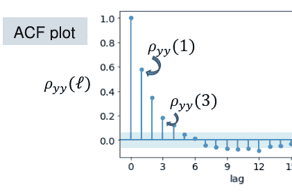

**ACF性质**

- $\rho_{yy}(0) = 1$
- $-1 \le \rho_{yy}(\ell) \le 1$
- $\rho_{yy}(\ell)$是对称的（$\rho_{yy}(\ell) = \rho_{yy}(-\ell)$），因此，ACF通常只绘制$\ell \ge 0$的部分。

> 在公式1中，有一个隐含的假设，即对于任何$q$，$y(k)$和$y(k-\ell)$之间的关系与$y(k+q)$和$y(k+q-\ell)$之间的关系相同。另一个假设是均值$\bar{y}$与采样位置$k$无关。这些假设导致ACF仅是距离$\ell$的函数，并且公式1仅对平稳过程有效。我们将在第4章中了解更多关于平稳性的内容。

#### 示例 3.1：

考虑下面生成时间序列$y(k)$的随机过程

$$y(k) = 0.6y(k-1) + e(k)$$

数据文件SimpleTimeSeries.txt包含$y(k)$的1000个观测值。下面的代码生成ACF图。

```
# import packages
import numpy as np
from statsmodels.graphics.tsaplots import plot_acf
import matplotlib.pyplot as plt
```

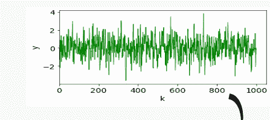

```
# read data
y = np.loadtxt('simpleTimeSeries.csv', delimiter=',')
```

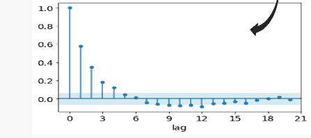

```
# generate ACF plot
conf_int = 2/np.sqrt(len(y))
plot_acf(y, lags= 20, alpha=None)
plt.gca().axhspan(-conf_int, conf_int, facecolor='lightblue') # confidence interval
```

上述ACF图中的阴影区域代表（95%）置信区间，对于白噪声信号（其值不相关的信号），自相关系数预期会落入该区间。对于信号$y(k)$，其值显然是相关的，因此系数是显著的（位于阴影区域之外）。

显著的自相关性表明时间序列的未来值与其过去值存在线性依赖关系。希望现在您能回答本节开头提出的问题，即ACF如何让我们对图3.1中的可预测性做出推断。

#### 使用ACF进行推断的示例

- **模型结构选择：**

下面的插图展示了一些示例ACF图以及关于潜在模型结构可以得出的推断

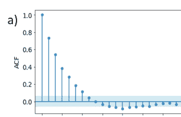

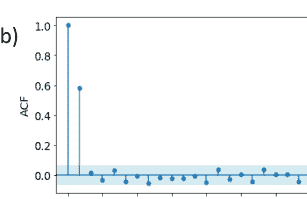

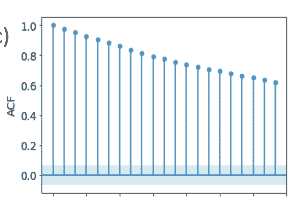

- ACF值呈指数衰减
- 信号可能来自AR过程

- ACF值突然下降
- 信号可能来自MA过程

- ACF值下降非常缓慢
- 过程接近非平稳性

#### 残差诊断：

残差是信号观测值与预测值之间的差异。考虑下面的残差信号时间序列图及其ACF图

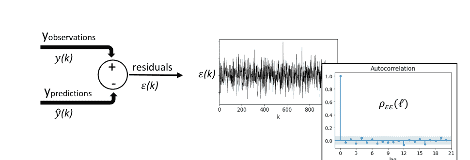

这里，我们观察到ACF值不显著，因此模型（生成预测值$\hat{y}(k)$的模型）已经能够捕捉数据中的所有线性关系，残差中没有留下任何模式。<sup>16</sup>

<sup>16</sup> ACF的一个未归一化版本，称为自协方差函数（ACVF），也存在，其表达式为$\sigma_{yy}(\ell) = \frac{1}{N} \sum_{k=\ell}^{N-1} (y(k) - \bar{y})(y(k - \ell) - \bar{y})$。然而，协方差系数是无界的，因此与相关系数相比使用较少。

#### 白噪声

既然我们已经理解了自相关函数（ACF），现在让我们正式描述一下已经使用过几次的术语“白噪声”。一个随机序列 $e(k)$ 被称为白噪声，如果其样本具有零均值和有限方差（例如 $\sigma^2$）的概率分布，并且满足以下理论自相关函数：

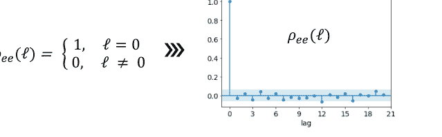

因此，$e(k)$ 的样本是序列不相关的随机变量。在实践中，自相关系数可能不完全为零，但会接近零。尽管如此，可以预期95%的系数将落在 $\pm 2/\sqrt{N}$ 的区间内，如示例3.1所示。另请注意，虽然高斯白噪声是常用的，但对样本的概率分布没有约束。因此，在系统辨识文献中可能会遇到以下符号表示：

$e(k) \sim WN(0, \sigma^2)$（白噪声）或 $e(k) \sim GWN(0, \sigma^2)$（高斯白噪声）

一个相关术语是独立同分布（iid）噪声。每个独立同分布序列都是白噪声，但反之则不然。生成白噪声信号最简单的方法是使用Numpy的随机正态函数，如下所示：

```
# import packages
import numpy as np, matplotlib.pyplot as plt

# generate GWN (1000 observations, mean 0, variance 1)
e = np.random.normal(loc=0, scale=1, size=1000)
plt.plot(e, 'black', linewidth=0.5)
plt.ylabel('White noise'), plt.xlabel('k')
```

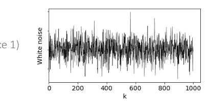

使用“白”这个术语来描述这种噪声源于其频谱特性，我们很快就会研究。任何非白的噪声信号都是“有色”噪声信号。本质上，白噪声是完全不可预测的，即，无论过去有多少观测值，都无法为未来的观测提供任何线索。尽管如此，这些信号是构建复杂扰动信号模型的基本构建块（更多内容见第5章）。

### 3.3 偏自相关函数（PACF）

再次考虑示例3.1中的过程。ACF图表明 $y(k)$ 和 $y(k-2)$ 是相关的（$y(k)$ 和 $y(k-3)$ 等也是如此）。这似乎表明与仅关联连续样本 $y(k)$ 和 $y(k-1)$ 的控制差分方程存在一些不一致。然而，很容易看出 $y(k)$ 和 $y(k-2)$ 最终相关是因为 $y(k-1)$ 和 $y(k-2)$ 直接相关。

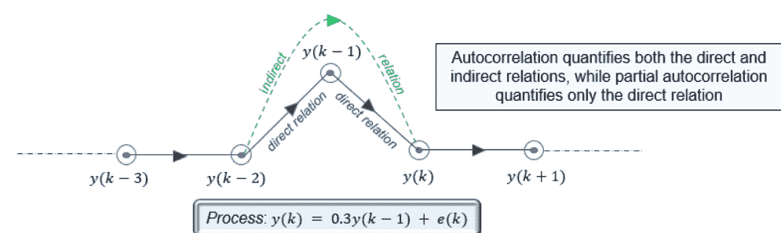

在时间序列分析中，了解直接相关性有助于在模型结构选择期间决定哪些项应成为控制差分方程的一部分。为了计算 $y(k)$ 和 $y(k-2)$ 之间的直接相关性，需要从 $y(k)$ 和 $y(k-2)$ 中“折扣”或移除 $y(k-1)$ 的影响。折扣后变量之间的相关性给出了直接相关性，或者更正式地说，偏相关性。下面的算法显示了计算偏（自）相关性的过程：

**算法：$y(k)$ 和 $y(k-2)$ 之间的偏自相关**

1. 分别对 $y(k)$ 和 $y(k-1)$ 之间以及 $y(k-2)$ 和 $y(k-1)$ 之间进行最小二乘拟合
2. 从最小二乘模型生成预测值并计算以下残差
   $$\epsilon_{y_k} = y_k - \hat{y}_k \quad \text{and} \quad \epsilon_{y_{k-2}} = y_{k-2} - \hat{y}_{k-2}$$
   折扣变量
3. 偏自相关系数 $\phi_{yy}(2) \equiv$ $\epsilon_{y_k}$ 和 $\epsilon_{y_{k-2}}$ 之间的相关性

滞后3的偏自相关系数可以按照上述算法计算，其中从 $y(k)$ 和 $y(k-3)$ 中折扣了 $y(k-1)$ 和 $y(k-2)$ 的影响。其他系数可以类似地计算，并绘制相对于滞后的图，得到偏自相关函数（PACF）。让我们重新审视之前的例子。

#### 示例3.1续：

下面的代码生成PACF图。

```
# generate PACF plot
conf_int = 2/np.sqrt(len(y))
plot_pacf(y, lags= 20, alpha=None)
plt.gca().axhspan(-conf_int, conf_int, facecolor='lightblue')
```

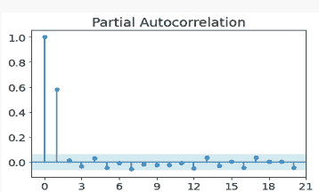

PACF图符合预期。只有滞后=1处的系数是显著的。注意在滞后=1处，PACF和ACF值相同，因为没有中间变量。此外，滞后=0处的PACF值未定义，但为了可视化目的通常设置为1。

现在你应该清楚PACF的用途了。PACF的另一个解释值得一提。假设你拟合以下（$p^{th}$阶）自回归模型。

$y(k) = a_1y(k-1) + a_2y(k-2) \cdots + a_py(k-p) + e(k)$

对应于 $p^{th}$ 滞后回归量（$y(k-p)$）的系数或权重（$a_p$）等于滞后 $p$ 的PACF值或 $\varphi_{yy}(p)$。因此，PACF图中最后一个显著PACF值对应的滞后可以指示自回归模型中应使用的项数。更多内容将在时间序列分析章节中介绍。

### 3.4 互相关函数（CCF）

互相关衡量两个序列（例如 $u(k)$ 和 $y(k)$）之间的线性关系，估计为：

$$\rho_{yu}(\ell) = \frac{\sum_{k=\ell}^{N-1} (y(k)-\bar{y})(u(k-\ell)-\bar{u})}{\sqrt{\sum_{k=0}^{N-1}(y(k)-\bar{y})^2 (u(k)-\bar{u})^2}}$$ 公式 2

互相关系数相对于滞后 $\ell$ 的图称为互相关函数。

**示例3.2：** 考虑以下输入输出过程

$$y(k) = 0.6y(k-1) + 0.7u(k-3) + e(k)$$

数据文件SimpleInputOutput.txt包含1000个 $y(k)$ 和 $u(k)$ 的观测值。下面的代码生成CCF图。

```
# import packages
import numpy as np, matplotlib.pyplot as plt
from statsmodels.tsa.stattools import ccf

# read data
data = np.loadtxt('simpleInputOutput.csv', delimiter=',')
u = data[:,0]; y = data[:,1]

# compute CCF values for lags = -20 to 20
ccf_vals_ = ccf(y, u) # ccf for lag >= 0
ccf_vals_neg_lags = np.flip(ccf(u, y)) # ccf for lag -1000 to 0
ccf_vals = np.hstack((ccf_vals_neg_lags[-21:-1], ccf_vals_[:21]))

# generate CCF plot
conf_int = 2/np.sqrt(len(y))
lags = np.arange(-20,21)
plt.plot(lags, ccf_vals) # no in-built analogue of plot_acf is provided by Stattools
plt.gca().axhspan(-conf_int, conf_int) # confidence interval
```

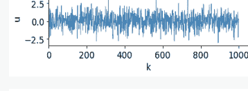

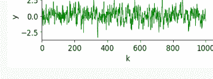

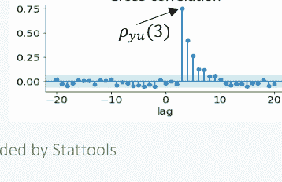

上述代码中利用了这一性质来计算滞后 <=0 的ccf值

> CCF性质
- $-1 \le \rho_{yu}(\ell) \le 1$
- $\rho_{yy}(\ell)$ 是非对称的，即 $\rho_{yu}(\ell) \neq \rho_{yu}(-\ell)$ 且 $\rho_{yu}(\ell) = \rho_{uy}(-\ell)$

## 使用CCF进行推断的示例<sup>17</sup>

模型结构选择：

$u(k)$ 和 $y(k)$ 之间的CCF可以提供关于过程时间延迟（纯滞后（$d$））<sup>18</sup>的一些关键提示。考虑以下场景以及纯滞后是使 $u(k-1-d)$ 直接影响 $y(k)$ 的最小值 $d$ 这一事实。

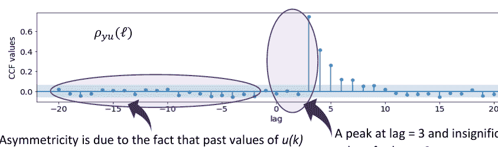

非对称性是由于 $u(k)$ 的过去值与 $y(k)$ 的关系不同于未来值

滞后=3处出现峰值且滞后<=2处的CCF值不显著
$\Rightarrow$ $d$ 的一个合理猜测是2

残差诊断：

如果模型充分捕捉了输入和输出之间的关系，那么残差（$\epsilon(k)$）和输入序列（$u(k)$）之间的 $\rho_{\epsilon u}(\ell)$ 对于正滞后<sup>19</sup> 应该接近零，因为 $\epsilon(k)$ 不应与过去的输入值有任何关系。<sup>20</sup>

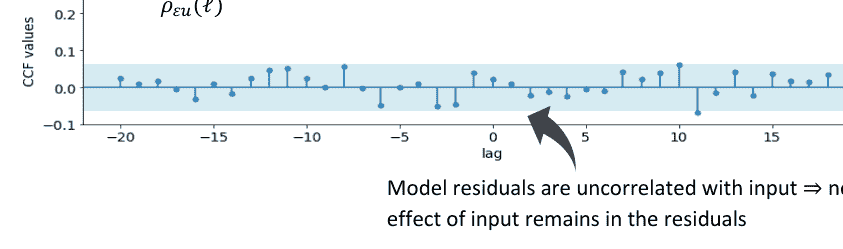

模型残差与输入不相关 $\Rightarrow$ 输入的影响在残差中没有残留

<sup>17</sup> 与ACF类似，CCF也有一个协方差对应物，称为互协方差函数（CCVF），表示为 $\sigma_{yu}(\ell) = \frac{1}{N} \sum_{k=\ell}^{N-1} (y(k) - \bar{y})(u(k - \ell) - \bar{u})$。注意，分母可以设为 $N-\ell$ 而不是 $N$ 以获得无偏估计。

<sup>18</sup> 我们将在第6章正式介绍*纯滞后*这个术语。但我们认为，如果你已经知道纯滞后是什么，你可能会欣赏这个例子。

<sup>19</sup> 负滞后处的显著相关性意味着残差与未来输入值之间存在关系，这是闭环反馈的迹象（不一定是模型不足）。我们稍后将了解更多。

<sup>20</sup> 这里有一个小注意事项：要么 $\epsilon(k)$ 要么 $u(k)$ 应该是白噪声才能施加此条件

### 3.5 功率谱密度（PSD）与周期图

动态信号的特性也可以通过其频率成分来描述，即将信号分解为不同频率的正弦分量。频域分析也称为谱分析，对于随机离散时间信号，首选工具是（功率）谱密度图，它能快速展示不同频率分量的强度。例如，考虑以下时间序列及其谱密度图。谱图可以轻松推断出频率为0.1Hz和0.05Hz的分量主导了该信号。

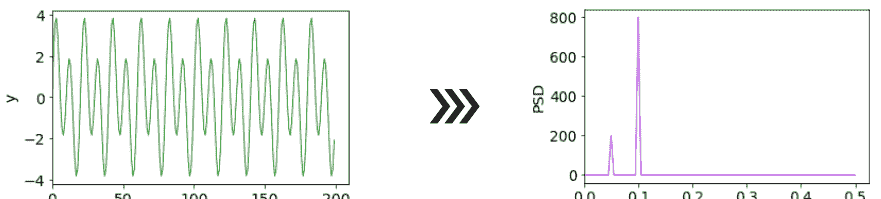

在图3.1的引导性示例中，我们看到白噪声信号在所有频率上具有近似均匀的贡献。事实上，这是任何白噪声信号的定义性特征（类似于白光，它是所有可见光频率的混合）。为采样时间序列数据生成PSD图的常用做法是使用周期图。无需深入数学细节，只需说明周期图绘制的是傅里叶变换幅度的平方随频率变化的函数，因此它展示了动态信号的强度或功率在频率上的分布情况。让我们在下面的例子中看看基于PSD的推断实例。

**示例 3.3：**

我们将考虑示例3.2中的输入和输出时间序列信号，研究它们的谱特性，并尝试进行一些与建模相关的推断。下面的代码为输入和输出信号生成周期图

```python
# import packages
import numpy as np, matplotlib.pyplot as plt
from scipy import signal

# read data
data = np.loadtxt('simpleInputOutput.csv', delimiter=',')
u = data[:,0]; y = data[:,1]

# input PSD
freq, PSD = signal.welch(u)
plt.figure(), plt.plot(freq, PSD)
plt.ylabel('input PSD'), plt.xlabel('frequency [Hz]')

# output PSD
freq, PSD = signal.welch(y)
plt.figure(), plt.plot(freq, PSD)
plt.ylabel('output PSD'), plt.xlabel('frequency [Hz]')
```

> Welch方法通过将信号分段重叠并计算平均周期图来估计PSD；平均处理减少了PSD值中的噪声波动

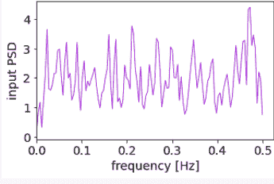

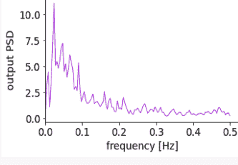

从谱密度的比较可以明显看出，该过程具有低通滤波器特性，因此具有此类特性的模型（如ARX）可以是一个良好的初始选择。

至此，我们快速了解了一些用于分析时间序列数据的流行图形工具。希望你现在对这些工具有了足够的了解，以便在后续章节中理解它们的具体应用。

### 总结

在本章中，我们研究了自相关函数（ACF）、偏自相关函数（PACF）、互相关函数（CCF）和周期图背后的概念。我们还探讨了这些图形工具的一些应用。这些工具对于分析时间序列和输入输出数据非常有用，是你发展ML-DPM专业知识所依赖的基础的关键部分。在下一章中，我们将继续构建基础知识，并探讨一些成熟的系统辨识指南。

## 第4章

### 基于机器学习的动态建模：工作流程与最佳实践

在第1章的图1.4中，我们了解了系统辨识的典型工作流程。值得注意的是，虽然模型辨识只是这个工作流程的一部分，但很多时候人们过于关注将模型辨识应用于估计模型参数，而牺牲了系统辨识的其他方面。如果数据没有得到适当预处理，直接将原始数据输入模型辨识模块必然会产生不令人满意的模型。此外，你在建模选择上很少能第一次就正确。关键信息是：了解如何准备原始数据以增强其关于系统的信息内容、如何评估所获模型的有效性、如何批判性地分析建模结果以及如何明智地进行迭代，对于成功的系统辨识至关重要。幸运的是，已经制定了一些指南和最佳实践来指导过程建模者在系统辨识工作流程的每一步。我们将在本章学习这些指南和最佳实践。

我们不会涵盖与通用机器学习工作流程相关的最佳实践。特征提取、特征工程、交叉验证、正则化等概念已经在我们系列的第一本书中详细阐述。在本章中，我们的重点将放在动态过程带来的独特挑战以及应对这些挑战的具体最佳实践上。具体涵盖以下主题：

- 使用PRBS和GBN信号进行辨识测试设计
- 原始数据的预处理，以去除测量噪声、偏移、趋势和漂移
- 模型结构选择的指南
- 通过AIC和交叉验证进行模型阶次选择
- 通过残差分析、仿真响应分析等进行模型质量评估

### 4.1 系统辨识工作流程

到目前为止，在本书中我们一直有意识地强调模型辨识与系统辨识之间的区别。模型辨识完全关于估计模型参数，而系统辨识则关乎确保模型真正代表底层系统，并且与任何先验可用知识和任何建模假设保持一致。图4.1重现了我们在第1章看到的系统辨识工作流程，并展示了为实现所述目标所需的几个步骤。本章的其余部分将让你了解系统辨识的这些不同方面，并帮助你获得关于如何成功执行系统辨识项目的实践级理解。

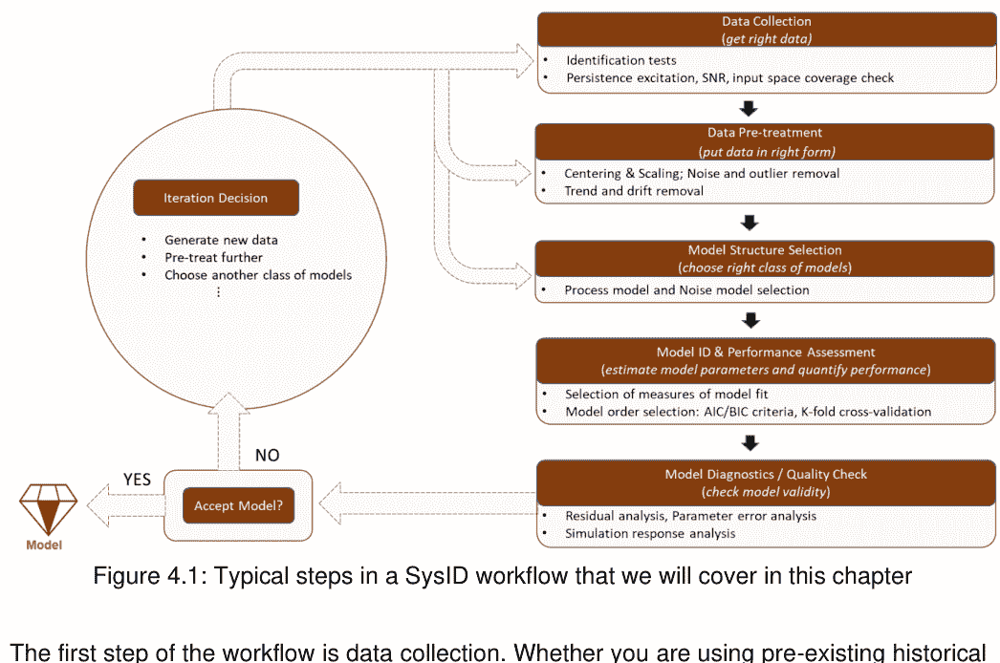

图4.1：我们将在本章介绍的系统辨识工作流程中的典型步骤

工作流程的第一步是数据收集。无论你是使用现有的历史数据还是进行新的辨识测试，你都必须确保数据集包含足够的“信息量”，以便能够辨识出所需的模型。我们很快会看到关于这项任务的一些指南。下一步是净化数据，去除可能对模型辨识产生负面影响的不需要的成分。例如，消除输出信号中的任何缓慢漂移对于避免错误的模型参数至关重要。经过前两步后，我们的数据集准备就绪，接下来是模型结构选择，过程建模者有责任选择正确类型的过程模型和噪声模型。我们在第1章看到，不正确的选择可能导致有偏的参数估计。你的专业知识领域知识和关于过程扰动的任何先验信息在这一步会非常有用。例如，这一步是你在ARX与ARMAX，或ANN与CVA模型之间做出决策的地方。一个通用的经验法则是从简单模型（如AR、ARX）开始，然后利用模型诊断的推断来筛选下一个候选模型。

一旦选择了模型，就可以使用现成的Python包来估计模型参数。这些包还包括自动选择最佳模型阶次的功能，例如ARX模型中自回归项的数量。估计的模型必须始终经过广泛检查，以确保模型适合你的过程系统，并且与建模假设和先验过程知识一致。我们将在本章后面学习几种这样的模型质量检查方法。遇到的任何模型缺陷都需要进行适当的修正，并再次遍历整个工作流程。现在让我们逐一了解这些任务。

### 4.2 辨识测试/输入信号设计

成功模型辨识的首要要求是模型训练数据（无论是历史数据还是新生成的数据）必须具有信息量。在工业界观察到的新数据收集的传统做法（特别是用于控制目的的模型开发）是分别对每个输入施加阶跃变化并记录阶跃响应。图4.2显示了一个例子。虽然这些阶跃测试足够简单，可以被工厂操作员理解，并提供关于过程稳态行为的良好信息，但存在几个缺点。当过程有多个输入时，阶跃测试需要大量的时间和人力。此外，已知阶跃测试不能显著激发所有工厂动态，因此模型辨识不准确的风险很高。

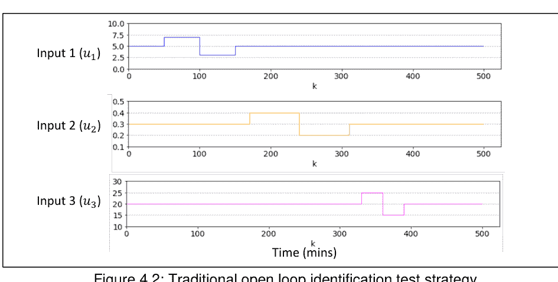

#### 持续激励

考虑以下过程

$$y(k) = b_1u(k-1) + b_2u(k-2) + b_3u(k-3) + b_4u(k-4) + e(k)$$

假设输入信号在理论上具有 $u(k) = u(k-1) + 1$ 的形式。在此类输入信号下，该过程可重写为

$$y(k) = b_1u(k-1) + b_2u(k-1) - b_2 + b_3u(k-1) - 2b_3 + b_4u(k-1) - 3b_4 + e(k)$$
$$= b'_1u(k-1) + b_0$$

上述推导表明，该过程的行为实际上类似于一个双参数系统，因此，使用上述输入信号收集的输出数据无法唯一确定四个原始模型参数。换言之，由于数据信息不足，真实过程模型不可辨识。为确保可辨识性，输入变量必须受到充分激励。从数学上讲，如果满足以下条件，则称离散时间输入信号 $u(k)$ 是 $n$ 阶持续激励的（用于唯一辨识具有 $\le n$ 个模型参数的 PEM 模型）：

以下极限存在

以下矩阵可逆

$$r_u(\tau) = \lim_{N \to \infty} \frac{1}{N} \sum_{t=0}^{N} u_{t+\tau} u_t$$

$$R_u(n) = \begin{bmatrix} r_u(0) & r_u(1) & \cdots & r_u(n-1) \\ r_u(-1) & r_u(0) & \cdots & r_u(n-2) \\ \vdots & \vdots & \ddots & \vdots \\ r_u(1-n) & r_u(2-n) & \cdots & r_u(0) \end{bmatrix}$$

你通常不会直接使用这些理论条件，但了解它们是有价值的：阶跃输入具有 1 阶持续激励（p.e.）；全长 PRBS 具有 $M$ 阶 p.e.；GBN 信号和白噪声信号对于任何有限阶数都是持续激励的。或者，在频域中，如果 $u(k)$ 的谱密度在区间 $(-\pi, \pi]$ 内的 $n$ 个点上不为零，则它是 $n$ 阶持续激励的。

#### 伪随机二进制序列（PRBS）

PRBS 信号在两个电平之间切换，脉冲宽度可变，如下图所示。宽脉冲有助于估计稳态增益，而窄脉冲有助于捕捉瞬态动态。

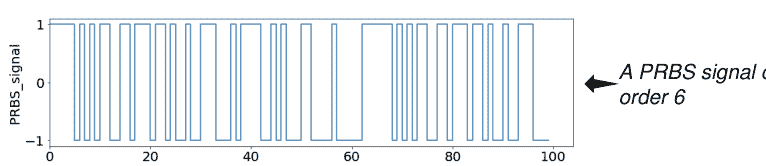

对于 $n$ 阶，可以生成长度为 $M = 2^n-1$ 的唯一序列。对于更长的信号长度，该唯一序列会重复自身，因此具有长度为 $M$ 的周期，如下例所示。尽管 PRBS 序列是确定性的，但对于较大的 $M$（且信号长度 $\ge M$），该信号具有类似白噪声的特性，因此其名称中包含“伪随机”一词。Scipy 库提供了生成 PRBS 的函数。示例如下。

**示例 4.1：**

让我们生成一个在 -1 和 1 之间波动的 PRBS 输入信号。

```
# import packages
from scipy.signal import max_len_seq
import matplotlib.pyplot as plt

# generate PRBS input signal of order 6 and plot
PRBS_signal = max_len_seq(6, length=100)[0]*2-1 # converting sequence of 0's and 1's to sequence of -1's and 1's

plt.plot(PRBS_signal, 'steelblue')
plt.ylabel('PRBS_signal'), plt.xlabel('k')
```

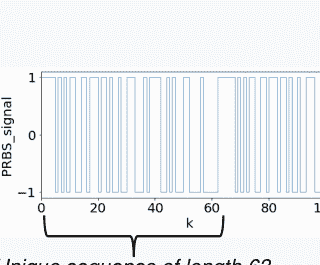

#### 广义二进制噪声（GBN）

GBN 信号类似于 PRBS，但非周期性。它在两个值 $-a$ 和 $a$ 之间切换，序列生成方式如下

$P[u(k) = -u(k-1)] = p_{sw}$
$P[u(k) = u(k-1)] = 1 - p_{sw}$

$; p_{sw} \in (0,1)$ 是切换概率

当 $p_{sw} = 0.5$ 时，GBN 信号具有类似白噪声的特性。然而，通常建议使用较低的 $p_{sw}$ 值（0.1 或 0.05）。SIPPY 库提供了生成 GBN 信号的函数。示例如下。

#### 示例 4.2：

让我们生成一个在 -1 和 1 之间波动的 GBN 输入信号。

```
# import packages
from sippy import functionset as fset
import matplotlib.pyplot as plt

# generate GBN input signal using SIPPY and plot
[gbn_signal, _, _] = fset.GBN_seq(1000, 0.1)

plt.plot(gbn_signal, 'steelblue', linewidth=0.8)
plt.ylabel('GBN_signal'), plt.xlabel('k')
```

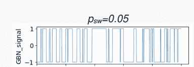

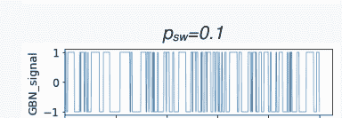

在图中，请注意较低的切换概率如何导致较高的脉冲宽度。

> 持续激励只是模型可辨识性的理论保证。其他实际要求也需要仔细关注。

> 测试信号的物理电平应选择得足够大，使得输出的变化大于噪声引起的变化。这一特性通过一个称为信噪比（SNR）的度量来量化。低 SNR 会导致参数估计不准确。这里需要提醒几点：如果你只对某个工作点附近的线性模型感兴趣，那么你需要警惕由高测试信号电平引起的非期望非线性。

> 如果你希望建立非线性模型，那么输入信号电平的二进制变化将无法暴露系统的非线性。测试信号的电平/幅度也必须取一系列值。

### 4.3 数据预处理

原始过程数据很少适合直接用于模型辨识，即使它是通过精心设计的辨识测试获得的。在本节中，我们将学习一些处理无意中混入数据集的杂质的常用方法。让我们从去除高频测量噪声开始。

#### （测量）噪声去除

考虑下面的图，它显示了一个温度变量的观测值。这里，在明显系统性变化之上的高频抖动是测量噪声，在模型辨识之前需要去除。在时域中，常见的噪声去除方法是移动平均平滑和 SG 滤波。²²

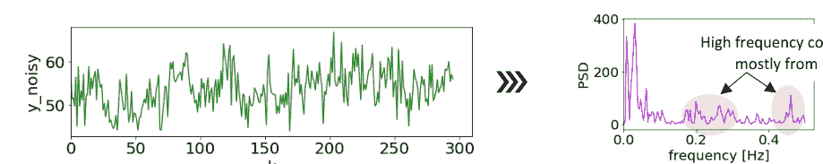

另一种噪声去除方法是直接在频域中工作，滤除信号中不需要的高频分量。此类滤波器的常见选择是巴特沃斯滤波器²³。下面的示例展示了如何实现这样一个滤波器。

**示例 4.3：** 取上面引导图中显示的信号，通过去除其高频分量来清理它。请注意，该含噪信号是通过向著名的 Box-Jenkins 燃气炉数据集（https://openmv.net/info/gas-furnace）中的 CO₂ 浓度信号添加白噪声生成的。

```
# import packages
import numpy as np, matplotlib.pyplot as plt
from scipy import signal

# read data and generate its periodogram
y_noisy = np.loadtxt('noisySignal.csv', delimiter=',')
freq, PSD = signal.welch(y_noisy)
plt.plot(freq, PSD), plt.ylabel('PSD'), plt.xlabel('frequency [Hz]')
```

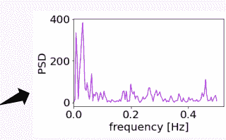

```
# apply Butterworth filter of order 5 with critical frequency as 0.2 Hz
b, a = signal.butter(5, 0.2, 'low') # create the filter
y_cleaned = signal.filtfilt(b, a, y_noisy) # apply the filter
plt.figure(), plt.plot(y_cleaned, 'g'), plt.ylabel('y_cleaned'), plt.xlabel('k')

# periodogram of cleaned data
freq, PSD = signal.welch(y_cleaned)
plt.figure(), plt.plot(freq, PSD)
plt.ylabel('PSD cleaned'), plt.xlabel('frequency [Hz]')
```

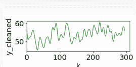

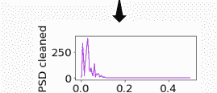

我们可以看到噪声分量被有效去除了。在实践中，你必须谨慎调整滤波器参数，以免滤除有用的分量。

#### 中心化与缩放

动态模型通常用于描述过程在某个期望工作点附近的行为。因此，在系统辨识文献中，你会发现偏差变量的使用，其定义如下

$$y(k) = y_m(k) - \bar{y} \ ; \ u(k) = u_m(k) - \bar{u}$$

其中 $y_m, u_m$ 是实际的原始测量值，$\bar{y}, \bar{u}$ 是计算偏差所围绕的标称值。因此，$y(k)$ 和 $u(k)$ 之间的模型将输入的变化与输出的变化联系起来。一个显而易见的选择是为 $\bar{y}, \bar{u}$（也称为偏移量）分配与期望稳态工作点相对应的值；然而，这个工作点可能事先未知。推荐且常用的方法是使用样本均值作为偏移量，即，

$$\bar{y} = \frac{1}{N} \sum_{k=0}^{N-1} y_m(k) \quad ; \quad \bar{u} = \frac{1}{N} \sum_{k=0}^{N-1} u_m(k)$$

另一个预处理的最佳实践是对偏差变量进行缩放，以考虑不同变量物理单位的差异。缩放使所有变量处于同等基础，并防止任何变量因其数值上的高分散性而被赋予过高的权重。一个常见的选择是使用标准差来缩放任何变量。中心化和缩放都可以使用 Sklearn 完成。$^{24}$

$^{24}$ 记住，使用模型拟合数据确定的相同偏移量和缩放比例来转换验证和测试数据。

#### 趋势与漂移的去除

考虑第3章图3.1中的信号。这些信号可能是纯随机过程的输出信号，也可能是如下图所示的输入-输出过程的扰动信号。值得注意的是，这些信号表现出漫游行为，似乎并不围绕某个均值振荡。因此，它们属于非平稳信号。虽然信号A被认为具有趋势，但信号B则表现出漂移。在工业过程中，环境温度的变化、工艺泄漏等都可能导致此类扰动信号。如果在系统辨识过程中未考虑这些非平稳性，可能会导致参数估计不准确。然而，存在一些方法可以使非平稳信号平稳化，或从输入-输出数据中消除非平稳性的影响。现在让我们来学习这些方法。

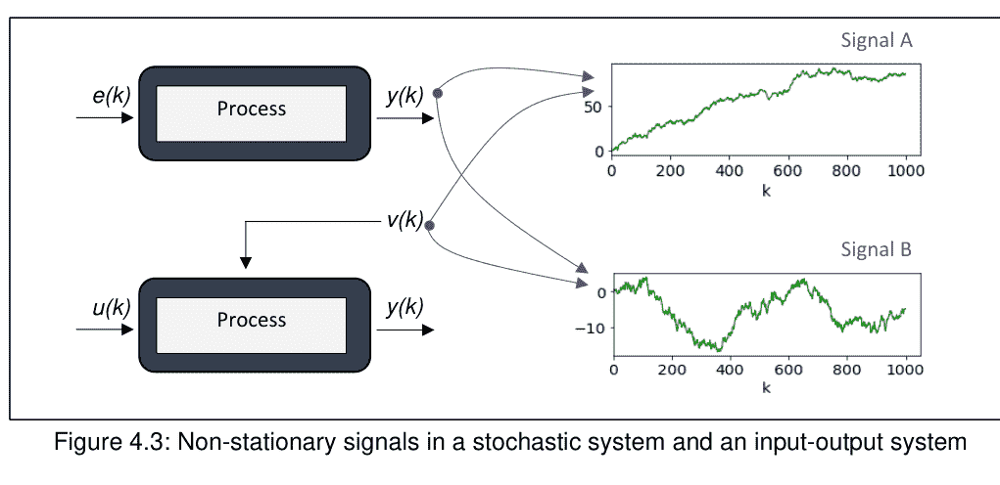

图4.3：随机系统和输入-输出系统中的非平稳信号

#### 平稳性快速入门

到目前为止，我们已经多次提到“平稳性”这个术语，但尚未对其进行严格定义。为了理解这个概念，让我们考虑以下拟合给定数据的差分方程模型

公式 1 $y(k) = 0.6y(k-1) + e(k)$

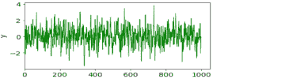

一个粗心的过程建模者可能没有意识到，该模型对任何$k$值的有效性存在一个隐含假设，即过程的行为在时间上具有某种一致性。然而，为了使这种时不变行为有效，随机信号$y(k)$必须表现出相同的统计特性；具体来说，均值和自协方差（因此方差也是）是常数*。这样的信号被称为平稳信号。** 为了看到频谱另一端的行为，考虑以下非平稳信号

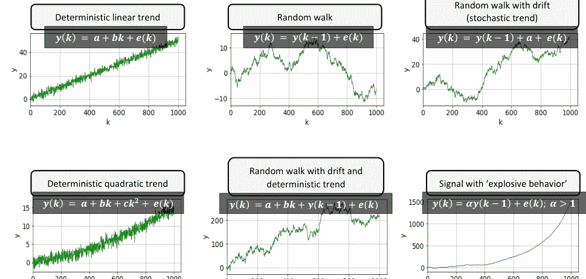

从视觉上看，信号(a)具有递增的均值，因此是非平稳的。信号(b)具有恒定的均值，但方差递增并趋于无穷大。*** 它的视觉特征是它不像平稳信号那样频繁地回归其均值。随机游走是一个简单的过程，常用于演示非平稳信号的特性。因此，请记住这个术语和过程。你稍后会看到，$y(k) = y(k-1) + e(k)$也可以写成$y(k) = \sum_{j=0}^{k} e(j)$，因此这类过程也被称为积分过程或具有积分型非平稳性的过程。前五个信号进一步被归类为齐次非平稳信号，因为它们可以通过适当的差分或变换转换为平稳信号。

总之，平稳性赋予了某种“可预测性”，并使得能够开发可用于预测和预报的模型。试图将平稳模型拟合到非平稳信号将导致虚假结果，因此这一方面需要过程建模者给予适当的关注。我们稍后将研究几种平稳性的定性和定量检验方法。

* 公式1可用于推导y(k)的特性。为了了解如何推导，让我们推导信号的均值（μ(k)）。

```
y(k) = 0.6y(k - 1) + e(k) = 0.6(0.6y(k - 2) + e(k - 1)) + e(k) = 0.6^2y(k - 2) + 0.6e(k - 1) + e(k)
= 0.6^j y(k - j) + \sum_{i=0}^{j-1} 0.6^i e(k - i) [经过j次递归后]
= 0 + \sum_{i=0}^{j-1} 0.6^i e(k - i) [当j \to \infty时]

\mu(k) = E[y(k)] = \sum_{i=0}^{\infty} 0.6^i E[e(k - i)] [E[.]表示信号的期望]
但 E[e(k - i)] = 0 \forall i，因为 e \sim WN \Rightarrow \mu(k) = 0 = 常数！
```

** 理论上，如上所述的信号被称为弱平稳或协方差平稳，因为只考虑了二阶矩。当所有统计特性都为常数时，则称为严格平稳。然而，对于大多数实际目的，弱平稳性就足够了，因此“弱”这个限定词通常被省略。

*** 重复代入可得 var(y(k) = var(e(k)) + var(e(k - 1)) + ... = k\sigma^2 + var(y(0)) \Rightarrow y(k)的方差随k增加。

#### 去趋势

正如方法名称所示，该方法旨在从以下类型的非平稳信号中去除趋势

```
y(k) = m(k) + z(k)
\downarrow \quad \quad \downarrow
趋势 \quad 平稳
分量 \quad 分量
```

去趋势的常见做法是（通过最小二乘法）拟合一个适当阶数的多项式（例如，对于二次阶，$m(k) = a + bk + ck^2$）。将拟合的多项式从时间序列信号中减去，然后为残差建立一个平稳时间序列模型。对于图4.4中的信号，该方法将如下所示

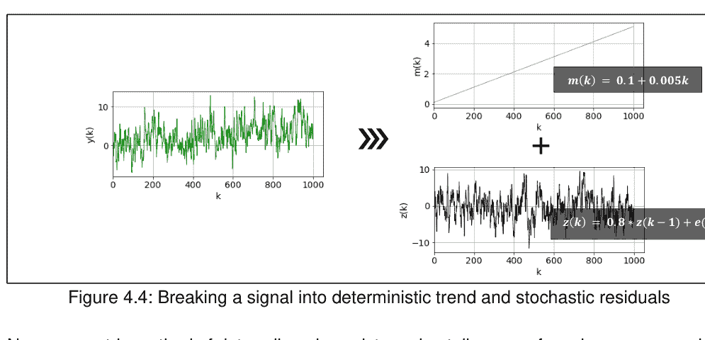

也存在非参数去趋势方法，需要使用移动平均或低通滤波器来去除非平稳信号中的慢动态（趋势）分量。

#### 经典时间序列分解

将信号分解为其趋势分量和随机分量的方法属于一种更广泛的方法，称为经典分解。这里，假设信号$y(k)$采用以下形式

$$y(k) = m(k) + s(k) + z(k)$$
$$\downarrow \quad\quad\quad\quad\quad\quad\quad\quad\quad\quad\quad\quad\quad\quad\quad\quad\quad\quad\quad\quad\quad\quad\quad\quad\quad\quad\quad\quad\quad\quad\quad\quad\quad\quad\quad\quad\quad\quad\quad\quad\quad\quad\quad\quad\quad\quad\quad\quad\quad\quad\quad\quad\quad\quad\quad\quad\quad\quad\quad\quad\quad\quad\quad\quad\quad\quad\quad\quad\quad\quad\quad\quad\quad\quad\quad\quad\quad\quad\quad\quad\quad\quad\quad\quad\quad\quad\quad\quad\quad\quad\quad\quad\quad\quad\quad\quad\quad\quad\quad\quad\quad\quad\quad\quad\quad\quad\quad\quad\quad\quad\quad\quad\quad\quad\quad\quad\quad\quad\quad\quad\quad\quad\quad\quad\quad\quad\quad\quad\quad\quad\quad\quad\quad\quad\quad\quad\quad\quad\quad\quad\quad\quad\quad\quad\quad\quad\quad\quad\quad\quad\quad\quad\quad\quad\quad\quad\quad\quad\quad\quad\quad\quad\quad\quad\quad\quad\quad\quad\quad\quad\quad\quad\quad\quad\quad\quad\quad\quad\quad\quad\quad\quad\quad\quad\quad\quad\quad\quad\quad\quad\quad\quad\quad\quad\quad\quad\quad\quad\quad\quad\quad\quad\quad\quad\quad\quad\quad\quad\quad\quad\quad\quad\quad\quad\quad\quad\quad\quad\quad\quad\quad\quad\quad\quad\quad\quad\quad\quad\quad\quad\quad\quad\quad\quad\quad\quad\quad\quad\quad\quad\quad\quad\quad\quad\quad\quad\quad\quad\quad\quad\quad\quad\quad\quad\quad\quad\quad\quad\quad\quad\quad\quad\quad\quad\quad\quad\quad\quad\quad\quad\quad\quad\quad\quad\quad\quad\quad\quad\quad\quad\quad\quad\quad\quad\quad\quad\quad\quad\quad\quad\quad\quad\quad\quad\quad\quad\quad\quad\quad\quad\quad\quad\quad\quad\quad\quad\quad\quad\quad\quad\quad\quad\quad\quad\quad\quad\quad\quad\quad\quad\quad\quad\quad\quad\quad\quad\quad\quad\quad\quad\quad\quad\quad\quad\quad\quad\quad\quad\quad\quad\quad\quad\quad\quad\quad\quad\quad\quad\quad\quad\quad\quad\quad\quad\quad\quad\quad\quad\quad\quad\quad\quad\quad\quad\quad\quad\quad\quad\quad\quad\quad\quad\quad\quad\quad\quad\quad\quad\quad\quad\quad\quad\quad\quad\quad\quad\quad\quad\quad\quad\quad\quad\quad\quad\quad\quad\quad\quad\quad\quad\quad\quad\quad\quad\quad\quad\quad\quad\quad\quad\quad\quad\quad\quad\quad\quad\quad\quad\quad\quad\quad\quad\quad\quad\quad\quad\quad\quad\quad\quad\quad\quad\quad\quad\quad\quad\quad\quad\quad\quad\quad\quad\quad\quad\quad\quad\quad\quad\quad\quad\quad\quad\quad\quad\quad\quad\quad\quad\quad\quad\quad\quad\quad\quad\quad\quad\quad\quad\quad\quad\quad\quad\quad\quad\quad\quad\quad\quad\quad\quad\quad\quad\quad\quad\quad\quad\quad\quad\quad\quad\quad\quad\quad\quad\quad\quad\quad\quad\quad\quad\quad\quad\quad\quad\quad\quad\quad\quad\quad\quad\quad\quad\quad\quad\quad\quad\quad\quad\quad\quad\quad\quad\quad\quad\quad\quad\quad\quad\quad\quad\quad\quad\quad\quad\quad\quad\quad\quad\quad\quad\quad\quad\quad\quad\quad\quad\quad\quad\quad\quad\quad\quad\quad\quad\quad\quad\quad\quad\quad\quad\quad\quad\quad\quad\quad\quad\quad\quad\quad\quad\quad\quad\quad\quad\quad\quad\quad\quad\quad\quad\quad\quad\quad\quad\quad\quad\quad\quad\quad\quad\quad\quad\quad\quad\quad\quad\quad\quad\quad\quad\quad\quad\quad\quad\quad\quad\quad\quad\quad\quad\quad\quad\quad\quad\quad\quad\quad\quad\quad\quad\quad\quad\quad\quad\quad\quad\quad\quad\quad\quad\quad\quad\quad\quad\quad\quad\quad\quad\quad\quad\quad\quad\quad\quad\quad\quad\quad\quad\quad\quad\quad\quad\quad\quad\quad\quad\quad\quad\quad\quad\quad\quad\quad\quad\quad\quad\quad\quad\quad\quad\quad\quad\quad\quad\quad\quad\quad\quad\quad\quad\quad\quad\quad\quad\quad\quad\quad\quad\quad\quad\quad\quad\quad\quad\quad\quad\quad\quad\quad\quad\quad\quad\quad\quad\quad\quad\quad\quad\quad\quad\quad\quad\quad\quad\quad\quad\quad\quad\quad\quad\quad\quad\quad\quad\quad\quad\quad\quad\quad\quad\quad\quad\quad\quad\quad\quad\quad\quad\quad\quad\quad\quad\quad\quad\quad\quad\quad\quad\quad\quad\quad\quad\quad\quad\quad\quad\quad\quad\quad\quad\quad\quad\quad\quad\quad\quad\quad\quad\quad\quad\quad\quad\quad\quad\quad\quad\quad\quad\quad\quad\quad\quad\quad\quad\quad\quad\quad\quad\quad\quad\quad\quad\quad\quad\quad\quad\quad\quad\quad\quad\quad\quad\quad\quad\quad\quad\quad\quad\quad\quad\quad\quad\quad\quad\quad\quad\quad\quad\quad\quad\quad\quad\quad\quad\quad\quad\quad\quad\quad\quad\quad\quad\quad\quad\quad\quad\quad\quad\quad\quad\quad\quad\quad\quad\quad\quad\quad\quad\quad\quad\quad\quad\quad\quad\quad\quad\quad\quad\quad\quad\quad\quad\quad\quad\quad\quad\quad\quad\quad\quad\quad\quad\quad\quad\quad\quad\quad\quad\quad\quad\quad\quad\quad\quad\quad\quad\quad\quad\quad\quad\quad\quad\quad\quad\quad\quad\quad\quad\quad\quad\quad\quad\quad\quad\quad\quad\quad\quad\quad\quad\quad\quad\quad\quad\quad\quad\quad\quad\quad\quad\quad\quad\quad\quad\quad\quad\quad\quad\quad\quad\quad\quad\quad\quad\quad\quad\quad\quad\quad\quad\quad\quad\quad\quad\quad\quad\quad\quad\quad\quad\quad\quad\quad\quad\quad\quad\quad\quad\quad\quad\quad\quad\quad\quad\quad\quad\quad\quad\quad\quad\quad\quad\quad\quad\quad\quad\quad\quad\quad\quad\quad\quad\quad\quad\quad\quad\quad\quad\quad\quad\quad\quad\quad\quad\quad\quad\quad\quad\quad\quad\quad\quad\quad\quad\quad\quad\quad\quad\quad\quad\quad\quad\quad\quad\quad\quad\quad\quad\quad\quad\quad\quad\quad\quad\quad\quad\quad\quad\quad\quad\quad\quad\quad\quad\quad\quad\quad\quad\quad\quad\quad\quad\quad\quad\quad\quad\quad\quad\quad\quad\quad\quad\quad\quad\quad\quad\quad\quad\quad\quad\quad\quad\quad\quad\quad\quad\quad\quad\quad\quad\quad\quad\quad\quad\quad\quad\quad\quad\quad\quad\quad\quad\quad\quad\quad\quad\quad\quad\quad\quad\quad\quad\quad\quad\quad\quad\quad\quad\quad\quad\quad\quad\quad\quad\quad\quad\quad\quad\quad\quad\quad\quad\quad\quad\quad\quad\quad\quad\quad\quad\quad\quad\quad\quad\quad\quad\quad\quad\quad\quad\quad\quad\quad\quad\quad\quad\quad\quad\quad\quad\quad\quad\quad\quad\quad\quad\quad\quad\quad\quad\quad\quad\quad\quad\quad\quad\quad\quad\quad\quad\quad\quad\quad\quad\quad\quad\quad\quad\quad\quad\quad\quad\quad\quad\quad\quad\quad\quad\quad\quad\quad\quad\quad\quad\quad\quad\quad\quad\quad\quad\quad\quad\quad\quad\quad\quad\quad\quad\quad\quad\quad\quad\quad\quad\quad\quad\quad\quad\quad\quad\quad\quad\quad\quad\quad\quad\quad\quad\quad\quad\quad\quad\quad\quad\quad\quad\quad\quad\quad\quad\quad\quad\quad\quad\quad\quad\quad\quad\quad\quad\quad\quad\quad\quad\quad\quad\quad\quad\quad\quad\quad\quad\quad\quad\quad\quad\quad\quad\quad\quad\quad\quad\quad\quad\quad\quad\quad\quad\quad\quad\quad\quad\quad\quad\quad\quad\quad\quad\quad\quad\quad\quad\quad\quad\quad\quad\quad\quad\quad\quad\quad\quad\quad\quad\quad\quad\quad\quad\quad\quad\quad\quad\quad\quad\quad\quad\quad\quad\quad\quad\quad\quad\quad\quad\quad\quad\quad\quad\quad\quad\quad\quad\quad\quad\quad\quad\quad\quad\quad\quad\quad\quad\quad\quad\quad\quad\quad\quad\quad\quad\quad\quad\quad\quad\quad\quad\quad\quad\quad\quad\quad\quad\quad\quad\quad\quad\quad\quad\quad\quad\quad\quad\quad\quad\quad\quad\quad\quad\quad\quad\quad\quad\quad\quad\quad\quad\quad\quad\quad\quad\quad\quad\quad\quad\quad\quad\quad\quad\quad\quad\quad\quad\quad\quad\quad\quad\quad\quad\quad\quad\quad\quad\quad\quad\quad\quad\quad\quad\quad\quad\quad\quad\quad\quad\quad\quad\quad\quad\quad\quad\quad\quad\quad\quad\quad\quad\quad\quad\quad\quad\quad\quad\quad\quad\quad\quad\quad\quad\quad\quad\quad\quad\quad\quad\quad\quad\quad\quad\quad\quad\quad\quad\quad\quad\quad\quad\quad\quad\quad\quad\quad\quad\quad\quad\quad\quad\quad\quad\quad\quad\quad\quad\quad\quad\quad\quad\quad\quad\quad\quad\quad\quad\quad\quad\quad\quad\quad\quad\quad\quad\quad\quad\quad\quad\quad\quad\quad\quad\quad\quad\quad\quad\quad\quad\quad\quad\quad\quad\quad\quad\quad\quad\quad\quad\quad\quad\quad\quad\quad\quad\quad\quad\quad\quad\quad\quad\quad\quad\quad\quad\quad\quad\quad\quad\quad\quad\quad\quad\quad\quad\quad\quad\quad\quad\quad\quad\quad\quad\quad\quad\quad\quad\quad\quad\quad\quad\quad\quad\quad\quad\quad\quad\quad\quad\quad\quad\quad\quad\quad\quad\quad\quad\quad\quad\quad\quad\quad\quad\quad\quad\quad\quad\quad\quad\quad\quad\quad\quad\quad\quad\quad\quad\quad\quad\quad\quad\quad\quad\quad\quad\quad\quad\quad\quad\quad\quad\quad\quad\quad\quad\quad\quad\quad\quad\quad\quad\quad\quad\quad\quad\quad\quad\quad\quad\quad\quad\quad\quad\quad\quad\quad\quad\quad\quad\quad\quad\quad\quad\quad\quad\quad\quad\quad\quad\quad\quad\quad\quad\quad\quad\quad\quad\quad\quad\quad\quad\quad\quad\quad\quad\quad\quad\quad\quad\quad\quad\quad\quad\quad\quad\quad\quad\quad\quad\quad\quad\quad\quad\quad\quad\quad\quad\quad\quad\quad\quad\quad\quad\quad\quad\quad\quad\quad\quad\quad\quad\quad\quad\quad\quad\quad\quad\quad\quad\quad\quad\quad\quad\quad\quad\quad\quad\quad\quad\quad\quad\quad\quad\quad\quad\quad\quad\quad\quad\quad\quad\quad\quad\quad\quad\quad\quad\quad\quad\quad\quad\quad\quad\quad\quad\quad\quad\quad\quad\quad\quad\quad\quad\quad\quad\quad\quad\quad\quad\quad\quad\quad\quad\quad\quad\quad\quad\quad\quad\quad\quad\quad\quad\quad\quad\quad\quad\quad\quad\quad\quad\quad\quad\quad\quad\quad\quad\quad\quad\quad\quad\quad\quad\quad\quad\quad\quad\quad\quad\quad\quad\quad\quad\quad\quad\quad\quad\quad\quad\quad\quad\quad\quad\quad\quad\quad\quad\quad\quad\quad\quad\quad\quad\quad\quad\quad\quad\quad\quad\quad\quad\quad\quad\quad\quad\quad\quad\quad\quad\quad\quad\quad\quad\quad\quad\quad\quad\quad\quad\quad\quad\quad\quad\quad\quad\quad\quad\quad\quad\quad\quad\quad\quad\quad\quad\quad\quad\quad\quad\quad\quad\quad\quad\quad\quad\quad\quad\quad\quad\quad\quad\quad\quad\quad\quad\quad\quad\quad\quad\quad\quad\quad\quad\quad\quad\quad\quad\quad\quad\quad\quad\quad\quad\quad\quad\quad\quad\quad\quad\quad\quad\quad\quad\quad\quad\quad\quad\quad\quad\quad\quad\quad\quad\quad\quad\quad\quad\quad\quad\quad\quad\quad\quad\quad\quad\quad\quad\quad\quad\quad\quad\quad\quad\quad\quad\quad\quad\quad\quad\quad\quad\quad\quad\quad\quad\quad\quad\quad\quad\quad\quad\quad\quad\quad\quad\quad\quad\quad\quad\quad\quad\quad\quad\quad\quad\quad\quad\quad\quad\quad\quad\quad\quad\quad\quad\quad\quad\quad\quad\quad\quad\quad\quad\quad\quad\quad\quad\quad\quad\quad\quad\quad\quad\quad\quad\quad\quad\quad\quad\quad\quad\quad\quad\quad\quad\quad\quad\quad\quad\quad\quad\quad\quad\quad\quad\quad\quad\quad\quad\quad\quad\quad\quad\quad\quad\quad\quad\quad\quad\quad\quad\quad\quad\quad\quad\quad\quad\quad\quad\quad\quad\quad\quad\quad\quad\quad\quad\quad\quad\quad\quad\quad\quad\quad\quad\quad\quad\quad\quad\quad\quad\quad\quad\quad\quad\quad\quad\quad\quad\quad\quad\quad\quad\quad\quad\quad\quad\quad\quad\quad\quad\quad\quad\quad\quad\quad\quad\quad\quad\quad\quad\quad\quad\quad\quad\quad\quad\quad\quad\quad\quad\quad\quad\quad\quad\quad\quad\quad\quad\quad\quad\quad\quad\quad\quad\quad\quad\quad\quad\quad\quad\quad\quad\quad\quad\quad\quad\quad\quad\quad\quad\quad\quad\quad\quad\quad\quad\quad\quad\quad\quad\quad\quad\quad\quad\quad\quad\quad\quad\quad\quad\quad\quad\quad\quad\quad\quad\quad\quad\quad\quad\quad\quad\quad\quad\quad\quad\quad\quad\quad\quad\quad\quad\quad\quad\quad\quad\quad\quad\quad\quad\quad\quad\quad\quad\quad\quad\quad\quad\quad\quad\quad\quad\quad\quad\quad\quad\quad\quad\quad\quad\quad\quad\quad\quad\quad\quad\quad\quad\quad\quad\quad\quad\quad\quad\quad\quad\quad\quad\quad\quad\quad\quad\quad\quad\quad\quad\quad\quad\quad\quad\quad\quad\quad\quad\quad\quad\quad\quad\quad\quad\quad\quad\quad\quad\quad\quad\quad\quad\quad\quad\quad\quad\quad\quad\quad\quad\quad\quad\quad\quad\quad\quad\quad\quad\quad\quad\quad\quad\quad\quad\quad\quad\quad\quad\quad\quad\quad\quad\quad\quad\quad\quad\quad\quad\quad\quad\quad\quad\quad\quad\quad\quad\quad\quad\quad\quad\quad\quad\quad\quad\quad\quad\quad\quad\quad\quad\quad\quad\quad\quad\quad\quad\quad\quad\quad\quad\quad\quad\quad\quad\quad\quad\quad\quad\quad\quad\quad\quad\quad\quad\quad\quad\quad\quad\quad\quad\quad\quad\quad\quad\quad\quad\quad\quad\quad\quad\quad\quad\quad\quad\quad\quad\quad\quad\quad\quad\quad\quad\quad\quad\quad\quad\quad\quad\quad\quad\quad\quad\quad\quad\quad\quad\quad\quad\quad\quad\quad\quad\quad\quad\quad\quad\quad\quad\quad\quad\quad\quad\quad\quad\quad\quad\quad\quad\quad\quad\quad\quad\quad\quad\quad\quad\quad\quad\quad\quad\quad\quad\quad\quad\quad\quad\quad\quad\quad\quad\quad\quad\quad\quad\quad\quad\quad\quad\quad\quad\quad\quad\quad\quad\quad\quad\quad\quad\quad\quad\quad\quad\quad\quad\quad\quad\quad\quad\quad\quad\quad\quad\quad\quad\quad\quad\quad\quad\quad\quad\quad\quad\quad\quad\quad\quad\quad\quad\quad\quad\quad\quad\quad\quad\quad\quad\quad\quad\quad\quad\quad\quad\quad\quad\quad\quad\quad\quad\quad\quad\quad\quad\quad\quad\quad\quad\quad\quad\quad\quad\quad\quad\quad\quad\quad\quad\quad\quad\quad\quad\quad\quad\quad\quad\quad\quad\quad\quad\quad\quad\quad\quad\quad\quad\quad\quad\quad\quad\quad\quad\quad\quad\quad\quad\quad\quad\quad\quad\quad\quad\quad\quad\quad\quad\quad\quad\quad\quad\quad\quad\quad\quad\quad\quad\quad\quad\quad\quad\quad\quad\quad\quad\quad\quad\quad\quad\quad\quad\quad\quad\quad\quad\quad\quad\quad\quad\quad\quad\quad\quad\quad\quad\quad\quad\quad\quad\quad\quad\quad\quad\quad\quad\quad\quad\quad\quad\quad\quad\quad\quad\quad\quad\quad\quad\quad\quad\quad\quad\quad\quad\quad\quad\quad\quad\quad\quad\quad\quad\quad\quad\quad\quad\quad\quad\quad\quad\quad\quad\quad\quad\quad\quad\quad\quad\quad\quad\quad\quad\quad\quad\quad\quad\quad\quad\quad\quad\quad\quad\quad\quad\quad\quad\quad\quad\quad\quad\quad\quad\quad\quad\quad\quad\quad\quad\quad\quad\quad\quad\quad\quad\quad\quad\quad\quad\quad\quad\quad\quad\quad\quad\quad\quad\quad\quad\quad\quad\quad\quad\quad\quad\quad\quad\quad\quad\quad\quad\quad\quad\quad\quad\quad\quad\quad\quad\quad\quad\quad\quad\quad\quad\quad\quad\quad\quad\quad\quad\quad\quad\quad\quad\quad\quad\quad\quad\quad\quad\quad\quad\quad\quad\quad\quad\quad\quad\quad\quad\quad\quad\quad\quad\quad\quad\quad\quad\quad\quad\quad\quad\quad\quad\quad\quad\quad\quad\quad\quad\quad\quad\quad\quad\quad\quad\quad\quad\quad\quad\quad\quad\quad\quad\quad\quad\quad\quad\quad\quad\quad\quad\quad\quad\quad\quad\quad\quad\quad\quad\quad\quad\quad\quad\quad\quad\quad\quad\quad\quad\quad\quad\quad\quad\quad\quad\quad\quad\quad\quad\quad\quad\quad\quad\quad\quad\quad\quad\quad\quad\quad\quad\quad\quad\quad\quad\quad\quad\quad\quad\quad\quad\quad\quad\quad\quad\quad\quad\quad\quad\quad\quad\quad\quad\quad\quad\quad\quad\quad\quad\quad\quad\quad\quad\quad\quad\quad\quad\quad\quad\quad\quad\quad\quad\quad\quad\quad\quad\quad\quad\quad\quad\quad\quad\quad\quad\quad\quad\quad\quad\quad\quad\quad\quad\quad\quad\quad\quad\quad\quad\quad\quad\quad\quad\quad\quad\quad\quad\quad\quad\quad\quad\quad\quad\quad\quad\quad\quad\quad\quad\quad\quad\quad\quad\quad\quad\quad\quad\quad\quad\quad\quad\quad\quad\quad\quad\quad\quad\quad\quad\quad\quad\quad\quad\quad\quad\quad\quad\quad\quad\quad\quad\quad\quad\quad\quad\quad\quad\quad\quad\quad\quad\quad\quad\quad\quad\quad\quad\quad\quad\quad\quad\quad\quad\quad\quad\quad\quad\quad\quad\quad\quad\quad\quad\quad\quad\quad\quad\quad\quad\quad\quad\quad\quad\quad\quad\quad\quad\quad\quad\quad\quad\quad\quad\quad\quad\quad\quad\quad\quad\quad\quad\quad\quad\quad\quad\quad\quad\quad\quad\quad\quad\quad\quad\quad\quad\quad\quad\quad\quad\quad\quad\quad\quad\quad\quad\quad\quad\quad\quad\quad\quad\quad\quad\quad\quad\quad\quad\quad\quad\quad\quad\quad\quad\quad\quad\quad\quad\quad\quad\quad\quad\quad\quad\quad\quad\quad\quad\quad\quad\quad\quad\quad\quad\quad\quad\quad\quad\quad\quad\quad\quad\quad\quad\quad\quad\quad\quad\quad\quad\quad\quad\quad\quad\quad\quad\quad\quad\quad\quad\quad\quad\quad\quad\quad\quad\quad\quad\quad\quad\quad\quad\quad\quad\quad\quad\quad\quad\quad\quad\quad\quad\quad\quad\quad\quad\quad\quad\quad\quad\quad\quad\quad\quad\quad\quad\quad\quad\quad\quad\quad\quad\quad\quad\quad\quad\quad\quad\quad\quad\quad\quad\quad\quad\quad\quad\quad\quad\quad\quad\quad\quad\quad\quad\quad\quad\quad\quad\quad\quad\quad\quad\quad\quad\quad\quad\quad\quad\quad\quad\quad\quad\quad\quad\quad\quad\quad\quad\quad\quad\quad\quad\quad\quad\quad\quad\quad\quad\quad\quad\quad\quad\quad\quad\quad\quad\quad\quad\quad\quad\quad\quad\quad\quad\quad\quad\quad\quad\quad\quad\quad\quad\quad\quad\quad\quad\quad\quad\quad\quad\quad\quad\quad\quad\quad\quad\quad\quad\quad\quad\quad\quad\quad\quad\quad\quad\quad\quad\quad\quad\quad\quad\quad\quad\quad\quad\quad\quad\quad\quad\quad\quad\quad\quad\quad\quad\quad\quad\quad\quad\quad\quad\quad\quad\quad\quad\quad\quad\quad\quad\quad\quad\quad\quad\quad\quad\quad\quad\quad\quad\quad\quad\quad\quad\quad\quad\quad\quad\quad\quad\quad\quad\quad\quad\quad\quad\quad\quad\quad\quad\quad\quad\quad\quad\quad\quad\quad\quad\quad\quad\quad\quad\quad\quad\quad\quad\quad\quad\quad\quad\quad\quad\quad\quad\quad\quad\quad\quad\quad\quad\quad\quad\quad\quad\quad\quad\quad\quad\quad\quad\quad\quad\quad\quad\quad\quad\quad\quad\quad\quad\quad\quad\quad\quad\quad\quad\quad\quad\quad\quad\quad\quad\quad\quad\quad\quad\quad\quad\quad\quad\quad\quad\quad\quad\quad\quad\quad\quad\quad\quad\quad\quad\quad\quad\quad\quad\quad\quad\quad\quad\quad\quad\quad\quad\quad\quad\quad\quad\quad\quad\quad\quad\quad\quad\quad\quad\quad\quad\quad\quad\quad\quad\quad\quad\quad\quad\quad\quad\quad\quad\quad\quad\quad\quad\quad\quad\quad\quad\quad\quad\quad\quad\quad\quad\quad\quad\quad\quad\quad\quad\quad\quad\quad\quad\quad\quad\quad\quad\quad\quad\quad\quad\quad\quad\quad\quad\quad\quad\quad\quad\quad\quad\quad\quad\quad\quad\quad\quad\quad\quad\quad\quad\quad\quad\quad\quad\quad\quad\quad\quad\quad\quad\quad\quad\quad\quad\quad\quad\quad\quad\quad\quad\quad\quad\quad\quad\quad\quad\quad\quad\quad\quad\quad\quad\quad\quad\quad\quad\quad\quad\quad\quad\quad\quad\quad\quad\quad\quad\quad\quad\quad\quad\quad\quad\quad\quad\quad\quad\quad\quad\quad\quad\quad\quad\quad\quad\quad\quad\quad\quad\quad\quad\quad\quad\quad\quad\quad\quad\quad\quad\quad\quad\quad\quad\quad\quad\quad\quad\quad\quad\quad\quad\quad\quad\quad\quad\quad\quad\quad\quad\quad\quad\quad\quad\quad\quad\quad\quad\quad\quad\quad\quad\quad\quad\quad\quad\quad\quad\quad\quad\quad\quad\quad\quad\quad\quad\quad\quad\quad\quad\quad\quad\quad\quad\quad\quad\quad\quad\quad\quad\quad\quad\quad\quad\quad\quad\quad\quad\quad\quad\quad\quad\quad\quad\quad\quad\quad\quad\quad\quad\quad\quad\quad\quad\quad\quad\quad\quad\quad\quad\quad\quad\quad\quad\quad\quad\quad\quad\quad\quad\quad\quad\quad\quad\quad\quad\quad\quad\quad\quad\quad\quad\quad\quad\quad\quad\quad\quad\quad\quad\quad\quad\quad\quad\quad\quad\quad\quad\quad\quad\quad\quad\quad\quad\quad\quad\quad\quad\quad\quad\quad\quad\quad\quad\quad\quad\quad\quad\quad\quad\quad\quad\quad\quad\quad\quad\quad\quad\quad\quad\quad\quad\quad\quad\quad\quad\quad\quad\quad\quad\quad\quad\quad\quad\quad\quad\quad\quad\quad\quad\quad\quad\quad\quad\quad\quad\quad\quad\quad\quad\quad\quad\quad\quad\quad\quad\quad\quad\quad\quad\quad\quad\quad\quad\quad\quad\quad\quad\quad\quad\quad\quad\quad\quad\quad\quad\quad\quad\quad\quad\quad\quad\quad\quad\quad\quad\quad\quad\quad\quad\quad\quad\quad\quad\quad\quad\quad\quad\quad\quad\quad\quad\quad\quad\quad\quad\quad\quad\quad\quad\quad\quad\quad\quad\quad\quad\quad\quad\quad\quad\quad\quad\quad\quad\quad\quad\quad\quad\quad\quad\quad\quad\quad\quad\quad\quad\quad\quad\quad\quad\quad\quad\quad\quad\quad\quad\quad\quad\quad\quad\quad\quad\quad\quad\quad\quad\quad\quad\quad\quad\quad\quad\quad\quad\quad\quad\quad\quad\quad\quad\quad\quad\quad\quad\quad\quad\quad\quad\quad\quad\quad\quad\quad\quad\quad\quad\quad\quad\quad\quad\quad\quad\quad\quad\quad\quad\quad\quad\quad\quad\quad\quad\quad\quad\quad\quad\quad\quad\quad\quad\quad\quad\quad\quad\quad\quad\quad\quad\quad\quad\quad\quad\quad\quad\quad\quad\quad\quad\quad\quad\quad\quad\quad\quad\quad\quad\quad\quad\quad\quad\quad\quad\quad\quad\quad\quad\quad\quad\quad\quad\quad\quad\quad\quad\quad\quad\quad\quad\quad\quad\quad\quad\quad\quad\quad\quad\quad\quad\quad\quad\quad\quad\quad\quad\quad\quad\quad\quad\quad\quad\quad\quad\quad\quad\quad\quad\quad\quad\quad\quad\quad\quad\quad\quad\quad\quad\quad\quad\quad\quad\quad\quad\quad\quad\quad\quad\quad\quad\quad\quad\quad\quad\quad\quad\quad\quad\quad\quad\quad\quad\quad\quad\quad\quad\quad\quad\quad\quad\quad\quad\quad\quad\quad\quad\quad\quad\quad\quad\quad\quad\quad\quad\quad\quad\quad\quad\quad\quad\quad\quad\quad\quad\quad\quad\quad\quad\quad\quad\quad\quad\quad\quad\quad\quad\quad\quad\quad\quad\quad\quad\quad\quad\quad\quad\quad\quad\quad\quad\quad\quad\quad\quad\quad\quad\quad\quad\quad\quad\quad\quad\quad\quad\quad\quad\quad\quad\quad\quad\quad\quad\quad\quad\quad\quad\quad\quad\quad\quad\quad\quad\quad\quad\quad\quad\quad\quad\quad\quad\quad\quad\quad\quad\quad\quad\quad\quad\quad\quad\quad\quad\quad\quad\quad\quad\quad\quad\quad\quad\quad\quad\quad\quad\quad\quad\quad\quad\quad\quad\quad\quad\quad\quad\quad\quad\quad\quad\quad\quad\quad\quad\quad\quad\quad\quad\quad\quad\quad\quad\quad\quad\quad\quad\quad\quad\quad\quad\quad\quad\quad\quad\quad\quad\quad\quad\quad\quad\quad\quad\quad\quad\quad\quad\quad\quad\quad\quad\quad\quad\quad\quad\quad\quad\quad\quad\quad\quad\quad\quad\quad\quad\quad\quad\quad\quad\quad\quad\quad\quad\quad\quad\quad\quad\quad\quad\quad\quad\quad\quad\quad\quad\quad\quad\quad\quad\quad\quad\quad\quad\quad\quad\quad\quad\quad\quad\quad\quad\quad\quad\quad\quad\quad\quad\quad\quad\quad\quad\quad\quad\quad\quad\quad\quad\quad\quad\quad\quad\quad\quad\quad\quad\quad\quad\quad\quad\quad\quad\quad\quad\quad\quad\quad\quad\quad\quad\quad\quad\quad\quad\quad\quad\quad\quad\quad\quad\quad\quad\quad\quad\quad\quad\quad\quad\quad\quad\quad\quad\quad\quad\quad\quad\quad\quad\quad\quad\quad\quad\quad\quad\quad\quad\quad\quad\quad\quad\quad\quad\quad\quad\quad\quad\quad\quad\quad\quad\quad\quad\quad\quad\quad\quad\quad\quad\quad\quad\quad\quad\quad\quad\quad\quad\quad\quad\quad\quad\quad\quad\quad\quad\quad\quad\quad\quad\quad\quad\quad\quad\quad\quad\quad\quad\quad\quad\quad\quad\quad\quad\quad\quad\quad\quad\quad\quad\quad\quad\quad\quad\quad\quad\quad\quad\quad\quad\quad\quad\quad\quad\quad\quad\quad\quad\quad\quad\quad\quad\quad\quad\quad\quad\quad\quad\quad\quad\quad\quad\quad\quad\quad\quad\quad\quad\quad\quad\quad\quad\quad\quad\quad\quad\quad\quad\quad\quad\quad\quad\quad\quad\quad\quad\quad\quad\quad\quad\quad\quad\quad\quad\quad\quad\quad\quad\quad\quad\quad\quad\quad\quad\quad\quad\quad\quad\quad\quad\quad\quad\quad\quad\quad\quad\quad\quad\quad\quad\quad\quad\quad\quad\quad\quad\quad\quad\quad\quad\quad\quad\quad\quad\quad\quad\quad\quad\quad\quad\quad\quad\quad\quad\quad\quad\quad\quad\quad\quad\quad\quad\quad\quad\quad\quad\quad\quad\quad\quad\quad\quad\quad\quad\quad\quad\quad\quad\quad\quad\quad\quad\quad\quad\quad\quad\quad\quad\quad\quad\quad\quad\quad\quad\quad\quad\quad\quad\quad\quad\quad\quad\quad\quad\quad\quad\quad\quad\quad\quad\quad\quad\quad\quad\quad\quad\quad\quad\quad\quad\quad\quad\quad\quad\quad\quad\quad\quad\quad\quad\quad\quad\quad\quad\quad\quad\quad\quad\quad\quad\quad\quad\quad\quad\quad\quad\quad\quad\quad\quad\quad\quad\quad\quad\quad\quad\quad\quad\quad\quad\quad\quad\quad\quad\quad\quad\quad\quad\quad\quad\quad\quad\quad\quad\quad\quad\quad\quad\quad\quad\quad\quad\quad\quad\quad\quad\quad\quad\quad\quad\quad\quad\quad\quad\quad\quad\quad\quad\quad\quad\quad\quad\quad\quad\quad\quad\quad\quad\quad\quad\quad\quad\quad\quad\quad\quad\quad\quad\quad\quad\quad\quad\quad\quad\quad\quad\quad\quad\quad\quad\quad\quad\quad\quad\quad\quad\quad\quad\quad\quad\quad\quad\quad\quad\quad\quad\quad\quad\quad\quad\quad\quad\quad\quad\quad\quad\quad\quad\quad\quad\quad\quad\quad\quad\quad\quad\quad\quad\quad\quad\quad\quad\quad\quad\quad\quad\quad\quad\quad\quad\quad\quad\quad\quad\quad\quad\quad\quad\quad\quad\quad\quad\quad\quad\quad\quad\quad\quad\quad\quad\quad\quad\quad\quad\quad\quad\quad\quad\quad\quad\quad\quad\quad\quad\quad\quad\quad\quad\quad\quad\quad\quad\quad\quad\quad\quad\quad\quad\quad\quad\quad\quad\quad\quad\quad\quad\quad\quad\quad\quad\quad\quad\quad\quad\quad\quad\quad\quad\quad\quad\quad\quad\quad\quad\quad\quad\quad\quad\quad\quad\quad\quad\quad\quad\quad\quad\quad\quad\quad\quad\quad\quad\quad\quad\quad\quad\quad\quad\quad\quad\quad\quad\quad\quad\quad\quad\quad\quad\quad\quad\quad\quad\quad\quad\quad\quad\quad\quad\quad\quad\quad\quad\quad\quad\quad\quad\quad\quad\quad\quad\quad\quad\quad\quad\quad\quad\quad\quad\quad\quad\quad\quad\quad\quad\quad\quad\quad\quad\quad\quad\quad\quad\quad\quad\quad\quad\quad\quad\quad\quad\quad\quad\quad\quad\quad\quad\quad\quad\quad\quad\quad\quad\quad\quad\quad\quad\quad\quad\quad\quad\quad\quad\quad\quad\quad\quad\quad\quad\quad\quad\quad\quad\quad\quad\quad\quad\quad\quad\quad\quad\quad\quad\quad\quad\quad\quad\quad\quad\quad\quad\quad\quad\quad\quad\quad\quad\quad\quad\quad\quad\quad\quad\quad\quad\quad\quad\quad\quad\quad\quad\quad\quad\quad\quad\quad\quad\quad\quad\quad\quad\quad\quad\quad\quad\quad\quad\quad\quad\quad\quad\quad\quad\quad\quad\quad\quad\quad\quad\quad\quad\quad\quad\quad\quad\quad\quad\quad\quad\quad\quad\quad\quad\quad\quad\quad\quad\quad\quad\quad\quad\quad\quad\quad\quad\quad\quad\quad\quad\quad\quad\quad\quad\quad\quad\quad\quad\quad\quad\quad\quad\quad\quad\quad\quad\quad\quad\quad\quad\quad\quad\quad\quad\quad\quad\quad\quad\quad\quad\quad\quad\quad\quad\quad\quad\quad\quad\quad\quad\quad\quad\quad\quad\quad\quad\quad\quad\quad\quad\quad\quad\quad\quad\quad\quad\quad\quad\quad\quad\quad\quad\quad\quad\quad\quad\quad\quad\quad\quad\quad\quad\quad\quad\quad\quad\quad\quad\quad\quad\quad\quad\quad\quad\quad\quad\quad\quad\quad\quad\quad\quad\quad\quad\quad\quad\quad\quad\quad\quad\quad\quad\quad\quad\quad\quad\quad\quad\quad\quad\quad\quad\quad\quad\quad\quad\quad\quad\quad\quad\quad\quad\quad\quad\quad\quad\quad\quad\quad\quad\quad\quad\quad\quad\quad\quad\quad\quad\quad\quad\quad\quad\quad\quad\quad\quad\quad\quad\quad\quad\quad\quad\quad\quad\quad\quad\quad\quad\quad\quad\quad\quad\quad\quad\quad\quad\quad\quad\quad\quad\quad\quad\quad\quad\quad\quad\quad\quad\quad\quad\quad\quad\quad\quad\quad\quad\quad\quad\quad\quad\quad\quad\quad\quad\quad\quad\quad\quad\quad\quad\quad\quad\quad\quad\quad\quad\quad\quad\quad\quad\quad\quad\quad\quad\quad\quad\quad\quad\quad\quad\quad\quad\quad\quad\quad\quad\quad\quad\quad\quad\quad\quad\quad\quad\quad\quad\quad\quad\quad\quad\quad\quad\quad\quad\quad\quad\quad\quad\quad\quad\quad\quad\quad\quad\quad\quad\quad\quad\quad\quad\quad\quad\quad\quad\quad\quad\quad\quad\quad\quad\quad\quad\quad\quad\quad\quad\quad\quad\quad\quad\quad\quad\quad\quad\quad\quad\quad\quad\quad\quad\quad\quad\quad\quad\quad\quad\quad\quad\quad\quad\quad\quad\quad\quad\quad\quad\quad\quad\quad\quad\quad\quad\quad\quad\quad\quad\quad\quad\quad\quad\quad\quad\quad\quad\quad\quad\quad\quad\quad\quad\quad\quad\quad\quad\quad\quad\quad\quad\quad\quad\quad\quad\quad\quad\quad\quad\quad\quad\quad\quad\quad\quad\quad\quad\quad\quad\quad\quad\quad\quad\quad\quad\quad\quad\quad\quad\quad\quad\quad\quad\quad\quad\quad\quad\quad\quad\quad\quad\quad\quad\quad\quad\quad\quad\quad\quad\quad\quad\quad\quad\quad\quad\quad\quad\quad\quad\quad\quad\quad\quad\quad\quad\quad\quad\quad\quad\quad\quad\quad\quad\quad\quad\quad\quad\quad\quad\quad\quad\quad\quad\quad\quad\quad\quad\quad\quad\quad\quad\quad\quad\quad\quad\quad\quad\quad\quad\quad\quad\quad\quad\quad\quad\quad\quad\quad\quad\quad\quad\quad\quad\quad\quad\quad\quad\quad\quad\quad\quad\quad\quad\quad\quad\quad\quad\quad\quad\quad\quad\quad\quad\quad\quad\quad\quad\quad\quad\quad\quad\quad\quad\quad\quad\quad\quad\quad\quad\quad\quad\quad\quad\quad\quad\quad\quad\quad\quad\quad\quad\quad\quad\quad\quad\quad\quad\quad\quad\quad\quad\quad\quad\quad\quad\quad\quad\quad\quad\quad\quad\quad\quad\quad\quad\quad\quad\quad\quad\quad\quad\quad\quad\quad\quad\quad\quad\quad\quad\quad\quad\quad\quad\quad\quad\quad\quad\quad\quad\quad\quad\quad\quad\quad\quad\quad\quad\quad\quad\quad\quad\quad\quad\quad\quad\quad\quad\quad\quad\quad\quad\quad\quad\quad\quad\quad\quad\quad\quad\quad\quad\quad\quad\quad\quad\quad\quad\quad\quad\quad\quad\quad\quad\quad\quad\quad\quad\quad\quad\quad\quad\quad\quad\quad\quad\quad\quad\quad\quad\quad\quad\quad\quad\quad\quad\quad\quad\quad\quad\quad\quad\quad\quad\quad\quad\quad\quad\quad\quad\quad\quad\quad\quad\quad\quad\quad\quad\quad\quad\quad\quad\quad\quad\quad\quad\quad\quad\quad\quad\quad\quad\quad\quad\quad\quad\quad\quad\quad\quad\quad\quad\quad\quad\quad\quad\quad\quad\quad\quad\quad\quad\quad\quad\quad\quad\quad\quad\quad\quad\quad\quad\quad\quad\quad\quad\quad\quad\quad\quad\quad\quad\quad\quad\quad\quad\quad\quad\quad\quad\quad\quad\quad\quad\quad\quad\quad\quad\quad\quad\quad\quad\quad\quad\quad\quad\quad\quad\quad\quad\quad\quad\quad\quad\quad\quad\quad\quad\quad\quad\quad\quad\quad\quad\quad\quad\quad\quad\quad\quad\quad\quad\quad\quad\quad\quad\quad\quad\quad\quad\quad\quad\quad\quad\quad\quad\quad\quad\quad\quad\quad\quad\quad\quad\quad\quad\quad\quad\quad\quad\quad\quad\quad\quad\quad\quad\quad\quad\quad\quad\quad\quad\quad\quad\quad\quad\quad\quad\quad\quad\quad\quad\quad\quad\quad\quad\quad\quad\quad\quad\quad\quad\quad\quad\quad\quad\quad\quad\quad\quad\quad\quad\quad\quad\quad\quad\quad\quad\quad\quad\quad\quad\quad\quad\quad\quad\quad\quad\quad\quad\quad\quad\quad\quad\quad\quad\quad\quad\quad\quad\quad\quad\quad\quad\quad\quad\quad\quad\quad\quad\quad\quad\quad\quad\quad\quad\quad\quad\quad\quad\quad\quad\quad\quad\quad\quad\quad\quad\quad\quad\quad\quad\quad\quad\quad\quad\quad\quad\quad\quad\quad\quad\quad\quad\quad\quad\quad\quad\quad\quad\quad\quad\quad\quad\quad\quad\quad\quad\quad\quad\quad\quad\quad\quad\quad\quad\quad\quad\quad\quad\quad\quad\quad\quad\quad\quad\quad\quad\quad\quad\quad\quad\quad\quad\quad\quad\quad\quad\quad\quad\quad\quad\quad\quad\quad\quad\quad\quad\quad\quad\quad\quad\quad\quad\quad\quad\quad\quad\quad\quad\quad\quad\quad\quad\quad\quad\quad\quad\quad\quad\quad\quad\quad\quad\quad\quad\quad\quad\quad\quad\quad\quad\quad\quad\quad\quad\quad\quad\quad\quad\quad\quad\quad\quad\quad\quad\quad\quad\quad\quad\quad\quad\quad\quad\quad\quad\quad\quad\quad\quad\quad\quad\quad\quad\quad\quad\quad\quad\quad\quad\quad\quad\quad\quad\quad\quad\quad\quad\quad\quad\quad\quad\quad\quad\quad\quad\quad\quad\quad\quad\quad\quad\quad\quad\quad\quad\quad\quad\quad\quad\quad\quad\quad\quad\quad\quad\quad\quad\quad\quad\quad\quad\quad\quad\quad\quad\quad\quad\quad\quad\quad\quad\quad\quad\quad\quad\quad\quad\quad\quad\quad\quad\quad\quad\quad\quad\quad\quad\quad\quad\quad\quad\quad\quad\quad\quad\quad\quad\quad\quad\quad\quad\quad\quad\quad\quad\quad\quad\quad\quad\quad\quad\quad\quad\quad\quad\quad\quad\quad\quad\quad\quad\quad\quad\quad\quad\quad\quad\quad\quad\quad\quad\quad\quad\quad\quad\quad\quad\quad\quad\quad\quad\quad\quad\quad\quad\quad\quad\quad\quad\quad\quad\quad\quad\quad\quad\quad\quad\quad\quad\quad\quad\quad\quad\quad\quad\quad\quad\quad\quad\quad\quad\quad\quad\quad\quad\quad\quad\quad\quad\quad\quad\quad\quad\quad\quad\quad\quad\quad\quad\quad\quad\quad\quad\quad\quad\quad\quad\quad\quad\quad\quad\quad\quad\quad\quad\quad\quad\quad\quad\quad\quad\quad\quad\quad\quad\quad\quad\quad\quad\quad\quad\quad\quad\quad\quad\quad\quad\quad\quad\quad\quad\quad\quad\quad\quad\quad\quad\quad\quad\quad\quad\quad\quad\quad\quad\quad\quad\quad\quad\quad\quad\quad\quad\quad\quad\quad\quad\quad\quad\quad\quad\quad\quad\quad\quad\quad\quad\quad\quad\quad\quad\quad\quad\quad\quad\quad\quad\quad\quad\quad\quad\quad\quad\quad\quad\quad\quad\quad\quad\quad\quad\quad\quad\quad\quad\quad\quad\quad\quad\quad\quad\quad\quad\quad\quad\quad\quad\quad\quad\quad\quad\quad\quad\quad\quad\quad\quad\quad\quad\quad\quad\quad\quad\quad\quad\quad\quad\quad\quad\quad\quad\quad\quad\quad\quad\quad\quad\quad\quad\quad\quad\quad\quad\quad\quad\quad\quad\quad\quad\quad\quad\quad\quad\quad\quad\quad\quad\quad\quad\quad\quad\quad\quad\quad\quad\quad\quad\quad\quad\quad\quad\quad\quad\quad\quad\quad\quad\quad\quad\quad\quad\quad\quad\quad\quad\quad\quad\quad\quad\quad\quad\quad\quad\quad\quad\quad\quad\quad\quad\quad\quad\quad\quad\quad\quad\quad\quad\quad\quad\quad\quad\quad\quad\quad\quad\quad\quad\quad\quad\quad\quad\quad\quad\quad\quad\quad\quad\quad\quad\quad\quad\quad\quad\quad\quad\quad\quad\quad\quad\quad\quad\quad\quad\quad\quad\quad\quad\quad\quad\quad\quad\quad\quad\quad\quad\quad\quad\quad\quad\quad\quad\quad\quad\quad\quad\quad\quad\quad\quad\quad\quad\quad\quad\quad\quad\quad\quad\quad\quad\quad\quad\quad\quad\quad\quad\quad\quad\quad\quad\quad\quad\quad\quad\quad\quad\quad\quad\quad\quad\quad\quad\quad\quad\quad\quad\quad\quad\quad\quad\quad\quad\quad\quad\quad\quad\quad\quad\quad\quad\quad\quad\quad\quad\quad\quad\quad\quad\quad\quad\quad\quad\quad\quad\quad\quad\quad\quad\quad\quad\quad\quad\quad\quad\quad\quad\quad\quad\quad\quad\quad\quad\quad\quad\quad\quad\quad\quad\quad\quad\quad\quad\quad\quad\quad\quad\quad\quad\quad\quad\quad\quad\quad\quad\quad\quad\quad\quad\quad\quad\quad\quad\quad\quad\quad\quad\quad\quad\quad\quad\quad\quad\quad\quad\quad\quad\quad\quad\quad\quad\quad\quad\quad\quad\quad\quad\quad\quad\quad\quad\quad\quad\quad\quad\quad\quad\quad\quad\quad\quad\quad\quad\quad\quad\quad\quad\quad\quad\quad\quad\quad\quad\quad\quad\quad\quad\quad\quad\quad\quad\quad\quad\quad\quad\quad\quad\quad\quad\quad\quad\quad\quad\quad\quad\quad\quad\quad\quad\quad\quad\quad\quad\quad\quad\quad\quad\quad\quad\quad\quad\quad\quad\quad\quad\quad\quad\quad\quad\quad\quad\quad\quad\quad\quad\quad\quad\quad\quad\quad\quad\quad\quad\quad\quad\quad\quad\quad\quad\quad\quad\quad\quad\quad\quad\quad\quad\quad\quad\quad\quad\quad\quad\quad\quad\quad\quad\quad\quad\quad\quad\quad\quad\quad\quad\quad\quad\quad\quad\quad\quad\quad\quad\quad\quad\quad\quad\quad\quad\quad\quad\quad\quad\quad\quad\quad\quad\quad\quad\quad\quad\quad\quad\quad\quad\quad\quad\quad\quad\quad\quad\quad\quad\quad\quad\quad\quad\quad\quad\quad\quad\quad\quad\quad\quad\quad\quad\quad\quad\quad\quad\quad\quad\quad\quad\quad\quad\quad\quad\quad\quad\quad\quad\quad\quad\quad\quad\quad\quad\quad\quad\quad\quad\quad\quad\quad\quad\quad\quad\quad\quad\quad\quad\quad\quad\quad\quad\quad\quad\quad\quad\quad\quad\quad\quad\quad\quad\quad\quad\quad\quad\quad\quad\quad\quad\quad\quad\quad\quad\quad\quad\quad\quad\quad\quad\quad\quad\quad\quad\quad\quad\quad\quad\quad\quad\quad\quad\quad\quad\quad\quad\quad\quad\quad\quad\quad\quad\quad\quad\quad\quad\quad\quad\quad\quad\quad\quad\quad\quad\quad\quad\quad\quad\quad\quad\quad\quad\quad\quad\quad\quad\quad\quad\quad\quad\quad\quad\quad\quad\quad\quad\quad\quad\quad\quad\quad\quad\quad\quad\quad\quad\quad\quad\quad\quad\quad\quad\quad\quad\quad\quad\quad\quad\quad\quad\quad\quad\quad\quad\quad\quad\quad\quad\quad\quad\quad\quad\quad\quad\quad\quad\quad\quad\quad\quad\quad\quad\quad\quad\quad\quad\quad\quad\quad\quad\quad\quad\quad\quad\quad\quad\quad\quad\quad\quad\quad\quad\quad\quad\quad\quad\quad\quad\quad\quad\quad\quad\quad\quad\quad\quad\quad\quad\quad\quad\quad\quad\quad\quad\quad\quad\quad\quad\quad\quad\quad\quad\quad\quad\quad\quad\quad\quad\quad\quad\quad\quad\quad\quad\quad\quad\quad\quad\quad\quad\quad\quad\quad\quad\quad\quad\quad\quad\quad\quad\quad\quad\quad\quad\quad\quad\quad\quad\quad\quad\quad\quad\quad\quad\quad\quad\quad\quad\quad\quad\quad\quad\quad\quad\quad\quad\quad\quad\quad\quad\quad\quad\quad\quad\quad\quad\quad\quad\quad\quad\quad\quad\quad\quad\quad\quad\quad\quad\quad\quad\quad\quad\quad\quad\quad\quad\quad\quad\quad\quad\quad\quad\quad\quad\quad\quad\quad\quad\quad\quad\quad\quad\quad\quad\quad\quad\quad\quad\quad\quad\quad\quad\quad\quad\quad\quad\quad\quad\quad\quad\quad\quad\quad\quad\quad\quad\quad\quad\quad\quad\quad\quad\quad\quad\quad\quad\quad\quad\quad\quad\quad\quad\quad\quad\quad\quad\quad\quad\quad\quad\quad\quad\quad\quad\quad\quad\quad\quad\quad\quad\quad\quad\quad\quad\quad\quad\quad\quad\quad\quad\quad\quad\quad\quad\quad\quad\quad\quad\quad\quad\quad\quad\quad\quad\quad\quad\quad\quad\quad\quad\quad\quad\quad\quad\quad\quad\quad\quad\quad\quad\quad\quad\quad\quad\quad\quad\quad\quad\quad\quad\quad\quad\quad\quad\quad\quad\quad\quad\quad\quad\quad\quad\quad\quad\quad\quad\quad\quad\quad\quad\quad\quad\quad\quad\quad\quad\quad\quad\quad\quad\quad\quad\quad\quad\quad\quad\quad\quad\quad\quad\quad\quad\quad\quad\quad\quad\quad\quad\quad\quad\quad\quad\quad\quad\quad\quad\quad\quad\quad\quad\quad\quad\quad\quad\quad\quad\quad\quad\quad\quad\quad\quad\quad\quad\quad\quad\quad\quad\quad\quad\quad\quad\quad\quad\quad\quad\quad\quad\quad\quad\quad\quad\quad\quad\quad\quad\quad\quad\quad\quad\quad\quad\quad\quad\quad\quad\quad\quad\quad\quad\quad\quad\quad\quad\quad\quad\quad\quad\quad\quad\quad\quad\quad\quad\quad\quad\quad\quad\quad\quad\quad\quad\quad\quad\quad\quad\quad\quad\quad\quad\quad\quad\quad\quad\quad\quad\quad\quad\quad\quad\quad\quad\quad\quad\quad\quad\quad\quad\quad\quad\quad\quad\quad\quad\quad\quad\quad\quad\quad\quad\quad\quad\quad\quad\quad\quad\quad\quad\quad\quad\quad\quad\quad\quad\quad\quad\quad\quad\quad\quad\quad\quad\quad\quad\quad\quad\quad\quad\quad\quad\quad\quad\quad\quad\quad\quad\quad\quad\quad\quad\quad\quad\quad\quad\quad\quad\quad\quad\quad\quad\quad\quad\quad\quad\quad\quad\quad\quad\quad\quad\quad\quad\quad\quad\quad\quad\quad\quad\quad\quad\quad\quad\quad\quad\quad\quad\quad\quad\quad\quad\quad\quad\quad\quad\quad\quad\quad\quad\quad\quad\quad\quad\quad\quad\quad\quad\quad\quad\quad\quad\quad\quad\quad\quad\quad\quad\quad\quad\quad\quad\quad\quad\quad\quad\quad\quad\quad\quad\quad\quad\quad\quad\quad\quad\quad\quad\quad\quad\quad\quad\quad\quad\quad\quad\quad\quad\quad\quad\quad\quad\quad\quad\quad\quad\quad\quad\quad\quad\quad\quad\quad\quad\quad\quad\quad\quad\quad\quad\quad\quad\quad\quad\quad\quad\quad\quad\quad\quad\quad\quad\quad\quad\quad\quad\quad\quad\quad\quad\quad\quad\quad\quad\quad\quad\quad\quad\quad\quad\quad\quad\quad\quad\quad\quad\quad\quad\quad\quad\quad\quad\quad\quad\quad\quad\quad\quad\quad\quad\quad\quad\quad\quad\quad\quad\quad\quad\quad\quad\quad\quad\quad\quad\quad\quad\quad\quad\quad\quad\quad\quad\quad\quad\quad\quad\quad\quad\quad\quad\quad\quad\quad\quad\quad\quad\quad\quad\quad\quad\quad\quad\quad\quad\quad\quad\quad\quad\quad\quad\quad\quad\quad\quad\quad\quad\quad\quad\quad\quad\quad\quad\quad\quad\quad\quad\quad\quad\quad\quad\quad\quad\quad\quad\quad\quad\quad\quad\quad\quad\quad\quad\quad\quad\quad\quad\quad\quad\quad\quad\quad\quad\quad\quad\quad\quad\quad\quad\quad\quad\quad\quad\quad\quad\quad\quad\quad\quad\quad\quad\quad\quad\quad\quad\quad\quad\quad\quad\quad\quad\quad\quad\quad\quad\quad\quad\quad\quad\quad\quad\quad\quad\quad\quad\quad\quad\quad\quad\quad\quad\quad\quad\quad\quad\quad\quad\quad\quad\quad\quad\quad\quad\quad\quad\quad\quad\quad\quad\quad\quad\quad\quad\quad\quad\quad\quad\quad\quad\quad\quad\quad\quad\quad\quad\quad\quad\quad\quad\quad\quad\quad\quad\quad\quad\quad\quad\quad\quad\quad\quad\quad\quad\quad\quad\quad\quad\quad\quad\quad\quad\quad\quad\quad\quad\quad\quad\quad\quad\quad\quad\quad\quad\quad\quad\quad\quad\quad\quad\quad\quad\quad\quad\quad\quad\quad\quad\quad\quad\quad\quad\quad\quad\quad\quad\quad\quad\quad\quad\quad\quad\quad\quad\quad\quad\quad\quad\quad\quad\quad\quad\quad\quad\quad\quad\quad\quad\quad\quad\quad\quad\quad\quad\quad\quad\quad\quad\quad\quad\quad\quad\quad\quad\quad\quad\quad\quad\quad\quad\quad\quad\quad\quad\quad\quad\quad\quad\quad\quad\quad\quad\quad\quad\quad\quad\quad\quad\quad\quad\quad\quad\quad\quad\quad\quad\quad\quad\quad\quad\quad\quad\quad\quad\quad\quad\quad\quad\quad\quad\quad\quad\quad\quad\quad\quad\quad\quad\quad\quad\quad\quad\quad\quad\quad\quad\quad\quad\quad\quad\quad\quad\quad\quad\quad\quad\quad\quad\quad\quad\quad\quad\quad\quad\quad\quad\quad\quad\quad\quad\quad\quad\quad\quad\quad\quad\quad\quad\quad\quad\quad\quad\quad\quad\quad\quad\quad\quad\quad\quad\quad\quad\quad\quad\quad\quad\quad\quad\quad\quad\quad\quad\quad\quad\quad\quad\quad\quad\quad\quad\quad\quad\quad\quad\quad\quad\quad\quad\quad\quad\quad\quad\quad\quad\quad\quad\quad\quad\quad\quad\quad\quad\quad\quad\quad\quad\quad\quad\quad\quad\quad\quad\quad\quad\quad\quad\quad\quad\quad\quad\quad\quad\quad\quad\quad\quad\quad\quad\quad\quad\quad\quad\quad\quad\quad\quad\quad\quad\quad\quad\quad\quad\quad\quad\quad\quad\quad\quad\quad\quad\quad\quad\quad\quad\quad\quad\quad\quad\quad\quad\quad\quad\quad\quad\quad\quad\quad\quad\quad\quad\quad\quad\quad\quad\quad\quad\quad\quad\quad\quad\quad\quad\quad\quad\quad\quad\quad\quad\quad\quad\quad\quad\quad\quad\quad\quad\quad\quad\quad\quad\quad\quad\quad\quad\quad\quad\quad\quad\quad\quad\quad\quad\quad\quad\quad\quad\quad\quad\quad\quad\quad\quad\quad\quad\quad\quad\quad\quad\quad\quad\quad\quad\quad\quad\quad\quad\quad\quad\quad\quad\quad\quad\quad\quad\quad\quad\quad\quad\quad\quad\quad\quad\quad\quad\quad\quad\quad\quad\quad\quad\quad\quad\quad\quad\quad\quad\quad\quad\quad\quad\quad\quad\quad\quad\quad\quad\quad\quad\quad\quad\quad\quad\quad\quad\quad\quad\quad\quad\quad\quad\quad\quad\quad\quad\quad\quad\quad\quad\quad\quad\quad\quad\quad\quad\quad\quad\quad\quad\quad\quad\quad\quad\quad\quad\quad\quad\quad\quad\quad\quad\quad\quad\quad\quad\quad\quad\quad\quad\quad\quad\quad\quad\quad\quad\quad\quad\quad\quad\quad\quad\quad\quad\quad\quad\quad\quad\quad\quad\quad\quad\quad\quad\quad\quad\quad\quad\quad\quad\quad\quad\quad\quad\quad\quad\quad\quad\quad\quad\quad\quad\quad\quad\quad\quad\quad\quad\quad\quad\quad\quad\quad\quad\quad\quad\quad\quad\quad\quad\quad\quad\quad\quad\quad\quad\quad\quad\quad\quad\quad\quad\quad\quad\quad\quad\quad\quad\quad\quad\quad\quad\quad\quad\quad\quad\quad\quad\quad\quad\quad\quad\quad\quad\quad\quad\quad\quad\quad\quad\quad\quad\quad\quad\quad\quad\quad\quad\quad\quad\quad\quad\quad\quad\quad\quad\quad\quad\quad\quad\quad\quad\quad\quad\quad\quad\quad\quad\quad\quad\quad\quad\quad\quad\quad\quad\quad\quad\quad\quad\quad\quad\quad\quad\quad\quad\quad\quad\quad\quad\quad\quad\quad\quad\quad\quad\quad\quad\quad\quad\quad\quad\quad\quad\quad\quad\quad\quad\quad\quad\quad\quad\quad\quad\quad\quad\quad\quad\quad\quad\quad\quad\quad\quad\quad\quad\quad\quad\quad\quad\quad\quad\quad\quad\quad\quad\quad\quad\quad\quad\quad\quad\quad\quad\quad\quad\quad\quad\quad\quad\quad\quad\quad\quad\quad\quad\quad\quad\quad\quad\quad\quad\quad\quad\quad\quad\quad\quad\quad\quad\quad\quad\quad\quad\quad\quad\quad\quad\quad\quad\quad\quad\quad\quad\quad\quad\quad\quad\quad\quad\quad\quad\quad\quad\quad\quad\quad\quad\quad\quad\quad\quad\quad\quad\quad\quad\quad\quad\quad\quad\quad\quad\quad\quad\quad\quad\quad\quad\quad\quad\quad\quad\quad\quad\quad\quad\quad\quad\quad\quad\quad\quad\quad\quad\quad\quad\quad\quad\quad\quad\quad\quad\quad\quad\quad\quad\quad\quad\quad\quad\quad\quad\quad\quad\quad\quad\quad\quad\quad\quad\quad\quad\quad\quad\quad\quad\quad\quad\quad\quad\quad\quad\quad\quad\quad\quad\quad\quad\quad\quad\quad\quad\quad\quad\quad\quad\quad\quad\quad\quad\quad\quad\quad\quad\quad\quad\quad\quad\quad\quad\quad\quad\quad\quad\quad\quad\quad\quad\quad\quad\quad\quad\quad\quad\quad\quad\quad\quad\quad\quad\quad\quad\quad\quad\quad\quad\quad\quad\quad\quad\quad\quad\quad\quad\quad\quad\quad\quad\quad\quad\quad\quad\quad\quad\quad\quad\quad\quad\quad\quad\quad\quad\quad\quad\quad\quad\quad\quad\quad\quad\quad\quad\quad\quad\quad\quad\quad\quad\quad\quad\quad\quad\quad\quad\quad\quad\quad\quad\quad\quad\quad\quad\quad\quad\quad\quad\quad\quad\quad\quad\quad\quad\quad\quad\quad\quad\quad\quad\quad\quad\quad\quad\quad\quad\quad\quad\quad\quad\quad\quad\quad\quad\quad\quad\quad\quad\quad\quad\quad\quad\quad\quad\quad\quad\quad\quad\quad\quad\quad\quad\quad\quad\quad\quad\quad\quad\quad\quad\quad\quad\quad\quad\quad\quad\quad\quad\quad\quad\quad\quad\quad\quad\quad\quad\quad\quad\quad\quad\quad\quad\quad\quad\quad\quad\quad\quad\quad\quad\quad\quad\quad\quad\quad\quad\quad\quad\quad\quad\quad\quad\quad\quad\quad\quad\quad\quad\quad\quad\quad\quad\quad\quad\quad\quad\quad\quad\quad\quad\quad\quad\quad\quad\quad\quad\quad\quad\quad\quad\quad\quad\quad\quad\quad\quad\quad\quad\quad\quad\quad\quad\quad\quad\quad\quad\quad\quad\quad\quad\quad\quad\quad\quad\quad\quad\quad\quad\quad\quad\quad\quad\quad\quad\quad\quad\quad\quad\quad\quad\quad\quad\quad\quad\quad\quad\quad\quad\quad\quad\quad\quad\quad\quad\quad\quad\quad\quad\quad\quad\quad\quad\quad\quad\quad\quad\quad\quad\quad\quad\quad\quad\quad\quad\quad\quad\quad\quad\quad\quad\quad\quad\quad\quad\quad\quad\quad\quad\quad\quad\quad\quad\quad\quad\quad\quad\quad\quad\quad\quad\quad\quad\quad\quad\quad\quad\quad\quad\quad\quad\quad\quad\quad\quad\quad\quad\quad\quad\quad\quad\quad\quad\quad\quad\quad\quad\quad\quad\quad\quad\quad\quad\quad\quad\quad\quad\quad\quad\quad\quad\quad\quad\quad\quad\quad\quad\quad\quad\quad\quad\quad\quad\quad\quad\quad\quad\quad\quad\quad\quad\quad\quad\quad\quad\quad\quad\quad\quad\quad\quad\quad\quad\quad\quad\quad\quad\quad\quad\quad\quad\quad\quad\quad\quad\quad\quad\quad\quad\quad\quad\quad\quad\quad\quad\quad\quad\quad\quad\quad\quad\quad\quad\quad\quad\quad\quad\quad\quad\quad\quad\quad\quad\quad\quad\quad\quad\quad\quad\quad\quad\quad\quad\quad\quad\quad\quad\quad\quad\quad\quad\quad\quad\quad\quad\quad\quad\quad\quad\quad\quad\quad\quad\quad\quad\quad\quad\quad\quad\quad\quad\quad\quad\quad\quad\quad\quad\quad\quad\quad\quad\quad\quad\quad\quad\quad\quad\quad\quad\quad\quad\quad\quad\quad\quad\quad\quad\quad\quad\quad\quad\quad\quad\quad\quad\quad\quad\quad\quad\quad\quad\quad\quad\quad\quad\quad\quad\quad\quad\quad\quad\quad\quad\quad\quad\quad\quad\quad\quad\quad\quad\quad\quad\quad\quad\quad\quad\quad\quad\quad\quad\quad\quad\quad\quad\quad\quad\quad\quad\quad\quad\quad\quad\quad\quad\quad\quad\quad\quad\quad\quad\quad\quad\quad\quad\quad\quad\quad\quad\quad\quad\quad\quad\quad\quad\quad\quad\quad\quad\quad\quad\quad\quad\quad\quad\quad\quad\quad\quad\quad\quad\quad\quad\quad\quad\quad\quad\quad\quad\quad\quad\quad\quad\quad\quad\quad\quad\quad\quad\quad\quad\quad\quad\quad\quad\quad\quad\quad\quad\quad\quad\quad\quad\quad\quad\quad\quad\quad\quad\quad\quad\quad\quad\quad\quad\quad\quad\quad\quad\quad\quad\quad\quad\quad\quad\quad\quad\quad\quad\quad\quad\quad\quad\quad\quad\quad\quad\quad\quad\quad\quad\quad\quad\quad\quad\quad\quad\quad\quad\quad\quad\quad\quad\quad\quad\quad\quad\quad\quad\quad\quad\quad\quad\quad\quad\quad\quad\quad\quad\quad\quad\quad\quad\quad\quad\quad\quad\quad\quad\quad\quad\quad\quad\quad\quad\quad\quad\quad\quad\quad\quad\quad\quad\quad\quad\quad\quad\quad\quad\quad\quad\quad\quad\quad\quad\quad\quad\quad\quad\quad\quad\quad\quad\quad\quad\quad\quad\quad\quad\quad\quad\quad\quad\quad\quad\quad\quad\quad\quad\quad\quad\quad\quad\quad\quad\quad\quad\quad\quad\quad\quad\quad\quad\quad\quad\quad\quad\quad\quad\quad\quad\quad\quad\quad\quad\quad\quad\quad\quad\quad\quad\quad\quad\quad\quad\quad\quad\quad\quad\quad\quad\quad\quad\quad\quad\quad\quad\quad\quad\quad\quad\quad\quad\quad\quad\quad\quad\quad\quad\quad\quad\quad\quad\quad\quad\quad\quad\quad\quad\quad\quad\quad\quad\quad\quad\quad\quad\quad\quad\quad\quad\quad\quad\quad\quad\quad\quad\quad\quad\quad\quad\quad\quad\quad\quad\quad\quad\quad\quad\quad\quad\quad\quad\quad\quad\quad\quad\quad\quad\quad\quad\quad\quad\quad\quad\quad\quad\quad\quad\quad\quad\quad\quad\quad\quad\quad\quad\quad\quad\quad\quad\quad\quad\quad\quad\quad\quad\quad\quad\quad\quad\quad\quad\quad\quad\quad\quad\quad\quad\quad\quad\quad\quad\quad\quad\quad\quad\quad\quad\quad\quad\quad\quad\quad\quad\quad\quad\quad\quad\quad\quad\quad\quad\quad\quad\quad\quad\quad\quad\quad\quad\quad\quad\quad\quad\quad\quad\quad\quad\quad\quad\quad\quad\quad\quad\quad\quad\quad\quad\quad\quad\quad\quad\quad\quad\quad\quad\quad\quad\quad\quad\quad\quad\quad\quad\quad\quad\quad\quad\quad\quad\quad\quad\quad\quad\quad\quad\quad\quad\quad\quad\quad\quad\quad\quad\quad\quad\quad\quad\quad\quad\quad\quad\quad\quad\quad\quad\quad\quad\quad\quad\quad\quad\quad\quad\quad\quad\quad\quad\quad\quad\quad\quad\quad\quad\quad\quad\quad\quad\quad\quad\quad\quad\quad\quad\quad\quad\quad\quad\quad\quad\quad\quad\quad\quad\quad\quad\quad\quad\quad\quad\quad\quad\quad\quad\quad\quad\quad\quad\quad\quad\quad\quad\quad\quad\quad\quad\quad\quad\quad\quad\quad\quad\quad\quad\quad\quad\quad\quad\quad\quad\quad\quad\quad\quad\quad\quad\quad\quad\quad\quad\quad\quad\quad\quad\quad\quad\quad\quad\quad\quad\quad\quad\quad\quad\quad\quad\quad\quad\quad\quad\quad\quad\quad\quad\quad\quad\quad\quad\quad\quad\quad\quad\quad\quad\quad\quad\quad\quad\quad\quad\quad\quad\quad\quad\quad\quad\quad\quad\quad\quad\quad\quad\quad\quad\quad\quad\quad\quad\quad\quad\quad\quad\quad\quad\quad\quad\quad\quad\quad\quad\quad\quad\quad\quad\quad\quad\quad\quad\quad\quad\quad\quad\quad\quad\quad\quad\quad\quad\quad\quad\quad\quad\quad\quad\quad\quad\quad\quad\quad\quad\quad\quad\quad\quad\quad\quad\quad\quad\quad\quad\quad\quad\quad\quad\quad\quad\quad\quad\quad\quad\quad\quad\quad\quad\quad\quad\quad\quad\quad\quad\quad\quad\quad\quad\quad\quad\quad\quad\quad\quad\quad\quad\quad\quad\quad\quad\quad\quad\quad\quad\quad\quad\quad\quad\quad\quad\quad\quad\quad\quad\quad\quad\quad\quad\quad\quad\quad\quad\quad\quad\quad\quad\quad\quad\quad\quad\quad\quad\quad\quad\quad\quad\quad\quad\quad\quad\quad\quad\quad\quad\quad\quad\quad\quad\quad\quad\quad\quad\quad\quad\quad\quad\quad\quad\quad\quad\quad\quad\quad\quad\quad\quad\quad\quad\quad\quad\quad\quad\quad\quad\quad\quad\quad\quad\quad\quad\quad\quad\quad\quad\quad\quad\quad\quad\quad\quad\quad\quad\quad\quad\quad\quad\quad\quad\quad\quad\quad\quad\quad\quad\quad\quad\quad\quad\quad\quad\quad\quad\quad\quad\quad\quad\quad\quad\quad\quad\quad\quad\quad\quad\quad\quad\quad\quad\quad\quad\quad\quad\quad\quad\quad\quad\quad\quad\quad\quad\quad\quad\quad\quad\quad\quad\quad\quad\quad\quad\quad\quad\quad\quad\quad\quad\quad\quad\quad\quad\quad\quad\quad\quad\quad\quad\quad\quad\quad\quad\quad\quad\quad\quad\quad\quad\quad\quad\quad\quad\quad\quad\quad\quad\quad\quad\quad\quad\quad\quad\quad\quad\quad\quad\quad\quad\quad\quad\quad\quad\quad\quad\quad\quad\quad\quad\quad\quad\quad\quad\quad\quad\quad\quad\quad\quad\quad\quad\quad\quad\quad\quad\quad\quad\quad\quad\quad\quad\quad\quad\quad\quad\quad\quad\quad\quad\quad\quad\quad\quad\quad\quad\quad\quad\quad\quad\quad\quad\quad\quad\quad\quad\quad\quad\quad\quad\quad\quad\quad\quad\quad\quad\quad\quad\quad\quad\quad\quad\quad\quad\quad\quad\quad\quad\quad\quad\quad\quad\quad\quad\quad\quad\quad\quad\quad\quad\quad\quad\quad\quad\quad\quad\quad\quad\quad\quad\quad\quad\quad\quad\quad\quad\quad\quad\quad\quad\quad\quad\quad\quad\quad\quad\quad\quad\quad\quad\quad\quad\quad\quad\quad\quad\quad\quad\quad\quad\quad\quad\quad\quad\quad\quad\quad\quad\quad\quad\quad\quad\quad\quad\quad\quad\quad\quad\quad\quad\quad\quad\quad\quad\quad\quad\quad\quad\quad\quad\quad\quad\quad\quad\quad\quad\quad\quad\quad\quad\quad\quad\quad\quad\quad\quad\quad\quad\quad\quad\quad\quad\quad\quad\quad\quad\quad\quad\quad\quad\quad\quad\quad\quad\quad\quad\quad\quad\quad\quad\quad\quad\quad\quad\quad\quad\quad\quad\quad\quad\quad\quad\quad\quad\quad\quad\quad\quad\quad\quad\quad\quad\quad\quad\quad\quad\quad\quad\quad\quad\quad\quad\quad\quad\quad\quad\quad\quad\quad\quad\quad\quad\quad\quad\quad\quad\quad\quad\quad\quad\quad\quad\quad\quad\quad\quad\quad\quad\quad\quad\quad\quad\quad\quad\quad\quad\quad\quad\quad\quad\quad\quad\quad\quad\quad\quad\quad\quad\quad\quad\quad\quad\quad\quad\quad\quad\quad\quad\quad\quad\quad\quad\quad\quad\quad\quad\quad\quad\quad\quad\quad\quad\quad\quad\quad\quad\quad\quad\quad\quad\quad\quad\quad\quad\quad\quad\quad\quad\quad\quad\quad\quad\quad\quad\quad\quad\quad\quad\quad\quad\quad\quad\quad\quad\quad\quad\quad\quad\quad\quad\quad\quad\quad\quad\quad\quad\quad\quad\quad\quad\quad\quad\quad\quad\quad\quad\quad\quad\quad\quad\quad\quad\quad\quad\quad\quad\quad\quad\quad\quad\quad\quad\quad\quad\quad\quad\quad\quad\quad\quad\quad\quad\quad\quad\quad\quad\quad\quad\quad\quad\quad\quad\quad\quad\quad\quad\quad\quad\quad\quad\quad\quad\quad\quad\quad\quad\quad\quad\quad\quad\quad\quad\quad\quad\quad\quad\quad\quad\quad\quad\quad\quad\quad\quad\quad\quad\quad\quad\quad\quad\quad\quad\quad\quad\quad\quad\quad\quad\quad\quad\quad\quad\quad\quad\quad\quad\quad\quad\quad\quad\quad\quad\quad\quad\quad\quad\quad\quad\quad\quad\quad\quad\quad\quad\quad\quad\quad\quad\quad\quad\quad\quad\quad\quad\quad\quad\quad\quad\quad\quad\quad\quad\quad\quad\quad\quad\quad\quad\quad\quad\quad\quad\quad\quad\quad\quad\quad\quad\quad\quad\quad\quad\quad\quad\quad\quad\quad\quad\quad\quad\quad\quad\quad\quad\quad\quad\quad\quad\quad\quad\quad\quad\quad\quad\quad\quad\quad\quad\quad\quad\quad\quad\quad\quad\quad\quad\quad\quad\quad\quad\quad\quad\quad\quad\quad\quad\quad\quad\quad\quad\quad\quad\quad\quad\quad\quad\quad\quad\quad\quad\quad\quad\quad\quad\quad\quad\quad\quad\quad\quad\quad\quad\quad\quad\quad\quad\quad\quad\quad\quad\quad\quad\quad\quad\quad\quad\quad\quad\quad\quad\quad\quad\quad\quad\quad\quad\quad\quad\quad\quad\quad\quad\quad\quad\quad\quad\quad\quad\quad\quad\quad\quad\quad\quad\quad\quad\quad\quad\quad\quad\quad\quad\quad\quad\quad\quad\quad\quad\quad\quad\quad\quad\quad\quad\quad\quad\quad\quad\quad\quad\quad\quad\quad\quad\quad\quad\quad\quad\quad\quad\quad\quad\quad\quad\quad\quad\quad\quad\quad\quad\quad\quad\quad\quad\quad\quad\quad\quad\quad\quad\quad\quad\quad\quad\quad\quad\quad\quad\quad\quad\quad\quad\quad\quad\quad\quad\quad\quad\quad\quad\quad\quad\quad\quad\quad\quad\quad\quad\quad\quad\quad\quad\quad\quad\quad\quad\quad\quad\quad\quad\quad\quad\quad\quad\quad\quad\quad\quad\quad\quad\quad\quad\quad\quad\quad\quad\quad\quad\quad\quad\quad\quad\quad\quad\quad\quad\quad\quad\quad\quad\quad\quad\quad\quad\quad\quad\quad\quad\quad\quad\quad\quad\quad\quad\quad\quad\quad\quad\quad\quad\quad\quad\quad\quad\quad\quad\quad\quad\quad\quad\quad\quad\quad\quad\quad\quad\quad\quad\quad\quad\quad\quad\quad\quad\quad\quad\quad\quad\quad\quad\quad\quad\quad\quad\quad\quad\quad\quad\quad\quad\quad\quad\quad\quad\quad\quad\quad\quad\quad\quad\quad\quad\quad\quad\quad\quad\quad\quad\quad\quad\quad\quad\quad\quad\quad\quad\quad\quad\quad\quad\quad\quad\quad\quad\quad\quad\quad\quad\quad\quad\quad\quad\quad\quad\quad\quad\quad\quad\quad\quad\quad\quad\quad\quad\quad\quad\quad\quad\quad\quad\quad\quad\quad\quad\quad\quad\quad\quad\quad\quad\quad\quad\quad\quad\quad\quad\quad\quad\quad\quad\quad\quad\quad\quad\quad\quad\quad\quad\quad\quad\quad\quad\quad\quad\quad\quad\quad\quad\quad\quad\quad\quad\quad\quad\quad\quad\quad\quad\quad\quad\quad\quad\quad\quad\quad\quad\quad\quad\quad\quad\quad\quad\quad\quad\quad\quad\quad\quad\quad\quad\quad\quad\quad\quad\quad\quad\quad\quad\quad\quad\quad\quad\quad\quad\quad\quad\quad\quad\quad\quad\quad\quad\quad\quad\quad\quad\quad\quad\quad\quad\quad\quad\quad\quad\quad\quad\quad\quad\quad\quad\quad\quad\quad\quad\quad\quad\quad\quad\quad\quad\quad\quad\quad\quad\quad\quad\quad\quad\quad\quad\quad\quad\quad\quad\quad\quad\quad\quad\quad\quad\quad\quad\quad\quad\quad\quad\quad\quad\quad\quad\quad\quad\quad\quad\quad\quad\quad\quad\quad\quad\quad\quad\quad\quad\quad\quad\quad\quad\quad\quad\quad\quad\quad\quad\quad\quad\quad\quad\quad\quad\quad\quad\quad\quad\quad\quad\quad\quad\quad\quad\quad\quad\quad\quad\quad\quad\quad\quad\quad\quad\quad\quad\quad\quad\quad\quad\quad\quad\quad\quad\quad\quad\quad\quad\quad\quad\quad\quad\quad\quad\quad\quad\quad\quad\quad\quad\quad\quad\quad\quad\quad\quad\quad\quad\quad\quad\quad\quad\quad\quad\quad\quad\quad\quad\quad\quad\quad\quad\quad\quad\quad\quad\quad\quad\quad\quad\quad\quad\quad\quad\quad\quad\quad\quad\quad\quad\quad\quad\quad\quad\quad\quad\quad\quad\quad\quad\quad\quad\quad\quad\quad\quad\quad\quad\quad\quad\quad\quad\quad\quad\quad\quad\quad\quad\quad\quad\quad\quad\quad\quad\quad\quad\quad\quad\quad\quad\quad\quad\quad\quad\quad\quad\quad\quad\quad\quad\quad\quad\quad\quad\quad\quad\quad\quad\quad\quad\quad\quad\quad\quad\quad\quad\quad\quad\quad\quad\quad\quad\quad\quad\quad\quad\quad\quad\quad\quad\quad\quad\quad\quad\quad\quad\quad\quad\quad\quad\quad\quad\quad\quad\quad\quad\quad\quad\quad\quad\quad\quad\quad\quad\quad\quad\quad\quad\quad\quad\quad\quad\quad\quad\quad\quad\quad\quad\quad\quad\quad\quad\quad\quad\quad\quad\quad\quad\quad\quad\quad\quad\quad\quad\quad\quad\quad\quad\quad\quad\quad\quad\quad\quad\quad\quad\quad\quad\quad\quad\quad\quad\quad\quad\quad\quad\quad\quad\quad\quad\quad\quad\quad\quad\quad\quad\quad\quad\quad\quad\quad\quad\quad\quad\quad\quad\quad\quad\quad\quad\quad\quad\quad\quad\quad\quad\quad\quad\quad\quad\quad\quad\quad\quad\quad\quad\quad\quad\quad\quad\quad\quad\quad\quad\quad\quad\quad\quad\quad\quad\quad\quad\quad\quad\quad\quad\quad\quad\quad\quad\quad\quad\quad\quad\quad\quad\quad\quad\quad\quad\quad\quad\quad\quad\quad\quad\quad\quad\quad\quad\quad\quad\quad\quad\quad\quad\quad\quad\quad\quad\quad\quad\quad\quad\quad\quad\quad\quad\quad\quad\quad\quad\quad\quad\quad\quad\quad\quad\quad\quad\quad\quad\quad\quad\quad\quad\quad\quad\quad\quad\quad\quad\quad\quad\quad\quad\quad\quad\quad\quad\quad\quad\quad\quad\quad\quad\quad\quad\quad\quad\quad\quad\quad\quad\quad\quad\quad\quad\quad\quad\quad\quad\quad\quad\quad\quad\quad\quad\quad\quad\quad\quad\quad\quad\quad\quad\quad\quad\quad\quad\quad\quad\quad\quad\quad\quad\quad\quad\quad\quad\quad\quad\quad\quad\quad\quad\quad\quad\quad\quad\quad\quad\quad\quad\quad\quad\quad\quad\quad\quad\quad\quad\quad\quad\quad\quad\quad\quad\quad\quad\quad\quad\quad\quad\quad\quad\quad\quad\quad\quad\quad\quad\quad\quad\quad\quad\quad\quad\quad\quad\quad\quad\quad\quad\quad\quad\quad\quad\quad\quad\quad\quad\quad\quad\quad\quad\quad\quad\quad\quad\quad\quad\quad\quad\quad\quad\quad\quad\quad\quad\quad\quad\quad\quad\quad\quad\quad\quad\quad\quad\quad\quad\quad\quad\quad\quad\quad\quad\quad\quad\quad\quad\quad\quad\quad\quad\quad\quad\quad\quad\quad\quad\quad\quad\quad\quad\quad\quad\quad\quad\quad\quad\quad\quad\quad\quad\quad\quad\quad\quad\quad\quad\quad\quad\quad\quad\quad\quad\quad\quad\quad\quad\quad\quad\quad\quad\quad\quad\quad\quad\quad\quad\quad\quad\quad\quad\quad\quad\quad\quad\quad\quad\quad\quad\quad\quad\quad\quad\quad\quad\quad\quad\quad\quad\quad\quad\quad\quad\quad\quad\quad\quad\quad\quad\quad\quad\quad\quad\quad\quad\quad\quad\quad\quad\quad\quad\quad\quad\quad\quad\quad\quad\quad\quad\quad\quad\quad\quad\quad\quad\quad\quad\quad\quad\quad\quad\quad\quad\quad\quad\quad\quad\quad\quad\quad\quad\quad\quad\quad\quad\quad\quad\quad\quad\quad\quad\quad\quad\quad\quad\quad\quad\quad\quad\quad\quad\quad\quad\quad\quad\quad\quad\quad\quad\quad\quad\quad\quad\quad\quad\quad\quad\quad\quad\quad\quad\quad\quad\quad\quad\quad\quad\quad\quad\quad\quad\quad\quad\quad\quad\quad\quad\quad\quad\quad\quad\quad\quad\quad\quad\quad\quad\quad\quad\quad\quad\quad\quad\quad\quad\quad\quad\quad\quad\quad\quad\quad\quad\quad\quad\quad\quad\quad\quad\quad\quad\quad\quad\quad\quad\quad\quad\quad\quad\quad\quad\quad\quad\quad\quad\quad\quad\quad\quad\quad\quad\quad\quad\quad\quad\quad\quad\quad\quad\quad\quad\quad\quad\quad\quad\quad\quad\quad\quad\quad\quad\quad\quad\quad\quad\quad\quad\quad\quad\quad\quad\quad\quad\quad\quad\quad\quad\quad\quad\quad\quad\quad\quad\quad\quad\quad\quad\quad\quad\quad\quad\quad\quad\quad\quad\quad\quad\quad\quad\quad\quad\quad\quad\quad\quad\quad\quad\quad\quad\quad\quad\quad\quad\quad\quad\quad\quad\quad\quad\quad\quad\quad\quad\quad\quad\quad\quad\quad\quad\quad\quad\quad\quad\quad\quad\quad\quad\quad\quad\quad\quad\quad\quad\quad\quad\quad\quad\quad\quad\quad\quad\quad\quad\quad\quad\quad\quad\quad\quad\quad\quad\quad\quad\quad\quad\quad\quad\quad\quad\quad\quad\quad\quad\quad\quad\quad\quad\quad\quad\quad\quad\quad\quad\quad\quad\quad\quad\quad\quad\quad\quad\quad\quad\quad\quad\quad\quad\quad\quad\quad\quad\quad\quad\quad\quad\quad\quad\quad\quad\quad\quad\quad\quad\quad\quad\quad\quad\quad\quad\quad\quad\quad\quad\quad\quad\quad\quad\quad\quad\quad\quad\quad\quad\quad\quad\quad\quad\quad\quad\quad\quad\quad\quad\quad\quad\quad\quad\quad\quad\quad\quad\quad\quad\quad\quad\quad\quad\quad\quad\quad\quad\quad\quad\quad\quad\quad\quad\quad\quad\quad\quad\quad\quad\quad\quad\quad\quad\quad\quad\quad\quad\quad\quad\quad\quad\quad\quad\quad\quad\quad\quad\quad\quad\quad\quad\quad\quad\quad\quad\quad\quad\quad\quad\quad\quad\quad\quad\quad\quad\quad\quad\quad\quad\quad\quad\quad\quad\quad\quad\quad\quad\quad\quad\quad\quad\quad\quad\quad\quad\quad\quad\quad\quad\quad\quad\quad\quad\quad\quad\quad\quad\quad\quad\quad\quad\quad\quad\quad\quad\quad\quad\quad\quad\quad\quad\quad\quad\quad\quad\quad\quad\quad\quad\quad\quad\quad\quad\quad\quad\quad\quad\quad\quad\quad\quad\quad\quad\quad\quad\quad\quad\quad\quad\quad\quad\quad\quad\quad\quad\quad\quad\quad\quad\quad\quad\quad\quad\quad\quad\quad\quad\quad\quad\quad\quad\quad\quad\quad\quad\quad\quad\quad\quad\quad\quad\quad\quad\quad\quad\quad\quad\quad\quad\quad\quad\quad\quad\quad\quad\quad\quad\quad\quad\quad\quad\quad\quad\quad\quad\quad\quad\quad\quad\quad\quad\quad\quad\quad\quad\quad\quad\quad\quad\quad\quad\quad\quad\quad\quad\quad\quad\quad\quad\quad\quad\quad\quad\quad\quad\quad\quad\quad\quad\quad\quad\quad\quad\quad\quad\quad\quad\quad\quad\quad\quad\quad\quad\quad\quad\quad\quad\quad\quad\quad\quad\quad\quad\quad\quad\quad\quad\quad\quad\quad\quad\quad\quad\quad\quad\quad\quad\quad\quad\quad\quad\quad\quad\quad\quad\quad\quad\quad\quad\quad\quad\quad\quad\quad\quad\quad\quad\quad\quad\quad\quad\quad\quad\quad\quad\quad\quad\quad\quad\quad\quad\quad\quad\quad\quad\quad\quad\quad\quad\quad\quad\quad\quad\quad\quad\quad\quad\quad\quad\quad\quad\quad\quad\quad\quad\quad\quad\quad\quad\quad\quad\quad\quad\quad\quad\quad\quad\quad\quad\quad\quad\quad\quad\quad\quad\quad\quad\quad\quad\quad\quad\quad\quad\quad\quad\quad\quad\quad\quad\quad\quad\quad\quad\quad\quad\quad\quad\quad\quad\quad\quad\quad\quad\quad\quad\quad\quad\quad\quad\quad\quad\quad\quad\quad\quad\quad\quad\quad\quad\quad\quad\quad\quad\quad\quad\quad\quad\quad\quad\quad\quad\quad\quad\quad\quad\quad\quad\quad\quad\quad\quad\quad\quad\quad\quad\quad\quad\quad\quad\quad\quad\quad\quad\quad\quad\quad\quad\quad\quad\quad\quad\quad\quad\quad\quad\quad\quad\quad\quad\quad\quad\quad\quad\quad\quad\quad\quad\quad\quad\quad\quad\quad\quad\quad\quad\quad\quad\quad\quad\quad\quad\quad\quad\quad\quad\quad\quad\quad\quad\quad\quad\quad\quad\quad\quad\quad\quad\quad\quad\quad\quad\quad\quad\quad\quad\quad\quad\quad\quad\quad\quad\quad\quad\quad\quad\quad\quad\quad\quad\quad\quad\quad\quad\quad\quad\quad\quad\quad\quad\quad\quad\quad\quad\quad\quad\quad\quad\quad\quad\quad\quad\quad\quad\quad\quad\quad\quad\quad\quad\quad\quad\quad\quad\quad\quad\quad\quad\quad\quad\quad\quad\quad\quad\quad\quad\quad\quad\quad\quad\quad\quad\quad\quad\quad\quad\quad\quad\quad\quad\quad\quad\quad\quad\quad\quad\quad\quad\quad\quad\quad\quad\quad\quad\quad\quad\quad\quad\quad\quad\quad\quad\quad\quad\quad\quad\quad\quad\quad\quad\quad\quad\quad\quad\quad\quad\quad\quad\quad\quad\quad\quad\quad\quad\quad\quad\quad\quad\quad\quad\quad\quad\quad\quad\quad\quad\quad\quad\quad\quad\quad\quad\quad\quad\quad\quad\quad\quad\quad\quad\quad\quad\quad\quad\quad\quad\quad\quad\quad\quad\quad\quad\quad\quad\quad\quad\quad\quad\quad\quad\quad\quad\quad\quad\quad\quad\quad\quad\quad\quad\quad\quad\quad\quad\quad\quad\quad\quad\quad\quad\quad\quad\quad\quad\quad\quad\quad\quad\quad\quad\quad\quad\quad\quad\quad\quad\quad\quad\quad\quad\quad\quad\quad\quad\quad\quad\quad\quad\quad\quad\quad\quad\quad\quad\quad\quad\quad\quad\quad\quad\quad\quad\quad\quad\quad\quad\quad\quad\quad\quad\quad\quad\quad\quad\quad\quad\quad\quad\quad\quad\quad\quad\quad\quad\quad\quad\quad\quad\quad\quad\quad\quad\quad\quad\quad\quad\quad\quad\quad\quad\quad\quad\quad\quad\quad\quad\quad\quad\quad\quad\quad\quad\quad\quad\quad\quad\quad\quad\quad\quad\quad\quad\quad\quad\quad\quad\quad\quad\quad\quad\quad\quad\quad\quad\quad\quad\quad\quad\quad\quad\quad\quad\quad\quad\quad\quad\quad\quad\quad\quad\quad\quad\quad\quad\quad\quad\quad\quad\quad\quad\quad\quad\quad\quad\quad\quad\quad\quad\quad\quad\quad\quad\quad\quad\quad\quad\quad\quad\quad\quad\quad\quad\quad\quad\quad\quad\quad\quad\quad\quad\quad\quad\quad\quad\quad\quad\quad\quad\quad\quad\quad\quad\quad\quad\quad\quad\quad\quad\quad\quad\quad\quad\quad\quad\quad\quad\quad\quad\quad\quad\quad\quad\quad\quad\quad\quad\quad\quad\quad\quad\quad\quad\quad\quad\quad\quad\quad\quad\quad\quad\quad\quad\quad\quad\quad\quad\quad\quad\quad\quad\quad\quad\quad\quad\quad\quad\quad\quad\quad\quad\quad\quad\quad\quad\quad\quad\quad\quad\quad\quad\quad\quad\quad\quad\quad\quad\quad\quad\quad\quad\quad\quad\quad\quad\quad\quad\quad\quad\quad\quad\quad\quad\quad\quad\quad\quad\quad\quad\quad\quad\quad\quad\quad\quad\quad\quad\quad\quad\quad\quad\quad\quad\quad\quad\quad\quad\quad\quad\quad\quad\quad\quad\quad\quad\quad\quad\quad\quad\quad\quad\quad\quad\quad\quad\quad\quad\quad\quad\quad\quad\quad\quad\quad\quad\quad\quad\quad\quad\quad\quad\quad\quad\quad\quad\quad\quad\quad\quad\quad\quad\quad\quad\quad\quad\quad\quad\quad\quad\quad\quad\quad\quad\quad\quad\quad\quad\quad\quad\quad\quad\quad\quad\quad\quad\quad\quad\quad\quad\quad\quad\quad\quad\quad\quad\quad\quad\quad\quad\quad\quad\quad\quad\quad\quad\quad\quad\quad\quad\quad\quad\quad\quad\quad\quad\quad\quad\quad\quad\quad\quad\quad\quad\quad\quad\quad\quad\quad\quad\quad\quad\quad\quad\quad\quad\quad\quad\quad\quad\quad\quad\quad\quad\quad\quad\quad\quad\quad\quad\quad\quad\quad\quad\quad\quad\quad\quad\quad\quad\quad\quad\quad\quad\quad\quad\quad\quad\quad\quad\quad\quad\quad\quad\quad\quad\quad\quad\quad\quad\quad\quad\quad\quad\quad\quad\quad\quad\quad\quad\quad\quad\quad\quad\quad\quad\quad\quad\quad\quad\quad\quad\quad\quad\quad\quad\quad\quad\quad\quad\quad\quad\quad\quad\quad\quad\quad\quad\quad\quad\quad\quad\quad\quad\quad\quad\quad\quad\quad\quad\quad\quad\quad\quad\quad\quad\quad\quad\quad\quad\quad\quad\quad\quad\quad\quad\quad\quad\quad\quad\quad\quad\quad\quad\quad\quad\quad\quad\quad\quad\quad\quad\quad\quad\quad\quad\quad\quad\quad\quad\quad\quad\quad\quad\quad\quad\quad\quad\quad\quad\quad\quad\quad\quad\quad\quad\quad\quad\quad\quad\quad\quad\quad\quad\quad\quad\quad\quad\quad\quad\quad\quad\quad\quad\quad\quad\quad\quad\quad\quad\quad\quad\quad\quad\quad\quad\quad\quad\quad\quad\quad\quad\quad\quad\quad\quad\quad\quad\quad\quad\quad\quad\quad\quad\quad\quad\quad\quad\quad\quad\quad\quad\quad\quad\quad\quad\quad\quad\quad\quad\quad\quad\quad\quad\quad\quad\quad\quad\quad\quad\quad\quad\quad\quad\quad\quad\quad\quad\quad\quad\quad\quad\quad\quad\quad\quad\quad\quad\quad\quad\quad\quad\quad\quad\quad\quad\quad\quad\quad\quad\quad\quad\quad\quad\quad\quad\quad\quad\quad\quad\quad\quad\quad\quad\quad\quad\quad\quad\quad\quad\quad\quad\quad\quad\quad\quad\quad\quad\quad\quad\quad\quad\quad\quad\quad\quad\quad\quad\quad\quad\quad\quad\quad\quad\quad\quad\quad\quad\quad\quad\quad\quad\quad\quad\quad\quad\quad\quad\quad\quad\quad\quad\quad\quad\quad\quad\quad\quad\quad\quad\quad\quad\quad\quad\quad\quad\quad\quad\quad\quad\quad\quad\quad\quad\quad\quad\quad\quad\quad\quad\quad\quad\quad\quad\quad\quad\quad\quad\quad\quad\quad\quad\quad\quad\quad\quad\quad\quad\quad\quad\quad\quad\quad\quad\quad\quad\quad\quad\quad\quad\quad\quad\quad\quad\quad\quad\quad\quad\quad\quad\quad\quad\quad\quad\quad\quad\quad\quad\quad\quad\quad\quad\quad\quad\quad\quad\quad\quad\quad\quad\quad\quad\quad\quad\quad\quad\quad\quad\quad\quad\quad\quad\quad\quad\quad\quad\quad\quad\quad\quad\quad\quad\quad\quad\quad\quad\quad\quad\quad\quad\quad\quad\quad\quad\quad\quad\quad\quad\quad\quad\quad\quad\quad\quad\quad\quad\quad\quad\quad\quad\quad\quad\quad\quad\quad\quad\quad\quad\quad\quad\quad\quad\quad\quad\quad\quad\quad\quad\quad\quad\quad\quad\quad\quad\quad\quad\quad\quad\quad\quad\quad\quad\quad\quad\quad\quad\quad\quad\quad\quad\quad\quad\quad\quad\quad\quad\quad\quad\quad\quad\quad\quad\quad\quad\quad\quad\quad\quad\quad\quad\quad\quad\quad\quad\quad\quad\quad\quad\quad\quad\quad\quad\quad\quad\quad\quad\quad\quad\quad\quad\quad\quad\quad\quad\quad\quad\quad\quad\quad\quad\quad\quad\quad\quad\quad\quad\quad\quad\quad\quad\quad\quad\quad\quad\quad\quad\quad\quad\quad\quad\quad\quad\quad\quad\quad\quad\quad\quad\quad\quad\quad\quad\quad\quad\quad\quad\quad\quad\quad\quad\quad\quad\quad\quad\quad\quad\quad\quad\quad\quad\quad\quad\quad\quad\quad\quad\quad\quad\quad\quad\quad\quad\quad\quad\quad\quad\quad\quad\quad\quad\quad\quad\quad\quad\quad\quad\quad\quad\quad\quad\quad\quad\quad\quad\quad\quad\quad\quad\quad\quad\quad\quad\quad\quad\quad\quad\quad\quad\quad\quad\quad\quad\quad\quad\quad\quad\quad\quad\quad\quad\quad\quad\quad\quad\quad\quad\quad\quad\quad\quad\quad\quad\quad\quad\quad\quad\quad\quad\quad\quad\quad\quad\quad\quad\quad\quad\quad\quad\quad\quad\quad\quad\quad\quad\quad\quad\quad\quad\quad\quad\quad\quad\quad\quad\quad\quad\quad\quad\quad\quad\quad\quad\quad\quad\quad\quad\quad\quad\quad\quad\quad\quad\quad\quad\quad\quad\quad\quad\quad\quad\quad\quad\quad\quad\quad\quad\quad\quad\quad\quad\quad\quad\quad\quad\quad\quad\quad\quad\quad\quad\quad\quad\quad\quad\quad\quad\quad\quad\quad\quad\quad\quad\quad\quad\quad\quad\quad\quad\quad\quad\quad\quad\quad\quad\quad\quad\quad\quad\quad\quad\quad\quad\quad\quad\quad\quad\quad\quad\quad\quad\quad\quad\quad\quad\quad\quad\quad\quad\quad\quad\quad\quad\quad\quad\quad\quad\quad\quad\quad\quad\quad\quad\quad\quad\quad\quad\quad\quad\quad\quad\quad\quad\quad\quad\quad\quad\quad\quad\quad\quad\quad\quad\quad\quad\quad\quad\quad\quad\quad\quad\quad\quad\quad\quad\quad\quad\quad\quad\quad\quad\quad\quad\quad\quad\quad\quad\quad\quad\quad\quad\quad\quad\quad\quad\quad\quad\quad\quad\quad\quad\quad\quad\quad\quad\quad\quad\quad\quad\quad\quad\quad\quad\quad\quad\quad\quad\quad\quad\quad\quad\quad\quad\quad\quad\quad\quad\quad\quad\quad\quad\quad\quad\quad\quad\quad\quad\quad\quad\quad\quad\quad\quad\quad\quad\quad\quad\quad\quad\quad\quad\quad\quad\quad\quad\quad\quad\quad\quad\quad\quad\quad\quad\quad\quad\quad\quad\quad\quad\quad\quad\quad\quad\quad\quad\quad\quad\quad\quad\quad\quad\quad\quad\quad\quad\quad\quad\quad\quad\quad\quad\quad\quad\quad\quad\quad\quad\quad\quad\quad\quad\quad\quad\quad\quad\quad\quad\quad\quad\quad\quad\quad\quad\quad\quad\quad\quad\quad\quad\quad\quad\quad\quad\quad\quad\quad\quad\quad\quad\quad\quad\quad\quad\quad\quad\quad\quad\quad\quad\quad\quad\quad\quad\quad\quad\quad\quad\quad\quad\quad\quad\quad\quad\quad\quad\quad\quad\quad\quad\quad\quad\quad\quad\quad\quad\quad\quad\quad\quad\quad\quad\quad\quad\quad\quad\quad\quad\quad\quad\quad\quad\quad\quad\quad\quad\quad\quad\quad\quad\quad\quad\quad\quad\quad\quad\quad\quad\quad\quad\quad\quad\quad\quad\quad\quad\quad\quad\quad\quad\quad\quad\quad\quad\quad\quad\quad\quad\quad\quad\quad\quad\quad\quad\quad\quad\quad\quad\quad\quad\quad\quad\quad\quad\quad\quad\quad\quad\quad\quad\quad\quad\quad\quad\quad\quad\quad\quad\quad\quad\quad\quad\quad\quad\quad\quad\quad\quad\quad\quad\quad\quad\quad\quad\quad\quad\quad\quad\quad\quad\quad\quad\quad\quad\quad\quad\quad\quad\quad\quad\quad\quad\quad\quad\quad\quad\quad\quad\quad\quad\quad\quad\quad\quad\quad\quad\quad\quad\quad\quad\quad\quad\quad\quad\quad\quad\quad\quad\quad\quad\quad\quad\quad\quad\quad\quad\quad\quad\quad\quad\quad\quad\quad\quad\quad\quad\quad\quad\quad\quad\quad\quad\quad\quad\quad\quad\quad\quad\quad\quad\quad\quad\quad\quad\quad\quad\quad\quad\quad\quad\quad\quad\quad\quad\quad\quad\quad\quad\quad\quad\quad\quad\quad\quad\quad\quad\quad\quad\quad\quad\quad\quad\quad\quad\quad\quad\quad\quad\quad\quad\quad\quad\quad\quad\quad\quad\quad\quad\quad\quad\quad\quad\quad\quad\quad\quad\quad\quad\quad\quad\quad\quad\quad\quad\quad\quad\quad\quad\quad\quad\quad\quad\quad\quad\quad\quad\quad\quad\quad\quad\quad\quad\quad\quad\quad\quad\quad\quad\quad\quad\quad\quad\quad\quad\quad\quad\quad\quad\quad\quad\quad\quad\quad\quad\quad\quad\quad\quad\quad\quad\quad\quad\quad\quad\quad\quad\quad\quad\quad\quad\quad\quad\quad\quad\quad\quad\quad\quad\quad\quad\quad\quad\quad\quad\quad\quad\quad\quad\quad\quad\quad\quad\quad\quad\quad\quad\quad\quad\quad\quad\quad\quad\quad\quad\quad\quad\quad\quad\quad\quad\quad\quad\quad\quad\quad\quad\quad\quad\quad\quad\quad\quad\quad\quad\quad\quad\quad\quad\quad\quad\quad\quad\quad\quad\quad\quad\quad\quad\quad\quad\quad\quad\quad\quad\quad\quad\quad\quad\quad\quad\quad\quad\quad\quad\quad\quad\quad\quad\quad\quad\quad\quad\quad\quad\quad\quad\quad\quad\quad\quad\quad\quad\quad\quad\quad\quad\quad\quad\quad\quad\quad\quad\quad\quad\quad\quad\quad\quad\quad\quad\quad\quad\quad\quad\quad\quad\quad\quad\quad\quad\quad\quad\quad\quad\quad\quad\quad\quad\quad\quad\quad\quad\quad\quad\quad\quad\quad\quad\quad\quad\quad\quad\quad\quad\quad\quad\quad\quad\quad\quad\quad\quad\quad\quad\quad\quad\quad\quad\quad\quad\quad\quad\quad\quad\quad\quad\quad\quad\quad\quad\quad\quad\quad\quad\quad\quad\quad\quad\quad\quad\quad\quad\quad\quad\quad\quad\quad\quad\quad\quad\quad\quad\quad\quad\quad\quad\quad\quad\quad\quad\quad\quad\quad\quad\quad\quad\quad\quad\quad\quad\quad\quad\quad\quad\quad\quad\quad\quad\quad\quad\quad\quad\quad\quad\quad\quad\quad\quad\quad\quad\quad\quad\quad\quad\quad\quad\quad\quad\quad\quad\quad\quad\quad\quad\quad\quad\quad\quad\quad\quad\quad\quad\quad\quad\quad\quad\quad\quad\quad\quad\quad\quad\quad\quad\quad\quad\quad\quad\quad\quad\quad\quad\quad\quad\quad\quad\quad\quad\quad\quad\quad\quad\quad\quad\quad\quad\quad\quad\quad\quad\quad\quad\quad\quad\quad\quad\quad\quad\quad\quad\quad\quad\quad\quad\quad\quad\quad\quad\quad\quad\quad\quad\quad\quad\quad\quad\quad\quad\quad\quad\quad\quad\quad\quad\quad\quad\quad\quad\quad\quad\quad\quad\quad\quad\quad\quad\quad\quad\quad\quad\quad\quad\quad\quad\quad\quad\quad\quad\quad\quad\quad\quad\quad\quad\quad\quad\quad\quad\quad\quad\quad\quad\quad\quad\quad\quad\quad\quad\quad\quad\quad\quad\quad\quad\quad\quad\quad\quad\quad\quad\quad\quad\quad\quad\quad\quad\quad\quad\quad\quad\quad\quad\quad\quad\quad\quad\quad\quad\quad\quad\quad\quad\quad\quad\quad\quad\quad\quad\quad\quad\quad\quad\quad\quad\quad\quad\quad\quad\quad\quad\quad\quad\quad\quad\quad\quad\quad\quad\quad\quad\quad\quad\quad\quad\quad\quad\quad\quad\quad\quad\quad\quad\quad\quad\quad\quad\quad\quad\quad\quad\quad\quad\quad\quad\quad\quad\quad\quad\quad\quad\quad\quad\quad\quad\quad\quad\quad\quad\quad\quad\quad\quad\quad\quad\quad\quad\quad\quad\quad\quad\quad\quad\quad\quad\quad\quad\quad\quad\quad\quad\quad\quad\quad\quad\quad\quad\quad\quad\quad\quad\quad\quad\quad\quad\quad\quad\quad\quad\quad\quad\quad\quad\quad\quad\quad\quad\quad\quad\quad\quad\quad\quad\quad\quad\quad\quad\quad\quad\quad\quad\quad\quad\quad\quad\quad\quad\quad\quad\quad\quad\quad\quad\quad\quad\quad\quad\quad\quad\quad\quad\quad\quad\quad\quad\quad\quad\quad\quad\quad\quad\quad\quad\quad\quad\quad\quad\quad\quad\quad\quad\quad\quad\quad\quad\quad\quad\quad\quad\quad\quad\quad\quad\quad\quad\quad\quad\quad\quad\quad\quad\quad\quad\quad\quad\quad\quad\quad\quad\quad\quad\quad\quad\quad\quad\quad\quad\quad\quad\quad\quad\quad\quad\quad\quad\quad\quad\quad\quad\quad\quad\quad\quad\quad\quad\quad\quad\quad\quad\quad\quad\quad\quad\quad\quad\quad\quad\quad\quad\quad\quad\quad\quad\quad\quad\quad\quad\quad\quad\quad\quad\quad\quad\quad\quad\quad\quad\quad\quad\quad\quad\quad\quad\quad\quad\quad\quad\quad\quad\quad\quad\quad\quad\quad\quad\quad\quad\quad\quad\quad\quad\quad\quad\quad\quad\quad\quad\quad\quad\quad\quad\quad\quad\quad\quad\quad\quad\quad\quad\quad\quad\quad\quad\quad\quad\quad\quad\quad\quad\quad\quad\quad\quad\quad\quad\quad\quad\quad\quad\quad\quad\quad\quad\quad\quad\quad\quad\quad\quad\quad\quad\quad\quad\quad\quad\quad\quad\quad\quad\quad\quad\quad\quad\quad\quad\quad\quad\quad\quad\quad\quad\quad\quad\quad\quad\quad\quad\quad\quad\quad\quad\quad\quad\quad\quad\quad\quad\quad\quad\quad\quad\quad\quad\quad\quad\quad\quad\quad\quad\quad\quad\quad\quad\quad\quad\quad\quad\quad\quad\quad\quad\quad\quad\quad\quad\quad\quad\quad\quad\quad\quad\quad\quad\quad\quad\quad\quad\quad\quad\quad\quad\quad\quad\quad\quad\quad\quad\quad\quad\quad\quad\quad\quad\quad\quad\quad\quad\quad\quad\quad\quad\quad\quad\quad\quad\quad\quad\quad\quad\quad\quad\quad\quad\quad\quad\quad\quad\quad\quad\quad\quad\quad\quad\quad\quad\quad\quad\quad\quad\quad\quad\quad\quad\quad\quad\quad\quad\quad\quad\quad\quad\quad\quad\quad\quad\quad\quad\quad\quad\quad\quad\quad\quad\quad\quad\quad\quad\quad\quad\quad\quad\quad\quad\quad\quad\quad\quad\quad\quad\quad\quad\quad\quad\quad\quad\quad\quad\quad\quad\quad\quad\quad\quad\quad\quad\quad\quad\quad\quad\quad\quad\quad\quad\quad\quad\quad\quad\quad\quad\quad\quad\quad\quad\quad\quad\quad\quad\quad\quad\quad\quad\quad\quad\quad\quad\quad\quad\quad\quad\quad\quad\quad\quad\quad\quad\quad\quad\quad\quad\quad\quad\quad\quad\quad\quad\quad\quad\quad\quad\quad\quad\quad\quad\quad\quad\quad\quad\quad\quad\quad\quad\quad\quad\quad\quad\quad\quad\quad\quad\quad\quad\quad\quad\quad\quad\quad\quad\quad\quad\quad\quad\quad\quad\quad\quad\quad\quad\quad\quad\quad\quad\quad\quad\quad\quad\quad\quad\quad\quad\quad\quad\quad\quad\quad\quad\quad\quad\quad\quad\quad\quad\quad\quad\quad\quad\quad\quad\quad\quad\quad\quad\quad\quad\quad\quad\quad\quad\quad\quad\quad\quad\quad\quad\quad\quad\quad\quad\quad\quad\quad\quad\quad\quad\quad\quad\quad\quad\quad\quad\quad\quad\quad\quad\quad\quad\quad\quad\quad\quad\quad\quad\quad\quad\quad\quad\quad\quad\quad\quad\quad\quad\quad\quad\quad\quad\quad\quad\quad\quad\quad\quad\quad\quad\quad\quad\quad\quad\quad\quad\quad\quad\quad\quad\quad\quad\quad\quad\quad\quad\quad\quad\quad\quad\quad\quad\quad\quad\quad\quad\quad\quad\quad\quad\quad\quad\quad\quad\quad\quad\quad\quad\quad\quad\quad\quad\quad\quad\quad\quad\quad\quad\quad\quad\quad\quad\quad\quad\quad\quad\quad\quad\quad\quad\quad\quad\quad\quad\quad\quad\quad\quad\quad\quad\quad\quad\quad\quad\quad\quad\quad\quad\quad\quad\quad\quad\quad\quad\quad\quad\quad\quad\quad\quad\quad\quad\quad\quad\quad\quad\quad\quad\quad\quad\quad\quad\quad\quad\quad\quad\quad\quad\quad\quad\quad\quad\quad\quad\quad\quad\quad\quad\quad\quad\quad\quad\quad\quad\quad\quad\quad\quad\quad\quad\quad\quad\quad\quad\quad\quad\quad\quad\quad\quad\quad\quad\quad\quad\quad\quad\quad\quad\quad\quad\quad\quad\quad\quad\quad\quad\quad\quad\quad\quad\quad\quad\quad\quad\quad\quad\quad\quad\quad\quad\quad\quad\quad\quad\quad\quad\quad\quad\quad\quad\quad\quad\quad\quad\quad\quad\quad\quad\quad\quad\quad\quad\quad\quad\quad\quad\quad\quad\quad\quad\quad\quad\quad\quad\quad\quad\quad\quad\quad\quad\quad\quad\quad\quad\quad\quad\quad\quad\quad\quad\quad\quad\quad\quad\quad\quad\quad\quad\quad\quad\quad\quad\quad\quad\quad\quad\quad\quad\quad\quad\quad\quad\quad\quad\quad\quad\quad\quad\quad\quad\quad\quad\quad\quad\quad\quad\quad\quad\quad\quad\quad\quad\quad\quad\quad\quad\quad\quad\quad\quad\quad\quad\quad\quad\quad\quad\quad\quad\quad\quad\quad\quad\quad\quad\quad\quad\quad\quad\quad\quad\quad\quad\quad\quad\quad\quad\quad\quad\quad\quad\quad\quad\quad\quad\quad\quad\quad\quad\quad\quad\quad\quad\quad\quad\quad\quad\quad\quad\quad\quad\quad\quad\quad\quad\quad\quad\quad\quad\quad\quad\quad\quad\quad\quad\quad\quad\quad\quad\quad\quad\quad\quad\quad\quad\quad\quad\quad\quad\quad\quad\quad\quad\quad\quad\quad\quad\quad\quad\quad\quad\quad\quad\quad\quad\quad\quad\quad\quad\quad\quad\quad\quad\quad\quad\quad\quad\quad\quad\quad\quad\quad\quad\quad\quad\quad\quad\quad\quad\quad\quad\quad\quad\quad\quad\quad\quad\quad\quad\quad\quad\quad\quad\quad\quad\quad\quad\quad\quad\quad\quad\quad\quad\quad\quad\quad\quad\quad\quad\quad\quad\quad\quad\quad\quad\quad\quad\quad\quad\quad\quad\quad\quad\quad\quad\quad\quad\quad\quad\quad\quad\quad\quad\quad\quad\quad\quad\quad\quad\quad\quad\quad\quad\quad\quad\quad\quad\quad\quad\quad\quad\quad\quad\quad\quad\quad\quad\quad\quad\quad\quad\quad\quad\quad\quad\quad\quad\quad\quad\quad\quad\quad\quad\quad\quad\quad\quad\quad\quad\quad\quad\quad\quad\quad\quad\quad\quad\quad\quad\quad\quad\quad\quad\quad\quad\quad\quad\quad\quad\quad\quad\quad\quad\quad\quad\quad\quad\quad\quad\quad\quad\quad\quad\quad\quad\quad\quad\quad\quad\quad\quad\quad\quad\quad\quad\quad\quad\quad\quad\quad\quad\quad\quad\quad\quad\quad\quad\quad\quad\quad\quad\quad\quad\quad\quad\quad\quad\quad\quad\quad\quad\quad\quad\quad\quad\quad\quad\quad\quad\quad\quad\quad\quad\quad\quad\quad\quad\quad\quad\quad\quad\quad\quad\quad\quad\quad\quad\quad\quad\quad\quad\quad\quad\quad\quad\quad\quad\quad\quad\quad\quad\quad\quad\quad\quad\quad\quad\quad\quad\quad\quad\quad\quad\quad\quad\quad\quad\quad\quad\quad\quad\quad\quad\quad\quad\quad\quad\quad\quad\quad\quad\quad\quad\quad\quad\quad\quad\quad\quad\quad\quad\quad\quad\quad\quad\quad\quad\quad\quad\quad\quad\quad\quad\quad\quad\quad\quad\quad\quad\quad\quad\quad\quad\quad\quad\quad\quad\quad\quad\quad\quad\quad\quad\quad\quad\quad\quad\quad\quad\quad\quad\quad\quad\quad\quad\quad\quad\quad\quad\quad\quad\quad\quad\quad\quad\quad\quad\quad\quad\quad\quad\quad\quad\quad\quad\quad\quad\quad\quad\quad\quad\quad\quad\quad\quad\quad\quad\quad\quad\quad\quad\quad\quad\quad\quad\quad\quad\quad\quad\quad\quad\quad\quad\quad\quad\quad\quad\quad\quad\quad\quad\quad\quad\quad\quad\quad\quad\quad\quad\quad\quad\quad\quad\quad\quad\quad\quad\quad\quad\quad\quad\quad\quad\quad\quad\quad\quad\quad\quad\quad\quad\quad\quad\quad\quad\quad\quad\quad\quad\quad\quad\quad\quad\quad\quad\quad\quad\quad\quad\quad\quad\quad\quad\quad\quad\quad\quad\quad\quad\quad\quad\quad\quad\quad\quad\quad\quad\quad\quad\quad\quad\quad\quad\quad\quad\quad\quad\quad\quad\quad\quad\quad\quad\quad\quad\quad\quad\quad\quad\quad\quad\quad\quad\quad\quad\quad\quad\quad\quad\quad\quad\quad\quad\quad\quad\quad\quad\quad\quad\quad\quad\quad\quad\quad\quad\quad\quad\quad\quad\quad\quad\quad\quad\quad\quad\quad\quad\quad\quad\quad\quad\quad\quad\quad\quad\quad\quad\quad\quad\quad\quad\quad\quad\quad\quad\quad\quad\quad\quad\quad\quad\quad\quad\quad\quad\quad\quad\quad\quad\quad\quad\quad\quad\quad\quad\quad\quad\quad\quad\quad\quad\quad\quad\quad\quad\quad\quad\quad\quad\quad\quad\quad\quad\quad\quad\quad\quad\quad\quad\quad\quad\quad\quad\quad\quad\quad\quad\quad\quad\quad\quad\quad\quad\quad\quad\quad\quad\quad\quad\quad\quad\quad\quad\quad\quad\quad\quad\quad\quad\quad\quad\quad\quad\quad\quad\quad\quad\quad\quad\quad\quad\quad\quad\quad\quad\quad\quad\quad\quad\quad\quad\quad\quad\quad\quad\quad\quad\quad\quad\quad\quad\quad\quad\quad\quad\quad\quad\quad\quad\quad\quad\quad\quad\quad\quad\quad\quad\quad\quad\quad\quad\quad\quad\quad\quad\quad\quad\quad\quad\quad\quad\quad\quad\quad\quad\quad\quad\quad\quad\quad\quad\quad\quad\quad\quad\quad\quad\quad\quad\quad\quad\quad\quad\quad\quad\quad\quad\quad\quad\quad\quad\quad\quad\quad\quad\quad\quad\quad\quad\quad\quad\quad\quad\quad\quad\quad\quad\quad\quad\quad\quad\quad\quad\quad\quad\quad\quad\quad\quad\quad\quad\quad\quad\quad\quad\quad\quad\quad\quad\quad\quad\quad\quad\quad\quad\quad\quad\quad\quad\quad\quad\quad\quad\quad\quad\quad\quad\quad\quad\quad\quad\quad\quad\quad\quad\quad\quad\quad\quad\quad\quad\quad\quad\quad\quad\quad\quad\quad\quad\quad\quad\quad\quad\quad\quad\quad\quad\quad\quad\quad\quad\quad\quad\quad\quad\quad\quad\quad\quad\quad\quad\quad\quad\quad\quad\quad\quad\quad\quad\quad\quad\quad\quad\quad\quad\quad\quad\quad\quad\quad\quad\quad\quad\quad\quad\quad\quad\quad\quad\quad\quad\quad\quad\quad\quad\quad\quad\quad\quad\quad\quad\quad\quad\quad\quad\quad\quad\quad\quad\quad\quad\quad\quad\quad\quad\quad\quad\quad\quad\quad\quad\quad\quad\quad\quad\quad\quad\quad\quad\quad\quad\quad\quad\quad\quad\quad\quad\quad\quad\quad\quad\quad\quad\quad\quad\quad\quad\quad\quad\quad\quad\quad\quad\quad\quad\quad\quad\quad\quad\quad\quad\quad\quad\quad\quad\quad\quad\quad\quad\quad\quad\quad\quad\quad\quad\quad\quad\quad\quad\quad\quad\quad\quad\quad\quad\quad\quad\quad\quad\quad\quad\quad\quad\quad\quad\quad\quad\quad\quad\quad\quad\quad\quad\quad\quad\quad\quad\quad\quad\quad\quad\quad\quad\quad\quad\quad\quad\quad\quad\quad\quad\quad\quad\quad\quad\quad\quad\quad\quad\quad\quad\quad\quad\quad\quad\quad

#### 差分法

处理非平稳信号的另一种更可取的方法是差分法，即对信号的连续样本进行差分以获得平稳信号<sup>25</sup>。差分后，可以将任何合适的平稳模型拟合到差分序列上。例如，考虑一个随机游走过程。令 $z(k)$ 为差分信号，其中

$$z(k) = y(k) - y(k-1)$$
$$\Rightarrow z(k) = e(k) \quad \text{平稳信号！}$$

有时一次差分不足以产生平稳信号，可能需要更高阶的差分。例如，考虑以下情况

$$y(k) = 2y(k-1) - y(k-2) + e(k)$$
$$\Rightarrow z(k) = y(k) - y(k-1) = y(k-1) - y(k-2) + e(k)$$
$$\Rightarrow z(k) = z(k-1) + e(k)$$
$$\Rightarrow z(k) - z(k-1) = e(k) \quad \Rightarrow \text{经过2次差分后获得平稳信号}$$

对于输入-输出数据集，你无法直接获取扰动信号。消除扰动信号（$v(k)$）中非平稳性的方法是对输入和输出信号都进行差分，并在差分信号之间建立模型。下面是一个示例

$$\Delta y(k) = y(k) - y(k-1) \qquad \Delta u(k) = u(k) - u(k-1)$$
$$\Delta y(k) = 0.3\Delta y(k-1) + 1.2\Delta u(k-1) + e(k) \quad \Leftarrow \text{在差分信号之间拟合的ARX模型}$$

上述方法隐式地对扰动进行了差分，并且可以证明 $y$ 和 $u$ 之间的确定性模型与 $\Delta y$ 和 $\Delta u$ 之间的模型相同。我们将在第7章看到这是如何发生的。

#### 去趋势与差分

差分法也可以处理具有确定性趋势的信号。下面展示了两种情况

| 一阶/一次差分（处理线性趋势） | 二阶/二次差分（处理二次趋势） |
| :--- | :--- |
| $y(k) = a + bk + e(k)$ | $y(k) = a + bk + ck^2 + e(k)$ |
| $\Rightarrow y(k) - y(k-1) = b + e(k)$ | $\Rightarrow y(k) - y(k-1) = (b-c) + 2ck - e(k-1) + e(k)$ |
| 均值为 $b$ 的平稳信号 | $\underbrace{\quad\quad\quad\quad}_{z(k)}$ |
| | $\Rightarrow z(k) - z(k-1) = 2c + e(k-2) - 2e(k-1) + e(k)$ |
| | 均值为 $2c$ 的平稳信号 |

一般来说，$p$ 次多项式趋势可以通过 $p$ 阶差分来处理。

因为差分法可以处理趋势且不需要估计趋势参数，所以它比去趋势法更受青睐。然而，差分会使信号噪声更大$^{26}$并降低信噪比，因此可能导致模型不准确。所以，不要过度使用差分！过度差分可能弊大于利。对于过程系统，你很少需要超过二阶差分。

去趋势和差分并非仅有的变换方法。有时先取对数再差分也能使信号平稳。然而，简单差分对大多数数据集都有效。至此，我们完成了对动态信号预处理的快速概览。$^{27}$ 接下来，我们将探讨关于候选模型选择的一些准则。

$^{26}$ 差分等效于高通滤波
$^{27}$ 本书未涵盖异常值去除。对于动态数据集，异常值通过单变量异常值去除方法处理，应用于单个信号或残差（模型拟合后获得）。本系列的第一本书详细介绍了这些方法。

### 4.4 模型结构选择

模型结构选择涉及两个子任务：

- a) 模型类型的选择——例如，在ARX、ARMAX、状态空间、RNN模型等之间进行选择。
- b) 模型规模的选择——例如，差分方程模型中的项数/参数数量、状态空间模型的阶数、神经网络模型中的神经元数量。

虽然对于后一个子任务存在系统性的方法，但前一个子任务非常主观，并且严重依赖于关于系统的先验知识。我们之前在第1章中看到，错误的模型类型选择可能导致不准确的模型参数。因此，了解一些经验丰富的过程建模者在模型类型选择方面的考虑因素是有益的。

> 简约原则
> 简约原则应是你在模型结构选择期间的指导准则。它指出，你不应使用超过充分表示你的过程所需的参数数量。简单的理由是，更高的参数维度会导致更大的过拟合风险、较差的预测能力以及更高的计算复杂性。这一建议也意味着首先使用最简单的模型（不一定是最通用的模型）来满足建模目的。

下图列出了你在模型结构选择期间可能考虑的一些方面。为了使讨论简单，我们将采用定性而非定量的方法。希望这次讨论能帮助你理解为什么我们有如此多的模型类型，并让你在模型选择时更加注意。

图4.5：指导模型结构选择的考虑因素和见解²⁸

#### 估计的简便性

通常，模型类型的选择基于模型能够快速指定和拟合的简便程度。例如，像ARX和FIR这样的模型是参数线性的，因此可能比涉及非线性优化的ARMAX或OE模型更受青睐。像AR和ARMAX这样的差分方程需要用户指定许多模型超参数，例如纯滞后时间、回归项数等。或者，状态空间模型不需要太多*先验*参数指定。

在接下来的章节中，你将了解这些不同模型类型的优缺点，以便你能够明智地判断建模的便利性是否超过了模型的缺点。

#### 模型的最终用途

我们之前曾提到数据预处理技术由模型的最终用途决定。然而，模型的最终用途也决定了模型类型的选择。例如，如果你主要对过程模型的确定性部分感兴趣（例如用于仿真目的），那么OE模型比ARX模型更适合你。如果你正在构建监控工具，那么CVA模型可能是你的首选。对模型特性的良好了解可以帮助你判断它是否适合你的目的。

#### 模型偏差考虑

作为过程建模者，你应该意识到你的建模选择如何影响模型的一致性/偏差/准确性。即使你正确指定了确定性模型（如第1章所见），对模型随机分量的错误指定也可能导致确定性分量的参数估计出现偏差。你应该牢记以下规则（适用于开环和PEM模型）来指导你的建模选择<sup>29 30</sup>。

目前的要点是，关注模型的随机分量并非只是为了方便而可以忽略的不必要操作。

#### 模型偏差与方差

系统辨识中的误差通常通过两个术语来表征，即方差和偏差。方差指的是当模型用不同的数据记录拟合时，参数估计的变异性。方差是由于噪声和有限的数据记录造成的。事实上，理论上，对于无限量的数据，方差趋近于零。你可能听过“过拟合模型具有高方差”的说法：它本质上意味着过拟合模型的参数在用不同的训练数据集训练时，最终可能会得到显著不同的值。

偏差指的是由于模型结构缺陷导致的系统误差。模型无法真正表征过程，因此，即使有大型训练数据集，偏差误差也不会消失。“欠拟合模型具有高偏差”的说法简单意味着欠拟合模型的参数远离其真实值。总之，方差量化了参数估计的精度，而偏差量化了准确性。

考虑以下场景进行说明：

#### 过程特性

通常，过程特性和你对过程的见解将有助于模型类型的选择。例如，如果你有理由相信你的过程可以分为不同的线性和非线性模块，那么块结构非线性模型可能比NARX或ANN更受青睐。此外，关于非线性起源的见解可以帮助你进一步在Hammerstein和Wiener模型之间做出选择。如果你的过程有多个输出，那么状态空间模型可能比差分方程模型更受青睐，以获得更好的参数效率。

当你稍后接触不同的模型结构时，重点将放在突出模型的特定特性上，这些特性使它们更适合某些过程。

#### 噪声特性

我们目前的讨论想必已经让你认识到过程模型中随机部分与确定性部分之间的相互作用，以及仔细建模过程扰动的必要性。了解噪声确切进入系统的位置（在过程的输入端、中间还是输出端），或者随机部分与确定性部分是否共享动态特性等，可以帮助你更好地描述噪声对装置的影响，从而获得更精确的模型。如果你对过程噪声没有太多先验信息，也不必担心；只需对模型类型做出最佳猜测，然后利用模型质量检查的推断结果进行迭代即可。

随着你对不同模型结构的实践增多，你自然会更擅长模型结构选择。你也会开始理解为何存在如此大量的模型类型。

### 4.5 模型辨识与性能评估

模型辨识涉及对所选模型参数（用向量 $\theta$ 表示）的估计。该问题可形式化表述如下：给定以下输入输出数据

$Y^N = \{y(k) = y(0), y(1), ..., y(N-1)\}$
$U^N = \{u(k) = u(0), u(1), ..., u(N-1)\}$

并令 $\hat{y}(k)$ 为预测值序列，$\varepsilon(k)$ 为预测误差（也称为残差）

$\varepsilon(k) = y(k) - \hat{y}(k)$

参数 $\theta$ 通过对误差序列施加特定条件来估计。例如，预测误差最小化方法试图最小化 $\varepsilon(k)$ 的均方值，即

$\hat{\theta} = \min_{\theta} \frac{1}{N} \sum_{k} \varepsilon(k)^2$

均方预测误差也用于衡量模型在训练数据和验证/测试数据上的性能。决定系数（$R^2$）是另一种常用的性能度量指标。

#### 1步预测与m步预测

公式1中的误差被正式定义为1步预测误差或 $\varepsilon(k|k-1)$。这基本上意味着利用直到 $k-1$ 时刻的所有历史测量值来生成预测 $\hat{y}(k|k-1)$，然后计算误差。为了理解1步预测误差可能存在的问题，考虑以下简单模型

$\hat{y}(k) = y(k-1)$  ◀ 预测值 = 上一次输出测量值

对于变化缓慢的过程（大多数过程系统都是如此），上述简单模型可能具有欺骗性的良好表现，如下所示

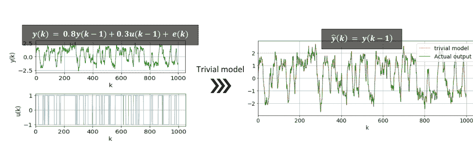

> **结论：** 装置观测值与1步预测值之间的良好匹配不应作为模型充分性检验的唯一标准。误差的统计分析是必不可少的。

在参数估计和性能评估中，$\varepsilon(k|k-1)$ 的替代方案是使用m步预测误差 $\varepsilon(k|k-m)$，其中仅使用直到 $k-m$ 时刻的输出测量值（即 $y(k-m)$, $y(k-m-1)$, ...），并根据模型需要使用直到 $k-1$ 时刻的输入。模型可以递归地使用预测值 $\hat{y}$ 来得到最终的 $\hat{y}(k|k-m)$。

分析长期或m步预测是模型质量检查的组成部分之一。就模型拟合度量而言，1步预测误差仍然是主流选择，主要是由于其计算简便且易于最小化。

#### 模型阶次选择

对于大多数模型，你需要在执行模型辨识之前指定模型大小/阶次。然而，你很可能事先并不知道所选模型的正确大小。常见的做法是尝试不同的模型阶次，并选择使预测误差最小的那个。但是，请注意，随着模型阶次或模型参数数量的增加，模型拟合数据集上的预测误差会单调递减。最佳实践是使用一个全新的数据集，称为验证数据集，来评估模型在未见数据（参数估计期间未使用）上的性能，如下图4.6所示。这种方法称为交叉验证。

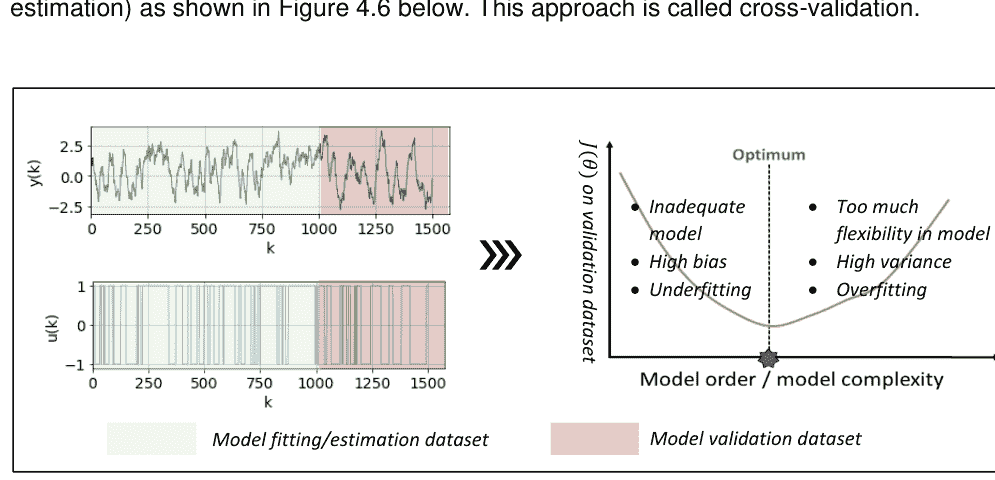

> 你可能会注意到，验证数据集中的样本并非通过打乱并从训练数据集中随机选择样本获得（静态建模通常这样做）。显而易见，这样做是为了保持拟合和验证数据集中观测样本的时间顺序。

另一种相关方法是从原始数据集中划分出多组验证数据集，并计算这些组上的平均性能作为性能度量，如图4.7所示。这称为k折交叉验证。

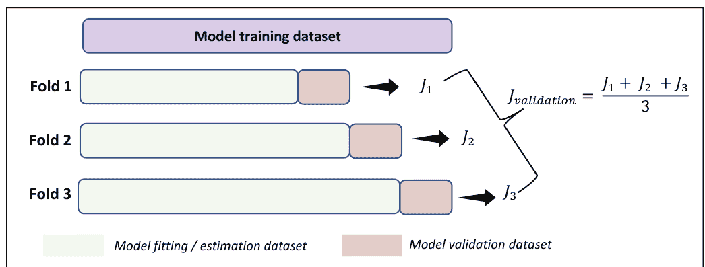

图4.7：3折交叉验证过程示意图

#### 基于信息准则的模型阶次选择

交叉验证的一种流行替代方案是使用性能度量，如赤池信息准则（AIC）或贝叶斯信息准则（BIC）。

$$AIC(\theta) = N \ln \left[ \frac{1}{N} \sum_{k} \varepsilon(k, \theta)^2 \right] + 2n$$

$$BIC(\theta) = N \ln \left[ \frac{1}{N} \sum_{k} \varepsilon(k, \theta)^2 \right] + n \ln (N)$$

其中，n = 模型参数数量
N = 训练数据集中的观测数量

如你所见，这些准则试图在模型精度和模型复杂度之间找到平衡。这里不使用单独的验证数据集，而是选择对应于最小AIC（或BIC）的模型阶次。大多数系统辨识软件包都原生支持使用这些信息准则进行自动模型阶次选择。你将在后续章节中看到基于AIC的系统辨识应用。

### 4.6 模型质量检查与诊断

上一节的讨论告诉我们，预测输出与测量输出之间的“接近度”不应被解释为“好”模型的唯一确凿证据。相反，需要进一步仔细审查模型，以确定模型是否真正捕捉到了训练数据集中所有“可预测”的变化，并充分代表了过程。如果不是这样，你可以寻找进一步改进的线索。现在让我们来看一些模型质量检查活动。

#### 残差分析

残差本质上是模型拟合数据中无法被模型解释的部分。因此，残差分析需要检查残差序列中是否仍存在系统性变化；如果存在，则剩余的系统性变化可以进一步建模以改进整体模型预测。$\varepsilon(k)$ 应满足以下两个性质：

- 1) $\varepsilon(k)$ 应为白噪声，即自相关系数应接近于零$^{31}$
- 2) $\varepsilon(k)$ 应与输入 $u(k)$ 不相关$^{32}$

对于条件(1)$^{33}$，生成ACF图（约20个滞后）。相关系数（滞后零除外）应处于某个阈值内——通常对应于95%显著性水平，即 $\pm 1.96/\sqrt{N}$。如果条件(1)被违反，则意味着模型可以进一步改进；然而，这并未提供关于具体改进措施的明确线索。一个通用的建议是尝试为扰动信号使用更复杂的随机模型。

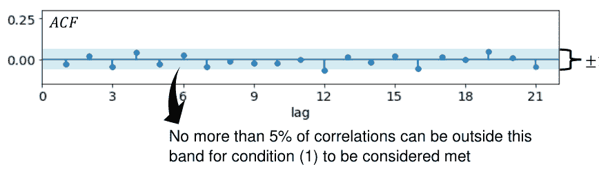

> $^{31}$ 如果扰动信号未被建模（例如OE模型），则不检查此条件。
> $^{32}$ 此条件要求 $\varepsilon(k)$ 或 $u(k)$ 中至少有一个为白噪声。
> $^{33}$ 也存在定量统计检验（如Ljung-Box检验）来检查残差是否表明拟合不足。

对于条件(2)，生成CCF图并附带阈值（同样，95%置信区间为±1.96/√N）。如果超过5%的相关性（滞后>0）违反阈值，则意味着 $\varepsilon(k)$ 中仍存在一些源自 $u(k)$ 的变化，因此模型的确定性部分可以进一步改进。下面的假设CCF图展示了当条件(2)不满足时可得出的一些推断示例³⁴。

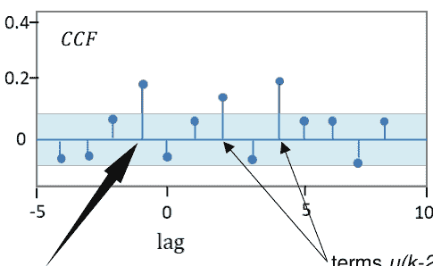

负滞后处的显著相关性意味着过程反馈或残差与未来输入相关。这表明数据是从闭环过程中收集的，其中输出噪声影响了未来的过程输入。[关于闭环辨识的更多信息见附录A1]

残差分析通常在拟合数据集本身上进行。也可以在新的验证数据集上进行；然而这对模型的要求会更高。

#### 瞬态响应检查

在模型拟合后检查预测的阶跃响应或脉冲响应³⁵是一个好习惯。如果你对过程增益和/或时间常数有一些先验认识，那么你可以将你的先验信念与瞬态响应图中观察到的结果进行比较。下面提到的是一些其他场景，其中这些图表可能会派上用场：- 假设你有几个提供相似预测响应的候选模型。这些模型的阶跃响应最终可能差异很大。这表明其中一些模型明显不准确，可以帮助你排除它们。如果可用，过程洞察可用于选择瞬态响应看起来更合理的模型。
- 你的模型可能给出良好的预测响应，但阶跃响应最终可能显示无界的稳态值！如果你知道你的过程本质上是稳定的，那么这意味着模型是错误的。
- 参数模型和非参数模型的瞬态响应之间良好的一致性可以建立信心，表明模型已经捕捉到了过程的基本特征。

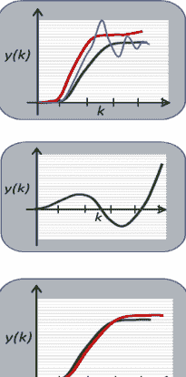

#### 仿真响应检查

之前，我们讨论了对于模型充分性分析，*m*步超前预测优于传统的1步超前预测。这个想法可以推到极致，产生无限步超前预测——也称为仿真。仿真通常在新的数据集上进行，任何时间*k*的输出仅使用过去的输入测量值和输出的初始条件生成。如果模型包含过去的输出项，则递归使用仿真输出。下面的说明阐明了这个概念。

```
Model: $y(k) = 0.8y(k-1) + 0.6u(k-1) + e(k)$
Initial condition: $y(0) = 0$
To predicted: $\hat{y}_{SIM}(3)$

$\hat{y}_{SIM}(1) = 0.8y(0) + 0.6u(0)$
$\hat{y}_{SIM}(2) = 0.8\hat{y}_{SIM}(1) + 0.6u(1)$
$\hat{y}_{SIM}(3) = 0.8\hat{y}_{SIM}(2) + 0.6u(2)$
```

在生成$\hat{y}_{SIM}$时忽略了扰动对输出的贡献。<sup>36</sup> $\hat{y}_{SIM}$的效用在于，如果信噪比高且$\hat{y}_{SIM}(k)$与$y(k)$紧密匹配，则意味着一个良好的（确定性）模型。请注意，较差的仿真性能可能意味着高扰动水平，而不一定是坏的（确定性）模型。尽管如此，如果仿真没有捕捉到$y(k)$中的主要系统性变化，那么模型可能就不太好。

#### 示例 4.4：

考虑以下实际过程和候选模型。我们将从过程中生成一些输出数据，然后分析模型的仿真和1步超前预测。

> 过程：$y(k) = 0.3y(k-1) + 0.8u(k-1) + 0.2u^2(k-1) + e(k)$
> 模型：$y(k) = 0.8y(k-1) + 0.6u(k-1) + e(k)$
> 初始条件：$y(0) = 0$

```python
# import packages
import numpy as np, matplotlib.pyplot as plt

# define input signal (for illustration, let this be white noise)
N = 100
u = np.random.normal(0, 5, N)

# compute actual process output
y = np.zeros((N, ))
e = np.random.normal(0, 0.1, N) # measurement noise
for k in range(1, N):
    y[k] = 0.3*y[k-1] + 0.8*u[k-1] + 0.2*u[k-1]*u[k-1] + e[k]

# compute model's simulated output and compare
y_sim = np.zeros((N, ))
for k in range(1, N):
    y_sim[k] = 0.8*y_sim[k-1] + 0.6*u[k-1]

plt.plot(y, 'g', linewidth=0.8, label='Actual output')
plt.plot(y_sim, 'r', linewidth=0.8, label='1-step ahead predictions')
plt.ylabel('y simulated'), plt.xlabel('k'), plt.xlim(0) , plt.legend()

# compute model's 1-step ahead predictions and compare
y_pred = np.zeros((N, ))
for k in range(1, N):
    y_pred[k] = 0.8*y[k-1] + 0.6*u[k-1]

plt.plot(y, 'g', linewidth=0.8, label='Actual output')
plt.plot(y_pred, 'r', linewidth=0.8, label='1-step ahead predictions')
plt.ylabel('y predictions'), plt.xlabel('k'), plt.xlim(0)
```

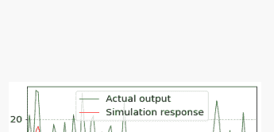

（正如预期的，非常差的模型性能）

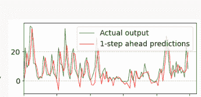

（具有欺骗性的）相当好的模型性能！）

仿真有时会因模型不准确而产生令人惊讶的结果。例如，仿真输出可能显示发散趋势，而1步超前预测可能是完美的！此外，两个模型的预测输出可能非常相似，但仿真响应可能显著不同。

#### 参数误差检查

模型辨识后，应根据参数的估计误差检查其值。理想情况下，误差相对于估计的参数值应不显著。在实践中，为每个参数生成95%置信区间，如果置信区间包含0，则从模型中移除该参数。然后重新辨识一个排除被移除变量的新模型。

这完成了我们对模型诊断的快速浏览。还有一些我们没有涵盖的其他检查，例如极点-零点抵消、使用极点进行平稳性检查、使用零点进行可逆性检查等。总的来说，本章为你提供了几种工具，以帮助你在SysID之旅中前进。我们希望你已经感到自信，拥有所有必要的武器来处理SysID过程的每一步。我们将以两条建议结束本章。首先，不要忘记SysID是一个迭代过程，因此如果你的模型第一次尝试失败，不要灰心。其次，记住我们在第1章中提到的著名引言³⁷：“*所有模型都是错误的，但有些是有用的！*”

### 总结

在本章中，我们学习了建立系统辨识工作流程的最佳实践。我们熟悉了与辨识测试设计、数据预处理、模型结构和阶数选择以及模型质量检查相关的实践相关概念。接下来，我们将开始学习SysID中可以说是最重要的任务，即模型辨识。

## 第二部分

### 用于动态建模的经典机器学习方法

## 第5章

### 时间序列分析：概念与应用

如前所述，时间序列分析（TSA）是指研究没有外生输入的过程的时间序列信号。在我们深入研究相对更复杂的输入-输出建模世界之前，明智的做法是首先熟悉如何对信号中的随机变化进行建模，并紧凑地描述时间序列中相邻观测值之间的依赖性。时间序列的研究不仅仅是为了教学上的便利。SysID从时间序列分析中汲取了许多概念，因此，扎实的时间序列建模基础对于掌握SysID的艺术非常重要。

时间序列分析可以帮助我们表征I/O模型残差，并为模型进一步改进提供线索。如果你的过程有可测量的扰动信号（无法操纵的输入；例如，环境温度），则可以通过TSA对它们进行建模，以提供更好的预测和控制。此外，TSA可用于对受控过程变量进行建模并构建过程监控工具。在本章中，我们将通过案例研究来说明这些应用。

除了为数字信号处理奠定坚实基础外，本章还将介绍后移算子和传递函数算子。这些构造对于差分方程的紧凑描述和代数操作非常有用。具体涵盖以下主题：

- 介绍用于平稳信号的AR、MA和ARMA模型
- 使用ACF和PACF进行模型结构选择
- 使用ARMA模型监控CSTR中的受控过程变量
- 介绍用于非平稳信号的ARIMA模型
- 使用ARIMA模型预测可测量信号

### 5.1 时间序列分析：简介

时间序列分析是指研究和建模时间序列信号中连续数据点之间的依赖性。存在多种建模时间序列的方法。在本章中，我们将研究如图5.1所示的四种最常见的模型。虽然AR、MA和ARMA模型用于描述平稳信号，但ARIMA用于（齐次）非平稳信号。在本章中，我们将理解这些模型之间的差异、相似性和内在联系。

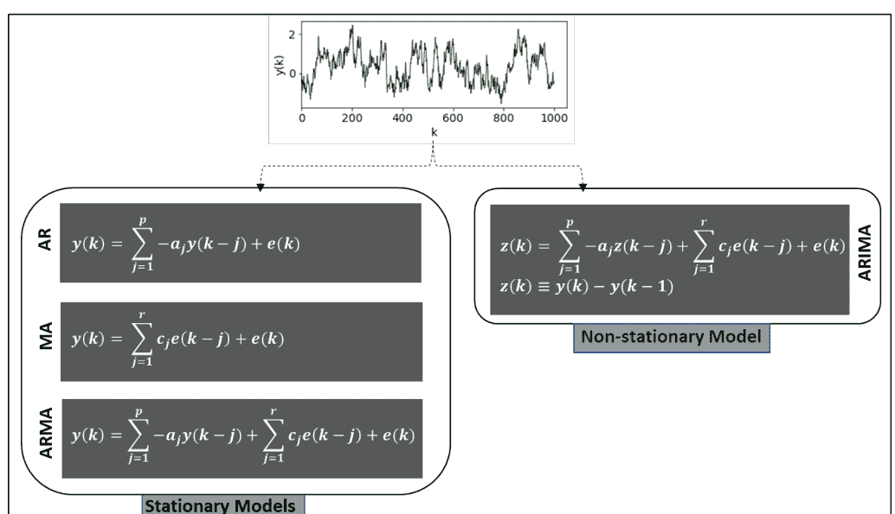

为了进一步激发对时间序列分析的研究，让我们简要看看前面提到的两个用例。下面的插图显示了一个具有可测量扰动信号（进料浓度和温度）的CSTR单元。这些信号的准确模型可以帮助生成准确的预测，并更有效地控制容器温度。此外，很容易证明，如果控制器的设定值不变，那么受控变量（此处为输出产品温度和浓度）仅取决于过程扰动。因此，可以为这些变量构建一个TSA模型，最终寻找测量值和模型预测之间的显著差异，作为过程故障的指示器。

### 5.2 自回归（AR）模型：简介

AR 模型是最简单且最易于理解的时间序列模型之一，其中当前状态被表示为过去测量值的线性组合，如下所示³⁸

$$y(k) = -a_1y(k-1) - a_2y(k-2) \cdots - a_py(k-p) + e(k) \quad \text{eq. 1}$$
$$= \sum_{j=1}^{p} -a_jy(k-j) + e(k)$$

上述模型使用了 $p$ 个滞后/过去值，因此被称为 AR(p) 模型或 $p$ 阶自回归模型。尽管简单，AR 模型却能生成如图所示的各种信号模式。在过程工业中，具有固有自回归行为的过程相当常见。

³⁸ 你很快就会明白为什么我们在方程中使用 '$-a_j$' 而不是 '$a_j$'

#### 模型阶数选择

对于任何给定的时间序列数据，AR 模型的适用性及其潜在阶数可以通过 ACF$^{39}$ 和 PACF 图来判断，如图 5.2 中的 AR(2) 图所示。

让我们看一个例子，展示如何从 AR 过程生成数据以及如何拟合 AR 模型。

#### 示例 5.1：

我们将创建一个包含 1000 个样本的 AR(2) 信号。然后，在 ACF/PACF 的指导下，将为数据拟合一个模型，随后进行残差诊断。

```python
# import packages
import numpy as np, matplotlib.pyplot as plt
from statsmodels.tsa.arima_process import ArmaProcess
from statsmodels.tsa.arima.model import ARIMA
from statsmodels.graphics.tsaplots import plot_acf, plot_pacf

# generate data for AR(2) process using statsmodels.tsa package
ar_coeffs = np.array([1, -0.3, -0.45]) # $a_1 = -0.3, a_2 = -0.45$
ARprocess = ArmaProcess(ar_coeffs)
y_AR = ARprocess.generate_sample(nsample=1000)

# generate ACF and PACF plots for y_AR
conf_int = 2/np.sqrt(len(y_AR))
plot_acf(y_AR, lags= 20, alpha=None, title="")
plt.gca().axhspan(-conf_int, conf_int)
```

```python
plot_pacf(y_AR, lags= 20, alpha=None, title="")
plt.gca().axhspan(-conf_int, conf_int)
```

PACF 图清楚地表明这是一个 AR(2) 过程。我们将再次使用 *statsmodels.tsa* 包来拟合 AR(2) 模型。

```python
# Fit an AR(2) model
y_AR_centered = y_AR - np.mean(y_AR)
model = ARIMA(y_AR_centered, order=(2, 0, 0)) # order = (p,d,r)
results = model.fit()
```

> AR 模型是参数线性的，因此可以使用 OLS 方法来估计未知的模型参数。

```python
# Print out the estimate for the parameters $a_1$ and $a_2$
print('[a1, a2] = ', -results.arparams)

>>> [a1, a2] = [-0.27 -0.50]
```

估计的参数接近真实值（对于更大的样本量，估计的不准确性会减小）。利用获得的模型，让我们生成模型残差并确认残差序列的白噪声特性。

```python
# get model predictions and residuals on training dataset
y_AR_centered_pred = results.predict()
residuals = y_AR_centered - y_AR_centered_pred

plt.figure(), plt.title('Training data')
plt.plot(y_AR_centered, 'g', label='Measurements')
plt.plot(y_AR_centered_pred, 'r', label='Predictions')
plt.ylabel('y(k): Measured vs predicted'), plt.xlabel('k'), plt.legend()

plt.figure(), plt.plot(residuals, 'black', linewidth=0.8)
plt.title('Training data'), plt.ylabel('residuals'), plt.xlabel('k')
```

```python
# ACF residuals
plot_acf(residuals, lags= 20, alpha=None, title="")
plt.gca().axhspan(-conf_int, conf_int, facecolor='lightblue', alpha=0.5)
plt.xlabel('lag'), plt.title('Autocorrelations')
```

#### 移位算子与传递函数算子

到目前为止，我们所使用的差分方程的原始形式在组合不同模型和分析模型特性时不太方便。为了获得更紧凑和有用的表示，引入了后移算子（$q^{-1}$）的概念。其定义为

$$y(k-1) = q^{-1}y(k)$$

显然，后移算子将信号向后移动一步。多次应用则将信号进一步后移

$$q^{-1}(q^{-1}y(k)) = q^{-2}y(k) = y(k-2)$$

让我们使用移位算子重写方程 1，如下所示

$$y(k) + \sum_{j=1}^{p} a_j y(k-j) = e(k)$$
$$\Rightarrow y(k) + (\sum_{j=1}^{p} a_j q^{-j})y(k) = e(k)$$
$$\Rightarrow (1 + \sum_{j=1}^{p} a_j q^{-j})y(k) = e(k)$$
$$\Rightarrow y(k) = \frac{1}{(1+\sum_{j=1}^{p} a_j q^{-j})} e(k) \equiv H(q^{-1})e(k)$$

让我们看看如何使用 $q$ 表示法来表示一个简单的 ARX 模型 $y(k) + a_1 y(k-1) + a_2 y(k-2) = b_1 u(k-1) + b_2 u(k-2) + e(k)$

$$(1 + a_1 q^{-1} + a_2 q^{-2})y(k) = q^{-1}(b_1 + b_2 q^{-1})u(k) + e(k)$$
$$\Rightarrow y(k) = G(q^{-1})u(k) + H(q^{-1})e(k)$$

$$G(q^{-1}) = \frac{q^{-1}(b_1 + b_2 q^{-1})}{1 + a_1 q^{-1} + a_2 q^{-2}}$$
$$H(q^{-1}) = \frac{1}{1 + a_1 q^{-1} + a_2 q^{-2}}$$

请注意，$G(q^{-1})$ 和 $H(q^{-1})$ 是（输入和噪声传递）算子（而非乘数），它们分别作用于 $u(k)$ 和 $e(k)$，并决定输入信号如何被“传递”到输出。因此，$G(q^{-1})$ 和 $H(q^{-1})$ 被称为传递算子。方程 2 可以进一步写为

$$y(k) = y_u(k) + v(k) \quad \text{eq. 3}$$

其中，$y_u(k) = G(q^{-1})u(k)$ 是确定性输出，$v(k) = H(q^{-1})e(k)$ 是扰动信号。

请注意，方程 3 清楚地表明，在 ARX 模型中，过程扰动 $v(k)$ 是有色信号，而不是白噪声（$e(k)$）。因此，显然传递算子形式使得剖析模型的随机部分和确定性部分变得容易。

$q$ 表示法可能不会立即吸引你，但很快你就会开始欣赏它所提供的便利！目前，只需注意 $G(q^{-1})$ 和 $H(q^{-1})$ 可以像 $q^{-1}$ 的多项式一样进行操作，你很快就会看到。

### 5.3 移动平均（MA）模型：简介

在 MA 模型中，当前状态是当前和过去白噪声误差值的总和，如下所示

$$y(k) = c_1e(k-1) + c_2e(k-2) \cdots + c_re(k-r) + e(k)$$
$$= \sum_{j=1}^r c_je(k-j) + e(k)$$
$$= (1 + \sum_{j=1}^r c_jq^{-j})e(k)$$

上述模型被称为 MA(r) 模型。MA 模型可以解释为时间序列信号中 FIR 模型的对应物，其中过去的随机冲击/噪声的影响直接传播到时间序列的未来值。下面的图提供了 MA 模型生成的模式示例。

图 5.3：来自 MA 过程的时间序列信号

#### 模型阶数选择

与 AR 模型一样，ACF 和 PACF 图提供了关于模型阶数的直接线索，如图 5.3 中的 MA(2) 图所示。

让我们通过一个例子来具体理解 MA 过程。

**示例 5.2：** 我们将创建一个包含 1000 个样本的 MA(2) 信号。然后，在 ACF/PACF 的指导下，将为数据拟合一个模型，随后进行残差诊断。导入的包与示例 5.1 中相同。

```python
# generate data for MA(2) process using statsmodels.tsa package
ma_coeffs = np.array([1, 0.3, 0.45]) # [1, c1, c2]
MAprocess = ArmaProcess(ma = ma_coeffs)
y_MA = MAprocess.generate_sample(nsample=1000)
```

```python
# generate ACF and PACF plots for y_MA
conf_int = 2/np.sqrt(len(y_MA))
plot_acf(y_MA, lags= 20, alpha=None, title='')
plt.gca().axhspan(-conf_int, conf_int)

plot_pacf(y_MA, lags= 20, alpha=None, title='')
plt.gca().axhspan(-conf_int, conf_int)
```

ACF 图清楚地表明这是一个 MA(2) 过程。我们将再次使用 *statsmodels.tsa* 包来拟合 MA(2) 模型。

```python
# Fit an MA(2) model
y_MA_centered = y_MA - np.mean(y_MA)
model = ARIMA(y_MA_centered, order=(0, 0, 2)) # order = (p,d,r)
results = model.fit()

# Print out the estimate for the parameters c1 and c2
print('[c1, c2] = ', results.maparams)

>>> [c1, c2] =  [0.30 0.53 ]
```

> MA 参数的估计不像 AR 参数那样容易，因为未知量——过去的冲击（e）和系数（c）——在模型中是非线性存在的。因此，采用迭代数值程序进行参数估计。

估计的参数接近真实值（对于更大的样本量，估计的不准确性会减小）。利用获得的模型，让我们生成模型残差并确认残差序列的白噪声特性。

```python
# get model predictions and residuals on training dataset
y_MA_centered_pred = results.predict()
residuals = y_MA_centered - y_MA_centered_pred

plt.figure(), plt.title('Training data')
plt.plot(y_MA_centered, 'g', label='Measurements')
plt.plot(y_MA_centered_pred, 'r', label='Predictions')
plt.ylabel('y(k): Measured vs predicted'), plt.xlabel('k'), plt.legend()

plt.figure(), plt.plot(residuals, 'black', linewidth=0.8)
plt.title('Training data'), plt.ylabel('residuals'), plt.xlabel('k')

# ACF residuals
plot_acf(residuals, lags= 20, alpha=None, title='')
plt.gca().axhspan(-conf_int, conf_int, facecolor='lightblue', alpha=0.5)
plt.xlabel('lag'), plt.title('Autocorrelations')
```

#### AR模型与MA模型的等价性

AR模型和MA模型表面上看起来可能差异很大，但在某些条件下，它们可以相互转换。任何平稳的AR模型都可以重写为MA(∞)模型，任何可逆的（可逆性的定义稍后给出）MA模型也可以等价地重写为AR(∞)模型。例如，考虑MA(1)模型 $y(k) = c_1e(k-1) + e(k)$，它可以被重写为

$y(k) = c_1(y(k-1) - c_1e(k-2)) + e(k)$
$= c_1y(k-1) - c_1^2e(k-2) + e(k)$

$\vdots$ 经过反复代入

AR(∞)模型！ $y(k) = -\sum_{j=1}^{\infty} (-c_1)^j y(k-j) + e(k)$ 公式 5

> 另一种更快的推导方法：
$y(k) = (1 + c_1q^{-1})e(k)$
$\Rightarrow (1 + c_1q^{-1})^{-1}y(k) = e(k)$ 使用多项式长除法
$\Rightarrow (\sum_{j=0}^{\infty} (-c_1)^j q^{-j})y(k) = e(k)$

注意，公式5仅在 $|c_1| < 1$ 时才表示一个有效/合理的模型（否则 $c_1^j$ 会无界增长）。这也是MA(1)模型的可逆性条件。AR(1)模型可以通过递归代入 $y(k-1)$、$y(k-2)$ 等，重写为MA(∞)模型。

ACF/PACF图有时可能表明AR和MA模型都是底层过程的合适表示。鉴于这两类模型的等价性，你可以任选其一。只需注意，虽然AR参数易于估计，但MA模型可能更简约（即需要少得多的参数）。

### 5.4 自回归移动平均（ARMA）模型：简介

有时，通过结合自回归项和移动平均项，可以构建一个比AR或MA模型更紧凑、更简约的模型。这类模型称为ARMA模型，其形式如下

$$y(k) = -a_1y(k-1) \cdots - a_py(k-p) + c_1e(k-1) \cdots + c_re(k-r) + e(k)$$

$$= \left(-\sum_{j=1}^{p} a_j q^{-j}\right)y(k) + \left(\sum_{j=1}^{r} c_j q^{-j}\right)e(k) + e(k) \quad \text{公式 6}$$

AR项
MA项

上述模型被称为ARMA(p,r)，这是由于其包含 $p^{th}$ 阶自回归分量和 $r^{th}$ 阶移动平均分量。显然，AR和MA模型是ARMA模型的特例。此外，任何平稳且可逆的ARMA模型都可以等价地重写为AR($\infty$)或MA($\infty$)模型。

ARMA模型不仅仅是为了数学上的便利，在过程工业中也很常见。要理解原因，请考虑下面的示例场景，其中纯AR过程的输出被随机白噪声干扰所污染

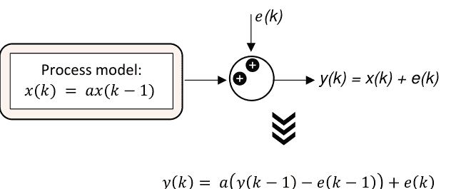

$$y(k) = a(y(k-1) - e(k-1)) + e(k)$$
$$\Rightarrow y(k) = ay(k-1) - ae(k-1) + e(k)$$
总体而言，这是一个ARMA(1,1)过程！

下面的图提供了ARMA模型生成的模式示例。

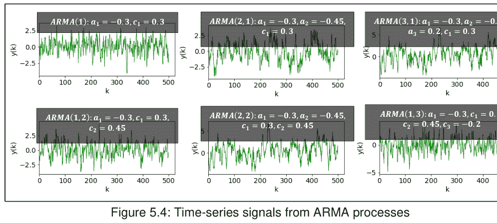

#### 模型阶数选择

图5.5中ARMA(2,2)图的ACF和PACF图如下所示。

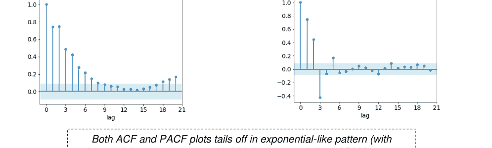

> ACF和PACF图都呈现指数衰减的拖尾模式（混合了阻尼正弦波），这是ARMA过程的特征

很明显，这些图对于确定 $p$ 和 $r$ 的具体值帮助不大。通常的解决方法是使用第4章介绍的模型阶数选择技术。

## 示例5.3：我们将创建一个包含1000个样本的ARMA(1,2)信号。之后，将通过AIC自动确定AR和MA阶数，并将相应的模型拟合到数据上。导入的包与示例5.1相同

```
# 为ARMA(1,2)过程生成数据
ARMAprocess = ArmaProcess(ar=[1, -0.3], ma=[1, 0.3, 0.45])
y_ARMA = ARMAprocess.generate_sample(nsample=1000)
```

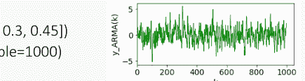

```
# 为y_ARMA生成ACF和PACF图
plot_acf(y_ARMA, lags= 20, alpha=None, title='')
plot_pacf(y_ARMA, lags= 20, alpha=None, title='')
```

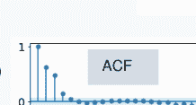

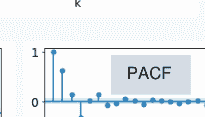

ACF和PACF图的结论不是很明确。幸运的是，tsa包提供了一个函数 `arma_order_select_ic`，可以帮助通过AIC估计阶数。

```
# 确定最优的AR和MA阶数
from statsmodels.tsa.stattools import arma_order_select_ic

y_ARMA_centered = y_ARMA - np.mean(y_ARMA)
res = arma_order_select_ic(y_ARMA_centered, max_ma=4, ic=["aic"])
p, r = res.aic_min_order
print('(p, r) = ', res.aic_min_order)
```

>>> (p, r) = (1, 2)

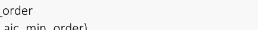

```
# 拟合一个ARMA(p,r)模型
model = ARIMA(y_ARMA_centered, order=(p, 0, r))
results = model.fit()
print('[a1] = ', -results.arparams); print('[c1, c2] = ', results.maparams)
```

>>> [a1] = [-0.29]
[c1, c2] = [0.30 0.53]

估计的参数接近真实值。接下来，按照前面示例中的方法生成残差，并确认残差序列的白噪声特性。

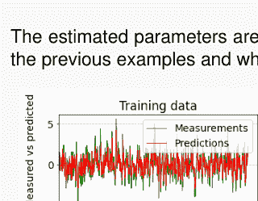

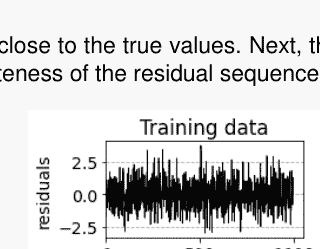

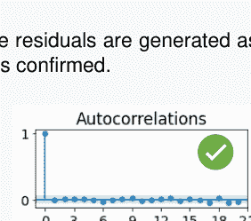

### 5.5 使用ARMA模型监控CSTR中的受控变量

为了说明时间序列分析的实际应用，我们将考虑章节引言中描述的连续搅拌釜式反应器。这里，将监控产品温度，以确保其不会因任何过程故障而偏离其最佳设定点。数据文件 *CSTR_controlledTemperature.csv* 包含4小时的温度测量值<sup>40</sup>，采样间隔为0.1秒（共2401个样本）。在3.5小时（约第2100个样本）时发生过程故障，导致传热系数降低20%。让我们看看这个过程故障是否会导致产品温度的任何偏差，以及我们的监控方法能否检测到这些偏差。

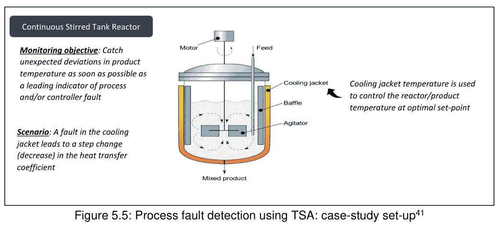

让我们从导入所需的包并探索提供的输入/输出数据集开始。前3小时的数据将用于构建模型，后1小时的数据将用作测试数据。

```
# 导入包
import matplotlib.pyplot as plt, numpy as np, control
from statsmodels.graphics.tsaplots import plot_acf, plot_pacf
from statsmodels.tsa.stattools import arma_order_select_ic
from statsmodels.tsa.arima.model import ARIMA
```

```
# 读取数据并分为训练数据和测试数据
T = np.loadtxt('CSTR_controlledTemperature.csv', delimiter=',')
T_train = T[:1800]; T_test = T[1800:]
```

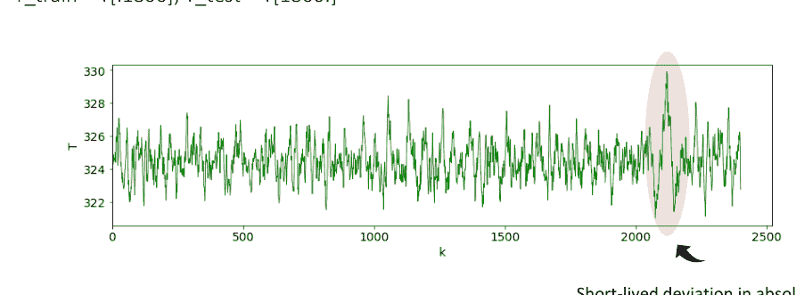

上面的图显示，由于过程故障，温度似乎只表现出短暂的<sup>42</sup>绝对值偏差。因此，仅基于此时间图，工厂操作员很可能将其视为不重要的波动而忽略，过程故障可能得不到处理。

使用 *均值 ± 2 * 标准差* 界限的简单单变量监控方法也是不够的，因为该方法假设样本之间是相互独立的，而正如下面 *T_train* 数据的ACF图所示，对于产品出口温度（以及一般的动态过程）来说，这显然不是真的。下面显示的控制图表明了这种方法的失败，因为受控变量没有显示出任何持续的、异常的控制界限违反（界限仅使用训练数据计算）。

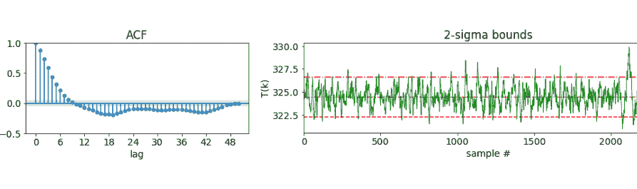

现在让我们看看时间序列模型是否能在故障检测方面做得更好。我们将尝试拟合一个ARMA模型。

```
# 确定最优的AR和MA阶数
T_train_centered = T_train - np.mean(T_train); T_test_centered = T_test - np.mean(T_train)
res = arma_order_select_ic(T_train_centered, max_ar=5, max_ma=5, ic=["aic"])
p, r = res.aic_min_order
print('(p, r) = ', res.aic_min_order)

>>> (p, r) = (2, 4)

# 拟合一个ARMA(p,r)模型并获取残差
model = ARIMA(T_train_centered, order=(p, 0, r))
results = model.fit()
T_train_centered_pred = results.fittedvalues # 与 results.predict() 相同
residuals_train = T_train_centered - T_train_centered_pred # 与 results.resid 相同
```

残差通过了模型质量检查。

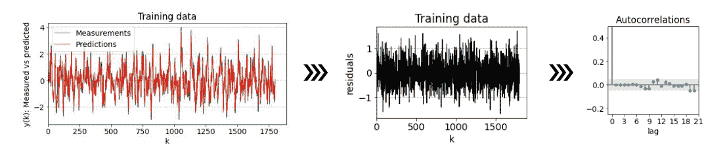

现在是时候使用拟合好的ARMA模型进行故障检测了。其原理很直接：如果任何过程故障导致过程行为发生变化，那么使用“正常”运行条件数据拟合的模型在故障数据上就不会非常准确，因此残差会显示出更高的值。因此，通过监控残差来进行故障检测，如图5.6所示。

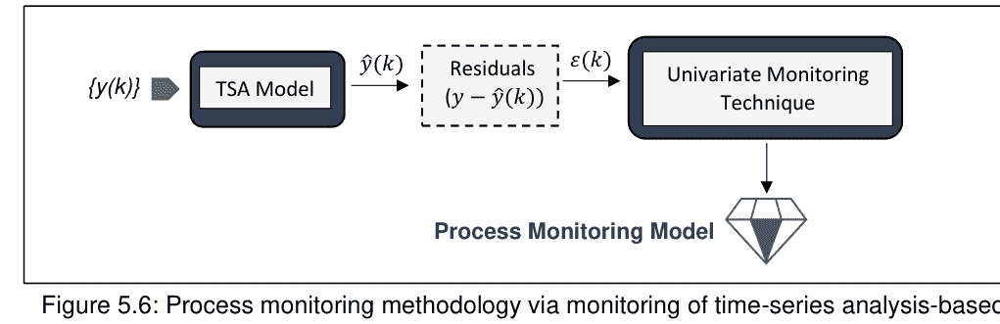

#### 测试数据的1步超前预测

```python
results_test = results.apply(T_test_centered)
T_test_centered_pred = results_test.fittedvalues # same as results_test.predict()
residuals_test = T_test_centered - T_test_centered_pred
```

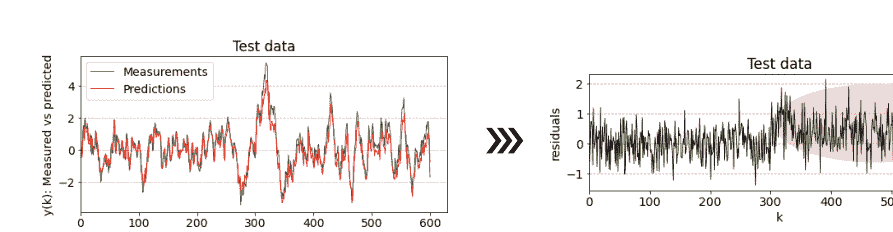

上图显示，在过程故障发生后（对于测试数据集，是在样本#300之后），残差的平均值呈现增加趋势。整个数据集的控制图使得残差持续异常值更加明显。现在可以进行故障诊断，以隔离故障的根本原因。

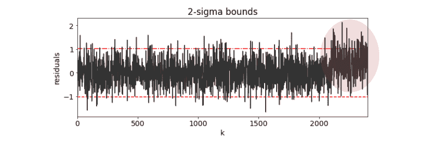

> 通过监控模型参数估计进行故障检测

在上面的例子中，我们看到了过程故障如何导致过程变量行为的变化。因此，作为残差监控的替代方案，另一种流行的过程故障检测方法是定期为过程构建新的动态模型，并检查模型参数是否发生显著变化。显著的参数变化可以是过程故障的良好指标。

#### 重访平稳性与引入可逆性

在第4章中，我们已经看到如何通过差分使齐次非平稳信号变得平稳。然而，从简单的时间图中推断齐次非平稳性并不总是那么容易。幸运的是，ACF、PACF和PSD图可以提供关键线索。这些图形图中非平稳行为的特征指标如下所示。根据我们目前涵盖的概念，你应该能够轻松解释这些特征背后的基本原理。

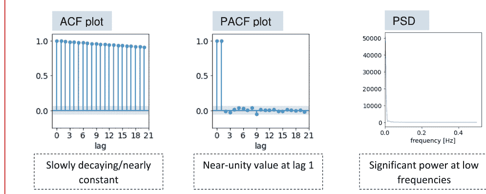

#### 使用噪声传递算子 $H(q^{-1})$ 检查平稳性

公式6中ARMA模型的传递算子可以写为

$$H(q^{-1}) = \frac{1 + \sum_{j=1}^{r} c_j q^{-j}}{1 + \sum_{j=1}^{p} a_j q^{-j}} = \frac{C(q^{-1})}{A(q^{-1})}$$

如果 $A(q^{-1})$ 的根的绝对值大于1，则ARMA模型表示一个平稳过程。例如，对于AR(1)过程 $y(k) = ay(k-1) + e(k)$，

$$A(q^{-1}) = 1 - aq^{-1} \Rightarrow root = \frac{1}{a}$$
$$\Rightarrow \text{平稳性条件为 } \left|\frac{1}{a}\right| > 1 \Rightarrow |a| < 1$$

在系统辨识文献中，$A(q^{-1})$ 的根被称为极点。注意，如果 $A(q^{-1})$ 的阶数或自回归部分的阶数 > 1，则极点可以是复数。因此，“单位圆外的极点”是陈述平稳性条件的正确方式。

> 单位圆内的极点会导致爆炸性非平稳性，而单位圆上的极点会导致齐次非平稳性（例如随机游走过程）。MA过程的 $A(q^{-1}) = 1$，因此总是平稳的（对于有限的 $r$ 和 $c_j$）。

#### 可逆性

对扰动模型施加的另一个条件是可逆性，以表示真实过程。该条件要求分子多项式（$C(q^{-1})$）的根，也称为传递算子的零点，位于单位圆外。AR模型的 $C(q^{-1}) = 1$，因此总是可逆的。无需深入数学细节，只需知道对于不可逆模型，可以将 $e(k)$ 写成 $y(k)$ 未来值的总和；这样的模型被称为非因果模型，不能表示真实过程。

### 5.6 自回归积分移动平均（ARIMA）模型：简介

在第4章中，我们看到非平稳信号可以通过适当的差分用平稳ARMA模型建模。这种差分平稳过程被形式化为ARIMA过程$^{43}$，并表示为

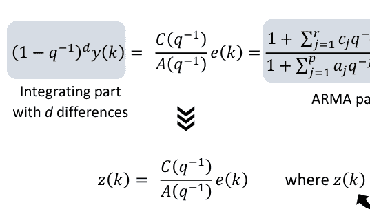

$^{43}$ 有时，建模者在ARIMA模型中包含一个常数项 $\theta_o$，此时模型采取以下形式 $(1 - q^{-1})^d y(k) = \theta_o + \frac{C(q^{-1})}{A(q^{-1})} e(k)$。在第4章中，我们已经证明，通过差分 $d$ 次可以消除 $d$ 次确定性趋势。因此，在模型中包含 $\theta_o$ 等同于在模型中显式包含一个确定性趋势。

例如，考虑一个信号，在一阶差分后变为ARMA(1,1)平稳过程

```
$(1 - q^{-1})y(k) = \frac{1 - cq^{-1}}{1 - aq^{-1}} e(k)$  $\longleftarrow$ 传递算子形式
$\Rightarrow (1 - aq^{-1})(y(k) - y(k-1)) = e(k) - ce(k-1)$
$\Rightarrow y(k) = (1+a)y(k-1) - ay(k-2) - ce(k-1) + e(k)$  $\longleftarrow$ 差分方程形式
```

> 到现在你应该已经意识到，$q$ 符号使得表示和处理复杂模型变得容易得多。

上述模型被称为ARIMA(p,d,r)，这是由于 $d^{th}$ 阶差分和ARMA(p,r)建模。你可以看到，通过适当选择 $p$、$d$ 和 $r$，MA、AR和ARMA模型成为ARIMA模型的特例。

#### 随机游走模型


ARIMA(p,1,r)扰动模型等同于说扰动信号中存在随机（且时间相关）的阶跃变化。一阶纯积分模型（ARIMA(0,1,0)，也称为随机游走模型）采取以下形式

```
$(1 - q^{-1})y(k) = e(k) \Rightarrow y(k) = y(k-1) + e(k)$
```

积分模型之所以如此命名，是因为噪声值被连续地添加到输出信号中。

#### 模型阶数选择

图形工具可用于检查是否需要差分。如果差分序列表现出AR或MA或ARMA的迹象，则不需要进一步差分。很少需要选择 $p$、$d$ 或 $r$ 大于2。

#### 单位根检验

检查单位极点存在性（因此需要差分）的一种严格方法是单位根检验。要理解这个检验，考虑一个简单的AR(1)过程 $y(k) = ay(k-1) + e(k)$。为了需要差分，'a' 需要等于1，因此在回归模型 $z(k) = (a-1)y(k-1) + e(k)$ 中，其中 $z(k) = y(k) - y(k-1)$，系数 a-1 将等于0。单位根检验就是对这个系数是否等于零的假设检验。这被称为Dickey-Fuller检验。

如果你有一些假设检验的经验，那么你会知道，如果检验的 *p* 值高于指定的阈值/显著性水平<sup>44</sup>，则（关于所研究序列非平稳的）（原）假设不会被拒绝。对于更一般的积分阶数 > 1的序列，使用更一般的增广Dickey-Fuller检验。然而，检验过程保持不变。

#### 示例5.4：

从AR过程生成数据并执行ADF检验以检查单位根。

```python
# import packages
import numpy as np, matplotlib.pyplot as plt
from statsmodels.tsa.arima_process import ArmaProcess

# generate data
ar_coeffs = np.array([1, -0.96]) # y(k) = 0.96y(k-1) + e(k)
ARprocess = ArmaProcess(ar=ar_coeffs)
y = ARprocess.generate_sample(nsample=1000)

# perform augmented Dickey-Fuller test
from statsmodels.tsa.stattools import adfuller
result = adfuller(y)
print('p-value: %f' % result[1])
```

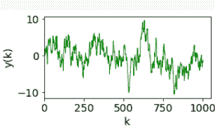

>>> p-value: 0.000187

由于p值小于0.05，原假设被拒绝 ⇒ 时间序列是平稳的

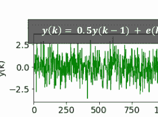

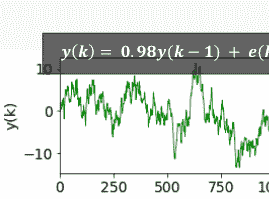

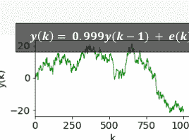

p-value: 0

p-value: 0.027

p-value: 0.904

#### 示例5.5：

在这个例子中，我们将利用一个给定的时间序列，该序列由以下过程生成。在图形图和ADF检验的指导下，我们将推断出正确的模型阶数。然后，将拟合一个ARIMA模型以找到模型参数。

$$(1 - q^{-1})y(k) = \frac{1 - 0.7q^{-1}}{1 - 0.5q^{-1}} e(k)$$

注意，存在像 *pmdarima* 这样的包，可用于自动估计差分阶数和AR/MA阶数。

```python
# import packages and read data
import numpy as np, matplotlib.pyplot as plt
from statsmodels.tsa.arima.model import ARIMA
y = np.loadtxt('ARIMA_data.txt')
```

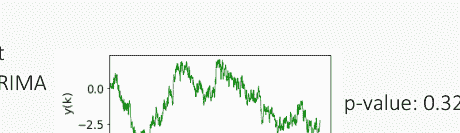

相关图和ADF检验清楚地表明存在单位根。因此，我们知道至少需要一次差分。让我们检查差分信号的ACF和PACF图。

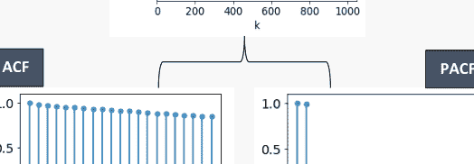

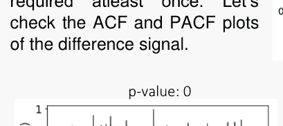

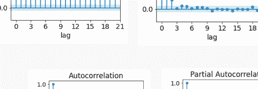

ADF检验表明差分信号是平稳的，因此不需要进一步差分。此外，ACF和PACF图清楚地表明AR和MA阶数均为1（两个图在滞后1之后都显示值急剧下降）。因此，我们可以对给定数据拟合一个ARIMA(1,1,1)模型。

```python
# fit ARIMA(1,1,1) model
y_centered = y - np.mean(y)
model = ARIMA(y_centered, order=(1, 1, 1))
results = model.fit()
print(results.summary())
```

| | coef | std err |
|---|---|---|
| ar.L1 | 0.4883 | 0.096 |
| ma.L1 | -0.6723 | 0.082 |

参数估计值接近实际值

### 5.7 使用ARIMA预测信号

之前我们了解了如何利用时间序列模型构建过程监控解决方案。如前所述，此类模型的另一个常见用途是预测随机信号。尽管*Statsmodels*包提供了生成预测的原生支持，但了解预测工作流程的实际内容将很有启发性。我们将使用一个简单的ARIMA(1,1,1)模型进行说明。设模型如下：

$$(1 - q^{-1})y(k) = \frac{1 - 0.7q^{-1}}{1 - 0.5q^{-1}} e(k)$$

让我们将上述方程展开为一个差分方程，其左侧仅包含$y(k)$：

$$y(k) = 1.5y(k-1) - 0.5y(k-2) - 0.7e(k-1) + e(k) \quad \text{式 7}$$

为了从式7推导出预测表达式，适用以下符号/规则：

- $\hat{y}(k+l|k) \equiv \hat{y}(l)$ 表示使用时间$k$所有可用信息进行的$l$步超前预测/估计
- 式7右侧任何尚未发生的$y$值，都用其预测值$\hat{y}$替换
- 任何未来的噪声项替换为零，过去的噪声项替换为1步超前残差（例如，$e(k-1) = y(k-1) - \hat{y}(k-1|k-2)$）

让我们看看当$l = 1, 2, 3, ...$时，预测表达式是什么样子：

$$\hat{y}(1) = 1.5y(k) - 0.5y(k-1) - 0.7e(k)$$
$$\hat{y}(2) = 1.5\hat{y}(1) - 0.5y(k)$$
$$\hat{y}(3) = 1.5\hat{y}(2) - 0.5\hat{y}(1)$$
$$\vdots$$

其中，$e(k)$将被替换为$y(k) - \hat{y}(k|k-1)$

式7中的两个误差项均替换为零

上述预测表达式中一个稍显不完整的方面是$e(k)$的计算。注释文本建议使用$\hat{y}(k|k-1)$，但这将涉及$e(k-1)$项。这导致了一种递归方法来寻找过去的噪声值。既定的方法是从时间$p + d$开始，将时间$\leq p + d$的估计噪声值设为零，然后使用1步超前预测的表达式递归估计噪声值，直到时间$k$。对于我们的ARIMA(1,1,1)模型，计算过程如下所示：

```
（近似）0 0（用条件均值替换）
\hat{y}(2|1) = 1.5y(1) - 0.5y(0) - 0.7e(1) + e(2)
\downarrow
e(2) = y(2) - \hat{y}(2)
\downarrow
\hat{y}(3|2) = 1.5y(2) - 0.5y(1) - 0.7e(2) + e(3)
\downarrow
e(3) = y(3) - \hat{y}(3)
\vdots
```

至此，我们快速概述了时间序列分析及其应用。希望您已经对时间序列分析背后的概念有了深入的理解，并能认识到它在描述过程系统方面的实用性。

### 总结

在本章中，我们探讨了用于描述时间序列的四种常用模型，即AR、MA、ARMA和ARIMA模型。我们研究了它们的模型形式以及相应模型阶数选择背后的过程。我们了解了ACF和PACF工具如何为模型结构提供有用的线索。我们还更详细地探讨了TSA模型的平稳性要求以及评估信号平稳性的方法。我们将在本章涵盖的概念基础上，在下一章中探讨用于描述输入-输出动态信号的模型。

## 第6章
### 输入-输出建模 - 第1部分：简单但流行的经典线性模型

简约之美——这句古老的格言完美地总结了本章我们将要学习的两种简单输入-输出模型——FIR和ARX模型——流行背后的原因。在人工神经网络时代，这些模型仍然保持着自身的价值，并且是任何过程设计系统工具包中不可或缺的一部分。如前所述，I/O过程具有可以操纵以控制输出信号的输入信号。因此，I/O建模的目标是找到输入和输出信号之间的确定性关系，并可选地找到一个合适的模型来描述影响输出的随机扰动。

FIR模型是一种非参数模型，被全球过程工业中数千个MPC解决方案所使用。基于FIR的MPC的显著成功证明了一个事实：简单的模型可以成为复杂工业过程的非常有用的表示。FIR模型直观且足够简单，工厂操作员也能理解。然而，任何事物都有其两面性。FIR模型由于其灵活性，常常导致过拟合。另一方面，ARX模型是参数模型，需要的参数数量要少得多。因此，得到的模型更“平滑”。ARX模型通常是任何系统辨识练习的首选。尽管如此，ARX模型很容易出现高偏差误差。由于这两种模型如此关键，本章将致力于详细理解它们的各个方面，以及它们的优缺点。

具体来说，本章涵盖以下内容。

- FIR和ARX模型简介
- 使用FIR和ARX模型进行工业炉的系统辨识
- FIR和ARX模型的超参数选择
- ARX模型的随机分量
- FIR和ARX模型中的模型偏差

### 6.1 FIR模型简介

系统的脉冲响应是其对特殊脉冲输入的响应，如图6.1所示。脉冲响应模型将系统输出近似为过去输入引起的多个脉冲响应的线性组合。由于脉冲响应通常衰减到零，因此仅包含过去几个值（例如$M$）的$u(k)$就足以近似$y(k)$。值“$M$”称为模型阶数，所得模型称为有限脉冲响应（FIR）模型。您会注意到，该模型没有尝试对随机扰动进行建模，并且采用了非参数建模形式（没有紧凑的数学结构）。因此，FIR模型是最简单的系统辨识模型之一。

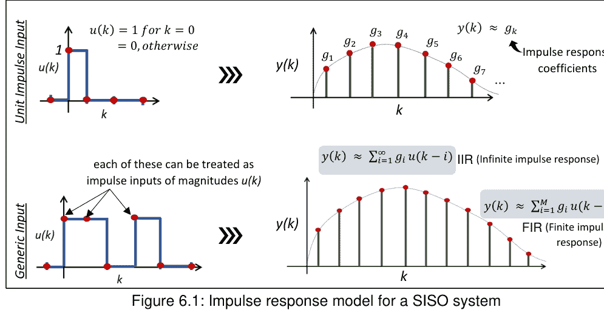

拟合FIR模型需要估计脉冲响应系数。尽管FIR模型的结构相当简单，但它非常灵活，并且在给定足够大的$M$的情况下，可以拟合任何类型的复杂脉冲响应。通常采用90到120的模型阶数来获取所有脉冲系数。然而，如此大的参数维度常常导致过拟合（由于过程扰动对输出信号的破坏，脉冲响应曲线出现波动或尖峰）。除了模型灵活性之外，FIR模型的另一个优点是，在模型拟合后可以自动获得I/O延迟的估计。对于具有延迟$d$的系统，前$d$个脉冲系数将为零或接近零。这实际上是延迟估计的一种经典方法。FIR模型还提供无偏参数估计，因为模型的确定性部分是独立参数化的（回顾我们在第4章的讨论）。FIR模型的这些有利特性使其成为工业MPC中部署的主导系统辨识模型$^{45}$。

#### 阶跃响应曲线

阶跃响应是系统对其输入阶跃变化的响应，如下所示

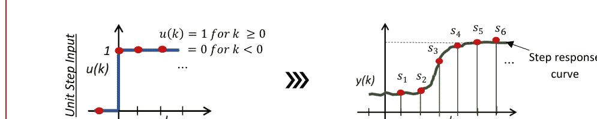

显而易见，阶跃响应曲线可以快速评估过程延迟、过程的时间常数和稳态增益。通过观察不同幅度阶跃的响应曲线，也可以快速评估系统的非线性。由于这些有利特性以及诱导阶跃输入（与脉冲输入相比）的简便性，阶跃响应曲线在过程工业中被广泛用于可视化系统的行为。

阶跃响应系数$s(k)$可以很容易地从脉冲系数估计如下：

$$s(k) = \sum_{j=1}^{k} g(j)$$

#### 模型估计

FIR模型$^{46}$可以使用最小二乘法方便地估计。考虑一个阶数为$M$的FIR模型和以下数据序列：

$$\begin{aligned} y(0), y(1), ..., y(N-1) \\ u(0), u(1), ..., u(N-1) \end{aligned}$$

可用的历史SISO过程数据

$^{46}$ FIR模型可以紧凑地写为$y(k) = \varphi_k^T \theta_0 + v(k)$，其中$\varphi_k$是回归向量（$[u(k-1), u(k-2), ..., u(k-M)]^T$），$\theta_0$是参数向量（$[g(1), g(2), ..., g(M)]^T$），$v(k)$是扰动信号，在估计$\theta_0$时被忽略。注意，$v(k)$不限于白噪声。

以 $e(k) = y(k) - \sum_{i=1}^{M} g(i)u(k-i)$ 作为方程误差，数据可以表示为以下矩阵形式

$$\begin{bmatrix} y(M) \\ y(M+1) \\ \vdots \\ y(N-1) \end{bmatrix} = \begin{bmatrix} u(M-1) & u(M-2) & \cdots & u(0) \\ u(M) & u(M-1) & \cdots & u(1) \\ \vdots & \ddots & \cdots & \vdots \\ u(N-2) & \cdots & \cdots & u(N-1-M) \end{bmatrix} \begin{bmatrix} g_1 \\ g_2 \\ \vdots \\ g_M \end{bmatrix} + \begin{bmatrix} e(M) \\ e(M+1) \\ \vdots \\ e(N-1) \end{bmatrix}$$

$$Y = \Phi\theta + E$$

参数向量的估计值 $\hat{\theta}$ 通过最小化误差向量获得。你可能已经知道 $\hat{\theta}$ 存在解析解，其表达式为 $\hat{\theta} = [\Phi^T\Phi]^{-1}\Phi^TY$。

#### 模型阶次选择

在FIR建模中，正确的阶次选择至关重要。过低的模型阶次无法捕捉复杂的过程动态，导致过程增益估计不准确；而过高的模型阶次可能导致过拟合，产生有噪声的脉冲/阶跃响应曲线。如果有关于过程调节时间或达到稳态时间（TTSS）的任何近似先验知识，则可用于设置模型阶次。例如，如果TTSS为120，则模型中需要相应数量的系数。

**示例 6.1：**

文件 *FIR_illustrate.csv* 包含以下过程的输入/输出数据，其阶跃响应表明TTSS约为30。噪声信号的方差被调整以提供20的信噪比。我们将分别拟合三个阶次为3、30和60的FIR模型，并将它们的阶跃响应与真实曲线进行比较。

$$y(k) = \frac{2q^{-2}}{1 - 1.1q^{-1} + 0.8q^{-2}} u(k) + v(k)$$

$$v(k) = \frac{1}{1 - 0.6q^{-1}} e(k)$$

作为扰动的AR信号

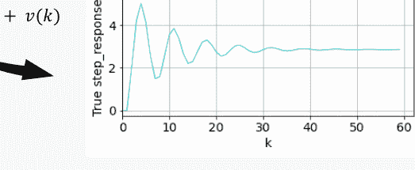

我们将使用SIPPY包来拟合FIR模型，并使用Control包 (https://pypi.org/project/control/) 来生成阶跃响应。首先加载数据

```
# import packages
import matplotlib.pyplot as plt, numpy as np
from sklearn.preprocessing import StandardScaler
from sippy import system_identification as SysID
import control

# read data
data = np.loadtxt('FIR_illustrate.csv', delimiter=',')
u = data[:,0, None]; y = data[:,1, None]

# center data before model fitting
u_scaler = StandardScaler(with_std=False)
u_centered = u_scaler.fit_transform(u)

y_scaler = StandardScaler(with_std=False)
y_centered = y_scaler.fit_transform(y)

# fit FIR model
model_order = 30
FIRmodel = SysID(y_centered, u_centered, 'FIR', FIR_orders=[model_order,0])

# generate step response of FIR model
step_response_model, _ = control.matlab.step(FIRmodel.G, T=60)
plt.plot(step_response_model, 'm--', linewidth=0.8)
plt.ylabel('step_response_model'), plt.xlabel('k')
```

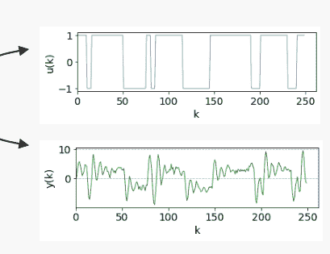

下图展示了三种不同模型阶次选择下获得的阶跃响应（以及真实阶跃响应）。[读者可以查看在线仓库中提供的代码，了解真实阶跃响应是如何生成的。]

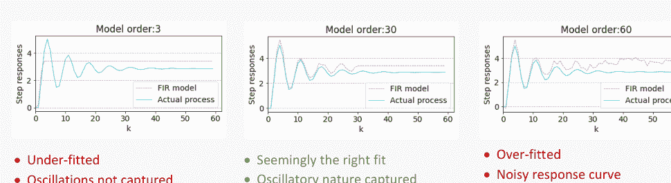

- 欠拟合
  - 未捕捉到振荡
- 看似合适的拟合
  - 捕捉到了振荡特性
  - 由于噪声和有限的训练数据，增益估计略有偏差
- 过拟合
  - 响应曲线有噪声

### 6.2 工业加热炉的FIR建模

为了展示FIR模型的工业应用，我们将考虑石油炼厂中使用的加热炉。如下图所示，燃料燃烧以加热进料油并将其汽化，以便后续分馏<sup>47</sup>。在该系统的单输入单输出（SISO）版本中，我们将考虑控制加热油出口温度（*TO*）的任务。进料油温度（*TI*）或进料流量的变化会影响*TO*。控制器通过调节燃料气流量（尽管是间接地，通过操纵烟气PID控制器的设定点。PID控制器（未在示意图中显示）调节燃料气流的阀门开度以满足指定流量）来控制<sup>48</sup>。然而，过程控制器需要一个模型来理解烟气流量设定点（FGSP）与*TO*之间的关系。

为了获得该模型，我们将使用文件 *IndustrialFiredHeater_SISO.csv* 中提供的数据，该文件包含1000个TO和FGSP的样本，这些样本来自系统的开环仿真。在仿真中，FGSP使用GBN信号进行激励，并且系统受到*TI*扰动的影响<sup>49</sup>。请注意，这里的时间间隔是分钟而不是秒。

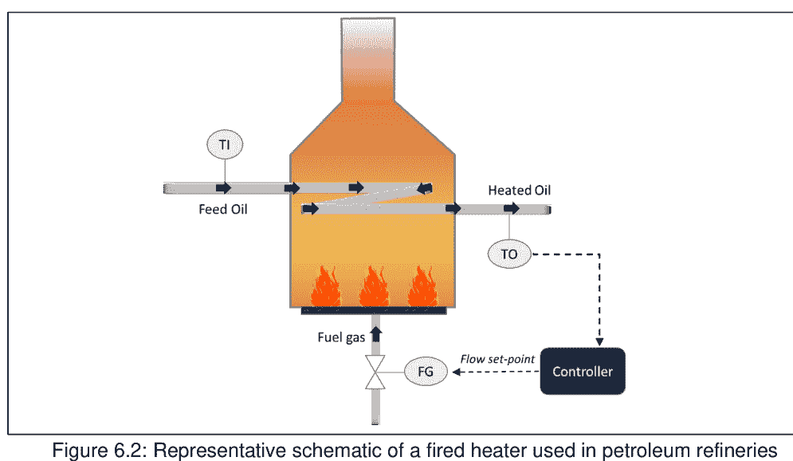

<sup>47</sup> 读者可参考 https://apmonitor.com/dde/index.php/Main/FiredHeaterSimulation 了解更多关于该系统的细节。在此链接中，读者还可以找到用于生成本案例研究中使用的仿真数据集的系统模型。
<sup>48</sup> 使用PID控制器的设定点作为操纵变量是现代（MPC）控制器中非常标准的方法。
<sup>49</sup> 在线代码库展示了辨识测试数据是如何生成的

首先，我们导入所需的包并探索提供的输入/输出数据集。

```
# import packages
import matplotlib.pyplot as plt, numpy as np, control
from sklearn.preprocessing import StandardScaler
from sippy import system_identification as SysID
from statsmodels.tsa.stattools import ccf
```

```
# read fired heater identification test data and plot
data = np.loadtxt('IndustrialFiredHeater_SISO.csv', delimiter=',')
FG, TO = data[:,0, None], data[:,1, None]

plt.figure(), plt.plot(FG, 'steelblue'), plt.ylabel('u(k)'), plt.xlabel('k')
plt.figure(), plt.plot(TO, 'g'), plt.ylabel('y(k)'), plt.xlabel('k')
```

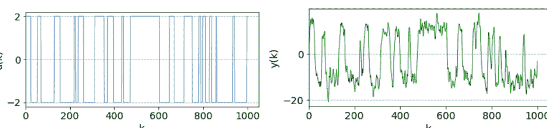

接下来，我们将对数据进行中心化处理，并使用AIC进行模型阶次选择来拟合一个FIR模型。

```
# center data and fit FIR model
u_scaler = StandardScaler(with_std=False)
FG_centered = u_scaler.fit_transform(FG)

y_scaler = StandardScaler(with_std=False)
TO_centered = y_scaler.fit_transform(TO)

FIRmodel = SysID(TO_centered, FG_centered, 'FIR', IC='AIC', nb_ord=[1,20])
# a range of 1 to 20 is specified for optimal order search
```

>>> 建议的阶次为：Na= 0 ; Nb= 11 延迟：0

如上所示，发现一个具有十一个系数的FIR模型提供了最优拟合。模型拟合完成后，我们将进行模型质量检查，从残差分析开始。

```
# get model predictions and residuals on training dataset
TO_predicted_centered = FIRmodel.Yid
# Yid attribute provides the output of the identified model during model ID
TO_predicted = np.transpose(y_scaler.inverse_transform(TO_predicted_centered))
residuals = TO - TO_predicted

plt.figure(), plt.plot(TO, 'g', label='Measurements')
plt.plot(TO_predicted, 'r', label='Predictions')
plt.title('Training data'), plt.ylabel('y(k): Measured vs predicted'), plt.xlabel('k'), plt.legend()
```

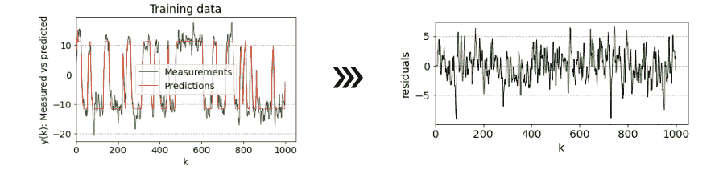

请注意，我们不会对上述残差进行任何自相关检查，因为FIR模型的残差不受限于白噪声。然而，需要检查残差与输入序列之间的互相关。

```
# CCF b/w residual and input sequences
ccf_vals = ccf(residuals, FG, adjusted=False) # ccf for lag >= 0
ccf_vals = ccf_vals[:21] # ccf for lag 0 to 20

lags, conf_int = np.arange(0,21), 1.96/np.sqrt(len(residuals))
plt.figure(), plt.vlines(lags, [0], ccf_vals), plt.axhline(0, 0, lags[-1])
plt.plot(lags, ccf_vals, marker='o', linestyle='None')
plt.gca().axhspan(-conf_int, conf_int, facecolor='lightblue') # shaded confidence interval
```

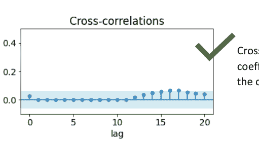

接下来，我们将检查拟合的模型是否具有任何意外特性；为此，我们将生成模型的阶跃响应曲线，并与真实过程曲线进行比较。

```
# generate step response of FIR model
step_response_model, _ = control.matlab.step(FIRmodel.G, T=21)

# generate step response of original process
s = control.matlab.tf('s')
sys_G = 6/(3*s**2 + 4*s + 1) # https://apmonitor.com/dde/index.php/Main/FiredHeaterSimulation
step_response_process, T = control.matlab.step(sys_G, T=20)

# overlay the step responses
plt.figure(), plt.plot(step_response_model, 'm--', label="FIR model")
plt.plot(T, step_response_process, 'c', label="Actual process")
plt.ylabel('Step responses'), plt.xlabel('k'), plt.legend()
```

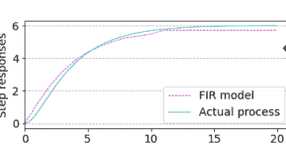

曲线比较良好；模型曲线中没有意外特性

在实践中，你通常不会如此幸运地能够获得真实的过程阶跃响应曲线。尽管如此，你可能拥有一些过程洞察力来判断模型的阶跃响应曲线是否合理。总体而言，我们的模型似乎可以接受。请注意，我们这里没有进行任何仿真检查，因为对于FIR模型，仿真等同于预测。我们将在本章后面为ARX模型进行仿真检查。

### 6.3 ARX 模型简介

ARX（带外生输入的自回归）模型是 AR 时间序列模型在输入/输出系统中的扩展。如图 6.3 所示，当前输出状态被表示为过去输入和过去输出测量值的线性组合$^{50}$。FIR 模型可以看作是 ARX 模型在 $n_a = 0$ 时的特例。然而，ARX 模型中包含过去测量值，使得对过程的描述更为紧凑，并有助于克服 FIR 模型面临的高参数维度问题。这种简约表示的代价是需要指定更多的超参数（$d, n_a, n_b$）。

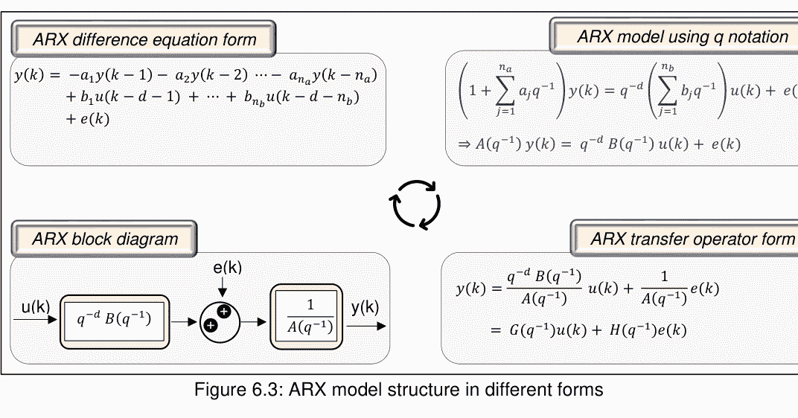

ARX 模型的一个显著（且常被忽视）特征是其隐含假设：噪声进入系统的位置使其受到与确定性信号 $u(k)$ 相同的过程动力学（$\frac{1}{A(q^{-1})}$）的影响。图 6.3 中的框图强调了这一方面。在现实世界中，一个例子场景可能是扰动影响过程进料，然后通过整个过程动力学。你遇到的许多系统都不会表现出这样的噪声特性。此外，$G$ 和 $H$ 算子的依赖参数化意味着，即使你为确定性部分正确选择了模型阶数，ARX 模型在噪声模型指定不正确时也是有偏的。尽管存在这些缺点，ARX 模型估计的便利性通常使其成为任何系统辨识练习中初始解决方案的首选。

$^{50}$ 我们在 FIR 和 ARX 模型的差分方程形式中没有包含 $u(k)$ 项。这是因为我们处理的是离散时间模型，$u(k)$ 的任何变化通常不会对 $y(k)$ 产生瞬时影响。

#### 模型估计

最小二乘法可以再次应用于此。为了说明，让我们考虑一个延迟 = 1 的二阶 ARX<sup>51</sup> 模型：$y(k) = -a_1y(k-1) - a_2y(k-2) + b_1u(k-2) + b_2u(k-3) + e(k)$。令 $\varphi_k = [-y(k-1), -y(k-2), u(k-2), u(k-3)]^T$ 为回归向量，$\theta_0 = [a_1, a_2, b_1, b_2]^T$ 为参数向量。因此，$y(k) = \varphi_k^T\theta_0 + e(k)$，矩阵形式如下

$$\begin{bmatrix} y(3) \\ y(4) \\ \vdots \\ y(N-1) \end{bmatrix} = \begin{bmatrix} -y(2) & -y(1) & u(1) & u(0) \\ -y(3) & -y(2) & u(2) & u(1) \\ \vdots & \ddots & \dots & \vdots \\ -y(N-2) & \dots & \dots & u(N-4) \end{bmatrix} \begin{bmatrix} a_1 \\ a_2 \\ \vdots \\ b_2 \end{bmatrix} + \begin{bmatrix} e(3) \\ e(4) \\ \vdots \\ e(N-1) \end{bmatrix}$$

$$Y = \Phi\theta + E$$

解析解 $\hat{\theta} = [\Phi^T\Phi]^{-1}\Phi^TY$ 存在的条件是矩阵 $\Phi^T\Phi$ 可逆，如果输入信号 $u(k)$ 是足够阶次的持续激励，则此条件得到保证。

> ARX 和 FIR 模型中的模型偏差

我们已经注意到，ARX 模型对噪声信号的假设相当严格。如果实际过程具有与 $\frac{e(k)}{A(q^{-1})}$ 不同的随机部分，那么即使 $G(q^{-1})$ 的结构正确，通过最小二乘法估计的 $\hat{\theta}$ 也将是有偏的<sup>52</sup>，因为 $G(q^{-1})$ 和 $H(q^{-1})$ 不是独立参数化的。

我们可以从另一个角度来看待这个问题：最小二乘法获得无偏估计的要求之一是方程误差与回归向量不相关。现在让我们考虑一个实际过程由 $y(k) = -a_{10}y(k-1) + b_{10}u(k-1) + e(k) + c_{10}e(k-1)$ 给出，而拟合模型是一阶 ARX 模型 $y(k) = -a_1y(k-1) + b_1u(k-1)$ 的示例场景。由于方程误差 $\epsilon(k)$ 等于 $e(k) + c_{10}e(k-1)$，它变得与回归向量相关，因为 $y(k-1)$ 与 $e(k-1)$ 相关。相应地，参数估计是有偏的<sup>53</sup>。参数估计中的偏差量取决于噪声水平。对于高信噪比，偏差可以忽略不计。

在 FIR 模型中，$H(q^{-1})$ 没有被建模，因此 FIR 模型的最小二乘估计是无偏的。请注意，这些讨论假设扰动信号与输入不相关，这对于开环过程是成立的。

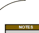

<sup>51</sup> ARX 模型需要指定两个阶数：分子（$B(q^{-1})$）和分母（$A(q^{-1})$）多项式的阶数。仅指定单个阶数值通常意味着 $n_a = n_b$。
<sup>52</sup> 理解偏差的一种简单方法是，如果从不同的输入/输出数据集获得参数的多个估计值，那么这些估计值的平均值与真实参数值之间的差异就是偏差。

#### 示例 6.2：

在这个例子中，我们将研究信噪比对 ARX 模型偏差的影响。我们将假设以下真实过程

$$y(k) = \frac{0.7q^{-1}}{1 - 0.7q^{-1}}u(k) + \frac{1}{1 - 0.2q^{-1}}e(k)$$

我们将使用信噪比为 10 和 100。数据文件 ARX_illustrate_SNR10.csv 和 ARX_illustrate_SNR100.csv 包含各 1000 个样本的输入/输出数据。我们将使用最小二乘法拟合一阶 ARX 模型，并将模型的阶跃响应和估计参数与真实过程的进行比较。

```python
# import packages
import matplotlib.pyplot as plt, numpy as np
from sklearn.preprocessing import StandardScaler
from sippy import system_identification as SysID
import control

# read data
data = np.loadtxt('ARX_illustrate_SNR10.csv', delimiter=',')
u = data[:,0, None]; y = data[:,1, None]

# center data before model fitting
u_scaler = StandardScaler(with_std=False); u_centered = u_scaler.fit_transform(u)
y_scaler = StandardScaler(with_std=False); y_centered = y_scaler.fit_transform(y)

# fit ARX model
ARXmodel = SysID(y_centered, u_centered, 'ARX', ARX_orders=[1,1,0])
print(ARXmodel.G) # shows the transfer operator G (in terms of q); Note that symbol z is used instead of q in the package
```

$$G(q^{-1}) = \frac{0.92q^{-1}}{1 - 0.56q^{-1}}$$

<sup>53</sup> 存在最小二乘法的替代方法，例如工具变量（IV）法，它可以为 ARX 模型提供无偏估计。然而，可以预期，这些替代方法在计算上更为复杂。

我们可以看到，在显著的扰动水平下，参数估计不是很准确。让我们看看模型的阶跃响应与真实过程的相比如何。

```python
# generate step response of ARX model
step_response_model, _ = control.matlab.step(ARXmodel.G, T=30)

# generate step response of original process
NUM_G, DEN_G = [0.7], [1, -0.7]
sys_G = control.matlab.tf(NUM_G, DEN_G, 1)
step_response_process, _ = control.matlab.step(sys_G, T=30)

# overlay the step responses
plt.plot(step_response_model, 'm--', linewidth=0.8, label="ARX model")
plt.plot(step_response_process, 'c', linewidth=0.8, label="Actual process")
plt.ylabel('Step responses'), plt.xlabel('k'), plt.legend()
```

下面的图表显示了阶跃响应曲线和估计参数。正如预期的那样，对于 SNR=10，估计的阶跃响应曲线比 SNR=100 数据集的曲线更远离真实曲线。然而，高噪声水平并非造成这种不准确性的唯一原因。不正确的噪声模型也贡献显著。为了说明这一点，图表还显示了来自 OE 模型的曲线（它将在下一章中介绍，但只需知道 OE 模型使用与 ARX 模型类似的算子 G 结构，但忽略了 H）。理论上，OE 模型提供无偏估计，因此其曲线更接近真实曲线。

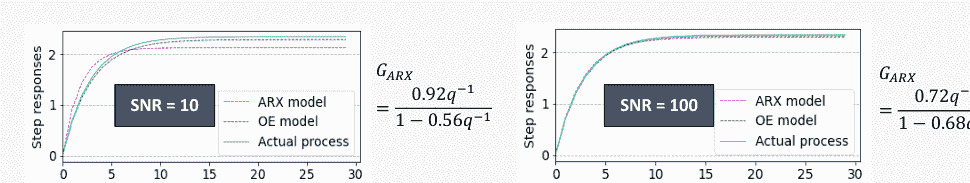

为了进一步澄清偏差方面，为 SNR=10 生成了 500 组不同的输入/输出数据，并使用了最小二乘估计方法。下面的直方图显示了参数的分布。系统偏差在图中显而易见。

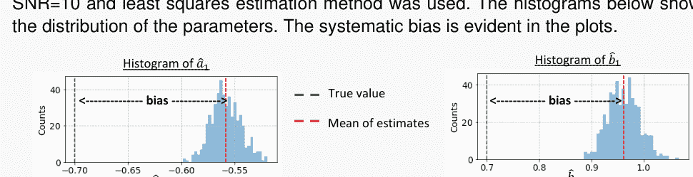

#### 无偏高阶ARX建模

在系统辨识文献中，你可能会遇到这样的说法：高阶ARX模型是无偏的。为了理解这一点，让我们考虑一个例子，其中真实过程由下式给出

$$y(k) = \frac{B(q^{-1})}{A(q^{-1})}u(k) + \frac{e(k)}{A(q^{-1})D(q^{-1})}$$

现在，我们不是拟合一个ARX模型 $y = \frac{B}{A}u + \frac{e}{A}$，而是可以拟合模型 $y = \frac{BD}{AD}u + \frac{e}{AD}$ [为简洁起见，未明确指定 $q^{-1}$ 和 $k$]。因此，如果 $D(q^{-1})$ 的阶数为 $r$，那么我们实际上是在拟合一个阶数为 $n_a+r$ 和 $n_b+r$ 的ARX模型，而不是阶数为 $n_a$ 和 $n_b$ 的ARX模型。这个更高阶的ARX模型将是无偏的，因为 $G$ 和 $H$ 算子都被正确指定了！此外，你的模型残差现在将是白噪声。可以从估计的传递算子 $\frac{BD}{AD}$ 中恢复出真实的传递算子 $\frac{B}{A}$。

研究表明，一个足够高阶的ARX模型可以任意好地逼近任何线性系统。存在模型降阶技术，可以随后降低估计的ARX模型的阶数，使其更易于处理。

#### 超参数选择

完整指定一个ARX模型结构需要输入输出延迟（$d$）和阶数（$n_a$ 和 $n_b$，它们是输入传递算子 $G$ 的极点和零点数量）的值。估计这些值最常见的方式是为 $d$、$n_a$ 和 $n_b$ 选择一个潜在值范围，并使用信息准则（如AIC或交叉验证）来找到最优组合。SIPPY实现了基于AIC的方法。作为经验法则，对于工业装置，$n_a$ 通常为三或更小。

也存在替代上述暴力搜索方法的方法。例如，你可以先构建一个FIR模型来估计延迟，或者可以利用 $u(k)$ 和 $y(k)$ 之间的互相关函数图。一个为 $d$ 的过程延迟将意味着互相关函数在滞后 $d + 1$ 处具有其第一个显著峰值，而滞后 $\leq d$ 的系数将接近于零。有了延迟估计值，你就可以通过暴力搜索继续进行阶数估计。这里同样，可以使用通过子空间辨识过程获得的Hankel奇异值来获得一个近似的阶数值（你将在第8章中了解这一点）。这个近似值可以帮助你决定暴力搜索中 $n_a$（和 $n_b$）的潜在范围。

一旦你的模型拟合完成，模型诊断可以为你提供关于模型结构误设的线索。例如，$u(k)$ 和 $\epsilon(k)$ 之间互相关图中的孤立显著峰值表明模型中缺少输入项。过小的延迟设定将导致前几个输入项系数的参数估计不显著。过大的 $d$ 值将表现为多个连续的互相关系数（$u(k)$ 和 $\epsilon(k)$）超出置信区间。

让我们在接下来的一个实际案例研究中将这些指南付诸实践。

### 6.4 工业炉的ARX建模

之前，我们使用加热炉数据集构建了一个参数化FIR模型；该模型最终有11个参数。在本节中，我们将尝试构建一个参数化ARX模型，看看它是否最终能提供对系统更简洁的描述。使用SIPPY拟合ARX模型与拟合FIR模型一样容易，如下所示

```
# 使用中心化信号拟合ARX模型
ARXmodel = SysID(TO_centered, FG_centered, 'ARX', IC='AIC', na_ord=[1,20], nb_ord=[1,20], delays=[0,5])

>>> 建议的阶数为：Na= 4 ; Nb= 3 延迟：0
```

拟合的模型最终有7个参数，结构如下

$$G_{ARX} = \frac{0.8405q^3 - 0.1983q^2 + 0.1147q}{q^4 - 1.541q^3 + 0.9914q^2 - 0.4023q + 0.0877}$$
$$= \frac{0.8405q^{-1} - 0.1983q^{-2} + 0.1147q^{-3}}{1 - 1.541q^{-1} + 0.9914q^{-2} - 0.4023q^{-3} + 0.0877q^{-4}}$$

让我们看看这个简洁的模型是否能提供与FIR模型一样好的性能，并通过诊断检查。像之前一样，我们从残差分析开始。

```
# 获取训练数据集上的模型预测和残差
TO_predicted_centered = ARXmodel.Yid
TO_predicted = np.transpose(y_scaler.inverse_transform(TO_predicted_centered))
residuals = TO - TO_predicted
```

```
plt.figure(), plt.plot(TO, 'g', label='测量值')
plt.plot(TO_predicted, 'r', label='预测值')
plt.title('训练数据'), plt.ylabel('y(k)：测量值 vs 预测值'), plt.xlabel('k'), plt.legend()
```

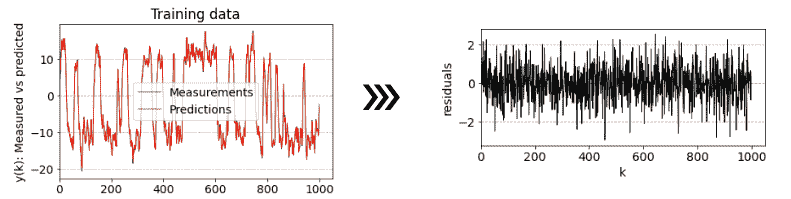

模型在训练数据集上的预测看起来几乎是完美的。然而，我们知道训练数据集上的1步超前预测可能会产生误导，因此我们将暂时保留判断。让我们看看残差的自相关函数和互相关函数图。

```
# 残差的自相关函数
from statsmodels.graphics.tsaplots import plot_acf
conf_int = 1.96/np.sqrt(len(residuals))
plt.figure(), plot_acf(residuals, lags= 20, alpha=None, title='')
plt.gca().axhspan(-conf_int, conf_int, facecolor='lightblue') # 阴影置信区间

# 残差与输入序列之间的互相关函数
ccf_vals = ccf(residuals, FG, adjusted=False) # 滞后 >= 0 的互相关函数
ccf_vals = ccf_vals[:21] # 滞后 0 到 20 的互相关函数

lags = np.arange(0,21)
plt.figure(), plt.vlines(lags, [0], ccf_vals), plt.axhline(0, 0, lags[-1])
plt.plot(lags, ccf_vals, marker='o', linestyle='None')
plt.gca().axhspan(-conf_int, conf_int, facecolor='lightblue') # 阴影置信区间
```

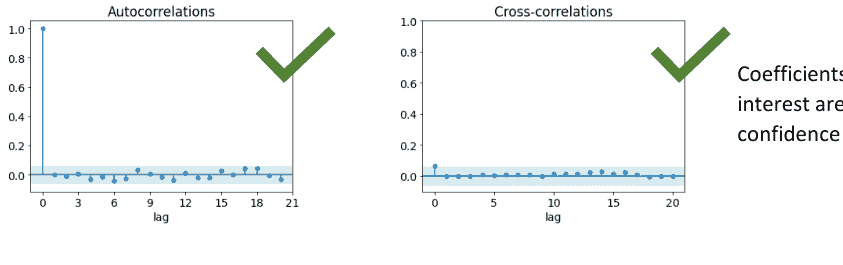

感兴趣的系数在置信区间内。

接下来，让我们看看模型的阶跃响应曲线（并与真实过程曲线进行比较）。

```
# 生成ARX模型的阶跃响应
step_response_model, _ = control.matlab.step(ARXmodel.G, T=21)

# 生成原始过程的阶跃响应
s = control.matlab.tf('s')
sys_G = 6/(3*s**2 + 4*s + 1)
step_response_process, T = control.matlab.step(sys_G, T=20)

# 叠加阶跃响应
plt.figure(), plt.plot(step_response_model, 'm--', label="ARX模型")
plt.plot(T, step_response_process, 'c', label="实际过程")
plt.ylabel('阶跃响应'), plt.xlabel('k'), plt.legend()
```

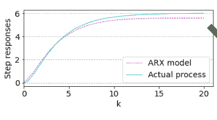

曲线比较良好；模型曲线中没有意外的特性。

到目前为止，模型表现得相当不错。我们将进行最后一次检查，并分析模型在单独的验证数据集上的*m*步超前响应和仿真响应。

```
# 读取加热炉验证数据并中心化
data_val = np.loadtxt('IndustrialFiredHeater_SISO_Validation.csv', delimiter=',')
FG_val, TO_val = data_val[:,0, None], data_val[:,1, None]
FG_val_centered, TO_val_centered = u_scaler.fit_transform(FG_val), y_scaler.fit_transform(TO_val)

# 获取模型的1步超前和5步超前预测，以及仿真响应
from sippy import functionset as fset

TO_val_predicted_1step_centered = np.transpose(fset.validation(ARXmodel, FG_val_centered,
                                                            TO_val_centered, np.linspace(0,299,300), k=1))
TO_val_predicted_5step_centered = np.transpose(fset.validation(ARXmodel, FG_val_centered,
                                                            TO_val_centered, np.linspace(0,299,300), k=5))
TO_val_simulated_centered, _, _ = control.matlab.lsim(ARXmodel.G, FG_val_centered[:,0],
                                                    np.linspace(0,299,300))
```

```
TO_val_predicted_1step = y_scaler.inverse_transform(TO_val_predicted_1step_centered)
TO_val_predicted_5step = y_scaler.inverse_transform(TO_val_predicted_5step_centered)
TO_val_simulated = y_scaler.inverse_transform(TO_val_simulated_centered)

plt.figure()
plt.plot(TO_val, 'g', label='测量值')
plt.plot(TO_val_predicted_1step, 'r', label='1步超前预测')
plt.plot(TO_val_predicted_5step, 'c', label='5步超前预测')
plt.plot(TO_val_simulated, 'm', label='仿真响应')
plt.title('验证数据'), plt.ylabel('y(k)：测量值 vs 预测值/仿真值'), plt.xlabel('k')
plt.legend()
```

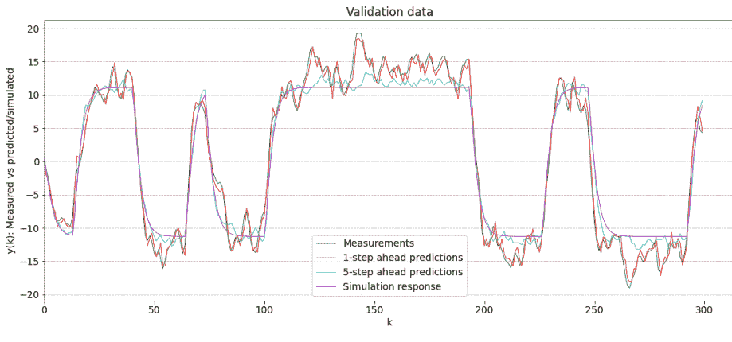

上图再次证实了模型的充分性。5步超前预测和仿真响应似乎捕捉到了温度信号中的系统性变化，这表明模型的确定性部分已被准确建模。

### 6.5 FIR与ARX MIMO模型

虽然我们使用SISO系统来阐述概念，但在工业实践中，你更可能处理的是MISO（多输入单输出）系统，顾名思义，该系统有多个输入变量影响单个输出变量。将SISO ARX和FIR模型扩展到MISO系统是直接的，如下所示

$ARX \ MISO \ 模型: \quad y(k) = \frac{B_1(q^{-1})}{A(q^{-1})} u_1(k) + \frac{B_2(q^{-1})}{A(q^{-1})} u_2(k) + \cdots + \frac{e(k)}{A(q^{-1})}$

$FIR \ MISO \ 模型: \quad y(k) = \sum_{i=1}^{M_1} g_{1,i} u_1(k-i) + \sum_{i=1}^{M_2} g_{2,i} u_2(k-i) + \cdots + v(k)$

在上述ARX MISO模型的表达式中，假设所有输入的传递算子中的分母多项式是相同的，即$A(q^{-1})$。这是通用MISO ARX模型的一个特例，后者使用不同的分母多项式（但这会导致非线性参数估计问题）。对于MIMO（多输入多输出）系统，通常的方法是为每个输出构建独立的MISO模型。例如，对于一个2输出2输入系统，你的ARX模型可能如下所示

$A_1(q^{-1})y_1(k) = B_{11}(q^{-1})u_1(k) + B_{12}(q^{-1})u_2(k) + e_1(k)$

$A_2(q^{-1})y_2(k) = B_{21}(q^{-1})u_1(k) + B_{22}(q^{-1})u_2(k) + e_2(k)$

不难看出，如果两个MISO模型之间存在相关参数，上述独立参数化$y_1$和$y_2$的ARX MISO模型框架将是次优的。同时识别所有输出的模型肯定会更明智。此外，显而易见的是，对于MIMO情况，FIR和ARX模型都使用大量参数，这使得模型拟合容易过拟合，并且需要大量数据集。幸运的是，确实存在专门用于MIMO系统辨识的技术。然而，我们将暂时搁置对MIMO建模技术的讨论，转而在下一章探讨其他流行的I/O建模技术，这些技术克服了ARX模型的缺点。

至此，我们快速了解了两种最流行的经典线性动态模型。可忽略的计算负担、全局最优解以及对先验过程知识的少量需求，是这些模型持续受欢迎的原因。通过了解它们各自的优缺点，我们希望你能很好地理解在使用这些模型时（例如，ARX模型中隐含的噪声模型）你将面临什么。如果你发现自己无意中处于ARX和FIR模型无法提供令人满意性能的情况，那么你可能需要调整你的噪声模型。下一章旨在为你提供实现这一目标所需的必要工具。

### 总结

在本章中，我们详细研究了FIR和ARX建模背后的概念，并探讨了这些模型的优缺点。通过一个工业相关的案例研究，展示了实施细节。接下来，我们将学习更通用的线性建模框架（ARX和FIR模型可视为其特例），这将为你的系统辨识工具箱增添一些强大的技术。

## 第7章
### 输入-输出建模 - 第二部分：正确处理过程噪声

在上一章中，我们看到FIR和高阶模型可以提供无偏且参数线性的模型，但不幸的是，由于参数数量多，它们存在高方差误差。因此，在本章中，我们将探讨其他流行的模型结构，即ARMAX、OE和Box-Jenkins，它们可以提供对底层过程更简约的描述，并生成无偏模型。这些模型在噪声动态方面提供了更大的灵活性，并捕捉了噪声可能在不同点进入（或起源于）系统这一事实，这反过来决定了噪声传递算子的结构。然而，天下没有免费的午餐！这些模型生成参数非线性的预测器，因此参数估计过程在计算上更为复杂。尽管如此，将这些模型添加到你的ML-DPM工具包中，将使你能够根据手头的问题选择特定的模型结构。

在本章的后半部分，我们将放宽对扰动信号的平稳性条件，并探讨如何对具有非平稳扰动的过程进行建模。我们将看到对输入和输出信号进行差分如何有助于消除扰动的非平稳性。通过模拟示例，我们将尝试理解选择这些模型结构的含义。具体来说，我们将研究以下主题。

- ARMAX和Box-Jenkins模型简介
- 使用ARMAX模型对精馏塔建模
- OE模型结构简介及其与ARX模型结构的比较
- ARIMAX模型简介
- 使用Box-Jenkins模型对燃气炉系统建模

### 7.1 PEM模型

在第6章中，我们看到了ARX模型如何对过程扰动进行非常严格的处理。我们也看到了这个缺点如何导致显著的模型偏差。因此，本章的重点是克服这个缺点，并探讨ARX模型的其他流行替代方案，即输出误差（OE）模型、带外生输入的自回归滑动平均（ARMAX）模型和Box-Jenkins（BJ）模型。如图7.1所示，这些参数模型在噪声传递算子（H）的参数化方面提供了广泛的选择。例如，在OE框架中，不建模扰动，只寻求输入传递算子；而在BJ模型中，允许G和H算子完全独立地参数化。在接下来的几节中，我们将探索这些模型的特性，并学习如何明智地使用它们。

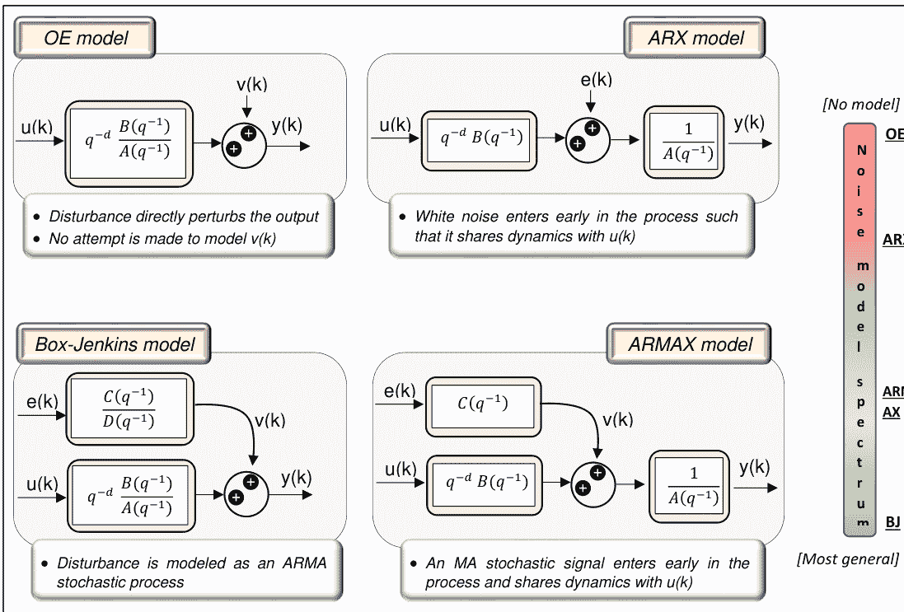

图7.1中的所有模型都属于预测误差方法家族，其中模型参数通过最小化一步超前预测误差（ε(k)）来估计，其中，

$\varepsilon(k) = y(k) - \hat{y}(k|k-1)$

基于直到时间$k-1$信息的最优模型预测

使用传递算子模型形式，可以很容易地推导出$\hat{y}(k|k-1)$关于过去（输入和输出）测量值（在某些情况下包括预测值）的表达式，得到以下表达式

$\hat{y}(k) = [1 - H^{-1}] y(k) + H^{-1} G u(k)$

公式 1

我们将在接下来的几节中使用公式1$^{54}$来推导模型预测的差分方程表达式。

#### PEM预测器

为了推导PEM模型预测的表达式，我们可以遵循以下步骤。

$y(k) = G u(k) + H e(k)$
$\Rightarrow H^{-1} y(k) = H^{-1} G u(k) + e(k)$
$\Rightarrow y(k) + H^{-1} y(k) = y(k) + H^{-1} G u(k) + e(k)$
$\Rightarrow y(k) = [1 - H^{-1}] y(k) + H^{-1} G u(k) + e(k)$

公式 1

$\Rightarrow \hat{y}(k) = [1 - H^{-1}] y(k) + H^{-1} G u(k)$

由于$e(k)$是白噪声，它在时间$k$最可能的值是零

让我们将上述预测器用于ARX模型，其中$G = \frac{q^{-d} B}{A}$且$H = \frac{1}{A}$。公式1给出

$\hat{y}(k) = [1 - A] y(k) + q^{-d} B u(k)$
$\Rightarrow \hat{y}(k) = -a_1 y(k-1) - a_2 y(k-2) \cdots - a_{n_a} y(k-n_a)$
$\quad + b_1 u(k-d-1) + \cdots + b_{n_b} u(k-d-n_b)$

上述ARX预测器的表达式也可以通过简单地将ARX模型差分方程中的$e(k)$设为零来获得。

$^{54}$ 应读作$\hat{y}(k) = [1 - H^{-1}(q^{-1})] y(k) + H^{-1}(q^{-1}) G(q^{-1}) U(k)$。为了表达清晰，我们将在某些表达式中省略$q$符号。

### 7.2 ARMAX模型简介

带外生输入的自回归滑动平均（ARMAX）模型是ARMA时间序列模型向I/O系统的扩展。如图7.2所示，当前输出值与输入和输出的过去测量值以及过去的噪声值都有关！通过使用ARMA扰动，噪声模型（与ARX相比）提供了更大的灵活性，因此ARMAX是工业过程的流行模型。注意，如果$n_c= 0$，则ARMAX模型简化为ARX模型；如果进一步$n_a= 0$，则得到FIR模型。还要注意，由于共同的分母多项式，$G$和$H$算子不是独立参数化的，因此，由于不准确的噪声模型导致的模型偏差可能性仍然存在。

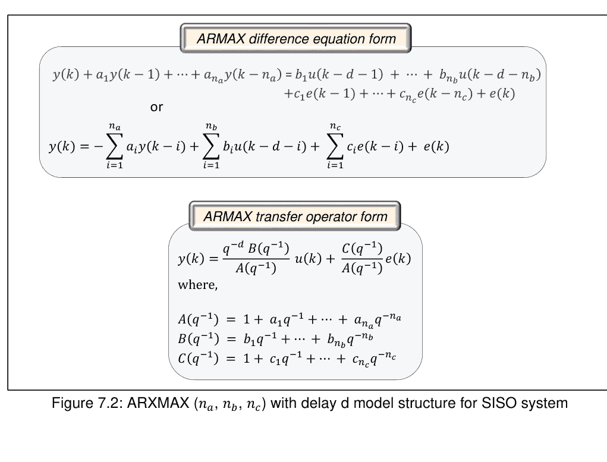

#### ARMAX 预测器

为了推导一步超前预测的表达式，我们只需将差分方程形式的 ARMAX 中不可预测的部分 $e(k)$ 替换为零，即可得到以下公式：

$$\hat{y}(k) = -\sum_{i=1}^{n_a} a_i y(k-i) + \sum_{i=1}^{n_b} b_i u(k-d-i) + \sum_{i=1}^{n_c} c_i e(k-i) \quad \text{公式 2}$$

或者，也可以使用公式 1：

$$\hat{y}(k) = \left[ 1 - \frac{A(q^{-1})}{C(q^{-1})} \right] y(k) + \frac{A(q^{-1})}{C(q^{-1})} \frac{q^{-d} B(q^{-1})}{A(q^{-1})} u(k)$$
$$\Rightarrow C(q^{-1})\hat{y}(k) = [C(q^{-1}) - A(q^{-1})] y(k) + q^{-d} B(q^{-1})u(k)$$
$$\Rightarrow \hat{y}(k) = \sum_{i=1}^{n_c} c_i y(k-i) - \sum_{i=1}^{n_a} a_i y(k-i) - \sum_{i=1}^{n_c} c_i \hat{y}(k-i) + \sum_{i=1}^{n_b} b_i u(k-d-i)$$

当前预测也是过去预测的函数。

上述表达式也可以通过将 $e(k) = y(k) - \hat{y}(k)$ 代入公式 2 推导得出。另一个值得注意的点是，由于 $\sum_{i=1}^{n_c} c_i \hat{y}(k-i)$ 中的乘积项，ARMAX 预测器在模型拟合过程中对未知参数是非线性的，因此需要非线性优化来进行参数估计。

### 7.3 精馏塔的 ARMAX 建模

为了展示 ARMAX 模型的工业应用，我们将使用来自精馏塔的模拟数据集。精馏塔在过程工业中的普遍性和重要性怎么强调都不为过。图 7.3 显示了这样一个塔的示意图，其中进料被分离成塔顶产品（馏出液）和塔底产品。严格控制产品流量和浓度对于塔的最优操作至关重要，而供给再沸器以驱动塔内汽相流的加热功率（QB）是一个常用的操作变量。因此，我们将尝试在馏出液浓度（XD）和 QB 之间建立一个动态模型，以帮助塔控制器高效地操作该单元。为了获得该模型，我们将使用文件 `DistillationColumn_SNR10.csv` 中提供的数据，该文件包含从系统开环仿真中获得的 1000 个 QB 和 XD 样本，其中 QB 使用 GBN 信号进行激励。55

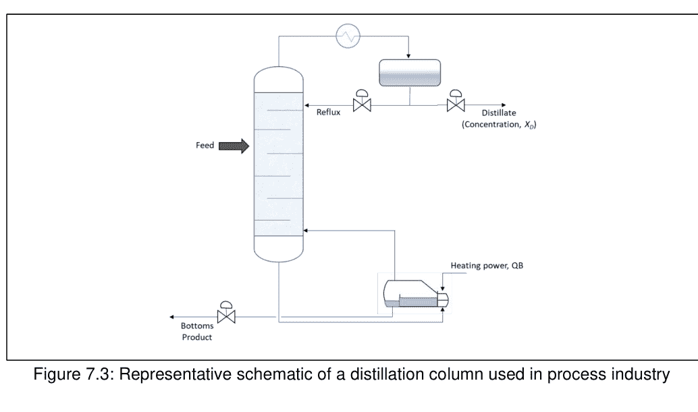

让我们从导入所需的包并探索提供的输入/输出数据集开始。

```
# import packages
import matplotlib.pyplot as plt, numpy as np, control
from sklearn.preprocessing import StandardScaler
from sippy import system_identification as SysID
from statsmodels.graphics.tsaplots import plot_acf
from statsmodels.tsa.stattools import ccf
```

```
# read distillation column data and plot
data = np.loadtxt('DistillationColumn_SNR10.csv', delimiter=',')
u = data[:,0, None] # QB
y = data[:,1, None] # XD
```

```
plt.figure(), plt.plot(u, 'steelblue'), plt.ylabel('u(k)'), plt.xlabel('k')
plt.figure(), plt.plot(y, 'g'), plt.ylabel('y(k)'), plt.xlabel('k')
```

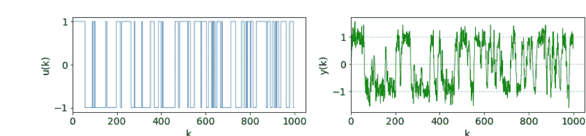

接下来，我们将对数据进行中心化处理，并使用 AIC 拟合一个 ARX 模型。

```
# center data and fit ARX model
u_scaler = StandardScaler(with_std=False); u_centered = u_scaler.fit_transform(u)
y_scaler = StandardScaler(with_std=False); y_centered = y_scaler.fit_transform(y)

ARXmodel = SysID(y_centered, u_centered, 'ARX', IC='AIC', na_ord=[1,10], nb_ord=[1,10], delays=[0,2])
# delay range obtained from FIR model
```

>>> suggested orders are: Na= 5 ; Nb= 5 Delay: 1

得到的 ARX 模型阶数相当高。我们之前已经研究过，为了抵消扰动动态特性指定不准确的影响，高阶 ARX 模型变得很有必要。因此，尝试使用 ARMAX 模型以期获得一个更简约的模型是合理的。

```
# fit ARMAX model
ARMAXmodel = SysID(y_centered, u_centered, 'ARMAX', IC='AIC', na_ord=[1,10], nb_ord=[1,10],
nc_ord=[1,10], delays=[0,2], max_iterations=1000)
```

```
>>> Armax model:
- Params:
  na: 2 (1, 10)
  nb: 3 (1, 10)
  nc: 2 (1, 10)
  delay: 0 (0, 2)
```

正如所希望的，ARMAX 模型的规模是合理的。快速的残差检查（如下图所示）为该模型建立了一些信心。

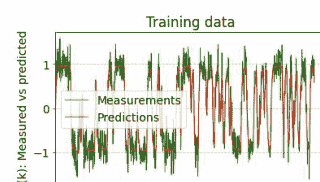

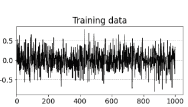

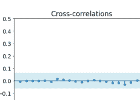

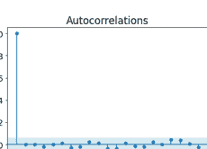

为了进一步建立对模型的信心，我们检查了来自 FIR、ARX 和 ARMAX 模型的阶跃响应。阶跃响应的紧密匹配进一步验证了该模型。

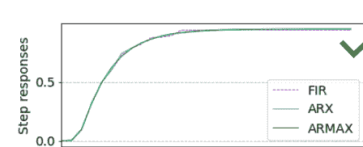

不同模型的阶跃响应匹配。

### 7.4 OE 模型：简介

输出误差（OE）模型位于 PEM 建模谱的极端，其中不对扰动信号进行任何建模，仅对输入对输出变量的影响进行建模，如图 7.4 所示。因此，对于模型预测，$v(k)$ 被完全忽略。由于不使用过去的输出信息，并且使用过去的预测来进行未来预测，因此一步超前预测等于 $m$ 步超前预测（对于任何 $m$）以及无限步预测。换句话说，对于 OE 模型$^{56}$，仿真和预测响应是一致的。图 7.4 还告诉我们，预测器在模型拟合过程中对未知参数是非线性的，因此，与 ARMAX$^{57}$ 类似，需要非线性优化来进行参数优化。

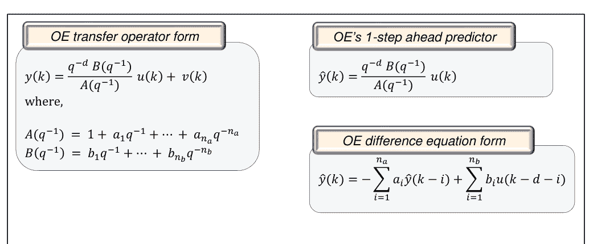

$G$ 和 $H$ 算子之间不存在参数化依赖性问题，因此 OE 模型生成无偏的确定性模型。因此，当不确定噪声特性时，首选 OE 模型来提供无偏的输入传递算子。相应的残差 $(y(k) - \hat{y}_{OE}(k))$ 当然不保证满足白噪声条件，因此在模型诊断期间不强制进行 ACF 检验；然而，CCF 检验仍然适用。通常，会对残差序列拟合一个时间序列模型来近似噪声传递算子，如下图 7.5 所示。你可以将这个近似模型作为最终模型，或者将其作为 Box-Jenkins 模型估计过程中的初始估计，以获得更好的模型。

$^{56}$ 对于任何 PEM 模型，$\hat{y}(k) = \frac{B(q^{-1})}{A(q^{-1})} u(k)$ 给出无限步预测/仿真响应。

$^{57}$ 如果 $v(k) = e(k)$，那么 OE 就成为 ARMAX 模型的一个特例，其中 $C(q^{-1}) = A(q^{-1})$

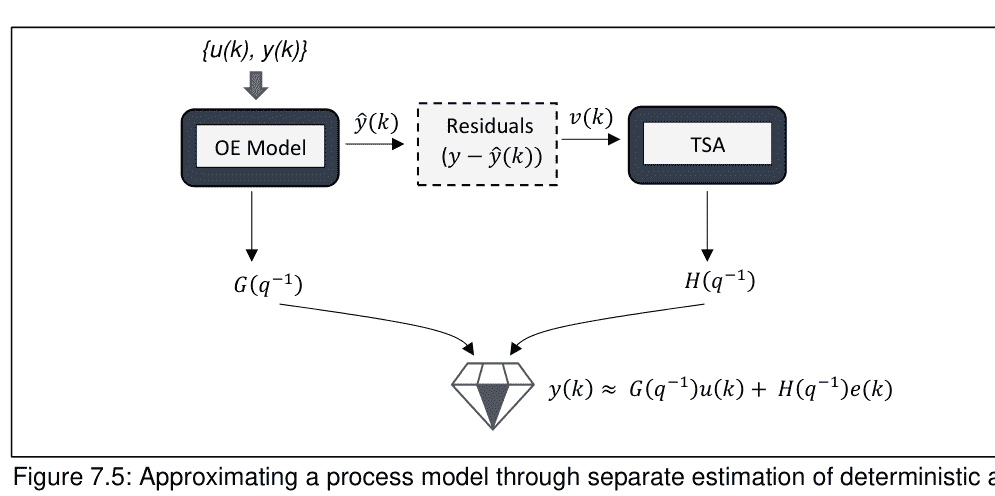

图 7.5：通过分别估计确定性和随机分量来近似过程模型。

#### 示例 7.1：

在上一章的示例 6.2 中，我们提供了 ARX 和 OE 模型在对以下过程建模时的性能比较。在这个示例中，我们将看到那些 OE 模型是如何拟合的。

$$y(k) = \frac{0.7q^{-1}}{1 - 0.7q^{-1}}u(k) + \frac{1}{1 - 0.2q^{-1}}e(k)$$

我们还将看到如何通过分别估计确定性和随机分量来获得整体过程模型。导入包以及读取和预处理数据集的代码与示例 6.2 中相同。我们将使用信噪比 SNR = 10 的数据集。

```
# fit OE model
OEmodel = SysID(y_centered, u_centered, 'OE', IC='AIC', nb_ord=[1,5], nf_ord=[1,5], delays=[0,5])
# SIPPY uses the symbol F to denote denominator polynomial of transfer operator G
print(OEmodel.G)
```

$$G(q^{-1}) = \frac{0.6704q^{-1}}{1 - 0.7052q^{-1}}$$

OE 模型比 ARX 模型更好地近似了确定性分量，因此，其阶跃响应更接近真实阶跃响应也就不足为奇了。让我们看看残差是否通过了诊断检查。如前所述，OE 模型不需要测试残差的白噪声特性。

```
# get model predictions and residuals on training dataset
y_predicted_centered = OEmodel.Yid
y_predicted = np.transpose(y_scaler.inverse_transform(y_predicted_centered))
residuals = y - y_predicted
```

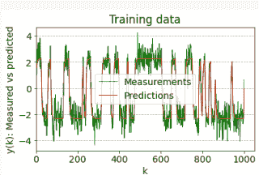

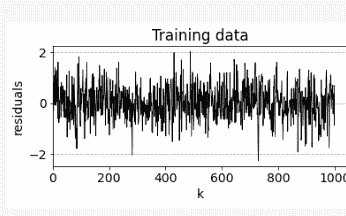

```
# CCF b/w residuals and input sequence
ccf_vals = ccf(residuals, u, adjusted=False) # ccf for lag >= 0
ccf_vals = ccf_vals[:21] # ccf for lag 0 to 20
```

```
# plot
plt.figure(figsize=(6,4)), plt.vlines(lags, [0], ccf_vals), plt.axhline(0, 0, lags[-1])
plt.plot(lags, ccf_vals, marker='o', markersize=5, linestyle='None')
plt.gca().axhspan(-conf_int, conf_int, facecolor='lightblue', alpha=0.5) # shaded confidence interval
plt.xlabel('lag'), plt.title('Cross-correlations')
```

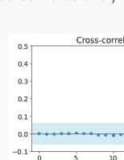

残差和输入序列之间不存在相关性。

好了，既然我们已经成功获得了确定性分量，让我们看看模型残差是否能帮助我们获得随机分量。为此，我们需要对残差拟合一个时间序列模型，如图 7.5 所示，我们已经知道 ACF/PACF 图可以为候选模型提供线索。

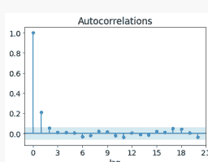

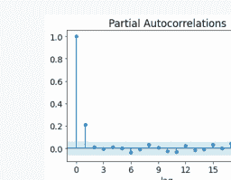

ACF 的指数衰减和 PACF 在滞后 1 处的急剧截断表明这是一个 AR(1) 模型，这与真实过程一致！

### 7.5 Box-Jenkins 模型简介

Box-Jenkins (BJ) 模型放宽了 ARMAX 模型中（$G$ 和 $H$ 算子中常见的 $A(q^{-1})$ 多项式）限制，并使用与确定性动态完全不同的扰动信号动态。如图 7.6 所示，$G$ 和 $H$ 算子是独立参数化的，这确保了无偏的确定性模型估计。可以预见，模型表达式更为复杂，需要指定 5 个超参数，即 $n_a$、$n_b$、$n_c$、$n_d$、$d$。此外，模型拟合需要非线性优化。让我们通过一个快速示例，了解如何使用 BJ 模型对工业燃气炉系统进行建模。

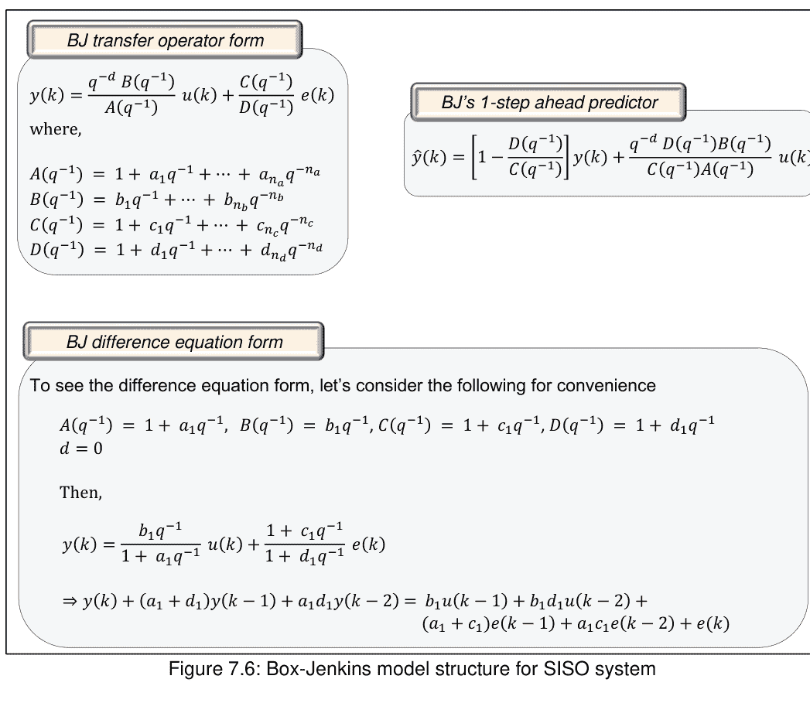

#### 示例 7.2：

在本示例中，我们将使用流行的 Box-Jenkins 燃气炉数据集 (https://www.itl.nist.gov/div898/handbook/pmc/section4/pmc451.htm)。数据来自一个燃烧甲烷的 SISO 燃气炉。甲烷进料速率是输入，炉气出口的 CO₂ 浓度是输出，提供了以 9 秒间隔记录的 296 个样本。我们将使用 SIPPY 为该数据集构建一个 BJ 模型。代码与前一个示例几乎相同。

```python
# read data
data = np.loadtxt('gas-furnace.csv', delimiter=',')
u = data[:,0, None]; y = data[:,1, None]

# center data
u_scaler = StandardScaler(with_std=False); u_centered = u_scaler.fit_transform(u)
y_scaler = StandardScaler(with_std=False); y_centered = y_scaler.fit_transform(y)

# fit BJ model
BJmodel = SysID(y_centered, u_centered, 'BJ', IC='AIC', nb_ord=[3,3], nc_ord=[1,1], nd_ord=[2,2],
                nf_ord=[2,2], delays=[2,2], max_iterations=500)

# see SIPPY user-guide for details on symbols used for transfer operator polynomials
print(BJmodel.G)
print(BJmodel.H)
```

获得的传递算子多项式与原始文献（Box 等人，《时间序列分析：预测与控制》，Wiley）中报告的非常接近。上述模型也（几乎）通过了残差诊断检查，如下图所示的残差 ACF 和 CCF 图。

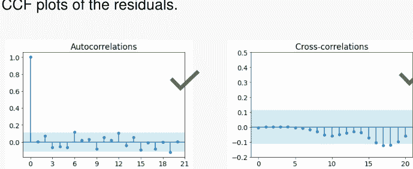

### 7.6 ARIMAX 模型简介

到目前为止，我们一直假设过程扰动 ($v(k)$) 是平稳的。然而，这可能并不总是成立。不过，如果 $v(k)$ 是差分平稳的，那么它可以被建模为一个 ARIMA 过程：$v(k) = \frac{C(q^{-1})}{(1-q^{-1})^d A(q^{-1})} e(k)$，其中 $d$ 是差分阶数$^{58}$，最终模型如图 7.7 所示。

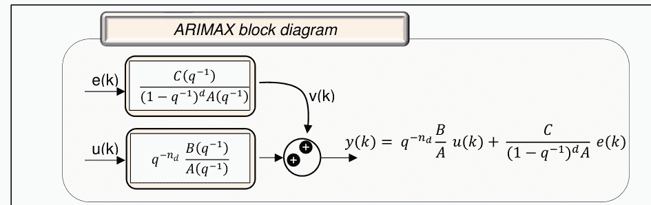

图 7.7：ARIMAX 的模型结构。注意，这里的 $d$ 表示差分阶数，而不是过程延迟。

让我们进行一些快速的代数运算，以理解采用此模型的含义。

ARIMAX 模型：$y(k) = q^{-n_d} \frac{B(q^{-1})}{A(q^{-1})} u(k) + \frac{C(q^{-1})}{(1-q^{-1})^d A(q^{-1})} e(k)$

$\Rightarrow (1-q^{-1})^d y(k) = q^{-n_d} \frac{B(q^{-1})}{A(q^{-1})} (1-q^{-1})^d u(k) + \frac{C(q^{-1})}{A(q^{-1})} e(k)$

$\Rightarrow \tilde{y}(k) = q^{-n_d} \frac{B(q^{-1})}{A(q^{-1})} \tilde{u}(k) + \frac{C(q^{-1})}{A(q^{-1})} e(k)$

其中 $\tilde{y}(k) = (1-q^{-1})^d y(k)$
$\tilde{u}(k) = (1-q^{-1})^d u(k)$

ARMAX 模型！

上述表达式表明，ARIMAX 模型等价于对差分输入和输出信号的 ARMAX 模型！此外，对差分数据获得 ARMAX 模型可以提供确定性模型或 $u(k)$ 和 $y(k)$ 之间输入传递算子 $G$ 的无偏估计。与 ARIMA 模型一样，ARIMAX 应谨慎使用或仅在必要时使用。如果 $v(k)$ 没有任何积分非平稳性，那么对 $u(k)$ 和 $y(k)$ 进行差分只会放大噪声并降低信噪比。确定扰动非平稳性的一种方法是在未差分的数据上拟合一个 OE 模型，然后评估残差的特性（通过 ACF/PACF 或单位根检验）。让我们通过一个示例来更好地理解该方法。

#### 示例 7.3：

在本示例中，我们将重新使用示例 7.1 中的真实过程，但对扰动模型中的 AR 系数进行修改，使其现在也包含一个积分项，如下所示。

$$y(k) = \frac{0.7q^{-1}}{1 - 0.7q^{-1}}u(k) + \frac{1}{(1 - q^{-1})(1 - 0.7q^{-1})}e(k)$$

我们将看到如何通过对差分输入和输出信号进行处理来恢复真实的确定性分量。

```python
# import packages
import matplotlib.pyplot as plt
```

下面的 ACF 图显示了差分前后残差序列的自相关性。很明显，该过程受到非平稳扰动的影响，并且在残差进行一阶差分后，非平稳性消失了。根据这些观察结果，我们将在对输入和输出信号进行一次差分后构建一个 ARMAX 模型。

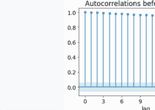

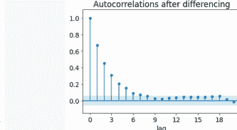

```python
plot_acf(OEresiduals)
plot_acf(np.diff(OEresiduals, axis=0))
```

```python
# Fit ARMAX model
# difference I/O data once
u_centered_delta = np.diff(u_centered, axis=0)
y_centered_delta = np.diff(y_centered, axis=0)
```

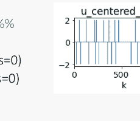

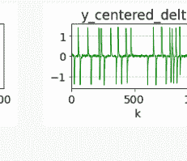

```python
# fit ARMAX model on differenced data
ARMAXmodel = SysID(y_centered_delta, u_centered_delta, 'ARMAX', ARMAX_orders=[1,1,0,0])
print(ARMAXmodel.G)
print(ARMAXmodel.H)
```

$$G(q^{-1}) = \frac{0.6999q^{-1}}{1 - 0.6988q^{-1}} \quad ; \quad H(q^{-1}) = \frac{1}{1 - 0.6988q^{-1}}$$

$$\Delta y(k) = \frac{0.6999q^{-1}}{1 - 0.6988q^{-1}} \Delta u(k) + \frac{1}{1 - 0.6988q^{-1}} e(k)$$

$$y(k) = \frac{0.6999q^{-1}}{1 - 0.6988q^{-1}} u(k) + \frac{1}{(1 - q^{-1})(1 - 0.6988q^{-1})} e(k)$$

我们已经获得了对真实过程非常接近的估计！差分后的输入和输出序列可能看起来非常不同，但正如本例所示，它们遵循相同的确定性关系。

### 如何选择模型结构？

面对众多可用的模型，你完全有理由问：“如何为我的系统选择最佳模型？”不幸的是，没有明确的答案。然而，本章和前几章涵盖的概念可以帮助你选择正确的路径来找到答案，最重要的是，理解选择任何模型结构的含义。

一个简单的方法可能是尝试拟合一个通用的 ARIMAX 模型，但这并不是一个明智的做法，因为由于数据噪声，你最终可能会在 G 和 H 算子中得到不存在的动态。获得最简单、最简约的模型应该是你的指导原则！通常，模型结构的选择在很大程度上取决于你对系统的先验信息/见解的程度，特别是关于扰动信号的，例如噪声是在过程早期还是晚期进入，或者扰动是否有漂移趋势。另一个主要的选择标准是最终目标：你可能只对确定性模型感兴趣（例如用于仿真），或者也对噪声模型感兴趣（以获得更好的预测）。当然，信噪比、可用数据量以及估计的难易程度也是关键的决定因素。

一种思路建议使用 OE 模型来估计 G，研究残差特性以近似 H，然后将这些估计值作为 BJ 模型的初始猜测，以获得改进的估计。另一种思路则倾向于将 ARX 作为首选的初始模型。

请注意，在第 6 章和第 7 章中，我们一直专注于 SISO 系统。你可以想象，要找到 MIMO 模型中所有输入和输出的所有 G 和 H 算子的多项式模型阶数的最佳组合，将是一项相当繁琐的任务。下一章介绍的状态空间模型将使 MIMO 系统的建模变得非常容易，因为你不需要预先指定所有这些模型阶数。因此，请耐心等待，更多的建模选项即将到来！

### 总结

本章我们探讨了用于建模线性SISO系统的经典PEM模型。我们学习了ARMAX、OE、BJ和ARIMAX模型的优缺点，并了解了它们在精馏塔和燃气炉建模中的应用。现在，你已掌握所有工具，能够明智地选择模型结构。为了进一步增强你的建模能力，让我们继续研究用于MIMO系统的状态空间和子空间模型。

## 第8章

### 状态空间模型：MIMO系统的高效建模

在上一章中，我们提及了通过为每个输出建立独立的MISO模型来建模MIMO系统的经典方法所存在的问题。在物理系统中，不同的输出变量很少独立表现；它们通常共享共同参数和/或相关噪声。因此，在识别所有输出模型时，同时考虑它们之间的共享动态特性，能够得到更好、更稳健的模型。状态空间模型为系统辨识提供了这种替代方法。状态空间模型在输入和输出变量之间增加了一个中间层——“状态变量”，其中输入决定状态，而输出则由状态的线性组合导出。这种建模范式能够生成简洁的模型，既能拟合具有快速动态特性的复杂过程，也能拟合具有慢速动态特性的过程。

本章将详细介绍用于拟合状态空间模型的子空间辨识技术。虽然存在多种流行的子空间辨识方法，如N4SID、CVA、MOESP，但我们将主要关注CVA。与I/O模型相比，子空间辨识提供了几个额外的优势。SIM仅涉及线性代数用于模型辨识（无需迭代非线性优化方案）。SIM还提供了现场自动选择最优模型阶数的机制。子空间模型对噪声更稳健，并提供平滑的（阶跃和脉冲）响应曲线。事实上，将SIM模型拟合到I/O数据，然后使用该SIM模型推导出FIR模型用于MPC应用，这种情况并不少见。由于SIM具有这些优越特性，它们是先进过程控制解决方案供应商提供的“主流”模型之一。

CVA模型也天然适用于计算故障检测指标、执行故障诊断，从而构建过程监控工具。我们将在本章构建一个这样的应用。具体来说，将涵盖以下主题：

- 状态空间模型和CVA建模简介
- 通过CVA对MIMO玻璃熔炉进行建模
- 使用CVA对工业化工厂进行过程监控

### 8.1 状态空间模型简介

考虑图8.1中的精馏塔，我们有四个输入和四个输出。让我们关注再沸器热负荷 $Q_B$ 与馏出物组成 $x_D$ 之间的关系。我们可以在 $Q_B$ 和 $x_D$ 之间建立一个I/O模型，但很明显 $Q_B$ 并不直接影响 $x_D$。存在内部动态或状态（例如，由每个塔板上的液体滞留量引起），$Q_B$ 的变化必须经过这些状态才能影响 $x_D$。对于 $Q_B$ 与 $D$ 的关系也可以提出类似的论点。这些表征塔内部动态或“状态”的未观测中间变量被称为状态变量，如前所述，输出共享这些状态。反映输入和输出之间这种相互关系的建模框架就是状态空间模型，其结构$^{59}$如图8.1所示。在一般的建模练习中，估计的状态变量可能并不总是具有任何物理意义，甚至状态的选择也不是唯一的。

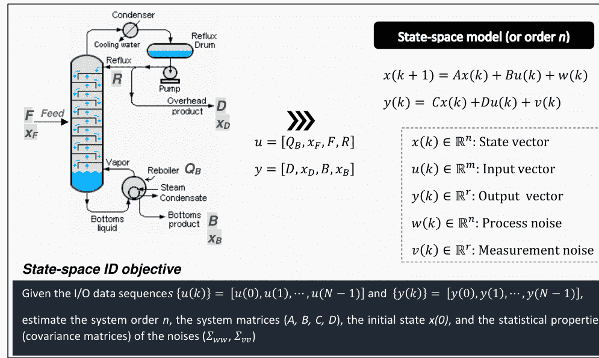

我们熟悉的PEM方法可用于估计状态空间模型，但这将涉及求解非线性优化问题。更好的替代方案是子空间辨识方法。$^{61}$ 具体来说，在CVA方法中，状态通过线性代数估计为过去输出和输入的线性组合，该组合最大化了对未来输出测量值的解释变异性。事不宜迟，让我们现在深入探讨CVA概念，并掌握基于CVA的状态空间建模艺术。

> ### 状态空间模型的形式

我们在图8.1中看到的状态空间模型形式称为过程形式。另外两种常见形式如下所示

**新息形式**

$$x(k+1) = Ax(k) + Bu(k) + Ke(k)$$
$$y(k) = Cx(k) + Du(k) + e(k)$$

*Kalman增益*

**预测器形式**

$$x(k+1) = A_k x(k) + B_k u(k) + Ky(k)$$
$$y(k) = Cx(k) + Du(k) + e(k)$$

其中
$$A_k = A - KC$$
$$B_k = B - KD$$

这三种形式中的任何一种都可以用于建模任何MIMO系统。

### 8.2 通过CVA进行状态空间建模

CVA是动态MIMO系统状态空间建模中最流行的技术之一。图8.2展示了CVA（以及其他SIM技术）使用历史工厂数据估计状态空间模型的一般方法：首先使用历史观测的 $\{y(k), u(k)\}$ 数据序列估计状态序列 $\{x(k)\}$，然后通过最小二乘回归估计系统矩阵 $(A, B, C, D)$，之后求出协方差矩阵。我们很快将更详细地了解这一过程。所有SIM算法都遵循此过程，主要区别在于状态序列的估计方式。

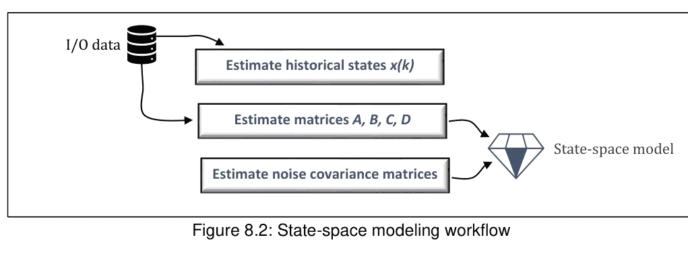

让我们更详细地了解模型拟合过程。

#### 数学背景

利用状态空间模型以及对输入输出数据序列的一些巧妙重排<sup>62</sup>，可以证明状态向量 $x(k)$ 可以近似为过去输入和输出的线性组合<sup>63</sup>

$\hat{x}(k) = J p(k)$

公式 1

定义为 $[y^T(k-1) \ y^T(k-2) \ \cdots \ y^T(k-l_y) \ u^T(k-1) \ u^T(k-2) \ \cdots \ u^T(k-l_u)]^T$

在公式1中，$l_y$ 和 $l_u$ 表示用于构建 $p(k)$ 向量的滞后输出和输入的数量。通常，$l_y = l_u = l$，这是一个模型超参数。CVA方法利用CCA（典型协方差分析）这一多元统计技术来求 $J$。下面提供CCA技术的简要入门。

> ### CCA：简要入门

CCA是一种降维技术，旨在找到输入变量（$u \in \mathbb{R}^m$）的线性组合，使其与输出变量（$y \in \mathbb{R}^p$）的线性组合具有最大相关性*。你可以将其与PLS联系起来，其中最大化了潜变量之间的协方差。这些线性组合称为典型变量，表示为

$c = Ju$ ← $c$ 包含不相关的潜变量
$d = Ly$ ← $d$ 包含不相关的潜变量

$c$ 和 $d$ 之间的协方差矩阵是（矩形）对角矩阵

$\Sigma_{cd} = J\Sigma_{uy}L^T = D = diag(\gamma_1, \gamma_2, \dots, \gamma_o, 0, \dots, 0)$

矩阵D的元素 $\gamma_i$ 称为典型相关系数，满足（$\gamma_1 \ge \gamma_2 \ge \dots \ge \gamma_o$），并量化了第 $i^{th}$ 对典型变量 $c_i$ 和 $d_i$ 之间的相关程度。

<sup>62</sup> Chen et. al., A canonical variate analysis based process monitoring scheme and benchmark study. 2014
<sup>63</sup> 所有SIM算法都遵循此过程，主要区别在于矩阵 $J$ 的估计方式

#### CVA 状态

在 CVA 中，执行 CCA 的两组向量是 $p(k)$（定义于公式 1）和 $f(k)$，其中$^{64}$

$$f(k) = [y^T(k) \ y^T(k+1) \ \cdots \ y^T(k+l)]^T$$

即当前和未来的输出。

因此，CVA 求解以下奇异值分解问题，并寻找与当前和未来输出的线性组合具有最大相关性的过去输入和输出的线性组合。

$$\Sigma_{pp}^{-1/2} \Sigma_{pf} \Sigma_{ff}^{-1/2} = U \Sigma V^T$$

公式 2

我们知道 $\Sigma$ 是一个对角矩阵。其元素也被称为（Hankel）奇异值。如果假设 $n$ 为模型阶数，那么在时间 $k$ 对未来输出最具预测性的最优状态由下式给出$^{65}$

$$\hat{x}(k) = J_n p(k)$$

其中 $J_n$ 包含矩阵 $J = U^T \Sigma_{pp}^{-1/2}$ 的前 $n$ 行。

#### 系统矩阵

状态估计出来后，系统矩阵 $(A, B, C, D)$ 可以通过多元线性最小二乘回归$^{66}$ 进行估计。最终表达式可推导为

$$\begin{bmatrix} \hat{A} & \hat{B} \\ \hat{C} & \hat{D} \end{bmatrix} = cov \left( \begin{bmatrix} \hat{x}(k+1) \\ y(k) \end{bmatrix}, \begin{bmatrix} \hat{x}(k) \\ u(k) \end{bmatrix} \right) cov^{-1} \left( \begin{bmatrix} \hat{x}(k) \\ u(k) \end{bmatrix}, \begin{bmatrix} \hat{x}(k) \\ u(k) \end{bmatrix} \right)$$

噪声协方差矩阵 $Q$ 和 $R$ 可以分别估计为状态残差和输出残差的协方差矩阵。

$$\varepsilon_x(k) = \hat{x}(k+1) - (\hat{A}\hat{x}(k) + \hat{B}u(k)) \implies \hat{Q} = \Sigma_{\varepsilon_x\varepsilon_x}$$
$$\varepsilon_y(k) = y(k) - (\hat{C}\hat{x}(k) + \hat{D}u(k)) \implies \hat{R} = \Sigma_{\varepsilon_y\varepsilon_y}$$

图 8.3：CVA 模型辨识工作流程

#### 超参数选择

CVA 算法的数学背景表明需要指定两个超参数：滞后阶数 ($l$) 和模型阶数 ($n$)。虽然在状态估计之前不需要指定模型阶数，但滞后阶数需要事先确定。让我们看看估计这些超参数的常用方法。

#### 滞后阶数 ($l$)

为滞后 $l$ 赋值的指导原则是它应该足够大以捕捉数据的自相关性。一个常用的推荐策略是拟合几个具有不同 $l$ 值的多元自回归模型，并选择使 AIC 准则最小化的 $l$。例如，令 $\bar{l}$ 为其中一个试验值。则建立以下关系

对 $\hat{l} = 1, 2, ..., l_{max}$ 拟合上述模型（通过 OLS），并记录 AIC 值。这里，$l_{max}$ 是某个足够大的值。然后选择对应于最小 AIC 的滞后值。

#### 模型阶数 ($n)$

正确选择 $n$ 的值很重要：过大的值会导致模型过拟合，而过小的 $n$ 值会导致欠拟合。一种模型阶数选择方法基于 Hankel 奇异值。如果奇异值对模型阶数的图有一个明显的“拐点”，则可以选择对应于拐点的模型阶数，如下所示

另一种做法是选择 $n$，使得从第 $(n+1)^{th}$ 个开始的奇异值的归一化值低于某个阈值（SIPPY 默认此阈值为 0.1）。然而，通常没有拐点或奇异值下降缓慢。因此，更广泛使用的模型阶数选择准则是 AIC$^{67}$。

下面的流程图总结了上述基于 CVA 的状态空间模型估计步骤。

图 8.4：通过 CVA 进行动态过程建模的完整工作流程⁶⁸

### 8.3 通过 CVA 对玻璃熔炉建模

为了展示使用 SIPPY 构建状态空间模型的简便性，我们将使用来自玻璃熔炉的数据。⁶⁹ 该过程有 3 个输入源（两个燃烧器和一个通风机）和六个输出（熔炉横截面上的温度传感器）⁷⁰。提供的数据集包含 1247 个样本，涉及九个变量。该数据集可以从 DalSy 数据集仓库下载。让我们从探索数据集开始。

```python
# import packages
import matplotlib.pyplot as plt, numpy as np
from sklearn.preprocessing import StandardScaler
from sippy import system_identification as SysID

# read data
data = np.loadtxt('glassfurnace.dat'); U = data[:,1:4]; Y = data[:,4:]
```

从上面的图中可以明显看出，输出变量高度相关，因此尝试构建 MIMO 模型是合理的。我们将把数据集分成训练集和测试集，然后进行数据中心化和模型拟合。

```python
# split into training and test dataset; center them
from sklearn.model_selection import train_test_split
U_train, U_test, Y_train, Y_test = train_test_split(U, Y, test_size=0.2, shuffle=False)

U_scaler = StandardScaler(with_std=False)
U_train_centered = U_scaler.fit_transform(U_train); U_test_centered = U_scaler.transform(U_test)
Y_scaler = StandardScaler(with_std=False)
Y_train_centered = Y_scaler.fit_transform(Y_train); Y_test_centered = Y_scaler.transform(Y_test)

# fit CVA model
model = SysID(Y_train_centered, U_train_centered, 'CVA', IC='AIC', SS_f=20, SS_orders=[1,20])

>>> The suggested order is: n= 7
```

让我们解释一下用于模型拟合的上述代码行。这里，我们通过 *SS_f* 参数指定了滞后阶数为 20，并且使用赤池信息准则进行最优模型阶数选择。阶数被限制在通过 *SS_orders* 参数指定的 1 到 20 范围内。SIPPY 返回的最优阶数为七。模型建立后，让我们检查模型的仿真性能以评估其可接受性。

```python
# compare simulation responses vs measurements on training and test data
from sippy import functionsetSIM as fsetSIM
Xid_train, Vid_train_centered = fsetSIM.SS_lsim_process_form(model.A, model.B, model.C, model.D,
                                                            np.transpose(U_train_centered), model.x0) # Xid -> states
Vid_train_centered = np.transpose(Vid_train_centered)

Xid_test, Vid_test_centered = fsetSIM.SS_lsim_process_form(model.A, model.B, model.C, model.D,
                                                            np.transpose(U_test_centered), Xid_train[:,-1, None]) # passing the
                                                            state at the end of training as the starting state for test data
Vid_test_centered = np.transpose(Vid_test_centered)
```

仿真响应与测量值的比较表明，尽管模型在某些实例上倾向于低估，但总体而言，模型在捕捉输出的广泛变化方面表现良好。

---
$^{64}$ 用于定义 $f(k)$ 的超前值数量取为等于 $p(k)$ 中使用的滞后数量，这是一种常见做法。

$^{65}$ 或者，$\hat{x}(k) = U_n^T \Sigma_{pp}^{-1/2} p(k)$，其中 $U_n$ 包含 $U$ 的前 $n$ 列。

$^{66}$ 多元线性模型为 $\begin{bmatrix} x(k+1) \\ y(k) \end{bmatrix} = \begin{bmatrix} A & B \\ C & D \end{bmatrix} \begin{bmatrix} x(k) \\ u(k) \end{bmatrix} + \begin{bmatrix} w(k) \\ v(k) \end{bmatrix}$

$^{67}$ Russell et al., Data-Driven Methods for Fault Detection and Diagnosis in Chemical Processes. *Springer*, 2001.
Russell et al., Fault detection in industrial processes using canonical variate analysis and dynamic principal component analysis. *Chemometrics and intelligent laboratory systems*, 2000

$^{68}$ Russell et al., Data-Driven Methods for Fault Detection and Diagnosis in Chemical Processes. *Springer*, 2001.
Russell et al., Fault detection in industrial processes using canonical variate analysis and dynamic principal component analysis. *Chemometrics and intelligent laboratory systems*, 2000

$^{69}$ De Moor B.L.R. (ed.), DalSy: Database for the Identification of Systems, Department of Electrical Engineering, ESAT/STADIUS, KU Leuven, Belgium, URL: http://homes.esat.kuleuven.be/~smc/daisy/

$^{70}$ Overschee and Moor, N4SID*: Subspace Algorithms for the Identification of Combined Deterministic-Stochastic Systems. Automatica, 1994

### 8.4 使用CVA监控工业化工厂

本节我们将探讨CVA的另一个应用。我们将通过一个大型工业化工厂的逐步应用，学习基于CVA的监控工具开发的详细过程。所研究的过程称为田纳西-伊士曼过程（TEP），其工艺流程图如图8.5所示。该过程包含多个单元操作：反应器、冷凝器、分离器、汽提塔和循环压缩机。它有22个连续过程测量变量、19个组分测量变量和11个操纵变量。该过程的数据集已发布在 https://github.com/camaramm/tennessee-eastman-profBraatz.71 数据集包含来自正常运行期和21个具有不同故障原因的故障期的训练和测试数据。对于每个故障类别，训练数据集包含在24个操作小时内收集的480个样本，测试数据集包含在48个操作小时内收集的960个样本。对于故障数据，故障操作从第160个样本开始。

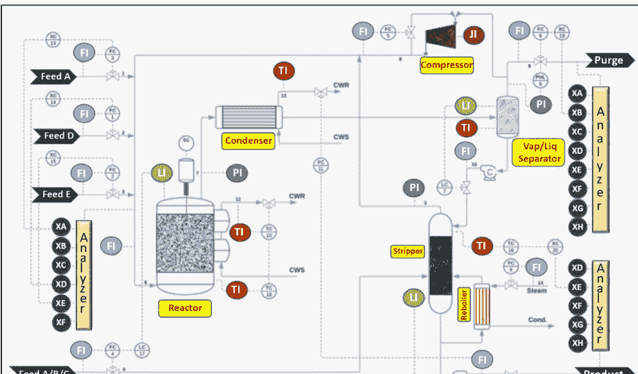

71 关于该过程和故障的详细信息可从Downs和Vogel题为‘A plant-wide industrial process control problem’的原始论文中获得。

72 改编自Gilberto Xavier (https://github.com/gmxavier/TEP-meets-LSTM) 在知识共享署名4.0国际许可协议 (https://creativecommons.org/licenses/by/4.0/) 下提供的原始流程图。

如前所述，本书提供的CVA建模和监控流程反映了Russell等人<sup>68</sup>工作中的描述，因此我们将尝试复现他们题为‘*Fault detection in industrial processes using canonical variate analysis and dynamic principal component analysis*’的论文中基于CVA的故障检测结果。具体来说，我们将使用*故障5*数据集（文件*d05_te.dat*）作为测试数据，正常运行数据集（文件*d00.dat*）作为训练数据。我们将使用操纵变量作为输入，过程测量变量作为输出。我们的目标是构建一个监控工具，能够准确地标记过程故障的存在，同时保持较低的误报频率。让我们首先快速探索一下数据集。

```
# import packages
import matplotlib.pyplot as plt, numpy as np
from sklearn.preprocessing import StandardScaler

# read data and separate input-output variables
trainingData = np.loadtxt('d00.dat').T
FaultyData = np.loadtxt('d05_te.dat')
uData_training, yData_training = trainingData[:,41:52], trainingData[:,0:22]
uData_test, yData_test = FaultyData[:,41:52], FaultyData[:,0:22]
```

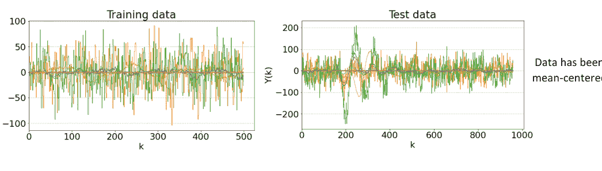

显然，持续监控所有22个输出（和11个输入）变量是不切实际的。上面的单个组合输出图似乎确实清楚地表明故障数据集中在样本编号200左右发生了过程扰动；然而，它们似乎也给人一种从样本编号500开始过程条件正常的错误印象。已知故障5一直持续到数据集结束。幸运的是，CVA通过将任何复杂多变量过程的状态总结为三个简单的指示器或监控指数（如图8.6所示），使监控任务变得容易。在模型训练期间，为这些指数确定统计阈值，对于新的数据点，将新的指数值与阈值进行比较。如果三个阈值中的任何一个被违反，则确认存在异常过程条件。让我们深入了解这些监控指数是如何计算的。

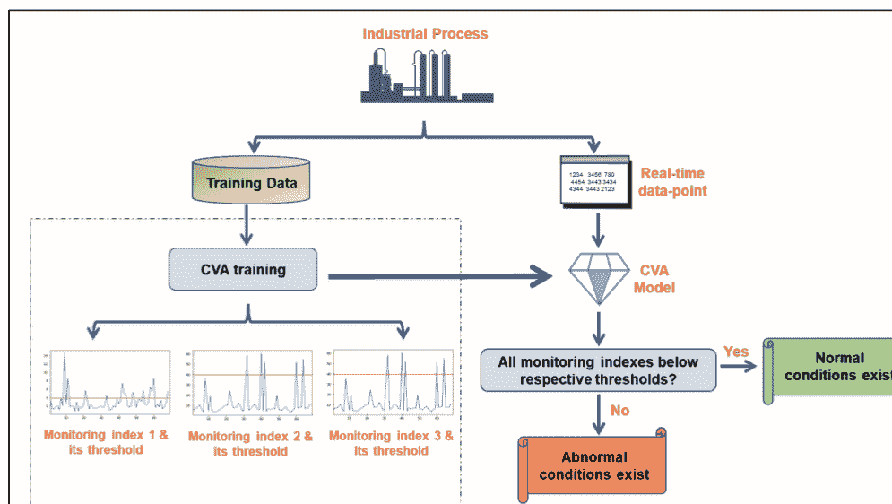

#### 过程监控/故障检测指数

在基于CVA的方法中，计算3个指数 - $T_s^2$, $T_e^2$, $Q$。这些指标及其相应阈值的计算如下所示。注意，阈值表达式基于过程变量服从高斯分布的假设；如果此假设无效，则可以采用经验技术，如核密度估计（KDE）或百分位数法。

| 指标 1: $T_s^2$ | 指标 2: $T_e^2$ | 指标 3: $Q$ |
| :--- | :--- | :--- |
| $T_s^2(k) = x^T(k)x(k)$<br>$= p^T(k) J_n^T J_n p(k)$ | $T_e^2(k) = p^T(k) J_e^T J_e p(k)$ | $Q(k) = r^T(k)r(k)$<br>$r(k) = p(k) - J_n^T J_n p(k)$ |
| 显著性水平 $\alpha$ 下的阈值 | 显著性水平 $\alpha$ 下的阈值 | 显著性水平 $\alpha$ 下的阈值 |
| $T_{s,CL}^2 = \frac{n(N^2-1)}{N(N-n)} F_{\alpha}(n, N-n)$ | $T_{e,CL}^2 = \frac{z(N^2-1)}{N(N-z)} F_{\alpha}(z, N-z)$ | $Q_{CL} = \frac{\sigma}{2\mu} g \chi_{\alpha}^2 \left( \frac{2\mu^2}{\sigma} \right)$ |

- $J_e$ 包含 $J$ 中除前 $n$ 行外的所有行，即 $J$ 的最后 $l(m+r) - n$ 行
- $z = l(m+r) - n$
- $F_{\alpha}(n, N-n)$ 是自由度为 $n$ 和 $N-n$ 的 $F$ 分布的 (1-$\alpha$) 百分位数
- $\chi_{\alpha}^2$ 是自由度为 $h$ 的卡方分布的 (1-$\alpha$) 百分位数；$\mu$ 表示 $Q$ 指标的均值，$\sigma$ 表示其方差
- 显著性水平 $\alpha = 0.05$ 意味着警报有5%的概率是误报

让我们为训练数据集计算监控指数。为了确保更好地理解该方法，我们将跳过使用SIPPY包进行CVA建模，而是从头开始执行每个步骤。

```
%%%%%%%%%%%%%%%%%%%%%%%%%%%%%%%%%%%%%%%%%%%%%%%%%%%%%%%%%%
## generate past (p) and future (f) vectors for training dataset and center them
%%%%%%%%%%%%%%%%%%%%%%%%%%%%%%%%%%%%%%%%%%%%%%%%%%%%%%%%%%
N = trainingData.shape[0]
l = 3 # as used by Russell et. al
m = uData_training.shape[1]
r = yData_training.shape[1]

pMatrix_train = np.zeros((N-2*l, l*(m+r)))
fMatrix_train = np.zeros((N-2*l, (l+1)*r))
for i in range(l, N-l):
    pMatrix_train[i-l,:] = np.hstack((yData_training[i-l:i,:].flatten(), uData_training[i-l:i,:].flatten()))
    fMatrix_train[i-l,:] = yData_training[i:i+l+1,:].flatten()

# center data
p_scaler = StandardScaler(with_std=False); pMatrix_train_centered = p_scaler.fit_transform(pMatrix_train)
f_scaler = StandardScaler(with_std=False); fMatrix_train_centered = f_scaler.fit_transform(fMatrix_train)

%%%%%%%%%%%%%%%%%%%%%%%%%%%%%%%%%%%%%%%%%%%%%%%%%%%%%%%%%%
## computes covariances and perform SVD
%%%%%%%%%%%%%%%%%%%%%%%%%%%%%%%%%%%%%%%%%%%%%%%%%%%%%%%%%%
import scipy

sigma_pp = np.cov(pMatrix_train_centered, rowvar=False)
sigma_ff = np.cov(fMatrix_train_centered, rowvar=False)
sigma_pf = np.cov(pMatrix_train_centered, fMatrix_train_centered,
                   rowvar=False)[:len(sigma_pp),len(sigma_pp):]

matrixProduct = np.dot(np.dot(np.linalg.inv(scipy.linalg.sqrtm(sigma_pp).real), sigma_pf),
                       np.linalg.inv(scipy.linalg.sqrtm(sigma_ff).real))

U, S, V = np.linalg.svd(matrixProduct)
J = np.dot(np.transpose(U), np.linalg.inv(scipy.linalg.sqrtm(sigma_pp).real))

# get the reduced order matrices
n = 29 # as used by Russell et. al
Jn = J[:n,:]
Je = J[n:,:]
```

```
%%%%%%%%%%%%%%%%%%%%%%%%%%%%%%%%%%%%%%%%%%%%%%%%%%%%%%%%%%
##          get fault detection metrics for training data
%%%%%%%%%%%%%%%%%%%%%%%%%%%%%%%%%%%%%%%%%%%%%%%%%%%%%%%%%%
Xn_train = np.dot(Jn, pMatrix_train_centered.T)
Ts2_train = [np.dot(Xn_train[:,i], Xn_train[:,i]) for i in range(pMatrix_train_centered.shape[0])]

Xe_train = np.dot(Je, pMatrix_train_centered.T)
Te2_train = [np.dot(Xe_train[:,i], Xe_train[:,i]) for i in range(pMatrix_train_centered.shape[0])]

r_train = pMatrix_train_centered.T - np.dot(Jn.T, Xn_train)
Q_train = [np.dot(r_train[:,i], r_train[:,i]) for i in range(pMatrix_train_centered.shape[0])]

# determine thresholds as 99th percentile of respective metrics
Ts2_CL = np.percentile(Ts2_train, 99)
Te2_CL = np.percentile(Te2_train, 99)
Q_CL = np.percentile(Q_train, 99)
```

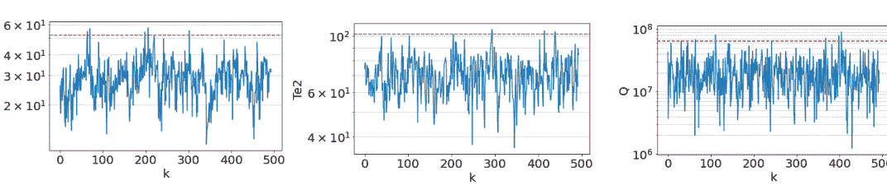

$T_s^2$ 指标衡量状态变量定义的状态空间‘内部’的系统性变化。相应地，$T_r^2$ 量化状态空间‘外部’的变化。当只有 $T_s^2$ 超过阈值时，表明状态变量‘失控’，但过程仍能被估计的状态空间模型很好地解释。当 $T_s^2$ 或 $Q$ 超过阈值时，表明影响系统的噪声特性发生了变化，或者估计的模型无法解释新的故障观测值。

> ### CVA与PCA（或PLS）在过程监控中的比较

您可能会注意到基于CVA和基于PCA的监控方法在指标定义上的相似性。虽然动态PCA（和动态PLS）有时用于监控动态过程，但多项研究表明CVA在动态过程监控方面优于DPCA（和DPLS）。

#### 故障检测

现在是时候检查我们的监控图表是否能帮助检测过程异常的存在了。为此，我们将计算测试数据的监控统计量。

```python
# generate past vectors (p(k)) for test dataset and center
Ntest = FaultyData.shape[0]

pMatrix_test = np.zeros((Ntest-2*l, l*(m+r)))
for i in range(l,Ntest-l):
    pMatrix_test[i-l,:] = np.hstack((yData_test[i-l:i,:].flatten(), uData_test[i-l:i,:].flatten()))

pMatrix_test_centered = p_scaler.transform(pMatrix_test)

# get fault detection metrics for training data
Xn_test = np.dot(Jn, pMatrix_test_centered.T)
Ts2_test = [np.dot(Xn_test[:,i], Xn_test[:,i]) for i in range(pMatrix_test_centered.shape[0])]

Xe_test = np.dot(Je, pMatrix_test_centered.T)
Te2_test = [np.dot(Xe_test[:,i], Xe_test[:,i]) for i in range(pMatrix_test_centered.shape[0])]

r_test = pMatrix_test_centered.T - np.dot(Jn.T, Xn_test)
Q_test = [np.dot(r_test[:,i], r_test[:,i]) for i in range(pMatrix_test_centered.shape[0])]
```

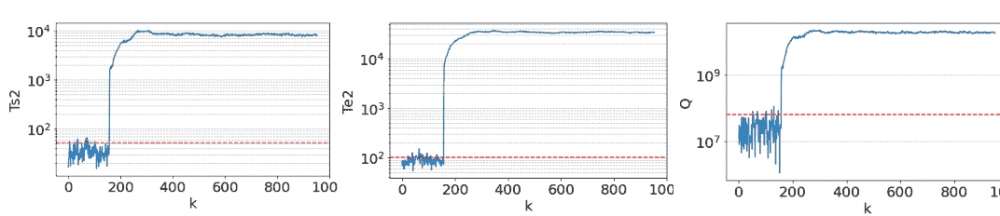

测试数据的控制图显示成功检测到了过程故障。已知$T_e^2$指标过于敏感，误报率高，这可以解释为什么它似乎经常在实际故障发生之前就突破了阈值。以下流程图总结了构建基于CVA的监控工具的所有步骤。

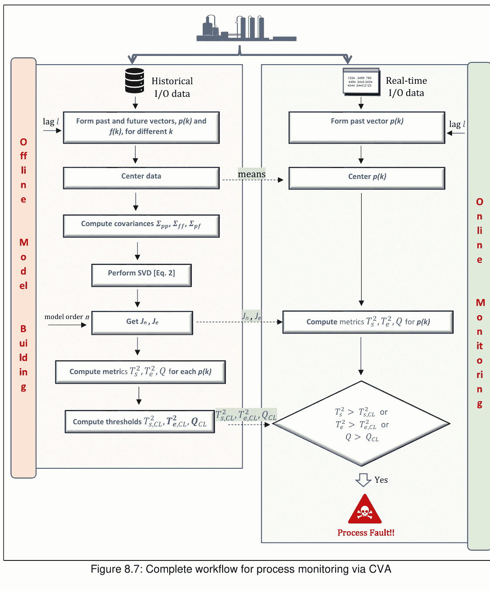

图8.7：通过CVA进行过程监控的完整工作流程

#### 状态空间模型与ARMAX模型的等价性

尽管状态空间模型和输入输出模型看起来可能非常不同，但它们是相关的！给定任何状态空间模型，都可以确定一个等效的ARMAX模型，*反之亦然*。因此，其他线性结构如ARX或OE也可以重写为状态空间模型。

**单输入单输出（SISO）I/O差分方程形式到状态空间（SS）形式**

**状态空间形式到传递算子形式**

考虑

$y(k) + a_1 y(k-1) + \cdots + a_{n_a} y(k-n) = b_1 u(k-1) + \cdots + b_{n_b} u(k-n)$

$\Downarrow$ 等价

$x(k+1) = Ax(k) + Bu(k)$

$y(k) = Cx(k)$

其中，$x(k) \in \mathbb{R}^{n \times 1}, C = [1, 0, \dots, 0]$

$B = \begin{bmatrix} b_1 \\ b_2 \\ \vdots \\ b_n \end{bmatrix}, \quad A = \begin{bmatrix} -a_1 & 1 & 0 & \cdots & 0 \\ -a_2 & 0 & 1 & \cdots & 0 \\ \vdots & \vdots & \vdots & \ddots & 1 \\ -a_n & 0 & 0 & \cdots & 0 \end{bmatrix}$

考虑

$x(k+1) = Ax(k) + Bu(k)$

$y(k) = Cx(k) + Du(k)$

$\Downarrow$ 使用移位算子

$qx(k) = Ax(k) + Bu(k)$

$\Rightarrow (qI - A)x(k) = Bu(k)$

$\Rightarrow x(k) = (qI - A)^{-1}Bu(k)$

$\Rightarrow y(k) = [C(qI - A)^{-1}B + D]u(k)$

$G(q)$

尽管如此，我们在本章中已经看到，与ARMAX模型相比，状态空间模型具有一些显著优势，例如不需要*先验*参数化（即，无需预先指定所有输入的延迟和阶数），并且使用稳健的SVD计算进行模型拟合。

希望本章已经充分向您展示了CVA的强大功能。由于其有利的特性，CVA是Aspen的DMCplus软件$^{73}$中提供的SysID方法之一也就不足为奇了。至此，我们完成了对MIMO动态过程建模世界的简要探索。请注意，我们只是触及了SIM和CVA浩瀚文献的皮毛。我们希望您已经充分理解了CVA的工作原理，并有信心使用它来构建预测和监控工具。您现在拥有了处理SISO和MIMO线性系统的所有工具。接下来，我们将放宽线性限制，并在下一章学习如何处理非线性过程。

### 总结

在本章中，我们研究了状态空间模型，并看到了与输入输出模型相比，它如何提供对内部过程动态的更多见解。为了拟合状态空间模型，我们研究了子空间辨识技术，重点是CVA模型。通过几个工业规模的案例研究，我们学习了如何构建用于过程控制和过程监控的动态模型。在下一章中，我们将看到一些用于建模非线性过程的经典技术。

## 第9章
### 非线性系统辨识：超越线性模型

在前面的章节中，我们将注意力限制在线性过程上。然而，大多数工业过程仅在有限的操作条件下表现出线性行为。如果寻求复杂过程（如高纯度蒸馏、pH中和、聚合等）的全局模型，那么非线性的“恶魔”就会不经意地浮现出来。毫不夸张地说，非线性在过程工业中不是例外，而是常态。如果您总是忍不住求助于人工神经网络结构，我们也不会感到惊讶，因为这些结构如今已成为非线性建模的代名词。然而，存在一些更简单、更经典且同样强大的非线性模型结构，它们更具可解释性。我们将在本章中探讨这些模型。

非线性模型可以是强大的工具，但使用它们需要付出一定的代价。这些代价包括对训练数据变异性要求更高（这意味着更费力的实验设计）、更复杂的模型选择过程以及计算更密集的参数估计。因此，使用非线性模型的决定应审慎做出。如果您确实决定继续，那么本章涵盖的概念可能会对您大有帮助。具体来说，将涵盖以下主题

- NARX模型简介
- 使用NARX模型对换热器过程进行建模
- 块结构模型简介，特别是Hammerstein模型和Wiener模型

### 9.1 非线性系统辨识：简介

当需要在广泛的操作条件下进行准确预测时，非线性SysID就成了一种必要的“恶”。尽管非线性SysID文献不如线性SysID成熟，但SysID界已经开发了几种有用的非线性建模方法。图9.1展示了一些流行的方法。在第一种方法中，直接拟合y(k)与过去数据之间的非线性关系。非线性形式可以是基于多项式的，也可以是更复杂的，例如基于神经网络的。本章我们将重点关注多项式形式。与线性SysID一样，可以假设不同的模型结构，即非线性ARX（NARX）、NOE、NARMAX等。在第二种方法中，线性和非线性部分被定义在独立的块中，从而形成块结构模型。根据非线性块是在线性块之前还是之后，可以得到Hammerstein模型或Wiener模型（该类别中最流行的两种模型）。在第三种方法中，为操作空间的不同区域构建多个线性模型，然后将它们组合成一个全局模型。这些方法在预测建模、过程控制和过程监控方面已有大量工业应用报道。

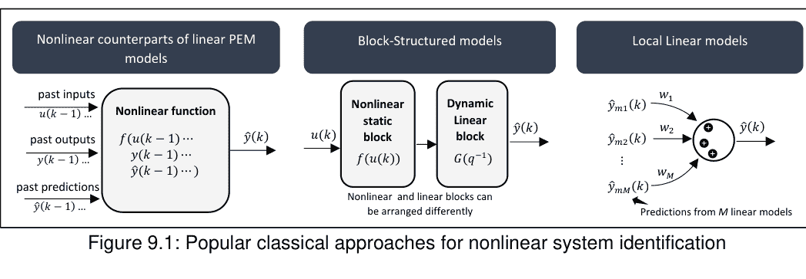

#### 非线性变换

考虑到非线性SysID的高计算负担，如果事先知道非线性的性质，则可以利用输入或输出变量的非线性变换来避免显式的非线性拟合。下面的插图提供了一些示例场景。

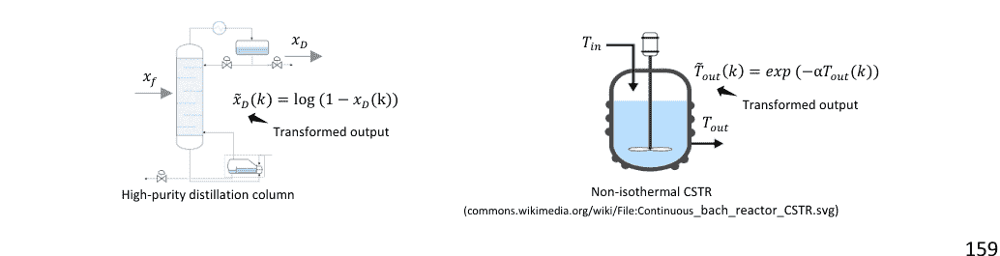

在实践中，所需的非线性变换更有可能是未知的。因此，让我们从可以说是非线性建模的默认选择开始：NARX模型。

### 9.2 NARX模型：简介

非线性自回归与外生输入（NARX）模型，顾名思义，是ARX模型的非线性类似物，其中使用过程的过去输入和输出进行未来预测。如图9.2所示，模型采用以下形式

$$y(k) = f(u(k-d-1), ..., u(k-d-n_b), y(k-1), ..., y(k-n_a), \theta) + e(k)$$

虽然函数$f$通常取为多项式形式，但也可以使用任何其他非线性结构（包括神经网络），只要认为合适即可。多项式NARX的一个特点是，预测器$\hat{y}$关于参数是线性的！因此，如果事先知道模型中应包含哪些特定项/回归量（例如$y(k-1)u(k-1)$，$u^2(k-1)$），那么多项式NARX参数估计就变得直接了当。当然，与ARX一样，必须指定超参数（$d$，$n_b$，$n_a$，*多项式阶数*）。

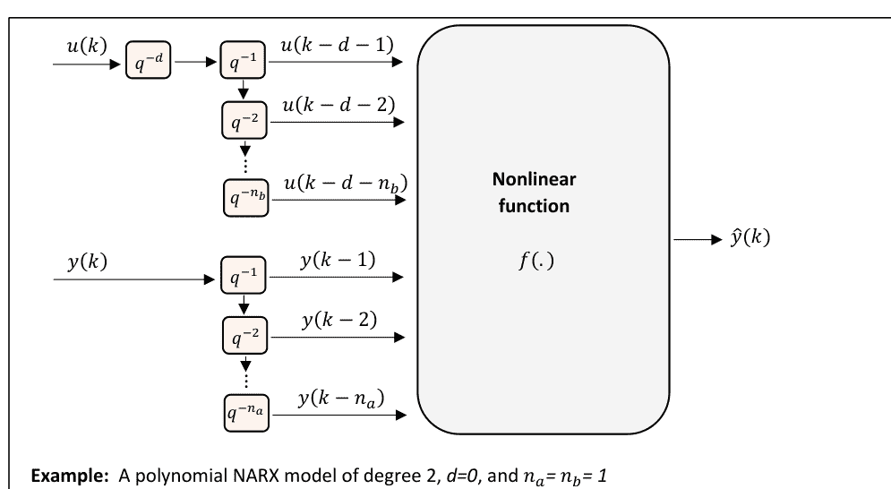

**示例：** 一个2阶多项式NARX模型，$d=0$，且$n_a=n_b=1$

$$\hat{y}(k) = a_1 y(k-1) + a_2 y^2(k-1) + a_3 y(k-1)u(k-1) + b_1 u(k-1) + b_2 u^2(k-1)$$

图9.2：NARX模型结构

多项式NARX辨识中的主要挑战是模型结构选择。即使对于适中的滞后值（$n_a$，$n_b$）和多项式次数$^{74}$，潜在回归项的数量也可能变得非常大，而包含许多项会增加过拟合的风险。幸运的是，在Python包SysIdentPY中，这项任务可以通过基于AIC的算法自动完成$^{75}$。让我们看看如何使用这个包对工业换热器进行非线性辨识。

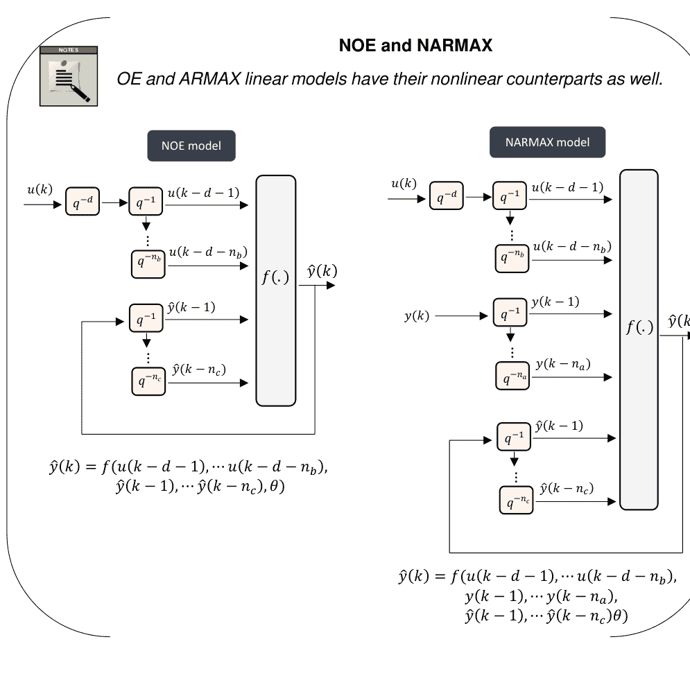

$^{74}$ 通常，$d$保持为零，仅针对给定的多项式次数优化输入和输出滞后（$n$和$m$）。
$^{75}$ 在Sun & Braatz最近的工作（ALVEN: Algebraic learning via elastic net for static and dynamic nonlinear system identification, Computers & Chemical Engineering, 2020）中，提出了一种DALVEN方法，该方法结合了非线性变换、单变量特征选择和弹性网回归，用于NARX结构选择。

### 9.3 使用NARX对换热器过程进行非线性辨识

为了展示非线性系统辨识的实用性，我们将使用来自液体饱和蒸汽换热器<sup>76</sup>的数据，其中热饱和蒸汽用于加热冷液体。提供的数据集包含4000个样本（采样时间1秒），包括输入（液体流量）和输出（出口液体温度）变量。对于这个基准非线性过程，我们的目标是建立一个动态模型，将出口液体温度预测为入口液体流量的函数。该数据集可以从DalSy数据集仓库下载。

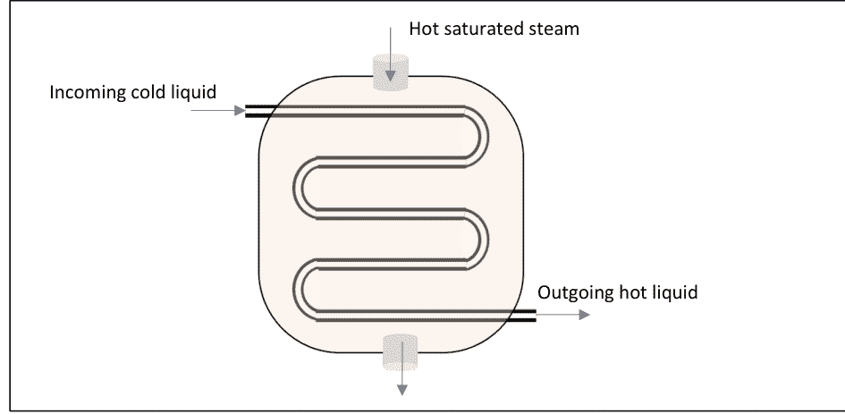

图9.3：液体饱和蒸汽换热器

我们将使用SysIdentPy包进行这次非线性系统辨识练习。让我们首先探索数据集。

```
# import packages
import matplotlib.pyplot as plt, numpy as np
from sklearn.preprocessing import StandardScaler
from statsmodels.graphics.tsaplots import plot_acf
from statsmodels.tsa.stattools import ccf
```

```
from sysidentpy.model_structure_selection import FROLS
from sysidentpy.basis_function._basis_function import Polynomial
from sysidentpy.utils.display_results import results

# read heat-exchanger data
data = np.loadtxt('exchanger.dat')
u = data[:,1, None]; y = data[:,2, None]

plt.figure(), plt.plot(u, 'steelblue'), plt.ylabel('u(k)'), plt.xlabel('k')
plt.figure(), plt.plot(y, 'g'), plt.ylabel('y(k)'), plt.xlabel('k')
```

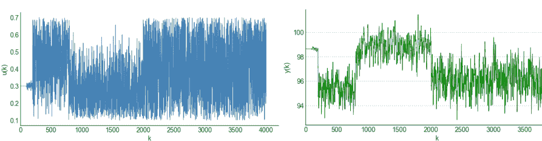

接下来，我们将数据集分为训练集（75%）和测试集（25%），并进行中心化处理。

```
# split into training and test dataset
u_fit = u[:3000,0:1]; u_test = u[3000:,0:1]
y_fit = y[:3000,0:1]; y_test = y[3000:,0:1]

u_scaler = StandardScaler(with_std=False)
u_fit_centered = u_scaler.fit_transform(u_fit); u_test_centered = u_scaler.transform(u_test)
y_scaler = StandardScaler(with_std=False)
y_fit_centered = y_scaler.fit_transform(y_fit); y_test_centered = y_scaler.transform(y_test)
```

为了拟合多项式NARX，我们需要指定多项式次数和滞后值。数据集的作者建议<sup>77</sup>“‘AR部分’的滞后为3，‘X部分’的滞后为9”。对于多项式次数，我们首先选择值为2。SysIdentPY使用AIC来确定哪些特定的多项式项成为模型回归项集的一部分。以下代码实现了这一点。

> <sup>77</sup> Bittanti and L. Piroddi, "Nonlinear identification and control of a heat exchanger: a neural network approach", Journal of the Franklin Institute, 1996.

```
# fit NARX model
basis_function = Polynomial(degree=2)
model = FROLS(
    order_selection=True,
    n_info_values=75,
    ylag=3, xlag=9,
    info_criteria='aic',
    estimator='least_squares',
    basis_function=basis_function
)
model.fit(X=u_fit_centered, y=y_fit_centered)
```

SysIdentPy总共选择了57个多项式项作为回归项集的一部分。下面的代码片段显示了其中一些项（'x1'应读作'u'）。

| 回归项 | 参数 | ERR |
|---|---|---|
| 0 | y(k-1) | 6.0490E-01 | 9.45813556E-01 |
| 1 | y(k-2) | -5.5109E-01 | 2.63576840E-03 |
| 2 | x1(k-5)y(k-1) | 5.6995E-01 | 1.19429351E-03 |
| 3 | x1(k-3) | -2.1264E+00 | 7.19976894E-04 |
| 4 | x1(k-2) | -2.4622E+00 | 6.25218348E-04 |
| 5 | x1(k-4) | -1.9460E+00 | 6.39866753E-04 |
| 6 | y(k-3) | 2.3011E-01 | 5.98553280E-04 |
| 7 | x1(k-5)^2 | -2.2581E+00 | 4.96492047E-04 |
| 8 | x1(k-6)y(k-2) | -4.3001E-01 | 2.22025182E-04 |
| 9 | x1(k-2)^2 | -3.0755E+00 | 3.18688092E-04 |
| 10 | x1(k-1) | -1.3935E+00 | 3.00926941E-04 |
| 11 | x1(k-5) | 1.5733E+00 | 4.40167349E-04 |

模型现已建立，让我们开始进行残差分析。

```
# get model (1-step ahead) predictions and residuals on training dataset
y_fit_predicted_centered = model.predict(X=u_fit_centered, y=y_fit_centered, steps_ahead=1)
y_fit_predicted = y_scaler.inverse_transform(y_fit_predicted_centered)
residuals_fit = y_fit - y_fit_predicted
```

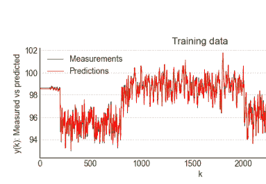

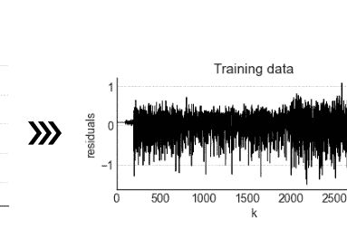

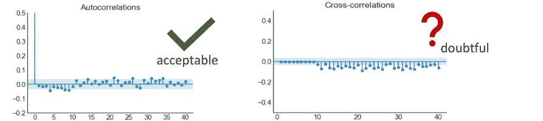

CCF图不算太差，但对模型的可接受性提出了一些疑问。为了检查模型是否有用，让我们检查模型在测试数据集上的仿真响应。

```
# infinite-step ahead predictions on test dataset
y_test_predicted_centered = model.predict(X=u_test_centered, y=y_test_centered, steps_ahead=None)
y_test_predicted = y_scaler.inverse_transform(y_test_predicted_centered)

plt.figure(), plt.plot(y_test, 'g', label='Measurements'), plt.plot(y_test_predicted, 'r', label='Predictions')
plt.title('Test data'), plt.ylabel('y(k): Measured vs predicted'), plt.xlabel('k'), plt.legend()
plt.figure(), plt.plot(y_test, y_test_predicted, '.')
plt.title('Test data (simulation response)'), plt.ylabel('y(k): Measured'), plt.xlabel('y(k): Predicted')
```

下面的图显示了NARX模型的无限步预测（仿真响应）。为了比较，也生成了一个ARX模型。

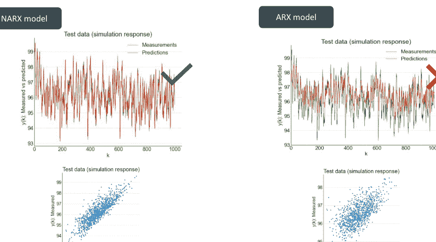

显然，该模型提供了良好的仿真性能，因此我们有信心该模型已成功充分捕捉了过程的确定性关系。此外，线性模型难以充分捕捉这种关系也就不足为奇了。多项式次数为2提供了相当好的性能，因此我们不再对其进行进一步优化。在一般性练习中，需要采用优化方案来更系统地选择模型超参数。

### 9.4 块结构非线性模型简介

块结构模型通过静态非线性和线性动态的独立块来描述非线性过程，如图9.4所示。图中描绘了两种不同的场景：对于Hammerstein过程，非线性位于输入端；而对于Wiener过程，非线性位于输出端<sup>78</sup>。虽然这种基于块的结构看起来可能非常简单（且受限），但它已成功用于建模多个复杂的工业过程。例如，Pattison等人使用真实过程数据，通过Hammerstein-Wiener模型对工业规模的MPC控制空分装置进行了建模，并用于在变化的产品需求下优化工厂调度<sup>79</sup>。

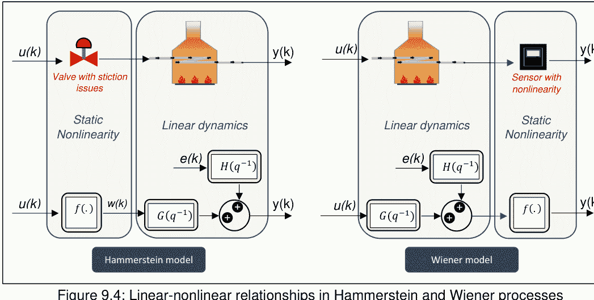

<sup>78</sup> 系统辨识界也采用了非线性和线性块的其他组合（如非线性-线性-非线性）。
<sup>79</sup> Pattison et. al., Optimal process operations in fast-changing electricity markets: framework for scheduling with low-order dynamic models and an air separation application, *Industrial & Engineering Chemistry Research*, 2016

让我们更详细地研究Hammerstein模型，以理解块结构模型的一般特性。

#### Hammerstein模型

在Hammerstein模型中，输入首先通过一个非线性函数进行变换，然后通过一个线性动态过程，如图9.5所示。多项式常被用作非线性函数；分段线性函数是另一种流行的选择。为了更详细地理解这个框架，让我们推导一个具有二阶多项式和一阶ARX动态的Hammerstein过程的差分方程形式。

$$w(k) = \beta_1 u(k) + \beta_2 u^2(k)$$

$$y(k) = -a_1 y(k-1) + b_1 w(k)$$

$$\Rightarrow y(k) = -a_1 y(k-1) + b_1 \beta_1 u(k-1) + b_1 \beta_2 u^2(k-1) \quad \text{eq. 1}$$

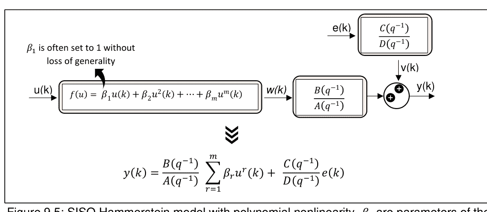

图9.5：具有多项式非线性的SISO Hammerstein模型。$\beta_s$是非线性块的参数。

有多种方法可以估计公式1（以及通常任何Hammerstein模型）中的参数$a_1, b_1, \beta_1, \beta_2$。

- **方法1：**
  采用非线性优化方案直接寻找参数。

- **方法2：**
  重新定义参数以推导出一个参数线性系统。在公式1中，我们可以看到系统比必要的参数多一个。$\beta_1$或$b_1$中的任何一个都可以固定为1，而不会改变$u(k)$和$y(k)$之间的关系。让我们设$\beta_1 = 1$，并令$b_1\beta_2 = r_1$。因此，

  $y(k) = -a_1y(k-1) + b_1u(k-1) + r_1u^2(k-1)$

对于缺乏经验的过程建模者而言，非线性系统辨识无疑是一项艰巨的任务，这源于参数估计的更高复杂性，以及建模者在选择非线性函数类型时面临的大量自由选择。缺乏系统性的非线性函数选择指南更是雪上加霜。因此，本章我们探讨了几种直观的非线性建模框架，这些框架已应用于各种工业过程。如果线性模型无法提供令人满意的性能，那么尝试这些简单的非线性模型以观察是否能取得显著改进是值得的。然而，请保持期望的现实性——不要为了追求完美的非线性模型而导致项目停滞不前；这些近似模型可能已经足够好，足以发挥作用！

### 总结

本章我们详细探讨了两种流行的经典非线性系统辨识技术：NARX和Hammerstein建模。我们通过一个应用NARX对换热器进行建模的实例进行了讲解。至此，我们完成了对动态过程经典建模方法的研究。我们相信，到现在为止，您已经熟悉了系统辨识的术语，并能够运用目前所学的知识熟练处理大多数工业动态建模任务。我们将在本书关于神经网络和深度学习的下一部分中继续研究非线性建模。

## 附录 A1

### 闭环辨识：反馈控制下的过程建模

本书迄今为止讨论的建模技术都假设过程输入 $u(k)$ 与扰动 $v(k)$ 之间是独立的。换句话说，假设了开环条件。然而，由于过程安全和产品质量方面的考虑，在开环条件下收集系统辨识所需的数据可能并不总是可行的。因此，闭环辨识（CLI）——即使用在反馈控制下收集的数据进行系统辨识——成为一种必要。然而，反馈控制会导致输入与扰动之间产生相关性，这使得我们迄今为止讨论的一些开环技术（如FIR、OE、SIM等）无法提供无偏模型，或者为了获得无偏参数估计，对模型结构选择施加了更严格的条件。

在这个简短的附录中，我们将尝试了解CLI面临的挑战，并探讨克服这些挑战的方法。具体来说，将涵盖以下主题：

- CLI面临的挑战
- CLI的可辨识性条件
- CLI的实验设计与直接辨识方法

#### CLI的挑战

为了引导我们对CLI挑战的讨论，请参考图A1.1，该图展示了开环过程与带有线性反馈控制器的闭环过程之间的概念差异。

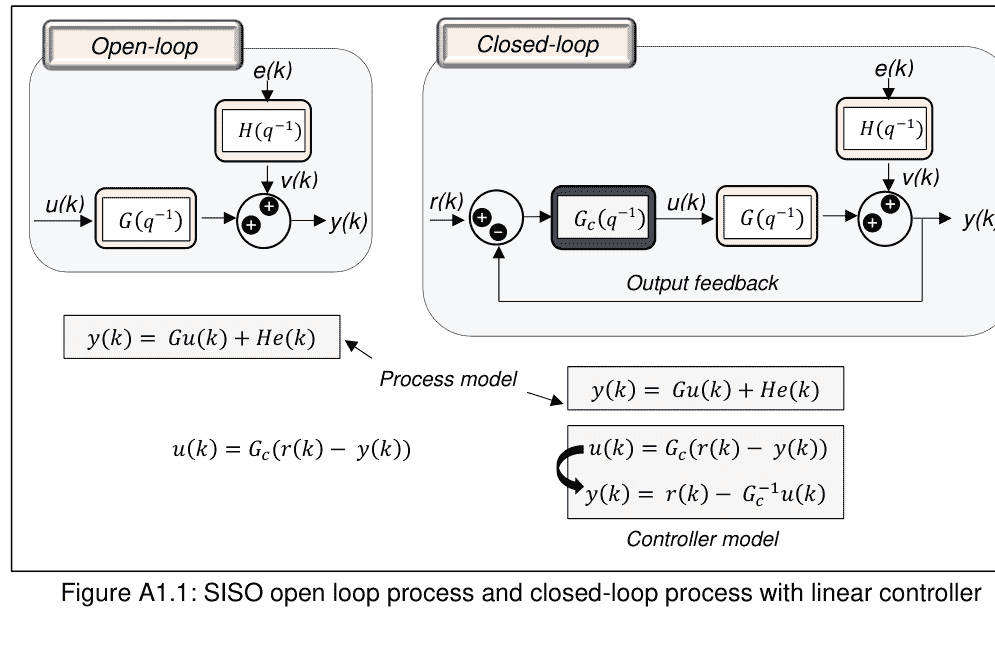

让我们进一步假设参考设定值没有激励，即 $r(k) = 0$。在此条件下，过程有两个相互竞争的控制方程用于辨识，如下所示

这两个方程在辨识中相互竞争

$y(k) = G_p u(k) + He(k)$

过程模型

$y(k) = r(k) - G_c^{-1} u(k) = - G_c^{-1} u(k)$

控制器模型

由于过程模型中存在噪声扰动，在系统辨识过程中“被选中”的将是（逆）控制器模型$^{81}$。即使 $r(k)$ 受到外部激励，根据 $r(k)$ 和 $e(k)$ 的“大小”，系统辨识可能选择 $G_p$、$G_c^{-1}$，或两者的某种组合。

$^{81}$ 在某些条件下（例如控制器是非线性的，如MPC），可能无需在 $r(k)$ 中施加外部激励即可辨识出 $G_p$。

#### CLI的数据收集与直接辨识方法

在闭环过程中，$u(k)$ 由控制器决定，因此可能无法手动在 $u(k)$ 中引入持续激励。为了便于过程模型的可辨识性，一个常见的替代方法是持续激励参考信号 $r(k)$。如果这也不可能，那么唯一的办法就是使用历史过程数据，并期望参考设定值具有足够的变异性。

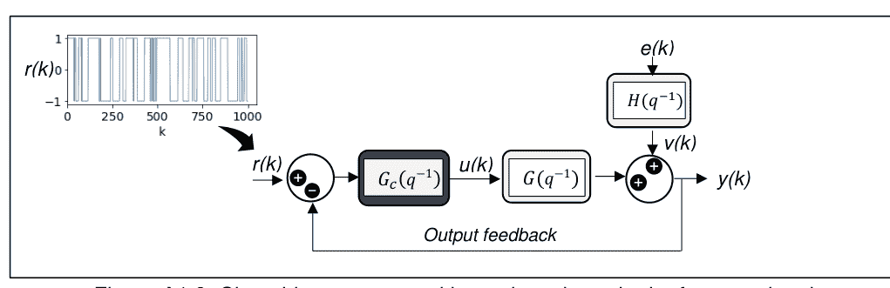

当闭环过程通过 $r(k)$ 受到外部激励时，常见的CLI方法（称为直接辨识方法）直接在 $y(k)$ 和 $u(k)$ 之间建立模型（就像我们对开环系统所做的那样），而不利用任何关于控制器或参考信号的信息。

> **CLI的模型结构选择**

假设 $r(k)$ 受到充分激励，如果 $G(q^{-1})$ 和 $H(q^{-1})$ 都选择正确，PEM模型可以利用闭环数据提供无偏模型。请注意，对于开环情况，正确的噪声模型结构并非必需。

## 第三部分

### 人工神经网络与深度学习

## 第 10 章

### 人工神经网络：处理复杂非线性系统

毫不夸张地说，人工神经网络（ANN）是目前描述通用非线性过程最强大的建模工具。ANN能够捕捉任何类型的复杂非线性关系，不对过程特性施加任何特定要求，并且在模型拟合之前不需要指定过程洞察。此外，最近的几项技术突破和计算进步使得（深度）ANN能够为广泛的问题提供显著的结果。相应地，ANN重新（引起了）数据科学家的极大兴趣，过程工业界正在见证基于机器学习的过程控制、预测性维护以及涉及基于ANN的系统辨识的推断建模的成功应用激增。

对于系统辨识，ANN通常在NARX框架中使用，其中拟合一个ANN模型以找到当前输出与过去输入/输出测量值之间的非线性关系。在此类应用中，FFNN（前馈神经网络）被普遍采用。然而，对于动态建模，存在一种称为RNN（循环神经网络）的专用网络，它被设计为能够感知动态过程数据的时间特性。因此，RNN往往比FFNN更简约。我们将在本章中看到这两种流行架构的系统辨识应用。

毫无疑问，ANN已被证明具有强大的能力。然而，驯服这个“怪物”并不容易。如果模型超参数设置不当，很容易得到令人失望的结果。读者可以参考本系列丛书第1册的第三部分，以获取关于ANN训练策略和ANN模型不同方面的详细阐述。在本章中，将充分描述与系统辨识相关的概念，使未入门的读者能够学习如何使用ANN。具体来说，将涵盖以下主题：

- ANN、FFNN、RNN、LSTM简介
- 基于FFNN的NARX进行换热器系统辨识
- 基于LSTM的换热器系统辨识

### 10.1 ANN简介

人工神经网络（ANN）是非线性经验模型，可以通过监督学习捕捉输入-输出变量之间的复杂关系，或通过无监督学习识别数据模式。在结构上，ANN受到人脑的启发，是相互连接的神经元的复杂网络，如图10.1所示。ANN由一个输入层、一系列隐藏层和一个输出层组成。网络的基本单元——神经元，接受来自源输入层或网络前一层的输入向量，对输入进行加权求和，然后执行非线性变换以产生单个实数值输出。每个隐藏层可以包含任意数量的神经元。

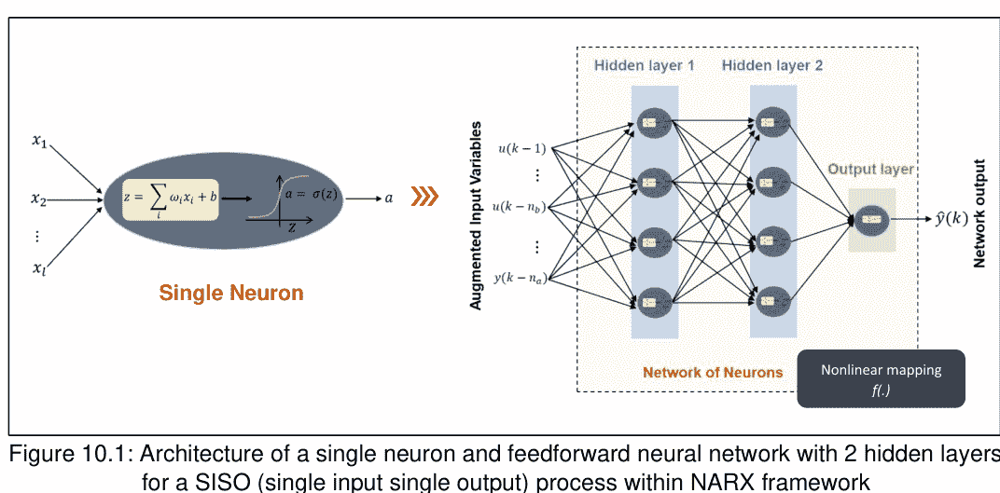

图10.1所示的网络是全连接前馈神经网络（FFNN）的一个例子，这是最常见的ANN类型。在FFNN中，信号仅沿一个方向流动，从输入层通过隐藏层流向输出层。连续层之间的神经元完全成对连接，而同一层内的神经元则不连接。

> **什么是深度学习**

简而言之，使用具有大量隐藏层的ANN来寻找数据中的关系/模式就是深度学习（从技术上讲，≥ 2个隐藏层意味着深度神经网络（DNN））。最近的几项算法创新克服了DNN的模型训练问题，从而导致了我们今天所见证的DNN引领的AI革命。

### 10.2 使用FFNN-NARX对换热器进行建模

为了学习如何设置和拟合前馈神经网络，我们将复用第9章的换热器数据集，并在输入液体流量和输出液体温度之间构建一个FFNN-NARX模型。导入基础包和将数据加载到工作区的代码保持不变。

```python
# split dataset into fitting and test dataset
u_fit = u[:3000, 0:1]; u_test = u[3000:, 0:1]
y_fit = y[:3000, 0:1]; y_test = y[3000:, 0:1]

# scale data before model fitting
u_scaler = StandardScaler()
u_fit_scaled = u_scaler.fit_transform(u_fit); u_test_scaled = u_scaler.transform(u_test)
y_scaler = StandardScaler()
y_fit_scaled = y_scaler.fit_transform(y_fit); y_test_scaled = y_scaler.transform(y_test)
```

如图10.1所示，为预测y(k)而提供给网络的输入向量包含了所有滞后变量。因此，我们现在需要创建增广输入变量。

```python
# rearrange u and y data into (# observation samples, # lagged regressors) form
u_lags = 9; y_lags = 3
u_augment_fit_scaled = []
y_augment_fit_scaled = []

for sample in range(max(u_lags, y_lags), u_fit.shape[0]):
    row = np.hstack((u_fit_scaled[sample-u_lags:sample,0], y_fit_scaled[sample-y_lags:sample,0]))
    u_augment_fit_scaled.append(row)
    y_augment_fit_scaled.append(y_fit_scaled[sample])

# conversion: convert list into array
u_augment_fit_scaled = np.array(u_augment_fit_scaled)
y_augment_fit_scaled = np.array(y_augment_fit_scaled)
```

我们现在准备好定义和拟合我们的神经网络了。

```python
# import Keras libraries
from tensorflow.keras import Sequential
from tensorflow.keras.layers import Dense

# define model
model = Sequential()
model.add(Dense(14, activation='relu', kernel_initializer='he_normal', input_shape=(12,)))
# 14 neurons in 1st hidden layer; this hidden layer accepts data from a 12-dimensional input
model.add(Dense(7, activation='relu', kernel_initializer='he_normal'))
# 7 neurons in 2nd layer
model.add(Dense(1)) # output layer

# compile and fit model
model.compile(loss='mse', optimizer='Adam') # mean-squared error is to be minimized
model.fit(u_augment_fit_scaled, y_augment_fit_scaled, epochs=250, batch_size=125)
```

现在让我们获取模型在训练数据集上的预测值和残差，并看看残差的情况。

```python
# get model (1-step ahead) predictions and residuals on training dataset
y_augment_fit_scaled_pred = model.predict(u_augment_fit_scaled)
y_augment_fit_pred = y_scaler.inverse_transform(y_augment_fit_scaled_pred)
y_augment_fit = y_scaler.inverse_transform(y_augment_fit_scaled)
residuals_fit = y_augment_fit - y_augment_fit_pred
```

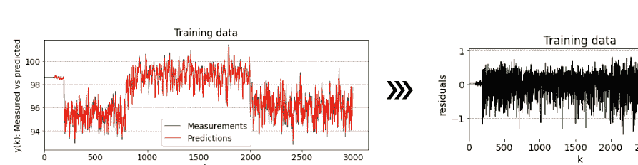

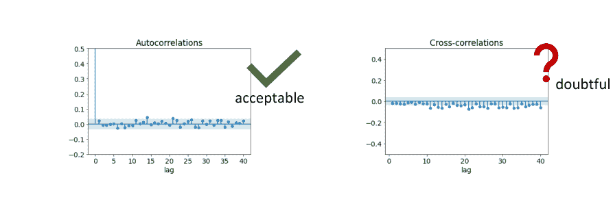

结果与多项式-NARX模型所见相似。CCF图中置信区间的轻微突破表明需要添加更多滞后变量作为模型输入。然而，作为建模者，你必须在使模型更复杂与评估轻微模型不准确性的可接受性之间做出判断。为了检查模型是否有用，让我们再次检查模型在测试数据集上的仿真响应。我们首先需要将测试数据整理成适当的形式。

```python
# rearrange u and y data into (# sequence samples, # lagged regressors) form
u_augment_test_scaled = []
y_augment_test_scaled = []

for sample in range(max(u_lags, y_lags), u_test.shape[0]):
    row = np.hstack((u_test_scaled[sample-u_lags:sample,0], y_test_scaled[sample-y_lags:sample,0]))
    u_augment_test_scaled.append(row)
    y_augment_test_scaled.append(y_test_scaled[sample])

# conversion: convert list into array
u_augment_test_scaled = np.array(u_augment_test_scaled)
y_augment_test_scaled = np.array(y_augment_test_scaled)
```

虽然在验证数据集上生成1步超前预测很简单，但下面的代码展示了如何生成仿真响应或无限步超前预测。很容易看出，我们只是使用过去的模型预测来生成后续预测。

```python
# infinite-step ahead predictions on test dataset [first u_lags samples are used as initial conditions]
y_augment_test_scaled_sim = np.copy(y_test_scaled)

for sample in range(u_lags, len(u_test),1):
    regressorVector = np.hstack((u_test_scaled[sample-u_lags:sample,0],
                                y_augment_test_scaled_sim[sample-y_lags:sample,0]))
    regressorVector = regressorVector[None,:]
    sim_response = model.predict(regressorVector)
    y_augment_test_scaled_sim[sample] = sim_response

y_augment_test_sim = y_scaler.inverse_transform(y_augment_test_scaled_sim)
```

下面的图展示了FFNN-NARX模型的1步超前预测和无限步超前预测（仿真响应）。

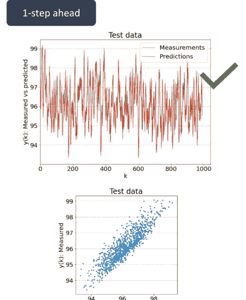

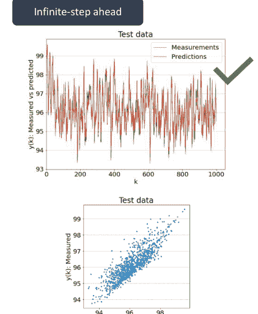

至此，我们已经了解到不应为良好的1步超前预测而过于兴奋。然而，看到良好的仿真响应是令人鼓舞的，尽管它不如1步超前预测<sup>82</sup>那样好，但它能够匹配原始测量值的起伏。

<sup>82</sup> 你可能会注意到你的结果与本章所示结果之间存在一些细微差异，这是由于网络拟合算法的随机性所致。

#### 理解FFNN中的数据流

如果你对上一节开发的模型执行命令 *model.summary()*，你将看到以下信息，详细说明了网络每一层需要估计的参数数量。让我们理解这些数字是如何获得的，这将有助于阐明FFNN中的信息流。

| 层 (类型) | 输出形状 | 参数数量 |
|---|---|---|
| dense_3 (Dense) | (None, 14) | 182 |
| dense_4 (Dense) | (None, 7) | 105 |
| dense_5 (Dense) | (None, 1) | 8 |
| 总参数: 295 | | |
| 可训练参数: 295 | | |
| 不可训练参数: 0 | | |

我们知道每个增广输入样本是12维的 ($u_{aug} \in R^{12}$)。在前向传播（也称为前向传播）中，增广输入首先由第一隐藏层的神经元处理。在该层的第 $j$ 个神经元中，输入的加权和通过激活函数 $g$ 进行非线性变换，

$$a_j = g(w_j^T u_{aug} + b_j)$$

$w_j \in R^{12}$ 是应用于输入的权重，$b_j$ 是添加到和中的偏置。因此，每个神经元有13个参数（12个权重和一个偏置），导致第 $1$ 层所有14个神经元需要估计182个参数。所有14个神经元的输出形成向量 $a^{(1)} \in R^{14}$

$$a^{(1)} = g^{(1)}(W^{(1)}u_{aug} + b^{(1)})$$

其中 $W^{(1)} \in R^{14 \times 12}$ 的每一行包含一个神经元的权重。同一层的所有神经元使用相同的激活函数。$a^{(1)}$ 成为第 $2$ 隐藏层的输入。

$$a^{(2)} \in R^7 = g^{(2)}(W^{(2)}a^{(1)} + b^{(2)})$$

其中 $W^{(2)} \in R^{7 \times 14}$。第 $2$ 层中的每个神经元有14个权重和一个偏置参数，导致该层有105个参数。最终的输出层有一个神经元，有8个参数且没有激活函数，给出网络输出如下

$$a^{(3)} = \hat{y} = (w^{(3)})^T a^{(2)} + b^{(3)}$$

其中 $w^{(3)} \in R^7$。

### 10.3 RNN：简介

循环神经网络（RNN）是用于处理序列数据的人工神经网络，其中数据的出现顺序具有重要意义。在我们上一节研究的基于FFNN的NARX模型中，没有隐式或显式地指定数据本质上是时间性/顺序性的事实，例如 $u(k-2)$ 出现在 $u(k-1)$ 之前。在FFNN中没有有效的方法来指定这种数据的时间顺序。RNN通过循环处理序列元素并在处理过程中存储一个总结过去信息的隐藏状态来实现这一点。RNN中的基本单元称为RNN单元，它简单地包含一层神经元。图10.2展示了一个由单个单元组成的RNN架构，以及它如何处理一个包含十个样本的数据序列。

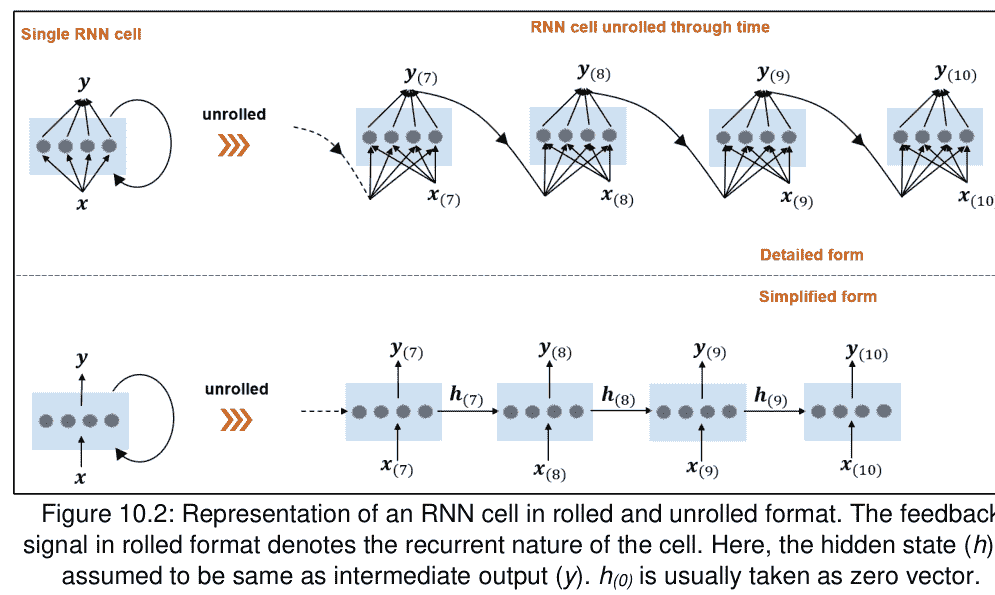

我们可以看到，这十个样本是按照它们出现的顺序处理的，而不是一次性处理。在第 $i$ 步生成一个输出 $y_{(i)}$，然后与 $x_{(i+1)}$ 一起馈送到下一步进行处理。通过这种安排，$y_{(i+1)}$ 是 $x_{(i+1)}$ 和 $y_{(i)}$ 的函数。由于 $y_{(i)}$ 本身是 $x_{(i)}$ 和 $y_{(i-1)}$ 的函数，$y_{(i+1)}$ 实际上成为 $x_{(i+1)}$、$x_{(i)}$ 和 $y_{(i-1)}$ 的函数。进一步推导意味着最终的序列输出 $y_{(10)}$ 是序列所有十个输入的函数，即 $x_{(10)}$、$x_{(9)}$,..., $x_{(1)}$。这种“循环”机制能够有效地捕捉数据中的时间模式。

#### RNN 输出

如果图10.2中RNN单元的神经层包含$n$个神经元（图中$n$等于4），那么每个$y_{(i)}$或$h_{(i)}$都是一个n维向量。对于简单的RNN单元，$y_{(i)}$等于$h_{(i)}$。设$x$为一个m维向量。在任意第$i$步，我们可以写出以下关系式

$$y_{(i)} = g(W_x x_{(i)} + W_y y_{(i-1)} + b)$$

其中$W_x \in R^{n \times m}$，其每一行包含一个神经元应用于$x$向量的权重参数；$W_y \in R^{n \times n}$，其每一行包含一个神经元应用于$y$向量的权重参数；$b \in R^n$包含偏置参数；$g$表示激活函数。相同的神经参数在每一步都被使用。

如果序列的所有输出都是我们关注的，那么它被称为序列到序列或到多到多网络。然而，很多时候只需要最后一步的输出，这就形成了序列到向量或多对一网络。此外，最后一步的输出可能需要进一步处理，因此通常会添加一个全连接层。图10.3展示了这样一种拓扑结构。

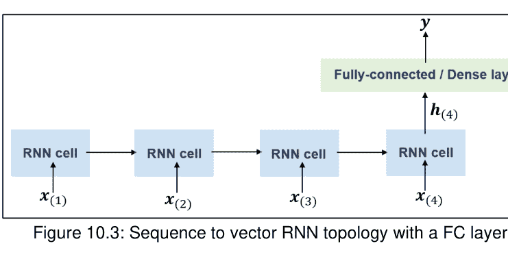

#### 基于RNN的NARX拓扑

下面的图10.4展示了一个潜在的基于RNN的NARX架构，用于单输入单输出过程，其中使用三个滞后测量值进行一步超前预测。我们可以观察到，所有滞后测量值并非同时由一个RNN单元处理，这通常导致与基于FFNN的NARX模型相比，模型参数数量更少。

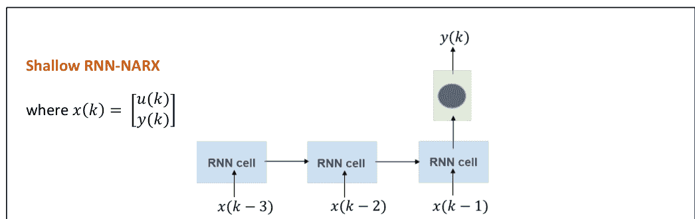

图10.4：用于SISO过程的RNN-NARX拓扑。[注意，如果模型输入向量（$x$）仅仅是过程输入（$u$），那么该架构就变成了NFIR（非线性FIR）]。

#### LSTM网络

RNN是强大的动态模型，然而，之前介绍的原始RNN（单元中只有一个神经层）在学习长期依赖关系方面面临困难，即当序列中的步数很大时（约≥10）。这是由于梯度反向传播过程中的梯度消失问题造成的。为了克服这个问题，已经设计出了LSTM（长短期记忆）单元，它们能够轻松学习非常长期的依赖关系（甚至超过1000）。与原始RNN单元不同，LSTM单元有4个独立的神经层，如图10.5所示。此外，在LSTM单元中，内部状态存储在两个独立的向量中：$h_{(t)}$（隐藏状态）和$c_{(t)}$（单元状态）。在序列处理过程中，这两个状态都从一个LSTM单元传递到下一个。$h_{(t)}$可以看作是短期状态/记忆，而$c_{(t)}$是长期状态/记忆（我们稍后会看到原因），因此得名LSTM。

全连接层的向量输出通过三个“门”相互作用并与长期状态交互，这些门中发生逐元素乘法。这些门控制在任何序列处理步骤中，哪些信息进入长期和短期状态。虽然我们稍后会理解数学细节，但现在只需了解这些门的以下信息：

- **遗忘门**决定长期状态$c_{(t)}$的哪些部分被保留和擦除
- **输入门**决定新信息（从处理$x_{(t)}$和$h_{(t-1)}$获得）的哪些部分被存储在长期状态中
- **输出门**决定长期状态的哪些部分作为短期状态传递

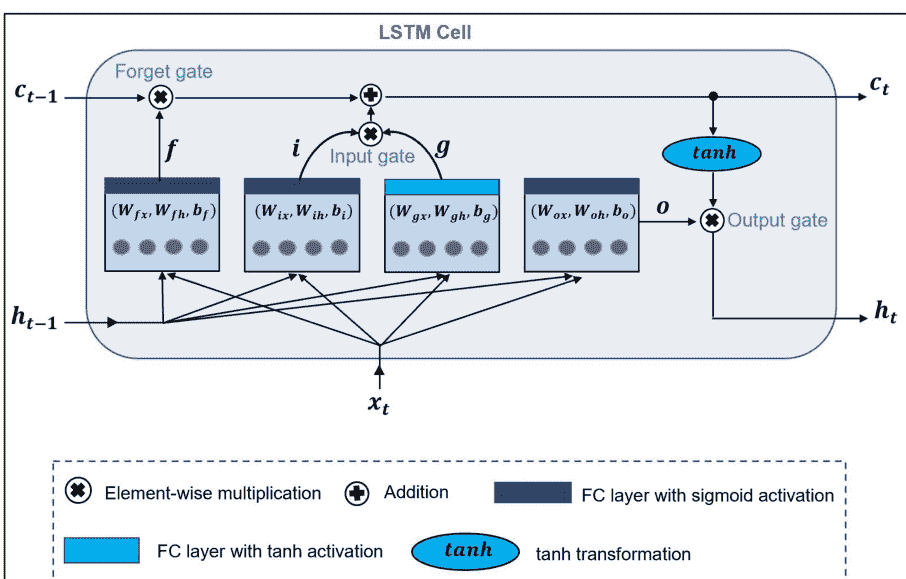

图10.5：LSTM单元的架构。三个全连接层使用sigmoid激活函数，一个全连接层使用tanh激活函数。每个神经层都有自己的参数$W_x$、$W_h$和$b$。

这种在序列处理过程中能够操纵哪些信息被传递下去的灵活性，正是LSTM网络在捕捉序列数据集中的长期模式方面如此成功的原因。因此，LSTM网络是当今默认的RNN。在下一节中，我们将看到使用LSTM单元进行系统辨识的RNN快速应用。

#### 原始RNN单元 vs GRU单元 vs LSTM单元

还有另一种流行的RNN单元变体，称为GRU单元。如下图所示，GRU单元比LSTM单元更简单。GRU单元有3个神经层，其内部状态用单个向量$h_{(t)}$表示。对于几个常见任务，基于GRU单元的RNN似乎提供了与基于LSTM单元的RNN相似的性能，因此，它正慢慢获得更多的普及。

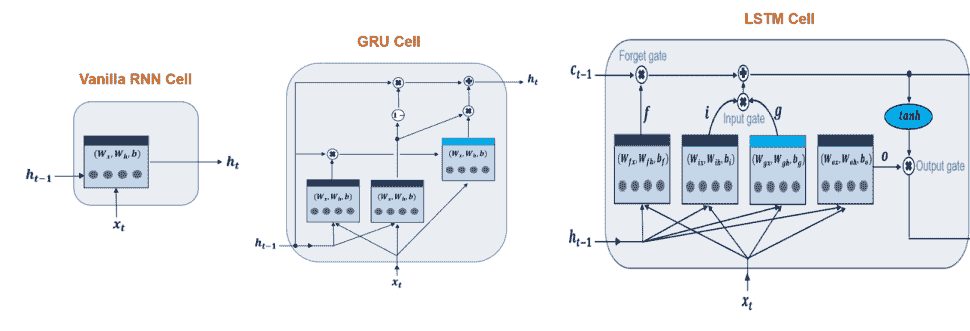

### 10.4 使用LSTM对换热器建模

为了展示如何训练LSTM网络，我们将重用换热器数据集。我们还将使用*早停法*来优化*训练轮数*，使用验证数据集。

```python
# read data
u_fit = u[:3000,0:1]; u_val = u[3000:,0:1]
y_fit = y[:3000,0:1]; y_val = y[3000:,0:1]

# scale data before model fitting
u_scaler = StandardScaler()
u_fit_scaled = u_scaler.fit_transform(u_fit); u_val_scaled = u_scaler.transform(u_val)
y_scaler = StandardScaler()
y_fit_scaled = y_scaler.fit_transform(y_fit); y_val_scaled = y_scaler.transform(y_val)

X_fit_scaled = np.hstack((u_fit_scaled, y_fit_scaled)) # @ Figure 10.4
X_val_scaled = np.hstack((u_val_scaled, y_val_scaled))
```

如图10.4所示，为预测$y(k)$而提供给网络的输入是滞后测量值的序列。因此，我们现在需要创建这些序列。目前，$X$数组的形状是{样本数，特征数}。对于RNN，这个输入数据矩阵需要转换为形状{序列样本数，时间步数，特征数}，使得沿$0^{th}$维度的每个条目（形状为{时间步数，特征数}）都是一个完整的过去数据序列，用于预测温度值。这里，时间步数取为9，特征数等于2。

```python
# rearrange X data into (# sequence samples, # time steps, # features) form
nTimeSteps = 9
X_fit_scaled_sequence = []; X_val_scaled_sequence = []
y_fit_scaled_sequence = []; y_val_scaled_sequence = []

for sample in range(nTimeSteps, X_fit_scaled.shape[0]):
    X_fit_scaled_sequence.append(X_fit_scaled[sample-nTimeSteps:sample, :])
    y_fit_scaled_sequence.append(y_fit_scaled[sample])

for sample in range(nTimeSteps, X_val_scaled.shape[0]):
    X_val_scaled_sequence.append(X_val_scaled[sample-nTimeSteps:sample, :])
    y_val_scaled_sequence.append(y_val_scaled[sample])

# convert list of (time steps, features) arrays into (samples, time steps, features) array
X_fit_scaled_sequence, y_fit_scaled_sequence = np.array(X_fit_scaled_sequence),
                                              np.array(y_fit_scaled_sequence)
X_val_scaled_sequence, y_val_scaled_sequence = np.array(X_val_scaled_sequence),
                                              np.array(y_val_scaled_sequence)
```

基本上，（缩放后的）$X$数组中每9个连续行组成一个序列。我们将构建的RNN拓扑与图10.4所示的相同，只是时间步数不同。就像我们为FFNN建模所做的那样，我们将导入相关的Keras库。在下面的代码中，一个LSTM RNN层后面跟着一个密集层。

```python
# import Keras libraries
from tensorflow.keras import Sequential
from tensorflow.keras.layers import LSTM
from tensorflow.keras.layers import Dense
from tensorflow.keras import regularizers

# define model
model = Sequential()
model.add(LSTM(units=6, kernel_regularizer=regularizers.l1(0.001), input_shape=(nTimeSteps,2)))
# LSTM cell with 6 neurons in each of the 4 neural layers
model.add(Dense(units=1))
# 1 neuron in output layer
```

上面的3行代码完全定义了所需RNN的结构。输出层中的单个神经元负责将RNN层最后一步的6维隐藏状态向量转换为一个标量值。下面的模型摘要显示了每一层的模型参数数量。

| 层（类型） | 输出形状 | 参数数量 |
| :--- | :--- | :--- |
| lstm (LSTM) | (None, 6) | 216 |
| dense (Dense) | (None, 1) | 7 |
| 总参数：223 | | |
| 可训练参数：223 | | |
| 不可训练参数：0 | | |

> 在原始RNN单元中，我们看到$W_x \in R^{n \times m}$，$W_h \in R^{n \times n}$，$b \in R^n$。这导致总参数数量等于$mn + n^2 + n$。在LSTM单元中，4个神经层中的每一层都有自己的一组这些参数。因此，一个LSTM单元有$4(mn + n^2 + n)$个模型参数。在这个例子中，我们有$m = 2$和$n = 6$；因此我们最终在LSTM层中有$4(12 + 36 + 6) = 216$个模型参数。

接下来我们编译并拟合模型。

```python
# compile and fit model with early stopping
from tensorflow.keras.callbacks import EarlyStopping

model.compile(loss='mse', optimizer='Adam')
es = EarlyStopping(monitor='val_loss', patience=10, restore_best_weights=True)
history = model.fit(X_fit_scaled_sequence, y_fit_scaled_sequence, epochs=250, batch_size=125,
                    validation_data=(X_val_scaled_sequence, y_val_scaled_sequence), callbacks=[es])
```

现在让我们获取模型在拟合数据集上的预测值和残差，看看我们的残差是什么样子。

```python
# get model (1-step ahead) predictions and residuals on fitting dataset
y_fit_scaled_sequence_pred = model.predict(X_fit_scaled_sequence)
y_fit_sequence_pred = y_scaler.inverse_transform(y_fit_scaled_sequence_pred)
y_fit_sequence = y_scaler.inverse_transform(y_fit_scaled_sequence)
residuals_fit = y_fit_sequence - y_fit_sequence_pred
```

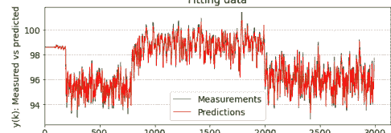

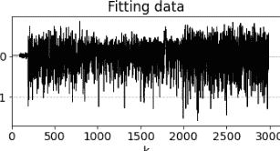

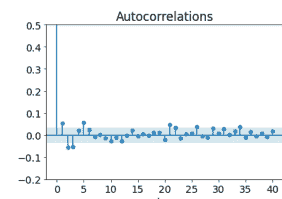

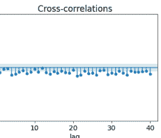

结果与FFNN-NARX模型所见相似。现在让我们检查其在验证数据集上的性能。我们再次强调无限步预测。

```python
# infinite-step ahead predictions [first nTimeSteps samples are used as initial conditions]
y_val_scaled_sim = np.copy(y_val_scaled)

for sample in range(nTimeSteps, X_val_scaled.shape[0]):
    X_val_scaled_sim = np.hstack((u_val_scaled, y_val_scaled_sim))
    inputSequence = X_val_scaled_sim[sample-nTimeSteps:sample, :]
    inputSequence = inputSequence[None,:,:]
    sim_response = model.predict(inputSequence)
    y_val_scaled_sim[sample] = sim_response

y_val_pred_sim = y_scaler.inverse_transform(y_val_scaled_sim)
```

下图展示了LSTM-NARX模型的1步预测和无限步预测（仿真响应）。

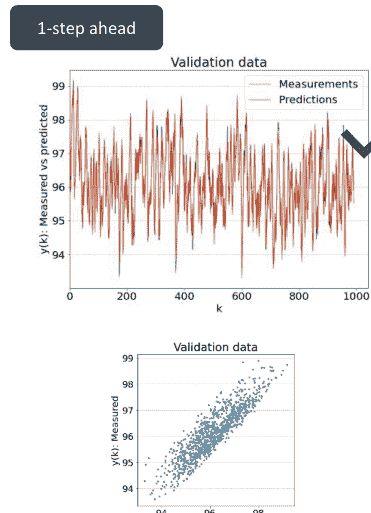

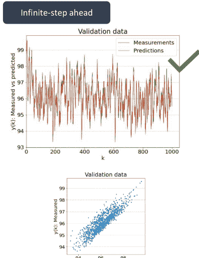

理想情况下，我们应该在一个完全独立于拟合和验证数据集的数据集上检查预测；但在当前案例研究中，为了与FFNN-NARX和多项式-NARX（来自第9章）所使用的评估数据集保持一致，我们正在验证数据集上进行检查。

这结束了我们对人工神经网络世界的快速一瞥。我们因将大量概念浓缩到单章中而感到抱歉。然而，您现在应该能够舒适地为您的非线性系统辨识需求开发基于ANN的解决方案。请记住，我们只是触及了ANN广阔领域的表面。尽管如此，您现在应该能够轻松地浏览ANN文献，并基于您在本章获得的知识进行构建。

### 总结

在本章中，我们研究了ANN在动态系统中的应用。我们首先了解了如何构建基于FFNN的NARX模型，并看到了其在换热器建模中的应用。然后，我们学习了LSTM网络在处理时间数据方面的卓越能力。在完成这些示例后，您将对如何为您的特定问题设置基于ANN的解决方案有了非常好的理解。至此，我们将结束本章，并祝您在机器学习之旅中一切顺利。

全书完

由过程数据科学家，为过程数据科学家，献给过程数据科学


# 动态过程系统的Python机器学习

> 本书旨在帮助读者获得基于机器学习的动态过程建模技术的实用知识。读者可以利用所学概念，为动态系统的过程监控、软测量、预测性维护和过程控制构建高级解决方案。本书以应用为导向的方法对实践和有志于成为过程工程师和数据科学家的读者友好且易于理解。完成后，读者将能够自信地浏览系统辨识文献，并明智地选择适合其问题的建模方法。

以下主题被广泛涵盖：
- 动态数据集的探索性分析
- 动态建模的最佳实践
- 线性和离散时间经典参数与非参数模型
- MIMO系统的状态空间模型
- 非线性系统辨识与闭环辨识
- 基于神经网络的动态过程建模

www.MLforPSE.com