# 面向流程工业的机器学习系列

## 面向流程与设备状态监测及预测性维护的Python机器学习


从数据到流程洞察


2024

第一版

Ankur Kumar, Jesus Flores-Cerrillo

## 面向流程与设备状态监测及预测性维护的Python机器学习

从数据到流程洞察

Ankur Kumar
Jesus Flores-Cerrillo

谨以此书献给我们的配偶、家人、朋友、祖国以及所有数据科学爱好者

> आचार्यात्पादमादत्ते पादं शिष्यः स्वमेधया ।
पादं सब्रह्मचारिभ्यः पादं कालक्रमेण च ॥

学生从老师那里获得四分之一（的学识），
通过自身智慧获得四分之一，
从同学那里获得四分之一，
再通过时间的积累获得四分之一。

- 一则流行的梵文格言

## 面向流程与设备状态监测及预测性维护的Python机器学习

[www.MLforPSE.com](http://www.MLforPSE.com)


版权所有 © 2024 Ankur Kumar

保留所有权利。未经作者事先书面许可，不得以任何形式或任何方式复制或传播本书的任何部分。

在本书的编写过程中，我们已尽一切努力确保所呈现信息的准确性，并获得了使用受版权保护材料的许可。但是，作者对于错误或遗漏不作任何明示或暗示的保证，并且对于因使用本书所含信息而导致的任何损失或损害不承担任何法律责任或责任。

封面图片中的工厂图像来源于 https://pixabay.com/。

如需申请许可，请通过 MLforPSE@gmail.com 联系作者。

首次出版：2024年1月

## 关于作者


**Ankur Kumar** 拥有德克萨斯大学奥斯汀分校过程系统工程博士学位（2016年）和印度理工学院孟买分校化学工程学士学位（2012年）。他目前就职于林德集团卓越中心的先进数字技术与系统组，为林德的氢气和空气分离工厂开发了多个基于机器学习的内部监控和过程控制解决方案。Ankur的工具在林德内外屡获殊荣。他的其中一个工具PlantWatch（一个全厂范围的故障检测与诊断工具）获得了捷克共和国工业联合会颁发的2021年工业4.0奖。Ankur撰写或合著了多篇经同行评审的期刊论文（领域涵盖数据驱动的过程建模与监控），是许多顶级期刊的常任审稿人，并曾在多个国际会议上担任分会场主席。Ankur在2019年至2021年间担任《过程控制杂志》的副编辑，目前担任《工业与工程化学研究》期刊的编辑顾问委员会成员。最近，他入选了《Plant Engineering》杂志评选的“40岁以下工程领袖，2023届”。


**Jesus Flores-Cerrillo** 目前是林德集团的研发副总监，负责管理林德卓越中心的先进数字技术与系统组。他在监控技术以及先进过程控制与优化解决方案的开发和实施方面拥有超过20年的经验。Jesus拥有麦克马斯特大学化学工程博士学位，并在多元统计和先进过程控制等领域撰写或合著了40多篇经同行评审的期刊论文。他的团队开发并实施了新颖的工厂监控、机器学习和工业物联网解决方案，以提高林德流程的效率和可靠性。Jesus的团队获得了美国制造商协会制造业领导力委员会颁发的2020年人工智能与高级分析领导力奖。

## 致读者

包含完整代码实现的Jupyter笔记本和Spyder脚本可在 [https://github.com/ML-PSE/Machine_Learning_for_PM_and_PdM](https://github.com/ML-PSE/Machine_Learning_for_PM_and_PdM) 下载。如有必要，代码更新将在GitHub仓库中进行。本书文本材料的更新将在Leanpub ([www.leanpub.com](http://www.leanpub.com)) 和Google Play ([https://play.google.com/store/books](https://play.google.com/store/books)) 上提供。我们非常感谢您提供关于本书中任何更正和/或印刷错误的信息。

## 系列简介

在21世纪，数据科学已成为每个制造业工作文化中不可或缺的一部分，流程工业也不例外。从预测性维护到过程监控，从故障诊断到先进过程控制，基于机器学习的解决方案正被用于实现更高的流程可靠性和效率。然而，能够充分满足新兴流程数据科学家需求的书籍却寥寥无几。现有的少量资源包括：1）通用的数据科学书籍，未能考虑流程工厂的特定特征和需求；2）流程领域特定的书籍，对基础数学细节进行了严谨而冗长的论述，对工业从业者来说过于理论化。可以理解，这留下了很大的改进空间。人们寻求的是以流程系统为背景、强调应用方面、并提供在流程工业中已被证明有用的机器学习技术指导性介绍的书籍。本系列“面向流程工业的机器学习”旨在填补这一空白，降低流程数据科学新手的入门门槛。

该系列的第一本书《面向流程系统的Python机器学习》涵盖了机器学习的基础知识，并概述了主要适用于静态系统的广泛机器学习方法。使用真实流程数据集，提供了构建用于过程监控、软测量、预测性维护等机器学习解决方案的分步指导。涵盖了与流程系统相关的方面，例如通过PCA/PLS对相关变量建模、处理噪声多维数据集中的异常值、使用强化学习控制流程等。该系列的第二本书《面向动态流程系统的Python机器学习》侧重于动态系统，并沿着广泛的动态建模选择提供了指导性介绍。重点介绍了经典方法（ARX、CVA、ARMAX、OE等）和现代神经网络方法。通过示例说明了在时间序列分析、噪声建模、系统辨识和过程故障检测方面的应用。该系列的第三本书深入探讨了机器学习的一个重要应用领域，即预测与健康管理。详细介绍了广泛应用于工厂健康管理不同方面的机器学习方法，即故障检测、故障隔离、故障诊断和故障预测。重点放在概念理解和实际实施上。该系列的未来书籍将继续关注流程工业的其他方面和需求。希望这些书能帮助流程数据科学家找到创新的机器学习解决方案，以应对流程工业面临的现实世界问题。

随着机器学习在流程工业中使用趋势的增长，对具备数据科学/机器学习技能的流程领域专家/流程工程师的需求也在增长。编写这些书是为了填补此类流程数据科学家在机器学习资源方面的现有空白。具体而言，本系列的书籍将对新兴的流程数据科学家、希望“学习”机器学习的在职流程工程师以及希望了解流程系统需求和特征的数据科学家有所帮助。通过关注实践指南和工业规模的案例研究，我们希望这些书能促进数据科学在流程工业中的更广泛传播。

本系列其他书籍
(https://MLforPSE.com/books/)

## 书籍 1

## 书籍 2

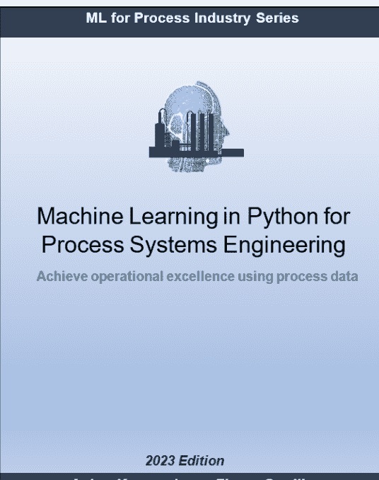

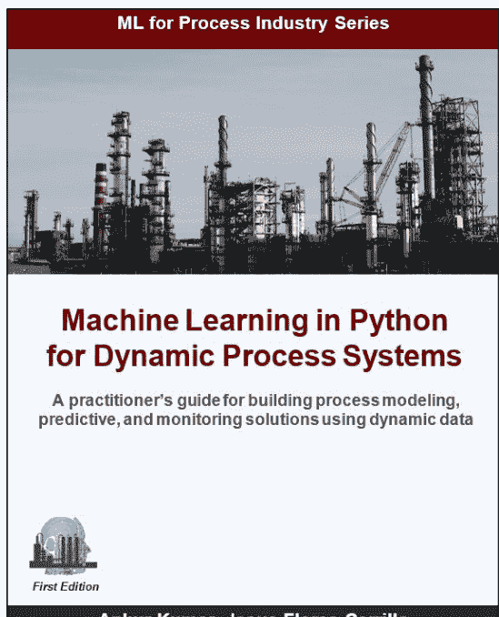

## 前言

想象一下，你是一名过程工程师/分析师，被分配了第一个基于机器学习的项目，目标是构建一个全厂范围的监控工具。尽管这是一项令人兴奋的任务，但由于难以找到适用于当前过程系统的正确方法，它很容易变成一项令人沮丧的工作。构建一个成功的过程监控工具颇具挑战性，因为过程数据集可能具有不同的特性，这排除了单一方法适用于所有场景的可能性。因此，在过去的几十年里，人们设计了许多强大的技术。虽然选择众多是件好事，但新手很容易在过程监控（PM）和预测性维护（PdM）浩瀚（且仍在增长）的文献中“迷失”。关于PM和PdM的资源有很多是零散的。然而，遗憾的是，目前还没有一本教科书专注于实际实施方面，并全面涵盖在过程工业中已被证明有用的常用PM/PdM技术。在针对工业从业者的PM/PdM机器学习资源方面存在空白，本书试图填补这一空白。具体来说，我们希望创建一本读者友好且易于理解的书籍，通过正确的指导，帮助读者“快速”（免责声明：没有灵丹妙药；仍需努力！）成为基于机器学习的PM/PdM“专家”。

在本书中，我们涵盖了过程监控和预测性维护的所有三个主要方面，即故障/异常检测、故障诊断/识别以及故障预测/剩余使用寿命估计（RUL）。我们的目的不是对所有现有的PM/PdM技术进行全面论述；尽管我们的重点是帮助新兴的过程数据科学家（PDSs）鸟瞰PM/PdM的全貌，获得主流技术的实用知识，并掌握做出正确模型选择的实践技能。在涵盖的方法论范围方面，我们同等重视现代深度学习方法和经典统计方法。虽然深度学习近年来取得了显著成果，但经典的统计（以及机器学习/数据挖掘）方法尚未过时。事实上，多元统计过程监控（MSPM）技术仍广泛用于过程监控。因此，本书涵盖了从基于单变量Shewhart-/CUSUM-/EWMA的控制图到基于深度学习的RUL估计的完整方法论谱系。

基于我们过去几年为各种工业应用构建监控模型的经验，本书涵盖了一组经过筛选的、已被证明对PM/PdM有用的机器学习技术。本书的广泛目标可总结如下：

-   降低PM/PdM领域新进入者的入门门槛
-   为读者提供PM/PdM技术的实用知识
-   使读者能够通过直观理解不同技术的优缺点，为其问题明智地选择PM/PdM技术
-   为开发工业级PM/PdM解决方案提供分步指导
-   提供关于如何明智地选择模型超参数的实用指导

本书采用教程式风格。重点在于指南和实际例证，在理论和概念见解之间取得微妙平衡。强调动手学习，因此提供了详细的代码示例和工业规模数据集，以具体化实施细节。我们刻意避免用数学细节压垮读者，而是将其作为更好概念理解的工具。完整的代码实现已提供在GitHub仓库中。

我们非常有信心，本书将使读者能够自信地为具有挑战性的问题构建过程监控和预测模型。我们祝愿他们在职业生涯中一切顺利。

## 谁应该阅读本书

本书以应用为导向的方法旨在以连贯、读者友好且易于理解的方式，快速全面地介绍主流PM/PdM方法论。以下类别的读者会发现本书有用：

1.  刚进入过程监控、设备状态监控和预测性维护领域的数据科学家
2.  希望更深入理解底层概念的商业异常检测软件（如Aspen Mtell）的常规用户
3.  寻求开发过程监控和预测性维护解决方案指导的实践过程数据科学家
4.  刚进入数据科学领域的过程工程师或过程工程专业学生
5.  希望利用振动数据为旋转机械构建故障检测和诊断解决方案的工业从业者

### 前提条件

无需机器学习或Python的先前经验。假定具备本科水平的基础线性代数和微积分知识。

## 本书结构

本书采用整体性和实践性的机器学习学习方法，读者首先获得概念见解并发展对方法论的直观理解，然后通过实验代码示例来巩固所学知识。在过程系统工程的机器学习这一广泛主题下，本书是本系列前两本书（涉及机器学习基础、机器学习在过程工业中的各种应用以及动态系统建模的机器学习方法）的延伸；然而，它也可以作为独立的文本使用。工业过程数据可能表现出不同的特性，如多维性、非高斯性、多模态性、非线性、动态性等。因此，为了妥善处理针对具有不同数据特性的系统设计的不同建模方法论，本书分为七个部分。

**第1部分**奠定了机器学习辅助的过程和设备状态监控以及预测性维护的基本基础。**第2部分**详细介绍了用于单变量信号监控的经典机器学习技术。讨论了不同类型的控制图和时间序列模式匹配方法论。**第3部分**专注于广泛流行的多元统计过程监控（MSPM）技术。重点放在故障检测和故障隔离/诊断两个方面。**第4部分**涵盖了经典机器学习技术（如k-NN、孤立森林、支持向量机等）的过程监控应用。这些技术对于无法通过MSPM技术满意处理的过程非常有用。**第5部分**探索了人工神经网络（ANN）的世界，并研究了过程工业中常用于故障检测和诊断的不同ANN结构。**第6部分**专注于基于振动的旋转机械监控，**第7部分**涉及预测性维护应用的预测技术。

本书试图涵盖大量概念。因此，为了避免本书过于臃肿，我们没有包含与PM/PdM不直接相关且已在本系列前两本书中详细涵盖的内容。例如，与交叉验证、正则化、噪声去除等相关的机器学习基础在本系列的第1本书中有详细说明，而不在本书中。

## 符号表示

本书采用以下符号表示不同类型的变量：

-   小写字母表示向量（$x \in \mathbb{R}^{m \times 1}$），大写字母表示矩阵（$X \in \mathbb{R}^{n \times m}$）
-   向量和矩阵的单个元素分别表示为 $x_j$ 和 $x_{ij}$。
-   数据集中的任何第 $i^{\text{th}}$ 个向量表示为带下标的小写字母（$x_i \in \mathbb{R}^{m \times 1}$）

## 目录

### 第一部分：导论与基础

**第1章：机器学习、过程与设备状态监测及预测性维护** 1
- 1.1 流程工业与基于机器学习的工厂健康管理
- 什么是过程故障与异常
- 1.2 工厂健康管理（PHM）工作流程
- 1.3 工厂健康管理的机器学习建模全景
- 1.4 机器学习模型开发工作流程
- 1.5 基于机器学习的工厂健康管理解决方案部署

**第2章：脚本环境** 16
- 2.1 Python简介
- 2.2 Spyder与Jupyter简介
- 2.3 Python语言：基础
- 2.4 科学计算包：基础
- Numpy, Pandas, Sklearn

**第3章：探索性数据分析：深入了解你的数据** 33
- 3.1 为何探索性数据分析至关重要
- 3.2 非线性评估技术
- 3.3 高斯性评估技术
- 3.4 动态性评估技术
- 3.5 多模态分布评估技术
- 3.6 田纳西-伊士曼过程数据集的数据特征研究

**第4章：用于工厂健康管理的机器学习：工作流程与最佳实践** 53
- 4.1 机器学习模型开发工作流程
- 4.2 数据选择
- 4.3 数据预处理
- 处理数据不平衡
- 4.4 模型评估
- 4.5 模型调优

### 第二部分：单变量信号监测

**第5章：用于统计过程控制的控制图**
- 5.1 控制图：简单且久经考验的过程监测工具
- 5.2 休哈特控制图：简介
- 5.3 CUSUM控制图：简介
- 5.4 EWMA控制图：简介
- 5.5 案例研究：监测曝气池中的气流
- 5.6 单变量控制图的陷阱与替代解决方案

**第6章：通过时间序列模式匹配进行过程故障检测**
- 6.1 时间序列异常与模式匹配
- 6.2 通过历史模式搜索进行故障检测
- 6.3 通过不一致性发现进行故障检测

### 第三部分：多元统计过程监测

**第7章：线性与稳态过程的多元统计过程监测：第一部分**
- 7.1 PCA：简介
- 7.2 通过PCA进行故障检测：聚合物制造案例研究
- 故障检测指标
- 7.3 通过PCA的贡献分析进行故障隔离
- 7.4 PLS：简介
- 7.5 通过PLS进行故障检测：聚乙烯制造案例研究
- 故障检测指标
- 7.6 通过PLS的贡献分析进行故障隔离

**第8章：线性与稳态过程的多元统计过程监测：第二部分**
- 8.1 ICA：简介
- 确定独立分量的数量
- 8.2 通过ICA进行故障检测：田纳西-伊士曼过程案例研究
- 故障检测指标
- 8.3 FDA：简介
- 8.4 通过ICA进行故障分类：田纳西-伊士曼过程案例研究

**第9章：线性与动态过程的多元统计过程监测**
- 9.1 动态PCA：简介
- 9.2 基于DPCA的故障检测
- 9.3 动态PLS：简介
- 9.4 典型变量分析（CVA）：简介
- 9.5 通过CVA对田纳西-伊士曼过程进行过程监测

**第10章：非线性过程的多元统计过程监测**
- 10.1 核PCA：简介
- 10.2 使用核PCA进行故障检测
- 10.3 核PLS：简介
- 10.4 使用核PLS进行故障检测

**第11章：多模态过程的过程监测**
- 11.1 多模态过程专门处理的必要性与方法
- 11.2 多模态半导体制造数据集
- 11.3 K-means聚类：简介
- 11.4 高斯混合模型：简介
- 确定聚类数量
- 11.5 通过GMM进行故障检测：半导体制造案例研究

### 第四部分：用于过程监测的经典机器学习方法

**第12章：用于故障检测的支持向量机**
- 12.1 SVM：简介
- 硬间隔与软间隔分类
- 12.2 用于非线性数据的核技巧
- Sklearn中支持向量分类器的实现
- 12.3 SVDD：简介
- 12.4 通过SVDD进行故障检测：半导体制造案例研究

**第13章：用于故障检测的决策树与集成学习**
- 13.1 决策树：简介
- 13.2 随机森林：简介
- 13.3 使用随机森林进行故障分类：燃气锅炉案例研究
- 13.4 集成学习简介
- Bagging
- Boosting
- 13.5 使用XGBoost进行故障分类：燃气锅炉案例研究

**第14章：基于邻近性的故障检测技术**
- 14.1 KNN：简介
- 在金属蚀刻过程故障检测中的应用
- 14.2 LOF：简介
- 在金属蚀刻过程故障检测中的应用
- 14.3 孤立森林：简介
- 在金属蚀刻过程故障检测中的应用

### 第五部分：用于过程监测的人工神经网络

**第15章：通过监督人工神经网络建模进行故障检测与诊断**
- 15.1 ANN：简介
- 15.2 通过FFNN进行过程建模：联合循环电厂案例研究
- 15.3 RNN：简介
- 15.4 基于ANN的外部分析用于脱丁烷塔故障检测
- 15.5 使用ANN进行故障分类

**第16章：通过无监督人工神经网络建模进行故障检测与诊断**
- 16.1 自编码器：简介
- 通过自编码器进行降维
- 16.2 使用自编码器进行过程监测：FCCU案例研究
- 通过贡献图进行故障诊断
- 16.3 自组织映射：简介
- 评估SOM拟合度
- 16.4 通过SOM可视化半导体数据集
- 16.5 使用SOM进行过程监测：半导体案例研究
- 通过贡献图进行故障诊断

### 第六部分：基于振动的状态监测

**第17章：基于振动的状态监测：信号处理与特征提取**
- 17.1 振动：入门介绍
- 17.2 基于振动的状态监测：工作流程
- 17.3 振动信号处理
- 频域分析
- 时频域分析
- 17.4 从振动信号中提取特征
- 时域特征
- 频域特征
- 时频域特征

**第18章：基于振动的状态监测：故障检测与诊断**
- 18.1 VCM工作流程：回顾
- 18.2 经典VCM方法：快速入门
- 18.3 基于机器学习的VCM：通过SVM进行电机故障分类

### 第七部分：预测性维护

**第19章：故障预测：概念与方法论**
- 19.1 故障预测：导论与工作流程
- 19.2 机械健康指标：导论与方法
- 19.3 使用振动信号为风力涡轮机构建健康指标

**第20章：故障预测：剩余使用寿命估计**
- 20.1 RUL：回顾
- 20.2 基于健康指标的RUL估计策略
- 健康退化建模
- 基于轨迹相似性的建模
- 20.3 通过退化建模为风力涡轮机估计RUL
- 20.4 通过基于ANN的回归建模为燃气轮机估计RUL

## 第一部分

### 导论与基础

## 第1章

### 机器学习、过程与设备状态监测及预测性维护：导论

问问工厂经理什么让他们夜不能寐，答案中总会包括工厂设备故障和导致停机的过程异常。这种对工厂可靠性的担忧并非空穴来风。早期的异常如果未被发现，可能导致连锁损害，造成经济损失、工厂停机甚至人员伤亡。流程工业中的几次重大灾难（2019年费城炼油厂爆炸、1984年博帕尔毒气泄漏等）都是未能及时检测和纠正过程故障的结果。虽然此类灾难不幸地很少发生，但导致工厂效率非最优和产品质量下降的“无害”过程异常却时常发生。毫不夸张地说，全天候监控过程性能和工厂设备健康状况，并预测即将发生的故障，已不再是“锦上添花”，而是绝对的必需品！

流程工业通过安装更多传感器和收集更多实时数据来应对上述挑战。不幸的是，这导致了数据泛滥，操作员被“信息过载但洞察不足”所淹没。值得庆幸的是，机器学习凭借其解析海量数据并实时发现隐藏模式的能力，成为了救星。机器学习允许智能过程监测（PM），其目标不仅是检测过程异常，更要在早期阶段发现问题。此外，机器学习通过提前预测设备故障时间，促进了预测性维护（PdM）。

在本章中，我们将鸟瞰用于PM/PdM的机器学习全景，并理解实现上述目标所需具备的条件。具体涵盖以下主题：

- 过程/设备异常与故障简介
- 基于机器学习的过程监测和预测性维护的典型工作流程
- 过程监测和预测性维护的机器学习全景
- 工业中常用的PM/PdM解决方案部署基础设施

机器学习是一个强大的工具，但它并非魔法；要正确运用它，仍需要大量的“机器学习艺术”。现在，让我们迈出掌握这门艺术的第一步。

#### 1.1 流程工业与基于机器学习的工厂健康管理

流程工业是一个总称，用于指代石化、石油与天然气、化工、电力、造纸、水泥、制药等行业。这些行业使用加工装置来制造中间产品或最终消费品。如图1.1所示，这些工厂管理的主要关注点包括但不限于：通过主动的过程监控和预测性维护，实现最优且安全的运行、质量控制以及高可靠性。所有这些任务都属于过程系统工程（PSE）的范畴。虽然机器学习正逐步被引入PSE任务（例如，基于深度学习的过程控制器¹），但其对与工厂健康管理相关的任务——即故障检测、故障诊断和预测性维护——影响最大。

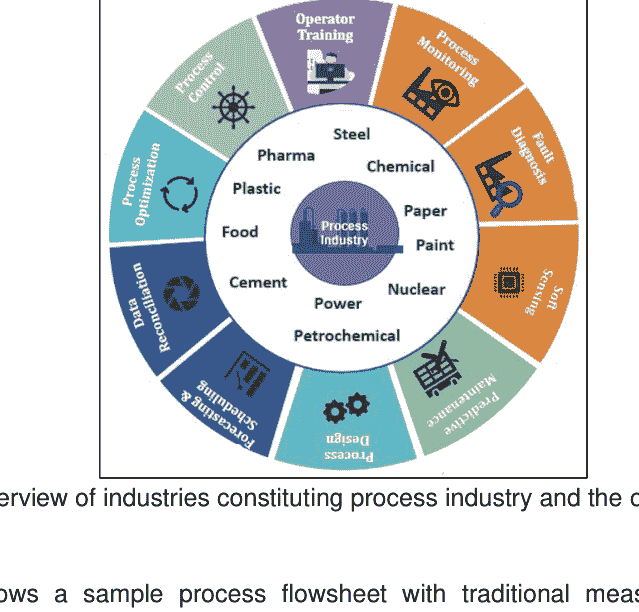

图1.2展示了一个典型的过程流程图，其中包含了流量、温度、压力、液位、组分、功率和振动等传统测量参数。如此复杂且高度集成的运行、严格的产品规格，以及将工艺推向极限的经济压力，使得工业运行更容易发生故障。然而，一个日益增长的趋势是建立无人值守或精简人员的工厂，减少人工对过程的监控。这正是自动化工厂健康管理发挥作用以解决这一矛盾的地方。过程模型与传感器数据相结合，用于持续监控过程，以检测、隔离和诊断故障，并预测故障的发展。其明显收益是通过更好的计划性维护来防止代价高昂的停机。在开发过程模型方面，数据驱动/机器学习模型由于其相对易于实施和维护（与基于第一性原理的模型相比），已变得越来越受欢迎。

> ¹ https://www.aspentech.com/en/products/msc/aspen-dmc3

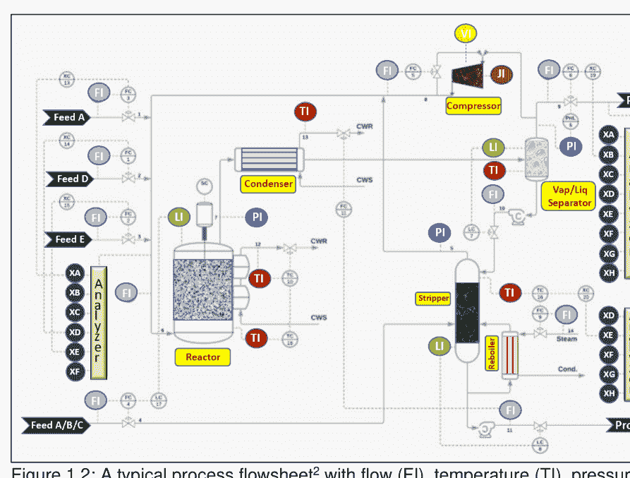

让我们首先深入了解过程故障和异常的含义，继续学习基于机器学习的工厂健康管理。

##### 什么是过程故障和异常？

通俗地说，过程故障或异常是指过程变量中出现的、违背正常/可接受过程行为的意外且不利的偏差/模式。这些偏差可能是产品产率和纯度的不良下降、关键液位的波动、温度升高、旋转机械振动加剧等。过程系统中的故障有多种原因，包括但不限于：结垢、管道堵塞、泄漏、催化剂中毒和阀门卡滞。下面的流程图说明了一些常见的故障来源。

> ² 改编自Gilberto Xavier（https://github.com/gmxavier/TEP-meets-LSTM）提供的原始流程图，该图基于知识共享署名4.0国际许可协议（https://creativecommons.org/licenses/by/4.0/）发布。

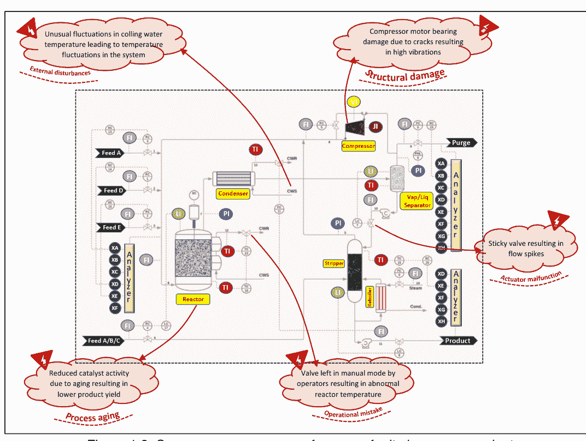

图1.3：过程工厂中一些常见的过程故障来源

##### 设备监控与全厂监控

流程工业中过程监控的一种常见方法是分别监控工厂的不同关键设备。机器学习模型是为每台设备单独构建的。虽然这种方法使机器学习模型开发更容易，因为每个模型只处理工厂变量的一个子集，但用户需要维护和分析来自多个机器学习模型的结果。另一种方法是全厂监控，即使用单个机器学习模型监控由多台设备组成的整个工厂。这种方法的缺点是变量集维度高，且故障检测性能下降。相同的机器学习模型可以用于任一种方法。然而，已经为全厂监控设计了一些专门的技术。我们将在后续章节中适时介绍这些技术。

如前所述，故障意味着过程变量出现不期望的偏差。下图展示了在过程故障影响下可能观察到的数据模式示例。

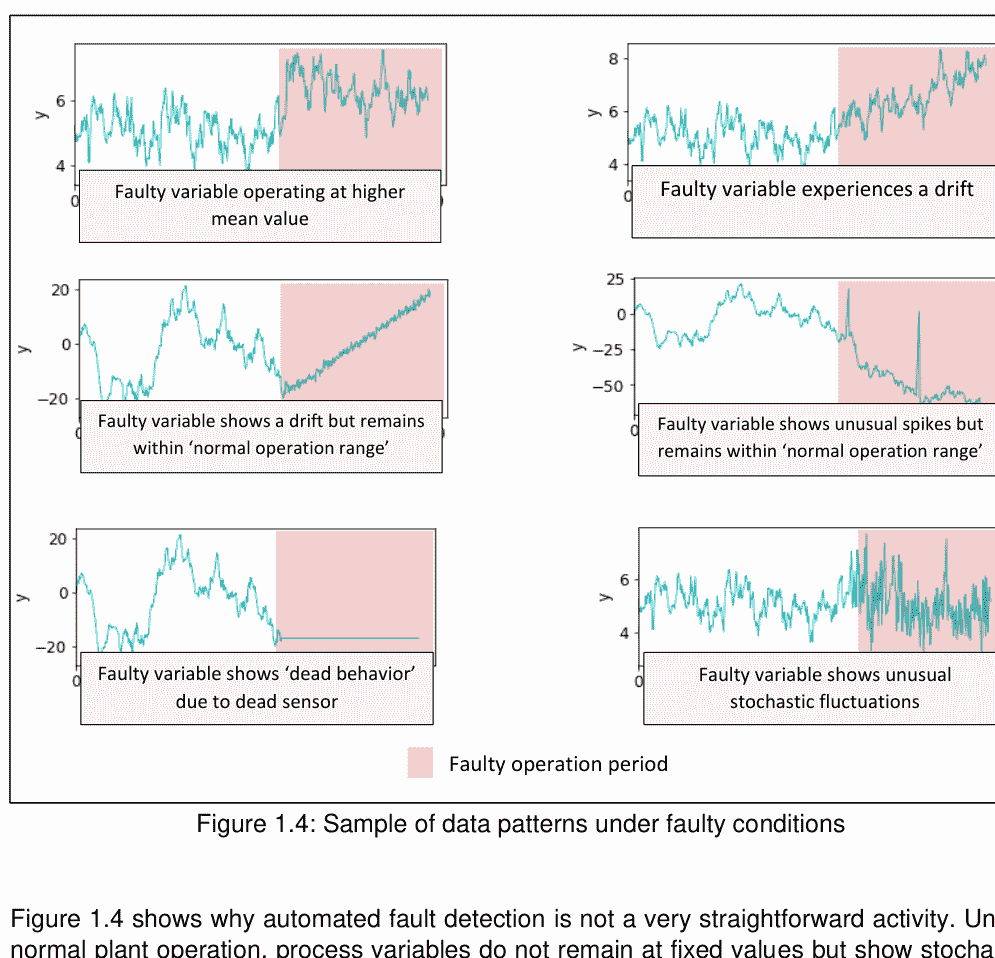

图1.4说明了为什么自动故障检测并非一项非常直接的活动。在工厂正常运行期间，过程变量不会保持在固定值，而是由于工厂负荷、产品等级、环境条件等的变化而表现出随机波动和正常变化。因此，不能仅仅将每个过程变量与某个固定阈值进行比较来确定过程的健康状态。在大多数情况下，对工厂变量之间的多变量关系进行建模变得不可或缺。

关键信息是，现代过程工厂容易发生多种故障，需要一支“大军”来确保可靠运行。在工业4.0时代，机器学习正被用作这支“大军”。在我们了解可用的不同机器学习模型之前，让我们先尝试理解机器学习模型究竟需要做什么。

#### 1.2 工厂健康管理（PHM）工作流程

在上一节中，我们详细讨论了工厂健康管理的故障检测方面。然而，这只是实现可靠工厂运行旅程的一部分。图1.5展示了这段旅程的不同里程碑。如图所示，故障检测之后是故障隔离或故障诊断，其目标分别是识别受故障影响的过程变量或确定故障的根本原因。例如，对于图1.3所示的阀门故障问题，故障隔离将从分离器到汽提塔的流量定位为故障变量，而故障诊断则将阀门卡滞确定为故障行为的根本原因。

> FDI 与 FDD

在过程监控文献中，您会经常遇到FDI和FDD这两个缩写。FDI代表故障检测与隔离，FDD代表故障检测与诊断。如前所述，尽管故障诊断与故障隔离不同，但它经常被（错误地）用来指代寻找表现出异常行为的变量的任务。

您可能遇到的其他术语是故障识别和故障分类。虽然故障识别与故障隔离相同，但故障分类是指将故障归类/分类到几个预定义的故障类型之一。

在FDI/FDD之后，是故障预测任务，它涉及预测已识别故障的发展进程。故障预测有助于确定在受故障影响的设备需要停机维护或整个工厂需要停机修复故障之前剩余的时间。对于设备级监控，故障预测提供了通常所说的剩余使用寿命（RUL）。例如，对于图1.3所示的压缩机轴承损坏问题，在裂纹发展的初始阶段，振动只会略高于正常水平。然而，随着时间的推移，裂纹增长导致振动越来越大，最终压缩机失效或变得过于危险而无法运行。一个良好的故障预测模型可以准确估计压缩机达到故障点之前的剩余时间。

故障预测算法的进步普及了预测性维护的概念，工厂管理层可以根据设备/过程的实际健康状况提前规划维护计划。可以想象，这种方法具有明显的经济效益（与基于时间的/预防性维护相比），并且毫不意外地引起了流程工业高管们的极大兴趣！

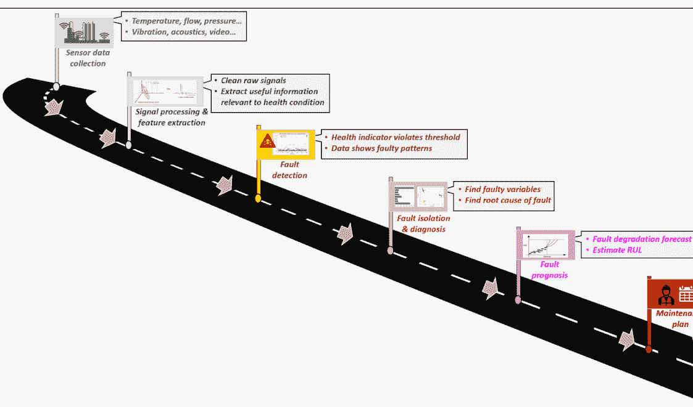

图1.5：工厂健康管理工作流程

##### 预测与健康管理

在工业界，图1.5所示的PM/PdM工作流程通常被称为*预测与健康管理*³。这包括状态监控（故障检测、隔离和诊断）和预测性维护（故障预测）两个方面。

在接下来的章节中，我们将详细研究PHM的所有主要方面，并学习如何实施端到端的解决方案。

> ³ 尽管缩写“PHM”通常被预测研究社区用来指代预测与健康管理，但本书中我们将用它来表示“工厂健康管理”。

#### 1.3 用于植物健康管理的机器学习建模全景

作为过程数据科学家，我们必须接受一个严酷的现实：不存在一个在所有场合都普遍适用的单一模型。原因之一在于过程数据可能表现出不同的特性（如非线性、非高斯性、动态性、多模态性等），这要求我们选择不同的建模方法。此外，如图1.6所示，历史故障数据的可用性、用户的最终目标以及已安装传感器的类型也会影响模型选择。这使得正确选择机器学习模型的任务变得艰巨（对于初学者过程数据科学家来说可能尤其令人望而生畏）。幸运的是，解决之道是公开的秘密，且非常简单：充分理解你的数据和系统，并对可用方法的优缺点有概念上清晰的认识。

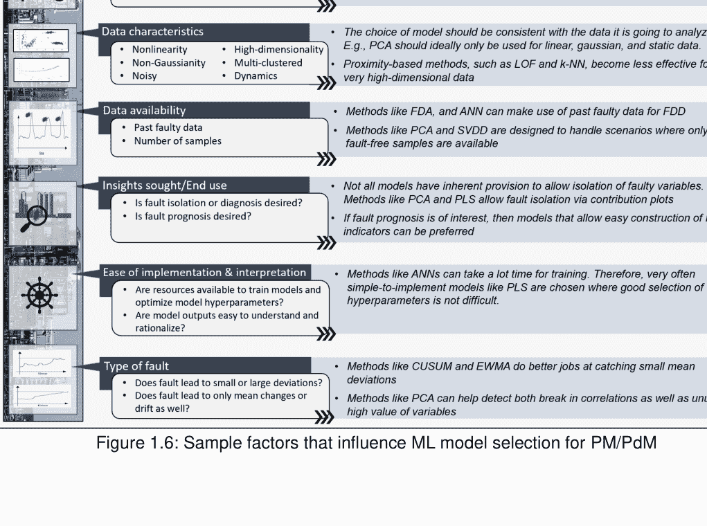

在你着手对过程系统建模之前，你可能已经了解了上图列出的各种因素，除了数据特性。我们将在第3章研究用于确定数据特性的技术。既然我们理解了影响模型选择的因素，我们就可以看看有哪些模型可供我们使用。

> 传统的过程测量，如流量、温度、压力、组分等，以及振动测量，主导着过程工业中记录的信号。因此，本书中的案例研究仅使用这些信号。不涵盖基于计算机视觉的机器学习解决方案。

下图1.7展示了本书将涵盖的过程监控建模方法。故障检测和诊断是故障预测的先兆，因此，构建预测性维护解决方案也采用相同的方法。正如类别主题所示，这些方法适用于具有不同特性的过程数据。这些方法范围从“简单”的传统控制图到现代深度学习。

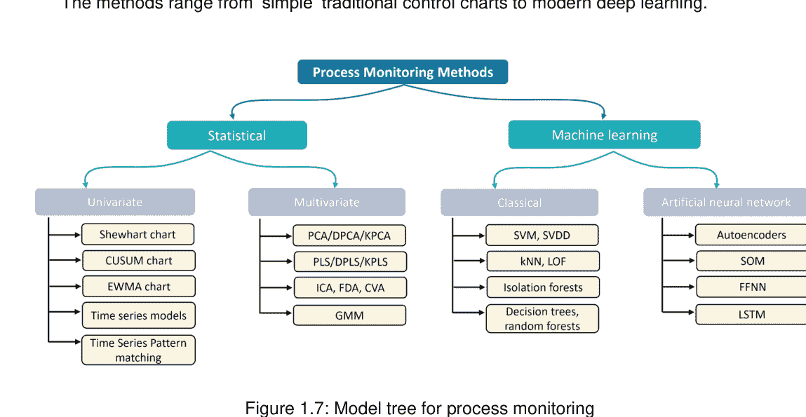

多元统计过程监控方法（MSPM）（如PCA、PLS、GMM等）这一类别值得特别关注，因为它一直是复杂过程工厂健康监控的基石。因此，本书的很大一部分将专门介绍这些方法。然而，无论其流行程度如何，MSPM方法都有其局限性。因此，本书也涵盖了机器学习和深度学习模型，如自编码器、LSTM、LOF等。

在图1.7中，建模方法被大致分为四类，即：单变量统计模型、多元统计模型、经典机器学习模型和人工神经网络模型。本书的各个部分将分别讨论这些类别。统计⁴预测性维护模型利用历史数据提取系统的统计模型。在这一类别中，包括用于单变量监控的简单控制图模型。虽然有用，但这些单变量模型对于复杂工业工厂的全厂监控来说，其局限性是显而易见的。在模型谱系的另一端是复杂的深度学习模型，理论上可以处理任何类型的过程系统；其缺点是模型训练过程繁琐且需要超参数优化。介于这两个极端之间的是MSPM方法，其易于实现和结果可解释的特点使其广受欢迎。然而，对于具有复杂数据分布的高度非线性过程，MSPM方法往往表现不佳。因此，对于复杂工业过程的过程监控解决方案开发，经典机器学习和深度学习方法正受到相当多的关注。

图1.7中的模型适用于你在实践中可能遇到的不同场景。如果你有大量历史故障样本，那么可以使用分类模型，如FDA、SVM、ANN等。然而，在过程工业中，大多数时候你不会有拥有历史故障数据的奢侈条件，因此，本书涵盖的许多故障检测技术都适用于这种场景。下图说明了在模型训练期间仅使用正常工况数据检测过程故障存在所采用的不同原理。

⁴ 在传统的过程监控术语中，统计过程监控也称为统计过程控制。尽管SPC方法不涉及对过程控制器的任何反馈，但“控制”一词意味着通过持续监控使过程保持“受控”状态的目标。

##### 基于投影的方法

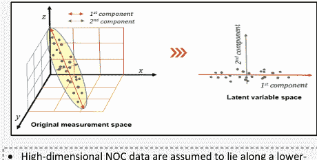

-   假设高维正常工况数据位于一个低维潜在空间中。
-   基于投影的方法（如PCA、ICA、KPCA等）将原始测试样本投影到潜在空间中。
-   测试样本在潜在空间中的位置及其重构误差用于检测过程故障。

##### 围绕正常工况样本的边界

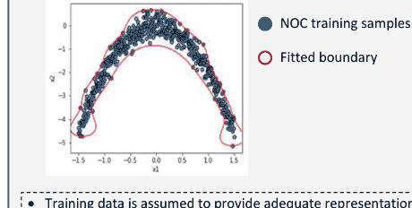

-   假设训练数据充分代表了正常工况数据预期所在的测量空间区域。
-   像Hotelling's T²和SVDD这样的方法可以在正常工况样本周围生成一个隐式边界，并提供测试样本偏离正常工况的程度度量。

##### 基于邻居距离或局部密度的方法

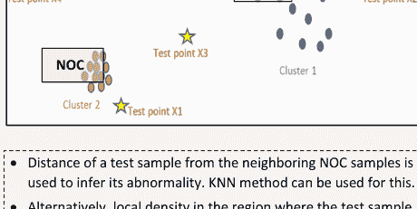

-   测试样本与邻近正常工况样本的距离用于推断其异常性。KNN方法可用于此目的。
-   或者，测试样本所在区域的局部密度可用于将测试样本分类为故障或正常。LOF方法可用于此目的。

##### 基于输入-输出回归的方法

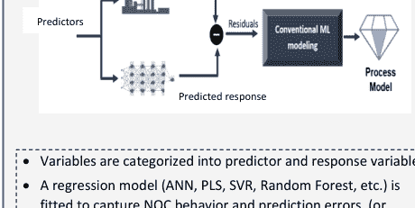

-   变量被分为预测变量和响应变量。
-   拟合一个回归模型（ANN、PLS、SVR、随机森林等）以捕捉正常工况行为，并生成预测误差（或残差）。
-   监控残差（使用控制图、PCA等）以检测故障的存在。

图1.8：仅使用正常工况数据的流行故障检测方法

请注意，图1.7中的模型既适用于设备级监控，也适用于全厂监控。现在让我们概述一下这些模型实际上是如何开发的。

#### 1.4 机器学习模型开发工作流

在图1.7中，我们看到了用于预测性维护应用的不同类型的机器学习模型。幸运的是，模型开发和部署的工作流程是相似的，如图1.9所示。正如机器学习项目的典型情况一样，任务可以分为离线计算和在线/实时计算。在在线计算中，过程数据通过模型进行解析，以提供实时洞察和结果。模型是使用历史过程数据离线构建的。这项离线工作执行一次或定期重复以进行模型更新。下面简要描述执行的基本步骤：

-   *探索性数据分析*：探索性数据分析涉及对数据的初步调查，以“感受”过程数据集的特性。活动可能包括评估过程变量之间是否存在非线性关系、非高斯分布等。在EDA期间做出的推断有助于做出正确的模型选择。第3章详细介绍了EDA。

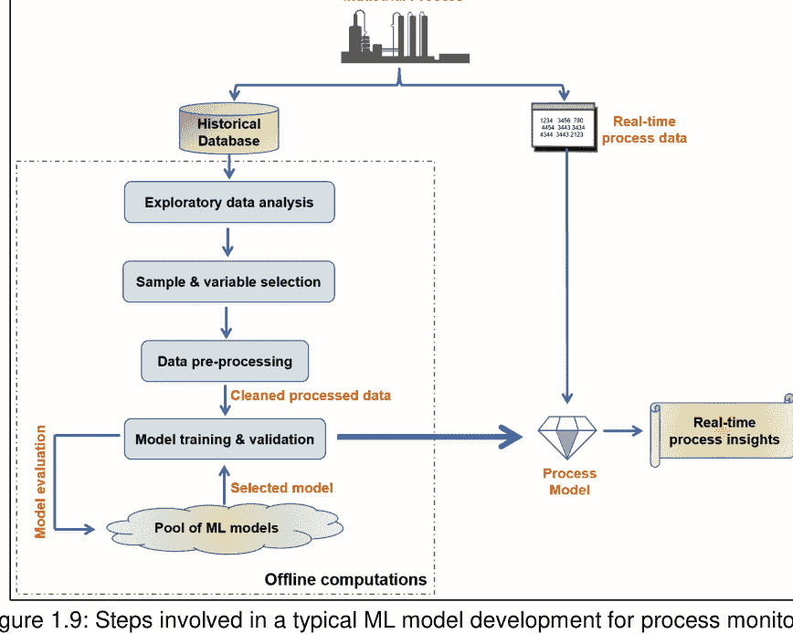

-   *样本和变量选择*：不能简单地将所有可用的历史数据和传感器测量值都丢进模型训练模块。如果构建模型是为了识别正常过程行为，则必须注意仅在模型训练数据集中包含来自无故障操作的样本。此外，如果你的模型不处理动态性，则应排除来自过程过渡期的数据。

变量选择也需要审慎考虑。包含不必要的变量会使数据噪声增加，并降低故障检测模型的有效性。一个通用的指导原则是只包含那些有助于早期故障检测的变量；在相关过程故障影响下行为没有任何变化的变量应予以排除。

-   *数据预处理*：“垃圾进，垃圾出”是计算机模拟中一个古老的原则。对于预测性维护的机器学习模型训练同样适用。如果训练数据不“干净”，你的模型实际上将毫无用处。如果你的过程监控模型是用充满异常值的训练数据训练的，它将无法准确检测过程异常。数据预处理包括（但不限于）异常值的识别和去除、噪声降低、变量变换和特征提取。此步骤的总体目标是增加训练数据集的“信息含量”，从而增强预测性维护模型区分正常操作和故障操作的能力。第4章讨论了数据预处理的多个方面。

-   *模型训练和验证*：模型训练意味着估计所选机器学习模型的参数，例如，人工神经网络模型中的神经元权重。模型验证用于寻找模型超参数的最佳值，例如，人工神经网络模型中的神经元数量。在此步骤结束时，将获得梦寐以求的过程模型。

与健康指标计算以及随后的剩余使用寿命估计相关的额外活动，涉及故障预测，将在本书第7部分中介绍，该部分专门讨论预测性维护应用的预测技术。

#### 1.5 基于机器学习的工厂健康管理解决方案部署

在开发出令人满意的PHM模型后，您解决方案的真正考验在于最终用户的接受程度。最终用户可能是本地工厂现场的可靠性人员/工程师，或是远程监控工厂的中央专家团队。下图1.10展示了将您工具的结果呈现给这些最终用户的（简化）通用架构。如图所示，机器学习模型可以设置为在每个站点的本地PC上运行，或在中央服务器机器/云资源⁵上运行。工厂操作员可以在本地控制室屏幕上访问工具结果，或在集中式部署的情况下通过网络浏览器访问。网络用户界面可以使用第三方可视化软件（Tableau、Sisense、Power BI等）构建，也可以使用bootstrap等前端网络框架完全定制构建。

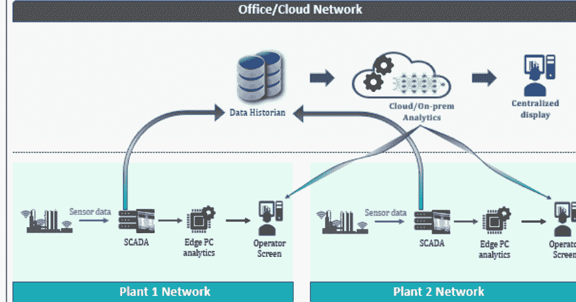

这就是在生产环境中部署基于机器学习的PHM解决方案所需的全部工作。至此，我们快速尝试向您强调了过程监控和预测性维护在过程工业中的重要性。希望您现在也对实现PM/PdM目标所需的资源以及构建PM/PdM解决方案的要求有了清晰的认识。

> ⁵ 存在一个专门的机器学习工程分支，称为MLOps（机器学习运维的缩写），它处理机器学习模型在生产中的可靠且可扩展的部署。

##### 总结

在本章中，我们探讨了工厂健康管理对于提高过程安全性、减少停机成本和延长设备寿命的重要性。我们理解了过程故障和异常的含义。我们了解了工厂健康管理的不同阶段，熟悉了影响模型选择的因素，并审视了可用于实现PHM目标的不同模型。我们还简要介绍了过程监控模型开发的通用工作流程，并理解了PM/PdM解决方案在现代工业环境中的部署方式。在下一章中，我们将迈出第一步，了解用于执行包含PHM机器学习代码的Python脚本的环境。

## 第2章
### 脚本环境

在上一章中，我们研究了基于机器学习的过程监控和预测性维护的各个方面。在本章中，我们将快速熟悉Python语言以及我们将用于编写机器学习代码、执行代码并查看结果的脚本环境。本章不会让您成为Python专家，但会让您对这门语言有足够的理解，以便入门并帮助理解后续章节中的多个代码实现。如果您已经了解Python基础知识，有首选的代码编辑器，并且知道典型机器学习脚本的一般结构，那么您可以直接跳到第3章。

Python易于使用和学习，加上多年来用户社区开发的大量开放访问的有用包，使其获得了巨大的普及。近年来，用于机器学习和深度学习的专用库的开发，使Python成为机器学习社区的默认首选语言。这些进步大大降低了新用户进入机器学习世界的门槛。

通过本章，您将迈出进入机器学习世界的第一步。具体涵盖以下主题：

- Python语言简介
- Spyder和Jupyter简介，这两款流行的代码编辑器
- Python数据结构和科学计算库概述

#### 2.1 Python简介

简单来说，Python是一种高级通用计算机编程语言，可用于应用开发和科学计算等。如果您使用过其他计算机语言，如Visual Basic、C#、C++、Java、Javascript，那么您会理解Python是一种解释型和动态语言。如果没有，那么可以将Python视为计算机编程语言列表中的另一个名称。更重要的是，Python提供了多项特性，使其在众多语言中脱颖而出，成为机器学习的首选语言。图2.1列出了一些这样的特性。Python提供了所有工具，可以方便地执行基于机器学习的PM/PdM项目的所有步骤，即数据收集、数据预处理、数据探索、机器学习建模、可视化以及向最终用户部署解决方案。此外，一些免费可用的工具使编写Python代码变得非常容易⁶。


##### 安装Python

可以从 *python.com* 网站下载官方最新版本的Python。然而，安装和使用Python最方便的方法是安装Anaconda (*www.anaconda.com*)，这是一个开源的Python发行版。除了核心Python，Anaconda还安装了许多其他有用的包。Anaconda附带一个名为Anaconda Navigator的图形用户界面（图2.2），您可以从那里启动多个其他工具。

⁶ 本章大部分内容与《过程系统工程中的Python机器学习》一书第2章内容相似，并已进行适当修改以保持本书的独立性。

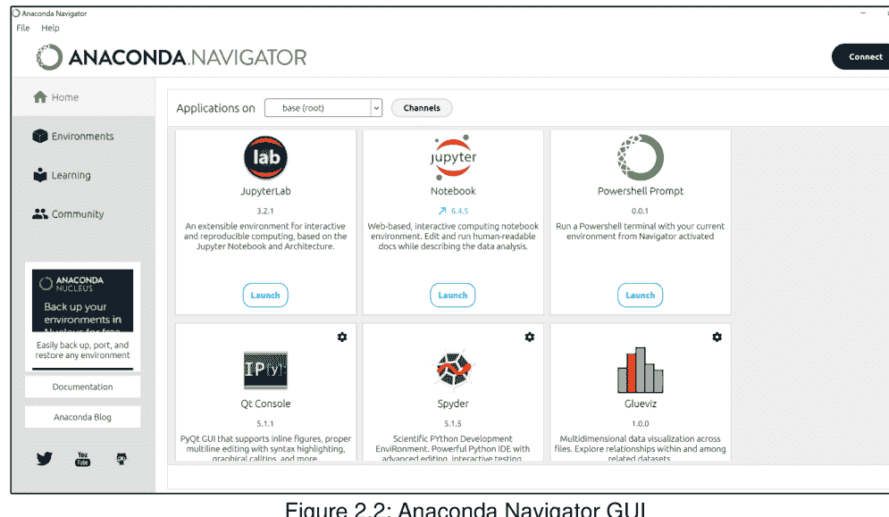

图2.2：Anaconda Navigator图形用户界面

##### 运行/执行Python代码

安装Anaconda后，您可以在任何文本编辑器（如记事本）中编写代码，将其保存为.py格式，然后通过Anaconda命令终端运行。然而，一个方便的替代方法是使用IDE（集成开发环境）。IDE不仅允许创建.py脚本，还可以即时执行它们，即我们可以在集成环境中进行代码编辑并立即查看结果。在众多可用的Python IDE（PyCharm、VS Code、Spyder等）中，我们发现Spyder最方便且功能丰富，因此将在下一节中讨论。

Jupyter Notebooks是编写和执行Python代码的另一种非常流行的方式。这些笔记本允许将代码、执行结果、解释性文本和多媒体资源组合在一个文档中。可以想象，这使得保存和共享完整的数据分析变得非常容易。

在下一节中，我们将为您提供足够的Spyder和Jupyter知识，以便您开始使用它们。

#### 2.2 Spyder和Jupyter简介

图2.3显示了启动Spyder时出现的界面⁷（及其不同组件）。主要有3个组件：

- *编辑器：* 您可以在此输入和保存代码。单击▶按钮可执行活动编辑器选项卡中的代码。
- *控制台：* 脚本执行结果显示在此处。它也可用于执行Python命令并与工作区中的变量进行交互。
- *变量资源管理器：* 运行编辑器脚本或控制台生成的所有变量都显示在此处，并且可以交互式浏览。

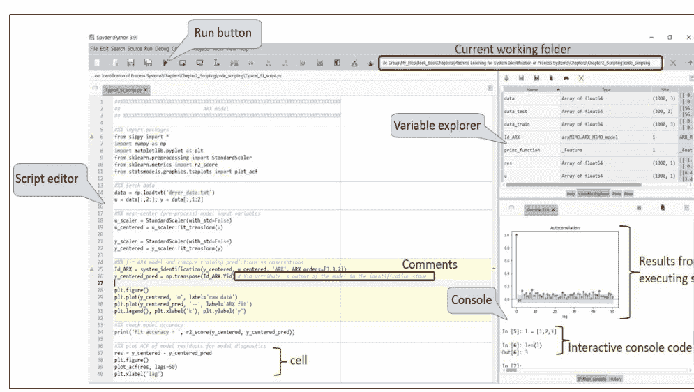

与任何IDE一样，Spyder提供了多项功能。您可以将脚本分成单元格，并仅执行任何选定的单元格（通过按Ctrl + Enter键）。Intellisense允许您通过按Tab键自动完成代码。广泛的调试功能使故障排除更容易。这些只是Spyder中可用的部分功能。鼓励您探索Spyder图形用户界面的不同选项（例如暂停和取消脚本执行、清除变量工作区等）。

> ⁷ 如果您使用过MATLAB，您会发现界面非常熟悉。

使用Spyder时，如果您关闭并重新打开脚本，则必须再次运行脚本才能看到执行结果。与此相反，考虑图2.4中的Jupyter界面。请注意，Jupyter界面在浏览器中打开。我们可以将显示的代码、执行输出和解释性文本/图形保存为(.ipnb)文件，并在Jupyter Notebook中重新打开文件时保持它们不变。

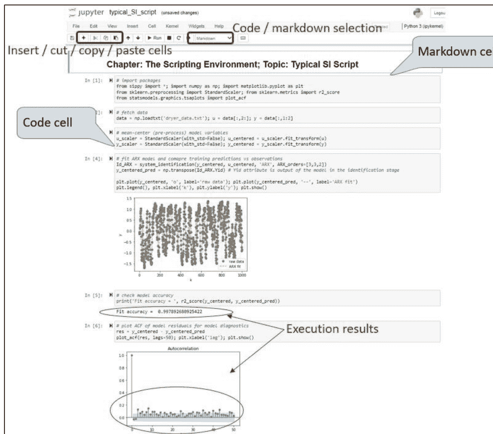

您可以将任何输入单元格指定为代码或markdown（格式化的解释性文本）。您可以按Shift + Enter键执行任何活动单元格。所有输入单元格都可以通过*Cell*菜单执行。

至此，我们快速概述了Spyder和Jupyter界面。您可以选择其中任何一个来完成本书其余部分的代码实践。

#### 2.3 Python语言：基础

在当前和下一节中，我们将看到几个使用Python和科学包操作数据的简单示例。虽然这些简单的操作在没有更大背景的情况下可能显得平淡无奇（且枯燥），但它们构成了本书后面介绍的更复杂脚本的基础。因此，至少快速浏览一下这些内容是值得的。

请注意，你会在这些示例中频繁看到'#'；这些井号用于在代码中插入解释性注释。Python会忽略（不执行）一行中#之后写的所有内容。

##### 基本数据类型

在Python中，你使用4种数据类型

```
# 4 data types: int, float, str, bool
i = 2 # integer; type(i) = int
f = 1.2 # floating-point number; type(f) = float
s = 'two' # string; type(s) = str
b = True # boolean; type(b) = bool
```

定义了变量后，你可以执行基本操作

```
# print function prints/displays the specified message
print(i+2) # displays 4
print(f*2) # displays 2.4
```

##### 列表、元组作为有序序列

相关数据（不一定是相同数据类型）可以作为序列排列在列表中，如下所示

```
# different ways of creating lists
list1 = [2,4,6]
list2 = ['air',3,1,5]
list3 = list(range(4)) # equals [0,1,2,3]; range function returns a sequence of numbers starting
                        # from 0 (default) with increments of 1 (default)
list3.append(8) # returns [0,1,2,3,8]; append function adds new items to existing list
list4 = list1 + list2 # equals [2,4,6,'air',3,1,5]
list5 = [list2, list3] # nested list [['air', 3, 1, 5], [0, 1, 2, 3,8]]
```

元组是另一种像列表一样的序列结构，不同之处在于它们的元素和大小不能更改。由于元组是不可变的/不可更改的，它们更节省内存。

```
# creating tuples
tuple1 = (0,1,'two')
tuple2 = (list1, list2) # equals ([2, 4, 6, 8], ['air', 3, 1, 5])
```

下面的几个例子说明了列表推导式，这是一种从其他序列创建新列表的非常有用的方法

```
# generate powers of individual items in list3
newList1 = [item**2 for item in list3] # equals [0,1,4,9,64]

# nested list comprehension
newList2 = [item2**2 for item2 in [item**2 for item in list3]] # equals [0,1,16,81,4096]
```

##### 序列的索引和切片

列表中的单个元素可以如下访问和修改

```
# working with single item using positive or negative indexes
print(list1[0]) # displays 2, the 1st item in list1
list2[1] = 1 # list2 becomes ['air',1,1,5]
print(list2[-2]) # displays 1, the 2nd last element in list2
```

请注意，Python索引从零开始。很多时候，我们需要处理列表中的多个元素。这可以很容易地完成，如下所示。

```
# accessing multiple items through slicing
# Syntax: givenList[start,stop,step]; if unspecified, start=0, stop=list length, step=1
print(list4[0:3]) # displays [2,4,6], the 1st, 2nd, 3rd items; note that index 3 item is excluded
```

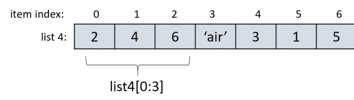

```
print(list4[:3]) # same as above
print(list4[4:len(list4)]) # displays [3,1,5]; len() function returns the number of items in list
```

```
print(list4[4:]) # same as above
print(list4[::3]) # displays [2, 'air', 5]
print(list4[::-1]) # displays list 4 backwards [5, 1, 3, 'air', 6, 4, 2]
list4[2:4] = [0,0,0] # list 4 becomes [2, 4, 0, 0, 0, 3, 1, 5]
```

##### 执行控制语句

这些语句允许你控制代码的执行顺序。你可以选择性地或多次执行脚本的任何特定部分。让我们看看如何实现这些

```
# selectively execute code based on condition
if list1[0] > 0:
    list1[0] = 'positive'
else:
    list1[0] = 'negative'

# list1 becomes ['positive', 4, 6]
```

```
# compute sum of squares of numbers in list3
sum_of_squares = 0
for i in range(len(list3)):
    sum_of_squares += list3[i]**2

print(sum_of_squares) # displays 78
```

##### 自定义函数

之前我们使用了Python的内置函数（len(), append()）来执行为这些函数预定义的操作。Python也允许定义我们自己的自定义函数。自定义函数的优点是，我们可以定义一组指令，然后在我们的脚本和项目中多次重用它们。

为了说明，让我们定义一个函数来计算列表中元素的平方和。

```
# define function instructions
def sumSquares(givenList):
    sum_of_squares = 0
    for i in range(len(givenList)):
        sum_of_squares += givenList[i]**2

    return sum_of_squares

# call/re-use the custom function multiple times
print(sumSquares(list3)) # displays 78
```

> 你可能已经注意到，在我们上面的自定义函数代码中，我们使用了不同的缩进（代码行开头的空格数）来将‘for循环’代码与函数的其余代码分开。这种做法实际上是Python强制要求的，如果不遵守，将导致错误或bug。虽然其他流行的语言如C++、C#使用花括号（{}）来界定代码块（函数体、循环、if语句等），但Python使用缩进。你可以选择缩进的量，但必须在代码块内保持一致。

至此，我们对Python基础的极其选择性的介绍就结束了。然而，这应该足以让你理解后续章节中的代码。现在让我们继续学习一些专门的科学计算包。

#### 2.4 科学计算包：基础

虽然核心Python数据结构非常方便，但它们对于机器学习任务所需的高级数据操作来说并不十分方便。幸运的是，存在像NumPy、SciPy、Pandas这样的专门包，它们提供了适合科学计算的便捷多维表格数据结构。让我们快速熟悉一下这些包。

##### NumPy

在NumPy中，ndarray是基本的数据结构，它将数据放在一个值的网格中。下面的图示展示了如何创建一维和二维数组以及如何访问它们的元素

```
# import numpy package & create a 2D array
import numpy as np
arr2D = np.array([[1,4,6],[2,5,7]])

# getting information about arr2D
print(arr2D.size) # returns 6, the no. of items
print(arr2D.ndim) # returns 2, the no. of dimensions
print(arr2D.shape) # returns tuple(2,3) corresponding to 2 rows & 3 columns
```

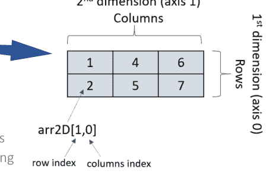

```
# create a 1D array
arr1D = np.array([1,4,6])
```

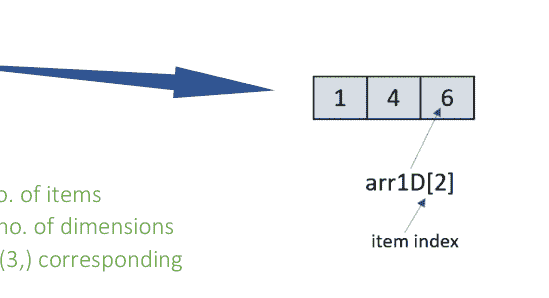

```
# getting information about arr1D
print(arr1D.size) # returns 3, the no. of items
print(arr1D.ndim) # returns 1, the no. of dimensions
print(arr1D.shape) # returns tuple (3,) corresponding to 3 items
```

请注意，行和列的概念不适用于一维数组。另外，你可能已经注意到，我们在脚本中使用NumPy包之前导入了它（‘np’只是一个短别名）。导入一个包会使其所有函数和子包在我们的脚本中可用。

##### 创建NumPy数组

之前，我们看到了如何将列表转换为NumPy数组。还有其他方法可以创建NumPy数组。下面展示了一些示例

```
# creating sequence of numbers
arr1 = np.arange(3, 6) # same as Python range function; results in array([3,4,5])
arr2 = np.arange(3, 9, 2) # the 3rd argument defines the step size; results in array([3,5,7])
arr3 = np.linspace(1,7,3) # creates evenly spaced 3 values from 1 to 7; results in array([1,4,7])
```

```
# creating special arrays
arr4 = np.ones((2,1)) # array of shape (2,1) with all items as 1
arr5 = np.zeros((2,2)) # all items as zero; often used as placeholder array at beginning of script
arr6 = np.eye(2) # diagonal items as 1
```

```
# adding axis to existing arrays (e.g., converting 1D array to 2D array)
print(arr1[:, np.newaxis])
>>>[[3]
    [4]
    [5]]
```

```
arr7 = arr1[:, None] # same as above
```

##### 合并/堆叠数组

```python
print(np.hstack((arr1, arr2))) # 水平堆叠传入的数组
>>> [3 4 5 3 5 7]

print(np.vstack((arr1, arr2))) # 垂直堆叠传入的数组
>>> [[3 4 5]
    [3 5 7]]

print(np.hstack((arr5, arr4))) # 数组4作为一列添加到arr5中
>>> [[0. 0. 1.]
    [0. 0. 1.]]

print(np.vstack((arr5, arr6))) # 数组6的行添加到arr5下方
>>> [[0. 0.]
    [0. 0.]
    [1. 0.]
    [0. 1.]]
```

##### 基本NumPy函数

NumPy提供了多种实用函数，如`mean`、`sum`、`sort`等，用于操作和分析NumPy数组。你可以指定需要分析数据的维度（轴）。以`sum`函数为例

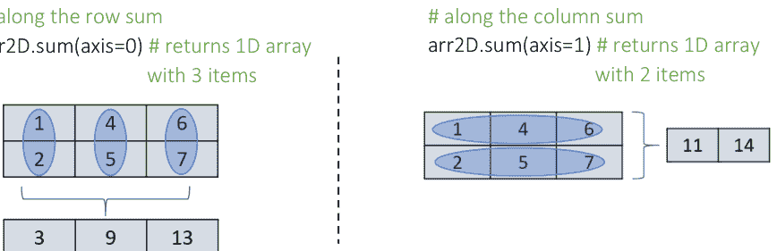

执行`arr2D.sum()`会返回整个数组的标量总和，即25。

##### 数组索引与切片

访问NumPy数组的单个元素和进行切片操作，与Python列表的用法相同

```python
###### 访问单个元素
print(arr2D[1,2]) # 返回7
```

```python
###### 切片
arr8 = np.arange(10).reshape((2,5)) # 将一维数组重新排列为(2,5)的形状
print((arr8[0:1,1:3]))
>>> [[1 2]]
```

```python
print((arr8[0,1:3])) # 注意这里返回的是一维数组，而不是上面的二维数组
>>> [1 2]
```

```python
###### 访问整行或整列
print(arr8[1]) # 返回第二行，作为array([5,6,7,8,9])；等同于arr8[1,:]
print(arr8[:, 4]) # 返回第五列的元素，作为一维数组
>>> [4 9]
```

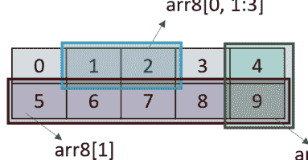

关于NumPy数组切片，一个重要的注意事项是：对切片视图所做的任何修改也会修改原始数组！请看以下示例

```python
###### 从arr8中提取一个子数组并修改它
arr8_sub = arr8[:, :2] # 所有行的第0列和第1列
arr8_sub[1,1] = 1000
print(arr8) # arr8也被修改了！！
>>> [[ 0  1  2  3  4]
     [ 5 1000  7  8  9]]
```

当我们只需要处理大型数组/数据集的一小部分时，这个特性就变得非常方便。我们可以简单地操作一个更精简的视图，而不是携带整个大数据集。然而，有时我们可能需要实际操作一个独立的子数组副本，而不必担心修改原始数组。这可以通过`copy`方法来实现。

```python
###### 使用copy方法创建独立副本
arr8 = np.arange(10).reshape((2,5))
arr8_sub2 = arr8[:, :2].copy()
arr8_sub2[1, 1] = 100 # arr8在这里不会受到影响
```

花式索引是获取数组副本（而非视图）的另一种方式。花式索引简单来说就是使用整数数组/列表或布尔数组/列表来访问数组元素。下面的例子阐明了这个概念

```python
###### 简单索引和花式索引的组合
arr8_sub3 = arr8[:, [0, 1]] # 注意列是如何通过列表索引的
arr8_sub3[1, 1] = 100 # arr8_sub3变得与arr8_sub2相同，但arr8在这里没有被修改
```

```python
###### 使用布尔掩码选择子数组
arr8_sub4 = arr8[arr8 > 5] # 返回array([6,7,8,9])，即所有大于5的值
arr8_sub4[0] = 0 # 同样，arr8不受影响
```

##### 向量化操作


假设你需要对两个一维数组进行逐元素求和。一种方法是在循环中逐个访问每个索引处的元素并求和。另一种方法是同时对多个索引处的元素求和。后一种方法称为向量化操作，对于大型数据集和复杂操作，它可以显著提升计算速度。

```python
##### 向量化操作
vec1 = np.array([1,2,3,4])
vec2 = np.array([5,6,7,8])
vec_sum = vec1 + vec2 # 返回array([6,8,10,12])；无需循环索引0到3
```

```python
# 稍复杂的操作（计算向量间的距离）
vec_distance = np.sqrt(np.sum((vec1 - vec2)**2)) # vec_distance = 8.0
```

##### 广播

考虑以下`arr2D`和`arr1D`数组的求和

```python
# arr2D和arr1D的逐项加法
arr_sum = arr2D + arr1D
```

NumPy允许不同维度的数组之间进行逐项操作，这得益于“广播”机制，其中较小的数组会被隐式扩展以与较大的数组兼容，如下图所示。可以想象，这是一个非常方便的特性，有关广播规则及不同示例场景的更多细节，建议查阅官方文档⁸。

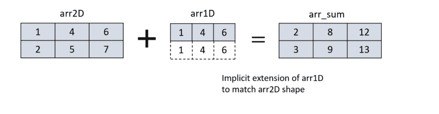

##### Pandas

Pandas是另一个非常强大的科学计算包。它构建在NumPy之上，提供了多种数据结构和功能，使得（表格）数据分析和预处理变得非常方便。一些值得注意的特性包括基于标签的切片/索引、（类似SQL的）数据分组/聚合、数据合并/连接以及时间序列功能。Series和DataFrame分别是Pandas提供的类一维和类二维数组结构

```python
###### Series（一维结构）
import pandas as pd

data = [10,8,6]
s = pd.Series(data)
print(s)
>>>
0    10
1     8
2     6
dtype: int64
```

```python
###### DataFrame（二维结构）
data = [[1,10],[1,8],[1,6]]
df = pd.DataFrame(data, columns=['id', 'value'])
print(df)
>>>
   id  value
0   1     10
1   1      8
2   1      6
```

```python
###### 从Series创建DataFrame
s2 = pd.Series([1,1,1])
df = pd.DataFrame({'id':s2, 'value':s}) # 与上面相同
```

注意，`s.values`和`df.values`会将Series和DataFrame转换为相应的NumPy数组。

##### 数据访问

Pandas允许使用标签以及整数位置来访问DataFrame的行和列。你会发现这个特性非常方便。

```python
###### 列选择
print(df['id']) # 返回'id'列，作为一个Series
print(df.id) # 与上面相同
print(df[['id']]) # 返回列表中指定的列，作为一个DataFrame
>>>     id
   0  1
   1  1
   2  1

###### 行选择
df.index = [100, 101, 102] # 为说明起见，将行索引从[0,1,2]改为[100,101,102]
print(df)
>>>     id  value
  100  1    10
  101  1     8
  102  1     6

print(df.loc[101]) # 返回第二行，作为一个Series；可以提供列表以选择多行
print(df.iloc[1]) # 基于整数位置的选择；结果与上面相同

###### 单个元素选择
print(df.loc[101, 'value']) # 返回8
print(df.iloc[1, 1]) # 与上面相同
```

##### 数据聚合

如前所述，Pandas便于快速分析数据。请看下面一个基于分组的均值聚合快速示例

```python
# 使用df创建另一个DataFrame
df2 = df.copy()
df2.id = 2 # 将'id'列的所有项设为2
df2.value *= 4 # 将'value'列的所有项乘以4
print(df2)
>>>     id  value
  100  2    40
  101  2    32
  102  2    24

# 合并df和df2
df3 = df.append(df2)  # 返回一个新对象，不同于Python的append函数
print(df3)
>>>    id  value
  100  1   10
  101  1    8
  102  1    6
  100  2   40
  101  2    32
  102  2    24

# 基于id计算均值
print(df3.groupby('id').mean())  # 返回一个DataFrame
>>>    value
  id
  1    8.0
  2   32.0
```

##### 文件I/O

从外部源和文件中便捷地读取数据是Pandas的一大强项。以下是几个说明性示例。

```python
# 从excel和csv文件读取
dataset1 = pd.read_excel('filename.xlsx')  # 有多个参数选项可用于自定义读取的数据
dataset2 = pd.read_csv('filename.xlsx')
```

至此，我们对Python、NumPy和Pandas的简要介绍就完成了。如果你是Python（或编程）新手，这可能让你感到信息量很大。别担心。既然你已经了解了不同的数据结构和数据访问方式，随着你学习本章的代码示例，你会对Python脚本编写越来越得心应手。

##### Sklearn

Sklearn是目前Python中最流行的机器学习库。它提供了多个模块，方便处理机器学习的不同方面，如数据标准化、性能评分、数据划分等。你无需从头实现PCA、随机森林、GMM等机器学习模型；Sklearn提供了流行机器学习模型的即用型实现。正如你将在后续章节中看到的，使用Sklearn库，只需一行代码即可定义和拟合机器学习模型。

##### 总结

在本章中，我们熟悉了将用于编写和执行PHM脚本的脚本环境。我们了解了两个流行的Python脚本IDE、Python语言的基础知识，并学习了如何使用NumPy和Pandas操作数据。在下一章中，你将学习一些探索性数据分析技术，这些技术可以帮助你洞察数据，从而明智地选择你的机器学习模型。

## 第三章

### 探索性数据分析：更好地了解你的数据

知己知彼，百战不殆。要开发一个令人满意的流程监控模型，这一策略就转化为“充分了解你的流程数据”。这项任务在形式上被称为探索性数据分析（EDA）。大多数机器学习模型对其处理的数据的分布（例如，高斯分布与均匀分布）和特性（例如，动态特性与稳态特性）都做出了一些假设。因此，投入一些时间进行EDA是明智的，这样我们才能确定所选模型的假设与手头流程数据的特性之间的一致性。如果做不到这一点，将导致高误报率和/或漏检/延迟的故障检测，这很可能因为用户信心丧失而导致你的监控工具“消亡”！

在本章中，我们将学习如何评估数据集中四个重要特性的存在情况，即非线性、非高斯性、动态性和多模态性。我们将通过理解这些特性对流程监控性能的影响来激发对这些特性的研究。我们将特别关注那些便于在自动化环境中实施的技术。显而易见，本章学到的概念将帮助你更好地进行正确的模型选择。具体涵盖以下主题：

- 非理想数据特性对故障检测性能的影响
- 评估非线性、非高斯性、动态性和多模态性的技术
- 田纳西-伊士曼过程数据集的EDA

#### 3.1 为什么探索性数据分析很重要？

向任何专业的流程数据科学家请教如何更好地进行机器学习模型选择，你很可能会得到“更好地了解你的数据”的建议。确实，在动手之前，尽可能多地收集关于数据的见解，其重要性怎么强调都不为过。大多数流程监控方法都对数据特性做出假设，因此，必须确定我们流程数据的这些特性，以确保选择合适的监控模型。让我们考虑经典的PCA模型（无可争议地是监控多变量工业过程最流行的模型）：理想的数据集是线性的、高斯分布的、单簇的且没有动态性；图3.1使用简单的数据集说明了偏离这些理想特性的样子。

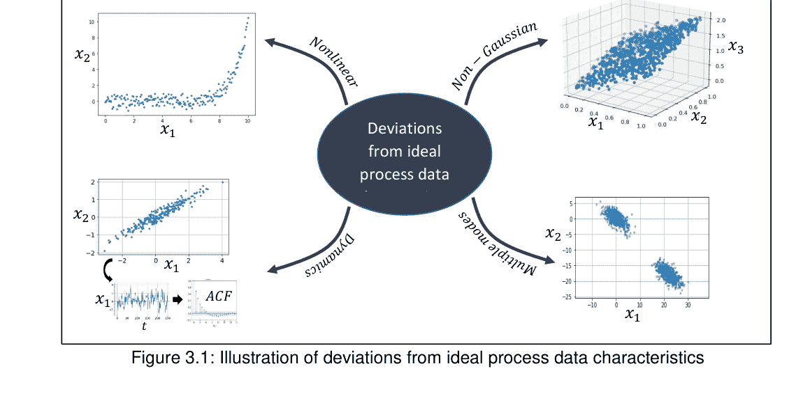

为了进一步激发本章其余部分的讨论，让我们快速看看非理想数据特性可能对PCA性能产生的影响。

##### 非线性的影响

在理想的PCA兼容数据集中，变量之间是线性相关的，这使得标准PCA方法能够找到数据分布的低维流形。然而，如下所示，即使原始数据点明显沿着一个弯曲的流形分布，PCA也无法将原始2D数据集转换为1D特征空间。这严重限制了标准PCA检测故障样本的能力。

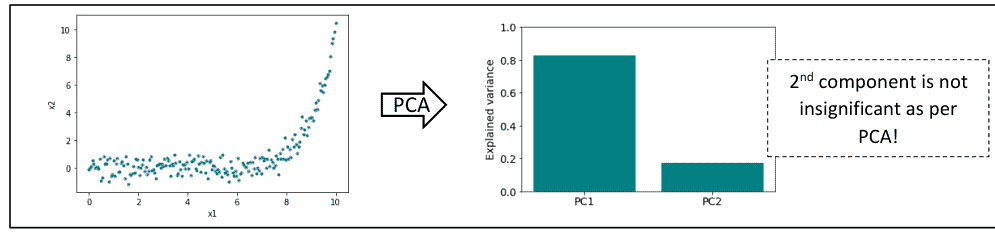

##### 非高斯性的影响

许多过程建模者并不关注过程数据集的高斯性。非高斯性的存在会严重影响许多机器学习模型的性能。下面的图示说明了为什么基于标准PCA的故障检测⁹可能对非高斯数据失效。

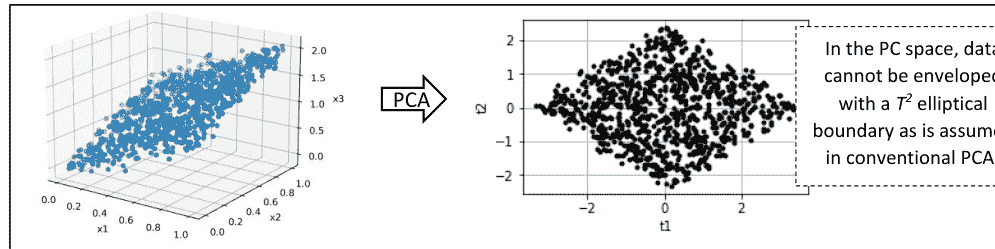

##### 动态性的影响

虽然PCA擅长提取过程变量之间的静态关系，但它无法捕捉任何动态关系。例如，考虑以下过程及其在2D测量空间中的相应数据分布。

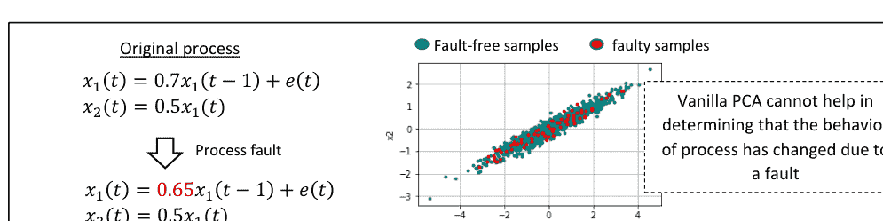

⁹ 如果你不理解PCA术语，请不要担心。你将在第7章中熟悉这些术语。

##### 多簇分布的影响

基于标准PCA的故障检测假设数据分布在单个簇内，这使得可以在PC空间中围绕数据施加单个椭圆边界。然而，如下图所示，如果数据是多簇的，这个假设可能导致漏报。

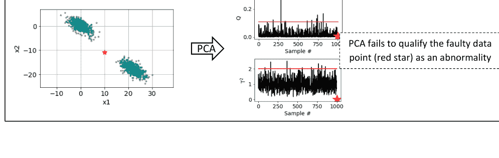

如果上述图示中的PCA特定术语对你来说不立即清楚，请不要担心。在我们完成第7章的PCA技术学习后，你可以重新阅读本节。接下来，我们将逐一探讨这四种非理想特性，并学习如何快速评估它们在多变量数据集中的存在情况。

> 值得一提的是两个提供流程数据EDA模块的开源Python库。由Melo等人于2022年开发的KydLIB¹⁰（“了解你的数据”库）提供了几个例程，用作者的话说，这些例程“专门设计用于处理通常从过程系统工程应用中获得的时间序列数据”。由Sun和Braatz于2021年开发的SPA¹²（智能过程分析）软件旨在为制造数据的预测建模进行自动化模型选择。

#### 3.2 非线性评估技术

如果多变量数据集中的任何两个变量之间存在非线性关系，则称该数据集具有非线性特性。因此，可以通过查看每对变量之间的散点图来评估非线性，但正如预期的那样，这对于高维数据集来说变得繁琐。一种常见的解决方法是使用皮尔逊相关系数（$\rho$），它量化了两个变量之间的线性依赖性。众所周知，$\rho \in [-1, 1]$，其中-1和1的值表示完全线性相关。然而，一个缺点是$\rho = 0$仅表示没有线性关系，变量之间仍然可能存在非线性关系。图3.2展示了一些说明性场景。

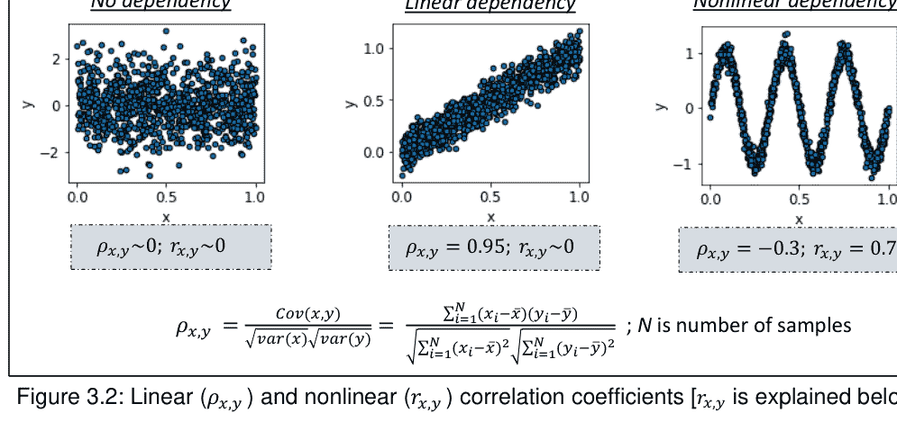

一个量化通用依赖性（包括线性和非线性）的流行指标是互信息（MI），其定义为

$I(x, y) = H(x) + H(y) - H(x, y)$

其中$H(x)$是变量$x$的信息熵，$H(x, y)$是$x$和$y$之间的联合信息熵。*ennemi*$^{14}$ Python包允许方便地计算MI；该包提供了一个称为MI相关系数的归一化指数，其值在0（无关系）和1之间变化，定义为

$\rho_{I(x,y)} = \sqrt{1 - e^{-2I(x,y)}}$

$^{14}$ https://pypi.org/project/ennemi/

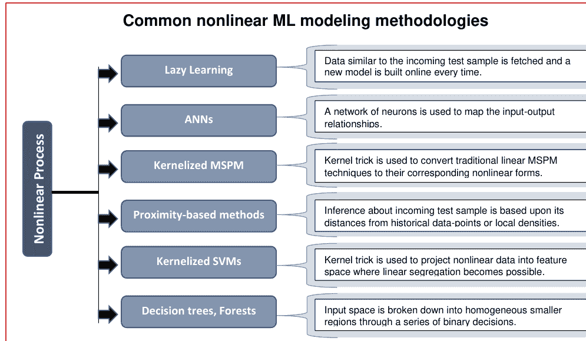

MI相关系数仍然不能告诉我们两个变量是否严格非线性相关。为此，Zhang等人¹⁵提供了一种结合$\rho$和$\rho_I$的有用方法来生成非线性系数¹⁶，$r_{x,y}$，定义为

$r_{x,y} = \rho_{I(x,y)} (1 - |\rho_{x,y}|)$

$\in [0,1]$
$= 1 \Rightarrow x \text{ 和 } y \text{ 具有强非线性关系}$
$= 0 \Rightarrow x \text{ 和 } y \text{ 没有非线性关系}$

让我们通过一个合成示例来具体化我们的理解。

> ¹⁵ Zhang等人，A Novel Strategy of the Data Characteristics Test for Selecting a Process Monitoring Method Automatically. *Industrial & Engineering Chemistry Research*, 2016
¹⁶ $\rho_{I(x,y)}$（因此，$r_{x,y}$）可能显示接近零的负值（https://polsys.github.io/ennemi/potential-issues.html），这可以解释为零。

##### 示例 3.1：考虑以下三变量系统

$x_1 = t + e_1$
$x_2 = t^3 - 3t + e_2$
$x_3 = -t^4 + 3t^2 + e_3$

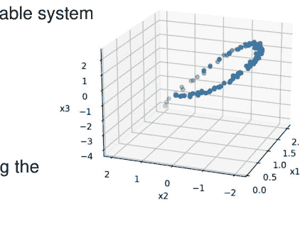

$t \in (0,2]$ 是均匀采样的。让我们评估系统的非线性。我们将从导入所需的包开始。

```python
# import required packages
import numpy as np, matplotlib.pyplot as plt
from ennemi import pairwise_corr
```

```python
# compute linear and Nonlinear correlation coefficients
data = np.hstack((x1,x2,x3)) # check online code to see how x1, x2, x3 vectors are generated
rho_xy = np.corrcoef(data, rowvar=False) # pair-wise linear correlation coefficients
rho_l_xy = pairwise_corr(data) # pair-wise normalized MI
rxy = rho_l_xy*(1-np.abs(rho_xy)) # pair-wise nonlinear correlation coefficients
```

$r_{x,y}$
$x_1 \begin{bmatrix} nan & 0.61 & 0.78 \\ 0.61 & nan & 0.06 \\ 0.78 & 0.06 & nan \end{bmatrix}$
$x_1 \quad x_2 \quad x_3$

$\rho_{x,y}$
$x_1 \begin{bmatrix} 1 & 0.37 & -0.2 \\ 0.37 & 1 & -0.94 \\ -0.2 & -0.94 & 1 \end{bmatrix}$
$x_1 \quad x_2 \quad x_3$

正如预期的那样，非线性矩阵表明系统中存在显著的非线性（由于$x_1$-$x_2$和$x_1$-$x_3$对的非线性系数值很高）。下面的散点图清楚地证实了这一点，并且也阐明了为什么$x_2$-$x_3$对呈现“线性”相关。

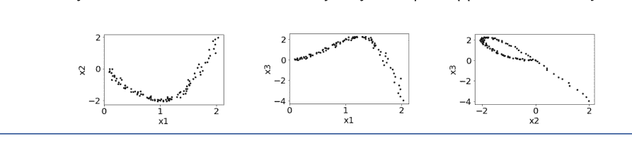

对于整个数据集，Zhang等人还提出了一个整体非线性相关系数，定义为

$r = \sqrt{\frac{\sum_{i,j=1}^m r_{i,j}^2}{m^2-m}}$ ; m 是变量数量

如果没有变量对具有非线性关系，则 $r = 0$
如果所有变量对都具有强非线性关系，则 $r \rightarrow 1$

由于线性方法能够为线性和弱非线性数据集提供令人满意的监控性能，Zhang等人建议在0.3到0.5之间设定一个阈值，以决定是否使用非线性模型。

> 工业过程通常在某个最优条件附近运行。即使实际过程可能非常复杂且非线性，数据可能仅表现出变量之间的线性关系。因此，不要急于选择非线性模型；应先进行非线性检查，然后为你的系统明智地选择一种机器学习模型。

#### 3.3 高斯性评估技术

我们在第1节中看到，关于过程数据高斯性的错误假设可能导致对正常操作范围包络的错误确定。对于多元高斯性评估，这里将介绍Zhang等人提出的一种易于实现的方法。该方法基于以下事实：如果数据服从多元高斯分布，那么样本到中心的马氏距离平方（D）服从F分布¹⁷，如下所示¹⁸。

$D(x) = (x - \bar{u})^T S_{cov}^{-1} (x - \bar{u}) \sim \frac{n(N^2-1)}{N(N-m)} F(m, N-m)$

$x \in \mathbb{R}^m$

$\bar{u}$ 和 $S_{cov}$ 分别是样本均值和协方差

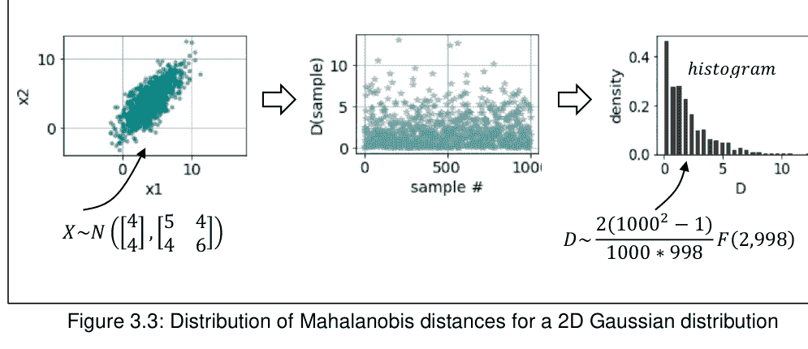

¹⁷ $F(m, N-m)$ 表示自由度为 $m$ 和 $N-m$ 的F分布
¹⁸ 注意，如果 $S$ 是奇异的，那么公式(4)中的 $m$ 应替换为 $S$ 的秩，$S^{-1}$ 应替换为 $S$ 的伪逆

##### 为何高斯性如此重要

下图展示了在1维和2维测量空间中的高斯分布。我们大多数人都熟悉这样的直方图/分布。但这些高斯分布的数据有什么特别之处呢？

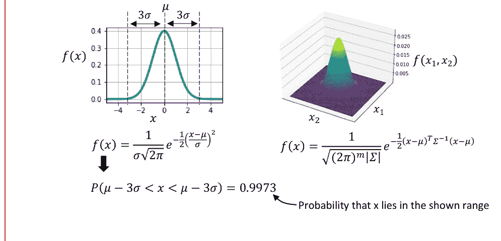

如上式所示，高斯信号完全由两个参数——均值（$\mu$）和协方差（$\sigma^2/\Sigma$）——所表征，因此易于描述和处理。幸运的是，大多数工业过程在某个最优状态附近运行，并在随机过程扰动的影响下表现出自然原因引起的高斯变化。因此，许多传统的多变量统计过程监控和统计过程控制技术都假设高斯性，相应地，其文献中建立的许多结果严格适用于高斯过程。

一旦获得马氏距离，就可以将经验累积分布函数（CDF）与期望的$F$分布的CDF进行比较。下面的算法总结了该方法。

##### 算法：基于马氏距离的多元高斯性检验

- 生成统计量$D$的经验分布与期望$F$分布的分位数-分位数图
  - 将D值排序，使得 $D_t: D_{(1)} \leq D_{(2)} \leq \cdots \leq D_{(N)}$
  - $D_t$ 的经验CDF可描述为 $CDF(D_{(t)}) \approx \frac{t-0.5}{N} = r_t \quad (t = 1, 2, \cdots, N)$
    这里，$D_{(t)}$ 是对应于概率 $r_t$ 的分位数
  - 对应于概率 $r_t$ 的期望$F$分布的分位数计算如下
    $F_t \approx \frac{m(N^2-1)}{N(N-m)} F_{r_t}(m, N-m)$

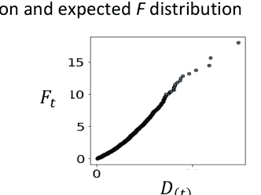

- 对于 $t = 1, 2, \cdots, N$，绘制 $D_{(t)}$ 对 $F_t$ 的图并拟合一条直线。如果数据服从多元高斯分布，则拟合线应通过原点且斜率等于1

- 执行统计检验：
  - 进行显著性检验，以检查 $D_{(t)}$ 与 $F_t$ 之间的线性关系在统计上是否显著。施加以下条件
    $\frac{S}{\bar{F}} < 0.15 \Rightarrow \text{线性拟合不被拒绝}$
    $\bar{F} = \frac{1}{N} \sum F_t$
    $S = \sqrt{\frac{SSE}{N-2}}$
  - 如果满足上述条件，则通过以下条件将截距和斜率分别与0和1进行比较
    $|intercept| < 0.05 * \bar{F}$
    $|slope - 1| < 0.2$

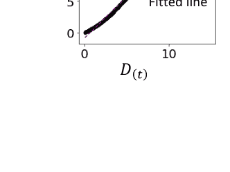

- 如果满足以上所有三个条件，则假设数据服从多元高斯分布

下面的示例展示了上述算法的实施步骤¹⁹。

##### 示例 3.2：考虑以下三变量系统

$x_3 = x_1 + x_2 + e$

$x_1$ 和 $x_2 \in [0,1]$ 均匀采样。让我们评估该系统的非高斯性。

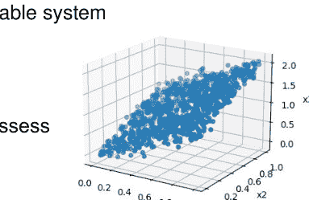

```python
# import required packages
import numpy as np, matplotlib.pyplot as plt
import scipy.spatial, scipy.stats
```

```python
# find data statistics
data = np.vstack((x1,x2,x3)).T # check online code to see how x1, x2, x3 vectors are generated
N, m = data.shape[0], data.shape[1]
mu, Scov = np.mean(data, axis=0), np.cov(data, rowvar=False, ddof=1)
Scov_inv = np.linalg.pinv(Scov)
```

```python
# calculate D statistic and the fractiles
D = np.array([scipy.spatial.distance.mahalanobis(data[i,:], mu, Scov_inv)**2 for i in range(N)])
Dt, rt = np.sort(D), [(t-0.5)/N for t in range(1,N+1)]
Ft = (m*(N**2-1)/(N*(N-m)))*np.array([scipy.stats.f.ppf(p, m, N-m) for p in rt])
```

```python
# fit a straight line
linearFit = scipy.stats.linregress(Dt, Ft)
intercept, slope = linearFit[1], linearFit[0]
```

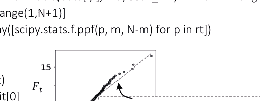

```python
# perform significance tests
Fbar = np.mean(Ft)
Sfit = np.sqrt(((Ft-(intercept+slope*Dt))**2).sum()/(N-2))
Sfit_by_Fbar = Sfit/Fbar
if Sfit_by_Fbar > 0.15:
    gaussianity = False
else:
    if np.abs(slope-1) < 0.2 and np.abs(intercept) < Fbar*0.05:
        gaussianity = True
    else:
        gaussianity = False
```

> 此条件不满足 ⇒ 高斯性= False

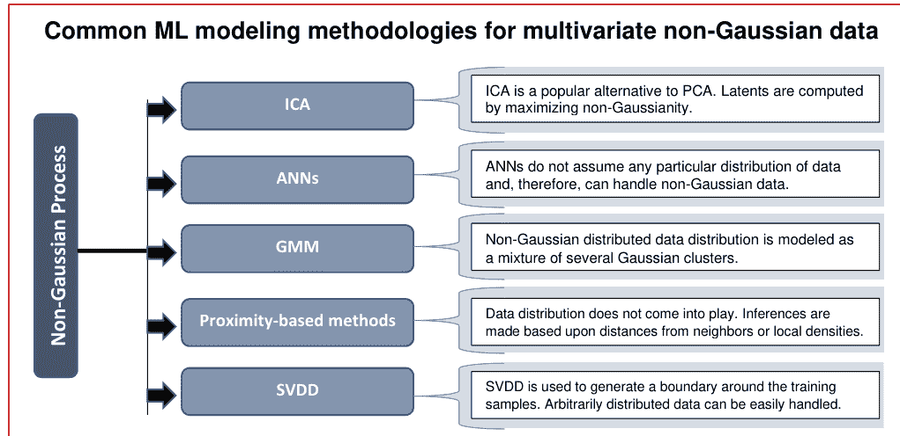

#### 3.4 动态性评估技术

在动态数据集中，记录的样本是序列相关的，即当前测量值与过去的测量值不独立。我们在第1节中看到，为处理稳态数据而设计的模型可能无法捕捉时间关系，从而导致故障检测性能不佳。未建模的序列相关性会出现在模型残差中，如图3.4所示。模型残差中序列相关性的存在通过自相关函数（ACF）来评估，该函数计算残差时间序列在不同滞后下的线性相关系数。如果不存在显著的动态性，那么对于滞后 > 0，ACF值应接近0。Sun和Braatz在SPA包中利用这一原理来自动决定是否需要动态模型。

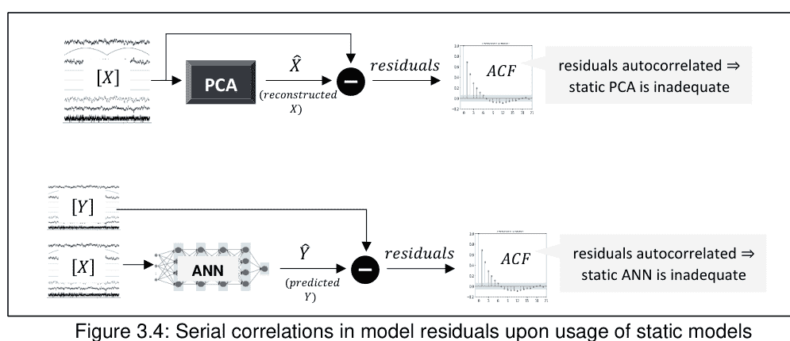

前面的方法需要创建一个静态模型来生成残差。Melo等人在KydLIB包中采用的另一种方法是直接对原始测量值（而非残差）使用ACF。他们绘制了所有变量达到自相关系数值0.5所需的“时间”，以评估数据集的动态行为。达到0.5自相关所需的平均时间或中位时间较低，表明数据中的动态性水平较低。

##### 示例 3.3：考虑我们在第1节中看到的以下2D系统

$x_1(t) = 0.7x_1(t-1) + e_1(t)$
$x_2(t) = 0.5x_1(t) + e_2(t)$

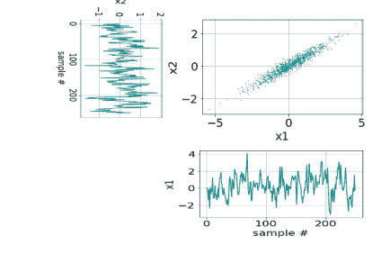

$e_1$ 和 $e_2$ 是高斯噪声。让我们评估该系统的动态性。

```python
# import required packages
import numpy as np, matplotlib.pyplot as plt

# check for dynamics via ACF plot
from statsmodels.graphics.tsaplots import plot_acf
conf_int = 2/np.sqrt(len(x1)) # check online code to see how x1 and x2 vectors are generated

plot_acf(x1, lags= 20, alpha=None)
plt.gca().axhspan(-conf_int, conf_int) # shaded confidence interval
plt.xlabel('lag')

plot_acf(x2, lags= 20, alpha=None)
plt.gca().axhspan(-conf_int, conf_int) # shaded confidence interval
plt.xlabel('lag')
```

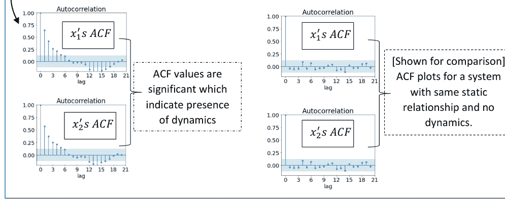

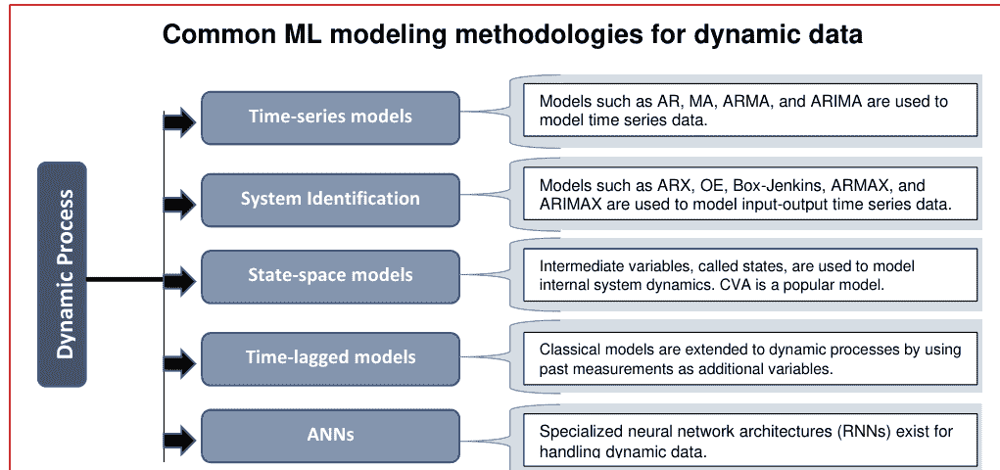

#### 3.5 多模态/多簇分布评估技术

确定数据中是否存在多模态的最常见方法是将数据集划分为不同的簇，并寻找最优的簇数。存在诸如k-means聚类和高斯混合模型等数据聚类技术。我们将把这些技术的详细讨论推迟到第11章。尽管如此，我们在下面的示例中展示了如何评估图3.1所示数据集的多模态性。在第16章中，你将看到一种基于神经网络的可视化技术，称为自组织映射，它可以提供高维数据集的二维视图，从而帮助检查是否存在簇。

##### 示例 3.4：考虑以下二维多聚类数据分布

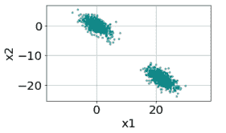

让我们看看如何自动找出操作模式/聚类的数量。

```
# import required packages
import numpy as np, matplotlib.pyplot as plt

# check for clusters via Gaussian Mixture Modeling using Bayesian Information Criterion
from sklearn.mixture import GaussianMixture

BICs = []
lowestBIC = np.inf
for n_cluster in range(1, 5):
    gmm = GaussianMixture(n_components = n_cluster, random_state = 100).fit(data)
    BIC = gmm.bic(data) # check online code to see how x1 and x2 vectors are generated
    BICs.append(BIC)

    if BIC < lowestBIC:
        optimal_n_cluster = n_cluster
        lowestBIC = BIC

print (optimal_n_cluster)

>>> 2
```

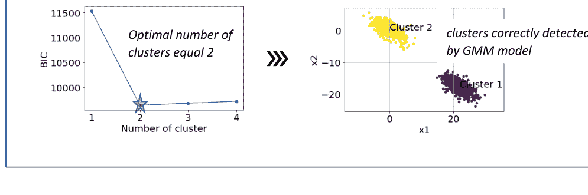

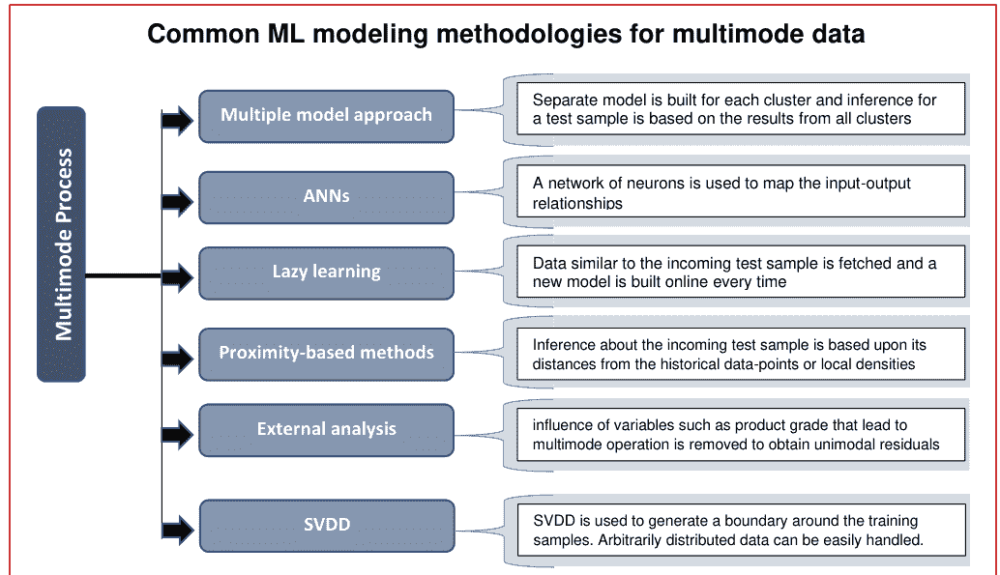

#### 3.6 田纳西-伊士曼过程数据集的数据特性研究

在这个案例研究中，我们将综合运用所学概念来分析一个著名数据集——田纳西-伊士曼过程（TEP）数据集。如果你从事过程监控领域的工作，那么你很可能会遇到使用TEP数据集来展示其故障检测与诊断（FDD）技术有效性的研究论文。因此，让我们利用这个机会将所学概念付诸实践。Melo等人已经分析了该数据集的非线性、非高斯性和动态特性。我们将尝试重现这些结果，并评估其是否存在多模态分布。

TEP数据集<sup>20</sup>来源于一个大型工业化工厂的模拟。该工厂由几个单元操作组成：反应器、冷凝器、分离器、汽提塔和循环压缩机<sup>21</sup>。数据集包含22个连续过程测量值、19个成分测量值和11个操纵变量。该数据集包含来自正常操作期和21个具有不同故障原因的故障期的训练和测试数据。正常操作条件（NOC）训练数据文件（*d00.dat*）包含500个样本。由于该文件常用于构建模型，我们将对其进行详细分析。我们将从分析中排除成分测量值。图3.5和图3.6分别展示了过程流程图和NOC数据的线图。

<sup>20</sup> 可从 https://github.com/camaramm/tennessee-eastman-profBraatz 获取
<sup>21</sup> 关于过程和故障的详细信息可从Downs和Vogel题为‘A plant-wide industrial process control problem’的原始论文中获得。

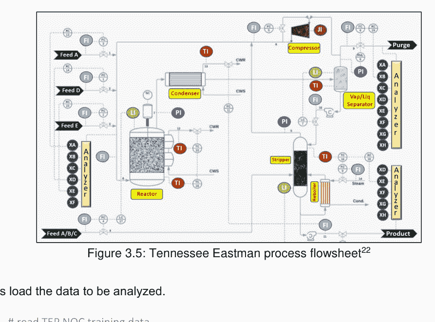

让我们加载要分析的数据。

```
# read TEP NOC training data
import numpy as np
TEdata_noFault_train = np.loadtxt('d00.dat').T
xmeas = TEdata_noFault_train[:,0:22] # continuous measured
xmv = TEdata_noFault_train[:,41:52] # manipulated variables
data = np.hstack((xmeas, xmv))
print(data.shape)

>>> (500, 33)
```

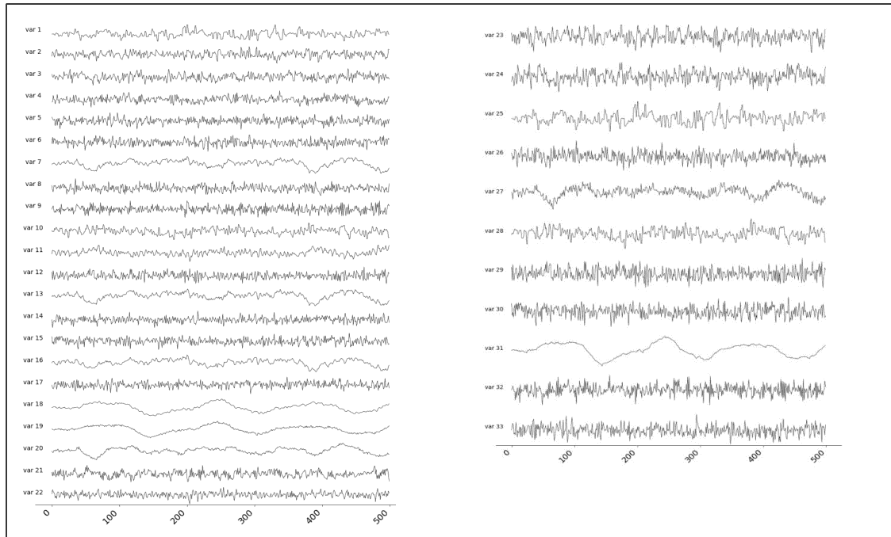

下面的图展示了不同相关系数的热力图。系数的计算代码与第3.2节所示相同，因此此处不再重复²³。总体线性系数和非线性系数分别为0.21和0.20，表明线性和非线性相关性均处于较低水平。

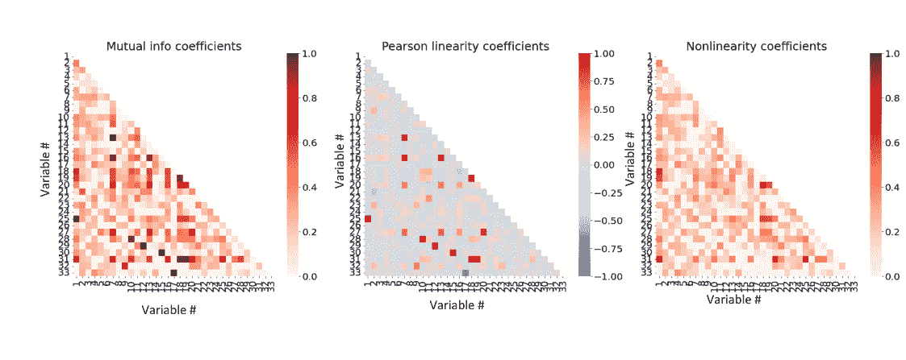

> ²³ 用于TEP数据评估的完整代码可从GitHub仓库获取

用于高斯性评估的分位数-分位数图及其拟合直线如下所示。根据获得的统计数据，该数据集被评估为非高斯分布。

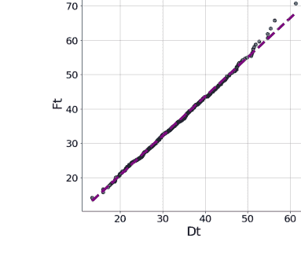

下图显示了33个变量中每个变量达到自相关系数值0.5所需的“滞后阶数”。所需的中位滞后阶数较低，表明数据整体动态水平较低。

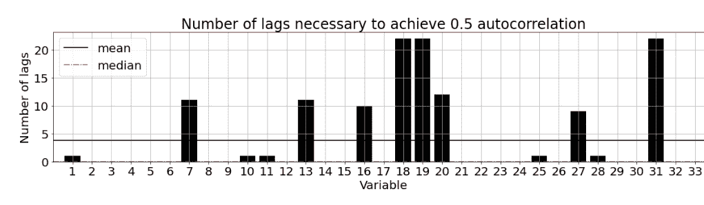

对TEP数据进行GMM建模得到的BIC曲线表明，该数据呈单峰分布。

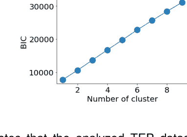

上述练习表明，所分析的TEP数据集表现出线性、静态、非高斯和单峰特性。相应地，你将在本书第3部分看到应用ICA技术（非常适合此类数据集）进行TEP故障检测的实例。

##### 总结

在本章中，我们探讨了评估过程数据不同特性的方法；具体来说，我们关注了非线性、非高斯性、动态性和多模态的存在性。我们还对模拟真实规模复杂工业系统的田纳西-伊士曼化工厂过程数据特性进行了研究。掌握了本章所学的技术，你在为数据集选择合适模型时将不再盲目。在下一章中，我们将探讨更多关于工厂健康管理ML模型开发的最佳实践指南。

## 第4章

### 工厂健康管理的机器学习：工作流程与最佳实践

无论你是在构建用于故障检测、故障分类还是故障预测的ML解决方案，模型开发都是最关键的任务。毫无疑问，获得一个良好的ML模型并非易事。你不能仅仅通过将所有可用的原始数据输入一个现成的机器学习模块就期望得到好模型。错误地指定一个超参数，你的模型就会返回无用的结果；提供不够“丰富”的训练数据集，即使是最精心挑选的ML模型也将无法提供有意义的见解。不幸的是，适用于所有类型问题的自动化ML模型开发流程并不存在。然而，无需绝望。成功模型开发的诀窍在于积极参与模型开发的各个阶段，并利用ML社区多年来提出的若干有用指南。我们在上一章已经看到，为了正确选择模型，深入理解数据的重要性。在本章中，我们将学习其他一些指南和最佳实践。

我们将不涵盖与通用机器学习工作流程相关的最佳实践。特征提取、特征工程、交叉验证、正则化等概念已在我们系列丛书的第一本中有详细阐述。尽管如此，我们将涉及特定于工厂健康管理应用的主题。在本章中，我们的重点将放在那些你不应忽视的方面，以确保你不会在不知不觉中为模型的失败埋下伏笔。具体来说，我们将涵盖以下主题：

- ML模型开发工作流程
- 数据选择与预处理以获得良好的训练数据集
- 监控性能评估
- 模型选择与调优的最佳实践

#### 4.1 ML模型开发工作流程

构建过程建模解决方案的ML建模任务的主要目标是获得一个具有高故障敏感性（即模型能够在故障初期检测到过程故障）和低误报率（即模型在过程正常运行时不报告故障）的模型。平衡这两个要求之间的权衡并不容易，需要在模型开发过程中仔细关注各个方面。这绝对不仅仅是执行一个‘model = <some ML_model>.fit()’命令那么简单。在第1章中，我们概述了ML模型开发练习中涉及的典型步骤。在本章中，我们将更详细地探讨工作流程的不同组成部分。图4.1列出了我们将涉及的子任务。虽然每个子任务都可以单独成书，但我们将重点关注那些可能被经验不足的过程数据科学家所忽视的方面。

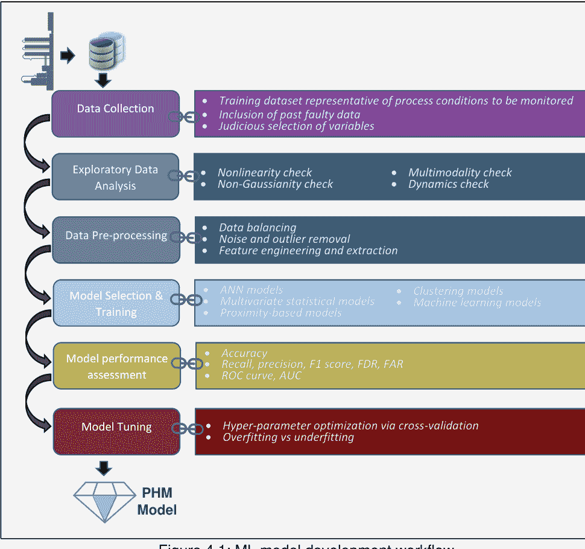

工作流程始于数据收集。虽然通常你无法完全控制可用于模型构建的数据（即从历史数据库中收集的过程数据），但你可以采取一些措施来确保“正确”的数据被传递到后续流程中。例如，你可以确保只选择那些能够代表将被监控的过程条件的NOC样本进行进一步处理；这确保了模型能够学习到正确的无故障过程行为。之后，你进入探索性数据分析步骤，在此步骤中你将对数据有一个“感觉”。在前一章中，我们已经非常详细地了解了EDA如何帮助我们选择正确的模型类别。在下一步中，数据经过预处理以增加数据中的信息含量。这一步可能涉及数据清洗（例如，去除异常值和噪声）、数据转换（生成新的特征和/或修改现有特征）等。完成此步骤后，我们就可以拟合我们选择的模型了。

模型选择的一个实用准则是奥卡姆剃刀原则，它建议选择满足建模目标的最简单的模型。在第1章中，我们看到了几个影响模型选择的因素。这些因素连同EDA步骤的推断将帮助你筛选候选模型。在模型拟合之后，会对模型的故障检测和故障诊断性能进行评估。已经设计了多种指标来量化FDD性能的不同方面。我们将在本章中探讨这些指标。在获得你梦寐以求的模型之前的最后一步是模型调优，在这一步中你需要调整模型的超参数。我们将研究如何使用交叉验证来完成这一步。在对工作流程有了这个大致的了解之后，让我们更深入地探讨其中的一些方面。

#### 4.2 数据选择

在机器学习模型开发工作流程的“数据选择”步骤中，作为过程建模者，你需要确保不会意外地提供一个会“混淆”机器学习模型的数据集！为了进一步理解这一点，让我们看几个示例场景。

##### 代表正常操作条件的训练数据

大多数用于过程监控应用的机器学习模型通过“学习”正常的过程行为来工作。现在考虑下面的示意图。由于一年前进行了重大设计更改，炉内温度的正常值发生了变化。现在想象一下，如果使用过去四年的历史数据进行模型训练。

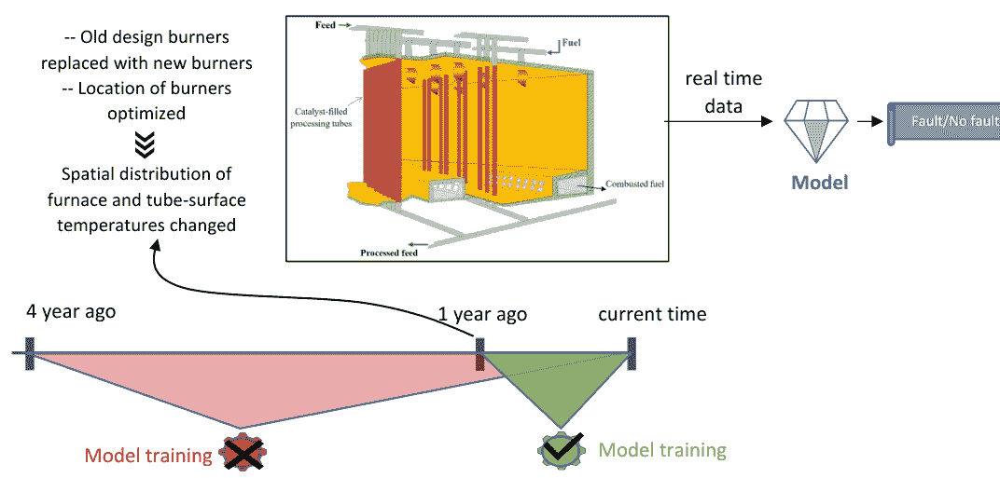

任何模型都将难以充分描述过去1年内的炉温。模型与实际过程的不匹配将显著增加数据集中的“噪声”，这将严重影响最终模型的故障灵敏度。模型性能必然会令人失望。一个明智的方法是仅使用过去1年的数据作为训练数据。

##### 避免包含不必要的变量

缺乏经验的过程数据科学家的一个普遍倾向是将所有可用的过程变量都丢进模型训练模块。他们依赖特征选择来剔除无关变量。然而，特征选择并不总是能做得很好；例如，如果你正在构建一个PCA模型，并且没有足够的历史故障样本，那么就很难通过算法推断出变量的相关性。始终更明智的做法是提前仔细关注，并做出有根据的变量选择。

> 关键信息是，如果你不是工厂运营的“内部人士”，那么最好与工厂经理（和工厂工程师）坐下来，尽可能多地获取有关过程的信息；利用获得的信息来策划训练数据集。

#### 4.3 数据预处理

正如第1章中所暗示的，此步骤的总体目标是增加训练数据集的“信息含量”，从而增强模型区分正常操作和故障操作的能力。例如，如果训练数据集被异常值污染或没有足够数量的故障样本，模型的性能将会受损。在预处理步骤中，训练数据集会被处理以消除这些缺陷。让我们看看在追求“快速”结果时容易被忽视（或未正确处理）的几个缺陷，这些缺陷会导致误导性的推断。

##### 处理异常值

简单来说，异常值是与正常训练样本不一致的损坏的训练样本。显而易见，异常值会在从训练数据中提取过程的真实正常行为时“混淆”模型。下面的示意图显示了未处理的异常值如何导致故障未被检测到。

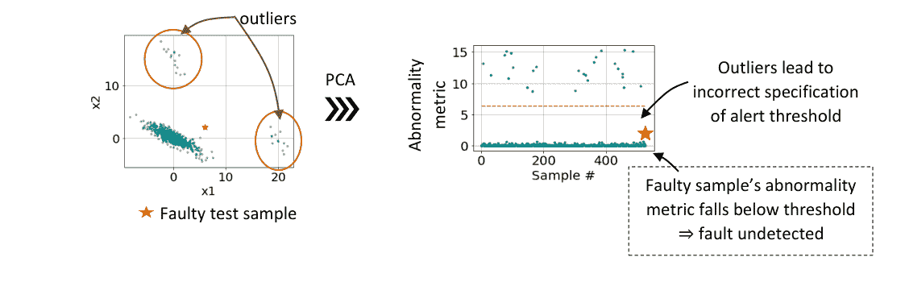

在本系列丛书第1册的第4章中，我们详细介绍了几种去除异常值的技术；感兴趣的读者可以参考该章获取更多细节。对于上图中的数据集，正确的建模方法要么是在模型拟合前明确去除异常值，要么是实施对异常值不那么敏感的稳健PCA，并选择具有正确显著性水平的控制限（例如90%的控制限而不是95%）。

在高维数据集中，仅凭“快速浏览”很难检测到异常值的存在，因此你可能会倾向于跳过异常值处理。然而，作为最佳实践，你的默认假设必须始终是训练数据集可能潜伏着异常值，并且必须根据当前系统的情况采取适当的措施来处理异常值。

##### 处理数据不平衡

如果你正在构建一个故障分类模型，那么你将不可避免地遇到数据不平衡的问题，其中对应于故障操作的数据样本数量远少于NOC样本的数量。数据不平衡是不可取的，因为它导致机器学习模型训练被NOC样本主导，使得模型无法充分学习故障样本，最终无法正确检测（/分类）过程故障。

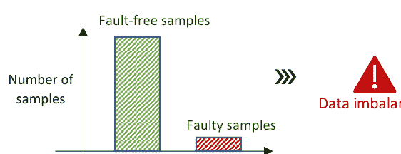

如何纠正数据不平衡？一个简单的策略可能是丢弃大部分NOC样本（也称为欠采样），但这显然会导致关键过程信息的丢失。另一种方法是向训练数据集添加更多故障样本，但工厂经理不会允许你为了训练模型而在他们的过程中注入故障。处理数据不平衡的一个流行机制是SMOTE（合成少数类过采样技术），其中生成合成的故障样本。基本思想如下图所示。这里，选择一个随机的故障样本（A），并如图所示生成一个合成数据点。重复此过程以创建所需数量的合成故障样本。

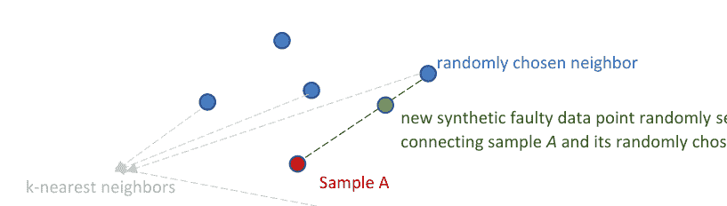

> **示例 4.1：** 我们将生成一个包含NOC和故障样本的不平衡数据集。然后我们将学习如何使用 imblearn 包来平衡数据集。

```
# import required packages
import numpy as np, matplotlib.pyplot as plt
from imblearn.over_sampling import SMOTE
```

```
# generate data
cov = np.array([[6, -3], [-3, 2]])
pts_NOC = np.random.multivariate_normal([0, 0], cov, size=500)
cov = np.array([[1, 1], [1, 2]])
pts_Faulty = np.random.multivariate_normal([5,2], cov, size=25)
X = np.vstack((pts_NOC, pts_Faulty))
y = np.vstack((np.zeros((500,1)), np.ones((25,1)))) # labels [0=>NOC; 1=>Faulty]
```

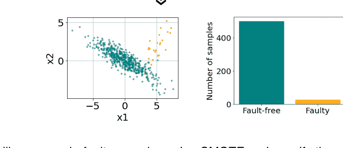

我们将使用SMOTE对故障样本进行过采样，并指定故障样本与无故障样本的比例为0.33。

```
# Oversampling
overSampler = SMOTE(sampling_strategy=0.33)
X_smote, y_smote = overSampler.fit_resample(X, y)
```

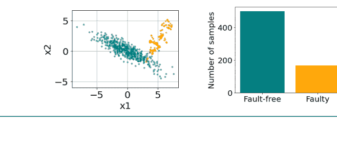

一个常见的做法是将SMOTE与NOC样本的欠采样相结合。*imblearn* 包的 *RandomUnderSampler* 类可以用于此目的。在示例 4.1 的数据集中，我们将故障样本与无故障样本的比例增加到0.5，如下所示。

```
# Undersampling
from imblearn.under_sampling import RandomUnderSampler
underSampler = RandomUnderSampler(sampling_strategy=0.5)
X_balanced, y_balanced = underSampler.fit_resample(X_smote, y_smote)
```

既然你的训练数据集已经得到丰富，你可以预期你的故障分类器性能将大幅提升！

#### 4.4 模型评估

模型拟合后，我们需要一些方法来评估模型性能，以量化模型检测故障的效果。最直接的指标是*准确率*，它简单地表示正确预测数与总预测数的比例。然而，对于不平衡数据集，准确率可能会产生误导。例如，如果你的模型总是简单地预测“无故障”，而你的数据集中有95%的正常工况样本，那么模型的准确率将是95%，这看起来好得令人怀疑！因此，人们设计了其他几个指标来量化模型故障检测能力的不同方面。在介绍这些指标之前，我们先来理解混淆矩阵。如下所示，故障检测（二元分类）模型的混淆矩阵全面概述了模型正确（和错误）分类属于正类（故障）和负类（正常/无故障）样本的情况。

使用混淆矩阵中的术语，下表总结了各种性能指标。

| 误报率（FAR）或假阳性率（FPR） | 故障检测率（FDR）或真阳性率（TPR）或灵敏度或召回率 | 漏检率或假阴性率（FNR） |
| :--- | :--- | :--- |
| 被标记为阳性的阴性样本比例 | 被正确标记的阳性样本比例 | 被标记为阴性的阳性样本比例 |
| $FAR = \frac{FP}{AN} = \frac{FP}{FP + TN}$ | $FDR = \frac{TP}{AP} = \frac{TP}{TP + FN}$ | $FNR = \frac{FN}{AP} = \frac{FN}{FN + TP}$ |
| 精确率或阳性预测值（PPV） | F1分数 | 准确率（ACC） |
| 阳性预测中正确的比例 | 精确率和召回率的调和平均值 | 正确预测的比例 |
| $Precision = \frac{TP}{TP + FP}$ | $F1 = \frac{2}{\frac{1}{Precision} + \frac{1}{Recall}}$ | $ACC = \frac{TP + TN}{TP + TN + FP + FN}$ |

表1：故障检测模型的性能指标

你将在异常检测文献中经常遇到精确率和召回率这两个术语。精确率指标返回模型正确阳性预测数与模型总阳性预测数的比率，而召回率返回正确阳性预测数与数据中总阳性样本数的比率。对于过程监控工具（其中阳性标签意味着存在过程故障），召回率表示模型检测过程故障的能力，而精确率表示模型预测过程故障的准确性。如果模型成功检测到过程故障，它可能具有高召回率，但大量误报会降低其精确率。在另一种情况下，如果模型只能检测特定类型的过程故障且误报很少，那么它的召回率会低而精确率会高。一个完美的模型在精确率和召回率上都会有高值（接近1）。然而，我们刚才看到，这两个指标中的一个可能高而另一个低。因此，需要同时报告这两个指标。但是，如果只需要一个指标，则使用F1分数，当精确率和召回率都高时，它返回高值；当精确率或召回率低时，它返回低值。

在过程工业中，召回率（FDR）和误报率（FAR）更常用于评估过程监控工具的性能。工厂操作员主要关心两件事：模型是否在故障发生时检测到它（由FDR给出），以及模型在正常工况下是否触发误报（由FAR给出）。显而易见，FAR接近0是理想的。一个设计良好的监控工具具有高FDR和低FAR值。低FDR和高FAR值都是不可取的，因为低FDR值会导致安全问题和因延迟/未检测到异常而造成的经济损失，而高FAR值会导致用户对工具失去信心，并最终导致工具被淘汰。如果你使你的模型非常敏感，以便在初始阶段及时检测故障，它很可能会产生大量误报。作为过程数据科学家，你经常会发现自己需要调整模型以平衡FDR和FAR之间的权衡。

##### ROC和曲线下面积（AUC）

大多数故障检测模型以某种形式计算异常度量（PCA中的Q和T²，SVDD中到中心的距离等）。根据训练样本的异常度量，选择一个报警阈值，使得超过该阈值的度量值意味着存在故障，如下图所示。

如图所示，虽然一个非常“宽松”的阈值可能无法检测到故障样本（FDR低，FAR低），但一个非常激进的阈值会导致正常样本被标记为故障（FAR高，FDR高）。不同报警阈值下FDR和FAR之间的这种相互作用通过下面的ROC曲线以图形方式呈现。虽然理想的故障检测工具将提供完美的性能（FDR=1，FAR=0），但在实际场景中，你必须调整报警阈值以提供可接受的FDR和FAR水平。

通常，曲线越接近理想检测器，或者在对角线上方的提升越大，其性能就优于随机分类器。为了使用ROC曲线比较两个模型，人们设计了一个称为AUC（曲线下面积）的指标。AUC是通过从FAR=0到FAR=1对ROC曲线进行积分得到的。理想检测器的AUC=1，更高的AUC值意味着更好的故障检测性能。

##### 故障灵敏度与故障检测速度

之前，我们关注的是故障检测模型检测故障的能力。评估（故障检测）FD性能的另一个重要特征是“检测速度”。通常用于量化检测速度的指标称为平均运行长度（ARL）。具体来说，ARL1指的是从故障发生到FD模型检测到它所经过的平均样本数。

在第5章中，我们将看到故障灵敏度和故障检测速度之间的权衡。具体来说，将介绍一种称为CUSUM的技术，它能够检测小幅值的故障（⇒高故障灵敏度），但与经典的3-sigma技术（广泛用于单变量信号监测）相比，显示出更高的ARL1。另一个称为ARL0的指标表示当过程中没有故障时，FD模型发出（误）警报所需的平均时间或样本数。

#### 4.5 模型调优

每个机器学习模型都带有一组超参数（例如，ANN中的神经元数量，PCA中保留的潜在成分数），可以调整这些参数以提高性能指标。但是，必须注意避免模型过拟合。下图显示了对不同带宽值的正常工况训练样本进行SVDD建模的情况。

图4.2：SVDD超参数调优

对于高维复杂数据集，在调整模型时不容易判断是否过拟合数据。因此，标准方法是使用单独的数据集组来拟合、调优和评估模型，如下图所示。

图4.3：三路保持法

过拟合的模型是一个不必要的复杂模型，最终拟合了训练数据集中的噪声，因此可以预期它在验证数据集上表现不佳（高FAR）。另一方面，欠拟合的模型甚至无法捕捉训练数据集中的系统结构，导致在拟合和验证数据集上都出现不理想的低FDR。因此，通常选择导致最不复杂模型且在验证数据集上提供可接受性能的超参数值作为最终模型。这种在模型调优期间使用验证数据集评估模型性能的做法称为交叉验证。

##### 半监督学习中的交叉验证

如果你的验证数据集中有足够多的故障样本，那么你可以直接使用诸如*FDR*或*MDR*等指标来评估模型在验证数据集上的*表现如何*。然而，通常情况下，你只能使用*NOC*样本。在这种情况下，常见的做法是选择超参数，使其在验证数据集上产生一定水平的*FAR*。例如，在图4.2中，拟合了一个*SVDD*并在验证数据集上计算了*FAR*。选择带宽值，使其在交叉验证期间产生5%（且不更低）的*FAR*。较低的验证*FAR*可能表明潜在的欠拟合，而高于5%的*FAR*则意味着过拟合。

##### 总结

在本章中，我们介绍了一些构建故障检测模型的基本但至关重要的方面，你需要仔细关注这些方面以确保模型性能令人满意。我们涉及了数据选择、数据预处理、模型评估和模型调优等任务。从下一章开始，我们将深入探讨开发过程监控模型的世界。

## 第二部分

### 单变量信号监控

## 第五章

### 用于统计过程控制的控制图

在机器学习席卷过程工业之前，使用统计选择的上下限对关键工厂变量进行简单绘图曾是检测过程异常的常规做法。这些图表被称为控制图，构成了统计过程控制或统计质量控制的主要组成部分。尽管由于先进的多元过程监控工具的出现，控制图失去了一些光彩，但它们仍被工厂管理层广泛用于监控关键KPI，例如产品质量、过程效率等。概念简单、解释容易和实施快速是它们持续流行的一些原因。

休哈特控制图（包括流行的3-sigma控制图）是最早、最简单和最常用的控制图。然而，它们在检测导致小偏差的故障时表现不佳。因此，已经设计了诸如CUSUM控制图和EWMA控制图等替代方案。在本章中，我们将学习这些技术，并熟悉如何在实践中实施它们。最后，我们将讨论克服单变量控制图缺点的方法。具体涵盖以下主题。

- 休哈特控制图简介
- CUSUM控制图简介
- EWMA控制图简介
- 通过CUSUM控制图对曝气池进行统计过程控制
- 克服单变量统计过程控制局限性的策略

#### 5.1 控制图：简单且久经考验的过程监控工具

控制图是统计过程控制的七大<sup>24</sup>支柱之一，传统上用于监控关键生产或产品质量指标，以检测意外偏差。当过程处于“受控”状态时，监控变量预计仅围绕某个目标值或均值表现出自然原因引起的波动。如图5.1所示，控制图只是将单个过程变量的测量值相对于时间或样本编号进行绘制的显示。此外，这些图表包括一条中心线或预期均值，以及两条称为UCL（上控制限）和LCL（下控制限）的限线。大多数工业过程变量由于影响过程的随机扰动而表现出自然波动。控制限在统计上设计成在自然原因引起的波动下，监控变量以特定的期望概率保持在控制限内。控制限的突破表明潜在的过程故障或“失控”状态。因此，正确指定控制限对于确保最小的误报和快速检测故障至关重要。

传统的控制图有三种不同的形式，即休哈特控制图、CUSUM控制图和EWMA控制图。休哈特控制图仅在控制图上绘制当前测量值，而另外两种则绘制当前和过去测量值的某种组合。你很快就会了解到，使用过去测量值如何能够检测到休哈特控制图可能无法检测到的早期或低幅度故障。控制图不仅限于跟踪过程测量值；任何预期仅围绕某个均值或目标表现出随机波动的指标都可以通过控制图进行监控。相应地，控制图也用于监控模型残差、潜变量（例如，在PCA中）等。让我们首先从休哈特控制图开始。

#### 5.2 休哈特控制图简介

休哈特控制图是最简单且广泛使用的控制图，其中每个采样时刻的过程测量值相对于样本编号绘制，控制限通常设置为$\mu \pm 3\sigma$，其中$\mu$和$\sigma$是受控过程变量的均值和标准差。中心线显然设置为$\mu$。休哈特控制图假设高斯分布，因此，$3\sigma$控制图相当于0.27%的误报率，如图5.2所示。

统计量$\mu$和$\sigma$通常不是精确已知的，而是从历史受控数据中估计。设$x_1, x_2, \cdots, x_N$为历史良好运行期的观测值，则样本统计量可估计为$^{25}$

$$\hat{\mu} = \bar{x} = \frac{1}{N} \sum_{i=1}^{N} x_i \quad ; \quad \hat{\sigma} = \frac{s}{c_4}$$

其中s是样本标准差（$\sqrt{\frac{\sum(x_i-\bar{x})^2}{N-1}}$），$c_4$是一个校正因子$^{26}$（对于大$N$趋近于1），用于考虑有限样本。这导致以下控制限

$$LCL = \bar{x} - 3\frac{s}{c_4} \quad ; \quad UCL = \bar{x} + 3\frac{s}{c_4}$$

##### 每个样本的测量子组

标准休哈特控制图假设在每个采样时刻有一个子组，例如$m$个测量值可用，如下图所示。

在标准休哈特控制图上跟踪的是子组的均值。实际上，$m=1$的休哈特控制图被称为单值休哈特控制图。设$x_{ij}$表示第$i$个子组中的第$j^{th}$个测量值。可以使用历史IC（受控）数据获得子组均值的样本统计量，如下所示。

对于连续过程，单值和标准休哈特控制图都有用。例如，假设工厂效率测量值每分钟可用一次。如果需要，工厂操作员可以使用单值控制图跟踪分钟级效率。或者，效率测量值可以按小时平均（$\Rightarrow m=60$），并跟踪小时平均效率值。

虽然休哈特控制图易于解释和实施，但当用于检测过程变量均值的小偏差（$< 1.5\sigma$偏移）时，其性能较差。以下说明阐明了这一点。

- 最后50个样本在均值上产生了0.5σ偏移
- 休哈特控制图未能检测到故障
- 即使从视觉上看，故障也几乎难以察觉

图5.3：休哈特控制图未能检测到小的均值偏移

为了理解如何生成休哈特图，让我们通过用于生成图5.3中图表的代码来讲解。

```python
# import required packages
import numpy as np, matplotlib.pyplot as plt

# generate data
x0 = np.random.normal(loc=10, scale=2, size=250) # NOC samples
x1 = np.random.normal(loc=11, scale=2, size=50) # faulty samples
x = np.hstack((x0,x1)) # combined data
```

# 使用NOC样本拟合休哈特模型
mu, sigma = np.mean(x0), np.std(x0)
UCL, LCL = mu + 3*sigma, mu - 3*sigma

# 为组合数据绘制控制图
plt.plot(x,'--',marker='o', color='teal')
plt.plot([1,len(x)],[UCL,UCL], color='red'), plt.plot([1,len(x)],[LCL,LCL], color='red')
plt.plot([1,len(x)],[mu, mu], '--', color='maroon')
plt.xlabel('sample #'), plt.ylabel('x')

#### 5.3 CUSUM图：简介

考虑下图所示的控制图，其对应图5.3中的数据集。显然，与休哈特图不同，该控制图能轻松标记出失控状态。此图称为CUSUM图，已知其在检测小幅均值偏移方面更为有效。在第$i^{th}$个采样时刻，绘制在CUSUM图上的CUSUM统计量（$S_i$）是每个可用测量值与均值（或目标值）偏差的“累积和”。当过程处于受控状态时，围绕均值的随机偏差相互抵消，$S_i$在零附近波动；然而，若在第$r^{th}$个采样时刻出现均值偏移，例如偏移量为$\Delta$，则在每个时刻$\geq r$，$S_i$都会增加一个额外的$\Delta$项，从而导致如图5.4所示的持续上升（或下降）趋势。

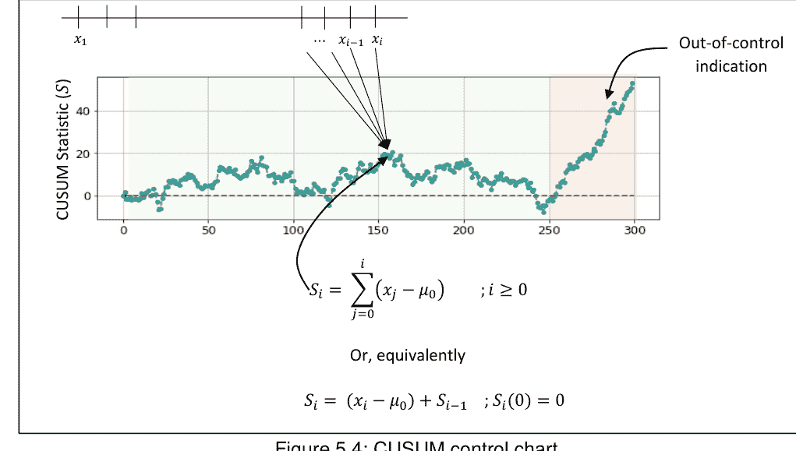

过去，使用CUSUM图进行故障检测通常是通过观察趋势斜率（使用所谓的V形掩模）以图形方式完成的。然而，在现代统计软件系统中，使用的是以下双向CUSUM图。

$$S_i^+ = \max[0, x_i - (\mu_0 + k) + S_{i-1}^+] \longrightarrow \text{追踪均值的正向偏移}$$
$$S_i^- = \max[0, (\mu_0 - k) - x_i + S_{i-1}^-] \longrightarrow \text{追踪均值的负向偏移}$$

- $k \geq 0$
- 偏离均值（或目标值）大于$k$会增加$S^+$或$S^-$
- $k$通常设置为我们希望快速检测到的均值偏移大小的一半

$S^+$和$S^-$都绘制在同一图表上，并附有指定的控制限（或阈值）$H$，如下所示。

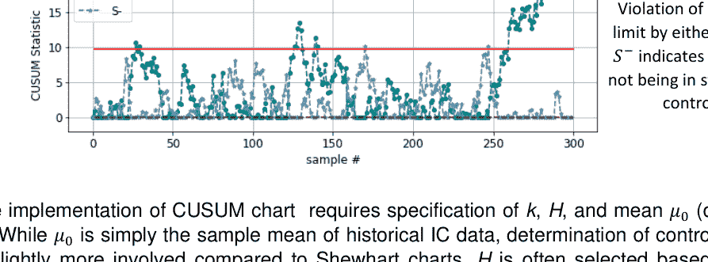

CUSUM图的实现需要指定$k$、$H$和均值$\mu_0$（或目标值$T$）。虽然$\mu_0$只是历史IC数据的样本均值，但控制限$H$的确定比休哈特图稍复杂。$H$通常根据不同均值偏移水平下的ARL(0)和ARL(1)值来选择$^{27}$。通常，$H$设置为$4\hat{\sigma}$或$5\hat{\sigma}$，其中$\hat{\sigma}$的估计方式与休哈特图相同。

##### 变点检测

> 在异常检测领域，你可能会遇到“变点检测”（CPD）这个术语。CPD是寻找信号属性（均值、标准差等）发生显著变化时刻的问题。CUSUM和EWMA是用于CPD的两种流行技术。

##### 示例5.1：我们将使用图5.3中的数据，学习如何构建CUSUM控制图。我们还将了解$k$对图表性能的影响。

```python
# CUSUM chart
mu, sigma = np.mean(x0), np.std(x0)
k, H = 0.25*sigma, 5*sigma

S_positive, S_negative = np.zeros((len(x),)), np.zeros((len(x),))
S_positive[0], S_negative[0] = 0, 0

for i in range(1,len(x)):
    S_positive[i] = np.max([0, x[i]-(mu+k) + S_positive[i-1]])
    S_negative[i] = np.max([0, (mu-k)-x[i] + S_negative[i-1]])

plt.plot(S_positive,'--',marker='o', color='teal', label='S+')
plt.plot(S_negative,'--',marker='*', color='steelblue', label='S-')
plt.plot([1,len(x)],[H,H], color='red'), plt.plot([1,len(x)],[0,0], '--', color='maroon')
```

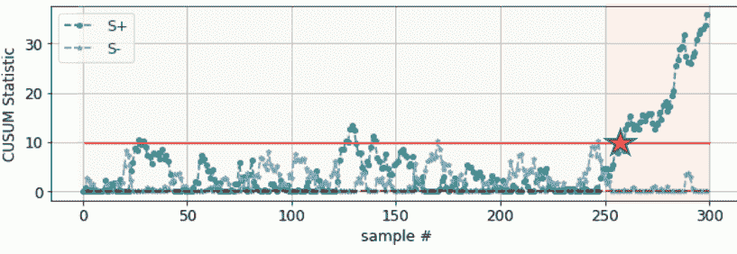

CUSUM图可以及时检测到均值偏移。然而，我们也看到NOC数据中有一些误报。这是因为我们的图表非常敏感（设计用于捕捉仅$0.5\sigma$的偏移）。下图显示了将$k$增加到$0.5\sigma$的影响——误报发生率降低了，但故障检测有相当大的延迟（约50个样本）。

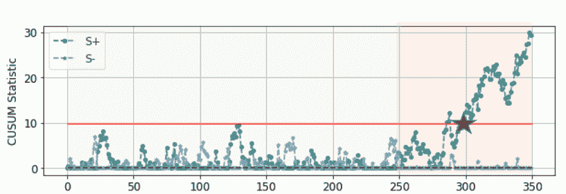

CUSUM图也可以检测过程均值的大幅偏移；然而，其检测速度比休哈特图慢（即ARL(1)更高）。EWMA在小幅均值偏移检测和快速检测大幅偏移之间提供了良好的折衷。

#### 5.4 EWMA图：简介

与CUSUM类似，EWMA图是具有记忆功能的控制图。这里，在任何第$i^{th}$个采样时刻，绘制在EWMA控制图上的统计量（$z_i$）是第$i^{th}$个过程测量值与先前统计量$z_{i-1}$的加权组合；这意味着EWMA统计量是所有过去测量值的指数加权平均，如图5.5所示。我们可以看到，EWMA图在休哈特图（仅考虑当前观测值）和CUSUM图（对所有可用观测值赋予相等权重）之间取得了平衡；因此，这导致了检测延迟和故障敏感性之间的良好平衡。

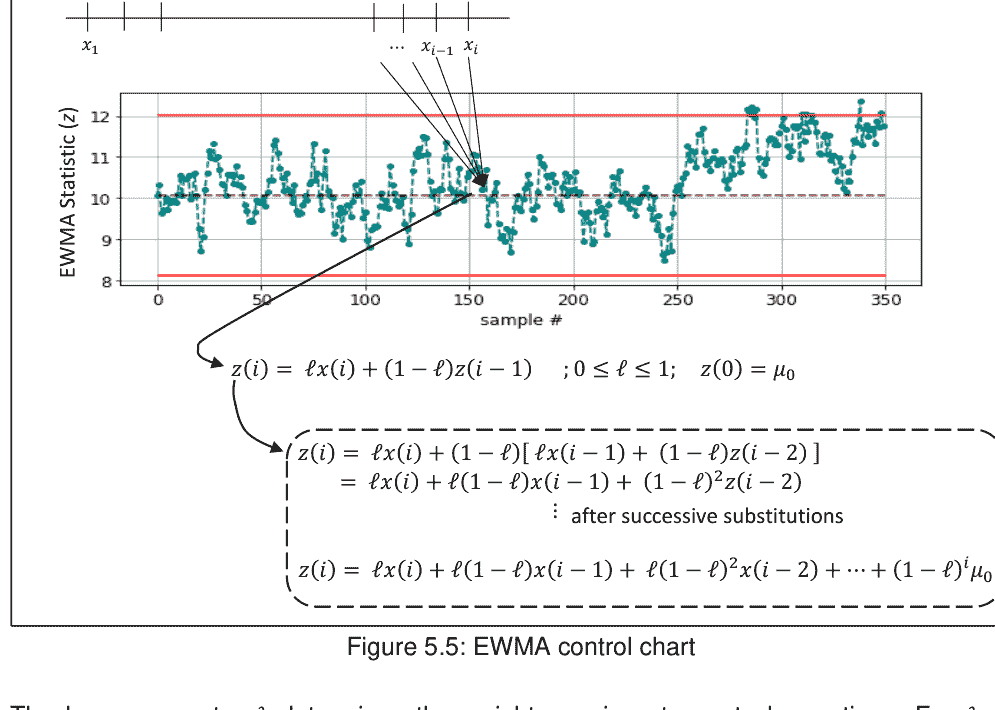

超参数$\lambda$决定了赋予过去观测值的权重。对于$\lambda = 1$，EWMA图退化为休哈特图，而当$\lambda \to 0$时，开始出现类似CUSUM的特性。通常建议$0.2 \le \lambda \le 0.3$。3-sigma控制限如下所示。

$LCL = \hat{\mu} - 3\hat{\sigma}\sqrt{\frac{\lambda}{2-\lambda}} \quad ; \quad UCL = \hat{\mu} + 3\hat{\sigma}\sqrt{\frac{\lambda}{2-\lambda}}$

其中$\hat{\sigma}$是如休哈特图计算的历史IC标准差。

**示例5.1续：** 我们将再次使用图5.3中的数据，学习如何构建EWMA控制图。

```python
# EWMA chart
mu, sigma = np.mean(x0), np.std(x0)
smoothFactor = 0.1

LCL = mu - 3*sigma*np.sqrt(smoothFactor/(2-smoothFactor))
UCL = mu + 3*sigma*np.sqrt(smoothFactor/(2-smoothFactor))

z = np.zeros((len(x),))
z[0] = mu

for i in range(1,len(x)):
    z[i] = smoothFactor*x[i] + (1-smoothFactor)*z[i-1]

plt.plot(z,'--',marker='o', color='teal')
plt.plot([1,len(x)],[LCL,LCL], color='red'), plt.plot([1,len(x)],[UCL,UCL], color='red')
plt.plot([1,len(x)],[mu,mu], '--', color='maroon')
plt.xlabel('sample #')
```

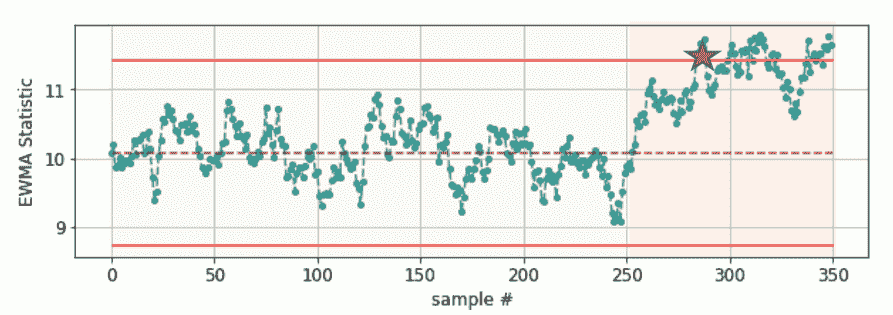

在上述EWMA图中，休哈特图和CUSUM图性能之间的平衡立即显现。EWMA统计量突破了（尽管勉强）警报阈值（⇒ 性能优于休哈特图），并且检测延迟也低于CUSUM图（⇒ 性能优于CUSUM图）。

#### 5.5 案例研究：监测曝气池中的气流

为了说明控制图的工业应用，我们将考虑来自下图所示曝气池的数据$^{28}$。曝气池使用小气泡使固体颗粒保持悬浮状态。如果向池中吹入过多空气，会导致过度起泡和有价值的固体产品损失。如果吹入的空气过少，颗粒会下沉并从悬浮液中析出。模拟数据集包含573个观测值，每个观测值等于一分钟间隔内添加到池中的空气总升数。

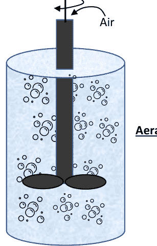

所有573个观测值绘制如下。如果你第一眼没有注意到大约300分钟时的轻微向上偏移，这不会被评判。

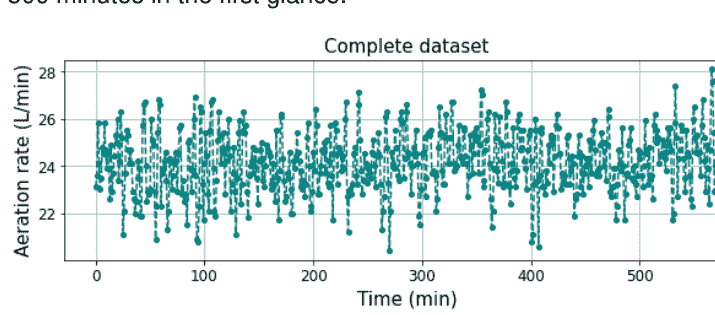

然而，我们已经了解到CUSUM图在捕捉小幅均值偏移方面表现出色。让我们看看它在这个数据集上工作得多么出色。我们将前200个观测值作为NOC数据，绘制如下。均值和标准差是从这些样本计算得出的。

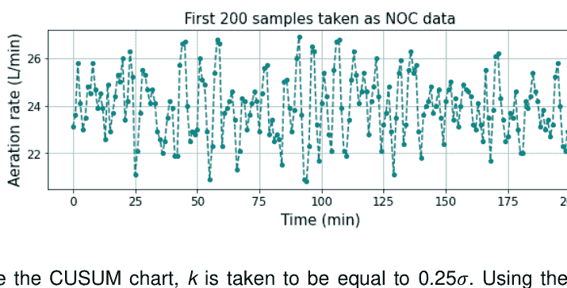

为了生成CUSUM图，$k$取为$0.25\sigma$。使用示例5.1中所示的代码，生成了下面所示的CUSUM控制图$^{29}$。令人印象深刻的是，在没有太多误报的情况下，小幅均值偏移现在变得非常“明显”可见！

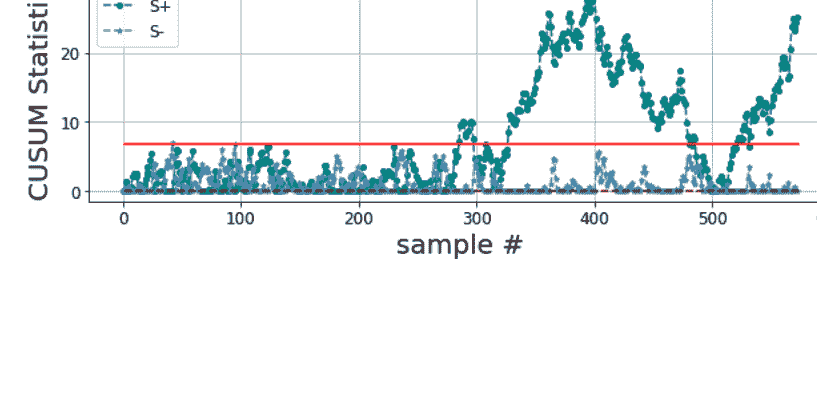

$^{29}$ 完整代码可在在线GitHub仓库中找到。

#### 5.6 单变量控制图的局限性与替代方案

本章所学技术的一个明显缺点是，它们无法有效检测多变量系统中的故障，如下图所示。故障样本在二维空间中是一个明显的离群点；然而，如果分别分析变量 x1 和 x2，该故障样本却出现在正常操作控制范围内。

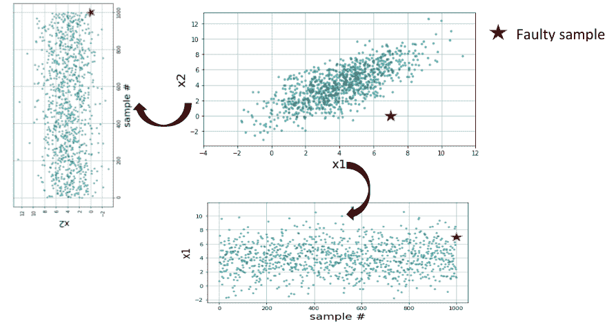

人们已经设计了多元休哈特图（Hotelling $T^2$ 图）、多元累积和（MCUSUM）和多元指数加权移动平均（MEWMA）方案，但它们并未像其单变量对应方案那样被广泛接受。这是由于在处理相关的高维数据时遇到了困难。处理多元数据的常用替代方法包括主成分分析（PCA）、核主成分分析（KPCA）、偏最小二乘法（PLS）等，你将在本书的下一部分学习这些内容。

我们所研究的传统控制图的另一个缺点是假设数据样本之间相互独立。如果你处理的是显示自相关的信号，那么更好的策略（如下图所示）是建立一个模型（例如，时间序列模型$^{30}$）并计算残差（观测值与预测值之间）。对于正常操作数据和精心构建的模型，残差将是不相关的且服从高斯分布，因此，可以为残差构建传统控制图，以间接监控原始信号。

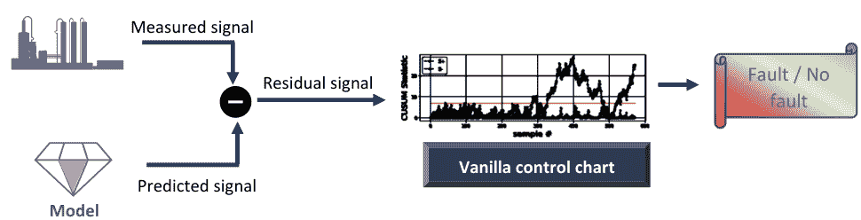

处理自相关信号的另一个流行策略是使用最新观测值更新模型，并监控模型参数。

##### 总结

在本章中，我们熟悉了用于监控单变量信号的统计过程控制图。我们研究了三种流行技术，即休哈特图、累积和图和指数加权移动平均图。我们学习了如何构建这些图表，并理解了这些不同方法的优缺点。在下一章中，我们将继续研究单变量信号监控，并探讨基于模式匹配的方法。

## 第6章
### 基于时间序列模式匹配的过程故障检测

假设你是一名新上任的工厂操作员，负责运行一个工厂，你观察到一个过程变量中出现了一个有趣的模式：偶尔出现尖峰波动，但信号并未超出DCS报警限值。一个自然的调查思路是，查找过去是否发生过此类模式，以及它们是否是潜在过程故障的前兆指标。然而，如何快速筛选多年的历史数据以找到类似的模式呢？考虑另一个场景：你负责一个间歇过程的质量控制。为了检查最近一批次是否顺利，你可能希望将其与已知的参考/黄金批次进行比较。然而，由于批次持续时间不同，批次可能表现出正常变化，或者由于过程故障而出现异常偏差。如何训练一个算法来智能地识别出故障批次？这两个场景的共同点在于，我们关注的不是单个测量值的异常性；相反，我们感兴趣的是连续值序列（也称为集体异常）的异常性。

时间序列模式匹配是时间序列分类领域的一个成熟领域，最近的算法进步使得在历史数据中快速进行序列比较以找到相似或异常模式成为可能。毫不奇怪，模式匹配正作为商业过程数据分析软件（如Aspen的Process Explorer、SEEQ等）的主要功能提供。在本章中，我们将通过一些基于模式匹配的过程监控用例进行讲解。具体涵盖以下主题：

- 时间序列异常简介
- 基于模式匹配的故障检测：过程工业中的用例
- 通过历史模式搜索进行蒸汽发生器过程的故障检测
- 通过不一致性发现进行故障检测

#### 6.1 时间序列异常与模式匹配

在异常检测文献中，单变量时间序列或动态信号中的异常被分为三类：点异常、上下文异常和集体异常。图6.1说明了阀门（%）开度信号的这些异常。如图6.1b所示，如果单个测量值显著偏离其余传感器读数，则认为发生了点异常。当一个测量值在“整体意义上”不异常，仅在特定上下文中异常时，就发生了上下文异常。例如，在图6.1c中，点‘B’仅在操作模式1的上下文中才是异常的；在正常操作下，阀门开度接近80%，但在过程处于模式1时则不然。最后一类集体异常发生在一组/序列的连续测量值共同表现出异常行为时，尽管单个测量值可能未超出正常操作控制范围。虽然可以构建控制图来检测点异常和上下文异常，但检测集体异常需要更专门的方法。因此，本章致力于研究集体异常检测的方法。

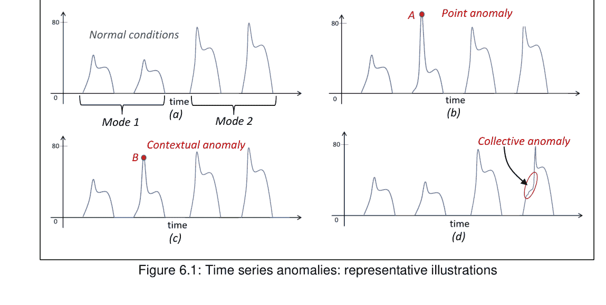

基于（子）序列的模式匹配在故障检测与诊断（FDD）中的需求在过程工业中以不同形式出现；图6.2说明了一些用例场景。让我们通过其中一些用例来理解底层技术和可用资源。

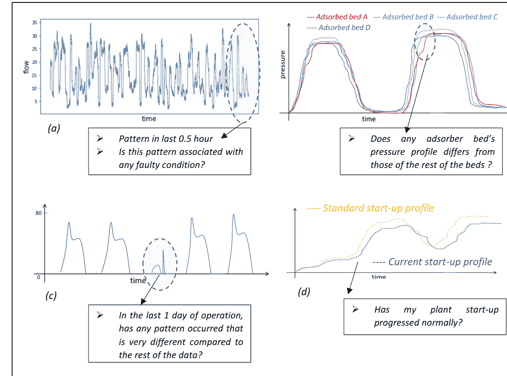

我们将讲解用例场景（a）和（c）。这两个用例都涉及查找一个“查询”子序列与从同一时间序列或另一个时间序列中提取的多个其他子序列的相似性。为了以时间高效的方式完成此任务，将使用一个名为STUMPY³¹的库。让我们学习如何利用STUMPY进行时间序列数据挖掘任务。

#### 6.2 通过历史模式搜索进行故障检测

为了回答图6.2a中提出的问题，可以执行以下任务：使用过去30分钟的实时数据，在历史数据中找到最相似的子序列；然后，只需检查在历史上该找到的子序列之后是否发生了过程扰动。我们将使用从伊利诺伊州香槟市阿博特电厂蒸汽发生器模型获得的蒸汽流量数据$^{32}$。提供的数据集包含9600个样本（采样时间3秒），涉及多个过程变量，包括蒸汽流量。我们创建了两个独立的数据文件，*historical_steamFlow.txt* 和 *current_steamFlow.txt*，分别包含本案例研究中将使用的历史数据和实时数据。让我们从加载数据开始。

```python
# import requisite libraries
import stumpy
numpy as np, matplotlib.pyplot as plt

# fetch data
historical_steamFlow = np.loadtxt('historical_steamFlow.txt')
current_steamFlow = np.loadtxt('current_steamFlow.txt')

plt.figure(), plt.plot(historical_steamFlow)
plt.ylabel('Historical steam flow'), plt.xlabel('Sample #')

plt.figure(), plt.plot(current_steamFlow, color='green'),
plt.ylabel('Current steamFlow'), plt.xlabel('Sample #')
```

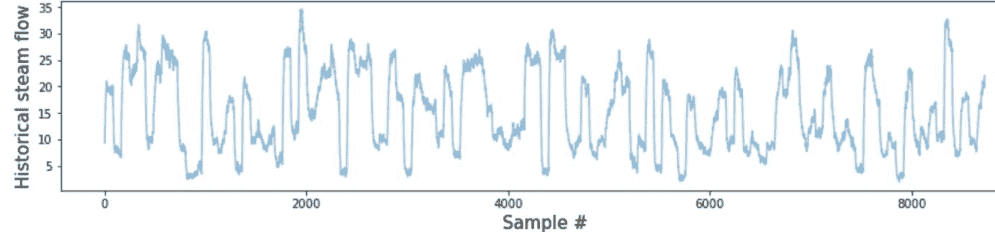

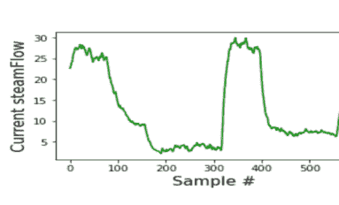

$^{32}$ De Moor B.L.R. (ed.), DaISy: Database for the Identification of Systems, Department of Electrical Engineering, ESAT/STADIUS, KU Leuven, Belgium, URL: http://homes.esat.kuleuven.be/~smc/daisy/

```python
# use stumpy library
distance_profile = stumpy.mass(current_steamFlow, historical_steamFlow)

plt.figure(), plt.plot(distance_profile, '*', color='black',)
plt.ylabel('Subsequence distance'), plt.xlabel('Subsequence starting position')
```

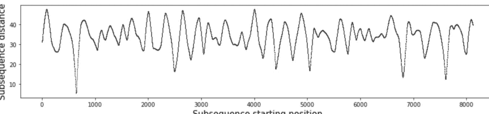

distance_profile 包含 current_steamFlow 与 historical_steamFlow 中每个子序列（长度与 current_steamFlow 相同）之间的成对距离。例如，distance_profile[0] 给出了 current_steamFlow 与 historical_steamFlow 时间序列中从位置0开始、长度为 len(current_steamFlow) 的子序列之间的欧几里得距离。我们可以在上图中注意到，存在一个子序列（起始位置在0到1000之间），它与 current_steamFlow 的距离远小于 historical_steamFlow 中的任何其他子序列。可以通过在 distance_profile 中找到最小距离并提取其位置索引来获得这个来自 historical_steamFlow 的最相似子序列，如下所示。

```python
# find the most similar historical subsequence
position = np.argmin(distance_profile)
print('The subsequence most similar to current_steamFlow is located at position :', position)

>>> The subsequence most similar to current_steamFlow is located at position : 643
```

让我们看看查询子序列和目标子序列的比较情况。

```python
# compare the found pattern to current_steamFlow
historicalPattern = historical_steamFlow[position:position+len(current_steamFlow)]

plt.figure()
plt.plot(current_steamFlow, color="green", label="current_steamFlow")
plt.plot(historicalPattern, color="maroon", label="Most similar subsequence")
plt.xlabel('Sample #'), plt.ylabel('Steam Flow'), plt.legend()
```

#### 6.3 通过不一致发现进行故障检测

图6.2c中提出的问题可以通过在给定时间序列中找到一个与其他所有子序列距离都很大的子序列来解决。在本案例研究中，我们将使用原始蒸汽发生器数据集提供的蒸汽流量时间序列。让我们从加载数据开始。

```python
# import requisite libraries
import stumpy, numpy as np, matplotlib.pyplot as plt

# fetch data
data = np.loadtxt('steamgen.dat')
steamFlow = data[:,8]
plt.figure(), plt.plot(steamFlow)
plt.ylabel('Steam flow'), plt.xlabel('Sample #')
```

```python
# use stumpy library
sequenceLength = 600 # 30 mins
matrix_profile = stumpy.stump(steamFlow, sequenceLength)
```

`stump`函数执行以下操作：对于蒸汽流量时间序列中的每个子序列（长度为`sequenceLength`），它会自动识别其对应的、相同长度的最近邻子序列³³。`matrix_profile`数组的第一列包含距离值，最近邻子序列的索引位于第2列和第3列。让我们看看距离是如何变化的。

```python
# plot matrix profile distances
fig, axs = plt.subplots(2, sharex=True, gridspec_kw={'hspace': 0})
plt.suptitle('Discord (Anomaly/Novelty) Discovery')
axs[0].plot(steamFlow), axs[0].set_ylabel('Steam Flow')
axs[1].plot(matrix_profile[:, 0], '*', color='black')
axs[1].set_xlabel('Sample #'), axs[1].set_ylabel('Distance')
```

要找到最不寻常的子序列（它可能是一个潜在的异常），我们只需要在蒸汽流量时间序列中找到与其最近邻子序列距离值最大的子序列位置。

> ³³ 请查看 https://stumpy.readthedocs.io/en/latest/index.html 上的精彩可视化。

```python
# find discord
discord_position = np.argsort(matrix_profile[:, 0])[-1]
print('The discord is located at position: ', discord_position)

>>> The discord is located at position: 3890

# show the discord in the time series
from matplotlib.patches import Rectangle
fig, axs = plt.subplots(2, sharex=True, gridspec_kw={'hspace': 0})
plt.suptitle('Discord (Anomaly/Novelty) Discovery')

axs[0].plot(steamFlow), axs[0].set_ylabel('Steam Flow')
rect = Rectangle((discord_position, 0), sequenceLength, 40, facecolor='lightgrey')
axs[0].add_patch(rect)

axs[1].plot(matrix_profile[:, 0], '*', color='black')
axs[1].set_xlabel('Sample #'), axs[1].set_ylabel('Distance')
axs[1].axvline(x= discord_position, linestyle="dashed")
```

如果您已经在思考如何将时间序列模式匹配用于您自己的过程系统，我们不会感到惊讶。像STUMPY这样的库使得在海量数据中寻找模式变得容易，因此，我们鼓励您尽情发挥想象力，探索其潜在的应用场景！

##### 总结

在本章中，我们探讨了用于过程数据故障检测的时间序列数据挖掘技术。具体来说，我们使用了一个蒸汽发生器数据集，并研究了模式匹配和不一致发现问题。我们学习了如何使用一个名为STUMPY的强大库来解决这些问题。

## 第三部分

### 多元统计过程监控

## 第7章

### 线性稳态过程的多元统计过程监控：第1部分

在制造设施中，测量数百个与过程相关的变量并不少见。然而，守恒定律（如质量平衡、热力学约束）、强制执行的产品规格以及其他操作限制会在过程变量之间引入相关性，使得测量变量看起来都源自少数几个隐藏（未测量）变量。已经衍生出几种智能技术来寻找这些隐藏的潜在变量。基于潜在变量的技术允许表征在正常操作条件（NOC）下影响过程的“正常”过程噪声。基于潜在空间的过程监控方法实时监控潜在变量和过程噪声的值，以推断过程故障的存在。听起来很复杂？别担心！本章将向您展示如何实现这一点，同时保持对概念理解和实际应用的关注。

PCA和PLS是最流行的基于潜在变量的过程监控工具之一，并已在多个成功的工业过程监控应用中得到报道。本章全面阐述了PCA和PLS技术，并教您如何应用它们进行故障检测。此外，我们将学习如何使用流行的贡献分析方法来识别故障过程变量。具体涵盖以下主题：

- PCA和PLS简介
- 通过PCA和PLS进行过程故障检测
- 基于PCA和PLS的过程监控应用中的故障隔离
- 通过PCA监控聚合物制造过程
- 通过PLS监控聚乙烯制造过程

#### 7.1 PCA简介

主成分分析（PCA）本质上是一种多元技术，它将一组高维的相关变量转换为一组低维的不相关（潜在）变量，同时信息损失最小。考虑图7.1中的三维数据。很明显，尽管数据是三维的，但数据点主要分布在一个二维平面上；即使在这个平面上，沿某个特定方向的分布也更广。PCA将原始的(x,y,z)空间转换为二维主成分（PC）空间，其中第一主成分（PC1）对应于数据中最大分布/方差的方向，第二主成分（PC2）对应于所有与PC1正交的方向中方差最大的方向。根据建模要求，甚至可以丢弃第二主成分，本质上获得一维数据，同时会损失一些信息。此外，正如我们很快将看到的，从PC空间的数据恢复原始数据是直接的。

在机器学习领域，常见在PC空间中应用分类和聚类技术。在过程工业中，过程建模（通过主成分回归，PCR）和监控是PCA的常见应用³⁴。PCA也经常用于过程可视化。对于许多应用，两个或三个PC足以捕获过程数据中的大部分变异性，因此，压缩后的过程数据可以在单个图中可视化。工厂操作员和工程师使用这个单一图表来发现过程数据中的过去和当前模式。基于PCA的故障检测更进一步，将PC空间中的所有信息和过程噪声压缩到几个控制图中。您很快将学习如何生成和使用这些控制图。

> ³⁴ 潜在变量技术在过程控制和监控中的普及源于麦克马斯特大学John McGregor的开创性工作。

##### 数学背景

考虑一个数据矩阵 $X \in \mathbb{R}^{N \times m}$，它由 $N$ 个 $m$ 个过程变量的样本组成，其中每一行代表原始测量空间中的一个数据点。假设每一列都已归一化为零均值和单位方差。令 $v \in \mathbb{R}^m$ 表示将数据点投影到PC1方向上的“载荷”向量；它可以通过求解以下优化问题找到

$$\max_{v \neq 0} \frac{(Xv)^T Xv}{v^T v} \quad \text{eq. 1}$$

显然，公式1试图最大化投影数据点沿PC1方向的方差。其他PC的载荷向量通过求解相同的问题并附加与先前计算的载荷向量正交的约束来找到。或者，载荷向量也可以从 $X$ 的协方差矩阵（$S$）的特征值分解中计算得出

$$\frac{1}{N-1} X^T X = S = V \Lambda V^T \quad \text{eq. 2}$$

以上是您在PCA文献中常见的形式。特征向量矩阵 $V \in \mathbb{R}^{m \times m}$ 的列就是我们需要的载荷向量。对角特征值矩阵 $\Lambda$ 等于 $diag\{\lambda_1, \lambda_2, \dots, \lambda_m\}$，其中 $\lambda_1 \geq \lambda_2 \geq \dots \geq \lambda_m$ 是特征值。实际上，$\lambda_j$ 等于沿第 $j^{th}$ 个PC方向的方差。如果原始数据中的过程变量之间存在显著相关性，则只有前几个特征值会是显著的。假设保留 $k$ 个PC，则取 $V$ 的前 $k$ 列（对应于前 $k$ 个 $\lambda_s$）形成载荷矩阵 $P \in \mathbb{R}^{m \times k}$。现在可以获得PC空间中的转换数据

$$t_j = Xp_j \text{ or } T = XP \quad \text{eq. 3}$$

$X$ 的 $m$ 维 $i^{th}$ 行已被转换为 $T$ 的 $k$（$< m$）维 $i^{th}$ 行。$T \in \mathbb{R}^{N \times k}$ 称为得分矩阵，$T$ 的第 $j^{th}$ 列（$t_j$）包含沿第 $j^{th}$ 个PC方向的（得分）值。得分可以如下投影回原始测量空间

$$\hat{X} = TP^T \quad \text{eq. 4}$$

请注意，由于我们丢弃了与不显著的 $\lambda_s$ 对应的载荷向量，因此 $\hat{X} \neq X$。差值 $E = X - \hat{X}$ 被称为残差矩阵，因为每一行都是一个数据点的残差或误差向量。总的来说，PC空间捕获了过程数据中的系统性趋势，而残差空间主要描述了数据中的噪声。

##### 聚合物制造过程的降维

现在让我们看看PCA强大的降维能力在实际中的应用。我们将使用来自一家聚合物制造工厂<sup>35</sup>的数据。该数据集包含33个变量和92个每小时采样点（图7.2）。

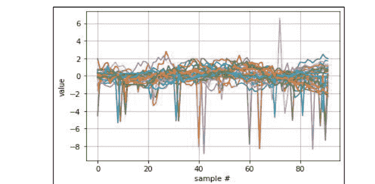

图7.2：来自聚合物制造厂的过程数据。每条彩色曲线对应一个过程变量。

据报道，对于该数据集，过程在大约第70个采样点后开始表现异常，并最终不得不停机。因此，我们使用第1到69个采样点，通过下面的代码来训练PCA模型。剩余的数据将在后续用于过程监控演示。

```
# import requisite libraries
import numpy as np, pandas as pd
from sklearn.preprocessing import StandardScaler
from sklearn.decomposition import PCA

# fetch data and separate training data
data = pd.read_excel('proc1a.xls', skiprows = 1, usecols = 'C:AI')
data_train = data.iloc[0:69,]

# normalize data
scaler = StandardScaler()
data_train_normal = scaler.fit_transform(data_train)

# PCA
pca = PCA()
score_train = pca.fit_transform(data_train_normal)
```

训练PCA模型后，可以从pca模型的components_属性的转置中获取载荷向量/主成分。注意，我们尚未进行任何降维。PCA只是为我们提供了一个在score_train中的不相关数据集。为了确认这一点，我们可以计算score_train各列之间的相关系数。只有对角线上的值为1，而其余系数均为0！

```
# confirm no correlation
corr_coef = np.corrcoef(score_train, rowvar = False)
>>> print('Correlation matrix: \n', corr_coef[0:3,0:3]) # printing only a portion

Correlation matrix:
[[ 1.  0. -0.]
 [ 0.  1.0  0.]
 [-0.  0.  1.0]]
```

为了进行降维，我们需要研究沿每个主成分的方差。注意，沿m个主成分的方差之和等于沿m个原始维度的方差之和。因此，沿每个主成分的方差也称为解释方差。属性explained_variance_ratio给出了每个主成分解释的方差比例，图7.3清楚地表明，并不需要所有33个成分来捕获数据中的所有信息。大部分信息仅由前几个主成分捕获。

```
# visualize explained variance
import matplotlib.pyplot as plt

explained_variance = 100*pca.explained_variance_ratio_ # in percentage
cum_explained_variance = np.cumsum(explained_variance) # cumulative % variance explained

plt.figure()
plt.plot(cum_explained_variance, 'r+', label = 'cumulative % variance explained')
plt.plot(explained_variance, 'b+', label = 'variance explained by each PC')
plt.ylabel('Explained variance (in %)'), plt.xlabel('Principal component number'), plt.legend()
```

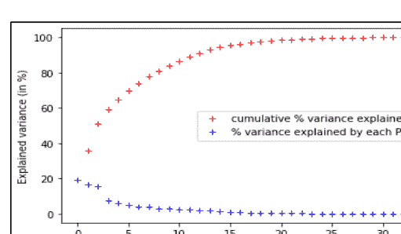

图7.3：主成分解释的方差

确定保留主成分数目的一个常用方法是选择累积捕获至少90%（或95%）方差的主成分数目。捕获的方差阈值应根据预期的噪声水平或你不希望捕获的非系统性变化来指导。其他方法包括交叉验证、碎石检验、AIC准则等。然而，这些方法中没有一种在所有情况下都是普遍最佳的。

```
# decide # of PCs to retain and compute reduced data in PC space
n_comp = np.argmax(cum_explained_variance >= 90) + 1
score_train_reduced = score_train[:,0:n_comp]

>>> print('Number of PCs cumulatively explaining at least 90% variance: ', n_comp)

Number of PCs cumulatively explaining at least 90% variance: 13
```

因此，我们通过牺牲仅10%的信息，实现了约60%的维度缩减（从33维降至13维）。为了确认仅丢失了约10%的原始信息，我们将从得分重构原始归一化数据。图7.4也提供了视觉确认，很明显，变量的系统性趋势已被重构，而噪声波动已被去除。

```
# confirm that only about 10% of original information is lost
from sklearn.metrics import r2_score

V_matrix = pca.components_.T
P_matrix = V_matrix[:,0:n_comp]

data_train_normal_reconstruct = np.dot(score_train_reduced, P_matrix.T)
R2_score = r2_score(data_train_normal, data_train_normal_reconstruct)

>>> print('% information lost = ', 100*(1-R2_score))

% information lost = 9.0469
```

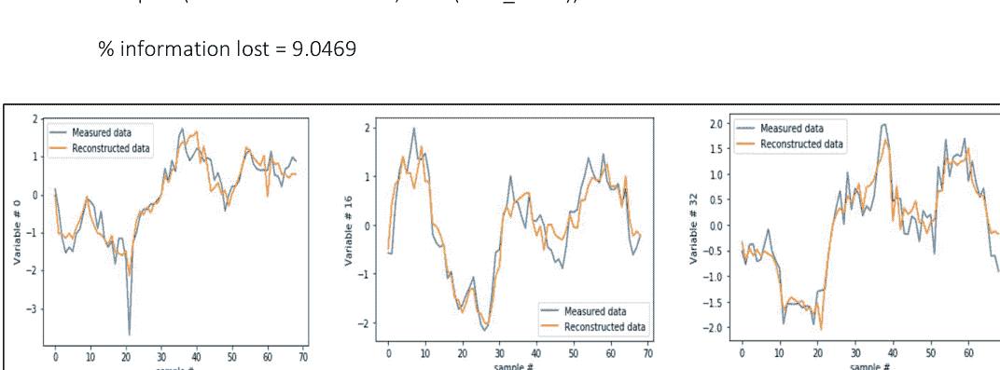

90%的阈值也可以在模型训练时通过n_components参数直接指定：pca = PCA(n_components = 0.9)。在这种情况下，不重要的主成分不会被计算，并且可以使用transform方法从模型中计算出score_train_reduced矩阵。

```
# alternative approach
pca = PCA(n_components = 0.9)
score_train_reduced = pca.fit_transform(data_train_normal)

data_train_normal_reconstruct = pca.inverse_transform(score_train_reduced)
R2_score = r2_score(data_train_normal, data_train_normal_reconstruct)

>>> print('% information lost = ', 100*(1-R2_score))

% information lost = 9.0469
```

#### 7.2 基于PCA的故障检测：聚合物制造案例研究

在图7.2中，我们看到，仅通过观察所有可用变量的组合时间序列图，很难推断出第69个采样点后的过程异常。单个变量图可能提供更好的线索，但持续监控所有33个单个变量图并不是一项方便的任务。

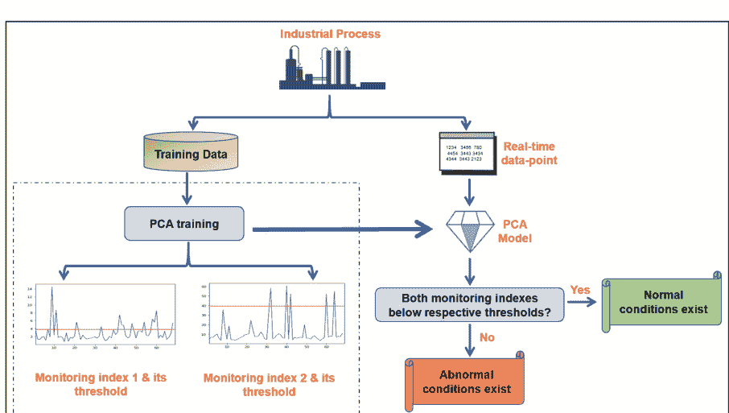

PCA通过将任何复杂多变量过程的状态总结为两个简单的指标或监控指数，使监控任务变得容易，如图7.5所示。在模型训练期间，为这些指数确定统计阈值，对于一个新的数据点，将其新的指数值与阈值进行比较。如果任何一个阈值被违反，则确认存在异常过程状况。

##### 故障检测指数

Hotelling's $T^2$ 和 SPE（也称为Q）统计量是用于故障检测的两个监控指数。两个统计量都是为每个数据点计算的。[注意区分得分矩阵（$T$）和标量$T^2$值之间的潜在混淆。这是PCA社区使用的标准符号。]

###### Hotelling's $T^2$

令 $t_i$ 表示 $T$ 的第 $i^{th}$ 行，它代表在PC空间中转换后的第 $i^{th}$ 个数据点。该数据点的 $T^2$ 指数计算如下

$$T^2 = \sum_{j=1}^k \frac{t_{i,j}^2}{\lambda_j} = t_i \Lambda_k^{-1} t_i^T$$

注意 $\Lambda_k = diag\{\lambda_1, \lambda_2, \dots, \lambda_k\}$。显然，$T^2$ 是数据点在PC空间中到原点的平方马氏距离或加权距离。如果数据服从多元正态分布，对于指定的误报率 $\alpha^{36}$（通常设为0.05或0.01），控制限由下式给出

$$T_{CL}^2 = \frac{k(N^2-1)}{N(N-k)} F_{k,N-k}(\alpha)$$

$F_{k,N-k}(\alpha)$ 是自由度为 $k$ 和 $n-k$ 的 $F$-分布的 $(1-\alpha)$ 分位数。本质上，$T^2 \le T_{CL}^2$ 代表PC空间中训练数据点周围的椭球边界。

###### SPE/Q

第二个指数Q表示原始数据点与重构数据点之间的距离。令 $e_i$ 表示 $E$ 的第 $i^{th}$ 行。则

$$Q = \sum_{j=1}^m e_{i,j}^2$$

同样，在正态性假设下，Q的控制限由以下表达式给出

$$Q_{CL} = \theta_1 \left( \frac{z_{\alpha} \sqrt{2 \theta_2 h_0^2}}{\theta_1} + 1 + \frac{\theta_2 h_0 (1 - h_0)}{\theta_1^2} \right)^2$$

$$h_0 = 1 - \frac{2 \theta_1 \theta_3}{3 \theta_2^2} \quad \text{and} \quad \theta_r = \sum_{j=k+1}^{m} \lambda_j^r \quad ; r=1,2,3$$

$z_{\alpha}$ 是标准高斯分布的 $(1-\alpha)$ 分位数。

###### 控制限的其他表达式


如果NOC样本数量很大（这意味着NOC数据的均值和协方差可以被精确估计），那么 $T^2$ 统计量服从自由度为k的 $\chi^2$ 分布，控制限为

$$T_{CL}^2 = \chi_{\alpha}^2(k)$$

到目前为止提出的控制限的统计表达式假设NOC数据服从多元高斯分布。如果这个假设不成立，那么可以通过核密度估计（在本系列丛书的第1册中演示）或分位数法（见第8章）来估计控制限。

我们现在拥有了为训练数据的故障指数生成控制图所需的所有信息。我们将继续在聚合物制造数据集上的案例研究。

```
# calculate T2 for training data
N, m, k = data_train_normal.shape[0], data_train_normal.shape[1], n_comp

lambda_k = np.diag(pca.explained_variance_[0:k]) # eigenvalue = explained variance
lambda_k_inv = np.linalg.inv(lambda_k)
T2_train = np.zeros((N,))

for i in range(N):
    T2_train[i] = np.dot(np.dot(score_train_reduced[i,:],lambda_k_inv),score_train_reduced[i,:].T)

# calculate Q for training data
error_train = data_train_normal - data_train_normal_reconstruct
Q_train = np.sum(error_train*error_train, axis = 1)

# T2 control limit
import scipy.stats
```

##### $T^2$ 与 Q 统计量的重要性

$T^2$ 和 Q 指数量化了数据中不同类型的变异。$T^2$ 是主成分空间中距原点的距离度量，而 Q 则衡量了 PCA 模型未能解释的数据部分。异常情况可能违反其中一个指标的控制限，但不一定违反另一个。因此，同时监控这两个指标至关重要。

例如，考虑图 7.7 中的场景。两个流量测量值预期是相关的。正常数据点沿 45° 线（PC1 方向）分布，但样本 ‘a’ 和 ‘b’ 表现出不同类型的异常。对于样本 ‘a’，两个流量变量之间的相关性被破坏，这可能是阀门泄漏的结果。这导致 $Q_a$ 值异常高；然而 $T_a^2$ 并未异常高，因为其投影得分 $t_a$ 与正常数据点相似。对于样本 ‘b’，相关性保持完好，导致 $Q_b$ 值低（为零）。然而，得分 $t_b$ 异常远离原点，导致 $T_b^2$ 值异常高。

##### 测试数据上的故障检测

现在是时候检查我们的 $T^2$ 和 $Q$ 控制图是否能帮助我们检测测试数据（第 70 个样本及之后）中是否存在过程异常。为此，我们将计算测试数据的监控统计量。

```python
# get test data, normalize it
data_test = data.iloc[69:]
data_test_normal = scaler.transform(data_test) # using scaling parameters from training data

# compute scores and reconstruct
score_test = pca.transform(data_test_normal)
score_test_reduced = score_test[:,0:k]
data_test_normal_reconstruct = np.dot(score_test_reduced, P_matrix.T)

# calculate T2_test
T2_test = np.zeros((data_test_normal.shape[0],))
for i in range(data_test_normal.shape[0]): # eigenvalues from training data are used
    T2_test[i] = np.dot(np.dot(score_test_reduced[i,:],lambda_k_inv),score_test_reduced[i,:].T)

# calculate Q_test
error_test = data_test_normal_reconstruct - data_test_normal
Q_test = np.sum(error_test*error_test, axis = 1)
```

图 7.8 并列展示了训练数据和测试数据的监控统计量。观察这些图表，可以立即明显看出测试数据表现出严重的过程异常。$T^2$ 和 $Q$ 值都显著高于各自的控制限。

图 7.8：训练数据和测试数据的监控图。青色垂直线分隔训练数据和测试数据

#### 7.3 基于贡献分析的 PCA 故障隔离

在检测到过程故障后，下一个关键任务是诊断问题并识别哪些具体的过程变量表现出异常行为。实现此目标的常用机制是基于贡献图。顾名思义，贡献图是原始过程变量对异常指数的贡献图。贡献最高的变量被标记为潜在故障变量。

*SPE 贡献*

对于 SPE（平方预测误差），让我们重新考虑下面所示的公式 7，其中 $SPE_j$ 表示第 $j$ 个变量的 SPE 贡献。

$$SPE = \sum_{j=1}^{m} e_j^2 = \sum_{j=1}^{m} SPE_j$$

因此，一个变量的 SPE 贡献就是该变量的平方误差。如果 SPE 指数违反了其控制限，那么具有相对较大 $SPE_j$ 值的变量被认为是潜在的故障变量。

##### T² 贡献

对于 T² 贡献，计算并不那么直接。文献³⁷中提出了几种表达式。下面常用的表达式由 Wise 等人³⁸提出。

$$T^2 \text{ contribution of variable } j = \left(j^{th} \text{ element of } \left(D^{1/2}x\right)\right)^2$$
$$D = P\Lambda_k^{-1}P^T$$
*公式 10*

请注意，这些贡献³⁹是针对每个数据点计算的。让我们找出第 85 个样本处需要进一步调查的变量。

```python
# T² contribution
sample = 85 - 69
data_point = np.transpose(data_test_normal[sample-1,])

D = np.dot(np.dot(P_matrix,lambda_k_inv),P_matrix.T)
T2contri = np.dot(scipy.linalg.sqrtm(D),data_point)**2 # vector of contributions

plt.figure(), plt.bar(['var ' + str((i+1)) for i in range(len(T2contri))], T2contri)

# SPE contribution
error_test_sample = error_test[sample-1,]
SPE_contri = error_test_sample*error_test_sample # vector of contributions

plt.figure(), plt.bar(['var ' + str((i+1)) for i in range(len(SPE_contri))], SPE_contri)
```

变量 #24 对两个指标都做出了很大贡献，在图 7.10 中我们可以看到其值在采样期结束时急剧下降。工厂操作员可以运用其判断力进一步排查异常，以隔离根本原因。

请注意，贡献图并不能明确识别故障的根本原因；它们只能隔离那些受故障影响最大或与正常运行条件行为最不一致的变量。

##### 涂抹效应

> 虽然贡献分析是故障隔离中广泛使用的方法，但它容易出错——未受故障影响的变量最终可能显示出显著的贡献。例如，在下面的简单示例中，假设由于 $f_1$ 传感器故障，实际过程状态点 ‘a’ 被测量为点 ‘b’。然而，如图所示，变量 $f_2$ 对 Q 指标做出了显著贡献，因此，$f_2$ 也将被推断为故障。关键信息是，在解释贡献图时必须谨慎，并且在报告故障变量之前，应检查所高亮变量的实际数据。

其他故障隔离方法也已被探索，例如 Alcala & Qin 提出的基于重构的方法（参见 2009 年发表在 Automatica 上的文章 ‘Reconstruction-based approach for process monitoring’）。

---

alpha = 0.01 # 99% control limit
T2_CL = k*(N**2-1)*scipy.stats.f.ppf(1-alpha,k,N-k)/(N*(N-k))

# Q control limit
eig_vals = pca.explained_variance_

theta1 = np.sum(eig_vals[k:])
theta2 = np.sum([eig_vals[j]**2 for j in range(k,m)])
theta3 = np.sum([eig_vals[j]**3 for j in range(k,m)])
h0 = 1-2*theta1*theta3/(3*theta2**2)

z_alpha = scipy.stats.norm.ppf(1-alpha)
Q_CL = theta1*(z_alpha*np.sqrt(2*theta2*h0**2)/theta1+ 1 + theta2*h0*(1-h0)/theta1**2)**2

# Q_train control chart
plt.figure(), plt.plot(Q_train), plt.plot([1,len(Q_train)],[Q_CL,Q_CL], color='red')
plt.xlabel('Sample #'), plt.ylabel('Q for training data')

# T2_train control chart
plt.figure(), plt.plot(T2_train), plt.plot([1,len(T2_train)],[T2_CL,T2_CL], color='red')
plt.xlabel('Sample #'), plt.ylabel('T$^2$ for training data')
```

图 7.6 显示，训练数据中有相当多的数据点违反了阈值，这在 99% 控制限下是意料之外的。这表明该数据集不满足多元正态性假设。对于非高斯数据，可以采用其他专门的机器学习方法，如核密度估计（KDE）、支持向量数据描述（SVDD）来确定控制边界。我们将在后续章节中学习这些方法。或者，如前所述，如果 $N$ 很大，另一种流行的方法是直接将训练数据集 $T^2$ 和 $Q$ 值的第 99 百分位数作为控制限。

#### 7.4 PLS：简介

偏最小二乘法（PLS）是一种有监督的多元回归技术，用于估计一组输入变量与一组输出变量之间的线性关系。与主成分分析（PCA）类似，PLS将原始数据转换为潜在成分——输入（$X$）和输出（$Y$）数据矩阵分别被转换为得分矩阵$T$和$U$。图7.11提供了PLS方法与其他流行线性回归技术——主成分回归（PCR）和多元线性回归（MLR）的概念性比较。

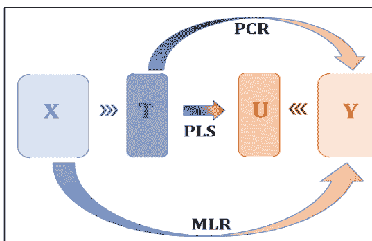

MLR直接计算$X$和$Y$之间的最小二乘拟合，而PCR首先对输入数据执行PCA，然后计算得分矩阵与$Y$之间的最小二乘拟合。通过这种方式，PCR能够克服共线性、高相关性、噪声测量和有限训练数据集等问题。然而，潜在变量的计算独立于输出数据，因此，得分矩阵可能捕获了与预测$Y$无关的$X$中的变异。PLS通过同时估计得分矩阵$T$和$U$来克服这个问题，从而在潜在变量空间中最大化地捕获与预测$Y$相关的$X$中的变异。

> 请注意，如果PLS或PCR模型中保留的潜在成分数量等于原始输入变量数量（m），则PLS和PCR模型等同于MLR模型。

PLS独特的有利特性以及低计算需求，使其在过程监控中得到广泛应用，例如实时过程监控、软测量、故障分类等。

##### 数学背景

PLS同时执行三项任务：

- 捕获$X$中的最大变异性
- 捕获$Y$中的最大变异性
- 最大化$X$和$Y$之间的相关性

为了理解PLS如何实现其目标，再次考虑数据矩阵$X \in \mathbb{R}^{N \times m}$，它包含$N$个观测值，每个观测值有$m$个输入变量，其中每一行代表原始测量空间中的一个数据点。此外，我们还有一个输出数据矩阵$Y \in \mathbb{R}^{N \times p}$，包含$p$（$\ge 1$）个输出变量。假设两个矩阵中的每一列都已归一化为零均值和单位方差。第一个潜在成分得分由下式给出：

$t_1 = Xw_1$ 和 $u_1 = Yc_1$

向量$w_1$和$c_1$（称为权重向量）的计算方式是使$t_1$和$u_1$之间的协方差最大化。参考协方差的定义，我们可以看到，通过最大化协方差，PLS试图同时满足所有三个目标。

$Cov(t_1, u_1) = Correlation(t_1, u_1) * \sqrt{Var(t_1)} * \sqrt{Var(u_1)}$

在下一步中，利用计算出的配对$\{X, t_1\}$和$\{Y, u_1\}$，通过最小二乘回归找到载荷向量（$p_1$和$q_1$）：

$X = t_1p_1^T + E_1$ 和 $Y = u_1q_1^T + F_1$

在公式12中，$E$和$F$称为残差矩阵，代表尚未被捕获的$X$和$Y$的部分。为了找到下一个成分得分，使用矩阵$E_1$和$F_1$代替$X$和$Y$，重复上述三个步骤。请注意，可能的最大成分数量等于$m$。对于每个成分，权重向量通过迭代过程（如NIPALS（算法稍后展示）或SIMPLS）找到。最终的PLS分解如下所示：

$X = TP^T + E = \sum_{i=1}^k t_ip_i^T + E$

$Y = UQ^T + F = \sum_{i=1}^k u_iq_i^T + F$

其中$k$是计算出的潜在成分数量。公式(11)中的表达式分别称为X和Y块的外部关系。对于每一对$\{t_i, u_i\}$，还通过线性回归估计一个内部关系：

$u_i \approx b_i t_i$

或 $U = [u_1, u_2, \cdots, u_k] \approx [b_1 t_1, b_2 t_2, \cdots, b_k t_k] = TB$

其中$B = diag([b_1, b_2, \cdots, b_k])$是一个回归系数的对角矩阵，它将两个块连接在一起；它用于通过潜在变量估计给定$X$的未知$Y$，如下所示：

$\hat{Y} = \hat{U}Q^T = TBQ^T$

如果这些算法细节看起来令人生畏，请不要担心$^{40}$。Sklearn提供了PLSRegression类，使用起来非常方便，我们将在下一节中看到，届时我们将开发一个基于PLS的故障检测工具。

##### 算法：通过NIPALS拟合PLS模型

1.  初始化 $i = 1$, $X_1 = X, Y_1 = Y$
2.  将得分向量 $u_i (\in \mathbb{R}^{Nx1})$ 设置为 $Y_i$ 的任意一列
3.  计算权重向量 $w_i = X^T u_i$
4.  计算得分向量 $t_i (\in \mathbb{R}^{Nx1}) = X_i w_i$
5.  将 $t_i$ 缩放为单位长度：$t_i = t_i / \|t_i\|$
6.  计算权重向量 $c_i = Y_i^T t_i$
7.  更新得分向量 $u_i = Y_i c_i$
8.  将 $u_i$ 缩放为单位长度：$u_i = u_i / \|u_i\|$
9.  重复步骤3到8直到收敛
10. 缩减矩阵：
    $X_{i+1} = X_i - t_i t_i^T X_i$
    $Y_{i+1} = Y_i - t_i t_i^T Y_i$
11. 设置 $i = i + 1$ 并返回步骤2。当 $i > k$ [要保留的潜在成分数] 时停止。
12. 构建矩阵 $T = [t_1, t_2, \cdots, t_k]$
    $U = [u_1, u_2, \cdots, u_k]$

##### 直接从$X$计算得分矩阵$T$

在PCA中，我们可以通过关系式 $T = XP$（公式(3)）直接获得得分矩阵T。因此，很自然地想知道我们是否可以扩展公式(11)来写成 $T = XW$？不幸的是，这是不正确的，因为权重向量（$w$）作用于缩减后的矩阵（参见NIPALS算法）。尽管如此，存在另一组向量，称为$r$向量$^{41}$或$R$矩阵，它可以直接从原始预测变量矩阵$X$为我们提供得分。

$t_i = Xr_i$ 和 $T = XR$

其中，$R = W(P^TW)^{-1}$，其第$j^{th}$列等于向量$r_i$。一个明显的关系是 $r_1 = w_1$。

#### 7.5 通过PLS进行故障检测：聚乙烯制造案例研究

尽管软测量是PLS在过程工业中的主要应用，但PLS框架本身也对过程监控很有用。总体方法类似于基于PCA的监控：在PLS建模后，计算监控指数，确定控制限，并检查是否违反控制限以进行故障检测。当过程数据可以分为输入和输出块时，基于PLS的监控是首选。为了说明，我们将使用从LDPE（低密度聚乙烯）生产过程中收集的数据，该数据来自一个经过调整以匹配典型工业过程的模拟模型$^{42}$。如下图所示，该过程包括一个多区管式反应器。数据集包含54个样本，每个样本有14个过程变量和5个产品质量变量。已知从样本51开始发生过程故障（图7.13）。

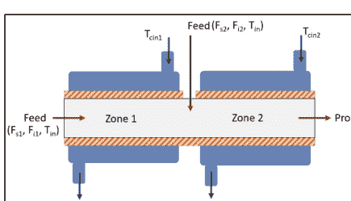

我们这里的目标是构建一个故障检测工具，清楚地指示过程故障的发生。为了理解这种工具的必要性，让我们看看替代的传统监控方法。如果工厂操作员手动持续监控5个质量变量，他/她可能会注意到最后4个样本的值略有下降。然而，考虑到质量变量在正常运行期间表现出较大的变异性，在首先检查其他过程变量之前很难做出任何决定，因为质量变量可能只是对过程中其他地方的“正常”变化做出响应。不幸的是，同时手动解释所有过程图表将非常不便。

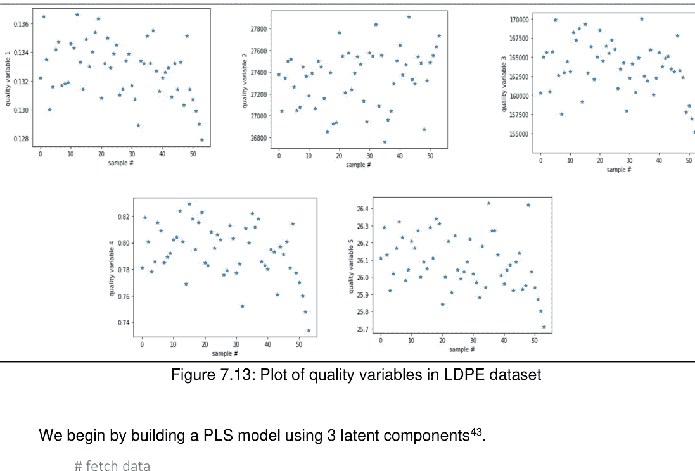

我们首先使用3个潜在成分<sup>43</sup>构建一个PLS模型。

```python
# fetch data
data = pd.read_csv('LDPE.csv', usecols = range(1,20)).values
data_train = data[:-4,:] # exclude last 4 faulty samples

# scale data
from sklearn.preprocessing import StandardScaler
scaler = StandardScaler()
data_train_normal = scaler.fit_transform(data_train)
```

> <sup>43</sup> Kourt & MacGregor, Process analysis, monitoring and diagnosis, using multivariate projection methods, Chemometrics and Intelligent Laboratory Systems, 1995

##### 构建PLS模型

```python
from sklearn.cross_decomposition import PLSRegression
X_train_normal = data_train_normal[:,:-5]
Y_train_normal = data_train_normal[:,-5:]

pls = PLSRegression(n_components = 3)
pls.fit(X_train_normal, Y_train_normal)
```

计算捕获的方差表明，$X$中仅56%的信息就能解释$Y$中近90%的变异；这意味着$X$中存在一些对质量变量影响甚微的变异。

```python
# X和Y捕获的方差
from sklearn.metrics import r2_score
print('Y variance captured: ', 100*pls.score(X_train_normal, Y_train_normal), '%')

Tscores = pls.x_scores_
X_train_normal_reconstruct = np.dot(Tscores, pls.x_loadings_.T)
# 也可以使用 pls.inverse_transform(Tscores)

print('X variance captured: ', 100*r2_score(X_train_normal, X_train_normal_reconstruct), '%')

>>> Y variance captured: 89.91 %
>>> X variance captured: 56.03 %
```

观察$t$与$u$得分图进一步证实，对于该数据集，线性相关性是一个良好的假设。我们还可以看到，对于更高阶的成分，相关性如何变差。

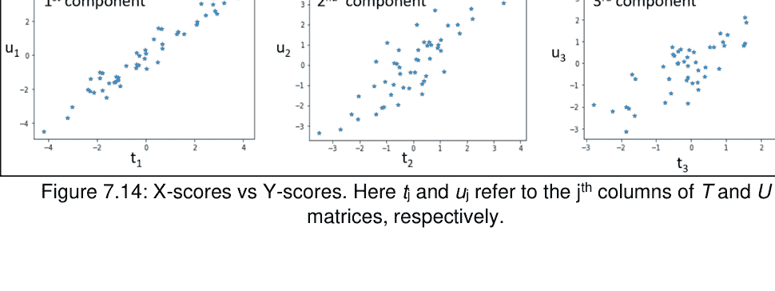

##### 故障检测指标

对于PLS，计算三个监控指标：一个来自t得分的$T^2$统计量，以及两个来自$X$和$Y$残差的SPE统计量。

###### $T^2$统计量

与PCA类似，$T^2$统计量量化了预测变量（$X$）中与响应变量（$Y$）系统性变异相关的系统性变异。$T^2$统计量的大幅偏离意味着过程操作条件发生了显著变化。设$t_i$表示$T$的第$i^{th}$行。该数据点的$T^2$指标由下式给出

$$T^2 = \sum_{j=1}^{k} \frac{t_{i,j}^2}{\sigma_j} = t_i \Lambda_k^{-1} t_i^T$$

$\Lambda_k$是一个对角矩阵，是$T$的协方差矩阵，其对角线元素为$\sigma_j$（第$j^{th}$个成分得分的方差）。对于误报率$\alpha$，$T_{CL}^2$由以下表达式获得

$$T_{CL}^2 = \frac{k(N^2 - 1)}{N(N - k)} F_{k, N-k}(\alpha)$$

###### SPE$_x$和SPE$_y$统计量

第二个和第三个指标，SPE$_x$和SPE$_y$，分别代表$X$和$Y$的残差或未建模部分。设$e_i$和$f_i$分别表示$E$和$F$的第$i^{th}$行。则

$$SPE_x = \sum_{j=1}^{m} e_{i,j}^2$$
$$SPE_y = \sum_{j=1}^{p} f_{i,j}^2$$

注意，如果输出测量值无法实时获得，则不计算SPE$_y$。在残差服从正态分布且训练样本量大的假设下，SPE统计量的控制限由以下表达式给出

$$SPE_{CL} = g \chi_{\alpha}^2(h)$$
$$h = \frac{2\mu^2}{\sigma}, \quad g = \frac{\sigma}{2\mu}$$

$\chi^2_{\alpha}$是自由度为h的卡方分布$^{44}$的$(1-\alpha)$百分位数；$\mu$表示SPE统计量的均值，$\sigma$表示其方差。现在让我们为故障检测指标生成控制图。

```python
# 训练数据的监控指标
# T$^2$
N = data_train_normal.shape[0]
k = 3

T_cov = np.cov(Tscores.T)
T_cov_inv = np.linalg.inv(T_cov)
T2_train = np.zeros((N,))
for i in range(N):
    T2_train[i] = np.dot(np.dot(Tscores[i,:],T_cov_inv),Tscores[i,:].T)

# SPEx
x_error_train = X_train_normal - X_train_normal_reconstruct
SPEx_train = np.sum(x_error_train*x_error_train, axis = 1)

# SPEy
y_error_train = Y_train_normal - pls.predict(X_train_normal)
SPEy_train = np.sum(y_error_train*y_error_train, axis = 1)

# 控制限
#T$^2$
import scipy.stats
alpha = 0.01 # 99%控制限
T2_CL = k*(N**2-1)*scipy.stats.f.ppf(1-alpha,k,N-k)/(N*(N-k))

# SPEx
mean_SPEx_train = np.mean(SPEx_train)
var_SPEx_train = np.var(SPEx_train)

g = var_SPEx_train/(2*mean_SPEx_train)
h = 2*mean_SPEx_train**2/var_SPEx_train
SPEx_CL = g*scipy.stats.chi2.ppf(1-alpha, h)

# SPEy
mean_SPEy_train = np.mean(SPEy_train)
var_SPEy_train = np.var(SPEy_train)

g = var_SPEy_train/(2*mean_SPEy_train)
h = 2*mean_SPEy_train**2/var_SPEy_train
SPEy_CL = g*scipy.stats.chi2.ppf(1-alpha, h)
```

> $^{44}$ Yin et al., A review of basic data-driven approaches for industrial process monitoring, IEEE Transactions on Industrial Electronics, 2014

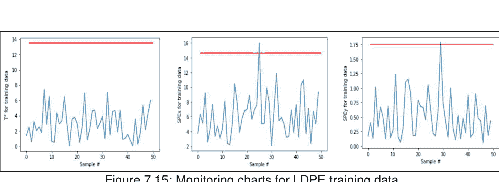

##### 在测试数据上进行故障检测

现在让我们看看我们的监控统计量是否能检测到数据样本末尾出现的过程异常。为便于比较，我们将整个数据集视为测试数据。监控图清楚地表明，在采样期结束时，过程遇到了严重的异常。显著偏高的SPE_x表明异常已显著影响了输入变量的相关性。具体是哪个输入变量是罪魁祸首？下一节的故障隔离练习将回答这个问题。

```python
# 获取测试数据，进行归一化
data_normal = scaler.transform(data)
X_normal = data_normal[:,:-5]
Y_normal = data_normal[:,-5:]

# 获取模型预测
Tscores_test = pls.transform(X_normal)
X_normal_reconstruct = np.dot(Tscores_test, pls.x_loadings_.T)
Y_normal_pred = pls.predict(X_normal)

# 计算监控统计量
T2_test = np.zeros((data_normal.shape[0],))
for i in range(data_normal.shape[0]):
    T2_test[i] = np.dot(np.dot(Tscores_test[i,:],T_cov_inv),Tscores_test[i,:].T)

x_error_test = X_normal - X_normal_reconstruct
SPEX_test = np.sum(x_error_test*x_error_test, axis = 1)

y_error_test = Y_normal - pls.predict(X_normal)
SPEy_test = np.sum(y_error_test*y_error_test, axis = 1)
```

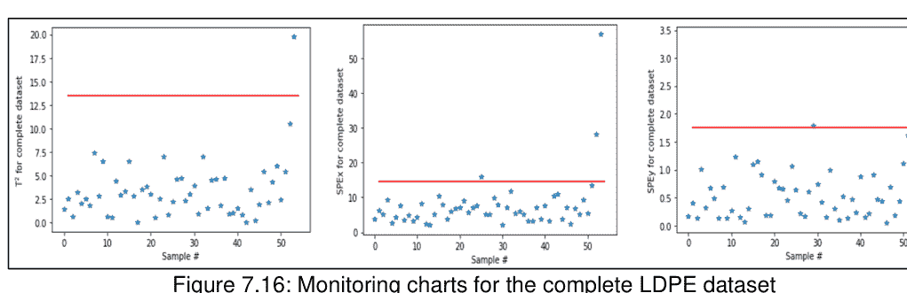

#### 7.6 基于贡献分析的PLS故障隔离

基于贡献分析的PLS故障隔离与PCA的流程相似。每个监控统计量被分解为各个变量的贡献，贡献最高的变量被标记为潜在故障变量。

##### SPEX和SPEy贡献

对于SPE统计量，进行如下分解。

$$SPE_x = \sum_{j=1}^{m} e_j^2 = \sum_{j=1}^{m} SPE_{x,j}$$
$$SPE_y = \sum_{j=1}^{p} f_j^2 = \sum_{j=1}^{p} SPE_{y,j}$$

##### $T^2$贡献

为找到$T^2$贡献，采用以下方法$^{45}$。设$x^{sample} \in \mathbb{R}^{mX1}$和$t^{sample} \in \mathbb{R}^{kX1}$分别表示候选样本的输入向量和得分向量。则，

$$T^2 = (t^{sample})^T \Lambda_k^{-1} t^{sample} = \| \Lambda_k^{-0.5} t^{sample} \|^2$$
$$= \| \Lambda_k^{-0.5} R^T x^{sample} \|^2 = \| \Gamma x^{sample} \|^2$$

$^{45}$ Choi & Lee, Multiblock PLS-based localized process diagnosis. *Journal of Process Control*, 2005.

$$\Rightarrow T^2 = \left\| \sum_{j=1}^{m} \Gamma(:, j) x^{sample}(j) \right\|^2$$

其中，$\Gamma = \Lambda_k^{-0.5} R^T$，$\Gamma(:, j)$是$\Gamma$的第$j^{th}$列，$x^{sample}(j)$是样本中第$j^{th}$个输入变量的值。第$j^{th}$个输入变量对$T^2$的贡献由$\|\Gamma(:, j)x^{sample}(j)\|^2$给出。现在让我们找出在第$54^{th}$个样本处需要进一步调查哪些变量。

```python
# SPEx贡献
sample = 54
data_point = np.transpose(data_normal[sample-1,])

x_error_test_sample = x_error_test[sample-1,]
SPEx_contri = x_error_test_sample*x_error_test_sample # 贡献向量

plt.figure(), plt.bar(['var ' + str((i+1)) for i in range(len(SPEx_contri))], SPEx_contri,)
plt.xticks(rotation = 90), plt.ylabel('SPEx contribution plot')

# SPEy贡献
y_error_test_sample = y_error_test[sample-1,]
SPEy_contri = y_error_test_sample*y_error_test_sample # 贡献向量

plt.figure(), plt.bar(['var ' + str((i+1)) for i in range(len(SPEy_contri))], SPEy_contri,)
plt.xticks(rotation = 90), plt.ylabel('SPEy contribution plot')

##### $T^2$贡献
W = pls.x_weights_
P = pls.x_loadings_
R = np.dot(W, np.linalg.inv(np.dot(P.T, W)))
Ghe = np.dot(scipy.linalg.sqrtm(T_cov_inv), R.T)

T2_contri = np.zeros((X_train_normal.shape[1],))
for i in range(X_train_normal.shape[1]):
    vect = Ghe [:,i]*data_point[i]
    T2_contri[i] = np.dot(vect, vect)

plt.figure(), plt.bar(['var ' + str((i+1)) for i in range(len(T2_contri))], T2_contri,)
plt.xticks(rotation = 90), plt.ylabel('T$^2$ contribution plot')
```

## 第8章

### 线性稳态过程的多元统计过程监控：第二部分

至此，您一定对PCA和PLS技术的强大功能印象深刻。这些方法使我们能够提取潜变量，并分别监控潜空间中的系统性变化和过程噪声。然而，您可能会问：“这些是适用于所有问题的最佳潜变量技术吗？”。我们很高兴您提出这个问题！确实存在其他强大的方法，在某些场景下可能更为适用。例如，当过程数据不服从高斯分布时，独立成分分析（ICA）比PCA更可取。它能提供具有更严格统计独立性（而非仅仅是不相关性）的潜变量。独立成分可能比主成分更能表征过程数据，从而可能带来更好的监控性能。

在另一种场景下，如果您的最终目标是将过程故障分类为不同类别以进行故障诊断，那么，最大化不同类别故障数据之间的分离度将是您的首要关注点，而非最大化数据方差的捕获。对于此类任务，Fisher判别分析（FDA）是首选。

在本章中，我们将详细学习ICA和FDA的特性。我们将应用这些方法对一个大型化工厂进行过程监控和故障分类。具体涵盖以下主题：

- ICA简介
- 非高斯过程的过程监控
- FDA简介
- 大规模过程的故障分类。

#### 8.1 ICA简介

独立成分分析（ICA）是一种多元技术，用于将测量变量转换为低维空间中统计独立的潜变量。统计独立性是比不相关性更严格的条件，在某些情况下，使用独立成分（ICs）可能比使用PCA中不相关的主成分（PCs）能获得更好的结果。虽然ICA和PCA相关（在潜变量是测量变量的线性投影这一意义上），但它们在提取潜变量的方式上有所不同。图8.1通过一个简单的示例突出了它们之间的差异，其中两个独立信号被线性组合以生成相关信号，然后使用PCA/ICA来提取潜信号。显然，仅通过PCA对信号进行去相关处理并未恢复原始信号。另一方面，ICA准确地重建了原始信号⁴⁶。

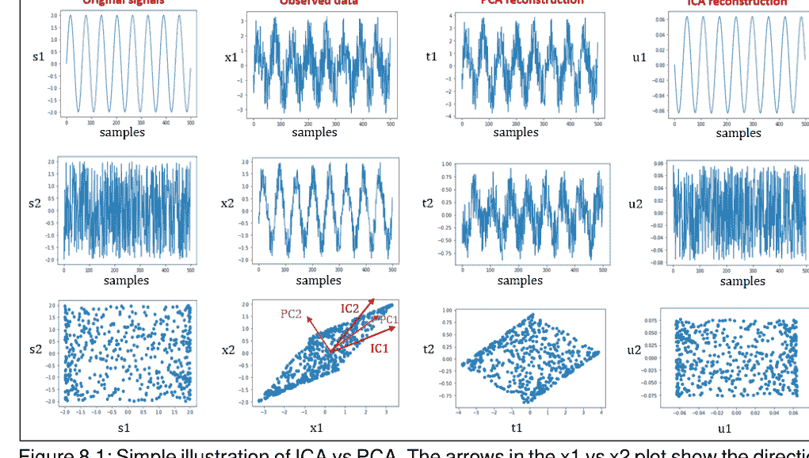

ICA使用高阶统计量进行潜变量提取，而不是像PCA那样仅使用二阶统计量（均值、方差/协方差）。因此，对于非高斯（多元高斯分布完全由二阶统计量定义）的工业数据集，ICs可以比PCs提供更多信息，从而可能带来更好的建模性能。在上面的示例中，我们看到ICA如何通过将IC方向向量与数据簇的边缘对齐来提供更有意义的表示，而PC向量则根据设计被迫指向最大方差的方向。图8.2总结了ICA和PCA之间的主要区别。在本章结束时，您将更清楚地理解这些微妙的差异及其含义。

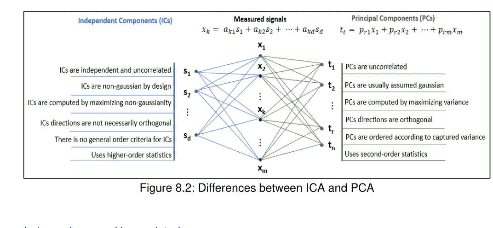

##### 独立性与不相关性

在深入探讨ICA背后的数学原理之前，让我们花几秒钟确保我们理解独立性和不相关性背后的概念。如果两个随机变量y1和y2的值互不影响，则称它们是独立的。数学上，该条件表述为

$p(y1, y2) = p(y1)p(y2)$

其中$p(y1)$是y1自身的概率密度函数，$p(y1, y2)$是联合概率密度函数。如果变量y1和y2的协方差为零，则称它们是不相关的

$C(y1, y2) = E\{(y1 - E(y1))(y2 - E(y2))\} = E(y1 * y2) - E(y1)E(y2) = 0$

其中$E(.)$表示数学期望。利用独立性条件，可以很容易地证明，如果变量是独立的，那么它们也是不相关的，但反之则不然。因此，不相关性是独立性的一种较弱形式。

##### 数学背景

考虑数据矩阵$X \in \mathbb{R}^{m \times N}$，它包含$N$个$m$个输入变量的观测值，其中每一列代表原始测量空间中的一个数据点。注意，与PCA不同，这里使用的是数据矩阵的转置形式。在ICA中，假设测量变量是$d (\le m)$个独立成分$s_1, s_2, \dots, s_d$的线性组合。

$$X = AS \quad \text{eq. 1}$$

其中$S \in \mathbb{R}^{d \times N}$，$A \in \mathbb{R}^{m \times d}$称为混合矩阵。ICA的目标是从测量数据$X$中估计未知矩阵$A$和$S$。这是通过找到一个解混矩阵$W$来实现的，使得ICs或估计矩阵（$\hat{S}$）的行尽可能独立。

$$\hat{S} = WX \quad \text{eq. 2}$$

在估计$W$之前，ICA的初始步骤涉及去除数据矩阵$X$中变量之间的相关性。这一步称为白化或球化，通过PCA完成。

$$Z = QX \quad \text{eq. 3}$$

其中$Q \in \mathbb{R}^{d \times d}$称为白化矩阵。白化使得$Z$的行不相关。为了理解其作用，令$B = QA$并考虑以下关系，

$$Z = QX = QAS = BS \quad \text{eq. 4}$$

因此，白化将寻找矩阵A的问题转化为寻找矩阵B的问题。其优势在于B是一个正交矩阵——考虑到白化变量是不相关的且ICs是独立的，可以证明这一点——因此需要估计的参数更少。利用正交性，得到以下关系，

$$S = B^T Z = B^T QX \implies W = B^T Q \quad \text{eq. 5}$$

因此，一旦找到$B$，就可以生成$W$。矩阵$B$通过最大化估计IC值的非高斯性来估计，即$S$的每一行（$s_i$）应尽可能远离高斯分布。利用中心极限定理，可以证明最大化非高斯性将得到我们需要的独立成分$^{47}$。

上述过程总结了ICA中涉及的步骤。请注意，对于任何非零标量$n$，集合$\{A/n, S/n\}$和$\{A, S\}$会产生相同的测量数据矩阵$X$，因此

---

变量#9对$SPEx$和$T^2$指数都有很大贡献，在图7.10中我们可以看到其值在采样期结束时急剧增加。在McGregor等人的工作中，变量#9也被报告为贡献最大的变量$^{43}$。

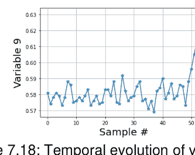

至此，我们结束了基于PCA和PLS的监控解决方案开发的研究。您现在可能理解了为什么这两种技术如此受欢迎。然而，尽管PCA和PLS功能强大，您可能会遇到原始PCA和原始PLS无法提供满意性能的问题。表现出严重非线性和/或动态性的过程数据需要对原始技术进行一些修改。我们将在接下来的章节中研究这些变体。

##### 总结

随着本章的结束，我们在基于ML的PM/PdM之旅中达到了一个重要的里程碑。您已经看到如何从过程数据中方便地提取隐藏的过程知识，并将其转化为过程洞察。掌握了PCA和PLS工具，您现在已具备解决许多过程监控相关问题的能力。然而，我们的旅程并未结束。在下一章中，我们将研究更多同样强大的基于潜变量的技术。

---

⁴⁶ 如果您仔细观察，会发现ICA潜信号（u1和u2）在符号和幅度上确实与s1和s2信号不同；我们很快就会了解为什么会发生这种情况以及为什么这不必担心。

$^{47}$ www.sci.utah.edu/~shireen/pdfs/tutorials/Elhabian_ICA09.pdf 是了解有关此内容更多细节的优秀快速读物。

原始独立分量（ICs）的符号和幅值无法被唯一估计。然而，这并不影响独立分量分析（ICA）在过程监控中的应用，因为训练数据和测试数据的估计ICs会隐式地被相同的标量缩放。FastICA（一种流行的ICA算法）计算ICs时，使得每个IC得分的$L_2$范数为1。这就是为什么图8.1中重构的IC信号看起来像是原始IC信号的缩放版本。我们稍后会用到这个事实，所以别忘了！

##### 复杂化工过程：田纳西伊士曼过程（TEP）

为了展示ICA和Fisher判别分析（FDA）相对于主成分分析（PCA）的优越性能，我们将使用之前在第3章见过的TEP数据集。我们知道该过程包含几个单元操作：反应器、冷凝器、分离器、汽提塔和循环压缩机<sup>48</sup>。有22个连续过程测量变量、19个成分测量变量和11个操纵变量。该数据集包含来自正常操作期和21个具有不同故障原因的故障期的训练和测试数据。对于每个故障类别，训练数据集包含在24个操作小时内收集的480个样本，测试数据集包含在48个操作小时内收集的960个样本。对于故障数据，故障操作从第160个样本开始。

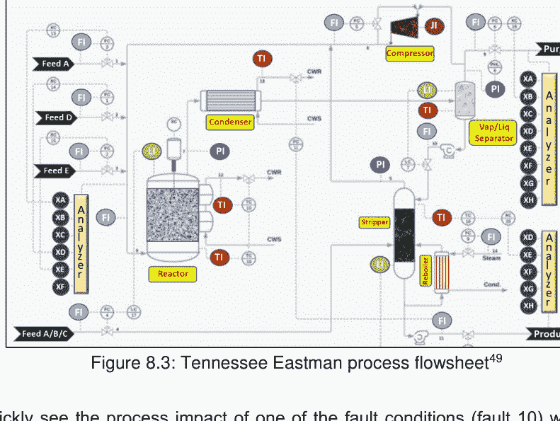

让我们快速查看其中一个故障条件（故障10）的过程影响，该故障包括进料温度之一的扰动。该故障的影响可以从异常的汽提塔温度曲线（图8.4a）中看出。主成分空间中的图（图8.4b）更清楚地显示了故障操作数据与正常操作数据的不同。我们将使用ICA和FDA来自动检测和分类这些故障。

<sup>48</sup> 关于该过程和故障的详细信息可以从Downs和Vogel题为“全厂工业过程控制问题”的原始论文中获得。
<sup>49</sup> 改编自Gilberto Xavier (https://github.com/gmxavier/TEP-meets-LSTM) 提供的原始流程图，该流程图基于知识共享署名4.0国际许可协议 (https://creativecommons.org/licenses/by/4.0/)。

```python
# import required packages and fetch TE data
import numpy as np, matplotlib.pyplot as plt
TEdata_noFault_train, TEdata_Fault_train = np.loadtxt('d00.dat').T, np.loadtxt('d10.dat')

# quick visualization
plt.figure(), plt.plot(TEdata_noFault_train[:,17])
plt.xlabel('sample #'), plt.ylabel('Striper Tempearture'), plt.title('Normal operation')

plt.figure(), plt.plot(TEdata_Fault_train[:,17])
plt.xlabel('sample #'), plt.ylabel('Striper Tempearture'), plt.title('Faulty operation')
```

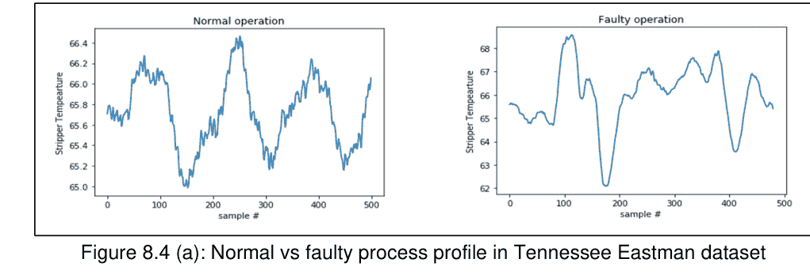

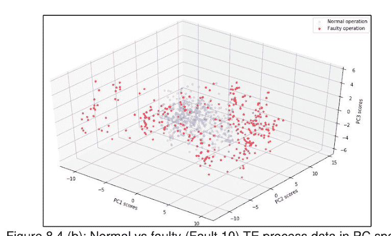

##### 确定独立分量的数量

FastICA返回的ICs数量等于测量空间的维度。之前我们在PCA中看到，并非所有提取的潜在变量都是重要的；只有少数主导/重要的分量包含大部分信息，而其余的包含噪声或琐碎的细节。此外，提取的主成分是根据其方差排序的。然而，目前没有标准准则来量化ICs的重要性并自动选择最优的ICs数量。Lee等人<sup>50</sup>提出了一种量化分量重要性的流行方法（如下所述）。

公式2表明，解混矩阵*W*的第*i*行（*w*<sub>*i*</sub>）对应于第*i*个IC。因此，Lee等人建议使用*w*<sub>*i*</sub>的欧几里得范数（*L*<sub>2</sub>）来量化第*i*个IC的重要性，随后按重要性递减顺序对ICs进行排序。基于此原理，图8.5显示并非所有ICs都同等重要，因为几个ICs的*L*<sub>2</sub>范数远小于其他ICs。

```python
# fetch TE data and select variables (discarding composition measurements)
TEdata_noFault_train = np.loadtxt('d00.dat').T
xmeas = TEdata_noFault_train[:,0:22] # 22 continuous process variables
xmv = TEdata_noFault_train[:,41:52] # 11 manipulated variables
data_noFault_train = np.hstack((xmeas, xmv))

# scale data
from sklearn.preprocessing import StandardScaler
scaler = StandardScaler()
data_train_normal = scaler.fit_transform(data_noFault_train)

# fit ICA model
from sklearn.decomposition import FastICA
ica = FastICA(max_iter=1000, tol=0.005).fit(data_train_normal)
W = ica.components_

# sort the ICs in importance order using L2 norm of each row
L2_norm = np.linalg.norm(W, 2, axis=1)
sort_order = np.flip(np.argsort(L2_norm)) # descending order
L2_norm_sorted_pct = 100*L2_norm[sort_order]/np.sum(L2_norm)

plt.figure()
plt.plot(L2_norm, 'b'), plt.xlabel('IC number (unsorted)'), plt.ylabel('L2 norm')
plt.figure()
plt.plot(L2_norm_sorted_pct, 'b+'), plt.xlabel('IC number (sorted)'), plt.ylabel('% L2 norm')

# re-arrange rows of W matrix
W_sorted = W[sort_order,:] # row 1 now corresponds to the most important IC and so on
```

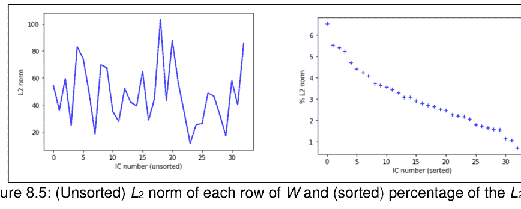

在对ICs进行排序后，可以采用两种方法来确定最优的ICs数量。方法1使用排序后的$L_2$范数图来确定一个截止IC编号，超过该编号的范数相对不重要。对于我们的数据集，如图8.5所示，没有明显的截止编号。另一种方法是选择ICs数量等于主成分（PCs）的数量。这种方法也确保了ICA和PCA之间的公平比较。我们将在本章中使用第二种方法。

```python
# decide # of ICs to retain via PCA variance method and compute ICs
from sklearn.decomposition import PCA
pca = PCA().fit(data_train_normal)

explained_variance = 100*pca.explained_variance_ratio_ # in percentage
cum_explained_variance = np.cumsum(explained_variance) # cumulative % variance explained

n_comp = np.argmax(cum_explained_variance >= 90) + 1
print('Number of PCs cumulatively explaining atleast 90% variance: ', n_comp)

>>> Number of PCs cumulatively explaining atleast 90% variance:  17

# compute ICs with reduced dimension
Wd = W_sorted[0:n_comp,:]
Sd = np.dot(Wd, data_train_normal.T) # row 1 contains scores of the most important IC
```

请注意，FastICA.fit方法期望数据矩阵（$X$）的每一行代表一个样本，而我们在数学描述中使用了转置形式。这有时可能会引起混淆。尽管如此，在两种情况下提取的混合矩阵、解混矩阵和白化矩阵的形状是相同的。

#### 8.2 基于ICA的故障检测：田纳西伊士曼过程案例研究

图8.1中的示例表明，如果潜在变量是非高斯分布的，那么ICA可以比PCA更好地提取潜在信号。对于此类系统，可以预期基于ICA的监控将比基于PCA的监控提供更好的性能。与基于PCA/PLS的监控机制类似，监控指标及其相应的阈值是使用正常操作条件（NOC）数据计算的。测试数据的指标值与阈值进行比较以检查是否存在故障。

##### 故障检测指标

三个监控指标（$I^2$、$SPE$、$I_e^2$）使用训练数据计算。请注意，由于ICs是独立的，从技术上讲，使用单变量统计过程控制（SPC）技术直接分别监控ICs是合理的方法。然而，同时监控多个ICs可能不方便。

###### $T^2$ 统计量

第一个统计量$I^2$定义为独立得分（在降维空间中）的平方和，是系统过程变化的度量（类似于PCA $T^2$统计量）。设$s_i$表示矩阵$S_d$的第$i$列，它代表降维IC空间中的第$i$个样本/数据点。该样本的$I^2$指标计算如下：

$I^2 = s_i^T s_i$

你可能想知道为什么我们没有像计算$T^2$指标时那样包含协方差矩阵。这是因为每个IC得分的方差是相同的（记住，$L_2$范数相同），因此包含协方差矩阵是多余的。

###### SPE 统计量

第二个指标SPE表示测量数据点与重构数据点在测量空间中的距离。为了计算它，让我们构建一个矩阵$B_d$，其列选自矩阵$B$，其索引对应于我们生成矩阵$W_d$时从$W$中选择的行的索引。设$x_i$和$\hat{x}_i$分别表示第$i$个测量样本和重构样本。那么，

$\hat{x}_i = Q^{-1} B_d s_i = Q^{-1} B_d W_d x_i$
$e_i = x_i - \hat{x}_i$
$SPE = e_i^T e_i$

###### $I_e^2$ 统计量

第三个指标 $I_e^2$ 基于被排除的独立成分（ICs）。令 $W_e$ 包含矩阵 $W$ 中被排除的行。则

$$s_i^e = W_e x_i$$
$$I_e^2 = (s_i^e)^T s_i^e$$

由于独立成分的非高斯特性，我们无法为上述计算的指标提供便捷的闭式方程来计算其阈值/控制限。一个标准做法是使用核密度估计（KDE）来确定ICA指标的阈值。由于我们将在后续章节学习KDE，此处我们将采用百分位数法。

下面我们定义一个函数，该函数以ICA模型和数据矩阵作为输入，并返回监控指标。图8.6展示了监控图及其99%控制限。

```python
# Define function to compute ICA monitoring metrics for training or test samples
def compute_ICA_monitoring_metrics(ica_model, number_comp, data):
    """
    data: numpy array of shape = [n_samples, n_features]

    Returns
    -------
    monitoring_stats: numpy array of shape = [n_samples, 3]
    """
    N = data.shape[0]

    # model parameters
    W = ica.components_
    L2_norm = np.linalg.norm(W, 2, axis=1)
    sort_order = np.flip(np.argsort(L2_norm))
    W_sorted = W[sort_order,:]

    # compute I2
    Wd = W_sorted[0:number_comp,:]
    Sd = np.dot(Wd, data.T)
    I2 = np.array([np.dot(Sd[:,i], Sd[:,i]) for i in range(N)])

    # compute Ie2
    We = W_sorted[n_comp:,:]
    Se = np.dot(We, data.T)
    Ie2 = np.array([np.dot(Se[:,i], Se[:,i]) for i in range(N)])

    # compute SPE
    Q = ica.whitening_
    Q_inv = np.linalg.inv(Q)

    A = ica.mixing_
    B = np.dot(Q, A)
    B_sorted = B[:,sort_order]
    Bd = B_sorted[:,0:n_comp]

    data_reconstruct = np.dot(np.dot(np.dot(Q_inv, Bd), Wd), data.T)
    e = data.T - data_reconstruct
    SPE = np.array([np.dot(e[:,i], e[:,i]) for i in range(N)])

    monitoring_stats = np.column_stack((I2, Ie2, SPE))
    return monitoring_stats
```

```python
# Define a couple of helper functions
def draw_monitoring_chart(values, CL, yLabel):
    plt.figure(),  plt.plot(values)
    plt.axhline(CL, color = "red", linestyle = "--"), plt.xlabel('Sample #'), plt.ylabel(yLabel)

def draw_ICA_monitoring_charts(ICA_statistics, CLs, trainORtest):
    """ draw monitoring charts for given data

    parameters
    ----------
    ICA_statistics: numpy array of shape = [n_samples, 3]
    CLs: List of control limits
    trainORtest: 'training' or 'test'
    """

    # I2 chart, Ie2 chart, SPE chart
    draw_monitoring_chart(ICA_statistics[:,0], CLs[0], 'I2 for ' + trainORtest + ' data')
    draw_monitoring_chart(ICA_statistics[:,1], CLs[1], 'Ie2 for ' + trainORtest + ' data')
    draw_monitoring_chart(ICA_statistics[:,2], CLs[2], 'SPE for ' + trainORtest + ' data')
```

```python
# Draw monitoring charts for training data
ICA_statistics_train = compute_ICA_monitoring_metrics(ica, n_comp, data_train_normal)
I2_CL = np.percentile(ICA_statistics_train[:,0], 99)
Ie2_CL = np.percentile(ICA_statistics_train[:,1], 99)
SPE_CL = np.percentile(ICA_statistics_train[:,2], 99)

draw_ICA_monitoring_charts(ICA_statistics_train, [I2_CL, Ie2_CL, SPE_CL], 'training')
```

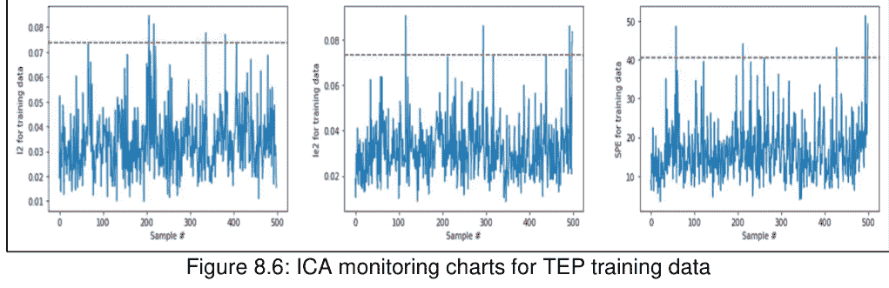

##### 测试数据上的故障检测

Lee等人51和Yin等人52已详细发表了多种机器学习技术在田纳西-伊士曼过程（TEP）上的故障检测性能，并展示了ICA优越的故障检测能力。我们将尝试针对一些故障来证实他们的发现。

图8.7和图8.8展示了故障10和故障5的ICA/PCA监控图。对于故障10，ICA给出了显著更高的故障检测率（FDR）。在400到600之间的许多样本中，尽管存在过程异常，PCA指标仍低于其控制限。对于故障5的测试数据，性能差异更为显著。从样本400开始，PCA图错误地指示正常运行，尽管已知故障状态一直持续到采样期结束。另一点需要注意的是，PCA和ICA的误报率（FAR）都较低，因为在样本160之前没有多少样本违反控制限。这里ICA的误报率也更低/更好。在非故障测试数据集上观察到类似的误报率行为。我们没有展示误报率值，但你应该计算它们并确认ICA给出了更低的误报率值。

```python
# define function to compute FDR or FAR
def compute_alarmRate(monitoring_stats, CLs):
    """ calculate alarm rate

    parameters
    ----------
    monitoring_stats: numpy array of shape = [n_samples, 3]
    CLs: List of control limits

    Returns
    -------
    alarmRate: float
    """
    violationFlag = monitoring_stats > CLs
    alarm_overall = np.any(violationFlag, axis=1) # violation of any metric => alarm
    alarmRate = 100*np.sum(alarm_overall)/monitoring_stats.shape[0]

    return alarmRate

# fetch test data and select data as done during training
TEdata_Fault_test = np.loadtxt('d10_te.dat')

xmeas = TEdata_Fault_test[:,0:22]
xmv = TEdata_Fault_test[:,41:52]
data_Fault_test = np.hstack((xmeas, xmv))

# scale data
data_test_scaled = scaler.transform(data_Fault_test)

# compute statistics and draw charts
ICA_statistics_test = compute_ICA_monitoring_metrics(ica, n_comp, data_test_scaled)
draw_ICA_monitoring_charts(ICA_statistics_test, [I2_CL, Ie2_CL, SPE_CL], 'test')

# compute FAR or FDR
alarmRate = compute_alarmRate(ICA_statistics_test[160:,:], [I2_CL, Ie2_CL, SPE_CL]) # fault starts sample 160 onwards
```

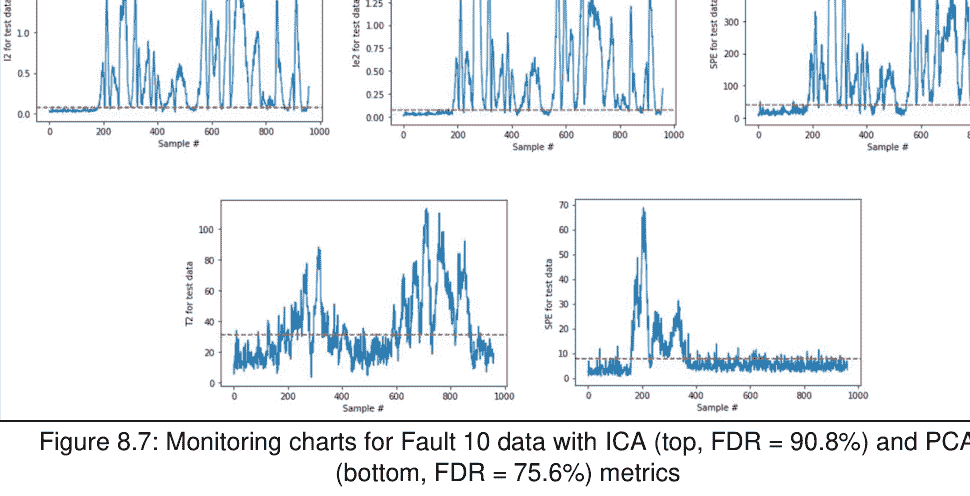

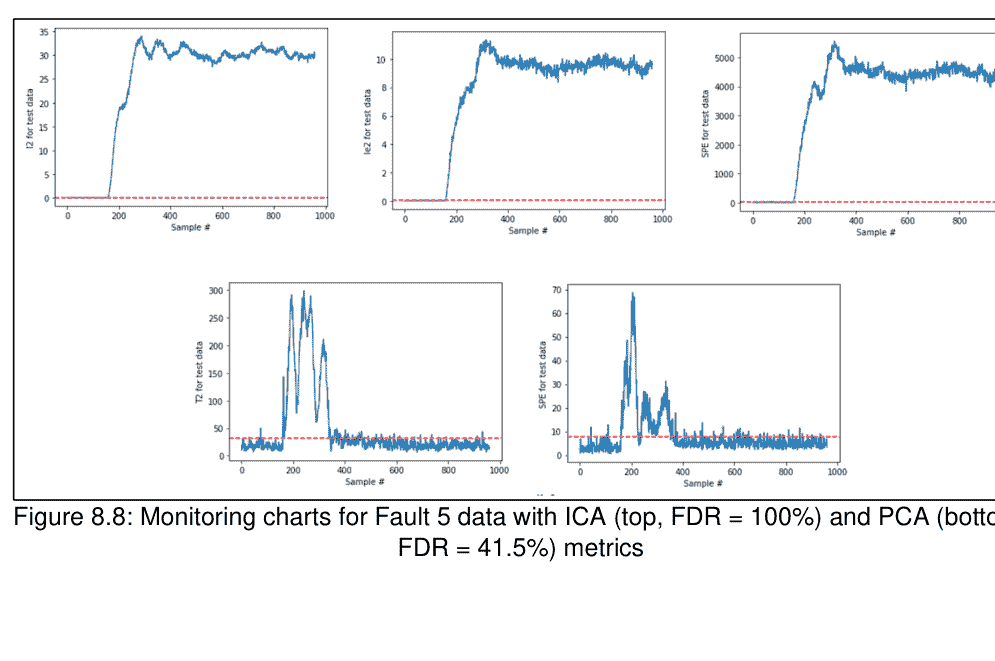

#### 8.3 判别分析简介

费舍尔判别分析（FDA），也称为线性判别分析（LDA），是一种多元降维技术，它最大化不同类别数据在低维空间中的“分离度”。为了概念性理解，请考虑图8.9中的简单示例，其中FDA和PCA将一个二维数据集（包含2类数据）投影到一维空间。相应的一维得分显示，虽然两类数据在LD空间中分离良好，但在PC空间中分离度很差。这一观察结果是预期的，因为PCA在确定投影方向时，并未考虑不同数据类别的信息。因此，如果你的目的是为后续数据分类进行降维，并且训练数据已标记为不同类别，那么FDA更为合适。

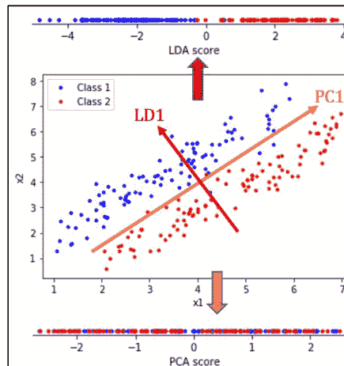

由于FDA强大的数据区分能力，它在过程工业中被广泛用于操作模式分类和故障诊断。大规模工业过程经常经历各种过程问题/故障，在在线操作期间快速准确地识别具体问题以最小化经济损失至关重要。在模型训练期间，FDA从历史过程故障收集的数据中学习（来自特定过程故障的数据形成一个类别），以找到最佳投影方向，并将异常过程数据实时分类为特定故障。我们将在本章研究这样一个应用。

##### 数学背景

为了便于数据分类，FDA不仅最大化类别之间的分离度，还最小化每个类别内部的变异/离散度。为了了解这是如何实现的，让我们首先考虑一个数据集矩阵 $X \in \mathbb{R}^{N \times m}$，它包含 $N$ 个样本，其中 $N_1$ 个属于类别1（$\omega_1$），$N_2$ 个属于类别2（$\omega_2$）。FDA寻求找到一个投影向量 $w \in \mathbb{R}^m$，使得投影后的标量/样本（$z = w^T x$）最大程度地分离。令 $\tilde{\mu}_1$ 和 $\tilde{\mu}_2$ 分别表示类别1和类别2投影值的均值

$$\tilde{\mu}_i = \frac{1}{N_i} \sum_{z \in \omega_1} z$$

类别分离度可以量化为投影均值之间的距离 $|\tilde{\mu}_1 - \tilde{\mu}_2|$；然而，如下图所示，这不是一个稳健的度量。

为了量化类 $\omega_i$ 内部的变异性，我们定义了一个称为散布度的术语，$\tilde{s}_i^2$

$$\tilde{s}_i^2 = \sum_{z \in \omega_1} (z - \tilde{\mu}_i)^2$$

分离准则现在被定义为投影均值之间的归一化距离。该公式旨在寻找一个投影，使得类均值相距较远，而同一类的样本彼此接近。

$$J(\mathbf{w}) = \frac{|\tilde{\mu}_1 - \tilde{\mu}_2|^2}{\tilde{s}_1^2 + \tilde{s}_2^2}$$

利用基本关系 $y = w^T x$ 和直接的代数运算$^{53}$，可以等价地将目标函数 $J(w)$ 表示如下，该形式同样适用于任意 $(p)$ 个数据类别

$$J(w) = \frac{w^T S_b w}{w^T S_w w} \quad \text{公式 9}$$

$S_b$（类间散布矩阵）和 $S_w$（类内散布矩阵）定义为

$$S_b = \sum_{j=1}^p N_j (\mu_j - \mu)(\mu_j - \mu)^T$$

$$S_w = \sum_{j=1}^p S_j$$

$$S_j = \sum_{x_i \in \omega_1} (x_i - \mu_j)(x_i - \mu_j)^T$$

其中，$\mu \in \mathbb{R}^m$ 和 $\mu_j \in \mathbb{R}^m$ 分别表示测量空间中所有 $N$ 个样本和第 $j$ 类 $N_j$ 个样本的均值向量。第一个 FDA 向量 $w_1$ 通过最大化 $J(w)$ 找到，后续向量则通过求解相同问题并附加与先前计算向量正交的约束条件来找到。注意，最多可以有 $p-1$ 个 FDA 向量。或者，与 PCA 类似，这些向量也可以作为广义特征值问题的解来计算

$$S_w^{-1}S_bw = \lambda w$$

##### 数据标准化
from sklearn.preprocessing import StandardScaler
scaler = StandardScaler()
Faultydata_train_scaled = scaler.fit_transform(data_Faulty_train)

# 拟合LDA模型
from sklearn.discriminant_analysis import LinearDiscriminantAnalysis
lda = LinearDiscriminantAnalysis()
scores_train_lda = lda.fit_transform(Faultydata_train_scaled, y_train)

# 可视化LDA得分
plt.figure()
plt.plot(scores_train_lda[0:n_rows_train,0], scores_train_lda[0:n_rows_train,1], 'b.', label='故障5')
plt.plot(scores_train_lda[n_rows_train:2*n_rows_train,0],
         scores_train_lda[n_rows_train:2*n_rows_train,1], 'r.', label='故障10')
plt.plot(scores_train_lda[2*n_rows_train:3*n_rows_train,0],
         scores_train_lda[2*n_rows_train:3*n_rows_train,1], 'm.', label='故障19')
plt.legend()

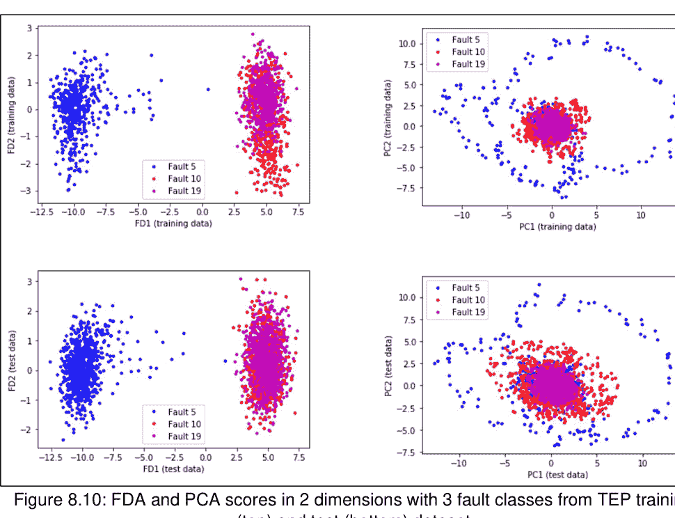

图8.10展示了经过FDA和PCA变换后在二维空间中的样本。FDA能够清晰地分离故障5的样本；然而，它无法分离故障10和19的数据。事实上，第二判别式（FD2）对判别贡献很小，因此只需FD1即可分离故障5的样本。为了分离故障10和19，可以探索核FDA⁵⁴。另一方面，线性PCA无法分离任何类别。

> 虽然FDA是故障诊断的强大工具，但通过将正常工况数据作为一个单独的类别纳入，它也可用于故障检测。

#### 8.4 基于FDA的故障分类：田纳西-伊士曼过程案例研究

将样本投影到FDA空间后，可以选择任何分类技术来分类或诊断特定故障。一种流行的基于T²统计量的方法是使用训练数据为每个故障类别计算T²控制限。第$j^{th}$个故障类别的T²控制限（$T^2_{CL,j}$）代表了在低维空间中围绕第$j^{th}$个故障投影样本的边界——任何落在该边界内的给定样本都属于第$j^{th}$个故障类别。数学上，这可以表示为

$T^2_{sample,j} < T^2_{CL,j} \Rightarrow 样本 \ 属于 \ 第 \ j^{th} \ 个 \ 故障 \ 类别$

对于第$j^{th}$类别的样本，$T^2_{sample,j}$由下式给出

$T^2_{sample,j} = (z_{sample} - \tilde{\mu}_j)^T \tilde{S}_j (z_{sample} - \tilde{\mu}_j)$

其中，$\tilde{\mu}_j$和$\tilde{S}_j$分别表示训练数据集中属于第$j^{th}$个故障类别的投影样本的均值和协方差矩阵，$z_{sample}$表示FDA空间中的投影样本。$T^2_{CL,j}$可以使用我们在PCA中使用的相同表达式获得，即$k(N_j^2 - 1)/N_j(N_j - k) F_{k,N-k}(\alpha)$，其中$k$表示FDA空间中保留的维度数。为了说明，让我们看看故障5测试数据中有多少样本被正确识别。

⁵⁴ Hyun-Woo Cho, Nonlinear feature extraction and classification of multivariate process data in kernel feature space, Expert Systems with Applications, 2007

```python
# 计算控制限
import scipy.stats
Nj = n_rows_train
k = 2

alpha = 0.01 # 99%控制限
T2_CL = k*(Nj**2-1)*scipy.stats.f.ppf(1-alpha,k,Nj-k)/(Nj*(Nj-k))

# 故障5类别的均值和协方差
scores_train_lda_Fault5 = scores_train_lda[0:n_rows_train,:]
cov_scores_train_Fault5 = np.cov(scores_train_lda_Fault5.T)
mean_scores_train_Fault5 = np.mean(scores_train_lda_Fault5, axis = 0)

# 获取故障5的TE测试数据
TEdata_Fault5_test = np.loadtxt('d05_te.dat')
TEdata_Fault5_test = TEdata_Fault5_test[160:,:] # 故障操作从样本160开始
n_rows_test = TEdata_Fault5_test.shape[0]
xmeas = TEdata_Fault5_test[:,0:22]
xmv = TEdata_Fault5_test[:,41:52]
data_Faulty_test = np.hstack((xmeas, xmv))

# 标准化测试数据并进行变换
Faultydata_test_scaled = scaler.transform(data_Faulty_test)
scores_test_lda = lda.transform(Faultydata_test_scaled)

# 计算故障5类别的测试数据的T²统计量
T2_test = np.zeros((n_rows_test,))
for sample in range(n_rows_test):
    score_sample = scores_test_lda[sample,:]
    score_sample_centered = score_sample - mean_scores_train_Fault5
    T2_test[sample] = np.dot(np.dot(score_sample_centered[np.newaxis,:],
                                    np.linalg.inv(cov_scores_train_Fault5)), score_sample_centered[np.newaxis,:].T)

# 绘制测试预测结果
outsideCL_flag = T2_test > T2_CL
insideCL_flag = T2_test <= T2_CL
plt.figure()
plt.plot(scores_test_lda[outsideCL_flag,0], scores_test_lda[outsideCL_flag,1], 'k.', label='在故障5边界内')
plt.plot(scores_test_lda[insideCL_flag,0], scores_test_lda[insideCL_flag,1], 'b.', label='在故障5边界外')
plt.xlabel('FD1 (测试数据)'), plt.ylabel('FD2 (测试数据)')
```

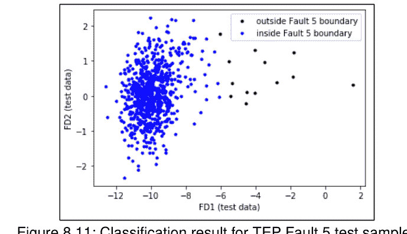

图8.11：TEP故障5测试样本的分类结果

大约98%的样本被正确识别为属于故障5。如图8.11所示，一些远离均值的样本违反了$T_{CL,5}^2$，因此未被分类为故障5。

##### 总结

通过本章，我们已经介绍了四种主要MSPM技术的基础版本，这些技术常用于分析过程数据。本章还传达了一个重要信息：盲目地始终应用单一技术可能无法获得最佳结果。应根据手头的过程系统（高斯 vs 非高斯）和目标（故障检测 vs 故障分类）来选择技术。ICA和FDA是强大的技术，它们的内容远不止我们在本章所触及的。虽然鼓励你进一步探索这些方法（既然你已经有了概念上的理解），但我们将在下一章研究适用于动态数据的PCA和PLS变体。

## 第9章

### 线性与动态过程的多元统计过程监控

在前面的章节中，我们看到了基于潜变量的MSPM技术如何巧妙地从数据中提取隐藏的稳态关系。然而，我们施加了一个主要限制，即数据集中不存在动态性。不幸的是，处理表现出显著动态性的工业数据集是常见的，而标准MSPM技术无法提取过程变量之间的动态关系。尽管如此，MSPM研究界对标准MSPM技术提出了一个简单但巧妙的修改，使得处理动态数据集变得非常容易。这个技巧包括将过去的测量值作为额外的过程变量纳入。就是这样！然后可以将标准技术应用于增强后的数据集。标准MSPM技术的动态变体包括动态PCA（DPCA）、动态PLS（DPLS）、动态ICA（DICA）等。

动态PCA和动态PLS是监控线性与动态过程最受欢迎的技术之一；因此，本章将详细介绍它们。此外，本章还介绍了另一种非常流行且强大的技术，专门设计用于从过程数据中提取动态关系——典型变量分析（CVA）。通过数值和工业规模的案例研究，我们将看到如何使用这三种技术构建故障检测工具。具体涵盖以下主题

- 动态PCA简介
- 使用DPCA进行故障检测
- 动态PLS简介
- CVA简介
- 使用CVA对田纳西-伊士曼过程进行故障检测

#### 9.1 动态PCA简介

动态PCA是传统PCA的动态扩展，旨在处理表现出显著动态性的过程数据。DPCA简单地涉及将传统PCA应用于增强数据矩阵，如图9.1所示，该矩阵是通过使用过去的测量值作为额外的过程变量生成的。请注意，增强矩阵的每个“变量”都像传统PCA中那样被归一化为零均值和单位方差。这可能看起来令人惊讶，但如此简单的方法在过程工业中取得了巨大成功，并因其易于实现而被广泛采用。

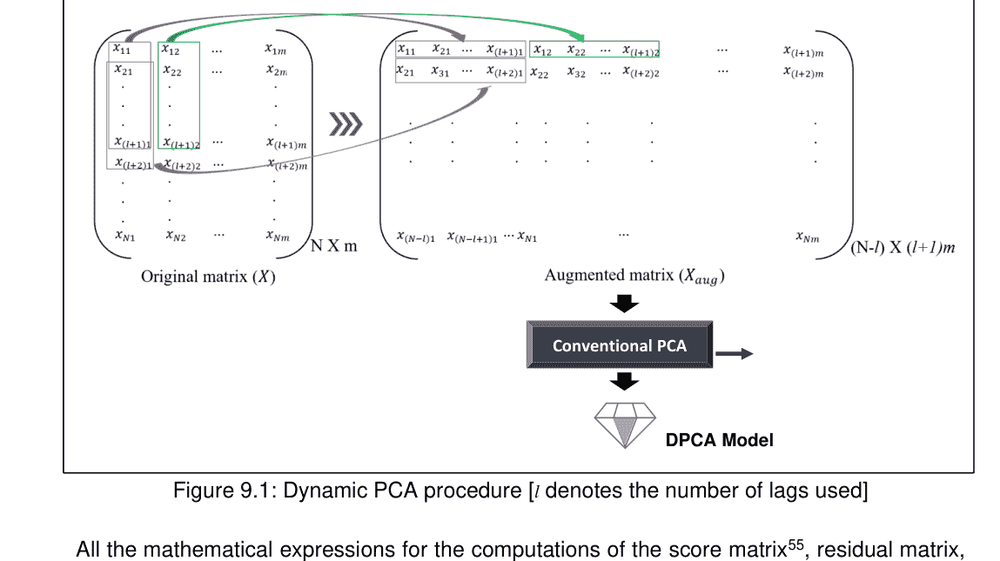

所有用于计算得分矩阵⁵⁵、残差矩阵、Hotelling's $T^2$和SPE的数学表达式与第7章所示的完全相同（公式1至公式8），只是现在你将使用缩放后的$X_{aug}$而不是$X$，即$T = X_{aug}P$；$E = X_{aug} - \hat{X}_{aug}$。确定保留潜变量数量的过程也保持不变。在其他方法中，你可以查看解释方差碎石图中的“拐点”，或使用累积百分比方差方法。如果你正确选择了‘l’，那么过程变量之间的静态和动态关系都将被捕获，相应地，残差和Q统计量将不会表现出自相关⁵⁶。对于测试数据集，你将再次简单地使用时间滞后测量值进行增强。在我们深入细节之前，让我们先看一个快速的激励示例，说明为什么在存在动态性的情况下DPCA优于PCA。

⁵⁵ DPCA中保留的主成分数量可能大于$m$。
⁵⁶ DPCA得分可以表现出自相关。

##### 示例 9.1：

为了说明 DPCA 如何提取动态关系，让我们考虑以下无噪声动态系统。

$x_1(k) = 0.8x_1(k-1) + x_2(k-1); \quad k \text{ 是采样时刻}$

在 PCA 中提取的零奇异（特征）值的数量表示过程变量之间存在的线性关系的数量。让我们看看是否仅使用数据（$x_1$ 和 $x_2$ 的 1000 个样本）就能提取出上述动态关系。

```python
# import required packages
import numpy as np, matplotlib.pyplot as plt
from sklearn.decomposition import PCA

# generate data for the system: x1(k) = 0.8*x1(k-1) + x2(k-1)
x2 = np.random.normal(loc=0, scale=1, size=(1000,1))
x1 = np.zeros((1000,1))
for k in range(1,1000):
    x1[k] = 0.8*x1[k-1] + x2[k-1]
X = np.hstack((x1, x2))

# function to generate augmented matrix
def augment(X, n_lags):
    N, m = X.shape
    X_aug = np.zeros((N-n_lags, (n_lags+1)*m))
    for sample in range(n_lags, N):
        XBlock = X[sample-n_lags:sample+1,:]
        X_aug[sample-n_lags,:] = np.reshape(XBlock, (1,-1), order = 'F')
    return X_aug

# fit DPCA model
X_aug = augment(X, 1) # augment data
X_aug_centered = X_aug - np.mean(X_aug, axis=0) # center data
dpca = PCA().fit(X_aug_centered) # fit PCA model
print('DPCA singular values:', dpca.singular_values_) # get singular values
```

>>> DPCA singular values: [6.664e+01 3.731e+01 3.094e+01 1.1661e-14]

正如预期，只有一个奇异值非常接近零。我们现在需要做的就是获取与该奇异值对应的奇异向量，并检查它是否代表了我们的动态系统。

```python
# get 4th singular vector
print('4th singular vector: ', dpca.components_[3,:])

>>> 4th singular vector: [ 4.923e-01 -6.154e-01  6.154e-01  1.7348e-17]

第4个奇异向量代表以下关系
$$0.4923x_1(k-1) - 0.6154 x_1(k) + 0.6154x_2(k) = 0$$
$$\Rightarrow x_1(k) = 0.8x_1(k-1) + x_2(k-1)$$

瞧！DPCA 成功地提取了潜在的过程动态。而另一方面，PCA 并未揭示变量之间的任何关系。
```

##### 时间滞后 ($l$) 的确定

时间滞后 ($l$) 由过程的动态阶数决定。不幸的是，动态阶数通常是未知的。Ku 等人$^{57}$ 在 1995 年首次提出了一种确定时间滞后的算法。另一种常用的策略由 Rato 和 Reis$^{58}$ 给出，现复述如下。

##### 算法：DPCA 的时间滞后确定

1.  初始化 $l = 0$ 并指定某个最大滞后值 $l_{max}$
2.  生成增广数据矩阵 $X_{aug}$
3.  对 $X_{aug}$ 的协方差矩阵 ($\Sigma_{X_{aug}}$) 进行奇异值分解。令 $s_{ml+1}$ 为 $\Sigma_{X_{aug}}$ 的第 ($ml + 1$)$^{th}$ 个奇异值。定义 $KSV(l) = s_{ml+1}$。
4.  对于 $l > 0$，定义 $KSVR(l) = KSV(l) / KSV(l-1)$
5.  如果 $l < l_{max}$，则设置 $l = l + 1$ 并转到步骤 2，否则转到步骤 6
6.  归一化 KSV 和 KSVR
    $$KSV_{normal}(l) = \frac{KSV(l) - \min(KSV)}{\max(KSV) - \min(KSV)}$$
    $$KSVR_{normal}(l) = \frac{KSVR(l) - \min(KSVR)}{\max(KSVR) - \min(KSVR)}$$
7.  找到 $l^*$ 作为第一个满足 $KSVR(l) < KSVR(l-1)$ 的 $l$
8.  确定最优 $l_{opt} \in [1, l_{max}}]$ 为
    $$l_{opt} = argmin \sqrt{KSV_{normal}(l)^2 KSVR_{normal}(l)^2} , \quad s.t. \ l \geq l^*$$

$^{57}$ Ku 等人，通过动态主成分分析进行扰动检测与隔离。*化学计量学与智能实验室系统*，1995年。
$^{58}$ Rato 和 Reis，定义 DPCA 模型的结构及其对过程监控和预测活动的影响。*化学计量学与智能实验室系统*，2013年

#### 9.2 基于 DPCA 的故障检测：数值示例

为了说明基于 DPCA 的故障检测的每个步骤，我们将使用一个简单的合成 2 输入、2 输出过程<sup>59</sup>，如下所示

$$z(k) = \begin{bmatrix} 0.118 & -0.191 \\ 0.847 & 0.264 \end{bmatrix} z(k-1) + \begin{bmatrix} 1 & 2 \\ 3 & -4 \end{bmatrix} u(k-1)$$
$$u(k) = \begin{bmatrix} 0.811 & -0.226 \\ 0.477 & 0.415 \end{bmatrix} u(k-1) + \begin{bmatrix} 0.193 & 0.689 \\ -0.320 & -0.749 \end{bmatrix} w(k-1)$$
$$y(k) = z(k) + v(k)$$

这里，输出 ($y(k)$) 和输入 ($u(k)$) 的测量值可用于分析。$w(k)$ 和 $v(k)$ 是零均值随机噪声信号，方差分别为 1 和 0.1。该过程的模拟数据可在文件 *multivariate_NOC_data.txt* 和 *multivariate_test_data.txt* 中找到。在测试数据中，在样本 50 处引入了 $w_2$ 的单位阶跃变化扰动，以模拟故障条件。

我们现在将逐步介绍构建基于 DPCA 的故障检测解决方案的每个步骤。让我们从读取数据集、生成增广数据矩阵开始，然后训练 DPCA 模型。

```python
# fetch data
X_NOC = np.loadtxt('multivariate_NOC_data.txt')
X_test = np.loadtxt('multivariate_test_data.txt')

#%%%%%%%%%%%%%%%%%%%%%%%%%%%%%%%%%%
#           DPCA model training
#%%%%%%%%%%%%%%%%%%%%%%%%%%%%%%%%%%
# augment and scale data
X_NOC_aug = augment(X_NOC, 1)
scaler = StandardScaler()
X_NOC_aug_scaled = scaler.fit_transform(X_NOC_aug)

# fit PCA model on augmented data
dpca = PCA().fit(X_NOC_aug_scaled)

# find n_component
explained_variance = 100*dpca.explained_variance_ratio_ # in percentage
cum_explained_variance = np.cumsum(explained_variance) # cumulative % variance explained
n_comp = np.argmax(cum_explained_variance >= 95) + 1

# refit with n_comp
dpca = PCA(n_components=n_comp)
dpca.fit(X_NOC_aug_scaled)

# compute scores and error for training data
scores_NOC = dpca.transform(X_NOC_aug_scaled)
X_NOC_aug_scaled_reconstruct = dpca.inverse_transform(scores_NOC)
error_NOC = X_NOC_aug_scaled - X_NOC_aug_scaled_reconstruct

# calculate Q for training data
Q_NOC = np.sum(error_NOC*error_NOC, axis = 1)

# calculate T2 for training data
N = X_NOC_aug_scaled.shape[0]
lambda_k = np.diag(dpca.explained_variance_) # eigenvalue = explained variance
lambda_k_inv = np.linalg.inv(lambda_k)

T2_NOC = np.zeros((N,))
for i in range(N):
    T2_NOC[i] = np.dot(np.dot(scores_NOC[i,:], lambda_k_inv), scores_NOC[i,:].T)

# control limits
Q_CL = np.percentile(Q_NOC, 99)
T2_CL = np.percentile(T2_NOC, 99)
```

现在让我们将 DPCA 模型部署到测试数据上，看看监控统计量是否违反控制限。

```python
# augment and scale test data
X_test_aug = augment(X_test, 1)
X_aug_test_scaled = scaler.transform(X_test_aug)

# compute scores and error for test data
scores_test = dpca.transform(X_aug_test_scaled)
X_aug_test_scaled_reconstruct = dpca.inverse_transform(scores_test)
error_test = X_aug_test_scaled - X_aug_test_scaled_reconstruct

# calculate Q and T2 for test data
Q_test = np.sum(error_test*error_test, axis = 1)
N_test = X_aug_test_scaled.shape[0]
T2_test = np.zeros((N_test,))
for i in range(N_test):
    T2_test[i] = np.dot(np.dot(scores_test[i,:], lambda_k_inv), scores_test[i,:].T)

# monitoring charts for test data
plt.figure(), plt.plot(Q_test), plt.plot([1,len(Q_test)],[Q_CL,Q_CL], color='red')
plt.xlabel('Sample #'), plt.ylabel('Q for test data')

plt.figure(), plt.plot(T2_test), plt.plot([1,len(T2_test)],[T2_CL,T2_CL], color='red')
plt.xlabel('Sample #'), plt.ylabel('T$^2$ for test data')
```

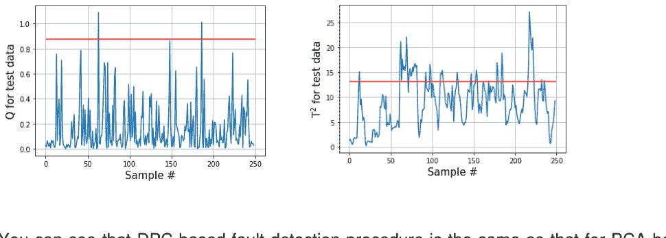

你可以看到，基于 DPC 的故障检测过程与基于 PCA 的故障检测过程相同，只是增加了数据的增广。通常，当数据中存在时间相关性时，DPCA 的性能优于 PCA。

##### 用于故障诊断的贡献图

增广矩阵中每个变量的 $T^2$ 和 $Q$ 贡献的计算方式与 PCA 相同。原始变量的总体贡献是通过将该变量及其每个 $l$ 个时间滞后变量的贡献相加得到的。

#### 9.3 动态 PLS：简介

动态 PLS 是传统 PLS 的动态扩展。如图 9.2 所示，DPLS 需要使用滞后测量值作为额外的预测变量。如图所示，生成 DPLS 模型有两种方式：仅包含输入变量的滞后值，或同时包含输入和输出变量的滞后值。虽然第一种方法导致 FIR 类型的模型，但后一种方法导致 ARX 类型的模型。与 DPCA 类似，一旦增广矩阵准备就绪，就进行缩放并应用传统 PLS。所有用于计算得分矩阵、残差矩阵、监控指标等的数学表达式与第 7 章中传统 PLS 所见的相同。

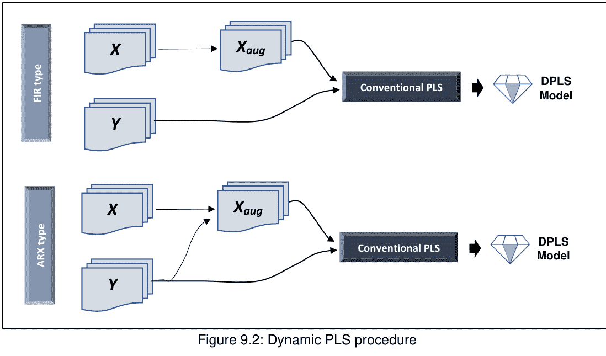

有两个超参数需要指定：时间滞后$^{60}$ 和保留的潜变量数量。这两个超参数通常通过交叉验证来确定。我们已经看到了如何修改传统的 FDI 工作流程以处理 DPCA 中的增广数据矩阵，因此，我们将跳过展示基于 DPLS 的 FDI 的实现代码。相反，我们将继续研究一种略有不同的技术（状态空间建模）来构建动态模型。

$^{60}$ 时间滞后通常对所有输入（以及如果构建 ARX 类型模型则包括输出）变量选择相同的值

#### 9.4 典型变量分析：简介

典型变量分析（CVA）是一种经典的多元统计过程监控技术，适用于对动态过程系统进行建模。虽然主成分分析（PCA）和偏最小二乘法（PLS）建立的是输入-输出模型，但CVA旨在提供状态空间模型，如图9.3所示。状态类似于潜变量，它们充当过程输入和输出之间的桥梁。例如，在精馏塔系统中，显然$Q_B$并不直接影响$x_D$。$Q_B$的变化必须经过内部动态或状态（例如，由每块塔板上的液体滞留量引起）才能影响$x_D$。对于$Q_B$与$D$的关系也可以进行类似的论证。输出共享相同的内部动态，这使得CVA模型（与DPCA和DPLS模型相比）具有更好的参数效率。

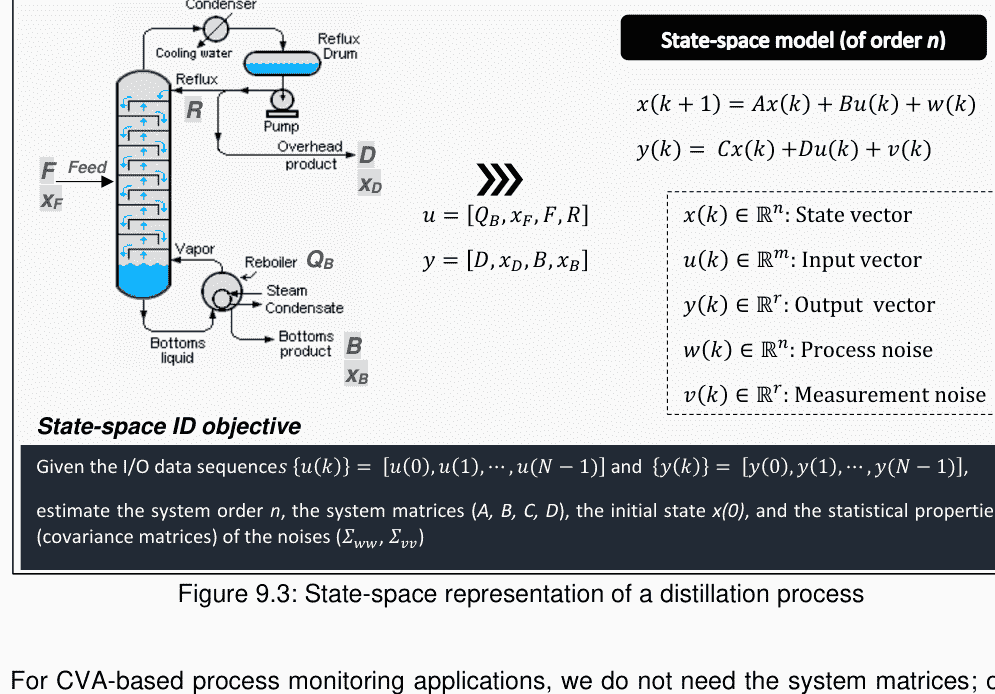

对于基于CVA的过程监控应用，我们不需要系统矩阵；只需计算训练和测试数据集的状态即可。跟踪状态和状态噪声的系统性变化使我们能够构建监控指标。事实证明，任何时刻的状态向量都可以近似为过去输入和输出的线性组合。这个特定的组合被确定为能最好地预测未来输出的组合。现在让我们熟悉一下这是如何实现的。

##### 数学背景

利用状态空间模型以及对输入-输出数据序列的一些巧妙重排$^{61}$，可以证明在时间点$k$的状态向量$x(k)$可以近似为过去输入和输出的线性组合。

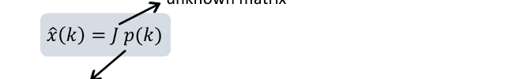

定义为$[y^T(k-1) \ y^T(k-2) \ \cdots \ y^T(k-l_y) \ u^T(k-1) \ u^T(k-2) \ \cdots \ u^T(k-l_u)]^T$。

在公式1中，$l_y$和$l_u$分别表示用于构建$p(k)$向量的滞后输出和输入的数量。通常，$l_y = l_u = l$，这是一个模型超参数。CVA方法利用典型协方差分析（CCA），一种多元统计技术，来找到$J$。下面提供关于CCA技术的简要介绍。

###### CCA：简要介绍

CCA是一种降维技术，旨在找到输入变量（$u \in \mathbb{R}^m$）的线性组合，使其与输出变量（$y \in \mathbb{R}^r$）的线性组合具有最大相关性*。你可以将其与PLS联系起来，在PLS中，潜变量之间的协方差被最大化。这些线性组合被称为典型变量，表示为

$$c = Ju$$
$$d = Ly$$

$c$和$d$之间的协方差矩阵是（矩形）对角矩阵

$$\Sigma_{cd} = J\Sigma_{uy}L^T = D = diag(\gamma_1, \gamma_2, \dots, \gamma_o, 0, \dots, 0)$$

矩阵D的元素$\gamma_i$被称为典型相关系数，满足（$\gamma_1 \ge \gamma_2 \ge \dots \ge \gamma_o$），并量化了第$i^{th}$对典型变量$c_i$和$d_i$之间的相关程度。

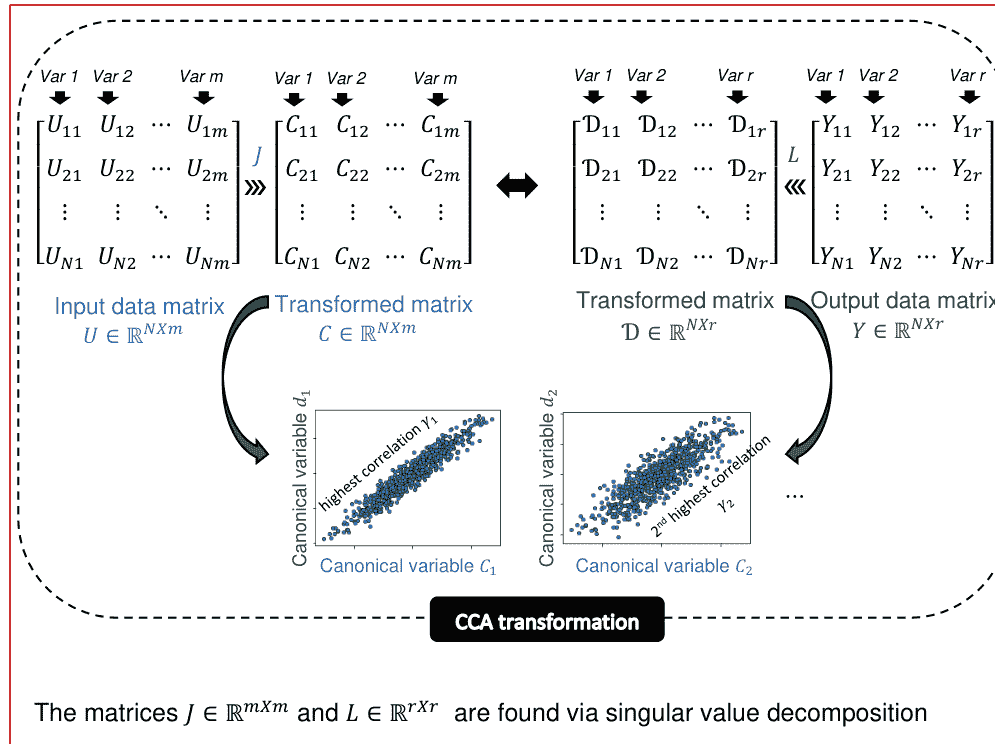

矩阵$J \in \mathbb{R}^{m \times m}$和$L \in \mathbb{R}^{r \times r}$通过奇异值分解求得

$$\Sigma_{uu}^{-1/2} \Sigma_{uy} \Sigma_{yy}^{-1/2} = U \Sigma V^T$$

其中，$J = U^T \Sigma_{uu}^{-1/2}, L = V^T \Sigma_{yy}^{-1/2}, D = \Sigma$。

可以只保留那些显示出显著相关性的典型变量对（例如，前$n$对），而丢弃其他对，从而实现降维。令$\hat{c}$和$\hat{d}$为$n$维（$n < m$且$r$）向量，则

$$\hat{c} = J_n u$$
$$\hat{d} = L_n y$$

其中，$J_n$和$L_n$分别是$J$和$L$的前$n$行。

* 假设$u$和$y$是中心化的。然而，不需要缩放，因为CCA具有尺度不变性，即无论是否缩放，估计的潜变量和相关性都保持不变。另请注意，我们没有使用“$k$”符号，因为CCA是为静态数据设计的。

##### 计算CVA状态

在CVA中，执行CCA的两组向量是$p(k)$（在公式1中定义）和$f(k)$，其中$^{62}$

$$f(k) = [y^T(k) \ y^T(k+1) \ \cdots \ y^T(k+l)]^T$$

即当前和未来的输出。

因此，CVA求解以下奇异值分解问题，并找到过去输入和输出的线性组合，使其与当前和未来输出的线性组合具有最大相关性。

$$\Sigma_{pp}^{-1/2} \Sigma_{pf} \Sigma_{ff}^{-1/2} = U \Sigma V^T$$

公式2

我们知道$\Sigma$是一个对角矩阵。它的元素也被称为（Hankel）奇异值。如果假设$n$是模型阶数，那么在时间$k$最能预测未来输出的最优状态由$^{63}$给出

$$\hat{x}(k) = J_n p(k)$$

公式3

包含矩阵$J = U^T \Sigma_{pp}^{-1/2}$的前$n$行。

公式3可用于计算训练和测试数据集的状态。

##### 超参数选择

CVA算法的数学背景表明需要指定两个超参数：滞后阶数（$l$）和模型阶数（$n$）。虽然在状态估计之前不需要指定模型阶数，但滞后阶数需要事先确定。让我们看看估计这些超参数的常用方法。

###### 滞后阶数（$l$）

为滞后$l$赋值的指导原则是它应该足够大以捕捉数据的自相关性。一个常用的推荐策略是拟合几个具有不同$l$值的多元自回归模型，并选择使AIC准则最小化的$l$。Odiowei和Cao<sup>64</sup>提出了另一种方法，他们建议检查过程变量平方和的自相关函数，并选择自相关显著的最大滞后值作为滞后阶数。Zhang等人<sup>65</sup>给出了另一种便捷的方法，他们建议选择满足以下方程的最小$s$作为滞后阶数

$$A_{s+1} = \frac{\sqrt{\sum_{j=1}^{M}\left(autocorr(x_j, s+1)\right)^2}}{\sqrt{\sum_{i=1}^{s} \sum_{j=1}^{M}\left(autocorr(x_j, i)\right)^2 / s}} \leq \vartheta$$

其中$autocorr(x_j, i)$是第$j^{th}$个变量在时间滞后$i$处的自相关系数。阈值选择在0到0.5之间。

###### 模型阶数（$n$）

正确选择$n$的值很重要：值太大会导致模型过拟合，而值太小会导致欠拟合。一种模型阶数选择方法基于Hankel奇异值。如果奇异值对模型阶数的图有一个明显的“肘部”，则可以选择对应于肘部的模型阶数，如下所示。

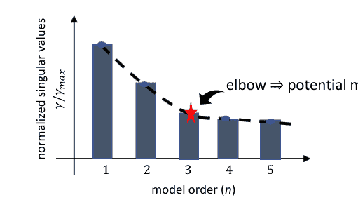

另一种做法是选择$n$，使得从第$(n+1)^{th}$个开始的奇异值的归一化值低于某个阈值。然而，通常没有肘部或奇异值下降缓慢。因此，更广泛使用的模型阶数选择准则是AIC<sup>66</sup>。

##### 过程监控/故障检测指标

在基于CVA的故障检测策略中，计算三个指标：$T_s^2, T_e^2, Q$。这些指标的计算及其相应的阈值如下所示。请注意，阈值表达式基于过程变量服从高斯分布的假设；如果此假设无效，则可以采用核密度估计（KDE）或百分位数等经验技术。

| 指标 1: $T_s^2$ | 指标 2: $T_e^2$ | 指标 3: $Q$ |
| :--- | :--- | :--- |
| $T_s^2(k) = x^T(k)x(k)$<br>$= p^T(k) J_n^T J_n p(k)$ | $T_e^2(k) = p^T(k) J_e^T J_e p(k)$ | $Q(k) = r^T(k)r(k)$<br>$r(k) = p(k) - J_n^T J_n p(k)$ |
| 显著性水平 $\alpha$ 下的阈值 | 显著性水平 $\alpha$ 下的阈值 | 显著性水平 $\alpha$ 下的阈值 |
| $T_{s,CL}^2 = \frac{n(N^2-1)}{N(N-n)} F_{\alpha}(n, N-n)$ | $T_{e,CL}^2 = \frac{z(N^2-1)}{N(N-z)} F_{\alpha}(z, N-z)$ | $Q_{CL} = \frac{\sigma}{2\mu} \chi_{\alpha}^2 \left( \frac{2\mu^2}{\sigma} \right)$ |

- $J_e$包含$J$中除前$n$行外的所有行，即$J$的最后$\ell(m+r)-n$行。
- $z = \ell(m+r)-n$。
- $F_{\alpha}(n, N-n)$是自由度为$n$和$N-n$的$F$分布的1-$\alpha$百分位数。
- $\chi_{\alpha}^2(h)$是自由度为$h$的卡方分布的(1-$\alpha$)百分位数；$\mu$表示Q指标的均值，$\sigma$表示其方差。
- 显著性水平$\alpha = 0.05$意味着有5%的概率警报是误报。

##### （无监督）仅使用输出变量的CVA建模

CVA也可用于捕捉变量未被划分为输入和输出的数据集中的动态相关性。由此产生的状态空间模型如下

$$x(k+1) = Ax(k) + w(k)$$
$$y(k) = Cx(k) + v(k)$$

这种方法可用于监控在稳定点附近运行的过程。整体方法保持不变（如图9.4所示），只是过去和未来向量的定义现在如下

$$p(k) = [y^T(k-1) \ y^T(k-2) \ \cdots \ y^T(k-\ell)]^T$$
$$f(k) = [y^T(k) \ y^T(k+1) \ \cdots \ y^T(k+\ell)]^T$$

下图（图9.4）的流程图总结了前述开发基于CVA的过程故障检测解决方案的步骤。

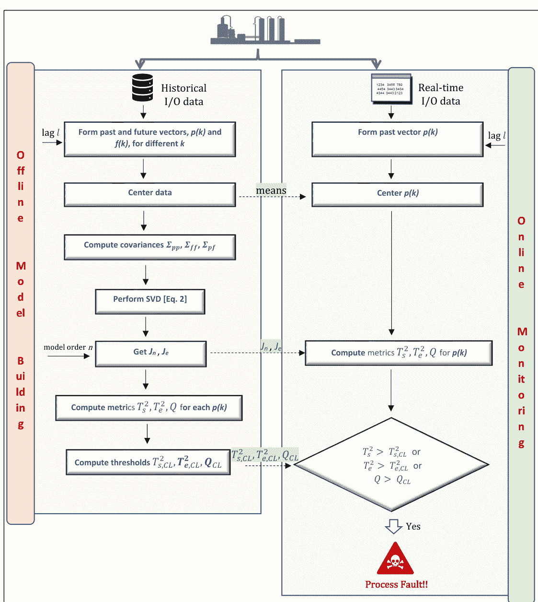

#### 9.5 通过CVA对田纳西-伊士曼过程进行过程监控

在本节中，我们将通过逐步应用于我们熟悉的TEP过程，学习基于CVA的监控工具开发的详细信息。本书中提供的CVA监控流程与Russell等人<sup>67</sup>著作中的描述一致，因此我们将尝试复现他们题为‘*使用典型变量分析和动态主成分分析进行工业过程故障检测*’的期刊论文中基于CVA的故障检测结果。具体来说，我们将使用*故障5*数据集（文件*d05_te.dat*）作为测试数据，正常操作数据集（文件*d00.dat*）作为训练数据。我们将使用操纵变量作为输入，过程测量值作为输出。我们的目标是构建一个监控工具，能够准确地标记过程故障的存在，同时保持较低的误报频率。让我们首先快速探索一下数据集。

```python
# import packages
import matplotlib.pyplot as plt, numpy as np
from sklearn.preprocessing import StandardScaler

# read data and separate input-output variables
trainingData = np.loadtxt('d00.dat').T
FaultyData = np.loadtxt('d05_te.dat')
uData_training, yData_training = trainingData[:,41:52], trainingData[:,0:22]
uData_test, yData_test = FaultyData[:,41:52], FaultyData[:,0:22]
```

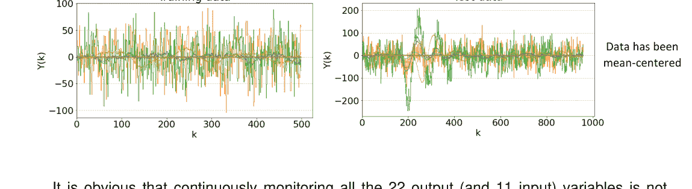

显然，持续监控所有22个输出（和11个输入）变量是不切实际的。上面的单个组合输出图似乎确实清楚地表明了故障数据集中样本编号200左右的过程扰动；然而，它们似乎也给人一种从样本编号500开始过程条件正常的错误印象。已知故障5一直持续到数据集结束。让我们计算训练数据集的监控指标。

```python
# generate past (p) and future (f) vectors for training dataset and center them
N = trainingData.shape[0]
l = 3 # as used by Russell et. al
m = uData_training.shape[1]
r = yData_training.shape[1]

pMatrix_train = np.zeros((N-2*l, l*(m+r)))
fMatrix_train = np.zeros((N-2*l, (l+1)*r))
for i in range(l, N-l):
    pMatrix_train[i-l,:] = np.hstack((yData_training[i-l:i,:].flatten(), uData_training[i-l:i,:].flatten()))
    fMatrix_train[i-l,:] = yData_training[i:i+l+1,:].flatten()

# center data
p_scaler = StandardScaler(with_std=False); pMatrix_train_centered = p_scaler.fit_transform(pMatrix_train)
f_scaler = StandardScaler(with_std=False); fMatrix_train_centered = f_scaler.fit_transform(fMatrix_train)

# computes covariances and perform SVD
import scipy

sigma_pp = np.cov(pMatrix_train_centered, rowvar=False)
sigma_ff = np.cov(fMatrix_train_centered, rowvar=False)
sigma_pf = np.cov(pMatrix_train_centered, fMatrix_train_centered,
                  rowvar=False)[:len(sigma_pp),len(sigma_pp):]

matrixProduct = np.dot(np.dot(np.linalg.inv(scipy.linalg.sqrtm(sigma_pp).real), sigma_pf),
                       np.linalg.inv(scipy.linalg.sqrtm(sigma_ff).real))

U, S, V = np.linalg.svd(matrixProduct)
J = np.dot(np.transpose(U), np.linalg.inv(scipy.linalg.sqrtm(sigma_pp).real))

# get the reduced order matrices
n = 29 # as used by Russell et. al
Jn, Je = J[:n,:], J[n:,:]

# get fault detection metrics for training data
Xn_train = np.dot(Jn, pMatrix_train_centered.T)
Ts2_train = [np.dot(Xn_train[:,i], Xn_train[:,i]) for i in range(pMatrix_train_centered.shape[0])]

Xe_train = np.dot(Je, pMatrix_train_centered.T)
Te2_train = [np.dot(Xe_train[:,i], Xe_train[:,i]) for i in range(pMatrix_train_centered.shape[0])]

r_train = pMatrix_train_centered.T - np.dot(Jn.T, Xn_train)
Q_train = [np.dot(r_train[:,i], r_train[:,i]) for i in range(pMatrix_train_centered.shape[0])]

# determine thresholds as 99th percentile of respective metrics
Ts2_CL = np.percentile(Ts2_train, 99)
Te2_CL = np.percentile(Te2_train, 99)
Q_CL = np.percentile(Q_train, 99)
```

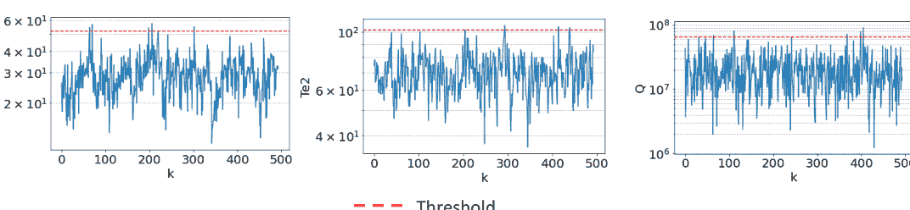

$T_s^2$指标衡量状态变量定义的状态空间‘内部’的系统性变化。相应地，$T_e^2$量化状态空间‘外部’的变化。当仅$T_s^2$超过阈值时，表明状态变量‘失控’，但过程仍可由估计的状态空间模型很好地解释。当$T_s^2$或$Q$超过阈值时，表明影响系统的噪声特性已改变，或者估计的模型无法解释新的故障观测值。

##### 测试数据上的故障检测

现在是时候检查我们的监控图是否能帮助我们检测过程异常的存在了。为此，我们将计算测试数据的监控统计量。

```python
# generate past vectors (p(k)) for test dataset and center
Ntest = FaultyData.shape[0]

pMatrix_test = np.zeros((Ntest-l+1, l*(m+r)))
for i in range(l,Ntest+1):
    pMatrix_test[i-l,:] = np.hstack((yData_test[i-l:i,:].flatten(), uData_test[i-l:i,:].flatten()))

pMatrix_test_centered = p_scaler.transform(pMatrix_test)

# get fault detection metrics for test data
Xn_test = np.dot(Jn, pMatrix_test_centered.T)
Ts2_test = [np.dot(Xn_test[:,i], Xn_test[:,i]) for i in range(pMatrix_test_centered.shape[0])]

Xe_test = np.dot(Je, pMatrix_test_centered.T)
Te2_test = [np.dot(Xe_test[:,i], Xe_test[:,i]) for i in range(pMatrix_test_centered.shape[0])]

r_test = pMatrix_test_centered.T - np.dot(Jn.T, Xn_test)
Q_test = [np.dot(r_test[:,i], r_test[:,i]) for i in range(pMatrix_test_centered.shape[0])]
```

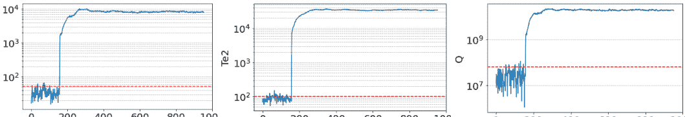

测试数据的控制图显示成功检测到了过程故障。已知$T_e^2$指标过于敏感，误报率高，这可以解释为什么它似乎经常在实际故障发生之前就突破阈值。

##### 总结

在本章中，我们为处理表现出显著动态特性的过程系统增加了更多的机器学习工具。我们研究了两种不同的流行方法：第一种方法通过包含滞后测量值对传统MSPM工具进行了简单扩展；第二种方法则使用了状态空间（CVA）模型。虽然动态MSPM方法更容易理解和实现，但基于CVA模型的故障检测已被发现能提供更优的结果。接下来，我们将学习如何处理非线性过程。

## 第10章
### 非线性过程的多元统计过程监控

在前面的章节中，我们看到了使用时间滞后变量的简单技巧如何使传统MSPM技术能够应用于动态过程。你可能会想，对于非线性过程是否存在类似的方法。幸运的是，确实存在！其基本原理是将原始变量投影到一个特征线性相关的高维特征空间中。具有挑战性的部分是确定从原始测量空间到特征空间的非线性映射。这就是‘核’技巧发挥作用的地方，数据可以在无需显式定义非线性映射的情况下进行投影。然后在特征空间中应用传统MSPM。听起来很复杂？一旦你完成本章的学习，你就会意识到它比你现在想象的要容易得多。

基于核的MSPM技术（KPCA、KPLS、KICA、KFDA等）的主要优势在于它们不需要非线性优化，只涉及线性代数。毫不奇怪，核化方法在处理非线性数据集的同时保留了其线性对应方法的简单性，因此变得非常有吸引力。在核MSPM技术中，核PCA和核PLS是应用最广泛的，在过程监控应用中取得了相当大的成功，因此将成为我们本章研究的重点。具体涵盖以下主题：

- 核PCA简介
- 使用核PCA进行故障检测
- 核PLS简介
- 使用核PLS进行故障检测

#### 10.1 核主成分分析：简介

核主成分分析是传统主成分分析的非线性扩展，适用于处理表现出显著非线性的过程。为了理解核主成分分析背后的动机，让我们考虑图10.1所示的简单场景。在图10.1a中，我们可以看到数据沿一条直线分布，这条直线可以通过线性主成分分析的第一个特征向量获得。在图10.1b中，数据沿一条曲线分布；传统的主成分分析无法帮助找到这条非线性曲线。相应地，主成分分析未能检测到明显的异常值。然而，对于后一种情况，并非无计可施。如果我们不在（$x_1$, $x_2$）测量空间中工作，而是在（$z_1$, $z_2$）=（$x_1^4$, $x_2$）特征空间中工作，那么我们将得到线性相关的特征，并且可以将异常数据点标记出来。不幸的是，找到这种将原始数据映射到特征变量的（非线性）映射任务并非易事。值得庆幸的是，有一种叫做“核技巧”的方法，它允许你在特征空间中工作，而无需定义非线性映射。我们将在下一节学习如何实现这一点。

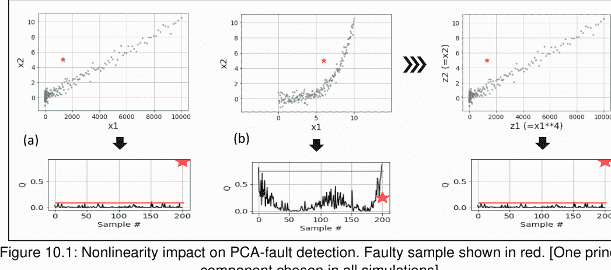

核主成分分析可以处理任意的数据分布。就过程监控应用而言，核主成分分析可以帮助你在你的正常运行工况数据周围创建一个异常边界，如下所示。

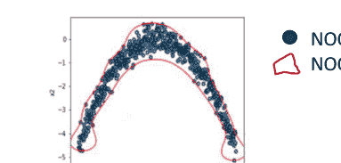

为了理解核主成分分析的工作原理，让我们重新审视主成分分析的数学基础。

##### 核函数与核技巧

核技巧的使用不仅限于核主成分分析和核偏最小二乘法。其他机器学习技术，如支持向量机、典型变量分析等，也使用核函数来建模非线性过程。那么，这些核函数是什么？让我们试着理解它们。

我们之前提到过，处理非线性的一种流行方法是将观测样本 $x$ 映射到特征空间中的 $x_F$，在那里可以应用传统的线性机器学习技术。

$\varphi(x): x \rightarrow x_F$

然而，映射 $\varphi(.)$ 是未知的。值得庆幸的是，在许多机器学习算法的数学公式中，特征向量的内积（或点积）$\varphi(x)^T\varphi(x)$ 经常出现。这个内积表示为

$k(x_i, x_j) = <\varphi(x_i), \varphi(x_j)> = \varphi(x_i)^T\varphi(x_j)$

其中 $k(.,.)$ 称为核函数。$k(.,.)$ 有多种形式，最常见的形式是高斯核或径向基函数，定义为

$k(x_i, x_j) = exp\left[-\frac{(x_i-x_j)^T(x_i-x_j)}{\sigma^2}\right]$

其中，$\sigma$（一个超参数）称为核宽度。核函数的使用允许在特征空间中应用线性机器学习技术，而无需显式地知道特征向量，这种技巧称为“核技巧”。你在核化算法中遇到的另一个术语是核矩阵（通常表示为 $K$）。$K$ 的 $(i, j)^{th}$ 元素就是 $k(x_i, x_j)$。下表列出了常用的核函数

| 函数 | 方程 | 超参数 |
| :--- | :--- | :--- |
| 线性核 | $k(x, z) = x^Tz$ | |
| 高斯核 | $k(x, z) = exp(-\frac{\|x-z\|^2}{\sigma^2})$ | $\sigma$ |
| 多项式核 | $k(x, z) = (\gamma x^Tz + r)^d$ | $\gamma, r, d$ |
| Sigmoid核 | $k(x, z) = tanh(\gamma x^Tz + r)$ | $\gamma, r$ |

让我们用多项式核来说明使用核函数如何等价于高维映射。假设我们使用以下核函数

$$k(x, z) = (x^T z + 1)^2$$

其中 $x = [x_1, x_2]^T$ 和 $z = [z_1, z_2]^T$ 是原始二维空间中的两个向量。我们声称上述核函数等价于以下映射

$$\varphi(x) = [x_1, x_2, \sqrt{2}x_1, \sqrt{2}x_2, \sqrt{2}x_1x_2, 1]$$

为了理解这一点，只需计算 $\varphi(x)^T \varphi(z)$

$$\begin{aligned} \varphi(x)^T \varphi(z) &= x_1^2 z_1^2 + x_2^2 z_2^2 + 2x_1 z_1 + 2x_2 z_2 + 2x_1 x_2 z_1 z_2 + 1 \\ &= (x_1 z_1 + x_2 z_2 + 1)^2 \\ &= (x^T z + 1)^2 \\ &= k(x, z) \end{aligned}$$

因此，如果你使用上述多项式核，你实际上是将数据隐式地投影到了一个6维的特征空间！如果你对这个例子感到惊讶，那么知道高斯核将原始空间映射到无限维特征空间，你会觉得更有趣！幸运的是，我们不需要知道这个特征空间的形式。

##### 数学背景

核主成分分析的主要目标是在特征空间中获得得分向量。为了了解如何获得得分向量，令 $x \in \mathbb{R}^m$ 和 $\varphi(x)$ 分别表示原始测量空间中的样本和高维特征空间中的投影特征向量。我们知道传统的主成分分析涉及求解以下特征值问题

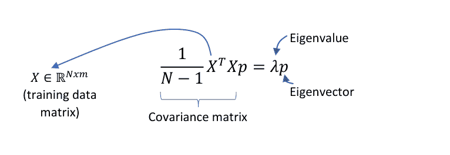

令 $X_F = [\varphi(x_1), \varphi(x_2), \cdots, \varphi(x_N)]^T$ 表示特征数据矩阵。我们暂时假设 $X_F$ 已经中心化。因此，特征空间中的主成分分析涉及以下特征分解问题

$$\frac{1}{N-1} X_F^T X_F v = \lambda_F v \quad \text{公式 1}$$

$X_F$ 是未知的，因此无法直接求解上述方程。让我们在公式1的两边左乘 $X_F$，得到

$$\frac{1}{N-1} X_F X_F^T X_F v = \lambda_F X_F v \quad \text{公式 2}$$

线性代数表明，特征向量$^{68}$可以写成样本的线性组合，即

$$v = \sum_{i=1}^N \alpha_i \varphi(x_i) = X_F^T \alpha \quad \text{公式 3}$$

我们还定义核矩阵 $K = X_F X_F^T$。现在将核矩阵和公式3中的 $v$ 代入公式2，得到

$$K \alpha = (N-1) \lambda_F \alpha \quad \text{公式 4}$$

公式4是一个特征分解问题，可以求解得到核特征向量 $\alpha^{(1)}, \alpha^{(2)}, \cdots, \alpha^{(N)}$ 和核特征值$^{69}$ $\lambda_1 \ge \lambda_2 \ge \cdots \ge \lambda_N$。第 $l$ 个特征向量 $\alpha^{(l)} \equiv [\alpha_1^{(l)}, \alpha_2^{(l)}, \cdots, \alpha_N^{(l)}] \in \mathbb{R}^N$。为了在特征空间中进行降维，可以只保留前 $a$ 个特征向量。特征空间中对应的特征向量变为 $v^{(l)} = X_F^T \alpha^{(l)}$。为了确保特征向量 $v^{(l)}$ 是单位长度，需要对 $\alpha^{(l)}$ 施加以下条件，

$$\|v^{(l)}\|_2 = v^{(l)T} v^{(l)} = \alpha^{(l)T} X_F X_F^T \alpha^{(l)} = 1$$
$$\Rightarrow (N-1) \lambda_{Fl} \|\alpha^{(l)}\|_2 = 1$$
$$\Rightarrow \|\alpha^{(l)}\|_2 = 1 / (N-1) \lambda_{Fl} \quad \text{公式 5}$$

$^{68}$ 注意，对于高斯核，$\varphi(x)$ 和 $v$ 具有无限维。
$^{69}$ 核特征值 $\lambda_l$ 可以除以 $N-1$ 得到特征值 $\lambda_{Fl}$。

上述表达式意味着，从公式4获得的对应于非零特征值的计算出的核特征向量 $\alpha^{(l)}$ 需要进行缩放以满足公式5。请注意，特征向量 $v^{(l)}$ 仍然无法获得，因为 $X_F$ 是未知的。然而，我们主要关心的变量是对应于样本 $x_j$ 的得分向量 $t_j \in \mathbb{R}^a$。在我们了解如何获得 $t_j$ 之前，我们需要坦诚地面对一个关于特征空间中数据 $\varphi(x_1), \varphi(x_2), \cdots, \varphi(x_N)$ 已经中心化的重大假设。为了确保中心化，核矩阵 $K$ 需要按如下方式修正

$$\bar{K} = K - 1_N K - K 1_N + 1_N K 1_N \quad \text{公式 6}$$

$$\text{其中 } 1_N = \frac{1}{N} \begin{bmatrix} 1 & \cdots & 1 \\ \vdots & \ddots & \vdots \\ 1 & \cdots & 1 \end{bmatrix}_{N \times N}$$

$$\rightarrow \text{可以证明 } \bar{K} \text{ 等于 } \bar{X}_F^T \bar{X}_F$$

$$\bar{X}_F = [\bar{\varphi}(x_1), \bar{\varphi}(x_2), \cdots, \bar{\varphi}(x_N)]^T$$

$$\rightarrow \text{等价地，} \bar{K}_{ij} = \bar{k}(x_i, x_j) = \bar{\varphi}(x_i)^T \bar{\varphi}(x_j)$$

##### 训练样本和测试样本的得分向量

为了找到训练样本 $x_j$ 的得分向量（$t_j \in \mathbb{R}^{a \times 1} = [t_{j1}, t_{j2}, \cdots, t_{ja}]^T$），我们需要计算 $\varphi(x_i)$ 沿每个特征向量 $v^{(l)}$（$l = 1, 2, \cdots, a$）的得分或投影，这可以通过以下方式获得

$$t_{jl} = < v_l, \bar{\varphi}(x_j) > = \sum_{i=1}^N \alpha_i^{(l)} \bar{k}(x_i, x_j) = \sum_{i=1}^N \alpha_i^{(l)} \bar{K}_{ji} = \alpha^{(l)T} \bar{k}_j \quad \text{公式 7}$$

缩放后的特征向量 [公式 5] 中心化的核向量 $\in \mathbb{R}^{N \times 1}$，其中 $\bar{k}_{ji} = \bar{k}(x_j, x_i) = \bar{K}_{ij}$，$x_i$ 属于训练数据集，$i = 1, 2, \cdots, N$。

对于测试样本 $x_t$，上述表达式变为$$t_{tl} = \alpha^{(l)^T} \bar{k}_t$$

$$\text{其中 } \bar{k}_t = k_t - 1_N k_t - K 1_t + 1_N K 1_t$$

$$1_t = \frac{1}{N} \begin{bmatrix} 1 \ \vdots \ 1 \end{bmatrix}_{N \times 1}$$

核向量，其中 $k_{ti} = k(x_t, x_i)$，$x_i$ 属于训练数据集，且 $i = 1, 2, \cdots, N$。

来自 [公式 6]

##### 超参数设定

假设选择高斯核，则需要指定核宽度 $\sigma$ 和保留的潜变量数量 ($a$)。

## 核宽度 ($\sigma$) 的选择

$\sigma$ 的选择对 KPCA 模型的准确性有重大影响。下图展示了核宽度对异常检测轮廓的影响。

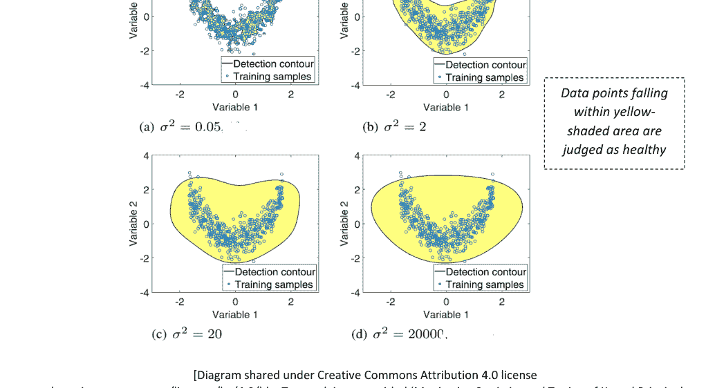

[图表由 Tan 等人在题为 'Monitoring Statistics and Tuning of Kernel Principal Component Analysis With Radial Basis Function Kernels' 的论文中共享，遵循 Creative Commons Attribution 4.0 许可 (creativecommons.org/licenses/by/4.0/)]

显然，非常小的 $\sigma$ 会导致过拟合模型，从而产生高误报率；而大的 $\sigma$ 则会导致欠拟合模型，因为异常轮廓无法准确捕捉数据分布。核宽度可以通过经验选择或交叉验证来确定。经验上，$\sigma$ 通常设置为 $5m$，其中 $m$ 是过程变量的数量$^{70}$。在交叉验证方法中，$\sigma$ 被设置为在验证数据集上产生可接受误报水平的最小值。Tan 等人建议在 $[0, d_{train,max}]^{71}$ 范围内搜索最优 $\sigma$，其中 $d_{train,max} = \max \sqrt{\|x_i - x_j\|}$，$x_i, x_j \in$ 训练数据集。

###### 保留潜变量数量 ($a$) 的选择

一种常见的方法是选择 $a$，使得特征空间中 95% 的变异性被捕获，即

$$a = \underset{j \in [1, N]}{argmin} \sum_{i=1}^j \lambda_i / \sum_{i=1}^N \lambda_i \geq 0.95$$

另一种流行的方法是平均特征值法，即只包含特征值高于所有特征值平均值的特征向量。

#### 10.2 使用核 PCA 进行故障检测

呼！上一节数学内容很多。我们的目的不是通过深入这些细节来吓跑你，而是为你提供足够的背景知识，以便你能自信地执行基于 KPCA 的故障检测的每一步。事实上，Sklearn 提供了 KernelPCA 类来为你计算得分；你只需要计算监控统计量。为了进一步阐明所有步骤，我们将使用以下合成过程进行演示。这是一个具有 3 个测量值 $x_1$、$x_2$ 和 $x_3$ 的系统。

$$x_1 = u^2 + 0.3 \sin(2\pi u) + \varepsilon_1$$
$$x_2 = u + \varepsilon_2$$
$$x_3 = u^3 + u + 1 + \varepsilon_3$$

这里，$u$ 是在 -1 和 1 之间均匀采样的变量，$\varepsilon_i$ 是方差为 0.05 的独立白噪声。Nounou 等人在一篇题为‘Process monitoring using data-based fault detection techniques: comparative studies (2017)’的开放获取论文中使用了这个系统来展示核化 MSPM 模型的优越性。该系统被模拟以生成 401 个 NOC 样本和 200 个测试数据样本（分别在文件 multivariateKPLS_NOC_data.txt 和 multivariateKPLS_test_data.txt 中提供）。在测试数据中，在样本 75 到 125 之间，在 $x_1$ 中引入了一个单位幅度的单一故障。让我们从读取数据文件开始。

```python
# 将阈值确定为各自指标的第99百分位数
import numpy as np, matplotlib.pyplot as plt
from sklearn.preprocessing import StandardScaler
from sklearn.decomposition import KernelPCA

# 读取数据
X_train = np.loadtxt('KPCA_NOC_data.txt')
X_test = np.loadtxt('KPCA_test_data.txt')
```

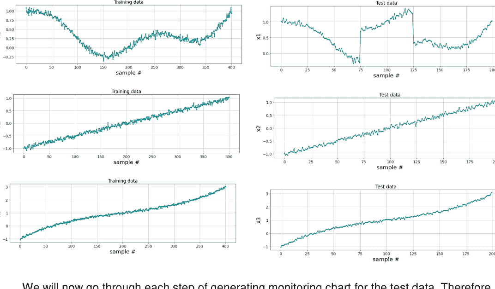

我们现在将逐步介绍为测试数据生成监控图表的每个步骤。因此，让我们首先了解监控统计量是如何计算的。

##### 监控统计量

主要监控的统计量是 $Q$，对于样本 $x_t$，其定义为

$$Q = \|\bar{\varphi}(x_t) - \widehat{\bar{\varphi}}_a(x_t)\|^2$$
*使用 $a$ 个潜变量重构的特征向量*

上述表达式可以用得分向量 $t_t$ 表示如下<sup>72</sup>

$$Q = \sum_{i=1}^{n} t_{ti}^2 - \sum_{i=1}^{a} t_{ti}^2$$
* $n$ 是公式 4 中非零特征值的数量*

请注意，Tan 等人已经证明，KPCA $Q$ 指标可以帮助检测变量超出健康操作范围的故障情况，以及测试样本不遵循训练数据模型的情况。

> 在 KPCA 文献中，你可能会遇到使用 Hotelling's $T^2$ 作为监控统计量的情况。然而，Tan 等人已经证明，Hotelling's $T^2$ 关于故障严重程度是非单调的，即当故障变得更严重时，Hotelling's $T^2$ 可能会减小！例如，如果一个样本 $x_{test}$ 远离 NOC 样本，那么沿每个主成分的得分值都会很小，因为高斯核函数值会很小。因此，$T^2$ 会很小，并且当 $x_{test}$ 远离健康数据时只会变得更小。

现在让我们实现 KPCA 模型并生成监控图表。

```python
# 数据缩放
X_scaler = StandardScaler()
X_train_scaled = X_scaler.fit_transform(X_train)

# 拟合 kpca 模型
gamma = 1/((5*3)**2) # gamma = 1/σ²
kpca = KernelPCA(kernel='rbf', gamma=gamma)
```

```python
kPCA.fit(X_train_scaled)
```

```python
# 找到要保留的成分数量
eigVals = kPCA.eigenvalues_ # 发现了 38 个非零特征值
eigVals_normalized = eigVals / np.sum(eigVals)
cum_eigVals = 100*np.cumsum(eigVals_normalized)
n_comp = np.argmax(cum_eigVals >= 95) + 1
print('累积解释至少 95% 方差的成分数量: ', n_comp)
```

```
>>> 累积解释至少 95% 方差的成分数量: 2
```

```python
# 计算训练数据的得分
scores_train = kPCA.transform(X_train_scaled) # 38 列中的每一列对应一个
```

```python
# 计算训练数据的 Q 统计量
N = X_train.shape[0]
Q_train = np.zeros((N,1))
for i in range(N):
    Q_train[i] = np.dot(scores_train[i,:], scores_train[i,:]) - np.dot(scores_train[i,:n_comp],
                                                                  scores_train[i,:n_comp])
Q_CL = np.percentile(Q_train, 95)
```

```python
# 训练数据的监控图表
plt.figure(), plt.plot(Q_train), plt.plot([1,len(Q_train)],[Q_CL,Q_CL], color='red')
plt.xlabel('样本编号'), plt.ylabel('Q (训练数据)')
```

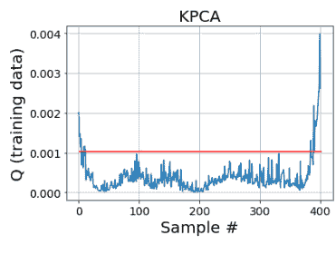

```python
#%%%%%%%%%%%%%%%%%%%%%%%%%%%
##### kPCA 模型应用于测试数据
#%%%%%%%%%%%%%%%%%%%%%%%%%%%
X_test_scaled = X_scaler.transform(X_test)
scores_test = kPCA.transform(X_test_scaled)
```

```python
# 计算测试数据的 Q 统计量
N_test = X_test.shape[0]
Q_test = np.zeros((N_test,1))
for i in range(N_test):
    Q_test[i] = np.dot(scores_test[i,:], scores_test[i,:]) - np.dot(scores_test[i,:n_comp],
                                                              scores_test[i,:n_comp])
```

```python
# 测试数据的监控图表
plt.figure(), plt.plot(Q_test), plt.plot([1,len(Q_test)],[Q_CL,Q_CL], color='red')
plt.xlabel('样本编号'), plt.ylabel('Q (测试数据))
```

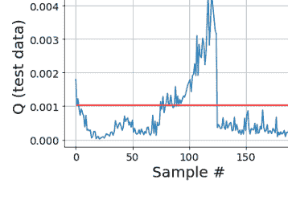

希望你现在对能够为非线性系统部署基于 KPCA 的故障检测系统充满信心。

#### 10.3 核 PLS：简介

核 PLS 是传统 PLS 的非线性扩展，用于处理表现出显著非线性的非线性过程数据。如下图 10.2 所示，输入向量被映射到一个‘未知’的特征空间，使得变量之间变得线性相关。我们从第 7 章知道，用于拟合 PLS 模型的 NIPALS 算法涉及 $XX^T$ 项，因此，与 PCA 类似，核函数被用于隐式定义特征空间中的 $\varphi\varphi^T$，获得得分向量，然后生成预测输出。整个过程依赖于经典的线性代数，并保留了标准 PLS 的大部分优良特性。

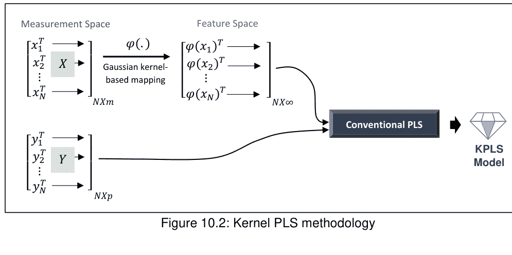

不幸的是，Sklearn 没有提供任何现成的 KPLS 模块。尽管如此，编写 KPLS 的步骤并不困难。以下小节中的数学阐述将提供你需要开发自己的 KPCA 模块的所有信息。

> 替代的非线性 PLS 模型

核化 PLS 并不是用于非线性回归建模的唯一常用方法。另一种方法涉及在原始测量空间中工作，将输入和输出数据线性投影以获得得分，并在 t 和 u 得分之间建立非线性内部关系。

$u \approx f(t)$

- 如果 $f(.)$ 是多项式 $\Rightarrow$ 多项式 PLS
- 如果 $f(.)$ 是神经网络 $\Rightarrow$ 神经网络 PLS

##### 数学背景

令 $X \in \mathbb{R}^{N \times m}$ 和 $Y \in \mathbb{R}^{N \times p}$ 分别为训练样本的中心化输入和输出数据矩阵。令 $\bar{\varphi}(x_i)$ 表示第 $i^{th}$ 个样本或 $X$ 的第 $i$ 行的映射并中心化的特征向量，$X_F \in \mathbb{R}^{N \times \infty}$ 表示特征空间中的输入数据矩阵。核矩阵的计算和中心化方式与 KPCA 算法中相同。下面的算法总结了通过 NIPALS 进行 KPLS 模型训练的过程，该过程可以为我们提供输入和输出得分矩阵 $T$ 和 $U$。

##### 算法：通过 NIPALS 进行 KPLS 训练

1.  初始化 $i = 1$，$\bar{K}_1 = \bar{K}$，$Y_1 = Y$
2.  将得分向量 $u_i (\in \mathbb{R}^{N \times 1})$ 设置为 $Y_i$ 的任意一列
3.  计算得分向量 $t_i (\in \mathbb{R}^{N \times 1}) = \bar{X}_{Fi}w_i = \bar{X}_{Fi}\bar{X}_{Fi}^T w_i = \bar{K}_i u_i$
4.  将 $t_i$ 缩放为单位长度：$t_i = t_i / \|t_i\|$
5.  计算权重向量 $c_i = Y_i^T t_i$
6.  更新得分向量 $u_i = Y_i c_i$
7.  将 $u_i$ 缩放为单位长度：$u_i = u_i / \|u_i\|$
8.  重复步骤 3 到 7，直到 $t_i$ 收敛
9.  矩阵收缩：
    $\bar{K}_{i+1} = \bar{K}_i - t_i t_i^T \bar{K}_i - \bar{K}_i t_i t_i^T + t_i t_i^T \bar{K}_i t_i t_i^T$
    $Y_{i+1} = Y_i - t_i t_i^T Y_i$
10. 令 $i = i + 1$ 并返回步骤 2。当 $i > a$ [要保留的潜变量数量] 时停止。
11. 构成矩阵 $T = [t_1, t_2, \cdots, t_a]$，$U = [u_1, u_2, \cdots, u_a]$

训练得分矩阵也可以表示为

$T = \bar{X}_F R$    其中 $R = \bar{X}_F^T U(T^T \bar{K} U)^{-1} \in \mathbb{R}^{\infty \times a}$
$\Rightarrow T = \bar{K} U(T^T \bar{K} U)^{-1}$

$R$ 矩阵将帮助我们计算测试样本的得分值，我们稍后会看到。最后一个缺失的信息是回归系数矩阵，可用于生成输出预测

$$\hat{Y} = \bar{X}_F B \quad \text{其中 } B = \bar{X}_F^T U(T^T \bar{K} U)^{-1} T^T Y$$
$$\Rightarrow \hat{Y} = \bar{K} U(T^T \bar{K} U)^{-1} T^T Y$$

##### 测试样本的得分向量和预测

测试样本 $x_t$ 的得分向量 $t_t (\in \mathbb{R}^{a \times 1})$ 可以通过以下方式获得

$$t_t = R^T \bar{\varphi}(x_t)$$
$$= (U^T \bar{K} T)^{-1} U^T \bar{X}_F \bar{\varphi}(x_t)$$
$$= (U^T \bar{K} T)^{-1} U^T \bar{k}_t$$

中心化核向量 $\in \mathbb{R}^{N \times 1}$，其中 $k_{ti} = k(x_t, x_i)$，$x_i$ 属于训练数据集，$i = 1, 2, \cdots, N$。如公式 8 所示。

预测值 $\hat{y} (\in \mathbb{R}^{p \times 1})$ 可以使用矩阵 $B$ 获得

$$\hat{y} = B^T \bar{\varphi}(x_t)$$
$$= Y^T T(U^T \bar{K} T)^{-1} U^T \bar{X}_F \bar{\varphi}(x_t)$$
$$= Y^T T(U^T \bar{K} T)^{-1} U^T \bar{X}_F \bar{k}_t$$

##### 超参数设定

与 KPCA 类似，KPLS 涉及两个关键超参数的选择：高斯核（$\sigma$）和保留的潜变量数量（$a$）。保留的潜变量数量通常通过交叉验证确定，我们选择使验证数据集预测输出误差最小的 $a$。对于 $\sigma$，Jose 等人表明$^{73}$，设置 $\sigma = 2m$ 可提供稳健的故障检测性能。或者，可以选择 $\sigma$，使得在 NOC 样本的验证数据集上获得可接受的误报水平。

$^{73}$ Jose et al., New contributions to non-linear process monitoring through kernel partial least squares. *Chemometrics and Intelligent Laboratory Systems*, 2014.

#### 10.4 使用核 PLS 进行故障检测

##### 监控统计量

与 KPCA 类似，我们将使用 $Q$（或 $SPE$）统计量进行故障检测。$SPE_{\varphi}$ 和 $SPE_y$ 分别监控特征空间和输出空间中的残差。对于样本 $x_t$，$SPE_{\varphi}$ 的计算如下（Jose 等人）

$$SPE_{\varphi} = \|\bar{\varphi}(x_t) - \hat{\bar{\varphi}}_a(x_t)\|^2$$
$$= \bar{k}(x_t, x_t) - 2\bar{k}_t^T \bar{K} V t_t + t_t^T T^T \bar{K} T t_t$$
$$V = U(T^T \bar{K} U)^{-1}$$

如果 $x_t$ 是训练样本，项 $\bar{k}(x_t, x_t)$ 可以直接从 $\bar{K}$ 矩阵中获取。对于测试样本，它由$^{74}$给出

$$\bar{k}(x_t, x_t) = 1 - \frac{2}{N} \sum_{i=1}^{N} k(x_i, x_t) + \frac{1}{N^2} \sum_{i=1}^{N} \sum_{j=1}^{N} K_{ij}$$
其中 $x_i$ 属于训练数据集，$i = 1, 2, \cdots, N$。

$SPE_y$ 的计算很简单，如下所示

$$SPE_y = \|y - \hat{y}\|^2$$

下面的流程图总结了基于 KPLS 的故障检测解决方案开发的所有步骤。

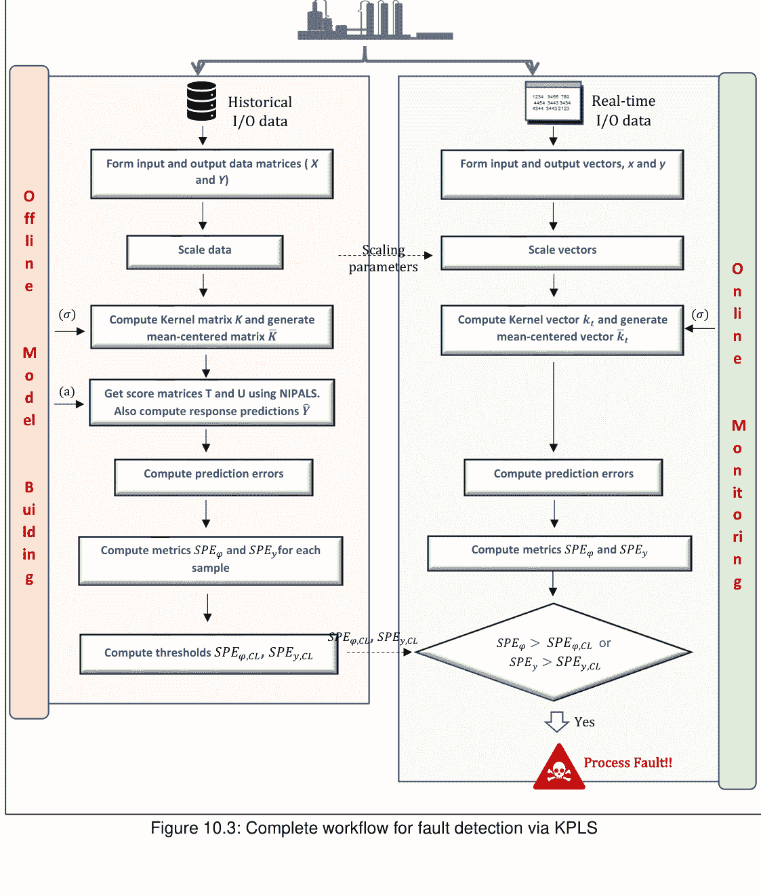

图 10.3：通过 KPLS 进行故障检测的完整工作流程

核技巧作为一个优美的解决方案，允许 KPCA/KPLS 得分与原始输入数据非线性相关，同时保留了基于线性代数的 PCA/PLS 的简洁性。然而，在我们爱上核化 MSPM 技术之前，请记住它也有一些缺点！如果样本数量 $N$ 非常大，那么 $N \times N$ 维核矩阵的特征向量分解可能变得具有挑战性。此外，超参数 $\sigma$ 的明智选择至关重要，否则会得到一个较差的模型。

##### 总结

在本章中，我们熟悉了使用核获得经典 MSPM 技术非线性版本的过程。具体来说，我们研究了核 PCA 和核 PLS 算法。这些技术可以帮助您为表现出显著非线性的过程系统构建稳健的监控解决方案。在下一章中，我们将学习如何处理多模态过程。

## 第 11 章

### 多模态过程的过程监控

在前面的章节中，我们见证了为非高斯、动态和非线性过程定制传统 MSPM 技术的好处。在本章中，我们将消除单模态操作的最后一个限制。在您的职业生涯中，您将经常遇到由于生产水平、原料组成、环境温度、产品等级等变化而表现出多种操作模式的工业数据集，来自不同模式的数据点倾向于分组到不同的簇中。过程变量的均值和协方差在不同的操作模式下可能不同，因此，当您构建监控工具时，将这些数据簇的知识明智地纳入过程模型将带来更好的性能，反之，未能这样做通常会导致不令人满意的监控性能。

在缺乏特定过程知识或变量数量很大时，找到簇的数量或表征簇并非易事。幸运的是，有几种方法可供您选择以用于您的特定解决方案。在本章中，我们将学习处理多模态数据的不同方法、一些流行的聚类算法，并了解它们的优缺点。我们将通过为多模态半导体过程构建监控工具来结束本章。具体涵盖以下主题

- 建模多模态过程数据的不同方法
- 聚类简介
- 使用经典 k-means 聚类寻找分组
- 通过高斯混合模型进行概率聚类
- 多模态半导体制造操作的过程监控

#### 11.1 多模态过程专业化处理的必要性和方法

在过程系统中，多模态操作由于各种原因自然发生。例如，在发电厂中，生产水平根据需求变化，导致工厂变量在不同生产水平下具有显著不同的值，并且可能具有不同的变量间相关性。数据分布的多模态性质给传统机器学习技术带来了问题。为了理解这一点，请考虑图 11.1 中的插图。在子图 (a) 中，数据表明有 2 种不同的操作模式。从过程监控的角度来看，围绕两个簇绘制单独的监控边界是有意义的；这样做将清楚地将红色数据点识别为异常值或故障。另一方面，传统的基于 PCA 的监控将无法识别异常值。在子图 (b) 中，两个簇中变量之间的相关性不同。为两个簇构建单独的模型以捕获不同的相关结构是有意义的。传统的 PLS 模型将给出不准确的结果。

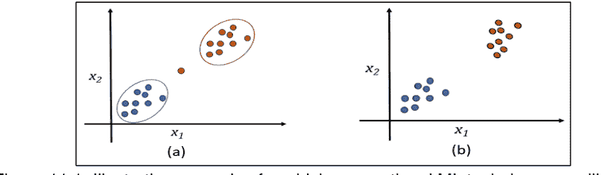

PSE 社区已经采用了几种不同的方法来监控多模态过程操作。让我们快速熟悉一下这些方法。

##### 多模型方法

在这里，为对应于不同操作模式的每个簇构建单独的模型，如下图所示。一旦在训练数据中表征了簇并建立了簇级模型，就可以通过仅考虑最适合新样本的簇模型或组合所有模型的预测来获得新样本的预测，如图 11.2 所示。决策融合模块也可以采用各种形式。例如，对于过程监控应用，一个简单的融合策略可以是：如果至少有一个簇模型预测新样本为正常样本，则将其视为正常样本。不同的策略可以是组合所有模型的异常度量，并基于此融合度量进行预测。类似地，对于软测量应用，来自各个模型的响应变量预测可以加权并组合以提供最终预测。

##### 懒惰学习或即时学习

在这种方法中，模型构建练习是在线进行的。当新的过程数据到来时，会根据某种最近邻准则，从历史数据集中获取与新样本相似的相关数据。使用获取的相关数据构建一个局部模型。获得的模型处理新样本后即被丢弃。当下一个样本到来时，会构建一个新的局部模型。

##### 外部分析

在这种策略中，导致多模态运行的过程变量（称为外部变量）的影响，例如产品等级、进料流量等，会从其他“主要”过程变量中移除，然后对后续的残差应用传统的MSPM技术，如下图所示。

##### 单一模型方法

在这种方法中，构建一个单一模型，希望它能捕捉不同运行模式的存在。几种机器学习技术属于这一类，例如神经网络、SVDD等。你将在本书的后续部分了解它们。

##### 基于邻近度的方法

在这种方法中，通过基于测试样本与NOC样本的邻近度进行推断，来考虑多个NOC簇的存在。通常使用邻近度度量，例如与邻居的距离或局部密度。我们将在第14章介绍这些技术。

在本章中，我们将重点介绍多模态方法，该方法涉及在数据集中找到不同的簇。因此，现在让我们熟悉一些流行的聚类技术。然而，在此之前，让我们快速看一下我们将要处理的数据集。

#### 11.2 多模态半导体制造数据集

在本章中，我们将使用来自半导体制造过程<sup>75</sup>的数据集。该数据集来自一个蚀刻过程的多个批次，包含19个过程变量，这些变量是在108个正常批次和21个故障批次的过程中测量的。批次持续时间从95到112秒不等。在本章的其余部分，我们将研究该数据集是否表现出多模态运行，并设计一种监控策略来自动检测故障批次。数据以MATLAB结构数组格式提供，因此我们将使用一个库在Python环境中获取数据。

```python
# import required packages
import numpy as np, matplotlib.pyplot as plt, scipy.io

# fetch data
matlab_data = scipy.io.loadmat('MACHINE_Data.mat', struct_as_record = False)
Etch_data = matlab_data['LAMDATA']
calibration_dataAll = Etch_data[0,0].calibration # calibration_dataAll[i,0] corresponds to a 2D data from i<sup>th</sup> batch where columns correspond to different variables

variable_names = Etch_data[0,0].variables

# plot data of a variable for all calibration experiments
plt.figure()
_ = [plt.plot(calibration_dataAll[expt,0][:,6]) for expt in range(calibration_dataAll.size)]
plt.xlabel('Time (s)'), plt.ylabel(variable_names[6])
```

图11.5确实显示了具有均值和协方差变化的多模态运行。然而，通过直接检查高维数据集来估计运行模式的数量是困难的。一种常见的做法是通过PCA降低过程维度，然后应用聚类以促进可视化。执行PCA还有其他目的。我们稍后会看到，期望最大化（EM）算法被用于估计K-Means和GMM模型中的簇参数。高维度意味着需要估计大量参数，这增加了EM收敛到局部最优结果的可能性，并且相关变量会导致EM收敛问题。PCA有助于同时克服这两个问题。

我们将为此批次过程数据集采用多向PCA。我们将遵循He等人<sup>76</sup>的方法，其中每个批次保留85个样本点以处理批次长度的可变性，忽略前5个样本以消除传感器测量的初始波动，并保留3个主成分。

```python
# generate unfolded data matrix
n_vars = variable_names.size - 2 # first 2 columns are not process variables
n_samples = 85

unfolded_dataMatrix = np.empty((1, n_vars*n_samples)) # just a placeholder
for expt in range(calibration_dataAll.size):
    calibration_expt = calibration_dataAll[expt,0][5:90,2:]

    if calibration_expt.shape[0] < 85:
        continue

    unfolded_row = np.ravel(calibration_expt, order='F')[np.newaxis,:] # a row for each batch data
    unfolded_dataMatrix = np.vstack((unfolded_dataMatrix, unfolded_row))

unfolded_dataMatrix = unfolded_dataMatrix[1:,:] # remove the empty placeholder

# scale data
from sklearn.preprocessing import StandardScaler
scaler = StandardScaler()
data_train_normal = scaler.fit_transform(unfolded_dataMatrix)

# PCA
from sklearn.decomposition import PCA
pca = PCA(n_components = 3)
score_train = pca.fit_transform(data_train_normal)
```

<sup>76</sup> He and Wang, Fault detection using the k-nearest neighbor rule for semiconductor manufacturing processes, *IEEE Transaction on Semiconductor Manufacturing*, 2007

图11.5：金属蚀刻数据集中校准批次的PC1和PC2得分图

图11.6证实了存在3种运行模式。虽然对得分图的目视检查可以帮助决定簇的数量，但我们仍将学习以更自动化的方式估计这一点的方法。

#### 11.3 K-Means聚类简介

K-Means是最流行的聚类算法之一，因其概念简单、易于实现和计算效率高。设$K$表示簇的数量，$\{x_i\}, i = 1, \dots, N$表示$N$个$m$维点的集合。数据点的簇分配被确定为使以下误差平方和（也称为簇惯性）最小化

$$SSE = \sum_{k=1}^{K} \sum_{x_i \in k^{th}cluster} ||x_i - \mu_k||_2^2$$

这里，$\mu_k$是第$k^{th}$个簇的质心，$||x_i - \mu_k||_2^2$表示$x_i$到$\mu_k$的欧几里得距离。为了解决公式1，k-means采用以下直观的迭代过程。

- 随机选择K个数据点作为初始质心或簇中心
- 将每个数据点分配给最近的簇中心
- 使用数据点的当前簇分配重新计算每个簇的质心
- 重复步骤2和3直到收敛

让我们将k-means应用于我们的金属蚀刻数据集。

```python
# fit k-means model
from sklearn.cluster import KMeans

n_cluster = 3
kmeans = KMeans(n_clusters = n_cluster, random_state = 100).fit(score_train)
cluster_label = kmeans.predict(score_train) # can also use kmeans.labels_

plt.figure()
plt.scatter(score_train[:, 0], score_train[:, 1], c = cluster_label, s = 20, cmap = 'viridis')

cluster_centers = kmeans.cluster_centers_
cluster_plot_labels = ['Cluster ' + str(i+1) for i in range(n_cluster)]
for i in range(n_cluster):
    plt.scatter(cluster_centers[i,0], cluster_centers[i,1], c = 'red', marker = '*')
    plt.annotate(cluster_plot_labels[i], (cluster_centers[i,0], cluster_centers[i,1]))
```

图11.7：通过k-means对金属蚀刻训练数据集进行聚类

正如预期的那样，图11.7显示k-means在簇分配方面做得很好。K-means聚类结果强烈依赖于簇中心的初始选择；不好的选择可能导致不恰当的聚类。为了克服这一点，k-means算法允许一个参数n_init（默认值为10），该参数决定了使用不同的初始质心分配执行独立k-means聚类的次数；选择具有最低SSE的聚类作为最终模型。初始质心的选择策略也可以通过init参数更改；默认的*k-means++*选项采用一种更智能（与*random*选项相比）的方式来加速收敛，通过确保初始质心彼此远离。

##### 通过肘部法则确定聚类数量

k-means 方法的一个缺点是需要预先指定聚类数量，而对于大型过程数据集，这个数量通常是未知的。然而，我们可以使用肘部法则来解决这个问题。对于 k-means，该方法需要计算不同聚类数量（$K$）下的聚类惯性或 SSE。可以预期，随着 $K$ 的增加，SSE 会减小，因为数据点会更接近其被分配的质心。当增加 $K$ 只带来 SSE 的微小改善时，对应的 $K$ 值可被视为最优值。图 11.8 显示，对于金属蚀刻数据集，$K = 3$ 是一个不错的选择。

```python
# determining number of clusters via elbow method
SSEs = []
for n_cluster in range(1, 10):
    kmeans = KMeans(n_clusters = n_cluster, random_state = 100).fit(score_train)
    SSEs.append(kmeans.inertia_)

plt.figure()
plt.plot(range(1,10), SSEs, marker='o')
plt.xlabel('Number of clusters')
plt.ylabel('SSEs')
```

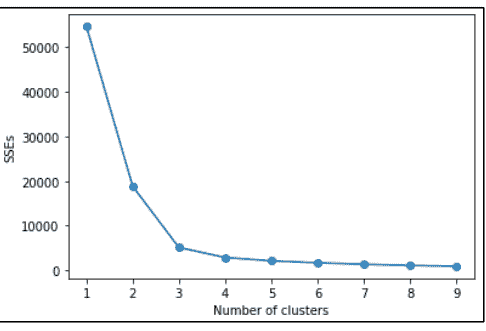

图 11.8：金属蚀刻数据集在不同聚类数量下的聚类惯性

> 确定聚类数量或局部模型数量不应掉以轻心。我们在图 11.1 中看到，低于最优数量的聚类会导致软测量精度低和漏报频率高。另一方面，使用过多的聚类会增加估计参数的数量，从而增加收敛时间。过多的聚类还会导致过拟合，造成误报频率高和软测量精度低。

##### 用于量化聚类质量的轮廓分析

对于高维数据，可能无法总是将大部分数据变异性投影到 2 或 3 个主成分上，因此难以通过 2D 或 3D 图来判断聚类的好坏或可视化聚类。在这些情况下，可以使用轮廓图来可视化和量化聚类质量。请注意，轮廓分析并非 k-means 特有，可以应用于研究任何聚类结果。

数据点的轮廓系数或值范围从 -1 到 1，它衡量的是该数据点与相邻簇中数据点的距离，相比于与同一簇中数据点的距离。值为 1 表示该数据点远离相邻簇，接近 0 的值表示该数据点靠近两个簇之间的边界。负值表示错误的簇分配。

图 11.9 显示了图 11.7 所示聚类的轮廓图。每个彩色带是通过堆叠该簇中所有数据点的轮廓系数形成的，因此带的厚度表示簇的大小。整体轮廓分数就是所有数据点轮廓系数的平均值。正如预期，平均分数很高，并且簇 2 显示出最高的系数，因为它远离其他两个簇。

```python
# average silhouette score
from sklearn.metrics import silhouette_samples, silhouette_score

silhouette_avgValue = silhouette_score(score_train, cluster_label)
print('Average silhouette score is :', silhouette_avgValue)

>>> Average silhouette score is : 0.7444602567351603

# silhouette plot
from matplotlib import cm

plt.figure()
silhouette_values = silhouette_samples(score_train, cluster_label)
y_lower, y_upper = 0, 0
yticks = []
for i in range(n_cluster):
    cluster_silhouette_vals = silhouette_values[cluster_label == i]
    cluster_silhouette_vals.sort()

    y_upper += len(cluster_silhouette_vals)
    color = cm.nipy_spectral(i / n_cluster)
    plt.barh(range(y_lower, y_upper),cluster_silhouette_vals,height=1.0,edgecolor='none',color=color)
    yticks.append((y_lower + y_upper) / 2)
    y_lower += len(cluster_silhouette_vals)

plt.axvline(silhouette_avgValue, color = "red", linestyle = "--")
plt.yticks(yticks, np.arange(n_cluster) + 1)
plt.xlabel('Silhouette coefficient values'), plt.ylabel('Cluster')
```

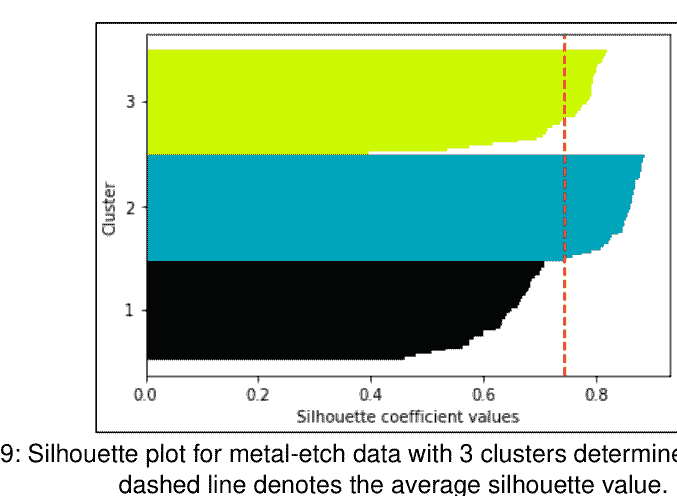

图 11.9：通过 k-means 确定的 3 个簇的金属蚀刻数据轮廓图。红色虚线表示平均轮廓值。

作为比较，让我们看看图 11.10 中一个次优聚类的轮廓图。较低的逐样本系数和较低的整体分数清楚地表明聚类效果更差。

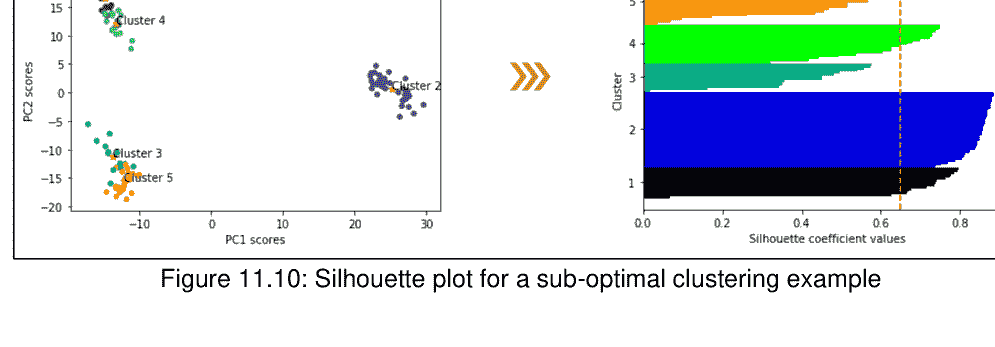

图 11.10：一个次优聚类示例的轮廓图

##### 优缺点

如前所述，易于应用和概念简单是 k-means 算法的优点。然而，该算法的一个严重缺点是无法处理复杂的几何形状，如图 11.11 所示。我们将要学习的下一个聚类算法能够处理此类簇。

```python
# generate ellipsoidal shaped data
from sklearn.datasets import make_blobs

n_samples = 1500
X, y = make_blobs(n_samples=n_samples, random_state=100)

rotation_matrix = [[0.60, -0.70], [-0.5, 0.7]]
X_transformed = np.dot(X, rotation_matrix) # elongated blobs

plt.figure()
plt.scatter(X_transformed [:,0], X_transformed [:,1])

# fit k-means model
n_cluster = 3
kmeans = KMeans(n_clusters = n_cluster, random_state = 100).fit(X_transformed)
cluster_label = kmeans.predict(X_transformed)
```

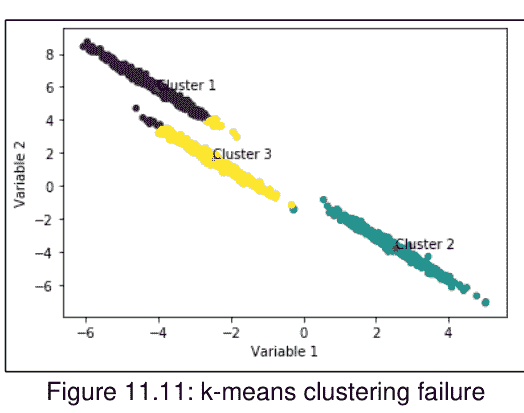

确定聚类后，我们可以继续为每个簇构建单独的模型，然后使用质心最近的簇来监控传入的测试样本。然而，让我们快速转向下一个聚类算法，该算法天然适合为故障检测创建融合决策指标。

#### 11.4 高斯混合模型：简介

高斯混合模型（GMM）是一种聚类技术，其工作假设是：即使整体过程数据不遵循（单峰）高斯分布，仍然可以通过局部高斯分布来表征每个单独操作模式/簇的数据。一旦指定了聚类数量，GMM 会自动找到局部簇的质心和协方差。如图 11.12 所示，它对于多模态数据分布非常有效。

```python
# fit GMM model to ellipsoidal data
from sklearn.mixture import GaussianMixture

gmm = GaussianMixture(n_components = 3, random_state = 100)
cluster_label = gmm.fit_predict(X_transformed)

plt.figure()
plt.scatter(X_transformed[:, 0], X_transformed[:, 1], c = cluster_label, s=20, cmap='viridis')

cluster_centers = gmm.means_ # cluster centers
cluster_plot_labels = ['Cluster ' + str(i+1) for i in range(gmm.n_components)]
for i in range(gmm.n_components):
    plt.scatter(cluster_centers[i, 0], cluster_centers[i, 1], c='red', marker = '*')
    plt.annotate(cluster_plot_labels[i], (cluster_centers[i,0], cluster_centers[i,1]))
```

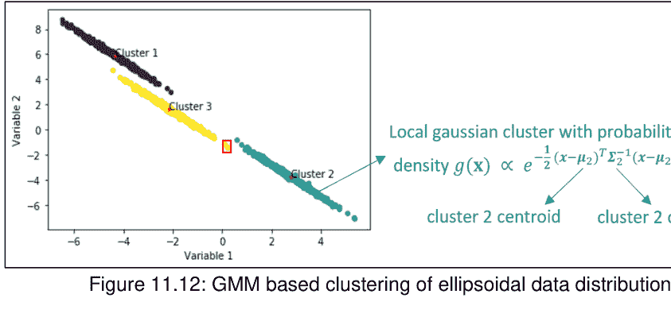

GMM 的另一个巨大优势是，我们可以计算数据点属于任何簇的（后验）概率。这种簇隶属度度量由 `predict_proba` 方法提供。通过将数据点分配给概率最高的簇来执行硬聚类。让我们计算一个位于簇 3 和簇 2 之间（在图 11.12 中圈出）的数据点的概率。

```python
# membership probabilities
probs = gmm.predict_proba(X_transformed[1069, np.newaxis]) # requires 2D array
print('Posterior probabilities of clusters 1, 2, 3 for the data-point: ', probs[-1,:])
```

>>> Posterior probabilities of clusters 1, 2, 3 for the data-point: [3.36e-54 1.09e-15 1]

GMM 认为该数据点以 100% 的概率属于簇 3！考虑到该点似乎与簇 3 和簇 2 等距（以欧几里得距离衡量），这可能令人惊讶。我们将在下一小节中研究这些概率是如何获得的。

##### 数学背景

设 $x \in \mathbb{R}^m$ 是从具有 $K$ 个操作模式的多模态过程中获得的 m 维样本。在 GMM 中，整体概率密度被表述为局部高斯密度的组合。设 $C_i$ 表示第 $i^{th}$ 个局部高斯簇，其参数为 $\theta_i = \{\mu_i, \Sigma_i\}$（均值向量和协方差矩阵），密度为

$$g(x|\theta_i) = \frac{1}{(2\pi)^{m/2} |\Sigma_i|^{1/2}} exp\left[-\frac{1}{2}(x - \mu_i)^T \Sigma_i^{-1}(x - \mu_i)\right]$$ 公式 2

任何空间位置的整体密度由下式给出

$$p(x|\theta) = \sum_{i=1}^K \omega_i g(x|\theta_i)$$ 公式 3

其中，$\omega_i$ 表示新样本来自第 $i^{th}$ 个高斯分量的先验概率，$\theta = \{\theta_1, ..., \theta_k\}$。GMM 模型是通过使用训练样本 $X \in \mathbb{R}^{N \times m}$ 估计所有簇的参数 $\theta_i, \omega_i$ 来构建的。参数通过优化训练数据集的对数似然来估计，如下所示

$$\sum_{j=1}^N log \left(\sum_{i=1}^K \omega_i g(x_j|\theta_i)\right)$$ 公式 4

为了优化似然，通常采用期望最大化（EM）算法。假设给出了参数的初始估计，EM 算法涉及在两个步骤之间迭代：

- E 步（$s^{th}$ 次迭代）：（重新）计算样本对局部簇的隶属关系

$$P^{(s)}(C_i|x_j) = \frac{\omega_i^{(s)} g(x_j | \mu_i^{(s)}, \Sigma_i^{(s)})}{\sum_{k=1}^K \omega_k^{(s)} g(x_j | \mu_k^{(s)}, \Sigma_k^{(s)})}$$ 公式 5

$P^{(s)}(C_i|x_j)$ 表示第 $j^{th}$ 个样本来自第 $i^{th}$ 个高斯分量的后验概率。

###### M步（第(s+1)次迭代）：更新GMM参数

$$\mu_i^{(s+1)} = \frac{\sum_{j=1}^N P^{(s)}(C_i|x_j)x_j}{\sum_{j=1}^N P^{(s)}(C_i|x_j)}$$

$$\Sigma_i^{(s+1)} = \frac{\sum_{j=1}^N P^{(s)}(C_i|x_j)(x_j-\mu_i^{(s+1)})(x_j-\mu_i^{(s+1)})^T}{\sum_{j=1}^N P^{(s)}(C_i|x_j)}$$

$$\omega_i^{(s+1)} = \frac{\sum_{j=1}^N P^{(s)}(C_i|x_j)}{N}$$

> 使用从E步重新计算的隶属度，更新每个聚类的中心和协方差。

迭代持续进行，直到对数似然目标函数满足某个收敛准则。你是否注意到这与用于寻找模型参数的k-means算法在概念上的相似性？之前，我们使用`predict_prob`方法计算了数据点1069的后验概率。现在，让我们使用公式5看看是否能得到相同的数值。

```python
# 后验概率计算
x = X_transformed[1069,np.newaxis]

import scipy.stats
g1 = scipy.stats.multivariate_normal(gmm.means_[0,:], gmm.covariances_[0,:]).pdf(x)
g2 = scipy.stats.multivariate_normal(gmm.means_[1,:], gmm.covariances_[1,:]).pdf(x)
g3 = scipy.stats.multivariate_normal(gmm.means_[2,:], gmm.covariances_[2,:]).pdf(x)
print('Local component densities: ', g1, g2, g3)

>>> Local component densities: 8.33e-56 2.72e-17 0.025

den = gmm.weights_[0]*g1 + gmm.weights_[1]*g2 + gmm.weights_[2]*g3
posterior_prob_cluster1 = gmm.weights_[0]*g1/den
posterior_prob_cluster2 = gmm.weights_[1]*g2/den
posterior_prob_cluster3 = gmm.weights_[2]*g3/den
print('Posterior probabilities: ', posterior_prob_cluster1, posterior_prob_cluster2, posterior_prob_cluster3)

>>> Posterior probabilities: 3.36e-54 1.09e-15 1
```

正如预期，我们得到了相同的后验概率。尽管各分量的密度值都很低，但分量3在点1069的空间坐标处具有（相对）高得多的密度值，因此导致了最高的隶属度关联！希望这个快速计算能帮助你更深入地理解GMM模型的工作原理。

##### 确定聚类数量

使用EM算法进行GMM建模的一个局限性是，高斯分量的数量被假定为事先已知。这可能并不总是成立。为了克服这一点，我们可以使用一种类似于我们用于k-means聚类的肘部法则的方法。在k-means聚类中，我们绘制了不同聚类数量的SSE，而在GMM中，我们将利用贝叶斯信息准则（BIC）指标。与SSE不同，BIC在一段时间后会增加，最优的高斯分量数量是使BIC最小化的值。

```python
# 通过BIC方法寻找分量数量
BICs = []
lowestBIC = np.inf
for n_cluster in range(1, 10):
    gmm = GaussianMixture(n_components = n_cluster, random_state = 100)
    gmm.fit(X_transformed)
    BIC = gmm.bic(X_transformed)
    BICs.append(BIC)

    if BIC < lowestBIC:
        optimal_n_cluster = n_cluster
        lowestBIC = BIC

plt.figure(), plt.plot(range(1,10), BICs, marker='o')
plt.scatter(optimal_n_cluster, lowestBIC, c='red', marker='*')
```

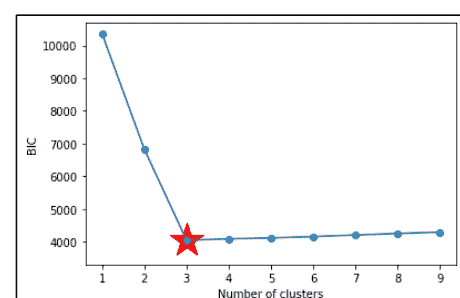

还有另一种方法，称为F-J算法<sup>77</sup>，可用于以集成方式寻找最优的GMM分量数量<sup>78</sup>和模型参数。此外，在F-J方法中，分量数量不需要事先指定。在内部，该方法以大量分量初始化，并通过消除权重不显著的高斯分量来自适应地调整此数量。F-J方法也利用EM算法进行参数估计，但在M步中的权重更新机制略有不同。鼓励读者参阅引用的参考文献以获取更多细节。F-J方法的一个缺点可能是计算时间较长。

<sup>77</sup> Figueiredo & Jain, Unsupervised learning of finite mixture models, *IEEE Trans Pattern Anal Mach Intell*, 2002
<sup>78</sup> Yu & Qin, Multimode process monitoring with Bayesian inference-based finite Gaussian mixture models, *AIChE Journal*, 2008

```python
# 通过FJ算法寻找分量数量
from gmm_mml import GmmMml
gmmFJ = GmmMml(plots=False)
gmmFJ.fit(X_transformed)
cluster_label = gmmFJ.predict(X_transformed)

plt.figure()
plt.scatter(X_transformed[:, 0], X_transformed[:, 1], c = cluster_label, cmap='viridis')
```

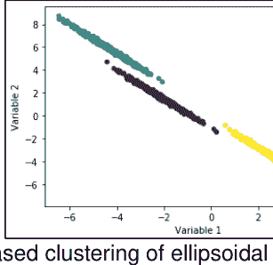

图11.15显示了通过GMM方法对金属蚀刻数据进行的聚类。BIC方法正确地识别了最优分量数量。注意，对于此数据集，F-J方法产生了4个局部聚类。

```python
# 将GMM模型拟合到金属蚀刻数据
gmm = GaussianMixture(n_components = optimal_n_cluster, random_state = 100)
cluster_label = gmm.fit_predict(score_train)
plt.scatter(score_train[:, 0], score_train[:, 1], c = cluster_label, cmap='viridis')
```

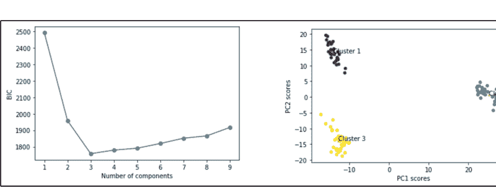

#### 11.5 基于GMM的故障检测：半导体制造案例研究

由于其概率化的公式，GMM被广泛应用于过程系统监控。在本节中，我们将研究一个针对金属蚀刻过程的此类应用。图11.16显示了PCA得分空间中的金属蚀刻校准批次和故障批次。很明显，故障批次倾向于远离校准聚类。我们的目标是开发一个基于GMM的监控工具，能够自动检测这些故障批次。

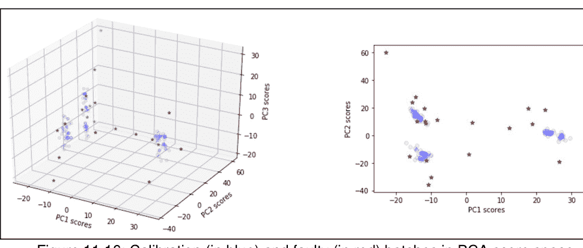

##### 故障检测指标

检测故障批次的一个直接方法是为每个聚类/模式构建单独的椭球边界或$T^2$控制图，并检查故障批次的$T^2$指标是否超出所有聚类的控制限。然而，当高斯分量数量较多时，监控多个控制图可能会变得繁琐。为了方便，可以将局部指标/图组合起来生成一个单一的全局指标/图。我们将遵循Xie & Shi<sup>79</sup>的方法（Yu & Qin<sup>77</sup>提供了另一种方法）。对于一个测试数据点$x_t$，从每个聚类计算局部马氏距离

$$D_{local}^{(k)}(x_t) = (x_t - \mu_k)^T \Sigma_k^{-1} (x_t - \mu_k)$$

然后使用测试样本对每个高斯分量的后验概率计算全局指标

$$D_{global}(x_t) = \sum_{k=1}^K P(C_k|x_t) D_{local}^{(k)}(x_t)$$

$D_{global}$的控制限可以使用$F$分布获得

$$D_{global,CL} = \frac{r(N^2-1)}{N(N-r)} F_{r,N-r}(\alpha)$$

$F_{r,N-r}(\alpha)$是自由度为$r$和$n-r$的$F$分布的$(1-\alpha)$分位数，$r$是变量维度（我们在具有3个潜变量的PCA得分空间中执行GMM，因此$r = 3$）。如果$D_{global} > D_{global, CL}$，则认为测试样本异常。

```python
# 全局马氏距离指标
N = score_train.shape[0]
Dglobal_train = np.zeros((N,))

for i in range(N):
    x = score_train[i,:,np.newaxis]
    probs = gmm.predict_proba(x.T)
    
    for component in range(3):
        Dlocal = np.dot(np.dot((x-gmm.means_[component,:,np.newaxis]).T,
                              np.linalg.inv(gmm.covariances_[component,:,:])),
                       (x-gmm.means_[component,:,np.newaxis]))
        
        Dglobal_train[i] = Dglobal_train[i] + probs[0,component]*Dlocal

# Dglobal控制限
r = 3
alpha = 0.05 # 95%控制限
Dglobal_CL = r*(N**2-1)*scipy.stats.f.ppf(1-alpha, r, N-r)/(N*(N-r))

# Dglobal控制图
plt.figure()
plt.plot(Dglobal_train)
plt.plot([1, len(Dglobal_train)], [Dglobal_CL, Dglobal_CL], color='red')
plt.xlabel('Sample #'), plt.ylabel('D_global for training data')
```

图11.17显示了训练数据的控制图。

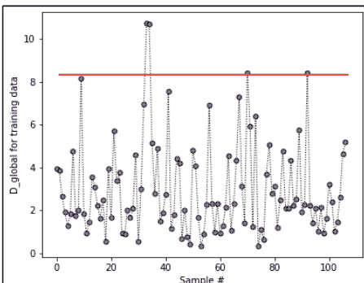

图11.17：金属蚀刻校准数据的全局监控图

##### 测试数据的故障检测

图11.18显示，全局距离指标似乎是检测故障批次的合适指标。在20个批次中，有18个批次的监控指标违反了阈值。这种良好的监控性能可归因于对数据进行了适当的多模态建模。

```python
# 获取测试数据并展开
test_dataAll = Etch_data[0,0].test

unfolded_TestdataMatrix = np.empty((1,n_vars*n_samples))
for expt in range(test_dataAll.size):
    test_expt = test_dataAll[expt,0][5:90,2:]

    if test_expt.shape[0] < 85:
        continue

    unfolded_row = np.ravel(test_expt, order='F')[np.newaxis,:]
    unfolded_TestdataMatrix = np.vstack((unfolded_TestdataMatrix, unfolded_row))

unfolded_TestdataMatrix = unfolded_TestdataMatrix[1:,:]

# 对故障数据进行PCA
data_test_normal = scaler.transform(unfolded_TestdataMatrix)
score_test = pca.transform(data_test_normal)

# 计算Dglobal_test
Dglobal_test = np.zeros((score_test.shape[0],))

for i in range(score_test.shape[0]):
    x = score_test[i,:,np.newaxis]
    probs = gmm.predict_proba(x.T)
```

for component in range(3):
    Dlocal = np.dot(np.dot((x-gmm.means_[component,:,np.newaxis]).T,
                          np.linalg.inv(gmm.covariances_[component,:,:])),
                   (x-gmm.means_[component,:,np.newaxis]))

    Dglobal_test[i] = Dglobal_test[i] + probs[0,component]*Dlocal

print('Number of faults identified: ', np.sum(Dglobal_test > Dglobal_CL), ' out of ', len(Dglobal_test))

>>> Number of faults identified: 18 out of 20

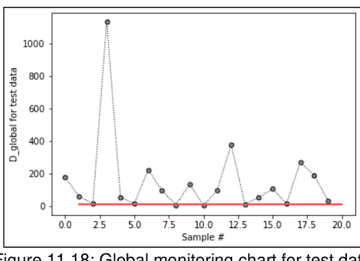

##### 总结

在本章中，我们征服了旅程中的又一个里程碑。我们首先理解了过程系统进行多模态建模的必要性，然后研究了几种流行的聚类/混合建模算法。我们刻意强调了不同方法的优缺点，以便您能够为您的问题做出明智的算法选择。在您的职业生涯中，您将经常遇到多模态过程，本章研究的工具将帮助您正确分析这些系统。

## 第四部分

### 用于过程监控的经典机器学习方法

## 第12章

### 用于故障检测的支持向量机

在前面的章节中，我们专注于通过提取潜变量来建模过程数据的多元统计过程监控方法。在本书的这一部分，我们将介绍几种在构建过程监控应用时非常有用的经典机器学习技术。这些技术并不试图构建底层数据分布的任何统计模型。相反，测量空间本身可以被划分为有利/不利区域、高密度/低密度区域，或者可以计算成对距离以生成监控指标等。SVM（支持向量机）就是这样一种算法，它擅长处理高维、非线性和中小型数据。

SVM具有极强的通用性，可用于监督和无监督环境下的分类和回归任务。SVM在设计上最小化过拟合，以提供出色的泛化性能。事实上，在人工神经网络（ANN）成为机器学习界热潮之前，SVM曾是当时的宠儿。即使在今天，SVM仍然是每位机器学习从业者工具包中必备的工具。随着您学习本章内容，您将了解更多关于SVM的知识。在过程工业中的应用方面，SVM已被用于故障分类、故障检测、异常值检测、软测量等。本章我们将重点关注与过程监控相关的应用。

为了理解SVM的不同方面，我们将涵盖以下主题

- SVM基础
- 核SVM
- 用于无监督分类的SVDD（支持向量数据描述）
- 通过SVDD进行半导体制造过程的故障检测

#### 12.1 SVM简介

经典SVM是一种用于解决二元分类问题的监督线性技术。为了说明，考虑图12.1a。这里，在一个二维系统中，训练数据点属于两个不同的类别（正类和负类）。任务是找到一条直线/线性边界来分隔这两个类别。图中也显示了两条候选样本线。虽然这些线显然完成了所述任务，但似乎有些不对劲。每条线都非常接近某些训练数据点。这可能导致泛化能力差：例如，图中显示的测试观测点'A'更靠近正样本，但会被边界L2分类为负类。这显然是不可取的。

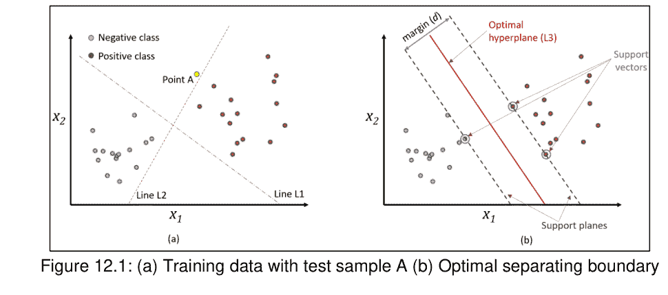

最优分离线/决策边界，即图12.1b中的直线L3，尽可能远离任一类数据。如图所示，L3位于支持平面（通过最靠近分离边界的训练点的平面）的中间。在模型拟合过程中，SVM只是找到这个对应于最大间隔（支持平面之间的距离）的最优边界。在图12.1中，L3的任何其他方向或位置都会减小间隔，并使L3更靠近某一类而非另一类。大的间隔使得模型预测对训练样本中的小扰动具有鲁棒性。

位于支持平面上的点称为支持向量<sup>80</sup>，它们完全决定了最优边界，因此得名支持向量机。在图12.1中，如果移动支持向量，直线L3可能会改变。但是，如果移除任何非支持向量，L3将完全不受影响。我们稍后将看到，对支持向量的唯一依赖如何赋予SVM计算优势。

> <sup>80</sup> 将数据点称为向量可能看起来很奇怪。虽然这个术语在通用SVM文献中常用，但支持向量指的是从原点出发，以支持平面上的数据点为端点的向量。

##### 数学背景

假设有$N$个训练样本$(x, y)$，其中$x$是$m$维输入空间中的输入向量，$y$是类别标签（$\pm 1$）。设最优分离超平面（二维空间中的一条直线）表示为$w^T x + b = 0$，其中模型参数$(w, b)$的确定需满足

$$w^T x_i + b \geq 1 \quad \text{对于正样本 } (y_i = 1)$$
$$w^T x_i + b \leq -1 \quad \text{对于负样本 } (y_i = -1)$$

支持平面表示为$w^T x + b = 1$和$w^T x + b = -1$。上述方程简单地陈述了数据点必须位于其对应支持平面的正确一侧的要求。使用简单的三角学可以证明，间隔由$\frac{2}{||w||}$给出，其中$||w||$是向量范数。因此，模型参数通过在满足上述约束的同时最大化$\frac{2}{||w||}$（或等效地，最小化$||w||$）来确定。具体来说，求解以下优化问题

$$\min_{w,b} \quad \frac{1}{2} ||w||^2$$
$$\text{s.t.} \quad y_i(w^T x_i + b) \geq 1, \quad i = 1, \cdots N$$
\hfill 公式 1

一旦模型拟合完成，对测试样本$x_t$的类别预测如下进行。

$$\hat{y}_t = sign(w^T x_t + b)$$
如果$x_t$位于分离超平面的正侧，则属于正类

sign函数内的表达式也称为决策函数，因此，正的决策函数导致正类预测，反之亦然。

> 公式1中的优化公式以及我们将在本章中看到的所有其他公式都具有一个非常有利的性质，即拥有唯一的全局最小值。与神经网络等其他强大的机器学习方法相比，这是一个巨大的优势，因为局部最小值问题可能会带来不便。

##### 简单线性分类示例

我们将使用图12.1中的玩具数据集来说明基于SVM的分类器在Sklearn中的建模。

```
# read data
import numpy as np
data = np.loadtxt('toyDataset.csv', delimiter=',')
X = data[:, [0, 1]]; y = data[:, 2]

# scale model inputs
from sklearn.preprocessing import StandardScaler
scaler = StandardScaler()
X_scaled = scaler.fit_transform(X)

# fit SVM model
from sklearn.svm import SVC # for large datasets LinearSVC class is preferable
model = SVC(kernel='linear', C=100)
model.fit(X_scaled, y)

# get details of support vectors
print('# of support vectors:', len(model.support_))

>> # of support vectors: 3
```

上述代码为我们提供了图12.1<sup>81</sup>中所示的最优分离边界。与其他Sklearn估计器一样，predict()方法可用于预测任何测试观测的类别。我们很快将介绍上述代码中使用的超参数（kernel和C）。

##### 硬间隔与软间隔分类

玩具数据集代表了一种理想数据，其中所有训练样本都可以通过线性边界正确分类。然而，在现实生活中，总会混入一些数据杂质，如图12.2所示。我们的SVM公式（公式1）在这种情况下将无法找到解决方案。

#### 12.2 处理非线性数据的核技巧

为了处理这类场景，我们在SVM优化程序中增加了一点灵活性，通过修改约束条件，如下所示：

$$w^T x_i + b \geq 1 - \xi_i \quad \text{对于 } y_i = 1$$
$$w^T x_i + b \leq -1 + \xi_i \quad \text{对于 } y_i = -1$$

这里，我们使用松弛变量（$\xi_i$）来允许每个样本在模型拟合过程中有可能落在支持平面的错误一侧并被错误分类。然而，我们也希望保持此类违规的数量较低，这可以通过对违规进行惩罚来实现。修订后的SVM公式如下：

$$\min_{w,b,\xi} \quad \frac{1}{2}||w||^2 + C \sum_{i=1}^N \xi_i$$
$$\text{约束条件} \quad y_i(w^T x_i + b) \geq 1 - \xi_i, \quad i = 1, \cdots N$$
$$\xi_i \geq 0$$

*公式 2*

上述公式称为软间隔分类（与之前的硬间隔分类相对）。Sklearn实现了软间隔公式。正常数$C$是一个超参数（Sklearn中默认C=1），对应于我们在之前代码中看到的超参数。对于我们的玩具数据集2（图12.2），使用之前展示的代码，我们最终得到了与图12.1所示相同的分离边界。类别预测表达式保持不变，为$\hat{y}_t = sign(w^T x_t + b)$。

##### C作为正则化超参数

松弛变量不仅有助于在存在严重杂质时找到解决方案，还有助于避免对噪声数据过拟合。例如，考虑图12.3中的场景。如果不允许任何错误分类，我们最终会得到一个非常小的间隔，而允许单个错误分类则会得到一个好得多的间隔，并可能具有更好的泛化能力。因此，我们看到在间隔最大化和训练准确率之间存在权衡。

超参数C是控制这种权衡的旋钮。较大的C值意味着对约束违规的重罚，这将防止错误分类，而较小的C值则允许在模型拟合过程中出现更多错误分类，以获得更好的间隔。

虽然软间隔分类公式非常灵活，但它不适用于需要弯曲边界的非线性分类问题。考虑图12.4中的数据集。很明显，线性边界在这里是不合适的。

然而，这里并非无计可施。一个解决此问题的思路是将原始输入变量/特征映射到一个更高维的空间，在那里它们变得线性可分。对于图12.4中的数据，以下变换将非常有效：

$\varphi(x) = \varphi(x_1, x_2) = [z_1, z_2, z_3] = [x_1, x_2, x_1^2 + x_2^2]$

正如我们在图12.5中看到的，数据在3D空间中很容易线性可分！

可以在新的特征空间上训练SVM以获得最优分离超平面。任何新的测试数据点都可以通过相同的映射函数$\varphi$进行变换，然后通过拟合好的SVM模型进行类别判定。虽然这个解决方案看起来很棒，但仍有一个小问题。我们如何为高维输入数据集找到合适的映射？事实证明，你不需要显式地找到这个映射，这得益于一个巧妙的“核技巧”。是的，就是我们在第10章看到的同一个核技巧！为了了解核如何出现在SVM公式中，我们将重新审视SVM的数学背景。

##### 数学背景（重温）

SVM并非以公式2所示的形式求解。相反，求解的是以下等价形式：

$$\min_{\alpha} \quad \frac{1}{2} \sum_{i=1}^N \sum_{j=1}^N \alpha_i \alpha_j y_i y_j x_i^T x_j - \sum_{i=1}^N \alpha_i \quad \text{公式 3}$$
$$\text{约束条件} \quad \sum_{i=1}^N y_i \alpha_i = 0$$
$$0 \le \alpha_i \le C \quad i = 1, \cdots N$$

这里，优化参数$w, b$已被$\alpha_s$（也称为拉格朗日乘子）取代。这种等价形式称为对偶形式（你可能在优化课程中记得；如果你以前没有遇到过这个术语，也完全没问题）。一旦找到$\alpha_s$，就可以通过以下方式计算$w$和$b$：

$$w = \sum_{i=1}^{N} \alpha_i y_i x_i, \quad b = \frac{1}{N_s} \sum_{i \in \{SV\}} 1 - y_i w^T x_i$$

其中$N_s$是支持向量的数量，$\{SV\}$是支持向量索引的集合。任何测试数据点可以被分类为：

$$\hat{y}_t = sign(\sum_{i=1}^{N} \alpha_i y_i x_i^T x_t + b) \quad \text{公式 4}$$

在对偶公式中，发现$\alpha_s$仅对支持向量非零，对其他训练样本为零。这意味着公式4可以简化为：

$$\hat{y}_t = sign(\sum_{i \in \{SV\}} \alpha_i y_i x_i^T x_t + b) \quad \text{公式 5}$$

> 严格来说，支持向量不必位于分离超平面上。对于软间隔分类，具有非零松弛变量的数据点也是支持向量，它们的$\alpha_s$非零（这是支持向量的定义特征）。支持向量的存在/缺失会影响解决方案（目标函数和/或模型参数）。

此时，你可能想知道为什么我们要把事情弄得更复杂；为什么不以原始形式（公式2）求解问题，这似乎更易于解释？这样做的原因很快就会对你清楚。现在，想象一下你正在解决非线性问题，其中SVM在更高维度中找到一个分离超平面。公式3将如下所示：

$$\min_{\alpha} \quad \frac{1}{2} \sum_{i=1}^{N} \sum_{j=1}^{N} \alpha_i \alpha_j y_i y_j \varphi(x_i)^T \varphi(x_j) - \sum_{i=1}^{N} \alpha_i \quad \text{公式 6}$$
$$\text{约束条件} \quad \sum_{i=1}^{N} y_i \alpha_i = 0$$
$$0 \leq \alpha_i \leq C \quad i = 1, \cdots N$$

而公式5变为：

$$\hat{y}_t = sign(\sum_{i \in \{SV\}} \alpha_i y_i \varphi(x_i)^T \varphi(x_j) + b) \quad \text{公式 7}$$

这里最关键的观察是，变换后的变量（$\varphi(x)$）仅以内积（点积）的形式出现。这使我们能够使用核技巧。一旦选择了一个核函数，公式6变为：

$$\min_{\alpha} \quad \frac{1}{2} \sum_{i=1}^{N} \sum_{j=1}^{N} \alpha_i \alpha_j y_i y_j k(x_i, x_j) - \sum_{i=1}^{N} \alpha_i$$
$$\text{约束条件} \quad \sum_{i=1}^{N} y_i \alpha_i = 0$$
$$0 \le \alpha_i \le C \quad i = 1, \cdots N$$

$$\text{公式 8}$$

以上是SVM模型拟合的形式，预测如下进行：

$$\hat{y}_t = sign(\sum_{i \in \{SV\}} \alpha_i y_i k(x_i, x_t) + b)$$

$$\text{公式 9}$$

与KPCA和KPLS类似，使用核函数使我们能够获得强大的非线性分类器，同时保留原始线性SVM方法的所有优点！

##### 支持向量分类器的Sklearn实现

让我们尝试使用高斯核为图12.4中的玩具数据集找到非线性分类器边界。我们还将通过网格搜索和交叉验证找到$C$和$\sigma$的最优值。

```python
# 生成数据
from sklearn.datasets import make_circles
X, y = make_circles(500, factor=.08, noise=.1, random_state=1)
# 注意这里的y = 0,1，不一定是±1；SVM会进行相应的内部转换
```

```python
# 通过GridSearchCV找到最优超参数
from sklearn.svm import SVC
from sklearn.model_selection import GridSearchCV

param_grid = {'C':[0.1, 1, 10, 100, 1000], 'gamma':[0.01, 0.1, 1, 10, 100]}
gs = GridSearchCV(SVC(), param_grid, cv=5).fit(X, y) # 无需缩放，因为输入已经是缩放过的

print('最优超参数:', gs.best_params_)

>>> 最优超参数: {'C': 0.1, 'gamma': 1}
```

你会注意到Sklearn使用了超参数gamma，它其实就是$1/\sigma^2$。最优的$C$和gamma分别为0.1和1，分类器的解如图12.6所示。该图还显示了超参数低值和高值对应的边界区域。正如我们之前看到的，大的C会导致过拟合（边界受噪声影响）。至于gamma，大的值（或小的$\sigma$）也会导致过拟合。

#### 12.3 SVDD：简介

支持向量数据描述（SVDD）是SVM算法的无监督形式，用于处理训练样本仅属于单一类别，且模型目标是判断任何测试/新样本是否属于同一类数据的问题。考虑图12.7中的启发性示例。这里，我们如何获得训练数据的模型，从而能够将样本$A$称为异常值/异常点？此类问题在流程工业中相当常见。过程监控和设备健康监控就是一些示例领域，其中大多数/所有可用的过程数据可能仅属于正常工厂运行类别，而建模目标是识别任何异常数据点。

图12.7：仅包含单一类别的二维训练数据集。红色边界显示了数据集的潜在描述模型，可用于区分测试样本$A$与训练样本。

##### 高斯核与分类

对核函数背后更好的直觉可以帮助我们理解核超参数对分类边界的影响。核函数提供了高维空间中任意两点之间相似性的间接度量。再次考虑高斯核

$$k(x, z) = \exp\left(-\frac{||x - z||^2}{2\sigma^2}\right)$$

这里，如果两个点$(x, z)$在原始空间中彼此接近，那么它们在映射空间中的相似性（或核值）将比$x$和$z$相距较远时更高。现在，让我们看看样本$z$的分类器预测公式

$$f(z) = \sum_{i \in \{SV\}} \alpha_i y_i k(x_i, z) + b$$

因此，分类器不过是来自支持向量的高斯凸起之和（加上一个偏移量$b$）！

给定带宽$(\sigma)$，在训练过程中，SVM试图找到凸起乘数$(\alpha_s)$的最优值，使得训练样本获得正确的标签，同时保持分类边界与训练样本之间的最大间隔。边界仅仅是凸起和偏移量的净总和为零的点集。$\sigma$的小值会导致任何支持向量附近出现非常局部化的凸起，导致支持向量数量增多，并且分离边界出现过多“摆动”，这通常表示过拟合。

SVDD背后的思想是用一个超球体（二维中是圆，三维中是球体）来包围训练数据，该超球体在最小体积内包含最大数量的数据点。任何距离超球体中心超过超球体半径的新观测值都可被视为异常观测。但图12.7中的数据看起来并不适合用一个圆来包围？这是正确的，我们的解决方法是使用核函数将原始数据隐式投影到一个更高维的空间，在那里数据可以被充分包围在一个紧凑的超球体中。最优超平面在原始空间上的投影将显示为围绕数据集的紧密非线性边界！

就像经典的二类SVM一样，只有一小部分训练样本能够完全定义超球体。这些数据点或支持向量位于超球体的圆周上或外部（或在原始空间中的非线性边界上）。

##### 数学背景

再次假设$\varphi(x)$表示高维特征空间中的一个数据点。在这个空间中，通过以下优化问题找到最优超球体

$$\min_{R,a,\xi} \quad R^2 + C \sum_{i=1}^N \xi_i$$
$$\text{s.t.} \quad ||\varphi(x_i) - a||^2 \leq R^2 + \xi_i, \quad i = 1, \cdots N$$
$$\xi_i \geq 0$$

很明显，上述程序试图最小化以'a'为中心的超球体的半径（$R$），使得大多数数据点位于超球体内。松弛变量$\xi$允许某些样本落在外部，而此类违规的数量通过超参数$C$进行调节。与之前一样，问题以其对偶形式求解

$$\min_{\alpha} \quad \sum_{i=1}^N \sum_{j=1}^N \alpha_i \alpha_j K(x_i, x_j) - \sum_{i=1}^N \alpha_i K(x_i, x_i)$$
$$\text{s.t.} \quad \sum_{i=1}^N \alpha_i = 1$$
$$0 \leq \alpha_i \leq C \quad i = 1, \cdots N$$

与SVM类似，alpha值表示训练样本相对于最优边界的位置。以下关系成立

边界内部：$||\varphi(x_i) - a|| < R \Rightarrow \alpha_i = 0$
边界上：$||\varphi(x_i) - a|| = R \Rightarrow 0 < \alpha_i < C$
边界外部：$||\varphi(x_t) - a|| > R \Rightarrow \alpha_i = C$

最优解满足以下表达式

$$R = \sqrt{k(x_s, x_s) - 2 \sum_{i \in \{SV\}} \alpha_i k(x_s, x_i) + \sum_{i \in \{SV\}} \sum_{j \in \{SV\}} \alpha_i \alpha_j k(x_i, x_j)}$$

其中$x_s$是位于边界上的任何支持向量。任何测试观测值$x_t$，如果其在映射空间中距离中心$a$的距离大于$R$，则被视为异常，距离计算如下

$$Dist(\varphi(x_t), a)^2 = ||\varphi(x_t) - a||^2 = k(x_t, x_t) - 2 \sum_{i \in \{SV\}} \alpha_i k(x_t, x_i) + \sum_{i \in \{SV\}} \sum_{j \in \{SV\}} \alpha_i \alpha_j k(x_i, x_j)$$

如您所见，只需要指定核函数和其他模型超参数；不需要关于映射$\varphi$的知识。

##### OC-SVM 与 SVDD

还有另一种与SVDD密切相关的技术，称为单类SVM（OC-SVM）。事实上，OC-SVM是目前Sklearn中可用的无监督SVM算法。OC-SVM找到一个分离超平面，将训练数据与原点最佳分离。其核化的对偶形式如下

$$\min_{\alpha} \quad \frac{1}{2} \sum_{i=1}^N \sum_{j=1}^N \alpha_i \alpha_j k(x_i, x_j)$$
$$\text{s.t.} \quad \sum_{i=1}^N \alpha_i = 1$$
$$\quad \quad \quad 0 \leq \alpha_i \leq C \quad i = 1, \cdots N$$

您会注意到，对于高斯核，OC-SVM公式变得与SVDD等价，因为$k(x_i, x_i) = 1$，并且我们最终得到相同的乘数值。决策边界也是相同的。对于其他满足$k(x_i, x_i) \neq 1$的核，结果会有所不同。

##### 带宽参数与SVDD图示

在本小节中，我们将尝试使用Sklearn的OneClassSVM为图12.7中的数据集构建边界。然而，在此之前，我们需要确定SVDD模型超参数$C$和$\sigma$的策略。如果有足够的属于“正常”和“异常”类别的验证数据样本可用，则可以使用交叉验证来选择给出最佳验证准确率的C和$\sigma$。然而，这通常是不可能的，并且与训练数据集一样，验证数据集也只包含“正常”类样本！为了能够有根据地选择超参数，让我们再看看它们。

之前我们看到$C$控制超球体体积与训练数据集中误分类数量之间的权衡。$C$也可以写成

$$C = \frac{1}{Nf}$$

其中$N$是样本数量，$f$是训练数据集中预期的异常值比例。较小的$f$值（相应较大的$C$）将导致较少的样本被置于超球体外部。实际上，如果$C$设置为1（或更大），超球体将包含所有样本（因为$\sum \alpha_i = 1$且在超球体外部$\alpha = C$）。因此，可以根据对异常值比例的有根据的假设来设置$C$。在没有任何先验知识的情况下，通常指定$f = 0.01$以排除距离超球体中心最远的1%样本。

至于$\sigma$，我们之前看到在$\sigma$值较低时，数据边界变得非常摆动，支持向量数量多，导致过拟合。相反，在$\sigma$值较高时，边界倾向于在原始空间本身变成球形，导致欠拟合（或数据的非紧凑包围）。带宽选择的一种方法是使用基于获得具有有利性质的核矩阵（其$i,j^{th}$元素是$k(x_i, x_j)$）的经验方法。其中一种方法，修正均值准则$^{82}$，给出带宽如下

$$\sigma = \sqrt{\frac{\bar{D}^2}{\ln\left(\frac{N-1}{\delta^2}\right)}}$$

$$\bar{D}^2 = \frac{\sum_{i<j} ||x_i - x_j||^2}{\frac{N(N-1)}{2}}$$

$$\delta = -0.14818008\emptyset^4 + 0.2846623624\emptyset^3 - 0.252853808\emptyset^2 + 0.159059498\emptyset - 0.001381145$$

> $^{82}$ Kalde & Sadek, The mean and median criterion for kernel bandwidth selection for support vector data description, IEEE 2017

$$\emptyset = \frac{1}{\ln(N-1)}$$

另一种带宽选择方法是选择能使得验证数据集达到所需置信水平的最大 $\sigma$ 值。例如，对于99%的置信水平，$\sigma$ 会持续增加，直到99%的验证样本被正确分类为内点。任何更高的 $\sigma$ 值都会将更多验证样本包含在超球体内。修正均值准则可作为初始猜测值，随后在其周围进行搜索。现在，让我们为图12.7中的数据集找到非线性边界。

```python
# read data
import numpy as np
X = np.loadtxt('SVDD_toyDataset.csv', delimiter=',')
# compute bandwidth via modified mean criteria
import scipy

N = X.shape[0]
phi = 1/np.log(N-1)
delta = -0.14818008*np.power(phi,4) + 0.2846623624*np.power(phi,3) - 0.252853808*np.power(phi,2) + 0.159059498*phi - 0.001381145
D2 = np.sum(scipy.spatial.distance.pdist(X, 'sqeuclidean'))/(N*(N-1)/2)
sigma = np.sqrt(D2/np.log((N-1)/delta*delta))
gamma = 1/(2*sigma*sigma)

# SVM fit
from sklearn.svm import OneClassSVM
model = OneClassSVM(nu=0.01, gamma=gamma).fit(X) # nu corresponds to f
```

图12.8展示了在 $f$（或Sklearn中的nu）保持为0.01时，不同gamma值对应的边界边界。一个接近修正均值准则方法给出的值（= 0.58）的gamma值（= 1）提供了令人满意的边界。

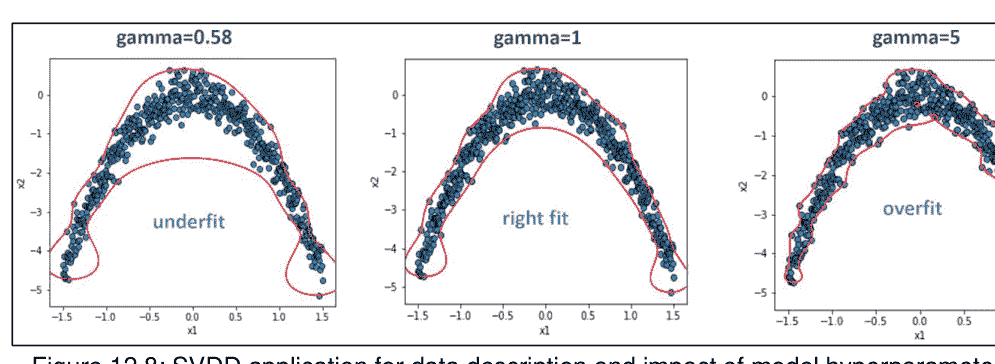

我们希望到现在为止，您已经确信SVM在区分不同类别数据以及紧凑地界定正常运行数据方面的强大能力。成功应用SVM的一个重要要求是，训练数据集应能非常代表“正常”数据集，并充分表征所有预期的变化。接下来，我们将通过一个实际过程数据的案例研究来进一步探讨。

#### 12.4 通过SVDD进行故障检测：半导体制造案例研究

为了说明SVDD在过程监控中的实际应用，我们将重新使用第11章中的半导体制造过程数据。这个批次过程数据集包含19个过程变量，测量了108个正常批次和21个故障批次。批次持续时间从95到112秒不等。图12.9展示了主成分空间中的训练样本和故障测试样本。

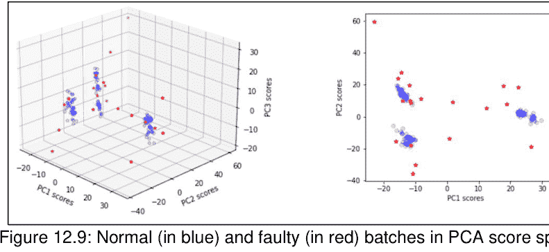

在本示例中，原始数据已使用多向PCA进行处理，转换后的二维（得分）数据在 *Metal_etch_2DPCA_trainingData.csv* 文件中提供。请注意，我们也可以在原始输入空间中实现SVDD，但通过PCA预处理以消除变量相关性通常是一个好习惯。此外，我们使用二维主成分空间进行分析只是为了便于说明SVDD边界。在实际部署中，您将在更高维度的主成分空间中工作以获得更好的准确性。让我们看看我们的模型是否能在多聚类数据集中将故障样本识别为异常值。

```python
# read data
import numpy as np
X_train = np.loadtxt('Metal_etch_2DPCA_trainingData.csv', delimiter=',')

# fit SVM
from sklearn.svm import OneClassSVM
model = OneClassSVM(nu=0.01, gamma=0.025).fit(X_train) # gamma from modified mean criterion = 0.0025

# predict for test data
X_test = np.loadtxt('Metal_etch_2DPCA_testData.csv', delimiter=',')
y_test = model.predict(X_test) # y=-1 for outliers

print('Number of faults identified: ', np.sum(y_test == -1), ' out of ', len(y_test))

>>> Number of faults identified: 17 out of 20
```

图12.10展示了训练样本周围的边界以及根据正确或错误识别标记的故障样本。二十个故障数据样本中有十七个被正确识别为异常值。这个例子说明了SVDD在紧凑描述聚类数据集方面的强大能力。

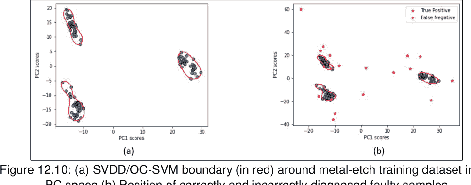

如果我们使用到超球体中心的距离进行故障检测，我们应该得到相同的结果。如果未使用RBF作为核函数，SVDD和OC-SVM的结果将会不同。不幸的是，Sklearn目前没有提供SVDD实现。尽管如此，GitHub上有一个可用的SVDD包<sup>83</sup>。

至此，我们对支持向量机的探讨告一段落。SVM独树一帜，非常适合过程参数难以估计的工业过程。凭借优雅的数学背景、仅需几个超参数、出色的泛化能力以及保证的唯一全局最优解，SVM是最佳的机器学习算法之一。

##### 总结

在本章中，我们研究了支持向量机算法及其在监督和无监督机器学习中的各种形式。我们看到了它在二元分类、故障检测和故障分类中的应用。通过核化学习，我们了解了SVM在非线性建模中的应用。总之，我们为您的数据科学工具箱增添了一个强大的工具。接下来，我们将继续构建工具箱，学习更多强大的经典机器学习算法。

## 第13章
### 用于故障检测的决策树与集成学习

想象一下，您处于这样一种情况：即使您尽了最大努力，您的模型仍无法提供令人满意的性能。如果我们告诉您，存在一类算法，您可以将几个“弱”性能模型的“版本”组合起来，生成一个“强”性能模型，该模型可以提供比其组成的“弱”模型更准确、更稳健的预测，这听起来是不是好得难以置信？这是真的，这些算法被称为集成方法。

集成方法通常是Kaggle等在线机器学习竞赛中获胜作品的关键组成部分。集成学习基于一个简单的理念：集体智慧可能优于个人智慧！在本章中，我们将探讨这是如何运作的，以及是什么让集成如此强大。我们将研究流行的集成方法，如随机森林和XGBoost。

森林和XGBoost中的基础组成模型是决策树，这是一种简单而通用的机器学习算法，适用于回归和分类任务。决策树可以拟合复杂和非线性的数据集，同时享有提供可解释结果的令人羡慕的品质。我们将详细探讨所有这些特点。具体来说，我们将涵盖以下主题

- 决策树和随机森林简介
- 集成学习技术简介（Bagging、Adaboost、梯度提升）
- 使用决策树和XGBoost进行燃气锅炉的故障检测与分类

#### 13.1 决策树简介

决策树（DTs）是一种归纳学习方法，它从数据中推导出明确的规则来进行预测。它们将特征空间划分为若干个（超）矩形，然后在每个矩形中拟合一个简单的模型（通常是一个常数）。如图13.1所示，对于二维特征空间中的二元分类问题，划分是通过一系列if-else语句实现的。如图所示，模型使用分支和叶子表示，从而形成树状结构，因此得名决策树模型。在每个节点提出的问题非常清楚地展示了模型预测（A类或B类）是如何产生的。因此，决策树成为那些需要轻松解释模型结果的应用的首选模型。

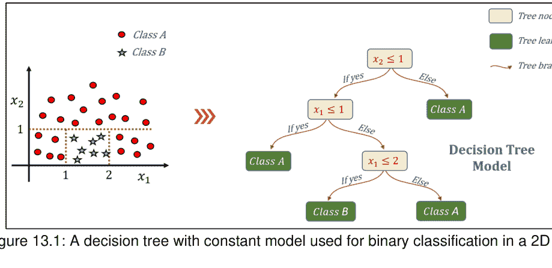

决策树模型拟合的关键在于决定在树的每个节点的if-else语句中提出哪些问题。在拟合过程中，这些问题将特征空间分割成越来越小的子区域，使得落在子区域内的训练观测值彼此相似。当无法获得进一步的增益或满足停止准则时，分割过程停止。不恰当的分割选择将生成一个泛化能力不佳的模型。在下一小节中，我们将研究一种流行的决策树训练算法，称为CART（分类与回归树），它明智地确定分割点。

##### 数学背景

CART算法创建一个二叉树，即在每个节点创建两个分支，以一种减少整体数据“不纯度”的方式分割数据集。为了理解这一点，请考虑树的第<sup>84</sup>个节点。同时假设我们处理的是一个二分类问题，输入向量为 $x \in R^m$。

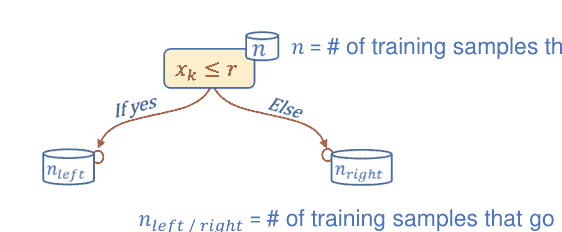

算法需要决定在当前节点使用 $m$ 个输入变量 $x_k$ 中的哪一个来分割 $n$ 个样本的集合，以及使用什么阈值 $r$。CART 通过最小化以下目标函数来做出此决定：

$$J(k, r) = \frac{n_{left}}{n} I_{left} + \frac{n_{right}}{n} I_{right}$$

其中 $I_{left/right}$ 表示左/右子数据集的数据不纯度，其计算公式为：

$$I = 1 - \sum_{q=1}^{2} p_q^2$$

这里 $p_q$ 是对应数据子集中属于类别 $q$ 的样本比例。例如，如果一个子集中的所有样本都属于类别 1，那么 $p_1 = 1$ 且 $I = 0$。因此，如果 CART 能找到 $k$ 和 $r$，使得 $n$ 个样本能够按类别完美地划分到左右子集中，那么就能得到最小值 $J = 0$。然而，这通常是不可能的，CART 会尽力做到最好。CART 在此节点实现的不纯度降低（$\Delta I_{node}$）由 $nI_{node} - \frac{n_{left}}{n} I_{left} - \frac{n_{right}}{n} I_{right}$ 给出。

CART 简单地递归遵循上述分支方案。它从顶层节点（根节点）开始，不断分割子集。如果一个节点无法再被分割（因为不纯度无法再降低，或者某些超参数设置如 min_samples_split, min_samples_leaf 阻止了进一步分割），该节点就成为叶节点或终端节点。对于预测，找到与测试样本对应的叶节点，并将该叶节点训练子集中的多数类别分配给测试样本。请注意，也可以通过简单地查看叶节点训练样本中属于类别 $q$ 的比例来进行概率预测。

在经典的决策树中，正如我们所看到的，节点上的分割决策规则（或分割函数）基于单个变量。这导致了轴对齐的超平面将输入空间分割成几个超矩形。也可以使用基于多个变量的复杂分割函数，这可能更适合某些数据集——下面展示了一个这样的例子。

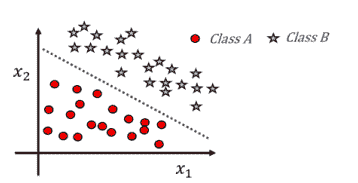

然而，使用复杂分割函数拟合决策树在计算上要求更高。因此，一个通用的建议是在使用简单分割函数拟合树之前，先使用 PCA、FDA 等降维技术对数据集进行变换。

对于回归问题，以相同的方式构建树，但使用不同的目标函数 $J(k,r)$，现在其定义为：

$$J(k,r) = \frac{n_{left}}{n} MSE_{left} + \frac{n_{right}}{n} MSE_{right}$$

其中 $MSE_{left/right}$ 表示左/右节点的均方误差：

$$MSE = \frac{\sum_{sample \in subset} (\hat{y} - y_{sample})^2}{\# \text{ of samples}}$$

$\hat{y}$ 是属于某个子集的样本的平均输出值。对测试样本的预测也取为分配给测试样本叶节点的所有训练样本的平均输出值。

你并不局限于在回归树的叶节点使用常数预测模型。线性和多项式预测模型可能更适合某些问题。这类决策树被称为模型树。虽然 Sklearn 只允许常数模型，但存在一个名为 'linear-tree'$^{85}$ 的包，它允许构建叶节点为线性模型的模型树。

##### 不纯度度量

公式 1 中使用的不纯度度量称为 *基尼不纯度*。另一个常用的度量是 *熵*，对于具有 2 个类别的数据集，其定义如下：

$$I_H = -\sum_{q=1}^{2} p_q \log(p_q)$$

当 $p_1=1$（或 $p_2=0$）时，$I_H$ 变为 0；当 $p_1=p_2=0.5$ 时，$I_H$ 变为 1。因此，熵的降低会导致数据纯度的提高。在实践中，基尼不纯度和熵提供相似的结果。

##### 简单的 Sklearn 实现

下面的代码演示了在 Sklearn 中对二次数据集实现决策树回归模型。图 13.2a 绘制了预测值与实际输出值的对比图。很明显，在不限制树深度的情况下发生了过拟合。子图 13.2b 显示了将树深度限制为仅 3 层的正则化效果。

```python
# generate data
import numpy as np
x = np.linspace(-1, 1, 50)[:, None]
y = x*x + 0.25 + np.random.normal(0, 0.15, (50,1))

# fit regularized DT model and predict
from sklearn import tree
model = tree.DecisionTreeRegressor(max_depth=3).fit(x, y)
y_pred = model.predict(x)
```

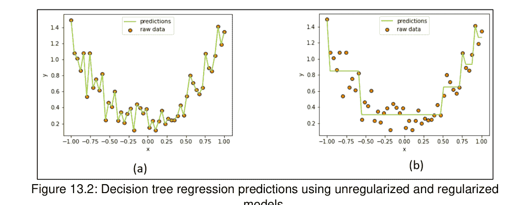

你可以使用 `plot_tree` 函数来绘制树本身，以理解训练数据集是如何被决策树模型划分的。

```python
# plot tree
plt.figure(figsize=(20,8))
tree.plot_tree(model, feature_names=['x'], filled=True, rounded=True)
```

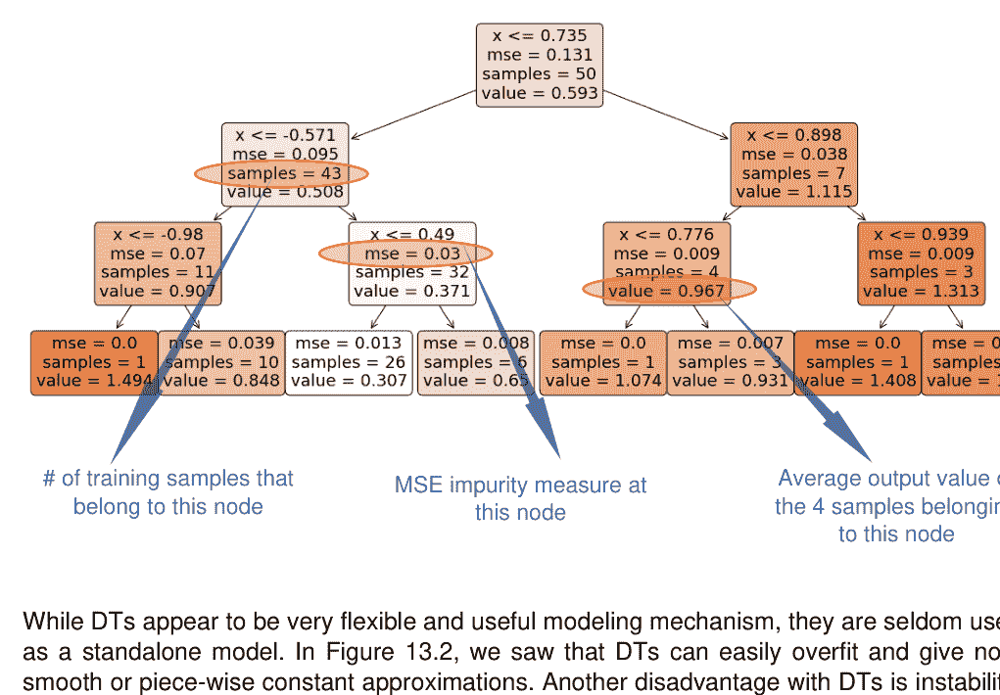

虽然决策树看起来是非常灵活和有用的建模机制，但它们很少作为独立模型使用。在图 13.2 中，我们看到决策树很容易过拟合，并给出非平滑或分段常数的近似。决策树的另一个缺点是不稳定性，即训练数据集的微小变化可能导致一棵非常不同的树。然而，我们花时间学习决策树是有原因的。单棵树可能没有用，但当你组合多棵树时，你会得到惊人的结果。我们将在下一节学习这是如何实现的。

#### 13.2 随机森林：简介

随机森林是一种监督式非线性回归和分类建模技术，由多棵决策树组成。这些决策树独立地拟合到它们的训练数据集，随机森林的预测是通过对这些树的预测结果取平均值得出的。图 13.3 说明了这一方案。组合树的输出可以得到低方差或更稳健的模型。诀窍在于这些组成树是如何生成的。这些树的生成方式使得它们的预测误差不相关，从而导致随机森林不易过拟合（我们很快将从数学上具体化这个概念）。

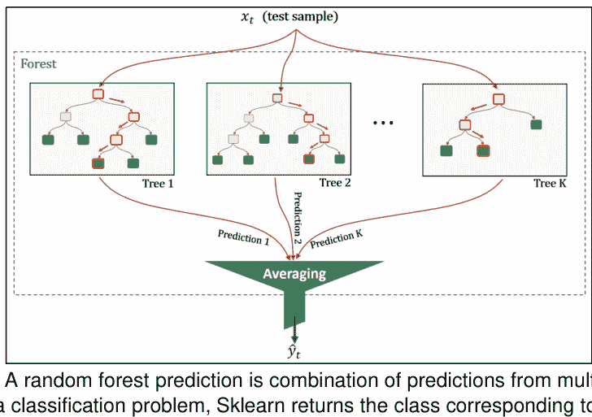

在随机森林中，树被完全生长，因此，树的超参数选择不是问题。这使得随机森林的训练和执行简单快捷。事实上，随机森林具有非常少的可调超参数。随机森林还便于计算变量重要性。所有这些品质使得随机森林广受欢迎。

##### 数学背景

为了训练随机森林，需要生成尽可能“彼此不同”但同时又能良好描述训练数据集的不同树。这种树之间的多样性通过以下两种方式实现：

1) **为每棵树使用不同的训练数据集**：如果每棵树都在相同的数据集上训练，它们最终会变得相同，犯同样类型的错误，因此组合它们将提供很少的好处。由于我们只有一个训练数据集来训练随机森林，因此采用了自助采样法。如果原始数据集有 $N$ 个样本，自助采样法允许创建多个数据集，每个数据集有 $N_b$（$\le N$）个样本，使得每个新数据集也能很好地代表生成原始数据集的底层过程。每个自助采样数据集是通过从原始数据集中有放回地随机选择 $N_b$ 个样本生成的。在随机森林中，$N_b = N$，下图说明了 $N=10$ 时的自助采样方案。

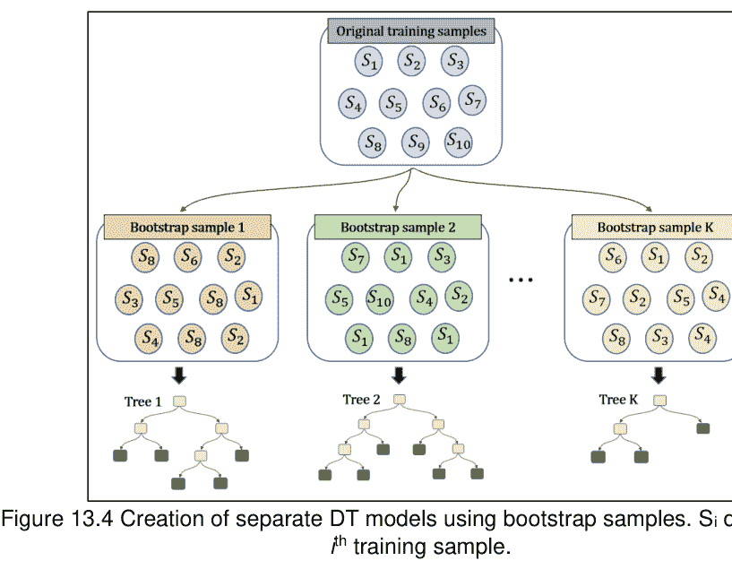

2) **使用输入变量的随机子集来寻找最优分割**：随机森林训练中一个非常不直观、有些令人惊讶但极其有效的方面是，在森林中任何树的任何节点上确定最优分割函数时，并不考虑所有输入变量。相反，选择一个变量的随机子集，然后使用这些选定的变量来最小化节点不纯度。这种随机选择在每个节点上都进行。如果输入变量 $x \in R^m$，则建议随机分割变量的数量（$M$）为 $m$ 的向下取整平方根。

训练过程中的上述两个技巧使得树之间的相关性最小化。下图总结了随机森林模型的拟合过程。为便于说明，假设 $x \in R^9$ 且 $M=3$。

你可以看到，这里只有两个主要的超参数需要决定：树的数量和变量子集的大小。随机森林的另一个优势是，其组成树可以并行训练。

##### 简单的 Sklearn 实现

让我们将随机森林模型拟合到图13.2中的二次数据集上。图13.6展示了使用森林中20棵树进行拟合的结果。很明显，与我们之前看到的决策树模型相比，随机森林提供了更平滑的预测。图中还展示了森林中两棵不同组成树的预测结果。我们可以看到，随机森林平滑了组成树预测中的波动，使组合模型更加稳定。

```python
# 拟合随机森林模型并进行预测
from sklearn.ensemble import RandomForestRegressor
model = RandomForestRegressor(n_estimators=20).fit(x, y)
y_pred = model.predict(x)

# 获取组成树的预测并绘图
tree_list = model.estimators_ # 随机森林中的决策树模型列表
y_pred_tree1 = tree_list[5].predict(x)
y_pred_tree2 = tree_list[15].predict(x)
```

图13.6：（左）随机森林回归预测，（中）来自几棵组成决策树的预测，（右）随机森林模型中树的数量对验证误差的影响

图13.6还展示了森林中不同树数量对应的验证误差。我们在这里看到的是随机森林的一个普遍特征：随着树的数量增加，验证误差会趋于平稳。因此，如果计算时间不是问题，最好使用尽可能多的树，直到误差趋于平稳。至于$M$，较低的值会导致方差减少更多，但会增加模型偏差。请注意，随机森林主要降低的是方差（与使用单个决策树模型相比），而不是偏差。因此，如果决策树本身存在欠拟合，那么随机森林将无法提供高精度（或低偏差）。这就是为什么在随机森林中使用完全生长的树。你将在本章后面了解到其背后的原因。

#### 13.3 使用随机森林进行故障分类：燃气锅炉案例研究

为了说明随机森林在故障分类中的应用，我们将使用来自燃气锅炉系统的模拟数据集$^{86}$，该数据集来自一篇题为“使用模拟数据集进行锅炉故障分类的机器学习算法”的公开论文。所代表的系统如下所示。燃料在燃烧室中燃烧，产生的热气加热水流。模拟了三种类型的故障，即：过量空气使用、换热器气侧结垢和水侧结垢。总共提供了27280次模拟，包括一系列运行参数下的正常工况样本（燃气燃料流量从1 kg/s到4 kg/s，水质量流量从3 kg/s到12.5 kg/s，燃烧空气温度从283 K到303 K）。原始论文报告随机森林是表现最佳的模型之一。让我们看看我们是否能够复现所报告的性能。

$^{86}$ Shohet等人，用于故障检测和分类的模拟锅炉数据。可在 https://ieee-dataport.org/open-access/simulated-boiler-data-fault-detection-and-classification 获取，*IEEE Dataport*，2019。数据在知识共享署名许可协议 (https://creativecommons.org/licenses/by/4.0/) 下共享。

```python
# 导入包
import numpy as np, pandas as pd, matplotlib.pyplot as plt
from sklearn.preprocessing import LabelEncoder
from sklearn.model_selection import train_test_split
from sklearn.preprocessing import StandardScaler
from sklearn.ensemble import RandomForestClassifier
```

```python
# 读取数据
data = pd.read_csv('Boiler_emulator_dataset.txt', delimiter=',')
```

```python
data.drop(data[data.Class == 'Lean'].index, inplace=True) # 删除 Class == Lean 的行
input_data = data.iloc[:,[0,1,3,4]].values # 删除值恒定的 Treturn 列
output_label_text = data.iloc[:,-1]
```

```python
# 将文本标签转换为数字标签
le = LabelEncoder().fit(output_label_text)
output_labels = le.transform(output_label_text)
print(le.classes_)
```

```
>>> ['ExcessAir' 'Fouling' 'Nominal' 'Scaling']
```

```python
# 分离训练和测试数据
X_train, X_test, y_train, y_test = train_test_split(input_data, output_labels, test_size=0.3,
                                                    stratify=output_labels, random_state=1)
```

```python
# 数据缩放
scaler = StandardScaler().fit(X_train)
X_train_scaled = scaler.transform(X_train)
X_test_scaled = scaler.transform(X_test)
```

```python
# 拟合随机森林模型
clf = RandomForestClassifier()
clf.fit(X_train_scaled, y_train)
```

```python
y_train_pred = clf.predict(X_train_scaled)
y_test_pred = clf.predict(X_test_scaled)

# 生成并绘制混淆矩阵
from sklearn.metrics import confusion_matrix
import seaborn as sn

conf_mat = confusion_matrix(y_test, y_test_pred)

plt.figure(figsize=(12,8)), sn.set(font_scale=2)
sn.heatmap(conf_mat, fmt='.0f', annot=True, cmap='Blues', xticklabels=le.classes_,
           yticklabels=le.classes_)

plt.ylabel('真实故障类别', fontsize=30, color='maroon')
plt.xlabel('预测故障类别', fontsize=30, color='green')
```

混淆矩阵显示，随机森林分类器在正确识别样本类别方面做得相当好（即使使用的是超参数的默认值）。这结束了我们对随机森林的研究。希望我们已经能够说服你，随机森林可能是你机器学习武器库中相当强大的武器。让我们继续学习集成学习，以了解是什么赋予了随机森林强大的能力。

#### 13.4 集成学习简介

将多个“不太好”的/弱模型组合起来以生成一个强模型的思想，并不仅限于随机森林。这个思想更通用，被称为集成学习。实现该思想的具体方法（如随机森林）被称为集成方法。下面的图13.7展示了一个采用多样化基础模型的集成建模方案。所示模型是异构集成模型，因为各个模型采用了不同的学习方法。相比之下，在同构模型中，基础模型使用相同的学习算法。

我们有多种选择来聚合基础模型的预测。对于分类，我们可以使用多数投票，选择被大多数基础模型预测的类别。或者，如果基础模型返回类别概率，那么也可以使用软投票。对于回归，我们可以使用简单平均或加权平均。

在集成的世界里，弱模型是指由于高偏差或高方差而导致性能不佳的任何模型。然而，这些弱模型组合在一起，可以实现更好、

> <sup>87</sup> 另一种流行的异构集成技术是堆叠，其中基础模型的预测作为另一个元模型的输入，该元模型是单独训练的

更准确（更低偏差）和/或更稳健（更低方差）的预测。那么，我们是否可以将任何一组表现不佳的模型组合起来，获得一个超级准确的集成模型呢？答案既是肯定的，也是否定的！要获得集成学习的好处，必须满足某些标准。首先，基础模型必须单独表现优于随机猜测。其次，基础模型必须具有多样性（即，在未见数据上犯的错误必须是不相关的）。考虑以下简单的说明来理解这些要求。

在上面的说明中，集成模型的准确率将达到82.6%，尽管每个基础模型的准确率只有60%。虽然满足第一个标准——构建准确率>50%的基础模型——相对容易，但要在基础模型之间获得多样性/独立性却很困难。在图13.7中，如果所有基础模型总是犯完全相同的错误，那么将它们组合起来将没有任何好处。我们已经在随机森林中看到了一些多样性机制。还有其他方法，下面的示意图概述了一些流行的集成多样性技术。

图13.8：具有同构基础模型的集成建模技术概述

集成技术的选择应基于基础模型的特性。如果基础模型的问题在于高方差，则应选择倾向于降低方差的集成方法（例如 bagging）。另一方面，如果问题在于高偏差，则应使用 boosting 和 stacking 等方法，这些方法能产生偏差更低的集成模型。

现在让我们更深入地了解这些技术。

##### Bagging

在 bagging（自助聚合）技术中，通过对原始训练数据集使用不同的自助样本，采用相同的建模算法生成多样化的基础模型集合。与随机森林不同，每个基础模型中的输入变量保持不变，且自助数据集的大小通常小于原始训练样本的数量。此外，基础模型不限于决策树模型。如下图所示，基础模型是独立训练的（允许并行训练），集成预测是通过组合基础模型的预测得到的。

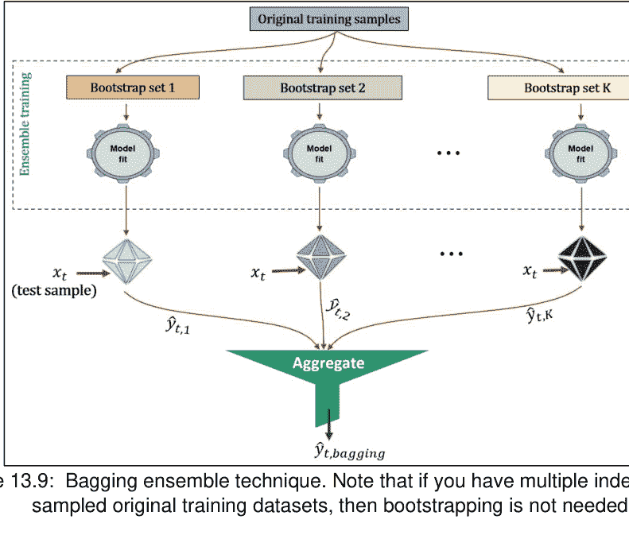

Bagging 的定义特征是它有助于降低方差而非偏差。可以证明，如果 $\bar{\rho}$ 是基础模型预测之间的平均相关性，那么 $y_{\text{ensemble}}$ 的方差等于 $\bar{\sigma}^2 \left( \bar{\rho} + \frac{1-\bar{\rho}}{K} \right)$，其中 $\bar{\sigma}^2$ 是单个基础模型预测的方差，$K$ 是基础模型的数量。因此，$\bar{\rho} = 1$ 意味着方差没有降低。

Bagging 可用于回归和分类。Sklearn 分别提供了 BaggingClassifier 和 BaggingRegressor。下面的简单示例展示了 bagging 如何帮助实现更平滑的结果（在此例中是分类边界）。

```python
# generate training samples
from sklearn import datasets
noisy_moons = datasets.make_moons(n_samples=200, noise=0.3, random_state=10)
X, y = noisy_moons

# fit bagging model (Sklearn uses decision trees as base models by default)
from sklearn.ensemble import BaggingClassifier
Bagging_model = BaggingClassifier(n_estimators=500, max_samples=50, random_state=100).fit(X, y) # K=500 and each DT is trained on 50 training samples randomly drawn with replacement
```

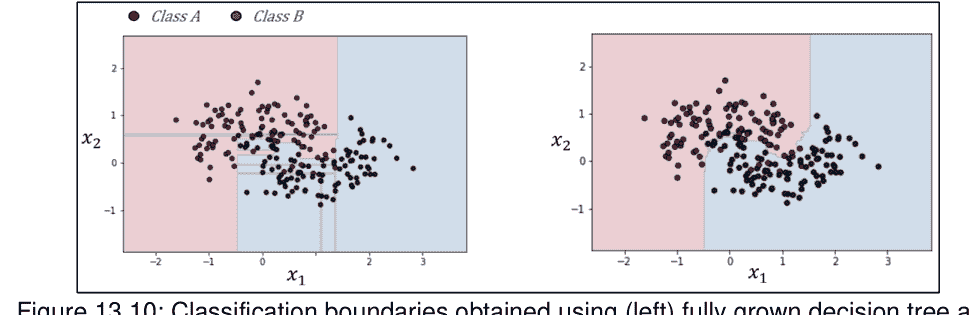

##### Boosting

在 boosting 集成技术中，基础模型同样使用相同的学习算法获得，但它们是顺序拟合的，而非相互独立。在训练过程中，每个基础模型都试图“纠正”前一步提升模型所犯的错误。在过程结束时，我们得到一个集成模型，其偏差$^{88}$低于基础模型。

$^{88}$ 方差可能降低也可能不降低。Boosting 有时会导致过拟合。

如果基础模型表现出欠拟合/高偏差，则优先选择 boosting。与 bagging 类似，boosting 不限于以决策树作为基础模型，但如果使用决策树，建议使用浅层树（深度较小的树），这些树不会表现出高方差。此外，浅层树或任何其他不太复杂的基础模型在 boosting 过程中顺序训练时计算上是易于处理的。Boosting 可用于回归和分类，主要有两种流行的 boosting 方法，即 Adaboost 和梯度提升。

###### Adaboost（自适应提升）

在 Adaboost 提升技术中，新的基础模型通过关注被错误预测的样本来纠正其前驱基础模型的错误。如图 13.11 所示，所有样本被赋予相等的权重 $\frac{1}{N}$，并训练第一个（弱）基础模型。错误预测样本的权重增加，正确预测样本的权重减少。训练第二个基础模型，循环继续，直到获得指定数量的基础模型。本质上，每个后续基础模型都更关注困难（难以预测）的训练样本。训练后，集成模型的预测取为基础模型预测的加权组合。分配给每个基础模型的模型权重取决于其在加权训练样本上达到的准确度（准确度越高 $\Rightarrow$ $\alpha$ 越高）。

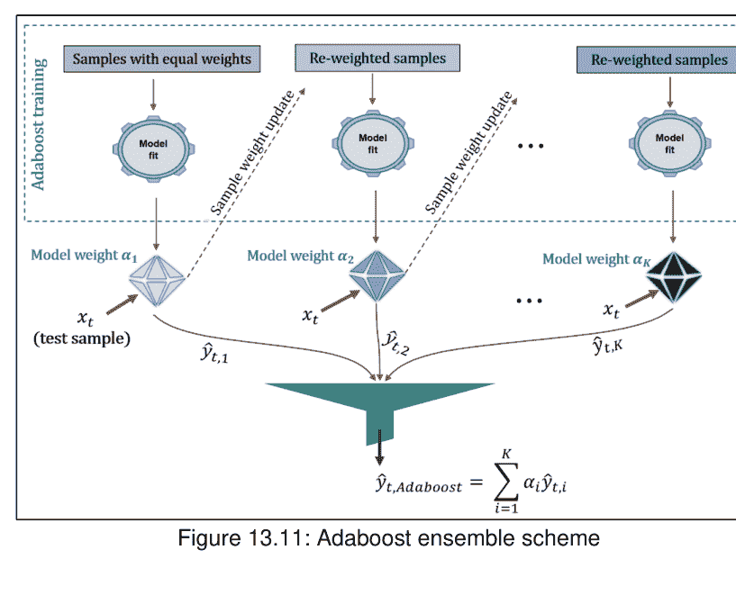

###### 梯度提升

梯度提升采用与 Adaboost 不同的方法，它通过使用前一个基础模型产生的残差误差顺序训练基础模型来纠正其前驱的错误。图 13.12 展示了该算法的方案。

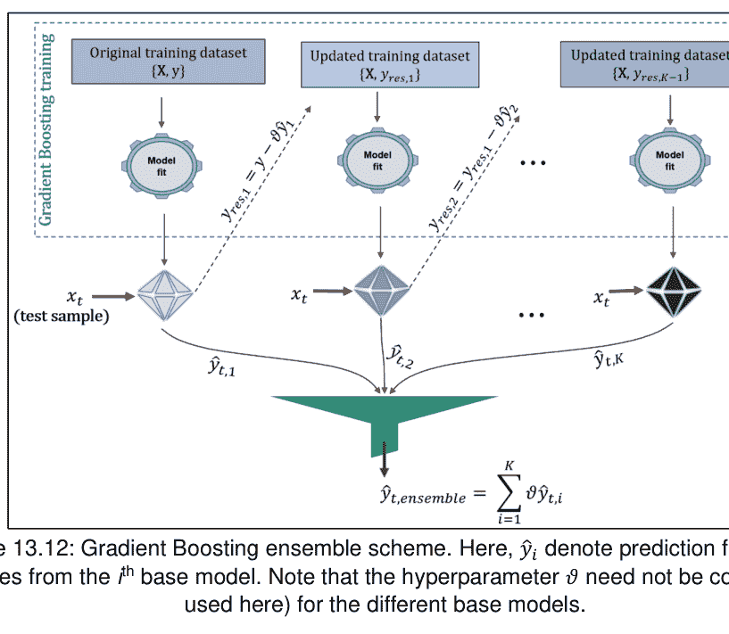

在上述方案中，超参数 $\vartheta \in (0,1]$ 称为收缩参数或学习率。它用于防止过拟合，建议赋予一个小值，如 0.1。非常小的学习率将需要使用大量的基础模型。迭代次数或基础模型数量 $K$ 是另一个需要仔细调整的重要超参数。$K$ 太小将无法实现足够的偏差降低，而 $K$ 太大则会导致过拟合。可以使用交叉验证或早停法（跟踪集成模型训练不同阶段/迭代的验证误差，并在误差停止下降或模型残差不再有可建模的模式时停止）进行优化。

Sklearn 分别提供了用于回归和分类目的的 GradientBoostingClassifier 和 GradientBoostingRegressor 类。虽然这些类使用决策树作为基础模型/弱学习器，但梯度提升方法不限于决策树。当使用决策树时，它被称为梯度树提升或梯度提升决策树（GBDTs）。

#### 13.5 使用 XGBoost 进行故障分类：燃气锅炉案例研究

如果你最近在机器学习领域很活跃，那么你一定听说过 XGBoost 这个术语。它代表 *eXtreme Gradient Boosting*，是一个流行的库，实现了多种技巧和启发式方法，使基于梯度提升的模型训练非常有效，尤其适用于大型数据集。XGBoost 使用决策树作为基础模型。让我们将 XGBoost 应用于燃气锅炉故障分类问题，看看我们是否能超越随机森林模型的性能。

```python
# fit xgboost model
import xgboost as xgb
clf = xgb.XGBClassifier(use_label_encoder=False)
clf.fit(X_train_scaled, y_train)
y_train_pred = clf.predict(X_train_scaled)
y_test_pred = clf.predict(X_test_scaled)
```

```python
# generate and plot confusion matrix
from sklearn.metrics import confusion_matrix
import seaborn as sn
conf_mat = confusion_matrix(y_test, y_test_pred)

plt.figure(figsize=(12,8)), sn.set(font_scale=2)
sn.heatmap(conf_mat, fmt='.0f', annot=True, cmap='Blues', xticklabels=le.classes_,
           yticklabels=le.classes_)

plt.ylabel('True Fault Class', fontsize=30, color='maroon')
plt.xlabel('Predicted Fault Class', fontsize=30, color='green')
```

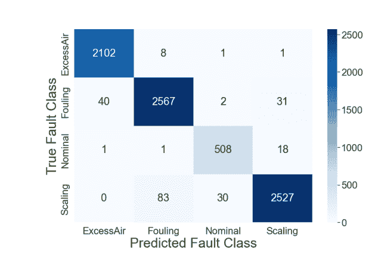

快速浏览混淆矩阵表明其性能与随机森林模型相似。也许，系统的超参数优化可能会提供更好的性能。我们的目标是展示使用 XGBoost 的默认设置可以轻松构建相当好的分类器模型。

本章是对集成学习的快速概览，集成学习是现代机器学习的重要支柱。本章介绍的每个主题都有更多我们无法在此涵盖的高级方面。然而，你现在已具备必要的基础知识和熟悉度，可以探索这些高级方面。

##### 总结

在本章中，我们学习了决策树建模方法。我们看到了随机森林如何帮助克服树的高方差问题。然后，我们研究了集成学习的更广泛概念，它可以用于克服弱模型的高偏差和/或高方差问题。概念性地介绍了两种流行的集成方法，即 bagging 和 boosting。最后，我们使用燃气锅炉数据集说明了使用随机森林和 XGBoost（梯度提升树的一种流行实现）可以轻松构建故障分类模型。本章为你的机器学习工具库增添了几种强大的技术，你会发现你会经常使用它们。

## 第14章

### 基于邻近性的故障检测技术

迄今为止，我们研究的大多数异常检测技术都是通过在训练数据集中寻找某种结构来工作的，例如PCA中的低维流形、SVDD中的NOC边界、SVM中的最优分离超平面等。然而，另一类流行的方法则利用了一个非常直接和自然的异常概念，即远离或孤立于NOC数据样本的数据点；从逻辑上讲，这些方法被归类为基于邻近性的方法。

数据点的邻近性可以简单地定义为其与邻居的距离（如在*k*-NN方法中所做的那样）。异常数据点远离其他NOC数据，因此，与NOC样本相比，其最近邻的距离会很大。另一个相关但略有不同的邻近性概念是测试样本局部区域内其他数据点的密度或数量。局部离群因子（LOF）是此类别中的一种流行方法，其中不位于密集区域的样本被分类为异常。我们将要研究的第三种技术——孤立森林（IF），使用了类似的异常“稀疏且分散”的概念。在这里，数据空间被不断分割，直到每个数据点被“孤立”出来。异常很容易被孤立出来，与彼此靠近的NOC样本相比，所需的分割次数非常少。

你可能已经意识到，这些技术能产生可解释的结果，并且易于理解。相应地，它们在分析特性可能事先不完全已知的复杂系统时非常方便。现在，让我们开始正题。我们将涵盖以下主题：

- k-NN技术简介
- LOF技术简介
- 孤立森林技术简介
- k-NN、LOF和IF在半导体制造过程故障检测中的应用

#### 14.1 KNN：简介

k近邻（k-NN或KNN）算法是一种通用的技术，基于一个简单直观的思想：新样本的标签/值可以从训练数据集中最近邻样本（在特征空间中）的标签/值获得。参数$k$表示算法使用的邻居样本数量。如图14.1所示，k-NN可用于分类和回归。对于分类，k-NN将测试样本分配给在$k$个邻居中出现次数最多的类别。对于回归，预测输出是$k$个邻居值的平均值。由于其简单性，k-NN被广泛用于模式分类，并被列入数据挖掘十大算法列表。$^{89}$

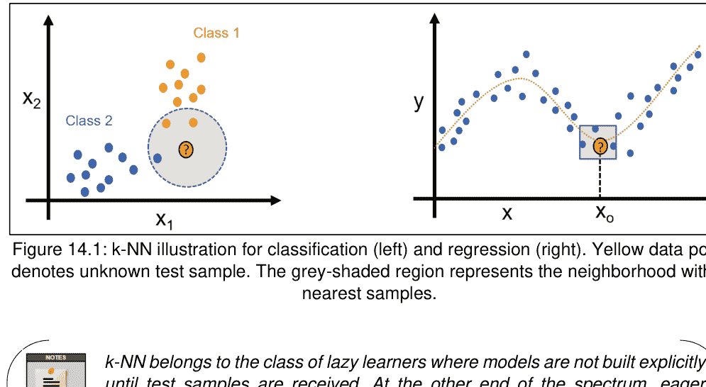

> k-NN属于懒惰学习器的一类，模型在接收到测试样本之前不会显式构建。在光谱的另一端，急切学习器（如SVM、决策树、ANN）从训练样本中“学习”显式模型。毫不奇怪，急切学习器的训练较慢，但测试较快。KNN需要计算测试样本与所有训练样本的距离，因此，k-NN也属于基于实例的学习。基于实例的学习器通过将测试样本与存储在内存中的训练实例进行比较来进行预测。另一方面，基于模型的学习器不需要存储训练实例来进行预测。

##### 概念背景

除了整数$k$和输入-输出训练对之外，k-NN算法还需要一个距离度量来量化测试样本与训练样本的接近程度。标准的欧几里得度量是常用的。一旦确定了最近邻，可以采用两种方法，即均匀加权和基于距离的加权，来决定分配给每个邻居的权重，这会影响邻居在预测中的贡献。在均匀加权中，所有$k$个邻居被平等对待，而在基于距离的加权中，每个$k$邻居的权重是其与测试样本距离的倒数，因此更近的邻居将有更大的贡献。下图说明了两种加权方案在分类问题上的差异。

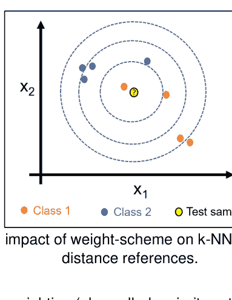

图14.2：加权方案对k-NN输出影响的示意图。虚线圆圈用于距离参考。

在图14.2中，使用均匀加权（对于分类问题也称为多数投票），当$k = 1$或3时，测试样本被分配到类别1，当$k = 6$时被分配到类别2。当$k = 8$时，无法做出决策。使用距离加权时，对于k = 1、3、6或8，测试样本始终被分类为类别1。这个例子表明，距离加权有助于减少预测对$k$选择的依赖性。

对于预测，k-NN需要计算测试样本与所有训练样本的距离。对于大型训练集，这种计算可能变得昂贵。然而，已经开发了专门的技术，如KDTree和BallTree，以在不影响预测准确性的情况下加速邻近点的提取。这些技术利用数据中的结构来避免计算与所有训练样本的距离。scikit-learn中的NearestNeighbors实现会自动选择最适合当前问题的算法。Scikit-learn提供了KNeighborsRegressor和KNeighborsClassifier模块，分别用于回归和分类。

在k-NN中需要特别注意的几点包括变量选择和变量缩放。对于输出预测不重要的变量应该被移除；否则，不重要的变量会不利地影响最近邻的确定。此外，所选变量应适当缩放，以确保在距离计算过程中，具有较大数值的变量不会掩盖其他变量的贡献。

##### 决定k-NN超参数

超参数$k$的选择至关重要，是平衡欠拟合和过拟合的调节旋钮。较小的$k$可能导致过拟合，其中噪声测量会不利地影响预测。较大的$k$可以减少噪声的影响，但可能导致欠拟合，因为它过度平滑了回归的预测或使分类边界变得不那么清晰。不幸的是，关于$k$的选择没有标准的指导。最优值取决于数据，可以通过交叉验证来估计。

##### k-NN在过程系统中的应用

如前所述，k-NN方法常用于设备状态监测$^{90}$。对于过程级监测，如果有足够的历史故障样本，k-NN分类可用于将过程异常分类为不同的故障类别。与k-NN故障分类不同，He & Wang提出了一种有趣的k-NN故障检测适应方法，该方法仅使用正常操作数据$^{91}$。我们将在下一节更详细地研究这个应用。

k-NN在过程系统中的其他一些值得注意的应用包括Facco等人关于软传感器自动维护的工作$^{92}$，Borghesan等人关于过程扰动预测的工作$^{93}$，Cecilio等人关于检测瞬态过程扰动的工作$^{94}$，以及Zhou等人关于工业过程故障识别的工作$^{95}$。这些应用可能没有直接使用k-NN方法进行分类或回归，但使用了最近邻相似性的基本概念。

$^{90}$ Dong Wang, K-nearest neighbors-based methods for identification of different gear crack levels under different motor speeds and loads: Revisited, Mechanical Systems and Signal Processing, 2016
$^{91}$ He and Wang, Fault detection using k-nearest neighbor rule for semiconductor manufacturing processes, IEEE Transactions on Semiconductor Manufacturing, 2007.
$^{92}$ Facco et al., Nearest-neighbor method for the automatic maintenance of multivariate statistical soft sensors in batch processing, Industrial Engineering & Chemistry Research, 2010.
$^{93}$ Borghesan et al., Forecasting of process disturbances using k-nearest neighbors, with an application in process control, Computers and Chemical Engineering, 2019.
$^{94}$ Cecilio et al., Nearest neighbors methods for detecting transient disturbances in process and electromechanical systems, Journal of Process Control, 2014.
$^{95}$ Zhou et al., Fault identification using fast k-nearest neighbor reconstruction, Processes, 2019

##### k-NN在故障检测中的应用

基于k-NN<sup>28</sup>的故障检测（FD-KNN）基于一个简单的思想：故障测试样本与最近训练样本（从正常运行工况中获得）的距离，必须大于正常样本与其邻近训练样本的距离。将这一思想融入过程监控框架，为每个训练样本定义一个监控指标（称为k-NN平方距离），如下所示

$$D_i^2 = \sum_{j=1}^k d_{ij}^2$$

其中 $d_{ij}^2$ 是第 $i^{\text{th}}$ 个样本与其第 $j^{\text{th}}$ 个最近邻之间的距离。计算出所有训练样本的k-NN平方距离后，可以计算出对应于所需置信限的阈值。如果一个测试样本的k-NN平方距离大于该阈值，则被视为故障。

FD-KNN的一个优点是它适用于具有复杂特性的过程系统，例如多模态、非高斯性和非线性。为了说明FD-KNN的完整应用，我们将使用之前在第11章中用于基于GMM的过程监控的金属蚀刻数据集。如果你还记得，批次数据在缩放和PCA应用之前进行了展开。我们将在这里使用Sklearn的Pipeline功能<sup>96</sup>进行相同的预处理转换。遵循He & Wang的工作，$k$ 被设置为5。

```python
# scale data & fit PCA model via pipeline
from sklearn.pipeline import Pipeline

pipe = Pipeline([('scaler', StandardScaler()), ('pca', PCA(n_components = 3))])
score_train = pipe.fit_transform(unfolded_dataMatrix)

# k-nearest neighbors of each training sample in score space
from sklearn.neighbors import NearestNeighbors

nbrs = NearestNeighbors(n_neighbors=6).fit(score_train) # a data-point is its own neighbor
d2_nbrs, indices = nbrs.kneighbors(score_train)
d2_sqrd_nbrs = d2_nbrs**2
D2 = np.sum(d2_sqrd_nbrs, axis = 1)
D2_log = np.log(D2) # logarithm used just for scaling purposes
```

```python
D2_log_CL = np.percentile(D2_log,95)
```

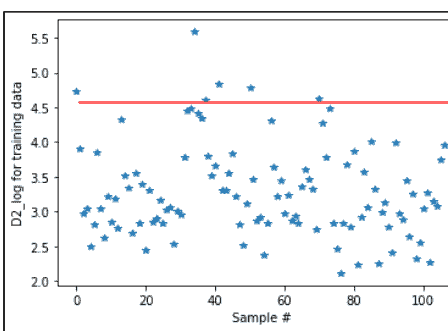

图14.3显示了训练样本的监控图。图14.4显示了故障测试样本的监控图。20个样本中有15个被正确标记为故障，而5个样本被误诊为正常。

```python
# scale and PCA on faulty test data
score_test = pipe.transform(unfolded_TestdataMatrix)

# D2_log_test
d2_nbrs_test, indices = nbrs.kneighbors(score_test)
d2_nbrs_test = d2_nbrs_test[:,0:5] # we want only 5 nearest neighbors
d2_sqrd_nbrs_test = d2_nbrs_test**2
D2_test = np.sum(d2_sqrd_nbrs_test, axis = 1)
D2_log_test = np.log(D2_test)
```

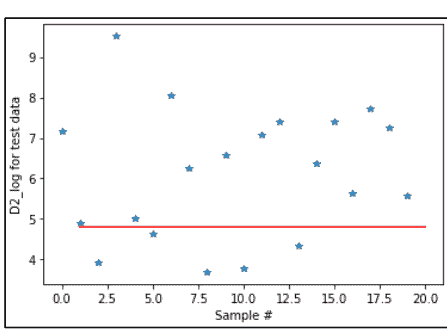

#### 14.2 LOF：简介

k-NN的简单性和强大功能使其跻身顶级数据挖掘算法之列。然而，遇到基于k-NN的异常检测性能不佳的情况并不少见。其中一种情况涉及NOC训练样本分布在具有不同密度的不同簇中，如图14.5所示。图中还显示了一些测试样本。基于k-NN的FD将正确识别 $X2$、$X3$ 和 $X4$ 为异常，但将无法检测到 $X1$ 为异常样本。这将发生是因为簇 $A$ 中的NOC样本分布稀疏，这将使故障检测的阈值足够大，以至于 $X1$ 的平均k-NN距离将低于该阈值。在我们肉眼看来，$X1$ 是一个明显的离群点，因为它位于其密集分布的“局部”邻居“远处”。但是我们如何修改k-NN算法来嵌入这种逻辑呢？嗯，可以做的一件事是将测试样本的局部密度与其邻居的局部密度进行比较。如果测试样本的密度明显低于其邻居，则它可能是异常的。这就是局部离群因子（LOF）算法背后的指导原则。

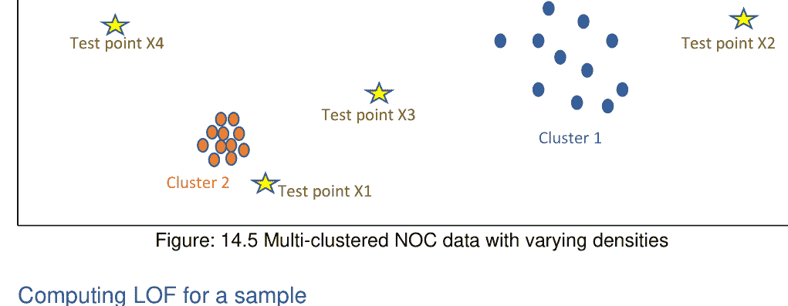

##### 计算样本的LOF

设 $x_t \in \mathbb{R}^m$ 为一个样本。要找到它的LOF，我们需要找到 $x_t$ 位置的局部密度。或者，我们需要找到从 $x_t$ 的邻居到达 $x_t$ 的难易程度。让我们逐一查看所有涉及的步骤。

-   $x_t$ 的 $k$-距离

    对于指定的超参数 $k$，$x_t$ 的 $k$-距离就是 $x_t$ 与其第 $k^{th}$ 个最近邻之间的距离，即，
    $$\text{k-distance}(x_t) = d_k(x_t, x^*) = \sqrt{\sum_{i=1}^{m} (x_{ti} - x_i^*)^2}$$
    $x^*$ 是第 $k^{th}$ 个最近邻

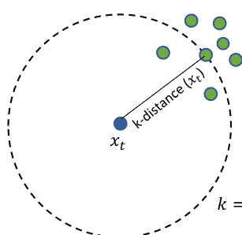

-   $x_t$ 的 $k$-距离邻域

    $x_t$ 的 $k$-距离邻域，记为 $N_k(x_t)$，是距离 $x_t$ 不大于 $x_t$ 的 $k$-距离的点集。它通常包含 $k$ 个数据点（$k$-最近邻），但在存在平局的情况下可能多于 $k$ 个。

-   $x_t$ 从其邻居的可达距离

    设 $x^o$ 属于 $N_k(x_t)$。$x_t$ 从 $x^o$ 的可达距离定义如下
    $$\text{reach-dist}(x_t, x^o) = \max\{\text{k-distance}(x^o), d_k(x_t, x^*)\}$$
    如果 $x_t$ 相对于 $x^o$ 的邻居来说远离 $x^o$，那么 $x_t$ 从 $x^o$ 的可达距离就是实际距离，否则 reach-dist($x_t, x^o$) 等于 k-distance($x^o$)

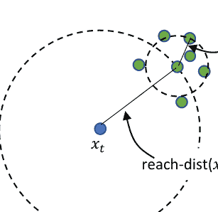

-   $x_t$ 的局部可达密度

    $x_t$ 的局部（可达）密度就是 $x_t$ 从其邻居的平均可达距离的倒数。

    $$lrd_k(x_t) = 1 / \left( \frac{\sum_{x^o \in N_k(x_t)} reach\text{-}dist(x_t, x^o)}{|N_k(x_t)|} \right)$$
    $N_k(x_t)$ 中的点数

-   **$x_t$ 的LOF**

    将 $x_t$ 的局部可达密度与其邻居的局部可达密度进行比较以计算LOF。具体来说，局部离群因子是邻居的局部可达密度与 $x_t$ 的局部可达密度之比的平均值。

    $$LOF_k(x_t) = \frac{\sum_{x^o \in N_k(x_t)} lrd_k(x^o)}{|N_k(x_t)| \cdot lrd_k(x_t)}$$

    $LOF \sim 1 \Rightarrow x_t$ 的密度与邻居的密度相似。

    $LOF < 1 \Rightarrow x_t$ 的密度高于邻居的密度。

    $LOF > 1 \Rightarrow x_t$ 的密度低于邻居的密度，可能是离群点。

    LOF的阈值在训练期间基于“污染参数”计算，该参数指定了训练数据中异常的比例（或者如果训练数据集仅包含NOC样本，则指可接受的误报率）。

    超参数 $k$ 影响异常检测的性能，其最佳值取决于应用。较小的 $k$ 值将导致局部密度确定不准确，而较大的 $k$ 值将削弱NOC样本和异常之间的差异。通常20到30之间的值效果良好。

##### LOF在故障检测中的应用

下面我们展示如何使用LOF模型生成监控图。

```python
# LOF of each training sample
from sklearn.neighbors import LocalOutlierFactor
lof_model = LocalOutlierFactor(n_neighbors=5, novelty=True, contamination=0.05)
lof_model.fit(score_train)
```

```python
lof_train = -lof_model.negative_outlier_factor_ # negative_outlier_factor_ gives the opposite LOF of the training samples
lof_CL = -lof_model.offset_
```

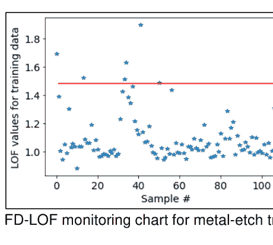

图14.6显示了训练样本的监控图。请注意，指定5%的污染导致5个训练样本被标记为异常。图14.7显示了故障测试样本的监控图。20个样本中有16个被正确标记为故障。

```python
# scale and perform PCA on faulty test data; then find LOF values
score_test = pipe.transform(unfolded_TestdataMatrix)
Lof_test = -lof_model.score_samples(score_test)

print('Number of flagged faults (using control chart): ', np.sum(lof_test > lof_CL))
# can also use predict() function of LOF class to flag faulty samples
print('Number of flagged faults (using predict): ', np.sum(lof_model.predict(score_test) == -1))
```

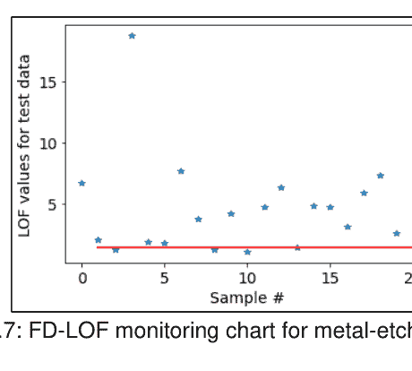

#### 14.3 孤立森林简介

孤立森林（IF）是一种由二元决策树组成的集成模型，也称为孤立树。IF是随机森林的无监督变体，广泛应用于异常点检测和新颖性/异常性检测。模型训练涉及构建多棵孤立树，每棵树的生成方式都确保每个训练样本最终落入其独立的叶子节点（即被“隔离”）。图14.8提供了一个简单的“示意图”。图中展示了一个包含四个NOC数据点的簇和两棵示例孤立树。显然，每棵树通过若干二元决策规则对测量空间进行划分，以“隔离”每个训练样本。模型训练完成后，测试样本会通过所有训练好的树，其异常性根据样本在各树中达到的平均深度来判断。通常，异常点倾向于靠近根节点，因此与深入树中的NOC点相比，其路径长度更短。这就是孤立森林的指导原则。

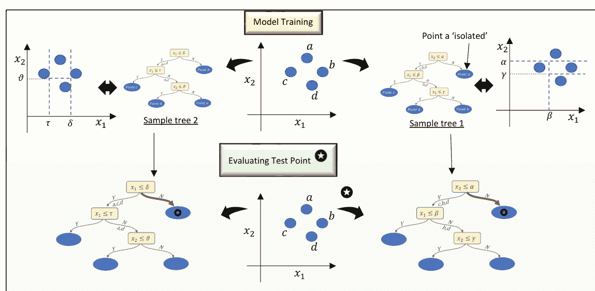

在第13章中，我们了解到随机森林通过多样化其组成的决策树来获得强大的预测能力。在IF中，多样化是通过为每棵树使用随机子集的训练样本（无放回抽样）来实现的。此外，在树的每个节点，会随机选择一个特征/变量和分割值<sup>97</sup>来形成决策规则。

<sup>97</sup> 分割值在所选变量的最大值和最小值之间选择。

##### 孤立森林在故障检测中的应用

下面我们展示如何使用IF模型生成监控图。

```python
# IF score of each training sample
from sklearn.ensemble import IsolationForest
IF_model = IsolationForest(contamination=0.05)
IF_model.fit(score_train)

IFscore_train = -IF_model.score_samples(score_train) # score_samples returns the anomaly
# score of the input samples; the lower, the more abnormal.
IF_CL = np.percentile(IFscore_train, 95)
```

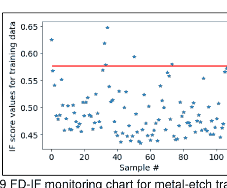

图14.9显示了训练样本的监控图。注意，训练分数的第95百分位数被用作控制限，导致6个训练样本被标记为异常。图14.10显示了故障测试样本的监控图。20个样本中只有7个被正确标记为故障，这表明IF模型不适合此数据集。

```python
# scale and perform PCA on faulty test data; then find IF score values
score_test = pipe.transform(unfolded_TestdataMatrix)
IFscore_test = -IF_model.score_samples(score_test)

print('Number of flagged faults (using control chart): ', np.sum(IFscore_test > IF_CL))
# can also use predict() function of IF class to flag faulty samples
print('Number of flagged faults (using predict): ', np.sum(IF_model.predict(score_test) == -1))
```

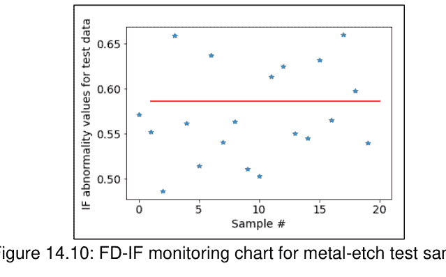

图14.10：金属刻蚀测试样本的FD-IF监控图

##### 扩展孤立森林

考虑以下具有正弦分布*的NOC样本及其相应的分数图。分数图*表明IF算法性能不佳。该分数图会让人误以为NOC数据存在于一个矩形块中，而非正弦模式。

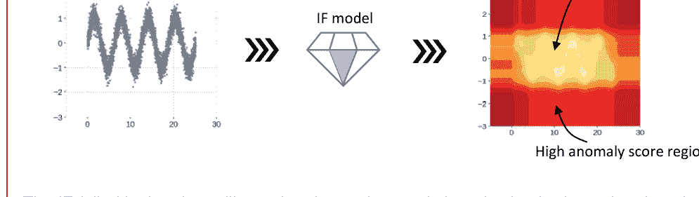

上述示例中IF失败的原因在于其仅限于使用水平和垂直分割。Hariri等人提出了一种替代算法，称为扩展孤立森林（https://github.com/sahandha/eif），该算法使用随机斜率进行分割，从而实现了更好的性能（尽管计算成本更高）。

*图表由Hariri等人根据知识共享署名4.0许可协议（creativecommons.org/licenses/by/4.0）提供（ieeexplore.ieee.org/document/8888179）

##### 总结

在本章中，我们研究了基于不同邻近性概念的异常检测方法。具体来说，我们涵盖了*k*-NN、局部离群因子和孤立森林。尽管孤立森林在技术上不属于基于邻近性的技术类别，但由于其将异常视为“遥远且分散”的样本，我们在本章中将其与其他基于邻近性的方法归为一类。至此，我们已经涵盖了广泛应用于过程系统故障检测的主要经典机器学习技术。接下来，我们将转向基于人工神经网络的过程监控技术。

## 第五部分

### 用于过程监控的人工神经网络

## 第15章

### 通过监督人工神经网络建模进行故障检测与诊断

毫不夸张地说，人工神经网络（ANN）是目前描述通用非线性过程最强大的建模工具。ANN可以捕捉任何类型的复杂非线性关系，不施加任何特定的过程特征，并且在模型拟合前不需要指定过程洞察。此外，最近的一些技术突破和计算进步使得（深度）ANN能够为广泛的问题提供显著的结果。相应地，ANN重新（引起）了数据科学家的兴趣，过程行业见证了基于机器学习的过程控制、预测性维护、推断建模和过程监控的成功应用激增。

ANN可以用于监督学习和无监督学习环境。虽然我们将在本章介绍基于监督学习的ANN故障检测与诊断应用，但无监督学习将在下一章介绍。如果你有足够数量的历史故障样本（以便拟合故障分类模型），或者你的信号可以分为预测变量和响应变量（以便拟合回归模型并监控残差），那么ANN模型的监督拟合是适用的。已经设计了不同形式的ANN架构（如FFNN、RNN、CNN）来处理具有不同特征的数据集。CNN主要用于图像数据，因此我们将在本章研究FFNN和RNN。

毫无疑问，ANN已被证明是极其强大的。然而，驯服这个“怪物”并不容易。如果模型超参数设置不当，很容易得到令人失望的结果。读者可以参考本系列丛书第1册的第3部分，了解ANN训练策略和ANN模型不同方面的详细阐述。本章的重点是向用户展示如何使用ANN构建过程监控应用。具体涵盖以下主题：

- ANN简介
- RNN简介
- 通过外部分析使用ANN进行过程监控

#### 15.1 ANN简介

人工神经网络（ANN）是非线性经验模型，可以通过监督学习捕捉输入-输出变量之间的复杂关系，或通过无监督学习识别数据模式。在结构上，ANN受到人脑的启发，是一个由相互连接的神经元组成的复杂网络，如图15.1所示。ANN由一个输入层、一系列隐藏层和一个输出层组成。网络的基本单元——神经元，接受来自源输入层或网络前一层的输入向量，对输入进行加权求和，然后执行非线性变换以产生单个实数值输出。每个隐藏层可以包含任意数量的神经元。

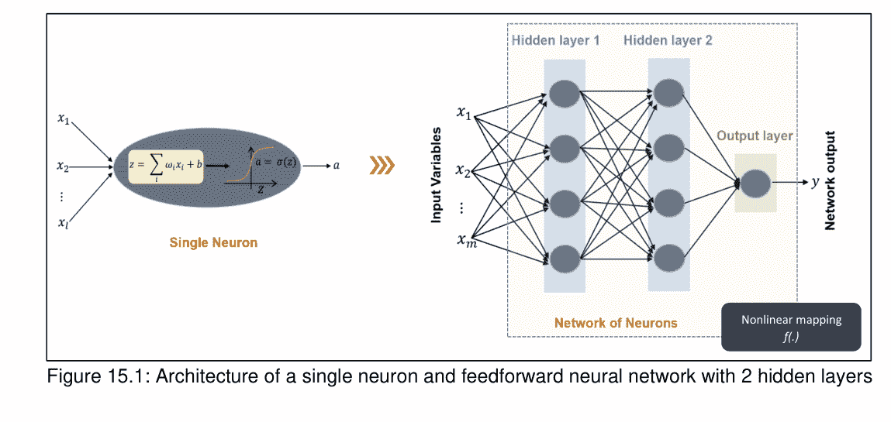

图15.1所示的网络是全连接前馈神经网络（FFNN）的一个例子，这是最常见的ANN类型。在FFNN中，信号仅沿一个方向流动，从输入层通过隐藏层流向输出层。连续层之间的神经元完全成对连接，而同一层内的神经元不连接。

> **什么是深度学习**

简而言之，使用具有大量隐藏层的ANN来发现数据中的关系/模式就是深度学习（技术上，≥ 2个隐藏层意味着深度神经网络（DNN））。最近的一些算法创新克服了DNN的模型训练问题，从而导致了我们今天所见证的DNN引领的AI革命。

#### 15.2 通过FFNN进行过程建模：联合循环发电厂（CCPP）案例研究

我们将使用来自CCPP的数据来说明在Python中构建神经网络模型的便捷性。该数据集⁹⁸来自一个由燃气轮机（GT）、蒸汽轮机（ST）和余热蒸汽发生器组成的联合循环发电厂，如图15.2所示。在此，燃料燃烧产生的能量在燃气轮机中发电，而GT排出的热废气/烟气中的剩余能量被回收以产生蒸汽。该蒸汽用于在蒸汽轮机中进一步发电。数据集提供了GT和ST在6年期间（按小时平均）产生的总电功率。同时还提供了环境温度（AT）、环境压力（AP）、相对湿度（RH）和排气真空度（V）的小时平均值。这些变量会影响工厂在满负荷运行时的净小时电能输出（也包含在数据集中），并将成为我们ANN模型中的目标变量。

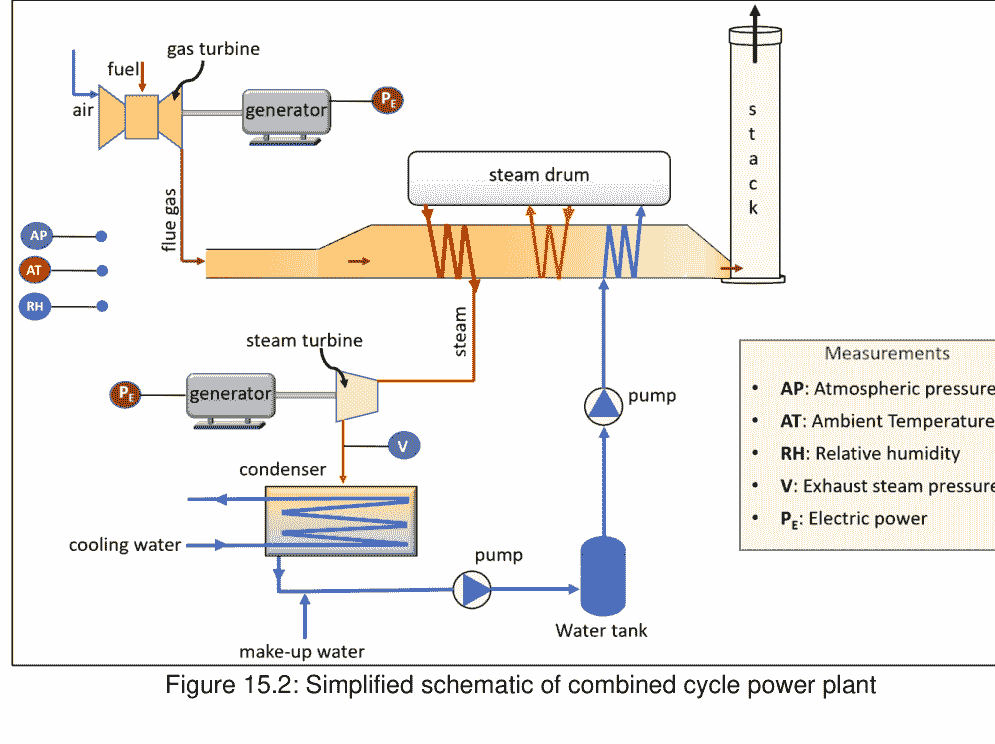

让我们首先探索该数据集。

```python
# import required packages and read data
import numpy as np, pandas as pd
import matplotlib.pyplot as plt

data = pd.read_excel('Folds5x2_pp.xlsx', usecols = 'A:E').values
X, y = data[:,0:4], data[:,4][:,np.newaxis]

# plot input vs output for each input
plt.figure(), plt.plot(X[:,0], y, '*'), plt.title('AT vs EP')
plt.figure(), plt.plot(X[:,1], y, '*'), plt.title('V vs EP')
plt.figure(), plt.plot(X[:,2], y, '*'), plt.title('AP vs EP')
plt.figure(), plt.plot(X[:,3], y, '*'), plt.title('RH vs EP')
```

图15.3清楚地表明了输入变量对电功率（EP）的影响。

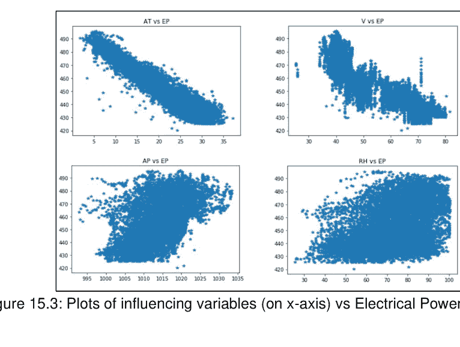

排气真空度与功率之间也存在非线性关系的迹象。虽然AP和RH似乎对功率影响不大，但已知的事实是，功率会随着AP和RH的单独增加而增加<sup>99</sup>。现在让我们构建一个具有2个隐藏层的FFNN模型来预测功率。我们首先将数据集分为训练数据和测试数据，然后对变量进行缩放。

> <sup>99</sup> Pinar Tufekci, 使用机器学习方法预测基荷运行联合循环发电厂的满负荷电功率输出, Electrical Power and Energy Systems, 2014

```python
# separate train and test data
from sklearn.model_selection import train_test_split
X_train, X_test, y_train, y_test = train_test_split(X, y, test_size = 0.2, random_state = 100)

# scale data
from sklearn.preprocessing import StandardScaler
X_scaler = StandardScaler()
X_train_scaled = X_scaler.fit_transform(X_train)
X_test_scaled = X_scaler.transform(X_test)

y_scaler = StandardScaler()
y_train_scaled = y_scaler.fit_transform(y_train)
y_test_scaled = y_scaler.transform(y_test)
```

为了构建FFNN模型，我们将导入相关的Keras库并按顺序添加网络的不同层。Dense库用于定义一个与前一层全连接的层。

```python
# import Keras libraries
from tensorflow.keras import Sequential
from tensorflow.keras.layers import Dense

# define model
model = Sequential()
model.add(Dense(8, activation='relu', kernel_initializer='he_normal', input_shape=(4,)))
# 8 neurons in 1st hidden layer
model.add(Dense(5, activation='relu', kernel_initializer='he_normal'))
# 5 neurons in 2nd layer
model.add(Dense(1))
# 1 neuron in output layer
```

以上4行代码完全定义了FFNN的结构。接下来，我们将编译并拟合模型。

```python
# compile model
model.compile(loss='mse', optimizer='Adam') # mean-squared error is to be minimized

# fit model
model.fit(X_train_scaled, y_train_scaled, epochs=25, batch_size=50)

# predict y_test
y_test_scaled_pred = model.predict(X_test_scaled)
y_test_pred = y_scaler.inverse_transform(y_test_scaled_pred)
```

以上几行代码就是构建FFNN并进行预测所需的全部内容。非常方便，不是吗？图15.4比较了测试数据的实际功率与预测功率。

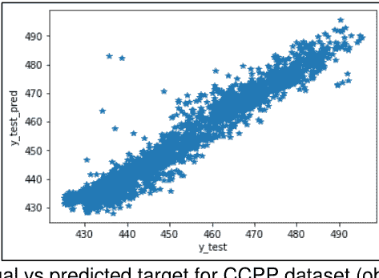

图15.4：CCPP数据集的实际目标值与预测目标值对比（获得的R² = 0.93）

对于相对简单的CCPP数据集，我们仅用一个具有2个神经元的隐藏层就能获得一个合理的模型。尽管如此，这个例子已经让我们熟悉了创建DNN的过程。

##### 理解FFNN中的数据流

如果你对上一节开发的模型执行命令`model.summary()`，你将看到以下信息，其中详细说明了网络每一层需要估计的参数数量。让我们理解这些数字是如何获得的，这将有助于阐明FFNN中的信息流。

| 层（类型） | 输出形状 | 参数数量 |
| :--- | :--- | :--- |
| dense (Dense) | (None, 8) | 40 |
| dense_1 (Dense) | (None, 5) | 45 |
| dense_2 (Dense) | (None, 1) | 6 |
| 总参数：91 | | |
| 可训练参数：91 | | |
| 不可训练参数：0 | | |

我们知道每个输入样本是4维的（$x \in R^4$）。在前向传播（也称为前向传播）中，增强的输入首先由第一隐藏层的神经元处理。在该层的第$j^{th}$个神经元中，输入的加权和通过激活函数$g$进行非线性变换，

$$a_j = g(w_j^T x + b_j)$$

$w_j \in R^4$是应用于输入的权重，$b_j$是添加到和中的偏置。因此，每个神经元有5个参数（4个权重和1个偏置），导致第一层所有8个神经元需要估计40个参数。所有8个神经元的输出形成向量$a^{(1)} \in R^8$

$$a^{(1)} = g^{(1)}(W^{(1)}x + b^{(1)})$$

其中$W^{(1)} \in R^{8 \times 4}$的每一行包含一个神经元的权重。同一层的所有神经元使用相同的激活函数。$a^{(1)}$成为第二隐藏层的输入。

$$a^{(2)} \in R^5 = g^{(2)}(W^{(2)}a^{(1)} + b^{(2)})$$

其中$W^{(2)} \in R^{5 \times 8}$。第二层中的每个神经元有8个权重和一个偏置参数，导致该层有45个参数。最终的输出层有一个神经元，有6个参数且没有激活函数，给出网络输出如下

$$a^{(3)} = \hat{y} = (w^{(3)})^T a^{(2)} + b^{(3)}$$

其中$w^{(3)} \in R^5$。

#### 15.3 RNN：简介

循环神经网络（RNN）是用于处理序列数据的ANN，其中数据的出现顺序具有重要意义。在我们上一节研究的基于FFNN的NARX模型中，没有提供隐式或显式指定数据时间/序列性质的机制，例如，$x(k-2)$在$x(k-1)$之前。在FFNN中没有有效的机制来指定这种数据的时间顺序。RNN通过循环处理序列元素并在处理过程中存储一个总结过去信息的隐藏状态来实现这一点。RNN中的基本单元称为RNN单元，它简单地包含一层神经元。图15.5显示了由单个单元组成的RNN架构，以及它如何处理包含十个样本的数据序列。

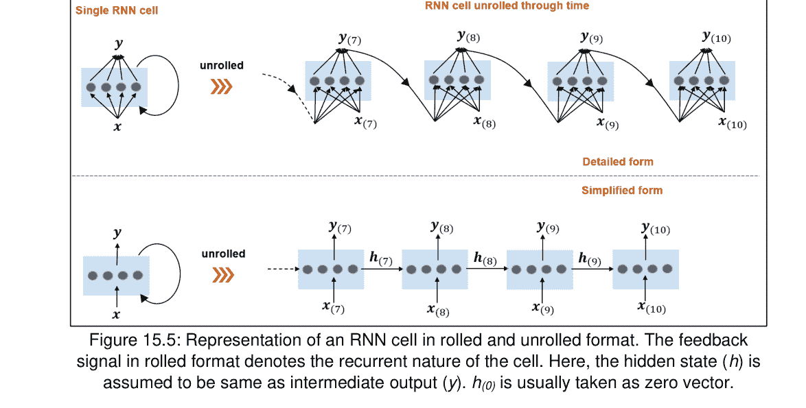

我们可以看到，十个样本是按照它们出现的顺序处理的，而不是一次性处理。在第$i^{th}$步生成一个输出$y_{(i)}$，然后与$x_{(i+1)}$一起馈送到下一步进行处理。通过这种安排，$y_{(i+1)}$是$x_{(i+1)}$和$y_{(i)}$的函数。由于$y_{(i)}$本身是$x_{(i)}$和$y_{(i-1)}$的函数，$y_{(i+1)}$实际上成为$x_{(i+1)}$、$x_{(i)}$和$y_{(i-1)}$的函数。进一步推导逻辑意味着最终的序列输出$y_{(10)}$是序列所有十个输入的函数，即$x_{(10)}$、$x_{(9)}$、...、$x_{(1)}$。这种“循环”机制能够有效地捕捉数据中的时间模式。

##### RNN 输出

如果图15.5中RNN单元的神经层包含$n$个神经元（图中$n$等于4），那么每个$y_{(i)}$或$h_{(i)}$都是一个$n$维向量。对于简单的RNN单元，$y_{(i)}$等于$h_{(i)}$。设$x$为一个$m$维向量。在任意第$i$步，我们可以写出以下关系式

$$y_{(i)} = g(W_x x_{(i)} + W_y y_{(i-1)} + b)$$

其中$W_x \in R^{n \times m}$，其每一行包含一个神经元应用于$x$向量的权重参数；$W_y \in R^{n \times n}$，其每一行包含一个神经元应用于$y$向量的权重参数；$b \in R^n$包含偏置参数；$g$表示激活函数。相同的神经参数在每一步都被使用。

如果序列的所有输出都是关注的，那么它被称为序列到序列或到多到多网络。然而，很多时候只需要最后一步的输出，从而形成序列到向量或多对一网络。此外，最后一步的输出可能需要进一步处理，因此通常会添加一个全连接层。图15.6展示了这样一种拓扑结构。

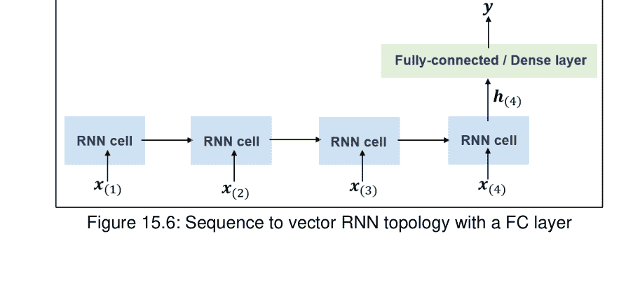

##### LSTM 网络

RNN是强大的动态模型，然而，之前介绍的原始RNN（单元中只有一个神经层）在学习长期依赖关系时面临困难，即当序列中的步数很大（~ $\geq$ 10）时。这是由于梯度反向传播过程中的梯度消失问题造成的。为了克服这个问题，人们设计了LSTM（长短期记忆）单元，它们能够轻松学习非常长期的依赖关系（甚至超过1000步）。与原始RNN单元不同，LSTM单元有4个独立的神经层，如图15.7所示。此外，在LSTM单元中，内部状态存储在两个独立的向量中：$h_{(t)}$（隐藏状态）和$c_{(t)}$（单元状态）。在序列处理过程中，这两个状态都会从一个LSTM单元传递到下一个。$h_{(t)}$可以看作是短期状态/记忆，而$c_{(t)}$是长期状态/记忆，因此得名LSTM。

全连接层的向量输出通过三个“门”相互作用并与长期状态进行交互，这些门中发生逐元素乘法。这些门控制在任何序列处理步骤中，哪些信息进入长期和短期状态。每个门的目的简要描述如下：

- **遗忘门：** 决定长期状态$c_{(t)}$的哪些部分被保留和擦除
- **输入门：** 决定新信息（从处理$x_{(t)}$和$h_{(t-1)}$获得）的哪些部分被存储在长期状态中
- **输出门：** 决定长期状态的哪些部分作为短期状态传递下去

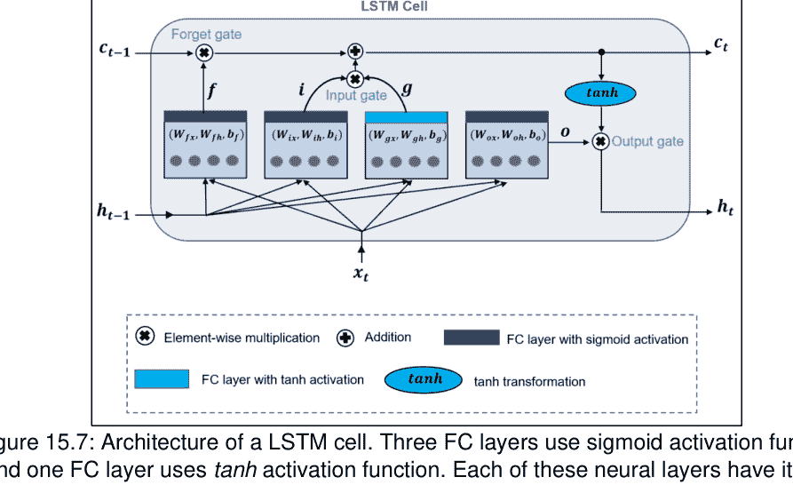

图15.7：LSTM单元的架构。三个全连接层使用sigmoid激活函数，一个全连接层使用$tanh$激活函数。每个神经层都有自己的参数$W_x$、$W_h$和$b$

这种在序列处理过程中能够操纵哪些信息被传递下去的灵活性，正是LSTM网络在捕捉序列数据中的长期模式方面如此成功的原因。因此，LSTM网络是当今默认的RNN架构。在第20章中，我们将使用LSTM模型来预测燃气轮机的剩余使用寿命。接下来，让我们学习如何使用有监督的ANN模型进行过程故障检测。

##### 原始RNN单元 vs GRU单元 vs LSTM单元

还有另一种流行的RNN单元变体，称为GRU单元。如下图所示，GRU单元比LSTM单元更简单。GRU单元有3个神经层，其内部状态用单个向量$h_{(t)}$表示。对于许多常见任务，基于GRU单元的RNN似乎能提供与基于LSTM单元的RNN相似的性能，因此，它正慢慢获得更多的普及。

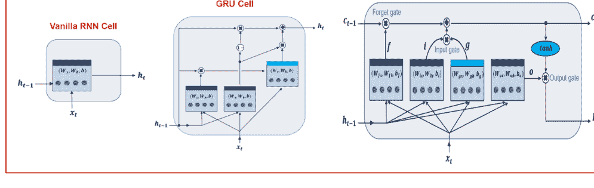

#### 15.4 基于ANN的脱丁烷塔故障外部分析

考虑下面的图15.8，它说明了用于过程监控的基于ANN的外部分析$^{100}$策略。思路很简单：使用预测变量通过ANN预测响应变量，计算残差，然后使用经典统计技术监控残差。

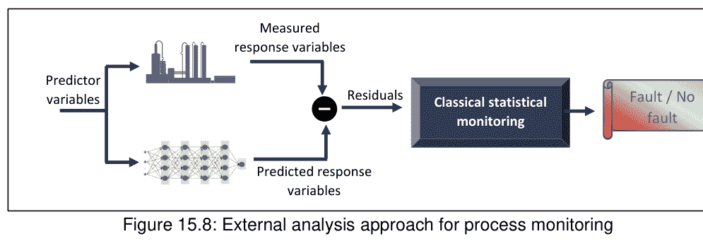

> $^{100}$ Yamamoto et al., Applications of statistical process monitoring with external analysis to an industrial monomer plant. *IFAC Advanced Control of Chemical Processes*, 2003.

让我们将此策略应用于检测炼油厂脱丁烷塔中的故障。脱丁烷塔是炼油厂的标准装置，用于将原油石脑油进料转化为液化石油气（作为塔顶产品）和汽油（作为塔底产品）。汽油产品中的丁烷（C4）含量需要保持在较低水平，并通过气相色谱法定期监测。为了增加另一层监督，需要一个模型来提供C4含量的“软”测量值，因此，实际C4含量与预期值的任何偏差都可以用来向工厂操作员发出警报。为此，我们将使用基于FFNN的外部分析构建一个故障检测模型。数据集$^{101}$作为补充材料提供在 https://link.springer.com/book/10.1007/978-1-84628-480-9。

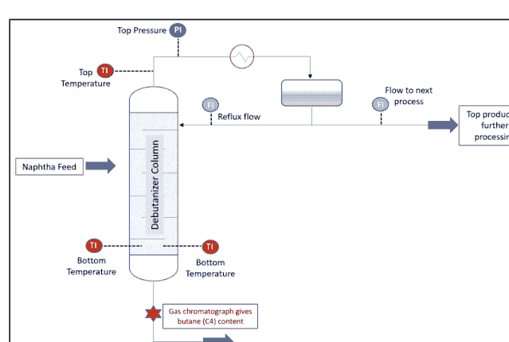

图15.9：脱丁烷塔及测量变量位置

基础数据集包含2394个（归一化的）输入-输出过程值样本。在最后200个样本中引入了人工传感器漂移，以模拟故障传感器条件。让我们看看是否能尽早检测到这个故障。我们从加载数据开始。

```
# import required packages and read data
import numpy as np, pandas as pd
import matplotlib.pyplot as plt
from tensorflow.keras import Sequential
from tensorflow.keras.layers import Dense
from tensorflow.keras import regularizers
from tensorflow.keras.callbacks import EarlyStopping
from tensorflow.keras.optimizers import Adam
from sklearn.metrics import r2_score

data = np.loadtxt('debutanizer_data_withFault.txt') # drift starts from last 200 sample onwards
```

<sup>101</sup> Fortuna et. al., Soft sensors for monitoring and control of industrial processes, Springer, 2007

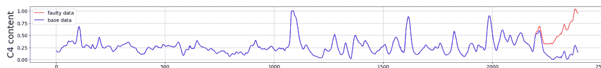

```
# separate training and test data
data_train = data[:-300,:]
data_test = data[-300:,:] # last 300 samples used as test data

X_train, y_train = data_train[:,0:-1], data_train[:,-1][:,np.newaxis]
X_test, y_test = data_test[:,0:-1], data_test[:,-1][:,np.newaxis]

# separate estimation and validation data
X_est, X_val, y_est, y_val = train_test_split(X_train, y_train, test_size = 0.2, random_state = 100)
```

我们现在准备好拟合我们的ANN模型了。

```
# define, compile, and fit model
model = Sequential()
model.add(Dense(40, kernel_regularizer=regularizers.L1(0.000001), activation='relu',
                kernel_initializer='he_normal', input_shape=(7,)))
model.add(Dense(20, kernel_regularizer=regularizers.L1(0.000001), activation='relu',
                kernel_initializer='he_normal'))
model.add(Dense(1, kernel_regularizer=regularizers.L1(0.000001)))

model.compile(loss='mse', optimizer=Adam(learning_rate=0.005))
es = EarlyStopping(monitor='val_loss', patience=50)
history = model.fit(X_est, y_est, epochs=2000, batch_size=64, validation_data=(X_val, y_val),
                    callbacks=es)
```

下面的图$^{102}$显示了均方预测误差在拟合和验证数据集上的演变。正如预期的那样，验证数据的mse更高，曲线的平坦化表明模型拟合收敛。

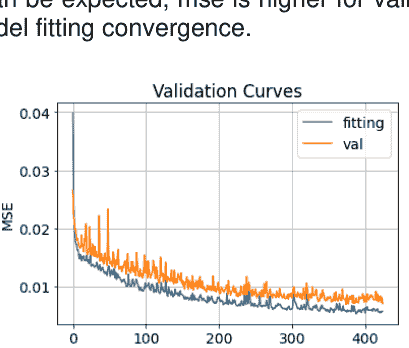

<sup>102</sup> 在线代码展示了如何生成此类验证曲线

# 预测C4含量
y_test_pred = model.predict(X_test)
y_val_pred = model.predict(X_val)
y_est_pred = model.predict(X_est)
y_train_pred = model.predict(X_train)

print('R2 for validation data:', r2_score(y_val, y_val_pred))
print('R2 for fitting data:', r2_score(y_est, y_est_pred))

>>> R2 for validation data: 0.71
>>> R2 for fitting data: 0.78

预测精度相当好，因此，我们可以使用获得的ANN模型继续进行故障检测模型开发。让我们为训练数据生成监控图。

```
# 训练样本的Q度量
error_train = y_train - y_train_pred
Q_train = np.sum(error_train*error_train, axis = 1)
Q_CL = np.percentile(Q_train, 95)

plt.figure(), plt.plot(Q_train, color='black')
plt.plot([1,len(Q_train)],[Q_CL,Q_CL], linestyle='--',color='red', linewidth=2)
plt.xlabel('Sample #'), plt.ylabel('Q metric: training data')
```

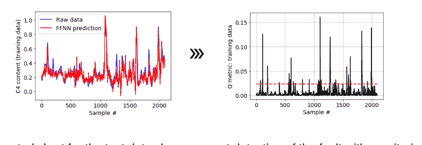

测试数据的控制图显示，在最初的（无故障）一百个样本中，监控统计量大多低于警戒阈值，从而实现了对故障的快速检测。

```
# 测试样本的Q度量
error_test = y_test - y_test_pred
Q_test = np.sum(error_test*error_test, axis = 1)

plt.figure(), plt.plot(Q_test, color='black')
plt.plot([1,len(Q_test)],[Q_CL,Q_CL], linestyle='--',color='red', linewidth=2)
plt.xlabel('Sample #'), plt.ylabel('Q metric: training data')
```

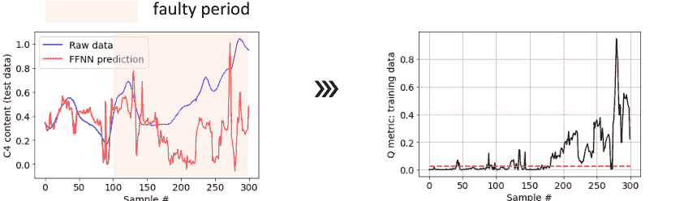

#### 15.5 使用ANN进行故障分类

如果历史故障样本可用，则可以使用前馈神经网络（FFNN）或循环神经网络（RNN）模型直接预测测试样本的故障类别。下图展示了一个可以实现此目标的示例架构。

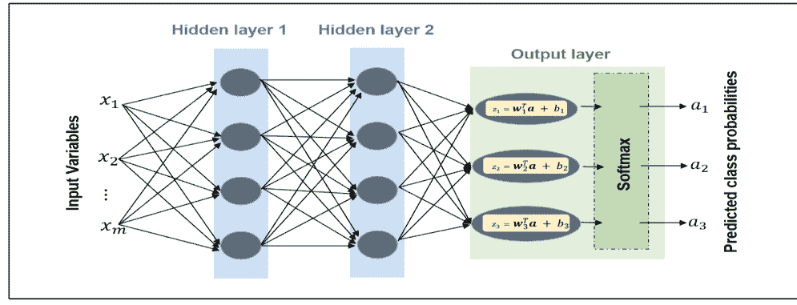

图15.10：用于互斥输出类别的FFNN架构

##### 输出层中的Softmax激活函数

Softmax是一个指数函数，它生成归一化的激活值，使其总和为1。在图15.10中，激活值 $a_j$ ($j \in [1,2,3]$) 的生成方式如下

$$a_j = g_{softmax}(z_j) = \frac{e^{z_j}}{\sum_{k=1}^{3} e^{z_k}}$$

在ANN领域中，作为softmax函数输入的预激活值（$z_j$）也称为logits。softmax激活值介于0和1之间，因此被解释为类别成员概率。预测的类别标签取为概率（或激活值）最大的类别

$\hat{y} = argmax(a_j, j \in [1,2,3])$

在模型训练期间，直接使用的是预测的类别概率（而不是预测的类别标签）。

##### 损失函数

对于二分类问题，二元交叉熵是默认的损失函数。设 $y$（可取值0和1）为数据样本的真实标签，$p$（或 $\hat{y}$）为从sigmoid输出层获得的预测概率（$y = 1$的概率）。交叉熵损失由下式给出

$Cross - entropy Loss = -y * log(p) - (1 - y) * log(1 - p) = \begin{cases} -log(1 - p), & y = 0 \\ -log(p), & y = 1 \end{cases}$

上述表达式可推广到多分类情况，其中总损失是每个类别标签单独损失的总和

$Multi - class cross - entropy Loss = - \sum_{c=1}^{\# \text{ of classes}} y_c log(p_c)$

其中，$y_c$ 和 $p_c$ 分别是样本属于类别c的二元指示变量和预测概率。请注意，对于多分类问题，目标变量将采用独热编码形式。

##### 总结

在本章中，我们熟悉了用于处理静态和动态过程的基本ANN架构。我们研究了部署ANN模型进行过程故障检测的方法；具体来说，我们通过一个基于FFNN的过程监控解决方案的实现进行了讲解，其中实际测量值与模型预测值之间的残差被用来确定过程故障的存在。在下一章中，我们将看到如何使用无监督神经网络模型构建过程监控解决方案。

## 第16章

### 通过无监督人工神经网络建模进行故障检测与诊断

在上一章中，我们研究了人工神经网络的监督拟合，其中历史样本有故障标签可用，或者过程变量被划分为预测变量和响应变量集。然而，你很可能会遇到这样的情况：你的训练数据集中只有正常工况（NOC）样本，没有任何预测变量/响应变量的划分。在本书的第3部分，我们研究了一种适用于此类数据集的强大技术，称为PCA；然而，PCA仅限于线性过程。尽管如此，提取训练数据集最具代表性的特征并将其压缩到降维特征空间的基本机制并不局限于线性系统。ANN擅长处理非线性系统并从高维数据集中提取隐藏模式。毫不奇怪，人们已经设计出巧妙的基于神经网络的架构来实现非线性数据集的无监督拟合。这类模型中两个流行的模型是自编码器（AE）和自组织映射（SOM）。

自编码器是用于非线性过程的基于ANN的PCA对应物。在这里，通过非线性变换推导出低维潜在特征空间，并且，就像我们对PCA所做的那样，特征空间中的系统性变化和重构误差被分别处理以提供监控统计量。自编码器在为非线性过程构建故障检测与诊断（FDD）解决方案方面非常流行。它们也常用于提供中间低维特征，然后用于后续建模（聚类、故障分类等）。SOM是另一种基于神经网络的架构变体，它将高维数据集投影到2D网格上（是的，你没看错！）。在这里，虽然不推导潜在变量，但重点是确保投影数据的拓扑结构与原始测量空间中的拓扑结构相似。这一特性使得SOM在数据可视化、聚类和故障检测应用中非常有用。

我们将在本章深入研究这两种强大的技术。具体涵盖以下主题

- 自编码器和自组织映射简介
- 使用自编码器进行故障检测与诊断：应用于FCCU过程
- 使用SOM进行故障检测与诊断：应用于半导体数据集

#### 16.1 自编码器简介

基本形式的自编码器（AE）是一个3层ANN，由输入层、隐藏层和输出层组成，如图16.1所示。AE接收输入 $x \in \mathbb{R}^n$ 并预测重构的 $\hat{x} \in \mathbb{R}^n$ 作为输出。为防止网络简单地将 $x$ 复制到 $\hat{x}$，隐藏层被约束为远小于 $n$（隐藏层中的神经元数量，假设为 $m$，给出了潜在/特征空间的维度）。这迫使网络仅捕获输入数据中的系统性变化，并仅学习最具代表性的特征作为潜在变量。隐藏层中神经元的非线性激活函数使得潜在变量与输入变量之间存在非线性关系。在模型拟合期间，最小化 $x$ 和 $\hat{x}$ 之间的差距（称为重构误差）以找到网络参数。基本AE网络可以通过添加更多隐藏层变得更深，从而形成深度（或堆叠）自编码器。

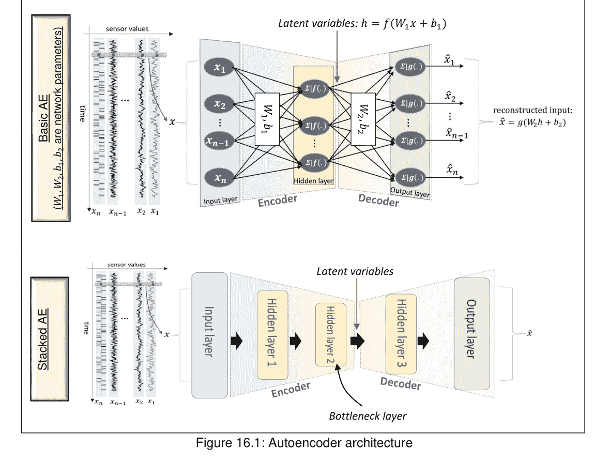

深度AE架构的对称和三明治性质应该是显而易见的，其中层的大小先减小后增大。但必须注意不要使用太多隐藏层；否则，网络会过拟合，并且可能只是学习从 $x$ 到 $\hat{x}$ 的恒等映射！此外，在上图中，你会注意到AE架构分为编码器部分和解码器部分。编码器将输入样本 $x$ 投影或编码为低维特征 $h$。解码器将特征向量映射回输入空间。编码器-解码器形式使得AE架构非常灵活。一旦AE训练完成，就可以将编码器作为独立网络来获取潜在变量。此外，你不仅限于在编码器和解码器中只使用FFNN。RNN和CNN也经常被使用。基于RNN的AE被用作动态PCA的非线性对应物。

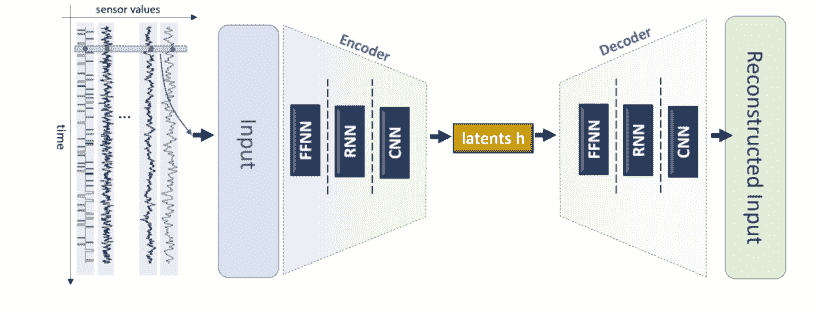

##### 原始AE与去噪AE

我们在图16.1中看到的自编码器形式是传统或原始形式，其中网络通过约束编码/潜在变量（$m$）的大小小于输入变量（$n$）的大小来强制在数据中寻找模式。这也被称为欠完备自编码器。另一种强制自编码器仅学习数据中系统性变化的方法是通过添加合成噪声破坏输入数据，然后训练网络重构未损坏的输入。这种自编码器被称为去噪自编码器，其代表性架构如下所示。请注意，我们没有明确表示编码器中隐藏层的神经元数量少于输入变量的数量。去噪AE允许 $m \geq n$。

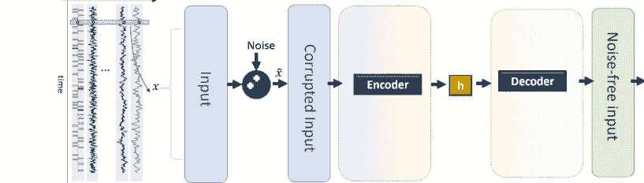

##### 通过自编码器进行降维

为了展示自编码器的实际应用，我们将它应用于图16.2所示的流化催化裂化装置（FCCU<sup>103</sup>）模拟数据集的降维。FCCU是现代炼油厂的关键装置，它将重质烃类转化为更轻、更有价值的产品，如液化石油气、汽油等。如图所示，FCCU操作涉及催化反应、催化剂再生和蒸馏。共有46个信号作为输出（每分钟记录一次）。数据以7个CSV文件的形式提供。每个文件包含一次模拟的数据。其中一个CSV文件包含在进料流量变化条件下，为期7天的正常操作工况（NOC）数据。在5个独立的模拟中，一次模拟一个故障。我们将使用这7天的NOC数据。

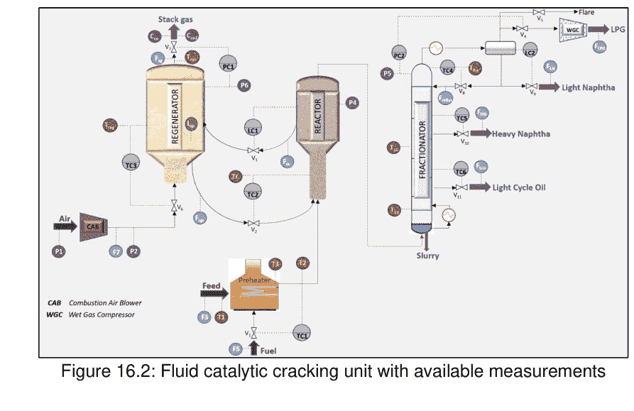

我们知道数据中的大部分变异性是由进料流量的变化驱动的，因此，我们将尝试生成一个一维潜在空间（$m=1$）。

```python
# import required packages
import numpy as np, pandas as pd, matplotlib.pyplot as plt
import tensorflow
from sklearn.model_selection import train_test_split
from sklearn.preprocessing import StandardScaler
```

```python
from tensorflow.keras.layers import Input, Dense
from tensorflow.keras import regularizers
from tensorflow.keras.models import Model
```

```python
# read data, split into fitting and validation datasets, and scale
X_train = pd.read_csv('NOC_varyingFeedFlow_outputs.csv', header=None).values
X_train = X_train[:,1:] # first column contains timestamps
X_fit, X_val, _, _ = train_test_split(X_train, X_train, test_size=0.2, random_state=10)
```

```python
scaler = StandardScaler()
X_fit_scaled, X_val_scaled = scaler.fit_transform(X_fit), scaler.transform(X_val)
X_train_scaled = scaler.transform(X_train)
```

```python
# define and compile model
input_layer = Input(shape=(X_fit_scaled.shape[1],)) # input layer
encoded = Dense(1, activation='relu')(input_layer) # encoder layer
decoded = Dense(X_fit_scaled.shape[1], activation='linear')(encoded) # decoder layer
```

```python
autoencoder = Model(inputs=input_layer, outputs=decoded)
encoder = Model(inputs=input_layer, outputs=encoded)
autoencoder.compile(optimizer='adam', loss='mse')
```

你可能注意到，我们定义人工神经网络模型的方式与前几章略有不同。这样做是为了让我们以后可以单独使用训练好的编码器。现在让我们来训练我们的自编码器。

```python
# fit model
from tensorflow.keras.callbacks import EarlyStopping
es = EarlyStopping(monitor='val_loss', patience=10)
history = autoencoder.fit(X_fit_scaled, X_fit_scaled, epochs=300, batch_size=256,
                          validation_data=(X_val_scaled, X_val_scaled), callbacks=es)
```

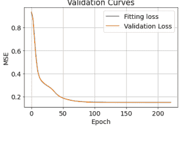

验证曲线表明模型已经收敛。让我们检查一下一维潜在空间是否足以重构原始数据。

```python
# predict for overall training dataset
X_train_scaled_pred = autoencoder.predict(X_train_scaled)
X_train_pred = scaler.inverse_transform(X_train_scaled_pred)

var = 7
plt.figure(), plt.plot(X_train[:,var], 'seagreen', linewidth=1), plt.plot(X_train_pred[:,var],'red')
plt.xlabel('time (mins)'), plt.ylabel('Furnace firebox temperature (T3) ')
```

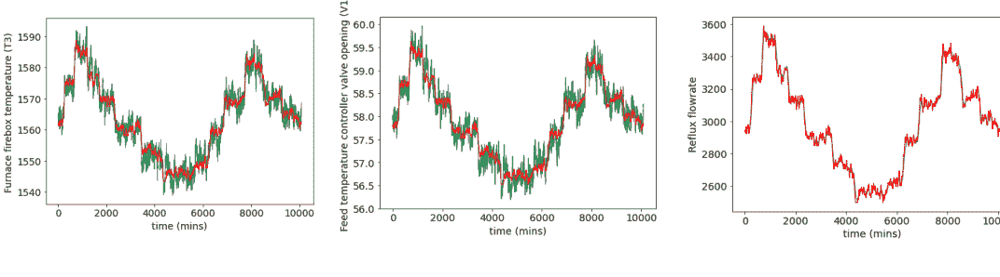

重构的数据很好地遵循了原始数据的系统性变化。查看潜在信号有助于解释这些结果。下图显示，潜在变量主要是进料流量的编码。然后，编码后的进料流量被解码器用于重构其余变量。

```python
# predict latents
h_train = encoder.predict(X_train_scaled)

plt.figure(figsize=[15,5]), plt.plot(X_train_scaled[:,0],'seagreen', label='Scaled actual feed flow')
plt.plot(h_train, 'purple', label='latent signal')
plt.xlabel('time (mins)'), plt.ylabel('h'), plt.legend()
```

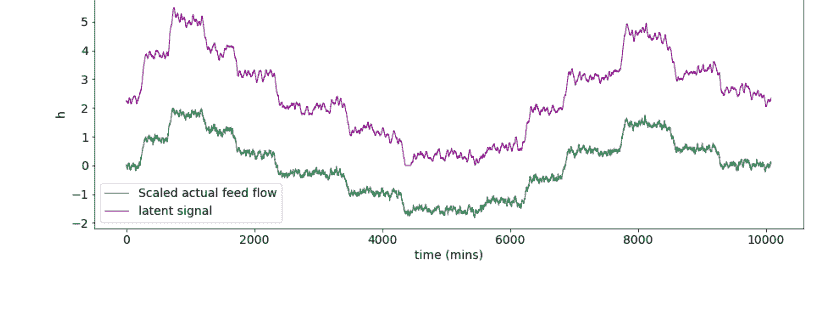

> 在上面的例子中，特征空间的维度是预先已知的。然而，通常情况下，这会成为一个需要与其他超参数（如隐藏层数量、学习率、批量大小等）一起优化的超参数。一个通用的指导原则是，连续层之间（在编码器中）的神经元压缩不应过于陡峭。压缩比为0.5通常是一个良好的起始值。

#### 16.2 使用自编码器进行过程监控：FCCU案例研究

通过自编码器进行故障检测和诊断的过程与主成分分析（PCA）类似。为每个训练样本计算重构误差和潜在变量，并生成监控指标。让我们看看计算是如何进行的。我们将重新使用FCCU数据集。我们将使用7天的NOC数据构建一个自编码器模型，并将换热器结垢模拟数据（UAf_decrease_outputs.csv）用作测试数据集。让我们快速了解一下换热器结垢故障。传热减少导致控制器TC1更多地打开阀门V1以增加燃料流量，从而将T2维持在设定值。此外，进入预热进料的热量减少意味着炉子中的烟气温度（T3）升高。下图总结了该情景。这里显示了变量F5和T3，它们的值漂移是明显的；然而，“故障值”与在进料流量变化的无故障操作下获得的正常值相差不远。

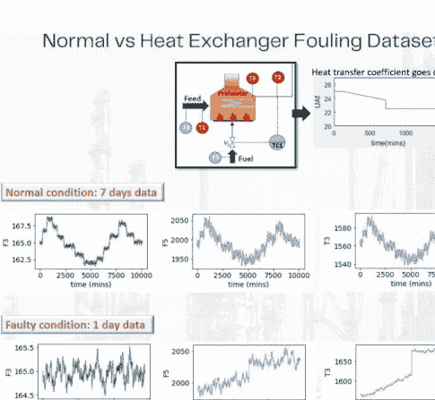

我们的目标是使用自编码器模型，仅使用NOC样本进行模型训练，来标记故障样本。

##### 故障检测指标

对于数据样本 $x$，以熟悉的方式计算统计量 $Q$ 和 $T^2$。

$$Q = e^Te = (x - \hat{x})^T(x - \hat{x})$$

$$T = h^T \Lambda^{-1} h$$

潜在变量的协方差矩阵

让我们为训练样本生成监控图表。使用堆叠自编码器模型构建故障检测解决方案。

```python
# define and compile model
input_layer = Input(shape=(X_fit_scaled.shape[1],))
encoded = Dense(23, kernel_regularizer=regularizers.L1(0.0001), activation='relu',
                kernel_initializer='he_normal')(input_layer)
encoded = Dense(6, kernel_regularizer=regularizers.L1(0.0001), activation='relu',
                kernel_initializer='he_normal')(encoded)
decoded = Dense(23, kernel_regularizer=regularizers.L1(0.0001), activation='relu',
                kernel_initializer='he_normal')(encoded)
decoded = Dense(X_fit_scaled.shape[1], kernel_regularizer=regularizers.L1(0.0001),
                activation='linear')(decoded)

autoencoder = Model(inputs=input_layer, outputs=decoded)
encoder = Model(inputs=input_layer, outputs=encoded)
autoencoder.compile(optimizer='adam', loss='mse')
```

```python
# fit model
from tensorflow.keras.callbacks import EarlyStopping
es = EarlyStopping(monitor='val_loss', patience=10)
history = autoencoder.fit(X_fit_scaled, X_fit_scaled, epochs=300, batch_size=256,
                          validation_data=(X_val_scaled, X_val_scaled), callbacks=es)
```

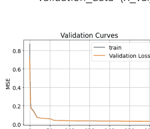

```python
##################################################
Monitoring statistics for training samples
##################################################

h_train = encoder.predict(X_train_scaled)

# Q metric for training samples
error_train = X_train_scaled - X_train_scaled_pred
Q_train = np.sum(error_train*error_train, axis = 1)
Q_CL = np.percentile(Q_train, 99)

# T2 metric for training samples
h_cov = np.cov(h_train, rowvar=False)
h_cov_inv = np.linalg.inv(h_cov)
T2_train = np.zeros((X_train.shape[0],))
for i in range(X_train.shape[0]):
    T2_train[i] = np.dot(np.dot(h_train[i,:], h_cov_inv), h_train[i,:].T)
T2_CL = np.percentile(T2_train, 99)

# Q_train control chart
plt.figure(), plt.plot(Q_train, color='black')
plt.plot([1,len(Q_train)],[Q_CL,Q_CL], linestyle='--',color='red')
plt.xlabel('Sample #'), plt.ylabel('Q metric: training data')

# T2_train control chart
plt.figure(), plt.plot(T2_train, color='black')
plt.plot([1,len(T2_train)],[T2_CL,T2_CL], linestyle='--',color='red')
plt.xlabel('Sample #'), plt.ylabel('T2 metric: training data')
```

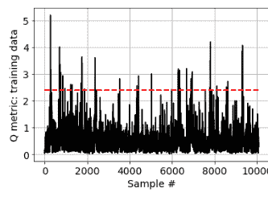

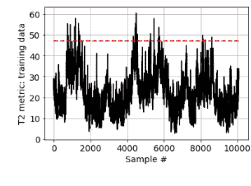

##### 测试数据的故障检测

现在让我们为换热器结垢数据集生成监控图表。

# 读取测试数据、缩放并重构
X_test = pd.read_csv('UAf_decrease_outputs.csv', header=None).values
X_test = X_test[:,1:]

X_test_scaled = scaler.transform(X_test) # 使用训练数据的缩放参数
X_test_scaled_pred = autoencoder.predict(X_test_scaled)
X_test_pred = scaler.inverse_transform(X_test_scaled_pred)

# 测试样本的Q指标
error_test = X_test_scaled - X_test_scaled_pred
Q_test = np.sum(error_test*error_test, axis = 1)
# 测试样本的T2指标
T2_test = np.zeros((X_test.shape[0],))
for i in range(X_test.shape[0]):
    T2_test[i] = np.dot(np.dot(h_test[i,:], h_cov_inv), h_test[i,:].T)

# Q_test 控制图
plt.figure(), plt.plot(Q_test, color='black')
plt.plot([1,len(Q_test)],[Q_CL,Q_CL], linestyle='--',color='red')
plt.xlabel('样本编号'), plt.ylabel('Q指标：测试数据')

# T2_test 控制图
plt.figure(), plt.plot(T2_test, color='black')
plt.plot([1,len(h_test)],[T2_CL,T2_CL], linestyle='--',color='red')
plt.xlabel('样本编号'), plt.ylabel('T2指标：测试数据')

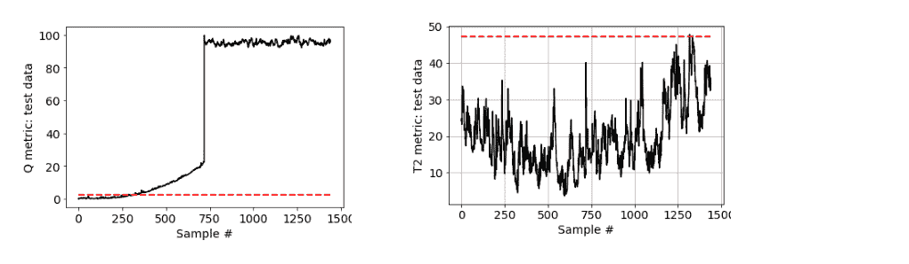

上述监控图表表明模型性能良好：在故障发生前没有误报，并且在故障发生后2小时内标记出了故障。我们鼓励你使用第16.1节中具有1维潜在变量的AE模型来构建监控图表；你会注意到由于故障检测延迟较大，模型性能并不理想。

##### 基于贡献图的故障诊断

基于AE的故障诊断通常通过贡献分析<sup>104</sup>对*Q*统计量进行，使用我们在第7章中看到的相同方法论。

```
# Q贡献
sample = 250
error_test_sample = error_test[sample-1,]
Qcontri = error_test_sample*error_test_sample # 贡献向量

plt.figure(figsize=[15,4]), plt.bar(['变量 ' + str((i+1)) for i in range(len(Qcontri))], Qcontri)
plt.xticks(rotation = 80), plt.ylabel('Q贡献')
```

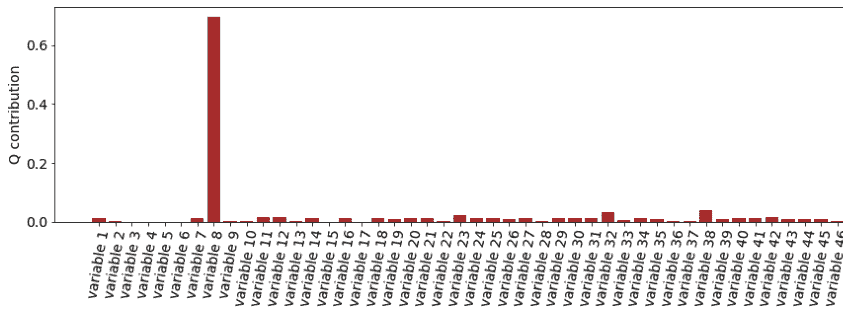

```
# 绘制诊断出的主要变量
plt.figure(figsize=[6,4]), plt.plot(X_test[:,7],'cornflowerblue')
plt.xlabel('时间（分钟）'), plt.ylabel('T3')
```

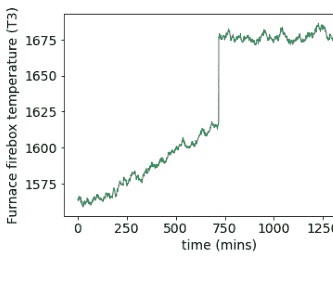

贡献图正确地将炉膛温度标记为导致测试样本偏离NOC行为的主要故障变量。

<sup>104</sup> 由于生成AE潜在变量涉及非线性变换，对*T*<sup>2</sup>统计量的贡献分析不如对PCA那样方便。

#### 16.3 自组织映射：简介

自组织映射（SOMs）<sup>105</sup>是一种无监督神经网络，旨在将高维数据集映射到如图16.3所示的2D神经元网格上。映射方式旨在保留数据的拓扑结构，即在原始输入空间中彼此接近的数据样本被映射到SOM网格上相邻的神经元。因此，SOMs对于复杂高维数据集的可视化和聚类非常有用。SOMs之所以得名，是因为确定映射不需要监督/指导；这使得SOM成为一个优秀的探索性数据分析（EDA）工具。此外，与自编码器类似，对输入数据集在数据分布、线性以及变量间独立性等方面没有施加任何限制。

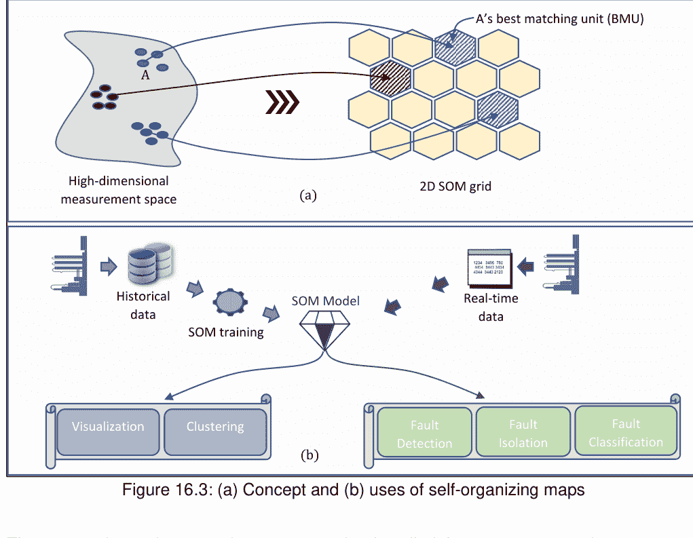

数据样本被映射到的神经元称为该样本的BMU（最佳匹配单元）。在训练过程中，多个数据样本可能被分配到同一个BMU。在某种程度上，BMU在模型训练期间将输入空间离散化为若干个局部子区域，位于某个子区域内的样本被映射到同一个BMU。对于测试数据样本，如果该样本与其BMU所代表的子区域之间的距离异常大，则可能发出异常警报。看起来很有趣，对吧？为了理解这究竟是如何实现的，让我们深入探讨SOM训练的数学细节。

<sup>105</sup> SOM也被称为Kohonen映射，以纪念引入SOM的Teuvo Kohonen教授。

##### 数学背景

SOM的拟合方式与传统人工神经网络（ANN）的拟合方式不同，即不采用反向传播算法。为了理解模型拟合过程，首先考虑拟合的最终结果。假设拟合数据集包含$N$个样本，每个样本是一个$n$维向量。模型拟合后，每个SOM节点（或神经元）被分配一个$n$维参考向量（或权重向量），例如第$j$个节点的向量为$m_j \in \mathbb{R}^n$，如下图所示。在某种程度上，第$j$个节点代表了输入空间中向量$m_j$周围的局部区域。一旦生成了参考向量，就可以很容易地找到样本的BMU。为了了解这是如何完成的，让我们逐步了解SOM模型拟合的每个步骤。

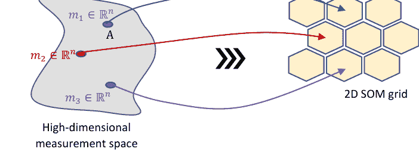

-   > **归一化输入数据集并初始化参考向量**
    >
    > 假设SOM网格中有$J$个神经元。每个参考向量$m_j \forall j \in [1,J]$被随机分配，或者从数据集中随机选择一个向量进行分配。迭代索引设置为$t = 1$。
    >
    > **采样并分配BMU**
    >
    > 从拟合数据集中随机选择一个样本$x_i$。其参考向量与$x_i$具有最小（欧几里得<sup>106</sup>）距离的神经元被定义为$x_i$的BMU，即：
    >
    > $$b_i = \arg \min_j \|x_i(t) - m_j(t)\| \quad \forall j \in [1,J]$$
    >
    > $x_i$的BMU

<sup>106</sup> 也可以使用其他距离度量

##### 更新参考向量

使用以下公式更新$m_j$ $\forall j$

$$m_j(t+1) = m_j(t) + \alpha(t) h_{b_i j} \|x_i(t) - m_j(t)\| \quad \forall j \in [1, J]$$

项$h_{b_i j}$是以BMU $b_i$为中心的邻域函数，确保只有BMU $b_i$及其在SOM网格上的相邻神经元向样本$x_i$移动。其定义如下

$$h_{b_i j} = \exp\left(-\frac{\|r_{b_i} - r_j\|^2}{2\sigma^2(t)}\right) \quad \forall j \in [1, J]$$

$\alpha(t)$是学习率，控制权重向量更新的速率。

$\alpha(t)$和$\sigma(t)$初始值较大，并随迭代单调递减。

增加迭代次数（$t \rightarrow t+1$），如果训练未收敛且$t$未达到最大值，则返回步骤2。

##### 评估SOM拟合

最终的映射质量在很大程度上取决于权重向量的初始化、网格大小、学习率等。不幸的是，对于高维数据集，很难确切判断SOM是否生成了良好的映射。通常使用一种称为量化误差的度量，对于样本$x_i$，其定义为

$$E_{Q,i} = \|x_i - m_{b_i}\|$$

$E_{Q,i}$高 $\Rightarrow x_i$与其映射的BMU $b_i$差异较大

所有拟合样本的平均量化误差可以提供拟合优度的度量，但如下图所示，它可能会产生误导。

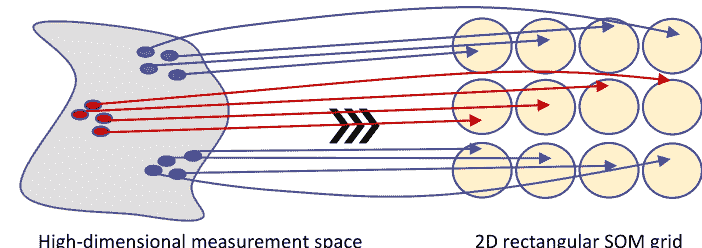

-   - 神经元数量与拟合样本数量相同
- $m_{b_i} = x_i$，即$x_i$的BMU的参考向量就是$x_i$本身
- 这里的量化误差为0，但显然拓扑结构没有被保留。

因此，使用不同的度量来判断拟合映射的质量。下面描述几个常用的度量。

###### 量化误差

如前所述，拟合样本的总体量化误差（$E_Q$）由下式给出

$$E_Q = \frac{\sum_i \|x_i - m_{b_i}\|^2}{N}$$

尽管$E_Q$不能很好地衡量拓扑保持性，但它可以指示映射对数据的拟合程度。$E_Q$也可用于推断过拟合和欠拟合。增加更多神经元会导致更低的$E_Q$，因此非常低的$E_Q$可能意味着模型过拟合。$E_Q$值高可能表明神经元数量不足或网络学习未收敛。

###### 拓扑误差

该度量衡量数据原始形状在SOM网格上的保持程度。它通过简单地计算第一和第二BMU在SOM网格上不是相邻神经元的样本来计算。

$$E_T = \frac{1}{N} \sum_{i=1}^N u(x_i)$$

$$u(x_i) = \begin{cases} 1, & \text{如果 } 1^{st} \text{ 和 } 2^{nd} \text{ BMU 不相邻} \\ 0, & \text{否则} \end{cases}$$

##### SOM 网格的尺寸

SOM 网格的形状和尺寸会显著影响映射的质量。六边形网格非常常用，一个通用的指导原则是在网格中使用 $5\sqrt{N}$ 个神经元。

#### 16.4 通过 SOM 可视化半导体数据集

为了观察 SOM 的实际应用，让我们将其应用于我们的半导体金属蚀刻数据集。我们将再次使用原始展开数据的前三个主成分得分，正如第 11 章和第 14 章所做的那样，以便更好地可视化 SOM 的输入数据集。让我们看看 SOM 是否能指示存在 3 个聚类。我们将使用 *MiniSom*<sup>107</sup> 包来构建我们的 SOM 模型。

```python
# fit SOM model
from minisom import MiniSom

N = score_train.shape[0]
N_neurons = 5*np.sqrt(N)

som = MiniSom(np.floor(np.sqrt(N_neurons)).astype(int), np.floor(np.sqrt(N_neurons)).astype(int),
              score_train.shape[1], sigma=1.5, learning_rate=.7, activation_distance='euclidean',
              topology='hexagonal', neighborhood_function='gaussian', random_seed=10)
som.train(score_train, num_iteration=10000, verbose=True)
```

训练过程中量化误差和拓扑误差演变的图如下所示。很明显，这两个误差在最初的几次迭代中都急剧下降。总体而言，10000 次迭代似乎是一个不错的迭代次数值。

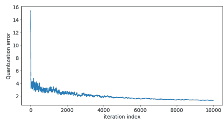

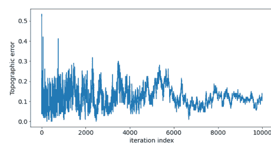

<sup>107</sup> https://github.com/JustGlowing/minisom

可视化 SOM 并寻找聚类的最常见方法是生成 U-矩阵<sup>108</sup>（统一距离矩阵），如下图所示，针对我们拟合好的 SOM 模型。这里，每个神经元根据其权重向量与其邻居的平均距离进行着色。较浅的颜色意味着该神经元及其邻居被映射到输入空间的同一区域。从所示的 U-矩阵中，可以清楚地看到三个聚类。

```python
# plot U-matrix
plt.figure(figsize=(9, 9))
plt.pcolor(som.distance_map().T, cmap='bone_r') # plotting the distance map as background
plt.colorbar()
```

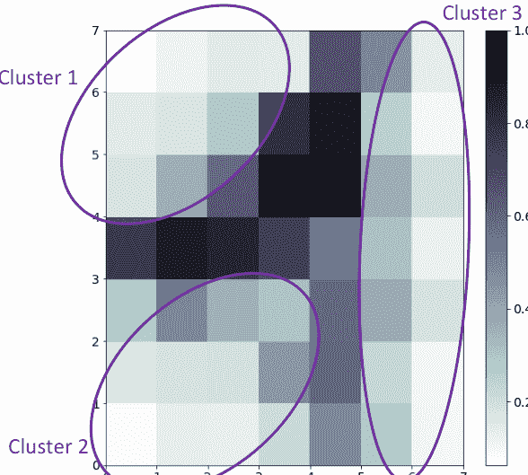

##### 用于监督学习的 SOM

如果训练数据集包含来自不同故障类别的故障样本（包括无故障样本），那么可以使用类别表示图来查看不同类别在 SOM 网格上的位置。下图显示了一个示例。这里，神经元的颜色基于映射到该神经元的样本中最常出现的类别。这样的图也允许 SOM 模型用于故障诊断，其中测试样本的故障状态可以根据其在类别表示图中的最佳匹配单元的故障标签来确定。

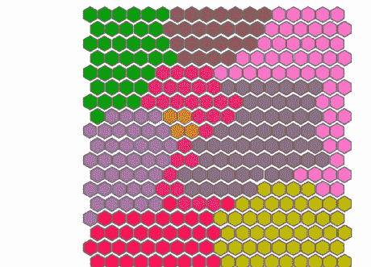

类别表示图。每种颜色对应一个故障类别。
[地图由 Concetti 等人在题为‘An Unsupervised Anomaly Detection Based on Self-Organizing Map for the Oil and Gas Sector’的论文中共享，遵循 Creative Commons Attribution (CC BY) 许可 ( creativecommons.org/licenses/by/4.0/)]

#### 16.5 使用 SOM 进行过程监控：半导体案例研究

在基于 SOM 的过程监控中，监控的统计量是公式 1 中定义的量化误差。该指标的较大值表明测试样本远离正常操作数据，是故障样本。让我们为金属蚀刻数据集的训练样本生成控制图。

```python
# QEs for training samples
QEs_train = np.linalg.norm(som.quantization(score_train) - score_train, axis=1)
QE_CL = np.percentile(QEs_train, 95)

plt.figure(), plt.plot(QEs_train, '--', marker='o', color='black')
plt.plot([1,len(QEs_train)],[QE_CL,QE_CL], color='red')
plt.xlabel('sample #'), plt.ylabel('QEs for training samples')
```

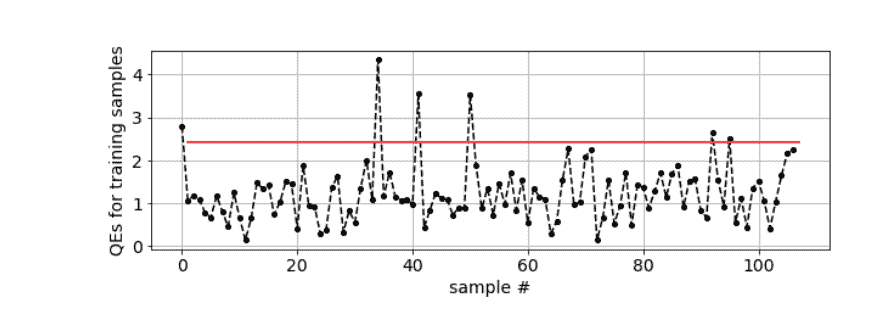

##### 测试数据的故障检测

现在让我们看看 SOM 模型能否检测测试样本中的故障。

```python
# QEs for test samples
score_test = pipe.transform(unfolded_TestdataMatrix)
QEs_test = np.linalg.norm(som.quantization(score_test) - score_test, axis=1)

print('Number of flagged faults (using control chart): ', np.sum(QEs_test > QE_CL))

>>> Number of flagged faults (using control chart): 19
```

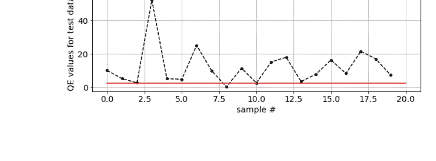

##### 通过贡献图进行故障诊断

在检测到故障后，可以通过找到对量化误差贡献最大的变量来识别罪魁祸首变量。$E_Q$ 可以按如下方式按分量分解（与我们对 PCA 的 Q 统计量所做的方式相同）

$$E_{Q,i} = \sum_{j=1}^{m} \|x_{ij} - m_{b_{ij}}\|^2$$

其中 $x_{ij}$ 是第 $i$ 个测试样本的第 $j$ 个变量的值，$m_{b_{ij}}$ 是相应最佳匹配单元权重向量中第 $j$ 个变量的值。

##### 总结

在本章中，我们探讨了两种流行的无监督神经网络模型，即自编码器和自组织映射。我们研究了如何运用这些模型来构建过程监控解决方案。使用工业规模系统（来自炼油厂的流化催化裂化装置和金属蚀刻半导体工艺）的案例研究展示了逐步操作流程。

## 第 6 部分

### 基于振动的状态监控

## 第 17 章

### 基于振动的状态监控：信号处理与特征提取

旋转机械，包括电机、压缩机、泵、涡轮机、风扇等，构成了工业运营的支柱。毫不奇怪，很大一部分运行停机时间可归因于这些机器的故障。在过去十年中，流程工业采用了预测性维护作为主动处理这些故障的手段，而与预测性维护几乎同义的技术就是基于振动的状态监控。所有旋转机器都表现出振动运动，不同类型的故障会产生特征性的振动信号。这使得 VCM 成为旋转设备健康管理的可靠有效工具。考虑到 VCM 在流程工业中的重要性，本书的这一部分涵盖了其不同方面。

振动通常以非常高的频率测量，大量的数据使得原始数据分析变得困难。相应地，处理振动数据并提取能够提供故障早期迹象的有意义特征变得至关重要。传统上，这些特征由振动专家进行分析。然而，近年来，已经报道了多个基于机器学习的 VCM 成功应用。我们在本书前面部分研究的所有技术都可以用于 VCM。虽然我们将在下一章探讨基于机器学习的 VCM，但本章为 VCM 奠定基础，并涵盖振动数据处理和特征提取。

多年来，VCM 从业者和研究人员不断完善振动监测技术，并提出了几种专门和先进的技术。可以说，初学者很容易在 VCM 的世界中感到“迷失”。当前和后续的章节将有助于为这个看似混乱的世界提供一些秩序。具体涵盖以下主题

- 振动基础
- VCM 工作流程
- 振动信号的频谱分析
- 时域、频域和时频域特征提取

#### 17.1 振动：入门介绍

振动仅仅是机器围绕其静止位置的往复运动。所有旋转机器（电机、鼓风机、冷却器、压缩机、涡轮机等）在正常和故障条件下都表现出振动运动。图 17.1 显示了工业机器振动传感的代表性设置。传感器（换能器）将振动运动（位移、速度或加速度）转换为模拟电信号，这些信号被数字化并存储。下图显示了对于状态逐渐恶化的机器，记录的信号在时间轴上的样子。不断增加的振动水平表明存在潜在的机器问题。

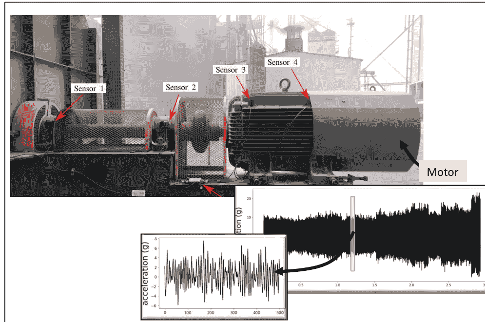

旋转机器的部件（转子、轴承、齿轮）由于众所周知的原因（如机械松动、不对中、裂纹等）会经历不同类型的故障。这些故障会产生特征性的振动模式。然而，很难“看到”或提取

<sup>109</sup> Romanssini et al., A Review on Vibration Monitoring Techniques for Predictive Maintenance of Rotating Machinery. Eng, 2023. This article is an open access article distributed under the terms and conditions of the Creative Commons Attribution (CC BY) license (https://creativecommons.org/licenses/by/4.0/).

原始时域振动信号中的这些特定特征。因此，标准方法是将时域信号转换为频域，以提取能提供故障早期迹象并有助于诊断潜在故障的特征。

> 一般来说，振动水平指示故障的严重程度，而振动信号的主要频率分量则可以指示故障的来源。

下一节将介绍将原始振动信号转换为有用特征并部署机器学习模型的步骤序列。本章的重点是理解如何提取这些最终可用作机器学习模型输入的特征。

##### 基本振动术语

振动数据的时域图称为波形。让我们看一个简单的正弦波形，以理解一些用于表征振动的术语。

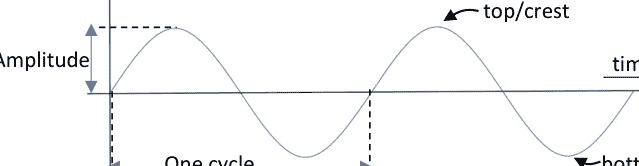

频率（f），以周期/秒或赫兹（Hz）为单位，表示单位时间内完成的周期数。完成一个周期所需的时间称为周期（T）。T和f成反比关系

$$f = \frac{1}{T}$$

波峰高于零线/参考线的高度称为振幅。来自实际设备的波形比简单的正弦波更复杂。然而，你稍后会看到，波形可以分解为多个正弦分量。

##### 振动信号采集

最常用的传感器是加速度计，它测量振动加速度（通常以*g*为单位）。其他传感器选项包括接近传感器和速度传感器，分别记录振动位移和速度。振动传感器的输出是连续的模拟信号，该信号被数字化以便在计算机中进行数字存储。因此，振动信号采集中的一个关键方面涉及采样频率（*f_s*），即振动信号被采样的频率。例如，设*f_s* = 100 样本/秒或100 Hz；这意味着数据以0.01秒的等间隔收集。明智地选择*f_s*至关重要。要理解原因，请看下面的说明。

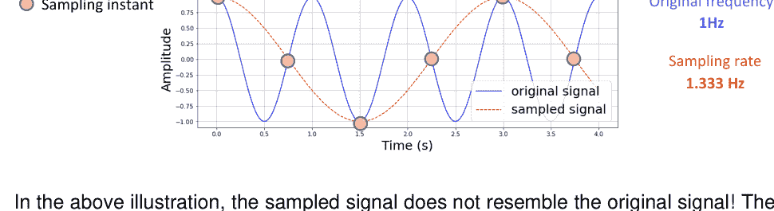

在上面的说明中，采样信号与原始信号不相似！有一个定理称为奈奎斯特采样定理，它指出对于采样频率*f_s*，只有频率低于*f_s*/2的原始信号才能被正确采集。相应地，频率*f_s*/2被称为奈奎斯特频率（*f_q*）。对于上面的说明，要能够正确捕获1 Hz的振动，*f_s*必须为2 Hz（每秒2个样本），如下所示，这确实效果很好。

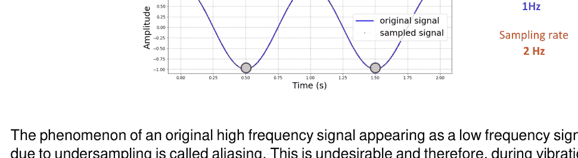

由于欠采样导致原始高频信号表现为低频信号的现象称为混叠。这是不希望出现的，因此，在振动信号采集过程中，经常使用抗混叠滤波器来滤除频率高于*f_q*的分量。

#### 17.2 基于振动的状态监测：工作流程

到目前为止，我们只是零散地讨论了VCM的不同方面。图17.2总结了VCM中常用步骤，下面将简要描述。

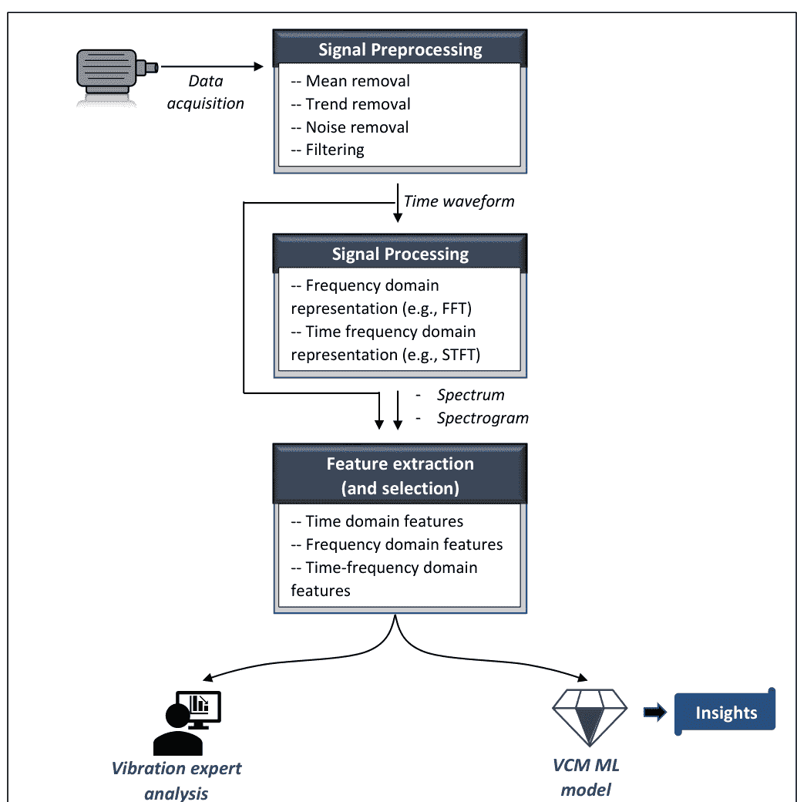

##### 数据采集：

作为常见做法，振动数据以等长批次进行分析，这些批次在固定时间间隔内采集，如下图所示。这里，每分钟采集1秒的振动数据，并发送进行预处理和振动监测。如果采样频率为1024 Hz，则每个采集的波形包含1024个数据点。

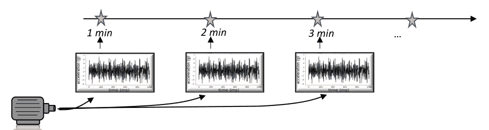

##### 信号预处理：

此步骤中涉及的任务旨在提高采集振动信号的信噪比（SNR），为后续任务做好准备。去除由于噪声和测量系统误差引起的信号中不需要的频率分量。在故障早期阶段，对振动信号的影响很弱，在没有足够信号预处理的情况下可能难以检测。例如，下面的说明显示了去除趋势的好处。

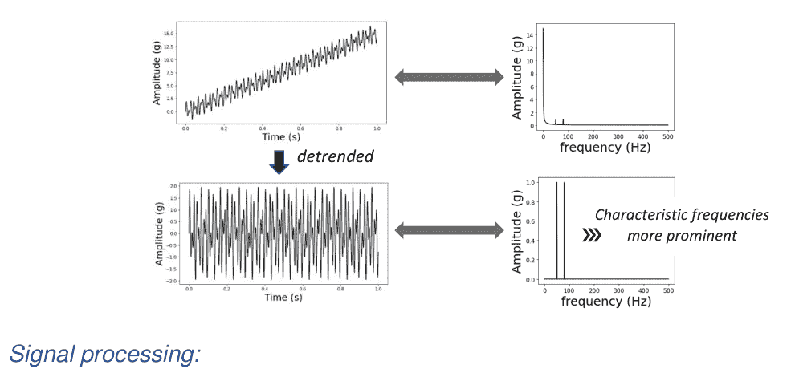

##### 信号处理：

快速浏览波形可以告诉你机器是否在异常高的水平上振动。然而，众所周知，波形很难用于检测故障初期阶段的故障，因为此时故障特征很弱。此外，振动波形中振幅水平的增加并不能说明太多关于潜在故障来源的信息。为了获得更具可操作性的信息，通常通过快速傅里叶变换（FFT）进行频谱分析，以找到波形的频率分量。在意外频率处存在显著分量表明存在故障状况，并为故障来源提供线索。

傅里叶变换的一个缺点是它仅限于平稳信号。它无法指示波形中分量频率随时间的变化，即假设一个频率分量在整个波形持续时间内以相同的能量水平存在。然而，这并不总是正确的，尤其是在机器退化的情况下。因此，进行时频域分析，将波形分解为不同时间点的频率分量。此分析最流行的工具是短时傅里叶变换（STFT），其输出是频谱图。我们将在下一节中更详细地介绍这些技术。

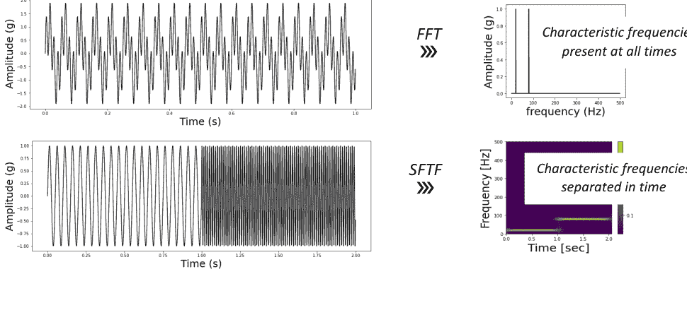

##### 特征提取：

可以直接将当前波形、频谱和频谱图与NOC（正常运行条件）时期的进行比较以检测异常。或者，可以将整个波形和/或频谱作为输入传递给机器学习模型。然而，更方便的方法是提取有意义的特征，这些特征能充分总结振动信号，并提供有关机器运行状态的关键线索。使用特征增加了获得有效机器学习模型的机会。常用特征包括但不限于波形的均方根（RMS）和峰度、频谱的频率中心和峰值频率，以及频谱图的平均频率。一旦提取了特征，它们就可以用于故障检测和分类。虽然我们将在下一章讨论VCM工作流程的这最后一步，但让我们先更好地熟悉振动信号处理和特征提取任务。

#### 17.3 振动信号处理

正如上一节所暗示的，手动分析时域波形可能非常不方便，并且可能无法提供足够的早期故障前兆指标。在频域和时频域中可以获得更有用的振动数据表示。

##### 频域分析

考虑以下机器的时域和频域振动数据。

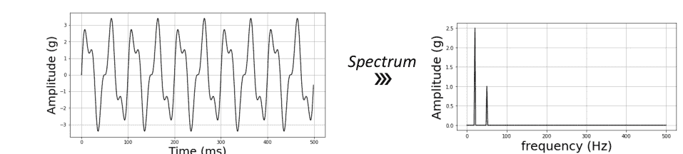

对于未经训练的眼睛，波形并没有提供太多关于机器“如何”振动的有用信息。然而，在频域中，可以清楚地看到两个不同的频率分量，可能来自机器的不同旋转部件。将峰值振幅和峰值频率与NOC值进行比较，可以指示故障（如果存在）的严重程度和类型。这种极其有用的频率与振幅关系图称为频谱，通常通过FFT获得。

###### 傅里叶变换

频域分析涉及将波形分解为多个不同频率正弦波的和。这种分解称为傅里叶变换。要了解它是如何计算的，让我们先定义几个术语。设采样频率为$f_s$，波形包含$N$个数据点，频率分辨率$df$定义为$\frac{f_s}{N}$。

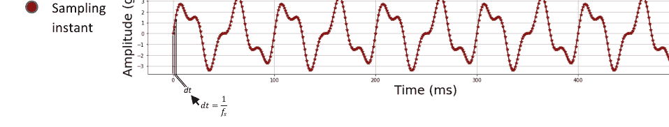

傅里叶变换（FT）的计算如下，

$$Y(kdf) = \frac{2}{N} \sum_{i=0}^{N-1} y(t_i) e^{-j\frac{2\pi ik}{N}} \quad k = 0, 1, 2, ..., \frac{N}{2} - 1$$

频率 $f_k = kdf$ 处的FT值

$y(t_i) = y(t)$ 在时间 $t_i = idt$ 处

$Y(f_k)$ 是一个复数，频谱图上对应于 $f_k$ 的幅值由 $Y(f_k)$ 的幅值给出，即 $|Y(f_k)|$。在Python中可以非常容易地生成频谱。让我们为上面的波形进行计算。

```python
# simulate signal
import numpy as np, matplotlib.pyplot as plt
fs = 1000 # 1000 Hz
dt = 1.0/fs
t = np.arange(0,0.5,dt) # sampling instants

y1 = np.sin(2*np.pi*50*t ) # 50Hz component
y2 = 2.5*np.sin(2*np.pi*20*t) # 20Hz component
y = y1+y2 # sampled signal

# generate spectrum
from scipy.fft import rfft, rfftfreq
N = len(t)
Y_spectrum = rfft(y)
freq_spectrum = rfftfreq(N, dt)

plt.plot(freq_spectrum, 2.0/N *np.abs(Y_spectrum), 'black')
plt.ylabel('Amplitude (g)'), plt.xlabel('frequency (Hz)')
```


###### 傅里叶变换过程中的误差来源

傅里叶变换过程中存在多种误差来源，这些误差可能导致频谱图中出现虚假频率、幅值不正确以及频率在频谱中错误缺失。误差可能源于噪声测量、频率分辨率不足等。让我们考虑一个著名的误差，称为“泄漏”。为了理解这一点，假设一台机器以1 Hz的频率进行正弦振动。在 $f_s = 20$ Hz 的采样率下，取长度为9.4秒的序列进行分析。

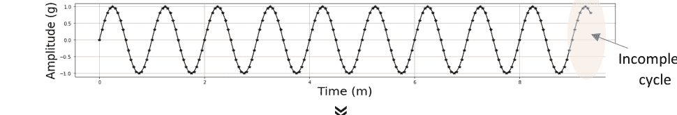


我们没有得到1 Hz处的尖锐谱线，而是得到了一系列主导频率。这些虚假分量源于用于分析的非周期波形，由此导致的频域能量弥散称为*泄漏*。为了防止泄漏，将波形乘以一个数据窗，以强制采样波形在开始和结束处为零，如下所示。我们可以看到，加窗显著减少了频率的弥散。下图所示的窗称为汉宁窗，通常用于减少泄漏。

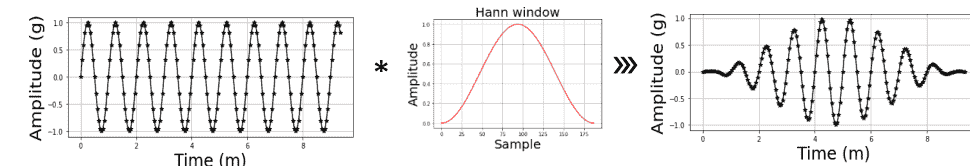

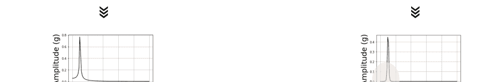

##### 时频域分析

考虑以下两种场景。

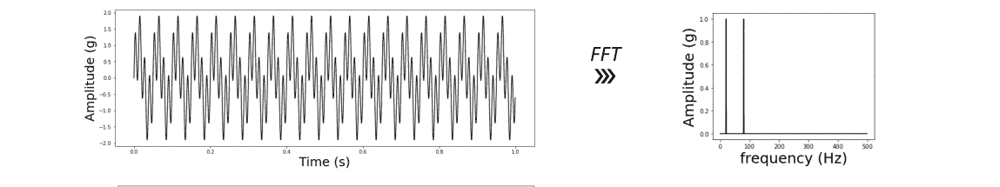

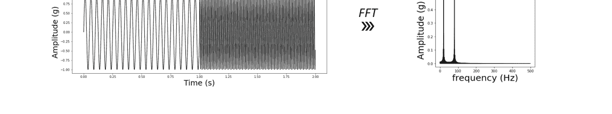

很明显，这两个波形是不同的——在场景1中，两个频率分量在整个时间段内都存在，而在场景2中，两个分量在不同的时间点存在。然而，两种场景的频谱是相似的（忽略第二个频谱中的小波纹和峰值频率的幅值差异）。可以理解，场景2的频谱可能导致错误的推断。处理场景2的解决方案是同时在时域和频域中分析波形，最流行的工具是短时傅里叶变换（STFT），其过程如图17.3<sup>110</sup>所示。

在这里，你可以看到波形被分成重叠的段，并进行傅里叶变换，得到一个二维矩阵 $S_y(f, \tau)$。STFT使用频谱图和瀑布图进行可视化。瀑布图只是将每个FT频谱一个接一个地绘制出来，在3D图中给人一种瀑布的印象。频谱图是一个以时间为横轴、频率为纵轴的二维图，幅值变化用颜色表示。这些图表有助于观察组成频率如何在波形中随时间变化。下面的代码展示了如何获得场景2中波形的时频分解。

> <sup>110</sup> 该图改编自Kim等人发表在*Applied Sciences*（2020）上的开放获取文章，标题为“Diagnostics 101: A Tutorial for Fault Diagnostics of Rolling Element Bearing Using Envelope Analysis in MATLAB”。该文章根据知识共享署名（CC BY）许可（http://creativecommons.org/licenses/by/4.0/）的条款和条件分发。

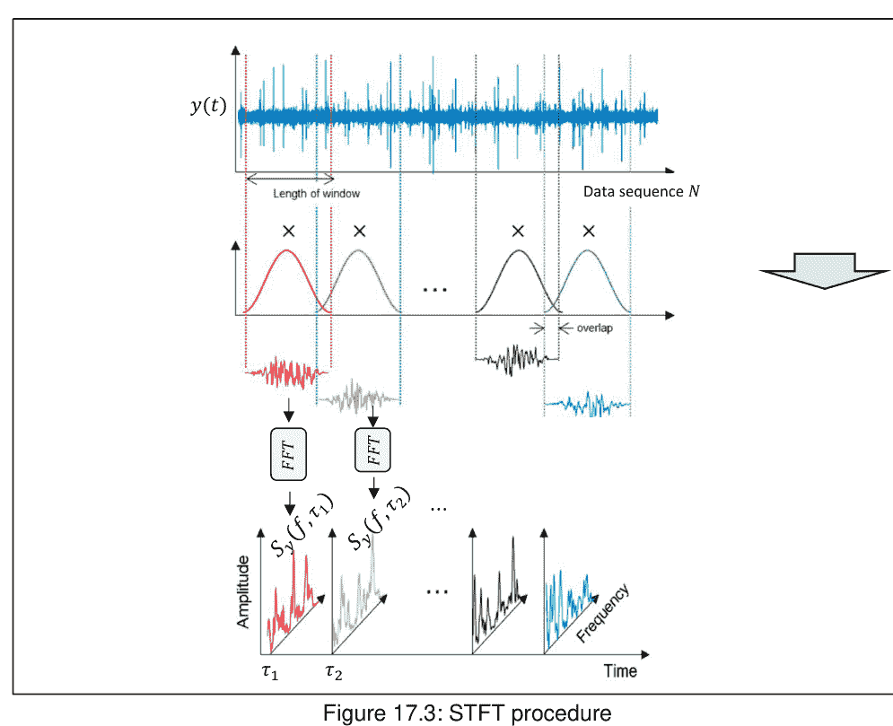

图17.3：STFT过程

```python
# simulate signal
import numpy as np, matplotlib.pyplot as plt
fs = 1000 # 1000 Hz
dt = 1.0/fs
t = np.arange(0,1,dt)

y1 = np.sin(2*np.pi*20*t ) # 20Hz component
y2 = np.sin(2*np.pi*80*t) # 80Hz component
y = np.hstack((y1,y2)) # sampled signal
t = np.hstack((t, t[-1]+t))

# generate spectrogram
from scipy import signal
f, t, Sxx = signal.stft(y, fs)

plt.pcolormesh(t, f, np.abs(Sxx), shading='gouraud')
plt.colorbar(), plt.ylabel('Frequency [Hz]'), plt.xlabel('Time [sec]')
```

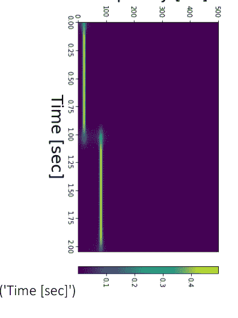

#### 17.4 从振动信号中提取特征

当你到达VCM工作流的这一步时，你将手头拥有一个波形、其频谱和频谱图，从中可以提取有意义的特征。为了说明特征提取，我们将使用来自真实风力涡轮机的数据。风力涡轮机数据集<sup>111</sup>包含从一台风力涡轮机记录的50天振动加速度数据。每天记录6秒的振动数据。总共提供了50个文件，每个文件包含一天的数据。轴承故障导致振动水平增加，最终在第50天发生故障。图17.4显示了50天的组合振动信号。振动水平的增加清晰可见。让我们理解如何从一天的数据中提取波形的特征。我们将在本书的第7部分重用此数据集，仅使用时域特征构建一个称为健康指标的度量，因此，我们将查看时域特征生成的代码。

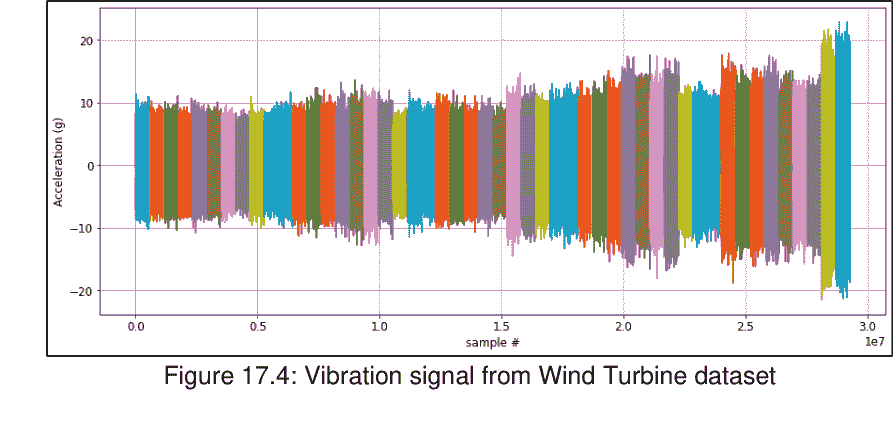

##### 时域特征

当旋转机械发生故障时，振动水平和波形分布可能会改变。波形特征可以反映这些变化。下表1显示了常用的时域特征。我们假设信号为 $y(n)$，其中 $n = 1,2, \cdots , N$，N是数据点的数量。

| 均值 | 标准差 | 均方根 (RMS) |
| :--- | :--- | :--- |
| $Y_m = \frac{1}{N} \sum_{n=1}^{N} y(n)$ | $Y_{std} = \sqrt{\frac{\sum_{n=1}^{N}(y(n) - Y_m)^2}{N - 1}}$ | $Y_{rms} = \sqrt{\frac{\sum_{n=1}^{N}(y(n))^2}{N}}$ |
| **峰值** | **峰峰值** | **偏度** |
| $Y_{peak} = \max |y(n)|$ | $Y_{P2P} = \max y(n) - \min y(n)$ | $Y_{skewness} = \frac{\sum_{n=1}^{N}(y(n) - Y_m)^3}{(N - 1)Y_{std}^3}$ |
| **峭度** | **形状因子** | **波峰因子** |
| $Y_{kurtosis} = \frac{\sum_{n=1}^{N}(y(n) - Y_m)^4}{(N - 1)Y_{std}^4}$ | $Y_{SF} = \frac{Y_{rms}}{\frac{1}{N} \sum_{n=1}^{N} |y(n)|}$ | $Y_{CF} = \frac{Y_{peak}}{Y_{rms}}$ |
| **脉冲因子** | **裕度因子** | |
| $Y_{IF} = \frac{Y_{peak}}{\frac{1}{N} \sum_{n=1}^{N} |y(n)|}$ | $Y_{MF} = \frac{Y_{peak}}{\left(\frac{1}{N} \sum_{n=1}^{N} \sqrt{|y(n)|}\right)^2}$ | |

表1：时域统计特征

像RMS（均方根）、STD（标准差）、峰值和P2P（峰峰值）这样的特征在故障变得越来越严重时显示出增加的趋势。RMS量化了振动信号中的能量含量，是振动监测中流行的指标。与峰值和P2P等其他指标相比，RMS也更稳定且对噪声更鲁棒。下面的代码展示了如何计算这些特征。

```python
# import packages
import numpy as np, matplotlib.pyplot as plt, pandas as pd
import scipy.io
```

```python
# fetch data for a waveform (file data-20130418T230803Z.mat randomly selected)
matlab_data = scipy.io.loadmat('data-20130418T230803Z.mat', struct_as_record = False)
vib_data = matlab_data['vibration'][:,0]
```

```python
plt.figure(figsize=(15,6))
plt.plot(vib_data, linewidth=0.2)
plt.xlabel('sample #', fontsize=25), plt.ylabel('Acceleration (g)', fontsize=25)
```

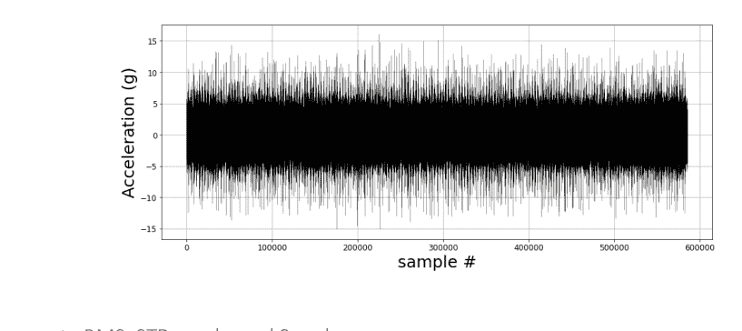

```python
# compute RMS, STD, peak, peak2peak
N = len(vib_data)
vibStd = np.std(vib_data, ddof=1, axis=0)
vibRMS = np.sqrt(np.sum(vib_data ** 2)/N)
vibPeak = np.max(np.abs(vib_data))
vibPeak2Peak = np.max(vib_data) - np.min(vib_data)
```

```
>>> Standard deviation: 2.288
>>> RMS: 2.293
>>> Peak: 16.049
>>> Peak-to-Peak: 31.163
```

RMS（以及峰值、P2P）无法在早期阶段检测故障。峭度和偏度更适用于早期故障。峭度是脉冲/尖峰信号的良好指标。偏度量化了振动信号幅值分布的不对称性。已知对于正常运行的机器，峭度和偏度分别在3和0左右。对于有故障的机器，峭度变得高于3，偏度显著偏离0。注意，峭度已知不适用于非常严重的故障，因为当波形变得不那么脉冲化时，其值会降低。

##### 频域特征

尽管时域特征易于计算和解释，但其主要缺点在于无法提供异常振动根本来源的线索。频域特征相比时域特征具有多项优势。当存在故障时，异常频率会在振动频谱中以显著幅值显现。频域特征是早期故障和严重故障的良好指标。此外，特定频率分量的存在直接揭示了旋转机械哪个部件发生了故障。

当获得振动频谱时，专家首先关注的通常是与机器转速对应的谐波频率是否存在。例如，若机器以3600 RPM（转/分钟）旋转，则60 Hz（称为1X）、120 Hz（称为2X或二次谐波）及更高次谐波的幅值会被提取为特征。下一章将展示这些频率分量如何用于故障检测与诊断（FDD）。与表1类似，表2展示了从振动频谱中提取的常见统计特征。其中，$Y(k)$表示第$k$条谱线的幅值，$f_k$为对应频率，$k = 1,2, \cdots, K$。

次谐波（0.5X、0.25X等）也被用作有效特征。

##### 表2：频域统计特征

113 https://github.com/Oybek90/Machine_Learning_from_scratch/blob/main/frequency-domain-feature-extraction-methods.ipynb.
Yaguo Lei, Intelligent Fault Diagnosis and Remaining Useful Life Prediction of Rotating Machinery.

第一个特征——频谱均值，是频谱中所有频率幅值的平均值。随着故障严重程度增加，整体振动能量上升，$F_1$也随之增大。频率中心（$F_5$或$F_c$）和均方根频率（$F_7$或RMSF）用于追踪频谱中的主导频率。峰值频率（如前10个）及其对应幅值也常用于故障检测。

> 工况影响

机器负载和转速的变化会影响振动特性，如整体振动水平、特定频率分量的幅值等。因此，解读振动特征时应考虑运行工况。通常会为不同工况记录参考振动信号和/或频谱，用于后续故障检测与诊断。或者，将运行工况作为额外变量用于训练机器学习模型。

##### 时频域特征

一种常用的时频域特征是平均峰值频率，即频谱图中不同时间点峰值频率的平均值。其计算公式如下，其中$N_{\tau}$是短时傅里叶变换（SFTF）使用的分段数。

$$f_{peak}(\tau) = \underset{f}{\text{argmax}} S(\tau, f)$$
$$f_{mean, peak} = \frac{\sum_{\tau} f_{peak}(\tau)}{N_{\tau}}$$

另一种常见策略是从瀑布图的每个FFT频谱中提取频域特征。

> 旋转机械中易发生故障的部件（如齿轮和轴承）已被深入研究，其“缺陷频率”已被发现并数学定义。这些频率在故障发生时会在频谱中显现，因此作为诊断特征效果显著。建议读者参阅Sim等人的论文《齿轮和轴承预测与健康管理中的特征工程教程》（Applied Sciences, 2020）。

至此，我们完成了振动状态监测（VCM）第一阶段的学习，即将旋转机械的复杂波形归纳为一系列特征。这些特征将用于故障检测、故障分类和故障预测，后续章节将详细展开。本章之外，还有更多先进技术可用于振动信号分析，包括但不限于包络分析、小波变换、经验模态分解和希尔伯特-黄变换。尽管我们仅触及振动信号处理广阔领域的皮毛，但您现在已具备基础，能够自信地探索这一领域！

##### 总结

本章我们学习了振动信号处理的基础知识，为构建基于机器学习的故障检测方案奠定基础。我们研究了振动频谱的概念，理解了如何生成频谱，并详细探讨了时域、频域和时频域特征的提取方法。我们将在此基础上继续学习，了解如何利用这些特征检测旋转机械的故障。

## 第18章

### 基于振动的状态监测：故障检测与诊断

在机器学习热潮席卷制造业之前，基于振动的状态监测已是过程工业广泛采用的技术。国际标准化组织（ISO）为不同类别的旋转机械制定了振动均方根值的报警限值。此外，VCM研究人员致力于发现旋转机械不同部件故障的特征信号。相应地，已制定多种经验法则和启发式方法，利用振动特征定位故障根本原因。然而，这些启发式方法无法覆盖所有可能的故障场景，仍需振动专家分析和解读振动信号特征。幸运的是，机器学习的出现使VCM更易于通用过程数据科学家掌握。

VCM文献中报道了多种用于故障分类、故障检测和诊断的机器学习模型。例如，通过将整个频谱（或波形）作为自编码器的输入，或将频谱图图像作为卷积神经网络（CNN）模型的输入，构建故障检测应用。机器学习模型扮演振动专家的角色，发现振动信号中的模式，区分正常运行状态（NOC）与异常振动，并辨别不同故障条件。本章将探讨基于机器学习的VCM的一种实现。具体内容包括：

- VCM工作流程
- VCM经典方法
- 基于SVM的电机故障分类

#### 18.1 VCM工作流程回顾

振动信号包含机器故障的指示信息。此前，我们了解了通过特征提取“放大”这些指示信息的常见步骤。本章将重点讨论如何利用这些特征推断旋转机械的健康状况。图18.1展示了一些常用方法。经典方法包括在频谱中寻找谐波的存在，以及将单个特征与ISO推荐的阈值进行比较。近年来，基于机器学习的VCM逐渐普及。本书前几部分介绍的任何机器学习技术均可应用。

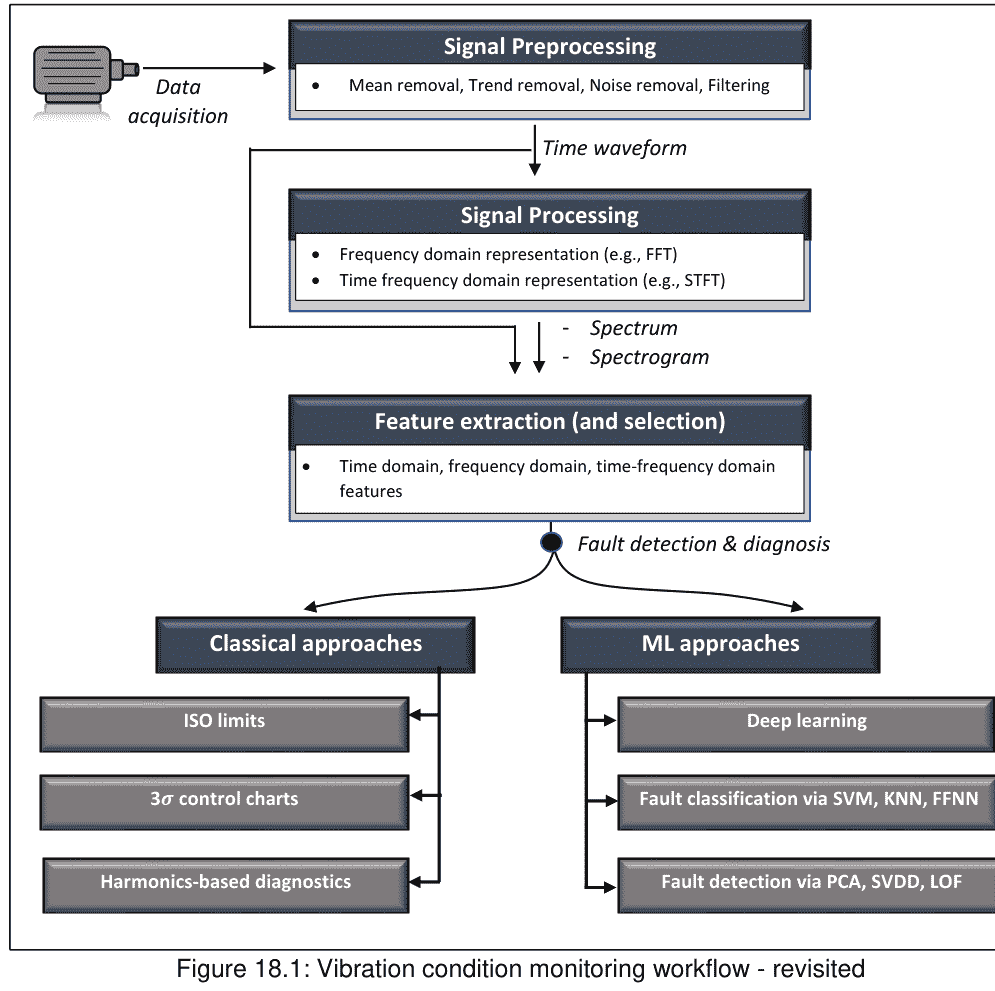

深度学习在计算机视觉和自然语言处理领域的巨大成功，促使振动状态监测从业者绕过显式特征提取，直接将振动波形/频谱/时频图作为深度学习模型的输入；例如，将二维时频图作为卷积神经网络模型的输入。深度学习能够自动学习振动数据中的故障特征。下图对比了基于时域波形的浅层学习与深度学习振动状态监测方法。

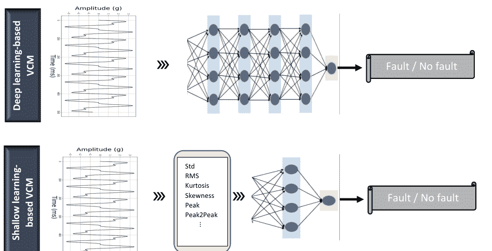

#### 18.2 经典振动状态监测方法：快速入门

下面我们讨论几种（易于实现和理解的）经典振动状态监测方法。

##### 振动特征的控制图

在此方法中，选择一些关键特征（如均方根值、峭度等）作为需要监测的故障指标。每个选定的指标都使用休哈特控制图进行监测，即如果每个特征都保持在 $\mu \pm 3\sigma$ 范围内，则认为机器是健康的，其中均值 $\mu$ 和标准差 $\sigma$ 是根据正常运行状态波形计算得出的。

##### ISO 标准

3σ 控制图的替代方案是直接将机器的振动水平与工业标准进行比较。其中一个标准是 ISO 10816¹¹⁴，它为不同类型（蒸汽轮机、水轮机等）和类别（小型/中型/大型）的机器提供了良好/满意/不满意的均方根值水平。

##### 基于谐波的故障检测与诊断

如第 17 章所述，机器转速的谐波为异常振动的具体原因提供了关键线索。下图展示了一台以 2040 RPM 运转的机器的几个异常频谱示例及其故障推断。

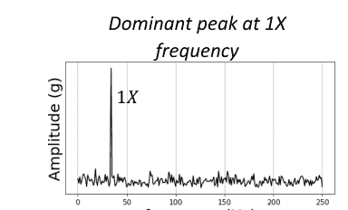

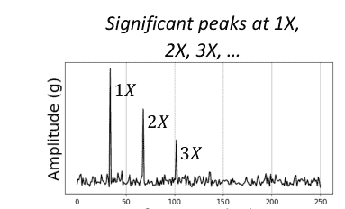

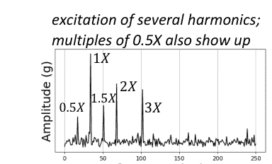

- 转子不平衡或轴弯曲
- 轴不对中或轴裂纹
- 机械松动

关于这些基于启发式推断的更多细节，可以在任何关于振动状态监测的经典书籍¹¹⁵中找到。

#### 18.3 基于机器学习的振动状态监测：通过 SVM 进行电机故障分类

为了演示基于机器学习的振动状态监测，我们将使用一个名为 CWRU 轴承数据集<sup>116</sup> 的流行数据集。该数据集包括在正常运行状态和不同故障条件下、不同负载下、以 48 kHz 和 12 kHz 采样率采集的电机振动数据。为了我们的实现目的，我们将考虑在 1 hp 负载下，从电机驱动端以 48 kHz 采样率收集的数据。总共记录了以下 10 种不同条件下的振动：

- C1：滚动体缺陷（0.007 英寸）
- C2：滚动体缺陷（0.014 英寸）
- C3：滚动体缺陷（0.021 英寸）
- C4：内圈故障（0.007 英寸）
- C5：内圈故障（0.014 英寸）
- C6：内圈故障（0.021 英寸）
- C7：正常运行
- C8：外圈故障（0.007 英寸，数据采集自 6 点钟位置）
- C9：外圈故障（0.014 英寸，数据采集自 6 点钟位置）
- C10：外圈故障（0.021 英寸，数据采集自 6 点钟位置）

每种条件的数据在 CWRU 网站<sup>117</sup> 上以单独的文件（例如 *110.mat*）提供。每个文件的数据被分成 2048 个数据点的较小段，从对应于 *C1* 到 *C10* 的 10 个文件中各获得 230 段。总共我们有 2300 个波形可用。对于每个段，提取了九个时域特征（峰值、峰峰值、均值、标准差、均方根值、偏度、峭度、波峰因子和波形因子）。这产生了一个大小为 2300 X 9 的特征矩阵。在末尾还添加了一列表示故障类别的列，最终的数据矩阵在文件 *feature_time_48k_2048_load_1.csv*<sup>118</sup> 中提供。我们的目标是开发一个机器学习模型，能够使用时域特征预测电机的运行状况。为此，我们将构建一个基于核 SVM 的分类器，如下所示。

```python
# import packages
import numpy as np, pandas as pd
import matplotlib.pyplot as plt

from sklearn.model_selection import train_test_split
from sklearn.preprocessing import StandardScaler
from sklearn.model_selection import GridSearchCV
from sklearn.svm import SVC
from sklearn.metrics import confusion_matrix
import seaborn as sns
```

```python
# read feature data
featureData = pd.read_csv('feature_timeDomain_48k_2048_load_1HP.csv')
```

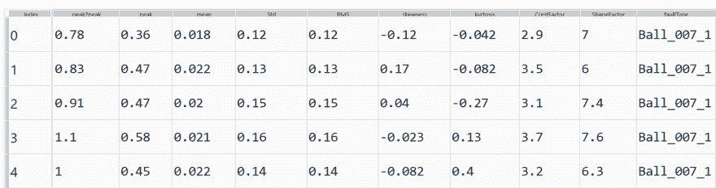

```python
featureData['faultType'] = pd.Categorical(featureData['faultType']) # designates last column as categorical variable
```

```python
# generate training and test datasets
train_data, test_data = train_test_split(featureData, test_size = 750, stratify = featureData['faultType'], random_state = 1234)
print(train_data['faultType'].value_counts())
```

```
>>> Ball_007_1    155
    Ball_014_1    155
    Ball_021_1    155
    IR_007_1      155
    IR_014_1      155
    IR_021_1      155
    Normal_1      155
    OR_007_6_1    155
    OR_014_6_1    155
    OR_021_6_1    155
```

```python
# scale data
scaler = StandardScaler()
train_data_scaled = scaler.fit_transform(train_data.iloc[:,:-1])
test_data_scaled = scaler.transform(test_data.iloc[:,:-1])
```

```python
# find best SVM hyperparameters via grid-search
hyperParameters = {'C':[0.1, 1, 10, 50, 100, 300], 'gamma':[0.01, 0.05, 0.1, 0.5, 1, 10]}
svm_clf = GridSearchCV(SVC(), hyperParameters, cv= 5)
svm_clf.fit(train_data_scaled, train_data['faultType'])
print(svm_clf.best_params_)
```

```
>>> {'C': 50, 'gamma': 0.1}
```

```python
# predict fault classes and generate confusion matrices
train_pred = svm_clf.predict(train_data_scaled)
test_pred = svm_clf.predict(test_data_scaled)
CM_train = confusion_matrix(train_data['faultType'], train_pred)
CM_test = confusion_matrix(test_data['faultType'], test_pred)

fault_type = ['C1','C2','C3','C4','C5','C6','C7','C8','C9','C10']
sns.heatmap(CM_train, annot= True, fmt = "d", xticklabels=fault_type, yticklabels=fault_type,
           cmap = "Blues", cbar = False)

sns.heatmap(CM_test, annot = True, xticklabels=fault_type, yticklabels=fault_type, cmap =
           "Blues", cbar = False)
```

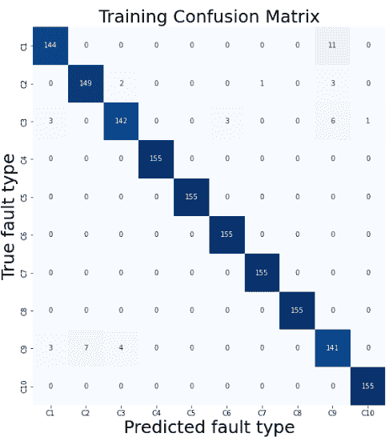

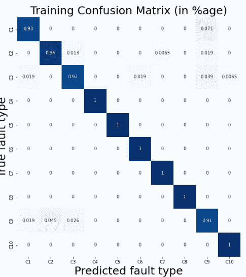

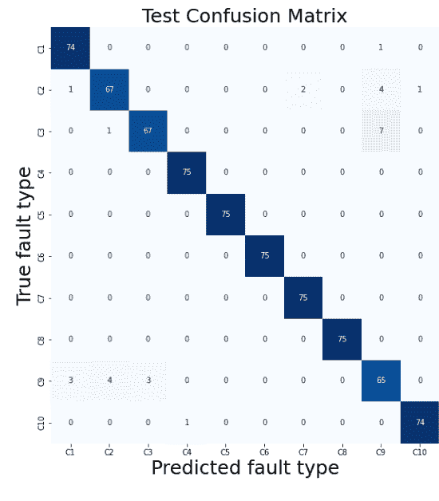

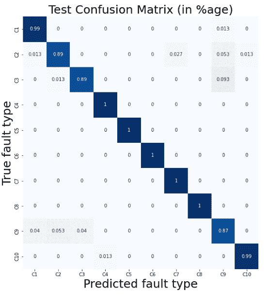

混淆矩阵表明 SVM 分类器性能良好。至此，我们结束了对基于振动的旋转设备监测的快速探讨。振动状态监测本身就是一个庞大的研究领域，不可能在本书的单一部分中涵盖如此广阔的领域。尽管如此，我们希望当前和前面的章节已经让您掌握了部署机器学习进行振动状态监测的工作级知识。

##### 总结

在本章中，我们重点关注了振动状态监测工作流中的故障检测与诊断阶段。我们探讨了从处理后的振动信号进行推断的经典方法和基于机器学习的方法。最后，我们使用流行的 CWRU 数据集实现了一个基于 SVM 的电机故障分类器。

## 第 7 部分

### 预测性维护

## 第 19 章

### 故障预测：概念与方法论

所有机器最终都会发生故障，工厂操作员传统上依赖于定期的基于时间的（预防性）维护，以避免因机械故障而导致的高昂停机时间。尽管经济效率低下，但预防性维护长期以来一直是流程工业的默认方法。直到最近，基于状态的维护方法才获得广泛接受，该方法利用机器的实时数据来评估机器健康状况、检测故障并触发（按需）维护。然而，数据挖掘的最新进展使工厂可靠性人员的思维方式发生了另一次重大转变：仅仅检测机器故障已不再足够；准确预测故障进展以实现预测性维护（PdM）已成为新的潮流。预测性维护的吸引力显而易见——它有助于提前规划维护、更好地管理备件库存等。相应地，预测性维护是工业高管为保持竞争力而努力追求的圣杯。

预测性维护本质上涉及故障预测，即在检测到早期故障后，预测机器健康状况随时间的退化情况。根据故障机制的基础知识、历史运行至失效数据等的可用性，采用不同的预测性维护方法。主流的预测性维护方法涉及计算健康指标（HI），该指标总结了机器健康状态，并在早期故障从初期发展到严重程度时显示出清晰的退化趋势。健康指标允许计算剩余使用寿命（RUL），即故障严重程度超过失效阈值、需要将机器停机之前的剩余时间。

已经设计了几种不同的策略来计算健康指标以及随后的剩余使用寿命估计。虽然剩余使用寿命估计策略将在下一章详细介绍，但本章重点介绍用于健康指标计算的数据驱动方法。具体涵盖以下主题：

- 预测性维护的概念和方法论
- 故障预测：介绍与工作流程
- 健康指标计算方法
- 风力涡轮机故障预测案例研究

#### 19.1 故障预测：简介与工作流程

故障预测简单来说就是估计机器健康状态退化进程的任务<sup>119</sup>。故障预测在故障被检测到之后启动。其最终目标是估计故障严重程度达到失效阈值前的剩余时间。机器或操作单元可能在出现故障的情况下继续运行，直至达到失效条件。因此，估计剩余时间或剩余使用寿命（RUL）可以帮助工厂操作员最大化设备寿命并明智地规划维护。图19.1展示了根据关于故障机制和历史故障数据的可用信息水平，可以采用的不同预测方法。

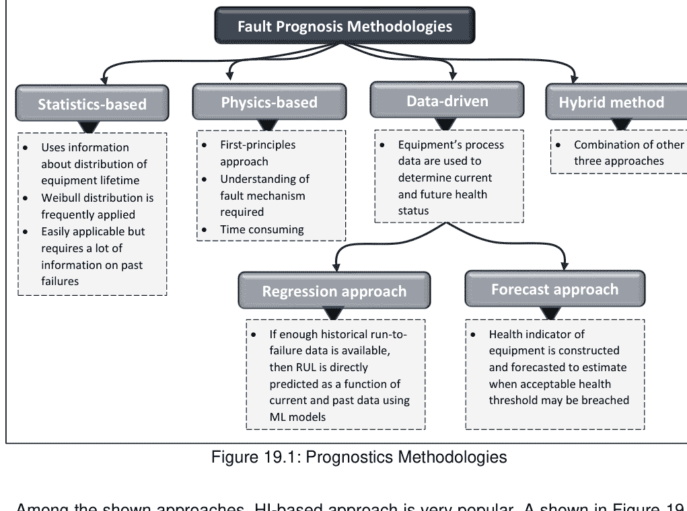

在所示方法中，基于健康指标（HI）的方法非常流行。如图19.2所示，首先计算一条显示故障严重程度或健康状况当前趋势的曲线。然后，预测该曲线的未来进展以估计RUL。本章我们将探讨如何以数据驱动的方式生成此类曲线。HI预测的策略将在下一章详细讨论。

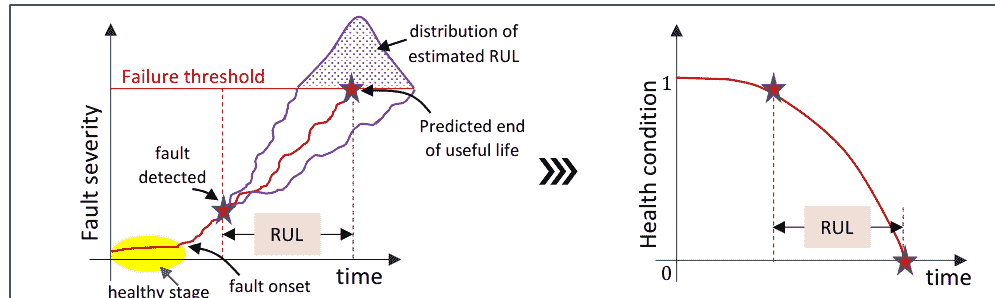

图19.3展示了数据驱动故障预测的典型工作流程。尽管故障预测以故障检测为前提，但技术上用于这两个任务的模型可能不同；因此，故障预测被作为一个独立的建模任务来介绍。将同一个HI首先用于故障检测，然后用于故障预测的情况并不少见。图19.3还展示了两种非HI方法，即直接估计RUL：使用预处理后的原始数据或特征作为模型输入，RUL作为预测输出。训练深度学习（DL）和机器学习（ML）模型需要大量历史运行至失效数据（这类数据通常很少大量存在），这使得这些基于回归的方法不太常见。

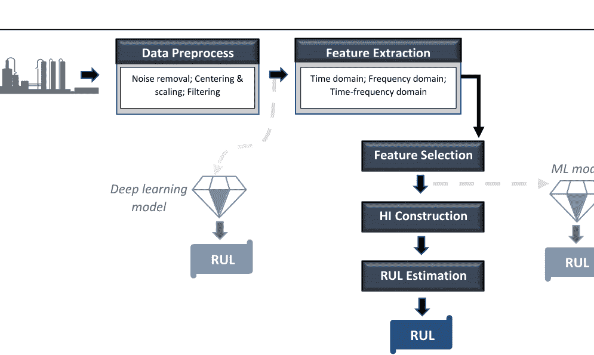

现在让我们继续学习HI实际上是如何计算的。

##### 维护策略

流程工业中的维护策略深受机器学习和传感器技术进步的影响。它已从基于时间的预防性维护，发展到基于主动监测的状态维护（CBM），再到先进的基于预测的预测性维护（PdM）。

| 预防性维护 | 状态维护 | 预测性维护 |
|---|---|---|
| • 设备维护按预设计划执行<br>• 非最优策略，因为维护可能过早或过晚发生<br>• 例如，压缩机可能计划每5年更换一次 | • 当检测到故障迹象时进行设备维护<br>• 进行人工专家分析以确定确切的维护计划<br>• 例如，可以使用PCA监测压缩机以检测是否需要维修 | • 估计机器健康状态随时间的退化情况，并计算失效前的剩余时间<br>• 例如，可以使用RNN监测压缩机以估计振动均方根值何时会超过失效水平 |

#### 19.2 机械健康指标：简介与方法

至此，您已经理解健康指标（HI）只是一个（直接或间接）量化设备或过程故障状态的度量。例如，考虑蒸汽甲烷重整器中一个填充催化剂的重整管，其外表面出现裂纹。存在专门的工具可以测量裂纹深度，从而直接告诉我们故障严重程度。或者，可以测量裂纹周围的表面和炉气温度，由于裂纹的存在，这些温度会显示异常值。异常偏差值（观测值与期望值之差）将间接地告诉我们故障严重程度的水平。

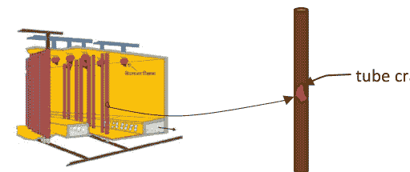

HI可以简单地是测量信号之一或它们的组合。它也可以从模型中推导出来。我们在前面章节中使用的许多机器学习技术已经提供了可以用作健康指标的度量。例如，在SVDD中，特征空间中到中心的距离可以用作HI，因为它指示测试系统偏离正常运行条件（NOC）行为的程度。下面的图19.4总结了构建HI的不同方法。让我们简要了解一下。

##### HI构建方法

###### 统计参数

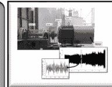

示例：对于旋转机械，均方根（RMS）、波峰因子、峭度等被用作HI。

###### 信号处理

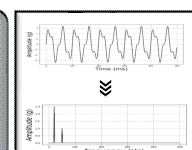

示例：对于旋转机械，来自频谱的特征（如峰值幅度）被用作HI。

###### 基于融合

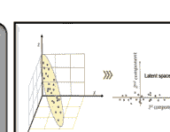

示例：使用PCA融合统计参数和来自处理信号的特征，并将第一主成分得分用作HI。

###### 基于与NOC数据的距离

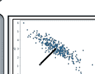

示例：使用与NOC样本的马氏距离/欧氏距离/KNN距离作为HI。

###### 基于机器学习模型

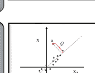

示例：重构误差（自编码器模型）、量化误差（SOM模型）、T²或Q度量（PCA）等被用作HI。

###### 基于预测误差

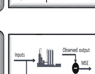

示例：来自ANN回归的均方误差（MSE）值被用作HI。

###### 直接HI建模

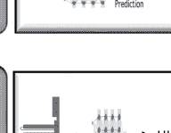

示例：使用历史运行至失效数据，构建一个ANN模型，将HI预测为过程数据或提取特征的函数。

图19.4：健康指标构建方法

虽然图19.4不言自明，但有几个方面值得一提。

##### 有量纲与无量纲特征

统计参数常用于旋转机械的故障预测。然而，正如我们在第17章中提到的，像RMS这样的有量纲参数取决于操作条件（如机器转速），因此不适合作为HI。无量纲参数，如偏度、峭度、波峰因子和脉冲因子更为合适。

##### 特征选择

另一个方面是为构建基于融合的HI或中间模型选择特征。一个常见的做法是只包含那些随着健康状况恶化而显示出清晰单调趋势的特征。

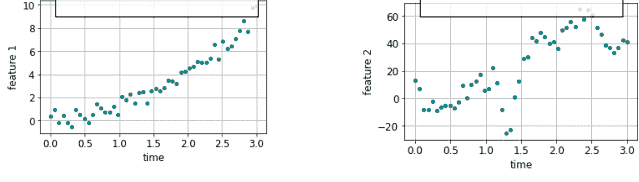

单调性通常计算为特征值与时间之间的斯皮尔曼相关系数，它指示特征是否随时间持续增加（或减少）。单调性范围从-1到1，其中绝对值大对预测有利。

##### 特征平滑

提取的特征几乎总是有噪声的，如下图所示。噪声会影响RUL估计和单调性值（因此也影响特征选择结果）的准确性。因此，一个常见的做法是对特征中的噪声进行平滑处理。平滑通常通过（因果）移动平均进行，其中任何时间的平滑值由最近过去数据的平均值给出。

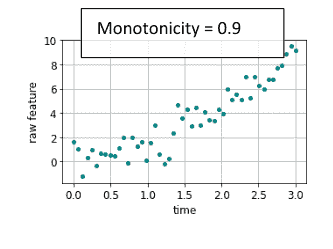

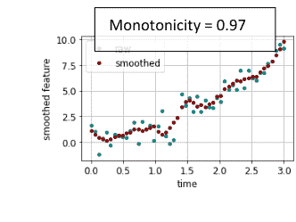

##### 斯皮尔曼相关系数

两个变量 $x$ 和 $y$ 之间的斯皮尔曼相关系数简单来说就是变量秩次之间的皮尔逊相关系数，常用于量化一对变量之间的非线性关系。

$$\rho_{spearman} = cov(r_x, r_y) / \sigma_{r_x} \sigma_{r_y}$$

$$\sigma_{r_x} = \text{变量 } x \text{ 的秩}; \quad \sigma_{r_y} = \text{变量 } y \text{ 的秩}$$

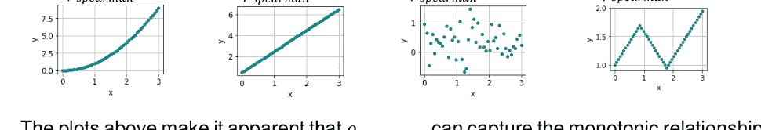

上面的图表清楚地表明，$\rho_{spearman}$ 可以很好地捕捉两个变量之间的单调关系。

##### 历史运行至失效数据

图19.4中的最后一种方法与其他方法不同，因为它是HI的监督学习。这里，使用历史运行至失效<sup>120</sup>数据来创建机器/过程数据到HI之间的映射。对于任何单个运行至失效数据序列，HI标签是使用以下启发式方法估计的：对于健康机器HI为1，对于失效机器HI为0。中间状态的HI值通过插值得到。下面的图示说明了该过程。

让我们将所有已涵盖的概念整合起来，看看如何应用图19.4中的方法三，利用振动信号为（风力）涡轮机构建健康指标。

#### 19.3 使用振动信号为风力涡轮机构建健康指标

正如第17章中所提及的，该风力涡轮机数据集<sup>121</sup>包含从一台风力涡轮机上记录的为期50天的振动加速度数据。每天记录6秒的振动数据。共提供了50个文件，每个文件包含一天的数据。轴承故障导致振动水平逐渐升高，并在第50<sup>天</sup>发生失效。图19.6展示了这50天的合并振动信号。振动水平的增加清晰可见。我们将使用此数据集来演示如何从提取的时域特征构建一个健康指标，该指标能清晰地展现随时间推移的健康退化趋势<sup>122</sup>。

首先，导入所需的包并定义一个从振动波形中提取时域特征的实用函数。

```python
# import packages
import numpy as np, matplotlib.pyplot as plt, pandas as pd
import scipy.io
import glob
from scipy.stats import kurtosis, skew, spearmanr
```

<sup>121</sup> 数据可在 https://github.com/mathworks/WindTurbineHighSpeedBearingPrognosis-Data 获取。数据由MathWorks根据Attribution-NonCommercial-ShareAlike 4.0 International (CC BY-NC-SA 4.0) 许可协议共享 (https://creativecommons.org/licenses/by-nc-sa/4.0/)。已获得数据集原始作者Eric Bechhoefer的许可，允许在本书中使用该数据。
<sup>122</sup> MathWorks使用此数据集提供了一个案例研究 (https://www.mathworks.com/help/predmaint/ug/wind-turbine-high-speed-bearing-prognosis.html)，其中演示了如何使用基于融合的健康指标预测剩余使用寿命。我们在案例研究中采用了类似的方法。

```python
# function to compute time domain features
def timeDomainFeatures(VibData):
    N = len(VibData)
    vibMean = np.mean(VibData)
    vibStd = np.std(VibData, ddof=1, axis=0)
    vibRMS = np.sqrt(np.sum(VibData ** 2)/N)
    vibPeak = np.max(np.abs(VibData))
    vibPeak2Peak = np.max(VibData) - np.min(VibData)
    vibSkewness = skew(VibData, axis=0)
    vibKurtosis = kurtosis(VibData, fisher=False)
    vibShapeFactor = vibRMS / (np.mean(np.abs(VibData)))
    vibCrestFactor = np.max(np.abs(VibData)) / vibRMS
    vibImpulseFactor = np.max(np.abs(VibData)) / (np.mean(np.abs(VibData)))
    vibMarginFactor = np.max(np.abs(VibData)) / (np.mean(np.sqrt(abs(VibData))) ** 2)

    features = np.array([vibMean, vibStd, vibRMS, vibPeak, vibPeak2Peak, vibSkewness,
                         vibKurtosis, vibShapeFactor, vibCrestFactor, vibImpulseFactor, vibMarginFactor])
    return features
```

现在，让我们读取所有50个文件的数据并提取特征。

```python
# collect feature values for each day
Filenames = glob.glob('data-2013*.mat') # fetches names of all relevant files

Nfeatures = 11
features50days = np.zeros((50, Nfeatures))
for i in range(len(FilenamesList)):
    matlab_data = scipy.io.loadmat(Filenames[i], struct_as_record = False) # reads data from file
    vib_data = matlab_data['vibration'][:,0]
    features = timeDomainFeatures(vib_data)
    features50days[i,:] = features

plt.figure(), plt.plot(features50days[:,6], '-o'), plt.xlabel('day'), plt.ylabel('feature value') # kurtosis
```

> 123 文件为 '.mat' 格式

正如我们在文中所指出的，提取的特征是带噪声的。我们将使用移动平均法对其进行平滑处理。

```python
# smooth features using moving average
windowSize = 5
features50days_smoothed = pd.DataFrame(features50days).rolling(windowSize).mean().values
features50days_smoothed[:windowSize-1,:] = features50days[:windowSize-1,:] # replace nan in first 4 rows with original values

plt.figure(), plt.plot(features50days[:, 6], label='raw feature') # kurtosis
plt.plot(features50days_smoothed[:, 6], label='smoothed feature')
plt.xlabel('day'), plt.ylabel('feature value'), plt.legend()
```

上面的图表显示，并非所有特征都表现出清晰的退化趋势。我们将使用单调性来选择与健康指标相关的特征进行进一步处理；具体来说，我们只使用单调性大于0.7的特征。请注意，我们计算健康指标的最终目的是预测剩余使用寿命。为此，我们假设拥有32天的数据来指导健康指标的构建并进行剩余使用寿命预测。用于预测剩余使用寿命的具体策略将在下一章展示。

```python
# separate training data
Ndays_train = 32 # ~ 2/3rd
features_train = features50days_smoothed[:Ndays_train, :]
features_all = features50days_smoothed

# monotonicity of features
feature_monotonicity = np.zeros((Nfeatures,))
for feature in range(Nfeatures):
    result = spearmanr(range(Ndays_train), features_train[:,feature])
    feature_monotonicity[feature] = result.statistic

# bar plot
featureNames = ['Mean', 'Std', 'RMS', 'Peak', 'Peak2Peak', 'Skewness', 'Kurtosis', 'ShapeFactor',
                'CrestFactor', 'ImpulseFactor', 'MarginFactor']

plt.figure(figsize=(15,5))
plt.bar(range(Nfeatures), feature_monotonicity, tick_label=featureNames)
plt.xticks(rotation=45), plt.ylabel('Monotonicity'), plt.grid(axis='y')
```

```python
# pick features with monotonicity >= 0.7
featuresSelected = np.where(np.abs(feature_monotonicity) >= 0.7)[0]
selectFeatures_train = features_train[:,featuresSelected]
selectFeatures_all = features_all[:,featuresSelected]
```

现在，让我们将选定的特征融合成一个单一的度量指标。为此，我们将使用如下所示的PCA技术。请注意，我们再次仅使用训练数据来生成PCA模型。

```python
# perform PCA and extract scores along the first principal component
from sklearn.decomposition import PCA
from sklearn.preprocessing import StandardScaler

scaler = StandardScaler().fit(selectFeatures_train)
selectFeatures_train_normal = scaler.transform(selectFeatures_train)
selectFeatures_all_normal = scaler.transform(selectFeatures_all)

pca = PCA().fit(selectFeatures_train_normal)
PCA_all_scores = pca.transform(selectFeatures_all_normal)

plt.figure(), plt.plot(PCA_all_scores[:,1],'-o', color='darkorange')
plt.xlabel('day'), plt.ylabel('PC1 Score as HI')
```

第一个主成分解释了近95%的数据方差，下图显示，随着轴承故障的发展，第一主成分呈现出良好的单调趋势；因此，它是一个适合作为健康指标的良好度量。

##### P-F曲线

在机械可靠性领域，P-F（潜在故障）曲线是一个常用的概念。该曲线表示设备健康状况随时间从健康状态到缺陷萌生再到失效的演变过程。曲线中指定了机器特性或故障症状的变化，如高温、高振动、高噪声等，这些变化指示了在故障的任何给定阶段可能有效的故障检测技术。

希望现在您对故障预测所涉及的内容以及可用于实施预测性维护解决方案的不同方法有了更好的理解。

##### 总结

在本章中，我们熟悉了用于预测性维护的方法，并对健康指标进行了详细的概念性研究。健康指标的生成是估计剩余使用寿命的主要手段之一，因此，我们探讨了常用于计算健康指标的方法。我们通过一个风力涡轮机健康指标生成的实际案例研究，巩固了所涵盖的概念。

## 第20章

### 故障预测：剩余使用寿命估计

在上一章中，我们介绍了剩余使用寿命的概念，它简单来说就是设备失效前剩余的时间。文中提到了三种广泛使用的基于数据的技术：1) 基于可靠性数据的方法，利用类似设备的寿命分布来预测期望的RUL；2) 通过基于回归的机器学习建模直接计算RUL；3) 将健康指标的计算作为中间步骤。前两种方法需要关于设备过去寿命和完整运行至失效历史的信息。然而，在流程工业中，由于机器通常在达到失效阶段之前就得到了维修（记住预防性维护！），获取这些数据很困难。这使得基于HI的方法更合适，而且不出所料，也更受欢迎。在上一章中，我们看到了如何计算风力涡轮机的HI。我们将完成这个案例研究，并展示如何估计RUL。

在基于HI的方法中，广泛采用两种策略。如果有足够的过去运行至失效数据，那么可以直接选取与当前设备HI轨迹最匹配的历史HI趋势，并利用历史寿命来计算所需的RUL。这被称为基于相似性的方法。一个流行的替代方法是简单地使用当前设备现有的HI值，对其拟合一条曲线以在未来进行外推，并找出何时超过失效阈值。这被称为基于退化的方法。我们将在本章中更详细地探讨这两种策略。总体而言，涵盖以下主题：

- RUL简介
- 基于健康指标的RUL估计策略
- 用于风力涡轮机RUL估计的健康指标退化建模
- 基于深度学习的燃气轮机直接RUL估计

#### 20.1 RUL：再探

在上一章中，我们了解了RUL估计的一些大类策略。我们还了解了如何计算健康指标。图20.1重现了图19.1，并添加了更多关于基于HI的RUL计算方法的细节。该图还突出了四种常用的策略。如前所述，模型的选择取决于关于过去失效信息的类型和数量。如果有大量的过去运行至失效数据，那么可以构建一个深度学习模型来直接预测RUL。我们将在本章中看到这样一个应用。

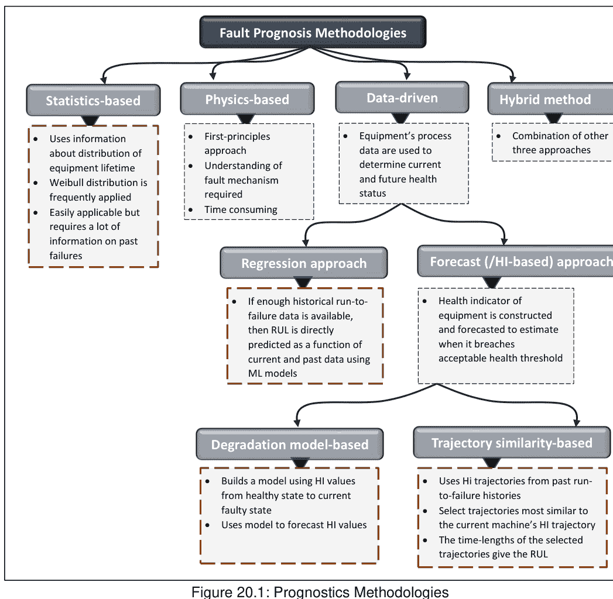

虽然基于HI的策略很受欢迎，但需要提及几点注意事项。对于基于退化的建模，您应该确保要么考虑了未来运行条件的影响，要么运行条件变化不大。对于基于相似性的方法，应注意选择的HI轨迹历史应与当前设备所经历的故障条件相同。因此，在部署故障预测之前，正确的故障分类至关重要。

##### RUL估计性能评估

考虑下图。在时间 $t_k$，退化曲线被外推以预测 RUL$_{pred}$，而实际的RUL是 RUL$_{actual}$。量化误差的一个简单方法是使用均方误差（MSE）。然而，正负RUL误差对工厂运营的影响可能大不相同。低估（RUL$_{pred}$ < RUL$_{actual}$）⇒ 维护发生得比应该的时间早。虽然这不好，但高估（RUL$_{pred}$ > RUL$_{actual}$）的代价更糟糕，因为它可能导致维护延迟，从而造成灾难性的设备故障。

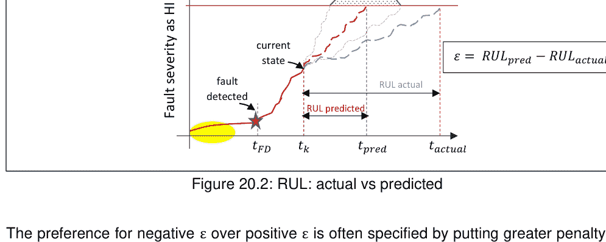

在计算整体性能时（例如，在模型拟合期间），通常通过为 $\varepsilon$>0 设置更大的惩罚来指定对负 $\varepsilon$ 的偏好优于正 $\varepsilon$。

#### 20.2 基于健康指标的RUL估计策略

在图20.2中，我们看到在时间 $t_k$，HI已经显示出退化趋势。对于RUL估计，关键在于弄清楚HI如何进一步演变，直到达到失效阈值。让我们看看两种流行的解决此问题的方法。

##### 健康退化建模

在退化模型方法中，使用所研究设备的可用HI数据拟合一个HI模型，如下图所示。如图所示，模型可以采用不同的形式。在时间 $t_k$，该模型用于预测拟合的HI曲线何时超过失效阈值的 $t_F$；这给出了在时间 $t_k$ 的RUL预测为 $t_F - t_k$。当 $h_{k+1}$ 可用时，在时间 $t_{k+1}$ 重新进行模型训练和RUL估计。我们将把这个策略应用于上一章介绍的风力涡轮机案例研究。

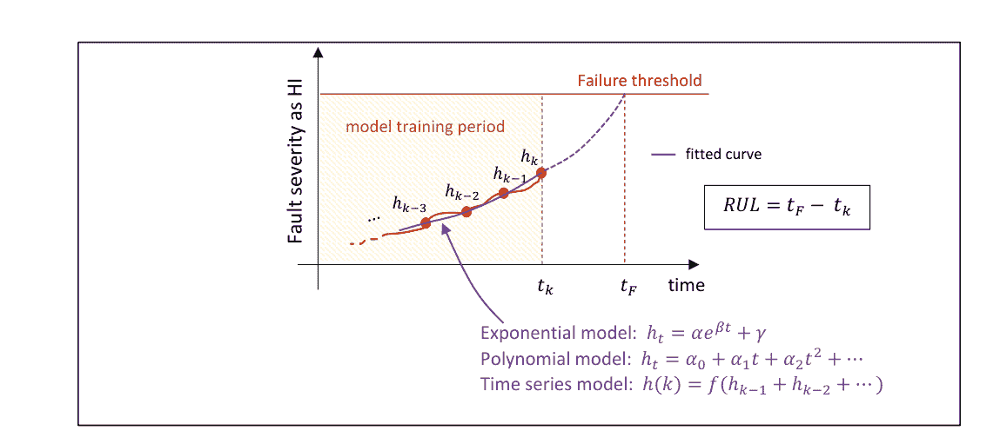

失效阈值的选择并非易事。如果HI基于单一测量或特征（如振动信号的RMS或设备温度），则阈值可能容易指定。然而，对于一般情况，需要领域特定知识或历史失效记录。

##### 基于轨迹相似性的建模

在基于相似性的方法中，收集过去设备失效的已知HI趋势，如下图20.4所示。在时间 $t_k$，选择与当前设备直到时间 $t_k$ 的HI轨迹相似$^{124}$的轨迹。这些选定记录的寿命被组合（简单平均或加权组合）以估计当前设备的RUL。

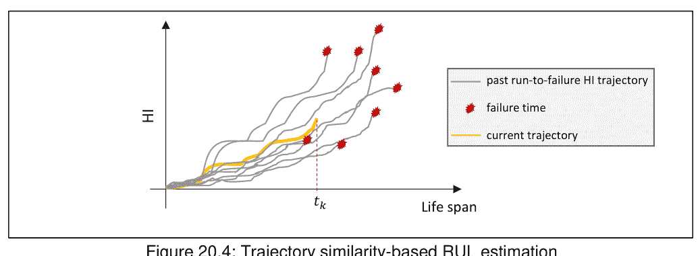

#### 20.3 通过退化建模对风力涡轮机进行RUL估计

为了演示基于退化建模的方法，我们将继续上一章的风力涡轮机案例研究。我们将尝试对训练期32天内获得的HI值拟合一个指数模型。

```python
# fit exponential model (HI = a*exp(b*t) + c); t is in days
PCA_train_scores = pca.transform(selectFeatures_train_normal)
HI_train = PCA_train_scores[:, 0]
HI_train = HI_train - HI_train[0] # forcing HI to start from 0 for better fit

def func(t, a, b):
    return a*np.exp(b*t)
```

$^{124}$ 两个轨迹之间的相似性通常通过欧几里得距离来量化。或者，也使用了动态时间规整（DTW）。

```python
param_opt, param_cov = scipy.optimize.curve_fit(func, range(32), HI_train)

plt.figure(), plt.plot(range(32), HI_train, '-o', color='darkorange', label='actual HI')
plt.plot(range(32), func(np.arange(32), *param_opt), '-o', color='maroon', label='predicted HI')
plt.xlabel('day'), plt.ylabel('PC1 Score as HI'), plt.legend()
```

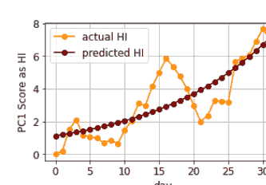

实际的HI轨迹在训练期内似乎具有显著的随机漂移特征，因此，我们的确定性指数拟合无法紧密跟随实际轨迹也就不足为奇了。尽管如此，让我们检查一下RUL预测的误差。我们将使用计算出的HI的最后一个值（第50天）作为失效阈值，并估计拟合轨迹何时超过该阈值。

```python
# forecast using the degradation model
HI_all = PCA_all_scores[:,0]
HI_all = HI_all - HI_all[0]

plt.figure(), plt.plot(range(50), HI_all, '-o', color='darkorange', label='actual HI')
plt.plot(range(50), func(np.arange(50), *param_opt), '-o', color='maroon', label='predicted HI')
plt.plot([0,60], [HI_all[-1],HI_all[-1]],'--', color='red')
plt.xlabel('day'), plt.ylabel('PC1 Score as HI'), plt.legend()
```

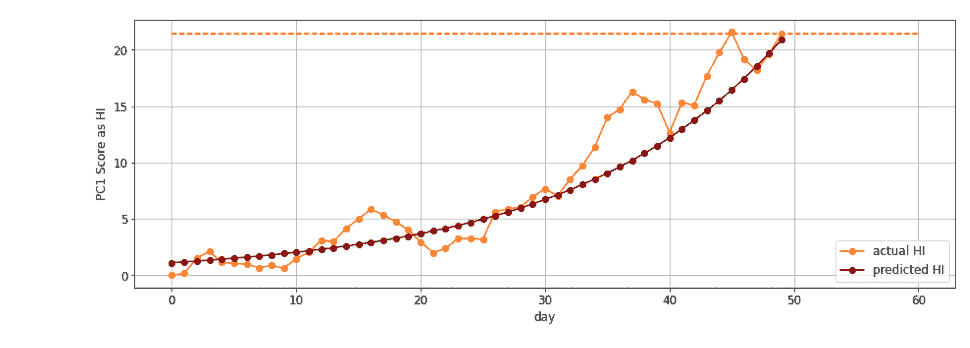

上图表明，简单的指数退化模型完美地预测了有用寿命的结束！

#### 20.4 基于人工神经网络回归建模的燃气轮机剩余使用寿命估计

为了说明如何利用过去的运行至失效历史数据进行基于回归的剩余使用寿命直接预测，我们将使用一个模拟的飞机燃气轮机发动机数据集¹²⁵。该数据集包含来自多个发动机运行模拟的多个传感器（如温度、压力）的操作和动态数据。每次模拟都从一台（具有不同程度初始磨损的）发动机在正常限值内运行开始。发动机退化在模拟过程中的某个时间点开始，并持续到发动机失效（发动机健康裕度，即效率和流量的函数，低于某个阈值）。训练数据集包含直到发动机失效的完整数据，而测试数据集包含直到失效前某个时间点的数据。测试数据集的发动机实际剩余使用寿命已提供。我们的目标是利用测试数据集中的模拟数据开发一个预测性维护模型来预测发动机失效。

##### 飞机发动机数据集

我们将使用仓库数据集中的以下三个文件中的数据。

-   train_FD001.txt：除了（3个）操作设置外，它还包含来自100个不同模拟或发动机的21个传感器（s1到s21）的时间序列数据。每个模拟的最后一个周期是相应发动机的失效点。在图20.5中，由于发动机退化导致的传感器漂移是显而易见的。
-   test_FD001.txt：它也包含100台发动机的模拟时间序列数据，但这里只提供了每台发动机的部分时间序列。图20.5显示了发动机ID为90的提供的时间序列。需要估计每台发动机的剩余使用寿命。
-   RUL_FD001.txt：它包含测试数据集中100台发动机的实际剩余使用寿命，以周期为单位。我们将使用此信息来衡量我们模型预测的准确性。

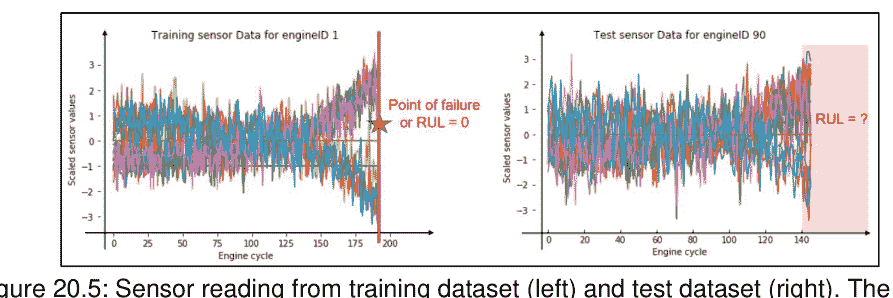

##### 使用LSTM进行剩余使用寿命预测

在这个示例中，我们将构建一个LSTM网络来预测测试发动机的剩余使用寿命。正如其他人所做的那样<sup>126</sup>，我们将使用过去50个周期的序列来进行失效预测。让我们从读取提供的文本文件中的数据开始。请注意，与之前的示例不同，我们将在这里更广泛地使用Pandas库，因为它能够通过描述性名称引用列，这使得代码更易于理解。

```python
# training data
train_df = pd.read_csv('PM_train.txt', sep=" ", header=None)
train_df.drop(train_df.columns[[26, 27]], axis=1, inplace=True) # last two columns are blank
train_df.columns  =  ['EngineID',  'cycle',  'OPsetting1',  'OPsetting2',  'OPsetting3',  's1',  's2',  's3',
's4', 's5', 's6', 's7', 's8', 's9', 's10', 's11', 's12', 's13', 's14', 's15', 's16', 's17', 's18', 's19', 's20', 's21']

# test data
test_df = pd.read_csv('PM_test.txt', sep=" ", header=None)
test_df.drop(test_df.columns[[26, 27]], axis=1, inplace=True)
test_df.columns  =  ['EngineID',  'cycle',  'OPsetting1',  'OPsetting2',  'OPsetting3',  's1',  's2',  's3',
's4', 's5', 's6', 's7', 's8', 's9', 's10', 's11', 's12', 's13', 's14', 's15', 's16', 's17', 's18', 's19', 's20', 's21']

# actual RUL for each engine-id in the test data
truth_df = pd.read_csv('PM_truth.txt', sep=" ", header=None)
truth_df.drop(truth_df.columns[[1]], axis=1, inplace=True) # 2nd column is blank
truth_df.columns = ['finalRUL'] # assigning column name as finalRUL
truth_df['EngineID'] = truth_df.index + 1 # adding new column EngineID
```

虽然上面的大部分代码是不言自明的，但最后一部分读取了真实的剩余使用寿命数据，删除了包含'nan'数据的冗余列，并添加了一个额外的列'EngineID'，如下所示

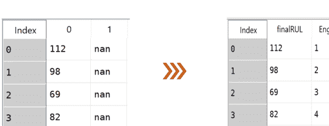

接下来，我们将进行一些数据框操作，以计算发动机在任何给定周期的剩余使用寿命。下面的代码基本上将下面代码片段中突出显示的列添加到训练和测试数据框中。我们还将训练数据集中的剩余使用寿命值裁剪到阈值150。

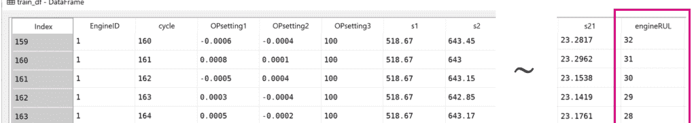

```python
# training dataset
maxCycle_df = pd.DataFrame(train_df.groupby('EngineID')['cycle'].max()).reset_index()
maxCycle_df.columns = ['EngineID', 'maxEngineCycle']

train_df = train_df.merge(maxCycle_df, on=['EngineID'], how='left')
train_df['engineRUL'] = train_df['maxEngineCycle'] - train_df['cycle']
train_df.drop('maxEngineCycle', axis=1, inplace=True) # maxEngineCycle is not needed anymore

# compute maxEngineCycle for test data using data from test_df and truth_df
maxCycle_df  = pd.DataFrame(test_df.groupby('EngineID')['cycle'].max()).reset_index()
maxCycle_df.columns = ['EngineID', 'maxEngineCycle']
truth_df['maxEngineCycle'] = maxCycle_df ['maxEngineCycle'] + truth_df['finalRUL']
truth_df.drop('finalRUL', axis=1, inplace=True)

# generate engineRUL for test data
test_df = test_df.merge(truth_df, on=['EngineID'], how='left')
test_df['engineRUL'] = test_df['maxEngineCycle'] - test_df['cycle']
test_df.drop('maxEngineCycle', axis=1, inplace=True)

# clip RUL in training data at the threshold 150
RULthreshold = 150
train_df['engineRUL'] = np.where(train_df['engineRUL'] > RULthreshold, 150, train_df['engineRUL'])
```

接下来，我们将对传感器读数进行缩放。

```python
# training dataset: create temporary dataframe with columns to be scaled
all_cols = train_df.columns # get columns names
cols_to_scale = train_df.columns.difference(['EngineID', 'cycle', 'engineRUL'])
train_df_with_cols_to_scale = train_df[cols_to_scale]

# scale and rejoin with columns that were not scaled
scaler = StandardScaler()
scaled_train_df_with_cols_to_scale = pd.DataFrame(scaler.fit_transform(train_df_with_cols_to_scale),
                                                columns=cols_to_scale) # scalar transform returns a numpy array
train_df_scaled = train_df[['EngineID','cycle','engineRUL']].join(scaled_train_df_with_cols_to_scale)
train_df_scaled = train_df_scaled.reindex(columns = all_cols) # same columns order as before

# test dataset: repeat above steps
all_cols = test_df.columns
test_df_with_cols_to_scale = test_df[cols_to_scale]
scaled_test_df_with_cols_to_scale = pd.DataFrame(scaler.transform(test_df_with_cols_to_scale),
                                                columns=cols_to_scale)
test_df_scaled = test_df[['EngineID','cycle','engineRUL']].join(scaled_test_df_with_cols_to_scale)
test_df_scaled = test_df_scaled.reindex(columns = all_cols) # same columns order as before
```

接下来，我们将创建序列样本。对于每台发动机，任何连续的50个周期块构成一个序列。为了实现这一点，我们将定义一个实用函数，如下所示

```python
nSequenceSteps = 50 # number of cycles in a sequence
X_train_sequence = []
y_train_sequence = []

# define utility function
def generate_LSTM_samples(engine_df, nSequenceSteps):
    """
    This function generates list of LSTM samples (numpy arrays of size (nSequenceSteps, 24)
    each) for LSTM input and list of output labels for LSTM
    """
    engine_X_train_sequence = []
    engine_y_train_sequence = []
    engine_data = engine_df.values # converting to numpy

    for sample in range(nSequenceSteps, engine_data.shape[0]):
        engine_X_train_sequence.append(engine_data[sample-nSequenceSteps:sample, :-1]) # last column is output label
        engine_y_train_sequence.append(engine_data[sample,-1])

    return engine_X_train_sequence, engine_y_train_sequence

# generate sequence samples
for engineID in train_df_scaled['EngineID'].unique():
    engine_df = train_df_scaled[train_df_scaled['EngineID'] == engineID]
    engine_df = engine_df[['OPsetting1', 'OPsetting2', 'OPsetting3', 's1', 's2', 's3', 's4', 's5', 's6', 's7',
                          's8', 's9', 's10', 's11', 's12', 's13', 's14', 's15', 's16', 's17', 's18', 's19', 's20',
                          's21', 'engineRUL']]
    engine_X_train_sequence, engine_y_train_sequence = generate_LSTM_samples(engine_df,
                                                                            nSequenceSteps)
    X_train_sequence = X_train_sequence + engine_X_train_sequence # adding samples to the
                                                                    common list
    y_train_sequence = y_train_sequence + engine_y_train_sequence

X_train_sequence, y_train_sequence = np.array(X_train_sequence), np.array(y_train_sequence)
```

我们现在准备好构建和编译我们的循环神经网络。拓扑结构包括一个具有线性激活函数的单神经元输出层。为了正则化，我们使用了dropout技术。

```python
# import ANN packages
from tensorflow.keras import Sequential
from tensorflow.keras.layers import Dense, LSTM, Dropout

# custom metric
import tensorflow.keras.backend as K
def r2_custom(y_true, y_pred):
    """Coefficient of determination
    """
    SS_res =  K.sum(K.square(y_true - y_pred))
    SS_tot = K.sum(K.square(y_true - K.mean(y_true)))
    return (1 - SS_res/(SS_tot + K.epsilon()))

# define model
model = Sequential()
model.add(LSTM(units=100, return_sequences=True, input_shape=(nSequenceSteps, 24)))
model.add(Dropout(0.2))
model.add(LSTM(units=50))
model.add(Dropout(0.2))
model.add(Dense(1))

# compile model
model.compile(loss='mse', optimizer='Adam', metrics= r2_custom)
```

我们现在可以拟合模型了。验证曲线表明，我们可以在训练数据集上获得相当好的预测结果。

from tensorflow.keras.callbacks import EarlyStopping
es = EarlyStopping(monitor='val_loss', patience=10, restore_best_weights=True)
history = model.fit(X_train_sequence, y_train_sequence, epochs=200, batch_size=250,
                    validation_split=0.3, callbacks=[es])

对于测试数据，我们将为每台发动机创建一个序列，使用最后50个循环。图20.6比较了测试发动机数据集的实际与预测RUL值。显然，模型表现令人满意。对工艺设备剩余使用寿命的如此精确估计，可以极大地辅助维护规划，并避免因设备意外故障而产生的成本。

```python
# input/output test sequences (only the last sequence is used to predict failure)
X_test_sequence = []
y_test_sequence = []

for engineID in test_df_scaled['EngineID'].unique():
    engine_df = test_df_scaled[test_df_scaled['EngineID'] == engineID]

    if engine_df.shape[0] >= nSequenceSteps:
        engine_df = engine_df[['OPsetting1', 'OPsetting2', 'OPsetting3', 's1', 's2', 's3', 's4', 's5', 's6', 's7',
                               's8', 's9', 's10', 's11', 's12', 's13', 's14', 's15', 's16', 's17', 's18', 's19', 's20',
                               's21', 'engineRUL']].values
        X_test_sequence.append(engine_df[-nSequenceSteps:, :-1])
        y_test_sequence.append(engine_df[-1,-1])

X_test_sequence, y_test_sequence = np.array(X_test_sequence), np.array(y_test_sequence)

# predict RULs
y_test_sequence_pred = model.predict(X_test_sequence)
test_performance = model.evaluate(X_test_sequence, y_test_sequence)
print('R2_test: {}'.format(test_performance[1]))
```

>>> R2_test: 0.834

图20.6：测试飞机发动机数据集的预测与观测发动机RUL对比

至此，我们对预测性维护方法的简要介绍就完成了。你现在已掌握了所有现代工具，可以应对数据生产工厂中的设备健康管理问题。我们在此与你告别，并祝愿你在过程数据科学的职业生涯中一切顺利。

##### 总结

在本章中，我们在上一章奠定的故障预测基础上进行了拓展。我们探讨了利用健康指标轨迹和直接回归进行RUL预测的技术。我们通过风力涡轮机和燃气轮机RUL预测的几个案例研究，巩固了概念理解。

全书完

## 《Python在过程与设备状态监测及预测性维护中的机器学习应用》

本书旨在帮助读者快速获得基于机器学习技术的实用知识，这些技术广泛应用于过程工业中设备状态监测、全厂监测和预测性维护解决方案的构建。本书涵盖了从单变量控制图到基于深度学习的剩余使用寿命预测等广泛的技术。因此，读者可以利用所学概念，为故障检测、故障诊断和故障预测构建高级解决方案。本书以应用为导向的方法对实践和有志于从事过程工程及数据科学的读者友好且易于消化。完成后，读者将能够自信地浏览预测与健康管理文献，并为其问题明智地选择合适的建模方法。

以下主题被广泛涵盖：

- 过程数据的探索性分析
- 过程监测和预测性维护解决方案的最佳实践
- 通过控制图和时间序列数据挖掘进行单变量监测
- 多变量统计过程监测技术（PCA、PLS、FDA等）
- 处理动态、非线性和多模态过程的机器学习和深度学习技术
- 使用振动数据进行旋转机械的故障检测和诊断
- 用于预测性维护的剩余使用寿命预测