# 面向过程系统工程的Python机器学习

利用过程数据实现卓越运营

Ankur Kumar
Jesus Flores-Cerrillo

谨以此书献给我们的配偶、家人、朋友、祖国以及所有数据科学爱好者

# 面向过程系统工程的Python机器学习

[www.MLforPSE.com](http://www.MLforPSE.com)

版权所有 © 2022 Ankur Kumar

保留所有权利。未经作者事先书面许可，不得以任何形式或任何方式复制或传播本书的任何部分。

在编写本书时，我们已尽一切努力确保所呈现信息的准确性，并获得了使用受版权保护材料的许可。然而，对于错误或遗漏，作者不作任何明示或暗示的保证，并且对于因使用本书所含信息而导致的任何损失或损害，不承担任何法律责任或责任。

如需申请许可，请通过 MLforPSE@gmail.com 联系作者。

首次出版：2022年2月

# 关于作者

**Ankur Kumar** 拥有德克萨斯大学奥斯汀分校过程系统工程博士学位（2016年）和印度理工学院孟买分校化学工程学士学位（2012年）。他目前在林德集团卓越中心的先进数字技术与系统组工作，为林德的氢气和空气分离工厂开发了多个基于机器学习的内部监控和过程控制解决方案。Ankur的工具在林德内外赢得了多项奖项。最近，他的其中一个工具PlantWatch（一个全厂故障检测与诊断工具）获得了捷克共和国工业联合会颁发的2021年工业4.0奖。Ankur已撰写或合著了10多篇同行评审期刊论文（涉及数据驱动过程建模和优化领域），是许多顶级期刊的常任审稿人，并曾在多个国际会议上担任分会场主席。Ankur还在2019年至2021年期间担任《过程控制杂志》的副编辑。

**Jesus Flores-Cerrillo** 目前是林德集团的研发副主任，负责管理林德卓越中心的先进数字技术与系统组。他在监控技术以及先进过程控制与优化解决方案的开发和实施方面拥有超过20年的经验。Jesus拥有麦克马斯特大学化学工程博士学位，并在多元统计和先进过程控制等领域撰写或合著了40多篇同行评审期刊论文。他的团队开发和实施了新颖的工厂监控、机器学习和工业物联网解决方案，以提高林德流程的效率和可靠性。Jesus的团队获得了美国制造商协会制造领导力委员会颁发的2020年人工智能与高级分析领导力奖。

# 致读者

完整的代码实现可在 https://github.com/ML-PSE/Machine_Learning_for_PSE 下载获取Jupyter笔记本和Spyder脚本。代码更新将在必要时进行，并在GitHub仓库上更新。本书文本材料的更新将在Leanpub (www.leanpub.com) 上免费提供。我们将非常感谢任何关于书中任何更正和/或拼写错误的信息。

*一个待解决的小问题*

在数学表达式中，粗体字母表示向量和矩阵，常规字体字母表示标量变量。然而，这种区分在某些表达式中并未正确显示。这些表达式将很快得到更正，届时将通知读者相关更新。尽管如此，这个待解决的小问题不会妨碍读者正确理解材料。

# 目录

- 前言
- 第一部分 引言与基础
    - 第1章 面向过程系统工程的机器学习 1
        - 1.1 什么是过程系统
            - 1.1.1 过程数据的特征
        - 1.2 什么是机器学习
            - 1.2.1 机器学习工作流程
            - 1.2.2 机器学习系统的类型
        - 1.3 机器学习在过程工业中的应用
            - 1.3.1 过程工厂中的决策层级
            - 1.3.2 应用领域
        - 1.4 机器学习解决方案部署
        - 1.5 过程数据科学的未来
    - 第2章 脚本环境 20
        - 2.1 Python简介
        - 2.2 Spyder和Jupyter简介
        - 2.3 Python语言：基础
        - 2.4 科学计算包：基础
            - 2.4.1 Numpy
            - 2.4.2 Pandas
        - 2.5 典型的机器学习脚本
    - 第3章 机器学习模型开发：工作流程与最佳实践 39
        - 3.1 机器学习模型开发工作流程
        - 3.2 数据预处理：数据转换
            - 3.2.1 （鲁棒）数据中心化与缩放
            - 3.2.2 特征提取
            - 3.2.3 特征工程
            - 3.2.4 通过管道实现工作流程自动化
        - 3.3 模型评估
            - 3.3.1 回归指标
            - 3.3.2 分类指标
            - 3.3.3 留出法/交叉验证
            - 3.3.4 残差分析
        - 3.4 模型调优
            - 3.4.1 过拟合与欠拟合
            - 3.4.2 训练/验证/测试集划分
            - 3.4.3 K折交叉验证
            - 3.4.4 正则化
            - 3.4.5 通过GridSearchCV进行超参数优化
    - 第4章 数据预处理：清洗过程数据 67
        - 4.1 信号去噪
            - 4.1.1 移动窗口平均滤波器
            - 4.1.2 SG滤波器
        - 4.2 变量选择/特征选择
            - 4.2.1 过滤方法
            - 4.2.2 包装方法
            - 4.2.3 嵌入方法
        - 4.3 异常值处理
            - 4.3.1 单变量方法
            - 4.3.2 多变量方法
            - 4.3.3 数据挖掘方法
        - 4.4 缺失数据处理
- 第二部分 经典机器学习方法
    - 第5章 降维与潜变量方法（第一部分）
        - 5.1 PCA：简介
            - 5.1.1 数学背景
            - 5.1.2 聚合物制造过程的降维
        - 5.2 聚合物制造过程的PCA过程监控
            - 5.2.1 过程监控/故障检测指标
            - 5.2.2 故障检测
            - 5.2.3 故障诊断
        - 5.3 经典PCA的变体
            - 5.3.1 动态PCA
            - 5.3.2 多向PCA
            - 5.3.3 核PCA
        - 5.4 PLS：简介
            - 5.4.1 数学背景
        - 5.5 制浆造纸制造过程的PLS软测量
        - 5.6 聚乙烯制造过程的PLS过程监控
            - 5.6.1 故障检测指标
            - 5.6.2 故障检测
        - 5.7 经典PLS的变体
    - 第6章 降维与潜变量方法（第二部分）
        - 6.1 ICA：简介
            - 6.1.1 数学背景
            - 6.1.2 复杂化工过程：田纳西-伊士曼过程
            - 6.1.3 确定IC数量
        - 6.2 田纳西-伊士曼过程的ICA过程监控
            - 6.2.1 故障检测指标
            - 6.2.2 故障检测
        - 6.3 FDA：简介
            - 6.3.1 数学背景
            - 6.3.2 田纳西-伊士曼过程的降维
        - 6.4 田纳西-伊士曼过程的FDA故障分类
    - 第7章 支持向量机与基于核的学习
        - 7.1 SVM：简介
            - 7.1.1 数学背景
            - 7.1.2 硬间隔与软间隔分类
        - 7.2 非线性数据的核技巧
            - 7.2.1 数学背景
        - 7.3 SVDD：简介

## 第7章 支持向量机（SVM）

### 7.3 支持向量数据描述（SVDD）

- 7.3.1 数学背景
- 7.3.2 单类SVM与SVDD的比较
- 7.3.3 带宽参数与SVDD图解

### 7.4 基于SVDD的过程故障检测

### 7.5 支持向量回归（SVR）简介

- 7.5.1 数学背景

### 7.6 基于SVR的聚合物加工厂软测量

### 7.7 基于SVR的炼油厂脱丁烷塔软测量

## 第8章 过程数据中的分组发现：聚类与混合模型建模

### 8.1 聚类简介

- 8.1.1 多模态半导体制造过程

### 8.2 基于质心的聚类：K-均值

- 8.2.1 通过肘部法则确定聚类数量
- 8.2.2 通过轮廓分析量化聚类质量
- 8.2.3 优缺点

### 8.3 基于密度的聚类：DBSCAN

- 8.3.3 优缺点

### 8.4 概率聚类：高斯混合模型

- 8.4.1 数学背景
- 8.4.2 确定聚类数量

### 8.5 基于GMM的半导体制造过程多模态过程监控

- 8.5.1 故障检测指标
- 8.5.2 故障检测

## 第9章 决策树与集成学习

### 9.1 决策树简介

- 9.1.1 数学背景

### 9.2 随机森林简介

- 9.2.1 数学背景

### 9.3 基于随机森林的混凝土建筑行业软测量

- 9.3.1 特征重要性

### 9.4 集成学习简介

- 9.4.1 Bagging
- 9.4.2 Boosting

### 9.5 基于XGBoost的污水处理厂出水水质预测

## 第10章 其他实用的经典机器学习技术

### 10.1 核密度估计（KDE）简介

- 10.1.1 数学背景
- 10.1.2 确定KDE超参数

### 10.2 通过KDE确定监控指标控制限

### 10.3 k近邻（kNN）简介

- 10.3.1 数学背景
- 10.3.2 确定kNN超参数
- 10.3.3 kNN在过程系统中的应用

### 10.4 基于kNN的半导体制造过程故障检测

### 10.5 机器学习技术的组合

## 第三部分 人工神经网络与深度学习

### 第11章 前馈神经网络

- 11.1 人工神经网络（ANN）简介
  - 11.1.1 深度学习
  - 11.1.2 TensorFlow
- 11.2 基于FFNN的联合循环电厂过程建模
- 11.3 数学背景
  - 11.3.1 激活函数
  - 11.3.2 损失函数与代价函数
  - 11.3.3 梯度下降优化
  - 11.3.4 训练轮次与批大小
  - 11.3.5 反向传播
  - 11.3.6 梯度消失/爆炸
- 11.4 神经网络中的非线性（宽度与深度）
- 11.5 神经网络超参数优化
- 11.6 改进网络训练的策略
  - 11.6.1 早停法
  - 11.6.2 正则化
  - 11.6.3 初始化
  - 11.6.4 批归一化
- 11.7 基于FFNN的炼油厂脱丁烷塔软测量
- FFNN建模指南

### 第12章 循环神经网络

- 12.1 循环神经网络（RNN）简介
  - 12.1.1 RNN输出
  - 12.1.2 LSTM网络
- 12.2 基于LSTM RNN的SISO加热器系统辨识
- 12.3 数学背景
- 12.4 堆叠/深度RNN
- 12.5 基于LSTM的田纳西-伊士曼过程故障分类
- 12.6 使用LSTM网络进行预测性维护
  - 12.6.1 使用LSTM进行故障预测
  - 12.6.2 使用LSTM进行剩余使用寿命（RUL）预测

### 第13章 强化学习

- 13.1 强化学习简介
  - 13.1.1 用于过程控制的强化学习
- 13.2 强化学习术语与数学概念
  - 13.2.1 环境与马尔可夫决策过程
  - 13.2.2 奖励与回报
  - 13.2.3 策略
  - 13.2.4 价值函数
  - 13.2.5 贝尔曼方程
- 13.3 Q学习基础
- 13.4 深度强化学习与Actor-Critic框架
  - 13.4.1 深度Q学习
  - 13.4.2 策略梯度方法
  - 13.4.3 Actor-Critic框架
- 13.5 深度确定性策略梯度（DDPG）
  - 13.5.1 经验回放
  - 13.5.2 目标网络
  - 13.5.3 OU过程作为探索噪声
- 13.6 作为液位控制器的DDPG强化学习智能体

## 第四部分 在Web上部署机器学习解决方案

### 第14章 过程监控Web应用

- 14.1 过程监控Web应用简介
- 14.2 一个简单的‘Hello World’ Web应用
- 14.3 将机器学习模型嵌入Web应用
- 14.4 构建前端用户界面

## 附录

- 数据集描述
- 聚合物制造过程数据
- 纸浆与造纸制造过程数据
- 低密度聚乙烯（LDPE）过程数据
- 田纳西-伊士曼过程数据
- 半导体制造过程数据
- 聚合物中试装置数据
- 炼油厂脱丁烷塔数据
- 混凝土抗压强度数据
- 污水处理厂数据
- 联合循环电厂数据
- SISO加热器系统数据
- 燃气轮机数据

## 前言

我们每天都能听到机器学习（ML）和人工智能（AI）研究人员取得新突破的故事，这些突破有可能彻底改变我们的世界。通过类人机器人、语音识别、计算机视觉、无人驾驶汽车、欺诈检测、个性化推荐和自动化健康诊断，机器学习已经成为我们日常生活中不可或缺的一部分。此外，远离这些‘可见’高科技产品的光环，机器学习在过程工业（化学工业、生物制药工业、钢铁工业等）中也一直在悄然进步，基于机器学习的解决方案正越来越多地用于预测性设备维护、产品质量保证、过程监控、故障诊断、过程控制和过程优化。随着全球竞争加剧和产品质量标准日益严格，工业工厂正依赖机器学习工具（例如基于强化学习的自适应过程控制器）来获得超越竞争对手的优势。

也许你阅读这本书，是因为你也受到了机器学习能力的启发，并希望用它来解决你的组织面临的问题。然而，你可能正在努力寻找一本明确的指南，帮助你在众多可用方法中决定选择哪种具体方法。你可能遇到过一篇很好的研究文章，展示了一种机器学习方法在过程系统中的有趣应用。但是，你可能在理解算法的复杂细节时遇到了困难。如果你曾努力寻找一本满足过程系统工程师需求、考虑工业过程系统独特特性并使用工业规模过程系统进行示例的数据科学书籍，我们不会感到惊讶。我们作者也曾经历过那个阶段。可以说，过程工程师通过完成一个过程监控应用（机器学习在过程工业中最流行的应用领域）来学习主成分分析（PCA），并学习如何计算监控指标，会发现这更相关、更有用。对于其他几种流行的机器学习方法，也可以提出类似的论点。现有的机器学习资源对于工业从业者来说存在空白，而本书试图填补这一空白。

从某种意义上说，我们是为我们年轻的自己写了这本书；一本我们希望在开始尝试机器学习技术时就已经存在的书。根据我们多年开发数据驱动工业解决方案的经验，本书的写作重点在于理清机器学习的世界，全面阐述在过程工业中已被证明有用的机器学习工具，逐步阐明实施细节，警示各种陷阱，并列出我们多年来遇到的各种技巧和窍门，同时使用来自工业规模过程系统的数据集进行示例。我们坚信‘边做边学’，因此我们鼓励读者在阅读文本的同时，完成章节内的示例。为方便读者，我们提供了包含完整代码实现的Jupyter笔记本供下载。我们选择Python作为本书的编程语言，因为它使用方便，拥有大量的机器学习库，并且是机器学习的事实标准语言。本书不要求具备Python的先验经验。本书旨在从零开始教授机器学习，完成后，读者将能够自如地使用机器学习技术。

机器学习将继续在释放过程工业下一波生产力提升方面发挥重要作用。我们希望这本书能激励读者开发新的机器学习解决方案，以应对工作中的挑战性问题。我们祝愿所有新兴的过程系统数据科学家一切顺利。

## 谁应该阅读这本书

本书全面、逐步地阐述了几种在过程工业中已被证明有用的流行机器学习技术。书中包含了以‘边做边学’形式呈现的、与工业相关的示例。每章都提供了对特定主题高级内容的适当参考。因此，本书对工业过程技术人员、本科生和研究生、机器学习研究人员以及一般数据科学爱好者都将有所帮助。如果你属于以下任何一类，你将会喜欢阅读这本书。

1) 希望提升机器学习技能的过程系统工程师或数据科学家
2) 寻找特定问题（例如监控高维多模态过程）机器学习解决方案的过程系统工程师
3) 初入机器学习世界的过程系统数据科学家
4) 希望通过处理真实工业数据集来学习Python的新兴数据科学家（无Python经验）
5) 经常使用商业数据科学软件（IBM SPSS, Aspen Mtell）并希望了解技术细节以更好理解方法的过程系统工程师。

## 预备知识

不需要机器学习或Python的先验经验。假定具备本科水平的基础线性代数和微积分知识。

## 书籍结构

本书采用一种整体性与实践性相结合的方法来学习机器学习，读者首先获得概念性见解，并对方法论形成直观理解，然后通过实验代码示例来巩固所学知识。每种方法都通过使用简单的工艺系统或数值示例来阐述其主要特点，随后在工业规模的工艺上进行实现。

本书分为四个部分。**第一部分**阐述了机器学习在过程系统工程中的重要性，并奠定了机器学习的基础。**第二部分**详细介绍了经典的机器学习技术，编写时充分考虑了工业过程系统的各种特性，如高维性、非线性、多模式操作等。**第三部分**专注于人工神经网络和深度学习。虽然深度学习是当前机器学习领域的热门话题，但我们想提醒读者，不要被诱惑为手头的每个问题都部署深度学习模型。通常，更简单的经典模型可以提供与神经网络模型一样好、甚至更好的结果。例如，偏最小二乘法（PLS）由于其简单性以及处理噪声和相关数据的强大能力，仍然是过程工业中软测量开发最流行的模型。**第四部分**涵盖了在Web上部署机器学习解决方案这一重要主题。

我们有意不按照监督学习/无监督学习/强化学习类别或应用领域（过程建模、监控等）来划分本书。这是因为许多方法跨越了这些类别，使得将它们归入特定类别变得困难。例如，支持向量机（SVM）和支持向量回归（SVR）属于监督学习类别，而相关的支持向量数据描述（SVDD）方法则属于无监督类别。主成分分析（PCA）/主成分回归（PCR）/偏最小二乘法（PLS）方法也存在类似情况。对特定应用领域感兴趣的读者可以使用目录作为指南，查找第二部分和第三部分中的相关章节。我们已注意为不同章节的小节设置恰当的标题。

## 符号表示

本书采用以下符号表示不同类型的变量：

- 小写粗体字母表示向量（$\boldsymbol{x} \in \mathbb{R}^{m \times 1}$），大写粗体字母表示矩阵（$\boldsymbol{X} \in \mathbb{R}^{n \times m}$）
- 向量和矩阵的单个元素分别表示为 $x_j$ 和 $x_{ij}$。
- 数据集中的任何第 $i$ 个向量表示为带下标的小写粗体字母（$\boldsymbol{x}_i \in \mathbb{R}^{m \times 1}$）

## 第一部分

## 引言与基础

## 第1章
面向过程系统工程的机器学习

想象一下，你是一名操作员或工程师，负责确保炼油厂不间断且最优地运行。每秒钟都有成千上万的过程测量值，要时刻关注它们以寻找过程异常或工厂性能改进的机会，这无异于大海捞针。这项任务无疑是艰巨的，这也是工厂经理经常抱怨*“数据太多，但知识和洞察太少”*的主要原因。

然而，与人类不同，计算机可以被编程来实时解析大量数据，提取模式和趋势，并协助工厂人员做出明智的业务和运营决策。这种从数据中学习系统或机器学习的实践，在全球竞争日益激烈和产品质量标准日益严格的今天，已成为过程操作中不可或缺的工具。

本章概述了如何利用机器学习的力量服务于过程系统工程。具体涵盖以下主题：

- 过程数据的独特特征
- 机器学习系统的类型以及将数据转化为洞察的典型工作流程
- 机器学习技术在过程工业中的经典应用
- 工业中常用的机器学习解决方案部署基础设施

现在，让我们系好安全带，踏上这段揭开面向过程系统工程的机器学习神秘面纱的激动人心的旅程。

### 1.1 什么是过程系统

过程系统是指将原材料（木材、天然气、原油、煤炭等）转化为最终消费品（纸张、化肥、柴油、能源等）或中间产品（用于制造其他商品材料）的物理结构集合。这些过程系统可以从简单的水加热系统到复杂的炼油厂不等。图1.1展示了一个包含多个处理单元（如蒸馏塔、换热器、泵）的（石化）工厂示例。过程工业是一个广泛的类别，涵盖化工、生物过程、电力、制药、钢铁、半导体和废物管理等行业。


图1.1：石化厂图像（来自pixabay.com）

在过程工业中，优化生产效率、控制产品质量、监控过程等任务被归类为过程系统工程（PSE）活动。这些任务通常需要工厂的数学模型。传统的做法是使用每个过程单元内部发生的物理化学现象的第一性原理数学描述来对整个工厂进行数学表征。然而，正如你可能已经知道的，为复杂系统构建这样的基础模型既耗时又困难。基于机器学习（ML）的方法提供了一种便捷的替代方案，即利用过程数据构建经验工厂模型，可用于优化、控制和监控目的。大量传感器数据的可用性进一步推动了将机器学习技术应用于过程系统工程以及对过程数据科学家需求的趋势。

让我们看看过程工业中产生的数据类型。大多数过程数据包括过程流股流量、温度、压力、液位、功率和组成测量值，如图1.2所示。此外，从旋转设备（电机、压缩机）获取振动信号、红外或视觉图像以及光谱数据现在也很常见。这些间接数据经常用于预测性设备维护和产品质量控制。

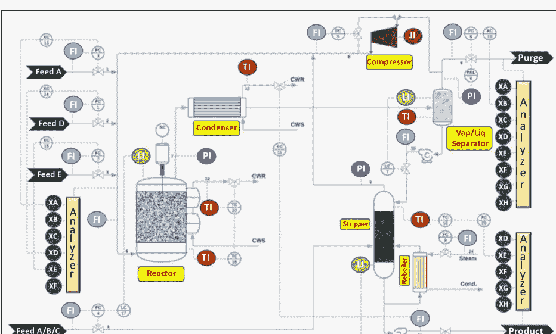

### 过程数据的特征

工业过程数据通常表现出对过程数据科学家构成挑战的特征。选择适合数据的机器学习技术是项目成功实施的前提。这些特征包括：

- *动态性*：过程工厂很少在完美的稳态下运行，即过程输入和输出值固定。工厂经常受到随机或系统性干扰，如环境条件变化、过程进料质量和产品需求变化，这些干扰由控制系统通过操纵过程变量来处理。这导致在稳态点附近波动或工厂从一个稳态移动到另一个稳态。
- *时变性*：由于过程参数的逐渐变化，过程变量之间的相关性随时间而变化。例如，换热器中的传热系数可能因结垢而改变，或者催化剂活性可能因老化而降低。
- *间歇与连续*：虽然连续过程在过程工业中占主导地位，但间歇过程也经常被采用，例如在半导体和药物制造中。与连续过程不同，间歇过程具有有限的持续时间，并带来其自身的一系列独特挑战，如批次间差异和固有的非稳态操作。时间本身成为准确建模批次内过程变量时间演变的关键维度。
- *多模式操作*：当过程工厂主要围绕几个不同的稳态运行时，就会出现多模式特征。例如，一个生产a、b、c三种物质的工厂可能对每种物质都有不同的生产配方（过程变量的设定值）。根据生产计划，工厂将从一个配方切换到另一个配方。为多模式过程部署单一的全局机器学习模型，其精度通常低于为每个模式构建局部模型所获得的精度。
- *离散/不连续*：根据生产负荷，某些设备可能被开启或关闭，导致过程行为发生阶跃变化。例如，开启额外的涡轮机或压缩机会导致功耗阶跃增加。
- *非线性*：过程单元内部发生的复杂物理化学现象（化学反应、气液平衡等）大多是非线性的。虽然当过程在单一稳态附近运行时，线性模型通常能提供良好的近似，但当过程经历操作条件的大幅波动时，非线性模型就变得必要。
- *高维性*：现代过程工厂进行数百个过程关键测量。考虑到过程工厂实时进行过程调整，当采用计算密集型方法时，高维性就成为一个问题。
- *多速率采样*：并非所有过程测量都以相同的频率进行。虽然温度或压力读数每秒或每分钟采样一次，但组成/分析仪测量通常以低得多的频率采样（每小时或每天一次）。

在本书中，我们将详细研究几种为处理这些不同类型的过程系统而设计的机器学习方法。让我们首先理解机器学习的含义。

### 1.2 什么是机器学习

从本质上讲，机器学习就是利用计算机程序和数据来发现系统不同组件之间的关系，并揭示那些并非显而易见的模式。这种利用数据来学习系统特性的特点，使得机器学习既有趣又与众不同。系统特定的知识并未被显式地嵌入到机器学习程序中；程序是从数据中提取知识。图1.3比较了用于精馏塔建模的机器学习方法与非机器学习方法：机器学习方法不需要诸如塔板数或填料类型等系统特定数据。

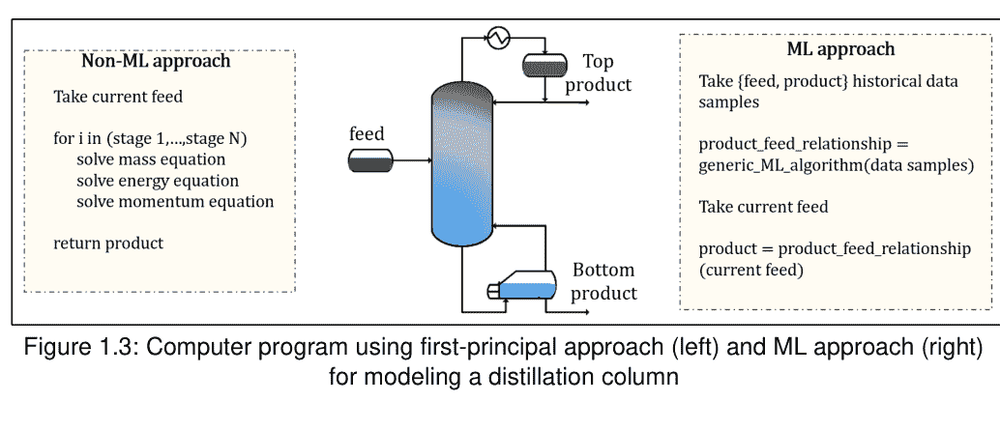

我们常常惊叹于Netflix或亚马逊为潜在节目或产品推荐的准确性。这些公司并不掌握关于我们个人偏好或心理（我们是否喜欢科幻电影）的明确信息。数据完成了一切！机器学习算法处理过去的购买数据，以识别客户的喜好和厌恶，并进行推荐。在流程工业中，制造商使用机器学习方法，利用过去的维护和运行条件数据来确定最佳的设备维护计划。同样，与复杂的冶金分析等替代方法相比，基于数据的分析提供了极大的便利。

仅仅依赖数据就能获得相当好的系统近似，这是机器学习日益普及的主要原因之一。机器学习绕过了需要特定领域知识才能分析系统的障碍。机器学习算法本质上也是通用的。例如，我们可以使用相同的数据聚类算法来分析人口统计数据、工厂数据或经济数据，以获得可操作的知识。这些特性，加上收集的数据量激增和计算资源成本下降，使得机器学习彻底改变了多个行业。

> 机器学习日益普及并不意味着领域知识是多余的。领域专业知识通常有助于决定使用哪种机器学习算法，并且将领域知识适当地融入机器学习方法，有时可以显著提高模型的准确性。

“为什么我们不直接使用第一性原理建立模型，从而获得非常精确的模型呢？为什么要依赖数据？”这是一个合理的问题。毫无疑问，基础模型具有更好的准确性和泛化能力，然而，开发基础模型通常耗时且需要专家资源。这些模型有时过于复杂，无法实时执行。采用机器学习方法可以帮助克服这些困难。

### 机器学习工作流程

图1.4展示了一个机器学习项目中涉及的典型任务。这些任务分为离线计算和在线/实时计算。在在线计算中，过程数据通过过程模型进行解析，以提供实时洞察和结果。请注意，这些模型可以是过程输入-输出模型、过程监控模型（过程正常/异常分类）、模式分类模型或故障分类模型。

模型是使用历史过程数据离线构建的。这种离线工作执行一次或定期重复进行以更新模型。下面简要描述执行的基本步骤：

- *样本和变量选择*：不能简单地将所有可用的历史数据和传感器测量值都丢进模型训练模块。只使用最能代表当前过程行为或感兴趣行为的那部分历史数据。对于过程系统，通常使用过去几年的数据作为训练数据。如果构建的是稳态模型，则使用稳态运行时期的数据。

输入变量的选择也需要审慎考虑。包含过多的模型输入会导致过拟合和高计算复杂度，而遗漏重要变量则会导致欠拟合。基本原则是只包含那些已知会影响模型输出的输入。变量选择的具体算法在第4章中介绍。

- *数据清洗*：“垃圾进，垃圾出”是计算机模拟中一个古老的原则。对于机器学习模型训练同样适用。如果训练数据不“干净”，你的模型实际上将毫无用处。例如，如果过程监控模型是用充满异常值的训练数据训练的，它将无法准确检测过程异常。数据清洗包括识别和移除异常值、消除噪声影响等。详细算法在第4章中介绍。
- *模型训练和验证*：模型训练意味着估计所选机器学习模型的参数，例如线性回归模型中的系数。模型验证用于寻找模型超参数的最佳值，例如岭回归中的正则化系数。在此步骤结束时，就得到了梦寐以求的过程模型。模型训练和验证的若干最佳实践在第3章中介绍。

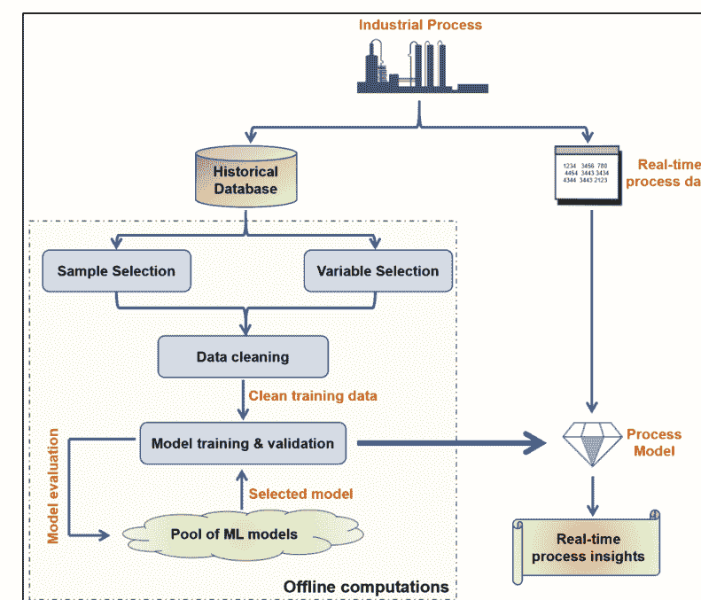

图1.4：基于机器学习的典型方法所涉及的步骤

与离线-在线范式不同，流程工业中还采用另一种方法，特别是对于非线性和多模式过程。它被称为即时学习或惰性学习。如图1.5所示，模型构建工作也在线进行。当新的过程数据到来时，根据某种最近邻准则，从历史数据集中检索与输入样本相似的相关数据。使用检索到的相关数据构建一个局部模型。获得的模型处理输入样本，然后被丢弃。当下一个样本到来时，会构建一个新的局部模型。

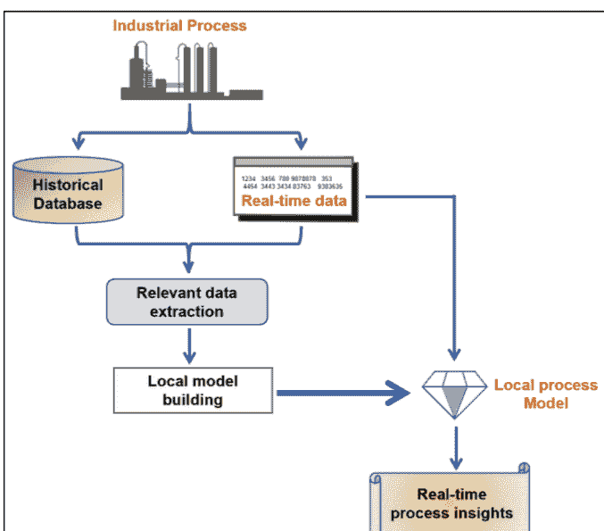

图1.5：即时学习方法所涉及的步骤

### 机器学习系统的类型

尽管有大量可用的机器学习模型，但它们都可以分为三大类，即监督学习、无监督学习和强化学习。这种分类基于训练数据集中每个样本相关的模型输出的性质。请注意，还有另一类——半监督学习——然而，与上述其他方法相比，这种方法使用较少。图1.6简要介绍了一些机器学习算法以及本书将涵盖的监督学习和无监督学习的应用领域。

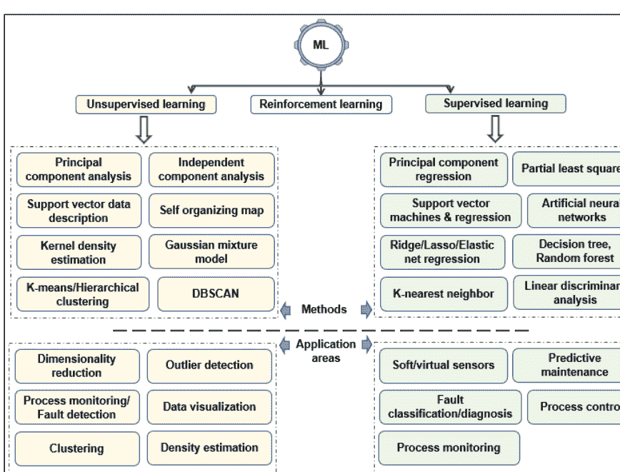

现在让我们更清晰地理解这些类别。

### 监督学习

当训练数据包含输入集和相关输出集时，使用监督学习。如图1.7所示，监督学习模型学习输入-输出关系，并利用这种关系预测新输入的未知输出。输出可以是离散值（用于分类问题）或连续值（用于回归问题）。

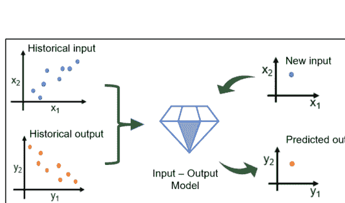

### 无监督学习

当训练数据未被划分为输入和输出时，使用无监督学习。主要目的是发现数据中隐藏的模式（如果有的话）。图1.8说明了一个示例情况，其中无监督学习模型在历史数据中发现主要结构（不同的簇），并将它们分组到不同的类别中。现在，该模型可用于将任何新输入样本分配到这些组中的任何一个。无监督学习通常与监督学习结合使用。例如，在图1.8中，可以通过监督学习为不同簇的数据构建单独的局部模型。正如您可能正确猜测的那样，在应用监督学习之前，数据需要被分离为输入和输出。

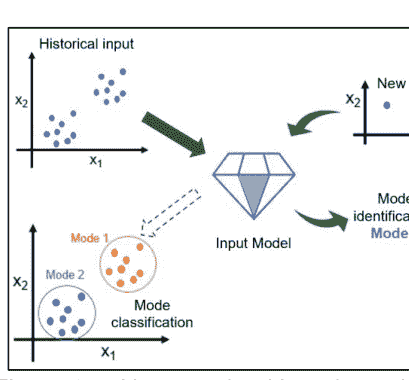

### 强化学习 (RL)

与监督学习和无监督学习在训练期间系统（环境）与模型（机器学习智能体）之间只有一次性交互不同，在强化学习中，智能体与环境持续交互，以生成训练数据来“学习”完成任务的最优策略。根据所学策略决定的行动旨在最大化长期奖励。例如，考虑一个简单的任务：在雨天将容器中的水位控制在固定高度。

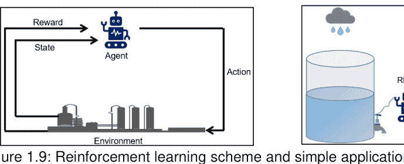

强化学习智能体根据当前系统状态采取行动调整阀门开度，以将液位维持在某个设定点。完全开启或关闭阀门的简单策略可能导致液位大幅波动。因此，在训练过程中，智能体通过与环境交互自动学习最优控制策略。

### 1.3 机器学习在过程工业中的应用

产品质量控制、安全工作环境、优化运营和可持续运营是任何工业工厂的首要目标。如今，基于机器学习的解决方案正被用于实现所有这些目的。开发代理模型用于关键质量变量的在线预测和工厂生产率优化，开发过程监控和故障诊断模型用于实时跟踪过程运行状况，数据挖掘用于报警管理，数据聚类用于操作模式识别，等等。

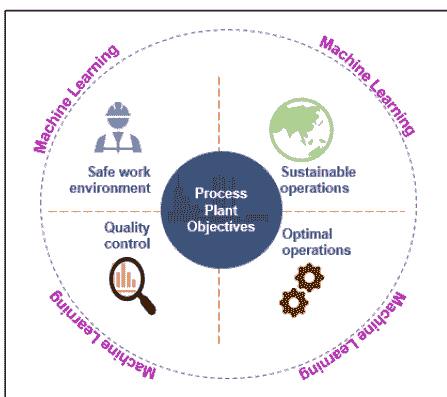

关于机器学习在过程工业中应用的成功案例已公开发布。壳牌¹使用循环神经网络（RNN）进行阀门故障的早期预测，沙特阿美公司使用机器学习工具进行报警分析和涡轮机的预测性维护²，一家聚合物制造公司使用基于机器学习的特征提取³来解决质量控制问题。近年来，面向过程工业的商业数据分析软件（如Aspen Mtell、IBM SPSS）或服务产品数量激增。这正证明了机器学习驱动的过程控制和运营日益增长的趋势。

作为过程数据科学家，我们应该为过程工业在利用过程数据进行工厂运营方面始终是先驱而感到自豪。模型预测控制（MPC）就是一个经典例子，它使用基于数据的模型进行过程控制。早在大数据和机器学习成为流行词之前，它就已被用作标准的监督控制器。偏最小二乘法（PLS）是一种流行的基于降维的软测量方法，长期以来一直用于在线产品质量预测。当前关于机器学习的新热潮，只是为探索机器学习在过程工业中的非传统应用注入了新的推动力。

### 过程工厂中的决策层级

在我们查看一些机器学习在过程系统中应用的具体例子之前，让我们首先熟悉过程工厂中典型的决策层级。一旦你理解了这一点，你将能够轻松识别机器学习在过程运营领域发挥作用的途径，并欣赏数据科学如何渗透到过程决策层级的各个层面。

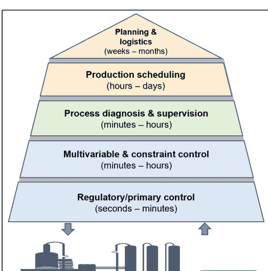

在基础层（图1.11），是基本的调节控制层，主要由控制阀组成；这些阀门用于根据过程要求调节工艺流股的流量，并间接调节压力和温度。这些要求反过来由多变量控制层决定，该层通常包括MPC和RTO（实时优化）模块。该层利用工厂变量之间的多变量关系来确定基础层的要求，以确保工厂的最佳性能。该层还负责通过确保安全关键变量保持在规定范围内来确保工厂运营安全。过程诊断层（如果存在）通过及时的故障检测和诊断确保过程的可靠性。该层还可能执行控制器性能评估任务。

生产调度层拥有模型和方法，用于确定资源分配和短期生产计划，同时考虑外部影响，如电价或原材料价格波动。基于时间的或预测性的设备维护决策也可能在该层做出。该层的结果会传达给多变量控制层。最顶层的规划和物流层做出企业范围的决策。运营多个设施的企业使用该层，根据企业的战略目标确定各工厂的生产目标。

### 应用领域

在熟悉了过程运营决策层级之后，我们现在已准备好了解机器学习在过程工厂中的广泛应用领域。我们已经在图1.6中看到了一些应用领域。在本节中，我们将以一个加热炉（图1.12）为例系统，更详细地探讨这些应用。

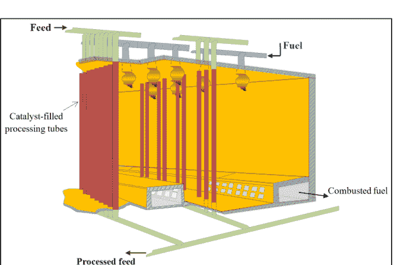

该加热炉系统由若干填充催化剂的管道垂直悬挂在天然气燃烧的炉膛中组成。未反应的气体流股从顶部进入管道，在向下流动过程中发生化学反应，并从底部排出。燃料燃烧产生的热量为化学反应提供能量。

### 软测量

软传感器，也称为虚拟传感器或推断传感器，是用于利用可用测量值估计未知过程变量值的数学模型。软传感器模型可以是基于第一性原理的，也可以是基于数据的，当物理传感器成本非常高或无法进行实时测量（例如成分测量）时使用。

在过程系统过于复杂而无法建立机理模型，或者机理模型过于复杂而无法实时提供所需估计值的情况下，基于数据的软传感器很受欢迎。例如，对于加热炉系统，可以建立一个计算流体动力学（CFD）模型，根据过程输入——燃料、空气、未处理气体——来预测处理后气体流股中的组分摩尔分数。该估计值可被多变量控制层用于相应地调整输入流量，例如，如果转化率低则增加燃料。然而，CFD模型执行时间很长。作为一种替代方案，基于数据的模型可以利用过去的过程数据来估计适当的关系，并实时提供组成信息。

> 作为过程建模者，你应该仔细注意训练数据是否包含足够丰富的信息，否则，将得到一个性能差/精度低的模型。确保数据丰富性的一种方法是检查过程输入是否显示出足够的变异性。

偏最小二乘法（PLS）、主成分回归（PCR）、支持向量回归（SVR）是估计过程质量变量的一些流行机器学习方法选择。近年来，人工神经网络（ANN）的使用也日益增多。

### 过程监控

过程监控/故障检测/异常检测是机器学习在过程工业中最受欢迎的应用之一。当当前过程数据与从历史数据估计的历史行为不一致时，机器学习模型会发出警报。这些差异可能表明存在严重的过程故障。在加热炉系统中，有数百个管道温度测量点。催化剂损坏或管道泄漏等不利条件可能导致某些温度异常升高。然而，手动持续监控所有这些温度是不切实际的。相反，可以使用历史数据构建过程监控模型，为温度扰动提供预警，以便采取及时的纠正措施。

### 白盒/灰盒/黑盒模型

对于软测量，经常使用白盒、灰盒、黑盒等术语。图1.13阐明了这些术语之间的区别。白盒模型利用基本的质量/能量/动量守恒定律来关联模型输入和输出。黑盒方法仅使用过程数据构建估计模型。灰盒方法结合这两种方法来生成混合模型。

再次考虑我们的加热炉系统。CFD模型将是白盒模型。将加热炉输入与产品流股组成相关联的PLS模型将属于黑盒模型类别。然而，为了平衡模型精度和计算成本之间的权衡，可以构建一个混合模型。辐射能量传递的机理模型是加热炉模型中最复杂的部分。可以构建一个黑盒模型来估计提供给管道的辐射能量。然后，该模型可以与管道的机理模型结合来预测产品组成。

与黑盒模型相比，混合模型往往具有更好的外推精度，并且在训练数据量较少时更受青睐。

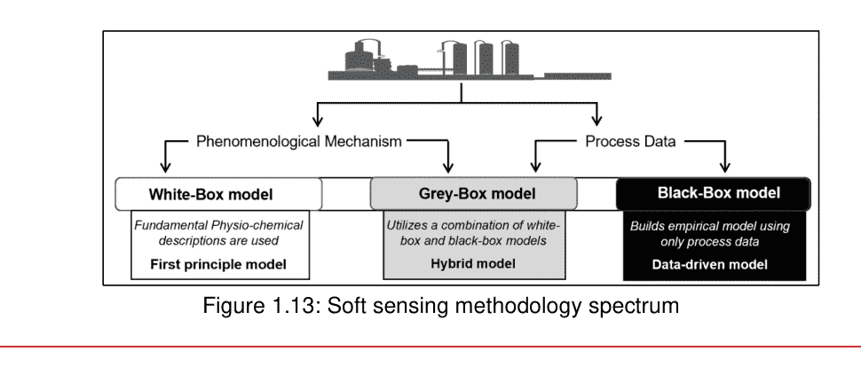

¹ https://www.aiche.org/conferences/aiche-spring-meeting-and-global-congress-on-process-safety/2018/proceeding/paper/37a-digital-twins-predicting-early-onset-failures-flow-valves
² https://pubs.acs.org/doi/abs/10.1021/acs.iecr.8b06205
³ https://www.yokogawa.com/at/library/resources/references/successstory-sumitomoseika-chemicals-en/

### 故障分类

一旦检测到过程故障，下一个挑战在于及时识别问题的根本原因，或找出导致过程扰动的过程变量。这一过程被称为故障诊断。如果拥有过去故障的历史数据，就可以构建一个分类模型来确定具体的故障类型。

对于炉管系统，耐火材料损坏、管道泄漏、燃烧器故障、催化剂损坏都可能导致温度扰动。这些不同的故障往往对管道温度产生不同的影响；故障分类模型正是利用这些差异来识别当前故障。在本书中，我们将研究人工神经网络（ANN）、支持向量机（SVM）和线性判别分析（LDA）等方法如何帮助进行故障分类。

### 过程优化与控制

优化一个复杂系统在计算上可能代价高昂。从业者从数据中开发基于机器学习的代理模型，用于离线优化系统或在实时优化（RTO）层进行优化，这并不少见。代理模型也用于处理高度非线性系统的模型预测控制（MPC）。强化学习模型正在调节控制层或用于自适应调节调节控制器方面进行尝试。

### 数据聚类与挖掘

数据聚类和挖掘方法常用于报警管理、操作模式表征、模式识别等活动。对于炉管系统，聚类模型可用于找出哪些管道倾向于表现出相似的温度。数据挖掘模型可用于发现工艺条件对管道寿命的影响。

### 预测性维护

预测性维护是机器学习在过程工业中另一个非常流行的应用。构建预测性维护模型是为了确定任何设备的故障时间，或检测过程数据中可能预示即将发生过程故障的模式。如果提前知道故障时间，就可以进行详细的计划性维护。在炉管系统中，管道泄漏发生前，相邻管道的温度可能会出现特定模式。这些模式在模型训练期间被识别出来，然后用于实时故障预测。提前预警可以帮助工厂操作员妥善计划工厂停工。

### 预测

产品需求和原材料价格的不确定性会导致生产计划不佳。先进的机器学习预测模型被构建出来，以确定最优生产计划，从而最大化资源利用率并最小化生产成本。在炉管系统中，频繁的炉温波动对管道寿命有不利影响。如果提前知道准确的月度产品需求，那么炉子就可以在整个稳定状态下运行，同时利用产品存储来处理需求的瞬时峰值。

### 选择合适的机器学习算法

机器学习项目中最棘手的任务之一是选择建模算法。即使是经验丰富的机器学习从业者也经常推荐试错法。然而，凭借经验、对机器学习算法底层细节的理解以及工艺知识，你可以缩小试错候选范围。

让我们先窥探一下过程监控任务的模型选择过程。对于监控，如果系统是线性的，应首先尝试主成分分析（PCA）或偏最小二乘（PLS）模型。如果变量是非高斯分布的，可以使用核密度估计（KDE）或支持向量数据描述（SVDD）来确定控制限。对于非线性系统，可以探索核化PCA/PLS、人工神经网络（ANN）、支持向量机（SVM）。当训练数据有限时，SVM是首选。如果过程表现出多种操作模式，那么像高斯混合模型（GMM）这样的混合建模可以提供更好的监控性能。

### 1.4 机器学习解决方案部署

在任何项目中，你很可能会在个人笔记本电脑/计算机上尝试多种机器学习算法。在完成了所有艰苦工作并确定了机器学习工作流的最终形式后，你可能会发现自己问以下问题：

-   我的机器学习工具存放在哪里才能不间断运行？
-   最终用户如何访问我的工具结果？

上述问题的答案总结在图1.14中，该图展示了在企业网络中从头部署一个Python机器学习解决方案的常见架构。你将安装Python并将你的工具（Python文件）传输到工具服务器机器（一个虚拟或物理机器，机器学习工具将在此运行）。工具服务器将被配置为持续执行工具（作为Windows服务）或按计划执行。在执行期间，你的机器学习工具将获取历史或实时工厂数据，并将机器学习结果存储在数据库（MS SQL、MYSQL等）中。

现在让我们来解决第二个问题。最终用户，如工厂操作员，可以通过网络浏览器访问工具的结果。用户界面可以使用第三方可视化软件（Tableau、Sisense、Power BI）构建，也可以使用前端网络框架（如bootstrap）完全自定义构建。如果构建自定义网站，你还需要设置一个网络服务器（使用Python、.Net等），当通过网络浏览器请求时，该服务器将提供用户界面网页。用户界面与数据库通信，向最终用户显示适当的数据。网络服务器也可以配置为按需执行你的工具。网络服务器可以托管在单独的机器上，也可以托管在工具服务器机器本身上。

这就是在生产环境中部署机器学习解决方案所需的全部工作。如果所有这些IT内容让你不知所措，别担心！它比看起来更简单，在第14章中，我们将遵循此架构构建并部署一个端到端的解决方案。

### 1.5 过程数据科学的未来

毫不夸张地说，现在是成为一名过程数据科学家的绝佳时机。由于全球人口增长和生活方式提升，过程工业正见证着越来越高的产品需求，但同时也面临着更高效、更可持续地运行生产设施的压力。因此，工业4.0的采用率正在上升，它要求利用过程数据在整个生产链中进行过程改进。过程工业高管对实施基于机器学习的解决方案表现出明显的兴趣，而证明机器学习热潮名副其实的责任则落在了过程数据科学家的肩上。

机器学习是过程系统工程（PSE）的强大工具，这已是不争的事实。过程数据如果以正确的方式加以利用，蕴含着巨大的力量。然而，盲目应用机器学习往往会导致令人沮丧的结果。作为一名拥有专业知识和机器学习技能的过程数据科学家，你处于一个独特的位置，可以将过程系统知识与机器学习的力量相结合，释放数据科学在过程工业中的真正潜力。让我们为你作为过程数据科学家的光明职业前景干杯，并继续我们的旅程，现在来学习机器学习算法的复杂细节。

### 总结

在本章中，我们试图从概念上理解机器学习在过程工业中的位置。我们探讨了不同类型的机器学习工作流和方法论。我们还探索了机器学习已被证明有用的一些过程工业应用领域。我们希望你已经理解了本章的核心信息：过程数据科学已被证明是过程运营中不可或缺的工具，它能将数据转化为知识并支持有效决策。在下一章中，我们将迈出第一步，了解你将用于执行包含机器学习代码的Python脚本的环境。

## 第2章
### 脚本环境

在上一章中，我们研究了机器学习的各个方面，并了解了其在流程工业中的不同用途。在本章中，我们将快速熟悉Python语言以及我们将用于编写ML代码、执行代码并查看结果的脚本环境。本章不会让你成为Python专家，但会让你对这门语言有足够的理解，以便入门并帮助理解后续章节中的多个章节内代码实现。如果你已经了解Python的基础知识，有首选的代码编辑器，并且知道典型ML脚本的一般结构，那么你可以直接跳到第3章。

Python易于使用和学习，加上多年来用户社区开发的大量开放获取的有用包，使其获得了巨大的普及。近年来，为机器学习和深度学习开发的专业库使Python成为ML社区的默认首选语言。这些进步大大降低了新用户进入机器学习世界的门槛。

通过本章，你将迈出进入ML世界的第一步。具体来说，涵盖了以下主题：

- Python语言简介
- Spyder和Jupyter简介，这两款流行的代码编辑器
- Python数据结构和科学计算库概述
- 典型ML脚本概述

### 2.1 Python简介

简单来说，Python是一种高级通用计算机编程语言，可用于应用开发和科学计算等。如果你使用过其他计算机语言，如Visual Basic、C#、C++、Java、Javascript，那么你会理解Python是一种解释型和动态语言。如果没有，那么可以将Python视为计算机语言列表中的另一个名称。更重要的是，Python提供了几个特性，使其与其他语言区分开来，成为机器学习的首选语言。图2.1列出了一些这些特性。Python提供了所有工具，可以方便地执行ML项目的所有步骤，即数据收集、数据预处理、数据探索、ML建模、可视化和向最终用户部署解决方案。此外，几个免费可用的工具使编写Python代码变得非常容易。


### 安装Python

可以从python.com网站下载官方最新版本的Python。然而，最流行和方便的安装和使用Python的方法是安装Anaconda（www.anaconda.com），这是一个开源的Python发行版。除了核心Python，Anaconda还安装了许多其他有用的包。Anaconda附带一个名为Anaconda Navigator的GUI（图2.2），你可以从中启动其他几个工具。

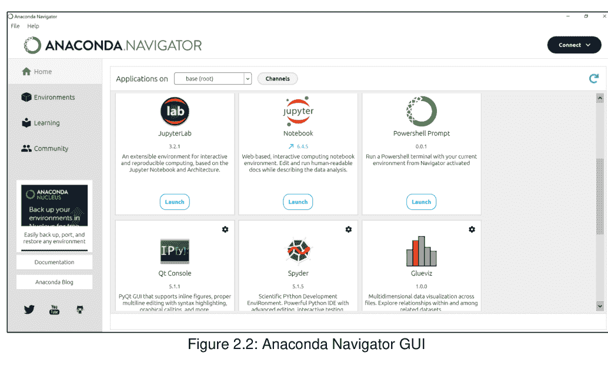

图2.2：Anaconda Navigator GUI

### 运行/执行Python代码

安装Anaconda后，你可以在任何文本编辑器（如Notepad）中编写代码，将其保存为.py格式，然后通过Anaconda命令终端运行。然而，一个方便的替代方法是使用IDE（集成开发环境）。IDE不仅允许创建.py脚本，还可以即时执行它们，即我们可以在集成环境中进行代码编辑并立即查看结果。在几个可用的Python IDE（PyCharm、VS Code、Spyder等）中，我们发现Spyder最方便且功能丰富，因此将在下一节中讨论。

Jupyter Notebooks是编写和执行Python代码的另一种非常流行的方式。这些笔记本允许将代码、执行结果、解释性文本和多媒体资源组合在一个文档中。可以想象，这使得保存和共享完整的数据分析变得非常容易。

在下一节中，我们将为你提供足够的Spyder和Jupyter熟悉度，以便你可以开始使用它们。

### 2.2 Spyder和Jupyter简介

图2.3显示了启动Spyder时出现的界面⁶（及其不同组件）。这些是3个主要组件：

- *编辑器：* 你可以在这里输入和保存代码。单击▶按钮可执行活动编辑器选项卡中的代码。
- *控制台：* 脚本执行结果显示在这里。它也可用于执行Python命令并与工作区中的变量进行交互。
- *变量资源管理器：* 运行编辑器脚本或控制台生成的所有变量都显示在这里，并且可以交互式浏览。

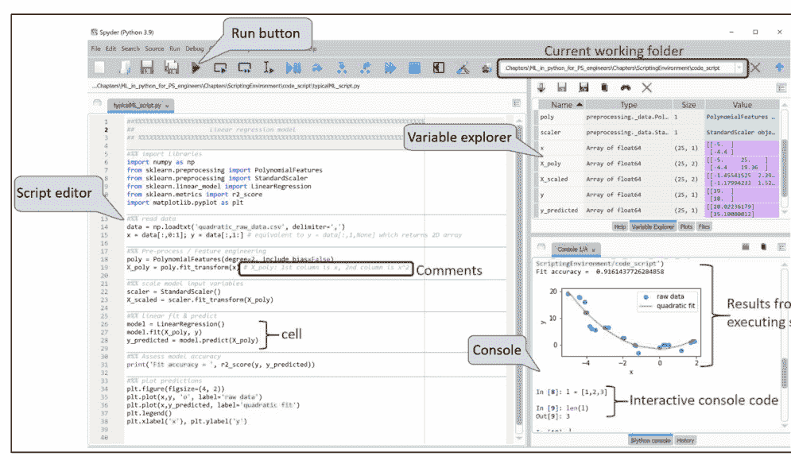

像任何IDE一样，Spyder提供了几个便利功能。你可以将脚本分成单元格，并仅执行任何选定的单元格（通过按Ctrl + Enter键）。Intellisense允许你通过按Tab键自动完成代码。广泛的调试功能使故障排除更容易。这些只是Spyder中可用的一些功能。鼓励你探索Spyder GUI上的不同选项（例如暂停和取消脚本执行、清除变量工作区等）。

> ⁶ 如果你使用过MATLAB，你会发现界面非常熟悉

使用Spyder时，如果关闭并重新打开脚本，则必须再次运行脚本才能看到执行结果。与此相反，考虑图2.4中的Jupyter界面。请注意，Jupyter界面在浏览器中打开。我们可以将显示的代码、执行输出和解释性文本/图形保存为（.ipynb）文件，并在Jupyter notebook中重新打开文件时保持它们不变。

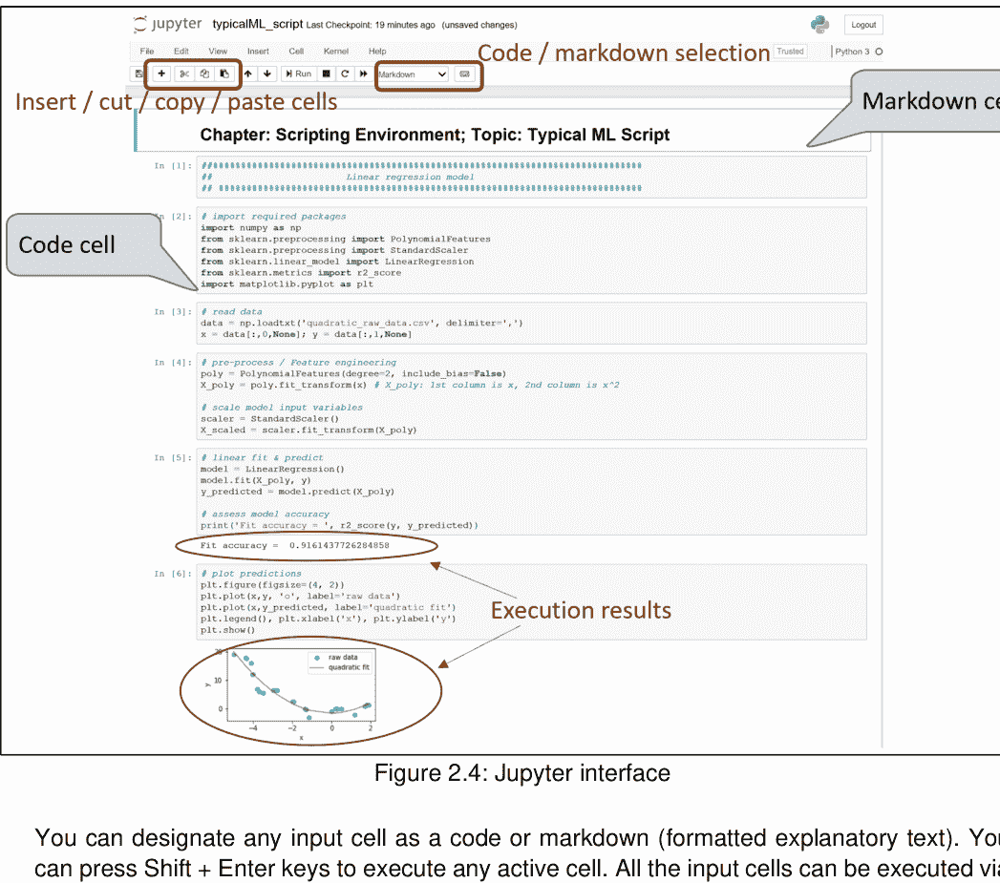

你可以将任何输入单元格指定为代码或markdown（格式化的解释性文本）。你可以按Shift + Enter键执行任何活动单元格。所有输入单元格都可以通过*Cell*菜单执行。

这完成了我们对Spyder和Jupyter界面的快速概述。你可以选择其中任何一个来处理本书其余部分中的代码。

### 2.3 Python语言：基础

在当前和下一节中，我们将看到几个使用Python和科学包操作数据的简单示例。虽然这些简单的操作在没有更大上下文的情况下可能显得不起眼（且无聊），但它们构成了本书后面介绍的更复杂脚本的构建块。因此，至少快速浏览一下这些内容是值得的。

请注意，你会在这些示例中经常看到'#'；这些井号用于在代码中插入解释性注释。Python忽略（不执行）一行中#之后写的所有内容。

### 基本数据类型

在Python中，你使用4种数据类型：

```python
# 4 data types: int, float, str, bool
i = 2 # integer; type(i) = int
f = 1.2 # floating-point number; type(f) = float
s = 'two' # string; type(s) = str
b = True # boolean; type(b) = bool
```

定义变量后，你可以执行基本操作：

```python
# print function prints/displays the specified message
print(i+2) # displays 4
print(f*2) # displays 2.4
```

### 列表、元组作为有序序列

相关数据（不一定具有相同的数据类型）可以作为序列排列在列表中，如下所示：

```python
# different ways of creating lists
list1 = [2,4,6]
list2 = ['air',3,1,5]
list3 = list(range(4)) # equals [0,1,2,3]; range function returns a sequence of numbers starting
                        # from 0 (default) with increments of 1 (default)
list3.append(8) # returns [0,1,2,3,8]; append function adds new items to existing list
list4 = list1 + list2 # equals [2,4,6,'air',3,1,5]
list5 = [list2, list3] # nested list [['air', 3, 1, 5], [0, 1, 2, 3,8]]
```

元组是另一种像列表一样的序列构造，不同之处在于它们的项和大小不能更改。由于元组是不可变的/不可更改的，它们更节省内存。

```python
# creating tuples
tuple1 = (0,1,'two')
tuple2 = (list1, list2) # equals ([2, 4, 6, 8], ['air', 3, 1, 5])
```

下面的几个示例说明了列表推导，这是一种从其他序列创建新列表的非常有用的方法：

```python
# generate powers of individual items in list3
newList1 = [item**2 for item in list3] # equals [0,1,4,9,64]

# nested list comprehension
newList2 = [item2**2 for item2 in [item**2 for item in list3]] # equals [0,1,16,81,4096]
```

### 索引和切片序列

列表中的单个元素可以按如下方式访问和修改：

```python
# working with single item using positive or negative indexes
print(list1[0]) # displays 2, the 1st item in list1
list2[1] = 1 # list2 becomes ['air',1,1,5]
print(list2[-2]) # displays 1, the 2nd last element in list2
```

请注意，Python索引从零开始。很多时候，我们需要处理列表中的多个项目。这可以很容易地完成，如下所示。

```python
# accessing multiple items through slicing
# Syntax: givenList[start,stop,step]; if unspecified, start=0, stop=list length, step=1
print(list4[0:3]) # displays [2,4,6], the 1st, 2nd, 3rd items; note that index 3 item is excluded
```

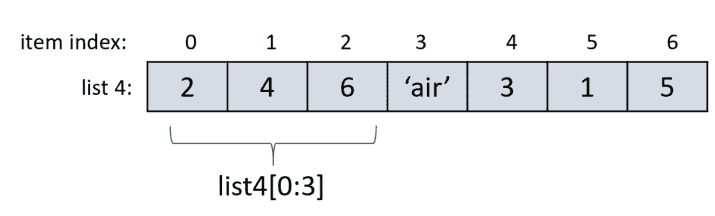

```python
print(list4[:3]) # same as above
```

print(list4[4:len(list4)]) # 显示 [3,1,5]；len() 函数返回列表中的项目数量
print(list4[4:]) # 与上面相同
print(list4[::3]) # 显示 [2, 'air', 5]
print(list4[::-1]) # 反向显示列表 4 [5, 1, 3, 'air', 6, 4, 2]
list4[2:4] = [0,0,0] # 列表 4 变为 [2, 4, 0, 0, 3, 1, 5]

### 执行控制语句

这些语句允许你控制代码的执行顺序。你可以选择性地执行脚本的任何特定部分，或者多次执行。让我们看看如何实现这些

```python
# 根据条件选择性地执行代码
if list1[0] > 0:
    list1[0] = 'positive'
else:
    list1[0] = 'negative'

# list1 变为 ['positive', 4, 6]
```

```python
# 计算 list3 中数字的平方和
sum_of_squares = 0
for i in range(len(list3)):
    sum_of_squares += list3[i]**2

print(sum_of_squares) # 显示 78
```

### 自定义函数

之前我们使用了 Python 的内置函数（len(), append()）来执行为这些函数预定义的操作。Python 也允许定义我们自己的自定义函数。自定义函数的优势在于，我们可以定义一组指令，然后在脚本和项目中多次重用它们。

为了说明，让我们定义一个函数来计算列表中项目的平方和

```python
# 定义函数指令
def sumSquares(givenList):
    sum_of_squares = 0
    for i in range(len(givenList)):
        sum_of_squares += givenList[i]**2

    return sum_of_squares

# 多次调用/重用自定义函数
print(sumSquares(list3)) # 显示 78
print(sumSquares(list4)) # 显示 55
```

> 你可能已经注意到，在我们上面的自定义函数代码中，我们使用了不同的缩进（代码行开头的空格数）来将‘for 循环’代码与函数的其余代码分开。这种做法实际上是 Python 强制要求的，如果不遵守，将导致错误或 bug。虽然其他流行的语言如 C++、C# 使用花括号 ({}) 来界定代码块（函数体、循环、if 语句等），但 Python 使用缩进。你可以选择缩进的量，但必须在代码块内保持一致。

至此，我们对 Python 基础知识的极其选择性的介绍就结束了。然而，这应该足以让你理解后续章节中的代码。现在让我们继续学习专业的科学计算包。

### 2.4 科学计算包：基础

虽然核心 Python 数据结构非常方便，但它们对于机器学习任务所需的高级数据操作来说并不十分方便。幸运的是，存在像 NumPy、SciPy、Pandas 这样的专业包，它们提供了适合科学计算的便捷多维表格数据结构。让我们快速熟悉一下这些包。

### NumPy

在 NumPy 中，ndarray 是基本的数据结构，它将数据放在一个值的网格中。下面的插图展示了如何创建一维和二维数组以及如何访问它们的项目

```python
# 导入 numpy 包并创建一个二维数组
import numpy as np
arr2D = np.array([[1,4,6],[2,5,7]])

# 获取关于 arr2D 的信息
print(arr2D.size) # 返回 6，项目数量
print(arr2D.ndim) # 返回 2，维度数量
print(arr2D.shape) # 返回元组 (2,3)，对应 2 行和 3 列
```

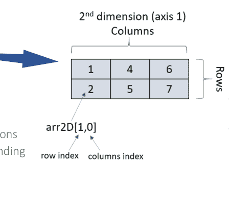

```python
# 创建一个一维数组
arr1D = np.array([1,4,6])
```

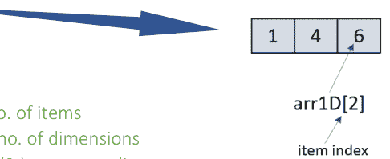

```python
# 获取关于 arr1D 的信息
print(arr1D.size) # 返回 3，项目数量
print(arr1D.ndim) # 返回 1，维度数量
print(arr1D.shape) # 返回元组 (3,)，对应 3 个项目
```

请注意，行和列的概念不适用于一维数组。另外，你可能已经注意到，我们在脚本中使用 NumPy 包之前导入了它（‘np’ 只是一个短别名）。导入一个包会使其所有函数和子包在我们的脚本中可用。

### 创建 NumPy 数组

之前，我们看到了如何将列表转换为 NumPy 数组。还有其他方法可以创建 NumPy 数组。下面展示了一些示例

```python
# 创建数字序列
arr1 = np.arange(3, 6) # 与 Python range 函数相同；结果为 array([3,4,5])
arr2 = np.arange(3, 9, 2) # 第三个参数定义步长；结果为 array([3,5,7])
arr3 = np.linspace(1,7,3) # 从 1 到 10 创建 3 个均匀间隔的值；结果为 array([1,4,7])
```

```python
# 创建特殊数组
arr4 = np.ones((2,1)) # 形状为 (2,1) 且所有项目为 1 的数组
arr5 = np.zeros((2,2)) # 所有项目为零；通常在脚本开始时用作占位符数组
arr6 = np.eye(2) # 对角线项目为 1
```

```python
# 为现有数组添加轴（例如，将一维数组转换为二维数组）
print(arr1[:, np.newaxis])
>>>[[3]
 [4]
 [5]]

arr7 = arr1[:, None] # 与上面相同
```

```python
# 组合/堆叠数组
print(np.hstack((arr1, arr2))) # 水平堆叠传入的数组
>>> [3 4 5 3 5 7]

print(np.vstack((arr1, arr2))) # 垂直堆叠传入的数组
>>> [[3 4 5]
    [3 5 7]]

print(np.hstack((arr5,arr4))) # 数组 4 作为一列添加到 arr5 中
>>> [[0. 0. 1.]
    [0. 0. 1.]]

print(np.vstack((arr5,arr6))) # 数组 6 的行添加到 arr5 上
>>> [[0. 0.]
    [0. 0.]
    [1. 0.]
    [0. 1.]]
```

### 基本 NumPy 函数

NumPy 提供了几个有用的函数，如 mean、sum、sort 等，用于操作和分析 NumPy 数组。你可以指定需要分析数据的维度（轴）。以 sum 函数为例

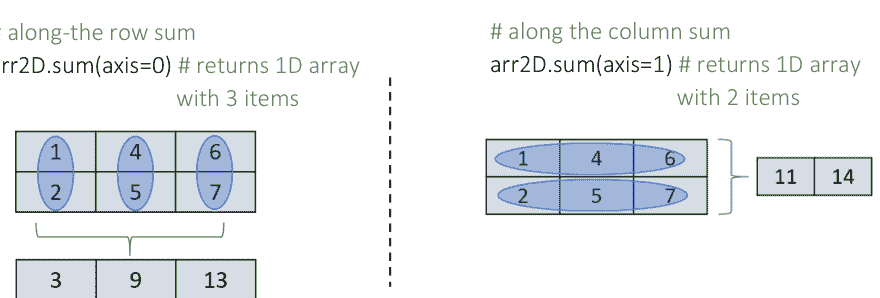

执行 arr2D.sum() 返回整个数组的标量和，即 25。

### 数组索引和切片

访问单个项目和切片 NumPy 数组的工作方式与 Python 列表类似

```python
# 访问单个项目
print(arr2D[1,2]) # 返回 7
```

```python
# 切片
arr8 = np.arange(10).reshape((2,5)) # 将一维数组重新排列为形状 (2,5)
print((arr8[0:1,1:3]))
>>> [[1 2]]
```

```python
print((arr8[0,1:3])) # 注意这里返回的是一维数组，而不是上面的二维数组
>>> [1 2]
```

```python
# 访问整行或整列
print(arr8[1]) # 返回第二行作为 array([5,6,7,8,9])；与 arr8[1,:] 相同
print(arr8[:, 4]) # 返回第三列的项目作为一维数组
>>> [4 9]
```

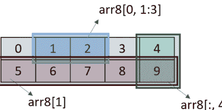

关于 NumPy 数组切片需要注意的一点是，对切片视图所做的任何更改也会修改原始数组！请看以下示例

```python
# 从 arr8 中提取一个子数组并修改它
arr8_sub = arr8[:, :2] # 所有行的第 0 和第 1 列
arr8_sub[1,1] = 1000
print(arr8) # arr8 也被修改了！！
>>> [[ 0  1  2  3  4]
    [ 5 1000  7  8  9]]
```

当我们只需要处理大型数组/数据集的一小部分时，这个特性变得非常方便。我们可以简单地处理一个更精简的视图，而不是携带整个大数据集。然而，可能会出现我们需要实际处理子数组的单独副本，而不必担心修改原始数组的情况。这可以通过 copy 方法来实现。

```python
# 使用 copy 方法获取单独的副本
arr8 = np.arange(10).reshape((2,5))
arr8_sub2 = arr8[:, :2].copy()
arr8_sub2[1, 1] = 100 # arr8 不会受到影响
```

花式索引是获取副本而不是被索引数组视图的另一种方式。花式索引简单地涉及使用整数或布尔数组/列表来访问数组项目。下面的示例阐明了这个概念

```python
# 简单索引和花式索引的组合
arr8_sub3 = arr8[:, [0, 1]] # 注意列是如何通过列表索引的
arr8_sub3[1, 1] = 100 # arr8_sub3 变得与 arr8_sub2 相同，但 arr8 在这里没有被修改

# 使用布尔掩码选择子数组
arr8_sub4 = arr8[arr8 > 5] # 返回 array([6,7,8,9])，即所有值 > 5
arr8_sub4[0] = 0 # 同样，arr8 不受影响
```

### 向量化操作


假设你需要对两个一维数组执行逐元素求和。一种方法是在循环中一次访问每个索引处的项目并求和。另一种方法是一次对多个索引处的项目求和。后一种方法称为向量化操作，对于大型数据集和复杂操作，可以显著提升计算时间。

```python
### 向量化操作
vec1 = np.array([1,2,3,4])
vec2 = np.array([5,6,7,8])
vec_sum = vec1 + vec2 # 返回 array([6,8,10,12])；无需循环索引 0 到 3

# 稍微复杂一点的操作（计算向量之间的距离）
vec_distance = np.sqrt(np.sum((vec1 - vec2)**2)) # vec_distance = 8.0
```

### 广播

考虑以下 arr2D 和 arr1D 数组的求和

```python
# arr2D 和 arr1D 的逐项加法
arr_sum = arr2D + arr1D
```

得益于“广播”机制，NumPy允许不同维度的数组之间进行逐项操作，其中较小的数组会被隐式扩展以与较大的数组兼容，如下图所示。可以想象，这是一个非常方便的功能，关于广播规则及不同示例场景的更多细节，建议查阅官方文档⁷。

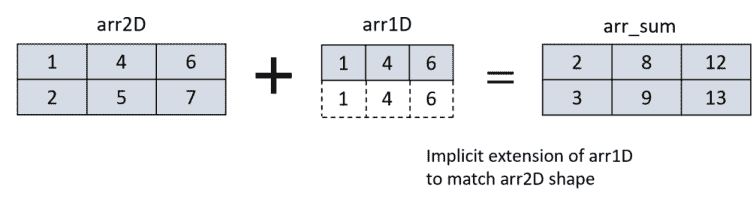

### **Pandas**

Pandas是另一个非常强大的科学计算包。它构建在NumPy之上，提供了多种数据结构和功能，使得（表格型）数据分析和预处理变得非常便捷。一些值得注意的特性包括基于标签的切片/索引、（类似SQL的）数据分组/聚合、数据合并/连接以及时间序列功能。Series和DataFrame分别是Pandas提供的类一维和二维数组结构。

```python
# Series (1D structure)
import pandas as pd

data = [10,8,6]
s = pd.Series(data)
print(s)
>>>
0    10
1     8
2     6
dtype: int64
```

```python
# Dataframe (2D structure)
data = [[1,10],[1,8],[1,6]]
df = pd.DataFrame(data, columns=['id', 'value'])
print(df)
>>>
   id  value
0   1     10
1   1      8
2   1      6
```

```python
# dataframe from series
s2 = pd.Series([1,1,1])
df = pd.DataFrame({'id':s2, 'value':s}) # same as above
```

请注意，`s.values`和`df.values`会将Series和DataFrame转换为对应的NumPy数组。

### 数据访问

Pandas允许使用标签以及整数位置来访问DataFrame的行和列。你会发现这个功能非常方便。

```python
# column(s) selection
print(df['id']) # returns column 'id' as a series
print(df.id) # same as above
print(df[['id']]) # returns specified columns in the list as a dataframe
>>>     id
0  1
1  1
2  1

# row selection
df.index = [100, 101, 102] # changing row indices from [0,1,2] to [100,101,102] for illustration
print(df)
>>>     id  value
100  1      10
101  1       8
102  1       6

print(df.loc[101]) # returns 2nd row as a series; can provide a list for multiple rows selection
print(df.iloc[1]) # integer location-based selection; same result as above

# individual item selection
print(df.loc[101, 'value']) # returns 8
print(df.iloc[1, 1]) # same as above
```

### 数据聚合

如前所述，Pandas便于快速分析数据。下面看一个基于分组的均值聚合快速示例。

```python
# create another dataframe using df
df2 = df.copy()
df2.id = 2 # make all items in column 'id' as 2
df2.value *= 4 # multiply all items in column 'value' by 4
print(df2)
>>>     id  value
100  2      40
101  2      32
102  2      24

# combine df and df2
df3 = df.append(df2) # a new object is retuned unlike Python's append function
print(df3)
>>> id value
100 1 10
101 1 8
102 1 6
100 2 40
101 2 32
102 2 24

# id-based mean values computation
print(df3.groupby('id').mean()) # returns a dataframe
>>> value
id
1 8.0
2 32.0
```

### 文件I/O

从外部源和文件便捷地读取数据是Pandas的一大强项。以下是本书中我们将经常使用的几个示例。

```python
# reading from excel and csv files
dataset1 = pd.read_excel('filename.xlsx') # several parameter options are available to customize what data is read
dataset2 = pd.read_csv('filename.xlsx')
```

以上就是我们对Python、NumPy和Pandas的非常简要的介绍。如果你是Python（或编程）新手，这可能让你感到有些不知所措。别担心，既然你已经了解了不同的数据结构和数据访问方式，随着你学习本书中的代码示例，你会越来越熟练地使用Python脚本。

### 2.5 典型的机器学习脚本

到现在为止，你已经了解了在哪里编写机器学习代码以及如何检查机器学习输出。现在让我们更仔细地看看前面章节中执行的机器学习脚本。这个脚本将让你对典型的机器学习脚本有一个相当好的了解。你也将理解如何利用Python、NumPy和高级机器学习包来编写机器学习脚本。我们将在接下来的几章中更详细地研究机器学习的多个方面，但这个简单的脚本是一个很好的起点。这个简单脚本的目标是从文件中获取输入和输出变量的数据，并在它们之间建立一个回归模型。前几行代码负责导入脚本将使用的库。

```python
# import libraries
import numpy as np
from sklearn.preprocessing import PolynomialFeatures
from sklearn.preprocessing import StandardScaler
from sklearn.linear_model import LinearRegression
from sklearn.metrics import r2_score
import matplotlib.pyplot as plt
```

我们之前学习了NumPy；这里我们看到的另一个库⁸是Sklearn，它是目前Python中最流行的机器学习库。Sklearn提供了多个模块（如这里使用的preprocessing、linear_model、metrics）来处理机器学习的不同方面。最后一个库是matplotlib⁹，用于创建可视化图表。接下来的几行代码获取原始数据。

```python
# read data
data = np.loadtxt('quadratic_raw_data.csv', delimiter=',')
x = data[:,0:1]; y = data[:,1:] # equivalent to y = data[:,1,None] which returns 2D array
```


这里使用NumPy的`loadtxt`函数读取文件`quadratic_raw_data.csv`中的逗号分隔数据。数据存储在一个二维NumPy数组`data`中，其中第一列和第二列分别包含输入和输出变量的数据。使用NumPy切片来分离$x$和$y$数据。脚本的下一部分执行输入数据预处理，将其转换为适当的形式，然后生成回归模型。

```python
# Pre-process / Feature engineering
poly = PolynomialFeatures(degree=2, include_bias=False)
X_poly = poly.fit_transform(x)
# X_poly: 1st column is x; 2nd column is x^2
```

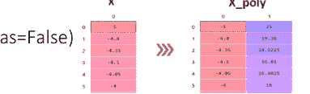

```python
# scale model input variables
scaler = StandardScaler()
X_scaled = scaler.fit_transform(X_poly)
```

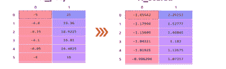

这里对输入数据进行了两种预处理转换。首先，生成$x$的二次幂，然后对$x$和$x^2$的值进行缩放。你将在下一章中了解更多关于这些转换的知识。接下来，拟合一个回归模型并用于进行预测。

```python
# fit linear model & predict
model = LinearRegression()
model.fit(X_poly, y)
y_predicted = model.predict(X_poly)
```

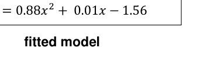

最后一步是进行模型性能评估。

```python
# Assess model accuracy
print('Fit accuracy = ', r2_score(y, y_predicted))
>>> Fit accuracy = 0.916
```

```python
# plot predictions
plt.figure(figsize=(4, 2))
plt.plot(x, y, 'o', label='raw data')
plt.plot(x, y_predicted, label='quadratic fit')
plt.legend()
plt.xlabel('x'), plt.ylabel('y')
```

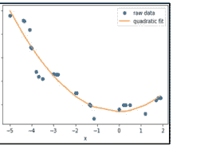

尽管还有许多更高级的机器学习方面，但上述代码非常具有代表性地展示了机器学习脚本的内容。希望你也感受到了Sklearn库的强大功能，它有助于将复杂的机器学习算法封装成用户友好的拟合/转换/预测结构。

> ### 虚拟环境

想象一下，你两年前编写了一段使用Sklearn包的Python机器学习代码，现在你想运行它。然而，你当前计算机上安装的Sklearn包版本很可能与两年前的不同。因此，你的旧脚本在执行时可能会出错（例如由于语法更改），并且由于包版本不匹配而不得不调试旧代码可能会令人沮丧。这是你可能希望为不同项目使用独立Python环境的众多原因之一，这样这些项目可以访问独立的库集合。请注意，这并不意味着你需要多次安装Python本身。`venv`包可以帮助创建虚拟Python环境，其中同一包的不同版本可以“和平共处”。在我们假设的场景中，如果你两年前使用了虚拟环境，你只需激活该虚拟环境并运行你的旧脚本，就不会有任何与包版本相关的问题。

使用虚拟环境是我们推荐你在成为更有经验的程序员时应采用的最佳实践之一。更多详情请查阅官方文档 docs.python.org/3/tutorials/venv.html。

### 总结

在本章中，我们熟悉了将用于编写和执行机器学习脚本的脚本环境。我们了解了两个流行的Python脚本IDE、Python语言的基础知识，并学习了如何使用NumPy和Pandas操作数据。在下一章中，你将接触到机器学习的几个关键方面，这些方面在你为任何给定问题规划机器学习策略时应牢记于心。

---
⁸ 如果你需要的任何包/库未安装在你的机器上，你可以通过在Spyder控制台运行命令 `pip install <package-name>` 来获取它。
⁹ Seaborn是另一个用于创建美观图表的流行库。

## 第三章
机器学习模型开发：工作流程与最佳实践

模型是基于机器学习的解决方案中最关键的部分，因为它封装了从数据中提取的过程变量之间的关系。目前，尚不存在一个被普遍接受的、能够为各类问题生成良好模型的完全自动化ML工具。ML模型开发仍然是一门艺术，需要艺术家来创造好模型！虽然我们确实不一定需要了解模型的算法实现细节，但有几个模型开发阶段需要我们积极参与。你不能仅仅将原始数据丢进模型训练模块就期望获得好模型。你需要确保为模型训练提供了正确的数据，使用了正确的性能评估指标，恰当地评估模型是过拟合还是欠拟合，并在需要时对模型进行适当的微调。

已经制定了一些既定的最佳实践来帮助简化建模者的任务。在开发ML模型时，你可以将这些作为指导。在本章中，我们将研究这些最佳实践，并了解获得好模型需要什么（以及如何量化模型的“好坏”！）。这些知识将在我们开始在本书后续部分使用不同模型时对我们有所帮助。具体涵盖以下主题：

-   转换原始过程数据以获得更好的模型训练数据集
-   性能指标概述及报告模型性能的最佳实践
-   使用验证曲线诊断过拟合和欠拟合
-   通过正则化解决过拟合问题
-   模型微调和超参数优化的最佳实践

### 3.1 ML模型开发工作流程

ML建模任务的主要目标是获得一个泛化能力强的模型，这意味着当模型接收到与训练期间使用的数据不同的数据时，其表现令人满意。实现这一目标不仅仅是在可用数据上执行 `model = <some ML_model>.fit()` 命令。在第一章中，我们简要介绍了ML建模工作流程。在本章中，我们将更详细地了解该工作流程的不同组成部分。图3.1列出了在构建ML模型时你可以预期自己执行的常见任务。虽然可以为这些任务中的每一个单独著书，但我们将涵盖足够详细的介绍，以帮助你开启ML之旅。

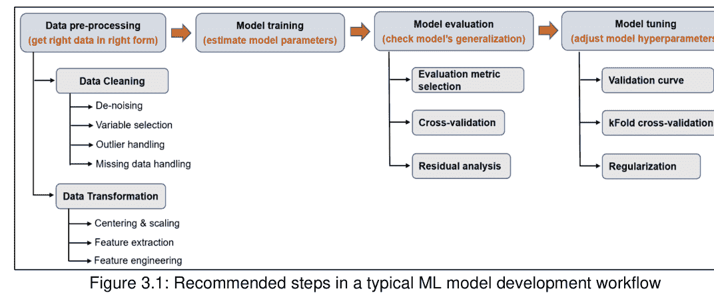

如你所见，工作流程中有四个主要步骤。第一步，对可用的原始数据进行预处理，以确保为后续的模型拟合步骤提供“正确”的数据集。此步骤可能涉及数据清理（丢弃无关变量或损坏/不完整的数据样本）和数据转换（生成新特征或修改现有特征）。虽然我们将在本章研究数据转换技术，但数据选择技术将在下一章详细讨论。工作流程的下一步涉及选择合适的模型并估计其参数。虽然参数估计由sklearn中现成的模型库处理，但模型选择需要你基于对特定过程系统的专业知识进行判断。模型选择的一个实用准则是奥卡姆剃刀原理，它建议选择泛化能力强的最简单模型。训练后，需要对模型进行评估，以验证建模假设并评估模型的泛化能力。模型评估步骤通常能很好地提示需要调整模型的哪个部分（或超参数），从而引出模型调优的最后一步。有专门的技术可用于辅助模型调优。在对工作流程有了这个大致了解后，我们现在开始详细学习这些技术。

### 3.2 数据预处理：数据转换

过程数据很少以“可直接建模”的格式提供。原始数据集可能包含高度相关的变量，或者变量的值范围差异很大。这些数据特征往往会对模型训练产生负面影响，因此需要进行数据转换以去相关或适当缩放数据。有时，从提供的变量中创建新特征¹⁰可以帮助提高模型准确性。总体而言，此预处理步骤的目标是转换给定变量，以改善模型训练和模型准确性。让我们看一些常用的转换技术。

### 数据中心化与缩放

在过程数据集中，经常会发现变量的值阶和分布范围差异很大。例如，你可能有一个温度变量在1000°C到1500°C之间变化，一个浓度变量在0.01M到0.1M之间变化，以及另一个温度变量在300°C到350°C之间变化。虽然这三个变量的值阶和分布范围差异很大，但它们可能对模型输出产生相似的影响。然而，未缩放的数据集可能导致一个变量被赋予比另一个变量更重要的权重，或者减慢模型训练速度。数据中心化和缩放将变量转换到同等基础上！虽然像PCA这样的算法必然需要中心化数据，但作为最佳实践，除非有充分的理由反对，否则你应该始终对数据集进行中心化和缩放。

最常见的技术是标准缩放或标准化，其中每个变量（在训练数据集中）被转换为均值为0、标准差为1。在ML脚本中，你将使用训练数据集计算出的均值和标准差来转换测试数据。下面的示例展示了sklearn如何方便地进行标准化：

```python
# import library, fit, and transform
import numpy as np
from sklearn.preprocessing import StandardScaler

X = np.array([[ 1000, 0.01, 300],
              [ 1200, 0.06, 350],
              [ 1500, 0.1, 320]])

scaler = StandardScaler().fit(X) # compute mean & std column-wise
X_scaled = scaler.transform(X) # transform using computed mean and std
```

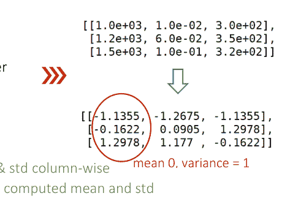

¹⁰ 特征（Feature）和（独立）变量（variable）是同一回事。在ML文献中，“特征”用于表示用于预测输出的变量，而“独立变量”一词在统计学中通常用于此目的。

### 使用sklearn库类

> 在（面向对象的）计算机编程术语中，在上面的代码中，我们创建了StandardScaler类¹¹的一个对象/实例（scaler），并通过调用fit()方法设置了其属性mean_和var_。它们可以作为scaler.mean_和scaler.var_访问。然后，通过调用对象的transform方法，使用拟合好的对象（scaler）来缩放X。这将是我们使用Sklearn类的通用模式：初始化对象、拟合属性并调用方法。

另一种流行的技术是最小-最大缩放，也称为归一化。这里，每个变量被转换到一个共同的值范围（通常是0到1）。对于0到1归一化，每个变量减去其最小值，然后除以其范围。在Sklearn中实现如下：

```python
# import library, fit, and transform
import numpy as np
from sklearn.preprocessing import MinMaxScaler

X = np.array([[ 1000, 0.01, 300],
              [ 1200, 0.06, 350],
              [ 1500, 0.1, 320]])
scaler = MinMaxScaler () # create object
X_scaled = scaler.fit_transform(X) # fit & transform
```

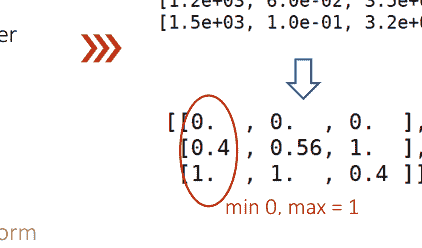

尽管标准缩放通常是默认选择，但哪种缩放方法更好并没有一个直接的答案。两种方法通常都能很好地工作。如果变量是高斯分布的，或者存在（一些）可能扭曲归一化过程中“最小值”和“范围”估计的极端异常值，则首选标准缩放。

### 稳健中心化与缩放

如果你的数据集有很多异常值，那么上述两种方法都会导致缩放不当。例如，在图3.2中，我们可以看到由于异常值的存在，标准缩放无法将“正常”数据中心化在0附近。在这种情况下，应采用稳健的MAD缩放，其中使用中位数和MAD（中位数绝对偏差）作为均值和标准差的稳健对应物。从数学上讲，对于任何变量x，MAD缩放采用以下形式：$$x_{MAD\ scaling} = \frac{x - median(x)}{MAD(x)}$$

图 3.2 显示，在 MAD 缩放（MAD scaling）下，正常数据确实以零为中心！

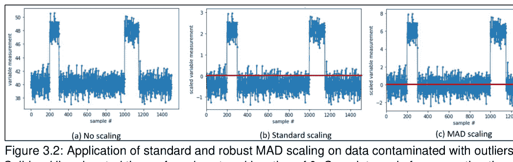

图 3.2：对受异常值污染的数据应用标准和稳健的 MAD 缩放。实线红色表示首选的中心位置 0。生成这些图表的完整代码可在在线代码仓库中找到。

Sklearn 提供了一个 `RobustScaler` 类用于稳健缩放，它与 MAD 缩放类似，不同之处在于它使用四分位距（IQR）而非 MAD 作为数据离散度的稳健估计量。使用这两种稳健缩放方法中的任何一种，都可以预期得到相似的结果。

### 特征提取

过程系统拥有大量测量数据，这增加了数据分析的复杂性。然而，你经常会发现，通过提取原始变量的组合特征，可以降低原始变量集的维度，同时这些特征包含与原始变量集相同的信息量。这是过程变量之间强相关性的结果。

以图 2 为例。这里，三个原始变量（**x**、**y**、**z**）表现出强烈的线性关系，以至于可以将（如图所示）三维测量空间转换为二维（甚至一维）特征空间，同时保留关于数据变异性的大部分信息。在 Sklearn 中实现这一点就像编写以下代码一样简单：

```
features = PCA(1).fit_transform(X_scaled) # 从缩放后的测量值中仅提取1个特征
```

特征提取后，其余的分析/模型构建将使用提取的特征进行。有特定的技术可用于确定线性和非线性系统的最优可提取特征数量。关于这些技术、在不“丢失信息”情况下的降维概念、PCA 方法以及其他特征提取方法（如 ICA、FDA）的详细信息，将在本书的第 2 部分中详细介绍。除了维度更低之外，特征空间还可能表现出其他优良特性，例如特征不相关或独立，因此，使用这些特征而不是原始变量可以生成更好的模型。

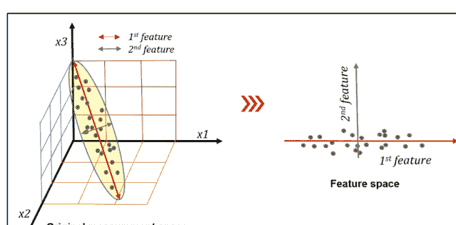

### 特征工程

虽然特征提取是一种无监督的练习（我们不显式指定底层的相关结构；算法自动提取关系），但特征工程涉及对变量进行仔细和显式的转换，这可以帮助 ML 算法提供更好的模型。例如，如果我们检查图 3.3 中的原始（$x$ 对 $y$）数据，很明显可能需要一个二次模型。为了实现这一点，我们将从给定的 $x$ 数据中工程化一个额外的特征（$x^2$），然后在 $\{x, x^2\}$ 和 $y$ 之间拟合一个线性模型，如下方代码所示：

```
# 读取原始数据
import numpy as np
data = np.loadtxt('quadratic_raw_data.csv', delimiter=',')
x = data[:,0,None]; y = data[:,1,None]

# 生成二次特征
from sklearn.preprocessing import PolynomialFeatures
poly = PolynomialFeatures(degree=2, include_bias=False)
X_poly = poly.fit_transform(x) # X_poly: 第1列是x，第2列是x^2

# 缩放模型输入
from sklearn.preprocessing import StandardScaler
scaler = StandardScaler()
X_scaled = scaler.fit_transform(X_poly)

# 拟合线性模型并预测
from sklearn.linear_model import LinearRegression
model = LinearRegression()
model.fit(X_poly, y)
y_predicted = model.predict(X_poly)
```

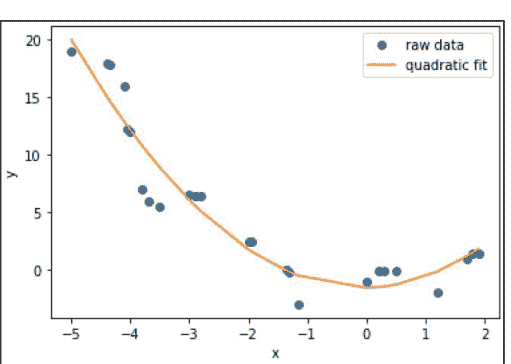

上述示例的优势在于，我们最终只需进行简单的线性拟合，而不是在 $y$ 和 $x$ 之间进行非线性拟合。这就是特征工程的力量。可以说，如果你能工程化出非常相关且信息丰富的特征，那么你的任务就完成了一半，这并不夸张。不幸的是，目前还没有明确的通用方法来进行有效的特征工程。这项任务是特定于系统的，需要领域知识。尽管如此，让我们看看一些常用的特征工程技术。

### 数学变换

这些变换利用对数、平方、平方根、乘积、时间聚合（使用最小值、最大值、标准差）、正切、双曲正切等函数来创建自定义特征。如前面的示例所示，这些变换允许使用简单模型，同时使原始变量之间的有效关系更加复杂。由于选择合适的数学函数是最关键且在很大程度上仍然是手动任务，自动化特征工程（AFE）目前是机器学习中一个活跃的研究领域。通常，AFE 技术涉及从常用的数学函数生成详尽的特征列表，然后执行变量选择以选择潜在有用的特征。然而，目前尚不存在普遍接受、通用适用的 AFE 方法，这使得你的领域知识指导下的特征工程变得非常重要！

### 独热编码

大多数 ML 建模算法需要数值数据。但有时你可能会发现自己正在处理分类数据：例如，模型的一个输入变量可能包含诸如“工厂类型 A”、“工厂类型 B”、“工厂类型 C”等条目。为了处理这种情况，你可以将分类数据转换为数值。一种简单的方法是简单地将“类型 A”替换为 0，“类型 B”替换为 1，“类型 C”替换为 2，依此类推。然而，除非工厂类型类别之间存在自然顺序（也许工厂类型 A/B/C 代表小型/中型/大型工厂类别），否则这种方法是错误的。ML 模型最终可能会因为类型 C 被赋予更高的值 2 而给予其相对于类型 A（和 B）更多的重视。首选的方法是使用独热编码，它执行以下转换：

```
# 导入类，拟合和转换
import numpy as np
from sklearn.preprocessing import OneHotEncoder

x = np.array([['type A'],
              ['type C'],
              ['type B'],
              ['type C']])

ohe = OneHotEncoder(sparse=False) # sparse=False 返回数组
X_encoded = ohe.fit_transform(x) # x 的数值形式
```

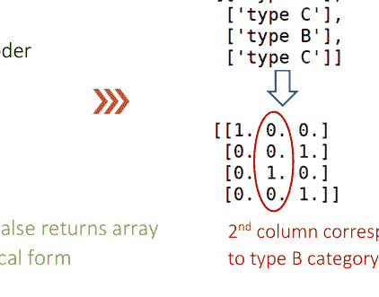

如你所推断的，为每个唯一的工厂类型类别（在上面的代码中由 OneHotEncoder 自动识别）生成了一列，并根据该类别在样本中是否出现分配了二进制值 0/1。例如，第 3 个样本是“类型 B”，因此第 2 列中的第 3 个条目被分配了值 1。

### 通过管道实现工作流自动化

在前面关于使用二次特征进行线性建模的示例中，我们不得不多次调用 `fit` 和 `transform`（或 `predict`）方法来进行模型训练。对于测试数据集，这些调用将被重复。对于其他模型，你可能有更多数据转换器，以至于跟踪所有转换变得有点不方便。为了简化这个过程，Sklearn 提供了一个很好的实用工具类 `Pipeline`，它允许我们将转换器和估计器（预测模型）按顺序链接在一起，这样我们只需要调用一次 `fit` 方法，如下方代码所示，用于我们的二次模型示例。

```
# 创建通过线性模型进行二次拟合的管道
# 导入相关类
from sklearn.pipeline import Pipeline
from sklearn.preprocessing import PolynomialFeatures
from sklearn.preprocessing import StandardScaler
from sklearn.linear_model import LinearRegression

# 按顺序添加转换器和估计器作为元组列表
# 名称‘poly’、‘scaler’、‘model’可用于稍后访问管道的各个元素
pipe = Pipeline([('poly', PolynomialFeatures(degree=2, include_bias=False)),
                ('scaler', StandardScaler()),
                ('model', LinearRegression())])

# 拟合管道并预测
pipe.fit(x, y)
y_predicted = pipe.predict(x)
```

上述代码给出了与我们之前没有管道的代码相同的结果，并且更简洁（并且可能更容易管理）。图 3.4 显示了当我们调用管道的 `fit` 和 `predict` 方法时，在幕后执行的步骤顺序。真的很方便，不是吗？请注意，管道不一定必须包含估计器作为其最后一个元素——你只能有转换器，并调用 `pipeline.transform()` 来通过所有包含的转换器转换你的数据。

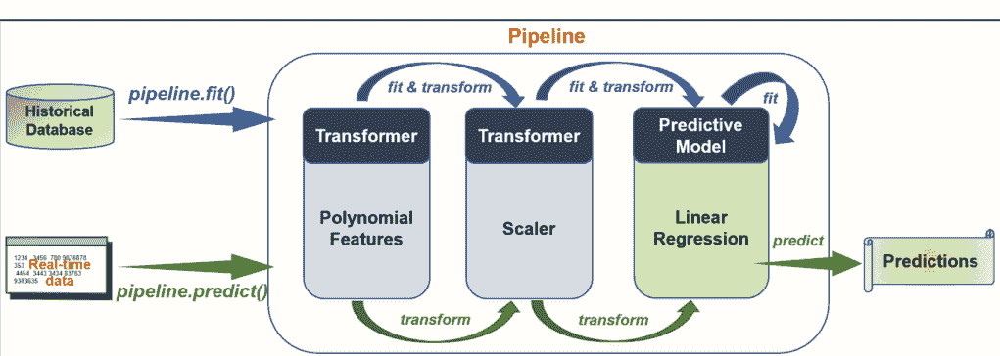

这完成了我们对数据转换技术的快速浏览。关键信息是，在将所有原始数据用于模型训练之前，你应该始终考虑可以对原始数据应用哪些转换，以帮助 ML 算法提供一个良好的模型。精心设计的转换可以减轻对大量训练样本，允许使用简单模型，并减少模型训练时间。接下来，我们将了解哪些技术可用于评估模型的性能表现。

### 3.3 模型评估

模型参数拟合后，我们需要一些方法来评估模型性能，以查看模型对训练数据的拟合程度（好或差）。为此，下面列出了回归和分类任务中常用的评估指标。

| 回归 | 分类 |
| :--- | :--- |
| • 均方误差 (MSE) | • 混淆矩阵 |
| • 平均绝对误差 (MAE) | • 准确率 |
| • 均方根误差 (RMSE) | • 精确率、召回率、F1 分数 |
| • R 平方 (R²) | • 真正例率 (TPR)、假正例率 (FPR) |

表 1：评估模型性能的常用方法

虽然编写自己的 Python 代码来计算这些指标很容易，但使用 `sklearn.metrics` 模块会更简单，因为这些指标都已实现。我们可以从该模块导入所需的指标类，并在下面的二次拟合示例中使用它。

```python
### 性能指标
from sklearn.metrics import r2_score
print('拟合指标 (R2) = ', r2_score(y, y_predicted))

>> 拟合指标 (R2) = 0.91
```

现在让我们快速浏览一下表 1 中列出的不同指标。

### 回归指标

R 平方 ($R^2$) 是一个很好的度量指标，技术上适用于线性模型，用于确定预测输出 ($\hat{y}$) 与实际 $y$ 的比较情况。如下方的指标公式表所示，$R^2$ 衡量的是输出变量的变异性中有多少可以被模型解释。$R^2$ 为 1 表示完美拟合。

| 回归指标 | 公式 |
| :--- | :--- |
| MSE | $\frac{\Sigma(y - \hat{y})^2}{N}$ |
| MAE | $\frac{\Sigma|y - \hat{y}|}{N}$ |
| RMSE | $\sqrt{\frac{\Sigma(y - \hat{y})^2}{N}}$ |
| R 平方 | $1 - \frac{\Sigma(y - \hat{y})^2}{\Sigma(y - \bar{y})^2}$ |

表 2：常见回归指标的公式。求和是在 $N$ 个样本上进行的。$\bar{y}$ 是 $y$ 的均值。

$R^2$ 并不能直接反映预测误差的大小。为此，可以使用其他指标。RMSE 是评估回归模型最流行的指标，计算为预测误差平均值的平方根。一个相关的指标是 MSE，它不取平方根。MAE 与 MSE 类似，只是它考虑的是误差的绝对值。这些指标中的任何一个都可以用来比较不同的模型：这些指标的值越小（$R^2$ 除外），模型拟合得越好。

> 几个 Sklearn 模型有自己的 score 方法，该方法计算适合其设计解决的问题的评估指标。例如，LinearRegression 对象的 score() 方法返回 $R^2$ 指标。Pipeline 也有一个 score 方法，它只是执行最终模型的 score 方法。对于我们的二次拟合示例，可以如下使用

```python
# 使用 score 方法计算指标
R2 = pipe.score(x, y) # 无需导入 metrics 模块
```

### 分类指标

在回归问题中，我们关心预测值与实际值的接近程度，而在分类问题中，我们关心实际标签与预测标签的完美匹配。在了解不同的分类指标之前，让我们先学习混淆矩阵。下图显示了一个二元分类任务的样本混淆矩阵；该矩阵全面概述了模型正确（和错误）分类属于正类和负类的样本的情况。所示矩阵表明，在实际属于负类的 25 (24 + 1) 个样本中，模型正确标记了其中的 21 个。

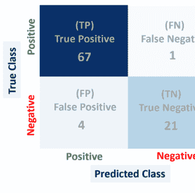

混淆矩阵可用于计算多个单值指标，总结在下方的指标公式表中。最直接的指标是“准确率”，它简单地传达了正确预测数与总预测数的比率。然而，对于不平衡数据集（其中更多样本属于某个特定类别），准确率可能是一个误导性指标。例如，在我们的示例中，总体准确率约为 95%（93 个中的 88 个），但我们可以看到正确检测负类的准确率仅为 84%（25 个中的 21 个）。因此，经常使用其他几个指标来传达模型性能的不同方面。

| 分类指标 | 公式 |
|---|---|
| 准确率 | $\frac{TP + TN}{FP + FN + TP + TN}$ |
| 精确率 | $\frac{TP}{TP + FP}$ |
| F1 分数 | $2 \frac{Precision * Recall}{Precision + Recall}$ |

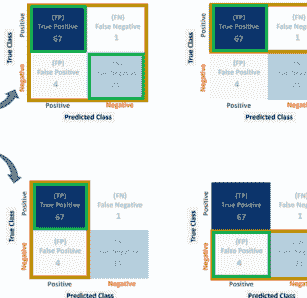

| 分类指标 | 公式 |
|---|---|
| 召回率, TPR | $\frac{TP}{TP + FN}$ |
| FPR | $\frac{FP}{FP + TN}$ |

精确率指标返回模型正确正预测数与模型总正预测数的比率，而召回率返回正确正预测数与数据中总正样本数的比率。对于过程监控工具（其中正标签表示存在过程故障），召回率表示模型检测过程故障的能力，而精确率表示模型预测过程故障的准确性。如果模型成功检测到过程故障，则可以具有高召回率，但大量误报会降低其精确率。在另一种情况下，如果模型只能检测特定类型的过程故障并且给出很少的误报，那么它将具有低召回率和高精确率。一个完美的模型在精确率和召回率上都具有高值（接近 1）。然而，我们刚刚看到其中一个指标高而另一个指标低是可能的。因此，需要同时报告这两个指标。但是，如果只需要一个指标，则使用 F1 分数，如果精确率和召回率都高，则返回高值，如果精确率或召回率低，则返回低值。FPR（假正例率）考察被分类为正类的负样本的比例。在我们的示例中，0.16 的高 FPR 稍微破坏了准确率、精确率和召回率数字所呈现的非常乐观的图景！！

对于多类问题，混淆矩阵看起来会像下面的图表，其中每个类别类型都有一行和一列。从多类混淆矩阵图中可以获得几个重要线索。例如，在下面的图表中，似乎属于类别 1 和 2 的一些样本倾向于被分类为类别 3，这表明应该添加一些额外的特征来帮助模型更好地区分类别 1 和 2 与类别 3。像精确率这样的指标可以通过一对多的方法计算，其中你会选择一个特定的类别作为正类，其余类别作为负类。

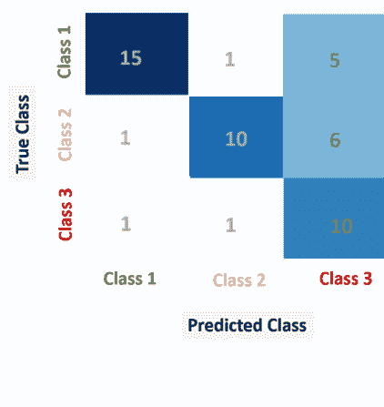

### 留出法 / 交叉验证

虽然使用训练数据计算的性能指标告诉我们模型拟合得有多好，但它们并不是模型在未见数据上表现如何的真实指标。为了进行无偏的泛化评估，性能指标应始终针对模型训练期间未使用的“测试”数据集进行报告。这种方法称为交叉验证。如果你已经有一个单独的测试数据集，那就太好了，否则最佳实践是将可用数据集分为训练集和测试集，如下所示。

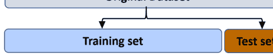

留出一部分数据用于交叉验证称为留出法。一个好的经验法则是将 20% 的数据保留在测试集中。留出法可以在 Sklearn 中使用 **train_test_split** 实用函数完成，如下所示，用于我们的二次拟合示例

```python
# 分离测试数据
from sklearn.model_selection import train_test_split
x_train, x_test, y_train, y_test = train_test_split(x, y, test_size=0.2, random_state=1)

# 检查数据集大小
print('训练集中的样本数: ', x_train.shape[0])
print('测试集中的样本数: ', x_test.shape[0])

>>> 训练集中的样本数:  20
    测试集中的样本数:  5

# 拟合管道并预测
pipe.fit(x_train, y_train)
y_predicted_train = pipe.predict(x_train)
y_predicted_test = pipe.predict(x_test)

### 性能指标
from sklearn.metrics import mean_squared_error as mse

print('训练指标 (mse) = ', mse(y_train, y_predicted_train))
print('测试指标 (mse) = ', mse(y_test, y_predicted_test))

>>> 训练指标 (mse) =  3.79
    测试指标 (mse) =  3.56
```

**train_test_split** 函数中的 **random_state** 参数用于在应用分割之前打乱数据集。打乱数据集是一个好习惯，可以确保训练集和测试集之间没有无意的数据模式。例如，假设一个数据集来自制造工厂，并按生产率排序：如果不打乱，我们可能最终在训练集中只有低生产率的数据，这是不可取的。

对于分类问题，还有另一个重要的考虑因素。理想情况下，我们希望确保原始数据集中存在的相同类别比例在训练集和测试集中得以保留。这种方法称为分层分割，可以通过 **train_test_split** 函数中的 **stratify** 参数实现。例如，我们可以将一个故障/无故障标签向量传递给此参数，**train_test_split** 函数将确保故障和非故障样本的比例在训练集和测试集中相同。

在使用测试数据对模型性能进行评估后，如果需要，可以使用完整数据集重新训练模型。由于我们总是隐含地假设训练集和测试集遵循相同的分布，因此使用更多数据重新训练后，模型的泛化性能通常会得到提升。

### 残差分析

残差分析是验证（回归）模型充分性的另一种方法。它涉及检查模型误差/残差，以确保其中没有不期望的模式。残差中出现任何明显趋势都表明需要进一步的数据预处理或更换模型。研究残差的一种便捷方法是简单地绘制散点图。理想情况下，残差应较小，以零为中心，独立于模型输入和输出（预测值和测量值），并且在时间上不相关（对于动态模型）。理想的残差图应类似于这样

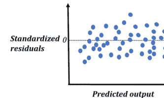

在上图中，没有明显的系统性模式。如果残差图中存在系统性模式，则意味着模型未能提取数据集中的所有系统性模式。观察到的具体模式通常也能为潜在的补救措施提供线索。图3.5展示了一些“不良”残差图的示例。

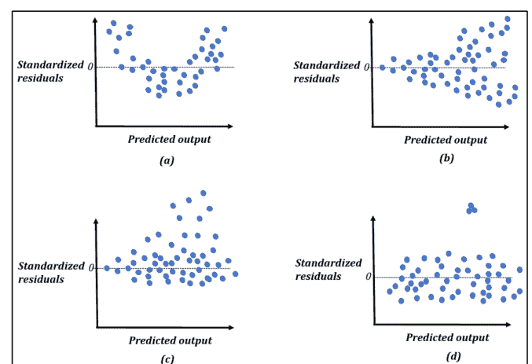

在上图的子图(a)中，残差呈现非线性模式，这立即表明模型无法充分捕捉数据中的非线性关系。可能需要引入非线性特征，或者使用能够捕捉复杂非线性的不同模型。在子图(b)中，异方差性很明显，因为随着预测输出值的增大，残差也变大。解决这个问题通常需要对变量进行适当的变换，例如对数变换。异方差性也可能表明缺少某个变量。在子图(c)中，虽然大多数样本的残差较小，但有几个样本具有较高的正残差。这种情况下的建议补救措施与异方差性相同。最后，在子图(d)中，有一组样本表现为异常值。这些异常值可能需要被移除或进一步分析，以检查它们是否为正常样本；如果样本确实是正常的，那么可能需要更改模型以适应这些不同数据组的存在。

对于动态数据集，使用自相关和互相关（残差与过去输入/输出数据之间）函数图来检查残差是否不相关。残差直方图或正态概率图也用于检查残差是否呈正态分布。如果发现不相关性或正态性假设被违反，这些图（如散点图）将为潜在的补救措施提供关键线索。

我们可以看到，残差分析是一个强大的诊断工具。作为最佳实践，你应该始终检查残差图，以确保没有违反建模假设，或者没有明显的改进空间。

### 3.4 模型调优

在将模型送交使用测试数据集进行泛化评估之前，我们需要确保所获得的模型是我们能得到的最佳模型。或者，如果我们的模型未能提供足够的泛化性能，则需要进行一些模型调整。这些任务属于建模工作流中的“模型调优”步骤，主要涉及优化模型超参数的值。*模型超参数*与*模型参数*（在模型拟合过程中估计的未知数）不同，它们是需要在模型拟合前指定的模型配置变量。对于我们的二次拟合示例，线性模型的权重系数是模型参数，而多项式次数是超参数。对于人工神经网络模型，神经元数量和层数是重要的超参数，而权重系数是可估计的模型参数。寻找最优超参数设置在机器学习文献中也被称为模型选择。

图3.6展示了当我们的流程使用不同多项式次数进行拟合时得到的模型曲线。我们可以看到，高次数的模型能更好地拟合训练数据，但这种拟合有点“过头”了！尽管它的训练误差非常低，我们也不会愿意接受这个模型。那么，在使用测试数据进行最终评估之前，我们如何选择最优的超参数值呢？我们如何诊断模型是过度拟合还是拟合不足？我们可以采取哪些步骤来确保这两种不良情况都不会发生？我们将在接下来的几个小节中回答这些重要问题。

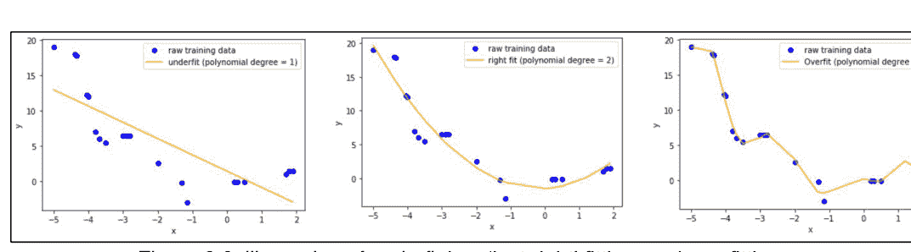

### 过拟合与欠拟合

当我们的模型无法充分捕捉预测变量与响应变量之间的系统性关系时，就会发生欠拟合（图3.6中的第1个模型）；而当模型甚至捕捉了非系统性关系（如噪声）时，就会发生过拟合（图3.6中的第3个模型）。当我们通过调整超参数值来增加模型复杂度时，我们就从拟合谱的欠拟合端移向过拟合端。一种常见的可视化方法是绘制验证曲线，我们也可以通过它来选择最优的超参数值。

> 过拟合通常是机器学习模型性能不佳的原因。过拟合不一定只与“复杂模型”相关，即使是简单的线性回归模型也可能过拟合数据（例如，如果你有许多无关的预测变量或训练样本数量很少）。因此，你应该始终密切关注你的模型是否过拟合。

为了绘制验证曲线，我们将使用一个与用于模型拟合的数据分开的数据集。我们称之为验证集，而用于拟合模型的数据称为拟合集或估计集（你可能会想，“测试集呢？”请保留这个问题，我们稍后会解释）。现在，验证曲线简单来说就是针对不同的超参数值，绘制拟合集和验证集的模型误差（或任何性能指标）的图，如图3.7所示。当超参数设置使得模型没有足够的复杂度或“处理能力”来描述数据中的内在结构时，拟合集和验证集的建模误差都会很大，导致欠拟合。随着模型复杂度的增加，拟合集的误差会减小，然而，由此产生的模型可能无法很好地泛化到验证数据，导致过拟合。因此，过拟合的特点是拟合误差小而验证误差大。拟合误差和验证误差都很小，且验证误差刚开始增加的甜蜜点，对应着最优的超参数。

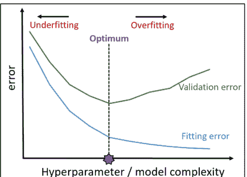

如果你的模型欠拟合，你的对策应该是增加模型复杂度（例如，在人工神经网络中增加深度或使用更高次数的多项式）。你可以尝试添加更多有信息量的特征。对于过拟合，则需要限制模型的灵活性，以防止它学习拟合集中的噪声或随机误差。移除无关特征或添加更多拟合数据也有帮助。如果最优验证误差仍然很高，那么可能需要更换模型（例如，使用支持向量机代替决策树）。

> 欠拟合和过拟合的问题也分别被称为高偏差和高方差问题。高偏差指的是模型估计值始终远离真实值的问题。另一方面，如果你的模型过拟合，那么当使用不同的数据集进行模型拟合时，你对同一验证集的模型估计值会有很大差异，导致模型估计的高方差。

要生成验证曲线，你可以使用Sklearn的`model_selection`模块中的实用函数`validation_curve`，或者编写自己的代码，如下所示。

```python
# separate fitting and validation data
from sklearn.model_selection import train_test_split
```

### 训练/验证/测试集划分

我们使用了从拟合数据集中预留出来用于模型验证的数据集。我们不能再将其用作泛化评估的测试数据集（因为该数据集已经被模型“见过”，因此不再是未见过的数据集）。解决方案是如图所示，再预留出另一部分数据集。这种方法被称为三路保持法。

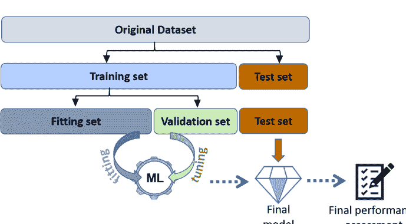

要实现三路保持法，我们需要如下面所示调用两次 `train_test_split` 函数。

```python
# 训练-验证-测试划分
x_train, x_test, y_train, y_test = train_test_split(x, y, test_size=0.2, random_state=1)
x_fit, x_val, y_fit, y_val = train_test_split(x_train, y_train, test_size=0.3, random_state=1)

print('Number of samples in fitting set: ', x_fit.shape[0])
print('Number of samples in validation set: ', x_val.shape[0])
print('Number of samples in test set: ', x_test.shape[0])

>>> Number of samples in fitting set: 14
Number of samples in validation set: 6
Number of samples in test set: 5
```

> 在模型选择完成后，如果需要，你可以使用选定的最优超参数设置，在组合的拟合和验证数据集上重新训练模型。此外，如前所述，在使用测试数据进行模型性能评估后，可以通过在整个数据集上重新训练来获得最终模型。

### K折交叉验证

三路保持法是一种优雅的方法，可以确保模型调优和最终评估都基于模型性能的无偏估计（即，分别使用在模型拟合和模型训练期间未见过的数据）。然而，这种方法也有几个缺点。如果我们的原始数据集不够大，我们可能没有奢侈条件拥有三个不同的数据子集。此外，性能估计可能受到构成子集的数据点的严重影响，从而可能导致超参数的不幸选择和最终评估。

流行的替代解决方案是 k 折交叉验证。其思想很简单。不是只有一个测试（或验证）子集，而是创建多个子集，整体性能估计是各个子集性能的平均值。图 3.9 说明了这一思想，其中 k 折交叉验证同时用于最终性能评估和模型调优。

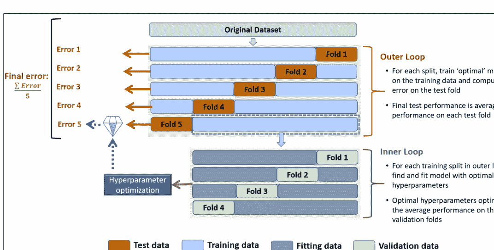

要理解图 3.9，让我们先考虑外层循环：

-   采用 5 折交叉验证进行最终性能评估。
-   原始数据集被分成 5 折，并训练 5 个独立的模型。
-   对于每个模型，其中一折用作测试数据，其余数据用于模型训练。
-   整体模型性能就是这 5 个模型性能的平均值。

对于内层循环中的模型训练：

-   采用 4 折交叉验证，即训练数据被分成 4 折。
-   对于每组超参数，使用拟合数据集拟合 4 个独立的模型。
-   整体验证性能就是这 4 个模型在其各自验证折上性能的平均值。
-   选择优化整体验证性能的超参数值，并在将模型发送到外层循环之前，使用完整的训练数据重新训练模型。

通常，k 折交叉验证仅用于模型调优，而最终性能评估仅使用单个测试保持集进行。这种传统的交叉验证方法如图 3.10 所示。

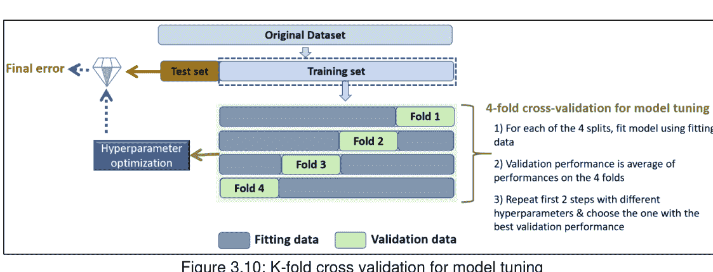

让我们将 k 折交叉验证技术应用于我们的示例数据集，以找到最优的多项式次数。我们将使用 Sklearn 提供的 `KFold` 工具函数，该函数返回在每个 k 折中属于拟合和验证子集的数据点索引。

```python
# 分离训练和测试数据
from sklearn.model_selection import train_test_split
x_train, x_test, y_train, y_test = train_test_split(x, y, test_size=0.2, random_state=1)

# 在训练数据上生成 k=3 折
from sklearn.model_selection import KFold
kfold = KFold(n_splits = 3, shuffle = True, random_state = 1)

# 使用 K 折计算验证性能
from sklearn.metrics import mean_squared_error as mse
overall_fit_MSEs = [] # 不同多项式次数的整体误差
overall_val_MSEs = []

max_polyDegree = 5
for poly_degree in range(1, max_polyDegree+1): # 循环遍历超参数
    pipe['poly'].degree = poly_degree

    split_fit_MSEs = [] # 不同折的误差
    split_val_MSEs = []

    for fit_indices, val_indices in kfold.split(x_train): # 循环遍历各折
        x_fit = x_train[fit_indices]
        y_fit = y_train[fit_indices]
        x_val = x_train[val_indices]
        y_val = y_train[val_indices]

        # 拟合与预测
        pipe.fit(x_fit, y_fit)
        y_pred_fit = pipe.predict(x_fit)
        y_pred_val = pipe.predict(x_val)

        # 计算平均误差并追加
        split_fit_MSEs.append(mse(y_fit, y_pred_fit))
        split_val_MSEs.append(mse(y_val, y_pred_val))

    overall_fit_MSEs.append(np.mean(split_fit_MSEs))
    overall_val_MSEs.append(np.mean(split_val_MSEs))
```

下图显示了得到的验证曲线，它更符合预期。请注意，Sklearn 提供了一个 `cross_val_score` 函数，可以用来替代我们上面代码中对折的循环。

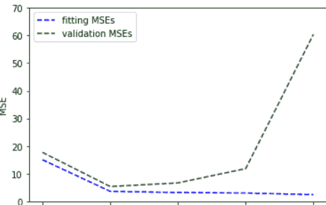

K 折交叉验证是 Sklearn 多个函数（如 `validation_curve`）中内置的默认交叉验证技术。该技术的缺点是计算成本高，因为模型拟合需要执行多次。因此，对于基于深度学习的解决方案（其本身就需要使用大数据集），三路保持法通常是首选。

### 选择折数

k 折交叉验证中 *k* 的典型（且通常是默认）值是 10。对于大型数据集，可以使用较小的值（k = 3 或 5）。当我们增加 *k* 时，放入验证集的样本更少；这会导致不同折之间验证分数的方差更高，这是不希望看到的。一个极端情况是折数等于训练样本数。这被称为留一法交叉验证，当训练样本数量非常有限时使用。

### 正则化

如果你的模型过拟合，要做的事情之一是检查模型参数（线性模型的权重系数）的值。你可能会发现其中一些或全部具有非常大的值。这是有问题的，因为模型对具有高系数的输入变量变得非常敏感，即模型对于这些输入变量的微小变化就会预测出大的响应变化。这对于真实的流程系统来说不太可能成立。例如，以下是我们示例数据集使用 10 次多项式特征时的模型系数。注意看高次项的系数：

```python
# 获取模型系数
print(pipe['model'].coef_) # 不包括截距项

>>> [-1.96123e+00 -1.70142e+01  1.61112e+02  5.53503e+02  -1.47185e+03 -5.24500e+03
 9.88824e+02  1.58830e+04  1.72273e+04  5.73349e+03]
```

### 用于模型选择的贝叶斯信息准则 (BIC)

如果你想利用所有训练数据进行模型拟合，或者无法留出验证子集用于模型选择（例如，使用高斯混合模型时），可以使用 BIC 技术。它能在模型复杂度（或模型参数数量）与模型精度之间提供一个最优的权衡。我们已经看到，通过增加更多模型参数可以提高训练数据上的模型精度，但这也会导致过拟合。BIC 通过最小化一个包含模型参数数量惩罚项的指标来解决这个难题。

从数学上讲，$BIC = n_p \ln(n) - 2\ln(\hat{L})$，其中
- $n_p$ 等于估计参数的数量
- $n$ 等于数据点或观测值的数量
- $\hat{L}$ 等于似然函数（模型精度）的最优值

我们可以看到，一个具有高精度/似然值且参数较少的模型将导致较低的 BIC 值，因此，最优模型对应于最小的 BIC 值。BIC 因其有效性和低计算成本而广受欢迎：理论上已经证明，对于足够大的训练数据，如果正确的模型包含在候选模型集合中，那么 BIC 保证会选择它作为最佳模型。我们将在第 8 章看到一个应用。

另一个流行的模型选择指标是 AIC（赤池信息准则）。AIC 中的惩罚项较小。因此，与 BIC 选择的模型相比，AIC 倾向于选择更复杂的模型。请记住，更复杂的模型可能过拟合，而更简单的模型可能欠拟合。因此，在 AIC 和 BIC 方法之间的选择取决于具体问题。

因此，为了保持模型参数的“简单性”，会对建模算法进行调整以降低过拟合的可能性。这种调节称为正则化，是解决过拟合问题的广泛使用的方法。你应该始终在模型中采用某种形式的正则化。

### 正则化的常见机制

在正则化模型的一种形式中，目标函数（在拟合过程中被最小化）包含一个与模型系数（$\theta$）平方和成正比的附加项，如下所示

$$J_{regularized}(\theta) = MSE(\theta) + \alpha \sum_{i} \theta_i^2$$

这个附加项惩罚算法选择高系数值。因此，在模型拟合过程中，算法将被迫在保持系数较小的同时最小化拟合误差。这种正则化版本称为 L2 或岭正则化。'$\alpha$' 项是一个超参数，用于调节惩罚项的大小。

在另一种正则化形式中，目标函数修改如下

$$J_{regularized}(\theta) = MSE(\theta) + \alpha \sum_{i} |\theta_i|$$

这里，惩罚项简单地与系数的绝对值之和成正比。这称为 L1 或 Lasso 正则化。让我们看看这些机制如何帮助我们解决 10 次多项式拟合的过拟合问题。L1 / L2 可以通过在流水线中将线性模型切换为正则化线性模型来实现，如下所示

### 岭回归

```python
from sklearn.linear_model import Ridge

pipe_L2 = Pipeline([('poly', PolynomialFeatures(degree=10,include_bias=False)),
                    ('scaler', StandardScaler()),
                    ('model', Ridge(alpha=0.1))])
```

### Lasso 回归

```python
from sklearn.linear_model import Lasso

pipe_L1 = Pipeline([('poly', PolynomialFeatures(degree=10,include_bias=False)),
                    ('scaler', StandardScaler()),
                    ('model', Lasso(alpha=0.1))])
```

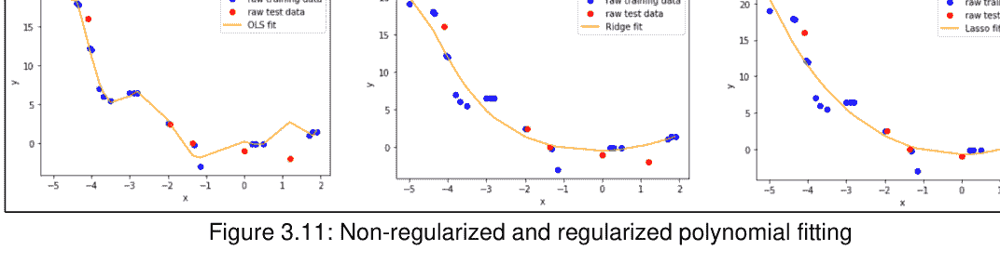

图 3.11 证实了正则化是有效的！！为了了解底层发生了什么，让我们检查正则化模型的模型系数

```python
# get model coefficients
print(pipe_L2['model'].coef_)

>>> [ 0.27326  3.49270 -0.35861  0.59074 -1.20522  1.90652 -1.80640  0.86690  0.87244 -3.20685]
```

```python
print(pipe_L1['model'].coef_)

>>> [-0.438109181 -0.09273215 1.679048 -0. 0. -0. 0. 0. -0.]
```

虽然 L1 和 L2 正则化都确保模型系数保持较小，但 Lasso 实际上将几个系数推到了零。这代表了 Lasso 的一般行为，它通常用于变量选择，因为无关变量的系数会被设置为零。L2 的优势在于计算上有利，因为惩罚项是可微的，而 L1 的惩罚项则不是。L1 和 L2 之间的选择取决于具体问题，需要通过试错来确定。

L1 和 L2 正则化可以组合成弹性网络正则化。并非所有形式的正则化都涉及在目标函数中加入惩罚项。你将在第 11 章学习诸如 dropout、批归一化、早停等方法，这些方法有助于确保模型系数保持“稳定”以避免过拟合。

> 你可能已经注意到，我们只讨论了对权重系数进行正则化，而没有对截距进行正则化。这通常是正确的。大的截距（或神经网络中的偏置）不会因输入的微小变化而导致响应发生大的变化，因此通常不需要对它们进行正则化。

### 选择 α 的值

'α' 项是一个重要的超参数，应在模型拟合前仔细指定。非常小的 α 会使正则化无效，可能导致过拟合。非常高的值会将模型系数推到零，导致欠拟合。最优值很难事先知道，需要通过交叉验证来找到。然而，一个通用的建议是保持 α 较低而不是较高。

### 通过 GridSearchCV 进行超参数优化

之前我们使用验证曲线来寻找最优超参数。Sklearn 提供了一个 GridSearchCV 实用函数，我们可以利用它更方便地完成这项任务。GridSearchCV 接受潜在超参数值的列表，并进行详尽搜索以找到超参数值的最优组合。下面的代码展示了实现。

```python
# separate training and test data
from sklearn.model_selection import train_test_split
x_train, x_test, y_train, y_test = train_test_split(x, y, test_size=0.2, random_state=1)
```

```python
# find optimal hyperparameter via GridSearchCV
from sklearn.model_selection import GridSearchCV

param_grid = {'poly__degree': np.arange(1,6)}
gs = GridSearchCV(pipe, param_grid, scoring='neg_mean_squared_error', cv=3)
gs.fit(x_train, y_train)

print('Optimal hyperparameter:', gs.best_params_)

>>> Optimal hyperparameter: {'poly__degree': 2}
```

正如预期的那样，GridSearchCV 也返回最优多项式次数为 2。注意，我们在这里使用了 3 折交叉验证，通过 cv=3 指定。默认情况下，GridSearchCV 使用找到的最佳超参数在完整的提供的数据集上重新拟合估计器。最佳估计器可以通过 gs.best_estimator_ 获得，用于后续预测（预测也可以通过 gs.predict 函数完成）。在上面的代码中，我们明确提供了均方误差作为评分指标；默认行为是使用估计器的默认评分器，在 sklearn 中对于线性回归将是 R 平方。

这结束了我们对标准 ML 模型调优方法和 ML 建模工作流的快速了解。你现在知道了在模型拟合前应如何转换原始数据，如何评估和报告模型性能，以及如何在模型调优期间找到最优模型超参数。

### 总结

在本章中，我们学习了建立 ML 建模工作流的最佳实践。在学习工作流的过程中，我们看到了 Sklearn 库提供的几个不错的实用工具（流水线、kFold、网格搜索等），它们使 ML 脚本编写更易于管理和操作。本章的要点信息应该是，ML 建模是你与机器之间的协作工作。本章让你了解了你这一方的任务！！

## 第四章

### 数据预处理：清洗过程数据

关于机器学习的一个普遍说法是，数据越多越好！然而，数据集中的所有数据点和/或变量未必都对你的模型有益。你可能会问为什么？原因是工业过程数据不可避免地存在异常值、测量噪声、缺失数据和无关变量等问题。无关变量成为建模数据集的一部分，通常是由于对当前过程系统的了解不够精确（对于复杂过程，可能无法立即手动选择正确的模型变量集），而其他数据杂质则由于传感器和数据采集系统故障、过程扰动等原因悄然混入。这些杂质会对我们的机器学习模型质量产生负面影响，并可能导致错误的结论。

清除上述不利属性的数据被称为数据清洗，它是模型拟合前数据预处理任务的重要组成部分。我们再怎么强调数据清洗的重要性也不为过。无论你采用多么先进的建模算法，都无法逃脱“垃圾进，垃圾出”的原则。当输入损坏的数据时，机器学习模型无法正确“学习”我们的系统。

幸运的是，有几种方法可用于自动数据清洗。我们将在本章中学习这些方法。具体涵盖以下主题：

-   去除测量噪声
-   选择相关变量以提高模型性能
-   单变量和多变量环境中的异常值去除
-   处理缺失数据的常用技术

### 4.1 信号去噪

过程测量不可避免地会受到高频噪声的污染。如果不加以适当处理，噪声有时会导致模型参数估计错误或预测变量出现不利特征。例如，在图4.1中，我们可以看到流量测量信号中的噪声波动。这类波动通常不是真实的过程变化，而只是测量传感器的产物。如果不加以去除，这些波动可能导致预测变量（比如产品纯度）出现噪声波动，这是非常不可取的。

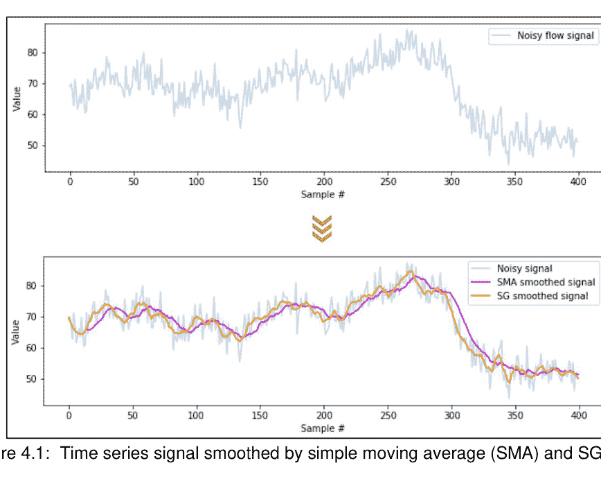

两种常见的过程信号去噪方法是使用移动窗口平均和Savitzky-Golay（SG）滤波进行平滑处理。图4.1显示了平滑后的流量信号。我们可以看到，关键的过程变化得以保留，而噪声波动已被去除！让我们快速研究这两种技术，并学习如何实现它们。

### 移动窗口平均滤波器

在移动窗口平均中，变量 $x$ 在时间 $t$ 的平滑值被取为在有限或无限长度窗口内 $x$ 的先前测量值的加权组合。在最常见的变体——简单移动平均（SMA）中，组合是简单的平均值，如下所示

$$x(t)_{smoothed} = \frac{\sum_{j=0}^{W-1} x(t-j)_{raw}}{W}$$

其中 W 是窗口大小。为了生成图4.1中的SMA平滑信号，使用了Pandas，如下所示

```
# read noisy flow data
import numpy as np
noisy_signal = np.loadtxt('noisy_flow_signal.csv', delimiter=',')

# denoise using SMA filter
import pandas as pd
windowSize = 15
smoothed_signal_MA = pd.DataFrame(noisy_signal).rolling(windowSize).mean().values # taking mean on a rolling window and converting back to numpy array
```

SMA的替代方案是LWMA（线性加权移动平均）和EWMA（指数加权移动平均），它们分别在有限和无限长度窗口中对过去的测量值进行加权。有限窗口长度变体中的W值取决于期望的“平滑程度”，并由底层过程系统的知识（窗口大小理想情况下应小于系统过程变化发生的周期）或通过试错来指导。显而易见，较大的W实现更平滑的效果。

### SG滤波器

在SG滤波中，任何点 $t^*$ 的平滑值是通过用时间（t）的多项式近似以 $t^*$ 为中心的奇数大小窗口内的 $x$ 值，然后在 $t^*$ 处评估该多项式来实现的。具体来说，在点 $t^*$ 处，拟合以下形式的 $m^{th}$ 阶多项式，然后进行评估

$$x(t^*)_{smoothed} = \sum_{k=1}^{m} b_k (t^*)^k$$

其中 $b_k$ 是估计的多项式系数。在图4.1中，使用Scipy实现了SG滤波器，采用 $2^{nd}$ 阶多项式，如下所示

```
# import savgol_filter from scipy
from scipy.signal import savgol_filter
smoothed_signal_SG = savgol_filter(noisy_signal, window_length = 15, polyorder = 2)
```

请注意，在默认设置下，极端边缘的 (W-1)/2 个值是通过拟合边缘处的 W 个值的多项式并评估该多项式来获得最靠近边缘的 (W-1)/2 个数据点的平滑值来处理的。建议查阅官方文档<sup>12</sup>以了解其他可用设置。

SG滤波器在保留原始信号重要特征方面比移动窗口平均滤波器具有优势。SMA还有另一个缺点，在图4.1中很明显——如果我们仔细观察样本300附近流量发生阶跃变化的地方，SMA平滑信号显示出微小的时间延迟/偏移，而SG平滑信号在阶跃变化期间非常紧密地跟随原始信号。这种时间偏移对于某些问题可能变得有问题。然而，SMA在计算上具有优势，因为它计算更快。

> SMA和SG滤波器属于低通滤波器类别，它们阻挡原始信号的高频分量，允许低频通过。这有效地去除了虚假的快速过渡、尖峰和噪声，同时保留了缓慢演变的系统变化。另一方面，高通滤波器阻挡低频分量，允许高频通过。这些通常用于去除过程信号中的长期缓慢漂移。

还有其他高级方法，如小波滤波器、LOWESS平滑，如果SMA或SG滤波器不能提供令人满意的性能，可以探索这些方法。无论采用哪种方法，你都应该适当注意调整滤波器，以确保平滑信号在原始信号的边缘、瞬态和阶跃变化附近是可接受的。

### 4.2 变量选择 / 特征选择

假设你被要求为一个大型石化厂建立一个回归（或分类）模型来预测产品质量。对于这种复杂且高度集成的过程，如果你没有足够的过程洞察力来了解哪些变量影响产品质量，因此最终有数百个变量作为模型的潜在输入，这并不奇怪。包含无关输入的问题在于模型训练（和更新）时间增加，模型容易过拟合，并且需要更多的训练样本来充分表示模型输入空间。此外，不必要的庞大输入集使得模型的物理诠释变得困难。

选择最相关的输入/特征子集的任务称为变量选择 / 特征选择。变量选择的一个平凡最优方法是探索所有可能的输入变量组合，并选择在验证数据集上给出最佳性能的组合。然而，当处理大量输入候选时，这在计算上可能不可行。为了规避这些问题，已经设计了几种变量选择方法，试图找到一组良好的相关模型输入。图4.2列出了一些常用的方法。在接下来的几个小节中，我们将学习这些方法，并尝试理解它们的优势和缺点。

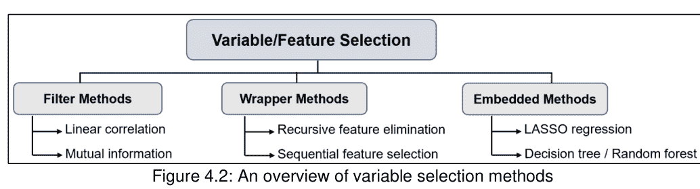

如你所见，这些方法根据所采用的相关输入搜索策略分为三类。过滤器方法使用统计度量（如相关系数、互信息）来量化任何输入相对于目标变量的相关性。包装器方法利用模型通过MSE、BIC等指标来量化不同输入子集的预测能力。在第三类中，嵌入式方法在模型拟合过程中执行变量选择。在我们深入探讨这些方法之前，让我们快速看一下本节将使用的数据集。

### 示例数据集

数据集在文件VSdata.csv中提供，是使用Chong & Jun<sup>13</sup>设计的机制（稍作修改）模拟的。该机制旨在确保数据集模拟具有互连单元过程的真实制造过程。有40个输入变量，其中10个（输入17到26）已知与目标变量相关，其余则无关。拟合和验证数据集分别包含1000和250个样本。目标样本使用相关输入生成，如下所示

$$y_{sample} = \sum_{j=17}^{26} \beta_j x_{sample,j} + \varepsilon_{sample}$$其中 $\varepsilon_{sample}$ 是测量噪声。所有输入均来自均值为零、协方差矩阵为 $\Gamma$ 的多元正态分布，该矩阵旨在诱导相邻过程输入之间产生强相关性。

$$\Gamma_{ij} = 0.9^{|i-j|}, \quad (i, j = 1, 2, \cdots, 40)$$

图 4.3 展示了训练数据集中的目标数据和输入数据。从这些图中，无法立即判断某个输入对于目标的预测是否（更）相关。使用所有输入进行多元线性回归，在验证数据集上得到的 $R^2$ 值为 0.614，而仅使用 10 个相关输入则得到略高的 $R^2$ 值 0.634。让我们看看我们的变量选择技术能否正确找出数据集中的相关输入。

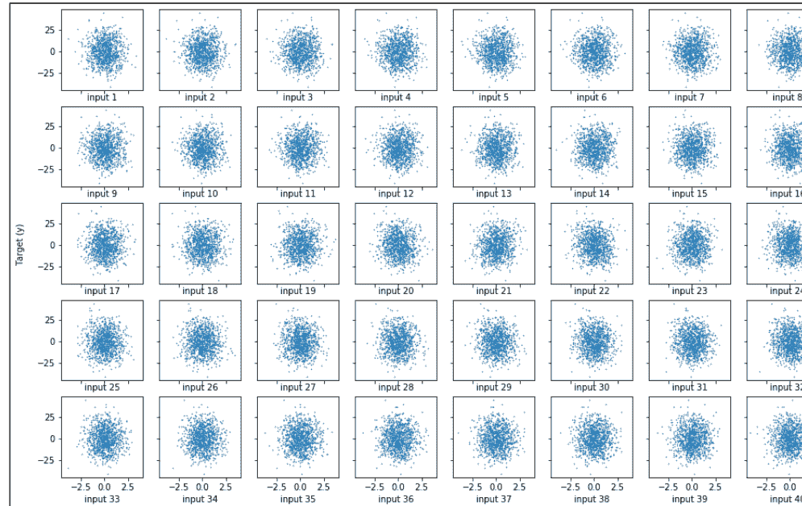

图 4.3：模拟制造过程数据集的目标与输入关系图

### 过滤法

过滤法最常见的形式是，使用某种统计量来估计每个输入与目标之间的关系，然后根据估计的关系强度对输入进行排序。排序后，可以选择排名靠前的变量。图 4.4 展示了该策略的概览。


让我们看看两种常用的统计量。

### 相关系数

对于连续输入和目标，常用的统计量是皮尔逊相关系数，它衡量输入与目标之间的线性相关性，其计算公式为

$$R_{xy} = \frac{\sum_i(x_i - \bar{x})(y_i - \bar{y})}{\sqrt{\sum_i(x_i - \bar{x})^2 \sum_i(y_i - \bar{y})^2}}$$

对于变量选择，可以选择相关性最高的前 $k$ 个变量（其中 $k$ 是预先已知的，或通过交叉验证确定），或者选择所有相关性显著不为零的变量。

### 互信息

相关系数对于目标与输入之间的非线性依赖关系可能具有误导性，从而导致错误的变量选择。解决方案是使用“互信息（MI）”度量，它可以有效量化变量之间的任何类型的依赖关系。数学上，MI 由下式给出

$$MI(x, y) = \iint p(x, y) \log \frac{p(x, y)}{p(x)p(y)} dxdy$$

其中 $p(x, y)$ 表示变量 x 和 y 的联合概率密度，$p(x)$ 表示 x 的边缘概率密度。对于过程数据，可以使用 k 近邻法（sklearn 中使用）、核密度估计（KDE）或直方图来估计这些密度。

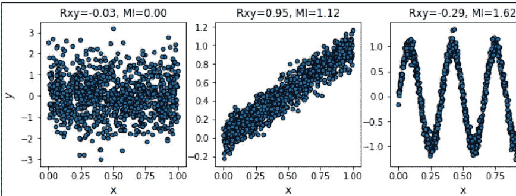

图 4.5：目标与输入之间为零、线性和非线性依赖关系时的线性相关性和互信息度量

考虑图 4.3 中的场景。皮尔逊相关系数未能识别目标与输入之间的非线性（正弦）依赖关系，但互信息能够正确确定依赖关系。通俗地说，MI 衡量的是通过一个变量（x）获得的关于另一个变量（y）的信息量。因此，如果目标与输入相互独立，那么从已知 x 中无法获得关于 y 的信息，因此它们的 MI 为 0。另一方面，如果 y 依赖于 x，则 MI > 0，且值越高意味着依赖性越强。

正如您可能注意到的，过滤法不需要构建任何预测模型，因此执行速度快。当输入候选数量非常大时，过滤法尤其受到青睐。然而，“相关”输入子集的质量可能较低。这是因为过滤法孤立地考虑输入，而不考虑输入之间的交互作用。一个排名较低的输入在与某些其他输入组合时，可能会显著提高预测精度。因此，这些方法通常用作变量选择的第一步，仅去除排名非常低的变量，而剩余的变量则通过其他更复杂的方法进一步筛选。

### Sklearn 实现

Sklearn 提供了 `f_regression` 和 `mutual_info_regression` 方法来计算我们需要的统计量。`f_regression` 计算每个输入变量与目标之间的线性相关性，然后将其转换为 F 分数。F 分数来自 F 检验（您可能在统计课上记得），它对两个线性模型（一个将目标与常数相关联，另一个将目标与输入和常数相关联）之间的建模误差差异是否显著或仅仅是偶然发生进行统计检验。如果这听起来不熟悉，别担心。只需知道通过 F 分数获得的排序与使用相关系数获得的排序相同即可。

`f_regression` 可以与 `SelectKBest` 转换器结合使用，方便地将原始输入数据矩阵转换为仅包含相关输入的矩阵，如下所示

```python
# read data
import numpy as np
VSdata = np.loadtxt('VSdata.csv', delimiter=',')

# separate X and y
y = VSdata[:,0]
X = VSdata[:,1:]

# compute linear correlation-based scores
from sklearn.feature_selection import SelectKBest
from sklearn.feature_selection import f_regression

VSmodel = SelectKBest(f_regression, k=10).fit(X, y)
input_scores = VSmodel.scores_

# find the top ranked inputs
top_k_inputs = np.argsort(input_scores)[::-1][:10] + 1
# [::-1] reverses the array returned by argsort() and [:n] gives that last n elements

# reduce X to only top relevant inputs
X_relevant = VSmodel.transform(X)
```

对于我们的模拟数据集，输入 22、21、24、20、30、29、32、31、28、27 被选为前 10 个相关变量，即只有 4 个输入被正确选出。我们可以看到选择效果并不理想，这主要是由于我们的目标具有多变量依赖性。让我们看看包装法能否做得更好。

### 包装法

图 4.6 概述了包装法进行特征选择的策略。这里，与过滤法不同，使用预测模型来寻找相关特征。该方法从特征子集的初始选择开始，并进入一个循环。在循环的每个周期中，使用当前选定的子集构建一个新模型，并根据模型的性能或某些模型属性来决定将某个特征包含在子集中还是排除在外。所采用的具体策略区分了不同的序列方法。一旦获得所需数量的相关特征或满足模型性能的某些标准，循环即告结束。请注意，模型性能可以使用验证数据集或使用 BIC/AIC 指标拟合数据集本身来评估。让我们研究几种著名的包装法。

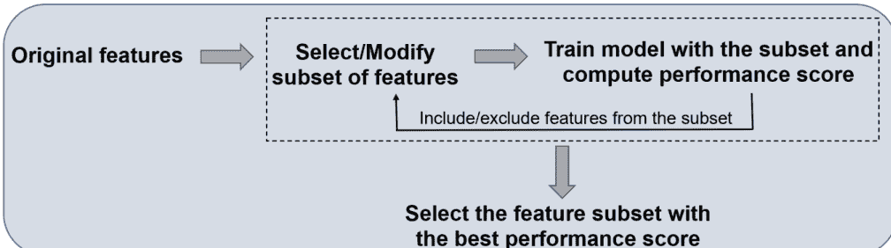

图 4.6：包装法进行特征选择的策略

### 递归特征消除（RFE）

在此方法中，最初使用所有输入变量构建一个模型。每个输入的重要性使用任何特定的模型属性（如模型系数）或通过某些模型属性的组合来量化。丢弃重要性最低的几个输入，并重复整个过程，直到获得所需数量的相关输入或模型性能开始下降。

PLS 是一种非常流行的用于过程系统的回归方法，我们将在第 5 章详细研究。我们在这里提到它是因为 PLS 允许计算 VIP（投影中的变量重要性）分数，该分数量化了每个输入的重要性。基于 PLS VIP<sup>14</sup> 的 RFE 算法可用于迭代地排除对目标变量预测贡献最小的输入。

### 序列特征选择（SFS）

序列特征选择技术有两种常见变体。在前向 SFS 中，搜索从一个空子集开始。当模型仅使用这一个输入进行训练时，导致最佳性能的输入被添加到子集。接下来，将先前选定的子集与每个剩余输入逐一组合。给出最佳性能的两个输入的组合成为选定的子集。重复此过程，直到选择 *k* 个输入或添加新变量不再改善预测。

另一种变体，后向 SFS，工作方式与前向 SFS 类似，不同之处在于它从所有输入开始。排除后能带来最佳模型性能的输入被从子集中排除。重复此过程以逐一排除输入。

<sup>14</sup> sklearn 中的 PLSRegression 类没有内置的 VIP 计算功能。可以使用 pyChemometrics 包，它提供了一个带有 VIP 方法的 ChemometricsPLS 类

由于包装器方法使用模型，因此其性能优于过滤器方法。然而，由于它们需要执行多次模型拟合，当输入数量非常多且模型复杂（如人工神经网络）时，可能会导致计算上不可行。在前向和后向顺序特征选择之间，后向SFS能更好地考虑所有变量的交互效应，但当$k$远小于输入候选数量时，可能需要进行更多次的模型拟合。

### Sklearn实现

Sklearn提供了RFE和SequentialFeatureSelector类，可以使用任何指定的估计器/模型将原始输入数据矩阵转换为相关子集。以下是使用线性回归模型实现后向SFS的示例。

```
# scale data
from sklearn.preprocessing import StandardScaler
xscaler = StandardScaler()
X_scaled = xscaler.fit_transform(X)

yscaler = StandardScaler()
y_scaled = yscaler.fit_transform(y[:,None])

# implement backward SFS
from sklearn.feature_selection import SequentialFeatureSelector
from sklearn.linear_model import LinearRegression

BSFS = SequentialFeatureSelector(LinearRegression(), n_features_to_select=10, direction='backward', cv=5).fit(X_scaled, y_scaled)

# check selected inputs
print('Inputs selected: ', BSFS.get_support(indices=True)+1)

>>> Inputs selected: [18 19 20 21 22 23 24 25 31 33]

# reduce X to only top relevant inputs
X_relevant = BSFS.transform(X)
```

我们可以看到，包装器方法的表现远优于过滤器方法，并且成功恢复了10个相关输入中的8个！这里另一个值得强调的亮点是，SequentialFeatureSelector如何将SFS变量选择与交叉验证的所有复杂性浓缩到仅仅几行代码中！！

### 嵌入式方法

嵌入式方法利用那些将变量选择作为模型拟合过程固有部分的算法。我们在前一章已经见过其中一种方法——Lasso回归，它通过将不相关输入的系数设为零，最终将其从模型中移除。决策树和随机森林是另一类算法，它们在模型拟合后直接提供特征重要性。我们将在第9章学习它们。

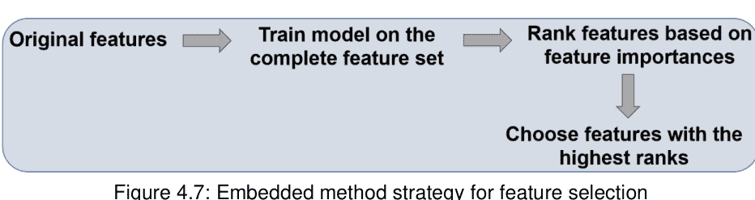

嵌入式方法的计算成本低于包装器方法，并且在样本数量远多于输入数量时效果最佳。下面是我们模拟数据集的Lasso回归快速实现，我们使用模型系数来判断任何输入的重要性。

### Sklearn实现

我们将采用LassoCV模型，它使用交叉验证自动选择惩罚强度。如图所示，Lasso恢复了10个相关输入中的8个。

```
# fit Lasso model
from sklearn.linear_model import LassoCV
Lasso_model = LassoCV(cv=5).fit(X_scaled, y_scaled)

# find the relevant inputs using model coefficients
top_k_inputs = np.argsort(abs(Lasso_model.coef_))[::-1][:10] + 1
print('Relevant inputs: ', top_k_inputs)

>>> Relevant inputs: [21 22 20 23 24 19 25 18 33 14]
```

至此，我们对变量选择方法的探讨告一段落。非线性的存在、输入交互作用、计算资源的可用性以及输入候选的数量都会影响最终的方法选择。你现在熟悉了这些方法的机制，这应该能帮助你选择最适合你问题的方法。

> 特征提取和特征选择在实现特征降维方面是相似的。特征提取通过使用所有原始特征来创建新特征，因此并不能帮助简化原始测量空间。其重点更多在于降维和消除特征之间的相关性。而特征选择，正如我们所见，会完全丢弃不相关的特征。这里的重点是通过减少模型输入数量来提高模型性能，并获得更简单的物理意义解释。

### 4.3 异常值处理

异常值是与大多数数据不一致的异常观测值。训练数据集中存在异常值会导致模型无法充分代表真实过程，从而对其预测精度产生负面影响。在模型拟合之前移除异常值或使用对异常值稳健的建模算法是至关重要的。

我们有多种方法可供选择——选择取决于我们处理的是单变量还是多变量系统、异常值污染程度、数据分布是高斯型还是非高斯型等。图4.8列出了一些常用的方法。

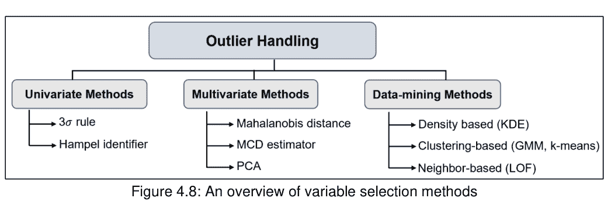

### 单变量方法

单变量方法分别清理每个变量。3-sigma规则和Hampel标识符是该类别下常用的方法。

### 3σ规则

3-sigma规则的工作原理如下：如果**μ**和**σ**分别表示一个变量的均值和标准差，那么任何超出**μ ± 3σ**范围的样本都被视为异常值。该规则源于高斯分布变量的性质，其中99.87%的数据落在**μ ± 3σ**范围内。然而，通过使用3以外的系数，该规则也常用于非高斯变量。

### Hampel标识符

你会同意**3σ**规则非常简单且易于实现。可以预见，它有一些局限性。如果一个变量被异常值严重污染，那么**μ**和**σ**可能会受到如此大的影响，以至于异常样本最终落在**μ ± 3σ**范围内，无法被识别为异常值。解决方案是使用Hampel标识符，它分别用中位数和MAD（中位数绝对偏差）替代**μ**和**σ**。对于任何变量x，如果观测值落在**median(x) ± 3σ<sub>MAD</sub>**范围之外，Hampel标识符会将其标记为异常值，其中**σ<sub>MAD</sub> = 1.4826 * median(|x - median(x)|)**。

我们在前一章使用中位数和MAD进行稳健缩放。使用相同的数据集，图4.9现在说明了Hampel标识符在单变量异常值检测中的有效性。使用3-sigma规则计算的“正常范围”被夸大到足以将所有数据都包含在正常范围内！然而，Hampel标识符提供了一个更能代表正常数据的正常范围，因此可以将异常样本标记为异常值。我们可以看到，Hampel标识符以极小的额外复杂性提供了相当优越的性能。

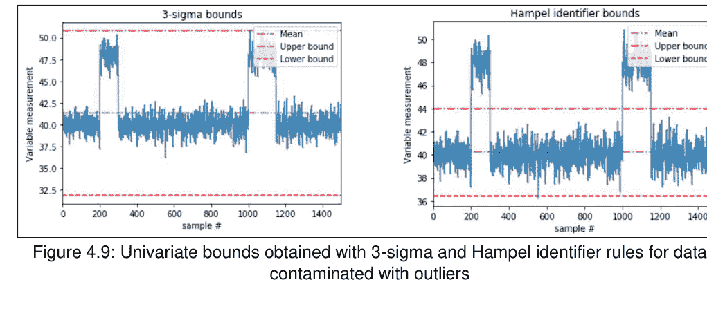

### 多变量方法

在变量高度相关的流程数据集中，当变量被单独“清理”时，异常值可能会逃脱检测。例如，考虑图4.10。红色样本在二维空间中显然是异常值。然而，如果我们只沿着x1（或x2）轴观察，这些异常样本靠近数据分布的中心，因此在单变量意义上不会被视为异常值。

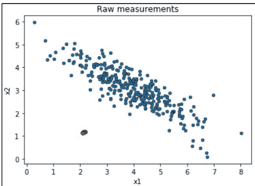

图4.10：二维空间中难以通过单变量方法检测的异常值

解决方案是使用多变量异常值检测方法。这些方法考虑了多变量数据分布的形状，通常基于使用某种距离度量来标记远离数据分布中心的样本。让我们详细研究这些方法。

### 马氏距离

马氏距离（MD）是一种经典的多变量距离度量，它考虑了数据分布的协方差/形状来计算到数据中心的距离。具体来说，任何观测值$x_n$的MD由下式给出

$MD(x_n) = \sqrt{(x_n - \bar{x})\Sigma^{-1}(x_n - \bar{x})^T}$

其中$\bar{x}$和$\Sigma$是采样观测值的均值和协方差。$\Sigma$的存在将MD与欧氏距离区分开来。MD的计算本质上将多变量异常值检测问题转化为单变量问题。为了说明，图4.11显示了图4.10数据集的MD值。我们可以看到，异常样本与正常样本明显不同，可以通过单变量技术轻松标记。

### MCD 估计器

考虑图 4.12 中的数据分布及其马氏距离。这里同样有一批样本远离正常数据，但如图所示，基于 MD 的方法在检测所有异常值时彻底失败了。那么，这里发生了什么？

这里发生的情况是，异常值扭曲了数据分布的估计形状/协方差结构。如中间子图所示，MD 的等高线已被膨胀到如此程度，以至于几个异常值的 MD 与内点的 MD 相似。这种不希望出现的效应被称为**遮蔽效应**。此外，如果内点由于异常值的影响而被归类为异常值，则称为**淹没效应**。

先前，在单变量方法中，我们看到通过利用数据位置和离散度的稳健估计，可以获得稳健的异常值检测解决方案。类似的概念也存在于多变量方法中。一种流行的位置（质心）和离散度（协方差矩阵）估计器是 MCD（最小协方差行列式）。MCD 从整个数据集中找到 $h$ 个样本，使得协方差矩阵的行列式最小，或者简单地说，对于给定的置信水平，其包络椭球体在所有大小为 $h$ 的可能子集中体积最小。$h$ 个样本的质心和协方差作为稳健估计返回。

Sklearn 中的 MinCovDet 类实现了一种 FAST-MCD 算法，可以高效地分析高维大型数据集。该方法的优越性能在图 4.13 中得到了验证。现在 MD 等高线更好地拟合了内部样本，异常值则远超计算出的上界。请注意，Sklearn 提供了一个 EllipticEnvelop 类，它使用 FAST-MCD 直接检测异常值，但需要指定数据污染水平，而这可能事先未知。下面的代码展示了基于 MCD 的 MD 计算；边界计算方式与之前相同。

```
# read data
import numpy as np
data_2Doutlier = np.loadtxt('complex2D_outlier.csv', delimiter=',')

# compute MCD-based Mahalanobis distances
from sklearn.covariance import MinCovDet

MCD_cov = MinCovDet().fit(data_2Doutlier)
MD_MCD = MCD_cov.mahalanobis(data_2Doutlier)
```

图 4.13：通过基于 MCD 的稳健马氏距离进行多变量异常值检测

### PCA

并非所有异常值都是有害的并需要移除。例如，考虑图 4.14。这里突出了两种异常值。样本 A 倾向于脱离大多数相关性，而样本 B 遵循相关性但远离大多数数据。

图 4.14：可以通过 PCA 区分的不同类型的异常值

根据我们问题的背景，我们可能希望也可能不希望移除样本 B。基于 MD 的方法无法区分这两种异常值，因此，如果我们想保留样本 B，它将不适用。在这种情况下，可以采用 PCA（主成分分析）。我们将在第 5 章详细学习 PCA。届时你将了解 PCA 如何区分这两种不同的异常观测。经典 PCA 基于数据的样本协方差。因此，如果给定数据集被异常值高度污染，可以在 PCA 中使用基于 MCD 的协方差进行稳健分析。

### 数据挖掘方法

我们在上一节研究的多变量方法对数据分布的高斯性或单峰性做出了隐含假设。在现实生活中，遇到这些假设不成立的情况并不少见。图 4.15 显示了这样一种数据分布，其中存在 3 个不同的数据簇，异常值位于它们之间。基于 MD 或 PCA 的方法在这里会失败！

采用高级数据挖掘方法来处理这些复杂情况。这些方法可分为基于密度的、基于聚类的和基于邻域的。基于密度的方法（如 KDE）依赖于估计数据的分布密度；位于低密度区域的观测被标记为异常值。基于聚类的方法（如 GMM、Kmeans）寻找不同的数据簇；属于小型或低重要性簇的样本被标记为异常值。基于邻域的方法（如 KNN、LOF）依赖于寻找每个数据点的邻居。相邻数据点用于计算任何样本与其 k 个最近邻的距离或局部密度；距离较大或密度较低的样本被标记为异常值。

我们将在本书的第 2 部分研究其中的大部分技术。一旦你研究了它们的细微差别，你就会意识到这些是非常强大且有用的方法，但确实需要仔细选择其内在模型参数，例如 Kmeans 中的聚类数、LOF 中的邻居数，或 KDE 中的核函数及其宽度。

> 时间序列或动态数据集需要不同的异常值检测方法。常见的做法是首先使用适当的时间序列建模技术（如 ARIMA 或 ARX）对给定数据集进行建模，并计算模型预测与给定数据之间的残差。通过适当选择的模型，残差将近似正态分布且不相关。然后，可以对残差应用任何传统的异常值检测方法。异常值往往具有较大的残差，并会被标记出来。

### 抗异常值的稳健技术

我们迄今为止研究的异常值处理方法依赖于显式识别异常值。一旦识别出来，这些异常值会在模型参数估计之前从模型拟合数据集中移除。还有另一类方法，称为稳健方法**+，它们直接使用受异常值污染的数据进行模型拟合。这些算法的设计使得通过降低异常值的权重来减少其影响，主要由内点决定模型参数。

图 4.16 展示了在 Sklearn 中使用 RANSAC 算法进行稳健线性回归的应用。该稳健方法能够成功忽略异常值，找到目标与预测变量之间的正确拟合。

IRPLS（迭代重加权 PLS）是另一种流行的使用 PLS 的稳健回归方法。大多数抗异常值的稳健方法采用迭代算法，其中模型参数被迭代计算，并且在每次迭代中识别出的具有高残差的样本被分配较低的权重。

*Zhu et. al., Review and big data perspectives on robust data mining approaches for industrial process modeling with outliers and missing data, Annual Reviews in Control, 2018
+ Frosch + Bro, Robust methods for multivariate data analysis, Journal of Chemometrics, 2005

至此，我们完成了对异常值检测方法的研究。我们的目标是帮助你理解不同技术的优缺点，因为没有适用于所有问题的通用方法。对底层过程和数据性质的良好理解，可以极大地帮助做出正确的技术选择。

### 4.4 处理缺失数据

当数据集的一个或多个观测值中，一个或多个变量的值缺失时，就会出现缺失数据问题。如果缺失数据的样本数量远小于可用样本总数，可以简单地丢弃这些样本。然而，如果情况并非如此，或者有理由认为丢弃样本会对模型拟合产生负面影响，则可以采用插补技术，尝试使用同一变量或其他变量的可用数据来填补变量的缺失值。

一种简单的插补策略是均值插补，即用该变量所有可用数据的均值替换其缺失值，如下方代码片段所示：

```python
# Mean imputation
import numpy as np
from sklearn.impute import SimpleImputer

sample_data = [[1, 2, np.nan], [3, 4, 3], [np.nan, 6, 5], [8, 8, 7]]
mean_imputeModel = SimpleImputer(missing_values=np.nan, strategy='mean')

print(mean_imputeModel.fit_transform(sample_data))

>>> [[1. 2. 5.]
     [3. 4. 3.]
     [4. 6. 5.]
     [8. 8. 7.]]
```

另一种广泛使用的方法是热卡插补，即用“相似”样本的可用值替换样本的缺失值。Sklearn 提供了 `KNNImputer` 类，它使用拟合数据集中 k 个最近邻的加权（或均值）组合来插补缺失值。两个样本之间的距离度量是使用两个样本都没有缺失的特征来计算的。

```python
# KNN imputation
from sklearn.impute import KNNImputer

knn_imputeModel = KNNImputer(n_neighbors=2)
print(knn_imputeModel.fit_transform(sample_data))

>>> [[1. 2. 4.]
     [3. 4. 3.]
     [5.5 6. 5.]
     [8. 8. 7.]]
```

尽管 Sklearn 目前尚未提供，但更先进的技术，如回归插补、基于似然的插补也存在。前者使用以其他相关变量为预测变量的回归模型来插补变量中的缺失值。后者在概率框架中使用期望最大化（EM）算法来插补缺失值。

与变量选择和异常值处理方法一样，无法预先断言哪种缺失数据技术最适合你的问题。一个好的方法是根据你的过程知识选择几种方法，分别构建模型，然后选择表现最佳的一个！

### 总结

在本章中，我们研究了处理不同类型和程度数据污染的常用技术。我们探讨了测量噪声、无关特征、异常值和缺失数据的问题。一个自然的预处理工作流程是首先对数据集进行去噪，然后进行变量选择和异常值剔除。至此，我们结束了机器学习之旅的第一阶段。在掌握了基础知识之后，让我们开始旅程的第二阶段，我们将探讨几种经典且非常有用的机器学习算法。

## 第二部分

### 经典机器学习方法

## 第5章
### 降维与潜变量方法（第一部分）

在制造设施中，测量数百个与过程相关的变量并不少见。如果你打算使用这些过程变量构建机器学习模型，那么高维度（模型变量的数量）将给你带来几个独特的挑战，这些问题涉及算法问题（由于变量间的共线性）、数据可视化困难、计算成本高以及模型训练缓慢。然而，这个被称为*维度灾难*的问题，不应让你气馁！守恒定律，如质量平衡、热力学约束、强制执行的产品规格以及其他操作限制，会在过程变量之间引入相关性，使得测量变量看起来都源自少数几个隐藏（未测量）的变量。基于潜变量的方法通过寻找这些隐藏的潜变量来降低过程维度。

PCA 和 PLS 是最流行的基于潜变量的统计工具之一，并已成功应用于多个过程监控和软测量应用中。本章全面阐述了 PCA 和 PLS 技术，并教你如何将其应用于过程数据。具体涵盖以下主题：

- PCA 和 PLS 简介
- 通过 PCA 和 PLS 进行过程建模和监控
- 用于根本原因分析的故障诊断
- 线性 PCA 和 PLS 的非线性及动态变体

### 5.1 PCA 简介

主成分分析（PCA）是一种多变量技术，它将一组高维的相关变量转换为一组低维的不相关（潜变量）变量，同时信息损失最小。考虑图 2.1 中的三维数据。很明显，尽管数据是三维的，但数据点主要分布在一个二维平面上；即使在这个平面上，沿某个特定方向的分布也更广。PCA 将原始的 (x,y,z) 空间转换为二维主成分（PC）空间，其中第一主成分（PC1）对应于数据中最大分布/方差的方向，第二主成分（PC2）对应于所有与 PC1 正交的方向中方差最大的方向。根据建模要求，甚至可以丢弃第二主成分，本质上得到一维数据，同时会损失一些信息。此外，正如我们很快将看到的，从 PC 空间的数据恢复原始数据是直接的。

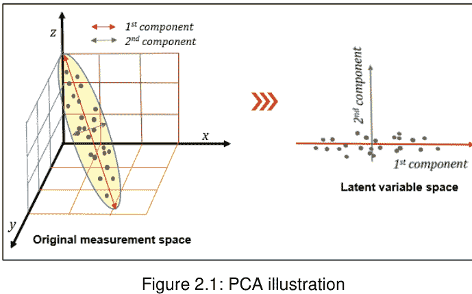

在机器学习领域，分类和聚类技术在 PC 空间中的应用很常见。在过程工业中，过程建模（通过主成分回归（PCR））和监控是 PCA 的常见应用¹⁶。在 PCR 中，过程输出被回归到输入数据的主成分值上。这样做，就规避了经典多元线性回归（MLR）中由于输入空间维度高和输入变量间高度相关而经常遇到的病态问题。PCA 也经常用于过程可视化。对于许多应用，两个或三个主成分就足以捕获过程数据中的大部分变异性，因此，压缩后的过程数据可以用单个图进行可视化。工厂操作员和工程师使用这个单一图表来发现过程数据中的过去和当前模式。

> ¹⁶ 潜变量技术在过程控制和监控中的流行源于麦克马斯特大学 John McGregor 的开创性工作。

### 数学背景

考虑一个数据矩阵 $X \in \mathbb{R}^{N \times m}$，它由 $N$ 个样本的 $m$ 个输入变量组成，其中每一行代表原始测量空间中的一个数据点。假设每一列都已归一化为零均值和单位方差。令 $v \in \mathbb{R}^m$ 表示将数据点投影到 PC1 方向上的“载荷”向量，可以通过求解以下优化问题找到：

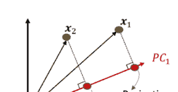

$$\max_{v \neq 0} \frac{(Xv)^T Xv}{v^T v} \quad \text{公式 1}$$

显然，公式 1 试图最大化投影数据点沿 PC1 的方差。其他主成分的载荷向量通过求解相同的问题并附加与先前计算的载荷向量正交的约束来找到。或者，载荷向量也可以从 $X$ 的协方差矩阵（$S$）的特征值分解中计算得出：

$$\frac{1}{N-1} X^T X = S = V \Lambda V^T \quad \text{公式 2}$$

以上是你在 PCA 文献中更常见的形式。特征向量矩阵 $V \in \mathbb{R}^{m \times m}$ 的列就是我们需要的载荷向量。对角特征值矩阵 $\Lambda$ 等于 $diag[\lambda_1, \lambda_2, \dots, \lambda_m]$，其中 $\lambda_1 \geq \lambda_2 \geq \dots \geq \lambda_m$ 是特征值。事实上，$\lambda_j$ 等于沿第 $j$ 个 PC 的方差。如果原始数据中存在显著相关性，则只有前几个特征值是显著的。假设保留 $k$ 个主成分，则取 $V$ 的前 $k$ 列（对应于前 $k$ 个 $\lambda$）构成载荷矩阵 $P \in \mathbb{R}^{m \times k}$。现在可以获得 PC 空间中的转换数据：

沿第 $j$ 个 PC 的投影值 $\longleftarrow$ $$t_j = Xp_j \text{ 或 } T = XP \quad \text{公式 3}$$

$X$ 的 $m$ 维第 $i$ 行已被转换为 $T$ 的 $k$（$< m$）维第 $i$ 行。$T \in \mathbb{R}^{N \times k}$ 称为得分矩阵，$T$ 的第 $j$ 列（$t_j$）包含沿第 $j$ 个 PC 的（得分）值。得分可以按如下方式投影回原始测量空间：

$$\widehat{X} = TP^T \quad \text{公式 4}$$

请注意，由于我们丢弃了对应于不显著 $\lambda$ 的载荷向量，因此 $\widehat{X} \neq X$。差值 $E = X - \widehat{X}$ 被称为残差矩阵，因为每一行都是数据点的残差或误差向量。总体而言，PC 空间捕获了过程数据中的系统性趋势，而残差空间主要描述数据中的噪声。

### 聚合物制造过程的降维

现在，让我们看看PCA强大的降维能力在实际中的应用。我们将使用来自一家聚合物制造工厂的数据。该数据集包含33个变量和92个每小时采样点（图2.2）。

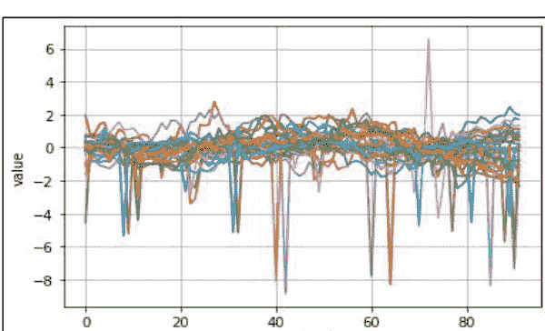

图2.2：来自聚合物制造厂的过程数据。每条彩色曲线对应一个过程变量

据报道，该数据集的过程在大约第70个采样点后开始表现异常，并最终不得不停机。因此，我们使用第1到69个采样点，通过下面的代码来训练PCA模型。剩余的数据将在后续用于过程监控的演示。

```python
# import requisite libraries
import numpy as np
import pandas as pd
from sklearn.preprocessing import StandardScaler
from sklearn.decomposition import PCA

# fetch data and separate training data
data = pd.read_excel('proc1a.xls', skiprows = 1, usecols = 'C:AI')
data_train = data.iloc[0:69,]

# normalize data
scaler = StandardScaler()
data_train_normal = scaler.fit_transform(data_train)

### PCA
pca = PCA()
score_train = pca.fit_transform(data_train_normal)
```

训练完PCA模型后，可以从pca模型的components_属性的转置中获取载荷向量/主成分。请注意，我们尚未进行任何降维。PCA只是为我们提供了一个在score_train中的不相关数据集。为了确认这一点，我们可以计算score_train各列之间的相关系数。只有对角线上的值为1，而其余系数均为0！

```python
# confirm no correlation
corr_coef = np.corrcoef(score_train, rowvar = False)
>>> print('Correlation matrix: \n', corr_coef[0:3,0:3]) # printing only a portion
```

Correlation matrix:
[[ 1.00000000e+00  8.24652750e-16 -1.88830953e-16]
 [ 8.24652750e-16  1.00000000e+00  2.36966153e-16]
 [-1.88830953e-16  2.36966153e-16  1.00000000e+00]]

为了进行降维，我们需要研究每个主成分方向上的方差。请注意，m个主成分方向上的方差之和等于m个原始维度上的方差之和。因此，每个主成分方向上的方差也被称为解释方差。属性explained_variance_ratio给出了每个主成分解释的方差比例，图2.3清楚地表明，并不需要全部33个主成分来捕获数据中的所有信息。大部分信息在前几个主成分中就已经被捕获了。

```python
# visualize explained variance
import matplotlib.pyplot as plt

explained_variance = 100*pca.explained_variance_ratio_ # in percentage
cum_explained_variance = np.cumsum(explained_variance) # cumulative % variance explained

plt.figure()
plt.plot(cum_explained_variance, 'r+', label = 'cumulative % variance explained')
plt.plot(explained_variance, 'b+', label = 'variance explained by each PC')
plt.ylabel('Explained variance (in %)'), plt.xlabel('Principal component number'), plt.legend()
```

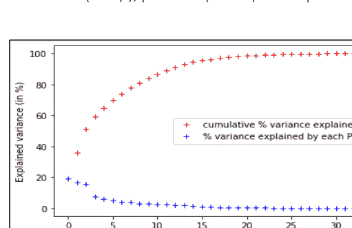

图2.3：主成分解释的方差

确定保留主成分数量的一个常用方法是选择能够累积捕获至少90%（或95%）方差的主成分数量。捕获的方差阈值应根据预期的噪声水平或你期望不被捕获的非系统性变化来指导。其他方法包括交叉验证、碎石检验、AIC准则等。然而，这些方法中没有一种在所有情况下都是普遍最佳的。

```python
# decide # of PCs to retain and compute reduced data in PC space
n_comp = np.argmax(cum_explained_variance >= 90) + 1
score_train_reduced = score_train[:,0:n_comp]

>>> print('Number of PCs cumulatively explaining at least 90% variance: ', n_comp)

Number of PCs cumulatively explaining at least 90% variance: 13
```

因此，我们通过牺牲仅10%的信息，实现了约60%的维度缩减（从33维降至13维）。为了确认只丢失了大约10%的原始信息，我们将从得分中重构原始的标准化数据。图2.4也提供了视觉确认，很明显，变量中的系统性趋势已被重构，而噪声波动已被去除。

```python
# confirm that only about 10% of original information is lost
from sklearn.metrics import r2_score

V_matrix = pca.components_.T
P_matrix = V_matrix[:,0:n_comp]

data_train_normal_reconstruct = np.dot(score_train_reduced, P_matrix.T)
R2_score = r2_score(data_train_normal, data_train_normal_reconstruct)

>>> print('% information lost = ', 100*(1-R2_score))

% information lost = 9.0469
```

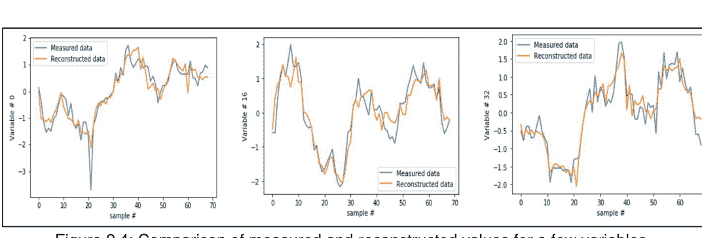

90%的阈值也可以在模型训练时通过n_components参数直接指定：pca = PCA(n_components = 0.9)。在这种情况下，不重要的主成分不会被计算，并且可以使用inverse_transform方法从模型中计算出score_train_reduced矩阵。

```python
# alternative approach
pca = PCA(n_components = 0.9)
score_train_reduced = pca.fit_transform(data_train_normal)

data_train_normal_reconstruct = pca.inverse_transform(score_train_reduced)
R2_score = r2_score(data_train_normal, data_train_normal_reconstruct)

>>> print('% information lost = ', 100*(1-R2_score))

% information lost = 9.0469
```

### 5.2 通过PCA对聚合物制造过程进行监控

在图2.2中，我们看到，仅仅通过观察所有可用变量的组合时间序列图，很难推断出第69个采样点之后的过程异常。单个变量的图可能提供更好的线索，但持续监控所有33个单个变量的图并不是一项方便的任务。

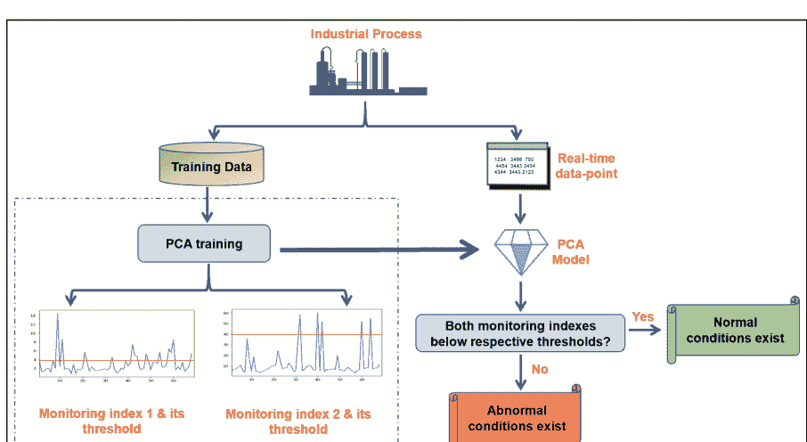

PCA通过将任何复杂多变量过程的状态总结为两个简单的指标或监控指数，使监控任务变得容易，如图2.4所示。在模型训练期间，为这些指数确定了统计阈值，对于一个新的数据点，新的指数值会与阈值进行比较。如果任何一个阈值被违反，则确认存在异常过程条件。

### 过程监控/故障检测指数

Hotelling's $T^2$ 和 SPE（也称为Q）统计量是用于过程监控的两个监控指数。请注意，得分矩阵（$\mathbf{T}$）和标量$T^2$值之间可能存在的混淆。这是PCA社区使用的标准符号。两个统计量都是为每个数据点计算的。令$\mathbf{t}_i$表示$\mathbf{T}$的第$i^{th}$行，它代表在PC空间中转换后的第$i^{th}$个数据点。该数据点的$T^2$指数计算如下：

$$T^2 = \sum_{j=1}^k \frac{t_{i,j}^2}{\lambda_j} = \mathbf{t}_i^T \mathbf{\Lambda}_k^{-1} \mathbf{t}_i$$

请注意，$\mathbf{\Lambda}_k = diag\{\lambda_1, \lambda_2, \dots, \lambda_k\}$。显然，$T^2$是数据点在PC空间中到原点的平方马氏距离或加权距离。如果数据服从多元正态分布，则可以使用$F$分布获得阈值或控制限：

$$T_{CL}^2 = \frac{k(N^2-1)}{N(N-k)} F_{k,N-k}(\alpha)$$

$F_{k,N-k}(\alpha)$是自由度为$k$和$n-k$的$F$分布的$(1-\alpha)$分位数。本质上，$T^2 \leq T_{CL}^2$代表了PC空间中训练数据点周围的椭球边界。第二个指数Q表示原始数据点与重构数据点之间的距离。令$\mathbf{e}_i$表示$\mathbf{E}$的第$i^{th}$行。那么

$$Q = \sum_{j=1}^m e_{i,j}^2$$

同样，在正态性假设下，Q的控制限由以下表达式给出：

$$Q_{CL} = \theta_1 \left( \frac{z_\alpha \sqrt{2\theta_2 h_0^2}}{\theta_1} + 1 + \frac{\theta_2 h_0 (1-h_0)}{\theta_1^2} \right)^2$$

$$h_0 = 1 - \frac{2\theta_1 \theta_3}{3\theta_2^2} \quad \text{and} \quad \theta_r = \sum_{j=k+1}^m \lambda_j^r \quad ; r=1,2,3$$

$z_\alpha$是标准正态分布的$(1-\alpha)$分位数。我们现在拥有了生成训练数据监控指数图（也称为控制图）所需的所有信息。

### 计算训练数据的 T2
lambda_k = np.diag(pca.explained_variance_[0:n_comp]) # 特征值 = 解释方差
lambda_k_inv = np.linalg.inv(lambda_k)

T2_train = np.zeros((data_train_normal.shape[0],))
for i in range(data_train_normal.shape[0]):
    T2_train[i] = np.dot(np.dot(score_train_reduced[i,:],lambda_k_inv),score_train_reduced[i,:].T)

# 计算训练数据的 Q
error_train = data_train_normal - data_train_normal_reconstruct
Q_train = np.sum(error_train*error_train, axis = 1)

# T2_train 控制限
import scipy.stats

N = data_train_normal.shape[0]
k = n_comp

alpha = 0.01 # 99% 控制限
T2_CL = k*(N**2-1)*scipy.stats.f.ppf(1-alpha,k,N-k)/(N*(N-k))

# Q_train 控制限
eig_vals = pca.explained_variance_
m = data_train_normal.shape[1]

theta1 = np.sum(eig_vals[k:])
theta2 = np.sum([eig_vals[j]**2 for j in range(k,m)])
theta3 = np.sum([eig_vals[j]**3 for j in range(k,m)])
h0 = 1-2*theta1*theta3/(3*theta2**2)

z_alpha = scipy.stats.norm.ppf(1-alpha)
Q_CL = theta1*(z_alpha*np.sqrt(2*theta2*h0**2)/theta1+ 1 + theta2*h0*(1-h0)/theta1**2)**2

# Q_train 图及控制限
plt.figure()
plt.plot(Q_train)
plt.plot([1,len(Q_train)],[Q_CL,Q_CL], color='red')
plt.xlabel('样本编号'), plt.ylabel('训练数据的 Q')

# T2_train 图及控制限
plt.figure()
plt.plot(T2_train)
plt.plot([1,len(T2_train)],[T2_CL,T2_CL], color='red')
plt.xlabel('样本编号'), plt.ylabel('训练数据的 T$^2$')

图 2.5 显示，训练数据中有相当多的数据点违反了阈值，这在 99% 控制限下是意料之外的。这表明该数据集不满足多元正态性假设。对于非高斯数据，可以采用其他专门的机器学习方法，如核密度估计（KDE）、支持向量数据描述（SVDD）来确定控制边界。我们将在后续章节中学习这些方法。或者，如果 $N$ 很大，另一种流行的方法是直接将 $T^2$ 和 $Q$ 值的 99% 分位数作为控制限。

### $T^2$ 和 $Q$ 统计量的重要性

$T^2$ 和 $Q$ 指数量化了数据中不同类型的变异。$T^2$ 是在主成分空间中距离原点的度量，而 Q 是 PCA 模型未能解释的数据部分的度量。异常情况可能违反其中一个指数的控制限，而不违反另一个。因此，同时监控这两个指数至关重要。

例如，考虑图 2.6 中的场景。两个流量测量值预期是相关的。正常数据点沿着 45° 线（PC1 方向）分布，但样本 ‘a’ 和 ‘b’ 表现出不同类型的异常。对于样本 ‘a’，两个流量变量之间的相关性被破坏，这可能是阀门泄漏的结果。这导致 $Q_a$ 值异常高；然而 $T_a^2$ 并未异常高，因为投影得分 $t_a$ 与正常数据点相似。对于样本 ‘b’，相关性保持完好，导致 $Q_b$ 值低（为零）。然而，得分 $t_b$ 异常远离原点，导致 $T_b^2$ 值异常高。

### 故障检测

现在是时候检查我们的 $T^2$ 和 Q 图是否能帮助我们从测试数据（从样本 70 开始）中检测过程异常的存在了。为此，我们将计算测试数据的监控统计量。

```
# 获取测试数据，进行归一化
data_test = data.iloc[69:,]
data_test_normal = scaler.transform(data_test) # 使用来自训练数据的缩放参数

# 计算得分并重构
score_test = pca.transform(data_test_normal)
score_test_reduced = score_test[:,0:n_comp]
data_test_normal_reconstruct = np.dot(score_test_reduced, P_matrix.T)

# 计算 T2_test
T2_test = np.zeros((data_test_normal.shape[0],))
for i in range(data_test_normal.shape[0]): # 使用来自训练数据的特征值
    T2_test[i] = np.dot(np.dot(score_test_reduced[i,:],lambda_k_inv),score_test_reduced[i,:].T)

# 计算 Q_test
error_test = data_test_normal_reconstruct - data_test_normal
Q_test = np.sum(error_test*error_test, axis = 1)
```

图 2.7 并列展示了训练数据和测试数据的监控指数。通过观察这些图，可以立即明显看出测试数据表现出严重的过程异常。$T^2$ 和 Q 值都显著高于各自的控制限。

### 故障诊断

在检测到过程故障后，下一个关键任务是诊断问题并识别哪些具体的过程变量表现出异常行为。实现这一目标的常用机制是基于贡献图。顾名思义，贡献图是原始过程变量对异常指数的贡献图。贡献最高的变量被标记为潜在的故障变量。

对于 SPE（平方预测误差）或 $Q$，让我们重新考虑下面所示的公式 7，其中 $SPE_j$ 表示第 $j^{th}$ 个变量的 SPE 贡献。

$$SPE = \sum_{j=1}^{m} e_{i,j}^2 = \sum_{j=1}^{m} SPE_j$$

因此，变量的 SPE 贡献就是该变量的平方误差。如果 SPE 指数违反了其控制限，那么与其他变量相比具有较大 $SPE_j$ 值的变量被认为是潜在的故障变量。对于 $T^2$ 贡献，计算则不那么直接。文献中提出了几种表达式$^{17}$。下面常用的表达式由 Wise 等人$^{18}$提出。

$$T^2 \text{ contribution of variable } j = j^{th} \text{ element of } (D^{1/2}x)^2$$
$$D = P\Lambda^{-1}P^T$$

请注意，这些贡献是针对每个数据点计算的。让我们找出在第 $85^{th}$ 个样本处需要进一步调查的变量。

```
# T2 贡献
sample = 85 - 69
data_point = np.transpose(data_test_normal[sample-1,])

D = np.dot(np.dot(P_matrix,lambda_k_inv),P_matrix.T)
T2_contri = np.dot(scipy.linalg.sqrtm(D),data_point)**2 # 贡献向量

plt.figure()
plt.plot(T2_contri), plt.ylabel('T$^2$ 贡献图')

# SPE 贡献
error_test_sample = error_test[sample-1,]
SPE_contri = error_test_sample*error_test_sample # 贡献向量
```

```
plt.figure()
plt.plot(SPE_contri), plt.ylabel('SPE 贡献图')
```

变量 # 23 对两个指数都做出了很大贡献，在图 2.9 中我们可以看到，在采样期结束时其值急剧下降。工厂操作员可以利用其判断力进一步排查异常，以隔离根本原因。

### 5.3 经典 PCA 的变体

在前面讨论的 PCA 方法中，我们做了一些隐含的假设。假设潜变量是测量变量的线性组合，假设每个样本在统计上独立于过去的样本，并且假设数据服从高斯分布。在过程数据中，这些假设被违反的情况很常见，因此，在本节中，我们将放宽这些假设，并学习如何为非线性和动态数据实现 PCA。这些方法主要涉及适当地转换原始数据，以便在其上应用标准 PCA 以获得满意的结果。

### 动态 PCA (DPCA)

在上一节中，我们研究了静态 PCA，它提取了过程变量之间的静态相关性。然而，变量也可能具有自相关性，即样本可能在时间上彼此不独立。当样本以较短的采样周期按时间顺序连续采集时，就会出现这种观察结果，例如，在过去 1 年中每隔几分钟采集一次过程数据。静态 PCA 无法提取动态关系，导致得分自相关，从而在过程监控应用中产生不令人满意的结果，例如过多的误报。

为了处理过程动态性，Ku 等人$^{19}$提出了静态 PCA 的一个简单扩展，其中过去的数据点被视为额外的过程变量，如下图所示。

原始数据矩阵中的每个样本（前 *l* 个样本除外）都用过去 *l* 个样本的数据点进行了增广。现在可以对这个增广矩阵进行均值中心化和缩放，然后像我们之前所做的那样执行静态 PCA。Ku 等人已经证明，这种方法能够有效地提取线性静态和动态相关性。动态相关性的一个简单例子可能是

$$x_{t,1} = 0.8x_{t-1,1} + x_{t-1,2} \quad ; x \in \mathbb{R}^{2 \times 1}$$

对于这样的系统，仅增广一个先前的样本就足够了。当使用拟合好的 PCA 模型为测试数据点推导得分时，测试数据的增广样本行也是类似生成的。DPCA 方法已在多个工业应用中证明是有用的。下面的代码展示了如何生成滞后周期为 5 的增广矩阵。请注意，滞后周期是一个超参数，其值需要谨慎设置。交叉验证可以使用。另一种方法是对原始数据应用PCA，并观察得分的自相关函数值。如果观察到自相关，则增加滞后值。重复此过程，直到不再存在自相关。

```python
# augment training data
lag = 5
N = data_train.shape[0], m = data_train.shape[1]

data_train_augmented = np.zeros((N-lag+1,lag*m))
for sample in range(lag, N):
    dataBlock = data_train.iloc[sample-lag:sample,:].values # pandas dataframe to NumPy array
    data_train_augmented[sample-lag,:] = np.reshape(dataBlock, (1,-1), order = 'F')
```

### 多向PCA

PCA也被发现可用于监控批处理过程，其中原始数据具有额外的变异性层，即批次间变异性。为了捕捉批次数据中的变异性，将三维数据展开形成二维数据矩阵，如图2.10所示。在对每列进行归一化后，对展开的数据矩阵应用静态PCA<sup>20</sup>。一旦获得测试批次数据，即可获得测试得分以供进一步分析。

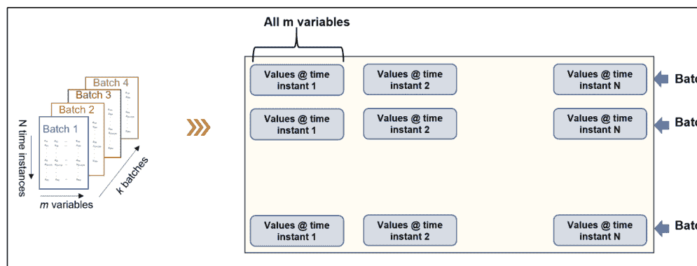

请注意，在图2.10中，每个“批次行”中的批次数据已按时间实例顺序重新排列。但是，如果需要，您也可以按变量进行分组。您只需要确保对测试数据也采用相同的重新排列方式。我们将在第8章中将多向PCA应用于半导体制造批次过程数据。

### 核PCA

核化方法在处理非线性数据时变得非常有吸引力，同时保留了其线性对应方法的简单性。为了说明，考虑图2.11，其中与图2.1不同，变量之间不是线性相关的。然而，很明显，三维数据位于一个低维流形上。但是，基于线性PCA的异常检测将无法检测到所示的异常数据点。

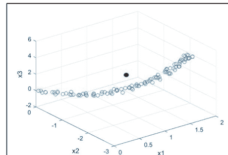

在这种情况下，经常采用的解决方案是将数据转换到更高维空间，在该空间中，不同类别（正常和异常类别）的数据变得线性可分。为了理解这个技巧，考虑图2.12，其中两类数据在原始测量空间中不是线性可分的。但是，当向系统添加一个人工变量（$x1^2 + x2^2$）时，这些类别变得容易分离。这个高维空间称为特征空间。

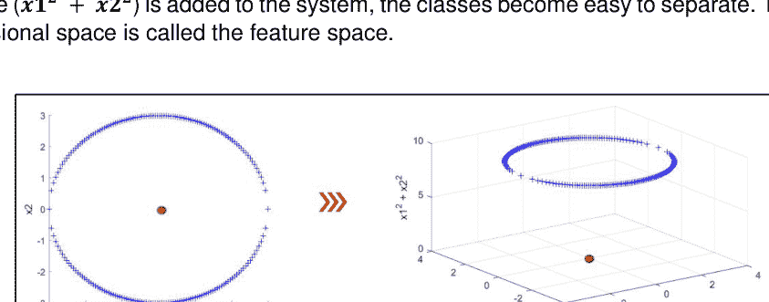

核PCA（KPCA）简单地涉及在特征空间中实现PCA。然而，找到将原始数据映射到特征空间的非线性映射的任务并非易事。为了克服这一点，采用了另一种称为核技巧的技巧。虽然我们将把核技巧的详细研究推迟到第7章，但鼓励读者参阅Lee等人的工作<sup>21</sup>，以了解基于KPCA的过程监控中监控指标的计算细节。下面的代码展示了如何使用KernelPCA库分析图2.11中的数据。

```python
# fetch data and scale
data = pd.read_excel('KPCA_example.xlsx')
scaler = StandardScaler()
data_train_normal = scaler.fit_transform(data)

# fit KPCA model
from sklearn.decomposition import KernelPCA
kpca = KernelPCA(kernel='rbf', gamma = 1)
score = kpca.fit_transform(data)
```

### 5.4 PLS：简介

偏最小二乘法（PLS）是一种有监督的多元回归技术，用于估计一组输入变量和一组输出变量之间的线性关系。与PCA类似，PLS将原始数据转换为潜在成分——输入（$X$）和输出（$Y$）数据矩阵分别转换为得分矩阵$T$和$U$。图2.13提供了PLS方法与其他流行线性回归技术——主成分回归（PCR）和多元线性回归（MLR）的概念比较。

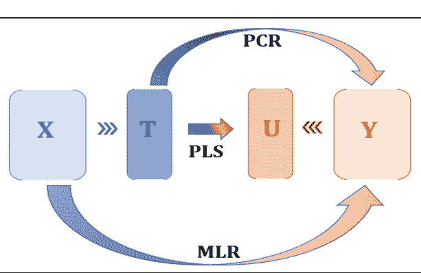

虽然MLR直接计算$\boldsymbol{X}$和$\boldsymbol{Y}$之间的最小二乘拟合，但PCR首先对输入数据执行PCA，然后计算得分矩阵和$\boldsymbol{Y}$之间的最小二乘拟合。通过这样做，PCR能够克服共线性、高相关性、噪声测量和有限训练数据集的问题。然而，潜在变量的计算独立于输出数据，因此，得分矩阵可能捕获$\boldsymbol{X}$中与预测$\boldsymbol{Y}$无关的那些变异。PLS通过同时估计得分矩阵$\boldsymbol{T}$和$\boldsymbol{U}$来克服这个问题，使得$\boldsymbol{X}$中与预测$\boldsymbol{Y}$相关的变异在潜在变量空间中被最大程度地捕获。

> 请注意，如果PLS或PCR模型中保留的潜在成分数量等于原始输入变量数量（$m$），则PLS和PCR模型等效于MLR模型。

PLS独特的有利特性以及低计算要求，使其在过程监控中得到广泛应用，用于实时过程监控、软测量、故障分类等。

### 数学背景

PLS同时执行3项工作：

- 捕获$\boldsymbol{X}$中的最大变异性
- 捕获$\boldsymbol{Y}$中的最大变异性
- 最大化$\boldsymbol{X}$和$\boldsymbol{Y}$之间的相关性

为了了解PLS如何实现其目标，再次考虑数据矩阵$\boldsymbol{X} \in \mathbb{R}^{N \times m}$，它由$m$个输入变量的$N$个观测值组成，其中每行代表原始测量空间中的一个数据点。此外，我们还有一个包含$p$（$\ge 1$）个输出变量的输出数据矩阵$\boldsymbol{Y} \in \mathbb{R}^{N \times p}$。假设两个矩阵中的每列都归一化为零均值和单位方差。第一个潜在成分得分由下式给出：

$$\boldsymbol{t}_1 = \boldsymbol{X}\boldsymbol{w}_1 \quad \text{and} \quad \boldsymbol{u}_1 = \boldsymbol{Y}\boldsymbol{c}_1$$

向量$\boldsymbol{w}_1$和$\boldsymbol{c}_1$称为权重向量，其计算方式使得$\boldsymbol{t}_1$和$\boldsymbol{u}_1$之间的协方差最大化。参考协方差的定义，我们可以看到，通过最大化协方差，PLS试图同时满足所有三个目标。

$$Cov(\boldsymbol{t}_1, \boldsymbol{u}_1) = Correlation(\boldsymbol{t}_1, \boldsymbol{u}_1) * \sqrt{Var(\boldsymbol{t}_1)} * \sqrt{Var(\boldsymbol{u}_1)}$$

在下一步中，找到载荷向量$p_1$和$q_1$

$$X = t_1p_1^T + E_1 \quad \text{and} \quad Y = u_1q_1^T + F_1$$

在等式13中，$E$和$F$称为残差矩阵，代表尚未被捕获的$X$和$Y$的部分。为了找到下一个成分得分，使用矩阵$E_1$和$F_1$替换$X$和$Y$，重复上述三个步骤。请注意，可能的最大成分数量等于$m$。对于每个成分，权重向量通过NIPALS或SIMPLS等迭代过程找到。目前，只需知道一旦计算出所需数量（$k$）的成分，以下关系成立

$$Y = X\beta + F$$

$$\beta = X^TU(T^TXX^TU)^{-1}T^TY$$

计算出系数矩阵$\beta$后，我们可以为新的输入数据点$x$预测$y$。如果这些算法细节看起来令人生畏，请不要担心。Sklearn提供了PLSRegression类，使用起来非常方便，我们将在下一节中看到，届时我们将开发一个基于PLS的软传感器。

### 5.5 用于纸浆和造纸制造过程的PLS软测量

软传感器在过程工业中用于使用所有其他可用的过程变量测量值来提供关键过程输出或产品质量的估计或预测。当物理传感器成本高昂或无法进行实时产品质量测量时，软测量尤其有用。为了说明，我们将研究来自纸浆和造纸制造过程的“Kamyr蒸煮器”数据集。在此过程中，木片被加工成纸浆，其质量由Kappa值量化。在数据集中，提供了301个每小时采样的Kappa值和21个其他过程变量。图2.14显示产品质量存在相当大的变异性，我们现在的目标是开发一个软传感器应用程序，使用其他过程数据预测Kappa值。

在构建PLS模型之前，需要进行一些预处理。快速浏览数据表明存在许多缺失值。为了保持分析简单，我们将删除具有大量缺失值的变量，然后删除任何具有缺失值的样本。

### 5.6 基于PLS的聚乙烯制造过程监控

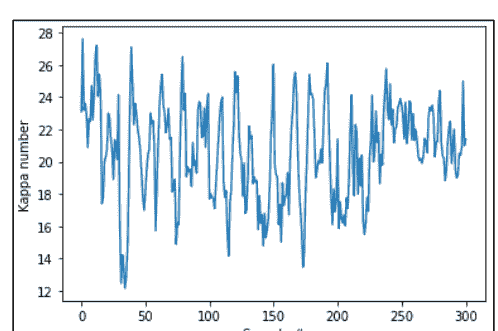

图 2.14：Kamyr数据集中的Kappa值数据

```python
# import required packages
import numpy as np
import pandas as pd

# fetch data
data = pd.read_csv('kamyr-digester.csv', usecols = range(1,23))
# find the # of nan entries in each column
na_counts = data.isna().sum(axis = 0)

# remove columns that have a lot of nan entries
data_cleaned = data.drop(columns = ['AAWhiteSt-4 ','SulphidityL-4 '])

# remove any row that have any nan entry
data_cleaned = data_cleaned.dropna(axis = 0)

# separate X, y
y = data_cleaned.iloc[:,0].values[:, np.newaxis] # StandardScaler requires 2D array
X = data_cleaned.iloc[:,1:].values

print('Number of samples left: ', X.shape[0])

>>> Number of samples left: 263
```

我们现在将剩余的样本划分为训练数据（80%）和测试数据（20%），并进行归一化处理。

```python
# separate training and test data
from sklearn.model_selection import train_test_split
X_train, X_test, y_train, y_test = train_test_split(X, y, test_size = 0.2, random_state = 100)

# scale data
from sklearn.preprocessing import StandardScaler
X_scaler = StandardScaler()
X_train_normal = X_scaler.fit_transform(X_train)
X_test_normal = X_scaler.transform(X_test)

y_scaler = StandardScaler()
y_train_normal = y_scaler.fit_transform(y_train)
y_test_normal = y_scaler.transform(y_test)
```

我们现在准备好构建PLS模型。

```python
# PLS model
from sklearn.cross_decomposition import PLSRegression
pls = PLSRegression(n_components = 9)
pls.fit(X_train_normal, y_train_normal)

# Training vs Test accuracy
y_train_normal_predict = pls.predict(X_train_normal)
y_test_normal_predict = pls.predict(X_test_normal)

print('Accuracy over training data: ', pls.score(X_train_normal, y_train_normal))
print('Accuracy over test data: ', pls.score(X_test_normal, y_test_normal))

>>> Accuracy over training data: 0.6615
>>> Accuracy over test data: 0.6812
```

虽然并不完美，但我们已经获得了一个相当不错的推断传感器。我们鼓励你将潜在组件的数量更改为最大可能值（本例中为19），以获得与多元线性回归（MLR）相当的准确度。准确度的提升微乎其微。

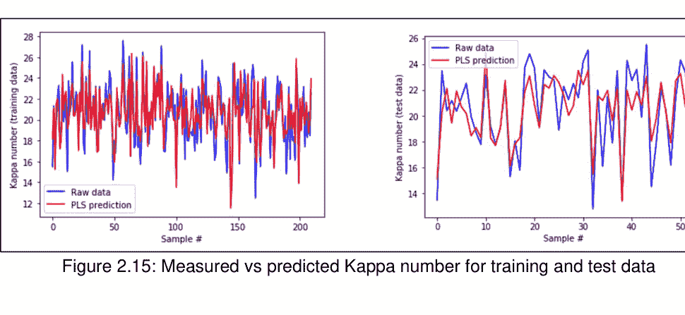

> 开发软传感器时，一个很好的经验法则是：如果存在多个预测准确度相似的模型，应始终选择复杂度最低的模型。对于PLS和PCR，更高的潜在组件数量意味着更高的复杂度。

我们在PLS模型中使用了9个潜在组件。这是通过K折交叉验证程序确定的。如下方代码所示，训练数据被分成10折。对于每个可能的`n_comp`，存储为每折计算的均方误差（MSE）的平均值。当`n_comp = 9`时，在验证MSE图中可以观察到一个局部最小值。

```python
# import required packages
from sklearn.model_selection import KFold
from sklearn.metrics import mean_squared_error

scaler = StandardScaler()
fit_MSE = []
validate_MSE = []
for n_comp in range(1,20):

    local_fit_MSE = [] # store MSE for each fold
    local_validate_MSE = []

    kfold = KFold(n_splits = 10, shuffle = True, random_state = 100)
    for fit_index, validate_index in kfold.split(y_train):

        X_fit_normal = scaler.fit_transform(X_train[fit_index])
        X_validate_normal = scaler.transform(X_train[validate_index])

        y_fit_normal = scaler.fit_transform(y_train[fit_index])
        y_validate_normal = scaler.transform(y_train[validate_index])

        pls = PLSRegression(n_components = n_comp)
        pls.fit(X_fit_normal, y_fit_normal)

        local_fit_MSE.append(mean_squared_error(y_fit_normal, pls.predict(X_fit_normal)))
        local_validate_MSE.append(mean_squared_error(y_validate_normal,
                                                    pls.predict(X_validate_normal)))

    fit_MSE.append(np.mean(local_fit_MSE))
    validate_MSE.append(np.mean(local_validate_MSE))
```

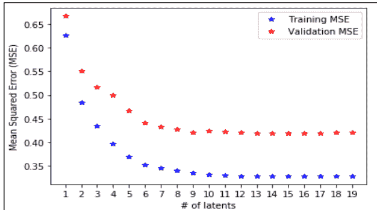

图 2.16：用于确定`n_components`的MSE图

确定保留组件的数量可以通过简单地查看连续`n_comp`的验证MSE比率来实现。如果该比率大于某个阈值（例如0.95），则搜索结束。其基本逻辑仍然是：除非获得显著更好的验证预测，否则不增加保留的潜在组件数量。

PLS框架本身也适用于过程监控。其整体方法类似于基于PCA的监控：在PLS建模后，计算监控指标，确定控制限，并检查是否违反控制限以进行故障检测。当过程数据可以划分为输入和输出块时，基于PLS的监控是首选。为了说明，我们将使用从LDPE（低密度聚乙烯）制造过程中收集的数据。该数据集包含54个样本，每个样本有14个过程变量和5个产品质量变量。已知从第51个样本开始发生过程故障。

我们这里的目标是构建一个故障检测工具，以清晰地指示过程故障的发生。为了理解此类工具的必要性，让我们看看传统的替代监控方法。如果工厂操作员手动持续监控5个质量变量，他/她可能会注意到最后4个样本的值略有下降。然而，鉴于质量变量在正常运行期间表现出较大的变异性，在首先检查其他过程变量之前，很难做出任何决定，因为质量变量可能只是对过程中其他地方的“正常”变化做出响应。不幸的是，同时手动解释所有过程图将非常不便。

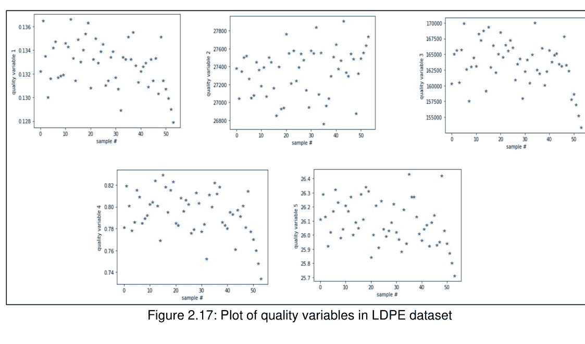

我们首先使用3个潜在组件<sup>22</sup>构建一个PLS模型。

```python
# fetch data
data = pd.read_csv('LDPE.csv', usecols = range(1,20)).values
data_train = data[:-4,:] # exclude last 4 samples

# scale data
from sklearn.preprocessing import StandardScaler
scaler = StandardScaler()
data_train_normal = scaler.fit_transform(data_train)

# build PLS model
from sklearn.cross_decomposition import PLSRegression
X_train_normal = data_train_normal[:,:-5]
Y_train_normal = data_train_normal[:,-5:]

pls = PLSRegression(n_components = 3)
pls.fit(X_train_normal, Y_train_normal)
```

捕获方差的计算表明，X中仅56%的信息就能解释Y中近90%的变异；这意味着X中存在对质量变量影响甚微的变异。

```python
# X and Y variance captured
from sklearn.metrics import r2_score

print('Y variance captured: ', 100*pls.score(X_train_normal, Y_train_normal), '%')

Tscores = pls.x_scores_
X_train_normal_reconstruct = np.dot(Tscores, pls.x_loadings_.T)
# can also use pls.inverse_transform(Tscores)

print('X variance captured: ', 100*r2_score(X_train_normal, X_train_normal_reconstruct), '%')

>>> Y variance captured: 89.91 %
>>> X variance captured: 56.03 %
```

观察**t**与**u**得分图进一步证实，对于该数据集，线性相关性是一个很好的假设。我们还可以看到，对于更高的组件，相关性如何变差。

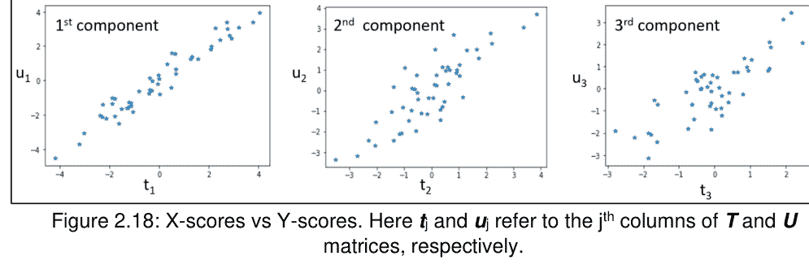

### 故障检测指标

对于PLS，计算三个监控指标：一个来自t得分的$T^2$统计量，以及两个来自**X**和**Y**残差的SPE统计量。与PCA类似，$T^2$统计量量化了预测变量（**X**）中与响应（**Y**）变量系统性变异相关的系统性变异。$T^2$统计量的大幅偏离意味着过程操作条件发生了显著变化。令$t_i$表示**T**的第$i^{th}$行。该数据点的$T^2$指标由下式给出

$$T^2 = \sum_{j=1}^{k} \frac{t_{ij}^2}{\sigma_j^2} = t_i^T \Lambda_k^{-1} t_i$$

### 5.7 经典PLS的变体

经典PLS的变体已被设计用于处理动态和非线性系统。对于动态系统，过程输入的历史值会影响输出的当前值，因此包含历史测量值可以提高预测精度<sup>24</sup>。对于动态PLS，会构建一个增广输入数据矩阵（使用与动态PCA相同的程序），该矩阵仅使用输入变量的滞后值，或同时使用输入和输出变量的滞后值。仅使用滞后输入会导致FIR（有限脉冲响应）模型，而同时使用滞后输入和输出则会导致ARX（带外生变量的自回归）模型。滞后周期的值可以通过交叉验证或过程的时间常数来确定。

对于非线性系统，核PLS是软测量质量变量的有效方法。使用核函数，输入变量被隐式映射到一个高维特征空间，在该空间中数据表现得更具线性。然后在特征变量和输出变量之间建立线性PLS模型。鼓励读者参阅Zhang等人的工作<sup>25</sup>以了解基于核PLS的软测量的详细信息。

### 时变过程的模型维护

由于设备老化或过程条件变化导致过程相关性改变，模型保真度会随时间下降。因此，定期更新PCA/PLS模型变得至关重要。模型自适应有两种主要技术：递归更新<sup>++</sup>和滑动窗口更新<sup>**</sup>。在滑动窗口方法中，现有模型被丢弃，并通过用新数据替换最旧的数据来构建一个全新的过程模型。在递归方法中，现有模型不被丢弃，而是通过用新数据更新现有模型来构建新模型。

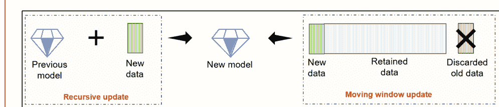

图2.21：模型维护方案

<sup>24</sup> Kano等人，使用动态偏最小二乘回归的蒸馏组成推断控制系统，过程控制杂志，2000年
<sup>25</sup> Zhang等人，基于核偏最小二乘的非线性多元质量估计与预测，工业与工程化学研究，2008年
<sup>++</sup> Li等人，用于自适应过程监控的递归PCA，过程控制杂志，2000年
<sup>++</sup> S. Joe Qin，用于自适应数据建模的递归PLS算法，计算机与化学工程，1998年
<sup>**</sup> Wang等人，使用快速滑动窗口PCA的过程监控方法

### 总结

通过本章，我们在机器学习之旅中达到了一个重要的里程碑。你已经了解了如何从过程数据中便捷地提取隐藏的过程知识，并将其转化为过程洞察。掌握了PCA和PLS工具，你现在已具备充分的能力来解决大多数与过程建模和监控相关的问题。然而，我们的旅程并未在此结束。在下一章中，我们将研究更多同样强大的基于潜变量的技术。

## 第6章
### 降维与潜变量方法（第二部分）

至此，你一定对PCA和PLS技术的强大能力印象深刻。这些方法使我们能够提取不相关的潜变量，从而最大化捕获的方差。然而，你可能会问，“这些是适用于所有问题的最佳降维技术吗？”。我们很高兴你提出这个问题！确实存在其他可能提供更好性能的强大方法。例如，独立成分分析（ICA）可以提供具有更严格统计独立性（而不仅仅是不相关性）的潜变量。独立成分可能比主成分更好地表征过程数据，从而可能带来更好的监控性能。如果你降维的最终目标是将过程故障分类到不同类别以进行故障诊断，那么，不同类别故障数据之间的最大分离将是你的主要关注点，而不是最大化数据方差的捕获。费舍尔判别分析（FDA）将更适合这项任务。

在本章中，我们将详细学习ICA和FDA的特性。我们将把这些方法应用于大规模化工厂的过程监控和故障分类。具体涵盖以下主题

- ICA简介
- 非高斯过程的过程监控
- FDA简介
- 大规模过程的故障分类

$\boldsymbol{\Lambda}_k$ 是一个对角矩阵，是 $\boldsymbol{T}$ 的协方差矩阵，其对角线元素为 $\sigma_j$（第 $j$ 个成分得分的方差）。$T_{CL}^2$ 再次通过以下表达式获得

$$T_{CL}^2 = \frac{k(N^2-1)}{N(N-k)} F_{k,N-k}(\alpha)$$

第二和第三个指标，$SPE_x$ 和 $SPE_y$，分别表示 $\boldsymbol{X}$ 和 $\boldsymbol{Y}$ 的残差或未建模部分。令 $\boldsymbol{e}_i$ 和 $\boldsymbol{f}_i$ 分别表示 $\boldsymbol{E}$ 和 $\boldsymbol{F}$ 的第 $i$ 行。则

$$SPE_x = \sum_{j=1}^{m} e_{i,j}^2$$
$$SPE_y = \sum_{j=1}^{p} f_{i,j}^2$$

注意，如果输出测量值无法实时获得，则不计算 $SPE_y$。在残差服从正态分布的假设下，SPE统计量的控制限由以下表达式给出

$$SPE_{CL} = g\chi_{\alpha}^2(h)$$
$$h = \frac{2\mu^2}{\sigma}, \quad g = \frac{\sigma}{2\mu}$$

$\chi_{\alpha}^2$ 是自由度为 $h$ 的卡方分布$^{23}$的 $(1-\alpha)$ 分位数；$\mu$ 表示SPE统计量的均值，$\sigma$ 表示其方差。注意，此表达式也可用于PCA的SPE统计量。

```python
# monitoring indices for training data
# T2
T_cov = np.cov(Tscores.T)
T_cov_inv = np.linalg.inv(T_cov)

T2_train = np.zeros((data_train_normal.shape[0],))
for i in range(data_train_normal.shape[0]):
    T2_train[i] = np.dot(np.dot(Tscores[i,:],T_cov_inv),Tscores[i,:].T)

# SPEx
x_error_train = X_train_normal - X_train_normal_reconstruct
SPEx_train = np.sum(x_error_train*x_error_train, axis = 1)

# SPEy
y_error_train = Y_train_normal - pls.predict(X_train_normal)
SPEy_train = np.sum(y_error_train*y_error_train, axis = 1)

# control limits
#T2
import scipy.stats
N = data_train_normal.shape[0]
k = 3

alpha = 0.01 # 99% control limit
T2_CL = k*(N**2-1)*scipy.stats.f.ppf(1-alpha,k,N-k)/(N*(N-k))

# SPEx
mean_SPEx_train = np.mean(SPEx_train)
var_SPEx_train = np.var(SPEx_train)

g = var_SPEx_train/(2*mean_SPEx_train)
h = 2*mean_SPEx_train**2/var_SPEx_train
SPEx_CL = g*scipy.stats.chi2.ppf(1-alpha, h)

# SPEy
mean_SPEy_train = np.mean(SPEy_train)
var_SPEy_train = np.var(SPEy_train)

g = var_SPEy_train/(2*mean_SPEy_train)
h = 2*mean_SPEy_train**2/var_SPEy_train
SPEy_CL = g*scipy.stats.chi2.ppf(1-alpha, h)
```

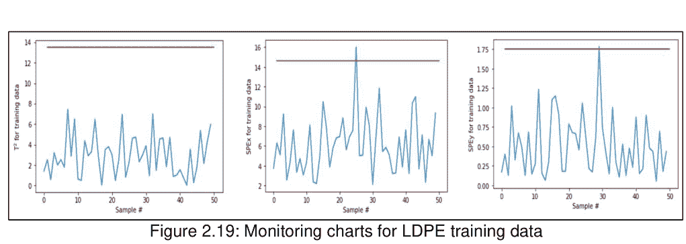

### 测试数据上的故障检测

现在让我们看看我们的监控统计量是否能检测到数据样本末尾出现的过程异常。为了便于比较，我们将整个数据集视为测试数据。监控图清楚地表明，过程在采样期结束时遇到了严重的异常。显著偏高的 SPE_x 表明异常已显著影响了输入变量的相关性。

```python
# get test data, normalize it
data_normal = scaler.transform(data)
X_normal = data_normal[:,:-5]
Y_normal = data_normal[:,-5:]

# get model predictions
Tscores_test = pls.transform(X_normal)
X_normal_reconstruct = np.dot(Tscores_test, pls.x_loadings_.T)
Y_normal_pred = pls.predict(X_normal)

# compute monitoring statistics
T2_test = np.zeros((data_normal.shape[0],))
for i in range(data_normal.shape[0]):
    T2_test[i] = np.dot(np.dot(Tscores_test[i,:],T_cov_inv),Tscores_test[i,:].T)

x_error_test = X_normal - X_normal_reconstruct
SPEX_test = np.sum(x_error_test*x_error_test, axis = 1)

y_error_test = Y_normal - pls.predict(X_normal)
SPEy_test = np.sum(y_error_test*y_error_test, axis = 1)
```

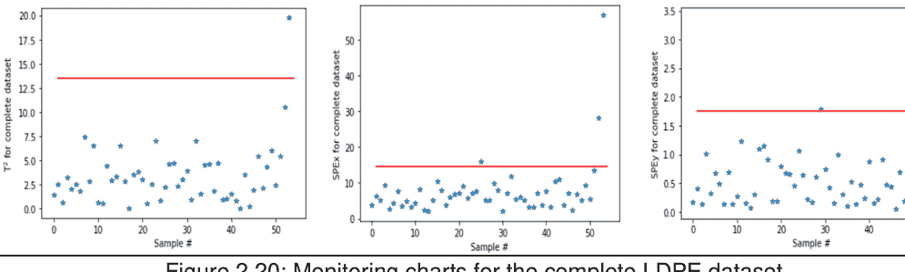

### 6.1 ICA：简介

独立成分分析（ICA）是一种多变量技术，用于将测量变量转换为低维空间中统计独立的潜变量。统计独立性是比不相关性更严格的条件，在某些情况下，使用独立成分（ICs）比使用PCA中不相关的PCs能获得更好的结果。虽然ICA和PCA是相关的（即潜变量是测量变量的线性投影），但它们在提取潜变量的方式上有所不同。图6.1通过一个简单的示例突出了它们之间的差异，其中两个独立信号被线性组合以生成相关信号，然后使用PCA/ICA来提取潜信号。显然，仅通过PCA对信号进行去相关处理并未恢复原始信号。另一方面，ICA准确地重建了原始信号。如果你仔细观察，会发现ICA潜信号（u1和u2）在符号和幅度上确实与s1和s2信号不同；我们很快就会了解为什么会发生这种情况，以及为什么这不必担心。

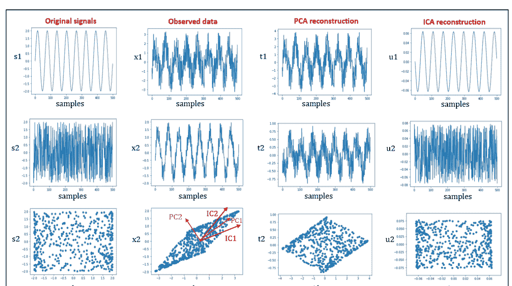

ICA使用高阶统计量进行潜变量提取，而不是像PCA那样仅使用二阶统计量（均值、方差/协方差）。因此，对于非高斯（多元高斯分布完全由二阶统计量定义）的工业数据集，ICs可以比PCs提供更有用的信息，从而可能带来更好的建模性能。在上面的示例中，我们看到ICA如何通过将IC方向向量与数据簇的边缘对齐来提供更有意义的表示，而PC向量则被设计强制指向最大方差的方向。图6.2总结了ICA和PCA之间的主要区别。在本章结束时，你将更清楚地理解这些微妙的差异及其含义。

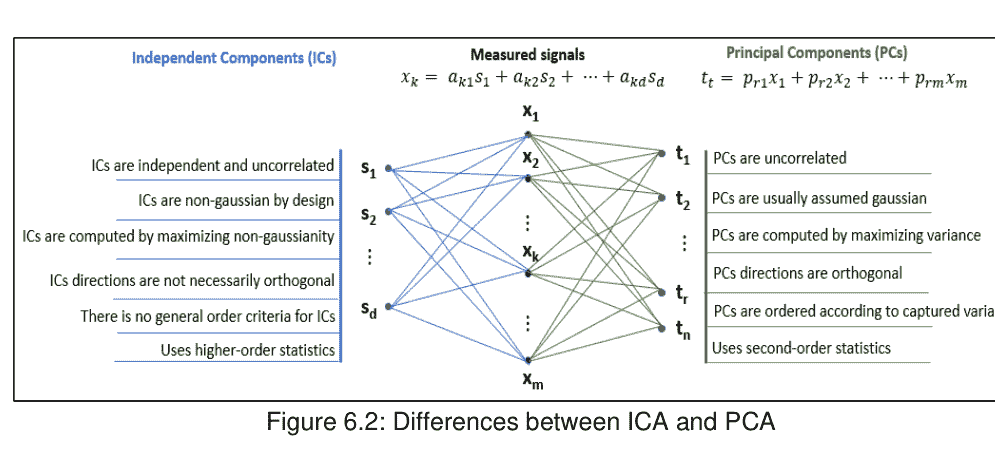

### 独立性与不相关性

在深入探讨ICA背后的数学原理之前，让我们花几秒钟确保我们理解独立性和不相关性背后的概念。如果两个随机变量y1和y2的值互不影响，则称它们是独立的。数学上，这个条件表示为

$p(y1, y2) = p(y1)p(y2)$

其中$p(y1)$是y1单独的概率密度函数，$p(y1, y2)$是联合概率密度函数。如果变量y1和y2的协方差为零，则称它们是不相关的

$C(y1, y2) = E\{(y1 - E(y1))(y2 - E(y2))\} = E(y1 * y2) - E(y1)E(y2) = 0$

其中$E(.)$表示数学期望。利用独立性条件，可以很容易地证明，如果变量是独立的，那么它们也是不相关的，但反之则不然。因此，不相关性是独立性的一种较弱形式。

### 数学背景

考虑数据矩阵$X \in \mathbb{R}^{m \times N}$，它由$m$个输入变量的$N$个观测值组成，其中每一列代表原始测量空间中的一个数据点。注意，与PCA不同，这里使用的是数据矩阵的转置形式。在ICA中，假设测量变量是$d (\le m)$个独立成分$s_1, s_2, \dots, s_d$的线性组合。

$$X = AS$$

其中$S \in \mathbb{R}^{d \times N}$，$A \in \mathbb{R}^{m \times d}$称为混合矩阵。ICA的目标是从测量数据$X$中估计未知矩阵$A$和$S$。这是通过找到一个解混矩阵$W$来实现的，使得ICs或估计矩阵（$\widehat{S}$）的行尽可能独立。

$$\widehat{S} = WX$$

在估计$W$之前，ICA的初始步骤涉及去除数据矩阵$X$中变量之间的相关性。这一步称为白化或球化，通过PCA完成。

$$Z = QX$$

其中$Q \in R^{d \times d}$称为白化矩阵。白化使$Z$的行不相关。为了理解它如何帮助，令$B = QA$并考虑以下关系，

$$Z = QX = QAS = BS$$

因此，白化将寻找矩阵$A$的问题转化为寻找矩阵$B$的问题。其优势在于$B$是一个正交矩阵——考虑到白化变量是不相关的且ICs是独立的，可以证明这一点——因此需要估计的参数更少。利用正交性，得到以下关系，

$$S = B^T Z = B^T QX$$
$$\Rightarrow W = B^T Q$$

因此，一旦找到$B$，就可以生成$W$。矩阵$B$通过最大化估计IC值的非高斯性来估计，即$S$的每一行（$s_i$）应尽可能远离高斯分布。利用中心极限定理，可以证明最大化非高斯性将产生我们需要的独立成分$^{26}$。

上述过程总结了ICA中涉及的步骤。注意，对于任何标量$n$，集合$\{A/n, S/n\}$和$\{A, S\}$产生相同的测量数据矩阵$X$，因此原始ICs的符号和幅度无法唯一估计。然而，这并不影响ICA在过程监控中的使用，因为训练和测试数据的估计ICs隐式地被相同的标量缩放。FastICA（一种流行的ICA算法）计算ICs使得每个IC分数的$L_2$范数为1。这就是为什么图6.1中重建的IC信号看起来是原始IC信号的缩放版本的原因。我们稍后会用到这个事实，所以不要忘记它！

### 复杂化工过程：田纳西伊士曼过程（TEP）

在本章中，我们将使用来自大型工业化工厂的数据集来证明ICA和FDA相对于PCA的优越性能。有关此TEP数据集的详细信息，请参见附录。该过程包括几个单元操作，有22个连续过程测量值、19个成分测量值和11个操纵变量。该数据集包含来自正常操作期和21个具有不同故障原因的故障期的训练和测试数据。对于每个故障类别，训练数据集包含480个样本，测试数据集包含960个样本。对于故障数据，故障操作从样本160开始。

让我们快速查看一个故障条件（故障10）的过程影响，该故障包括进料温度之一的扰动。该故障的影响可以从异常的汽提塔温度曲线（图6a）中看出。PC空间中的图（图6b）更清楚地显示了故障操作数据与正常操作数据的不同之处。我们将使用ICA和FDA来自动检测和分类这些故障。

```python
# import required packages
import numpy as np
import matplotlib.pyplot as plt

# fetch TE data
TEdata_noFault_train = np.loadtxt('d00.dat').T
TEdata_Fault_train = np.loadtxt('d10.dat')

# quick visualize
plt.figure()
plt.plot(TEdata_noFault_train[:,17])
plt.xlabel('sample #'), plt.ylabel('Striper Tempearture'), plt.title('Normal operation')

plt.figure()
plt.plot(TEdata_Fault_train[:,17])
plt.xlabel('sample #'), plt.ylabel('Striper Tempearture'), plt.title('Faulty operation')
```

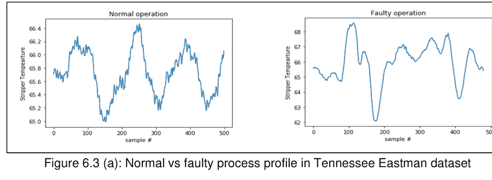

图6.3 (a)：田纳西伊士曼数据集中正常与故障过程曲线

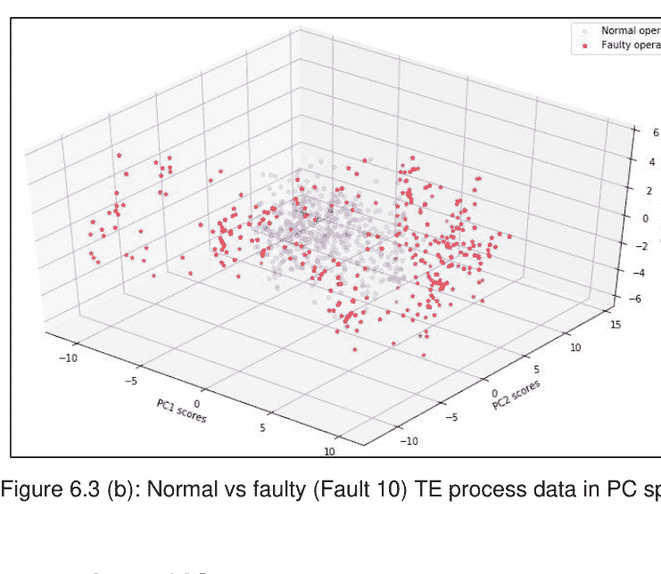

图6.3 (b)：PC空间中正常与故障（故障10）的TE过程数据

### 确定ICs的数量

FastICA返回的ICs数量等于测量空间的维度。之前我们在PCA中看到，并非所有提取的潜变量都是重要的；只有少数主导/重要的成分包含大部分信息，而其余的包含噪声或琐碎的细节。此外，提取的PCs是根据其方差排序的。然而，目前没有标准标准来量化ICs的重要性并自动选择最佳数量的ICs。Lee等人<sup>27</sup>提出了一种量化成分重要性的流行方法（如下所述）。

公式2表明，解混矩阵$\mathbf{W}$的第$i$行（$\mathbf{w}_i$）对应于第$i$个独立成分（IC）。因此，Lee等人建议使用$\mathbf{w}_i$的欧几里得范数（$L_2$）来量化第$i$个IC的重要性，并随后按重要性降序排列IC。图6.4显示，并非所有IC都同等重要，因为几个IC的$L_2$范数远小于其余部分。

```python
# 获取TE数据并选择变量（暂时忽略成分测量）
TEdata_noFault_train = np.loadtxt('d00.dat').T

xmeas = TEdata_noFault_train[:,0:22] # 22个连续过程变量
xmv = TEdata_noFault_train[:,41:52] # 11个操纵变量
data_noFault_train = np.hstack((xmeas, xmv))

# 数据标准化
from sklearn.preprocessing import StandardScaler
scaler = StandardScaler()
data_train_normal = scaler.fit_transform(data_noFault_train)

# 拟合ICA模型
from sklearn.decomposition import FastICA
ica = FastICA(max_iter=1000, tol=0.005).fit(data_train_normal)
W = ica.components_

# 使用每行的L2范数按重要性排序IC
L2_norm = np.linalg.norm(W, 2, axis=1)
sort_order = np.flip(np.argsort(L2_norm)) # 降序排列
L2_norm_sorted_pct = 100*L2_norm[sort_order]/np.sum(L2_norm)

plt.figure()
plt.plot(L2_norm, 'b'), plt.xlabel('IC编号（未排序）'), plt.ylabel('L2范数')
plt.figure()
plt.plot(L2_norm_sorted_pct, 'b+'), plt.xlabel('IC编号（已排序）'), plt.ylabel('L2范数百分比')

# 重新排列W矩阵的行
W_sorted = W[sort_order,:] # 第1行现在对应最重要的IC，依此类推
```

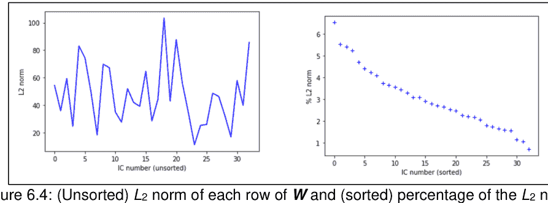

图6.4：$W$矩阵每行的（未排序）$L_2$范数和（已排序的）$L_2$范数百分比

在对IC进行排序后，可以采用两种方法来确定最优的IC数量。方法1使用排序后的$L_2$范数图来确定一个截止IC编号，超过该编号的范数相对不重要。对于我们的数据集，如图6.4所示，没有明显的截止编号。另一种方法是选择IC数量等于主成分（PC）数量。这种方法也确保了ICA和PCA之间的公平比较。我们将在本章中使用第二种方法。

```python
# 通过PCA方差方法决定保留的IC数量并计算IC
from sklearn.decomposition import PCA
pca = PCA().fit(data_train_normal)

explained_variance = 100*pca.explained_variance_ratio_ # 以百分比表示
cum_explained_variance = np.cumsum(explained_variance) # 累积解释方差百分比

n_comp = np.argmax(cum_explained_variance >= 90) + 1
print('累积解释至少90%方差的PC数量：', n_comp)

# 计算降维后的IC
Wd = W_sorted[0:n_comp,:]
Sd = np.dot(Wd, data_train_normal.T) # 第1行包含最重要IC的得分

>>> 累积解释至少90%方差的PC数量：17
```

请注意，FastICA.fit方法期望数据矩阵（$X$）的每一行代表一个样本，而我们在数学描述中使用了转置形式。这有时可能会引起混淆。不过，在两种情况下，提取的混合矩阵、解混矩阵和白化矩阵的形状是相同的。

### 6.2 基于ICA的田纳西-伊士曼过程监控

图6.1中的示例表明，如果潜变量是非高斯分布的，那么ICA可以比PCA更好地提取潜信号。对于此类系统，可以预期基于ICA的监控将比基于PCA的监控性能更好。与基于PCA/PLS的监控机制类似，监控指标及其相应的阈值是使用正常/无故障操作数据计算的。测试数据的指标值与阈值进行比较，以检查是否存在故障。

### 故障检测指标

三个监控指标（$I^2$、$SPE$、$I_e^2$）使用训练数据计算。请注意，由于IC是独立的，从技术上讲，使用单变量统计过程控制（SPC）技术直接分别监控每个IC是合理的方法。然而，同时监控多个IC可能不方便。第一个统计量$I^2$定义为独立得分（在降维空间中）的平方和，是系统过程变化的度量（类似于PCA的$T^2$统计量）。设$s_i$表示矩阵$S_d$的第$i$列，它代表降维IC空间中的第$i$个样本/数据点。该样本的$I^2$指标计算如下：

$$I^2 = s_i^T s_i$$

你可能想知道为什么我们没有像计算$T^2$指标时那样包含协方差矩阵。这是因为每个IC得分的方差是相同的（记住，$L_2$范数相同），因此包含协方差矩阵是多余的。

第二个指标SPE表示测量数据点与重构数据点在测量空间中的距离。为了计算它，让我们构建一个矩阵$B_d$，方法是从矩阵$B$中选择列，这些列的索引对应于我们生成矩阵$W_d$时从$W$中选择的行的索引。设$x_i$和$\hat{x}_i$分别表示第$i$个测量样本和重构样本。那么，

$$\hat{x}_i = Q^{-1} B_d s_i = Q^{-1} B_d W_d x_i$$
$$e_i = x_i - \hat{x}_i$$
$$SPE = e_i^T e_i$$

第三个指标$I_e^2$基于被排除的IC。设$W_e$包含矩阵$W$中被排除的行。那么

$$s_i^e = W_e x_i$$
$$I_e^2 = (s_i^e)^T s_i^e$$

由于IC的非高斯特性，我们没有方便的封闭形式方程来计算上述计算指标的阈值/控制限。标准做法是使用核密度估计（KDE）来确定ICA指标的阈值。由于我们将在后面的章节中学习KDE，这里我们将采用百分位数方法。

下面我们定义一个函数，该函数以ICA模型和数据矩阵作为输入，并返回监控指标。图6.5显示了监控图及其99%控制限。

```python
# 定义函数以计算训练或测试样本的ICA监控指标
def compute_ICA_monitoring_metrics(ica_model, number_comp, data):
    """
    data: 形状为 [n_samples, n_features] 的numpy数组

    返回
    -------
    monitoring_stats: 形状为 [n_samples, 3] 的numpy数组
    """
    n = data.shape[0]

    # 模型参数
    W = ica.components_
    L2_norm = np.linalg.norm(W, 2, axis=1)
    sort_order = np.flip(np.argsort(L2_norm))
    W_sorted = W[sort_order,:]

    # 计算I2
    Wd = W_sorted[0:number_comp,:]
    Sd = np.dot(Wd, data.T)
    I2 = np.array([np.dot(Sd[:,i], Sd[:,i]) for i in range(n)])

    # 计算Ie2
    We = W_sorted[n_comp:,:]
    Se = np.dot(We, data.T)
    Ie2 = np.array([np.dot(Se[:,i], Se[:,i]) for i in range(n)])

    # 计算SPE
    Q = ica.whitening_
    Q_inv = np.linalg.inv(Q)
    A = ica.mixing_
    B = np.dot(Q, A)
    B_sorted = B[:,sort_order]
    Bd = B_sorted[:,0:n_comp]

    data_reconstruct = np.dot(np.dot(np.dot(Q_inv, Bd), Wd), data.T)
    e = data.T - data_reconstruct
    SPE = np.array([np.dot(e[:,i], e[:,i]) for i in range(n)])

    monitoring_stats = np.column_stack((I2, Ie2, SPE))
    return monitoring_stats
```

```python
# 定义几个辅助函数
def draw_monitoring_chart(values, CL, yLabel):
    plt.figure()
    plt.plot(values)
    plt.axhline(CL, color = "red", linestyle = "--")
    plt.xlabel('样本编号'), plt.ylabel(yLabel)
```

```python
def draw_ICA_monitoring_charts(ICA_statistics, CLs, trainORtest):
    """ 为给定数据绘制监控图

    参数
    -----------------
    ICA_statistics: 形状为 [n_samples, 3] 的numpy数组
    CLs: 控制限列表
    trainORtest: 'training' 或 'test'
    """

    # I2图, Ie2图, SPE图
    draw_monitoring_chart(ICA_statistics[:,0], CLs[0], trainORtest + '数据的I2')
    draw_monitoring_chart(ICA_statistics[:,1], CLs[1], trainORtest + '数据的Ie2')
    draw_monitoring_chart(ICA_statistics[:,2], CLs[2], trainORtest + '数据的SPE')
```

```python
# 为训练数据绘制监控图
ICA_statistics_train = compute_ICA_monitoring_metrics(ica, n_comp, data_train_normal)
I2_CL = np.percentile(ICA_statistics_train[:,0], 99)
Ie2_CL = np.percentile(ICA_statistics_train[:,1], 99)
SPE_CL = np.percentile(ICA_statistics_train[:,2], 99)

draw_ICA_monitoring_charts(ICA_statistics_train, [I2_CL, Ie2_CL, SPE_CL], 'training')
```

### 测试数据的故障检测

Lee等人28和Yin等人29已详细发表了多种机器学习技术在田纳西-伊士曼过程（TEP）中的过程监控性能，并展示了独立成分分析（ICA）卓越的故障检测能力。我们将尝试验证他们对部分故障的研究结果。但首先，让我们了解一些常用于评估任何监控工具性能的术语。这些术语是故障检测率（FDR）和误报率（FAR）。

$$\text{FDR} = \frac{\text{正确标记为故障的样本数}}{\text{故障样本总数}} \times 100$$

$$\text{FAR} = \frac{\text{错误标记为故障的样本数}}{\text{非故障样本总数}} \times 100$$

一个设计良好的监控工具应具有高FDR和低FAR值。低FDR和高FAR值都是不可取的，因为低FAR值会导致因延迟/未检测到异常而引发安全问题和经济损失，而高FAR值则会导致用户对工具失去信心，并最终使工具被淘汰。

现在，让我们使用这些术语来比较PCA和ICA在检测故障10和故障5时的性能。图6.6和图6.7展示了这些故障的ICA/PCA监控图。对于故障10，ICA给出了显著更高的FDR。在400到600之间有许多样本，尽管存在过程异常，但PCA指标仍低于其控制限。对于故障5的测试数据，性能差异更为明显。从样本400开始，PCA图表错误地指示操作正常，尽管已知故障状态一直持续到采样期结束。另一点需要注意的是，PCA和ICA的FAR值都很低，因为在样本160之前没有多少样本违反控制限。这里ICA的FAR值同样更低/更好。对于非故障测试数据集也观察到类似的FAR行为。我们没有展示FAR值，但你应该计算它们并确认ICA给出了更低的FAR值。

```python
# define function to compute FDR or FAR
def compute_alarmRate(monitoring_stats, CLs):
    """ calculate alarm rate

    parameters
    ----------
    monitoring_stats: numpy array of shape = [n_samples, 3]
    CLs: List of control limits

    Returns
    -------
    alarmRate: float
    """
    violationFlag = monitoring_stats > CLs
    alarm_overall = np.any(violationFlag, axis=1) # violation of any metric => alarm
    alarmRate = 100*np.sum(alarm_overall)/monitoring_stats.shape[0]

    return alarmRate

# fetch test data and select data as done during training
TEdata_Fault_test = np.loadtxt('d10_te.dat')

xmeas = TEdata_Fault_test[:,0:22]
xmv = TEdata_Fault_test[:,41:52]
data_Fault_test = np.hstack((xmeas, xmv))

# scale data
data_test_scaled = scaler.transform(data_Fault_test)

# compute statistics and draw charts
ICA_statistics_test = compute_ICA_monitoring_metrics(ica, n_comp, data_test_scaled)
draw_ICA_monitoring_charts(ICA_statistics_test, [I2_CL, Ie2_CL, SPE_CL], 'test')

# compute FAR or FDR
alarmRate = compute_alarmRate(ICA_statistics_test[160:,:], [I2_CL, Ie2_CL, SPE_CL])
                                # fault starts sample 160 onwards
```

尽管PCA在这两个测试数据集上的表现不如ICA，但我们没有通用的标准来预测这一点。监控性能取决于所研究的具体系统，并且经常采用试错法来选择监控算法。

与PCA和PLS类似，ICA的非线性和动态变体也已开发出来。鼓励读者参阅Lee等人28关于动态ICA以及Lee等人30关于非线性ICA的著作。

### 6.3 FDA：简介

Fisher判别分析（FDA），也称为线性判别分析（LDA），是一种多元降维技术，它在低维空间中最大化不同类别数据之间的“分离度”。为了概念性理解，请考虑图6.8中的简单示例，其中FDA和PCA将一个二维数据集（包含两类数据）投影到一维空间。相应的一维得分显示，虽然两类数据在LD空间中分离良好，但在PC空间中分离度很差。这一观察结果是预期的，因为PCA在确定投影方向时，并未考虑不同数据类别的信息。因此，如果你的目的是为后续数据分类进行降维，并且训练数据已标记为不同类别，那么FDA更为合适。

图6.8：FDA与PCA的简单示例。x1与x2图中的箭头显示了相应方法第一主成分的方向向量。

由于FDA强大的数据区分能力，它在过程工业中被广泛用于操作模式分类和故障诊断。大规模工业过程经常经历各种过程问题/故障，在在线操作期间快速准确地识别具体问题以最小化经济损失至关重要。在模型训练期间，FDA从历史过程故障收集的数据中学习（来自特定过程故障的数据形成一个类别），以找到最佳投影方向，并将异常过程数据实时分类为特定故障。我们将在本章研究这样一个应用。

### 数学背景

为了便于数据分类，FDA不仅最大化类别之间的分离度，还最小化每个类别内部的变异/离散度。为了了解这是如何实现的，让我们首先考虑一个数据集矩阵 $X \in \mathbb{R}^{N \times m}$，它由 $N$ 个样本组成，其中 $N_1$ 个属于类别1（$\omega_1$），$N_2$ 个属于类别2（$\omega_2$）。FDA寻求找到一个投影向量 $w \in \mathbb{R}^m$，使得投影后的标量/样本（$z = w^T x$）最大程度地分离。令 $\tilde{\mu}_1$ 和 $\tilde{\mu}_2$ 分别表示类别1和类别2投影值的均值

$$\tilde{\mu}_i = \frac{1}{N_i} \sum_{z \in \omega_1} z$$

类别分离度可以量化为投影均值之间的距离 $|\tilde{\mu}_1 - \tilde{\mu}_2|$；然而，如下图所示，这不是一个稳健的度量。

为了量化类别 $\omega_i$ 内部的变异性，我们定义一个称为离散度的项 $\tilde{s}_i^2$

$$\tilde{s}_i^2 = \sum_{z \in \omega_1} (z - \tilde{\mu}_i)^2$$

分离准则现在定义为投影均值之间的归一化距离。该公式旨在找到一个投影，使得类别均值相距较远，而同一类别的样本彼此接近。

$$J(w) = \frac{|\tilde{\mu}_1 - \tilde{\mu}_2|^2}{\tilde{s}_1^2 + \tilde{s}_2^2}$$

使用基本关系 $y = w^T x$ 和直接的代数运算$^{31}$，可以将目标函数 $J(w)$ 等效地表示如下，这也适用于任意 $(p)$ 个数据类别

$$J(w) = \frac{w^T S_b w}{w^T S_w w} \quad \text{eq. 9}$$

$\mathbf{S}_b$（类间离散度矩阵）和 $\mathbf{S}_w$（类内离散度矩阵）定义为

$$\mathbf{S}_b = \sum_{j=1}^{p} N_j (\boldsymbol{\mu}_j - \boldsymbol{\mu}) (\boldsymbol{\mu}_j - \boldsymbol{\mu})^T$$

$$\mathbf{S}_w = \sum_{j=1}^{p} \mathbf{S}_j$$

$$\mathbf{S}_j = \sum_{\mathbf{x}_i \in \omega_1} (\mathbf{x}_i - \boldsymbol{\mu}_j)(\mathbf{x}_i - \boldsymbol{\mu}_j)^T$$

其中，$\boldsymbol{\mu} \in \mathbb{R}^m$ 和 $\boldsymbol{\mu}_j \in \mathbb{R}^m$ 分别表示测量空间中所有 $N$ 个样本和第 $j$ 类 $N_j$ 个样本的均值向量。第一个FDA向量 $w_1$ 通过最大化 $J(w)$ 找到，后续向量通过求解相同问题并附加与先前计算向量正交的约束来找到。注意，最多可以有 $p-1$ 个FDA向量。或者，与PCA类似，向量也可以作为广义特征值问题的解来计算

$$\mathbf{S}_w^{-1} \mathbf{S}_b w = \lambda w \quad \text{eq. 10}$$

其中 $\lambda = J(w)$。因此，特征值（$\lambda_s$）表示数据类别投影到相应特征向量上的可分离程度。第一个判别/FDA向量/特征向量对应于最大的特征值，第二个FDA向量与第二大的特征值相关，依此类推。一旦确定了FDA向量，就可以将数据点投影，并在降维的FDA空间中构建分类模型。总体而言，从m维空间到 $p-1$ 维FDA空间的FDA变换可以表示为

$$Z = W_p X$$

其中 $W_p \in \mathbb{R}^{m \times (p-1)}$ 包含 $p-1$ 个FDA向量作为列，$Z \in \mathbb{R}^{N \times (p-1)}$ 是变换空间中的数据矩阵，其中每一行是变换后的样本。变换后的样本在FDA空间中得到了最优分离。

### 田纳西-伊士曼过程的降维

为了展示Fisher判别分析（FDA）的降维和类别可分性能力，我们使用TEP数据集中3个故障类别（故障5、10和19）的数据。对于3个故障类别，FDA最多将产生2个转换维度。我们还将进行PCA以作比较。

```python
# 获取故障5、10、19的TEP数据
TEdata_Fault5_train = np.loadtxt('d05.dat')
TEdata_Fault10_train = np.loadtxt('d10.dat')
TEdata_Fault19_train = np.loadtxt('d19.dat')
TEdata_Faulty_train = np.vstack((TEdata_Fault5_train, TEdata_Fault10_train,
TEdata_Fault19_train))
```

```python
# 选择变量（暂时忽略成分测量值）
xmeas = TEdata_Faulty_train[:,0:22] # 22个连续过程变量
xmv = TEdata_Faulty_train[:,41:52] # 11个操纵变量
data_Faulty_train = np.hstack((xmeas, xmv))
```

```python
# 生成样本标签
n_rows_train = TEdata_Fault5_train.shape[0]
y_train = np.concatenate((5*np.ones(n_rows_train,), 10*np.ones(n_rows_train,),
19*np.ones(n_rows_train,)))
```

```python
# 数据标准化
from sklearn.preprocessing import StandardScaler
scaler = StandardScaler()
Faultydata_train_scaled = scaler.fit_transform(data_Faulty_train)
```

```python
# 拟合LDA模型
from sklearn.discriminant_analysis import LinearDiscriminantAnalysis
lda = LinearDiscriminantAnalysis()
scores_train_lda = lda.fit_transform(Faultydata_train_scaled, y_train)
```

```python
# 可视化LDA得分
plt.figure()
plt.plot(scores_train_lda[0:n_rows_train,0], scores_train_lda[0:n_rows_train,1], 'b.',
label='故障 5')
plt.plot(scores_train_lda[n_rows_train:2*n_rows_train,0],
scores_train_lda[n_rows_train:2*n_rows_train,1], 'r.', label='故障 10')
plt.plot(scores_train_lda[2*n_rows_train:3*n_rows_train,0],
scores_train_lda[2*n_rows_train:3*n_rows_train,1], 'm.', label='故障 19')
plt.legend()
```

图6.9展示了经过FDA和PCA转换后在2个维度上的样本。FDA能够清晰地分离故障5的样本；然而，它无法分离故障10和19的数据。事实上，第二个判别式（FD2）对判别贡献很小，因此只需要FD1即可分离故障5的样本。为了分离故障10和19，可以探索核FDA方法³²。另一方面，线性PCA无法分离任何类别。

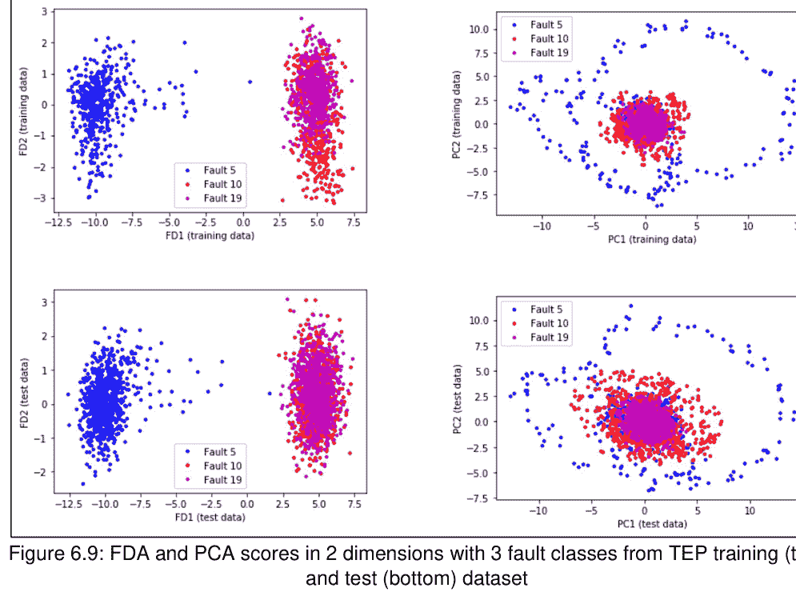

> 虽然FDA是故障诊断的强大工具，但通过将“无故障”或正常工厂运行数据作为一个单独的类别包含进来，它也可以用于故障检测。

³² Hyun-Woo Cho, Nonlinear feature extraction and classification of multivariate process data in kernel feature space, Expert Systems with Applications, 2007

### 6.4 基于FDA的田纳西-伊士曼过程故障分类

将样本投影到FDA空间后，可以选择任何分类技术来分类或诊断特定故障。一种流行的基于$T^2$统计量的方法是使用训练数据为每个故障类别计算一个$T^2$控制限。第$j$个故障类别的$T^2$控制限（$T^2_{CL,j}$）代表了低维空间中来自第$j$个故障的投影样本周围的边界——任何落在该边界内的给定样本都属于第$j$个故障类别。数学上，这可以表示为

$T^2_{sample,j} < T^2_{CL,j} \Rightarrow \text{样本属于第 } j^{th} \text{ 个故障类别}$

对于第$j$类的样本，$T^2_{sample,j}$由下式给出

$T^2_{sample,j} = (z_{sample} - \widetilde{\mu}_j)^T \widetilde{S}_j (z_{sample} - \widetilde{\mu}_j)$

其中，$\widetilde{\mu}_j$和$\widetilde{S}_j$分别表示训练数据集中属于第$j$个故障类别的投影样本的均值和协方差矩阵，$z_{sample}$表示FDA空间中的投影样本。$T^2_{CL,j}$可以使用我们在PCA中使用的相同表达式获得，即$\frac{k(N_j^2-1)}{N_j(N_j-k)} F_{k,N-k}(\alpha)$，其中$k$表示在FDA空间中保留的维度数。为了说明，让我们看看故障5测试数据中有多少样本被正确识别。

```python
# 计算控制限
import scipy.stats
Nj = n_rows_train
k = 2

alpha = 0.01 # 99%控制限
T2_CL = k*(Nj**2-1)*scipy.stats.f.ppf(1-alpha,k,Nj-k)/(Nj*(Nj-k))

# 故障5类别的均值和协方差
scores_train_lda_Fault5 = scores_train_lda[0:n_rows_train,:]
cov_scores_train_Fault5 = np.cov(scores_train_lda_Fault5.T)
mean_scores_train_Fault5 = np.mean(scores_train_lda_Fault5, axis = 0)

# 获取故障5的TE测试数据
TEdata_Fault5_test = np.loadtxt('d05_te.dat')
TEdata_Fault5_test = TEdata_Fault5_test[160:,:] # 故障操作从样本160开始
```

```python
n_rows_test = TEdata_Fault5_test.shape[0]
xmeas = TEdata_Fault5_test[:,0:22]
xmv = TEdata_Fault5_test[:,41:52]
data_Faulty_test = np.hstack((xmeas, xmv))
```

```python
# 标准化测试数据并进行转换
Faultydata_test_scaled = scaler.transform(data_Faulty_test)
scores_test_lda = lda.transform(Faultydata_test_scaled)
```

```python
# 计算故障5类别的测试数据的T2统计量
T2_test = np.zeros((n_rows_test,))
for sample in range(n_rows_test):
    score_sample = scores_test_lda[sample,:]
    score_sample_centered = score_sample - mean_scores_train_Fault5
    T2_test[sample] = np.dot(np.dot(score_sample_centered[np.newaxis,:],np.linalg.inv(cov_scores_train_Fault5)),score_sample_centered[np.newaxis,:].T)
```

```python
# 绘制测试预测结果
outsideCL_flag = T2_test > T2_CL
insideCL_flag = T2_test <= T2_CL
plt.figure()
plt.plot(scores_test_lda[outsideCL_flag,0], scores_test_lda[outsideCL_flag,1], 'k.', label='在故障5边界内')
plt.plot(scores_test_lda[insideCL_flag,0], scores_test_lda[insideCL_flag,1], 'b.', label='在故障5边界外')
plt.xlabel('FD1 (测试数据)')
plt.ylabel('FD2 (测试数据)')
```

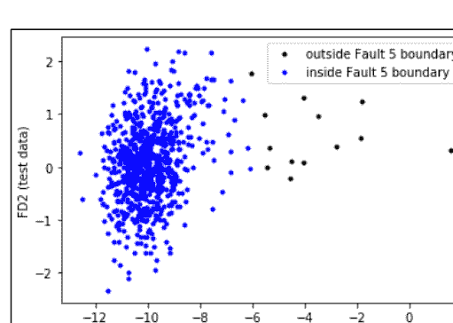

图6.10：TEP故障5测试样本的分类结果

大约98%的样本被正确识别为属于故障5。如图6.10所示，一些远离均值的样本违反了$T^2_{CL,5}$，因此未被分类为故障5。

> **过程监控术语**

在我们目前的过程监控应用中，我们使用了诸如故障检测、故障诊断和故障分类等术语。然而，您可能还会遇到其他术语，如故障识别、故障隔离。虽然这些术语可能被互换使用，但存在细微差别。故障检测是指确定是否发生异常过程条件的任务。故障识别和故障隔离都指识别表现出异常行为的过程变量的任务。识别这些变量有助于确定故障的根本原因。PCA章节中的“故障诊断”步骤本应称为“故障识别”！

故障诊断是指找出发生了哪个特定故障或确定故障根本原因的任务。故障分类属于这一类别。虽然故障隔离是非监督的，但故障诊断是监督的。

### 总结

通过本章，我们现在已经涵盖了所有常用于分析过程数据的经典降维技术。本章还提供了一个重要信息：盲目地始终应用单一技术可能无法产生最佳结果。应根据手头的过程系统（高斯与非高斯）和目标（故障检测与故障分类）来选择技术。ICA和FDA是强大的技术，它们的内容远不止我们在本章所涉及的。虽然鼓励您进一步探索这些方法（既然您已经有了概念上的理解），但我们将在下一章研究另一种强大的机器学习技术，称为支持向量机。

## 第7章
### 支持向量机与基于核的学习

在前面的章节中，我们看到了帮助我们克服“维度灾难”的方法。如果能有不“介意”处理高维系统的机器学习方法，那岂不是很好？SVM（支持向量机）就是这样一种算法，它擅长处理高维、非线性以及中小规模的数据。SVM的设计初衷就是最小化过拟合，以提供出色的泛化性能。SVM的另一个主要优点是其极高的灵活性，可用于监督和无监督环境下的分类和回归任务。你可能已经在想：“哇！SVM似乎集众多优点于一身。”事实上，在人工神经网络（ANN）成为机器学习界热潮之前，SVM曾是备受推崇的明星算法。即使在今天，SVM仍然是每位机器学习从业者工具箱中不可或缺的工具。

以上我们只提到了SVM的部分特性。在学习本章的过程中，你会发现更多。在过程工业的应用中，SVM已被用于故障分类、过程监控、异常值检测、软测量等方面。

为了理解SVM的不同方面，本章将涵盖以下主题：

- SVM基础
- 用于非线性建模的核技巧
- 用于无监督分类的SVDD（支持向量数据描述）
- 基于SVDD的半导体制造过程故障检测
- SVR（支持向量回归）基础
- 在聚合物工厂和炼油厂中基于SVR的软测量

### 7.1 SVM简介

经典SVM是一种用于解决二元分类问题的监督线性技术。为说明起见，请看图7.1a。这里，在一个二维系统中，训练数据点属于两个不同的类别（正类和负类）。任务是找到一条直线/线性边界来分隔这两个类别。图中也显示了两条候选样本线。虽然这些线显然完成了所述任务，但似乎有些不对劲。每条线都非常接近某些训练数据点。这可能导致泛化能力差：例如，图中显示的测试观测点‘A’更靠近正样本，但会被边界L2分类为负类。这显然是不可取的。

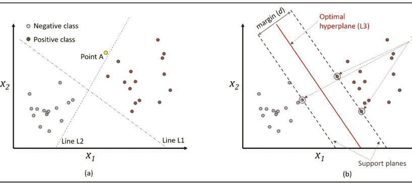

最优分离线/决策边界，即图7.1b中的直线L3，尽可能远离任一类别的数据。如图所示，L3位于支持平面（通过最靠近分离边界的训练点的平面）的中间位置。在模型拟合过程中，SVM只是找到这个对应于最大间隔（支持平面之间的距离）的最优边界。在图7.1中，L3的任何其他方向或位置都会减小间隔，并使L3更靠近某一类而非另一类。大的间隔使得模型预测对训练样本中的小扰动具有鲁棒性。

位于支持平面上的点被称为支持向量³³，并完全决定了最优边界，因此得名支持向量机。在图7.1中，如果移动支持向量，直线L3可能会改变。但是，如果移除任何非支持向量，L3将完全不受影响。我们稍后将看到，对支持向量的唯一依赖如何赋予SVM计算优势。

³³ 将数据点称为向量可能看起来有些奇怪。虽然这种术语在通用SVM文献中很常见，但支持向量指的是从原点出发，以支持平面上的数据点为端点的向量。

### 数学背景

假设有$N$个训练样本（$\mathbf{x}, y$），其中$\mathbf{x}$是$m$维输入空间中的输入向量，$y$是类别标签（$\pm 1$）。设最优分离超平面（二维空间中的一条直线）表示为$\mathbf{w}^T\mathbf{x} + b = 0$，其中模型参数（$\mathbf{w}, b$）的确定需满足

$$\mathbf{w}^T\mathbf{x}_i + b \geq 1 \quad \text{对于正样本 } (y_i = 1)$$
$$\mathbf{w}^T\mathbf{x}_i + b \leq -1 \quad \text{对于负样本 } (y_i = -1)$$

支持平面表示为$\mathbf{w}^T\mathbf{x} + b = 1$和$\mathbf{w}^T\mathbf{x} + b = -1$。上述方程只是陈述了数据点必须位于其对应支持平面的正确一侧的要求。利用简单的三角学可以证明，间隔由$\frac{2}{||\mathbf{w}||}$给出，其中$||\mathbf{w}||$是向量范数。因此，模型参数通过最大化$\frac{2}{||\mathbf{w}||}$（或等价地，最小化$||\mathbf{w}||$）同时满足上述约束来确定。具体来说，需要求解以下优化问题

$$\min_{\mathbf{w},b} \quad \frac{1}{2}||\mathbf{w}||^2$$
$$\text{s.t.} \quad y_i(\mathbf{w}^T\mathbf{x}_i + b) \geq 1, \quad i = 1, \cdots N$$

*公式 1*

模型拟合后，对测试样本$\mathbf{x}_t$的类别预测如下进行。

$$\hat{y}_t = sign(\mathbf{w}^T\mathbf{x}_t + b)$$

如果$\mathbf{x}_t$位于分离超平面的正侧，则属于正类。

sign函数内的表达式也称为决策函数，因此，正的决策函数导致正类预测，反之亦然。

> 公式1中的优化形式以及本章我们将看到的所有其他形式都共享一个非常有利的性质，即具有唯一的全局最小值。与神经网络等其他强大的机器学习方法相比，这是一个巨大的优势，因为局部最小值问题可能会带来不便。

### 简单线性分类示例

我们将使用图7.1中的玩具数据集来说明在Sklearn中基于SVM的分类器建模。

```python
# read data
import numpy as np
data = np.loadtxt('toyDataset.csv', delimiter=',')
X = data[:, [0, 1]]; y = data[:, 2]

# scale model inputs
from sklearn.preprocessing import StandardScaler
scaler = StandardScaler()
X_scaled = scaler.fit_transform(X)

# fit SVM model
from sklearn.svm import SVC # for large datasets LinearSVC class is preferable
model = SVC(kernel='linear', C=100)
model.fit(X_scaled, y)

# get details of support vectors
print('# of support vectors:', len(model.support_))

>> # of support vectors: 3
```

上述代码为我们提供了图7.1<sup>34</sup>所示的最优分离边界。与其他Sklearn估计器一样，可以使用predict()方法预测任何测试观测的类别。我们很快将介绍上述代码中使用的超参数（kernel和C）。

### 硬间隔与软间隔分类

玩具数据集代表了一种理想数据，其中所有训练样本都可以通过线性边界正确分类。然而，在现实生活中，总会存在一些数据杂质，如图7.2所示。我们的SVM公式（公式1）在这种情况下将无法找到解决方案。

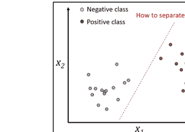

图7.2：所示不良样本的存在使得完美的线性分离不可行。

为了处理这种情况，我们通过修改约束条件，在SVM优化程序中增加了一点灵活性，如下所示

$$w^T x_i + b \geq 1 - \xi_i \quad \text{对于 } y_i = 1$$
$$w^T x_i + b \leq -1 + \xi_i \quad \text{对于 } y_i = -1$$

这里，我们使用松弛变量（$\xi_i$）允许每个样本在模型拟合期间有自由度落在支持平面的错误一侧，并可能被错误分类。然而，我们也希望保持此类违规的数量较低，这可以通过对违规进行惩罚来实现。修订后的SVM公式如下

$$\min_{w,b,\xi} \quad \frac{1}{2}||w||^2 + C \sum_{i=1}^N \xi_i$$
$$\text{s.t.} \quad y_i(w^T x_i + b) \geq 1 - \xi_i, \quad i = 1, \cdots N$$
$$\xi_i > 0$$

上述公式称为软间隔分类（与之前的硬间隔分类相对）。Sklearn实现了软间隔公式。正常数C是一个超参数（Sklearn中默认C=1），对应于我们在前面代码中看到的超参数。对于我们的玩具数据集2（图7.2），使用前面展示的代码，我们最终得到与图7.1相同的分离边界。类别预测表达式保持不变，为$\hat{y}_t = sign(w^T x_t + b)$。

### C作为正则化超参数

松弛变量不仅有助于在存在严重杂质时找到解决方案，还有助于避免对噪声数据过拟合。例如，考虑图7.3中的场景。如果不允许任何错误分类，我们最终会得到一个非常小的间隔，而如果只有一个通过允许一定程度的误分类，我们能获得更好的间隔，从而可能带来更好的泛化能力。因此，我们看到间隔最大化与训练准确率之间存在一个权衡。

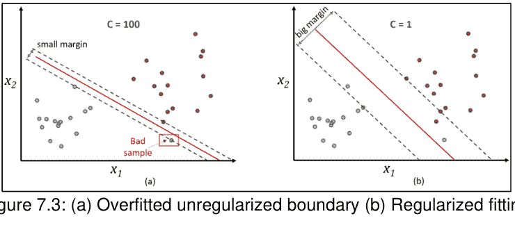

超参数 C 就是控制这个权衡的旋钮。C 值较大意味着对约束违反的惩罚较重，这将防止误分类；而 C 值较小则允许在模型拟合过程中出现更多误分类，以换取更好的间隔。

### 7.2 处理非线性数据的核技巧

虽然软间隔分类的公式非常灵活，但对于需要弯曲边界的非线性分类问题，它并不适用。考虑图 7.4 中的数据集。很明显，线性边界在这里是不合适的。

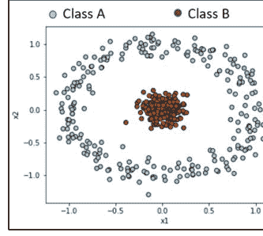

然而，这并非无计可施。一个解决此问题的思路是将原始输入变量/特征映射到一个更高维的空间，在那里它们变得线性可分。对于图 7.4 中的数据，以下变换会非常有效：

$$\varphi(\boldsymbol{x}) = \varphi(x_1, x_2) = [z_1, z_2, z_3] = [x_1, x_2, x_1^2 + x_2^2]$$

正如我们在图 7.5 中看到的，在三维空间中，数据很容易实现线性可分！

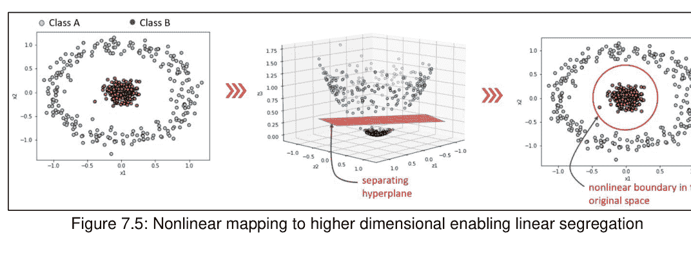

可以在新的特征空间上训练 SVM，以获得最优的分离超平面。任何新的测试数据点都可以通过相同的映射函数 φ 进行变换，然后通过拟合好的 SVM 模型进行类别判定。虽然这个方案看起来很棒，但仍有一个小问题：我们如何为高维输入数据集找到合适的映射？事实证明，你不需要显式地找到这个映射，这得益于一个巧妙的“核技巧”。让我们来了解这个技巧是什么以及如何使用它。为此，我们将重新审视 SVM 的数学背景。

### 数学背景（重温）

SVM 并不是以公式 2 所示的形式求解的。相反，求解的是以下等价形式：

```
min_α  1/2 Σ_{i=1}^N Σ_{j=1}^N α_i α_j y_i y_j x_i^T x_j - Σ_{i=1}^N α_i   eq. 3
s.t.   Σ_{i=1}^N y_i α_i = 0
       0 ≤ α_i ≤ C   i = 1, ... N
```

这里，优化参数 w, b 已被 α_s（也称为拉格朗日乘子）所取代。这种等价形式称为对偶形式（你可能在优化课程中记得这个术语；如果之前没遇到过也完全没关系）。一旦求得 α_s，就可以通过以下公式计算 w 和 b：

```
w = Σ_{i=1}^N α_i y_i x_i,   b = 1/N_s Σ_{i∈{SV}} 1 - y_i w^T x_i
```

其中 $N_s$ 是支持向量的数量，{SV} 是支持向量索引的集合。任何测试数据点可以被分类为：

$$\hat{y}_t = sign(\sum_{i=1}^N \alpha_i y_i x_i^T x_t + b) \quad \text{eq. 4}$$

在对偶形式中，可以发现 $\alpha_s$ 仅对支持向量非零，对其他训练样本则为零。这意味着公式 4 可以简化为：

$$\hat{y}_t = sign(\sum_{i \in \{SV\}} \alpha_i y_i x_i^T x_t + b) \quad \text{eq. 5}$$

> 严格来说，支持向量不必位于分离超平面上。对于软间隔分类，具有非零松弛变量的数据点也是支持向量，它们的 $\alpha_s$ 也是非零的（这是支持向量的定义特征）。支持向量的存在与否会影响解（目标函数和/或模型参数）。

此时，你可能会想，为什么我们要把问题搞得更复杂；为什么不直接用原始形式（公式 2）求解，那个形式似乎更直观？这样做的原因很快就会对你清晰起来。现在，想象一下你在解决非线性问题，SVM 在更高维度中寻找分离超平面。公式 3 将如下所示：

$$\min_{\alpha} \quad \frac{1}{2} \sum_{i=1}^N \sum_{j=1}^N \alpha_i \alpha_j y_i y_j \varphi(x_i)^T \varphi(x_j) - \sum_{i=1}^N \alpha_i \quad \text{eq. 6}$$
$$\text{s.t.} \quad \sum_{i=1}^N y_i \alpha_i = 0$$
$$0 \le \alpha_i \le C \quad i = 1, \cdots N$$

而公式 5 变为：

$$\hat{y}_t = sign(\sum_{i \in \{SV\}} \alpha_i y_i \varphi(x_i)^T \varphi(x_j) + b) \quad \text{eq. 7}$$

这里最关键的观察是，变换后的变量（$\varphi(x)$）仅以内积（点积）的形式出现。现在，如果我们能以某种方式知道这些点积的值，那么我们就不需要知道 $\varphi(x)$ 的确切形式或映射本身，就可以拟合我们的 SVM 模型。这通过核函数 $K(x_i, x_j)$ 得以实现，它们提供了如下关系：

$K(x_i, x_j) = \varphi(x_i)^T \varphi(x_j)$

如你所见，核函数允许我们将“未知”变换空间中的点积计算为原始空间中向量的函数！有多种核函数形式可供选择，因此这个选择本身就成了一个模型超参数。一旦选择了核函数，公式 6 变为：

$$\min_{\alpha} \quad \frac{1}{2} \sum_{i=1}^N \sum_{j=1}^N \alpha_i \alpha_j y_i y_j K(x_i, x_j) - \sum_{i=1}^N \alpha_i \quad \text{eq. 8}$$
$$\text{s.t.} \quad \sum_{i=1}^N y_i \alpha_i = 0$$
$$0 \le \alpha_i \le C \quad i = 1, \cdots N$$

以上就是拟合 SVM 模型的形式，预测则如下进行：

$$\hat{y}_t = sign(\sum_{i \in \{sv\}} \alpha_i y_i K(x_i, x_t) + b) \quad \text{eq. 9}$$

这些核函数使我们能够获得强大的非线性分类器，同时保留了原始线性 SVM 方法的所有优点！

### 核函数的类型

下表列出了一些常用的核函数。第一个就是熟悉的两个向量的点积，而第二个，RBF（径向基函数）或高斯核，是最流行（并且通常是默认选择）的用于非线性问题的核。

| 函数 | 方程 | 超参数 |
| :--- | :--- | :--- |
| 线性 | $K(x, z) = x^T z$ | |
| 高斯 | $K(x, z) = exp(-\frac{\|x - z\|^2}{2\sigma^2})$ | $\sigma$ |
| 多项式 | $K(x, z) = (\gamma x^T z + r)^d$ | $\gamma, r, d$ |
| Sigmoid | $K(x, z) = tanh(\gamma x^T z + r)$ | $\gamma, r$ |

让我们用多项式核来说明使用核函数如何等价于高维映射。假设我们使用以下核：

$$K(\boldsymbol{x}, \boldsymbol{z}) = (\boldsymbol{x}^T\boldsymbol{z} + 1)^2$$

其中 $\boldsymbol{x} = [x_1, x_2]^T$ 和 $\boldsymbol{z} = [z_1, z_2]^T$ 是原始二维空间中的两个向量。我们声称上述核等价于以下映射：

$$\varphi(\boldsymbol{x}) = [x_1, x_2, \sqrt{2}x_1, \sqrt{2}x_2, \sqrt{2}x_1x_2, 1]$$

要理解这一点，只需计算 $\varphi(\boldsymbol{x})^T\varphi(\boldsymbol{z})$：

$$\begin{aligned} \varphi(\boldsymbol{x})^T\varphi(\boldsymbol{z}) &= x_1^2z_1^2 + x_2^2z_2^2 + 2x_1z_1 + 2x_2z_2 + 2x_1x_2z_1z_2 + 1 \ &= (x_1z_1 + x_2z_2 + 1)^2 \ &= (\boldsymbol{x}^T\boldsymbol{z} + 1)^2 \ &= K(\boldsymbol{x}, \boldsymbol{z}) \end{aligned}$$

因此，如果你使用上述多项式核，你实际上是在隐式地假设你的数据集在所示的 $6^{th}$ 维特征空间中是线性可分的！通常，你需要通过实验调整核超参数，以确定哪种形式的多项式核最适合你的问题。

如果你对之前的示例感到惊讶，那么知道高斯核将原始空间映射到无限维特征空间，会使你发现它更有趣，这使得高斯核成为一个非常强大的机制。幸运的是，我们不需要知道这个特征空间的具体形式。

### Sklearn 实现

让我们尝试使用高斯核为图 7.4 中的玩具数据集找到非线性分类边界。我们还将通过网格搜索和交叉验证找到 C 和 $\sigma$ 的最优值。

```python
# generate data
from sklearn.datasets import make_circles

X, y = make_circles(500, factor=.08, noise=.1, random_state=1)
# note that y = 0,1 here and need not be ±1; SVM does internal transformation accordingly
```

### 通过网格搜索寻找最优超参数

```python
from sklearn.svm import SVC
from sklearn.model_selection import GridSearchCV

param_grid = {'C':[0.1, 1, 10, 100, 1000], 'gamma':[0.01, 0.1, 1, 10, 100]}
gs = GridSearchCV(SVC(), param_grid, cv=5).fit(X, y) # no scaling as inputs are already scaled

print('Optimal hyperparameter:', gs.best_params_)

>>> Optimal hyperparameter: {'C': 0.1, 'gamma': 1}
```

你会注意到，Sklearn 使用的超参数 gamma 实际上就是 $1/2\sigma^2$。最优的 C 和 gamma 分别为 0.1 和 1，分类器的解如图 7.6 所示。该图还展示了超参数取低值和高值时的边界区域。正如我们之前所见，较大的 C 会导致过拟合（边界受噪声影响）。至于 gamma，较大的值（或较小的 $\sigma$）同样会导致过拟合。

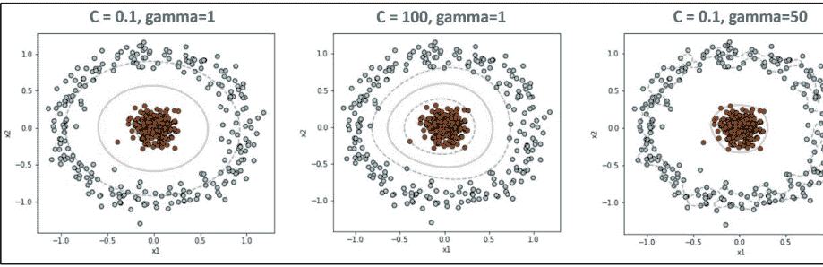

图 7.6：通过核 SVM 进行非线性二分类及超参数的影响。[绘制边界的代码已在线提供]

### 深入理解高斯核

更好地理解核背后的直觉，可以帮助我们理解核超参数对分类边界的影响。核提供了高维空间中任意两点之间相似性的间接度量。再次考虑高斯核

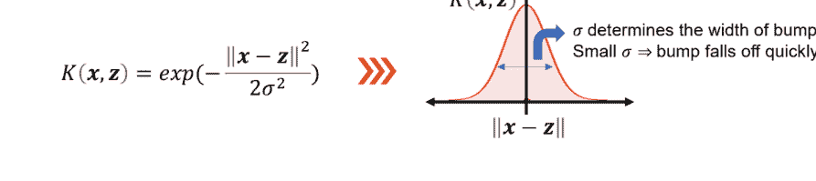

这里，如果两个点 $(x, z)$ 在原始空间中彼此接近，那么它们在映射空间中的相似性（或核值）会比 $x$ 和 $z$ 相距较远时更高。现在，让我们看看样本 $z$ 的分类器预测公式


因此，分类器不过是来自支持向量的高斯凸起之和（加上一个偏移量 $b$）！

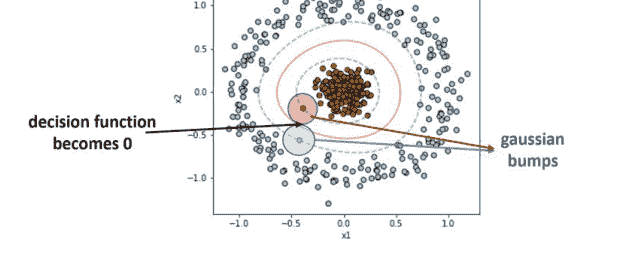

给定带宽（$\sigma$），在训练过程中，SVM 试图找到凸起乘数（$\alpha_s$）的最优值，使得训练样本获得正确的标签，同时保持分类边界与训练样本之间的最大间隔。边界就是凸起和偏移量的净总和为零的点集。较小的 $\sigma$ 值会导致在任何支持向量附近产生非常局部化的凸起，从而导致支持向量数量增多，并且分离边界出现过多“波动”，这通常表明过拟合。

### 7.3 SVDD：简介

支持向量数据描述（SVDD）是 SVM 算法的无监督形式，用于处理训练样本仅属于单一类别的问题，其模型目标是确定任何测试/新样本是否属于同一类数据。考虑图 7.7 中的启发性示例。这里，我们如何获得训练数据的模型，以便能够将样本 X 称为异常值/异常？此类问题在流程工业中相当常见。流程监控和设备健康监控就是一些例子领域，其中大多数/所有可用的流程数据可能仅属于正常工厂运行类别，而建模目标是识别任何异常数据点。

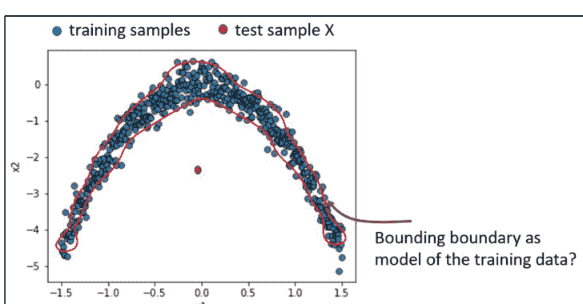

图 7.7：仅包含一个类别的二维训练数据集。红色边界显示了数据集的潜在描述模型，可用于区分测试样本 X 和训练样本。

SVDD 背后的思想是用一个超球体（二维中是圆，三维中是球体）包裹训练数据，该超球体在最小体积内包含最大数量的数据点。任何距离超球体中心超过超球体半径的新观测值都可被视为异常观测。但图 7.7 中的数据看起来并不适合用一个圆来包裹？这是正确的，我们的解决方法是使用核函数将原始数据隐式地投影到一个更高维的空间，在那里数据可以被充分包裹在一个紧凑的超球体中。最优超平面在原始空间上的投影将显示为围绕数据集的紧密非线性边界！

就像经典的二类 SVM 一样，只有一小部分训练样本能够完全定义超球体。这些数据点或支持向量位于超球体的圆周上或外部（或在原始空间中的非线性边界上）。

### 数学背景

再次假设 $\varphi(x)$ 代表高维特征空间中的一个数据点。在这个空间中，最优超球体通过以下优化问题找到

$$\min_{R, a, \xi} \quad R^2 + C \sum_{i=1}^N \xi_i$$
$$\text{s.t.} \quad ||\varphi(x_i) - a||^2 \leq R^2 + \xi_i, \quad i = 1, \cdots N$$
$$\xi_i \geq 0$$

很明显，上述程序试图最小化以 'a' 为中心的超球体的半径（$R$），使得大多数数据点位于超球体内。松弛变量 $\xi$ 允许某些样本落在外部，而此类违规的数量通过超参数 $C$ 进行调整。与之前一样，该问题以其对偶形式求解

$$\min_{\alpha} \quad \sum_{i=1}^N \sum_{j=1}^N \alpha_i \alpha_j K(x_i, x_j) - \sum_{i=1}^N \alpha_i K(x_i, x_i)$$
$$\text{s.t.} \quad \sum_{i=1}^N \alpha_i = 1$$
$$0 \leq \alpha_i \leq C \quad i = 1, \cdots N$$

与 SVM 类似，alpha 表示训练样本相对于最优边界的位置。以下关系成立

-   边界内部：$||\varphi(x_i) - a|| < R \Rightarrow \alpha_i = 0$
-   边界上：$||\varphi(x_i) - a|| = R \Rightarrow 0 < \alpha_i < C$
-   边界外部：$||\varphi(x_t) - a|| > R \Rightarrow \alpha_i = C$

最优解满足以下表达式

$$R = \sqrt{K(x_s, x_s) - 2 \sum_{i \in \{SV\}} \alpha_i K(x_s, x_i) + \sum_{i \in \{SV\}} \sum_{j \in \{SV\}} \alpha_i \alpha_j K(x_i, x_j)}$$

其中 $x_s$ 是位于边界上的任何支持向量。任何测试观测 $x_t$，如果其在映射空间中到中心 $a$ 的距离大于 $R$，则被视为异常，距离计算如下

$$Dist(\varphi(x_t), a)^2 = ||\varphi(x_t) - a||^2$$
$$= K(x_t, x_t) - 2 \sum_{i \in \{SV\}} \alpha_i K(x_t, x_i) + \sum_{i \in \{SV\}} \sum_{j \in \{SV\}} \alpha_i \alpha_j K(x_i, x_j)$$

如你所见，只需要指定核函数和其他模型超参数；不需要了解映射 $\varphi$。

### OC-SVM 与 SVDD

还有另一种与 SVDD 密切相关的技术，称为单类 SVM（OC-SVM）。事实上，OC-SVM 是目前 Sklearn 中可用的无监督 SVM 算法。OC-SVM 寻找一个能将训练数据与原点最佳分离的超平面。其核化的对偶形式为

$$\min_{\alpha} \quad \frac{1}{2} \sum_{i=1}^N \sum_{j=1}^N \alpha_i \alpha_j K(x_i, x_j)$$
$$\text{s.t.} \quad \sum_{i=1}^N \alpha_i = 1$$
$$0 \le \alpha_i \le C \quad i = 1, \cdots N$$

你会注意到，对于高斯核，OC-SVM 的公式变得与 SVDD 等价，因为 $K(x_i, x_i) = 1$，并且我们最终得到相同的乘数值。决策边界也是相同的。对于其他满足 $K(x_i, x_i) \ne 1$ 的核，结果会有所不同。

### 带宽参数与 SVDD 示例

在本小节中，我们将尝试使用 Sklearn 的 OneClassSVM 为图 7.7 中的数据集构建边界。然而，在此之前，我们需要确定 SVDD 模型超参数 $C$ 和 $\sigma$ 的策略。如果有足够的属于“正常”和“异常”两类的验证数据样本，则可以使用交叉验证来选择能给出最佳验证准确率的 $C$ 和 $\sigma$。然而，这通常是不可能的，并且与训练数据集一样，验证数据集也只包含“正常”类样本！为了能够有根据地选择超参数，让我们再看看它们。

之前我们看到，$C$ 控制着超球体体积与训练数据集中误分类数量之间的权衡。$C$ 也可以写成$$C = \frac{1}{Nf}$$

其中，$N$ 是样本数量，$f$ 是训练数据集中预期的异常值比例。$f$ 值越小（对应 $C$ 值越大），将导致更少的样本被置于超球体之外。实际上，如果 $C$ 设置为 1（或更大），超球体将包含所有样本（因为 $\sum \alpha_i = 1$，且超球体外的 $\alpha = C$）。因此，可以根据对异常值比例的合理预估来设置 $C$。在缺乏任何先验知识的情况下，通常指定 $f = 0.01$，以排除距离超球体中心最远的 1% 样本。

关于 $\sigma$，我们之前看到，当 $\sigma$ 值较低时，数据边界会变得非常曲折，支持向量数量很多，导致过拟合。相反，当 $\sigma$ 值较高时，边界在原始空间中倾向于变成球形，导致欠拟合（或数据的非紧凑包围）。带宽选择的一种方法是使用经验方法，这些方法基于获取具有有利性质的核矩阵（其第 $i,j$ 个元素是 $K(x_i, x_j)$）。其中一种方法，修正均值准则$^{35}$，给出的带宽如下

$$\sigma = \sqrt{\frac{\bar{D}^2}{\ln\left(\frac{N-1}{\delta^2}\right)}}$$

$$\bar{D}^2 = \frac{\sum_{i<j} ||x_i - x_j||^2}{\frac{N(N-1)}{2}}$$

$$\delta = -0.14818008\phi^4 + 0.2846623624\phi^3 - 0.252853808\phi^2 + 0.159059498\phi - 0.001381145$$

$$\phi = \frac{1}{\ln(N-1)}$$

带宽选择的另一种方法是选择能给出验证数据集上所需置信水平的最大 $\sigma$ 值。例如，对于 99% 的置信水平，增加 $\sigma$ 直到 99% 的验证样本被正确分类为内点。任何更高的 $\sigma$ 值都会将更多验证样本包含在超球体内部。修正均值准则可以用作初始猜测，然后在其周围进行搜索。现在让我们为图 7.7 中的数据集找到非线性边界。

```python
# read data
import numpy as np
X = np.loadtxt('SVDD_toyDataset.csv', delimiter=',')
```

$^{35}$ Kalde & Sadek, The mean and median criterion for kernel bandwidth selection for support vector data description, IEEE 2017

```python
# compute bandwidth via modified mean criteria
import scipy

N = X.shape[0]
phi = 1/np.log(N-1)
delta = -0.14818008*np.power(phi,4) + 0.2846623624*np.power(phi,3) - 0.252853808*np.power(phi,2) + 0.159059498*phi - 0.001381145
D2 = np.sum(scipy.spatial.distance.pdist(X, 'sqeuclidean'))/(N*(N-1)/2)
sigma = np.sqrt(D2/np.log((N-1)/delta*delta))
gamma = 1/(2*sigma*sigma)

# SVM fit
from sklearn.svm import OneClassSVM
model = OneClassSVM(nu=0.01, gamma=gamma).fit(X) # nu corresponds to f
```

图 7.8 显示了在 $f$（或 Sklearn 中的 nu）保持为 0.01 的情况下，不同 gamma 值对应的包围边界。一个接近修正均值准则方法给出的值（= 0.58）的 gamma 值（= 1）提供了令人满意的边界。

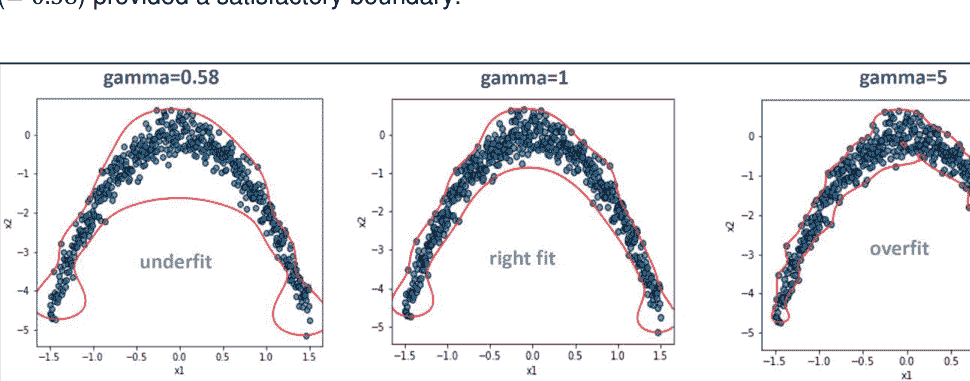

我们希望到现在您已经确信 SVM 在区分不同类别数据和紧凑包围正常运行数据方面的强大能力。成功应用 SVM 的一个主要要求是训练数据集应非常具有“正常”数据集的代表性，并充分表征所有预期的变化。接下来，我们将看一个使用真实过程数据的案例研究，然后转向用于回归应用的另一种 SVM 变体。

### PCA 与 SVDD 在过程监控中的比较

在前面的章节中，我们研究了基于降维的方法（PCA、ICA）用于过程监控。我们现在已将 SVDD 添加到我们的工具箱中。虽然很难事先说哪种方法在给定场景下效果最好，但确实存在一些粗略的指导原则。如果数据集中的变量是线性（或仅轻微非线性）相关的，并且测量值有噪声，PCA/ICA 将效果最佳。然而，PCA 假设数据呈单峰分布。SVDD 对底层数据分布不做任何假设，非常适合高度非线性的数据集。然而，与 PCA/ICA 模型相比，SVM/SVDD 模型中不同过程变量之间的关系难以解释。

### 7.4 通过 SVDD 进行过程故障检测

为了说明 SVDD 在过程监控中的实际应用，我们将使用来自半导体制造过程的数据。这个批次过程数据集包含 19 个过程变量，在 108 个正常批次和 21 个故障批次的过程中进行测量。批次持续时间从 95 到 112 秒不等（更多详情请参见附录）。图 7.9 显示了主成分空间中的训练样本和故障测试样本。

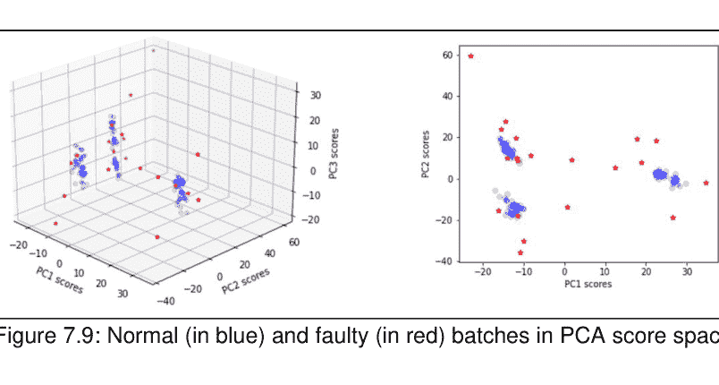

对于此示例，原始数据已使用多向 PCA 进行处理，转换后的二维（得分）数据在 *Metal_etch_2DPCA_trainingData.csv* 文件中提供。请注意，我们也可以在原始输入空间中实现 SVDD，但通过 PCA 进行预处理以消除变量相关性通常是一个好习惯。此外，我们使用二维 PC 空间进行分析只是为了便于说明 SVDD 边界。在实际部署中，您将在更高维度的 PC 空间中工作以获得更好的准确性。让我们看看我们的模型是否能在多聚类数据集中将故障样本识别为异常值。

```python
# read data
import numpy as np
X_train = np.loadtxt('Metal_etch_2DPCA_trainingData.csv', delimiter=',')

# fit SVM
from sklearn.svm import OneClassSVM
model = OneClassSVM(nu=0.01, gamma=0.025).fit(X_train) # gamma from modified mean criterion = 0.0025

# predict for test data
X_test = np.loadtxt('Metal_etch_2DPCA_testData.csv', delimiter=',')
y_test = model.predict(X_test) # y=-1 for outliers

print('Number of faults identified: ', np.sum(y_test == -1), ' out of ', len(y_test))

>>> Number of faults identified: 17 out of 20
```

图 7.10 显示了训练样本周围的边界以及根据正确或错误识别标记的故障样本。二十个故障数据样本中有十七个被正确识别为异常值。此示例说明了 SVDD 在紧凑描述聚类数据集方面的强大功能。

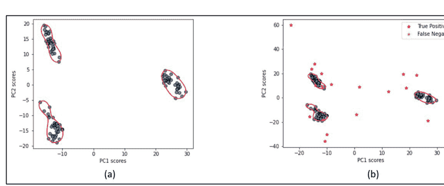

如果我们使用到超球体中心的距离进行故障检测，我们应该得到相同的结果。如果未使用 RBF 作为核函数，SVDD 和 OC-SVM 的结果将会不同。不幸的是，Sklearn 目前不提供 SVDD 实现。尽管如此，GitHub 上有一个可用的 SVDD 包<sup>36</sup>。

### 7.5 SVR：简介

支持向量回归（SVR）是用于线性和非线性回归的另一种 SVM 变体。SVR 试图找到一条尽可能接近训练观测值的回归曲线。从几何上看，如图 7.11 所示的核化 SVR，一个预设宽度（ε）的管道被拟合到数据上，任何位于管道外的样本都会受到惩罚。您稍后会看到，SVR 的优化程序旨在获得模型泛化能力与拟合训练数据能力之间的良好平衡。

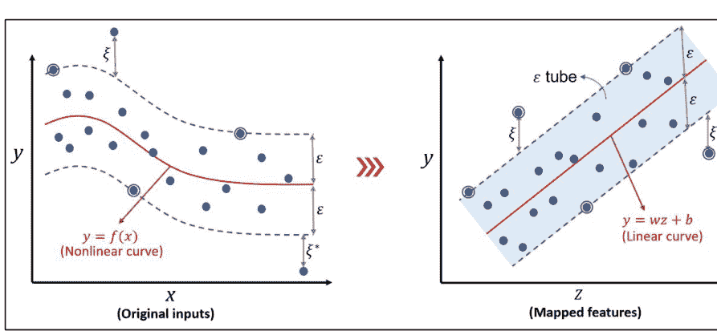

SVR 生成一个线性超平面，该超平面最好地描述了输出作为输入的函数。对于核化 SVR，超平面在原始测量空间中转化为适当的非线性曲线。如图 7.11 所示，在特征空间中，大多数数据点位于距离最优超平面 ε 距离内。松弛变量 ξ 允许一些样本落在 ε 管道之外；然而，这种违规会受到惩罚。位于管道边缘或外部的样本是支持向量，它们完全决定了给定 ε 的最优解。添加或移除任何非支持向量（或管道内的样本）不会影响解。

已发现 SVR 在中小型高维数据集上提供优于人工神经网络（ANN）的性能。我们将在本章后面看到几个应用。

### 数学背景

SVR 用于参数估计的优化程序在特征空间中采用以下形式

### 7.5 支持向量回归（SVR）

$$\begin{aligned}
\min_{w,b,\xi,\xi^*} \quad & \frac{1}{2}||w||^2 + C \sum_{i=1}^N (\xi_i + \xi_i^*) \\
\text{s.t.} \quad & y_i - w^T\varphi(x_i) - b \le \varepsilon + \xi_i \\
& w^T\varphi(x_i) + b - y_i \le \varepsilon + \xi_i^* \\
& \xi_i, \xi_i^* \ge 0, \quad i = 1, \cdots N
\end{aligned}$$

目标函数的第一部分（$\frac{1}{2}||w||^2$）旨在使模型尽可能简单，或使模型输出尽可能平坦。例如，对于 $y=w^Tx+b$，当 w=0 时，得到最简单的模型 y=b，其对输入的依赖性最小。第二部分则试图使位于 $\varepsilon$ 管道之外的样本数量尽可能少。超参数 $C$ 控制着两者之间的权衡。

> 在 SVR 的公式中，对于位于 $\varepsilon$ 管道内的样本，没有与之相关的误差。在 SVM 文献中，这被称为实现了 $\varepsilon$-不敏感损失函数，如下所示。


将其与普通最小二乘回归进行比较，后者对每个样本与回归曲线的误差都进行惩罚。

其对偶形式为

$$\begin{aligned}
\max_{\alpha,\alpha^*} \quad & \frac{1}{2} \sum_{i=1}^N \sum_{j=1}^N (\alpha_i - \alpha_i^*)(\alpha_j - \alpha_j^*)K(x_i, x_j) - \\
& \varepsilon \sum_{i=1}^N (\alpha_i + \alpha_i^*) + \sum_{i=1}^N y_i(\alpha_i - \alpha_i^*) \\
\text{s.t.} \quad & \sum_{i=1}^N (\alpha_i - \alpha_i^*) = 0 \\
& 0 \le \alpha_i, \alpha_i^* \le C \quad i = 1, \cdots N
\end{aligned}$$

如果你仔细观察，这里我们为每个数据点分配了两个乘子（$\alpha, \alpha^*$）。对于非支持向量（位于 $\varepsilon$ 管道内的训练样本），这两个乘子最终都为 0。一旦找到乘子，就可以通过以下公式进行预测：

$$\hat{y}_t = \sum_{i \in \{SV\}} (\alpha_i - \alpha_i^*)K(x_i, x_t) + b$$

核函数和超参数的指定使我们能够拟合模型（找到乘子）并进行预测。图 7.12 展示了对于一个 SISO 系统，使用 RBF 核时 SVR 超参数（C, $\gamma$, $\epsilon$）的影响。

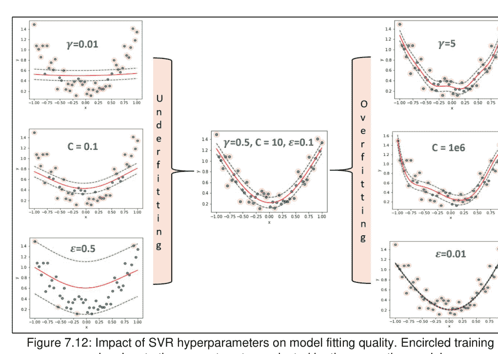

图 7.12 关于 gamma 和 C 的影响符合预期。让我们来理解 $\epsilon$ 的影响。较大的 $\epsilon$ 会使 $\varepsilon$ 管道变大，从而让 SVR 保持模型“平坦”，导致欠拟合。另一方面，非常小的 $\epsilon$ 会使管道非常小，这会导致支持向量数量增多，使得拟合容易过拟合。尽管如此，指定较小的 $\epsilon$ 并通过 C 来控制过拟合的情况并不少见。要查看使用 Sklearn 的 SVR 实现，我们将在接下来的章节中探讨几个工业应用。

### SVR 与 ANN

由于 SVR 强大的非线性建模能力，将其与人工神经网络（ANN）进行比较是很自然的。SVR 模型预测的方程可以用网络形式表示，如下图所示。这种表示方式使得两种回归方法之间的相似性显而易见。然而，与 ANN 不同的是，SVR 中的隐藏单元是自动确定的，无需显式指定网络结构。这使得 SVR 更容易训练，因为超参数更少。

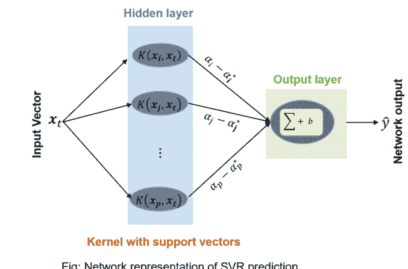

[我们将在第 11 章详细学习 ANN。如果你不熟悉它们，可以稍后重新阅读本节。但我们认为，如果你已经了解，这个比较可能会为 SVR 算法提供更多见解。]

在 ANN 中，拟合模型参数的数量（因此过拟合的倾向）随着输入向量维度的增加而增加。但在 SVR 中，参数数量取决于支持向量的数量，而不是输入维度。如果支持向量的数量不变，在 SVR 模型中添加更多输入变量并不会增加模型复杂度。这极大地帮助 SVR 克服了由高输入维度引起的过拟合问题。此外，通过支持向量，SVR 模型提供了关于定义回归预测的重要训练数据点的显式知识；这通常有助于合理化模型预测。总的来说，SVR 在非线性建模方面与 ANN 一样强大，并具有一些独特的优势特性。

### 7.6 聚合物加工厂中基于 SVR 的软测量

在我们的第一个示例中，我们将应用 SVR 进行软测量，以预测聚合物工厂的工厂输出。从杜邦公司获得的数据集包含 61 个样本，每个样本有 14 个变量（10 个预测变量，4 个工厂输出）。我们选择这个数据集是为了说明 SVR 对小型数据集的效用。图 7.13 快速展示了一些过程输入和一个过程输出的分布情况。数据分布的稀疏性立即显而易见。

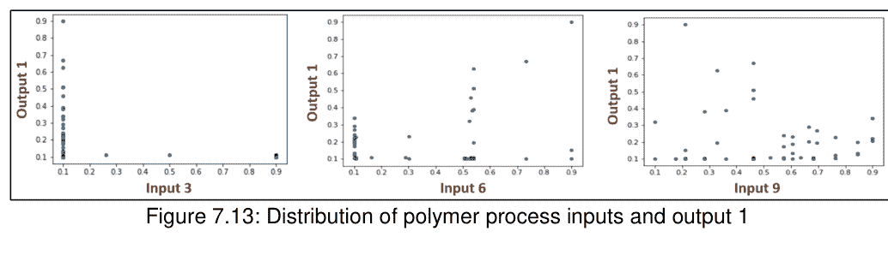

稀疏数据建模在机器学习中是一项艰巨的任务。尽管如此，让我们看看我们的 SVR 模型能多好地应对这一挑战。下面的代码生成一个基于 SVR 的软传感器模型，一次预测一个过程输出。超参数通过网格搜索和 k 折交叉验证确定。

```python
# read data
import numpy as np
data = np.loadtxt('polymer.dat')

X, Y = data[:, 0:10], data[:, 10:]
y = Y[:, 0] # modeling the 1st output

# fit SVR model using grid-search
from sklearn.svm import SVR
from sklearn.model_selection import GridSearchCV

model = SVR(epsilon=0.01) # default epsilon = 0.1
param_grid = [{'gamma': np.linspace(0.1e-05,5,100), 'C': np.linspace(0.01,5000,100)}]
gs = GridSearchCV(model, param_grid, scoring='neg_mean_squared_error', cv=10)
gs.fit(X, y)
print('Optimal hyperparameter:', gs.best_params_)

>>> Optimal hyperparameter: {'C': 50.51, 'gamma': 0.1}

# predict using the best model
y_predicted_SVR = gs.predict(X)

# plots of raw and predicted data
import matplotlib.pyplot as plt

plt.figure()
plt.plot(y, y_predicted_SVR, '.', markeredgecolor='k', markeredgewidth=0.5, ms=9)
plt.plot(y, y, '-r', linewidth=0.5)
plt.xlabel('measured data'), plt.ylabel('predicted data ')
```

请注意，原始数据集中的所有变量已经缩放到 0.1 和 0.9 之间，因此在模型拟合前无需进一步缩放。下图显示了模型预测结果。为了比较，提供了 PLS 模型的预测结果。前两个输出对于线性 PLS 模型来说难以处理，但 SVR 模型能够提供良好的拟合。输出 3 和 4 似乎与输入具有更强的线性关系，PLS 和 SVR 模型都提供了相似的拟合效果。

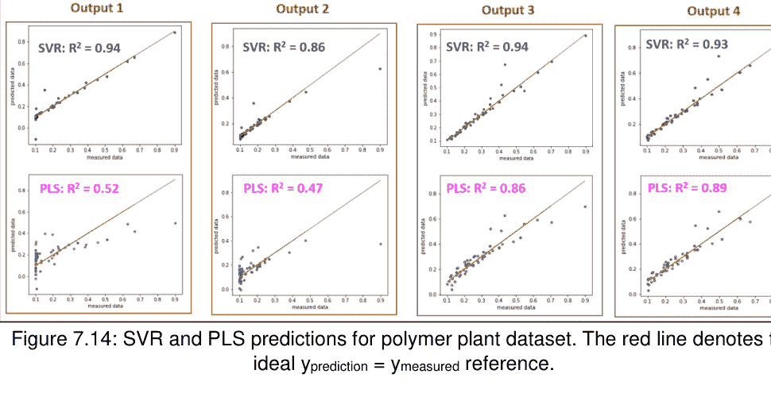

### 7.7 石油炼厂脱丁烷塔中基于 SVR 的软测量

在这个示例中，我们将使用一个中等规模的数据集，该数据集来自石油炼厂脱丁烷塔的操作（系统详情见附录）。脱丁烷塔汽油底部产品中的丁烷（C4）含量无法实时获得，因此需要使用塔周围的其他过程数据进行预测。该数据集包含 2394 个输入-输出过程值样本。七个过程变量（塔周围的压力、温度、流量）被用作预测变量。图 7.15 显示该数据集具有良好的过程变异性。请注意，数据以归一化形式提供。

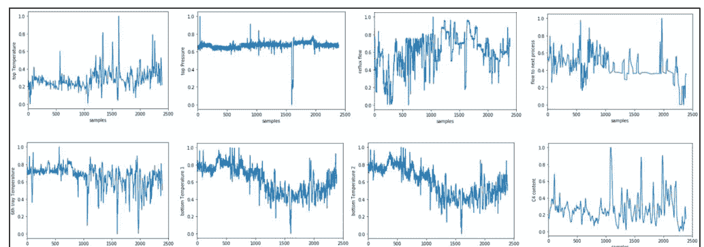

输出变量表现出强烈的非线性，因此 PLS 模型如图 7.16 所示完全失败。让我们构建一个基于 SVR 的软传感器。

```python
# read data
import numpy as np
data = np.loadtxt('debutanizer_data.txt', skiprows=5)

# separate train and test data
from sklearn.model_selection import train_test_split
X, y = data[:,0:-1], data[:,-1]
X_train, X_test, y_train, y_test = train_test_split(X, y, test_size = 0.33, random_state = 100)

# fit SVR model via grid-search
from sklearn.svm import SVR
```

from sklearn.model_selection import GridSearchCV

model = SVR(epsilon=0.05)
param_grid = [{'gamma': np.linspace(1,10,10), 'C': np.linspace(0.01,500,10)}]
gs = GridSearchCV(model, param_grid, scoring='neg_mean_squared_error', cv=10)

gs.fit(X_train, y_train)

如图7.16所示，通过一个非常粗糙的超参数网格，我们能够获得一个在测试数据上提供合理精度的SVR模型。训练精度和测试精度之间的差异表明存在一些过拟合，这可以通过更详尽的超参数搜索来克服。

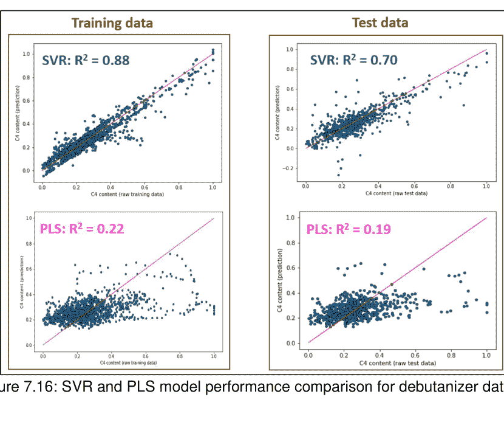

至此，我们对支持向量机的探讨告一段落。SVM独树一帜，非常适合用于过程参数难以估计的工业流程。凭借其优雅的数学背景、仅需少量超参数、出色的泛化能力以及保证的唯一全局最优解，SVM是最佳的机器学习算法之一。

### 总结

在本章中，我们学习了支持向量机算法及其用于监督和无监督分类与回归的各种形式。我们看到了它在二元分类、过程监控、故障检测和软测量中的应用。通过核化学习，我们掌握了非线性建模的艺术。总之，我们为你的数据科学工具箱增添了一个强大的工具。接下来，我们将继续构建工具箱，学习如何在过程数据集中发现簇/组。

## 第8章

### 在过程数据中发现分组：聚类与混合模型建模

在探索数据集时，你应该始终做的一件事是检查数据是否显示出存在不同簇的迹象。大多数工业数据集由于生产水平、原料组成、环境温度、产品等级等的变化，表现出多种操作模式，来自不同模式的数据点倾向于聚集成不同的簇。无论你是在构建软传感器还是监控工具，明智地将这些数据簇的知识纳入过程模型将带来更好的性能，反之，未能这样做通常会导致不令人满意的结果。

在缺乏特定过程知识或变量数量很大时，确定簇的数量或表征簇并非易事。幸运的是，有多种方法可供选择，你可以根据具体解决方案进行挑选。

在本章中，我们将学习一些流行的聚类算法，并理解它们的优缺点。最后，我们将为一个多模式半导体过程构建一个监控工具。具体涵盖以下主题：

- 聚类简介
- 使用经典k-means聚类发现分组
- 使用DBSCAN对任意形状的簇进行分组
- 通过高斯混合模型进行概率聚类
- 多模式过程的过程监控

### 8.1 聚类：简介

聚类是一种无监督任务，它将数据分组到不同的簇中，使得簇内的数据点彼此之间比与其他簇的数据点更相似。在过程系统中，聚类由于多种原因自然发生。例如，在发电厂中，生产水平根据需求而变化，导致工厂变量在不同生产水平下具有显著不同的值，并且变量间相关性也可能不同。数据分布的多模式特性给传统机器学习技术带来了问题。为了理解这一点，请考虑图8.1中的插图。在子图(a)中，数据表明存在2种不同的操作模式。从过程监控的角度来看，围绕两个簇分别绘制监控边界是合理的；这样做可以清楚地将红色数据点识别为异常值或故障。另一方面，传统的基于PCA的监控将无法识别该异常值。在子图(b)中，两个簇中变量之间的相关性不同。从软测量的角度来看，为两个簇分别建立模型是合理的。传统的PLS模型将给出不准确的结果。

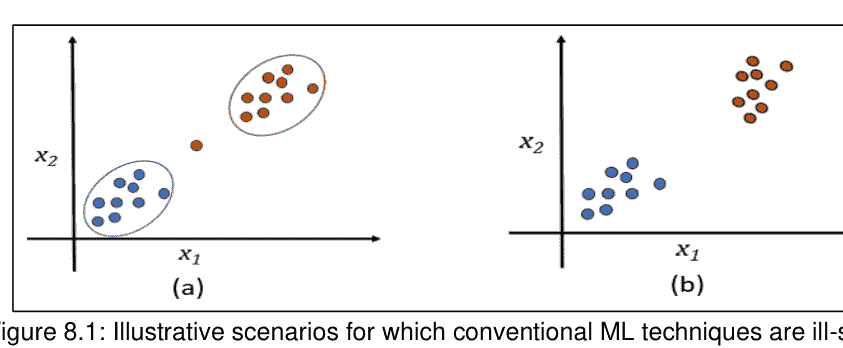

一旦在训练数据中表征了簇并建立了簇级模型，对新样本的预测可以通过仅考虑最适合新样本的簇模型，或如图8.2所示结合所有模型的预测来获得。决策融合模块也可以采取多种形式。例如，对于过程监控应用，一个简单的融合策略可以是：如果至少有一个簇模型预测新样本为正常样本，则将其视为正常样本。另一种策略可以是结合所有模型的异常度量，并基于此融合度量进行预测。类似地，对于软测量应用，可以对来自各个模型的响应变量预测进行加权和组合，以提供最终预测。

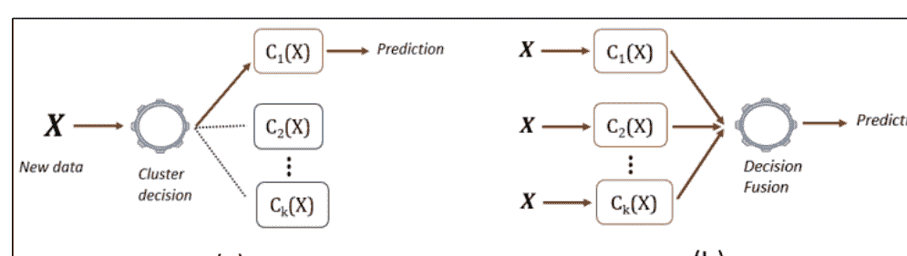

存在不同的聚类算法，它们主要区别在于定义数据点之间“相似性”的方式。流行的算法可分为以下四类：

- *基于质心的算法*：在这些算法中，数据点之间的相似性通过数据点到簇质心的距离来量化。K-Means、模糊C-Means模型属于此类。
- *基于分布的算法*：在这里，数据点之间的相似性通过计算数据点属于同一底层分布的概率来量化。高斯混合模型（GMMs）在此类别中很流行。
- *基于密度的算法*：密度模型在多变量空间中找到数据密度高的区域，并将数据点分配到不同的簇/区域。DBSCAN和OPTICS是密度模型的流行示例。
- *基于连通性的算法*：在这些模型中，相似性通过直接测量数据点之间的距离来量化。层次聚类模型属于此类。

> 有如此多的聚类算法可供选择，很容易对正确的模型感到困惑，尤其是在处理难以可视化的高维数据集时。在这种情况下，特定的领域知识、对算法优势、劣势和基础的透彻理解可以帮助你做出正确的选择。

### 多模式半导体制造操作

在本章中，我们将使用来自半导体制造过程的数据集。该数据集来自一个蚀刻过程的多个批次，包含19个过程变量，这些变量在108个正常批次和21个故障批次的过程中被测量。批次持续时间从95到112秒不等。在本章的其余部分，我们将研究该数据集是否表现出多模式操作，并设计一种监控策略来自动检测故障批次。数据以MATLAB结构数组格式提供，因此我们将使用一个库在Python环境中获取数据。

```python
# import required packages
import numpy as np
import matplotlib.pyplot as plt
from sklearn.cluster import KMeans

# fetch data
import scipy.io

matlab_data = scipy.io.loadmat('MACHINE_Data.mat', struct_as_record = False)
Etch_data = matlab_data['LAMDATA']
calibration_dataAll = Etch_data[0,0].calibration # calibration_dataAll[i,0] corresponds to a 2D data from i^th batch where columns correspond to different variables

variable_names = Etch_data[0,0].variables

# plot data of a variable for all calibration experiments
plt.figure()
_ = [plt.plot(calibration_dataAll[expt,0][:,6]) for expt in range(calibration_dataAll.size)]
plt.xlabel('Time (s)')
plt.ylabel(variable_names[6])
```

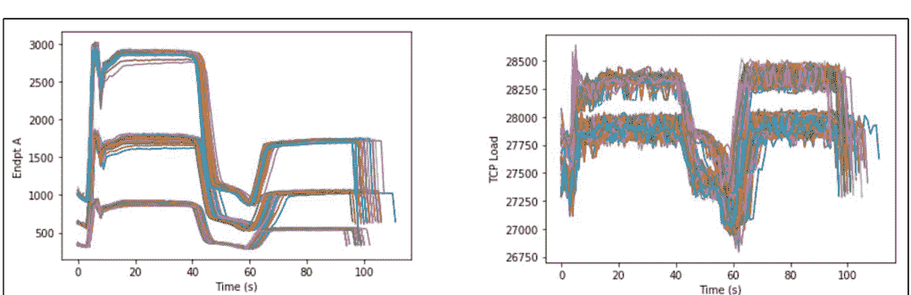

图8.3确实显示了均值和协方差变化的多模态操作。然而，直接通过检查高维数据集来估计操作模式的数量是困难的。一种常见的做法是通过PCA降低过程维度，然后应用聚类以促进可视化。执行PCA还有其他目的。我们稍后将看到，期望最大化（EM）算法被用于估计K-Means和GMM模型中的聚类参数。高维度意味着需要估计的参数数量多，这增加了EM收敛到局部最优结果的可能性，并且相关变量会导致EM收敛问题。PCA有助于同时克服这两个问题。

我们将为此批次过程数据集采用多向PCA。我们将遵循He等人<sup>37</sup>的方法，其中每个批次保留85个样本点以处理批次长度的可变性，忽略前5个样本以消除传感器测量的初始波动，并保留3个主成分。

```python
# generate unfolded data matrix
n_vars = variable_names.size - 2 # first 2 columns are not process variables
n_samples = 85

unfolded_dataMatrix = np.empty((1, n_vars*n_samples)) # just a placeholder
for expt in range(calibration_dataAll.size):
    calibration_expt = calibration_dataAll[expt,0][5:90,2:]

    if calibration_expt.shape[0] < 85:
        continue

    unfolded_row = np.ravel(calibration_expt, order='F')[np.newaxis,:] # a row for each batch data
    unfolded_dataMatrix = np.vstack((unfolded_dataMatrix, unfolded_row)) # see Figure 2.10

unfolded_dataMatrix = unfolded_dataMatrix[1:,:] # remove the empty placeholder

# scale data
from sklearn.preprocessing import StandardScaler
scaler = StandardScaler()
data_train_normal = scaler.fit_transform(unfolded_dataMatrix)

### PCA
from sklearn.decomposition import PCA
pca = PCA(n_components = 3)
score_train = pca.fit_transform(data_train_normal)
```

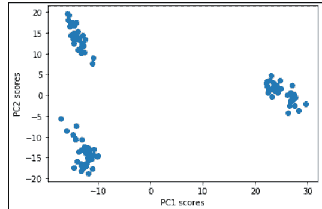

图8.4：金属蚀刻数据集中校准批次的PC1和PC2得分图

图8.4证实了存在3种操作模式。虽然对得分图的目视检查可以帮助决定聚类数量，但我们仍将学习如何以更自动化的方式估计这一点。

### 8.2 基于质心的聚类：K-Means

K-Means是最受欢迎的聚类算法之一，因其概念简单、易于实现和计算效率高。设$K$表示聚类数量，$\{x_i\}, i = 1, \dots, N$为N个m维点的集合。数据点的聚类分配被确定为使以下误差平方和（也称为聚类惯性）最小化

$$SSE = \sum_{k=1}^{K} \sum_{x_i \in k^{th}cluster} ||x_i - \mu_k||_2^2$$

这里，$\mu_k$是第$k^{th}$个聚类的质心，$||x_i - \mu_k||_2^2$表示$x_i$到$\mu_k$的欧几里得距离。为了解决方程1，k-means采用以下直观的迭代过程。

- 随机选择K个数据点作为初始质心或聚类中心
- 将每个数据点分配给最近的聚类中心
- 使用数据点的当前聚类分配重新计算每个聚类的质心
- 重复步骤2和3直到收敛

让我们将k-means应用于我们的金属蚀刻数据集。

```python
# fit k-means model
n_cluster = 3
kmeans = KMeans(n_clusters = n_cluster, random_state = 100).fit(score_train)
cluster_label = kmeans.predict(score_train) # can also use kmeans.labels_

plt.figure()
plt.scatter(score_train[:, 0], score_train[:, 1], c = cluster_label, s = 20, cmap = 'viridis')

cluster_centers = kmeans.cluster_centers_
cluster_plot_labels = ['Cluster ' + str(i+1) for i in range(n_cluster)]
for i in range(n_cluster):
    plt.scatter(cluster_centers[i,0], cluster_centers[i,1], c = 'red', s = 40, marker = '*', alpha = 0.9)
    plt.annotate(cluster_plot_labels[i], (cluster_centers[i,0], cluster_centers[i,1]))
```

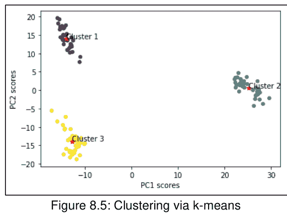

图8.5：通过k-means进行聚类

如预期，图8.5显示k-means在聚类分配方面做得很好。K-means聚类结果强烈依赖于聚类中心的初始选择；不好的选择可能导致不恰当的聚类。为了克服这一点，k-means算法允许一个参数n_init（默认值为10），它决定了使用不同初始质心分配执行独立k-means聚类的次数；选择具有最低SSE的聚类作为最终模型。初始质心的选择策略也可以通过init参数更改；默认的*k-means++*选项采用一种更智能（与*random*选项相比）的方式来加速收敛，通过确保初始质心彼此远离。

### 通过肘部法则确定聚类数量

k-means方法的一个缺点是需要指定聚类数量，而对于大型过程数据集，聚类数量是先验未知的。然而，我们可以使用肘部法则来克服这个问题。对于k-means，该方法涉及计算不同聚类数量（$K$）的聚类惯性或SSE。可以预期，当$K$增加时，SSE减少，因为数据点更接近其分配的质心。当增加$K$时，SSE仅出现微小改进的$K$值可以被视为最优值。图8.6显示$K = 3$是金属蚀刻数据集的一个好选择。

```python
# determining number of clusters via elbow method
SSEs = []
for n_cluster in range(1, 10):
    kmeans = KMeans(n_clusters = n_cluster, random_state = 100).fit(score_train)
    SSEs.append(kmeans.inertia_)

plt.figure()
plt.plot(range(1,10), SSEs, marker='o')
plt.xlabel('Number of clusters')
plt.ylabel('SSEs')
```

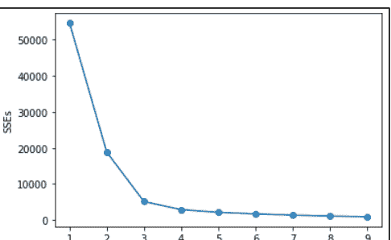

> 确定聚类或局部模型的数量不应掉以轻心。我们在图8.1中看到，少于最优数量的聚类会导致低软测量精度和高频率的漏报。另一方面，使用过多的聚类会增加估计参数的数量，从而增加收敛时间。过多的聚类也会导致过拟合，导致高频率的误报和低软测量精度。

### 用于量化聚类质量的轮廓分析

对于高维数据，可能并不总是能够将大部分数据变异性投影到2或3个主成分上，因此难以使用2D或3D图判断聚类的好坏或可视化聚类。在这些情况下，可以使用轮廓图来可视化和量化聚类质量。请注意，轮廓分析并非特定于k-means，可以应用于研究任何聚类结果。

数据点的轮廓系数或值范围从-1到1，衡量该数据点与相邻聚类中的数据点相比，与同一聚类中的数据点的距离。值为1表示该数据点远离相邻聚类，接近0的值表示该数据点接近两个聚类之间的边界。负值表示错误的聚类分配。

图8.7显示了图8.5中所示聚类的轮廓图。每个彩色条带是通过堆叠该聚类中所有数据点的轮廓系数形成的，因此条带的厚度表示聚类的大小。整体轮廓分数就是所有数据点轮廓系数的平均值。如预期，平均分数很高，聚类2显示出最高的系数，因为它远离其他两个聚类。

```python
# average silhouette score
from sklearn.metrics import silhouette_samples, silhouette_score

silhouette_avgValue = silhouette_score(score_train, cluster_label)
print('Average silhouette score is :', silhouette_avgValue)

>>> Average silhouette score is : 0.7444602567351603

# silhouette plot
from matplotlib import cm

plt.figure()
silhouette_values = silhouette_samples(score_train, cluster_label)
y_lower, y_upper = 0, 0
yticks = []
for i in range(n_cluster):
    cluster_silhouette_vals = silhouette_values[cluster_label == i]
    cluster_silhouette_vals.sort()

    y_upper += len(cluster_silhouette_vals)
    color = cm.nipy_spectral(i / n_cluster)
    plt.barh(range(y_lower, y_upper),cluster_silhouette_vals,height=1.0,edgecolor='none',color=color)
```

### 优缺点

如前所述，k-means算法的优点在于易于应用且概念简单。然而，该算法的一个严重缺点是无法处理复杂的几何形状，如图8.9所示。我们将要学习的下一组算法能够处理这种任意形状的簇。

```python
# generate ellipsoidal shaped data
from sklearn.datasets import make_blobs

n_samples = 1500
X, y = make_blobs(n_samples=n_samples, random_state=100)

rotation_matrix = [[0.60, -0.70], [-0.5, 0.7]]
X_transformed = np.dot(X, rotation_matrix) # elongated blobs

plt.figure()
plt.scatter(X_transformed[:, 0], X_transformed[:, 1])

# fit k-means model
n_cluster = 3
kmeans = KMeans(n_clusters=n_cluster, random_state=100).fit(X_transformed)
cluster_label = kmeans.predict(X_transformed)
```

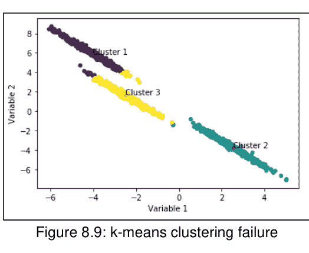

### 8.3 基于密度的聚类：DBSCAN

DBSCAN是一种基于密度的算法，可以轻松处理不规则形状的数据分布，如图8.10所示（不要被那些断开的深棕色数据点吓到！我们稍后会回到这些点）。DBSCAN通过将形成高密度区域的数据点分组在一起工作。具体来说，每个数据点被分类为以下三类之一：

- 如果在指定距离（$\varepsilon$）内有超过指定数量（*minPts*）的数据点，则为**核心**点
- 如果在其$\varepsilon$邻域内少于*minPts*个数据点，但该数据点本身位于另一个核心点的$\varepsilon$邻域内，则为**边界**点
- 如果未被分类为核心点或边界点，则为**噪声**点

在分类为核心点、边界点和噪声点之后，簇由相连的核心点和边界点集合定义。噪声数据点不被分配到任何簇。我们在图8.10中看到的断开的深棕色数据点就是噪声点。处理任意形状数据的能力、对噪声和异常值的鲁棒性使得DBSCAN非常适合聚类过程数据。

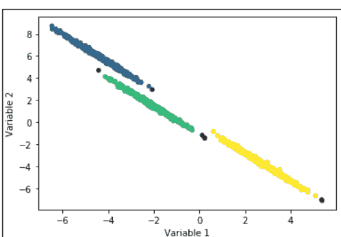

图8.10：DBSCAN成功处理椭圆形数据分布

DBSCAN算法的一个主要缺点是需要为两个超参数*minPts*和$\varepsilon$指定合理的值，以确保最佳聚类。如果设置不当，我们可能最终得到一个巨大的簇或成千上万个小簇。让我们在金属蚀刻数据上研究这个方面。图8.11显示了超参数设置正确（*minPts* = 3，$\varepsilon* = 5）和设置不正确（*minPts* = 5，$\varepsilon* = 3）时的聚类结果；不正确的设置导致了几个噪声数据点和两个额外的簇。试错法或领域特定知识可以帮助决定超参数值。

```python
# fit DBSCAN model to metal-etch data
from sklearn.cluster import DBSCAN

db = DBSCAN(eps=5, min_samples=3).fit(score_train)
cluster_label = db.labels_

plt.figure()
plt.scatter(score_train[:, 0], score_train[:, 1], c=cluster_label, s=20, cmap='viridis')
plt.xlabel('PC1 scores')
plt.ylabel('PC2 scores')

print('Cluster labels: ', np.unique(cluster_label))
```

>>> Cluster labels: [-1 0 1 2 3 4] # noise points are given the label of -1

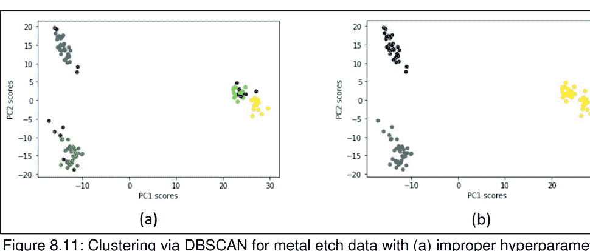

图8.11：金属蚀刻数据通过DBSCAN聚类，使用(a)不正确的超参数和(b)正确的超参数

### 优缺点

除了已经提到的优点外，DBSCAN的一个主要优点是不需要事先指定簇的数量。算法会自动确定合适的簇数。k-means和DBSCAN的一个共同缺点是数据点是“硬聚类”的（每个数据点被精确分配到一个簇）。例如，考虑图8.10中被归类为噪声点的数据点。尽管这些点远离簇中心，但它们可能仍然对应于代表低可能性实例的正常操作条件。丢弃这些噪声点可能导致关键信息的丢失，并可能导致监控阈值设置不当。此外，在某些情况下，如果一个数据点与不同簇的距离相等，硬聚类可能并不明显。软聚类算法可以用来解决这些问题，因为这些算法提供了数据点与不同簇的某种关联度量。我们将在下一节研究一种流行的算法——高斯混合模型。

### 8.4 概率聚类：高斯混合模型

在研究PCA和PLS方法时，我们对潜在变量的高斯分布做了假设，以确定控制限。然而，正如在金属蚀刻数据中看到的，对于具有多种操作模式的过程，这个假设不成立。尽管如此，通过局部高斯分布来表征每个单独操作模式/簇的数据可能仍然是合适的。这是高斯混合模型背后的基本概念，如图8.12所示，它对于非超球形数据分布非常有效。

```python
# fit GMM model to ellipsoidal data
from sklearn.mixture import GaussianMixture

gmm = GaussianMixture(n_components=3, random_state=100)
cluster_label = gmm.fit_predict(X_transformed)

plt.figure()
plt.scatter(X_transformed[:, 0], X_transformed[:, 1], c=cluster_label, s=20, cmap='viridis')

cluster_centers = gmm.means_ # cluster centers
cluster_plot_labels = ['Cluster ' + str(i+1) for i in range(gmm.n_components)]
for i in range(gmm.n_components):
    plt.scatter(cluster_centers[i, 0], cluster_centers[i, 1], c='red', s=20, marker='*', alpha=0.5)
    plt.annotate(cluster_plot_labels[i], (cluster_centers[i, 0], cluster_centers[i, 1]))
```

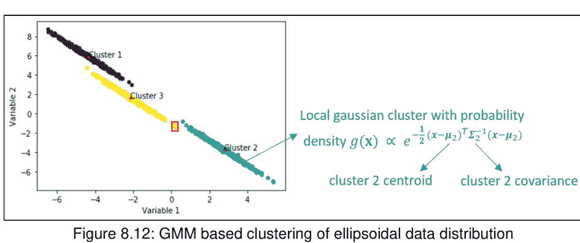

GMM的另一个主要优点是，我们可以计算一个数据点属于任何簇的（后验）概率。这种簇隶属度量由predict_proba方法提供。通过将数据点分配给概率最高的簇来执行硬聚类。让我们计算一个位于簇3和簇2之间（在图8.12中圈出）的数据点的概率。

```python
# membership probabilities
probs = gmm.predict_proba(X_transformed[1069, np.newaxis]) # requires 2D array
print('Posterior probabilities of clusters 1, 2, 3 for the data-point: ', probs[-1, :])
```

>>> Posterior probabilities of clusters 1, 2, 3 for the data-point: [3.36e-54 1.09e-15 1]

GMM认为该数据点以100%的概率属于簇3！考虑到该点似乎与簇3和簇2等距（以欧几里得距离衡量），这可能看起来令人惊讶。我们将在下一小节研究这些概率是如何获得的。

### 数学背景

设$x \in \mathbb{R}^m$是从具有$K$个操作模式的多模态过程中获得的m维样本。在GMM中，整体概率密度被表述为局部高斯密度的组合。设$C_i$表示第$i^{th}$个局部高斯簇，其参数为$\theta_i = \{\mu_i, \Sigma_i\}$（均值向量和协方差矩阵），密度为

$$g(x|\theta_i) = \frac{1}{(2\pi)^{m/2} |\Sigma_i|^{1/2}} exp\left[-\frac{1}{2}(x - \mu_i)^T \Sigma_i^{-1} (x - \mu_i)\right]$$ eq. 2

任何空间位置的总体密度由下式给出

$$p(x|\theta) = \sum_{i=1}^K \omega_i g(x|\theta_i)$$ eq. 3

其中，$\omega_i$表示新样本来自第$i^{th}$个高斯分量的先验概率，$\theta = \{\theta_1, ..., \theta_k\}$。GMM模型是通过使用训练样本$X \in \mathbb{R}^{N \times m}$估计所有簇的参数$\theta_i, \omega_i$来构建的。参数通过优化训练数据集的对数似然来估计，如下所示

$$\sum_{j=1}^N log \left(\sum_{i=1}^K \omega_i g(x_j|\theta_i)\right)$$ eq. 4

为了优化似然，通常采用期望最大化算法。假设给出了参数的初始估计，EM算法涉及在两个步骤之间迭代：

- E步（$s^{th}$次迭代）：（重新）计算样本对局部簇的隶属关系

$$P^{(s)}(C_i|x_j) = \frac{\omega_i^{(s)} g(x_j | \mu_i^{(s)}, \Sigma_i^{(s)})}{\sum_{k=1}^K \omega_k^{(s)} g(x_j | \mu_k^{(s)}, \Sigma_k^{(s)})}$$ eq. 5

$P^{(s)}(C_i|x_j)$ 表示第 $j^{th}$ 个样本来自第 $i^{th}$ 个高斯分量的后验概率。

### M-步（$(s+1)^{th}$ 次迭代）：更新 GMM 参数

$$\mu_i^{(s+1)} = \frac{\sum_{j=1}^N P^{(s)}(C_i|x_j)x_j}{\sum_{j=1}^N P^{(s)}(C_i|x_j)}$$

$$\Sigma_i^{(s+1)} = \frac{\sum_{j=1}^N P^{(s)}(C_i|x_j)(x_j-\mu_i^{(s+1)})(x_j-\mu_i^{(s+1)})^T}{\sum_{j=1}^N P^{(s)}(C_i|x_j)}$$

$$\omega_i^{(s+1)} = \frac{\sum_{j=1}^N P^{(s)}(C_i|x_j)}{N}$$

> 使用从 E-步重新计算的隶属度更新每个簇的质心和协方差。

迭代持续进行，直到对数似然目标函数满足某个收敛准则。你是否注意到这与用于寻找模型参数的 k-means 算法在概念上的相似性？之前，我们使用 `predict_prob` 方法计算了数据点 1069 的后验概率。现在让我们使用公式 5 来看看是否得到相同的数值。

```python
# 后验概率计算
x = X_transformed[1069,np.newaxis]

import scipy.stats
g1 = scipy.stats.multivariate_normal(gmm.means_[0,:], gmm.covariances_[0,:]).pdf(x)
g2 = scipy.stats.multivariate_normal(gmm.means_[1,:], gmm.covariances_[1,:]).pdf(x)
g3 = scipy.stats.multivariate_normal(gmm.means_[2,:], gmm.covariances_[2,:]).pdf(x)
print('Local component densities: ', g1, g2, g3)

>>> Local component densities: 8.33e-56 2.72e-17 0.025

den = gmm.weights_[0]*g1 + gmm.weights_[1]*g2 + gmm.weights_[2]*g3
posterior_prob_cluster1 = gmm.weights_[0]*g1/den
posterior_prob_cluster2 = gmm.weights_[1]*g2/den
posterior_prob_cluster3 = gmm.weights_[2]*g3/den
print('Posterior probabilities: ', posterior_prob_cluster1, posterior_prob_cluster2, posterior_prob_cluster3)

>>> Posterior probabilities: 3.36e-54 1.09e-15 1
```

正如预期，我们得到了相同的后验概率。尽管各分量的密度值都很低，但分量 3 在点 1069 的空间坐标处具有（相对）高得多的密度值，因此导致了最高的隶属度关联！希望这个快速计算能帮助你更深入地理解 GMM 模型的工作原理。

### 确定聚类数量

使用 EM 算法进行 GMM 建模的一个局限性是，高斯分量的数量被假定为事先已知。这可能并不总是成立。为了克服这一点，我们可以使用类似于我们用于 k-means 的肘部法则的方法。在 k-means 中，我们绘制了不同聚类数量的 SSE，而在 GMM 中，我们将利用贝叶斯信息准则（BIC）指标（在第 3 章中介绍）。与 SSE 不同，BIC 在一段时间后会增加，最优的高斯分量数量是使 BIC 最小化的值。

```python
# 通过 BIC 方法寻找分量数量
BICs = []
lowestBIC = np.inf
for n_cluster in range(1, 10):
    gmm = GaussianMixture(n_components = n_cluster, random_state = 100)
    gmm.fit(X_transformed)
    BIC = gmm.bic(X_transformed)
    BICs.append(BIC)

    if BIC < lowestBIC:
        optimal_n_cluster = n_cluster
        lowestBIC = BIC

plt.figure(), plt.plot(range(1,10), BICs, marker='o')
plt.scatter(optimal_n_cluster, lowestBIC, c='red', marker='*', s=1000)
```

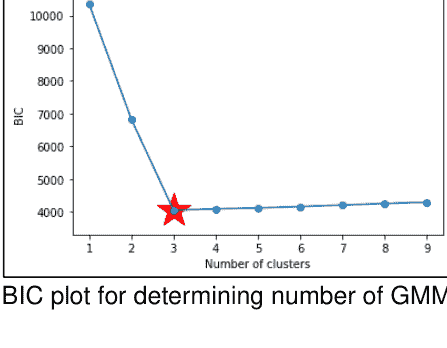

还有另一种方法，称为 F-J 算法<sup>38</sup>，可用于以集成方式寻找最优的 GMM 分量数量<sup>39</sup>和模型参数。此外，在 F-J 方法中，分量数量不需要事先指定。在内部，该方法以大量分量初始化，并通过消除权重不显著的高斯分量来自适应地调整此数量。F-J 方法也使用 EM 算法进行参数估计，但在 M-步中的权重更新机制略有不同。鼓励读者参阅引用的参考文献以获取更多细节。F-J 方法的一个缺点可能是计算时间较长。

<sup>38</sup> Figueiredo & Jain, Unsupervised learning of finite mixture models, *IEEE Trans Pattern Anal Mach Intell*, 2002
<sup>39</sup> Yu & Qin, Multimode process monitoring with Bayesian inference-based finite gaussian mixture models, *AIChE Journal*, 2008

```python
# 通过 FJ 算法寻找分量数量
from gmm_mml import GmmMml
gmmFJ = GmmMml(plots=False)
gmmFJ.fit(X_transformed)
cluster_label = gmmFJ.predict(X_transformed)

plt.figure()
plt.scatter(X_transformed[:, 0], X_transformed[:, 1], c = cluster_label, s=20, cmap='viridis')
```

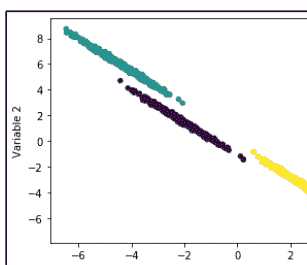

图 8.15 显示了通过 GMM 方法对金属蚀刻数据进行的聚类。BIC 方法正确地识别了最优分量数量。请注意，对于此数据集，F-J 方法产生了 4 个分量。

```python
# 将 GMM 模型拟合到金属蚀刻数据
gmm = GaussianMixture(n_components = optimal_n_cluster, random_state = 100)
cluster_label = gmm.fit_predict(score_train)
plt.scatter(score_train[:, 0], score_train[:, 1], c = cluster_label, s=20, cmap='viridis')
```

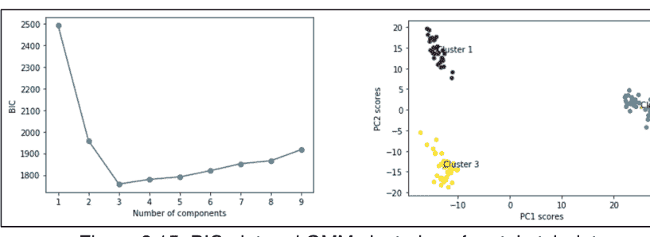

### 8.5 基于 GMM 的半导体制造过程多模态过程监控

由于其概率化公式，GMM 被广泛应用于监控过程系统。在本节中，我们将研究金属蚀刻过程的一个此类应用。图 8.16 显示了金属蚀刻校准批次和故障批次在 PCA 得分空间中的分布。很明显，故障批次倾向于远离校准簇。我们的目标是开发一个基于 GMM 的监控工具，能够自动检测这些故障批次。

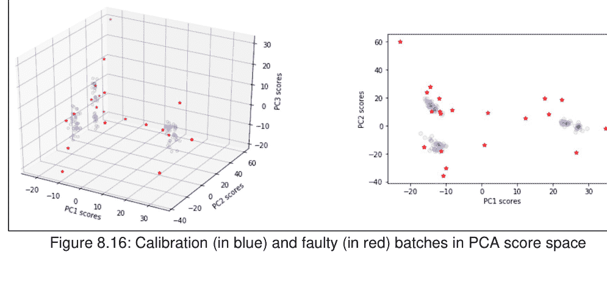

### 过程监控/故障检测指标

检测故障批次的一个直接方法是为每个簇/模态构建单独的椭球边界或 $T^2$ 控制图，并检查故障批次的 $T^2$ 指标是否超出所有簇的控制限。然而，当高斯分量数量较多时，监控多个控制图可能会变得繁琐。为了方便，可以将局部指标/图组合起来生成一个单一的全局指标/图。我们将遵循 Xie & Shi$^{40}$ 的方法（Yu & Qin$^{39}$ 提供了一种替代方法）。对于一个测试数据点 $x_t$，从每个簇计算局部马氏距离

$D_{local}^{(k)}(x_t) = (x_t - \mu_k)^T \Sigma_k^{-1} (x_t - \mu_k)$

然后使用测试样本对每个高斯分量的后验概率计算全局指标

$$D_{global}(\boldsymbol{x}_t) = \sum_{k=1}^K P(C_k|\boldsymbol{x}_t) D_{local}^{(k)}(\boldsymbol{x}_t)$$

$D_{global}$ 的控制限可以使用 $F$ 分布获得

$$D_{global,CL} = \frac{r(N^2-1)}{N(N-r)} F_{r,N-r}(\alpha)$$

$F_{r,N-r}(\alpha)$ 是自由度为 $r$ 和 $n-r$ 的 $F$ 分布的 $(1-\alpha)$ 分位数，$r$ 是变量维度（我们在具有 3 个潜变量的 PCA 得分空间中执行 GMM，因此 $r = 3$）。如果 $D_{global} > D_{global, CL}$，则认为测试样本异常。

```python
# 全局马氏距离指标
Dglobal_train = np.zeros((score_train.shape[0],))

for i in range(score_train.shape[0]):
    x = score_train[i,:,np.newaxis]
    probs = gmm.predict_proba(x.T)
    
    for component in range(3):
        Dlocal = np.dot(np.dot((x-gmm.means_[component,:,np.newaxis]).T,
        np.linalg.inv(gmm.covariances_[component,:,:])), (x-gmm.means_[component,:,np.newaxis]))
        
        Dglobal_train[i] = Dglobal_train[i] + probs[0,component]*Dlocal

# Dglobal 控制限
N = score_train.shape[0]
r = 3
alpha = 0.05 # 95% 控制限
Dglobal_CL = r*(N**2-1)*scipy.stats.f.ppf(1-alpha, r, N-r)/(N*(N-r))

# Dglobal 控制图
plt.figure()
plt.plot(Dglobal_train)
plt.plot([1, len(Dglobal_train)], [Dglobal_CL, Dglobal_CL], color='red')
plt.xlabel('Sample #'), plt.ylabel('D_global for training data')
```

图 8.17 显示了训练数据的控制图。

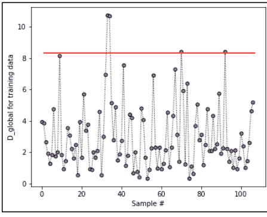

图 8.17：金属蚀刻校准数据的全局监控图

### 测试数据的故障检测

图 8.18 显示，全局距离指标似乎是检测故障批次的合适指标。在 20 个批次中，有 18 个批次的监控指标违反了阈值。这种良好的监控性能可归因于对数据进行了适当的多模态建模。

```python
# 获取测试数据并展开
test_dataAll = Etch_data[0,0].test

unfolded_TestdataMatrix = np.empty((1,n_vars*n_samples))
for expt in range(test_dataAll.size):
    test_expt = test_dataAll[expt,0][5:90,2:]

    if test_expt.shape[0] < 85:
        continue

    unfolded_row = np.ravel(test_expt, order='F')[np.newaxis,:]
    unfolded_TestdataMatrix = np.vstack((unfolded_TestdataMatrix, unfolded_row))

unfolded_TestdataMatrix = unfolded_TestdataMatrix[1:,:]

# 对故障数据进行 PCA
data_test_normal = scaler.transform(unfolded_TestdataMatrix)
score_test = pca.transform(data_test_normal)

# 计算 Dglobal_test
Dglobal_test = np.zeros((score_test.shape[0],))

for i in range(score_test.shape[0]):
    x = score_test[i,:,np.newaxis]
```

## 第9章

### 决策树与集成学习

想象一下，你正处于这样一种情境：即使你已尽最大努力，模型仍无法提供令人满意的性能（由于高偏差或方差）。如果我们告诉你，存在一类算法，可以将多个“弱”性能模型的“版本”组合起来，生成一个“强”性能模型，从而提供比其组成的“弱”模型更准确、更稳健的预测，你会怎么想？听起来好得难以置信？这是真的，这类算法被称为集成方法。

集成方法通常是Kaggle等在线机器学习竞赛中获胜方案的关键组成部分。集成学习基于一个简单的理念：集体智慧可以胜过个人智慧！在本章中，我们将探讨其工作原理以及集成方法如此强大的原因。我们将研究流行的集成方法，如随机森林和XGBoost。

森林和XGBoost中的基础组成模型是决策树，这是一种简单而通用的机器学习算法，适用于回归和分类任务。决策树能够拟合复杂和非线性的数据集，同时具有提供可解释结果的令人羡慕的特性。我们将详细探讨所有这些特性。具体来说，我们将涵盖以下主题：

- 决策树和随机森林简介
- 随机森林在混凝土建筑行业中的软测量应用
- 集成学习技术简介（Bagging、Adaboost、梯度提升）
- 使用XGBoost在污水处理厂进行出水水质预测

### 9.1 决策树简介

决策树是一种归纳学习方法，它从数据中推导出明确的规则来进行预测。它们将特征空间划分为若干个（超）矩形，然后在每个矩形中拟合一个简单的模型（通常是一个常数）。如图9.1所示，对于二维特征空间中的二元分类问题，划分是通过一系列if-else语句实现的。如图所示，模型使用分支和叶子表示，从而形成树状结构，因此得名决策树模型。在每个节点提出的问题非常清楚地展示了模型预测（A类或B类）是如何生成的。因此，决策树成为那些需要轻松解释模型结果的应用的首选模型。

决策树模型拟合的关键在于决定在树的每个节点的if-else语句中提出什么问题。在拟合过程中，这些问题将特征空间划分为越来越小的子区域，使得落入某个子区域的训练观测彼此相似。当无法再获得增益或满足停止条件时，划分过程停止。不恰当的划分选择将导致泛化能力不佳的模型。在下一小节中，我们将研究一种流行的决策树训练算法，称为CART（分类与回归树），它能够明智地确定划分。

### 数学背景

CART算法创建一个二叉树，即在每个节点创建两个分支，以使整体数据“不纯度”降低的方式分割数据集。为了理解这一点，请考虑树的以下节点<sup>41</sup>。同时假设我们处理的是一个二元分类问题，输入向量为 $x \in R^m$。

算法需要决定使用 $m$ 个输入变量 $x_k$ 中的哪一个来分割该节点处的 $n$ 个样本集合，以及使用什么阈值 $r$。CART通过最小化以下目标函数来做出此决定：

$$J(k, r) = \frac{n_{left}}{n} I_{left} + \frac{n_{right}}{n} I_{right}$$

其中 $I_{left/right}$ 表示左/右数据子集的数据不纯度，由下式给出：

$$I = 1 - \sum_{q=1}^{2} p_q^2$$

其中 $p_q$ 是相应数据子集中属于类别 $q$ 的样本比例。例如，如果子集中的所有样本都属于类别1，则 $p_1 = 1$ 且 $I = 0$。因此，如果CART能够找到 $k$ 和 $r$，使得 $n$ 个样本能够按类别完美地划分到左、右子集中，那么将获得最小值 $J = 0$。然而，这通常是不可能的，CART会尽力做到最好。CART在此节点实现的不纯度降低（$\Delta I_{node}$）由 $nI_{node} - \frac{n_{left}}{n} I_{left} - \frac{n_{right}}{n} I_{right}$ 给出。

CART简单地递归遵循上述分支方案。它从顶部节点（根节点）开始，不断分割子集。如果一个节点无法再分割（因为不纯度无法再降低，或者某些超参数设置如min_samples_split、min_samples_leaf阻止了进一步分割），该节点就成为叶子节点或终端节点。对于预测，找到与测试样本对应的叶子节点，并将叶子节点训练子集中的多数类别分配给测试样本。请注意，也可以通过简单地查看叶子节点训练样本中属于类别 $q$ 的比例来进行类别 $q$ 的概率预测。

在经典的决策树中，正如我们所看到的，节点处的分割决策规则（或分割函数）基于单个变量。这导致了轴对齐的超平面，将输入空间划分为若干个超矩形。也可以使用使用多个变量的复杂分割函数，这可能更适合某些数据集——下面展示了一个这样的例子。

然而，使用复杂分割函数拟合决策树在计算上要求更高。因此，一般建议在使用简单分割函数拟合树之前，使用PCA、FDA等降维技术对数据集进行转换。

对于回归问题，以相同的方式构建树，但使用不同的目标函数 $J(k,r)$，现在由下式给出：

$$J(k,r) = \frac{n_{left}}{n} MSE_{left} + \frac{n_{right}}{n} MSE_{right}$$

其中 $MSE_{left/right}$ 表示左/右节点的均方误差：

$$MSE = \frac{\sum_{sample \in subset} (\hat{y} - y_{sample})^2}{\# \text{ of samples}}$$

$\hat{y}$ 是属于某个子集的样本的平均输出值。测试样本的预测也取为分配给测试样本叶子节点的所有训练样本的平均输出值。

你并不局限于在回归树的叶子节点使用常数预测模型。线性和多项式预测模型可能更适合某些问题。这类决策树称为模型树。虽然Scikit-learn只允许常数模型，但存在一个名为'linear-tree'的包$^{42}$，允许构建叶子节点为线性模型的模型树。

probs = gmm.predict_proba(x.T)

for component in range(3):
    Dlocal = np.dot(np.dot((x-gmm.means_[component,:,np.newaxis]).T,
    np.linalg.inv(gmm.covariances_[component,:,:])), (x-gmm.means_[component,:,np.newaxis]))

    Dglobal_test[i] = Dglobal_test[i] + probs[0,component]*Dlocal

print('Number of faults identified: ', np.sum(Dglobal_test > Dglobal_CL), ' out of ', len(Dglobal_test))

>>> Number of faults identified: 18 out of 20

用于刻蚀过程数据集的 $D_{global}$ 和SVDD（第7章）模型为所有簇使用了一个整体的单一监控模型。然而，为每个簇构建单独的监控模型，并使用图8.2中的两种方法之一进行最终预测，也是一个完全合理的方法。

### 总结

通过本章，我们在学习旅程中又征服了一个里程碑。我们首先理解了过程系统多模态建模的必要性，然后研究了几种流行的聚类/混合建模算法。对不同方法优缺点的强调是刻意的选择，旨在帮助你为你的问题明智地选择算法。在你的职业生涯中，你将经常遇到多模态过程，本章学习的工具将帮助你正确分析这些系统。

### 不纯度度量

公式1中使用的不纯度度量称为*基尼不纯度*。另一种常用的度量是*熵*，对于一个包含2类的数据集，其计算公式如下：

$$I_H = -\sum_{q=1}^{2} p_q \log (p_q)$$

当 $p_1=1$（或 $p_2=0$）时，$I_H$ 为0；当 $p_1=p_2=0.5$ 时，$I_H$ 为1。因此，熵的降低意味着数据纯度的提高。在实践中，基尼不纯度和熵提供相似的结果。

### 简单的Sklearn实现

下面的代码展示了在Sklearn中将决策树回归模型应用于一个二次数据集的实现。图9.2a绘制了预测值与实际输出值的对比图。很明显，在不对树深度进行任何限制的情况下，发生了过拟合。子图9.2b显示了将树深度限制为仅3层所带来的正则化效果。

```python
# generate data
import numpy as np
x = np.linspace(-1, 1, 50)[:, None]
y = x*x + 0.25 + np.random.normal(0, 0.15, (50,1))

# fit regularized DT model and predict
from sklearn import tree
model = tree.DecisionTreeRegressor(max_depth=3).fit(x, y)
y_pred = model.predict(x)
```

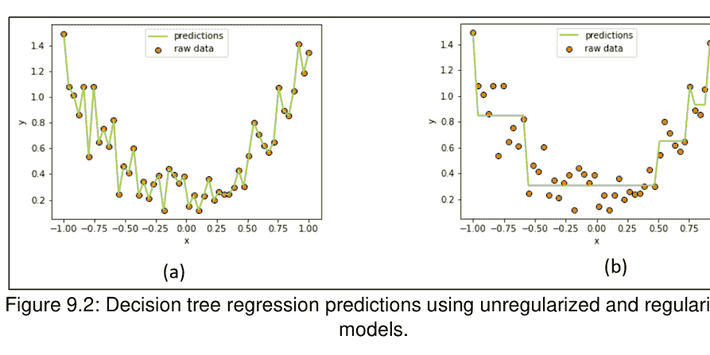

你可以使用 `plot_tree` 函数来绘制树本身，以理解训练数据集是如何被决策树模型划分的。

```python
# plot tree
plt.figure(figsize=(20,8))
tree.plot_tree(model, feature_names=['x'], filled=True, rounded=True)
```

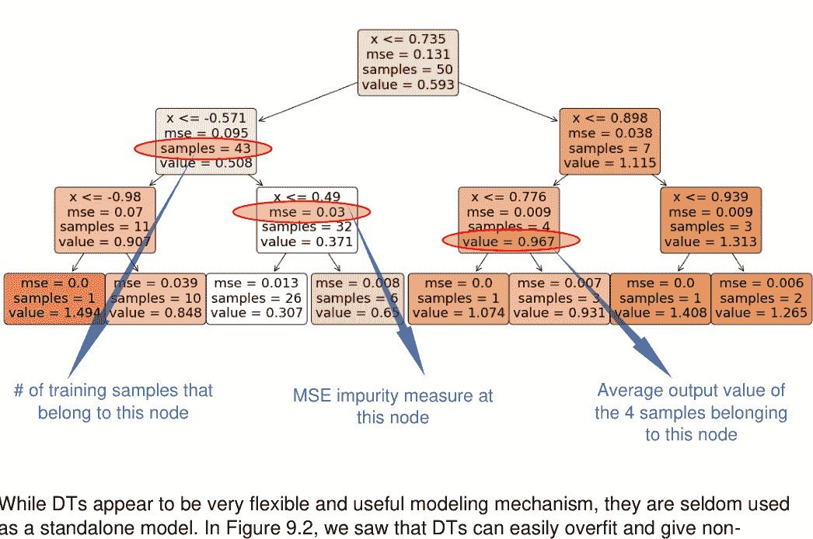

尽管决策树看起来是一种非常灵活且有用的建模机制，但它们很少被用作独立模型。在图9.2中，我们看到决策树很容易过拟合，并给出非平滑或分段常数的近似。决策树的另一个缺点是不稳定性，即训练数据集的微小变化可能导致一棵非常不同的树。然而，我们花时间学习决策树是有原因的。单棵树可能没什么用，但当你组合多棵树时，你会得到惊人的结果。我们将在下一节学习这是如何实现的。

### 9.2 随机森林：简介

随机森林是一种监督式非线性回归和分类建模技术，由多棵决策树组成。这些决策树独立地在其训练数据集上进行拟合，随机森林的预测结果是通过对各棵树的预测结果取平均值得到的。图9.3说明了这一方案。组合多棵树的输出可以得到低方差或更稳健的模型。其诀窍在于这些组成树是如何生成的。这些树的生成方式使得它们的预测误差不相关，从而使得随机森林不易过拟合（我们很快会从数学上具体化这个概念）。

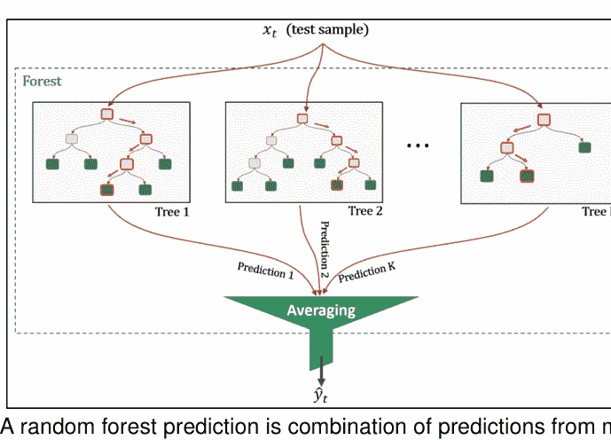

在随机森林中，树被完全生长，因此，树的超参数选择不是问题。这使得随机森林的训练和执行简单快捷。事实上，随机森林的可调超参数非常少。随机森林还便于计算变量重要性。所有这些特性使得随机森林广受欢迎。

### 数学背景

为了训练随机森林，需要生成尽可能“彼此不同”但同时又能良好描述训练数据集的不同树。这种树之间的多样性通过以下两种方式实现：

1)  **为每棵树使用不同的训练数据集：** 如果每棵树都在相同的数据集上训练，它们最终会变得相同，犯同样类型的错误，因此组合它们将几乎没有什么好处。由于我们只有一个训练数据集来训练随机森林，因此采用了自助采样法。如果原始数据集有 $N$ 个样本，自助采样法允许创建多个数据集，每个数据集有 $N_b$（$\le N$）个样本，使得每个新数据集也能很好地代表生成原始数据集的底层过程。每个自助采样数据集是通过从原始数据集中有放回地随机选择 $N_b$ 个样本生成的。在随机森林中，$N_b = N$，下图以 $N=10$ 为例说明了自助采样方案。

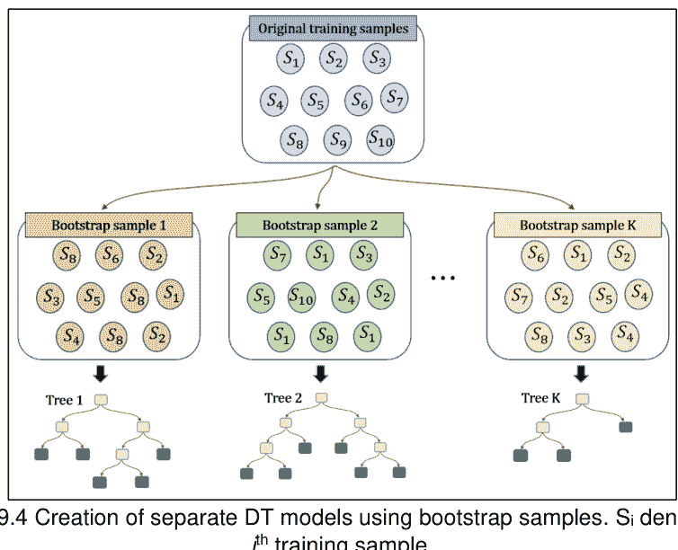

2)  **使用输入变量的随机子集来寻找最优划分：** 随机森林训练中一个非常不直观、有些令人惊讶但极其有效的方面是，在确定森林中任何树的任何节点的最优划分函数时，并不考虑所有输入变量。相反，会随机选择一个变量子集，然后使用这些选定的变量来最小化节点不纯度。这种随机选择在每个节点上都会执行。如果输入变量 $x \in R^m$，则建议随机划分变量的数量（$M$）为 $m$ 的向下取整平方根。

训练过程中的上述两个技巧使得树之间的相关性最小化。下图总结了随机森林模型的拟合过程。为便于说明，假设 $x \in R^9$ 且 $M=3$。

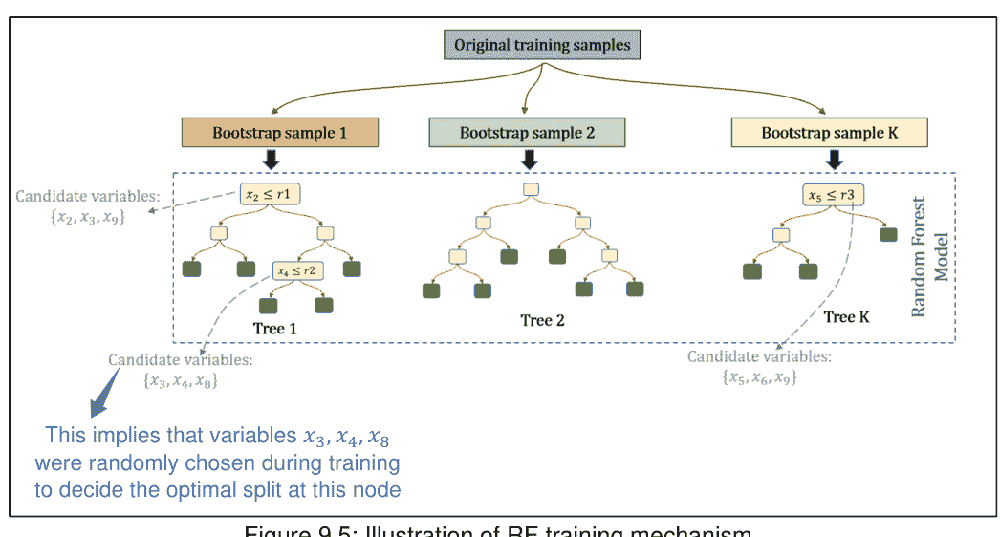

图9.5：随机森林训练机制示意图

你可以看到，只有两个主要的超参数需要决定：树的数量和变量子集的大小。随机森林的另一个优势是组成树可以并行训练。

### 简单的Sklearn实现

让我们将随机森林模型拟合到图9.2中的二次数据集。图9.6显示了森林中包含20棵树时的拟合结果。很明显，与我们之前看到的决策树模型相比，随机森林提供了更平滑的预测。图中还显示了森林中两棵不同组成树的预测结果。我们可以看到，随机森林平滑了组成树预测中的波动，使组合模型更加稳定。

```python
# fit RF model and predict
from sklearn.ensemble import RandomForestRegressor
model = RandomForestRegressor(n_estimators=20).fit(x, y)
y_pred = model.predict(x)

# get predictions from constituent trees and plot
tree_list = model.estimators_ # list of DT models in the RF
y_pred_tree1 = tree_list[5].predict(x)
y_pred_tree2 = tree_list[15].predict(x)
```

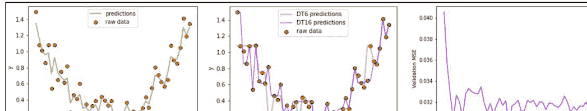

图9.6：（左）随机森林回归预测，（中）来自几棵组成决策树的预测，（右）随机森林模型中树的数量对验证误差的影响

图9.6还显示了森林中不同树数量对应的验证误差。我们在这里看到的是随机森林的一个普遍特征：随着树的数量增加，验证误差趋于平稳。因此，如果计算时间不是问题，最好使用尽可能多的树，直到误差趋于平稳。至于 $M$，较低的值会导致方差的更大降低，但会增加模型偏差。请注意，随机森林主要降低的是方差（与使用单棵决策树模型相比），而不是偏差。因此，如果决策树本身欠拟合，随机森林将无法提供高精度（或低偏差）。这就是为什么在随机森林中使用完全生长的树。你将在本章后面了解到其背后的原因。

### 9.3 混凝土建筑行业中基于随机森林的软测量

让我们看看随机森林的一个应用：预测混凝土的抗压强度，将其作为其组成成分和混凝土龄期的函数。该数据集包含1030个混凝土样本，并包含以下数据：

+   **输入**
    - 水泥：kg/m³ 混合物
    - 高炉矿渣：kg/m³ 混合物
    - 粉煤灰：kg/m³ 混合物
    - 水：kg/m³ 混合物
    - 超塑化剂：kg/m³ 混合物
    - 粗骨料：kg/m³ 混合物
    - 细骨料：kg/m³ 混合物
    - 龄期：天（1到365）

+   **输出**
    - 混凝土抗压强度：MPa

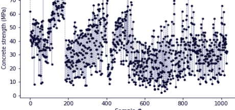

我们将保留33%的数据用于测试，树的数量设置为较大的值200，$M$ 设置为3。

```python
# read data
import numpy as np
data = np.loadtxt('cement_strength.txt', delimiter=',', skiprows=1)
X = data[:,0:-1]
y = data[:,-1]

# separate training and test data
from sklearn.model_selection import train_test_split
X_train, X_test, y_train, y_test = train_test_split(X, y, test_size = 0.33, random_state = 100)

# fit RF model
from sklearn.ensemble import RandomForestRegressor
model = RandomForestRegressor(n_estimators=200, max_features=3, oob_score=True, random_state=1).fit(X_train, y_train)
```

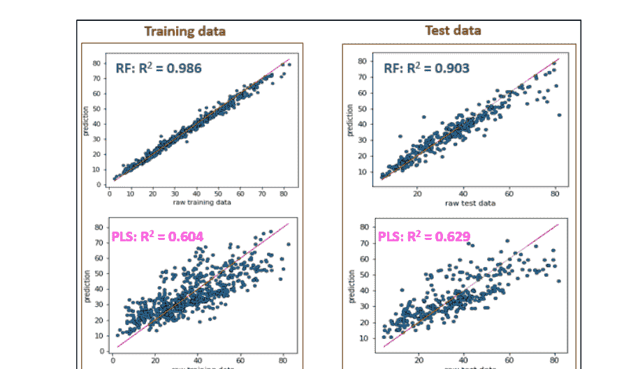

图9.7：针对混凝土抗压强度数据集的随机森林和PLS预测。红线表示理想的 $y_{prediction} = y_{measured}$ 参考线

这里有两个值得注意的地方。首先，我们在拟合前没有对变量进行缩放。这不是错误！随机森林（和决策树）是少数几种解对数据缩放不变的机器学习方法之一。其次，随机森林优于PLS的性能展示了随机森林的非线性建模能力。

### OOB 准确率

在之前的示例中，我们在随机森林训练时指定了 `oob_score=True`。这一设置指示随机森林在模型拟合过程中使用训练数据计算泛化分数。这听起来几乎像是一个错误的陈述，但当你意识到任何单个自助数据集都不包含原始数据集的所有样本<sup>43</sup>（如图 9.4 所示）时，它就变得合理了。不属于某个树的自助数据集的样本被称为该树的袋外样本。任何给定的样本都可能成为森林中若干棵树（假设为 DT1、DT5、DT7）的袋外样本的一部分。可以使用 DT1、DT5、DT7 的集成对该样本进行预测，并计算袋外误差。所有样本的袋外误差用于计算整体的 `oob_score`。

```
# 打印 OOB 分数
print('OOB score: ', model.oob_score_)
>>> OOB score: 0.903
```

对于这个具体数据集，`oob_score`（精确到小数点后 3 位）与测试分数相同！袋外分数可能不是完美的泛化评估，但在小型数据集中，当保留测试数据集并非易事时，它就派上用场了。

### 特征重要性

现在让我们看看随机森林的另一个便捷特性，它允许我们根据输入/特征变量对输出预测的重要性对其进行排序。Sklearn 通过计算使用某个特征进行节点分裂时节点不纯度（或回归的 MSE）的平均减少量来计算特征重要性。首先，特征 $j$ 在一棵树中的重要性计算如下

$$FI_j^{tree} = \frac{\sum_{nodes; node \ splits \ on \ feature \ j} \Delta I_{node}^{tree}}{\sum_{nodes} \Delta I_{node}^{tree}}$$

$FI_j^{tree}$ 在森林中所有树上的平均值即为所需的特征重要性

$$FI_j = \frac{\sum_{trees} FI_j^{tree}}{number \ of \ trees}$$

对于我们的混凝土强度数据集，$FI_s$ 可以如下获得

<sup>43</sup> 对于大的 N，可以证明随机森林中的任何自助数据集理论上包含原始数据集中大约 63% 的样本

```
### 特征重要性
var_names = ['cement','slag','flyash','water','superplasticizer','coarseaggregate','fineaggregate','age']
importances = model.feature_importances_

plt.barh(var_names, importances)
plt.xlabel('Feature importances')
```

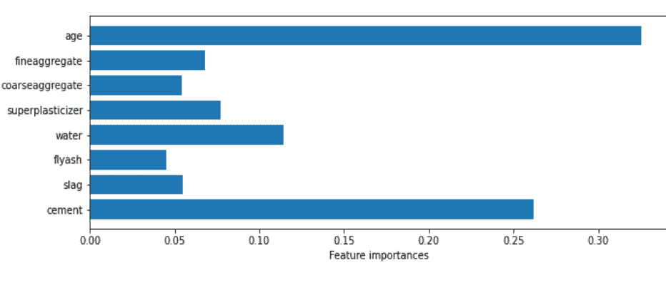

以上结果表明，水泥含量和混凝土龄期是预测混凝土强度的两个最重要的变量。这一结果符合预期，并进一步突出了随机森林在分析过程数据中非线性依赖关系方面的实用性。

至此，我们对随机森林的研究告一段落。希望我们已经能够说服您，随机森林可能是您机器学习武器库中相当强大的武器。让我们继续学习集成学习，以了解是什么赋予了随机森林如此强大的能力。

### 9.4 集成学习简介

将多个“不太好”的弱模型组合起来生成一个强模型的思想并不仅限于随机森林。这个思想更为通用，被称为集成学习。实现该思想的具体方法（如随机森林）被称为集成方法。下面的图 9.8 展示了一个采用多样化基础模型的集成建模方案。所示模型是异构集成模型，因为各个模型采用了不同的学习方法。相比之下，在同构模型中，基础模型使用相同的学习算法。

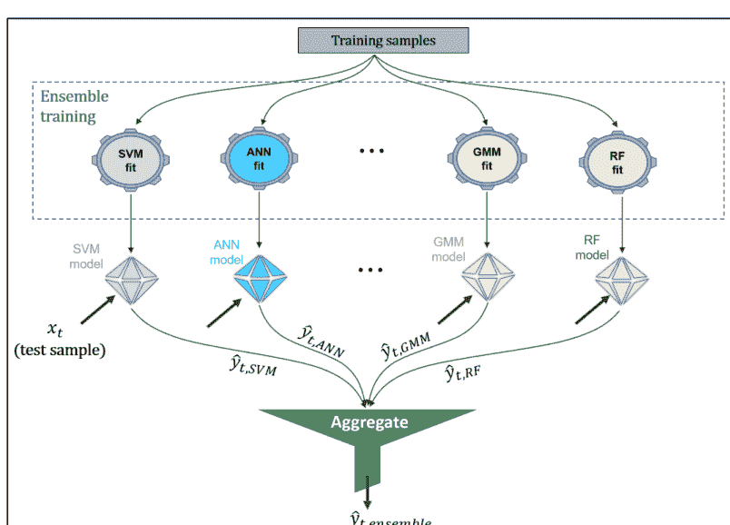

图 9.8：异构集成学习方案<sup>44</sup>。随机森林本身是一种集成方法，在这里被用作基础模型。

我们有多种选择来聚合基础模型的预测结果。对于分类，我们可以使用多数投票，选择被大多数基础模型预测的类别。或者，如果基础模型返回类别概率，也可以使用软投票。对于回归，我们可以使用简单平均或加权平均。

在集成的世界里，弱模型是指由于高偏差或高方差而导致性能不佳的任何模型。然而，这些弱模型组合在一起，可以实现更好、更准确（更低偏差）和/或更稳健（更低方差）的预测。那么，我们是否可以将任何一组表现不佳的模型组合起来，获得一个超级准确的集成模型呢？答案既是肯定的，也是否定的！要获得集成学习的益处，必须满足某些标准。首先，基础模型必须单独表现优于随机猜测。其次，基础模型必须具有多样性（即，在未见数据上产生的错误必须是不相关的）。考虑以下简单的说明来理解这些要求。

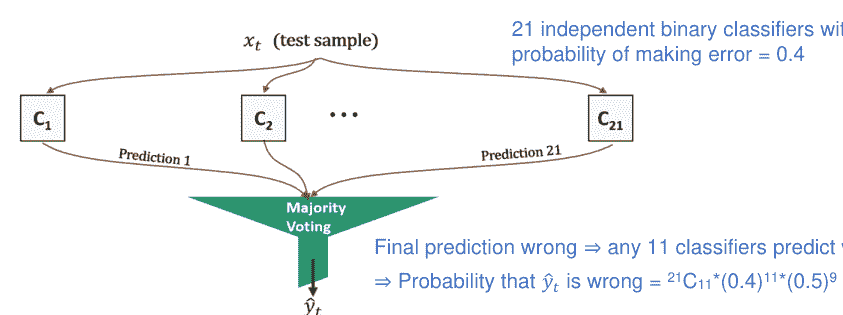

在上面的示例中，集成模型的准确率将达到 97.1%，尽管每个基础模型只有 60% 的准确率。虽然满足第一个标准（构建准确率 > 50% 的基础模型）相对容易，但要在基础模型之间获得多样性/独立性却很困难。在图 9.8 中，如果所有基础模型总是犯相同的错误，那么将它们组合起来将没有任何好处。我们已经在随机森林中看到了一些多样性机制。还有其他方法，下面的示意图概述了一些流行的集成多样性技术。

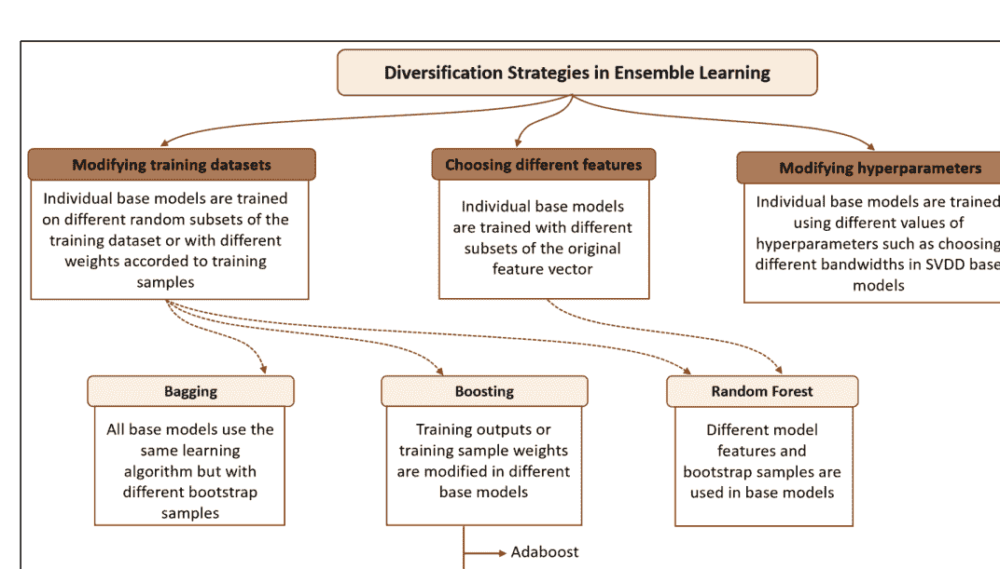

图 9.9：具有同构基础模型的流行集成建模技术概述

> 集成技术的选择应基于基础模型的特性。如果基础模型的问题是高方差，那么选择倾向于减少方差的集成方法（如 bagging）。另一方面，如果问题是高偏差，则使用像 boosting 和 stacking 这样的方法，它们将产生一个偏差降低的集成模型。

现在让我们更熟悉这些技术。

### Bagging

在 bagging（自助聚合）技术中，通过使用相同的建模算法对原始训练数据集的不同自助样本进行训练，来生成多样化的基础模型。与随机森林不同，输入变量在每个基础模型中保持不变，并且自助数据集的大小通常小于原始训练样本的数量。此外，基础模型不限于决策树模型。如下图所示，基础模型是独立训练的（允许并行训练），集成预测是通过组合基础模型的预测得到的。

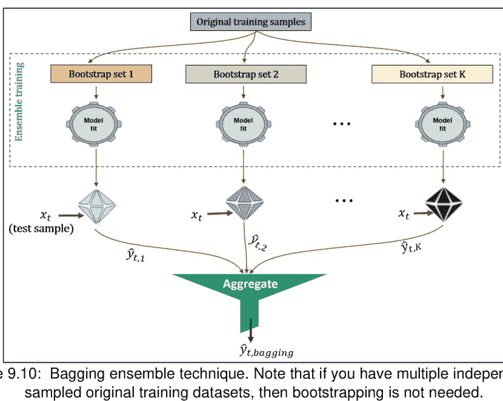

Bagging 的定义特征是它有助于减少方差，但不能减少偏差。可以证明，如果 $\bar{\rho}$ 是基础模型预测之间的平均相关性，那么 $y_{\text{ensemble}}$ 的方差等于 $\bar{\sigma}^2 \left( \bar{\rho} + \frac{1-\bar{\rho}}{K} \right)$，其中 $\bar{\sigma}^2$ 是单个基础模型预测的方差，$K$ 是基础模型的数量。因此，$\bar{\rho} = 1$ 意味着方差没有减少。

Bagging 可以用于回归和分类。Sklearn 分别提供了 `BaggingClassifier` 和 `BaggingRegressor`。下面的简单示例展示了 bagging 如何帮助获得更平滑的结果（在这种情况下是分类边界）。

```
# 生成训练样本
from sklearn import datasets
noisy_moons = datasets.make_moons(n_samples=200, noise=0.3, random_state=10)
X, y = noisy_moons

# 拟合 bagging 模型（Sklearn 默认使用决策树作为基础模型）
from sklearn.ensemble import BaggingClassifier
Bagging_model = BaggingClassifier(n_estimators=500, max_samples=50, random_state=100).fit(X, y) # K=500，每棵决策树在随机有放回抽取的 50 个训练样本上训练
```

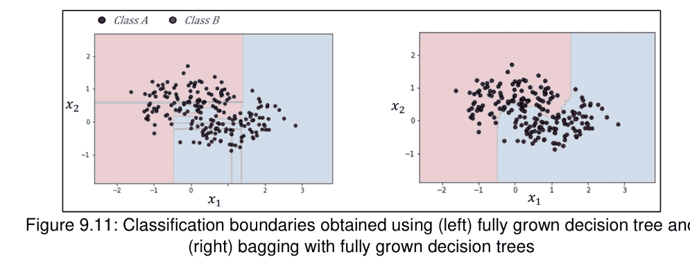

### Boosting

在 boosting 集成技术中，基础模型再次使用相同的学习算法获得，但它们是顺序拟合的，而不是相互独立的。在训练过程中，每个基础模型都试图“纠正”提升模型在前一步中犯下的错误。在过程结束时，我们获得了一个比基础模型偏差更低$^{45}$的集成模型。

$^{45}$ 方差可能降低也可能不降低。Boosting 有时会导致过拟合。

如果基础模型表现出欠拟合/高偏差，则优先选择Boosting。与Bagging类似，Boosting并不局限于以决策树作为基础模型，但如果使用决策树，建议使用浅层树（深度较小的树），以避免高方差。此外，浅层树或其他复杂度较低的基础模型在Boosting过程中顺序训练时，计算上更易处理。Boosting可用于回归和分类，主要有两种流行的Boosting方法，即Adaboost和梯度提升。

### Adaboost（自适应提升）

在Adaboost提升技术中，新的基础模型通过关注被错误预测的样本来纠正其前一个基础模型的错误。如图9.12所示，所有样本被赋予相等的权重$\frac{1}{N}$，并训练第一个（弱）基础模型。被错误预测样本的权重增加，正确预测样本的权重减少。然后训练第二个基础模型，此循环持续进行，直到获得指定数量的基础模型。本质上，每个后续基础模型都更关注那些难以（预测）的训练样本。训练后，集成模型的预测取为基础模型预测的加权组合。分配给每个基础模型的模型权重取决于其在加权训练样本上达到的准确度（准确度越高 $\Rightarrow$ $\alpha$ 越高）。

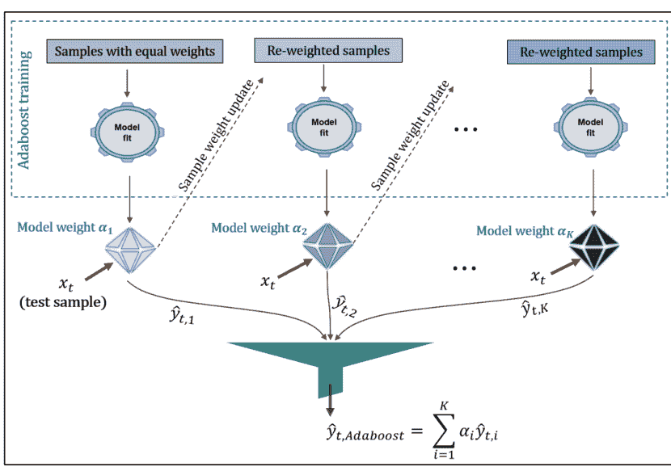

### 梯度提升

梯度提升采用与Adaboost不同的方法，它通过使用前一个基础模型产生的残差误差顺序训练基础模型来纠正其前一个基础模型的错误。图9.13展示了该算法的方案。

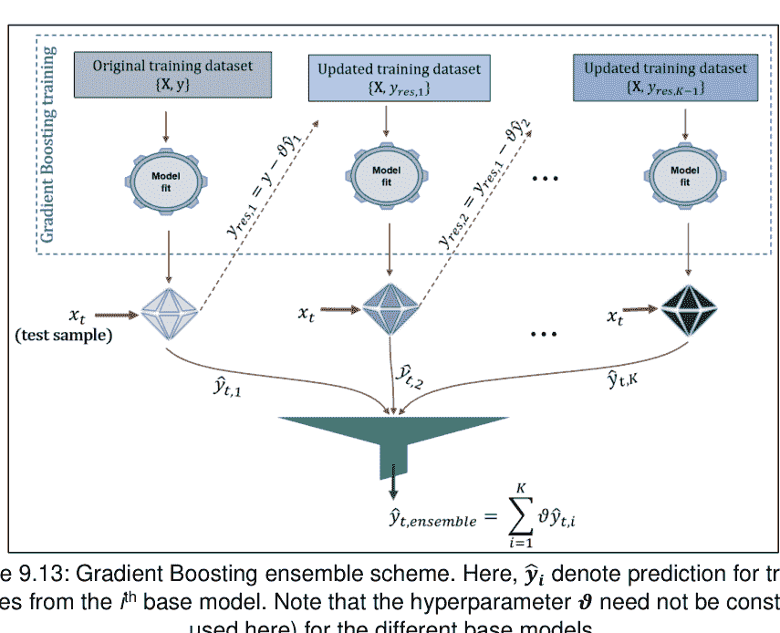

图9.13：梯度提升集成方案。这里，$\hat{y}_i$表示来自第$i^{th}$个基础模型对训练样本的预测。请注意，对于不同的基础模型，超参数$\vartheta$不必是常数（如此处所用）。

在上述方案中，超参数$\vartheta \in (0, 1]$被称为收缩参数或学习率。它用于防止过拟合，建议设置为较小的值，如0.1。非常小的学习率将需要使用大量的基础模型。迭代次数或基础模型数量$K$是另一个需要仔细调整的重要超参数。$K$太小将无法实现足够的偏差减少，而$K$太大则会导致过拟合。它可以通过交叉验证或早停法（在集成模型训练的不同阶段/迭代中跟踪验证误差，并在误差停止下降或模型残差不再有可建模的模式时停止）进行优化。

Scikit-learn提供了`GradientBoostingClassifier`和`GradientBoostingRegressor`类，分别用于回归和分类问题。虽然这些类使用决策树作为基础模型/弱学习器，但梯度提升方法并不限于决策树。当使用决策树时，它被称为梯度树提升或梯度提升决策树（GBDTs）。

### 9.5 通过XGBoost预测污水处理厂的出水水质

如果你最近在机器学习领域很活跃，那么你一定听说过XGBoost这个术语。它代表*eXtreme Gradient Boosting*（极端梯度提升），是一个流行的库，实现了多种技巧和启发式方法，使基于梯度提升的模型训练非常有效，尤其适用于大型数据集。XGBoost使用决策树作为基础模型。

让我们看看XGBoost在软测量问题中的一个应用。该数据集来自一个活性污泥过程，该过程处理来自生活和工业下水道的废水。提供了527天运行期间38个变量的数据。38个变量中有7个表征了过程输出或工厂的出水水质。在这个案例研究中，我们将为7个输出变量之一——输出流的输出电导率（COND-S）创建一个预测模型。过程不同阶段的前22个测量值用作模型输入（详细过程描述见附录）。我们的XGBoost模型将充当软传感器来预测输出。

让我们快速探索一下数据集。

```python
# read data
import pandas as pd
data_raw = pd.read_csv('water-treatment.data', header=None, na_values="?" )
X_raw = data_raw.iloc[:,1:23]
y_raw = data_raw.iloc[:,29]
data = pd.concat([X_raw, y_raw], axis=1)

# check for presence of missing values
print(data.info())
```

```
RangeIndex: 527 entries, 0 to 526
Data columns (total 23 columns):
 #   Column            Non-Null Count  Dtype  
---  ------            --------------  -----  
 0   1                 509 non-null    float64
 1   2                 524 non-null    float64
 2   3                 527 non-null    float64
 3   4                 504 non-null    float64
```

我们注意到数据集的不同列中存在缺失值。我们将采用简单的方法，删除任何包含缺失数据的行。

```python
# remove rows with missing data
data.dropna(axis=0, how='any', inplace=True)

print('Number of samples remaining:', data.shape[0])
>>> Number of samples remaining: 412

# separate inputs and output
X = data.iloc[:,:-1]
y = data.iloc[:,-1]
```

下图显示了几个输入和输出的数据。数据集中似乎有足够的变异性。为了模型训练和评估，我们将数据集划分为拟合集、验证集和测试集。

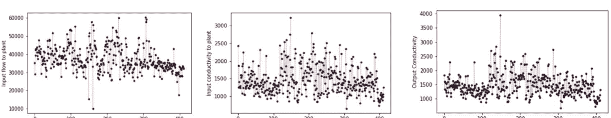

```python
# separate fitting, validation, and test data
from sklearn.model_selection import train_test_split
X_train, X_test, y_train, y_test = train_test_split(X, y, test_size = 0.2, random_state = 100)
X_fit, X_val, y_fit, y_val = train_test_split(X_train, y_train, test_size = 0.3, random_state = 100)

# fit XGBoost model
import xgboost
model = xgboost.XGBRegressor(max_depth=3, learning_rate=0.1, random_state=100)
model.fit(X_fit, y_fit, eval_set=[(X_val, y_val)], early_stopping_rounds=2)
```

由于Boosting更倾向于使用浅层树，因此使用`max_depth`参数将树深度限制为3。如果需要，可以通过网格搜索调整此超参数。`early_stopping_rounds`参数用于指示XGBoost，如果在连续2轮迭代中验证准确度没有提高，则停止迭代（或添加更多基础模型）。在模型拟合期间，每次迭代的验证准确度都会报告，如下所示。这里，使用rmse作为评估指标；可以通过`fit`方法中的`eval_metric`参数指定任何其他指标。

```
[0] validation_0-rmse:1374.03943
[1] validation_0-rmse:1242.94312
[2] validation_0-rmse:1123.29248
[3] validation_0-rmse:1017.00002
...
[45] validation_0-rmse:115.01207
[46] validation_0-rmse:115.25280
[47] validation_0-rmse:115.51093
[48] validation_0-rmse:115.25786
```

XGBoost还有其他几个设置可用于调整模型。你可以在官方文档<sup>46</sup>中查看它们。图9.14显示了XGBoost回归模型的预测结果。模型准确度表明模型性能良好，没有明显的过拟合。

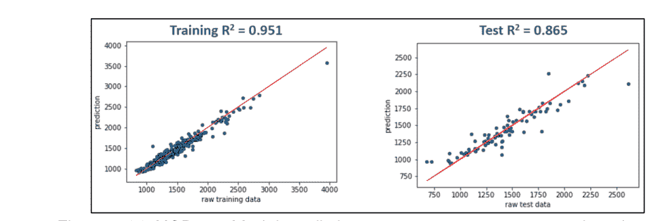

本章是对集成学习的快速概览，集成学习是现代机器学习的重要支柱。本章介绍的每个主题都有更多我们无法在此涵盖的高级方面。然而，你现在已具备必要的基础知识和熟悉度，可以探索这些高级方面。

### 总结

在本章中，我们学习了决策树建模方法。我们看到了随机森林如何帮助克服树的高方差问题。然后，我们研究了更广泛的集成学习概念，它可以用于克服弱模型的高偏差和/或高方差问题。概念性地介绍了两种流行的集成方法，即Bagging和Boosting。最后，我们使用XGBoost（一种流行的梯度提升树实现）来预测污水处理厂的出水水质。本章为你的机器学习工具库增添了几种强大的技术，你会发现你会经常使用它们。

## 第10章
### 其他实用的经典机器学习技术

在本章关于经典机器学习方法的最后一章中，我们将研究两种流行的非参数技术，即核密度估计（KDE）和k近邻（kNN）。这些方法在概念和数学上都很简单，但在实践中已被证明非常有用。KDE允许我们使用过程数据计算概率密度函数，而kNN则便于利用（几何上）相邻的样本对新数据样本进行特征描述。你可能还记得，KDE在前面的章节中经常被提及，作为估计复杂过程系统监控指标阈值的首选技术；我们将在本章中了解如何做到这一点。在多变量设置中，KDE也用于异常值检测。kNN最常见的用途是分类，但也报道了传统kNN的其他几种有趣改编，我们将研究kNN在故障检测中的一种此类应用。

到目前为止，本书中的大多数示例都涉及使用单一机器学习技术来解决给定问题。然而，没有必要孤立地使用不同的机器学习算法。结合不同的机器学习方法（例如PLS与PCA，或ANN与PLS）有时可以提供更好的性能。在结束本书关于经典机器学习技术的这一部分之前，我们将看几个涉及机器学习技术巧妙组合的例子。

具体来说，我们将在本章涵盖以下主题：

- KDE简介
- 使用KDE查找过程监控控制限
- kNN简介
- 使用kNN进行故障检测
- 技术结合作为一种有用的策略

### 10.1 KDE简介

核密度估计（KDE）是一种从数据中估计变量或一组变量的联合概率密度的技术，无需对底层分布的形式有任何先验知识。图10.1显示了一个一维示例，其中估计的KDE密度曲线叠加在使用观测数据构建的直方图上。显而易见，KDE是一种稳健的概率密度估计方法。使用KDE曲线，我们可以估计新的变量测量值落在任何指定范围内的可能性。

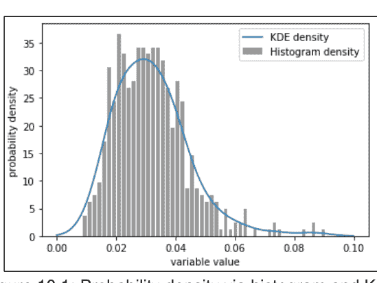

为了了解KDE的用途之一，请回想一下我们迄今为止用于估计过程监控指标阈值的两种方法。我们计算的是样本（对于ICA）或假设分布（例如PCA T²指标的F分布）的百分位数。第一种方法在样本数量较少时不适用，而第二种方法对于复杂系统（或过程变量不服从高斯分布的系统）则不切实际，因为事先不知道指标分布。在这些情况下，可以使用KDE进行控制限估计。

也可以使用直方图来估计概率密度。然而，如图10.1所示，得到的是非平滑值，即相邻点的密度存在急剧跳跃。这些急剧跳跃并非由于底层的真实分布，而仅仅是分箱位置选择的产物。直方图的密度估计强烈依赖于分箱数量和分箱位置的选择。对于高维数据集，这些问题变得更加严重。因此，对于密度估计，KDE比直方图更受青睐。

> 在本章开头，我们将KDE和kNN归类为非参数方法。参数与非参数是机器学习的一个重要分类。参数方法假设底层模型具有固定形式，仅使用数据估计模型参数；非参数方法则不做任何此类假设。密度估计的参数方法将是假设一个高斯密度函数，然后从数据中估计均值和标准差。你已经学过的其他流行的非参数方法是决策树和支持向量机。

### 数学背景

在高斯混合建模中，整体密度被近似为以不同聚类为中心的局部高斯函数之和。KDE将这一思想发挥到极致，在每个数据点上放置一个局部密度函数（也称为核），如下所示的一维情况，其中使用了流行的核选择——高斯核，N是训练样本数。

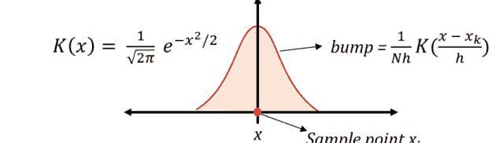

上图中的参数h称为带宽或平滑参数，有助于确定局部凸起的宽度。任何点处的整体密度（p_KDE(x)）通过简单地将局部凸起相加得到，如下所示。

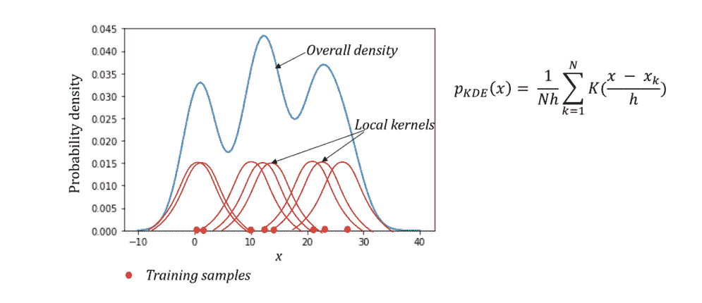

核的选择使得 $\int_{-\infty}^{\infty} K(x) \, dx$，即KDE曲线下的总面积为1。对于具有$D$个维度的多维情况，$p_{KDE}(x)$由下式给出

$$p_{KDE}(x) = \frac{1}{Nh^D} \sum_{k=1}^{N} K\left(\frac{x - x_k}{h}\right)$$

上述多变量KDE对所有轴使用相同的带宽；为了处理沿不同轴的非均匀分布，会使用不同的带宽。本章我们将主要处理单变量问题。

### 决定KDE超参数

核K和带宽是KDE算法所需的两个超参数。图10.2显示了scikit-learn中可用的核。核的选择通常不是非常关键，高斯核通常是默认选择。

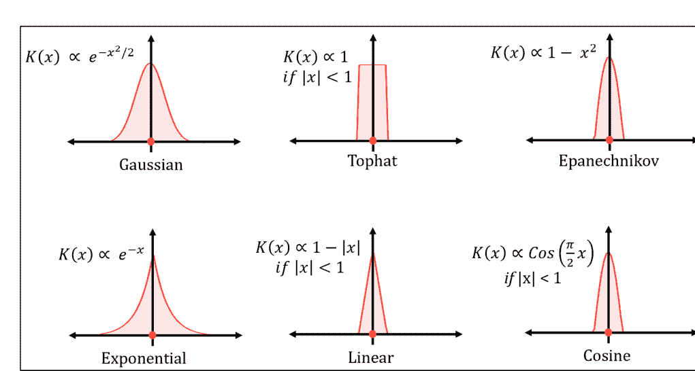

然而，带宽是一个关键参数，应谨慎选择。带宽过小会导致密度估计中出现尖峰，这是由于过拟合；单个数据点的存在与否会显著影响密度估计，导致高方差。带宽过大会过度平滑密度曲线，可能掩盖数据中的关键结构；真实密度与估计密度之间的差异变大，导致高偏差。图10.3说明了这种偏差-方差权衡。

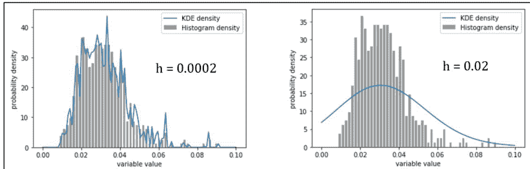

图10.3：过拟合的KDE（左）和欠拟合的KDE（右）

选择$h$的一种经验方法是假设某种底层标准分布，然后最小化KDE估计与假设分布之间的误差。在高斯假设下，带宽由下式给出

$$h = 1.06\sigma N^{-1/5}$$

其中$\sigma$是样本标准差。一个更稳健的修正版本由下式给出

$$h = 0.9AN^{-1/5} ; A = min(\sigma, \frac{IQR}{1.34})$$

其中IQR是四分位距。然而，这些经验方法可能不会给出好的结果。一种更系统的方法是使用交叉验证来选择使验证数据的概率或似然最大化的带宽值。为此，可以使用GridSearchCV，它会自动从提供的带宽值中返回最优带宽。GridSearchCV使用KernelDensity估计器的score方法，该方法返回验证数据点处的对数似然（密度的对数）。

为了应用KDE，让我们重新审视第6章中的ICA示例。我们将使用KDE确定TEP过程的监控控制限。首先，让我们看看如何将最优KDE曲线拟合到监控指标值。为了说明，我们将使用训练样本的$I_e^2$值。请注意，我们使用h的经验表达式来决定网格搜索的带宽值列表。

```python
# 通过GridSearchCV寻找最优KDE带宽
from sklearn.neighbors import KernelDensity
from sklearn.model_selection import GridSearchCV

N = len(ICA_statistics_train[:,1])
empirical_h = 1.06*np.std(ICA_statistics_train[:,1])*N**(1/5)
h_grid = np.linspace(0,5,50)*empirical_h # 50个候选值
```

```python
grid = GridSearchCV(KernelDensity(), {'bandwidth': h_grid}, cv=N) # 留一法交叉验证
grid.fit(ICA_statistics_train[:,1][:,None]) # 需要二维数组

print('经验h {:.4f}: 最优h {:.4f}'.format(empirical_h, grid.best_params_['bandwidth']))

>>> 经验h 0.0461: 最优h 0.0047

# 最优KDE和直方图
kde = grid.best_estimator_
metric_grid = np.linspace(0,0.1,100)[:,None]
density = np.exp(kde.score_samples(metric_grid)) # 取指数是因为score_samples方法返回密度的对数

plt.hist(ICA_statistics_train[:,1], bins=50, color='grey', histtype='bar', alpha=0.8, density=True, rwidth=0.7, label='直方图密度')
plt.plot(metric_grid, density, alpha=1, label='KDE密度')
plt.ylabel('概率密度'), plt.xlabel('Ie2值')
```

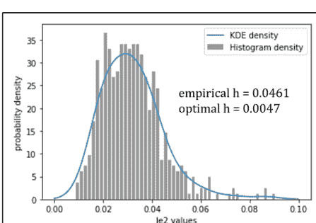

图10.4：拟合到$I_e^2$监控指标的最优KDE曲线

我们可以看到，GridSearchCV返回了一个最优的KDE，它正确地反映了底层数据的分布，而没有过拟合虚假的细节。

### 10.2 通过KDE确定监控指标控制限

假设我们想找到监控指标的99%控制限。手头有了最优KDE曲线，所需的控制限将是这样一个指标值：其下的面积该值右侧的KDE曲线面积为0.01，如图10.5所示。根据定义，测试样本（来自与训练样本相同的分布）的度量值高于99%控制限的概率仅为1%。在过程监控术语中，这意味着故障报警为误报的概率为1%。

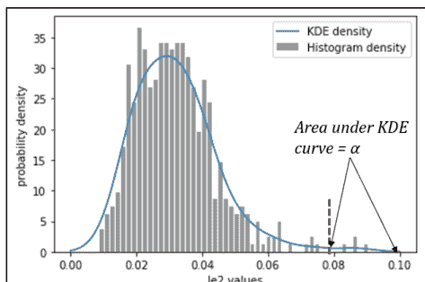

图10.5：监控度量的100(1-α)百分位数或控制限。对于99%控制限或第99百分位数，α = 0.01。

需要数值积分来计算KDE曲线下任意两个度量值之间的面积。让我们定义一个函数，该函数接收度量值并返回对应于指定百分位数的控制限。如你所见，我们将度量轴划分为100个区间的网格（metric_grid），并计算了每个网格点左侧KDE曲线下的面积。具有所需最小面积（由百分位数参数指定）的网格点即成为我们的控制限。

```python
def get_CL_via_KDE(metric_values, percentile, metricLabel):
    """ calculate control limit for a monitoring statistic via KDE

    parameters
    ----------
    metric_values: numpy array of shape = [n_samples,]
    """

    # find optimal KDE bandwidth via CV
    N = len(metric_values)
    empirical_h = 1.06*np.std(metric_values)*N**(1/5)
    h_grid = np.linspace(0,5,50)*empirical_h

    CV_grid = GridSearchCV(KernelDensity(),{'bandwidth': h_grid}, cv=N) # leave-one-out CV
    CV_grid.fit(metric_values[:,None]) # 2D array is expected
    optimal_h = CV_grid.best_params_['bandwidth']

    # compute density values via KDE
    kde = CV_grid.best_estimator_
    metric_grid = np.linspace(0, np.max(metric_values), 100)[:,None]
    metric_pdf_values = np.exp(kde.score_samples(metric_grid)) # pdf = probability density function

    # Find control limit via numerical integration
    metric_cdf_values = [np.trapz(metric_pdf_values[:i, None], metric_grid[:i,:], axis=0)[0] for i in range(100)] # cdf = cumulative density function
    metric_CL = metric_grid[np.argmax(np.array(metric_cdf_values) > percentile/100),0]

    return metric_CL
```

我们现在可以利用此函数计算ICA监控度量的99%控制限。我们可以看到，这些控制限与我们在第6章中先前获得的结果相似。

```python
I2_CL = get_CL_via_KDE(ICA_statistics_train[:,0], 99, 'I2')
Ie2_CL = get_CL_via_KDE(ICA_statistics_train[:,1], 99, 'Ie2')
SPE_CL = get_CL_via_KDE(ICA_statistics_train[:,2], 99, 'SPE')

draw_ICA_monitoring_charts(ICA_statistics_train, [I2_CL, Ie2_CL, SPE_CL], 'training')
```

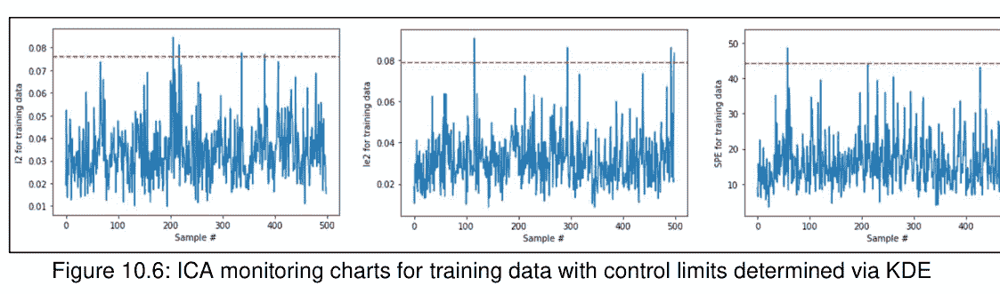

通过KDE进行数据密度估计还有其他用途。低密度区域的样本可以从高密度区域中分离出来，并作为异常值丢弃。你可以将KDE用于图4.15所示的场景进行数据预处理。此外，也可以通过采用以下逻辑来构建过程监控工具：落在低密度区域（根据训练数据估计）的测试样本将是异常样本。对于所有这些应用，构建KDE模型的过程保持不变。

### 10.3 kNN：简介

k近邻（kNN）是一种通用技术，基于一个简单直观的思想：新样本的标签/值可以从训练数据集中最近邻样本（在特征空间中）的标签/值获得。参数$k$表示算法使用的邻近样本数量。如图10.7所示，kNN可用于分类和回归。对于分类，kNN将测试样本分配给$k$个邻居中出现最多的类别。对于回归，预测输出是$k$个邻居值的平均值。由于其简单性，kNN被广泛用于模式分类，并被列入数据挖掘十大算法列表。$^{47}$

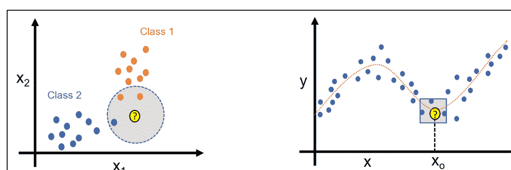

> kNN属于惰性学习器类别，其中模型在接收到测试样本之前不会显式构建。在光谱的另一端，急切学习器（如SVM、决策树、ANN）从训练样本中“学习”显式模型。毫不奇怪，急切学习器的训练较慢，但测试较快。kNN需要计算测试样本与所有训练样本的距离，因此，kNN也属于基于实例的学习类别。基于实例的学习器通过将测试样本与存储在内存中的训练实例进行比较来进行预测。另一方面，基于模型的学习器不需要存储训练实例即可进行预测。

### 概念背景

除了整数$k$和输入-输出训练对之外，kNN算法还需要一个距离度量来量化测试样本与训练样本的接近程度。通常采用标准的欧几里得度量。一旦确定了最近邻，可以采用两种方法，即均匀加权和基于距离的加权，来决定分配给每个邻居的权重，这会影响邻居在预测中的贡献。在均匀加权中，所有$k$个邻居被平等对待，而在基于距离的加权中，每个$k$个邻居的权重与其到测试样本的距离的倒数成正比，因此更近的邻居将有更大的贡献。下图说明了两种加权方案在分类问题上的差异。

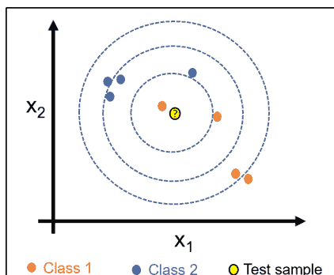

图10.8：加权方案对kNN输出影响的说明。虚线圆圈用于距离参考。

在图10.8中，使用均匀加权（对于分类问题也称为多数投票），当$k = 1$或3时，测试样本被分配到类别1，当$k = 6$时被分配到类别2。对于$k = 8$，无法做出决策。使用距离加权时，对于k = 1、3、6或8，测试样本始终被分类为类别1。此说明表明，距离加权有助于减少预测对$k$选择的依赖性。

对于预测，kNN需要计算测试样本与所有训练样本的距离。对于大型训练集，此计算可能变得昂贵。然而，已经开发了专门的技术，如KDTree和BallTree，以在不影响预测准确性的情况下加速邻近点的提取。这些技术利用数据中的结构来避免计算与所有训练样本的距离。scikit-learn中的NearestNeighbors实现会自动选择最适合当前问题的算法。scikit-learn提供了KNeighborsRegressor和KNeighborsClassifier模块，分别用于回归和分类。

在kNN中需要特别注意的几点包括变量选择和变量缩放。对输出预测不重要的变量应被移除；否则，不重要的变量将对最近邻的确定产生不利影响。此外，所选变量应适当缩放，以确保在距离计算过程中，具有较大数值的变量不会掩盖其他变量的贡献。

### 决定kNN超参数

超参数$k$的选择至关重要，是平衡欠拟合和过拟合的调节旋钮。较小的$k$可能导致过拟合，其中噪声测量会对预测产生不利影响。较大的$k$可以减少噪声的影响，但可能导致欠拟合，因为它过度平滑了回归的预测或使分类边界不那么清晰。不幸的是，关于$k$的选择没有标准指导。最佳值取决于数据，可以通过交叉验证来估计。

### kNN在过程系统中的应用

如前所述，kNN方法常用于设备状态监测$^{48}$。对于过程级监控，如果有足够的历史故障样本，kNN分类可用于将过程异常分类为不同的故障类别。与kNN故障分类相反，He和Wang提出了一种有趣的kNN故障检测适应方法，该方法仅使用正常操作数据$^{49}$。我们将在下一节更详细地研究此应用。

kNN在过程系统中的其他一些值得注意的应用包括Facco等人关于软传感器自动维护的工作$^{50}$、Borghesan等人关于过程扰动预测的工作$^{51}$、Cecilio等人关于检测瞬态过程扰动的工作$^{52}$，以及Zhou等人关于工业过程故障识别的工作$^{53}$。这些应用可能不直接使用kNN方法进行分类或回归，而是使用最近邻相似性的基本概念。

<sup>48</sup> Dong Wang, K-nearest neighbors based methods for identification of different gear crack levels under different motor speeds and loads: Revisited, Mechanical Systems and Signal Processing, 2016
<sup>49</sup> He and Wang, Fault detection using k-nearest neighbor rule for semiconductor manufacturing processes, IEEE Transactions on Semiconductor Manufacturing, 2007.
<sup>50</sup> Facco et al., Nearest-neighbor method for the automatic maintenance of multivariate statistical soft sensors in batch processing, Industrial Engineering & Chemistry Research, 2010.
<sup>51</sup> Borghesan et al., Forecasting of process disturbances using k-nearest neighbors, with an application in process control, Computers and Chemical Engineering, 2019.
<sup>52</sup> Cecilio et al., Nearest neighbors methods for detecting transient disturbances in process and electromechanical systems, Journal of Process Control, 2014.
<sup>53</sup> Zhou et al., Fault identification using fast k-nearest neighbor reconstruction, Processes, 2019

### 10.4 基于kNN的半导体制造过程故障检测

kNN<sup>28</sup>故障检测（FD-kNN）基于一个简单的思想：故障测试样本与最近训练样本（从正常运行工况获得）的距离，必然大于正常样本与其邻近训练样本的距离。将这一思想融入过程监控框架，为每个训练样本定义一个监控指标（称为kNN平方距离），如下所示

$$D_i^2 = \sum_{j=1}^k d_{ij}^2$$

其中 $d_{ij}^2$ 是第 $i$ 个样本与其第 $j$ 个最近邻之间的距离。计算出所有训练样本的kNN平方距离后，可以计算出对应于所需置信限的阈值。如果测试样本的kNN平方距离大于该阈值，则被视为故障。

FD-kNN的一个优势是它适用于具有复杂特性的过程系统，例如多模态、非高斯性和非线性。为了说明FD-kNN的完整应用，我们将使用第8章中用于基于GMM过程监控的金属蚀刻数据集。如果您还记得，批次数据在缩放和PCA应用之前进行了展开。我们将使用Sklearn的Pipeline功能进行相同的预处理变换。遵循He & Wang的工作，$k$ 设置为5。为了计算监控指标阈值，我们将使用KDE。

```python
# scale data & fit PCA model via pipeline
from sklearn.pipeline import Pipeline

pipe = Pipeline([('scaler', StandardScaler()), ('pca', PCA(n_components = 3))])
score_train = pipe.fit_transform(unfolded_dataMatrix)

# k-nearest neighbors of each training sample in score space
from sklearn.neighbors import NearestNeighbors

nbrs = NearestNeighbors(n_neighbors=6).fit(score_train) # a data-point is its own neighbor
d2_nbrs, indices = nbrs.kneighbors(score_train)
d2_sqrd_nbrs = d2_nbrs**2
D2 = np.sum(d2_sqrd_nbrs, axis = 1)
D2_log = np.log(D2)
D2_log_CL = get_CL_via_KDE(D2_log, 95, 'D2_log')
```

图10.9展示了将KDE拟合到kNN平方距离分布的结果，以及训练样本的最终监控图。请注意，我们对kNN平方距离进行了对数变换，因为将KDE应用于D²会导致D²低于0时出现非零密度。图10.10展示了故障测试样本的监控图。20个样本中有15个被正确标记为故障，而5个样本被误诊为正常。

```python
# scale and PCA on faulty test data
score_test = pipe.transform(unfolded_TestdataMatrix)

# D2_log_test
d2_nbrs_test, indices = nbrs.kneighbors(score_test)
d2_nbrs_test = d2_nbrs_test[:,0:5] # we want only 5 nearest neighbors
d2_sqrd_nbrs_test = d2_nbrs_test**2
D2_test = np.sum(d2_sqrd_nbrs_test, axis = 1)
D2_log_test = np.log(D2_test)
```

### 10.5 结合机器学习技术

在本书中，我们已经探讨了几种不同的机器学习技术。我们试图获得对这些方法的概念性理解，而不仅仅是学习如何通过Sklearn模块应用它们。这使我们能够调整这些技术的标准算法以适应我们的特定需求。一个可以证明非常有用的领域是，当你需要将不同的机器学习技术结合起来以利用各自优势时。一种常见的组合方案是使用PCA进行特征提取，然后在提取的特征上应用其他方法。然而，如果您深入研究过程系统工程中的机器学习文献，可以发现其他几种有趣的组合。其中一种方案（也称为外部分析<sup>54 55</sup>）如下图所示。在该方案中，在应用基于PCA或ICA的故障检测之前，从输出变量中移除正常工厂运行条件变化（由过程输入指示）的影响。相关作者已证明，通过此方案，故障检测性能显著提高。

外部分析成功背后的秘密是，过程数据的非线性或动态特性可以通过专门的建模工具处理，然后输出残差（输出测量值与预测值之间的差异）可以由PCA高效处理。另一个值得注意的方案包括人工神经网络（ANN）和PLS<sup>56</sup>的集成。PLS强大的降维能力与ANN的非线性建模能力相结合，以获得高保真度的软测量模型。

<sup>54</sup> Kano et al., Evolution of multivariate statistical process control: application of independent component analysis and external analysis, Computers & Chemical Engineering, 2004
<sup>55</sup> Ge et al., Robust online monitoring for multimode processes based on nonlinear external analysis, Industrial Engineering & Chemistry Research, 2008
<sup>56</sup> Qin & McAvoy, Nonlinear PLS modeling using neural networks, Computers & Chemical Engineering, 1992

Jemwa & Aldrich<sup>57</sup> 提出了一种结合SVM和决策树的方案。该方案涉及明智地使用支持向量来减少用于构建决策树模型的样本数量。最终结果包括以下类型的最优操作策略

如果 $0.6 \leq \text{反应物摩尔分数} \leq 0.9$
则保持反应物温度在 $270 - 290 \text{ K}$ 范围内

这些只是几个例子，说明了如何通过仔细且概念上合理的组合不同的机器学习技术来构建非常强大的模型。请注意，与更系统的集成学习技术相比，这些组合策略更具临时性和情境依赖性。关键要点是，只要您了解其底层机制并且组合在理论上合理，如果您的问题无法通过单一技术得到满意处理，尝试各种组合并无坏处。

### 总结

本章结束了我们对经典机器学习方法世界的探索。我们希望您已经感到充满力量，并且对机器学习的兴趣有所增加。到目前为止，您所学到的方法应该能够帮助您解决作为过程数据科学家将面临的大多数问题。在掌握了经典技术之后，现在让我们准备好步入神奇的人工神经网络世界。

## 第三部分

### 人工神经网络与深度学习

## 第11章

### 前馈神经网络

毫不夸张地说，人工神经网络（ANN）已经（重新）吸引了数据科学家的迷恋，目前是机器学习从业者中最热门的话题。最近的几项技术突破和计算进步使得（深度）ANN能够为广泛的问题提供显著的结果。过程系统工程也不例外，它在替代建模、预测性设备维护等领域正见证着越来越多的应用。

毫无疑问，ANN已被证明非常强大。然而，能力越大，责任越大！如果您在应用ANN时不谨慎，最终会得到令人失望的结果。为了高效地为复杂系统训练ANN模型，需要仔细设置几个超参数，这在很大程度上仍然是一项试错练习。尽管如此，已经设计了几种技术来克服ANN模型训练带来的挑战。

在本章中，我们将揭开ANN世界的神秘面纱，并深入了解ANN的工作原理。我们将学习基本概念、行业技巧、常见问题以及处理这些问题的技术。具体涵盖以下主题

- 人工神经网络简介
- 探索ANN中的非线性
- ANN的超参数优化
- 改进ANN模型训练的技巧
- 基于ANN的非线性软测量
- 过程系统工程中ANN建模的一般指南

### 11.1 ANN：简介

人工神经网络（ANN）是一种非线性经验模型，它可以通过监督学习捕捉输入-输出变量之间的复杂关系，或通过无监督学习识别数据模式。从结构上看，ANN的灵感来源于人脑，是一个由相互连接的神经元组成的复杂网络，如图11.1所示。一个ANN由一个输入层、一系列隐藏层和一个输出层组成。网络的基本单元——神经元，接受来自源输入层或网络前一层的输入向量，对输入进行加权求和，然后执行非线性变换以产生单个实数值输出。每个隐藏层可以包含任意数量的神经元。事实上，一个仅包含1个隐藏层的ANN就具有万能逼近特性，即它可以以任意精度逼近任何连续函数。

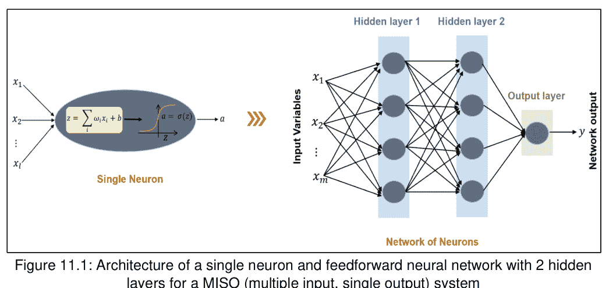

图11.1所示的网络是全连接前馈神经网络（FFNN）的一个例子，这是最常见的ANN类型。在FFNN中，信号仅沿一个方向流动，从输入层通过隐藏层流向输出层，这与包含反馈循环的RNN不同。在全连接网络中，连续层之间的神经元是完全成对连接的，而同一层内的神经元则不相连。

虽然存在不同类型的ANN架构（而且机器学习研究人员还在不断提出新的架构！），但FFNN、RNN和CNN是最常见的架构。我们将在下一章研究RNN，而本章将重点介绍FFNN。CNN主要用于图像处理，本书不作介绍。

### 深度学习

ANN近年来的流行可归功于深度学习的成功。深度学习简单来说就是使用深度神经网络（DNN）进行机器学习，DNN是具有两个或更多隐藏层的ANN（见图11.2）。虽然具有大量神经元的浅层网络理论上可以建模任何复杂函数，但深层网络所需的模型参数要少得多，因此理论上训练速度更快。此外，DNN能够绕过手动特征工程；前几个隐藏层会隐式地生成供后续层使用的特征。

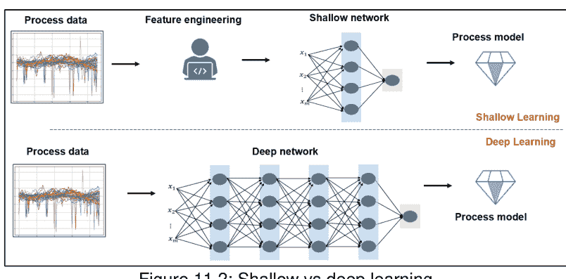

尽管DNN似乎优于浅层网络，但直到最近，DNN的应用还不多。DNN在模型训练过程中存在梯度消失和梯度爆炸的问题。然而，近年来，几项技术创新产生了更好的非线性变换器（激活函数）、初始化和正则化方案，以及学习/优化算法。这些创新在很大程度上克服了DNN的模型训练问题，再加上廉价计算能力和大量数据的可用性，共同促成了我们今天所见证的AI革命。

> 需要注意的是：DNN的强大能力不应让你低估特征工程的重要性。显式特征工程通过考虑底层过程系统的具体特性，为过程数据提供上下文。例如，对于时间序列振动数据，通过频域变换和分箱进行的特征工程可以极大地帮助后续的网络训练；如果没有这个，DNN将需要大量训练数据来隐式地学习这些特征。

### TensorFlow

对于经典的机器学习实现，我们使用了Scikit-learn中可用的包。对于ANN，通常使用其他专用库，这些库使得构建神经网络模型变得非常容易。TensorFlow（由Google开发）和PyTorch（由Facebook开发）是两个最受欢迎的深度学习框架。这些框架提供了用于高效训练ANN的专用算法。

直接应用TensorFlow（TF）并不十分直观，且学习曲线陡峭。建模者通常使用构建在TF之上的高级API——Keras来进行ANN建模。然而，Google在2019年发布的最新版本TF已将Keras直接集成到TF中。这使得仅用几行代码就能定义、训练和评估ANN模型成为可能。本书将使用TensorFlow Keras API。下一节将展示一个快速应用，用于建模联合循环电厂，以说明这些深度学习库的易用性。

> 过程系统神经网络：简史

深度学习革命为过程系统工程（PSE）领域的机器学习研究人员注入了一剂强心针，他们现在正在探索ANN的“大胆”应用，例如通过“学习”模型预测控制器（MPC）的最优策略，用ANN替代MPC。然而，神经网络对PSE领域来说并不新鲜。在深度学习时代之前，也出现了一些有趣的ANN在过程系统中的应用。Venkatasubramanian和Himmelblau对ANN在PSE中的历史提供了精彩的记述。

90年代是一个相对活跃的时期，见证了ANN在故障检测、软测量、数据协调*等方面的应用。随后，由于计算限制和缺乏大数据，人们对ANN的兴趣有所下降。如今，这些限制在很大程度上已被克服，ANN有望在PSE领域产生重大影响。

+Kumar et. al., Industrial, large-scale model predictive control with structured neural networks, Computers and Chemical Engineering, 2021
++Venkat Venkatasubramanian, The promise of artificial intelligence in chemical engineering: is it here, finally?, AIChE Journal, 2018
+++David Himmelblau, Accounts of experiences in the application of artificial neural networks in chemical engineering, Industrial Engineering & Chemistry Research, 2008
*Karjarla, Dynamic data rectification via recurrent neural networks, Ph.D. Thesis, The University of Texas at Austin, 1995

### 11.2 通过FFNN对联合循环电厂（CCPP）进行过程建模

我们将使用CCPP的数据来说明使用TF Keras构建深度学习模型的便捷性。该数据集（详见附录）是在6年期间收集的，包含环境温度（AT）、环境压力（AP）、相对湿度（RH）和排气真空度（V）的小时平均值。这些变量影响着电厂在满负荷运行时的每小时净电能输出（数据集中也提供了该值），并将成为我们ANN模型中的目标变量。让我们首先探索一下数据集。

```python
# import required packages and read data
import numpy as np, pandas as pd
import matplotlib.pyplot as plt

data = pd.read_excel('Folds5x2_pp.xlsx', usecols = 'A:E').values
X, y = data[:,0:4], data[:,4][:,np.newaxis]

# plot input vs output for each input
plt.plot(X[:,0], y, '*'), plt.title('AT vs EP')
plt.plot(X[:,1], y, '*'), plt.title('V vs EP')
plt.plot(X[:,2], y, '*'), plt.title('AP vs EP')
plt.plot(X[:,3], y, '*'), plt.title('RH vs EP')
```

图11.3清楚地表明了输入变量对电功率（EP）的影响。

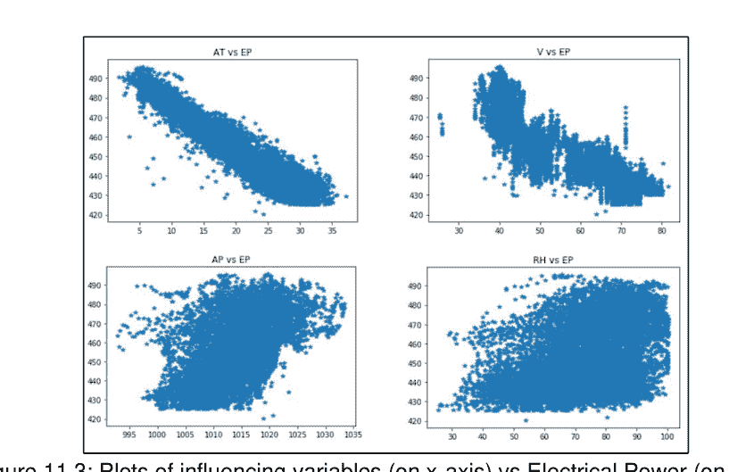

排气真空度和功率之间也存在非线性关系的迹象。虽然AP和RH似乎对功率影响不大，但已知的事实是，功率会随着AP和RH的单独增加而增加<sup>58</sup>。现在让我们构建一个具有2个隐藏层的FFNN模型来预测功率。我们首先将数据集分为训练数据和测试数据，然后对变量进行缩放。

```python
# separate train and test data
from sklearn.model_selection import train_test_split
X_train, X_test, y_train, y_test = train_test_split(X, y, test_size = 0.2, random_state = 100)

# scale data
from sklearn.preprocessing import StandardScaler
X_scaler = StandardScaler()
X_train_scaled = X_scaler.fit_transform(X_train)
X_test_scaled = X_scaler.transform(X_test)

y_scaler = StandardScaler()
y_train_scaled = y_scaler.fit_transform(y_train)
y_test_scaled = y_scaler.transform(y_test)
```

为了构建FFNN模型，我们将导入相关的Keras库，并按顺序添加网络的不同层。Dense库用于定义一个与前一层全连接的层。

```python
# import Keras libraries
from tensorflow.keras import Sequential
from tensorflow.keras.layers import Dense

# define model
model = Sequential()
model.add(Dense(8, activation='relu', kernel_initializer='he_normal', input_shape=(4,)))
# 8 neurons in 1st hidden layer
model.add(Dense(5, activation='relu', kernel_initializer='he_normal'))
# 5 neurons in 2nd layer
model.add(Dense(1))
# 1 neuron in output layer
```

以上4行代码完全定义了FFNN的结构。不用担心activation和kernel_initializer参数；我们将在后续章节中更详细地研究它们。

> <sup>58</sup> Pinar Tufekci, Prediction of full load electrical power output of a base load operated combined cycle power plant using machine learning methods, Electrical Power and Energy Systems, 2014

接下来，我们将编译并拟合模型。现在不必担心优化器、epochs 和 batch_size 参数。

```python
# 编译模型
model.compile(loss='mse', optimizer='Adam') # 最小化均方误差

# 拟合模型
model.fit(X_train_scaled, y_train_scaled, epochs=25, batch_size=50)

# 预测 y_test
y_test_scaled_pred = model.predict(X_test_scaled)
y_test_pred = y_scaler.inverse_transform(y_test_scaled_pred)
```

以上几行代码就足以构建一个前馈神经网络并进行预测。相当方便，不是吗？图 11.4 比较了测试数据的实际值与预测值。

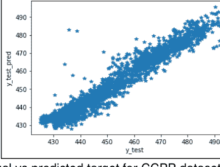

你可以使用 `model.summary` 命令来可视化网络结构并检查模型参数数量，如图 11.5 所示。对于相对简单的 CCPP 数据集，我们只需一个包含 2 个神经元的隐藏层就能获得一个合理的模型。尽管如此，这个例子已经让我们熟悉了创建深度神经网络的过程。

| 层（类型） | 输出形状 | 参数数量 |
| :--- | :--- | :--- |
| dense (Dense) | (None, 8) | 40 |
| dense_1 (Dense) | (None, 5) | 45 |
| dense_2 (Dense) | (None, 1) | 6 |
| 总参数：91 | | |
| 可训练参数：91 | | |
| 不可训练参数：0 | | |

图 11.5：前馈神经网络模型结构及参数数量

### 11.3 数学背景

让我们考虑来自 CCPP 数据集的一个样本输入 $x \in R^4$，并追踪它在网络各层中传递以生成输出的路径。在这个前向传播（也称为前馈传播）过程中，输入首先由第一隐藏层的神经元处理。在该层的第 $j$ 个神经元中，输入的加权和通过激活函数 $g$ 进行非线性变换：

$a_j = g(w_j^T x + b_j)$

其中 $w_j \in R^4$ 是应用于输入的权重，$b_j$ 是加到和上的偏置。因此，每个神经元有 5 个参数（4 个权重和 1 个偏置），导致第一层所有 8 个神经元需要估计 40 个参数。所有 8 个神经元的输出构成向量 $a^{(1)} \in R^8$：

$a^{(1)} = g^{(1)}(W^{(1)}x + b^{(1)})$

其中 $W^{(1)} \in R^{8 \times 4}$ 的每一行包含一个神经元的权重。同一层的所有神经元使用相同的激活函数。$a^{(1)}$ 成为第二隐藏层的输入。

$a^{(2)} \in R^5 = g^{(2)}(W^{(2)}a^{(1)} + b^{(2)})$

其中 $W^{(2)} \in R^{5 \times 8}$。第二层的每个神经元有 8 个权重和一个偏置参数，导致该层有 45 个参数。最终输出层有一个神经元，包含 6 个参数且没有激活函数，网络输出如下：

$a^{(3)} = \hat{y} = (w^{(3)})^T a^{(2)} + b^{(3)}$

其中 $w^{(3)} \in R^5$。

### 激活函数

激活函数是赋予神经网络非线性能力的关键。我们在 CCPP 建模中使用了 ReLU 激活函数。虽然 ReLU（修正线性单元）是当今首选的激活函数，但在深度学习时代之前，通常使用 sigmoid 激活函数。下面的图示展示了 sigmoid 激活函数的形式，它将预激活值 $z$（输入的加权和加上偏置）转换为激活值 $a \in (0, 1)$。sigmoid 函数在预激活值为大的正数（或负数）时在 1（或 0）处饱和，导致深度网络出现梯度消失/梯度为零的问题，这也是为什么 sigmoid 激活函数不再被青睐用于隐藏层的原因。

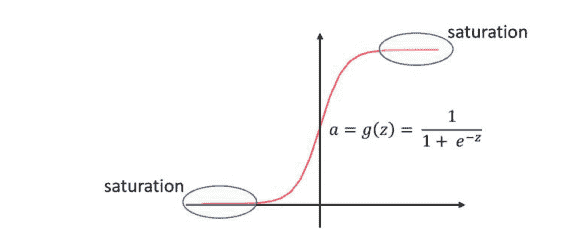

下表列出了其他常用的激活函数。我们将在后续章节中学习这些函数如何为人工神经网络模型赋予非线性。

| 函数 | 方程 | 图形 | 备注 |
|---|---|---|---|
| ReLU | $g(z) = \begin{cases} 0, & z < 0 \\ z, & z \ge 0 \end{cases}$ |  | - 效果非常好，是首选激活函数<br>- 计算成本低<br>- 当 z < 0 时神经元“死亡”（如果“学习率”设置得当，这不是大问题） |
| Leaky ReLU | $g(z) = \begin{cases} \alpha z, & z < 0 \\ z, & z \ge 0 \end{cases}$ |  | - 如果“死亡”的 ReLU 神经元导致问题，可作为替代方案<br>- 性能可能不如 ReLU |
| 双曲正切 (tanh) | $tanh(z) = \frac{e^z - e^{-z}}{e^z + e^{-z}}$ |  | - 范围：(-1, 1)<br>- 容易出现梯度消失问题，且计算成本高 |

### 输出层的激活函数：

输出层激活函数的选择取决于手头的任务。对于回归问题，不使用激活函数（等价于线性函数 $g(z) = z$）。对于类别互斥的分类任务，则使用 softmax 函数。图 11.6 展示了一个用于 3 个互斥类别的网络，其输出层使用了 softmax 激活函数。

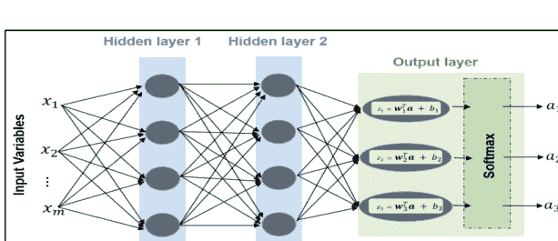

Softmax 是一个指数函数，它生成归一化的激活值，使其总和为 1。在图 11.6 中，激活值 $a_j (j \in [1, 2, 3])$ 的生成如下：

$$a_j = g_{softmax}(z_j) = \frac{e^{z_j}}{\sum_{k=1}^3 e^{z_k}}$$

在人工神经网络领域，作为 softmax 函数输入的预激活值 ($z_j$) 也称为 logits。Softmax 激活值介于 0 和 1 之间，因此被解释为类别成员概率。预测的类别标签取为概率（或激活值）最大的类别：

$$\hat{y} = argmax(a_j, j \in [1, 2, 3])$$

正如你将在下一小节看到的，在模型训练期间直接使用的是预测的类别概率（而不是预测的类别标签）。对于类别不互斥的分类任务，输出层的神经元使用 sigmoid 函数。对于二元互斥分类问题，输出层使用单个神经元时也使用 sigmoid 函数。

### 损失函数与代价函数

人工神经网络通过最小化目标变量的测量值与预测值之间的不匹配来优化其模型参数。损失函数量化了单个样本的这种不匹配。在模型训练期间被最小化的、训练数据集样本上的损失函数的平均值称为代价函数。对于回归问题，常用的损失函数是 mse（均方误差）：

$$MSE \ Loss = (y_{sample} - \hat{y}_{sample})^2$$

相应的代价函数变为：

$$MSE \ Cost = \frac{1}{\# \ of \ samples} \times \sum_{samples} (y_{sample} - \hat{y}_{sample})^2$$

注意，上述表达式适用于标量输出；对于多维输出，求和也需在不同维度上进行。回归的另一个流行损失指标是 mae（平均绝对误差），它衡量绝对差值 $|y_{sample} - \hat{y}_{sample}|$。与 MSE 相比，MAE 代价对异常值更稳健，因为大误差不会通过平方而受到严重惩罚。然而，由于其不连续性，MAE 指标效率较低。可以通过 rmse（均方根误差）指标实现良好的折衷。

对于二元/二分类问题，默认的损失函数是二元交叉熵。设 $y$（可取值 0 和 1）为数据样本的真实标签，$p$（或 $\hat{y}$）为从 sigmoid 输出层获得的预测概率（$y = 1$ 的概率）。交叉熵损失由下式给出：

$$Cross - entropy Loss = -y * log(p) - (1 - y) * log(1 - p) = \begin{cases} -log(1 - p), & y = 0 \\ -log(p), & y = 1 \end{cases}$$

上述表达式可推广到多分类情况，其中总损失是每个类别标签单独损失的总和：

$$Multi - class cross - entropy Loss = - \sum_{c=1}^{\# \text{ of classes}} y_c log(p_c)$$

其中，$y_c$ 和 $p_c$ 分别是样本属于类别 $c$ 的二元指示变量和预测概率。注意，对于多分类，目标变量将采用独热编码形式。

### 梯度下降优化

一旦定义了代价/目标函数 ($J(\theta)$)，模型参数 ($\theta$) 就会被优化以最小化代价函数。深度学习库最常用的优化方法是梯度下降，其中模型参数通过多次迭代进行估计，在每次迭代中，参数沿着最陡下降方向（$J(\theta)$ 关于 $\theta$ 的梯度的负方向）更新。下面的表达式显示了第 $i$ 个模型参数的更新机制：

$$\theta_{i, next} = \theta_{i, current} - \eta \frac{\partial}{\partial \theta_i} J(\theta)$$

其中 $\eta$（学习率）是一个超参数，决定了每次迭代的更新幅度。为了说明，图 11.7 展示了简单系统（一个和两个模型参数）的代价函数通过多次迭代向其最小值演进的过程。

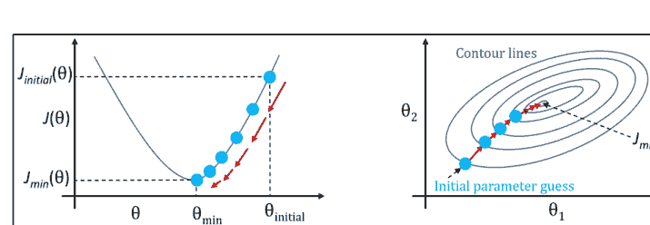

学习率影响优化收敛的速度。在初始迭代中使用较大的学习率有助于快速接近最小值点；然而，过大的值也可能导致发散而非收敛。另一方面，过小的学习率会导致收敛非常缓慢。为处理这种权衡，学习率通常在训练过程中通过学习率调度（随迭代次数降低 $\eta$）或现代优化器中的内置机制（目前更常见的方法）进行调整。

经典（或普通）梯度下降的一个缺点是优化器速度慢且容易陷入局部最小值。为此，人们设计了多种普通方法的变体，这些变体已被证明能提供更好的性能。这些变体包括动量优化、Nesterov加速梯度、AdaGrad、RMSProp和Adam优化。其中，Adam（自适应矩估计）优化结合了动量优化和RMSProp的思想，被推荐作为默认使用的优化器。

> 与所有事物一样，Adam在某些情况下可能表现不佳；在这些情况下，应尝试其他优化器。使用Adam优化时，你不必担心学习率调度，因为它是一种自适应学习率算法，尽管对于某些问题，初始学习率可能需要调整。Adam确实有一些自己的超参数，但通常默认值就能很好地工作。

Adam优化相对于梯度下降的优越性能源于多项算法创新，其中包括使用过去梯度的指数衰减平均值来确定更新方向。我们鼓励你查阅这篇文章$^{59}$，以直观了解这些优化器的工作原理。

### Epochs与batch-size

在普通梯度下降中，每次迭代都使用整个训练数据集来计算梯度。因此，对于大型数据集，每次迭代可能变得非常缓慢。这种方法，也称为批量梯度下降，也不适合在线更新模型，即使用新数据样本快速更新模型。小批量梯度下降（MGD）和随机梯度下降（SGD）是两种替代方法。

在小批量变体中，每次参数更新迭代只使用训练数据集的一个子集进行梯度计算。子集中的样本数量称为batch-size。批量大小通常在32到256之间。MGD导致更快的收敛和更嘈杂/振荡的梯度（不同的小批量可能产生非常不同的更新方向），如图11.8所示。更嘈杂的梯度的一个优点是它可以帮助优化器逃离局部最小值。随机梯度下降（现在不常见）是小批量变体的极端情况，其中batch-size仅为1！虽然技术上不正确，但从业者在使用小批量时也使用SGD这个术语。

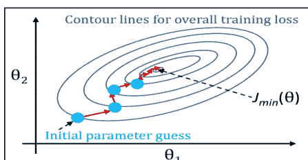

图11.8：小批量和随机梯度下降的梯度比批量梯度下降更嘈杂

在MGD中，优化器需要多次迭代（等于 $\frac{\text{训练样本数}}{\text{批量大小}}$）才能遍历整个训练数据集，这也称为完成一个epoch。在每个epoch开始时，训练数据集通常会被打乱（以防止优化器陷入循环），分成小批量，然后继续更新迭代。epoch数量是另一个关键超参数。训练和验证准确率是针对epoch而非迭代绘制的，以跟踪模型拟合情况。更多的epoch将导致更好的训练准确率，但可能导致更差的验证准确率。我们稍后将了解更多。一个简单的经验法则是，对于较大的批量大小，使用更多的epoch。

### 反向传播

反向传播通过巧妙使用导数计算的链式法则，高效地计算代价函数相对于模型参数的梯度。为了从概念上理解该机制，让我们专注于SGD（为便于解释）并假设我们感兴趣的是计算相对于 $\omega_1$ 的梯度，如图11.9所示。

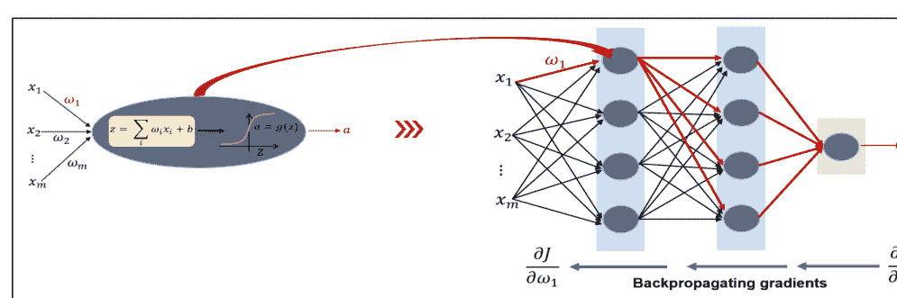

图11.9：反向传播机制示意图

链式法则给出以下表达式

$$\frac{\partial J}{\partial \omega_1} = \frac{\partial J}{\partial a} \times \frac{\partial a}{\partial \omega_1} = \frac{\partial J}{\partial a} \times (\frac{\partial a}{\partial z} \times \frac{\partial z}{\partial \omega_1})$$

虽然 $\frac{\partial z}{\partial \omega_1}$ 就是 $x_1$，$\frac{\partial a}{\partial z}$ 是激活函数的导数，但 $\frac{\partial J}{\partial a}$ 是这里的未知元素。然而，很容易证明，如果已知代价函数相对于第二隐藏层激活的偏导数，就可以计算出这个未知部分，而这些偏导数本身又需要代价相对于输出层激活或 $\hat{y}$ 的导数。这最后一个缺失的元素由下式给出

$$\frac{\partial J}{\partial \hat{y}} = \frac{\partial}{\partial \hat{y}} (y - \hat{y})^2 = \frac{1}{2}(y - \hat{y})$$

上述讨论表明，一旦通过前向传播计算出激活值、预测输出和误差，就会采用反向传播，从最后一层开始逐层计算所需的梯度。对于MGD，通过仔细的记录，可以获得反向传播的紧凑向量-矩阵形式，就像我们为前向传播所做的那样。请注意，技术上反向传播仅指梯度计算的机制，但该术语通常用于指代整个模型拟合算法。

### 梯度消失/爆炸

过去，梯度消失或爆炸问题给深度网络的模型拟合带来了巨大困难。在反向传播中，我们看到梯度从输出层向内层传播。其中一些梯度是激活函数的导数，对于sigmoid和tanh函数，当预激活值较高时，这些导数会变得非常小。

在梯度消失的情况下，由于从外层传播的小梯度的乘积，内层参数的梯度变得非常小。这导致内层参数更新实际上停止，从而导致收敛缓慢和模型拟合不佳。另一方面，有时问题源于由于权重过大而导致梯度变得非常大。由于反向传播，问题加剧并导致训练失败。

Glorot和Bengio的论文（题为“理解训练深度前馈神经网络的困难”）对这些问题进行了出色的调查。研究发现，使用sigmoid激活函数和不良的初始化方案是罪魁祸首之一。如今，这些问题大多通过使用ReLU函数、批量归一化、正确的初始化方案等得到了遏制。

### 11.4 神经网络中的非线性（宽度与深度）

在为复杂非线性模型设计神经网络时，你将做出的最关键决策之一是在增加一层中的神经元数量（增加网络宽度）和增加更多隐藏层（增加网络深度）之间做出选择。网络宽度和深度都以不同的方式影响网络性能。在我们深入探讨这个“宽度与深度”问题之前，让我们更详细地分析ReLU激活函数的作用——这将为我们做出上述决策提供一些线索。

考虑一个接受标量输入并输出绝对值的绝对值函数。这个非线性函数可以通过一个包含2个具有ReLU激活函数的节点的1个隐藏层的FFNN完美建模，如图11.10所示。

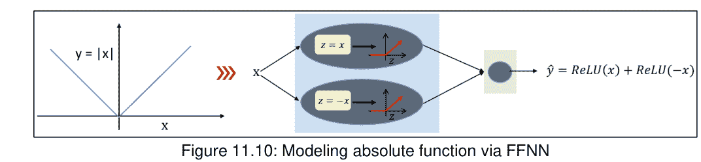

我们能够完美地建模非线性绝对值函数，因为基于ReLU的神经元有效地将输入空间划分为2个区域（x <=0 和 x>=0），其中线性关系成立；本质上，绝对值函数是通过两个分段线性函数建模的。继续这个逻辑，现在假设标量输入-输出系统遵循非线性（二次）关系。该系统同样可以通过使用多个分段线性函数来近似，如图11.11所示。事实上，图中所示的近似是通过一个包含5个ReLU神经元的隐藏层获得的。

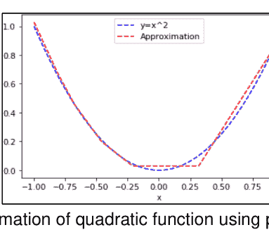

图11.11：使用分段线性函数近似二次函数

从上述图示中我们学到的是，单层中拥有多个神经元有助于神经网络将输入空间划分为若干局部区域，并通过多个分段的简单函数来近似一个复杂函数。因此，一个非常非线性的函数可以用一个非常宽的网络（一个隐藏层中有大量节点）来建模。然而，训练一个非常宽的网络可能会变得有问题。

对于固定宽度的网络，另一种增加非线性能力的方法是增加网络的深度/隐藏层数量，使网络能够估计更复杂的特征。这是因为连续的隐藏层在内部层生成的非线性特征基础上构建，从而为整体操作赋予更多的非线性。对于任何激活函数，在一个具有1个隐藏层的宽网络中，所有神经元的激活具有相似的非线性程度。但是，在一个深层网络中，来自不同层的激活表现出不同程度的非线性，最外层表现出最强的非线性。然而，如前所述，深层网络容易出现梯度消失/爆炸问题。

你可以看到，“更宽还是更深”这个问题的答案并不十分直接。增加网络宽度或深度都可以获得类似的性能提升。这里需要提醒几点：如果网络宽度不足，更高的网络深度可能无法提供足够的性能。例如，无论网络深度如何，如果网络宽度仅为1，则无法精确建模绝对值函数。因此，宽度和深度都很重要。一个经验法则是，对于非线性程度较低的系统，应使用高宽度-低深度的网络；而对于非常复杂的系统，则应使用具有足够宽度的高深度网络。

> 对于过程系统建模，通常2到3个隐藏层对于回归和分类任务就足够了。如果你处理的是具有层次结构的输入（例如图像，复杂形状可以分解为边缘、角点等），那么增加深度会有所帮助。

### 11.5 神经网络超参数优化

我们已经看到，在执行`model.fit`命令之前，必须指定几个超参数。这些包括但不限于网络深度、网络宽度、训练轮数、小批量大小、学习率、正则化惩罚、激活函数类型。虽然大多数超参数都有通用建议，但指定隐藏层数量和每层神经元数量需要一些工作，因为这在很大程度上取决于具体问题。

调整超参数的常见方法基于手动试验和自动网格（或随机）搜索。在手动方法中有两种策略。你可以选择一个复杂的网络结构（比你‘感觉’必要的更多层和神经元），并使用正则化技术和早停法（这些将在下一节讨论）来避免过拟合。或者，你可以从一个简单的结构开始（一个隐藏层和合理数量的神经元），并逐渐增加网络深度和神经元数量，直到过拟合开始出现。

自动方法使用sklearn中的`GridSearchCV`。利用一个`KerasRegressor`包装器将Keras模型传递给`GridSearchCV`。下面的代码展示了实现细节，我们搜索网络深度和宽度、正则化惩罚以及学习率的最佳规格。你会注意到，我们将训练数据分为估计集和验证集，传递给`GridSearchCV`进行交叉验证。此外，FFNN模型通过一个函数定义，我们将其传递给`KerasRegressor`包装器。获得的最佳模型使用一个包含九个神经元的隐藏层。R²值为0.931。

```python
# 分离训练、验证、测试数据
from sklearn.model_selection import train_test_split

X_train, X_test, y_train, y_test = train_test_split(X, y, test_size = 0.2, random_state = 100)
X_est, X_val, y_est, y_val = train_test_split(X_train, y_train, test_size = 0.3, random_state = 100)

# 数据缩放
from sklearn.preprocessing import StandardScaler
```

```python
X_scaler = StandardScaler()
X_est_scaled = X_scaler.fit_transform(X_est)
X_val_scaled = X_scaler.transform(X_val)
X_test_scaled = X_scaler.transform(X_test)

y_scaler = StandardScaler()
y_est_scaled = y_scaler.fit_transform(y_est)
y_val_scaled = y_scaler.transform(y_val)
y_test_scaled = y_scaler.transform(y_test)
```

```python
# 导入包
from tensorflow.keras import Sequential
from tensorflow.keras.layers import Dense
from tensorflow.keras import regularizers
from tensorflow.keras.optimizers import Adam
```

```python
# 模型函数
def FFNN_model(hidden_layers, layer_size, regularizationValue, learningRate):
    model = Sequential()
    model.add(Dense(layer_size, kernel_regularizer=regularizers.L1(regularizationValue),
                   activation='relu', kernel_initializer='he_normal', input_shape=(4,)))

    for _ in range(hidden_layers-1):
        model.add(Dense(layer_size, kernel_regularizer=regularizers.L1(regularizationValue),
                       activation='relu', kernel_initializer='he_normal'))

    model.add(Dense(1))
    model.compile(loss='mse', optimizer=Adam(learning_rate=learningRate))

    return model
```

```python
# KerasRegressor
from tensorflow.keras.wrappers.scikit_learn import KerasRegressor
model = KerasRegressor(build_fn=FFNN_model, epochs=25, batch_size=50)
```

```python
# gridSearchCV
from sklearn.model_selection import GridSearchCV

param_grid={
    "hidden_layers":[1, 2],
    "layer_size":np.arange(1,10),
    "regularizationValue": [0.001, 0.01, 0.1],
    "learningRate":[0.05, 0.01, 0.1]}

grid_searchcv = GridSearchCV(model, param_grid)
```

```python
grid_searchcv.fit(X_est_scaled, y_est_scaled, validation_data=(X_val_scaled, y_val_scaled))

print("获得的最佳参数是:", grid_searchcv.best_params_)

>>> 获得的最佳参数是: {'hidden_layers': 1, 'layer_size': 9, 'learningRate': 0.01, 'regularizationValue': 0.001}

# 最佳模型
model = grid_searchcv.best_estimator_.model
```

### 11.6 改进网络训练的策略

训练ANN模型并不容易，你可能会遇到各种问题。也许你的模型过拟合或欠拟合，或者你陷入了局部最小值，或者你的模型没有收敛。跟踪训练过程有助于了解模型拟合情况，并为潜在的超参数设置调整提供线索。跟踪模型拟合进展的一种方法是绘制训练集和验证集损失随训练轮数变化的图。已经设计了几种策略来处理经常遇到的ANN训练问题。我们将在本节中研究这些策略。

### 早停法

随着优化器迭代更多轮次，训练损失会下降；然而，验证损失可能开始增加。这是模型过拟合的迹象。图11.12显示了一个示例（使用Kamyr蒸煮器数据集生成）。为了防止这种情况，采用了早停法，即当验证损失开始增加时，优化器中止训练。为了实现这一点，需要提供验证集和早停规格，如下方代码所示。注意`history`对象的使用，它保存了训练过程中的损失记录，用于绘制验证图。

```python
# 定义模型
def FFNN_model():
    model = Sequential()
    model.add(Dense(20, activation='tanh', kernel_initializer='he_normal', input_shape=(19,)))
    model.add(Dense(5, activation='tanh', kernel_initializer='he_normal'))
    model.add(Dense(1))
    model.compile(loss='mse', optimizer='Adam')
    return model
```

# 使用早停法训练模型
from tensorflow.keras.callbacks import EarlyStopping
es = EarlyStopping(monitor='val_loss', patience=15)

history = FFNN_model().fit(X_est_scaled, y_est_scaled, epochs=250, batch_size=32,
validation_data=(X_val_scaled, y_val_scaled), callbacks=es)

# 验证曲线绘图
plt.figure()
plt.title('Validation Curves')
plt.xlabel('Epoch')
plt.ylabel('MSE')
plt.plot(history.history['loss'], label='training')
plt.plot(history.history['val_loss'], label='validation')
plt.legend()

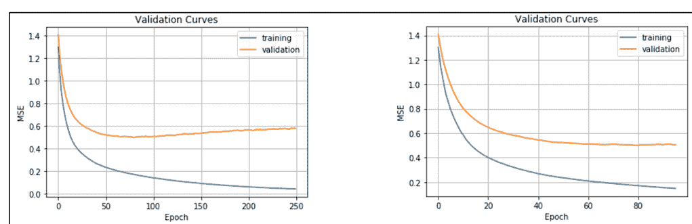

图 11.12：Kamyr蒸煮器数据集在不使用（左）和使用（右）早停法时的验证曲线

通过早停法，我们可以将训练轮数设置为一个较大的值，而无需担心过拟合，因为训练会在合适的时机自动停止。早停回调函数有几个参数可用于调整其行为。例如，我们使用的‘patience’参数指定了在验证集上性能不再提升后允许继续训练的轮数，之后训练将停止。您应查阅TensorFlow官方文档⁶⁰以了解其他早停参数的详细信息。

### 正则化

正如我们之前所学，正则化是一种约束模型权重参数以避免过拟合（训练准确率与验证准确率之间差距过大）的方法。作为最佳实践之一，您在训练ANN模型时应始终采用正则化。因此，正则化惩罚项成为重要的超参数之一。Keras使得指定正则化（L1、L2或两者兼有）变得非常简单，正如在超参数优化示例中所示，在定义Dense层时使用了L1正则化。Keras允许三种类型的正则化器，即kernel_regularizer、bias_regularizer和activity_regularizer，分别用于正则化权重参数、偏置参数和神经元激活值；其中kernel_regularizer是推荐的默认选择。

对于深度网络，另一种形式的正则化非常流行，称为“dropout”。在这种策略中，每次训练迭代时，一些神经元会被“丢弃”，即它们的激活值在前向传播中不被计算，权重更新也不进行。请注意，当前迭代中被丢弃的神经元在下一次迭代中可能变为活跃状态。Dropout已被证明能提供更优的泛化能力<sup>61</sup>，因为它迫使网络避免过度依赖少数几个神经元。在Keras中，dropout是逐层指定的。下面说明了两种方案。在方案1中，dropout层被添加在输入层和第一个隐藏层之间，dropout率（要丢弃的神经元比例）设置为0.2；因此，每次迭代中每5个输入变量中会随机排除一个。在方案2中，dropout层被添加在两个隐藏层之间；同样，每次迭代中第一个隐藏层中每5个神经元中会随机排除一个。请注意，dropout仅在模型训练期间进行。

| 输入层上的Dropout | 隐藏层上的Dropout |
| :--- | :--- |
| model = Sequential()<br>model.add(Dropout(0.2, input_shape=(19,)))<br>model.add(Dense(20),...)<br>model.add(Dense(1)) | model = Sequential()<br>model.add(Dense(20),...)<br>model.add(Dropout(0.2))<br>model.add(Dense(1)) |

### 初始化

在执行第一次优化迭代之前，模型参数需要用一些初始值进行初始化。不久前，一种简单的方法是将所有权重初始化为零或相同的值。然而，人们意识到这种简单方法会导致训练效果不佳。现在已设计出专门的初始化方案。如果您使用ReLU激活函数，He初始化方案应是默认首选；这里，一层中神经元的权重参数通过从一个以0为中心、标准差为sqrt(2/n_inputs)的正态分布中抽样来初始化，其中n_inputs是输入连接数（对于FFNN，等于前一层的神经元数）。对于tanh激活函数，Xavier初始化方案被认为更合适。

### 批归一化

批归一化是另一种巧妙的技巧，旨在克服深度网络的梯度消失/爆炸问题。初始化方案确保层内的权重分布适当。然而，随着训练的进行和模型参数的更新，权重可能会失去其“良好”的分布。这对模型训练产生负面影响。采用批归一化策略，在每次使用小批量进行训练迭代时，会对一层的输入进行标准化。对于深度网络，这种策略已被证明能显著改善训练效果。在Keras中实现这一点非常直接，我们只需在希望标准化其输入的层之前添加一个批归一化层（model.add(BatchNormalization())）。

### 迁移学习

假设您已经训练了一个深度网络，该网络在某些复杂任务（如故障检测）上表现良好。现在您希望将其复制到组织内的另一个类似站点。然而，您在第二个站点没有大量的训练数据——也许该站点是最近才投入运行的，还没有经历过很多工艺故障！在这种情况下，您可能希望采用流行的“迁移学习”策略，即将预训练模型内部层的模型参数转移到新模型中，如下图所示。

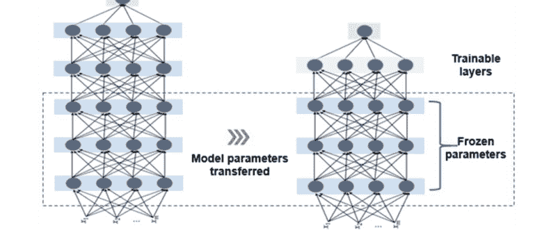

如前所述，DNN中的内部层从过程数据中“学习”低级特征，迁移学习只是将这种学习到的逻辑从一个模型转移到另一个模型，用于相关任务。这使得在有限数据下能够更快地收敛*。

> *Li et. al., Transfer learning for process fault diagnosis: Knowledge transfer from simulation to physical processes, Computers & Chemical Engineering, 2020

### 11.7 使用FFNN对石油炼厂脱丁烷塔进行软测量

让我们运用我们所掌握的关于训练FFNN模型的所有知识，为一个高度非线性的系统开发一个软传感器。为此，我们将重用第7章中看到的脱丁烷塔数据集（系统详情请参见附录中的数据集描述部分）。该软传感器需要利用塔周围的其他过程数据来预测塔底产品中的C4含量。该数据集包含2394个输入-输出过程值样本。采样时间为15分钟。使用了七个过程变量（脱丁烷塔周围的压力、温度、流量）作为输入。图11.13显示该数据集具有良好的过程变异性。

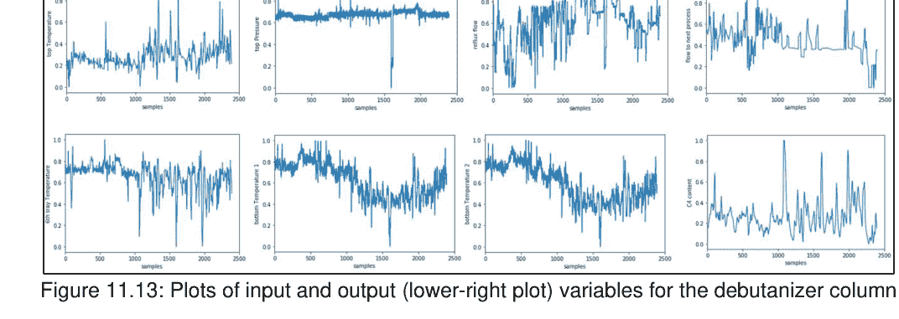

在构建FFNN模型之前，我们先构建一个PLS模型作为建模精度评估的参考。图11.14表明PLS模型在预测C4含量方面严重不足，并暗示系统中存在强烈的非线性。具体来说，残差图中的线性趋势清楚地表明PLS模型在C4含量的高值和低值区域表现不佳。

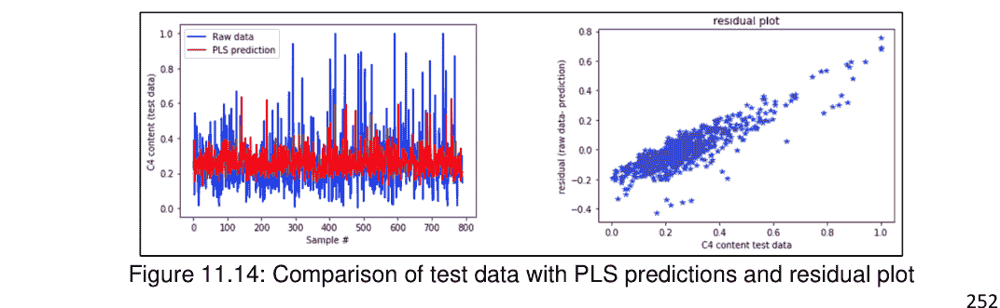

经过几次试验，我们得到了一个具有2个隐藏层（分别有60和30个神经元）的网络，该网络在测试数据上达到了70%的准确率。下面的代码显示了其余超参数的值。图11.15证实了FFNN模型相对于PLS模型的优越性能。残差图没有显示出任何显著的趋势，表明FFNN模型能够充分捕捉输入和输出变量之间的非线性关系。这个案例研究展示了ANN模型建模复杂过程系统的能力。

```
# 读取数据
data = np.loadtxt('debutanizer_data.txt', skiprows=5)

# 分离训练、验证和测试数据
from sklearn.model_selection import train_test_split
X, y = data[:,:-1], data[:,-1][:,np.newaxis]
X_train, X_test, y_train, y_test = train_test_split(X, y, test_size = 0.33, random_state = 100)
X_est, X_val, y_est, y_val = train_test_split(X_train, y_train, test_size = 0.25, random_state = 100)

# 导入包
from tensorflow.keras import Sequential
from tensorflow.keras.layers import Dense
from tensorflow.keras import regularizers
from tensorflow.keras.callbacks import EarlyStopping
from tensorflow.keras.optimizers import Adam

# 定义模型
model = Sequential()
model.add(Dense(60, kernel_regularizer=regularizers.L1(0.0000001), activation='relu',
kernel_initializer='he_normal', input_shape=(7,)))
model.add(Dense(30, kernel_regularizer=regularizers.L1(0.0000001), activation='relu',
kernel_initializer='he_normal'))
model.add(Dense(1, kernel_regularizer=regularizers.L1(0.0000001)))

# 编译模型
model.compile(loss='mse', optimizer=Adam(learning_rate=0.005))

# 训练模型
es = EarlyStopping(monitor='val_loss', patience=200)
history = model.fit(X_est, y_est, epochs=2000, batch_size=32, validation_data=(X_val, y_val),
callbacks=es)

# 预测y
y_test_pred = model.predict(X_test)
```

# 原始数据与预测数据的绘图
plt.figure()
plt.plot(y_test, 'b', label='原始数据')
plt.plot(y_test_pred, 'r', label='FFNN预测')
plt.ylabel('C4含量（测试数据）'), plt.xlabel('样本编号'), plt.legend()

# 残差图
plt.figure()
plt.plot(y_test, y_test-y_test_pred, '*')
plt.xlabel('C4含量测试数据'), plt.ylabel('残差（原始数据-预测值）')
plt.title('残差图')

# 评估指标
from sklearn.metrics import r2_score
print('测试数据集的R2值:', r2_score(y_test, y_test_pred))

>>> 测试数据集的R2值: 0.707

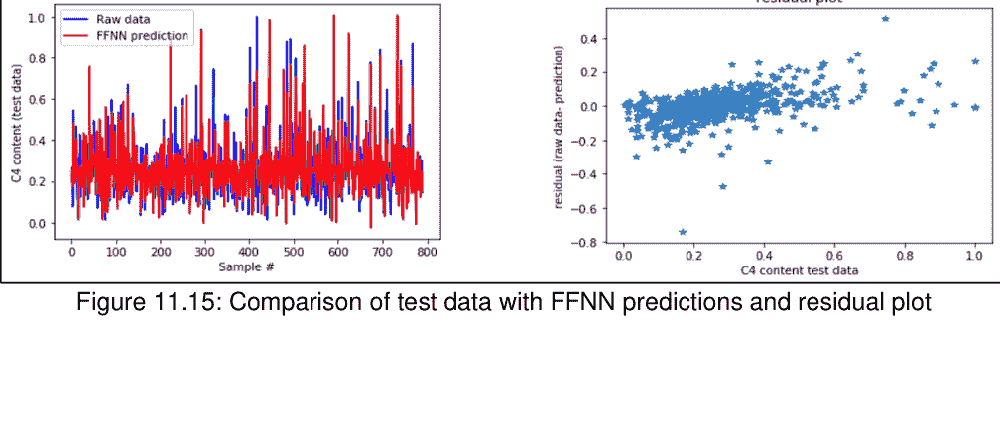

### FFNN建模指南

人工神经网络建模是一个非常广泛的主题，由于市面上有大量关于ANN建模的教程，很容易让人感到不知所措。然而，我们在本章中已经看到，如果我们仔细关注几个关键概念，ANN并没有看起来那么令人生畏。如果你正在寻找一些关于如何为过程系统建模设置ANN超参数的快速指南，那么以下建议将对你大有裨益。

- **隐藏层数量**：简单系统用1层，复杂系统/任务用2或3层
- **激活函数**：ReLU
- **初始化方案**：He初始化
- **优化器**：Adam
- **正则化**：L1或L2核正则化
- **学习率调度**：使用Adam优化器时不需要
- **训练轮数**：使用一个合理较大的值，并配合早停法
- **小批量大小**：32

如果你第一次尝试就用默认设置找到了一个好的ANN模型，那你是很幸运的。通常可能需要进行以下调整。

- 如果验证准确率远低于训练准确率，则增加正则化惩罚
- 如果优化器陷入局部最小值，则调整Adam的初始学习率。如果无效，则尝试增加更多神经元或隐藏层
- 如果损失随训练轮数变化的曲线噪声很大，则增大小批量大小

### 总结

呼！这是内容充实的一章。我们介绍了几种可用于高效训练ANN模型的技术。我们触及的每个方面背后都有更多内容，我们只是浅尝辄止。然而，你现在应该已经熟悉了ANN的核心概念，并获得了对脱丁烷塔和联合循环电厂进行建模的实践经验。你现在应该清楚开发一个好的过程系统ANN模型需要什么。ANN将成为你工具库中的重要武器，你会发现自己经常使用它们。在下一章中，我们将学习ANN如何用于动态或时序数据。

## 第12章
### 循环神经网络

在上一章中，我们看到前馈神经网络是捕捉过程变量间复杂关系的强大机制。在FFNN中，网络输入和输出之间存在静态关系的隐含假设。没有过程动态性或时间顺序的概念。然而，有时你会遇到模型输出不仅取决于当前输入，还取决于过去输入的情况。之前，我们采用了输入增强技术（在动态PCA/PLS中）来处理动态系统。不幸的是，在FFNN中，增强可能导致模型参数数量显著增加。循环神经网络是专门用于高效处理序列或时序数据的网络。本质上，RNN是具有“记忆”的FFNN。

对于过程系统，RNN已成功用于系统辨识、故障检测与分类、时间序列预测以及工业设备的预测性维护。在过程工业之外，RNN还被用于自然语言处理（语音识别、文本自动填充、语言翻译、情感分析等）、音乐创作和股票市场预测等众多领域！

在本章中，我们将学习RNN如何能够记住过去的信息以进行未来预测。由于我们在上一章已经介绍了几个神经网络概念，本章将重点介绍RNN的各种应用。在此过程中，我们将了解常用的不同网络配置。具体涵盖以下主题

- RNN简介
- RNN网络的不同拓扑配置
- 通过RNN进行系统辨识
- 使用RNN进行故障分类
- 采用RNN进行预测性维护

### 12.1 RNN简介

循环神经网络是用于处理序列数据的ANN，其中数据的出现顺序具有重要意义。例如，在生产工厂中，持续升高的温度测量值可能表示一种过程故障，而持续降低的测量值可能表示另一种故障类型。在FFNN中没有有效机制来指定这种数据的时间顺序。RNN通过循环处理序列元素并在处理过程中存储一个总结过去信息的隐藏状态来实现这一点。RNN中的基本单元称为RNN单元，它简单地包含一层神经元。图12.1展示了一个由单个单元组成的RNN架构，以及它如何处理包含十个样本或x读数的数据序列。

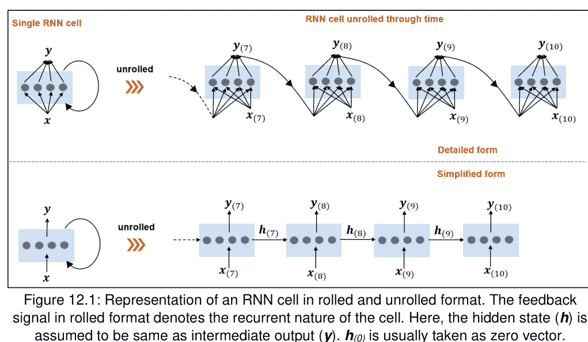

我们可以看到，这十个样本是按照它们出现的顺序依次处理的，而不是一次性处理。在第i步生成一个输出y(i)，然后将其与x(i+1)一起馈送到下一步进行处理。通过这种安排，y(i+1)是x(i+1)和y(i)的函数。由于y(i)本身是x(i)和y(i-1)的函数，y(i+1)实际上就成为了x(i+1)、x(i)和y(i-1)的函数。进一步推导意味着最终的序列输出y(10)是序列所有十个输入的函数，即x(10)、x(9)、...、x(1)。我们稍后将看到这种“循环”机制如何有效地捕捉数据中的时间模式。

### RNN输出

如果图12.1中RNN单元的神经层包含$n$个神经元（图中$n$等于4），那么每个$y_{(i)}$或$h_{(i)}$都是一个n维向量。对于简单的RNN单元，$y_{(i)}$等于$h_{(i)}$。设$x$是一个m维向量。在任何第$i$步，我们可以写出以下关系式

$$y_{(i)} = g(W_x x_{(i)} + W_y y_{(i-1)} + b)$$

其中$W_x \in R^{n \times m}$，其每一行包含应用于$x$向量的神经元权重参数；$W_y \in R^{n \times n}$，其每一行包含应用于$y$向量的神经元权重参数；$b \in R^n$包含偏置参数；$g$表示激活函数。相同的神经参数在每一步都被使用。

如果对序列的所有输出都感兴趣，则称为序列到序列或多对多网络。然而，很多时候只需要最后一步的输出，这就形成了序列到向量或多对一网络。我们稍后将看到如何指导Keras丢弃除最后一个之外的所有输出。此外，最后一步的输出可能需要进一步处理，因此通常会添加一个全连接层。图12.2展示了这样一种拓扑结构。

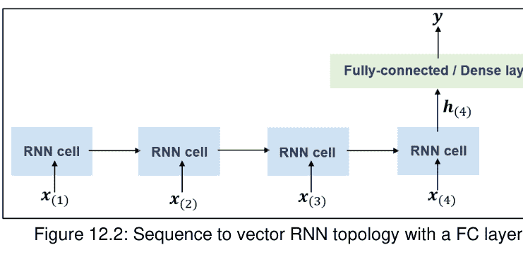

图12.3展示了另外两种流行的架构，即向量到序列RNN和延迟序列到序列RNN。在前一种方案中，单个输入返回一个序列。一个现实生活中的例子可能是由于过程输入的阶跃变化引起的动态过程响应。延迟序列到序列网络（也称为编码器-解码器网络）也是一种多对多网络，但在这里，输出序列是延迟的。如果输出序列的每一步都依赖于整个输入序列，则采用此方案。编码器-解码器方案常用于语言翻译，因为翻译的初始单词可能受到被翻译句子末尾单词的影响。

### LSTM 网络

循环神经网络是强大的动态模型，然而，之前介绍的普通 RNN（单元中只有一个神经层）在学习长期依赖关系时面临困难，即当序列中的步数较大（约 ≥10）时。这是由于梯度反向传播过程中的梯度消失问题所致。为了克服这个问题，人们设计了 LSTM（长短期记忆）单元，它们能够轻松学习非常长期的依赖关系（甚至超过 1000）。与普通 RNN 单元不同，LSTM 单元有 4 个独立的神经层，如图 12.4 所示。此外，在 LSTM 单元中，内部状态存储在两个独立的向量中：$h_{(t)}$（隐藏状态）和 $c_{(t)}$（单元状态）。在序列处理过程中，这两个状态都会从一个 LSTM 单元传递到下一个。$h_{(t)}$ 可以被视为短期状态/记忆，而 $c_{(t)}$ 是长期状态/记忆（我们稍后会看到原因），因此得名 LSTM。

全连接层的向量输出通过三个“门”相互作用并与长期状态进行交互，这些门中发生逐元素乘法。这些门控制在任何序列处理步骤中，哪些信息进入长期和短期状态。虽然我们稍后会理解数学细节，但现在只需了解这些门的以下功能：

- 遗忘门决定长期状态 $c_{(t)}$ 的哪些部分被保留和擦除
- 输入门决定新信息（从处理 $x_{(t)}$ 和 $h_{(t-1)}$ 获得）的哪些部分被存储到长期状态中
- 输出门决定长期状态的哪些部分作为短期状态传递下去

图 12.4：LSTM 单元的架构。三个全连接层使用 sigmoid 激活函数，一个全连接层使用 tanh 激活函数。每个神经层都有自己的参数 $W_x$、$W_h$ 和 $b$

这种在序列处理过程中能够灵活控制哪些信息沿链传递的能力，正是 LSTM 网络在捕捉序列数据中的长期模式方面如此成功的原因。因此，LSTM 网络如今已成为默认的 RNN。在下一节中，我们将看到使用 LSTM 单元进行系统辨识的 RNN 快速应用。

### 普通 RNN 单元 vs GRU 单元 vs LSTM 单元

还有另一种流行的 RNN 单元变体，称为 GRU 单元。如下图所示，GRU 单元比 LSTM 单元更简单。GRU 单元有 3 个神经层，其内部状态使用单个向量 $h_{(t)}$ 表示。对于许多常见任务，基于 GRU 单元的 RNN 似乎能提供与基于 LSTM 单元的 RNN 相似的性能，因此它正逐渐获得更多的普及。

### 12.2 通过 LSTM RNN 对 SISO 加热器系统进行系统辨识

使用输入和输出数据构建动态过程数学模型的任务被称为系统辨识。RNN 非常适合系统辨识，因为它们旨在捕捉动态关系。为了说明这一点，我们将使用来自单输入单输出加热器系统的数据，其中加热器功率输出被调节以维持所需的系统温度。数据集包含 4 小时的训练数据和 14 分钟的测试数据。数据每秒采样一次。我们的建模目标是使用当前和过去的数据预测下一个温度值。让我们首先快速查看训练数据。

```python
# import required packages
import numpy as np, pandas as pd
import matplotlib.pyplot as plt

# read data
data = pd.read_csv('TCLab_train_data.txt')
heaterPower = data[['Q1']].values
temperature = data[['T1']].values
```

```python
# plot data
plt.plot(temperature, 'k'), plt.ylabel('Temperature'), plt.xlabel('Time (sec)')

plt.figure()
plt.plot(heaterPower), plt.ylabel('Heater Power'), plt.xlabel('Time (sec)')
```

图 12.5 清楚地显示了数据的动态特性；加热器功率的快速、大幅且一致的变化导致温度大部分时间处于瞬态。很明显，任何时刻的温度值不仅取决于当前的加热器功率，还取决于过去的加热器功率值。为了减少所需的历史数据量，我们将使用过去的功率和温度值来预测当前的温度值。在系统辨识术语中，我们正在尝试构建一个 ARX（带外生变量的自回归）模型。

```python
# decide model input-outputs and scale data
from sklearn.preprocessing import StandardScaler

X = data[['T1','Q1']].values
y = data[['T1']].values

X_scaler = StandardScaler()
X_scaled = X_scaler.fit_transform(X)

y_scaler = StandardScaler()
y_scaled = y_scaler.fit_transform(y)
```

现在我们已经确定了模型的输入和输出变量，还需要进行一次数据重排。目前，**X** 数组的形状是 {样本数，特征数或输入变量数}。对于 RNN，这个输入数据矩阵需要转换为 {序列样本数，时间步数，特征数} 的形状，使得沿第 0 维的每个条目（形状为 {时间步数，特征数}）都是一个完整的历史数据序列，用于预测温度值。这里，时间步数取为 70，特征数等于 2。如果你不确定系统应该使用多少时间步，那么它将成为一个需要优化的模型超参数。对于每个输入序列，预测一个标量温度值，因此 **Y** 矩阵相应地重新排列，如下代码所示

```python
# rearrange X data into (# sequence samples, # time steps, # features) form
nTimeSteps = 70
X_train_sequence = []
y_train_sequence = []

for sample in range(nTimeSteps, X_scaled.shape[0]):
    X_train_sequence.append(X_scaled[sample-nTimeSteps:sample,:])
    y_train_sequence.append(y_scaled[sample]))

X_train_sequence, y_train_sequence = np.array(X_train_sequence), np.array(y_train_sequence) # convert lists of arrays into arrays
```

基本上，（缩放后的）**X** 数组中每 70 个连续行组成一个序列。我们将构建的 RNN 拓扑结构与图 12.2 所示的相同，只是时间步数不同。就像我们为 FFNN 建模所做的那样，我们将导入相关的 Keras 库。在下面的代码中，一个 LSTM RNN 层后面跟着一个全连接层。

```python
# import Keras libraries
from tensorflow.keras import Sequential
from tensorflow.keras.layers import LSTM
from tensorflow.keras.layers import Dense
from tensorflow.keras import regularizers

# define model
model = Sequential()
model.add(LSTM(units=25, kernel_regularizer=regularizers.l1(0.001), input_shape=(nTimeSteps,2)))
# LSTM cell with 25 neurons in each of the 4 neural layers
model.add(Dense(units=1))
# 1 neuron in output layer
```

上面的 3 行代码完全定义了所需 RNN 的结构。输出层中的单个神经元负责将 RNN 层最后一步的 25 维隐藏状态向量转换为标量值。请注意，默认情况下 LSTM 层只返回最后一步的输出。下面的模型摘要显示了每一层的模型参数数量。我们将在下一节中了解 LSTM 层中 2800 个参数是如何得出的。

| 层（类型） | 输出形状 | 参数数量 |
| --- | --- | --- |
| lstm (LSTM) | (None, 25) | 2800 |
| dense (Dense) | (None, 1) | 26 |
| 总参数：2,826 | | |
| 可训练参数：2,826 | | |
| 不可训练参数：0 | | |

图 12.6：RNN 模型的结构及模型参数数量

接下来我们编译并拟合模型。请注意，我们没有提供显式的验证数据集，而是使用了 validation_split 参数来指定 30% 的验证分割。

```python
# compile and fit model with early stopping
from tensorflow.keras.callbacks import EarlyStopping
model.compile(loss='mse', optimizer='Adam')
es = EarlyStopping(monitor='val_loss', patience=10, restore_best_weights=True)
history = model.fit(X_train_sequence, y_train_sequence, epochs=100, batch_size=250,
                    validation_split=0.3, callbacks=[es])
```

```python
# check fit on training data
y_train_sequence_pred = model.predict(X_train_sequence)
y_measured = y_scaler.inverse_transform(y_train_sequence)
y_pred = y_scaler.inverse_transform(y_train_sequence_pred)
```

图 12.7：SISO 加热器系统的测量温度值与预测温度值对比

图12.7显示我们的RNN能够很好地拟合训练数据。现在让我们检查其在测试数据集上的表现。

```python
# read test data
data_test = pd.read_csv('TCLab_test_data.txt')
X_test = data_test[['T1','Q1']].values
y_test = data_test[['T1']].values

# scale data
X_test_scaled = X_scaler.transform(X_test)
y_test_scaled = y_scaler.transform(y_test)

# re-arrange data into sequence form
X_test_sequence = []
y_test_sequence = []

for sample in range(nTimeSteps, X_test_scaled.shape[0]):
    X_test_sequence.append(X_test_scaled[sample-nTimeSteps:sample,:])
    y_test_sequence.append(y_test_scaled[sample])

X_test_sequence, y_test_sequence = np.array(X_test_sequence), np.array(y_test_sequence)

# predict y_test
y_test_sequence_pred = model.predict(X_test_sequence)
y_test_pred = y_scaler.inverse_transform(y_test_sequence_pred)
```

图12.8证实了RNN模型具有良好的泛化能力，因为模型预测值与测试数据集中的原始温度值非常吻合。请注意，在前70个样本之前无法获得模型预测值。

现在是快速比较FFNN和RNN建模的好时机。如果我们构建一个以过去的功率和温度值作为额外输入变量的FFNN模型，那么我们将得到一个140维的输入变量。假设我们使用一个仅有25个神经元的隐藏层，后接一个输出神经元，那么我们将得到超过3500个模型参数——比我们的RNN模型使用的参数多25%。这个粗略的思想实验展示了RNN在建模动态系统时如何实现更好的参数效率。到现在，你应该知道，更少的模型参数通常意味着更低的过拟合风险和更好的模型训练效果。因此，对于动态系统，RNN应该是首选模型。

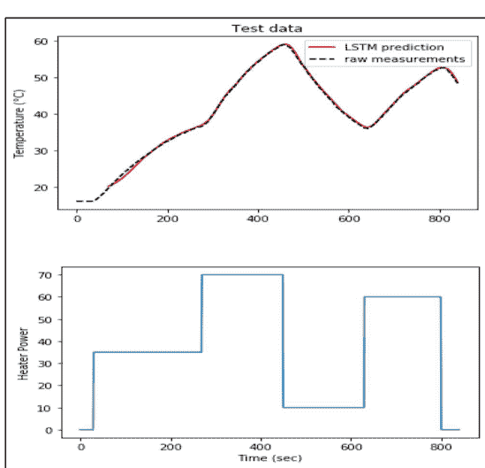

图12.8：SISO加热器系统测试数据集的测量温度与预测温度对比

### 12.3 数学背景

理解增加额外神经元对模型总参数数量的影响总是有益的；可以在模型复杂度增加时采取预防性措施来防止过拟合。在标准RNN单元中，我们看到 $W_x \in R^{n \times m}$，$W_h \in R^{n \times n}$ 和 $b \in R^n$。这导致总参数数量等于 $mn + n^2 + n$。在LSTM单元中，4个神经层中的每一个都有自己的一组参数。因此，一个LSTM单元有 $4(mn + n^2 + n)$ 个模型参数。在前面的加热器示例中，我们有 $m = 2$ 和 $n = 25$；因此我们在LSTM层中最终得到 $4(50 + 625 + 25) = 2800$ 个模型参数。

现在让我们来窥探一下LSTM单元的内部工作原理。LSTM单元可能看起来令人生畏，但实际上它们很容易理解。让我们看看每个神经层和门，理解它们扮演的具体角色。LSTM单元的核心组件是单元状态（$c_t \in R^n$），它几乎不受干扰地穿过单元，只经过几个逐元素操作来修改 $c_t$ 的各个元素/分量。这些修改决定了哪些分量对序列的进一步处理有用或不再有用。为了理解这些修改，考虑4个神经层中的第一个。

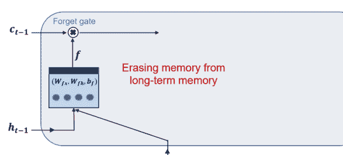

这里，输入（$x_t$）和上一步的隐藏状态（$h_{t-1}$）被处理以生成向量 $f$（$\in R^n$），其值介于0和1之间。如果 $f$ 的第 $i$ 个分量为0，则意味着 $c_{t-1}$ 的第 $i$ 个分量在逐元素乘法后被擦除/遗忘（因此得名“遗忘门”）。第二和第三个神经层分别生成n维向量 $i$ 和 $g$。$i$（$\in [0, 1]$）的分量值决定了 $g$（$\in [-1, 1]$）的分量有多少通过输入门并被添加到单元状态。

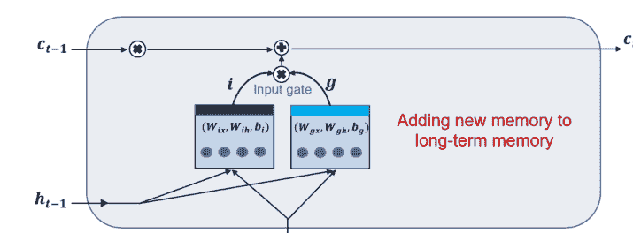

这些都是在单元状态传递到下一个LSTM单元之前发生的所有修改。然而，LSTM单元内部还有一个主要任务。隐藏状态 $h_t \in R^n$ 是从单元状态生成的，它在任何序列步骤中充当单元输出。第四个神经层参与此任务，如下所示。

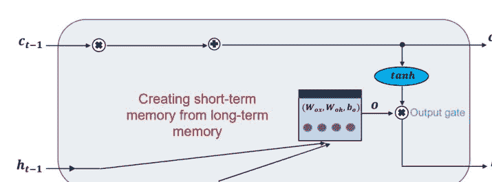

第四个神经层的向量输出 $o$（$\in R^n$）决定了单元状态的哪些部分（以及多少）作为此时间步的隐藏状态输出。在输出门之前，单元状态通过tanh函数，将其值推至-1和1之间。

我们希望上述描述能让你对在序列处理过程中，记忆如何在RNN链中创建和传递以捕获任何序列中的长期模式有一个良好的概念性概述。我们现在将继续探讨LSTM的更多有趣应用。

### 12.4 堆叠/深度RNN

在FFNN中，我们通过在输入层和输出层之间添加更多隐藏层来创建更深的网络。类似地，在RNN中，可以通过将RNN单元堆叠在一起来构建深度网络，如图12.9所示。虽然单元状态和隐藏状态都沿着链（水平方向）传递，但只有隐藏状态从一层传递到下一层（垂直方向）。最后一层中单元的隐藏状态成为网络输出。

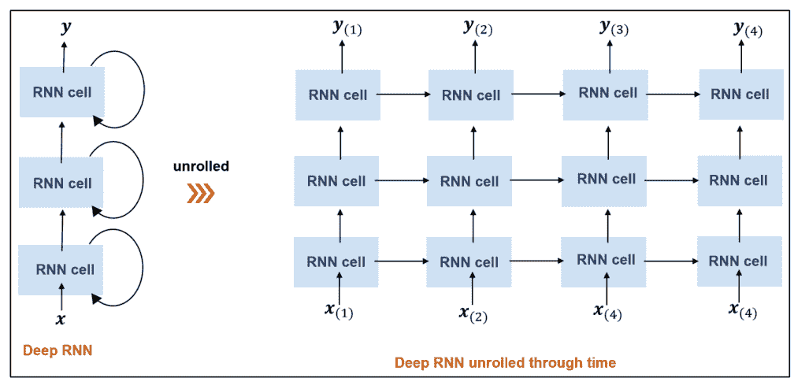

图12.9：深度RNN的展开和未展开格式表示。隐藏状态（$h$）从一层传递到下一层。

就像我们对浅层RNN所做的那样，在深度RNN中，我们也可以忽略除最后一步之外的所有输出，以获得序列到向量的网络。我们将在下一节中看到一个用于大规模系统故障分类的此类应用。

### 12.5 通过LSTM进行田纳西-伊士曼过程的故障分类

过程变量在过程故障存在下的演变方式可以提供关于过程故障性质/类型的关键线索。因此，通常使用一系列过程值（而不仅仅是当前过程值的单个快照）作为故障分类的输入。RNN最适合使用序列数据进行分类。为了说明这一点，我们将使用田纳西-伊士曼过程（TEP）的数据，这是一个大规模的化学制造过程。

在第6章中，我们使用模拟的TEP数据，通过静态数据进行故障检测和分类，以介绍ICA和FDA方法。我们将再次使用模拟数据，但来自另一个来源<sup>63</sup>，那里有更大的数据集可用。该数据集仍然包含21个不同的故障类别（以及无故障操作）；然而，对于每个故障类别，训练和测试数据集都进行了500次独立的模拟运行。每个训练模拟运行包含来自25小时操作的500个时间样本，每个测试运行包含来自48小时操作的960个时间样本。图12.10显示了数据集中前10个信号在4次完整模拟运行中的时间曲线，包括无故障、1类故障和8类故障。

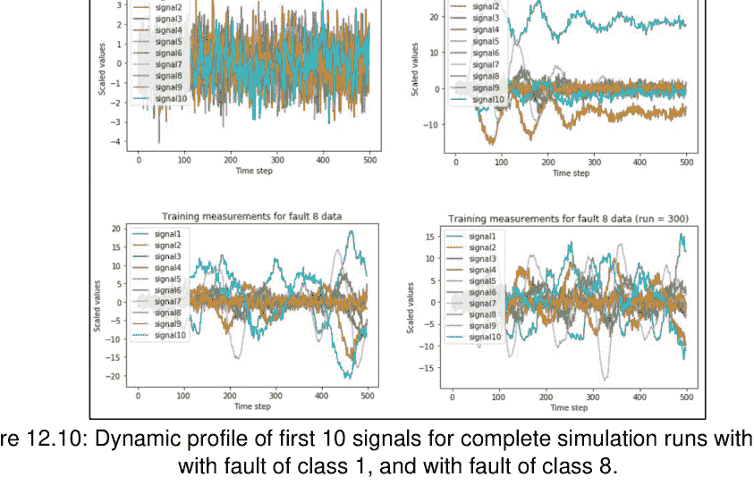

<sup>63</sup> Reith, C.A., B.D. Amsel, R. Tran., and B. Maia. Additional Tennessee Eastman process simulation data for anomaly detection evaluation. Harvard Dataverse, Version 1, 2017

图12.10表明，仅凭过程变量的最终值可能无法准确指示特定的过程故障；相反，时间曲线是准确故障分类的关键。我们的目标是使用完整的模拟运行数据来预测故障类别（包括无故障类别）。让我们首先将训练数据加载到python中。原始数据是.RData格式，我们可以使用pyreadr包读取。

```python
# read data
import pyreadr

fault_free_training_data = pyreadr.read_r('TEP_FaultFree_Training.RData')['fault_free_training']
# pandas dataframe
fault_free_testing_data = pyreadr.read_r('TEP_FaultFree_Testing.RData')['fault_free_testing']
faulty_training_data = pyreadr.read_r('TEP_Faulty_Training.RData')['faulty_training']
faulty_testing_data = pyreadr.read_r('TEP_Faulty_Testing.RData')['faulty_testing']
```

下面的代码片段快速概述了fault_training_data数据框。所有四个数据框都遵循相同的列排列。

- 第1列（faultNumber）表示故障类别，范围从0（无故障）到20
- 第2列（simulationRun）表示模拟运行，范围从1到500
- 第3列（sample）表示模拟运行的采样实例，训练数据范围从1到500，测试数据范围从1到960
- 第45到55列包含传感器测量值

| 索引 | faultNumber | simulationRun | sample | xmeas_1 | xmeas_2 | xmeas_3 | xmeas_4 | xmeas_5 |
|---|---|---|---|---|---|---|---|---|
| 0 | 1 | 1 | 1 | 0.25038 | 3674 | 4529 | 9.232 | 26.889 |
| 1 | 1 | 1 | 2 | 0.25109 | 3659.4 | 4556.6 | 9.4264 | 26.721 |
| 2 | 1 | 1 | 3 | 0.25038 | 3660.3 | 4477.8 | 9.4426 | 26.875 |
| 3 | 1 | 1 | 4 | 0.24977 | 3661.3 | 4512.1 | 9.4776 | 26.758 |
| 4 | 1 | 1 | 5 | 0.29405 | 3679 | 4497 | 9.3381 | 26.889 |
| 5 | 1 | 1 | 6 | 0.29303 | 3691.7 | 4502.2 | 9.378 | 27.111 |

在继续之前，我们将从数据集中移除一些故障类别，因为这些故障无法识别<sup>64</sup>。

```python
# remove fault classes 3,9,15 from faulty datasets
faulty_training_data = faulty_training_data[faulty_training_data['faultNumber'] != 3]
faulty_training_data = faulty_training_data[faulty_training_data['faultNumber'] != 9]
```

接下来，我们预留部分仿真运行作为验证数据集。此外，仅使用一小部分故障仿真数据进行训练和验证。在典型的现实场景中，故障实例的数量很少，因此假设无故障样本和故障样本数量相等是不现实的。以下代码实现了这一点，并生成了最终的训练、验证和测试数据集。

```python
# 从训练数据集中分离出验证数据集，并创建不平衡的故障数据集
fault_free_validation_data = fault_free_training_data[fault_free_training_data['simulationRun'] > 400]
fault_free_training_data = fault_free_training_data[fault_free_training_data['simulationRun'] <= 400]
faulty_validation_data = faulty_training_data[faulty_training_data['simulationRun'] > 490]
faulty_training_data = faulty_training_data[faulty_training_data['simulationRun'] <= 50]

# 转换为numpy数组
fault_free_training_data = fault_free_training_data.values
fault_free_validation_data = fault_free_validation_data.values
fault_free_testing_data = fault_free_testing_data.values
faulty_training_data = faulty_training_data.values
faulty_validation_data = faulty_validation_data.values
faulty_testing_data = faulty_testing_data.values

# 构建完整的训练、验证和测试数据集
training_data = np.vstack((fault_free_training_data, faulty_training_data))
validation_data = np.vstack((fault_free_validation_data, faulty_validation_data))
testing_data = np.vstack((fault_free_testing_data, faulty_testing_data))
```

从第4列开始的传感器测量值是输入变量，第1列的故障编号是我们的输出变量。我们分离输入变量并对其进行缩放。

```python
# 分离X和y数据
X_train = training_data[:, 3:]
X_val = validation_data[:, 3:]
X_test = testing_data[:, 3:]

y_train = training_data[:, 0]
y_val = validation_data[:, 0]
y_test = testing_data[:, 0]
```

```python
# 数据缩放
from sklearn.preprocessing import StandardScaler

X_scaler = StandardScaler()
X_train_scaled = X_scaler.fit_transform(X_train)
X_val_scaled = X_scaler.transform(X_val)
X_test_scaled = X_scaler.transform(X_test)
```

现在，就像我们在系统辨识示例中所做的那样，我们需要将数据重新排列成序列形式。在TEP数据集中，每次仿真运行构成一个完整的序列。例如，训练数据集中包含500个样本的每次仿真运行就是一个包含500个时间步的序列。

```python
# 将X数据重新排列为（序列样本数，时间步数，特征数）的形式
nTimeStepsTrain = 500  # 训练数据中一次仿真运行的长度
nTimeStepsTest = 960   # 测试数据中一次仿真运行的长度
X_train_sequence = []
y_train_sequence = []
X_val_sequence = []
y_val_sequence = []
X_test_sequence = []
y_test_sequence = []

for sample in range(0, X_train_scaled.shape[0], nTimeStepsTrain):
    X_train_sequence.append(X_train_scaled[sample:sample + nTimeStepsTrain, :])
    y_train_sequence.append(y_train[sample])

for sample in range(0, X_val_scaled.shape[0], nTimeStepsTrain):
    X_val_sequence.append(X_val_scaled[sample:sample + nTimeStepsTrain, :])
    y_val_sequence.append(y_val[sample])

for sample in range(0, X_test_scaled.shape[0], nTimeStepsTest):
    X_test_sequence.append(X_test_scaled[sample:sample + nTimeStepsTest, :])
    y_test_sequence.append(y_test[sample])

X_train_sequence, y_train_sequence = np.array(X_train_sequence), np.array(y_train_sequence)
X_val_sequence, y_val_sequence = np.array(X_val_sequence), np.array(y_val_sequence)
X_test_sequence, y_test_sequence = np.array(X_test_sequence), np.array(y_test_sequence)
```

在拟合模型之前，我们进行最后的预处理，将分类输出标签转换为独热编码形式。这将1维输出向量转换为21维矩阵。

```python
# 将故障类别标签转换为独热编码形式
from tensorflow.keras.utils import to_categorical
Y_train_sequence = to_categorical(y_train_sequence, num_classes=21)
Y_val_sequence = to_categorical(y_val_sequence, num_classes=21)
Y_test_sequence = to_categorical(y_test_sequence, num_classes=21)
```

好了，我们现在可以定义RNN模型了。模型的拓扑结构如下所示。由于输出的故障类别是互斥的，我们将使用softmax输出层。此外，我们在LSTM中指定`return_sequences=True`参数，以确保序列输出从第1个LSTM层传递到第2个。

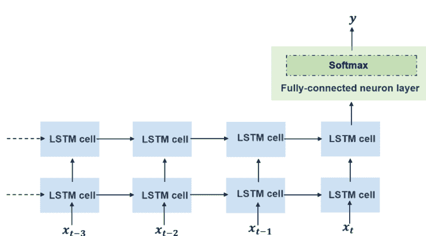

```python
# 导入包
from tensorflow.keras import Sequential
from tensorflow.keras.layers import Dense
from tensorflow.keras.layers import LSTM
from tensorflow.keras import regularizers

# 定义模型
model = Sequential()
model.add(LSTM(units=128, kernel_regularizer=regularizers.L1(0.0001), return_sequences=True, input_shape=(nTimeStepsTrain, 52)))
# 第1个LSTM层，带有序列输出
model.add(LSTM(units=64, kernel_regularizer=regularizers.L1(0.0001)))
# 第2个LSTM层，没有序列输出
model.add(Dense(21, activation='softmax'))
# Softmax输出层，包含21个神经元
```

现在我们可以编译并拟合模型了。以下代码中有几点值得注意。使用了适合多分类的`categorical_crossentropy`损失函数。指定了额外的`accuracy`指标，该指标将在模型拟合过程中（与`loss`一起）被跟踪。

```python
# 编译并拟合模型
from tensorflow.keras.callbacks import EarlyStopping

model.compile(loss='categorical_crossentropy', optimizer='Adam', metrics=['accuracy'])
es = EarlyStopping(monitor='val_loss', patience=20, restore_best_weights=True)
history = model.fit(X_train_sequence, Y_train_sequence, epochs=100, batch_size=250,
                    validation_data=(X_val_sequence, Y_val_sequence), callbacks=[es])
```

图12.11显示，在训练和验证数据集上都获得了接近100%的准确率，这表明我们的模型是充分的。

```python
# 绘制验证曲线
plt.plot(history.history['loss'], label='train')
plt.plot(history.history['val_loss'], label='val')
plt.title('Validation Curves: Loss')
plt.xlabel('Epoch'), plt.ylabel('Loss')

plt.plot(history.history['accuracy'], label='train')
plt.plot(history.history['val_accuracy'], label='val')
plt.title('Validation Curves: Accuracy')
plt.xlabel('Epoch'), plt.ylabel('Accuracy')
```

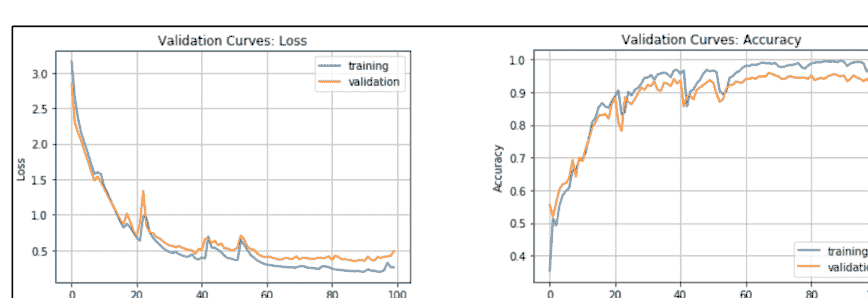

让我们看看在测试数据集上对过程故障的分类效果如何。我们将使用混淆矩阵来可视化结果。

```python
# 模型在测试数据上的性能
resultsTest = model.evaluate(X_test_sequence, Y_test_sequence)
print("test accuracy:", resultsTest[1])
```

>>> test accuracy: 0.875

```python
# 生成混淆矩阵
from sklearn.metrics import confusion_matrix

Y_test_sequence_pred = model.predict(X_test_sequence)
y_test_sequence_pred = np.argmax(Y_test_sequence_pred, axis=1)
conf_matrix = confusion_matrix(y_test_sequence, y_test_sequence_pred, labels=list(range(21)))
```

```python
# 绘制混淆矩阵
import seaborn as sn

sn.set(font_scale=1.5)  # 用于标签大小
sn.heatmap(conf_matrix, fmt='.0f', annot=True, cmap='Blues')
plt.ylabel('True Fault Class', fontsize=35)
plt.xlabel('Predicted Fault Class', fontsize=35)
```

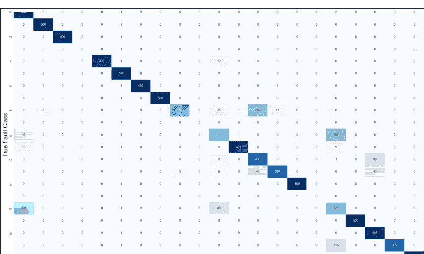

图12.12：使用测试数据集进行TEP故障分类的混淆矩阵

图12.12显示，RNN模型能够正确识别大多数故障类别。它在类别8、10和16上遇到了一些困难。例如，一些故障8的仿真被识别为故障12。总体而言，模型给出了约88%的准确率。请注意，训练和测试序列中的时间步不必相同，如本例所示，每个测试序列有960个时间步。

希望这个示例能让您很好地理解如何使用动态数据部署RNN模型进行故障分类。在下一节中，我们将研究RNN的另一个非常重要的应用：预测性维护。

### 12.6 使用LSTM网络进行预测性维护

到目前为止，我们构建的过程故障检测模型都依赖于使用最新（和近期）的过程数据来检测已经发生的过程故障。过程可靠性人员准备维护的时间相对较短。如果我们的模型能够提前（一周或一个月）预测任何设备即将发生的故障，那岂不是很好？此类模型已成功部署在过程工业中，被称为预测性维护（PdM）模型。

PdM模型使用历史故障数据来提取动态模式，作为未来故障的指标。实际上，可以构建模型来预测未来的确切故障时间。设备故障前的时间也称为剩余使用寿命（RUL）。RNN是我们可用的最有用的技术之一，可用于解决RUL估计或故障预测问题。

为了说明，我们将使用飞机燃气涡轮发动机数据集，该数据集包含来自多个发动机运行仿真的多个传感器的动态数据。每次仿真从一台（具有不同程度初始磨损的）发动机在正常范围内运行开始。发动机退化在仿真过程中的某个点开始，并持续到发动机故障。训练数据集包含直到发动机故障的完整数据，而测试数据集包含直到故障前某个点的数据。测试数据集已提供实际的RUL。我们的目标是开发一个PdM模型，使用测试数据集中的仿真数据来预测发动机故障。

### 维护策略

流程工业中的维护策略深受机器学习和传感器技术进步的影响。它已从基于时间的预防性维护，演进到基于主动监控的状态维护（CBM），并进一步发展为基于高级预测的预测性维护（PdM）。

| 预防性维护 | 状态维护 | 预测性维护 |
| :--- | :--- | :--- |
| • 设备维护按预设计划执行 | • 当检测到故障迹象时执行设备维护 | • 与CBM类似，利用设备的持续监控 |
| • 非最优策略，因为维护可能过早或过晚发生 | • 进行人工专家分析以确定确切的维护计划 | • 利用传感器读数中的时间退化模式，在非常早期检测到即将发生的故障 |
| • 例如，压缩机可能计划每5年更换一次 | • 例如，压缩机可能使用PCA进行监控以检测维修需求 | • 例如，压缩机可能使用RNN进行监控以对即将发生的故障发出警报 |

### 飞机发动机数据集

我们将使用仓库数据集中以下三个文件中的数据。

- train_FD001.txt：除了（3）个操作设置外，它还包含来自100个不同模拟或发动机的21个传感器（s1到s21）的时间序列数据。每个模拟的最后一个周期是相应发动机的故障点。在图12.13中，由于发动机退化导致的传感器漂移是显而易见的。
- test_FD001.txt：它也包含100台发动机的模拟时间序列数据，但这里只提供了每台发动机的部分时间序列。图12.13显示了发动机ID 90的提供的时间序列。需要估计每台发动机的剩余使用寿命（RUL）。
- RUL_FD001.txt：它包含测试数据集中100台发动机的实际RUL，以周期为单位。我们将使用此信息来衡量我们模型预测的准确性。

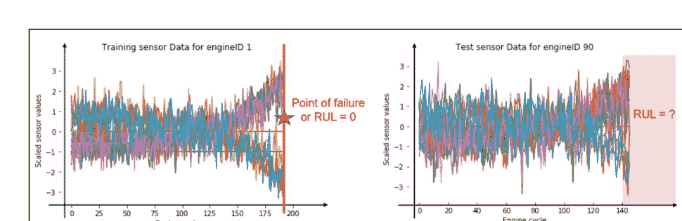

### 使用LSTM进行故障预测

在这个示例中，我们将构建一个LSTM网络来预测发动机是否会在接下来的30个周期内发生故障。这意味着我们有一个二元分类问题：会发生故障（输出=1）或不会发生故障（输出=0）。正如其他人所做的那样<sup>65</sup>，我们将使用过去50个周期的序列来进行故障预测。让我们从读取提供的文本文件中的数据开始。请注意，与之前的示例不同，我们将在这里更广泛地使用pandas库，因为它能够通过描述性名称引用列，这使得代码更容易理解。

```
# 训练数据
train_df = pd.read_csv('PM_train.txt', sep=" ", header=None)
train_df.drop(train_df.columns[[26, 27]], axis=1, inplace=True) # 最后两列是空的
train_df.columns  = ['EngineID', 'cycle', 'OPsetting1', 'OPsetting2', 'OPsetting3', 's1', 's2', 's3',
's4', 's5', 's6', 's7', 's8', 's9', 's10', 's11', 's12', 's13', 's14', 's15', 's16', 's17', 's18', 's19', 's20', 's21']

# 测试数据
test_df = pd.read_csv('PM_test.txt', sep=" ", header=None)
test_df.drop(test_df.columns[[26, 27]], axis=1, inplace=True)
test_df.columns  = ['EngineID', 'cycle', 'OPsetting1', 'OPsetting2', 'OPsetting3', 's1', 's2', 's3',
's4', 's5', 's6', 's7', 's8', 's9', 's10', 's11', 's12', 's13', 's14', 's15', 's16', 's17', 's18', 's19', 's20', 's21']

# 测试数据中每个发动机ID的实际RUL
truth_df = pd.read_csv('PM_truth.txt', sep=" ", header=None)
truth_df.drop(truth_df.columns[[1]], axis=1, inplace=True) # 第2列是空的
truth_df.columns = ['finalRUL'] # 将列名分配为finalRUL
truth_df['EngineID'] = truth_df.index + 1 # 添加新列EngineID
```

虽然上面的大部分代码是不言自明的，但最后一部分读取真实的RUL数据，删除带有'nan'数据的冗余列，并添加一个额外的列'EngineID'，如下所示

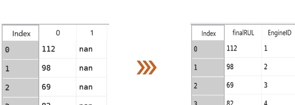

接下来，我们将进行一些数据框操作，以计算任何给定周期内发动机的RUL和故障标签。下面的代码基本上将下面代码片段中突出显示的列添加到训练和测试数据框中。

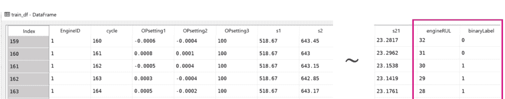

```
# 训练数据集
maxCycle_df = pd.DataFrame(train_df.groupby('EngineID')['cycle'].max()).reset_index()
maxCycle_df.columns = ['EngineID', 'maxEngineCycle']

train_df = train_df.merge(maxCycle_df, on=['EngineID'], how='left')
train_df['engineRUL'] = train_df['maxEngineCycle'] - train_df['cycle']
train_df.drop('maxEngineCycle', axis=1, inplace=True) # 不再需要maxEngineCycle

w1 = 30
train_df['binaryLabel'] = np.where(train_df['engineRUL'] <= w1, 1, 0 )

# 使用test_df和truth_df中的数据计算测试数据的maxEngineCycle
maxCycle_df  = pd.DataFrame(test_df.groupby('EngineID')['cycle'].max()).reset_index()
maxCycle_df.columns = ['EngineID', 'maxEngineCycle']
truth_df['maxEngineCycle'] = maxCycle_df ['maxEngineCycle'] + truth_df['finalRUL']
truth_df.drop('finalRUL', axis=1, inplace=True)

# 为测试数据生成engineRUL和二元标签
test_df = test_df.merge(truth_df, on=['EngineID'], how='left')
test_df['engineRUL'] = test_df['maxEngineCycle'] - test_df['cycle']
test_df.drop('maxEngineCycle', axis=1, inplace=True)

test_df['binaryLabel'] = np.where(test_df['engineRUL'] <= w1, 1, 0 )
```

接下来，我们将缩放传感器读数。

```
# 训练数据集：创建包含要缩放列的临时数据框
all_cols = train_df.columns # 获取列名
cols_to_scale = train_df.columns.difference(['EngineID','cycle','engineRUL','binaryLabel'])
train_df_with_cols_to_scale = train_df[cols_to_scale]
```

```
# 缩放并重新连接未缩放的列
scaler = StandardScaler()
scaled_train_df_with_cols_to_scale =
pd.DataFrame(scaler.fit_transform(train_df_with_cols_to_scale), columns=cols_to_scale) # 标量转换返回一个numpy数组
train_df_scaled =
train_df[['EngineID','cycle','engineRUL','binaryLabel']].join(scaled_train_df_with_cols_to_scale)
train_df_scaled = train_df_scaled.reindex(columns = all_cols) # 与之前相同的列顺序

# 测试数据集：重复上述步骤
all_cols = test_df.columns
test_df_with_cols_to_scale = test_df[cols_to_scale]
scaled_test_df_with_cols_to_scale = pd.DataFrame(scaler.transform(test_df_with_cols_to_scale),
columns=cols_to_scale)
test_df_scaled =
test_df[['EngineID','cycle','engineRUL','binaryLabel']].join(scaled_test_df_with_cols_to_scale)
test_df_scaled = test_df_scaled.reindex(columns = all_cols) # 与之前相同的列顺序
```

接下来，我们将创建序列样本。对于每台发动机，任何连续的50个周期块构成一个序列；序列的输出标签取决于序列结束时发动机的RUL是否大于30。为了实现这一点，我们将定义一个实用函数，如下所示

```
nSequenceSteps = 50 # 序列中的周期数
X_train_sequence = []
y_train_sequence = []

# 定义实用函数
def generate_LSTM_samples(engine_df, nSequenceSteps):
    """
    此函数为LSTM输入生成LSTM样本列表（每个是大小为(nSequenceSteps, 24)的numpy数组）
    以及LSTM的输出标签列表
    """
    engine_X_train_sequence = []
    engine_y_train_sequence = []
    engine_data = engine_df.values # 转换为numpy

    for sample in range(nSequenceSteps, engine_data.shape[0]):
        engine_X_train_sequence.append(engine_data[sample-nSequenceSteps:sample,:-1])
        engine_y_train_sequence.append(engine_data[sample,-1])

    return engine_X_train_sequence, engine_y_train_sequence
```

```
# 生成序列样本
for engineID in train_df_scaled['EngineID'].unique():
    engine_df = train_df_scaled[train_df_scaled['EngineID'] == engineID]
    engine_df = engine_df[['OPsetting1', 'OPsetting2', 'OPsetting3', 's1', 's2', 's3', 's4', 's5', 's6', 's7', 's8', 's9', 's10', 's11', 's12', 's13', 's14', 's15', 's16', 's17', 's18', 's19', 's20', 's21', 'binaryLabel']]
    engine_X_train_sequence, engine_y_train_sequence = generate_LSTM_samples(engine_df, nSequenceSteps)

    X_train_sequence = X_train_sequence + engine_X_train_sequence # 将样本添加到公共列表
    y_train_sequence = y_train_sequence + engine_y_train_sequence

X_train_sequence, y_train_sequence = np.array(X_train_sequence), np.array(y_train_sequence)
```

我们现在准备好构建和编译我们的RNN。拓扑结构与之前的故障分类示例类似，只是这里我们使用一个具有sigmoid激活函数的单神经元输出层。此外，为了正则化，我们使用了dropout技术。

```
# 导入ANN包
from tensorflow.keras import Sequential
from tensorflow.keras.layers import Dense, LSTM, Dropout

# 定义模型
model = Sequential()
model.add(LSTM(units=100, return_sequences=True, input_shape=(nSequenceSteps, 24)))
model.add(Dropout(0.2))
model.add(LSTM(units=50))
model.add(Dropout(0.2))
model.add(Dense(1, activation='sigmoid'))

# 编译模型
model.compile(loss='binary_crossentropy', optimizer='Adam', metrics=['accuracy'])
```

在我们拟合RNN之前，我们需要留出一些序列用于验证。如果我们查看训练序列中类别标签的分布，我们会注意到类别不平衡。作为最佳实践，验证数据集应选择相同的类别分布。这在sklearn中很容易通过使用stratify参数来完成，如下所示

```
from sklearn.model_selection import train_test_split
X_est_sequence, X_val_sequence, y_est_sequence, y_val_sequence = \
train_test_split(X_train_sequence, y_train_sequence, stratify=y_train_sequence, test_size = 0.3, random_state = 100)
```

我们现在可以拟合模型了。验证曲线显示，我们在训练数据集上可以获得接近100%的准确率。

```python
from tensorflow.keras.callbacks import EarlyStopping

es = EarlyStopping(monitor='val_loss', patience=10, restore_best_weights=True)
history = model.fit(X_est_sequence, y_est_sequence, epochs=100, batch_size=250,
                    validation_data=(X_val_sequence, y_val_sequence), callbacks=[es])
```

对于测试数据，我们将为每台发动机创建一个序列，使用最后50个循环。混淆矩阵显示，我们可以在84%的情况下正确预测故障。超参数调优可能会带来更好的性能。

```python
# input/output test sequences (only the last sequence is used to predict failure)
X_test_sequence = []
y_test_sequence = []

for engineID in test_df_scaled['EngineID'].unique():
    engine_df = test_df_scaled[test_df_scaled['EngineID'] == engineID]
    if engine_df.shape[0] >= nSequenceSteps:
        engine_df = engine_df[['OPsetting1', 'OPsetting2', 'OPsetting3', 's1', 's2', 's3', 's4', 's5', 's6', 's7',
                               's8', 's9', 's10', 's11', 's12', 's13', 's14', 's15', 's16', 's17', 's18', 's19', 's20', 's21', 'binaryLabel']].values
        X_test_sequence.append(engine_df[-nSequenceSteps:,:-1])
        y_test_sequence.append(engine_df[-1,-1])

X_test_sequence, y_test_sequence = np.array(X_test_sequence), np.array(y_test_sequence)

# predict test labels
y_test_sequence_pred = model.predict(X_test_sequence) > 0.5 # probabilities to binaryLabels
conf_matrix_test = confusion_matrix(y_test_sequence, y_test_sequence_pred)
```

在当前示例中，我们尝试预测一台发动机是否会在接下来的30个循环内发生故障。在下一小节中，我们将尝试直接预测每台发动机的数值化剩余使用寿命。代码将基本保持不变，只做少量调整。

### 使用LSTM进行剩余使用寿命预测

为了将二元分类模型转换为用于剩余使用寿命估计的回归模型，我们将在之前的代码中进行以下微小修改。读者应参考在线提供的完整代码。

- 不计算二元标签
- 使用RUL值作为目标输出
- 在输出层使用线性激活函数代替Sigmoid函数

图12.14比较了测试发动机数据集的实际RUL值与预测RUL值。显然，模型表现令人满意。对过程设备剩余使用寿命的如此准确估计，可以极大地辅助维护规划，并避免因设备意外故障而产生的成本。

图12.14：测试飞机发动机数据集的预测RUL与观测RUL对比

如果你已经在思考所有可以利用RNN（或更具体地说LSTM）预测能力的不同应用场景，这并不奇怪！这种热情并非没有道理，但请记住，成功预测解决方案的一个关键要求是拥有故障事件的历史数据库。此外，可用的传感器读数应显示出一些退化模式，作为即将发生故障的迹象。只要满足这两个数据要求，你就可以实现你的预测目标。

### 总结

在本章中，我们研究了人工神经网络在动态/时序系统中的应用。我们了解了LSTM在从长序列中提取模式方面的卓越能力。我们为过程系统工程中的一些典型应用实现了RNN，即系统辨识、故障分类和预测性故障预测。在完成这些示例后，你将对如何为你的具体问题设置基于RNN的解决方案有了很好的理解。在下一章中，我们将研究强化学习，这是另一种强大的基于人工神经网络的技术。

## 第13章
### 强化学习

到目前为止，我们学习的机器学习算法都依赖于在模型训练前提供所有与建模相关的输入/输出数据。相比之下，强化学习将机器学习更进一步，它旨在通过与它试图学习的物理系统进行交互，自行收集所需的训练数据。通过试错，强化学习模型学会采取什么行动来完成任何给定的任务。在训练过程中，导致有利结果/奖励的行动会得到强化，经过多次交互后，模型最终学会一个最优的行动计划/策略！听起来很令人印象深刻，对吧？

强化学习模仿了我们人类通过试错和环境交互来学习事物（如骑自行车）的方式。这一概念开启了大量潜在的强化学习应用。你可能已经听说或看到过强化学习模型取得的一些非凡成就，例如计算机玩游戏比最好的人类玩家更好，或者人形机器人学会如何奔跑等。在本章中，我们将重点关注强化学习在过程工业中的应用，特别是过程控制。

强化学习是一个非常广泛且不断发展的领域。有很多强化学习特有的术语和概念。我们将在本章中梳理强化学习的世界，你将学习如何设置和解决一个强化学习问题。具体来说，本章涵盖以下主题

- 强化学习简介以及作为过程控制器的强化学习智能体
- Q学习、深度强化学习和Actor-Critic架构简介
- 用于处理过程工业相关问题的DDPG算法简介
- 使用强化学习智能体进行储罐液位控制

### 13.1 强化学习简介

强化学习是机器学习的一个分支，其中智能体反复与其环境交互，以学习完成任务的最佳方式或最优行动策略。图13.1展示了强化学习的基本设置。如图所示，强化学习智能体接收关于环境当前状态（$s_t$）的信息，并据此（根据智能体的行动策略）决定一个行动（$a_t$）。作为行动的结果，环境转移到一个新状态（$s_{t+1}$）并产生一个标量奖励（$r_{t+1}$），表示所采取行动的好坏。在智能体采取另一个行动之前，学习算法使用信息（$s_t$, $a_t$, $r_{t+1}$, $s_{t+1}$）来改进其策略，然后循环继续。最终，获得一个最优策略，该策略将环境状态映射到最优行动，使得直到任务完成所获得的总奖励最大化。一旦训练完成，学习过程可以停止，策略函数可以部署。

图13.1：强化学习设置，描绘了智能体与其环境的交互

一个简单的现实生活类比可能是，在一个新城镇中找到从办公室到家的最优驾驶路线的任务。在这里，你是智能体，环境将包括你的汽车、城市的道路和高速公路网络、交通、天气、你的地理空间位置，基本上是除你之外的一切。要最大化的总奖励可以是到达家所花费时间的负值（驾驶时间越短越好）。在驾驶过程中，根据环境状态，你将决定是否驶出任何高速公路出口或进行任何转弯。假设没有互联网（也没有谷歌地图！），作为新来者，你不知道驶出这些出口或转弯是否能帮助你更快到家，因此你会探索不同的可能路线。经过几次尝试，你将对城镇有一个很好的了解，并最终能够在驾驶过程中的任何时刻，为任何给定的环境状态采取最优行动。强化学习遵循相同的方法论，使用一些系统化（且非常智能）的学习算法来找到最优映射。

### 过程控制中的强化学习

强化学习框架——观察环境当前状态并决定相应的最优行动——与过程工业中过程控制器的设置非常契合。你可能已经知道，这些控制器的任务是通过调整操纵变量（如物流流量、阀门开度等），使关键过程变量（产品纯度、液位、温度等）保持在最优值，从而使过程操作保持最优。图13.2展示了过程控制器的典型设置，以及该设置如何划分为智能体/环境框架。奖励被设计为参考信号、环境状态和控制器动作的某种合适组合。

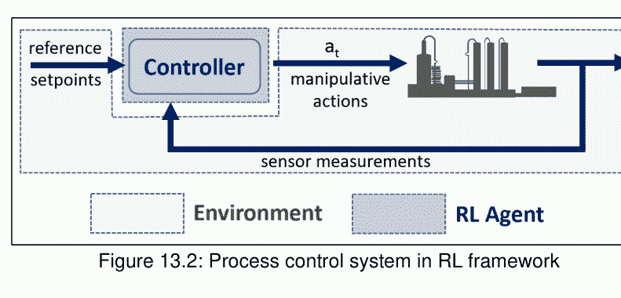

在过程工业中，尽管PID和MPC控制器已经非常成熟，但它们的缺点也是众所周知的。PID控制器在处理复杂的非线性系统时表现不佳，而MPC使用过程模型来求解优化问题，这使得在线动作计算对于大规模非线性系统变得不可行。此外，这两种控制器都会随着时间的推移而出现性能下降的问题（由于过程条件变化、过程漂移），需要定期维护。控制器维护需要重新识别过程模型，这可能既耗时又耗费资源，并且可能需要干扰正常的工厂操作以收集训练数据。

鉴于当前过程控制器技术的上述问题以及强化学习近期的成功，利用强化学习技术进行过程控制的兴趣被重新点燃。最近的几项研究<sup>66</sup>已经证明了基于强化学习的控制器如何能够提供优越的性能。无需在线优化（因为最优动作策略是预先计算的）、通过使用新的过程数据持续学习可以轻松适应变化环境下的动作策略，这些特点使得基于强化学习的控制器非常有前景。

> <sup>66</sup> Cassol et. al., Reinforcement learning applied to process control: A Van der Vusse reactor case study, Computer Aided Chemical Engineering, 2018
> Rajesh Siraskar, Reinforcement learning for control of valves, Machine Learning with Applications, 2021
> Ma et. al., Continuous control of a polymerization system with deep reinforcement learning, Journal of Process Control, 2019

你可能对在真实工厂环境中训练强化学习智能体略有顾虑，因为在训练的早期阶段生成的动作可能“非常糟糕”，甚至不安全。此外，对于复杂系统，可能需要数千次交互才能达到一个相当不错的策略；工厂经理肯定永远不会同意这样做！这些都是合理的担忧，因此，常见的做法是使用足够精确的工厂模型，并在模拟环境中离线训练强化学习智能体。一旦离线学习完成，学习过程就可以关闭，然后将强化学习智能体部署到真实工厂中。然而，有几个充分的理由可以在部署后保持学习开启（持续或间歇性地）。首先，你的工厂模型可能不是100%准确的。因此，强化学习智能体可能会利用一些在线交互来微调其策略。其次，如前所述，工厂行为可能会随时间变化，智能体需要调整其策略以重新适应其环境的变化。

这一讨论也引出了无模型强化学习与基于模型的强化学习的对比。无模型强化学习在训练期间不使用任何环境/工厂模型，其策略完全基于与真实环境的交互来学习。而基于模型的强化学习则使用模型来模拟环境或辅助学习算法。

### 13.2 强化学习术语与数学概念

我们已经对强化学习给予了足够的赞誉。现在让我们深入了解强化学习的实际工作原理。为此，我们将首先学习一些强化学习术语和概念。在此快速声明一下，其中一些新概念可能看起来“抽象”且不能立即有用。但是，随着你阅读本章，我们保证所有的点都会连接起来，它们的效用将变得“显而易见”。

### 环境与马尔可夫决策过程

虽然非正式地说，环境是强化学习智能体交互的任何事物，但在正式场合，它被表示为马尔可夫决策过程。一个MDP之所以如此命名，是因为它表现出马尔可夫性质，即从状态 **s**<sub>t</sub> 到 **s**<sub>t+1</sub> 的转移（概率）仅取决于最近的状态（sₜ）和动作（aₜ）。这种无记忆特性在强化学习中很重要，因为它允许智能体在决定下一个最优动作时只考虑当前状态，而无需担心之前采取了哪些动作才到达sₜ。


图13.3：MDP中的转移仅取决于当前状态和动作

在MDP中，选择能够完全表征环境状态并使智能体能够据此行动的特征变得至关重要。例如，考虑以下控制储罐液位的问题

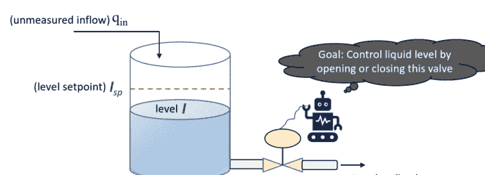

这里，l、lₛₚ以及l的变化率可以用来定义环境状态。lₛₚ也可以用l - lₛₚ作为替代公式。根据你的问题表述，过去的数据也可能被包含在状态向量中，以辅助智能体的决策。

### 奖励与回报

在执行一个动作（aₜ）后，强化学习智能体会收到一个奖励信号（rₜ₊₁），该信号量化并告知智能体处于新状态（sₜ₊₁）并采取动作aₜ的好坏程度。考虑以下智能体从时间t开始在执行任务期间与环境交互的序列。

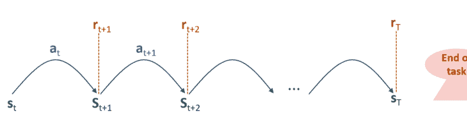

智能体的任务是采取能够最大化任务过程中累积奖励（也称为回报）的动作。回报可以表示为 $R_t = \sum_{k=1}^{T-t} r_{t+k}$。然而，这种直接求和对于没有明确结束状态的任务可能会造成问题。液位控制任务就是一个这样的例子，其中 $T=\infty$（因为任务是永远控制液位！）。为了保持 $R_t$ 有界，使用以下公式代替

$$R_t = r_{t+1} + \gamma r_{t+2} + \gamma^2 r_{t+3} + \dots + \gamma^{T-t-1} r_T = \sum_{k=1}^{T-t} \gamma^{k-1} r_{t+k}$$

*公式 1*

公式（1）中的回报称为折扣回报，其中 $\gamma \in (0, 1)$。未来的奖励越远，其重要性就越低。$\gamma$ 接近0会使智能体在选择 $a_t$ 时只考虑即时奖励（$r_{t+1}$），而 $\gamma$ 接近1则使长期奖励变得重要。

折扣奖励最大化的概念是一种优雅（且数学上易于处理）的方式，使强化学习智能体同时关注即时和未来奖励。对于液位控制问题，一个自然的奖励函数是跟踪误差的平方

$$r_t = -(l_t - l_{sp})^2$$

奖励函数的适当设计非常重要，因为它强烈影响智能体的决策和强化学习训练的收敛性。

### 策略

策略是强化学习智能体用于在给定 $s_t$ 的情况下确定 $a_t$ 的规则或映射。策略可以是确定性的或随机的。确定性策略提供一个单一动作

$$a_t = \mu(s_t)$$

而随机策略（$\pi$）提供一个动作集上的概率分布

$$\pi(a|s_t) = \text{在状态 } s_t \text{ 下采取动作 } a \text{ 的概率}$$

强化学习的目标是学习一个能提供最大回报的策略。最优策略通常表示为 $\mu^*$ 或 $\pi^*$。

### 价值函数

强化学习算法经常使用价值函数。状态价值函数 $V_{\mu}(s)$ 给出了智能体处于状态 $s$ 并根据某个策略 $\mu$ 行动所期望获得的回报。

$$V_{\mu}(s) = E[R_t | s_t = s, \text{策略 } \mu]$$

状态-动作价值函数 $Q_{\mu}(s, a)$ 是另一个有用的函数，它给出了从状态 $s$ 采取任意动作（不一定遵循策略 $\mu$）然后遵循策略 $\mu$ 所期望获得的回报。

$$Q_{\mu}(s, a) = E[R_t | s_t = s, a_t = a, \text{策略 } \mu]$$

当遵循最优策略 $\mu^*$ 时，价值函数表示为 $V^*(s)$ 和 $Q^*(s,a)$。在上述定义中，我们对回报取期望（$E[.]$），因为现实环境是不确定和随机的，即在状态 $\mathbf{s}_t$ 下采取动作 $\mathbf{a}_t$ 可能在不同的迭代中导致略有不同的 $\mathbf{s}_{t+1}$。这种转移不确定性可以表示为概率 $P(s_{t+1} = s' | s_t = s, a_t = a)$。上述定义在计算回报时包含了这个转移概率。

### 贝尔曼方程

价值函数也可以用递归形式表示。考虑最优状态函数，

$$V^*(s) = E[R_t | s_t = s, \mu^*]$$
$$= E[\mathbf{r}_{t+1} + \gamma \mathbf{r}_{t+2} + \gamma^2 \mathbf{r}_{t+3} + \cdots | s_t = s, \mu^*]$$
$$= E[\mathbf{r}_{t+1} + \gamma R_{t+1} | s_t = s, \mu^*]$$
$$= E[\mathbf{r}_{t+1} + \gamma V^*(s_{t+1}) | s_t = s, \mu^*]$$

最优状态-动作价值也可以类似地重写为

$$Q^*(s, a) = E[\mathbf{r}_{t+1} + \gamma Q^*(s_{t+1}, \mu^*(s_{t+1})) | s_t = s, a_t = a]$$
$$\text{或}$$
$$Q^*(s, a) = E[\mathbf{r}_{t+1} + \gamma \max_{a'} Q^*(s_{t+1}, a') | s_t = s, a_t = a]$$

再次注意，$s_{t+1} \sim P(s_{t+1} = s' | s_t = s, a_t = a)$，并且是根据环境的转移概率进行采样的。上述递归方程，也称为贝尔曼方程，是许多强化学习算法的核心。贝尔曼方程简单地指出，当前状态（或状态-动作）的价值是即时奖励与环境接下来进入的任何状态的价值之和。

好的，我们现在已掌握了足够的基础知识，可以开始深入探讨用于最优策略学习的强化学习算法了。让我们从最流行的技术之一——Q-learning开始。

### 13.3 Q-learning 基础

Q-learning 指的是用于估计 $Q^*(s, a)$ 值的强化学习算法。一旦获得了最优价值函数，最优策略就可以简单地表示为选择当前状态下对应最高价值的动作，如下所示：

$$a_t = \arg \max_{a'} Q^*(s_t, a)$$

为了理解如何获得 $Q^*$，考虑一个具有离散状态和动作空间的马尔可夫决策过程。我们可以将 Q 函数表示为一个 Q 表$^{67}$：

$$Q^*(s, a) = \begin{array}{c|ccc} & s_1 & s_2 & s_3 & \dots \\ \hline a_1 & Q^*(s_1, a_1) & Q^*(s_2, a_1) & Q^*(s_3, a_1) \\ a_2 & Q^*(s_1, a_2) & Q^*(s_2, a_2) & Q^*(s_3, a_2) \\ a_3 & Q^*(s_1, a_3) & Q^*(s_2, a_3) & Q^*(s_3, a_3) \\ \vdots & & & \end{array}$$

为了找到每个状态/动作对的最优值，首先将 Q 表中的所有值初始化为 0，任意选择一个初始状态，开始智能体-环境交互，然后使用贝尔曼方程进行如下迭代：

$$\widehat{Q}^*_{new}(s_t, a_t) \leftarrow (1 - \alpha)\widehat{Q}^*_{old}(s_t, a_t) + \alpha \left( r_{t+1} + \gamma \max_{a} \widehat{Q}^*_{old}(s_{t+1}, a') \right)$$

或

$$\widehat{Q}^*_{new}(s_t, a_t) \leftarrow \widehat{Q}^*_{old}(s_t, a_t) + \alpha \left( \underbrace{r_{t+1} + \gamma \max_{a} \widehat{Q}^*_{old}(s_{t+1}, a') - \widehat{Q}^*_{old}(s_t, a_t)}_{\text{时序差分 (TD) 误差}} \right) \quad \text{公式 2}$$

其中 $0 \leq \alpha \leq 1$ 是学习率超参数。公式 2 是一个非常简单的公式，并且已经证明，在给定足够迭代次数的情况下，估计的 Q 值将收敛到最优值！在公式 2 中，$a_t$ 的选择是一个重要的考量，通常采用 $\varepsilon$-贪心策略。在这种策略下，每次迭代时，智能体以概率 $\varepsilon$ 随机行动，或以概率 $1 - \varepsilon$ 贪心行动（选择对应于给定 $s_t$ 下最高值 $\widehat{Q}^*$ 的动作）。这种策略允许良好地结合利用（基于当前估计采取最优行动，使估计随时间改善）和探索（访问环境未知但可能有回报的部分）。在初始迭代期间，当 $\widehat{Q}^*$ 估计预期较差时，$\varepsilon$ 被赋予一个较高的值（接近 1），并随着训练的完成而逐渐降低。下面的伪代码总结了表格 Q-learning 算法。

### 算法 1：表格 Q-learning

```
1. 对所有状态-动作对设置 $\widehat{Q}^*(s, a) = 0$
2. 对于 episode = 1 到 $N_{episode}$ 执行：
3.     初始化状态 $s$
4.     对于 episode 的每个步骤 (t)，直到 $s$ 为终止状态执行：
5.         使用 $\varepsilon$-贪心策略为 $s_t$ 选择动作 ($a_t$)
6.         执行动作 $a_t$ 并观察 $r_{t+1}$ 和下一个状态 $s_{t+1}$
7.         计算 $\delta$ (TD 误差) = $r_{t+1} + \gamma \max_{a'} \widehat{Q}^*_{old}(s_{t+1}, a') - \widehat{Q}^*_{old}(s_t, a_t)$
8.         $\widehat{Q}^*_{new}(s_t, a_t) \leftarrow \widehat{Q}^*_{old}(s_t, a_t) + \alpha \delta$
9.     结束 for
10. 结束 for
```

在上面的伪代码中，有两个术语的含义可能不会立即清楚，即“episode”和“终止状态”。一个 episode 简单地指一次完整的模拟或实验。例如，从办公室开车回家的一次行程就是一个 episode。终止状态标志着一个 episode 的结束。在驾驶示例中，到达家中或燃料耗尽可能是终止状态。对于不一定以终止状态结束的任务（例如控制液位），在训练期间会为 episode 预先指定最大步数。

### 离策略 vs 在策略算法

Q-learning 属于离策略强化学习算法的范畴。在这类算法中，正在学习的目标策略（最优策略）与训练期间执行或用于选择动作的策略（例如 $\varepsilon$-贪心策略）不同。执行的策略也称为行为策略。对于在策略强化学习算法，行为策略等于目标策略。

### 简单示例

如果你还不完全相信采取一些随机动作如何能帮助智能体获得最优 Q 表和最优策略，那么让我们考虑一个假设的控制问题。我们将采用我们的液位控制问题，并仅考虑以下 4 个符号状态：

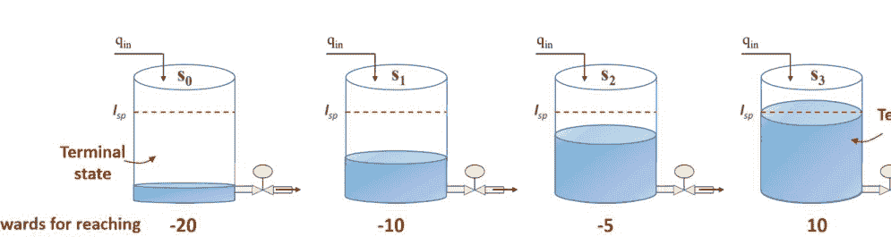

这里的强化学习智能体有 2 个动作选择——关闭或打开阀门一个固定量。关闭阀门会使环境进入更高的液位状态；智能体起初当然不知道这一点。我们将设置 α = 1 和 γ = 0.9。如果两个动作具有相同的值，则采取随机动作，否则采取贪心动作（ε = 0）。现在让我们运行一些模拟实验。

| Episode | t | s_t | Q_old | a_t | s_t | r_{t+1} | Q_new |
| :--- | :--- | :--- | :--- | :--- | :--- | :--- | :--- |
| 1 | 1 | s_1 | s_0 s_1 s_2 s_3<br>Open 0 0 0 0<br>Close 0 0 0 0 | Close (随机选择) | s_2 | -5 | s_0 s_1 s_2 s_3<br>Open 0 0 0 0<br>Close 0 -5 0 0<br>TD 更新: 0 + 1*[-5+0.9*0-0]=-5 |
| 1 | 2 | s_2 | s_0 s_1 s_2 s_3<br>Open 0 0 0 0<br>Close 0 -5 0 0 | Close (随机选择) | s_3 | 10 | s_0 s_1 s_2 s_3<br>Open 0 0 0 0<br>Close 0 -5 10 0<br>TD 更新: 0 + 1*[10+0.9*0-0]=10 |

由于智能体已达到终止状态 (s3)，下一个 episode 将开始。初始状态将被重置，但 Q 表将保持不变。

| Episode | t | $s_t$ | $Q^*_{old}$ | | | | $a_t$ | $s_t$ | $r_{t+1}$ | $Q^*_{new}$ | | | |
|---|---|---|---|---|---|---|---|---|---|---|---|---|---|
| | | | $s_0$ | $s_1$ | $s_2$ | $s_3$ | | | | $s_0$ | $s_1$ | $s_2$ | $s_3$ |
| 2 | 1 | $s_1$ | Open | 0 | 0 | 0 | 0 | open | $s_0$ | -20 | Open | 0 | -20 | 0 | 0 |
| | | | Close | 0 | -5 | 10 | 0 | (贪心动作) | | | Close | 0 | -5 | 10 | 0 |
| 3 | 1 | $s_1$ | Open | 0 | -20 | 0 | 0 | Close | $s_2$ | -5 | Open | 0 | -20 | 0 | 0 |
| | | | Close | 0 | -5 | 10 | 0 | (贪心动作) | | | Close | 0 | 4 | 10 | 0 |

在我们继续进行任何进一步的迭代之前，让我们暂停并观察一下我们仅在 4 次迭代中取得了什么成果。当前的 $Q^*$ 已经足够好，可以给出所需的最优策略！在状态 $s_1$，强化学习智能体将关闭阀门，因为预期回报更高（$4 > 20$）。在状态 $s_2$，智能体将再次关闭阀门。随着进一步的迭代，$Q^*$ 值将更接近更准确的估计，但最优策略将保持不变。

上述示例应该已经使 Q-learning 算法对你清晰明了。它实现简单，但功能相当强大。Q-learning 的一个直接工业应用可以在 Syafiie 等人的工作中看到，用于 pH 中和过程的自动控制$^{68}$。

### 强化学习分类

Q-learning 虽然是一个突破性的强化学习算法，但只是目前众多强化学习算法中的一种。由于它们中的许多相互借鉴思想，因此很难全面地将它们全部列出并归入一些合理的类别。尽管如此，下图展示了当前强化学习算法格局的一个非全面图景。

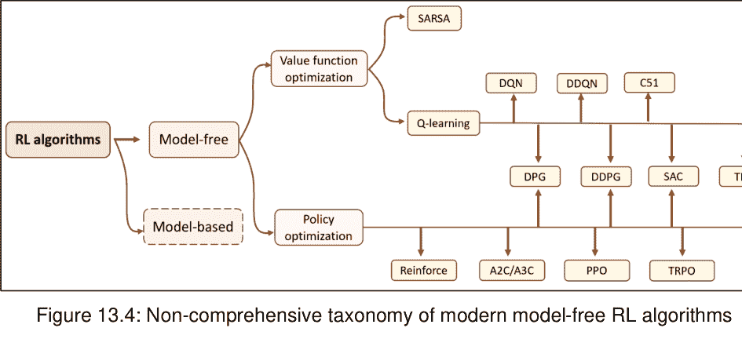

图 13.4 侧重于无模型算法，因为它们由于易于实现而更受欢迎。另一个广泛的分类是根据智能体是尝试直接学习最优策略，还是首先通过估计 $Q^*$ 间接学习。最近通过结合策略优化和 Q-learning 算法的某些特性，出现了极其强大的算法。其中，DDPG 已在几项有前景的研究中用于基于强化学习的过程控制，因此将在本章后面介绍。

### 13.4 深度强化学习与 Actor-Critic 框架

虽然表格 Q-learning 是一种优雅的方法，但不幸的是，它不适用于具有高维连续状态和/或动作空间的马尔可夫决策过程。考虑以液位为状态、阀门调整为动作的液位控制问题。这里，液位和阀门开度可以取 0% 到 100% 之间的任何值。对于表格 Q-learning，我们可能将这些变量粗略地离散化为各 100 个区间。这已经导致了一个 100 X 100 大小的 Q 表。随着更精细的离散化和更多的状态/动作，Q 表可能变得非常大且难以管理。不幸的是，大多数过程控制问题都会面临这些问题。

### 深度 Q 学习

解决连续空间问题的一种方法是使用一个函数来近似 Q 表，并返回任意状态-动作对的 Q 值。当使用深度神经网络作为该函数（如下图所示）时，该方法被称为深度 Q 学习，而该神经网络则被称为深度 Q 网络（DQN）。

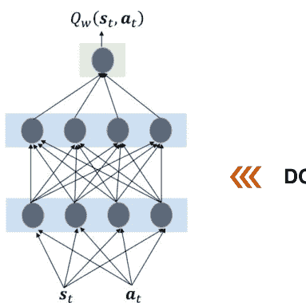

与表格型 Q 学习类似，Q 网络的参数 **w** 通过迭代更新，使得输出 $Q_w(s_t, a_t)$ 逐渐接近其目标值。但是，当最优 $Q^*(s_t, a_t)$ 未知时，目标值是什么呢？贝尔曼方程被用来提供所谓的 TD 目标或自举$^{69}$目标（$\tilde{y}_t$）。令 ($s_t$, $a_t$, $r_{t+1}$, $s_{t+1}$) 为在时间 $t$ 通过环境交互获得的转移元组，则

$$\tilde{y}_t = r_{t+1} + \gamma \max_{a'} Q_w(s_{t+1}, a')$$

上述 TD 目标用于推导如下所示的网络参数更新机制

$$L_t(\mathbf{w}) = \frac{1}{2} \left( \tilde{y}_t - Q_w(s_t, a_t) \right)^2$$
$$\frac{\partial L_t}{\partial \mathbf{w}} \approx - \left( \tilde{y}_t - Q_w(s_t, a_t) \right) \frac{\partial Q_w(s_t, a_t)}{\partial \mathbf{w}}$$
$$\mathbf{w}_t \leftarrow \mathbf{w}_t - \alpha \frac{\partial L_t}{\partial \mathbf{w}}$$

所示的损失函数也称为均方贝尔曼误差（MSBE），它量化了满足贝尔曼方程的误差。这个更新方案你应该很熟悉，因为我们在第 11 章关于人工神经网络（ANN）的内容中已经见过。下面的伪代码总结了 DQN 算法的基本形式<sup>70</sup>

### 算法 2：深度 Q 学习

```
1. 用随机值初始化网络参数 $\mathbf{w}$
2. for episode = 1 to $N_{\text{episode}}$ do:
3.     初始化状态 $\mathbf{s}$
4.     for each step (t) of episode until s is terminal do:
5.         根据某个行为策略 $\beta(.|\mathbf{s}_t)$ 为 $\mathbf{s}_t$ 选择动作 ($\mathbf{a}_t$)
6.         执行动作 $\mathbf{a}_t$ 并观察 $r_{t+1}$ 和下一个状态 $\mathbf{s}_{t+1}$
7.         $\widetilde{y}_t = r_{t+1} + \gamma \max_{a'} Q_{\mathbf{w}}(\mathbf{s}_{t+1}, \mathbf{a}')$
8.         $\mathbf{w} \leftarrow \mathbf{w} + \alpha(\widetilde{y}_t - Q_{\mathbf{w}}(\mathbf{s}_t, \mathbf{a}_t)) \frac{\partial Q_{\mathbf{w}}(\mathbf{s}_t, \mathbf{a}_t)}{\partial \mathbf{w}}$
9.     end for
10. end for
```

尽管 DQN 取得了显著的成果<sup>71</sup>，但其收敛性并不能得到保证<sup>72</sup>。此外，DQN 不太适合具有连续动作空间的过程控制问题，因为在每一步计算连续变量 $\mathbf{a}'$ 的 $\max_{a'} Q_{\mathbf{w}}(\mathbf{s}_{t+1}, \mathbf{a}')$ 非常不便，甚至不切实际。请注意，行为策略也可能包括为选择 $\mathbf{a}_t$ 而求解一个优化问题。

> 尽管我们将在下一节看到一个使用 DDPG 算法的详细基于强化学习的过程控制案例研究，但从概念上理解 DQN 和策略梯度方法仍然很有用。这些是更现代技术的前身，理解它们将为 DDPG 算法提供关键见解。

### 策略梯度方法

与 Q 学习不同，还有另一类算法试图学习一个可以直接作为最优策略（确定性或随机性）函数的函数，如下图所示，使用基于神经网络的函数。

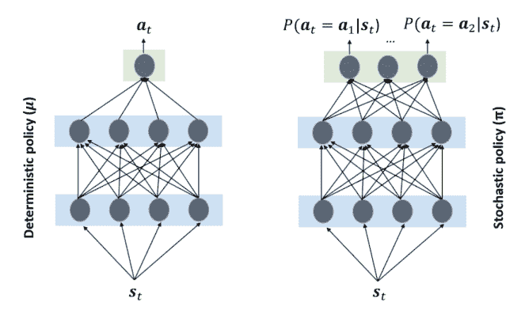

学习这些策略函数背后的算法很简单：在训练期间，收集一个回合中获得的所有奖励，然后更新模型参数（$\theta$）以增加后续回合的回报。当更新机制利用模型性能相对于 $\theta$ 的梯度时，该算法被称为策略梯度算法。这些算法的问题在于，由于收敛缓慢，模型训练非常慢。这部分是由于需要累积奖励或回报，更新发生在回合结束时（不同于 Q 学习中每一步都进行更新）。

### Actor-Critic 框架

对 DQN 和策略梯度算法的优缺点分析表明，它们在某种程度上是互补的，即一方的弱点是另一方的优势。策略梯度算法不必在每次迭代时解决任何优化问题，而 DQN 不必等到回合结束才进行更新。强化学习研究人员看到了这种互补性，并提出了一个 Actor-Critic（AC）框架（图 13.5），将这两种算法融合在一起。

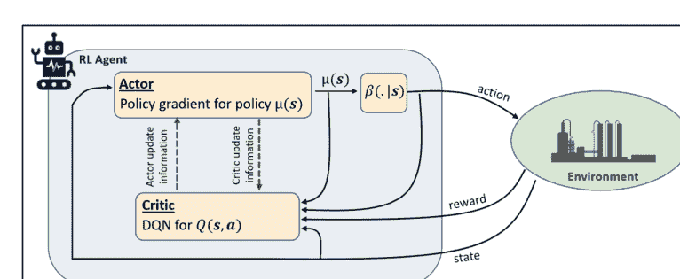

图 13.5：AC 框架内的强化学习智能体训练。请注意，Actor 和 Critic 可以采用任何形式的函数，不一定是神经网络。

在任何训练步骤中，Critic 使用 Actor 来帮助近似评估 $\max_{a'} Q_w(s_{t+1}, a')$ 为 $Q_w(s_{t+1}, \mu_\theta(s_{t+1}))$，从而避免了困难的优化；Actor 使用 Critic 来帮助评估其预测动作 $\mu_\theta(s_t)$ 是好是坏，通过 $Q_w(s_t, \mu_\theta(s_t))$，从而立即更新自身，而不是等到回合结束才知道其动作是否导致更高的回报。这就是 Actor 和 Critic 如何互相帮助的。让我们更详细地看看更新机制。

### AC 更新机制

令 Actor 和 Critic 分别为具有模型参数 $\omega$ 和 $\theta$ 的神经网络。Critic 的更新与深度 Q 学习中的相同，除了下面突出显示的部分

```
$\tilde{y}_t = r_{t+1} + \gamma Q_w(s_{t+1}, \mu_\theta(s_{t+1}))$
$w \leftarrow w + \alpha_c (\tilde{y}_t - Q_w(s_t, a_t)) \frac{\partial Q_w(s_t, a_t)}{\partial w}$
```

对于 Actor 网络，我们将使用以下原理：当预测动作为 $a = \mu_\theta(s_t)$ 时，目标是最大化回报

```
$J(\theta) = E[R_t]$  $\longleftarrow$ Actor 的目标
$J(\theta) \approx Q_w(s_t, a)|_{a=\mu_\theta(s_t)}$  $\longleftarrow$ Critic 提供性能目标
$\Rightarrow \frac{\partial J}{\partial \theta} = \frac{\partial Q_w(s_t, a)}{\partial a}|_{a=\mu_\theta(s_t)} \frac{\partial \mu_\theta(s_t)}{\partial \theta}$  $\longleftarrow$ 微积分中的链式法则
$\theta \leftarrow \theta + \alpha_\theta \frac{\partial J}{\partial \theta}$
```

请注意，由于 Actor 的目标是最大化回报，它执行梯度上升，而 Critic 则执行梯度下降以最小化其 TD 误差。算法 3 中的伪代码总结了 AC 算法。

### 算法 3：确定性离策略 AC 学习

```
1. 用随机值初始化网络参数 $w$ 和 $\theta$
2. for episode = 1 to $N_{episode}$ do:
3.     初始化状态 $s$
4.     for each step (t) of episode until s is terminal do:
5.         根据某个行为策略 $\beta(.|s_t)$ 为 $s_t$ 选择动作 ($a_t$)
6.         执行动作 $a_t$ 并观察 $r_{t+1}$ 和下一个状态 $s_{t+1}$
7.         $\tilde{y}_t = r_{t+1} + \gamma Q_w(s_{t+1}, \mu_\theta(s_{t+1}))$
8.         $w \leftarrow w + \alpha_c(\tilde{y}_t - Q_w(s_t, a_t)) \frac{\partial Q_w(s_t, a_t)}{\partial w}$
9.         $\theta \leftarrow \theta + \alpha_\theta \frac{\partial Q_w(s_t, a)}{\partial a} |_{a=\mu_\theta(s_t)} \frac{\partial \mu_\theta(s_t)}{\partial \theta}$
10.    end for
```

有了 AC 算法（及其背后的数学原理）的基础，我们准备学习 DDPG 算法，这是首批适用于复杂工业过程控制问题的强化学习算法之一。

### 13.5 深度确定性策略梯度（DDPG）

2016 年，Lillicrap 等人$^{73}$发表了一种 Actor-Critic、无模型算法 DDPG，它能够成功处理具有高维连续状态和动作空间的马尔可夫决策过程（MDP）。尽管它基于先前展示的 AC 架构（Critic 和 Actor 都是神经网络），但它汇集了其他工作（Silver 等人$^{74}$、Mnih 等人$^{75}$等）的几个创新思想，极大地提高了强化学习智能体训练的鲁棒性和稳定性。这些创新包括：

- 经验回放缓冲区或回放记忆
- 目标网络
- 基于 Ornstein-Uhlenbeck 过程的行为策略
- 批量归一化

图13.6展示了DDPG如何以及在何处将这些创新点融入图13.5的AC框架中。如果这张图看起来令人困惑，请不要担心。我们将逐一剖析这些新概念。

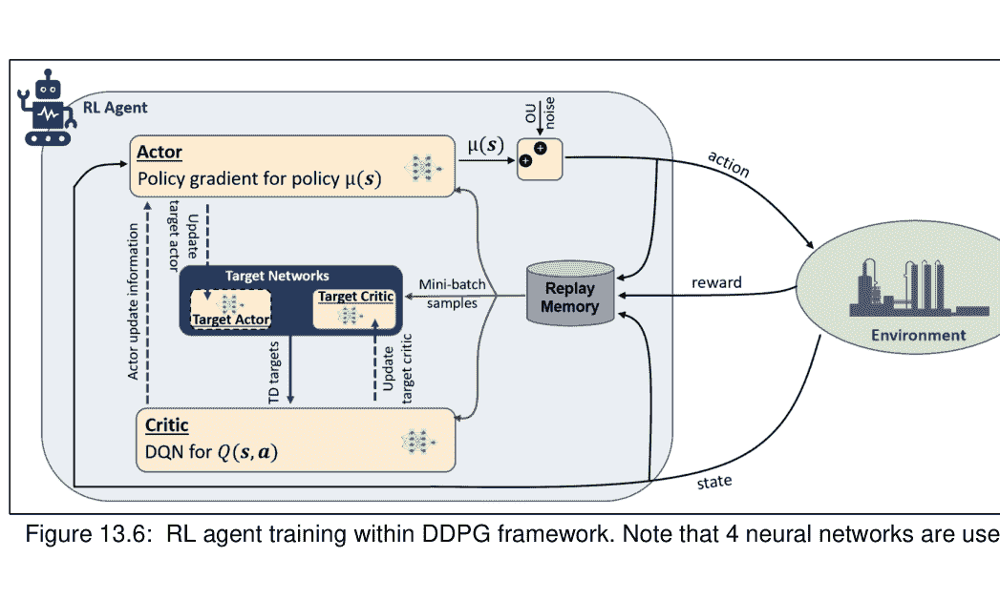

### 经验回放

在算法3中，我们看到网络参数更新是基于单个转移元组（$\mathbf{s}_t$, $\mathbf{a}_t$, $r_{t+1}$, $\mathbf{s}_{t+1}$）的。这样做（除了与小批量更新相比计算效率较低）的问题在于，连续更新中采样的元组是相关的，因此并非完全独立。这已被发现会导致收敛问题。经验回放缓冲区或经验回放（RM）有助于克服这个问题。

经验回放就是一个存储大量转移元组的缓存。在任何训练步骤中，根据智能体的行为策略生成一个转移元组（$\mathbf{s}$, $\mathbf{a}$, $r$, $\mathbf{s}'$）并存储在RM中。如果RM已满（元组数量等于某个预设大小$K$），则移除最旧的采样元组。演员和评论家网络使用从RM中随机采样的$M$（$M < K$）个元组的小批量进行更新。下面的表达式展示了小批量更新机制。令$B = \{(s_i, a_i, r_i, s'_i)\}_{i=1}^K$为从RM中采样的小批量转移元组。那么，

$$w \leftarrow w + \frac{\alpha_c}{M} \sum_{i=1}^M (\tilde{y}_i - Q_w(s_i, a_i)) \frac{\partial Q_w(s_i, a_i)}{\partial w}$$

$$\text{其中 } \tilde{y}_i = r_i + \gamma Q_w(s'_i, \mu_\theta(s'_i))$$

$$\theta \leftarrow \theta + \frac{\alpha_{\theta}}{M} \sum_{i=1}^{M} \frac{\partial Q_w(s_i, a)}{\partial a} \bigg|_{a=\mu_{\theta}(s_i)} \frac{\partial \mu_{\theta}(s_i)}{\partial \theta}$$

我们在第11章中已经看到，对于人工神经网络训练，小批量更新优于随机更新。在强化学习中也观察到了类似的结论。

### 目标网络

评论家网络通过最小化预测Q值与TD目标之间的误差来训练。然而，正如我们之前指出的，TD目标本身依赖于我们试图拟合的评论家网络。这使得AC算法容易发散。这通过创建演员和评论家网络的副本（称为目标网络）来解决，这些副本的参数缓慢演变，但跟踪正在学习的主网络。令$Q_{w,target}$和$\mu_{\theta,target}$表示目标网络。在任何训练步骤中，来自RM的第$i^{th}$个转移元组的TD目标由下式给出

$$\tilde{y}_i = r_i + \gamma Q_{w,target} \left( s'_i, \mu_{\theta,target}(s'_i) \right)$$

在演员和评论家网络更新（使用公式3）之后，目标网络按如下方式更新

$$w_{target} \leftarrow \tau w + (1 - \tau)w_{target}$$
$$\theta_{target} \leftarrow \tau \theta + (1 - \tau)\theta_{target}$$

其中$\tau$是一个介于0和1之间的超参数（通常保持接近0）。因此，DDPG算法有4个神经网络同时进行拟合。

### OU过程作为探索噪声

在表格型Q学习中，我们使用了$\epsilon$-贪婪行为策略。不幸的是，$\epsilon$-贪婪假设离散动作空间。为了在RL智能体训练期间在DDPG中实现充分的探索，Lillicrap等人在演员的动作上添加了噪声

$$\beta(s_t) = \mu_{\theta}(s_t) + \mathbb{N}$$

噪声$\mathbb{N}$被选择为由Ornstein-Uhlenbeck（OU）过程给出。OU过程是一个随机过程（细节在后面的代码中提供），它提供时间相关的信号，有利于深度探索。

整体的DDPG算法总结在下面的伪代码中。

```
算法4：DDPG算法

1. 用随机值初始化网络参数，$w$ 和 $\theta$
2. 设置 $w_{target} \leftarrow w$, $\theta_{target} \leftarrow \theta$
3. for episode = 1 to $N_{episode}$ do:
4.     初始化状态 $s$
5.     for each step (t) of episode until s is terminal do:
6.         根据当前策略 $\mu_\theta$ 和OU噪声获取 $s_t$ 的动作 ($a_t$)
7.         执行动作 $a_t$ 并观察 $r_{t+1}$ 和下一个状态 $s_{t+1}$
8.         将元组 ($s_t, a_t, r_{t+1}, s_{t+1}$) 存储在RM中
9.         从RM中采样一个包含 $M$ 个元组的小批量
10.        使用目标网络计算TD目标：
            对于小批量中的每个第 $i^{th}$ 个元组：$\tilde{y}_i = r_i + \gamma Q_{w,target} \left( s'_i, \mu_{\theta,target}(s'_i) \right)$
11.        更新评论家：
            $w \leftarrow w + \frac{\alpha_c}{M} \sum_{i=1}^M (\tilde{y}_i - Q_w(s_i, a_i)) \frac{\partial Q_w(s_i, a_i)}{\partial w}$
12.        更新演员：
            $\theta \leftarrow \theta + \frac{\alpha_\theta}{M} \sum_{i=1}^M \frac{\partial Q_w(s_i, a)}{\partial a} \bigg|_{a=\mu_\theta(s_i)} \frac{\partial \mu_\theta(s_i)}{\partial \theta}$
13.        更新目标网络：
            $w_{target} \leftarrow \tau w + (1 - \tau)w_{target}$
            $\theta_{target} \leftarrow \tau \theta + (1 - \tau)\theta_{target}$
14.    end for
15. end for
```

现在你已经准备好使用DDPG算法构建基于RL的过程控制器了。让我们重新审视流体液位控制问题，并更详细地探讨它。

### 13.6 DDPG RL智能体作为液位控制器

下图13.7展示了我们的液位控制问题的若干细节$^{76}$。如前所述，RL智能体控制器需要学习如何在流入扰动的影响下控制储罐液位（具体来说，将其保持在47.5%到52.5%之间）。这个简单的例子将帮助你理解如何设置RL智能体训练及其后续部署。

$^{76}$ 系统、问题和解决方案机制改编自论文工作：'E. R. Mageli, 过程控制中的强化学习, 挪威科技大学, 2019'。

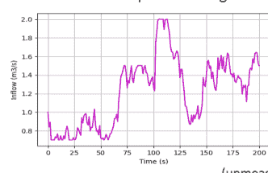

### 环境状态

- 1) 储罐液位 ($l$)
- 2) 液位变化率 ($\frac{dl}{dt}$)
- 3) 一个布尔标志，指示液位是否高于50%

### 智能体动作

阀门开度比例 ($z$)
$[0 \leq z \leq 1]$

### 储罐动力学：

$\frac{dl}{dt} = \frac{1}{\pi r^2} (q_{in} - z A_{out} \sqrt{2gl})$

### 参数：

- 储罐高度：10 m
- 储罐半径 ($r$)：7 m
- 管道半径：0.5 m
- 管道面积 ($A_{out}$)：$\pi * 0.5^2$
- g: 9.81 m/s$^2$

### 奖励

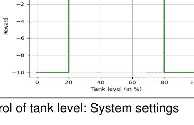

图13.7：基于RL的储罐液位控制：系统设置

让我们首先定义RL智能体将与之交互的储罐环境$^{77}$。如果你不熟悉使用Python类，请不要担心。大部分代码是自解释的，并在必要时提供了适当的注释。

```
# 此处定义的储罐类将在我们后续的RL智能体训练脚本中使用
import numpy as np
import random

class tank_environment:
    """创建一个OpenAI风格的环境"""
    def __init__(self, pre_def_dist=False, pre_distFlow=[1]):
        # 储罐相关参数
        self.height = 10
        self.radius = 7
        self.level = 0.5 * self.height # 初始液位在50%
        self.hard_max_level = 0.8 * self.height
        self.hard_min_level = 0.2 * self.height
        self.soft_max_level = 0.525 * self.height
        self.soft_min_level = 0.475 * self.height
        self.pipe_radius = 0.5
        self.pipe_Aout = np.pi*self.pipe_radius*self.pipe_radius

        # 扰动相关
        self.pre_def_dist = pre_def_dist
        self.pre_distFlow = pre_distFlow # 测试期间使用的扰动流量
        self.distFlow = [1] # 存储训练回合期间的扰动流量
```

> __init__ 函数用于初始化 tank_environment

> 超出这些液位意味着任务终止

> 液位的期望范围

```
    def get_disturbanceFlow(self, t=0):
        """
        参数：
            t: 对应于一个回合的步数 [测试期间使用]
        返回：
            一个（标量）扰动流量
        """
        if self.pre_def_dist:
            return self.pre_distFlow[t]
        else:
            new_flow = random.normalvariate(self.distFlow[-1], 0.1)
            # 对扰动流量施加边界限制
            if new_flow > 2:
                new_flow = 2
            elif new_flow < 0.7:
                new_flow = 0.7

            self.distFlow.append(new_flow)
            return new_flow
```

> 扰动流量被建模为高斯随机游走时间序列，其中当前流量围绕前一步的流量呈正态分布

def step(self, action):
    """
    描述：
        接受一个动作并返回一个元组（状态，奖励，是否结束）。

    参数：
        action (valve opening)：智能体提供的一个动作

    返回值：
        state (numpy array of size (3,))：智能体对当前环境的观察
        reward (float)：执行该动作后返回的奖励值
        done (bool)：指示一个回合是否已终止
    """

    # 参数
    g = 9.81

    for i in range(5):
        # 计算水箱水位的变化率
        q_dist = self.get_disturbanceFlow()
        q_out = action*self.pipe_Aout*np.sqrt(2*g*self.level)
        dhdt = (q_dist - q_out)/(np.pi*self.radius*self.radius)

        # 计算新的水箱水位
        self.level = self.level + dhdt

        # 检查终止状态
        done = False
        if self.level < self.hard_min_level:
            done = True
            break
        elif self.level > self.hard_max_level:
            done = True
            break

    # 检查水位是否高于50%
    if self.level >= 0.5*self.height:
        above = 1
    else:
        above = 0

    # 计算奖励
    if done:
        reward = -10
    elif self.level > self.soft_min_level and self.level < self.soft_max_level:
        reward = 1
    else:
        reward = 0

    # 生成观察/状态向量
    next_state = np.array([self.level/self.height, dhdt, above]) # 使用归一化水位

    return next_state, reward, done

> 在训练期间，系统会为一个动作模拟5个时间步长。这被发现在训练期间有所帮助。

> 模拟水箱动态

def reset(self):
    """
    描述：将水箱环境重置为初始条件
    返回值：环境的初始状态
    """
    self.level = 0.5 * self.height
    self.distFlow = [1]

    return np.array([self.level/self.height, 0, 1])

定义了水箱环境的行为后，我们现在可以开始编写智能体训练的代码了。我们将从导入一些包和定义一些实用函数开始。如果你在单独的脚本文件（例如，Tank_Environment.py）中定义了`tank_environment`类，你需要在当前脚本中导入该类（如此处所示）。

```
# 导入包
import numpy as np
import tensorflow as tf
from tensorflow import keras
from tensorflow.keras import Sequential
from tensorflow.keras.layers import Dense
from Tank_Environment import tank_environment
```

```
# 定义实用函数
def ActorNetwork(n_states=3, n_action=1):
    """
    描述：获取具有给定参数的演员网络
    返回值：keras模型
    """
    model = Sequential()
    model.add(Dense(8, activation='relu', input_shape=(n_states,)))
    model.add(Dense(8, activation='relu'))
    model.add(Dense(n_action, activation='sigmoid'))

    return model
```

```
def CriticNetwork(n_states=3, n_action=1):
    """
    描述：获取具有给定参数的评论家网络
    返回值：keras模型
    """
    model = Sequential()
    model.add(Dense(8, activation='relu', input_shape=(n_states+n_action,)))
    model.add(Dense(8, activation='relu'))
    model.add(Dense(1))

    return model
```

上面两个函数将在后面用于创建我们的演员、评论家和目标网络。下一个函数执行目标网络的软更新。

```
def update_target(target_network, ref_network, tau=0.01):
    """
    使用参考/主网络的权重更新目标网络权重
    """
    target_network_weights = target_network.get_weights()
    ref_network_weights = ref_network.get_weights()

    for index in range(len(target_network_weights)):
        target_network_weights[index] = tau*ref_network_weights[index] + \
                                        (1-tau)*target_network_weights[index]
    target_network.set_weights(target_network_weights)

    return target_network
```

下一个函数生成OU噪声，该噪声作为扰动添加到演员的动作中。随后的图显示了由该机制生成的噪声模式示例。很明显，OU过程表现出更大的惯性（与剧烈波动的高斯过程相比），因为OU噪声信号倾向于在长时间内朝同一方向演变；这促进了强化学习智能体训练期间的深度探索。

```
def OU_noise(noise_prev, theta=0.15, mu=0, sigma=0.025, n_action=1):
    """
    描述：模拟OU过程以生成时间相关噪声
    改编自 github.com/openai/baselines/blob/master/baselines/ddpg/noise.py
    """
    noise = noise_prev + theta*(mu-noise_prev) + sigma*np.random.randn(n_action)
    return noise
```

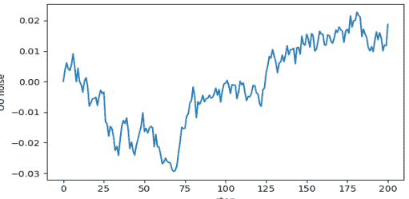

使用OU_noise函数生成的一个回合内的噪声概况

接下来，我们创建一个函数，从RM中采样一批存储的转换元组。你会注意到一个额外的变量‘done’是这里转换元组的一部分。这个变量的重要性将在下一个实用函数中变得清晰。

```
def sample_ReplayMemory():
    """
    返回值：
        states: 一个具有3列的2D numpy数组
        actions: 一个具有1列的2D numpy数组
        rewards: 一个1D numpy数组
        next_states: 一个具有3列的2D numpy数组
        dones: 一个1D numpy数组

    改编自 github.com/ageron/handson-ml2/blob/master/18_reinforcement_learning.ipynb
    """

    # 从回放缓存中选择一批转换
    indices = np.random.randint(len(replay_memory), size=batchSize)
    batch = [replay_memory[index] for index in indices]

    # 从选定的转换中分离出状态、动作、奖励、下一状态、是否结束
    states, actions, rewards, next_states, dones = [np.array([transition[field_index] for transition in batch]) for field_index in range(5)]

    return states, actions, rewards, next_states, dones
```

之前，我们计算了TD目标为 $\tilde{y}_i = r_i + \gamma Q_{w,target}(s'_i, \mu_{\theta,target}(s'_i))$，其中 $i^{th}$ 是RM中一个小批量的第 $i^{th}$ 个转换元组（参见算法4）。我们现在将对这个公式进行一个小的修改，如下所示

$\tilde{y}_i = r_i + (1 - done_i) * \gamma Q_{w,target}(s'_i, \mu_{\theta,target}(s'_i))$，其中 $i^{th}$ 是小批量中的第 $i^{th}$ 个元组

修改后的公式陈述了一个明显的事实：如果回合或任务因在状态 $s_i$ 下采取动作 $a_i$ 而终止（$done_i$ 等于1或True），则TD目标就是奖励（$r_i$）。下面的函数实现了这个公式。

```
def get_TD_targets(rewards, target_Q_values, dones, gamma=0.95):
    """
    参数：
        rewards: 一个1D numpy数组
        target_Q_values: 一个具有1列的2D numpy数组
        dones: 一个1D numpy数组

    返回值：
        td_targets: 一个具有1列的2D numpy数组
    """
    td_targets = np.zeros_like(target_Q_values)
    for i in range(target_Q_values.shape[0]):
        if dones[i]:
            td_targets[i] = rewards[i]
        else:
            td_targets[i] = rewards[i] + gamma*target_Q_values[i]

    return td_targets
```

好了，我们现在到了最后一个需要定义的实用函数。这个函数使用从采样的小批量中获取的数据来更新主演员和评论家网络。这里涉及几个新概念，需要一些解释。你会注意到使用了tf.function装饰器$^{78}$，它将常规Python函数转换为Tensorflow函数，从而实现更快的计算。输入签名指定了函数每个Tensor参数的形状和类型。在函数内部，使用了GradientTape API$^{79}$，它实现了用于梯度计算的自动微分。该API允许Tensorflow在tf.GradientTape的上下文中“记录”执行了哪些操作。当调用tape.gradient函数时，Tensorflow会计算记录的操作相对于指定变量的梯度。

```
@tf.function(input_signature=[tf.TensorSpec(shape=(None, 3), dtype=tf.float32),
                            tf.TensorSpec(shape=(None, 1), dtype=tf.float32),
                            tf.TensorSpec(shape=(None, 1), dtype=tf.float32)])
def ddpg_updateStep(s, a, td_targets):
    """
    描述：使用梯度下降更新主网络

    参数：
        s: 一个具有3列的2D numpy数组
        a: 一个具有1列的2D numpy数组
        td_targets: 一个具有1列的2D numpy数组
    """

    # 通过算法4的步骤11更新评论家
    # 网络、损失函数（均方误差）和优化器在脚本后面定义
    with tf.GradientTape() as tape:
        Q_predicted = critic(tf.concat([s, a], 1))
        critic_loss = tf.reduce_mean(loss_fn(td_targets, Q_predicted))
    critic_gradients = tape.gradient(critic_loss, critic.trainable_variables)
    critic_optimizer.apply_gradients(zip(critic_gradients, critic.trainable_variables))

    # 更新演员
    with tf.GradientTape() as tape:
        actor_loss = -tf.reduce_mean(critic(tf.concat([s, actor(s)], 1)))
    actor_gradients = tape.gradient(actor_loss, actor.trainable_variables)
    actor_optimizer.apply_gradients(zip(actor_gradients, actor.trainable_variables))
```

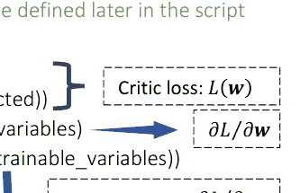

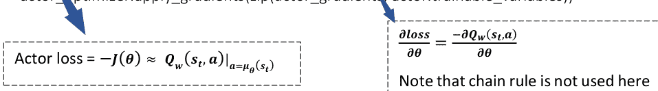

好的，现在让我们训练智能体。

```
# 定义回放缓存
from collections import deque
replay_memory = deque(maxlen=100000)
```

# 定义网络并设置其优化器
critic = CriticNetwork()
target_critic = CriticNetwork()
target_critic.set_weights(critic.get_weights())

actor = ActorNetwork()
target_actor = ActorNetwork()
target_actor.set_weights(actor.get_weights())

critic_optimizer = keras.optimizers.Adam(lr=0.01)
actor_optimizer = keras.optimizers.Adam(lr=0.01)

loss_fn = keras.losses.MeanSquaredError()

# 定义环境
from Tank_Environment import tank_environment
env = tank_environment() # 类的 __init__ 函数在此处被隐式调用

# 一些训练设置
rewards = [] # 存储每个回合收集的总奖励
n_episodes = 300
n_steps = 200
batchSize = 64

# 训练循环
for episode in range(n_episodes):
    state = env.reset()
    noise = 0
    episode_reward = 0

    for step in range(n_steps):
        # 确定动作
        action = actor.predict(state.reshape(1,-1)).flatten()
        noise = OU_noise(noise)
        action = np.clip(action + noise, 0, 1) # 确保动作保持在0和1之间

        # 执行动作，获取新状态和奖励，并保存到RM中
        next_state, reward, done = env.step(action[0])
        episode_reward = episode_reward + reward
        replay_memory.append((state, action, reward, next_state, done))

        # 更新网络
        if len(replay_memory) >= batchSize:
            # 采样转换
            RM_states, RM_actions, RM_rewards, RM_next_states, RM_dones = sample_ReplayMemory()

            # 计算TD目标（算法4的步骤10）
            RM_target_next_actions = target_actor.predict(RM_next_states)
            RM_target_Q_values = target_critic.predict(np.concatenate((RM_next_states,
                                                                      RM_target_next_actions), axis=1))
            RM_td_targets = get_TD_targets(RM_rewards, RM_target_Q_values, RM_dones)

            # 更新主网络
            ddpg_updateStep(tf.convert_to_tensor(RM_states, dtype=tf.float32),
                            tf.convert_to_tensor(RM_actions, dtype=tf.float32),
                            tf.convert_to_tensor(RM_td_targets, dtype=tf.float32))

            # 更新目标网络
            target_critic = update_target(target_critic, critic)
            target_actor = update_target(target_actor, actor)

        # 为下一步做准备
        state = next_state
        if done:
            break

    rewards.append(episode_reward)

# 保存训练好的模型
actor.save('actor_saved')

上述脚本完成了通过DDPG算法训练强化学习智能体的实现。正如强化学习训练中常见的那样，即使对于我们的简单水箱系统，超参数调优也被证明是困难的。通常，训练会收敛到一个平凡的强化学习控制器，该控制器会完全打开和关闭阀门以控制液位。图13.8显示了在测试中使用收敛的合理解决方案时强化学习智能体的性能。下面的代码展示了如何设置强化学习测试/部署。

# 使用预设扰动曲线测试强化学习智能体
distFlow_fileName = 'disturbance_200.csv'
distFlow = np.loadtxt(distFlow_fileName, delimiter=',')
env = tank_environment(pre_def_dist=True, pre_distFlow=distFlow)
state = env.reset()

level_hist = []
valve_opening_hist = []

actor = keras.models.load_model('actor_saved')
for step in range(n_steps):
    # 采取行动
    action = actor.predict(state.reshape(1,-1)).flatten()
    next_state, reward, done = env.step_test(action[0], step) # step_test函数与step函数相同，不同之处在于系统对每个动作只模拟一个时间步长

    # 存储
    valve_opening_hist.append(action[0])
    level_hist.append(next_state[0]*env.height)

    # 检查终止条件
    if done:
        break
    else:
        state = next_state

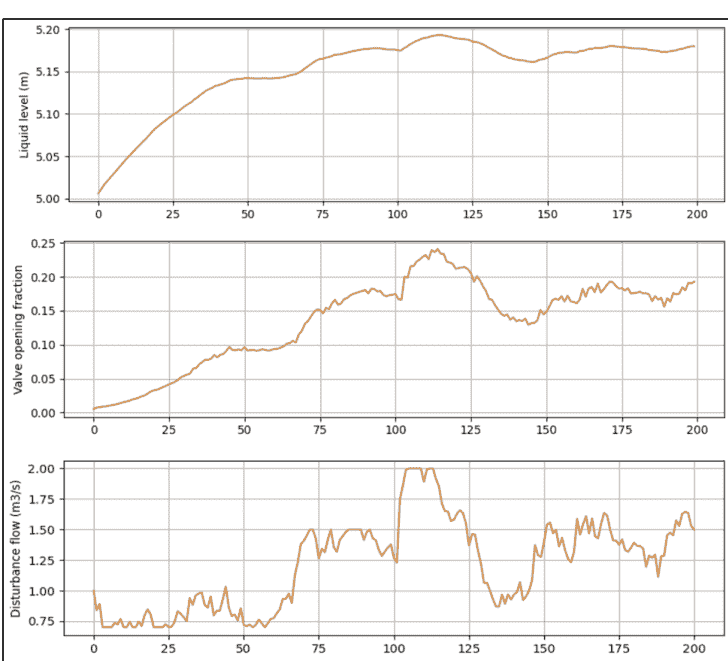

图13.8：水箱液位控制的强化学习控制器评估

如图所示，强化学习智能体能够通过巧妙地调节阀门开度，将液位保持在最有利可图的区域。例如，在110秒左右，当扰动流量急剧增加时，强化学习控制器会进一步打开阀门以保持液位稳定。请记住，强化学习智能体并不知道扰动的大小。它经过训练，仅使用当前液位和液位变化率的信息来做出最优决策。

如前所述，强化学习训练可能会给你带来诸多挑战。然而，你确实有多种补救措施。重新表述你的问题可能是一件值得做的事情。例如，在水箱液位控制问题中，你可以使用$\Delta f$（阀门开度的变化）作为动作，并将当前的$f$作为另一个状态变量$^{80}$。你也可以以不同的方式设计奖励函数，并对控制器进行大幅度动作移动进行惩罚。可以尝试更新的算法，如TD3、PPO，这些算法试图解决训练稳定性问题。希望你现在对强化学习基础有了足够的理解，能够帮助你适当地判断你的情况并做出明智的决策。

这结束了我们对强化学习世界的快速之旅。正如之前所提到的，强化学习是一个广阔的领域，自DDPG以来已经提出了许多其他算法，并且这些算法正日益流行。本章的阐述将帮助你开始学习强化学习，并思考你可以利用这一强大工具的所有不同方式。与其他机器学习技术不同，强化学习尚未在过程工业中得到广泛应用（由于训练时间长、难以施加过程约束、需要足够的模拟器进行初始离线训练等）。然而，考虑到强化学习领域正在进行的大量研究以及廉价计算资源的日益普及，可以毫不夸张地说，强化学习将在不久的将来在工业过程控制中发挥重要作用。

### 总结

在本章中，我们探讨了强化学习的理论和实践方面。我们详细研究了两种流行的算法，即Q-learning和DDPG。我们开发了一个基于强化学习的控制器来控制水箱中的液位。我们希望强化学习对你来说不再是一个谜。通过本章，我们也到达了机器学习之旅的终点。在这段旅程中，你掌握了几种强大的工具。作为临别赠言，我们只想提醒你“没有免费午餐”定理，该定理指出不存在一种方法能在所有情况下都获得最佳结果。希望你从本书中获得的知识将帮助你为你的问题做出正确（且有根据的）建模选择。祝一切顺利！

$^{80}$ 有时，为了确保状态向量包含所有需要的信息，你可能需要在状态向量中添加一些过去的观测值和动作。这类似于我们之前见过的数据增强。

## 第4部分

### 在网络上部署机器学习解决方案

## 第14章

### 过程监控Web应用

你已经完成了所有艰苦的工作，获得了一个满足性能标准的机器学习模型，现在是时候将解决方案/模型交付给最终用户了，这些用户将定期使用模型的结果。但你该如何做呢？如果最终用户是非技术性的（从数据科学角度来看），比如工厂操作员，你不能要求他们拥有自己的Python环境来运行机器学习模型。在这种情况下，通过网络部署是交付机器学习结果的一种良好且常用的解决方案。

对于网络部署，Python提供了多种框架（如Django、Flask、CherryPy）来快速开发从简单到复杂的Web应用。通常，你可能只需要一个快速原型来收集用户反馈。考虑到这一点，我们将向你展示如何从头开始构建一个轻量级的Web应用，并演示这样做是多么容易。具体来说，我们将构建一个过程监控工具，通过网络向工厂操作员提供24 X 7的故障检测与诊断（FDD）结果。在构建此解决方案的过程中，我们将学习以下主题

- 使用CherryPy的Web服务器部署Python应用
- 将机器学习模型嵌入Web应用
- 保存机器学习模型以供后续重用
- 使用HTML、CSS、Javascript构建前端用户界面

### 14.1 过程监控 Web 应用：简介

图 14.1 展示了我们将在本章构建的用户界面，用于实时显示来自过程监控机器学习模型的结果。该用户界面通过 Web 浏览器访问，并为工厂操作员提供两项关键信息。首先，故障检测组件向操作员传达过程状态，并在检测到任何过程异常时发出警报。其次，故障诊断组件识别导致过程异常的故障变量。监控模型将使用 PCA 构建，并采用第 5 章介绍的方法进行故障检测与诊断。过程系统与第 5 章相同，即具有 33 个变量的聚合物加工厂。

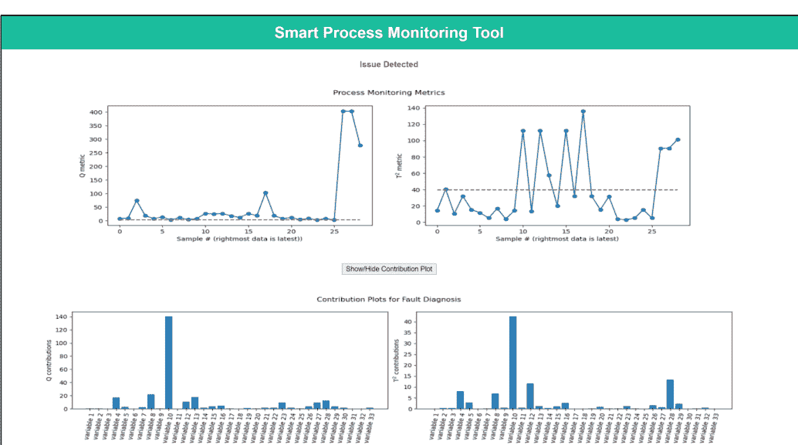

Web 应用程序主要包含两个主要部分：前端和后端。前端（或客户端）是最终用户通过 Web 浏览器直接看到并与之交互的部分。后端在幕后工作，将信息传递给浏览器。当用户在浏览器中输入网站的 URL 时，会向后端发送一个请求，后端解析该请求、进行处理，并返回一个响应显示在前端。下图展示了我们将采用的数据传输方案。

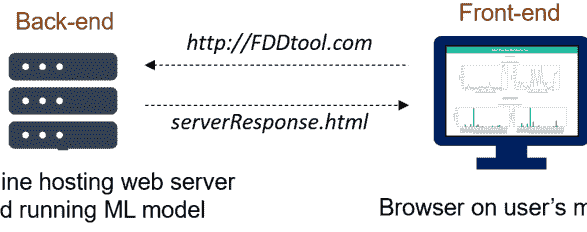

如图所示，数据分析发生在位于专用计算机上的后端，结果可以通过浏览器在任何机器上查看。虽然我们应用中的前端只负责显示 FDD 结果这一基本工作，但前端可以完成更多任务，例如用户数据输入验证、动画等，这些复杂功能由任何现代互联网浏览器处理。

### 14.2 一个简单的‘Hello World’ Web 应用

在构建功能齐全的监控工具之前，让我们先构建一个简单的‘Hello World’应用程序，以熟悉使用 Python 开发 Web 应用程序的过程。我们将使用 CherryPy<sup>81</sup> 包，这是一个流行且简单的 Web 应用程序框架，用于 Web 应用的快速部署，并且非常易于学习。CherryPy 提供了一个生产就绪的 Web 服务器，可以轻松处理中等规模的 Web 应用程序，因此适合我们的目的。

对于这个简单的应用，让我们在 Python 脚本<sup>82</sup> *helloWorld.py* 中输入以下代码，并在 Anaconda 命令终端中执行（要从 Windows 命令终端执行，您需要编辑 Windows 环境变量以将 Anaconda 添加到系统路径中）。

```
# import package
import cherrypy

# Web application will be written as a Python class.
# Methods of the class will be used to respond to client requests
class HelloWorld(object):
    @cherrypy.expose
    def index(self):
        return "Hello world!"

# execution settings
cherrypy.config.update({'server.socket_host': '0.0.0.0'})
if __name__ == '__main__':
    cherrypy.quickstart(HelloWorld()) # when this script is executed, host HelloWorld app
```

<sup>81</sup> 您可以通过 `pip install cherrypy` 命令安装 CherryPy。CherryPy 官方文档有一些优秀的指导教程 (https://docs.cherrypy.org/en/latest/tutorials.html)。如果您想了解更多，请务必查看它们。
<sup>82</sup> 我们不会详细介绍 Python 类或 CherryPy 配置背后的概念。虽然理解它们很有用，但要理解脚本并非必须。您可以遵循此处显示的结构，并在熟悉 Web 应用程序开发后根据需要进行调整。

您将在终端上看到以下‘奇怪’的输出。

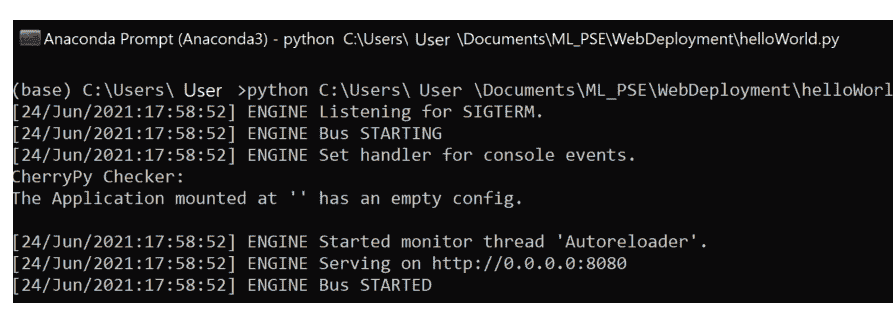

此输出仅表示 Web 服务器已启动并准备好在地址 http://localhost:8080（或 http://127.0.0.1:8080）上接受传入请求。请在浏览器的 URL 地址栏中输入此地址。您应该会看到以下内容。


这里发生的情况是，Web 服务器将传入的请求定向到 helloWorld 应用，这会触发默认的 index<sup>83</sup> 函数的执行，该函数将文本‘Hello World’返回给浏览器，然后显示给您。在此示例中，后端和前端都位于您的 PC 上；但是，对于工具部署，您需要在其他专用机器上设置后端。我们的 Web 服务器也可以监听来自同一工作场所网络中其他 PC 的请求——URL 需要修改以明确指定 Web 服务器托管在您的 PC 上。假设您的 PC 名称是 *machineName*，您可以请任何同事在其浏览器上使用地址 http://machineName:8080——他们应该会看到与上述相同的结果。

<sup>83</sup> 如果 URL 中未提供显式函数（或路径段），则默认执行‘index’函数。

就是这样！创建和部署 Web 应用程序所需的就是这些。您可能没想到会这么容易，对吧？到现在，您可能开始对我们如何扩展这个简单的 Web 应用程序用于我们的监控工具有了一些想法。我们需要的是我们的 Web 服务器在收到浏览器请求时提供 FDD 结果。我们现在将在简单的 Web 应用程序中添加所需的组件以实现此功能。

### 14.3 将机器学习模型嵌入 Web 应用

为了向工厂操作员提供监控结果，我们将用下面所示的 FDDapp 类替换 HelloWorld.py 脚本中的 HelloWorld 类，并将文件另存为 FDD.py。

```
# FDD tool web application
class FDDapp(object):
    @cherrypy.expose
    def getResults(self):
        processState = runPCAmodel() # returns 'All Good' or 'Issue Detected'
        return processState
```

如果您使用 Web 地址 *http://machineName:8080/getResults*（在我们定义了 runPCAmodel 函数的逻辑之后），getResults 函数将被执行，该函数将执行 runPCAmodel 函数以生成结果并返回当前过程状态信息。目前，我们返回的输出非常简单，但稍后我们将修改它以返回更有指导性的结果。在我们查看 runPCAmodel 函数的代码之前，有一个重要说明：我们不希望每次访问 Web 应用程序时都（重新）训练和生成 PCA 模型。我们可以做的是在模型训练后保存生成的 PCA 模型（和其他模型变量），然后在 runPCAmodel 函数中重用保存的模型。

为了保存和重用机器学习模型和模型变量，我们可以使用 pickle 包。让我们将以下代码添加到第 5 章的 ProcessMonitoring_PCA.py 脚本中。

```
# saving PCA data for later re-use
import pickle
PCAmodelData = {"PCAmodel": pca,
                "scaler": scaler,
                "n_comp": n_comp,
                "P_matrix": P_matrix,
                "lambda_k_inv": lambda_k_inv,
                "Q_CL": Q_CL,
                "T2_CL": T2_CL} # dictionary data structure uses key-value pairs

with open('PCAmodelData.pickle', 'wb') as f:
    pickle.dump(PCAmodelData, f)
```

如果您重新运行 ProcessMonitoring_PCA.py 脚本，现在将在项目文件夹中看到一个 PCAmodelData.pkl 文件。

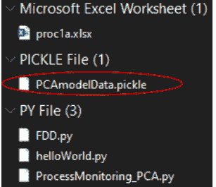

现在让我们看看下面的 runPCAmodel 函数。您会注意到，为了便于代码维护和可读性，我们将不同的任务分离到单独的辅助函数中。请注意，如果您愿意，可以将 runPCAmodel 函数放在单独的 .py 文件中，然后将其导入到您的 FDD.py 脚本中。为简单起见，我们将所有代码保留在 FDD.py 文件中。正如解释性注释所示，我们将保存的 pickle 文件中的数据加载到工作区，获取最新的过程数据，通过 PCA 转换最新数据，计算监控指标，检查是否存在过程故障，并创建一些我们最终将在用户界面上显示的图表。返回最终的故障检测结果。监控指标计算代码与第 5 章类似，因此此处未显示辅助函数的详细信息，但鼓励您在在线脚本文件中查看它们。

```
# runPCAmodel function
def runPCAmodel():
    # read saved PCA model data
    with open('PCAmodelData.pickle', 'rb') as f:
        PCAmodelData = pickle.load(f)

    # read latest process data
    processData = getLatestProcessData()

    # compute monitoring metrics and abnormality contributions
```

```
[currentQ, currentT2, Q_contri, T2_contri] = computeMetricsContributions(PCAmodelData, processData)

# 检测故障
if (currentQ > PCAmodelData["Q_CL"]) or (currentT2 > PCAmodelData["T2_CL"]):
    processState = 'Issue Detected'
else:
    processState = 'All Good'

# 生成并保存包含历史指标和当前指标的指标图
generateMetricPlots(currentQ, currentT2, PCAmodelData["Q_CL"], PCAmodelData["T2_CL"])
# 在工作文件夹中保存 'metricPlot.png'

# 为最新数据生成并保存贡献图
generateContributionPlots(Q_contri, T2_contri) # 保存 'contributionPlot.png'

return processState
```

> 为了保持示例简单，`getLatestProcessData` 函数从本地 CSV 文件获取当前过程数据。在实际环境中，过程数据可能从数据库或位于其他机器上的文件中获取。所有这些不同的场景都可以通过 Python 中的相应库轻松处理。例如，对于数据库连接，你可以使用 `pypyodbc`。

现在你知道了如何将你的机器学习代码和模型嵌入到 Web 应用程序中。但我们的 Web 应用还不完整。我们仍然需要指示我们的 Web 应用将这些生成的指标和贡献图发送给最终用户。

### 14.4 构建前端用户界面

交互式且美观的用户界面不能仅通过 Web 服务器返回的纯文本来渲染。除了不同的媒体对象（如图表），还需要向浏览器提供明确的指令，说明如何构建网页。这些指令使用浏览器能理解的 HTML（指定页面的基本结构）和 CSS（处理格式/外观方面）语言编写。让我们开始修改我们的 Web 应用，以获得以下用户界面。

### 智能过程监控工具

检测到问题

相应的 HTML 代码如下所示：

```html
<html>
<style>
    body
    {
        font-family: Arial; text-align: center;
    }

    #topHeader
    {
        padding: 15px; background: #1abc9c; color: white; font-size: 30px;
    }
</style>

<body>
    <h1 id='topHeader'>Smart Process Monitoring Tool</h1>
    <p style="color:red;"> <b> Issue detected </b> </p>
</body>
</html>
```

事实上，你可以直接在记事本中输入上述代码，将其保存为 `sample.html`，然后在浏览器中打开该文件。你将看到上述界面。我们可以按照下面的伪代码所示，将此代码嵌入到我们的 `getResults` 函数中。

```python
# 返回 HTML 代码的 getResults 函数
def getResults(self):
    processState = runPCAmodel()

    # 生成前端代码
    html_code = """
                < 将 HTML 代码放在这里 >
                """
    return html_code
```

虽然上述代码结构在技术上是正确的，但将前端代码和核心后端代码放在同一个脚本中并不是最佳实践。分离可以通过以下方式实现：

```python
# 使用模板返回 HTML 代码的 getResults 函数
import os
from jinja2 import Environment, FileSystemLoader

path  = os.path.abspath(os.path.dirname(__file__))
env = Environment(loader=FileSystemLoader(path))

def getResults(self):
    processState = runPCAmodel() # 返回数字标志：0 => 'All good' 或 1 => 'Issue detected'

    # 生成前端代码
    frontEnd_template = env.get_template('frontEndTemplate.html') # 加载模板文件
    frontEndCode = frontEnd_template.render(state=processState) # 使用模板生成前端代码

    return frontEndCode
```

其中文件 *frontEndTemplate.html* 的内容如下所示：

```html
<html>
<head>
<style>
    body {font-family: Arial; text-align: center;}
    #topHeader {padding: 15px; background: #1abc9c; color: white; font-size: 30px;}
</style>
</head>
<body>
    <h1 id='topHeader'> Smart Process Monitoring Tool </h1>
    
        <p style="color:green;"> <b> All Good </b> </p> <br>
    
        <p style="color:red;"> <b> Issue Detected </b> </p> <br>
    
</body>
</html>
```

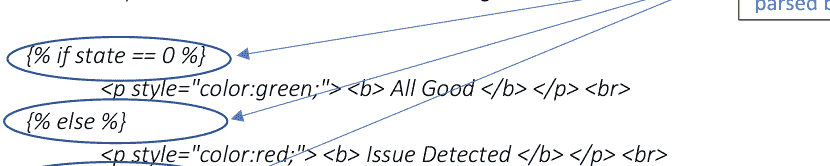

你会注意到 `frontEndTemplate.html` 文件中有一些额外的元素（``，`if` 语句）。这些额外的元素不是给浏览器看的。这个文件是一个模板，将由 Jinja 模板引擎（在我们的 `FDD.py` 脚本中导入）用来生成所需的 HTML 代码。你可以注意到，其中的逻辑会根据 `processState` 的值来修改中央仪表板消息及其文本颜色。模板框架是一个很好的解决方案，可以将前端和后端代码分开，并提高代码的可读性。

好了，现在你理解了如何将前端代码放入 Web 应用中。让我们继续，将我们的图表添加到界面中。我们将在模板文件的 `body` 部分添加以下代码来显示图表。

```html
<body>
    ...
    <center>  </center> <br> <br>
    <center>  </center>

</body>
```

我们上面所做的只是将图像元素包含到 HTML 代码中，并提供正确的路径。一小段代码也被插入到 `FDD.py` 脚本中，让 Web 应用知道在哪里可以找到这些图像文件。

```python
# 执行设置
cherrypy.config.update({'server.socket_host': '0.0.0.0'})
conf = {'/': {'tools.staticdir.on': True,'tools.staticdir.dir': path}}
```

如果你执行 `FDD.py` 并访问你的网站，你现在应该能在用户界面上看到图表了。现在让我们来到最后也是最有趣的部分，为我们的界面添加一些动态或交互性。我们希望贡献图仅在用户点击“显示贡献图”按钮时才显示（当监控指标低于阈值时，这些图表用处不大）。为了实现这种交互性，我们将使用 Web 开发的另一个基石语言——Javascript。如下所示，一个 Javascript 函数被放在模板的 `head` 部分，并向用户界面添加了一个按钮。

```html
<head>
    ...
    <script>
        function toggleDisp(imgID) {
            var x = document.getElementById(imgID);
            if (x.style.display == "none")
            {
                x.style.display = "block"; }
            else {
                x.style.display = "none"; }
        }
    </script>
    ..
</head>
<body>
...
<button type="button" onclick="toggleDisp('contri_img')"> 显示/隐藏贡献图 </button> <br> <br> <br>
...
</body>
```

当按钮被点击时，Javascript 函数被执行，它切换贡献图图像的显示属性。还剩下最后一块拼图。目前，最新的监控结果只有在用户刷新/重新加载网页时才会显示。这显然是不可取的。我们希望界面能够自动刷新，以定期显示最新结果。这可以通过在 `head` 部分包含以下内容来实现，它每 30 秒刷新/重新加载一次界面。

```html
<meta http-equiv="refresh" content="30">
```

我们的 Web 应用现在完成了。去试试吧。你应该能看到图 14.1 所示的界面。顶部的指标图最初将只显示一个数据点，新的数据点将在每次自动刷新后出现。Web 开发的世界是巨大的，我们在本章中只涉及了其中的一小部分，以开发一个功能有限的非常基本的用户界面。像 Ajax、jQuery、Angular、React、Bootstrap 这样的技术可以用来制作极其复杂和功能丰富的网站。

### 总结

在本章中，我们研究了机器学习项目端到端开发的最后一个阶段，即通过 Web 应用程序将机器学习模型的结果传递给非技术的最终用户。本章学到的概念可以帮助你快速部署你的工具并收集关键的用户反馈。随着本章的结束，我们的过程数据科学之旅也告一段落。我们希望你喜欢阅读这本书，就像我们喜欢写它一样！

## 附录

### 数据集描述

本附录章节简要概述了本书中使用的工艺数据集，并提及了在这些数据集上实施的机器学习技术。

### 1) 聚合物制造工艺数据

该数据集（命名为 Proc1a）来自一家聚合物制造工厂，可从 https://landing.umetrics.com/downloads-other-downloads 获取。数据集包含 33 个变量和 92 个小时观测值。出于保密原因，可用数据集中的变量经过了缩放和编码处理<sup>84</sup>。

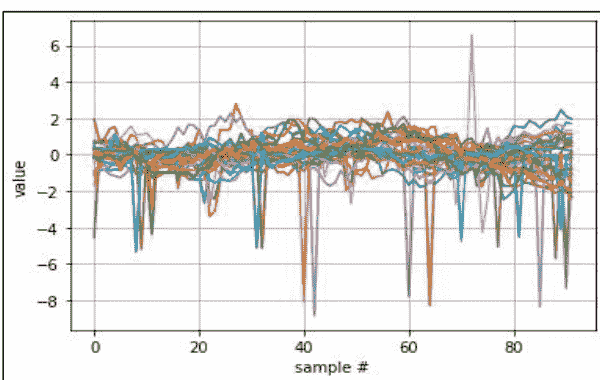

图 A1：聚合物制造数据。每条曲线对应一个工艺变量

据报道，该数据集对应的工艺在样本 70 左右开始表现异常，并最终不得不停机。第 5 章使用此数据演示了基于 PCA 的降维和过程监控/故障检测与诊断。

### 2) 纸浆与造纸制造工艺数据

该数据集来自一家纸浆厂，可在 https://openmv.net 获取。数据集包含来自 Kamyr 蒸煮器的 301 个小时样本，涉及 21 个工艺变量。如图 A2 所示，Kamyr 蒸煮器是一种管式反应器，木片在此与白液（氢氧化钠和硫化钠溶液）反应，以去除纤维素纤维中的木质素。卡伯值是该工艺中的关键质量变量（数据集中提供），它量化了纸浆中的木质素含量。为了过程监控、分析仪校准监控，或在实时分析仪不可用的情况下，建立一个精确的卡伯值预测模型是理想的。第 5 章构建了一个基于 PLS 的推断模型。

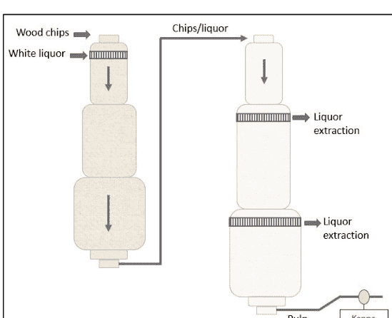

图 A2：用于纸浆生产的 Kamyr 蒸煮器

### 3) 低密度聚乙烯 (LDPE) 工艺数据

该数据来自一个 LDPE 生产工艺，使用了一个经过调整以匹配典型工业过程的模拟模型<sup>85</sup>。此数据集可从 https://openmv.net 获取。如下图所示，该工艺由一个多区管式反应器组成。数据集包含 54 个样本，涉及 14 个工艺变量和 5 个产品质量变量。工艺变量包括反应器操作条件（温度、压力）、进料流量和冷却剂温度。质量变量包括几个分子特性，例如聚合物产品的平均分子量。

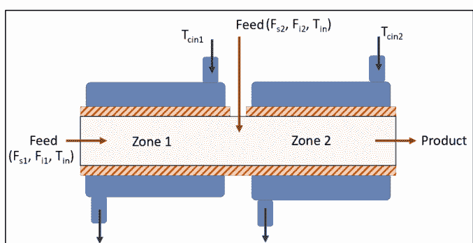

图 A3：LDPE 反应器

进料和反应器操作条件强烈影响最终产品质量，因此，对此类工艺进行高效的故障检测与诊断 (FDD) 非常理想。对于此数据集，从样本 51 开始发生工艺故障，原因是进料杂质水平升高。图 A4 显示，使用质量变量图进行故障检测并不“明显”。虽然有几个工艺变量确实显示出显著偏差，但如果工厂操作员恰好在正确的时间观察到这些特定变量，那将是偶然的！第 5 章使用此数据演示了基于 PLS 的高效且系统的故障检测机制。

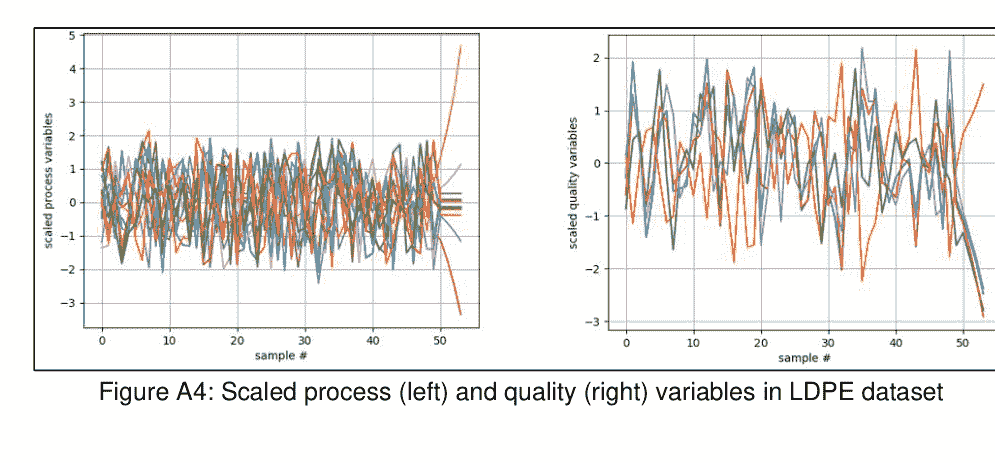

### 4) 田纳西-伊士曼过程数据

此数据来自一个大型工业化工厂，可在 https://github.com/camaramm/tennessee-eastman-profBraatz 获取。该过程称为田纳西-伊士曼过程 (TEP)，图 A5 显示了其工艺流程图。

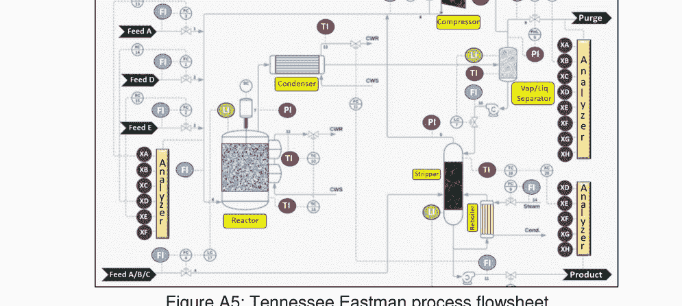

该过程包含几个单元操作：反应器、冷凝器、分离器、汽提塔和循环压缩机。有 22 个连续过程测量值、19 个成分测量值和 11 个操纵变量。数据集包含来自正常操作期和 21 个具有不同故障原因的故障期的训练和测试数据。对于每个故障类别，训练数据集包含在 24 个操作小时内收集的 480 个样本，测试数据集包含在 48 个操作小时内收集的 960 个样本。对于故障数据，故障操作从样本 160 开始。关于该过程和故障的详细信息可从 Downs 和 Vogel 题为“全厂工业过程控制问题”的原始论文中获得。第 6 章使用此数据集构建了基于 ICA 和 FDA 的故障检测工具。

Reith 等人<sup>86</sup>还提供了一个更大的 TEP 数据集。该数据集仍然包含 21 个不同的故障类别（以及无故障操作）；然而，对于每个故障类别，训练和测试数据集都进行了 500 次独立的模拟运行。每个训练模拟运行包含来自 25 小时操作的 500 个时间样本，每个测试运行包含来自 48 小时操作的 960 个时间样本。第 12 章使用此数据演示了基于 LSTM 的故障分类。

### 5) 半导体制造工艺数据

此数据集来自半导体制造工艺，可从 http://www.eigenvector.com/data/Etch 下载。该数据集来自金属刻蚀工艺的多个批次，包含在 108 个正常批次和 21 个故障批次过程中测量的 19 个工艺变量。批次持续时间从 95 到 112 秒不等。该数据集表现出多模态操作，第 7 章使用 SVDD、第 8 章使用 GMM 对其进行了故障检测分析。

### 6) 聚合物中试装置数据

此数据集来自杜邦公司的一个聚合物中试装置，可在 ftp://ftp.cis.upenn.edu/pub/ungar/chemdata/ 获取。该数据集包含 61 个样本，涉及 14 个变量（10 个预测变量和 4 个工厂输出）。预测变量对应于温度、进料速率等。尽管这些变量的具体细节未公开，但数据贡献者强调，该数据集特别适合测试非线性建模方法对不规则稀疏数据的鲁棒性。第 7 章为此数据构建了基于 SVR 的软测量模型。

### 7) 石油炼厂脱丁烷塔数据

此数据集来自石油炼厂的一个脱丁烷塔<sup>87</sup>，作为补充材料提供在 https://link.springer.com/book/10.1007/978-1-84628-480-9。脱丁烷塔是石油炼厂的标准装置，用于将原油石脑油进料转化为液化石油气（作为塔顶产品）和汽油（作为塔底产品）。汽油产品中的丁烷 (C4) 含量需要保持在较低水平，并通过气相色谱法定期监测。然而，色谱仪传感器的位置位于脱丁烷塔下游，这导致了 C4 含量数据可用性的延迟。为了更好的产品质量控制，需要实时了解 C4 含量。为此，需要一个软测量模型，该模型可以利用塔周围影响塔底产品中丁烷含量的其他过程数据（如图 A6 所示）来预测 C4 含量。

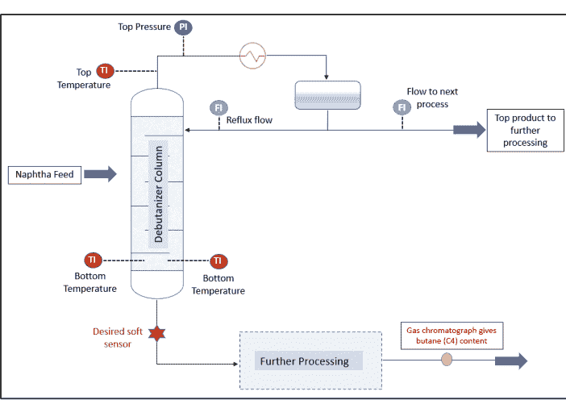

图 A6：带有测量变量位置的脱丁烷塔

该数据集包含 2394 个输入-输出过程值样本。请注意，数据集以归一化形式提供，输出值已平移了 8 个样本以补偿时间延迟的影响。第 7 章和第 11 章分别使用了 SVR 和 ANN 进行软测量开发。

### 8) 混凝土抗压强度数据

此数据集可在 UCI 机器学习库（https://archive.ics.uci.edu/ml/datasets/Concrete+Compressive+Strength）获取，包含 1030 个混凝土样本的信息。UCI 页面强调，混凝土强度是混凝土龄期和成分的高度非线性函数。第 9 章构建了一个随机森林回归模型来捕捉这种非线性关系。

### 9) 废水处理厂数据

该数据集（从 UCI 机器学习库<sup>88</sup>下载）来自一家使用活性污泥法去除市政废水中有机物和悬浮固体的废水处理厂。在此过程中（图 A7），悬浮固体首先通过物理沉降（初级处理），然后进行生物处理以氧化可生物降解的有机物（二级处理）。数据提供了来自工艺不同阶段在线传感器的 38 个变量在 527 天操作期间的数据。38 个变量中有 7 个表征出水水质。第 9 章构建了一个基于 XGBoost 的软测量模型来预测出水流的电导率 (COND-S)。

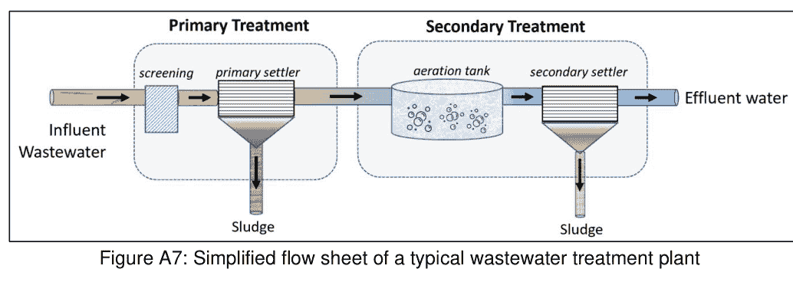

### 10) 联合循环电厂数据

该数据集<sup>89</sup>来自一个由燃气轮机 (GT)、蒸汽轮机 (ST) 和余热锅炉组成的联合循环电厂，如图 A7 所示。在这里，燃料燃烧产生的能量在燃气轮机中发电，而来自燃气轮机的热废气/烟气中的剩余能量被回收以产生蒸汽。该蒸汽用于在蒸汽轮机中进一步发电。数据集提供了燃气轮机和蒸汽轮机在 6 年期间（按小时平均）产生的总电功率。还包括影响电力输出的环境条件（温度、压力、相对湿度）和蒸汽轮机排气蒸汽压力的测量值。第 11 章构建了一个 ANN 模型，将电功率预测为其他信号的函数。

### 11) 单输入单输出加热器系统数据

该数据集来自一个加热器系统，通过调节加热器功率输出来控制系统温度。数据集包含4小时的训练数据和14分钟的测试数据（https://apmonitor.com/do/index.php/Main/LSTMNetwork）。数据采样间隔为每秒一次。在第12章中，将构建一个LSTM模型，利用当前和历史系统数据来预测温度。

### 12) 燃气轮机数据

该数据集可在NASA预测性维护数据仓库⁹⁰获取，提供了飞机燃气轮机发动机的模拟数据。该数据集包含来自多个发动机运行模拟中多个传感器的操作和动态数据（如温度、压力）。每次模拟从一台发动机（具有不同程度的初始磨损）在正常限值内运行开始。发动机退化在模拟过程中的某个时间点开始，并持续到发动机故障（发动机健康裕度，即效率和流量的函数，低于某个阈值）。训练数据集包含直至发动机故障的完整数据，而测试数据集包含的数据截止到故障前的某个时间点。测试数据集提供了发动机的实际剩余使用寿命。关于构建预测性维护模型的更多细节和分步指南，请参见第12章。

全书完