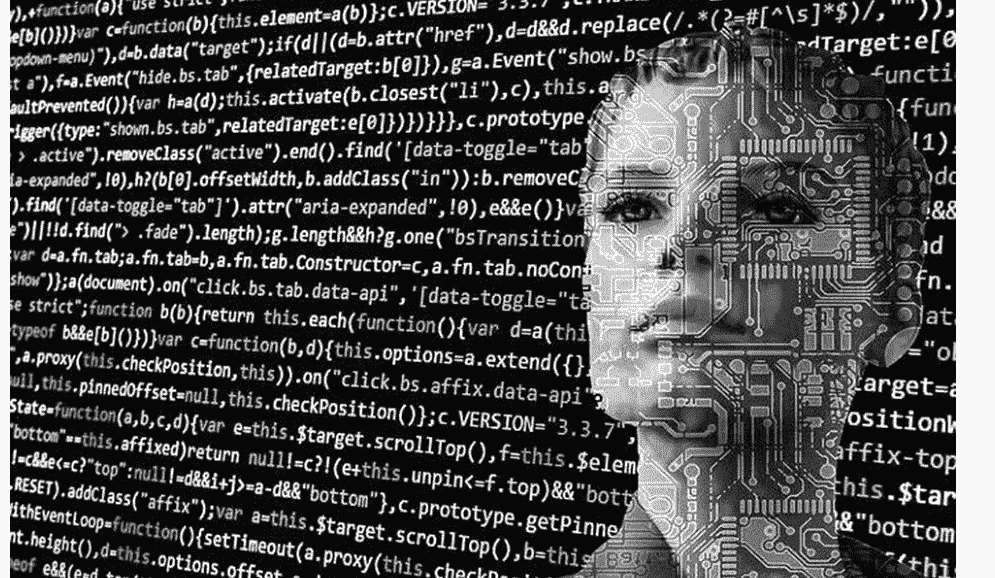
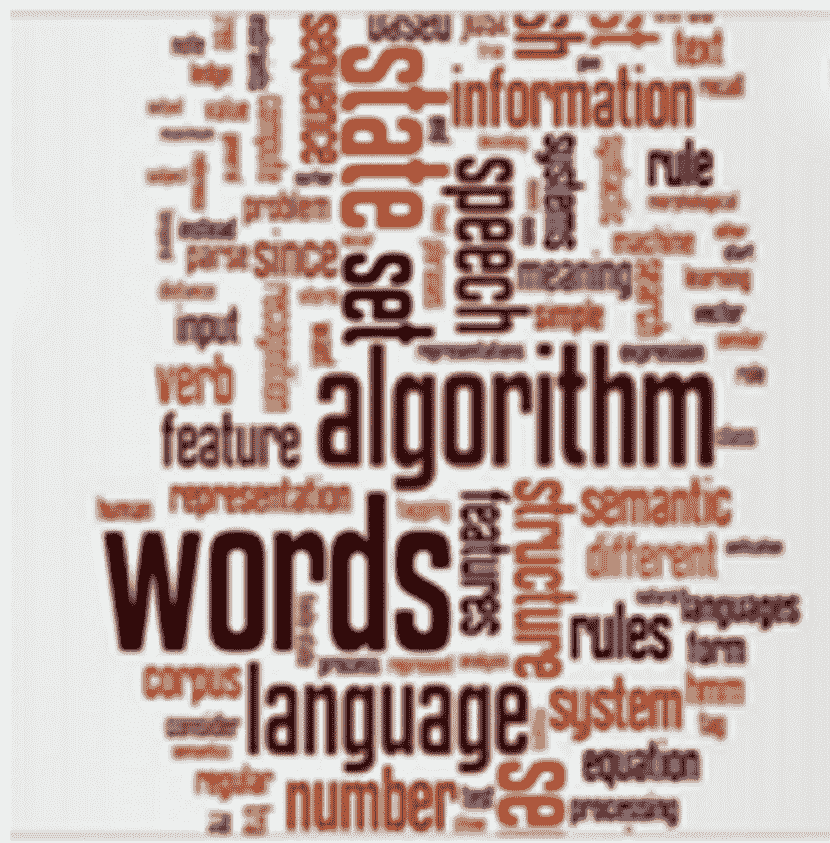
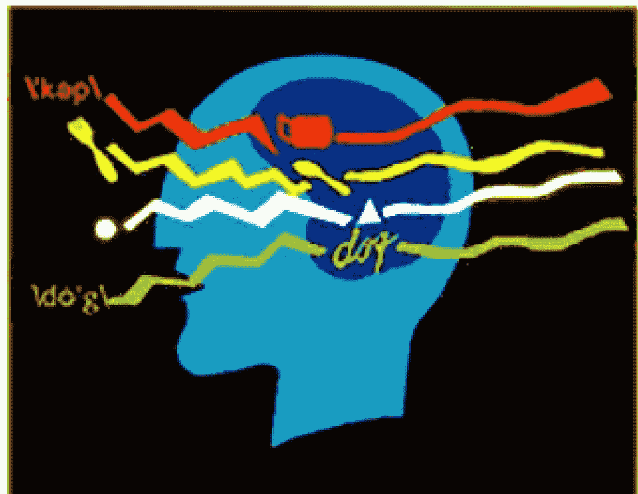
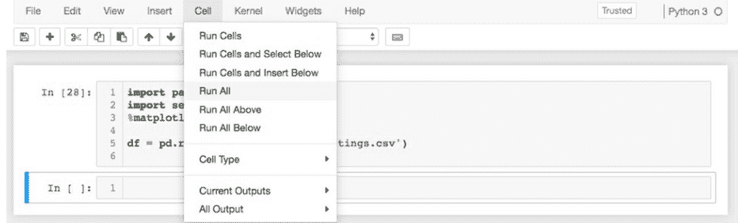
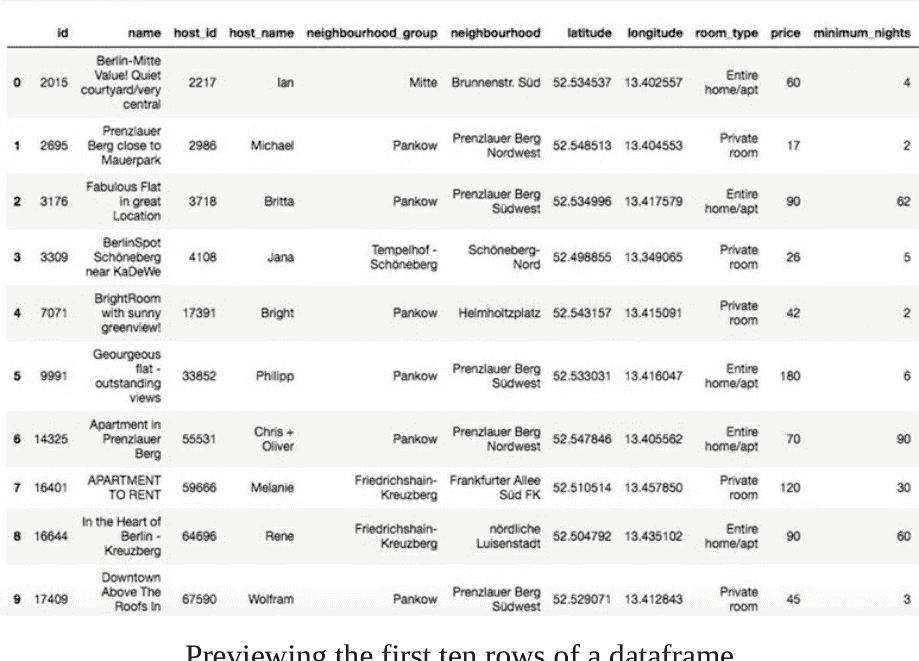
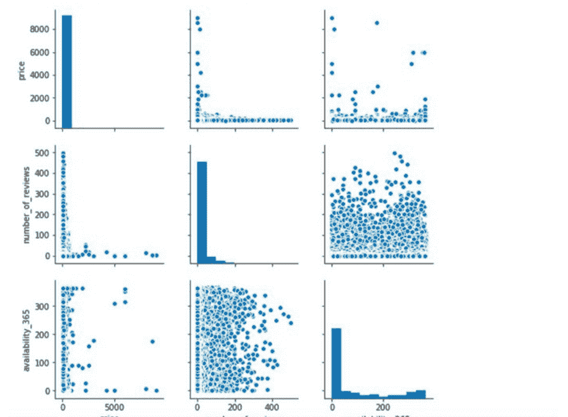
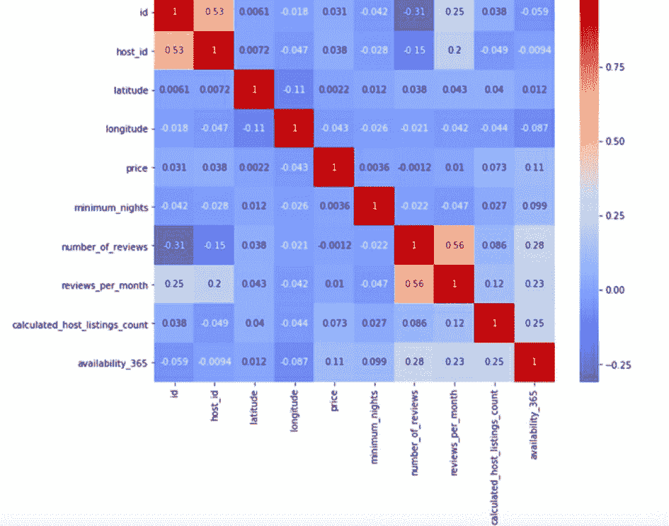
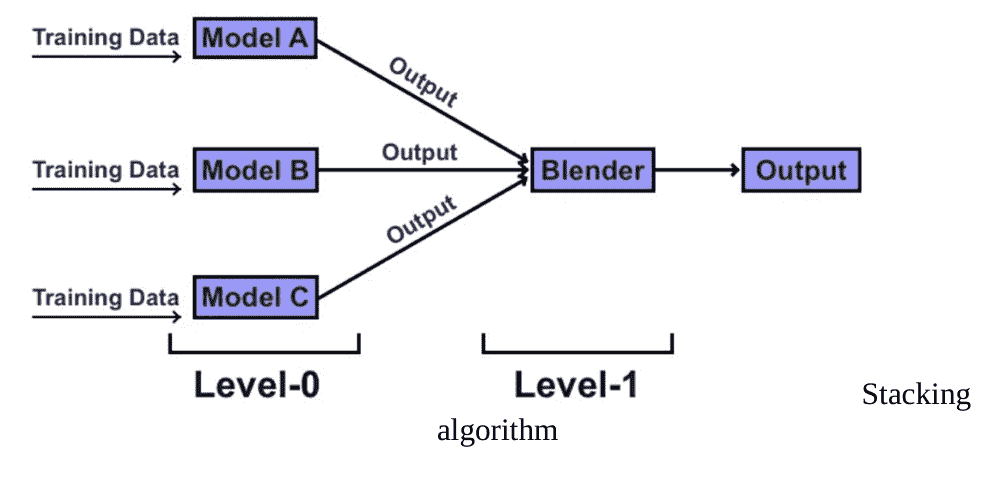
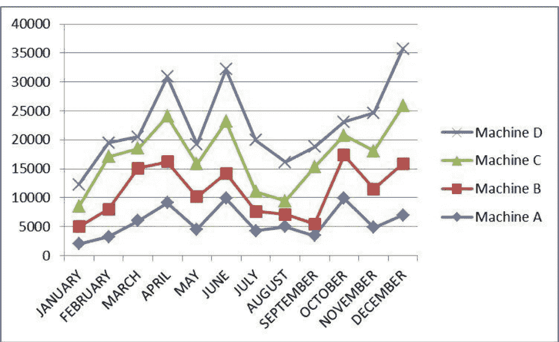
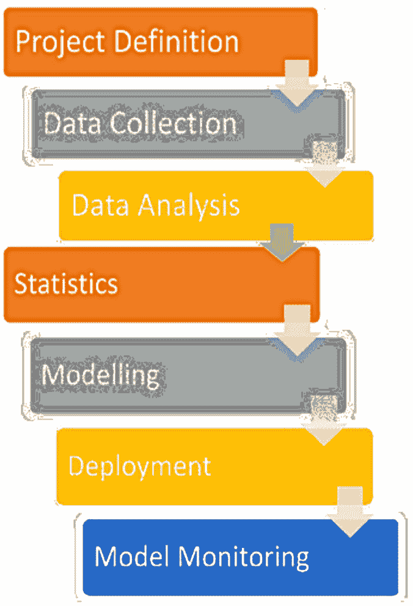

# 机器学习

二合一
**精通Python数据科学与人工智能开发**
完整数学指南

马特·阿尔戈尔

# 机器学习

精通Python数据科学与人工智能开发的完整数学指南

马特·阿尔戈尔

# © 版权所有 2021 – 保留所有权利

未经作者或出版商直接书面许可，不得复制、转载或传播本书所含内容。
在任何情况下，出版商或作者均不对因本书所含信息直接或间接造成的任何损害、赔偿或金钱损失承担任何责任。

# 法律声明

本书受版权保护。仅供个人使用。未经作者或出版商同意，不得修改、分发、销售、使用、引用或转述本书任何部分或内容。

> 理论是当你知道一切但什么都不奏效时。实践是一切都奏效但没人知道为什么。在我们的实验室里，理论与实践相结合：什么都不奏效，也没人知道为什么。

（阿尔伯特·爱因斯坦）

# 目录

# 第一部分

## 引言

- 当你试图教机器做数学时会发生什么？
- 逻辑回归
- 决策树
- 朴素贝叶斯
- 人工神经网络
- 协回归模型
- 聚类算法
- 为什么选择Python和数据科学？
- 机器学习能应用于数学的某些方面吗？
- 计算机中的MATLAB能进行机器学习吗？
- 能否使用计算机中的MATLAB进行机器学习？
- 如何教计算机进行机器学习？
- 能实现机器学习自动化吗？
- 计算机会犯错吗？
- 机器出错时谁该负责？
- 大数据与机器学习的关系
- 机器学习的应用
- 实际的机器学习算法

### 第1章 什么是机器学习？

1. 统计学研究
2. 大数据分析
3. 金融世界

### 机器学习的好处

1. 营销产品更轻松
2. 机器学习有助于准确的医疗预测
3. 可以使数据录入更容易
4. 有助于垃圾邮件检测
5. 可以改善金融世界
6. 可以使制造业更高效
7. 它要求我们更好地理解客户

- 监督式机器学习
- 无监督式机器学习
- 强化机器学习

## 第2章 赋予计算机从数据中学习的能力

- 为什么选择Python进行机器学习？
- 如何开始使用Python？
- Python语法
- Python变量

### 第3章 基本术语和符号

- 机器学习的数学符号
  - 代数
  - 微积分
  - 线性代数
  - 概率论
  - 集合论
  - 统计学
- 机器学习使用的术语
  1. 自然语言处理
  2. 数据集
  3. 计算机视觉
  4. 监督学习
  5. 无监督学习
  6. 强化学习
  7. 神经网络

### 第4章 评估模型与预测未见数据实例

- 为什么在数据科学中选择Python而非其他工具？
  - 直接学习
  - 数据科学庞大的库
  - 可扩展性
  - Python庞大的社区
- 为什么Python和数据科学能很好地结合？
- 数据科学统计学习
  - 推断与预测
  - 参数与非参数函数
- 模型可解释性与预测准确性
- 模型准确性评估
- 方差与偏差
- 方差与偏差的关系

## 大数据与机器学习的关系

## 第5章 构建良好的训练数据集

- 导入数据集
- 预览数据框
- 查找行项
- 形状
- 列
- 描述
- 散点图矩阵
- 热力图

### 第6章 结合不同模型进行集成学习

## 第7章 将机器学习应用于情感分析

1. 如何向外行解释自然语言处理？为什么难以实现？
2. 自然语言处理在机器学习中的用途是什么？
3. 执行文本分类有哪些不同的步骤？
4. 你对关键词归一化有什么理解？为什么需要它？
5. 请谈谈词性标注。
6. 你听说过依存句法分析算法吗？
7. 解释向量空间模型及其用途。
8. 词频和逆文档频率是什么意思？
9. 用简单的方式解释余弦相似度。
10. 解释N-Gram方法。
11. 从句子“I Love New York Style Pizza”可以生成多少个3-Gram？
12. 你听说过词袋模型吗？

### 第8章 条件或判断语句

- If语句
- If-Else语句
- Elif语句
- 控制流

## 第9章 函数

- 为什么用户定义的函数如此重要？
- 函数参数选项
- 编写函数
- Python模块
- Python包

### 第10章 实际的机器学习算法

- 决策树概述
- 分类与回归树
- 过拟合问题

## 第11章 机器学习技术的应用

- 虚拟个人助理
- 驾驶时的预测
- 视频监控
- 社交媒体
- 电子邮件垃圾邮件和恶意软件过滤
- 在线客户服务
- 搜索引擎结果优化
- 产品推荐
- 在线欺诈检测
- 预测分析
  - 客户行为的预测分析
  - 线索的能力和优先级排序
  - 当前市场趋势的识别
  - 客户细分与定位
  - 营销策略的推进

## 第12章 数据挖掘与应用

- 数据挖掘如何工作？
- 不平衡数据集

## 结论

## 第二部分

## 引言

- Python编程的特点
  - 简单的语言
  - 可移植性
  - 标准库
  - 免费开源
  - 下载和安装Python
  - Python开发与应用
  - Python变量
  - Python中的变量命名
- 数据变量类型
  - 整型
  - 字符型
  - 字节型
  - 字符串
  - Python调试

### 第1章 关于数据分析

## 第2章 为什么选择Python进行数据分析

- Python如何帮助数据分析
- Python如何融入数据分析

### 第3章 数据分析的步骤

- 定义你的问题
- 设置明确的度量标准
- 收集数据

### 第4章 库

- Scikit – Learn
- TensorFlow
- Theano
- Pandas
  - 图示解释
    - 一维序列
    - 二维数据框
- Seaborn
  - 图示说明
- NumPy
- SciPy
- Keras
- PyTorch
- Scrapy
- Statsmodels

## 第5章 预测分析

- 什么是预测分析

### 第6章 结合库

- PyTorch库
- PyTorch的起源
- 为什么在数据分析中使用PyTorch
- Pandas
- 矩阵运算
- 切片和索引

### 第7章 机器学习与数据分析

- 什么是机器学习
- 决策树和随机森林
- SciKit-Learn
- 线性回归
- 支持向量机
- K-means聚类

## 第8章 应用

- 安全
- 交通
- 危险和欺诈检测
- 配送协调
- 客户互动
- 城市规划
- 医疗保健
- 旅行
- 计算机化广告

# 第9章 使用Python进行数据可视化与分析

- 海量数据
- 大数据的对立面
- SAS
- 大数据分析

## 第10章 数据科学

- 数据科学及其重要性
- 信息技术的未来
- 数据结构
- 数据结构的特点
- 数据结构类型
- 数据结构的使用
- 使用Python对数据科学有多重要？
- Python数据科学的用途

### 第11章 数据科学与云计算

- 云计算
- 网络
- 云中的数据科学
- 软件架构与质量属性
- 在云中共享大数据
- 云计算与大数据治理
- 数据云工具需要提供高价值数据

## 结论

# 第一部分

## 引言

机器学习是一种无需显式编程即可自主学习的计算机程序。

示例：

你训练计算机识别图像中的猫和狗。你提供猫和狗的图像示例。你告诉计算机，猫在图像的左侧，狗在右侧。

完成这些后，计算机会创建一些区分猫和狗的规则。

随后会进行测试，让计算机判断猫和狗的区别，并在其他图像中无法区分。这些测试将表明计算机正在学习，并且其新规则比初始规则更优。

## 当你尝试教机器做数学时会发生什么？

经过数年训练，计算机唯一能可靠完成的只是一些基础任务，例如创建国际象棋的游戏规则。在机器学习领域，我们能够遵循并投入时间的最佳方法包括：

## 逻辑回归

使用神经网络构建复杂的逻辑回归系统。

## 决策树

使用一组规则来识别特定的树结构，将数据分类到预定义的类别中。例如，一棵将X个人分为两组（如黑或白）的树。

## 朴素贝叶斯

## 人工神经网络

在计算机上运行，它们包含一组节点和每个节点的权重列表，这些信息与数据一起存储并输入系统。节点以某种方式相互连接，这种连接关系保存在模型中，模型利用这些信息判断数据是否属于特定类别或视角。这种方法通常比逻辑回归系统产生更多非线性结果。

## 协同回归模型

一组可用于构建数据集泛化模型的预测模型。

## 聚类算法

数据可以被分组，例如计算机可以按部门分组，每个部门有一组学生。像K均值聚类这样的算法使用数据来创建能产生最佳性能的分组。

## 为什么选择Python和数据科学？

Python是一种功能强大且易于使用的编程语言，可用于多种任务。如果遇到困难，很容易转向其他方向。

## 能否将机器学习应用于数学领域？

可以。数学涉及符号（如数字和字母）的操作。数据集可以被操作。计算机可以处理数据。

## 计算机中的MATLAB能进行机器学习吗？

不能。MATLAB是一种功能非常有限的编程语言，仅适用于非常特定的任务。人们使用MATLAB是因为他们想完成它擅长的工作。

## 能否在计算机中使用MATLAB进行机器学习？

可以。可以在计算机上安装MATLAB，安装一些库和模块来使用MATLAB执行机器学习任务，或者安装C++编译器以便修改MATLAB程序来执行机器学习任务。

## 如何教计算机进行机器学习？

教计算机进行机器学习的方法有很多，最佳方法在很大程度上取决于需要解决的问题。通常，计算机需要大量示例来学习。在机器学习中，计算机需要它试图分类和预测的数据示例。最佳数据集应至少与计算机将要预测的数据集一样大。

## 能否实现机器学习自动化？

可以。一旦计算机被教会如何执行机器学习任务，就有可能实现该任务的自动化。许多网站举办竞赛，运行执行机器学习任务的Python脚本。网站上的Python通常像竞赛参赛作品一样编写。只要存在需要机器学习问题并产生输出的问题，随时都可以举办竞赛。

## 计算机会犯错吗？

机器是逻辑化的，遵循给定的规则。它们不使用判断力或语言来解决问题。产生的答案受其给定规则的约束。

## 当机器犯错时该怪谁？

当机器犯错时，没有人应该受到责备。机器不能被责备。机器只能遵循给定的规则。

## 大数据与机器学习的关系

大数据是指过于复杂且分散的数据，需要特殊算法和方法来处理，以便进行适当分析。传统处理系统无法分析极大量的数据。机器学习是一种精细的算法类别，用于处理大数据。预测分析、文本算法、社交网络挖掘等算法在机器学习过程中扮演重要角色。机器学习算法基于能够分析大量结构化或非结构化数据的算法。使用机器学习的过程包括：清理数据以准备输入机器学习算法，训练机器学习算法通过有效组合来执行算法，预处理数据形成机器学习算法的输入，将获得的输出传递给机器学习算法，并训练它们执行功能。最终目标是在最佳时间内获得最佳结果，这通过创建有效算法来实现。

## 机器学习的应用

机器学习的应用包括实时决策、临床医学、欺诈检测、搜索引擎结果和石油分析等，仅举几例。

实施机器学习是一种使用以下算法进行预测的强大方式。开发的算法随着时间的推移不断提供更好的预测，使得机器学习算法的性能持续提升。

这些算法的预测能力也使其在广泛领域中有用。机器学习算法适用于所有数据类型，包括文本、图像、音频、社交媒体和金融市场数据。

换句话说，机器学习技术被应用于最终得到一个解决方案，该方案能够揭示肉眼无法看到的数据中有意义的区别。

数据中存在许多不同类型的依赖关系（或相互关系），机器学习算法需要这些数据进行学习。在许多例子中，这些数据由大量非结构化文本数据组成。通过使用所有可用于机器学习算法学习的数据，机器学习得以改进。

展望未来，机器学习一直在不断增强，预计它将执行曾经仅限于专家领域的任务。

共享感知是由成熟的云提供商和新兴的智慧城市服务提供商共同提供的一项新兴服务。它指的是多个智慧城市利益相关者能够共享来自其网络、资源和设备的实时信息，以造福更广泛的社区。这将带来诸多好处，包括运营效率。

现代公司认识到大数据对其成功的重要性，不仅是为了与他人竞争，也是为了加强业务关系、吸引客户。它已经改变了商业运作方式以及消费者使用服务或购买产品的方式。

例如，亚马逊从其客户那里收集数据以提供最相关的结果。它使用关于人们搜索内容、购买物品、居住地等数据。一些客户可能不希望其个人信息被披露，因为他们可能被视为对他人的潜在威胁。然而，大多数客户接受条款和条件，并同意亚马逊使用其数据。

另一方面，互联网服务提供商使用客户数据来产生收入。不同的互联网服务提供商有不同的方式从客户那里产生收入。例如，你的网络浏览器需要使用谷歌广告。互联网服务提供商也使用客户数据提供不同的服务。例如，一些互联网服务提供商将你的数据出售给市场研究公司或保险公司。这些数据可用于验证客户的电子邮件地址。这增加了电子邮件地址的可靠性。

客户也以不同方式使用数据。但是，有些人以不道德的方式使用它，在他人不知情的情况下与他人分享数据。随着使用数据的人数每天都在增长，数据共享的方法也在改进，以便更容易即时共享数据。

## 实际的机器学习算法

我们通过创建一个具有学习能力的算法开始了机器学习的过程。这形成了将问题分解为一系列较小问题并在已获得的数据上解决的模式。

有许多技术可以应用于机器学习，专家们对不同的数据集使用不同的技术。该过程始于一个具有一定程度学习能力的算法。

这使得系统能够学习什么有效，什么无效。随着每一步的推进，算法可以学习是否可能以机器学习系统能够学习的方式对齐这两个组。

## 第一章 什么是机器学习？


我们首先需要了解的是机器学习的基础知识。机器学习将是人工智能的应用之一，它能够赋予系统自主学习的能力，无需程序员的指导来告诉系统该做什么。系统甚至可以更进一步，基于自身的经验进行改进，而这一切都不是通过在过程中显式编程计划来实现的。机器学习的理念将专注于开发计算机程序，这些程序能够访问你拥有的任何数据，然后利用这些数据学习新知识，并按照你期望的方式运行。

在使用机器学习时，我们可以探讨几种不同的应用。随着我们开始深入探索机器学习的功能，你可能会注意到，多年来，它已经发展演变成程序员们比以往任何时候都更乐于使用的东西。当你希望让你的机器或系统独立完成大量工作，而无需你介入并为每一步编程时，机器学习就是你的正确选择。

在科技领域，我们会发现机器学习非常独特，能为我们进行的编码工作增添乐趣。许多不同行业的公司（我们稍后会谈到）已经在使用机器学习，并从中获得了巨大的收益。

机器学习有许多不同的应用，利用这种人工智能我们能做的事情令人惊叹。在机器学习方面，我们可以遵循和投入时间的最佳方法包括：

### 1. 统计研究

机器学习在IT领域已经取得了一些进展。你会发现机器学习可以帮助你处理大量复杂数据，寻找数据中重要且显著的模式。这一类别下机器学习的一些不同应用包括垃圾邮件过滤、信用卡和搜索引擎等。

### 2. 大数据分析

许多公司花费时间收集了所谓的“大数据”，现在他们必须找到一种方法，在短时间内对这些数据进行整理和学习。这些公司可以利用这些数据来更多地了解客户的消费习惯，甚至帮助他们做出关于未来的重要决策。如果我们让人手动完成这项工作，那将花费太长时间。但借助机器学习，我们可以快速完成所有工作。医疗领域、选举活动甚至零售商店等领域的选择已经开始转向机器学习，以获得这些好处。

### 3. 金融世界

许多金融公司已经能够依赖机器学习。例如，在线股票交易就依赖于这类工作，我们会发现机器学习有助于欺诈检测、贷款审批等。

为了帮助我们开始并理解如何从机器学习中获得我们想要的价值，我们必须确保将最佳算法与正确的流程和工具配对。如果你使用错误的算法来整理这些数据，你将得到大量不准确的信息，结果也无法提供你需要的帮助。始终使用正确的算法会产生很大的不同。

在构建我们想要的模型时，我们还会注意到有许多工具和其他流程可供我们使用。我们需要确保选择正确的工具，以确保你使用的算法和模型能够按照你期望的方式运行。

机器学习可用的不同工具包括：

- 1. 全面的数据管理和数据质量控制。
- 2. 模型的自动化集成评估，以帮助识别最佳性能模型。
- 3. 用于构建所需模型和流程的图形用户界面。
- 4. 轻松部署，以便快速获得可靠且可重复的结果。
- 5. 交互式数据探索和可视化，帮助我们更轻松地查看信息。
- 6. 集成的端到端平台，帮助实现从数据到决策的自动化流程。
- 7. 用于比较不同机器学习模型的工具，帮助我们快速高效地识别最佳模型。

## 机器学习的优势

我们还需要花一些时间来了解机器学习的一些优势。我们选择使用机器学习来帮助数据科学项目的原因有很多。它能够创建一些有用的算法或模型，这些算法或模型可以准确地对你输入的数据进行预测。此外，还有许多其他好处。当我们决定使用机器学习时，可以看到的一些最佳服务包括：

### 1. 产品营销更轻松

当你能够在客户寻找你的地方——在线和社交媒体上——接触到他们时，可以增加销售额。你可以使用机器学习来了解你的目标受众会对什么做出反应，并确保你发布的产品符合客户的需求。

### 2. 机器学习有助于准确的医疗预测

医疗领域总是很繁忙，据信许多现有的职位空缺将无人填补。即使是普通医生也需要在一天中处理大量患者。跟上所有这些可能很麻烦。但在机器学习的帮助下，我们可以创建一个模型，该模型可以查看图像并识别出问题所在。这可以为医生节省大量时间、麻烦，并使他们更高效地工作。

这只是机器学习能够帮助医疗领域的一个方面。它还可以协助手术、为医生做笔记、在X光片和其他影像中查找问题，甚至帮助前台运营。

### 3. 可以使数据录入更容易

有时我们需要确保所有信息都高效快速地输入数据库。如果有大量数据需要整理而时间紧迫，这似乎是一项不可能完成的任务。但借助机器学习及其附带的工具，我们可以很快完成所有工作。

### 4. 有助于垃圾邮件检测

得益于机器学习带来的一些学习过程，我们发现它可以防止垃圾邮件。目前大多数主要电子邮件服务器都使用某种形式的机器学习来处理垃圾邮件，并将其与你的常规收件箱隔离。

### 5. 可以改善金融世界

机器学习可以介入并处理许多不同的金融任务。它有助于检测欺诈、向客户提供新产品、批准贷款等等。

### 6. 可以提高制造业效率

制造业中的人们可以使用机器学习来帮助他们更高效、更好地完成工作。它可以找出哪些环节会拖慢流程并需要修复，还可以预测机器部件何时可能失效等等。

### 7. 帮助我们更好地了解客户

所有公司都希望尽可能多地了解他们的客户，确保他们能够学习如何向这些人营销、提供哪些产品，以及采取哪些方法让客户尽可能满意。

## 监督式机器学习

我们将要探讨的第一种机器学习算法是监督式机器学习。这种机器学习类型是

## 无监督机器学习

现在我们可以转向无监督机器学习的概念，看看它与监督学习相比是如何运作的。在无监督机器学习中，我们会发现它与其他方法存在很大差异，但它可以在没有所有示例和标签数据的情况下训练系统如何表现。

在无监督学习中，模型不会被提供输出来教导它如何表现。这是因为这类知识的目标是，我们希望机器能够基于未知输入来学习其中存在的内容。设备可以完全自主地知道如何做到这一点，而不是由程序员介入完成所有工作。

## 强化机器学习

我们需要在这里探讨的第三种机器学习方法是强化机器学习。这种算法类型比前两种更新，它将在所呈现的算法有示例但这些示例完全没有标签时使用。

## 第2章 赋予计算机从数据中学习的能力


我们需要一种编程语言来向机器提供指令，以执行使用机器学习的代码。我们将学习Python语言的基础知识，如何安装和启动Python。我们还将学习一些Python语法和一些运行Python的有用工具。我们还将介绍一些对机器学习有用的必要Python库。首先，为什么我们使用Python而不是另一种编程语言？

## 为什么选择Python进行机器学习？

Python是一种被广泛使用的编程语言，原因有很多。它是一种免费且开源的语言，这意味着每个人都可以访问。尽管它是免费的，但它是一种基于社区的语言，这意味着它是由一个通过互联网汇集力量来改进语言特性的社区开发和支持的。

人们使用Python的其他原因包括：

- 1. 作为一种可读性强的语言，具有简单的语法
- 2. 程序可移植到任何操作系统（例如，Windows、Unix），无需或只需少量修改
- 3. 执行速度：Python不需要编译，并且比类似的编程语言运行得更快
- 4. 组件集成，这意味着Python可以与其他程序集成，可以从C和C++库调用，或者调用另一种编程语言。

Python附带基本且强大的标准操作以及高级预编码库，如用于数值编程的NumPy。Python的另一个优势是自动内存管理，不需要变量和大小声明。此外，Python允许开发不同的应用程序，例如开发图形用户界面（GUI）、进行数值编程、游戏编程、数据库编程、互联网脚本等等。

## 如何开始使用Python？

Python是一种脚本语言，与任何其他编程语言一样，需要一个解释器。后者是一个执行其他语言程序的程序。顾名思义，它充当计算机硬件的解释器来执行Python编程指令。Python作为一个软件包提供，可以从Python网站下载。安装Python时，解释器通常是一个可执行程序。如果你使用UNIX和LINUX，Python可能已经安装，并且可能位于/usr目录中。既然你已经安装了Python，让我们探索如何运行一些必要的代码。

要运行Python，你可以打开操作系统的命令提示符（在Windows上，打开DOS控制台窗口）并输入python。如果它不起作用，说明Python不在Shell的路径环境变量中。在这种情况下，你应该输入Python可执行文件的完整路径。在Windows上，它应该类似于C:\Python3.7\python，在UNIX或LINUX中安装在bin文件夹中：/usr/local/bin/python（或/usr/bin/python）。

当你启动Python时，它会提供两行信息，第一行是使用的Python版本，如下例所示：

```
Python 3.7.1 (default, Dec 10 2018, 22:54:23) [MSC v.1915 64 bit (AMD64)]: Anaconda, Inc. on win32

Type "help", "copyright", "credits" or "license" for more information.
>>>
```

一旦会话启动，Python会提示>>>，这意味着它已准备就绪。它准备好运行你编写的行代码。以下是一个打印语句的示例：

```
>>> print ('Hello World!')
Hello World!
>>>
```

当像我们这样在交互式会话中运行Python时，它会在>>>之后显示结果，如示例所示。代码是交互式执行的。要退出交互式Python会话，在Windows上按Ctrl-Z，在Unix/Linux机器上按Ctrl-D。

现在我们学会了如何启动Python并在交互式会话中运行代码。这是实验和测试代码的好方法。但是，代码永远不会被保存，需要重新输入才能重新运行语句。要存储代码，我们需要将其输入到一个称为模块的文件中。包含Python语句的文件称为模块。这些文件的扩展名为“.py”。模块可以通过简单地输入模块名称来执行。可以使用像Notepad++这样的文本编辑器来创建模块文件。例如，让我们创建一个名为text.py的模块，它打印‘Hello World’并计算3^2。文件应包含以下语句：

```
print ('Hello World! ')
print ('3^2 equal to ' 3**2)
```

要运行此模块，在操作系统的命令提示符中，输入以下命令行：

```
python test.py
```

如果此命令行不起作用，你应该输入Python可执行文件的完整路径和test.py文件的完整路径。你也可以通过输入test.py文件的完整cd路径来更改工作目录，然后输入python test.py。将工作目录更改为保存模块的目录是避免每次运行模块时输入模块完整路径的好方法。输出为：

```
C:\Users>python C:\Users\test.py
Hello World!
3^2 equal to 9
```

当我们运行模块test.py时，结果显示在操作系统的命令提示符中，并且随着提示符关闭而消失。要将结果存储在文件中，我们可以使用shell语法，输入：

```
python test.py > save.txt
```

test.py的输出被重定向并保存在save.txt文件中。
我们将学习Python语法。现在，我们将使用命令行来探索Python语法。我们将学习如何设置和使用一些强大的Python编程平台。

## Python语法

在我们学习一些Python语法之前，我们将探索Python中使用的主要数据类型以及程序是如何构建的。一个计划是一组模块，这些模块是一系列包含表达式的语句。这些表达式创建和处理对象，这些对象是代表数据的变量。

### Python变量

在Python中，我们可以使用内置对象，即数字、字符串、列表、字典、元组和文件。Python支持通常的数值类型，整数和浮点数，以及复数。字符串是字符链，而列表和字典是其他对象的集合，如数字或字符串或其他列表或字典。列表和字典是索引的，可以遍历。



列表和字典之间的主要区别在于项目的存储方式以及如何获取它们。列表中的项目是有序的，可以通过位置获取，而字典中的项目是通过键存储和获取的。元组像列表一样是按位置排序的对象集合。最后，Python还允许将文件创建和读取为对象。Python提供了所有工具和数学函数来处理这些对象。

Python不需要变量声明、大小或类型声明。变量在赋值时创建。例如：```python
>>> x = 5
>>> print(x)
5
>>> x = 'Hello World!'
Hello World!
```

在上面的例子中，x 先被赋值为一个数字，然后又被赋值为一个字符串。实际上，Python 允许在变量声明后更改其类型。我们可以使用 `type()` 函数来验证任何 Python 对象的类型。

```python
>>> x, y, z = 10, 'Banana', 2.4
>>> print(type(x))
<class 'int'>
>>> print(type(y))
<class 'str'>
>>> print(type(z))
<class 'float'>
```

要声明一个字符串变量，可以使用单引号或双引号。

变量名只能使用字母数字字符和下划线（例如，A_9）。请注意，变量名区分大小写，并且不应以数字开头。例如，price、Price 和 PRICE 是三个不同的变量。可以在一行中声明多个变量，如上例所示。

## 第三章 基本术语和符号

## 机器学习的数学符号

你会意识到，在你的机器学习项目过程中，数学命名法和符号是相辅相成的。数学中使用了各种符号、标记、值和变量来描述你可能试图实现的任何算法。

你将发现自己在模型开发的这个领域中使用一些数学符号。你会发现，处理数据以及学习或记忆形成过程的值总是具有优先性。因此，以下六个示例是最常用的符号。每个符号都有一个描述，解释其对应的算法：

### 代数

- 表示变化或差异：Delta（德尔塔）。
- 表示所有值的总和：Summation（求和）。
- 描述嵌套函数：Composite function（复合函数）。
- 在必要时表示欧拉数和 Epsilon（艾普西隆）。
- 描述所有值的乘积：Capital pi（大写 Pi）。

### 微积分

- 描述特定梯度：Nabla（纳布拉）。
- 描述一阶导数：Derivative（导数）。
- 描述二阶导数：Second derivative（二阶导数）。
- 描述当 x 趋近于零时的函数值：Limit（极限）。

### 线性代数

- 描述大写变量是矩阵：Matrix（矩阵）。
- 描述矩阵转置：Transpose（转置）。
- 描述矩阵或向量：Brackets（括号）。
- 描述点积：Dot（点积）。
- 描述哈达玛积：Hadamard（哈达玛积）。
- 描述向量：Vector（向量）。
- 描述大小为 1 的向量：Unit vector（单位向量）。

### 概率论

- 事件的概率：Probability（概率）。

### 集合论

- 描述一组不同的元素：Set（集合）。

### 统计学

- 描述变量 x 的中位数：Median（中位数）。
- 描述变量 X 和 Y 之间的相关性：Correlation（相关性）。
- 描述样本集的标准差：Sample standard deviation（样本标准差）。
- 描述总体标准差：Standard deviation（标准差）。
- 描述总体子集的方差：Sample variance（样本方差）。
- 描述总体值的方差：Population variance（总体方差）。
- 描述总体子集的均值：Sample mean（样本均值）。
- 描述总体值的均值：Population means（总体均值）。

## 机器学习常用术语

以下是你在机器学习过程中最常遇到的术语。你可能是出于专业目的，或者作为人工智能（AI）爱好者而接触机器学习。无论如何，无论你的原因是什么，以下是你需要了解并可能需要理解的术语类别和子类别，以便与同事交流。以下是需要了解的机器学习术语：

### 1. 自然语言处理（NLP）


自然语言是你作为人类使用的语言，即人类语言。根据定义，NLP 是一种机器学习方式，机器通过这种方式学习你的人类交流形式。NLP 是所有（如果不是大多数）机器语言的标准基础，这些语言允许你的设备使用人类（自然）语言。这种 NLP 使你的机器能够听到你的自然（人类）输入，理解它，执行它，然后给出数据输出。该设备可以识别人类并进行适当的交互，或尽可能接近适当的交互。

NLP 有五个主要阶段：机器翻译、信息检索、情感分析、信息提取，最后是问答。它始于人类查询，直接导致机器翻译，然后经过所有其他四个过程，最终以问题解释本身结束。你现在可以将这五个阶段分解为前面建议的子类别：

- 文本分类和排序 - 这一步是一种过滤机制，它根据相关性算法确定重要性类别，过滤掉不需要的内容，如垃圾邮件或垃圾邮件。它过滤出需要优先处理的内容以及执行顺序，直到最终任务。
- 情感分析 - 这种分析预测对机器提供的反馈的情感反应。客户关系和满意度是可能从情感分析中受益的因素。
- 文档摘要 - 正如短语所示，这是一种为复杂和复杂的描述开发简短而精确的定义的方法。总体目的是使其易于理解。
- 命名实体识别（NER） - 此活动涉及从非结构化的单词集合中获取结构化和可识别的数据。机器学习过程学习识别最合适的关键词，将这些词应用于语音上下文，并尝试开发最合适的响应。关键词是诸如公司名称、员工姓名、日历日期和时间之类的东西。
- 语音识别 - 这种机制的一个例子可以很容易地是像 Alexa 这样的设备。机器学习将语音文本与语音发起者关联起来。该设备可以识别人类语音和声音来源的音频信号。
- 自然语言理解和生成 - 与命名实体识别相反；这两个概念涉及人到计算机以及计算机到人的转换。自然语言理解允许机器将人类形式的口语文本转换和解释为连贯的、可理解的计算机格式。另一方面，自然语言生成功能相反，即将不正确的计算机格式转换为人类可理解的音频格式。
- 机器翻译 - 此操作是将一种书面人类语言自动转换为另一种人类语言的系统。转换使来自不同种族背景和不同风格的人们能够相互理解。经过机器学习过程的人工智能实体执行此任务。

### 2. 数据集

数据集是你可用于测试机器学习可行性和进展的一系列变量。数据是机器学习进展的重要组成部分。它提供结果，表明你的开发情况、需要调整的领域以及微调特定因素的调整。数据集有三种类型：

- 训练数据 - 顾名思义，训练数据用于通过让模型通过演绎学习来预测模式。由于要训练的因素数量庞大，是的，有些因素会比其他因素更关键。这些特征获得训练优先级。你的机器学习模型将使用更突出的特征来预测所需的最合适模式。随着时间的推移，你的模型将通过训练学习。
- 验证数据 - 这组数据用于在完成阶段微调不同模型的微小方面。验证测试不是训练阶段；它是最终的比较阶段。从验证中获得的数据用于选择你的最终模型。你将根据此验证数据验证模型的各个方面，然后做出最终决定。
- 测试数据 - 一旦你决定了最终模型，测试数据将为你提供有关模型在现实生活中如何处理的关键信息。测试数据将使用与训练和验证期间完全不同的参数集进行。让模型通过这种测试数据将表明你的模型将如何处理其他类型的输入。你将得到诸如故障安全机制将如何反应之类问题的答案。故障安全机制首先会启动吗？

### 3. 计算机视觉

计算机视觉负责提供图像和视频数据的高级分析工具。在计算机视觉中你应该注意的挑战包括：

- 图像分类 - 这种训练允许模型识别和学习各种图像和图像表示是什么。模型需要保留熟悉的图像以保持记忆，并在即使有轻微更改（如颜色变化）的情况下也能识别正确的图像。
- 目标检测 - 与图像分类不同，图像分类检测是否存在

### 4. 监督学习

通过使用有针对性的示例来直接教导模型，你可以实现监督学习。如果你想让模型学会识别特定任务，就需要为该监督任务标注数据集。然后，你将标注好的示例集呈现给模型，并通过监督来监控其学习过程。

模型通过不断接触正确的模式来自行学习。例如，你想提升品牌知名度；可以应用监督学习，让模型通过学习产品示例并掌握其广告艺术来实现。

### 5. 无监督学习

这种学习方式与监督学习相反。在这种情况下，你的模型通过观察来学习。不涉及监督，数据集也没有标注；因此，没有像监督学习方法中学到的正确基准值。

在这里，通过持续的观察，你的模型将自行确定其正确的规律。无监督模型通常通过学习不同结构之间的关联以及数据集共有的基本特征来进行学习。由于无监督学习处理的是相关数据集的相似分组，因此它们在聚类分析中非常有用。

### 6. 强化学习

强化学习教导你的模型始终追求最佳结果。除了正确执行分配的任务外，模型还会因表现良好而获得奖励。这种学习技术是一种鼓励形式，旨在促使模型始终采取正确的行动，并尽力将其做好或发挥到最佳水平。一段时间后，模型会学会期待奖励或好处，因此，它将始终努力争取最佳结果。

这个例子是一种正向强化。它奖励良好行为。然而，还有另一种支持形式，称为负向强化。负向强化旨在惩罚或阻止不良行为。当模型未能达到预期标准时，会受到批评。模型了解到不良行为会招致惩罚，因此它将始终努力持续做好。

### 7. 神经网络

神经网络是一个通过人工智能相互连接的模型概念。这些模型虽然是人造的，但具有与人类之间可观察到的相同水平的交互能力。由于训练和学习模型需要较长时间，它们的互联水平将取决于一个自动化的基础系统。

## 第四章 评估模型与预测未见数据实例



## 为什么在数据科学中选择 Python 而非其他工具？

Python 一直是数据科学家在多种场景下处理常规任务时首选的编程语言，也是业界广泛使用的基础数据分析框架之一。Python 非常适合那些需要将数值编程集成到输出系统或将数据整合到电子应用中的数据科学家。它同样适用于应用系统开发，这也是计算机科学家需要做的事情。

如果应用程序以自然且标准的方式编写，就被称为“Pythonic”。除此之外，Python 因其某些特性而持续受到数据科学设计者的青睐。

### 易于学习

Python 最吸引人的特点是，任何想学习它的人，即使是初学者，也能快速轻松地掌握。这就是为什么初学者在数据科学领域更倾向于选择 Python 的原因之一。这也非常适合那些不愿花太多时间思考的活跃人群。——尤其是，R 语言在理解语法结构方面提供了比其他语言更简短的学习过程。

### 数据科学庞大的库

使用 Python 进行数据科学的最大优势在于，Python 提供了广泛的资源库，用于数据挖掘和计算机处理。大多数使用 Python 的数据科学家认为，这种通用编程语言通过提供创新方法来解决以前看似无法解决的问题，从而应对了广泛的挑战。

### 可扩展性

与所有其他语言（包括 R）一样，在灵活性方面，Python 表现卓越。它比 Stata 和 MATLAB 语言简单得多。这种可扩展性为数据科学家提供了灵活性和多种途径来处理各种问题——这也是 YouTube 转向使用该语言的原因之一。Python 可以在各个行业中找到，促进了各种用例的快速应用开发。

### Python 庞大的社区

Python 如此广为人知的一个原因是其社区文化。随着数据科学团队开始接受它，越来越多的人自愿构建新的数据科学库。这进一步推动了当今最先进的编程和计算技术的发展，这也解释了为什么许多人使用 Python 进行数据科学。

这个社区非常活跃，找到困难问题的解决方案从未如此简单。你只需要一个有效的网络输出，就可以快速找到特定问题的答案或与可能提供帮助的人交流。在 Stack Overflow 和 Code Mentor 上，开发者甚至可以与同行建立联系。

### 为什么 Python 与数据科学如此契合？

数据科学涉及从大型记录、数据库和数据存储中提取有用信息。这些结果通常是无序的，难以用任何合理的精度进行评估。机器学习可以连接不同的数据集，但它需要在算法中具备重要的容错性和鲁棒性。Python 通过作为一种通用编程语言来满足这一需求。它使你能够构建 CSV 性能的电子表格，以便快速读取结果。此外，还可以生成更复杂的文件输出，供机器学习集群进行处理。

例如，气候预测基于一个世纪以来的天气报告历史测量数据。机器学习也可以基于历史天气模式使预测更加可靠。Python 能够做到这一点，因为代码执行高效且轻量级，同时功能多样。Python 还支持结构化、函数式编程和面向对象模式，这意味着可以在任何地方找到实现。

Python 包索引现在包含超过 100,000 个库，并且这个数字还在持续增长。如前所述，Python 提供了多个专注于数据科学的库。在 Google 上进行简单搜索，就能找到许多关于数据科学的“十大 Python 库”列表。最常用的数据分析库可能是一个名为 pandas 的开源库。它是一套高度优化的应用程序，使 Python 的数据分析任务变得简单得多。

无论专家希望用 Python 做什么，无论是规范性分析还是预测性因果分析，Python 都拥有执行各种强大功能的工具集。难怪数据科学家选择了 Python。

### 数据科学统计学习

统计学习是一种基于统计的结果解释方法，分为无监督或有监督。

解释统计学习的一种简单方法是评估预测变量（特征、自变量）与响应变量（因变量）之间的关系，并创建一个基于预测变量（X）预测响应变量（Y）的目标模型。

### 推断与预测

在输入集 X 容易获取但输出 Y 未知的情况下，我们有时将 f 视为一个黑盒（不关心 f 的确切形式），只要它能为 Y 产生精确的预测。这就是预测。

在某些情况下，我们想考虑当 X 变化时 Y 如何受到影响。在这种情况下，我们想估计 f，但我们的目标不是为 Y 生成预测。我们更感兴趣的是解释 X 和 Y 之间的关系。但 f 不能被视为黑盒，因为我们需要知道其确切结构。这就是推断。在现实生活中，你会发现各种问题涉及假设环境、推断环境或两者的混合。

### 参数与非参数方法

如果我们采用统计模型，并试图通过测量参数集合来近似 f，这种方法被称为参数方法。

非参数技术并不对函数 f 的形状做出明确陈述，而是旨在近似 f，使其尽可能接近数据集。

## 模型可解释性与预测准确性

在我们用于研究统计学的各种方法中，有些方法通用性较差或更为僵化。如果推断是目标，那么舒适且合理缺乏灵活性的数学分析方法具有优势。当我们仅涉及建模时，我们使用易于理解的模块化模型。

## 模型准确性评估

估计并非免费午餐，确保没有一种方法能在所有可用数据集上都优于其他方法。回归框架中最广泛使用的因子是 MSE（均方误差）。分类框架中最常用的度量标准是不确定性矩阵。数学学习的基本特性是，训练误差可能随着模型复杂度的增加而减少，但测试误差不会。

## 方差与偏差

偏差是设计者为了更平滑地理解目标任务而创建的简化前提。参数模型具有高偏差，使其易于理解且更直接，但通常通用性较低。低偏差的机器学习算法包括决策树、k-近邻和支持向量机。线性回归、条件逻辑回归和判别分析都是高偏差机器学习中的方法。

方差是指如果使用特定的训练数据，目标任务的预测可能会改变的速率。非参数方程具有较大的方差，提供了很大的变异性。逻辑回归和线性回归、线性判别分析是方差较小的机器学习技术。决策树、k-近邻和支持向量机是具有大方差的机器学习算法。

## 方差与偏差的关系

统计学习中方差与偏差的关系如下：

-   方差可能随着偏差的增加而减少。
-   方差的增加可以减少偏差。

这两个考虑因素与我们使用的模型之间存在权衡，对于我们的问题，我们想要定制的方法在这种权衡中寻求各种折衷。

在分类和回归设置中选择适当的通用性程度对于每个预测学习过程的性能都至关重要。方差-偏差的权衡，以及由此产生的测试误差的 U 形曲线，将使这成为一个具有挑战性的任务。

## 大数据与机器学习（ML）的关系

随着个人和公司产生的数据量以惊人的速度增长，大数据、深度学习等概念应运而生。询问它们是否能从这些事物中相互受益是非常自然的。我们将探讨大数据如何帮助机器学习辅助决策。

现代公司认识到大数据的重要性，但也意识到当与自动化流程结合时，它可以变得更加高效，而这正是机器学习的优势所在。机器学习系统以各种方式支持企业，包括维护、评估和使用捕获的数据，其效率远超以往。

在一般定义中，机器学习是一系列技术，允许连接的计算机和机器通过各种方法，基于自身经验进行学习、创造和改进。如今，所有大公司、主要软件组织和计算机科学家都预测，大数据将在机器学习领域产生巨大变革。

从根本上说，机器学习确实是一种高级的人工智能，旨在从自身的数据集中学习新信息。它基于机器可以从结果中学习、识别用户趋势并在没有任何人为干预的情况下做出决策的前提。

即使机器学习已经存在了几十年，但如今，能够分析更复杂、更庞大的数据集，并快速大规模生成更可靠数据的模型已经变得可行。通过开发此类模型，公司更有可能发现有利可图的机遇。

机器学习意味着没有先验假设。当机器学习算法获得正确的数据时，它们将处理数据并识别趋势。你还可以将特定的发现应用于其他数据集。这种方法通常应用于高维数据集。这确保了你提供的信息越多，预测就越可靠。而这正是大数据影响力所在之处。

## 第5章 构建良好的训练数据集



我们将介绍如何将数据作为 Pandas 数据框进行管理，以及用于查询数据的典型探索性数据分析（EDA）技术。

作为数据检查的关键部分，EDA 总结了数据集的关键特征，为后续处理做准备。这包括理解数据的形状和分布、扫描缺失值、根据相关性了解哪些特征最相关，以及熟悉数据集的内容。收集这些信息有助于指导算法选择，并突出数据集中需要清理以准备后续处理的方面。

使用 Pandas，我们可以使用一系列简单的技术来总结数据，并使用 Seaborn 和 Matplotlib 提供的额外选项来可视化数据。

让我们首先在 Jupyter Notebook 中使用以下代码导入 Pandas、Seaborn 和 Matplotlib。

```python
import pandas as pd
import seaborn as sns
%matplotlib inline
```

请注意，使用 Matplotlib 的内联功能，我们可以在 Jupyter Notebook 或其他前端中直接在相应的代码单元格下方显示绘图。

## 导入数据集

数据集可以从各种来源导入，包括内部和外部文件，以及称为 blobs 的随机自生成数据集。

以下示例数据集是从 Kaggle 下载的外部数据集，称为 Berlin Airbnb 数据集。这些数据是从 Airbnb 抓取的，包含柏林的详细住宿列表，包括位置、价格和评论。

| 特征 | 数据类型 | 连续/离散 |
| :--- | :--- | :--- |
| id | 整数 | 离散 |
| name | 字符串 | 离散 |
| host_id | 整数 | 离散 |
| host_name | 字符串 | 离散 |
| neighbourhood_group | 字符串 | 离散 |
| neighbourhood | 字符串 | 离散 |
| latitude | 字符串 | 离散 |
| longitude | 字符串 | 离散 |
| room_type | 字符串 | 离散 |
| price | 整数 | 连续 |
| minimum_nights | 整数 | 连续 |
| number_of_reviews | 整数 | 连续 |
| last_review | 时间日期 | 离散 |
| reviews_per_month | 浮点数 | 连续 |
| calculated_host_listings_count | 整数 | 连续 |
| availability_365 | 整数 | 连续 |

Berlin Airbnb 数据集概览

注册免费账户并登录 Kaggle 后，将数据集作为 zip 文件下载。然后，解压下载的文件 listings.csv，并使用 pd.read_csv 将其作为 Pandas 数据框导入 Jupyter Notebook。

```python
df = pd.read_csv('~/Downloads/listings.csv')
```

请注意，你需要分配一个变量名来存储数据集以供后续引用。数据框的常用变量名是 "df" 或 "dataframe"，但你也可以选择其他变量名，前提是它符合 Python 的命名约定。

请记住，你的数据集文件路径将根据其保存位置和计算机的操作系统而有所不同。如果保存在 Windows 的桌面上，你可以使用类似于以下示例的结构导入 .csv 文件：

```python
df = pd.read_csv('C:\Users\John\Desktop\listings.csv')
```

## 预览数据框

我们现在可以使用 Pandas 的 head() 命令在 Jupyter Notebook 中预览数据框。head() 命令必须跟在数据框的变量名（即 df）之后。

```python
df.head()
```

要预览数据框，通过右键单击并选择“运行”或从 Jupyter Notebook 菜单导航：Cell > Run All 来运行代码。



代码运行后，Pandas 将把导入的数据集填充为数据框，如截图所示。

```python
import pandas as pd
import seaborn as sns
%matplotlib inline

df = pd.read_csv('~/Downloads/listings.csv')

df.head()
```

| | id | name | host_id | host_name | neighbourhood_group | neighbourhood | latitude | longitude | room_type | price |
|---|---|---|---|---|---|---|---|---|---|---|
| 0 | 2015 | Berlin-Mitte Value! Quiet courtyard/very central | 2217 | Ian | Mitte | Brunnenstr. Süd | 52.534537 | 13.402557 | Entire home/apt | 60 |
| 1 | 2695 | Prenzlauer Berg close to Mauerpark | 2986 | Michael | Pankow | Prenzlauer Berg Nordwest | 52.548513 | 13.404553 | Private room | 17 |
| 2 | 3176 | Fabulous Flat in great Location | 3718 | Britta | Pankow | Prenzlauer Berg Südwest | 52.534996 | 13.417579 | Entire home/apt | 90 |
| 3 | 3309 | BerlinSpot Schöneberg near KaDeWe | 4108 | Jana | Tempelhof - Schöneberg | Schöneberg-Nord | 52.498855 | 13.349065 | Private room | 26 |
| 4 | 7071 | BrightRoom with sunny greenview! | 17391 | Bright | Pankow | Helmholtzplatz | 52.543157 | 13.415091 | Private room | 42 |

在 Jupyter Notebook 中使用 head() 预览数据框

请注意，第一行（ID 2015，位于 Mitte）在数据框中的索引位置是 0。而第五行的索引位置是 4。Python 元素的索引从 0 开始，这意味着当你需要从数据框中调用特定行时，需要从实际行数中减去一。

数据框的列虽然没有用数字标记，但也遵循相同的逻辑。第一列（ID）的索引是 0，第五列（neighbourhood_group）的索引是 4。这是在 Python 中工作的一个固定特性，在调用特定行或列时需要牢记。

默认情况下，head() 显示数据框的前五行，但你可以通过在括号内指定 n 行数来扩展显示的行数，如图 9 所示。

```python
df = pd.read_csv('~/Downloads/listings.csv')
df.head(10)
```



参数 head(10) 用于预览数据框的前十行。你也可以通过在 Jupyter Notebook 中向右滚动来查看右侧隐藏的列。至于行，你只能预览代码中指定的行数。

最后，你有时会看到 head() 内部插入了 n=，这是指定预览行数的另一种方法。

示例代码：

```python
df.head(n=10)
```

## 数据框尾部

与预览数据框顶部 n 行相反的操作是 tail() 方法，它显示数据框底部的 n 行。下面，我们可以看到一个使用 tail() 预览数据框的示例，它默认也显示五行。同样，你需要运行代码才能查看输出。

```python
import pandas as pd
import seaborn as sns
%matplotlib inline
df = pd.read_csv('~/Downloads/listings.csv')
df.tail()
```

| id | name | host_id | host_name | neighbourhood_group | neighbourhood | latitude | longitude | room_type | price | minimum_nights |
|---|---|---|---|---|---|---|---|---|---|---|
| 22547 | 29856708 | Cozy Apartment right in the center of Berlin | 87555909 | Ulisses | Mitte | Brunnenstr. Süd | 52.533865 | 13.400731 | Entire home/apt | 60 | 2 |
| 22548 | 29857108 | Altbau/ Schöneberger Kiez / Schlafsofa | 67537363 | Jörg | Tempelhof - Schöneberg | Schöneberg-Nord | 52.496211 | 13.341738 | Shared room | 20 | 1 |
| 22549 | 29864272 | Artists loft with garden in the center of Berlin | 3146923 | Martin | Pankow | Prenzlauer Berg Südwest | 52.531800 | 13.411999 | Entire home/apt | 85 | 3 |
| 22550 | 29866805 | Room for two with private shower / WC | 36961901 | Arte Luise | Mitte | Alexanderplatz | 52.520802 | 13.378688 | Private room | 99 | 1 |
| 22551 | 29867352 | Sunny, modern and cozy flat in Berlin Neukölln :) | 177464875 | Sebastian | Neukölln | Schillerpromenade | 52.473762 | 13.424447 | Private room | 45 | 5 |

使用 tail() 预览数据框的最后五行

## 查找行项目

虽然 head 和 tail 命令对于了解数据框的基本结构很有用，但这些方法对于在大型数据集中查找单个或多个中间行并不实用。

要从数据框中检索特定行或一系列行，我们可以使用 iloc[] 命令，如下所示。

```python
df.iloc[99]
```

```python
import pandas as pd
import seaborn as sns
%matplotlib inline
df = pd.read_csv('~/Downloads/listings.csv')
df.iloc[99]
```

id 151249
name Quiet, Terrasse, cats, baby equiped
host_id 728298
host_name Julia
neighbourhood_group Friedrichshain-Kreuzberg
neighbourhood Südliche Friedrichstadt
latitude 52.4968
longitude 13.4168
room_type Entire home/apt
price 81
minimum_nights 1
number_of_reviews 10
last_review 2018-09-16
reviews_per_month 0.26
calculated_host_listings_count 1
availability_365 342
Name: 99, dtype: object

使用 .loc[ ] 查找行

这里，df.iloc[99] 用于检索数据框中索引位置为 99 的行，即 ID 151249（一个位于 Friedrichshain-Kreuzberg 邻区组的房源）。

## 形状

检查数据框大小的一个快速方法是 shape 命令，它返回数据框的行数和列数。这很有用，因为当你删除缺失值、重新创建特征或删除特征时，数据集的大小可能会发生变化。

要查看数据框的行数和列数，你可以使用 shape 命令，前面加上数据集的名称（此命令不使用括号）。

```python
df.shape
```

```python
import pandas as pd
import seaborn as sns
%matplotlib inline

df = pd.read_csv('~/Downloads/listings.csv')

df.shape
```

(22552, 16)

检查数据框的形状（行数和列数）

对于这个数据框，有 22,552 行和 16 列。

## 列

另一个有用的命令是 columns，它打印数据框的列标题。这对于将列复制粘贴回代码或澄清特定变量的名称很有用。

df.columns.

```python
import pandas as pd
import seaborn as sns
%matplotlib inline

df = pd.read_csv('~/Downloads/listings.csv')

df.columns
```

Index(['id', 'name', 'host_id', 'host_name', 'neighbourhood_group',
       'neighbourhood', 'latitude', 'longitude', 'room_type', 'price',
       'minimum_nights', 'number_of_reviews', 'last_review',
       'reviews_per_month', 'calculated_host_listings_count',
       'availability_365'],
      dtype='object')

打印列

## 描述

describe() 方法便于生成数据框的均值、标准差和 IQR（四分位距）值的摘要。此方法在处理连续值（可以聚合的整数或浮点数）时效果最佳。

```python
df.describe()
```

```python
import pandas as pd
import seaborn as sns
%matplotlib inline
df = pd.read_csv('~/Downloads/listings.csv')
df.describe()
```

| | id | host_id | latitude | longitude | price | minimum_nights | number_of_reviews | reviews_per_month | calculated_host_listings |
|---|---|---|---|---|---|---|---|---|---|
| count | 2.255200e+04 | 2.255200e+04 | 22552.000000 | 22552.000000 | 22552.000000 | 22552.000000 | 22552.000000 | 18638.000000 | 22552 |
| mean | 1.571560e+07 | 5.403355e+07 | 52.509824 | 13.406107 | 67.143668 | 7.157059 | 17.840679 | 1.135525 | 1 |
| std | 8.552069e+06 | 5.816290e+07 | 0.030825 | 0.057964 | 220.266210 | 40.665073 | 36.769624 | 1.507082 | 3 |
| min | 2.015000e+03 | 2.217000e+03 | 52.345803 | 13.103557 | 0.000000 | 1.000000 | 0.000000 | 0.010000 | 1 |
| 25% | 8.065954e+06 | 9.240002e+06 | 52.489065 | 13.375411 | 30.000000 | 2.000000 | 1.000000 | 0.180000 | 1 |
| 50% | 1.686638e+07 | 3.126711e+07 | 52.509079 | 13.416779 | 45.000000 | 2.000000 | 5.000000 | 0.540000 | 1 |
| 75% | 2.258393e+07 | 8.067518e+07 | 52.532669 | 13.439259 | 70.000000 | 4.000000 | 16.000000 | 1.500000 | 1 |
| max | 2.986735e+07 | 2.245081e+08 | 52.651670 | 13.757642 | 9000.000000 | 5000.000000 | 498.000000 | 36.670000 | 45 |

使用 describe 方法总结数据框

默认情况下，describe() 排除包含非数值的列，而是提供包含数值的列的统计摘要。但是，也可以通过在括号内添加参数 include='all' 来对非数值运行此命令，以获取数值和非数值列（如果适用）的摘要统计信息。

```python
df.describe(include='all')
```

import pandas as pd
import seaborn as sns
%matplotlib inline
df = pd.read_csv('~/Downloads/listings.csv')
df.describe(include='all')

| | id | name | host_id | host_name | neighbourhood_group | neighbourhood | latitude | longitude | room_type | price | minim |
|---|---|---|---|---|---|---|---|---|---|---|---|
| count | 2.255200e+04 | 22493 | 2.255200e+04 | 22526 | 22552 | 22552 | 22552.000000 | 22552.000000 | 22552 | 22552.000000 | 225 |
| unique | NaN | 21873 | NaN | 5997 | 12 | 136 | NaN | NaN | 3 | NaN | NaN |
| top | NaN | Berlin Wohnung | NaN | Anna | Friedrichshain-Kreuzberg | Tempelhofer Vorstadt | NaN | NaN | Private room | NaN | NaN |
| freq | NaN | 14 | NaN | 216 | 5497 | 1325 | NaN | NaN | 11534 | NaN | NaN |
| mean | 1.571560e+07 | NaN | 5.403355e+07 | NaN | NaN | NaN | 52.509824 | 13.406107 | NaN | 67.143668 | NaN |
| std | 8.552069e+06 | NaN | 5.816290e+07 | NaN | NaN | NaN | 0.030825 | 0.057964 | NaN | 220.266210 | NaN |
| min | 2.015000e+03 | NaN | 2.217000e+03 | NaN | NaN | NaN | 52.345803 | 13.103557 | NaN | 0.000000 | NaN |
| 25% | 8.065954e+06 | NaN | 9.240026e+06 | NaN | NaN | NaN | 52.489065 | 13.375411 | NaN | 30.000000 | NaN |
| 50% | 1.686638e+07 | NaN | 3.126711e+07 | NaN | NaN | NaN | 52.509079 | 13.416779 | NaN | 45.000000 | NaN |
| 75% | 2.258393e+07 | NaN | 8.067518e+07 | NaN | NaN | NaN | 52.532669 | 13.439259 | NaN | 70.000000 | NaN |
| max | 2.986735e+07 | NaN | 2.245081e+08 | NaN | NaN | NaN | 52.651670 | 13.757642 | NaN | 9000.000000 | 50 |

所有变量都已添加到描述中

在掌握了使用 Pandas 检查和查询数据框大小的方法后，我们现在将转向使用 Seaborn 和 Matplotlib 生成数据的可视化摘要。

## 散点图矩阵

理解两个变量之间模式最受欢迎的探索性技术之一是散点图矩阵。散点图矩阵采用二维或三维的图表网格形式，将数据框中的变量相互绘制，如图 16 所示。

```python
sns.pairplot(df,vars=['price','number_of_reviews','availability_365'])
```

```python
import pandas as pd
import seaborn as sns
%matplotlib inline

df = pd.read_csv('~/Downloads/listings.csv')
sns.pairplot(df,vars=['price','number_of_reviews','availability_365'])
```

<seaborn.axisgrid.PairGrid at 0x1a1a684240>



基于三个选定变量的散点图矩阵示例

使用 Seaborn 的散点图矩阵，我们将三个选定的变量相互绘制，这有助于我们理解这些变量之间的关系和方差。当与其他变量（多变量）绘制时，可视化呈现为散点图；当与相同变量（单变量）绘制时，则生成一个简单的直方图。

## 热力图

热力图对于检查和理解变量之间的关系也很有用。变量在矩阵中被构建为列和行，单个值在热力图上表示为颜色。

我们可以使用 Pandas 的 `corr`（相关性）函数在 Python 中构建热力图，并使用 Seaborn 的热力图可视化结果。

```python
df_corr = df.corr()

sns.heatmap(df_corr,annot=True,cmap='coolwarm')
```

```python
df_corr = df.corr()
sns.heatmap(df_corr,annot=True,cmap='coolwarm')
```

<matplotlib.axes._subplots.AxesSubplot at 0x1a1f25bc18>



带有注释相关性值的热力图示例

## 第 6 章：结合不同模型进行集成学习

在做出重要决策时，我们通常倾向于综合多方意见，而不是只听一个人的声音或第一个发表意见的人。同样，考虑并尝试多种算法以找到最适合你数据的预测方法至关重要。在高级机器学习中，使用集成建模结合模型可能具有优势，它将输出合并以构建统一的预测模型。通过结合不同模型的输出（而不是依赖单一估计），集成建模有助于就数据的含义达成共识。聚合的估计通常也比任何单一技术更准确。然而，至关重要的是，集成模型要表现出差异性，以避免对相同的错误处理不当。

在分类问题中，多个模型通过基于频率的投票系统合并为单一预测；在回归问题中，则通过数值平均来合并。集成模型也可以分为顺序或并行，以及同质或异质。

让我们先看看顺序和并行模型。在顺序模型的情况下，通过给之前错误分类数据的分类器增加权重来减少模型的预测误差。梯度提升和 AdaBoost（专为分类问题设计）都是顺序模型的例子。相反，并行集成模型同时工作，并通过平均来减少误差。随机森林就是这种技术的一个例子。

集成模型可以使用单一技术生成，具有多种变体，称为同质集成；也可以通过不同技术生成，称为异质集成。同质集成模型的一个例子是使用多个决策树形成单一预测（即 bagging）。同时，异质集成的一个例子是将 k-means 聚类或神经网络与决策树算法结合使用。

自然，选择互补的技术至关重要。例如，神经网络需要完整的数据进行分析，而决策树擅长处理缺失值。这两种技术结合在一起，比同质模型提供了额外的好处。神经网络准确预测了大多数提供了值的实例。决策树确保了使用神经网络时因缺失值而可能产生的“空”结果不会出现。

虽然集成模型的性能在大多数情况下优于单一算法，但模型的复杂性和精密程度可能会带来潜在的缺点。集成模型触发了与单个决策树和一组树相同的权衡。例如，决策树的透明度和易于解释性被牺牲，以换取更复杂算法（如随机森林、bagging 或 boosting）的准确性。在大多数情况下，模型的性能会胜出，但在为你的数据选择合适的算法时，可解释性是一个需要考虑的关键因素。

在选择合适的集成建模技术方面，有四种主要方法：bagging、boosting、模型桶（a bucket of models）和 stacking。

模型桶（A bucket of models）使用与异质集成技术相同的训练数据训练多个不同的算法模型。然后，它选择在测试数据上表现最准确的模型。

Bagging，如我们所知，是使用同质集成的并行模型平均的一个例子，它利用随机抽取的数据并结合预测来设计统一的模型。

Boosting 是一种流行的替代技术，它仍然是同质集成，但解决了前一次迭代的错误和错误分类的数据，从而产生顺序模型。梯度提升和 AdaBoost 都是 boosting 算法的例子。

Stacking 同时在数据上运行多个模型，并将这些结果结合起来产生最终模型。与 boosting 和 bagging 不同，stacking 通常结合来自不同算法（异质）的输出，而不是改变同一算法的超参数（同质）。此外，stacking 不是使用平均或投票对每个模型赋予同等的信任，而是试图识别并强调表现良好的模型。这是通过在将输出推送到 level-1 模型之前，使用加权系统平滑基础层（称为 level-0）模型的错误率来实现的。它们被合并并整合成最终预测。



虽然这种技术有时在工业界使用，但使用 stacking 技术的收益与复杂性水平相比是边际的，组织通常会选择 boosting 或 bagging 的简便性和效率。然而，stacking 是像 Kaggle 挑战赛和 Netflix Prize 这样的机器学习竞赛的首选技术。Netflix 竞赛在 2006 年至 2009 年间举行，为能够显著改进 Netflix 内容推荐系统的机器学习模型提供奖金。来自 BellKor's Pragmatic Chaos 团队的获胜技术之一采用了线性 stacking，它使用不同的算法融合了数百个不同模型的预测。

## 第7章 将机器学习应用于情感分析

自然语言处理（NLP）是人工智能中一个应用广泛的领域，主要涉及人类语言与计算机之间的交互。它的应用范围非常广泛，例如情感分析、垃圾邮件检测、词性标注、文本摘要、语言翻译、聊天机器人等等。

### 1. 你如何向一个外行解释NLP？为什么它难以实现？

NLP代表自然语言处理，即计算机程序理解人类语言的能力。由于显而易见的原因，这是一个极具挑战性的领域。NLP要求计算机理解人类所说的话。但人类的言语往往并不精确。人们使用俚语，发音各异，并且句子中包含语境，这些都使得计算机很难正确处理。

### 2. NLP在机器学习中的用途是什么？

目前，NLP基于深度学习。深度学习算法是机器学习的一个子集，它需要大量数据来独立地从数据中学习高级特征。NLP也采用同样的方法，使用深度学习技术来学习人类语言，并不断自我改进。

### 3. 执行文本分类有哪些不同的步骤？

文本分类是一项NLP任务，用于将文本文档分类到一个或多个类别中。例如，判断一封电子邮件是否是垃圾邮件，分析一个人帖子中的情感等，都属于文本分类问题。

一个文本分类流程通常按以下顺序包含以下步骤：

- A. 文本清洗
- B. 文本标注以创建特征
- C. 将这些特征转换为实际的预测变量
- D. 使用预测变量训练模型
- E. 微调模型以提高其准确性。

### 4. 你如何理解关键词规范化？为什么需要它？

关键词规范化，也称为文本规范化，是NLP中的一个关键步骤。它用于将关键词转换为其规范形式，使其更易于处理。它会移除停用词，如标点符号，以及"a"、"an"、"the"等词，因为这些词通常不携带任何重要信息。之后，它会将关键词转换为它们的标准形式，从而提高文本匹配度。

例如，将所有单词转换为小写，将所有时态转换为一般现在时。因此，如果你在一个文档中有"decoration"，在另一个文档中有"Decorated"，那么它们都会被索引为"decorate"。现在，你可以轻松地对这些文档应用文本匹配算法，包含关键词"decorates"的查询将与这两个文档都匹配。关键词规范化是降低维度的一种极好方法。

### 5. 请谈谈词性标注。

词性标注是一个将给定文本中的单词标记为词性（如名词、介词、形容词、动词等）的过程。由于其复杂性，以及同一个词在不同的句子中可能代表不同的词性，这是一项极具挑战性的任务。

通常有两种技术用于开发词性标注算法。第一种是随机方法，它假设每个单词是已知的，并且可以有一组在训练期间学习到的有限标签。第二种是基于规则的标注，它使用上下文信息来为每个单词打标签。

### 6. 你听说过依存句法分析算法吗？

依存句法分析算法是一种基于语法的文本解析技术，用于检测文本中的名词短语、主语和宾语。"依存"指的是句子中单词之间的关系。有多种方法可以解析句子并分析其语法结构。一些标准方法包括移位-归约和最大生成树。

### 7. 解释向量空间模型及其用途。

向量空间模型是一种代数模型，用于将对象表示为标识符的向量。每个对象（如文本文档）被写成一个由其中存在的术语（单词）及其权重组成的向量。

例如，你有一个文档"d"，文本为"This is an amazing journal for the interview preparation."

该文档对应的向量是：

计算这些权重的方法有很多。它们可以简单到仅仅是文档中单词的频率（计数）。同样，任何查询也以相同的方式书写。向量运算用于将查询与文档进行比较，以找到满足查询的最相关文档。

向量空间模型在信息检索和索引领域被广泛使用。它为非结构化数据集提供了一种结构，从而使其更易于解释和分析。

### 8. 什么是词频和逆文档频率？

词频（tf）是一个术语在文档中出现的次数除以该文档中的术语总数。

逆文档频率（idf）是衡量一个术语在所有文档中相关性的指标。从数学上讲，它是对数形式（文档总数除以包含该术语的文档数量）。

### 9. 用简单的方式解释余弦相似度。

余弦相似度捕捉两个向量之间的相似性。如向量空间模型中所述，每个文档和查询都被写成一个术语向量。

计算查询向量与每个文档的余弦值，即两个向量之间的平均余弦值。得到的余弦值表示文档与给定查询的相似度。如果余弦值为0，则表示完全没有相似性；如果为1，则表示文档与查询相同。

### 10. 解释N-Gram方法。

简单来说，N-gram是给定文本中n个项目的连续序列。N-gram方法是一种概率模型，用于根据前n-1个项目来预测序列中的下一个项目。你可以选择项目是单词、短语等。如果n=1，则称为1-gram；对于n=2，则是2-gram或二元语法。

N-gram可用于近似匹配。由于它们将项目序列转换为一组N-gram，你可以通过测量两个序列中共同N-gram的百分比来比较一个序列与另一个序列。

### 11. 从句子"I Love New York Style Pizza"中可以生成多少个3-Gram？

将给定句子分解为3-gram，你会得到：

- A. I love New
- B. love New York
- C. New York style
- D. York-style pizza

```python
# 我们将使用CountVectorizer包来演示如何在Scikit-Learn中使用N-Gram。

# CountVectorizer将文本文档集合转换为令牌计数矩阵。

# 在我们的例子中，只有一个文档。

from sklearn.feature_extraction.text import CountVectorizer

# N-gram_range指定了要提取的N-gram令牌范围的下限和上限。

# 对于我们的示例，范围是从3到3。

# 我们必须指定令牌模式，因为默认情况下，CountVectorizer将单字符词视为停用词。

vectorizer = CountVectorizer(ngram_range=(3, 3),
                            token_pattern = r"(?u)\b\w+\b",
                            lowercase=False)

# 现在，让我们用输入文本来拟合模型

vectorizer.fit(["I love New York style pizza"])

# 这将用令牌填充vectorizer的vocabulary_字典。

# 让我们看看这个词汇表的结果

print(vectorizer.vocabulary_.keys())
```

### 12. 你听说过词袋模型吗？

词袋模型是信息检索和自然语言处理中广泛使用的一种技术。它也被称为向量空间模型，在上面第6个问题中有详细描述。它使用文档中单词的出现频率作为特征值。

这种方法的一个局限性是它没有考虑文档中单词的顺序，因此你无法推断单词的语境。例如，如果你取这两个句子："Apple has become a trillion-dollar company"和"You should eat an apple every day"，词袋模型将无法区分作为公司的Apple和作为水果的Apple。为了解决这个局限性，你可以使用N-gram模型，它存储了单词的空间信息。词袋模型是N-gram方法在n=1时的特例。

## 第八章 条件或判断语句

这些语句将是我们所编写代码的重要组成部分，因为它们将确保你的系统能够对用户提供的输入做出响应。很难预测用户将如何使用系统。然而，你可以设置一些你希望关注的条件，并在此基础上开发你的程序运行方式。

正如我们在这里可以想象的，程序员几乎不可能提前创建某些东西并猜测用户将向程序提供什么答案或输入。而且程序员也不可能在那里观察每个用户使用程序，这意味着他们需要使用条件语句。当这些语句正确设置时，它将确保程序正常运行并响应用户提供的任何信息。

有许多不同类型的程序能够很好地响应我们将在本指南中讨论的条件语句。这些语句使用起来相当简单，我们将看一些如何使用这些条件语句进行编码的示例。

我们将探讨三种主要类型的条件语句：if 语句、if-else 语句和 elif 语句。让我们看看每种语句是如何工作的，并使用这些条件语句。

## If 语句

正如我们提到的，有三种类型的条件语句我们可以探讨。我们需要首先研究的是 if 语句。在我们将花时间讨论的三种语句中，if 语句是最基本的。它们不会像其他选项那样被频繁使用，因为它们通常有些不尽如人意。然而，它们是学习这些条件语句是什么以及如何使用它们的良好跳板。

使用 if 语句时，程序仅设置为在用户提供符合我们预先设定条件的输入时才继续执行。如果我们从用户那里获得的输入不符合我们的条件，那么程序将直接停止，什么也不会发生。

正如我们已经看到的，这会带来一些问题，因为我们不希望程序在给出答案后就停止。它仍然应该提供我们需要的一些基础信息。

使用此代码时会出现一些情况。如果用户进入程序并声明他们的年龄在 18 岁以下，程序将显示列出的消息。用户可以阅读此消息并立即结束程序。

但是，如果用户输入他们的年龄在 18 岁以上，事情可能会出错。这对用户来说是真实的，但由于它不符合你编码的条件。因此，程序会将其视为假。就像代码现在编写的那样，什么也不会发生，因为它没有设置来处理这种情况。每当用户输入超过 18 岁的年龄时，他们只会看到一个空白屏幕。

## If-Else 语句

既然我们已经花了一些时间研究简单的 if 语句，现在是时候让我们转向 if-else 语句了。if 语句是练习编码的好方法，但在我们编程时需要使用这种语句的情况并不多。

当你的用户使用程序时，无论他们使用什么输入，你都希望确保屏幕上显示一些内容。

如果你使用 if 语句，如上面的示例所示，用户输入一个答案（18 岁以上），使用我们之前的代码，屏幕将返回空白。这不是我们想看到的，所以我们需要转向 if-else 语句，看看无论用户向程序输入什么信息，我们能做些什么。

if-else 语句将为我们提供输出，并确保我们向用户提供这些输出，无论年龄或其他信息如何。使用上面的示例，如果用户进来说他们 40 岁，那么代码仍然会响应它。

有几个选项可以与此一起使用，但基于我们在 if 语句中讨论的投票选项的想法。

使用此选项，你添加 else 语句，它将涵盖所有不属于 18 岁以下的年龄。这样，如果用户确实将其列为他们的年龄，屏幕上仍然会为他们显示一些内容。这可以在你编写代码时为你提供更多自由，你甚至可以为此添加更多层次。如果你想将其划分为四到五个年龄组，每个组得到不同的响应，你只需添加更多 if 语句即可实现。else 语句在最后以捕获所有其他情况。

例如，你可以采用上面的代码并询问用户他们最喜欢的颜色是什么。然后你可以使用 if 语句来涵盖一些主要颜色，如红色、蓝色、绿色、黄色、橙色、紫色和黑色。

如果用户输入其中一种颜色，那么相应的语句将显示在屏幕上。将添加 else 语句以帮助捕获用户可能尝试使用的任何其他颜色，例如粉色或白色。

## Elif 语句

我们在此过程中可以使用的第三种条件语句被称为 elif 语句。这些将帮助我们在其他步骤的基础上增加另一个层次。然而，它们仍然将确保我们编写的代码尽可能简单。

我们可以在代码中创建尽可能多的 elif 语句，只要我们在最后添加 else 语句。else 语句确保我们可以处理用户输入的任何其他答案，即使是我们可能没有提前想到的那些。

使用 elif 语句时，它类似于给用户一个菜单供选择。你可以选择希望在菜单中包含多少个 elif 语句，类似于许多游戏中找到的那样。然后，用户可以选择他们想要使用的选项。然后你可以让特定的操作发生，或者在程序上显示一个自信的语句以满足你的需求。

使用 elif 语句需要注意的另一件事是，你可以根据代码的需要添加许多不同的选项。可以制作一个只有两三个项目的小菜单，也可以根据需要扩展到任意数量，以使代码正常工作。

你在此处使用的选项越少，你的代码编写就越容易，因此在确定需要多少选项时请记住这一点。

现在我们对 elif 语句及其工作原理有了一些了解，让我们深入研究并查看一个你可以编写的好示例。打开你的编译器并输入以下代码：

```
print("Let's enjoy a Pizza! Ok, let's go inside Pizza hut!")
print("Waiter, Please select Pizza of your choice from the menu")
pizzachoice = int(input("Please enter your choice of Pizza:"))
if pizzachoice == 1:
    print('I want to enjoy a pizza Napoletana')
elif pizzachoice == 2:
    print('I want to enjoy a pizza rustica')
elif pizzachoice == 3:
    print('I want to enjoy a pizza capricciosa')
else:
    print("Sorry, I do not want any of the listed pizza's, please bring a Coca Cola for me.")
```

使用此选项，用户可以选择他们想要享用的披萨类型，但你可以将相同的语法用于代码中需要的任何内容。如果用户在代码中输入数字 2，他们将得到一份 pizza rustica。如果他们不喜欢任何选项，他们告诉程序他们想喝点东西，在这种情况下，是一杯可口可乐。

## 控制流

程序中的控制流突出了程序执行的步骤顺序。在 Python 程序中，控制流通过函数调用、条件语句和循环来执行。在这里，我们将处理 if 语句、while 循环和 for 循环。


## 第9章 函数

当你使用像Python这样的语言时，有时会需要处理一种被称为**函数**的东西。

这些函数将是可重用的代码块，你将用它们来完成特定的任务。

但当你在Python中定义其中一个函数时，我们需要清楚了解可以使用的两种主要函数类型及其工作方式。

这里可用的两种函数类型被称为**内置函数**和**用户定义函数**。

内置函数是那些会随Python中一些可用的包和库自动提供的函数。

不过，我们将花时间研究用户定义函数，因为这些是开发者将为他们编写的特殊代码创建和使用的函数。

然而，在Python中，无论你使用哪种函数，有一件事需要记住：所有函数都将被视为对象。

| | | 内置函数 | | |
|---|---|---|---|---|
| abs() | divmod() | input() | open() | staticmethod() |
| all() | enumerate() | int() | ord() | str() |
| any() | eval() | isinstance() | pow() | sum() |
| basestring() | execfile() | issubclass() | print() | super() |
| bin() | file() | iter() | property() | tuple() |
| bool() | filter() | len() | range() | type() |
| bytearray() | float() | list() | raw_input() | unichr() |
| callable() | format() | locals() | reduce() | unicode() |
| chr() | frozenset() | long() | reload() | vars() |
| classmethod() | getattr() | map() | repr() | xrange() |
| cmp() | globals() | max() | reversed() | zip() |
| compile() | hasattr() | memoryview() | round() | __import__() |
| complex() | hash() | min() | set() | |
| delattr() | help() | next() | setattr() | |
| dict() | hex() | object() | slice() | |
| dir() | id() | oct() | sorted() | |

这是个好消息，因为与我们可能在其他一些编程语言中看到的相比，使用这些函数会容易得多。

用户定义函数将是必不可少的，并且可以扩展我们正在做的一些工作。但我们也需要看看我们可以用内置函数做的一些工作。上面的列表包括了Python语言内部的许多函数。花些时间研究它们，看看它们能帮助我们完成什么任务。

## 为什么用户定义函数如此重要？

-   为了保持简单，开发者可以选择编写一些自己的函数（称为用户定义函数），或者从另一个可能与Python没有直接关联的库中借用一个函数。根据我们希望在代码中使用它们的方式和时机，这些函数有时会给我们提供一些优势。在研究这些用户定义函数并更好地理解它们的工作原理时，需要记住的一些事情是：这些函数将由可重用的代码块构成。你只需编写一次，然后就可以在代码中根据需要多次使用它们。你甚至可以将该用户定义函数用于你的其他一些应用程序。
-   这些函数也很方便。你可以用它们来帮助完成任何你想做的事情，从编写特定的业务逻辑到处理标准实用程序。你也可以根据你的需求修改它们，以使程序正常工作。
-   代码通常会对开发者友好、易于维护且组织良好。这意味着你可以支持模块化设计的方法。

你可以独立编写这些函数，如果需要，你的项目任务可以被分配以进行快速应用程序开发。一个经过深思熟虑且定义良好的用户定义函数可以帮助简化应用程序的开发过程。现在我们对用户定义函数的基础知识有了更多了解，是时候在继续学习一些可以使用函数的代码之前，看看这些函数可能附带的一些不同参数了。

## 函数参数的选项

任何时候你准备在代码中使用这类函数时，你会发现它们可以处理四种类型的参数。这些参数及其背后的含义是预先定义的，开发者并不总是能够更改它们。相反，开发者可以选择使用它们，但必须遵守规则。你确实可以选择添加一些规则，以使函数按照你想要的方式工作。正如我们之前所说，有四种参数类型可供使用，包括：

-   **默认参数**：在Python中，我们会发现一种略有不同的方式来表示默认值以及函数参数的语法。这些默认值将表明，如果你没有可以通过函数调用传递的参数值，函数的参数将采用该值。找出默认值的最佳方法是寻找等号。
-   **必选参数**：接下来的参数类型将是必选参数。某些类型的参数对于你正在使用的函数是强制性的。当函数被调用时，这些值需要按照正确的顺序和数量传递，否则代码将无法正确运行。
-   **关键字参数**：这些将是能够帮助Python内部函数调用的参数。这些关键字将是我们通过函数调用提到的，以及一些将贯穿其中的值。这些关键字将与函数参数映射以识别所有值，即使你在调用代码时不保持相同的顺序。
-   **可变参数**：我们将在这里查看的最后一个参数是可变数量的参数。当你不确定编写的代码需要传递多少个参数给函数时，这很有用。或者你可以用它来设计你的代码，只要它们能够通过你设置的代码中的任何要求，就可以传递任意数量的参数。

## 编写函数

现在我们对这些函数是什么以及Python中可用的一些参数类型有了更好的了解，是时候学习完成所有这些所需的步骤了。

我们将使用四个基本步骤来实现所有这些，而难度或简单程度实际上取决于程序员。我们将从一些基础知识开始，然后你可以根据需要进行一些调整。编写用户定义函数需要采取的一些步骤包括：

-   **声明你的函数**。你需要使用“def”关键字，然后紧跟函数的名称。
-   **写出参数**。这些需要放在函数的两个括号内。以冒号结束此声明，以遵循此语言的正确书写协议。
-   **添加程序此时应该执行的语句**。
-   **结束函数**。你可以选择是否使用return语句来结束。

当你想创建一个用户定义函数时，你会使用的语法示例包括：

```
def userDefFunction (arg1, arg2, arg3, ...):
    program statement1
    program statement2
    program statement3
    Return;
```

使用函数是确保你的代码按你希望的方式运行的好方法。确保你正确设置并处理这些函数，按照你希望的方式设置它们，这可能很重要。很多时候函数会出现并服务于某些目的，因此花时间学习如何使用它们对于你代码的成功非常重要。

## Python模块

模块由定义和程序语句组成。一个例子是名为config.py的文件，它被认为是一个模块。模块名称将是config。模块用于帮助将大型程序分解为更小、可管理、有组织的文件，并促进代码重用。

### 示例

创建第一个模块

```
def add(x, y):
    "This is a program to add two numbers and return the outcome."
    outcome = x + y
    return outcome
```

## 模块导入

关键字 `import` 用于导入模块。

示例

首先导入模块。

点运算符可以帮助我们访问函数，只要我们知道模块的名称。

示例

启动 IDLE。

导航到“文件”菜单并点击“新建窗口”。

输入以下内容：

```
import mine
import mine
import mine
mine.reload(mine)
```

`dir()` 内置 Python 函数

为了发现模块中包含的名称，我们使用内置函数 `dir()`。

语法

```
dir(module_name)
```

## Python 包

Python 中的文件包含模块，而目录则存储在包中。Python 中的单个包包含相似的模块。因此，不同的模块应放置在不同的 Python 包中。

## 第十章：实际的机器学习算法

决策树的构建方式与支持向量机类似，这意味着它们是一类监督机器学习算法，能够解决回归和分类问题。它们功能强大，在处理大量数据时被广泛使用。

你需要学习超越基础的知识，以便能够处理大型和复杂的数据集。此外，决策树还用于创建随机森林，这可以说是功能最强大的学习算法。

## 决策树概述

决策树本质上是一种支持决策的工具，该决策将影响所有后续决策。这意味着从预测结果到后果和资源使用等一切都会在某种程度上受到影响。请注意，决策树通常以图形表示，可以描述为某种图表，其中训练测试显示为节点。例如，节点可以是抛硬币，它有两种不同的结果。此外，分支会萌发出来以单独表示结果，它们还有叶子，即类别标签。现在你明白为什么这个算法被称为决策树了。其结构类似于一棵真正的树。正如你可能猜到的，随机森林正如其名。它们是决策树的集合，但关于它们就说到这里。

决策树是你能使用的最强大的监督学习方法之一，尤其适合初学者。与其他更复杂的算法不同，它们相当容易实现，并且功能丰富。决策树可以执行任何常见的数据科学任务，并且在训练过程结束时获得的结果高度准确。考虑到这一点，让我们分析一些其他优点和缺点，以便更好地理解它们的使用和实现。

### 让我们从优点开始：

- 1. 决策树设计简单，因此即使你是没有数据科学或机器学习正规教育背景的初学者，也很容易实现。这个算法背后的概念可以用一种遵循常见编程语句类型的公式来概括：如果这样，那么那样，否则那样。此外，你将获得的结果非常容易解释，特别是由于其图形表示。
- 2. 第二个优点是，决策树是探索、确定最重要变量以及发现它们之间联系的最有效方法之一。此外，你可以轻松构建新特征以获得更好的度量和预测。不要忘记，数据探索是处理数据最重要的阶段之一，尤其是在涉及许多变量时。你需要检测最有价值的变量，以避免耗时的过程，而决策树在这方面表现出色。
- 3. 实现决策树的另一个好处是，它们非常擅长清除数据中的一些异常值。不要忘记，异常值是降低预测准确性的噪声。此外，决策树受噪声的影响并不那么强烈。在许多情况下，异常值对这个算法的影响非常小，如果你不需要最大化准确性分数，你甚至可以选择忽略它们。

最后，决策树可以同时处理数值变量和分类变量。请记住，我们之前讨论过的一些算法只能用于一种或另一种数据类型。另一方面，决策树被证明是通用的，可以处理更多样化的任务。

正如你所看到的，决策树功能强大、通用且易于实现，那么我们为什么还要费心使用其他东西呢？一如既往，没有什么是完美的，所以让我们讨论一下使用这类算法的负面方面：

- 1. 在决策树实现过程中遇到的最大问题之一是过拟合。请注意，这个算法有时会创建非常复杂的决策树，由于其复杂性，在泛化数据方面存在问题。这被称为过拟合，在实现其他学习算法时也会遇到，但程度不同。幸运的是，这并不意味着你应该远离使用决策树。你所需要做的就是投入一些时间来实现某些参数限制以减少过拟合。
- 2. 决策树在处理连续变量时可能会出现问题。当涉及连续数值变量时，决策树会丢失一定量的信息。当变量被分类时，就会出现这个问题。如果你不熟悉这些变量，连续变量可以是设定在数字范围内的值。例如，假设 18 至 26 岁的人被认为是学生年龄。在这种情况下，这个数值范围就变成了一个连续变量，因为它可以包含声明的最小值和最大值之间的任何值。
- 3. 虽然一些缺点可能会给决策树带来额外的工作，但优点仍然远远超过它们。

## 分类与回归树

我们之前讨论过，决策树既用于回归任务，也用于分类任务。然而，这并不意味着你在两种情况下都实现相同的决策树。决策树需要分为分类树和回归树。它们处理不同的问题；然而，它们是相似的，因为它们都是决策树。

请注意，当存在分类因变量时，会实现分类决策树。另一方面，回归树仅在连续因变量时实现。此外，在分类树的情况下，训练数据结果是所有相关观测值的众数。这意味着任何我们无法定义的观测值都将基于此值进行预测，该值代表我们最频繁识别的观测值。

另一方面，回归树的工作方式略有不同。训练阶段得出的值不是众数值，而是所有观测值的平均值。这样，未识别的观测值就用平均值来声明，该值来自已知观测值。

两种类型的决策树都经历二元分裂，但是从上到下进行。这意味着一个区域中的观测值将生成两个分支，在预测空间内划分。这也被称为贪婪方法，因为学习算法在分裂时寻求最相关的变量，而忽略可能导致更强大和更准确决策树的未来分裂。

正如你所看到的，两者之间存在一些差异和相似之处。然而，你应该从所有这些中注意到的是，分裂会影响决策树实现的准确性分数。无论树的类型如何，决策树节点都会被划分为子节点。执行这种树分裂是为了导致更均匀的节点集。

现在你了解了决策树背后的基础知识，让我们更深入地探讨过拟合问题。

## 过拟合问题

你之前了解到，过拟合是处理决策树时的主要问题之一，有时它会对结果产生严重影响。如果我们不施加任何限制，决策树可以为训练集带来 100% 的准确性分数。然而，这里的主要缺点是，当算法试图消除训练误差时，过拟合会悄然出现，从而增加测试误差。这种不平衡，尽管分数很高，却导致结果中的预测准确性极差。为什么会发生这种情况？在这种情况下，决策树会生长许多分支，这就是过拟合的原因。为了解决这个问题，你需要对决策树可以发展多少以及可以生成多少分支施加限制。此外，你还可以修剪树以控制它，就像你对真正的树所做的那样，以确保它能结出大量果实。

为了限制决策树的大小，你需要在定义树时确定新的参数。让我们分析这些参数：

- 1. `min_samples_split`：你可以做的第一件事是更改此参数以指定节点执行分裂所需的观测值数量。你可以声明从一个样本到最大样本范围内的任何值。请记住，为了限制训练模型确定对特定决策树非常常见的连接，你需要增加该值。换句话说，你可以用更高的值来限制决策树。
- 2. `min_samples_leaf`：这是你需要调整的参数，用于确定节点（或换句话说，叶子）所需的观测值数量。过拟合控制机制的工作方式与样本分裂参数相同。
- 3. `max_features`：调整此参数以控制随机选择的特征。这些特征是用于执行最佳分裂的特征。要确定最有效的值，你应该计算总特征的平方根。请记住，较高的值往往会导致我们在此情况下试图解决的过拟合问题。因此，你应该尝试你设置的值。此外，并非所有情况都相同。有时较高的值可以正常工作而不会导致过拟合。
- 4. `max_depth`：最后，我们有深度参数，它由决策树的深度值组成。然而，为了限制过拟合问题，我们只对最大深度值感兴趣。请注意，高值意味着许多分裂，因此信息量很大。通过调整此值，你将控制训练模型如何学习样本的连接。

修改这些参数只是控制决策树以减少过拟合、提高性能和准确性的一个方面。

应用这些限制后的下一步是修剪决策树。

## 第11章 机器学习技术的应用

### 虚拟个人助手

虚拟个人助手最流行的例子是Siri和Alexa。这些系统能够通过简单的语音命令提供相关信息。机器学习是这些设备和系统的核心。它们收集并定义每次用户交互生成的信息，并将其用作训练数据来学习用户偏好，从而提供增强的体验。

### 驾驶中的预测

如今大多数车辆都使用GPS导航服务，该服务在中央服务器上收集我们的当前位置和行驶速度等信息，从而生成当前交通地图。这有助于管理交通和减少拥堵。借助机器学习，系统可以估计经常发生交通拥堵的区域和一天中的时间。机器学习算法使Lyft和Uber等拼车服务能够最大限度地减少路线绕行，并为用户提供行程费用的预先估算。

### 视频监控

机器已经接管了监控多个视频摄像头以确保场所安全的单调工作。机器可以追踪异常行为，如长时间静止站立、在长椅上睡觉和蹒跚行走。然后它可以向安保人员发送警报，安保人员可以决定根据线索采取行动，避免事故发生。随着每次报告的迭代，监控服务得到改进，因为机器学习算法不断学习和自我完善。

### 社交媒体

“Facebook”、“Twitter”和“Instagram”等社交媒体平台正在使用机器学习算法，根据用户活动和行为训练系统，以提供引人入胜且增强的用户体验。由机器学习算法驱动的一些功能示例包括Facebook的“你可能认识的人”功能（该功能收集并学习用户的活动，如他们经常访问的个人资料、他们自己的个人资料和他们的朋友，以推荐他们可以成为朋友的其他Facebook用户）和Pinterest的“相似Pin”功能（该功能由计算机视觉技术与机器学习协同工作，识别用户保存的“Pin”图像中的对象，并相应地推荐相似的“Pin”）。

### 电子邮件垃圾邮件和恶意软件过滤

所有电子邮件客户端，如Gmail、Yahoo Mail和Hotmail，都使用机器学习算法来确保垃圾邮件过滤功能持续更新，并且不会被垃圾邮件发送者和恶意软件渗透。由机器学习提供支持的一些垃圾邮件过滤技术包括多层感知器和C 4.5决策树归纳。

### 在线客户服务

如今，大多数电子商务网站允许用户与客户服务代表聊天，通常由聊天机器人而不是真人客服提供支持。这些机器人使用机器学习技术来理解用户查询，并从网站中提取信息以解决客户问题。随着每次交互，聊天机器人变得更智能、更像人类。

### 搜索引擎结果的优化

“Google”、“Yahoo”和“Bing”等搜索引擎使用机器学习算法，根据用户提供的关键词提供改进的搜索结果。对于每个搜索结果，算法都会观察并学习用户活动，例如打开建议的链接、打开链接的显示顺序以及在打开链接上花费的时间。这有助于搜索引擎理解哪些搜索结果更优，以及进行哪些进一步的修改以改进搜索结果。

### 产品推荐

产品推荐功能现在已成为在线购物体验的核心和灵魂——机器学习算法与人工智能相结合，推动了产品推荐功能。系统观察并学习消费者活动和行为，例如过去的购买记录、愿望清单、最近查看的商品以及喜欢或添加到购物车的商品。

### 在线欺诈检测

金融机构严重依赖机器学习算法和人工智能，通过跟踪潜在的欺诈性在线货币交易来保护网络空间。例如，PayPal正在使用机器学习算法来防止通过其平台进行洗钱。他们正在使用人工智能工具结合机器学习算法来分析数百万笔交易，并区分买卖双方之间的合法和非法交易。随着每笔交易的进行，系统会学习哪些交易是合法的，哪些交易可能是欺诈性的。

### 预测分析

根据SAS的说法，预测分析是“利用数据、精确计算和人工智能方法，从历史数据中提取未来结果的概率。其目标是超越了解已经发生的事情，对接下来会发生什么做出最佳估计。”如今，企业正在深入挖掘他们的过去，着眼于未来。这就是人工智能在营销中发挥作用的地方，使用预测分析技术。预测分析的成功与公司收集的大数据质量直接相关。

以下是预测分析在营销中的一些广泛应用：

### 客户行为的预测分析

对于“亚马逊”、“苹果”和“Netflix”等现代巨头来说，分析客户活动和行为对其日常运营至关重要。较小的公司正越来越多地接受其作用，将预测分析纳入其商业模式。为公司开发一套定制的预测模型不仅资本密集，而且需要大量人力和时间。“AgilOne”等营销公司提供相对简单的预测模型类型，具有广泛的行业适用性。他们已经确定了三种基本的预测模型类型来分析客户行为，它们是：

- “倾向模型”——这些模型用于生成关于客户行为的“真实或准确”预测。一些最著名的倾向模型包括：“预测生命周期价值”、“购买倾向”、“流失倾向”、“转化倾向”、“参与可能性”和“退出倾向”。
- “聚类模型”——这些模型用于根据共同特征（如性别、年龄、购买历史和人口统计）对客户进行区分和分组。一些最基本的聚类模型包括“基于产品或类别的聚类”、“行为习惯聚类”和“基于品牌的聚类”。
- “协同过滤”——这些模型用于根据先前的客户活动和行为生成产品、服务和推荐，以及推荐广告。一些最常见的协同过滤模型包括“追加销售”、“交叉销售”和“售后”推荐。

公司执行客户行为预测分析的主要工具是“回归分析”，它允许公司建立特定产品的销售与购买客户表现出的特定属性之间的关系。这是通过使用“回归系数”来实现的，回归系数是描述客户行为受不同因素影响程度的数值，并为产品的未来销售建立“概率评分”。

### 潜在客户的评估和优先级排序

在企业对企业（B2B）预测分析营销中，有三个初始类别用于评估和排序潜在客户或“潜在客户”。

这些类别是：

- “预测评分”用于根据潜在客户进行实际购买的可能性对其进行排序。
- “识别模型”用于根据与公司现有客户共享的属性来识别和获取新的潜在客户。
- “自动细分”用于根据共同特征对潜在客户进行分离和分类，以便针对相同的个性化营销策略和活动。

预测分析技术需要大量的销售数据作为构建块和训练材料，以提高预测模型的准确性和效率。小型实体企业无法负担扩展其计算资源；因此，他们无法有效地从店内销售中收集客户行为数据。这转化为拥有更先进计算系统的大公司的竞争优势，这推动了大公司相对于小企业的不必要增长。

### 当前市场趋势的识别

公司可以使用“数据可视化”工具，这些工具允许业务主管和管理人员通过将当前的客户行为数据可视化在“报告或仪表板”上，来收集有关公司当前状态的见解。这些仪表板报告通常，这将激发并产生以客户行为为导向的活动。例如，一个组织可以利用信息表示工具，在特定区域识别基本的客户请求模式，并据此为其商店规划库存。类似的数据可以揭示公司应根据当前市场趋势推出哪些最佳产品和服务，以满足客户需求。市场趋势洞察也可应用于提升其供应链管理模型的效率。

## 客户细分与定位

优化产品供应以实现公司投资回报快速周转的最简单且高效的方法之一，是在“合适的时机”向“合适的客户”提供恰当的产品。这也成为预测分析在营销领域中最常见且应用最广泛的用途。根据“Aberdeen Group”进行的一项研究，在营销策略中使用预测分析的公司，其有效识别“高价值客户”的可能性要高出五倍。这正是公司现有数据集质量至关重要的地方。强烈推荐的做法是利用每位现有客户的历史消费行为数据进行分析，以进行细分，并针对具有相似购买特征的客户提供个性化推荐和营销活动。

在此应用中使用的最基本预测分析模型包括“偏好分析”、“流失分析”和“响应建模”。通过这些应用，公司可以获取洞察，例如“将产品或目录的数字订阅与纸质订阅合并是否明智”或“其产品或服务以月度订阅模式或一次性购买费用提供时是否更有效”。主要的销售和营销平台公司之一是“Salesforce”，它提供了一个基于云的平台，公司可以利用该平台根据从各种来源（包括客户关系管理（CRM）应用程序和其他公司应用程序）收集的数据创建客户档案。通过有选择地、谨慎地将输入的数据添加到此平台，公司可以持续跟踪客户行为，逐步建立客户行为模型，以实时且长期地支持公司的决策过程。

## 营销策略的优化

预测分析在营销中的另一个应用是提供对各种客户相关数据的访问，例如从社交媒体平台和公司内部结构化数据收集的信息。然后，通过分析所有可用数据并应用“行为评分”，生成客户行为模型。不同行业的所有公司都必须通过增加营销媒介或渠道来适应不断变化或发展的客户行为。例如，公司可以使用上述任何预测分析模型来预测其计划的营销活动是否能在社交媒体平台或其移动应用上取得成功。

公司可以利用预测分析模型，根据客户在社交媒体平台上就特定主题分享的情绪或感受，来理解客户如何与其产品或服务互动。

## 第12章 数据挖掘与应用

广告的意义何在？它们出现在我们的显示器、电视屏幕、智能手机显示屏上，出现在我们喜爱的广播节目和邮箱里。无论我们转向何处，都会不断发现广告在兜售我们不感兴趣的东西。这些广告代表了传统的“散弹枪”方法，即公司只是尽可能多地向我们推送广告，并希望至少有一个能命中目标。可以想象，这种营销方式成本高昂。然而，公司别无他法，只能继续投入资金制作古怪、离奇且令人尴尬的广告，寄希望于任何一种能奏效。得益于机器学习，我们可能正接近这样一个未来：计算机生成极其廉价的广告，这些广告能根据我们的行为进行精准定制，并在产生最强效果的确切时刻投放。我们或许已经生活在这样一个未来中。

关于消费者行为的一点是，大多数购买是自动完成的，但重大的生活事件会打破这些习惯，使我们处于尝试新事物的边缘。这意味着无花果饼干广告的目标不一定是那些从未尝试过无花果饼干的人，而是那些喜欢甜食、可能因为经历重大生活事件（如离婚、购车或怀孕）而尝试不同东西的人。广告公司如何知道谁是谁？这就需要数据挖掘，收集尽可能多的关于人们的数据，让计算机尝试预测他们的行为、欲望和动机，以便在恰当时刻用恰到好处的广告来定位他们。当然，广告对我们可能永远无效，但机器可以学会如何具有说服力。

这里需要注意的一点是，数据挖掘过程将用于帮助我们构建机器学习模型。这些依赖机器学习的模型可以驱动应用程序，包括许多网站上找到的推荐程序以及维持搜索引擎运行的技术。

## 数据挖掘如何运作？

那么，为什么数据挖掘是一个如此重要的关注过程？当谈到数据量时，你会看到惊人的数字——数据量每两年翻一番。仅看非结构化数据本身，但仅仅因为我们拥有更多信息，并不意味着我们始终拥有更多知识。借助数据挖掘，你可以执行以下一些任务：

-   筛选数据中发现的所有噪音，无论是重复的还是混乱的。
-   你可以更好地理解所有这些信息中哪些是相关的，然后充分利用这些信息来评估哪些结果最符合你的需求。
-   它可以帮助你加快做出由数据驱动和知情的决策的步伐，更有可能帮助你的业务蓬勃发展和成长。

现在我们已经弄清楚了这一点，是时候看看所有这些数据挖掘将如何运作了。我们不会去抓取数据，这些趋势会自行显现，我们无需做更多工作，而这正是我们能够利用数据挖掘的地方。数据挖掘是我们探索和分析大量信息以发现所有洞察、趋势和模式的好方法，这些都可以从信息中利用。

例如，我们可以利用数据挖掘来了解更多关于意见和用户情感的信息，帮助我们学习如何正确检测欺诈，协助风险管理，过滤电子邮件中的垃圾邮件，甚至用于营销。所有这些对许多不同类型的公司都很重要，当你正确使用它们时，你会发现它们将确保你能够随着时间的推移更好地服务客户。

在数据挖掘方面，我们将看到五个基本步骤。第一步，公司将花时间收集他们想要使用的数据，然后确保所有这些数据都正确加载到他们的数据仓库中。当这一切完成后，公司就可以存储和管理数据。有时，这是在公司内部服务器上完成的，有时则会发送到云端。

当我们完成这些后，管理团队、IT专业人员甚至业务分析师将获得访问这些数据的权限。然后他们可以确定他们希望如何组织所有这些信息。然后我们可以使用应用软件根据用户输入的结果对数据进行排序。在最后一步，我们的最终用户将以最合理、最容易让决策者阅读和理解的特定格式呈现他们的发现和所有信息。

在讨论这个话题时，我们需要处理数据仓库和挖掘软件。你决定与数据挖掘一起使用的不同程序将负责分析我们可以在数据中找到的模式和关系。所有这些都将根据用户发送的请求来完成。公司可以使用此软件来帮助他们基于这些信息创建一些新的类别。

我们也可以进一步说明这一点。想象一下，我们是一家餐厅，希望利用所有数据挖掘步骤来确定提供特价优惠的合适时间。餐厅可以通过查看他们收集到的所有关于特价优惠的信息，然后观察特价优惠在一天中不同时间和一周中不同天的表现来做到这一点。然后，他们可以根据客户光顾的时间以及客户来餐厅就餐时最可能点的菜品来创建类别。

我们也可以将此提升到下一个层次。在某些情况下，数据挖掘者会根据逻辑关系找到信息集群，或者他们会花时间查看是否存在顺序模式和关联，以便得出结论，从长远角度更好地了解他们的客户。

数据仓库将是我们在数据挖掘过程中看到的另一个重要部分。这是一个相当简单的过程，它包括公司可以将数据集中到一个数据库或一个程序中，而不是将信息分散在多个地方。通过数据仓库，一个组织可以分离出一些数据针对合适的用户群体进行定期分析，并在特定用户需要时为其提供访问权限。

然而，有时我们也会看到分析师在此过程中采取不同的工作路径。例如，分析师可能选择从一些最有用的数据入手，然后根据这些数据的规格来构建他们的数据仓库。无论企业希望如何组织数据，他们都会利用这些数据来支持公司管理层将要做出的一些决策。

考虑到这一点，我们也需要花时间探索数据挖掘的实例。一个很好的例子是杂货店。我们经常光顾的许多超市会向顾客发放免费的忠诚卡。这对顾客有益，因为它提供了享受降价和其他特别优惠的机会，而该店的非会员则无法享受这些优惠。

这是一种双赢的好方法。顾客会因为他们有可能省钱而乐于注册。商店则会因为他们有机会更多地了解顾客、设定价格以吸引更多人并尽可能多地赚钱而受益。

在这里，我们需要记住，数据挖掘可能会给顾客和公司带来一些担忧。一些顾客对这种数据挖掘过程感到担忧，因为他们担心公司在使用数据时不够道德。即使是合法且诚实的公司也可能出现问题，因为他们使用的样本可能有误，然后他们会使用错误的信息来做出决策。

大多数公司在决定使用数据挖掘过程时需要谨慎，以确保他们能更好地接触客户，并通过一些有用的见解以及他们在过程中学到的更多东西在行业中取得成功。你需要专注于在所有这些数据中发现的模式和见解。

所有这些数据在数据科学的工作过程中都将非常重要。但我们必须确保我们理解这些数据应该如何运作，以及所有这些数据中包含了什么。当我们能学会所有这些时，我们会发现处理数据并满足我们的需求比我们想象的要容易。

## 不平衡数据集

尽管不平衡数据是数据集中的一个常见问题，但处理此问题没有通用的技术。通常，当分类器接收到不平衡数据时，分类输出会产生偏差，导致总是预测多数类并错误分类少数类。因此，我们需要检测输出何时出现偏差并处理此问题，以提高其准确性。我们将通过采用合成少数类过采样技术（SMOTE）和分层K折交叉验证方法来处理类别不平衡，对少数类进行过采样。

## 结论

机器学习是一个令人兴奋且快速发展的领域。虽然精通该主题可能需要多年的学习，但通过获得对机器学习方法和目标的一些基本了解，可以快速入门。

尽管该领域笼罩着神秘的光环，但许多机器学习方法都是相对简单的数学工具，已经存在了几个世纪。只是现在它们正被应用于公司和其他大型组织收集的大量数据，即所谓的“大数据”。

Python是学习机器学习的绝佳工具。Python是一种非常简单的编程语言，大多数人可以相当快地掌握。已经为Python开发了专门用于机器学习的库。因此，开发者可以轻松地使用这些工具并解决简单的机器学习问题。

前进的方法实际上是多加练习和学习。首先，通过完成你能找到的任何练习，涵盖机器学习中使用的所有主要算法。使用监督学习和无监督学习都很重要，因为任何想要理解机器学习的人都需要对两者都非常熟悉。你还应该通过使用许多标准算法（如线性回归和k近邻）来练习。

我建议的一点是避免陷入只使用生成的测试数据。为了增强你的学习和开发，获取真实世界的数据集，你可以在这些数据集上运行你的算法，以进一步熟悉数据科学的实践。

许多刚接触机器学习概念的人会问，进入该领域需要什么特定的教育资格。虽然有一些通用的指导原则，但事实是没有具体的规则。我们可以首先说，很可能任何参与科学或技术领域的人都有机会参与机器学习。这当然适用于电气或计算机工程师。

然而，一些可能更适合进入机器学习领域的人是数学家、统计学和概率学专家。一些交叉知识会有所帮助，但在某些方面，当涉及到数据科学家的日常实践时，机器学习是一个统计领域。当然，高水平的统计学和概率学知识会有所帮助。

由于它被认为是一门交叉学科，计算机科学背景会有所帮助。理想的候选人应该拥有扎实的计算机科学背景，并且在统计学方面也表现出高水平的教育。你的教育水平越高，你就能越深入地进入该领域，包括进行人工智能研究和设计更先进的系统。如果你只是在摆弄一些模型，你不会为一些新的机器人系统设计机器学习系统。那将需要计算机科学的高级教育。

然而，机器学习有不同的角色和层次。那些在商学院学习计算机系统的人，只要他们对统计学有很好的理解，就非常适合在许多公司担任数据科学家，执行机器学习任务。仅仅分析客户数据或公司内部数据以寻找趋势和模式，并不需要对人工智能有深入的理解。你的角色是使用可用的机器学习工具来提取对企业有用的信息。

所以，机器学习和数据科学是具有广泛复杂性和应用的领域。实际上，对于许多不同层次和类型的教育、背景和品味，都有适合的专业水平。这是一个面向未来的不断发展的领域。

我们已经了解了什么是机器学习，以及当今企业如何将其应用于许多不同的任务。我们了解到有监督学习和无监督学习，以及它们的不同之处。我们还了解了机器学习中可能出现的各种权衡问题。

我们还学习了许多机器学习中使用的主要算法，包括回归方法、k近邻方法和决策树。构建一个可靠且稳健的机器学习系统的很大一部分是选择最合适的训练数据集和针对给定情况的最佳算法。这部分将取决于你的经验，你在实践中获得的经验越多，在为特定问题选择正确的算法时就会做得越好。

我们还看到了如何使用Python来实现一些最常见的机器学习任务。我们使用Python进行回归、k近邻和其他分类方法。我们研究了TensorFlow库、Scikit-learn库和NumPy库。我们还了解了Keras，并看到了如何构建神经网络。NumPy的强大功能是许多用于构建Python机器学习模型的工具的基础。

那么，接下来该怎么做？第一步是继续学习。你应该通过构建更多模型和使用不同工具来构建模型来持续练习。然而，机器学习不仅仅是摆弄工具。你应该尽可能多地阅读期刊，并观看来自可靠来源的视频，以便学习机器学习概念背后的理论和基础知识。

如果你要更进一步，这将在很大程度上取决于你当前的情况和未来的目标。如果你已经是在职专业人士，你可能不需要去学校获得计算机科学学位。你可能只是为了在当前工作中实际应用而学习工具。如果是这种情况，那么实践加自学是你最好的前进道路，当然，如果你愿意并且能够回到学校深入学习这个主题，这始终是一个选择。

对于那些刚刚接触该领域并希望将其作为职业道路的人来说，获得计算机科学或相关学科的大学学位可能是你最好的前进方式，特别是如果你希望获得就业机会。数据科学和机器学习不太可能是太多人没有相关领域的大学学位就能获得就业的领域。如果可能，找一所让你专注于人工智能和机器学习的学校。

我还会建议选修许多侧重于统计学的数学课程。以及概率。通常建议具备一定的“商业头脑”，因此选修一些管理课程也无妨。即使许多技术人员对商学院并不那么热衷，仍推荐这样做。你并非要去攻读MBA学位，但仍应了解大型企业的运营模式，并学习诸如商业智能、预测分析和数据挖掘等众多商业概念，因为这些对大公司而言都是实用的知识。他们更青睐理解这些概念的人加入团队，以便快速投入工作。

计算机工程是一个相关领域，也可以考虑学习，甚至机械工程也值得考虑。这可能不会立刻浮现在脑海中，但请记住机械工程中有大量机器人技术的研究。不过要记住，大学教育不过是一张入场券。机器学习是一个非常实用的领域，文中描述的许多工具都将在现实世界中得到应用。

希望这激发了你对机器学习的兴趣，并助力你在这个令人兴奋的领域继续深造和发展。

## 第二部分

## 简介

Python是最受欢迎的计算机编程语言工具之一，最初由Guido Van Rossum在1980年代末创建和设计。自引入计算领域以来，Python经历了多次修改和改进，已成为开发者使用的主要编程语言之一。该工具是动态类型、面向对象、多范式和命令式的。它适用于不同的操作系统，包括Windows、Linux、Android、macOS和iOS设备。它也兼容手机、笔记本电脑和台式机的32位和64位设备。

尽管包含程序员所需的多个关键领域，Python易于学习，尤其适合计算机编程知识有限的初学者。与大多数编程语言不同，Python具有易于使用的语法，新用户可以轻松实践并在几周内成为专家。然而，编程过程可能因学习者的编程动机而异。尽管包含多种词汇和有时复杂的教程来学习不同的编程技术，但投入Python学习值得开发优秀的程序。

## Python编程的特点

### 简单的语言

大多数编程语言都有复杂冗长的编码语言，对初学者来说可能变得繁琐。冗长且具有挑战性的语言可能难以学习和记忆，从而阻碍业余爱好者的学习能力。Python具有非常简单和出色的语法，使初学者能够轻松地读写程序而不会遇到复杂问题。与Java和C++相比，Python让你在专注于结果的同时轻松工作。

### 可移植性

凭借在任何操作系统上运行的能力，Python提供了可移植性，你可以轻松地将代码和整个程序从一个设备转移到另一个设备，而不会影响你的进度。这个编程工具对于更换设备或在平台之间传输数据的开发者非常有用。因此，你可以在新机器上无缝运行程序，只需很少的修改。此外，Python允许将你的应用程序延续到主系统，并有效按预期运行。

### 标准库

如今，所有编程语言都包含库，你可以快速选择程序、根据需要进行修改并执行代码。其中一些库可能编码行数有限，因此需要你编写自己的程序。另一方面，Python附带了一个广泛的标准库，包含你所有的编程需求。例如，它包含MySQLdb库，允许你连接到MySQL数据库而无需创建路径。因此，Python成为处理数千条数据时领先的商业编程工具之一，因为你可以快速检索并轻松运行。

### 免费开源

Python还提供了一个出色的免费和开源环境，你可以在不同领域使用该工具，例如商业用途。与其他编程工具不同，开发者可以选择修改程序或选择适合当前领域的理想数据集，主要是在Python源代码中。虽然在计算社区的多个领域中使用，Python的使用量持续增长，变得更加简单并惠及初学者。

### 下载和安装Python

与大多数计算机软件一样，Python可以下载、运行并安装在系统中以便轻松运行。然而，根据操作系统的不同，这个工具在下载或更新时可能会遇到挑战。一些系统如macOS和Linux通常附带预装的Python版本，但这些版本大多已过时。因此，这些Python版本需要更新，通常使用独特的技术。相反，其他操作系统如Windows和Android设备要求用户访问Python主页或其他相关网站，下载并安装软件。

### Python开发与应用

Python开发通常由Python增强提案（PEP）负责，这导致了最先进和最新版本的创建。PEP增强了功能、Python文档以及创建对消除编程过程中出现的问题至关重要的错误修复。此外，它还设计了现代编码过程并扩展了标准库，以满足开发者在创建程序过程中的所有需求。在大多数情况下，PEP从使用Python的开发者那里收集信息，并为提出的主要问题开发解决方案。

当Python在1980年代首次发布时，它带来了多种好处，但工具中也存在许多缺陷。多年来，Python软件基金会进行了重大修改，显示了Python 1.0和今天使用的Python 3.7之间的差异。因此，Python随着时间的推移获得了普及，并应用于计算社区的各个领域。例如，该编程软件已被用于在Instagram、Mozilla和Reddit等不同网站创建Web应用程序。其他应用包括科学和数值计算以及软件原型的开发。由于其易于使用的语言，Python广泛用于教育儿童和对学习计算机语言技能感兴趣的初学者。

### Python变量

Python变量是命名的部分，用于在系统内存中存储代码，主要用于开发程序。变量在Python中至关重要，特别是对于创建需要多个代码值的复杂程序的程序员。与Java和C++等其他编程软件不同，Python不要求变量声明，因为它们在命名后会立即更改。因此，Python变量是用于存储程序需要时输入的值的内存保留区。保存的数据通常根据数据类型而变化；例如，它们可以存储在数字、列表、元组或字典中。

列表包括有序和可变的数据，以双引号形式书写，如“my computer”。你可以使用索引号访问列表中的值，索引号可以写到负整数。字典包含索引和可变变量，但保持无序并用单引号书写。访问字典中的值包括在括号中输入关键字，这也有助于其他功能，如循环、修改等。数字有三种形式：int、float和complex，代表存储的不同数值，而元组由有序但不可变的数据值组成。

### Python中的变量命名

变量的命名，特别是在Python中，很有用，因为它使这些存储单元容易被不同的程序员识别。与其他编程工具不同，命名很顺畅，因为初学者可以为给定变量分配一个名称。然而，在任何计算机语言编程过程中分配标题都遵循特定规则，以确保名称实用且易于识别。一些名称可能无法理想地表示给定变量中包含的内容，从而导致程序员之间的混淆。其中一些规则是：

## 数据变量的类型

### 整型

这是一种以16位值存储的数字数据变量，在Python中其范围介于-32,768到32,767之间，但具体取决于其他编程工具。整型最多可存储2的补码数学运算，这意味着它可以为负数提供存储空间。因此，整型有更高的概率为相当小的数值提供足够的存储单元。在处理算术变量时，整型在为你的程序提供预期数据方面扮演着重要角色。

### 字符型

字符型是用于存储以字面值表示的数据代码的数据变量，使用单引号书写，例如'A'。这些值也是数字形式，但可以直接看到给定程序中使用的代码。因此，字符型使得算术函数的执行非常有用，因为数据通常存储在8位中，而那些内存占用更高的则以字节存储。字符型通常是字节的较小存储单元。

### 字节型

字节型是更高一级的数据存储单元，对于存储内存占用较高的值以及那些无法存储在字符型中的值至关重要。此外，字节型也用于存储8位无符号数字，范围从0到255。字节型和字符型在作为数字的数据类型存储储备方面扮演着相似的角色，但在每个部分存储的值的大小上有所不同。

### 字符串

这是另一种形式的数据变量，它创建一系列字符数据类型或以链式结构存储的数据。所使用的语法在值被标记为字符串使用之前有多个声明，字符串由字符数组组成。字符串通常用双引号表示，并且可以在一个链中存储大量值。字符也可以被分解以形成其他链，就好像在检索创建程序所需的数据时需要许多声明一样。

### Python调试

调试是用于检测和消除程序编写和执行过程中出现的问题的过程或技术。自20世纪40年代被纳入以来，计算机调试已成为用于防止编程过程中出现错误、缺陷和失误的技术之一。该术语的直接反义词是反调试，它涉及使用修改后的代码、基于API的工具以及时间和延迟等工具来逆转、检测和消除此类错误。

在Python中，该软件也包含调试功能，但主要依赖Python解释器来识别和消除问题。在某些情况下，Python调试非常有效，使程序员能够在每个断点后创建程序。在编写代码时，你可能会持续输入代码，而没有意识到可能影响结果的错误、缺陷甚至拼写错误。因此，调试器倾向于指出这些问题，并可能立即提供解决方案，或者设置一个断点让你进行修正。

## 第一章 关于数据分析


公司已经花费了大量时间研究数据分析及其能为他们带来的价值。数据无处不在，似乎每天都有成吨的新信息可供我们使用。无论你是想了解更多关于你的行业和客户的企业，还是只是对某个特定主题有疑问的个人，你都能找到丰富的信息来帮助你入门。

许多公司已经养成了收集数据并学习如何根据自身需求使用数据的习惯。他们发现数据中蕴含着许多见解和预测，可以确保这些数据在未来对他们有所帮助。如果数据使用得当，并且我们能够很好地掌握这些数据，它可以帮助我们的企业变得更加成功。

一旦你收集了数据，就会有一些工作要做。仅仅因为你能够收集所有这些数据，并不意味着你会看到其中的模式。这就是数据分析将发挥作用的地方，帮助我们看到一些结果。这个过程旨在确保我们完全理解数据内部的内容，并使我们能够更容易地利用所有这些原始数据做出明智和精明的商业决策。

进一步来说，数据分析将是一种实践，我们可以获取企业一直在收集的一些原始数据，然后对其进行组织和排序，以确保其有用。

我们会发现，通过所有这些方法，我们更容易进行数据分析，因为我们可以对流程进行一些必要的调整，以确保它适用于我们自己的需求，无论我们从事什么行业，或者我们最初的主要问题是什么。

在进行数据分析时，我们需要小心的一点是，要谨慎处理我们所拥有的数据。在分析阶段，我们很容易错误地操作数据，然后推导出某些不存在的结论或议程。这就是为什么我们需要密切关注数据分析呈现给我们的内容，并对数据和我们从中得出的结论进行批判性思考。

如果你担心正在进行的数据来源，并且不确定你是否能在没有偏见的情况下完成这种分析，那么重要的是找其他人来做，或者选择不同的数据源。有大量的数据可用，它可以帮助你的企业看到一些结果，但你必须小心这些偏见，否则如果我们不注意，它们最终会导致我们做出错误的决定。

此外，你会发现，在数据分析过程中，你将处理的原始数据可以呈现多种形式。这可以包括观察、调查回复和测量等，仅举几例。你用于此类原始数据的来源将根据你希望从中获得什么、你的主要问题是什么等等而有所不同。

以原始形式，我们收集的数据将非常有用，但你可能会发现处理起来有点令人不知所措。这是许多公司在进行数据分析时会遇到的问题，也是你必须花时间探索和了解更多的情况。

在你花在数据分析以及该过程所有步骤上的时间里，原始数据将以一种尽可能对你有用的方式进行排序。例如，我们可能会发出一份调查问卷并统计我们得到的结果。这样做是因为它帮助我们一目了然地看到有多少人决定参与调查，以及人们愿意回答调查中哪些具体问题。


在组织数据时，很可能会出现一种趋势，有时甚至不止一种。此外，我们将能够花一些时间来突出这些趋势，通常是在关于数据的报告中。这需要被突出显示，因为它确保阅读该信息的人会注意到。

我们将在很多地方看到这一点。例如，在我们可能尝试进行的非正式调查中，你可能想弄清楚关于男性和女性最喜欢哪种冰淇淋口味的偏好。在这项调查中，我们可能会发现女性和男性都表达了对巧克力的喜爱。根据使用这些信息的人以及他们希望从中获得什么，这可能会是研究人员非常感兴趣的内容。

使用数学和一些其他工具对调查数据或其他数据分析方法进行建模，有时会夸大关注点，例如冰淇淋偏好。这将使任何查看数据的人，尤其是研究人员，更容易看清其中的情况。

除了查看你收集和整理的所有数据外，你还需要完成一些其他部分。这些都是为了帮助需要这些信息的人；他们可以通读内容，了解其中包含什么以及如何利用所有这些数据。这是他们如何利用信息来了解正在发生的事情、其中存在的复杂关系等等的方式。

这意味着我们需要花时间进行一些数据撰写、图表、图形以及其他方式来向最需要的人展示和呈现数据。这将构成数据分析的最后步骤之一。这些方法旨在提炼和精炼数据，以便读者能够从中获取一些有趣的信息，而无需自己重新查看原始数据并弄清楚其中的内容。

在这些步骤中总结数据至关重要，并且需要以良好且稳定的方式进行。这样做对于支持使用该数据得出的一些论点至关重要，清晰易懂地呈现数据也是如此。在此阶段，我们必须记住，需要该摘要并将其用于为企业做出重要决策的人并不总是数据科学家。他们需要所有内容都以简单易懂的方式写出来。这就是为什么数据必须以易于理解和阅读的方式撰写。

通常，这将通过某种数据可视化来完成。我们可以使用许多视觉选择，使用某种图表或图形是一个不错的选择。根据你的需求和我们使用的数据，努力寻找最佳方法将是确定最适合你的视觉呈现方式的最佳途径。

以更图形化的格式阅读信息将比仅仅阅读数据并希望它以最佳方式工作更容易处理。如果你愿意，你可以将所有内容都以书面形式呈现，但这将不那么容易阅读，效率也不高。要快速高效地查看一些复杂的关系，使用视觉呈现将是最佳选择之一。

尽管我们需要花时间处理数据的可视化，使其更易于处理和理解，但将一些原始数据作为附录添加，而不是直接丢弃，也是可以的。这允许经常处理该数据的人有机会检查你的资源和具体数字。这有助于支持你整体获得的一些结果。

如果你是获取数据分析结果的人，请确保当你从数据科学家那里获得结论和总结数据时，你会更批判性地查看它们。你应该花时间询问数据的来源；这很重要，你还应该花时间询问用于所有这些的抽样方法，包括数据收集的时间。了解样本大小也很重要。

这将使你能够更多地了解你拥有的数据，然后让你弄清楚是否可以使用这些数据或其中可能存在的偏差。如果数据来源，或者至少其中一个来源，似乎存在你担心的某种冲突，这将使你的结果受到质疑，你至少需要仔细查看。

## 第2章 为什么选择Python进行数据分析


## Python如何帮助数据分析

既然我们已经花了一些时间讨论Python语言的一些好处以及构成这种编程语言的一些部分，现在是时候让我们了解一些原因，说明为什么Python是帮助处理我们想要用数据科学完成的所有复杂性和程序的编程语言。

回顾过去，我们可以看到Python在数据科学家中已经流行了很长时间。虽然这种语言并非专门为了帮助数据科学而构建，但它是一种被数据科学家广泛接受并用于他们试图完成的大部分工作的语言。当然，我们可以想象一些明显的原因，说明为什么Python是最受欢迎的编程语言之一，以及为什么它与数据科学配合得如此之好，但使用Python帮助你的数据科学模型或项目的一些最佳好处包括：

Python尽可能简单。学习如何使用Python编程语言的最佳部分之一是，即使你是一个完全编程新手，从未做过这方面的工作，你也可以很快掌握其基础知识。特别是，这种语言在最初开始时有两个主要理念，包括可读性和简单性。

当我们谈论编程语言时，这些特性是相当独特的。它们通常只适用于面向对象的编程语言，并且具有巨大的问题解决潜力。

所有这些意味着，如果你是数据科学和Python语言的初学者，那么将这两者结合起来可能是入门的关键。当它们协同工作时，它们看起来都是简单的过程，但你可以在短时间内完成大量工作。即使你更有编程经验，你也会发现Python数据科学将为你的简历增添很多深度，并帮助你完成那些项目。

下一个好处是Python快速且吸引人。除了尽可能简单之外，我们可以用Python编写的代码将比其他语言更精简、更好看。例如，Python代码只占我们看到的Java代码的三分之一，C++代码的五分之一，就能完成相同的任务。

在代码编写中使用通用表达式，而不是使用变量声明和空格来代替难看的括号，也可以帮助Python代码看起来更好。除了让代码看起来更有吸引力外，它还可以帮助减少学习新编程语言时的一些乏味感。这种编程语言可以节省大量时间，并大大减轻数据科学家的脑力负担，使处理一些更复杂的任务，如数据分析，整体上变得更容易。

Python数据分析库，称为Pandas，是帮助我们处理数据分析所有部分和整个数据科学过程的最佳库之一。Pandas可以处理大量数据，而不用担心过程中的延迟和其他问题。这对数据科学家来说是个好消息，因为它帮助他们过滤、排序和快速显示数据。

列表中的下一个是Python库的需求正在迅速增长。虽然IT领域对专业人员的需求最近有所下降，至少与过去相比，但对能够使用Python的程序员的需求正在稳步上升。这对那些仍然想在这个领域工作并正在寻找自己的利基或在获得新工作时脱颖而出的人来说是个好消息。

由于Python有这么多优点，并且已经证明自己是许多事情的优秀语言，包括数据分析程序和机器学习算法，许多以数据为中心的公司会青睐那些具有Python技能的人。如果你已经具备强大的Python能力，你就可以驾驭当前的市场。

最后，我们回到Python语言所拥有的充满活力的社区的理念。有时你会处理一个项目，但事情并不像你想象的那样发展，或者不像你计划的那样。感到沮丧是一种选择，但这并不能帮助你找到解决方案。

好消息是，你将能够利用充满活力的社区和这个社区中的所有程序员来为你提供帮助

## Python 如何融入数据分析

我们接下来需要关注的重点是，如何利用 Python 来完成我们期望的数据分析。数据分析涉及许多不同的部分，要将它们整合在一起，需要我们投入一些时间并进行周密的规划。不过，在某个阶段，我们需要确保使用一种既通用又强大的编程语言，它能帮助我们顺利运行算法。

算法对于数据分析的效果至关重要。这些部分将处理我们的数据，对其进行遍历、排序，并揭示其中的洞见或模式。但为了确保这些算法能良好运行，避免最终得到一团糟和不准确的结果，我们需要选择一种优秀且强大的语言来完成这项工作。

我们可以使用许多不同的编程语言，每种语言都有其需要应对的优缺点。如果你一听到编程和学习编程语言的想法就感到紧张和焦虑，请不要担心。有许多不同的语言可供我们选择，以帮助我们处理算法，并在进行数据分析时获得最佳效果。

最适合数据分析以及处理这些算法所需的机器学习的语言，就是 Python。正如我们将在本章中探讨的，使用 Python 有许多好处，无论你是想学习编程基础，还是对处理像数据分析这样复杂的任务感兴趣。让我们深入了解一下这些好处具体是什么。

编程语言的选择很多，但其中许多可能学习起来相当困难。它们通常保留给你想要使用的更复杂的编程类型，你可以稍后构建它们。但如果你是编程的完全初学者，那么 Python 将是你的最佳选择。

Python 拥有一个庞大的库，使学习代码变得更容易。你会惊讶于使用 Python 时所能获得的强大功能，以及这种语言中包含的众多选项和函数。无论你是初学者，还是希望在你的技能组合中添加其他部分和编程语言，你都会发现传统的 Python 库包含了你需要的所有部分，以取得更大的成功。

有许多扩展和其他库可以与 Python 配合使用，它们专门设计用于增强其能力，使其更好地服务于数据分析。尽管 Python 自带的传统库已经包含了你想要的大部分强大功能，但其他扩展确保你可以完成数据科学、数据分析甚至机器学习中的一些流程。与其他任何语言相比，Python 拥有更多这样的选项，这使得整体上完成工作变得容易得多。

在使用 Python 时，你可以享受到强大的功能。尽管我们花了一些时间讨论 Python 语言学习起来多么容易，但我们必须记住，易用性并不意味着你牺牲了功能。好消息是，Python 本身功能强大，你将能够用它来处理几乎任何你想要进行的项目。

Python 社区非常庞大，即使是初学者也能在过程中获得所需的帮助。这看起来可能不是什么大事，但当你在学习如何使用一门新语言时，它将被证明是无价的。任何时候你需要学习新东西、有新问题，或者遇到困难无法解决时，这个社区就是你需要的答案。

这个社区将包括来自世界各地的程序员。他们在编码方面的经验水平各不相同。作为初学者，你可以轻松加入并被接纳。许多更高级的程序员也愿意分享他们的时间和知识。这有助于促进你想完成的一些工作，使学习新事物变得更容易。

## 第三章 数据分析的步骤

在上面定义了数据分析的一些概念，向我们展示了其重要性之后，现在是时候看看这个过程中一些至关重要的步骤了。当我们对数据分析的步骤及其应用有更多了解时，我们就会明白为什么应该使用这种方法从大数据中学习，并确保你的企业能够利用这些信息在竞争中领先一步。

对于大多数企业来说，缺乏信息通常不是问题。这些企业的问题在于信息过多，难以处理，并且不确定该如何处理。过多的数据使得基于数据做出清晰决策变得更加困难，这本身也可能成为一个问题。面对如此多的数据需要整理和筛选，我们需要从数据中获取更多价值。

这意味着我们需要知道我们拥有的数据是否适合我们想要回答的问题。我们需要知道如何从我们处理的数据中得出准确的结论。此外，我们需要能够承担并指导我们决策过程的数据。

总而言之，我们需要确保建立并准备好最佳类型的数据分析。通过为我们的数据分析设置正确的流程和工具，最初看起来可能过于庞大、难以处理的事情，将变成一个尽可能清晰、简单的流程。

为了帮助我们完成所有这些工作，我们需要了解一些基本步骤，以便利用数据做出更好的整体决策。有许多方法可以划分这些步骤并使其更好地满足我们的需求，但我们将将其分为五个步骤，我们可以依赖这些步骤来获得最佳的整体结果。一些可以帮助我们使数据分析更具生产力，从而为公司做出更好决策的步骤包括：

- 定义你的问题
- 设置清晰的度量标准
- 收集数据
- 分析数据
- 解释结果

## 定义你的问题

进行数据分析时，我们需要采取的第一步是定义我们想要处理的主要问题。你不应该随意处理手头的数据并希望它能展示些什么，因为这会让你在过程中迷失和困惑。你需要清楚地知道你想去哪里，想从数据中学到什么，然后从那里开始。

在你的数据分析中，你需要从正确的问题开始。问题很重要，但我们需要确保它们是简洁、可衡量和清晰的。设计问题的目的是为了筛选或排除你正在寻找的特定问题或机会的一些潜在解决方案。

例如，你可能想从一个你可以清晰定义的问题开始。也许你是一名政府承包商，发现你的成本大幅上升。因此，你无法再为你正在做的一些工作提交有竞争力的报价。你需要处理这个问题，并找出如何应对这个业务难题。

## 设置清晰的度量标准

接下来我们需要做的是为你的度量标准设置一些清晰的优先级；这可以分解为两个子部分来帮助我们。第一部分是我们需要决定要衡量什么，第二部分是我们需要决定如何衡量。

然后，我们将进入我们想要衡量的决策。在这样做时，我们需要确保考虑利益相关者和其他与公司合作的人提出的任何合理的反对意见。他们可能会担心，如果你减少了员工，而不久后需求激增，你会无法在合适的时间内招聘到更多人员。

完成第一步后，我们需要就如何衡量做出一些决策。思考如何衡量我们所拥有的数据在此阶段同样重要，尤其是在我们进入数据收集阶段之前，因为衡量过程要么会支持我们的分析，要么会在后续使其受到质疑。在此阶段，你可能会提出各种不同的问题，但一些最需要考虑的重要问题包括：

1. 我们关注的时间范围是什么？
2. 我们依赖的计量单位是什么？
3. 在所有这些中，哪些因素需要重点考虑？

## 收集数据

在花时间梳理并定义我们的核心问题，然后确定我们将使用的衡量标准之后，现在该进入收集数据的阶段了。问题已明确，衡量重点已设定，现在我们需要着手收集数据。在整理和收集数据的过程中，有许多要点需要牢记，包括：

1. 在收集新数据之前，你需要确定我们需要处理哪些数据。我们可以查阅一些现有的数据库和手头已有的资料来源。你需要先收集一些数据，因为这更简单、更容易，并且可以节省大量资金。如果需要更多信息，我们稍后也可以转向其他来源。
2. 在此过程中，我们还需要确定希望使用的命名系统和文件存储系统；这将使你的团队成员更容易协作。这个过程将节省时间，并防止团队成员因重复收集同类信息而浪费时间和金钱。
3. 如果你想通过访谈和观察收集数据，你需要提前制定访谈模板。这将确保我们能够节省时间，并保持过程的连续性。
4. 最后，我们需要尽可能保持收集到的数据的条理性。我们可以使用包含收集日期的日志，并根据需要添加关于来源的备注。这还应包括你可能执行的一些数据规范化操作。这很重要，因为它将验证你后续得出的结论。

在进行此过程时，我们需要确保妥善处理我们正在使用的数据；这意味着在尝试进行我们想要的分析之前，我们需要将所有数据整理好，处理好数值，并消除重复项。

由于你从不同来源获取数据，并且处理的数据可能不完整且不完美，因此我们需要在此处格外小心。很难知道数据是否完美，或者是否能按你想要的方式使用。此外，如果信息格式错误或存在错误或缺失值，算法将难以运行。

我们首先需要做的是确保数据格式统一。通常，处理此问题的最佳方法是将所有信息放入一个标准化的数据库中进行查看。我们可以在存储服务中使用它，并确保我们引入的所有数据都经过该数据库处理并准备就绪。

接下来，我们可以专注于处理该数据中发现的一些错误。我们希望确保异常值、缺失值和重复值被清除。在大多数情况下，异常值是你需要忽略和丢弃的东西。如果有很多异常值，并且它们最终都出现在过程中的同一位置，你应该查看一下发生了什么，以及这是否是你应该关注的新信息。然而，你会发现它们不值得你花时间，大多数应该直接忽略。

接下来，我们将查看缺失值。当你从现实世界获取信息时，有时你处理的部分数据中会出现缺失值。如果只有几个，你可以删除它们，或者用该列或行中其他值的平均值来替换这些缺失值。如何处理这些缺失值以确保你的信息尽可能准确，取决于你自己的决定。

最后，我们需要处理数据集中存在的一些重复值。如果数据中出现任何重复值，我们会发现这将扭曲我们拥有的许多数字和我们将得到的结果。这就是为什么我们需要处理它们，以便我们能够看到其中的真实值。

你可以在此处确定要保留多少重复项，以及在此期间要丢弃多少。通常，最好尽可能限制重复项。有时，这会将重复项减少到只有两个，有时，这意味着确保所有条目只出现一次。

## 第四章 库

如今，许多开发者更喜欢在数据分析中使用 Python。Python 不仅应用于数据分析，还应用于统计技术。科学家，尤其是处理数据的科学家，也更喜欢在数据集成中使用 Python。即 Web 应用程序和其他环境产品的集成。

Python 的特性帮助科学家将其用于机器学习。这些特性的例子包括一致的语法、灵活性以及更短的开发时间。它还可以开发复杂的模型，并拥有有助于预测的引擎。

以下是我们当前使用的一些基本库的示例。

### Scikit – Learn

Scikit-learn 是机器学习中最好且最现代的库之一。它能够支持学习算法，尤其是无监督和有监督的算法。

Scikit-learn 的例子包括以下内容。

- K-means
- 决策树
- 线性回归和逻辑回归
- 聚类

这类库的主要组件来自 NumPy 和 SciPy。Scikit-learn 可以添加对机器学习和数据挖掘相关任务有用的算法集。也就是说，它有助于分类、聚类，甚至回归分析。该库还可以高效地完成其他任务。一个很好的例子包括集成方法、特征选择，更重要的是数据转换。需要理解的是，如果能够实现算法中复杂和精密的部分，先驱者或专家可以轻松应用它。

### TensorFlow

它是一种涉及深度学习的算法形式。它们并非总是必要的，但这些算法的一个优点是，如果操作得当，它们能够纠正结果。它还使你能够在 CPU 或 GPU 上运行数据。也就是说，你可以在 Python 程序中编写数据，编译它，然后在中央处理器上运行。因此，这让你在执行分析时更加轻松。同样，无需将这些信息用 C++ 编写，或者使用其他级别如 CUDA。

TensorFlow 使用节点，尤其是多层节点。节点在系统内执行多项任务，包括使用人工神经网络、训练，甚至建立大规模数据集。谷歌等几家搜索引擎依赖于这种类型的库。其一个主要应用是物体识别。此外，它还帮助处理涉及语音识别的不同应用程序。

### Theano

Theano 也是 Python 库的重要组成部分。它在此处的主要任务是帮助处理与数值计算相关的任何事情。我们也可以将其与 NumPy 联系起来。它还扮演其他角色，例如：

- 定义数学表达式
- 协助优化数学计算
- 促进与数值分析相关的表达式求值。

Theano 的主要目标是提供高效的结果。它是一个更快的 Python 库，因为它可以执行高达 100 倍的密集数据计算。因此，值得注意的是，与计算机的 CPU 相比，Theano 在 GPU 上运行效果最佳。在大多数行业中，CEO 和其他人员使用 Theano 进行深度学习。此外，他们还使用它来计算复杂和精密的任务。所有这些之所以成为可能，都归功于其处理速度。由于对数据计算技术需求高的行业不断扩展，许多人选择使用该库的最新版本。请记住，最新版本是几年前才崭露头角的。

## Pandas

Pandas 是一个非常流行的库，它有助于提供高级且高质量的数据结构。这里提供的数据简单易用，而且直观。它由各种复杂的内置方法组成，可以执行分组和时间分析等任务。另一个功能是它有助于数据的组合，并提供过滤选项。Pandas 可以从 Excel、CSV 甚至 SQL 数据库等其他来源收集数据。它还可以操作收集到的数据，以在行业中执行其操作角色。Pandas 库由两个结构组成，使其能够正确执行其功能。即只有一维的 Series 和以二维为特征的数据帧。Pandas 库目前被认为是功能最强大、最有力的 Python 库。其主要功能是帮助进行数据操作。此外，它还具有导入或导出各种数据的能力。它适用于各个领域，例如数据科学领域。

Pandas 在以下领域非常有效：

-   数据拆分
-   两种或多种类型数据的合并
-   数据聚合
-   选择或子集化数据
-   数据重塑

## 图示说明

### Series 维度


|   |   |
|---|---|
| B | 8 |
| C | 9 |
| D | 3 |
| E | 6 |
| F | 9 |

### 数据帧维度

|   | A | B | C | D |
|---|---|---|---|---|
| 0 | 0 | 0 | 0 | 0 |
| 1 | 7 | 8 | 9 | 3 |
| 2 | 14 | 16 | 18 | 6 |
| 3 | 21 | 24 | 27 | 9 |
| 4 | 28 | 32 | 36 | 12 |
| 5 | 35 | 40 | 45 | 15 |

在实际应用中，Pandas 可以让你执行以下操作：

-   你可以快速删除某些列，甚至在数据帧内添加一些文本
-   它将帮助你进行数据转换
-   Pandas 可以确保你找到错放或缺失的数据
-   它具有强大的能力，特别是在根据功能对其他程序进行分组方面。

## Seaborn

Seaborn 也是 Python 类别中流行的库之一。它的主要目标是帮助进行可视化。需要注意的是，这个库的基础借鉴自 Matplotlib。由于其更高级别，它能够生成各种图表，例如热图、小提琴图的处理以及时间序列图的生成。

## 图示说明



上面的折线图清楚地显示了公司使用的不同机器的性能。根据上图，你可以推断并得出结论，公司可以继续使用哪些机器以获得最大产量。在大多数情况下，这种评估方法将使你能够在 Seaborn 库的帮助下预测不同输入的确切能力。同样，这些信息可以在未来购买更多机器时作为参考。Seaborn 库还具有检测公司内其他可变输入性能的能力。例如，公司内的工人数量可以很容易地识别出来，并对应其工作速率。

## NumPy

这是一个非常广泛使用的 Python 库。它的特性使其能够执行多维数组处理。此外，它还有助于矩阵处理。然而，这些只有在大量数学函数的帮助下才可能实现。需要注意的是，这个 Python 库在解决科学领域最重要的计算方面非常有用。同样，NumPy 也适用于线性代数、行业中使用的随机数能力的推导以及傅里叶变换。NumPy 也被其他高端 Python 库使用，例如 TensorFlow 用于张量操作。简而言之，NumPy 主要用于计算和数据存储。你也可以将数据导出或加载到 Python，因为它具有能够执行这些功能的特性。同样值得注意的是，这个 Python 库也被称为数值 Python。

## SciPy

它是当今我们行业中使用的最流行的库之一。它以包含不同的模块为荣，这些模块适用于数据分析的优化领域。它在积分、线性代数和其他形式的数学统计中也发挥着重要作用。


在许多情况下，它在图像处理中起着至关重要的作用。图像处理是一个在日常活动中广泛应用的过程；Photoshop 等案例就是 SciPy 的例子。同样，许多组织更喜欢使用 SciPy 进行图像处理，特别是用于演示的图片。例如，野生动物协会可以描述一只猫，然后使用不同的颜色对其进行操作以适应他们的项目。下面是一个可以帮助你更简单地理解这一点的例子。

图片已被处理：

原始输入图像是野生动物协会拍摄的一只猫。根据我们的喜好进行处理和调整图像大小后，我们得到了一张带有色调的猫的图片。

## Keras

这也是 Python 库不可或缺的一部分，尤其是在机器学习领域。它属于高级神经网络组。值得注意的是，Keras 可以在其他库上工作，特别是 TensorFlow 甚至 Theano。此外，它可以不间断地运行而不会出现机械故障。除此之外，它似乎在 GPU 和 CPU 上都能更好地工作。对于大多数 Python 编程初学者来说，Keras 提供了一条通往最终理解的安全途径。他们将能够设计网络甚至构建它。它能够更快、更迅速地制作原型，使其成为学习者中最好的 Python 库。

## PyTorch

这是另一个易于访问但开源的 Python 库。由于它的名字，它在工具方面拥有广泛的选择。它也适用于我们拥有计算机视觉的领域。计算机视觉和视觉显示在多种类型的研究中发挥着重要作用。同样，它有助于自然语言的处理。更重要的是，PyTorch 可以承担一些为开发人员准备的技术任务。即使用计算进行大量的计算和数据分析。它还可以帮助创建图表，主要用于计算目的。由于它是一个开源的 Python 库，它可以在其他库（如 Tensors）上工作或执行任务。与 Tensors GPU 结合使用时，其加速性能将提高。

## Scrapy

Scrapy 是另一个用于创建爬虫程序的库。即蜘蛛机器人等等。蜘蛛机器人经常用于数据检索目的，并适用于形成网络上使用的 URL。从一开始，它就是为了帮助数据抓取。然而，这已经经历了几次演变，并导致其通用目的的扩展。因此，scrapy 库在我们当今的主要任务是充当通用爬虫。该库促进了通用使用、通用代码的应用等等。

## Statsmodels

Statsmodels 是一个旨在使用多种统计计算和数据断言进行数据探索的库。它具有许多特性，例如结果统计甚至特征特性。它可以使用各种模型来承担这个角色，例如线性回归、多重估计器、涉及时间序列的分析，甚至使用更多的线性模型。此外，其他模型，例如离散选择，也适用于这里。

## 第5章 预测分析



## 什么是预测分析

在我们深入探讨深度学习如何帮助我们之前，我们需要在这里探讨的一个话题是预测分析到底是什么。简单来说，预测分析将使用机器学习、数据和统计算法的技术，以帮助根据更多的历史数据识别未来结果的可能性。目标是超越我们已知的过去发生的事情，以提供最佳的预测并猜测未来会发生什么。

尽管预测分析的概念已经存在很长时间了，但它是一项开始获得比以往更多关注的技术。在各个行业中，许多公司正在转向预测分析以提高其利润底线，并为每个使用它的人增加竞争优势。这种预测分析现在如此受欢迎的一些原因包括：

1.  可用的数据有助于此。不断增长的数据量以及数据类型是一个很好的起点。并且许多公司对使用数据在此过程中产生一些伟大见解的兴趣越来越大。
2.  完成此预测分析所需的计算机和系统比以往更便宜、更快。
3.  完成预测分析的软件更易于使用。
4.  公司之间存在大量竞争。由于经济中这些更严峻的条件以及竞争，企业需要找到自己的方式来实现差异化并变得比竞争对手更好。预测分析可以帮助他们做到这一点。

预测分析，凭借所有比以往更容易使用的交互式软件，已经发展得如此之多。它不再仅仅是那些研究数学和统计学的人的领域。商业专家甚至商业分析师也可以使用这种技术。

请记住，这与可以帮助我们理解过去发生了什么的描述性模型，或者我们可以用来帮助我们理解一些关键关系并确定我们为什么说过去发生某种情况的诊断模型相比，会有所不同。整本书将致力于各种比其他更具分析性的技术和方法。甚至还有完整的大学课程。

还有一些课程也会深入探讨这个主题，但我们可以先看看这个过程中的一些基础知识，以及如何利用这些知识来满足我们的需求。

首先，我们可以了解两种预测模型：分类模型和回归模型。先从分类模型开始，这类模型用于预测某个类别的归属。例如，你可能参与过这样的项目：判断员工是否可能离职、客户是否会响应企业的营销活动，或者在发放贷款前评估申请人的信用好坏。

对于这类模型，我们通常采用二元选项，即结果只能是0或1。模型输出的这些数字中，1表示你关注的事件很可能发生。这是一种很好的方式，可以帮助我们判断某件事是否可能发生。

接下来是回归模型，这类模型负责为我们预测一个数值。例如，预测客户未来一年能带来多少收入，或者设备在故障前还能运行多少个月，以便及时更换。

在预测建模中，我们可以使用多种不同的技术。其中最常见的三种技术包括回归、决策树和神经网络。让我们逐一了解它们如何协同工作。

首先是决策树，这是分类模型的一个例子。它会将我们想要处理的数据进行划分，根据输入变量的类别将其分成子集。决策树看起来像一棵树，每个分支代表一个可选的决策。当我们正确设置时，它可以帮助我们比较不同选择之间的优劣。决策树的每个叶子节点代表一个决策或对问题的分类。

这种模型之所以有用，是因为它会分析给定的数据，然后尝试找到能够最好地分割数据的单一变量。我们希望数据被分成逻辑上差异最大的组。

决策树之所以受欢迎，是因为它们易于解释和理解。在处理缺失值时表现良好，也适用于数据的初步筛选。如果你处理的数据集缺失很多值，或者你希望快速得到一个易于理解的答案，那么决策树是一个不错的选择。

接下来是回归分析，我们将探讨逻辑回归和线性回归。回归是最常用的模型之一。回归分析用于估计变量之间的关系，适用于可假设服从正态分布的连续数据。它能发现数据集中的主要模式，常用于确定影响业务问题的具体因素，例如影响资产价格变动的因素。

在进行回归分析时，我们希望能够预测一个称为响应变量或Y变量的数值。在线性回归中，我们有一个自变量可以帮助解释或预测Y的结果。多元回归则使用两个或以上的自变量来帮助我们预测结果。

然后是逻辑回归。逻辑回归基于某些变量的已知值来预测离散变量的未知值。响应变量更具类别性，这意味着与其它变量相比，它只能取有限的几个值。

最后是二元逻辑回归。这种模型的响应变量只有两个可能的取值。所有结果都会以0或1的形式输出。如果结果为0，表示预期事件不会发生；如果结果为1，则表示预期事件会发生。

最后，正如我们之前提到的，还有神经网络。这是一种更复杂的技术，可以用来建模复杂的关系。神经网络之所以流行，原因很多，其中最重要的一点是它们非常灵活且功能强大。

神经网络的强大之处在于它能够处理数据中的非线性关系，随着我们收集更多数据，这种情况将变得越来越常见。数据科学家通常会选择使用神经网络来验证其他技术（如决策树和回归）得出的结论。

另一个需要了解的选项是人工神经网络。它们最初是由研究人员开发的，旨在模拟人脑在机器上的运作方式。当他们取得成功后，我们便拥有了今天广泛使用的许多现代技术。

预测分析将为你的业务带来诸多好处。它可以帮助你处理业务中更复杂的问题，并更容易地了解未来可能发生的情况。基于数据和预测分析得出的洞察来做出重大商业决策，可以让你更容易地超越竞争对手，取得领先。

## 第六章 结合库

## PyTorch 库

接下来我们需要了解的库是 PyTorch。这是一个基于 Python 的科学计算包。

它依赖于图形处理单元提供的强大功能。这个库也是研究领域中最常用和首选的深度学习平台之一，为我们提供了最大的灵活性和极高的处理速度。

这个库有许多优点。它以提供所有深度学习库中最高级的两个特性而闻名：支持强大 GPU 加速的张量计算，以及基于磁带自动求导系统构建深度神经网络。通过 Python，许多不同的库可以帮助我们进行各种人工智能和深度学习项目。PyTorch 库就是其中之一。这个库如此成功的一个关键原因是它完全符合 Python 风格，并且可以几乎毫不费力地构建你想要的神经网络模型。这是一个较新的深度学习库，但在该领域发展势头强劲。

## PyTorch 的起源

尽管它于 2016 年 1 月才发布，但它已经成为数据科学家们首选的库之一，主要是因为它可以轻松构建复杂的神经网络。这对于过去完全没有接触过神经网络的无数初学者来说非常完美。他们可以使用 PyTorch，在很短的时间内构建自己的网络，即使编码经验有限。

这个 Python 库的创建者设想，当他们需要尽可能快地运行大型数值计算时，这个库将是必不可少的。这是与 Python 编程风格完美契合的理想方法之一。这个库与 Python 库一起，允许神经网络调试人员、机器学习开发人员和深度学习科学家实时运行和测试他们的部分代码。这是一个好消息，因为这意味着这些专业人士不再需要等待整个代码完成并执行后才能检查代码是否有效，或者是否需要修复某些部分。

除了 PyTorch 库自带的一些功能外，请记住你可以通过添加其他 Python 包来扩展这个库的功能。像 Cython、SciPy 和 NumPy 这样的 Python 包也能与 PyTorch 良好协作。

即使有这些好处，我们可能仍然会有一些疑问：为什么 PyTorch 库如此特别？为什么在构建深度学习所需模型时我们可能想要使用它？答案很简单：PyTorch 被视为一个动态库。

这意味着该库非常灵活，你可以根据任何需求和变化来使用它。它在这方面做得如此之好，以至于开发者在人工智能领域使用它，许多行业的学生和研究人员也在使用它。事实上，在一次 Kaggle 竞赛中，几乎所有进入前十名的选手都使用了这个库。

尽管 PyTorch 库有诸多好处，但我们需要从一些亮点开始，了解为什么各行各业的专业人士如此喜爱这个库。

## 使用 PyTorch 进行数据分析的原因

任何从事信息科学、信息分析、人工智能或深度学习的人，可能都花过一些时间使用 TensorFlow 库，我们在这本手册中也讨论过它。TensorFlow 可能是 Google 最著名的库。但是，自从深度学习系统 PyTorch 出现后，我们可以发现这个库能够解决这些专业人士在探索工作中需要解决的一些新问题。

人们普遍认为，PyTorch 现在是最大的竞争者之一。

在信息处理方面，PyTorch 与 TensorFlow 相比，确实是一款卓越且备受喜爱的人工智能与深度学习库，尤其在研究领域。这一现象背后有诸多原因，我们将在下文探讨其中一部分。

首先，我们会发现动态计算图在研究者中广受欢迎。该库避免了 TensorFlow 等其他框架中使用的部分静态图。这允许研究人员和工程师最终改变网络的设置方式。

一些采用此库的人会喜欢它，因为与 TensorFlow 的功能相比，这些图表在理解时更为直观。

另一个优势是它提供了不同类型的后端支持。PyTorch 会根据你的任务使用不同的后端。GPU、CPU 和其他功能特性都将配备不同的后端，而不是专注于单一后端来处理这些任务。例如，我们会看到 GPU 使用 THC，而 CPU 使用 TH。

能够使用独立的后端，使得通过各种受限框架部署此库变得更加容易。简洁的风格是使用此类库的另一个优势。这意味着在使用此库时并不困难，并且非常直观。当你执行一行代码时，它将按照你的需求执行，并且你可以进行实时跟踪。这使得开发者能够监控神经网络模型的运行情况。得益于出色的设计以及精简高效的方法，我们得以在整个开发者社区中扩展此库的部分可用选项。我们将欣赏到的使用 PyTorch 的另一个优势是它易于扩展。特别是这个库，它被设计为能与 C++ 代码良好协作。在构建我们的深度学习系统时，它将与该语言共享部分后端。

## Pandas

Pandas 建立在 NumPy 之上，它们旨在协同使用。这使得从数据框中提取数组变得极其容易。一旦提取了这些数组，它们本身就可以转换为数据框。

## 矩阵运算

这包括矩阵计算，例如矩阵到矩阵的乘法。让我们创建一个二维数组。

这是一个包含从 0 到 24 数字的二维数组。接下来，我们将声明一个系数向量和一个列，用于堆叠该向量及其逆向量。

## 切片与索引

索引非常适合通过发送指令来可视化列和行的切片或索引，从而查看 n 维数组。

总体而言，这是我们可以使用的最重要的库之一，因为它几乎可以处理数据分析的所有部分。数据分析中没有任何内容是 Pandas 库无法帮助我们的。Pandas 是 Python 的一个包，可以为我们提供许多不同的工具来辅助数据分析。该包将包含许多不同的数据结构，可用于我们需要执行的各种数据操作任务。它还将包含许多我们可以调用的分析方法，这在我们准备使用这种语言进行一些机器学习和数据科学项目时非常有用。

正如我们已经可以想象的那样，使用 Pandas 库时我们可以享受到多种好处，特别是与市面上其他一些选项相比。首先，它将通过不同的数据结构，特别是通过 DataFrame 和 Series 结构，来呈现我们的数据以处理所有分析。

除此之外，我们会发现这是一个包含许多不同方法的包，便于数据过滤等操作。Pandas 库将包含许多我们需要无缝执行输入输出操作的实用程序。无论你的数据以何种格式呈现给我们，无论是 CSV、MS Excel 还是 TSV，Pandas 库都能为我们处理。

# 第 7 章 机器学习与数据分析

## 什么是机器学习

我们首先需要了解的是机器学习的基础知识。这将是我们可以用于数据分析的技术之一，它将帮助计算机在没有程序员干预的情况下自主学习和反应。我们将训练系统执行的许多动作与人类天生就会的动作相似，例如从经验中学习。

机器学习附带的算法将能够使用计算方法直接从数据中学习信息，而无需依赖预先确定的方程作为其模型。随着我们用于学习的样本数量增加，这些算法将自适应地改进其部分性能。

机器学习有很多应用场景。随着各行业可用大数据的兴起，我们会发现机器学习将成为解决众多领域大量问题的重要技术之一，包括以下方面：

- 1. **计算金融：** 这将包括算法交易、信用评分和欺诈检测。
- 2. **计算机视觉与图像处理的其他部分：** 这可用于一些不同的领域，如目标检测、运动检测和人脸识别。
- 3. **计算生物学：** 这将用于许多不同的部分，包括 DNA 测序、药物发现和肿瘤检测。
- 4. **能源生产：** 这可以帮助完成一些不同的操作，如负荷预测和价格预测。
- 5. **制造业、航空航天和汽车领域：** 当涉及到帮助许多部分时，这将是一项很好的技术，包括预测性维护。
- 6. **自然语言处理：** 这将是我们利用机器学习帮助语音识别应用的方式。

机器学习及其控制的算法将通过发现数据中一些可利用的自然模式来工作，包括以一种能帮助我们在此过程中做出更好预测和决策的方式使用它。企业及许多不同的公司每天都会使用它们来做出许多关键决策。

例如，医疗设施可以使用它来帮助诊断患者。我们会发现许多媒体网站将依赖机器学习，通过数百万种潜在选项向用户推荐内容。零售商可以利用它来深入了解客户的购买行为。

你的企业可以考虑使用机器学习的原因有很多。例如，如果你正在处理一个复杂的任务，或者涉及大量数据和众多变量，但目前没有现成的方程或公式来处理它，那么它将非常有用。例如，我们想要使用机器学习的一些情况包括：

- 1. 手写的方程和规则过于复杂而难以处理。这可能包括一些选项，如语音识别和人脸识别。
- 2. 当你发现规则会不断变化时，这可能体现在从大量交易记录中进行欺诈检测等操作中。
- 3. 当你发现数据的性质会不断变化，而程序必须能够随之适应时。这可能体现在我们预测购物趋势、进行能源需求预测甚至自动化交易等场景中。

如你所见，在机器学习方面我们可以做许多不同的事情，几乎任何行业都能从根据自身需求使用这项技术中受益。机器学习更为复杂，但我们可以使用 Python 来实现它，并在此过程中获得惊人的结果，同时确保我们的数据分析能够按照我们期望的方式进行。

## 决策树与随机森林

决策树是试图通过识别

## SciKit-Learn

这是用于数据挖掘和数据分析相关任务的基础工具。它是一个开源工具，采用BSD许可证。该工具可在不同场景中访问或复用。SciKit构建于NumPy、Matplotlib和SciPy之上。该工具可用于分类、回归、聚类，以及处理垃圾邮件、图像识别、股票定价、药物反应、客户细分等任务。该工具还支持模型选择、降维和预处理。

## 线性回归

代数中的“线性”一词意味着两个或多个变量之间存在线性关系。如果在二维空间（两个变量之间）绘制这种关系，我们会得到一条拟合线。

线性回归的任务是基于某个自变量（x）来预测因变量（y）的值。因此，这种回归方法找出x（输入）和y（输出）之间的线性关系。所以，我们称之为线性回归。假设我们将因变量和自变量（y和x）绘制在坐标轴上。在这种情况下，线性回归会给出一条拟合数据点的拟合线，如下图所示。然后我们认识到拟合线的方程是必要的。

上述直线的方程为：

Y= mx + b

其中b是截距，m是直线的斜率。因此，本质上，线性回归算法为我们提供了截距和斜率（两个量）的最佳理想值。虽然y和x变量产生结果，但它们是数据结构，无法更改。我们可以调整的数字是截距（b）和斜率（m）。根据截距和斜率的数值，可以有无数条拟合线。本质上，线性回归算法确保它在数据点上拟合多条线，并产生误差最小的那条线。

这个相同的概念可以扩展到有更多变量的情况。这被称为多元线性回归。例如，考虑一种情况，你必须根据房屋的面积、卧室数量、该地区居民的平均收入、房屋的年龄等来预测房屋价格。在这种情况下，因变量（目标变量）依赖于多个自变量。包含多个变量的回归模型可以表示为：

y = b0 + m1b1 + m2b2 + m3b3 + ... mean

这是超平面的类比。回想一下，两个量的线性回归模型是一条直线；三个量是一个平面；更多量则是一个超平面。

## 支持向量机（SVM）

支持向量机是一种用于机器学习的监督算法，可用于回归或分类问题。然而，它通常用于分类问题。在该算法中，我们将每个数据条目设计为n维空间中的一个点（其中n是你拥有的特征数量），每个特征的值对应一个坐标的值。然后，我们通过找到能很好区分两个类别的超平面来完成分类。

## K-means聚类

美国2000年和2004年的宪法选举结果非常接近。任何候选人在普选中获得的最高得票率为50.7%，最低为47.9%。如果一部分选民改变了立场，结果可能会有所不同。存在一些小的选民群体，如果被适当吸引，他们会改变立场。这些群体可能规模不大，但可能足以改变如此接近竞争的结果。你如何找到这些人群群体？如何在预算有限的情况下对他们进行排序？为此，你可以使用聚类。

让我们了解它是如何完成的。

- 首先，你收集关于个人的数据，无论是否得到他们的许可：任何可能提供关于他们看重什么以及什么会影响他们投票方式的近似线索的数据。
- 然后你将这些数据输入聚类算法。
- 接下来，对于每个群体（首先选择主要群体会非常巧妙），你创建一封信来吸引这些选民。
- 最后，你发送竞选活动并衡量其是否有效。

聚类是一种无监督学习，它自动将相似的群体聚集成簇。它就像一种自动分类。你几乎可以对任何东西进行聚类，簇中的对象越相似，聚类效果就越好。

## 第8章 应用

在结束本手册之前，我们需要了解一些应用程序，这些程序将帮助我们充分利用数据分析。数据分析有无数种应用方式，当我们能够将它们整合在一起时，我们将在这个过程中看到一些很棒的结果。金融界、安全、营销、广告和医疗保健等领域都将从数据分析中受益，而且随着时间的推移，我们很可能会看到更多这样的应用。我们可以利用数据分析并从中获得最佳结果的一些方式包括：

## 安全

全球一些城市正在处理预测分析，以便预测城市中哪些区域更有可能发生重大犯罪。这是借助一些过去的数据甚至该地区地理数据来完成的。

这是美国一些城市已经能够使用的东西，包括芝加哥。尽管我们可以想象，用它来捕捉所有犯罪是困难的，但使用它获得的数据将使警察更容易在正确的时间出现在正确的区域，以帮助减少其中一些地区的犯罪率。此外，将来你会发现，当我们以这种方式在大城市中使用数据分析时，它已经帮助使这些城市和这些地区变得更加安全。风险将不需要像过去那样让他们的生活处于危险之中。

---

关于它们属性的问题，这些问题将有助于确定哪个类别是正确的放置位置。树中的每个节点都是一个问题，分支引向关于对象的更多问题，叶子是最终的分类。

决策树的用例可以包括构建客户服务知识管理平台、价格预测和产品规划。

商业和技术咨询公司SPR的首席数据科学家Ray Johnson表示，当保险公司需要关于保险产品类型以及基于潜在风险的巨大变化的数据时，可以使用决策树。通过使用叠加了与天气相关的损失数据的地理数据，你可以根据提出的索赔和成本金额创建风险类别。然后，它将评估新模型与现有模型，以提供风险类别和潜在的财务影响，这位官员说。

随机森林；决策树必须经过训练才能提供准确的结果。随机森林算法采用许多随机决策树，这些树基于不同的特征集进行决策，并允许它们投票选出最常见的结果。

Epstein说，随机森林只是发现数据集中关系的灵活工具，而且训练速度快。例如，未经请求的批量邮件长期以来一直是一个问题，不仅对用户如此，对管理服务器负载增加的互联网服务提供商也是如此。为了解决这个问题，已经开发了自动方法来从标准电子邮件中过滤垃圾邮件，使用随机森林快速准确地识别不需要的电子邮件，这位高管说。

随机森林的其他用途包括通过分析患者的医疗记录来识别疾病、检测银行欺诈、预测呼叫中心的通话量，以及通过购买特定股票来预测收益或损失。

## 交通运输

交通运输领域同样可以运用数据分析。几年前，在筹备伦敦奥运会时，需要处理超过1800万次球迷前往伦敦市的出行。而我们成功地解决了这个问题。

如何为这些人提供便利？铁路运营商和伦敦交通局的管理人员运用数据分析，确保所有出行尽可能顺畅。这些机构能够获取并分析当时的事件信息，并以此预测前往该地的人数。该方案效果显著，使得观众和运动员在整个赛事期间都能便捷地往返于正确地点。

## 风险与欺诈检测

这是数据分析最早的应用之一，常用于金融领域。许多机构在贷款业务上曾有过糟糕的经历，因此他们准备对此进行改进。由于掌握了客户每次申请贷款时收集的数据，他们可以优化流程，减少资金损失。

这使得银行和其他金融机构能够利用从客户资料中获取的部分数据进行跳跃式分析。一旦银行或金融机构能够剔除那些近期产生费用的客户，并获取对这些机构重要的其他信息，他们就能做出更优的信贷决策，从而大幅降低风险。这也有助于他们为客户提供更优惠的利率。

除了帮助这些金融机构确保将贷款发放给更有可能偿还的客户外，你还会发现这可以用来帮助降低欺诈风险。欺诈每年可能给银行造成数十亿美元的损失，处理成本高昂。当银行能够利用其全部数据来识别虚假交易，并使客户更容易将资金留在账户中时，他们就能确保在此过程中不会损失资金。

## 配送协调

在数据分析的应用方面，我们没有限制，并且会发现它在协调和配送方面表现出色。一些专注于物流的公司，如UPS、FedEx和DHL，都在运用数据分析。他们将利用数据来提高运营效率。

通过数据的运用，这些公司可以在发货时找到最佳、最高效的路线，从而确保货物准时送达，甚至更早。这使得产品能在数秒内完成流转，并将成本降至最低。此外，公司通过GPS收集的信息，为他们未来利用数据科学和数据分析提供了更多机会。

## 客户互动

许多公司会运用数据分析来与客户进行更好的互动。公司可以通过客户调查等方式了解客户信息。例如，许多保险公司在与客户联系后，会通过发送客户调查问卷来运用此方法。保险公司随后可以了解哪些服务是好的、客户喜欢哪些，以及他们可能希望改进哪些方面。

公司可以利用许多社会经济因素。这些因素可能需要多种不同的沟通方式，包括电子邮件、电话、网站和面对面交流。结合从客户人口统计数据和反馈中获得的部分分析，将确保这些保险公司能够为客户提供正确的产品。这完全依赖于经过验证的洞察和客户行为。

## 城市规划

许多地方犯的一个严重错误是，数据分析，特别是我们在本手册中讨论的方法，并未在城市规划中得到应用和考虑。网络流量和营销是正在被使用的手段，而不是建筑和空间的创建；这将在我们讨论数据控制时引发许多问题，因为这对城市建筑规划和街道新建设施存在一些影响。

构建良好的模型将有助于最大化特定服务和区域的可达性，同时确保不会同时给城市基础设施的大部分带来过载风险。这有助于确保一定程度的效率，让每个人都能在尽可能少地对城市造成破坏的情况下获得所需。

我们通常会看到建筑物没有放置在正确的位置，或者公司被迁移到不该去的地方。你有多少次看到一座建筑位于看似合理且满足需求的地点，但却对周围其他地方产生了许多负面影响？这是因为在规划阶段没有考虑到这些潜在问题。数据研究和一些模型的应用使事情变得更容易，因为我们将知道如果将该建筑或其他设施放置在某个地方会发生什么，从而做出明智的选择。

## 医疗保健

医疗保健行业已经从数据分析中看到了许多好处。然而，存在许多方法；我们将探讨医院面临的主要挑战之一。此外，他们在需要治疗尽可能多的患者时，需要应对成本压力，同时仍要从医生那里获得高质量的护理。这使得医生和其他工作人员有时会在部分工作中落后，难以跟上需求。

你会发现我们在这里可以使用的数据已经大幅增长，它使医院能够优化并跟踪患者的治疗过程。这也是跟踪患者流量和医院不同设备使用情况的好方法。事实上，这非常强大，据估计，使用这种数据分析可以带来1%的效率提升，并可能为全球医疗保健服务带来超过630亿美元的收益。想想这对你和你周围的人可能意味着什么。

医生将运用数据分析，为他们提供一种帮助患者的方法。他们可以利用这一点来诊断和理解患者的情况，既合理又高效。这可以让医生为客户提供出色的体验和更好的护理，同时确保他们能够跟上所有需要做的事情。

## 旅游

数据分析及其部分应用是提升游客购买体验的好方法。这可以通过多种选择来验证，包括对移动来源、网站或社交媒体的数据分析。这样做的原因是，可以从这些来源获取客户的愿望和偏好，使公司开始根据网站上所有当前浏览的相关性（包括任何旨在促进购买习惯转化的优惠）来销售产品。他们可以利用所有这些来提供一些定制套餐和优惠。数据分析的应用也可以帮助提供一些个性化的旅行建议。这通常取决于公司从其社交媒体数据中获得的结果。

# 计算机化广告

除了简单地利用它来帮助某些人浏览另一些内容外，我们还可以在另一个领域持续地观察信息的调查，那就是计算机化广告。从在一些地方发现的部分横幅广告，到你可能习惯于在一些最大和最城市化社区中找到的高级广告，这些都将由我们沿途的信息算法来控制。

# 第9章 使用Python进行数据可视化与分析

## 巨量数据

巨量数据指的是持续不断从各种无尽信息源涌入的、结构化和非结构化信息的洪流。这些数据集过于庞大，无法用传统科学工具进行分析，而技术中隐藏着大量有价值的见解。

## 巨量数据的特性

- **规模：** 要被称为巨量数据，给定数据集的规模必须显著大于传统数据集。这些数据集主要由非结构化数据组成，结构化和半结构化数据有限。非结构化数据或价值不明确的数据可以从输入源收集，例如网页、搜索历史、移动应用程序和社交媒体平台。公司的规模和用户群通常与公司获取的数据量相对应。
- **速度：** 数据收集和处理的速度是巨量数据的关键。企业越来越多地利用本地和基于云的服务器的组合来加速数据收集。当今的“智能产品和设备”需要实时访问客户数据，以便能够为他们提供更具吸引力和优化的客户体验。
- **多样性：** 传统上，数据集包含大部分结构化数据，非结构化和半结构化数据量较少。巨量数据方法催生了新的非结构化数据类型，如视频、文本和音频，这些需要复杂的工具和技术来清理和处理这些数据类型，以提取有价值的见解。
- **真实性：** 对于大规模数据分析，必须考虑的另一个“V”是真实性。这指的是数据的“可靠性或质量”。例如，像“Facebook”和“Twitter”这样的社交媒体平台，其网站和帖子包含标签、缩写和各种书写错误，会显著降低数据集的可靠性和准确性。
- **价值：** 数据已演变为具有内在价值的货币。就像传统金融货币一样，巨量数据的最终价值对应于从中获得的见解。

> “巨量数据的重要性不在于你拥有多少数据，而在于你如何处理它。你可以从任何来源获取数据并进行分析，以找到能够实现以下目标的答案：1）降低成本，2）减少时间，3）新产品开发和增强产品，以及4）智能决策。”

## SAS

巨量数据的运作。要从大数据中获得见解，需要三个主要操作：

- **整合：** 传统的数据整合方法，如ETL（提取、转换和加载），无法从巨量数据核心的广泛外部来源和应用程序中收集数据。需要先进的工具和技术来分析比传统数据集大得多的巨量数据集。通过整合来自这些来源的巨量数据，企业可以分析和提取有价值的见解，以发展和维护其业务。
- **管理：** 巨量数据管理可以定义为“对大量结构化和非结构化数据的组织、管理和治理”。巨量数据需要高效且经济的存储，这可以通过使用本地、基于云或两者结合的服务器来实现。企业可以从世界任何地方无缝访问所需数据，然后根据需要使用所需的处理引擎处理这些数据。目标是确保数据质量高且可被所需工具和应用程序轻松访问；巨量数据从各种信息源收集，包括社交媒体平台、搜索引擎历史记录和通话记录。巨量数据通常包含大量以各种格式存储的非结构化数据和半结构化数据。为了能够处理和存储这些复杂数据，企业需要比仪表板软件更强大和先进的工具，超越传统的社交数据库和数据仓库平台。

市场上有新的平台，能够将巨量数据与传统数据仓库系统以“逻辑数据仓库架构”相结合。作为这项工作的一部分，企业需要确定哪些数据应出于监管和合规目的而保存，哪些数据应保留用于未来的分析目的，以及哪些数据没有未来价值可以丢弃。这个过程被称为“数据分类”，它允许快速高效地分析数据子集，以纳入企业的即时决策过程。

- **分析：** 一旦巨量数据被收集并可有效访问，就可以使用先进的分析工具和技术进行分析。这种分析将提供有价值的见解和重要信息。巨量数据可以被分析以进行发现，并使用人工智能和机器学习算法生成数据模型。

## 巨量数据分析

巨量数据和大规模数据分析的具体内容经常被互换使用，因为巨量数据的内在目的是分析。“巨量数据分析”可以定义为一套定性和定量方法，用于检查大量非结构化、结构化和半结构化数据，以发现数据模式和重要的隐藏见解。巨量数据分析是分析大数据以收集统计信息、关键绩效指标和数据趋势的科学，这些信息在原始数据的洪流中很容易丢失，但通过使用机器学习算法和智能自动化方法可以捕获。涉及“巨量数据分析”的不同步骤包括：

- **收集数据需求：** 理解需要收集哪些信息或数据以实现业务目标和目的是至关重要的。数据组织对于高效和准确的数据分析也至关重要。数据可以组织的一些类别包括性别、年龄、人口统计、位置、种族和收入。还需要决定用于分析所需的数据类型（定性和定量）以及数据值（数字或字母数字）。
- **收集数据：** 原始数据可以从不同来源收集，例如社交媒体平台、计算机、摄像头、其他软件应用程序、公司网站，甚至第三方数据提供商。巨量数据分析本质上需要大量数据，主要是非结构化数据，结构化和半结构化数据有限。
- **数据组织和分类：** 根据公司的系统，数据组织可以在特定的Excel电子表格上进行，或者通过使用和管理适合处理统计数据的工具和应用程序来完成。

信息应根据与大型信息研究措施同步收集的信息需求进行协调和组织。

- **清理信息：** 充分且快速地执行大型信息分析至关重要，以确保信息索引中没有任何多余和错误。只有完整的信息索引满足数据需求，才更有可能继续到最后的分析步骤。需要对信息进行预处理，以确保正在分析的是良好的主要信息，并且组织资源得到有效利用。
- **分析信息：** 根据分析完成时需要达成的理解，可以采用以下四种不同类型的大型信息分析方法中的任何一种：

  1. **预测分析：** 这种分析是为了生成公司未来计划的预测和预期。通过对公司大型信息的预测分析完成，可以更准确地从公司的当前状态预测和获取公司的未来状况。这种分析激励业务主管确保公司的日常运营遵循其未来愿景。例如，要在公司的业务部门部署先进的分析工具和应用程序，第一步是分析主要的信息来源。一旦完成来源分析，就必须分析业务团队的沟通渠道类型和数量。接下来是利用人工智能算法分析客户数据，以深入了解当前客户群如何与公司的产品或服务互动。这种预测分析将以部署基于人工智能的工具来大幅提升公司的销售额而告终。
  2. **规范性分析：** 该分析主要通过专注于业务规则和建议来完成，以生成由业务准则推荐的特定分析路径，以支持公司绩效。此分析旨在理解组织不同部门的复杂性，以及公司应采取哪些措施，以便能够通过使用推荐的分析路径从其客户数据中获取洞察。这使公司能够通过敏锐地关注其当前和未来的大型信息分析措施来掌握领域特异性和紧凑性。

大型信息分析可以使用以下列出的一种或多种工具进行：

- **Hadoop：** 开源数据框架。
- **Python：** 广泛用于机器学习的编程语言。
- **SAS：** 主要用于大型信息分析的高级分析工具。
- **Tableau：** 主要用于数据可视化的基于人工智能的工具。
- **SQL：** 用于从关系数据库中提取数据的编程语言。
- **Splunk：** 用于分类机器生成数据的分析工具。
- **R-programming：** 主要用于统计计算的编程语言。

## 第10章 数据科学

### 数据科学及其意义

数据科学在过去几年中取得了长足进步，因此，它成为理解多家公司运作的重要因素。以下是证明数据科学仍将是全球市场不可或缺部分的几个解释。

- 组织将能够借助数据科学的帮助，以更有效和高效的方式理解其客户。满意的客户构成了每个公司的基础，他们在公司的成功或失败中扮演着重要角色。数据科学允许公司以发展的方式与客户互动，从而证明产品的改进性能和实力。
- 数据科学使品牌能够提供强大且引人入胜的视觉效果。这是它著名的原因之一。当产品和公司利用这些信息时，他们可以与受众分享他们的体验，并与产品建立更好的关系。
- 也许数据科学的关键特征之一是其结果可以推广到几乎所有行业，例如旅游、医疗保健和教育。公司可以借助数据科学快速确定其问题，并且也能够充分解决这些问题。
- 目前，数据科学几乎存在于所有行业中，如今，世界上存在着大量的信息。如果使用得当，它可以导致任何项目的成功或失败。如果信息使用得当，它将在未来实现产品目标方面具有重要价值。
- 大型信息始终在增长和发展。大型信息使企业能够有效解决复杂的业务、人力资源和资本管理问题，并快速利用日常收集的各种资源。
- 数据科学在每个领域都迅速普及，因此在每个产品的运作和执行中都扮演着重要角色。因此，数据科学家的角色得到了提升，因为他们将承担管理信息并为特定问题提供解决方案的关键能力。
- 计算机技术也影响了商店位置。为了理解这一点，我们应该举一个例子：年长的人与当地商人有着特殊的联系。同样，商人能够以个性化的方式满足客户的需求。然而，现在由于连锁店的发展和增加，这种关注已经消失。但是，商家可以通过信息分析的帮助与他们的客户进行沟通。
- 数据科学帮助组织建立这种客户联系。组织及其产品将能够借助数据科学的帮助，更好地更深入地理解消费者如何使用其服务。

### 信息技术的未来

像不同领域一样，信息技术的重要性也在不断发展。数据科学影响了不同的领域。它的影响可以在许多行业中看到，例如零售、医疗保健和教育。医疗保健领域不断发现新的治疗方法和技术，并且需要高质量的患者护理。医疗保健行业可以利用数据科学程序找到解决方案，帮助患者管理。教育是另一个可以清楚看到数据科学优势的领域。现在，像电话和笔记本电脑这样的新发展已成为教育系统的基本特征。同样，在数据科学的帮助下，学生创造了更大的可能性，从而提高了他们的知识。

### 信息结构

在计算机编程中，可以选择或设计信息结构来存储信息，以方便不同的算法。每个其他信息结构都包括信息、信息关系以及可以应用于信息和数据的功能。

### 信息结构的特征

有时，信息结构根据其特征进行分类。可能的功能包括：

- **线性或非线性：** 此特征定义了信息对象如何按顺序排列，如列表或无序序列，如表格。
- **同质或非同质：** 此功能定义了集合中的所有信息对象是相似的还是不同类型的。

## 信息结构类型

信息结构的种类取决于所需执行的任务类型或计算类型。这包括：

- **簇**：数组在相邻区域存储一系列内存元素。相同类别的元素聚集在一起，因为每个元素的位置可以方便地确定或访问。数组可以是固定大小或可变长度的。
- **栈**：栈以线性顺序存储一组对象，适用于操作。这种顺序可能是后进先出（LIFO）或先进先出（FIFO）。
- **队列**：队列存储类似栈的元素集合；然而，移动顺序必须是先进先出。链表：链表按特定顺序存储一系列元素。在链表中，每个单元或节点包含一个数据元素，以及指向列表中下一个元素的引用或链接。
- **树**：树存储抽象的、层次化的元素集合。每个节点与其他节点相连，并可以有多个子值，也称为子节点。
- **图**：图存储非线性的元素集合。图由有限的节点集（也称为顶点）和连接它们的线（也称为边）组成。它们对于描述各种过程非常有用，例如结构化计算机。
- **尝试**：尝试或查询树通常是一种数据结构，将字符串存储为数据记录，可以排列在可视化图表中。
- **哈希表**：哈希表或哈希图包含一个关联列表，将键映射到变量。哈希表使用哈希算法将索引转换为包含所需数据的不同容器。这些数据结构被称为复杂，因为它们可以包含大量相关数据。基本或主要数据结构的实例包括数字、浮点数、布尔值和字符。

## 信息结构的使用

信息结构通常用于将数据类型组合到实际结构中。这可以解释为广泛的应用，包括表示数据库表的二叉树。信息结构在编程语言中用于组织数字存储中的代码和数据。Python 数据库和字典，或 JavaScript 数组和对象，是用于收集和分析数据的流行编码系统。同样，信息结构是清晰编程设计不可或缺的一部分。数据库数据系统的重要性在于处理大量数据，例如，有效存储在库中的数据或索引服务。

管理精确的数据结构需要内存分配标识符、数据互连和数据处理，所有这些都支持信息结构。此外，使用信息结构并为每个任务选择正确的信息结构至关重要。

选择不合适的信息结构可能导致运行缓慢或代码混乱。选择信息结构时应考虑的因素包括：需要处理的数据类型、新数据的存储位置、数据的组织方式以及分配的空间量。

## Python 在数据科学中的重要性如何？

- **高效且易于使用：** Python 被视为初学者的工具，任何只有基本准备的学生或研究人员都可以开始使用它。调试代码和限制不同任务管理所花费的时间和金钱也减少了。与其他编程语言（如 C、Java 和 C#）相比，代码执行时间更少，这使得设计师和软件工程师可以花更多时间研究他们的算法。
- **库选择：** Python 提供了庞大的库和人工智能及自动化推理数据库。
- **可扩展性：** 它提供了灵活性，可以解决其他脚本无法解决的问题。许多公司使用它来建立各种快速方法和系统。
- **可视化统计和图形：** Python 提供了多种可视化工具。

## Python 数据科学应用

- **第一阶段：** 首先，我们需要学习并理解数据采取什么结构。如果我们看到数据是一个带有列和行的大型 Excel 表格，那么也许你应该知道一些解决方案。你需要通过执行一些操作并寻找特定类型的数据，将数据收集到每一行和每一列中。完成这种计算任务可能会消耗大量时间和精力。因此，你可以使用 Python 的库（如 Pandas 和 NumPy）通过使用相同的算法快速完成任务。
- **第二阶段：** 下一个障碍是获取所需的数据。由于数据并非随时可用，我们需要根据需要从组织中转储数据。在这里，Python Scrap 和 BeautifulSoup 库可以帮助我们从网络中检索数据。
- **第三阶段：** 我们应该在这个步骤中获取数据的模拟或可视化呈现。当板上有太多数字时，驱动视角变得困难。正确的方法是以图表、图表和其他图形的形式表示数据。Python Seaborn 和 Matplotlib 库用于执行此操作。
- **第四阶段：** 下一个阶段是人工智能，这是一个非常复杂的计算。它包括数学工具，如概率、微积分以及超过十万行的矩阵运算。使用 Python 的人工智能库 Scikit-Learn，所有这些都将变得简单而有效。

## 第 11 章 数据科学与云计算

数据科学是许多概念的混合体。要成为一名数据科学家，具备一些编程技能很重要。尽管你可能不知道与基础设施相关的所有编程概念，但基本的计算机科学概念是必须的。你必须在计算机上安装两种最常见和最常用的编程语言，即 R 和 Python。随着高级分析的不断扩展，数据科学继续在不同方向扩展其翅膀。这需要协作解决方案，如预测分析和推荐系统。协作解决方案包括与代码源控制集成的研究和笔记本工具。数据科学也与云计算相关。信息也存储在云端。因此，本课程将向你介绍一些关于“云端数据”的事实。所以让我们理解什么是云，数据是如何存储的，以及它是如何工作的。

## 云计算

云可以描述为一个全球服务器网络，每个服务器都有不同的独特功能。理解网络是研究云所必需的。网络可以是简单或复杂的信息或数据集群。

## 网络

如前所述，网络可以是简单或小型的连接计算机组，也可以是大型计算机组。最大的网络可以是互联网。小型组可以是家庭本地网络，如 Wi-Fi 和局域网，仅限于某些计算机或区域。有共享网络，如媒体、网页、应用服务器、数据存储、打印机和扫描仪。网络有节点，其中计算机被称为节点。这些计算机之间的通信是通过使用协议建立的。协议是为计算机设置的中间规则。协议像HTTP、TCP和IP这样的协议被大规模使用。所有信息都存储在计算机上，但每次在计算机上搜索信息变得困难。这类信息通常存储在数据中心。数据中心的设计旨在配备支持数据安全和保护的设施。由于计算机和存储成本大幅下降，许多组织选择使用多台协同工作的计算机，以便根据需要进行扩展。这与其他扩展解决方案（如购买其他计算设备）不同。其背后的目的是保持工作持续进行。即使一台计算机发生故障，其他计算机也能继续运行。一些云应用也需要进行扩展。从宏观角度看，YouTube、Netflix和Facebook等一些计算应用都需要进行扩展。我们很少遇到这些应用出现故障，因为它们已将系统部署在云端。云端有一个网络集群，其中许多计算机连接到同一网络并执行类似任务。你可以将其称为单一信息源或单一计算机，它管理一切以提高性能、可扩展性和可用性。

## 云端的数据科学

数据科学的整个过程发生在本地机器上，即提供给数据科学家的计算机或笔记本电脑。该计算机或笔记本电脑内置了编程语言和一些其他先决条件。这可以包括常见的编程语言和一些算法。数据科学家随后需要根据其项目安装相关的软件和开发包。开发包可以使用Anaconda或类似管理器进行安装。你也可以选择手动安装。一旦安装并进入开发环境，你的第一步，即工作流程就开始了，此时你的唯一伙伴是数据。在不同的开发机器上执行与数据科学或大数据相关的任务并非强制性的。请查看其背后的原因：

- 1. 在开发环境中执行任务所需的处理时间因处理能力不足而失败。
- 2. 检查是否存在无法容纳在开发环境系统内存中的大型数据集。
- 3. 交付成果必须被部署到生产环境中，并作为大型应用程序组件的一部分。
- 4. 建议使用快速且强大的机器。

数据科学家在遇到此类问题时会探索多种选择；他们使用本地机器或在云端运行的虚拟机。使用虚拟机和自动扩展集群有多种好处，例如它们可以随时按需扩展或丢弃。虚拟机经过定制，以满足个人的计算能力和存储需求。将信息部署到生产环境中以推送到大型数据管道可能会面临某些挑战。这些挑战需要数据科学家进行理解和分析。这可以通过了解软件架构和质量属性来理解。

## 软件架构与质量属性

软件架构师开发基于云的软件系统。此类系统可能是依赖于计算系统的产品或服务。如果你正在构建软件，主要任务包括选择正确的编程语言进行编程。系统的目的可能需要被质疑；因此，需要加以考虑。开发和使用软件架构必须由技术娴熟的人员完成。大多数组织已开始使用云计算实施有效且可靠的云环境。这些云环境部署在各种服务器、存储和网络资源上。由于其低成本和高投资回报率，它被广泛使用。

对数据科学家或其团队的主要好处是利用云端的巨大空间来探索更多数据并创建重要的用例。你可以发布一个功能，并在下一秒对其进行测试，检查它是否增加了价值，或者是否值得继续推进。所有这些即时操作都是由于云计算才成为可能。

## 在云端共享大数据

大数据在处理云时也起着至关重要的作用，因为它使跟踪和分析洞察变得更加容易。一旦建立，大数据就能为用户创造巨大价值。传统方式是处理有线数据。团队使用这种技术共享信息变得困难。通常的问题包括传输大量数据和协作。这正是云计算开始在竞争激烈的世界中播下种子的地方。所有这些问题都因云计算而得以消除，团队逐渐能够从不同地点和海外协同工作。因此，云计算在数据科学和大数据中都至关重要。大多数组织都在使用云。例如，使用云的公司有Swiggy、Uber、Airbnb等。他们使用云计算来共享信息和数据。

## 云与大数据治理

使用云是一种很好的体验，因为它降低了资源成本、时间和人力。但问题随之而来：组织如何处理安全、合规和治理？对大多数公司来说，对此进行监管是一个挑战。大数据问题并非仅限于此，在云上工作也存在与隐私和安全相关的问题。因此，需要在你的云解决方案中制定强大的治理策略。为确保你的云解决方案可靠、稳健且可治理，你必须保持其开放架构。

## 需要数据云工具来提供高价值数据

这个时代对数据科学家的需求正在迅速增长。他们负责帮助大大小小的组织从提供的数据或数据集中开发有用的信息。大型组织拥有海量数据，需要持续进行分析。根据最近的报告，几乎80%的组织非结构化数据以社交媒体、电子邮件（即Outlook、Gmail等）、视频、图像等形式存在。随着云计算的快速发展，数据科学家需要处理来自物联网、人工智能、区块链、分析等管道的各种新工作负载。处理所有这些新工作负载需要一个跨所有团队的稳定、高效和集中的平台。除此之外，还需要管理和记录新数据和遗留文档。

一旦数据科学家被分配任务，并且拥有要处理的数据集，他们必须具备通过云技术分析不断增长的数据量的正确技能。他们需要将数据转化为有用的洞察，这些洞察将负责提升业务。数据科学家必须构建算法并编写程序。他们大部分时间（80%）用于收集信息、创建和修改数据、在需要时清理数据以及组织数据。剩余的20%用于通过有效的编程分析数据。这就要求需要特定的云工具来帮助数据科学家减少搜索合适信息的时间。组织应为其数据科学家提供新的云服务和云工具，以便快速组织海量数据。因此，云工具对于数据科学家在更短的时间内分析大量数据非常重要。它将为公司节省时间，并有助于构建强大而稳健的数据模型。

## 结论

几乎所有人都会同意大数据已经以一种宏大的方式到来，并席卷了商业界。但数据分析的未来是什么？它会增长吗？围绕它会发展出哪些技术？大数据的未来是什么？它会增长更多吗？还是大数据很快就会成为博物馆的展品？什么是认知技术？快速数据的未来是什么？让我们来看看这些问题的答案。我们将参考数据分析和大数据领域专家的一些预测，以获得更清晰的图景。

数据量将持续增长。人们几乎毫无疑问地认为，我们将继续产生越来越大量的数据，尤其是在考虑到联网设备和手持设备的数量将呈指数级增长之后。我们进行数据分析的方式在未来几年将显示出显著的改进。虽然SQL仍将是标准工具，但我们将看到其他工具（如Spark）作为数据分析的补充方法出现，并且根据报告，它们的数量将持续增长。

越来越多的工具将可用于数据分析，其中一些将不需要分析师。微软和Salesforce已宣布了一些组合功能，将允许非程序员创建应用程序来查看业务数据。规范性分析将被内置到业务分析软件中。IDC预测，到2020年，所有与业务分析相关的软件中，50%将具备其所需的所有商业智能功能。

除了这些功能之外，对大数据的实时流式洞察将成为未来数据赢家的标志。用户将寻求使用Spark和Kafka程序，利用这些数据在实时做出明智的决策。将出现的首要战略趋势是机器学习。机器学习将成为企业未来大数据准备和预测分析的必备要素。

你可以预期大数据将面临巨大挑战，尤其是在隐私方面用户详情。欧盟实施的新隐私法规旨在保护用户的个人信息。各家公司必须着手处理隐私控制与流程问题。据预测，未来几年大多数商业道德违规行为将与数据相关。

很快，你几乎可以预期所有公司都会设立首席数据官一职。Forrester表示，该职位的重要性将在短期内迅速提升。不过，某些类型的业务和代际差异可能会在未来降低其重要性。根据Gartner的说法，自主代理将继续发挥重要作用，并保持巨大趋势。这些代理包括自动驾驶汽车、智能顾问、虚拟个人助理和机器人。

数据分析所需的人员配置将持续扩大，从科学家到分析师、架构师再到数据管理专家都将被需要。然而，大数据人才的短缺可能会促使大型企业开发新的策略。一些大型机构预测，各种组织将通过内部培训来解决自身问题。一种以服务形式提供大数据的商业模式已初现端倪。