# 使用LightGBM和Python进行机器学习

开发生产就绪机器学习系统的实践指南

Andrich van Wyk

伯明翰—孟买

版权所有 © 2023 Packt Publishing

*保留所有权利。* 未经出版商事先书面许可，不得以任何形式或任何方式复制、存储在检索系统中或传播本书的任何部分，除非在评论文章或评论中嵌入简短引用。

本书的编写已尽一切努力确保所呈现信息的准确性。但是，本书所含信息是按“原样”出售的，不附带任何明示或暗示的保证。作者、Packt Publishing及其经销商和分销商均不对因本书直接或间接造成的任何损害或声称造成的损害负责。

Packt Publishing已尽力通过适当使用大写字母提供本书中提及的所有公司和产品的商标信息。但是，Packt Publishing无法保证此信息的准确性。

**集团产品经理：** Niranjan Naikwadi
**出版产品经理：** Tejashwini R
**高级编辑：** Gowri Rekha
**内容开发编辑：** Manikandan Kurup
**技术编辑：** Kavyashree K S
**文字编辑：** Safis Editing
**项目协调员：** Farheen Fathima
**校对员：** Safis Editing
**索引员：** Subalakshmi Govindhan
**制作设计师：** Shyam Sundar Korumilli
**营销协调员：** Vinishka Kalra

首次出版：2023年9月

生产参考：1220923

由Packt Publishing Ltd.出版。
Grosvenor House
11 St Paul's Square
Birmingham
B3 1RB, UK.

ISBN: 978-1-80056-474-9

www.packtpub.com

> 无数个夜晚和周末都致力于完成这本书，我要感谢我的妻子Irene的永恒支持，没有她，就不会有人读到这些内容。此外，我还要感谢我的女儿Emily，她激励我走得更远一些。

– Andrich van Wyk

## 贡献者

### 关于作者

**Andrich van Wyk** 拥有15年的机器学习研发、构建AI驱动解决方案以及在AI领域提供咨询的经验。他还拥有广泛的软件工程师和架构师经验，在企业系统领域拥有超过十年的行业经验。

他以优异成绩毕业于比勒陀利亚大学，获得计算机科学硕士学位，专注于神经网络和进化算法。

Andrich喜欢撰写关于机器学习工程和整个软件行业的文章。他目前与妻子和女儿居住在南非。

### 关于审阅者

**Valentine Shkulov** 是一所顶尖科技大学的著名客座讲师，他将学术与现实世界的专业知识无缝融合，是金融科技和电子商务领域的杰出数据科学家。他在构建ML驱动解决方案方面的独创性改变了从科技巨头到新兴初创公司的业务。Valentine擅长引入AI创新并改进现有系统，确保它们对关键业务指标产生深远影响。他对应对产品挑战的热情使他成为利用ML提升业务的先驱。

最重要的是，衷心感谢我的配偶，她是我非凡旅程中坚定不移的支持支柱。

**Kayewan M Karanjia** 拥有超过7年的机器学习、人工智能（AI）和数据技术经验，为他在DrDoctor的当前角色带来了丰富的专业知识。在这里，作为一名机器学习工程师，他致力于实施先进的机器学习模型，这些模型对改善医疗服务和优化NHS流程有直接影响。过去，他还曾与多家跨国公司（如Reliance Industries Limited）合作，并为印度政府实施解决方案。

## 目录

前言

xiii

# 第一部分：梯度提升和LightGBM基础

# 1 机器学习简介

- 技术要求 3
- 什么是机器学习？ 4
  - 机器学习范式 4
- 介绍模型、数据集和监督学习 5
  - 模型 5
  - 超参数 6
  - 数据集 7
  - 过拟合与泛化 8
  - 监督学习 11
- 模型性能指标 11
- 建模示例 14
- 决策树学习 18
  - 熵与信息增益 19
  - 使用C4.5构建决策树 20
  - 决策树中的过拟合 21
  - 使用scikit-learn构建决策树 21
  - 决策树超参数 23
- 总结 24
- 参考文献 24

### 2 集成学习——Bagging和Boosting

- 技术要求 26
- 集成学习 26
- Bagging和随机森林 27
  - 随机森林 28
- 梯度提升决策树 31
  - 梯度下降 32
- 梯度提升 34
- 梯度提升决策树超参数 38
- scikit-learn中的梯度提升 38
- 高级提升算法——DART 39
- 总结 39
- 参考文献 40

### 3 Python中LightGBM概述

- 技术要求 41
- 介绍LightGBM 42
- LightGBM优化 42
- 超参数 46
- LightGBM的局限性 48
- Python中LightGBM入门 49
- LightGBM Python API 49
- LightGBM scikit-learn API 52
- 构建LightGBM模型 53
- 交叉验证 53
- 参数优化 54
- 预测学生学业成功 55
- 总结 62
- 参考文献 63

### 4 比较LightGBM、XGBoost和深度学习

- 技术要求 65
- XGBoost概述 66
- 比较XGBoost和LightGBM 66
- Python XGBoost示例 67
- 深度学习和TabTransformers 67
  - 什么是深度学习？ 68
  - 介绍TabTransformers 71
- 比较LightGBM、XGBoost和TabTransformers 72
- 预测人口普查收入 73
- 检测信用卡欺诈 78
- 总结 80
- 参考文献 81

### 第二部分：使用LightGBM进行实践机器学习

# 5 使用Optuna进行LightGBM参数优化

- 技术要求 85
- Optuna和优化算法 85
  - 介绍Optuna 88
  - 优化算法 88
- 使用Optuna优化LightGBM 92
- 高级Optuna功能 95
- 总结 100
- 参考文献 101

# 6 使用LightGBM解决现实世界的数据科学问题

- 技术要求 103
- 数据科学生命周期 104
  - 定义数据科学生命周期 104
- 使用LightGBM预测风力涡轮机发电量 107
  - 问题定义 107
  - 数据收集 107
  - 数据准备 107
  - 探索性数据分析 114
  - 建模 117
  - 模型部署 121
- 沟通结果 122
- 使用LightGBM对个人信用评分进行分类 122
  - 问题定义 123
  - 数据收集 123
  - 数据准备 123
  - 探索性数据分析 126
  - 建模 129
  - 模型部署和结果 132
- 总结 132
- 参考文献 133

# 7 使用LightGBM和FLAML进行AutoML

- 技术要求 135
- 自动化机器学习 136
  - 自动化特征工程 136
  - 自动化模型选择和调优 137
  - 使用AutoML系统的风险 137
- 介绍FLAML 138
  - 成本节约优化 138
  - BlendSearch 139
- FLAML的局限性 139
- 案例研究——将FLAML与LightGBM结合使用 140
  - 特征工程 140
  - FLAML AutoML 142
  - 零样本AutoML 144
- 总结 145
- 参考文献 145

# 第三部分：使用LightGBM构建生产就绪的机器学习

### 8 使用LightGBM的机器学习管道和MLOps

- 技术要求 149
- 介绍机器学习管道 150
  - Scikit-learn管道 150
- 理解MLOps 152
- 部署用于客户流失的ML管道 153
  - 使用scikit-learn构建ML管道 153
- 使用FastAPI构建ML API 158
- 容器化我们的API 162
- 将LightGBM部署到Google Cloud 163
- 总结 164

### 9 使用AWS SageMaker进行LightGBM MLOps

- 技术要求 165
- AWS和SageMaker简介 165
  - AWS 166
  - SageMaker 167
  - SageMaker Clarify 169
- 使用Amazon SageMaker构建LightGBM ML管道 171
  - 设置SageMaker会话 172
- 预处理步骤 174
- 模型训练和调优 176
- 评估、偏差和可解释性 181
- 部署和监控LightGBM模型 183
- 结果 188
- 总结 193
- 参考文献 193

### 10 使用PostgresML的LightGBM模型

- 技术要求 195
- 介绍PostgresML 195
  - 延迟和往返次数 196
- PostgresML入门 198
  - 训练模型 199
  - 部署和预测 201
  - PostgresML仪表板 202
- 案例研究——使用PostgresML进行客户流失分析 203
  - 数据加载和预处理 203
  - 训练和超参数优化 205
  - 预测 206
- 总结 207
- 参考文献 207

### 11 使用LightGBM进行分布式和基于GPU的学习

- 技术要求 209
- 使用LightGBM和Dask进行分布式学习 209

## 前言

欢迎阅读*《基于LightGBM和Python的机器学习：开发生产就绪机器学习系统的实践者指南》*。在本书中，你将开启一段丰富的旅程，从机器学习的基础原理到MLOps的高级领域。我们探索的基石是LightGBM，一个强大且灵活的梯度提升框架，可用于应对广泛的机器学习挑战。

本书专为任何热衷于利用**机器学习（ML）**的力量将原始数据转化为可操作洞察的人量身打造。无论你是渴望动手实践的ML新手，还是希望精通LightGBM复杂细节的经验丰富的数据科学家，本书都能为你提供所需内容。

数字时代为我们提供了海量的数据宝库。然而，挑战往往在于从这些数据中提取有意义的洞察，并在生产环境中部署可扩展、高效且可靠的模型。本书将指导你克服这些挑战。通过深入探讨梯度提升、数据科学生命周期以及生产部署的细微差别，你将获得一套全面的技能组合，以驾驭不断演变的ML领域。

每一章的设计都以实用性为核心。穿插其中的真实案例研究与理论洞见相结合，确保你的学习建立在切实的应用之上。我们对LightGBM的关注——它有时会被更主流的算法所掩盖——提供了一个独特的视角，让你在各种场景中欣赏和应用梯度提升。

对于那些好奇本书与众不同之处的人，答案在于我们的务实方法。我们自豪于超越仅仅解释算法或工具。相反，我们将优先考虑动手应用、案例研究和真实世界的挑战，确保你不仅是在阅读，更是在“实践”ML。

在我们穿越各章的过程中，请记住ML的世界广阔且不断演变。本书虽然全面，但只是你在该领域终身学习和探索之旅的一块垫脚石。当你探索LightGBM、数据科学、MLOps等世界时，请保持开放的心态、活跃的好奇心以及随时编码的双手。

## 本书适合谁

*《基于LightGBM和Python的机器学习：开发生产就绪机器学习系统的实践者指南》*专为广泛热衷于通过ML驾驭数据力量的读者量身打造。本书的目标读者包括以下人群：

- **ML初学者**：刚踏入ML世界的人会发现本书极其有益。它从ML基础原理开始，向他们介绍使用LightGBM进行梯度提升，是新人的绝佳入门点。
- **经验丰富的数据科学家和ML从业者**：对于那些已经熟悉ML领域但希望加深对LightGBM和/或MLOps了解的人，本书提供了高级洞见、技术和实际应用。
- **希望了解更多数据科学的软件工程师和架构师**：热衷于转型到数据科学或将ML集成到其应用中的软件专业人士会发现本书很有价值。本书从理论和实践两方面探讨ML，强调动手编码和真实世界应用。
- **MLOps工程师和DevOps专业人士**：在MLOps领域工作或希望了解生产环境中ML模型部署、扩展和监控的人，将从专门讨论MLOps、流水线和部署策略的章节中受益。
- **学者和学生**：教授ML、数据科学或相关课程的教职人员，以及攻读这些领域的学生，会发现本书既是一本内容丰富的教科书，也是一本实用的指南。

需要具备Python编程知识。熟悉Jupyter notebooks和Python环境是加分项。不需要ML的先验知识。

本质上，任何对数据有浓厚兴趣、具备Python编程背景，并渴望使用LightGBM探索ML多面世界的人，都会发现本书是其知识库的宝贵补充。

## 本书涵盖内容

第1章，介绍机器学习，开启了我们进入ML的旅程，从软件工程的视角审视它。我们将阐明该领域的核心概念，如模型、数据集和各种学习范式，并通过使用决策树的动手示例确保清晰度。

第2章，集成学习——Bagging与Boosting，深入探讨集成学习，重点关注应用于决策树的Bagging和Boosting技术。我们将探索随机森林、梯度提升决策树等算法，以及更高级的概念，如Dropout meets Additive Regression Trees（DART）。

第3章，Python中的LightGBM概述，研究LightGBM，一个基于树学习器的先进梯度提升框架。通过强调其独特的创新和对集成学习的增强，我们将引导你了解其Python API。一个使用LightGBM的综合建模示例，辅以高级验证和优化技术，为更深入地探索数据科学和生产系统ML奠定了基础。

第4章，比较LightGBM、XGBoost和深度学习，将LightGBM与两种突出的表格数据建模方法——XGBoost和深度神经网络（DNNs），特别是TabTransformer——进行对比。我们将通过评估两个数据集来评估每种方法的复杂性、性能和计算成本。本章的核心是确定LightGBM在更广泛ML领域的竞争力，而非深入研究XGBoost或DNNs。

第5章，使用Optuna进行LightGBM参数优化，聚焦于超参数优化这一关键任务，介绍Optuna框架作为强大的解决方案。涵盖各种优化算法和策略以修剪超参数空间，本章将指导你通过一个动手示例，使用Optuna优化LightGBM参数。

第6章，使用LightGBM解决真实世界的数据科学问题，系统地分解数据科学流程，并将其应用于两个不同的案例研究——一个回归问题和一个分类问题。本章阐明了数据科学生命周期的每一步。你将体验使用LightGBM进行动手建模，并结合全面的理论。本章也作为使用LightGBM进行数据科学项目的蓝图。

第7章，使用LightGBM和FLAML进行AutoML，深入探讨**自动化机器学习（AutoML）**，强调其在简化和加速数据工程和模型开发方面的重要性。我们将介绍FLAML，一个通过高效超参数算法自动化模型选择和微调的著名库。通过一个实际案例研究，你将见证FLAML与LightGBM的协同作用，以及变革性的Zero-Shot AutoML功能，它使调优过程变得过时。

第8章，使用LightGBM的机器学习流水线和MLOps，从建模的复杂性转向生产ML的世界。它向你介绍ML流水线，确保一致的数据处理和模型构建，并深入MLOps，这是DevOps和ML的融合，对于部署弹性ML系统至关重要。

第9章，使用AWS SageMaker的LightGBM MLOps，将我们的旅程引向Amazon SageMaker，亚马逊网络服务用于构建和维护ML解决方案的综合套件。我们将通过深入探讨高级领域，如偏差检测、模型可解释性以及自动化、可扩展部署的细微差别，来加深对ML流水线的理解。

第10章，使用PostgresML的LightGBM模型，介绍PostgresML，一个独特的MLOps平台和PostgreSQL数据库扩展，它通过SQL直接促进ML模型的开发和部署。这种方法虽然与我们采用的scikit-learn编程风格形成对比，但展示了数据库级ML的好处，特别是在数据移动效率和更快推理方面。

第11章，使用LightGBM的分布式和基于GPU的学习，深入探讨利用分布式计算集群和GPU训练LightGBM模型的广阔领域。通过利用分布式计算，你将了解如何显著加速训练工作负载并管理超出单机内存容量的数据集。

LightGBM的GPU训练

总结

为GPU设置LightGBM

参考文献

在GPU上运行LightGBM

# 索引

## 你可能喜欢的其他书籍

# 充分利用本书

本书假定您具备一定的Python编程知识。书中的Python代码都不复杂，因此即使只了解Python的基础知识，也足以理解大部分代码示例。

所有章节的实践示例均使用Jupyter Notebooks。Jupyter Notebooks是一款开源工具，允许您创建包含实时代码、可视化图表和Markdown文本的代码笔记本。有关Jupyter Notebooks的入门教程，请访问 https://realpython.com/jupyter-notebook-introduction/ 和 https://plotly.com/python/ipython-notebook-tutorial/。

| 本书涵盖的软件/硬件 | 操作系统要求 |
| --- | --- |
| Python 3.10 | Windows、macOS 或 Linux |
| Anaconda 3 | Windows、macOS 或 Linux |
| scikit-learn 1.2.1 | Windows、macOS 或 Linux |
| LightGBM 3.3.5 | Windows、macOS 或 Linux |
| XGBoost 1.7.4 | Windows、macOS 或 Linux |
| Optuna 3.1.1 | Windows、macOS 或 Linux |
| FLAML 1.2.3 | Windows、macOS 或 Linux |
| FastAPI 0.103.1 | Windows、macOS 或 Linux |
| Amazon SageMaker | |
| Docker 23.0.1 | Windows、macOS 或 Linux |
| PostgresML 2.7.0 | Windows、macOS 或 Linux |
| Dask 2023.7.1 | Windows、macOS 或 Linux |

我们建议在设置自己的环境时使用Anaconda进行Python环境管理。Anaconda还捆绑了许多数据科学包，因此您无需单独安装它们。您可以从 https://www.anaconda.com/download 下载Anaconda。值得注意的是，本书附带一个GitHub仓库，其中包含一个Anaconda环境文件，用于创建运行本书代码示例所需的环境。

**如果您使用的是本书的电子版，我们建议您自行输入代码或从本书的GitHub仓库获取代码（下一节提供了链接）。这样做将帮助您避免与复制粘贴代码相关的任何潜在错误。**

# 下载示例代码文件

您可以从GitHub下载本书的示例代码文件，地址为 https://github.com/PacktPublishing/Practical-Machine-Learning-with-LightGBM-and-Python。如果代码有更新，将在GitHub仓库中同步更新。

我们还有其他来自我们丰富的书籍和视频目录的代码包，可在 https://github.com/PacktPublishing/ 获取。请查看！

# 使用的约定

本书中使用了多种文本约定。

代码中的文本：表示文本中的代码词、数据库表名、文件夹名、文件名、文件扩展名、路径名、虚拟URL、用户输入和Twitter句柄。例如：“代码与我们的分类示例几乎相同——我们使用 `DecisionTreeRegressor` 作为模型，而不是分类器，并计算 `mean_absolute_error` 而不是F1分数。”

代码块设置如下：

```
import numpy as np

import pandas as pd

from matplotlib import pyplot as plt

import seaborn as sns

from sklearn.linear_model import LinearRegression

from sklearn.metrics import mean_absolute_error
```

当我们希望引起您对代码块特定部分的注意时，相关行或项目以粗体显示：

```
model = DecisionTreeRegressor(random_state=157, max_depth=3, min_samples_split=2)
**model = model.fit(X_train, y_train)**

mean_absolute_error(y_test, model.predict(X_test))
```

任何命令行输入或输出均按以下方式编写：

```
conda create -n **your_env_name** python=3.9
```

**粗体：** 表示新术语、重要词语或您在屏幕上看到的词语。例如，菜单或对话框中的词语以**粗体**显示。例如：“因此，**数据准备和清洗**是机器学习过程的重要组成部分。”

> **提示或重要说明**
出现在此类块中。

# 联系我们

我们始终欢迎读者的反馈。

**一般反馈：** 如果您对本书的任何方面有疑问，请发送电子邮件至 customercare@packtpub.com，并在邮件主题中提及书名。

**勘误：** 尽管我们已尽一切努力确保内容的准确性，但错误仍有可能发生。如果您在本书中发现错误，我们将非常感激您向我们报告。请访问 www.packtpub.com/support/errata 并填写表格。

**盗版：** 如果您在互联网上以任何形式发现我们作品的非法副本，我们将非常感激您提供其位置地址或网站名称。请通过 copyright@packt.com 与我们联系，并提供相关材料的链接。

**如果您有兴趣成为作者：** 如果您有专长的主题，并且有兴趣撰写或参与一本书，请访问 authors.packtpub.com。

# 分享您的想法

阅读完 *Machine Learning with LightGBM and Python* 后，我们很想听听您的想法！请点击此处直接前往本书的亚马逊评论页面分享您的反馈。

您的评论对我们和技术社区都很重要，它将帮助我们确保提供高质量的内容。

# 下载本书的免费PDF副本

感谢您购买本书！

您喜欢随时随地阅读，但无法随身携带纸质书吗？您购买的电子书与您选择的设备不兼容吗？

别担心，现在每本Packt书籍都提供免费的无DRM PDF版本。

随时随地，在任何设备上阅读。从您喜爱的技术书籍中搜索、复制和粘贴代码，直接放入您的应用程序。

好处不止于此，您还可以独家访问每日发送到您邮箱的折扣、新闻通讯和精彩的免费内容。

按照以下简单步骤获取福利：

1. 扫描二维码或访问下面的链接
2. 提交您的购买凭证
3. 就这样！我们将直接将您的免费PDF和其他福利发送到您的邮箱


# 第一部分：梯度提升和LightGBM基础

在本部分中，我们将通过向您介绍机器学习的基本概念，从基本术语到随机森林等复杂算法，来开启我们的机器学习探索之旅。我们将深入探讨集成学习，强调决策树结合时的力量，然后将重点转向梯度提升框架LightGBM。通过Python中的实践示例以及与XGBoost和深度神经网络等技术的比较分析，您将获得机器学习领域的基础理解和实践能力，特别是使用LightGBM。

本部分将包括以下章节：

- 第1章，机器学习简介
- 第2章，集成学习——Bagging和Boosting
- 第3章，Python中的LightGBM概述
- 第4章，比较LightGBM、XGBoost和深度学习

# 机器学习简介

我们的旅程从介绍机器学习和本书中将使用的基本概念开始。

我们将首先从软件工程的角度概述机器学习。然后，我们将介绍机器学习和数据科学领域使用的核心概念：模型、数据集、学习范式和其他细节。本介绍将包括一个实际示例，清晰地说明所讨论的机器学习术语。

我们还将介绍决策树，这是一种极其重要的机器学习算法，是我们理解LightGBM的第一步。

完成本章后，您将为机器学习和机器学习技术的实际应用奠定坚实的基础。

本章将涵盖以下主要主题：

- 什么是机器学习？
- 介绍模型、数据集和监督学习
- 决策树学习

## 技术要求

本章包含简单机器学习算法的示例，并介绍了如何使用scikit-learn。您必须安装包含scikit-learn、NumPy、pandas和Jupyter Notebook的Python环境。本章的代码可在 https://github.com/PacktPublishing/Practical-Machine-Learning-with-LightGBM-and-Python/tree/main/chapter-1 获取。

## 什么是机器学习？

机器学习是更广泛的人工智能领域的一部分，它涉及一系列方法和技术，使计算机能够在没有明确编程的情况下“学习”特定任务。

机器学习只是编写程序的另一种方式，尽管是自动地从数据中生成程序。抽象地说，程序是一组将*输入*转换为特定*输出*的*指令*。程序员的工作是理解计算机程序的所有相关输入，并开发一组指令来产生正确的输出。

然而，如果输入超出了程序员的理解范围呢？

例如，让我们考虑创建一个程序来预测一家大型零售店的总销售额。程序的输入将是可能影响销售的各种因素。我们可以想象诸如历史销售数据、即将到来的公共假日、库存情况、商店可能正在进行的任何特价活动，甚至天气预报或与其他商店的距离等因素。

在我们的商店示例中，传统方法是将输入分解为可管理的、（对程序员而言）可理解的部分，可能咨询商店销售预测专家，然后设计手工编写的规则和指令来尝试预测未来的销售。

虽然这种方法当然是可行的，但它也很脆弱（从程序可能需要针对输入因素进行大量更改的意义上来说），并且完全基于程序员（或领域专家）对问题的理解。面对可能成千上万的因素和数十亿个示例，这种方法变得难以维系。

机器学习为我们提供了一种替代方案。我们不再创建规则和指令，而是反复向计算机展示我们需要完成的任务示例，然后让它自动找出如何解决这些问题。

然而，我们之前拥有的是一组指令，现在我们得到的是一个**训练好的模型**，而不是一个编程好的模型。

这里的关键认识，特别是如果你有软件开发背景的话，是我们的机器学习程序仍然像普通程序一样运行：它接受输入，有一种处理方式，并产生输出。像所有其他软件程序一样，机器学习软件必须经过正确性测试、集成到其他系统中、部署、监控和优化。这些共同构成了*机器学习工程*领域。我们将在后面的章节中涵盖所有这些方面以及更多内容。

## 机器学习范式

广义上讲，机器学习有三种主要范式：监督学习、无监督学习和强化学习。

在**监督学习**中，模型在带标签的数据上进行训练：数据集中的每个实例都有其对应的正确输出，或称为输入示例的标签。模型需要学习为未见过的输入示例预测标签。

在**无监督学习**中，数据集中的示例是无标签的；在这种情况下，模型需要发现数据中的模式和关系。无监督方法的例子包括聚类算法、异常检测和降维算法。

最后，**强化学习**涉及一个模型（通常称为智能体）与特定环境交互，并通过因特定行为而接受惩罚或奖励来学习。目标是让智能体执行能最大化其奖励的行为。强化学习广泛应用于机器人技术、控制系统或训练计算机玩游戏。

LightGBM 和本书后面讨论的大多数其他算法都是监督学习技术的例子，也是本书的重点。

下一节将深入探讨我们将在本书中使用的机器学习术语以及机器学习过程的细节。

## 介绍模型、数据集和监督学习

在上一节中，我们将模型介绍为替代通常构成执行特定任务程序的一组指令的构建体。本节将更详细地介绍模型和其他核心机器学习概念。

### 模型

更正式地说，模型是执行特定任务的特定过程的数学或算法表示。机器学习模型通过使用**训练算法**在**数据集**上进行训练来学习特定任务。

> **注意**
> 训练的另一个术语是**拟合**。历史上，“拟合”一词源于统计学领域。当模型被训练时，我们说它“拟合了数据”。在本书中，我们将交替使用这两个术语。

存在许多不同类型的模型，它们都使用不同的数学、统计或算法技术来建模训练数据。机器学习算法的例子包括线性回归、逻辑回归、决策树、支持向量机和神经网络。

模型类型和该模型的训练实例之间存在区别：大多数机器学习模型可以被训练来执行各种任务。例如，决策树（一种模型类型）可以被训练来预测销售、识别心脏病和预测足球比赛结果。

然而，这些任务中的每一个都需要一个在不同数据集上训练过的决策树的*实例*。

特定模型的功能取决于模型的**参数**。参数有时也称为**权重**，从技术上讲，权重是特定类型的模型参数。

**训练算法**是一种用于为特定任务找到最合适模型参数的算法。

我们使用**目标函数**来确定拟合质量，或模型的性能。这是一个数学函数，它衡量给定输入的预测输出与实际输出之间的差异。目标函数量化了模型的性能。根据我们正在解决的问题，我们可能寻求最小化或最大化目标函数。目标通常被衡量为我们在训练期间旨在最小化的误差。

我们可以将模型训练过程总结如下：训练算法使用数据集中的数据，通过目标函数的衡量，为特定任务优化模型的参数。

## 超参数

虽然模型由参数组成，但训练算法本身也有自己的参数，称为**超参数**。超参数是一个可控的值，它影响训练过程或算法。例如，考虑寻找抛物线函数的最小值：我们可以从猜测一个值开始，然后沿着最小化函数输出的方向迈出小步。步长必须选择得当：如果我们的步子太小，找到最小值将花费过长的时间。如果步长太大，我们可能会越过最小值并错过它，然后继续在最小值附近振荡（来回跳跃）：

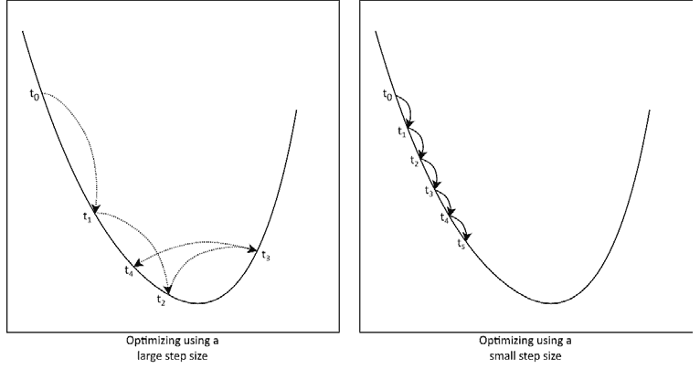

在这个例子中，步长将是我们的最小化算法的一个超参数。步长的影响如*图 1.1*所示。

### 数据集

如前所述，机器学习模型是使用数据集进行训练的。数据是机器学习过程的核心，而数据准备通常是该过程中最耗时的部分。

在本书中，我们将处理*表格*数据集。表格数据集在现实世界中非常常见，由行和列组成。行通常称为样本、示例或观测值，列通常称为特征、变量或属性。

重要的是，列中的数据类型没有限制。特征可以是字符串、数字、布尔值、地理空间坐标，或者是编码格式，如音频、图像或视频。

数据集也很少是完美定义的。数据可能不完整、有噪声、不正确、不一致，并包含各种格式。

因此，*数据准备和清理*是机器学习过程的重要组成部分。

数据准备涉及处理数据以使其适合机器学习，通常包括以下步骤：

1.  **收集和验证**：有些数据集最初太小或不能很好地代表问题（数据不能代表其抽样的实际数据总体）。在这些情况下，从业者必须收集更多数据，并且必须进行验证以确保数据代表问题。
2.  **检查系统性错误和偏差**：检查并纠正收集和验证过程中可能导致数据集偏差的任何系统性错误至关重要。在我们的销售示例中，一个系统性的收集错误可能是数据仅从城市商店收集，而排除了农村商店。仅在城市商店数据上训练的模型在预测商店销售时会有偏差，我们可能会预期当模型用于预测农村商店的销售时表现不佳。
3.  **清理数据**：必须解决任何格式或值范围的不一致问题。任何缺失值也需要以不引入偏差的方式处理。
4.  **特征工程**：某些特征可能需要进行转换，以确保机器学习模型能够从中学习，例如对句子中的单词进行数值编码。此外，可能需要从现有特征中准备新特征，以帮助模型检测模式。
5.  **归一化和标准化**：必须对特征的相对范围进行归一化和标准化。归一化和标准化确保没有一个特征对整体预测产生过大的影响。

## 过拟合与泛化

要理解过拟合，我们首先必须定义模型**泛化**的含义。如前所述，泛化是指模型准确预测其未见过数据的能力。与训练准确率相比，泛化准确率作为模型性能的估计更为重要，因为它表明了我们的模型在生产环境中的表现。泛化有两种形式：**插值与外推**：

- 插值是指模型预测两个已知数据点之间值的能力——换句话说，是在训练数据范围内进行泛化。例如，假设我们使用从一月到七月的月度数据训练模型。在进行插值时，我们会要求模型预测四月某一天的数值，这个日期在我们的训练范围内。
- 外推，正如你可能推断的那样，是指模型预测超出训练数据定义范围值的能力。外推的一个典型例子是预测——即预测未来。在我们之前的例子中，如果我们要求模型预测十二月的数值，我们期望它从训练数据中进行外推。

在这两种泛化类型中，外推要困难得多，可能需要特定类型的模型才能实现。然而，在这两种情况下，模型都可能对数据过拟合，从而失去准确插值或外推的能力。

**过拟合**是一种模型过度拟合训练数据并失去对未见数据泛化能力的现象。模型没有学习数据中的潜在模式，而是记住了训练数据。更技术性地说，模型拟合了训练数据中包含的*噪声*。噪声一词源于数据包含*信号*和*噪声*的概念。信号指的是我们试图预测的数据中捕获的潜在模式或信息。相比之下，噪声指的是掩盖信号的数据点的随机或无关变化。

例如，考虑一个我们试图预测特定地点降雨量的数据集。数据中的信号将是降雨量的总体趋势：冬季或夏季降雨量增加，或者其他地点则相反。噪声则是我们数据集中每个月和地点降雨量测量的细微变化。

下图说明了过拟合现象：

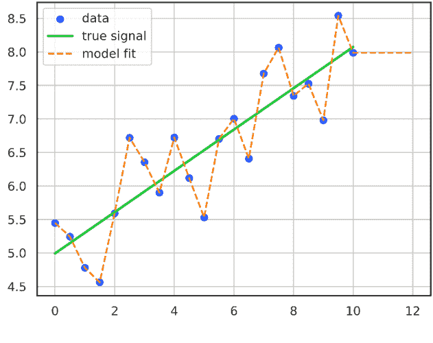

图 1.2 – 显示过拟合的图表。模型已过拟合并完美预测了训练数据，但失去了对实际信号的泛化能力

上图显示了信号与噪声之间的区别：每个数据点都是从实际信号中采样的。数据遵循信号的一般模式，带有轻微的随机变化。我们可以看到模型如何对数据过拟合：模型完美拟合了训练数据，但代价是泛化能力。我们还可以看到，如果我们使用模型通过预测 4 的值进行*插值*，我们得到的结果远高于实际信号（6.72 对比 6.2）。图中还显示了模型*外推*的失败：对 12 的预测远低于信号的预测值（7.98 对比 8.6）。

实际上，所有现实世界的数据集都包含噪声。作为数据科学家，我们的目标是准备数据以尽可能多地去除噪声，使信号更容易被检测到。数据清洗、归一化、特征选择、特征工程和正则化都是从数据中去除噪声的技术。

由于所有现实世界的数据都包含噪声，过拟合是不可能完全消除的。以下条件可能导致过拟合：

- **模型过于复杂**：对于我们的数据量来说过于复杂的模型会利用额外的复杂性来记住数据中的噪声，从而导致过拟合
- **数据不足**：如果我们没有足够的训练数据来支持我们使用的模型，这类似于过于复杂的模型，会对数据过拟合
- **特征过多**：具有过多特征的数据集可能包含不相关（噪声）特征，这会降低模型的泛化能力
- **过度训练**：训练模型时间过长会使其记住数据集中的噪声

由于验证集是模型未见过的训练数据的一部分，我们使用验证集来监控过拟合。我们可以通过观察训练误差和泛化误差随时间的变化来识别过拟合点。在过拟合点，验证误差增加。相反，训练误差继续改善：模型正在拟合训练数据中的噪声，并失去其泛化能力。

防止过拟合的技术通常旨在解决我们之前讨论的导致过拟合的条件。以下是一些避免过拟合的策略：

- **早停法**：我们可以在验证误差开始增加时停止训练。
- **简化模型**：参数较少的较不复杂的模型将无法学习训练数据中的噪声，从而更好地泛化。
- **获取更多数据**：收集更多数据或增强数据是防止过拟合的有效方法，它使模型有更好的机会学习数据中的信号，而不是较小数据集中的噪声。
- **特征选择与降维**：由于某些特征可能与正在解决的问题无关，我们可以丢弃我们认为冗余的特征，或使用主成分分析等技术来降低维度（特征）。
- **添加正则化**：较小的参数值通常会导致更好的泛化，具体取决于模型（神经网络就是这样一个例子）。正则化向目标函数添加一个惩罚项，以阻止较大的参数值。通过将参数驱动到较小（或零）值，它们对预测的贡献减少，从而有效地简化了模型。
- **集成方法**：结合多个*较弱*模型的预测可以带来更好的泛化，同时提高性能。

需要注意的是，*过拟合及其预防技术是特定于我们的模型的*。我们的目标应该是最小化过拟合，以确保对未见数据的泛化。一些策略，如正则化，可能对特定模型不起作用，而其他策略可能更有效。还有一些针对模型的更定制化策略，我们将在讨论决策树中的过拟合时看到一个例子。

## 监督学习

商店销售的例子是**监督学习**的一个实例——我们有一个包含特征的数据集，并正在训练模型来预测目标。

监督学习问题可以分为两个主要的问题类别：**分类问题**和**回归问题**。

## 分类与回归

对于*分类问题*，模型需要预测的标签是分类的或定义了一个类别。一些类别的例子是 `spam` 或 `not spam`、`cat` 或 `dog` 以及 `diabetic` 或 `not diabetic`。这些是二元分类的例子：只有两个类别。

多类分类也是可能的；例如，电子邮件可以被分类为 `Important`、`Promotional`、`Clutter` 或 `Spam`；云的图像可以被分类为 `Cirro`、`Cumulo`、`Strato` 或 `Nimbo`。

对于*回归问题*，目标是预测一个连续的数值。例子包括预测收入、销售额、温度、房价和人群规模。

机器学习*艺术*的很大一部分是正确地将问题定义或转录为分类问题或回归问题（或者可能是无监督或强化学习）。后面的章节将涵盖这两种问题的多个端到端案例研究。

## 模型性能指标

让我们简要讨论一下如何衡量模型的性能。模型性能是指机器学习模型根据给定输入做出准确预测或生成有意义输出的能力。评估指标量化了模型对新的、未见数据的泛化程度。

## 高模型性能表明模型已有效学习数据中的潜在模式，并能对未见过的数据做出准确预测。在处理监督学习问题（分类或回归问题）时，我们可以根据已知目标来衡量模型的性能。

重要的是，我们衡量分类任务和回归任务模型性能的方式有所不同。scikit-learn 有许多内置的度量函数，可用于分类或回归问题（https://scikit-learn.org/stable/modules/model_evaluation.html）。让我们回顾一下其中最常见的几种。

分类度量可以根据模型做出的正预测和负预测来定义。以下定义可用于计算分类度量：

- **真正例 (TP)：** 一个正实例被正确分类为正类
- **真负例 (TN)：** 一个负实例被正确分类为负类
- **假正例 (FP)：** 一个负实例被错误分类为正类
- **假负例 (FN)：** 一个正实例被错误分类为负类

根据这些定义，最常见的*分类*度量如下：

- **准确率：** 准确率是最直接的分类度量。准确率是正确预测的数量除以预测总数。然而，准确率容易受到数据不平衡的影响。例如，假设我们有一个包含 8 个垃圾邮件示例和 2 个非垃圾邮件示例的电子邮件数据集，而我们的模型只预测垃圾邮件。在这种情况下，模型的准确率为 80%，即使它从未正确分类过非垃圾邮件。从数学上讲，我们可以如下定义准确率：
$$Accuracy = \frac{TP + TN}{TP + FP + TN + FN}$$
- **精确率：** 精确率分数是更细致地理解分类性能的一种方式。精确率是真正例预测（正确预测）与所有正预测（真正例和假正例）之间的比率。换句话说，精确率分数表示模型在预测正类时的精确程度。在我们的垃圾邮件示例中，只预测垃圾邮件的模型精确度不高（因为它将所有非垃圾邮件都归类为垃圾邮件），精确率分数较低。可以使用以下公式计算精确率：
$$Precision = \frac{TP}{TP + FP}$$
- **召回率：** 召回率分数是精确率分数的对应指标。召回率分数衡量模型找到（或召回）所有真正例案例的有效程度。召回率计算为真正例预测与所有正实例（真正例和假负例）之间的比率。在我们的垃圾邮件示例中，只预测垃圾邮件的模型具有完美的召回率（它能找到所有垃圾邮件）。我们可以这样计算召回率：
$$Recall = \frac{TP}{TP + FN}$$
- **F1 分数：** 最后，我们有 F1 分数。F1 分数计算为精确率和召回率的调和平均值。F1 分数平衡了精确率和召回率，为我们提供了一个总结分类器性能的单一数值。可以使用以下公式计算 F1 分数：
$$F_1 = \frac{2 \times Precision \times Recall}{Precision + Recall} = \frac{2 \times TP}{2 \times TP + FP + FN}$$

上述分类度量是最常见的，但还有更多。尽管 F1 分数在分类问题中常用（因为它总结了精确率和召回率），但选择最佳度量取决于你正在解决的具体问题。通常，可能需要特定的度量，但其他时候，你必须根据经验和对数据的理解来选择。我们将在本书后面查看不同度量的示例。

以下是常见的*回归*度量：

- **均方误差 (MSE)：** MSE 计算为预测值与实际值之间差值的平方的平均值。MSE 之所以常用，是因为一个关键的数学性质：MSE 是*可微的*，因此适用于基于梯度的学习方法。然而，由于差值被平方，MSE 对大误差的惩罚比对小误差更重，这可能适合也可能不适合所解决的问题。
- **平均绝对误差 (MAE)：** MAE 不是平方差值，而是计算预测值与实际值之间绝对差值的平均值。通过避免误差的平方，MAE 对误差的大小更稳健，对异常值的敏感度低于 MSE。然而，MAE 不可微，因此不能用于基于梯度的学习方法。

与分类度量一样，选择最合适的回归度量取决于你试图解决的问题。

> **度量与目标**

我们将训练模型定义为找到最合适的参数以最小化*目标函数*。需要注意的是，用于特定问题的目标函数和度量可能不同。一个很好的例子是决策树，在构建树时使用不纯度度量（熵）作为目标函数。然而，我们仍然计算前面解释的度量来确定树在数据上的性能。

在理解了基本度量之后，我们可以结束对机器学习概念的介绍。现在，让我们使用一个示例来回顾我们讨论过的术语和概念。

## 建模示例

考虑以下按月统计的销售数据，单位为千：

| 一月 | 二月 | 三月 | 四月 | 五月 | 六月 |
|---|---|---|---|---|---|
| 4,140 | 4,850 | 7,340 | 6,890 | 8,270 | 10,060 |
| 七月 | 八月 | 九月 | 十月 | 十一月 | 十二月 |
| 8,110 | 11,670 | 10,450 | 11,540 | 13,400 | 14,420 |

表 1.1 – 按月统计的样本销售数据，单位为千

这个问题很直接：只有一个特征，即月份，目标是销售数量。因此，这是一个监督回归问题的示例。

> **注意**
你可能已经注意到这是一个时间序列问题的示例：时间是主要变量。时间序列也可以使用更高级的时间序列特定算法（如 ANOVA）进行预测，但为了说明目的，我们将在本节中使用一个简单的算法。

我们可以通过绘制每月销售图表来更好地理解数据：

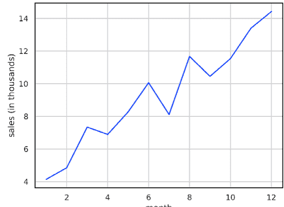

图 1.3 – 显示按月商店销售情况的图表

这里，我们使用直线模型，也称为简单线性回归，来建模我们的销售数据。直线的定义由以下公式给出：

$$y = mx + c$$

这里，$m$ 是直线的斜率，$c$ 是 Y 轴截距。在机器学习中，直线是模型，$m$ 和 $c$ 是模型参数。

为了找到最佳参数，我们必须衡量模型在特定参数集下对数据的拟合程度——即我们输出中的误差。我们将使用 MAE 作为我们的度量：

$$MAE = \frac{\sum_{i=1}^{n} |\hat{y} - y|}{n}$$

这里，$\hat{y}$ 是预测输出，$y$ 是实际输出，$n$ 是预测的数量。我们通过为每个输入进行预测，然后根据公式计算 MAE 来计算 MAE。

## 拟合模型

现在，让我们将线性模型拟合到我们的数据上。我们拟合直线的过程是迭代的，我们通过猜测 $m$ 和 $c$ 的值开始这个过程，然后从那里迭代。例如，让我们考虑 $m = 0.1$，$c = 4$：

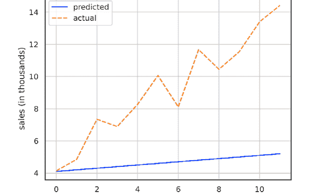

图 1.4 – 显示 m = 0.1 和 c = 4 的线性模型预测的图表

使用这些参数，我们得到的误差为 4,610。

我们的猜测太低了，但这没关系；我们现在可以更新参数以尝试改进误差。实际上，更新模型参数是通过训练算法（如梯度下降）以算法方式完成的。我们将在*第 2 章，集成学习 - Bagging 和 Boosting*中讨论梯度下降。

在这个例子中，我们将运用对直线的理解和直觉，手动更新每次迭代的参数。我们的直线过于平缓，且截距过低；因此，我们必须同时增大这两个值。我们可以通过选择一个*步长*来控制每次迭代的更新幅度。每次迭代时，我们必须通过加上步长来更新*m*和*c*的值。步长为0.1时的结果如*表1.2*所示。

| 猜测次数 | m | c | MAE |
|---|---|---|---|
| 1 | 0.1 | 4 | 4.61 |
| 2 | 0.2 | 4.1 | 3.89 |
| 3 | 0.3 | 4.2 | 3.17 |
| 4 | 0.3 | 4.3 | 2.5 |
| 5 | 0.4 | 4.4 | 1.83 |

表1.2 – 逐步猜测拟合我们数据的直线的斜率（*m*）和y轴截距（*c*）。拟合质量使用MAE衡量

在我们的例子中，*步长*是训练过程的一个*超参数*。

我们最终得到的误差是1.83，这意味着平均而言，我们的预测误差小于2000。

现在，让我们看看如何使用scikit-learn来解决这个问题。

## 使用scikit-learn进行线性回归

我们可以使用scikit-learn来构建线性回归模型，而不是手动建模。由于这是我们的第一个例子，我们将逐行讲解代码并解释其中的内容。

首先，我们必须导入将要使用的Python工具：

```
import numpy as np
import pandas as pd

from matplotlib import pyplot as plt
import seaborn as sns

from sklearn.linear_model import LinearRegression
from sklearn.metrics import mean_absolute_error
```

这里有三组导入：我们首先导入`numpy`和`pandas`。导入NumPy和pandas是开始所有数据科学笔记本的常用方式。另外，请注意短名称`np`和`pd`，这是使用`numpy`和`pandas`时的标准约定。

接下来，我们导入一些用于绘制图形的标准绘图库：来自`matplotlib`的`pyplot`和`seaborn`。Matplotlib是一个广泛使用的绘图库，我们通过pyplot python接口访问它。**Seaborn**是另一个建立在Matplotlib之上的可视化工具，它使得绘制专业外观的图形更加容易。

最后，我们来看scikit-learn的导入。在Python代码中，scikit-learn库被称为`sklearn`。从它的`linear_model`包中，我们导入`LinearRegression`。scikit-learn实现了各种各样的预定义指标，这里我们将使用`mean_absolute_error`。

现在，我们准备好设置数据了：

```
months = np.array([ 1, 2, 3, 4, 5, 6, 7, 8, 9, 10, 11, 12])
sales = np.array([4.14, 4.85, 7.34, 6.89, 8.27, 10.06, 8.11,
                  11.67, 10.45, 11.54, 13.4 , 14.42])

df = pd.DataFrame({"month": months, "sales": sales})
```

这里，我们为月份和相应的销售额定义了一个新的numpy数组，为了便于操作，我们将这两个数组收集到一个新的pandas DataFrame中。

数据就位后，我们进入代码中有趣的部分：使用scikit-learn进行建模。代码很直接：

```
model = LinearRegression()
model = model.fit(df[["month"]], df[["sales"]])
```

首先，我们通过构造`LinearRegression`的一个实例来创建模型。然后，我们使用`model.fit`并传入DataFrame中的月份和销售数据来拟合模型。这两行代码就是拟合模型所需的全部，正如我们将在后面的章节中看到的，即使是复杂的模型也使用相同的配方来实例化和训练模型。

我们现在可以通过为数据创建预测，并将预测值和实际目标值传递给指标函数来计算*MAE*：

```
predicted_sales = model.predict(df[["month"]])
mean_absolute_error(predicted_sales, df[["sales"]])
```

我们得到的误差是0.74，略低于我们的猜测值。我们还可以检查模型的系数和截距（即之前的*m*和*c*）：

```
print(f"Gradient: ${model.coef_}")
print(f"Intercept: ${model.intercept_}")
```

scikit-learn拟合了一个系数为0.85、截距为3.68的模型。我们的猜测方向是正确的，但可能需要一些时间才能达到最优值。

以上就是我们对scikit-learn以及建模和机器学习基础知识的介绍。在我们的简单示例中，我们没有将数据拆分为单独的数据集，没有优化模型的超参数，也没有应用任何技术来确保模型不会过拟合。在下一节中，我们将研究分类和回归示例，届时我们将应用这些以及其他最佳实践。

## 决策树学习

本节介绍决策树学习，这是理解LightGBM所必需的一种机器学习算法。我们将通过一个使用scikit-learn构建决策树的例子来讲解。本节还将提供一些构建决策树的数学定义；理解这些定义并非关键，但它将帮助我们理解关于决策树超参数的讨论。

决策树是基于树的学习器，其功能是通过对数据提出一系列问题来确定结果。沿着树向下走一条路径，使用一个或多个特征对输入做出决策。路径终止于一个叶节点，该节点代表预测的类别或值。决策树可用于分类或回归。

以下是在鸢尾花数据集上拟合的决策树的示意图：

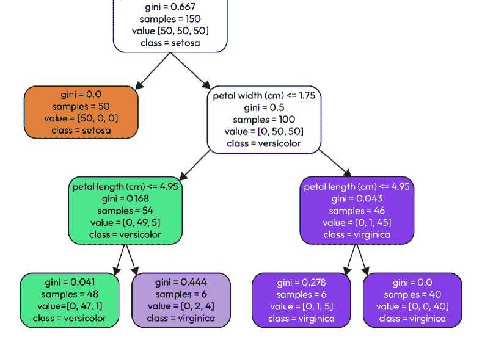

鸢尾花数据集是一个分类数据集，其中使用鸢尾花的萼片和花瓣尺寸来预测鸢尾花的类型。每个非叶节点使用一个或多个特征来缩小数据集中的样本范围：根节点从所有150个样本开始，然后根据花瓣宽度（<= 0.8）进行分割。我们继续沿着树向下走，每个节点进一步分割样本，直到我们到达一个包含预测类别（变色鸢尾、维吉尼亚鸢尾或山鸢尾）的叶节点。

与其他模型相比，决策树有许多优点：

- **特征可以是数值型或分类型**：可以使用数值特征（通过分割范围）或分类特征来分割样本，而我们无需对两者进行编码。
- **减少数据准备的需求**：决策分割对数据范围或大小不敏感。许多其他模型（例如神经网络）要求数据归一化到单位范围。
- **可解释性**：如前所述，解释树所做的预测是直接的。在必须向决策者解释预测的场景中，可解释性非常有价值。

这些只是使用基于树的模型的一些优点。然而，我们也需要意识到与决策树相关的一些缺点：

- **过拟合**：决策树非常容易过拟合。在拟合决策树时，设置正确的超参数至关重要。决策树中的过拟合将在后面详细讨论。
- **外推能力差**：决策树的外推能力较差，因为其预测不是连续的，并且实际上受限于训练数据。
- **不平衡数据**：在不平衡数据上拟合树时，高频类别会主导预测。需要准备数据以消除不平衡。

关于决策树优缺点的更详细讨论，请参阅 https://scikit-learn.org/stable/modules/tree.html。

## 熵与信息增益

首先，在我们研究构建（或拟合）决策树的算法之前，我们需要对熵和信息增益有一个基本的理解。

熵可以被视为衡量系统无序或随机性的一种方式。熵衡量特定输入或事件的结果可能有多令人惊讶。考虑一副洗得很匀的扑克牌：从牌堆顶部抽牌可能给我们牌堆中的任何一张牌（每次都是一个令人惊讶的结果）；因此，我们可以说一副洗匀的扑克牌具有**高熵**。从一副有序的牌堆顶部抽牌则不会令人惊讶；我们知道下一张是什么牌。因此，一副有序的扑克牌具有**低熵**。解释熵的另一种方式是数据集的不纯度：低熵数据集（整齐有序）比高熵数据集的不纯度更低。

信息增益，反过来，是指在修改或观察底层数据时获得的信息量。信息增益涉及减少观察前的熵。在我们的扑克牌例子中，我们可能会拿一副洗匀的扑克牌，按花色（黑桃、红桃、方块和梅花）将其分成四副较小的牌堆。如果我们从较小的牌堆中抽牌，结果就不会那么令人惊讶：我们知道下一张牌是同一花色的。通过按花色分割牌堆，我们降低了较小牌堆的熵值。按特征（花色）拆分牌堆与决策树中的分裂方式非常相似；每次分裂都旨在最大化信息增益——即最小化分裂后的熵值。

在决策树中，衡量信息增益或不纯度损失有两种常用方法：

- 基尼指数
- 对数损失或熵

详细解释请参见 https://scikit-learn.org/stable/modules/tree.html#classification-criteria。

## 使用C4.5构建决策树

C4.5是一种从数据集构建决策树的算法[1]。该算法是递归的，从以下基本情况开始：

1. 如果子数据集中的所有样本都属于同一类别，则在树中创建一个选择该类别的叶节点。
2. 如果使用任何特征进行分裂都无法获得信息增益（数据集无法进一步划分），则创建一个预测子数据集中最频繁类别的叶节点。
3. 如果子数据集中的样本数量达到最小阈值，则创建一个预测子数据集中最频繁类别的叶节点。

然后，我们可以应用该算法：

1. 检查三种基本情况中的任何一种，如果数据集满足其中任何一种，则停止分裂。
2. 对于数据集的每个特征或属性，计算按该特征分裂数据集所获得的信息增益。
3. 通过按信息增益最高的特征分裂数据集来创建决策节点。
4. 根据决策节点将数据集拆分为两个子数据集，并对每个子数据集递归地应用该算法。

树构建完成后，会进行剪枝。在剪枝过程中，信息增益相对低于其他树节点的决策节点会被移除。移除节点可以避免对训练数据的过拟合，并提高树的泛化能力。

## 分类与回归树

您可能已经注意到，在前面的解释中，我们只使用类别通过决策节点来拆分数据集；这并非偶然，因为标准的C4.5算法仅支持分类树。**分类与回归树（CART）**扩展了C4.5以支持数值目标变量——即回归问题[2]。使用CART时，决策节点也可以拆分连续数值输入变量以支持回归，通常使用阈值（例如，x <= 0.3）。当到达叶节点时，通常取剩余数值范围的均值或中位数作为预测值。

在构建分类树时，仅使用不纯度来确定分裂。然而，对于回归树，不纯度与其他标准结合以计算最优分裂：

- 均方误差（或平均绝对误差）
- 半泊松偏差

详细数学解释请参见 https://scikit-learn.org/stable/modules/tree.html#regression-criteria。

scikit-learn使用CART的优化版本来构建决策树。

## 决策树中的过拟合

决策树最显著的缺点之一是容易过拟合。如果没有合适的超参数选择，C4.5和其他训练算法会创建过于复杂和深层的树，几乎完全拟合训练数据。管理过拟合是构建决策树的关键部分。以下是一些避免过拟合的策略：

- **剪枝：** 如前所述，我们可以移除那些信息增益不大的分支；这降低了树的复杂性并提高了泛化能力。
- **最大深度：** 限制树的深度也可以避免过于复杂的树并避免过拟合。
- **最大叶节点数：** 与限制深度类似，限制叶节点数量可以避免过于具体的分支并提高泛化能力。
- **每个叶节点的最小样本数：** 设置叶节点可能包含的最小样本数限制（当子数据集达到最小大小时停止分裂）也可以避免过于具体的叶节点。
- **集成方法：** 集成学习是一种结合多个模型以提高预测性能的技术。对多个模型的预测进行平均也可以减少过拟合。

这些策略可以通过设置相应的超参数来应用。现在我们了解了如何构建决策树以及过拟合的策略，让我们看看如何在scikit-learn中构建决策树。

## 使用scikit-learn构建决策树

现在是时候通过使用scikit-learn训练分类和回归树来研究如何使用决策树了。

对于这些示例，我们将使用scikit-learn中包含的玩具数据集。这些数据集与真实世界数据相比很小，但易于使用，使我们能够专注于决策树。

## 乳腺癌分类

我们将使用乳腺癌数据集（https://scikit-learn.org/stable/datasets/toy_dataset.html#breast-cancer-dataset）作为分类示例。该数据集包含从乳腺肿块细针抽吸图像计算出的特征，任务是预测肿块是恶性还是良性。

使用scikit-learn，我们可以用五行代码解决这个分类问题：

```python
dataset = datasets.load_breast_cancer()

X_train, X_test, y_train, y_test = train_test_split(dataset.data,
    dataset.target, random_state=157)

model = DecisionTreeClassifier(random_state=157, max_depth=3, min_
    samples_split=2)
model = model.fit(X_train, y_train)

f1_score(y_test, model.predict(X_test))
```

首先，我们使用`load_breast_cancer`加载数据集。然后，我们使用`train_test_split`将数据集拆分为训练集和测试集；默认情况下，25%的数据用于测试集。像之前一样，我们实例化`DecisionTreeClassifier`模型，并使用`model.fit`在训练集上训练它。实例化模型时传递的两个超参数值得注意：`max_depth`和`min_samples_split`。这两个参数都控制过拟合，将在下一节中更详细地讨论。我们还为训练测试拆分和模型指定了`random_state`。通过固定随机状态，我们确保结果可重复（否则，scikit-learn会为每次执行创建新的随机状态）。

最后，我们使用`f1_score`来衡量性能。我们的模型F1分数为0.94，准确率为93.7%。F1分数的满分是1.0，因此我们可以得出结论，模型表现非常好。如果我们分解预测结果，模型在测试集的143个样本中仅对9个样本预测错误：7个假阳性和2个假阴性。

## 预测糖尿病进展

为了说明使用决策树解决回归问题，我们将使用糖尿病数据集（https://scikit-learn.org/stable/datasets/toy_dataset.html#diabetes-dataset）。该数据集有10个特征（年龄、性别、体重指数等），模型的任务是预测1年后疾病进展的定量度量。

我们可以使用以下代码来构建和评估回归模型：

```python
dataset = datasets.load_diabetes()

X_train, X_test, y_train, y_test = train_test_split(dataset.data,
    dataset.target, random_state=157)

model = DecisionTreeRegressor(random_state=157, max_depth=3, min_
    samples_split=2)
model = model.fit(X_train, y_train)

mean_absolute_error(y_test, model.predict(X_test))
```

我们的模型MAE为45.28。代码与我们的分类示例几乎相同：我们使用`DecisionTreeRegressor`作为模型，而不是分类器，并计算`mean_absolute_error`而不是F1分数。scikit-learn中使用不同类型模型解决各种问题的API一致性是经过设计的，并说明了机器学习工作中的一个基本事实：尽管数据、模型和指标会变化，*构建机器学习模型的整体过程保持不变*。在接下来的章节中，我们将扩展这一通用方法，并在构建机器学习管道时利用该过程的一致性。

## 决策树超参数

我们在前面的分类和回归示例中使用了一些决策树超参数来控制过拟合。本节将介绍scikit-learn提供的最关键的决策树超参数：

- `max_depth`：树允许达到的最大深度。更深的树允许更多的分裂，导致更复杂的树和过拟合。
- `min_samples_split`：分裂节点所需的最小样本数。仅包含少量样本的节点会过拟合数据，而较大的最小值可以提高泛化能力。
- `min_samples_leaf`：叶节点中允许的最小样本数。与分裂中的最小样本数类似，增加该值会导致树的复杂度降低，从而减少过拟合。
- `max_leaf_nodes`：允许的最大叶节点数。较少的叶节点会减小树的大小，从而降低复杂度，这可能会提高泛化能力。
- `max_features`：确定分裂时要考虑的最大特征数。丢弃一些特征可以减少数据中的噪声，从而改善过拟合。特征是随机选择的。
- `criterion`：确定分裂时使用的不纯度度量，可以是`gini`或`entropy`/`log_loss`。

正如您可能已经注意到的，大多数决策树超参数都涉及通过控制树的复杂度来控制过拟合。这些参数提供了多种实现方式，而找到参数及其值的最佳组合并非易事。寻找最佳超参数的过程被称为**超参数调优**，本书后续将对此进行详细探讨。

完整的超参数列表可在以下位置找到：

- https://scikit-learn.org/stable/modules/generated/sklearn.tree.DecisionTreeClassifier.html#sklearn-tree-decisiontreeclassifier
- https://scikit-learn.org/stable/modules/generated/sklearn.tree.DecisionTreeRegressor.html#sklearn.tree.DecisionTreeRegressor

现在，让我们总结一下本章的关键要点。

## 总结

在本章中，我们介绍了机器学习作为一种通过从数据语料库中学习来执行任务，而非依赖手动编程指令来创建软件的方法。我们介绍了机器学习的核心概念，重点关注监督学习，并通过 scikit-learn 的示例说明了它们的应用。

我们还介绍了决策树作为一种机器学习算法，讨论了它们的优缺点，以及如何使用超参数控制过拟合。最后，我们通过在 scikit-learn 中使用决策树解决分类和回归问题的示例结束了本章。

本章为我们奠定了机器学习的基础，使我们能够更深入地了解数据科学流程和 LightGBM 库。

下一章将重点介绍决策树中的集成学习，这是一种结合多个决策树的预测以提高整体性能的技术。提升方法，特别是梯度提升，将被详细阐述。

## 参考文献

- [1] J. R. Quinlan, *C4.5: Programs for machine learning*, Elsevier, 2014.
- [2] R. J. Lewis, *An introduction to classification and regression tree (CART) analysis*, in *Annual meeting of the Society For Academic Emergency Medicine in San Francisco, California*, 2000.

# 2 集成学习 – Bagging 与 Boosting

在上一章中，我们介绍了**机器学习**（ML）的基础知识、数据与模型的处理，以及过拟合和**监督学习**（SL）等概念。我们还介绍了决策树，并了解了如何在 scikit-learn 中实际应用它们。

在本章中，我们将学习集成学习以及两种最重要的集成学习类型：bagging 和 boosting。我们将涵盖将集成学习应用于决策树的理论和实践，并在本章最后重点介绍更高级的提升方法。

学完本章后，您将对集成学习有很好的理解，并知道如何通过 bagging 或 boosting 实际构建决策树集成。我们也将准备好深入探索 LightGBM，包括其更高级的理论方面。

我们将涵盖的主要主题如下：

- 集成学习
- Bagging 与随机森林
- **梯度提升决策树（GBDTs）**
- 高级提升算法——**Dropouts meet Multiple Additive Regression Trees (DART)**

## 技术要求

本章包含简单 ML 算法的示例，并介绍了如何使用 scikit-learn。您必须安装一个包含 scikit-learn、NumPy、pandas 和 Jupyter 的 Python 环境。本章的代码可在 `https://github.com/PacktPublishing/Practical-Machine-Learning-with-LightGBM-and-Python/tree/main/chapter-2` 获取。

## 集成学习

**集成学习**是将多个预测器或模型组合起来以创建更稳健模型的实践。模型可以是相同类型（同质集成）或不同类型（异质集成）。此外，集成学习并非决策树特有，可以应用于任何 ML 技术，包括线性模型、**神经网络**（NNs）等。

集成学习背后的核心思想是，通过聚合多个模型的结果，我们弥补了单个模型的弱点。

当然，在相同数据上训练相同的模型在集成中并无帮助（因为模型会有相似的预测）。因此，我们追求模型的**多样性**。多样性指的是集成中每个模型之间的差异程度。高多样性集成具有差异很大的模型。

我们可以通过多种方式确保集成的多样性。一种方法是在训练数据的不同子集上训练模型。每个模型接触到训练数据中不同的模式和噪声，从而增加了训练模型的多样性。

类似地，我们可以在训练数据的不同特征子集上训练每个模型。一些特征比其他特征更有价值，一些可能无关，这导致了模型预测的多样性。

我们还可以使用不同的超参数训练每个模型，从而产生具有不同复杂度和能力的不同模型。超参数的影响在决策树的情况下尤为显著，因为超参数会显著影响树的结构，从而导致非常不同的模型。

最后，我们可以通过使用不同类型的模型来使集成多样化。每个模型都有其独特的优势和劣势，从而导致集成的多样性。

**集成学习方法**指的是我们如何通过指定如何训练成员模型以及如何组合模型结果来在集成模型中引入多样性。最常见的集成方法如下：

- **自助聚合（Bagging）**：这些方法在训练数据的子集（样本或特征）上训练模型，然后聚合预测结果。
- **提升（Boosting）**：这涉及在先前模型的错误上迭代训练模型。最终预测是通过组合链中所有模型的预测得出的。
- **堆叠（Stacking）**：这涉及训练多个基础模型，然后训练一个高阶模型（称为元模型）从基础模型的预测中学习并做出最终预测。
- **混合（Blending）**：这与堆叠非常相似。然而，元模型是在基础模型对*留出集*（基础学习器未训练过的那部分训练数据）的预测上训练的，而不是在整个训练集上训练。

集成学习方法的目的是提高我们的预测性能，集成通过以下几种方式提高了单个模型的性能：

- **提高准确性**：通过组合预测，我们增加了最终预测准确的可能性，因为总体上模型犯的错误更少。
- **改善泛化能力和过拟合**：通过聚合预测，我们减少了最终预测的方差，从而改善了泛化能力。此外，在某些集成方法中，模型无法访问所有数据（bagging 集成），从而减少了噪声和过拟合。
- **提高预测稳定性**：预测的聚合减少了单个预测的随机波动。集成对异常值不太敏感，成员模型的异常预测对最终预测的影响有限。

决策树非常适合集成学习，并且存在针对决策树的特定集成学习算法。下一节将讨论决策树中的 bagging 集成，重点介绍**随机森林**。

## Bagging 与随机森林

**Bagging** 是一种集成方法，其中多个模型在训练数据的子集上进行训练。模型的预测被组合以做出最终预测，通常对于数值预测（回归）取平均值，对于类别（分类）取多数票。在训练每个模型时，我们从原始训练数据集中有放回地选择一个数据子集——也就是说，一个特定的训练模式可以属于多个子集。由于每个模型只接触到训练数据的一个样本，因此没有单个模型能够“记住”训练数据，从而减少了过拟合。下图说明了 bagging 过程：

## 随机森林

**随机森林**是一种针对决策树的Bagging集成学习方法[1]。顾名思义，它不是构建单个决策树，而是使用Bagging训练多棵决策树：每棵树在训练数据的随机样本、随机特征或两者兼有的基础上进行训练。随机森林同时支持分类和回归任务。

随机森林中单棵树的训练方法与单棵决策树相同，如前所述，每棵树都是一棵完整的树。森林的最终预测结果是通过取所有树的算术平均值（用于回归预测）或多数投票（用于分类）得出的。

在性能方面，随机森林学习产生的模型更稳健、准确率更高，并且倾向于避免过拟合（因为没有单个模型能在所有训练数据上过拟合）。

## 随机森林超参数

在scikit-learn中，可以预期，随机森林可用的超参数与训练决策树可用的超参数相同。我们可以指定`max_depth`、`min_samples_split`、`max_leaf_nodes`等参数，然后用它们来训练单棵树。然而，有三个值得注意的额外参数，如下所示：

- `n_estimators`：控制森林中树的数量。通常，树越多越好。然而，往往会达到一个收益递减点。
- `max_features`：确定在分裂节点时用作子集的最大特征数。设置`max_features=1.0`允许在随机选择中使用所有特征。
- `bootstrap`：决定是否使用Bagging。如果`bootstrap`设置为`False`，则所有树都使用整个训练集。

scikit-learn中所有可用参数的列表可在此处查看：https://scikit-learn.org/stable/modules/generated/sklearn.ensemble.RandomForestClassifier.html。

## 极端随机树

**极端随机树（ExtraTrees）**是一种构建随机决策树的相关方法。使用ExtraTrees时，在构建决策节点时，会随机创建几个候选分裂点，而不是使用*基尼指数*或*信息增益*度量来计算最优分裂[2]。然后从所有随机分裂中选择最佳分裂用于该节点。ExtraTrees的方法可以应用于单棵决策树，也可以与随机森林结合使用。scikit-learn将ExtraTrees实现为随机森林的扩展（https://scikit-learn.org/stable/modules/ensemble.html#extremely-randomized-trees）。

在scikit-learn中，ExtraTrees的实现具有与随机森林相同的超参数。

## 使用scikit-learn训练随机森林

我们现在将看看如何在scikit-learn中使用随机森林。

## 集成学习 – Bagging与Boosting

在这个例子中，我们将使用*森林覆盖类型*数据集（https://archive.ics.uci.edu/ml/datasets/Covertype），该数据集可在scikit-learn中获取（https://scikit-learn.org/stable/modules/generated/sklearn.datasets.fetch_covtype.html#sklearn.datasets.fetch_covtype）。该数据集比我们之前使用的玩具数据集有了显著提升。数据集包含581,012个样本，维度（特征数）为54。这些特征描述了美国一块30x30米的森林区域（例如，海拔、坡向、坡度以及到水文特征的距离）。我们必须构建一个分类器，将每个区域分类到描述森林覆盖类型的七个类别之一。

除了训练一个`RandomForestClassifier`，我们还将训练一个独立的`DecisionTreeClassifier`和一个`ExtraTreesClassifier`，并比较这些算法的性能。

`RandomForestClassifier`和`ExtraTreesClassifier`位于`sklearn.ensemble`包中。除了常规导入，我们从那里导入分类器，如下所示：

```
from sklearn import datasets
from sklearn.tree import DecisionTreeClassifier
from sklearn.ensemble import RandomForestClassifier, ExtraTreesClassifier
from sklearn.model_selection import train_test_split
from sklearn.metrics import f1_score
```

scikit-learn的datasets包提供了森林覆盖数据集。我们可以使用scikit-learn获取数据集并将其拆分为训练集和测试集，如下所示：

```
dataset = datasets.fetch_covtype()
X_train, X_test, y_train, y_test = train_test_split(dataset.data, dataset.target, random_state=179)
```

最后，我们可以训练我们的分类器，并在测试集上评估每一个：

```
tree = DecisionTreeClassifier(random_state=179, min_samples_leaf=3, min_samples_split=6)
tree = tree.fit(X_train, y_train)
print(f1_score(y_test, tree.predict(X_test), average="macro"))
forest = RandomForestClassifier(random_state=179, min_samples_leaf=1, min_samples_split=2, n_estimators=140)
forest = forest.fit(X_train, y_train)
print(f1_score(y_test, forest.predict(X_test), average="macro"))
extra_tree = ExtraTreesClassifier(random_state=179, min_samples_leaf=1, min_samples_split=2, n_estimators=180)
extra_tree = extra_tree.fit(X_train, y_train)
print(f1_score(y_test, extra_tree.predict(X_test), average="macro"))
```

我们为模型设置了适合该问题的超参数。另一个步骤是优化算法超参数以找到最佳参数值。参数优化将在后面的章节中详细讨论。

运行前面的代码，我们得到每个算法的以下F1分数：

| 模型 | F1分数 |
|---|---|
| 决策树 | 0.8917 |
| 随机森林 | 0.9209 |
| 极端随机树 | 0.9231 |

表2.1 – 森林覆盖类型数据集上各算法的F1分数

极端随机树模型略优于随机森林模型，两者都优于决策树分类器。

在本节中，我们概述了Bagging和随机森林，这是一种基于Bagging的决策树集成学习方法，它比标准决策树提供了一些优势。下一节将探讨另一种集成学习方法：梯度提升。

## 梯度提升决策树

**梯度提升**是一种集成学习方法，它*顺序地*组合多个模型以产生更稳健的集成模型。与Bagging使用多个*强*模型（并行）不同，Boosting训练多个弱学习器，每个学习器都从前面学习器的错误中学习，以构建更准确、更稳健的集成模型。与Bagging的另一个显著区别是，每个模型都使用整个数据集进行训练。

> **注意**
如下文所述，无论解决的是回归还是分类问题，梯度提升总是构建一系列回归树作为集成的一部分。梯度提升也称为**多重加性回归树（MART）**。

抽象地说，Boosting过程从一个弱基础学习器开始。在决策树的情况下，基础学习器可能只有一个分裂点（也称为决策树桩）。然后计算误差残差（预测目标与实际目标之间的差异）。然后在前一个学习器的误差残差上训练一个新的学习器，旨在最小化误差。最终预测是所有学习器预测的*总和*。下图说明了迭代的梯度提升过程：

一个关键问题在于，我们如何确定能够减少误差残差的变化。梯度提升通过应用一种广泛使用的优化问题——梯度下降，来解决误差最小化问题。

## 梯度下降

**梯度下降**是一种优化算法，它试图找到使**损失函数**最小化的最优参数。通过沿着损失函数负梯度方向（从而减小函数值）进行小步迭代来更新参数。损失函数在概念上类似于误差函数，但具有两个重要特性，如下所述：

- 损失函数产生一个数值，用于量化模型的性能或精确衡量模型表现有多差。一个好的损失函数对于性能不同的模型会产生显著不同的输出。一些误差函数也可以用作损失函数——例如，**均方误差（MSE）**。
- 第二个特性是损失函数必须是可微的，特别是在梯度下降的背景下。一个不可微的误差函数例子是F1分数。F1分数可以产生模型性能的数值，但它不可微，不能用作损失函数。

因此，梯度下降的过程可以定义如下。假设我们有一个针对参数 $x$ 定义的损失函数 $L$。对于一组初始参数，损失计算为 $L(x_0)$。梯度下降迭代进行以最小化损失函数：

$L(x_{n+1}) < L(x_n)$

为了更新参数，*我们沿着 $L$ 的负梯度方向迈出一步*。我们可以将梯度下降更新规则指定如下：

$x_{n+1} = x_n - \gamma_n \nabla L(x_n)$

这里，$\gamma_n$ 是**学习率**，它定义了步长，而 $\nabla L(x_n)$ 是 $L$ 在 $x_n$ 处的梯度。

*图2.3*中的图表说明了梯度下降过程：

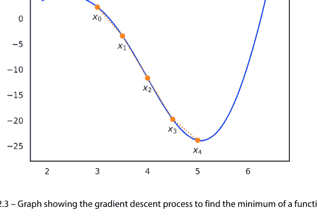

图2.3 – 展示梯度下降过程以找到函数最小值的图表

选择合适的学习率对于梯度下降的成功至关重要。如果学习率太低，优化将非常缓慢，可能在允许的迭代次数内无法达到最小值。较小的学习率也可能导致过程陷入局部最小值：步长太小而无法逃脱。相反，假设学习率太大。在这种情况下，我们可能会跨过最小值而完全错过它，或者陷入在最小值附近振荡（不断来回跳跃但永远不会下降到最优值）。

## 梯度提升

既然我们理解了梯度下降的工作原理，我们就可以看到它在梯度提升中是如何应用的。我们将通过一个小型示例详细讲解整个梯度提升算法。在我们的示例中，我们将使用回归树，因为它比分类情况更容易理解。

### 梯度提升算法

梯度提升算法定义如下，其中 $M$ 是提升树的数量 [3]：

1. 给定训练数据 $\{(x_i, y_i)\}_{i=1}^n$，包含 $n$ 个训练样本（由特征 $x_i$ 和目标 $y_i$ 定义）和一个可微的损失函数 $L(y_i, F(x))$，其中 $F(x)$ 是模型 $F$ 的预测值。
2. 用一个常数预测值初始化模型 $F_0(X) = \arg\min_y \sum_{i=1}^n L(y_i, y)$
3. 对于 $m = 1$ 到 $M$：
    计算伪残差 $r_{im} = -\left[\frac{\partial L(y_i, F(x_i))}{\partial F(x_i)}\right]_{F(x)=F_{m-1}(x_i)}$，其中 $i = 1, ..., n$
    对 $r_{im}$ 值拟合一个回归树，并为 $j = 1...J_m$ 创建终端区域 $R_{jm}$
    对于 $j = 1...J_m$，计算 $\gamma_{jm} = \arg\min_\gamma \sum_{x \in R_{jm}} L(y_i, F_{m-1}(x_i) + \gamma)$
    更新 $F_m(x) = F_{m-1}(x) + \nu \sum_{j=1}^{J_m} \gamma_{jm} I(x \in R_{jm})$
4. 结果：$F_M(x)$

尽管算法，尤其是数学部分，可能看起来令人生畏，但实际上它比看起来要简单得多。我们将逐步讲解该算法。考虑以下示例数据集：

| 性别 | 空腹血糖 | 腰围 | BMI | LDL 胆固醇 |
| :--- | :--- | :--- | :--- | :--- |
| 男 | 105 | 110 | 29.3 | 170 |
| 女 | 85 | 80 | 21 | 90 |
| 男 | 95 | 93 | 26 | 113 |

表2.2 – 包含患者身体测量值和测量的低密度脂蛋白（LDL）胆固醇的示例数据集

给定身体测量值，我们的目标是预测患者的LDL胆固醇。

上表定义了我们的训练数据 $\{(x_i, y_i)\}_{i=1}^n$，其中 $x$ 是特征（血糖、腰围、BMI），$y$ 是目标：LDL胆固醇。

我们需要一个可微的损失函数，为了简化本例中的一些数学推导，我们选择以下类似于MSE函数的损失函数：

$$L = \frac{1}{2} \sum_{i=0}^{n} (y_i - \gamma)^2$$

我们现在详细讲解算法的每一步，看看梯度提升树是如何产生的。

第一步是找到 $F_0(x) = \text{argmin}_{\gamma} \sum_{i=1}^{n} L(y_i, \gamma)$，其中 $y_i$ 是我们的目标值，$\gamma$ 是我们的初始预测值。*我们的初始预测是常数，简单来说就是目标值的平均值。但让我们看看为什么。*

$F_0(x)$ 的方程表明我们需要找到一个 $\gamma$ 值来最小化我们的损失函数。为了找到最小值，我们对损失函数关于gamma求导：

$$\frac{\partial L}{\partial \gamma} = \frac{2}{2} \left( \sum_{i=0}^{n} (y_i - \gamma) \right) \times -1$$

然后，将其设为0并求解以下方程：

$$-\left( \sum_{i=0}^{n} (y_i - \gamma) \right) = 0$$
$$-\frac{1}{n} \sum_{i=0}^{n} y_i + \gamma = 0$$
$$\gamma = \frac{1}{n} \sum_{i=0}^{n} y_i$$

该方程简化为计算目标值的平均值。

用预测值更新我们的表格，我们得到：

| 性别 | 空腹血糖 | 腰围 | BMI | LDL 胆固醇 | 预测值 $F_0(x)$ |
| :--- | :--- | :--- | :--- | :--- | :--- |
| 男 | 105 | 110 | 29.3 | 170 | 125 |
| 女 | 85 | 80 | 21 | 90 | 125 |
| 男 | 95 | 93 | 26 | 113 | 125 |

表2.3 – 我们对每位患者的LDL胆固醇初始预测值（$F_0(x)$）是常数

我们重复以下步骤 $M$ 次，其中 $M$ 是我们选择构建的树的数量。

我们现在需要计算伪残差 $r_{im} = -\left[ \frac{\partial L(y_i, F(x_i))}{\partial F(x_i)} \right]_{F(x)=F_{m-1}(x)}$。这个 $r_{im}$ 的方程表明，我们使用损失函数关于预测值的偏导数的负值来计算伪残差。*梯度提升算法的这一部分与梯度下降有关：我们取梯度的负值以最小化残差。* 幸运的是，我们已经计算了这个导数：

$$-\left[ \frac{\partial L(y_i, F(x_i))}{\partial F(x_i)} \right] = -\frac{\partial}{\partial F(x_i)} \left( \frac{1}{2} (y_i - F(x_i))^2 \right) = \frac{2}{2} (y_i - F(x_i)) = (y_i - F(x_i))$$

这里，$F(x_i)$ 是预测值。换句话说，*该方程简化为目标值与预测值之间的差值。* 我们可以将残差添加到表格中，如下所示：

| 性别 | 空腹血糖 | 腰围 | BMI | LDL 胆固醇 | 预测值 $F_0(x)$ | $F_0(x)$ 的残差 |
| :--- | :--- | :--- | :--- | :--- | :--- | :--- |
| 男 | 105 | 110 | 29.3 | 170 | 125 | 45 |
| 女 | 85 | 80 | 21 | 90 | 125 | -35 |
| 男 | 95 | 93 | 26 | 113 | 125 | -12 |

表2.4 – 根据我们的初始预测，我们可以计算每位患者的残差，如 $F_0(x)$ 的残差列所示

下一步很直接：我们构建一个回归树来预测残差。我们不直接使用回归树的预测值。相反，我们使用*终端区域*来计算更新后的预测。终端区域指的是树的叶节点。

对于这个例子，我们假设构建了以下简单的回归树：

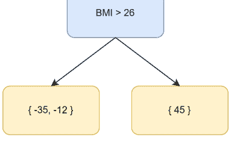

图2.4 – 预测残差的回归树

回归树构建完成并定义了叶节点后，我们可以继续下一步。我们需要计算 $\gamma_{jm}$，使其最小化我们的损失函数，同时考虑之前的预测，即 $\gamma_{jm} = \text{argmin}_{\gamma} \sum_{x_i \in R_{jm}} L(y_i, F_{m-1}(x_i) + \gamma)$。这几乎与我们在*步骤1*中所做的完全相同，我们当时证明了由于我们选择的损失函数，该方程简化为取预测值的平均值。*在这里，这意味着取每个叶节点中残差的平均值。* 因此，我们有 $\gamma_{1,1} = \frac{-35-12}{2} = -23.5$ 和 $\gamma_{2,1} = \frac{45}{1} = 45$。

最后，我们现在可以计算下一个预测值 $F_1(x)$，其定义为：$F_m(x) = F_{m-1}(x) + \nu \sum_{j=1}^k \gamma_{jm} I(x \in R_{jm})$，这意味着我们的下一个预测由之前的预测加上在*步骤2.3*中计算的 $\gamma$ 值组成，并由学习率 $\nu$ 加权。这里的求和意味着，如果一个样本属于多个叶节点，我们将gamma值相加。让我们使用0.1的学习率，为数据集中的第一个样本计算 $F_1(x)$。根据*步骤2.2*的回归树，我们的样本（BMI > 26）映射到 $\gamma_{2,1}$。由于它只映射到一个叶节点，我们不需要方程的求和部分。因此，方程如下所示：

## 用于分类的梯度提升

我们之前对梯度提升的解释以回归问题为例。由于算法相同，我们不会详细举例说明分类问题。然而，我们不再处理连续的预测值，而是使用与逻辑回归（https://en.wikipedia.org/wiki/Logistic_regression）相同的技术。因此，单个树预测样本属于某个类别的概率。概率的计算方法是取样本的对数几率，然后使用逻辑函数将其转换为概率，如下所示：

$p(x) = \frac{1}{1 + e^{-(x-\mu)/s}}$

伪残差计算为观测值（类别的1或0）与预测值（来自逻辑函数的概率）之间的差值。最终的差异是损失函数。我们可以使用交叉熵作为损失函数，而不是像MSE这样的函数，如下所示：

$H_p(q) = -\frac{1}{N} \sum_{i=1}^{N} y_i \log(p(y_i)) + (1 - y_i) \log(1 - p(y_i))$

## 梯度提升决策树超参数

除了标准决策树训练的参数外，scikit-learn中针对梯度提升树还提供了以下新的超参数：

- `n_estimators`：控制集成中树的数量。通常，树越多越好。然而，往往会达到一个收益递减点，当树太多时会发生过拟合。
- `learning_rate`：控制每棵树对集成的贡献。较低的学习率会导致更长的训练时间，并且可能需要构建更多的树（`n_estimators`的值更大）。将`learning_rate`设置为非常大的值可能会导致优化错过最优点，因此必须与较少的树结合使用。

scikit-learn梯度提升超参数的完整列表可以在`https://scikit-learn.org/stable/modules/generated/sklearn.ensemble.GradientBoostingClassifier.html`找到。

## scikit-learn中的梯度提升

梯度提升的细节是数学性的且复杂；幸运的是，通过scikit-learn，该算法与其他算法一样易于使用。以下是scikit-learn中`GradientBoostingClassifier`类的一个示例，再次使用本章前面用于训练随机森林分类器的*森林覆盖类型*数据集。

分类器也是从`ensemble`包中导入的，如下所示：

```
from sklearn.ensemble import GradientBoostingClassifier
```

我们像之前一样获取并拆分数据，然后拟合模型，如下所示：

```
dataset = datasets.fetch_covtype()

X_train, X_test, y_train, y_test = train_test_split(dataset.data,
    dataset.target, random_state=179)
booster = GradientBoostingClassifier(random_state=179, min_samples_
    leaf=3, min_samples_split=3, learning_rate=0.13, n_estimators=180)
booster = booster.fit(X_train, y_train)
print(f1_score(y_test, booster.predict(X_test), average="macro"))
```

运行前面的代码应产生0.7119的F1分数，这个分数甚至比标准决策树还要差得多。我们可以花时间优化超参数以提高性能。然而，有一个更严重的问题。前面的代码执行时间非常长——在我们的硬件上大约需要45分钟——而ExtraTrees大约只需要3分钟。

LightGBM解决了我们对梯度提升树的这两个问题，并在很短的时间内构建了性能显著更好的梯度提升树。

在下一节中，我们将简要介绍与梯度提升相关的高级算法：DART。

## 高级提升算法 – DART

**DART**是前一节讨论的标准GBDT算法的扩展[4]。DART采用了**深度学习（DL）**中的**丢弃法**技术，以避免决策树集成过拟合。该扩展很简单，由两部分组成。首先，在拟合下一个预测树$M_{n+1}(x)$时，该树由所有先前树$M_n...M_1$的缩放和组成，而是使用先前树的一个随机子集，其他树从和中丢弃。$p_{drop}$参数控制先前树被包含的概率。DART算法的第二部分是对新树的贡献应用额外的缩放。设$k$为计算新树$M_{n+1}$时丢弃的树的数量。由于$M_{n+1}$是在没有这些$k$棵树贡献的情况下计算的，当更新我们的预测$F_{n+1}$（包含所有树）时，预测会超出。因此，新树按$\frac{1}{k}$的因子进行缩放以进行补偿。

DART已被证明优于标准GBDT，同时显著改善了过拟合。

Scikit-learn没有为GBDT实现DART，但DART已包含在LightGBM中。

## 总结

总之，本章探讨了决策树的两种最常见的集成学习方法：装袋和提升。我们研究了使用装袋构建决策树集成的随机森林和ExtraTrees算法。

本章还通过逐步介绍GBDT算法，详细概述了决策树中的提升，说明了梯度提升的应用方式。我们介绍了scikit-learn中随机森林、ExtraTrees和GBDT的实际示例。

最后，我们研究了如何通过DART算法将丢弃法应用于GBDT。我们现在彻底理解了决策树集成技术，并准备好深入研究LightGBM。

下一章将详细介绍LightGBM库，包括该库的理论进展及其实际应用。我们还将研究如何使用Python中的LightGBM来解决机器学习问题。

## 参考文献

- [1] L. Breiman, “随机森林,” 机器学习, 卷 45, 页 5-32, 2001.
- [2] P. Geurts, D. Ernst 和 L. Wehenkel, “极端随机树,” 机器学习, 卷 63, 页 3-42, 2006.
- [3] J. H. Friedman, “贪婪函数逼近：梯度提升机,” 统计年鉴, 页 1189-1232, 2001.
- [4] R. K. Vinayak 和 R. Gilad-Bachrach, “Dart：丢弃法遇上多重加性回归树,” 载于人工智能与统计学, 2015.

# Python中的LightGBM概述

在上一章中，我们探讨了决策树的集成学习方法。详细讨论了**自助聚合（装袋）**和梯度提升，并提供了在scikit-learn中应用这些技术的实际示例。我们还展示了**梯度提升决策树（GBDT）**训练速度慢，并且在某些问题上可能表现不佳。

本章介绍LightGBM，一个使用基于树的学习器的梯度提升框架。我们研究了LightGBM对集成学习方法所做的创新和优化。进一步提供了通过Python实际使用LightGBM的详细信息和示例。最后，本章包含一个使用LightGBM的建模示例，结合了更高级的模型验证和参数优化技术。

在本章结束时，你将对LightGBM的理论和实践特性有透彻的理解，使我们能够更深入地使用LightGBM进行数据科学和生产系统。

本章的主要主题如下：

- 介绍LightGBM
- 在Python中开始使用LightGBM
- 构建LightGBM模型

## 技术要求

本章包含说明如何在Python中使用LightGBM的示例和代码片段。完整的示例和为本章设置合适环境的说明可在https://github.com/PacktPublishing/Practical-Machine-Learning-with-LightGBM-and-Python/tree/main/chapter-3找到。

## LightGBM 简介

LightGBM 是一个开源的梯度提升框架，用于基于树的集成模型（https://github.com/microsoft/LightGBM）。LightGBM 专注于提升速度、内存使用效率和准确性，尤其适用于高维度和大规模数据的问题。

LightGBM 最初在论文 *LightGBM: A Highly Efficient Gradient Boosting Decision Tree* [1] 中提出。

LightGBM 的效率和准确性是通过对标准集成学习方法（特别是 GBDT）进行多项技术和理论优化实现的。此外，LightGBM 支持集成模型的分布式训练，并在网络通信方面进行了优化，同时支持基于 GPU 的树集成训练。

LightGBM 支持多种**机器学习**（ML）应用：回归、二分类和多分类、交叉熵损失函数，以及通过 LambdaRank 进行排序。

LightGBM 算法也具有高度的可定制性，可通过其超参数进行调整。它支持多种指标和特性，包括 **Dropouts meet Multiple Additive Regression Trees (DART)**、装袋法（随机森林）、持续训练、多指标和早停法。

本节将回顾 LightGBM 所采用的理论和实践优化，包括控制 LightGBM 特性的超参数的详细概述。

## LightGBM 优化

从核心上看，LightGBM 实现了我们在前一章讨论的相同集成算法。然而，LightGBM 应用了理论和技术优化，以提高性能和准确性，同时显著减少内存使用。接下来，我们将讨论 LightGBM 中实现的最重要的优化。

## GBDT 中的计算复杂度

首先，我们必须理解构建 GBDT 时效率低下的根源，才能理解 LightGBM 如何提高 GBDT 的效率。GBDT 算法中计算最复杂的部分是每次迭代训练回归树。更具体地说，寻找最优分裂点非常昂贵。基于预排序的算法是寻找最佳分裂点的最流行方法之一 [2]，[3]。一种朴素的方法要求数据在每个决策节点处按特征排序，算法复杂度为 *O(#data × #feature)*。基于预排序的算法在训练前对数据进行一次排序，这将构建决策节点时的复杂度降低到 *O(#data)* [2]。即使进行了预排序，对于大型数据集，在寻找决策节点的分裂点时，复杂度仍然过高。

## 基于直方图的采样

一种替代预排序的方法涉及为连续特征构建直方图 [4]。在构建这些**特征直方图**时，连续值被添加到离散的箱中。现在，我们不再直接使用数据来计算决策节点的分裂点，而是可以使用直方图箱。构建直方图的复杂度为 *O(#data)*。然而，构建决策节点的复杂度现在降低到 *O(#bins)*，并且由于箱的数量远小于数据量，这显著加快了构建回归树的过程，如下图所示：

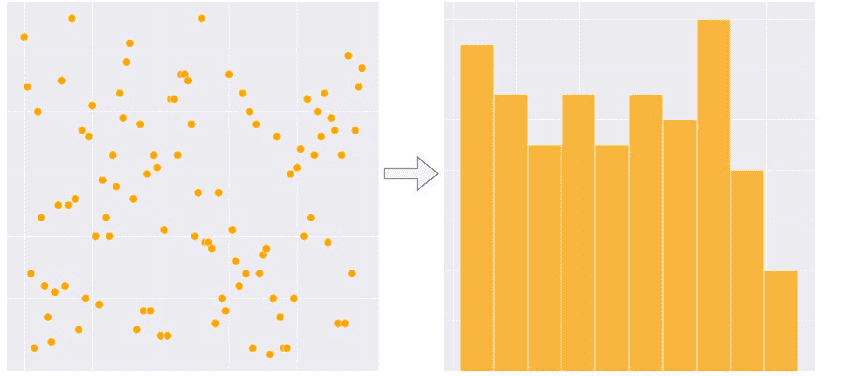

图 3.1 – 从连续特征创建特征直方图，允许使用箱边界值计算决策节点的分裂点，而不必对每个数据点进行采样，由于 #bins << #data，显著降低了算法的复杂度

使用直方图带来的第二个优化是用于构建叶子节点直方图的“直方图减法”。我们不必为每个叶子计算直方图，而是可以从父节点的直方图中减去其相邻叶子的直方图。选择数据量较小的叶子，第一个叶子的复杂度为较小的 *O(#data)*，而由于直方图减法，第二个叶子的复杂度为 *O(#bin)*。

LightGBM 使用直方图应用的第三个优化是降低内存成本。特征预排序需要为每个特征维护一个支持数据结构（字典）。构建直方图时不需要这样的数据结构，从而降低了内存成本。此外，由于 *#bins* 很小，可以使用更小的数据类型（如 `uint8_t`）来存储训练数据，从而减少内存使用。

关于构建特征直方图算法的详细信息，请参阅论文 *CLOUDS: A decision tree classifier for large datasets* [4]。

## 互斥特征捆绑

**互斥特征捆绑 (EFB)** 是 LightGBM 在处理稀疏数据时应用的另一种基于数据的优化（稀疏数据在高维数据集中很常见）。当特征数据稀疏时，通常会发现许多特征是*互斥的*，这意味着它们永远不会同时呈现非零值。鉴于这种互斥性，将这些特征组合成一个特征通常是安全的。EFB 如下图所示：

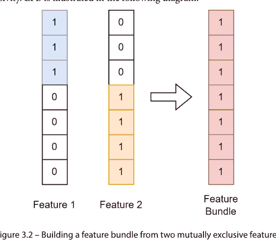

捆绑互斥特征允许构建与从单个特征构建的相同的特征直方图 [1]。该优化将构建特征直方图的复杂度从 $O(\#data \times \#feature)$ 降低到 $O(\#data \times \#bundle)$。对于具有许多互斥特征的数据集，这显著提高了性能，因为 $\#bundle \ll \#feature$。关于 EFB 的详细算法和正确性证明，请参阅 [1]。

## 基于梯度的单边采样

LightGBM 框架中可用的最后一个基于数据的优化是**基于梯度的单边采样 (GOSS)** [1]。GOSS 是一种丢弃对训练过程不再有显著贡献的训练数据样本的方法，从而有效减少训练数据量并加速训练过程。

我们可以使用每个样本的梯度计算来确定其重要性。如果梯度变化很小，则意味着训练误差也很小，我们可以推断该树对特定数据实例拟合良好 [1]。一个选择是丢弃所有梯度小的实例。然而，这会改变训练数据的分布，降低树的泛化能力。GOSS 是一种选择保留哪些实例在训练数据中的方法。

为了保持数据分布，GOSS 的应用方式如下：

1.  按梯度的绝对值对数据样本进行排序。
2.  然后选择前 $a \times 100\%$ 的实例（梯度大的实例）。
3.  然后从剩余数据中随机抽取 $b \times 100\%$ 的实例。
4.  在损失函数中添加一个因子（针对这些实例）以放大其影响：$\frac{1-a}{b}$，从而补偿梯度小的数据代表性不足的问题。

因此，GOSS 采样了大部分梯度大的实例和一小部分梯度小的实例，并在计算信息增益时放大了梯度小的实例的影响。

GOSS 实现的降采样可以显著减少训练过程中处理的数据量（以及 GBDT 的训练时间），尤其是在大型数据集的情况下。

## 最优优先树生长

构建决策树最常见的方法是按层生长树（即一次生长一层）。LightGBM 使用一种替代方法，按叶子生长或最优优先生长。叶子优先方法选择现有叶子中损失变化最大的叶子，并从那里开始构建树。这种方法的缺点是，如果数据集较小，树很可能对数据过拟合。必须设置最大深度来抵消这一点。然而，如果要构建的叶子数量是固定的，叶子优先的树构建方法被证明优于按层生长的算法 [5]。

## L1 和 L2 正则化

LightGBM 在训练集成中的回归树时，支持对目标函数进行 L1 和 L2 正则化。从*第 1 章，机器学习简介*中，我们回顾正则化是控制过拟合的一种方式。对于决策树，更简单、更浅的树过拟合程度较低。

为了支持 L1 和 L2 正则化，我们通过添加正则化项来扩展目标函数，如下所示：

$$obj = L(y, F(x)) + \Omega(w)$$

这里，$L(y, F(x))$ 是*第 2 章，集成学习 – Bagging 和 Boosting*中讨论的损失函数，$\Omega(w)$ 是定义在 $w$（叶子分数）上的正则化函数（叶子分数是根据*第 2 章，集成学习 – Bagging 和 Boosting*中定义的 GBDT 算法的步骤 2.3 从叶子计算出的输出）。

正则化项有效地为目标函数添加了惩罚项，旨在惩罚更容易过拟合的更复杂的树。

$\Omega$ 有多种定义。决策树中各项的典型实现如下：
$$\Omega(w) = \alpha \sum_{i}^{n} |w_i| + \lambda \sum_{i}^{n} w_i^2$$
其中，$\alpha \sum_{i}^{n} |w_i|$ 是 L1 正则化项，由参数 $\alpha, 0 \le \alpha \le 1$ 控制；$\lambda \sum_{i}^{n} w_i^2$ 是 L2 正则化项，由参数 $\lambda$ 控制。

L1 正则化通过惩罚具有较大绝对输出的叶节点，从而将叶节点分数驱动至零。*较小的叶节点输出对树的预测影响较小，从而有效简化了树的结构。*

L2 正则化类似，但由于对输出取平方，因此对异常值的叶节点有显著影响。

最后，当构建更大的树（具有更多叶节点，因此 $w$ 向量更大）时，$\Omega(w)$ 的两个求和项都会增加，从而增加目标函数的输出。因此，*较大的树会受到惩罚*，从而减少过拟合。

## LightGBM 优化总结

总而言之，LightGBM 通过以下方式改进了标准集成算法：

- 实现基于直方图的特征采样，以降低寻找最优分裂点的计算成本
- 计算互斥特征捆绑，以减少稀疏数据集中的特征数量
- 应用 GOSS 对训练数据进行下采样，同时不损失精度
- 按叶节点生长树以提高精度
- 可以通过 L1 和 L2 正则化以及其他控制参数来控制过拟合

这些优化措施共同作用，使 LightGBM 的计算性能比标准 GBDT 算法提升了**数个数量级（OOM）**。此外，LightGBM 使用 C++ 实现并提供 Python 接口，这使得其代码运行速度远快于基于 Python 的 GBDT（例如 scikit-learn 中的实现）。

最后，LightGBM 还支持改进的数据并行和特征并行分布式训练。分布式训练和 GPU 支持将在后面的*第 11 章，使用 LightGBM 进行分布式和基于 GPU 的学习*中讨论。

## 超参数

LightGBM 提供了许多参数，可用于自定义训练过程、目标和性能。接下来，我们将讨论最显著的参数以及如何使用它们来控制特定现象。

> **注意**
核心 LightGBM 框架是用 C++ 开发的，但包含了用于在 C、Python 和 R 中使用 LightGBM 的 API。本节讨论的参数是框架参数，每个 API 的暴露方式不同。下一节将讨论使用 Python 时可用的参数。

以下是用于控制优化过程和目标的**核心框架参数**：

- `objective`：LightGBM 支持以下优化目标，包括但不限于——回归（包括使用其他损失函数（如 Huber 和 Fair）的回归应用）、`binary`（二分类）、`multiclass`（多分类）、`cross-entropy`（交叉熵）以及用于排序问题的 `lambdarank`。
- `boosting`：boosting 参数控制提升类型。默认设置为 `gbdt`，即标准 GBDT 算法。其他选项包括 `dart` 和用于随机森林的 `rf`。随机森林模式不执行提升，而是构建随机森林。
- `num_iterations`（或 `n_estimators`）：控制提升迭代次数，因此也控制构建的树的数量。
- `num_leaves`：控制单棵树中的最大叶节点数。
- `learning_rate`：控制学习率或收缩率，即每棵树对整体预测的贡献。

LightGBM 还提供了许多参数来控制学习过程。我们将讨论这些参数，以及如何使用它们来调整训练的特定方面。

以下控制参数可用于提高**精度**：

- `boosting`：使用 `dart`，已被证明优于标准 GBDT。
- `learning_rate`：学习率必须与 `num_iterations` 一起调整以获得更好的精度。较小的学习率配合较大的 `num_iterations` 值，会以牺牲优化速度为代价带来更好的精度。
- `num_leaves`：更多的叶节点可以提高精度，但可能导致过拟合。
- `max_bin`：构建直方图时特征分箱的最大数量。较大的 `max_bin` 值会减慢训练速度并使用更多内存，但可能提高精度。

以下**学习控制参数**可用于处理**过拟合**：

- `bagging_fraction` 和 `bagging_freq`：同时设置这两个参数可启用特征装袋。装袋可以与提升结合使用，并不强制使用随机森林。启用装袋可以减少过拟合。
- `early_stopping_round`：启用早停，并控制用于确定是否应停止训练的迭代次数。如果在 `early_stopping_round` 设置的迭代次数内，任何指标都没有改善，则停止训练。
- `min_data_in_leaf`：叶节点中允许的最小样本数。较大的值可以减少过拟合。
- `min_gain_to_split`：执行分裂所需的最小信息增益。较高的值可以减少过拟合。
- `reg_alpha`：控制 L1 正则化。较高的值可以减少过拟合。
- `reg_lambda`：控制 L2 正则化。较高的值可以减少过拟合。
- `max_depth`：控制单棵树的最大深度。较浅的树可以减少过拟合。
- `max_drop`：控制使用 DART 算法时丢弃树的最大数量（仅在 `boosting` 设置为 `dart` 时使用）。较大的值可以减少过拟合。
- `extra_trees`：启用**极端随机树（ExtraTrees）**算法。然后 LightGBM 会为每个特征随机选择一个分裂阈值。启用 Extra-Trees 可以减少过拟合。该参数可与任何提升模式结合使用。

此处讨论的参数仅包含 LightGBM 中可用参数的一部分，并侧重于提高精度和减少过拟合。完整的参数列表可在以下链接获取：https://lightgbm.readthedocs.io/en/latest/Parameters.html。

## LightGBM 的局限性

LightGBM 的设计目标是比传统方法更高效、更有效。它尤其以处理大型数据集的能力而闻名。然而，与任何算法或框架一样，它也有其局限性和潜在缺点，包括：

- **对过拟合敏感**：LightGBM 可能对过拟合敏感，尤其是在小型或有噪声的数据集上。使用 LightGBM 时应注意监控和控制过拟合。
- **最佳性能需要调优**：如前所述，LightGBM 有许多超参数需要适当调整，才能从算法中获得最佳性能。
- **缺乏表示学习**：与擅长从原始数据中学习的**深度学习（DL）**方法不同，LightGBM 需要在学习之前对数据进行特征工程。特征工程是一个耗时的过程，需要领域知识。
- **处理序列数据**：LightGBM 并非天生为处理序列数据（如时间序列）而设计。要将 LightGBM 用于时间序列数据，需要进行特征工程以创建滞后特征并捕获时间依赖性。
- **复杂交互和非线性**：LightGBM 是一种基于决策树的方法，可能无法捕获复杂的特征交互和非线性关系。需要进行适当的特征工程以确保算法能够对这些进行建模。

尽管这些是使用该算法的潜在局限性，但它们可能并不适用于所有用例。在合适的场景下，LightGBM 通常是一个非常有效的工具。与任何模型一样，理解其权衡对于为您的应用做出正确选择至关重要。

在下一节中，我们将探讨如何使用各种 LightGBM API 与 Python 入门。

## 使用 Python 入门 LightGBM

LightGBM 使用 C++ 实现，但提供了官方的 C、R 和 Python API。本节讨论可用于使用 LightGBM 的 Python API。LightGBM 提供了三种 Python API：标准的 **LightGBM** API、**scikit-learn** API（与其他 scikit-learn 功能完全兼容）以及用于与 Dask 协同工作的 **Dask** API。Dask 是一个并行计算库，在*第 11 章，使用 LightGBM 进行分布式和基于 GPU 的学习*（https://www.dask.org/）中讨论。

在本书的其余部分，我们主要使用 LightGBM 的 scikit-learn API，但让我们先看看标准的 Python API。

## LightGBM Python API

深入 Python API 的最佳方式是通过一个实践示例。以下是从一个代码清单中摘录的片段，展示了 LightGBM Python API 的使用。完整的代码示例可在 https://github.com/PacktPublishing/Practical-Machine-Learning-with-LightGBM-and-Python/tree/main/chapter-3 获取。

需要导入 LightGBM。导入通常缩写为 `lgb`：

```
import lightgbm as lgb
```

LightGBM 提供了一个 `Dataset` 包装类来处理数据。`Dataset` 支持多种格式。通常，它用于包装 numpy 数组或 pandas DataFrame。`Dataset` 也接受指向 CSV、TSV、LIBSVM 文本文件或 LightGBM `Dataset` 二进制文件的 `Path`。当提供路径时，LightGBM 会从磁盘加载数据。

这里，我们从 `sklearn` 加载森林覆盖数据集，并将 numpy 数组包装在 LightGBM `Dataset` 中：

```
dataset = datasets.fetch_covtype()
X_train, X_test, y_train, y_test = train_test_split(dataset.data,
    dataset.target, random_state=179)
training_set = lgb.Dataset(X_train, y_train - 1)
test_set = lgb.Dataset(X_test, y_test - 1)
```

我们从 `y_train` 和 `y_test` 数组中减去 1，因为 `sklearn` 提供的类别标签范围是 [1, 7]，而 LightGBM 期望的类别标签是零索引的，范围在 [0, 7]。

我们无法为训练设置参数。我们将使用以下参数：

```
params = {
    'boosting_type': 'gbdt',
    'objective': 'multiclass',
    'num_classes': '7',
    'metric': {'auc_mu'},
    'num_leaves': 120,
    'learning_rate': 0.09,
    'force_row_wise': True,
    'verbose': 0
}
```

我们使用标准的GBDT作为提升类型，并将目标设置为七类的多分类问题。在训练过程中，我们将捕获 `auc_mu` 指标。$AUC_{\mu}$ 是 **受试者工作特征曲线下面积（AUC）** 的多分类扩展，由Kleiman和Page [6] 定义。

我们为问题设置了合理的 `num_leaves` 和 `learning_rate` 值。最后，我们指定 `force_row_wise` 为True，这是针对大型数据集的推荐设置。

LightGBM的训练函数还支持 **回调函数**。回调函数是训练过程中的一个钩子，在每次提升迭代时执行。为了说明它们的用途，我们将使用以下回调函数：

```
metrics = {}
callbacks = [
    lgb.log_evaluation(period=15),
    lgb.record_evaluation(metrics),
    lgb.early_stopping(15),
    lgb.reset_parameter(learning_rate=learning_rate_decay(0.09,
    0.999))
]
```

我们使用周期为15的 `log_evaluation` 回调函数，它每15次提升迭代将我们的指标记录（打印）到标准输出。我们还设置了一个 `record_evaluation` 回调函数，将我们的评估指标捕获到 `metrics` 字典中。我们还指定了一个 `early_stopping` 回调函数，停止轮数设置为15。`early_stopping` 回调函数在指定的停止轮数后验证指标没有改善时停止训练。

最后，我们还使用 `reset_parameter` 回调函数来实现 **学习率衰减**。衰减函数定义如下：

```
def learning_rate_decay(initial_lr, decay_rate):
    def _decay(iteration):
        return initial_lr * (decay_rate ** iteration)
    return _decay
```

`reset_parameter` 回调函数接受一个函数作为输入。该函数接收当前迭代次数并返回参数值。学习率衰减是一种随时间降低学习率值的技术。学习率衰减提高了整体准确率。理想情况下，我们希望初始树对纠正预测误差有更大的影响。相反，后来我们希望减少额外树的影响，让它们对误差进行微小的调整。我们实现了一个轻微的指数衰减，在整个训练过程中将学习率从0.09降低到0.078。

现在，我们准备好进行训练了。我们使用 `lgb.train` 来训练模型：

```
gbm = lgb.train(params, training_set, num_boost_round=150, valid_sets=test_set, callbacks=callbacks)
```

我们使用150轮提升（或提升树）。结合较低的学习率，拥有较多的提升轮次应该能提高准确性。

训练后，我们可以使用 `lgb.predict` 获取测试集的预测结果并计算F1分数：

```
y_pred = np.argmax(gbm.predict(X_test, num_iteration=gbm.best_iteration), axis=1)
f1_score(y_test - 1, y_pred, average="macro")
```

LightGBM预测函数输出一个激活值数组，每个类别一个。因此，我们使用 `np.argmax` 选择激活值最高的类别作为预测类别。LightGBM还支持一些绘图函数。例如，我们可以使用 `plot_metric` 将捕获在 `metrics` 中的 $AUC_{\mu}$ 结果绘制成图：

```
lgb.plot_metric(metrics, 'auc_mu')
```

其结果如 *图3.3* 所示。

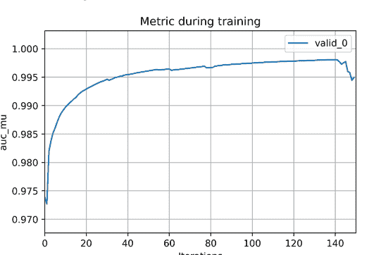

图3.3 – 使用 `lgb.plot_metric` 创建的每次训练迭代的 $AUC_{\mu}$ 指标图

运行前面的代码应该会产生一个F1分数约为0.917的LightGBM GBDT树，这与 *第2章，集成学习 – Bagging和Boosting* 中随机森林和极端随机树算法达到的分数一致。然而，LightGBM在达到这些准确度方面明显更快。在我们的硬件上，LightGBM仅用37秒就完成了训练：这比在同一问题和硬件上运行极端随机树快4.5倍，比scikit-learn的 `GradientBoostingClassifier` 在我们的测试中快60-70倍。

## LightGBM scikit-learn API

我们现在来看看LightGBM的scikit-learn Python API。scikit-learn API提供了四个类：`LGBMModel`、`LGBMClassifier`、`LGBMRegressor` 和 `LGBMRanker`。每个类都提供与LightGBM Python API相同的功能，但具有我们之前使用过的便捷scikit-learn接口。此外，scikit-learn类与scikit-learn生态系统的其余部分兼容且可互操作。

让我们使用scikit-learn API复制前面的示例。

数据集的加载方式与之前完全相同。scikit-learn API不需要将数据包装在 `Dataset` 对象中。我们也不必将目标类别设为从零开始的索引，因为scikit-learn支持任何类别的标签：

```
dataset = datasets.fetch_covtype()
X_train, X_test, y_train, y_test = train_test_split(dataset.data,
    dataset.target, random_state=179)
```

scikit-learn API也支持LightGBM回调函数；因此，我们使用与之前相同的回调函数：

```
metrics = {}
callbacks = [
    lgb.log_evaluation(period=15),
    lgb.record_evaluation(metrics),
    lgb.early_stopping(15),
    lgb.reset_parameter(learning_rate=learning_rate_decay(0.09,
        0.999))
]
```

然后，我们像创建任何其他scikit-learn模型一样创建 `LGBMClassifier`。创建分类器时，我们也设置参数：

```
model = lgb.LGBMClassifier(
    boosting_type='gbdt',
    n_estimators=150,
    num_leaves=120,
    learning_rate=0.09,
    force_row_wise=True
)
```

注意，我们不必指定类别数量；scikit-learn会自动推断。然后我们调用模型的 `fit` 方法，传入训练和测试数据以及我们的回调函数：

```
model = model.fit(X_train, y_train, eval_set=(X_test, y_test), eval_metric='auc_mu', callbacks=callbacks)
```

最后，我们用F1分数评估我们的模型。我们不必对预测结果使用 `np.argmax`，因为scikit-learn API会自动完成：

```
f1_score(y_test, model.predict(X_test), average="macro")
```

总的来说，我们可以看到通过scikit-learn API使用LightGBM比标准Python API更直接。在我们的硬件上，scikit-learn API也比LightGBM API快约40%。本节探讨了使用LightGBM可用的各种Python API的细节。下一节将介绍使用scikit-learn API训练LightGBM模型。

## 构建LightGBM模型

本节提供了一个使用LightGBM解决实际问题的端到端示例。我们更详细地探讨了问题的数据准备，并解释了如何为我们的算法找到合适的参数。我们使用LightGBM的多个变体来探索相对性能，并将它们与随机森林进行比较。

## 交叉验证

在深入解决问题之前，我们需要讨论一种更好的验证算法性能的方法。在训练模型时，将数据分成两个或三个子集是标准做法。训练数据用于训练模型，验证数据是训练期间用于验证数据的保留集，测试数据用于训练后验证性能。

在前面的示例中，我们只进行了一次这样的划分，构建了一个单一的训练集和测试集来训练和验证模型。这种方法的问题在于我们的模型可能“运气好”。如果碰巧我们的测试集与训练数据非常匹配，但不代表真实世界的数据，我们可能会报告一个很好的测试误差，尽管我们无法对模型的性能充满信心。

另一种方法是多次进行数据集划分并多次训练模型，每次划分训练一次。这种方法称为 **交叉验证**。

交叉验证最常见的应用是 *k折交叉验证*。在k折交叉验证中，我们选择一个值 *k*，并将（打乱后的）数据集划分为 *k* 个子样本（或折）。然后我们重复训练过程 *k* 次，每次使用不同的子集作为验证数据，所有其他子集作为训练数据。模型的性能计算为所有折的平均（或中位数）分数。下图说明了这个过程：

## 分层 *k* 折验证

k折交叉验证可能出现的一个问题是，由于随机性，某一折可能只包含来自单一类别的样本。**分层抽样**通过在创建折时保留每个类别的样本比例来解决这个问题。这样，每一折的类别分布都与原始数据集相同。当应用于交叉验证时，这种技术被称为分层k折交叉验证。

## 参数优化

**参数优化**，也称为参数调优，是为特定问题的模型和训练过程寻找良好超参数的过程。在前面的模型训练示例中，我们一直基于直觉和最少的实验来设置模型和训练算法的参数。无法保证这些参数选择对于优化问题是最优的。

但是，我们如何才能找到最佳的参数选择呢？一个简单的策略是尝试一个参数的广泛值范围，找到最佳值，然后对下一个参数重复此过程。然而，参数之间常常是**相互依赖**的。当我们改变一个参数时，另一个参数的最优值可能会不同。GBDT中相互依赖的一个绝佳例子是提升轮数和学习率。较小的学习率需要更多的提升轮数。因此，先优化学习率，然后独立地优化提升轮数，不太可能产生最优结果。*这两个参数必须同时进行优化。*

## 网格搜索

一种考虑参数相互依赖性的方法是网格搜索。通过网格搜索，设置一个参数网格。该网格由我们正在优化的每个参数的一系列待尝试值组成。然后执行穷举搜索，在每个可能的参数组合上训练和验证模型。

以下是一个包含三个参数的参数网格示例：

```
grid = {
    'learning_rate': [0.001, 0.01, 0.1, 0.2, 0.5],
    'num_rounds': [20, 40, 60, 80, 100],
    'num_leaves': [2, 16, 32, 64, 128, 256],
}
```

每个参数都指定了一个可能的值范围。上述网格需要进行150次试验来搜索。

由于网格搜索是穷举的，其优点在于保证在指定的范围内找到最佳的参数组合。然而，网格搜索的缺点在于成本。尝试每个可能的参数组合非常昂贵，当参数很多且参数范围很大时，很快就会变得难以处理。

Scikit-learn提供了一个实用类来实现网格搜索并同时执行交叉验证。`GridSearchCV`接受一个模型、一个参数网格和交叉验证折数作为参数。然后，`GridSearchCV`开始搜索网格以寻找最佳参数，使用交叉验证来验证每个参数组合的性能。我们将在下一节中说明`GridSearchCV`的使用。

参数优化是建模过程的关键部分。为模型找到合适的参数可能是成功或失败过程的区别。然而，如前所述，参数优化在时间和计算复杂度方面也常常代价巨大，需要在成本和性能之间进行权衡。

## 预测学生学业成功

我们现在转向我们的示例。我们使用LightGBM [7] (https://archive-beta.ics.uci.edu/dataset/697/predict+students+dropout+and+academic+success) 构建一个模型，基于一系列社会和经济因素预测学生的辍学率。数据以CSV格式提供。我们首先探索数据。

## 探索性数据分析

任何数据集最基本的属性之一是形状：我们的数据由多少行和多少列组成。这也是验证数据读取是否成功的好方法。这里，我们的数据由4,424行和35列组成。随机抽取数据样本可以让我们了解各列及其值：

```
df = pd.read_csv("students/data.csv", sep=";")
print(f"Shape: {df.shape}")
df.sample(10)
```

接下来，我们可以运行`df.info()`来查看所有列、它们的非空计数以及数据类型：

```
df.info()
<class 'pandas.core.frame.DataFrame'>
RangeIndex: 4424 entries, 0 to 4423
Data columns (total 35 columns):
 #   Column            Non-Null Count  Dtype 
---  ------            --------------  ----- 
 0   Marital status    4424 non-null   int64 
 1   Application mode  4424 non-null   int64 
 2   Application order 4424 non-null   int64 
 ...
```

运行上述代码显示，大多数列是整数类型，除了`Target`列，中间还有一些浮点数。`Target`列被列为`object`类型；如果我们查看样本中的值，可以看到`Target`列由`Graduate`、`Dropout`和`Enrolled`字符串组成。LightGBM无法处理字符串作为目标，因此我们将在训练模型之前将它们映射为整数值。

我们还可以运行`df.describe()`来获取每列值的统计描述（均值、标准差、最小值、最大值和百分位数）。计算描述性统计数据有助于检查数据的范围（对于使用决策树模型来说不是大问题）并检查异常值。对于此数据集，没有数据范围或异常值问题。

接下来，我们需要检查重复值和缺失值。如果有任何缺失值，我们需要删除包含缺失值的行或进行适当的插补。我们可以使用以下代码检查缺失值：

```
df.isnull().sum()
```

运行上述代码显示此数据集没有缺失值。

要查找重复项，我们可以运行以下代码：

```
df.loc[df.duplicated()]
```

数据集中也没有重复项。如果有任何重复数据，我们会删除多余的行。

我们还需要检查目标类别的分布，以确保其平衡。这里，我们展示一个直方图，显示目标类别的分布。我们使用Seaborn的`countplot()`方法创建直方图，如下所示：

```
sns.countplot(data=df, x='Target')
```

虽然不是完全平衡，但目标分布没有过度偏向任何一个类别，我们不必执行任何补偿操作。

到目前为止，我们发现我们的数据集适合建模（我们仍然需要重新映射`Target`）并且是干净的（它不包含缺失值或重复值，并且平衡良好）。我们现在可以更深入地查看一些特征，从特征相关性开始。以下代码绘制了一个相关性热力图。使用`df.corr()`计算成对的皮尔逊相关系数。代码片段后面的截图显示了使用成对皮尔逊相关系数构建的相关性热力图：

```
sns.heatmap(df.corr(), cmap='coolwarm')
```

图3.6 – 学业成功数据集的成对皮尔逊特征相关性

我们可以看到三种相关性模式：第一学期的学分、注册、评估和批准都是相关的。这些指标的第一学期和第二学期值也是相关的。这些相关性意味着学生一旦注册，往往会完成整个学年，而不是在学期中辍学。虽然相关，但相关性不够强，不足以考虑删除任何特征。

第三种相关性模式存在于`Nacionalidade`和`International`之间，它们高度相关。

> **注意**
> 单词 *Nacionalidade* 指的是 *国籍*。为了保持一致性，我们在此也保留了原始数据集中的拼写。

仔细观察`Nacionalidade`，发现几乎所有行都有一个单一的值：收集数据集的国家。强相关性意味着`International`列也是如此。

## 建模

我们现在可以为建模准备数据集了。我们必须将 `Target` 值映射为整数，并删除 `Nacionality` 和 `International` 特征。我们还需要移除特征名称中的空格。LightGBM 无法处理名称中的空格；我们可以用下划线替换它们：

```python
df.columns = df.columns.str.strip().str.replace(' ', '_')
df = df.drop(columns=["Nacionality", "International"], axis=1)
df["Target"]=df["Target"].map({
    "Dropout":0,
    "Enrolled":1,
    "Graduate":2
})
X = df.drop(columns=["Target"], axis=1)
y = df["Target"]
```

我们训练并比较四个模型：一个 LightGBM GBDT，一个 LightGBM DART 树，一个带 GOSS 的 LightGBM DART 树，以及一个 scikit-learn 随机森林。

我们将使用 GridSearchCV 进行 5 折交叉验证的参数优化，以确保模型的良好性能。

以下代码设置了 GBDT 的参数优化。其他模型遵循类似的模式，可在源代码中查看：

```python
def gbdt_parameter_optimization():
    params = {
        "max_depth": [-1, 32, 128],
        "n_estimators": [50, 100, 150],
        "min_child_samples": [10, 20, 30],
        "learning_rate": [0.001, 0.01, 0.1],
        "num_leaves": [32, 64, 128]
    }
    model = lgb.LGBMClassifier(force_row_wise=True, boosting_type="gbdt", verbose=-1)
    grid_search = GridSearchCV(estimator=model, param_grid=params, cv=5, verbose=10)
    grid_search.fit(X, y)
    return grid_search
results = gbdt_parameter_optimization()
print(results.best_params_)
print(results.best_score_)
```

运行上述代码需要一些时间，但完成后，它会打印出找到的最佳参数以及最佳模型的分数。

所有模型训练完成后，我们可以使用 F1 分数评估每个模型，取 5 折交叉验证的平均值，并使用找到的最佳参数。以下代码展示了如何对 GBDT 模型进行此操作：

```python
model = lgb.LGBMClassifier(force_row_wise=True, boosting_type="gbdt", learning_rate=0.1, max_depth=-1, min_child_samples=10, n_estimators=100, num_leaves=32, verbose=-1)
scores = cross_val_score(model, X, y, scoring="f1_macro")
scores.mean()
```

每个模型的参数优化 Jupyter 笔记本可在 GitHub 仓库中找到：https://github.com/PacktPublishing/Practical-Machine-Learning-with-LightGBM-and-Python/tree/main/chapter-3。

下表总结了每个模型找到的最佳参数值和交叉验证的 F1 分数：

| 模型 | 学习率 | 最大深度 | 最小叶子样本数 | 估计器数量 | 叶子数 | 最小叶子样本数 | 最小分裂样本数 | F1 分数 |
|---|---|---|---|---|---|---|---|---|
| GBDT | 0.1 | - | 10 | 100 | 32 | N/A | N/A | 0.716 |
| DART | 0.1 | 128 | 30 | 150 | 128 | N/A | N/A | 0.703 |
| DART (GOSS) | 0.1 | 128 | 30 | 150 | 128 | N/A | N/A | 0.703 |
| 随机森林 | N/A | N/A | N/A | 150 | N/A | 10 | 20 | 0.665 |

表 3.1 – 每个模型找到的最佳参数及其对应的 F1 分数总结

从表中可以看出，LightGBM 模型的表现远优于 scikit-learn 随机森林。两个 DART 模型取得了几乎相同的 F1 分数，其中 GOSS 的 F1 分数略低（表中的值四舍五入到 3 位小数）。

至此，我们完成了探索数据集并为该数据集构建优化模型（使用参数网格搜索）的端到端示例。在接下来的章节中，我们将研究更复杂的数据集，并更深入地分析模型性能。

## 总结

本章介绍了 LightGBM 作为一个高效训练提升机器的库。我们探讨了构建 GBDT 的复杂性来源，以及 LightGBM 中解决这些问题的特性，例如基于直方图的采样、特征捆绑和 GOSS。我们还回顾了 LightGBM 最重要的超参数。

我们还详细概述了在 Python 中使用 LightGBM，涵盖了 LightGBM Python API 和 scikit-learn API。然后，我们使用 LightGBM 构建了第一个调优模型来预测学生的学业表现，利用了交叉验证和基于网格搜索的参数优化。

在下一章中，我们将比较 LightGBM 与另一个流行的梯度提升库 XGBoost，以及用于表格数据的深度学习技术。

## 参考文献

- [1] G. Ke, Q. Meng, T. Finley, T. Wang, W. Chen, W. Ma, Q. Ye and T.-Y. Liu, “LightGBM: A Highly Efficient Gradient Boosting Decision Tree,” in Advances in Neural Information Processing Systems, 2017.
- [2] M. Mehta, R. Agrawal and J. Rissanen, “SLIQ: A fast scalable classifier for data mining,” in Advances in Database Technology—EDBT’96: 5th International Conference on Extending Database Technology Avignon, France, March 25-29, 1996 Proceedings 5, 1996.
- [3] J. Shafer, R. Agrawal, M. Mehta and others, “SPRINT: A scalable parallel classifier for data mining,” in Vldb, 1996.
- [4] S. Ranka and V. Singh, “CLOUDS: A decision tree classifier for large datasets,” in Proceedings of the 4th Knowledge Discovery and Data Mining Conference, 1998.
- [5] H. Shi, “Best-first decision tree learning,” 2007.
- [6] R. Kleiman and D. Page, “Aucu: A performance metric for multi-class machine learning models,” in International Conference on Machine Learning, 2019.
- [7] V. Realinho, J. Machado, L. Baptista and M. V. Martins, Predicting student dropout and academic success, Zenodo, 2021.

# 4 比较 LightGBM、XGBoost 和深度学习

上一章介绍了使用 LightGBM 构建**梯度提升决策树 (GBDTs)**。在本章中，我们将比较 LightGBM 与另外两种用于表格数据建模的方法：XGBoost（另一个用于构建梯度提升树的库）和**深度神经网络 (DNNs)**（一种最先进的机器学习技术）。

我们在两个数据集上比较了 LightGBM、XGBoost 和 DNNs，重点关注复杂性、数据集准备、模型性能和训练时间。

本章面向高级读者，需要对深度学习有一定的理解。然而，本章的主要目的不是详细理解 XGBoost 或 DNNs（这两种技术在后续章节中均未使用）。相反，在本章结束时，你应该对 LightGBM 在机器学习领域的竞争力有所了解。

主要主题如下：

- XGBoost 概述
- 深度学习和 TabTransformers
- 比较 LightGBM、XGBoost 和 TabTransformers

## 技术要求

本章包含示例和代码片段，说明如何在 Python 中训练 LightGBM、XGBoost 和 TabTransformer 模型。完整的示例和为本章设置合适环境的说明可在 https://github.com/PacktPublishing/Practical-Machine-Learning-with-LightGBM-and-Python/tree/main/chapter-4 找到。

## XGBoost 概述

**XGBoost**，全称 **eXtreme Gradient Boosting**，是一个广受欢迎的开源梯度提升库，其目标和功能与 LightGBM 类似。XGBoost 比 LightGBM 更早出现，由陈天奇开发，并于 2014 年首次发布 [1]。

其核心实现了 GBDTs，并支持高效地构建它们。XGBoost 的一些主要特性如下：

- **正则化**：XGBoost 结合了 L1 和 L2 正则化以避免过拟合
- **稀疏性感知**：XGBoost 能高效处理稀疏数据和缺失值，在训练过程中自动学习最佳的填充策略
- **并行化**：该库采用并行和分布式计算技术同时训练多棵树，显著减少了训练时间
- **提前停止**：XGBoost 提供了一个选项，如果模型性能没有显著提升，可以停止训练过程，从而提高性能并防止过拟合
- **跨平台兼容性**：XGBoost 支持多种编程语言，包括 Python、R、Java 和 Scala，使其能够服务于多样化的用户群体

多年来，XGBoost 在机器学习社区中广受欢迎，这得益于其对各种应用的支持以及该库的易用性和高效性。

## XGBoost 与 LightGBM 的比较

XGBoost 和 LightGBM 在功能上有相当大的重叠。两个库都实现了 GBDTs 和 DART，并支持构建随机森林。两者都有类似的技术来避免过拟合，并自动处理缺失值和稀疏数据。

然而，XGBoost 和 LightGBM 之间的一些区别如下：

- **树生长策略**：XGBoost 采用逐层生长的方法，即树是逐层构建的，而 LightGBM 使用逐叶生长的策略，专注于通过选择 delta 损失最大的叶子来生长树。这种生长策略的差异通常使得 LightGBM 更快，尤其是在处理大型数据集时。
- **速度和可扩展性**：LightGBM 在内存使用和计算时间方面设计得更高效，使其成为大型数据集或训练时间至关重要的情况下的更好选择。然而，这种速度优势有时可能会以模型预测的更高方差为代价。
- **处理分类特征**：LightGBM 内置了对分类特征的支持，这意味着它可以直接处理它们，而无需进行独热编码或其他预处理技术。另一方面，XGBoost 要求用户在将分类特征输入模型之前对其进行预处理。
- **提前停止**：XGBoost 提供了一个选项，如果模型性能没有显著提升，可以停止训练过程。LightGBM 没有内置此功能，但可以使用回调函数手动实现，如前面章节所示。

总之，LightGBM 和 XGBoost 提供了相似的功能。LightGBM 在具有许多特征的大型数据集上表现更好，而 XGBoost 在中小型数据集上可能提供更稳定和准确的结果。

## Python XGBoost 示例

XGBoost 提供了一个基于 scikit-learn 的接口来构建模型。以下示例展示了如何在 Forest Cover 数据集上使用 XGBoost：

```
from xgboost import XGBClassifier
...
dataset = datasets.fetch_covtype()

X_train, X_test, y_train, y_test = train_test_split(
    dataset.data, dataset.target, random_state=179
)

y_train = y_train - 1
y_test = y_test - 1
xgb = XGBClassifier(
    n_estimators=150, max_leaves=120, learning_rate=0.09
)
xgb = xgb.fit(X_train, y_train)
f1_score(y_test, xgb.predict(X_test), average="macro")
```

scikit-learn 接口在现阶段你应该已经熟悉了。前面的代码表明 XGBoost 支持与我们用于训练基于 LightGBM 的模型类似的超参数。完整的参数列表可在 https://xgboost.readthedocs.io/en/stable/parameter.html 获取。

XGBoost 作为另一个梯度提升库，是 LightGBM 的直接替代品。在下一节中，我们将探讨深度学习，一种完全不同但极其流行的学习技术，以及它与梯度提升在表格学习问题上的比较。

## 深度学习与 TabTransformers

我们现在来看一种使用深度学习解决基于表格数据问题的方法。近年来，深度学习因其模型的性能而获得了巨大的普及。基于深度学习的技术，如 AlphaZero、Stable Diffusion 和 GPT 系列语言模型，在游戏、艺术生成和基于语言的推理方面达到了人类或超人类的性能。

## 什么是深度学习？

**深度学习**是更广泛的人工神经网络机器学习领域的一个子领域。人工神经网络是人脑的数学模拟，由相互连接的节点层（或生物学术语中的“神经元”）组成，用于处理和传输信息。

简单的人工神经网络仅由几层组成。深度学习中的“深度”一词指的是使用具有更多层的神经网络，每层可能有数千个神经元。这些层是分层组织的，*输入*层在底部，*输出*层在顶部，*隐藏*层在中间。当数据通过网络时，每一层都会提取和精炼特征，使模型能够学习复杂的模式和表示。

下图描绘了一个简单的神经网络，称为具有单个隐藏层的多层感知器。

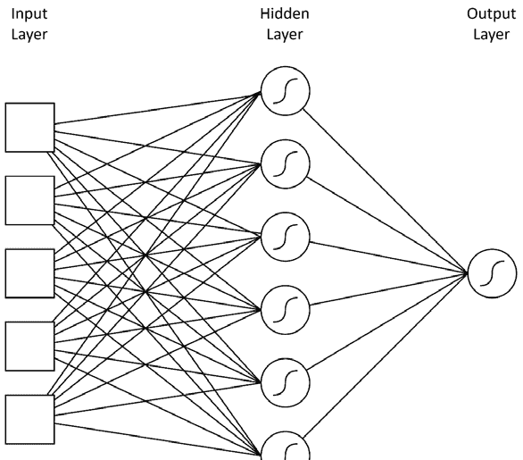

图 4.1 – 一个具有单个隐藏层和一个输出层的多层感知器。各层是全连接的

每个神经元从其他神经元接收输入，执行数学运算，然后将结果传递给下一层神经元。

数学运算涉及两个主要步骤——加权求和与激活函数：

1. **加权求和**：神经元获取输入（输入数据或前一层神经元的输出），将每个输入乘以其对应的权重，然后将它们相加。通常会在加权求和中添加一个偏置项，以便更好地控制神经元的输出。数学上，这可以表示为：

$$z_j = \sum_i (w_{ij}x_i) + b_j$$

这里，$x_i$ 代表神经元的所有输入，$w_{ij}$ 是与第 $i$ 个输入相关的权重，$b_j$ 是神经元的偏置。

2. **激活函数**：然后将加权求和通过一个激活函数，该函数决定了神经元的输出。激活函数的目的是在数学运算中引入非线性。非线性使得神经网络能够建模输入和输出之间的非线性且复杂的关系。有各种激活函数，例如 **sigmoid**（逻辑函数）、**双曲正切 (tanh)** 和 **修正线性单元 (ReLU)**，每种都有其自身的特性和用例。这可以表示为：

$$a_j = \sigma(z_j)$$

其中 $a_j$ 是神经元输出，$\sigma$ 是激活函数。

结合这两个步骤，神经网络中的一个神经元处理输入数据，使网络能够学习和建模复杂的模式。

神经网络通过调整与神经元相关的权重进行训练。该算法可以总结如下：

1. 权重被初始化为小的随机值。
2. 执行**前向传播**：对于批次中的每个样本，输入特征通过整个网络传递（在每个神经元处计算求和与激活），在输出层产生预测。
3. 然后通过比较输出与批次中每个样本的实际输出来计算损失。与 GBDTs 一样，损失函数必须是可微的，标准损失函数包括均方误差 (MSE) 和交叉熵损失。
4. 执行**反向传播**：使用微积分链式法则计算损失函数相对于权重的梯度。该过程从输出层开始，通过网络反向进行。
5. 然后使用梯度下降或其现代变体（如 Adam）根据反向传播的梯度更新权重。
6. 该过程重复固定的轮数（每个轮次运行整个数据集）以最小化损失函数。

神经网络的一个独特性质是，神经网络已被证明是**通用函数逼近器**。深度神经网络 (DNN) 具有理论上逼近任何连续函数的能力。

在给定足够数量的隐藏神经元和适当的激活函数的情况下，神经网络可以达到所需的精度水平。这一特性基于**万能近似定理**，该定理已针对各种类型的神经网络得到证明。

这意味着神经网络可以学习表示输入和输出数据之间的复杂关系，无论这些关系多么复杂或非线性。这种能力是神经网络，尤其是深度神经网络，能够在不同领域成功解决广泛问题的原因之一。然而，这种保证是理论上的。在实践中，找到正确的网络架构、超参数和训练技术以达到所需的近似水平可能具有挑战性。这个过程通常需要实验、专业知识和巨大的计算资源。

## 深度学习的优势与劣势

考虑到深度神经网络的能力，我们可能会认为它们应该是解决所有机器学习问题的首选。使用深度神经网络的主要优势在于其在非常复杂领域中的高准确性：目前在广泛复杂任务、自然语言处理、生成式人工智能、图像识别和语音识别方面的最先进性能都是由深度神经网络实现的，因为它们能够从大型数据集中学习复杂和隐藏的模式。

另一个优势是自动特征提取。通过正确的架构，深度神经网络可以自动提取复杂或高阶特征，从而减轻数据科学家进行特征工程的需求。

最后，深度神经网络还可以进行迁移学习：预训练的深度学习模型可以在较小的数据集上针对特定任务进行微调，利用在初始训练期间获得的知识。迁移学习可以显著减少新任务的训练时间和数据需求。

然而，深度学习并非解决所有机器学习问题的万能药。使用深度神经网络的一些劣势包括：

- **计算资源**：深度学习模型通常需要大量的计算能力和内存进行训练，尤其是在处理大型数据集和复杂架构时。
- **大型数据集**：深度神经网络在大型数据集上训练时通常表现良好，但在较小数据集上训练时性能可能会下降。当数据集太小时，深度神经网络会过拟合训练数据，无法泛化到未见过的数据。
- **可解释性**：由于其复杂的架构和涉及的大量参数，深度神经网络通常被认为是“黑匣子”。这种复杂性可能使理解模型如何做出决策变得困难，这对于需要透明度或监管合规性的应用可能是一个问题。
- **超参数调优**：深度神经网络涉及众多超参数，如网络架构、学习率和激活函数。加上较长的训练时间和资源需求，找到这些超参数的最佳组合可能既昂贵又耗时。

## 介绍TabTransformer

我们希望将深度学习应用于表格数据，因为大多数实际的机器学习问题都涉及表格数据。为此，我们使用一种名为**TabTransformer**的新深度学习架构：一种专门设计用于处理表格数据的深度神经网络模型。

与深度神经网络的GPT系列一样，TabTransformer基于Vaswani等人最初提出的Transformer架构[2]。TabTransformer将Transformer架构调整为有效地处理表格数据，为处理此类数据提供了决策树和梯度提升机等其他机器学习模型的替代方案[3]。

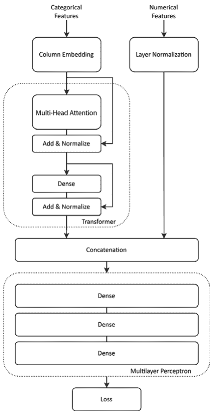

TabTransformer的模型架构如*图4.2*所示。使用TabTransformer时，表格数据中的每个特征都被视为一个标记，类似于自然语言处理中将单词视为标记的方式。该模型应用自注意力机制来学习输入数据中特征之间的复杂交互和依赖关系。标记嵌入和注意力机制使模型能够捕获特征之间的全局和局部关系。

TabTransformer模型有几个关键组件：标记嵌入、位置编码、Transformer层、池化和输出层。标记嵌入将每个特征值转换为连续的向量表示，并通过位置编码与位置信息相结合。

通过*图4.2*所示的层，我们可以看到分类特征和数值特征是分开处理的。

分类特征首先经过嵌入层（在Keras中由`layers.Embedding`实现），然后传递到Transformer块。可以实现可变数量的Transformer块（通过超参数设置），但每个块由一个`layers.MultiHeadAttention`层和一个带有`Dropout`的`layers.Dense`层组成。输出值在通过注意力层和密集层后被相加并归一化。

由于其性能，Transformer前馈层在我们的实现中使用**高斯误差线性单元（GELU）**激活函数。然而，也可以使用其他激活函数[5]。

数值特征通过归一化层（归一化数值输入范围），然后与Transformer的输出连接。

连接的结果通过一个**多层感知机（MLP）**块，该块由可变数量的密集层组成，每层都有`Dropout`。我们的实现使用**缩放指数线性单元（SELU）**，这使得激活值能够自归一化[6]。

最后，MLP块的输出传递给损失函数，其实现取决于学习问题（分类或回归）。

TabTransformer的实现和训练比梯度提升树复杂得多。与其他深度神经网络一样，TabTransformer比梯度提升树需要更多的数据准备和计算能力。

除了TabTransformer，本节还介绍了深度学习及其优势和劣势。在下一节中，我们将使用一个实际示例来比较不同的方法，包括使用TabTransformer的复杂性。

## 比较LightGBM、XGBoost和TabTransformer

在本节中，我们比较LightGBM、XGBoost和TabTransformer在两个不同数据集上的性能。我们还研究了更多针对不平衡类别、缺失值和分类数据的数据准备技术。

## 预测人口普查收入

我们使用的第一个数据集是人口普查收入数据集，它根据教育、婚姻状况、职业等属性预测个人收入是否超过50,000美元[4]。该数据集有48,842个实例，正如我们将看到的，存在一些缺失值和不平衡类别。

该数据集可从以下URL获取：https://archive.ics.uci.edu/ml/machine-learning-databases/adult/adult.data。数据已分为训练集和测试集。加载后，我们可以对数据进行采样：

```
train_data.sample(5) [["age", "education", "marital_status", "hours_per_week", "income_bracket"]]
```

选定列的数据样本如*表4.1*所示。

| | age | education | marital_status | hours_per_week | income_bracket |
|---|---|---|---|---|---|
| 12390 | 34 | Some-college | Never-married | 40 | <=50K |
| 20169 | 41 | Assoc-acdm | Married-civ-spouse | 45 | >50K |
| 17134 | 35 | Doctorate | Never-married | 60 | >50K |
| 23452 | 49 | HS-grad | Married-civ-spouse | 40 | >50K |
| 22372 | 31 | HS-grad | Separated | 45 | <=50K |

表4.1 – 人口普查收入数据集的样本数据

*表4.1*显示我们有混合的数据类型：一些特征是数值型的，另一些是文本型的。值得注意的是，数据集中的一些列是**分类特征**：具有固定值集的基于字符串的特征。接下来，我们研究如何对这些特征进行编码以用于机器学习。

## 对分类特征进行编码

大多数机器学习算法需要将基于字符串的特征编码为数字；在某些情况下，这可以自动完成。我们在*第6章，使用LightGBM解决现实世界的数据科学问题*中讨论了LightGBM的自动编码。在这个示例中，我们对特征进行编码以了解其含义。

我们需要将每个分类值映射到一个唯一的数字；因此，我们首先为每个特征构建一个包含所有值的词汇表：

```
CATEGORICAL_FEATURES_WITH_VOCABULARY = {
    "workclass": sort_none_last(list(train_data["workclass"].unique())),
    "education": sort_none_last(list(train_data["education"].unique())),
    "marital_status": sort_none_last(list(train_data["marital_status"].unique())),
}
```

"occupation": sort_none_last(list(train_data["occupation"].unique())),
"relationship": sort_none_last(list(train_data["relationship"].unique())),
"race": sort_none_last(list(train_data["race"].unique())),
"gender": sort_none_last(list(train_data["gender"].unique())),
"native_country": sort_none_last(list(train_data["native_country"].unique())),
"income_bracket": sort_none_last(list(train_data["income_bracket"].unique())),
}

前面的代码将每个列的唯一值提取到一个列表中，并对列表进行排序，将空值放在最后。在使用 pandas DataFrame 时，显式地将分类列的数据类型设置为 `category` 也很有用：

```
for c in CATEGORICAL_FEATURES_WITH_VOCABULARY.keys():
    for dataset in [train_data, test_data]:
        dataset[c] = dataset[c].astype('category')
        dataset[c] = dataset[c].astype('category')
```

使用我们的词汇表，我们现在可以将每列中的值更新为代表其类别的数字（使用词汇表列表中的索引作为数值）：

```
def map_to_index(val, vocab):
    if val is None:
        return None
    return vocab.index(val)

for dataset in (train_data, test_data):
    for feature, vocab in CATEGORICAL_FEATURES_WITH_VOCABULARS.items():
        dataset[feature] = dataset[feature].map(lambda val: map_to_index(val, vocab))
```

结果是一个所有特征现在都是数值型的 DataFrame：

| | age | education | marital_status | hours_per_week | income_bracket |
|---|---|---|---|---|---|
| 18545 | 37 | 11 | 2 | 40 | 0 |
| 26110 | 51 | 14 | 0 | 60 | 1 |
| 21905 | 36 | 11 | 5 | 32 | 0 |
| 1496 | 32 | 1 | 0 | 43 | 1 |
| 3148 | 47 | 15 | 2 | 40 | 0 |

表 4.2 – 来自人口普查收入数据集的编码分类数据

我们的分类特征现在已经编码完毕，我们可以继续进行进一步的数据清洗。

## 缺失值和重复值

我们需要检查缺失值、重复值和异常值。我们可以使用以下代码：

```
train_data.isnull().sum()
train_data.drop_duplicates(inplace=True)
train_data.describe()
```

我们删除了重复数据，查看 `describe` 的输出显示没有显著的异常值。然而，数据集中存在**缺失值**。LightGBM 和 XGBoost 可以自动处理缺失值，这是基于树的算法的一个显著优势。然而，对于 TabTransformer，我们需要实现特定的逻辑来处理缺失值，正如我们接下来将看到的。

## 不平衡数据

数据集也存在偏斜：每个类别的样本数量不平衡。我们可以使用以下代码计算偏斜度：

```
counts = np.bincount(train_data["income_bracket"])
class_weight = {
    0: counts[0] / train_data.shape[0],
    1: counts[1] / train_data.shape[0]
}
```

输出显示数据大致呈 75%/25% 的比例偏向负类（0）。处理不平衡类别（如果是二分类问题）最简单的方法之一是给正类比负类更大的权重。因此，在计算损失时，错过正类的预测会产生更大的影响。

LightGBM 和 XGBoost 都通过 `scale_pos_weight` 参数支持这一点，可以按如下方式计算：

```
scale_pos_weight = class_weight[0]/class_weight[1]
```

## 训练 LightGBM 和 XGBoost 模型

数据清洗和准备就绪后，我们现在可以训练模型了。训练 LightGBM 和 XGBoost 模型非常简单。对于 LightGBM，我们有以下代码：

```
model = lgb.LGBMClassifier(force_row_wise=True, boosting_type="gbdt",
    scale_pos_weight=scale_pos_weight)
model = model.fit(X_train, y_train)
```

对于 XGBoost，我们可以运行以下代码：

```
model = xgb.XGBClassifier(scale_pos_weight=scale_pos_weight)
model = model.fit(X_train, y_train)
```

前面的代码突出了使用这两个库的简便性。

## 训练 TabTransformer 模型

我们现在将构建一个 TabTransformer 模型。我们将使用 **TensorFlow 的 Keras** 基于示例代码定义模型：https://keras.io/examples/structured_data/tabtransformer/。

我们的数据集准备工作基本保持不变，有两个关键区别：我们不编码分类特征，并且必须显式处理缺失值。

我们不编码分类特征，因为 Keras 提供了一个特殊的层来执行字符串查找并转换为数值。但是，我们仍然必须提供词汇表。以下代码演示了如何创建查找层：

```
lookup = layers.StringLookup(
    vocabulary=vocabulary,
    mask_token=None,
    num_oov_indices=0,
    output_mode="int",
)
```

`num_oov_indices` 参数设置为 0，这意味着如果遇到**词汇表外（OOV）**的值，则不使用任何索引。由于我们的词汇表是详尽的，因此不需要这样做。`mask_token` 参数也设置为 `None`，因为我们不屏蔽任何字符串输入。

我们需要为数据集中的每一列提供一个默认值来处理缺失值。我们的策略是将字符串值替换为默认字符串值 "NA"。对于数值列，我们使用统计平均值来填充缺失值。以下代码创建了一个默认值列表：

```
train_data_description = train_data.describe()
COLUMN_DEFAULTS = [
    train_data_description[feature_name]["mean"] if feature_name in
    NUMERIC_FEATURE_NAMES else ["NA"]
    for feature_name in HEADERS
]
```

实现 TabTransformer 模型的 Keras 代码大约有 100 行，可在我们的 GitHub 仓库中找到：https://github.com/PacktPublishing/Practical-Machine-Learning-with-LightGBM-and-Python/blob/main/chapter-4/tabtransformer-census-income.ipynb。

以下代码设置了梯度优化器和可用于 TabTransformer 模型的数据：

```
optimizer = tfa.optimizers.AdamW(
    learning_rate=learning_rate,
    weight_decay=weight_decay
)
model.compile(
    optimizer=optimizer,
    loss=keras.losses.BinaryCrossentropy(),
    metrics=[keras.metrics.BinaryAccuracy(name="accuracy"),
             f1_metric,
             precision_metric,
             recall_metric],
)
train_dataset = get_dataset_from_csv(
    train_data_file, batch_size, shuffle=True
)
validation_dataset = get_dataset_from_csv(
    test_data_file, batch_size
)
```

我们使用带有权重衰减 [7] 的 AdamW 优化器和二元交叉熵损失函数来拟合二分类问题。然后，我们可以使用以下代码训练和评估模型：

```
callback = keras.callbacks.EarlyStopping(
    monitor='loss', patience=3
)
history = model.fit(
    train_dataset,
    epochs=num_epochs,
    validation_data=validation_dataset,
    class_weight=class_weight,
    callbacks=[callback]
)

model.evaluate(validation_dataset, verbose=0)
```

我们还通过 Keras 回调添加了早停机制，耐心值为 3 个 epoch。在训练和验证期间，我们跟踪准确率和 F1 分数。

训练时间比任一梯度提升框架都要长得多，并且需要 GPU（在 CPU 上训练技术上是可能的，但需要极长的时间）。

我们现在可以查看三种算法在人口普查收入数据集上的结果。

## 结果

所有三种算法都使用上一章讨论的网格搜索技术进行了参数优化。对于两种提升算法，优化了学习率、分箱大小和树的数量。对于 TabTransformer，必须优化参数和架构的各个方面。在参数方面，优化了学习率、权重衰减和丢弃率，而在架构方面，必须选择 Transformer 块的数量和隐藏层（在 MLP 中）的数量。优化后的参数可在源代码中找到。

下表显示了算法在验证集上的结果。

| 模型 | 训练时间 | 准确率 | F1 分数 |
|---|---|---|---|
| LightGBM GBDT | 1.05s | 84.46% | 0.71 |
| XGBoost GBDT | 5.5s | 84.44% | 0.72 |
| TabTransformer | 113.63s | 77.00% | 0.64 |

表 4.3 – 在人口普查收入数据集上训练三个模型的结果

XGBoost 和 LightGBM 在数据集上的表现相似，准确率达到 84%，F1 分数为 0.7。TabTransformer 模型的表现较差，准确率和 F1 分数都较低。

关于训练时间，LightGBM 比其他方法快得多。LightGBM 模型的训练速度比 XGBoost 快 5.23 倍，比 TabTransformer 快 108.22 倍。TabTransformer 在 8 核 P4000 GPU 上训练了 15 个 epoch。

作为另一个比较点，并说明当分类特征不存在时如何调整 TabTransformer 架构，我们来看使用三种算法解决第二个问题。

## 检测信用卡欺诈

我们的第二个任务是检测信用卡交易数据集 [8] 中的欺诈交易。该数据集可在 `https://www.kaggle.com/datasets/mlg-ulb/creditcardfraud` 获取。该任务是一个二分类问题，训练数据中的交易被标记为非欺诈（0）和欺诈（1）。该数据集仅包含为保密而匿名化的数值特征。值得注意的是，该数据集高度不平衡，欺诈交易仅占数据的 0.17%。

## 训练 LightGBM 和 XGBoost 模型

由于所有值都是数值型的，梯度提升模型几乎不需要数据准备。为了抵消数据集的不平衡，我们再次计算 `scale_pos_weight` 并将其作为参数传递给模型。我们执行带有交叉验证的网格搜索以找到好的LightGBM和XGBoost模型的超参数。对于LightGBM，我们尝试了DART和GBDT两种模型，其中DART表现更好。与人口普查收入数据集不同，信用卡数据集并未预先划分为训练集和测试集。因此，我们采用五折交叉验证来评估模型在未见数据上的性能。以下代码训练了LightGBM模型，XGBoost的代码与之非常相似：

```
model = lgb.LGBMClassifier(force_row_wise=True, boosting_type="dart",
    learning_rate=0.0023, max_bin=384, n_estimators=300, scale_pos_
    weight=scale_pos_weight, verbose=-1)
scores = cross_val_score(model, X, y, scoring="f1_macro")
print(f"Mean F1-score: {scores.mean()}")
```

LightGBM和XGBoost的结果与TabTransformer的结果一起展示在*表4.4*中。

## 训练TabTransformer模型

在没有类别特征的情况下，TabTransformer架构可以显著简化。让我们看看*图4.2*所示的架构。我们可以看到，嵌入层和注意力层不再需要。实际上，*该模型简化为一个常规的MLP*（由于注意力层完全未被使用，仍称该模型为Transformer是不恰当的）。

除了移除不需要的层之外，其余的架构和过程与人口普查收入问题保持一致。我们再次使用AdamW作为优化器，并对模型的超参数和隐藏层数量进行网格搜索优化。与梯度提升模型一样，我们执行五折交叉验证来衡量性能。

## 结果

尽管准确率也将在下文报告，但必须注意，在不平衡数据中，它不是一个好的性能指标。在该数据集中，99.82%的样本属于同一类别，一个只预测该类别的模型将达到99.82%的准确率，但这完全毫无意义。F1分数不受类别不平衡的影响，仍然是衡量不平衡数据集分类性能的良好指标。下表显示了三种算法在五折交叉验证下的结果。

| 模型 | 训练时间 | 准确率 | F1分数 |
|---|---|---|---|
| LightGBM GBDT | 113秒 | 99.88% | 0.80 |
| XGBoost GBDT | 351秒 | 98.41% | 0.82 |
| TabTransformer | 528.59秒 | 93.37% | 0.05 |

表4.4 – 在信用卡欺诈数据集上训练三个模型的结果。训练时间包括五折交叉验证

XGBoost和LightGBM在该数据集上的表现非常相似，分别获得了0.82和0.80的F1分数。深度神经网络在该问题上表现显著不佳，即使使用类别权重来补偿不平衡数据集，其F1分数也仅为0.05。

调试深度神经网络的性能问题出了名的棘手。由于构建和训练DNN模型的复杂性和不透明性，微小的改变都可能产生重大影响。

性能不佳的可能原因包括：

- **模型架构不充分**：这是最可能的原因。该架构不太适合该问题。需要进一步尝试不同的架构、层大小，甚至是神经网络类型。
- **训练不足**：模型可能没有训练足够长的时间。增加训练轮次可以提高性能。然而，在我们的实验中，损失在10个轮次后就停滞了（而训练持续到了15轮）。
- **损失函数不合适**：我们应用了带有类别权重的`BinaryCrossentropy`损失函数。但是，可以尝试更高级的损失函数，例如焦点损失[9]。

在训练和验证时间方面，情况与人口普查收入数据集类似。LightGBM模型的训练和验证速度明显快于其他方法：比XGBoost快3.1倍，比DNN快4.62倍。

## 总结

在本章中，我们讨论了另外两种可用于解决表格学习问题的算法：XGBoost，另一个梯度提升框架；以及TabTransformer，一种深度学习方法。

我们展示了如何在两个数据集上设置和训练XGBoost模型和TabTransformer。我们还展示了如何为基于树的模型和神经网络模型编码类别特征。两个数据集也存在类别不平衡问题，我们在训练过程中必须对此进行补偿。

我们发现LightGBM和XGBoost产生了准确率相似的模型，但LightGBM训练模型的速度更快、效率更高。我们还看到了训练DNN的复杂性以及它们在这些问题上表现平平。深度学习是一种极其强大的技术，但在处理表格数据集时，基于树的方法通常更适用。

在下一章中，我们将重点介绍如何使用名为**Optuna**的框架，通过LightGBM进行更有效的参数优化。

## 参考文献

- [1] T. Chen and C. Guestrin, “XGBoost,” in Proceedings of the 22nd ACM SIGKDD International Conference on Knowledge Discovery and Data Mining, 2016.
- [2] A. Vaswani, N. Shazeer, N. Parmar, J. Uszkoreit, L. Jones, A. N. Gomez, L. Kaiser, and I. Polosukhin, Attention Is All You Need, 2017.
- [3] X. Huang, A. Khetan, M. Cvitkovic, and Z. Karnin, TabTransformer: Tabular Data Modeling Using Contextual Embeddings, 2020.
- [4] R. Becker, Adult, UCI Machine Learning Repository, 1996.
- [5] D. Hendrycks and K. Gimpel, Gaussian Error Linear Units (GELUs), 2020.
- [6] G. Klambauer, T. Unterthiner, A. Mayr and S. Hochreiter, Self-Normalizing Neural Networks, 2017.
- [7] I. Loshchilov and F. Hutter, Decoupled Weight Decay Regularization, 2019.
- [8] A. Dal Pozzolo, O. Caelen, R. Johnson and G. Bontempi, “Calibrating Probability with Undersampling for Unbalanced Classification,” 2015.
- [9] T.-Y. Lin, P. Goyal, R. Girshick, K. He and P. Dollár, Focal Loss for Dense Object Detection, 2018.

# 第二部分：使用LightGBM的实践机器学习

第二部分深入探讨了支撑实践机器学习工程的复杂过程，首先通过一个名为**Optuna**的框架来了解高效的超参数优化。然后，我们将全面探索数据科学生命周期，展示从问题定义和数据处理到实际数据科学建模应用的严谨步骤。在本部分结束时，重点将转向自动化机器学习，聚焦于旨在简化和精简模型选择与调优的FLAML库。在本部分中，案例研究和实践示例的结合将提供一个清晰的路线图，以充分利用这些先进工具的潜力，强调效率和优化的主题。

本部分将包括以下章节：

- 第5章，使用Optuna进行LightGBM参数优化
- 第6章，使用LightGBM解决现实世界的数据科学问题
- 第7章，使用LightGBM和FLAML进行AutoML

# 5 使用Optuna进行LightGBM参数优化

前面的章节讨论了LightGBM超参数及其对构建模型的影响。构建新模型时的一个基本问题是找到能实现最佳性能的最优超参数。

本章重点介绍使用名为Optuna的框架进行参数优化的过程。讨论了不同的优化算法以及超参数空间的剪枝。一个实际示例展示了如何应用Optuna为LightGBM找到最优参数。还展示了Optuna的高级用例。

本章的主要主题如下：

- Optuna和优化算法
- 使用Optuna优化LightGBM

## 技术要求

本章包含示例和代码片段，说明如何使用Optuna为LightGBM执行参数优化研究。完整的示例和为本章设置合适环境的说明可在 https://github.com/PacktPublishing/Practical-Machine-Learning-with-LightGBM-and-Python/tree/main/chapter-5 获取。

## Optuna和优化算法

前面章节的示例表明，为问题选择最佳超参数对于解决机器学习问题至关重要。超参数对算法的性能和泛化能力有显著影响。最优参数也特定于所使用的模型和正在解决的学习问题。

其他使超参数优化复杂化的问题如下：

-   **成本：** 对于每一组唯一的超参数（可能有很多组），都必须执行一次完整的训练过程，通常还涉及交叉验证。这非常耗时且计算成本高昂。
-   **高维搜索空间：** 每个参数都可能有大量潜在值，使得逐一测试每个值变得不可能。
-   **参数交互：** 通常无法孤立地优化每个参数，因为某些参数的值会与其他参数的值相互作用。一个很好的例子是 LightGBM 中的学习率和估计器数量：较少的估计器需要较大的学习率，反之亦然。这种现象如*图 5.1*所示。

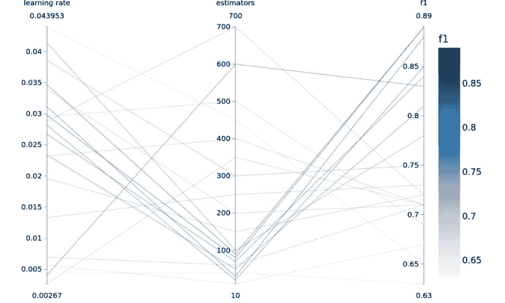

*图 5.1* 使用一种称为**平行坐标图**的技术可视化了参数交互。平行坐标图是一种旨在表示高维数据的可视化工具，因此特别适用于可视化超参数优化的结果。每个维度（在此上下文中指一个超参数）被描绘为一个平行排列的垂直轴。每个轴的范围反映了该超参数可能取值的范围。每一组超参数配置都被描绘为一条穿过所有这些轴的线，每条线在每个轴上的交点表示该配置下该超参数的值。这些线也可以根据性能指标（如验证准确率）进行颜色编码，以辨别哪些超参数组合能产生更好的结果。

平行坐标图的妙处在于它们能够说明多个超参数之间的关系及其对性能的累积影响，例如*图 5.1*中所示的参数交互。通过观察线条的聚集情况或颜色的相似性，我们可以洞察超参数之间的趋势和复杂的相互依赖关系。这种可视化多维模式的能力有助于数据科学家确定哪些超参数值或组合最有利于实现最佳模型性能。

鉴于超参数优化的挑战和复杂性，寻找最优参数的一种朴素方法是手动优化。在手动优化中，人类从业者基于直觉理解和经验选择参数。使用这些参数训练一个模型，并重复此过程，直到找到满意的参数为止。手动优化实现简单，但由于过程涉及人工参与，非常耗时。人类的直觉也可能出错，从而容易错过好的参数组合。

> **注意**
> 寻找最优参数的过程通常被称为参数**研究**。在研究中测试的每种配置（参数组合）被称为一次**试验**。

在前面章节的示例中，我们迄今为止使用的方法是**网格搜索**。在网格搜索中，我们设置一个由每个参数及其一系列潜在值组成的参数网格，并详尽地测试每种可能的组合以找到最优值。

网格搜索很好地解决了参数交互问题：由于测试了每种可能的组合，因此考虑到了每一种交互。

然而，使用网格搜索的缺点是成本。由于我们详尽地测试每种参数组合，试验次数会迅速变得难以承受，尤其是在添加更多参数的情况下。例如，考虑以下网格：

```
params = {"learning_rate": [0.001, 0.01, 0.1],
          "num_leaves": [10, 20, 50, 100],
          "num_estimators": [100, 200, 500]}
```

针对此网格的优化研究将需要 36 次试验。仅仅添加一个具有两个可能值的额外参数，就会使研究成本翻倍。

我们需要的是一种算法和框架，能够在我们控制的有限试验次数内智能地优化参数。有几个框架可用于此目的，包括 SHERPA（一个用于调整机器学习模型的 Python 库）、Hyperopt（另一个用于在复杂搜索空间上进行参数优化的 Python 库）以及 Talos（一个专门为 Keras 定制的工具）。然而，在下一节以及本章的其余部分，我们将探讨 **Optuna**，一个旨在自动化调整机器学习模型的框架。

## 介绍 Optuna

Optuna 是一个开源的**超参数优化 (HPO)** 框架，旨在自动为机器学习模型找到最佳超参数 (https://optuna.org/)。它用 Python 编写，可以轻松地与各种机器学习库集成，包括 LightGBM。

Optuna 提供高效的优化算法，以更有效地搜索超参数空间。除了优化算法，Optuna 还提供剪枝策略，通过剪枝表现不佳的试验来节省计算资源和时间。

除了优化和剪枝算法，Optuna 还提供了一个易于使用的 API，用于定义参数类型（整数、浮点数或类别型）、创建和自动化可恢复的优化研究，以及可视化优化运行的结果。在本章后面，我们将看到如何实际使用该 API。

## 优化算法

Optuna 提供了几种高效的优化算法。在本节中，我们重点介绍两种可用的算法：**树形结构 Parzen 估计器 (TPE)** 和**协方差矩阵自适应进化策略 (CMA-ES)** 算法。

### TPE

要理解 TPE，我们首先必须知道什么是 Parzen 估计器。

Parzen 估计器，或称**核密度估计器 (KDE)**，是一种用于估计一组数据点概率分布的技术。它是一种非参数方法，意味着它不假设数据有任何特定的潜在分布。相反，它试图基于观察到的数据点来“学习”分布。

想象一下你有数据点，并且想知道数据是如何分布的。一种方法是在每个数据点上放置小的“山丘”（核函数）。这些“山丘”可以有不同的形状，例如高斯（钟形）或均匀（盒形）。在任何点处“山丘”的高度代表了一个新数据点落在该位置的可能性。Parzen 估计器通过将所有这些“山丘”相加来创建一个平滑的景观，该景观代表了数据的估计概率分布。

在 TPE 的情况下，我们关心的数据点是参数组合，而概率分布是一组参数是好是坏的可能性 [1], [2]。

TPE 首先采样几个随机的超参数组合，并评估每个组合的模型性能。基于这些初始结果，TPE 将超参数组合分为两组：`好`（那些导致更好性能的组合）和`坏`（那些导致更差性能的组合）：

-   $l(x)$：`好`配置的概率密度函数
-   $g(x)$：`坏`配置的概率密度函数

然后，TPE 使用 Parzen 估计器技术估计`好`组和`坏`组超参数组合的概率分布。

有了概率分布的估计，TPE 计算超参数配置的**期望改进 (EI)**。EI 可以计算为两个密度的比值：$\frac{l(x)}{g(x)}$。在每次试验中，算法都会采样新的超参数配置以最大化 EI。

TPE 中的树结构源于算法处理超参数搜索空间内参数交互的能力，其中特定超参数的相关性取决于其他参数的值。为了处理这个问题，TPE 构建了一个层次结构来捕获不同超参数之间的关系，并相应地调整采样过程。

总之，TPE 估计`好`和`坏`参数的分布，并利用它们通过最大化新试验的期望改进来寻找最优参数。TPE 是经济高效的，因为它近似分布，并且可以最优地（以非穷举的方式）搜索更好的参数。TPE 也能处理参数交互。

Optuna 提供的另一种算法是 CMA-ES 算法，我们接下来讨论。

## CMA-ES

CMA-ES 是另一种可用于寻找最优超参数的优化算法 [3]。与 TPE 相比，CMA-ES 非常适合涉及连续变量以及搜索空间是非线性和非凸的情况。

CMA-ES 是**进化算法 (EA)** 的一个例子。EA 是一种受自然进化过程启发的优化算法。它旨在通过模仿自然如何通过选择、繁殖、变异和遗传来进化物种，从而找到问题的最佳解决方案。进化算法从一组候选解开始，并在每个后续*世代*中修改候选解，以更接近最佳解决方案。这个世代过程如*图 5.2*所示。

## CMA-ES

CMA-ES进化过程的核心是协方差矩阵。协方差矩阵是一个方阵，对称矩阵，表示变量对（在CMA-ES中即超参数）之间的协方差，从而揭示它们之间的关系。矩阵的对角线元素代表各个变量的方差，而非对角线元素则代表变量对之间的协方差。当协方差为正时，表明这些变量通常同向变化，即同时增加或减少。相反，负协方差则意味着一个变量增加时，另一个变量倾向于减少，反之亦然。协方差为零则表明变量之间不存在线性关系。

CMA-ES在优化超参数时应用进化原理如下：

1.  在超参数搜索空间内，初始化均值和协方差矩阵。
2.  重复进化过程：
    I.  使用均值和协方差矩阵，从搜索空间中生成一组候选解种群。每个候选解代表一组超参数值的组合。
    II.  评估候选解的适应度。**适应度**指的是候选解的质量或其解决优化问题的优劣程度。对于CMA-ES，这意味着使用候选超参数在数据集上训练模型，并在验证集上评估其性能。
    III.  从种群中选择最佳候选解。
    IV.  根据最佳候选解更新均值和协方差矩阵。
    V.  重复上述步骤，直到达到最大试验次数或种群适应度不再提升。

CMA-ES在复杂的搜索空间中表现出色，并在协方差矩阵的指导下智能地对搜索空间进行采样。当超参数搜索空间复杂且非线性，或者验证数据的评估存在噪声（例如，当某个指标是不一致的性能指示器时），这种方法尤为有益。

TPE和CMA-ES都解决了与超参数优化相关的问题：两种算法都能有效地搜索高维搜索空间。两种算法都能捕捉参数间的交互作用。两种算法都让我们能够控制成本：我们可以决定优化预算并将搜索限制在该预算内。

TPE和CMA-ES的主要区别在于它们的整体方法。TPE是一种具有顺序搜索策略的概率模型，而CMA-ES则基于种群并并行评估解决方案。这通常意味着TPE在搜索中更具开发性，而CMA-ES则通过种群控制机制平衡探索与开发。然而，TPE通常比CMA-ES更高效，尤其是在参数数量较少的情况下。

Optuna通过剪枝无效试验进一步优化了搜索过程。接下来我们将讨论一些剪枝策略。

## 剪枝策略

剪枝策略指的是通过从研究中剪枝这些试验，避免将优化时间花费在前景不佳的试验上的方法。剪枝与模型训练过程同步进行：在训练过程中检查验证误差，如果算法表现不佳，则停止训练。因此，剪枝类似于*早停*。

### 中位数剪枝

Optuna提供了几种剪枝策略，其中最简单的一种是**中位数剪枝**。在中位数剪枝中，每个试验在*n*步后报告一个中间结果。然后取这些中间结果的中位数，任何在相同步骤下低于先前试验中位数的试验都会被停止。

### 逐次减半与Hyperband

一种更复杂的策略称为**逐次减半**[4]。这种方法采取更全局的视角，为所有试验分配少量且相等的训练步骤预算。然后逐次减半迭代进行：在每次迭代中，评估每个试验的性能，选择表现最好的一半候选解进入下一轮，而表现较差的一半则被剪枝。下一次迭代的训练预算加倍，过程重复进行。这样，优化预算就花在了最有希望的候选解上。结果是，少量的优化预算用于淘汰表现不佳的候选解，而更多的资源则用于寻找最佳参数。

**Hyperband**是另一种剪枝技术，它通过结合随机搜索和多括号资源分配策略[5]扩展了逐次减半。虽然逐次减半通过迭代剪枝表现不佳的配置并为剩余有希望的配置分配更多资源，从而有效地缩小候选配置集，但它依赖于固定的初始配置集和单一的资源分配方案。

Hyperband则采用多括号资源分配策略，将总计算预算分为几个括号，每个括号代表不同级别的资源分配。在每个括号内，应用逐次减半来迭代地淘汰表现不佳的配置，并为剩余有希望的配置分配更多资源。在每个括号开始时，使用随机搜索采样一组新的超参数配置，这使得Hyperband能够更广泛地探索超参数空间，并降低错过良好配置的风险。这种并发过程使Hyperband能够在搜索过程中自适应地平衡探索与开发，最终实现更高效、更有效的超参数调优。

Optuna对优化算法及相应的剪枝策略进行了实证研究（https://github.com/optuna/optuna/wiki/Benchmarks-with-Kurobako）。*根据经验，他们发现Hyperband是最佳的TPE或CMA-ES优化策略*。

本节概述了驱动Optuna的理论和算法，重点关注TPE、CMA-ES和高级剪枝策略。在下一节中，我们将实际应用Optuna来解决一个使用LightGBM的机器学习问题。

## 使用Optuna优化LightGBM

我们将通过一个分类示例来介绍如何应用Optuna。我们要建模的问题是预测电信提供商的客户流失（是/否）。数据集可从https://github.com/IBM/telco-customer-churn-on-icp4d/tree/master/data获取。

数据使用提供商可用的数据描述每个客户——例如，性别、客户是否支付互联网服务、是否使用无纸化账单、是否支付技术支持费用以及他们的月度费用。数据包含数值型和分类型特征。数据已经过清洗且平衡，使我们能够专注于参数优化研究。

我们首先定义参数研究的目标。`objective`函数在每次试验时被调用一次。在这种情况下，我们希望在数据上训练一个LightGBM模型并计算F1分数。Optuna将一个`trial`对象传递给`objective`函数，我们可以用它来设置特定试验的参数。以下是一个示例代码片段，展示了如何定义一个带参数的`objective`函数：

```python
def objective(trial):
    boosting_type = trial.suggest_categorical(
        "boosting_type", ["dart", "gbdt"])
    lambda_l1= trial.suggest_float(
        'lambda_l1', 1e-8, 10.0, log=True),
    ...
    min_child_samples= trial.suggest_int(
        'min_child_samples', 5, 100),
    learning_rate = trial.suggest_float(
        "learning_rate", 0.0001, 0.5, log=True),
    max_bin = trial.suggest_int(
        "max_bin", 128, 512, 32),
    n_estimators = trial.suggest_int(
        "n_estimators", 40, 400, 20)
```

在这里，我们可以看到如何使用`trial`提供的方法来设置超参数。对于每个参数，优化算法在指定范围内建议一个值。我们可以使用`trial.suggest_categorical`建议分类变量（如提升类型所示），并分别使用`suggest_int`和`suggest_float`建议`int`和`float`参数。在建议浮点数或整数时，需要指定范围，以及可选的步长：

```python
n_estimators = trial.suggest_int(
    name="n_estimators", low=40, high=400, step=20)
```

设置步长意味着优化算法不会在范围内建议任意值，而是将建议限制在下限和上限之间的步长上（40, 60, 80, 100, ..., 400）。

我们还可以选择通过对数值参数传递`log=True`来对可能值的范围进行对数缩放。对参数范围进行对数缩放的效果是，在范围下限附近测试更多值，而在上限附近（对数地）测试更少值。对数缩放特别适用于学习率，因为我们希望关注较小的值，并指数级地增加测试值直到上限。

要在训练LightGBM模型时应用剪枝，Optuna提供了一个专门构建的回调函数，该函数与优化过程集成：

```
pruning_callback = optuna.integration.LightGBMPruningCallback(trial, "binary")
```

在创建回调函数时，我们必须指定一个误差度量，在我们的例子中，我们指定`"binary"`作为二分类误差。

设置好超参数后，我们可以像往常一样进行拟合，传递参数和回调函数：

```
model = lgb.LGBMClassifier(
    force_row_wise=True,
    boosting_type=boosting_type,
    n_estimators=n_estimators,
    lambda_l1=lambda_l1,
    lambda_l2=lambda_l2,
    num_leaves=num_leaves,
    feature_fraction=feature_fraction,
    bagging_fraction=bagging_fraction,
    bagging_freq=bagging_freq,
    min_child_samples=min_child_samples,
    learning_rate=learning_rate,
    max_bin=max_bin,
    callbacks=[pruning_callback],
    verbose=-1)
scores = cross_val_score(model, X, y, scoring="f1_macro")
return scores.mean()
```

我们使用五折交叉验证训练模型，并以F1宏平均分数作为评分标准。最后，`objective`函数返回F1分数的平均值作为试验评估结果。

我们已准备好使用定义的`objective`函数开始优化研究。我们创建一个采样器、剪枝器和研究本身，然后使用我们的`objective`函数调用`optimize`：

```
sampler = optuna.samplers.TPESampler()
pruner = optuna.pruners.HyperbandPruner(
    min_resource=10, max_resource=400, reduction_factor=3)

study = optuna.create_study(
    direction='maximize', sampler=sampler,
    pruner=pruner
)
study.optimize(objective(), n_trials=100, gc_after_trial=True, n_jobs=-1)
```

我们使用TPE优化算法作为采样器，并结合Hyperband剪枝。为Hyperband剪枝器指定的最小和最大资源控制了每个试验训练的最小和最大迭代次数（或估计器数量）。在应用剪枝时，缩减因子控制了在每次减半轮次中提升的试验数量。

通过指定优化方向（最大化或最小化）来创建研究。在这里，我们优化的是F1分数，因此我们希望最大化该值。

然后我们调用`study.optimize`并设置优化预算：`n_trials=100`。我们还执行了内存优化设置，`gc_after_trial=True`。执行**垃圾回收（GC）**有助于确保每次试验后内存被清理，避免内存不足或内存泄漏错误。Optuna研究可以并行运行试验。设置`n_jobs=-1`会根据CPU核心数并行运行尽可能多的试验。

运行优化后，我们可以通过调用以下代码获取最佳试验和参数：

```
print(study.best_trial)
```

前面的示例展示了如何应用Optuna有效地寻找LightGBM超参数。接下来，我们来看一些Optuna框架的高级功能。

## Optuna高级功能

在优化大型机器学习问题的超参数时，优化过程可能需要运行数天或数周。在这种情况下，保存优化研究并在稍后恢复它有助于防止数据丢失或在不同机器之间迁移研究。

## 保存和恢复优化研究

Optuna支持以两种方式保存和恢复优化研究：**内存中**和使用**远程数据库（RDB）**。

当研究在内存中运行时，可以应用标准的Python对象序列化方法。例如，可以使用`joblib`或`pickle`。我们使用`joblib`来保存研究：

```
joblib.dump(study, "lgbm-optuna-study.pkl")
```

要恢复并继续研究，我们反序列化`study`对象并继续优化：

```
study = joblib.load("lgbm-optuna-study.pkl")
study.optimize(objective(), n_trials=20, gc_after_trial=True, n_jobs=-1)
```

在内存中运行研究的替代方案是使用RDB。使用RDB时，研究的中间（试验）和最终结果会持久化在SQL数据库后端。RDB可以托管在单独的机器上。可以使用SQL Alchemy支持的任何SQL数据库（https://docs.sqlalchemy.org/en/20/core/engines.html#database-urls）。

在我们的示例中，我们使用SQLite数据库作为RDB：

```
study_name = "lgbm-tpe-rdb-study"
storage_name = f"sqlite:///{study_name}.db"
study = optuna.create_study(
    study_name=study_name,
    storage=storage_name,
    load_if_exists=False,
    sampler=sampler,
    pruner=pruner)
```

Optuna管理与RDB的连接和结果的持久化。设置好连接后，优化可以照常进行。

从RDB后端恢复研究很简单；我们指定相同的`storage`并将`load_if_exists`设置为True：

```
study = optuna.create_study(study_name=study_name, storage=storage_name, load_if_exists=True)
```

## 理解参数影响

在许多情况下，更好地理解超参数在解决特定问题时的影响也很有价值。例如，`n_estimators`参数直接影响模型的计算复杂度。如果我们知道该参数不太重要，我们可以选择较小的值来提高模型的运行时性能。Optuna提供了几种可视化工具，可以深入研究研究结果并深入了解超参数。

一个直接的可视化是绘制*每个参数的重要性*：每个参数对训练结果的影响程度。我们可以如下创建重要性图：

```
fig = optuna.visualization.plot_param_importances(study)
fig.show()
```

我们研究的重要性图如下所示：

### 超参数重要性

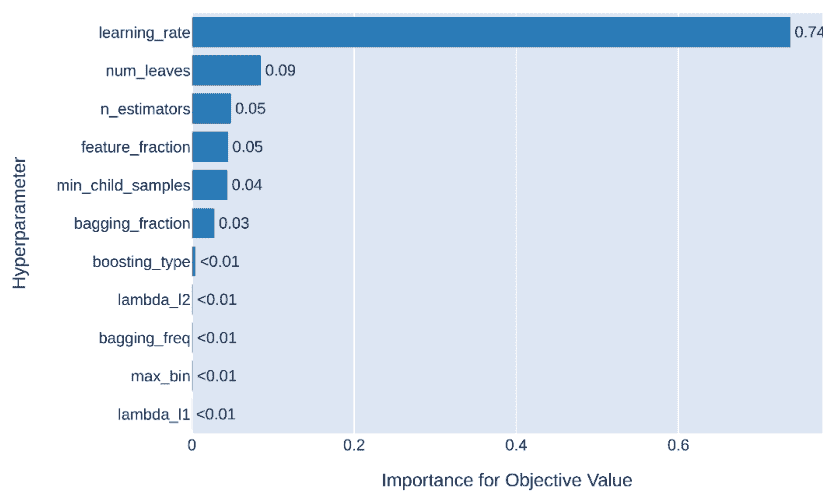

图5.3 – 参数重要性图，显示了每个超参数对目标值（F1分数）的重要性

在*图5.3*中，我们可以看到学习率是迄今为止影响试验成功最关键的参数。其次是叶节点数和估计器数量。利用这些信息，我们可能决定在未来的研究中更侧重于寻找最优学习率。

我们如下创建平行坐标图，指定应包含的参数。该图帮助我们可视化超参数之间的交互：

```
fig = optuna.visualization.plot_parallel_coordinate(study,
    params=["boosting_type", "feature_fraction", "learning_rate", "n_estimators"])
fig.show()
```

以下是生成的图：

### 平行坐标图

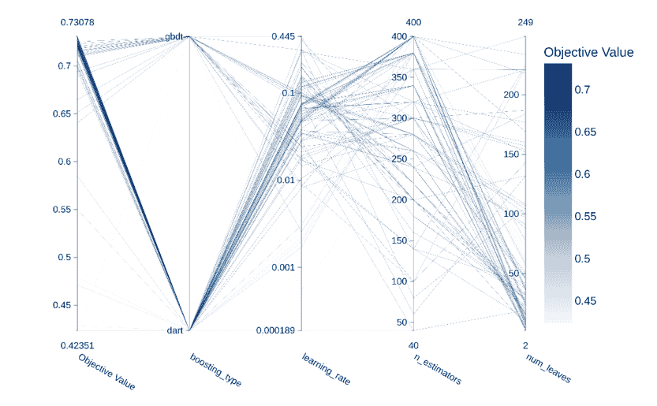

图5.4 – 我们研究的平行坐标图。每条水平线代表单个试验的配置。颜色越深的线表示越成功的试验（F1分数越高）

平行坐标图显示，最佳试验都使用了DART作为提升类型，学习率略低于0.1，估计器数量超过200。我们还可以直观地看到一些参数交互：GBDT模型与稍高的学习率相关。当估计器数量很多时，所需的叶节点数要少得多，因为拥有大量估计器和大量叶节点会导致过拟合。

## 多目标优化

在前面展示的优化研究中，我们专注于单一优化目标：最大化我们的F1分数。然而，在某些情况下，我们希望优化两个可能相互竞争的目标。例如，假设我们希望创建尽可能小的GBDT（最少的叶节点），同时获得良好的F1分数。减少叶节点数量可能会对我们的性能产生负面影响，因此存在权衡。

Optuna支持通过使用**多目标优化（MOO）**来解决这类问题。在优化多个目标时，我们从`objective`函数返回两个评估值，并指定优化方向。

作为一个例子，考虑学习率和性能之间的权衡。我们希望尽可能快地训练模型，这需要较高的学习率。然而，我们知道最佳性能是通过使用较小的学习率和多次迭代来实现的。

我们可以使用Optuna来优化这种权衡。我们定义一个新的`objective`函数，将所有其他参数固定为之前找到的最优值。我们返回两个评估值：学习率和交叉验证的F1分数。我们希望最大化这两个值：

```
def moo_objective(trial):
    learning_rate = trial.suggest_float("learning_rate", 0.0001, 0.5,
                                       log=True),

    model = lgb.LGBMClassifier(
        force_row_wise=True,
        boosting_type='gbdt',
        n_estimators=200,
        num_leaves=6,
        bagging_freq=7,
        learning_rate=learning_rate,
        max_bin=320,
    )
    scores = cross_val_score(model, X, y, scoring="f1_macro")
    return learning_rate[0], scores.mean()
```

在调用`optimize`时，我们为两个评估值的优化设置方向：

```
study = optuna.create_study(directions=["maximize", "maximize"])
study.optimize(moo_objective, n_trials=100)
```

在执行MOO时，并不总是存在单一的最佳结果：目标之间通常存在权衡。因此，我们希望可视化研究结果以探索权衡，并选择在两个目标上都表现良好的参数值。这种类型的可视化称为**帕累托前沿**，可以如下创建：

## 帕累托前沿图

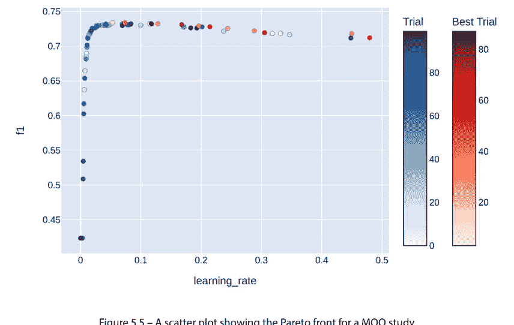

图 5.5 – 展示多目标优化研究帕累托前沿的散点图

如*图 5.5*所示，如果学习率过低，F1分数会很差；当学习率达到0.01时，分数迅速提升。F1分数在0.12处达到峰值，随着学习率继续增加而缓慢下降。我们现在拥有了做出权衡决策所需的信息：可以选择更高的学习率以加快训练速度，同时将分类性能的损失降至最低。

## 总结

本章介绍了Optuna作为超参数优化框架。我们讨论了寻找最优超参数的问题，以及超参数优化算法如何高效地找到合适的参数。

我们讨论了Optuna中可用的两种优化算法：TPE和CMA-ES。这两种算法都允许用户为优化设置特定预算（要执行的试验次数），并在约束条件下寻找合适的参数。此外，我们还讨论了剪枝无希望的优化试验以节省额外资源和时间。讨论了中位数剪枝以及更复杂但有效的连续减半和Hyperband剪枝技术。

接着，我们通过一个实际示例展示了如何对LightGBM进行超参数优化研究。我们还展示了Optuna的高级功能，这些功能可用于保存和恢复研究、理解参数影响以及执行多目标优化。

下一章将重点介绍两个使用LightGBM的案例研究，详细讨论并应用数据科学流程。

## 参考文献

- [1] J. Bergstra, R. Bardenet, Y. Bengio, and B. Kégl, “Algorithms for Hyper-Parameter Optimization,” in Advances in Neural Information Processing Systems, 2011.
- [2] J. Bergstra, D. Yamins, and D. Cox, “Making a Science of Model Search: Hyperparameter Optimization in Hundreds of Dimensions for Vision Architectures,” in Proceedings of the 30th International Conference on Machine Learning, Atlanta, 2013.
- [3] N. Hansen and A. Ostermeier, “Adapting arbitrary normal mutation distributions in evolution strategies: the covariance matrix adaptation,” in Proceedings of IEEE International Conference on Evolutionary Computation, 1996.
- [4] K. Jamieson and A. Talwalkar, Non-stochastic Best Arm Identification and Hyperparameter Optimization, 2015.
- [5] L. Li, K. Jamieson, G. DeSalvo, A. Rostamizadeh, and A. Talwalkar, Hyperband: A Novel Bandit-Based Approach to Hyperparameter Optimization, 2018.

# 6 使用LightGBM解决现实世界的数据科学问题

通过前面的章节，我们逐步构建了一套能够解决机器学习问题的工具集。我们已经看到了检查数据、处理数据问题和创建模型的示例。本章正式定义并应用数据科学流程到两个案例研究中。

本章详细概述了数据科学生命周期及其包含的所有步骤。在回归和分类问题的背景下，讨论了问题定义、数据探索、数据清理、建模和报告的概念。我们还探讨了为建模准备数据以及使用我们学到的技术构建优化的LightGBM模型。最后，我们更深入地探讨了利用训练好的模型，作为**机器学习运维（MLOps）**的入门。

本章的主要主题如下：

- 数据科学生命周期
- 使用LightGBM预测风力涡轮机发电量
- 使用LightGBM对个人信用评分进行分类

## 技术要求

本章包含示例和代码片段，说明如何使用Optuna对LightGBM进行参数优化研究。完整的示例和设置本章合适环境的说明可在 https://github.com/PacktPublishing/Practical-Machine-Learning-with-LightGBM-and-Python/tree/main/chapter-6 获取。

## 数据科学生命周期

数据科学已成为一门关键学科，使组织能够从其数据中获取有价值的见解并推动更好的决策。数据科学的核心是数据科学生命周期，这是一个系统性的迭代过程，指导着跨行业和领域的数据驱动问题解决。该生命周期概述了数据科学家遵循的一系列步骤，以确保他们解决正确的问题并提供可操作的见解，从而产生实际影响。

数据科学生命周期的第一阶段涉及定义问题，这包括理解业务背景、阐明目标和制定假设。这个关键阶段通过建立清晰的方向和范围，为整个项目奠定了基础。生命周期的后续阶段侧重于数据收集、准备和探索，共同涉及收集相关数据、清理和预处理数据，以及进行探索性数据分析以揭示模式和趋势。

数据分析完成后，数据科学生命周期进入模型选择、训练、评估和调优阶段。这些阶段是开发准确可靠的预测或描述性模型的核心，通过选择最合适的算法、在预处理数据上训练它们并优化其性能。目标是构建一个稳健的模型，能够很好地泛化到未见过的数据，并有效解决手头的问题。

最后，数据科学生命周期强调将最终模型部署到生产环境、监控其性能并进行维护以确保其持续相关性和准确性的重要性。同样重要的是向利益相关者传达结果和见解，这对于推动明智的决策和充分发挥数据科学的潜力至关重要。通过遵循数据科学生命周期，组织可以系统地从其数据中提取价值，并为增长和创新解锁新的机会。

在之前的示例中，我们遵循了一个处理数据和创建模型的宽松步骤流程。在下一节中，我们将正式定义和讨论数据科学生命周期的步骤。

## 定义数据科学生命周期

以下是数据科学生命周期中广泛应用的关键步骤。这些步骤也显示在*图 6.1*中，该图说明了生命周期的循环性质。

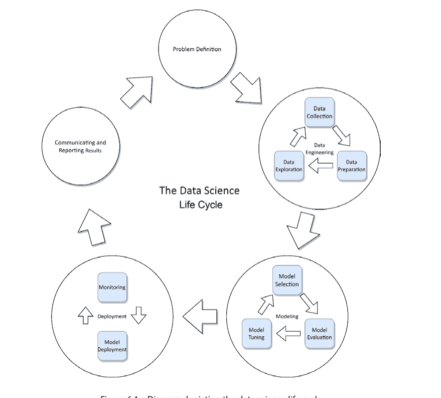

图 6.1 – 描述数据科学生命周期的图表

这些是关键步骤：

1.  **定义问题**：清晰地阐述业务问题、目标和目的。此阶段涉及理解利益相关者需求、制定假设并确定项目范围。定义问题也为数据收集奠定了基础，并可以决定我们将如何利用我们的模型。
2.  **数据收集**：从各种来源（如数据库、API、网络爬虫或第三方数据提供商）收集所需数据。确保数据具有代表性、准确性，并与问题相关。记录数据的来源和移动方式以建立**数据血缘**非常重要。此外，构建一个**数据字典**，记录数据的格式、结构、内容和含义。重要的是，验证数据收集或抽样中是否存在任何潜在偏差。
3.  **数据准备**：清理和预处理数据，使其适合分析。此阶段包括**数据清洗**（例如，处理缺失值和删除重复项）、**数据转换**（例如，归一化和编码分类变量）和**特征工程**（例如，创建新变量或聚合现有变量）等任务。将数据移动和连接到可以进行分析和建模的地方也可能是必要的。
4.  **数据探索**：进行**探索性数据分析**（EDA）以深入了解数据。此步骤涉及可视化数据分布、识别趋势和模式、检测异常值和异常情况，以及检查特征之间的关系和相关性。
5.  **模型选择**：根据问题类型（例如，回归、分类或聚类）和数据特征选择最合适的数据建模技术。选择多种模型算法来验证在数据集上的性能非常重要。
6.  **模型训练**：使用准备好的数据训练选定的模型。此步骤涉及将数据拆分为训练集和验证集、设置模型参数（超参数）以及将模型拟合到数据。
7.  **模型评估**：使用适当的评估指标（例如，准确率、精确率、召回率、F1分数、**ROC曲线下面积（AUC-ROC）**或**均方根误差（RMSE）**）评估训练模型的性能，并进行比较以选择性能最佳的模型。执行交叉验证或使用留出测试集以确保无偏评估。
8.  **模型调优**：通过优化超参数、特征选择或结合领域知识来微调选定的模型。此步骤旨在提高模型的性能和对未见数据的泛化能力。也可能需要针对特定问题调整模型；例如，在识别人脸时，高精确率比高召回率更合适。
9.  **模型部署**：如果模型是更广泛软件系统的一部分，则将最终模型部署到生产环境中，在那里它可以用于进行预测或为决策提供信息。部署可能涉及将模型集成到现有系统中、创建API或设置监控和维护程序。
10. **模型监控和维护**：持续监控模型的性能，并根据需要进行更新，以确保其保持准确性和相关性。应使用检测模型和数据漂移等技术来确保模型性能。模型维护可能涉及用新数据重新训练模型、更新特征或完善问题定义。
11. **传达结果**：与利益相关者分享见解和结果，包括基于分析的任何建议或行动。传达结果可能涉及创建可视化、仪表板或报告，以有效地传达发现。

我们现在通过两个案例研究，看看数据科学生命周期如何实际应用于现实世界的数据。我们研究一个回归问题（预测风力涡轮机发电量）和一个分类问题（对个人信用评分进行分类）。

## 使用LightGBM预测风力涡轮机发电量

我们的第一个案例研究旨在预测风力涡轮机的发电量。该问题的数据集可从 https://www.kaggle.com/datasets/mukund23/hackerearth-machine-learning-challenge 获取。

我们按照上一节定义的步骤来处理这个问题，详细阐述每个步骤的细节并附上代码片段。完整的端到端解决方案可在 https://github.com/PacktPublishing/Practical-Machine-Learning-with-LightGBM-and-Python/tree/main/chapter-6/wind-turbine-power-output.ipynb 找到。

### 问题定义

该数据集包含在特定日期和时间对风力涡轮机进行的发电量（单位：kW/h）测量值。每次测量都附带风力涡轮机的参数，包括风车的物理测量值（包括风车高度、叶片宽度和长度）、涡轮机的运行测量值（包括电阻（欧姆）、电机扭矩、发电机温度和转子扭矩）以及大气条件（包括风速、温度和气压）。

给定这组参数，我们必须构建一个回归模型来预测以kW/h为单位的发电量。因此，我们采用回归建模。模型的质量使用**均方误差（MSE）**和决定系数（$R^2$）来衡量。我们还必须确定哪些因素对发电量的影响最为显著。

### 数据收集

该数据集包含在11个月内（从2018年10月到2019年9月）收集的22,800个样本。数据以CSV文件形式提供，并作为公共领域数据发布。未收集额外数据。

### 数据准备

我们现在可以着手准备数据，以便进行清洗和探索。数据集包含18个数值特征、2个分类特征和日期特征，我们可以通过获取pandas DataFrame的信息来查看：

```
train_df.info()
#    Column                     Non-Null Count  Dtype  
---  ------                     --------------  -----  
 0   tracking_id                28200 non-null  object 
 1   datetime                   28200 non-null  object 
 2   wind_speed(m/s)            27927 non-null  float64
 3   atmospheric_temperature(°C) 24750 non-null  float64
 4   shaft_temperature(°C)      28198 non-null  float64
...
20  windmill_height (m)              27657 non-null  float64
21  windmill_generated_power (kW/h)  27993 non-null  float64
```

我们立即可以看到数据集存在缺失值，某些特征的值少于28,200个。我们可以通过计算统计描述来更好地了解数据分布：

```
train_df.describe().T.style.bar(subset=['mean'])
```

这将打印出以下内容：

| 特征 | 计数 | 均值 | 标准差 | 最小值 | 最大值 |
| :--- | :--- | :--- | :--- | :--- | :--- |
| wind_speed(m/s) | 27927 | 69.04 | 76.28 | -496.21 | 601.46 |
| atmospheric_temperature(°C) | 24750 | 0.38 | 44.28 | -99.00 | 80.22 |
| shaft_temperature(°C) | 28198 | 40.09 | 27.20 | -99.00 | 169.82 |
| blades_angle(°) | 27984 | -9.65 | 47.92 | -146.26 | 165.93 |
| gearbox_temperature(°C) | 28199 | 41.03 | 43.66 | -244.97 | 999.00 |
| engine_temperature(°C) | 28188 | 42.61 | 6.12 | 3.17 | 50.00 |
| motor_torque(N-m) | 28176 | 1710 | 827 | 500 | 3000.00 |
| generator_temperature(°C) | 28188 | 65.03 | 19.82 | 33.89 | 100.00 |
| atmospheric_pressure(Pascal) | 25493 | 53185 | 187504 | -1188624 | 1272552 |
| area_temperature(°C) | 28200 | 32.74 | 7.70 | -30.00 | 55.00 |
| windmill_body_temperature(°C) | 25837 | 20.80 | 54.36 | -999.00 | 323.00 |
| wind_direction(°) | 23097 | 306.89 | 134.06 | 0.00 | 569.97 |
| resistance(ohm) | 28199 | 1575.6 | 483.33 | -1005.22 | 4693.48 |
| rotor_torque(N-m) | 27628 | 25.85 | 32.42 | -136.73 | 236.88 |
| blade_length(m) | 23107 | 2.25 | 11.28 | -99.00 | 18.21 |
| blade_breadth(m) | 28200 | 0.40 | 0.06 | 0.20 | 0.50 |
| windmill_height(m) | 27657 | 25.89 | 7.77 | -30.30 | 78.35 |
| windmill_generated_power (kW/h) | 27993 | 6.13 | 2.70 | 0.96 | 20.18 |

表6.1 – 风力涡轮机数据集中数值特征的统计描述

查看*表6.1*中特征的统计描述，我们可以看到以下异常情况：

- **许多特征存在异常值**：通常，标准差大于均值可能表明存在异常值。例如风速、大气温度和大气压力。同样，最小值或最大值远离均值也可能表明数据中存在异常值。我们可以通过使用直方图可视化数据分布来进一步验证这一点。

- **物理上不可能的情况**：数据显示某些测量值存在不可能的情况：长度（以米为单位）小于0（例如叶片长度），以及超出自然范围的温度（体温为-999）。

- **重复值**：值-99.0和-999.0在几个特征中重复出现。这些值在不同特征中自然出现的可能性不大。我们可以推断这些值表示样本中缺失或错误的测量值。

我们可以可视化特征的分布来调查异常值。例如，对于大气温度，我们有以下情况：

```
sns.histplot(train_df["atmospheric_temperature(°C)"], bins=30)
```

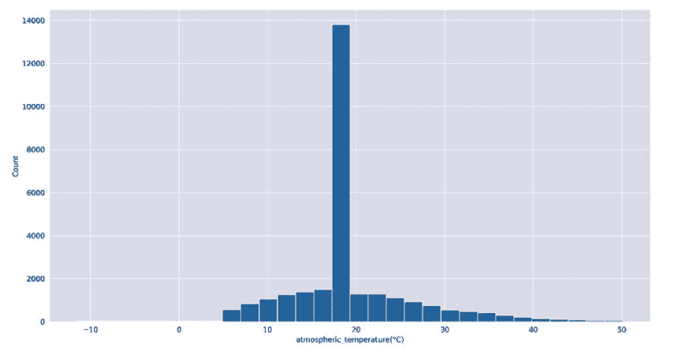

*图6.2*说明了数据中发现的两个问题：大量测量值恰好为-99.0，表明存在错误。还有一些异常值远离均值。

最后，我们可以使用以下代码检查重复数据：

```
train_df[train_df.duplicated()]
```

没有返回任何行，表明数据集中没有重复项。

## 数据清洗

我们已识别出数据集中需要在*数据清洗*步骤中解决的多个问题：

- **异常值**：许多特征存在异常值，这些值扭曲了特征的值分布。
- **测量错误**：某些特征的值超出了物理上不可能的范围（长度小于0或温度在不可能的范围内）。
- **缺失值**：许多特征存在缺失值。还有一些特定值（-99.0和-999.0）我们也视为缺失。

我们首先处理异常值和测量错误，因为这会影响我们处理缺失值的方式。

## 处理异常值

处理数据集中的异常值包括两个部分：准确识别异常值和选择合适的替换值。识别异常值的方法如下：

- **可视化**：如前所述，可以使用直方图或其他可视化数据分布的图表（如箱线图或散点图）。
- **领域知识**：就像我们识别测量错误一样，可以利用领域知识来判断值是否异常。
- **统计分析**：两种常用的使用统计方法确定值是否异常的方法是**四分位距（IQR）**和标准差。

IQR是第25百分位数和第75百分位数之间的差值。超过IQR的1.5倍且远离第25或第75百分位数的值被视为异常值。

或者，我们可以利用标准差：我们计算数据集的均值和标准差。任何超过均值两倍或三倍标准差的值都是异常值。将边界设置为两倍或三倍标准差取决于底层数据。使用两倍标准差可能导致许多误报，但如果大量数据集中在均值周围，这是合适的。使用三倍标准差更为保守，只将非常远离均值的值标记为异常值。

当检测到异常值时，我们必须采取措施处理它们。通常，我们的选择如下：

- **移除**：如果异常值是由于数据录入、测量或收集错误造成的，将其从数据集中移除可能是合理的。但是，这应该谨慎进行，因为移除太多数据点可能导致信息丢失和结果偏差。移除我们数据集中带有异常值的实例将导致接近70%的数据损失，这不是一个可行的选项。
- **插补**：类似于缺失值，用更具代表性的值替换异常值，例如变量的均值、中位数或众数，或使用更复杂的插补方法，如**k近邻**或**基于回归的插补**。

## 处理测量误差

被检测为测量误差类型的值也可以被视为异常值，尽管并非统计学意义上的异常值。然而，我们可以用与处理统计异常值略有不同的方式来处理这些值。

我们运用领域知识和一些围绕天气的研究，为这些特征确定合适的范围。然后，我们将错误值限制在这些范围内：

```
frame.loc[frame["wind_speed(m/s)"] < 0, "wind_speed(m/s)"] = 0
frame.loc[frame["wind_speed(m/s)"] > 113, "wind_speed(m/s)"] = 113
frame.loc[frame["blade_length(m)"] < 0, "blade_length(m)"] = 0
frame.loc[frame["windmill_height(m)"] < 0, "windmill_height(m)"] = 0
frame.loc[frame["resistance(ohm)"] < 0, "resistance(ohm)"] = 0
```

在这里，我们将任何负的长度、高度和电阻值设置为0。同时，我们将风速上限设为113米/秒，这是有记录以来的最大阵风速度。

最后，我们可以处理数据集中的缺失值。

## 处理缺失值

我们在前面的章节中已经讨论过处理缺失值的方法。在此总结一下，我们可以采取的一些潜在方法如下：

-   删除包含缺失值的实例
-   使用描述性统计量（均值、中位数或众数）来填补缺失值
-   使用其他机器学习算法，通常是无监督技术（如聚类），来计算更稳健的统计量

删除缺失值会丢弃我们数据集的很大一部分。在这里，我们决定使用描述性统计量来替换缺失值，以尽可能保留数据。

首先，我们将-99.0和-999.0的值标记为缺失：

```
df.loc[frame[f] == -99.0, f] = np.nan
df.loc[frame[f] == 99.0, f] = np.nan
df.loc[frame[f] == -999.0, f] = np.nan
df.loc[frame[f] == 999.0, f] = np.nan
```

然后，我们用均值替换缺失的数值，用众数替换缺失的分类值：

```
if f in numerical_columns:
    frame[f].fillna(frame[f].mean(), inplace=True)
else:
    frame[f].fillna(frame[f].mode()[0], inplace=True)
```

通常，在使用均值时需要小心，因为均值会受到异常值的影响。然而，由于我们已经将异常值标记为np.nan，它们在计算均值时会被排除在外。在替换测试集中的缺失值时，还有一个额外的注意事项：由于测试集应被视为未见过的数据，我们必须使用训练数据集的均值来替换测试集中的缺失值。

至此，我们完成了数据集必要的数据清洗工作。我们应该通过重新检查缺失值并重新计算描述性统计量和数据直方图来验证我们的工作。

数据集清洗完毕后，我们可以进入下一个数据准备步骤：特征工程。

## 特征工程

**特征工程**是指创建新特征或修改现有特征以提高机器学习模型性能的过程。本质上，特征工程是利用领域知识和数据理解来创建能使机器学习算法更有效工作的特征。它既是一门艺术，也是一门科学，需要创造力、直觉和对问题的深刻理解。

特征工程过程通常从探索数据开始，以了解其特征、分布和变量之间的关系。这个探索阶段可以揭示特征创建的潜在机会，例如交互项、聚合特征或时间特征；例如，如果你处理的是包含客户交易数据的数据集，你可能会设计出捕捉交易频率、平均交易金额或自上次交易以来的时间等特征。

特征工程中还使用了几种标准技术。这些技术包括对分类变量进行编码、对数值变量进行归一化、创建多项式特征以及对连续变量进行分箱。例如，分类变量通常被编码为数值格式（如独热编码或序数编码），以便在数学模型中使用。同样，数值变量通常被归一化（如最小-最大缩放或标准化），以确保它们处于可比较的尺度上，并防止某些变量仅仅因为其尺度而主导其他变量。

然而，特征工程并非一个放之四海而皆准的过程。适合模型的特征在很大程度上取决于具体问题、所使用的算法以及数据的性质。因此，特征工程通常需要迭代的实验和评估。尽管存在挑战，但有效的特征工程可以显著提升模型性能。

> **注意**
你可能已经注意到，特征工程需要对数据进行理解和探索，而这又依赖于工程化特征的可用性。这凸显了数据科学生命周期中的循环过程：我们在数据准备和探索之间进行迭代。

例如，我们数据中一个适合进一步工程化的特征是`datetime`字段。测量发生的具体日期和时间对于模型进行未来预测并不具有信息性。

然而，假设我们提取年份、月份、月份中的日期和一天中的小时作为新特征。在这种情况下，模型可以捕捉发电量与不同时间周期之间的潜在关系。`date`分解使得诸如以下问题成为可能：一年中的时间、季节、特定月份等是否影响发电量？或者一天中的时间，早晨、中午或晚上是否有任何影响？

我们可以将日期分解为新特征，如下所示：

```
frame["date_year"] = train_df["datetime"].dt.year
frame["date_month"] = train_df["datetime"].dt.month
frame["date_day"] = train_df["datetime"].dt.day
frame["date_hour"] = train_df["datetime"].dt.hour
frame = frame.drop(columns=["tracking_id", "datetime"], axis=1)
```

如果在建模后，我们发现这些特征不具信息性，我们可以对`time`字段进行进一步处理以辅助建模。未来探索的方向包括基于特定时间段的聚合，或通过排序测量值创建时间序列，以研究发电量随时间变化的趋势。

我们现在进入案例研究的EDA部分，以可视化并更好地理解我们的数据。

## EDA

我们已经进行了一些EDA来查找数据集中的缺失值和异常值。对数据集执行EDA没有固定的方法论；需要一些经验和创造力来指导这个过程。

除了获得对数据的洞察和理解外，主要目标是尝试识别数据中的模式和关系。在这里，我们从相关性热图开始，探索特征之间的任何直接相关性：

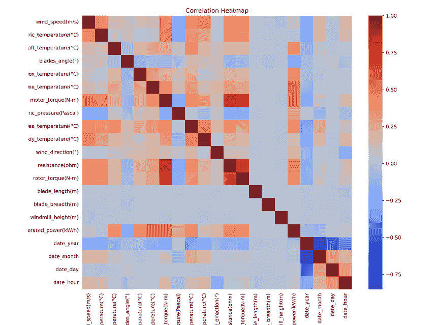

图6.3 – 风力涡轮机数据集的相关性热图

*图6.3*中的相关性热图显示了风速与大气温度、发动机指标（如发动机温度、发电机温度和电机扭矩）之间的一些显著相关性，以及我们的日期特征与大气条件之间较弱的相关性。

值得注意的是，电机扭矩和发电机温度之间存在非常强的相关性。从直觉上看，这是合理的：如果电机产生更大的扭矩，它会产生更多的热量。由于扭矩是因果特征，我们可以考虑在建模时删除发电机温度。

我们还可以看到发电量与发动机指标（包括电阻和风向）之间的相关性。我们可以预期这些特征将对模型的性能产生重大影响。

我们还可以探索分类特征与发电量之间的相关性。涡轮机状态（单独来看）对发电量的影响似乎不大。然而，云层高度却有显著影响。将云层高度与发电量进行绘图，我们得到如下结果：

```python
train_df.groupby("cloud_level")["windmill_generated_power(kW/h)"].mean().plot.bar()
```

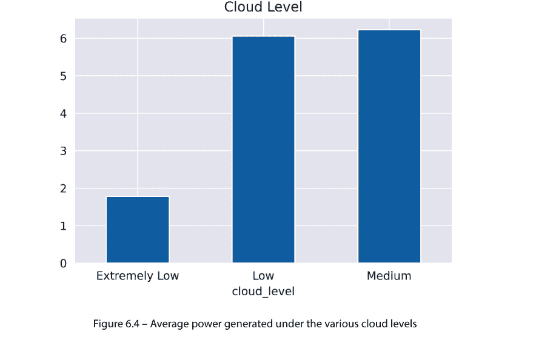

图 6.4 – 不同云层高度下的平均发电量

如*图 6.4*所示，极低的云层与发电量减少有很强的相关性。在进一步探索数据时，控制云层高度以确保其影响不会主导任何新出现的模式会很有帮助。

另一种有助于观察各种特征影响的可视化方法是散点图。绘制每个值可以直观地通过识别数据中的模式和聚类来轻松发现特征。

接下来，我们提供揭示数据内部模式的散点图示例。

为了研究叶片角度可能对发电量产生的任何影响，我们可以创建如下散点图：

```python
sns.scatterplot(x='blades_angle(°)', y='windmill_generated_power(kW/h)', hue='cloud_level', data=train_df)
```

在散点图中，我们还为云层高度添加了色调区分，以便我们可以通过视觉验证任何影响是否并非仅仅源于云层高度：

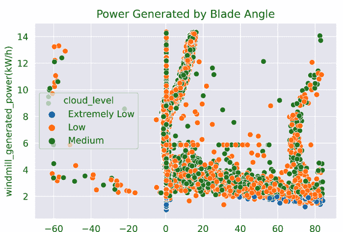

图 6.5 – 发电量（y轴）与叶片角度（x轴）的散点图

叶片角度散点图如*图 6.5*所示。该散点图表明，特定的叶片角度范围与发电量增加相关：[0, 10]度和[65, 75]度（两者在相反方向上也成立）。基于树的算法也能很好地建模此类相关性。

另一个展示我们特征工程威力的例子是月份与发电量的散点图。我们再次通过为这些点设置不同的色调来控制云层高度：

```python
sns.scatterplot(x='date_month', y='windmill_generated_power(kW/h)', hue='cloud_level', data=train_df)
```

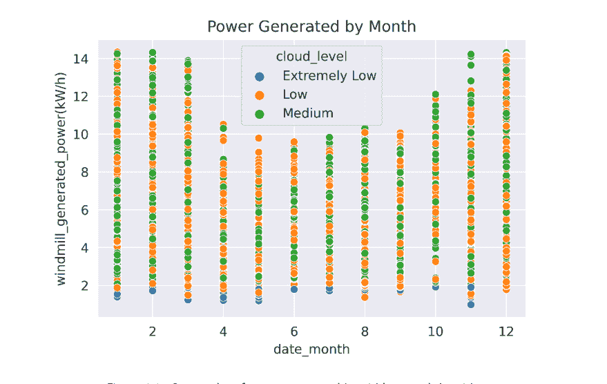

图 6.6 – 发电量（y轴）按月份（x轴）的散点图

图 6.6显示，四月至九月与发电量显著下降相关。我们可以得出结论，风力涡轮机所在位置在这几个月份风力不足，需要其他来源来补充发电量的不足。通过分解我们的日期特征，我们使学习算法能够利用这种相关性。

探索性数据分析（EDA）没有明确的最终目标。对于大型、复杂的数据集，分析可以越来越深入地挖掘数据，几乎可以无限期地迭代探索更多的方面和细微差别。然而，有两个用于判断数据是否已被充分探索的合理性检查如下：

- 我们是否充分理解了每个特征的含义及其对模型输出的潜在影响？
- 数据是否已为建模做好了充分准备？据我们所知，特征是否具有信息性，数据是否干净且无偏，并且格式是否适合模型进行训练？

我们现在转向对数据进行建模，利用前面章节的技术来构建一个经过良好优化的模型。

## 建模

建模的第一步是模型选择。最佳实践是首先使用一个简单的算法对数据进行建模，以验证我们的数据准备工作并建立一个基准。如果使用简单算法建模失败，则更容易调试可能出现的问题或隔离可能导致问题的数据实例。

### 模型选择

对于我们的风力涡轮机数据，我们使用线性回归模型来建立基准并验证数据是否适合建模。

我们还训练了一个随机森林回归模型，作为与我们的LightGBM模型的比较点。如果预算允许，使用不同的学习算法训练多个模型也是一个好习惯，因为特定问题可能更适合特定的算法。

最后，我们训练一个LightGBM回归器作为我们的主要模型。

## 模型训练与评估

从EDA中，我们看到发电机温度是冗余的（由于与电机扭矩的相关性）。因此，我们将其从训练数据中排除：

```python
X = train_df.drop(columns=["windmill_generated_power (kW/h)"], axis=1)
y = train_df["windmill_generated_power (kW/h)"]
```

与LightGBM不同，线性回归和scikit-learn的随机森林回归器都不能自动处理分类特征。

因此，我们使用pandas的`get_dummies`对特征进行编码以用于训练。`get_dummies`操作执行一个称为**独热编码**的过程。分类值被分解为与唯一值数量相同的二进制（0或1）列。对于每个模式，相应的值被标记为1（独热），其他值被标记为0。例如，考虑云层高度特征：有三个类别（中等、低和极低）。我们数据集中云层高度为中等的一行将被编码为1 0 0（三个独立的列）。类似地，低云层高度被编码为0 1 0，依此类推。

执行独热编码允许仅支持数值列的算法（如线性回归）以增加额外列的内存使用为代价来建模数据。

如问题定义中所述，我们将使用两个指标来评估模型：决定系数和MSE。两者都使用五折交叉验证计算。

我们现在可以继续训练我们的线性、随机森林和LightGBM回归器：

```python
X_dummies = pd.get_dummies(X)
linear = LinearRegression()
scores = cross_val_score(linear, X_dummies, y)
scores = cross_val_score(linear, X_dummies, y, scoring="neg_mean_squared_error")
forest = RandomForestRegressor()
X_dummies = pd.get_dummies(X)
scores = cross_val_score(forest, X_dummies, y)
scores = cross_val_score(forest, X_dummies, y, scoring="neg_mean_squared_error")
lgbm = lgb.LGBMRegressor(force_row_wise=True, verbose=-1)
scores = cross_val_score(lgbm, X, y)
scores = cross_val_score(lgbm, X_dummies, y, scoring="neg_mean_squared_error")
```

下表总结了每个模型的性能：

| 算法 | R² | MSE |
| :--- | :--- | :--- |
| 线性回归 | 0.558 | 2.261 |
| 随机森林 | 0.956 | 0.222 |
| LightGBM | 0.956 | 0.222 |

表 6.2 – 风力涡轮机数据集上的五折交叉验证性能指标

LightGBM和随机森林回归器显示出几乎相同的性能，具有相同的四舍五入后的R²和MSE分数。两种算法都显著优于线性回归。

我们的模型表现非常好，绝对误差约为471 W/h。然而，如果我们绘制训练模型的特征重要性，有一个问题很容易发现。

图6.7显示了每个特征对我们的LightGBM模型的相对重要性。

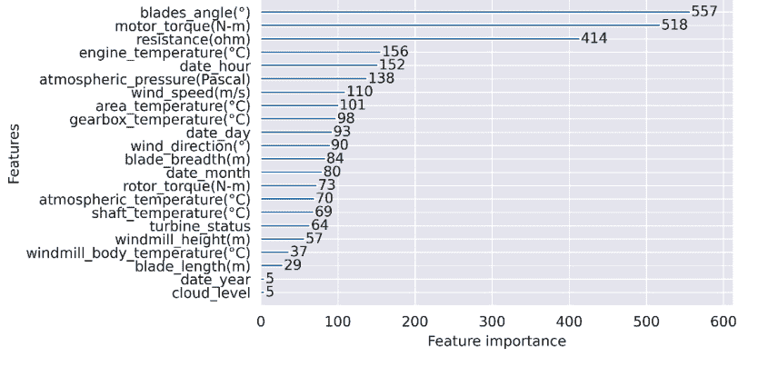

图 6.7 – 每个特征对我们的LightGBM模型的相对重要性

从特征重要性中我们可以看到，有三个特征很突出：`blades_angle`、`motor_torque`和`resistance`。然而，对于其中两个特征`motor_torque`和`resistance`，我们可以问：这些特征是导致发电量增加，还是发电量增加的结果？这些特征是**目标泄漏**的例子，如下所述。

## 目标泄漏

目标泄漏，通常称为“泄漏”，是设计和训练机器学习模型中的一个常见陷阱。当模型在训练过程中无意中获得了访问目标变量（或目标变量的某些代理）的权限时，就会发生这种情况。因此，模型在训练期间的表现可能看起来令人印象深刻，但在新的、未见过的数据上表现不佳，因为它在训练期间实际上“作弊”了。

泄漏可能发生的一些常见例子如下：

- **基于时间的泄漏**：假设你试图预测明天的股票价格。如果你在训练集中包含了明天的数据（可能是意外的），那就会导致泄漏。类似地，仅在事后才可用的数据（例如所有股票的汇总数据）是基于时间泄漏的另一个例子。
- **预处理错误**：当你执行特定操作（如缩放或归一化）时，使用了包含训练集和测试集的统计数据，就会发生这种情况。
- **不正确的数据划分**：对于时间序列数据，使用简单的随机划分可能会导致未来数据出现在训练集中。
- **受污染的验证集**：有时，在创建验证集或测试集时，某些数据可能与训练数据重叠或密切相关，导致乐观且不具代表性的验证分数。

在我们的例子中，`motor_torque`和`resistance`是基于时间泄漏的例子：这两个指标只能在发电后测量，而这正是我们试图预测的。这也说明了进行基准训练测试的重要性，因为此类问题可能不容易事先发现。

我们通过从数据集中移除这些特征来修正这个错误。然后我们可以继续进行模型调优，以进一步提高模型的性能。

## 模型调优

我们利用Optuna进行参数优化研究。我们将利用Optuna的**树结构Parzen估计器（TPE）**采样算法和Hyperband剪枝以提高效率。我们定义目标函数，包含所需参数、剪枝回调，并测量MSE：

```python
def objective(trial):
    boosting_type = trial.suggest_categorical("boosting_type",
    ["dart", "gbdt"])
    lambda_l1 = trial.suggest_float(
```

## 模型部署

我们现在可以使用训练好的模型对未见过的数据进行预测。接下来的章节将重点介绍作为MLOps流程一部分的模型部署和监控的各种方式。

然而，使用模型最简单的方法是保存模型，并编写一个简单的脚本来加载模型并进行预测。

我们可以使用标准的Python序列化或LightGBM API来保存模型。这里，我们演示使用标准Python工具：

```python
joblib.dump(model, "wind_turbine_model.pkl")
```

一个用于加载模型并进行预测的简单脚本如下所示：

```python
def make_predictions(data):
    model = joblib.load("wind_turbine_model.pkl")
    return model.predict(data)

if __name__ == '__main__':
    make_predictions(prepare_data(pd.read_csv("wind-turbine/test.csv")))
```

重要的是，对于任何我们想要预测的数据，都必须重复数据准备步骤，以添加工程特征并删除未使用的列。

## 结果沟通

数据科学流程的最后一步是沟通结果。数据科学家通常会编写一份包含关键发现和可视化的报告，向利益相关者展示结果。

报告的形式将类似于本案例研究的撰写。例如，我们可能会展示发现的特征之间的相关性，比如月份与发电量之间的相关性。我们还会突出数据中的问题，如异常值和缺失值，以改进未来的数据收集工作。

我们还将进一步突出对模型重要的特征，以便优化风力涡轮机以最大化发电量。

请关注报告的质量。使用设计良好、详细的可视化和其他支持材料，而不是仅仅依赖文本。信息图表或交互式图表可能比详细的文字说明更有帮助。检查你的写作是否有错误，并确保在发送报告前进行校对。

报告的内容应针对问题陈述中定义的问题。任何经过检验的假设都必须在报告中得到解答。但是，报告也强烈依赖于并应根据你的受众进行调整。例如，如果你的受众是企业高管，请包含他们能理解的内容，并回答他们可能提出的问题，这些问题将围绕你的发现对业务的影响展开。

现在我们来看一个分类问题的案例研究。我们将展示，尽管每个数据集都是独特的并具有特定的挑战，但整体的数据科学流程保持不变。

## 使用LightGBM对个人信用评分进行分类

我们的第二个案例研究是个人信用评分分类问题。数据集可从 https://www.kaggle.com/datasets/parisrohan/credit-score-classification?datasetId=2289007 获取。

该数据集比前一个问题大得多，并且具有独特的数据格式问题。为简洁起见，我们将不会像前一个问题那样详细地介绍解决方案（因为很多工作是相同的），但端到端的解决方案可在 https://github.com/PacktPublishing/Practical-Machine-Learning-with-LightGBM-and-Python/tree/main/chapter-6/credit-score-classification.ipynb 获取。

### 问题定义

该数据集包含100,000行和27列，代表个人的人口统计和财务信息，包括信用评分评级。数据包括有关个人收入、贷款数量、支付行为和投资的信息。信用评分可能被评为良好、标准或较差。

我们的任务是分析数据并构建一个模型，准确地对未见过的个人的信用评分进行分类。预测的质量使用分类准确率和F1分数来衡量。

### 数据收集

数据收集自一家美国金融机构的客户数据库。年龄在14至65岁的个人构成了数据集的一部分。没有记录显示对特定人群（低收入阶层、年龄或种族群体）的抽样存在偏差，但这必须得到验证。没有收集额外的数据。

### 数据准备

与之前一样，我们从简单的数据探索任务开始，以确定数据的清洁度。我们首先检查数据结构和类型：

```python
train_df.info()
#    Column              Non-Null Count  Dtype  
---  ------              --------------  -----  
 0   ID                  100000 non-null  object 
 1   Customer_ID         100000 non-null  object 
 2   Month               100000 non-null  object 
 3   Name                90015 non-null   object 
 4   Age                 100000 non-null  object 
 5   SSN                 100000 non-null  object 
 ... 
25   Payment_Behaviour   100000 non-null  object 
26   Monthly_Balance     98800 non-null   object 
27   Credit_Score        100000 non-null  object
```

我们注意到一些特征存在缺失值。此外，许多我们期望是数值型的特征（年收入、贷款数量等）被解释为对象而不是整数或浮点数。这些特征必须被强制转换为数值特征。

我们还检查了特征的描述性统计和重复行。发现两个特征存在异常值：年龄和银行账户数量，需要进行清理。

值得注意的是，`Type_of_Loan`字段包含一个逗号分隔的列表，包括连词，列出了每个人的贷款类型。例如“student_loan, mortgage_loan, and personal_loan”。建模算法无法从字符串中提取贷款类型。我们必须设计新的字段以实现有效的建模。

### 数据清理

我们现在可以继续清理数据。总结来说，需要解决以下问题：

- 在适当的地方将对象列强制转换为数值列
- 处理年龄、银行账户数量和月度余额列中的异常值
- 为贷款类型设计新特征
- 处理缺失值和重复行

### 强制转换为数值列

该数据集的主要问题之一是在本应是数值型的列中发现了混合类型，但由于错误值，pandas将它们解释为对象。例如，`Annual_Income`列包含诸如`100000.0_`之类的值，这被解释为字符串。

为了清理并将特征转换为数字，我们首先使用正则表达式移除字符符号：

```python
frame[col] = frame[col].astype(str).str.replace(r'[^\d\.]', '', regex=True)
```

这允许我们使用pandas将列强制转换为数值特征，将任何错误（空值）转换为np.nan值：

```python
frame[col] = pd.to_numeric(frame[col], errors="coerce")
```

`Credit_History_Age`特征需要我们做更多的工作。年龄使用自然语言指定，例如“12 years and 3 months”。这里，我们使用Python字符串处理将年和月转换为浮点数：

```python
def clean_credit_age(age):
    if age == 'nan':
        return np.nan
    if not "Years" in age:
        return age
    years, months = age.split(" Years and ")
    months = months.replace(" Months", "")
    return int(years) + int(months) / 12
```

## 分隔符分隔字符串的拆分

如前所述，`Type_of_Loan` 特征是一个逗号分隔的列表，列出了个人拥有的贷款类型。虽然我们可以用多种方式处理这个问题，但最有用的技术是解析这些字段，并构建一个布尔数组列，以指示个人拥有哪些贷款。

共有八种独特的贷款类型，以及一个贷款类型未指定的特定类别。它们是 `Auto Loan`、`Credit-Builder Loan`、`Debt Consolidation Loan`、`Home Equity Loan`、`Mortgage Loan`、`Payday Loan`、`Personal Loan` 和 `Student Loan`。

我们的编码策略将按如下方式处理该特征。我们创建九个新列（每种贷款类型一列，加上未指定类型一列），如果个人拥有该贷款类型，则将该列设置为真。例如，这里有三个组合的贷款描述：

```
"Home Equity Loan, and Payday Loan"
"Payday Loan, Personal Loan"
"Student Loan, Auto Loan, and Debt Consolidation Loan"
```

表 6.3 显示了这些示例的编码结果，其中如果个人拥有该类型的贷款，则设置真标志。

| Auto | Credit-Builder | Debt Cons. | Home Equity | Mortgage | Payday | Personal | Student | Unspecified |
|---|---|---|---|---|---|---|---|---|
| F | F | F | T | F | T | F | F | F |
| F | F | F | F | F | T | T | F | F |
| T | F | T | F | F | F | F | T | F |

表 6.3 – 贷款类型列编码客户的贷款类型

我们可以利用 pandas 的字符串工具来完成上述编码，如本例所示：

```
frame["auto_loan"] = frame["Type_of_Loan"].str.lower().str.contains("auto loan").astype(bool)
```

## 异常值和缺失值

我们遵循与之前相同的一般策略：使用描述性统计来填补缺失值，并在可能的情况下，将异常值设置为使用领域知识定义的边界。

重复行被删除。

关于异常值，年龄、银行账户数量和月度余额特征存在异常值（我们使用均值和标准差以及分布图来确认）。我们将这些特征的异常值设置为上限：

```
frame.loc[frame["Age"] > 65, "Age"] = 65
frame.loc[frame["Num_Bank_Accounts"] > 1000, "Num_Bank_Accounts"] = 1000
frame.loc[frame["Monthly_Balance"] > 1e6, "Monthly_Balance"] = np.nan
```

数据清理后，我们可以验证所有特征都具有正确的类型，并且缺失值已得到处理：

```
train_df.info()
train_df.isnull().sum()
train_df[train_df.duplicated()]
```

我们可以使用干净的数据集进行更彻底的探索性分析。

## EDA

接下来，我们重点介绍在 EDA 过程中发现的一些模式。
如问题描述中所述，我们需要验证数据中是否存在任何潜在的偏差。
我们首先可视化客户的年龄：

```
sns.histplot(train_df["Age"], bins=20)
```

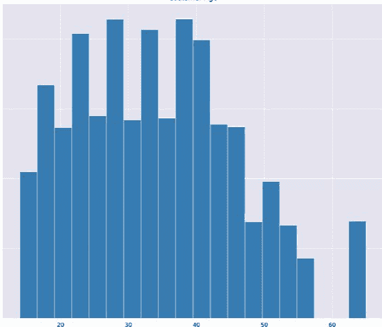

图 6.8 – 显示按年龄划分的客户数量的直方图

图 6.8 显示所有年龄段都有代表，数据主要围绕中年呈正态分布。

我们还检查月收入。低收入阶层数据的缺乏可能表明少数群体被排除在外：

```
sns.histplot(train_df["Monthly_Inhand_Salary"], bins=30)
```

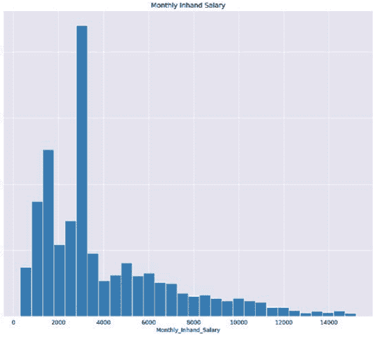

图 6.9 – 显示按月度实得工资划分的客户数量的直方图

如图 6.9 所示，月收入遵循预期的分布，低收入阶层得到了充分代表。

我们再次可视化数值特征的相关性热图，以突出和指导相关性：

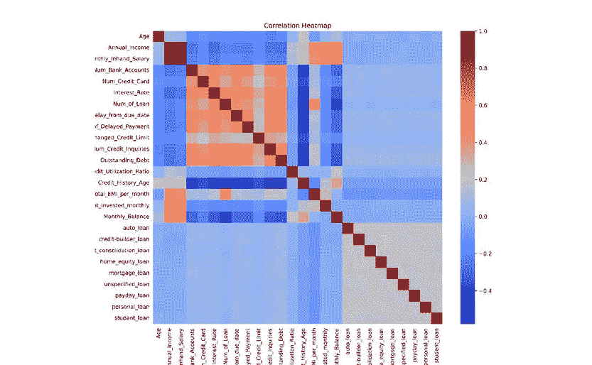

图 6.10 – 信用评分数据集的相关性热图

两个强相关性值得注意：月度余额与月度工资，以及未偿还债务与到期日延迟。对这些相关性的进一步可视化表明，客户的月度余额随工资增加而增加，并且较差的信用评分与较低的余额和工资相关。

未偿还债务与信用评分之间也存在类似的关联：债务增加与较差的信用评分相关，反之亦然。分析证实，我们的模型应该能够捕捉到这两种相关性。

最后，同样重要的是，我们还必须检查数据集的类别分布：

```
sns.histplot(train_df["Credit_Score"], bins=30)
```

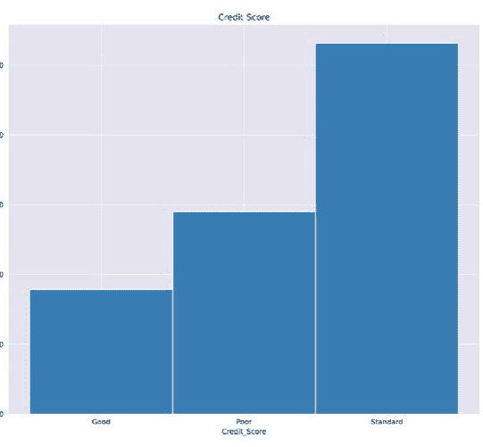

图 6.11 – 信用评分数据集的类别分布直方图

我们数据集的类别分布如 *图 6.11* 所示。正如我们在图中看到的，存在显著的类别不平衡。在继续建模之前，必须解决这种不平衡问题。

## 建模

与之前一样，我们首先进行模型选择。

### 模型选择

由于数据集的规模和复杂性，预计线性模型的表现不会很好。因此，我们使用一个普通的决策树作为基线模型，并包含一个随机森林进行比较。

### 模型训练和评估

我们几乎准备好训练模型了，但还有一个问题需要解决：我们必须处理类别不平衡。

### 处理类别不平衡

类别不平衡可能会使任何训练好的模型偏向于多数类或多个多数类。尽管基于树的算法比大多数其他学习算法更善于处理不平衡类别，但在建模之前处理类别不平衡仍然是最佳实践。

通常，可以采用以下策略来处理不平衡类别：

- **重采样技术：**
  - **过采样：** 这涉及增加少数类中的样本数量以匹配多数类。一种常见的技术是 **合成少数类过采样技术 (SMOTE)**，它基于现有样本创建新样本。
  - **欠采样：** 这涉及减少多数类中的样本数量以匹配少数类。这种方法的一个风险是可能丢失有价值的数据。
- **代价敏感学习：** 这种方法在训练过程中为少数类的错误分类分配更高的代价。其思想是让模型更加关注少数类。LightGBM 通过 `class_weight`（用于多类）和 `scale_pos_weight`（用于二分类）参数支持这一点。应用这些参数的示例在 *第 4 章，比较 LightGBM、XGBoost 和深度学习* 中给出。
- **数据增强：** 这涉及通过对现有实例添加小的扰动来在数据集中创建新实例。这种方法在图像分类任务中很普遍。
- **使用适当的评估指标：** 准确率在类别不平衡的情况下通常具有误导性。相反，精确率、召回率、F1 分数、**ROC 曲线下面积 (AUC-ROC)** 和混淆矩阵等指标可以提供更全面的模型性能视图。

在我们的案例研究中，我们已经在使用针对不平衡类别的稳健评估指标。对于这个问题，我们使用 SMOTE（一种过采样技术）来平衡我们的类别，同时保留我们的数据。

### SMOTE

SMOTE 的开发是为了克服简单过采样少数类的一些缺点，后者可能由于实例的精确复制而导致过拟合 [1]。SMOTE 不是简单地复制少数样本，而是创建合成的或“假的”样本，这些样本与少数类中的现有样本相似但不完全相同。

SMOTE 算法如下进行。通过选择靠近少数类样本的点之间的点来合成新的样本点，称为合成样本。具体来说，对于每个少数类样本，SMOTE 计算 k 个最近邻，选择其中一个邻居，然后将样本与其选定邻居的特征向量之间的差值乘以 0 到 1 之间的随机数，并将其添加到原始样本中以创建新的合成样本。

通过创建合成示例，SMOTE 为不平衡问题提供了一个更稳健的解决方案，鼓励模型绘制更具泛化性的决策边界。然而，重要的是要注意，虽然 SMOTE 可以提高模型在不平衡数据集上的性能，但它并不总是最佳选择。例如，如果少数样本在特征空间中不够接近，它可能会引入噪声，导致类别重叠。与所有采样技术一样，至关重要的是使用交叉验证或单独的验证集来仔细评估SMOTE对模型性能的影响。

SMOTE过采样在`imblearn` Python库中实现。我们可以如下方式拟合和重采样数据：

```
X = train_df.drop(columns=["Credit_Score"], axis=1)
X_dummies = pd.get_dummies(X)
y = train_df["Credit_Score"]
smote = SMOTE(sampling_strategy='auto')
return smote.fit_resample(X_dummies, y)
```

*图6.12*展示了使用SMOTE重采样后数据集的类别分布。如图所示，各类别现在已完全平衡。

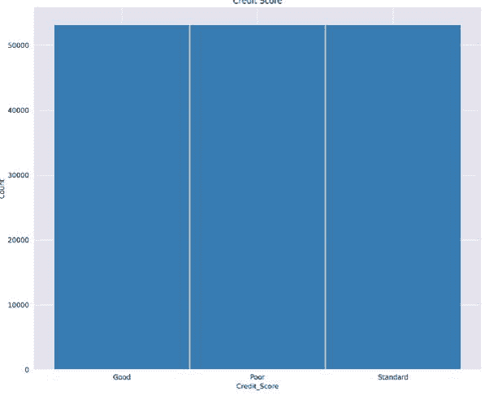

## 训练与评估

我们现在可以继续进行建模。下表展示了使用默认参数运行决策树分类器、随机森林和LightGBM模型的结果。

| 算法 | 准确率 | F1分数 |
| --- | --- | --- |
| 决策树 | 59.87% | 0.57 |
| 随机森林 | 69.35% | 0.67 |
| LightGBM | 70.00% | 0.68 |

表6.4 – 信用评分数据集上的五折交叉验证性能指标

如*表6.4*所示，LightGBM模型表现最佳，其准确率略优于随机森林模型。两种算法的表现都优于决策树基线。LightGBM模型的训练速度也最快，比随机森林模型快七倍以上。

我们现在继续对LightGBM模型进行参数优化。

## 模型调优

与之前的案例研究类似，我们使用Optuna进行参数优化。我们再次使用TPE采样器，优化预算为50次试验。

## 模型部署与结果

我们的模型现已准备就绪，可以部署到我们选择的平台。潜在的部署选项包括围绕我们的模型构建Web API、使用**PostgresML**等工具部署，或使用**AWS SageMaker**等云平台。这些及其他选项将在后续章节中详细讨论。

我们也可以将模型用作数据科学报告的一部分。有关撰写优秀报告的详细信息，请参阅上一节。请记住沟通数据科学结果的最重要方面，如下：

- 始终以无偏见和公平的方式报告结果
- 考虑你的受众，并专注于报告中能为他们提供最大价值的细节

## 总结

本章介绍了两个关于如何应用数据科学流程与LightGBM的案例研究。详细讨论了数据科学生命周期及其典型的组成部分步骤。

以风力涡轮机发电为例，展示了在生命周期中处理数据问题的方法。详细讨论了特征工程以及如何处理异常值。进行了探索性数据分析示例，并提供了可视化样本。展示了模型训练和调优，以及用于导出和作为程序使用模型的基本脚本。

还介绍了第二个涉及多类别信用评分分类的案例研究。再次遵循了数据科学流程，特别关注了数据集中的数据清洗和类别不平衡问题。

下一章讨论了AutoML框架FLAML，并介绍了机器学习管道的概念。

## 参考文献

[1] N. V. Chawla, K. W. Bowyer, L. O. Hall, and W. P. Kegelmeyer, “SMOTE: Synthetic Minority Over-sampling Technique,” *Journal of Artificial Intelligence Research*, vol. 16, p. 321–357, June 2002.

# 7 使用LightGBM和FLAML进行AutoML

在上一章中，我们讨论了两个案例研究，展示了如何处理数据科学问题的端到端示例。在典型数据科学生命周期涉及的步骤中，通常最耗时的任务是准备数据、找到正确的模型以及调整模型。

本章探讨了自动化机器学习的概念。自动化机器学习系统旨在自动化机器学习生命周期的部分或全部环节。我们将了解**FLAML**，这是一个使用高效超参数优化算法自动化流程中模型选择和调优步骤的库。

最后，我们将展示一个使用FLAML和另一个名为Featuretools的开源工具的案例研究。将讨论并展示FLAML的实际用法。我们还将展示FLAML的零样本AutoML功能，该功能完全绕过了调优过程。

本章的主要主题如下：

- 自动化机器学习简介
- 用于AutoML的FLAML
- 案例研究 – 将FLAML与LightGBM结合使用

## 技术要求

本章包含展示将FLAML与LightGBM用于AutoML用例的示例和代码片段。完整的示例和为本章设置合适环境的说明可在https://github.com/PacktPublishing/Practical-Machine-Learning-with-LightGBM-and-Python/tree/main/chapter-7获取。

## 自动化机器学习

**自动化机器学习（AutoML）**是一个蓬勃发展的领域，旨在自动化机器学习工作流的复杂方面，从而实现更高效和更易于访问的机器学习模型部署。AutoML的出现反映了人工智能和机器学习技术日益成熟及其在各个行业和研究领域的渗透。它旨在减轻数据科学过程中一些复杂、耗时的方面，使机器学习技术能够更广泛地使用和更易于应用。

对于精通机器学习和数据科学流程的软件工程师来说，机器学习模型日益增长的复杂性和不断扩展的算法宇宙可能带来重大挑战。构建一个稳健、高性能的模型需要大量的专业知识、时间和计算资源来选择合适的算法、调整超参数并进行深入比较。AutoML应运而生，旨在自动化这些复杂且通常劳动密集型的任务。

AutoML还致力于使机器学习领域民主化。通过抽象掉数据工程和模型构建与调优的一些复杂性，AutoML使得经验较少的个人和组织能够利用这些强大的技术。因此，机器学习可以在更广泛的场景中发挥作用，更多的个人和组织能够部署机器学习解决方案。

AutoML系统有各种复杂程度。虽然所有AutoML系统都旨在简化机器学习工作流，但大多数系统和工具只关注工作流的部分环节。通常，数据预处理、特征工程、模型选择和超参数调整等步骤会被自动化。这种自动化节省了时间，并且可以通过系统地探索更全面的选项来提高机器学习模型的稳健性和性能，而这些选项可能由于人类偏见或时间限制而被忽视或未被探索。

## 自动化特征工程

如*第6章 使用LightGBM解决现实世界的数据科学问题*中所讨论的，数据清洗和特征工程是机器学习工作流的关键部分。它们涉及处理不可用的数据、处理缺失值以及创建可以输入模型的有意义的特征。手动特征工程可能特别具有挑战性且耗时。AutoML系统旨在有效处理这些任务，实现自动化的特征提取和转换，从而构建更稳健的模型。

数据清洗自动化通常通过遵循处理异常值和缺失值等问题的特定知名技术来实现。在前面的章节中，我们手动应用了其中一些技术：异常值可以通过统计方法进行测试并进行封顶或截断。缺失值通常使用均值或众数等描述性统计量进行插补。AutoML系统要么使用启发式算法和测试来选择最佳技术来清洗数据，要么采用多种方法和测试，通过针对数据训练模型来找到最佳方案。

## 自动化特征工程

自动化特征工程的方法通常相似：对所有现有特征应用多种可能的转换，然后在建模后测试生成特征的有用性。关于转换如何生成特征的示例，可在以下案例研究中找到。

自动化特征工程的另一种方法是基于特征的数据类型，使用规则提取特征。例如，可以从日期字段中提取日、周、月和年。或者可以计算单词或句子特征的字符数、词元、词干或嵌入向量。

正如您可能注意到的，特征工程技术的应用依赖于关于手头特征的技术信息，通常是数据类型，以及与其他特征的相关性和关系。重要的是，在创建新特征时并未应用领域知识。这凸显了AutoML的缺点之一：它无法处理需要人类专业知识的特定领域驱动决策。例如，考虑一个包含空腹血糖特征的糖尿病数据集。医疗专业人员（领域专家）知道，空腹血糖在100至125 mg/dL之间的个体被视为糖尿病前期，更高则被视为糖尿病。这个连续特征可以被工程化为特定类别：正常、糖尿病前期和糖尿病，从而简化建模数据。这样的转换无法通过AutoML系统实现。

## 自动化模型选择和调优

AutoML特别有用的领域是模型选择和超参数调优。鉴于可用的算法众多，为特定数据集和问题选择最佳算法可能令人望而生畏。AutoML系统使用各种技术，包括贝叶斯优化和元学习，来选择最佳模型。它们还自动化超参数的调优，以最大化模型性能。

AutoML系统可以提供自动交叉验证，降低过拟合风险，并确保模型对未见数据的泛化能力。一旦选择了最优模型并完成训练，许多AutoML工具还可以帮助部署，使模型可用于新数据的推理。

除了初始模型部署外，一些AutoML解决方案还在持续的模型监控和维护方面提供价值。随着现实世界数据的演变，模型可能会发生漂移，其性能可能会下降。AutoML可以帮助监控模型性能，并根据需要重新训练模型，确保您的机器学习系统长期保持有效。

## 使用AutoML系统的风险

如前所述，AutoML系统通常不使用领域知识来辅助特征工程、模型选择或其他自动化。相反，它们采用一种蛮力或散射式的尝试方法。

一些AutoML系统的“黑盒”性质也可能使其难以解释系统做出的决策，使其不太适合需要高度可解释性的应用。

因此，让数据科学家或领域专家参与其中，与AutoML系统协同工作，以识别并利用领域知识可以带来更好模型的机会，仍然至关重要。然而，AutoML系统有时会阻碍数据科学家，而不是赋能他们，因为它在科学家和数据之间增加了一层额外的障碍。

我们已经看到一个AutoML框架的实际应用。我们在*第5章，使用Optuna进行LightGBM参数优化*中讨论的Optuna，就是一个专注于超参数调优的AutoML框架示例。在下一节中，我们将讨论另一个AutoML框架：FLAML。

## 介绍FLAML

**FLAML（快速轻量级AutoML）** 是由微软研究院开发的一个Python库[1]。它旨在以低计算成本自动生成高质量的机器学习模型。FLAML的主要目标是最大限度地减少调优超参数和识别最佳机器学习模型所需的资源，使AutoML更易于访问且更具成本效益，特别是对于预算有限的用户。

FLAML提供了几个关键特性，使其与众不同。其中之一是其效率。它为机器学习任务提供了一个快速轻量级的解决方案，最大限度地减少了所需的时间和计算资源。它在实现这一点的同时，并未牺牲其生成模型的质量。FLAML还强调其在各种机器学习算法和应用领域的通用性。

FLAML效率的核心在于其新颖的、具有成本效益的搜索算法。这些算法智能地探索超参数空间，最初专注于“低成本”配置。随着对搜索空间了解的加深，它会逐渐探索更“昂贵”的配置。这确保了探索和利用之间的平衡，在用户指定的时间和资源预算内交付优化的模型。

FLAML在模型选择过程中也表现出色。它支持各种机器学习算法，包括XGBoost、LightGBM、CatBoost、RandomForest以及各种线性模型。该库可以自动为给定数据集选择最佳算法并优化其超参数，为用户提供无需大量手动干预的最优模型。

FLAML提供了一个简单直观的API，可以与现有的基于Python的数据科学和机器学习工作流无缝集成。用户指定数据集、时间预算（以秒为单位）和优化任务，FLAML会处理其余部分。这种用户友好性和效率使其成为机器学习初学者和希望加快工作流程的经验丰富的从业者的实用选择。

FLAML效率背后的新颖之处在于其**超参数优化（HPO）**算法。FLAML提供两种HPO算法：**成本节约优化**和**BlendSearch**。

## 成本节约优化

**成本节约优化（CFO）** 是一种利用随机直接搜索来探索超参数空间的局部搜索方法[2]。CFO算法从一个低成本的超参数配置开始（例如，对于LightGBM，低成本配置可能具有较少的提升树）。它在超参数空间中朝向更高成本参数区域进行固定次数的随机步进。

CFO的步长是自适应的，这意味着如果几次迭代都没有改进，算法会减小步长。这样做意味着不会在成本高且前景不佳的方向上采取大步长。

CFO还利用随机重启。作为一种局部搜索算法，CFO可能会陷入局部最优。如果没有进展且步长已经很小，算法会在一个随机点重新启动。

总之，CFO快速（使用大步长）尝试到达搜索空间中更有希望的区域，同时尽可能少地使用优化预算（从低成本区域开始）。只要优化预算允许，CFO就会继续搜索，如果出现停滞，则在随机区域重新启动。FLAML允许用户以秒为单位设置优化预算。

## BlendSearch

FLAML在BlendSearch中提供了CFO算法的替代方案。BlendSearch与CFO的不同之处在于，它使用多线程方法同时运行全局和局部搜索过程[3]。

与CFO类似，BlendSearch从一个低成本配置开始并进行局部搜索。然而，与CFO不同，BlendSearch不会等到局部搜索停滞才探索新区域。相反，一个全局搜索算法（如贝叶斯优化）会持续建议新的起始点。起始点根据其与现有点的距离进行过滤，并按成本优先排序。

BlendSearch的每次迭代然后根据上一次迭代的性能，选择是继续局部搜索还是从新的全局搜索点开始。与CFO一样，全局搜索方法提出的配置会经过可行性验证。

由于BlendSearch使用全局优化，它不太容易陷入局部最小值。如果超参数搜索空间高度复杂，建议使用BlendSearch而不是CFO。通常，先尝试CFO，只有在CFO遇到困难时才切换到BlendSearch，这是一个好主意。

## FLAML的局限性

尽管有其优势，FLAML也有其局限性。该库的自动化流程可能并不总是优于专家的手动调优，特别是对于复杂的、特定领域的任务。此外，与其他AutoML解决方案一样，生成模型的可解释性可能具有挑战性，尤其是在处理提升树或神经网络等模型时。

FLAML仅执行机器学习过程中的模型选择和调优部分。这些是模型开发中最耗时的部分，但FLAML不提供执行特征工程或数据准备的功能。

## 案例研究——使用 FLAML 与 LightGBM

我们将使用上一章的风力涡轮机数据集进行案例研究。数据集的处理方式与之前相同，包括填补缺失值和将异常值限制在适当范围内。然而，我们在特征工程方面采取了不同的方法。为了进一步探索 AutoML，我们使用了一个名为 Featuretools 的开源框架。

## 特征工程

**Featuretools** (https://featuretools.alteryx.com/en/stable/#) 是一个用于自动化特征工程的开源框架。具体来说，Featuretools 非常适合处理关系型数据集和时序数据。

如前一节所述，自动化特征工程工具通常使用特征的组合变换来为数据集生成新特征。Featuretools 通过其 **深度特征合成 (DFS)** 过程支持特征变换。

例如，考虑一个在线客户网络会话的数据集。在此类数据集中可能有用的典型特征包括客户访问网站的总会话数，或客户注册的月份。使用 Featuretools 和 DFS，可以通过以下代码实现（由 https://featuretools.alteryx.com/ 提供）：

```
feature_matrix, feature_defs = ft.dfs(
    entityset=es,
    target_dataframe_name="customers",
    agg_primitives=["count"],
    trans_primitives=["month"],
    max_depth=1,
)
feature_matrix
```

这里应用了两种变换：一种是“月份”变换，另一种是“计数”聚合。通过这些变换，将自动从客户存在的任何日期（例如加入日期）中提取月份，并为每个客户计算计数聚合（例如会话数或交易数）。Featuretools 提供了丰富的变换和聚合功能。完整列表可在 https://featuretools.alteryx.com/en/stable/api_reference.html 查看。

让我们看看如何使用 Featuretools 为风力涡轮机数据集进行特征工程。

## 将 Featuretools 与风力涡轮机数据集结合使用

我们必须为数据集执行两项特征工程任务：为日期时间字段设计特征并对分类特征进行编码。首先，我们为数据创建一个 EntitySet：

```
es = ft.EntitySet(id="wind-turbine")
es = es.add_dataframe(
    dataframe_name="wind-turbine",
    dataframe=df,
    index="tracking_id"
)
```

EntitySet 告诉 Featuretools 框架我们在数据中处理的实体和关系。在前面的例子中，Customer 是一个实体的例子；对于本例，它是 Wind Turbines。然后我们传递数据框和要用作索引的列。

然后我们应用 dfs 和 encode_features 来为数据集设计特征：

```
feature_matrix, feature_defs = ft.dfs(
    entityset=es, target_dataframe_name="wind-turbine",
    trans_primitives=["day", "year", "month", "weekday"],
    max_depth=1)
feature_matrix_enc, features_enc = ft.encode_features(
    feature_matrix, feature_defs)
```

前面的代码提取了每个风力涡轮机测量值的日期、年份、月份和星期几。然后，特征编码自动对数据集中的分类特征进行独热编码，包括新的日期字段。

以下是数据集列列表的摘录，显示了由 Featuretools 创建的一些列：

```
...
'cloud_level = Low',
'cloud_level = Medium',
'cloud_level = Extremely Low',
'cloud_level is unknown',
'MONTH(datetime) = 1',
'MONTH(datetime) = 2',
...
'MONTH(datetime) = 8',
'MONTH(datetime) = 9',
'MONTH(datetime) = 11',
'MONTH(datetime) is unknown',
...
'YEAR(datetime) = 2019',
'YEAR(datetime) = 2018',
'YEAR(datetime) is unknown'
```

注意分类特征的独热编码：每个值现在被拆分为单独的列。这包括未知值的列（例如，YEAR(datetime) is unknown），这说明了处理分类特征中缺失值的另一种方式。我们不是使用众数等方法来填补一个值，而是有一个列向模型（真或假）发出信号，表明该值缺失。

自动化特征工程将我们的列数从 22 列增加到 66 列。这说明了自动化特征工程和 AutoML 的另一个普遍注意事项：自动化可能导致数据集过于复杂。在 *第 6 章，使用 LightGBM 解决现实世界的数据科学问题* 中，我们可以根据对学习算法的理解来选择性地编码特征。LightGBM 可以自动处理分类特征；因此，如果 LightGBM 是唯一使用的学习算法，独热编码就是多余的。

此外，日期字段可以以数值方式处理。通过运用我们对问题和算法的知识，我们可以降低学习问题的维度，从而简化它。自动化系统的易用性必须与专家特征工程的手动工作相平衡，后者可以节省后续时间。

数据集现在已准备好进行模型开发；我们仅用两行代码就完成了数据集的特征工程。

## FLAML AutoML

我们现在将研究模型选择和调优。我们将使用 FLAML 来比较五种不同的模型：LightGBM、RandomForest、XGBoost、ExtraTrees 和一个有限深度版本的 XGBoost。我们还想为最佳模型找到最优参数。使用 FLAML，整个过程只需两行代码即可完成：

```
automl = flaml.AutoML()
automl.fit(X, y, task="regression", time_budget=60)
```

前面的代码在 60 秒的时间预算内拟合了一个最优的回归模型。FLAML 自动使用一个保留集来计算验证结果，然后使用 CFO 作为默认调优器进行优化。

AutoML 类提供“面向任务的 AutoML”。用户设置学习任务，FLAML 负责其余部分。支持的任务包括：分类、回归、时间序列预测和时间序列分类、排序以及与 NLP 相关的任务，如摘要和词元分类。

`fit` 调用是可定制的。例如，我们可以如下自定义：

```
automl = flaml.AutoML()
custom_hp = {
    "learning_rate": {
        "domain": flaml.tune.loguniform(0.0001, 0.05)
    }
}
automl.fit(X, y, task="regression", time_budget=120,
          metric="mse",
          estimator_list=['lgbm', 'xgboost', 'rf'],
          custom_hp={
              "lgbm": custom_hp
          },
          hpo_method="bs")
```

在这里，我们通过显式声明学习率作为对数尺度的均匀变量来定制超参数搜索空间。设置参数搜索空间的其他选项包括均匀采样、随机整数采样和基于选择的分类参数采样。

此外，我们将估计器列表设置为仅关注三种建模算法：LightGBM、随机森林和 XGBoost。最后，我们可以自定义 HPO 算法，这里我们将其设置为 BlendSearch，它使用前面讨论的多线程优化方法。

完整的自定义列表可在 https://microsoft.github.io/FLAML/docs/reference/automl/automl/#automl-objects 查看。

一旦调用了 `fit`，我们就可以像使用任何其他模型一样使用 AutoML 训练的模型。FLAML 提供了 scikit-learn 风格的 API 用于预测和基于概率的预测（用于分类问题）。

以下代码从给定数据创建预测并计算指标和特征重要性：

```
y_pred = automl.predict(X)
print(f"r2: {1 - sklearn_metric_loss_score('r2',
    y_pred, y)}")
print(f"MSE: {sklearn_metric_loss_score('mse',
    y_pred, y)}")

r2: 0.9878605489721696
MSE: 0.08090827806554425
```

我们还可以通过调用以下命令获取获胜模型以及每个试验模型的最佳超参数配置：

```
print(automl.best_config)
print(automl.best_config_per_estimator)
print(automl.time_to_find_best_model)
```

## 零样本自动机器学习

**零样本自动机器学习**是FLAML的一项功能，它不执行超参数优化。相反，它通过分析算法在各种数据集上的性能，离线确定合适的超参数配置。该过程可描述如下：

1.  构建模型之前：
    -   使用AutoML在多个数据集上训练模型
    -   将所有数据集的超参数配置、评估结果和元数据存储为零样本解决方案
2.  为新问题构建模型时：
    -   使用FLAML分析新数据集与零样本解决方案结果，确定合适的超参数
    -   使用这些超参数在新数据集上训练模型

第一步仅对给定的模型类型（如LightGBM）执行一次。此后，无需调优即可为任何新问题构建新模型。该解决方案是“零样本”的，因为它在新数据集的首次拟合中就使用了合适的参数。

FLAML的零样本自动机器学习方法具有许多优势：

-   如前所述，无需调优，这在解决新问题时节省了大量计算资源和时间
-   由于无需调优，因此也不需要验证数据集，可以将更多数据用于训练
-   用户需要的参与更少
-   通常，无需更改代码，我们将在下文看到

当然，为模型类型创建零样本解决方案仍然是一项艰巨的任务，需要多样化的数据集和大量计算来训练许多模型。幸运的是，FLAML为许多流行模型提供了预训练的零样本解决方案，包括LightGBM、XGBoost和scikit-learn的随机森林。

要使用零样本解决方案，请将常规的LightGBM导入替换为FLAML封装的版本：

```
from flaml.default import LGBMRegressor

zs_model = LGBMRegressor()
zs_model.fit(X, y)
```

调用`fit`会分析X中的数据，选择合适的参数，并使用这些参数训练模型。训练仅执行一次，不进行调优。

至此，我们对FLAML的案例研究结束。正如我们所看到的，FLAML为复杂的模型选择和调优功能提供了直观的API，这在处理机器学习问题时可以节省大量精力。

## 总结

总之，本章讨论了自动机器学习系统及其用途。讨论了自动化特征工程、模型选择和调优的典型方法。我们还提到了使用这些系统相关的风险和注意事项。

本章还介绍了FLAML，一个用于自动机器学习的库，它提供了自动化模型选择和调优过程的工具。我们还介绍了CFO和BlendSearch，这是FLAML提供的两种高效的超参数优化算法。

通过案例研究的形式展示了应用FLAML的实践。除了FLAML，我们还展示了一个名为Featuretools的开源工具，它提供了自动化特征工程的功能。我们展示了如何使用FLAML在固定时间预算内开发优化模型。最后，我们提供了使用FLAML零样本自动机器学习功能的示例，该功能通过分析数据集与已知问题的配置来确定合适的超参数，从而消除了模型调优的需要。

下一章将讨论围绕LightGBM模型构建机器学习流水线，重点是导出、打包和部署LightGBM模型以用于生产。

## 参考文献

- [1] C. Wang, Q. Wu, M. Weimer, and E. Zhu, "FLAML: A Fast and Lightweight AutoML Library," in MLSys, 2021.
- [2] Q. Wu, C. Wang and S. Huang, Frugal Optimization for Cost-related Hyperparameters, 2020.
- [3] C. Wang, Q. Wu, S. Huang, and A. Saied, "Economical Hyperparameter Optimization With Blended Search Strategy," in ICLR, 2021.

# 第三部分：使用LightGBM构建生产就绪的机器学习

在第三部分，我们将深入探讨机器学习解决方案在生产环境中的实际应用。我们将揭示机器学习流水线的复杂性，确保系统化的数据处理和模型构建以获得一致的结果。MLOps，作为DevOps和机器学习的融合，将成为焦点，强调在现实场景中部署和维护健壮的机器学习系统的重要性。通过实践示例，我们将探索在平台（如Google Cloud、Amazon SageMaker和创新的PostgresML）上部署机器学习流水线，强调每个平台提供的独特优势。最后，我们将探讨分布式计算和基于GPU的训练，展示加速训练过程和高效管理更大数据集的方法。这一总结性部分将强调将机器学习无缝集成到实用的、生产就绪的解决方案中，为读者提供在动态环境中将模型付诸实践的知识。

本部分将包括以下章节：

-   第8章，使用LightGBM构建机器学习流水线和MLOps
-   第9章，使用AWS SageMaker进行LightGBM MLOps
-   第10章，使用PostgresML部署LightGBM模型
-   第11章，使用LightGBM进行分布式和基于GPU的学习

# 8 使用LightGBM构建机器学习流水线和MLOps

本章将重点从数据科学和建模问题转向为我们的机器学习解决方案构建生产服务。我们引入了机器学习流水线的概念，这是一种系统化处理数据和构建模型的方法，以确保一致性和正确性。

我们还介绍了MLOps的概念，这是一种融合了DevOps和机器学习的实践，解决了部署和维护具备生产能力的机器学习系统的需求。

本章包含一个使用scikit-learn构建机器学习流水线的示例，该流水线封装了数据处理、模型构建和调优。我们展示了如何将流水线包装在Web API中，暴露一个安全的预测端点。最后，我们还探讨了系统的容器化以及部署到Google Cloud。

本章的主要主题如下：

-   机器学习流水线
-   MLOps概述
-   部署用于客户流失预测的机器学习流水线

## 技术要求

本章包含创建scikit-learn流水线、训练LightGBM模型和构建FastAPI应用程序的示例。设置环境的要求可以在完整的代码示例中找到，地址为：https://github.com/PacktPublishing/Practical-Machine-Learning-with-LightGBM-and-Python/tree/main/chapter-8。

## 介绍机器学习流水线

在*第6章，使用LightGBM解决现实世界的数据科学问题*中，我们详细概述了数据科学生命周期，其中包括训练机器学习模型的各个步骤。如果我们只关注训练模型所需的步骤，假设数据已经收集完毕，那么这些步骤如下：

1.  数据清洗和准备
2.  特征工程
3.  模型训练和调优
4.  模型评估
5.  模型部署

在之前的案例研究中，我们在Jupyter笔记本中手动应用了这些步骤。然而，如果我们将背景转移到一个长期的机器学习项目中会发生什么？如果当新数据可用时我们必须重复这个过程，我们将必须遵循相同的程序才能成功构建模型。

同样，当我们想使用模型对新数据进行评分时，我们必须每次都正确地应用这些步骤，并使用正确的参数和配置。

从某种意义上说，这些步骤构成了数据的流水线：数据进入流水线，完成时产生一个可部署的模型。

正式地说，机器学习流水线是一个系统化和自动化的过程，它指导机器学习项目的工作流程。它涉及几个相互关联的阶段，封装了前面列出的步骤。

机器学习流水线旨在确保这些任务是结构化的、可重复的和高效的，从而更容易管理复杂的机器学习任务。当处理大型数据集，或者将原始数据转换为机器学习模型可用输入的步骤复杂且必须频繁重复时（例如在生产环境中），流水线尤其有益。

流水线中涉及的步骤有一定的灵活性：步骤可以根据流水线的使用方式添加或删除。一些流水线包括数据收集步骤，从各种数据源或数据库中拉取数据，并为机器学习建模准备数据。

许多机器学习服务和框架提供了实现机器学习流水线的功能和实用程序。Scikit-learn通过其`Pipeline`类提供了此功能，我们接下来将进行介绍。

## Scikit-learn流水线

Scikit-learn提供了`Pipeline`类作为实现机器学习流水线的工具。`Pipeline`类提供了一个统一的接口来执行一系列与数据和模型相关的任务。流水线依赖于scikit-learn的标准`fit`和`transform`接口来实现操作的链接。每个流水线由任意数量的中间步骤组成，这些步骤必须是`转换器`。转换器必须同时实现`fit`和`transform`方法，而`Pipeline`类会依次调用每个转换器，首先将数据传递给`fit`，然后传递给`transform`。最后一步通常涉及将模型拟合到数据，只需实现`fit`方法。这些转换通常是预处理步骤，用于转换或增强数据。

使用scikit-learn流水线的主要优势在于确保工作流以清晰且可复现的方式实现。它有助于避免常见错误，例如在预处理步骤中将测试数据的统计信息泄露到训练模型中。通过将预处理步骤包含在流水线中，我们确保在训练和模型用于预测新数据时应用相同的步骤。

此外，scikit-learn流水线可以与模型选择和超参数调优工具（如网格搜索和交叉验证）结合使用。我们可以使用网格搜索，通过为预处理步骤和最终估计器定义参数网格，自动选择整个流水线的最佳参数。这可以显著简化代码并减少复杂机器学习工作流中的错误。诸如FLAML之类的工具也具有与scikit-learn流水线集成的功能。

例如，可以按如下方式创建一个简单的流水线：

```
from sklearn.pipeline import Pipeline
from sklearn.preprocessing import StandardScaler
from sklearn.linear_model import LinearRegression

pipeline = Pipeline(
    [
        ('scaler', StandardScaler()),
        ('linear', LinearRegression())
    ]
)
```

这里，流水线由两个步骤组成：一个标准化数据的缩放步骤和一个拟合线性回归模型的最终步骤。

scikit-learn的`Pipeline`的强大之处在于，它可以像使用任何其他估计器或模型一样被使用：

```
pipeline.fit(X_train, y_train)
pipeline.predict(X_train, y_train)
```

这为我们提供了封装在流水线中的所有步骤的统一接口，并使可复现性变得轻而易举。此外，我们可以像导出其他scikit-learn模型一样导出流水线，以便部署流水线及其封装的所有步骤：

```
import joblib
joblib.dump(pipeline, "linear_pipeline.pkl")
```

接下来，我们将展示更多使用scikit-learn流水线的示例。

尽管我们花了大量时间处理数据、构建和调优模型的问题，但我们尚未深入探讨模型训练后会发生什么。这正是MLOps（机器学习运维）发挥作用的地方。下一节将提供详细概述。

## 理解MLOps

**机器学习运维（MLOps）** 是一个融合了机器学习和系统运维领域的实践。它旨在标准化和简化机器学习模型的开发生命周期和部署，从而提高机器学习解决方案在商业环境中的效率和效果。在许多方面，MLOps可以被视为对机器学习操作化相关挑战的回应，将DevOps原则引入机器学习领域。

MLOps旨在将通常专注于模型创建、实验和评估的数据科学家，与处理部署、监控和维护的运维专业人员聚集在一起。目标是促进这些团队之间更好的协作，从而实现更快、更稳健的模型部署。

MLOps的重要性因机器学习系统带来的独特挑战而更加突出。机器学习系统比传统软件系统更具动态性和不可预测性，这可能导致可靠性和稳健性方面的潜在挑战，尤其是在快速变化的生产环境中。

MLOps的一个核心目标是加速机器学习生命周期，促进更快的实验和部署。这是通过机器学习流水线的自动化实现的。**自动化**可以涵盖各个阶段，包括数据预处理、特征工程、模型训练、模型验证和部署。MLOps的另一个关键方面是确保可复现性。鉴于机器学习模型的动态特性，精确复制结果可能具有挑战性，尤其是在使用新数据重新训练模型时。MLOps强调对代码、数据和模型配置进行版本控制的重要性，这确保了每个实验都可以精确重现，这对于调试和审计至关重要。

**监控**也是MLOps的重要组成部分。一旦模型部署，*监控其性能并持续验证其预测至关重要*。MLOps强调需要强大的监控工具来跟踪模型性能、输入数据质量和其他关键指标。这些指标中的异常可能表明模型需要重新训练或调试。

MLOps还鼓励对机器学习采用稳健的测试实践。机器学习测试包括传统的软件测试实践，如单元测试和集成测试，但也包括更多特定于机器学习的测试，例如验证模型预测的统计属性。

MLOps还专注于管理和扩展机器学习部署。在现实世界中，机器学习模型可能需要每秒服务数千甚至数百万次预测。容器化和无服务器计算平台等DevOps实践在此发挥作用，以促进部署和扩展自动化。

重要的是要注意MLOps如何融入更广泛的软件生态系统。就像DevOps弥合了软件工程中开发和运维之间的差距一样，MLOps旨在为机器学习实现同样的目标。通过促进共同理解和责任，MLOps可以带来更成功的机器学习项目。

MLOps是一个快速发展的领域，随着越来越多的企业采用机器学习，其重要性日益增加。通过将DevOps原则应用于机器学习的独特挑战，MLOps提供了一个管理端到端机器学习生命周期的框架，从初始实验到稳健、可扩展的部署。MLOps强调标准化、自动化、可复现性、监控、测试和协作，以实现高吞吐量的机器学习系统。

现在，我们将看一个使用scikit-learn创建机器学习流水线并将其部署在REST API后面的实践示例。

## 部署用于客户流失预测的机器学习流水线

在我们的实践示例中，我们将使用我们在*第5章，使用Optuna进行LightGBM参数优化*中处理过的电信（telco）客户流失数据集。该数据集包含每个客户的描述性信息（如性别、计费信息和费用）以及客户是否已离开电信提供商（流失为*是*或*否*）。我们的任务是构建一个分类模型来预测流失。

此外，我们希望将模型部署在REST API后面，以便它可以集成到更广泛的软件系统中。REST API应有一个端点，用于对传递给API的数据进行预测。

我们将使用**FastAPI**，一个现代、高性能的Python Web框架来构建我们的API。最后，我们将使用Docker将我们的模型和API部署到Google Cloud Platform。

## 使用scikit-learn构建机器学习流水线

我们将首先使用scikit-learn的`Pipeline`工具集构建一个机器学习流水线。我们的流水线应封装数据清理和特征工程步骤，然后构建和调优一个合适的模型。

我们将评估两种建模算法：LightGBM和随机森林，因此无需对数据进行任何缩放或归一化。但是，数据集有一个每个客户的唯一标识符`customerID`，我们需要将其移除。

此外，数据集包含数值特征和分类特征，我们必须对分类特征实现独热编码。

## 流水线预处理步骤

为了在scikit-learn流水线中执行这些步骤，我们将使用`ColumnTransformer`。`ColumnTransformer`是一个`Pipeline`转换器，仅对列的子集进行操作。

在数据集中。该转换器接受一个元组列表，形式为（名称，转换器，列）。它将子转换器应用于指定的列，并将结果拼接起来，使得所有生成的特征都成为同一结果集的一部分。

例如，考虑以下 DataFrame 和 ColumnTransformer：

```python
df = pd.DataFrame({
    "price": [29.99, 99.99, 19.99],
    "description": ["Luxury goods", "Outdoor goods",
        "Sports equipment"],
})
ct = ColumnTransformer(
    [("scaling", MinMaxScaler(), ["price"]),
     ("vectorize", TfidfVectorizer(), "description")])
transformed = ct.fit_transform(df)
```

这里，我们有一个包含两列的 DataFrame：`price` 和 `description`。创建了一个包含两个子转换器的列转换器：一个缩放转换器和一个向量化器。缩放转换器仅对 `price` 列应用最小-最大缩放。向量化器仅对 `description` 列应用 TF-IDF 向量化。当调用 `fit_transform` 时，会返回一个*单一*数组，其中包含缩放后的价格列和表示词向量的列。

> **注意**
> TF-IDF，即**词频-逆文档频率**，只是从文本中提取特征的一种方式。分析和提取文本特征，以及更广泛意义上的自然语言处理，是机器学习中的一个广泛领域，我们在此不会深入探讨。鼓励您在 https://scikit-learn.org/stable/modules/feature_extraction.html#text-feature-extraction 上进一步阅读该主题。

我们可以将客户流失数据集的预处理设置为一个单一的 `ColumnTransformer`。我们首先定义两个独立的转换器，`id_transformer` 和 `encode_transformer`，它们分别应用于 ID 列和分类特征：

```python
id_transformer = (
    "customer_id",
    CustomerIdTransformer(id_columns),
    id_columns
)
encode_transformer = (
    "encoder",
    OneHotEncoder(sparse_output=False),
    categorical_features
)
```

然后将这些独立的转换器组合成 `ColumnTransformer`：

```python
preprocessor = ColumnTransformer(
    transformers=[
        id_transformer,
        encode_transformer,
    ],
    remainder='passthrough'
)
```

`ColumnTransformer` 定义了 `remainder='passthrough'` 参数。`remainder` 参数指定了 `ColumnTransformer` 未转换的列的处理方式。默认情况下这些列会被丢弃，但我们希望将它们原样传递，以将其包含在数据集中。

编码转换器创建并应用 `OneHotEncoder` 到分类特征。

为了说明目的，我们创建了一个自定义转换器类，用于维护 ID 列列表并在转换过程中将其从数据中删除。

该类如下所示：

```python
class CustomerIdTransformer(BaseEstimator, TransformerMixin):
    def __init__(self, id_columns):
        self.id_columns = id_columns

    def fit(self, X, y=None):
        return self

    def transform(self, X, y=None):
        return X.drop(columns=self.id_columns, axis=1)
```

如我们所见，该类扩展了 scikit-learn 基类中的 `BaseEstimator` 和 `TransformerMixin`，并且必须实现 `fit` 和 `transform`。实现这些方法也使其适合作为管道中的转换器。如果需要，`fit` 的实现是可选的；在我们的案例中，`fit` 期间不执行任何操作。我们的转换步骤会删除相关列。

> **注意**
> 将删除不相关列（在本例中是 ID 列）的功能封装在管道本身中非常重要。当部署管道用于生产时，我们期望在进行预测时将这些列传递给管道。将它们作为管道的一部分删除，简化了管道对模型使用者的使用，并减少了用户出错的机会。

这完成了预处理所需的转换，我们准备进入以下步骤：拟合和调优模型。

## 管道建模步骤

对于管道建模部分，我们将使用 FLAML。我们还将借此机会展示如何将参数传递给管道中的步骤。首先，我们定义 AutoML 模型的设置：

```python
automl_settings = {
    "time_budget": 120,
    "metric": "accuracy",
    "task": "classification",
    "estimator_list": ["lgbm", "rf"],
    "custom_hp": {
        "n_estimators": {
            "domain": flaml.tune.uniform(20, 500)
        }
    },
    "verbose": -1
}
```

前面的代码设置了我们的 AutoML 的时间预算、优化指标和分类任务。我们还将估计器限制为 LightGBM 和随机森林模型。最后，我们通过指定 `n_estimators` 应在 20 到 500 之间均匀采样来自定义搜索空间。

管道要求组成步骤的参数以步骤名称和双下划线为前缀。我们可以设置一个字典，将这些参数传递给管道中的 AutoML 类：

```python
pipeline_settings = {
    f"automl__{key}": value for key, value in
        automl_settings.items()
}
```

这里，`automl` 是管道中步骤的名称。因此，例如，时间预算和指标的参数分别设置为 `automl__time_budget`: 120 和 `automl__metric`: accuracy。

最后，我们可以添加 FLAML 的 AutoML 估计器：

```python
automl = flaml.AutoML()
pipeline = Pipeline(
    steps=[("preprocessor", preprocessor),
           ("automl", automl)]
)
```

最终的管道如下图所示：

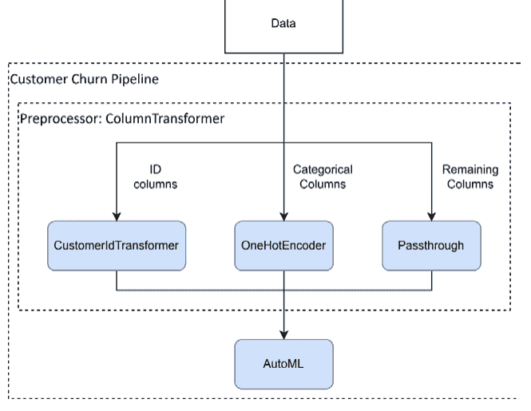

图 8.1 显示了一个由两个子转换器组成的 ColumnTransformer，它们馈入 AutoML 估计器。

## 模型训练与验证

我们现在准备将管道拟合到我们的数据，并传递我们之前设置的管道设置。管道支持标准的 scikit-learn API，因此我们可以直接调用管道：

```python
pipeline.fit(X, y, **pipeline_settings)
```

运行 fit 会执行所有预处理步骤，然后将数据传递给 AutoML 进行建模和调优。这个单一的 Pipeline 对象展示了 ML 管道的强大之处：整个端到端过程，包括一个经过训练和调优的模型，被封装且可移植，我们可以像使用单个模型一样使用该管道。例如，以下代码对训练数据执行 F1 评分：

```python
print(f"F1: {f1_score(pipeline.predict(X), y, pos_label='Yes')}")
```

要导出管道，我们使用 `joblib` 将模型序列化到文件：

```python
joblib.dump(pipeline, "churn_pipeline.pkl")
```

导出管道允许我们重新实例化并在生产代码中使用它。接下来，我们将研究为模型构建 API。

在这个阶段，我们的管道（封装了预处理、训练、优化和验证）已经定义，我们准备将其部署到系统中。我们将通过使用 FastAPI 将模型包装在 API 中来实现这一点。

## 使用 FastAPI 构建 ML API

我们现在将研究围绕管道构建 REST API，使管道的消费者能够通过 Web 请求获取预测。为模型构建 Web API 还简化了与其他系统和服务的集成，是微服务架构中集成的标准方法。

要构建 API，我们使用 Python 库 FastAPI。

### FastAPI

FastAPI 是一个现代、高性能的 Web 框架，用于使用 Python 3.6+ 构建 API。它从设计之初就易于使用，并支持高性能 API 开发。FastAPI 的关键特性是其速度和易用性，使其成为开发健壮、生产就绪 API 的绝佳选择。FastAPI 广泛采用 Python 的类型检查，这有助于在开发过程中尽早发现错误。它还使用这些类型提示来提供数据验证、序列化和文档，减少了开发人员需要编写的样板代码。

FastAPI 的性能是其定义性特征之一。它与 Node.js 相当，并且比传统的 Python 框架快得多。这种速度是由于其使用 Starlette 处理 Web 部分，使用 Pydantic 处理数据部分，并且其非阻塞特性使其适合处理许多并发请求。

FastAPI 提供自动交互式 API 文档，这是在开发复杂 API 时的一个巨大优势。使用 FastAPI，开发人员可以通过 Swagger UI 获得自动生成的交互式 API 文档。Swagger UI 还提供了在不编写代码或使用外部工具的情况下与 REST 资源交互的功能。此功能使 FastAPI 对开发人员非常友好，并加速了开发过程。

FastAPI 还支持行业标准的安全协议，例如 OAuth2，并提供工具以简化实现。FastAPI 的许多工具依赖于其依赖注入系统，允许开发者高效地管理依赖并处理共享资源。

FastAPI 非常适合构建用于机器学习模型的 Web API 和微服务，因为它易于使用且性能高，使机器学习工程师能够专注于围绕生产环境机器学习部署的众多其他问题。

## 使用 FastAPI 构建

要使用 FastAPI 创建 REST API，我们可以创建一个新的 Python 脚本并实例化 FastAPI 实例。实例启动后，我们可以从文件中加载模型：

```
app = FastAPI()
model = joblib.load("churn_pipeline.pkl")
```

在应用程序启动时加载模型会增加启动时间，但确保 API 在应用程序启动完成后即可提供服务。

接下来，我们需要实现一个 REST 端点来进行预测。我们的端点接受输入数据并以 JSON 形式返回预测结果。输入 JSON 是一个 JSON 对象数组，如下所示：

```
[
  {
    "customerID": "1580-BMCMR",
    ...
    "MonthlyCharges": 87.3,
    "TotalCharges": "1637.3"
  },
  {
    "customerID": "4304-XUMGI",
    ...
    "MonthlyCharges": 75.15,
    "TotalCharges": "3822.45"
  }
]
```

使用 FastAPI，我们通过创建一个将输入数据作为参数的函数来实现 REST 端点。FastAPI 将前面的 JSON 结构序列化为 Python 字典列表。因此，我们的函数签名实现如下：

```
@app.post('/predict')
def predict_instances(
        instances: list[dict[str, str]]
) :
```

我们使用 FastAPI 的 post 装饰器装饰该函数，指定端点路径（'/predict'）。

为了进行实际的模型预测，我们将字典转换为 DataFrame 并执行预测：

```
instance_frame = pd.DataFrame(instances)
predictions = model.predict_proba(instance_frame)
```

我们使用 `predict_proba` 来获取每个类别（Yes 或 No）的概率，因为我们希望将这些额外信息发送给 API 的消费者。在返回预测结果的同时返回概率是一种推荐的做法，因为这赋予了 API 消费者对预测结果使用的更多控制权。API 消费者可以根据预测结果的使用方式，决定什么概率阈值对其应用程序来说足够好。

为了将结果作为 JSON 返回，我们构建一个字典，然后由 FastAPI 将其序列化为 JSON。我们使用 NumPy 的 `argmax` 来获取最高概率的索引以确定预测类别，并使用 `amax` 来获取最高概率本身：

```
results = {}
for i, row in enumerate(predictions):
    prediction = model.classes_[np.argmax(row)]
    probability = np.amax(row)
    results[i] = {"prediction": prediction,
                  "probability": probability}

return results
```

前面的代码为输入列表中的每个数据实例生成一个预测对象，使用列表中的位置作为索引。当调用该端点时，将返回以下 JSON：

```
{
    "0": {
        "prediction": "Yes",
        "probability": 0.9758797243307111
    },
    "1": {
        "prediction": "No",
        "probability": 0.8896770039274629
    },
    "2": {
        "prediction": "No",
        "probability": 0.9149225087944103
    }
}
```

我们现在已经构建了 API 端点的核心。然而，我们也必须关注非功能性问题，例如安全性。通常，机器学习工程师会忽视安全或性能等方面，只关注机器学习问题。我们绝不能犯这个错误，必须确保给予这些问题必要的关注。

## 保护 API 安全

为了保护我们的端点，我们将使用 HTTP 基本身份验证。我们使用预设的用户名和密码，这些凭据从环境变量中读取。这允许我们在部署期间安全地将这些凭据传递给应用程序，并避免诸如硬编码凭据之类的陷阱。我们的端点还需要增强以接受用户的凭据。HTTP 基本身份验证凭据作为 HTTP 头发送。

我们可以如下实现。首先为 FastAPI 设置安全并从环境变量中读取凭据：

```
security = HTTPBasic()
USER = bytes(os.getenv("CHURN_USER"), "utf-8")
PASSWORD = bytes(os.getenv("CHURN_PASSWORD"), "utf-8")
```

然后我们将以下内容添加到端点函数中：

```
@app.post('/predict')
def predict_instances(
    credentials: Annotated[HTTPBasicCredentials,
                           Depends(security)],
    instances: list[dict[str, str]]
):
    authenticate(credentials.username.encode("utf-8"),
                 credentials.password.encode("utf-8"))
```

`authenticate` 函数根据我们从环境变量获取的 API 凭据验证接收到的凭据。我们可以使用 Python 的 `secrets` 库进行验证：

```
def authenticate(username: bytes, password: bytes):
    valid_user = secrets.compare_digest(
        username, USER
    )
    valid_password = secrets.compare_digest(
        password, PASSWORD
    )
    if not (valid_user and valid_password):
        raise HTTPException(
            status_code=status.HTTP_401_UNAUTHORIZED,
            detail="Incorrect username or password",
            headers={"WWW-Authenticate": "Basic"},
        )
    return username
```

如果凭据无效，我们将抛出一个 HTTP 状态码为 401 的异常，表示消费者未被授权。

我们的 API 端点现已完全实现、受到保护并准备好部署。为了部署我们的 API，我们将使用 Docker 将其容器化。

## 将 API 容器化

我们可以使用以下 Dockerfile 为我们的 API 构建一个 Docker 容器：

```
FROM python:3.10-slim

RUN apt-get update && apt-get install -y --no-install-recommends apt-utils
RUN apt-get -y install curl
RUN apt-get install libgomp1

WORKDIR /usr/src/app

COPY requirements.txt ./
RUN pip install --no-cache-dir -r requirements.txt
COPY . .

CMD [ "uvicorn", "telco_churn_api:app", "--host", "0.0.0.0", "--port", "8080" ]
```

Dockerfile 很直接：我们从一个基础的 Python 3.10 镜像开始，并安装 LightGBM 所需的一些操作系统依赖（libgomp1）。然后我们设置 FastAPI 应用：复制 Python 依赖文件，安装所有依赖，然后复制必要的源文件（使用 `COPY . .`）。

最后，我们运行一个 Uvicorn 服务器，监听所有地址的 8080 端口。Uvicorn 是一个 Python 的 ASGI Web 服务器实现，支持异步 I/O，显著提高了 Web 服务器的吞吐量。我们绑定到 8080 端口，这是我们部署平台的默认端口。

我们可以使用以下命令构建和运行 Docker 镜像，传递用户名和密码环境变量：

```
docker build . -t churn_api:latest
docker run --rm -it -e CHURN_USER=***** -e CHURN_PASSWORD=*********** -p 8080:8080 churn_api:latest
```

现在，API 应该可以在你的 localhost 上通过 8080 端口访问，并受到你在环境变量中提供的凭据的保护。

我们的应用程序容器化后，我们就可以将其部署到任何支持容器的平台。对于客户流失应用程序，我们将把它部署到 Google Cloud Platform。

## 将 LightGBM 部署到 Google Cloud

我们将利用 **Google Cloud Run** 平台将我们的应用程序部署到 Google Cloud Platform。

Google Cloud Run 是一个无服务器平台，允许你开发和运行应用程序，而无需担心基础设施管理。Cloud Run 允许开发者在安全、可扩展且零运维的环境中运行他们的应用程序。Cloud Run 是完全托管的，这意味着所有基础设施（如服务器和负载均衡器）都被抽象化，使用户能够专注于运行他们的应用程序。Cloud Run 还支持完全自动扩缩容，运行容器的数量会自动增加以响应不断增加的负载。Cloud Run 也非常经济高效，因为你只在容器运行并提供服务时才被收费。

要使用 Cloud Run，你需要一个 Google Cloud 账户，并需要创建一个 Google Cloud 项目、启用计费并设置和初始化 **Google Cloud CLI**。以下资源将指导你完成这些步骤：

- https://console.cloud.google.com/getting-started
- https://cloud.google.com/resource-manager/docs/creating-managing-projects
- https://cloud.google.com/sdk/docs/install
- https://cloud.google.com/sdk/docs/initializing

一旦 Google Cloud 设置完成，我们就可以使用 CLI 部署我们的 API。这可以通过一个命令完成：

```
gcloud run deploy --set-env-vars CHURN_USER=*****,CHURN_PASSWORD=***********
```

运行该命令会提示你输入服务名称和部署服务的区域。我们还设置了安全凭据所需的环境变量。对于部署，Cloud Run 会为你创建 Cloud Build，它会自动构建并存储 Docker 容器，然后将其部署到 Cloud Run。

Cloud Run 命令完成后，我们就部署了一个安全、可扩展的 RESTful Web API，用于提供我们的客户流失机器学习管道服务。

## 总结

本章介绍了机器学习流水线，阐述了其在实施机器学习解决方案时，对于确保一致性、正确性和可移植性方面的优势。

我们概述了新兴的MLOps领域，这是一项结合了DevOps和机器学习的实践，旨在实现经过测试、可扩展、安全且可观测的生产级机器学习系统。

此外，我们讨论了scikit-learn的`Pipeline`类，这是一个使用熟悉的scikit-learn API来实施机器学习流水线的工具集。

我们还提供了一个实施客户流失预测机器学习流水线的端到端实际示例。我们展示了如何创建一个scikit-learn流水线，该流水线执行预处理、建模和调优，并且可以导出供软件系统使用。然后，我们使用FastAPI构建了一个安全的RESTful Web API，该API提供了一个端点，用于从我们的客户流失预测流水线获取预测结果。最后，我们使用Cloud Run服务将API部署到了Google Cloud Platform。

尽管我们的部署是安全且完全可扩展的，并且Cloud Run提供了可观测性、指标和日志，但我们的部署并未解决一些机器学习特有的方面：模型漂移、模型性能监控和模型重训练。

在下一章中，我们将探讨一个专门的机器学习云服务——AWS SageMaker，它为构建和托管基于云的机器学习流水线提供了一个平台特定的解决方案。

# 9 使用AWS SageMaker的LightGBM MLOps

在*第8章，使用LightGBM的机器学习流水线与MLOps*中，我们使用scikit-learn构建了一个端到端的机器学习流水线。我们还探讨了如何将流水线封装在REST API中，并将API部署到云端。

本章将探讨使用**Amazon SageMaker**开发和部署流水线。SageMaker是**Amazon Web Services (AWS)**提供的一套完整的生产服务，用于开发、托管、监控和维护机器学习解决方案。

我们将通过探讨高级主题来扩展我们在机器学习流水线方面的能力，例如检测训练模型中的偏差，以及将部署自动化到完全可扩展的无服务器Web端点。

本章将涵盖以下主要主题：

- AWS和SageMaker简介
- 模型可解释性与偏差
- 使用SageMaker构建端到端流水线

## 技术要求

本章将深入探讨使用Amazon SageMaker构建机器学习模型和流水线。您需要访问Amazon账户，并且还必须配置支付方式。请注意，运行本章的示例代码将在AWS上产生费用。本章的完整笔记本和脚本可在https://github.com/PacktPublishing/Practical-Machine-Learning-with-LightGBM-and-Python/tree/main/chapter-9获取。

## AWS和SageMaker简介

本节提供了AWS的高层概述，并深入探讨了AWS的机器学习产品SageMaker。

## AWS

AWS是全球云计算市场的主要参与者之一。AWS提供许多基于云的产品和服务，包括数据库、**机器学习 (ML)**、分析、网络、存储、开发工具和企业应用程序。AWS的理念是为企业提供一个经济实惠且可扩展的解决方案，以满足其计算需求，无论其规模或行业如何。

AWS的一个关键优势是弹性，这意味着服务器和服务可以快速、随意地停止和启动，可以从零台机器扩展到数千台。服务的弹性与其主要的按需付费定价模式相辅相成，这意味着客户只需为他们使用的服务和资源付费，无需任何预付费用或长期合同。这种弹性和定价模式允许企业根据需要、临时且精细地扩展计算需求，然后只为实际使用量付费。这种方法改变了企业扩展IT资源和应用程序的方式，使他们能够快速响应不断变化的业务需求，而无需承担传统上与硬件和软件采购和维护相关的高昂成本。

另一个优势是AWS的全球覆盖范围。AWS服务在全球许多区域提供。区域在地理上是分开的，每个区域进一步划分为可用区。这种区域-可用区设置允许用户创建全球分布且冗余的基础设施，以最大化弹性并构建灾难恢复架构。区域数据中心还允许用户在靠近最终用户的地方创建服务器和服务，从而最小化延迟。

### 核心服务

AWS的核心服务提供计算、网络和存储能力。AWS的计算服务包括**Amazon Elastic Compute Cloud (EC2)**，它为客户提供可配置的虚拟机，以及**AWS Lambda**，这是一个无服务器计算平台，允许您运行代码而无需配置和管理服务器。在机器学习中，EC2实例和Lambda函数通常用于通过API端点训练和验证或提供模型服务。EC2服务器的弹性特性允许机器学习工程师将训练服务器扩展到数千台，这可以显著加速训练或参数调优任务。

AWS的存储和数据库服务，如**Amazon Simple Storage Service (S3)**和**Amazon RDS (关系数据库服务)**，提供可靠、可扩展和安全的数据存储解决方案。这些服务管理存储基础设施，并提供高级功能，如备份、补丁管理以及垂直和水平扩展。S3是数据工程和机器学习中广泛使用的服务。S3提供低成本、高度冗余的安全存储，可扩展到EB级别。

AWS还通过**Amazon Redshift**提供数据仓库解决方案。大型企业经常使用Redshift作为数据仓库或数据湖的基础，这意味着它通常是机器学习解决方案的数据源。

AWS还提供网络服务，以帮助企业满足复杂的网络和隔离需求。**AWS Direct Connect**允许客户建立从客户站点到AWS云的专用网络连接。路由和域名服务器可以使用Amazon Route 53进行管理，这是一个灵活且可扩展的**域名系统 (DNS)**服务。

然而，网络服务中最主要的是**Amazon Virtual Private Cloud (VPC)**。VPC使客户能够配置完全隔离的虚拟网络。客户可以精细地配置子网、路由表、地址范围、网关和安全组。VPC允许用户隔离其环境和云资源，并控制入站和出站流量，以增强安全性和隐私性。

### 安全性

任何基础设施方程中的关键部分都是安全性。在安全方面，AWS提供了一个高度安全、可扩展和灵活的云计算环境。AWS的安全服务，包括**AWS Identity and Access Management (IAM)**和**Amazon Security Hub**，通过实施强大的安全措施来帮助客户保护其数据和应用程序。

AWS还符合多种国际和行业特定的合规标准，如GDPR、HIPAA和ISO 27001。此外，在数据治理方面，AWS使得遵守数据驻留和隐私要求变得容易。由于AWS的区域结构，数据可以保留在特定国家/地区，同时工程师可以访问全套AWS服务。

### 机器学习

AWS还提供专注于机器学习和**人工智能 (AI)**的服务。其中包括许多针对特定机器学习任务的全托管服务。**AWS Comprehend**提供许多**自然语言处理 (NLP)**服务，例如文档处理、命名实体识别和情感分析。**Amazon Lookout**是一项用于设备、指标或图像异常检测的服务。此外，**Amazon Rekognition**为机器视觉用例（如图像分类和面部识别）提供服务。

我们特别感兴趣的是**Amazon SageMaker**，这是一个完整的机器学习平台，允许我们在Amazon云中创建、训练和部署机器学习模型。下一节将详细讨论SageMaker。

### SageMaker

**Amazon SageMaker**是一个端到端的机器学习平台，允许数据科学家处理数据，并开发、训练、部署和监控机器学习模型。SageMaker是完全托管的，因此无需配置或管理服务器。

Amazon SageMaker的主要吸引力在于其作为一个平台的全面性。它涵盖了机器学习流程的所有方面，包括数据标注、模型构建、训练、调优、部署、管理和监控。通过处理这些方面，SageMaker使开发人员和数据科学家能够专注于核心机器学习任务，而不是管理基础设施。

正如我们所讨论的，机器学习生命周期始于数据收集，这通常需要手动数据标注。为此，SageMaker提供了一项名为**SageMaker Ground Truth**的服务。该服务使得高效标注机器学习数据集变得容易。它可以通过使用自动标注工作流，显著减少与数据标注相关的时间和成本，同时还提供了一个用于手动数据标注任务。此外，SageMaker 还提供 **Data Wrangler** 服务，该服务有助于数据准备和**探索性数据分析（EDA）**。Data Wrangler 提供从 S3、Redshift 和其他平台查询数据的功能，然后通过单一的可视化界面清洗、可视化和理解数据。

SageMaker 为模型训练阶段提供完全托管的服务，可通过 **Training Jobs** 处理大规模、分布式的模型训练。该服务设计灵活且适应性强，允许用户根据需要优化其机器学习模型。用户只需指定其数据的位置（通常是 S3）和机器学习算法，SageMaker 就会处理训练过程的其余部分。模型训练服务充分利用底层 AWS 基础设施的弹性特性：可以快速创建许多服务器来执行训练任务，并在训练完成后丢弃以节省成本。

这种范式也扩展到超参数调优。为了简化超参数优化，SageMaker 提供了自动模型调优功能。提供了许多调优算法，例如 Optuna 或 FLAML，并且可以在多个服务器上运行调优。

SageMaker 还通过 **SageMaker Autopilot** 支持更完整的 AutoML 体验。Autopilot 是一项实现自动模型创建的服务。用户只需提供原始数据并设置目标；然后，Autopilot 会自动探索不同的解决方案以找到最佳模型。Autopilot 提供对整个过程的完全可见性，以便数据科学家可以了解模型是如何创建的，并进行任何必要的调整。

一旦模型训练和优化完成，就必须进行部署。SageMaker 通过提供一键部署流程简化了这一过程。用户可以快速将模型部署到生产环境，并具备自动扩展功能，而无需担心底层基础设施。此部署自动扩展功能允许用户设置基于指标的策略来增加或减少后端服务器。例如，如果一段时间内的调用次数超过特定阈值，部署可以扩展。SageMaker 确保模型的高可用性，并允许对模型进行 A/B 测试以比较不同的变体并决定最佳方案。SageMaker 还支持多模型端点，允许用户在单个端点上部署多个模型。

Amazon SageMaker 还提供在模型部署后监控其性能并进行分析的能力。**SageMaker Model Monitor** 持续监控已部署模型的质量（对于实时端点）或批量监控（对于异步作业）。可以定义警报，以便在指标超过阈值时通知用户。Model Monitor 可以根据准确度等指标监控数据漂移和模型漂移。

最后，SageMaker 既是 AWS 中的一个平台，也是一个软件 SDK。该 SDK 提供 Python 和 R 两种版本。SageMaker SDK 提供一系列内置算法和框架，包括对机器学习社区中最流行算法的支持，例如 XGBoost、TensorFlow、PyTorch 和 MXNet。它还支持一个市场，用户可以从 AWS 和其他 SageMaker 用户共享的大量算法和模型包中进行选择。

SageMaker 中一个值得注意的部分是 **SageMaker Clarify**，它简化了模型开发中最重要的方面之一（偏差和公平性）。

## SageMaker Clarify

Amazon SageMaker Clarify 是一个为机器学习模型提供更高透明度的工具。SageMaker Clarify 旨在帮助理解机器学习模型如何做出预测，从而实现模型的可解释性和公平性。

SageMaker Clarify 的主要功能之一是其提供模型可解释性的能力。它帮助开发者理解输入数据与模型预测之间的关系。该服务生成特征归因，显示数据集中每个特征如何影响预测，这在许多领域至关重要，尤其是在需要理解模型预测背后推理的领域。除了提供对单个预测的洞察外，SageMaker Clarify 还提供全局解释能力。它衡量输入特征在整个数据集上对模型预测的综合重要性。特征影响分析允许开发者和数据科学家理解模型的整体行为，帮助他们解释不同特征如何在全局层面驱动模型预测。

此外，Clarify 可以帮助识别训练模型中的潜在偏差。该服务包括训练前和训练后的偏差指标，帮助我们了解模型是否不公平地偏袒某些群体。检查所有新模型是否存在偏差是最佳实践，但在金融或医疗保健等受监管行业中也至关重要，因为有偏差的预测可能会产生严重后果。

Clarify 通过使用一种称为 **SHapley Additive exPlanations (SHAP)** 的先进技术来提供模型可解释性。

## SHAP

SHAP 是一种博弈论方法，用于解释任何机器学习模型的输出 [1]。SHAP 旨在提供对单个特征对模型整体预测影响的理解。

本质上，SHAP 值通过将特定特征值与该特征的基线值进行对比来评估其效果，突出其对预测的贡献。SHAP 值是每个特征对每个实例预测的公平贡献分配。SHAP 值植根于合作博弈论，代表了以下问题的解决方案：

> “*给定一个特征在预测结果中产生的差异，该差异中有多少部分可归因于每个特征？*”

这些值使用博弈论中的 Shapley 值概念计算。Shapley 值通过对比模型在存在和不存在该特征时的预测来确定特征的重要性。然而，由于模型遇到特征的顺序可能影响其预测，Shapley 值考虑了所有可能的排序。然后，它为特征分配一个重要性值，使其等于该特征在所有可能联盟中的平均边际贡献。

使用 SHAP 进行模型解释有几个优点。首先，它提供了解释的一致性。如果某个特征的贡献发生变化，则该特征归因的重要性会按比例变化。

其次，SHAP 保证了局部准确性，这意味着所有特征的 SHAP 值之和等于预测值与数据集平均预测值之间的差异。

可视化 SHAP 值的一个好方法是使用 SHAP 摘要图。这些图提供了特征重要性及其驱动因素的鸟瞰视图。它们将某个特征的所有 SHAP 值绘制在图表上，便于可视化。图表上的每个点代表某个特征和某个实例的 SHAP 值。Y 轴上的位置由特征决定，X 轴上的位置由 SHAP 值决定：

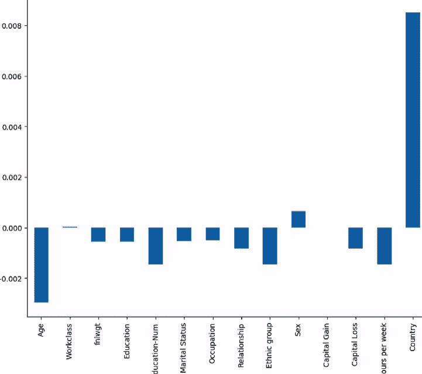

图 9.1 – Census Income 数据集的局部解释示例。条形表示 SHAP 值或每个特征在预测此特定实例时的相对重要性

在 SageMaker Clarify 的上下文中，当您运行澄清作业时，该服务会为数据集中的每个实例生成一组 SHAP 值。SageMaker Clarify 还可以通过聚合整个数据集的 SHAP 值来提供全局特征重要性度量。

SHAP 值可以帮助您理解复杂的模型行为，突出潜在问题，并随着时间的推移改进您的模型。例如，通过检查 SHAP 值，您可能会发现某个特定特征对模型预测的影响比预期更大，从而促使您探究其原因。

在本节中，我们了解了 AWS，更具体地说，是 AWS 机器学习服务系列 SageMaker 提供的内容。SageMaker 中可用的功能，例如模型可解释性、偏差检测和监控，是我们尚未在机器学习管道中实现的组件。在下一节中，我们将探讨使用 SageMaker 构建一个完整的端到端基于 LightGBM 的机器学习管道，包括这些关键步骤。

## 使用 Amazon SageMaker 构建 LightGBM 机器学习管道

我们将用于构建 SageMaker 管道案例研究的数据集是来自*第 4 章，比较 LightGBM、XGBoost 和深度学习*的 Census Income 数据集。该数据集也可作为 SageMaker 示例数据集使用，因此如果您是初学者，在 SageMaker 上使用它很容易。

我们将构建的管道包括以下步骤：

- 1. 数据预处理。
- 2. 模型训练和调优。
- 3. 模型评估。
- 4. 使用 Clarify 进行偏差和可解释性检查。
- 5. 在 SageMaker 中注册模型。
- 6. 使用 AWS Lambda 部署模型。

以下是显示完整管道的图表：

## 设置 SageMaker 会话

以下步骤假设您已创建 AWS 账户并设置 SageMaker 域以开始使用。如果尚未完成，可参考以下文档进行操作：

- 前提条件：https://docs.aws.amazon.com/sagemaker/latest/dg/gs-set-up.html
- 加入 SageMaker 域：https://docs.aws.amazon.com/sagemaker/latest/dg/gs-studio-onboard.html

要开始使用，我们必须初始化 SageMaker 会话，并通过 boto3 创建 S3、SageMaker 和 SageMaker Runtime 客户端：

```
sess = sagemaker.Session()
region = sess.boto_region_name
s3_client = boto3.client("s3", region_name=region)
sm_client = boto3.client("sagemaker", region_name=region)
sm_runtime_client = boto3.client("sagemaker-runtime")
```

我们将使用 Amazon S3 存储训练数据、源代码以及管道创建的所有数据和工件（例如序列化模型）。我们的数据和工件被分为一个读取桶和一个单独的写入桶。这是一种标准的最佳实践，因为它分离了数据存储的关注点。

SageMaker 会话具有会话默认 S3 桶的概念。如果未提供默认桶名称，系统会生成一个并为您创建该桶。这里，我们获取该桶的引用。这是我们的输出或写入桶。读取桶是我们之前创建的用于存储训练数据的桶：

```
write_bucket = sess.default_bucket()
write_prefix = "census-income-pipeline"
read_bucket = "sagemaker-data"
read_prefix = "census-income"
```

管道中每个步骤的源代码、配置和输出都捕获在 S3 写入桶的文件夹中。为每个 S3 URI 创建变量很有用，可以避免在重复引用数据时出错，如下所示：

```
input_data_key = f"s3://{read_bucket}/{read_prefix}"
census_income_data_uri = f"{input_data_key}/census-income.csv"
output_data_uri = f"s3://{write_bucket}/{write_prefix}/"
scripts_uri = f"s3://{write_bucket}/{write_prefix}/scripts"
```

SageMaker 需要我们指定在运行训练、处理、Clarify 和预测作业时要使用的计算实例类型。在我们的示例中，我们使用 m5.large 实例。大多数 EC2 实例类型都可以与 SageMaker 一起使用。但是，也有一些支持 GPU 和深度学习框架的特殊实例类型可用：

```
train_model_id, train_model_version, train_scope = "lightgbm-classification-model", "*", "training"
process_instance_type = "ml.m5.large"
train_instance_count = 1
train_instance_type = "ml.m5.large"
predictor_instance_count = 1
predictor_instance_type = "ml.m5.large"
clarify_instance_count = 1
clarify_instance_type = "ml.m5.large"
```

SageMaker 使用标准 EC2 实例进行训练，但在实例上运行特定的 Docker 镜像以提供 ML 功能。Amazon SageMaker 为各种 ML 框架和堆栈提供了许多预构建的 Docker 镜像。

SageMaker SDK 还提供了一个函数，用于在我们使用的 AWS 区域内搜索与所需实例类型兼容的镜像。我们可以使用 `retrieve` 搜索镜像：

```
train_image_uri = retrieve(
    region="us-east-1",
    framework=None,
    model_id=train_model_id,
    model_version=train_model_version,
    image_scope=train_scope,
    instance_type=train_instance_type
)
```

我们将 framework 参数指定为 None，因为我们自己管理 LightGBM 的安装。

为了参数化我们的管道，我们必须从 `sagemaker.workflow.parameters` 包定义 SageMaker 工作流参数。各种参数类型都有可用的包装器：

```
train_instance_type_param = ParameterString(
    name="TrainingInstanceType",
    default_value=train_instance_type)

train_instance_count_param = ParameterInteger(
    name="TrainingInstanceCount",
    default_value=train_instance_count)

deploy_instance_type_param = ParameterString(
    name="DeployInstanceType",
    default_value=predictor_instance_type)

deploy_instance_count_param = ParameterInteger(
    name="DeployInstanceCount",
    default_value=predictor_instance_count)
```

设置好管道参数、S3 数据路径和其他配置变量后，我们可以继续创建管道的预处理步骤。

## 预处理步骤

设置预处理步骤包括两部分：创建执行预处理的 Python 脚本，以及创建添加到管道的处理器。

我们将使用的脚本是一个带有主函数的常规 Python 脚本。我们将使用 scikit-learn 进行预处理。预处理脚本并未在此完全复制，但可在我们的源代码仓库中找到。值得注意的是，当管道执行该步骤时，数据从 S3 检索并添加到预处理实例上的本地暂存目录。从这里，我们可以使用标准的 pandas 工具读取数据：

```
local_dir = "/opt/ml/processing"
input_data_path = os.path.join("/opt/ml/processing/census-income",
    "census-income.csv")

logger.info("Reading claims data from {}".format(input_data_path))
df = pd.read_csv(input_data_path)
```

类似地，处理完成后，我们可以将结果写入本地目录，SageMaker 从该目录检索并将其上传到 S3：

```
train_output_path = os.path.join(f"{local_dir}/train", "train.csv")
X_train.to_csv(train_output_path, index=False)
```

定义了预处理脚本后，我们需要将其上传到 S3，以便管道能够使用它：

```
s3_client.upload_file(
    Filename="src/preprocessing.py", Bucket=write_bucket,
    Key=f"{write_prefix}/scripts/preprocessing.py"
)
```

我们可以如下定义预处理步骤。首先，必须创建一个 `SKLearnProcessor` 实例：

```
sklearn_processor = SKLearnProcessor(
    framework_version="0.23-1",
    role=sagemaker_role,
    instance_count=1,
    instance_type=process_instance_type,
    base_job_name=f"{base_job_name_prefix}-processing",
)
```

`SKLearnProcessor` 处理需要 scikit-learn 的作业的处理任务。我们指定 scikit-learn 框架版本以及之前定义的实例类型和数量。

然后将处理器添加到 `ProcessingStep` 以在管道中使用：

```
process_step = ProcessingStep(
    name="DataProcessing",
    processor=sklearn_processor,
    inputs=[...],
    outputs=[...],
    job_arguments=[
        "--train-ratio", "0.8",
        "--validation-ratio", "0.1",
        "--test-ratio", "0.1"
    ],
    code=f"s3://{write_bucket}/{write_prefix}/scripts/preprocessing.py"
)
```

输入和输出使用 ProcessingInput 和 ProcessingOutput 包装器定义，如下所示：

```
inputs = [ ProcessingInput(source=bank_marketing_data_uri,
    destination="/opt/ml/processing/bank-marketing") ]
outputs = [ ProcessingOutput(destination=f"{processing_output_uri}/train_data", output_name="train_data",
    source="/opt/ml/processing/train"), ... ]
```

ProcessingStep 接受我们的 scikit-learn 处理器以及数据的输入和输出。ProcessingInput 实例定义了 S3 源和本地目录目标，以方便复制数据（这些与我们预处理脚本使用的本地目录相同）。类似地，ProcessingOutput 实例接受本地目录源和 S3 目标。我们还设置了作业参数，这些参数作为 CLI 参数传递给预处理脚本。

设置好预处理步骤后，我们可以继续进行训练。

## 模型训练和调优

我们以与预处理脚本相同的方式定义训练脚本：一个带有主函数的 Python 脚本，使用我们的标准 Python 工具（如 scikit-learn）来训练 LightGBM 模型。然而，我们还需要安装 LightGBM 库本身。

安装库的另一种方法是将其构建到 Docker 镜像中，并在 SageMaker 中用作我们的训练镜像。这是在 SageMaker 中管理环境的规范方式。然而，这需要大量工作，并且包括长期维护镜像的需求。或者，如果我们只需要安装少量依赖项，可以直接从训练脚本中完成，如下所示。

我们必须定义一个辅助函数来安装包，然后使用它来安装 LightGBM：

```
def install(package):
    subprocess.check_call([sys.executable, "-q", "-m", "pip",
    "install", package])
install("lightgbm")
import lightgbm as lgb
```

这还有一个优点，即每次运行训练时，我们都会安装最新版本（或特定版本）的包。

安装好包后，训练脚本的其余部分就在预处理步骤准备好的数据上训练一个标准的LGBMClassifier。我们可以从脚本的参数中设置或训练数据和参数：

```
train_df = pd.read_csv(f"{args.train_data_dir}/train.csv")
val_df = pd.read_csv(f"{args.validation_data_dir}/validation.csv")
params = {
    "n_estimators": args.n_estimators,
    "learning_rate": args.learning_rate,
    "num_leaves": args.num_leaves,
    "max_bin": args.max_bin,
}
```

然后，我们必须进行标准的scikit-learn交叉验证评分，将模型拟合到数据上，并输出训练和验证分数：

```
X, y = prepare_data(train_df)
model = lgb.LGBMClassifier(**params)

scores = cross_val_score(model, X, y, scoring="f1_macro")
train_f1 = scores.mean()
model = model.fit(X, y)

X_test, y_test = prepare_data(val_df)
test_f1 = f1_score(y_test, model.predict(X_test))

print(f"[0]#011train-f1:{train_f1:.2f}")
print(f"[0]#011validation-f1:{test_f1:.2f}")
```

如上所示，该脚本接受CLI参数来设置超参数。这被超参数调优步骤用于在优化阶段设置参数。我们可以为此目的使用Python的ArgumentParser：

```
parser = argparse.ArgumentParser()
parser.add_argument("--boosting_type", type=str, default="gbdt")
parser.add_argument("--objective", type=str, default="binary")
parser.add_argument("--n_estimators", type=int, default=200)
parser.add_argument("--learning_rate", type=float, default=0.001)
parser.add_argument("--num_leaves", type=int, default=30)
parser.add_argument("--max_bin", type=int, default=300)
```

我们还可以看到，我们记录了训练和验证的F1分数，允许SageMaker和CloudWatch从日志中提取数据用于报告和评估。

最后，我们需要将训练结果写入一个JSON文档。然后，该结果可以在后续的管道流程中使用，并在SageMaker界面中显示为作业的输出。JSON文档与序列化的模型文件一起存储在磁盘上：

```
metrics_data = {"hyperparameters": params,
                "binary_classification_metrics":
{"validation:f1": {"value": test_f1},"train:f1": {"value":
train_f1}}
}
metrics_location = args.output_data_dir + "/metrics.json"
model_location = args.model_dir + "/lightgbm-model"
with open(metrics_location, "w") as f:
    json.dump(metrics_data, f)
with open(model_location, "wb") as f:
    joblib.dump(model, f)
```

与预处理步骤一样，结果被写入本地目录，SageMaker会将其拾取并复制到S3。

定义好脚本后，我们可以在管道中创建调优步骤，该步骤训练模型并调整超参数。

我们必须定义一个SageMaker Estimator，它类似于SKLearnProcessor，封装了训练的配置，包括对脚本（在S3上）的引用：

```
static_hyperparams = {
    "boosting_type": "gbdt",
    "objective": "binary",
}
lgb_estimator = Estimator(
    source_dir="src",
    entry_point="lightgbm_train.py",
    output_path=estimator_output_uri,
    code_location=estimator_output_uri,
    hyperparameters=static_hyperparams,
    role=sagemaker_role,
    image_uri=train_image_uri,
    instance_count=train_instance_count,
    instance_type=train_instance_type,
    framework_version="1.3-1",
)
```

然后，我们可以定义我们的SageMaker HyperparameterTuner，它执行实际的超参数调优。类似于Optuna或FLAML，我们必须使用SageMaker包装器指定超参数的有效范围：

```
hyperparameter_ranges = {
    "n_estimators": IntegerParameter(10, 400),
    "learning_rate": ContinuousParameter(0.0001, 0.5, scaling_type="Logarithmic"),
    "num_leaves": IntegerParameter(2, 200),
    "max_bin": IntegerParameter(50, 500)
}
```

HyperparameterTuner可以如下设置：

```
tuner_config_dict = {
    "estimator": lgb_estimator,
    "max_jobs": 20,
    "max_parallel_jobs": 2,
    "objective_metric_name": "validation-f1",
    "metric_definitions": [{"Name": "validation-f1", "Regex": "validation-f1:([0-9\.]+)"}],
    "hyperparameter_ranges": hyperparameter_ranges,
    "base_tuning_job_name": tuning_job_name_prefix,
    "strategy": "Random"
}
tuner = HyperparameterTuner(**tuner_config_dict)
```

SageMaker支持多种超参数调优策略，包括Hyperband调优。更多信息可以在超参数调优的文档中找到：https://docs.aws.amazon.com/sagemaker/latest/dg/automatic-model-tuning-how-it-works.html。这里，我们使用了随机搜索，最大作业数为20。正是在这里，AWS的弹性基础设施可以发挥巨大优势。如果我们增加训练实例数量，SageMaker会自动将训练作业分配到所有机器上。配置额外的机器有一些开销并增加了成本，但如果我们运行数千次试验，它也可以大大减少调优时间。

调优器的度量定义定义了正则表达式，用于从日志中提取结果指标，正如我们之前在训练脚本中所示。参数优化框架根据此处定义的指标进行优化，最小化或最大化该指标。

定义好超参数调优器后，我们可以创建一个TuningStep以包含到管道中：

```
tuning_step = TuningStep(
    name="LGBModelTuning",
    tuner=tuner,
    inputs={
        "train": TrainingInput(...),
        "validation": TrainingInput(...),
    }
)
```

到目前为止，我们定义的管道步骤准备数据并生成一个序列化到S3的训练模型。管道的下一步是创建一个SageMaker Model，它包装模型并用于评估、偏差和推理步骤。这可以如下完成：

```
model = sagemaker.model.Model(
    image_uri=train_image_uri,
    model_data=tuning_step.get_top_model_s3_uri(
        top_k=0, s3_bucket=write_bucket, prefix=model_prefix
    ),
    sagemaker_session=sess,
    role=sagemaker_role
)
inputs = sagemaker.inputs.CreateModelInput(instance_type=deploy_instance_type_param)
create_model_step = CreateModelStep(name="CensusIncomeModel",
    model=model, inputs=inputs)
```

Model实例封装了部署和运行模型所需的所有配置。我们可以看到，model_data取自调优步骤产生的表现最佳的模型。

到目前为止，我们定义的管道步骤将生成已处理的数据并训练一个调优后的模型。S3中已处理数据的布局如图9.3所示：

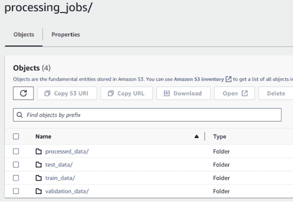

如果需要，我们可以继续进行部署步骤。然而，我们将遵循最佳实践，在我们的管道中添加质量门，以检查模型的性能和偏差，并对其功能产生洞察。

## 评估、偏差和可解释性

到目前为止，我们已经看到了向SageMaker管道添加步骤的一般模式：使用SageMaker的配置类设置配置，然后创建相关的管道步骤。

### 偏差配置

要向我们的管道添加偏差检查，我们必须创建以下配置：

```
bias_config = clarify.BiasConfig(
    label_values_or_threshold=[1], facet_name="Sex", facet_values_or_threshold=[0], group_name="Age"
)

model_predictions_config = sagemaker.clarify.ModelPredictedLabelConfig(probability_threshold=0.5)
model_bias_check_config = ModelBiasCheckConfig(
    data_config=model_bias_data_config,
    data_bias_config=bias_config,
    model_config=model_config,
    model_predicted_label_config=model_predictions_config,
    methods=["DPPL"]
)
```

BiasConfig描述了我们想要检查偏差的哪些方面（特征）。我们选择了性别和年龄，这是处理人口统计数据时始终需要检查的重要方面。

ModelBiasCheckConfig包装了数据配置、模型配置和偏差确认，用于偏差检查步骤。它还设置了用于偏差检查的方法。这里，我们使用**预测标签中正例比例的差异（DPPL）**。

DPPL是一个用于衡量模型是否对数据的不同方面预测结果不同的指标。DPPL计算为方面"a"的正预测比例与方面"d"的正预测比例之间的差异。它通过将训练后的模型预测与数据集中存在的初始偏差进行比较，来评估模型预测中是否存在偏差。例如，如果一个预测住房贷款资格的模型对70%的男性申请人（方面"a"）预测为正结果，对60%的女性申请人（方面"d"）预测为正结果，那么10%的差异可能表明对方面"d"存在偏差。

DPPL公式表示如下：

$DPPL = q'_a - q'_d$此处，$q'_a$ 是面"a"获得正面结果的预测比例，$q'_d$ 是面"d"的类似比例。对于二元和多类面标签，归一化DPPL值介于[-1, 1]之间，而连续标签的取值范围为(-∞, +∞)。正的DPPL值表明面"a"的正面预测比例高于面"d"，表示存在正向偏差。相反，负的DPPL表示面"d"的正面预测比例更高，意味着存在负向偏差。接近零的DPPL值表明两个面的正面预测比例相对均衡，值为零则意味着完美的人口统计学均等。

你可以使用 `ClarifyCheckStep` 将偏差检查添加到流水线中：

```
model_bias_check_step = ClarifyCheckStep(
    name="ModelBiasCheck",
    clarify_check_config=model_bias_check_config,
    check_job_config=check_job_config,
    skip_check=skip_check_model_bias_param,
    register_new_baseline=register_new_baseline_model_bias_param,
    supplied_baseline_constraints=supplied_baseline_constraints_model_bias_param
)
```

### 可解释性配置

可解释性配置非常相似。我们不是创建 `BiasConfig`，而是必须创建 `SHAPConfig`：

```
shap_config = sagemaker.clarify.SHAPConfig(
    seed=829,
    num_samples=100,
    agg_method="mean_abs",
    save_local_shap_values=True
)
```

除了 `SHAPConfig`，我们还必须创建 `ModelExplainabilityCheckConfig` 来计算SHAP值并生成可解释性报告：

```
model_explainability_config = ModelExplainabilityCheckConfig(
    data_config=model_explainability_data_config,
    model_config=model_config,
    explainability_config=shap_config
)
```

然后，所有内容通过 `ClarifyCheckStep` 组合在一起：

```
model_explainability_step = ClarifyCheckStep(
    name="ModelExplainabilityCheck",
    clarify_check_config=model_explainability_config,
    check_job_config=check_job_config,
    skip_check=skip_check_model_explainability_param,
    register_new_baseline=register_new_baseline_model_explainability_param,
    supplied_baseline_constraints=supplied_baseline_constraints_model_explainability_param
)
```

### 评估

最后，我们还需要根据测试数据评估我们的模型。评估脚本与训练脚本非常相似，不同之处在于它从S3中获取调优后的模型进行评分。该脚本包含一个主函数，分为两个步骤。首先，我们必须引导训练好的模型并执行评分（在我们的案例中，是计算F1分数）：

```
...
test_f1 = f1_score(y_test, model.predict(X_test))

# 计算模型评估分数
logger.debug("Calculating F1 score.")
metric_dict = {
    "classification_metrics": {"f1": {"value": test_f1}}
}
```

然后，我们必须将结果输出到JSON文件：

```
# 保存模型评估指标
output_dir = "/opt/ml/processing/evaluation"
pathlib.Path(output_dir).mkdir(parents=True, exist_ok=True)

logger.info("Writing evaluation report with F1: %f", test_f1)
evaluation_path = f"{output_dir}/evaluation.json"
with open(evaluation_path, "w") as f:
    f.write(json.dumps(metric_dict))
```

评估JSON用于报告和依赖评估指标的后续步骤。

## 部署和监控LightGBM模型

我们现在准备添加流水线的最后步骤以支持部署。流水线的部署部分包括三个步骤：

1.  在SageMaker中注册模型。
2.  一个条件检查，以验证模型评估是否超过最低阈值。
3.  使用AWS Lambda函数部署模型端点。

## 模型注册

要部署我们的模型，我们首先需要在SageMaker的 **模型注册表** 中注册我们的模型。

SageMaker的模型注册表是一个中央存储库，你可以在其中管理和部署你的模型。

模型注册表提供以下核心功能：

-   **模型版本控制**：每次训练和注册模型时，它都会在模型注册表中被分配一个版本。这有助于你跟踪模型的不同迭代版本，当你需要比较模型性能、回滚到先前版本或在ML项目中保持可重现性时非常有用。
-   **审批工作流**：模型注册表支持审批工作流，模型可以被标记为“待手动审批”、“已批准”或“已拒绝”。这允许团队有效地管理其模型的生命周期，并确保只有经过批准的模型才会被部署。
-   **模型目录**：模型注册表充当目录，所有模型都集中存储并可访问。注册表中的每个模型都有与之关联的元数据，例如使用的训练数据、超参数和性能指标。

在注册模型时，我们附加了从评估步骤计算出的指标。这些指标也用于模型漂移检测。

可能发生两种类型的漂移：**数据漂移** 和 **模型漂移**。

数据漂移是指与模型训练数据相比，传入数据的统计分布发生变化。例如，如果训练数据的男性/女性比例为60%对40%，但用于预测的数据偏向80%男性和20%女性，则可能发生漂移。

模型漂移是一种现象，其中模型试图预测的目标变量的统计特性以不可预见的方式随时间变化，导致模型性能下降。

数据漂移和模型漂移都可能由于环境变化、社会行为、产品使用或模型训练期间未考虑的其他因素而发生。

SageMaker支持对漂移进行持续监控。SageMaker计算传入数据和我们所做的预测的统计分布。两者都与训练数据中存在的分布进行比较。如果检测到漂移，SageMaker可以向AWS CloudWatch发出警报。

我们可以如下配置我们的指标：

```
model_metrics = ModelMetrics(
    bias_post_training=MetricsSource(
        s3_uri=model_bias_check_step.properties.CalculatedBaselineConstraints,
        content_type="application/json"
    ),
    explainability=MetricsSource(
        s3_uri=model_explainability_step.properties.CalculatedBaselineConstraints,
        content_type="application/json"
    ),
)
```

然后，对于漂移指标，我们必须设置DriftCheckBaselines：

```
drift_check_baselines = DriftCheckBaselines(
    bias_post_training_constraints=MetricsSource(
        s3_uri=model_bias_check_step.properties.BaselineUsedForDriftCheckConstraints,
        content_type="application/json"
    ),
    explainability_constraints=MetricsSource(
        s3_uri=model_explainability_step.properties.BaselineUsedForDriftCheckConstraints,
        content_type="application/json"
    ),
    explainability_config_file=FileSource(
        s3_uri=model_explainability_config.monitoring_analysis_config_uri,
        content_type="application/json"
    )
)
```

然后，我们必须使用以下代码创建模型注册步骤：

```
register_step = RegisterModel(
    name="LGBRegisterModel",
    estimator=lgb_estimator,
    model_data=tuning_step.get_top_model_s3_uri(
        top_k=0, s3_bucket=write_bucket, prefix=model_prefix
    ),
    content_types=["text/csv"],
    response_types=["text/csv"],
    inference_instances=[predictor_instance_type],
    transform_instances=[predictor_instance_type],
    model_package_group_name=model_package_group_name,
    approval_status=model_approval_status_param,
    model_metrics=model_metrics,
    drift_check_baselines=drift_check_baselines
)
```

## 模型验证

条件检查使用评估步骤的评估数据来确定模型是否适合部署：

```
cond_gte = ConditionGreaterThanOrEqualTo(
    left=JsonGet(
        step_name=evaluation_step.name,
        property_file=evaluation_report,
        json_path="classification_metrics.f1.value",
    ),
    right=0.9,
)
condition_step = ConditionStep(
    name="CheckCensusIncomeLGBEvaluation",
    conditions=[cond_gte],
    if_steps=[create_model_step, register_step, lambda_deploy_step],
    else_steps=[]
)
```

此处，我们创建了ConditionStep，并将F1分数与0.9的阈值进行比较。如果模型的F1分数高于阈值，则可以继续部署。

## 使用AWS Lambda进行部署

部署脚本是一个标准的Python AWS Lambda脚本，定义了一个 `lambda_handler` 函数，该函数获取与SageMaker的客户端连接并继续创建模型端点：

```
def lambda_handler(event, context):
    sm_client = boto3.client("sagemaker")
    ...
    create_endpoint_config_response = sm_client.create_endpoint_config(
        EndpointConfigName=endpoint_config_name,
        ProductionVariants=[{
            "VariantName": "Alltraffic",
            "ModelName": model_name,
            "InitialInstanceCount": instance_count,
            "InstanceType": instance_type,
            "InitialVariantWeight": 1}])
    create_endpoint_response = sm_client.create_endpoint(
        EndpointName=endpoint_name,
        EndpointConfigName=endpoint_config_name)
```

值得注意的是，Lambda函数并不为模型提供请求服务。它只是在SageMaker中创建模型端点。

在SageMaker中，**端点** 是一个Web服务，用于从你的模型获取预测。一旦模型训练完成且训练作业结束，你需要部署模型以进行实时或批量预测。在SageMaker的术语中，部署意味着设置一个端点——一个托管的、生产就绪的模型。

SageMaker 中的端点是一个可扩展且安全的 RESTful API，您可以用它向模型发送实时推理请求。您的应用程序可以通过 REST API 或 AWS SDK 直接访问端点进行预测。它可以根据需要动态扩展实例，从而提供灵活性和成本效益。

SageMaker 还支持多模型端点，可以在单个端点上部署多个模型。如果使用许多不常用或资源消耗不大的模型，此功能可以显著节省成本。

定义好 Lambda 脚本后，可以使用 `LambdaStep` 将其集成到流水线中：

```
lambda_deploy_step = LambdaStep(
    name="LambdaStepRealTimeDeploy",
    lambda_func=func,
    inputs={
        "model_name": pipeline_model_name,
        "endpoint_config_name": endpoint_config_name,
        "endpoint_name": endpoint_name,
        "model_package_arn": register_step.steps[0].properties.ModelPackageArn,
        "role": sagemaker_role,
        "instance_type": deploy_instance_type_param,
        "instance_count": deploy_instance_count_param
    }
)
```

> **注意**
模型端点一旦部署，在其部署期间就会产生费用。一旦运行流水线，就会创建一个端点。如果您只是在实验或测试流水线，应在完成后删除该端点。

## 创建和运行流水线

我们所有的流水线步骤现在都已就位，这意味着我们可以创建流水线本身了。`Pipeline` 构造函数接受我们已经定义的名称和参数：

```
pipeline = Pipeline(
    name=pipeline_name,
    parameters=[process_instance_type_param,
                train_instance_type_param,
                train_instance_count_param,
                deploy_instance_type_param,
                deploy_instance_count_param,
                clarify_instance_type_param,
                skip_check_model_bias_param,
                register_new_baseline_model_bias_param,
                supplied_baseline_constraints_model_bias_param,
                skip_check_model_explainability_param,
                register_new_baseline_model_explainability_param,
                supplied_baseline_constraints_model_explainability_param,
                model_approval_status_param],
```

我们还必须将定义的所有步骤作为列表参数传递，并最终更新流水线：

```
steps=[
    process_step,
    train_step,
    evaluation_step,
    condition_step
],
sagemaker_session=sess)
pipeline.upsert(role_arn=sagemaker_role)
```

执行流水线是通过调用 `start` 方法完成的：

```
start_response = pipeline.start(parameters=dict(
    SkipModelBiasCheck=True,
    RegisterNewModelBiasBaseline=True,
    SkipModelExplainabilityCheck=True,
    RegisterNewModelExplainabilityBaseline=True))
```

注意我们在这里定义的条件。首次运行流水线时，我们必须跳过模型偏差和可解释性检查，同时注册新的偏差和可解释性基线。

这两项检查都需要现有的基线才能运行（否则，没有数据可供检查）。一旦建立了基线，我们就可以在后续运行中禁用跳过检查。

有关模型生命周期和创建基线的更多信息，请参阅 https://docs.aws.amazon.com/sagemaker/latest/dg/pipelines-quality-clarify-baseline-lifecycle.html。

## 结果

当流水线执行时，您可以查看执行图以了解每个步骤的状态：

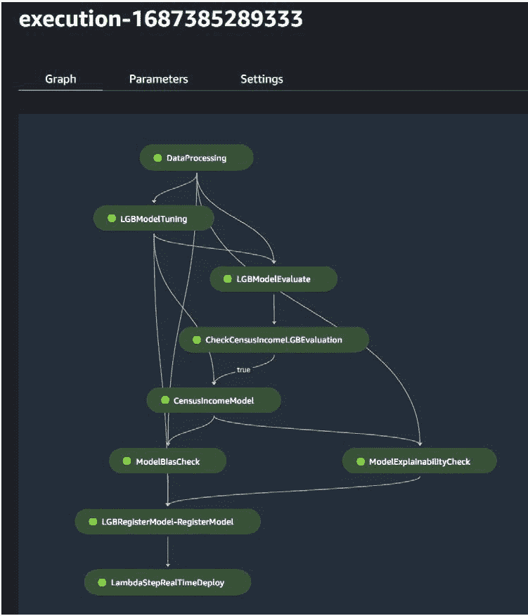

图 9.4 – LightGBM Census Income 流水线成功执行

我们还可以看到，一旦流水线完成，模型本身就会注册到模型注册表中：

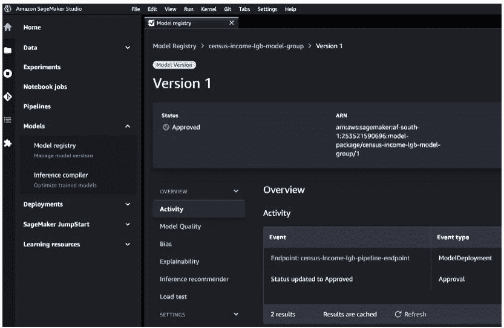

图 9.5 – SageMaker 模型注册表显示已批准的 Census Income 模型及相关端点

选择模型后，可以查看偏差和可解释性报告。*图 9.6* 显示了流水线创建的模型的偏差报告。我们可以看到性别 DPPL 存在轻微不平衡，但小于训练数据中的类别不平衡。报告表明没有强烈的偏差证据：

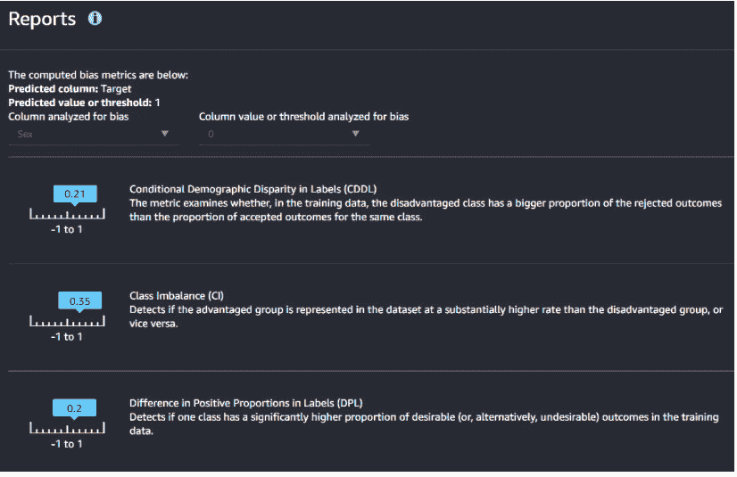

图 9.6 – Census Income 模型的偏差报告。我们可以看到 DPPL 存在轻微不平衡，但小于训练数据中的类别不平衡

可解释性报告如 *图 9.7* 所示，显示了每个特征在 SHAP 值方面的重要性。在这里，我们可以看到 **Capital Gain** 和 **Country** 特征在预测重要性方面占主导地位：

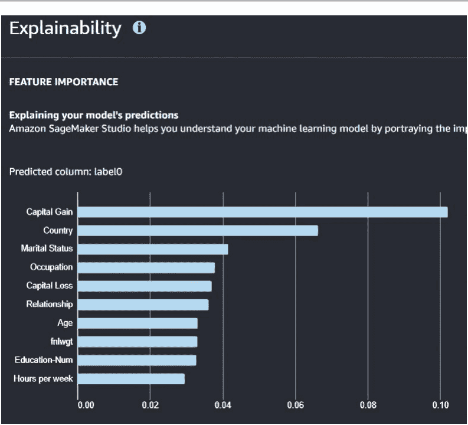

图 9.7 – Census Income 模型的可解释性报告，显示了 Capital Gain 和 Country 特征的主导重要性

偏差和可解释性报告也可以 PDF 格式下载，便于与业务或非技术利益相关者共享。

## 使用端点进行预测

当然，如果我们不能使用部署的模型进行任何预测，那么它就不是很有用。我们可以通过 REST 调用或 Python SDK 使用部署的模型进行预测。以下是使用 Python SDK 的示例：

```
python
predictor = sagemaker.predictor.Predictor(endpoint_name,
                                          sagemaker_session=sess, serializer=CSVSerializer(),
                                          deserializer=CSVDeserializer())
payload = test_df.drop(["Target"], axis=1).iloc[:5]
result = predictor.predict(payload.values)
```

我们使用端点名称和会话获取一个 SageMaker Predictor。然后，我们可以调用 predict，传递一个 NumPy 数组（本例中是从测试 DataFrame 获取的）。

至此，我们使用 SageMaker 创建了一个完整的、端到端的、生产就绪的流水线。我们的流水线包括数据预处理、自动模型调优、偏差验证、漂移检测和完全可扩展的部署。

## 总结

本章介绍了 AWS 和 Amazon SageMaker 作为构建和部署 ML 解决方案的平台。概述了 SageMaker 服务，包括 Clarify 服务，该服务提供了模型偏差检查和可解释性等高级功能。

然后，我们继续使用 SageMaker 服务构建一个完整的 ML 流水线。该流水线包括 ML 生命周期的所有步骤，包括数据准备、模型训练、调优、模型评估、偏差检查、可解释性报告、针对测试数据的验证以及部署到云原生、可扩展的基础设施。

给出了构建流水线中每个步骤的具体示例，强调完全自动化，旨在实现直接的重新训练和对数据及模型过程的持续监控。

下一章将介绍另一个名为 **PostgresML** 的 MLOps 平台。PostgresML 在服务器环境的支柱——Postgres 数据库之上提供了 ML 功能。

## 参考文献

+   [1] S. M. Lundberg and S.-I. Lee, A Unified Approach to Interpreting Model Predictions, in Advances in Neural Information Processing Systems 30, I. Guyon, U. V. Luxburg, S. Bengio, H. Wallach, R. Fergus, S. Vishwanathan and R. Garnett, Eds., Curran Associates, Inc., 2017, p. 4765–4774.
+   [2] R. P. Moro and P. Cortez, Bank Marketing, 2012.

# 10 使用 PostgresML 的 LightGBM 模型

在本章中，我们将探讨一个名为 **PostgresML** 的独特 MLOps 平台。PostgresML 是一个 Postgres 数据库扩展，允许您使用 SQL 训练和部署 ML 模型。

PostgresML 和 SQL 与我们在本书中一直使用的 scikit-learn 风格的编程有很大不同。然而，正如我们将在本章中看到的，在数据库级别执行 ML 模型开发和部署在数据移动需求和推理延迟方面具有显著优势。

本章的主要主题如下：

- PostgresML 概述
- PostgresML 入门
- 使用 PostgresML 和 LightGBM 的客户流失案例研究

## 技术要求

本章包含使用 PostgresML 的实际示例。将使用 Docker 来设置 PostgresML 环境，建议运行这些示例。本章的代码可在 https://github.com/PacktPublishing/Practical-Machine-Learning-with-LightGBM-and-Python/tree/main/chapter-10 获取。

## 介绍 PostgresML

PostgresML (https://postgresml.org/) 是一个 Postgres 扩展，允许从业者在 Postgres 数据库之上实现文本和表格数据的整个 ML 生命周期。

PostgresML 利用 SQL 作为接口来训练模型、创建部署和进行预测。使用 SQL 意味着模型和数据操作可以无缝结合，并自然地融入 Postgres DB 数据工程环境。

拥有一个共享的数据和机器学习平台有许多优势。正如我们在上一章中看到的，使用 SageMaker 时，需要花费大量精力来移动数据。这是机器学习环境中的一个常见问题，数据（尤其是事务性数据）存储在生产数据库中，需要创建复杂的数据工程工作流来从生产源提取数据、为机器学习用途转换数据，并将数据加载到机器学习平台可访问的存储中（例如 SageMaker 的 S3）。

通过将数据存储与机器学习平台相结合，PostgresML 消除了将数据从一个平台移动到另一个平台的需要，从而节省了大量时间、精力、存储空间，并可能节省数据传输成本。

此外，从实时事务性数据建模意味着训练数据始终是最新的（直接从记录系统读取），而不是受限于刷新周期。这消除了因使用过时数据或 ETL 作业错误转换或加载数据而导致的错误。

## 延迟和网络往返

模型部署的一种典型模式（我们在前面的章节中已经说明过）是将模型部署在 Web API 后面。用微服务术语来说，模型部署只是另一个服务，可以与其他服务组合以实现整体系统目标。

作为 Web 服务部署有几个优点。首先，当使用 REST 等 Web 标准时，通过网络调用与其他系统进行互操作非常简单。其次，它允许你独立部署模型代码，与系统其余部分隔离，从而提供弹性和独立扩展能力。

然而，将模型作为单独的服务部署也有一个显著的缺点：延迟和网络往返。

让我们考虑一个电子商务示例。电子商务环境中的一个常见机器学习问题是欺诈检测。这是一个简单电子商务系统的系统架构图：

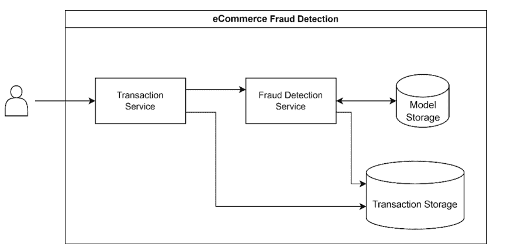

图 10.1 – 简化的电子商务系统架构，展示了功能服务（交易）和机器学习驱动服务（欺诈检测）之间的交互

考虑 *图 10.1* 中的架构，新交易的流程如下：

1.  交易被发送到交易服务。
2.  交易服务使用新交易的详细信息调用欺诈检测服务。
3.  欺诈检测服务接收新交易，从模型存储中加载相关模型（如果需要），从交易存储中加载历史数据，并向交易服务返回预测结果。
4.  交易服务接收欺诈预测结果，并将交易与相关分类一起存储。

这个工作流程可能存在一些变体。然而，由于交易服务和欺诈检测服务是分离的，处理一笔新交易需要进行多次网络往返。进行欺诈预测还需要从交易存储中获取历史数据以输入模型。

网络调用延迟和网络往返给交易带来了显著的开销。如果目标是实现低延迟或实时系统，则需要更复杂的架构组件——例如，为模型和事务性数据提供缓存，以及更高吞吐量的 Web 服务。

使用 PostgresML，架构可以简化如下：

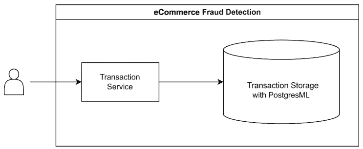

图 10.2 – 使用 PostgresML 将机器学习服务与数据存储相结合，可以实现更直接的系统设计

尽管这个例子过于简化，但关键点在于，在具有独立模型服务的面向服务的架构中利用机器学习模型，会给整个流程增加显著的开销。

通过 PostgresML，我们可以消除对独立模型存储的需求以及加载模型的开销，更重要的是，可以将数据存储调用和预测合并为对数据存储层的单次调用，中间没有网络开销。PostgresML 的基准测试发现，简化的架构在云环境中将性能提高了 40 倍 [1]。

然而，这种架构也有缺点。首先，数据库现在成为单点故障。如果数据库不可用，所有模型和预测能力也将不可用。其次，该架构混合了数据存储和机器学习建模与推理的关注点。根据用例，训练和部署机器学习模型与提供 SQL 查询和存储数据相比，对服务器基础设施有不同的需求。关注点的混合可能迫使你在其中一个或另一个职责上做出妥协，或者显著增加数据库基础设施成本以支持所有用例。

在本节中，我们介绍了 PostgresML，并从概念层面解释了将数据存储和机器学习服务相结合的优势。现在，我们将实际设置并开始使用 PostgresML，以及一些基本功能。

## PostgresML 入门

当然，PostgresML 依赖于已安装的 PostgreSQL。PostgresML 需要 PostgreSQL 11，也支持更新的版本。PostgresML 还需要在你的系统上安装 Python 3.7+。支持 ARM 和 Intel/AMD 架构。

> **注意**
> 本节概述了开始使用 PostgresML 所需的步骤和依赖项，以及撰写本文时的功能。有关最新信息，请查看官方网站：https://postgresml.org/。运行 PostgresML 最简单的方法是使用 Docker。更多信息，请查看 *Docker 快速入门* 文档：https://postgresml.org/docs/guides/setup/quick_start_with_docker。

该扩展可以使用官方包工具（如 APT）安装，也可以从源代码编译。安装所有依赖项和扩展后，必须更新 `postgresql.conf` 以加载 PostgresML 库，并且必须重启数据库服务器：

```
shared_preload_libraries = 'pgml,pg_stat_statements'
sudo service postgresql restart
```

安装 PostgresML 后，必须在你计划使用的数据库中创建扩展。这可以通过 SQL 控制台以常规 PostgreSQL 方式完成：

```
CREATE EXTENSION pgml;
```

验证安装，如下所示：

```
SELECT pgml.version();
```

## 训练模型

现在，让我们看看 PostgresML 提供的功能。如引言所述，PostgresML 有一个 SQL API。以下代码示例应在 SQL 控制台中运行。

用于训练模型的扩展函数如下：

```
pgml.train(
    project_name TEXT,
    task TEXT DEFAULT NULL,
    relation_name TEXT DEFAULT NULL,
    y_column_name TEXT DEFAULT NULL,
    algorithm TEXT DEFAULT 'linear',
    hyperparams JSONB DEFAULT '{}'::JSONB,
    search TEXT DEFAULT NULL,
    search_params JSONB DEFAULT '{}'::JSONB,
    search_args JSONB DEFAULT '{}'::JSONB,
    preprocess JSONB DEFAULT '{}'::JSONB,
    test_size REAL DEFAULT 0.25,
    test_sampling TEXT DEFAULT 'random'
)
```

我们需要提供 `project_name` 作为第一个参数。PostgresML 将模型和部署组织到项目中，项目通过其名称唯一标识。

接下来，我们指定模型的任务：分类或回归。`relation_name` 和 `y_column_name` 设置训练运行的数据。关系是定义数据的表或视图，Y 列的名称指定关系中的目标列。

这些是训练所需的唯一参数。训练线性模型（默认）可以如下进行：

```
SELECT * FROM pgml.train(
    project_name => 'Regression Project',
    task => 'regression',
    relation_name => 'pgml.diabetes',
    y_column_name => 'target'
);
```

当调用 `pgml.train` 时，PostgresML 会将数据复制到 `pgml` 模式中：这确保了所有训练运行都是可重现的，并允许使用不同的算法或参数但相同的数据重新运行训练。`relation_name` 和 `task` 也仅在项目首次训练时需要。要为项目训练第二个模型，我们可以简化训练调用，如下所示：

```
SELECT * FROM pgml.train(
    'Regression Project',
    algorithm => 'lightgbm'
);
```

调用此代码时，将在相同数据上训练一个 LightGBM 回归模型。

algorithm 参数设置要使用的学习算法。PostgresML 支持多种算法，包括 LightGBM、XGBoost、scikit-learn 的随机森林和极端随机树、**支持向量机 (SVMs)**、线性模型以及无监督算法（如 K-means 聚类）。

默认情况下，25% 的数据用作测试集，并且测试数据是随机选择的。这可以通过 `test_size` 和 `test_sampling` 参数进行控制。替代的测试采样方法从第一行或最后一行选择数据。

## 超参数优化

PostgresML 支持在训练运行期间执行**超参数优化 (HPO)**。搜索参数控制 HPO 过程。通过 `search` 支持两种搜索策略：网格搜索和随机搜索。要设置 HPO 的超参数范围，使用 `search_params` 参数的 JSON 对象。HPO 参数使用 `search_args` 指定。以下是一个示例：

```
SELECT * FROM pgml.train('Regression Project',
```

## 预处理

PostgresML 在训练模型时也支持执行某些类型的预处理。与训练数据和配置一样，预处理也存储在项目中，因此在使用模型进行预测时可以应用相同的预处理。

关于预处理，PostgresML 支持对分类变量进行编码、填充缺失值以及缩放数值。预处理规则通过 `preprocess` 参数使用 JSON 对象设置，如下所示：

```sql
SELECT pgml.train(
...
preprocess => '{
    "model": {"encode": {"ordinal": ["Ford", "Kia",
        "Volkswagen"]}},
    "price": {"impute": "mean", "scale": "standard"},
    "fuel_economy": {"scale": "standard"}
}'
);
```

这里，我们对模型特征应用了序数编码。或者，PostgresML 也支持独热编码和目标编码。我们还使用价格的平均值填充了缺失值（由列中的 NULL 表示），并对价格和燃油经济性特征应用了标准（正态）缩放。

## 部署与预测

PostgresML 在训练后会自动在测试集上计算适当的指标，包括 $R^2$、F1 分数、精确率、召回率、ROC_AUC、准确率和对数损失。如果模型的关键指标（回归为 $R^2$，分类为 F1）优于当前部署的模型，PostgresML 将在训练后自动部署该模型。

但是，也可以使用 `pgml.deploy` 函数手动管理项目的部署：

```sql
pgml.deploy(
    project_name TEXT,
    strategy TEXT DEFAULT 'best_score',
    algorithm TEXT DEFAULT NULL
)
```

PostgresML 支持的部署策略有 `best_score`（立即部署具有最佳关键指标的模型）、`most_recent`（部署最近训练的模型）和 `rollback`（将当前部署回滚到先前部署的模型）。

模型部署后，可以使用 `pgml.predict` 函数进行预测：

```sql
pgml.predict (
    project_name TEXT,
    features REAL[]
)
```

`pgml.predict` 函数接受项目名称和用于预测的特征。特征可以是数组或复合类型。

## PostgresML 仪表板

PostgresML 提供了一个基于 Web 的仪表板，以便更便捷地访问 PostgresML 功能。该仪表板与 PostgreSQL 分开部署，对于管理或充分利用 PostgresML 功能并非必需，因为所有功能也可以通过 SQL 查询访问。

该仪表板提供了对项目列表、模型、部署和数据快照的访问。通过仪表板还可以找到有关训练模型的更多详细信息，包括超参数设置和训练指标：

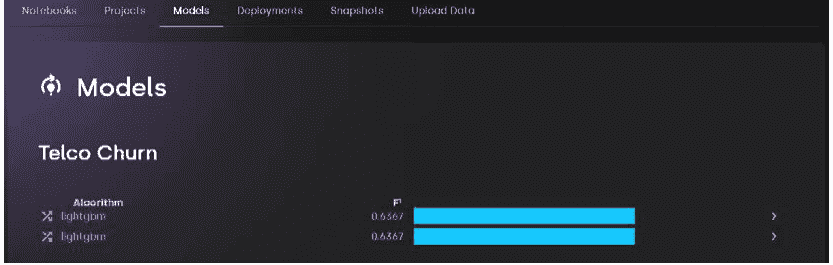

图 10.3 – 显示训练模型列表的 PostgresML 仪表板

除了提供项目、模型和部署的视图外，该仪表板还允许创建 SQL 笔记本，类似于 Jupyter Notebooks。如果无法方便地使用其他 SQL 控制台，这些 SQL 笔记本提供了一个与 PostgresML 交互的简单界面。

至此，我们关于 PostgresML 入门的部分结束。接下来，我们将通过一个端到端的案例研究来训练和部署 PostgresML 模型。

## 案例研究 – 使用 PostgresML 进行客户流失分析

让我们重新审视电信提供商的客户流失问题。提醒一下，数据集由客户及其与电信提供商相关的账户和成本信息组成。

### 数据加载与预处理

在实际场景中，我们的数据通常已经存在于 PostgreSQL 数据库中。但是，对于我们的示例，我们将从加载数据开始。首先，我们必须创建数据要加载到的表：

```sql
CREATE TABLE pgml.telco_churn
(
    customerid       VARCHAR(100),
    gender           VARCHAR(100),
    seniorcitizen    BOOLEAN,
    partner          VARCHAR(10),
    dependents       VARCHAR(10),
    tenure           REAL,
    ...
    monthlycharges   VARCHAR(50),
    totalcharges     VARCHAR(50),
    churn            VARCHAR(10)
);
```

请注意，在我们的表结构中，对于某些列，其类型可能与我们预期的不符：例如，月度费用和总费用应该是实数值。我们将在预处理过程中解决这个问题。

接下来，我们可以将 CSV 数据加载到表中。PostgreSQL 提供了 `COPY` 语句来实现此目的：

```sql
COPY pgml.telco_churn (customerid,
                      gender,
                      seniorcitizen,
                      partner,
                      ...
                      streamingtv,
                      streamingmovies,
                      contract,
                      paperlessbilling,
                      paymentmethod,
                      monthlycharges,
                      totalcharges,
                      churn
) FROM '/tmp/telco-churn.csv'
DELIMITER ','
CSV HEADER;
```

运行此语句会读取 CSV 文件并将数据添加到我们的表中。

> **注意**
> 如果你在 Docker 容器中运行 PostgresML（推荐用于入门），则必须先将 CSV 文件复制到容器运行时。可以使用以下命令完成此操作（替换为你自己的容器名称）：
> `docker cp telco/telco-churn.csv postgresml-postgres-1:/tmp/telco-churn.csv`。

数据加载后，我们可以执行预处理。我们分三步执行此操作：直接在表中清理数据、创建一个将数据强制转换为适当类型的表视图，以及使用 PostgresML 的预处理功能：

```sql
UPDATE pgml.telco_churn
SET totalcharges = NULL
WHERE totalcharges = ' ';
```

我们必须将总费用中的空文本值替换为 NULL，以便 PostgresML 稍后可以填充这些值：

```sql
CREATE VIEW pgml.telco_churn_data AS
SELECT gender,
seniorcitizen,
CAST(CASE partner
WHEN 'Yes' THEN true
WHEN 'No' THEN false
END AS BOOLEAN) AS partner,
...
CAST(monthlycharges AS REAL),
CAST(totalcharges AS REAL),
CAST(CASE churn
WHEN 'Yes' THEN true
WHEN 'No' THEN false
END AS BOOLEAN) AS churn
FROM pgml.telco_churn;
```

然后我们创建一个视图来为训练准备数据。值得注意的是，执行了两种类型转换：具有 Yes/No 值的特征被映射为布尔值，并且我们将月度费用和总费用转换为 REAL 值（在将文本值映射为 NULL 之后）。我们还将 CustomerId 排除在视图之外，因为它不能用于训练。

### 训练与超参数优化

我们可以如下训练我们的 LightGBM 模型：

```sql
SELECT *
FROM pgml.train('Telco Churn',
    task => 'classification',
    relation_name => 'pgml.telco_churn_data',
    y_column_name => 'churn',
    algorithm => 'lightgbm',
    preprocess => '{"totalcharges": {"impute": "mean"} }',
    search => 'random',
    search_args => '{"n_iter": 500 }',
    search_params => '{
        "num_leaves": [2, 4, 8, 16, 32, 64]
    }'
);
```

我们将视图设置为我们的关系，其中 churn 列是我们的目标特征。对于预处理，我们使用均值来要求 PostgresML 为 `totalcharges` 特征填充缺失值。

我们还设置了超参数优化，使用 500 次迭代的随机搜索，并指定了搜索参数范围。

训练完成后，我们将在仪表板中看到我们训练和部署的模型：

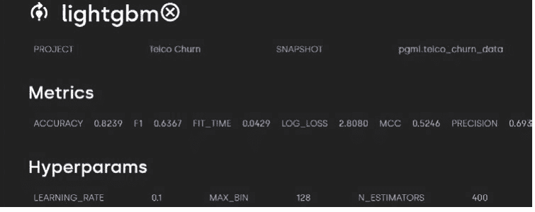

图 10.4 – 在 PostgresML 仪表板中看到的训练好的 LightGBM 模型

仪表板显示了我们模型的指标和表现最佳的超参数。我们的模型 F1 分数为 0.6367，准确率为 0.8239。

如果仪表板不可用，也可以通过以下 SQL 查询检索相同的信息：

```sql
SELECT metrics, hyperparams
FROM pgml.models m
LEFT OUTER JOIN pgml.projects p on p.id = m.project_id
WHERE p.name = 'Telco Churn';
```

我们的模型在训练后会自动部署，并准备好进行预测。

### 预测

我们可以使用复合类型作为特征数据手动进行预测。可以按如下方式操作：

```sql
SELECT pgml.predict(
    'Telco Churn',
    ROW (
        CAST('Male' AS VARCHAR(30)),
        1,
        ...
        CAST('Electronic check' AS VARCHAR(30)),
        CAST(20.25 AS REAL),
        CAST(4107.25 AS REAL)
    )
) AS prediction;
```

我们使用 PostgreSQL ROW 表达式来设置数据，将字面量转换为模型所需的正确类型。

然而，利用 PostgresML 模型更常见的方法是将预测纳入常规业务查询中。例如，这里我们从原始客户数据表中选择了所有数据，并使用 pgml.predict 函数为每一行添加了预测：

```sql
SELECT *,
    pgml.predict(
        'Telco Churn',
        ROW (
            gender,
            seniorcitizen,
            ...
            paymentmethod,
```

# 11 使用 LightGBM 进行分布式与基于 GPU 的学习

本章探讨如何在分布式计算集群和 GPU 上训练 LightGBM 模型。分布式计算能显著加速训练工作负载，并允许训练远超单机内存容量的更大数据集。我们将研究如何利用 Dask 进行分布式计算，以及 LightGBM 对基于 GPU 训练的支持。

本章涵盖的主题如下：

- 使用 LightGBM 和 Dask 进行分布式学习
- LightGBM 的 GPU 训练

## 技术要求

本章包含在分布式计算集群和 GPU 上训练和运行 LightGBM 模型的示例。运行这些示例需要 Dask 环境和 GPU。完整的代码示例可在 https://github.com/PacktPublishing/Practical-Machine-Learning-with-LightGBM-and-Python/tree/main/chapter-11 获取。

## 使用 LightGBM 和 Dask 进行分布式学习

Dask 是一个用于分布式计算的开源 Python 库。它旨在与现有的 Python 库和工具（包括 scikit-learn 和 LightGBM）无缝集成。本节介绍如何使用 Dask 运行 LightGBM 的分布式训练工作负载。

Dask (https://www.dask.org/) 允许你在单台机器和多台机器上设置集群。在单台机器上运行 Dask 是默认设置，无需配置。但是，在单机集群（或调度器）上运行的工作负载可以轻松地使用分布式调度器运行。

Dask 提供了多种运行分布式集群的方式，包括集成 Kubernetes、MPI 或自动配置到 AWS 或 Google Cloud Platform 等超大规模云平台。

在单台机器上运行时，Dask 仍然会将工作负载分配到多个线程上，这可以显著加速工作负载。

Dask 提供了集群管理实用程序类，可以轻松设置集群。可以按如下方式运行本地集群：

```
cluster = LocalCluster(n_workers=4, threads_per_worker=2)
client = Client(cluster)
```

前面的代码创建了一个包含四个工作节点的本地集群，配置每个工作节点运行两个线程。集群在本地主机上运行，调度器默认在端口 8786 上运行。可以使用参数配置主机 IP 和端口。除了运行调度器，Dask 还会启动一个使用 Bokeh (https://docs.bokeh.org/en/latest/) 实现的诊断仪表板。默认情况下，仪表板在端口 8787 上运行。我们可以检查 **Workers** 页面来查看运行集群的状态，如 *图 11.1* 所示。

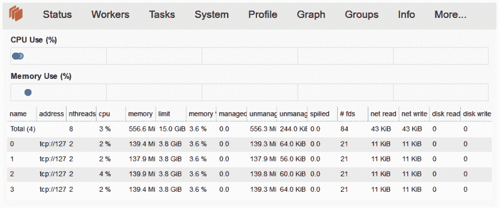

集群启动并运行后，我们可以为在分布式集群上使用准备数据。

Dask 提供了自己实现的数据帧，称为 Dask DataFrame。Dask DataFrame 由许多较小的 pandas DataFrame 组成，这些 DataFrame 根据索引进行分割。每个部分可以存储在磁盘上或分布在网络中，这允许处理比单机内存容量大得多的数据集。对 Dask DataFrame 执行的操作会自动分配到各个 pandas DataFrame 上。

> **注意**
> 当你的数据集适合放入内存时，建议使用标准的 pandas DataFrame 而不是 Dask DataFrame。

我们可以通过加载 CSV 文件来创建 Dask DataFrame。请注意，CSV 文件可能位于 S3 或 HDFS 上，并且可能非常大。以下代码从 CSV 文件创建 Dask DataFrame：

```
import dask.dataframe as dd
df = dd.read_csv("covtype/covtype.csv", blocksize="64MB")
```

这里，我们还指定了加载 CSV 文件的块大小。块大小设置了数据集被分割成的块，使我们能够精细控制各个 DataFrame 部分的内存。当调用 `df.shape` 时，我们得到一个有趣的结果：

```
df.shape
# (Delayed('int-a0031d1f-945d-42b4-af29-ea5e40148f3f'), 55)
```

列数作为数字返回。然而，查看行数时，我们得到了一个名为 `Delayed` 的包装类。这说明即使我们已经创建了 DataFrame，数据也并未加载到内存中。相反，Dask 会在需要数据的工作节点上按需加载数据。我们可以强制 Dask 计算行数，如下所示：

```
df.shape[0].compute()
# 581012
```

数据在 DataFrame 中可用后，我们可以为其训练做准备。我们使用 `dask_ml` 中的 `train_test_split` 函数将数据分割为训练集和测试集：

```
X = df.iloc[:, :-1]
y = df.iloc[:, -1]
X_train, X_test, y_train, y_test = dask_ml.model_selection.train_test_split(X, y)
```

尽管 `dask_ml` 中的函数与 scikit-learn 的 `train_test_split` 功能相似，但 Dask 版本保持了底层 Dask DataFrame 的分布式特性。

我们的集群现已设置完毕，数据也已准备好进行训练。现在我们可以着手训练 LightGBM 模型了。

LightGBM 库团队提供并维护了每种可用学习算法的 Dask 版本：`DaskLGBMRegressor`、`DaskLGBMClassifier` 和 `DaskLGBMRanker`。这些是标准 LightGBM scikit-learn 接口的包装器，增加了指定要使用的 Dask 集群客户端的功能。

当 LightGBM 在 Dask 集群上运行时，每个 Dask 工作节点对应一个 LightGBM 工作节点进行训练。LightGBM 将单个工作节点上的所有数据分区连接成一个数据集，每个 LightGBM 工作节点独立使用本地数据集。

然后，每个 LightGBM 工作节点协同工作，使用 Dask 集群进行通信来训练单个 LightGBM 模型。当执行数据并行训练（如 Dask 的情况）时，LightGBM 使用 **Reduce-Scatter** 策略：

1. 在构建直方图阶段，每个工作节点为不同的非重叠特征构建直方图。然后，执行 **Reduce-Scatter** 操作：每个工作节点将其直方图的一部分与其他每个工作节点共享。
2. **Reduce-Scatter** 之后，每个工作节点都拥有特征子集的完整直方图，然后为这些特征找到最佳分割点。
3. 最后，执行收集操作：每个工作节点将其最佳分割点与其他所有工作节点共享，这样所有工作节点都拥有所有最佳分割点。

选择最佳特征分割点，并相应地对数据进行分区。

幸运的是，分布式算法的复杂性对我们是隐藏的，训练代码与我们习惯的 scikit-learn 训练代码完全相同：

```
dask_model = lgb.DaskLGBMClassifier(n_estimators=200, client=client)
dask_model.fit(X_train, y_train)
```

运行前面的代码将训练 LightGBM 模型，我们可以通过检查 Dask 仪表板的 **Status** 页面来查看进度，如 *图 11.2* 所示。

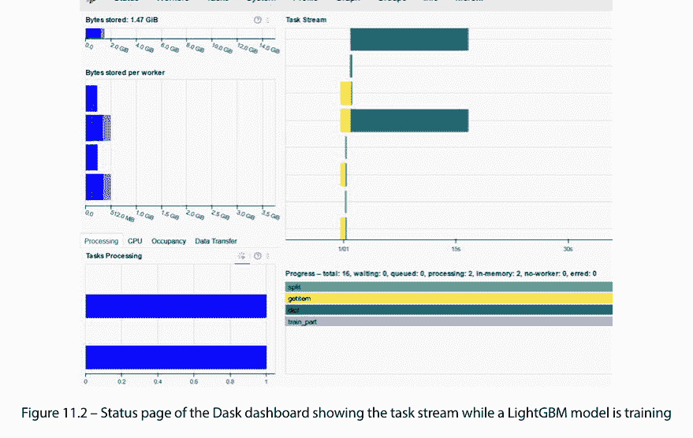

---

类似于手动调用预测函数，我们使用 ROW 表达式将数据传递给 pgml.predict 函数，但从表中选择数据。

这也清楚地说明了使用 PostgresML 的优势：ML 模型的消费者可以在同一个业务事务中，通过单次网络调用，以最小的开销同时查询新客户数据和预测结果。

## 总结

本章概述了 PostgresML，这是一个独特的 MLOps 平台，允许在现有 PostgreSQL 数据库之上通过 SQL 查询训练和调用模型。

我们讨论了该平台在简化 ML 应用场景以及减少面向服务架构中的开销和网络延迟方面的优势。概述了核心功能和 API。

本章最后通过一个利用 PostgresML 解决分类问题的实际示例进行了总结，说明了如何训练 LightGBM 模型、执行超参数优化、部署模型，并在少量 SQL 查询中利用其进行预测。

在下一章中，我们将探讨使用 LightGBM 进行分布式和基于 GPU 的学习。

## 参考文献

[1] PostgresML 比 Python HTTP 微服务快 8-40 倍，[在线]。可访问 https://postgresml.org/blog/postgresml-is-8x-faster-than-python-http-microservices。

## LightGBM 的 GPU 训练

LightGBM 库原生支持在 GPU 上训练模型 [1]。支持两种 GPU 平台：通过 OpenCL 的 GPU 和 CUDA。通过 OpenCL 使用 GPU 支持最广泛的 GPU 范围（包括 AMD GPU），并且比在 CPU 上运行模型快得多。但是，如果你有 NVIDIA GPU 可用，CUDA 平台提供最快的运行时速度。

## 为 GPU 设置 LightGBM

设置你的环境以使用 GPU 可能有点棘手，但我们将在此回顾核心步骤。

> **注意**
>
> 此处讨论的 GPU 设置步骤是作为设置环境过程的指南和概述。此处列出的库和驱动程序的确切版本号可能已过时，建议你查阅官方文档以获取最新版本：https://lightgbm.readthedocs.io/en/latest/GPU-Tutorial.html。

为了使用 GPU，我们必须*从源代码编译和构建 LightGBM 库*。以下说明假设使用 Ubuntu Linux 构建环境；其他平台的步骤类似。在构建库之前，我们必须安装一些依赖项。

重要的是，首先，为你的环境安装 GPU 驱动程序。如果你有 NVIDIA GPU，还要安装 CUDA。相关说明可从各自的供应商网站获取：

- https://docs.nvidia.com/cuda/
- https://www.amd.com/en/support

接下来，我们需要安装 OpenCL 头文件：

```
sudo apt install --no-install-recommends nvidia-opencl-dev opencl-headers
```

最后，安装库构建依赖项：

```
sudo apt install --no-install-recommends git cmake build-essential libboost-dev libboost-system-dev libboost-filesystem-dev
```

我们现在准备好编译支持 GPU 的 LightGBM 库。克隆仓库并构建库，设置 `USE_GPU` 标志：

```
git clone --recursive https://github.com/microsoft/LightGBM
cd LightGBM
mkdir build
cd build
cmake -DUSE_GPU=1 ..
make -j$(nproc)
cd ..
```

如*第 2 章，集成学习 - Bagging 和 Boosting*中所述，LightGBM 是一个带有 Python 接口的 C++ 库。通过前面的说明，我们已经构建了支持 GPU 的库，但必须构建并安装 Python 包才能从 Python（包括 scikit-learn API）使用该库：

```
cd python-package/
python setup.py install --user --precompile
```

## 在 GPU 上运行 LightGBM

在 GPU 上运行训练代码很简单。我们将 device 参数设置为 `gpu` 或 `cuda`：

```
model = lgb.LGBMClassifier(
    n_estimators=150,
    device="cuda",
    is_enable_sparse=False
)
model = model.fit(X_train, y_train)
```

如前面的代码所示，我们通过将 `is_enable_sparse` 设置为 `False` 来关闭 LightGBM 的稀疏矩阵优化。LightGBM 的稀疏特性在 GPU 设备上不受支持。此外，根据你的数据集，你可能会收到以下警告，指出 `multi_logloss` 未实现：

```
Metric multi_logloss is not implemented in cuda version. Fall back to evaluation on CPU.
```

值得注意的是，执行的回退仅用于评估而非训练；训练仍在 GPU 上进行。我们可以通过检查 `nvidia-smi`（对于 NVIDIA GPU）来验证是否使用了 GPU：

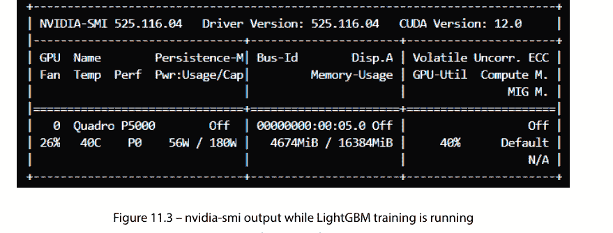

实现的加速取决于你的 GPU。在 Forest Cover 数据集上，150 次迭代的训练时间从 171 秒减少到 11 秒（加速 15 倍）。

使用 GPU 带来的巨大性能提升在执行参数调优时尤其有用。我们可以将基于 GPU 的训练与例如 Optuna 结合使用，以显著加速寻找最优参数的过程。所需做的只是将 `objective` 函数中的模型训练移动到 GPU 设备。在定义目标函数时，我们照常指定 Optuna 参数范围：

```
def objective(trial):
    lambda_l1 = trial.suggest_float(
        'lambda_l1', 1e-8, 10.0, log=True),
    lambda_l2 = trial.suggest_float(
        'lambda_l2', 1e-8, 10.0, log=True),
    ...
```

然后我们使用 Optuna 参数创建模型，并确保将设备指定为 cuda（或 gpu）：

```
model = lgb.LGBMClassifier(
    force_row_wise=True,
    boosting_type=boosting_type,
    n_estimators=n_estimators,
    lambda_l1=lambda_l1,
    lambda_l2=lambda_l2,
    ...
    learning_rate=learning_rate,
    max_bin=max_bin,
    device="cuda")
```

目标函数的最后一部分是返回交叉验证分数：

```
scores = cross_val_score(model, X_train, y_train, scoring="f1_macro")
return scores.mean()
```

然后我们可以像往常一样运行参数研究：

```
sampler = optuna.samplers.TPESampler()
pruner = optuna.pruners.HyperbandPruner(
    min_resource=10, max_resource=400, reduction_factor=3)

study = optuna.create_study(
    direction='maximize', sampler=sampler,
    pruner=pruner
)
study.optimize(objective(), n_trials=10, gc_after_trial=True, n_jobs=1)
```

重要的是，我们还在这里将 n_jobs 参数设置为 1，因为利用 GPU 运行并行作业可能会导致不必要的争用和开销。

在 GPU 上训练时，有一些值得注意的最佳实践以获得最佳性能：

- 始终验证是否正在使用 GPU。如果 GPU 不可用，即使设置了 device=gpu，LightGBM 也会返回 CPU 训练。一个好的检查方法是使用 nvidia-smi 等工具（如前所示），或者将训练时间与参考基准进行比较。
- 使用小得多的 `max_bin` 大小。大型数据集减少了较小 `max_bin` 大小的影响，而较少的 bin 数量有利于在 GPU 上训练。同样，如果你的 GPU 支持，使用单精度浮点数以提高性能。
- GPU 训练最适合大型、密集的数据集。数据需要移动到 GPU 的 VRAM 中进行训练，如果数据集太小，移动数据的开销就太大了。
- 避免对特征列进行独热编码，因为这会导致稀疏特征矩阵，在 GPU 上效果不佳。

这结束了我们关于如何在 LightGBM 中使用 GPU 的部分。虽然设置可能更复杂，但由于 GPU 能够同时处理数千个线程，从而实现高效的并行处理（尤其是在大型数据集上），GPU 提供了显著的训练速度提升。GPU 的大规模并行性对于 LightGBM 中基于直方图的算法特别有益，使得构建直方图等操作更加高效和有效。

## 总结

在本章中，我们讨论了使用 LightGBM 加速计算的两种方式。第一种是使用 Python 库 Dask 在多台机器上进行大规模分布式训练。我们展示了如何设置 Dask 集群，如何使用 Dask DataFrame 将数据分发到集群，以及如何在集群上运行 LightGBM。

其次，我们还研究了如何利用 GPU 与 LightGBM。值得注意的是，GPU 设置很复杂，但当可用时可以实现显著的加速。我们还讨论了在 GPU 上训练 LightGBM 模型的一些最佳实践。

## 参考文献

[1] H. Zhang, S. Si, and C.-J. Hsieh, *GPU-acceleration for Large-scale Tree Boosting*, 2017.

# 索引

## 符号

5折交叉验证 54

## A

- AdamW 79
- 高级 Optuna 功能 95
  - 多目标优化 98-100
  - 优化研究，保存与恢复 95, 96
  - 参数影响 96-98
- Amazon Elastic Compute Cloud (EC2) 166
- Amazon Lookout 167
- Amazon RDS (关系数据库服务) 166
- Amazon Redshift 166
- Amazon Rekognition 167
- Amazon SageMaker 165-169
- Amazon SageMaker 域
  - 参考链接 172
- Amazon SageMaker 先决条件
  - 参考链接 172
- Amazon Simple Storage Service (S3) 166
- Amazon Virtual Private Cloud (VPC) 167
- Amazon Web Services (AWS) 165, 166
  - 核心服务 166, 167
  - 机器学习 167
  - 安全 167
- API
  - 使用 Docker 容器化 162, 163
  - 安全性 161, 162
- ROC曲线下面积 (AUC-ROC) 50, 106, 130
- 人工智能 (AI) 167
- 人工神经网络 68
- 自动化机器学习 (AutoML) 136
  - 特征工程，自动化 136, 137
  - 模型选择与调优，自动化 137
  - 风险 137
- 自动化 152
- AWS Comprehend 167
- AWS Direct Connect 166
- AWS Identity and Access Management (IAM) 167
- AWS Lambda 166
  - 使用其部署 LightGBM 模型 186, 187
- AWS SageMaker 132

## B

- 反向传播 69
- 最优优先树生长 45
- BlendSearch 138, 139
- 自助聚合 (bagging) 27, 41
- 交叉验证 53, 54
- 客户流失
  - 为其部署机器学习流水线 153

## C

- C4.5
  - 用于构建决策树学习 20
- 回调函数 50
- 人口普查收入预测 73
- 类别特征，编码 73, 74
  - 重复值 75
  - LightGBM 模型，训练 75
  - 缺失值 75
  - 结果 78
  - TabTransformer 模型，训练 76, 77
  - 不平衡数据 75
  - XGBoost 模型，训练 75
- ClarifyCheck 和 QualityCheck 基线
  - 参考链接 188
- 分类与回归树 (CART) 20
- 分类指标
  - 准确率 12
  - 定义 12
  - F1 分数 13
  - 精确率 12
  - 召回率 12
- 分类问题 11
- 共依赖参数 54
- 核心框架参数 47
- 成本节约优化 (CFO) 138
- 成本敏感学习 130
- 协方差矩阵自适应进化策略 (CMA-ES) 88-91
- 信用卡欺诈检测 78
  - LightGBM 模型，训练 78, 79
  - 结果 79, 80
  - TabTransformer 模型，训练 79
  - XGBoost 模型，训练 78, 79

## D

- Dask 49, 209
  - 用于分布式学习 210-213
  - URL 49, 209
- Dask DataFrame 210
- 数据增强 130
- 数据清洗 106
- 数据字典 105
- 数据漂移 184
- 数据血缘 105
- 数据科学生命周期 104
  - 数据收集 105
  - 数据探索 106
  - 数据准备 106
  - 定义 104-106
  - 模型部署 106
  - 模型评估 106
  - 模型监控与维护 106
  - 模型选择 106
  - 模型训练 106
  - 模型调优 106
  - 问题定义 105
  - 结果，沟通 106
- 数据集 7
  - 测试集 8
  - 训练集 8
  - 验证集 8
- 数据转换 106
- Data Wrangler 167
- 决策树超参数 23, 24
- 决策树学习 18
  - 优点 19
  - 使用 C4.5 构建 20
  - 缺点 19
  - 熵与信息增益 19
  - 过拟合 21
- 使用 scikit-learn 的决策树
  - 乳腺癌数据集，分类 22
  - 构建 22
  - 糖尿病进展，预测 22, 23
- 深度特征合成 (DFS) 140
- 深度学习 (DL) 39, 68
  - 优点 70
  - 缺点 70
  - 数学运算 69
  - 多层感知机 68
- 深度神经网络 (DNNs) 70
- 预测标签中正例比例差异 (DPPL) 181
- 多样性 26
- 域名系统 (DNS) 166
- 丢弃法 39
- 丢弃法结合多重加性回归树 (DART) 39, 42

## E

- 端点 186
  - 用于进行预测 192, 193
- 集成学习 26
  - 用于提升单个模型性能 27
- 集成学习方法 26
  - 混合 27
  - 提升 27
  - 自助聚合 (bagging) 26
  - 堆叠 27
- 进化算法 (EA) 89
- 互斥特征捆绑 (EFB) 44
- 期望改进 (EI) 89
- 探索性数据分析 (EDA) 106, 168
- 外推 9
- 极端梯度提升。参见 XGBoost
- 极端随机树 (ExtraTrees) 29, 48

## F

- FastAPI 153, 158, 159
  - 使用其构建 159-161
  - 用于构建 ML API 158
- 特征工程 106, 112, 140
  - 自动化 136, 137
- 特征提取
  - 参考链接 154
- 特征直方图 43
- Featuretools 140
  - URL 140
  - 与 Wind Turbine 数据集一起使用 141, 142
- 适应度 91
- FLAML AutoML 135, 138, 142-144
  - 局限性 139
- FLAML 与 LightGBM
  - 案例研究 140-145
- 前向传播 69

## G

- 垃圾回收 (GC) 95
- 高斯误差线性单元 (GELU) 72
- 泛化 8
- Google Cloud
  - 部署 LightGBM 至 163
  - 参考资料 163
- Google Cloud CLI 163
- Google Cloud Run 163
- GPU
  - 在 GPU 上运行 LightGBM 214-216
  - 为 LightGBM 设置 GPU 213, 214
- GPU 训练
  - 用于 LightGBM 213
- 基于梯度的单边采样 (GOSS) 44, 45
- 梯度提升决策树 (GBDTs) 41
  - 计算复杂度 42
- 梯度提升 34-37
  - 决策树 31, 32
  - 用于分类 37
  - 在 scikit-learn 中 38, 39
- 梯度提升决策树
  - 超参数 38
- 梯度下降 32-34
- 网格搜索 55, 87
- 网格搜索案例研究
  - 数据清洗 124
  - 数据收集 123
  - 数据准备 123, 124
  - 分隔符分隔的字符串，拆分 125
  - EDA 126-129
  - 模型部署与结果 132
  - 建模 129
  - 模型选择 129
  - 模型训练与评估 129-132
  - 模型调优 132
  - 异常值与缺失值 125, 126
  - 问题定义 123
  - SMOTE 130, 131
- 插值 8
- 四分位距 (IQR) 110

## H

- 高熵 19
- 基于直方图的采样 43
- Hyperband 92
- 双曲正切 (tanh) 69
- Hyperopt 87
- 超参数优化 (HPO)
  - 算法 88, 138, 200
  - BlendSearch 138, 139
  - 成本节约优化 (CFO) 138
  - 问题 86
- 超参数 6, 46, 85
- 超参数调优 24
  - 自动化 137
  - 参考链接 179

## I

- 使用 LightGBM 对个人信用评分进行分类 122
  - 类别不平衡，处理 129, 130
  - 强制转换为数值列 124

## J

- joblib 213

## K

- 核密度估计器 (KDE) 88
- k近邻 111

## L

- 学习控制参数 47
- 学习率 33
- 学习率衰减 50
- LightGBM 42, 209
  - 部署至 Google Cloud 163
  - 用于分布式学习 211-213
  - 超参数 46-48
  - 局限性 48
  - 使用 Optuna 优化 92-95
  - Python API 49-52
  - Python API，用于操作 49
  - Reduce-Scatter 策略 212
  - 在 GPU 上运行 214-216
  - scikit-learn API 52, 53
  - 为 GPU 设置 213, 214
  - 与 TabTransformers 对比 72
  - 与 XGBoost 对比 66-72
- 使用 SageMaker 构建 LightGBM ML 流水线 171, 172
  - 偏差配置 181, 182
  - 执行 188-192
  - 可解释性配置 182
  - 模型，使用测试数据评估 183
  - 模型训练 176-181
  - 模型调优 176-181
  - 预测，使用端点进行 192, 193
  - 预处理步骤 174-176
  - SageMaker 会话，设置 172-174
- LightGBM 模型
  - 构建 53
  - 交叉验证 53, 54
  - 部署 183
  - 使用 AWS Lambda 部署 186, 187
  - 参数优化 54, 55
  - 流水线，创建 187, 188
  - 流水线，运行 187, 188
  - 在 SageMaker 中注册 184, 185
  - 学生学业成功，预测 55
  - 验证 185
- LightGBM 优化 42, 46
  - 最优优先树生长 45
  - GBDTs 中的计算复杂度 42
  - 互斥特征捆绑 (EFB) 44
  - 基于梯度的单边采样 (GOSS) 44, 45
  - 基于直方图的采样 43
  - L1 和 L2 正则化 45, 46
- 线性回归
  - 使用 scikit-learn 16, 17
- 损失函数 32
  - 性质 32
- 低熵 19

## M

- 机器学习 (ML) 4, 25, 42, 166
  - 强化学习 5
  - 监督学习 5
  - 无监督学习 5
- 机器学习 (ML) 流水线 150
  - 为客户流失部署 153
- 机器学习运维 (MLOps) 103, 152, 153
- 数学运算，深度学习
  - 激活函数 69
  - 加权和 69
- 均方误差 (MSE) 33, 107
- 测量误差 110
- 中位数剪枝 92
- 指标
  - 与目标对比 13
- 缺失值 110
- ML API
  - 使用 FastAPI 构建 158
- 使用 scikit-learn 构建 ML 流水线 153
  - 模型训练 157, 158
  - 模型验证 157, 158
  - 流水线建模步骤 156, 157
  - 流水线预处理步骤 153-156
- 模型 5, 6
  - 示例 14
  - 拟合 15, 16
  - 使用 scikit-learn 的线性回归 16, 17
  - 性能指标 11
- 模型漂移 184
- 模型注册表
  - 核心功能 184

# 索引

- **模型选择**
  - 自动化 137
- **模型，使用PostgresML训练**
  - 超参数优化 (HPO) 200
  - 预处理 201
- **监控** 152
- **多层感知机** 68, 72
- **多目标优化 (MOO)** 98, 99
- **多重加性回归树 (MART)** 31

## N

- **自然语言处理 (NLP)** 167
- **神经网络 (NNs)** 26, 69

## O

- **目标函数** 6
  - 与指标的对比 13
- **独热编码** 118
- **优化算法** 88
  - 协方差矩阵自适应进化策略 (CMA-ES) 89-91
  - 树结构Parzen估计器 (TPE) 88, 89
- **Optuna** 85-88
  - LightGBM，使用Optuna优化 92-95
  - URL 88
- **数量级 (OOM)** 46
- **异常值** 110
- **词表外 (OOV)** 76
- **过拟合** 9, 10, 47
  - 策略 10, 11
- **过采样** 130

## P

- **平行坐标图** 86, 87
- **参数优化** 54
  - 网格搜索 55
- **参数**
  - 参考链接 48
- **参数研究** 87
- **参数调优** 54
- **帕累托前沿** 99
- **Parzen估计器** 88
- **Pickle** 213
- **PostgresML** 132, 195-198
  - 仪表板 202
  - 部署 201
  - 延迟 196-198
  - 预测 201
  - 参考链接 195
  - 往返次数 196-198
  - 训练模型 199, 200
- **PostgresML案例研究** 203
  - 数据加载 203, 204
  - 数据预处理 203, 204
  - 超参数优化 205, 206
  - 预测 206, 207
  - 训练 205, 206
- **剪枝策略** 91
  - Hyperband 92
  - 中位数剪枝 92
  - 逐次减半 92
- **Python API**
  - 用于与LightGBM交互 49
- **Python XGBoost示例** 67

## R

- **随机森林** 28
  - Bagging 27, 28
  - ExtraTrees 29
  - 超参数 29
  - 训练，使用scikit-learn 29-31
- **修正线性单元 (ReLU)** 69
- **基于回归的插补** 111
- **回归指标**
  - 平均绝对误差 (MAE) 13
  - 均方误差 (MSE) 13
- **回归问题** 11
- **强化学习** 5
- **重采样技术**
  - 过采样 130
  - 合成少数类过采样技术 (SMOTE) 130
  - 欠采样 130
- **均方根误差 (RMSE)** 106

## S

- **SageMaker Autopilot** 168
- **SageMaker Clarify** 169
- **SageMaker Ground Truth** 167
- **SageMaker Model Monitor** 168
- **缩放指数线性单元 (SELU)** 72
- **scikit-learn**
  - 梯度提升 38, 39
  - 用于线性回归 16, 17
  - 用于测试随机森林 30, 31
- **scikit-learn管道** 150-152
- **Seaborn** 16
- **SHapley加性解释 (SHAP)** 169-171
- **SHERPA** 87
- **Sigmoid函数（逻辑函数）** 69
- **单数组** 154
- **分层k折交叉验证** 54
- **分层抽样** 54
- **学生学业成功**
  - 探索性数据分析 56-60
  - 建模 60-62
  - 预测 55
- **逐次减半** 92
- **监督学习 (SL)** 5, 11, 25
  - 分类问题 11
  - 回归问题 11
- **支持向量机 (SVMs)** 200
- **合成少数类过采样技术 (SMOTE)** 130, 131

## T

- **TabTransformers** 71
  - 架构 72
  - 与LightGBM对比 72
  - 与XGBoost对比 72
- **Talos** 87
- **目标泄露** 120
- **电信 (telco)** 153
- **TensorFlow的Keras** 76
- **词频-逆文档频率 (TF-IDF)** 154
- **测试集** 8
- **基于时间的泄露** 120
- **训练好的模型** 4
- **训练算法** 6
- **训练任务** 168
- **训练集** 8
- **树结构Parzen估计器 (TPE)** 88, 89, 120
- **试验** 87

## U

- **欠采样** 130
- **万能近似定理** 70
- **万能函数逼近器** 69
- **无监督学习** 5

## V

- **验证集** 8

## W

- **风力涡轮机数据集**
  - Featuretools，与之配合使用 141, 142
  - 风力涡轮机发电量，使用LightGBM预测 107
    - 数据清洗 110
    - 数据收集 107
    - 数据准备 107-109
    - 探索性数据分析 (EDA) 114-117
    - 特征工程 112, 113
    - 测量误差，处理 111
    - 缺失值，处理 111, 112
    - 模型部署 121
    - 建模 117
    - 模型选择 118
    - 模型训练与评估 118-120
    - 模型调优 120, 121
    - 异常值，处理 110, 111
    - 问题定义 107
    - 结果，沟通 122

## X

- **XGBoost** 66
  - 特性 66
  - Python XGBoost示例 67
  - 与LightGBM对比 66, 67, 72
  - 与TabTransformers对比 72
- **XGBoost参数**
  - 参考链接 67

## Z

- **零样本AutoML** 144
  - 优势 144