O'REILLY®

第二版

# Python机器学习手册

从预处理到深度学习的实用解决方案

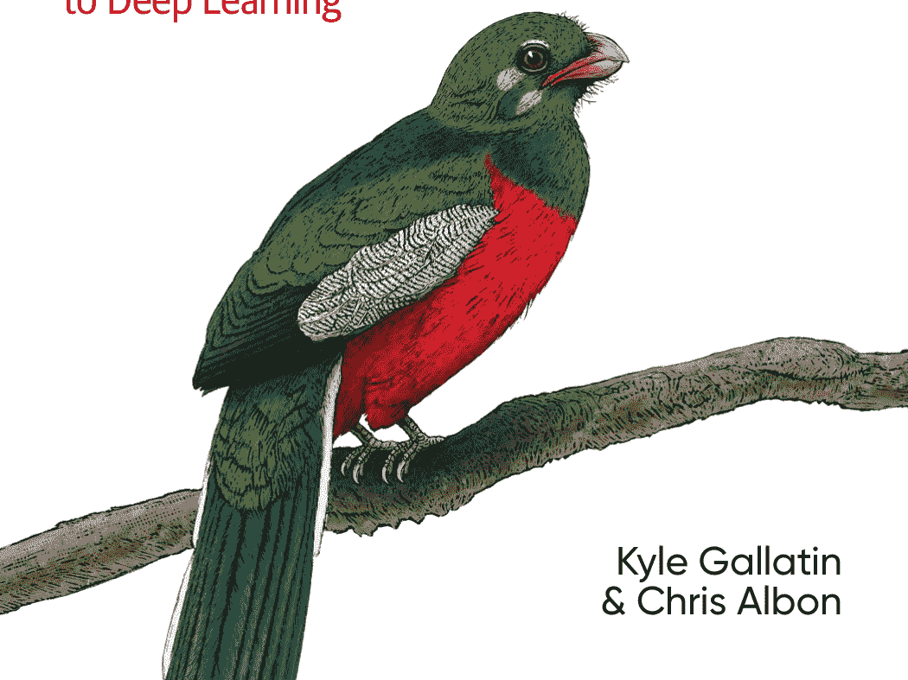

Kyle Gallatin & Chris Albon

# Python机器学习手册

这本实用指南提供了超过200个独立的解决方案，帮助你解决工作中可能遇到的机器学习挑战。如果你熟悉Python及其库，包括pandas和scikit-learn，你将能够处理从加载数据到训练模型以及利用神经网络的各种具体问题。

这本更新版中的每个解决方案都包含你可以复制、粘贴并使用示例数据集运行的代码，以确保其有效。然后，你可以根据你的用例或应用程序调整这些解决方案。解决方案包含解释解决方案并提供有意义背景的讨论。

超越理论和概念，学习构建可工作的机器学习应用程序所需的基础知识。你将找到以下方面的解决方案：

- 向量、矩阵和数组
- 处理来自CSV、JSON、SQL、数据库、云存储和其他来源的数据
- 处理数值和分类数据、文本、图像以及日期和时间
- 使用特征提取或特征选择进行降维
- 模型评估和选择
- 线性回归和逻辑回归、决策树和随机森林以及k近邻算法
- 支持向量机（SVM）、朴素贝叶斯、聚类和基于树的模型
- 保存、加载和部署来自多个框架的训练模型

> “我曾担心我永远找不到一本简洁涵盖ANN、超平面和随机森林特征选择的实用手册，但后来这本书进入了我的生活。”
—Vicki Boykis
Duo机器学习工程师

Kyle Gallatin是Etsy机器学习平台团队的软件工程师。他拥有多年数据分析师、数据科学家和机器学习工程师的经验。

Chris Albon是维基媒体基金会的机器学习总监，该基金会是托管维基百科的非营利组织。

第二版

# Python机器学习手册

从预处理到深度学习的实用解决方案

Kyle Gallatin and Chris Albon

北京 • 波士顿 • 法纳姆 • 塞瓦斯托波尔 • 东京


# Python机器学习手册

作者：Kyle Gallatin and Chris Albon

版权所有 © 2023 Kyle Gallatin。保留所有权利。

印刷于美国。

由O’Reilly Media, Inc.出版，地址：1005 Gravenstein Highway North, Sebastopol, CA 95472。

O’Reilly书籍可用于教育、商业或销售推广用途。大多数书籍也提供在线版本（http://oreilly.com）。更多信息，请联系我们的企业/机构销售部门：800-998-9938 或 corporate@oreilly.com。

**策划编辑：** Nicole Butterfield
**开发编辑：** Jeff Bleiel
**制作编辑：** Clare Laylock
**文字编辑：** Penelope Perkins
**校对：** Piper Editorial Consulting, LLC

**索引编制：** Potomac Indexing, LLC
**内页设计：** David Futato
**封面设计：** Karen Montgomery
**插图：** Kate Dullea

2018年4月：第一版
2023年7月：第二版

## 第二版修订历史

2023-07-27：首次发布

有关发布详情，请参见 http://oreilly.com/catalog/errata.csp?isbn=9781098135720。

O’Reilly标志是O’Reilly Media, Inc.的注册商标。*Python机器学习手册*、封面图像及相关商业外观是O’Reilly Media, Inc.的商标。

本书所表达的观点是作者的观点，不代表出版商的观点。虽然出版商和作者已尽最大努力确保本书所含信息和说明的准确性，但出版商和作者对任何错误或遗漏不承担任何责任，包括但不限于因使用或依赖本书而造成的损害责任。使用本书所含信息和说明的风险由您自行承担。如果本书包含或描述的任何代码示例或其他技术受开源许可或他人知识产权的约束，您有责任确保您的使用符合此类许可和/或权利。

978-1-098-13572-0
[LSI]

## 目录

前言 ........................................................................................................ xi

### 1. 在NumPy中处理向量、矩阵和数组........................................ 1

- 1.0 引言
- 1.1 创建向量
- 1.2 创建矩阵
- 1.3 创建稀疏矩阵
- 1.4 预分配NumPy数组
- 1.5 选择元素
- 1.6 描述矩阵
- 1.7 对每个元素应用函数
- 1.8 查找最大值和最小值
- 1.9 计算平均值、方差和标准差
- 1.10 重塑数组
- 1.11 转置向量或矩阵
- 1.12 展平矩阵
- 1.13 查找矩阵的秩
- 1.14 获取矩阵的对角线
- 1.15 计算矩阵的迹
- 1.16 计算点积
- 1.17 矩阵加法和减法
- 1.18 矩阵乘法
- 1.19 矩阵求逆
- 1.20 生成随机值

### 2. 加载数据

- 2.0 引言
- 2.1 加载示例数据集
- 2.2 创建模拟数据集
- 2.3 加载CSV文件
- 2.4 加载Excel文件
- 2.5 加载JSON文件
- 2.6 加载Parquet文件
- 2.7 加载Avro文件
- 2.8 查询SQLite数据库
- 2.9 查询远程SQL数据库
- 2.10 从Google Sheet加载数据
- 2.11 从S3存储桶加载数据
- 2.12 加载非结构化数据

### 3. 数据整理

- 3.0 引言
- 3.1 创建数据框
- 3.2 获取数据信息
- 3.3 切片数据框
- 3.4 基于条件选择行
- 3.5 排序值
- 3.6 替换值
- 3.7 重命名列
- 3.8 查找最小值、最大值、总和、平均值和计数
- 3.9 查找唯一值
- 3.10 处理缺失值
- 3.11 删除列
- 3.12 删除行
- 3.13 删除重复行
- 3.14 按值对行进行分组
- 3.15 按时间对行进行分组
- 3.16 聚合操作和统计
- 3.17 遍历列
- 3.18 对列中的所有元素应用函数
- 3.19 对分组应用函数
- 3.20 连接数据框
- 3.21 合并数据框

### 4. 处理数值数据

- 4.0 引言
- 4.1 重新缩放特征
- 4.2 标准化特征
- 4.3 归一化观测值
- 4.4 生成多项式和交互特征
- 4.5 转换特征
- 4.6 检测异常值
- 4.7 处理异常值
- 4.8 离散化特征
- 4.9 使用聚类对观测值进行分组
- 4.10 删除具有缺失值的观测值
- 4.11 插补缺失值

### 5. 处理分类数据

- 5.0 引言
- 5.1 编码名义分类特征
- 5.2 编码有序分类特征
- 5.3 编码特征字典
- 5.4 插补缺失的类别值
- 5.5 处理不平衡类别

### 6. 处理文本

- 6.0 引言
- 6.1 清洗文本
- 6.2 解析和清洗HTML
- 6.3 移除标点符号
- 6.4 文本分词
- 6.5 移除停用词
- 6.6 词干提取
- 6.7 标注词性
- 6.8 执行命名实体识别
- 6.9 将文本编码为词袋
- 6.10 加权词重要性
- 6.11 使用文本向量计算搜索查询中的文本相似度
- 6.12 使用情感分析分类器

### 7. 处理日期和时间

- 7.0 引言
- 7.1 将字符串转换为日期
- 7.2 处理时区
- 7.3 选择日期和时间
- 7.4 将日期数据分解为多个特征
- 7.5 计算日期之间的差异
- 7.6 编码星期几
- 7.7 创建滞后特征
- 7.8 使用滚动时间窗口
- 7.9 处理时间序列中的缺失数据

### 8. 处理图像

- 8.0 引言
- 8.1 加载图像
- 8.2 保存图像
- 8.3 调整图像大小
- 8.4 裁剪图像
- 8.5 模糊图像
- 8.6 锐化图像
- 8.7 增强对比度
- 8.8 分离颜色
- 8.9 图像二值化
- 8.10 移除背景
- 8.11 检测边缘
- 8.12 检测角点
- 8.13 为机器学习创建特征
- 8.14 将颜色直方图编码为特征
- 8.15 使用预训练嵌入作为特征
- 8.16 使用OpenCV检测对象
- 8.17 使用Pytorch对图像进行分类

### 9. 使用特征提取进行降维

- 9.0 引言
- 9.1 使用主成分减少特征
- 9.2 当数据线性不可分时减少特征
- 9.3 通过最大化类别可分性减少特征
- 9.4 使用矩阵分解减少特征
- 9.5 在稀疏数据上减少特征

### 10. 使用特征选择进行降维

- 10.0 引言
- 10.1 设置数值特征方差阈值
- 10.2 设置二元特征方差阈值

## 11. 模型评估

11.0 引言 187
11.1 交叉验证模型 187
11.2 创建基线回归模型 191
11.3 创建基线分类模型 193
11.4 评估二分类器预测 194
11.5 评估二分类器阈值 197
11.6 评估多分类器预测 201
11.7 可视化分类器性能 202
11.8 评估回归模型 204
11.9 评估聚类模型 206
11.10 创建自定义评估指标 208
11.11 可视化训练集大小的影响 209
11.12 创建评估指标的文本报告 211
11.13 可视化超参数值的影响 213

## 12. 模型选择

12.0 引言 217
12.1 使用穷举搜索选择最佳模型 218
12.2 使用随机搜索选择最佳模型 220
12.3 从多个学习算法中选择最佳模型 222
12.4 预处理时选择最佳模型 224
12.5 通过并行化加速模型选择 226
12.6 使用特定算法方法加速模型选择 228
12.7 模型选择后评估性能 229

## 13. 线性回归

13.0 引言 231
13.1 拟合一条直线 231
13.2 处理交互效应 233
13.3 拟合非线性关系 235
13.4 通过正则化减少方差 237
13.5 使用Lasso回归减少特征 240

## 14. 树与森林

14.0 引言 243
14.1 训练决策树分类器 243
14.2 训练决策树回归器 245
14.3 可视化决策树模型 246
14.4 训练随机森林分类器 248
14.5 训练随机森林回归器 250
14.6 使用袋外误差评估随机森林 251
14.7 识别随机森林中的重要特征 252
14.8 选择随机森林中的重要特征 254
14.9 处理不平衡类别 255
14.10 控制树的大小 257
14.11 通过提升法提高性能 258
14.12 训练XGBoost模型 260
14.13 使用LightGBM提高实时性能 261

## 15. K-近邻

15.0 引言 263
15.1 查找观测值的最近邻 263
15.2 创建K-近邻分类器 266
15.3 识别最佳邻域大小 267
15.4 创建基于半径的近邻分类器 269
15.5 查找近似最近邻 270
15.6 评估近似最近邻 273

## 16. 逻辑回归

16.0 引言 275
16.1 训练二分类器 275
16.2 训练多分类器 277
16.3 通过正则化减少方差 278
16.4 在超大数据集上训练分类器 279
16.5 处理不平衡类别 280

## 17. 支持向量机

17.0 引言 283
17.1 训练线性分类器 283
17.2 使用核函数处理线性不可分的类别 286
17.3 创建预测概率 289
17.4 识别支持向量 291
17.5 处理不平衡类别 292

## 18. 朴素贝叶斯

18.0 引言 295
18.1 为连续特征训练分类器 296
18.2 为离散和计数特征训练分类器 298
18.3 为二值特征训练朴素贝叶斯分类器 299
18.4 校准预测概率 300

## 19. 聚类

19.0 引言 303
19.1 使用K-均值聚类 303
19.2 加速K-均值聚类 306
19.3 使用均值漂移聚类 307
19.4 使用DBSCAN聚类 308
19.5 使用层次合并聚类 310

## 20. PyTorch中的张量

20.0 引言 313
20.1 创建张量 313
20.2 从NumPy创建张量 314
20.3 创建稀疏张量 315
20.4 选择张量中的元素 316
20.5 描述张量 317
20.6 对元素应用操作 318
20.7 查找最大值和最小值 319
20.8 重塑张量 320
20.9 转置张量 321
20.10 展平张量 321
20.11 计算点积 322
20.12 张量乘法 323

## 21. 神经网络

21.0 引言 325
21.1 在PyTorch中使用自动微分 326
21.2 为神经网络预处理数据 328
21.3 设计神经网络 329
21.4 训练二分类器 333
21.5 训练多分类器 336
21.6 训练回归器 338
21.7 进行预测 340
21.8 可视化训练历史 342
21.9 通过权重正则化减少过拟合 345
21.10 通过早停法减少过拟合 347
21.11 通过Dropout减少过拟合 350
21.12 保存模型训练进度 352
21.13 调优神经网络 355
21.14 可视化神经网络 358

## 22. 用于非结构化数据的神经网络 361

22.0 引言 361
22.1 训练用于图像分类的神经网络 362
22.2 训练用于文本分类的神经网络 364
22.3 微调预训练模型用于图像分类 367
22.4 微调预训练模型用于文本分类 369

## 23. 保存、加载和部署训练好的模型 373

23.0 引言 373
23.1 保存和加载scikit-learn模型 373
23.2 保存和加载TensorFlow模型 375
23.3 保存和加载PyTorch模型 376
23.4 部署scikit-learn模型 379
23.5 部署TensorFlow模型 380
23.6 在Seldon中部署PyTorch模型 382

## 索引 387

## 前言

当本书第一版于2018年出版时，它填补了日益丰富的机器学习（ML）内容中的一个关键空白。通过提供经过充分测试的、实践性的Python代码配方，它使从业者能够轻松地复制粘贴代码，然后将其适配到自己的用例中。在短短五年内，随着深度学习（DL）及相关DL Python框架的进步，ML领域持续蓬勃发展。

如今，在2023年，我们需要同样类型的实践性内容，以满足ML *和* DL从业者使用最新Python库的需求。本书旨在在第一版作者已完成的（出色的）现有工作基础上，通过以下方式进行扩展：

-   更新现有示例以使用最新的Python版本和框架
-   融入数据源、数据分析、ML和DL方面的现代实践
-   扩展DL内容，包括PyTorch中的张量、神经网络以及用于文本和视觉的DL
-   通过将模型部署到API中，使其更进一步

与第一版一样，本书采用基于任务的方法来讲解机器学习，提供了超过200个独立的解决方案（复制、粘贴并运行），涵盖了数据科学家或机器学习工程师在构建模型时最常遇到的任务。

## 本书使用的约定

本书使用以下排版约定：

*斜体*
表示新术语、URL、电子邮件地址、文件名和文件扩展名。

**等宽字体**
用于程序清单，以及在段落中引用程序元素，如变量或函数名、数据库、数据类型、环境变量、语句和关键字。

**等宽粗体**
显示用户应按字面意思输入的命令或其他文本。

*等宽斜体*
显示应替换为用户提供的值或由上下文确定的值的文本。

## 使用代码示例

本书附带一个[GitHub仓库](https://github.com)，其中包含在Docker容器中运行Jupyter Notebook的说明，该容器包含了本书使用的所有依赖项。通过在notebook中复制本书中的命令，您可以确保本书中的示例完全可重现。

如果您对使用代码示例有技术问题或遇到问题，请发送电子邮件至[support@oreilly.com](mailto:support@oreilly.com)。

本书旨在帮助您完成工作。通常，如果本书提供了示例代码，您可以在程序和文档中使用它。除非您要复制大部分代码，否则无需联系我们获取许可。例如，编写一个使用本书中多个代码块的程序不需要许可。销售或分发O'Reilly书籍中的示例则需要许可。通过引用本书和引用示例代码来回答问题不需要许可。将本书中大量的示例代码纳入产品文档中则需要许可。

我们感谢但通常不要求署名。署名通常包括书名、作者、出版商和ISBN。例如："*Machine Learning with Python Cookbook*, 2nd ed., by Kyle Gallatin and Chris Albon (O'Reilly). Copyright 2023 Kyle Gallatin, 978-1-098-13572-0."

如果您觉得您对代码示例的使用超出了合理使用范围或上述许可范围，请随时通过[permissions@oreilly.com](mailto:permissions@oreilly.com)与我们联系。

## O'Reilly 在线学习

四十多年来，*O'Reilly Media* 一直致力于提供技术与商业培训、知识和见解，以帮助企业取得成功。

我们独特的专家与创新者网络，通过书籍、文章以及我们的在线学习平台分享他们的知识和专业技能。O'Reilly 的在线学习平台为您提供按需访问的直播培训课程、深入的学习路径、交互式编码环境，以及来自 O'Reilly 和 200 多家其他出版商的海量文本和视频资源。欲了解更多信息，请访问 [https://oreilly.com](https://oreilly.com)。

## 如何联系我们

请将有关本书的意见和问题发送给出版商：

O'Reilly Media, Inc.
1005 Gravenstein Highway North
Sebastopol, CA 95472
800-889-8969（美国或加拿大）
707-829-7019（国际或本地）
707-829-0104（传真）
[support@oreilly.com](mailto:support@oreilly.com)
[https://www.oreilly.com/about/contact.html](https://www.oreilly.com/about/contact.html)

我们为本书设有一个网页，其中列出了勘误、示例和任何其他信息。您可以通过 [https://oreil.ly/ml_python_2e](https://oreil.ly/ml_python_2e) 访问此页面。

有关我们书籍和课程的新闻和信息，请访问 [https://oreilly.com](https://oreilly.com)。

在 LinkedIn 上找到我们：[https://linkedin.com/company/oreilly-media](https://linkedin.com/company/oreilly-media)

在 Twitter 上关注我们：[https://twitter.com/oreillymedia](https://twitter.com/oreillymedia)

在 YouTube 上观看我们：[https://youtube.com/oreillymedia](https://youtube.com/oreillymedia)

## 致谢

本书第二版之所以能够出版，显然完全得益于原作者 Chris Albon 在第一版中奠定的出色内容、结构和质量。作为第二版的第一作者，我毫不夸张地说，这极大地减轻了我的工作难度。

当然，机器学习领域也在飞速发展，第二版中包含的更新内容，若没有同行们的深思熟虑的反馈，是无法完成的。我特别要感谢我的 Etsy 同事 Andrea Heyman、Maria Gomez、Alek Maelstrum 和 Brian Schmidt，感谢他们应允我对各章节提出的意见请求，并被我“半推半就”地拉入即兴头脑风暴会议，这些会议塑造了本版新增的内容。我还要感谢技术审稿人——Jigyasa Grover、Matteus Tanha 和 Ganesh Harke，以及 O'Reilly 的编辑：Jeff Bleiel、Nicole Butterfield 和 Clare Laylock。话虽如此，以各种方式帮助我和本书走到今天这一步的人数是庞大的。我衷心感谢每一位以各种方式参与我的机器学习之旅并帮助成就本书的人。爱你们所有人。

# 第 1 章
在 NumPy 中处理向量、矩阵和数组

## 1.0 引言

NumPy 是 Python 机器学习技术栈的基础工具。NumPy 允许对机器学习中常用的数据结构（向量、矩阵和张量）进行高效操作。虽然 NumPy 不是本书的重点，但它将在后续章节中频繁出现。本章涵盖了我们在机器学习工作流程中最可能遇到的最常见 NumPy 操作。

## 1.1 创建向量

### 问题

你需要创建一个向量。

### 解决方案

使用 NumPy 创建一个一维数组：

```
# 加载库
import numpy as np

# 创建一个行向量
vector_row = np.array([1, 2, 3])

# 创建一个列向量
vector_column = np.array([[1],
                          [2],
                          [3]])
```

### 讨论

NumPy 的主要数据结构是多维数组。向量只是一个单维数组。要创建向量，我们只需创建一个一维数组。就像向量一样，这些数组可以水平表示（即行）或垂直表示（即列）。

### 另请参阅

- 向量，Math Is Fun
- 欧几里得向量，维基百科

## 1.2 创建矩阵

### 问题

你需要创建一个矩阵。

### 解决方案

使用 NumPy 创建一个二维数组：

```
# 加载库
import numpy as np

# 创建一个矩阵
matrix = np.array([[1, 2],
                   [1, 2],
                   [1, 2]])
```

### 讨论

要创建矩阵，我们可以使用 NumPy 的二维数组。在我们的解决方案中，矩阵包含三行两列（一列 1 和一列 2）。
NumPy 实际上有一个专用的矩阵数据结构：

```
matrix_object = np.mat([[1, 2],
                       [1, 2],
                       [1, 2]])

matrix([[1, 2],
        [1, 2],
        [1, 2]])
```

然而，不推荐使用矩阵数据结构，原因有二。首先，数组是 NumPy 的事实标准数据结构。其次，绝大多数 NumPy 操作返回的是数组，而不是矩阵对象。

### 另请参阅

- 矩阵，维基百科
- 矩阵，Wolfram MathWorld

## 1.3 创建稀疏矩阵

### 问题

给定具有非常少非零值的数据，你希望高效地表示它。

### 解决方案

创建一个稀疏矩阵：

```
# 加载库
import numpy as np
from scipy import sparse

# 创建一个矩阵
matrix = np.array([[0, 0],
                   [0, 1],
                   [3, 0]])

# 创建压缩稀疏行（CSR）矩阵
matrix_sparse = sparse.csr_matrix(matrix)
```

### 讨论

机器学习中常见的情况是拥有海量数据；然而，数据中的大多数元素都是零。例如，想象一个矩阵，其列是 Netflix 上的每一部电影，行是每一个 Netflix 用户，值是用户观看该特定电影的次数。这个矩阵将有数万列和数百万行！但是，由于大多数用户不观看大多数电影，绝大多数元素将是零。

*稀疏矩阵* 是一个大多数元素为 0 的矩阵。稀疏矩阵仅存储非零元素，并假设所有其他值为零，从而显著节省计算资源。在我们的解决方案中，我们创建了一个包含两个非零值的 NumPy 数组，然后将其转换为稀疏矩阵。如果我们查看稀疏矩阵，可以看到只存储了非零值：

```
# 查看稀疏矩阵
print(matrix_sparse)
  (1, 1)	1
  (2, 0)	3
```

稀疏矩阵有多种类型。然而，在 *压缩稀疏行*（CSR）矩阵中，(1, 1) 和 (2, 0) 分别表示非零值 1 和 3 的（从零开始的）索引。例如，元素 1 位于第二行和第二列。如果我们创建一个具有更多零元素的更大矩阵，然后将这个更大的矩阵与我们原始的稀疏矩阵进行比较，我们就能看到稀疏矩阵的优势：

```
# 创建更大的矩阵
matrix_large = np.array([[0, 0, 0, 0, 0, 0, 0, 0, 0, 0],
                        [0, 1, 0, 0, 0, 0, 0, 0, 0, 0],
                        [3, 0, 0, 0, 0, 0, 0, 0, 0, 0]])

# 创建压缩稀疏行（CSR）矩阵
matrix_large_sparse = sparse.csr_matrix(matrix_large)

# 查看原始稀疏矩阵
print(matrix_sparse)

(1, 1)    1
(2, 0)    3

# 查看更大的稀疏矩阵
print(matrix_large_sparse)

(1, 1)    1
(2, 0)    3
```

正如我们所看到的，尽管我们在更大的矩阵中添加了更多的零元素，但其稀疏表示与我们原始的稀疏矩阵完全相同。也就是说，添加零元素并没有改变稀疏矩阵的大小。

如前所述，稀疏矩阵有许多不同的类型，例如压缩稀疏列、列表的列表和键字典。虽然解释不同类型及其含义超出了本书的范围，但值得注意的是，虽然没有“最佳”的稀疏矩阵类型，但它们之间存在有意义的差异，我们应该清楚为什么选择一种类型而不是另一种。

### 另请参阅

- [SciPy 文档：稀疏矩阵](https://docs.scipy.org/doc/scipy/reference/sparse.html)
- [存储稀疏矩阵的 101 种方法](https://matthewrocklin.com/blog/work/2014/06/26/Sparse-Matrices)

## 1.4 预分配 NumPy 数组

### 问题

你需要用某个值预分配给定大小的数组。

### 解决方案

NumPy 提供了使用 0、1 或自定义值生成任意大小向量和矩阵的函数：

```python
# 加载库
import numpy as np

# 生成一个形状为 (1,5) 的全零向量
vector = np.zeros(shape=5)

# 查看矩阵
print(vector)

array([0., 0., 0., 0., 0.])

# 生成一个形状为 (3,3) 的全一矩阵
matrix = np.full(shape=(3,3), fill_value=1)

# 查看向量
print(matrix)

array([[1., 1., 1.],
       [1., 1., 1.],
       [1., 1., 1.]])
```

### 讨论

生成预填充数据的数组在许多场景下都很有用，例如提升代码性能或使用合成数据测试算法。在许多编程语言中，预分配一个默认值（如 0）的数组被认为是常见做法。

## 1.5 选择元素

### 问题

你需要选择向量或矩阵中的一个或多个元素。

### 解决方案

NumPy 数组使得选择向量或矩阵中的元素变得简单：

```python
# 加载库
import numpy as np

# 创建行向量
vector = np.array([1, 2, 3, 4, 5, 6])

# 创建矩阵
matrix = np.array([[1, 2, 3],
                   [4, 5, 6],
                   [7, 8, 9]])

# 选择向量的第三个元素
vector[2]

3

# 选择第二行，第二列
matrix[1,1]

5
```

### 讨论

与 Python 中的大多数事物一样，NumPy 数组是零索引的，这意味着第一个元素的索引是 0，而不是 1。需要注意这一点，NumPy 提供了多种方法来选择（即索引和切片）数组中的元素或元素组：

```python
# 选择向量的所有元素
vector[:]

array([1, 2, 3, 4, 5, 6])

# 选择直到并包括第三个元素的所有内容
vector[:3]

array([1, 2, 3])

# 选择第三个元素之后的所有内容
vector[3:]

array([4, 5, 6])

# 选择最后一个元素
vector[-1]

6

# 反转向量
vector[::-1]

array([6, 5, 4, 3, 2, 1])

# 选择矩阵的前两行和所有列
matrix[:2,:]

array([[1, 2, 3],
       [4, 5, 6]])

# 选择所有行和第二列
matrix[:,1:2]

array([[2],
       [5],
       [8]])
```

## 1.6 描述矩阵

### 问题

你想描述矩阵的形状、大小和维度。

### 解决方案

使用 NumPy 对象的 `shape`、`size` 和 `ndim` 属性：

```python
# 加载库
import numpy as np

# 创建矩阵
matrix = np.array([[1, 2, 3, 4],
                   [5, 6, 7, 8],
                   [9, 10, 11, 12]])

# 查看行数和列数
matrix.shape
(3, 4)

# 查看元素数量（行 * 列）
matrix.size
12

# 查看维度数
matrix.ndim
2
```

### 讨论

这看起来可能很基础（确实如此）；然而，检查数组的形状和大小对于后续计算以及操作后的直觉检查都非常有价值。

## 1.7 对每个元素应用函数

### 问题

你想对数组中的所有元素应用某个函数。

### 解决方案

使用 NumPy 的 `vectorize` 方法：

```python
# 加载库
import numpy as np

# 创建矩阵
matrix = np.array([[1, 2, 3],
                   [4, 5, 6],
                   [7, 8, 9]])

# 创建一个将值加 100 的函数
add_100 = lambda i: i + 100

# 创建向量化函数
vectorized_add_100 = np.vectorize(add_100)

# 对矩阵中的所有元素应用函数
vectorized_add_100(matrix)
array([[101, 102, 103],
       [104, 105, 106],
       [107, 108, 109]])
```

### 讨论

NumPy 的 `vectorize` 方法将一个函数转换为可以应用于数组或数组切片中所有元素的函数。值得注意的是，`vectorize` 本质上是对元素的循环，并不会提高性能。此外，NumPy 数组允许我们在维度不同的数组之间执行操作（这个过程称为 *广播*）。例如，我们可以使用广播创建一个更简单的解决方案：

```python
# 将所有元素加 100
matrix + 100
array([[101, 102, 103],
       [104, 105, 106],
       [107, 108, 109]])
```

广播并非适用于所有形状和情况，但它是对 NumPy 数组所有元素应用简单操作的常用方法。

## 1.8 查找最大值和最小值

### 问题

你需要查找数组中的最大值或最小值。

### 解决方案

使用 NumPy 的 `max` 和 `min` 方法：

```python
# 加载库
import numpy as np

# 创建矩阵
matrix = np.array([[1, 2, 3],
                   [4, 5, 6],
                   [7, 8, 9]])

# 返回最大元素
np.max(matrix)
9

# 返回最小元素
np.min(matrix)
1
```

### 讨论

我们经常想知道数组或数组子集中的最大值和最小值。这可以通过 `max` 和 `min` 方法来实现。使用 `axis` 参数，我们还可以沿特定轴应用操作：

```python
# 查找每列的最大元素
np.max(matrix, axis=0)
array([7, 8, 9])

# 查找每行的最大元素
np.max(matrix, axis=1)
array([3, 6, 9])
```

## 1.9 计算平均值、方差和标准差

### 问题

你想计算数组的一些描述性统计量。

### 解决方案

使用 NumPy 的 `mean`、`var` 和 `std`：

```python
# 加载库
import numpy as np

# 创建矩阵
matrix = np.array([[1, 2, 3],
                   [4, 5, 6],
                   [7, 8, 9]])

# 返回平均值
np.mean(matrix)

5.0

# 返回方差
np.var(matrix)

6.666666666666667

# 返回标准差
np.std(matrix)

2.5819888974716112
```

### 讨论

就像最大值和最小值一样，我们可以轻松获取整个矩阵的描述性统计量，或者沿单个轴进行计算：

```python
# 查找每列的平均值
np.mean(matrix, axis=0)

array([ 4.,  5.,  6.])
```

## 1.10 重塑数组

### 问题

你想在不改变元素值的情况下改变数组的形状（行数和列数）。

### 解决方案

使用 NumPy 的 `reshape`：

```python
# 加载库
import numpy as np

# 创建 4x3 矩阵
matrix = np.array([[1, 2, 3],
                   [4, 5, 6],
                   [7, 8, 9],
                   [10, 11, 12]])

# 将矩阵重塑为 2x6 矩阵
matrix.reshape(2, 6)

array([[ 1,  2,  3,  4,  5,  6],
       [ 7,  8,  9, 10, 11, 12]])
```

### 讨论

`reshape` 允许我们重构数组，保持相同的数据但将其组织为不同数量的行和列。唯一的要求是原始矩阵和新矩阵的形状包含相同数量的元素（即大小相同）。我们可以使用 `size` 查看矩阵的大小：

```python
matrix.size
12
```

`reshape` 中一个有用的参数是 `-1`，它实际上意味着“根据需要”，所以 `reshape(1, -1)` 表示一行和根据需要的列数：

```python
matrix.reshape(1, -1)
array([[ 1,  2,  3,  4,  5,  6,  7,  8,  9, 10, 11, 12]])
```

最后，如果我们提供一个整数，`reshape` 将返回一个该长度的一维数组：

```python
matrix.reshape(12)
array([ 1,  2,  3,  4,  5,  6,  7,  8,  9, 10, 11, 12])
```

## 1.11 转置向量或矩阵

### 问题

你需要转置一个向量或矩阵。

### 解决方案

使用 `T` 方法：

```python
# 加载库
import numpy as np

# 创建矩阵
matrix = np.array([[1, 2, 3],
                   [4, 5, 6],
                   [7, 8, 9]])

# 转置矩阵
matrix.T
array([[1, 4, 7],
       [2, 5, 8],
       [3, 6, 9]])
```

### 讨论

转置是线性代数中的一个常见操作，其中每个元素的列索引和行索引被交换。一个在非线性代数课程中通常被忽略的细微之处是，从技术上讲，向量不能被转置，因为它只是一组值：

```python
# 转置向量
np.array([1, 2, 3, 4, 5, 6]).T

array([1, 2, 3, 4, 5, 6])
```

然而，通常将转置向量称为将行向量转换为列向量（注意第二对括号）或反之亦然：

```python
# 转置行向量
np.array([[1, 2, 3, 4, 5, 6]]).T

array([[1],
       [2],
       [3],
       [4],
       [5],
       [6]])
```

## 1.12 展平矩阵

### 问题

你需要将矩阵转换为一维数组。

### 解决方案

使用 `flatten` 方法：

```python
# 加载库
import numpy as np

# 创建矩阵
matrix = np.array([[1, 2, 3],
                   [4, 5, 6],
                   [7, 8, 9]])

# 展平矩阵
matrix.flatten()

array([1, 2, 3, 4, 5, 6, 7, 8, 9])
```

### 讨论

`flatten` 是将矩阵转换为一维数组的简单方法。或者，我们可以使用 `reshape` 创建一个行向量：matrix.reshape(1, -1)
array([[1, 2, 3, 4, 5, 6, 7, 8, 9]])

另一种展平数组的常用方法是 `ravel` 方法。与返回原始数组副本的 `flatten` 不同，`ravel` 直接在原始对象上操作，因此速度稍快。它还允许我们展平数组列表，这是 `flatten` 方法无法做到的。此操作对于展平非常大的数组和加速代码非常有用：

```
# 创建一个矩阵
matrix_a = np.array([[1, 2],
                     [3, 4]])

# 创建第二个矩阵
matrix_b = np.array([[5, 6],
                     [7, 8]])

# 创建一个矩阵列表
matrix_list = [matrix_a, matrix_b]

# 展平整个矩阵列表
np.ravel(matrix_list)
array([1, 2, 3, 4, 5, 6, 7, 8])
```

## 1.13 求矩阵的秩

### 问题

你需要知道一个矩阵的秩。

### 解决方案

使用 NumPy 的线性代数方法 `matrix_rank`：

```
# 加载库
import numpy as np

# 创建矩阵
matrix = np.array([[1, 1, 1],
                   [1, 1, 10],
                   [1, 1, 15]])

# 返回矩阵的秩
np.linalg.matrix_rank(matrix)
2
```

### 讨论

矩阵的*秩*是其列向量或行向量所张成的向量空间的维度。在 NumPy 中，借助 `matrix_rank` 可以轻松找到矩阵的秩。

### 另请参阅

- [矩阵的秩，CliffsNotes](https://www.cliffsnotes.com/study-guides/algebra/algebra/matrices/the-rank-of-a-matrix)

## 1.14 获取矩阵的对角线

### 问题

你需要获取矩阵的对角线元素。

### 解决方案

使用 NumPy 的 `diagonal`：

```
# 加载库
import numpy as np

# 创建矩阵
matrix = np.array([[1, 2, 3],
                   [2, 4, 6],
                   [3, 8, 9]])

# 返回对角线元素
matrix.diagonal()

array([1, 4, 9])
```

### 讨论

NumPy 通过 `diagonal` 使得获取矩阵的对角线元素变得简单。也可以通过使用偏移参数来获取主对角线之外的对角线：

```
# 返回主对角线上方的一条对角线
matrix.diagonal(offset=1)

array([2, 6])

# 返回主对角线下方的一条对角线
matrix.diagonal(offset=-1)

array([2, 8])
```

## 1.15 计算矩阵的迹

### 问题

你需要计算矩阵的迹。

### 解决方案

使用 trace：

```
# 加载库
import numpy as np

# 创建矩阵
matrix = np.array([[1, 2, 3],
                   [2, 4, 6],
                   [3, 8, 9]])

# 返回迹
matrix.trace()
14
```

### 讨论

矩阵的迹是对角线元素的总和，通常在机器学习方法的底层使用。给定一个 NumPy 多维数组，我们可以使用 trace 计算其迹。或者，我们可以返回矩阵的对角线并计算其总和：

```
# 返回对角线并求和元素
sum(matrix.diagonal())
14
```

### 另请参阅

- 方阵的迹

## 1.16 计算点积

### 问题

你需要计算两个向量的点积。

### 解决方案

使用 NumPy 的 dot 函数：

```
# 加载库
import numpy as np

# 创建两个向量
vector_a = np.array([1,2,3])
vector_b = np.array([4,5,6])

# 计算点积
np.dot(vector_a, vector_b)
32
```

### 讨论

两个向量 *a* 和 *b* 的*点积*定义为：

$$\sum_{i=1}^{n} a_i b_i$$

其中 $a_i$ 是向量 *a* 的第 *i* 个元素，$b_i$ 是向量 *b* 的第 *i* 个元素。我们可以使用 NumPy 的 `dot` 函数来计算点积。或者，在 Python 3.5+ 中，我们可以使用新的 `@` 运算符：

```
# 计算点积
vector_a @ vector_b
32
```

### 另请参阅

- 向量点积和向量长度，Khan Academy
- 点积，Paul's Online Math Notes

## 1.17 矩阵加法和减法

### 问题

你想对两个矩阵进行加法或减法。

### 解决方案

使用 NumPy 的 `add` 和 `subtract`：

```
# 加载库
import numpy as np

# 创建矩阵
matrix_a = np.array([[1, 1, 1],
                     [1, 1, 1],
                     [1, 1, 2]])

# 创建矩阵
matrix_b = np.array([[1, 3, 1],
                     [1, 3, 1],
                     [1, 3, 8]])

# 两个矩阵相加
np.add(matrix_a, matrix_b)

array([[ 2,  4,  2],
       [ 2,  4,  2],
       [ 2,  4, 10]])

# 两个矩阵相减
np.subtract(matrix_a, matrix_b)

array([[ 0, -2,  0],
       [ 0, -2,  0],
       [ 0, -2, -6]])
```

### 讨论

或者，我们可以简单地使用 + 和 - 运算符：

```
# 两个矩阵相加
matrix_a + matrix_b

array([[ 2,  4,  2],
       [ 2,  4,  2],
       [ 2,  4, 10]])
```

## 1.18 矩阵乘法

### 问题

你想对两个矩阵进行乘法。

### 解决方案

使用 NumPy 的 dot：

```
# 加载库
import numpy as np

# 创建矩阵
matrix_a = np.array([[1, 1],
                     [1, 2]])

# 创建矩阵
matrix_b = np.array([[1, 3],
                     [1, 2]])

# 两个矩阵相乘
np.dot(matrix_a, matrix_b)

array([[2, 5],
       [3, 7]])
```

### 讨论

或者，在 Python 3.5+ 中，我们可以使用 @ 运算符：

```
# 两个矩阵相乘
matrix_a @ matrix_b

array([[2, 5],
       [3, 7]])
```

如果我们想进行逐元素乘法，可以使用 * 运算符：

```
# 两个矩阵逐元素相乘
matrix_a * matrix_b

array([[1, 3],
       [1, 4]])
```

### 另请参阅

- 数组与矩阵运算，MathWorks

## 1.19 矩阵求逆

### 问题

你想计算一个方阵的逆矩阵。

### 解决方案

使用 NumPy 的线性代数 inv 方法：

```
# 加载库
import numpy as np

# 创建矩阵
matrix = np.array([[1, 4],
                   [2, 5]])

# 计算矩阵的逆
np.linalg.inv(matrix)

array([[-1.66666667,  1.33333333],
       [ 0.66666667, -0.33333333]])
```

### 讨论

方阵 **A** 的逆矩阵是第二个矩阵 **A⁻¹**，满足：

$$\mathbf{AA}^{-1} = \mathbf{I}$$

其中 **I** 是单位矩阵。在 NumPy 中，如果逆矩阵存在，我们可以使用 `linalg.inv` 来计算 **A⁻¹**。为了实际演示，我们可以将一个矩阵乘以其逆矩阵，结果应该是单位矩阵：

```
# 矩阵与其逆矩阵相乘
matrix @ np.linalg.inv(matrix)

array([[ 1.,  0.],
       [ 0.,  1.]])
```

### 另请参阅

- [矩阵的逆](Inverse of a Matrix)

## 1.20 生成随机值

### 问题

你想生成伪随机值。

### 解决方案

使用 NumPy 的 `random`：

```
# 加载库
import numpy as np

# 设置种子
np.random.seed(0)

# 生成三个介于 0.0 和 1.0 之间的随机浮点数
np.random.random(3)

array([ 0.5488135 ,  0.71518937,  0.60276338])
```

### 讨论

NumPy 提供了多种生成随机数的方法——远不止这里能涵盖的。在我们的解决方案中，我们生成了浮点数；然而，生成整数也很常见：

```
# 生成三个介于 0 和 10 之间的随机整数
np.random.randint(0, 11, 3)

array([3, 7, 9])
```

或者，我们可以从分布中抽取数字来生成（注意这在技术上不是随机的）：

```
# 从均值为 0.0、标准差为 1.0 的正态分布中抽取三个数字
np.random.normal(0.0, 1.0, 3)

array([-1.42232584,  1.52006949, -0.29139398])
```

```
# 从均值为 0.0、尺度为 1.0 的逻辑分布中抽取三个数字
np.random.logistic(0.0, 1.0, 3)

array([-0.98118713, -0.08939902,  1.46416405])
```

```
# 生成三个大于或等于 1.0 且小于 2.0 的数字
np.random.uniform(1.0, 2.0, 3)

array([ 1.47997717,  1.3927848 ,  1.83607876])
```

最后，有时多次返回相同的随机数以获得可预测、可重复的结果会很有用。我们可以通过设置伪随机生成器的“种子”（一个整数）来实现这一点。具有相同种子的随机过程总是会产生相同的输出。我们将在本书中使用种子，以便你在书中看到的代码和你在计算机上运行的代码产生相同的结果。

# 第 2 章 加载数据

## 2.0 简介

任何机器学习工作的第一步都是将原始数据加载到我们的系统中。原始数据可能是日志文件、数据集文件、数据库或云对象存储（如 Amazon S3）。此外，我们通常需要从多个来源检索数据。

本章的食谱探讨了从各种来源加载数据的方法，包括 CSV 文件和 SQL 数据库。我们还介绍了生成具有理想特性的模拟数据以用于实验的方法。最后，虽然在 Python 生态系统中有许多加载数据的方法，但我们将重点介绍使用 pandas 库的广泛方法集来加载外部数据，以及使用 scikit-learn（一个 Python 开源机器学习库）来生成模拟数据。

## 2.1 加载示例数据集

### 问题

你想从 scikit-learn 库加载一个现有的示例数据集。

### 解决方案

scikit-learn 附带了许多流行的数据集供你使用：

```
# 加载 scikit-learn 的数据集
from sklearn import datasets

# 加载手写数字数据集
digits = datasets.load_digits()

# 创建特征矩阵
```

features = digits.data

# 创建目标向量
target = digits.target

# 查看第一个观测值
features[0]

array([  0.,   0.,   5.,  13.,   9.,   1.,   0.,   0.,   0.,   0.,  13.,
        15.,  10.,  15.,   5.,   0.,   0.,   3.,  15.,   2.,   0.,  11.,
         8.,   0.,   0.,   4.,  12.,   0.,   0.,   8.,   8.,   0.,   0.,
         5.,   8.,   0.,   0.,   9.,   8.,   0.,   0.,   4.,  11.,   0.,
         1.,  12.,   7.,   0.,   0.,   2.,  14.,   5.,  10.,  12.,   0.,
         0.,   0.,   0.,   6.,  13.,  10.,   0.,   0.,   0.])

### 讨论

通常，我们不想在探索某个机器学习算法或方法之前，就去完成加载、转换和清理真实世界数据集的工作。幸运的是，scikit-learn 附带了一些我们可以快速加载的常用数据集。这些数据集通常被称为“玩具”数据集，因为它们比我们在现实世界中看到的数据集要小得多，也干净得多。scikit-learn 中一些流行的数据集示例包括：

- load_iris：包含 150 个关于鸢尾花测量值的观测值。它是探索分类算法的一个好数据集。
- load_digits：包含 1,797 个来自手写数字图像的观测值。它是用于教授图像分类的一个好数据集。

要查看这些数据集的更多详细信息，你可以打印 DESCR 属性：

```
# 加载 scikit-learn 的数据集
from sklearn import datasets

# 加载 digits 数据集
digits = datasets.load_digits()

# 打印属性
print(digits.DESCR)

.. _digits_dataset:

手写数字光学识别数据集
----------------------------------

**数据集特征：**

    :实例数量：1797
    :属性数量：64
    :属性信息：8x8 的整数像素图像，像素值范围在 0..16 之间。
    :缺失属性值：无
    :创建者：E. Alpaydin (alpaydin '@' boun.edu.tr)
    :日期：1998年7月
    ...
```

### 另请参阅

- scikit-learn 玩具数据集
- 数字数据集

## 2.2 创建模拟数据集

### 问题

你需要生成一个模拟数据集。

### 解决方案

scikit-learn 提供了许多创建模拟数据的方法。其中，有三种方法特别有用：`make_regression`、`make_classification` 和 `make_blobs`。

当我们想要一个设计用于线性回归的数据集时，`make_regression` 是一个不错的选择：

```
# 加载库
from sklearn.datasets import make_regression

# 生成特征矩阵、目标向量和真实系数
features, target, coefficients = make_regression(n_samples = 100,
                                                n_features = 3,
                                                n_informative = 3,
                                                n_targets = 1,
                                                noise = 0.0,
                                                coef = True,
                                                random_state = 1)

# 查看特征矩阵和目标向量
print('Feature Matrix\n', features[:3])
print('Target Vector\n', target[:3])

Feature Matrix
 [[ 1.29322588 -0.61736206 -0.11044703]
 [-2.793085   0.36633201  1.93752881]
 [ 0.80186103 -0.18656977  0.0465673 ]]
Target Vector
[-10.37865986  25.5124503   19.67705609]
```

如果我们有兴趣创建一个用于分类的模拟数据集，可以使用 `make_classification`：

```
# 加载库
from sklearn.datasets import make_classification

# 生成特征矩阵和目标向量
features, target = make_classification(n_samples = 100,
                                       n_features = 3,
                                       n_informative = 3,
                                       n_redundant = 0,
                                       n_classes = 2,
                                       weights = [.25, .75],
                                       random_state = 1)

# 查看特征矩阵和目标向量
print('Feature Matrix\n', features[:3])
print('Target Vector\n', target[:3])
Feature Matrix
 [[ 1.06354768 -1.42632219  1.02163151]
 [ 0.23156977  1.49535261  0.33251578]
 [ 0.15972951  0.83533515 -0.40869554]]
Target Vector
 [1 0 0]
```

最后，如果我们想要一个设计用于聚类技术的数据集，scikit-learn 提供了 `make_blobs`：

```
# 加载库
from sklearn.datasets import make_blobs

# 生成特征矩阵和目标向量
features, target = make_blobs(n_samples = 100,
                              n_features = 2,
                              centers = 3,
                              cluster_std = 0.5,
                              shuffle = True,
                              random_state = 1)

# 查看特征矩阵和目标向量
print('Feature Matrix\n', features[:3])
print('Target Vector\n', target[:3])
Feature Matrix
 [[ -1.22685609   3.25572052]
 [ -9.57463218  -4.38310652]
 [-10.71976941  -4.20558148]]
Target Vector
 [0 1 1]
```

### 讨论

从解决方案中可能显而易见，`make_regression` 返回一个浮点值的特征矩阵和一个浮点值的目标向量，而 `make_classification` 和 `make_blobs` 返回一个浮点值的特征矩阵和一个整数目标向量，整数代表类别成员关系。

scikit-learn 的模拟数据集提供了广泛的选项来控制生成的数据类型。scikit-learn 的文档包含所有参数的完整描述，但有几个值得注意。

在 `make_regression` 和 `make_classification` 中，`n_informative` 决定了用于生成目标向量的特征数量。如果 `n_informative` 小于特征总数（`n_features`），则生成的数据集将具有冗余特征，这些特征可以通过特征选择技术来识别。

此外，`make_classification` 包含一个 `weights` 参数，允许我们模拟类别不平衡的数据集。例如，`weights = [.25, .75]` 将返回一个数据集，其中 25% 的观测值属于一个类别，75% 的观测值属于第二个类别。

对于 `make_blobs`，`centers` 参数决定了生成的聚类数量。使用 `matplotlib` 可视化库，我们可以可视化 `make_blobs` 生成的聚类：

```
# 加载库
import matplotlib.pyplot as plt

# 查看散点图
plt.scatter(features[:,0], features[:,1], c=target)
plt.show()
```

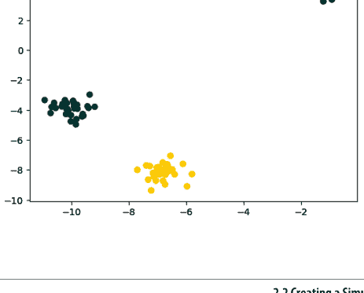

### 另请参阅

- make_regression 文档
- make_classification 文档
- make_blobs 文档

## 2.3 加载 CSV 文件

### 问题

你需要导入一个逗号分隔值（CSV）文件。

### 解决方案

使用 pandas 库的 `read_csv` 将本地或托管的 CSV 文件加载到 pandas DataFrame 中：

```
# 加载库
import pandas as pd

# 创建 URL
url = 'https://raw.githubusercontent.com/chrisalbon/sim_data/master/data.csv'

# 加载数据集
dataframe = pd.read_csv(url)

# 查看前两行
dataframe.head(2)
```

| | integer | datetime | category |
|---|---|---|---|
| 0 | 5 | 2015-01-01 00:00:00 | 0 |
| 1 | 5 | 2015-01-01 00:00:01 | 0 |

### 讨论

关于加载 CSV 文件，有两点需要注意。首先，在加载之前快速查看文件内容通常很有用。事先了解数据集的结构以及我们需要设置哪些参数来加载文件会非常有帮助。其次，`read_csv` 有超过 30 个参数，因此文档可能令人望而生畏。幸运的是，这些参数大多是为了让它能够处理各种 CSV 格式。

CSV 文件的名称源于其值实际上是由逗号分隔的（例如，一行可能是 `2,"2015-01-01 00:00:00",0`）；然而，CSV 文件通常使用其他分隔符，例如制表符（称为 TSV 文件）。

pandas 的 `sep` 参数允许我们定义文件中使用的分隔符。虽然并非总是如此，但 CSV 文件的一个常见格式问题是文件的第一行用于定义列标题（例如，我们解决方案中的 integer、datetime、category）。`header` 参数允许我们指定是否存在标题行以及其位置。如果不存在标题行，我们设置 `header=None`。

`read_csv` 函数返回一个 pandas DataFrame：一个用于处理表格数据的常用且有用的对象，我们将在本书中更深入地介绍。

## 2.4 加载 Excel 文件

### 问题

你需要导入一个 Excel 电子表格。

### 解决方案

使用 pandas 库的 `read_excel` 加载 Excel 电子表格：

```
# 加载库
import pandas as pd

# 创建 URL
url = 'https://raw.githubusercontent.com/chrisalbon/sim_data/master/data.xlsx'

# 加载数据
dataframe = pd.read_excel(url, sheet_name=0, header=0)

# 查看前两行
dataframe.head(2)
```

| integer | datetime | category |
|---|---|---|
| 5 | 2015-01-01 00:00:00 | 0 |
| 5 | 2015-01-01 00:00:01 | 0 |
| 9 | 2015-01-01 00:00:02 | 0 |

### 讨论

这个解决方案与我们读取 CSV 文件的解决方案类似。主要区别在于额外的参数 `sheet_name`，它指定了我们希望加载 Excel 文件中的哪个工作表。`sheet_name` 可以接受字符串（包含工作表的名称）和整数（指向工作表位置，从零开始索引）。如果我们需要加载多个工作表，可以将它们作为列表包含在内。例如，`sheet_name=[0,1,2, "Monthly Sales"]` 将返回一个包含第一个、第二个和第三个工作表以及名为 Monthly Sales 的工作表的 pandas DataFrame 字典。

## 2.5 加载 JSON 文件

### 问题

你需要加载一个 JSON 文件用于数据预处理。

### 解决方案

pandas 库提供了 `read_json` 函数，可以将 JSON 文件转换为 pandas 对象：

```python
# 加载库
import pandas as pd

# 创建 URL
url = 'https://raw.githubusercontent.com/chrisalbon/sim_data/master/data.json'

# 加载数据
dataframe = pd.read_json(url, orient='columns')

# 查看前两行
dataframe.head(2)
```

| | category | datetime | integer |
|---|---|---|---|
| 0 | 0 | 2015-01-01 00:00:00 | 5 |
| 1 | 0 | 2015-01-01 00:00:01 | 5 |

### 讨论

将 JSON 文件导入 pandas 与我们之前看到的几个食谱类似。关键区别在于 `orient` 参数，它向 pandas 指示 JSON 文件的结构。然而，可能需要一些尝试才能确定哪个参数（split、records、index、columns 或 values）是正确的。pandas 提供的另一个有用的工具是 `json_normalize`，它可以帮助将半结构化的 JSON 数据转换为 pandas DataFrame。

### 另请参阅

- `json_normalize` 文档

## 2.6 加载 Parquet 文件

### 问题

你需要加载一个 Parquet 文件。

### 解决方案

pandas 的 `read_parquet` 函数允许我们读取 Parquet 文件：

```python
# 加载库
import pandas as pd

# 创建 URL
url = 'https://machine-learning-python-cookbook.s3.amazonaws.com/data.parquet'

# 加载数据
dataframe = pd.read_parquet(url)

# 查看前两行
dataframe.head(2)
```

| | category | datetime | integer |
|---|---|---|---|
| 0 | 0 | 2015-01-01 00:00:00 | 5 |
| 1 | 0 | 2015-01-01 00:00:01 | 5 |

### 讨论

Parquet 是大数据领域流行的数据存储格式。它通常与 Hadoop 和 Spark 等大数据工具一起使用。虽然 PySpark 超出了本书的范围，但大规模运营的公司极有可能使用像 Parquet 这样的高效数据存储格式，因此了解如何将其读取到 dataframe 中并进行操作是非常有价值的。

### 另请参阅

- [Apache Parquet 文档](https://parquet.apache.org/documentation/latest/)

## 2.7 加载 Avro 文件

### 问题

你需要将一个 Avro 文件加载到 pandas DataFrame 中。

### 解决方案

使用 `pandavro` 库的 `read_avro` 方法：

```python
# 加载库
import requests
import pandavro as pdx

# 创建 URL
url = 'https://machine-learning-python-cookbook.s3.amazonaws.com/data.avro'

# 下载文件
r = requests.get(url)
open('data.avro', 'wb').write(r.content)

# 加载数据
dataframe = pdx.read_avro('data.avro')

# 查看前两行
dataframe.head(2)
```

| | category | datetime | integer |
|---|---|---|---|
| 0 | 0 | 2015-01-01 00:00:00 | 5 |
| 1 | 0 | 2015-01-01 00:00:01 | 5 |

### 讨论

Apache Avro 是一种开源的二进制数据格式，它依赖于模式来定义数据结构。在撰写本文时，它不如 Parquet 常见。然而，像 Avro、thrift 和 Protocol Buffers 这样的大型二进制数据格式因其高效性而日益普及。如果你从事大数据系统工作，你很可能会在不久的将来遇到这些格式之一。

### 另请参阅

- Apache Avro 文档

## 2.8 查询 SQLite 数据库

### 问题

你需要使用结构化查询语言（SQL）从数据库加载数据。

### 解决方案

pandas 的 `read_sql_query` 允许我们对数据库进行 SQL 查询并加载数据：

```python
# 加载库
import pandas as pd
from sqlalchemy import create_engine

# 创建与数据库的连接
database_connection = create_engine('sqlite:///sample.db')

# 加载数据
dataframe = pd.read_sql_query('SELECT * FROM data', database_connection)

# 查看前两行
dataframe.head(2)
```

| | first_name | last_name | age | preTestScore | postTestScore |
|---|---|---|---|---|---|
| 0 | Jason | Miller | 42 | 4 | 25 |
| 1 | Molly | Jacobson | 52 | 24 | 94 |

### 讨论

SQL 是从数据库中提取数据的通用语言。在这个食谱中，我们首先使用 `create_engine` 定义一个到名为 SQLite 的 SQL 数据库引擎的连接。接下来，我们使用 pandas 的 `read_sql_query` 使用 SQL 查询该数据库，并将结果放入 DataFrame。

SQL 是一门独立的语言，虽然超出了本书的范围，但对于任何想学习机器学习的人来说，它绝对值得了解。我们的 SQL 查询 `SELECT * FROM data` 要求数据库从名为 `data` 的表中给出所有列（*）。

请注意，这是本书中少数几个没有额外代码就无法运行的食谱之一。具体来说，`create_engine('sqlite:///sample.db')` 假设 SQLite 数据库已经存在。

### 另请参阅

- [SQLite](https://www.sqlite.org/)
- [W3Schools SQL 教程](https://www.w3schools.com/sql/)

## 2.9 查询远程 SQL 数据库

### 问题

你需要连接到远程 SQL 数据库并从中读取数据。

### 解决方案

使用 `pymysql` 创建连接，并使用 pandas 将其读取到 dataframe 中：

```python
# 导入库
import pymysql
import pandas as pd

# 创建数据库连接
# 使用以下示例启动数据库实例
# https://github.com/kylegallatin/mysql-db-example
conn = pymysql.connect(
    host='localhost',
    user='root',
    password="",
    db='db',
)

# 将 SQL 查询读取到 dataframe 中
dataframe = pd.read_sql("select * from data", conn)

# 查看前两行
dataframe.head(2)
```

| integer | datetime | category |
|---|---|---|
| 0 | 5 | 2015-01-01 00:00:00 | 0 |
| 1 | 5 | 2015-01-01 00:00:01 | 0 |

### 讨论

在本章介绍的所有食谱中，这可能是我们在现实世界中使用最多的一个。虽然连接和读取示例 sqlite 数据库很有用，但它可能不代表你在企业环境中需要连接的表。你将连接的大多数 SQL 实例都需要你连接到远程机器的主机和端口，并指定用于身份验证的用户名和密码。此示例要求你在本地启动一个运行中的 SQL 实例，该实例模拟 localhost 上的远程服务器，以便你可以了解工作流程。

### 另请参阅

- PyMySQL 文档
- pandas 读取 SQL 文档

## 2.10 从 Google 表格加载数据

### 问题

你需要直接从 Google 表格读取数据。

### 解决方案

使用 pandas 的 `read_csv` 并传递一个将 Google 表格导出为 CSV 的 URL：

```python
# 导入库
import pandas as pd

# 下载表格为 CSV 的 Google 表格 URL
url = "https://docs.google.com/spreadsheets/d/"
    "1ehC-9otcAuitqnmWksqt1m0rTRCL38dv0K9UjhwzTOA/export?format=csv"

# 将 CSV 读取到 dataframe 中
dataframe = pd.read_csv(url)

# 查看前两行
dataframe.head(2)
```

| integer | datetime | category |
|---|---|---|
| 0 | 5 | 2015-01-01 00:00:00 | 0 |
| 1 | 5 | 2015-01-01 00:00:01 | 0 |

### 讨论

虽然 Google 表格可以轻松下载，但有时能够直接将它们读取到 Python 中而无需任何中间步骤会很有帮助。上面 URL 末尾的 `/export?format=csv` 查询参数创建了一个端点，我们可以从该端点下载文件或将其读取到 pandas 中。

### 另请参阅

- Google Sheets API

## 2.11 从 S3 存储桶加载数据

### 问题

你需要从你有权访问的 S3 存储桶中读取 CSV 文件。

### 解决方案

向 pandas 添加存储选项，使其能够访问 S3 对象：

```python
# 导入库
import pandas as pd

# CSV 的 S3 路径
s3_uri = "s3://machine-learning-python-cookbook/data.csv"

# 设置 AWS 凭证（替换为你自己的）
ACCESS_KEY_ID = "xxxxxxxxxxxx"
SECRET_ACCESS_KEY = "xxxxxxxxxxxxxxxx"

# 将 CSV 读取到 dataframe 中
dataframe = pd.read_csv(s3_uri, storage_options={
    "key": ACCESS_KEY_ID,
    "secret": SECRET_ACCESS_KEY,
})

# 查看前两行
dataframe.head(2)
```

| integer | datetime | category |
|---|---|---|
| 0 | 5 | 2015-01-01 00:00:00 | 0 |
| 1 | 5 | 2015-01-01 00:00:01 | 0 |

### 讨论

许多企业现在将数据存储在云提供商的 blob 存储中，例如 Amazon S3 或 Google Cloud Storage (GCS)。机器学习从业者连接到这些源以检索数据是很常见的。虽然 S3 URI (`s3://machine-learning-python-cookbook/data.csv`) 是公开的，但它仍然需要你提供自己的 AWS 访问凭证才能访问它。值得注意的是，公共对象也有 HTTP URL 可以从中下载文件，[例如这个 CSV 文件的链接](https://machine-learning-python-cookbook.s3.amazonaws.com/data.csv)。

### 另请参阅

- [Amazon S3](https://aws.amazon.com/s3/)
- [AWS 安全凭证](https://docs.aws.amazon.com/IAM/latest/UserGuide/id_credentials_access-keys.html)

## 2.12 加载非结构化数据

### 问题

你需要加载非结构化数据，如文本或图像。

### 解决方案

使用 Python 基础的 `open` 函数加载信息：

```python
# 导入库
import requests

# 下载 txt 文件的 URL
txt_url = "https://machine-learning-python-cookbook.s3.amazonaws.com/text.txt"

# 获取 txt 文件
r = requests.get(txt_url)

# 将其写入本地的 text.txt
with open('text.txt', 'wb') as f:
    f.write(r.content)
```

# 读取文件
with open('text.txt', 'r') as f:
    text = f.read()

# 打印内容
print(text)

你好！

### 讨论

虽然结构化数据可以轻松地从 CSV、JSON 或各种数据库中读取，但非结构化数据可能更具挑战性，后续可能需要自定义处理。有时，使用 Python 的基本 `open` 函数来打开和读取文件会很有帮助。这使我们能够打开文件，然后读取该文件的内容。

### 另请参阅

- Python 的 open 函数
- Python 中的上下文管理器

# 第 3 章
数据整理

## 3.0 引言

数据整理是一个广泛使用的术语，通常非正式地用于描述将原始数据转换为干净、有组织的格式以供使用的过程。对我们来说，数据整理只是预处理数据的一个步骤，但它是一个重要的步骤。

用于“整理”数据的最常见数据结构是数据框，它既直观又极其通用。数据框是表格形式的，这意味着它们基于行和列，就像你在电子表格中看到的那样。这是一个根据 *泰坦尼克号* 乘客数据创建的数据框：

```python
# 加载库
import pandas as pd

# 创建 URL
url = 'https://raw.githubusercontent.com/chrisalbon/sim_data/master/titanic.csv'

# 将数据加载为数据框
dataframe = pd.read_csv(url)

# 显示前五行
dataframe.head(5)
```

| Name | PClass | Age | Sex | Survived | SexCode |
|---|---|---|---|---|---|
| 0 Allen, Miss Elisabeth Walton | 1st | 29.00 | female | 1 | 1 |
| 1 Allison, Miss Helen Loraine | 1st | 2.00 | female | 0 | 1 |
| 2 Allison, Mr Hudson Joshua Creighton | 1st | 30.00 | male | 0 | 0 |
| 3 Allison, Mrs Hudson JC (Bessie Waldo Daniels) | 1st | 25.00 | female | 0 | 1 |
| 4 Allison, Master Hudson Trevor | 1st | 0.92 | male | 1 | 0 |

在这个数据框中有三件重要的事情需要注意。

首先，在数据框中，每一行对应一个观测值（例如，一名乘客），每一列对应一个特征（性别、年龄等）。例如，通过查看第一个观测值，我们可以看到 Elisabeth Walton Allen 小姐住在一等舱，29 岁，女性，并且在灾难中幸存下来。

其次，每一列包含一个名称（例如，Name、PClass、Age），每一行包含一个索引号（例如，幸运的 Elisabeth Walton Allen 小姐是 0）。我们将使用这些来选择和操作观测值和特征。

第三，两列，Sex 和 SexCode，包含相同的信息但格式不同。在 Sex 中，女性由字符串 `female` 表示，而在 SexCode 中，女性由整数 `1` 表示。我们希望所有特征都是唯一的，因此我们需要删除其中一列。

在本章中，我们将介绍使用 pandas 库操作数据框的各种技术，目标是创建一个干净、结构良好的观测值集合，以供进一步预处理。

## 3.1 创建数据框

### 问题

你想创建一个新的数据框。

### 解决方案

pandas 提供了许多创建新 DataFrame 对象的方法。一种简单的方法是使用 Python 字典实例化一个 DataFrame。在字典中，每个键是一个列名，值是一个列表，其中每个项目对应一行：

```python
# 加载库
import pandas as pd

# 创建一个字典
dictionary = {
    "Name": ['Jacky Jackson', 'Steven Stevenson'],
    "Age": [38, 25],
    "Driver": [True, False]
}

# 创建 DataFrame
dataframe = pd.DataFrame(dictionary)

# 显示 DataFrame
dataframe
```

| Name | Age | Driver |
|---|---|---|
| 0 Jacky Jackson | 38 | True |
| 1 Steven Stevenson | 25 | False |

使用值列表可以轻松地向任何数据框添加新列：

```python
# 添加一列眼睛颜色
dataframe["Eyes"] = ["Brown", "Blue"]

# 显示 DataFrame
dataframe
```

| Name | Age | Driver | Eyes |
|---|---|---|---|
| 0 Jacky Jackson | 38 | True | Brown |
| 1 Steven Stevenson | 25 | False | Blue |

### 讨论

pandas 提供了看似无限多种创建 DataFrame 的方法。在现实世界中，创建一个空的 DataFrame 然后填充它几乎永远不会发生。相反，我们的 DataFrame 将从我们从其他来源（例如，CSV 文件或数据库）加载的真实数据中创建。

## 3.2 获取数据信息

### 问题

你想查看 DataFrame 的一些特征。

### 解决方案

加载数据后，我们可以做的最简单的事情之一是使用 `head` 查看前几行：

```python
# 加载库
import pandas as pd

# 创建 URL
url = 'https://raw.githubusercontent.com/chrisalbon/sim_data/master/titanic.csv'

# 加载数据
dataframe = pd.read_csv(url)

# 显示两行
dataframe.head(2)
```

| Name | PClass | Age | Sex | Survived | SexCode |
|---|---|---|---|---|---|
| 0 Allen, Miss Elisabeth Walton | 1st | 29.0 | female | 1 | 1 |
| 1 Allison, Miss Helen Loraine | 1st | 2.0 | female | 0 | 1 |

我们还可以查看行数和列数：

```python
# 显示维度
dataframe.shape

(1313, 6)
```

我们可以使用 `describe` 获取任何数值列的描述性统计信息：

```python
# 显示统计信息
dataframe.describe()
```

| | Age | Survived | SexCode |
|---|---|---|---|
| count | 756.000000 | 1313.000000 | 1313.000000 |
| mean | 30.397989 | 0.342727 | 0.351866 |
| std | 14.259049 | 0.474802 | 0.477734 |
| min | 0.170000 | 0.000000 | 0.000000 |
| 25% | 21.000000 | 0.000000 | 0.000000 |
| 50% | 28.000000 | 0.000000 | 0.000000 |
| 75% | 39.000000 | 1.000000 | 1.000000 |
| max | 71.000000 | 1.000000 | 1.000000 |

此外，`info` 方法可以显示一些有用的信息：

```python
# 显示信息
dataframe.info()

<class 'pandas.core.frame.DataFrame'>
RangeIndex: 1313 entries, 0 to 1312
Data columns (total 6 columns):
 #   Column      Non-Null Count  Dtype  
---  ------      --------------  -----  
 0   Name        1313 non-null   object 
 1   PClass      1313 non-null   object 
 2   Age         756 non-null    float64
 3   Sex         1313 non-null   object 
 4   Survived    1313 non-null   int64  
 5   SexCode     1313 non-null   int64  
dtypes: float64(1), int64(2), object(3)
memory usage: 61.7+ KB
```

### 讨论

加载一些数据后，了解其结构以及包含何种信息是一个好主意。理想情况下，我们会直接查看完整数据。但在大多数现实情况下，数据可能有数千到数十万甚至数百万行和列。相反，我们必须依靠提取样本来查看小片段，并计算数据的摘要统计信息。

在我们的解决方案中，我们使用的是 *泰坦尼克号* 乘客的玩具数据集。使用 `head`，我们可以查看数据的前几行（默认为五行）。或者，我们可以使用 `tail` 查看最后几行。使用 `shape`，我们可以看到 DataFrame 包含多少行和列。使用 `describe`，我们可以看到任何数值列的一些基本描述性统计信息。最后，`info` 显示了关于 DataFrame 的许多有用数据点，包括索引和列的数据类型、非空值以及内存使用情况。

值得注意的是，摘要统计信息并不总是能说明全部情况。例如，pandas 将 `Survived` 和 `SexCode` 列视为数值列，因为它们包含 1 和 0。然而，在这种情况下，数值代表类别。例如，如果 `Survived` 等于 1，则表示乘客在灾难中幸存下来。因此，提供的一些摘要统计信息没有意义，例如 `SexCode` 列（乘客性别的指示器）的标准差。

## 3.3 切片数据框

### 问题

你需要选择数据框的特定子集或切片。

### 解决方案

使用 `loc` 或 `iloc` 选择一行或多行，或一个或多个值：

```python
# 加载库
import pandas as pd

# 创建 URL
url = 'https://raw.githubusercontent.com/chrisalbon/sim_data/master/titanic.csv'

# 加载数据
dataframe = pd.read_csv(url)

# 选择第一行
dataframe.iloc[0]
```

Name Allen, Miss Elisabeth Walton
PClass 1st
Age 29
Sex female
Survived 1

## 3.4 基于条件选择行

### 问题

你想根据某些条件选择 DataFrame 的行。

### 解决方案

在 pandas 中可以轻松完成此操作。例如，如果我们想选择 *泰坦尼克号* 上的所有女性：

```python
# 加载库
import pandas as pd

# 创建 URL
url = 'https://raw.githubusercontent.com/chrisalbon/sim_data/master/titanic.csv'

# 加载数据
dataframe = pd.read_csv(url)

# 显示 'sex' 列为 'female' 的前两行
dataframe[dataframe['Sex'] == 'female'].head(2)
```

| | Name | PClass | Age | Sex | Survived | SexCode |
|---|---|---|---|---|---|---|
| 0 | Allen, Miss Elisabeth Walton | 1st | 29.0 | female | 1 | 1 |
| 1 | Allison, Miss Helen Loraine | 1st | 2.0 | female | 0 | 1 |

花点时间看看这个解决方案的格式。我们的条件语句是 `dataframe['Sex'] == 'female'`；将其包裹在 `dataframe[]` 中，我们是在告诉 pandas “选择 DataFrame 中 `dataframe['Sex']` 值为 'female' 的所有行。”这些条件会产生一个 pandas 布尔序列。

多个条件也很容易。例如，这里我们选择所有乘客为女性且年龄在 65 岁或以上的行：

```python
# 筛选行
dataframe[(dataframe['Sex'] == 'female') & (dataframe['Age'] >= 65)]
```

| Name | PClass | Age | Sex | Survived | SexCode |
|---|---|---|---|---|---|
| 73 | Crosby, Mrs Edward Gifford (Catherine Elizabeth... | 1st | 69.0 | female | 1 | 1 |

### 讨论

有条件地选择和过滤数据是数据整理中最常见的任务之一。你很少需要源数据中的所有原始数据；相反，你只对其中的某个子集感兴趣。例如，你可能只对特定州的商店或超过一定年龄的患者记录感兴趣。

## 3.5 排序值

### 问题

你需要按列中的值对数据框进行排序。

### 解决方案

使用 pandas 的 `sort_values` 函数：

```python
# 加载库
import pandas as pd

# 创建 URL
url = 'https://raw.githubusercontent.com/chrisalbon/sim_data/master/titanic.csv'

# 加载数据
dataframe = pd.read_csv(url)

# 按年龄对数据框排序，显示两行
dataframe.sort_values(by=["Age"]).head(2)
```

| Name | PClass | Age | Sex | Survived | SexCode |
|---|---|---|---|---|---|
| 763 | Dean, Miss Elizabeth Gladys (Millvena) | 3rd | 0.17 | female | 1 | 1 |
| 751 | Danbom, Master Gilbert Sigvard Emanuel | 3rd | 0.33 | male | 0 | 0 |

### 讨论

在数据分析和探索过程中，按特定列或一组列对 DataFrame 进行排序通常很有用。`sort_values` 的 `by` 参数接受一个列名列表，用于对 DataFrame 进行排序，并将根据列表中列名的顺序进行排序。

默认情况下，`ascending` 参数设置为 `True`，因此它将按值从低到高排序。如果我们想要最年长的乘客而不是最年轻的，可以将其设置为 `False`。

## 3.6 替换值

### 问题

你需要替换 DataFrame 中的值。

### 解决方案

pandas 的 `replace` 方法是查找和替换值的简便方法。例如，我们可以将 `Sex` 列中任何出现的 "female" 替换为 "Woman"：

```python
# 加载库
import pandas as pd

# 创建 URL
url = 'https://raw.githubusercontent.com/chrisalbon/sim_data/master/titanic.csv'

# 加载数据
dataframe = pd.read_csv(url)

# 替换值，显示两行
dataframe['Sex'].replace("female", "Woman").head(2)
```

```
0    Woman
1    Woman
Name: Sex, dtype: object
```

我们也可以同时替换多个值：

```python
# 将 "female" 和 "male" 替换为 "Woman" 和 "Man"
dataframe['Sex'].replace(["female", "male"], ["Woman", "Man"]).head(5)
```

```
0    Woman
1    Woman
2      Man
3    Woman
4      Man
Name: Sex, dtype: object
```

我们也可以通过指定整个数据框而不是单个列，在整个 DataFrame 对象中查找和替换：

```python
# 替换值，显示两行
dataframe.replace(1, "One").head(2)
```

| Name | PClass | Age | Sex | Survived | SexCode |
|---|---|---|---|---|---|
| 0 Allen, Miss Elisabeth Walton | 1st | 29 | female | One | One |
| 1 Allison, Miss Helen Loraine | 1st | 2 | female | 0 | One |

`replace` 也接受正则表达式：

```python
# 替换值，显示两行
dataframe.replace(r"1st", "First", regex=True).head(2)
```

| Name | PClass | Age | Sex | Survived | SexCode |
|---|---|---|---|---|---|
| 0 Allen, Miss Elisabeth Walton | First | 29.0 | female | 1 | 1 |
| 1 Allison, Miss Helen Loraine | First | 2.0 | female | 0 | 1 |

### 讨论

`replace` 是我们用来替换值的工具。它很简单，但却具有接受正则表达式的强大能力。

## 3.7 重命名列

### 问题

你想重命名 pandas DataFrame 中的列。

### 解决方案

使用 `rename` 方法重命名列：

```python
# 加载库
import pandas as pd

# 创建 URL
url = 'https://raw.githubusercontent.com/chrisalbon/sim_data/master/titanic.csv'

# 加载数据
dataframe = pd.read_csv(url)

# 重命名列，显示两行
dataframe.rename(columns={'PClass': 'Passenger Class'}).head(2)
```

| Name | Passenger Class | Age | Sex | Survived | SexCode |
|---|---|---|---|---|---|
| 0 Allen, Miss Elisabeth Walton | 1st | 29.0 | female | 1 | 1 |
| 1 Allison, Miss Helen Loraine | 1st | 2.0 | female | 0 | 1 |

请注意，`rename` 方法可以接受字典作为参数。我们可以使用字典一次更改多个列名：

```python
# 重命名列，显示两行
dataframe.rename(columns={'PClass': 'Passenger Class', 'Sex': 'Gender'}).head(2)
```

| Name | Passenger Class | Age | Gender | Survived | SexCode |
|---|---|---|---|---|---|
| 0 Allen, Miss Elisabeth Walton | 1st | 29.0 | female | 1 | 1 |
| 1 Allison, Miss Helen Loraine | 1st | 2.0 | female | 0 | 1 |

### 讨论

使用 `rename` 并将字典作为 `columns` 参数的参数是我重命名列的首选方式，因为它适用于任意数量的列。如果我们想一次重命名所有列，这个有用的代码片段会创建一个字典，其中旧列名作为键，空字符串作为值：

```python
# 加载库
import collections

# 创建字典
column_names = collections.defaultdict(str)

# 创建键
for name in dataframe.columns:
    column_names[name]

# 显示字典
column_names
```

```
defaultdict(str,
            {'Age': '',
             'Name': '',
             'PClass': '',
             'Sex': '',
             'SexCode': '',
             'Survived': ''})
```

## 3.8 查找最小值、最大值、总和、平均值和计数

### 问题

你想查找数值列的最小值、最大值、总和、平均值或计数。

### 解决方案

pandas 内置了一些常用描述性统计的方法，如 `min`、`max`、`mean`、`sum` 和 `count`：

## 3.9 查找唯一值

### 问题

你想选择一列中的所有唯一值。

### 解决方案

使用 `unique` 查看一列中所有唯一值的数组：

```python
# 加载库
import pandas as pd

# 创建 URL
url = 'https://raw.githubusercontent.com/chrisalbon/sim_data/master/titanic.csv'

# 加载数据
dataframe = pd.read_csv(url)

# 选择唯一值
dataframe['Sex'].unique()
```

```
array(['female', 'male'], dtype=object)
```

或者，`value_counts` 会显示所有唯一值及其出现的次数：

```python
# 显示计数
dataframe['Sex'].value_counts()
```

```
male      851
female    462
Name: Sex, dtype: int64
```

### 讨论

`unique` 和 `value_counts` 对于操作和探索分类列都非常有用。在分类列中，经常会有需要在数据整理阶段处理的类别。例如，在 *Titanic* 数据集中，`PClass` 是一个表示乘客船票等级的列。*Titanic* 上有三个等级；然而，如果我们使用 `value_counts`，会发现一个问题：

```python
# 显示计数
dataframe['PClass'].value_counts()
```

```
3rd    711
1st    322
2nd    279
*        1
Name: PClass, dtype: int64
```

虽然几乎所有乘客都属于预期的三个等级之一，但有一个乘客的等级是 `*`。处理这类问题有多种策略，我们将在第 5 章中讨论，但现在只需意识到分类数据中存在“额外”类别是很常见的，不应被忽略。

最后，如果我们只想计算唯一值的数量，可以使用 `nunique`：

```python
# 显示唯一值的数量
dataframe['PClass'].nunique()
```

```
4
```

## 3.10 处理缺失值

### 问题

你想选择 DataFrame 中的缺失值。

### 解决方案

`isnull` 和 `notnull` 返回布尔值，指示一个值是否缺失：

```python
# 加载库
import pandas as pd

# 创建 URL
url = 'https://raw.githubusercontent.com/chrisalbon/sim_data/master/titanic.csv'

# 加载数据
dataframe = pd.read_csv(url)

# 选择缺失值，显示两行
dataframe[dataframe['Age'].isnull()].head(2)
```

| Name | PClass | Age | Sex | Survived | SexCode |
|---|---|---|---|---|---|
| 12 | Aubert, Mrs Leontine Pauline | 1st | NaN | female | 1 | 1 |
| 13 | Barkworth, Mr Algernon H | 1st | NaN | male | 1 | 0 |

### 讨论

缺失值是数据整理中普遍存在的问题，但许多人低估了处理缺失数据的难度。pandas 使用 NumPy 的 `NaN`（非数字）值来表示缺失值，但重要的是要注意 `NaN` 在 pandas 中并未完全原生实现。例如，如果我们想将所有包含 `male` 的字符串替换为缺失值，会得到一个错误：

```python
# 尝试用 NaN 替换值
dataframe['Sex'] = dataframe['Sex'].replace('male', NaN)
```

```
NameError                                Traceback (most recent call last)

<ipython-input-7-5682d714f87d> in <module>()
      1 # Attempt to replace values with NaN
----> 2 dataframe['Sex'] = dataframe['Sex'].replace('male', NaN)

NameError: name 'NaN' is not defined
```

要完全使用 `NaN` 的功能，我们需要先导入 NumPy 库：

```python
# 加载库
import numpy as np

# 用 NaN 替换值
dataframe['Sex'] = dataframe['Sex'].replace('male', np.nan)
```

通常，数据集使用特定值来表示缺失的观测值，例如 `NONE`、`-999` 或 `...`。pandas 的 `read_csv` 函数包含一个参数，允许我们指定用于表示缺失值的值：

```python
# 加载数据，设置缺失值
dataframe = pd.read_csv(url, na_values=[np.nan, 'NONE', -999])
```

我们还可以使用 pandas 的 `fillna` 函数来填补一列的缺失值。这里，我们使用 `isna` 函数显示 `Age` 为空的位置，然后用乘客的平均年龄填充这些值。

```python
# 获取一个空行
null_entry = dataframe[dataframe["Age"].isna()].head(1)

print(null_entry)
```

| Name | PClass | Age | Sex | Survived | SexCode |
|---|---|---|---|---|---|
| 12 | Aubert, Mrs Leontine Pauline | 1st | NaN | female | 1 | 1 |

```python
# 用乘客的平均年龄填充所有空值
null_entry.fillna(dataframe["Age"].mean())
```

| Name | PClass | Age | Sex | Survived | SexCode |
|---|---|---|---|---|---|
| 12 | Aubert, Mrs Leontine Pauline | 1st | 30.397989 | female | 1 | 1 |

## 3.11 删除列

### 问题

你想从 DataFrame 中删除一列。

### 解决方案

删除列的最佳方法是使用 `drop` 并设置参数 `axis=1`（即列轴）：

```python
# 加载库
import pandas as pd

# 创建 URL
url = 'https://raw.githubusercontent.com/chrisalbon/sim_data/master/titanic.csv'

# 加载数据
dataframe = pd.read_csv(url)

# 删除列
dataframe.drop('Age', axis=1).head(2)
```

| Name | PClass | Sex | Survived | SexCode |
|---|---|---|---|---|
| 0 Allen, Miss Elisabeth Walton | 1st | female | 1 | 1 |
| 1 Allison, Miss Helen Loraine | 1st | female | 0 | 1 |

你也可以使用列名列表作为主参数，一次删除多列：

```python
# 删除列
dataframe.drop(['Age', 'Sex'], axis=1).head(2)
```

| Name | PClass | Survived | SexCode |
|---|---|---|---|
| 0 Allen, Miss Elisabeth Walton | 1st | 1 | 1 |
| 1 Allison, Miss Helen Loraine | 1st | 0 | 1 |

如果一列没有名称（有时会发生），你可以使用 `dataframe.columns` 按其列索引删除它：

```python
# 删除列
dataframe.drop(dataframe.columns[1], axis=1).head(2)
```

| Name | Age | Sex | Survived | SexCode |
|---|---|---|---|---|
| 0 Allen, Miss Elisabeth Walton | 29.0 | female | 1 | 1 |
| 1 Allison, Miss Helen Loraine | 2.0 | female | 0 | 1 |

### 讨论

`drop` 是删除列的惯用方法。另一种方法是 `del dataframe['Age']`，它在大多数情况下有效，但不推荐使用，因为它在 pandas 内部的调用方式（其细节超出了本书的范围）。

我建议你避免使用 pandas 的 `inplace=True` 参数。许多 pandas 方法包含一个 `inplace` 参数，当设置为 `True` 时，会直接编辑 DataFrame。这在更复杂的数据处理管道中可能会导致问题，因为我们正在将 DataFrame 视为可变对象（从技术上讲它们确实是）。我建议将 DataFrame 视为不可变对象。例如：

```python
# 创建一个新的 DataFrame
dataframe_name_dropped = dataframe.drop(dataframe.columns[0], axis=1)
```

在这个例子中，我们没有修改 DataFrame `dataframe`，而是创建了一个新的 DataFrame，它是 `dataframe` 的修改版本，名为 `dataframe_name_dropped`。如果你将 DataFrame 视为不可变对象，将来会省去很多麻烦。

## 3.12 删除行

### 问题

你想从 DataFrame 中删除一行或多行。

### 解决方案

使用布尔条件创建一个新的 DataFrame，排除要删除的行：

```python
# 加载库
import pandas as pd

# 创建 URL
url = 'https://raw.githubusercontent.com/chrisalbon/sim_data/master/titanic.csv'

# 加载数据
dataframe = pd.read_csv(url)

# 删除行，显示输出的前三行
dataframe[dataframe['Sex'] != 'male'].head(3)
```

| Name | PClass | Age | Sex | Survived | SexCode |
|---|---|---|---|---|---|
| 0 Allen, Miss Elisabeth Walton | 1st | 29.0 | female | 1 | 1 |
| 1 Allison, Miss Helen Loraine | 1st | 2.0 | female | 0 | 1 |
| 3 Allison, Mrs Hudson JC (Bessie Waldo Daniels) | 1st | 25.00 | female | 0 | 1 |

### 讨论

虽然从技术上讲你可以使用 `drop` 方法（例如，`dataframe.drop([0, 1], axis=0)` 删除前两行），但更实用的方法是简单地将布尔条件包装在 `dataframe[]` 中。这使我们能够利用条件语句的力量来删除单行或（更可能）一次删除多行。

我们可以通过匹配唯一值来轻松删除单行：

```python
# 删除行，显示输出的前两行
dataframe[dataframe['Name'] != 'Allison, Miss Helen Loraine'].head(2)
```

## 3.13 删除重复行

### 问题

你想从 DataFrame 中删除重复的行。

### 解决方案

使用 `drop_duplicates`，但要注意其参数：

```python
# 加载库
import pandas as pd

# 创建 URL
url = 'https://raw.githubusercontent.com/chrisalbon/sim_data/master/titanic.csv'

# 加载数据
dataframe = pd.read_csv(url)

# 删除重复行，显示输出的前两行
dataframe.drop_duplicates().head(2)
```

| Name | PClass | Age | Sex | Survived | SexCode |
|---|---|---|---|---|---|
| 0 Allen, Miss Elisabeth Walton | 1st | 29.0 | female | 1 | 1 |
| 1 Allison, Miss Helen Loraine | 1st | 2.0 | female | 0 | 1 |

### 讨论

细心的读者会注意到，解决方案实际上并没有删除任何行：

```python
# 显示行数
print("原始 DataFrame 中的行数:", len(dataframe))
print("去重后的行数:", len(dataframe.drop_duplicates()))
```

```
原始 DataFrame 中的行数: 1313
去重后的行数: 1313
```

这是因为 `drop_duplicates` 默认只删除所有列都完全匹配的行。由于我们 DataFrame 中的每一行都是唯一的，所以没有行会被删除。然而，我们通常只想考虑列的子集来检查重复行。我们可以使用 `subset` 参数来实现这一点：

```python
# 删除重复行
dataframe.drop_duplicates(subset=['Sex'])
```

| Name | PClass | Age | Sex | Survived | SexCode |
|---|---|---|---|---|---|
| 0 Allen, Miss Elisabeth Walton | 1st | 29.0 | female | 1 | 1 |
| 2 Allison, Mr Hudson Joshua Creighton | 1st | 30.0 | male | 0 | 0 |

仔细观察前面的输出：我们告诉 `drop_duplicates` 只考虑 `Sex` 值相同的任意两行为重复行，并删除它们。现在我们只剩下一个只有两行的 DataFrame：一名女性和一名男性。你可能会问为什么 `drop_duplicates` 决定保留这两行而不是另外两行。答案是 `drop_duplicates` 默认保留重复行中的第一次出现，并删除其余的。我们可以使用 `keep` 参数来控制此行为：

```python
# 删除重复行
dataframe.drop_duplicates(subset=['Sex'], keep='last')
```

| Name | PClass | Age | Sex | Survived | SexCode |
|---|---|---|---|---|---|
| 1307 Zabour, Miss Tamini | 3rd | NaN | female | 0 | 1 |
| 1312 Zimmerman, Leo | 3rd | 29.0 | male | 0 | 0 |

一个相关的方法是 `duplicated`，它返回一个布尔序列，表示某行是否为重复行。如果你不想简单地删除重复行，这是一个不错的选择：

```python
dataframe.duplicated()
```

```
0        False
1        False
2        False
3        False
4        False
...
1308     False
1309     False
1310     False
1311     False
1312     False
Length: 1313, dtype: bool
```

## 3.14 按值分组行

### 问题

你想根据某些共享值对单个行进行分组。

### 解决方案

`groupby` 是 pandas 中最强大的功能之一：

```python
# 加载库
import pandas as pd

# 创建 URL
url = 'https://raw.githubusercontent.com/chrisalbon/sim_data/master/titanic.csv'

# 加载数据
dataframe = pd.read_csv(url)

# 按列 'Sex' 的值对行进行分组，计算每组的均值
dataframe.groupby('Sex').mean(numeric_only=True)
```

| Sex | Age | Survived | SexCode |
|---|---|---|---|
| female | 29.396424 | 0.666667 | 1.0 |
| male | 31.014338 | 0.166863 | 0.0 |

### 讨论

`groupby` 是数据整理真正开始成形的地方。拥有一个 DataFrame，其中每一行是一个人或一个事件，我们想根据某些标准对它们进行分组，然后计算统计数据，这是非常常见的。例如，你可以想象一个 DataFrame，其中每一行是全国连锁餐厅的一次销售，我们想要每家餐厅的总销售额。我们可以通过按单个餐厅对行进行分组，然后计算每组的总和来实现这一点。

`groupby` 的新手经常写这样一行代码，并对返回的内容感到困惑：

```python
# 分组行
dataframe.groupby('Sex')
```

```
<pandas.core.groupby.DataFrameGroupBy object at 0x10efacf28>
```

为什么它没有返回更有用的东西？原因是 `groupby` 需要与我们想要应用于每个组的某些操作配对，例如计算聚合统计量（例如，均值、中位数、总和）。在谈论分组时，我们经常使用简写，说“按性别分组”，但这是不完整的。为了使分组有用，我们需要按某个东西分组，然后对每个组应用一个函数：

```python
# 分组行，计数行
dataframe.groupby('Survived')['Name'].count()
```

```
Survived
0    863
1    450
Name: Name, dtype: int64
```

注意 `groupby` 后面添加的 `Name`？这是因为特定的汇总统计量只对某些类型的数据有意义。例如，虽然按性别计算平均年龄是有意义的，但按性别计算总年龄则没有意义。在这种情况下，我们将数据分为存活或未存活，然后计算每组中的名称（即乘客）数量。

我们也可以先按第一列分组，然后按第二列对该分组进行分组：

```python
# 分组行，计算均值
dataframe.groupby(['Sex','Survived'])['Age'].mean()
```

```
Sex     Survived
female  0          24.901408
        1          30.867143
male    0          32.320780
        1          25.951875
Name: Age, dtype: float64
```

## 3.15 按时间分组行

### 问题

你需要按时间段对单个行进行分组。

### 解决方案

使用 `resample` 按时间块对行进行分组：

```python
# 加载库
import pandas as pd
import numpy as np

# 创建日期范围
time_index = pd.date_range('06/06/2017', periods=100000, freq='30S')

# 创建 DataFrame
dataframe = pd.DataFrame(index=time_index)

# 创建随机值列
dataframe['Sale_Amount'] = np.random.randint(1, 10, 100000)

# 按周对行进行分组，计算每周总和
dataframe.resample('W').sum()
```

| Sale_Amount |
|---|
| 2017-06-11 86423 |
| 2017-06-18 101045 |
| 2017-06-25 100867 |
| 2017-07-02 100894 |
| 2017-07-09 100438 |
| 2017-07-16 10297 |

### 讨论

我们标准的 *Titanic* 数据集不包含日期时间列，因此对于这个示例，我们生成了一个简单的 DataFrame，其中每一行是一次单独的销售。对于每次销售，我们都知道其日期、时间和金额（这些数据并不现实，因为销售恰好相隔 30 秒发生，并且是精确的美元金额，但为了简单起见，我们假设如此）。

原始数据如下所示：

```python
# 显示三行
dataframe.head(3)
```

| Sale_Amount |
|---|
| 2017-06-06 00:00:00 7 |
| 2017-06-06 00:00:30 2 |
| 2017-06-06 00:01:00 7 |

请注意，每次销售的日期和时间是 DataFrame 的索引；这是因为 `resample` 要求索引是类似日期时间的值。

使用 `resample`，我们可以按各种时间段（偏移量）对行进行分组，然后可以计算每个时间组的统计数据：

```python
# 按两周分组，计算均值
dataframe.resample('2W').mean()
```

| Sale_Amount |
|---|
| 2017-06-11 5.001331 |
| 2017-06-25 5.007738 |
| 2017-07-09 4.993353 |
| 2017-07-23 4.950481 |

```python
# 按月分组，计数行
dataframe.resample('M').count()
```

| Sale_Amount |
|---|
| 2017-06-30 72000 |
| 2017-07-31 28000 |

你可能注意到，在两个输出中，日期时间索引都是日期，尽管我们分别按周和月分组。原因是 `resample` 默认返回时间组的右“边缘”（最后一个标签）的标签。我们可以使用 `label` 参数来控制此行为：

```python
# 按月分组，计数行
dataframe.resample('M', label='left').count()
```

| Sale_Amount |
|---|
| 2017-05-31 72000 |
| 2017-06-30 28000 |

### 另请参阅

- pandas 时间偏移别名列表

## 3.16 聚合操作和统计

### 问题

你需要对 DataFrame 中的每一列（或一组列）进行聚合操作。

### 解决方案

使用 pandas 的 `agg` 方法。在这里，我们可以轻松地获取每一列的最小值：

```python
# 加载库
import pandas as pd

# 创建 URL
url = 'https://raw.githubusercontent.com/chrisalbon/sim_data/master/titanic.csv'

# 加载数据
dataframe = pd.read_csv(url)

# 获取每一列的最小值
dataframe.agg("min")
```

## 3.17 遍历列

### 问题

你想要遍历列中的每个元素并执行某些操作。

### 解决方案

你可以像处理 Python 中的任何其他序列一样处理 pandas 列，并使用标准的 Python 语法进行遍历：

```python
# 加载库
import pandas as pd

# 创建 URL
url = 'https://raw.githubusercontent.com/chrisalbon/sim_data/master/titanic.csv'

# 加载数据
dataframe = pd.read_csv(url)

# 打印前两个名字的大写形式
for name in dataframe['Name'][0:2]:
    print(name.upper())

ALLEN, MISS ELISABETH WALTON
ALLISON, MISS HELEN LORAINE
```

### 讨论

除了循环（通常称为 for 循环），我们还可以使用列表推导式：

```python
# 显示前两个名字的大写形式
[name.upper() for name in dataframe['Name'][0:2]]
['ALLEN, MISS ELISABETH WALTON', 'ALLISON, MISS HELEN LORAINE']
```

尽管使用 for 循环很诱人，但更 Pythonic 的解决方案是使用 pandas 的 apply 方法，这将在配方 3.18 中描述。

## 3.18 对列中所有元素应用函数

### 问题

你想要对列中的所有元素应用某个函数。

### 解决方案

使用 apply 对列中的每个元素应用内置或自定义函数：

```python
# 加载库
import pandas as pd

# 创建 URL
url = 'https://raw.githubusercontent.com/chrisalbon/sim_data/master/titanic.csv'

# 加载数据
dataframe = pd.read_csv(url)

# 创建函数
def uppercase(x):
    return x.upper()

# 应用函数，显示两行
dataframe['Name'].apply(uppercase)[0:2]
0    ALLEN, MISS ELISABETH WALTON
1    ALLISON, MISS HELEN LORAINE
Name: Name, dtype: object
```

### 讨论

apply 是进行数据清洗和整理的好方法。通常会编写一个函数来执行某些有用的操作（如分离姓和名、将字符串转换为浮点数等），然后将该函数映射到列中的每个元素。

## 3.19 对分组应用函数

### 问题

你已经使用 groupby 对行进行了分组，并想要对每个分组应用一个函数。

### 解决方案

结合使用 groupby 和 apply：

```python
# 加载库
import pandas as pd

# 创建 URL
url = 'https://raw.githubusercontent.com/chrisalbon/sim_data/master/titanic.csv'

# 加载数据
dataframe = pd.read_csv(url)

# 对行进行分组，对分组应用函数
dataframe.groupby('Sex').apply(lambda x: x.count())
```

| Sex | Name | PClass | Age | Sex | Survived | SexCode |
|---|---|---|---|---|---|---|
| female | 462 | 462 | 288 | 462 | 462 | 462 |
| male | 851 | 851 | 468 | 851 | 851 | 851 |

### 讨论

在配方 3.18 中我提到了 apply。当你想要对分组应用函数时，apply 特别有用。通过结合使用 groupby 和 apply，我们可以计算自定义统计量或对每个分组分别应用任何函数。

## 3.20 连接 DataFrame

### 问题

你想要连接两个 DataFrame。

### 解决方案

使用 `concat` 并设置 `axis=0` 沿行轴进行连接：

```python
# 加载库
import pandas as pd

# 创建 DataFrame
data_a = {'id': ['1', '2', '3'],
          'first': ['Alex', 'Amy', 'Allen'],
          'last': ['Anderson', 'Ackerman', 'Ali']}
dataframe_a = pd.DataFrame(data_a, columns = ['id', 'first', 'last'])

# 创建 DataFrame
data_b = {'id': ['4', '5', '6'],
          'first': ['Billy', 'Brian', 'Bran'],
          'last': ['Bonder', 'Black', 'Balwner']}
dataframe_b = pd.DataFrame(data_b, columns = ['id', 'first', 'last'])

# 按行连接 DataFrame
pd.concat([dataframe_a, dataframe_b], axis=0)
```

| id | first | last |
|---|---|---|
| 0 | 1 | Alex | Anderson |
| 1 | 2 | Amy | Ackerman |
| 2 | 3 | Allen | Ali |
| 0 | 4 | Billy | Bonder |
| 1 | 5 | Brian | Black |
| 2 | 6 | Bran | Balwner |

你可以使用 `axis=1` 沿列轴进行连接：

```python
# 按列连接 DataFrame
pd.concat([dataframe_a, dataframe_b], axis=1)
```

| id | first | last | id | first | last |
|---|---|---|---|---|---|
| 0 | 1 | Alex | Anderson | 4 | Billy | Bonder |
| 1 | 2 | Amy | Ackerman | 5 | Brian | Black |
| 2 | 3 | Allen | Ali | 6 | Bran | Balwner |

### 讨论

“连接”这个词在计算机科学和编程之外并不常见，所以如果你以前没听过，不用担心。*连接*的非正式定义是将两个对象粘合在一起。在解决方案中，我们使用 `axis` 参数将两个小 DataFrame 粘合在一起，该参数指示我们是想将两个 DataFrame 堆叠在一起还是并排放置。

## 3.21 合并 DataFrame

### 问题

你想要合并两个 DataFrame。

### 解决方案

要进行内连接，使用 `merge` 并通过 `on` 参数指定要合并的列：

```python
# 加载库
import pandas as pd

# 创建 DataFrame
employee_data = {'employee_id': ['1', '2', '3', '4'],
                 'name': ['Amy Jones', 'Allen Keys', 'Alice Bees',
                          'Tim Horton']}
dataframe_employees = pd.DataFrame(employee_data, columns = ['employee_id',
                                                              'name'])

# 创建 DataFrame
sales_data = {'employee_id': ['3', '4', '5', '6'],
              'total_sales': [23456, 2512, 2345, 1455]}
dataframe_sales = pd.DataFrame(sales_data, columns = ['employee_id',
                                                      'total_sales'])

# 合并 DataFrame
pd.merge(dataframe_employees, dataframe_sales, on='employee_id')
```

| employee_id | name | total_sales |
|---|---|---|
| 0 | 3 | Alice Bees | 23456 |
| 1 | 4 | Tim Horton | 2512 |

`merge` 默认进行内连接。如果我们想进行外连接，可以通过 `how` 参数指定：

```python
# 合并 DataFrame
pd.merge(dataframe_employees, dataframe_sales, on='employee_id', how='outer')
```

| employee_id | name | total_sales |
|---|---|---|
| 0 | 1 | Amy Jones | NaN |
| 1 | 2 | Allen Keys | NaN |
| 2 | 3 | Alice Bees | 23456.0 |
| 3 | 4 | Tim Horton | 2512.0 |
| 4 | 5 | NaN | 2345.0 |
| 5 | 6 | NaN | 1455.0 |

同样的参数也可以用于指定左连接和右连接：

```python
# 合并 DataFrame
pd.merge(dataframe_employees, dataframe_sales, on='employee_id', how='left')
```

| employee_id | name | total_sales |
|---|---|---|
| 0 | 1 | Amy Jones | NaN |
| 1 | 2 | Allen Keys | NaN |
| 2 | 3 | Alice Bees | 23456.0 |
| 3 | 4 | Tim Horton | 2512.0 |

我们也可以指定每个 DataFrame 中要合并的列名：

```python
# 合并 DataFrame
pd.merge(dataframe_employees,
         dataframe_sales,
         left_on='employee_id',
         right_on='employee_id')
```

| employee_id | name | total_sales |
|---|---|---|
| 0 | 3 | Alice Bees | 23456 |
| 1 | 4 | Tim Horton | 2512 |

如果我们不想合并两个列，而是想基于每个 DataFrame 的索引进行合并，可以将 `left_on` 和 `right_on` 参数替换为 `left_index=True` 和 `right_index=True`。

### 讨论

我们所需使用的数据往往很复杂；它并不总是以单一形式出现。相反，在现实世界中，我们通常面对的是来自多个数据库查询或文件的、各不相同的数据集。为了将所有这些数据汇集到一处，我们可以将每个数据查询或数据文件作为独立的DataFrame加载到pandas中，然后将它们合并成一个单一的DataFrame。

对于任何使用过SQL（一种流行的用于执行合并操作（称为*连接*）的语言）的人来说，这个过程可能很熟悉。虽然pandas使用的具体参数会有所不同，但它们遵循与其他软件语言和工具相同的一般模式。

任何`merge`操作都需要指定三个方面。首先，我们必须指定要合并的两个DataFrame。在解决方案中，我们将它们命名为`dataframe_employees`和`dataframe_sales`。其次，我们必须指定要合并的列的名称——即两个DataFrame之间共享值的列。例如，在我们的解决方案中，两个DataFrame都有一个名为`employee_id`的列。为了合并这两个DataFrame，我们将匹配每个DataFrame的`employee_id`列中的值。如果这两列使用相同的名称，我们可以使用`on`参数。但是，如果它们有不同的名称，我们可以使用`left_on`和`right_on`。

什么是左DataFrame和右DataFrame？左DataFrame是我们在`merge`中指定的第一个，右DataFrame是第二个。这个术语在我们接下来需要的参数集中会再次出现。

最后一个方面，也是对某些人来说最难理解的，是我们想要执行的合并操作类型。这由`how`参数指定。`merge`支持四种主要的连接类型：

*内连接*
仅返回两个DataFrame中匹配的行（例如，返回`employee_id`值同时出现在`dataframe_employees`和`dataframe_sales`中的任何行）。

*外连接*
返回两个DataFrame中的所有行。如果某行存在于一个DataFrame中但不存在于另一个DataFrame中，则为缺失值填充NaN值（例如，返回`dataframe_employees`和`dataframe_sales`中的所有行）。

*左连接*
返回左DataFrame的所有行，但仅返回与左DataFrame匹配的右DataFrame的行。为缺失值填充NaN值（例如，返回`dataframe_employees`的所有行，但仅返回`dataframe_sales`中`employee_id`值出现在`dataframe_employees`中的行）。

*右连接*
返回右DataFrame的所有行，但仅返回与右DataFrame匹配的左DataFrame的行。为缺失值填充NaN值（例如，返回`dataframe_sales`的所有行，但仅返回`dataframe_employees`中`employee_id`值出现在`dataframe_sales`中的行）。

如果你没有完全理解所有这些，我鼓励你在代码中尝试使用`how`参数，看看它如何影响`merge`的返回结果。

### 另请参阅

- SQL连接的可视化解释
- pandas文档：合并、连接、拼接和比较

# 第4章
## 处理数值数据

## 4.0 引言

定量数据是对某事物的测量——无论是班级规模、月销售额还是学生成绩。表示这些数量的自然方式是数值形式（例如，29名学生，$529,392的销售额）。在本章中，我们将介绍多种将原始数值数据转换为专为机器学习算法设计的特征的策略。

## 4.1 重新缩放特征

### 问题

你需要将数值特征的值重新缩放到两个值之间。

### 解决方案

使用scikit-learn的`MinMaxScaler`重新缩放特征数组：

```
# 加载库
import numpy as np
from sklearn import preprocessing

# 创建特征
feature = np.array([[-500.5],
                    [-100.1],
                    [0],
                    [100.1],
                    [900.9]])

# 创建缩放器
minmax_scale = preprocessing.MinMaxScaler(feature_range=(0, 1))
```

```
# 缩放特征
scaled_feature = minmax_scale.fit_transform(feature)

# 显示特征
scaled_feature

array([[ 0.        ],
       [ 0.28571429],
       [ 0.35714286],
       [ 0.42857143],
       [ 1.        ]])
```

### 讨论

*重新缩放*是机器学习中常见的预处理任务。本书后面描述的许多算法都将假设所有特征处于相同的尺度上，通常是0到1或-1到1。有多种重新缩放技术，但最简单的一种称为*最小-最大缩放*。最小-最大缩放使用特征的最小值和最大值将值重新缩放到某个范围内。具体来说，最小-最大缩放计算：

$$x'_i = \frac{x_i - \min(x)}{\max(x) - \min(x)}$$

其中$x$是特征向量，$x_i$是特征$x$的单个元素，$x'_i$是重新缩放后的元素。在我们的例子中，从输出的数组可以看出，特征已成功重新缩放到0到1之间：

```
array([[ 0.        ],
       [ 0.28571429],
       [ 0.35714286],
       [ 0.42857143],
       [ 1.        ]])
```

scikit-learn的`MinMaxScaler`提供了两种重新缩放特征的选项。一种选项是使用`fit`计算特征的最小值和最大值，然后使用`transform`重新缩放特征。第二种选项是使用`fit_transform`同时执行这两个操作。这两种选项在数学上没有区别，但有时将操作分开有实际好处，因为它允许我们将相同的转换应用于不同的数据*集*。

### 另请参阅

- 特征缩放，维基百科
- 关于特征缩放和归一化，Sebastian Raschka

## 4.2 标准化特征

### 问题

你希望将特征转换为均值为0、标准差为1。

### 解决方案

scikit-learn的StandardScaler执行这两种转换：

```
# 加载库
import numpy as np
from sklearn import preprocessing

# 创建特征
x = np.array([[-1000.1],
               [-200.2],
               [500.5],
               [600.6],
               [9000.9]])

# 创建缩放器
scaler = preprocessing.StandardScaler()

# 转换特征
standardized = scaler.fit_transform(x)

# 显示特征
standardized
array([[-0.76058269],
       [-0.54177196],
       [-0.35009716],
       [-0.32271504],
       [ 1.97516685]])
```

### 讨论

除了4.1节讨论的最小-最大缩放，一个常见的替代方法是将特征重新缩放为近似标准正态分布。为了实现这一点，我们使用标准化来转换数据，使其具有均值$\bar{x}$为0和标准差$\sigma$为1。具体来说，特征中的每个元素被转换为：

$x'_i = \frac{x_i - \bar{x}}{\sigma}$

其中$x'_i$是$x_i$的标准化形式。转换后的特征表示原始值与特征均值之间的标准差数（在统计学中也称为*z分数*）。

标准化是机器学习预处理中常用的首选缩放方法，根据我的经验，它比最小-最大缩放使用得更频繁。然而，这取决于学习算法。例如，主成分分析通常使用标准化效果更好，而最小-最大缩放通常推荐用于神经网络（这两种算法在本书后面都会讨论）。作为一个通用规则，我建议默认使用标准化，除非你有特定的理由使用其他方法。

我们可以通过查看解决方案输出的均值和标准差来观察标准化的效果：

```
# 打印均值和标准差
print("Mean:", round(standardized.mean()))
print("Standard deviation:", standardized.std())

Mean: 0.0
Standard deviation: 1.0
```

如果我们的数据有显著的异常值，它可能会通过影响特征的均值和方差而对我们的标准化产生负面影响。在这种情况下，通常使用中位数和四分位数范围来重新缩放特征会更有帮助。在scikit-learn中，我们使用`RobustScaler`方法来实现这一点：

```
# 创建缩放器
robust_scaler = preprocessing.RobustScaler()

# 转换特征
robust_scaler.fit_transform(x)

array([[ -1.87387612],
       [ -0.875      ],
       [  0.         ],
       [  0.125      ],
       [ 10.61488511]])
```

## 4.3 归一化观测值

### 问题

你希望将观测值的特征值重新缩放为具有单位范数（总长度为1）。

### 解决方案

使用带有 `norm` 参数的 `Normalizer`：

```python
# 加载库
import numpy as np
from sklearn.preprocessing import Normalizer

# 创建特征矩阵
features = np.array([[0.5, 0.5],
                     [1.1, 3.4],
                     [1.5, 20.2],
                     [1.63, 34.4],
                     [10.9, 3.3]])

# 创建归一化器
normalizer = Normalizer(norm="l2")

# 转换特征矩阵
normalizer.transform(features)

array([[ 0.70710678,  0.70710678],
       [ 0.30782029,  0.95144452],
       [ 0.07405353,  0.99725427],
       [ 0.04733062,  0.99887928],
       [ 0.95709822,  0.28976368]])
```

### 讨论

许多缩放方法（例如，最小-最大缩放和标准化）是针对特征进行操作的；然而，我们也可以跨单个观测值进行缩放。`Normalizer` 将单个观测值的值重新缩放为具有单位范数（其长度之和为 1）。当我们有许多等效特征时（例如，在文本分类中，每个单词或 n-gram 组都是一个特征），通常会使用这种类型的缩放。

`Normalizer` 提供了三种范数选项，其中欧几里得范数（通常称为 L2）是默认参数：

$||x||_2 = \sqrt{x_1^2 + x_2^2 + \cdots + x_n^2}$

其中 $x$ 是一个单独的观测值，$x_n$ 是该观测值在第 $n$ 个特征上的值。

```python
# 转换特征矩阵
features_l2_norm = Normalizer(norm="l2").transform(features)

# 显示特征矩阵
features_l2_norm

array([[ 0.70710678,  0.70710678],
       [ 0.30782029,  0.95144452],
       [ 0.07405353,  0.99725427],
       [ 0.04733062,  0.99887928],
       [ 0.95709822,  0.28976368]])
```

或者，我们可以指定曼哈顿范数（L1）：

$\| x \|_1 = \sum_{i=1}^{n} |x_i|$。

```python
# 转换特征矩阵
features_l1_norm = Normalizer(norm="l1").transform(features)

# 显示特征矩阵
features_l1_norm

array([[ 0.5       ,  0.5       ],
       [ 0.24444444,  0.75555556],
       [ 0.06912442,  0.93087558],
       [ 0.04524008,  0.95475992],
       [ 0.76760563,  0.23239437]])
```

直观地说，L2 范数可以看作是鸟在纽约两点之间的距离（即直线距离），而 L1 范数可以看作是人在街上行走的距离（向北走一个街区，向东走一个街区，向北走一个街区，向东走一个街区，等等），这就是为什么它被称为“曼哈顿范数”或“出租车范数”。

实际上，请注意 `norm="l1"` 会重新缩放一个观测值的值，使其总和为 1，这有时是一个理想的特性：

```python
# 打印总和
print("第一个观测值的值之和：",
      features_l1_norm[0, 0] + features_l1_norm[0, 1])

第一个观测值的值之和： 1.0
```

## 4.4 生成多项式和交互特征

### 问题

你想创建多项式和交互特征。

### 解决方案

尽管有些人选择手动创建多项式和交互特征，但 scikit-learn 提供了一个内置方法：

```python
# 加载库
import numpy as np
from sklearn.preprocessing import PolynomialFeatures

# 创建特征矩阵
features = np.array([[2, 3],
                     [2, 3],
                     [2, 3]])

# 创建 PolynomialFeatures 对象
polynomial_interaction = PolynomialFeatures(degree=2, include_bias=False)

# 创建多项式特征
polynomial_interaction.fit_transform(features)
array([[ 2.,  3.,  4.,  6.,  9.],
       [ 2.,  3.,  4.,  6.,  9.],
       [ 2.,  3.,  4.,  6.,  9.]])
```

`degree` 参数决定了多项式的最高次数。例如，`degree=2` 将创建提升到二次幂的新特征：

$x_1, x_2, x_1^2, x_2^2$

而 `degree=3` 将创建提升到二次和三次幂的新特征：

$x_1, x_2, x_1^2, x_2^2, x_1^3, x_2^3, x_1^2x_2, x_1x_2^2$

此外，默认情况下，`PolynomialFeatures` 包含交互特征：

$x_1x_2$

我们可以通过将 `interaction_only` 设置为 `True` 来限制创建的特征仅为交互特征：

```python
interaction = PolynomialFeatures(degree=2,
                                interaction_only=True, include_bias=False)

interaction.fit_transform(features)
array([[ 2.,  3.,  6.],
       [ 2.,  3.,  6.],
       [ 2.,  3.,  6.]])
```

### 讨论

当我们想包含特征和目标之间存在非线性关系的概念时，通常会创建多项式特征。例如，我们可能怀疑年龄对患有重大疾病概率的影响不是恒定的，而是随着年龄的增长而增加。我们可以通过生成该特征的高阶形式（$x^2$、$x^3$ 等）来将这种非恒定效应编码到特征 $x$ 中。

此外，我们经常遇到一种情况，即一个特征的效果依赖于另一个特征。一个简单的例子是，如果我们试图预测我们的咖啡是否甜，我们有两个特征：(1) 咖啡是否被搅拌，以及 (2) 我们是否加了糖。单独来看，每个特征都不能预测咖啡的甜度，但它们效果的组合可以。也就是说，只有当咖啡加了糖并且被搅拌过时，咖啡才会是甜的。每个特征对目标（甜度）的影响是相互依赖的。我们可以通过包含一个交互特征（即各个特征的乘积）来编码这种关系。

## 4.5 转换特征

### 问题

你想对一个或多个特征进行自定义转换。

### 解决方案

在 scikit-learn 中，使用 `FunctionTransformer` 将函数应用于一组特征：

```python
# 加载库
import numpy as np
from sklearn.preprocessing import FunctionTransformer

# 创建特征矩阵
features = np.array([[2, 3],
                     [2, 3],
                     [2, 3]])

# 定义一个简单函数
def add_ten(x: int) -> int:
    return x + 10

# 创建转换器
ten_transformer = FunctionTransformer(add_ten)

# 转换特征矩阵
ten_transformer.transform(features)
array([[12, 13],
       [12, 13],
       [12, 13]])
```

我们可以在 pandas 中使用 `apply` 创建相同的转换：

```python
# 加载库
import pandas as pd

# 创建 DataFrame
df = pd.DataFrame(features, columns=["feature_1", "feature_2"])

# 应用函数
df.apply(add_ten)
```

| | feature_1 | feature_2 |
|---|---|---|
| 0 | 12 | 13 |
| 1 | 12 | 13 |
| 2 | 12 | 13 |

### 讨论

想要对一个或多个特征进行一些自定义转换是很常见的。例如，我们可能想创建一个特征，它是另一个特征值的自然对数。我们可以通过创建一个函数，然后使用 scikit-learn 的 `FunctionTransformer` 或 pandas 的 `apply` 将其映射到特征来实现这一点。在解决方案中，我们创建了一个非常简单的函数 `add_ten`，它将每个输入加 10，但没有理由我们不能定义一个更复杂的函数。

## 4.6 检测异常值

### 问题

你想识别极端观测值。

### 解决方案

不幸的是，检测异常值与其说是一门科学，不如说是一门艺术。然而，一种常见的方法是假设数据是正态分布的，并基于该假设，在数据周围“画”一个椭圆，将椭圆内的任何观测值分类为内点（标记为 1），将椭圆外的任何观测值分类为异常值（标记为 -1）：

```python
# 加载库
import numpy as np
from sklearn.covariance import EllipticEnvelope
from sklearn.datasets import make_blobs

# 创建模拟数据
features, _ = make_blobs(n_samples=10,
                         n_features=2,
                         centers=1,
                         random_state=1)

# 用极端值替换第一个观测值的值
features[0, 0] = 10000
features[0, 1] = 10000

# 创建检测器
outlier_detector = EllipticEnvelope(contamination=.1)

# 拟合检测器
outlier_detector.fit(features)

# 预测异常值
outlier_detector.predict(features)

array([-1,  1,  1,  1,  1,  1,  1,  1,  1])
```

在这些数组中，值为 -1 表示异常值，而值为 1 表示内点。这种方法的一个主要限制是需要指定 `contamination` 参数，即异常值观测值的比例——这是一个我们不知道的值。可以将 `contamination` 视为我们对数据清洁度的估计。如果我们预计我们的数据有很少的异常值，我们可以将 `contamination` 设置为一个较小的值。然而，如果我们认为数据可能有异常值，我们可以将其设置为一个较高的值。

我们不是整体查看观测值，而是可以查看单个特征，并使用四分位距（IQR）识别这些特征中的极端值：

```python
# 创建一个特征
feature = features[:, 0]

# 创建一个返回异常值索引的函数
def indices_of_outliers(x: int) -> np.array(int):
    q1, q3 = np.percentile(x, [25, 75])
    iqr = q3 - q1
    lower_bound = q1 - (iqr * 1.5)
    upper_bound = q3 + (iqr * 1.5)
    return np.where((x > upper_bound) | (x < lower_bound))

# 运行函数
indices_of_outliers(feature)

(array([0]),)
```

IQR 是一组数据的第一和第三四分位数之差。你可以将 IQR 视为大部分数据的分布范围，而异常值是远离数据主要集中区域的观测值。异常值通常定义为小于第一四分位数 1.5 倍 IQR 或大于第三四分位数 1.5 倍 IQR 的任何值。

### 讨论

检测异常值没有单一的最佳技术。相反，我们有一系列技术，每种都有其自身的优缺点。我们最好的策略通常是尝试多种技术（例如，同时使用椭圆包络和基于IQR的检测），并整体查看结果。

如果可能，我们应该查看被检测为异常值的观测值，并尝试理解它们。例如，如果我们有一个房屋数据集，其中一个特征是房间数，那么一个有100个房间的异常值真的是房子吗，还是实际上是一个被错误分类的酒店？

### 另请参阅

- 检测异常值的三种方法（以及本配方中使用的IQR函数的来源）

## 4.7 处理异常值

### 问题

你的数据中存在异常值，你希望识别它们，然后减少它们对数据分布的影响。

### 解决方案

通常，我们可以使用三种策略来处理异常值。首先，我们可以删除它们：

```python
# Load library
import pandas as pd

# Create DataFrame
houses = pd.DataFrame()
houses['Price'] = [534433, 392333, 293222, 4322032]
houses['Bathrooms'] = [2, 3.5, 2, 116]
houses['Square_Feet'] = [1500, 2500, 1500, 48000]

# Filter observations
houses[houses['Bathrooms'] < 20]
```

| | Price | Bathrooms | Square_Feet |
|---|---|---|---|
| 0 | 534433 | 2.0 | 1500 |
| 1 | 392333 | 3.5 | 2500 |
| 2 | 293222 | 2.0 | 1500 |

其次，我们可以将它们标记为异常值，并将“异常值”作为一个特征包含进来：

```python
# Load library
import numpy as np

# Create feature based on boolean condition
houses["Outlier"] = np.where(houses["Bathrooms"] < 20, 0, 1)

# Show data
houses
```

| Price | Bathrooms | Square_Feet | Outlier |
|---|---|---|---|
| 534433 | 2.0 | 1500 | 0 |
| 392333 | 3.5 | 2500 | 0 |
| 293222 | 2.0 | 1500 | 0 |
| 4322032 | 116.0 | 48000 | 1 |

最后，我们可以转换特征以减弱异常值的影响：

```python
# Log feature
houses["Log_Of_Square_Feet"] = [np.log(x) for x in houses["Square_Feet"]]

# Show data
houses
```

| Price | Bathrooms | Square_Feet | Outlier | Log_Of_Square_Feet |
|---|---|---|---|---|
| 534433 | 2.0 | 1500 | 0 | 7.313220 |
| 392333 | 3.5 | 2500 | 0 | 7.824046 |
| 293222 | 2.0 | 1500 | 0 | 7.313220 |
| 4322032 | 116.0 | 48000 | 1 | 10.778956 |

### 讨论

与检测异常值类似，处理异常值没有一成不变的规则。我们如何处理它们应基于两个方面。首先，我们应该考虑是什么使它们成为异常值。如果我们认为它们是数据中的错误，例如来自损坏的传感器或编码错误的值，那么我们可能会删除该观测值或将异常值替换为NaN，因为我们无法信任这些值。然而，如果我们认为异常值是真实的极端值（例如，一个有200个浴室的房子[豪宅]），那么将它们标记为异常值或转换它们的值更为合适。

其次，我们如何处理异常值应基于我们机器学习的目标。例如，如果我们想根据房屋的特征预测房价，我们可能会合理地假设，拥有超过100个浴室的豪宅的价格是由与普通家庭住宅不同的动态驱动的。此外，如果我们正在训练一个模型，将其用作在线房屋贷款网络应用程序的一部分，我们可能会假设我们的潜在用户不包括想要购买豪宅的亿万富翁。

那么，如果我们有异常值该怎么办？思考它们为什么是异常值，心中对数据有一个最终目标，最重要的是，记住不采取行动处理异常值本身就是一个具有影响的决定。

另外一点：如果你确实有异常值，标准化可能不合适，因为均值和方差可能受异常值影响很大。在这种情况下，使用对异常值更稳健的重新缩放方法，例如RobustScaler。

### 另请参阅

- RobustScaler 文档

## 4.8 离散化特征

### 问题

你有一个数值特征，希望将其分解为离散的区间。

### 解决方案

根据我们希望如何分解数据，有两种技术可以使用。首先，我们可以根据某个阈值对特征进行二值化：

```python
# Load libraries
import numpy as np
from sklearn.preprocessing import Binarizer

# Create feature
age = np.array([[6],
                [12],
                [20],
                [36],
                [65]])

# Create binarizer
binarizer = Binarizer(threshold=18)

# Transform feature
binarizer.fit_transform(age)

array([[0],
       [0],
       [1],
       [1],
       [1]])
```

其次，我们可以根据多个阈值分解数值特征：

```python
# Bin feature
np.digitize(age, bins=[20,30,64])

array([[0],
       [0],
       [1],
       [2],
       [3]])
```

请注意，`bins` 参数的参数表示每个区间的左边界。例如，20 参数不包括值为20的元素，只包括两个小于20的值。我们可以通过将参数 `right` 设置为 `True` 来切换此行为：

```python
# Bin feature
np.digitize(age, bins=[20,30,64], right=True)

array([[0],
       [0],
       [0],
       [2],
       [3]])
```

### 讨论

当我们有理由相信一个数值特征的行为应该更像一个分类特征时，离散化可能是一个富有成效的策略。例如，我们可能认为19岁和20岁的人在消费习惯上差异很小，但20岁和21岁之间存在显著差异（在美国，21岁是年轻人可以合法饮酒的年龄）。在那个例子中，将我们数据中的个体分为可以饮酒和不能饮酒的人可能是有用的。同样，在其他情况下，将我们的数据离散化为三个或更多区间可能是有用的。

在解决方案中，我们看到了两种离散化方法——scikit-learn的 `Binarizer` 用于两个区间，NumPy的 `digitize` 用于三个或更多区间——然而，我们也可以通过仅指定一个阈值，使用 `digitize` 来像 `Binarizer` 一样对特征进行二值化：

```python
# Bin feature
np.digitize(age, bins=[18])

array([[0],
       [0],
       [1],
       [1],
       [1]])
```

### 另请参阅

- digitize 文档

## 4.9 使用聚类对观测值进行分组

### 问题

你希望对观测值进行聚类，以便相似的观测值被分组在一起。

### 解决方案

如果你知道你有 $k$ 组，你可以使用k-means聚类来对相似的观测值进行分组，并输出一个包含每个观测值组成员身份的新特征：

```python
# Load libraries
import pandas as pd
from sklearn.datasets import make_blobs
from sklearn.cluster import KMeans

# Make simulated feature matrix
features, _ = make_blobs(n_samples = 50,
                         n_features = 2,
                         centers = 3,
                         random_state = 1)

# Create DataFrame
dataframe = pd.DataFrame(features, columns=["feature_1", "feature_2"])

# Make k-means clusterer
clusterer = KMeans(3, random_state=0)

# Fit clusterer
clusterer.fit(features)

# Predict values
dataframe["group"] = clusterer.predict(features)

# View first few observations
dataframe.head(5)
```

| | feature_1 | feature_2 | group |
|---|---|---|---|
| 0 | -9.877554 | -3.336145 | 0 |
| 1 | -7.287210 | -8.353986 | 2 |
| 2 | -6.943061 | -7.023744 | 2 |
| 3 | -7.440167 | -8.791959 | 2 |
| 4 | -6.641388 | -8.075888 | 2 |

### 讨论

我们有点超前了，本书后面会更深入地讨论聚类算法。然而，我想指出，我们可以将聚类用作预处理步骤。具体来说，我们使用像k-means这样的无监督学习算法将观测值聚类成组。结果是一个分类特征，其中相似的观测值是同一组的成员。

如果你没有完全理解所有内容，请不要担心：只需记住聚类可以用于预处理这个想法。如果你真的等不及，可以随时翻到第19章。

## 4.10 删除包含缺失值的观测值

### 问题

你需要删除包含缺失值的观测值。

### 解决方案

使用一行巧妙的NumPy代码可以轻松删除包含缺失值的观测值：

```python
# Load library
import numpy as np

# Create feature matrix
features = np.array([[1.1, 11.1],
                     [2.2, 22.2],
                     [3.3, 33.3],
                     [4.4, 44.4],
                     [np.nan, 55]])

# Keep only observations that are not (denoted by ~) missing
features[~np.isnan(features).any(axis=1)]
```

```
array([[ 1.1, 11.1],
       [ 2.2, 22.2],
       [ 3.3, 33.3],
       [ 4.4, 44.4]])
```

或者，我们可以使用pandas删除缺失的观测值：

```python
# Load library
import pandas as pd

# Load data
dataframe = pd.DataFrame(features, columns=["feature_1", "feature_2"])

# Remove observations with missing values
dataframe.dropna()
```

| | feature_1 | feature_2 |
|---|---|---|
| 0 | 1.1 | 11.1 |
| 1 | 2.2 | 22.2 |
| 2 | 3.3 | 33.3 |
| 3 | 4.4 | 44.4 |

### 讨论

大多数机器学习算法无法处理目标数组和特征数组中的任何缺失值。因此，我们不能忽视数据中的缺失值，必须在预处理阶段解决这个问题。

最简单的解决方案是删除每个包含一个或多个缺失值的观测值，使用 NumPy 或 pandas 可以快速轻松地完成这项任务。

话虽如此，我们应该非常不情愿地删除含有缺失值的观测值。删除它们是核选项，因为我们的算法将无法访问该观测值中非缺失值所包含的信息。

同样重要的是，根据缺失值的原因，删除观测值可能会给我们的数据引入偏差。缺失数据有三种类型：

*完全随机缺失 (MCAR)*
一个值缺失的概率与所有其他因素无关。例如，一位调查受访者在回答问题前掷骰子：如果她掷出六点，她就跳过该问题。

*随机缺失 (MAR)*
一个值缺失的概率并非完全随机，而是取决于其他特征中捕获的信息。例如，一项调查询问性别认同和年薪，女性更有可能跳过薪资问题；然而，她们的不回应仅取决于我们在性别认同特征中捕获的信息。

*非随机缺失 (MNAR)*
一个值缺失的概率不是随机的，而是取决于我们的特征中未捕获的信息。例如，一项调查询问年薪，女性更有可能跳过薪资问题，而我们的数据中没有性别认同特征。

如果缺失值是 MCAR 或 MAR，有时可以接受删除观测值。然而，如果缺失值是 MNAR，值缺失这一事实本身就是信息。删除 MNAR 观测值可能会给我们的数据注入偏差，因为我们正在移除由某些未观察到的系统性效应产生的观测值。

### 另请参阅

- 识别 3 种类型的缺失数据
- 缺失数据插补

## 4.11 插补缺失值

### 问题

你的数据中存在缺失值，希望通过通用方法或预测来插补它们。

### 解决方案

你可以使用 k 近邻 (KNN) 或 scikit-learn 的 `SimpleImputer` 类来插补缺失值。如果你的数据量较小，可以使用 k 近邻来预测和插补缺失值：

```python
# 加载库
import numpy as np
from sklearn.impute import KNNImputer
from sklearn.preprocessing import StandardScaler
from sklearn.datasets import make_blobs

# 创建模拟特征矩阵
features, _ = make_blobs(n_samples = 1000,
                         n_features = 2,
                         random_state = 1)

# 标准化特征
scaler = StandardScaler()
standardized_features = scaler.fit_transform(features)

# 将第一个特征的第一个值替换为缺失值
true_value = standardized_features[0,0]
standardized_features[0,0] = np.nan

# 预测特征矩阵中的缺失值
knn_imputer = KNNImputer(n_neighbors=5)
features_knn_imputed = knn_imputer.fit_transform(standardized_features)

# 比较真实值和插补值
print("True Value:", true_value)
print("Imputed Value:", features_knn_imputed[0,0])
```

True Value: 0.8730186114
Imputed Value: 1.09553327131

或者，我们可以使用 scikit-learn 的 `imputer` 模块中的 `SimpleImputer` 类，用特征的均值、中位数或最频繁值来填充缺失值。然而，我们通常得到的结果会比使用 KNN 差：

```python
# 加载库
import numpy as np
from sklearn.impute import SimpleImputer
from sklearn.preprocessing import StandardScaler
from sklearn.datasets import make_blobs

# 创建模拟特征矩阵
features, _ = make_blobs(n_samples = 1000,
                         n_features = 2,
                         random_state = 1)

# 标准化特征
scaler = StandardScaler()
standardized_features = scaler.fit_transform(features)

# 将第一个特征的第一个值替换为缺失值
true_value = standardized_features[0,0]
standardized_features[0,0] = np.nan

# 使用 "mean" 策略创建插补器
mean_imputer = SimpleImputer(strategy="mean")

# 插补值
features_mean_imputed = mean_imputer.fit_transform(features)

# 比较真实值和插补值
print("True Value:", true_value)
print("Imputed Value:", features_mean_imputed[0,0])
```

True Value: 0.8730186114
Imputed Value: -3.05837272461

### 讨论

用替代值替换缺失数据有两种主要策略，每种策略都有其优缺点。首先，我们可以使用机器学习来预测缺失数据的值。为此，我们将含有缺失值的特征视为目标向量，并使用剩余的特征子集来预测缺失值。虽然我们可以使用多种机器学习算法来插补值，但一个流行的选择是 KNN。KNN 在第 15 章中有深入讨论，但简要解释是该算法使用 $k$ 个最近的观测值（根据某种距离度量）来预测缺失值。在我们的解决方案中，我们使用了五个最接近的观测值来预测缺失值。

KNN 的缺点是，为了知道哪些观测值最接近缺失值，它需要计算缺失值与每个观测值之间的距离。这在较小的数据集中是合理的，但如果数据集有数百万个观测值，这很快就会成为问题。在这种情况下，近似最近邻 (ANN) 是一种更可行的方法。我们将在配方 15.5 中讨论 ANN。

与 KNN 相比，另一种更具可扩展性的策略是用均值、中位数或众数填充数值数据的缺失值。例如，在我们的解决方案中，我们使用 scikit-learn 用特征的均值填充缺失值。插补值通常不如使用 KNN 时接近真实值，但我们可以更容易地将均值填充扩展到包含数百万观测值的数据。

如果我们使用插补，最好创建一个二进制特征来指示观测值是否包含插补值。

### 另请参阅

- scikit-learn 文档：缺失值插补
- K 近邻作为插补方法的研究

# 第 5 章
处理分类数据

## 5.0 引言

衡量对象时，不仅根据其数量，还根据其某些质量，这通常很有用。我们经常用类别来表示定性信息，例如性别、颜色或汽车品牌。然而，并非所有分类数据都是相同的。没有内在顺序的类别集合称为*名义*类别。名义类别的例子包括：

- 蓝色、红色、绿色
- 男性、女性
- 香蕉、草莓、苹果

相比之下，当一组类别具有某种自然顺序时，我们称之为*有序*类别。例如：

- 低、中、高
- 年轻、年老
- 同意、中立、不同意

此外，分类信息通常在数据中表示为字符串向量或列（例如，“缅因州”、“德克萨斯州”、“特拉华州”）。问题在于，大多数机器学习算法要求数值输入。

k 近邻算法就是需要数值数据的算法的一个例子。该算法中的一个步骤是计算观测值之间的距离——通常使用欧几里得距离：

$\sqrt{\sum_{i=1}^{n}(x_i - y_i)^2}$

其中 $x$ 和 $y$ 是两个观测值，下标 $i$ 表示观测值第 $i$ 个特征的值。然而，如果 $x_i$ 的值是字符串（例如，“德克萨斯州”），距离计算显然不可能。相反，我们需要将字符串转换为某种数值格式，以便可以将其输入欧几里得距离方程。我们的目标是以一种能够正确捕获类别中信息（有序性、类别之间的相对间隔等）的方式转换数据。在本章中，我们将介绍进行这种转换的技术，以及处理分类数据时常遇到的其他挑战。

## 5.1 编码名义分类特征

### 问题

你有一个具有名义类别的特征，该类别没有内在顺序（例如，苹果、梨、香蕉），并且你想将该特征编码为数值。

### 解决方案

使用 scikit-learn 的 `LabelBinarizer` 对特征进行独热编码：

```python
# 导入库
import numpy as np
from sklearn.preprocessing import LabelBinarizer, MultiLabelBinarizer

# 创建特征
feature = np.array([["Texas"],
                    ["California"],
                    ["Texas"],
                    ["Delaware"],
                    ["Texas"]])

# 创建独热编码器
one_hot = LabelBinarizer()

# 对特征进行独热编码
one_hot.fit_transform(feature)

array([[0, 0, 1],
       [1, 0, 0],
       [0, 0, 1],
       [0, 1, 0],
       [0, 0, 1]])
```

我们可以使用 `classes_` 属性来输出类别：

## 5.1 编码名义分类特征

### 问题

你有一个名义分类特征（例如，红色、蓝色、绿色），你希望将其转换为机器学习算法能够理解的数字。

### 解决方案

使用 scikit-learn 的 `LabelBinarizer` 创建独热编码特征：

```python
# 加载库
from sklearn.preprocessing import LabelBinarizer

# 创建特征
feature = np.array([["Texas"],
                    ["California"],
                    ["Texas"],
                    ["Delaware"],
                    ["Texas"]])

# 创建独热编码器
one_hot = LabelBinarizer()

# 对特征进行独热编码
one_hot.fit_transform(feature)
```

```
array([[0, 0, 1],
       [1, 0, 0],
       [0, 0, 1],
       [0, 1, 0],
       [0, 0, 1]])
```

我们可以使用 `classes_` 方法查看类别：

```python
# 查看特征类别
one_hot.classes_
```

```
array(['California', 'Delaware', 'Texas'],
      dtype='<U10')
```

如果我们想逆转独热编码，可以使用 `inverse_transform`：

```python
# 逆转独热编码
one_hot.inverse_transform(one_hot.transform(feature))
```

```
array(['Texas', 'California', 'Texas', 'Delaware', 'Texas'],
      dtype='<U10')
```

我们甚至可以使用 pandas 对特征进行独热编码：

```python
# 导入库
import pandas as pd

# 从特征创建虚拟变量
pd.get_dummies(feature[:,0])
```

| | California | Delaware | Texas |
|---|---|---|---|
| 0 | 0 | 0 | 1 |
| 1 | 1 | 0 | 0 |
| 2 | 0 | 0 | 1 |
| 3 | 0 | 1 | 0 |
| 4 | 0 | 0 | 1 |

scikit-learn 的一个有用功能是能够处理每个观测值列出多个类别的情况：

```python
# 创建多类别特征
multiclass_feature = [("Texas", "Florida"),
                      ("California", "Alabama"),
                      ("Texas", "Florida"),
                      ("Delaware", "Florida"),
                      ("Texas", "Alabama")]

# 创建多类别独热编码器
one_hot_multiclass = MultiLabelBinarizer()

# 对多类别特征进行独热编码
one_hot_multiclass.fit_transform(multiclass_feature)
```

```
array([[0, 0, 0, 1, 1],
       [1, 1, 0, 0, 0],
       [0, 0, 0, 1, 1],
       [0, 0, 1, 1, 0],
       [1, 0, 0, 0, 1]])
```

我们再次可以使用 `classes_` 方法查看类别：

```python
# 查看类别
one_hot_multiclass.classes_
```

```
array(['Alabama', 'California', 'Delaware', 'Florida', 'Texas'], dtype=object)
```

### 讨论

我们可能认为正确的策略是为每个类别分配一个数值（例如，Texas = 1，California = 2）。然而，当我们的类别没有内在顺序时（例如，Texas 并不“小于” California），我们的数值错误地创造了一个并不存在的顺序。

正确的策略是为原始特征中的每个类别创建一个二元特征。这通常被称为*独热编码*（在机器学习文献中）或*虚拟化*（在统计和研究文献中）。我们解决方案中的特征是一个包含三个类别（即 Texas、California 和 Delaware）的向量。在独热编码中，每个类别都成为自己的特征，当该类别出现时为 1，否则为 0。因为我们的特征有三个类别，独热编码返回了三个二元特征（每个类别一个）。通过使用独热编码，我们可以捕捉观测值在某个类别中的成员关系，同时保留该类别缺乏任何层次结构的概念。

最后，通常建议在对特征进行独热编码后，从结果矩阵中删除其中一个独热编码特征，以避免线性依赖。

### 另请参阅

- 回归模型中的虚拟变量陷阱，Algosome
- 使用独热编码时删除其中一列，Cross Validated

## 5.2 编码有序分类特征

### 问题

你有一个有序分类特征（例如，高、中、低），你希望将其转换为数值。

### 解决方案

使用 pandas DataFrame 的 `replace` 方法将字符串标签转换为数值等价物：

```python
# 加载库
import pandas as pd

# 创建特征
dataframe = pd.DataFrame({"Score": ["Low", "Low", "Medium", "Medium", "High"]})

# 创建映射器
scale_mapper = {"Low":1,
                "Medium":2,
                "High":3}

# 用比例替换特征值
dataframe["Score"].replace(scale_mapper)
```

```
0    1
1    1
2    2
3    2
4    3
Name: Score, dtype: int64
```

### 讨论

通常我们有一个特征，其类别具有某种自然顺序。一个著名的例子是李克特量表：

- 非常同意
- 同意
- 中立
- 不同意
- 非常不同意

在为机器学习编码特征时，我们需要将有序类别转换为保持顺序概念的数值。最常见的方法是创建一个字典，将类别的字符串标签映射到一个数字，然后将该映射应用于特征。

重要的是，我们对数值的选择应基于我们对有序类别的先验信息。在我们的解决方案中，high 在字面上是 low 的三倍。这在许多情况下是可以的，但如果假设的类别之间的间隔不相等，它可能会失效：

```python
dataframe = pd.DataFrame({"Score": ["Low",
                                    "Low",
                                    "Medium",
                                    "Medium",
                                    "High",
                                    "Barely More Than Medium"]})

scale_mapper = {"Low":1,
                "Medium":2,
                "Barely More Than Medium":3,
                "High":4}
dataframe["Score"].replace(scale_mapper)
```

```
0    1
1    1
2    2
3    2
4    4
5    3
Name: Score, dtype: int64
```

在这个例子中，Low 和 Medium 之间的距离与 Medium 和 Barely More Than Medium 之间的距离相同，这几乎肯定是不准确的。最好的方法是谨慎选择映射到类别的数值：

```python
scale_mapper = {"Low":1,
                "Medium":2,
                "Barely More Than Medium":2.1,
                "High":3}
dataframe["Score"].replace(scale_mapper)
```

```
0    1.0
1    1.0
2    2.0
3    2.0
4    3.0
5    2.1
Name: Score, dtype: float64
```

## 5.3 编码特征字典

### 问题

你有一个字典，希望将其转换为特征矩阵。

### 解决方案

使用 `DictVectorizer`：

```python
# 导入库
from sklearn.feature_extraction import DictVectorizer

# 创建字典
data_dict = [{"Red": 2, "Blue": 4},
            {"Red": 4, "Blue": 3},
            {"Red": 1, "Yellow": 2},
            {"Red": 2, "Yellow": 2}]

# 创建字典向量化器
dictvectorizer = DictVectorizer(sparse=False)

# 将字典转换为特征矩阵
features = dictvectorizer.fit_transform(data_dict)

# 查看特征矩阵
features
```

```
array([[ 4.,  2.,  0.],
       [ 3.,  4.,  0.],
       [ 0.,  1.,  2.],
       [ 0.,  2.,  2.]])
```

默认情况下，`DictVectorizer` 输出一个稀疏矩阵，只存储非零元素。当我们有巨大的矩阵（在自然语言处理中经常遇到）并且希望最小化内存需求时，这非常有用。我们可以使用 `sparse=False` 强制 `DictVectorizer` 输出一个稠密矩阵。

我们可以使用 `get_feature_names` 方法获取每个生成特征的名称：

```python
# 获取特征名称
feature_names = dictvectorizer.get_feature_names()

# 查看特征名称
feature_names
```

```
['Blue', 'Red', 'Yellow']
```

虽然不是必需的，但为了说明，我们可以创建一个 pandas DataFrame 来更好地查看输出：

```python
# 导入库
import pandas as pd

# 从特征创建数据框
pd.DataFrame(features, columns=feature_names)
```

| | Blue | Red | Yellow |
|---|---|---|---|
| 0 | 4.0 | 2.0 | 0.0 |
| 1 | 3.0 | 4.0 | 0.0 |
| 2 | 0.0 | 1.0 | 2.0 |
| 3 | 0.0 | 2.0 | 2.0 |

### 讨论

字典是许多编程语言使用的流行数据结构；然而，机器学习算法期望数据以矩阵的形式呈现。我们可以使用 scikit-learn 的 `DictVectorizer` 来实现这一点。

在处理自然语言处理时，这是一个常见的情况。例如，我们可能有一组文档，对于每个文档，我们都有一个字典，包含每个单词在文档中出现的次数。使用 `DictVectorizer`，我们可以轻松创建一个特征矩阵，其中每个特征是一个单词在每个文档中出现的次数：

```python
# 为四个文档创建单词计数字典
doc_1_word_count = {"Red": 2, "Blue": 4}
doc_2_word_count = {"Red": 4, "Blue": 3}
doc_3_word_count = {"Red": 1, "Yellow": 2}
doc_4_word_count = {"Red": 2, "Yellow": 2}

# 创建列表
doc_word_counts = [doc_1_word_count,
                   doc_2_word_count,
                   doc_3_word_count,
                   doc_4_word_count]

# 将单词计数字典列表转换为特征矩阵
dictvectorizer.fit_transform(doc_word_counts)
```

```
array([[ 4.,  2.,  0.],
       [ 3.,  4.,  0.],
       [ 0.,  1.,  2.],
       [ 0.,  2.,  2.]])
```

在我们的简单示例中，只有三个唯一的单词（Red、Yellow、Blue），所以我们的矩阵中只有三个特征；然而，你可以想象，如果每个文档实际上是大学图书馆里的一本书，我们的特征矩阵将会非常大（然后我们会希望将 `sparse` 设置为 `True`）。

### 另请参阅

- [如何在 Python 中创建字典](https://www.google.com/search?q=How+to+Create+Dictionaries+in+Python)
- [SciPy 稀疏矩阵](https://www.google.com/search?q=SciPy+Sparse+Matrices)

## 5.4 填充缺失的类别值

### 问题

你有一个包含缺失值的分类特征，你希望用预测值替换它们。

### 解决方案

理想的解决方案是训练一个机器学习分类算法来预测缺失值，通常使用k近邻（KNN）分类器：

```python
# Load libraries
import numpy as np
from sklearn.neighbors import KNeighborsClassifier

# Create feature matrix with categorical feature
X = np.array([[0, 2.10, 1.45],
              [1, 1.18, 1.33],
              [0, 1.22, 1.27],
              [1, -0.21, -1.19]])

# Create feature matrix with missing values in the categorical feature
X_with_nan = np.array([[np.nan, 0.87, 1.31],
                       [np.nan, -0.67, -0.22]])

# Train KNN learner
clf = KNeighborsClassifier(3, weights='distance')
trained_model = clf.fit(X[:,1:], X[:,0])

# Predict class of missing values
imputed_values = trained_model.predict(X_with_nan[:,1:])

# Join column of predicted class with their other features
X_with_imputed = np.hstack((imputed_values.reshape(-1,1), X_with_nan[:,1:]))

# Join two feature matrices
np.vstack((X_with_imputed, X))
array([[ 0.  ,  0.87,  1.31],
       [ 1.  , -0.67, -0.22],
       [ 0.  ,  2.1  ,  1.45],
       [ 1.  ,  1.18,  1.33],
       [ 0.  ,  1.22,  1.27],
       [ 1.  , -0.21, -1.19]])
```

另一种解决方案是用该特征出现频率最高的值来填充缺失值：

```python
from sklearn.impute import SimpleImputer

# Join the two feature matrices
X_complete = np.vstack((X_with_nan, X))

imputer = SimpleImputer(strategy='most_frequent')

imputer.fit_transform(X_complete)
array([[ 0.  ,  0.87,  1.31],
       [ 0.  , -0.67, -0.22],
       [ 0.  ,  2.1  ,  1.45],
       [ 1.  ,  1.18,  1.33],
       [ 0.  ,  1.22,  1.27],
       [ 1.  , -0.21, -1.19]])
```

### 讨论

当分类特征中存在缺失值时，我们最好的解决方案是利用机器学习算法来预测缺失观测值的值。我们可以通过将含有缺失值的特征作为目标向量，其他特征作为特征矩阵来实现这一点。一个常用的算法是KNN（在第15章讨论），它将缺失值赋值为$k$个最近观测值中最频繁的类别。

或者，我们可以用该特征出现频率最高的类别来填充缺失值，甚至直接丢弃含有缺失值的观测值。虽然这些方法不如KNN复杂，但它们在处理更大数据集时具有更好的可扩展性。无论如何，建议添加一个二进制特征来指示哪些观测值包含了插补值。

### 另请参阅

- scikit-learn 文档：缺失值插补
- 在随机森林分类器中克服缺失值
- 作为插补方法的K近邻研究

## 5.5 处理不平衡类别

### 问题

你有一个类别高度不平衡的目标向量，你希望进行调整以便处理这种类别不平衡。

### 解决方案

收集更多数据。如果这不可能，就改变用于评估模型的指标。如果这也不行，考虑使用模型内置的类别权重参数（如果可用）、欠采样或过采样。我们将在后面的章节中介绍评估指标，因此现在让我们专注于类别权重参数、欠采样和过采样。

为了演示我们的解决方案，我们需要创建一些具有不平衡类别的数据。Fisher的鸢尾花数据集包含三个平衡的类别，每个类别有50个观测值，分别表示花的物种（*Iris setosa*、*Iris virginica* 和 *Iris versicolor*）。为了使数据集不平衡，我们移除了50个 *Iris setosa* 观测值中的40个，然后合并了 *Iris virginica* 和 *Iris versicolor* 类别。最终结果是一个二进制目标向量，指示观测值是否为 *Iris setosa* 花。结果是10个 *Iris setosa*（类别0）观测值和100个非 *Iris setosa*（类别1）观测值：

```python
# Load libraries
import numpy as np
from sklearn.ensemble import RandomForestClassifier
from sklearn.datasets import load_iris

# Load iris data
iris = load_iris()

# Create feature matrix
features = iris.data

# Create target vector
target = iris.target

# Remove first 40 observations
features = features[40:,:]
target = target[40:]

# Create binary target vector indicating if class 0
target = np.where((target == 0), 0, 1)

# Look at the imbalanced target vector
target
array([0, 0, 0, 0, 0, 0, 0, 0, 0, 0, 1, 1, 1, 1, 1, 1, 1, 1, 1, 1, 1,
       1, 1, 1, 1, 1, 1, 1, 1, 1, 1, 1, 1, 1, 1, 1, 1, 1, 1, 1, 1, 1,
       1, 1, 1, 1, 1, 1, 1, 1, 1, 1, 1, 1, 1, 1, 1, 1, 1, 1, 1, 1, 1,
       1, 1, 1, 1, 1, 1, 1, 1, 1, 1, 1, 1, 1, 1, 1, 1, 1, 1, 1, 1, 1,
       1, 1, 1, 1, 1, 1, 1, 1, 1, 1, 1, 1, 1, 1, 1, 1, 1, 1, 1, 1, 1])
```

scikit-learn中的许多算法提供了一个参数，用于在训练期间对类别进行加权，以抵消不平衡的影响。虽然我们还没有介绍过，但`RandomForestClassifier`是一个流行的分类算法，它包含一个`class_weight`参数；在配方14.4中了解更多关于`RandomForestClassifier`的信息。你可以显式传递一个参数来指定所需的类别权重：

```python
# Create weights
weights = {0: 0.9, 1: 0.1}

# Create random forest classifier with weights
RandomForestClassifier(class_weight=weights)

RandomForestClassifier(class_weight={0: 0.9, 1: 0.1})
```

或者你可以传递`balanced`，它会自动创建与类别频率成反比的权重：

```python
# Train a random forest with balanced class weights
RandomForestClassifier(class_weight="balanced")

RandomForestClassifier(class_weight='balanced')
```

或者，我们可以对多数类进行欠采样，或对少数类进行过采样。在*欠采样*中，我们从多数类（即观测值更多的类别）中随机无放回地抽样，创建一个与少数类大小相等的新观测值子集。例如，如果少数类有10个观测值，我们将从多数类中随机选择10个观测值，并将这20个观测值用作我们的数据。这里我们使用不平衡的鸢尾花数据正是这样做的：

```python
# Indicies of each class's observations
i_class0 = np.where(target == 0)[0]
i_class1 = np.where(target == 1)[0]

# Number of observations in each class
n_class0 = len(i_class0)
n_class1 = len(i_class1)

# For every observation of class 0, randomly sample
# from class 1 without replacement
i_class1_downsampled = np.random.choice(i_class1, size=n_class0, replace=False)

# Join together class 0's target vector with the
# downsampled class 1's target vector
np.hstack((target[i_class0], target[i_class1_downsampled]))

array([0, 0, 0, 0, 0, 0, 0, 0, 0, 0, 1, 1, 1, 1, 1, 1, 1, 1, 1, 1])

# Join together class 0's feature matrix with the
# downsampled class 1's feature matrix
np.vstack((features[i_class0,:], features[i_class1_downsampled,:]))[0:5]

array([[ 5. ,  3.5,  1.3,  0.3],
       [ 4.5,  2.3,  1.3,  0.3],
       [ 4.4,  3.2,  1.3,  0.2],
       [ 5. ,  3.5,  1.6,  0.6],
       [ 5.1,  3.8,  1.9,  0.4]])
```

我们的另一个选择是对少数类进行过采样。在*过采样*中，对于多数类中的每个观测值，我们从少数类中有放回地随机选择一个观测值。结果是少数类和多数类具有相同数量的观测值。过采样的实现方式与欠采样非常相似，只是方向相反：

```python
# For every observation in class 1, randomly sample from class 0 with
# replacement
i_class0_upsampled = np.random.choice(i_class0, size=n_class1, replace=True)

# Join together class 0's upsampled target vector with class 1's target vector
np.concatenate((target[i_class0_upsampled], target[i_class1]))
array([0, 0, 0, 0, 0, 0, 0, 0, 0, 0, 0, 0, 0, 0, 0, 0, 0, 0, 0, 0, 0, 0,
       0, 0, 0, 0, 0, 0, 0, 0, 0, 0, 0, 0, 0, 0, 0, 0, 0, 0, 0, 0, 0, 0,
       0, 0, 0, 0, 0, 0, 0, 0, 0, 0, 0, 0, 0, 0, 0, 0, 0, 0, 0, 0, 0, 0,
       0, 0, 0, 0, 0, 0, 0, 0, 0, 0, 0, 0, 0, 0, 0, 0, 0, 0, 0, 0, 0, 0,
       0, 0, 0, 0, 0, 0, 0, 0, 1, 1, 1, 1, 1, 1, 1, 1, 1, 1, 1, 1, 1, 1,
       1, 1, 1, 1, 1, 1, 1, 1, 1, 1, 1, 1, 1, 1, 1, 1, 1, 1, 1, 1, 1, 1,
       1, 1, 1, 1, 1, 1, 1, 1, 1, 1, 1, 1, 1, 1, 1, 1, 1, 1, 1, 1, 1, 1,
       1, 1, 1, 1, 1, 1, 1, 1, 1, 1, 1, 1, 1, 1, 1, 1, 1, 1, 1, 1, 1, 1,
       1, 1, 1, 1, 1, 1, 1, 1, 1, 1, 1, 1, 1, 1, 1, 1, 1, 1, 1, 1, 1, 1])

# Join together class 0's upsampled feature matrix with class 1's feature matrix
np.vstack((features[i_class0_upsampled,:], features[i_class1,:]))[0:5]
array([[ 5.  ,  3.5,  1.6,  0.6],
       [ 5.  ,  3.5,  1.6,  0.6],
       [ 5.  ,  3.3,  1.4,  0.2],
       [ 4.5,  2.3,  1.3,  0.3],
       [ 4.8,  3. ,  1.4,  0.3]])
```

### 讨论

在现实世界中，不平衡类别无处不在——大多数访客不会点击购买按钮，而且值得庆幸的是，许多类型的癌症都很罕见。因此，处理不平衡类别是机器学习中的一项常见活动。

我们最好的策略就是收集更多的观测值——尤其是来自少数类的观测值。然而，这通常是不可能的，所以我们不得不求助于其他选项。

第二个策略是使用更适合不平衡类别的模型评估指标。准确率通常被用作评估模型性能的指标，但当存在不平衡类别时，准确率可能并不合适。例如，如果只有0.5%的观测值患有某种罕见癌症，那么即使是一个预测没有人患癌的简单模型也会有99.5%的准确率。显然这并不理想。我们将在后面的章节中讨论一些更好的指标，包括混淆矩阵、精确率、召回率、$F_1$分数和ROC曲线。

第三个策略是使用某些模型实现中包含的类别权重参数。这允许算法调整不平衡类别。幸运的是，许多scikit-learn分类器都有一个`class_weight`参数，这使其成为一个不错的选择。

第四和第五个策略是相关的：欠采样和过采样。在欠采样中，我们创建一个与少数类大小相等的多数类随机子集。在过采样中，我们从少数类中有放回地重复抽样，使其大小与多数类相等。在欠采样和过采样之间做选择取决于具体情况，通常我们应该两者都尝试，看看哪个能产生更好的结果。

## 第六章
处理文本

## 6.0 引言

非结构化文本数据，例如书籍内容或推文，既是最有趣的特征来源之一，也是最复杂的处理对象之一。本章将介绍将文本转化为信息丰富特征的策略，并使用一些现成的特征（称为*嵌入*），这些特征在涉及自然语言处理（NLP）的任务中已变得日益普遍。

这并非意味着本章涵盖的配方是全面的。整个学术领域都专注于处理文本等非结构化数据。本章将介绍一些常用技术；掌握这些技术将为我们的预处理工具箱增添宝贵的工具。除了许多通用的文本处理配方外，我们还将演示如何导入和利用一些预训练的机器学习模型来生成更丰富的文本特征。

## 6.1 清洗文本

### 问题

你有一些非结构化文本数据，希望完成一些基本的清洗工作。

### 解决方案

在以下示例中，我们查看三本书的文本，并使用Python的核心字符串操作（特别是`strip`、`replace`和`split`）对其进行清洗：

```
# 创建文本
text_data = ["   Interrobang. By Aishwarya Henriette     ",
             "Parking And Going. By Karl Gautier",
             " Today Is The night. By Jarek Prakash " ]

# 去除空白字符
strip_whitespace = [string.strip() for string in text_data]

# 显示文本
strip_whitespace
['Interrobang. By Aishwarya Henriette',
 'Parking And Going. By Karl Gautier',
 'Today Is The night. By Jarek Prakash']

# 移除句点
remove_periods = [string.replace(".", "") for string in strip_whitespace]

# 显示文本
remove_periods
['Interrobang By Aishwarya Henriette',
 'Parking And Going By Karl Gautier',
 'Today Is The night By Jarek Prakash']
```

我们还创建并应用了一个自定义转换函数：

```
# 创建函数
def capitalizer(string: str) -> str:
    return string.upper()

# 应用函数
[capitalizer(string) for string in remove_periods]
['INTERROBANG BY AISHWARYA HENRIETTE',
 'PARKING AND GOING BY KARL GAUTIER',
 'TODAY IS THE NIGHT BY JAREK PRAKASH']
```

最后，我们可以使用正则表达式进行强大的字符串操作：

```
# 导入库
import re

# 创建函数
def replace_letters_with_X(string: str) -> str:
    return re.sub(r"[a-zA-Z]", "X", string)

# 应用函数
[replace_letters_with_X(string) for string in remove_periods]
['XXXXXXXXXX XX XXXXXXXX XXXXXXXX',
 'XXXXXXX XXX XXXXX XX XXXX XXXXXXX',
 'XXXXX XX XXX XXXXX XX XXXXX XXXXXXX']
```

### 讨论

一些文本数据在用于构建特征之前需要进行清洗，或者在输入算法之前需要以某种方式进行预处理。大多数基本的文本清洗可以使用Python的标准字符串操作完成。在现实世界中，我们很可能会定义一个自定义清洗函数（例如，`capitalizer`），结合一些清洗任务，并将其应用于文本数据。虽然清洗字符串可能会移除一些信息，但它使数据更易于处理。字符串有许多固有的方法，对于清洗和处理非常有用；更多示例可以在这里找到：

```
# 定义一个字符串
s = "machine learning in python cookbook"

# 查找字母"n"的第一个索引
find_n = s.find("n")

# 字符串是否以"m"开头
starts_with_m = s.startswith("m")

# 字符串是否以"python"结尾
ends_with_python = s.endswith("python")

# 字符串是否为字母数字
is_alnum = s.isalnum()

# 是否仅由字母字符组成（不包括空格）
is_alpha = s.isalpha()

# 编码为utf-8
encode_as_utf8 = s.encode("utf-8")

# 解码相同的utf-8
decode = encode_as_utf8.decode("utf-8")

print(
    find_n,
    starts_with_m,
    ends_with_python,
    is_alnum,
    is_alpha,
    encode_as_utf8,
    decode,
    sep = "|"
)
```

5|True|False|False|False|b'machine learning in python cookbook'|machine learning in python cookbook

### 另请参阅

- Python正则表达式入门教程

## 6.2 解析和清洗HTML

### 问题

你有包含HTML元素的文本数据，只想提取纯文本。

### 解决方案

使用Beautiful Soup丰富的选项集来解析和提取HTML内容：

```
# 加载库
from bs4 import BeautifulSoup

# 创建一些HTML代码
html = "<div class='full_name'>"\n       "<span style='font-weight:bold'>Masego"\n       "</span> Azra</div>"

# 解析html
soup = BeautifulSoup(html, "lxml")

# 查找class为"full_name"的div，显示文本
soup.find("div", { "class" : "full_name" }).text
'Masego Azra'
```

### 讨论

尽管名字奇怪，Beautiful Soup是一个强大的Python库，专为网页抓取而设计。通常，Beautiful Soup用于在实时网页抓取过程中处理HTML，但我们同样可以轻松地用它来提取嵌入在静态HTML中的文本数据。Beautiful Soup的全部操作范围超出了本书的范围，但即使我们在解决方案中使用的方法也展示了使用`find()`解析HTML并从特定标签中提取信息是多么容易。

### 另请参阅

- [Beautiful Soup](https://www.crummy.com/software/BeautifulSoup/bs4/doc/)

## 6.3 移除标点符号

### 问题

你有一个文本数据特征，想要移除标点符号。

### 解决方案

定义一个函数，使用`translate`和标点字符字典：

```
# 加载库
import unicodedata
import sys

# 创建文本
text_data = ['Hi!!!! I. Love. This. Song....',
             '10000% Agree!!!!! #LoveIT',
             'Right?!?!']

# 创建标点字符字典
punctuation = dict.fromkeys(
    (i for i in range(sys.maxunicode)
     if unicodedata.category(chr(i)).startswith('P')),
    None
)

# 对于每个字符串，移除任何标点字符
[string.translate(punctuation) for string in text_data]
['Hi I Love This Song', '10000 Agree LoveIT', 'Right']
```

### 讨论

Python的`translate`方法因其速度而广受欢迎。在我们的解决方案中，首先我们创建了一个字典`punctuation`，其键是根据Unicode的所有标点字符，值是`None`。接下来，我们将字符串中所有属于标点的字符转换为`None`，从而有效地移除了它们。有更具可读性的方法来移除标点，但这个有些取巧的解决方案的优势在于它比替代方案快得多。

重要的是要意识到标点符号包含信息（例如，“Right?”与“Right!”）。当我们需要手动创建特征时，移除标点可能是一种必要的恶；然而，如果标点很重要，我们应该确保考虑到这一点。根据我们试图完成的下游任务，标点可能包含我们希望保留的重要信息（例如，使用“?”来分类某些文本是否包含问题）。

## 6.4 文本分词

### 问题

你有文本，想将其分解成单个单词。

### 解决方案

Python自然语言工具包（NLTK）拥有一套强大的文本操作功能，包括单词分词：

```
# 加载库
from nltk.tokenize import word_tokenize

# 创建文本
string = "The science of today is the technology of tomorrow"

# 单词分词
word_tokenize(string)

['The', 'science', 'of', 'today', 'is', 'the', 'technology', 'of', 'tomorrow']
```

我们也可以进行句子分词：

```
# 加载库
from nltk.tokenize import sent_tokenize

# 创建文本
string = "The science of today is the technology of tomorrow. Tomorrow is today."

# 句子分词
sent_tokenize(string)

['The science of today is the technology of tomorrow.', 'Tomorrow is today.']
```

### 讨论

*分词*，特别是单词分词，是清洗文本数据后的常见任务，因为它是将文本转化为我们用于构建有用特征的数据过程的第一步。一些预训练的NLP模型（如Google的BERT）使用特定于模型的分词技术；然而，在从单个单词获取特征之前，单词级别的分词仍然是一种相当常见的分词方法。

## 6.5 移除停用词

### 问题

给定已分词的文本数据，你想要移除包含信息价值极少的极其常见的单词（例如，*a*、*is*、*of*、*on*）。

### 解决方案

使用NLTK的`stopwords`：

## 6.6 词干提取

### 问题

你已经对文本进行了分词，现在想将它们转换为其词根形式。

### 解决方案

使用 NLTK 的 PorterStemmer：

```python
# 加载库
from nltk.stem.porter import PorterStemmer

# 创建词元列表
tokenized_words = ['i', 'am', 'humbled', 'by', 'this', 'traditional', 'meeting']

# 创建词干提取器
porter = PorterStemmer()

# 应用词干提取器
[porter.stem(word) for word in tokenized_words]
['i', 'am', 'humbl', 'by', 'thi', 'tradit', 'meet']
```

### 讨论

词干提取通过识别并移除词缀（例如，动名词）来将一个词简化为其词干，同时保留该词的核心含义。例如，“tradition”和“traditional”都以“tradit”作为词干，这表明尽管它们是不同的词，但它们代表相同的一般概念。通过对文本数据进行词干提取，我们将其转换为可读性较低但更接近其基本含义的形式，从而更适合在不同观测值之间进行比较。NLTK 的 PorterStemmer 实现了广泛使用的 Porter 词干提取算法，通过移除或替换常见的后缀来生成词干。

### 另请参阅

- Porter 词干提取算法

## 6.7 词性标注

### 问题

你有文本数据，想为每个单词或字符标注其词性。

### 解决方案

使用 NLTK 的预训练词性标注器：

```python
# 加载库
from nltk import pos_tag
from nltk import word_tokenize

# 创建文本
text_data = "Chris loved outdoor running"

# 使用预训练的词性标注器
text_tagged = pos_tag(word_tokenize(text_data))

# 显示词性
text_tagged
[('Chris', 'NNP'), ('loved', 'VBD'), ('outdoor', 'RP'), ('running', 'VBG')]
```

输出是一个元组列表，包含单词及其对应的词性标签。NLTK 使用宾夕法尼亚树库的词性标签。宾夕法尼亚树库标签的一些示例如下：

| 标签 | 词性 |
|---|---|
| NNP | 专有名词，单数 |
| NN | 名词，单数或不可数 |
| RB | 副词 |
| VBD | 动词，过去式 |
| VBG | 动词，动名词或现在分词 |
| JJ | 形容词 |
| PRP | 人称代词 |

一旦文本被标注，我们就可以使用这些标签来查找特定的词性。例如，以下是所有的名词：

```python
# 过滤单词
[word for word, tag in text_tagged if tag in ['NN','NNS','NNP','NNPS'] ]
['Chris']
```

一个更实际的情况是，数据中每个观测值包含一条推文，我们希望将这些句子转换为各个词性的特征（例如，一个特征在存在专有名词时为1，否则为0）：

```python
# 导入库
from sklearn.preprocessing import MultiLabelBinarizer

# 创建文本
tweets = ["I am eating a burrito for breakfast",
          "Political science is an amazing field",
          "San Francisco is an awesome city"]

# 创建列表
tagged_tweets = []

# 标注每个单词和每条推文
for tweet in tweets:
    tweet_tag = nltk.pos_tag(word_tokenize(tweet))
    tagged_tweets.append([tag for word, tag in tweet_tag])

# 使用独热编码将标签转换为特征
one_hot_multi = MultiLabelBinarizer()
one_hot_multi.fit_transform(tagged_tweets)

array([[1, 1, 0, 1, 0, 1, 1, 1, 0],
       [1, 0, 1, 1, 0, 0, 0, 0, 1],
       [1, 0, 1, 1, 1, 0, 0, 0, 1]])
```

使用 `classes_` 我们可以看到每个特征都是一个词性标签：

```python
# 显示特征名称
one_hot_multi.classes_

array(['DT', 'IN', 'JJ', 'NN', 'NNP', 'PRP', 'VBG', 'VBP', 'VBZ'], dtype=object)
```

### 讨论

如果我们的文本是英文且不涉及专业主题（例如医学），最简单的解决方案是使用 NLTK 的预训练词性标注器。然而，如果 `pos_tag` 的准确性不够高，NLTK 也允许我们训练自己的标注器。训练标注器的主要缺点是，我们需要一个大型的文本语料库，其中每个单词的标签都是已知的。构建这个标注好的语料库显然是劳动密集型的，可能只能作为最后的手段。

### 另请参阅

- 宾夕法尼亚树库项目中使用的词性标签字母列表

## 6.8 执行命名实体识别

### 问题

你想在自由文本中执行命名实体识别（例如“人物”、“州”等）。

### 解决方案

使用 spaCy 的默认命名实体识别管道和模型从文本中提取实体：

```python
# 导入库
import spacy

# 加载 spaCy 包并用它来解析文本
# 确保你已经运行了 "python -m spacy download en"
nlp = spacy.load("en_core_web_sm")
doc = nlp("Elon Musk offered to buy Twitter using $21B of his own money.")

# 打印每个实体
print(doc.ents)

# 为每个实体打印文本和实体标签
for entity in doc.ents:
    print(entity.text, entity.label_, sep=",")

(Elon Musk, Twitter, 21B)
Elon Musk, PERSON
Twitter, ORG
21B, MONEY
```

### 讨论

命名实体识别是从文本中识别特定实体的过程。像 spaCy 这样的工具提供了预配置的管道，甚至预训练或微调过的机器学习模型，可以轻松地识别这些实体。在本例中，我们使用 spaCy 从原始文本中识别人物（“Elon Musk”）、组织（“Twitter”）和货币价值（“21B”）。利用这些信息，我们可以从非结构化的文本数据中提取结构化信息。这些信息随后可用于下游的机器学习模型或数据分析。

训练自定义的命名实体识别模型超出了本示例的范围；然而，这通常使用深度学习和其他自然语言处理技术来完成。

### 另请参阅

- spaCy 命名实体识别文档
- 命名实体识别，维基百科

## 6.9 将文本编码为词袋

### 问题

你有文本数据，想创建一组特征，表明每个观测值的文本中包含某个特定单词的次数。

### 解决方案

使用 scikit-learn 的 CountVectorizer：

```python
# 加载库
import numpy as np
from sklearn.feature_extraction.text import CountVectorizer

# 创建文本
text_data = np.array(['I love Brazil. Brazil!',
                      'Sweden is best',
                      'Germany beats both'])

# 创建词袋特征矩阵
count = CountVectorizer()
bag_of_words = count.fit_transform(text_data)

# 显示特征矩阵
bag_of_words

<3x8 sparse matrix of type '<class 'numpy.int64'>'>
    with 8 stored elements in Compressed Sparse Row format>
```

这个输出是一个稀疏数组，当我们处理大量文本时，这通常是必要的。然而，在我们的简单示例中，我们可以使用 toarray 来查看每个观测值的单词计数矩阵：

```python
bag_of_words.toarray()

array([[0, 0, 0, 2, 0, 0, 1, 0],
       [0, 1, 0, 0, 0, 1, 0, 1],
       [1, 0, 1, 0, 1, 0, 0, 0]], dtype=int64)
```

我们可以使用 get_feature_names 方法来查看与每个特征关联的单词：

```python
# 显示特征名称
count.get_feature_names_out()

array(['beats', 'best', 'both', 'brazil', 'germany', 'is', 'love',
       'sweden'], dtype=object)
```

请注意，“I love Brazil”中的“I”没有被视为一个词元，因为默认的词元模式只考虑两个或更多字母数字字符的词元。

尽管如此，这可能仍然令人困惑，因此，为了清晰起见，以下是特征矩阵以单词作为列名时的样子（每一行是一个观测值）：

| beats | best | both | brazil | germany | is | love | sweden |
|---|---|---|---|---|---|---|---|
| 0 | 0 | 0 | 2 | 0 | 0 | 1 | 0 |
| 0 | 1 | 0 | 0 | 0 | 1 | 0 | 1 |
| 1 | 0 | 1 | 0 | 1 | 0 | 0 | 0 |

### 讨论

将文本转换为特征的最常用方法之一是使用词袋模型。词袋模型为文本数据中的每个唯一单词输出一个特征，每个特征包含该单词在观测值中出现的次数。例如，在我们的解决方案中，句子“I love Brazil. Brazil!”在“brazil”特征上的值为2，因为单词“brazil”出现了两次。

我们解决方案中的文本数据特意设置得较小。在现实世界中，单条文本数据的观察值可能是一整本书的内容！由于我们的词袋模型为数据中的每个独特单词创建一个特征，因此生成的矩阵可能包含数千个特征。这意味着矩阵的大小有时在内存中会变得非常大。幸运的是，我们可以利用词袋特征矩阵的一个常见特性来减少需要存储的数据量。

大多数单词可能不会出现在大多数观察值中，因此词袋特征矩阵将主要包含0值。我们称这类矩阵为*稀疏*矩阵。我们不必存储矩阵的所有值，而可以只存储非零值，并假设所有其他值为0。这将在我们拥有大型特征矩阵时节省内存。`CountVectorizer`的一个优点是其输出默认就是稀疏矩阵。

`CountVectorizer`提供了许多有用的参数，使得创建词袋特征矩阵变得容易。首先，虽然默认情况下每个特征是一个单词，但这并非必须。相反，我们可以将每个特征设置为两个单词的组合（称为2-gram）甚至三个单词（3-gram）。`ngram_range`设置了我们*n*-gram的最小和最大大小。例如，`(2,3)`将返回所有2-gram和3-gram。其次，我们可以使用`stop_words`轻松移除低信息量的填充词，可以使用内置列表或自定义列表。最后，我们可以使用`vocabulary`将要考虑的单词或短语限制在特定的单词列表中。例如，我们可以仅为国家名称的出现创建一个词袋特征矩阵：

```python
# Create feature matrix with arguments
count_2gram = CountVectorizer(ngram_range=(1,2),
                               stop_words="english",
                               vocabulary=['brazil'])
bag = count_2gram.fit_transform(text_data)

# View feature matrix
bag.toarray()

array([[2],
       [0],
       [0]])

# View the 1-grams and 2-grams
count_2gram.vocabulary_

{'brazil': 0}
```

### 另请参阅

- *n*-gram，维基百科
- Bag of Words Meets Bags of Popcorn

## 6.10 为单词重要性加权

### 问题

你想要一个根据单词对观察值的重要性进行加权的词袋。

### 解决方案

使用词频-逆文档频率（tf-idf）来比较单词在文档（一条推文、电影评论、演讲稿等）中的频率与该单词在所有其他文档中的频率。scikit-learn通过TfidfVectorizer使这变得简单：

```python
# Load libraries
import numpy as np
from sklearn.feature_extraction.text import TfidfVectorizer

# Create text
text_data = np.array(['I love Brazil. Brazil!',
                      'Sweden is best',
                      'Germany beats both'])

# Create the tf-idf feature matrix
tfidf = TfidfVectorizer()
feature_matrix = tfidf.fit_transform(text_data)

# Show tf-idf feature matrix
feature_matrix
<3x8 sparse matrix of type '<class 'numpy.float64'>'
    with 8 stored elements in Compressed Sparse Row format>
```

正如在配方6.9中一样，输出是一个稀疏矩阵。但是，如果我们想以稠密矩阵的形式查看输出，可以使用toarray：

```python
# Show tf-idf feature matrix as dense matrix
feature_matrix.toarray()
array([[ 0.        ,  0.        ,  0.        ,  0.89442719,  0.        ,
        0.        ,  0.4472136 ,  0.        ],
       [ 0.        ,  0.57735027,  0.        ,  0.        ,  0.        ,
        0.57735027,  0.        ,  0.57735027],
       [ 0.57735027,  0.        ,  0.57735027,  0.        ,  0.57735027,
        0.        ,  0.        ,  0.        ]])
```

vocabulary_向我们展示了每个特征对应的单词：

```python
# Show feature names
tfidf.vocabulary_
{'love': 6,
 'brazil': 3,
 'sweden': 7,
 'is': 5,
 'best': 1,
 'germany': 4,
 'beats': 0,
 'both': 2}
```

### 讨论

一个单词在文档中出现的次数越多，该单词对该文档就越重要。例如，如果单词*economy*频繁出现，这表明该文档可能是关于经济学的。我们称之为*词频*（*tf*）。

相反，如果一个单词出现在许多文档中，它对任何单个文档的重要性可能就越低。例如，如果某些文本数据中的每个文档都包含单词*after*，那么它可能是一个不重要的词。我们称之为*文档频率*（*df*）。

通过结合这两个统计量，我们可以为每个单词分配一个分数，表示该单词在文档中的重要性。具体来说，我们将*tf*乘以文档频率的倒数（*idf*）：

$tf\text{-}idf(t, d) = tf(t, d) \times idf(t)$

其中$t$是一个单词（术语），$d$是一个文档。计算$tf$和$idf$有多种变体。在scikit-learn中，$tf$就是单词在文档中出现的次数，而$idf$计算如下：

$idf(t) = \log \frac{1 + n_d}{1 + df(d, t)} + 1$

其中$n_d$是文档数量，$df(d, t)$是术语$t$的文档频率（即该术语出现的文档数量）。

默认情况下，scikit-learn随后使用欧几里得范数（L2范数）对$tf\text{-}idf$向量进行归一化。结果值越高，该单词对文档就越重要。

### 另请参阅

- scikit-learn文档：*tf-idf*术语加权

## 6.11 使用文本向量计算搜索查询中的文本相似度

### 问题

你想使用*tf-idf*向量在Python中实现文本搜索功能。

### 解决方案

使用scikit-learn计算*tf-idf*向量之间的余弦相似度：

```python
# Load libraries
import numpy as np
from sklearn.feature_extraction.text import TfidfVectorizer
from sklearn.metrics.pairwise import linear_kernel

# Create searchable text data
text_data = np.array(['I love Brazil. Brazil!',
                      'Sweden is best',
                      'Germany beats both'])

# Create the tf-idf feature matrix
tfidf = TfidfVectorizer()
feature_matrix = tfidf.fit_transform(text_data)

# Create a search query and transform it into a tf-idf vector
text = "Brazil is the best"
vector = tfidf.transform([text])

# Calculate the cosine similarities between the input vector and all other vectors
cosine_similarities = linear_kernel(vector, feature_matrix).flatten()

# Get the index of the most relevent items in order
related_doc_indicies = cosine_similarities.argsort()[:-10:-1]

# Print the most similar texts to the search query along with the cosine similarity
print([(text_data[i], cosine_similarities[i]) for i in related_doc_indicies])
```

```
[
  (
    'Sweden is best', 0.6666666666666666),
    ('I love Brazil. Brazil!', 0.5163977794943222),
    ('Germany beats both', 0.0
    )
]
```

### 讨论

文本向量对于搜索引擎等自然语言处理用例非常有用。在计算了一组句子或文档的tf-idf向量后，我们可以使用相同的tfidf对象来向量化未来的文本集。然后，我们可以计算输入向量与其他向量矩阵之间的余弦相似度，并按最相关的文档排序。

余弦相似度的范围是[0, 1.0]，其中0表示最不相似，1表示最相似。由于我们使用tf-idf向量来计算向量之间的相似度，因此也考虑了单词出现的频率。然而，对于小型语料库（文档集），即使是“频繁”出现的单词也可能不经常出现。在这个例子中，“Sweden is best”是与我们的搜索查询“Brazil is the best”最相关的文本。由于查询提到了巴西，我们可能期望“I love Brazil. Brazil!”是最相关的；然而，“Sweden is best”由于单词“is”和“best”而成为最相似的。随着我们向语料库添加的文档数量增加，不太重要的单词的权重会降低，对我们余弦相似度计算的影响也会减小。

### 另请参阅

- 余弦相似度，Geeks for Geeks
- Nvidia给了我一台价值15000美元的数据科学工作站——我用它做了什么（用Python构建一个Pubmed搜索引擎）

## 6.12 使用情感分析分类器

### 问题

你想对一些文本的情感进行分类，以用作特征或用于下游数据分析。

### 解决方案

使用transformers库的情感分类器。

```python
# Import libraries
from transformers import pipeline

# Create an NLP pipeline that runs sentiment analysis
classifier = pipeline("sentiment-analysis")

# Classify some text
# (this may download some data and models the first time you run it)
sentiment_1 = classifier("I hate machine learning! It's the absolute worst.")
sentiment_2 = classifier(
    "Machine learning is the absolute
```

## 第7章
处理日期和时间

## 7.0 引言

日期和时间（日期时间），例如特定销售时间或公共卫生统计数据的日期，在机器学习预处理过程中经常遇到。*纵向数据*（或*时间序列数据*）是指在不同时间点对相同变量进行重复收集的数据。在本章中，我们将构建一个处理时间序列数据的策略工具箱，包括处理时区和创建滞后时间特征。具体来说，我们将重点介绍pandas库中的时间序列工具，该库集中了datetime等许多其他通用库的功能。

## 7.1 将字符串转换为日期

**问题**

给定一个表示日期和时间的字符串向量，你希望将其转换为时间序列数据。

**解决方案**

使用pandas的`to_datetime`，并在`format`参数中指定日期和/或时间的格式：

```python
# 加载库
import numpy as np
import pandas as pd

# 创建字符串
date_strings = np.array(['03-04-2005 11:35 PM',
                         '23-05-2010 12:01 AM',
                         '04-09-2009 09:09 PM'])

# 转换为日期时间
[pd.to_datetime(date, format='%d-%m-%Y %I:%M %p') for date in date_strings]
```

```
[Timestamp('2005-04-03 23:35:00'),
 Timestamp('2010-05-23 00:01:00'),
 Timestamp('2009-09-04 21:09:00')]
```

我们可能还想在`errors`参数中添加一个参数来处理问题：

```python
# 转换为日期时间
[pd.to_datetime(date, format='%d-%m-%Y %I:%M %p', errors='coerce')
 for date in date_strings]
```

```
[Timestamp('2005-04-03 23:35:00'),
 Timestamp('2010-05-23 00:01:00'),
 Timestamp('2009-09-04 21:09:00')]
```

如果`errors="coerce"`，那么发生的任何问题都不会引发错误（默认行为），而是将导致错误的值设置为NaT（一个缺失值）。这允许你通过用空值填充异常值来处理它们，而不是为数据中的单个记录排除错误。

**讨论**

当日期和时间以字符串形式出现时，我们需要将它们转换为Python可以理解的数据类型。虽然有许多Python工具可以将字符串转换为日期时间，但遵循我们在其他配方中使用pandas的做法，我们可以使用`to_datetime`进行转换。使用字符串表示日期和时间的一个障碍是，字符串的格式在不同数据源之间可能差异很大。例如，一个日期向量可能将2015年3月23日表示为“03-23-15”，而另一个可能使用“3|23|2015”。我们可以使用`format`参数来指定字符串的确切格式。以下是一些常见的日期和时间格式代码：

| 代码 | 描述 | 示例 |
| :--- | :--- | :--- |
| %Y | 完整年份 | 2001 |
| %m | 带零填充的月份 | 04 |
| %d | 带零填充的月份中的天 | 09 |
| %I | 小时（12小时制）带零填充 | 02 |
| %p | AM或PM | AM |
| %M | 带零填充的分钟 | 05 |
| %S | 带零填充的秒 | 09 |

**另请参阅**

- Python strftime速查表（Python字符串时间代码的完整列表）

## 7.2 处理时区

**问题**

你有时间序列数据，并希望添加或更改时区信息。

**解决方案**

除非指定，否则pandas对象没有时区。我们可以在创建时使用tz添加时区：

```python
# 加载库
import pandas as pd

# 创建日期时间
pd.Timestamp('2017-05-01 06:00:00', tz='Europe/London')
```

```
Timestamp('2017-05-01 06:00:00+0100', tz='Europe/London')
```

我们可以使用tz_localize为先前创建的日期时间添加时区：

```python
# 创建日期时间
date = pd.Timestamp('2017-05-01 06:00:00')

# 设置时区
date_in_london = date.tz_localize('Europe/London')

# 显示日期时间
date_in_london
```

```
Timestamp('2017-05-01 06:00:00+0100', tz='Europe/London')
```

我们还可以转换为不同的时区：

```python
# 更改时区
date_in_london.tz_convert('Africa/Abidjan')
```

```
Timestamp('2017-05-01 05:00:00+0000', tz='Africa/Abidjan')
```

最后，pandas Series对象可以对每个元素应用tz_localize和tz_convert：

```python
# 创建三个日期
dates = pd.Series(pd.date_range('2/2/2002', periods=3, freq='M'))

# 设置时区
dates.dt.tz_localize('Africa/Abidjan')
```

```
0    2002-02-28 00:00:00+00:00
1    2002-03-31 00:00:00+00:00
2    2002-04-30 00:00:00+00:00
dtype: datetime64[ns, Africa/Abidjan]
```

**讨论**

pandas支持两组表示时区的字符串；但是，我建议使用pytz库字符串。我们可以通过导入all_timezones来查看所有用于表示时区的字符串：

```python
# 加载库
from pytz import all_timezones

# 显示两个时区
all_timezones[0:2]
```

```
['Africa/Abidjan', 'Africa/Accra']
```

## 7.3 选择日期和时间

**问题**

你有一个日期向量，并希望选择一个或多个。

**解决方案**

使用两个布尔条件作为开始和结束日期：

```python
# 加载库
import pandas as pd

# 创建数据框
dataframe = pd.DataFrame()

# 创建日期时间
dataframe['date'] = pd.date_range('1/1/2001', periods=100000, freq='H')

# 选择两个日期时间之间的观测值
dataframe[(dataframe['date'] > '2002-1-1 01:00:00') &
          (dataframe['date'] <= '2002-1-1 04:00:00')]
```

| date |
|---|
| 8762 2002-01-01 02:00:00 |
| 8763 2002-01-01 03:00:00 |
| 8764 2002-01-01 04:00:00 |

或者，我们可以将日期列设置为DataFrame的索引，然后使用loc进行切片：

```python
# 设置索引
dataframe = dataframe.set_index(dataframe['date'])

# 选择两个日期时间之间的观测值
dataframe.loc['2002-1-1 01:00:00':'2002-1-1 04:00:00']
```

| date | date |
|---|---|
| 2002-01-01 01:00:00 | 2002-01-01 01:00:00 |
| 2002-01-01 02:00:00 | 2002-01-01 02:00:00 |
| 2002-01-01 03:00:00 | 2002-01-01 03:00:00 |
| 2002-01-01 04:00:00 | 2002-01-01 04:00:00 |

**讨论**

我们使用布尔条件还是索引切片取决于具体情况。如果我们想做一些复杂的时间序列操作，那么将日期列设置为DataFrame的索引可能是值得的，但如果我们想做一些简单的数据整理，布尔条件可能更容易。

## 7.4 将日期数据分解为多个特征

**问题**

你有一列日期和时间，并希望创建年、月、日、小时和分钟的特征。

**解决方案**

使用pandas Series.dt中的时间属性：

```python
# 加载库
import pandas as pd

# 创建数据框
dataframe = pd.DataFrame()

# 创建五个日期
dataframe['date'] = pd.date_range('1/1/2001', periods=150, freq='W')

# 创建年、月、日、小时和分钟的特征
dataframe['year'] = dataframe['date'].dt.year
dataframe['month'] = dataframe['date'].dt.month
dataframe['day'] = dataframe['date'].dt.day
dataframe['hour'] = dataframe['date'].dt.hour
dataframe['minute'] = dataframe['date'].dt.minute

# 显示三行
dataframe.head(3)
```

| date | year | month | day | hour | minute |
|---|---|---|---|---|---|
| 0 | 2001-01-07 | 2001 | 1 | 7 | 0 | 0 |
| 1 | 2001-01-14 | 2001 | 1 | 14 | 0 | 0 |
| 2 | 2001-01-21 | 2001 | 1 | 21 | 0 | 0 |

**讨论**

有时将日期列分解为组成部分可能很有用。例如，我们可能想要一个仅包含观测年份的特征，或者我们可能想要考虑某些观测的月份，以便我们可以忽略年份进行比较。

## 7.5 计算日期之间的差异

**问题**

你有两个日期时间特征，并希望计算每个观测值之间的时间。

**解决方案**

使用pandas减去两个日期特征：

```python
# 加载库
import pandas as pd

# 创建数据框
dataframe = pd.DataFrame()

# 创建两个日期时间特征
dataframe['Arrived'] = [pd.Timestamp('01-01-2017'), pd.Timestamp('01-04-2017')]
dataframe['Left'] = [pd.Timestamp('01-01-2017'), pd.Timestamp('01-06-2017')]

# 计算特征之间的持续时间
dataframe['Left'] - dataframe['Arrived']
```

```
0    0 days
1    2 days
dtype: timedelta64[ns]
```

通常我们希望移除天数输出，只保留数值：

```python
# 计算特征之间的持续时间
pd.Series(delta.days for delta in (dataframe['Left'] - dataframe['Arrived']))
```

```
0    0
1    2
dtype: int64
```

### 讨论

有时我们想要的特征是两个时间点之间的变化量（差值）。例如，我们可能有客户入住和退房酒店的日期，但我们想要的特征是客户的入住时长。pandas 使用 `TimeDelta` 数据类型使这种计算变得简单。

### 另请参阅

- [pandas 文档：时间差](https://pandas.pydata.org/pandas-docs/stable/user_guide/timedeltas.html)

## 7.6 编码星期几

### 问题

你有一个日期向量，想知道每个日期是星期几。

### 解决方案

使用 pandas Series.dt 方法 `day_name()`：

```python
# 加载库
import pandas as pd

# 创建日期
dates = pd.Series(pd.date_range("2/2/2002", periods=3, freq="M"))

# 显示星期几
dates.dt.day_name()

0    Thursday
1      Sunday
2     Tuesday
dtype: object
```

如果我们希望输出是数值，从而更适合作为机器学习特征，可以使用 `weekday`，其中星期几用整数表示（星期一是 0）：

```python
# 显示星期几
dates.dt.weekday

0    3
1    6
2    1
dtype: int64
```

### 讨论

了解星期几可能很有帮助，例如，如果我们想比较过去三年中每个星期日的总销售额。pandas 使得创建包含星期几信息的特征向量变得容易。

### 另请参阅

- pandas Series 日期时间属性

## 7.7 创建滞后特征

### 问题

你想创建一个滞后 *n* 个时间周期的特征。

### 解决方案

使用 pandas 的 `shift` 方法：

```python
# 加载库
import pandas as pd

# 创建数据框
dataframe = pd.DataFrame()

# 创建数据
dataframe["dates"] = pd.date_range("1/1/2001", periods=5, freq="D")
dataframe["stock_price"] = [1.1, 2.2, 3.3, 4.4, 5.5]

# 将值滞后一行
dataframe["previous_days_stock_price"] = dataframe["stock_price"].shift(1)

# 显示数据框
dataframe
```

| | dates | stock_price | previous_days_stock_price |
|---|---|---|---|
| 0 | 2001-01-01 | 1.1 | NaN |
| 1 | 2001-01-02 | 2.2 | 1.1 |
| 2 | 2001-01-03 | 3.3 | 2.2 |
| 3 | 2001-01-04 | 4.4 | 3.3 |
| 4 | 2001-01-05 | 5.5 | 4.4 |

### 讨论

数据通常基于固定间隔的时间周期（例如，每天、每小时、每三小时），而我们感兴趣的是使用过去的值来进行预测（通常称为特征的*滞后*）。例如，我们可能想使用前一天的价格来预测股票价格。使用 pandas，我们可以用 shift 将值滞后一行，从而创建一个包含过去值的新特征。

在我们的解决方案中，`previous_days_stock_price` 的第一行是缺失值，因为没有前一个 `stock_price` 值。

## 7.8 使用滚动时间窗口

### 问题

给定时间序列数据，你想计算滚动时间的统计量。

### 解决方案

使用 pandas DataFrame 的 `rolling` 方法：

```python
# 加载库
import pandas as pd

# 创建日期时间
time_index = pd.date_range("01/01/2010", periods=5, freq="M")

# 创建数据框，设置索引
dataframe = pd.DataFrame(index=time_index)

# 创建特征
dataframe["Stock_Price"] = [1, 2, 3, 4, 5]

# 计算滚动均值
dataframe.rolling(window=2).mean()
```

| | Stock_Price |
|---|---|
| 2010-01-31 | NaN |
| 2010-02-28 | 1.5 |
| 2010-03-31 | 2.5 |
| 2010-04-30 | 3.5 |
| 2010-05-31 | 4.5 |

### 讨论

*滚动*（也称为*移动*）*时间窗口*在概念上很简单，但一开始可能难以理解。想象一下，我们有股票价格的月度观测值。拥有一个特定月数的时间窗口，然后移动窗口计算窗口内所有观测值的统计量，这通常很有用。

例如，如果我们有一个三个月的时间窗口，并且想要滚动均值，我们会计算：

1.  mean(一月, 二月, 三月)
2.  mean(二月, 三月, 四月)
3.  mean(三月, 四月, 五月)
4.  以此类推。

换一种说法：我们的三个月时间窗口在观测值上“行走”，在每一步计算窗口的均值。

pandas 的 rolling 方法允许我们使用 window 指定窗口大小，然后快速计算一些常见的统计量，包括最大值（max()）、均值（mean()）、值计数（count()）和滚动相关性（corr()）。

滚动均值常用于平滑时间序列数据，因为使用整个时间窗口的均值可以减弱短期波动的影响。

### 另请参阅

- pandas 文档：滚动窗口
- 什么是移动平均或平滑技术？

## 7.9 处理时间序列中的缺失数据

### 问题

你的时间序列数据中有缺失值。

### 解决方案

除了之前讨论的缺失数据策略外，当我们有时间序列数据时，可以使用插值来填补缺失值造成的空缺：

```python
# 加载库
import pandas as pd
import numpy as np

# 创建日期
time_index = pd.date_range("01/01/2010", periods=5, freq="M")

# 创建数据框，设置索引
dataframe = pd.DataFrame(index=time_index)

# 创建一个带有缺失值间隔的特征
dataframe["Sales"] = [1.0, 2.0, np.nan, np.nan, 5.0]

# 插值缺失值
dataframe.interpolate()
```

| | Sales |
|---|---|
| 2010-01-31 | 1.0 |
| 2010-02-28 | 2.0 |
| 2010-03-31 | 3.0 |
| 2010-04-30 | 4.0 |
| 2010-05-31 | 5.0 |

或者，我们可以用最后已知的值替换缺失值（即前向填充）：

```python
# 前向填充
dataframe.ffill()
```

| | Sales |
|---|---|
| 2010-01-31 | 1.0 |
| 2010-02-28 | 2.0 |
| 2010-03-31 | 2.0 |
| 2010-04-30 | 2.0 |
| 2010-05-31 | 5.0 |

我们也可以用最新的已知值替换缺失值（即后向填充）：

```python
# 后向填充
dataframe.bfill()
```

| | Sales |
|---|---|
| 2010-01-31 | 1.0 |
| 2010-02-28 | 2.0 |
| 2010-03-31 | 5.0 |
| 2010-04-30 | 5.0 |
| 2010-05-31 | 5.0 |

### 讨论

插值是一种通过在空缺两侧的已知值之间绘制一条线或曲线，并使用该线或曲线来预测合理值，从而填补缺失值造成空缺的技术。当时间间隔恒定、数据不易出现噪声波动且缺失值造成的空缺较小时，插值尤其有用。例如，在我们的解决方案中，一个由两个缺失值组成的空缺被 2.0 和 5.0 包围。通过拟合一条从 2.0 开始到 5.0 结束的直线，我们可以对介于 3.0 和 4.0 之间的两个缺失值做出合理的猜测。

如果我们认为两个已知点之间的线是非线性的，可以使用 interpolate 的 method 参数来指定插值方法：

```python
# 插值缺失值
dataframe.interpolate(method="quadratic")
```

| | Sales |
|---|---|
| 2010-01-31 | 1.000000 |
| 2010-02-28 | 2.000000 |
| 2010-03-31 | 3.059808 |
| 2010-04-30 | 4.038069 |
| 2010-05-31 | 5.000000 |

最后，我们可能有大段的缺失值，但不想在整个空缺上插值。在这些情况下，我们可以使用 limit 来限制插值的数量，并使用 limit_direction 来设置是从空缺前的最后一个已知值向前插值，还是反之：

```python
# 插值缺失值
dataframe.interpolate(limit=1, limit_direction="forward")
```

| | Sales |
|---|---|
| 2010-01-31 | 1.0 |
| 2010-02-28 | 2.0 |
| 2010-03-31 | 3.0 |
| 2010-04-30 | NaN |
| 2010-05-31 | 5.0 |

后向填充和前向填充是朴素插值的形式，我们从一个已知值绘制一条水平线，并用它来填充缺失值。后向填充和前向填充相对于插值的一个（次要）优势是，它们不需要在缺失值的*两侧*都有已知值。

# 第 8 章
处理图像

## 8.0 简介

图像分类是机器学习中最令人兴奋的领域之一。计算机从图像中识别模式和对象的能力是我们工具箱中一个极其强大的工具。然而，在将机器学习应用于图像之前，我们通常首先需要将原始图像转换为学习算法可用的特征。与文本数据一样，也有许多预训练的图像分类器可供使用，我们可以用它们来提取特征或感兴趣的对象，作为我们自己模型的输入。

为了处理图像，我们将主要使用开源计算机视觉库（OpenCV）。虽然市面上有许多优秀的库，但 OpenCV 是最流行且文档最完善的图像处理库。它有时安装起来可能具有挑战性，但如果你遇到问题，网上有很多指南。本书特别使用 opencv-python-headless==4.7.0.68 编写。你也可以使用 ML in Python Cookbook Runner 来运行这些章节，以确保所有命令都是可重现的。

在本章中，我们将使用一组图像作为示例，这些图像可从 GitHub 下载。

## 8.1 加载图像

### 问题

你想加载一张图像进行预处理。

### 解决方案

使用 OpenCV 的 `imread`：

```python
# 加载库
import cv2
import numpy as np
from matplotlib import pyplot as plt

# 以灰度模式加载图像
image = cv2.imread("images/plane.jpg", cv2.IMREAD_GRAYSCALE)
```

如果我们想查看图像，可以使用 Python 的绘图库 Matplotlib：

```python
# 显示图像
plt.imshow(image, cmap="gray"), plt.axis("off")
plt.show()
```


### 讨论

从根本上说，图像就是数据。当我们使用 `imread` 时，我们将这些数据转换成了一种我们非常熟悉的数据类型——NumPy 数组：

```python
# 显示数据类型
type(image)

numpy.ndarray
```

我们已经将图像转换成了一个矩阵，其元素对应于单个像素。我们甚至可以查看矩阵的实际值：

```python
# 显示图像数据
image

array([[140, 136, 146, ..., 132, 139, 134],
       [144, 136, 149, ..., 142, 124, 126],
       [152, 139, 144, ..., 121, 127, 134],
       ...,
       [156, 146, 144, ..., 157, 154, 151],
       [146, 150, 147, ..., 156, 158, 157],
       [143, 138, 147, ..., 156, 157, 157]], dtype=uint8)
```

我们图像的分辨率是 3600 × 2270，这正是我们矩阵的维度：

```python
# 显示维度
image.shape

(2270, 3600)
```

矩阵中的每个元素实际上代表什么？在灰度图像中，单个元素的值是像素强度。强度值范围从黑色（0）到白色（255）。例如，我们图像左上角像素的强度值为 140：

```python
# 显示第一个像素
image[0,0]

140
```

在表示彩色图像的矩阵中，每个元素实际上包含三个值，分别对应蓝色、绿色和红色值（BGR）：

```python
# 以彩色模式加载图像
image_bgr = cv2.imread("images/plane.jpg", cv2.IMREAD_COLOR)

# 显示像素
image_bgr[0,0]

array([195, 144, 111], dtype=uint8)
```

需要注意一点：默认情况下 OpenCV 使用 BGR，但许多图像应用——包括 Matplotlib——使用红、绿、蓝（RGB），这意味着红色和蓝色值是互换的。为了在 Matplotlib 中正确显示 OpenCV 的彩色图像，我们首先需要将颜色转换为 RGB（对于纸质版读者，这里没有彩色图像，深表歉意）：

```python
# 转换为 RGB
image_rgb = cv2.cvtColor(image_bgr, cv2.COLOR_BGR2RGB)

# 显示图像
plt.imshow(image_rgb), plt.axis("off")
plt.show()
```


### 另请参阅

- RGB 与 BGR 的区别
- RGB 颜色模型，维基百科

## 8.2 保存图像

### 问题

你想保存一张图像以进行预处理。

### 解决方案

使用 OpenCV 的 `imwrite`：

```python
# 加载库
import cv2
import numpy as np
from matplotlib import pyplot as plt

# 以灰度模式加载图像
image = cv2.imread("images/plane.jpg", cv2.IMREAD_GRAYSCALE)

# 保存图像
cv2.imwrite("images/plane_new.jpg", image)
True
```

### 讨论

OpenCV 的 `imwrite` 将图像保存到指定的文件路径。图像格式由文件扩展名（.jpg、.png 等）定义。需要注意的一个行为是：`imwrite` 会覆盖现有文件，而不会输出错误或请求确认。

## 8.3 调整图像大小

### 问题

你想调整图像大小以进行进一步的预处理。

### 解决方案

使用 `resize` 来改变图像大小：

```python
# 加载库
import cv2
import numpy as np
from matplotlib import pyplot as plt

# 以灰度模式加载图像
image = cv2.imread("images/plane_256x256.jpg", cv2.IMREAD_GRAYSCALE)

# 将图像调整为 50 像素 × 50 像素
image_50x50 = cv2.resize(image, (50, 50))

# 查看图像
plt.imshow(image_50x50, cmap="gray"), plt.axis("off")
plt.show()
```

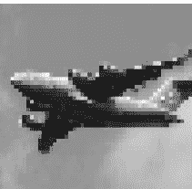

### 讨论

调整图像大小是图像预处理中的常见任务，原因有二。首先，图像有各种形状和大小，而要作为特征使用，图像必须具有相同的维度。标准化（调整大小）图像确实会以丢失较大图像中存在的一些信息为代价，正如飞机图片中所见。图像是信息矩阵，当我们减小图像大小时，我们也在减小该矩阵及其包含的信息的大小。其次，机器学习可能需要成千上万甚至数十万张图像。当这些图像非常大时，它们会占用大量内存，通过调整它们的大小，我们可以显著减少内存使用量。机器学习中一些常见的图像尺寸是 32 × 32、64 × 64、96 × 96 和 256 × 256。本质上，我们选择的图像调整大小方法通常是在模型的统计性能和训练它的计算成本之间进行权衡。[Pillow 库提供了许多调整图像大小的选项](https://pillow.readthedocs.io/)，原因就在于此。

## 8.4 裁剪图像

### 问题

你想移除图像的外部部分以改变其尺寸。

### 解决方案

图像被编码为二维 NumPy 数组，因此我们可以通过切片数组轻松裁剪图像：

```python
# 加载库
import cv2
import numpy as np
from matplotlib import pyplot as plt

# 以灰度模式加载图像
image = cv2.imread("images/plane_256x256.jpg", cv2.IMREAD_GRAYSCALE)

# 选择前一半的列和所有行
image_cropped = image[:,:128]

# 显示图像
plt.imshow(image_cropped, cmap="gray"), plt.axis("off")
plt.show()
```


### 讨论

由于 OpenCV 将图像表示为元素矩阵，通过选择我们想要保留的行和列，我们可以轻松地裁剪图像。如果我们知道只想保留每张图像的某个部分，裁剪会特别有用。例如，如果我们的图像来自固定的安防摄像头，我们可以裁剪所有图像，使它们只包含感兴趣的区域。

### 另请参阅

- [切片 NumPy 数组](Slicing NumPy Arrays)

## 8.5 模糊图像

### 问题

你想平滑一张图像。

### 解决方案

要模糊图像，每个像素都被转换为其邻域像素的平均值。这个邻域和执行的操作在数学上表示为一个核（如果你不知道核是什么，请不要担心）。这个核的大小决定了模糊的程度，较大的核会产生更平滑的图像。这里我们通过平均每个像素周围 5 × 5 核的值来模糊图像：

```python
# 加载库
import cv2
import numpy as np
from matplotlib import pyplot as plt

# 以灰度模式加载图像
image = cv2.imread("images/plane_256x256.jpg", cv2.IMREAD_GRAYSCALE)

# 模糊图像
image_blurry = cv2.blur(image, (5,5))

# 显示图像
plt.imshow(image_blurry, cmap="gray"), plt.axis("off")
plt.show()
```


为了突出核大小的影响，这里使用 100 × 100 的核进行相同的模糊处理：

```python
# 模糊图像
image_very_blurry = cv2.blur(image, (100,100))

# 显示图像
plt.imshow(image_very_blurry, cmap="gray"), plt.xticks([]), plt.yticks([])
plt.show()
```

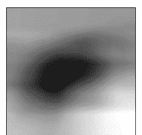

### 讨论

核在图像处理中被广泛使用，用于从锐化到边缘检测等各种操作，并且在本章中会反复出现。我们使用的模糊核看起来像这样：

```python
# 创建核
kernel = np.ones((5,5)) / 25.0

# 显示核
kernel

array([[ 0.04,  0.04,  0.04,  0.04,  0.04],
       [ 0.04,  0.04,  0.04,  0.04,  0.04],
       [ 0.04,  0.04,  0.04,  0.04,  0.04],
       [ 0.04,  0.04,  0.04,  0.04,  0.04],
       [ 0.04,  0.04,  0.04,  0.04,  0.04]])
```

核中的中心元素是正在被检查的像素，而其余元素是其邻域像素。由于所有元素具有相同的值（归一化后总和为 1），每个元素对目标像素的最终值都有同等的贡献。我们可以使用 `filter2D` 手动将核应用于图像，以产生类似的模糊效果：

```python
# 应用核
image_kernel = cv2.filter2D(image, -1, kernel)

# 显示图像
plt.imshow(image_kernel, cmap="gray"), plt.xticks([]), plt.yticks([])
plt.show()
```


### 另请参阅

- 图像卷积核的可视化解释
- 卷积核（图像处理），维基百科

## 8.6 图像锐化

### 问题

你想锐化一张图像。

### 解决方案

创建一个突出目标像素的卷积核。然后使用 `filter2D` 将其应用于图像：

```python
# 加载库
import cv2
import numpy as np
from matplotlib import pyplot as plt

# 以灰度模式加载图像
image = cv2.imread("images/plane_256x256.jpg", cv2.IMREAD_GRAYSCALE)

# 创建卷积核
kernel = np.array([[0, -1, 0],
                   [-1, 5,-1],
                   [0, -1, 0]])

# 锐化图像
image_sharp = cv2.filter2D(image, -1, kernel)

# 显示图像
plt.imshow(image_sharp, cmap="gray"), plt.axis("off")
plt.show()
```


### 讨论

锐化的工作原理与模糊类似，不同之处在于，我们不是使用卷积核来平均邻近像素的值，而是构建一个卷积核来突出像素本身。产生的效果使得边缘的对比度更加明显。

## 8.7 增强对比度

### 问题

我们想增加图像中像素之间的对比度。

### 解决方案

直方图均衡化是一种图像处理工具，可以使物体和形状更加突出。当我们有一张灰度图像时，我们可以直接对图像应用 OpenCV 的 `equalizeHist`：

```python
# 加载库
import cv2
import numpy as np
from matplotlib import pyplot as plt

# 加载图像
image = cv2.imread("images/plane_256x256.jpg", cv2.IMREAD_GRAYSCALE)

# 增强图像
image_enhanced = cv2.equalizeHist(image)

# 显示图像
plt.imshow(image_enhanced, cmap="gray"), plt.axis("off")
plt.show()
```


然而，当我们有一张彩色图像时，我们首先需要将图像转换为 YUV 颜色格式。Y 是亮度（luma），U 和 V 表示颜色。转换后，我们可以对图像应用 `equalizeHist`，然后将其转换回 BGR 或 RGB（对于纸质版读者，此处没有彩色图像，深表歉意）：

```python
# 加载图像
image_bgr = cv2.imread("images/plane.jpg")

# 转换为 YUV
image_yuv = cv2.cvtColor(image_bgr, cv2.COLOR_BGR2YUV)

# 应用直方图均衡化
image_yuv[:, :, 0] = cv2.equalizeHist(image_yuv[:, :, 0])

# 转换为 RGB
image_rgb = cv2.cvtColor(image_yuv, cv2.COLOR_YUV2RGB)

# 显示图像
plt.imshow(image_rgb), plt.axis("off")
plt.show()
```


### 讨论

虽然直方图均衡化工作原理的详细解释超出了本书的范围，但简要的解释是，它通过变换图像，使其使用更宽的像素强度范围。

虽然处理后的图像通常看起来并不“真实”，但我们需要记住，图像只是底层数据的视觉表示。如果直方图均衡化能够使感兴趣的物体与其他物体或背景更容易区分（这并非总是如此），那么它可以成为我们图像预处理流程中一个有价值的补充。

## 8.8 颜色隔离

### 问题

你想隔离图像中的某种颜色。

### 解决方案

定义一个颜色范围，然后对图像应用掩码（对于纸质版读者，此处没有彩色图像，深表歉意）：

```python
# 加载库
import cv2
import numpy as np
from matplotlib import pyplot as plt

# 加载图像
image_bgr = cv2.imread('images/plane_256x256.jpg')

# 将 BGR 转换为 HSV
image_hsv = cv2.cvtColor(image_bgr, cv2.COLOR_BGR2HSV)

# 定义 HSV 中蓝色值的范围
lower_blue = np.array([50,100,50])
upper_blue = np.array([130,255,255])

# 创建掩码
mask = cv2.inRange(image_hsv, lower_blue, upper_blue)

# 应用掩码
image_bgr_masked = cv2.bitwise_and(image_bgr, image_bgr, mask=mask)

# 将 BGR 转换为 RGB
image_rgb = cv2.cvtColor(image_bgr_masked, cv2.COLOR_BGR2RGB)

# 显示图像
plt.imshow(image_rgb), plt.axis("off")
plt.show()
```


### 讨论

在 OpenCV 中隔离颜色很简单。首先，我们将图像转换为 HSV（色调、饱和度和明度）。其次，我们定义要隔离的值范围，这可能是最困难和最耗时的部分。第三，我们为图像创建一个掩码。图像掩码是一种常用的技术，旨在提取感兴趣的区域。在本例中，我们的掩码只保留白色区域：

```python
# 显示图像
plt.imshow(mask, cmap='gray'), plt.axis("off")
plt.show()
```


最后，我们使用 `bitwise_and` 将掩码应用于图像，并转换为我们想要的输出格式。

## 8.9 图像二值化

### 问题

给定一张图像，你想输出一个简化版本。

### 解决方案

*阈值处理*是将强度大于某个值的像素设置为白色，小于该值的像素设置为黑色的过程。一种更高级的技术是*自适应阈值处理*，其中像素的阈值由其邻近像素的强度决定。当图像不同区域的光照条件发生变化时，这会很有帮助：

```python
# 加载库
import cv2
import numpy as np
from matplotlib import pyplot as plt

# 以灰度模式加载图像
image_grey = cv2.imread("images/plane_256x256.jpg", cv2.IMREAD_GRAYSCALE)

# 应用自适应阈值处理
max_output_value = 255
neighborhood_size = 99
subtract_from_mean = 10
image_binarized = cv2.adaptiveThreshold(image_grey,
                                        max_output_value,
                                        cv2.ADAPTIVE_THRESH_GAUSSIAN_C,
                                        cv2.THRESH_BINARY,
                                        neighborhood_size,
                                        subtract_from_mean)
```

```python
# 显示图像
plt.imshow(image_binarized, cmap="gray"), plt.axis("off")
plt.show()
```


### 讨论

图像二值化的过程涉及将灰度图像转换为其黑白形式。我们的解决方案在 `adaptiveThreshold` 中有四个重要参数。`max_output_value` 简单地确定了输出像素强度的最大值。`cv2.ADAPTIVE_THRESH_GAUSSIAN_C` 将像素的阈值设置为邻近像素强度的加权和。权重由高斯窗口确定。或者，我们可以使用 `cv2.ADAPTIVE_THRESH_MEAN_C` 将阈值简单地设置为邻近像素的平均值：

```python
# 应用 cv2.ADAPTIVE_THRESH_MEAN_C
image_mean_threshold = cv2.adaptiveThreshold(image_grey,
                                            max_output_value,
                                            cv2.ADAPTIVE_THRESH_MEAN_C,
                                            cv2.THRESH_BINARY,
                                            neighborhood_size,
                                            subtract_from_mean)
```

```python
# 显示图像
plt.imshow(image_mean_threshold, cmap="gray"), plt.axis("off")
plt.show()
```


最后两个参数是块大小（用于确定像素阈值的邻域大小）和从计算出的阈值中减去的常数（用于手动微调阈值）。

阈值处理的一个主要好处是*图像去噪*——只保留最重要的元素。例如，阈值处理通常应用于打印文本的照片，以将字母与页面分离。

## 8.10 移除背景

### 问题

你想隔离图像的前景。

### 解决方案

在所需的前景周围标记一个矩形，然后运行 GrabCut 算法：

```python
# 加载库
import cv2
import numpy as np
from matplotlib import pyplot as plt

# 加载图像并转换为 RGB
image_bgr = cv2.imread('images/plane_256x256.jpg')
image_rgb = cv2.cvtColor(image_bgr, cv2.COLOR_BGR2RGB)

# 矩形值：起始 x，起始 y，宽度，高度
rectangle = (0, 56, 256, 150)

# 创建初始掩码
mask = np.zeros(image_rgb.shape[:2], np.uint8)

# 创建 grabCut 使用的临时数组
bgdModel = np.zeros((1, 65), np.float64)
fgdModel = np.zeros((1, 65), np.float64)

# 运行 grabCut
cv2.grabCut(image_rgb, # 我们的图像
            mask, # 掩码
            rectangle, # 我们的矩形
            bgdModel, # 背景的临时数组
            fgdModel, # 前景的临时数组
            5, # 迭代次数
            cv2.GC_INIT_WITH_RECT) # 使用我们的矩形进行初始化

# 创建掩码，其中确定和可能的背景设置为 0，否则为 1
mask_2 = np.where((mask==2) | (mask==0), 0, 1).astype('uint8')

# 将图像与新掩码相乘以减去背景
```

```python
image_rgb_nobg = image_rgb * mask_2[:, :, np.newaxis]

# 显示图像
plt.imshow(image_rgb_nobg), plt.axis("off")
plt.show()
```


### 讨论

我们首先注意到的是，尽管GrabCut做得相当好，但图像中仍然残留了一些背景区域。我们可以返回去手动将这些区域标记为背景，但在现实世界中，我们有成千上万的图像，逐一手动修复是不可行的。因此，我们最好简单地接受图像数据中仍会包含一些背景噪声这一事实。

在我们的解决方案中，我们首先在包含前景的区域周围标记一个矩形。GrabCut假设此矩形之外的所有内容都是背景，并利用这些信息来判断矩形内部哪些部分可能是背景。（要了解算法是如何做到这一点的，请参阅Itay Blumenthal的解释。）然后创建一个掩码，用于标识不同的确定/可能的背景/前景区域：

```python
# 显示掩码
plt.imshow(mask, cmap='gray'), plt.axis("off")
plt.show()
```


黑色区域是我们矩形之外被假定为确定背景的区域。灰色区域是GrabCut认为的可能背景，而白色区域则是可能的前景。

然后，使用此掩码创建第二个掩码，将黑色和灰色区域合并：

```python
# 显示掩码
plt.imshow(mask_2, cmap='gray'), plt.axis("off")
plt.show()
```


接着将第二个掩码应用于图像，这样就只剩下前景了。

## 8.11 检测边缘

### 问题

你想找到图像中的边缘。

### 解决方案

使用边缘检测技术，如Canny边缘检测器：

```python
# 加载库
import cv2
import numpy as np
from matplotlib import pyplot as plt

# 以灰度图加载图像
image_gray = cv2.imread("images/plane_256x256.jpg", cv2.IMREAD_GRAYSCALE)

# 计算中值强度
median_intensity = np.median(image_gray)

# 设置阈值为中值强度上下一个标准差
lower_threshold = int(max(0, (1.0 - 0.33) * median_intensity))
upper_threshold = int(min(255, (1.0 + 0.33) * median_intensity))

# 应用Canny边缘检测器
image_canny = cv2.Canny(image_gray, lower_threshold, upper_threshold)

# 显示图像
plt.imshow(image_canny, cmap="gray"), plt.axis("off")
plt.show()
```

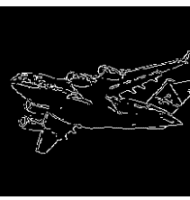

### 讨论

边缘检测是计算机视觉中的一个重要课题。边缘很重要，因为它们是信息密集的区域。例如，在我们的图像中，一片天空看起来与另一片非常相似，不太可能包含独特或有趣的信息。然而，背景天空与飞机相接的区域则包含大量信息（例如，物体的形状）。边缘检测使我们能够移除低信息区域，并分离出图像中包含最多信息的区域。

有许多边缘检测技术（Sobel滤波器、拉普拉斯边缘检测器等）。然而，我们的解决方案使用了常用的Canny边缘检测器。Canny检测器的工作原理对于本书来说过于详细，但有一点我们需要说明。Canny检测器需要两个参数，分别表示低和高梯度阈值。介于低阈值和高阈值之间的潜在边缘像素被认为是弱边缘像素，而高于高阈值的则被认为是强边缘像素。OpenCV的Canny方法将低阈值和高阈值作为必需参数。在我们的解决方案中，我们将下限和上限阈值设置为图像中值像素强度上下一个标准差。然而，我们通常通过在几张图像上手动试错来确定一组好的低阈值和高阈值，然后在对整个图像集合运行Canny之前，这样往往能得到更好的结果。

### 另请参阅

- Canny边缘检测器，维基百科
- Canny边缘检测自动阈值

## 8.12 检测角点

### 问题

你想检测图像中的角点。

### 解决方案

使用OpenCV实现的Harris角点检测器，`cornerHarris`：

```python
# 加载库
import cv2
import numpy as np
from matplotlib import pyplot as plt

# 加载图像
image_bgr = cv2.imread("images/plane_256x256.jpg")
image_gray = cv2.cvtColor(image_bgr, cv2.COLOR_BGR2GRAY)
image_gray = np.float32(image_gray)

# 设置角点检测器参数
block_size = 2
aperture = 29
free_parameter = 0.04

# 检测角点
detector_responses = cv2.cornerHarris(image_gray,
                                      block_size,
                                      aperture,
                                      free_parameter)

# 放大角点标记
detector_responses = cv2.dilate(detector_responses, None)

# 仅保留大于阈值的检测器响应，标记为白色
threshold = 0.02
image_bgr[detector_responses >
          threshold *
          detector_responses.max()] = [255,255,255]

# 转换为灰度图
image_gray = cv2.cvtColor(image_bgr, cv2.COLOR_BGR2GRAY)

# 显示图像
plt.imshow(image_gray, cmap="gray"), plt.axis("off")
plt.show()
```


### 讨论

*Harris角点检测器*是一种常用的检测两条边缘交点的方法。我们对检测角点的兴趣与检测边缘的原因相同：角点是信息密集的点。关于Harris角点检测器的完整解释可以在本食谱末尾的外部资源中找到，但一个简化的解释是，它寻找窗口（也称为*邻域*或*块*），其中窗口的微小移动（想象一下晃动窗口）会导致窗口内像素内容发生巨大变化。`cornerHarris`包含三个重要参数，我们可以用它们来控制检测到的边缘。首先，`block_size`是用于角点检测的每个像素周围邻域的大小。其次，`aperture`是使用的Sobel核的大小（如果你不知道那是什么，别担心），最后还有一个自由参数，较大的值对应于识别更柔和的角点。

输出是一幅灰度图像，描绘了潜在的角点：

```python
# 显示潜在的角点
plt.imshow(detector_responses, cmap='gray'), plt.axis("off")
plt.show()
```

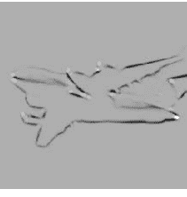

然后我们应用阈值处理，只保留最可能的角点。或者，我们可以使用类似的检测器，Shi-Tomasi角点检测器，它的工作方式与Harris检测器类似（`goodFeaturesToTrack`），用于识别固定数量的强角点。`goodFeaturesToTrack`接受三个主要参数——要检测的角点数量、角点的最低质量分数（0到1）以及角点之间的最小欧几里得距离：

```python
# 加载图像
image_bgr = cv2.imread('images/plane_256x256.jpg')
image_gray = cv2.cvtColor(image_bgr, cv2.COLOR_BGR2GRAY)

# 要检测的角点数量
corners_to_detect = 10
minimum_quality_score = 0.05
minimum_distance = 25

# 检测角点
corners = cv2.goodFeaturesToTrack(image_gray,
                                  corners_to_detect,
                                  minimum_quality_score,
                                  minimum_distance)

corners = np.int16(corners)

# 在每个角点处绘制白色圆圈
for corner in corners:
    x, y = corner[0]
    cv2.circle(image_bgr, (x,y), 10, (255,255,255), -1)

# 转换为灰度图
image_rgb = cv2.cvtColor(image_bgr, cv2.COLOR_BGR2GRAY)

# 显示图像
plt.imshow(image_rgb, cmap='gray'), plt.axis("off")
plt.show()
```

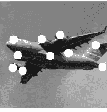

### 另请参阅

- OpenCV的cornerHarris
- OpenCV的goodFeaturesToTrack

## 8.13 为机器学习创建特征

### 问题

你想将图像转换为机器学习的观测值。

### 解决方案

使用NumPy的`flatten`将包含图像数据的多维数组转换为包含观测值的向量：

```python
# 加载库
import cv2
import numpy as np
from matplotlib import pyplot as plt

# 以灰度图加载图像
image = cv2.imread("images/plane_256x256.jpg", cv2.IMREAD_GRAYSCALE)

# 将图像调整为10像素×10像素
image_10x10 = cv2.resize(image, (10, 10))

# 将图像数据转换为一维向量
image_10x10.flatten()
```

```
array([133, 130, 130, 129, 130, 129, 129, 128, 128, 127, 135, 131, 131,
       131, 130, 130, 129, 128, 128, 128, 134, 132, 131, 131, 130, 129,
       129, 128, 130, 133, 132, 158, 130, 133, 130,  46,  97,  26, 132,
       143, 141,  36,  54,  91,   9,   9,  49, 144, 179,  41, 142,  95,
        32,  36,  29,  43, 113, 141, 179, 187, 141, 124,  26,  25, 132,
       135, 151, 175, 174, 184, 143, 151,  38, 133, 134, 139, 174, 177,
       169, 174, 155, 141, 135, 137, 137, 152, 169, 168, 168, 179, 152,
       139, 136, 135, 137, 143, 159, 166, 171, 175], dtype=uint8)
```

### 讨论

图像以像素网格的形式呈现。如果图像是灰度的，每个像素由一个值表示（即，像素强度为1表示白色，0表示黑色）。例如，想象我们有一张10×10像素的图像：

```python
plt.imshow(image_10x10, cmap="gray"), plt.axis("off")
plt.show()
```

在这种情况下，图像数据的维度将是 10 × 10：

```
image_10x10.shape
(10, 10)
```

如果我们展平数组，会得到一个长度为 100（10 乘以 10）的向量：

```
image_10x10.flatten().shape
(100,)
```

这就是我们图像的特征数据，可以与其他图像的向量连接起来，创建我们将要输入机器学习算法的数据。

如果图像是彩色的，每个像素不再由一个值表示，而是由多个值（通常是三个）表示，这些值代表混合形成该像素最终颜色的通道（红色、绿色、蓝色等）。因此，如果我们的 10 × 10 图像是彩色的，每个观测值将有 300 个特征值：

```
# Load image in color
image_color = cv2.imread("images/plane_256x256.jpg", cv2.IMREAD_COLOR)

# Resize image to 10 pixels by 10 pixels
image_color_10x10 = cv2.resize(image_color, (10, 10))

# Convert image data to one-dimensional vector, show dimensions
image_color_10x10.flatten().shape
(300,)
```

图像处理和计算机视觉的主要挑战之一是，由于图像集合中的每个像素位置都是一个特征，随着图像变大，特征数量会爆炸式增长：

```
# Load image in grayscale
image_256x256_gray = cv2.imread("images/plane_256x256.jpg", cv2.IMREAD_GRAYSCALE)

# Convert image data to one-dimensional vector, show dimensions
image_256x256_gray.flatten().shape
(65536,)
```

当图像是彩色时，特征数量增长得更大：

```
# Load image in color
image_256x256_color = cv2.imread("images/plane_256x256.jpg", cv2.IMREAD_COLOR)

# Convert image data to one-dimensional vector, show dimensions
image_256x256_color.flatten().shape
(196608,)
```

正如输出所示，即使是一张小的彩色图像也有近 200,000 个特征，这在我们训练模型时可能会导致问题，因为特征数量可能远远超过观测值的数量。

这个问题将引出后面章节讨论的降维策略，这些策略试图在不丢失数据中包含的过多信息的情况下减少特征数量。

## 8.14 将颜色直方图编码为特征

### 问题

你想创建一组代表图像中出现颜色的特征。

### 解决方案

计算每个颜色通道的直方图：

```
# Load libraries
import cv2
import numpy as np
from matplotlib import pyplot as plt

np.random.seed(0)

# Load image
image_bgr = cv2.imread("images/plane_256x256.jpg", cv2.IMREAD_COLOR)

# Convert to RGB
image_rgb = cv2.cvtColor(image_bgr, cv2.COLOR_BGR2RGB)

# Create a list for feature values
features = []
```

```
# Calculate the histogram for each color channel
colors = ("r", "g", "b")

# For each channel: calculate histogram and add to feature value list
for i, channel in enumerate(colors):
    histogram = cv2.calcHist([image_rgb], # Image
                             [i], # Index of channel
                             None, # No mask
                             [256], # Histogram size
                             [0,256]) # Range
    features.extend(histogram)

# Create a vector for an observation's feature values
observation = np.array(features).flatten()

# Show the observation's value for the first five features
observation[0:5]

array([ 1008.,   217.,   184.,   165.,   116.], dtype=float32)
```

### 讨论

在 RGB 颜色模型中，每种颜色是三个颜色通道（即红色、绿色、蓝色）的组合。反过来，每个通道可以取 256 个值中的一个（由 0 到 255 之间的整数表示）。例如，我们图像左上角的像素具有以下通道值：

```
# Show RGB channel values
image_rgb[0,0]

array([107, 163, 212], dtype=uint8)
```

直方图是数据中值分布的一种表示。这里有一个简单的例子：

```
# Import pandas
import pandas as pd

# Create some data
data = pd.Series([1, 1, 2, 2, 3, 3, 3, 4, 5])

# Show the histogram
data.hist(grid=False)
plt.show()
```

在这个例子中，我们有一些数据，包含两个 1、两个 2、三个 3、一个 4 和一个 5。在直方图中，每个条形代表每个值（1、2 等）在我们数据中出现的次数。

我们可以将同样的技术应用于每个颜色通道，但不是五个可能的值，而是 256 个（通道值的可能值数量）。x 轴代表 256 个可能的通道值，y 轴代表特定通道值在图像所有像素中出现的次数（对于没有彩色图像的纸质书读者表示歉意）：

```
# Calculate the histogram for each color channel
colors = ("r", "g", "b")

# For each channel: calculate histogram, make plot
for i, channel in enumerate(colors):
    histogram = cv2.calcHist([image_rgb], # Image
                             [i], # Index of channel
                             None, # No mask
                             [256], # Histogram size
                             [0,256]) # Range
    plt.plot(histogram, color = channel)
    plt.xlim([0,256])

# Show plot
plt.show()
```

正如我们在直方图中看到的，几乎没有像素包含 0 到约 180 之间的蓝色通道值，而许多像素包含约 190 到约 210 之间的蓝色通道值。所有三个通道都显示了这种通道值分布。然而，直方图不仅仅是一个可视化；它为每个颜色通道提供了 256 个特征，总共 768 个特征，代表图像中颜色的分布。

### 另请参阅

- [直方图，维基百科](https://en.wikipedia.org/wiki/Histogram)
- [pandas 文档：直方图](https://pandas.pydata.org/docs/reference/api/pandas.DataFrame.hist.html)
- [OpenCV 教程：直方图](https://docs.opencv.org/4.x/d6/dc7/tutorial_py_histogram_beginner.html)

## 8.15 使用预训练嵌入作为特征

### 问题

你想从 PyTorch 中的现有模型加载预训练嵌入，并将它们用作你自己模型的输入。

### 解决方案

使用 `torchvision.models` 选择一个模型，然后为给定图像从中检索嵌入：

```
# Load libraries
import cv2
import numpy as np
import torch
from torchvision import transforms
import torchvision.models as models

# Load image
image_bgr = cv2.imread("images/plane.jpg", cv2.IMREAD_COLOR)

# Convert to pytorch data type
convert_tensor = transforms.ToTensor()
pytorch_image = convert_tensor(np.array(image_rgb))

# Load the pretrained model
model = models.resnet18(pretrained=True)

# Select the specific layer of the model we want output from
layer = model._modules.get('avgpool')

# Set model to evaluation mode
model.eval()

# Infer the embedding with the no_grad option
with torch.no_grad():
    embedding = model(pytorch_image.unsqueeze(0))

print(embedding.shape)
torch.Size([1, 1000])
```

### 讨论

在机器学习领域，*迁移学习*通常被定义为将从一个任务中学到的信息用作另一个任务的输入。我们不必从零开始，而是可以利用从大型预训练图像模型（如 ResNet）中学到的表示，为自己的机器学习模型提供一个良好的开端。更直观地说，你可以理解我们如何将一个训练用于识别猫的模型的权重，作为我们想要训练识别狗的模型的良好起点。通过将信息从一个模型共享到另一个模型，我们可以利用从其他数据集和模型架构中学到的信息，而无需从头开始训练模型的开销。

计算机视觉中迁移学习的完整应用超出了本书的范围；然而，除了 PyTorch 之外，我们还有许多不同的方法可以提取基于嵌入的图像表示。在另一个常用的深度学习库 TensorFlow 中，我们可以使用 `tensorflow_hub`：

```
# Load libraries
import cv2
```

import tensorflow as tf
import tensorflow_hub as hub

# 加载图像
image_bgr = cv2.imread("images/plane.jpg", cv2.IMREAD_COLOR)
image_rgb = cv2.cvtColor(image_bgr, cv2.COLOR_BGR2RGB)

# 转换为tensorflow数据类型
tf_image = tf.image.convert_image_dtype([image_rgb], tf.float32)

# 使用inception V1模型创建模型并获取嵌入向量
embedding_model = hub.KerasLayer(
    "https://tfhub.dev/google/imagenet/inception_v1/feature_vector/5"
)
embeddings = embedding_model(tf_image)

# 打印嵌入向量的形状
print(embeddings.shape)
(1, 1024)

### 另请参阅

- PyTorch教程：计算机视觉迁移学习
- TensorFlow Hub

## 8.16 使用OpenCV检测对象

### 问题

你想使用OpenCV中预训练的级联分类器来检测图像中的对象。

### 解决方案

下载并运行OpenCV的一个Haar级联分类器。在这个例子中，我们使用一个预训练的人脸检测模型来检测图像中的人脸并绘制一个矩形框：

```python
# 导入库
import cv2
from matplotlib import pyplot as plt

# 首次运行：
# mkdir models && cd models
# wget https://tinyurl.com/mrc6jwhp
face_cascade = cv2.CascadeClassifier()
face_cascade.load(
    cv2.samples.findFile(
        "models/haarcascade_frontalface_default.xml"
    )
)

# 加载图像
image_bgr = cv2.imread("images/kyle_pic.jpg", cv2.IMREAD_COLOR)
image_rgb = cv2.cvtColor(image_bgr, cv2.COLOR_BGR2RGB)

# 检测人脸并绘制矩形
faces = face_cascade.detectMultiScale(image_rgb)
for (x,y,w,h) in faces:
    cv2.rectangle(image_rgb, (x, y),
                  (x + h, y + w),
                  (0, 255, 0), 5)

# 显示图像
plt.subplot(1, 1, 1)
plt.imshow(image_rgb)
plt.show()
```

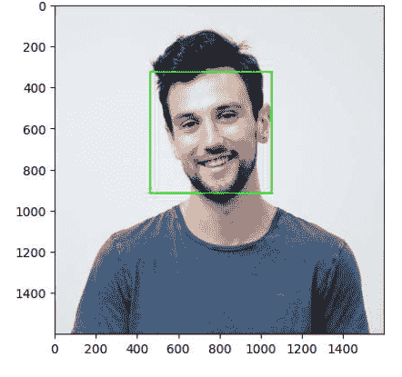

### 讨论

Haar级联分类器是机器学习模型，用于学习一组图像特征（特别是Haar特征），这些特征可用于检测图像中的对象。这些特征本身是简单的矩形特征，通过计算矩形区域之间的和差来确定。随后，应用梯度提升算法来学习最重要的特征，最后使用级联分类器创建一个相对强大的模型。

虽然这个过程的细节超出了本书的范围，但值得注意的是，这些预训练模型可以从OpenCV的GitHub等地方轻松下载为XML文件，并应用于图像，而无需自己训练模型。这在你想向数据中添加简单的二进制图像特征（如`contains_face`或任何其他对象）时非常有用。

### 另请参阅

- OpenCV教程：级联分类器

## 8.17 使用Pytorch对图像进行分类

### 问题

你想使用Pytorch中预训练的深度学习模型对图像进行分类。

### 解决方案

使用`torchvision.models`选择一个预训练的图像分类模型，并将图像输入其中：

```python
# 加载库
import cv2
import json
import numpy as np
import torch
from torchvision import transforms
from torchvision.models import resnet18
import urllib.request

# 获取imagenet类别
with urllib.request.urlopen(
    "https://raw.githubusercontent.com/raghakot/keras-vis/master/resources/"
):
    imagenet_class_index = json.load(url)

# 实例化预训练模型
model = resnet18(pretrained=True)

# 加载图像
image_bgr = cv2.imread("images/plane.jpg", cv2.IMREAD_COLOR)
image_rgb = cv2.cvtColor(image_bgr, cv2.COLOR_BGR2RGB)

# 转换为pytorch数据类型
convert_tensor = transforms.ToTensor()
pytorch_image = convert_tensor(np.array(image_rgb))

# 将模型设置为评估模式
model.eval()

# 进行预测
prediction = model(pytorch_image.unsqueeze(0))

# 获取预测概率最高的索引
_, index = torch.max(prediction, 1)

# 将其转换为百分比值
percentage = torch.nn.functional.softmax(prediction, dim=1)[0] * 100

# 打印索引处的项目名称以及置信度百分比
print(imagenet_class_index[str(index.tolist()[0])][1],
      percentage[index.tolist()[0]].item())
```

airship 6.0569939613342285

### 讨论

许多用于图像分类的预训练深度学习模型都可以通过PyTorch和TensorFlow轻松获得。在这个例子中，我们使用了ResNet18，这是一个在ImageNet数据集上训练的18层深度的神经网络架构。更深的ResNet模型，如ResNet101和ResNet152，也可以在Pytorch中找到——除此之外，还有许多其他图像模型可供选择。在ImageNet数据集上训练的模型能够输出前一个代码片段中`imagenet_class_index`变量定义的所有类别的预测概率，我们从GitHub下载了该变量。

就像OpenCV中的人脸识别示例（参见配方8.16）一样，我们可以将预测的图像类别用作未来机器学习模型的下游特征，或用作方便的元数据标签，为我们的图像添加更多信息。

### 另请参阅

- PyTorch文档：模型和预训练权重

# 第9章

## 使用特征提取进行降维

## 9.0 引言

拥有成千上万甚至数十万个特征是很常见的。例如，在第8章中，我们将一张256×256像素的彩色图像转换成了196,608个特征。此外，由于每个像素可以取256个可能值中的一个，我们的观察可以有256<sup>196608</sup>种不同的配置。许多机器学习算法难以从这样的数据中学习，因为永远无法收集到足够的观察数据来让算法正确运行。即使在更像表格的结构化数据集中，我们在特征工程过程之后也很容易得到数千个特征。

幸运的是，并非所有特征都是平等的，*特征提取*用于降维的目标是转换我们的特征集*p<sub>original</sub>*，从而得到一个新的集合*p<sub>new</sub>*，其中*p<sub>original</sub> > p<sub>new</sub>*，同时仍然保留大部分底层信息。换句话说，我们减少特征数量，而数据生成高质量预测的能力只损失很小一部分。在本章中，我们将介绍一些能够做到这一点的特征提取技术。

我们讨论的特征提取技术的一个缺点是，我们生成的新特征将无法被人类解释。它们将包含与原始特征相同或几乎相同的能力来训练我们的模型，但在人类眼中，它们看起来像是一组随机数。如果我们想保持解释模型的能力，通过*特征选择*进行降维是更好的选择（将在第10章讨论）。在特征选择过程中，我们移除我们认为不重要的特征，但保留其他特征不变。虽然这可能不像特征提取那样让我们保留所有特征的信息，但它保留了我们未丢弃的特征——因此在分析过程中完全可以被人类解释。

## 9.1 使用主成分减少特征

### 问题

给定一组特征，你想在保留数据方差（重要信息）的同时减少特征数量。

### 解决方案

使用scikit的PCA进行主成分分析：

```python
# 加载库
from sklearn.preprocessing import StandardScaler
from sklearn.decomposition import PCA
from sklearn import datasets

# 加载数据
digits = datasets.load_digits()

# 标准化特征矩阵
features = StandardScaler().fit_transform(digits.data)

# 创建一个保留99%方差的PCA
pca = PCA(n_components=0.99, whiten=True)

# 执行PCA
features_pca = pca.fit_transform(features)

# 显示结果
print("原始特征数量:", features.shape[1])
print("减少后的特征数量:", features_pca.shape[1])

原始特征数量: 64
减少后的特征数量: 54
```

### 讨论

主成分分析（PCA）是一种流行的线性降维技术。PCA将观察投影到特征矩阵的（希望是更少的）主成分上，这些主成分保留了数据中最多的方差，实际上，这意味着我们保留了信息。PCA是一种无监督技术，意味着它不使用目标向量的信息，而只考虑特征矩阵。

关于PCA工作原理的数学描述，请参见本配方末尾列出的外部资源。然而，我们可以使用一个一个简单的例子。在图9-1中，我们的数据包含两个特征，$x_1$ 和 $x_2$。从可视化图中可以清楚地看到，观测值像雪茄一样分布，长度很长而高度很短。更具体地说，我们可以说“长度”方向的方差明显大于“高度”方向。我们不再使用长度和高度的说法，而是将方差最大的“方向”称为第一主成分，将方差第二大的“方向”称为第二主成分（以此类推）。

如果我们想减少特征数量，一种策略是将二维空间中的所有观测值投影到一维的主成分上。我们将丢失第二主成分中捕获的信息，但在某些情况下，这是一个可以接受的权衡。这就是PCA。

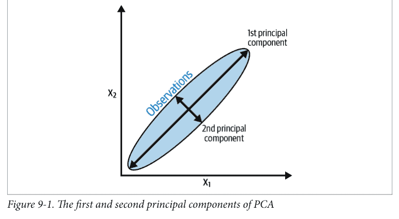

图9-1. PCA的第一和第二主成分

PCA在scikit-learn中通过PCA类实现。`n_components`有两个操作，取决于提供的参数。如果参数大于1，pca将返回那么多特征。这就引出了如何选择最优特征数量的问题。幸运的是，如果`n_components`的参数在0到1之间，pca将返回保留该比例方差所需的最少特征数。通常使用0.95和0.99的值，分别表示保留了原始特征95%和99%的方差。`whiten=True`会转换每个主成分的值，使其具有零均值和单位方差。另一个参数和参数是`svd_solver="randomized"`，它实现了一种随机算法，通常能在显著更短的时间内找到前几个主成分。

我们解决方案的输出表明，PCA使我们能够减少10个特征的维度，同时仍然保留特征矩阵中99%的信息（方差）。

### 另请参阅

- scikit-learn文档：PCA
- 《线性代数与主成分分析》，Jeff Jauregui

## 9.2 当数据线性不可分时减少特征

### 问题

你怀疑你的数据是线性不可分的，并希望降低维度。

### 解决方案

使用主成分分析的一种扩展，该扩展使用核函数来实现非线性降维：

```python
# 加载库
from sklearn.decomposition import PCA, KernelPCA
from sklearn.datasets import make_circles

# 创建线性不可分数据
features, _ = make_circles(n_samples=1000, random_state=1, noise=0.1, factor=0.1)

# 应用带有径向基函数（RBF）核的核PCA
kpca = KernelPCA(kernel="rbf", gamma=15, n_components=1)
features_kpca = kpca.fit_transform(features)

print("原始特征数量:", features.shape[1])
print("降维后的特征数量:", features_kpca.shape[1])
```

原始特征数量: 2
降维后的特征数量: 1

### 讨论

PCA能够降低我们特征矩阵的维度（即特征的数量）。标准PCA使用线性投影来减少特征。如果数据是*线性可分的*（即你可以在不同类别之间画一条直线或超平面），那么PCA效果很好。然而，如果你的数据不是线性可分的（即你只能使用弯曲的决策边界来分离类别），线性变换的效果就不会那么好。在我们的解决方案中，我们使用了scikit-learn的`make_circles`来生成一个模拟数据集，该数据集包含一个具有两个类别和两个特征的目标向量。`make_circles`生成线性不可分的数据；具体来说，一个类别被另一个类别从四面八方包围，如图9-2所示。

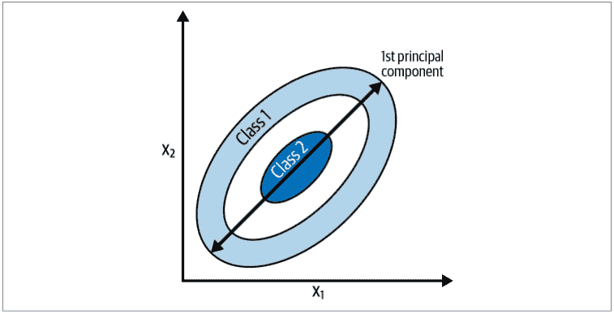

图9-2. 投影到线性不可分数据上的第一主成分

如果我们使用线性PCA来降低数据的维度，两个类别将被线性投影到第一主成分上，导致它们相互交织，如图9-3所示。

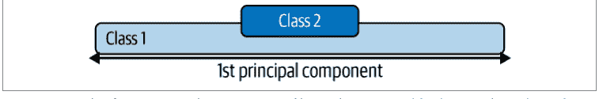

图9-3. 未使用核PCA的线性不可分数据的第一主成分

理想情况下，我们希望有一种变换既能降低维度，又能使数据线性可分。核PCA可以同时做到这两点，如图9-4所示。

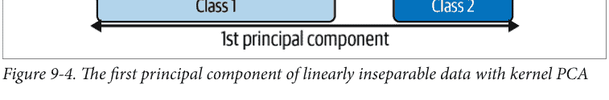

图9-4. 使用核PCA的线性不可分数据的第一主成分

核函数允许我们将线性不可分的数据投影到一个更高维度的空间，在那里它是线性可分的；这被称为“核技巧”。如果你不理解核技巧的细节，不用担心；只需将核函数视为投影数据的不同方式即可。在scikit-learn的`kernelPCA`类中，我们可以使用多种核函数，通过`kernel`参数指定。一个常用的核函数是高斯径向基函数核`rbf`，但其他选项包括多项式核（`poly`）和S形核（`sigmoid`）。我们甚至可以指定线性投影（`linear`），这将产生与标准PCA相同的结果。

核PCA的一个缺点是我们需要指定多个参数。例如，在配方9.1中，我们将`n_components`设置为0.99，以使PCA选择保留99%方差的成分数。在核PCA中我们没有这个选项。相反，我们必须定义成分数（例如，`n_components=1`）。此外，核函数有其自身的超参数，我们需要设置；例如，径向基函数需要一个`gamma`值。

那么我们如何知道使用哪些值呢？通过反复试验。具体来说，我们可以多次训练我们的机器学习模型，每次使用不同的核函数或不同的参数值。一旦我们找到产生最高质量预测值的值组合，我们就完成了。这是机器学习中的一个常见主题，我们将在第12章深入学习这种策略。

### 另请参阅

- scikit-learn关于核PCA的文档
- 《通过RBF核PCA的核技巧与非线性降维》

## 9.3 通过最大化类别可分性来减少特征

### 问题

你想通过最大化类别之间的分离来减少分类器要使用的特征数量。

### 解决方案

尝试线性判别分析（LDA），将特征投影到最大化类别分离的成分轴上：

```python
# 加载库
from sklearn import datasets
from sklearn.discriminant_analysis import LinearDiscriminantAnalysis

# 加载鸢尾花数据集：
iris = datasets.load_iris()
features = iris.data
target = iris.target

# 创建并运行LDA，然后用它来转换特征
lda = LinearDiscriminantAnalysis(n_components=1)
features_lda = lda.fit(features, target).transform(features)

# 打印特征数量
print("原始特征数量:", features.shape[1])
print("降维后的特征数量:", features_lda.shape[1])
```

原始特征数量: 4
降维后的特征数量: 1

我们可以使用`explained_variance_ratio_`来查看每个成分解释的方差量。在我们的解决方案中，单个成分解释了超过99%的方差：

```python
lda.explained_variance_ratio_
```

array([0.9912126])

### 讨论

LDA是一种分类方法，也是一种流行的降维技术。LDA的工作原理与PCA类似，都是将我们的特征空间投影到一个更低维度的空间。然而，在PCA中，我们只关心最大化数据方差的成分轴，而在LDA中，我们还有一个额外的目标，即最大化类别之间的差异。在图9-5中，我们有一个包含两个目标类别和两个特征的数据。如果我们将数据投影到y轴上，两个类别不容易分离（即它们重叠），而如果我们将数据投影到x轴上，我们得到一个特征向量（即我们减少了一个维度），它仍然保留了类别的可分性。当然，在现实世界中，类别之间的关系会更复杂，维度也会更高，但概念是相同的。

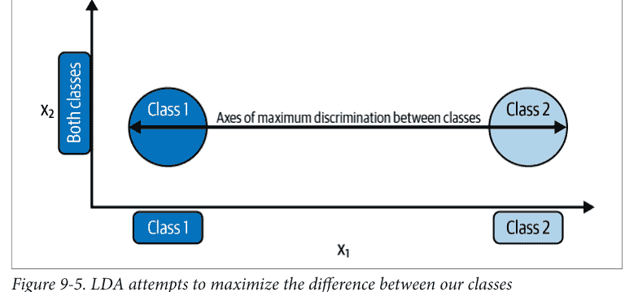

图9-5. LDA试图最大化我们类别之间的差异

在 scikit-learn 中，LDA 通过 `LinearDiscriminantAnalysis` 实现，其中包含一个参数 `n_components`，用于指定我们希望返回的特征数量。为了确定 `n_components` 应使用何值（例如，保留多少个参数），我们可以利用 `explained_variance_ratio_` 这一属性，它告诉我们每个输出特征所解释的方差比例，并且是一个已排序的数组。例如：

```python
lda.explained_variance_ratio_
array([0.9912126])
```

具体来说，我们可以将 `LinearDiscriminantAnalysis` 的 `n_components` 设置为 `None` 来运行，以返回每个成分特征所解释的方差比例，然后计算需要多少个成分才能达到某个方差解释阈值（通常为 0.95 或 0.99）：

```python
# 创建并运行 LDA
lda = LinearDiscriminantAnalysis(n_components=None)
features_lda = lda.fit(features, target)

# 创建方差解释比例数组
lda_var_ratios = lda.explained_variance_ratio_

# 创建函数
def select_n_components(var_ratio, goal_var: float) -> int:
    # 设置初始已解释方差
    total_variance = 0.0

    # 设置初始特征数
    n_components = 0

    # 遍历每个特征的解释方差：
    for explained_variance in var_ratio:

        # 将解释方差加到总和中
        total_variance += explained_variance

        # 成分数加一
        n_components += 1

        # 如果达到目标解释方差水平
        if total_variance >= goal_var:
            # 结束循环
            break

    # 返回成分数
    return n_components

# 运行函数
select_n_components(lda_var_ratios, 0.95)
1
```

### 另请参阅

- LDA 与 PCA 在鸢尾花数据集二维投影上的比较
- 线性判别分析

## 9.4 使用矩阵分解减少特征

### 问题

你有一个非负值的特征矩阵，并希望降低其维度。

### 解决方案

使用*非负矩阵分解*（NMF）来降低特征矩阵的维度：

```python
# 加载库
from sklearn.decomposition import NMF
from sklearn import datasets

# 加载数据
digits = datasets.load_digits()

# 加载特征矩阵
features = digits.data

# 创建、拟合并应用 NMF
nmf = NMF(n_components=10, random_state=4)
features_nmf = nmf.fit_transform(features)

# 显示结果
print("原始特征数量:", features.shape[1])
print("降维后特征数量:", features_nmf.shape[1])
原始特征数量: 64
降维后特征数量: 10
```

### 讨论

NMF 是一种用于线性降维的无监督技术，它将特征矩阵*分解*（即分解成多个矩阵，其乘积近似于原始矩阵）成表示观测值与其特征之间潜在关系的矩阵。直观上，NMF 可以降维，因为在矩阵乘法中，两个因子（被相乘的矩阵）的维度可以远小于乘积矩阵。形式上，给定期望返回的特征数 *r*，NMF 将我们的特征矩阵分解为：

**V** ≈ **WH**

其中 **V** 是我们的 *n* × *d* 特征矩阵（即 *d* 个特征，*n* 个观测值），**W** 是一个 *n* × *r* 矩阵，**H** 是一个 *r* × *d* 矩阵。通过调整 *r* 的值，我们可以设定所需的降维程度。

NMF 的一个主要要求是，顾名思义，特征矩阵不能包含负值。此外，与我们研究过的 PCA 和其他技术不同，NMF 不提供输出特征的解释方差。因此，我们找到 `n_components` 最佳值的最佳方法是尝试一系列值，以找到在最终模型中产生最佳结果的值（参见第 12 章）。

### 另请参阅

- 非负矩阵分解，维基百科

## 9.5 在稀疏数据上减少特征

### 问题

你有一个稀疏特征矩阵，并希望降低其维度。

### 解决方案

使用*截断奇异值分解*（TSVD）：

```python
# 加载库
from sklearn.preprocessing import StandardScaler
from sklearn.decomposition import TruncatedSVD
from scipy.sparse import csr_matrix
from sklearn import datasets
import numpy as np

# 加载数据
digits = datasets.load_digits()

# 标准化特征矩阵
features = StandardScaler().fit_transform(digits.data)

# 创建稀疏矩阵
features_sparse = csr_matrix(features)

# 创建 TSVD
tsvd = TruncatedSVD(n_components=10)

# 对稀疏矩阵进行 TSVD
features_sparse_tsvd = tsvd.fit(features_sparse).transform(features_sparse)

# 显示结果
print("原始特征数量:", features_sparse.shape[1])
print("降维后特征数量:", features_sparse_tsvd.shape[1])

原始特征数量: 64
降维后特征数量: 10
```

### 讨论

TSVD 与 PCA 类似，事实上，PCA 在其某个步骤中经常使用非截断的*奇异值分解*（SVD）。给定 $d$ 个特征，SVD 将创建 $d \times d$ 的因子矩阵，而 TSVD 将返回 $n \times n$ 的因子，其中 $n$ 由参数预先指定。TSVD 的实际优势在于，与 PCA 不同，它适用于稀疏特征矩阵。

TSVD 的一个问题是：由于其使用随机数生成器的方式，输出的符号可能在不同拟合之间翻转。一个简单的解决方法是每个预处理管道只使用一次 `fit`，然后多次使用 `transform`。

与线性判别分析一样，我们必须指定要输出的特征（成分）数量。这通过 `n_components` 参数完成。一个自然的问题是：最佳的成分数是多少？一种策略是将 `n_components` 作为模型选择过程中要优化的超参数（即选择产生最佳训练模型的 `n_components` 值）。或者，因为 TSVD 提供了原始特征矩阵每个成分所解释的方差比例，我们可以选择解释所需方差量的成分数（95% 和 99% 是常见值）。例如，在我们的解决方案中，前三个输出成分解释了原始数据方差的大约 30%：

```python
# 前三个成分的解释方差比例之和
tsvd.explained_variance_ratio_[0:3].sum()

0.3003938537287226
```

我们可以通过创建一个函数来自动化这个过程，该函数运行 `n_components` 设置为比原始特征数少一的 TSVD，然后计算解释原始数据所需方差量的成分数：

```python
# 创建并运行一个成分数比特征数少一的 TSVD
tsvd = TruncatedSVD(n_components=features_sparse.shape[1]-1)
features_tsvd = tsvd.fit(features)

# 解释方差比例列表
tsvd_var_ratios = tsvd.explained_variance_ratio_

# 创建函数
def select_n_components(var_ratio, goal_var):
    # 设置初始已解释方差
    total_variance = 0.0

    # 设置初始特征数
    n_components = 0

    # 遍历每个特征的解释方差：
    for explained_variance in var_ratio:

        # 将解释方差加到总和中
        total_variance += explained_variance

        # 成分数加一
        n_components += 1

        # 如果达到目标解释方差水平
        if total_variance >= goal_var:
            # 结束循环
            break

    # 返回成分数
    return n_components

# 运行函数
select_n_components(tsvd_var_ratios, 0.95)
```

40

### 另请参阅

- scikit-learn 文档：TruncatedSVD

# 第 10 章

## 使用特征选择进行降维

## 10.0 引言

在第 9 章中，我们讨论了如何通过创建具有（理想情况下）相似能力但维度显著更少的新特征来降低特征矩阵的维度。这被称为*特征提取*。在本章中，我们将介绍另一种方法：选择高质量、信息丰富的特征，并丢弃不太有用的特征。这被称为*特征选择*。

特征选择方法有三种类型：过滤法、包装法和嵌入法。*过滤法*通过检查特征的统计属性来选择最佳特征。我们明确为某个统计量设置阈值或手动选择要保留的特征数量的方法就是过滤法特征选择的例子。包装法通过试错来找到能产生具有最高质量预测模型的特征子集。*包装法*通常是最有效的，因为它们通过实际实验而不是简单的假设来找到最佳结果。最后，*嵌入法*作为学习算法训练过程的一部分或扩展来选择最佳特征子集。

理想情况下，我们会在本章描述所有三种方法。然而，由于嵌入法与特定学习算法紧密交织，在深入探讨算法本身之前很难解释清楚。因此，在本章中，我们仅涵盖过滤法和包装法特征选择方法，将特定嵌入法的讨论留到深入讨论那些学习算法的章节中。

## 10.1 阈值化数值特征方差

### 问题

你有一组数值特征，希望过滤掉那些方差较低（即可能包含信息较少）的特征。

### 解决方案

选择方差高于给定阈值的特征子集：

```python
# 加载库
from sklearn import datasets
from sklearn.feature_selection import VarianceThreshold

# 导入一些数据进行操作
iris = datasets.load_iris()

# 创建特征和目标
features = iris.data
target = iris.target

# 创建阈值器
thresholder = VarianceThreshold(threshold=.5)

# 创建高方差特征矩阵
features_high_variance = thresholder.fit_transform(features)

# 查看高方差特征矩阵
features_high_variance[0:3]
array([[ 5.1,  1.4,  0.2],
       [ 4.9,  1.4,  0.2],
       [ 4.7,  1.3,  0.2]])
```

### 讨论

*方差阈值化*（VT）是通过过滤进行特征选择的一个例子，也是最基本的特征选择方法之一。其动机在于，方差较低的特征可能不如方差较高的特征有趣（且用处较小）。VT首先计算每个特征的方差：

$$Var(x) = \frac{1}{n} \sum_{i=1}^{n} (x_i - \mu)^2$$

其中 $x$ 是特征向量，$x_i$ 是单个特征值，$\mu$ 是该特征的平均值。接下来，它会丢弃所有方差未达到该阈值的特征。

使用VT时需要记住两点。首先，方差不是中心化的；也就是说，它使用的是特征本身的平方单位。因此，当特征集包含不同单位时（例如，一个特征以年为单位，另一个以美元为单位），VT将无法正常工作。其次，方差阈值是手动选择的，因此我们必须自行判断选择一个合适的值（或使用第12章描述的模型选择技术）。我们可以使用 `variances_` 查看每个特征的方差：

```python
# 查看方差
thresholder.fit(features).variances_

array([0.68112222, 0.18871289, 3.09550267, 0.57713289])
```

最后，如果特征已经被标准化（均值为零，方差为单位方差），那么由于显而易见的原因，VT将无法正确工作：

```python
# 加载库
from sklearn.preprocessing import StandardScaler

# 标准化特征矩阵
scaler = StandardScaler()
features_std = scaler.fit_transform(features)

# 计算每个特征的方差
selector = VarianceThreshold()
selector.fit(features_std).variances_

array([1., 1., 1., 1.])
```

## 10.2 阈值化二元特征方差

### 问题

你有一组二元分类特征，希望过滤掉那些方差较低（即可能包含信息较少）的特征。

### 解决方案

选择伯努利随机变量方差高于给定阈值的特征子集：

```python
# 加载库
from sklearn.feature_selection import VarianceThreshold

# 创建特征矩阵，其中：
# 特征 0：80% 属于类别 0
# 特征 1：80% 属于类别 1
# 特征 2：60% 属于类别 0，40% 属于类别 1
features = [[0, 1, 0],
            [0, 1, 1],
            [0, 1, 0],
            [0, 1, 1],
            [1, 0, 0]]

# 通过方差运行阈值化
thresholder = VarianceThreshold(threshold=(.75 * (1 - .75)))
thresholder.fit_transform(features)

array([[0],
       [1],
       [0],
       [1],
       [0]])
```

### 讨论

与数值特征一样，选择高信息量分类特征并过滤掉信息量较少特征的一种策略是检查它们的方差。在二元特征（即伯努利随机变量）中，方差计算如下：

$$Var(x) = p(1 - p)$$

其中 $p$ 是类别1的观测比例。因此，通过设置 $p$，我们可以移除那些绝大多数观测都属于同一类别的特征。

## 10.3 处理高度相关的特征

### 问题

你有一个特征矩阵，并怀疑某些特征高度相关。

### 解决方案

使用相关矩阵检查高度相关的特征。如果存在高度相关的特征，考虑丢弃其中一个相关特征：

```python
# 加载库
import pandas as pd
import numpy as np

# 创建包含两个高度相关特征的特征矩阵
features = np.array([[1, 1, 1],
                     [2, 2, 0],
                     [3, 3, 1],
                     [4, 4, 0],
                     [5, 5, 1],
                     [6, 6, 0],
                     [7, 7, 1],
                     [8, 7, 0],
                     [9, 7, 1]])

# 将特征矩阵转换为 DataFrame
dataframe = pd.DataFrame(features)

# 创建相关矩阵
corr_matrix = dataframe.corr().abs()

# 选择相关矩阵的上三角部分
upper = corr_matrix.where(np.triu(np.ones(corr_matrix.shape),
                                  k=1).astype(bool))

# 查找相关性大于 0.95 的特征列的索引
to_drop = [column for column in upper.columns if any(upper[column] > 0.95)]

# 丢弃特征
dataframe.drop(dataframe.columns[to_drop], axis=1).head(3)
```

| | 0 | 2 |
|---|---|---|
| 0 | 1 | 1 |
| 1 | 2 | 0 |
| 2 | 3 | 1 |

### 讨论

我们在机器学习中经常遇到的一个问题是高度相关的特征。如果两个特征高度相关，那么它们包含的信息非常相似，同时包含这两个特征很可能是冗余的。对于像线性回归这样的简单模型，未能移除此类特征会违反线性回归的假设，并可能导致R平方值人为膨胀。解决高度相关特征的方法很简单：从特征集中移除其中一个。通过设置相关性阈值来移除高度相关特征是过滤的另一个例子。

在我们的解决方案中，首先我们创建所有特征的相关矩阵：

```python
# 相关矩阵
dataframe.corr()
```

| | 0 | 1 | 2 |
|---|---|---|---|
| 0 | 1.000000 | 0.976103 | 0.000000 |
| 1 | 0.976103 | 1.000000 | -0.034503 |
| 2 | 0.000000 | -0.034503 | 1.000000 |

其次，我们查看相关矩阵的上三角部分，以识别高度相关的特征对：

```python
# 相关矩阵的上三角部分
upper
```

| | 0 | 1 | 2 |
|---|---|---|---|
| 0 | NaN | 0.976103 | 0.000000 |
| 1 | NaN | NaN | 0.034503 |
| 2 | NaN | NaN | NaN |

第三，我们从每对相关特征中移除一个。

## 10.4 移除分类任务中不相关的特征

### 问题

你有一个分类目标向量，希望移除无信息量的特征。

### 解决方案

如果特征是分类的，计算每个特征与目标向量之间的卡方（$\chi^2$）统计量：

```python
# 加载库
from sklearn.datasets import load_iris
from sklearn.feature_selection import SelectKBest
from sklearn.feature_selection import chi2, f_classif

# 加载数据
iris = load_iris()
features = iris.data
target = iris.target

# 通过将数据转换为整数来转换为分类数据
features = features.astype(int)

# 选择具有最高卡方统计量的两个特征
chi2_selector = SelectKBest(chi2, k=2)
features_kbest = chi2_selector.fit_transform(features, target)

# 显示结果
print("原始特征数量:", features.shape[1])
print("减少后的特征数量:", features_kbest.shape[1])
```

原始特征数量: 4
减少后的特征数量: 2

如果特征是定量的，计算每个特征与目标向量之间的ANOVA F值：

```python
# 选择具有最高 F 值的两个特征
fvalue_selector = SelectKBest(f_classif, k=2)
features_kbest = fvalue_selector.fit_transform(features, target)

# 显示结果
print("原始特征数量:", features.shape[1])
print("减少后的特征数量:", features_kbest.shape[1])
```

原始特征数量: 4
减少后的特征数量: 2

我们不必选择特定数量的特征，而是可以使用 `SelectPercentile` 来选择前 $n$ 百分比的特征：

```python
# 加载库
from sklearn.feature_selection import SelectPercentile

# 选择具有最高 F 值的前 75% 特征
fvalue_selector = SelectPercentile(f_classif, percentile=75)
features_kbest = fvalue_selector.fit_transform(features, target)

# 显示结果
print("原始特征数量:", features.shape[1])
print("减少后的特征数量:", features_kbest.shape[1])
```

原始特征数量: 4
减少后的特征数量: 3

### 讨论

卡方统计量检验两个分类向量的独立性。也就是说，该统计量是分类特征每个类别中观测到的数量与如果该特征与目标向量独立（即没有关系）时我们预期的数量之间的差异：

$$\chi^2 = \sum_{i=1}^{n} \frac{(O_i - E_i)^2}{E_i}$$

其中 $O_i$ 是类别 $i$ 中观测到的数量，$E_i$ 是类别 $i$ 中预期的数量。

卡方统计量是一个单一数字，它告诉你观测到的计数与如果总体中完全没有关系时你预期的计数之间存在多大差异。通过计算特征与目标向量之间的卡方统计量，我们获得了两者之间独立性的度量。如果目标与特征变量独立，那么它对我们的目的来说是不相关的，因为它不包含可用于分类的信息。另一方面，如果两个特征高度依赖，它们可能对训练我们的模型非常有信息量。

要在特征选择中使用卡方，我们计算每个特征与目标向量之间的卡方统计量，然后选择具有最佳卡方统计量的特征。在 scikit-learn 中，我们可以使用 `SelectKBest` 来选择它们。参数 `k`决定了我们希望保留的特征数量，并过滤掉信息量最少的特征。

需要注意的是，卡方统计量只能在两个分类向量之间计算。因此，用于特征选择的卡方检验要求目标向量和特征都是分类变量。然而，如果我们有一个数值型特征，可以通过先将该定量特征转换为分类特征来使用卡方技术。最后，要使用我们的卡方方法，所有值都必须是非负的。

或者，如果我们有一个数值型特征，可以使用 `f_classif` 来计算每个特征与目标向量之间的ANOVA F值统计量。F值分数用于检验，当我们按目标向数组对数值型特征进行分组时，各组的均值是否存在显著差异。例如，如果我们有一个二元目标向量（性别）和一个定量特征（测试分数），F值分数会告诉我们男性的平均测试分数是否与女性的平均测试分数不同。如果没有差异，那么测试分数就无法帮助我们预测性别，因此该特征是不相关的。

## 10.5 递归消除特征

### 问题

你希望自动选择要保留的最佳特征。

### 解决方案

使用 scikit-learn 的 `RFECV` 进行*递归特征消除*（RFE），并结合交叉验证（CV）。也就是说，使用包装器特征选择方法，反复训练模型，每次移除一个特征，直到模型性能（例如准确率）变差。剩下的特征就是最佳特征：

```python
# 加载库
import warnings
from sklearn.datasets import make_regression
from sklearn.feature_selection import RFECV
from sklearn import datasets, linear_model

# 抑制一个烦人但无害的警告
warnings.filterwarnings(action="ignore", module="scipy",
                        message="^internal gelsd")

# 生成特征矩阵、目标向量和真实系数
features, target = make_regression(n_samples = 10000,
                                  n_features = 100,
                                  n_informative = 2,
                                  random_state = 1)
```

```python
# 创建线性回归模型
ols = linear_model.LinearRegression()

# 递归消除特征
rfecv = RFECV(estimator=ols, step=1, scoring="neg_mean_squared_error")
rfecv.fit(features, target)
rfecv.transform(features)

array([[ 0.00850799,  0.7031277 ,  1.52821875],
       [-1.07500204,  2.56148527, -0.44567768],
       [ 1.37940721, -1.77039484, -0.74675125],
       ...,
       [-0.80331656, -1.60648007,  0.52231601],
       [ 0.39508844, -1.34564911,  0.4228057 ],
       [-0.55383035,  0.82880112,  1.73232647]])
```

一旦我们进行了RFE，就可以看到我们应该保留多少个特征：

```python
# 最佳特征数量
rfecv.n_features_

3
```

我们还可以看到应该保留哪些特征：

```python
# 哪些特征是最佳的
rfecv.support_

array([False, False, False, False, False,  True, False, False, False,
       False, False, False, False, False, False, False, False, False,
       False, False, False, False, False, False, False, False, False,
       False, False, False, False, False, False, False, False, False,
       False, False, False,  True, False, False, False, False, False,
       False, False, False, False, False, False, False, False, False,
       False, False, False, False, False, False, False, False, False,
       False, False, False, False, False, False,  True, False,
       False, False, False, False, False, False, False, False,
       False, False, False, False, False, False, False, False, False,
       False, False, False, False, False, False, False, False, False,
       False])
```

我们甚至可以查看特征的排名：

```python
# 特征排名，最佳(1)到最差
rfecv.ranking_

array([11, 92, 96, 87, 46,  1, 48, 23, 16,  2, 66, 83, 33, 27, 70, 75, 29,
       84, 54, 88, 37, 42, 85, 62, 74, 50, 80, 10, 38, 59, 79, 57, 44,  8,
       82, 45, 89, 69, 94,  1, 35, 47, 39,  1, 34, 72, 19,  4, 17, 91, 90,
       24, 32, 13, 49, 26, 12, 71, 68, 40,  1, 43, 63, 28, 73, 58, 21, 67,
        1, 95, 77, 93, 22, 52, 30, 60, 81, 14, 86, 18, 15, 41,  7, 53, 65,
       51, 64,  6,  9, 20,  5, 55, 56, 25, 36, 61, 78, 31,  3, 76])
```

### 讨论

这很可能是本书迄今为止最复杂的配方，结合了我们尚未详细讨论的多个主题。然而，其核心思想足够直观，我们可以在这里讨论，而不必推迟到后面的章节。RFE背后的思想是反复训练模型，每次更新该模型的*权重*或*系数*。我们第一次训练模型时，包含所有特征。然后，我们找到参数最小的特征（注意，这假设特征已经重新缩放或标准化），这意味着它不太重要，并将其从特征集中移除。

那么，一个明显的问题是：我们应该保留多少个特征？我们可以（假设地）重复这个循环，直到只剩下一个特征。一个更好的方法需要引入一个叫做*交叉验证*的新概念。我们将在下一章详细讨论CV，但这里先介绍其基本思想。

给定包含（1）我们想要预测的目标和（2）特征矩阵的数据，首先我们将数据分成两组：训练集和测试集。其次，我们使用训练集训练模型。第三，我们假装不知道测试集的目标，并将我们的模型应用于其特征以预测测试集的值。最后，我们将我们预测的目标值与真实的目标值进行比较，以评估我们的模型。

我们可以使用CV来找到在RFE期间要保留的最佳特征数量。具体来说，在带有CV的RFE中，每次迭代后，我们使用交叉验证来评估我们的模型。如果CV显示在我们消除一个特征后模型有所改进，那么我们继续进行下一次循环。然而，如果CV显示在我们消除一个特征后模型变差了，我们将该特征放回特征集中，并选择这些特征作为最佳特征。

在scikit-learn中，带有CV的RFE是通过RFECV实现的，它包含几个重要的参数。*estimator*参数决定了我们想要训练的模型类型（例如线性回归），*step*参数设置了每次循环中要丢弃的特征数量或比例，而*scoring*参数设置了我们在交叉验证期间用于评估模型的质量度量标准。

### 另请参阅

- scikit-learn文档：带交叉验证的递归特征消除

## 第11章
模型评估

## 11.0 引言

在本章中，我们将探讨评估通过学习算法创建的模型质量的策略。在讨论如何创建模型之前先讨论模型评估可能看起来很奇怪，但我们的做法是有章法的。模型的有用性取决于其预测的质量，因此，从根本上说，我们的目标不是创建模型（这很容易），而是创建高质量的模型（这很难）。因此，在我们探索无数的学习算法之前，让我们先学习如何评估它们产生的模型。

## 11.1 交叉验证模型

### 问题

你想评估你的分类模型对未见过数据的泛化能力。

### 解决方案

创建一个管道，该管道预处理数据、训练模型，然后使用交叉验证对其进行评估：

```python
# 加载库
from sklearn import datasets
from sklearn import metrics
from sklearn.model_selection import KFold, cross_val_score
from sklearn.pipeline import make_pipeline
from sklearn.linear_model import LogisticRegression
from sklearn.preprocessing import StandardScaler
```

```python
# 加载手写数字数据集
digits = datasets.load_digits()

# 创建特征矩阵
features = digits.data

# 创建目标向量
target = digits.target

# 创建标准化器
standardizer = StandardScaler()

# 创建逻辑回归对象
logit = LogisticRegression()

# 创建一个先标准化再运行逻辑回归的管道
pipeline = make_pipeline(standardizer, logit)

# 创建k折交叉验证
kf = KFold(n_splits=5, shuffle=True, random_state=0)

# 进行k折交叉验证
cv_results = cross_val_score(pipeline, # 管道
                             features, # 特征矩阵
                             target, # 目标向量
                             cv=kf, # 性能度量
                             scoring="accuracy", # 损失函数
                             n_jobs=-1) # 使用所有CPU核心

# 计算均值
cv_results.mean()

0.969958217270195
```

### 讨论

乍一考虑，评估监督学习模型可能看起来很简单：训练一个模型，然后使用某种性能度量（准确率、平方误差等）来计算它的表现如何。然而，这种方法从根本上是有缺陷的。如果我们使用我们的数据训练一个模型，然后评估它在该数据上的表现，我们并没有实现我们期望的目标。我们的目标不是评估模型在训练数据上的表现，而是评估它在从未见过的数据（例如，新客户、新犯罪、新图像）上的表现。因此，我们的评估方法应该帮助我们理解模型在从未见过的数据上进行预测的能力如何。

一种策略可能是留出一部分数据用于测试。这被称为*验证*（或*留出法*）。在验证中，我们的观测值（特征和目标）被分成两组，传统上称为*训练集*和*测试集*。我们把测试集放在一边，假装我们以前从未见过它。接下来我们训练我们的模型使用我们的训练集，利用特征和目标向量来教导模型如何做出最佳预测。最后，我们通过评估模型在测试集上的表现来模拟处理从未见过的外部数据。然而，这种验证方法有两个主要缺点。首先，模型的性能可能高度依赖于被选入测试集的少数观测值。其次，模型并非使用所有可用数据进行训练，也并非在所有可用数据上进行评估。

一种更好的策略，可以克服这些缺点，被称为*k折交叉验证*（KFCV）。在KFCV中，我们将数据分成*k*个部分，称为*折*。然后，模型使用*k* – 1折（合并为一个训练集）进行训练，而最后一折则用作测试集。我们重复此过程*k*次，每次使用不同的折作为测试集。然后，对*k*次迭代中模型的性能进行平均，以产生一个总体度量。

在我们的解决方案中，我们使用五折进行了k折交叉验证，并将评估分数输出到`cv_results`：

```
# 查看所有5折的分数
cv_results

array([0.96111111, 0.96388889, 0.98050139, 0.97214485, 0.97214485])
```

在使用KFCV时，有三个要点需要考虑。首先，KFCV假设每个观测值都是独立于其他观测值创建的（即数据是独立同分布的[IID]）。如果数据是IID，那么在分配折时打乱观测值是一个好主意。在scikit-learn中，我们可以设置`shuffle=True`来执行打乱。

其次，当我们使用KFCV评估分类器时，让每个折包含大致相同比例的不同目标类别的观测值（称为*分层k折*）通常是有益的。例如，如果我们的目标向量包含性别，且80%的观测值为男性，那么每个折将包含80%的男性和20%的女性观测值。在scikit-learn中，我们可以通过将`KFold`类替换为`StratifiedKFold`来进行分层k折交叉验证。

最后，当我们使用验证集或交叉验证时，重要的是基于训练集预处理数据，然后将这些转换应用于训练集和测试集。例如，当我们`fit`标准化对象`standardizer`时，我们只计算训练集的均值和方差。然后，我们使用`transform`将该转换应用于训练集和测试集：

```
# 导入库
from sklearn.model_selection import train_test_split

# 创建训练集和测试集
features_train, features_test, target_train, target_test = train_test_split(
    features, target, test_size=0.1, random_state=1)
```

```
# 将标准化器拟合到训练集
standardizer.fit(features_train)

# 应用于训练集和测试集，然后可用于训练模型
features_train_std = standardizer.transform(features_train)
features_test_std = standardizer.transform(features_test)
```

这样做的原因是因为我们假装测试集是未知数据。如果我们使用来自训练集和测试集的观测值来拟合我们的预处理器，那么测试集中的一些信息就会泄露到我们的训练集中。这个规则适用于任何预处理步骤，例如特征选择。

scikit-learn的pipeline包使得在使用交叉验证技术时轻松完成此操作。我们首先创建一个管道，该管道预处理数据（例如，标准化器），然后训练模型（逻辑回归，logit）：

```
# 创建管道
pipeline = make_pipeline(standardizer, logit)
```

然后我们使用该管道运行KFCV，scikit会为我们完成所有工作：

```
# 进行k折交叉验证
cv_results = cross_val_score(pipeline, # 管道
                             features, # 特征矩阵
                             target, # 目标向量
                             cv=kf, # 性能度量
                             scoring="accuracy", # 损失函数
                             n_jobs=-1) # 使用所有CPU核心
```

cross_val_score带有三个我们尚未讨论但值得注意的参数：

cv
    cv确定我们的交叉验证技术。K折是迄今为止最常见的，但还有其他方法，例如留一法交叉验证，其中折数k等于数据集中的数据点数。

scoring
    scoring定义成功的度量标准，本章的其他配方中讨论了其中一些。

n_jobs=-1
    n_jobs=-1告诉scikit-learn使用所有可用的核心。例如，如果你的计算机有四个核心（笔记本电脑的常见数量），那么scikit-learn将同时使用所有四个核心来加速操作。

一个小提示：在运行其中一些示例时，你可能会看到一条警告，说“ConvergenceWarning: lbfgs failed to converge.”。这些示例中使用的配置旨在防止这种情况发生，但如果它仍然发生，你现在可以忽略它。我们将在本书后面深入探讨特定类型的模型时，对这类问题进行故障排除。

### 另请参阅

- 为什么每个统计学家都应该了解交叉验证
- 交叉验证出错

## 11.2 创建基线回归模型

### 问题

你想要一个简单的基线回归模型，以便与你训练的其他模型进行比较。

### 解决方案

使用scikit-learn的DummyRegressor创建一个简单的模型作为基线：

```
# 加载库
from sklearn.datasets import load_wine
from sklearn.dummy import DummyRegressor
from sklearn.model_selection import train_test_split

# 加载数据
wine = load_wine()

# 创建特征
features, target = wine.data, wine.target

# 创建测试集和训练集
features_train, features_test, target_train, target_test = train_test_split(
    features, target, random_state=0)

# 创建虚拟回归器
dummy = DummyRegressor(strategy='mean')

# “训练”虚拟回归器
dummy.fit(features_train, target_train)

# 获取R平方分数
dummy.score(features_test, target_test)
-0.0480213580840978
```

作为比较，我们训练我们的模型并评估性能分数：

```
# 加载库
from sklearn.linear_model import LinearRegression

# 训练简单的线性回归模型
ols = LinearRegression()
ols.fit(features_train, target_train)

# 获取R平方分数
ols.score(features_test, target_test)

0.804353263176954
```

### 讨论

DummyRegressor允许我们创建一个非常简单的模型，我们可以将其用作基线，与我们训练的任何其他模型进行比较。这通常可用于模拟产品或系统中“朴素的”现有预测过程。例如，一个产品最初可能被硬编码为假设所有新用户在第一个月将花费100美元，无论他们的特征如何。如果我们把这个假设编码到一个基线模型中，我们就能通过比较虚拟模型的分数和训练模型的分数，具体地说明使用机器学习方法的好处。

DummyRegressor使用strategy参数来设置进行预测的方法，包括训练集中的均值或中位数值。此外，如果我们设置strategy为constant并使用constant参数，我们可以将虚拟回归器设置为对每个观测值预测某个常数值：

```
# 创建对所有内容都预测1的虚拟回归器
clf = DummyRegressor(strategy='constant', constant=1)
clf.fit(features_train, target_train)

# 评估分数
clf.score(features_test, target_test)

-0.06299212598425186
```

关于分数的一个小提示。默认情况下，score返回决定系数（R平方，$R^2$）分数：

$$R^2 = 1 - \frac{\sum_i (y_i - \hat{y}_i)^2}{\sum_i (y_i - \bar{y})^2}$$

其中$y_i$是目标观测值的真实值，$\hat{y}_i$是预测值，$\bar{y}$是目标向量的均值。

$R^2$越接近1，说明特征解释了目标向量中越多的方差。

## 11.3 创建基线分类模型

### 问题

你想要一个简单的基线分类器，以便与你的模型进行比较。

### 解决方案

使用 scikit-learn 的 `DummyClassifier`：

```python
# 加载库
from sklearn.datasets import load_iris
from sklearn.dummy import DummyClassifier
from sklearn.model_selection import train_test_split

# 加载数据
iris = load_iris()

# 创建目标向量和特征矩阵
features, target = iris.data, iris.target

# 划分训练集和测试集
features_train, features_test, target_train, target_test = train_test_split(
    features, target, random_state=0)

# 创建虚拟分类器
dummy = DummyClassifier(strategy='uniform', random_state=1)

# “训练”模型
dummy.fit(features_train, target_train)

# 获取准确率分数
dummy.score(features_test, target_test)

0.42105263157894735
```

通过将基线分类器与我们训练好的分类器进行比较，我们可以看到性能的提升：

```python
# 加载库
from sklearn.ensemble import RandomForestClassifier

# 创建分类器
classifier = RandomForestClassifier()

# 训练模型
classifier.fit(features_train, target_train)

# 获取准确率分数
classifier.score(features_test, target_test)

0.9736842105263158
```

### 讨论

衡量分类器性能的一个常见指标是它比随机猜测好多少。scikit-learn 的 `DummyClassifier` 使得这种比较变得容易。`strategy` 参数为我们提供了多种生成预测值的选项。其中有两个特别有用的策略。首先，`stratified` 会按照训练集目标向量的类别比例进行预测（例如，如果训练数据中 20% 的观测值是女性，那么 `DummyClassifier` 将有 20% 的时间预测为女性）。其次，`uniform` 会在不同类别之间均匀随机地生成预测。例如，如果 20% 的观测值是女性，80% 是男性，`uniform` 将产生 50% 女性和 50% 男性的预测。

### 另请参阅

- [scikit-learn 文档：DummyClassifier](https://scikit-learn.org/stable/modules/generated/sklearn.dummy.DummyClassifier.html)

## 11.4 评估二元分类器的预测

### 问题

给定一个训练好的分类模型，你想要评估其质量。

### 解决方案

使用 scikit-learn 的 `cross_val_score` 进行交叉验证，同时使用 `scoring` 参数来定义多种性能指标之一，包括准确率、精确率、召回率和 $F_1$ 分数。*准确率*是一个常见的性能指标。它简单地表示被正确预测的观测值的比例：

$$准确率 = \frac{TP + TN}{TP + TN + FP + FN}$$

其中：

$TP$

真阳性的数量。这些是属于*正*类（患有疾病、购买了产品等）且被我们正确预测的观测值。

$TN$

真阴性的数量。这些是属于*负*类（没有患病、没有购买产品等）且被我们正确预测的观测值。

$FP$

假阳性的数量，也称为*第一类错误*。这些是被预测为属于*正*类，但实际上属于*负*类的观测值。

$FN$

假阴性的数量，也称为*第二类错误*。这些是被预测为属于*负*类，但实际上属于*正*类的观测值。

我们可以通过设置 `scoring="accuracy"` 在三折（默认折数）交叉验证中测量准确率：

```python
# 加载库
from sklearn.model_selection import cross_val_score
from sklearn.linear_model import LogisticRegression
from sklearn.datasets import make_classification

# 生成特征矩阵和目标向量
X, y = make_classification(n_samples=10000,
                          n_features=3,
                          n_informative=3,
                          n_redundant=0,
                          n_classes=2,
                          random_state=1)

# 创建逻辑回归模型
logit = LogisticRegression()

# 使用准确率进行交叉验证
cross_val_score(logit, X, y, scoring="accuracy")
array([0.9555, 0.95 , 0.9585, 0.9555, 0.956 ])
```

准确率的吸引力在于它有一个直观且通俗易懂的解释：被正确预测的观测值的比例。然而，在现实世界中，我们的数据通常存在类别不平衡（例如，99.9% 的观测值属于类别 1，只有 0.1% 属于类别 2）。当存在类别不平衡时，准确率会陷入一个悖论：模型准确率很高，但缺乏预测能力。例如，假设我们试图预测一种在人群中发生率为 0.1% 的罕见癌症。训练模型后，我们发现准确率为 95%。然而，99.9% 的人没有患这种癌症：如果我们简单地创建一个“预测”没有人患这种癌症的朴素模型，这个模型的准确率会高出 4.9%，但它显然无法*预测*任何东西。因此，我们通常倾向于使用其他指标，如精确率、召回率和 $F_1$ 分数。

*精确率*是所有被预测为正类的观测值中，实际为正类的比例。我们可以将其视为预测中的噪声度量——即当我们预测某物为正类时，我们正确的可能性有多大。高精确率的模型是悲观的，因为它们只有在非常确定时才会预测观测值为正类。形式上，精确率为：

$$精确率 = \frac{TP}{TP + FP}$$

```python
# 使用精确率进行交叉验证
cross_val_score(logit, X, y, scoring="precision")
array([0.95963673, 0.94820717, 0.9635996 , 0.96149949, 0.96060606])
```

召回率是所有实际为正类的观测值中，被正确识别为正类的比例。召回率衡量模型识别正类观测值的能力。高召回率的模型是乐观的，因为它们预测观测值为正类的门槛较低：

$$召回率 = \frac{TP}{TP + FN}$$

```python
# 使用召回率进行交叉验证
cross_val_score(logit, X, y, scoring="recall")
array([0.951, 0.952, 0.953, 0.949, 0.951])
```

如果这是你第一次接触精确率和召回率，需要一点时间才能完全理解它们是可以理解的。这是准确率的一个缺点；精确率和召回率不那么直观。几乎总是，我们希望在精确率和召回率之间取得某种平衡，而这个角色由 $F_1$ 分数来承担。$F_1$ 分数是*调和平均数*（一种用于比率的平均值）：

$$F_1 = 2 \times \frac{精确率 \times 召回率}{精确率 + 召回率}$$

这个分数衡量的是在正类预测中达到的正确性——即，在被标记为正类的观测值中，有多少实际上是正类：

```python
# 使用 F1 进行交叉验证
cross_val_score(logit, X, y, scoring="f1")
array([0.95529884, 0.9500998 , 0.95827049, 0.95520886, 0.95577889])
```

### 讨论

作为评估指标，准确率具有一些有价值的特性，尤其是其直观性。然而，更好的指标通常涉及使用精确率和召回率的某种平衡——即，在模型的乐观和悲观之间进行权衡。$F_1$ 代表了召回率和精确率之间的平衡，其中两者的相对贡献是相等的。

作为使用 `cross_val_score` 的替代方案，如果我们已经有了真实的 y 值和预测的 y 值，我们可以直接计算准确率和召回率等指标：

```python
# 加载库
from sklearn.model_selection import train_test_split
from sklearn.metrics import accuracy_score

# 创建训练集和测试集划分
X_train, X_test, y_train, y_test = train_test_split(X,
                                                    y,
                                                    test_size=0.1,
                                                    random_state=1)

# 预测训练目标向量的值
y_hat = logit.fit(X_train, y_train).predict(X_test)

# 计算准确率
accuracy_score(y_test, y_hat)
0.947
```

### 另请参阅

- [准确率悖论，维基百科](https://en.wikipedia.org/wiki/Accuracy_paradox)

## 11.5 评估二元分类器的阈值

### 问题

你想要评估一个二元分类器及其各种概率阈值。

### 解决方案

使用*受试者工作特征*（ROC）曲线来评估二元分类器的质量。在 scikit-learn 中，我们可以使用 `roc_curve` 来计算每个阈值下的真阳性和假阳性，然后绘制它们：

```python
# 加载库
import matplotlib.pyplot as plt
from sklearn.datasets import make_classification
from sklearn.linear_model import LogisticRegression
from sklearn.metrics import roc_curve, roc_auc_score
from sklearn.model_selection import train_test_split

# 创建特征矩阵和目标向量
features, target = make_classification(n_samples=10000,
                                       n_features=10,
```

## 11.6 评估多类别分类器预测

### 问题

你有一个预测三个或更多类别的模型，并希望评估该模型的性能。

### 解决方案

使用交叉验证，并配合能够处理两个以上类别的评估指标：

```python
# 加载库
from sklearn.model_selection import cross_val_score
from sklearn.linear_model import LogisticRegression
from sklearn.datasets import make_classification

# 生成特征矩阵和目标向量
features, target = make_classification(n_samples=10000,
                                       n_features=3,
                                       n_informative=3,
                                       n_redundant=0,
                                       n_classes=3,
                                       random_state=1)

# 创建逻辑回归模型
logit = LogisticRegression()

# 使用准确率进行交叉验证
cross_val_score(logit, features, target, scoring='accuracy')
```

```
array([0.841 , 0.829 , 0.8265, 0.8155, 0.82  ])
```

### 讨论

当我们拥有平衡的类别（即目标向量中每个类别的观测数量大致相等）时，准确率——就像在二元分类设置中一样——是一个简单且易于解释的评估指标选择。准确率是正确预测的数量除以观测数量，在多类别设置中与在二元设置中同样有效。然而，当我们拥有不平衡的类别（一种常见情况）时，我们应该倾向于使用其他评估指标。

scikit-learn 的许多内置指标是用于评估二元分类器的。然而，其中许多指标可以扩展用于我们拥有两个以上类别的情况。精确率、召回率和 $F_1$ 分数是有用的指标，我们已经在之前的配方中详细介绍过。虽然它们最初都是为二元分类器设计的，但我们可以通过将数据视为一组二元类别，将它们应用于多类别设置。这样做使我们能够将指标应用于每个类别，就像它是数据中唯一的类别一样，然后通过对所有类别的评估分数取平均值来汇总：

```python
# 使用宏平均 F1 分数进行交叉验证
cross_val_score(logit, features, target, scoring='f1_macro')
```

```
array([0.84061272, 0.82895312, 0.82625661, 0.81515121, 0.81992692])
```

在此代码中，`macro` 指的是用于平均各类别评估分数的方法。选项有 `macro`、`weighted` 和 `micro`：

**macro**
计算每个类别指标分数的平均值，对每个类别赋予相等的权重。

**weighted**
计算每个类别指标分数的平均值，根据每个类别在数据中的大小按比例赋予权重。

**micro**
计算每个观测-类别组合的指标分数的平均值。

## 11.7 可视化分类器性能

### 问题

给定测试数据的预测类别和真实类别，你希望直观地比较模型的质量。

### 解决方案

使用*混淆矩阵*，它比较预测类别和真实类别：

```python
# 加载库
import matplotlib.pyplot as plt
import seaborn as sns
from sklearn import datasets
from sklearn.linear_model import LogisticRegression
from sklearn.model_selection import train_test_split
from sklearn.metrics import confusion_matrix
import pandas as pd

# 加载数据
iris = datasets.load_iris()

# 创建特征矩阵
features = iris.data

# 创建目标向量
target = iris.target
```

### 讨论

受试者工作特征曲线是评估二元分类器质量的常用方法。ROC 在每个概率阈值（即预测观测属于某个类别的概率）下比较真阳性和假阳性的存在。通过绘制 ROC 曲线，我们可以看到模型的表现如何。一个能正确预测所有观测的分类器，在上图的 ROC 输出中看起来会像那条实心浅灰色线，立即直线上升。一个随机预测的分类器则会呈现为对角线。模型越好，它就越接近实线。

到目前为止，我们只检查了基于其预测值的模型。然而，在许多学习算法中，这些预测值是基于概率估计的。也就是说，每个观测都被赋予了属于每个类别的明确概率。在我们的解决方案中，我们可以使用 `predict_proba` 来查看第一个观测的预测概率：

```python
# 获取预测概率
logit.predict_proba(features_test)[0:1]
```

```
array([[0.86891533, 0.13108467]])
```

我们可以使用 `classes_` 查看类别：

```python
logit.classes_
```

```
array([0, 1])
```

在此示例中，第一个观测有约 87% 的概率属于负类（0），有 13% 的概率属于正类（1）。默认情况下，如果概率大于 0.5（称为 `阈值`），scikit-learn 会预测观测属于正类。然而，我们通常会出于实质性原因，希望明确地使模型偏向使用不同的阈值，而不是折中。例如，如果假阳性对公司代价很高，我们可能更倾向于使用具有高概率阈值的模型。我们未能预测出一些阳性，但当一个观测被预测为阳性时，我们可以非常确信预测是正确的。这种权衡体现在*真阳性率*（TPR）和*假阳性率*（FPR）中。TPR 是正确预测为真的观测数量除以所有真阳性观测：

$$TPR = \frac{TP}{TP+FN}$$

FPR 是错误预测为阳性的数量除以所有真阴性观测：

$$FPR = \frac{FP}{FP+TN}$$

ROC 曲线表示每个概率阈值下各自的 TPR 和 FPR。例如，在我们的解决方案中，大约 0.50 的阈值对应的 TPR 约为 0.83，FPR 约为 0.16：

```python
print("Threshold:", threshold[124])
print("True Positive Rate:", true_positive_rate[124])
print("False Positive Rate:", false_positive_rate[124])
```

```
Threshold: 0.5008252732632008
True Positive Rate: 0.8346938775510204
False Positive Rate: 0.1607843137254902
```

然而，如果我们将阈值提高到约 80%（即提高模型在预测观测为阳性之前必须达到的确定性），TPR 会显著下降，但 FPR 也会下降：

```python
print("Threshold:", threshold[49])
print("True Positive Rate:", true_positive_rate[49])
print("False Positive Rate:", false_positive_rate[49])
```

```
Threshold: 0.8058575028551827
True Positive Rate: 0.5653061224489796
False Positive Rate: 0.052941176470588235
```

这是因为我们对被预测为正类的更高要求导致模型未能识别出一些阳性观测（较低的 TPR），但也减少了阴性观测被预测为阳性的噪声（较低的 FPR）。

除了能够可视化 TPR 和 FPR 之间的权衡外，ROC 曲线还可以用作模型的通用指标。模型越好，曲线越高，因此曲线下面积越大。因此，通常计算 ROC 曲线下面积（AUC ROC）来判断模型在所有可能阈值下的整体质量。AUC ROC 越接近 1，模型越好。在 scikit-learn 中，我们可以使用 roc_auc_score 计算 AUC ROC：

```python
# 计算曲线下面积
roc_auc_score(target_test, target_probabilities)
```

```
0.9073389355742297
```

### 另请参阅

- Python 和 R 中的 ROC 曲线
- ROC 曲线下面积

```python
n_classes=2,
n_informative=3,
random_state=3)
```

```python
# 划分训练集和测试集
features_train, features_test, target_train, target_test = train_test_split(
    features, target, test_size=0.1, random_state=1)
```

```python
# 创建分类器
logit = LogisticRegression()
```

```python
# 训练模型
logit.fit(features_train, target_train)
```

```python
# 获取预测概率
target_probabilities = logit.predict_proba(features_test)[:,1]
```

```python
# 创建真阳性和假阳性率
false_positive_rate, true_positive_rate, threshold = roc_curve(
    target_test,
    target_probabilities
)
```

```python
# 绘制 ROC 曲线
plt.title("Receiver Operating Characteristic")
plt.plot(false_positive_rate, true_positive_rate)
plt.plot([0, 1], ls="--")
plt.plot([0, 0], [1, 0], c=".7"), plt.plot([1, 1], c=".7")
plt.ylabel("True Positive Rate")
plt.xlabel("False Positive Rate")
plt.show()
```

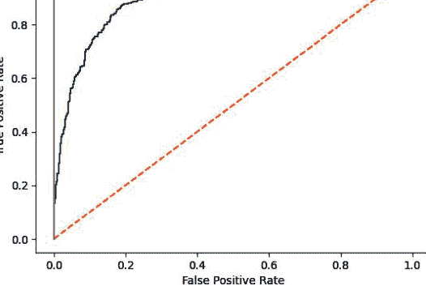

## 11.8 评估回归模型

### 问题

你想评估一个回归模型的性能。

### 解决方案

使用*均方误差*（MSE）：

```python
# 加载库
from sklearn.datasets import make_regression
from sklearn.model_selection import cross_val_score
from sklearn.linear_model import LinearRegression

# 生成特征矩阵和目标向量
features, target = make_regression(n_samples=100,
                                   n_features=3,
                                   n_informative=3,
                                   n_targets=1,
                                   noise=50,
                                   coef=False,
                                   random_state=1)

# 创建线性回归对象
ols = LinearRegression()

# 使用（负）MSE对线性回归进行交叉验证
cross_val_score(ols, features, target, scoring='neg_mean_squared_error')
# array([-1974.65337976, -2004.54137625, -3935.19355723, -1060.04361386,
#        -1598.74104702])
```

另一个常见的回归指标是决定系数，$R^2$：

```python
# 使用R平方对线性回归进行交叉验证
cross_val_score(ols, features, target, scoring='r2')
# array([0.8622399 , 0.85838075, 0.74723548, 0.91354743, 0.84469331])
```

### 讨论

MSE是回归模型最常见的评估指标之一。形式上，MSE是：

$$\text{MSE} = \frac{1}{n} \sum_{i=1}^{n} (\widehat{y}_i - y_i)^2$$

其中$n$是观测值的数量，$y_i$是我们试图预测的观测值$i$的真实目标值，$\widehat{y}_i$是模型对$y_i$的预测值。MSE衡量的是所有预测值与真实值之间距离的平方和。MSE值越高，总平方误差越大，因此模型越差。对误差项进行平方有许多数学上的好处，包括它迫使所有误差值为正，但一个常被忽视的含义是，平方对少数大误差的惩罚比对许多小误差的惩罚更重，即使误差的绝对值相同。例如，想象两个模型A和B，每个模型有两个观测值：

- 模型A的误差为0和10，因此其MSE为$0^2 + 10^2 = 100$。
- 模型B的两个误差各为5，因此其MSE为$5^2 + 5^2 = 50$。

两个模型的总误差相同，都是10；然而，MSE会认为模型A（MSE = 100）比模型B（MSE = 50）更差。在实践中，这种含义很少成为问题（实际上在理论上可能是有益的），MSE作为评估指标工作得非常好。

一个重要的注意事项：在scikit-learn中，默认情况下，`scoring`参数的参数假设值越高越好。然而，对于MSE来说并非如此，值越高意味着模型越差。因此，scikit-learn使用`neg_mean_squared_error`参数来查看负MSE。

一个常见的替代回归评估指标是我们在配方11.2中使用的默认指标$R^2$，它衡量目标向量中被模型解释的方差量。

$$R^2 = 1 - \frac{\sum_{i=1}^n (y_i - \widehat{y}_i)^2}{\sum_{i=1}^n (y_i - \overline{y})^2}$$

其中$y_i$是第$i$个观测值的真实目标值，$\widehat{y}_i$是第$i$个观测值的预测值，$\overline{y}$是目标向量的平均值。$R^2$越接近1.0，模型越好。

### 另请参阅

- 均方误差，维基百科
- 决定系数，维基百科

## 11.9 评估聚类模型

### 问题

你已经使用无监督学习算法对数据进行了聚类。现在你想知道它的效果如何。

### 解决方案

使用轮廓系数来衡量聚类的质量（注意，这不衡量预测性能）：

```python
# 加载库
import numpy as np
from sklearn.metrics import silhouette_score
from sklearn import datasets
from sklearn.cluster import KMeans
from sklearn.datasets import make_blobs

# 生成特征矩阵
features, _ = make_blobs(n_samples=1000,
                         n_features=10,
                         centers=2,
                         cluster_std=0.5,
                         shuffle=True,
                         random_state=1)

# 使用k-means聚类数据以预测类别
model = KMeans(n_clusters=2, random_state=1).fit(features)

# 获取预测的类别
target_predicted = model.labels_

# 评估模型
silhouette_score(features, target_predicted)
# 0.8916265564072141
```

### 讨论

监督模型评估将预测值（例如，类别或定量值）与目标向量中相应的真实值进行比较。然而，使用聚类方法最常见的动机是你的数据没有目标向量。一些聚类评估指标需要目标向量，但同样，当你有可用的目标向量时，使用像聚类这样的无监督学习方法可能是在不必要地限制自己。

虽然如果我们没有目标向量，就无法将预测值与真实值进行比较，但我们可以评估聚类本身的性质。直观地，我们可以想象“好”的聚类具有同一聚类内观测值之间非常小的距离（即密集的聚类）和不同聚类之间很大的距离（即分离良好的聚类）。轮廓系数提供了一个衡量这两个特征的单一值。形式上，第$i$个观测值的轮廓系数是：

$$s_i = \frac{b_i - a_i}{\max(a_i, b_i)}$$

其中$s_i$是观测值$i$的轮廓系数，$a_i$是$i$与同一类别所有观测值之间的平均距离，$b_i$是$i$与最近的不同类别聚类的所有观测值之间的平均距离。`silhouette_score`返回的值是所有观测值的平均轮廓系数。轮廓系数的范围在-1到1之间，1表示密集、分离良好的聚类。

### 另请参阅

- scikit-learn 文档：silhouette_score

## 11.10 创建自定义评估指标

### 问题

你想使用自己创建的指标来评估模型。

### 解决方案

将指标创建为一个函数，并使用 scikit-learn 的 `make_scorer` 将其转换为评分器函数：

```python
# 加载库
from sklearn.metrics import make_scorer, r2_score
from sklearn.model_selection import train_test_split
from sklearn.linear_model import Ridge
from sklearn.datasets import make_regression

# 生成特征矩阵和目标向量
features, target = make_regression(n_samples=100,
                                   n_features=3,
                                   random_state=1)

# 创建训练集和测试集
features_train, features_test, target_train, target_test = train_test_split(
    features, target, test_size=0.10, random_state=1)

# 创建自定义指标
def custom_metric(target_test, target_predicted):
    # 计算 R 平方分数
    r2 = r2_score(target_test, target_predicted)
    # 返回 R 平方分数
    return r2

# 创建评分器并定义分数越高越好
score = make_scorer(custom_metric, greater_is_better=True)

# 创建岭回归对象
classifier = Ridge()

# 训练岭回归模型
model = classifier.fit(features_train, target_train)

# 应用自定义评分器
score(model, features_test, target_test)
```

```
0.9997906102882058
```

### 讨论

虽然 scikit-learn 有许多内置指标用于评估模型性能，但定义我们自己的指标通常很有用。scikit-learn 使用 `make_scorer` 使这变得简单。首先，我们定义一个函数，它接受两个参数——真实目标向量和我们的预测值——并输出某个分数。其次，我们使用 `make_scorer` 创建一个评分器对象，确保指定分数是越高越好还是越低越好（使用 `greater_is_better` 参数）。

解决方案中的自定义指标（`custom_metric`）是一个简单的示例，因为它只是包装了一个用于计算 $R^2$ 分数的内置指标。在实际情况下，我们会用任何我们想要的自定义指标替换 `custom_metric` 函数。然而，通过将结果与 scikit-learn 的 `r2_score` 内置方法进行比较，我们可以看到计算 $R^2$ 的自定义指标确实有效：

```python
# 预测值
target_predicted = model.predict(features_test)

# 计算 R 平方分数
r2_score(target_test, target_predicted)
```

```
0.9997906102882058
```

### 另请参阅

- scikit-learn 文档：`make_scorer`

## 11.11 可视化训练集大小的影响

### 问题

你想评估训练集中观测值数量对某个指标（准确率、$F_1$ 等）的影响。

### 解决方案

绘制准确率与训练集大小的关系图：

```python
# 加载库
import numpy as np
import matplotlib.pyplot as plt
from sklearn.ensemble import RandomForestClassifier
from sklearn.datasets import load_digits
from sklearn.model_selection import learning_curve

# 加载数据
digits = load_digits()

# 创建特征矩阵和目标向量
features, target = digits.data, digits.target

# 为不同训练集大小创建交叉验证训练和测试分数
train_sizes, train_scores, test_scores = learning_curve(
    # 分类器
    RandomForestClassifier(),
    # 特征矩阵
    features,
    # 目标向量
    target,
    # 折数
    cv=10,
    # 性能指标
    scoring='accuracy',
    # 使用所有计算机核心
    n_jobs=-1,
    # 大小为 50
    # 训练集
    train_sizes=np.linspace(
        0.01,
        1.0,
        50))

# 创建训练集分数的均值和标准差
train_mean = np.mean(train_scores, axis=1)
train_std = np.std(train_scores, axis=1)

# 创建测试集分数的均值和标准差
test_mean = np.mean(test_scores, axis=1)
test_std = np.std(test_scores, axis=1)

# 绘制线条
plt.plot(train_sizes, train_mean, '--', color="#111111", label="Training score")
plt.plot(train_sizes, test_mean, color="#111111", label="Cross-validation score")

# 绘制带状区域
plt.fill_between(train_sizes, train_mean - train_std,
                 train_mean + train_std, color="#DDDDDD")
plt.fill_between(train_sizes, test_mean - test_std,
                 test_mean + test_std, color="#DDDDDD")

# 创建图表
plt.title("Learning Curve")
plt.xlabel("Training Set Size")
plt.ylabel("Accuracy Score")
plt.legend(loc="best")
plt.tight_layout()
plt.show()
```

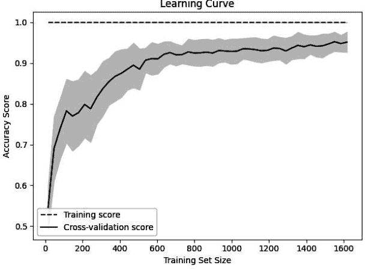

### 讨论

*学习曲线*可视化了随着训练集中观测值数量的增加，模型在训练集和交叉验证期间的性能（例如，准确率、召回率）。它们通常用于确定我们的学习算法是否能从收集更多训练数据中受益。

在我们的解决方案中，我们绘制了随机森林分类器在 50 个不同训练集大小下的准确率，范围从观测值的 1% 到 100%。交叉验证模型的准确率分数不断增加告诉我们，我们很可能从额外的观测值中受益（尽管在实践中这可能不可行）。

### 另请参阅

- scikit-learn 文档：Learning Curve

## 11.12 创建评估指标的文本报告

### 问题

你想要快速描述分类器的性能。

### 解决方案

使用 scikit-learn 的 `classification_report`：

```python
# 加载库
from sklearn import datasets
from sklearn.linear_model import LogisticRegression
from sklearn.model_selection import train_test_split
from sklearn.metrics import classification_report

# 加载数据
iris = datasets.load_iris()

# 创建特征矩阵
features = iris.data

# 创建目标向量
target = iris.target

# 创建目标类名列表
class_names = iris.target_names

# 创建训练集和测试集
features_train, features_test, target_train, target_test = train_test_split(
    features, target, random_state=0)

# 创建逻辑回归
classifier = LogisticRegression()

# 训练模型并进行预测
model = classifier.fit(features_train, target_train)
target_predicted = model.predict(features_test)

# 创建分类报告
print(classification_report(target_test,
                            target_predicted,
                            target_names=class_names))
```

|              | precision | recall | f1-score | support |
| :----------- | :-------- | :----- | :------- | :------ |
| setosa       | 1.00      | 1.00   | 1.00     | 16      |
| versicolor   | 1.00      | 0.91   | 0.95     | 11      |
| virginica    | 0.92      | 1.00   | 0.96     | 11      |
| accuracy     |           |        | 0.97     | 38      |
| macro avg    | 0.97      | 0.97   | 0.97     | 38      |
| weighted avg | 0.98      | 0.97   | 0.97     | 38      |

### 讨论

`classification_report` 为我们提供了一种快速查看一些常见评估指标的方法，包括精确率、召回率和 $F_1$ 分数（在配方 11.4 中描述）。支持数（support）指的是每个类别中的观测值数量。

### 另请参阅

- 精确率和召回率，维基百科

## 11.13 可视化超参数值的影响

### 问题

你想了解随着某个超参数值的变化，模型的性能如何变化。

### 解决方案

绘制超参数与模型准确率的关系图（验证曲线）：

```python
# 加载库
import matplotlib.pyplot as plt
import numpy as np
from sklearn.datasets import load_digits
from sklearn.ensemble import RandomForestClassifier
from sklearn.model_selection import validation_curve

# 加载数据
digits = load_digits()

# 创建特征矩阵和目标向量
features, target = digits.data, digits.target

# 创建参数值范围
param_range = np.arange(1, 250, 2)

# 使用参数值范围计算训练集和测试集的准确率
train_scores, test_scores = validation_curve(
    # 分类器
    RandomForestClassifier(),
    # 特征矩阵
    features,
    # 目标向量
    target,
    # 要检查的超参数
    param_name="n_estimators",
    # 超参数值范围
    param_range=param_range,
    # 折数
    cv=3,
    # 性能指标
    scoring="accuracy",
    # 使用所有计算机核心
    n_jobs=-1)
```

### 讨论

大多数训练算法（包括本书涵盖的许多算法）都包含必须在训练过程开始前选择的超参数。例如，*随机森林分类器*会创建一个决策树的“森林”，每棵树对观测值的预测类别进行投票。随机森林分类器的一个超参数是森林中树的数量。通常，超参数值是在模型选择阶段（参见第12章）确定的。然而，有时可视化模型性能如何随超参数值变化会很有用。在我们的解决方案中，我们绘制了随机森林分类器在训练集和交叉验证过程中，随着树的数量增加，其准确率的变化情况。当树的数量较少时，训练集和交叉验证的得分都很低，表明模型欠拟合。当树的数量增加到250时，两者的准确率都趋于平稳，这表明训练一个巨大的森林所带来的计算成本可能没有太大价值。

在scikit-learn中，我们可以使用`validation_curve`来计算验证曲线，它包含三个重要参数：

- `param_name`：要变化的超参数名称
- `param_range`：要使用的超参数值
- `scoring`：用于评估模型的指标

### 另请参阅

- scikit-learn文档：验证曲线

# 第12章
模型选择

## 12.0 引言

在机器学习中，我们使用训练算法通过最小化某个损失函数来学习模型的参数。然而，许多学习算法（例如支持向量分类器和随机森林）具有额外的*超参数*，这些参数由用户定义，并影响模型如何学习其参数。正如我们在本书前面提到的，*参数*（有时也称为模型权重）是模型在训练过程中学习到的，而超参数则由我们（用户）手动提供。

例如，随机森林是决策树的集合（因此得名*森林*）；然而，森林中决策树的数量不是由算法学习的，必须在拟合之前设置。这通常被称为*超参数调优*、*超参数优化*或*模型选择*。此外，我们可能希望尝试多种学习算法（例如，同时尝试支持向量分类器和随机森林，看看哪种学习方法能产生最佳模型）。

尽管该领域的术语存在广泛差异，但在本书中，我们将选择最佳学习算法及其最佳超参数统称为模型选择。原因很简单：想象我们有数据，并希望用10个候选超参数值训练一个支持向量分类器，以及用10个候选超参数值训练一个随机森林分类器。结果就是我们试图从20个候选模型中选择最佳模型。在本章中，我们将介绍从候选集中高效选择最佳模型的技术。

在本章中，我们将引用特定的超参数，例如C（正则化强度的倒数）。如果你不知道这些超参数是什么，请不要担心。我们将在后面的章节中介绍它们。相反，只需将超参数视为我们必须在开始训练前选择的学习算法设置。通常，找到产生最佳性能的模型及相关超参数是实验的结果——尝试一堆东西，看看什么最有效。

## 12.1 使用穷举搜索选择最佳模型

### 问题

你想通过搜索一系列超参数来选择最佳模型。

### 解决方案

使用scikit-learn的GridSearchCV：

```python
# 加载库
import numpy as np
from sklearn import linear_model, datasets
from sklearn.model_selection import GridSearchCV

# 加载数据
iris = datasets.load_iris()
features = iris.data
target = iris.target

# 创建逻辑回归
logistic = linear_model.LogisticRegression(max_iter=500, solver='liblinear')

# 创建候选惩罚超参数值的范围
penalty = ['l1','l2']

# 创建候选正则化超参数值的范围
C = np.logspace(0, 4, 10)

# 创建超参数候选字典
hyperparameters = dict(C=C, penalty=penalty)

# 创建网格搜索
gridsearch = GridSearchCV(logistic, hyperparameters, cv=5, verbose=0)

# 拟合网格搜索
best_model = gridsearch.fit(features, target)

# 显示最佳模型
print(best_model.best_estimator_)

LogisticRegression(C=7.742636826811269, max_iter=500, penalty='l1',
                   solver='liblinear')
```

### 讨论

GridSearchCV是一种使用交叉验证进行模型选择的暴力方法。具体来说，用户为一个或多个超参数定义可能的值集合，然后GridSearchCV使用每个值和/或值的组合来训练模型。性能得分最高的模型被选为最佳模型。

例如，在我们的解决方案中，我们使用逻辑回归作为学习算法，并调整了两个超参数：C和正则化惩罚。我们还指定了另外两个参数：求解器和最大迭代次数。如果你不知道这些术语的含义，请不要担心；我们将在接下来的几章中介绍它们。只需意识到C和正则化惩罚可以取一系列值，这些值必须在训练前指定。对于C，我们定义了10个可能的值：

```python
np.logspace(0, 4, 10)
array([1.00000000e+00, 2.78255940e+00, 7.74263683e+00, 2.15443469e+01,
       5.99484250e+01, 1.66810054e+02, 4.64158883e+02, 1.29154967e+03,
       3.59381366e+03, 1.00000000e+04])
```

类似地，我们为正则化惩罚定义了两个可能的值：['l1', 'l2']。对于C和正则化惩罚值的每种组合，我们训练模型并使用k折交叉验证进行评估。在我们的解决方案中，我们有10个可能的C值、2个可能的正则化惩罚值和5折。它们创建了10 × 2 × 5 = 100个候选模型，从中选出最佳模型。

一旦GridSearchCV完成，我们就可以看到最佳模型的超参数：

```python
# 查看最佳超参数
print('Best Penalty:', best_model.best_estimator_.get_params()['penalty'])
print('Best C:', best_model.best_estimator_.get_params()['C'])

Best Penalty: l1
Best C: 7.742636826811269
```

默认情况下，在确定最佳超参数后，GridSearchCV将使用最佳超参数在整个数据集上重新训练模型（而不是留出一折用于交叉验证）。我们可以像使用任何其他scikit-learn模型一样使用此模型进行预测：

```python
# 预测目标向量
best_model.predict(features)

array([0, 0, 0, 0, 0, 0, 0, 0, 0, 0, 0, 0, 0, 0, 0, 0, 0, 0, 0, 0, 0, 0,
       0, 0, 0, 0, 0, 0, 0, 0, 0, 0, 0, 0, 0, 0, 0, 0, 0, 0, 0, 0, 0, 0,
       0, 0, 0, 0, 0, 0, 1, 1, 1, 1, 1, 1, 1, 1, 1, 1, 1, 1, 1, 1, 1, 1,
       1, 1, 1, 1, 2, 1, 1, 1, 1, 1, 1, 1, 1, 1, 1, 1, 2, 1, 1, 1, 1, 1,
       1, 1, 1, 1, 1, 1, 1, 1, 1, 1, 1, 1, 2, 2, 2, 2, 2, 2, 2, 2, 2, 2,
       2, 2, 2, 2, 2, 2, 2, 2, 2, 2, 2, 2, 2, 2, 2, 2, 2, 2, 2, 2, 2, 2,
       2, 1, 2, 2, 2, 2, 2, 2, 2, 2, 2, 2, 2, 2, 2, 2, 2, 2, 2, 2, 2, 2])
```

一个 `GridSearchCV` 参数值得注意：`verbose`。虽然大多数情况下并非必需，但在漫长的搜索过程中，收到搜索正在进行的提示会让人感到安心。`verbose` 参数决定了搜索期间输出的消息数量，其中 `0` 表示不输出任何内容，`1` 到 `3` 则会输出额外的消息。

### 另请参阅

- scikit-learn 文档：GridSearchCV

## 12.2 使用随机搜索选择最佳模型

### 问题

你想要一种比穷举搜索计算成本更低的方法来选择最佳模型。

### 解决方案

使用 scikit-learn 的 `RandomizedSearchCV`：

```python
# 加载库
from scipy.stats import uniform
from sklearn import linear_model, datasets
from sklearn.model_selection import RandomizedSearchCV

# 加载数据
iris = datasets.load_iris()
features = iris.data
target = iris.target

# 创建逻辑回归模型
logistic = linear_model.LogisticRegression(max_iter=500, solver='liblinear')

# 创建候选正则化惩罚超参数值的范围
penalty = ['l1', 'l2']

# 创建候选正则化超参数值的分布
C = uniform(loc=0, scale=4)

# 创建超参数选项
hyperparameters = dict(C=C, penalty=penalty)

# 创建随机搜索
randomizedsearch = RandomizedSearchCV(
    logistic, hyperparameters, random_state=1, n_iter=100, cv=5, verbose=0,
    n_jobs=-1)
```

```python
# 拟合随机搜索
best_model = randomizedsearch.fit(features, target)

# 打印最佳模型
print(best_model.best_estimator_)

LogisticRegression(C=1.668088018810296, max_iter=500, penalty='l1',
                   solver='liblinear')
```

### 讨论

在配方 12.1 中，我们使用 `GridSearchCV` 在用户定义的超参数值集上搜索，根据评分函数寻找最佳模型。比 `GridSearchCV` 的暴力搜索更高效的方法是，从用户提供的分布（例如，正态分布、均匀分布）中，搜索特定数量的随机超参数值组合。scikit-learn 通过 `RandomizedSearchCV` 实现了这种随机搜索技术。

使用 `RandomizedSearchCV` 时，如果我们指定了一个分布，scikit-learn 将从该分布中无放回地随机抽样超参数值。作为一般概念的示例，这里我们从一个范围从 0 到 4 的均匀分布中随机抽取 10 个值：

```python
# 定义一个 0 到 4 之间的均匀分布，抽取 10 个值
uniform(loc=0, scale=4).rvs(10)

array([3.95211699, 0.30693116, 2.88237794, 3.00392864, 0.43964702,
       1.46670526, 0.27841863, 2.56541664, 2.66475584, 0.79611958])
```

或者，如果我们指定了一个值列表，例如两个正则化惩罚超参数值 `['l1', 'l2']`，`RandomizedSearchCV` 将从该列表中有放回地随机抽样。

就像使用 `GridSearchCV` 一样，我们可以查看最佳模型的超参数值：

```python
# 查看最佳超参数
print('Best Penalty:', best_model.best_estimator_.get_params()['penalty'])
print('Best C:', best_model.best_estimator_.get_params()['C'])

Best Penalty: l1
Best C: 1.668088018810296
```

并且就像使用 `GridSearchCV` 一样，搜索完成后，`RandomizedSearchCV` 会使用最佳超参数在整个数据集上拟合一个新模型。我们可以像使用 scikit-learn 中的任何其他模型一样使用这个模型；例如，进行预测：

```python
# 预测目标向量
best_model.predict(features)

array([0, 0, 0, 0, 0, 0, 0, 0, 0, 0, 0, 0, 0, 0, 0, 0, 0, 0, 0, 0, 0, 0,
       0, 0, 0, 0, 0, 0, 0, 0, 0, 0, 0, 0, 0, 0, 0, 0, 0, 0, 0, 0, 0, 0,
       0, 0, 0, 0, 0, 0, 1, 1, 1, 1, 1, 1, 1, 1, 1, 1, 1, 1, 1, 1, 1, 1,
       1, 1, 1, 2, 1, 1, 1, 1, 1, 1, 1, 1, 1, 1, 1, 1, 1, 1, 1, 1, 2, 2,
       1, 1, 1, 1, 1, 1, 1, 1, 1, 1, 1, 1, 1, 1, 1, 2, 2, 2, 2, 2, 2, 2,
       2, 2, 2, 2, 2, 2, 2, 2, 2, 2, 2, 2, 2, 2, 2, 2, 2, 2, 2, 2, 2, 2,
       2, 2, 2, 1, 2, 2, 2, 2, 2, 2, 2, 2, 2, 2, 2, 2, 2, 2, 2, 2, 2, 2])
```

采样的超参数组合数量（即训练的候选模型数量）由 `n_iter`（迭代次数）设置指定。值得注意的是，`RandomizedSearchCV` 本身并不比 `GridSearchCV` 快，但它通常通过测试更少的组合，在更短的时间内达到与 `GridSearchCV` 相当的性能。

### 另请参阅

- scikit-learn 文档：RandomizedSearchCV
- 用于超参数优化的随机搜索

## 12.3 从多个学习算法中选择最佳模型

### 问题

你希望通过搜索一系列学习算法及其各自的超参数来选择最佳模型。

### 解决方案

创建一个包含候选学习算法及其超参数的字典，用作 `GridSearchCV` 的搜索空间：

```python
# 加载库
import numpy as np
from sklearn import datasets
from sklearn.linear_model import LogisticRegression
from sklearn.ensemble import RandomForestClassifier
from sklearn.model_selection import GridSearchCV
from sklearn.pipeline import Pipeline

# 设置随机种子
np.random.seed(0)

# 加载数据
iris = datasets.load_iris()
features = iris.data
target = iris.target

# 创建一个管道
pipe = Pipeline([("classifier", RandomForestClassifier())])
```

```python
# 创建包含候选学习算法及其超参数的字典
search_space = [{"classifier": [LogisticRegression(max_iter=500,
    solver='liblinear')],
    "classifier__penalty": ['l1', 'l2'],
    "classifier__C": np.logspace(0, 4, 10)},
    {"classifier": [RandomForestClassifier()],
    "classifier__n_estimators": [10, 100, 1000],
    "classifier__max_features": [1, 2, 3]}]

# 创建网格搜索
gridsearch = GridSearchCV(pipe, search_space, cv=5, verbose=0)

# 拟合网格搜索
best_model = gridsearch.fit(features, target)

# 打印最佳模型
print(best_model.best_estimator_)

Pipeline(steps=[('classifier',
    LogisticRegression(C=7.742636826811269, max_iter=500,
    penalty='l1', solver='liblinear'))])
```

### 讨论

在前两个配方中，我们通过搜索学习算法可能的超参数值来找到最佳模型。但是，如果我们不确定使用哪种学习算法怎么办？scikit-learn 允许我们将学习算法作为搜索空间的一部分。在我们的解决方案中，我们定义了一个包含两种学习算法的搜索空间：逻辑回归和随机森林分类器。每个学习算法都有自己的超参数，我们使用 `classifier__[超参数名]` 的格式定义它们的候选值。例如，对于我们的逻辑回归，为了定义正则化超参数空间 `C` 的可能值集合以及潜在的正则化惩罚类型 `penalty`，我们创建一个字典：

```python
{'classifier': [LogisticRegression(max_iter=500, solver='liblinear')],
 'classifier__penalty': ['l1', 'l2'],
 'classifier__C': np.logspace(0, 4, 10)}
```

我们也可以为随机森林超参数创建一个类似的字典：

```python
{'classifier': [RandomForestClassifier()],
 'classifier__n_estimators': [10, 100, 1000],
 'classifier__max_features': [1, 2, 3]}
```

搜索完成后，我们可以使用 `best_estimator_` 查看最佳模型的学习算法和超参数：

```python
# 查看最佳模型
print(best_model.best_estimator_.get_params()["classifier"])

LogisticRegression(C=7.742636826811269, max_iter=500, penalty='l1',
                   solver='liblinear')
```

就像前两个配方一样，一旦我们拟合了模型选择搜索，我们就可以像使用任何其他 scikit-learn 模型一样使用这个最佳模型：

```python
# 预测目标向量
best_model.predict(features)

array([0, 0, 0, 0, 0, 0, 0, 0, 0, 0, 0, 0, 0, 0, 0, 0, 0, 0, 0, 0, 0,
       0, 0, 0, 0, 0, 0, 0, 0, 0, 0, 0, 0, 0, 0, 0, 0, 0, 0, 0, 0, 0,
       0, 0, 0, 0, 0, 0, 1, 1, 1, 1, 1, 1, 1, 1, 1, 1, 1, 1, 1, 1, 1,
       1, 1, 1, 1, 2, 1, 1, 1, 1, 1, 1, 1, 1, 1, 1, 1, 1, 1, 1, 1, 1,
       1, 1, 1, 1, 1, 1, 1, 1, 1, 1, 2, 2, 2, 2, 2, 2, 2, 2, 2, 2, 2,
       2, 2, 2, 2, 2, 2, 2, 2, 2, 2, 2, 2, 2, 2, 2, 2, 2, 2, 2, 2, 2,
       2, 1, 2, 2, 2, 2, 2, 2, 2, 2, 2, 2, 2, 2, 2, 2, 2, 2, 2, 2, 2])
```

## 12.4 在预处理时选择最佳模型

### 问题

你希望在模型选择过程中包含一个预处理步骤。

### 解决方案

创建一个包含预处理步骤及其任何参数的管道：

```python
# 加载库
import numpy as np
from sklearn import datasets
from sklearn.linear_model import LogisticRegression
from sklearn.model_selection import GridSearchCV
from sklearn.pipeline import Pipeline, FeatureUnion
from sklearn.decomposition import PCA
from sklearn.preprocessing import StandardScaler

# 设置随机种子
np.random.seed(0)

# 加载数据
iris = datasets.load_iris()
features = iris.data
target = iris.target

# 创建一个包含 StandardScaler 特征和 PCA 的预处理对象
preprocess = FeatureUnion([("std", StandardScaler()), ("pca", PCA())])

# 创建一个管道
pipe = Pipeline([("preprocess", preprocess),
                 ("classifier", LogisticRegression(max_iter=1000,
                                                   solver='liblinear'))])
```

# 创建候选值搜索空间
search_space = [{"preprocess__pca__n_components": [1, 2, 3],
                 "classifier__penalty": ["l1", "l2"],
                 "classifier__C": np.logspace(0, 4, 10)}]

# 创建网格搜索
clf = GridSearchCV(pipe, search_space, cv=5, verbose=0, n_jobs=-1)

# 拟合网格搜索
best_model = clf.fit(features, target)

# 打印最佳模型
print(best_model.best_estimator_)

Pipeline(steps=[('preprocess',
                 FeatureUnion(transformer_list=[('std', StandardScaler()),
                                               ('pca', PCA(n_components=1))])),
                ('classifier',
                 LogisticRegression(C=7.742636826811269, max_iter=1000,
                                   penalty='l1', solver='liblinear'))])

### 讨论

在使用数据训练模型之前，我们通常需要对数据进行预处理。在进行模型选择时，我们必须小心地正确处理预处理步骤。首先，`GridSearchCV` 使用交叉验证来确定哪个模型性能最高。然而，在交叉验证中，我们实际上是假装被留作测试集的那一折数据是未被看到的，因此不属于任何预处理步骤（例如，缩放或标准化）拟合的一部分。因此，我们不能先预处理数据，然后再运行 `GridSearchCV`。相反，预处理步骤必须是 `GridSearchCV` 所采取操作集的一部分。

这可能看起来很复杂，但 `scikit-learn` 使其变得简单。`FeatureUnion` 允许我们正确地组合多个预处理操作。在我们的解决方案中，我们使用 `FeatureUnion` 组合了两个预处理步骤：标准化特征值（`StandardScaler`）和主成分分析（`PCA`）。这个对象被称为 `preprocess`，包含了我们的两个预处理步骤。然后，我们将 `preprocess` 与我们的学习算法一起包含在一个管道中。结果是，这允许我们将正确（且令人困惑）的拟合、转换和训练具有超参数组合的模型的工作外包给 `scikit-learn`。

其次，一些预处理方法有自己的参数，这些参数通常需要由用户提供。例如，使用 `PCA` 进行降维需要用户定义用于生成转换特征集的主成分数量。理想情况下，我们会选择能为某个评估测试指标产生最佳性能模型的主成分数。

幸运的是，`scikit-learn` 使这变得容易。当我们在搜索空间中包含候选的主成分数时，它们会被当作任何其他要搜索的超参数来对待。在我们的解决方案中，我们在搜索空间中定义了 `preprocess__pca__n_components`: [1, 2, 3]，以表明我们想探究一个、两个或三个主成分是否能产生最佳模型。

模型选择完成后，我们可以查看产生最佳模型的预处理值。例如，我们可以看到最佳的主成分数：

```
# 查看最佳 n_components
best_model.best_estimator_.get_params()['preprocess__pca__n_components']

1
```

## 12.5 通过并行化加速模型选择

### 问题

你需要加速模型选择。

### 解决方案

通过设置 `n_jobs=-1` 来使用机器的所有核心，这使你能够同时训练多个模型：

```
# 加载库
import numpy as np
from sklearn import linear_model, datasets
from sklearn.model_selection import GridSearchCV

# 加载数据
iris = datasets.load_iris()
features = iris.data
target = iris.target

# 创建逻辑回归
logistic = linear_model.LogisticRegression(max_iter=500, solver='liblinear')

# 创建候选正则化惩罚超参数值的范围
penalty = ["l1", "l2"]

# 创建 C 的候选值范围
C = np.logspace(0, 4, 1000)

# 创建超参数选项
hyperparameters = dict(C=C, penalty=penalty)

# 创建网格搜索
gridsearch = GridSearchCV(logistic, hyperparameters, cv=5, n_jobs=-1, verbose=1)

# 拟合网格搜索
best_model = gridsearch.fit(features, target)

# 打印最佳模型
print(best_model.best_estimator_)

Fitting 5 folds for each of 2000 candidates, totalling 10000 fits
LogisticRegression(C=5.926151812475554, max_iter=500, penalty='l1',
                   solver='liblinear')
```

### 讨论

在本章的配方中，我们保持了候选模型的数量较少，以便代码能快速完成。然而，在现实世界中，我们可能有成千上万的模型需要训练。因此，找到最佳模型可能需要很多小时。

为了加速这个过程，`scikit-learn` 允许我们同时训练多个模型。无需深入太多技术细节，`scikit-learn` 可以同时训练的模型数量最多等于机器的核心数。大多数现代笔记本电脑至少有四个核心，所以（假设你当前使用的是笔记本电脑）我们有可能同时训练四个模型。这将显著提高我们模型选择过程的速度。参数 `n_jobs` 定义了并行训练的模型数量。

在我们的解决方案中，我们将 `n_jobs` 设置为 -1，这告诉 `scikit-learn` 使用所有核心。然而，默认情况下 `n_jobs` 设置为 1，意味着它只使用一个核心。为了演示这一点，如果我们运行与解决方案中相同的 `GridSearchCV`，但将 `n_jobs=1`，我们可以看到找到最佳模型需要明显更长的时间（注意确切时间将取决于你的计算机）：

```
# 使用单个核心创建网格搜索
clf = GridSearchCV(logistic, hyperparameters, cv=5, n_jobs=1, verbose=1)

# 拟合网格搜索
best_model = clf.fit(features, target)

# 打印最佳模型
print(best_model.best_estimator_)

Fitting 5 folds for each of 2000 candidates, totalling 10000 fits
LogisticRegression(C=5.926151812475554, max_iter=500, penalty='l1',
                   solver='liblinear')
```

## 12.6 使用特定于算法的方法加速模型选择

### 问题

你需要在不使用额外计算能力的情况下加速模型选择。

### 解决方案

如果你使用的是特定的学习算法，请使用 `scikit-learn` 特定于模型的交叉验证超参数调优方法 `LogisticRegressionCV`：

```
# 加载库
from sklearn import linear_model, datasets

# 加载数据
iris = datasets.load_iris()
features = iris.data
target = iris.target

# 创建交叉验证的逻辑回归
logit = linear_model.LogisticRegressionCV(Cs=100, max_iter=500,
                                         solver='liblinear')

# 训练模型
logit.fit(features, target)

# 打印模型
print(logit)

LogisticRegressionCV(Cs=100, max_iter=500, solver='liblinear')
```

### 讨论

有时，学习算法的特性允许我们比暴力或随机模型搜索方法更快地搜索最佳超参数。在 `scikit-learn` 中，许多学习算法（例如，岭回归、lasso 回归和弹性网络回归）都有特定于算法的交叉验证方法来利用这一点。例如，`LogisticRegression` 用于执行标准的逻辑回归分类器，而 `LogisticRegressionCV` 实现了一个高效的交叉验证逻辑回归分类器，可以识别超参数 C 的最佳值。

`scikit-learn` 的 `LogisticRegressionCV` 方法包含一个参数 `Cs`。如果提供一个列表，`Cs` 包含要选择的候选超参数值。如果提供一个整数，参数 `Cs` 会生成该数量的候选值列表。候选值是从 0.0001 到 100,000 之间的范围内对数抽取的（C 的合理值范围）。

然而，`LogisticRegressionCV` 的一个主要缺点是它只能搜索 C 的值范围。在配方 12.1 中，我们可能的超参数空间包括 C 和另一个超参数（正则化惩罚范数）。这个限制是 `scikit-learn` 许多特定于模型的交叉验证方法的共同点。

### 另请参阅

- scikit-learn 文档：LogisticRegressionCV
- scikit-learn 文档：特定于模型的交叉验证

## 12.7 模型选择后评估性能

### 问题

你想评估通过模型选择找到的模型的性能。

### 解决方案

使用嵌套交叉验证以避免有偏评估：

```
# 加载库
import numpy as np
from sklearn import linear_model, datasets
from sklearn.model_selection import GridSearchCV, cross_val_score

# 加载数据
iris = datasets.load_iris()
features = iris.data
target = iris.target

# 创建逻辑回归
logistic = linear_model.LogisticRegression(max_iter=500, solver='liblinear')

# 创建 20 个候选 C 值的范围
C = np.logspace(0, 4, 20)

# 创建超参数选项
hyperparameters = dict(C=C)

# 创建网格搜索
gridsearch = GridSearchCV(logistic, hyperparameters, cv=5, n_jobs=-1, verbose=0)

# 进行嵌套交叉验证并输出平均分数
cross_val_score(gridsearch, features, target).mean()

0.9733333333333334
```

### 讨论

嵌套交叉验证在模型选择中是一个许多人初次接触时难以理解的概念。请记住，在k折交叉验证中，我们在数据的$k-1$折上训练模型，使用该模型对剩余的一折进行预测，然后根据预测值与真实值的比较情况来评估模型。接着，我们重复此过程$k$次。

在本章描述的模型选择搜索中（即`GridSearchCV`和`RandomizedSearchCV`），我们使用交叉验证来评估哪些超参数值能产生最佳模型。然而，一个微妙且通常被忽视的问题出现了：由于我们使用了数据来选择最佳超参数值，因此不能再使用相同的数据来评估模型的性能。解决方案是什么？将用于模型搜索的交叉验证包装在另一个交叉验证中！在嵌套交叉验证中，“内部”交叉验证选择最佳模型，而“外部”交叉验证则提供对模型性能的无偏评估。在我们的解决方案中，内部交叉验证是我们的`GridSearchCV`对象，然后我们使用`cross_val_score`将其包装在外部交叉验证中。

如果你感到困惑，可以尝试一个简单的实验。首先，设置`verbose=1`以便我们观察发生了什么：

```
gridsearch = GridSearchCV(logistic, hyperparameters, cv=5, verbose=1)
```

接下来，运行`gridsearch.fit(features, target)`，这是我们用于寻找最佳模型的内部交叉验证：

```
best_model = gridsearch.fit(features, target)
Fitting 5 folds for each of 20 candidates, totalling 100 fits
```

从输出中你可以看到，内部交叉验证对20个候选模型各训练了5次，总共训练了100个模型。接下来，将`clf`嵌套在一个新的交叉验证中，默认为五折：

```
scores = cross_val_score(gridsearch, features, target)
Fitting 5 folds for each of 20 candidates, totalling 100 fits
Fitting 5 folds for each of 20 candidates, totalling 100 fits
Fitting 5 folds for each of 20 candidates, totalling 100 fits
Fitting 5 folds for each of 20 candidates, totalling 100 fits
Fitting 5 folds for each of 20 candidates, totalling 100 fits
```

输出显示，内部交叉验证训练了20个模型各5次以找到最佳模型，然后该模型使用外部五折交叉验证进行评估，总共训练了500个模型。

# 第13章
## 线性回归

## 13.0 引言

*线性回归*是我们工具箱中最简单的监督学习算法之一。如果你在大学里上过统计学入门课程，你最后学习的主题很可能就是线性回归。当目标向量是定量值（例如，房屋价格、年龄）时，线性回归及其扩展仍然是进行预测的常用且有用的方法。在本章中，我们将介绍多种线性回归方法（以及一些扩展）来创建性能良好的预测模型。

## 13.1 拟合一条直线

### 问题

你想训练一个模型，该模型表示特征和目标向量之间的线性关系。

### 解决方案

使用线性回归（在scikit-learn中为LinearRegression）：

```
# 加载库
from sklearn.linear_model import LinearRegression
from sklearn.datasets import make_regression

# 生成特征矩阵、目标向量
features, target = make_regression(n_samples = 100,
                                  n_features = 3,
                                  n_informative = 2,
                                  n_targets = 1,
                                  noise = 0.2,
                                  coef = False,
                                  random_state = 1)
```

```
# 创建线性回归
regression = LinearRegression()

# 拟合线性回归
model = regression.fit(features, target)
```

### 讨论

线性回归假设特征和目标向量之间的关系近似线性。也就是说，特征对目标向量的*影响*（也称为*系数*、*权重*或*参数*）是恒定的。在我们的解决方案中，为了便于解释，我们仅使用三个特征训练了模型。这意味着我们的线性模型将是：

$\widehat{y} = \widehat{\beta}_0 + \widehat{\beta}_1 x_1 + \widehat{\beta}_2 x_2 + \widehat{\beta}_3 x_3 + \epsilon$

其中$\widehat{y}$是我们的目标，$x_i$是单个特征的数据，$\widehat{\beta}_1$、$\widehat{\beta}_2$和$\widehat{\beta}_3$是通过拟合模型确定的系数，$\epsilon$是误差。在我们拟合模型之后，我们可以查看每个参数的值。例如，$\widehat{\beta}_0$，也称为*偏置*或*截距*，可以使用`intercept_`查看：

```
# 查看截距
model.intercept_

-0.009650118178816669
```

而$\widehat{\beta}_1$和$\widehat{\beta}_2$使用`coef_`显示：

```
# 查看特征系数
model.coef_

array([1.95531234e-02, 4.42087450e+01, 5.81494563e+01])
```

在我们的数据集中，目标值是一个随机生成的连续变量：

```
# 目标向量中的第一个值
target[0]

-20.870747595269407
```

使用`predict`方法，我们可以根据输入特征预测输出：

```
# 预测第一个观测值的目标值
model.predict(features)[0]

-20.861927709296808
```

还不错！我们的模型仅偏差了大约0.01！

线性回归的主要优势在于其可解释性，这在很大程度上是因为模型的系数是目标向量每单位变化的影响。我们的模型第一个特征的系数约为-0.02，这意味着第一个特征每增加一个单位，目标值的变化量。

使用score函数，我们还可以查看模型在数据上的表现如何：

```
# 打印模型在训练数据上的得分
print(model.score(features, target))

0.9999901732607787
```

scikit-learn中线性回归的默认得分是R²，范围从0.0（最差）到1.0（最佳）。正如我们在本例中看到的，我们非常接近完美的1.0值。然而，值得注意的是，我们是在模型已经见过的数据（训练数据）上评估该模型，通常我们会在一个独立的测试集上进行评估。尽管如此，如此高的得分预示着我们的模型在实际应用中表现良好。

## 13.2 处理交互效应

### 问题

你有一个特征，其对目标变量的影响取决于另一个特征。

### 解决方案

使用scikit-learn的PolynomialFeatures创建一个交互项来捕捉这种依赖关系：

```
# 加载库
from sklearn.linear_model import LinearRegression
from sklearn.preprocessing import PolynomialFeatures
from sklearn.datasets import make_regression

# 生成特征矩阵、目标向量
features, target = make_regression(n_samples = 100,
                                  n_features = 2,
                                  n_informative = 2,
                                  n_targets = 1,
                                  noise = 0.2,
                                  coef = False,
                                  random_state = 1)

# 创建交互项
interaction = PolynomialFeatures(
    degree=3, include_bias=False, interaction_only=True)
features_interaction = interaction.fit_transform(features)

# 创建线性回归
regression = LinearRegression()

# 拟合线性回归
model = regression.fit(features_interaction, target)
```

### 讨论

有时，一个特征对我们目标变量的影响至少部分取决于另一个特征。例如，想象一个简单的基于咖啡的例子，我们有两个二元特征——糖的存在（sugar）和是否搅拌（stirred）——我们想预测咖啡是否尝起来甜。仅仅在咖啡中加糖（sugar=1, stirred=0）不会让咖啡尝起来甜（所有的糖都在底部！），仅仅搅拌咖啡而不加糖（sugar=0, stirred=1）也不会让它变甜。相反，正是在咖啡中加糖并搅拌咖啡（sugar=1, stirred=1）的交互作用才会让咖啡尝起来甜。糖和搅拌对甜度的影响是相互依赖的。在这种情况下，我们说特征sugar和stirred之间存在交互效应。

我们可以通过包含一个新特征来考虑交互效应，该特征由交互特征的相应值的乘积组成：

$\hat{y} = \hat{\beta}_0 + \hat{\beta}_1x_1 + \hat{\beta}_2x_2 + \hat{\beta}_3x_1x_2 + \epsilon$

其中$x_1$和$x_2$分别是sugar和stirred的值，$x_1x_2$表示两者之间的交互作用。

在我们的解决方案中，我们使用了一个仅包含两个特征的数据集。以下是第一个观测值中每个特征的值：

```
# 查看第一个观测值的特征值
features[0]

array([0.0465673 , 0.80186103])
```

要创建交互项，我们只需将每个观测值的这两个值相乘：

```
# 导入库
import numpy as np

# 对于每个观测值，将第一个和第二个特征的值相乘
interaction_term = np.multiply(features[:, 0], features[:, 1])
```

然后我们可以查看第一个观测值的交互项：

## 13.2 创建交互特征

### 问题

你想创建交互特征。

### 解决方案

使用 scikit-learn 的 `PolynomialFeatures` 为所有特征组合创建交互项：

```python
# 加载库
from sklearn.preprocessing import PolynomialFeatures
from sklearn.linear_model import LinearRegression
from sklearn.datasets import make_regression

# 生成特征矩阵和目标向量
features, target = make_regression(n_samples=100,
                                   n_features=3,
                                   n_informative=2,
                                   n_targets=1,
                                   noise=0.2,
                                   coef=False,
                                   random_state=1)

# 创建交互项
polynomial = PolynomialFeatures(degree=2,
                                interaction_only=True,
                                include_bias=False)
features_interaction = polynomial.fit_transform(features)
```

### 讨论

交互项是表示两个或多个其他特征组合的特征。例如，如果我们有特征 $x_1$ 和 $x_2$，它们的交互项是 $x_1x_2$。交互项允许我们对一个特征的效果依赖于另一个特征的值进行建模。

要使用 `PolynomialFeatures` 创建交互项，我们必须设置三个重要参数。最重要的是，`interaction_only=True` 告诉 `PolynomialFeatures` 只返回交互项（而不是多项式特征，我们将在配方 13.3 中讨论）。默认情况下，`PolynomialFeatures` 会添加一个包含 1 的特征，称为 *偏差*。我们可以通过 `include_bias=False` 来防止这种情况。最后，`degree` 参数决定了创建交互项所使用的最大特征数量（以防我们想要创建一个由三个特征组合而成的交互项）。

我们可以通过检查第一个观测值的特征值和交互项值是否与我们手动计算的版本匹配，来查看 `PolynomialFeatures` 的输出：

```python
# 查看第一个观测值的值
features_interaction[0]

array([0.0465673 , 0.80186103, 0.0373405 ])
```

然而，虽然我们通常有实质性的理由相信两个特征之间存在交互作用，但有时我们并没有。在这些情况下，使用 scikit-learn 的 `PolynomialFeatures` 为所有特征组合创建交互项会很有用。然后我们可以使用模型选择策略来识别产生最佳模型的特征和交互项组合。

## 13.3 拟合非线性关系

### 问题

你想对非线性关系进行建模。

### 解决方案

通过在线性回归模型中包含多项式特征来创建多项式回归：

```python
# 加载库
from sklearn.linear_model import LinearRegression
from sklearn.preprocessing import PolynomialFeatures
from sklearn.datasets import make_regression

# 生成特征矩阵和目标向量
features, target = make_regression(n_samples=100,
                                   n_features=3,
                                   n_informative=2,
                                   n_targets=1,
                                   noise=0.2,
                                   coef=False,
                                   random_state=1)

# 创建多项式特征 x^2 和 x^3
polynomial = PolynomialFeatures(degree=3, include_bias=False)
features_polynomial = polynomial.fit_transform(features)

# 创建线性回归
regression = LinearRegression()

# 拟合线性回归
model = regression.fit(features_polynomial, target)
```

### 讨论

到目前为止，我们只讨论了对线性关系进行建模。线性关系的一个例子是建筑物的楼层数和建筑物的高度。在线性回归中，我们假设楼层数和建筑物高度的影响大致是恒定的，这意味着一栋 20 层的建筑大约是一栋 10 层建筑高度的两倍，而一栋 10 层的建筑大约是一栋 5 层建筑高度的两倍。然而，许多我们感兴趣的关系并非严格线性的。

我们通常希望对非线性关系进行建模——例如，学生学习的小时数与她在考试中得分之间的关系。直观地，我们可以想象学习一小时的学生与完全不学习的学生在考试分数上存在很大差异。然而，学习 99 小时的学生与学习 100 小时的学生在考试分数上的差异要小得多。学习一小时对学生考试分数的影响随着学习小时数的增加而减小。

多项式回归是线性回归的扩展，它允许我们对非线性关系进行建模。要创建多项式回归，将我们在配方 13.1 中使用的线性函数：

$\widehat{y} = \widehat{\beta}_0 + \widehat{\beta}_1x_1 + \epsilon$

通过添加多项式特征转换为多项式函数：

$\widehat{y} = \widehat{\beta}_0 + \widehat{\beta}_1x_1 + \widehat{\beta}_2x_1^2 + \dots + \widehat{\beta}_dx_1^d + \epsilon$

其中 $d$ 是多项式的次数。我们如何能够使用线性回归来拟合非线性函数？答案是我们不改变线性回归拟合模型的方式，而只是添加多项式特征。也就是说，线性回归并不“知道” $x^2$ 是 $x$ 的二次变换。它只是将其视为另一个变量。

一个更实际的描述可能是必要的。为了对非线性关系建模，我们可以创建新特征，将现有特征 $x$ 提升到某个幂次：$x^2$、$x^3$ 等等。我们添加的这些新特征越多，模型创建的“线”就越灵活。为了更明确地说明这一点，假设我们想创建一个三次多项式。为了简单起见，我们将只关注一个观测值（数据集中的第一个观测值），$x[0]$：

```python
# 查看第一个观测值
features[0]

array([-0.61175641])
```

要创建多项式特征，我们将第一个观测值的值提升到二次方，$x_1^2$：

```python
# 查看第一个观测值的二次方，x^2
features[0]**2

array([0.37424591])
```

这将是我们的新特征。然后我们还将第一个观测值的值提升到三次方，$x_1^3$：

```python
# 查看第一个观测值的三次方，x^3
features[0]**3

array([-0.22894734])
```

通过在我们的特征矩阵中包含所有三个特征（$x$、$x^2$ 和 $x^3$），然后运行线性回归，我们已经进行了多项式回归：

```python
# 查看第一个观测值的 x、x^2 和 x^3 的值
features_polynomial[0]

array([-0.61175641,  0.37424591, -0.22894734])
```

`PolynomialFeatures` 有两个重要参数。首先，`degree` 决定了多项式特征的最大次数。例如，`degree=3` 将生成 $x^2$ 和 $x^3$。其次，默认情况下 `PolynomialFeatures` 包含一个只包含 1 的特征（称为偏差）。我们可以通过设置 `include_bias=False` 来移除它。

## 13.4 通过正则化减少方差

### 问题

你想减少线性回归模型的方差。

### 解决方案

使用包含 *收缩惩罚*（也称为 *正则化*）的学习算法，如岭回归和 Lasso 回归：

```python
# 加载库
from sklearn.linear_model import Ridge
from sklearn.preprocessing import StandardScaler
from sklearn.datasets import make_regression

# 生成特征矩阵和目标向量
features, target = make_regression(n_samples=100,
                                   n_features=3,
                                   n_informative=2,
                                   n_targets=1,
                                   noise=0.2,
                                   coef=False,
                                   random_state=1)

# 标准化特征
scaler = StandardScaler()
features_standardized = scaler.fit_transform(features)

# 创建具有 alpha 值的岭回归
regression = Ridge(alpha=0.5)

# 拟合线性回归
model = regression.fit(features_standardized, target)
```

### 讨论

在标准线性回归中，模型训练以最小化真实目标值 ($y_i$) 和预测目标值 ($\widehat{y}_i$) 之间的平方误差之和，或残差平方和 (RSS)：

$$RSS = \sum_{i=1}^{n} (y_i - \widehat{y}_i)^2$$

正则化回归学习器类似，不同之处在于它们试图最小化 RSS *以及* 对系数值总大小的某种惩罚，称为 *收缩惩罚*，因为它试图“收缩”模型。线性回归有两种常见的正则化学习器：岭回归和 Lasso。唯一的正式区别是使用的收缩惩罚类型。在 *岭回归* 中，收缩惩罚是一个调节超参数乘以所有系数的平方和：

$$RSS + \alpha \sum_{j=1}^{p} \widehat{\beta}_j^2$$

其中 $\widehat{\beta}_j$ 是 $p$ 个特征中第 $j$ 个特征的系数，$\alpha$ 是一个超参数（接下来讨论）。*Lasso* 类似，不同之处在于收缩惩罚是一个调节超参数乘以所有系数的绝对值之和：

$$\frac{1}{2n}\text{RSS} + \alpha \sum_{j=1}^{p} |\widehat{\beta}_j|$$

其中 $n$ 是观测值的数量。那么我们应该使用哪一个呢？作为一个非常通用的经验法则，岭回归通常比 Lasso 产生稍好的预测，但 Lasso（出于我们将在配方 13.5 中讨论的原因）产生更可解释的模型。如果我们想要在岭和 Lasso 的惩罚函数之间取得平衡，我们可以使用 *弹性网络*，它只是一个包含两种惩罚的回归模型。无论我们使用哪一个，岭回归和 Lasso 回归都可以通过在我们要最小化的损失函数中包含系数值来惩罚大型或复杂的模型。

超参数 $\alpha$ 让我们控制对系数的惩罚程度，较高的 $\alpha$ 值会产生更简单的模型。理想的 $\alpha$ 值应该像任何其他超参数一样进行调整。在 scikit-learn 中，$\alpha$ 使用 `alpha` 参数设置。

scikit-learn 包含一个 `RidgeCV` 方法，允许我们为 $\alpha$ 选择理想的值：

```python
# 加载库
from sklearn.linear_model import RidgeCV

# 创建具有三个 alpha 值的岭回归
regr_cv = RidgeCV(alphas=[0.1, 1.0, 10.0])

# 拟合线性回归
model_cv = regr_cv.fit(features_standardized, target)

# 查看系数
model_cv.coef_
array([1.29223201e-02, 4.40972291e+01, 5.38979372e+01])
```

然后我们可以轻松查看最佳模型的 $\alpha$ 值：

```python
# 查看 alpha
model_cv.alpha_
0.1
```

最后一点：因为在线性回归中，系数的值部分由特征的尺度决定，而在正则化模型中，所有系数都被加在一起，所以我们必须确保在训练之前对特征进行标准化。

## 13.5 使用 Lasso 回归减少特征

### 问题

你想通过减少特征数量来简化线性回归模型。

### 解决方案

使用 Lasso 回归：

```python
# Load library
from sklearn.linear_model import Lasso
from sklearn.preprocessing import StandardScaler
from sklearn.datasets import make_regression

# Generate features matrix, target vector
features, target = make_regression(n_samples=100,
                                   n_features=3,
                                   n_informative=2,
                                   n_targets=1,
                                   noise=0.2,
                                   coef=False,
                                   random_state=1)

# Standardize features
scaler = StandardScaler()
features_standardized = scaler.fit_transform(features)

# Create lasso regression with alpha value
regression = Lasso(alpha=0.5)

# Fit the linear regression
model = regression.fit(features_standardized, target)
```

### 讨论

Lasso 回归惩罚项的一个有趣特性是，它可以将模型的系数收缩为零，从而有效地减少模型中的特征数量。例如，在我们的解决方案中，我们将 alpha 设置为 0.5，我们可以看到许多系数为 0，这意味着它们对应的特征未在模型中使用：

```python
# View coefficients
model.coef_

array([-0.        , 43.58618393, 53.39523724])
```

然而，如果我们把 α 增加到一个高得多的值，我们会看到实际上没有特征被使用：

```python
# Create lasso regression with a high alpha
regression_a10 = Lasso(alpha=10)
model_a10 = regression_a10.fit(features_standardized, target)
model_a10.coef_

array([-0.        , 32.92181899, 42.73086731])
```

这种效应的实际好处在于，它意味着我们可以在特征矩阵中包含 100 个特征，然后通过调整 Lasso 的 α 超参数，生成一个仅使用（例如）10 个最重要特征的模型。这让我们能够减少方差，同时提高模型的可解释性（因为更少的特征更容易解释）。

# 第 14 章

## 树与森林

## 14.0 引言

基于树的学习算法是一类广泛且流行的、相关的非参数、监督方法，可用于分类和回归。基于树的学习器的基础是*决策树*，其中一系列决策规则（例如，“如果一个人的信用评分大于 720……”）被链接在一起。结果看起来有点像一棵倒置的树，第一个决策规则在顶部，后续的决策规则在下面展开。在决策树中，每个决策规则都出现在一个决策节点上，该规则创建通向新节点的分支。末端没有决策规则的分支称为*叶节点*。

基于树的模型流行的一个原因是其可解释性。事实上，决策树可以完全按其完整形式绘制出来（参见配方 14.3），从而创建一个高度直观的模型。从这个基本的树系统出发，衍生出了从随机森林到堆叠的各种扩展。在本章中，我们将介绍如何训练、处理、调整、可视化和评估多种基于树的模型。

## 14.1 训练决策树分类器

### 问题

你需要使用决策树训练一个分类器。

### 解决方案

使用 scikit-learn 的 `DecisionTreeClassifier`：

```python
# Load libraries
from sklearn.tree import DecisionTreeClassifier
from sklearn import datasets

# Load data
iris = datasets.load_iris()
features = iris.data
target = iris.target

# Create decision tree classifier object
decisiontree = DecisionTreeClassifier(random_state=0)

# Train model
model = decisiontree.fit(features, target)
```

### 讨论

决策树学习器试图找到一个能在节点上产生最大不纯度降低的决策规则。虽然有多种不纯度的度量方法，但默认情况下 `DecisionTreeClassifier` 使用基尼不纯度：

$$G(t) = 1 - \sum_{i=1}^{c} p_i^2$$

其中 $G(t)$ 是节点 $t$ 的基尼不纯度，$p_i$ 是节点 $t$ 中类别 $c$ 的观测比例。这个寻找能创建分裂以降低不纯度的决策规则的过程会递归地重复，直到所有叶节点都是纯净的（即只包含一个类别）或达到某个任意的截止点。

在 scikit-learn 中，`DecisionTreeClassifier` 的操作方式与其他学习方法类似；在使用 `fit` 训练模型后，我们可以使用该模型来预测观测的类别：

```python
# Make new observation
observation = [[ 5, 4, 3, 2]]

# Predict observation's class
model.predict(observation)

array([1])
```

我们还可以查看观测的预测类别概率：

```python
# View predicted class probabilities for the three classes
model.predict_proba(observation)

array([[0., 1., 0.]])
```

最后，如果我们想使用不同的不纯度度量，可以使用 `criterion` 参数：

```python
# Create decision tree classifier object using entropy
decisiontree_entropy = DecisionTreeClassifier(
    criterion='entropy', random_state=0)

# Train model
model_entropy = decisiontree_entropy.fit(features, target)
```

### 另请参阅

- 决策树学习，普林斯顿大学

## 14.2 训练决策树回归器

### 问题

你需要使用决策树训练一个回归模型。

### 解决方案

使用 scikit-learn 的 `DecisionTreeRegressor`：

```python
# Load libraries
from sklearn.tree import DecisionTreeRegressor
from sklearn import datasets

# Load data with only two features
diabetes = datasets.load_diabetes()
features = diabetes.data
target = diabetes.target

# Create decision tree regressor object
decisiontree = DecisionTreeRegressor(random_state=0)

# Train model
model = decisiontree.fit(features, target)
```

### 讨论

决策树回归的工作方式与决策树分类类似；然而，它不是降低基尼不纯度或熵，而是默认根据潜在分裂能降低多少均方误差（MSE）来衡量：

$$MSE = \frac{1}{n} \sum_{i=1}^{n} (y_i - \bar{y}_i)^2$$

其中 $y_i$ 是目标的真实值，$\overline{y}_i$ 是均值。在 scikit-learn 中，可以使用 `DecisionTreeRegressor` 进行决策树回归。一旦我们训练了一个决策树，就可以用它来预测观测的目标值：

```python
# Make new observation
observation = [features[0]]

# Predict observation's value
model.predict(observation)

array([151.])
```

就像 `DecisionTreeClassifier` 一样，我们可以使用 `criterion` 参数来选择所需的分裂质量度量。例如，我们可以构建一棵以降低平均绝对误差（MAE）为分裂标准的树：

```python
# Create decision tree classifier object using MAE
decisiontree_mae = DecisionTreeRegressor(criterion="absolute_error",
    random_state=0)

# Train model
model_mae = decisiontree_mae.fit(features, target)
```

### 另请参阅

- scikit-learn 文档：决策树回归

## 14.3 可视化决策树模型

### 问题

你需要可视化由决策树学习算法创建的模型。

### 解决方案

将决策树模型导出为 DOT 格式，然后进行可视化：

```python
# Load libraries
import pydotplus
from sklearn.tree import DecisionTreeClassifier
from sklearn import datasets
from IPython.display import Image
from sklearn import tree

# Load data
iris = datasets.load_iris()
features = iris.data
target = iris.target

# Create decision tree classifier object
decisiontree = DecisionTreeClassifier(random_state=0)

# Train model
model = decisiontree.fit(features, target)

# Create DOT data
dot_data = tree.export_graphviz(decisiontree,
                                out_file=None,
                                feature_names=iris.feature_names,
                                class_names=iris.target_names)

# Draw graph
graph = pydotplus.graph_from_dot_data(dot_data)

# Show graph
Image(graph.create_png())
```

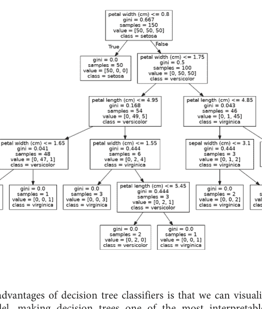

### 讨论

决策树分类器的优点之一是我们可以可视化整个训练好的模型，这使得决策树成为机器学习中最具可解释性的模型之一。在我们的解决方案中，我们将训练好的模型导出为 DOT 格式（一种图形描述语言），然后用它来绘制图形。

如果我们看根节点，可以看到决策规则是：如果花瓣宽度小于或等于 0.8 厘米，则进入左分支；否则，进入右分支。我们还可以看到基尼不纯度指数（0.667）、观测数量（150），

## 14.4 训练随机森林分类器

### 问题

你想使用由随机化决策树组成的“森林”来训练一个分类模型。

### 解决方案

使用 scikit-learn 的 `RandomForestClassifier` 来训练一个随机森林分类模型。

```python
# 加载库
from sklearn.ensemble import RandomForestClassifier
from sklearn import datasets

# 加载数据
iris = datasets.load_iris()
features = iris.data
target = iris.target

# 创建随机森林分类器对象
randomforest = RandomForestClassifier(random_state=0, n_jobs=-1)

# 训练模型
model = randomforest.fit(features, target)
```

### 讨论

决策树的一个常见问题是它们倾向于过度拟合训练数据（即过拟合）。这促使了一种名为*随机森林*的集成学习方法被广泛使用。在随机森林中，会训练许多决策树，但每棵树只接收一个自助采样（bootstrap）的观测样本（即一个与原始观测数量匹配的、有放回的随机观测样本），并且每个节点在确定最佳分割点时只考虑特征的一个子集。这片随机化的决策树森林（因此得名）通过投票来确定预测类别。

通过将此解决方案与配方 14.1 进行比较，我们可以看到 scikit-learn 的 RandomForestClassifier 与 DecisionTreeClassifier 的工作方式类似：

```python
# 创建新观测
observation = [[ 5, 4, 3, 2]]

# 预测观测的类别
model.predict(observation)

array([1])
```

RandomForestClassifier 也使用了许多与 DecisionTreeClassifier 相同的参数。例如，我们可以更改用于衡量分割质量的指标：

```python
# 使用熵创建随机森林分类器对象
randomforest_entropy = RandomForestClassifier(
    criterion="entropy", random_state=0)

# 训练模型
model_entropy = randomforest_entropy.fit(features, target)
```

然而，由于它是一个森林而不是单个决策树，RandomForestClassifier 拥有一些要么是随机森林特有的，要么是特别重要的参数。首先，`max_features` 参数决定了在每个节点考虑的最大特征数量，它接受多种参数，包括整数（特征数量）、浮点数（特征百分比）和 `sqrt`（特征数量的平方根）。默认情况下，`max_features` 设置为 `auto`，其作用与 `sqrt` 相同。其次，`bootstrap` 参数允许我们设置用于树的观测子集是通过有放回抽样（默认设置）还是无放回抽样创建的。第三，`n_estimators` 设置森林中包含的决策树数量。最后，虽然这不是随机森林分类器特有的，但由于我们实际上是在训练许多决策树模型，通过设置 `n_jobs=-1` 来使用所有可用的 CPU 核心通常很有用。

### 另请参阅

- 随机森林，伯克利统计学

## 14.5 训练随机森林回归器

### 问题

你想使用由随机化决策树组成的“森林”来训练一个回归模型。

### 解决方案

使用 scikit-learn 的 `RandomForestRegressor` 训练一个随机森林回归模型：

```python
# 加载库
from sklearn.ensemble import RandomForestRegressor
from sklearn import datasets

# 加载仅包含两个特征的数据
diabetes = datasets.load_diabetes()
features = diabetes.data
target = diabetes.target

# 创建随机森林回归器对象
randomforest = RandomForestRegressor(random_state=0, n_jobs=-1)

# 训练模型
model = randomforest.fit(features, target)
```

### 讨论

正如我们可以创建决策树分类器的森林一样，我们也可以创建决策树回归器的森林，其中每棵树使用一个自助采样的观测子集，并且在每个节点，决策规则只考虑特征的一个子集。与 RandomForestClassifier 一样，我们有一些重要的参数：

- `max_features`：设置在每个节点考虑的最大特征数量。默认为 *p* 个特征，其中 *p* 是特征总数。
- `bootstrap`：设置是否进行有放回抽样。默认为 True。
- `n_estimators`：设置要构建的决策树数量。默认为 10。

### 另请参阅

- scikit-learn 文档：RandomForestRegressor

## 14.6 使用袋外误差评估随机森林

### 问题

你需要在不使用交叉验证的情况下评估一个随机森林模型。

### 解决方案

计算模型的袋外分数：

```python
# 加载库
from sklearn.ensemble import RandomForestClassifier
from sklearn import datasets

# 加载数据
iris = datasets.load_iris()
features = iris.data
target = iris.target

# 创建随机森林分类器对象
randomforest = RandomForestClassifier(
    random_state=0, n_estimators=1000, oob_score=True, n_jobs=-1)

# 训练模型
model = randomforest.fit(features, target)

# 查看袋外误差
randomforest.oob_score_
0.9533333333333334
```

### 讨论

在随机森林中，每棵决策树都是使用一个自助采样的观测子集进行训练的。这意味着对于每棵树，都有一部分观测数据没有被用于训练该树。这些被称为袋外（OOB）观测。我们可以使用袋外观测作为测试集来评估随机森林的性能。

对于每个观测，学习算法会将该观测的真实值与一个未使用该观测训练的树子集的预测值进行比较。计算出总体分数，从而提供一个衡量随机森林性能的单一指标。袋外分数估计是交叉验证的一种替代方法。

在 scikit-learn 中，我们可以通过在随机森林对象（即 `RandomForestClassifier`）中设置 `oob_score=True` 来计算随机森林的袋外分数。该分数可以通过 `oob_score_` 获取。

## 14.7 识别随机森林中的重要特征

### 问题

你需要知道在随机森林模型中哪些特征是最重要的。

### 解决方案

通过检查模型的 `feature_importances_` 属性来计算和可视化每个特征的重要性：

```python
# 加载库
import numpy as np
import matplotlib.pyplot as plt
from sklearn.ensemble import RandomForestClassifier
from sklearn import datasets

# 加载数据
iris = datasets.load_iris()
features = iris.data
target = iris.target

# 创建随机森林分类器对象
randomforest = RandomForestClassifier(random_state=0, n_jobs=-1)

# 训练模型
model = randomforest.fit(features, target)

# 计算特征重要性
importances = model.feature_importances_

# 按降序对特征重要性进行排序
indices = np.argsort(importances)[::-1]

# 重新排列特征名称，使其与排序后的特征重要性匹配
names = [iris.feature_names[i] for i in indices]

# 创建绘图
plt.figure()
plt.title("Feature Importance")
plt.bar(range(features.shape[1]), importances[indices])
plt.xticks(range(features.shape[1]), names, rotation=90)
plt.show()
```

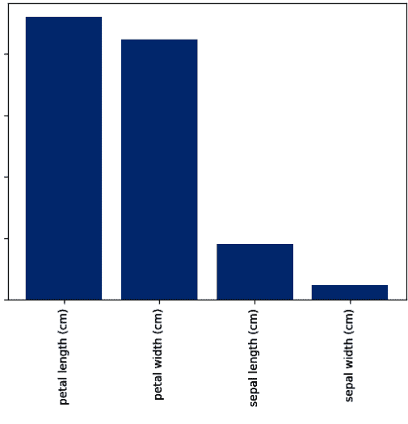

### 讨论

决策树的主要优势之一是可解释性。具体来说，我们可以可视化整个模型（参见配方 14.3）。然而，一个随机森林模型由数十、数百甚至数千棵决策树组成。这使得对随机森林模型进行简单、直观的可视化变得不切实际。尽管如此，还有另一个选择：我们可以比较（并可视化）每个特征的相对重要性。

在配方 14.3 中，我们可视化了一个决策树分类器模型，并看到仅基于花瓣宽度的决策规则就能正确分类许多观测。直观地说，我们可以认为这意味着花瓣宽度在我们的模型中是一个重要的特征。

## 14.8 在随机森林中选择重要特征

### 问题

你需要对随机森林进行特征选择。

### 解决方案

识别重要特征，并仅使用最重要的特征重新训练模型：

```python
# 加载库
from sklearn.ensemble import RandomForestClassifier
from sklearn import datasets
from sklearn.feature_selection import SelectFromModel

# 加载数据
iris = datasets.load_iris()
features = iris.data
target = iris.target

# 创建随机森林分类器
randomforest = RandomForestClassifier(random_state=0, n_jobs=-1)

# 创建一个选择重要性大于或等于阈值的特征的对象
selector = SelectFromModel(randomforest, threshold=0.3)

# 使用选择器创建新的特征矩阵
features_important = selector.fit_transform(features, target)

# 使用最重要的特征训练随机森林
model = randomforest.fit(features_important, target)
```

### 讨论

在某些情况下，我们可能希望减少模型中的特征数量。例如，我们可能希望降低模型的方差，或者希望通过仅包含最重要的特征来提高可解释性。

在 scikit-learn 中，我们可以使用一个简单的两阶段工作流来创建特征减少的模型。首先，我们使用所有特征训练一个随机森林模型。然后，我们使用该模型来识别最重要的特征。接下来，我们创建一个仅包含这些特征的新特征矩阵。在我们的解决方案中，我们使用了 `SelectFromModel` 方法来创建一个仅包含重要性大于或等于某个阈值的特征的特征矩阵。最后，我们仅使用这些特征创建了一个新模型。

我们必须注意这种方法的两个注意事项。首先，经过独热编码的名义分类特征，其特征重要性会在二进制特征中被稀释。其次，高度相关特征的特征重要性实际上会被分配给其中一个特征，而不会均匀分布在两个特征上。

### 另请参阅

- 使用随机森林进行变量选择，Robin Genuer, Jean-Michel Poggi, 和 Christine Tuleau-Malot

## 14.9 处理不平衡类别

### 问题

你有一个类别高度不平衡的目标向量，并希望训练一个随机森林模型。

### 解决方案

使用 `class_weight="balanced"` 训练决策树或随机森林模型：

```python
# 加载库
import numpy as np
from sklearn.ensemble import RandomForestClassifier
from sklearn import datasets

# 加载数据
iris = datasets.load_iris()
features = iris.data
target = iris.target

# 通过移除前40个观测值使类别高度不平衡
features = features[40:,:]
target = target[40:]

# 创建目标向量，指示是否为类别0，否则为1
target = np.where((target == 0), 0, 1)

# 创建随机森林分类器对象
randomforest = RandomForestClassifier(
    random_state=0, n_jobs=-1, class_weight="balanced")

# 训练模型
model = randomforest.fit(features, target)
```

### 讨论

在现实世界中进行机器学习时，类别不平衡是一个常见问题。如果不加以解决，类别不平衡的存在会降低我们模型的性能。我们将在配方 17.5 中讨论在预处理阶段处理类别不平衡。然而，scikit-learn 中的许多学习算法都内置了纠正类别不平衡的方法。我们可以设置 `RandomForestClassifier` 使用 `class_weight` 参数来纠正类别不平衡。如果提供一个以类别名称及其期望权重为形式的字典（例如，`{"male": 0.2, "female": 0.8}`），`RandomForestClassifier` 将相应地对类别进行加权。然而，通常一个更有用的参数是 `balanced`，其中类别会根据其在数据中出现的频率自动进行反比加权：

$$w_j = \frac{n}{kn_j}$$

其中 $w_j$ 是类别 $j$ 的权重，$n$ 是观测值数量，$n_j$ 是类别 $j$ 中的观测值数量，$k$ 是类别总数。例如，在我们的解决方案中，我们有 2 个类别（$k$），110 个观测值（$n$），每个类别分别有 10 个和 100 个观测值（$n_j$）。如果我们使用 `class_weight="balanced"` 对类别进行加权，那么较小的类别会被赋予更高的权重：

```python
# 计算小类别的权重
110/(2*10)
5.5
```

而较大的类别则被赋予较低的权重：

```python
# 计算大类别的权重
110/(2*100)
0.55
```

## 14.10 控制树的大小

### 问题

你希望手动确定决策树的结构和大小。

### 解决方案

使用 scikit-learn 基于树的学习算法中的树结构参数：

```python
# 加载库
from sklearn.tree import DecisionTreeClassifier
from sklearn import datasets

# 加载数据
iris = datasets.load_iris()
features = iris.data
target = iris.target

# 创建决策树分类器对象
decisiontree = DecisionTreeClassifier(random_state=0,
                                      max_depth=None,
                                      min_samples_split=2,
                                      min_samples_leaf=1,
                                      min_weight_fraction_leaf=0,
                                      max_leaf_nodes=None,
                                      min_impurity_decrease=0)

# 训练模型
model = decisiontree.fit(features, target)
```

### 讨论

scikit-learn 的基于树的学习算法提供了多种控制决策树大小的技术。这些技术通过参数访问：

- `max_depth`：树的最大深度。如果为 `None`，树会一直生长直到所有叶子都是纯的。如果是一个整数，树实际上会被“修剪”到该深度。
- `min_samples_split`：节点在分裂前所需的最小观测值数量。如果提供整数作为参数，它决定了原始最小值；如果提供浮点数，则最小值是总观测值的百分比。
- `min_samples_leaf`：叶子节点所需的最小观测值数量。使用与 `min_samples_split` 相同的参数。
- `max_leaf_nodes`：叶子节点的最大数量。
- `min_impurity_split`：执行分裂前所需的最小不纯度减少量。

虽然了解这些参数的存在很有用，但很可能我们只会使用 `max_depth` 和 `min_impurity_split`，因为较浅的树（有时称为树桩）是更简单的模型，因此具有较低的方差。

## 14.11 通过提升法提高性能

### 问题

你需要一个比决策树或随机森林性能更好的模型。

### 解决方案

使用 `AdaBoostClassifier` 或 `AdaBoostRegressor` 训练一个提升模型：

```python
# 加载库
from sklearn.ensemble import AdaBoostClassifier
from sklearn import datasets

# 加载数据
iris = datasets.load_iris()
features = iris.data
target = iris.target

# 创建 adaboost 树分类器对象
adaboost = AdaBoostClassifier(random_state=0)

# 训练模型
model = adaboost.fit(features, target)
```

### 讨论

在随机森林中，一个由随机决策树组成的集成（组）预测目标向量。另一种通常更强大的方法称为*提升*。在一种称为AdaBoost的提升方法中，我们迭代地训练一系列弱模型（最常见的是浅层决策树，有时称为桩），每次迭代都给予前一个模型预测错误的观测值更高的优先级。更具体地说，在AdaBoost中：

1.  为每个观测值 $x_i$ 分配一个初始权重值 $w_i = \frac{1}{n}$，其中 $n$ 是数据中观测值的总数。
2.  在数据上训练一个“弱”模型。
3.  对于每个观测值：
    a. 如果弱模型正确预测了 $x_i$，则 $w_i$ 减小。
    b. 如果弱模型错误预测了 $x_i$，则 $w_i$ 增大。
4.  训练一个新的弱模型，其中权重 $w_i$ 较大的观测值被赋予更高的优先级。
5.  重复步骤4和5，直到数据被完美预测或达到预设的弱模型训练数量。

结果是一个聚合模型，其中各个弱模型专注于更困难（从预测角度来看）的观测值。在scikit-learn中，我们可以使用AdaBoostClassifier或AdaBoostRegressor来实现AdaBoost。最重要的参数是base_estimator、n_estimators、learning_rate和loss：

**base_estimator**
base_estimator是用于训练弱模型的学习算法。与AdaBoost一起使用最常见的学习器是决策树，这是该参数的默认参数。

**n_estimators**
n_estimators是要迭代训练的模型数量。

**learning_rate**
learning_rate是每个模型对权重的贡献，默认为1。降低学习率意味着权重将以较小的幅度增加或减少，迫使模型训练得更慢（但有时会导致更好的性能分数）。

**loss**
loss是AdaBoostRegressor独有的，用于设置更新权重时使用的损失函数。默认为线性损失函数，但可以更改为平方或指数损失函数。

### 另请参阅

- 解释AdaBoost，Robert E. Schapire

## 14.12 训练XGBoost模型

### 问题

你需要训练一个具有高预测能力的基于树的模型。

### 解决方案

使用xgboost Python库：

```python
# Load libraries
import xgboost as xgb
from sklearn import datasets, preprocessing
from sklearn.metrics import classification_report
from numpy import argmax

# Load data
iris = datasets.load_iris()
features = iris.data
target = iris.target

# Create dataset
xgb_train = xgb.DMatrix(features, label=target)

# Define parameters
param = {
    'objective': 'multi:softprob',
    'num_class': 3
}

# Train model
gbm = xgb.train(param, xgb_train)

# Get predictions
predictions = argmax(gbm.predict(xgb_train), axis=1)

# Get a classification report
print(classification_report(target, predictions))
```

| | precision | recall | f1-score | support |
|---|---|---|---|---|
| 0 | 1.00 | 1.00 | 1.00 | 50 |
| 1 | 1.00 | 0.96 | 0.98 | 50 |
| 2 | 0.96 | 1.00 | 0.98 | 50 |
| accuracy | | | 0.99 | 150 |
| macro avg | 0.99 | 0.99 | 0.99 | 150 |
| weighted avg | 0.99 | 0.99 | 0.99 | 150 |

### 讨论

XGBoost（代表极端梯度提升）是机器学习领域非常流行的梯度提升算法。虽然它并不总是基于树的模型，但它经常应用于决策树的集成。它之所以广受欢迎，很大程度上是因为在机器学习竞赛网站Kaggle上取得了广泛的成功，此后它一直是提高性能、超越典型随机森林或梯度提升机的可靠算法。

尽管XGBoost以计算密集型著称，但过去几年的计算性能优化（如GPU支持）使得使用XGBoost进行快速迭代变得容易得多，并且当统计性能是要求时，它仍然是常见的算法选择。

### 另请参阅

- [XGBoost文档](https://xgboost.readthedocs.io/)

## 14.13 使用LightGBM提高实时性能

### 问题

你需要训练一个经过计算优化的梯度提升树模型。

### 解决方案

使用梯度提升机库`lightgbm`：

```python
# Load libraries
import lightgbm as lgb
from sklearn import datasets, preprocessing
from sklearn.metrics import classification_report
from numpy import argmax

# Load data
iris = datasets.load_iris()
features = iris.data
target = iris.target

# Create dataset
lgb_train = lgb.Dataset(features, target)

# Define parameters
params = {
    'objective': 'multiclass',
    'num_class': 3,
    'verbose': -1,
}

# Train model
gbm = lgb.train(params, lgb_train)

# Get predictions
predictions = argmax(gbm.predict(features), axis=1)

# Get a classification report
print(classification_report(target, predictions))
```

```
              precision    recall  f1-score   support

           0       1.00      1.00      1.00        50
           1       1.00      1.00      1.00        50
           2       1.00      1.00      1.00        50

    accuracy                           1.00       150
   macro avg       1.00      1.00      1.00       150
weighted avg       1.00      1.00      1.00       150
```

### 讨论

lightgbm库用于梯度提升机，并针对训练时间、推理和GPU支持进行了高度优化。由于其计算效率，它通常用于生产环境和大规模场景。虽然scikit-learn模型通常更容易使用，但当受到大数据或严格的模型训练/服务时间限制时，一些库（如lightgbm）会非常方便。

### 另请参阅

- LightGBM文档
- CatBoost文档（另一个针对GBM优化的库）

# 第15章
## K-近邻

## 15.0 引言

k-近邻（KNN）分类器是监督机器学习中最简单但最常用的分类器之一。KNN通常被认为是一种懒惰学习器；从技术上讲，它并不训练模型来进行预测。相反，一个观测值被预测为与其最近的 $k$ 个观测值中占多数比例的类别相同。

例如，如果一个未知类别的观测值被一个类别为1的观测值包围，那么该观测值就被分类为类别1。在本章中，我们将探讨如何使用scikit-learn创建和使用KNN分类器。

## 15.1 查找观测值的最近邻

### 问题

你需要找到一个观测值的 $k$ 个最近观测值（邻居）。

### 解决方案

使用scikit-learn的`NearestNeighbors`：

```python
# Load libraries
from sklearn import datasets
from sklearn.neighbors import NearestNeighbors
from sklearn.preprocessing import StandardScaler

# Load data
iris = datasets.load_iris()
features = iris.data

# Create standardizer
standardizer = StandardScaler()

# Standardize features
features_standardized = standardizer.fit_transform(features)

# Two nearest neighbors
nearest_neighbors = NearestNeighbors(n_neighbors=2).fit(features_standardized)

# Create an observation
new_observation = [ 1, 1, 1, 1]

# Find distances and indices of the observation's nearest neighbors
distances, indices = nearest_neighbors.kneighbors([new_observation])

# View the nearest neighbors
features_standardized[indices]
array([[[1.03800476, 0.55861082, 1.10378283, 1.18556721],
        [0.79566902, 0.32841405, 0.76275827, 1.05393502]]])
```

### 讨论

在我们的解决方案中，我们使用了鸢尾花数据集。我们创建了一个观测值new_observation，具有一些值，然后找到了与我们观测值最接近的两个观测值。indices包含数据集中最接近观测值的位置，因此X[indices]显示了这些观测值的值。直观地说，距离可以被视为相似性的度量，因此两个最接近的观测值是与我们创建的观测值最相似的两朵花。

我们如何测量距离？scikit-learn提供了多种距离度量 $d$，包括欧几里得距离：

$$d_{euclidean} = \sqrt{\sum_{i=1}^{n} (x_i - y_i)^2}$$

和曼哈顿距离：

$$d_{manhattan} = \sum_{i=1}^{n} |x_i - y_i|$$

默认情况下，NearestNeighbors使用闵可夫斯基距离：

$$d_{minkowski} = \left( \sum_{i=1}^{n} |x_i - y_i|^p \right)^{1/p}$$

其中 $x_i$ 和 $y_i$ 是我们正在计算距离的两个观测值。闵可夫斯基距离包含一个超参数 $p$，其中 $p = 1$ 是曼哈顿距离，$p = 2$ 是欧几里得距离，以此类推。在 scikit-learn 中，默认值为 $p = 2$。

我们可以使用 `metric` 参数来设置距离度量：

```python
# 基于欧几里得距离寻找两个最近的邻居
nearestneighbors_euclidean = NearestNeighbors(
    n_neighbors=2, metric='euclidean').fit(features_standardized)
```

我们创建的距离变量包含了到每个最近邻的实际距离测量值：

```python
# 查看距离
distances

array([[0.49140089, 0.74294782]])
```

此外，我们可以使用 `kneighbors_graph` 来创建一个矩阵，指示每个观测值的最近邻：

```python
# 基于欧几里得距离（包括自身）寻找每个观测值的三个最近邻
nearestneighbors_euclidean = NearestNeighbors(
    n_neighbors=3
```

计算出的距离会偏向于前者。在我们的解决方案中，我们通过使用 StandardScaler 对特征进行标准化来解决这个潜在问题。

## 15.2 创建 K-近邻分类器

### 问题

给定一个未知类别的观测值，你需要根据其邻居的类别来预测它的类别。

### 解决方案

如果数据集不是非常大，可以使用 KNeighborsClassifier：

```python
# 加载库
from sklearn.neighbors import KNeighborsClassifier
from sklearn.preprocessing import StandardScaler
from sklearn import datasets

# 加载数据
iris = datasets.load_iris()
X = iris.data
y = iris.target

# 创建标准化器
standardizer = StandardScaler()

# 标准化特征
X_std = standardizer.fit_transform(X)

# 训练一个具有5个邻居的KNN分类器
knn = KNeighborsClassifier(n_neighbors=5, n_jobs=-1).fit(X_std, y)

# 创建两个观测值
new_observations = [[ 0.75,  0.75,  0.75,  0.75],
                    [ 1,  1,  1,  1]]

# 预测两个观测值的类别
knn.predict(new_observations)

array([1, 2])
```

### 讨论

在KNN中，给定一个目标类别未知的观测值 $x_u$，算法首先根据某种距离度量（例如欧几里得距离）识别出 $k$ 个最接近的观测值（有时称为 $x_u$ 的*邻域*），然后这 $k$ 个观测值根据它们的类别进行“投票”，得票最多的类别就是 $x_u$ 的预测类别。更正式地说，$x_u$ 属于某个类别 $j$ 的概率是：

$$\frac{1}{k} \sum_{i \in v} I(y_i = j)$$

其中 v 是 $x_u$ 邻域中的 $k$ 个观测值，$y_i$ 是第 $i$ 个观测值的类别，$I$ 是一个指示函数（即，如果为真则为1，否则为0）。在 scikit-learn 中，我们可以使用 `predict_proba` 查看这些概率：

```python
# 查看每个观测值属于三个类别的概率
knn.predict_proba(new_observations)

array([[0. , 0.6, 0.4],
       [0. , 0. , 1. ]])
```

概率最高的类别成为预测类别。例如，在前面的输出中，第一个观测值应该是类别1（$Pr = 0.6$），而第二个观测值应该是类别2（$Pr = 1$），这正是我们所看到的：

```python
knn.predict(new_observations)

array([1, 2])
```

`KNeighborsClassifier` 包含许多需要考虑的重要参数。首先，`metric` 设置使用的距离度量。其次，`n_jobs` 决定使用计算机的多少个核心。因为进行预测需要计算一个点到数据中每个点的距离，所以强烈建议使用多个核心。第三，`algorithm` 设置用于计算最近邻的方法。虽然算法之间确实存在差异，但默认情况下 `KNeighborsClassifier` 会尝试自动选择最佳算法，因此你通常不需要担心这个参数。第四，默认情况下，`KNeighborsClassifier` 按照我们之前描述的方式工作，邻域中的每个观测值都有一票；然而，如果我们把 `weights` 参数设置为 `distance`，则较近观测值的投票权重会比距离较远的观测值更大。直观地说这是合理的，因为更相似的邻居可能比其他邻居更能告诉我们关于一个观测值类别的信息。

最后，由于距离计算将所有特征视为处于相同的尺度上，因此在使用KNN分类器之前对特征进行标准化非常重要。

## 15.3 确定最佳邻域大小

### 问题

你想为k-近邻分类器中的 $k$ 选择最佳值。

### 解决方案

使用模型选择技术，如 GridSearchCV：

```python
# 加载库
from sklearn.neighbors import KNeighborsClassifier
from sklearn import datasets
from sklearn.preprocessing import StandardScaler
from sklearn.pipeline import Pipeline, FeatureUnion
from sklearn.model_selection import GridSearchCV

# 加载数据
iris = datasets.load_iris()
features = iris.data
target = iris.target

# 创建标准化器
standardizer = StandardScaler()

# 创建一个KNN分类器
knn = KNeighborsClassifier(n_neighbors=5, n_jobs=-1)

# 创建管道
pipe = Pipeline([("standardizer", standardizer), ("knn", knn)])

# 创建候选值空间
search_space = [{"knn__n_neighbors": [1, 2, 3, 4, 5, 6, 7, 8, 9, 10]}]

# 创建网格搜索
classifier = GridSearchCV(
    pipe, search_space, cv=5, verbose=0).fit(features_standardized, target)
```

### 讨论

$k$ 的大小在KNN分类器中具有实际意义。在机器学习中，我们试图在偏差和方差之间找到平衡，而很少有地方像 $k$ 的值那样明确地体现这一点。如果 $k = n$，其中 $n$ 是观测值的数量，那么我们将有高偏差但低方差。如果 $k = 1$，我们将有低偏差但高方差。最佳模型将来自找到平衡这种偏差-方差权衡的 $k$ 值。在我们的解决方案中，我们使用 GridSearchCV 对具有不同 $k$ 值的KNN分类器进行了五折交叉验证。完成后，我们可以看到产生最佳模型的 $k$：

```python
# 最佳邻域大小 (k)
classifier.best_estimator_.get_params()["knn__n_neighbors"]
```

6

## 15.4 创建基于半径的近邻分类器

### 问题

给定一个未知类别的观测值，你需要根据一定距离内所有观测值的类别来预测它的类别。

### 解决方案

使用 RadiusNeighborsClassifier：

```python
# 加载库
from sklearn.neighbors import RadiusNeighborsClassifier
from sklearn.preprocessing import StandardScaler
from sklearn import datasets

# 加载数据
iris = datasets.load_iris()
features = iris.data
target = iris.target

# 创建标准化器
standardizer = StandardScaler()

# 标准化特征
features_standardized = standardizer.fit_transform(features)

# 训练一个半径近邻分类器
rnn = RadiusNeighborsClassifier(
    radius=.5, n_jobs=-1).fit(features_standardized, target)

# 创建两个观测值
new_observations = [[ 1, 1, 1, 1]]

# 预测两个观测值的类别
rnn.predict(new_observations)

array([2])
```

### 讨论

在KNN分类中，一个观测值的类别是根据其 *k* 个邻居的类别来预测的。一种不太常见的技术是 *基于半径的近邻* (RNN) 分类器，其中观测值的类别是根据给定半径 *r* 内所有观测值的类别来预测的。

在 scikit-learn 中，RadiusNeighborsClassifier 与 KNeighborsClassifier 非常相似，只是有两个参数不同。首先，在 RadiusNeighborsClassifier 中，我们需要指定用于确定观测值是否为邻居的固定区域的半径。除非有某些实质性原因将半径设置为某个值，否则最好将其视为任何其他超参数，并在模型选择过程中进行调整。第二个有用的参数是 outlier_label，它指示给没有半径内观测值的观测值分配什么标签——这本身可以是识别异常值的有用工具。

## 15.5 寻找近似最近邻

### 问题

你想以低延迟为大数据获取最近邻：

### 解决方案

使用基于近似最近邻 (ANN) 的搜索，使用 Facebook 的 faiss 库：

```python
# 加载库
import faiss
import numpy as np
from sklearn import datasets
from sklearn.neighbors import NearestNeighbors
from sklearn.preprocessing import StandardScaler

# 加载数据
iris = datasets.load_iris()
features = iris.data

# 创建标准化器
standardizer = StandardScaler()

# 标准化特征
features_standardized = standardizer.fit_transform(features)

# 设置 faiss 参数
n_features = features_standardized.shape[1]
nlist = 3
k = 2

# 创建一个 IVF 索引
quantizer = faiss.IndexFlatIP(n_features)
index = faiss.IndexIVFFlat(quantizer, n_features, nlist)

# 训练索引并添加特征向量
index.train(features_standardized)
```

index.add(features_standardized)

# 创建一个观测值
new_observation = np.array([[ 1, 1, 1, 1]])

# 在索引中搜索最近的2个邻居
distances, indices = index.search(new_observation, k)

# 显示两个最近邻居的特征向量
np.array([list(features_standardized[i]) for i in indices[0]])
array([[1.03800476, 0.55861082, 1.10378283, 1.18556721],
       [0.79566902, 0.32841405, 0.76275827, 1.05393502]])

### 讨论

KNN 是在小型数据集中寻找最相似观测值的绝佳方法。然而，随着数据规模的增大，计算任意一个观测值与数据集中所有其他点之间距离所需的时间也会增加。大规模机器学习系统，如搜索引擎或推荐引擎，通常使用某种形式的向量相似度度量来检索相似的观测值。但在需要实时处理且要求结果在100毫秒内返回的大规模场景下，KNN 变得不可行。

ANN 通过牺牲精确最近邻搜索的部分质量来换取速度，从而帮助我们克服这个问题。也就是说，尽管 ANN 搜索得到的前10个最近邻的顺序和项目可能与精确 KNN 搜索得到的前10个结果不完全匹配，但我们能更快地获得这前10个最近邻。

在这个例子中，我们使用了一种称为倒排文件索引（IVF）的 ANN 方法。该方法通过使用聚类来限制最近邻搜索的搜索空间范围。IVF 使用泰森多边形（Voronoi tessellations）将我们的搜索空间划分为若干个不同的区域（或簇）。当我们去寻找最近邻时，我们只访问有限数量的簇来寻找相似的观测值，而不是对数据集中的每个点进行比较。

如何从数据创建泰森多边形，最好通过简单的数据来可视化。以二维随机数据散点图为例，如图15-1所示。

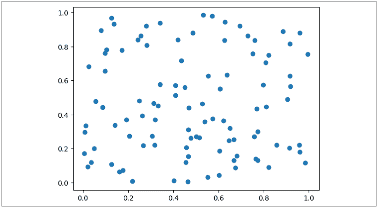

图15-1. 随机生成的二维数据散点图

使用泰森多边形，我们可以创建多个子空间，每个子空间仅包含我们想要搜索的总观测值的一小部分，如图15-2所示。

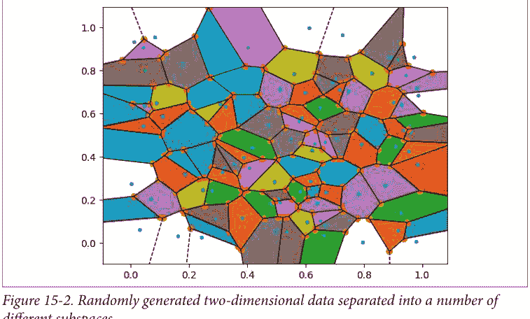

图15-2. 随机生成的二维数据被分隔成多个不同的子空间

Faiss 库中的 `nlist` 参数允许我们定义要创建的簇的数量。另一个参数 `nprobe` 可以在查询时使用，用于定义我们想要搜索的簇的数量，以检索给定观测值的最近邻。同时增加 `nlist` 和 `nprobe` 可以提高邻居的质量，但代价是计算量增大，从而导致 IVF 索引的运行时间更长。减小这些参数中的每一个都会产生相反的效果，你的代码会运行得更快，但有返回较低质量结果的风险。

请注意，这个例子返回的输出与本章第一个食谱完全相同。这是因为我们处理的是非常小的数据，并且只使用了三个簇，这使得我们的 ANN 结果不太可能与 KNN 结果有显著差异。

### 另请参阅

- 用于相似性搜索的最近邻索引（不同的 ANN 索引类型）

## 15.6 评估近似最近邻

### 问题

你想看看你的 ANN 与精确最近邻（KNN）相比如何：

### 解决方案

计算 ANN 的召回率 @k，即与 KNN 相比：

```python
# 加载库
import faiss
import numpy as np
from sklearn import datasets
from sklearn.neighbors import NearestNeighbors
from sklearn.preprocessing import StandardScaler

# 最近邻数量
k = 10

# 加载数据
iris = datasets.load_iris()
features = iris.data

# 创建标准化器
standardizer = StandardScaler()

# 标准化特征
features_standardized = standardizer.fit_transform(features)

# 创建具有10个最近邻的 KNN
nearest_neighbors = NearestNeighbors(n_neighbors=k).fit(features_standardized)

# 设置 faiss 参数
n_features = features_standardized.shape[1]
nlist = 3

# 创建一个 IVF 索引
quantizer = faiss.IndexFlatIP(n_features)
index = faiss.IndexIVFFlat(quantizer, n_features, nlist)

# 训练索引并添加特征向量
index.train(features_standardized)
index.add(features_standardized)
index.nprobe = 1

# 创建一个观测值
new_observation = np.array([[ 1,  1,  1,  1]])

# 找到观测值精确最近邻的距离和索引
knn_distances, knn_indices = nearest_neighbors.kneighbors(new_observation)

# 在索引中搜索最近的2个邻居
ivf_distances, ivf_indices = index.search(new_observation, k)

# 获取集合交集
recalled_items = set(list(knn_indices[0])) & set(list(ivf_indices[0]))

# 打印召回率
print(f"Recall @k={k}: {len(recalled_items)/k * 100}%")
```

Recall @k=10: 100.0%

### 讨论

召回率 @k 最简单的定义是：ANN 在某个 k 个最近邻中返回的项目，同时也出现在精确最近邻的相同 k 个结果中的数量，除以 k。在这个例子中，在10个最近邻时，我们有100%的召回率，这意味着我们的 ANN 在 k=10 时返回的索引与 KNN 相同（尽管顺序不一定相同）。

召回率是评估 ANN 与精确最近邻相比时常用的指标。

### 另请参阅

- Google 关于其 Vertex Matching Engine 服务中 ANN 的说明

# 第16章
逻辑回归

## 16.0 引言

尽管名为回归，*逻辑回归*实际上是一种广泛使用的监督分类技术。逻辑回归（及其扩展，如多项逻辑回归）是一种直接、易于理解的方法，用于预测观测值属于某个类别的概率。在本章中，我们将介绍如何在 scikit-learn 中使用逻辑回归训练各种分类器。

## 16.1 训练二元分类器

### 问题

你需要训练一个简单的分类器模型。

### 解决方案

在 scikit-learn 中使用 LogisticRegression 训练逻辑回归：

```python
# 加载库
from sklearn.linear_model import LogisticRegression
from sklearn import datasets
from sklearn.preprocessing import StandardScaler

# 加载只有两个类别的数据
iris = datasets.load_iris()
features = iris.data[:100,:]
target = iris.target[:100]

# 标准化特征
scaler = StandardScaler()
features_standardized = scaler.fit_transform(features)

# 创建逻辑回归对象
logistic_regression = LogisticRegression(random_state=0)

# 训练模型
model = logistic_regression.fit(features_standardized, target)
```

### 讨论

尽管名称中带有“回归”，逻辑回归实际上是一种广泛使用的二元分类器（即目标向量只能取两个值）。在逻辑回归中，一个线性模型（例如，$\beta_0 + \beta_1x$）被包含在一个逻辑（也称为 sigmoid）函数 $\frac{1}{1 + e^{-z}}$ 中，使得：

$$P(y_i = 1 \mid X) = \frac{1}{1 + e^{-(\beta_0 + \beta_1x)}}$$

其中 $P(y_i = 1 \mid X)$ 是第 $i$ 个观测值的目标值 $y_i$ 为类别1的概率；$X$ 是训练数据；$\beta_0$ 和 $\beta_1$ 是待学习的参数；$e$ 是欧拉数。逻辑函数的作用是将函数输出值约束在0到1之间，从而可以将其解释为概率。如果 $P(y_i = 1 \mid X)$ 大于0.5，则预测为类别1；否则，预测为类别0。

在 scikit-learn 中，我们可以使用 `LogisticRegression` 训练逻辑回归模型。一旦训练完成，我们就可以使用该模型来预测新观测值的类别：

```python
# 创建新观测值
new_observation = [[.5, .5, .5, .5]]

# 预测类别
model.predict(new_observation)
```

array([1])

在这个例子中，我们的观测值被预测为类别1。此外，我们可以看到观测值属于每个类别的概率：

```python
# 查看预测概率
model.predict_proba(new_observation)
```

array([[0.17738424, 0.82261576]])

我们的观测值有17.7%的概率属于类别0，有82.2%的概率属于类别1。

## 16.2 训练多类别分类器

### 问题

给定超过两个类别，你需要训练一个分类器模型。

### 解决方案

在 scikit-learn 中使用 LogisticRegression 训练一个逻辑回归模型，采用一对多（one-vs-rest）或多分类（multinomial）方法：

```python
# 加载库
from sklearn.linear_model import LogisticRegression
from sklearn import datasets
from sklearn.preprocessing import StandardScaler

# 加载数据
iris = datasets.load_iris()
features = iris.data
target = iris.target

# 标准化特征
scaler = StandardScaler()
features_standardized = scaler.fit_transform(features)

# 创建一对多逻辑回归对象
logistic_regression = LogisticRegression(random_state=0, multi_class="ovr")

# 训练模型
model = logistic_regression.fit(features_standardized, target)
```

### 讨论

逻辑回归本身是二元分类器，这意味着它无法处理具有两个以上类别的目标向量。然而，逻辑回归的两个巧妙扩展恰好解决了这个问题。首先，在*一对多*逻辑回归（OvR）中，为每个待预测的类别训练一个单独的模型，判断一个观测值是否属于该类别（从而将其转化为一个二元分类问题）。它假设每个分类问题（例如，类别0或非类别0）是独立的。

或者，在*多分类逻辑回归*（MLR）中，我们在配方16.1中看到的逻辑函数被替换为softmax函数：

$$P(y_i = k \mid X) = \frac{e^{\beta_k x_i}}{\sum_{j=1}^K e^{\beta_j x_i}}$$

其中 $P(y_i = k \mid X)$ 是第 $i$ 个观测值的目标值 $y_i$ 属于类别 $k$ 的概率，$K$ 是类别总数。MLR的一个实际优势是，使用 `predict_proba` 方法得到的预测概率更可靠（即校准得更好）。

使用 `LogisticRegression` 时，我们可以选择这两种技术中的哪一种，OvR（`ovr`）是默认参数。我们可以通过将参数设置为 `multinomial` 来切换到MLR。

## 16.3 通过正则化减少方差

### 问题

你需要减少逻辑回归模型的方差。

### 解决方案

调整正则化强度超参数 C：

```python
# 加载库
from sklearn.linear_model import LogisticRegressionCV
from sklearn import datasets
from sklearn.preprocessing import StandardScaler

# 加载数据
iris = datasets.load_iris()
features = iris.data
target = iris.target

# 标准化特征
scaler = StandardScaler()
features_standardized = scaler.fit_transform(features)

# 创建逻辑回归对象
logistic_regression = LogisticRegressionCV(
    penalty='l2', Cs=10, random_state=0, n_jobs=-1)

# 训练模型
model = logistic_regression.fit(features_standardized, target)
```

### 讨论

*正则化*是一种惩罚复杂模型以减少其方差的方法。具体来说，是在我们试图最小化的损失函数中添加一个惩罚项，通常是L1和L2惩罚。在L1惩罚中：

$$\alpha \sum_{j=1}^{p} |\widehat{\beta}_j|$$

其中 $\widehat{\beta}_j$ 是正在学习的 $p$ 个特征中第 $j$ 个特征的参数，$\alpha$ 是表示正则化强度的超参数。在L2惩罚中：

$$\alpha \sum_{j=1}^{p} \widehat{\beta}_j^2$$

$\alpha$ 的值越高，对较大参数值（即更复杂的模型）的惩罚就越大。scikit-learn 遵循常用方法，使用 $C$ 而不是 $\alpha$，其中 $C$ 是正则化强度的倒数：$C = \frac{1}{\alpha}$。为了在使用逻辑回归时减少方差，我们可以将 $C$ 视为一个需要调整的超参数，以找到能创建最佳模型的 $C$ 值。在 scikit-learn 中，我们可以使用 LogisticRegressionCV 类来高效地调整 $C$。LogisticRegressionCV 的参数 Cs 可以接受一个 $C$ 值的范围进行搜索（如果提供了一个浮点数列表作为参数），或者，如果提供一个整数，则会生成一个包含该数量候选值的列表，这些候选值从 -10,000 到 10,000 的对数尺度中抽取。

不幸的是，LogisticRegressionCV 不允许我们搜索不同的惩罚项。要做到这一点，我们必须使用第12章中讨论的效率较低的模型选择技术。

## 16.4 在超大数据集上训练分类器

### 问题

你需要在一个非常大的数据集上训练一个简单的分类器模型。

### 解决方案

在 scikit-learn 中使用 LogisticRegression 训练一个逻辑回归模型，采用*随机平均梯度*（SAG）求解器：

```python
# 加载库
from sklearn.linear_model import LogisticRegression
from sklearn import datasets
from sklearn.preprocessing import StandardScaler

# 加载数据
iris = datasets.load_iris()
features = iris.data
target = iris.target

# 标准化特征
scaler = StandardScaler()
features_standardized = scaler.fit_transform(features)

# 创建逻辑回归对象
logistic_regression = LogisticRegression(random_state=0, solver="sag")

# 训练模型
model = logistic_regression.fit(features_standardized, target)
```

### 讨论

scikit-learn 的 LogisticRegression 提供了多种训练逻辑回归的技术，称为求解器。大多数时候，scikit-learn 会自动为我们选择最佳求解器，或者警告我们无法使用该求解器执行某些操作。然而，有一个特殊情况我们应该了解。

虽然精确的解释超出了本书的范围（更多信息请参阅本配方“另请参阅”部分中 Mark Schmidt 的幻灯片），但当我们的数据非常大时，随机平均梯度下降允许我们比其他求解器更快地训练模型。然而，它对特征缩放也非常敏感，因此标准化我们的特征尤为重要。我们可以通过设置 solver="sag" 来设置我们的学习算法使用此求解器。

### 另请参阅

- 使用随机平均梯度算法最小化有限和，Mark Schmidt

## 16.5 处理不平衡类别

### 问题

你需要训练一个简单的分类器模型。

### 解决方案

在 scikit-learn 中使用 LogisticRegression 训练一个逻辑回归模型：

```python
# 加载库
import numpy as np
from sklearn.linear_model import LogisticRegression
from sklearn import datasets
from sklearn.preprocessing import StandardScaler

# 加载数据
iris = datasets.load_iris()
features = iris.data
target = iris.target

# 通过移除前40个观测值使类别高度不平衡
features = features[40:,:]
target = target[40:]

# 创建目标向量，指示是否为类别0，否则为1
target = np.where((target == 0), 0, 1)

# 标准化特征
scaler = StandardScaler()
features_standardized = scaler.fit_transform(features)

# 创建逻辑回归对象
logistic_regression = LogisticRegression(random_state=0, class_weight="balanced")

# 训练模型
model = logistic_regression.fit(features_standardized, target)
```

### 讨论

与 scikit-learn 中的许多其他学习算法一样，LogisticRegression 内置了处理不平衡类别的方法。如果我们有高度不平衡的类别，并且在预处理阶段没有处理它，我们可以选择使用 class_weight 参数来对类别进行加权，以确保我们拥有每个类别的平衡混合。具体来说，balanced 参数将自动根据类别的频率进行反比加权：

$$w_j = \frac{n}{kn_j}$$

其中 $w_j$ 是类别 $j$ 的权重，$n$ 是观测值数量，$n_j$ 是类别 $j$ 中的观测值数量，$k$ 是类别总数。

# 第17章
支持向量机

## 17.0 引言

要理解支持向量机，我们必须理解超平面。形式上，*超平面*是 *n* 维空间中的一个 *n* – 1 维子空间。虽然这听起来很复杂，但实际上相当简单。例如，如果我们想划分一个二维空间，我们会使用一个一维超平面（即一条线）。如果我们想划分一个三维空间，我们会使用一个二维超平面（即一张平坦的纸或一张床单）。超平面只是将这个概念推广到 *n* 维。

*支持向量机*通过找到最大化训练数据中类别之间间隔的超平面来对数据进行分类。在一个有两个类别的二维示例中，我们可以将超平面想象成分隔两个类别的最宽的直“带”（即带有间隔的直线）。

在本章中，我们涵盖了在各种情况下训练支持向量机，并深入探讨如何扩展该方法以解决常见问题。

## 17.1 训练线性分类器

### 问题

你需要训练一个模型来对观测值进行分类。

### 解决方案

使用*支持向量分类器*（SVC）来找到最大化类别之间间隔的超平面：

### 讨论

scikit-learn 的 LinearSVC 实现了一个简单的支持向量分类器。为了直观理解 SVC 的工作原理，让我们绘制数据和超平面。虽然 SVC 在高维空间中表现良好，但在我们的解决方案中，我们只加载了两个特征并选取了观测值的子集，使得数据仅包含两个类别。这将使我们能够可视化模型。回顾一下，SVC 试图找到一个超平面——在只有两个维度时就是一条线——使得类别之间的间隔最大化。在下面的代码中，我们在二维空间中绘制两个类别，然后绘制超平面：

```python
# Load library
from matplotlib import pyplot as plt

# Plot data points and color using their class
color = ["black" if c == 0 else "lightgrey" for c in target]
plt.scatter(features_standardized[:,0], features_standardized[:,1], c=color)

# Create the hyperplane
w = svc.coef_[0]
a = -w[0] / w[1]
xx = np.linspace(-2.5, 2.5)
yy = a * xx - (svc.intercept_[0]) / w[1]

# Plot the hyperplane
plt.plot(xx, yy)
plt.axis("off"), plt.show();
```

在这个可视化中，所有类别为 0 的观测值显示为黑色，类别为 1 的观测值显示为浅灰色。超平面是决定新观测值如何分类的决策边界。具体来说，线上方的任何观测值将被分类为类别 0，而线下方的任何观测值将被分类为类别 1。我们可以通过在可视化左上角创建一个新的观测值来证明这一点，这意味着它应该被预测为类别 0：

```python
# Create new observation
new_observation = [[ -2, 3]]

# Predict class of new observation
svc.predict(new_observation)

array([0])
```

关于 SVC 有几点需要注意。首先，为了可视化，我们将示例限制为二元示例（即只有两个类别）；然而，SVC 可以很好地处理多个类别。其次，正如我们的可视化所示，超平面根据定义是线性的（即不是弯曲的）。这在本例中是可以的，因为数据是线性可分的，这意味着存在一个超平面可以完美地分离两个类别。不幸的是，在现实世界中，这种情况很少见。

更典型的情况是，我们无法完美地分离类别。在这些情况下，SVC 需要在最大化超平面间隔和最小化误分类之间取得平衡。在 SVC 中，后者由超参数 C 控制。C 是 SVC 学习器的一个参数，是对误分类数据点的惩罚。当 C 较小时，分类器可以容忍误分类的数据点（高偏差但低方差）。当 C 较大时，分类器会因误分类数据而受到严重惩罚，因此会竭尽全力避免任何误分类的数据点（低偏差但高方差）。

在 scikit-learn 中，C 由参数 C 确定，默认为 C=1.0。我们应该将 C 视为学习算法的超参数，我们将在第 12 章使用模型选择技术对其进行调优。

## 17.2 使用核函数处理线性不可分的类别

### 问题

你需要训练一个支持向量分类器，但你的类别是线性不可分的。

### 解决方案

使用核函数训练支持向量机的扩展，以创建非线性决策边界：

```python
# Load libraries
from sklearn.svm import SVC
from sklearn import datasets
from sklearn.preprocessing import StandardScaler
import numpy as np

# Set randomization seed
np.random.seed(0)

# Generate two features
features = np.random.randn(200, 2)

# Use an XOR gate (you don't need to know what this is) to generate
# linearly inseparable classes
target_xor = np.logical_xor(features[:, 0] > 0, features[:, 1] > 0)
target = np.where(target_xor, 0, 1)

# Create a support vector machine with a radial basis function kernel
svc = SVC(kernel="rbf", random_state=0, gamma=1, C=1)

# Train the classifier
model = svc.fit(features, target)
```

### 讨论

对支持向量机的全面解释超出了本书的范围。然而，一个简短的解释可能有助于理解支持向量机和核函数。出于最好在其他地方学习的原因，支持向量分类器可以表示为：

$$f(x) = \beta_0 + \sum_{i \in S} \alpha_i K(x_i, x_{i'})$$

其中 $\beta_0$ 是偏置，$S$ 是所有支持向量观测值的集合，$\alpha$ 是待学习的模型参数，$(x_i, x_{i'})$ 是两个支持向量观测值 $x_i$ 和 $x_{i'}$ 的配对。最重要的是，$K$ 是一个核函数，用于比较 $x_i$ 和 $x_{i'}$ 之间的相似性。如果你不理解核函数，不用担心。就我们的目的而言，只需意识到 (1) $K$ 决定了用于分离我们类别的超平面类型，以及 (2) 我们通过使用不同的核函数来创建不同的超平面。例如，如果我们想要一个像我们在配方 17.1 中创建的基本线性超平面，我们可以使用线性核：

$$K(x_i, x_{i'}) = \sum_{j=1}^{p} x_{ij}x_{i'j}$$

其中 $p$ 是特征的数量。然而，如果我们想要一个非线性决策边界，我们可以将线性核替换为多项式核：

$$K(x_i, x_{i'}) = \left(r + \gamma \sum_{j=1}^{p} x_{ij}x_{i'j}\right)^d$$

其中 $d$ 是多项式核函数的次数。或者，我们可以使用支持向量机中最常见的核函数之一，即*径向基函数核*：

$$K(x_i, x_{i'}) = e^{-\gamma \sum_{j=1}^{p} (x_{ij}x_{i'j})^2}$$

其中 $\gamma$ 是一个超参数，必须大于零。上述解释的要点是，如果我们有线性不可分的数据，我们可以将线性核替换为其他核函数，以创建非线性的超平面决策边界。

我们可以通过一个简单的例子来直观理解核函数。这个函数基于 Sebastian Raschka 的一个函数，绘制了二维空间中的观测值和决策边界超平面。你不需要理解这个函数是如何工作的；我把它放在这里是为了让你可以自己尝试：

```python
# Plot observations and decision boundary hyperplane
from matplotlib.colors import ListedColormap
import matplotlib.pyplot as plt

def plot_decision_regions(X, y, classifier):
    cmap = ListedColormap(("red", "blue"))
    xx1, xx2 = np.meshgrid(np.arange(-3, 3, 0.02), np.arange(-3, 3, 0.02))
    Z = classifier.predict(np.array([xx1.ravel(), xx2.ravel()]).T)
    Z = Z.reshape(xx1.shape)
    plt.contourf(xx1, xx2, Z, alpha=0.1, cmap=cmap)
    for idx, cl in enumerate(np.unique(y)):
        plt.scatter(x=X[y == cl, 0], y=X[y == cl, 1],
                    alpha=0.8, c=cmap(idx),
                    marker="+", label=cl)
```

在我们的解决方案中，我们有包含两个特征（即两个维度）的数据和一个包含每个观测值类别的目标向量。重要的是，类别的分配使得它们是*线性不可分的*。也就是说，我们无法画出一条直线来分隔这两个类别。首先，让我们创建一个带有线性核的支持向量机分类器：

```python
# Create support vector classifier with a linear kernel
svc_linear = SVC(kernel="linear", random_state=0, C=1)

# Train model
svc_linear.fit(features, target)

SVC(C=1, kernel='linear', random_state=0)
```

接下来，由于我们只有两个特征，我们在二维空间中工作，可以可视化观测值、它们的类别以及我们模型的线性超平面：

```python
# Plot observations and hyperplane
plot_decision_regions(features, target, classifier=svc_linear)
plt.axis("off"), plt.show();
```

正如我们所看到的，我们的线性超平面在分隔两个类别方面表现非常差！现在，让我们将线性核替换为径向基函数核，并用它来训练一个新模型：

```python
# Create a support vector machine with a radial basis function kernel
svc = SVC(kernel="rbf", random_state=0, gamma=1, C=1)
```

## 17.3 创建预测概率

### 问题

你需要知道一个观测值的预测类别概率。

### 解决方案

当使用 scikit-learn 的 SVC 时，设置 `probability=True`，训练模型，然后使用 `predict_proba` 查看校准后的概率：

```python
# 加载库
from sklearn.svm import SVC
from sklearn import datasets
from sklearn.preprocessing import StandardScaler
import numpy as np

# 加载数据
iris = datasets.load_iris()
features = iris.data
target = iris.target

# 标准化特征
scaler = StandardScaler()
features_standardized = scaler.fit_transform(features)

# 创建支持向量分类器对象
svc = SVC(kernel="linear", probability=True, random_state=0)

# 训练分类器
model = svc.fit(features_standardized, target)

# 创建新观测值
new_observation = [[.4, .4, .4, .4]]

# 查看预测概率
model.predict_proba(new_observation)
array([[0.00541761, 0.97348825, 0.02109414]])
```

### 讨论

我们涵盖的许多监督学习算法都使用概率估计来预测类别。例如，在 k 近邻算法中，一个观测值的 k 个邻居的类别被视为投票，以生成该观测值属于该类别的概率。然后预测概率最高的类别。SVC 使用超平面创建决策区域，这本身并不输出观测值属于某个类别的概率估计。然而，实际上我们可以在一些注意事项下输出校准后的类别概率。在具有两个类别的 SVC 中，可以使用 Platt 缩放，其中首先训练 SVC，然后训练一个单独的交叉验证逻辑回归，将 SVC 的输出映射为概率：

$$P(y = 1 \mid x) = \frac{1}{1 + e^{(A \times f(x) + B)}}$$

其中 $A$ 和 $B$ 是参数向量，$f(x)$ 是第 $i$ 个观测值到超平面的带符号距离。当我们有超过两个类别时，使用 Platt 缩放的扩展版本。

更实际地说，创建预测概率有两个主要问题。首先，因为我们使用交叉验证训练第二个模型，生成预测概率会显著增加训练模型所需的时间。其次，因为预测概率是使用交叉验证创建的，它们可能并不总是与预测类别匹配。也就是说，一个观测值可能被预测为类别 1，但其属于类别 1 的预测概率却小于 0.5。

在 scikit-learn 中，预测概率必须在模型训练时生成。我们可以通过将 SVC 的 `probability` 设置为 `True` 来实现这一点。模型训练完成后，我们可以使用 `predict_proba` 输出每个类别的估计概率。

## 17.4 识别支持向量

### 问题

你需要识别哪些观测值是决策超平面的支持向量。

### 解决方案

训练模型，然后使用 `support_vectors_`：

```python
# 加载库
from sklearn.svm import SVC
from sklearn import datasets
from sklearn.preprocessing import StandardScaler
import numpy as np

# 加载仅包含两个类别的数据
iris = datasets.load_iris()
features = iris.data[:100,:]
target = iris.target[:100]

# 标准化特征
scaler = StandardScaler()
features_standardized = scaler.fit_transform(features)

# 创建支持向量分类器对象
svc = SVC(kernel="linear", random_state=0)

# 训练分类器
model = svc.fit(features_standardized, target)

# 查看支持向量
model.support_vectors_

array([[-0.5810659 ,  0.42196824, -0.80497402, -0.50860702],
       [-1.52079513, -1.67737625, -1.08231219, -0.86427627],
       [-0.89430898, -1.4674418 ,  0.30437864,  0.38056609],
       [-0.5810659 , -1.25750735,  0.09637501,  0.55840072]])
```

### 讨论

支持向量机得名于超平面是由相对较少的观测值（称为*支持向量*）决定的。直观地，可以认为超平面是由这些支持向量“承载”的。因此，这些支持向量对我们的模型非常重要。例如，如果我们从数据中移除一个不是支持向量的观测值，模型不会改变；但是，如果我们移除一个支持向量，超平面将不再具有最大间隔。

训练完 SVC 后，scikit-learn 提供了多种识别支持向量的选项。在我们的解决方案中，我们使用了 `support_vectors_` 来输出模型中四个支持向量的实际观测值特征。或者，我们可以使用 `support_` 查看支持向量的索引：

```python
model.support_

array([23, 41, 57, 98], dtype=int32)
```

最后，我们可以使用 `n_support_` 来找出属于每个类别的支持向量数量：

```python
model.n_support_

array([2, 2], dtype=int32)
```

## 17.5 处理不平衡类别

### 问题

你需要在类别不平衡的情况下训练支持向量机分类器。

### 解决方案

使用 `class_weight` 增加对较小类别误分类的惩罚：

```python
# 加载库
from sklearn.svm import SVC
from sklearn import datasets
from sklearn.preprocessing import StandardScaler
import numpy as np

# 加载仅包含两个类别的数据
iris = datasets.load_iris()
features = iris.data[:100,:]
target = iris.target[:100]

# 通过移除前40个观测值使类别高度不平衡
features = features[40:,:]
target = target[40:]

# 创建目标向量，指示是否为类别0，否则为1
target = np.where((target == 0), 0, 1)

# 标准化特征
scaler = StandardScaler()
features_standardized = scaler.fit_transform(features)

# 创建支持向量分类器
svc = SVC(kernel="linear", class_weight="balanced", C=1.0, random_state=0)

# 训练分类器
model = svc.fit(features_standardized, target)
```

### 讨论

在支持向量机中，$C$ 是一个超参数，它决定了对误分类观测值的惩罚。在支持向量机中处理不平衡类别的一个方法是按类别对 $C$ 进行加权，使得：

$$C_k = C \times w_j$$

其中 $C$ 是误分类的惩罚，$w_j$ 是与类别 $j$ 的频率成反比的权重，$C_k$ 是类别 $k$ 的 $C$ 值。其基本思想是增加对少数类别误分类的惩罚，以防止它们被多数类别“淹没”。

在 scikit-learn 中，使用 SVC 时，我们可以通过设置 `class_weight="balanced"` 来自动设置 $C_k$ 的值。`balanced` 参数会自动对类别进行加权，使得：

$$w_j = \frac{n}{k n_j}$$

其中 $w_j$ 是类别 $j$ 的权重，$n$ 是观测值总数，$n_j$ 是类别 $j$ 中的观测值数量，$k$ 是类别总数。

# 第 18 章
## 朴素贝叶斯

## 18.0 引言

贝叶斯定理是理解某个事件概率 $P(A \mid B)$ 的首要方法，它基于一些新信息 $P(B \mid A)$ 和对该事件概率的先验信念 $P(A)$：

$$P(A \mid B) = \frac{P(B \mid A) P(A)}{P(B)}$$

在过去十年中，贝叶斯方法的受欢迎程度急剧上升，在学术界、政府和商业领域日益与传统的频率派应用相匹敌。在机器学习中，贝叶斯定理在分类中的一个应用形式是朴素贝叶斯分类器。朴素贝叶斯分类器将许多在实际机器学习中理想的特性结合到一个单一的分类器中。这些特性包括：

- 直观的方法
- 能够处理小数据集
- 训练和预测的计算成本低
- 在各种情况下通常能获得可靠的结果

具体来说，朴素贝叶斯分类器基于：

$$P(y \mid x_1, \ldots, x_j) = \frac{P(x_1, \ldots, x_j \mid y) P(y)}{P(x_1, \ldots, x_j)}$$其中：

- $P(y \mid x_1, \dots, x_j)$ 称为*后验概率*，表示在给定观测值的 $j$ 个特征 $x_1, \dots, x_j$ 的情况下，该观测属于类别 $y$ 的概率。
- $P(x_1, \dots, x_j \mid y)$ 称为*似然*，表示在给定类别 $y$ 的情况下，观测值的特征 $x_1, \dots, x_j$ 的似然性。
- $P(y)$ 称为*先验概率*，表示在查看数据之前，我们对类别 $y$ 概率的信念。
- $P(x_1, \dots, x_j)$ 称为*边缘概率*。

在朴素贝叶斯中，我们比较每个可能类别的后验概率值。具体来说，由于边缘概率在这些比较中是常数，我们比较每个类别后验概率的分子。对于每个观测，具有最大后验概率分子的类别成为预测类别 $\hat{y}$。

关于朴素贝叶斯分类器，有两点需要注意。首先，对于数据中的每个特征，我们必须假设似然 $P(x_j \mid y)$ 的统计分布。常见的分布有正态（高斯）分布、多项式分布和伯努利分布。选择的分布通常由特征的性质（连续型、二元型等）决定。其次，朴素贝叶斯之所以得名，是因为我们假设每个特征及其产生的似然是独立的。这个“朴素”的假设经常是错误的，但在实践中，它很少妨碍构建高质量的分类器。

在本章中，我们将介绍如何使用 scikit-learn 通过三种不同的似然分布来训练三种类型的朴素贝叶斯分类器。之后，我们将学习如何校准朴素贝叶斯模型的预测结果，使其具有可解释性。

## 18.1 为连续特征训练分类器

### 问题

你只有连续特征，并且想要训练一个朴素贝叶斯分类器。

### 解决方案

在 scikit-learn 中使用高斯朴素贝叶斯分类器：

```python
# 加载库
from sklearn import datasets
from sklearn.naive_bayes import GaussianNB

# 加载数据
iris = datasets.load_iris()
features = iris.data
target = iris.target

# 创建高斯朴素贝叶斯对象
classifer = GaussianNB()

# 训练模型
model = classifer.fit(features, target)
```

### 讨论

最常见的朴素贝叶斯分类器类型是*高斯朴素贝叶斯*。在高斯朴素贝叶斯中，我们假设给定观测属于类别 $y$ 时，特征值 $x$ 的似然服从正态分布：

$$p(x_j \mid y) = \frac{1}{\sqrt{2\pi\sigma_{y}^2}} e^{-\frac{(x_j - \mu_y)^2}{2\sigma_{y}^2}}$$

其中 $\sigma_{y}^2$ 和 $\mu_y$ 是类别 $y$ 的特征 $x_j$ 的方差和均值。由于正态分布的假设，高斯朴素贝叶斯最适合用于所有特征都是连续的情况。

在 scikit-learn 中，我们像训练任何其他模型一样使用 `fit` 来训练高斯朴素贝叶斯，然后可以预测观测的类别：

```python
# 创建新观测
new_observation = [[ 4,  4,  4,  0.4]]

# 预测类别
model.predict(new_observation)

array([1])
```

朴素贝叶斯分类器的一个有趣方面是，它们允许我们为目标类别分配先验信念。我们可以使用 `GaussianNB` 的 `priors` 参数来实现这一点，该参数接受一个列表，其中包含分配给目标向量每个类别的概率：

```python
# 创建具有每个类别先验概率的高斯朴素贝叶斯对象
clf = GaussianNB(priors=[0.25, 0.25, 0.5])

# 训练模型
model = classifer.fit(features, target)
```

如果我们没有向 `priors` 参数添加任何参数，则先验概率会根据数据进行调整。

最后，请注意，高斯朴素贝叶斯的原始预测概率（使用 `predict_proba` 输出）未经校准。也就是说，它们不应被直接采信。如果我们想创建有用的预测概率，我们需要使用等渗回归或相关方法对其进行校验。

### 另请参阅

- 朴素贝叶斯分类器在机器学习中如何工作

## 18.2 为离散和计数特征训练分类器

### 问题

给定离散或计数数据，你需要训练一个朴素贝叶斯分类器。

### 解决方案

使用多项式朴素贝叶斯分类器：

```python
# 加载库
import numpy as np
from sklearn.naive_bayes import MultinomialNB
from sklearn.feature_extraction.text import CountVectorizer

# 创建文本
text_data = np.array(['I love Brazil. Brazil!',
                      'Brazil is best',
                      'Germany beats both'])

# 创建词袋
count = CountVectorizer()
bag_of_words = count.fit_transform(text_data)

# 创建特征矩阵
features = bag_of_words.toarray()

# 创建目标向量
target = np.array([0,0,1])

# 创建具有每个类别先验概率的多项式朴素贝叶斯对象
classifer = MultinomialNB(class_prior=[0.25, 0.5])

# 训练模型
model = classifer.fit(features, target)
```

### 讨论

多项式朴素贝叶斯的工作原理与高斯朴素贝叶斯类似，但假设特征服从多项式分布。在实践中，这意味着当我们有离散数据（例如，1到5的电影评分）时，通常使用此分类器。多项式朴素贝叶斯最常见的用途之一是使用词袋或 *tf-idf* 方法进行文本分类（参见配方 6.9 和 6.10）。

在我们的解决方案中，我们创建了一个包含三个观测的玩具文本数据集，并将文本字符串转换为词袋特征矩阵和相应的目标向量。然后我们使用 `MultinomialNB` 训练模型，同时定义了两个类别（亲巴西和亲德国）的先验概率。

`MultinomialNB` 的工作原理与 `GaussianNB` 类似；模型使用 `fit` 训练，观测可以使用 `predict` 进行预测：

```python
# 创建新观测
new_observation = [[0, 0, 0, 1, 0, 1, 0]]

# 预测新观测的类别
model.predict(new_observation)

array([0])
```

如果未指定 `class_prior`，则先验概率通过数据学习。但是，如果我们希望使用均匀分布作为先验，可以设置 `fit_prior=False`。

最后，`MultinomialNB` 包含一个需要调整的加性平滑超参数 `alpha`。默认值为 1.0，其中 0.0 表示不进行平滑处理。

## 18.3 为二元特征训练朴素贝叶斯分类器

### 问题

你有二元特征数据，需要训练一个朴素贝叶斯分类器。

### 解决方案

使用伯努利朴素贝叶斯分类器：

```python
# 加载库
import numpy as np
from sklearn.naive_bayes import BernoulliNB

# 创建三个二元特征
features = np.random.randint(2, size=(100, 3))

# 创建一个二元目标向量
target = np.random.randint(2, size=(100, 1)).ravel()

# 创建具有每个类别先验概率的伯努利朴素贝叶斯对象
classifer = BernoulliNB(class_prior=[0.25, 0.5])

# 训练模型
model = classifer.fit(features, target)
```

### 讨论

*伯努利朴素贝叶斯*分类器假设我们所有的特征都是二元的，即它们只取两个值（例如，已经进行独热编码的名义分类特征）。与其多项式近亲一样，伯努利朴素贝叶斯通常用于文本分类，此时我们的特征矩阵仅仅是文档中单词的出现与否。此外，与 `MultinomialNB` 一样，`BernoulliNB` 有一个加性平滑超参数 `alpha`，我们希望使用模型选择技术对其进行调整。最后，如果我们想使用先验概率，可以使用 `class_prior` 参数，其中包含一个列表，列出每个类别的先验概率。如果我们想指定均匀先验，可以设置 `fit_prior=False`：

```python
model_uniform_prior = BernoulliNB(class_prior=None, fit_prior=False)
```

## 18.4 校准预测概率

### 问题

你想校准朴素贝叶斯分类器的预测概率，使其具有可解释性。

### 解决方案

使用 `CalibratedClassifierCV`：

```python
# 加载库
from sklearn import datasets
from sklearn.naive_bayes import GaussianNB
from sklearn.calibration import CalibratedClassifierCV

# 加载数据
iris = datasets.load_iris()
features = iris.data
target = iris.target

# 创建高斯朴素贝叶斯对象
classifer = GaussianNB()

# 创建带有 sigmoid 校准的校准交叉验证
```

### 讨论

类别概率是机器学习模型中一个常见且有用的部分。在 scikit-learn 中，大多数学习算法允许我们使用 `predict_proba` 查看预测的类别归属概率。例如，如果我们只想在模型预测某个类别概率超过 90% 时才预测该类别，这将非常有用。然而，一些模型，包括朴素贝叶斯分类器，输出的概率并非基于现实世界。也就是说，`predict_proba` 可能预测某个观测值有 0.70 的概率属于某个类别，而实际情况是 0.10 或 0.99。具体到朴素贝叶斯，虽然不同目标类别的预测概率排序是有效的，但原始预测概率往往取接近 0 和 1 的极端值。

为了获得有意义的预测概率，我们需要进行所谓的*校准*。在 scikit-learn 中，我们可以使用 `CalibratedClassifierCV` 类，通过 k 折交叉验证来创建校准良好的预测概率。在 `CalibratedClassifierCV` 中，训练集用于训练模型，测试集用于校准预测概率。返回的预测概率是 k 折的平均值。

通过我们的解决方案，我们可以看到原始预测概率和校准良好的预测概率之间的差异。在我们的解决方案中，我们创建了一个高斯朴素贝叶斯分类器。如果我们训练该分类器，然后预测新观测值的类别概率，我们会看到非常极端的概率估计值：

```python
# 训练高斯朴素贝叶斯然后预测类别概率
classifer.fit(features, target).predict_proba(new_observation)
array([[2.31548432e-04, 9.99768128e-01, 3.23532277e-07]])
```

然而，如果我们校准预测概率（我们在解决方案中已经完成），我们会得到非常不同的结果：

```python
# 查看校准后的概率
array([[0.31859969, 0.63663466, 0.04476565]])
```

`CalibratedClassifierCV` 提供两种校准方法——Platt 的 sigmoid 模型和保序回归——由 `method` 参数定义。虽然我们没有篇幅深入细节，但由于保序回归是非参数方法，当样本量非常小（例如，100 个观测值）时，它往往容易过拟合。在我们的解决方案中，我们使用了包含 150 个观测值的鸢尾花数据集，因此使用了 Platt 的 sigmoid 模型。

# 第 19 章
## 聚类

## 19.0 引言

在本书的大部分内容中，我们探讨了监督机器学习——即我们可以同时访问特征和目标。不幸的是，情况并非总是如此。我们经常遇到只知道特征的情况。例如，假设我们有杂货店的销售记录，我们想根据购物者是否是折扣俱乐部会员来划分销售情况。使用监督学习是不可能做到这一点的，因为我们没有目标来训练和评估我们的模型。然而，还有另一种选择：无监督学习。如果折扣俱乐部会员和非会员在杂货店的行为确实不同，那么两个会员之间的平均行为差异将小于会员和非会员购物者之间的平均行为差异。换句话说，将会有两个观测值的聚类。

聚类算法的目标是识别这些潜在的观测值分组，如果做得好，即使没有目标向量，我们也能预测观测值的类别。有许多聚类算法，它们在识别数据中的聚类方面有各种各样的方法。在本章中，我们将介绍使用 scikit-learn 的一系列聚类算法以及如何在实践中使用它们。

## 19.1 使用 K-Means 进行聚类

### 问题

你想将观测值分成 *k* 组。

### 解决方案

使用 *k*-means 聚类：

```python
# 加载库
from sklearn import datasets
from sklearn.preprocessing import StandardScaler
from sklearn.cluster import KMeans

# 加载数据
iris = datasets.load_iris()
features = iris.data

# 标准化特征
scaler = StandardScaler()
features_std = scaler.fit_transform(features)

# 创建 k-means 对象
cluster = KMeans(n_clusters=3, random_state=0, n_init="auto")

# 训练模型
model = cluster.fit(features_std)
```

### 讨论

K-means 聚类是最常见的聚类技术之一。在 k-means 聚类中，算法试图将观测值分成 *k* 组，每组具有大致相等的方差。组数 *k* 由用户作为超参数指定。具体来说，在 k-means 中：

1.  *k* 个聚类“中心”点被随机创建。
2.  对于每个观测值：
    a. 计算每个观测值与 *k* 个中心点之间的距离。
    b. 将该观测值分配给最近中心点的聚类。
3.  将中心点移动到其各自聚类的均值（即中心）。
4.  重复步骤 2 和 3，直到没有观测值改变其聚类归属。

此时算法被认为已收敛并停止。

关于 k-means，有三点需要注意。首先，k-means 聚类假设聚类是凸形的（例如，圆形、球形）。其次，所有特征具有相同的尺度。在我们的解决方案中，我们标准化了特征以满足这一假设。第三，各组是平衡的（即具有大致相同数量的观测值）。如果我们怀疑无法满足这些假设，我们可能会尝试其他聚类方法。

在 scikit-learn 中，k-means 聚类在 `KMeans` 类中实现。最重要的参数是 `n_clusters`，它设置聚类数 k。在某些情况下，数据的性质将决定 k 的值（例如，关于学校学生的数据将有一个年级一个聚类），但通常我们不知道聚类的数量。在这些情况下，我们将希望根据某些标准选择 k。例如，轮廓系数（参见配方 11.9）衡量聚类内部的相似性与聚类之间的相似性。此外，由于 k-means 聚类计算成本高昂，我们可能希望利用计算机上的所有核心。我们可以通过设置 `n_jobs=-1` 来实现这一点。

在我们的解决方案中，我们稍微取巧了，使用了我们知道包含三个类别的鸢尾花数据。因此，我们设置 k = 3。我们可以使用 `labels_` 查看每个观测值的预测类别：

```python
# 查看预测类别
model.labels_

array([0, 0, 0, 0, 0, 0, 0, 0, 0, 0, 0, 0, 0, 0, 0, 0, 0, 0, 0, 0,
       0, 0, 0, 0, 0, 0, 0, 0, 0, 0, 0, 0, 0, 0, 0, 0, 0, 0, 0, 0,
       0, 0, 0, 0, 0, 0, 0, 0, 0, 0, 0, 0, 0, 0, 0, 0, 0, 0, 0, 0,
       0, 0, 0, 0, 0, 0, 2, 2, 2, 1, 1, 1, 2, 1, 1, 1, 1, 1, 1, 1,
       1, 1, 1, 1, 2, 1, 1, 1, 1, 2, 2, 1, 1, 1, 1, 1, 1, 1, 1, 2,
       1, 1, 1, 1, 1, 1, 1, 1, 1, 1, 1, 1, 1, 2, 2, 2, 2, 1, 2, 1,
       2, 1, 2, 1, 1, 2, 2, 2, 2, 1, 2, 1, 2, 1, 2, 2, 2, 1, 2, 2,
       2, 1, 1, 2, 2, 2, 1, 2, 2, 2, 1, 2, 2, 2, 1, 2, 2, 2, 1], dtype=int32)
```

如果我们将其与观测值的真实类别进行比较，我们可以看到，尽管类别标签不同（即 0、1 和 2），k-means 的表现相当不错：

```python
# 查看真实类别
iris.target

array([0, 0, 0, 0, 0, 0, 0, 0, 0, 0, 0, 0, 0, 0, 0, 0, 0, 0, 0, 0,
       0, 0, 0, 0, 0, 0, 0, 0, 0, 0, 0, 0, 0, 0, 0, 0, 0, 0, 0, 0,
       0, 0, 0, 0, 0, 0, 0, 0, 0, 0, 0, 0, 0, 0, 0, 0, 0, 0, 0, 0,
       0, 0, 0, 0, 0, 0, 1, 1, 1, 1, 1, 1, 1, 1, 1, 1, 1, 1, 1, 1,
       1, 1, 1, 1, 1, 1, 1, 1, 1, 1, 1, 1, 1, 1, 1, 1, 1, 1, 1, 1,
       1, 1, 1, 1, 1, 1, 1, 1, 1, 1, 1, 1, 1, 1, 1, 1, 1, 1, 1, 1,
       1, 1, 1, 1, 1, 1, 2, 2, 2, 2, 2, 2, 2, 2, 2, 2, 2, 2, 2, 2,
       2, 2, 2, 2, 2, 2, 2, 2, 2, 2, 2, 2, 2, 2, 2, 2, 2, 2, 2, 2,
       2, 2, 2, 2, 2, 2, 2, 2, 2, 2, 2, 2, 2, 2, 2, 2, 2, 2, 2, 2,
       2, 2, 2, 2, 2, 2, 2, 2, 2, 2, 2, 2, 2, 2, 2, 2, 2, 2, 2, 2])
```

然而，正如你可能想象的那样，如果我们选择了错误的聚类数量，k-means 的性能会显著下降，甚至严重下降。

最后，与其他 scikit-learn 模型一样，我们可以使用训练好的聚类器来预测新观测值的值：

```python
# 创建新观测值
new_observation = [[0.8, 0.8, 0.8, 0.8]]

# 预测观测值的聚类
model.predict(new_observation)

array([2], dtype=int32)
```

观测值将被预测分配给其中心点最近的聚类。我们甚至可以使用 `cluster_centers_` 来查看这些中心点：

```
# 查看聚类中心
model.cluster_centers_

array([[-1.01457897,  0.85326268, -1.30498732, -1.25489349],
       [-0.01139555, -0.87600831,  0.37707573,  0.31115341],
       [ 1.16743407,  0.14530299,  1.00302557,  1.0300019 ]])
```

### 另请参阅

- [K-means 聚类简介](Introduction to K-means Clustering)

## 19.2 加速 K-Means 聚类

### 问题

你想将观测值分组为 *k* 个组，但 K-means 算法耗时过长。

### 解决方案

使用小批量 K-means：

```
# 加载库
from sklearn import datasets
from sklearn.preprocessing import StandardScaler
from sklearn.cluster import MiniBatchKMeans

# 加载数据
iris = datasets.load_iris()
features = iris.data

# 标准化特征
scaler = StandardScaler()
features_std = scaler.fit_transform(features)

# 创建 K-mean 对象
cluster = MiniBatchKMeans(n_clusters=3, random_state=0, batch_size=100,
        n_init="auto")

# 训练模型
model = cluster.fit(features_std)
```

### 讨论

*小批量 K-means* 的工作原理与 [配方 19.1](Recipe 19.1) 中讨论的 K-means 算法类似。简而言之，区别在于小批量 K-means 中计算成本最高的步骤仅在观测值的随机样本上进行，而非所有观测值。这种方法可以显著减少算法找到收敛（即拟合数据）所需的时间，而质量损失很小。

MiniBatchKMeans 的工作方式与 KMeans 类似，但有一个显著区别：`batch_size` 参数。`batch_size` 控制每个批次中随机选择的观测值数量。批次大小越大，训练过程的计算成本就越高。

## 19.3 使用均值漂移进行聚类

### 问题

你想在不假设聚类数量或其形状的情况下对观测值进行分组。

### 解决方案

使用均值漂移聚类：

```
# 加载库
from sklearn import datasets
from sklearn.preprocessing import StandardScaler
from sklearn.cluster import MeanShift

# 加载数据
iris = datasets.load_iris()
features = iris.data

# 标准化特征
scaler = StandardScaler()
features_std = scaler.fit_transform(features)

# 创建均值漂移对象
cluster = MeanShift(n_jobs=-1)

# 训练模型
model = cluster.fit(features_std)
```

### 讨论

我们之前讨论的 K-means 聚类的缺点之一是，我们需要在训练前设置聚类数量 k，并且该方法对聚类的形状做出了假设。一种没有这些限制的聚类算法是均值漂移。

均值漂移是一个简单的概念，但解释起来有些困难。因此，一个类比可能是最好的方法。想象一个非常雾蒙蒙的足球场（即二维特征空间），上面站着 100 个人（即我们的观测值）。因为有雾，一个人只能看到很短的距离。每分钟，每个人都会环顾四周，并朝着他们能看到的人最多的方向迈出一步。随着时间的推移，人们开始聚集在一起，因为他们不断朝着越来越大的人群迈步。最终结果是人们在球场周围形成聚类。人们被分配到他们最终所在的聚类中。

scikit-learn 对均值漂移的实际实现 `MeanShift` 更复杂，但遵循相同的基本逻辑。`MeanShift` 有两个我们需要了解的重要参数。首先，`bandwidth` 设置观测值用于确定漂移方向的区域（即核）的半径。在我们的类比中，带宽是人能透过雾看到的距离。我们可以手动设置此参数，但默认情况下会自动估计一个合理的带宽（计算成本显著增加）。其次，有时在均值漂移中，某个观测值的核内没有其他观测值。也就是说，我们足球场上的一个人看不到任何其他人。默认情况下，`MeanShift` 将所有这些“孤立”观测值分配给最近观测值的核。但是，如果我们想排除这些孤立点，可以设置 `cluster_all=False`，此时孤立观测值将被赋予标签 -1。

### 另请参阅

- 均值漂移聚类算法，EFAVDB

## 19.4 使用 DBSCAN 进行聚类

### 问题

你想将观测值分组为高密度的聚类。

### 解决方案

使用 DBSCAN 聚类：

```
# 加载库
from sklearn import datasets
from sklearn.preprocessing import StandardScaler
from sklearn.cluster import DBSCAN

# 加载数据
iris = datasets.load_iris()
features = iris.data

# 标准化特征
scaler = StandardScaler()
features_std = scaler.fit_transform(features)

# 创建 DBSCAN 对象
cluster = DBSCAN(n_jobs=-1)

# 训练模型
model = cluster.fit(features_std)
```

### 讨论

DBSCAN 的动机是聚类将是许多观测值密集堆积在一起的区域，并且不对聚类形状做任何假设。具体来说，在 DBSCAN 中：

1.  随机选择一个观测值 $x_i$。
2.  如果 $x_i$ 有最少数量的近邻，我们认为它是聚类的一部分。
3.  对 $x_i$ 的所有邻居递归地重复步骤 2，然后是邻居的邻居，依此类推。这些是聚类的核心观测值。
4.  一旦步骤 3 找不到附近的观测值，就选择一个新的随机点（即从步骤 1 重新开始）。

一旦完成，我们就得到了若干聚类的核心观测值集。最后，任何靠近聚类但不是核心样本的观测值被认为是聚类的一部分，而任何不靠近聚类的观测值被标记为异常值。

DBSCAN 有三个主要参数需要设置：

**eps**
另一个观测值被视为其邻居的最大距离。

**min_samples**
一个观测值被视为核心观测值所需的小于 eps 距离的最小观测值数量。

**metric**
eps 使用的距离度量——例如，minkowski 或 euclidean（注意，如果使用闵可夫斯基距离，可以使用参数 p 来设置闵可夫斯基度量的幂）。

如果我们查看训练数据中的聚类，可以看到已识别出两个聚类，0 和 1，而异常观测值被标记为 -1：

```
# 显示聚类成员关系
model.labels_

array([ 0,  0,  0,  0,  0,  0,  0,  0,  0,  0,  0,  0,  0, -1, -1,  0,
       0,  0,  0,  0,  0,  0,  0,  0,  0,  0,  0,  0,  0,  0, -1, -1,
       0,  0,  0,  0,  0,  0,  0,  0, -1,  0,  0,  0,  0,  0,  0,  0,  1,
       1,  1,  1,  1, -1, -1,  1, -1, -1,  1, -1,  1,  1,  1,  1,  1,
      -1,  1,  1,  1, -1,  1,  1,  1,  1,  1,  1,  1,  1,  1,  1,  1,
      -1,  1, -1,  1,  1,  1,  1, -1,  1,  1,  1, -1,  1, -1,  1,  1,
       1,  1,  1, -1, -1, -1, -1, -1,  1,  1,  1,  1, -1,  1,  1, -1, -1,
      -1,  1,  1, -1,  1,  1, -1,  1,  1,  1, -1, -1, -1,  1,  1,  1, -1,
      -1,  1,  1,  1,  1,  1,  1,  1,  1,  1,  1,  1, -1,  1])
```

### 另请参阅

- DBSCAN，维基百科

## 19.5 使用层次合并进行聚类

### 问题

你想使用聚类层次结构对观测值进行分组。

### 解决方案

使用凝聚聚类：

```
# 加载库
from sklearn import datasets
from sklearn.preprocessing import StandardScaler
from sklearn.cluster import AgglomerativeClustering

# 加载数据
iris = datasets.load_iris()
features = iris.data

# 标准化特征
scaler = StandardScaler()
features_std = scaler.fit_transform(features)

# 创建凝聚聚类对象
cluster = AgglomerativeClustering(n_clusters=3)

# 训练模型
model = cluster.fit(features_std)
```

### 讨论

凝聚聚类是一种强大、灵活的层次聚类算法。在凝聚聚类中，所有观测值最初都作为自己的聚类。接下来，满足某些条件的聚类被合并。这个过程重复进行，聚类不断增长，直到达到某个终点。在 scikit-learn 中，`AgglomerativeClustering` 使用 `linkage` 参数来确定合并策略，以最小化：

- 合并聚类的方差 (`ward`)
- 来自聚类对的观测值之间的平均距离 (`average`)
- 来自聚类对的观测值之间的最大距离 (`complete`)

另外两个参数也值得了解。首先，`affinity` 参数确定用于 `linkage` 的距离度量（`minkowski`、`euclidean` 等）。其次，`n_clusters` 设置聚类算法将尝试找到的聚类数量。也就是说，聚类被连续合并，直到只剩下 `n_clusters` 个。

与我们涵盖的其他聚类算法一样，我们可以使用 `labels_` 查看每个观测值被分配到的聚类：

```
# 显示聚类成员关系
model.labels_

array([1, 1, 1, 1, 1, 1, 1, 1, 1, 1, 1, 1, 1, 1, 1, 1, 1, 1, 1, 1,
       1, 1, 1, 1, 1, 1, 1, 1, 1, 1, 1, 1, 1, 1, 1, 1, 1, 1, 2, 1, 1,
       1, 1, 1, 1, 1, 1, 0, 0, 0, 2, 0, 2, 0, 2, 0, 2, 2, 0, 2, 0, 2, 0,
       2, 2, 2, 2, 0, 0, 0, 0, 0, 0, 0, 0, 2, 2, 2, 2, 0, 2, 0, 0, 2,
       2, 2, 2, 0, 2, 2, 2, 2, 2, 2, 2, 0, 0, 0, 0, 0, 0, 2, 0, 0, 0,
       0, 0, 0, 0, 0, 0, 0, 0, 2, 0, 0, 0, 0, 0, 0, 0, 0, 0, 0, 0, 0,
       0, 0, 0, 0, 0, 0, 0, 0, 0, 0, 0, 0, 0, 0, 0, 0, 0, 0, 0, 0])
```

# 第20章
使用PyTorch处理张量

## 20.0 引言

正如NumPy是机器学习技术栈中数据处理的基础工具，PyTorch则是深度学习技术栈中处理张量的基础工具。在深入学习深度学习本身之前，我们应当先熟悉PyTorch张量，并创建许多与第1章中使用NumPy执行的操作类似的运算。

尽管PyTorch只是众多深度学习库之一，但它在学术界和工业界都极受欢迎。PyTorch张量与NumPy数组*非常*相似。然而，它们也允许我们在GPU（专用于深度学习的硬件）上执行张量运算。在本章中，我们将熟悉PyTorch张量的基础知识以及许多常见的底层操作。

## 20.1 创建张量

### 问题

你需要创建一个张量。

### 解决方案

使用PyTorch创建张量：

```python
# 加载库
import torch

# 创建一个行向量
tensor_row = torch.tensor([1, 2, 3])
```

```python
# 创建一个列向量
tensor_column = torch.tensor(
    [
        [1],
        [2],
        [3]
    ]
)
```

### 讨论

PyTorch中的主要数据结构是张量，在许多方面，张量与第1章中使用的多维NumPy数组完全一样。就像向量和数组一样，这些张量可以水平（即行）或垂直（即列）表示。

### 另请参阅

- PyTorch文档：张量

## 20.2 从NumPy创建张量

### 问题

你需要从NumPy数组创建PyTorch张量。

### 解决方案

使用PyTorch的`from_numpy`函数：

```python
# 导入库
import numpy as np
import torch

# 创建一个NumPy数组
vector_row = np.array([1, 2, 3])

# 从NumPy数组创建张量
tensor_row = torch.from_numpy(vector_row)
```

### 讨论

我们可以看到，PyTorch在语法上与NumPy非常相似。此外，它还轻松地允许我们将NumPy数组转换为可以在GPU和其他加速硬件上使用的PyTorch张量。在撰写本文时，NumPy在PyTorch文档中被频繁提及，PyTorch本身甚至提供了一种方式，使PyTorch张量和NumPy数组可以共享相同的内存以减少开销。

### 另请参阅

- PyTorch文档：与NumPy的桥接

## 20.3 创建稀疏张量

### 问题

给定一个非零值非常少的数据，你希望用张量高效地表示它。

### 解决方案

使用PyTorch的`to_sparse`函数：

```python
# 导入库
import torch

# 创建一个张量
tensor = torch.tensor(
[
[0, 0],
[0, 1],
[3, 0]
]
)

# 从常规张量创建稀疏张量
sparse_tensor = tensor.to_sparse()
```

### 讨论

稀疏张量是表示主要由0组成的数据的内存高效方式。在第1章中，我们使用scipy创建了一个压缩稀疏行（CSR）矩阵，它不再是NumPy数组。

`torch.Tensor`类允许我们使用相同的对象创建常规矩阵和稀疏矩阵。如果我们检查刚刚创建的两个张量的类型，我们可以看到它们实际上属于同一个类：

```python
print(type(tensor))
print(type(sparse_tensor))

<class 'torch.Tensor'>
<class 'torch.Tensor'>
```

### 另请参阅

- PyTorch文档：稀疏张量

## 20.4 选择张量中的元素

### 问题

我们需要选择张量中的特定元素。

### 解决方案

使用类似NumPy的索引和切片来返回元素：

```python
# 加载库
import torch

# 创建向量张量
vector = torch.tensor([1, 2, 3, 4, 5, 6])

# 创建矩阵张量
matrix = torch.tensor(
    [
        [1, 2, 3],
        [4, 5, 6],
        [7, 8, 9]
    ]
)

# 选择向量的第三个元素
vector[2]

tensor(3)

# 选择第二行，第二列
matrix[1,1]

tensor(5)
```

### 讨论

与NumPy数组和Python中的大多数事物一样，PyTorch张量是零索引的。索引和切片都受支持。一个关键区别是，索引PyTorch张量以返回单个元素仍然返回一个张量，而不是对象本身的值（该值将是整数或浮点数的形式）。切片语法也与NumPy一致，并在PyTorch中返回tensor类型的对象：

```python
# 选择向量的所有元素
vector[:]

array([1, 2, 3, 4, 5, 6])

# 选择直到并包括第三个元素的所有内容
vector[:3]

tensor([1, 2, 3])

# 选择第三个元素之后的所有内容
vector[3:]

tensor([4, 5, 6])

# 选择最后一个元素
vector[-1]

tensor(6)

# 选择矩阵的前两行和所有列
matrix[:2,:]

tensor([[1, 2, 3],
        [4, 5, 6]])

# 选择所有行和第二列
matrix[:,1:2]

tensor([[2],
        [5],
        [8]])
```

一个关键区别是PyTorch张量在切片时尚不支持负步长。因此，尝试使用切片反转张量会产生错误：

```python
# 反转向量
vector[::-1]

ValueError: step must be greater than zero
```

相反，如果我们希望反转张量，可以使用`flip`方法：

```python
vector.flip(dims=(-1,))

tensor([6, 5, 4, 3, 2, 1])
```

### 另请参阅

- PyTorch文档：张量上的操作

## 20.5 描述张量

### 问题

你想要描述张量的形状、数据类型和格式，以及它所使用的硬件。

### 解决方案

检查张量的shape、dtype、layout和device属性：

```python
# 加载库
import torch

# 创建一个张量
tensor = torch.tensor([[1,2,3], [1,2,3]])

# 获取张量的形状
tensor.shape
torch.Size([2, 3])

# 获取张量中元素的数据类型
tensor.dtype
torch.int64

# 获取张量的布局
tensor.layout
torch.strided

# 获取张量所使用的设备
tensor.device
device(type='cpu')
```

### 讨论

PyTorch张量提供了许多有用的属性来收集关于给定张量的信息，包括：

- **Shape**：返回张量的维度
- **Dtype**：返回张量中对象的数据类型
- **Layout**：返回内存布局（最常见的是用于密集张量的strided）
- **Device**：返回张量存储所在的硬件（CPU/GPU）

再次强调，张量和数组之间的关键区别在于像*device*这样的属性，因为张量为我们提供了像GPU这样的硬件加速选项。

## 20.6 对元素应用操作

### 问题

你想对张量中的所有元素应用一个操作。

### 解决方案

利用PyTorch的*广播*机制：

```python
# 加载库
import torch

# 创建一个张量
tensor = torch.tensor([1, 2, 3])

# 将算术操作广播到张量中的所有元素
tensor * 100

tensor([100, 200, 300])
```

### 讨论

PyTorch中的基本操作将利用广播机制，使用GPU等加速硬件并行化它们。对于Python中支持的数学运算符（+、-、×、/）以及PyTorch固有的其他函数，情况也是如此。与NumPy不同，PyTorch不包含用于对张量中所有元素应用函数的`vectorize`方法。然而，PyTorch配备了所有必要的数学工具，以分发和加速深度学习工作流所需的操作。

### 另请参阅

- PyTorch文档：广播语义
- 使用PyTorch进行向量化和广播

## 20.7 查找最大值和最小值

### 问题

你需要找到张量中的最大值或最小值。

### 解决方案

使用PyTorch的`max`和`min`方法：

```python
# 加载库
import torch

# 创建一个张量
torch.tensor([1,2,3])

# 找到最大值
tensor.max()

tensor(3)

# 找到最小值
tensor.min()

tensor(1)
```

### 讨论

张量的max和min方法帮助我们找到该张量中的最大值或最小值。这些方法在多维张量上同样适用：

```python
# 创建一个多维张量
tensor = torch.tensor([[1,2,3],[1,2,5]])

# 找到最大值
tensor.max()

tensor(5)
```

## 20.8 重塑张量

### 问题

你想在不改变元素值的情况下改变张量的形状（行数和列数）。

### 解决方案

使用PyTorch的`reshape`方法：

```python
# 加载库
import torch

# 创建4x3张量
tensor = torch.tensor([[1, 2, 3],
                       [4, 5, 6],
                       [7, 8, 9],
                       [10, 11, 12]])

# 将张量重塑为2x6张量
tensor.reshape(2, 6)

tensor([[ 1,  2,  3,  4,  5,  6],
        [ 7,  8,  9, 10, 11, 12]])
```

### 讨论

在深度学习领域，操作张量的形状是很常见的，因为神经网络中的神经元通常需要特定形状的张量。由于给定神经网络中神经元所需的张量形状可能会变化，因此对深度学习中的输入和输出有底层的理解是很有好处的。

## 20.9 转置张量

### 问题

你需要转置一个张量。

### 解决方案

使用 `mT` 方法：

```python
# 加载库
import torch

# 创建一个二维张量
tensor = torch.tensor([[[1, 2, 3]]])

# 转置它
tensor.mT
```

```
tensor([[1],
        [2],
        [3]])
```

### 讨论

在 PyTorch 中转置与 NumPy 略有不同。用于 NumPy 数组的 `T` 方法在 PyTorch 中仅支持二维张量，并且在撰写本文时，对于其他形状的张量已弃用。用于转置张量批次的 `mT` 方法是首选，因为它能扩展到二维以上。

另一种转置任意形状 PyTorch 张量的方法是使用 `permute` 方法：

```python
tensor.permute(*torch.arange(tensor.ndim - 1, -1, -1))
```

```
tensor([[1],
        [2],
        [3]])
```

此方法也适用于一维张量（对于一维张量，转置后的值与原始值相同）。

## 20.10 展平张量

### 问题

你需要将张量转换为一维。

### 解决方案

使用 `flatten` 方法：

```python
# 加载库
import torch

# 创建张量
tensor = torch.tensor([[1, 2, 3],
                       [4, 5, 6],
                       [7, 8, 9]])

# 展平张量
tensor.flatten()
```

```
tensor([1, 2, 3, 4, 5, 6, 7, 8, 9])
```

### 讨论

展平张量是将多维张量降为一维的有用技术。

## 20.11 计算点积

### 问题

你需要计算两个张量的点积。

### 解决方案

使用 `dot` 方法：

```python
# 加载库
import torch

# 创建一个张量
tensor_1 = torch.tensor([1, 2, 3])

# 创建另一个张量
tensor_2 = torch.tensor([4, 5, 6])

# 计算两个张量的点积
tensor_1.dot(tensor_2)
```

```
tensor(32)
```

### 讨论

计算两个张量的点积是深度学习和信息检索领域中常见的操作。你可能还记得本书前面我们使用两个向量的点积来执行基于余弦相似度的搜索。在 PyTorch 中使用 GPU（而不是在 CPU 上使用 NumPy 或 scikit-learn）执行此操作，可以在信息检索问题上带来显著的性能提升。

### 另请参阅

- PyTorch 的向量化与广播

## 20.12 张量乘法

### 问题

你需要将两个张量相乘。

### 解决方案

使用基本的 Python 算术运算符：

```python
# 加载库
import torch

# 创建一个张量
tensor_1 = torch.tensor([1, 2, 3])

# 创建另一个张量
tensor_2 = torch.tensor([4, 5, 6])

# 将两个张量相乘
tensor_1 * tensor_2
```

```
tensor([ 4, 10, 18])
```

### 讨论

PyTorch 支持基本的算术运算符，如 `×`、`+`、`-` 和 `/`。虽然张量乘法可能是深度学习中最常用的操作之一，但了解张量也可以进行加法、减法和除法也很有用。

将一个张量加到另一个张量上：

```python
tensor_1 + tensor_2
```

```
tensor([5, 7, 9])
```

从一个张量中减去另一个张量：

```python
tensor_1 - tensor_2
```

```
tensor([-3, -3, -3])
```

将一个张量除以另一个张量：

```python
tensor_1 / tensor_2
```

```
tensor([0.2500, 0.4000, 0.5000])
```

# 第 21 章

## 神经网络

## 21.0 简介

基础神经网络的核心是*单元*（也称为*节点*或*神经元*）。一个单元接收一个或多个输入，将每个输入乘以一个参数（也称为*权重*），将加权输入的值与某个偏置值（通常为 0）求和，然后将该值输入到激活函数中。然后，该输出被向前传递到神经网络中更深层的其他神经元（如果存在的话）。

神经网络可以可视化为一系列连接的层，这些层形成一个网络，一端连接观测的特征值，另一端连接目标值（例如，观测的类别）。*前馈*神经网络——也称为*多层感知器*——是任何实际应用中最简单的人工神经网络。名称“前馈”源于观测的特征值被“向前”送入网络，每一层依次转换特征值，目标是使输出与目标值相同（或接近）。

具体来说，前馈神经网络包含三种类型的层。神经网络的起始是输入层，其中每个单元包含一个观测在单个特征上的值。例如，如果一个观测有 100 个特征，则输入层有 100 个单元。神经网络的末端是输出层，它将中间层（称为*隐藏层*）的输出转换为对当前任务有用的值。例如，如果我们的目标是二元分类，我们可以使用一个具有单个单元的输出层，该单元使用 sigmoid 函数将其自身的输出缩放到 0 到 1 之间，表示预测的类别概率。

在输入层和输出层之间是所谓的隐藏层。这些隐藏层依次将输入层的特征值转换为某种形式，一旦经过输出层处理，就类似于目标类别。具有许多隐藏层（例如，10、100、1000）的神经网络被认为是“深度”网络。训练深度神经网络的过程被称为*深度学习*。

神经网络通常创建时，所有参数都初始化为来自高斯或正态均匀分布的小随机值。一旦一个观测（或更常见的是称为*批次*的固定数量的观测）被送入网络，输出的值就会使用损失函数与观测的真实值进行比较。这称为*前向传播*。接下来，一个算法“反向”遍历网络，识别每个参数对预测值和真实值之间误差的贡献程度，这个过程称为*反向传播*。在每个参数处，优化算法确定每个权重应调整多少以改善输出。

神经网络通过为训练数据中的每个观测重复多次前向传播和反向传播的过程来学习（每次所有观测都通过网络称为一个*epoch*，训练通常包含多个epoch），利用称为*梯度下降*的过程迭代更新参数值，以缓慢优化参数值以获得给定输出。

在本章中，我们将使用上一章使用的同一个 Python 库 PyTorch 来构建、训练和评估各种神经网络。PyTorch 是深度学习领域中流行的工具，这得益于其编写良好的 API 和对驱动神经网络的底层张量操作的直观表示。PyTorch 的一个关键特性称为*autograd*，它在经历前向传播和反向传播后自动计算和存储用于优化网络参数的梯度。

使用 PyTorch 代码创建的神经网络可以使用 CPU（即在你的笔记本电脑上）和 GPU（即在专门的深度学习计算机上）进行训练。在现实世界中使用真实数据时，通常需要使用 GPU 训练神经网络，因为在大型数据上训练复杂网络的过程在 GPU 上比在 CPU 上快几个数量级。然而，本书中的所有神经网络都足够小且简单，可以在仅使用 CPU 的笔记本电脑上仅用几分钟完成训练。只需注意，当我们有更大的网络和更多的训练数据时，使用 CPU 训练比使用 GPU 训练*显著*慢。

## 21.1 在 PyTorch 中使用 Autograd

### 问题

你想使用 PyTorch 的 autograd 功能来计算和存储经历前向传播和反向传播后的梯度。

### 解决方案

创建张量时将 `requires_grad` 选项设置为 `True`：

```python
# 导入库
import torch

# 创建一个需要梯度的 torch 张量
t = torch.tensor([1.0, 2.0, 3.0], requires_grad=True)

# 执行一个模拟“前向传播”的张量操作
tensor_sum = t.sum()

# 执行反向传播
tensor_sum.backward()

# 查看梯度
t.grad
```

```
tensor([1., 1., 1.])
```

### 讨论

Autograd 是 PyTorch 的核心特性之一，也是其作为深度学习库受欢迎的重要因素。能够轻松计算、存储和可视化梯度使得 PyTorch 对于从头构建神经网络的研究人员和爱好者来说非常直观。

PyTorch 使用有向无环图（DAG）来记录所有数据以及对该数据执行的所有计算操作。这非常有用，但这也意味着我们需要小心对需要梯度的 PyTorch 数据应用哪些操作。使用 autograd 时，我们不能轻易地将张量转换为 NumPy 数组然后再转换回来，而不会“破坏图”，这个短语用于描述不支持 autograd 的操作：

```python
import torch

tensor = torch.tensor([1.0, 2.0, 3.0], requires_grad=True)
tensor.numpy()
```

```
RuntimeError: Can't call numpy() on Tensor that requires grad. Use
    tensor.detach().numpy() instead.
```

要将此张量转换为 NumPy 数组，我们需要对其调用 `detach()` 方法，这将破坏图，从而破坏我们自动计算梯度的能力。虽然这肯定很有用，但值得知道的是，分离张量将阻止 PyTorch 自动计算梯度。

### 另请参阅

- [PyTorch 自动求导教程](https://pytorch.org/tutorials/beginner/basics/autogradqs_tutorial.html)

## 21.2 为神经网络预处理数据

### 问题

你想为神经网络的使用预处理数据。

### 解决方案

使用 scikit-learn 的 StandardScaler 对每个特征进行标准化：

```python
# 加载库
from sklearn import preprocessing
import numpy as np

# 创建特征
features = np.array([[-100.1, 3240.1],
                     [-200.2, -234.1],
                     [5000.5, 150.1],
                     [6000.6, -125.1],
                     [9000.9, -673.1]])

# 创建缩放器
scaler = preprocessing.StandardScaler()

# 转换为张量
features_standardized_tensor = torch.from_numpy(features)

# 显示特征
features_standardized_tensor
```

### 讨论

虽然这个方法与方法 4.2 非常相似，但由于其对神经网络的重要性，值得重复说明。通常，神经网络的参数被初始化（即创建）为小的随机数。当特征值远大于参数值时，神经网络通常表现不佳。此外，由于一个观测值的特征值在通过各个单元时会被组合，因此所有特征具有相同的尺度非常重要。

基于这些原因，最佳实践（尽管并非总是必要；例如，当我们所有特征都是二元时）是标准化每个特征，使得特征值的均值为 0，标准差为 1。这可以使用 scikit-learn 的 StandardScaler 轻松完成。

然而，如果你需要在创建了 `requires_grad=True` 的张量后执行此操作，你需要在 PyTorch 中原生地完成，以免破坏计算图。虽然你通常会在开始训练网络之前标准化特征，但了解如何在 PyTorch 中完成同样的事情是值得的：

```python
# 加载库
import torch

# 创建特征
torch_features = torch.tensor([[-100.1, 3240.1],
                               [-200.2, -234.1],
                               [5000.5, 150.1],
                               [6000.6, -125.1],
                               [9000.9, -673.1]], requires_grad=True)

# 计算均值和标准差
mean = torch_features.mean(0, keepdim=True)
standard_deviation = torch_features.std(0, unbiased=False, keepdim=True)

# 使用均值和标准差标准化特征
torch_features_standardized = torch_features - mean
torch_features_standardized /= standard_deviation

# 显示标准化后的特征
torch_features_standardized
```

```
tensor([[-1.1254,  1.9643],
        [-1.1533, -0.5007],
        [ 0.2953, -0.2281],
        [ 0.5739, -0.4234],
        [ 1.4096, -0.8122]], grad_fn=<DivBackward0>)
```

## 21.3 设计神经网络

### 问题

你想设计一个神经网络。

### 解决方案

使用 PyTorch 的 `nn.Module` 类来定义一个简单的神经网络架构：

```python
# 导入库
import torch
import torch.nn as nn

# 定义一个神经网络
class SimpleNeuralNet(nn.Module):
    def __init__(self):
        super(SimpleNeuralNet, self).__init__()
        self.fc1 = nn.Linear(10, 16)
        self.fc2 = nn.Linear(16, 16)
        self.fc3 = nn.Linear(16, 1)

    def forward(self, x):
        x = nn.functional.relu(self.fc1(x))
        x = nn.functional.relu(self.fc2(x))
        x = nn.functional.sigmoid(self.fc3(x))
        return x

# 初始化神经网络
network = SimpleNeuralNet()

# 定义损失函数、优化器
loss_criterion = nn.BCELoss()
optimizer = torch.optim.RMSprop(network.parameters())

# 显示网络
network
```

```
SimpleNeuralNet(
  (fc1): Linear(in_features=10, out_features=16, bias=True)
  (fc2): Linear(in_features=16, out_features=16, bias=True)
  (fc3): Linear(in_features=16, out_features=1, bias=True)
)
```

### 讨论

神经网络由单元层组成。然而，层的类型以及它们如何组合形成网络架构的方式有着惊人的多样性。虽然存在常用的架构模式（我们将在本章中介绍），但事实是选择正确的架构主要是一门艺术，也是许多研究的主题。

要在 PyTorch 中构建一个前馈神经网络，我们需要对网络架构和训练过程做出许多选择。请记住，隐藏层中的每个单元：

1.  接收一定数量的输入。
2.  通过一个参数值对每个输入进行加权。
3.  将所有加权输入与一些偏置（通常为 0）求和。
4.  最常应用某个函数（称为*激活函数*）。
5.  将输出发送到下一层的单元。

首先，对于隐藏层和输出层中的每一层，我们必须定义该层中包含的单元数量和激活函数。总体而言，一层中的单元越多，我们的网络能够学习的模式就越复杂。然而，更多的单元可能会使我们的网络对训练数据过拟合，从而损害测试数据上的性能。

对于隐藏层，一个流行的激活函数是*修正线性单元*（ReLU）：

$$f(z) = \max(0, z)$$

其中 $z$ 是加权输入和偏置的总和。我们可以看到，如果 $z$ 大于 0，激活函数返回 $z$；否则，函数返回 0。这个简单的激活函数具有许多理想的特性（其讨论超出了本书的范围），这使其成为神经网络中的流行选择。然而，我们应该意识到存在数十种激活函数。

其次，我们需要定义网络中使用的隐藏层数量。更多的层允许网络学习更复杂的关系，但计算成本更高。

第三，我们必须定义输出层的激活函数（如果有）的结构。输出函数的性质通常由网络的目标决定。以下是一些常见的输出层模式：

- *二元分类*：一个具有 sigmoid 激活函数的单元
- *多类分类*：$k$ 个单元（其中 $k$ 是目标类的数量）和一个 softmax 激活函数
- *回归*：一个没有激活函数的单元

第四，我们需要定义一个损失函数（衡量预测值与真实值匹配程度的函数）；同样，这通常由问题类型决定：

- *二元分类*：二元交叉熵
- *多类分类*：分类交叉熵
- *回归*：均方误差

第五，我们必须定义一个优化器，直观上可以将其视为我们“四处走动”以找到产生最低误差的参数值的策略。优化器的常见选择是随机梯度下降、带动量的随机梯度下降、均方根传播和自适应矩估计（有关这些优化器的更多信息，请参见第 333 页的“另请参阅”）。

第六，我们可以选择一个或多个指标来评估性能，例如准确率。

在我们的示例中，我们使用 `torch.nn.Module` 命名空间来组合一个简单的、顺序的神经网络，该网络可以进行二元分类。PyTorch 的标准方法是创建一个继承自 `torch.nn.Module` 类的子类，在 `__init__` 方法中实例化网络架构，并在类的 `forward` 方法中定义我们希望在每次前向传播时执行的数学运算。在 PyTorch 中定义网络的方法有很多，虽然在本例中我们对激活函数使用了函数式方法（如 `nn.functional.relu`），但也可以将这些激活函数定义为层。如果我们想将网络中的所有内容都组合为一个层，我们可以使用 `Sequential` 类：

```python
# 导入库
import torch

# 使用 `Sequential` 定义一个神经网络
class SimpleNeuralNet(nn.Module):
    def __init__(self):
        super(SimpleNeuralNet, self).__init__()
        self.sequential = torch.nn.Sequential(
            torch.nn.Linear(10, 16),
            torch.nn.ReLU(),
            torch.nn.Linear(16,16),
            torch.nn.ReLU(),
            torch.nn.Linear(16, 1),
            torch.nn.Sigmoid()
        )

    def forward(self, x):
        x = self.sequential(x)
        return x

# 实例化并查看网络
SimpleNeuralNet()
```

```
SimpleNeuralNet(
  (sequential): Sequential(
    (0): Linear(in_features=10, out_features=16, bias=True)
    (1): ReLU()
    (2): Linear(in_features=16, out_features=16, bias=True)
    (3): ReLU()
    (4): Linear(in_features=16, out_features=1, bias=True)
    (5): Sigmoid()
  )
)
```

## 21.4 训练二元分类器

### 问题

你想训练一个二元分类器神经网络。

### 解决方案

使用 PyTorch 构建一个前馈神经网络并进行训练：

```python
# Import libraries
import torch
import torch.nn as nn
import numpy as np
from torch.utils.data import DataLoader, TensorDataset
from torch.optim import RMSprop
from sklearn.datasets import make_classification
from sklearn.model_selection import train_test_split

# Create training and test sets
features, target = make_classification(n_classes=2, n_features=10,
                                       n_samples=1000)
features_train, features_test, target_train, target_test = train_test_split(
    features, target, test_size=0.1, random_state=1)

# Set random seed
torch.manual_seed(0)
np.random.seed(0)

# Convert data to PyTorch tensors
x_train = torch.from_numpy(features_train).float()
y_train = torch.from_numpy(target_train).float().view(-1, 1)
x_test = torch.from_numpy(features_test).float()
y_test = torch.from_numpy(target_test).float().view(-1, 1)

# Define a neural network using `Sequential`
class SimpleNeuralNet(nn.Module):
    def __init__(self):
        super(SimpleNeuralNet, self).__init__()
        self.sequential = torch.nn.Sequential(
            torch.nn.Linear(10, 16),
            torch.nn.ReLU(),
            torch.nn.Linear(16, 16),
            torch.nn.ReLU(),
            torch.nn.Linear(16, 1),
            torch.nn.Sigmoid()
        )

    def forward(self, x):
        x = self.sequential(x)
        return x

# Initialize neural network
network = SimpleNeuralNet()

# Define loss function, optimizer
criterion = nn.BCELoss()
optimizer = RMSprop(network.parameters())

# Define data loader
train_data = TensorDataset(x_train, y_train)
train_loader = DataLoader(train_data, batch_size=100, shuffle=True)

# Compile the model using torch 2.0's optimizer
network = torch.compile(network)

# Train neural network
epochs = 3
for epoch in range(epochs):
    for batch_idx, (data, target) in enumerate(train_loader):
        optimizer.zero_grad()
        output = network(data)
        loss = criterion(output, target)
        loss.backward()
        optimizer.step()
        print("Epoch:", epoch+1, "\tLoss:", loss.item())

# Evaluate neural network
with torch.no_grad():
    output = network(x_test)
    test_loss = criterion(output, y_test)
    test_accuracy = (output.round() == y_test).float().mean()
    print("Test Loss:", test_loss.item(), "\tTest Accuracy:",
          test_accuracy.item())
```

```
Epoch: 1        Loss: 0.19006995856761932
Epoch: 2        Loss: 0.14092367887496948
Epoch: 3        Loss: 0.03935524448752403
Test Loss: 0.06877756118774414  Test Accuracy: 0.9700000286102295
```

### 讨论

在配方 21.3 中，我们讨论了如何使用 PyTorch 的顺序模型构建神经网络。在本配方中，我们使用 10 个特征和 1,000 个由 scikit-learn 的 `make_classification` 函数生成的假分类观测值来训练该神经网络。

我们使用的神经网络与配方 21.3 中的相同（详细解释请参见该配方）。区别在于，我们之前只是创建了神经网络，而没有训练它。

最后，我们使用 `with torch.no_grad()` 来评估网络。这表示我们不应为在此代码段中执行的任何张量操作计算梯度。由于我们只在模型训练过程中使用梯度，因此我们不希望为训练之外的操作（如预测或评估）存储新的梯度。

`epochs` 变量定义了训练数据时使用的轮数。`batch_size` 设置了在更新参数之前通过网络传播的观测值数量。

然后我们遍历轮数，使用 `forward` 方法在网络中进行前向传播，然后进行反向传播以更新梯度。结果就是一个训练好的模型。

## 21.5 训练多类分类器

### 问题

你想训练一个多类分类器神经网络。

### 解决方案

使用 PyTorch 构建一个前馈神经网络，其输出层使用 softmax 激活函数：

```python
# Import libraries
import torch
import torch.nn as nn
import numpy as np
from torch.utils.data import DataLoader, TensorDataset
from torch.optim import RMSprop
from sklearn.datasets import make_classification
from sklearn.model_selection import train_test_split

N_CLASSES=3
EPOCHS=3

# Create training and test sets
features, target = make_classification(n_classes=N_CLASSES, n_informative=9,
                                       n_redundant=0, n_features=10, n_samples=1000)
features_train, features_test, target_train, target_test = train_test_split(
    features, target, test_size=0.1, random_state=1)

# Set random seed
torch.manual_seed(0)
np.random.seed(0)

# Convert data to PyTorch tensors
x_train = torch.from_numpy(features_train).float()
y_train = torch.nn.functional.one_hot(torch.from_numpy(target_train).long(),
                                       num_classes=N_CLASSES).float()
x_test = torch.from_numpy(features_test).float()
y_test = torch.nn.functional.one_hot(torch.from_numpy(target_test).long(),
                                      num_classes=N_CLASSES).float()

# Define a neural network using `Sequential`
class SimpleNeuralNet(nn.Module):
    def __init__(self):
        super(SimpleNeuralNet, self).__init__()
        self.sequential = torch.nn.Sequential(
            torch.nn.Linear(10, 16),
            torch.nn.ReLU(),
            torch.nn.Linear(16,16),
            torch.nn.ReLU(),
            torch.nn.Linear(16,3),
            torch.nn.Softmax()
        )

    def forward(self, x):
        x = self.sequential(x)
        return x

# Initialize neural network
network = SimpleNeuralNet()

# Define loss function, optimizer
criterion = nn.CrossEntropyLoss()
optimizer = RMSprop(network.parameters())

# Define data loader
train_data = TensorDataset(x_train, y_train)
train_loader = DataLoader(train_data, batch_size=100, shuffle=True)

# Compile the model using torch 2.0's optimizer
network = torch.compile(network)

# Train neural network
for epoch in range(EPOCHS):
    for batch_idx, (data, target) in enumerate(train_loader):
        optimizer.zero_grad()
        output = network(data)
        loss = criterion(output, target)
        loss.backward()
        optimizer.step()
    print("Epoch:", epoch+1, "\tLoss:", loss.item())

# Evaluate neural network
with torch.no_grad():
    output = network(x_test)
    test_loss = criterion(output, y_test)
    test_accuracy = (output.round() == y_test).float().mean()
    print("Test Loss:", test_loss.item(), "\tTest Accuracy:",
          test_accuracy.item())
```

```
Epoch: 1        Loss: 0.8022041916847229
Epoch: 2        Loss: 0.775616466999054
Epoch: 3        Loss: 0.7751263380050659
Test Loss: 0.8105319142341614   Test Accuracy: 0.8199999928474426
```

### 讨论

在这个解决方案中，我们创建了一个与上一个配方中二元分类器类似的神经网络，但有一些显著的变化。在我们生成的分类数据中，我们设置了 `N_CLASSES=3`。为了处理多类分类，我们还使用了 `nn.CrossEntropyLoss()`，它期望目标是独热编码的。为了实现这一点，我们使用了 `torch.nn.functional.one_hot` 函数，最终得到一个独热编码数组，其中1的位置表示给定观测值的类别：

```
# 查看目标矩阵
y_train
tensor([[1., 0., 0.],
        [0., 1., 0.],
        [1., 0., 0.],
        ...,
        [0., 1., 0.],
        [1., 0., 0.],
        [0., 0., 1.]])
```

由于这是一个多分类问题，我们使用了大小为3（每个类别一个）的输出层，其中包含一个softmax激活函数。softmax激活函数将返回一个包含3个值的数组，这些值的总和为1。这3个值代表一个观测值属于3个类别中每一个的概率。

如本配方中所述，我们使用了适合多分类问题的损失函数，即分类交叉熵损失函数：`nn.CrossEntropyLoss()`。

## 21.6 训练回归器

### 问题

你想训练一个用于回归的神经网络。

### 解决方案

使用PyTorch构建一个具有单个输出单元且没有激活函数的前馈神经网络：

```
# 导入库
import torch
import torch.nn as nn
import numpy as np
from torch.utils.data import DataLoader, TensorDataset
from torch.optim import RMSprop
from sklearn.datasets import make_regression
from sklearn.model_selection import train_test_split

EPOCHS=5

# 创建训练集和测试集
features, target = make_regression(n_features=10, n_samples=1000)
features_train, features_test, target_train, target_test = train_test_split(
    features, target, test_size=0.1, random_state=1)

# 设置随机种子
torch.manual_seed(0)
np.random.seed(0)

# 将数据转换为PyTorch张量
x_train = torch.from_numpy(features_train).float()
y_train = torch.from_numpy(target_train).float().view(-1,1)
x_test = torch.from_numpy(features_test).float()
y_test = torch.from_numpy(target_test).float().view(-1,1)

# 使用`Sequential`定义神经网络
class SimpleNeuralNet(nn.Module):
    def __init__(self):
        super(SimpleNeuralNet, self).__init__()
        self.sequential = torch.nn.Sequential(
            torch.nn.Linear(10, 16),
            torch.nn.ReLU(),
            torch.nn.Linear(16,16),
            torch.nn.ReLU(),
            torch.nn.Linear(16,1),
        )

    def forward(self, x):
        x = self.sequential(x)
        return x

# 初始化神经网络
network = SimpleNeuralNet()

# 定义损失函数、优化器
criterion = nn.MSELoss()
optimizer = RMSprop(network.parameters())

# 定义数据加载器
train_data = TensorDataset(x_train, y_train)
train_loader = DataLoader(train_data, batch_size=100, shuffle=True)

# 使用torch 2.0的优化器编译模型
network = torch.compile(network)

# 训练神经网络
for epoch in range(EPOCHS):
    for batch_idx, (data, target) in enumerate(train_loader):
        optimizer.zero_grad()
        output = network(data)
        loss = criterion(output, target)
        loss.backward()
        optimizer.step()
    print("Epoch:", epoch+1, "\tLoss:", loss.item())

# 评估神经网络
with torch.no_grad():
    output = network(x_test)
    test_loss = float(criterion(output, y_test))
    print("Test MSE:", test_loss)
```

Epoch: 1 Loss: 10764.02734375
Epoch: 2 Loss: 1356.510009765625
Epoch: 3 Loss: 504.9664306640625
Epoch: 4 Loss: 199.11314392089844
Epoch: 5 Loss: 191.20834350585938
Test MSE: 162.24497985839844

### 讨论

创建一个神经网络来预测连续值而不是类别概率是完全可能的。在我们的二元分类器（配方21.4）中，我们使用了一个具有单个单元和sigmoid激活函数的输出层来产生观测值为类别1的概率。重要的是，sigmoid激活函数将输出值限制在0到1之间。如果我们通过不使用激活函数来移除这个限制，我们就允许输出为一个连续值。

此外，由于我们正在训练一个回归模型，我们应该使用适当的损失函数和评估指标，在我们的例子中是均方误差：

$$MSE = \frac{1}{n} \sum_{i=1}^{n} (\widehat{y}_i - y_i)^2$$

其中$n$是观测值的数量；$y_i$是我们试图预测的目标$y$对于观测值$i$的真实值；$\widehat{y}_i$是模型对$y_i$的预测值。

最后，由于我们使用的是scikit-learn `make_regression`生成的模拟数据，我们不必对特征进行标准化。然而，应该指出的是，在几乎所有实际情况下，标准化都是必要的。

## 21.7 进行预测

### 问题

你想使用神经网络进行预测。

### 解决方案

使用PyTorch构建一个前馈神经网络，然后使用`forward`进行预测：

```
# 导入库
import torch
import torch.nn as nn
import numpy as np
from torch.utils.data import DataLoader, TensorDataset
from torch.optim import RMSprop
from sklearn.datasets import make_classification
from sklearn.model_selection import train_test_split

# 创建训练集和测试集
features, target = make_classification(n_classes=2, n_features=10,
                                       n_samples=1000)
features_train, features_test, target_train, target_test = train_test_split(
    features, target, test_size=0.1, random_state=1)

# 设置随机种子
torch.manual_seed(0)
np.random.seed(0)

# 将数据转换为PyTorch张量
x_train = torch.from_numpy(features_train).float()
y_train = torch.from_numpy(target_train).float().view(-1, 1)
x_test = torch.from_numpy(features_test).float()
y_test = torch.from_numpy(target_test).float().view(-1, 1)

# 使用`Sequential`定义神经网络
class SimpleNeuralNet(nn.Module):
    def __init__(self):
        super(SimpleNeuralNet, self).__init__()
        self.sequential = torch.nn.Sequential(
            torch.nn.Linear(10, 16),
            torch.nn.ReLU(),
            torch.nn.Linear(16, 16),
            torch.nn.ReLU(),
            torch.nn.Linear(16, 1),
            torch.nn.Sigmoid()
        )

    def forward(self, x):
        x = self.sequential(x)
        return x

# 初始化神经网络
network = SimpleNeuralNet()

# 定义损失函数、优化器
criterion = nn.BCELoss()
optimizer = RMSprop(network.parameters())

# 定义数据加载器
train_data = TensorDataset(x_train, y_train)
train_loader = DataLoader(train_data, batch_size=100, shuffle=True)

# 使用torch 2.0的优化器编译模型
network = torch.compile(network)

# 训练神经网络
epochs = 3
for epoch in range(epochs):
    for batch_idx, (data, target) in enumerate(train_loader):
        optimizer.zero_grad()
        output = network(data)
        loss = criterion(output, target)
        loss.backward()
        optimizer.step()
    print("Epoch:", epoch+1, "\tLoss:", loss.item())

# 评估神经网络
with torch.no_grad():
    predicted_class = network.forward(x_train).round()

predicted_class[0]
```

Epoch: 1        Loss: 0.19006995856761932
Epoch: 2        Loss: 0.14092367887496948
Epoch: 3        Loss: 0.03935524448752403
tensor([1.])

### 讨论

在PyTorch中进行预测很容易。一旦我们训练好了神经网络，我们就可以使用`forward`方法（已经在训练过程中使用过），它接受一组特征作为输入，并通过网络进行前向传播。在我们的解决方案中，神经网络是为二元分类设置的，因此预测输出是属于类别1的概率。预测值非常接近1的观测值极有可能是类别1，而预测值非常接近0的观测值极有可能是类别0。因此，我们使用`round`方法将这些值转换为1和0，用于我们的二元分类器。

## 21.8 可视化训练历史

### 问题

你想找到神经网络损失和/或准确率分数的“最佳点”。

### 解决方案

使用Matplotlib可视化测试集和训练集在每个epoch的损失：

```
# 加载库
import torch
import torch.nn as nn
from torch.utils.data import DataLoader, TensorDataset
from torch.optim import RMSprop
from sklearn.datasets import make_classification
```

from sklearn.model_selection import train_test_split

import numpy as np
import matplotlib.pyplot as plt

# 创建训练集和测试集
features, target = make_classification(n_classes=2, n_features=10,
    n_samples=1000)
features_train, features_test, target_train, target_test = train_test_split(
    features, target, test_size=0.1, random_state=1)

# 设置随机种子
torch.manual_seed(0)
np.random.seed(0)

# 将数据转换为PyTorch张量
x_train = torch.from_numpy(features_train).float()
y_train = torch.from_numpy(target_train).float().view(-1, 1)
x_test = torch.from_numpy(features_test).float()
y_test = torch.from_numpy(target_test).float().view(-1, 1)

# 使用`Sequential`定义一个神经网络
class SimpleNeuralNet(nn.Module):
    def __init__(self):
        super(SimpleNeuralNet, self).__init__()
        self.sequential = torch.nn.Sequential(
            torch.nn.Linear(10, 16),
            torch.nn.ReLU(),
            torch.nn.Linear(16,16),
            torch.nn.ReLU(),
            torch.nn.Linear(16, 1),
            torch.nn.Sigmoid()
        )

    def forward(self, x):
        x = self.sequential(x)
        return x

# 初始化神经网络
network = SimpleNeuralNet()

# 定义损失函数、优化器
criterion = nn.BCELoss()
optimizer = RMSprop(network.parameters())

# 定义数据加载器
train_data = TensorDataset(x_train, y_train)
train_loader = DataLoader(train_data, batch_size=100, shuffle=True)

# 使用torch 2.0的优化器编译模型
network = torch.compile(network)

# 训练神经网络
epochs = 8
train_losses = []
test_losses = []
for epoch in range(epochs):
    for batch_idx, (data, target) in enumerate(train_loader):
        optimizer.zero_grad()
        output = network(data)
        loss = criterion(output, target)
        loss.backward()
        optimizer.step()

    with torch.no_grad():
        train_output = network(x_train)
        train_loss = criterion(output, target)
        train_losses.append(train_loss.item())

        test_output = network(x_test)
        test_loss = criterion(test_output, y_test)
        test_losses.append(test_loss.item())

# 可视化损失历史
epochs = range(0, epochs)
plt.plot(epochs, train_losses, "r--")
plt.plot(epochs, test_losses, "b-")
plt.legend(["Training Loss", "Test Loss"])
plt.xlabel("Epoch")
plt.ylabel("Loss")
plt.show();

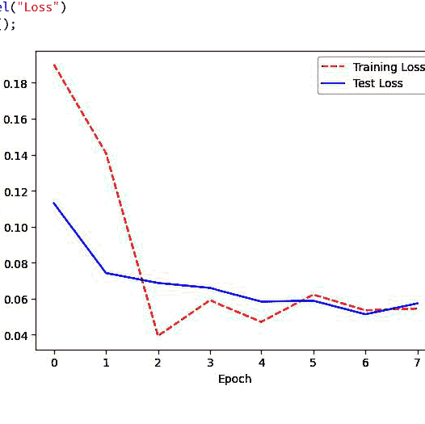

### 讨论

当我们的神经网络是新的时，它的性能会很差。随着神经网络在训练数据上学习，模型在训练集和测试集上的误差都会趋于下降。然而，在某个时刻，神经网络可能会开始“记忆”训练数据并出现过拟合。当这种情况开始发生时，训练误差可能会下降，而测试误差开始增加。因此，在许多情况下，存在一个“最佳点”，此时测试误差（这是我们主要关心的误差）处于最低点。这种效应可以在解决方案中看到，我们在每个时期可视化训练和测试损失。请注意，测试误差在第6个时期左右最低，之后训练损失趋于平稳，而测试损失开始增加。从这一点开始，模型出现了过拟合。

## 21.9 使用权重正则化减少过拟合

### 问题

你想通过正则化网络的权重来减少过拟合。

### 解决方案

尝试对网络的参数进行惩罚，也称为*权重正则化*：

```python
# 导入库
import torch
import torch.nn as nn
import numpy as np
from torch.utils.data import DataLoader, TensorDataset
from torch.optim import RMSprop
from sklearn.datasets import make_classification
from sklearn.model_selection import train_test_split

# 创建训练集和测试集
features, target = make_classification(n_classes=2, n_features=10,
                                       n_samples=1000)
features_train, features_test, target_train, target_test = train_test_split(
    features, target, test_size=0.1, random_state=1)

# 设置随机种子
torch.manual_seed(0)
np.random.seed(0)

# 将数据转换为PyTorch张量
x_train = torch.from_numpy(features_train).float()
y_train = torch.from_numpy(target_train).float().view(-1, 1)
x_test = torch.from_numpy(features_test).float()
y_test = torch.from_numpy(target_test).float().view(-1, 1)

# 使用`Sequential`定义一个神经网络
class SimpleNeuralNet(nn.Module):
    def __init__(self):
        super(SimpleNeuralNet, self).__init__()
        self.sequential = torch.nn.Sequential(
            torch.nn.Linear(10, 16),
            torch.nn.ReLU(),
            torch.nn.Linear(16,16),
            torch.nn.ReLU(),
            torch.nn.Linear(16, 1),
            torch.nn.Sigmoid()
        )

    def forward(self, x):
        x = self.sequential(x)
        return x

# 初始化神经网络
network = SimpleNeuralNet()

# 定义损失函数、优化器
criterion = nn.BCELoss()
optimizer = torch.optim.Adam(network.parameters(), lr=1e-4, weight_decay=1e-5)

# 定义数据加载器
train_data = TensorDataset(x_train, y_train)
train_loader = DataLoader(train_data, batch_size=100, shuffle=True)

# 使用torch 2.0的优化器编译模型
network = torch.compile(network)

# 训练神经网络
epochs = 100
for epoch in range(epochs):
    for batch_idx, (data, target) in enumerate(train_loader):
        optimizer.zero_grad()
        output = network(data)
        loss = criterion(output, target)
        loss.backward()
        optimizer.step()

# 评估神经网络
with torch.no_grad():
    output = network(x_test)
    test_loss = criterion(output, y_test)
    test_accuracy = (output.round() == y_test).float().mean()
    print("Test Loss:", test_loss.item(), "\tTest Accuracy:",
          test_accuracy.item())
```

Test Loss: 0.4030887186527252    Test Accuracy: 0.9599999785423279

### 讨论

对抗神经网络过拟合的一种策略是惩罚神经网络的参数（即权重），使其被驱动为较小的值，从而创建一个更简单、更不容易过拟合的模型。这种方法称为权重正则化或权重衰减。更具体地说，在权重正则化中，会在损失函数中添加一个惩罚项，例如L2范数。

在PyTorch中，我们可以通过在优化器中包含`weight_decay=1e-5`来添加权重正则化，正则化就在这里发生。在这个例子中，`1e-5`决定了我们对较高参数值的惩罚程度。大于0的值在PyTorch中表示L2正则化。

## 21.10 使用早停法减少过拟合

### 问题

你想通过在训练和测试分数出现分歧时停止训练来减少过拟合。

### 解决方案

使用PyTorch Lightning实现一种称为*早停*的策略：

```python
# 导入库
import torch
import torch.nn as nn
import numpy as np
from torch.utils.data import DataLoader, TensorDataset
from torch.optim import RMSprop
import lightning as pl
from lightning.pytorch.callbacks.early_stopping import EarlyStopping
from sklearn.datasets import make_classification
from sklearn.model_selection import train_test_split

# 创建训练集和测试集
features, target = make_classification(n_classes=2, n_features=10,
    n_samples=1000)
features_train, features_test, target_train, target_test = train_test_split(
    features, target, test_size=0.1, random_state=1)

# 设置随机种子
torch.manual_seed(0)
np.random.seed(0)

# 将数据转换为PyTorch张量
x_train = torch.from_numpy(features_train).float()
y_train = torch.from_numpy(target_train).float().view(-1, 1)
x_test = torch.from_numpy(features_test).float()
y_test = torch.from_numpy(target_test).float().view(-1, 1)

# 使用`Sequential`定义一个神经网络
class SimpleNeuralNet(nn.Module):
    def __init__(self):
        super(SimpleNeuralNet, self).__init__()
        self.sequential = torch.nn.Sequential(
            torch.nn.Linear(10, 16),
            torch.nn.ReLU(),
            torch.nn.Linear(16,16),
            torch.nn.ReLU(),
            torch.nn.Linear(16, 1),
            torch.nn.Sigmoid()
        )

    def forward(self, x):
        x = self.sequential(x)
        return x

class LightningNetwork(pl.LightningModule):
    def __init__(self, network):
        super().__init__()
        self.network = network
        self.criterion = nn.BCELoss()
        self.metric = nn.functional.binary_cross_entropy

    def training_step(self, batch, batch_idx):
        # training_step定义了训练循环。
        data, target = batch
        output = self.network(data)
        loss = self.criterion(output, target)
        self.log("val_loss", loss)
        return loss

    def configure_optimizers(self):
        return torch.optim.Adam(self.parameters(), lr=1e-3)

# 定义数据加载器
train_data = TensorDataset(x_train, y_train)
train_loader = DataLoader(train_data, batch_size=100, shuffle=True)

# 初始化神经网络
network = LightningNetwork(SimpleNeuralNet())

# 训练网络
trainer = pl.Trainer(callbacks=[EarlyStopping(monitor="val_loss", mode="min",
    patience=3)], max_epochs=1000)
trainer.fit(model=network, train_dataloaders=train_loader)

GPU available: False, used: False
TPU available: False, using: 0 TPU cores
IPU available: False, using: 0 IPUs
HPU available: False, using: 0 HPUs
```

## 21.11 使用 Dropout 减少过拟合

### 问题

你希望减少过拟合。

### 解决方案

使用 Dropout 在网络架构中引入噪声：

```python
# Load libraries
import torch
import torch.nn as nn
import numpy as np
from torch.utils.data import DataLoader, TensorDataset
from torch.optim import RMSprop
from sklearn.datasets import make_classification
from sklearn.model_selection import train_test_split

# Create training and test sets
features, target = make_classification(n_classes=2, n_features=10, n_samples=1000)
features_train, features_test, target_train, target_test = train_test_split(features, target, test_size=0.1, random_state=1)

# Set random seed
torch.manual_seed(0)
np.random.seed(0)

# Convert data to PyTorch tensors
x_train = torch.from_numpy(features_train).float()
y_train = torch.from_numpy(target_train).float().view(-1, 1)
x_test = torch.from_numpy(features_test).float()
y_test = torch.from_numpy(target_test).float().view(-1, 1)

# Define a neural network using `Sequential`
class SimpleNeuralNet(nn.Module):
    def __init__(self):
        super(SimpleNeuralNet, self).__init__()
        self.sequential = torch.nn.Sequential(
            torch.nn.Linear(10, 16),
            torch.nn.ReLU(),
            torch.nn.Linear(16,16),
            torch.nn.ReLU(),
            torch.nn.Linear(16, 1),
            torch.nn.Dropout(0.1), # Drop 10% of neurons
            torch.nn.Sigmoid(),
        )

    def forward(self, x):
        x = self.sequential(x)
        return x

# Initialize neural network
network = SimpleNeuralNet()

# Define loss function, optimizer
criterion = nn.BCELoss()
optimizer = RMSprop(network.parameters())

# Define data loader
train_data = TensorDataset(x_train, y_train)
train_loader = DataLoader(train_data, batch_size=100, shuffle=True)

# Compile the model using torch 2.0's optimizer
network = torch.compile(network)

# Train neural network
epochs = 3
for epoch in range(epochs):
    for batch_idx, (data, target) in enumerate(train_loader):
        optimizer.zero_grad()
        output = network(data)
        loss = criterion(output, target)
        loss.backward()
        optimizer.step()
    print("Epoch:", epoch+1, "\tLoss:", loss.item())

# Evaluate neural network
with torch.no_grad():
    output = network(x_test)
    test_loss = criterion(output, y_test)
    test_accuracy = (output.round() == y_test).float().mean()
    print("Test Loss:", test_loss.item(), "\tTest Accuracy:", test_accuracy.item())
```

Epoch: 1 Loss: 0.18791493773460388
Epoch: 2 Loss: 0.17331615090370178
Epoch: 3 Loss: 0.1384529024362564
Test Loss: 0.12702330946922302 Test Accuracy: 0.9100000262260437

### 讨论

*Dropout* 是一种用于正则化较小神经网络的相当常见的方法。在 Dropout 中，每次为训练创建一批观测值时，一个或多个层中的一部分单元会被乘以零（即被丢弃）。在这种设置下，每个批次都在相同的网络（例如，相同的参数）上进行训练，但每个批次面对的是该网络*架构*的一个略有不同的版本。

Dropout 被认为是有效的，因为在每个批次中持续随机丢弃单元，迫使单元学习能够在各种网络架构下执行的参数值。也就是说，它们学会了对其他隐藏单元的干扰（即噪声）具有鲁棒性，这防止了网络仅仅记忆训练数据。

可以向隐藏层和输入层都添加 Dropout。当输入层被丢弃时，其特征值不会在该批次中引入网络。

在 PyTorch 中，我们可以通过在网络架构中添加一个 `nn.Dropout` 层来实现 Dropout。每个 `nn.Dropout` 层将在每个批次中丢弃前一层中用户定义的超参数比例的单元。

## 21.12 保存模型训练进度

### 问题

给定一个需要长时间训练的神经网络，你希望保存进度，以防训练过程被中断。

### 解决方案

使用 `torch.save` 函数在每个 epoch 后保存模型：

```python
# Load libraries
import torch
import torch.nn as nn
import numpy as np
from torch.utils.data import DataLoader, TensorDataset
from torch.optim import RMSprop
from sklearn.datasets import make_classification
from sklearn.model_selection import train_test_split

# Create training and test sets
features, target = make_classification(n_classes=2, n_features=10,
    n_samples=1000)
features_train, features_test, target_train, target_test = train_test_split(
    features, target, test_size=0.1, random_state=1)

# Set random seed
torch.manual_seed(0)
np.random.seed(0)

# Convert data to PyTorch tensors
x_train = torch.from_numpy(features_train).float()
y_train = torch.from_numpy(target_train).float().view(-1, 1)
x_test = torch.from_numpy(features_test).float()
y_test = torch.from_numpy(target_test).float().view(-1, 1)

# Define a neural network using `Sequential`
class SimpleNeuralNet(nn.Module):
    def __init__(self):
        super(SimpleNeuralNet, self).__init__()
        self.sequential = torch.nn.Sequential(
            torch.nn.Linear(10, 16),
            torch.nn.ReLU(),
            torch.nn.Linear(16,16),
            torch.nn.ReLU(),
            torch.nn.Linear(16, 1),
            torch.nn.Dropout(0.1), # Drop 10% of neurons
            torch.nn.Sigmoid(),
        )

    def forward(self, x):
        x = self.sequential(x)
        return x

# Initialize neural network
network = SimpleNeuralNet()

# Define loss function, optimizer
criterion = nn.BCELoss()
optimizer = RMSprop(network.parameters())

# Define data loader
train_data = TensorDataset(x_train, y_train)
train_loader = DataLoader(train_data, batch_size=100, shuffle=True)

# Compile the model using torch 2.0's optimizer
network = torch.compile(network)

# Train neural network
epochs = 5
for epoch in range(epochs):
    for batch_idx, (data, target) in enumerate(train_loader):
        optimizer.zero_grad()
        output = network(data)
        loss = criterion(output, target)
        loss.backward()
        optimizer.step()
    # Save the model at the end of every epoch
    torch.save(
        {
            'epoch': epoch,
            'model_state_dict': network.state_dict(),
            'optimizer_state_dict': optimizer.state_dict(),
            'loss': loss,
        },
        "model.pt"
    )
    print("Epoch:", epoch+1, "\tLoss:", loss.item())
```

Epoch: 1        Loss: 0.18791493773460388
Epoch: 2        Loss: 0.17331615090370178
Epoch: 3        Loss: 0.1384529024362564
Epoch: 4        Loss: 0.1435958743095398
Epoch: 5        Loss: 0.17967987060546875

### 讨论

在现实世界中，神经网络训练数小时甚至数天是很常见的。在此期间，很多事情可能出错：计算机可能断电，服务器可能崩溃，或者不体贴的研究生可能合上你的笔记本电脑。

我们可以使用 `torch.save` 通过在每个 epoch 后保存模型来缓解这个问题。具体来说，在每个 epoch 后，我们将模型保存到 `torch.save` 函数的第二个参数指定的位置 `model.pt`。如果我们只包含一个文件名（例如，*model.pt*），该文件将在每个 epoch 被最新的模型覆盖。

可以想象，我们可以引入额外的逻辑来每隔几个 epoch 保存一次模型，仅在损失下降时保存模型，等等。我们甚至可以将这种方法与 PyTorch Lightning 中的早停方法结合起来，以确保无论训练在哪个 epoch 结束，我们都能保存一个模型。

## 21.13 调优神经网络

### 问题

你希望自动为神经网络选择最佳超参数。

### 解决方案

使用 Ray 调优库与 PyTorch：

```python
# Load libraries
from functools import partial
import numpy as np
import os
import torch
import torch.nn as nn
import torch.nn.functional as F
import torch.optim as optim
from torch.optim import RMSprop
from torch.utils.data import random_split, DataLoader, TensorDataset
from ray import tune
from ray.tune import CLIReporter
from ray.tune.schedulers import ASHAScheduler
from sklearn.datasets import make_classification
from sklearn.model_selection import train_test_split

# Create training and test sets
features, target = make_classification(n_classes=2, n_features=10,
                                      n_samples=1000)
features_train, features_test, target_train, target_test = train_test_split(
    features, target, test_size=0.1, random_state=1)

# Set random seed
torch.manual_seed(0)
np.random.seed(0)

# Convert data to PyTorch tensors
x_train = torch.from_numpy(features_train).float()
y_train = torch.from_numpy(target_train).float().view(-1, 1)
x_test = torch.from_numpy(features_test).float()
y_test = torch.from_numpy(target_test).float().view(-1, 1)

# Define a neural network using `Sequential`
class SimpleNeuralNet(nn.Module):
    def __init__(self, layer_size_1=10, layer_size_2=10):
        super(SimpleNeuralNet, self).__init__()
        self.sequential = torch.nn.Sequential(
            torch.nn.Linear(10, layer_size_1),
            torch.nn.ReLU(),
            torch.nn.Linear(layer_size_1, layer_size_2),
            torch.nn.ReLU(),
            torch.nn.Linear(layer_size_2, 1),
            torch.nn.Sigmoid()
        )

    def forward(self, x):
        x = self.sequential(x)
        return x

config = {
    "layer_size_1": tune.sample_from(lambda _: 2 ** np.random.randint(2, 9)),
    "layer_size_2": tune.sample_from(lambda _: 2 ** np.random.randint(2, 9)),
    "lr": tune.loguniform(1e-4, 1e-1),
}

scheduler = ASHAScheduler(
    metric="loss",
    mode="min",
    max_t=1000,
    grace_period=1,
    reduction_factor=2
)

reporter = CLIReporter(
    parameter_columns=["layer_size_1", "layer_size_2", "lr"],
    metric_columns=["loss"]
)

# Train neural network
def train_model(config, epochs=3):
    network = SimpleNeuralNet(config["layer_size_1"], config["layer_size_2"])

    criterion = nn.BCELoss()
    optimizer = optim.SGD(network.parameters(), lr=config["lr"], momentum=0.9)

    train_data = TensorDataset(x_train, y_train)
    train_loader = DataLoader(train_data, batch_size=100, shuffle=True)

    # Compile the model using torch 2.0's optimizer
    network = torch.compile(network)

    for epoch in range(epochs):
        for batch_idx, (data, target) in enumerate(train_loader):
            optimizer.zero_grad()
            output = network(data)
            loss = criterion(output, target)
            loss.backward()
            optimizer.step()
            tune.report(loss=(loss.item()))

result = tune.run(
    train_model,
    resources_per_trial={"cpu": 2},
    config=config,
    num_samples=1,
    scheduler=scheduler,
    progress_reporter=reporter
)

best_trial = result.get_best_trial("loss", "min", "last")
print("Best trial config: {}".format(best_trial.config))
print("Best trial final validation loss: {}".format(
    best_trial.last_result["loss"]))

best_trained_model = SimpleNeuralNet(best_trial.config["layer_size_1"],
    best_trial.config["layer_size_2"])

== Status ==
Current time: 2023-03-05 23:31:33 (running for 00:00:00.07)
Memory usage on this node: 1.7/15.6 GiB
Using AsyncHyperBand: num_stopped=0
Bracket: Iter 512.000: None | Iter 256.000: None | Iter 128.000: None |
    Iter 64.000: None | Iter 32.000: None | Iter 16.000: None |
    Iter 8.000: None | Iter 4.000: None | Iter 2.000: None |
    Iter 1.000: None
Resources requested: 2.0/7 CPUs, 0/0 GPUs, 0.0/8.95 GiB heap,
    0.0/4.48 GiB objects
Result logdir: /root/ray_results/train_model_2023-03-05_23-31-33
Number of trials: 1/1 (1 RUNNING)
...
```

### 讨论

在配方 12.1 和 12.2 中，我们介绍了使用 scikit-learn 的模型选择技术来识别 scikit-learn 模型的最佳超参数。虽然 scikit-learn 的方法通常也可以应用于神经网络，但 Ray 调优库提供了一个复杂的 API，允许你在 CPU 和 GPU 上调度实验。

模型的超参数*确实*很重要，应该谨慎选择。然而，运行实验来选择超参数可能既昂贵又耗时。因此，神经网络的自动超参数调优并非万能药，但在某些情况下它是一个有用的工具。

在我们的解决方案中，我们对层大小和优化器学习率的不同参数进行了搜索。`best_trial.config` 显示了 Ray 调优配置中导致最低损失和最佳实验结果的参数。

## 21.14 可视化神经网络

### 问题

你希望快速可视化神经网络的架构。

### 解决方案

使用 `torch_viz` 中的 `make_dot` 函数：

```python
# Load libraries
import torch
import torch.nn as nn
import numpy as np
from torch.utils.data import DataLoader, TensorDataset
from torch.optim import RMSprop
from torchviz import make_dot
from sklearn.datasets import make_classification
from sklearn.model_selection import train_test_split

# Create training and test sets
features, target = make_classification(n_classes=2, n_features=10,
                                       n_samples=1000)
features_train, features_test, target_train, target_test = train_test_split(
    features, target, test_size=0.1, random_state=1)

# Set random seed
torch.manual_seed(0)
np.random.seed(0)

# Convert data to PyTorch tensors
x_train = torch.from_numpy(features_train).float()
y_train = torch.from_numpy(target_train).float().view(-1, 1)
x_test = torch.from_numpy(features_test).float()
y_test = torch.from_numpy(target_test).float().view(-1, 1)

# Define a neural network using Sequential
class SimpleNeuralNet(nn.Module):
    def __init__(self):
        super(SimpleNeuralNet, self).__init__()
        self.sequential = torch.nn.Sequential(
            torch.nn.Linear(10, 16),
            torch.nn.ReLU(),
            torch.nn.Linear(16, 16),
            torch.nn.ReLU(),
            torch.nn.Linear(16, 1),
            torch.nn.Sigmoid()
        )

    def forward(self, x):
        x = self.sequential(x)
        return x

# Initialize neural network
network = SimpleNeuralNet()

# Define loss function, optimizer
criterion = nn.BCELoss()
optimizer = RMSprop(network.parameters())

# Define data loader
train_data = TensorDataset(x_train, y_train)
train_loader = DataLoader(train_data, batch_size=100, shuffle=True)

# Compile the model using torch 2.0's optimizer
network = torch.compile(network)

# Train neural network
epochs = 3
for epoch in range(epochs):
    for batch_idx, (data, target) in enumerate(train_loader):
        optimizer.zero_grad()
        output = network(data)
        loss = criterion(output, target)
        loss.backward()
        optimizer.step()

make_dot(output.detach(), params=dict(
    list(
        network.named_parameters()
    )
).render(
    "simple_neural_network",
    format="png"
)
'simple_neural_network.png'
```

如果我们打开保存到机器上的图像，可以看到以下内容：

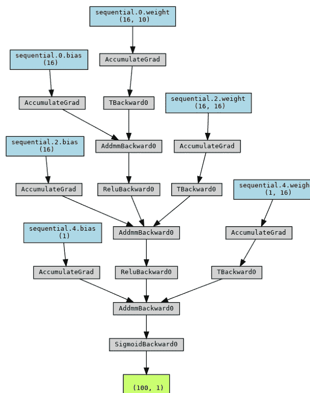

### 讨论

torchviz 库提供了便捷的实用函数，可以快速可视化我们的神经网络并将其输出为图像。

# 第 22 章

## 用于非结构化数据的神经网络

## 22.0 引言

在上一章中，我们重点介绍了用于*结构化*数据（即表格数据）的神经网络配方。过去几年中，大多数最大的进展实际上涉及将神经网络和深度学习用于*非结构化*数据，例如文本或图像。处理这些非结构化数据集与处理结构化数据源略有不同。

深度学习在非结构化数据领域尤其强大，而“经典”机器学习技术（如提升树）通常无法捕捉文本数据、音频、图像、视频等中存在的所有复杂性和细微差别。在本章中，我们将专门探讨如何将深度学习用于文本和图像数据。

在文本和图像的监督学习领域，有许多子任务或“类型”的学习。以下是一些示例（尽管这不是一个详尽的列表）：

- 文本或图像分类（例如：分类判断图像是否为热狗图片）
- 迁移学习（例如：使用像 BERT 这样的预训练上下文模型，并在预测电子邮件是否为垃圾邮件的任务上对其进行微调）
- 目标检测（例如：识别和分类图像中的特定对象）
- 生成模型（例如：根据给定输入生成文本的模型，如 GPT 模型）

随着深度学习日益普及并变得越来越商品化，处理这些用例的开源和企业解决方案也

## 22.1 训练用于图像分类的神经网络

### 问题

你需要训练一个图像分类神经网络。

### 解决方案

在 PyTorch 中使用卷积神经网络：

```python
# Import libraries
import torch
import torch.nn as nn
import torch.optim as optim
from torchvision import datasets, transforms

# Define the convolutional neural network architecture
class Net(nn.Module):
    def __init__(self):
        super(Net, self).__init__()
        self.conv1 = nn.Conv2d(1, 32, kernel_size=3, padding=1)
        self.conv2 = nn.Conv2d(32, 64, kernel_size=3, padding=1)
        self.dropout1 = nn.Dropout2d(0.25)
        self.dropout2 = nn.Dropout2d(0.5)
        self.fc1 = nn.Linear(64 * 14 * 14, 128)
        self.fc2 = nn.Linear(128, 10)

    def forward(self, x):
        x = nn.functional.relu(self.conv1(x))
        x = nn.functional.relu(self.conv2(x))
        x = nn.functional.max_pool2d(self.dropout1(x), 2)
        x = torch.flatten(x, 1)
        x = nn.functional.relu(self.fc1(self.dropout2(x)))
        x = self.fc2(x)
        return nn.functional.log_softmax(x, dim=1)

# Set the device to run on
device = torch.device("cuda" if torch.cuda.is_available() else "cpu")

# Define the data preprocessing steps
transform = transforms.Compose([
    transforms.ToTensor(),
    transforms.Normalize((0.1307,), (0.3081,))
])

# Load the MNIST dataset
train_dataset = datasets.MNIST('./data', train=True, download=True,
    transform=transform)
test_dataset = datasets.MNIST('./data', train=False, transform=transform)

# Create data loaders
batch_size = 64
train_loader = torch.utils.data.DataLoader(train_dataset, batch_size=batch_size,
    shuffle=True)
test_loader = torch.utils.data.DataLoader(test_dataset, batch_size=batch_size,
    shuffle=True)

# Initialize the model and optimizer
model = Net().to(device)
optimizer = optim.Adam(model.parameters())

# Compile the model using torch 2.0's optimizer
model = torch.compile(model)

# Define the training loop
model.train()
for batch_idx, (data, target) in enumerate(train_loader):
    data, target = data.to(device), target.to(device)
    optimizer.zero_grad()
    output = model(data)
    loss = nn.functional.nll_loss(output, target)
    loss.backward()
    optimizer.step()

# Define the testing loop
model.eval()
test_loss = 0
correct = 0
with torch.no_grad():
    for data, target in test_loader:
        data, target = data.to(device), target.to(device)
        output = model(data)

        # get the index of the max log-probability
        test_loss += nn.functional.nll_loss(
            output, target, reduction='sum'
        ).item()  # sum up batch loss
        pred = output.argmax(dim=1, keepdim=True)
        correct += pred.eq(target.view_as(pred)).sum().item()

test_loss /= len(test_loader.dataset)
```

### 讨论

卷积神经网络通常用于图像识别和计算机视觉任务。它们通常由卷积层、池化层和一个全连接层组成。

*卷积层*的目的是学习可用于当前任务的重要图像特征。卷积层通过将滤波器应用于图像的特定区域（卷积的大小）来工作。然后，该层的权重学习识别对分类任务至关重要的特定图像特征。例如，如果我们正在训练一个识别人手的模型，滤波器可能会学习识别手指。

*池化层*的目的通常是降低来自前一层的输入的维度。该层也使用应用于输入一部分的滤波器，但它没有激活函数。相反，它通过执行*最大池化*（选择滤波器中具有最高值的像素）或*平均池化*（取输入像素的平均值来代替）来降低输入的维度。

最后，*全连接层*可以与类似 softmax 激活函数的东西一起使用来创建二元分类任务。

### 另请参阅

- [卷积神经网络](Convolutional Neural Networks)

## 22.2 训练用于文本分类的神经网络

### 问题

你需要训练一个神经网络来对文本数据进行分类。

### 解决方案

使用一个 PyTorch 神经网络，其第一层的大小等于你的词汇表大小：

```python
# Import libraries
import torch
import torch.nn as nn
import torch.optim as optim
import numpy as np
from sklearn.datasets import fetch_20newsgroups
from sklearn.feature_extraction.text import CountVectorizer
from sklearn.model_selection import train_test_split
from sklearn.metrics import accuracy_score

# Load the 20 newsgroups dataset
cats = ['alt.atheism', 'sci.space']
newsgroups_data = fetch_20newsgroups(subset='all', shuffle=True,
    random_state=42, categories=cats)

# Split the dataset into training and test sets
X_train, X_test, y_train, y_test = train_test_split(newsgroups_data.data,
    newsgroups_data.target, test_size=0.2, random_state=42)

# Vectorize the text data using a bag-of-words approach
vectorizer = CountVectorizer(stop_words='english')
X_train = vectorizer.fit_transform(X_train).toarray()
X_test = vectorizer.transform(X_test).toarray()

# Convert the data to PyTorch tensors
X_train = torch.tensor(X_train, dtype=torch.float32)
y_train = torch.tensor(y_train, dtype=torch.long)
X_test = torch.tensor(X_test, dtype=torch.float32)
y_test = torch.tensor(y_test, dtype=torch.long)

# Define the model
class TextClassifier(nn.Module):
    def __init__(self, num_classes):
        super(TextClassifier, self).__init__()
        self.fc1 = nn.Linear(X_train.shape[1], 128)
        self.fc2 = nn.Linear(128, num_classes)

    def forward(self, x):
        x = nn.functional.relu(self.fc1(x))
        x = self.fc2(x)
        return nn.functional.log_softmax(x, dim=1)

# Instantiate the model and define the loss function and optimizer
model = TextClassifier(num_classes=len(cats))
loss_function = nn.CrossEntropyLoss()
optimizer = optim.Adam(model.parameters(), lr=0.01)

# Compile the model using torch 2.0's optimizer
model = torch.compile(model)

# Train the model
num_epochs = 1
batch_size = 10
num_batches = len(X_train) // batch_size
for epoch in range(num_epochs):
    total_loss = 0.0
    for i in range(num_batches):
        # Prepare the input and target data for the current batch
        start_idx = i * batch_size
        end_idx = (i + 1) * batch_size
        inputs = X_train[start_idx:end_idx]
        targets = y_train[start_idx:end_idx]

        # Zero the gradients for the optimizer
        optimizer.zero_grad()

        # Forward pass through the model and compute the loss
        outputs = model(inputs)
        loss = loss_function(outputs, targets)

        # Backward pass through the model and update the parameters
        loss.backward()
        optimizer.step()

        # Update the total loss for the epoch
        total_loss += loss.item()

    # Compute the accuracy on the test set for the epoch
    test_outputs = model(X_test)
    test_predictions = torch.argmax(test_outputs, dim=1)
    test_accuracy = accuracy_score(y_test, test_predictions)

    # Print the epoch number, average loss, and test accuracy
    print(f"Epoch: {epoch+1}, Loss: {total_loss/num_batches}, Test Accuracy: "
          f"{test_accuracy}")
```

### 讨论

与图像不同，文本数据本质上是非数字的。在训练模型之前，我们需要将文本转换为模型可以使用的数字表示，以便学习哪些单词和单词组合对于当前的分类任务很重要。在这个例子中，我们使用 scikit-learn 的 CountVectorizer 将词汇表编码为一个大小等于整个词汇表的向量，其中每个单词被分配到向量中的一个特定索引，该位置的值是该单词在给定段落中出现的次数。在这种情况下，我们可以通过查看训练集来了解词汇表的大小：

```python
X_train.shape[1]
# 25150
```

我们在神经网络的第一层使用相同的值来确定输入层的大小：`self.fc1 = nn.Linear(X_train.shape[1], 128)`。这使我们的网络能够学习所谓的*词嵌入*，即从监督学习任务（如本例中的任务）中学习到的单个单词的向量表示。这个任务将允许我们学习大小为 128 的词嵌入，尽管这些嵌入主要对这个特定任务和词汇表有用。

## 22.3 为图像分类微调预训练模型

### 问题

你想利用预训练模型的知识来训练一个图像分类模型。

### 解决方案

使用 `transformers` 库和 `torchvision` 在你的数据上微调一个预训练模型：

```python
# Import libraries
import torch
from torchvision.transforms import(
    RandomResizedCrop, Compose, Normalize, ToTensor
)
from transformers import Trainer, TrainingArguments, DefaultDataCollator
from transformers import ViTFeatureExtractor, ViTForImageClassification
from datasets import load_dataset, load_metric, Image

# Define a helper function to convert the images into RGB
def transforms(examples):
    examples["pixel_values"] = [_transforms(img.convert("RGB")) for img in
        examples["image"]]
    del examples["image"]
    return examples

# Define a helper function to compute metrics
def compute_metrics(p):
    return metric.compute(predictions=np.argmax(p.predictions, axis=1),
        references=p.label_ids)

# Load the fashion mnist dataset
dataset = load_dataset("fashion_mnist")

# Load the processor from the VIT model
image_processor = ViTFeatureExtractor.from_pretrained(
    "google/vit-base-patch16-224-in21k"
)

# Set the labels from the dataset
labels = dataset['train'].features['label'].names

# Load the pretrained model
model = ViTForImageClassification.from_pretrained(
    "google/vit-base-patch16-224-in21k",
    num_labels=len(labels),
    id2label={str(i): c for i, c in enumerate(labels)},
    label2id={c: str(i) for i, c in enumerate(labels)}
)

# Define the collator, normalizer, and transforms
collate_fn = DefaultDataCollator()
normalize = Normalize(mean=image_processor.image_mean,
    std=image_processor.image_std)
size = (
    image_processor.size["shortest_edge"]
    if "shortest_edge" in image_processor.size
    else (image_processor.size["height"], image_processor.size["width"])
)
_transforms = Compose([RandomResizedCrop(size), ToTensor(), normalize])

# Load the dataset we'll use with transformations
dataset = dataset.with_transform(transforms)

# Use accuracy as our metric
metric = load_metric("accuracy")

# Set the training args
training_args = TrainingArguments(
    output_dir="fashion_mnist_model",
    remove_unused_columns=False,
    evaluation_strategy="epoch",
    save_strategy="epoch",
    learning_rate=0.01,
    per_device_train_batch_size=16,
    gradient_accumulation_steps=4,
    per_device_eval_batch_size=16,
    num_train_epochs=1,
    warmup_ratio=0.1,
    logging_steps=10,
    load_best_model_at_end=True,
    metric_for_best_model="accuracy",
    push_to_hub=False,
)

# Instantiate a trainer
trainer = Trainer(
    model=model,
    args=training_args,
    data_collator=collate_fn,
    compute_metrics=compute_metrics,
    train_dataset=dataset["train"],
    eval_dataset=dataset["test"],
    tokenizer=image_processor,
)

# Train the model, log and save metrics
train_results = trainer.train()
trainer.save_model()
trainer.log_metrics("train", train_results.metrics)
trainer.save_metrics("train", train_results.metrics)
trainer.save_state()
```

### 讨论

在文本和图像等非结构化数据领域，从在大型数据集上训练的预训练模型开始，而不是从头开始，是极其常见的做法，尤其是在我们无法获得大量标注数据的情况下。通过使用来自更大模型的嵌入和其他信息，我们可以为新任务微调自己的模型，而无需大量标注信息。此外，预训练模型可能包含我们的训练数据集中完全没有捕获的信息，从而带来整体性能的提升。这个过程被称为*迁移学习*。

在这个例子中，我们加载了来自谷歌 ViT（视觉 Transformer）模型的权重。然后，我们使用 `transformers` 库在 fashion MNIST 数据集（一个简单的服装项目数据集）上对其进行分类任务的微调。这种方法可以应用于提升任何计算机视觉数据集的性能，而 `transformers` 库提供了一个高级接口，我们可以用它来从更大的预训练模型微调我们自己的模型，而无需编写大量的代码。

### 另请参阅

- [Hugging Face 网站和文档](https://huggingface.co/docs/transformers/index)

## 22.4 为文本分类微调预训练模型

### 问题

你想利用预训练模型的知识来训练一个文本分类模型。

### 解决方案

使用 `transformers` 库：

```python
# Import libraries
from datasets import load_dataset
from transformers import AutoTokenizer, DataCollatorWithPadding
from transformers import (
    AutoModelForSequenceClassification, TrainingArguments, Trainer
)
import evaluate
import numpy as np

# Load the imdb dataset
imdb = load_dataset("imdb")

# Create a tokenizer and collator
tokenizer = AutoTokenizer.from_pretrained("distilbert-base-uncased")
data_collator = DataCollatorWithPadding(tokenizer=tokenizer)

# Tokenize the imdb dataset
tokenized_imdb = imdb.map(
    lambda example: tokenizer(
        example["text"], padding="max_length", truncation=True
    ),
    batched=True,
)

# Use the accuracy metric
accuracy = evaluate.load("accuracy")

# Define a helper function to produce metrics
def compute_metrics(eval_pred):
    predictions, labels = eval_pred
    predictions = np.argmax(predictions, axis=1)
    return accuracy.compute(predictions=predictions, references=labels)

# Create dictionaries to map indices to labels and vice versa
id2label = {0: "NEGATIVE", 1: "POSITIVE"}
label2id = {"NEGATIVE": 0, "POSITIVE": 1}

# Load a pretrained model
model = AutoModelForSequenceClassification.from_pretrained(
    "distilbert-base-uncased", num_labels=2, id2label=id2label,
    label2id=label2id
)

# Specify the training arguments
training_args = TrainingArguments(
    output_dir="my_awesome_model",
    learning_rate=2e-5,
    per_device_train_batch_size=16,
    per_device_eval_batch_size=16,
    num_train_epochs=2,
    weight_decay=0.01,
    evaluation_strategy="epoch",
    save_strategy="epoch",
    load_best_model_at_end=True,
)

# Instantiate a trainer
trainer = Trainer(
    model=model,
    args=training_args,
    train_dataset=tokenized_imdb["train"],
    eval_dataset=tokenized_imdb["test"],
    tokenizer=tokenizer,
    data_collator=data_collator,
    compute_metrics=compute_metrics,
)

# Train the model
trainer.train()
```

### 讨论

就像使用预训练图像模型一样，预训练语言模型包含了大量关于语言的上下文信息，因为它们通常是在各种开放的互联网资源上训练的。当我们从一个预训练模型基础开始时，我们通常做的是将现有网络的分类层替换为我们自己的分类层。这使我们能够调整已经学习到的网络权重，以适应我们的特定任务。

在这个例子中，我们正在微调一个 DistilBERT 模型，以识别 IMDB 电影评论是正面的（1）还是负面的（0）。预训练的 DistilBERT 模型提供了大量的词汇以及每个词的上下文，此外还有从先前训练任务中学到的神经网络权重。迁移学习使我们能够利用训练 DistilBERT 模型所做的所有初始工作，并将其重新用于我们的用例，在这个例子中就是对电影评论进行分类。

### 另请参阅

- transformers 中的文本分类

# 第 23 章

## 保存、加载和提供训练好的模型

## 23.0 简介

在过去的 22 章和大约 200 个食谱中，我们介绍了如何获取原始数据并使用机器学习来创建性能良好的预测模型。然而，为了让我们的所有工作都有价值，我们最终需要对模型*做点什么*，例如将其与现有的软件应用程序集成。为了实现这个目标，我们需要能够在训练后保存模型，在应用程序需要时加载它们，然后向该应用程序发出请求以获取预测。

ML 模型通常部署在简单的 Web 服务器中，旨在接收输入数据并返回预测。这使得模型可供同一网络上的任何客户端使用，因此其他服务（如 UI、用户等）可以在任何地方实时使用 ML 模型进行预测。一个示例用例是在电子商务网站上使用 ML 进行商品搜索，其中将提供一个 ML 模型，该模型接收有关用户和商品列表的数据，并返回用户购买该商品的可能性。搜索结果需要实时可用，并可供负责处理用户搜索并为用户协调结果的电子商务应用程序使用。

## 23.1 保存和加载 scikit-learn 模型

### 问题

你有一个训练好的 scikit-learn 模型，并希望将其保存并在其他地方加载。

### 解决方案

将模型保存为 pickle 文件：

```python
# 加载库
import joblib
from sklearn.ensemble import RandomForestClassifier
from sklearn import datasets

# 加载数据
iris = datasets.load_iris()
features = iris.data
target = iris.target

# 创建决策树分类器对象
classifier = RandomForestClassifier()

# 训练模型
model = classifier.fit(features, target)

# 将模型保存为 pickle 文件
joblib.dump(model, "model.pkl")
['model.pkl']
```

模型保存后，我们可以在目标应用程序（例如 Web 应用程序）中使用 scikit-learn 加载模型：

```python
# 从文件加载模型
classifier = joblib.load("model.pkl")
```

并使用它进行预测：

```python
# 创建新观测值
new_observation = [[ 5.2, 3.2, 1.1, 0.1]]

# 预测观测值的类别
classifier.predict(new_observation)

array([0])
```

### 讨论

在生产环境中使用模型的第一步是将该模型保存为一个可以被其他应用程序或工作流加载的文件。我们可以通过将模型保存为 pickle 文件来实现这一点，这是一种 Python 特有的数据格式，它使我们能够序列化 Python 对象并将其写入文件。具体来说，为了保存模型，我们使用 `joblib`，这是一个扩展了 pickle 功能的库，特别适用于处理大型 NumPy 数组的情况——这在 scikit-learn 的训练模型中很常见。

保存 scikit-learn 模型时，请注意保存的模型可能在不同版本的 scikit-learn 之间不兼容；因此，在文件名中包含所使用的 scikit-learn 版本可能会有所帮助：

```python
# 导入库
import sklearn

# 获取 scikit-learn 版本
scikit_version = sklearn.__version__

# 将模型保存为 pickle 文件
joblib.dump(model, "model_{version}.pkl".format(version=scikit_version))
['model_1.2.0.pkl']
```

## 23.2 保存和加载 TensorFlow 模型

### 问题

你有一个训练好的 TensorFlow 模型，想要保存它并在其他地方加载。

### 解决方案

使用 TensorFlow 的 `saved_model` 格式保存模型：

```python
# 加载库
import numpy as np
from tensorflow import keras

# 设置随机种子
np.random.seed(0)

# 创建一个带有一个隐藏层的模型
input_layer = keras.Input(shape=(10,))
hidden_layer = keras.layers.Dense(10)(input_layer)
output_layer = keras.layers.Dense(1)(input_layer)
model = keras.Model(input_layer, output_layer)
model.compile(optimizer="adam", loss="mean_squared_error")

# 训练模型
x_train = np.random.random((1000, 10))
y_train = np.random.random((1000, 1))
model.fit(x_train, y_train)

# 将模型保存到名为 `saved_model` 的目录
model.save("saved_model")

32/32 [==============================] - 1s 8ms/step - loss: 0.2056
INFO:tensorflow:Assets written to: saved_model/assets
```

然后，我们可以在另一个应用程序中加载模型，或用于进一步的训练：

```python
# 加载神经网络
model = keras.models.load_model("saved_model")
```

### 讨论

尽管我们在本书中并未大量使用 TensorFlow，但了解如何保存和加载 TensorFlow 模型仍然很有用。与使用 Python 原生 pickle 格式的 scikit-learn 不同，TensorFlow 提供了自己保存和加载模型的方法。`saved_model` 格式创建一个目录，以协议缓冲区格式（使用 `.pb` 文件扩展名）存储模型以及将其重新加载并进行预测所需的所有信息：

```
ls saved_model

assets  fingerprint.pb  keras_metadata.pb  saved_model.pb  variables
```

虽然我们不会深入探讨这种格式，但它是保存、加载和部署在 TensorFlow 中训练的模型的标准方式。

### 另请参阅

- 序列化和保存 Keras 模型
- TensorFlow Saved Model 格式

## 23.3 保存和加载 PyTorch 模型

### 问题

你有一个训练好的 PyTorch 模型，想要保存它并在其他地方加载。

### 解决方案

使用 `torch.save` 和 `torch.load` 函数：

```python
# 加载库
import torch
import torch.nn as nn
import numpy as np
from torch.utils.data import DataLoader, TensorDataset
from torch.optim import RMSprop
from sklearn.datasets import make_classification
from sklearn.model_selection import train_test_split

# 创建训练集和测试集
features, target = make_classification(n_classes=2, n_features=10,
                                       n_samples=1000)
features_train, features_test, target_train, target_test = train_test_split(
    features, target, test_size=0.1, random_state=1)
```

```python
# 设置随机种子
torch.manual_seed(0)
np.random.seed(0)

# 将数据转换为 PyTorch 张量
x_train = torch.from_numpy(features_train).float()
y_train = torch.from_numpy(target_train).float().view(-1, 1)
x_test = torch.from_numpy(features_test).float()
y_test = torch.from_numpy(target_test).float().view(-1, 1)

# 使用 `Sequential` 定义一个神经网络
class SimpleNeuralNet(nn.Module):
    def __init__(self):
        super(SimpleNeuralNet, self).__init__()
        self.sequential = torch.nn.Sequential(
            torch.nn.Linear(10, 16),
            torch.nn.ReLU(),
            torch.nn.Linear(16,16),
            torch.nn.ReLU(),
            torch.nn.Linear(16, 1),
            torch.nn.Dropout(0.1), # 丢弃 10% 的神经元
            torch.nn.Sigmoid(),
        )

    def forward(self, x):
        x = self.sequential(x)
        return x

# 初始化神经网络
network = SimpleNeuralNet()

# 定义损失函数、优化器
criterion = nn.BCELoss()
optimizer = RMSprop(network.parameters())

# 定义数据加载器
train_data = TensorDataset(x_train, y_train)
train_loader = DataLoader(train_data, batch_size=100, shuffle=True)

# 使用 torch 2.0 的优化器编译模型
network = torch.compile(network)

# 训练神经网络
epochs = 5
for epoch in range(epochs):
    for batch_idx, (data, target) in enumerate(train_loader):
        optimizer.zero_grad()
        output = network(data)
        loss = criterion(output, target)
        loss.backward()
        optimizer.step()
```

```python
# 训练完成后保存模型
torch.save(
    {
        'epoch': epoch,
        'model_state_dict': network.state_dict(),
        'optimizer_state_dict': optimizer.state_dict(),
        'loss': loss,
    },
    "model.pt"
)

# 重新初始化神经网络
network = SimpleNeuralNet()
state_dict = torch.load(
    "model.pt",
    map_location=torch.device('cpu')
)["model_state_dict"]
network.load_state_dict(state_dict, strict=False)
network.eval()

SimpleNeuralNet(
  (sequential): Sequential(
    (0): Linear(in_features=10, out_features=16, bias=True)
    (1): ReLU()
    (2): Linear(in_features=16, out_features=16, bias=True)
    (3): ReLU()
    (4): Linear(in_features=16, out_features=1, bias=True)
    (5): Dropout(p=0.1, inplace=False)
    (6): Sigmoid()
  )
)
```

### 讨论

虽然我们在第 21 章中使用了类似的公式来检查点保存训练进度，但这里我们看到同样的方法也可以用于将模型重新加载到内存中以进行预测。我们保存模型的 `model.pt` 实际上只是一个包含模型参数的字典。我们将模型状态保存在字典键 `model_state_dict` 中；要重新加载模型，我们重新初始化网络并使用 `network.load_state_dict` 加载模型的状态。

### 另请参阅

- PyTorch 教程：保存和加载模型

## 23.4 部署 scikit-learn 模型

### 问题

你想使用 Web 服务器来部署你训练好的 scikit-learn 模型。

### 解决方案

构建一个 Python Flask 应用程序，加载本章前面训练的模型：

```python
# 导入库
import joblib
from flask import Flask, request

# 实例化一个 Flask 应用
app = Flask(__name__)

# 从磁盘加载模型
model = joblib.load("model.pkl")

# 创建一个预测路由，接收 JSON 数据，进行预测，并返回结果
@app.route("/predict", methods = ["POST"])
def predict():
    print(request.json)
    inputs = request.json["inputs"]
    prediction = model.predict(inputs)
    return {
        "prediction" : prediction.tolist()
    }

# 运行应用
if __name__ == "__main__":
    app.run()
```

确保你已安装 Flask：

```
python3 -m pip install flask==2.2.3 joblib==1.2.0 scikit-learn==1.2.0
```

然后运行应用程序：

```
python3 app.py

* Serving Flask app 'app'
* Debug mode: off
WARNING: This is a development server. Do not use it in a production deployment.
Use a production WSGI server instead.
* Running on http://127.0.0.1:5000
Press CTRL+C to quit
```

现在，我们可以通过使用 `curl` 向端点提交数据点来向应用程序发出预测请求并获取结果：curl -X POST http://127.0.0.1:5000/predict -H 'Content-Type: application/json' -d '{"inputs":[[5.1, 3.5, 1.4, 0.2]]}'

```json
{"prediction":[0]}
```

### 讨论

在这个示例中，我们使用了 Flask，这是一个用于在 Python 中构建 Web 框架的流行开源库。我们定义了一个路由 `/predict`，它接收 POST 请求中的 JSON 数据，并返回一个包含预测结果的字典。虽然这个服务器尚未达到生产就绪状态（参见 Flask 关于使用开发服务器的警告），但我们可以轻松地使用更适合生产的 Web 框架来扩展和部署这段代码，从而将其投入生产。

## 23.5 提供 TensorFlow 模型服务

### 问题

你想使用 Web 服务器为训练好的 TensorFlow 模型提供服务。

### 解决方案

使用开源的 TensorFlow Serving 框架和 Docker：

```bash
docker run -p 8501:8501 -p 8500:8500 \
    --mount type=bind,source=$(pwd)/saved_model,target=/models/saved_model/1 \
    -e MODEL_NAME=saved_model -t tensorflow/serving
```

### 讨论

TensorFlow Serving 是一个针对 TensorFlow 模型优化的开源服务解决方案。只需提供模型路径，我们就能开箱即用地获得一个 HTTP 和 gRPC 服务器，并附带对开发者有用的额外功能。

`docker run` 命令使用公共的 `tensorflow/serving` 镜像运行一个容器，并将当前工作目录的 `saved_model` 路径（`$(pwd)/saved_model`）挂载到容器内的 `/models/saved_model/1`。这会自动将我们之前在本章中保存的模型加载到一个正在运行的 Docker 容器中，我们可以向该容器发送预测查询。

如果你在 Web 浏览器中访问 `http://localhost:8501/v1/models/saved_model`，你应该会看到如下所示的 JSON 结果：

```json
{
    "model_version_status": [
        {
            "version": "1",
            "state": "AVAILABLE"
        }
    ],
    "status": {
        "error_code": "OK",
        "error_message": ""
    }
}
```

`/metadata` 路由 `http://localhost:8501/v1/models/saved_model/metadata` 将返回关于模型的更多信息：

```json
{
    "model_spec": {
        "name": "saved_model",
        "signature_name": "",
        "version": "1"
    },
    "metadata": {
        "signature_def": {
            "signature_def": {
                "serving_default": {
                    "inputs": {
                        "input_8": {
                            "dtype": "DT_FLOAT",
                            "tensor_shape": {
                                "dim": [
                                    {
                                        "size": "-1",
                                        "name": ""
                                    },
                                    {
                                        "size": "10",
                                        "name": ""
                                    }
                                ],
                                "unknown_rank": false
                            },
                            "name": "serving_default_input_8:0"
                        }
                    },
                    "outputs": {
                        "dense_11": {
                            "dtype": "DT_FLOAT",
                            "tensor_shape": {
                                "dim": [
                                    {
                                        "size": "-1",
                                        "name": ""
                                    },
                                    {
                                        "size": "1",
                                        "name": ""
                                    }
                                ]
                            }
                        }
                    }
                }
            }
        },
        "unknown_rank": false,
        "name": "StatefulPartitionedCall:0"
    },
    "method_name": "tensorflow/serving/predict",
    "__saved_model_init_op": {
        "inputs": {},
        "outputs": {
            "__saved_model_init_op": {
                "dtype": "DT_INVALID",
                "tensor_shape": {
                    "dim": [],
                    "unknown_rank": true
                },
                "name": "NoOp"
            }
        },
        "method_name": ""
    }
}
```

我们可以使用 `curl` 并传递变量（这个神经网络接受 10 个特征）来向 REST 端点发送预测请求：

```bash
curl -X POST http://localhost:8501/v1/models/saved_model:predict \
    -d '{"inputs":[[1,2,3,4,5,6,7,8,9,10]]}'
```

```json
{
    "outputs": [
        [
            5.59353495
        ]
    ]
}
```

### 另请参阅

- TensorFlow 文档：提供模型服务

## 23.6 在 Seldon 中提供 PyTorch 模型服务

### 问题

你想为训练好的 PyTorch 模型提供服务，以进行实时预测。

### 解决方案

使用 Seldon Core Python 包装器来提供模型服务：

```python
# 导入库
import torch
import torch.nn as nn
import logging

# 创建一个 PyTorch 模型类
class SimpleNeuralNet(nn.Module):
    def __init__(self):
        super(SimpleNeuralNet, self).__init__()
        self.sequential = torch.nn.Sequential(
            torch.nn.Linear(10, 16),
            torch.nn.ReLU(),
            torch.nn.Linear(16,16),
            torch.nn.ReLU(),
            torch.nn.Linear(16, 1),
            torch.nn.Dropout(0.1), # 丢弃 10% 的神经元
            torch.nn.Sigmoid(),
        )

# 创建一个名为 `MyModel` 的 Seldon 模型对象
class MyModel(object):
    # 加载模型
    def __init__(self):
        self.network = SimpleNeuralNet()
        self.network.load_state_dict(
            torch.load("model.pt")["model_state_dict"],
            strict=False
        )
        logging.info(self.network.eval())

    # 进行预测
    def predict(self, X, features_names=None):
        return self.network.forward(X)
```

并使用 Docker 运行它：

```bash
docker run -it -v $(pwd):/app -p 9000:9000 kylegallatin/seldon-example \
    seldon-core-microservice MyModel --service-type MODEL
```

```
2023-03-11 14:40:52,277 - seldon_core.microservice:main:578 -
    INFO:  Starting microservice.py:main
2023-03-11 14:40:52,277 - seldon_core.microservice:main:579 -
    INFO:  Seldon Core version: 1.15.0
2023-03-11 14:40:52,279 - seldon_core.microservice:main:602 -
    INFO:  Parse JAEGER_EXTRA_TAGS []
2023-03-11 14:40:52,287 - seldon_core.microservice:main:605 -
    INFO:  Annotations: {}
2023-03-11 14:40:52,287 - seldon_core.microservice:main:609 -
    INFO:  Importing MyModel
2023-03-11 14:40:55,901 - root:__init__:25 - INFO:  SimpleNeuralNet(
  (sequential): Sequential(
    (0): Linear(in_features=10, out_features=16, bias=True)
    (1): ReLU()
    (2): Linear(in_features=16, out_features=16, bias=True)
    (3): ReLU()
    (4): Linear(in_features=16, out_features=1, bias=True)
    (5): Dropout(p=0.1, inplace=False)
    (6): Sigmoid()
  )
)
2023-03-11 14:40:56,024 - seldon_core.microservice:main:640 -
  INFO:  REST gunicorn microservice running on port 9000
2023-03-11 14:40:56,028 - seldon_core.microservice:main:655 -
  INFO:  REST metrics microservice running on port 6000
2023-03-11 14:40:56,029 - seldon_core.microservice:main:665 -
  INFO:  Starting servers
2023-03-11 14:40:56,029 - seldon_core.microservice:start_servers:80 -
  INFO:  Using standard multiprocessing library
2023-03-11 14:40:56,049 - seldon_core.microservice:server:432 -
  INFO:  Gunicorn Config:  {'bind': '0.0.0.0:9000', 'accesslog': None,
  'loglevel': 'info', 'timeout': 5000, 'threads': 1, 'workers': 1,
  'max_requests': 0, 'max_requests_jitter': 0, 'post_worker_init':
  <function post_worker_init at 0x7f5aee2c89d0>, 'worker_exit':
  functools.partial(<function worker_exit at 0x7f5aee2ca170>,
  seldon_metrics=<seldon_core.metrics.SeldonMetrics object at
  0x7f5a769f0b20>), 'keepalive': 2}
2023-03-11 14:40:56,055 - seldon_core.microservice:server:504 -
  INFO:  GRPC Server Binding to 0.0.0.0:5000 with 1 processes.
2023-03-11 14:40:56,090 - seldon_core.wrapper:_set_flask_app_configs:225 -
  INFO:  App Config:  <Config {'ENV': 'production', 'DEBUG': False,
  'TESTING': False, 'PROPAGATE_EXCEPTIONS': None, 'SECRET_KEY': None,
  'PERMANENT_SESSION_LIFETIME': datetime.timedelta(days=31),
  'USE_X_SENDFILE': False, 'SERVER_NAME': None, 'APPLICATION_ROOT': '/',
  'SESSION_COOKIE_NAME': 'session', 'SESSION_COOKIE_DOMAIN': None,
  'SESSION_COOKIE_PATH': None, 'SESSION_COOKIE_HTTPONLY': True,
  'SESSION_COOKIE_SECURE': False, 'SESSION_COOKIE_SAMESITE': None,
  'SESSION_REFRESH_EACH_REQUEST': True, 'MAX_CONTENT_LENGTH': None,
  'SEND_FILE_MAX_AGE_DEFAULT': None, 'TRAP_BAD_REQUEST_ERRORS': None,
  'TRAP_HTTP_EXCEPTIONS': False, 'EXPLAIN_TEMPLATE_LOADING': False,
  'PREFERRED_URL_SCHEME': 'http', 'JSON_AS_ASCII': None,
  'JSON_SORT_KEYS': None, 'JSONIFY_PRETTYPRINT_REGULAR': None,
  'JSONIFY_MIMETYPE': None, 'TEMPLATES_AUTO_RELOAD': None,
  'MAX_COOKIE_SIZE': 4093}>
2023-03-11 14:40:56,091 - seldon_core.wrapper:_set_flask_app_configs:225 -
  INFO:  App Config:  <Config {'ENV': 'production', 'DEBUG': False,
  'TESTING': False, 'PROPAGATE_EXCEPTIONS': None, 'SECRET_KEY': None,
  'PERMANENT_SESSION_LIFETIME': datetime.timedelta(days=31),
  'USE_X_SENDFILE': False, 'SERVER_NAME': None, 'APPLICATION_ROOT': '/',
  'SESSION_COOKIE_NAME': 'session', 'SESSION_COOKIE_DOMAIN': None,
  'SESSION_COOKIE_PATH': None, 'SESSION_COOKIE_HTTPONLY': True,
```

'SESSION_COOKIE_SECURE': False, 'SESSION_COOKIE_SAMESITE': None,
'SESSION_REFRESH_EACH_REQUEST': True, 'MAX_CONTENT_LENGTH': None,
'SEND_FILE_MAX_AGE_DEFAULT': None, 'TRAP_BAD_REQUEST_ERRORS': None,
'TRAP_HTTP_EXCEPTIONS': False, 'EXPLAIN_TEMPLATE_LOADING': False,
'PREFERRED_URL_SCHEME': 'http', 'JSON_AS_ASCII': None,
'JSON_SORT_KEYS': None, 'JSONIFY_PRETTYPRINT_REGULAR': None,
'JSONIFY_MIMETYPE': None, 'TEMPLATES_AUTO_RELOAD': None,
'MAX_COOKIE_SIZE': 4093}>

2023-03-11 14:40:56,096 - seldon_core.microservice:_run_grpc_server:466 - INFO:
    正在启动具有 1 个线程的新 GRPC 服务器。
[2023-03-11 14:40:56 +0000] [23] [INFO] 正在启动 gunicorn 20.1.0
[2023-03-11 14:40:56 +0000] [23] [INFO] 监听地址：http://0.0.0.0:6000 (23)
[2023-03-11 14:40:56 +0000] [23] [INFO] 使用的工作进程：sync
[2023-03-11 14:40:56 +0000] [30] [INFO] 正在启动工作进程，PID：30
[2023-03-11 14:40:56 +0000] [1] [INFO] 正在启动 gunicorn 20.1.0
[2023-03-11 14:40:56 +0000] [1] [INFO] 监听地址：http://0.0.0.0:9000 (1)
[2023-03-11 14:40:56 +0000] [1] [INFO] 使用的工作进程：sync
[2023-03-11 14:40:56 +0000] [34] [INFO] 正在启动工作进程，PID：34
2023-03-11 14:40:56,217 - seldon_core.gunicorn_utils:load:103 - INFO:
    跟踪未激活

### 讨论

虽然我们可以通过多种不同的方式来提供 PyTorch 模型服务，但这里我们选择 Seldon Core Python 包装器。Seldon Core 是一个流行的生产环境模型服务框架，它具有许多有用的功能，使其比 Flask 应用程序更易于使用且更具可扩展性。它允许我们编写一个简单的类（上面我们使用了 MyModel），而 Python 库则负责处理所有的服务器组件和端点。然后，我们可以使用 `seldon-core-microservice` 命令运行该服务，该命令会启动一个 REST 服务器、一个 gRPC 服务器，甚至还会暴露一个指标端点。要向服务发出预测请求，我们可以在端口 9000 上使用以下端点调用服务：

```
curl -X POST http://127.0.0.1:9000/predict  -H 'Content-Type: application/json'
    -d '{"data": {"ndarray":[[0, 0, 0, 0, 0, 0, 0, 0, 0]]}}'
```

你应该会看到以下输出：

```
{"data":{"names":["t:0","t:1","t:2","t:3","t:4","t:5","t:6","t:7","t:8"],
    "ndarray":[[0,0,0,0,0,0,0,0,0]]},"meta":{}}
```

### 另请参阅

- Seldon Core Python 包
- TorchServe 文档

## 索引

## 符号

- + (加) 运算符, 17
- - (减) 运算, 17
- : (冒号), 切片 DataFrame, 42
- @ 运算符, 18
- × (乘) 运算符, 18
- χ² (卡方) 统计量, 特征选择, 182, 183

## A

- 准确率指标, 194-195, 201, 213-215
- 激活函数, 神经网络, 331, 336-338, 340
- AdaBoostClassifier, 258-260
- AdaBoostRegressor, 258-260
- 自适应阈值, 145-147
- add 方法, 16
- agg 方法, 59-60
- 凝聚聚类, 310
- 特定于算法的方法, 加速模型选择, 228
- ANN (近似最近邻), 270-274
- ANOVA F值, 特征选择, 182, 184
- Apache Avro, 29
- Apache Parquet, 28
- apply 方法, 61, 62, 76
- 近似最近邻 (ANN), 270-274
- ROC曲线下面积 (AUC ROC), 200
- 算术运算符, 用于张量乘法, 323
- 数组 (参见 矩阵; NumPy 数组; 向量)
- 自动求导, 326-327
- 平均池化, 364
- Avro 文件, 从中加载数据, 29

## B

- 反向传播, 326
- 回填缺失值, 131
- 背景移除, 图像, 147-149
- 词袋模型, 113-115
- 基线分类模型, 193-194
- 基线回归模型, 191-192
- 观测批次, 神经网络, 326
- 贝叶斯定理, 295
- Beautiful Soup 库, 106
- BernouilliNB, 299
- 偏差或截距, 线性回归, 232, 235
- Binarizer, 81, 82
- 二值化图像, 145-147
- 二元分类器
    - 逻辑回归, 275-276
    - 神经网络, 333-335
    - 预测评估, 194-197
    - 阈值, 197-200
- 二元特征数据
    - 使用其训练朴素贝叶斯分类器, 299
    - 阈值方差, 179
- 模糊图像, 138-140
- 布尔条件
    - 删除 DataFrame 行, 53
    - 选择日期和时间, 125
- 提升性能, 树和森林, 258-262
- 广播, 8, 319

## C

- C 超参数
    - GridSearchCV, 219
    - LogisticRegressionCV, 228, 279
    - 支持向量分类器, 285, 293
- CalibratedClassifierCV, 300-301
- 校准预测概率, 300-301
- 回调函数, 用于早停, 349
- Canny 边缘检测器, 149-150
- 分类数据, 89-101
    - 特征字典, 94-96
    - 不平衡类别, 98-101
    - 缺失类别值, 96-98
    - 名义特征, 90-92
    - 有序特征, 92-94
- 卡方 (χ²) 统计量, 特征选择, 182, 183
- 类别
    - 插补缺失值, 96-98
    - 最大化可分性, 减少特征, 170-172
- 分类与分类器
    - 基线分类模型, 193-194
    - 二元分类器, 194-200, 275-276, 333-335
    - 性能描述, 211-212
    - Haar 级联分类器, 161-163
    - 图像分类, 163-164, 362-364, 367-369
    - KNN 分类器, 263-274
    - 逻辑回归, 275-278
    - 多类预测, 201-202, 277, 336-338
    - 朴素贝叶斯分类器, 295-301
    - 随机森林分类器训练, 248-250
    - 移除不相关特征, 182-184
    - 情感分析分类器, 119
    - 支持向量机, 283-286
    - 文本分类, 364-366, 369-371
    - 训练决策树分类器, 243-245
    - 可视化分类器性能, 202-204
- classification_report, 211
- classifier__[超参数名] 格式, 223
- class_weight 方法, 292
- 清洗文本, 103-105
- 聚类, 303-311
    - DBSCAN, 308-309
    - 使用其对观测进行分组, 83-84
    - 层次合并, 310
    - k-means, 83-84, 303-307
    - 均值漂移, 307-308
    - 模型评估, 206-207
- cluster_centers_ 方法, 306
- 决定系数 (R²), 192, 205, 206
- 冒号 (:), 切片 DataFrame, 42
- 编码为特征的颜色直方图, 156-159
- 颜色隔离, 图像, 143-145
- 数据框中的列
    - 删除, 51-53
    - 描述性统计值, 47
    - 查找唯一值, 48-49
    - 循环遍历, 61
    - 重命名, 46-47
- 逗号分隔值 (CSV) 文件, 从中加载数据, 26-27
- 压缩稀疏行 (CSR) 矩阵, 4
- concat 函数, 63
- 混淆矩阵, 202
- 连续特征, 训练朴素贝叶斯分类器, 296-298
- 对比度, 增强图像, 142-143
- 卷积神经网络, 362-364
- 角点检测, 图像, 151-153
- cornerHarris, 151-153
- 相关矩阵, 特征选择, 180-182
- count 方法, 数值列, 47
- CountVectorizer, 113-115, 366
- 裁剪图像, 137
- 机器学习模型的交叉验证 (CV), 186
    - CalibratedClassifierCV, 300-301
    - 进行交叉验证, 187-191
    - GridSearchCV, 218-220, 222-226, 268
    - LogisticRegressionCV, 279
    - 多分类器预测, 201-202
    - OpenCV, 133-135, 161-163
    - 模型选择后的性能评估, 229-230
    - RandomizedSearchCV, 220-222
    - RFECV, 184-186
    - RidgeCV, 239
- CrossEntropyLoss() 函数, 338
- cross_val_score, 190, 194-197
- CSR (压缩稀疏行) 矩阵, 4
- CSV (逗号分隔值) 文件, 从中加载数据, 26-27
- 自定义评估指标, 创建, 208-209

## D

- DAG (有向无环图), 327
- 数据框 (DataFrame 对象), 37-67
    - 聚合操作和统计, 59-60
    - 对列中的所有元素应用函数, 61
    - 对行组应用函数, 62
    - 连接, 63-64
    - 创建 DataFrame 对象, 38-39
    - 删除列, 51-53
    - 删除行, 53
    - 删除重复行, 54-55
    - 查找唯一值, 48-49
    - 获取数据信息, 39
    - 按时间对行分组, 57-59
    - 按值对行分组, 56-57
    - 作为不可变对象, 52
    - 循环遍历列, 61
    - 合并, 64-67
    - 数值列的最小值、最大值、总和、平均值、计数, 47
    - 缺失值, 50-51
    - 重命名列, 46-47
    - 基于条件选择行, 43-44
    - 切片, 41-42
    - 对值排序, 44
- 日期和时间 (日期时间), 121-132
    - 将日期数据分解为多个特征, 125
    - 将字符串转换为日期, 121-122
    - 星期几, 127
    - 日期之间的差异, 126
    - 滞后特征, 128
    - 时间序列中的缺失数据, 130-132
    - 滚动时间窗口, 129-130
    - 选择日期和时间, 124-125
    - 时区, 123-124
- datetime 库, 121
- 星期几, 编码, 127
- day_name 方法, 127
- DBSCAN 聚类, 308-309
- 决策树, 243
    - (另请参阅 树和森林)
- DecisionTreeClassifier, 243
- DecisionTreeRegressor, 245
- 深度学习, 325
- 删除列, 数据框, 51-53
- 删除具有缺失值的观测, 84-85
- 删除行, 数据框, 53
- 图像去噪, 147
- 稠密矩阵, 加权词重要性, 116
- DESCR 属性, 22
- describe 方法, 40
- 描述性统计, 9, 41, 47, 60
- detach() 方法, 327
- df (文档频率), 117
- 矩阵的对角线, 查找, 14
- 特征字典, 编码, 38, 94-96
- DictVectorizer, 94-96
- digitize 方法, 82
- 降维, 165
    - (另请参阅 特征提取; 特征选择)
    - 卷积神经网络, 364
    - 线性判别分析, 170-172
    - 主成分分析, 166-170
- 有向无环图 (DAG), 327
- 离散和计数特征, 朴素贝叶斯分类器, 298-299
- 离散化特征, 数值数据, 81
- 距离度量, 264-266
- DistilBERT 模型, 371
- Docker, 380-382
- 文档频率 (df), 117
- DOT 格式, 可视化决策树模型, 246-248
- dot 函数 (NumPy), 15
- dot 方法 (PyTorch), 322
- 点积计算, 15, 322
- 下采样, 不平衡类问题, 100
- drop 方法, 51, 53
- Dropout 层, 352
- dropout, 通过其减少过拟合, 350-352
- drop_duplicates 函数, 54
- DummyClassifier, 193-194

虚拟变量（独热编码），92
DummyRegressor，191-192
重复行，在数据框中删除，54-55
duplicated 方法，55

前馈神经网络，325，333-340
fillna 函数，51
过滤器方法
- 二值化图像，145-147
- 二元分类器阈值评估，197-200
- 特征选择，177-184
filter2d 方法，141
拟合操作，70
将数据拟合到一条线
- 线性回归，231-233，235-237
- 减少神经网络中的过拟合，345-352
fit_transform 函数，70
Flask 应用，380
flatten 方法
- NumPy 数组，12，154-156
- PyTorch，322
for 循环，61
前向填充缺失值，131
forward 方法，340
前向传播，326
FPR（假阳性率），199
from_numpy 函数，314
全连接层，364
FunctionTransformer，76
F1 分数，196，201

## E

早停法，用于减少过拟合，347-349
边缘检测，图像，149-150
线性回归中的效应，232
弹性网络，239
EllipticEnvelope，77
嵌入式方法，特征选择，177
嵌入，103，159-160
轮次，在神经网络中，326
equalizeHist 方法，142
错误处理
- 将字符串转换为日期，122
- 均方误差，205
- 异常值，80
Excel 文件，从...加载数据，27
穷举搜索方法，模型选择，218-220
极端梯度提升（XGBoost），261

## F

分解，173
faiss 库，270
假阳性率（FPR），199
特征提取，165-175
- 使用套索回归，240
- 线性不可分数据，168-170
- 矩阵分解，173-174
- 最大化类别可分性，170-172
- 主成分方法，166-167
- 稀疏数据，174-175
特征选择，165，177-186
- 矩阵中的高度相关特征，180-182
- 基于随机森林，254
- 递归消除特征，184-186
- 移除分类无关特征，182-184
- 二元特征方差阈值化，179
- 数值特征方差阈值化，178-179
FeatureUnion，225
feature_importances_ 方法，252-254

## G

高斯朴素贝叶斯，296-298
基尼不纯度，244
GitHub，xii
goodFeaturesToTrack，152
Google 表格，从...加载数据，32
Google ViT（视觉Transformer）模型，369
GrabCut 算法，147-149
梯度下降，在神经网络中，326
GridSearchCV，218-220，222-226
groupby 函数，56-57，62
使用聚类对观测值分组，83-84
在数据框中对行分组
- 按时间，57-59
- 按值，56-57

## H

Haar 级联分类器，161-163
调和平均数，196
Harris 角点检测器，151-153
head 方法，39
隐藏层，神经网络，325
层次合并，聚类，310
矩阵中的相关特征，180-182
直方图均衡化，142
留出数据，188
HTML，解析和清理，106
超参数，217
（另见模型选择）
- 神经网络的，355-357
- 与参数对比，217
- 正则化惩罚，219，278
- 值效应可视化，213-215
超平面，283，284-285

多类分类器评估，201
树和森林，255-257
填充缺失值，86-88，96-98
imread 方法，134
imwrite 方法，136
独立同分布（IID）数据，189
索引切片，选择日期和时间，124
索引值，DataFrame，42
索引，在 PyTorch 中，316
info 方法，40
内连接，64，66
输入层，神经网络，325
交互效应，线性回归，234
交互特征，生成，74-76
缺失数据插值，130
四分位距（IQR），78
文档频率的逆（idf），117
inverse_transform 方法，91
倒排文件索引（IVF），271
矩阵求逆（inv），18
IQR（四分位距），78
isnull 方法，50
保序回归，302

## I

单位矩阵，19
idf（文档频率的逆），117
IID（独立同分布）数据，189
iloc 方法，41，43
图像分类
- 微调预训练模型，163-164
- 用于...的神经网络，362-364，367-369
图像，133-164
- 背景移除，147-149
- 二值化，145-147
- 模糊，138-140
- 颜色隔离，143-145
- 对比度增强，142-143
- 转换为机器学习的观测值，154-156
- 角点检测，151-153
- 裁剪，137
- 边缘检测，149-150
- 将颜色直方图编码为特征，156-159
- 加载，133-135
- 目标检测，161-163
- 预训练嵌入作为特征，159-160
- 调整大小，136-137
- 保存，136
- 锐化，141
不平衡类别，处理
- 准确率悖论，195
- 分类数据，98-101
- 逻辑回归，280

## J

joblib 库，374
连接（合并操作），64-67
JSON 文件，从...加载数据，28

## K

k 折交叉验证（KFCV），189-190
k 均值聚类，83-84，303-307
k 近邻（KNN），263-274
- 与 ANN 对比，271-273
- 创建分类器，266-267
- 评估 ANN，273-274
- 查找 ANN，270-273
- 查找观测值的最近邻，263-266
- 确定最佳邻域大小，267-268
- 使用...填充缺失值，86-88
- 数值数据要求，89
- 基于半径的最近邻，269
核函数，140-142，169，286-289
核技巧，169
kernelPCA，169
KMeans，83，305，307
KNeighborsClassifier，97，266-267

## L

LabelBinarizer，90
labels_ 方法，305
滞后特征，128
层，在神经网络中，325
线性判别分析（LDA），170-172
叶节点，决策树，243
学习曲线，211
左连接，65，67
lightgbm 库，261-262
似然，朴素贝叶斯，296
limit 方法，132
线性判别分析（LDA），170-172
线性回归，231-241
- 拟合一条线，231-233
- 拟合非线性关系，235-237
- 交互效应，处理，233-235
- 使用套索回归减少特征，240
- 使用正则化减少方差，237-239
线性不可分数据，减少特征，168-170，287
线性可分数据，168
LinearRegression，231
LinearSVC，284
列表推导式，61
加载和保存模型，352-354，373-378
加载数据，21-35
- 从 Avro 文件，29
- 从 CSV 文件，26-27
- 从 Excel 文件，27
- 生成模拟数据集，23-25
- 从 Google 表格，32
- 图像，133-135
- 从 JSON 文件，28
- 从 Parquet 文件，28
- 远程 SQL 数据库查询，31-32
- 从 S3 存储桶，33
- 来自 scikit-learn 库的样本数据集，21-22
- SQLite 数据库查询，30-31
- 非结构化数据，34
load_digits 数据集，22
load_iris 数据集，22
loc 方法，41，43，124

逻辑回归，275-281
- 二元分类器训练，275-276
- 与不平衡类别，280
- 多类分类器训练，277
- 正则化，减少方差，278
- 在非常大的数据集上训练分类器，279
LogisticRegression，275，277，279，280
LogisticRegressionCV，228，279
纵向数据（见日期和时间）
循环遍历列，数据框，61
损失函数，神经网络，331，338

## M

make_blobs 方法，24，25
make_circles，168
make_classification 方法，24，25，335
make_dot 函数，torch_viz，358
make_regression 方法，23，25，340
make_scorer 函数，208-209
随机缺失（MAR）数据，85
边缘概率，朴素贝叶斯，296
矩阵
- 加法和减法，16
- 计算迹，15
- 将数据从字典转换为特征矩阵，94-96
- 创建，2
- 描述，7
- 求对角线，14
- 求秩，13
- 展平，12
- 求逆，18
- k 近邻，265
- 乘法，17
- 稀疏矩阵，3-4
- 转置，11
矩阵分解，173-174，180-182
matrix_rank 方法，13
max 方法
- DataFrame，47
- NumPy 数组，9
- PyTorch，319
最大池化，364
最大化类别可分性，减少特征，170-172
完全随机缺失（MCAR）数据，85
mean 方法
- DataFrame，47
- NumPy 数组，9
均值漂移聚类，307-308
均方误差（MSE），204-206，245，340
合并操作（连接），64-67
评估指标
- 自定义评估，208-209
- 神经网络，332
- 评估文本报告，211-212
min 方法
- DataFrame，47
- NumPy 数组，9
- PyTorch，319
小批量 k 均值，306
MiniBatchKMeans，307
MinMaxScaler，69-70
随机缺失（MAR）数据，85
完全随机缺失（MCAR）数据，85
缺失数据
- 删除含缺失值的观测值，84-85
- 填充缺失值，86-88，96-98
- 时间序列，130-132
- 类型，85
- DataFrame 中的值，50-51
非随机缺失（MNAR）数据，85
多项式逻辑回归（MLR），277
MNAR（非随机缺失）数据，85
MNIST 数据集，369
模型评估，187-215
- 基线分类模型，193-194
- 基线回归模型，191-192
- 二元分类器预测，194-197
- 二元分类器阈值，197-200
- 分类器性能可视化，202-204
- 聚类模型，206-207
- 交叉验证模型，187-191
- 自定义评估指标，208-209
- 超参数值效应可视化，213-215
- 多类分类器预测，201-202
- 回归模型，204-206
- 评估指标文本报告，211-212
- 训练集大小效应可视化，209-211

模型选择，217-230
- 加速的算法特定方法，228
- 穷举搜索方法，218-220
- 使用多种学习算法，222-224
- 并行化加速，226-227
- 选择后的性能评估，229-230
- 在预处理中，224-226
- 随机搜索方法，220-222
移动时间窗口，129
MSE（均方误差），204-206，245，340
mT 方法，321
多类分类器，201-202，277，336-338
多维数组，2
多层感知机，325
多项式逻辑回归（MLR），277
MultinomialNB，298-299，300
多种学习算法，222-224
乘法（×）运算符，18
矩阵乘法，17
张量乘法，323

## N

朴素贝叶斯分类器，295-301
- 二元特征，299
- 校准预测概率，300-301
- 连续特征，296-298
- 离散和计数特征，298-299
命名实体识别，112
自然语言处理（NLP），95，103，119，120
自然语言工具包（NLTK），108-110
ndim 属性，7
NearestNeighbors，263-266
模型选择后的嵌套交叉验证，229
神经网络，325-357
- 自动微分，326-327
- 二元分类器训练，333-335
- 设计，329-333
- 使用 dropout 减少过拟合，350-352
- 使用早停法减少过拟合，347-349
- 多类分类器训练，336-338
- 预测，340-342
- 为...预处理数据，328-329
- 回归器训练，338-340

## O

NMF（非负矩阵分解），173-174

目标检测，161-163

nn.Module，329-333

观测值，38

节点，神经网络中，325

神经网络的批次，326

名义类别，89

将图像转换为，154-156

名义特征，编码，90-92

删除含缺失值的观测值，84-85

非线性降维，168

寻找最近邻，263-266

非负矩阵分解（NMF），173-174

使用聚类进行分组，83-84

归一化观测值（Normalizer），72-74

归一化，72-74

notnull 方法，50

独热编码，90-92，337

数值数据，69-88

一对多（OvR）逻辑回归，277

删除含缺失值的观测值，84-85

袋外（OOB）观测值，251

检测异常值，77-79

open 函数，34

离散化特征，81

OpenCV（开源计算机视觉库），133-135，161-163

生成多项式和交互特征，74-76

操作，应用于元素，318

使用聚类对观测值进行分组，83-84

优化器，神经网络，332

处理异常值，79-81

有序特征，89，92-94

填补缺失值，86-88

袋外（OOB）观测值，251

归一化观测值，72-74

外连接，65，66

重新缩放数值特征，69-70

异常值，77-81

标准化数值特征，71-72

输出层，神经网络，325

转换特征，76-77

数据过拟合

NumPy 数组，1-20

使用 dropout 减少，350-352

对数组元素应用函数，7

使用早停法减少，347-349

从中创建 PyTorch 张量，314

可视化，345

描述性统计计算，9

使用权重正则化减少，345-347

点积计算，15

一对多（OvR）逻辑回归，277

丢弃观测值，84

## P

pandas 库（参见数据框；加载数据）

pandavro 库，29

NaN 值，50

并行化，加速模型选择，226-227

参数

预处理，225

树结构，257-258

Parquet 文件，从中加载数据，28

解析和清理 HTML，106

PB（协议缓冲区）格式，TensorFlow，376

PCA（主成分分析），166-170

性能

模型选择的特定算法方法，228

提升树和随机森林的性能，258-262

选择后的评估，229-230

k-means 聚类，306

KNN 与 ANN 对比，271-273

模型选择的并行化，226-227

permute 方法，321

pickle 文件，374-375

Pillow 库，137

pipeline 包，190

Platt 缩放，290

Platt 的 sigmoid 模型，302

加号（+）运算符，17

多项式回归，235-237

PolynomialFeatures，74-76，233-237

池化层，364

后验概率，朴素贝叶斯，296

预分配数组，4

精确率指标，195，201

预测和预测

二元分类评估，194-197

二元分类器阈值，197-200

交叉验证模型，187-191

超参数值的影响，213-215

填补缺失类别值，96-98

线性回归，231-241

多类别分类器评估，201-202

朴素贝叶斯预测概率，300-301

神经网络，340-342

SVC 预测概率，289-291

XGBoost 模型，260

predict_proba 方法，199，267，278，301

数据预处理

模型选择，224-226

神经网络，328-329

预处理参数，225

以及重新缩放数值特征，69-70

预训练模型

图像分类微调，163-164

图像嵌入，159

与非结构化数据，369，369-371

主成分分析（PCA），166-170

先验概率，朴素贝叶斯，296

用于预测的概率估计，199-200

协议缓冲区（PB）格式，TensorFlow，376

生成伪随机值，19-20

标点符号，从文本中移除，106

pymysql 库，31

PySpark，29

Python Flask 应用程序，380

PyTorch，313-323

对元素应用操作，318

张量的属性，317

autograd 特性，326-327

卷积神经网络，362-364

创建张量，313

点积计算，322

展平张量，321

使用其进行图像分类，163-164

最大值和最小值，319

张量乘法，323

神经网络（参见神经网络）

预训练嵌入，159-160

重塑张量，320

保存和加载模型，376-378

选择元素，316-317

稀疏张量，315

转置张量，321

PyTorch Lightning，347-349

pytz 库，124

## Q

定量数据（参见数值数据）

## R

基于半径的 KNN 分类器，269

基于半径的最近邻分类器（RNN），269

随机森林分类器，215

随机森林

分类器训练，248-250

评估袋外误差，251

识别重要特征，252-254

回归器训练，250

选择重要特征，254

random 方法，19-20

随机值生成，19-20

RandomForestClassifier，99，248-250

RandomForestRegressor，250

RandomizedSearchCV，220-222

矩阵的秩，求解，13

ravel 方法，12

ray tuning 库，355-357

read_avro 方法，29

read_csv 函数，27，32，51

read_excel 函数，27

read_json 函数，28

read_parquet 函数，29

read_sql_query 函数，30

召回率指标，196，201

受试者工作特征（ROC）曲线，197-200

修正线性单元（ReLU），331

递归特征消除（RFE），184-186

回归和回归器，245

- 线性（参见线性回归）
- 逻辑（参见逻辑回归）
- 模型评估，191-192，204-206
- 神经网络训练，338-340
- 多项式回归，235-237
- 随机森林训练，250
- 岭回归，238

正则化

- 使用其减少特征，240
- 使用其减少方差，237-239，278，345-347

正则化惩罚超参数，219，278

ReLU（修正线性单元），331

远程 SQL 数据库查询，31-32

rename 方法，46-47

replace 方法，45-46，92

replace 操作，清理文本，103

resample 函数，57

重新缩放数值特征，69-70

reshape 方法

- NumPy 数组，10，12
- PyTorch，320

残差平方和（RSS），238

调整图像大小，136-137

RFE（递归特征消除），184-186

RFECV，184-186

岭回归，238

RidgeCV，239

右连接，65，67

RNN（基于半径的最近邻分类器），269

RobustScaler，72，81

ROC（受试者工作特征）曲线，197-200

roc_curve，197

rolling 方法，129-130

滚动时间窗口，129-130

round 方法，342

数据框中的行

- 删除，53
- 删除重复项，54-55
- 按时间分组，57-59
- 按值分组，56-57
- 基于条件选择，43-44

RSS（残差平方和），238

R²（决定系数），192，205，206

## S

S3 存储桶，从中加载数据，33

SAG（随机平均梯度）求解器，279

saved_model 格式，TensorFlow，375

保存和加载模型，352-354，373-378

scikit-learn 库

- pipeline 包，190
- 来自其的示例数据集，21-22
- 保存和加载模型，373-375
- 模型服务，379-380

score 函数，线性回归，233

Seldon Core Python 包装器，383-385

seldon-core-microservice 命令，385

SelectFromModel，255

选择元素

- NumPy 数组，5-6
- PyTorch 元素，316-317

SelectKBest，183

SelectPercentile，183

情感分析分类器，119

Sequential，332

Series.dt，125，127

模型服务，379-385

shape 属性，7

锐化图像，141

Shi-Tomasi 角点检测器，152

shift 方法，128

收缩惩罚，238

sigmoid 激活函数，340

轮廓系数，206-207

SimpleImputer，86

生成模拟数据集，23-25

奇异值分解（SVD），175

size 属性，7

size 方法，矩阵，11

切片

- 数据框，41-42
- NumPy 数组，138
- PyTorch，316-317

softmax 激活函数，336-338

求解器，280

sort_values 函数，44

spaCy 库，命名实体识别，112

稀疏矩阵

- 创建，3-4
- 编码特征字典，95-96
- 将文本编码为词袋，115
- 在其上减少特征，174-175
- 加权词重要性，116

稀疏张量，315

split 操作，清理文本，103

SQL，远程数据库查询，31

SQLite 数据库查询，30-31

StandardScaler，71-72，328

std 方法，9

词干提取，109

随机平均梯度（SAG）求解器，279

停用词，从文本中移除，108-109

分层 k 折交叉验证，189

字符串

- 清理文本，103-105
- 转换为日期，121-122

strip 操作，清理文本，103

减号（-）运算，17

subtract 方法，16

sum 方法，数值列，47

监督学习模型

- 生成模型，361
- 测试数据对评估的重要性，188
- 逻辑回归，275
- 目标检测，361
- 文本和图像分类，361
- 迁移学习，361
- 与无监督模型对比，207

支持向量分类器（SVC），283

支持向量机，283-293

- 识别支持向量，291
- 与不平衡类别，292
- 用于线性不可分类别的核函数，286-289
- 线性分类器训练，283-286
- 预测概率，289-291

support_vectors_ 方法，291

SVC（支持向量分类器），283

SVD（奇异值分解），175

## T

T 方法，11

制表符分隔值（TSV）文件，26

词性标注，110-112

TensorFlow，160，375，380-382

TensorFlow Serving 框架，380-382

tensorflow_hub，160

张量（参见 PyTorch）

词频（tf），117

词频-逆文档频率（tf-idf），116-119

测试集，188-190

文本，103-120

- 清理，103-105
- 编码为词袋，113-115
- 评估指标报告，211-212
- 命名实体识别，112
- 解析和清理 HTML，106
- 移除标点符号，106
- 移除停用词，108-109
- 情感分析分类器，119
- 词干提取，109
- 词性标注，110-112
- 实现文本的 tf-idf 向量，118-119
- 分词，107-110
- 加权词重要性，116-117

文本分类

- 微调预训练模型，369-371
- 用于其的神经网络，364-366

tf-idf（参见词频-逆文档频率）

实现文本的 tf-idf 向量，118-119

TfidfVectorizer，116-119

阈值化

## V

-   验证数据，188
-   `validation_curve`，213
-   `value_counts` 方法，49
-   `var` 方法，9
-   数据中的方差，管理，166
    -   （另见特征提取；特征选择）
-   方差阈值法（VT），178
-   `vectorize` 方法，8
-   向量，1-2，11
    -   （另见支持向量机）
-   超大数据集，训练分类器，279
-   可视化
    -   分类器性能，202-204
    -   决策树模型，246-248，252-254
    -   超参数值的影响，213-215
    -   神经网络，342-345，358
    -   训练集大小的影响，209-211
-   ViT（Vision Transformer）模型，369
-   泰森多边形，271-273
-   VT（方差阈值法），178

## W

-   权重正则化（权重衰减），345-347
-   词重要性加权，116-117
-   权重（见参数）
-   词嵌入，366
-   包装法，特征选择，177

## X

-   XGBoost 算法，261
-   `xgboost` 库，260

## U

-   `unique` 方法，48
-   单元，神经网络中，325
-   非结构化数据，361-371
    -   图像分类训练，362-364，367-369
    -   加载，34
    -   文本分类，364-366，369
    -   无监督学习模型，206-207，303
        -   （另见聚类）
    -   上采样，类别不平衡问题，100

## Z

-   零索引数组，6

-   图像二值化，145-147
-   二元分类器阈值，197-200
-   特征选择，178-180
-   时间序列数据（见日期和时间）
-   时区，处理，123-124
-   `TimeDelta` 数据类型，127
-   文本分词，107-110
-   `torch.save` 函数，352
-   `torch_viz` 库，358
-   `to_datetime` 方法，121-122
-   `to_sparse` 函数，315
-   TPR（真正例率），199
-   `trace` 方法，15
-   矩阵的迹，计算，15
-   训练集，188-190，209-211
-   迁移学习，160，369
-   `transform` 操作，70
-   `transformers` 库，119，367-371
-   特征转换，数值型，76-77
-   `translate` 方法，107
-   转置
    -   矩阵，11
    -   张量，321
-   树与森林，243-262
    -   提升法以提高性能，258-260
    -   控制树的大小，257-258
    -   决策树训练，243-246
    -   与类别不平衡，255-257
    -   LightGBM 以提高性能，261-262
    -   随机森林（见随机森林）
    -   可视化决策树模型，246-248
-   真正例率（TPR），199
-   截断奇异值分解（TSVD），174-175
-   TSV（制表符分隔值）文件，26
-   调优超参数（见超参数）
-   `tz_convert`，123
-   `tz_localize`，123

## 关于作者

**凯尔·加拉廷** 是一名机器学习基础设施软件工程师，拥有多年数据分析师、数据科学家和机器学习工程师的经验。他也是一名专业的数据科学导师和志愿计算机科学教师，并经常在软件工程与机器学习的交叉领域发表文章。目前，凯尔是 Etsy 公司机器学习平台团队的软件工程师。

**克里斯·阿尔邦** 是维基媒体基金会的机器学习总监，该基金会是维基百科的非营利性运营机构。

## 版权页

*Python 机器学习手册* 封面上的动物是纳里纳咬鹃（*Apaloderma narina*）。它以法国鸟类学家弗朗索瓦·勒瓦扬的情妇命名，勒瓦扬从科伊科伊语中“花”一词衍生出这个名字，因为他情妇的名字难以发音。纳里纳咬鹃主要分布在非洲，栖息于低地和高地，以及热带和温带气候区，通常在树洞中筑巢。其多样化的栖息地使其成为保护关注度最低的物种。

纳里纳咬鹃主要以昆虫和小型无脊椎动物为食，也捕食小型啮齿动物和爬行动物。雄鸟色彩更为鲜艳，会发出刺耳、低沉、重复的鸣叫声来保卫领地并吸引配偶。两性上体羽毛均为绿色，尾羽呈金属蓝绿色。雌鸟的面部和胸部羽毛为棕色，而雄鸟下体为鲜红色。幼鸟的羽色与雌鸟相似，但内翼尖端有明显的白色斑点。

纳里纳咬鹃目前的保护状况（IUCN）为无危。许多出现在 O'Reilly 封面上的动物都濒临灭绝；它们对世界都很重要。

封面插图由凯伦·蒙哥马利绘制，基于《伍德的动物创造》中的一幅图像。封面字体为 Gilroy Semibold 和 Guardian Sans。正文字体为 Adobe Minion Pro 和 Symbola；标题字体为 Adobe Myriad Condensed；代码字体为 Dalton Maag 的 Ubuntu Mono。

## O'REILLY®

## 向专家学习。
成为专家。

图书 | 在线直播课程
即时解答 | 虚拟活动
视频 | 互动学习

访问 oreilly.com 开始学习。