## 使用Python进行机器学习

## 适用于PC、树莓派和Maixduino

```python
import sensor
import image
import lcd
import KPU as kpu

sensor.reset()
sensor.set_pixformat(sensor.RGB565)
sensor.set_framesize(sensor.QVGA)
sensor.run(1)
task = kpu.load(0x300000)
anchor = (1.889, 2.5245, 2.9465, 3.94056, 3.99987, 5.3658, 5.155437)
kpu.init_yolo2(task, 0.5, 0.3, 5, anchor)
while(True):
    img = sensor.snapshot()
    code = kpu.run_yolo2(task, img)
    if code:
        for i in code:
            print(i)
            a = img.draw_rectangle(i.rect())
    a = lcd.display(img)
= kpu.deinit(task)
```

京特·斯帕纳

## 使用Python进行机器学习

适用于PC、树莓派和MaixDuino

京特·斯帕纳博士

这是Elektor出版社的出版物。Elektor是Elektor International Media B.V.的媒体品牌。
地址：PO Box 11, NL-6114-ZG Susteren, The Netherlands
电话：+31 46 4389444

版权所有。未经版权所有者书面许可，不得以任何形式（包括影印或通过电子手段存储在任何介质中，无论是否暂时或附带用于本出版物的其他用途）复制本书的任何部分，除非符合1988年《版权、设计和专利法》的规定，或根据英国伦敦托特纳姆法院路90号W1P 9HE的版权许可有限公司颁发的许可条款。申请版权所有者许可复制本出版物任何部分，应向出版商提出。

# 声明

作者和出版商已尽最大努力确保本书所含信息的正确性。他们不承担，特此免除，因本书中的错误或遗漏导致的任何一方的任何损失或损害的责任，无论此类错误或疏忽是由于疏忽、事故还是任何其他原因造成的。

书中给出的所有程序均为作者和Elektor International Media的版权。这些程序仅可用于教育目的。在将这些程序用于商业目的之前，必须获得作者或Elektor的书面许可。

英国图书馆编目出版数据
本书的目录记录可从英国图书馆获取

**ISBN 978-3-89576-502-5** 印刷版
**ISBN 978-3-89576-503-2** 电子书

© 版权所有 2022：Elektor International Media B.V.
编辑：Jan Buiting
印前制作：D-Vision, Julian van den Berg

> Elektor是EIM的一部分，EIM是全球领先的专业工程师、电子设计师以及寻求与他们合作的公司获取关键技术信息和电子产品的来源。每天，我们的国际团队通过多种媒体渠道（包括杂志、视频、数字媒体和社交媒体）以多种语言开发和提供与电子设计和DIY电子相关的高质量内容。www.elektormagazine.com

# 目录

注意事项

## 使用 Python 进行机器学习

### 8.11 Jupyter

Jupyter 是一个开源的 Web 应用程序，允许你创建和共享包含实时代码、方程、可视化和叙述性文本的文档。用途包括：数据清洗和转换、数值模拟、统计建模、数据可视化、机器学习等等。

### 10.9 使用 KERAS 解决 XOR 问题

10.9 使用 KERAS 解决 XOR 问题

## 使用Python进行机器学习

- 14.1 与我对话！

## 18.3 电阻器

## 注意事项

1.  本书中的电路和开发板（如树莓派、MaixDuino）只能使用经认证的、双重绝缘的交流电源进行操作。简单电源单元中的绝缘故障可能导致非绝缘部件上出现危及生命的电压。
2.  强力LED可能造成眼睛损伤。切勿直视LED！
3.  对于因搭建或使用本书所述项目而造成的任何损害、损失或伤害，作者和出版商均不承担任何责任。
4.  电子电路可能发射电磁干扰。出版商和作者均无法控制用户的技术实现方式。因此，用户需自行负责遵守相关的发射限值规定。

## 程序下载

本书讨论的程序可从Elektor Store网站免费下载：

[www.elektor.com](http://www.elektor.com)

进入Elektor Store后，在搜索框中输入书名。进入书籍资源和信息页面后，点击**下载**标签页。下载.zip压缩文件，将其保存到本地计算机，然后解压。

如果程序与书中描述的不完全一致，应使用下载包中的版本，因为这是最新的版本。

# 第1章 • 引言

我们越来越多地面对“人工智能”（AI）的应用：音乐或视频推荐、导航系统、购物建议等，都或多或少地基于可归入该领域的程序。然而，对于以下术语，人们常常缺乏清晰的认识：

- 人工智能（AI）
- 机器学习（ML）
- 深度学习（DL）
- 神经网络（NN）

因此，向流行搜索引擎提出的最常见查询之一是：

> “人工智能和机器学习之间到底有什么区别？”

尽管这些术语密切相关，但它们绝非同义词：

**人工智能**，原则上是通用的知识库。它构成了*基础*，正如数学是物理学或电子学的基础一样。人工智能试图使用高度发达的机器，在没有固定算法的情况下解决问题。

**机器学习**是人工智能的一个分支。其重点是从经验中自动学习，即无需为此创建专门的程序。有多种方法可以实现这一点，例如神经网络或一般的统计方法。

**深度学习**或**深度神经学习**又是机器学习的一个子集。在这里，借助神经网络，开发出以生物大脑为模型的方法和系统。

“人工智能”这一术语是在1956年一个名为*达特茅斯夏季研究项目*的国际会议上提出的。一个基本思想是模拟人脑，并基于这些知识构建更先进的计算机系统。人们相信，人类思维的工作方式很快就会被揭示出来。然后，将其转移到机器上应该只是一个小步骤。
事实证明，这有点过于乐观了。尽管如此，会议还是收集了一些重要的发现。例如，会议指出，智能机器的关键因素应该是：

- 独立学习；
- 自然语言处理；
- 创造力。

智慧、创造力和社交技能这些术语，迄今为止几乎不适用于机器。相反，人工智能科学家目前集中关注的任务是：

- 语音识别和机器语言翻译；
- 医疗诊断，如X光片或计算机断层扫描的评估；
- 互联网搜索引擎；
- 销售策略优化；
- 科学和技术应用，如天文学和地球物理学等；
- 股票价格和外汇汇率预测；
- 手写识别；
- 使用人脸和指纹识别进行个人身份验证。

所有这些应用都需要一定数量的、原本为人类所保留的技能。但这是否已经是“智能”，常常受到质疑。因此，有必要审视一下“智能”这个术语实际上应该包含什么。

### 1.1 “超级智能”分三步实现？

首先，人工智能可以分为两个领域：弱人工智能和强人工智能。“强”人工智能或通用人工智能，本质上是试图创造人造人类。其目标将是拥有与人类相同的所有心智能力的机器或机器人，包括意识[12]。

另一方面，“弱”人工智能只能在某些特定任务上表现出色，但在其他领域则远不及人类的能力。弱人工智能的例子包括能在国际象棋中击败人类的计算机——不仅是普通玩家，还有世界象棋冠军。弱人工智能如今在科学、商业和医疗保健领域已广泛普及。例如，人工智能企业系统包含强大的分析工具，可以为业务发展提供建议和见解。它们被用于风险管理和规划。

一旦机器变得“像人”，能够自主决策，或在没有人类帮助的情况下学习新技能，强人工智能就开始了。这些系统不仅能够解决经典的数学或逻辑问题，还具有某些情感能力。为机器编程以对某些刺激做出一些“情感”或“言语”反应是相当容易的。例如，聊天机器人和虚拟助手在对话方面已经相当出色。一些让机器人学习识别人类情绪的实验也已成功进行。然而，这些努力更多地关注于产生情感反应，而非真正的心智能力。

下一步将是所谓的“超级智能”。这是指在许多甚至所有智能领域都优于人类的系统或机器。它涵盖了全部或至少大部分的智力领域，特别是创造力和解决问题的能力，或情感和社交技能。自信或全面的记忆力也常被视为真正超级智能的先决条件。无论这些功能是基于生物原理还是技术原理，都无关紧要。

然而，关于超级智能的思考很快导致了反乌托邦的场景。一旦创造出能够完全独立持续学习的人工智能，达到超人类智能水平最终只是时间问题。这种人工智能的可控性最终可能成为全人类的生存问题。

在这个领域工作并以此谋生的科学家们，正在淡化这种危险。这当然是人之常情。因此，重要的是尽可能多的人去探讨这些主题。只有这样，最终才能对潜力和风险做出现实的评估。

### 1.2 机器如何学习

机器学习是人工智能广泛领域的一部分，专注于如何教导系统在没有被编程执行特定任务的情况下进行学习。机器学习背后的关键思想是，有可能开发出能够从数据中独立学习、生成知识并做出有用预测的机器。为了接近这个目标，必须满足三个要求：

1.  **大量数据集的可用性**
    这些数据集可以由数字、图像、文本、音频样本或其他信息组成。创建数据集通常是创建人工智能系统中最耗时的部分。

2.  **学习目标的制定**
    在所谓的监督学习中，训练数据包含“正确”和“错误”的解决方案。这些解决方案会被相应地标记。在学习过程中，系统学习如何做出正确的评估。
    而在无监督学习的情况下，系统必须自行决定数据记录可以划分为哪些类别。一个典型的例子是包含人物图像的数据集。各种系统已经成功地独立识别出这些图像可以分为男性和女性。

3.  **一个自适应系统**
    为了达到最佳性能，通常需要结合不同的程序。在学习阶段开始时，机器学习系统只包含大量默认参数。通过适当的算法，调整这些参数，直到系统产生尽可能正确的结果。尽管神经网络是这里一种广泛使用的变体，但它们并不是开发自适应系统的唯一可能性。

深度学习是一种受人脑结构启发的机器学习方法。通过深度学习算法，可以高效地训练复杂的多层神经网络。特别是“反向传播”算法被认为是前景最广阔的方法之一。

在神经网络中，信息通过虚拟连接通道传输。在学习或“训练”过程中，这些通道的连接强度会得到优化。利用海量数据，确定大量参数，这些参数最终构成一个可直接使用的系统。

不仅能处理数值或视觉数据。语音识别系统也可以用这种方式实现。声波可以显示为频谱图，神经网络可以据此识别特定的词语。

然而，目前还没有一种完美的、通用的算法能在所有任务上都表现出色。实际上，机器学习算法主要分为四大类。除了监督学习和无监督学习，还有半监督学习和“强化学习”。每种变体都有其自身的优缺点。

监督学习通常用于分类和回归。应用实例包括垃圾邮件过滤、语音识别、计算机视觉、图像识别与分类。

在无监督学习中，程序最初不会获得任何预分类信息。系统会自动将样本分组。无监督学习常用于根据某些相似性分解数据。因此，该方法非常适合复杂的数据分析。这使得机器能够发现人类因无法处理海量数据而无法识别的模式。这种变体适用于发现欺诈性金融交易、预测销售额或分析客户偏好等场景。经典应用包括数据分割、异常检测、客户推荐系统、风险管理以及检测虚假数据或图像。

在半监督学习中，存在标记数据和未标记数据的混合。原则上，某些预测结果是已知的，但模型也可以并能够自行发现模式，以找到特定的数据结构并优化预测。

强化学习最接近人类的学习方式。人们不需要持续监督就能有效学习。相反，新的见解是从积极或消极的经验中获得的。触摸热锅或骑自行车碾过图钉或钉子都会带来相应的学习成果。不再需要使用现成的数据集进行训练。相反，系统可以在动态的现实世界环境中学习。

在强化学习研究的第一步中，通常使用模拟世界。这些世界提供了理想的、数据丰富的环境。在视频游戏中可获得的分数非常适合训练以奖励为动机的行为。主要应用包括自动驾驶系统、自动驾驶汽车和火车或自主机器人[12]。

在某些领域，这些方法已被用于开发优于人类的系统。例如，在诊断X光片时，某些类型的癌症已经能被机器学习系统比训练有素的X光专家更好地识别出来。此外，与医生不同，这些机器可以全天候（每周7天，每天24小时）进行常规评估。

# 第2章 • 机器学习与人工智能简史

尽管“人工智能”一词最早出现在达特茅斯，但机器是否真的能思考这个问题要古老得多。早在1945年，一篇题为《我们可能如何思考》的著名论文中就提出了一种系统，该系统将模拟人类思维方式的知识处理过程。不久之后，艾伦·图灵发表了一篇技术文章，论述机器如何能够承担需要高度“智能”的任务。其中也明确提到了国际象棋。

如今，现代计算机超凡的计算能力是毋庸置疑的。然而，机器是否真的能“智能地思考”仍然值得怀疑。甚至“智能”一词缺乏确切定义也是个问题。此外，人工智能领域最重要的进展对许多人来说甚至难以察觉。新方法常常以非常微妙的方式被使用。例如，在研究客户行为并进而影响购买决策方面，公众对此并无兴趣进行教育。

此外，存在一种不断重新定义“智能”含义的倾向。当机器解决了一个问题后，它很快就被视为微不足道或仅仅是计算能力的体现。例如，国际象棋——“王者的游戏”——几个世纪以来一直被认为是需要大量智力的策略游戏。在国际象棋世界冠军被击败后，这项游戏就被认为不过是“计算能力”而已。

如果我们回顾人工智能历史上的一些重要节点，其未来就更容易理解了。达特茅斯会议之后，下一个里程碑是一个能够通过键盘和屏幕与人类交流的计算机程序。ELIZA通过模拟人类对话伙伴的错觉让许多人感到惊讶。

专家系统最终首次应用于医疗领域。高度发达的计算机程序支持医务人员进行诊断和常规分析。从1986年开始，计算机慢慢学会了说话。利用预定义的音素序列，机器首次能够清晰地读出整个单词和句子。

最后，进一步的技术发展为日常生活中的人工智能铺平了道路。智能手机和平板电脑中强大的处理器为消费者提供了广泛的人工智能应用。苹果的Siri、微软的Cortana软件和亚马逊的Alexa正在征服市场。自2018年以来，人工智能系统已经能够讨论太空旅行和安排理发预约。

最后，一个名为AlphaGo的系统成功击败了围棋世界冠军。这种亚洲棋盘游戏的变体远多于国际象棋。因此，仅靠纯粹预计算可能的走法，成功的机会极其渺茫。然而，在人工智能方法的帮助下，看似不可能的事情实现了。一步非常特别的棋引起了特别关注。很久以后，人们才明白这一步是多么精妙。许多专家已经在谈论机器的创造力和直觉。

不久之后，一个后续系统在没有任何人类支持的情况下学会了这个游戏。这意味着自学机器达到了一个新的维度。不再需要与人类伙伴进行大量训练。新系统学会了游戏的基础和复杂之处，甚至发展出了自己的策略。

在国际象棋和围棋中，所有信息对所有参与者都是公开的。而扑克则是一个信息不完全或隐藏信息的游戏。这赋予了“直觉”和对竞争对手的评估特殊的意义。尽管如此，机器在这里也取得了决定性的成功，赢得了重要的扑克锦标赛。人工智能系统现在也能够独立于人类训练伙伴学习扑克游戏。有些甚至自己发现了虚张声势的能力。

在扑克中获得的知识在其他领域也很有价值，例如医学或专业谈判技巧。在这些领域，直觉也常常扮演重要角色。因此，医学生在诊断疾病方面通常不如经验丰富的医生。金融和投资领域也需要经验和直觉。这就是为什么在这些领域，从人工智能扑克胜利中获得的结果应用越来越多。

人工智能的发展绝非没有挫折和危机。其中，所谓的XOR问题就是例证。XOR或“异或”门是数字技术中的一个经典问题。任务是构建一个模拟XOR逻辑门的网络元件。如果两个输入不相等，该门在输出端输出逻辑1。反之，如果输入相等，则输出端出现逻辑0。表格形式如下：

| 输入1 | 输入2 | 输出 |
| :---: | :---: | :---: |
| 0 | 0 | 0 |
| 0 | 1 | 1 |
| 1 | 0 | 1 |
| 1 | 1 | 0 |

乍一看，XOR门似乎是一个非常简单的问题。然而，事实证明，这种功能对神经网络架构构成了重大问题。所谓的“感知器”是对应于生物神经元的基本单元。因此，它们构成了人工神经网络的基础。每个感知器可以从其他单元接收输入并计算特定的输出。通常，会计算所有接收值的加权和，并决定是否将信号传递给其他单元。然而，XOR问题无法线性分离。当在图上绘制XOR输入值时，这一点可以得到最好的证明。如图2.1所示，无法用一条直线分类线来分离预测结果。因此，感知器只能分离那些可以用直线划分的类别。

因此，感知器无法解决异或（XOR）问题。其他逻辑运算符如与（AND）、或（OR）和非（NOT）都可以毫无问题地模拟，但异或函数却不行！这一认识使人工智能的发展陷入了深度危机。直到数年后，研究团队才重新认真对待神经网络和机器学习这一课题。

该问题的解决方案在于突破单层架构。额外的“神经元”层，特别是所谓的隐藏层，最终使得解决异或问题成为可能。该解决方案的具体细节将在第10.9节中阐述。

尽管拥有漫长而多彩的历史和相当高的成功率，人工智能在许多领域仍不成熟。许多应用需要变得更加可靠或具备容错能力。自动驾驶或医疗诊断等敏感领域要求最高级别的可靠性。此外，人工智能系统必须变得越来越透明。所有决策必须对人类保持可理解性。否则，基于人工智能的贷款批准或特定医疗疗法应用等决策将永远无法在日常生活中真正被接受。

# 第3章 • 从“大数据”中学习

机器学习研究领域的重要任务之一是分析、识别或解释各种数据。在大多数情况下，大量随机分布的数据或多或少是无用的。只有通过分类和划分为有意义的组别、统计评估或趋势分析等，数据才具有一定的实际用途。因此，机器学习的一个目标是将数据转化为知识，并从中得出有用的结论。

长期以来，机器学习方法的应用仅限于一小群专家。所使用的算法复杂，外行人几乎难以理解。直到开源库的发展，才为非专业人士提供了更深入了解人工智能主题和机器学习的机会。这使得人工智能程序和数据结构能够被广大用户所使用。特别是Python编程语言，使得将广泛的功能嵌入简单的“封装器”成为可能。借助简单的Python指令，如今几乎任何人都可以使用强大的算法。不需要超级计算机。相反，即使是小型系统也能在海量数据中识别模式，或对未来事件和发展进行预测[2]。

下一节将介绍人工智能和机器学习的基本结构。此外，将更详细地解释相关术语。这将为解决实际应用提供基础。特别是，以下主题将扮演重要角色：

- 机器学习和人工智能的不同变体。
- 学习系统、神经网络和训练方法。
- 为编程语言“Python”或其交互式变体IPython安装开发环境。
- 为机器学习方法和程序创建软件基础。

### 3.1 机器学习与人工智能

人工智能的研究领域密切相关。通常很难将各个子领域彼此区分开来。除了机器学习方法外，还有其他领域，如经典专家系统或所谓的进化算法。然而，近年来，这些不同领域中的许多已经失去了一些重要性，因为当前的发展越来越集中在神经网络和深度学习上。

作为人工智能的一个子领域，机器学习正日益成为当前研究的核心。从海量数据中独立“学习”取代了人力密集型和问题特定的显式编程。处理具有已知相关性的数据以及通过所谓训练“学习”结构扮演着核心角色。

随后，提取的规则也可以应用于新的数据和最初未知的上下文。新方法分析已知数据，建立特定规则，并最终基于这些规则做出决策。基于各种数学方法，数据集被划分为层次级别。这最终可以导致实际应用，如图像识别或分类。借助Python，神经网络的复杂数学可以简化为简单的函数。这使得用户能够快速实现实际项目，并在短时间内获得相关结果。

所谓的深度学习可以被视为机器学习方法的一个特殊领域。其目标是尽可能有效地模仿人类学习行为。其基础是使用大量数据作为“学习材料”。目前，用于神经网络的深度学习算法在图像或模式识别等领域提供了最佳结果。为此目的使用的神经网络通常由多个中间层组成，这些层作为输入和输出节点之间的连接。

这些层包含所谓的神经元。这些神经元的功能通过数学运算来模拟（见第11章）。这一发展的目标是尽可能高效地模拟人脑的结构，包括其神经元、轴突、树突和突触网络。深度学习的特点是在神经网络中使用多层。输入层处理直接的原始数据（例如图像的单个像素），或经过预处理或过滤的数据流。

内部或“隐藏”层承担进一步处理和数据缩减的任务。输出层最终提供结果。这种神经网络的典型结构如图3.2所示。深度学习方法也可用于建模复杂关系。大量的网络层级也允许映射高度非线性的函数。没有这种结构，即使是简单的逻辑门函数也将无法解决，例如异或门（见第2章）。

相比之下，深度学习算法能够解决相对复杂的任务。通过多次“训练运行”，深度学习可以在每个计算步骤中得到改进。因此，它已成为人工智能领域的主要发展驱动力之一[11]。

机器学习和深度学习之间的主要差异方便地总结在下表中。

| | 学习数据 | 学习所需数据集的大小 | 必要的硬件结构 | 所需的训练时间 | 决策的可解释性 |
|---|---|---|---|---|---|
| **机器学习** | 结构化 | 所有规模 | 简单 | 短 | 简单 |
| **深度学习** | 无特殊要求 | 大规模 | 具有挑战性 | 数天至数周 | 几乎不可能 |

深度学习相对于一般机器学习的一个重要优势是能够处理非结构化数据。真实的图像、声音和视频等信息可以或多或少直接用作输入数据。其他机器学习算法，如决策树方法则不具备此能力。例如，如果使用图像作为输入数据，则始终需要由真实的人进行复杂和特殊的程序调整。

不使用神经网络的人工智能过程示例是所谓的进化算法。这些程序也基于自然学习过程。然而，模拟的不是大脑，而是生物进化。在这里，算法在不同的世代中依次出现。根据达尔文的“适者生存”原则，评估每一个可能的解决方案，并在每种情况下选择最佳版本。因此，“变异”的版本导致了一种优化的算法，比之前的算法更适应给定的问题。

表格的最后一列指出了人工智能算法可能存在的一个严重问题。对于复杂的神经网络，通常不再可能完全理解决策是如何做出的。在人工智能系统做出大规模错误决策的情况下，这可能导致相当大的法律或社会问题。最终，对此类决策的接受程度将在很大程度上取决于其可感知性。因此，不具备最低透明度水平的人工智能应用将很难在（关键）领域站稳脚跟。

# 第四章 • 硬件基础

就在几年前，主流观点还认为机器学习或人工智能只能在服务器集群或超级计算机上运行。那些赢得国际象棋比赛、成为“危险边缘”节目大师或击败人类围棋专家的高性能机器，塑造了公众对人工智能的印象。然而，随着硬件和软件的进步，情况发生了巨大变化。如今，即使是中端个人电脑也拥有数GB的内存，而像树莓派4这样的小型单板系统，其内存容量也高达8GB。

即使在像ESP32这样的微控制器上，机器学习应用现在也表现出惊人的性能。此外，像Kendrite K210这样的专用芯片在市场上也越来越常见。这些芯片的硬件结构已经专门为神经网络结构而设计。

因此，本书将使用几种不同的系统。除了经典的通用个人电脑，**树莓派**和**MaixDuino**都将在各个项目中证明其能力。下表概述了与硬件相关的项目。这并不排除将解决方案移植到不同硬件平台的可能性。

遗憾的是，例如，直接用个人电脑控制外围设备相对耗时，因为它通常缺乏相应的接口。另一方面，使用树莓派或MaixDuino，则可以通过现有的输入/输出线和引脚轻松控制LED或继电器。而语音识别和合成在个人电脑上也是可行的。然而，在树莓派系统上用Python实现要容易得多。

| | 个人电脑，笔记本电脑 | 树莓派 | Sipeed MaixDuino |
|---|---|---|---|
| 基础知识 | X | X | |
| 鸢尾花分类 | X | X | |
| 手写识别 | X | X | X |
| 衣物分类 | X | X | |
| 语音识别 / 合成 | | X | |
| 物体识别 | | X | X |
| 人脸识别 | | X | X |
| 家庭自动化 | | X | X |
| 尺寸（约 厘米） | 30 × 40 × 15 | 9 × 6 × 1.5 | 7 × 6 × 1 |
| 价格（约 欧元） | 500 | 50 | 30 |
| 功耗（瓦） | 50 | 10 | 5 |

# 第五章 • 个人电脑作为通用人工智能机器

现代个人电脑或笔记本电脑在机器学习领域可以表现出色。但是，需要满足一些要求。下表概述了最低配置要求：

| CPU | 至少3 GHz的四核处理器 |
| RAM | 至少16 GB |
| HDD | 1 TB |

当然，使用性能较低的设备也可以实现一些入门级项目。但是，在这种情况下，即使是对于较简单的应用，神经网络的训练时间也会变得非常漫长。

### 5.1 计算机作为编程中心

个人电脑不仅用作开始机器学习项目的基础。它还用于其他目的。例如，MaixDuino无法直接编程。这里需要个人电脑作为主机，通过USB接口对Maix板进行编程。

一个有源USB集线器在这里可以发挥很好的作用。它特别的优势在于为所使用的个人电脑或笔记本电脑的USB端口提供了一定的保护。重要的是它必须是一个**有源**集线器，这意味着该设备必须通过独立的电源单元拥有自己的5V电源。只有这样，才能确保在集线器后方发生短路时，计算机端口得到保护。

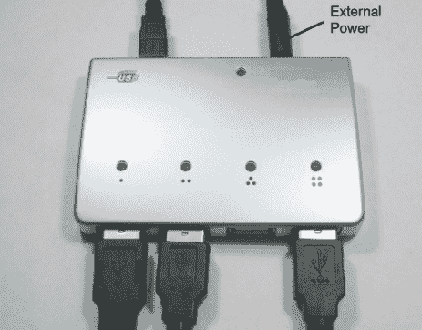

当然，即使是活动集线器也不能提供绝对的保护。但是，短路穿过活动集线器并到达计算机USB端口的可能性非常小。

如果你想在没有个人电脑的情况下使用Maix板，即在独立模式下，也需要一个外部5V电源单元。理想情况下，可以使用集线器的电源单元。编程后，该板可以独立于USB端口使用。重要的是电源要提供足够的电流。额定电流应至少为2000毫安（2安）。如果电源仍然使用USB-micro接口，则需要一个转USB-C的适配器（见图5.2）。有关独立操作的更多信息，请参见第7.4节。


图5.2：一个USB-C适配器。

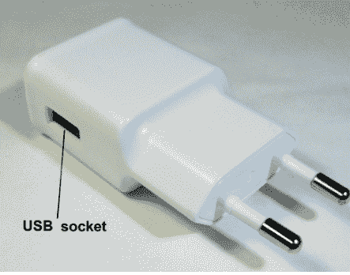

图5.3：一个USB电源。

在此应提及，MaixDuino与Arduino一样，集成了电压调节器。这意味着这些板也可以通过任何输出电压为6V至12V的电源供电。该电源必须能够提供至少2安的电流。为了连接到各自的板，电源必须具有标准的同轴电源连接器。

在各种应用中，当Maix板通过同轴电源连接器运行时，其运行会更稳定一些。具体来说，当使用SD卡并且有额外硬件连接到MaixDuino的引脚时，USB供电似乎达到了极限。第7.4节提供了有关此主题的更多信息。

# 第六章 • 树莓派

近年来，树莓派已成为最受欢迎的控制器板之一。虽然它常用于与硬件相关的项目，但它也可以成功地用于机器学习应用。特别是新一代的树莓派4已经为此提供了足够的计算能力。然而，可用的RAM大小至关重要。配备8GB RAM的Pi 4，你就能装备精良。凭借更快的CPU、新的GPU、4K支持、USB 3.0、USB-C、蓝牙5.0、千兆以太网，甚至可以实现更具挑战性的项目。

因此，树莓派4在性能和功能方面树立了另一个里程碑。Pi 4比其前代产品快3倍，并提供显著更快的多媒体性能，这对图像处理尤其有利。总体而言，Pi 4在许多方面接近基于x86的个人电脑的性能。

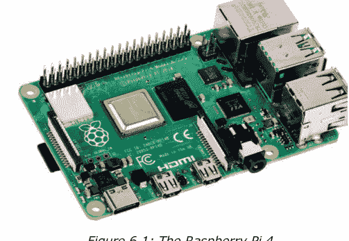

图6.1：树莓派4。

下表总结了Pi 4最重要的参数：

| 处理器： | 64位四核 - ARM Cortex-A72 (4× 1.5 GHz) |
| 视频 | 双显示器支持，通过两个Micro HDMI端口分辨率高达4K<br>硬件视频解码器，支持高达4Kp60<br>2× Micro HDMI（支持高达4Kp60）<br>2通道MIPI DSI端口（显示器）<br>2通道MIPI CSI端口（摄像头） |
| 音频： | 4线立体声音频 |
| RAM | 高达8 GB RAM - LPDDR4 |
| WLAN： | 双频2.4 / 5 GHz<br>2.4 GHz和5 GHz IEEE 802.11b/g/n/ac无线局域网 |
| 蓝牙： | 5.0, BLE |
| LAN： | 千兆以太网 |
| 接口： | 2× USB 3.0<br>2× USB 2.0 |
| GPIO： | 标准40针GPIO排针（兼容旧版板卡） |
| SD卡： | microSD（用于操作系统和数据存储） |
| 电源： | 5 V / 3 A（通过USB-C） |

### 6.1 远程桌面

树莓派有4个USB端口，以及一个（在RPi 4的情况下甚至有两个）HDMI接口。因此，这台迷你电脑可以配备键盘、鼠标和屏幕。或者，也可以通过Windows远程桌面进行控制。这种变体有几个优点。键盘、鼠标和屏幕可以与个人电脑一起使用。无需为RPi配备单独的设备。这在空间有限的情况下尤其有利。例如，你不需要额外的显示器，也不必在两个系统之间来回切换。

通过远程桌面连接到树莓派，可以通过局域网或无线局域网完全控制RPi。原则上，树莓派也可以几乎完全通过ASCII控制台进行控制，但图形界面通常更有优势，特别是在机器学习应用中。

远程桌面连接在所有最新的Windows系统上都已预装，因此非常适合控制RPi。所以，如果你想远程控制RPi，远程桌面连接是一个非常高效的选择，在数据量方面也是如此。

在RPi端，只需要一个软件包。可以通过输入以下命令下载：

```
sudo apt-get install xrdp
```

所有重要的设置都已预定义。因此，安装完成后，你可以立即登录RPi。在Windows个人电脑上，所需的程序可以在开始菜单中找到，名为“远程桌面连接”。

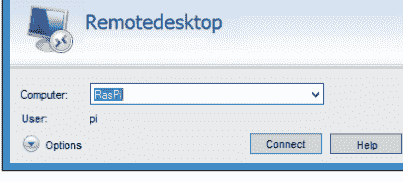

图6.2：远程桌面工具的启动窗口。

在启动窗口中，输入Pi的IP地址或树莓派的名称（默认：raspberrypi）作为主机名。之后，将显示Pi的登录屏幕。

### 6.2 使用智能手机和平板电脑作为显示器

远程桌面功能不仅限于MS Windows PC。远程桌面应用也可以安装在Android智能手机或平板电脑上。这些设备随后可用作无线显示器。由于此应用对内存容量或CPU性能没有特别高的要求，即使是较旧的Android设备也可以使用。也许，一些较旧的平板电脑或智能手机会再次找到有用的应用场景。

微软的远程桌面应用可以通过Play Store轻松安装。启动应用后，例如可以通过应用中的+号调用树莓派。图6.5展示了如何将一个旧平板电脑用作树莓派的紧凑型屏幕。

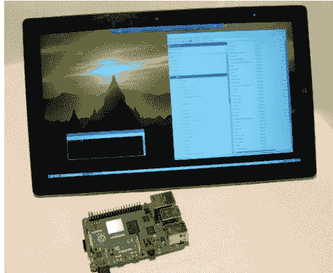

图6.5：一台平板电脑作为树莓派的无线显示器（通过WLAN）。

### 6.3 FileZilla

如果你想不仅通过复制粘贴来交换数据，还要在PC和RPi之间传输整个文件，那么FileZilla是正确的选择。该程序作为通过FTP和SFTP进行文件传输的服务器和客户端软件，可以免费获取。使用FileZilla客户端，用户可以连接到FTP/SFTP服务器，然后上传和下载文件。该程序可以从互联网下载（参见下载包中的*LINKS.txt*）。安装并启动程序后，可以直接从PC建立到树莓派的连接。需要以下条目：

服务器：树莓派的IP地址
用户名：树莓派的用户名（默认：pi）
密码：用户pi的密码（默认：raspberry）
端口：22

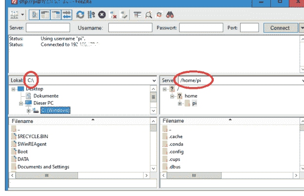

*图6.6：FileZilla运行中。*

现在你可以像在Windows资源管理器中一样，在PC和活动的Pi之间交换、复制或移动文件。

### 6.4 改造我的Pi

由于树莓派在训练大型神经网络或处理复杂图像应用时工作繁重，你应该确保处理器不会承受过大的热应力。立即损坏的可能性不大，因为各种内部保护机制会生效。然而，芯片温度升高总是会对相关组件的寿命产生负面影响。第一个措施是在主处理器上安装散热片：

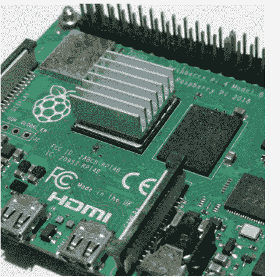

*图6.7：安装了散热片的BroadCom处理器。*

然而，使用风扇进行主动冷却甚至更有效。这可以显著降低处理器温度。它使Pi成为一个真正的“数字处理器”，不会轻易被高计算负载所困扰。

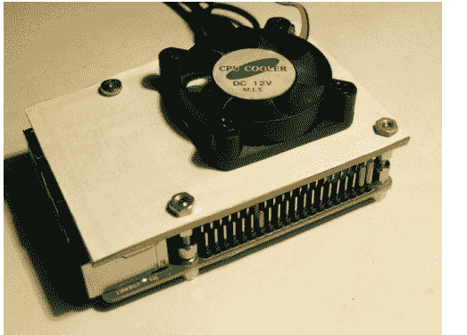

*图6.8：带有冷却风扇的树莓派。*

通过这个简单的措施，CPU温度可以轻松降低15ºC或更多（图6.9）。

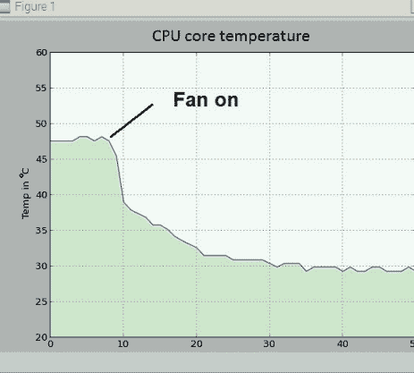

图6.9：借助风扇降低RPi CPU温度。

# 第7章 • Sipeed Maix，又名“MaixDuino”

MaixDuino提供了一个低成本系统，特别支持人工智能算法的应用。使用Python，在PC或工作站上运行AI算法没有问题。然而，像MaixDuino这样的单板计算机也允许为小型且廉价的硬件系统配备相应的功能和流程[10,11]。

除了选择具有足够计算能力的系统外，总是需要考虑使用哪些额外的硬件组件，如摄像头、显示器、麦克风、执行器或传感器来进行数据采集。售价约30欧元的MaixDuino（图7.1）以一种便捷的方式解决了这个问题。除了摄像头和显示器接口外，该板还提供了多个I/O引脚。这些引脚的排列方式使得连接器与熟悉的Arduino UNO板兼容。因此，原则上也可以使用所谓的Arduino扩展板与MaixDuino一起工作。

不仅硬件基于Arduino系统。在软件方面也有很强的相似性。MaixDuino也可以通过Arduino IDE进行编程。然而，对于机器学习应用，使用Python作为编程语言是有利的。

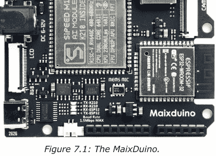

图7.1：MaixDuino。

由于MaixDuino目前不如树莓派普及，下一节将更详细地介绍“Maix”的主要特性。

## 7.1 小而强大：MaixDuino的性能数据

除了其他知名芯片外，Kendryte K210处理器在MaixDuino板上工作。图7.2展示了该芯片最重要的功能单元。

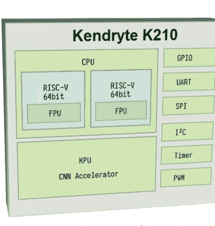

图7.2：Kendrite K210的内部结构。

两个时钟频率为400兆赫兹的64位处理器（CPU）构成了系统的核心。这里采用的是开源的ISA RISC-V版本，而不是熟悉的ARM架构。每个核心还分配了一个FPU（浮点单元）。通过这种方式节省的许可费用无疑有助于降低处理器的价格。

最有趣的功能单元是带有CCN加速器的KPU。KPU代表**知识处理单元**。这个核心功能块能够显著加速在特殊神经网络（例如卷积神经网络）中频繁出现的数学运算处理。

开发KPU或“AI加速器”是为了加速人工智能应用。特别是，人工神经网络、机器学习或计算机辅助“视觉”可以借助它们更有效地工作。典型应用可以在机器人或物联网项目中找到[12]。

此外，音频处理器（APU）确保音频信号的快速处理。还有其他模块可用，例如用于快速傅里叶变换（FFT）。这使得该板特别适合图像处理项目和音频分析。通过这种方式，可以在AIoT领域（**人工智能物联网**）极其快速且经济高效地实现智能应用。

此外，控制器特定的单元，例如

- GPIO
- UART, SPI, I²C
- 定时器
- PWM

也是可用的。以下概述总结了Maix-Duino的主要特性：

主处理器：K210 RISC-V双核64位，带FPU @ 400 MHz神经网络处理器
闪存：16 MB
内存：6 MB + 2 MB专用于KPU
协控制器：ESP32
接口：与Arduino UNO兼容的排针 USB Type-C 24P LCD连接器 24P摄像头连接器 SD卡槽 扬声器输出
电源：USB Type-C或DC 6–12V（内部转换为5 V / 1.2 A）
音频：板载双向I2S数字输出 MEMS麦克风 3 W扬声器输出（DAC + 内部放大器）
WLAN：2.4G 802.11.b/g/n
蓝牙：4.2
按钮：复位和启动按钮
外设：I²C, SPI, I²S, WDT, TIMER, RTC, UART, GPIO

该板支持直接视频输出，分辨率为320×240像素（QVGA），帧率为60帧/秒（fps），或VGA（640×480）30 fps。MaixDuino可作为单板或入门套件提供（另见本书末尾的材料部分）。后者除了板子本身外，还包含另外两个组件：

- 一个2.4英寸TFT显示屏
- 一个合适的摄像头模块

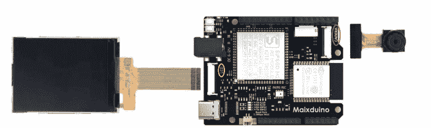

无法为内置的8 MB SRAM添加更多内存。Kendryte K210主要面向（预）处理图像或声音信号的物联网设备。最多可以连接八个用作麦克风阵列的麦克风。然后可以使用FFT和KI单元处理数字化的信号[10,11]。

AES和SHA单元主要用于在K210上运行加密和签名的固件。

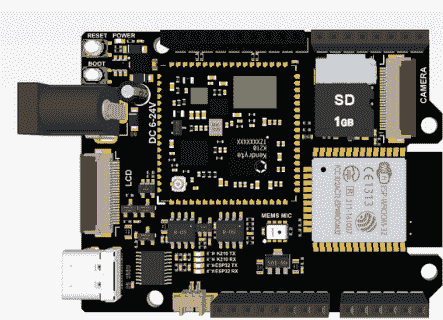

图7.4：MaixDuino正面视图。

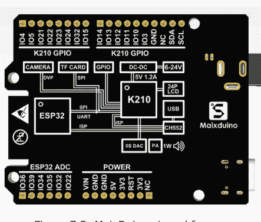

图7.5：MaixDuino背面视图。

## 7.2 丰富的应用领域

这块小板有多种应用领域。重点当然是机器学习、图像采集以及各种神经网络应用。得益于高性能的音频处理器，也可以实现声学信号采集和识别过程。由此产生的应用范围从简单的项目到几乎专业的应用领域。以下列表初步展示了其可能性：

使用Python进行机器学习

智能家居应用：
- 清洁机器人
- 智能音箱
- 智能门锁

医疗技术：
- 医学图像识别
- 自动医疗紧急警报

工业应用：
- 智能分拣
- 电气设备监控

教育应用：
- 学习机器人
- 智能互动平台

农业应用：
- 植物生长监测
- 病虫害检测
- 收割机自动化控制

神经网络和机器学习或人工智能领域的其他方法的使用，为图像数据的评估开辟了全新的视角。然而，与传统技术相比，这需要相对较高的计算能力，因此需要强大的硬件。因此，移动应用或没有互联网接入的设备长期以来一直很困难，甚至不可能实现。为了能够更普遍地使用人工智能系统并提高其普及度，近年来开发了几种专用芯片组。目标是在小尺寸和低功耗的情况下提供足够的计算能力。

在这种情况下，足够的计算能力应理解为足以完成任务。这些芯片通常并不真正适合复杂的训练过程。因此，神经网络的训练应在功能强大的计算机上进行。然后，完成的模型可以传输到较小的板上，并在实际应用中使用。

Kendryte的K210芯片属于这种新型芯片。凭借两个RISC核心和专用的神经网络单元，与其他芯片相比，其计算能力相当令人印象深刻。当你考虑到K210功耗很低时，这一点就更加真实了。这甚至使电池供电成为可能（参见第7.4节）。

## 7.3 初始启动和功能测试

为了进行初步测试，MaixDuino可以简单地连接到任何USB端口。请注意，此连接需要USB-C线缆。然而，与所有开放式电路板一样，应遵守一些安全说明：

- 电路板切勿在导电表面上操作。由于裸露的焊点，可能会发生短路，从而可能损坏MaixDuino。
- 如果可用，应在PC和电路板之间连接一个有源USB集线器。在发生短路的情况下，这在大多数情况下至少可以防止损坏PC的USB端口，因为集线器可以防止PC侧的过流。此外，集线器通常比PC USB端口提供更大的功率。这可以防止MaixDuino供电时出现不必要的电压下降，尤其是在使用笔记本电脑时。

连接线缆后，红色电源LED应亮起。如果没有，必须立即将电路板从端口断开。通过这种方式，可能可以防止潜在的短路造成广泛损坏。然后才应开始故障排除。有关故障排除的有用提示可以在本书末尾的相应章节中找到。

如果电源LED正常亮起，您可以将显示屏连接到MaixDuino。为此，您应首先再次将Maix从电源（USB或同轴电源连接器）断开。然后将显示屏的排线连接到标有“LCD”的插座。重新连接USB线缆后，MaixDuino会以红色启动屏幕和白色字符“Welcome to MaixPy”进行报告。加载的固件版本也可能显示在屏幕上。如果Pi上有更新或不同的固件，启动屏幕可能看起来会有所不同。

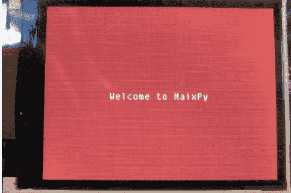

*图7.6：MaixDuino显示屏上的启动屏幕。*

Maix可以通过USB-C插座以及同轴电源连接器供电。同轴电源连接器需要6至12伏的直流电压。电源应能提供高达2安培的电流。

尽管Maix也可以一次只使用一个电源供电，但事实证明，同时使用两个电源是有益的。这在计算密集型应用的情况下，可以显著提高运行可靠性。

## 7.4 供电和独立运行

在许多情况下，MaixDuino和Raspberry Pi通过USB端口获得供电电压。然而，当项目完成时，通常希望电路板能够独立于PC或笔记本电脑运行。在这种情况下，您可以使用外部电源或（可充电）电池。

由于Raspberry没有集成稳压器，因此只能通过USB-C连接器为电路板供电。为此，有专用的电源可用，可提供5.1伏的电压，最大电流约为3安培。略高的电压确保了Pi即使在负载增加的情况下也能可靠工作。使用标准的5伏电源时，有时会出现欠压符号（屏幕右上角的闪电符号）。在这种情况下，可能会发生意外错误甚至系统崩溃。

对于MaixDuino，有两种替代的供电方式。USB-C或同轴电源连接器都可以用作电压输入。在第二种情况下，需要6至12伏之间的直流电压，最大容量约为1.5安培。MaixDuino的内部稳压器会生成安全运行所需的较低电压。

如前所述，在某些情况下，建议同时使用两个电源。特别是在使用SD卡或当各种外部负载（如LED或传感器）连接到Maix时，仅使用USB供电时问题更频繁地出现。

如果您希望您的MaixDuino完全独立于市电运行，常见的USB移动电源提供了一个很好的解决方案。它们允许电路板在移动中或偏远地区运行数小时。

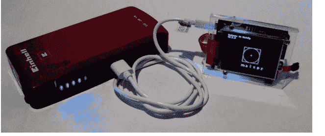

图7.7：连接了USB移动电源的MaixDuino。

# 第8章 • 编程与开发环境

由于Python在机器学习和人工智能领域的编程语言中已成为事实上的标准，随着时间的推移，出现了各种**集成开发环境（IDE）**。这些变体中的每一种都有其特定的优缺点。Python编程最重要的IDE是：

- Thonny
- MaixPy IDE
- Anaconda
- Spyder

Thonny尤其受欢迎，因为它默认安装在Raspberry Pi上。这使得该IDE成为创客场景中的经典编程工具。

MaixPy提供了一个专门为MaixDuino量身定制的IDE。这可以最有效地利用该板的特定性能特点。特别是，可以使用此IDE的视频输出功能。

Anaconda和Spyder是使用Python实现机器学习项目时的经典工具。它们为所有常见操作系统提供安装包，范围从Windows、Linux和MacOS到Raspberry Pi OS。

各个版本将在以下部分中更详细地描述。它还解释了它们为各自的应用和系统提供了哪些优缺点。在学习完这些章节后，用户应该不再难以选择适合特定项目的最佳IDE。

### 8.1 Thonny — 面向初学者和中级用户的Python IDE

Thonny是Python和MicroPython编程的标准IDE。该IDE享有持续的更新和持续的开发，因此具有相当的前瞻性。Thonny也适用于所有常见操作系统。它甚至作为标准预装在当前的Raspberry Pi OS上。通常，安装相当简单，因此安装过程不应出现问题。

本书中使用的是Windows 10 PC上的**Thonny 3.3.10**版本。原则上，未来的版本应该是兼容的。但是，如果出现意外问题，请考虑回退到此版本。

相应的下载包可以在互联网上找到（参见LINKS.txt）。下载完成后，可以启动安装文件。现在您只需按照向导操作，直到安装过程完成并可以打开Thonny IDE。

## 使用Python进行机器学习

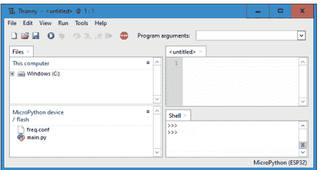

图 8.1：启动后的 Thonny IDE。

现在，可以将支持Python的开发板（如MaixDuino）连接到计算机。为了测试安装，必须将Thonny配置为使用MicroPython解释器。此外，还必须选择正确的开发板。为此，需要执行以下步骤：

1.  通过 `运行` → `选择解释器`，将打开以下窗口：

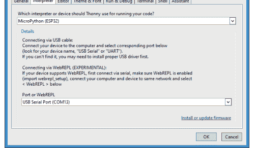

图 8.2：Thonny 中的选项窗口。

2.  必须在第一个选择窗口中选择 **MicroPython (ESP32)**。
3.  必须在 **端口或 WebREPL** 下输入开发板的 COM 接口。

Maix 提供两个串行接口。通常，Thonny 必须连接到端口号较小的 COM 端口。如果不确定，则必须测试两个端口（参见图 8.3）。

# 第8章 • 编程与开发环境

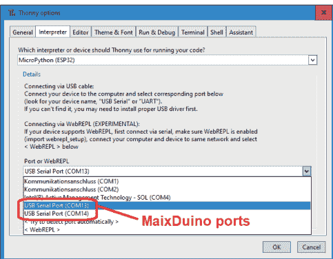

Thonny IDE 现在已连接到开发板，并且 Shell 窗口中出现了提示符 `>>>`。或者，也可以选择 **尝试自动检测** 选项。但是，此功能并非对所有开发板都可靠。如果在 Shell 中输入命令 `help()`，则会显示欢迎消息以及一些信息：

```
Welcome to MicroPython on the Sipeed Maix!

For generic online docs please visit https://maixpy.sipeed.com

Official website : http://www.sipeed.com

Control commands:
  CTRL-A        -- on a blank line, enter raw REPL mode
  CTRL-B        -- on a blank line, enter normal REPL mode
  CTRL-C        -- interrupt a running program
  CTRL-D        -- on a blank line, do a soft reset of the board
  CTRL-E        -- on a blank line, enter paste mode

For further help on a specific object, type help(obj)
For a list of available modules, type help('modules')
```

Thonny 的安装现已成功完成，可以通过 Shell 指令控制开发板。MaixDuino 通常预装了 MicroPython 解释器。如果没有，也可以轻松地在后续安装。有关此任务的详细信息，请参见第 8.7 节。

## 使用Python进行机器学习

现在，MaixDuino 已连接到 PC，可以开始第一个机器学习项目了。不过，首先您应该更熟悉 Thonny IDE。在接下来的几节中，将更详细地解释如何使用 Thonny 对 Maix 进行编程。

### 8.2 Thonny 作为 RPi 和 MaixDuino 的通用 IDE

Thonny IDE 中有几个不同的区域，包括编辑器和 MicroPython shell 或终端：

-   代码在编辑器区域中创建和编辑。可以打开多个文件，每个文件都有一个新标签页。
-   在 MicroPython shell 中，输入要立即执行的命令。终端还提供有关正在运行的程序状态的信息，显示与上传相关的错误、语法错误等。

还有其他有用的标签页可用。这些可以在视图菜单中进行配置。特别是 **变量** 标签页通常非常有用。它显示程序的所有变量及其当前值。为了熟悉在 MaixDuino 上编写程序和执行代码，可以开发一个脚本，使 Maix 上的集成 LED 闪烁。

MaixDuino 在其元件面有一个多色（红-绿-蓝或 RGB）LED。这可以用于简单的测试应用。为此，首先在开发板上创建一个 `main.py` 文件：

1.  当 Thonny 首次启动时，编辑器显示一个未命名的文件。此文件将保存为 `main.py`。为此，通过 `文件` → `另存为` 将文件保存到开发板（“Micro Python Device”）本身，命名为 `main.py`。
2.  现在有一个名为 `main.py` 的标签页可用。
3.  在此处输入以下代码：

```
from Maix import GPIO
from fpioa_manager import fm
from board import board_info
import time

fm.register(14, fm.fpioa.GPIO0)    # 12: green, 13: red, 14: blue
led=GPIO(GPIO.GPIO0, GPIO.OUT)

for i in range(10):
    led.value(1)
    time.sleep(.1)
    led.value(0)
    time.sleep(.1)
```

该代码在本书的下载包中以 `blink_10.py` 的形式提供，可以通过复制粘贴传输。稍后将解释如何直接将文件从 PC 复制到控制器。

通过绿色箭头或 `运行` → `运行当前脚本` 或使用 `F5` 功能键，代码将传输到控制器。现在，Maix 上的 RGB LED 应该会快速连续闪烁正好 10 次（图 8.4）。

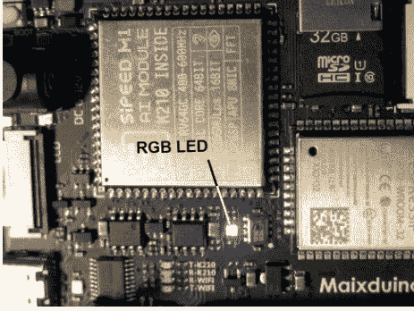

*图 8.4：MaixDuino 的 RGB LED 工作中。*

### 8.3 文件操作

要使用 Thonny IDE 在 Maix 上创建一个具有唯一名称的文件，需要执行以下步骤：

-   正确创建新文件。
-   使用所需名称保存文件，例如 *blink_10.py*。

通过菜单 `文件` → `新建`，可以将文件作为新标签页打开。然后可以使用菜单 `文件` → `另存为` 将文件以其名称（*blink_10.py*）保存到 MaixDuino 上。在查询（图 8.5）中，必须选择第二个选项（MicroPython device）。

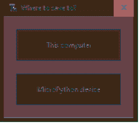

图 8.5：保存时的查询。

文件现在已上传到开发板，并出现在 `文件` 子窗口中。从那里，现在可以使用绿色箭头或 `F5` 键启动它。

或者，也可以通过在查询中选择 **This Computer** 将文件从芯片加载到计算机上。其他用于删除或重命名文件等的命令也可以在文件菜单中找到。Maix-Duino 上可以容纳一个完整的文件系统。因此，在使用 MicroPython 编程时，可以在开发板上存储多个程序。然后，这些程序可以由系统上同样可用的解释器直接处理。文件系统可以直接用 Thonny 管理。与许多其他编程工具类似，开发环境包含以下组件（图 8.1）：

1.  文件夹和文件
2.  编辑
3.  MicroPython Shell / 终端
4.  工具

在左侧子窗口（文件夹和文件）中，设备文件夹（“MicroPython device”）中当前存储在开发板上的文件是可见的。一旦开发板通过串行连接连接到 Thonny，打开设备文件夹时就会显示所有存储的文件。安装 Python 解释器后，此处仅可见一个 **main.py** 文件。为了执行应用程序代码，还应该创建一个 **boot.py** 文件。为此，请再次遵循：`文件` → `新建`，并创建一个名为 **untitled** 的新文件。可以使用工具窗口中的磁盘图标将此文件以 **boot.py** 的名称保存到开发板上。

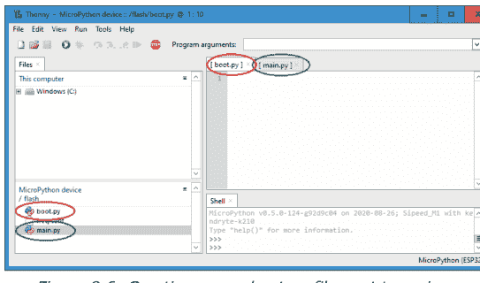

图 8.6：在 main.py 旁边创建新的 boot.py 文件

现在设备文件夹中有以下两个文件：

-   `boot.py`：每次开发板重启时执行
-   `main.py`：应用程序代码的主脚本

在设备文件夹下方，可以找到 SD 文件夹。此文件夹用于访问存储在 μSD 卡上的文件。如果将此类卡插入 MaixDuino 的相应插槽（图 7.4）；其上的文件将出现在 SD 文件夹中。

在编辑器区域中，为 .py 应用程序创建代码。编辑器为每个文件打开一个新标签页。

编辑器区域下方的部分是 MicroPython Shell/终端。此处输入的所有命令都由解释器立即执行。此外，终端还显示有关正在运行的程序状态的信息。当前程序中的任何语法错误或上传过程中的错误消息等也会显示在此处。

主窗口左上角工具区域中的图标可用于快速直接地执行任务。按钮具有以下功能：

-   新建文件：在编辑器中创建一个新文件
-   打开文件：打开计算机上的文件
-   保存文件：保存文件
-   运行（带白色箭头的绿色圆圈）：运行代码
-   停止：停止代码执行。这相当于在 shell 中输入 `CTRL + C`

此外，还有其他用于调试的符号，这些符号在本书的上下文中不一定需要。

要快速测试 PC 和开发板之间的连接，可以输入 **print** 命令。

## 使用Python进行机器学习

这将立即显示通信是否正常工作：

```
>>> print ('Test')
```

如果出现以下响应

```
Test
>>>
```

则表示Maix已准备就绪。

### 8.4 在树莓派上使用Thonny

Thonny在树莓派上也是默认可用的。通过以下路径启动：

开始（Raspberry）→ 开发 → Thonny Python IDE

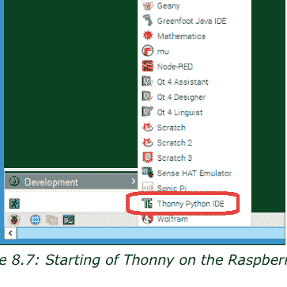

图8.7：在树莓派上启动Thonny。

Thonny在树莓派上的外观与PC版本几乎完全相同（参见图8.8）。

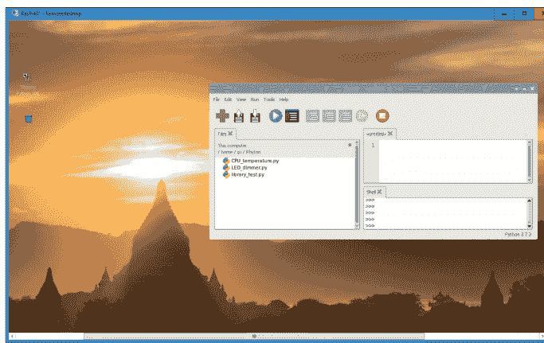

图8.8：在树莓派上运行的Thonny。

如果你想在本地（即在Pi本身上）使用Python，必须通过以下路径选择：

运行 → 选择解释器 → Thonny选项

选择此选项：

运行Thonny的同一解释器

如图8.9所示。

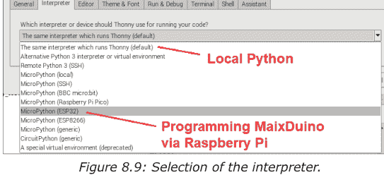

图8.9：选择解释器。

然而，也可以通过树莓派对MaixDuino进行编程！为此，需要在树莓派的Thonny IDE中选择解释器选项：

MicroPython (ESP32)

## 使用Python进行机器学习

端口必须设置为：

Sipeed-Debug (/dev/ttyUSB0)

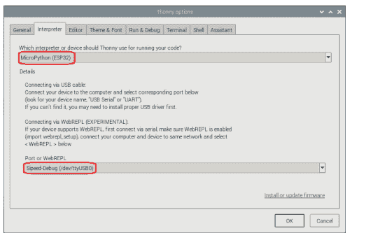

图8.10：选择MaixDuino端口。

随后，可以通过树莓派以与从PC相同的方式对Maix进行编程（参见第8.2节及后续内容）。在这种情况下，完全不需要Windows PC。

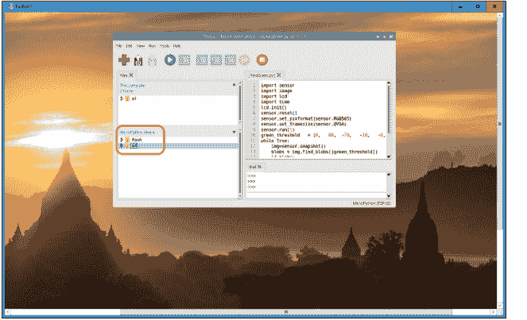

图8.11：树莓派控制MaixDuino！

### 8.5 Thonny IDE故障排除提示

下面讨论Thonny IDE的一些错误消息。相应的问题通常相对容易解决：

- 在许多情况下，使用集成的Boot/RST按钮重启MaixDuino可以解决问题。
- 在Thonny IDE内，按下停止/重启后端按钮（或CTRL-F2）通常可以解决PC与开发板之间的通信问题。

否则，以下提示可能有所帮助：

**错误1：** 无法与开发板建立连接。
在这种情况下，会打印以下错误消息：

```
============================== RESTART ==============================
Unable to connect to COM14
Error: could not open port 'COM14': FileNotFoundError(2, 'The system cannot find the file specified.', None, 2)
或：

============================== RESTART ==============================
Could not connect to REPL.
Make sure your device has suitable firmware and is not in boot-loader mode!
Disconnecting.
或：
============================== RESTART ==============================
Lost connection to the device (EOF).
```

这里，中断然后重新建立与模块的USB连接通常会有所帮助。你还应该检查是否在以下位置选择了正确的串行端口：

运行 → 选择解释器

此错误也可能表明串行端口已被另一个程序（如串行终端或Arduino IDE）占用。在这种情况下，请确保所有可能建立串行通信的程序都已关闭。然后应重启Thonny IDE。

**错误2：** Thonny IDE无响应或发出内部错误
关闭并重新打开活动窗口后，你应该能够像往常一样继续工作。如果崩溃反复发生，则应重启整个Thonny IDE。

**错误3：** Thonny IDE不再响应停止/重启后端按钮
按下名为停止/重启后端的按钮后，你应该等待几秒钟。MaixDuino需要时间重启并重新建立与Thonny的串行通信。如果快速连续多次单击停止按钮，开发板将没有足够的时间正确重启。这可能导致Thonny IDE崩溃。

**错误4：** 重启MaixDuino、执行新脚本或打开串行接口时出现问题。

## 使用Python进行机器学习

如果出现错误消息：

```
Brownout detector was triggered
```

或发生持续重启，或显示类似以下信息：

```
ets Jun 8 2016 00:22:57

rst:0x1 (POWERON_RESET),boot:0x13 (SPI_FAST_FLASH_BOOT)
configsip: 0, SPIWP:0xee
clk_drv:0x00,q_drv:0x00,d_drv:0x00,cs0_drv:0x00,hd_drv:0x00,wp_drv:0x00
mode:DIO, clock div:2
load:0x3fff0018,len:4
load:0x3fff001c,len:4732
load:0x40078000,len:7496
load:0x40080400,len:5512
```

这可能表明存在硬件问题。通常，原因是以下问题之一：

- USB线质量差；
- USB线太长；
- 开发板有缺陷（例如，焊接不良）；
- 计算机USB连接故障；
- 计算机的USB端口供电不足。

在这些情况下，使用尽可能短的高质量USB线会有所帮助。切换到PC上不同的USB插座也可能有帮助。对于笔记本电脑，应使用带有独立外部电源的有源USB集线器。这样，你就不再依赖于笔记本电脑内部USB电源的容量。
如果问题持续存在或其他奇怪的错误消息出现，建议使用最新版本的MicroPython固件更新开发板。这至少可以排除已修复的错误导致进一步困难的可能性。

**错误5：** PC与MaixDuino之间无法建立连接。
有时Maix太忙，无法建立USB连接。多次单击停止/重启后端按钮可能会有所帮助。但是，这种重复单击应在合理的时间间隔内进行（见上文）。
如果执行的脚本使用Wi-Fi或节能模式，或并行执行多个任务，建议尝试三到四次以建立通信。如果仍然无法建立，则应使用最新的MicroPython固件重新刷写ESP。

### 8.6 MaixPy IDE

特别是对于使用MaixDuino，也可以使用MaixPy IDE。该IDE对于MicroPython语法也相当可用。该IDE通过Sipeed网页安装（参见*LINKS.txt*）。

使用该IDE使你能够：

- 在PC上编辑脚本；
- 将程序上传到Maix；
- 直接在MaixDuino上执行脚本；
- 在控制器板上保存和管理文件；
- 在计算机上实时查看摄像头图像（图8.12）。

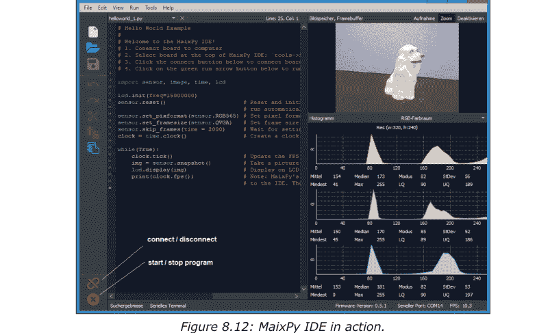

最后一个主题是MaixPy IDE相对于Thonny或Jupyter等其他系统的显著优势。除了实时摄像头图像外，还会显示RGB颜色空间的三部分彩色实时直方图。也可以通过图表标题旁边的小三角形符号选择其他直方图版本。
你应该意识到，使用此IDE版本会消耗一些资源用于摄像头图像的压缩和传输，这会以控制器板的计算能力为代价。
安装后，可以启动IDE进行首次测试运行。使用

工具 → 选择开发板

选择正确的控制器板（Sipeed MaixDuino；图8.13）。

## 使用Python进行机器学习

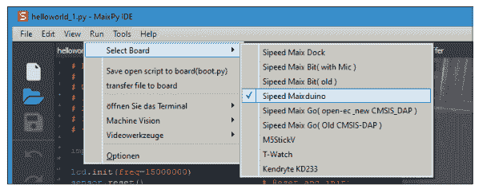

图8.13：选择MaixDuino开发板。

要连接到MaixPy板，请单击左下角的链条符号。然后必须选择正确的COM接口。如有疑问，必须在此处再次测试所有选项。

连接成功建立后，连接按钮的颜色从绿色变为红色。连接按钮下方是执行按钮。这将执行编辑器中当前打开的Python文件。

再次单击运行按钮将停止正在运行的程序。上传文件的选项可以在相应的下拉菜单中找到。

请注意，一次只能打开一个串行端口。因此，在打开新端口之前，必须确保所有先前的连接都已关闭。

如果连接失败，请尝试更新固件或IDE。并非所有IDE版本都与所有固件变体兼容。但是，以下组合

- MaixPy IDE 0.2.5
- maixpy_v0.5.0_125_gd4bdb25.bin

已成功测试。其他组合应在使用前进行检查。任何错误都会在消息框中显示。不幸的是，错误信息并不总是完整的。有关可能错误源的更多信息可以在终端输出中找到。为此，可以关闭IDE并启动串行终端。终端打印输出通常会包含更多故障排除提示。尽管MaixPy IDE在本书的上下文中很少使用，但它当然可以用于控制和测试目的。特别是，如果显示器或摄像头工作不正常，此IDE版本可以提供有价值的错误信息。诸如实时图像分析系统或颜色空间图之类的功能也可以在各种ML项目中提供帮助。

### 8.7 MaixDuino的MicroPython解释器

通常，MaixDuino预装了Python解释器。然而，由于多种原因，可能需要加载新的解释器：

### 8.8 Flash 工具实战

kflash 工具不仅可用于上传 Python 解释器。它更是一个通用工具，允许将任何类型的数据加载到 MaixDuino 的闪存中。

在进行机器学习项目时，通常有多种模型可供测试。这些模型通常包含完全训练好的神经网络数据。MaixDuino 有大量现成的模型可用。这些模型通常以两种不同的变体提供：

1.  作为 .kfpkg 文件
2.  作为 .kmodel 文件

在第一种情况下，.kfpkg 文件（例如，face_model_at_0x300000.kfpkg）可以直接使用 Flash 工具加载到特定的十六进制地址。而 kmodel 文件（例如，facedetect.kmodel）则可以通过 Thonny 写入 Maix 的 SD 卡。

当然，在 Python 程序中必须考虑正确的版本。在第一种情况下，模型是从十六进制地址读取的，例如，通过：

```
task = kpu.load(0x200000)
```

在第二种情况下，必须指定文件（包括路径），例如，使用：

```
task = kpu.load("/sd/MNIST.kmodel")
```

.kfpkg 文件实际上是一个 .zip 归档文件，其扩展名被重命名为 "kfpkg"。这些文件可以使用 ZIP 工具打开。你会得到两个文件：

1.  kmodel 本身；
2.  一个 .json 文件。

JSON 部分会告诉 kflash_gui 应该将 kmodel 写入哪个地址。因此，kfpkg 的文件名通常包含其写入的十六进制地址（例如，0x300000）。通过这种方式，可以加载两个（或更多）文件，例如 Python 解释器和一个模型，而不会发生内存区域重叠。

### 8.9 机器学习与交互式 Python

“交互式”一词源于拉丁语表达 *inter agere*。动词 *agere* 意为“行动”。词素“inter”指向两者之间。从这个意义上说，可以说交互式 shell 位于行动的用户和操作系统之间。

因此，交互式系统会等待用户的命令并立即执行它们。它会立即返回执行结果。之后，Shell 等待下一次输入。

Python 提供了一个便捷的命令行界面，也称为 Python 交互式 Shell。因此，Python 有两种基本模式：

-   脚本模式；
-   交互模式。

在脚本模式下，完整的 .py 文件在解释器中执行。另一方面，交互模式提供了一个命令行 shell，为每条指令提供即时反馈。因此，交互模式非常适合测试新的程序结构。

交互式 Python 或 "IPython" 为交互式计算提供了一个全面的架构：

-   一个强大的交互式 shell；
-   支持数据可视化和使用 GUI 工具包。

随着时间的推移，各种 IPython 变体已经发展起来。这些最终在几年前被合并到一个名为 Jupyter 的开发系统中。Jupyter（以前称为：IPython Notebook）是一个开源项目，可以轻松地将 Markdown 文本和可执行的 Python 源代码结合在一起。因此，使用 Markdown 提供了一种简单的注释语言，无需进一步转换即可轻松格式化，并且易于阅读。

要使用 Jupyter notebooks，可以使用 Anaconda 环境。一旦安装完成，就可以立即创建和执行代码单元格。

除了在本地计算机上工作（例如，在 Windows 下），还可以连接到远程 Jupyter 服务器。然后可以在该系统上处理代码单元格，并导出 Python 文件或 Jupyter notebooks。因此，也可以通过 Jupyter 访问 MaixDuino。

Jupyter 系统也非常适合在 Raspberry Pi 本身上使用。特别是 Pi 4 提供了足够的资源，允许流畅地工作。这使得 IPython 和 Jupyter 成为适用于各种硬件版本的通用系统，包括本书中使用的那些。因此，Jupyter notebooks 成为机器学习和 AI 编程中通用且极其流行的工具也就不足为奇了。

另一方面，Anaconda 是一个功能齐全的数据科学系统，允许轻松安装 Ipython IDE。因此，下一节将更详细地探讨这个开发环境。

### 8.10 Anaconda

Anaconda Navigator 提供了一个图形用户界面，在 Windows 和 Linux 下都易于安装。Anaconda 可以免费下载用于私人应用（下载包中的链接）。可以下载适用于当前 Python 版本的最新版 Anaconda。必须选择相应的操作系统（Windows、MacOS 或 Linux，各有 32 位或 64 位版本）。如果完全按照下载页面上的说明操作，Anaconda 的安装通常会顺利进行。

对于本书的使用，应选择以下选项：

1.  为所有用户安装。
2.  将 Anaconda 添加到 PATH 环境。
3.  将 Anaconda 注册为默认 Python。

经验表明，使用这些选项，如果以后要将 MicroPython 内核集成到 Jupyter 中，问题会很少。但是，应该意识到 Anaconda 是一个非常复杂和高级的应用程序。这意味着你永远无法保证一切总是按照即插即用方案运行。

因此，不建议绝对初学者使用 Anaconda。但即使是更有经验的用户，在某些情况下也必须修复错误。搜索引擎或相关论坛通常在这方面做得很好。如果 Anaconda 已成功安装，可以通过桌面图标或开始菜单中的条目启动该程序。需要注意的是，即使在高性能系统上，程序启动也可能需要一些时间。启动过程完成后，导航器会出现：

乍一看，这提供了几乎难以管理的各种可能应用。在本书后续过程中最重要的包括 **Jupyter** 和 **Spyder**。据信，两者的拼写中的 "y" 都源于 Python 中的 "y"。

Jupyter 是数据分析、机器学习和神经网络领域最受欢迎的应用程序之一。它提供了一个所谓的 IPython notebook（“交互式 Python”，见上文）。在那里，每个代码块都可以单独执行。此外，可以在每个块中显示图表。随后，可以处理进一步的代码，并将数据显示在新的图表中，依此类推。此外，还提供了诸如 % timeit 之类的功能，允许检查代码的运行时要求。

另一方面，Spyder 是一个用于 Python 的集成开发环境（IDE），类似于 Thonny。它主要用于开发完整的 Python 程序。

通常，在 AI 应用领域，Jupyter notebook 更适合分析数据、测试实验代码或评估不同的代码变体。而对于经典的 Python 编程，则更倾向于使用 Spyder。

Anaconda Navigator 中的“环境”选择可用于创建特殊的隔离编程环境。在此处安装的库仅在此环境中可用。通过这种方式，可以在不同的环境中使用不同版本的库。

### 8.11 Jupyter

Jupyter notebook 是一个非常强大的工具，用于基于数据的项目交互式开发。在人工智能和机器学习领域，它已成为一个重要的开发工具。本章将展示如何在个人电脑或笔记本电脑上为数据科学项目设置和使用 Jupyter。

“notebook”将代码和输出集成到一个文档中。这使得结合图形、文本、数学方程式等变得非常容易。因此，最终得到的是一个单一文档，它：

-   执行代码；
-   显示输出。

此外，还可以插入和显示：

-   解释说明；
-   公式；
-   图表。

因此，使用 Python 变得更加透明、易于理解且可复现。此外，它极大地简化了工作小组内代码和程序的共同开发与使用。多年来，notebook 已在全球许多公司中使用。它们有助于改善沟通并快速分享成果。

尽管可以在 Jupyter Notebook 中使用多种不同的编程语言，但本章重点关注 Python，因为这种语言特别适合在 notebook 中使用。

对于初学者来说，开始使用 Jupyter Notebook 最简单的方法是安装 Anaconda（参见上一章）。Anaconda 提供了一个功能齐全的机器学习环境，无需管理多个安装。使用 Anaconda 也能在很大程度上避免特定操作系统带来的安装问题。

### 8.12 安装与启动

已经安装了 Python 并且更喜欢手动管理软件包的高级用户，也可以通过 pip 安装 Jupyter：

```
pip3 install jupyter
```

这种变体也常用于 Linux 系统。对于像树莓派这样的小型系统，通常不使用 ANACONDA，而是直接安装 Jupyter。在 Windows 上，可以使用通过 Anaconda 添加到开始菜单的快捷方式来启动 Jupyter。这会在标准网络浏览器中打开一个新标签页（见图 8.18）。

这是一个所谓的 notebook 仪表板，专门用于管理各个 notebook。它作为编辑和创建 notebook 的启动板。仪表板只能访问在 Jupyter 启动目录中可见的文件和子文件夹。

当 Jupyter Notebook 在浏览器中打开时，仪表板在 URL 栏中显示为：

```
http://localhost:8888/tree
```

这表明内容由本地计算机提供。它表明 Notebook 是 Web 应用程序。Jupyter 启动一个本地 Python 服务器来处理与 Web 浏览器的交互。这使得它们本质上是平台无关的，并允许在 Web 上轻松共享。

要创建第一个 notebook，请在右上角的下拉按钮中选择“New”，然后选择“Python 3”（见上图）。这将在新标签页中打开第一个 Jupyter notebook。浏览器中会出现一个新文件“Untitled.ipynb”。一个绿色边框的文本框表示 notebook 正在活跃运行。每个 notebook 使用自己的标签页，因此可以同时打开多个 notebook。

.ipynb 文件（**交互式 Python Jupyter notebook**）包含一个文本文件，该文件以所谓的 JSON 格式描述 notebook 的内容。每个单元格，包括图形、注释或公式等，都存储在其中，并附带相关的元数据。

在使用 Jupyter 时，“单元格”和“内核”这两个术语起着核心作用：

-   内核是一个“计算机器”，用于执行 notebook 中包含的代码。
-   单元格是一个容器，用于存放要在 notebook 中显示的文本或由 notebook 内核执行的代码。

在一个新的 notebook（图 8.19）中，带有绿色边框的字段称为单元格。主要有两种单元格类型：

-   代码单元格包含由内核执行的程序指令。当代码执行时，notebook 会在生成输出的代码单元格下方显示输出。
-   Markdown 单元格包含格式化文本，当执行 Markdown 单元格时，它会直接显示其输出。

Jupyter 也可以用经典的 hello world 示例进行测试。在第一个单元格中输入：

```
print('Hello World!')
```

然后点击“Run”按钮或按键组合：

Ctrl + Enter

应该会得到以下结果：

如果单元格已成功执行，输出将直接显示在其下方，其左侧的标签从 In [ ] 变为 In [1]。

代码单元格的输出也是文档的一部分。代码单元格和 Markdown 单元格之间的区别在于，代码单元格左侧有 In [ ] 标签，而 Markdown 单元格没有。

标签中的“In”部分代表“Input”，而数字表示该单元格在内核上执行的顺序——在本例中，该单元格是第一个被执行的。

如果再次执行该单元格，In [1] 会变为 In [2]，因为该单元格现在是第二个在内核上执行的。

以下代码：

```
import time
time.sleep(5)
```

不产生任何输出，但执行需要五秒钟。Jupyter 通过在左侧显示 In [*] 来指示该单元格当前处于活动状态。

在 Jupyter notebook 中，总有一个“活动”单元格，其边框颜色表示当前模式：

-   绿色轮廓表示单元格处于“编辑模式”。
-   蓝色轮廓表示“命令模式”。

命令模式下的单元格可以通过“Ctrl + Enter”执行。还有许多其他命令可以应用于带有蓝色轮廓的单元格。为此提供了各种键盘快捷键。这些键盘快捷键允许快速的基于单元格的工作流程。下面列出了一些重要的示例：

-   Esc 或 Enter 在编辑模式和命令模式之间切换
-   在命令模式下：
    -   可以使用“向上”和“向下”键滚动。
    -   按 A 或 B，可以在活动单元格上方或下方插入一个新单元格。
    -   M 将活动单元格转换为 Markdown 单元格
    -   Y 将活动单元格转换为代码单元格
    -   D + D（即按两次 D）删除活动单元格
    -   Z 撤销单元格的删除
-   Ctrl+Shift+"-" 在编辑模式下将活动单元格在光标处分割

Jupyter 提供了一种易于学习的标记语言“Markdown”，用于格式化简单文本。其语法对应于 HTML 标签。然而，在本书的上下文中，它几乎不会被使用，因为全面的正式格式化主要用于科学出版物或演示文稿。

### 8.13 在 Jupyter 中使用 MicroPython 内核

要与支持 MicroPython 的控制器进行交互，必须安装一个特殊的内核。如果主机计算机上已经安装了 Python 3，可以通过 shell 加载以下仓库：

```
git clone https://github.com/goatchurchprime/jupyter_micropython_kernel.git
```

随后通过相应的 shell 命令安装该库：

```
pip3 install jupyter_micropython_kernel
```

最后，可以使用以下命令配置内核：

```
python -m jupyter_micropython_kernel.install
```

（重新）启动 Jupyter Notebook 后，一个新的 MicroPython USB 内核现在就可用了。

### 8.14 与 MaixDuino 的通信设置

现在你可以通过 Jupyter 与外部开发板（如 MaixDuino）进行通信。要建立与控制器的相应连接，你可以在第一个 Jupyter 单元格中使用以下命令显示所有可用端口：

```
%serialconnect
```

然后选择正确的端口并设置波特率。通常，115200 波特率可以无问题地工作：

```
%serialconnect to --port=COM14 --baud=115200
```

现在你可以通过笔记本直接在 MaixDuino 的屏幕上书写。

```
import lcd

lcd.init()
lcd.draw_string(100, 100, "Hello MaixDuino!", lcd.WHITE, lcd.BLACK)
```

在笔记本中，整个过程如下所示：

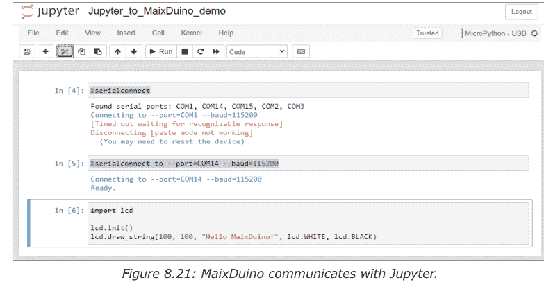

启动单元格后，消息将出现在 MaixDuino 的显示屏上。

### 8.15 内核

当在单元格中执行程序语句时，相关代码在内核中处理。内核的每个输出都会返回到相应的单元格。内核的状态保持不变，因为它指的是整个文档，而不是单个单元格。

例如，如果在单元格中导入了库或声明了变量，那么这些在其他单元格中也可用。以下示例通过函数定义来说明这一点：

```
def pythago(x,y):
    return x*x + y*y
```

一旦上述单元格被执行，`pythago()` 就可以在任何其他单元格中使用：

```
pythago(3,4)

25
```

这同样不受笔记本中单元格顺序的影响。一旦一个单元格被执行，其中声明的所有变量和导入的所有库在所有其他单元格中都可用。

Jupyter 提供了更改内核的选项。在上一节激活 MicroPython 内核时已经使用了此选项。更改内核有多种不同的选项。

通过为新笔记本选择 Python 版本，将自动选择要使用的内核。内核可用于不同版本的 Python，也可用于一百多种其他语言，包括 Java、C 甚至 FORTRAN。因此，例如，除了经典的 Python3 内核外，还可以在 Jupyter 中安装 MicroPython 内核，并使用它来编程外部控制器，如 ESP32、ESP-Eye 或 MaixDuino。

### 8.16 使用笔记本

在开始新项目之前，应为当前笔记本赋予一个有意义的名称。为此，单击名称 "Untitled" 并选择一个合适的新名称。保存通过单击磁盘符号完成。在浏览器中关闭笔记本选项卡与在传统应用程序（如 Word 或 Excel）中关闭文档不同。

笔记本的内核在后台继续运行，必须在实际关闭之前单独关闭。这样做的好处是，如果意外关闭了选项卡或浏览器，内核不必重新启动。只有在内核关闭后，选项卡才能完全关闭而不会出现任何问题。最简单的方法是选择

文件 → 关闭并停止

从笔记本菜单中。或者，也可以使用

内核 → 关闭

来终止内核。

通常建议定期保存当前工作。通过按

Cntr+S

笔记本被保存并创建一个所谓的检查点。每个新笔记本都会随笔记本文件本身一起创建一个检查点文件。检查点文件位于一个隐藏的子目录中，后缀为 `.ipynb_checkpoints`。默认情况下，Jupyter 每 120 秒自动将当前笔记本保存到此检查点文件，而不更改主笔记本文件。通过 Ctrl+S，笔记本和检查点文件都会更新。因此，在发生意外问题时，可以使用检查点恢复未保存的工作。使用菜单

文件 → 恢复到检查点

可以返回到检查点。

### 8.17 所有库都可用吗？

特别是在机器学习、神经网络和人工智能领域，近年来开发了许多功能强大的“库”。根据你的需求，可以使用 Anaconda Navigator 重新加载这些库。要快速概览哪个库以哪个版本可用，可以在 Jupyter 笔记本中使用 `Library_test_1V0.ipynb`（参见下载包）。如果加载了相应的库，执行第一个单元格后应显示以下信息：

```
In [1]: try:import sys; print('Python: {}'.format(sys.version))
except:print("no Python available")
try:import matplotlib; print('matplotlib: {}'.format(matplotlib.__version__))
except:print("no matplotlib available")
try:import tensorflow; print('tensorflow: {}'.format(tensorflow.__version__))
except:print("no tensorflow available")
try:import keras; print('keras: {}'.format(keras.__version__))
except:print("no keras available")
try:import pandas; print('pandas: {}'.format(pandas.__version__))
except:print("no pandas available")
try:import scipy; print('scipy: {}'.format(scipy.__version__))
except:print("no scipy available")
try:import numpy; print('numpy: {}'.format(numpy.__version__))
except:print("no numpy available")
try:import scikit; print('scikit: {}'.format(scikit.__version__))
except:print("no scikit available")
try:import sklearn; print('sklearn: {}'.format(sklearn.__version__))
except:print("no sklearn available")
try:import skimage; print('skimage: {}'.format(skimage.__version__))
except:print("no skimage available")
try:import seaborn; print('seaborn: {}'.format(seaborn.__version__))
except:print("no seaborn available")
try:import statsmodels; print('statsmodels: %s' % statsmodels.__version__)
except:print("no statsmodels available")

Python: 3.8.8 (default, Feb 24 2021, 15:54:32) [MSC v.1928 64 bit (AMD64)]
matplotlib: 3.1.4
tensorflow: 2.3.0
keras: 2.4.3
pandas: 1.2.3
scipy: 1.6.1
numpy: 1.19.5
no scikit available
sklearn: 0.24.1
no skimage available
no seaborn available
no statsmodels available
```

图 8.22：Jupyter 中的库测试。

使用 Python 进行机器学习

你可以看到，在这个特定情况下，TensorFlow 版本 2.3.0 可用。另一方面，库 "skimage" 或 "seaborn" 未安装，但当然可以在需要时通过 Anaconda 加载。对于标准 Python，可以使用程序 *Library_test_1V0.py* 来检查库的可用性。在 Thonny 中，可以通过以下方式安装缺失的库：

工具 → 管理插件...

对于 Raspberry Pi，通常每个库都有特殊的安装程序。有关各个库的更多详细信息，请参见第 10 章。

### 8.18 使用 Spyder 进行 Python 编程

Spyder 是一个用于科学计算和编程的集成开发环境（IDE）。这里也以 Python 编程语言为重点。Spyder 具有以下功能：

- 用于编写代码的编辑器；
- 用于评估和显示结果的控制台；
- 变量管理器。

Spyder 在科学界赢得了应有的地位。另一方面，在非专业用户中，它往往处于阴影之中。来自广泛使用的 Thonny 的竞争在这里显然太激烈了。

由于 Thonny 在 Raspberry Pi 上是标准配置，它在业余用户和“创客”中越来越受欢迎。尽管如此，这里也将简要介绍 Spyder。用户最终更喜欢这两个 IDE 中的哪一个，这是一个品味问题。两个 IDE 都有其特定的优缺点。

启动 Spyder 最简单的方法是使用 Anaconda Navigator。与 Jupyter 类似，它在初始安装后即可使用。

## 第 8 章 • 编程与开发环境


典型的 Spyder 窗口如下所示：

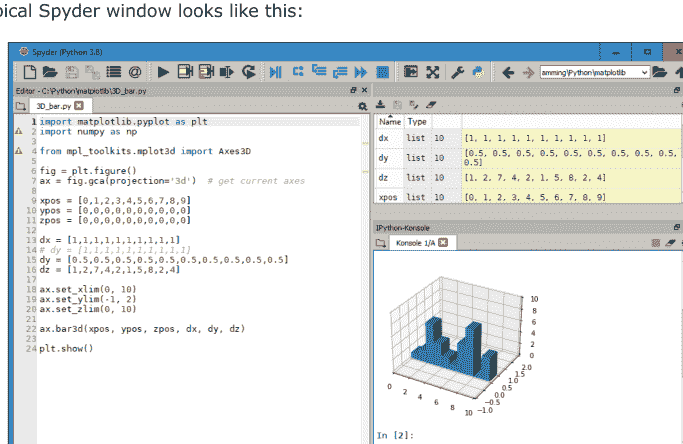

编辑器位于左侧。在这里，可以像往常一样输入 Python 代码，例如：

```
print ("Hello World")
```

## 使用Python进行机器学习

程序通过绿色箭头启动并输出结果。交互式IPython控制台位于右下角。编辑器中的代码会将其输出（包括复杂图形等）直接发送到IPython控制台。

但交互式输入，例如：

```
print (3 * 8)
```

通过Shift+Enter组合键也能在控制台中输出正确结果。

右上角的变量管理器显示所有可用变量的名称和内容。例如，如果在代码中声明了变量`a = 42`，其名称、类型、大小和值都会在变量资源管理器中显示。当程序中声明了大量变量时，这尤其有用。或者，也可以在变量管理器窗口中显示文件管理器。选择通过下方的选项卡进行。此外，Spyder提供了常用工具和一些其他有趣的功能，此处不再赘述。

### 8.19 谁在编程谁？

尽管本书仅涉及三种硬件系统：

- PC（Windows 10，可能还有Linux或Ubuntu）；
- 树莓派（Raspberry Pi OS）；
- MaixDuino（MaixPy）；

以及四种编程环境：

- MaixPy；
- Thonny；
- Jupyter；
- Spyder，

但编程选项的数量很快就会变得令人困惑。如果考虑到树莓派也可以通过远程桌面进行控制，就会出现大量的变体。例如，MaixDuino可以通过树莓派使用Thonny IDE进行编程。另一方面，树莓派也可以通过WLAN使用PC通过远程桌面会话进行控制……

下图总结了所有这些版本，但并未声称穷尽所有可能。

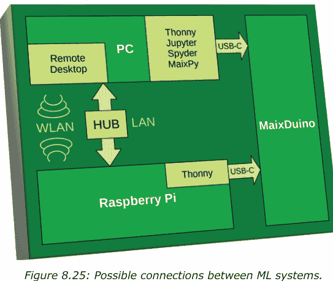

图8.25：机器学习系统之间可能的连接方式。

# 第9章 • Python概览

多年来，Python已确立为最广泛使用的编程语言之一。凭借其简单的结构和易于学习的特点，Python在专业人士和创客中都站稳了脚跟[8,9]。

对Python或MicroPython的全面介绍超出了本书的范围。此外，关于这个主题已有大量文献可供参考（见参考文献）。尽管如此，这里将回顾最重要的基础知识。当然，重点将放在机器学习领域特别重要的命令和指令上。特别是，将讨论MaixDuino开发板的具体细节。

MicroPython的开发使得微控制器系统的编程变得简单直接。这使得该编程语言既适合大型系统，也适合嵌入式系统的世界。Python程序在业余爱好者领域、教育或科学应用中都能找到。同时，商业开发者也越来越多地使用Python。在IT行业，众多市场领导者如谷歌或亚马逊长期以来一直使用Python进行软件开发[1]。

此外，诸如MatPlotLib、NumPy、SciKit或SciPy等免费提供的模块和库提供了广泛的可能性。因此，应用范围从简单的LED控制和科学数据分析到机器学习和人工智能。

MicroPython是作为Python 3的精简版本开发的。由于该语言是解释型的，通常比编译型系统慢。MicroPython的设计目标是在小型嵌入式系统上尽可能高效地工作。这使其非常适合在微控制器上运行，这些微控制器的时钟速度比典型的个人计算机慢得多，内存也显著更少。因此，这种变体非常适合MaixDuino这样的小型系统。

经典Python编程难以在底层控制器上实现的缺点，通过Python的“微版本”得以消除。遵循标准，该版本在语法上也强烈基于Python 3。虚拟机和广泛的库确保了控制器编程变得像经典计算机的软件开发一样简单。

对微控制器环境中两种最受欢迎的编程语言的比较表明，Python正日益比C/C++更受青睐。在最受欢迎的编程语言排名中，Python现在通常位于榜首，而其竞争对手C/C++则日益被挤到后面。这种发展的原因主要归功于Python的以下优势：

- 简单的语言结构使Python对初学者非常友好；
- 各种互联网论坛通过教程和示例代码为程序员提供支持；
- 有广泛的库可用。

初学者通常可以在各种论坛中快速找到问题的解决方案。对于其他编程语言，这种相互支持的形式则不那么明显。

在C语言中，编程使用控制寄存器、指针和其他通常难以理解的结构。必须为目标控制器编程固件，进行编译，最后使用编程设备将其传输到控制器芯片。

MicroPython集成了所有这些步骤。只需简单的鼠标点击，用户就可以控制LED、显示器或电机等底层硬件。使用可用的库，获取模拟电压值或使用SD卡变得非常简单。集成的垃圾回收和动态分配过程实现了Python中高效的内存管理。因此，几乎不需要使用指针或类似构造，这些通常对初学者来说难以理解。

C语言中常见的晦涩符号，如`x++`、`<<`、`>>`等，以及复杂的变量声明，对初学者来说是一个不应低估的障碍。Python以其简单性和代码的出色可读性而闻名。

由于MicroPython是作为微控制器应用的“轻量版本”开发的，并非标准Python中所有可用的库和函数都受支持。但是，如果您已经熟悉Python，可以轻松切换到微版本。只有少数语法结构或指令在MicroPython中不可用或不适用。

Python是解释型的。这意味着原始程序代码直接由目标处理器处理，无需编译。因此，Python提供了在各种系统上执行代码的可能性。您只需要一个最新的解释器。Python代码最大的优势之一是其广泛的兼容性和可移植性。Python程序可以在运行Windows、MacOS或Linux的经典计算机上执行，也可以在树莓派、MaixDuino或类似微系统等小型单板系统上执行。

最重要的是，在著名的“RPi”上的使用也促进了Python日益普及。通用的语法确保了程序可以在小型和大型系统上轻松开发。这使得Python具有极高的可扩展性。将数据和程序代码封装在清晰、可重用的模块（即“对象”）中的可能性，使Python成为一种面向对象的编程语言。

如今，C++通常主要用于底层编程。经典的Python变体迄今并不适合这一领域。MicroPython现在填补了这一空白。除了客户端应用程序，C++还包括强大的服务器应用程序以及设备驱动程序和嵌入式驱动程序组件。应用范围从系统软件到应用程序编程。由于与C相比，Python仍然是一种相对年轻的编程语言，它尚未在信息技术的所有子领域得到普遍应用。

然而，事实证明，Python在许多领域都有其自身的优势。另一方面，Python的主要缺点无疑是其相对较低的处理速度。在这方面，像C这样的编译型语言可以清楚地展示其威力。快速控制循环或实时系统、车辆控制和安全查询在C中实现起来要容易和安全得多。由于这些应用领域对非专业用户来说几乎不起作用，速度劣势通常并不真正显著。

最终，正是解释器的使用使得Python能够作为一种交互式语言使用。Jupyter等环境就是建立在此基础上的。通过Jupyter交互式控制MaixDuino的可能性展示了这一过程的潜力。这就是Python在人工智能（AI）前沿领域取得其特定重要性的原因。

凭借NumPy、SciPy等广泛的库以及Anaconda等发行版，Python已成为该领域迄今为止最受欢迎的编程语言。因此，经验丰富的Python用户的大门是敞开的。从硬件相关的控制器编程到AI应用——使用Python，直觉和创造力没有限制。因此，本章将解释和演示Python和MicroPython的基础知识。

### 9.1 注释让你的生活更轻松

在任何编程语言中，解释性注释都很重要。这是了解某个程序部分功能的唯一方法。使用注释可以让您和其他人在数月或数年后理解代码，而无需反复深入研究所有细节。

没有必要对给定程序的每一行都进行注释。经验丰富的编码人员应该能够在没有注释的情况下理解单个指令。仅建议对特殊构造或不寻常或创新的代码行使用单行注释。另一方面，对于子程序或整个封闭的程序部分，应包含其工作原理的简要说明。

简单的注释以`#`号引入。它们以`#`开始，以行尾结束：

```
>>> print("Hello MaixDuino")   # this is a comment

Hello MaixDuino
```

多行注释也可以用三引号（`"""`）标记。相同的字符串结束注释：

```
"""
first comment line
second line of comment
"""
```

在实践中，它可能看起来像这样：

```
'''
这是一个多行注释。
打印 hello world。
'''

print("hello world")
```

或者，在 Thonny 中也可以使用注释功能。它允许使用 #-符号同时将多行标记为注释。

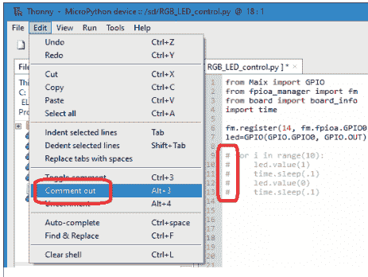

注释功能也非常适合“注释掉”代码的某些部分。当测试一段较长的代码，并且希望暂时排除某些部分执行时，可以将它们注释掉：

```
# print("Hello Peter")
print("Hello Tom")
```

解释器随后会忽略被标记的行。因此，无需耗时地删除代码行，之后再重新插入。只需简单地移动注释字符，输出就可以从 "Hello Tom" 转换为 "Hello Peter"：

```
print("Hello Peter")
# print("Hello Tom")
```

注释尤其有助于初学者更好地理解代码结构。从技术角度来看，解释器会忽略所有注释，即它们对代码执行没有任何影响。

一个典型的应用是在 MaixDuino 上切换模型：

使用 Python 进行机器学习

```
task = kpu.load(0x500000)
# task=kpu.load("/sd/20class.kmodel")
```

这里，模型直接从内存加载。使用

```
## task = kpu.load(0x500000)
task=kpu.load("/sd/20class.kmodel")
```

另一方面，Maix 会访问 /sd 目录中 SD 卡上的模型。这种简单的选项在各种程序中都有使用（例如，参见第 13.7 节）。

### 9.2 print() 语句

可以使用 print() 指令将任何信息发送到终端。该命令可以直接在终端中执行：

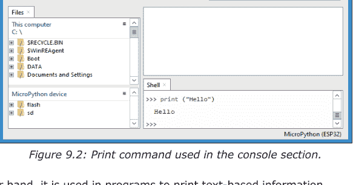

另一方面，它在程序中用于打印基于文本的信息。

### 9.3 输出到显示屏

如果你不想将信息发送到控制台，而是发送到 MaixDuino 的显示屏，则必须通过 import 指令集成两个库。更多详细信息可以在第 10 章中找到。一个典型的打印到显示屏的程序如下所示：

```
import lcd
import image

img = image.Image()
img.draw_string(80, 80, "hello", scale=3)
img.draw_string(80, 120, "maixpy", scale=3)
lcd.display(img)
```

通过这种方式，使用图形函数将文本放置在显示屏上：

```
img.draw_string(x, y, "TEXT", scale=s)
```

值 (x, y) 定义了文本在像素中的起始位置。原始位置 (0,0) 是屏幕的左上角。文本大小可以使用 "scale" 设置。允许所有从 scale = 1 开始的值。对于 s = 22，一个字母就已经填满了整个屏幕的高度。

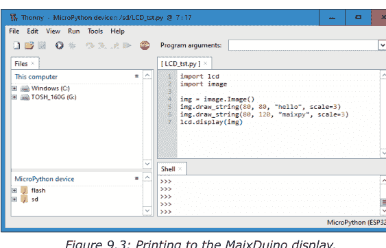

下图显示了在 Maix 上的结果：

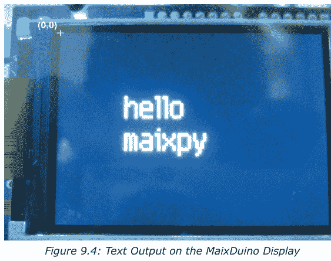

这种屏幕输出的一个实际应用可以在第 15.5 节的人脸检测报警系统中找到。

使用 Python 进行机器学习

### 9.4 缩进和代码块

Python 通过缩进来区分不同的程序块。不需要使用花括号（"{}" 或类似符号）。这是与大多数其他语言（如 C、Pascal、Basic 等）最重要的区别之一。这种方法的优点是，你实际上被迫保持一定程度的代码结构。

```
if True:
    # 代码块 01
    print ("True")
else:
    # 代码块 02
    print ("False")
```

缩进的空格数是可变的，但同一个代码块必须始终保持相同数量的缩进空格。否则，会发出错误消息：

```
if True:
    print ("Answer")
    print ("True")
else:
    print ("Answer")
    print ("False")  # 不同的缩进将导致运行时错误。
```

此外，缩进深度在整个代码中必须保持一致。否则，将出现以下消息：

```
>>> %Run -c $EDITOR_CONTENT
Traceback (most recent call last):
  File "<stdin>", line 6
IndentationError: unexpected indent
```

在条件和循环中，代码块的形成方式相同。

### 9.5 时间控制和休眠

**sleep** 指令已经在 LED 闪烁示例（第 8.2 节）中使用过。它包含在 "time" 模块中，并通过以下方式访问：

```
import time
```

指令

```
time.sleep(seconds)
```

设置以秒为单位的固定延迟时间。或者，也可以只导入 sleep 命令本身：

```
from time import sleep
```

在这种情况下，语句可以简化为

```
sleep(seconds)
```

即使该命令也可以用于小于一秒的时间，但对于非常短的延迟时间，建议使用指令

```
time.sleep_ms(milliseconds)
```

因为此版本对于小的时间间隔显示出更高的精度。

这些函数的缺点是它们是阻塞式的。这意味着控制器在等待期间无法执行任何其他任务，因为它忙于计算处理器周期。

使用中断或其他编程技术是一种替代方案。由于这些方法在本书的上下文中几乎不需要，因此此处不再进一步探讨。如有必要，可以在文献中找到相应的解释（参见参考文献）。

以下两个例程可用于计算时间查询：

```
time.ticks_ms()  # 或    time.ticks()
time.ticks_us()
```

它们以毫秒或微秒为单位指示当前系统运行时间。

像图 9.5 中那样的输出意味着 MaixDuino 已经运行了

977309 毫秒 = 977.309 秒 = 16 分钟，17 秒，309 毫秒

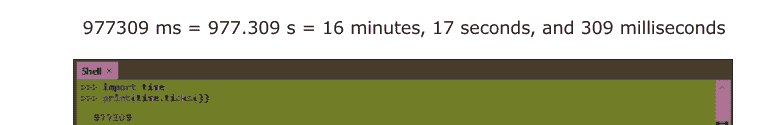

**ticks()** 的一个经典应用是测量代码运行时间。例如，可以使用以下代码来展示数学运算需要一定的时间：

使用 Python 进行机器学习

```
# runtime.py

import time
import math

while(True):
    start = time.ticks_us()
    time.sleep(1)

    # x = math.exp(math.sin(22.5))

    stop = time.ticks_us()
    print(stop-start)
```

如果移除计算前的注释符号，显示的处理时间将从大约 100.015 µs 增加到 100.025 µs。因此，该公式的计算时间大约为 10 µs。除了 time 库之外，这里还导入了 "math"，以便能够评估一些更复杂的数学函数。

### 9.6 控制硬件：数字输入和输出

与为 PC 或笔记本电脑编程相比，MicroPython 通常侧重于直接访问硬件单元。特别是，控制单个输入/输出引脚（I/O 引脚或 **通用输入输出** GPIO）非常重要 [8,9]。通过这种方式，机器学习或人工智能应用也可以与物联网和硬件控制相结合。

这导致了全新的应用领域，特别是在机器人技术方面。但是，也可以通过这种方式实现通过人脸识别控制的门锁（参见第 15.11 节）。第 8.2 节演示了此功能的一个简单应用。

这里介绍了一个用于 MaixDuino RGB-LED 的完整控制程序（参见下载包中的 RGB_LED_tst.py）：

```
from Maix import GPIO
from fpioa_manager import fm
from board import board_info
import time

LED=12   # 12: 绿色, 13: 红色, 14: 蓝色
fm.register(LED, fm.fpioa.GPIO00)
led=GPIO(GPIO.GPIO00, GPIO.OUT)
led.value(1)
time.sleep(1)
led.value(0)
time.sleep(1)
fm.unregister(LED)
```

```
LED=13   # 12: 绿色, 13: 红色, 14: 蓝色
fm.register(LED, fm.fpioa.GPIO0)
led=GPIO(GPIO.GPIO0, GPIO.OUT)
led.value(1)
time.sleep(1)
led.value(0)
time.sleep(1)
fm.unregister(LED)

LED=14   # 12: 绿色, 13: 红色, 14: 蓝色
fm.register(LED, fm.fpioa.GPIO0)
led=GPIO(GPIO.GPIO0, GPIO.OUT)
led.value(1)
time.sleep(1)
led.value(0)
time.sleep(1)
fm.unregister(LED)
```

启动程序后，首先是绿色，然后是红色，最后是蓝色 LED 各亮起一秒钟。

在 Raspberry Pi 上，一个 LED 控制程序可能如下所示：

```
import time
import RPi.GPIO as GPIO
GPIO.setmode(GPIO.BCM)
GPIO.setup(23, GPIO.OUT)

try:
    while 1:
        GPIO.output(23, GPIO.HIGH)
        time.sleep(0.5)
        GPIO.output(23, GPIO.LOW)
        time.sleep(0.5)

except KeyboardInterrupt:
    pass
    GPIO.cleanup()
    print("bye...")
```

这里也必须集成 time 库。通过

## 使用Python进行机器学习

```python
import RPi.GPIO as GPIO
GPIO.setmode(GPIO.BCM)
GPIO.setup(23, GPIO.OUT)
```

树莓派的端口就变得可用。在这个例子中，使用了端口23。由于树莓派没有集成测试LED，必须外接一个：

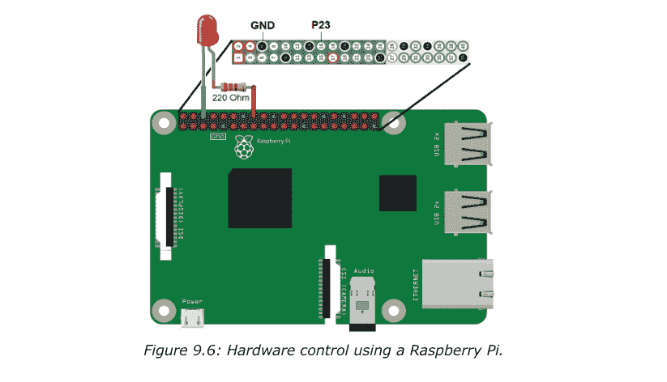

### 9.7 关键值：变量和常量

变量是任何编程语言中最重要的元素之一。在Python中，变量的声明特别简单，因为在赋值时无需指定变量的数据类型。

这与其他语言有显著区别。在其他语言中，变量必须始终用特定类型显式初始化（例如，`int a = ...`）。

变量也可以在控制台中使用：

```python
>>> a = 17
>>> print(a)
17
```

变量名的赋值遵循以下规则：

- 变量名只能包含数字、字母和下划线。
- 变量名的第一个字符必须是字母或下划线。
- 变量名区分大小写。

变量可以被赋予不同类型的值。MicroPython中的类型包括数字、字符串、列表、字典、元组等。可以使用 **type()** 来检查变量和常量的数据类型，例如：

```python
>>> a = 17
>>> print(type(a))
<class 'int'>

>>> a, b, c, d = 17, 1.5, True, 5+7j
>>> print(type(a), type(b), type(c), type(d))
<class 'int'> <class 'float'> <class 'bool'> <class 'complex'>
```

像10、100这样的数字或像"Hello World!"这样的字符串是常量。MicroPython提供了关键字 **const**，用于标记一个固定值：

```python
from micropython import const

a = const(33)
print(a)
```

### 9.8 数字和变量类型

MicroPython支持以下数字类型：

- 整数（int）；
- 浮点数（float）；
- 布尔值（bool）；
- 复数。

每当指定一个值时，就会创建一个数字对象。使用 **del()** 可以再次删除对象。在控制台中看起来像这样：

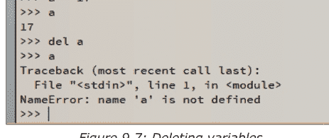

也可以通过用逗号分隔的赋值在一行中为多个变量赋值，如下所示：

```python
a, b = 1, 2
```

## 使用Python进行机器学习

除法（/）的结果总是返回一个浮点值，例如：

```
12/3 = 4.0
```

**整数**格式对应于数学中的整数，包括符号：

```
1, 100, -8080, 0, .....
```

**浮点数**对应于实数。也可以使用指数表达式的科学计数法：

```python
>>> a = 1.234e3
>>> a
1234.0
```

整数和浮点数之间的一个重要区别是，整数值是精确存储的。另一方面，对于浮点数，会发生数值舍入。布尔类型的变量只能有两个值：True和False。这里也区分大小写。

变量类型 **复数** 由实部和虚部组成，形式为 a + bj 或 complex(a, b)。实部和虚部值 b 都可以是浮点数。这也允许使用复数进行计算：

```python
>>> a = 1j
>>> b = 1j
>>> a*b
(-1+0j)
```

也可以使用二进制（0b ...）和十六进制（0x ...）数字：

```python
>>> a = 0b1010
>>> a
10

>>> a = 0xff
>>> a
255
```

### 9.9 数字类型转换

数字和变量也可以从一种类型转换为另一种类型：为此使用以下指令：

- **int(x)**：将x转换为整数；
- **float(x)**：将x转换为浮点数；
- **complex(x)**：将x转换为复数。

在第一种情况下，不使用舍入，而是直接截断小数部分。

```python
>>> a = 2.0
>>> print(int(a)) # 将浮点数转换为整数
2

>>> x, y = 4.3, 7
>>> c = complex(x, y)
>>> print(c)
(4.3+7j)
```

### 9.10 数组：神经网络的基础

数组表示相同类型元素的集合。它们在机器学习项目中通常扮演着重要角色。数组的优势在于它们可以以结构化的形式存储大量数据。

例如，如果要创建一系列测量值，可以将单个结果保存在数组中。在机器学习项目中，几乎所有数据都存储在数组中。例如，摄像头捕获的图像在进一步处理之前会被转换为数组，神经网络的权重存储在数组中，等等。

可以轻松访问数组中的单个值。为了能够使用数组，必须加载相应的模块，例如：

```python
import array as arr
```

随后，就可以创建一个数组了：

```python
a = arr.array('d', [1.1, 3.5, 4.5])
```

对于数组中使用的数字类型，可以指定 "d" 表示浮点数（**decimal**）或 "I" 表示 **整数**。以下代码首先创建一个数组。接下来，将值逐个打印到控制台：

```python
## array.py

import array as arr
a = arr.array('d', [1.1, 3.5, 4.5])

for n in range(len(a)):
    print(a[n])
```

输出显示了各个数组值：

```
>>> %Run array.py

1.1
3.5
4.5
```

### 9.11 运算符

在Python或MicroPython中，算术运算符具有数学中熟悉的含义：

- `+` 加法：`c = a + b`
- `-` 减法：`c = a - b`
- `*` 乘法：`c = a * b`
- `/` 除法：`c = a / b`

此外，还有一些更特殊的运算符：

- `//` 整数除法：`11 // 3 ==> 3`
- `%` 取模（除法的余数）：`11 % 3 ==> 2`
- `**` 指数：`2 ** 3 ==> 8`

逻辑运算符 **not**、**and** 和 **or** 在（Micro）Python中也可用：

| a | not a |
|---|---|
| True | False |
| False | True |

| a | b | a and b | a or b |
|---|---|---|---|
| True | True | True | True |
| True | False | False | True |
| False | True | False | True |
| False | False | False | False |

位运算符在Python中由以下语句表示：

- `&` 按位与
- `|` 按位或
- `^` 按位异或
- `~` 按位非

移位运算符也可以使用：

- `<<` 左移位
- `>>` 右移位

以下示例说明了其应用：

```python
>>> a = 0b1010
>>> b = 0b1100
>>> bin(a & b)
'0b1000'

>>> a = 0b1010
>>> bin(a << 1)
'0b10100'
```

比较运算符再次具有数学中通常的含义：

- `==` 等于
- `!=` 不等于
- `>` 大于
- `<` 小于
- `<=` 小于或等于
- `>=` 大于或等于

这里需要注意的是，相等性查询需要 **双** 等号！
例如：

```python
>>> a = 5
>>> b = 7
>>> a < b
True
>>> a > b
False
```

或

```python
## a = True
a = False

if a == True:
    print("a!")
else:
    print("NOT a!")
```

### 9.12 条件、分支和循环

任何编程语言都离不开控制结构。（Micro）Python为此提供了分支和循环指令。在编程中，经常需要重复许多相同或相似的过程。循环为此提供了一种比简单地在代码中重复语句更优雅的方法[8,9]。

当需要做出决策时，使用分支指令。这些指令允许程序对不同情况做出正确反应。与其他编程语言相比，Python为循环提供了非常广泛的功能。然而，下面只简要解释基本的循环指令。

使用循环允许多次执行代码块。执行持续到满足指定条件为止。MicroPython中有两种类型的循环可用：

- while循环
- for循环

如果要向控制台输出从1到10的数字，可以使用以下 **while** 循环：

```python
number = 1
while number <= 10:
    print(number)
    number = number + 1
```

要重复的代码再次通过缩进表示。只要 **number** 变量的值小于或等于（<=）10，它就会执行。在每次循环中打印当前数字，然后将数字的值增加1。

这个任务也可以使用 **for** 循环来完成：

```python
number = 1
for number in range(1, 10):
    print(number)
```

只要计数器变量的值在1到10的范围内，**for** 循环就会执行。**range()** 函数将相应的值范围分配给变量。只要计数器变量小于指定的结束值，**for** 循环就会继续。因此，打印的最后一个值是数字9。

当需要以预定的迭代次数重复执行代码块时，使用 **for** 循环。而 **while** 循环则重复一段代码，直到满足某个条件。请注意，**for** 和 **while** 循环头必须以冒号结尾。

如果代码中需要分支，则使用关键字 **if** 和 **else** 定义一个条件。程序根据该条件是真还是假，在不同的分支上继续执行。因此，代码

```python
temperature = 2

if temperature < 3:
    print("有霜冻风险")
```

否则：
    print("No danger of frost")
```

输出结果为：

```
>>> Risk of frost
```

如果将温度设置为17，则语句

```
>>> No danger of frost
```

会被打印出来。

关键字 **if** 之后的结果是一个布尔表达式。它可以是真或假。如果表达式为真，则会立即执行 **if** 行之后的语句。这些语句必须缩进，以便清楚哪些语句属于 if 块。同样需要注意的是，**if** 行中的布尔表达式必须以冒号结尾。

else 语句仅在 if 查询为假时执行。

### 9.13 试错法 — try 和 except

在程序执行过程中，可能会发生异常或错误。异常处理允许对这些情况进行特定处理。代码可以继续执行，而不会导致程序中止。

一些高级编程语言，如 Java 或 Ruby，以及（Micro）Python，都内置了允许异常处理的机制。在 Python 中，包含异常风险的代码被嵌入在 try/except 块中。例如，以下程序应计算倒数值：

```
## reciprocal.py
while True:
    n = int(input("Please enter a number: "))
    print("Number was: ", n)
    print("Reciprocal is: ", 1/n)
```

只要输入的值不是零，代码就能正常工作。但是，如果输入零，程序会以错误消息终止：

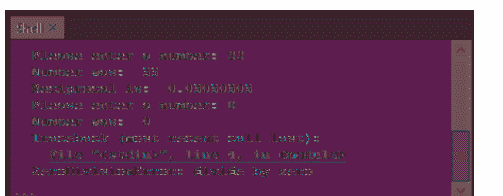

图 9.8：程序因错误消息而中止。

使用 try/except 结构，可以捕获错误：

```
## try_except.py
while True:
    n = int(input("Please enter a number: "))
    print("Number was: ", n)
    try:
        print("Reciprocal is: ", 1/n)
    except:
        print("error")
```

如果现在输入零，会报告错误，但程序仍然继续运行，并可用于新的输入：

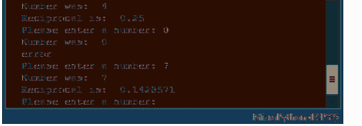

图 9.9：错误被拦截。

此选项在 ML 项目中经常使用。如果某个神经网络元素没有提供合理的值，这不会导致程序崩溃。相反，只会打印一条错误消息。如果再次提供可接受的值，系统可以继续不间断地工作。

# 第 10 章 • 有用的助手：库！

Python 依赖于它的库。这对于通用编程任务来说当然是正确的，但对于 ML 应用来说更是如此。一些简单的“库”，如 **time** 或 **math**，已经在上一章中使用过。如果在某些情况下，有经验的用户可以自己创建简单的库，那么对于复杂的 ML 库来说，这充其量是低效的。

通常，ML 库包含 C 例程，因为它们提供非常快速和高效的代码。在这种情况下，Python “包装器”确保了数值计算工作可以方便地被 Python 程序员使用。

图 10.1 显示了 ML 应用最重要的库。它们密切相关，并且部分相互构建。Python 本身构成了这个结构的基础。

由于这些库通常由不同的团队开发，一些库包含的例程执行的任务几乎与不同库中的其他函数相同。这取决于用户的经验来选择每个情况下最佳的例程和函数。

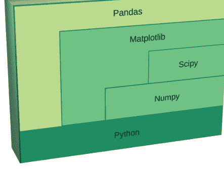

图 10.1：最重要的库。

使用库系统的一个特定问题是，并非每个版本的库都与所有版本的……另一个库兼容。在像机器学习这样快速发展的研究领域，很难避免新开发的库与旧版本不完全兼容。

所谓的虚拟环境提供了一种避免复杂情况的方法。它们允许创建一种隔离的实验室，在其中可以安装所需版本的库，而不会干扰外部库。这个概念在第 10.10 节中有更详细的解释。以下部分介绍了各个库最重要的功能。示例可以在 Windows 下的 PC 或 Raspberry Pi 上进行评估。可以使用 Thonny 或 Jupyter 作为编程环境。

### 10.1 MatPlotLib 作为图形艺术家

大多数人是视觉导向的，因此通常更喜欢单个图表而不是冗长的数据列表或数字表格。此外，如果以图形形式呈现，通常可以更快地捕捉关系。MatPlotLib 是一个经典的 Python 库，它有助于开发图形表示。与 Python 一起，MatPlotLib 也越来越受欢迎。与 NumPy 和 SciPy 结合使用时，它至少与经典数学程序一样好，甚至更好。此外，MatPlotLib 是免费提供的；它是开源的，并且可以以面向对象的方式进行编程。

使用 MatPlotLib，可以创建各种形式和格式的图表和表示。通过这种方式达到的质量很容易接近科学出版物的要求。即使是初学者也可以通过 MatPlotLib 快速取得显著的成果。只需几行代码，你就可以创建简单的 x/y 图、直方图、功率谱、条形图、误差图、散点图等等。

在 PC 上集成 MatPlotLib 最简单的方法是通过 Anaconda。对于 Raspberry Pi，有一个特定的例程：

```
pip3 install matplotlib
```

安装只需要几分钟。之后，该库可用于各种各样的应用。

MatPlotLib 图形由以下组件组成：

- **Figure：** 这指的是整个当前图形。它可以包含一个或多个图表。“Figure”应理解为一种包含单个图表的画布。
- **Axes：** 一个图形可以包含多个坐标轴。每个坐标轴都有
    - 一个标题；
    - 一个 X 标签；
    - 一个 Y 标签；
    - 可选的，一个 Z 标签（用于 3D 表示）。
- **Axis：** 轴对象用于为坐标轴提供刻度和图表边界。
- **Artist：** 包含文本、线条、2D 或 3D 对象等。

MatPlotLib 最重要的模块之一是 Pyplot。它提供简单的函数，如线条、圆圈和像素图像。只需几行编程就可以显示文本，如下例所示（参见下载包中的 matplotlib_demo.py 或 matplotlib_demo.ipynb）：

```
import matplotlib.pyplot as plt
import numpy as np

x = np.linspace(0, 10, 100)
plt.plot(x, x*x, label='linear')
plt.legend()

plt.show()
```

使用 Jupyter，这会生成以下图表：

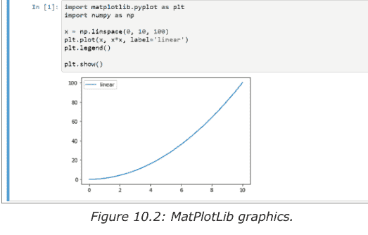

通过使用 **subplot()**，可以将多个图表插入到一个 Figure 中。在图 10.3 中，使用此方法创建了四个子图。

Subplot() 使用三个参数：

- nrows；
- ncols；
- index。

它们指定行数、列数和子图的索引号。因此，在下面的示例中，参数 (221) 和 (2,2,2) 等被传递给 subplot() 方法。使用 **subtitle()** 定义子图标题。

代码片段

```
from numpy import e, pi, sin, exp, cos
import matplotlib.pyplot as plt
def f(t):
    return sin(2*pi*t)
def g(t):
    return cos(2*pi*t)
```

## Machine Learning with Python

```
fig = plt.figure(figsize=(18, 12))

t = np.arange(-2.0, 2.0, 0.01)
sub1 = fig.add_subplot(221)
sub1.set_title('221: function f')
sub1.plot(t, f(t))

sub2 = fig.add_subplot(222)
sub2.set_title('222: function g')
sub2.plot(t, g(t))

t = np.arange(-2.0, 2.0, 0.01)
sub3 = fig.add_subplot(223)
sub3.set_title('223: g(t)*f(t)')
sub3.plot(t, f(t)*g(t))

t = np.arange(-0.2, 0.2, 0.001)
sub4 = fig.add_subplot(224)
sub4.set_title('224: detail of g')
## sub4.set_xticks([-0.2, -0.1, 0, 0.1, 0.2])
## sub4.set_yticks([-0.15, -0.1, 0, 0.1, 0.15])
sub4.plot(t, g(t))

plt.plot(t, g(t))
plt.tight_layout()
plt.show()
```

提供了以下四联图：

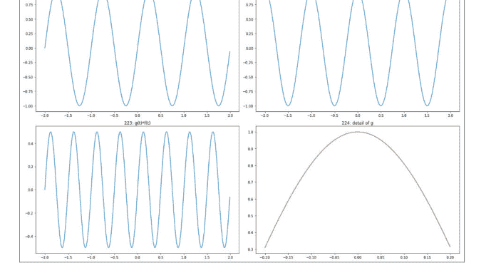

图 10.3：四联图。

三维图形的呈现也是可行的。在开发机器学习算法时，散点图是表示数据的有用工具。以下代码片段：

```python
from mpl_toolkits.mplot3d import Axes3D

def randrange(n, vmin, vmax):
    return (vmax - vmin)*np.random.rand(n) + vmin

fig = plt.figure(figsize=(18, 12))
ax = fig.add_subplot(111, projection='3d')

n = 100
for c, m, zlow, zhigh in [('r', 'o', -50, -30), ('b', '^', -20, -5)]:
    xs = randrange(n, 23, 32)
    ys = randrange(n, 0, 100)
    zs = randrange(n, zlow, zhigh)
    ax.scatter(xs, ys, zs, c=c, marker=m)

ax.set_xlabel('X Label')
ax.set_ylabel('Y Label')
ax.set_zlabel('Z Label')

plt.show()
```

展示了如何以易于理解的方式在三维图中显示数据点云：

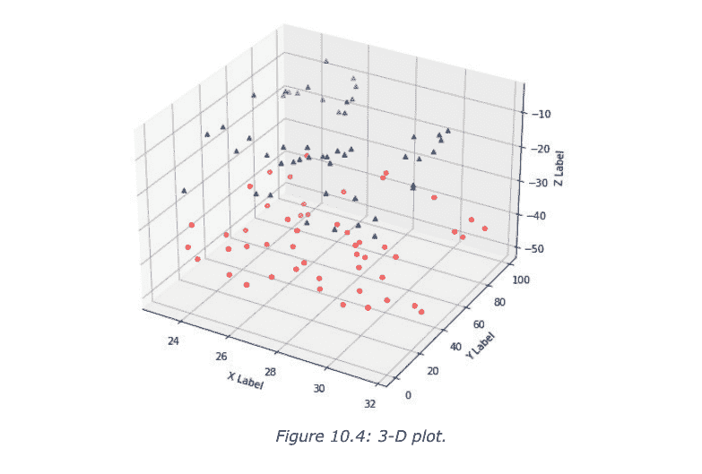

Python机器学习

默认情况下，Jupyter或Spyder中的图形输出会直接显示在工作表或控制台中（图8.24）。通过使用“魔法”命令

```python
%matplotlib qt
```

图形会被发送到一个单独的窗口。使用

```python
%matplotlib inline
```

则会再次使用内部输出。

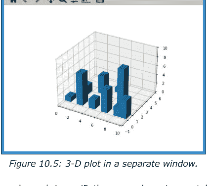

这些魔法命令仅在iPython控制台或笔记本中有效，在经典的Python脚本中无效。在这种情况下，可以考虑使用

```python
from IPython import get_ipython
get_ipython().run_line_magic('matplotlib', 'inline')
```

进行内联绘图，以及使用

```python
get_ipython().run_line_magic('matplotlib', 'qt')
```

进行外部窗口绘图。

此外，**matplotlib**提供了多种其他显示和可视化方法。这些方法将在后续章节的各个机器学习和人工智能应用中进行介绍和解释。

### 10.2 数学天才：Numpy

NumPy库在上一节中已经使用过。这里将更详细地介绍这个非常通用的库。

NumPy是“**数字Python**”或“**数值Python**”的缩写。它是一个Python的扩展模块，主要用C语言编写。这确保了数学和数值函数及例程能够提供最佳的执行速度。

NumPy还为Python编程语言补充了强大的数据结构，用于高效处理大型数组和矩阵。其实现旨在处理海量数据结构（“大数据”）。此外，该模块提供了全面的数学函数选择，这些函数在处理这些数据时非常有用。

NumPy和SciPy（见下文）通常不包含在标准Python安装中。但是，NumPy和所有其他提到的模块在Anaconda中都可用，并且可以毫无问题地包含在其中。

在树莓派上，安装通过以下命令完成：

```bash
pip3 install numpy
```

在NumPy中，基本数学函数对数组进行逐元素操作。该库提供了强大的多维数组函数以及用于计算和操作数组的基本工具。SciPy在此基础上构建，并提供了多种与NumPy数组配合使用的函数。这些可用的函数对于各种类型的科学和工程应用都非常有用。

需要注意的是，在NumPy中，`*`运算符与通常的数学定义相反，是逐元素乘法，而不是矩阵乘法。`@`运算符保留用于通过NumPy进行矩阵乘法。下载包中包含的Jupyter笔记本*numpy-demo.ipynb*程序提供了一些在实践中使用NumPy的有趣示例。

NumPy的一个重要方面是矩阵运算的处理速度。例如，*numpy_demo.ipynb*中第四个单元格中的示例在3GHz四核计算机上显示以下结果：

```
Python: 614.221 ms
Numpy: 15.332 ms
NumPy is in this example 42 x faster!
```

在这个例子中，两个向量的逐元素加法比经典的Python变体快42倍！

使用NumPy，可以通过以下方式定义一个3×3矩阵：

```python
x = np.array([[1,2,3],[4,5,6],[7,8,9]])    # Create a rank 2 array
print(x)
```

Python机器学习

| 列 | 1. | 2. | 3. | 行 |
| :--- | :--- | :--- | :--- | :--- |
| | [[ 1 | 2 | 3 ]] | --- 1. |
| | [[ 4 | 5 | 6 ]] | --- 2. |
| | [[ 7 | 8 | 9 ]] | --- 3. |

要将矩阵显示为二维图形，可以使用表达式

```python
plot.imshow(np.asarray(x), interpolation="none")
```

（参见程序*numpy_plot.ipynb*）：

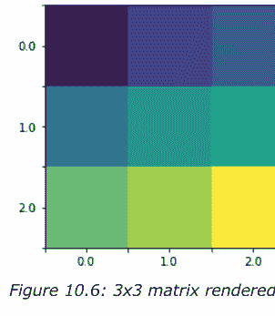

深色代表小值（深蓝色 = 1），浅色表示大值（黄色 = 9）。

三维表示也很容易实现（参见*numpy_plot.ipynb*）：

```python
from mpl_toolkits.mplot3d import Axes3D
import matplotlib.pyplot as plt
from IPython import get_ipython
get_ipython().run_line_magic('matplotlib', 'inline')   # inline or qt

## Data generation
x = np.linspace(1,3,3)
y = np.linspace(1,3,3)
X, Y = np.meshgrid(y, x)

fig = plt.figure(figsize=(20, 20))
ax = fig.gca(projection='3d')

Xi = X.flatten()
Yi = Y.flatten()
Zi = np.zeros(matrix.size)

dx = .8 * np.ones(matrix.size)
dy = .8 * np.ones(matrix.size)
dz = data.flatten()

ax.bar3d(Xi, Yi, Zi, dx, dy, dz, shade=True)

plt.show()
```

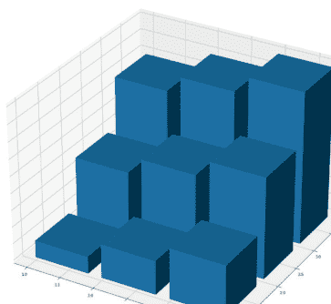

图10.7：矩阵的三维表示。

通过适当的缩放，甚至可以以合适的方式显示更大量的数据：

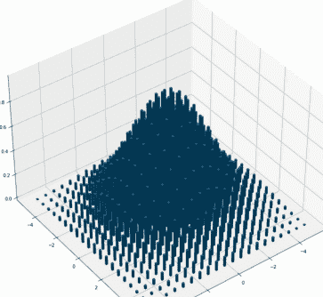

图10.8：包含400个元素的矩阵的三维表示。

使用matplotlib对numpy矩阵进行图形化表示在人工智能应用中起着关键作用，并将在各种示例中使用。

### 10.3 使用Pandas进行数据挖掘

Pandas源自术语“**面板数据（序列）**”。这涉及对事实进行长期观察。最初，该库包含用于访问表格数据和时间序列的数据结构和运算符。然而，与此同时，Pandas包已成为数据科学家和分析师最重要的工具之一。因此，Pandas代表了许多数据处理项目的支柱。

借助Pandas，即使是大量的数据也可以：

-   调整或清洗；
-   转换；
-   分析。

当从不同格式的文件加载数据时，Pandas通常也是首选工具。例如，如果数据集以CSV文件（**逗号分隔值**）的形式存储在计算机的硬盘驱动器上，Pandas可以提取数据并将其转换为Python可读的数据集。

此外，pandas包括统计方法，例如

-   求平均值；
-   计算中位数；
-   查找最大值/最小值；
-   确定相关性。

等等。

此外，数据集中的缺失值可以通过插值来添加，或者矩阵的行或列可以根据特定标准进行过滤。当然，数据随后可以借助MatPlotLib以条形图、折线图或气泡图等形式进行可视化。

Pandas还提供了合适的例程，用于将清洗或转换后的数据保存到新文件或数据库中。

这使得捕获和编辑数据结构变得非常容易。例如，如果你想找出一群朋友中谁拥有什么衣服，pandas就是首选工具。可以通过以下方式非常轻松地创建一个数据集：

```python
data = {
    'shoes': [2, 1, 4, 1],
    'socks': [2, 3, 7, 2]
}
```

（参见下载包中的*pandas_demo.ipynb*）。输出可以配置为格式化表格的形式：

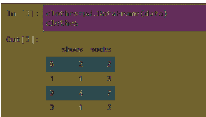

图10.9：使用pandas进行表格输出。

通过：

```python
clothes=pd.DataFrame(data, index=['Albert', 'Berta', 'Charly', 'Donna'])
```

索引可以替换为真实姓名：


图10.10：包含真实姓名的表格

通过这种方式，只需几行代码就可以获得一个清晰的概览。通过指令

```python
datafile = pd.read_csv('C:/DATA/pandas/clothes.csv')
```

也可以直接从硬盘驱动器上的文件读取数据。

对于处理矩阵，可以使用常规方法。要复制表格中的每个值，可以使用以下代码行：

```python
datafile=datafile+datafile
```

可以使用以下命令打开新文件并将其写入硬盘驱动器：

```python
datafile.to_csv('C:/DATA/pandas/new_clothes.csv')
```

使用Pandas，也可以直接从互联网下载较大量的数据：

```python
url = "https://raw.githubusercontent.com/jbrownlee/Datasets/master/iris.csv"
names = ['sepal-length', 'sepal-width', 'petal-length', 'petal-width', 'class']
dataset = pd.read_csv(url, names=names)
```

通过这种方式，可以获得一个全面的鸢尾花物种数据集，例如：


该数据集将在第11.2节的鸢尾花分类示例中发挥核心作用。

### 10.4 使用Scikit、Scipy、SkImage等进行学习和可视化

SciPy（**科学Python**）通常与NumPy结合使用。SciPy通过更多实用函数扩展了NumPy的功能，例如

- 快速最小化/最大化；
- 回归
- （快速）傅里叶变换 — FFT
- 样条
- 滤波器

以及许多其他功能。

此外，SciPy提供了一些用于处理图像的基本函数。例如，提供了从磁盘读取图像并将图像数据转换为numpy数组的方法。这些方法可用于通过矩阵运算处理图像。这样，图像处理如旋转、缩放、更改图像尺寸或分辨率就很容易处理。下图展示了一个简单的示例，说明了这些功能（参考下载包中的 *scipy_demo.ipynb*）：


图10.12：使用Scipy进行图像处理。

这里，第一步是从原始图像中剪切出一个区域。然后，向图像添加人工噪声。这在测试基于机器学习的噪声滤波器等场景中很有用。最后，使用样条边缘滤波器来增强和强化图像中的边缘。

库 **scikit** 和 **skimage** 提供了进一步的图像处理方法。详细信息可以在后续章节的各种示例中找到。

### 10.5 使用OpenCV进行机器视觉

**计算机视觉（CV）** 是人工智能中最有趣的主题之一。它提供了功能和例程，允许树莓派等设备使用相应的库执行惊人的任务。如果将PiCam连接到树莓派，OpenCV非常适合录制和处理图像或视频。

经典PiCam提供以下特性：

- **尺寸：** 25 mm × 20 mm × 9 mm
- **传感器：** 500万像素，定焦镜头
- **图像分辨率：** 最高2592 × 1944像素
- **视频分辨率：** 1920 × 1080 @ 30帧/秒，1280 × 720 @ 60帧/秒，640 × 480 @ 60至90帧/秒
- **连接：** 通过排线连接的CSI接口

相机通过树莓派上的15针串行CSI接口（**Camera Serial Interface**）连接。与USB相比，该接口的优势在于相机模块与博通芯片之间的直接连接。

使用Python进行机器学习

这意味着即使在较高分辨率下也能实现高帧率。CSI接口位于HDMI和以太网插座之间。要将相机模块的15针排线连接到电路板，请向上拉起CSI连接器的上部，然后将带有蓝色标记的排线插入（朝向以太网连接器），并将锁扣压回原位。这提供了良好的接触，并且排线牢固地连接到树莓派。

现在需要在Raspbian IO中激活相机支持。可以使用配置工具完成：

设置 → 树莓派

在配置菜单中，转到接口选项卡，将相机设置为启用。最后，需要重启，然后就可以使用相机了。


图10.13：激活PiCam。

相机模块可以通过两个标准程序进行寻址：

- raspistill（用于图像）；
- raspivid（用于视频）。

两者都有众多选项。使用指令

```
raspistill -o image.jpg
```

可以录制测试图像。图片保存在主目录（... / home / pi）中。

如果PiCam成功激活，就可以测试将其集成到Python程序中。OpenCV库非常适合此目的。安装该库的指令序列可以在下载包中找到。使用程序（另见下载包）：

```
CamCheck_1V0.py
```

可以检查相机的视频功能。启动程序后：

```
import cv2
cap=cv2.VideoCapture(0)
cap.set(3,320) # set Width
cap.set(4,240) # set Height
while(True):
    ret, frame = cap.read()
    # frame = cv2.flip(frame, 1) # Flip camera
    gray = cv2.cvtColor(frame, cv2.COLOR_BGR2GRAY)
    cv2.imshow('frame', frame)
    cv2.imshow('gray', gray)
    key = cv2.waitKey(1) & 0xFF
    if key == ord("q"):
        print("bye...")
        break
cap.release()
cv2.destroyAllWindows()
```

会打开两个活动的视频窗口。一个显示来自连接相机的视频流的全彩版本，另一个显示黑白版本。视频输出的大小可以通过cap.set控制。视频流在主循环中处理。视频图像方向可以通过以下方式设置

```
frame = cv2.flip(frame, 1) # Flip camera
```

这样，即使相机处于不利位置，也总能显示正立的图像。第二个参数控制对齐方式：

- = 0：沿x轴镜像图像（垂直镜像）
- > 0：沿y轴镜像（水平镜像）
- < 0：沿两个轴镜像

如果图像方向不需要任何更改，可以注释掉该行。转换为黑白图像通过以下方式完成

```
gray = cv2.cvtColor(frame, cv2.COLOR_BGR2GRAY)
```

视频流使用以下方式可视化：

```
cv2.imshow('frame', frame)
```

其余行是协调程序终止所必需的。使用

```
cap.release()
cv2.destroyAllWindows()
```

终止流并关闭所有打开的视频窗口。

使用Python进行机器学习

或者，可以使用以下Python程序（参见下载包中的 *OpenCV_demo.py*）进行PiCam的简单实时视频显示：

```
from picamera.array import PiRGBArray
from picamera import PiCamera
import time
import cv2

camera = PiCamera()
camera.resolution = (320, 240)
camera.framerate = 60
rawCapture = PiRGBArray(camera, size=(320, 240))
time.sleep(0.1)

for frame in camera.capture_continuous(rawCapture, format="bgr", use_video_port=True):
    image = frame.array
    cv2.imshow("press 'q' to quit", image)
    key = cv2.waitKey(1) & 0xFF
    rawCapture.truncate(0)
    if key == ord("q"):
        cv2.destroyAllWindows()
        print("bye...")
        break
```

OpenCV的真正优势在于其高效的图像和视频处理。得益于优化的算法，即使使用Pi相对适中的计算能力，也能实现非常有趣的项目。

下图展示了例如在RPi上实时视频流中的轮廓检测（*ContourDetector_1V0.py*）：


图10.14：openCV中的实时视频轮廓捕获

也可以在树莓派上同时操作多个相机。除了PiCam，还可以连接USB网络摄像头，如下图所示：


图10.15：连接到树莓派的USB网络摄像头和声卡。

如果网络摄像头还包含麦克风，它甚至可以用作声学输入设备。这可以替代树莓派上缺失的麦克风输入。更多详细信息可以在第14章中找到。程序 *DoubleCam.py* 展示了如何在RPi上同时操作相机：

使用Python进行机器学习

```
import cv2

cap1 = cv2.VideoCapture(0)
cap1.set(3,320) # set Width
cap1.set(4,240) # set Height

cap2 = cv2.VideoCapture(1)
cap2.set(3,320) # set Width
cap2.set(4,240) # set Height

'''
cap3 = cv2.VideoCapture(2)
cap3.set(3,320) # set Width
cap3.set(4,240) # set Height
'''

while True:
    ret1, img1 = cap1.read()
    cv2.imshow('CAM 1', img1)

    ret2, img2 = cap2.read()
    cv2.imshow('CAM 2', img2)

    key = cv2.waitKey(1) & 0xFF
    if key == ord("q"):
        print("bye...")
        break

cap1.release()
cap2.release()
cv2.destroyAllWindows()
```

通过同时操作两个相机模块，甚至可以捕获3D物体。然而，使用扩展的3D模型进行图像处理时，Pi目前很快就会达到其容量极限。

由于对视频数据的高效处理，openCV也经常用于机器人项目（参见参考文献）。在第13节中，openCV用于物体检测和人脸识别项目。

### 10.6 大脑天才：KERAS 与 TensorFlow

KERAS 是一个深度学习平台，专为 Python 应用开发。该库主要基于 TensorFlow。该平台旨在实现快速实验。另一方面，TensorFlow 是一个面向数据流的编程框架。近年来，TensorFlow 已成为机器学习领域最重要的开源平台之一。

TensorFlow 这个名字源于数学元素，即所谓的**张量**，它在多维代数中扮演着核心角色。由于人工神经网络基于多维数据场，因此张量在该领域具有根本重要性。Google Brain 团队最初为 Google 内部项目开发了 TensorFlow。然而，在 2017 年，它在 Apache 2.0 开源许可下发布。

KERAS 在希腊语中意为号角（κέρας）。这是对古希腊神话的引用。有一些精灵，他们用虚假的幻象欺骗人们，是通过一个号角之门被送入凡间的。

KERAS 库提供了一个专注于深度学习的机器学习接口。通过 KERAS，可以轻松使用 TensorFlow 的跨平台功能。

在强大的主机上创建的 KERAS 模型可以轻松导出。它们可以在浏览器、智能手机甚至像树莓派这样的小型单板计算机上执行。

KERAS 库在本书中扮演着重要角色。在各种应用中使用时，会详细讨论其细节。因此，这里仅概述该库的一些基本用法。图 10.17 展示了该库如何主要用于创建 AI 模型。

使用 Python 进行机器学习


图 10.17：使用 KERAS 构建神经网络应用。

在树莓派上安装 KERAS 的详细步骤说明可以在本书的下载包中找到。文件 *MNIST_keras_01.ipynb* 提供了对 KERAS 的初步印象。KERAS 项目需要以下步骤：

1.  首先，必须加载所需的数据集。在某些情况下，也可以有益地使用其他库，例如 Panda。
2.  然后，数据通常被划分为训练数据集和测试数据集。
3.  现在可以以特定模型的形式创建神经网络。为此，需要依次定义各个层，例如：

```
myANN = Sequential()
myANN.add(Convolution2D(32, (3, 3), activation='relu', input_shape=(28,28,1)))
myANN.add(Convolution2D(32, 3, 3, activation='relu'))
myANN.add(MaxPooling2D(pool_size=(2,2)))
myANN.add(Dropout(0.25))

myANN.add(Flatten())
myANN.add(Dense(128, activation='relu'))
myANN.add(Dropout(0.5))
myANN.add(Dense(10, activation='softmax'))
```

各个层可以像儿童的积木一样排列。可以使用以下指令显示以这种方式构建的网络概览：

```
myANN.summary()
```

结果如下所示：


4.  现在必须编译新构建的网络：

```
myANN.compile(loss=keras.losses.categorical_crossentropy, optimizer=keras.optimizers.Adadelta(),metrics=['accuracy'])
```

这里可以选择各种选项：

-   loss=keras.losses.categorical_crossentropy;
-   optimizer=keras.optimizers.Adadelta();
-   metrics=['accuracy'].

5.  最后，可以使用以下命令训练网络：

```
myANN.fit(x_train, y_train, batch_size=100, epochs=10, verbose=True, validation_data=(x_test, y_test))
```

使用 Python 进行机器学习


6.  成功训练后，可以评估网络的质量：

```
from keras.models import load_model

mnist_model = load_model(model_path)
loss_and_metrics = mnist_model.evaluate(x_test, y_test, verbose=1)

print("Test Loss", loss_and_metrics[0])
print("Test Accuracy", loss_and_metrics[1])
```

这提供了有关训练速度的信息：

```
313/313 [==============================] - 32s 101ms/step
```

以及为训练数据实现的训练成功质量：

```
loss: 0.0016 - accuracy: 0.9905
```

以及测试数据：

```
Test Loss 0.0016376518178731203
Test Accuracy 0.9904999732971191
```

此外，可以在所谓的学习曲线中显示学习成果：


更多细节将在相应的实践应用中再次介绍。

7.  最后，该网络可用于应用，可以对单个数据（如图像或声音）进行分类。

### 10.7 知识转移：共享学习成果

学习性能的转移是机器学习和人工智能的一个特殊功能。在生物系统中，学习成果通常是不可转移的。人类和动物都必须一次又一次地单独执行所有重要的学习活动。

出生后，人类的大脑在有用知识方面是空白的。记忆存在，但内容几乎完全缺失。新生儿无法独立进食。走路、跑步、说话……——所有这些对成年人来说如此自然的能力，都必须由每个新生儿学习。后来，又增加了阅读、写字、骑自行车等。学习这些技能需要多年的练习和训练。父母已经学会了这些活动这一事实对孩子几乎没有用处。它必须重新学习一切，事无巨细。

然而，在技术领域，情况完全不同。一旦神经网络掌握了某项任务，这种学习成果就可以在极短的时间内转移到其他系统。一旦一辆汽车能够在大城市中自主移动，这种性能就可以转移到其他汽车或卡车，几乎没有真正的限制。与人类孩子不同，新的自动驾驶汽车不需要重新获取其“驾照”。

只需复制训练好的网络的权重并将其传输到新系统就完全足够了。这可以在极短的时间内完成数百万次。在极短的时间内复制所获得知识的可能性，当然也是这项新技术最大的危险之一。并非只有好的、理想的和可控的学习成果才能以这种方式复制。危险的发展也可能以惊人的速度传播——非常类似于（计算机）病毒。

当将艰苦获得的学习成果从一个神经网络转移到另一个神经网络时，这种危险始终存在。

然而，在 KERAS 中，此过程可以毫无问题地进行。如有必要，可以使用以下命令保存完全训练好的模型：

```
myANN.save(model_path)
```

以便稍后在外部存储介质上使用。在那里，它可用于在其他系统上立即应用，可能有数百万个系统。

另一方面，这种转移提供了在快速高性能计算机上进行训练，然后将完成的权重传输到低成本小型系统（如树莓派或 MaixDuino）的可能性。您甚至不受限于本地计算机。各种公司提供高性能系统上的训练服务。对于私人应用，计算时间通常甚至免费提供。

### 10.8 网络结构的图形表示

随着复杂性的增加，以纯文本形式表示模型很快就会变得混乱。图形表示可以在这里提供帮助。使用 **graphviz**（有关安装信息，请参见下载包中的链接），可以使用一个有用的工具来描述性地表示网络结构。它使跟踪神经网络的各个层变得容易得多。

笔记本 *Network_graphics_graphviz.ipynb* 可以用作示例。在 graphviz 表示中，以简短形式给出各层的结构和功能。此外，可以在各个层旁边显示输入和输出参数的数量等。有关此显示版本的更多详细信息和信息，请参见第 12.6 节。

图 10.21 显示了 graphviz 的典型输出：

### 10.9 使用 KERAS 解决 XOR 问题

最后，这里提供一个基于 KERAS 的解决方案，用于解决本书前面章节已经介绍过的 XOR 问题（Keras_EXOR_1V0.ipynb）。

加载所需的库后，定义所需的输入和输出值：

```
inputValues=np.array([[0, 0], [0, 1], [1, 0], [1, 1]])
outputValues=np.array([[0], [1], [1], [0]])
```

很容易看出，这些值对应于第 2 章中的表格。现在，可以构建一个使用以下结构的神经网络：

- 两个输入节点；
- 两个隐藏节点；
- 一个输出神经元

```
num_inner = 2
model = Sequential()
model.add(Dense(num_inner, input_dim=2, activation='sigmoid'))
model.add(Dense(1))
```

在完成训练过程后：

```
model.compile(loss='mean_squared_error',optimizer='adam',metrics=['accuracy'])
model.fit(x=inputValues, y=outputValues, epochs=10000, verbose=0)
print(model.predict(inputValues))
```

可以得到以下典型结果：

```
[[ 0.00000132]    # 输入 0, 0    - 输出: 0
 [ 0.9999364]     # 输入 0, 1    - 输出: 1
 [ 0.9999851]     # 输入 1, 0    - 输出: 1
 [ 0.0000268]]    # 输入 1, 1    - 输出: 0
```

剩余的代码行提供了结果的图形化表示：

可以看到，网络绘制了两条独立的分隔线。在两条线之间，计算出的值接近于 1。在外部区域，结果接近于零。因此，XOR 感知器问题已由 KERAS 网络成功解决。

### 10.10 虚拟环境

随着评估不同的模块或库，如 NumPy、MatPlotLib、KERAS 和 TensorFlow，它们会在全局 Python 安装中累积。由于机器学习和人工智能是快速发展的研究领域，新版本和更新频繁发布。然而，各种库版本并不总是彼此兼容。当多个库同时用于特定项目时，这常常会导致问题。

通过使用虚拟环境，可以避免不同库版本之间的冲突。例如，如果在自己的环境中安装了特定的 TensorFlow 版本，其他版本可以保留在树莓派上，而不会引起不良副作用。

在创建这样的虚拟环境之前，必须先安装所需的包：

```
sudo pip3 install virtualenv
```

然后需要以下步骤来实际创建虚拟环境：

1. 使用 `mkdir "folder_name"` 创建项目文件夹。
2. 使用 `cd "folder_name"` 切换到此项目文件夹。
3. 使用 `python3 -m venv ./venv` 创建实际的虚拟环境。
4. 使用 `source ./venv/bin/activate` 激活虚拟环境。

如上图所示，只需几个命令即可创建和激活虚拟环境。你可以通过当前终端行中的前缀 `(venv)` 来判断新环境是否已实际激活。

可以使用以下命令检查新环境的各种属性：

- `which python`：显示活动的 Python 版本
- `which pip3`：显示活动的 pip 版本
- `pip3 list`（`pip3 freeze`）：显示当前虚拟环境中活动的模块和库

虚拟环境可以使用 **deactivate 语句**关闭。

下图显示了一个典型的、安装了大量库的常规 Python 环境：

## 使用 Python 进行机器学习

图 10.24：典型 Python 环境的库。

相比之下，新创建的虚拟 Python 环境包含非常少的库：

图 10.25：新虚拟环境中只显示了几个库。

因此，你可以从一个干净的环境开始，只重新安装所需版本的库。这样就尽可能排除了版本冲突。

虚拟环境实际应用的一个例子可以在第 13.2 节中找到。

# 第 11 章 • 实际机器学习应用

在前面的章节中，作为人工智能的一个子领域，简要讨论了机器学习的基础知识。以下章节将深入探讨实际问题，并使用神经网络实现深度学习方法。这些任务可以在 Windows PC 或树莓派上完成。

在机器学习中，等同于 Hello World 程序的是对鸢尾花类型的分类。相关数据集由不同鸢尾花物种的萼片和花瓣长度和宽度的测量值组成。

### 11.1 传递函数与多层网络

执行鸢尾花分类的方法之一是使用多层感知器（MLP）。这种人工神经网络的变体可以将任何数值输入数据映射到给定的输出数据。MLP 由多个神经元层组成。通常（但并非总是）每一层都与下一层完全连接。各层的节点使用非线性激活函数。这个概念基于高度发达大脑中生物神经元的行为，它们也通过活跃或不活跃的动作电位进行通信。有趣的是，这里使用了纯数字开关和模拟信号处理之间的一种中间方式。在机器学习中，人工神经网络通过应用阈值函数来替代这种行为。

图 11.1：重要的传递函数。

对于阈值或传递函数，使用了不同的变体：

- 阶跃函数；
- ReLu 作为“整流函数”（**修正线性单元**）；
- Sigmoid 函数，如逻辑函数或双曲正切函数。

后一种情况的计算量更大，但与阶跃或 ReLu 函数相比，Sigmoid 函数在网络训练阶段通常表现得不那么关键。

通过这些阈值函数，神经网络也可以建模非线性关系。只有这样，它才能有效解决图像或语音识别等复杂任务。

使用 Python 进行机器学习

一旦定义了传递函数，就可以将单个神经元连接起来，形成一个能够学习的完整网络。在输入层和输出层之间通常有一个或多个内部或隐藏层。网络的拓扑结构，即确切结构，在很大程度上取决于具体的任务。由于没有确定神经网络层数和节点数的标准程序，因此经验和知识在这一点上始终非常重要。

因此，在许多情况下，需要尝试不同的组合以找到最佳的网络结构。对于鸢尾花分类，通常使用图 11.2 所示的拓扑结构：

图 11.2：多层神经网络。

### 11.3 花朵与数据

鸢尾花数据集包含三种鸢尾花（*Iris setosa*、*Iris virginica* 和 *Iris versicolor*）的测量值。从每朵花记录了四个特征：

- 萼片的长度和宽度；
- 花瓣的长度和宽度。

均以厘米为单位（图 11.3）。这个数据集非常适合训练分类器。两个 Jupyter notebook 用于分类和图形化数据展示：

- iris_train_MLP_1V0.ipynb
- iris_graphics_1V1.ipynb

这些 notebook 可以在 Windows PC 或树莓派上运行。

图 11.3：鸢尾花。

为此，首先从库中加载所有相关模块：

```python
import pandas as pd
from sklearn.neural_network import MLPClassifier
from sklearn.model_selection import train_test_split
from sklearn.metrics import classification_report, confusion_matrix
import matplotlib.pyplot as plt
import time
```

现在可以加载上述数据集。CSV 文件包含每种花的 50 条记录。数据由逗号分隔（CSV = **逗号分隔值**）。每行包含四个数值，每个数值代表上述属性之一。最后一个是所谓的标签，即植物的真实名称。此文件直接从互联网下载到 PC 或树莓派，并保存到一个数组中：

```python
url = "https://raw.githubusercontent.com/jbrownlee/Datasets/master/iris.csv"
names = ['sepal-length', 'sepal-width', 'petal-length', 'petal-width', 'class']
dataset = pandas.read_csv(url, names=names)
```

数组的大小为 150 行 5 列（150×5），正如以下语句所确认的：

```python
print (dataset.shape)
```

使用以下语句完整或部分输出数据：

```python
print (dataset.head (100))
```

在 Jupyter 中显示前 100 个值，如图 11.4 所示：

## 使用Python进行机器学习

```
print(dataset.head(100))

no  sepal-length sepal-width petal-length petal-width class
0   5.1          3.5         1.4          0.2         Iris-setosa
1   4.9          3.0         1.4          0.2         Iris-setosa
2   4.7          3.2         1.3          0.2         Iris-setosa
3   4.6          3.1         1.5          0.2         Iris-setosa
..  ...          ...         ...          ...         ...
96  5.7          2.9         4.2          1.3         Iris-versicolor
97  6.2          2.9         4.3          1.3         Iris-versicolor
98  5.1          2.5         3.0          1.1         Iris-versicolor
99  5.7          2.8         4.1          1.3         Iris-versicolor
```

图 11.4：鸢尾花数据集摘录。

### 11.3 数据集的图形化表示

这正是MatPlotLib可以大显身手的地方。只需几条指令，就能以图形方式显示数据集的分布情况。这对于复杂的数据结构尤为重要。就像处理大型表格或列表一样，仅仅查看大型数组的纯数值数据信息量并不大。为了能够一目了然地理解这些数字的含义，最好将数据可视化。

为了进行图形化表示，必须提取纯数值数据：

```
NumericData = dataset.values[:,0:4]
```

随后，可以使用MatPlotLib的方法创建不同的图形表示。使用以下函数：

```
scatter(x, y, c=color, ...)
```

它在y/x图中显示数据点的散点图。例如，以下代码（来自下载包中的`iris_graphics_RasPi_1VO.ipynb`）：

```
fig = plt.figure(1)

ax = fig.add_subplot(1,1,1)
ax.scatter(NumericData[0:50,0],NumericData[0:50,1],c='red')
ax.scatter(NumericData[50:100,0],NumericData[50:100,1],c='green')
ax.scatter(NumericData[100:150,0],NumericData[100:150,1],c='blue')
ax.set_xlabel('Kelchblattlaenge (cm)')
ax.set_ylabel('Kelchblattbreite (cm)')
ax.grid(True)
```

生成以下散点图：


图 11.5：百合花数据的散点图。

对于图形化表示，为不同的鸢尾花类型分配了以下颜色：

| Iris virginica | Iris versicolor | Iris setosa |
| :--- | :--- | :--- |
| green | blue | red |

此外，不同的点集使用了不同的几何符号（三角形、十字和星形）。通过这种表示方式，例如，*setosa*可以与其他两种类型较好地区分开来。其他散点图则更清晰地展示了不同的聚类形态。


图 11.6：不同数据库的散点图。

使用MatPlotLib库，数据也可以以三维形式显示。图11.7展示了这种变体：

## 使用Python进行机器学习


这些图表明，仅凭一两个参数无法识别鸢尾花。类似于XOR问题，在二维图中也无法用直线，或在三维表示中用平面，清晰地分离数据点云。因此，我们面临的是一个“非线性可分”的问题。

### 11.4 用于鸢尾花的神经网络

在对鸢尾花数据集进行图形化分析之后，本节将设计一个神经网络，用于根据花瓣数据[2,3]确定花卉种类。相关的Jupyter Notebook（`iris_train_MLP_1V0.ipynb`）可以从下载包加载到PC或树莓派上。图11.8展示了在Pi上打开的笔记本。


如图11.4所示，IRIS数据集包含五列。因此，机器学习算法的任务是预测类别，即第五列的值。输入数据位于前四列，分别对应以厘米为单位的花萼长度、花萼宽度、花瓣长度和花瓣宽度的测量值。

在引入所需的库之后：

```
import pandas as pd
from sklearn.neural_network import MLPClassifier
from sklearn.model_selection import train_test_split
from sklearn.metrics import classification_report, confusion_matrix
import matplotlib.pyplot as plt
import time
```

直接从互联网加载鸢尾花数据集：

```
url = "https://raw.githubusercontent.com/jbrownlee/Datasets/master/iris.csv"
names = ['sepal-length', 'sepal-width', 'petal-length', 'petal-width', 'species']
data_train = pd.read_csv(url, names=names)
```

然后为各个列命名。使用

```
print(data_train)
```

可以检查新加载的表格。如果树莓派没有互联网连接，也可以从USB闪存盘或类似存储介质加载数据（`iris_D.csv`）作为表格。在这种情况下，可以通过以下指令将其转换为数组：

```
data_train = pd.read_csv('/home/pi/DATA/IRIS/iris_D.csv')
```

最后一列包含相应类别的植物学名称。因此，数据由字母数字条目组成。虽然这些条目对人类来说易于阅读，但神经网络处理纯数值数据更为容易。因此，将名称转换为纯数值：

```
data_train.loc[data_train['species'] =='Iris-setosa', 'species']    =0
data_train.loc[data_train['species'] =='Iris-versicolor', 'species'] =1
data_train.loc[data_train['species'] =='Iris-virginica', 'species']  =2
```

结果可以使用 **print(data_train)** 再次检查：

| | sepal-length | sepal-width | petal-length | petal-width | species |
|---|---|---|---|---|---|
| 0 | 5.1 | 3.5 | 1.4 | 0.2 | 0 |
| 1 | 4.9 | 3.0 | 1.4 | 0.2 | 0 |
| 2 | 4.7 | 3.2 | 1.3 | 0.2 | 0 |
| ... | ... | ... | ... | ... | ... |
| 147 | 6.5 | 3.0 | 5.2 | 2.0 | 2 |
| 148 | 6.2 | 3.4 | 5.4 | 2.3 | 2 |
| 149 | 5.9 | 3.0 | 5.1 | 1.8 | 2 |

### 11.5 训练与测试

如果只有一个数据集可用，将其划分为训练数据和测试数据是合理的。第一部分数据用于训练神经网络。测试数据用于独立于训练数据评估神经网络的性能。这可以减少所谓的过拟合问题。当机器学习系统过度适应训练数据时，就可能出现这种现象。此时训练数据的评估结果非常好，但新的、以前未知的数据会导致比原则上可能的结果更差。

使用以下指令：

```
data_train_array = data_train.to_numpy()
X_train, X_test, y_train, y_test = train_test_split(data_train_array[:,:4],
data_train_array[:,4], test_size=0.2)
```

切分出20%（`test_size = 0.2`）的数据。这释放出150 * 0.2 = 30个测试数据集，它们不用于训练。稍后将用于网络的独立评估。

只需两条指令，就可以训练一个神经网络：

```
mlp = MLPClassifier(hidden_layer_sizes=(6,), max_iter=1000)
mlp.fit(X_train, y_train)
```

这两行代码足以创建一个强大的神经网络，可以承担实践中相当相关的任务。Python库如SciKit的强大功能在此得到了令人印象深刻的展示。只需几条指令，就能创建一个在其他语言中可能需要一整叠代码页才能实现的系统。

第一步，使用两个参数初始化MLPClassifier：

- hidden_layer_sizes
- max_iter

第一个参数（`hidden_layer_sizes`）用于定义隐藏层的大小。例如，在此例中定义了一个包含六个节点的层（图11.2）。

使用这些参数，可以在很大范围内改变网络的拓扑结构。例如：

```
mlp = MLPClassifier(hidden_layer_sizes=(5, 7, 4), max_iter=1000)
```

将导致一个具有三个隐藏层的网络。它在第一层提供五个神经元，第二层七个，第三层四个神经元。Python会根据数据集的格式规范自动确定输入神经元（四个叶片尺寸）和输出神经元（三种鸢尾花类型）的数量。

MLPClassifier中的第二个参数（`max_iter`）决定了神经网络应执行的最大迭代次数。当达到内部指定的精度或此最大迭代次数时，训练将终止。

此外，MLP分类器中还有其他可选参数，例如[2]：

- activation{'identity', 'logistic', 'tanh', 'relu'}, default='relu'
  - 定义隐藏层的激活函数。

例如，可选变体有：

- **logistic**：逻辑S形函数
- **relu**，线性单元函数（max(0, x)）

等等。

- **solver**{'lbfgs', 'sgd', 'adam'}, default='adam'

求解器决定了用于优化权重的函数。

- 使用**Adam**，使用基于梯度的优化器。这对于大型数据集是首选。对于较小的数据集，**lbfgs**可能收敛更快，从而获得更好的性能。
- **verbose**: bool, default=False

为了在训练期间持续监控迭代进度，必须将变量**verbose**设置为True。

激活函数**relu**和优化器**adam**被设置为默认值。如有必要，可以使用activation或solver参数根据具体任务调整这些函数。

通过以下指令

## 使用Python进行机器学习

```python
mlp = MLPClassifier(hidden_layer_sizes=(6,85), activation='logistic', solver='lbfgs', max_iter=3000, verbose=True)
```

这里再次定义了已知的网络。不过，现在使用了以下参数：

- 激活函数：logistic
- 求解器：lbfgs（也称为有限内存Broyden-Fletcher-Goldfarb-Shanno算法（BFGS））
- 最大迭代次数：3000
- verbose=True：持续监控迭代进度

在第二行中，使用拟合函数来训练算法，训练数据来自上一节生成的`X_train`和`y_train`。

根据所使用的参数和网络结构，最终的训练时间可能会有很大差异。训练时间从几秒到几分钟不等。为了能够比较不同变体的效率，在训练完成后计算并检查所需的运行时间是很有用的。这项任务可以通过以下指令完成：

```python
start_proc = time.process_time()
```

在训练开始前，以及

```python
end_proc = time.process_time()
```

在训练结束后，相应的输出由以下代码给出：

```python
print('runtime: {:5.3f}s'.format(end_proc-start_proc))
```

在Jupyter脚本中，有多个变体可用于此任务。可以通过设置和移除注释字符（#）来激活它们。

在树莓派4上的典型训练时间在2到100秒之间。在强大的PC上，这通常只需要几分之一秒（标准配置约为0.8秒）。

### 11.6 这里在绽放什么？

训练完成后，网络已经能够提供一些初步的陈述。此外，可以使用以下代码打印训练的错误率：

```python
print("result training: %5.3f" % mlp.score(X_train, y_train))
```

现在使用网络之前未知的测试数据。以下指令提供了网络的客观准确性估计：

```python
print("result test: %5.3f" % mlp.score(X_test,y_test))
```

这个值比训练数据的错误率更有意义。它通常在96.7%左右。在包含30朵花的测试数据集中，只有一朵花被错误分类：

1 - 1/30 = 0.967 = 96.7%

根据网络架构，实际结果可能与上述值有所不同。由于`train_test_split`函数将数据随机分为训练集和测试集，因此在不同的训练运行中结果也会发生变化，因为网络并非总是使用相同的数据进行训练或测试。

可以使用以下代码计算预测值：

```python
predictions = mlp.predict(X_test)
```

现在，通过使用

```python
print("No   value   prediction")
for i in range(0,30):
    print(i," ", y_test[i]," ", predictions[i])
```

以表格形式打印输出。所有值——除一个例外（**红色**）——都应与上述结果一致：

| 编号 | 值 | 预测值 |
|---|---|---|
| 0 | 1.0 | 1.0 |
| 1 | 0.0 | 0.0 |
| 2 | 0.0 | 0.0 |
| **3** | **0.0** | **1.0** |
| 4 | 2.0 | 2.0 |
| 5 | 0.0 | 0.0 |
| 6 | 0.0 | 0.0 |
| 7 | 2.0 | 2.0 |
| 8 | 2.0 | 2.0 |
| ... | ... | ... |

第三条记录，在本例中是一朵“山鸢尾”（'species' = 0），被错误分类为“维吉尼亚鸢尾”（'species' = 2）。

现在也可以选择单个数据记录，并让网络确定其鸢尾花种类。对于第一条记录（记录0）：

| 编号 | 花萼长度 | 花萼宽度 | 花瓣长度 | 花瓣宽度 | 种类 |
|---|---|---|---|---|---|
| 0 | 5.1 | 3.5 | 1.4 | 0.2 | 0 |

指令

```python
print(mlp.predict([[5.1,3.5,1.4,0.2]]))
```

得到结果0，即山鸢尾——因此是一个正确的结果。其他数据集也被正确分类：

```python
print(mlp.predict([[5.1,3.5,1.4,0.2], [5.9,3.,5.1,1.8], [4.9,3.,1.4,0.2], [5.8,2.7,4.1,1.]]))
```

结果：

```
[0. 2. 0. 1.]
```

测试数据集中只有一个值显示了唯一的错误分类：

```python
print(mlp.predict([[5.4,3.9,1.7,0.4]]))
```

结果：2 - 因此一个“山鸢尾”被识别为“维吉尼亚鸢尾”。

### 11.7 测试与学习行为

“三思而后行！”是一句古老的谚语。这种永恒的智慧也应该被机器学习算法所铭记。可以使用各种评估方法来确定所选算法的效果如何。为此，有以下标准可用：混淆矩阵；精确率；召回率和F1分数。以下命令为所选网络提供评级：

```python
print(confusion_matrix(y_test,predictions))
print(classification_report(y_test,predictions))
```

此代码生成以下结果：

#### 1. 混淆矩阵：

| | 山鸢尾 | 维吉尼亚鸢尾 | 变色鸢尾 |
|---|---|---|---|
| 山鸢尾 | 9 | 0 | 0 |
| 维吉尼亚鸢尾 | 0 | 6 | 0 |
| 变色鸢尾 | 0 | 1 | 14 |

该矩阵显示，9朵山鸢尾、6朵维吉尼亚鸢尾和14朵变色鸢尾被正确识别。只有一朵变色鸢尾被错误分类为维吉尼亚鸢尾（红色“1”）。因此再次可以看出，测试数据集中的30株植物中只有一株被错误分类。

#### 2. 发布的进一步评估标准：

精确率、召回率、F1分数和支持度

这些值提供了正确或错误预测值与所有可能预测值的比率。F1分数尤为重要。F1评级是网络准确性的度量。F1值为1表示高准确性；0表示低准确性。F1值为0.97是相对较好的，因为只使用了120个数据集进行训练。总而言之，在给定条件下，准确性应始终优于90%。

除了这些百分比陈述外，学习行为的质量也可以使用所谓的学习曲线来展示。在学生中，“学习曲线有点平”这种普遍说法并不完全是一种赞美。另一方面，在机器学习研究领域，学习曲线是特定网络模型的重要且客观的评估标准。

学习曲线以图形形式表示训练周期数与网络学习成功之间的关系。通常使用剩余的预测误差作为评估标准。这通常会产生一条稳步下降的曲线。快速的学习成功表现为图表的陡峭下降[3]。在训练开始时，错误率通常会非常快速地下降。因此，在开始时，网络取得了快速的学习进展。在曲线的后续过程中，可以观察到一定程度的平缓。这是由于网络已经“完成了学习过程”。即使有进一步的训练周期，也无法再取得显著的改进。因此，网络已达到其最大性能。此时，最终可以停止训练。


图11.9所示的学习曲线说明了一个具有4个输入、6个内部神经元和3个输出的网络的典型训练过程（图11.2）。为了达到0.2的准确性，需要近2000个训练周期。

可以通过改变网络结构和学习参数来优化学习曲线。通常，通过添加更多层来改善学习曲线。然而，研究表明，当使用越来越广泛的网络时，训练时间会显著增加。其他参数（如激活函数或求解器）的影响也可以通过这种方式进行检查。这里可能的目标是优化学习速度或最小化预测误差。


除了输入和输出层外，还使用了三个内部层。它们分别有4、10和3个神经元。总共，该网络现在已有超过20个神经元连接。相应地，学习曲线几乎是完美的，并且在略多于600次迭代后就达到了指定的0.1测试错误率。

# 第12章 • 手写数字识别

上一章重点介绍了数值数据的处理。这些数据是通过手动测量鸢尾花花瓣尺寸获得的。这项任务也可以实现自动化。然而，图像的识别或分类需要长期以来专属于人类的技能。不过，现代机器学习方法也使得技术系统能够进入图像识别领域[4]。这也使得机器读取手写字符和数字成为可能。

计算机系统捕捉手写的能力开辟了大量新的重要应用。银行收据、填写了手写信息的表格或邮政地址等，都可以被自动评估和处理。这为办公室工作人员、政府机构、快递服务和其他用户带来了诸多优势。

然而，传统的编程方法并不适合这项任务。长期以来，人们一直尝试使用傅里叶分析或决策树等数学程序，使计算机系统能够读取手写记录。但这些程序无一能够成功。

一个几乎无法逾越的问题是手写体的个体差异。图12.1说明，即使是最微小的差异也会影响手写单词的识别。一个典型的例子是手写单词“minimum”，一次写有点（i-dots），一次没有。在第一种情况下，快速一瞥只能看到一系列弯曲的弧线和尖峰。在第二种情况下，训练有素的读者即使在短暂一瞥下也能轻松读出这个单词。


图12.1：对于手写体，即使是最小的细节也至关重要。

人工神经网络极大地改善了手写识别领域的状况。很快人们就发现，这种新方法更适合计算机系统读取手写体。

手写字母和数字的检测迅速成为机器学习的一项标准任务。突破出现在20世纪90年代末，邮政编码的可靠机器识别得以实现。最终，银行和保险公司也使用这项新技术自动读取银行转账单和其他文件。如今，字符识别已成为任何普通扫描仪的标准软件的一部分，网络应用程序甚至能够可靠地解读几乎难以辨认的手写体。

### 12.1 “你好 ML” —— MNIST 数据集

MNIST 代表“**修**改**国**家**标**准与**技**术**研**究院”。该机构提供多种用于科学和技术应用的数据集。其中许多特别适合各种人工智能应用。

*MNIST 手写数字分类数据集*获得了特别的重要性（该数据集的链接可在下载包中找到）。该数据集包含60,000张手写单个数字的图像。从0到9的所有数字都以几乎相等的频率出现。单个样本的可读性从几乎印刷质量到几乎难以辨认不等。图12.2显示了该数据集的前12个样本。每个数字都记录为一个28 × 28 = 784像素（图像元素）的方形灰度图像。


机器学习系统的经典问题是将给定的手写数字图像分配到10个类别之一，对应于数字0到9。各种网络模型的分类准确率超过99.5%。最好的网络错误率在0.5%到0.2%之间。即使是经验丰富的人类数据录入员也很难超越这些数值，因为他们也无法长期完全无误地工作。在接下来的章节中，我们将使用神经网络对MNIST数据中的数字进行分类。为此，必须在目标系统（PC或树莓派）上安装并导入以下库：

```python
import numpy as npy
import scipy.special
import matplotlib.pyplot as plt
import matplotlib
%matplotlib inline
import time  # for runtime measurements
```

有关库安装的更多信息可以在第10章中找到，如有需要，可从中获取更多细节。该项目再次在Jupyter notebook中实现。

MNIST数据集可以从互联网上的多个来源以CSV格式（**逗号分隔值**）下载。一个来源可以在下载包中找到（参见LINKS.txt）。这些来源包含一个训练集，mnist_train.csv，包含60,000张手写数字的图片及其对应的标称值。此外，文件mnist_test.csv提供了一个包含10,000个条目的测试数据集。训练数据通过以下指令导入：

```python
training_data_file = open(".../DATA/MNIST/mnist_train.csv", 'r')  # 60000 entries
#training_data_file = open("...C:/DATA/MNIST/mnist_train_100.csv", 'r')  # subset of 100 entries
training_data_list = training_data_file.readlines()
training_data_file.close()
print("number of training datasets loaded:", len(training_data_list))
```

并转换为Python兼容的数据列表。对于`.../DATA/MNIST/mnist_train.csv`，必须选择PC或树莓派上存储csv文件的路径，例如`C:\DATA\MNIST\mnist_train.csv`或`/home/pi/DATA/MNIST/mnist_train.csv`。如果数据传输成功，当前单元格将打印出数据记录的数量（如60,000）。

由于有两个独立的数据集，因此不需要像鸢尾花示例那样将数据划分为训练和测试数据。然而，由于数据记录的大小，不使用全部数据可能是有意义的。因此，可以使用MNIST列表中的所有60,000个条目进行训练，或者只选择100、500或1000等数据记录。

在后一种情况下，必须使用Excel或LibreOffice或类似的电子表格程序来减小.csv文件的大小。数据是面向行的，即每一行包含一个完整的数字数据记录。因此，整个训练列表由60,000行和785列组成。第一列显示数字的标称值（“标签”），其余784列包含相应数字图像中每个像素的灰度值。不使用的行可以简单地删除。此任务应有足够的内存，因为要处理的数据集相当大。建议至少4GB的RAM。

根据所使用的硬件，训练时间可能相当长。下表显示了一些示例：

| 数据样本数量 | 树莓派 4 (8 GB RAM) | 双核 CPU 2.8 GHz, 4 GB RAM | 四核 CPU 3.6 GHz, 16 GB RAM |
| :--- | :--- | :--- | :--- |
| 100 | 0.5 分钟 | 10 秒 | 4 秒 |
| 60,000 | 3 小时 | 1.5 小时 | 30 分钟 |

这些值基于每个训练周期运行10次的会话。测试数据可以像训练数据一样加载。如有需要，包含10,000个条目的完整测试数据记录也可以缩减到所需大小。

### 12.2 神经网络读取数字

一旦训练数据被导入Python或Jupyter，就可以开始构建神经网络。输入节点的数量（28 * 28 = 784）由每张图像中的像素数决定。输出节点的数量也直接由给定的数据集得出。所谓的1-out-of-n（“one-hot”）分类法要求10个数字恰好需要10个输出节点。

每个节点分配一个从0到9的数字。例如，如果识别出数字7，神经网络理想情况下会输出：

| 数字 | 0 | 1 | 2 | 3 | 4 | 5 | 6 | **7** | 8 | 9 |
| :--- | :--- | :--- | :--- | :--- | :--- | :--- | :--- | :--- | :--- | :--- |
| 概率 | 0 | 0 | 0 | 0 | 0 | 0 | 0 | **1** | 0 | 0 |

这种方法的优点是，还可以获得一定程度的可靠性，即所谓的各自输出的概率。如果网络无法找到明确的分配，输出可能如下所示：

| 数字 | 0 | 1 | 2 | 3 | 4 | 5 | 6 | 7 | 8 | 9 |
| :--- | :--- | :--- | :--- | :--- | :--- | :--- | :--- | :--- | :--- | :--- |
| 概率 | 0 | 0 | 0 | 0.15 | 0 | 0.10 | 0 | 0 | 0.75 | 0 |

这意味着模型无法明确识别该数字。然而，有75%的概率它是“八”。如果输出仅由一个值范围为0...9的单个节点组成，则无法获得此类额外的统计信息。

对于初始分类，一个三层网络就足够了。除了输入层和输出层之外，只需要一个中间层（“隐藏层”）。如第11节所述，隐藏层中节点的确切数量无法精确计算。然而，在许多应用中，输入和输出节点数量的平均值是一个很好的近似值。在此示例中，这导致中间层的神经元数量为300到400个。因此，以下值是构建网络的合理初始配置：

- 输入节点 = 784
- 隐藏节点 = 300
- 输出节点 = 10

所谓的学习率（LR）是一个介于0到1之间的值，它定义了每次训练运行时模型的变化幅度。较小的值会导致训练过程漫长。另一方面，过高的学习率会导致次优的训练结果，甚至使训练过程完全不稳定。设置学习率的一个好策略是从相对较大的值开始，例如 LR = 0.7...0.9。如果训练运行没有出现任何稳定性问题，可以降低 LR 值，并以更长的训练时间为代价逐步优化结果 [4]。

### 12.3 训练、测试与预测

预测在地区或联邦选举中至关重要。同样，在技术和商业领域，可靠的预测也具有重大意义。因此，神经网络也越来越多地用于预测客户决策或计算技术故障率。

在人工智能领域，神经网络的有效训练是实现可靠预测的最重要前提之一。经过前几章的准备工作，用于数字识别的网络已准备好进行训练。下载包中的笔记本文件

MNIST_neural_network_numpy_1V4.ipynb
或
MNIST_neural_network_numpy_RasPi_1V3.ipynb

可以在 PC 或树莓派上的 Jupyter notebook 中用于此目的。在 Jupyter 中启动相应的训练单元后，输出会显示类似这样的结果：

```
epoch # 0 completed - elapsed time: 1021.123s
epoch # 1 completed - elapsed time: 2041.849s
epoch # 2 completed - elapsed time: 3222.325s
epoch # 3 completed - elapsed time: 4208.134s
epoch # 4 completed - elapsed time: 5194.445s
epoch # 5 completed - elapsed time: 6301.832s
epoch # 6 completed - elapsed time: 7316.159s
epoch # 7 completed - elapsed time: 8374.380s
epoch # 8 completed - elapsed time: 9119.133s
epoch # 9 completed - elapsed time: 10161.501s
runtime: 10161.821s
```

根据所使用系统的性能，训练时间可能会略有不同。该网络使用完整数据集（即60,000个数字）进行了10次训练运行，在树莓派4上耗时10,162秒，即近三个小时。

在配备四核CPU、3.5 GHz时钟频率和16 GB RAM的计算机上，训练时间可缩短至约40分钟。训练阶段结束后，应检查网络的质量。上述笔记本为此任务提供了必要的代码。加载测试数据后：

```
## test_data_file = open("/home/pi/DATA/MNIST/mnist_test.csv", 'r')  # 10000 entries
test_data_file = open("/home/pi/DATA/MNIST/mnist_test_10.csv", 'r') # 10 entries
test_data_list = test_data_file.readlines()
test_data_file.close()
print("number of test datasets loaded:", end = " ")
print(len(test_data_list))
```

可以启动一个使用10或100条条目的缩减测试数据集的运行。

可以使用上述方法从完整测试集中再次提取相应的部分数据集。

网络的预测性能定义为正确识别的数字占完整数据集总大小的比例。如果训练是使用缩减的数据集进行的，并且训练运行了10到20个epoch，性能通常在0.5到0.8之间。一个epoch对应一个完整的训练周期（参见第12.10节）。

这意味着大约一半到五分之一的数字没有被正确识别。如果使用完整数据集，可以达到约95%的性能。为了更好地理解这些结果，检查单个预测是有用的为此，可以图形化显示选定的数字和网络相应的预测值：


图12.3显示了训练后的MNIST网络的各种结果。图像左侧的条形图表示网络的直接输出。条形中某个方块的颜色越浅，网络对该数字的评分就越高。

对于第一个结果，数字四被赋予了最高值。然而，七也有一定的概率，尽管明显较低。中间的结果显示了一个错误识别的数字。这里，一个四被识别为九。然而，这个错误人类会计也肯定会犯。对于最后一个结果，神经网络无法找到明确的答案。该数字的标称值（“标签”）是“七”。然而，神经网络无法确定它是三还是九，因为条形图中出现了多个浅色字段。但在这里，人类读者也肯定能理解网络的不明确决定。

### 12.4 数字的实时识别

使用通用数据集是迈向基于ML技术的自动手写识别器的重要一步。然而，对于一个真正通用的系统，例如识别仪表读数、门牌号或手写笔记，必须能够可靠地读取任何可用的数字。

接下来的段落将展示，已经训练好的网络也可以读取你自己的手写体。当然，通过适当的训练集，该系统可以扩展以包括识别车牌或铁路车辆上的识别号等。

要识别你自己的手写体，首先必须将一些手写样本数字数字化。简单的扫描仪或手机摄像头可以用于此任务。图像必须是.png格式。为了与当前的神经网络一起使用，需要28 x 28像素的图像分辨率。图像处理程序，如Windows上的IrfanView或树莓派上的ImageMagick程序，可以很好地完成这项工作。

但是，也可以使用下载包中包含的样本图像进行初步测试。接下来，可以分析自己创建的图像，而不是MNIST数据。例如，以下图像显示了对“三”（左）的可靠检测，因为只有值“三”在列中显示浅色，所有其他值都显示深色，即低概率。


右侧的结果显示，ML算法再次“不太确定”。除了正确的值五之外，数字六也有一定的概率（绿色着色）。尽管如此，给出了正确的结果。

不仅可以处理静态图像。视频流中的实时图像也可以用PiCam识别。

为此，可以使用下载包中的程序 *MNIST_numpy__PiCam_live_1V4.py* 在树莓派上运行。经过训练阶段后，会出现摄像头的实时图像。这显示了PiCam的预处理视野。如果摄像头对准一个数字，神经网络识别的数值就会出现在shell中。图12.5显示了数字“7”的示例。


图12.5：数字“7”被正确检测到。

使用此设置，现在已经有了一个实时分析系统。基于此设置，可以开发各种实际应用，例如

- 读取水表、电表或燃气表等；
- 检测和评估车辆牌照；
- 读取交通标志或街道号码上的数字；
- 识别和数字化手写图表和表格；

### 12.5 KERAS 可以做得更好！

到目前为止，对于手写数字的评估，只使用了NumPy库。然而，这个库主要针对通用数值数据处理进行了优化。

借助专门为机器学习设计的库，应用程序的性能可以显著提高。然而，使用这些库也有其缺点。使用这些程序库需要深入了解Raspbian、Python和Jupyter等。具体来说，在使用树莓派时，许多情况下需要复杂的安装过程。因此，对于初学者来说，先在PC上使用Anaconda可能更有意义，因为在这里可以相当容易地集成必要的库（参见第8章）。

以后，具备一些基础知识后，在树莓派上安装ML库会更容易。特别是，使用TensorFlow或KERAS等ML系统需要在RPi上具备一些经验，尤其是在Raspberry Pi OS下安装组件和库时。因此，只有在熟悉基础知识的情况下，才应尝试安装ML特定的应用程序。

如果只是为了进行一些简短的测试而使用KERAS，建议先在高性能的Windows或Linux计算机上工作。使用Anaconda，只需勾选一个框即可完成KERAS的“安装”。

但是，一旦克服了PI OS的初步障碍，并且所有KERAS组件都成功安装在树莓派上，KERAS就为高级神经网络应用提供了全面的基础。深度学习框架如TensorFlow或Theano也可以通过KERAS相当容易地集成到Python中。这也可以实现更复杂神经网络的高效构建和后续训练。

目前，大家只能期待树莓派的安装流程得到改进。然而，如果你想开发紧凑型系统，提供高效的摄像头连接甚至特殊的硬件控制，就无法避开像树莓派这样的开发板。因此，以下段落将简要描述如何在树莓派上安装相关库，例如 TensorFlow 2.2、KERAS 和 Open-CV。

TensorFlow 的安装相当耗时，因为简单的指令

```
pip install tensorflow
```

目前仅安装 1.14 版本。然而，为了与 KERAS 和 openCV 完全兼容，（至少）需要 2.2 版本。完整的安装命令序列可以在下载包中找到。这样，指令可以直接复制到终端中。但应注意，相应流程可能会快速变化。如果出现错误，查阅 KERAS 和 TensorFlow 的在线信息可能会有所帮助。

另一方面，KERAS 本身可以简单地通过 pip 工具安装，如下所示：

```
pip install KERAS
```

OpenCV 同理：

```
sudo pip install opencv-contrib-python
```

如果你想再次使用实时图像，必须安装带有 NumPy 优化的 PiCamera。这可以通过以下指令完成：

```
pip install "picamera [array]"
```

当所有库都已成功安装在树莓派上后，建议创建 SD 卡的备份。这样，如果后续项目出现意外问题，仍然有一个可用的系统镜像。

KERAS 的一个重要优势是能够导出训练好的网络数据并将其存储在外部。这使得在强大的计算机系统上快速高效地训练神经网络系统成为可能。这样，使用 GPU（参见第 12.2 节）也将成为可能。训练阶段完成后，数据被传输到低成本的单板计算机，如树莓派或 MaixDuino，在那里可用于新的、特定的应用。

在接下来的章节中，将训练一个所谓的深度卷积神经网络来识别手写数字。学习阶段的数据将用于通过 Pi 摄像头再次读取和识别数字。通过 KERAS 访问 TensorFlow。然而，为了使已经复杂的项目不至于变得过于复杂，没有实现对象定位。因此，数字图像必须直接放置在摄像头前，并且顺序正确，以便网络进行识别。

### 12.6 卷积网络

卷积是一种特殊的数学运算，用于确定两个函数的相似性。如果所考虑的两个函数差异很大，它们的卷积积分几乎为零。如果存在一定的相似性，卷积积分则会取较高的值。

这一特性在神经网络中也能得到很好的应用。由此产生的卷积网络（简称 convNets）因此部分由具有可训练权重的神经元组成。另一个基本组成部分是具有预设值的网络段。这里的一个变体是将 ConvNet 结构设置为针对由图像组成的输入数据进行优化。这允许将某些特性牢固地锚定在架构中。通过卷积函数，可以预先确定图像是否包含类似于圆弧的元素，或者是否以三角形或正方形等有棱角的物体为主。

这使得图像评估更加高效，并且可以显著减少网络中所需的参数数量。与简单的神经网络相比，ConvNets 可以处理以数据矩阵形式输入的输入。显示为矩阵（图像宽度 × 图像高度 × 颜色通道数）的图像可以直接用作输入数据。经典的多层感知机形式的神经网络仅接受一维向量作为输入格式。为了能够使用图像作为输入数据，单个图像像素必须以长数据序列的形式提供，就像第 11 章中的鸢尾花数据集中的数值一样。

由于这种限制，传统的神经网络例如无法识别与图像中方向无关的对象。经过轻微的平移或旋转后，相同的对象将具有完全不同的输入向量。与此相反，卷积网络能够识别输入数据中的结构。输入层中的滤波器经过优化，可以识别简单的几何结构，如线条、边缘或彩色区域等。滤波器由网络自动调整。在下一层级，识别出更复杂的元素，如矩形、圆形或椭圆等。网络的抽象级别随着每个滤波器层级而增加。最终，甚至可以识别整个对象，如桌椅或车辆。经过适当的优化，甚至可以识别和识别人或动物。更多细节将在后续章节中详细说明。最终导致更高层级激活的抽象取决于给定类别的特征。因此，为了更精确地记录卷积网络的功能，可视化导致不同层级滤波器激活的模式可能非常有趣。

MNIST 数据集也可用于训练卷积网络。相关程序

```
MNIST_keras_Train_1V0.py
```

再次包含在下载包中。网络拓扑可以通过以下指令指定

```
model.summary()
```

并产生以下输出：

```
Model: "sequential"
_________________________________________________________________
Layer (type)                Output Shape              Param #   
=================================================================
conv2d (Conv2D)             (None, 26, 26, 32)        320       
_________________________________________________________________
max_pooling2d (MaxPooling2D (None, 13, 13, 32)        0         
_________________________________________________________________
conv2d_1 (Conv2D)           (None, 11, 11, 64)        18496     
_________________________________________________________________
max_pooling2d_1 (MaxPooling2 (None, 5, 5, 64)          0         
_________________________________________________________________
flatten (Flatten)           (None, 1600)              0         
_________________________________________________________________
dropout (Dropout)           (None, 1600)              0         
_________________________________________________________________
dense (Dense)               (None, 10)                16010     
=================================================================
Total params: 34,826
Trainable params: 34,826
Non-trainable params: 0
```

模型输出显示，该网络已经包含超过 34,000 个可训练参数。使用 graphviz，可以创建清晰的图形表示（参见图 12.6）。该模块（参见第 10.8 节或下载包中的 *LINKS.txt*）生成了以下 ConvNet 的图形表示：

Python 机器学习


该图形再次显示，网络在第一层期望接收 28 × 28 = 784 像素的黑白图像数据，即每个像素为单比特：

```
input: (?, 28, 28, 1)
```

相比之下，最后一个网络层级由一个全连接（“dense”）层组成。它提供 10 个输出值：

```
output: (?, 10)
```

每个输出值分别对应 0 到 9 这 10 个数字中的一个。

条目 "None"，或图形中的问号，是一个占位符，表示网络能够同时处理多个样本。输入形式 (28, 28, 1) 表示网络一次只能处理单张图像。

然而，KERAS 网络可以处理具有可选批量大小的处理（参见训练阶段的“批量大小”）。这意味着可以同时使用多张图像进行训练。需要注意的是，虽然较大的批量会导致更短的训练时间，但它们也需要更大的可用内存。

与上一章的鸢尾花模型相比，使用 KERAS 可以非常容易地将训练和应用分开。因此，上面概述的网络可以在强大的计算机（最好是带有 GPU 的计算机）上用于训练。然后，计算出的网络权重可以被传输，并用于在另一个系统的实时摄像头馈送中识别数字。图 12.7 显示了树莓派和连接的 PiCam 的相应设置：

• 144

### 12.7 功率训练

为了进行快速有效的训练，Python文件

MNIST_keras_Train_1V0.py

应在尽可能强大的计算机上执行。该程序使用KERAS构建、编译并最终训练一个深度神经网络模型。训练和验证阶段完成后，网络的权重将保存为外部文件。下表显示了不同计算机系统的训练时间。

| 周期 | 树莓派 4 (8 GB) | 双核 (2.8 GHz) | 四核 (3.6 GHz) |
| :--- | :--- | :--- | :--- |
| 1 | 10 分钟 | 3 分钟 | 70 秒 |
| 12 | 2 小时 | 4 小时 | 15 分钟 |

即使在高性能PC上，十二个周期的运行也大约需要一刻钟。通过使用NVIDIA显卡并利用完整的GPU（图形处理单元）能力，训练时间可以显著减少到几分钟。因此，如果你的计算机提供了相应的资源，别忘了激活它们。你只需安装相应版本的TensorFlow和NVIDIA的可执行CUDA文件即可。更多详细信息可以在所用显卡的相关手册中找到。

计算出的网络权重保存在*.h5文件中。该文件可以复制到树莓派上并在那里执行，以便识别实时视频流中的数字。复制时，可以使用U盘或Filezilla（第6.3节）。原则上，训练也可以在RPi本身上进行。然而，这需要数小时的训练时间。下载包中包含一些.h5文件，可用于在你的树莓派上进行初步测试。

### 12.8 质量控制——绝对必要！

就像在食品或电子元件生产中一样，质量评估在使用机器学习系统时至关重要。特别是像自动驾驶汽车或医疗技术应用这样的复杂系统，需要复杂的测试程序。

因此，有广泛的参数可用于评估训练好的神经网络的质量。其中特别重要的参数是预测准确率和损失函数。

网络的“损失”值越低，相应的模型训练得越好。损失是针对训练和验证计算的，表明模型在这两个数据集上的表现如何。与“准确率”不同，损失不是百分比值。它是对训练或验证集中每个样本所犯错误的总结。训练模型的主要目标通常是减少或最小化损失函数的值。

然而，在降低损失值时，有几个问题需要注意。例如，可能会出现“过拟合”问题。在这种情况下，模型会如此精确地“记住”训练样本，以至于在使用测试集的不同样本时，错误值会再次升高。

当使用一个具有不合理数量的自由参数的非常复杂的模型时，也会发生过拟合。在这种情况下，参数也会被精确地调整到训练集，以至于它们在其他值上表现更差。

模型的准确率是在模型参数优化并确定、学习过程完成后确定的。然后将测试样本输入模型，并将错误数量与所有结果相关联。例如，如果确定了1000个结果，而模型正确分类了其中的987个，则模型的准确率为98.7%。

图12.9显示了两条典型的学习曲线。正如预期的那样，准确率函数在训练过程中增加。相应的，损失值减少。此外，可以看到这些值最终收敛到某个饱和水平。如果达到这个点，即使更长的训练时间也无法提高网络性能。

### 12.9 识别实时图像

如果*.h5文件已成功保存，则可以测试网络。手写和印刷数字都可以用于此。预测准确率实际上有多好，取决于各种因素。特别是图像照明、相机视角或图像清晰度和分辨率起着重要作用。

当然，这也取决于数字实际的可读性。就像人类观察者一样，网络也能更容易地识别清晰书写的数字。Python程序*MNIST_keras_PiCam_live_1V0.py*也包含在下载包中，可以通过Thonny在树莓派上启动。

加载参数集后，会显示实时相机图像。当适当的手写数字进入相机视野时，可以使用“a”键（用于分析）拍照。在将数据转发到神经网络之前，会执行各种转换步骤，例如转换为灰度值或颜色反转。最后，显示图像数据，并在原始实时视频图像旁边显示数据数组的预处理黑白版本。这作为图像质量的额外检查选项。

在神经网络计算出最可能的数字值后，它会作为1对10的向量以及数字值本身打印到控制台（图12.10）。以下清单显示了数字识别的完整Python代码：

```python
#!/usr/bin/env python

print("importing libs...")
from skimage import img_as_ubyte
from skimage.color import rgb2gray
import cv2, imutils, time
from imutils.video import VideoStream
from keras.models import load_model

print("load model...")
model=load_model('MNIST_trained_model_RasPi401_30_epochs__001.h5')
model.summary()

vs=VideoStream(usePiCamera=["picamera"]).start()
time.sleep(1.0)

while True:
    frame=vs.read()
    frame=imutils.resize(frame, width=400)
    cv2.imshow("press 'a' to analyze - 'q' to quit", frame)
    key=cv2.waitKey(1)&0xFF
    if key == ord("a"):
        img_gray=rgb2gray(frame)
        img_gray_u8=img_as_ubyte(img_gray)
        (thresh, img_bw)=cv2.threshold(img_gray_u8,128,255,cv2.THRESH_BINARY|cv2.THRESH_OTSU)
        img_resized=cv2.resize(img_bw,(28,28))
        img_gray_invert=255-img_resized
        cv2.imshow("gray", img_gray_invert)
        img_final=img_gray_invert.reshape(1,28,28,1)
        ans = model.predict(img_final)
        print(ans)
        ans = ans[0].tolist().index(max(ans[0].tolist()))
        print('reading digit as: ',ans)
        print("========================================")
    if key == ord("q"):
        break
cv2.destroyAllWindows()
vs.stop()
print("bye...")
```

首先，再次加载所需的库。然后必须包含来自*.h5*文件的预训练模型：

```python
model=load_model('MNIST_trained_model_RasPi401_30_epochs__001.h5')
```

最后，可以启动PiCam的实时视频流：

```python
vs=VideoStream(usePiCamera=["picamera"]).start()
```

主循环在单独的窗口中持续显示当前录制的视频图像。如果按下“a”键，程序会从原始彩色图像中派生出一个浮点数数组。此外，从这些数据生成灰度图像。最后，将图像的浮点格式转换为值在0到255范围内的8位数字。

然后使用OpenCV生成阈值。该库为此类图像处理提供了广泛的可能性。在这种情况下，使用了“Otsu方法”。该方法以Nobuyuki Otsu命名，执行全面的图像分析。它返回一个自动计算的强度阈值，将像素分为两类。这允许将图像分解为重要的前景和不太重要的背景。

### 12.10 批量大小与训练轮次

在前面的章节中，两个超参数被多次提及：

- 1. 批量大小
- 2. 训练轮次

在这两种情况下，它们都是整数值，在神经网络的训练阶段扮演着至关重要的角色。然而，这两个参数应被明确区分。

一个数据集通常由若干行、甚至海量的数据行组成。每一行对应一个样本或测量值，例如，一个特定的花卉标本，或者在MNIST数字集中，一张手写数字的图片。这一行数据也被称为样本或输入向量。批量大小定义了在单次训练运行中要处理和考虑的数据行或样本数量。在一批次运行结束时，预测结果会与期望输出进行比较，并计算出一个误差值。基于这个误差值，算法会改进模型的性能。

理想情况下，数据行数应能被批量大小整除。例如，如果有1000行数据，可以创建10个批次，每个批次包含100个样本。对于大多数算法来说，这是最佳的配置。如果情况并非如此，最后一个批次包含的样本数会少于其他批次。然而，不均匀的批量大小常常会导致训练过程变慢。此时，从数据集中移除一些样本或调整批量大小，使得数据集中的样本数能被批量大小整除，可能会更有利。

另一方面，训练轮次的数量决定了学习算法遍历整个训练数据集的次数。当一个训练轮次结束时，每个样本都已对学习过程贡献了一次。因此，一个训练轮次可以包含一个或多个批次。为了训练复杂的网络，训练轮次的数量通常需要非常大。1000或10000甚至更多的值并不少见。将训练轮次绘制在x轴上，网络误差绘制在y轴上，就得到了第10.6节和第11.7节中已经介绍过的学习曲线。

总结来说，这意味着：

- 批量大小是在模型更新之前要处理的样本数量。
- 训练轮次是完整遍历训练数据集的次数。
- 批量的大小必须小于或等于训练数据集中的样本数量。

同样，配置这些参数没有通用的规则。最佳值通常只能通过测试和经验来找到。

例如，使用：

- 一个包含100个样本（数据行）的数据集；
- 批量大小为5；
- 1000个训练轮次，

意味着数据集被划分为100/5 = 20个批次，每个批次包含五个样本。模型权重在每个批次后更新，即在每处理五个样本后更新。因此，一个训练轮次包含20次模型更新。

模型将整个数据集运行1000次。这对应于在整个训练过程中总共进行1000 * 20 = 20,000次更新。通常，使用更大的批量大小可以加快神经网络的训练速度。然而，更大的批量也需要更大的RAM内存。在这里，根据具体应用，你需要在可用内存大小和处理速度之间找到一个最佳平衡点。

### 12.11 MaixDuino也能读取数字

MaixDuino开发板，作为这里考虑的最小系统，能够读取手写数字。MaixDuino的一大优势是其标准配置中自带摄像头。结合已有的显示屏，可以创建一个紧凑的数字读取系统。

为此，可以使用kflash工具将一个完全训练好的模型（MNIST.kfpkg）加载到MaixDuino上：


MNIST模型的互联网链接可以在下载包中再次找到。

这里只需要ZIP文件中包含的*mnist.kfpkg*文件（图12.11）。模型加载后，可以在Thonny中启动相应的Python程序（*MNIST_2_KPU.py*）。

```python
import sensor,lcd,image
import KPU as kpu
lcd.init()
sensor.reset()
sensor.set_pixformat(sensor.RGB565)
sensor.set_framesize(sensor.QVGA)
sensor.set_windowing((224, 224))
sensor.set_hmirror(0)
task = kpu.load(0x200000)
#task = kpu.load("/sd/MNIST.kmodel")
print(task)
sensor.run(1)
while True:
    img=sensor.snapshot()
    lcd.display(img,oft=(0,0))
    img1=img.to_grayscale(1)
    img2=img1.resize(28,28)
    a=img2.invert()
    a=img2.strech_char(1)
    lcd.display(img2,oft=(260,30))
    a=img2.pix_to_ai();
    fmap=kpu.forward(task,img2)
    plist=fmap[:]
    pmax=max(plist)
    max_index=plist.index(pmax)
    img = image.Image(size=(30, 60))
    img.draw_string(0,0, "%d" %max_index, scale=5)
    lcd.display(img, oft=(260,100))
    lcd.draw_string(240,180,"p = %.2f" %pmax,lcd.WHITE,lcd.BLACK)
```

或者，你可以将模型（ZIP文件中的*MNIST.kmodel*）直接复制到MaixDuino的SD卡上。在这种情况下，可以通过输入以下代码来访问模型：

```python
task = kpu.load("/sd/MNIST.kmodel")
```

必须通过删除注释字符（#）来激活相应的行，同时相应地注释掉上面一行。

启动程序后，摄像头模块的实时图像将被显示。此外，一个预处理后的控制图像会出现在屏幕的左上角。识别出的数字显示在控制图像下方。此外，还会显示相应数字正确识别的概率（P）。


# 第13章 • 机器如何学会“看”：物体识别

自动驾驶汽车、火车和飞机的发展被认为是未来几年最重要的项目之一，无论是在技术上还是经济上。各种无人驾驶的轨道车辆已经在世界各地的机场投入使用。自动驾驶汽车也已在日常交通中测试了数年。

为了使自动驾驶汽车或卡车平稳安全地运行，可靠地检测行人、车道、其他车辆或交通标志具有最高优先级。但不仅仅因为这个原因，物体的识别和鉴定已成为人工智能和机器学习最重要的研究领域之一。

物体识别和定位在机器人技术和工业自动化中也具有根本性的重要意义[12]。本章首先解释了在树莓派上逐步设置TensorFlow Lite的过程。该程序系统允许在静态图像和视频流中实现物体识别系统。随后，使用连接了PiCam的树莓派执行和测试物体识别模型。

TensorFlow系统也可以被训练来识别衣物。前面章节中已知的方法可以重用于此任务。这架起了简单模式识别（几何图形、数字等）与真实物体分类之间的桥梁。

最后，紧凑的MaixDuino系统被用于对20种日常物品进行分类，如自行车、汽车、椅子或沙发。结合下一章讨论的语音输出，物体识别系统甚至可以构建一个“会说话的眼睛”。该设备能够通过声音描述光学检测到的物体。例如，如果摄像头视野中检测到一辆汽车，系统会通过“我看到一辆汽车”来语音播报这一信息。这样的系统，例如，可以为视障人士的生活带来极大的便利。

### 13.1 树莓派的TensorFlow

TensorFlow在前面的章节中已用于各种应用。特别是，KERAS使用了这个系统。一段时间以来，也提供了一个轻量级版本的TensorFlow。它特别适用于像树莓派这样的“嵌入式系统”。配备8GB RAM的树莓派4的计算能力足以几乎实时地进行基于机器学习的物体识别。TFLite（**TensorFlow lite**）基本上由一系列工具组成，这些工具使得在小型和移动设备上高效应用机器学习方法成为可能[6]。

TFLite模型在树莓派4上的运行速度比经典TensorFlow版本快得多。在树莓派上安装TensorFlow Lite也比在Linux中安装通用TensorFlow包的相应过程简单得多。成功使用TensorFlow Lite推荐或需要以下步骤：

### 13.2 虚拟环境实战

虚拟环境的基本概念已在第10.10节介绍过。要创建一个名为“TFlite-env”的特定虚拟环境，需要安装相应的软件包：

```
sudo pip3 install virtualenv
```

随后创建一个名为“Tflite”的文件夹。进入该文件夹后，使用以下命令创建名为“TFlite-env”的实际环境：

```
python3 -m venv TFlite-env
```

这也会在TFLite目录内自动创建一个名为tflite-env的新文件夹。所有与此环境相关的库都应安装在这个新的TFlite-env文件夹中。最后，使用以下命令激活虚拟环境：

```
source TFLite-env/bin/activate
```

每当需要重新激活环境时，都必须在目录

```
/home/pi/tflite
```

中执行此命令。命令提示符中路径名前的“TFLite-env”前缀表明TFLite环境当前处于活动状态：


*图13.1：(Tflite-env)的出现表示虚拟环境已激活。*

现在，在这个新的虚拟环境中安装TensorFlow和OpenCV库。OpenCV仅用于使用PiCam拍照并在单独的窗口中显示。所有需要的指令可以直接从下载包中的文件

```
install_TFlite_openCV.txt
```

复制，然后传输到树莓派的终端窗口。安装包含约0.5 GB的数据量，会导致较长的下载时间。最后，可以使用

```
pip freeze
```

命令检查完整的软件包安装情况。


*图13.2：库的安装已完成。*

如图13.2所示，在虚拟环境中实际只显示了新安装的库“tflite”和“openCV”。Numpy之所以出现在这里，是因为它通过tflite安装过程默认安装了。

### 13.3 使用通用TFLite模型

准备工作现已完成，可以构建实际的识别模型。原则上，此时已经可以训练自己的模型。然而，这涉及相当大的工作量，正如第16章的示例所示。

因此，这里使用Google提供的预训练TFLite示例模型。此模型需要两个文件：

1.  模型本身，即 *.tflite 文件。
2.  对象名称表（“标签映射”），即 labelmap.txt 文件。

该网络使用MSCOCO数据集（微软通用物体上下文数据集）进行训练，并转换为TensorFlow Lite。该模型能够识别80种不同的物体，例如：

- 人和动物；
- 植物和水果；
- 办公和电脑配件；
- 车辆；
- 家具，如桌子和椅子；
- 餐具。

物体名称完全包含在labelmap.txt文件中，因此该文件可以作为所有可检测物体的列表。如果要用法语或德语等效词命名物体，只需在标签映射中使用法语或德语表达即可。

下载模型（包括标签映射）的链接可在LINKS.txt（mobilenet模型）中找到。指令：

```
unzip coco_ssd_mobilenet_v1_1.0_quant_2018_06_29.zip -d Sample_TFlite_model
```

会自动创建名为“Sample_TFLite_model”的目标文件夹，并将解压后的模型保存在那里。连接PiCam（参见第12.4节）后，设置即可使用。

但首先，应该详细测试网络。相应的Python代码可在下载包中找到，文件名为

Tflite_detection_PiCam_1V1.py。

必须将程序复制到目录

```
/home/pi/Tflite
```

切换到此目录（cd Tflite）后，通过以下命令激活虚拟环境：

```
source TFlite-env/bin/activate
```

通过以下命令启动对象识别：

```
python3 TFlite_detection_PiCam_1V1.py
```

该程序需要相当大的计算能力和广泛的内存空间。因此，建议使用配备8 GB RAM的树莓派4。较小或较旧的Pi版本在处理代码时可能会遇到问题。

此外，应关闭树莓派上所有不必要的应用程序，以尽可能释放内存和计算能力。即使在Pi 4上，启动程序也需要几秒钟，因为需要进行大量的初始化。

最后，会显示一个包含连接摄像头实时图像的窗口。一旦检测到物体，它就会被一个浅绿色的边界框标记。此外，物体的名称也会出现，包括其被分类的概率（以百分比表示）（图13.3）。


图像显示，对技术物体的识别效果相当好。不同类型的水果也能毫无问题地被识别：


图13.4：该算法也能识别水果。

橘子被标记为橙子的事实，主要是因为这种水果没有被单独训练，因此不包含在模型和标签映射中。

根据图像中包含的信息量，每秒最多可以分析20张图像。这意味着实时采集已近在咫尺。为了进一步提高帧率，可以在树莓派的USB端口上使用AI加速棒，如Movidius或Coral棒。然而，对于简单的视频监控应用，仅使用RPi可达到的处理速度通常就足够了。

更广泛的测试表明，分类不仅基于相对形状、大小或颜色。例如，黄苹果被识别为苹果，而不是香蕉。模型车也被正确识别为车辆，就像它们的大型对应物一样。

系统并非总能得出完美结果的事实，由图13.5所示的两个明显错误的分类所证明。当物体具有非常相似的特征，而其中一个实际物体没有作为单独类别存在时，就会发生这些错误决策。在这种情况下，网络通常会将物体放入看起来最可能的类别中。


图13.5：金无足赤，人无完人！

### 13.4 懒人的理想选择：衣物分类

有些人倾向于不丢弃物品，特别是衣物，即使该物品已无法修复。当家中或多或少无价值的物品过度堆积成为一个严重问题时，这可能导致所谓的“懒惰综合症”，即强迫性囤积。

本节介绍的项目无法完全消除这些困难。然而，避免绝对混乱的第一步可能是对无用衣物进行分类。以下系统肯定能在这方面做得很好。为此，训练了一个神经网络模型，允许对裤子、衬衫甚至包进行分类。在某种程度上，该模型填补了从第12章的简单数字识别到图像数据中物体识别的空白。

所谓的Fashion MNIST数据集比经典的MNIST手写数字数据集更具挑战性。特别是，比较两个数据集及相关算法，可以更深入地了解机器学习系统的工作原理。

分类再次需要KERAS、NumPy和MatPlotLib（第12.5节）。实现可以在PC或树莓派上的Jupyter notebook中进行。

首先，应检查KERAS是否正确安装：

```
import tensorflow as tf
import numpy as np
import matplotlib.pyplot as plt
print(tf.__version__)
```

时尚分类器从版本2.2开始运行。一旦验证了安装，就可以加载数据集：

```
fashion_mnist = tf.keras.datasets.fashion_mnist
(train_images, train_labels), (test_images, test_labels) = fashion_mnist.load_data()
```

数据应在不到一分钟内加载完成。有四个数组可用：

- train_images 和 train_labels 作为训练集
- test_images 和 test_labels 作为测试数据

与手写数据集类似，图像由28 × 28像素的NumPy数组组成。各个像素包含0到255范围内的灰度值。标签被分配0到9之间的整数。这些数字对应于各自图像的服装类别：

- 更新树莓派操作系统；
- 创建虚拟环境并将所有所需数据加载到其中；
- 实际安装，包括所有相关分支；
- 设置并训练所需的模型；
- 运行新创建的检测系统。

更新Pi操作系统并非总是必要。但是，对于较旧的系统，应使用以下命令：

```
sudo apt-get update
sudo apt-get dist-upgrade
```

以获得当前的操作基础。根据树莓派的初始软件版本，更新过程可能在几秒钟内完成，也可能需要很长时间（长达一小时或更久）。

所需的数据库可以从GitHub仓库加载。它提供了TensorFlow Lite的所有必要软件组件。安装使用合适的脚本进行。加载通过克隆指令进行，该指令在下载包的LINKS.txt文件中的“Clone TensorFlow Lite”下指定。这将把所有必要的文件下载到树莓派上名为“TensorFlow-Lite-Objecdetection ...”的文件夹中。应将此文件夹重命名为“TFlite”：

```
mv TensorFlow-Lite-Object-Detection-on-Android-and-Raspberry-Pi TFlite
```

通过以下命令切换到这个新目录后：

```
cd TFlite
```

所有后续命令都将在

/home/pi/TFlite

目录中执行。

| 编号 | 类别 |
|---|---|
| 0 | T恤 / 上衣 |
| 1 | 裤子 |
| 2 | 套头衫 |
| 3 | 连衣裙 |
| 4 | 外套 / 夹克 |
| 5 | 凉鞋 |
| 6 | 衬衫 |
| 7 | 运动鞋 |
| 8 | 包 |
| 9 | 短靴 |

由于类别名称未包含在数据集中，因此必须将其存储在单独的数组中：

```
class_names = ['T-shirt/top', 'Trouser', 'Pullover', 'Dress', 'Coat', 'Sandal',
              'Shirt', 'Sneaker', 'Bag', 'Ankle boot']
```

当然，如有需要，也可以使用其他语言，例如德语：

```
class_names = ['T-shirt/Top', 'Hose', 'Pullover', 'Kleid', 'Mantel/
Jacke','Sandale', 'Hemd', 'Sportschuh', 'Tasche', 'Stiefelette']
```

通过使用

```
plt.figure()
plt.imshow(train_images[3], cmap=plt.cm.binary)
plt.colorbar()
plt.grid(False)
plt.show()
```

单个图像将以灰度格式显示，例如，一件连衣裙：


图 13.6：一件“连衣裙”的示例图像

在输入神经网络之前，训练和测试数据集中的像素值会像往常一样被缩放到 0 到 1 的范围：

```
train_images = train_images / 255.0
test_images = test_images / 255.0
```

要检查数据格式，您可以查看训练集中的一些图像。由于类别名称已存储在类别名称数组中，因此也可以为每张图像显示这些名称：

```
plt.figure(figsize=(12,12))
for i in range(12):
    plt.subplot(4,4,i+1)
    plt.xticks([])
    plt.yticks([])
    plt.grid(False)
    plt.imshow(train_images[i], cmap=plt.cm.binary)
    plt.xlabel(class_names[train_labels[i]])
plt.show()
```

图 13.7 展示了结果：


图 13.7：各种服装。

### 13.5 模型的构建与训练

以下模型用于对服装进行分类：

```
model = tf.keras.Sequential([
    tf.keras.layers.Flatten(input_shape=(28, 28)),
    tf.keras.layers.Dense(128, activation='relu'),
    tf.keras.layers.Dense(10)
])
```

第一层将图像的格式从二维数组（28 × 28 像素）转换为包含 28 × 28 = 784 个值的一维数组。图像中的像素行被简单地排列成一个长向量。这个第一层没有任何需要训练的学习参数，它仅用于重新格式化。随后是两个全连接层。第一个有 128 个节点或神经元。第二个也是最后一层返回一个长度为 10 的数组。每个输出节点包含一个分数，表示当前图像被归类到 10 个类别中的哪一个。在训练之前，必须设置各种参数：

- 损失函数，用于衡量模型在训练期间的工作准确程度；
- 优化器；
- 用于监控训练和测试步骤的指标。

示例中使用了以下值：

```
model.compile(optimizer='adam',
              loss=tf.keras.losses.SparseCategoricalCrossentropy(from_logits=True),
              metrics=['accuracy'])
```

使用 Python 进行机器学习

通过以下常规步骤：

1. 将训练数据（train_images 和 train_labels）输入模型；
2. 执行实际的训练过程；
3. 基于测试系列（test_images）进行预测。

模型的训练通过 "fit" 函数进行，需要指定一定数量的训练周期：

```
model.fit(train_images, train_labels, epochs=10)
```

经过大约 10 个训练周期后，模型达到了约 0.9 或 90% 的准确率。然后使用测试数据集检查模型的性能：

```
test_loss, test_acc = model.evaluate(test_images, test_labels, verbose=2)
print('\nTest accuracy:', test_acc)
```

测试准确率通常低于 90%。训练准确率和测试准确率之间的这种差异再次表明了过拟合。

当模型训练完成后，就可以对选定的图像进行预测。模型的输出（以 one-hot 向量形式）可以通过 softmax 函数转换为概率：

```
probability_model = tf.keras.Sequential([model, tf.keras.layers.Softmax()])
predictions = probability_model.predict(test_images)
```

例如，对于第 10 张图片（sample=10），结果是：

```
predictions[10]
```

```
array([7.4302930e-05, 2.0597602e-06, 4.5739021e-02, 5.9046588e-06,
       9.1672379e-01, 4.4173207e-09, 3.7454229e-02, 2.3479103e-09,
       1.3121125e-07, 7.5306295e-09], dtype=float32)
```

数组中的十个值代表模型对于图像对应于 10 种不同服装之一的“置信度”。最高的置信度值（9.17e-1 = 0.917 = 91.7%）来自：

```
np.argmax(predictions[sample])
```

结果为 "4"，即“外套或夹克”。

因此，模型相当确信这张图片是一件外套或夹克（class_names[4]）。根据测试标签，这个分类是正确的：

```
test_labels[10]
```

返回值 4（外套/夹克）。

对第 10 张图片的目视检查也证实它是一件外套或夹克：


对更多图片的检查表明，该网络的预测性能已经相当不错：


该网络大多能给出正确的预测，概率超过 90%。只有大约 15% 的衬衫也可能被识别为 T 恤。在这种图像分辨率下，人类也可能犯这样的错误。

该示例表明，KERAS 不仅能够相对轻松地识别数字等抽象图形。即使是衣服这样的日常物品，也可以借助基于 KERAS 的神经网络成功地进行分类。

摄像头图像也可以在这里直接进行评估。与机械臂合作，该项目甚至可以扩展到这样的程度：在 ML 算法识别出单件衣物后，机械臂可以自动分拣衣物。

### 13.6 MaixDuino 识别 20 种物体

对于 MaixDuino，有一个能够区分 20 种不同物体的模型可用。*20class.kmodel* 提供了一个现成的分类器，可以识别日常物品、车辆或动物。这 20 个类别按字母顺序排列如下：

| 飞机 |
| 自行车 |
| 鸟 |
| 船 |
| 瓶子 |
| 公共汽车 |
| 汽车 |
| 猫 |
| 椅子 |
| 牛 |
| 餐桌 |
| 狗 |
| 马 |
| 摩托车 |
| 人 |
| 盆栽植物 |
| 羊 |
| 沙发 |
| 火车 |
| 显示器或电视 |

模型的下载链接可以在 *LINKS.txt* 文件中再次找到。该模型以 *kmodel* 和 *20class.kfpkg* 文件形式提供，因此可以通过 Flash-Tool 或使用 Thonny IDE 加载到 MaixDuino 上。

然后可以使用相应的程序（20class.py）来识别这些物体：

```
import sensor,image,lcd,time
import KPU as kpu

lcd.init(freq=15000000)
sensor.reset()
sensor.set_pixformat(sensor.RGB565)
sensor.set_framesize(sensor.QVGA)
sensor.set_vflip(0)
sensor.run(1)
```

## 第 13 章 • 机器如何学会看：物体识别

```
clock = time.clock()
classes = ['aeroplane', 'bicycle', 'bird', 'boat', 'bottle', 'bus', 'car', 'cat',
'chair', 'cow', 'diningtable', 'dog', 'horse', 'motorbike', 'person', 'pottedplant',
'sheep', 'sofa', 'train', 'tvmonitor']
## task = kpu.load(0x500000)
task=kpu.load("/sd/20class.kmodel")
anchor = (1.889, 2.5245, 2.9465, 3.94056, 3.99987, 5.3658, 5.155437, 6.92275, 6.718375,
9.01025)
a = kpu.init_yolo2(task, 0.5, 0.3, 5, anchor)
while(True):
    clock.tick()
    img = sensor.snapshot()
    code = kpu.run_yolo2(task, img)
    # print(clock.fps())
    if code:
        for i in code:
            a=img.draw_rectangle(i.rect())
            a = lcd.display(img)
            print(classes[i.classid()])
            for i in code:
                lcd.draw_string(i.x(), i.y(), classes[i.classid()], lcd.RED, lcd.WHITE)
                lcd.draw_string(i.x(), i.y()+12, '%f1.3'%i.value(), lcd.RED, lcd.WHITE)
    else:
        a = lcd.display(img)
a = kpu.deinit(task)
```

调用的库 sensor、image 和 lcd 确保了摄像头（“图像传感器”）在 LCD 屏幕上的顺畅运行。"KPU" 集成了**知识处理单元**（第 7.1 章）。摄像头使用默认值进行初始化。使用

```
sensor.set_vflip(0)
```

可以设置图像方向。参数 "0" 选择标准方向。

然后，定义物体类别：

```
classes = ['aeroplane', 'bicycle', 'bird', 'boat', ...]
```

加载模型时，可以选择从地址 50000_hex 的内存直接加载，使用

```
task = kpu.load(0x500000)
```

### 13.7 识别、计数与排序对象

在显示屏上检测并标记出已识别的对象后，AI任务基本上就完成了。这也是大多数基于PC的项目的终点。然而，使用树莓派或MaixDuino，你可以更进一步。除了HDMI或显示屏输出外，这些嵌入式系统还提供了许多现成的I/O引脚。基于机器学习的结果，可以控制舵机、机械臂甚至整个机器人等执行器[12]。

在本节中，我们将控制一个非常简单的执行器——LED。LED需要通过一个220欧姆的串联电阻连接到MaixDuino的端口“13”。下图展示了电路：


一个简单的瓶子检测器的目标是：每当检测到瓶子时，点亮红色LED。这是饮料市场和折扣店中常见的押金回收机的基础。

除了条形码，这些机器还会评估退回物品的形状，以尽可能排除欺诈行为。可以用继电器代替LED，从而控制是否接受瓶子。

在软件方面，可以相应地扩展上一节的程序（*bottle_detector.py*）：

```python
import sensor,image,lcd,time
import KPU as kpu
from Maix import GPIO
from fpioa_manager import fm
from board import board_info

fm.register(3, fm.fpioa.GPIO0)    # silk Arduino P13
led_r=GPIO(GPIO.GPIO0,GPIO.OUT)

for i in range(10):
    led_r.value(1)
    time.sleep(.1)
    led_r.value(0)
    time.sleep(.1)

lcd.init(freq=15000000)
sensor.reset()
sensor.set_pixformat(sensor.RGB565)
sensor.set_framesize(sensor.QVGA)
sensor.set_vflip(0)
sensor.run(1)
clock = time.clock()
classes = ['aeroplane', 'bicycle', 'bird', 'boat', 'bottle', 'bus', 'car', 'cat',
'chair', 'cow', 'diningtable', 'dog', 'horse', 'motorbike', 'person', 'pottedplant',
'sheep', 'sofa', 'train', 'tvmonitor']
## task = kpu.load(0x500000)
task=kpu.load("/sd/models/20class.kmodel")
anchor = (1.889, 2.5245, 2.9465, 3.94056, 3.99987, 5.3658, 5.155437, 6.92275, 6.718375,
9.01025)
a = kpu.init_yolo2(task, 0.5, 0.3, 5, anchor)
while(True):
    clock.tick()
    img = sensor.snapshot()
    code = kpu.run_yolo2(task, img)
    # print(clock.fps())
    led_r.value(0)
    if code:
        for i in code:
            a=img.draw_rectangle(i.rect())
            a = lcd.display(img)
            print(classes[i.classid()])

            if (classes[i.classid()] == "bottle"):
                print("DETECTED")
                led_r.value(1)

        for i in code:
            lcd.draw_string(i.x(), i.y(), classes[i.classid()], lcd.RED, lcd.WHITE)
            lcd.draw_string(i.x(), i.y()+12, '%f1.3'%i.value(), lcd.RED, lcd.WHITE)
    else:
        a = lcd.display(img)
a = kpu.deinit(task)
```

以下几行代码

```python
fm.register(3, fm.fpioa.GPIO0)    # silk Arduino P13
led_r=GPIO(GPIO.GPIO0,GPIO.OUT)
```

将端口13激活为输出。当程序启动时，连接的LED应首先快速闪烁10次，作为功能检查。

```python
for i in range(10):
    led_r.value(1)
    time.sleep(.1)
    led_r.value(0)
    time.sleep(.1)
```

然后，是已建立的用于对象识别的程序部分。此外，在主循环中插入了以下几行代码：

```python
if (classes[i.classid()] == "bottle"):
    print("DETECTED")
    led_r.value(1)
```

它们确保一旦检测到瓶子，LED就会被激活。同时，控制台会显示“DETECTED”字样。

为了确保LED不会一直亮着，还添加了这一行：

```python
led_r.value(0)
```

# 第14章 • 机器学会听与说

除了眼睛，耳朵是人类最重要的感觉器官之一。声音信息对环境感知贡献巨大。原则上，音频技术比图像和视频处理容易处理得多。从历史上看，无线电技术在第一次电视广播之前很久就已出现。通过黑胶唱片和磁带进行的电子录音和播放，也在第一台录像机之前很久就已开发并商业化。

在计算机技术方面，情况有些不同。从一开始，计算机就拥有某种形式的屏幕。因此，视觉输出始终处于首要地位。声音信号通常扮演次要角色。具有语音输出的计算机是一个更大的挑战，直到最近才出现正常工作的系统。长期以来，原始的语音计算机通信仅限于电影和电视剧，如《星际迷航》、《战争游戏》或《霹雳游侠》。

直到千禧年之交，具备语音功能的设备才开始出现，尽管进展缓慢。公共机构、银行和保险公司的第一批经典电话语音系统，最终加入了Siri和Alexa等语音助手。与此同时，亚马逊Echo等电子书阅读器能够以近乎自然的语言朗读Kindle书籍。最新一代的笔记本电脑或平板电脑在首次使用时会使用合成语音解释其功能。与此同时，曾经广泛使用的语音芯片已经过时，主要是因为标准处理器现在完全足以构建语音系统[5]。因此，树莓派也能够通过语音指令进行通信。语音播放和语音信息识别都是可能的。

尽管语音系统并非当前机器学习开发的明确焦点，但它们无疑是人工智能令人向往的功能之一。特别是在机器人技术中，自然语言通信扮演着越来越重要的角色。因此，本章将更仔细地探讨语音输出和识别的可能性，具体在树莓派上。结合其他技术，如各种传感器或已经讨论过的对象识别，可以使用语音通信实现非常令人印象深刻且实用的项目。

### 14.1 和我说话吧！

第一批具有基本人类语音生成能力的设备和系统是在200多年前建造的。因此，现代语音合成可以回顾一段悠久的历史。使用简单的组件，如作为肺的风箱、管道和木质共鸣器，热衷于实验的科学家们开始合成词语元素。令人惊讶的是，当时已经能够产生与人类语音有某些相似之处的声音。

朝着我们今天所知的语音合成迈出的一大步是在20世纪60年代，随着第一批数字语音合成器的出现，模拟电子元件开始取代旧时代的纯机械设备。然而，起初几乎不可能

### 14.2 树莓派学习说话

要使用这些设备产生可理解的语音，电子生成的波形与真实语言关系不大。后来，数字**文本转语音合成（TTS）**带来了一些进展。语音元素首次由给定数量的音素和单词元素构成。在首次录音很久之后，完全合成的单词以及最终整个句子终于能够通过音频系统清晰地再现。第一批“会说话的机器”很快被用于自动电话信息系统。

另一方面，人类语音的识别和解码再次比其合成复杂得多。即使在会说话的机器已经普及的时候，语音识别仍处于起步阶段。尽管付出了巨大努力，突破却姗姗来迟。通过傅里叶变换或将单词分解为语音单元等复杂的数学程序，只能取得微小的成功。特别是不同说话者和声音具有非常不同的声学特征这一问题，长期以来无法解决。声学查询一次又一次地得到“我没听懂……”的回应。因此，完整的语音系统在很长一段时间内仍然是虚构的。

与图像处理类似，自学习系统带来了突破。借助神经网络，语音识别软件最终可以被训练来捕捉人类语音并将其转换为文本或指令。经过预过滤和数字化后，声音被输入到经过适当训练的网络中。既然训练可以自动化，那么使用数百名说话者，即男性、女性、儿童以及老年人作为“语言教师”就不再是问题。这最终解决了不同说话者之间声音差异的问题，并为各种语音识别应用打开了大门。

因此，语音辅助数据输入、呼叫转移和路由、自动语音拨号、语音搜索和语音控制变得无处不在。银行和保险公司用计算机化的语音系统取代了他们的呼叫中心员工。所谓的“电话银行”为金融行业带来了巨大的节省。将口语直接听写到计算机中以及机器翻译取代了秘书和口译员的典型任务。

深度学习方法使得执行高质量的单词和语音识别成为可能。软件系统使用所谓的**自然语言处理（NLP）**将语音分解为易于解释的元素。预训练模型提供实时的精确单词分类和解释。通过这种方式，口语被转换为文本甚至复杂的指令。

然而，仅仅识别声音信号不足以实现全面的语音识别。例如，语音识别软件还必须检测同义词和同音词之间的区别，或者区分专有名词和普通单词。例如，“newton”这个词既可以表示机械力的单位，也可以表示历史上最伟大的物理学家之一。

因此，语音识别必须提供一个在某种程度上智能的、能够链接知识源和语言信息的过程。即使是最现代的系统也在此达到极限。然而，“Watson”人工智能系统在2011年提供了一个令人印象深刻的自然语音理解示例。在美国的一档电视智力竞赛节目中，Watson与人类对手竞争，并轻松击败了之前的人类冠军。游戏规则规定，首先按下开关并能正确回答问题的参赛者获胜。问题的设置方式使得不仅需要常识，还需要识别复杂的关联和心理联想，以及讽刺和语言机智。该系统证明它理解自然语言，并且能够快速正确地回答难题。

尽管如此，识别口语的任务仍然比电子生成语音困难得多。所使用的模型必须捕捉语音单元，然后在数据库中识别特定的音素或声音。最后，需要一个语言模型来识别有意义的单词和句子并正确解释它们。只有这些程序的结合最终才能提供有用的结果。

当前的语言模型绝非一成不变或静态的。正如语言本身会变化一样，语音识别也必须不断调整。通过学习新的术语和音素，语音识别最终可以理解模糊的发音或方言，就像一个蹒跚学步的孩子学习母语一样。因此，语音识别软件在长期上由机器学习算法的质量决定[5]。

这就是为什么在像树莓派或MaixDuino这样的小型系统上完全自主地实现高质量语音识别系统几乎不可能的原因之一。因此，以下章节使用Google为此目的提供的网络接口。

由于树莓派没有音频输入，没有额外的硬件就无法用于语音识别。然而，语音输出当然是可能的。例如，耳机、有源扬声器或其他音频输出系统可以连接到树莓派的3.5毫米插孔。或者，可以构建一个小型音频放大器[5, 14]。

音频输出通过Rpi-config菜单和相应的：

```
Advanced Options → Audio
```

激活。

使用

```
Forced 3.5 mm ('headphone') Jack
```

设置可以获得最佳结果。然而，事实证明，Pi OS下的音频系统相当复杂。此外，在某些操作系统版本或不同的板卡变体上，声音输出无法正常工作。在这些情况下，必须通过实验找到最佳的声音设置。基本上，必须将

```
/etc/modprobe.d/alsa-base.conf
```

中的参数**snd-usb-audio**从-2调整为0。

在测试不同的设置时，可以使用以下指令检查声音输出：

```
speaker-test -t wav -c 2
```

如果成功，应该在左声道听到“front left”，在右声道听到“front right”。如果情况如此，则通过音频插孔的声音输出设置正确。这样，你就为建立基于树莓派的语音系统做好了充分准备。

著名的eSpeak文本转语音系统已被广泛使用，尤其是在Linux系统上。因此，它应该为移植到RPi OS提供一个良好的基础。然而，该系统已经多年没有进一步开发。此外，它需要一个广泛的安装过程和一些特殊的调整，以确保相当顺畅的运行。

另一方面，eSpeak-NG是一个新的软件系统，与当前的树莓派OS基本兼容。NG代表**下一代**。这个版本可以非常容易地安装。相应的安装说明可以直接从下载包中的LINKS.txt文件获取。还有一个Python接口，可以通过PIP3 install加载到Pi上（参见*LINKS.txt*）。

ESpeak-NG有多个语言模块。除了英语，例如还有德语和法语。使用下载包中的*eSpeak_NG_tst.py*，可以测试系统的语音质量：

```python
from time import sleep
from espeakng import ESpeakNG

phrase1_en="Hello, how are you today?"
phrase1_de="Guten morgen Doktor!"
phrase2_de="Ist der Fluxkompensator bereit?"

print(phrase1_en)
esng=ESpeakNG(voice='en')
esng.pitch = 5
esng.speed = 120
esng.say(phrase1_en, sync=True)

pause(1)

print(phrase1_de); print(phrase2_de);
esng=ESpeakNG(voice='de')
esng.pitch = 10
```

## 使用Python进行机器学习

```
esng.speed = 150
esng.say(phrase1_de, sync=True)
esng.say(phrase2_de, sync=True)
```

启动程序后，可以听到以下句子：

用英语说的

Hello, how are you today?

以及用德语说的

Guten Morgen Doktor!
Ist der Fluxkompensator bereit?

虽然语音听起来并非完全自然，但其清晰度足以满足许多应用的需求。例如，对于输出温度或测量值等简单信息，该系统相当实用。

若要与您自己的系统进行比较，可以使用下载包中的声音样本（`eSpeak_NG_tst_1V1.mp3`）。如果您的系统声音失真，可以尝试优化音量控制设置。通常，当树莓派的系统设置和外部音响系统的控制都设置为中等值时，能获得最佳效果。

替代的语音输出系统能够实现更好的效果。例如，在线应用通常能达到更高的语音质量。由于基于互联网或云的文本转语音服务能够在短时间内使用高计算能力，它们最接近自然的语音效果。

通过额外的硬件组件也可以进一步提高语音清晰度。但相应的电路板非常昂贵，其价格很容易达到甚至超过树莓派的购买价格。因此，后续章节将探讨eSpeak-NG的可能性。除了所有介绍的程序外，下载包中还包含一些声音样本文件。这样，您可以在搭建系统之前对语音质量有一个初步印象。

### 14.3 会说话的仪器

eSpeak-NG能够读取任何以电子形式存在的短文本。典型的例子包括股市新闻或天气报告。然而，对于较长的文本，语音质量仍需要一些时间来适应，因此您应该切换到可用的替代方案，如电子书阅读器或类似应用。

另一方面，对于较短的文本，其质量是相当可接受的。因此，那些只需要提供相对简单和紧凑信息的应用是一个不错的选择。其中，“会说话”的测量设备就属于这一类。

例如，在服务行业中，使用能够用自然语言读出当前测量值的万用表。这样，技术人员可以将目光集中在电路板或控制柜上，同时设备读出测量的电压值。

时间、当前温度或气压值的声学输出也能提供实际优势。例如，一个会说话的气象站能够在不查看显示屏的情况下，将当前测量值告知其所有者。

作为第一个简单的应用，可以使用常见的DHT11或DHT22作为有源传感器元件。除了一个10千欧电阻（色环：棕-黑-橙）外，无需其他电子元件即可将此温湿度传感器连接到树莓派。图14.1显示了相应的电路。


可以从GitHub仓库（参见*LINKS.txt*）下载合适的库。首先切换到新创建的子目录：

```
cd Adafruit_Python_DHT
```

在那里，可以使用以下命令开始安装：

```
sudo apt-get install build-essential python-dev
```

命令：

```
sudo python3 setup.py install
```

完成安装。

可以使用以下程序（参见下载包中的*DHT11_tst.py*）来测试设置：

## 使用Python进行机器学习

```
from time import sleep
import Adafruit_DHT

pin='4'        # 传感器数据引脚连接
sensor=Adafruit_DHT.DHT11

while True:
    humidity, temperature = Adafruit_DHT.read_retry(sensor, pin)
    if humidity is not None and temperature is not None:
        print('Temp = {0:0.0f} °C - Humidity = {1:0.0f} %'.format(temperature, humidity))
    else:
        print('Failed to get reading. Try again!')
    sleep(1)
```

如果传感器连接正确，当前温度和湿度的测量值将显示在Thonny控制台中。

下一步，将使用eSpeak-NG以声学方式输出这些值。然而，该库只能处理单词和字母。因此，输出数字需要进行转换。为此，可以使用“num2words”库。它将数字转换为数字单词（427 → "four hundred and twenty seven"）。安装通过**pip3 install指令**完成（参见LINKS.txt）。

启动程序*eSpeak_NG_climate_station.py*后：

```
from time import sleep
from espeakng import ESpeakNG
from num2words import num2words
import Adafruit_DHT

pin='4'        # 传感器数据引脚连接
sensor = Adafruit_DHT.DHT11

esng=ESpeakNG(voice='en')
esng.pitch = 25
esng.speed = 180
esng.say

while True:
    humidity, temperature = Adafruit_DHT.read_retry(sensor, pin)
    print('Temp = {0:0.0f} °C - Humidity = {1:0.0f} %'.format(temperature, humidity))
    esng.say("room temperature is",sync=True)
    count = num2words(temperature)
    esng.say(count,sync=True)
```

```
esng.say(" degrees centigrade",sync=True)

esng.say("humidity is",sync=True)
count = num2words(humidity)
esng.say(count,sync=True)
esng.say(" %", sync=True)
sleep(5)
```

可以从连接的耳机或有源扬声器中，每隔约5秒听到当前的温度和湿度值。输出的演示音频示例包含在文件*DHT11_1V0.mp3*中。

从长远来看，持续播报数值并不理想。一个仅在需要时才输出数值的按钮查询可以解决这个问题。然而，使用AI方法提供了一个更优雅的解决方案。通过语音识别，可以扩展系统，使气象站仅在被主动询问时才读出数值。第14.4节介绍了一个利用此可能性的聊天机器人。

### 14.4 抱歉，没听清您说……

在早期，语音识别系统名声不佳。在电话银行中，许多输入都以简短的“抱歉，没听清您说……”作为回应。由于许多客户最终对此感到恼火，一些信贷机构甚至以“在我们这里，您仍然与真人交谈！”为口号进行宣传。

然而，多年来，这些系统迅速改进。目前，简单的指令、预约请求等可以通过语音系统轻松处理，不仅在银行和公共机构，在许多其他行业也是如此。

如果您想用树莓派搭建语音识别系统，最初会面临一个问题：该板没有音频输入。因此，您必须借助外部解决方案。可以使用带外部麦克风的USB声卡，或者带内置麦克风的网络摄像头（参见图14.2或10.15）。


*图14.2：连接到树莓派的USB声卡。*

外部USB声卡通常也比树莓派的直接输出提供更好的音质。然而，这里存在相当大的差异，因此在购买特定系统之前，您应该了解预期的质量。还应注意，并非所有USB声卡都与树莓派兼容。

如果使用带内置麦克风的网络摄像头代替声卡，该摄像头也可用于其他AI项目，如物体和人脸识别等。

两种解决方案都不需要在树莓派上进行进一步配置。如果设备与当前使用的Pi OS兼容，它们将被自动检测并集成到系统中（图14.3）。指令

```
lsusb
```

返回所有已连接USB设备的列表。如果插入了网络摄像头或声卡，它们将出现在列表中。


图14.3：被识别为USB设备的声卡或网络摄像头。

在图14.3中检测到两个新的“声音设备”：

- 1. 一个外部USB声卡（Logilink）；
- 2. 一个USB网络摄像头（UOA101）。

如果设备未列出，重启通常可以解决问题。使用所谓的alsamixer可以检查音频组件的正常功能。相应的控制台指令：

```
alsamixer
```

启动声音设置的图形界面。在这里，可以设置录音和播放音量。通过[F6]键选择所需的声音设备。可以使用方向键更改设置。也可以借助alsamixer检查录音音量并在必要时进行调整。为此，也可以使用上/下方向键。

### 14.5 树莓派作为聊天机器人

使用指令

```
arecord -l
```

你可以再次创建一个现有声音组件的列表。USB声卡或网络摄像头也应出现在这里。命令

```
arecord -D plughw: 1,0 test.wav
```

开始录音。录音保存在文件 *test.wav* 中。通过耳机或有源音箱播放，使用命令

```
aplay test.wav
```

如果录制的声音可以听到，说明麦克风和声音输出工作正常。否则，应再次检查设置和音量调节。

通过声卡或摄像头麦克风，现在有了一个声音输入，它也可以作为语音识别系统的基础。

如前几节所示，使用树莓派的本地资源，可以轻松构建一个易于理解的语音输出。然而，对于高效的语音识别，即使是配备8GB内存的Pi4资源仍然不足。此时，在线服务不可避免。一种可能性是使用Google提供的“SpeechRecognition”模块。这可以通过一系列 **apt-get** 指令安装。通过下载包中的文件 *SpeechRecognition.txt*，可以使用复制粘贴将命令直接传输到终端。完整的安装大约需要一个小时。

对于语音识别应用，用户的声音命令首先由麦克风捕获，然后由声卡数字化。在Google API中，音素被转换为机器可读的文本。通过这种方式，相应的程序可以作为交互式语音响应系统的一部分。使用合适的Python代码，树莓派最终可以通过语音命令对给定的指令做出反应。图14.5展示了以这种方式创建的聊天机器人的基本结构：

相应的代码（*ChatBot_DHT11_1V2.py*）也包含在下载包中。下面将更详细地讨论程序的关键部分。首先，定义一些关键词：

```python
greetings=['hello', 'hi', 'hey']
questions=['how are you', 'how are you doing']
responses=['okay', 'i am fine']
database={
 'hello Robert':'hello, dr Falken, how can i help you',
 'name':'Robert',
 'what is your name':'my name is Robert',
 'what can you do for me':'i can do many things..',
 'I love you':'i love you too'
 }
exitWord=['quit','exit','bye','goodbye']
```

然后包含一些预定义的答案。为了防止对话变得过于单调，集成了某种灵活性。问题“你好吗？”可以用“还好”或“我很好”来回答。

音频信号使用以下方式从麦克风接收

```python
audio = r.listen(source)
```

其中m作为source。接下来，使用以下语句

```
value = r.recognise_google(audio)
```

在音频信号中搜索可理解的语音。如果找到可识别的单词或整个句子，它们将被转换为文本。此信息随后在变量“data”中可用于进一步处理。可以搜索该变量中的关键词。单个子程序，例如

```python
elif 'temperature' in data:
    print("You said: %s" % reply)
    humidity, temperature = DHT.read_retry(sensorType, humiturePin)
    print("The room temperature is: ", temperature, end=""); print(" °C")
    number=num2words(temperature)
    esng.say("the room temperature is", sync=True)
    esng.say(number, sync=True)
    esng.say(phrase3, sync=True)
```

或

```python
elif 'CPU temperature' in data:
    print("You said: %s" % reply)
    tempCPU=getCPUTemperature()
    print("CPU temperature: ", tempCPU, end=""); print(" °C")
    number=num2words(tempCPU)
    esng.say("the CPU temperature is", sync=True)
    esng.say(number, sync=True)
    esng.say(phrase3, sync=True)
```

对不同的指令做出相应的反应。第一个子程序以声音形式拼读出连接的DHT11传感器检测到的室温。在第二种情况下，聊天机器人提供树莓派当前的CPU温度。

如前所述，树莓派与PC或笔记本电脑的不同之处在于它提供了易于编程的I/O引脚。这使得该板非常适合家庭自动化应用。在这方面，树莓派明显优于传统计算机。使用以下指令包含控制硬件引脚的库

```
pip install Rpi.GPIO
```

与语音识别和输出模块一起，该库为控制外部硬件组件提供了强大的基础。从简单的LED到小型电机或伺服电机，再到继电器控制的空调系统，可能的应用几乎没有限制。

简单的关键词查询，例如

```python
elif 'light on' in data:
    print("turning light on")
    esng.say("turning light on", sync=True)
    GPIO.output(LEDPin,True)
```

可用于使用指定的I/O端口切换和控制照明、风扇或冷却装置。

下载包中的程序可以评估以下指令，以及其他指令：

| 查询 | 动作 |
|---|---|
| light on / off | 切换引脚23或连接在那里的LED的开关。 |
| fan on / off | 控制连接到引脚24的风扇。 |
| time | 读出当前时间 |
| room temperature | 通过DHT11传感器读出室温 |
| humidity | 通过DHT11传感器读出空气湿度 |
| CPU temperature | 读出CPU温度 |

该程序还包含一些可能给人们带来特别快乐的答案，不仅仅是儿童。例如，系统也会对查询“猫怎么叫？”做出回应。在这方面，语音识别如何精确区分“狗”和“鸭”也很有趣。当然，该系统可以轻松扩展到其他指令。

下载中还包含一个视频链接，该视频演示了语音控制的家庭自动化系统的基本应用。下图展示了如何将DHT11传感器、LED或小型电机连接到树莓派。

图14.6：家庭自动化聊天机器人的电路

整个系统可以轻松地在面包板上构建。电阻具有以下值：

- 橙色 - 橙色 - 橙色 33千欧
- 棕色 - 黑色 - 橙色 10千欧
- 红色 - 红色 - 棕色 220欧姆

完整的系统看起来像图14.7中的版本。

使用Python进行机器学习

图14.7：聊天机器人的设置建议。

有关此处使用的组件的更多信息，请参见第18章。

### 14.6 从ELIZA到聊天机器人

从人工智能研究的早期开始，人们就尝试将人类的思维能力转移到机器上，以解决某些问题。目标是让高素质“专家”的全面深入知识尽可能普及。例如，传染病的诊断将实现自动化，以减轻训练有素的医生的常规任务负担。

然而，很快人们就发现，即使是一个定义狭窄的领域的知识表示也会迅速变得极其复杂。基于规则的诊断很快需要难以管理的决策树。例如，简单的流感症状，如咳嗽、声音嘶哑和四肢疼痛，可能预示着多种不同的疾病。经验丰富的医生可以迅速排除不太可能的诊断，而专家系统则必须询问数十个问题才能做到这一点。

这些系统的维护也成为一个问题：系统不具有适应性！因此，创新的方法和更好的计算机系统导致了该领域机器学习的发展。

简单的“专家系统”仍然有其存在的理由。它们仍然可以在定义狭窄的领域成功使用。如上一章所示，对于家庭自动化系统，只需几条指令就可以调整客厅的照明或温度条件。

因此，聊天机器人经常用于特殊的对话系统。相应的应用可以在最多样化的领域找到，例如

- 客户服务、订单处理或支持；
- 娱乐、金融、游戏；
- 医疗保健；
- 人力资源和营销；
- 新闻、社交、体育和旅行社。

技术的逐步改进最终为语音识别系统Google Assistant、Siri、Cortana或Alexa奠定了基础。

简单的系统直接在输入中搜索关键词。更高级的方法在搜索复杂的合适答案或动作之前，对用户说出的文本进行广泛分析。这已经可以建立非常可靠的语音识别。然而，例如在使用树莓派聊天机器人时，可以看到可靠性仍然明显低于直接的人与人之间的交流。

所有聊天机器人的鼻祖是ELIZA，一个早期的自然语言处理计算机程序。当然，在20世纪60年代中期，交流仍然是通过键盘和屏幕进行的。ELIZA应该模仿心理治疗师的典型反应。对话借助“模式匹配”和替换方法得以继续。也包含了简单的随机元素。

这个实验最有趣的结果之一是，许多人毫无保留地透露了他们最私密的想法和问题，而聊天机器人对对话者的问题甚至没有最轻微的了解。

与Eliza的一次典型“对话”看起来像这样：

```
ELIZA >>> Hello my name is ELIZA
Person: Can I ask you something?
ELIZA >>> Did you come because you have a question?
Person: Yes
ELIZA >>> Are you all right?
Person: Yes, thank you for asking
ELIZA >>> That's nice!
Person: What are you doing today?
ELIZA >>> We are supposed to talk about you, not about me.
Person: I have problems with my mother
ELIZA >>> Why do you have problems with your mother?
...
```

**Python机器学习**

尽管几乎没有使用任何关于人类思维或情感的信息，但该程序却常常能给出惊人地接近人类的回答。自早期以来，聊天机器人常被视为令人毛骨悚然或类似“老大哥”的存在。然而，全球各地的家庭正越来越多地使用诸如Alexa或Google Home之类的数字语音助手。有趣的是，根据各种调查，约25%的用户表示，如果智能聊天机器人系统能以可接受的方式回答他们的问题，他们将不会怀念与真人交谈——而且这一趋势正在上升！

毫无疑问，聊天机器人将在不久的将来出现在越来越多的应用中。大多数专家甚至假设，几年后，许多人将几乎无法分辨他们是在与真人还是聊天机器人交谈。

为了结束本章，我们现在将展示两个应用，它们表明仅通过语音输出就有可能实现相当有趣的项目。

### 14.7 会说话的眼睛

除了家庭自动化中的应用，语音输出与第13章中的物体识别方法相结合，提供了极具趣味性的实际应用。如果物体检测程序已经安装，也可以通过语音输出获取关于检测到物体的信息[6]。为此，只需将一个有源扬声器连接到树莓派的3.5毫米音频插孔。图14.8展示了整体设置的电路图，其中已经包含了下一章将使用的可选超声波扩展。


在软件方面，物体识别程序只需扩展语音输出功能。为此，再次使用了前一节中已知的eSpeak模块。在物体检测代码之后插入以下几行：

```python
os.system("espeak 'I see a'")
speak = str(object_name)
os.popen('espeak "' + speak + '" --stdout | aplay 2> /dev/null').read()
```

各个物体就会通过语音输出被逐一识别。整个程序在下载包中以 `TFLite_detection_PiCam_speaker_1V0.py` 的形式提供。

当然，程序必须在为物体检测目的创建的虚拟环境中再次启动。

由此产生的“会说话的眼睛”可以成为盲人或视力障碍者重要的日常辅助工具。此类系统也越来越多地在商业层面被用于支持有相应残疾的人士。当然，这里通常使用高度集成的版本，因此设备比此处介绍的设计要紧凑得多。例如，已经可以将整个系统集成到一副眼镜中，这副眼镜与普通版本几乎没有区别。尽管如此，该系统包含了摄像头、物体识别模块以及眼镜耳罩中的音频输出。

然而，简单的物体识别绝非终点。例如，可以使用像经典眼镜一样佩戴的微型计算机，除了声音输出外，还提供集成的光学显示。显示器安装在眼镜框架的视野边缘。这种设置可用于显示摄像头检测到的物体的通用信息和附加数据。

该领域首批商用设备之一是Google Glass系统。这无疑是一个针对AI流程的高度创新的应用项目。然而，该设备也非常清晰地展示了新技术的危险。特别重要的是对被观察者隐私的威胁。眼镜绝对能够不引人注意地监视佩戴者的周围环境，并将各种录音无线传输到服务器。你只能想象这种设备在极权监控国家为当权者提供的可能性……

### 14.8 AI蝙蝠

即使使用简单的手段，你也可以更进一步，为系统配备超声波测距仪。这使得它在某种意义上甚至优于其人类对应物。当然，人类也能够基于经验和双眼立体视觉来估计距离。然而，超声波模块可以以厘米级的精度检测几米内的距离（参见第13章和参考文献列表）。

关于超声波测距仪，需要注意的是它必须设计为在3.3V下工作。或者，可以使用传统的5V换能器。然而，在这种情况下，触发/回波信号线中需要额外的3.3V/5V电平转换器，因为树莓派的I/O引脚仅允许3.3V。图14.8可用于设置，因为超声波传感器的连接已在其中显示。有关超声波模块本身及其与树莓派连接的更多信息，请参见第18.7节。

程序 `TFLite_detection_webcam_distance_speaker_1V0.py` 包含了评估超声波测距仪的额外指令。初始化引脚后：

```python
TRIG=18 #trigger pin of HC-SR04 ultrasound module
ECHO=24 #echo pin of HC-SR04 ultrasound module
GPIO.setmode(GPIO.BCM) #or GPIO.setmode(GPIO.BOARD)
GPIO.setup(TRIG, GPIO.OUT)
GPIO.setup(ECHO, GPIO.IN)
```

可以使用以下例程确定物体的距离（以厘米为单位）：

```python
def distance():
    GPIO.output(TRIG, 1)
    time.sleep(0.00001)
    GPIO.output(TRIG, 0)
    while GPIO.input(ECHO)==0:
        start_time=time.time()
    while GPIO.input(ECHO)==1:
        stop_time=time.time()
    return (stop_time-start_time)*340/2*100 #calculate distance from time
```

这里使用了空气中的声速（340米/秒）：

```python
return (stop_time-start_time)*340/2*100 #calculate distance from time
```

因子2源于必须考虑往返物体的时间。

一旦物体被检测并识别，其距离可以通过eSpeak以声音方式指示。需要注意的是，具有最大反射面的物体总是主导距离信息。因此，尽管前景中的小物体被AI系统正确识别，但超声波传感器提供的是背景物体的距离。通过使用更聚焦的超声波源，可以在此处实现一定的改进。然而，由于主要的物理原因，对单个物体进行详细的超声波识别几乎是不可能的。

因此，自动驾驶车辆主要使用激光扫描仪。这些设备提供了周围环境的实际三维图像。距离信息不再需要额外获取，因为它由激光系统直接提供。

对于更简单的应用，例如在视觉辅助领域，配备低成本超声波传感器的设备仍然相当实用。结合AI支持的图像识别和超声波测距优势的应用也越来越多地应用于自动化技术和机器人技术。

# 第15章 • 面部识别与身份识别

许多智能手机、平板电脑等现在提供使用自动面部识别而非密码来解锁设备的选项。在越来越多的公司，员工可以坐在工作站前，通过网络摄像头进行身份识别以访问内部网络。此过程提供了对他们所需所有资源的完全访问——不再需要输入密码或使用指纹扫描仪或公司ID卡的读卡器。类似的功能现在也直接集成在各种计算机操作系统中。

机器人和计算机识别人或人脸然后与相关人员互动的能力对许多人具有特殊的吸引力[12]。在本章中，将使用树莓派和PiCam或USB网络摄像头构建一个面部识别系统。

重要的是要区分两个不同的概念：

- 人脸检测；
- 人脸识别（FaceID）。

在第一种情况下，人脸只是在摄像头的视野中被检测到。人脸可以被自动标记或计数。除了人脸，图像还可能包括风景、建筑物和人体的其他部分，如腿、肩膀和手臂等。第一代识别系统只能识别均匀背景前的人脸，其局限性已经过时。

最早的面部识别系统用于电子自动对焦相机。这里只需要识别相机镜头视野内的人脸。在第二步中，相机可以自动对焦于人脸。无需识别人的身份。其他应用包括确定特定区域的人数。除了安全相关任务，营销视角也可能成为关注点。

另一方面，人脸识别能够确定特定个人的身份。最初，对敏感区域的访问控制是该技术最重要的应用之一。然而，与此同时，该方法也用于日常任务，例如解锁笔记本电脑、手机或平板电脑。这比简单地识别人脸或人要求高得多。

此外，该过程对个人隐私构成相当大的风险。当通过FaceID简单地注视前置摄像头来解锁现代智能手机时，人工智能已经在工作。如果你让Google或苹果整理你的假期照片，结果再次基于机器学习算法。每个人都必须自己决定这在各方面是否都是一个好主意，因为无法保证在此过程中收集的生物特征数据真的会被安全处理[7]。

尽管存在隐私和数据保护方面的种种担忧，人脸识别已成为人工智能最重要的应用之一。由于其极高的经济价值和广泛的应用场景，近几十年来该技术得到了深入研究。因此，人脸识别已达到很高的可靠性水平。此外，我们还能精确计算特定人脸与数据库中某个人匹配的概率。这开辟了更多可能性，其中之一便是所谓的**增强现实**（AR）。该术语指通过虚拟元素对现实进行计算机辅助扩展的技术。这项技术为人类感知提供额外信息，例如包含特定个人的敏感数据。AR的一个重要特点是实时数据处理。所有信息即时显示，用户可通过触摸屏或手势控制访问内容。

随着智能手机的成功及其性能和摄像头能力的持续提升，人们对AR的兴趣与日俱增。大型企业多年来一直致力于移动增强现实设备的量产开发。专用AR设备（如数据眼镜/智能眼镜）的研发也在全速推进。未来必将出现更多搭载增强现实应用的强大智能手机和智能眼镜。相关软件会捕捉摄像头图像、读取传感器或GPS数据，并从大型数据库中补充信息。视觉增强内容随后嵌入真实环境中。图15.1展示了增强现实技术的典型应用示例，每个可见人物的年龄、职业、国籍等各类数据都会被显示出来。


*图15.1：个人识别与增强现实*

### 15.1 肖像权

随着能够分析人脸的图像识别技术发展，关于该技术安全性的问题迅速浮现。最终，只有凭借扎实的个人知识和全面的专业能力才能评估其风险。

由于纯人脸识别系统不将图像数据与数据库进行比对，因此不会存储个人生物特征数据。没有数据存储，用户在数据泄露方面原则上无需过度担忧。用于客流统计等人脸识别系统在数据安全方面相对风险较低。但在使用这些设备前，仍应仔细核查当前法律状况。

某些系统能在不具体识别个人身份的情况下提供年龄、性别等通用信息。第15.12节将介绍这类技术的示例。零售商因此能够确定主要客户群体的年龄段，从而优化产品选择或营销策略。

因此，人脸识别并非在所有情况下都完全不可接受。在军事设施或特定政府建筑等高安全需求区域，该技术可能非常实用。若无需具体个人识别，纯人脸识别在数据保护方面可能风险较低。

人脸识别身份识别则情况不同。在某些情况下，这会严重干涉被拍摄者的个人权利。仅在特定地点识别人物本身就已构成对个人权利的侵犯。若将这些信息收集到大型数据库中，“透明人”将迅速成为现实。建立行为轨迹或提取典型习惯与行为模式已不再是技术难题。这对相关利益群体可能带来的影响，如今几乎难以估量……

> **注意：** 为引起对这一问题的关注，本书中使用的人物图像均经过多种程序处理。对方法、程序和例程的测试当然必须在未经处理的原始图像上进行。

### 15.2 机器识别人物与人脸

在机器人脸识别的初步探索之后，经过30多年才通过名为“特征脸”的算法取得首个真正实用的成果。但此后该领域日益受到关注，可以预见其光明前景。毫无疑问，安全应用在未来仍将扮演核心角色，人脸识别和身份识别技术均可在此发挥作用。

许多人脸识别算法首先从寻找人眼开始。人眼形成所谓的谷地区域，是最易识别的特征之一。一旦检测到眼睛，算法通常会尝试检测眉毛、嘴巴、鼻子和虹膜等其他面部区域。当确认识别出面部区域的初步假设后，便可应用进一步测试。这些测试将验证是否真正检测到人脸，还是仅检测到类似人脸的随机特征分布。因此，人脸识别本质上是一种远超出摄像头视野捕捉人脸的生物特征识别技术。

## 第15章 • 人脸识别与身份识别

机场安检系统是人物识别的有趣案例。人脸识别身份识别用于自动化乘客筛查，旨在警方通缉人员或潜在嫌疑人实施劫机等犯罪前将其识别出来。另一方面，人脸识别可用于统计乘客数量，从而优化旅客引导。系统能自动快速检测大规模人群聚集或长队列，以便及时增开柜台或值机设施。

在商业应用中，人脸识别也可用于加速人员识别。例如，可以设想这样的系统：客户进入银行或保险公司时即被识别，员工在客户到达柜台或办公室前就能以姓名问候并准备相关数据。

动态广告牌可根据过往人群调整内容。分析人物后，广告会根据性别、年龄甚至个人风格进行适配。但这可能首先引发与数据保护法的冲突。在许多国家，私营公司不允许在公共场所拍摄人物。

采用3D相机后，该技术可再次显著提升。得益于捕捉人脸三维图像的能力，这些系统的准确性大幅提高。简单相机系统已能被照片欺骗，使用PiCam可轻松验证这一点。简单配置几乎无法区分照片与真人（第15.8节）。

人脸识别未来无疑将更加普及。近年来产生的海量数据为分析所捕获信息提供了新途径。机器学习方法将被用于探索更多解读信息的方式。另一方面，我们绝不能忽视这些技术的危险。因此建议尽可能多的人通过实践掌握这些方法。牢记这一点，或许能防止某些人滥用人工智能的新能力。

原则上，经典的机器学习和目标检测方法也可用于人脸识别[6]。毕竟人脸不过是具有特殊属性的物体。与手写数字识别章节中的数字图像不同，大量人脸可作为训练基础。互联网及其YouTube或Facebook（！）等应用提供了几乎取之不尽的数据源。知名互联网公司也大量利用这些全面信息，因为许多用户甚至常常在不知情的情况下已同意使用其个人数据。

人脸识别的进步在很大程度上得益于社交媒体的蓬勃发展。其中积累的海量数据包含无数人脸图像，往往还附带大量或多或少的个人敏感信息。

**Python机器学习**

要理解算法如何识别人脸，首先可以思考人类是如何实际识别面孔的。在大多数（正面）人脸图像中，都存在两只眼睛、鼻子、嘴唇、额头、下巴、耳朵和头发。尽管这些基本组成部分几乎总是存在，但面孔之间仍然存在差异。因此，问题在于如何将共同特征与个体差异区分开来。

另一个问题源于同一个人的面孔会随着笑、怒、喜、恼等情绪而不断变化。此外，年龄、化妆或发型也常常产生显著影响。再者，仅仅改变观察角度也会产生不同的人脸图像。

然而，仔细观察会发现，每张面孔都有一些特征在很大程度上独立于年龄、情绪和朝向等因素。因此，各种研究小组开始使用无监督学习方法来分离和识别不同类型的人脸。其他研究者则采用基于人脸每个特征进行大量模型训练的方法。使用了不同的方法，例如：

- 主成分分析（PCA）；
- 线性判别分析；
- 独立成分分析；
- Gabor滤波器。

Gabor滤波器在图像处理中常用，能够捕捉重要的视觉特征。它们尤为重要，因为可以在图像中定位眼睛、鼻子或嘴巴等关键特征。因此，它们被用于人脸识别和身份验证[7]。

另一方面，逐像素比较人脸图像的经典方法效果甚微。例如，背景和头发像素提供的信息很少。此外，为了直接比较，所有图像中的人脸都必须完美对齐，才有可能获得可用的结果。

为了解决这个问题，PCA算法创建了一组称为特征脸的主成分。


图15.2：人脸的基本且不可改变的特征

从数学角度来看，特征脸是数据矩阵的所谓特征向量或特征值的图形表示。在足够大的数据集下，任何人脸原则上都可以通过特征脸的组合来表示，就像在数学中任何向量都可以通过基向量的组合来构建一样。其他分析方法，如线性成分分析，也基于特征脸算法。在Gabor滤波器中，首先捕捉人脸中最重要的特征。随后的特征脸算法则将这些特征用作比较的基础。

重点在于眼睛之间的相对距离、耳朵与鼻尖之间的距离等数值。这些数值对人脸非常特定。因此，它们对特定个人也非常特定，且很难改变。嘴角的位置或发际线的作用较小，因为这些数值变化较大。

目前有多个开源库可用于人脸识别和身份验证，其中实现了一种或多种这些方法。

图15.3说明了从人脸识别到身份验证的步骤。对于身份验证，首先需要一种识别方法。随后，可以使用相应的图像材料构建数据库。通过训练一个特殊的神经网络，可以提取关键的人脸特征。这些特征最终作为识别个人或面孔的基础。

**Python机器学习**


图15.3：从人脸识别到身份验证的步骤。

### 15.3 MaixDuino作为门禁监视器

具有较高安全要求的个人或机构通常希望拥有一个自动门禁监视器或“门眼”。它应在任何人进入特定区域时立即发送消息或触发警报。

在安全相关领域之外，也可以构想各种应用。例如，在小型零售店中，一旦有人进入销售区，就可以通知员工。

这些例子是人脸识别方法的经典应用。只需检测人脸；无需进行身份验证。对于人脸识别，MaixDuino提供了一个名为

```
facedetect.kmodel
```

的完全训练好的网络模型。此外，MaixDuino可以再次利用其作为嵌入式系统的优势。不仅可以在显示屏上为人或人脸绘制边框，还可以在检测到后激活I/O引脚。然后，该引脚可用于打开LED灯、声音警报或类似设备。

相应的下载链接包含在*LINKS.txt*（“MaixDuino人脸检测”）中。在本书的下载包中，Python程序可找到为

```
face_detection_simple.py
```

```python
import sensor,image,lcd
import KPU as kpu

lcd.init()
sensor.reset()
sensor.set_pixformat(sensor.RGB565)
sensor.set_framesize(sensor.QVGA)
sensor.run(1)
frameColor=(0,255,255)

## task = kpu.load(0x300000) # kmodel in flash at address 0x300000
task=kpu.load("/sd/models/facedetect.kmodel")

anchor=(1.889,2.5245,2.9465,3.94056,3.99987,5.3658,5.155437,6.92275,6.718375,9.01025)
a=kpu.init_yolo2(task,0.5,0.3,5,anchor)

while(True):
    img=sensor.snapshot()
    code=kpu.run_yolo2(task,img)
    if code:
        for i in code:
            a=img.draw_rectangle(i.rect(),color=frameColor,scale=10)
    a=lcd.display(img)
a=kpu.deinit(task)
```

导入库后，程序初始化显示屏和摄像头。然后加载模型。这里同样可以切换使用地址30000_hex下的内存直接加载

```
task = kpu.load(0x300000) # kmodel in flash at address 0x300000
```

或从单独文件加载

```
task = kpu.load("/sd/models/facedetect.kmodel")
```

设置锚点后，模型被初始化。在主循环中，捕获视频图像：

```
img=sensor.snapshot()
```

并通过加载的模型进行评估：

```
code=kpu.run_yolo2(task,img)
```

一旦变量**code**包含相关数据，就会在检测到的人脸周围绘制边框：

**Python机器学习**

```
a=img.draw_rectangle(i.rect(),color=frameColor,scale=10)
```

变量**code**的内容将在下一节中更详细地解释。

启动程序后，MaixDuino摄像头捕获的每张人脸都会被“frameColor”颜色的边框包围。边框的线宽可以通过变量**scale**进行调整。


图15.4：MaixDuino检测到一张人脸。

与物体识别类似，识别功能也可用于激活其他功能。

### 15.4 派对上有多少位客人？

检测功能的一个应用是自动计数人数。例如，如果检测到三个人，上一节程序*face_detection_simple.py*中的变量**code**显示以下内容：

```json
[{"x":26, "y":98, "w":47, "h":79, "value":0.905853, "classid":0, "index":0, "objnum":3},
{"x":150, "y":104, "w":38, "h":63, "value":0.938012, "classid":0, "index":1, "objnum":3},
{"x":251, "y":109, "w":47, "h":63, "value":0.859508, "classid":0, "index":2, "objnum":3}]
```

数组元素x、y、w和h包含人脸的坐标（x, y）以及宽度和高度（w, h）。**Value**表示实际检测到人脸的概率。由于这里只检测到一个类别（“人脸”），**classid**始终为零。

同样有趣的是“objnum”。此变量表示总共找到了多少张人脸。通过“index”，为每个命中分配一个编号。使用

```
code[0].objnum()
```

可以确定找到的人脸数量。因此，程序*face_counter.py*持续提供MaixDuino摄像头视野中当前的人脸数量：

## 第15章 • 人脸识别与身份识别

如果仅打印数值（参见 *face_counter_numeric.py*），可以使用Thonny IDE的绘图功能，如下所示：

视图 → 绘图器

通过此功能，可以图形化记录在特定时间段内捕获的人脸数量。

## 使用Python进行机器学习

其结果是一个非常强大的工具，可广泛应用于安防技术或市场营销。例如，在机场，可以自动记录乘客数量。店主和零售商可以自动确定营业时间内的顾客数量，等等。许多其他不道德甚至非法的应用在此就不提了。

#### 15.5 人员检测报警

不必总是使用显示屏仅在人脸周围显示框。使用MaixDuino的I/O引脚可以更有趣。

程序 *face_alarm.py*：

```python
import sensor,image,lcd
import KPU as kpu
from Maix import GPIO
from fpioa_manager import fm
from board import board_info

lcd.init()
sensor.reset()
sensor.set_pixformat(sensor.RGB565)
sensor.set_framesize(sensor.QVGA)
sensor.run(1)
frameColor=(0,255,255)

fm.register(3, fm.fpioa.GPIO00)
led_r=GPIO(GPIO.GPIO00,GPIO.OUT)

## task = kpu.load(0x300000) # kmodel in flash at adress 0x300000
task=kpu.load("/sd/models/facedetect.kmodel")

anchor=(1.889,2.5245,2.9465,3.94056,3.99987,5.3658,5.155437,6.92275,6.718375,9.01025)
a=kpu.init_yolo2(task,0.5,0.3,5,anchor)

while(True):
    img=sensor.snapshot()
    code=kpu.run_yolo2(task,img)
    img = image.Image()
    img.draw_string(30,10,"No of persons detected:",scale=2)
    if code:
        numberOfPersons=code[0].objnum()
        print(numberOfPersons)
        img.draw_string(140,120,str(numberOfPersons),scale=5)
        led_r.value(1)
    else:
        print(0)
        img.draw_string(120,120,"none",scale=5)
        led_r.value(0)
    lcd.display(img)

a=kpu.deinit(task)
```

一旦检测到至少一张人脸，就会将连接到端口13的LED作为报警信号打开。其硬件设置如图15.7所示。显示屏输出如下：

这样，无需PC，MaixDuino即可在独立模式下使用。

#### 15.6 社交雷区？——人脸身份识别

正如本章引言中已经解释的，人脸身份识别必须与纯粹的人脸识别明确区分开来。在世界许多地方，尤其是人脸身份识别正日益受到质疑。例如，警察或当局使用人脸识别技术已在某些城市被禁止。政客们认为，使用人脸识别技术的危险大于其在打击犯罪方面的潜在益处。加州某市议会的一项决议中声明：“摄像系统不间断的监控威胁着免受警察、当局或政府监视的自由生活可能性。”

然而，该技术在许多国家监管不力。除了独裁政权可能滥用这些系统外，民主国家也可能发生不可接受的隐私侵犯。

通过人脸身份识别收集的生物特征数据对每个人都是唯一的。然而，除了人脸，仅凭眼睛（视网膜扫描）、皮肤下的静脉走向、人声、行走方式或键盘打字方式也可用于个人身份识别。世界各地的当局、政府甚至公司都在使用记录设备收集生物特征数据。这意味着，原则上任何被记录的人都可能在所有行动中被追踪。当此人使用办公设备、在机场办理登机手续或检查火车票时——人脸身份识别在越来越多的生活领域中扮演着核心角色。特别是在远东，生物特征应用正经历真正的繁荣。在亚洲主要城市，新技术已经在很大程度上改变了日常生活。例如，员工进入办公楼时不再需要将芯片卡划过读卡器。只需看一眼专用摄像头即可识别员工。在火车站或机场，自动识别系统会将乘客的车票与其身份证件进行核对。在一些亚洲城市，整个地铁系统已经使用人脸识别技术进行监控。

人脸身份识别背后的算法是用海量数据集训练的。通常，使用专有的深度学习平台来训练大型多层神经网络。然而，它并非一个静态系统，而是参数不断调整，直到所有所需信息都能可靠地提供。

因此，自动人员身份识别应始终以一定程度的怀疑态度看待。同样，尽可能精确地了解该领域的潜力和可能性也至关重要。在接下来的章节中，将更详细地探讨人脸身份识别技术。除了纯粹的技术情况，还应思考可能的应用领域。因为最终，只有那些至少在一定程度上接触过新技术的人，才能评估其益处和危险。

#### 15.7 老大哥RPi：人脸身份识别实践

第10.5节中已经介绍过的'openCV'软件库也适用于人脸识别和身份识别领域的应用。该库包含基于机器学习的算法，用于在图像中搜索人脸。由于人脸结构复杂且个体差异显著，没有简单的测试可以通过"if"决策在任何图像中找到人脸。相反，存在大量相互协调的模式和功能。算法将识别人脸的问题分解为多个子任务，每个子任务对机器算法来说都很容易解决。这些相关算法也称为"分类器"。

为了实现最高效的图像识别，OpenCV使用所谓的级联。就像一系列瀑布一样，问题被分成几个阶段。对于每个图像块，执行一个粗略但快速的测试。如果其中一个测试产生阳性结果，则执行一个稍微更详细的测试，依此类推。算法可以连续执行30到50个这样的阶段或级联。只有当所有阶段都通过阳性结果时，才确认识别人脸。

这种方法的一个显著优势是，在初始阶段，图像的大部分只产生阴性结果。这意味着算法不会浪费时间详细测试每个块的所有功能。这可以显著加快处理速度。因此，即使在像RPi这样计算能力较弱的系统上，人脸识别过程也可以几乎实时进行。

由于人脸识别是机器学习最重要的应用之一，OpenCV拥有一系列集成的级联，不仅可以识别人脸，还可以识别眼睛、手或腿等。此外，甚至可以通过分析嘴形来解释一个人的情绪。这些原理也是数码相机中著名程序的基础，当检测到图像中有人微笑时，这些程序会自动触发快门。

由于OpenCV算法的高效率，即使使用Raspberry Pi相对有限的计算能力，也可以执行相当可靠的人脸识别。此项目需要以下软件包：

- **OpenCV** 用于实时处理图像和视频。该包还包括一些机器学习算法。
- **Face-recognition** 用于实际的人脸识别、在人脸周围创建参考帧等。
- **Imutils** 包含许多便捷功能，用于在Raspberry Pi上加速OpenCV算法。

安装库后，可以使用一系列人脸图像对RPi进行训练。图像会自动编译成训练数据集。之后，Raspberry不仅可以检测实时视频流中的已知人员为人脸，还可以识别他们。但是，您应该记住，在公共区域进行视频录制通常是非法的。

安装和设置人脸识别所需的软件包和库需要使用Raspberry Pi的高级知识和经验。但即使是经验丰富的用户也应为此任务计划至少两个小时。确切的持续时间取决于许多因素，包括可用互联网连接的下载速度。

由于该领域目前非常活跃，库版本变化很快，因此需要进行一定程度的实验，因为较新的程序版本很可能与本文介绍的版本不兼容。与往常一样，在开始一个主要的新项目之前，第一步应该是

```bash
sudo apt-get update & sudo apt-get upgrade
```

然后可以开始实际的安装。各个指令可以从文件"Install_FaceRecognition.txt"直接复制到Raspberry的终端窗口中。任何提示或问题（"Would you like to continue? (y/n)"）都必须用y和回车键确认。

图15.8显示了在Raspberry Pi上成功安装openCV 4.5.1版本。

## 使用Python进行机器学习


现在你可以安装**人脸识别软件**：

```
sudo pip3 install face-recognition
```

以及**imutils**：

```
sudo pip3 install imutils.
```

下载这些包可能还需要一个小时左右。成功安装后，就可以探索实际应用了。下一章的第一步是尝试在摄像头的视野中定位人脸。

### 15.8 请微笑 ;-)

下载的包包含用于人脸识别的训练器和检测器。这里首先关注检测器。OpenCV已经包含了许多预训练的分类器，例如用于：

- 人脸；
- 眼睛；
- 微笑。

下载链接可以在LINKS.txt文件（XML文件）中找到。分类器文件存储在一个文件夹中，例如在

```
face_detection_recognition/HairCascades
```

下。

然后，只需几行代码，就可以构建一个非常有效的人脸检测系统。为此的Python程序（FaceDetector_1V0.py）再次包含在下载包中，并且看起来非常紧凑：

```
import cv2

cascade="HaarCascades/haarcascade_frontalface_default.xml"
detector = cv2.CascadeClassifier(cascade)
blue=(255,0,0)
frameworkwidth=3

cap = cv2.VideoCapture(0)
cap.set(3,320) # set Width
cap.set(4,240) # set Height

while True:
    ret, img = cap.read()
    gray = cv2.cvtColor(img, cv2.COLOR_BGR2GRAY)
    faces = detector.detectMultiScale(gray,scaleFactor=1.1,minNeighbors=5,minSize=(30,30))
    for (x,y,w,h) in faces:
        cv2.rectangle(img,(x,y),(x+w,y+h),blue,frameworkwidth)
    cv2.imshow("Press 'q' quit",img)
    key = cv2.waitKey(1) & 0xFF
    if key == ord("q"):
        print("bye...")
        break
cap.release()
cv2.destroyAllWindows()
```

加载OpenCV库后，从上述目录加载要使用的级联文件：

```
cascade="HaarCascades/haarcascade_frontalface_default.xml"
```

然后将关联的分类器定义为"detector"：

```
detector = cv2.CascadeClassifier(cascade)
```

使用以下代码评估活动摄像头的视频流：

```
cap = cv2.VideoCapture(0)
cap.set(3,320) # set Width
cap.set(4,240) # set Height
```

这些行中还设置了视频图像的分辨率。cap.set函数的参数"3"和"4"用于以像素为单位定义视频流的宽度和高度。需要注意的是，高分辨率会显著减慢图像处理速度。然而，使用此处采用的0.7百万像素分辨率（320 × 240），几乎可以实现实时处理。使用

```
ret, img = cap.read()
```

摄像头的连续视频流被分解为单个图像（帧）。

## 使用Python进行机器学习

read()函数直接从指定的视频源（在此示例中为网络摄像头）读取。返回值为：

- 读取的实际视频帧——即每次循环传递一帧；
- 返回码。

返回码显示，例如，是否实际读取了帧。如果使用视频文件，可以通过这种方式识别视频的结束。从网络摄像头读取时，这不适用，因为视频流实际上是无限运行的。

在主循环中，视频图像首先转换为黑白版本，因为这样Haar级联工作更高效。然后将检测器应用于刚刚生成的黑白视频流：

```
faces = detector.detectMultiScale(gray,scaleFactor=1.1,minNeighbors=5,minSize=(30,30),
                  flags=cv2.CASCADE_SCALE_IMAGE)
```

除了视频流本身，检测器还使用三个其他参数：

1. scaleFactor：为了加快检测速度，可以将该值增加到1.4，但这样会增加遗漏人脸的风险。
2. minNeighbors：对于此应用，3-6的值是最佳的；更高的值会导致检测数量减少，但检测精度更高。
3. minSize —— 最小检测人脸尺寸。较小的对象将被忽略。通常30x30像素的值会产生良好的结果。

一旦检测到人脸，将返回四个参数：

- x：x坐标，图像左上边界
- y：y坐标，图像左上边界
- w：视频流中检测到的人脸宽度（像素）
- h：视频流中检测到的人脸高度（像素）

使用函数

```
cv2.rectangle(img,(x,y),(x+w,y+h),blue,framewidth)
```

在每个识别出的人脸周围绘制一个具有相应坐标、所需颜色（此处为蓝色）和厚度"framewidth"的边框（图15.9）。


图15.9：检测器边框的定义。

使用**for循环：**

```
for (x,y,w,h) in faces
```

收集"faces"识别出的所有人脸。因此，即使在一张图像中检测多张人脸，对检测器来说也不是问题。


图15.10：多张人脸也能毫无问题地被捕获。

"faces"返回向量的长度允许你确定图像中检测到了多少张人脸。这可以使用：

```
print("numer of faces detected:", len(faces))
```

来完成。这样，第15.3节中已经介绍的应用，例如确定派对上的客人数量或销售厅中的顾客数量等，就可以实现了。

使用Python进行机器学习

通过自己的实验可以轻松确定，使用此设置也能毫无问题地识别面部照片。这也突出了该方法的一个主要问题。在安全应用中，使用照片欺骗系统将非常容易。这就是3D测量方法优越性显现的地方。借助两个或多个摄像头，可以轻松区分简单的二维照片和真实的三维人。


防止用户使用他人照片的另一种方法是使用所谓的活体检测。这里不仅使用静态图像，还使用实时视频流，其中相关人员必须说话或移动头部。

既然人脸已经成功检测到，你也可以尝试获取更多信息和细节。例如，可以在人脸中定位眼睛。这对于虹膜识别等可能是必要的。以下程序（*Eye_detector_1V0.py*）为"人脸戴上眼镜"：

```
import cv2

faceCascade="HaarCascades/haarcascade_frontalface_default.xml"
eyesCascade="HaarCascades/haarcascade_eye.xml"

cap = cv2.VideoCapture(0)
cap.set(3,640) # set Width
cap.set(4,480) # set Height

detectorFace=cv2.CascadeClassifier(faceCascade)
detectorEyes=cv2.CascadeClassifier(eyesCascade)

while True:
    ret, img = cap.read()
    # img = cv2.flip(img, -1)
    gray = cv2.cvtColor(img, cv2.COLOR_BGR2GRAY)
    #faces = faceCascade.detectMultiScale(gray,scaleFactor=1.3,minNeighbors=5,minSize=(30, 30))
    faces = detectorFace.detectMultiScale(gray,scaleFactor=1.1,minNeighbors=5,minSize=(30,30),flags=cv2.CASCADE_SCALE_IMAGE)

    for (x,y,w,h) in faces:
        print("face detected")
        print(x,y,w,h)
        cv2.rectangle(img,(x,y),(x+w,y+h),(255,0,0),2)
        roi_gray = gray[y:y+h, x:x+w]
        roi_color = img[y:y+h, x:x+w]

        eyes = detectorEyes.detectMultiScale(roi_gray,scaleFactor=1.5,minNeighbors=10,minSize=(5, 5),)

        for (ex, ey, ew, eh) in eyes:
            print("eyes detected")
            print(ex,ey,ew,eh)
            cv2.rectangle(roi_color, (ex, ey), (ex + ew, ey + eh), (0, 255, 0),2)

    cv2.imshow('"q" to quit', img)

    key = cv2.waitKey(1) & 0xFF
    if key == ord("q"):
        print("bye...")
        break

cap.release()
cv2.destroyAllWindows()
```

结果如图15.12所示。


图15.12：眼睛检测。

捕捉微笑则更进一步。此功能已在许多数码相机中实现。因此，可以激活相机的自拍定时器，并确保只有在镜头前的所有人都露出微笑和友好的面孔时才拍照。

这里有趣的是，不仅定位了嘴巴。相反，还必须检测其特定形状，因为并非每张嘴都自动意味着微笑。这已经表明，机器学习方法绝对能够确定一个人的情绪状态。

可以使用程序*Smile_detect_1V0.py*在该领域进行一些实验。虽然这仍然是一个非常基础的实现，但它表明该程序完全能够区分严肃和友好的面孔。

### 15.9 照片训练

为了将人脸识别扩展到人脸身份识别，还需要两个步骤：

- 1. 拍摄测试图像并创建测试数据集；
- 2. 使用这个新数据集训练网络。

首先，需要将以下Python程序：

- CollectTestPICs_1V0.py
- TrainFaces_1V0.py
- FaceRecognizer_1V0.py

从下载包传输到树莓派。这可以通过先下载到PC然后通过U盘传输，或者直接下载到树莓派来完成。

要拍摄测试图像，首先必须创建一个以相应测试对象命名的文件夹，例如

/home/pi/face_detection_recognition/dataset/Sandy

在Thonny中，打开程序

CollectTestPICs_1V0.py

在那里也需要在引号内输入名称（例如，Sandy）：


图15.14："TakeTestPics.py"中的名称。

当然，数据集文件夹中的名称和文件中的名称必须完全匹配。在Thonny中启动程序后，会打开一个显示摄像头视频流的窗口。即使在树莓派4上，这可能也需要几秒钟。

现在必须将使用的摄像头与测试人员的脸部对齐。通过按空格键，可以拍摄一系列照片。对于初次测试，大约十张照片就足够了。理想情况下，头部应稍微转动、抬起或低下，以允许不同的视角角度。戴眼镜的人应该拍摄几张戴眼镜和不戴眼镜的照片，以便以后在两种情况下都能识别面部。可以通过按“q”键（代表**退出**）来停止程序。

之后，您可以在文件管理器中检查照片：


图15.15：文件管理器中的测试图像，以及一张示例图像。

如果需要，可以对其他人重复此过程。编译完训练数据集后，下一步是训练模型。为此，只需执行程序

```
TrainFaces_1V0.py
```

树莓派分析数据集中的一张照片大约需要3到4秒。对于包含20张图片的数据集（例如，两个人各十张图片），大约需要一到两分钟。以这种方式获得的训练数据最终保存在文件*encodings.pickle*中。这里使用**HOG方法（方向梯度直方图）**作为识别方法。

### 15.10 "认识你自己！"... 以及其他

"认识（识别）你自己"曾被写在德尔斐神庙的入口处——提醒人类不要陷入傲慢。也许这也是一个非常适合ML系统开发者的格言...
然而，从纯粹的技术角度来看，自我认知并不是一个大问题。现在前期工作已经完成，可以使用

```
FaceRecognizer_1V0.py
```

开始实际的人脸识别。几秒钟后，网络摄像头视图再次打开。

如果网络摄像头的视野中有一张脸，它会被自动分析。如果面部被识别，它会用矩形标记。如果模型训练正确，应该还会出现人的名字。如果训练了其他面孔，它们也应该被识别。如果检测到未知的面孔，它会相应地标记为“unknown”。再次按“q”可以终止程序。


图15.16：使用RPi和PiCam进行人员识别。

### 15.11 生物识别扫描仪作为开门器

既然可以成功识别个人面孔，那么该过程可用于各种应用。树莓派的I/O引脚允许直接或通过继电器或晶体管控制电子或机电设备。这样，人脸识别系统可以扩展为生物识别扫描仪。例如，与传统的电磁门开启器结合使用，一旦PiCam检测到已知人员，就可以自动打开锁。

为此，只需在*FaceRecognizer_1V0.py*程序中添加几行代码。除了初始化GPIO引脚：

```
import RPi.GPIO as GPIO
GPIO.setmode(GPIO.BCM)
GPIO.setup(23, GPIO.OUT)
```

只需要激活端口。一旦系统识别出已知人员：

```
if "" in names:
    print(names)
    GPIO.output(23, GPIO.HIGH)
else:
    GPIO.output(23, GPIO.LOW)
```

相应的引脚就会切换到高电平。完整的程序*FaceKey_1V0.py*包含在本书的下载包中。

在以下硬件设置中，当系统已知的人员出现在PiCam的视野中时，LED会亮起：


图15.17：识别到面部时切换LED。

例如，如果要用此设置操作门开启器，只需将LED替换为能够控制机电开启器的继电器。然而，在实际应用中，您应始终牢记，这种简单的人脸识别绝不符合任何安全标准。为了保护您房屋或公寓的门，您应该始终使用专业系统。

### 15.12 识别性别和年龄

估计一个人的年龄常常会导致问题。对于女性来说，高估年龄不太可能受欢迎。许多人发现很难量化其他人的确切年龄。然而，这可能具有相当大的重要性。想想营销中的应用。在这里，了解自己客户群的年龄分布信息非常重要。

另一方面，对大多数人来说（在大多数情况下...），识别一个人的性别相对没有问题。但在这里，自动识别也可能带来许多有趣的应用。

在前面的部分中，人脸已被成功识别甚至识别身份后，我们将已经讨论过的Python程序进行扩展，使其也能估计一个人的性别和年龄。

为此，可以使用预先训练好的“Caffe”模型。您可以在下载包中找到相关链接。一个名为*age_gender_model.tar.gz*的压缩文件，包含四个文件：

- age_net.caffemodel
- deploy_age.prototxt
- deploy_gender.prototxt
- gender_net.caffemodel

可在LINKS.txt文件中找到。这些文件必须复制到项目文件夹中名为age_gender_models的子文件夹中。Caffe（用于快速特征嵌入的卷积架构）是一个深度学习框架，其特点是模型的高分类速度。这在本应用中体现为快速的性别识别和年龄估计以及相关的高帧率。Caffe的详细描述超出了本书的范围。感兴趣的读者请参阅相关文献（见LINKS.txt）。

相关的Python程序AgeGenderDetector_1V0如下所示：

```
from picamera.array import PiRGBArray
from picamera import PiCamera
import imutils
import time
import cv2

cascade="haarcascade_frontalface_default.xml"
detector = cv2.CascadeClassifier(cascade)
camera = PiCamera()
camera.resolution = (320,240)
rawCapture = PiRGBArray(camera, size=(320,240))
MODEL_MEAN_VALUES = (78.4263377603, 87.7689143744, 114.895847746)
age_list=['(0-3)','(4-6)','(7-12)','(13-20)','(21-32)','(33-43)','(44-53)','(54-100)']
gender_list = ['Male', 'Female']
green=(0,255,0)
time.sleep(0.1)

def initialize_caffe_model():
    print('Loading models...')
    age_net = cv2.dnn.readNetFromCaffe("age_gender_models/deploy_age.prototxt","age_gender_models/age_net.caffemodel")
    gender_net = cv2.dnn.readNetFromCaffe("age_gender_models/deploy_gender.prototxt","age_gender_models/gender_net.caffemodel")
    return (age_net, gender_net)
def capture_loop(age_net, gender_net):
    for frame in camera.capture_continuous(rawCapture, format="bgr", use_video_port=True):
        image = frame.array
        face_cascade = cv2.CascadeClassifier('haarcascade_frontalface.xml')
        gray = cv2.cvtColor(image,cv2.COLOR_BGR2GRAY)
```

faces = detector.detectMultiScale(gray, scaleFactor=1.1, minNeighbors=5, minSize=(30, 30))
    print("No of face found ", str(len(faces)))
    for (x, y, w, h) in faces:
        cv2.rectangle(image, (x, y), (x+w, y+h), (255, 255, 0), 2)
        face_img = image[y:y+h, x:x+w].copy()
        blob = cv2.dnn.blobFromImage(face_img, 1, (227, 227), MODEL_MEAN_VALUES, swapRB=False)
        # 预测性别
        gender_net.setInput(blob)
        gender_preds = gender_net.forward()
        gender = gender_list[gender_preds[0].argmax()]
        # 预测年龄
        age_net.setInput(blob)
        age_preds = age_net.forward()
        age = age_list[age_preds[0].argmax()]
        overlay_text = "%s, %s" % (gender, age)
        # cv2.putText(image, overlay_text, (x, y), cv2.FONT_HERSHEY_SIMPLEX, 1, green, 1, cv2.LINE_AA)
        cv2.putText(image, overlay_text, (x, y), cv2.FONT_HERSHEY_SIMPLEX, 0.5, green, 1)
    cv2.imshow("Press 'q' quit", image)
    key = cv2.waitKey(1) & 0xFF
    rawCapture.truncate(0)
    if key == ord("q"):
        print("bye...")
        break
age_net, gender_net = initialize_caffe_model()
capture_loop(age_net, gender_net)
cv2.destroyAllWindows()

图 15.18 展示了该系统的典型输出结果。


图 15.18：良好的估计结果。实际年龄：38岁。

# 第16章 • 训练你自己的模型

到目前为止，主要使用的是现成的模型来完成手头的任务。如果你想在树莓派或 MaixDuino 上实施机器学习项目，这当然也是典型的方法。互联网上提供了几乎无穷无尽的预训练神经网络和模型。这涵盖了大量应用。在前面的章节中，使用了用于

- 数字识别；
- 目标检测；
- 人脸识别；
- 人脸身份识别

的模型。这些模型通常甚至具有一定的学习能力。例如，使用人脸身份识别代码不仅可以识别预定义的人员。而且，在经过适当训练后，还可以使用新的、自定义的人脸作为“密钥”。

如果你想完全自己训练神经网络，情况就有些不同了。这通常涉及相当大的工作量。用 Python 创建识别程序通常是最小的问题。

最大的任务是为神经网络收集大量的“学习材料”。对于互联网上现成的模型，人们通常会求助于来自普通网站甚至社交网络的丰富数据材料。如前所述，用户通常在没有真正意识到的情况下，授予了数据收集者广泛的使用权限。

另一方面，如果你想训练自己的专用模型，就必须自己收集数据。本章将用两个例子来演示如何做到这一点。

### 16.1 为 MaixDuino 创建模型

为 MaixDuino 创建自己的模型需要以下步骤：

- 创建一个 Jupyter notebook 作为训练基础；
- 导出一个 tflite 模型；
- 将 tflite 模型转换为 MaixDuino 可读的 kmodel；
- 将 kmodel 加载到 MaixDuino 上；
- 创建一个 Python 程序来评估 kmodel

这些步骤将使用 MNIST 数据集作为示例进行说明。虽然它由预制的图像数据组成，但这些数据可以很容易地被你自己的图像替换，类似于第 13.4 节中的时尚数据。使用自己创建的图像进行训练将在下一章讨论。

为了为 MaixDuino 创建自定义模型，首先必须将笔记本 `MNIST_to_tflite.ipynb` 加载到 PC 上的 Jupyter 中。该笔记本本质上包含了第 12 章中已知的单元格。但是，在末尾添加了一个单元格，允许将模型保存为 tflite 格式：

```
#convert model to tflite

import tensorflow as tf
converter = tf.lite.TFLiteConverter.from_keras_model(model)
converter.experimental_new_converter = True

tflite_model = converter.convert()

open('MNIST_01.tflite', 'wb').write(tflite_model)
```

模型处理完成后，当前目录中会存在一个名为 *MNIST_01.tflite* 的文件。现在必须将其转换为 MaixDuino 可读的 kmodel 格式。此任务需要一个名为 *ncc.exe* 的程序。下载链接可以在文件 *LINKS.txt* 中找到。

刚刚创建的 *MNIST_01.tflite* 文件和 *ncc.exe* 程序应复制到一个新目录中。此外，必须将一些训练图像加载到名为 `images` 的子目录中。这些图像用作转换的校准数据。在 Windows 控制台 (cmd.exe) 中，首先切换到上面创建的目录，然后执行以下转换命令

```
ncc compile MNIST_01.tflite MNIST_01.kmodel -i tflite --dataset images
```

几秒钟后转换完成（图 16.1）。


以这种方式创建的 kmodel 文件现在可以照常复制到 MaixDuino。然后只需要相应的 Python 程序（**MNIST_2_KPU.py**）。在那里，必须用新的 **MNIST_01.kmodel** 替换标准模型：

```
...
## task = kpu.load("/sd/MNIST.kmodel")
task = kpu.load("/sd/MNIST_01.kmodel")
kpu.set_outputs(task, 0, 1, 10, 1)
...
```

此外，必须指定模型的输出格式：

```
kpu.set_outputs(task, 0, 1, 10, 1)
```

因为新的 kmodel（版本 4）也允许多输出模型。语句 `kpu.set_outputs(task, output_idx, w, h, ch)` 有 5 个参数：

- task：当前模型；
- output_idx：输出的索引，因为 kmodel-V4 支持多输出；
- w, h, ch：输出向量的宽度、高度和输出通道。

由于 MNIST 模型编码为 one-hot 输出，因此结果是一个 1 × 10 向量，具有单个输出通道：

```
kpu.set_outputs(task, 0, 1, 10, 1)
```

由于未使用多输出，应设置 output_idx = 0。这意味着现在可以读出与以前版本 V3 相同的结果。请注意，需要 MaixPy 版本 ≥ 6.0 才能使用 V4 模型。

现在可以测试新模型了。一旦数字出现在摄像头的视野中，它就应该被识别和评估。当然，系统的识别质量取决于训练质量、使用的数据集和参数调整。

与第 12.11 节中专业创建的模型进行直接比较表明，自制网络通常表现较差。但是，通过优化训练参数或增加 epoch 数等，新模型仍然可以改进。最终，应该可以通过这种方式达到原始网络的质量。

### 16.2 使用 MaixDuino 进行电子元件识别

在最后一个应用中，我们更进一步。不仅训练和转换由用户执行，而且还将使用新的、自己创建的图像。在某种程度上，这是使用 ML 应用程序的最高境界。你获得了最大的自由度，自建网络可以用于几乎所有期望的图像数据。这包括大量的应用：

- 动物和动物种类的识别；
- 货物或物品（如工具或玩具）的分拣；
- 垃圾分类、押金瓶识别等；
- 车辆和车辆类型的识别；
- 电子元件的识别和分拣；
- 水果和蔬菜的分类和分拣。
- ...

但是，你必须意识到这个项目是一项要求很高的任务。此外，你应该以一定的实验意愿来处理这个任务。当前的过程不仅相当复杂，而且由于该领域的快速发展，也容易发生快速变化。因此，不能总是保证这里给出的各种程序和工具的版本在所有组合中都能无问题地工作。

特别是，将 Tflite 模型转换为可读的 Maix 模型似乎尚未完全成熟。最终，这里唯一的希望是相应的流程能在不久的将来得到简化和标准化。特别是，从 Python 直接导出到不同模型变体的选项将是可取的。

下图以电子元件分类为例，概述了使用自己的（图像）数据构建和训练网络所需的各个步骤：


图 16.2：使用你自己的数据进行训练。

如果你想用自己的图片进行一轮训练，当然需要自己拍摄。这无疑是此类项目中最耗时的任务之一。通常，有效的训练需要数百张图片。然而，对于在简化条件下的初步成功测试，少于一百张图片可能也足够了。

该应用的主要重点是电子元件的识别和分类。该项目的目标是使 MaixDuino 能够将**电阻器**和**晶体管**作为独立的电子元件进行分类——这项任务已经让一些大型电子公司的普通采购代理不堪重负！

首先，需要几十张电阻器或晶体管的图片。这些图片可以使用相机拍摄，也可以从互联网上收集。在第二种情况下，必须遵守相关的法律规定，特别是如果数据和结果要发布的话。

为了使任务稍微容易一些，元件应使用简单统一的背景进行拍摄。这样，即使使用相对较少的图片，也能获得合理的分类结果。


*图 16.3：电阻器和晶体管。*

照片必须复制到单独的目录（transistors/resistors）中。下图显示了项目的整个目录结构：


*图 16.4：元件分类器的目录结构。*

训练程序（**ElectronicsClassifier_1V0.ipynb**）基于此结构设计，并且可以轻松地适应其他数据集。数据分为训练集和测试集是通过参数

val_ratio（默认值：0.2）

完成的。如果图片数量足够，这个比例通常是合适的。但是，没有固定的规则。使用其他比例（例如 90:10）时，验证过程中通常会出现更大的波动。

网络本身基于 Google 开发的 MobileNet。由于 MaixDuino 的 KPU 仅有 2 MB 的 RAM 可用，因此网络的参数数量相应减少。如果仍然存在内存大小问题，例如使用其他转换器版本，则需要用户进一步缩减。

完整模型分两步训练。为了单独训练分类器，在模型定义后，一些卷积层被“冻结”，即不包含在这次训练中。随后，以较低的学习率继续对所有参数进行训练。训练完成后，模型以 **h5** 和 **Tflite** 两种格式保存。

学习曲线显示出持续增长。然而，也存在显著的波动。这是由于验证数据集相对较小。随着数据量的增加，曲线应趋近于类似于图 12.9 的平滑曲线。


*图 16.5：电子分类器的学习曲线。*

### 16.3 训练后网络的性能

对于少于 100 张图片的训练数据集，准确率通常在 70-80% 左右。图 16.6 显示了相应的混淆矩阵。

Python 机器学习


该矩阵显示，尽管有 34 个晶体管被误分类为电阻器，但也有 81 个电阻器被正确识别。这些结果当然还可以改进。特别是更大的训练数据集应能显著提高识别精度。尽管如此，这里达到的精度足以在实际应用中测试该系统。

### 16.4 实地测试

由于 MaixDuino 资源有限，仅有 2 MB RAM，因此无法在 K210 上运行完整的 TensorFlow 系统。为了执行模型，必须首先将 TensorFlow 操作转换为 Maix KPU 的专用指令集。此外，转换还会优化模型，以减少所需的计算能力和内存需求。

再次使用 ncc 工具进行转换。处理完 *ElectronicsClassifier_1V0.ipynb* 笔记本后，可以在当前目录中找到文件 *ec.tflite*。此文件必须转换为 kmodel 格式。将训练图像复制到名为 *images_ElectronicsClassifier* 的子文件夹后，在 Windows 控制台中执行相应的转换命令：

```
ncc compile ec.tflite MNIST_ec.kmodel -i tflite --dataset images_ElectronicsClassifier
```

将 kmodel 文件复制到 MaixDuino 后，可以启动相应的 Python 程序（*ElectronicsClassifier.py*）。由于内存资源非常有限，应通过 kflash 工具安装编译器版本

maixpy_v0.6.2_41_g02d12688e_minimum_with_kmodel_v4_support.bin

。此版本针对最小内存需求进行了优化。这为网络模型留出了尽可能大的稀缺内存空间。在本文介绍的示例中，Maix 板的内存容量已完全耗尽。使用其他版本的板卡（例如 Sipeed MAIX Bit Suit）或更新的工具时，可能会因内存不足而出现错误。在这种情况下，必须缩减 *ElectronicsClassifier_1V0.ipynb* 中的原始模型。

成功启动程序后，会显示摄像头的实时图像。检测到的元件名称显示在左上角（图 16.7）。


如前所述，分类器的质量主要取决于训练图片的数量。如果每个类别使用的图片少于 100 张，结果通常不太可靠。实验表明，使用每个类别多达约 500 张图片可以显著提高识别精度。当然，其他因素也有显著影响。例如，图片本身的质量非常重要。照明条件或各自的背景也起着重要作用。

训练或网络本身的结构也可以改进。这提供了一个广阔的实验领域。以下参数特别值得关注：

-   训练周期数；
-   所使用的神经网络结构；
-   数据分为训练集和验证集。

然而，必须始终记住，MaixDuino 只提供相对较小的内存量。在扩展神经网络结构时，很快就会达到极限。

然而，一旦系统能够或多或少无问题地运行，就可以使用其他训练图片（用于动物识别或车辆分类等）。也可以使用两个以上的类别。但这也会成倍增加所需的训练图片数量。

### 16.5 展望：多目标检测器

本章中迄今为止使用的图像识别和分类模型将整个图像作为输入。输出是每个待识别类别的概率列表。当各自的目标占据图像的大部分时，获得了最佳结果。目标在视野中的确切位置并不重要。然而，许多应用，如物体或人脸跟踪，不仅需要识别图像中的物体，还需要其确切位置。此外，检测图像中的多个物体需要确定物体在相机图像中的各自位置。

对于这些任务，需要更复杂的物体识别模型。可以使用所谓的 YOLO（**Y**ou **O**nly **L**ook **O**nce）架构。该方法首先在要检查的图像数据上添加一个坐标网格。然后，使用已知的方法确定每个网格中相关物体的存在与否。此外，使用所谓的“锚点”。“锚点”适应预期的物体大小，并有助于对可能的图像特征进行预选。锚点也已在预训练模型中使用（参见第 13.6 节等）。

如果检测到单个特征，则为每个网格单元计算一组预测。概率较低的预测将被丢弃。这样，剩余的单元格就以高概率包含所搜索的对象。

因此，You-Only-Look-Once 背后的基本思想是将整个图像划分为小区域或网格区域，并对每个网格应用神经网络搜索。三个参数在此起着重要作用：

1.  **S**：图像被划分成的网格单元数。
2.  **B**：为每个网格单元计算的边界框数量。
3.  **C**：可以为每个网格单元预测的不同类别数量。

图 16.8 说明了 YOLO 原理。

# 第17章 • 未来的梦想：从KPU到神经形态芯片

“人工智能”这一术语常因无人能确切知晓其含义而备受批评。在“智能”的定义中，可以找到最为多样的方法。这些方法涵盖了从逻辑思维能力到认知任务，再到创作交响乐的广泛范畴。此外，还包括（自我）意识、规划未来或解决问题等特性。然而，对于许多公司的营销部门而言，AI是一座金矿。一旦语音助手能够对客户请求做出“智能”反应，产品很快就会被描述为具备AI能力。本章将更深入地探讨“智能”一词实际上能在多大程度上应用于软件架构或技术与电子系统，尤其是芯片和芯片结构。

即使作为AI系统的组成部分，大多数计算机仍然采用冯·诺依曼架构和顺序数据处理方式。个人电脑和树莓派就是典型例子。这些机器的基础是两个组件：处理数据的CPU和存储数据的主内存（RAM）。首先，CPU从内存中加载指令，然后获取要处理的数据。一旦指令处理完毕，结果被写回内存，下一个周期开始。共享内存同时包含程序指令和数据。这种计算机架构旨在处理数字和运行确定性程序。然而，其他任务，如图像识别，无法用这种结构高效解决。即使是像区分狗和猫这样每个小孩都能轻松完成的简单任务，对传统计算机系统来说也颇具挑战。

在人脑中，与计算机不同，信息的存储和处理发生在单一不可分割的单元中。这两种功能紧密相关且紧密连接。因此，没有中央数据处理单元。相反，处理发生在大约860亿个独立的神经元中。基于这些发现，从千禧年开始，极其强大的图形处理器被广泛使用，它们依赖于大规模并行数据处理。这些处理器随后被证明非常适合使用神经网络进行模式和语音识别。这些网络结构从大量示例中学习规则，后来在激活阶段应用这些规则[12]。

基于软件技术的这些进步，硬件开发中也采用了新型结构。目标是开发尽可能接近人脑结构的集成电路、处理器和芯片。大规模并行的显卡逐渐被创新且自适应的芯片所取代。

通过这种方式，生物学中广泛使用的神经结构几乎1:1地转移到了超现代的处理器架构中。经过相应的学习阶段，这些芯片能够处理以前无法解决的任务。于是，不断壮大的“神经形态芯片”家族诞生了。

MaixDuino中使用的Kendryte K210作为“边缘AI芯片”推向市场。Kendryte（源自中文“勘智”）大致意为探索智能。然而，该芯片本质上只提供了一个双核64位RISC-V处理器，以及控制器技术中常见的所有外设。

K210的主要应用领域是物联网（IoT，另见第7.1节）。该芯片提供AI解决方案，为物联网增添一些智能，从而将其升级为AIoT（**人工智能物联网**）。根据数据表，KPU处理器是一个神经网络处理器，支持数学卷积等特殊操作，计算能力高达0.8 TeraFLOPS。

因此，其核心应用之一是实时快速高效地识别物体、人员或人脸。这基于卷积神经网络（CNN）结构的应用（另见第12章）。卷积网络操作用作识别视觉形状（如边缘、线条或圆形等）的过滤器。使用CNN检测到的特征随后被用作通用神经网络更深层的输入。这使得机器视觉，特别是物体和人脸识别成为该芯片的特定优势。

因此，MaixDuino板可以比作人工视网膜。除了实际检测光信号外，视网膜还在眼睛中提供感官印象的初步预过滤。就像视网膜一样，MaixDuino中使用的用于机器视觉的CNN被用来减少海量的原始图像信息。在K210中，“KPU”外设用于将CPU密集型操作卸载到专用硬件（见第7.1节）。这导致视觉信号处理显著加速，类似于视频处理器的应用。由于图像处理涉及大规模并行过程，以GPU形式存在的专用图形处理器可以极大地加速这些过程。

然而，K210本质上仍然是一个向量处理器。它针对卷积或加权和等特殊数学运算进行了优化，并在这些领域实现了卓越的处理速度。但是，它距离真正的神经形态芯片还很远。尽管数十年的研究开辟了比以往更快地处理信息和更高效地分类对象的新途径，但像K210这样的芯片肯定还不能被视为“微型大脑”。

尽管当前芯片在神经网络应用中变得越来越强大，并且在成本方面更加实惠，但它们并不代表处理器技术的根本性进步。这一发展主要受到基于GPU的显卡的启发。因此，向量处理能力发展极其迅速，在某些方面甚至超越了经典的CPU发展。对于科学、医学和许多其他领域，这带来了巨大的优势。尽管如此，K210仍然是一个或多或少经典的处理器，只有通过与控制器外设的连接，才非常适合物联网领域的“AI”应用。

然而，基于GPU的成功，几家大型芯片制造商开始开发和生产新型芯片，这些芯片不再采用经典的冯·诺依曼架构。取而代之的是，它们采用了神经形态结构。图17.1展示了这些芯片的基本结构：


这些芯片不再包含一个CPU和一个中央存储器，而是包含大量组合且独立的CPU/存储单元，这些单元可以通过一个紧密的网络进行通信。因此，这种结构近似于人脑，人脑也是由密集的神经元网络组成的。这些芯片通常包含数千个计算核心，因此也就有了大量可单独编程的“神经元”。各个核心通过一个复杂的可配置连接网络相互连接。“电子神经元”以所谓的脉冲形式传输、接收和收集信号，每当输入信号的总和达到训练阶段设定的激活阈值时，就会产生一个新的脉冲[12]。因此，这些芯片在硬件层面的行为与第11章介绍的在软件层面运行的神经网络非常相似。

通过将反向传播算法转移到硬件层面，第一批自学习芯片诞生了。借助来自互联网的大量数据集，现在可以训练和优化内部的神经形态连接，从而在许多应用中取得越来越好的结果。因此，硬件系统无需特殊编程就能处理新任务，并且在某种意义上能够独立“学习”新的关系。

特别是在机器人技术和自动驾驶领域，神经形态计算具有卓越的创新潜力。视听信息，即图像和语音，以及传感器数据，都可以被极其有效地捕获和处理。由于神经形态结构可以直接在传统硅芯片上实现，因此不需要昂贵的新技术开发。这也是该领域发展迅速的另一个原因[2, 12]。

# 第17章 • 未来的梦想：从KPU到神经形态芯片

现代割草机能够独立覆盖分配给它们的草坪区域。灌木或树木等障碍物会被自动检测并随后避开。通过这种方式，这些机器实际上可以自行创建周围环境的“图像”，并相应地设置其行动。清洁机器人也是如此。它们也能够学习其家庭环境的结构。这样就可以避免卡在家具或其他陈设上的问题。基于神经形态芯片的机器人系统将越来越多地以更人性化的方式与其环境互动。在医疗技术领域，该技术已经接管了各种常规任务。例如，自动化的图像处理系统减轻了医生分析X射线或计算机断层扫描图像的负担。在检测某些类型的癌症方面，这些系统在某些领域已经超越了经验丰富的专家。

未来，平板电脑和智能手机将自动适应其用户的习惯。因此，这些设备将成为真正的个人助理。如今仍然繁琐的设置和个性化过程届时可以完全消除。识别面部或指纹以解锁设备已经是神经形态芯片的典型任务。

神经形态结构将日益模糊技术系统和生物系统之间的界限。到目前为止，这些应用仅存在于少数利基市场。然而，在医疗、智能家居应用或面部和指纹识别方面的成功，无疑指明了未来发展的方向。

经典处理器和微控制器无疑将在某个时候达到其技术极限。摩尔定律，即电子系统的性能在大约1.5年内持续翻倍，不可能永远适用。此外，不断缩小的芯片结构和更高的时钟频率并不会自动导致“更智能”的系统。其他物理限制，如功耗或量子力学定律，也日益限制着现代芯片的性能。这限制了经典系统在感官数据处理、图像和语音识别方面的能力。传统技术需要超级计算机或整个服务器集群来完成这些项目。因此，像Alexa或Siri这样的语音控制助手依赖于与云端强大计算机的在线连接。

另一方面，神经形态芯片不是顺序处理视听数据，而是高度并行地处理。类似于生物大脑，因此可以快速高效地评估“感官印象”。大脑中的神经元也能够灵活地对变化的声音、图像或其他感官印象做出反应，因为大脑中的连接结构是灵活的。这类似于经典的“学习”，有助于适应新情况。具有类脑结构的系统比传统计算机更适合相应的任务。因此，神经形态单元可以非常高效地适应变化和差异，例如在语音和图像识别中。

为了进一步提高效率，最新的发展也在尝试利用第三维空间。类似于人脑，这将创建一个具有高效三维网络的紧凑系统。这种几何结构可以扩展到几乎任何尺寸。由于人工神经元兼具存储器和CPU的双重功能，神经形态芯片实现了高计算功率密度，并且在低电功耗下工作。神经形态芯片仅消耗几瓦电功率，所需能量仅为传统计算机的一小部分。

到目前为止，神经形态系统的性能还远不及人脑。目前，神经形态结构在某些特定领域最多只能与小鼠大脑相媲美。然而，在处理运动和感官数据以及“学习”方面，当前的芯片已经明显快于冯·诺依曼计算机。显然，在传统处理器上用特殊软件来模拟大脑是不切实际的。基于软件的视频中狗或猫的识别已经清楚地证明了这一点。这种方法不适合开发具有更高“智能”的机器。

传统计算机的任务是处理数值数据。这些系统从未针对需要智能的过程进行优化。因此，越来越清楚的是，如果机器要表现得更智能，芯片技术必须从根本上改变。

关于神经形态芯片技术的基本思想已经为人所知数十年。相应的模拟电路早在20世纪90年代就已经开发出来。这些电路已经能够模拟大脑中神经元和突触的电活动。旨在将复杂模拟电路集成到紧凑芯片中的开发活动被应用于用于降噪的高度专用集成电路。利用这项技术，所谓的耳蜗植入物，即将声音直接转换为人类听觉神经信号的系统，已经为许多人恢复了一定程度的听力。

此类技术也越来越多地用于智能手机和其他视听设备。然而，这种“模拟AI技术”的应用仍然局限于少数专业领域。到目前为止，数字处理器和单元，如CPU、GPU、门阵列或高度专用的数字IC，主要用于训练和部署AI算法。然而，当使用模拟计算元件时，真正的神经形态硬件结构预计将使AI应用加速1000到10000倍。信号将不再是纯0和1值的数字形式，而是连续变化的。在生物大脑中，信号处理和传输也是通过准模拟信号进行的。通过这种方式，每个数据通道可以传输显著更多的信息，并且所需功率大大降低。

# 第18章 • 电子元件

机器学习和神经网络主要是基于软件的主题。许多入门教程仅涉及运行Windows或Linux的PC。因此，很难包含发光二极管（LED）、晶体管或传感器等硬件组件，因为现代计算机并未为这些设备提供合适的接口。

然而，本书使用了树莓派和MaixDuino，这些硬件系统通过板上现成的GPIO引脚（通用输入/输出）提供了多种接口可能性。因此，可以轻松连接电子元件。

通过这种方式，基于软件的机器学习应用也能应用于现实世界，物联网或物理计算领域正在涌现出许多有趣的新项目。第15.1节的生物识别扫描仪或第13.7章的瓶子检测器就是两个例子。

所以，如果你想在屏幕之外进行机器学习项目，你需要一些额外的组件。有了这些，树莓派和MaixDuino都可以扩展成完整的独立系统。在最简单的情况下，例如，可以使用一个带串联电阻的外部LED来搭建一个人脸识别系统。

然而，随着项目复杂性的增加，所需组件的数量也会增加。因此，本节将介绍最重要的基本组件，例如：

-   跳线
-   电阻
-   发光二极管（LED）
-   晶体管
-   传感器

接下来的章节将更详细地介绍最重要的组件及其应用。这些章节不可能提供完整的电子学入门。如有需要，可在参考文献中找到更多资料。

### 18.1 面包板

有多种方法可用于构建电子电路。一种变体是制作印刷电路板，将元件焊接在上面。这可以创建可靠且耐用的电路和设备。

此外，特殊的“洞洞板”或“万能板”在业余应用中被广泛使用。它们具有规则的导电轨道结构，允许使用元件和连接线构建更复杂的电路。然而，这种方法不太适合实验目的，因为一旦需要修改或更改，总是需要重新焊接部件。

最近，所谓的“面包板”在实验应用中变得流行。这些是无需焊接的板子，允许在不焊接的情况下组装相当复杂的电路。这些板子非常适合用于教学以及与树莓派或Maix-Duino一起进行实验[13,15]。

电子元件可以无需焊接连接到板上。大多数面包板分为两部分：

1.  主连接面板
2.  两条或更多电源（“电源”）轨。


*图18.1：一些面包板。*

主面板由几排金属弹簧组成。每一排有五个孔用于接收元件引线。插入这五个孔中任一孔的元件引线在电气上是相互连接的。图18.1中的线条表示了这一点。

总线轨连接了插板的一半或整个长度。如果你想在整个面包板上使用分段的电源轨，你必须使用跳线将它们连接起来。总线轨通常用作电源轨。但它们也可以用于其他目的。插板有各种各样的形状、颜色、设计和尺寸。许多变体在边缘有机械连接器，以便可以将多个板子插接在一起。

面包板在电子行业广泛用于电路开发。正确使用时，它们可以达到很长的使用寿命。需要注意的是，细线在插入时容易弯曲。因此，脆弱的元件引线必须始终垂直精确地插入。对于新板子，插入导线需要一些力气。镊子在这里会很有用。

### 18.2 导线和跳线

由于细的单根导线通常不能提供良好的电气接触，因此可以使用所谓的“跳线”在面包板上建立电气连接。这些是两端带有接触引脚的柔性绞合线。这种方法可以快速、安全地建立电气连接。此外，接触引脚比裸露的线端更不容易弯曲。这样，即使接触弹簧较硬的面包板也能轻松布线。


作为“跳线”的替代品，可以使用所谓的杜邦线。它们也可以用于将DHT-11传感器等元件连接到面包板上。


### 18.3 电阻

几乎没有任何电子电路可以没有电阻。这些最基本的电子元件没有极性，即它们以哪种方向插入电路并不重要。电阻值通过色环编码。对于容差较高的电阻，使用四个色环。三个环表示电阻值，第四个环表示容差值（金色（5%）或银色（10%））。金属膜电阻有五个色环，这里第五个环（通常是棕色）表示容差。表示容差值的环可以通过比其他环稍宽来识别。


阻值为150或220欧姆的电阻通常用作LED的串联电阻。1千欧、10千欧和100千欧的阻值也经常需要。可以通过并联或串联连接来获得额外的阻值。（例如，通过并联2个1千欧电阻得到500欧姆，或通过串联2个10千欧电阻得到20千欧，等等）。对于初学者，建议每种阻值准备大约10个：

| 阻值 | 5%容差色环 | 1%容差色环 |
|---|---|---|
| 220欧姆 | 红 - 红 - 棕 | 红 - 红 - 黑 - 黑 |
| 1千欧 | 棕 - 黑 - 红 | 棕 - 黑 - 黑 - 棕 |
| 10千欧 | 棕 - 黑 - 橙 | 棕 - 黑 - 黑 - 红 |

电子商店和在线商店通常提供包含最重要电阻值的分类盒。一般来说，购买这样的分类盒比单独订购电阻要便宜得多。

### 18.4 发光二极管（LED）

发光二极管（LED）通常用于指示端口状态（高/低）。只有当它们的极性正确时才会亮起。如果LED没有按预期亮起，首先检查极性。LED的阴极在塑料外壳上有一个扁平部分。这个端子必须连接到更负的电压电位（-）。阳极必须连接到更正的电位（+）。通常，阴极也可以通过较短的连接线来识别。

当将标准LED连接到电压源时，需要串联一个电阻。由于MaixDuino和树莓派的信号电平均为3.3V，因此220欧姆或150欧姆的电阻最为合适。根据颜色不同，LED的压降在1.6V到2.5V之间，留给串联电阻的电压约为0.8V到1.6V。因此，LED电流大约在4到7毫安之间。这样，现代LED能显示出足够的亮度，并且LED和微控制器都能在安全范围内工作。


*图18.5：发光二极管（LED）。*

更简单的是使用所谓的5V LED。对于这种类型，串联电阻已经集成在封装内。因此，不需要单独的串联电阻。现代5V LED在3.3V电压下工作时也足够明亮。

### 18.5 晶体管

对于控制更高功率的电平，晶体管仍然是首选方法。下图展示了一个经典的小信号晶体管。其引脚标记为：

- 集电极（C）
- 基极（B）
- 发射极（E）

这三个引脚也可以在电路图中找到。


*图18.6：晶体管。*

该图展示了晶体管的不同表示方式。左上角是三维视图。这是装配图中晶体管的标准表示法。字母N表示它是一个所谓的npn晶体管。这个名称指的是晶体管的内部结构[13]。

下方是俯视图。当三维表示占用空间过多时，这种表示法很有优势。此外，在这种表示法中，各个引脚（B、C、E）在符号中也是可识别的。右侧是电路图。

最右侧是一张BC548晶体管型号的照片。标记可以在晶体管的扁平侧找到。这个扁平侧也指示了安装方向。在三维图像中，它被标记为“N”。在俯视图中也可以看到扁平侧。

单个晶体管是敏感元件，即使在小的过载下也会损坏。从外观上无法判断晶体管是否仍然可用或已损坏。如有疑问，必须更换未按预期工作的晶体管。

如果一个小的基极电流流入一个功能正常的晶体管，那么电流也可以通过主路径（发射极-集电极）流动。基极电流越强，发射极-集电极电流就越强。通过这种方式，一个非常小的电流可以用来控制一个大电流。

这使得晶体管非常适合用小电流控制较大的负载。使用晶体管，从树莓派或MaixDuino引脚汲取的小电流可以轻松控制第14.5章中ChatBot的风扇电机。

### 18.6 传感器

DHT-11/22是一种相对廉价的温湿度传感器。两种型号的空气湿度都是通过电容式测量方法记录的。空气温度则使用热敏电阻测量。该传感器在其数据引脚上提供内部生成的数字信号，因此无需使用模拟输入。但是，该模块每两秒才提供一个新值。由于室温和空气湿度通常不会变化得非常快，因此在大多数情况下，测量速度应该是完全足够的。以下两幅图展示了该模块的照片和相应的引脚分配。


DHT11需要一个约5千欧的所谓上拉电阻。该电阻必须从数据输出连接到正电源电压。这个值并不关键，传感器通常使用10千欧的上拉电阻也能工作。如有疑问，也可以将两个10千欧电阻并联。在某些情况下，可以省略上拉电阻，因为所使用的控制器内部的上拉电阻会承担此功能。

### 18.7 超声波测距仪

超声波传感器用于许多应用，例如汽车的停车辅助系统、机器人技术或超声波遥控器。使用现成的模块通常是最经济高效的解决方案。一个流行的版本是US-020模块。许多电子公司都有售。除了发射器和接收器，该模块还包含所有必要的评估电路。一个兼容的组件也可以在HC-SR04的名称下找到。

除了接地（GND）和电源电压外，该模块还有两个连接：“Trig”用于触发输入，“Echo”用于回波。Trig用于启动超声波脉冲序列；回波引脚提供关于接收到的超声波信号的信息。将该模块连接到树莓派需要以下四个连接：

| US-020 | 树莓派 |
|---|---|
| GND | Ground |
| Vcc | 3.3 V |
| Trig | 18 |
| Echo | 20 |


*图18.8：超声波模块。*

购买模块时，请确保它也能在3.3V下工作（输入电压：3.3–5V），这样就不需要电平转换器了。

# 第19章 • 故障排除

以下列表显示了面包板组装中最常见的错误原因。假设在出现错误时仔细检查电路，最终正常工作的可能性很高。

1. 硬件
    - 所有极性元件是否都以正确的方向插入？特别检查LED和晶体管！
    - 确保元件的裸露连接线不会意外相互接触。
    - 所有电阻是否都正确选择？在光线不足的情况下，色环（特别是红色和橙色）很容易混淆。
    - “逆向工程”：如果一个电路完全拒绝工作，根据实际设置绘制自己的电路图会非常有用。这通常能使各个元件的分配更加清晰。
    - USB或编程电缆是否连接正确？

2. 在编程或上传过程中也可能发生错误。以下通用操作可能有所帮助：
    - 重新加载MicroPython系统；
    - 按下MaixDuino上的Boot或Enable按钮；
    - 重启Thonny；
    - 断开并重新连接您的USB连接。

更具体和详细的故障排除信息可以在各个章节中找到。

# 第20章 • 购买指南

本书主要使用的两个嵌入式板——树莓派和MaixDuino——在市场上很容易买到：

- MaixDuino可以从Elektor Store订购，作为包含显示屏和摄像头的完整套件。
- 树莓派板和其他电子元件、零件和模块可从主要电子公司购买：
    - Elektor Store: www.elektor.com
    - Amazon
    - eBay
    - Aliexpress
    - 以及其他

这些都是获取元件分类盒、包含各种有趣元件的产品捆绑包以及模块的良好来源。

# 第21章 • 参考文献；书目

关于Python和MicroPython主题的更深入信息和许多应用可以在以下书中找到：

- [1] *MicroPython for Microcontrollers*, G. Spanner, Elektor 2020.

关于各个章节的更多建议和细节可以在*ELV Journal*的各期中找到（仅提供德语版）：

- [2] Machine Learning und Neuronale Netze, ELV 3/21
- [3] Start in die KI-Praxis, ELV 4/21
- [4] Maschinelles Handschiftenlesen, ELV 5/21
- [5] Spracherkennung und Sprachsynthese, ELV 6/21
- [6] Objekterkennung, ELV 1/22
- [7] Gesichtserkennung, ELV 2/22

*Elektor Magazine*中的以下文章提供了MicroPython的入门介绍：

- [8] MicroPython for the ESP32 & Co. – Part 1. G. Spanner, *Elektor* April 2021
- [9] MicroPython for the ESP32 & Co. – Part 2. G. Spanner, *Elektor* June 2021

*Elektor Magazine*中的以下文章介绍了MaixDuino的概况：

- [10] W. Trojan, AI for Beginners (1), *Elektor* 04/2020
- [11] W. Trojan, AI for Beginners (2), *Elektor* 06/2020

这本书：

- [12] *Robotics and Artificial Intelligence*, G. Spanner, Elektor 2019

提供了许多关于机器人技术中机器学习技术和人工智能的应用和实际示例。

关于电子学一般主题的补充信息可以在以下（仅德语）电子书中找到。该系列持续更新和扩展：

- [13] E-Book Elektronik! – Transistors: www.amazon.de/dp/B00OXNCB02
- [14] E-book Elektronik! – Audio: www.amazon.de/dp/B013NSPPY6
- [15] E-book Elektronik! – Measurement and Instrumentation: www.amazon.de/dp/B0753GXHVP

# 索引

- 20class.kmodel 166
- ELIZA 16
- 环境 59
- epochs 150
- ESpeak-NG 176
- 眼睛 206

### A
- 准确率 147
- 声学信息 172
- Adam 127
- AI 加速器 35
- 艾伦·图灵 16
- Anaconda 41, 58
- 与 86
- Android 30
- 数组 85
- 人工智能 12
- 人工智能物联网 35
- 自动人员识别 204

### F
- 人脸识别 192
- 人脸识别 205
- 面部识别 192
- 面部识别 195
- 容错 18
- FileZilla 30
- 浮点数 83

### B
- 批量大小 150
- 布尔值 83
- boot.py 46
- 启动/复位按钮 50
- 瓶子检测器 169

### G
- Gabor 滤波器 196
- GitHub 55
- Go 17
- GPIO 80

### C
- Caffe 218
- 摄像头 167
- 注释 74
- 复数 83
- 混淆矩阵 130
- const 83
- 卷积神经网络 142
- 卷积 142
- 卷积网络 142
- Cortana 16

### H
- h5 文件 147
- 手写 133
- 散热器 31
- 人脸 192
- 人类语音 173

### I
- 图像传感器 167
- 缩进 78
- 独立成分分析 196
- 整数 83
- 交互式 57
- ipynb 文件 62

### D
- del() 83
- DHT11 177
- DHT22 177
- 显示 76
- 门镜 198

### J
- Jupyter 59
- Jupyter notebook 60

### K
- Kendryte K210 34
- 内核 66
- kflash GUI 55
- kflash 工具 56
- kfpkg 文件 56

### E
- 电子元件 224

### K
- 知识处理单元 35
- KPU 35

### L
- 库 67
- 线性判别分析 196
- 逻辑 127
- 损失 146
- 损失函数 163

### M
- 机器学习 14
- 机器学习 12
- main.py 46
- MaixDuino 23, 34
- MaixPy IDE 53
- Markdown 64
- MicroPython 72
- 缺失库 68

### N
- 自然语言处理 173
- 神经形态芯片 230
- 非 86

### O
- 或 86

### P
- PCA 196
- PiCam 195
- 预测准确率 146
- 主成分分析 196
- 处理器温度 32
- Python 19, 72
- Python 解释器 54

### R
- 树莓派 23
- 修正线性单元 119
- 强化学习 15
- relu 127
- ReLu 119
- 远程桌面 28
- 机器人 192

### S
- 半监督学习 15
- Siri 16
- 休眠 79
- 树懒综合征 160
- 智能手机 30
- 微笑 206
- 求解器 127
- 声波 15
- 会说话的眼睛 189
- 语音合成器 172
- Spyder 41, 59, 68
- 停止 / 重启 51
- 超级智能 13
- 监督学习 15

### T
- TensorFlow 68, 154
- 测试数据 126
- 文本转语音合成 173
- TFLite 157
- Thonny 41
- Thonny IDE 44
- 训练 14, 126
- TTS 173

### U
- 超声波模块 189
- 欠压符号 40
- USB-C 27, 39
- USB 端口 38

### V
- 变量管理器 70
- 变量 82
- 详细 127
- 虚拟环境 155

### X
- XOR 逻辑 17

### Y
- YOLO 228
- You Only Look Once 228

## 使用 Python 进行机器学习
适用于 PC、树莓派
和 Maixduino


越来越多的人正面对着人工智能（AI）的应用。音乐或视频评分、导航系统、购物建议等，都基于可归因于该领域的方法。

“人工智能”一词是在 1956 年一个被称为达特茅斯夏季研究项目的国际会议上提出的。一个基本方法是模拟人脑的功能，并在此基础上构建先进的计算机系统。很快人们就清楚了人类思维是如何工作的。将其转移到机器上被认为只是一个小步骤。这个想法被证明有点过于乐观。尽管如此，现代 AI，或者更确切地说，其称为机器学习（ML）的子专业的进展已不容否认。

**Günter 博士** 在电子开发和物理技术领域为多家大型公司工作了 20 多年。除了担任讲师的工作外，他还发表了关于电子学、半导体技术和微控制器的成功技术文章和书籍，并创建了这些主题的课程和学习包。

在本书中，将使用几个不同的系统来更详细地了解机器学习的方法。除了 PC，树莓派和 Maixduino 都将在各个项目中展示其能力。除了物体和人脸识别等应用外，还将创建瓶子检测器、人员计数器或“会说话的眼睛”等实用系统。

后者能够通过声音描述自动检测到的物体或人脸。例如，如果一辆汽车在连接摄像头的视野内，系统会通过电子生成的语音输出信息“我看到一辆车！”。此类设备是盲人或严重视力障碍者也能从 AI 系统中受益的非常有趣的例子。

Elektor International Media. b.v.
www.elektor.com

