# Python机器学习

原理与实践技术

Parteek Bhatia


机器学习（ML）已成为当今世界占主导地位的问题解决技术，其应用范围从搜索引擎和社交媒体到自动驾驶汽车和人工智能（AI）。这本清晰的教科书旨在以简化且实用的方式呈现内容，同时不丢失学科的细节。

本书介绍了机器学习算法的理论基础，然后通过Python中的详细实现来阐释每个概念，使初学者能够有效地将原理应用于实际应用。所有主要技术，如回归、分类、聚类、深度学习和关联挖掘，都通过分步编码指令进行了说明，以帮助培养“边做边学”的方法。本书没有先决条件，从基础开始讲解该学科，包括关于Python语言的详细入门章节。因此，它不仅对计算机科学的学生来说将是一个宝贵的资源，而且对任何寻求该学科基础的人以及寻求速查手册的专业人士也是如此。

**Parteek Bhatia** 是美国华盛顿州普尔曼华盛顿州立大学电气工程与计算机科学学院的副教授。他此前曾任印度帕蒂亚拉塔帕尔工程技术学院计算机科学与工程系教授，并曾在美国华盛顿州沃拉沃拉惠特曼学院和以色列特拉维夫大学LAMBDA实验室担任客座教授。他的研究兴趣包括机器学习、自然语言处理和可解释人工智能。他在数据库领域撰写了多本教科书，包括2019年由剑桥大学出版社出版的《数据挖掘与数据仓库：原理与实践技术》。

# Python机器学习

原理与实践技术

Parteek Bhatia


英国剑桥Shaftesbury路CB2 8EA
美国纽约州纽约市自由广场一号20层，邮编10006
澳大利亚维多利亚州墨尔本港威廉姆斯敦路477号，邮编3207
印度新德里110025，Jasola区中心，Splendor Forum，地块3，3楼314–321号
新加坡238467，槟城路103号，#05-06/07，Visioncrest Commercial

剑桥大学出版社是剑桥大学出版社与评估部的一部分，该部门隶属于剑桥大学。

我们秉承大学的使命，通过追求最高国际水平的卓越教育、学习和研究来为社会做出贡献。

www.cambridge.org
关于本书的信息：www.cambridge.org/9781009170246

© Parteek Bhatia 2024

本出版物受版权保护。除法定例外和相关集体许可协议的规定外，未经剑桥大学出版社与评估部的书面许可，不得复制任何部分。

2024年首次出版

印度印刷

*本出版物的目录记录可从大英图书馆获取*

ISBN 978-1-009-17024-6 平装本

剑桥大学出版社与评估部对本出版物中引用的外部或第三方互联网网站的URL的持续性或准确性不承担任何责任，并且不保证此类网站上的任何内容是或将继续是准确或适当的。

献给我在印度帕蒂亚拉塔帕尔工程技术学院、印度阿姆利泽尔DAV学院、以色列特拉维夫大学和美国华盛顿州沃拉沃拉惠特曼学院的所有学生，以及我在全球研讨会期间有幸与之交流的各位，你们是我生命的支柱。没有你们的存在和贡献，生活将难以想象地不同。

特别感谢由Aditya Ghodgaonkar先生、Hemalatha Alapati女士、Sukhwinder Singh先生和Saloni Saxena女士领导的团队。他们在完善内容、创建有影响力的图像和严格测试代码方面的宝贵贡献对本书的开发起到了关键作用。

# 目录

- 图表列表 xxiii
- 表格列表 xlvii
- Irad Ben-Gal序 liii
- Ravi Shankar序 lv
- 前言 lvii
- 致谢 lix

## 1. 机器学习概述

- 1.1 引言 1
- 1.2 机器学习的应用 2
- 1.3 机器学习的历史 7
  - 1.3.1 机器学习的基础阶段（1940年之前） 8
  - 1.3.2 机器学习的过渡阶段（1940–2000年） 9
  - 1.3.3 机器学习的当代阶段（2000年之后） 10
- 1.4 机器学习的定义 11
- 1.5 传统编程与机器学习 13
- 1.6 机器学习算法的分类 15
  - 1.6.1 监督学习 16
  - 1.6.2 无监督学习 23
- 1.7 真实场景中的监督学习与无监督学习 26
- 1.8 强化学习 27
  - 1.8.1 强化学习的工作原理 28
  - 1.8.2 强化学习的组成部分 29
  - 1.8.3 奖励最大化与折扣 31
  - 1.8.4 探索与利用 32
  - 1.8.5 各步骤执行的时机 33
  - 1.8.6 马尔可夫决策过程 34
  - 1.8.7 理解Q学习 35
- 1.9 数据科学 vs. 数据挖掘 vs. 机器学习 vs. 深度学习 vs. 人工智能 44

提醒我 48

补充资源 49

书籍 49

视频链接 50

博客链接 50

测试我（问题） 51

# 2. Python简介 53

- 2.1 Python的特性 54
- 2.2 Python的历史 55
- 2.3 Python的安装 56
- 2.4 我的第一个Python程序 57
  - 2.4.1 交互模式编程 58
  - 2.4.2 脚本模式编程 59
  - 2.4.3 通过IDE运行Python脚本 60
- 2.5 Python中的标识符 63
- 2.6 Python中的关键字 63
- 2.7 Python中的缩进 64
- 2.8 Python中的注释 65
- 2.9 Python中的变量 65
  - 2.9.1 声明变量和为变量赋值 66
- 2.10 Python中的数据类型 67
- 2.11 Python数字 68
- 2.12 Python字符串 69
- 2.13 Python列表 73
  - 2.13.1 列表数据类型的主要特性 74
  - 2.13.2 Python中列表的基本操作 74
- 2.14 Python元组 81
  - 2.14.1 元组的特性 82
  - 2.14.2 元组数据类型的操作 83
  - 2.14.3 列表与元组的比较 87
- 2.15 Python字典 88
  - 2.15.1 字典数据类型的操作 89
- 2.16 Python集合 96
  - 2.16.1 集合数据类型的操作 96
- 2.17 列表、元组、字典和集合数据类型的比较 101
- 2.18 If语句 102
- 2.19 循环语句 105
  - 2.19.1 While循环 105
  - 2.19.2 For循环 107
- 2.20 Python函数 110

提醒我 115

补充资源 116

书籍 116

视频链接 116

博客链接 118

测试我（问题） 118

# 3. 数据预处理 125

- 3.1 数据预处理的必要性 125
- 3.2 数据预处理技术 129
  - 3.2.1 数据清洗 130
  - 3.2.2 数据集成 137
  - 3.2.3 数据转换 138
  - 3.2.4 数据规约 142
- 3.3 分类数据的处理 148

提醒我 151

补充资源 152

书籍 152

博客链接 152

测试我（问题） 153

# 4. 在Python中实现数据预处理 155

- 4.1 步骤1：导入库 156
- 4.2 步骤2：加载数据集 159
- 4.3 步骤3：处理缺失值 166
- 4.4 步骤4：处理分类数据 168
  - 4.4.1 独热编码 170
- 4.5 步骤5：将数据集划分为训练集和测试集 175
- 4.6 步骤6：特征缩放 177
  - 4.6.1 归一化 179
  - 4.6.2 标准化 181

提醒我 182

补充资源 183

视频链接 183

博客链接 183

测试我（问题） 184

测试我（实践技能） 186

# 5. 简单线性回归 187

- 5.1 简单线性回归简介 187
- 5.2 假设或函数 194
- 5.3 简单线性回归的参数 195
- 5.4 代价函数及其最小化 198
  - 5.4.1 单参数代价函数的最小化：min_ϕ J(ϕ) 199
  - 5.4.2 双参数代价函数的最小化 203
- 5.5 梯度下降算法 208
- 5.6 梯度下降算法的数学理解 213
  - 5.6.1 学习率α的作用 224
  - 5.6.2 通过梯度下降算法计算参数值 229

提醒我 235

补充资源 236

视频链接 236

博客链接 238

测试我（问题） 238

# 6. 实现简单线性回归 241

- 6.1 步骤1：加载数据集 243
- 6.2 步骤2：将数据集划分为训练集和测试集 246
- 6.3 步骤3：构建模型并进行预测 249
- 6.4 步骤4：可视化训练集结果 251
- 6.5 步骤5：可视化测试集结果 255
- 6.6 步骤6：使用回归指标评估模型 257

提醒我 264

补充资源 264

视频链接 264

博客链接 265

测试我（实践技能）265

## 7. 多元线性回归与多项式线性回归 267

- 7.1 多元线性回归简介 267
- 7.2 名义变量的处理与虚拟变量的概念 270
- 7.3 构建多元回归模型 275
- 7.4 P值的概念与必要性 278
- 7.5 计算P值 280
- 7.6 使用P值并定义零假设以构建多元线性回归模型 292
- 7.7 变量选择方法 293
  - 7.7.1 全部纳入法（基于知识的方法） 293
  - 7.7.2 向后剔除法 293
  - 7.7.3 向前选择法 295
  - 7.7.4 双向剔除法 296
  - 7.7.5 所有可能模型法 297
  - 7.7.6 选择最合适的变量选择方法 297
- 7.8 调整后R平方指标在多元线性回归中的重要性 298
- 7.9 多项式线性回归 299
  - 7.9.1 职位等级与薪资案例研究 301
  - 7.9.2 化学专业学生案例研究 306
  - 7.9.3 多输入属性情况下的多项式线性回归 308
  - 7.9.4 探索多项式回归在建模各种数据形状方面的多功能性 308

提醒我 310

补充资源 311

- 视频链接 311
- 博客链接 311

测试我（问题）311

## 8. 多元线性回归与多项式线性回归的实现 313

- 8.1 多元线性回归简介 313
  - 8.1.1 理解数据集与问题陈述 314
- 8.2 多项式线性回归 327
  - 8.2.1 职位等级与薪资案例研究 327
- 8.3 如果过度增加次数值会发生什么？ 342
- 8.4 简单线性回归与多项式回归结果的比较 344
- 8.5 化学实验室实验案例研究 348

提醒我 355

补充资源 356

- 视频链接 356
- 博客链接 356

测试我（实践技能）357

## 9. 分类 359

- 9.1 分类简介 359
- 9.2 分类的类型 361
  - 9.2.1 后验分类 362
  - 9.2.2 先验分类 362
- 9.3 输入与输出属性 362
- 9.4 分类的工作原理 363
- 9.5 训练数据集大小与质量的指导原则 367
- 9.6 懒惰学习与积极学习分类器 367
- 9.7 决策树分类器简介 367
  - 9.7.1 构建决策树 370
  - 9.7.2 信息论的概念 370
  - 9.7.3 用概率定义信息 371
  - 9.7.4 根节点与其他节点的选择规则 373
  - 9.7.5 信息增益 374
  - 9.7.6 使用信息增益构建决策树 375
  - 9.7.7 信息增益理论的缺点 408
  - 9.7.8 基于基尼指数的分裂算法 408
  - 9.7.9 使用基尼指数构建决策树 412
  - 9.7.10 决策树的优点 445
  - 9.7.11 决策树的缺点 445
- 9.8 随机森林分类 445
- 9.9 朴素贝叶斯方法 448
  - 9.9.1 贝叶斯定理的实际应用 449
  - 9.9.2 使用贝叶斯定理进行分类 451
  - 9.9.3 使用拉普拉斯估计器的朴素贝叶斯分类器工作原理 466
- 9.10 k-近邻算法 467
- 9.11 逻辑回归 470
- 9.12 理解评估分类器质量的指标 478
  - 9.12.1 真阳性 479
  - 9.12.2 真阴性 479
  - 9.12.3 假阳性 480
  - 9.12.4 假阴性 480
  - 9.12.5 混淆矩阵 480
  - 9.12.6 精确率 481
  - 9.12.7 召回率 482
  - 9.12.8 F值 483
  - 9.12.9 评估具有两个以上类别的混淆矩阵 484

提醒我 486

补充资源 487

- 书籍 487
- 视频链接 487
- 博客链接 488

测试我（问题）488

## 10. 支持向量机分类器 495

- 10.1 支持向量机 495
  - 10.1.1 SVM工作原理 495
- 10.2 识别正确超平面的规则 499
- 10.3 SVM中使用的一些重要概念和术语 503
  - 10.3.1 支持向量 504
  - 10.3.2 最大化间隔 504
  - 10.3.3 正超平面与负超平面 505
- 10.4 SVM分类器的类型 506
  - 10.4.1 线性SVM分类器 506
  - 10.4.2 非线性SVM分类器 507
- 10.5 深入探讨非线性SVM分类器 507
  - 10.5.1 情况1：当非线性数据为一维时 509
  - 10.5.2 情况2：当非线性数据为二维时 513
- 10.6 定义超平面 514
- 10.7 将数据点映射到高维空间并投影回低维空间的局限性 515
- 10.8 SVM核函数 515
  - 10.8.1 径向基函数（RBF）或高斯核函数 516
  - 10.8.2 选择合适的超参数（σ）值 519
  - 10.8.3 从三维视角理解RBF核函数 521
  - 10.8.4 将多个核函数应用于数据集 525
- 10.9 SVM的参数调优 526
  - 10.9.1 Gamma 526
  - 10.9.2 正则化 527

提醒我 528

补充资源 530

- 视频链接 530
- 博客链接 530

测试我（问题）531

## 11. 分类算法的实现 533

- 11.1 分类算法简介及其实现步骤 533
- 11.2 准备预处理数据模板（步骤1至步骤4）——适用于所有分类器模型 535
- 11.3 决策树分类器的实现 544
- 11.4 随机森林分类器的实现 554
- 11.5 朴素贝叶斯分类器的实现 561
- 11.6 k-近邻算法的实现 567
- 11.7 逻辑回归分类器的实现 574
- 11.8 支持向量机线性模型的实现 581
- 11.9 非线性支持向量机模型的实现 587
- 11.10 不同分类器的比较分析 592
- 11.11 文本分类 594

提醒我 604

补充资源 606

- 视频链接 606
- 博客链接 607

测试我（问题）607

测试我（实践技能）609

## 12. 聚类 611

- 12.1 聚类简介 611
- 12.2 聚类的应用 613
- 12.3 理想聚类算法的特征 614
- 12.4 距离度量 615
  - 12.4.1 欧几里得距离 615
  - 12.4.2 曼哈顿距离 618
  - 12.4.3 闵可夫斯基距离 619
  - 12.4.4 切比雪夫距离 620
- 12.5 主要聚类方法/算法 621
- 12.6 划分聚类 622
  - 12.6.1 k-means聚类 622
  - 12.6.2 寻找最优聚类数 646
  - 12.6.3 k-means算法的问题 647
- 12.7 层次聚类算法（HCA） 648
  - 12.7.1 凝聚聚类 649
  - 12.7.2 分裂聚类 675
  - 12.7.3 基于密度的聚类 681

提醒我 692

补充资源 693

- 书籍 693
- 视频链接 693
- 博客链接 694

测试我（问题）695

## 13. 聚类的实现 699

- 13.1 k-means聚类与层次聚类的实现 699
- 13.2 案例研究一：对商场顾客进行聚类 700
  - 13.2.1 步骤1：导入库和数据集 702
  - 13.2.2 步骤2：寻找最优聚类数 704
  - 13.2.3 步骤3：将k-means模型拟合到数据集 707
  - 13.2.4 步骤4：可视化聚类结果 709
  - 13.2.5 步骤5：创建树状图并寻找最优聚类数 712
  - 13.2.6 步骤6：将层次聚类模型拟合到数据集 714
  - 13.2.7 步骤7：可视化不同的聚类 716
- 13.3 案例研究二：美国犯罪数据集 719
  - 13.3.1 步骤1：导入库和数据集 720
  - 13.3.2 步骤2：寻找最优聚类数 721
  - 13.3.3 步骤3：将k-means模型拟合到数据集 722
  - 13.3.4 步骤4：可视化聚类结果 724
  - 13.3.5 步骤5：创建树状图并寻找最优聚类数 726
  - 13.3.6 步骤6：将层次聚类模型拟合到数据集 727
  - 13.3.7 步骤7：可视化不同的聚类 728
- 13.4 案例研究三：鸢尾花数据集 729
  - 13.4.1 步骤1：导入库和数据集 730
  - 13.4.2 步骤2：寻找最优聚类数 731
  - 13.4.3 步骤3：将k-means模型拟合到数据集 732
  - 13.4.4 步骤4：可视化聚类结果 734

提醒我 736

补充资源 737

- 视频链接 737
- 博客链接 737

测试我（问题）737

## 14. 关联规则挖掘 739

- 14.1 关联规则挖掘简介 739
- 14.2 定义关联规则挖掘 743
- 14.3 关联挖掘的项表示 744
- 14.4 评估关联规则强度的指标 745
  - 14.4.1 支持度 745
  - 14.4.2 置信度 747
  - 14.4.3 提升度 749
- 14.5 寻找关联规则的朴素算法 753
  - 14.5.1 朴素算法的工作原理 753
  - 14.5.2 朴素算法的局限性 755
  - 14.5.3 用于处理更大数据集的改进朴素算法 756
- 14.6 事务数据库存储方法 757
  - 14.6.1 简单事务存储 758
  - 14.6.2 水平存储 758
  - 14.6.3 垂直表示 759
- 14.7 Apriori算法 760
  - 14.7.1 关于发明者的简要讨论 760
  - 14.7.2 Apriori算法的工作原理 762
  - 14.7.3 Apriori性质 781
- 14.8 闭项集与极大项集 791
- 14.9 Apriori算法的局限性 795
- 14.10 用于生成关联挖掘规则的Apriori–TID算法 795
  - 14.10.1 Apriori–TID算法的优点 799

提醒我 800

补充资源 801

- 书籍 801
- 视频链接 801

### 15. 关联挖掘的实现

- 15.1 构建关联挖掘模型
- 15.2 步骤一：导入相关库并加载数据集
- 15.3 步骤二：生成事务数据
- 15.4 步骤三：构建模型
- 15.5 步骤四：查看并解释挖掘出的规则

提醒我

补充资源

- 视频链接
- 博客链接

测试我（问题）

### 16. 人工神经网络

- 16.1 人工神经网络简介
- 16.2 人脑：神经网络发展的灵感来源
  - 16.2.1 神经元
- 16.3 人脑神经元到人工神经网络的映射
- 16.4 人工神经网络的工作原理
- 16.5 ANN如何处理多个输入值？
- 16.6 权重在构建ANN中的作用
- 16.7 神经元的三步学习过程
  - 16.7.1 常用的激活函数
- 16.8 神经网络的训练
- 16.9 寻找使代价函数最小化的权重优化值
  - 16.9.1 暴力搜索法
  - 16.9.2 梯度下降法
  - 16.9.3 用于寻找全局最小值的随机梯度下降算法
  - 16.9.4 小批量方法
- 16.10 训练神经网络的最终分步流程

提醒我

补充资源

- 视频链接
- 博客链接

测试我（问题）

### 17. ANN的实现

- 17.1 构建用于癌症检测的人工神经网络
- 17.2 导入数据集并进行预处理
  - 17.2.1 步骤一：导入库
  - 17.2.2 步骤二：创建因变量和自变量
  - 17.2.3 步骤三：对分类数据进行编码
  - 17.2.4 步骤四：将数据集划分为训练集和测试集
  - 17.2.5 步骤五：特征缩放
- 17.3 构建人工神经网络
  - 17.3.1 步骤六：导入ANN库
  - 17.3.2 步骤七：初始化ANN
  - 17.3.3 步骤八：添加输入层和第一个隐藏层
  - 17.3.4 步骤九：添加第二个和第三个隐藏层
  - 17.3.5 步骤十：添加输出层
  - 17.3.6 步骤十一：编译ANN
  - 17.3.7 步骤十二：将ANN拟合到训练集
- 17.4 预测结果
  - 17.4.1 步骤十三：预测测试集结果
  - 17.4.2 步骤十四：生成混淆矩阵

提醒我

补充资源

- 视频链接
- 博客链接

测试我（作业）

### 18. 深度学习与卷积神经网络

- 18.1 图像识别
- 18.2 使用机器学习识别数字
  - 18.2.1 将图像转换为数字
  - 18.2.2 这种简单图像分类器存在的问题
  - 18.2.3 可能的解决方案
- 18.3 人脑如何识别图像？
- 18.4 卷积神经网络的工作原理
- 18.5 基本CNN模型的架构
  - 18.5.1 卷积层
  - 18.5.2 池化层
  - 18.5.3 展平
  - 18.5.4 全连接
- 18.6 训练CNN模型
- 18.7 确定训练神经网络的最佳轮数

提醒我

补充资源

- 视频链接
- 博客链接

测试我（问题）

### 19. 卷积神经网络的实现

- 19.1 使用CNN构建图像分类器
- 19.2 猫狗分类器
  - 19.2.1 步骤一：导入keras库和包
  - 19.2.2 步骤二：初始化CNN模型
  - 19.2.3 步骤三：添加卷积层
  - 19.2.4 步骤四：池化
  - 19.2.5 步骤五：展平
  - 19.2.6 步骤六：全连接
  - 19.2.7 步骤七：编译CNN
- 19.3 阶段二：图像增强与模型拟合
- 19.4 阶段三：从模型获取预测结果并改进模型
- 19.5 通过添加另一个卷积层和最大池化层进一步提高模型准确率
- 19.6 案例研究2：使用MNIST数据集的手写数字分类器

提醒我

补充资源

- 视频链接
- 博客和数据集链接

测试我（实践技能）

### 20. 循环神经网络

- 20.1 神经网络与人脑
- 20.2 将人工神经网络扩展为循环神经网络
- 20.3 前馈网络的局限性
- 20.4 循环神经网络的工作原理
- 20.5 通过辅导中心的案例研究理解循环神经网络
- 20.6 RNN的数学建模
- 20.7 循环神经网络的局限性
  - 20.7.1 梯度消失与梯度爆炸
- 20.8 长短期记忆网络
- 20.9 LSTM的工作原理
  - 20.9.1 RNN单元的内部结构
  - 20.9.2 LSTM单元的内部结构
- 20.10 RNN和LSTM的应用

提醒我

补充资源

- 视频链接
- 博客链接

测试我（问题）

### 21. 循环神经网络的实现

- 21.1 简介
- 21.2 在Python中实现RNN
  - 21.2.1 数据预处理
  - 21.2.2 构建RNN架构
  - 21.2.3 进行预测并可视化结果

提醒我

补充资源

- 视频链接
- 博客链接

测试我（实践技能）

### 22. 遗传算法

- 22.1 遗传算法的直觉理解
- 22.2 遗传算法背后的灵感
  - 22.2.1 自然选择：适者生存
  - 22.2.2 重组：交叉
  - 22.2.3 变异：基因的改变
- 22.3 自然与遗传算法之间的关联
- 22.4 基因与适应度理论的数学表示
- 22.5 通过轮盘赌实现自然选择
  - 22.5.1 赌场游戏中轮盘赌的工作原理
- 22.6 在遗传算法中实现重组或交叉
  - 22.6.1 单点交叉
  - 22.6.2 双点交叉
- 22.7 在遗传算法中实现变异
  - 22.7.1 变异的数学建模
  - 22.7.2 如何决定要变异的基因数量？
- 22.8 精英主义
  - 22.8.1 精英主义的实现与精英比率的概念
- 22.9 遗传算法的优缺点
- 22.10 遗传算法的应用

提醒我

补充资源

- 视频链接
- 博客链接

测试我（问题）

索引

## 图表

- 1.1 机器学习的应用
- 1.2 机器学习驱动的动态定价
- 1.3 机器学习在医疗保健中的应用
- 1.4 机器学习的发展阶段
- 1.5 传统编程模型
- 1.6 机器学习模型
- 1.7 机器学习的类型
- 1.8 价格预测数据集
- 1.9 价格预测数据集的简化版本
- 1.10 使用小数据集预测地块成本
- 1.11 使用大数据集预测地块成本
- 1.12 肿瘤和患者及其对应标签的数据集
- 1.13 肿瘤和患者及其对应标签数据集的简化版本
- 1.14 肿瘤大小与恶性程度的数据图
- 1.15 肿瘤大小A的预测
- 1.16 将肿瘤大小和年龄作为分类特征
- 1.17 肿瘤大小B的预测
- 1.18 将肿瘤大小B预测为良性
- 1.19 无监督学习的工作原理
- 1.20 无监督学习的应用
- 1.21 谷歌新闻，聚类的一个应用
- 1.22 亚当和夏娃的学习与现代儿童的学习对比
- 1.23 监督学习、无监督学习和强化学习的比较
- 1.24 强化学习场景中的麻雀、谷粒和猫
- 1.25 SAR三元组
- 1.26 用于寻找最短路径的马尔可夫决策过程
- 1.27 房屋的表示
- 1.28 以带奖励点的图形式表示房屋
- 1.29 奖励矩阵
- 1.30 用于计算Q(1, 5)的图
- 1.31 用于计算Q(2, 3)的图
- 1.32 用于计算Q(3, 1)的图
- 1.33 用于计算Q(1, 5)的图
- 1.34 所有领域的应用
- 1.35 传统机器学习与深度学习
- 1.36 人工智能是机器学习的超集
- 1.37 人工智能的类型
- 1.38 人工智能、机器学习和深度学习之间的关系
- 2.1 计算机编程语言排名
- 2.2 Python的特性
- 2.3 Python的历史
- 2.4 Python的安装
- 2.5 保存*hello.py*
- 2.6 Anaconda Navigator中的Spyder
- 2.7 Spyder IDE
- 2.8 Anaconda Navigator中的Jupyter
- 2.9 Jupyter Notebook主页
- 2.10 Jupyter IDE
- 2.11 Python关键字列表
- 2.12 Python中的数据类型
- 2.13 作为*键:值*对的字典
- 3.1 房价预测的理想数据集
- 3.2 为房价预测收集的杂乱数据
- 3.3 具有大量缺失值和噪声的精准农业数据
- 3.4 垃圾数据输入到ML模型导致垃圾输出
- 3.5 数据预处理：将原始数据处理为用于训练ML模型的高质量数据
- 3.6 预处理的各个阶段
- 3.7 对数值数据使用均值或中位数
- 3.8 数据聚类以识别异常值和噪声
- 3.9 用于识别噪声的回归分析

## 3.10 异常值对归一化的影响 140

## 3.11 客户数据集 141

## 3.12 通过删除列进行特征选择 141

## 3.13 特征选择与特征提取 143

## 3.14 矩阵及其特征向量和特征值 145

## 3.15 主成分的概念 147

## 3.16 分类变量的标签编码 148

## 3.17 标签编码后的数据 149

## 3.18 为每个名义值创建三个独立的属性 149

## 3.19 虚拟变量的概念 150

## 3.20 处理后的数据 151

## 4.1 Spyder中的文件资源管理器 159

## 4.2 Spyder中的保存和运行文件选项 160

## 4.3 导入数据集 161

## 4.4 *dataset*数据框的内容 162

## 4.5 执行行和列选择的各种方法 162

## 4.6 X和Y矩阵的内容 165

## 4.7 (a) 用对应列的均值替换X中的缺失值 168

## 4.7 (b) 在Excel中计算City和Age列的均值 168

## 4.8 代码片段4的输出 169

## 4.9 矩阵X中编码后的City列 170

## 4.10 控制台上的OneHotEncoding结果 171

## 4.11 OneHotEncoding的结果 172

## 4.12 编码后的Purchase列 174

## 4.13 拆分后的*X_train*、*X_test*、*Y_train*和*Y_test*数据集 177

## 4.14 欧几里得距离 178

## 4.15 归一化结果：(a) 原始*X_train*，(b) 归一化后的*X_train* 180

## 4.16 异常值对归一化的影响 180

## 4.17 缩放后的*X_train*和*X_test* 182

## 5.1 研究经验与津贴关系图 189

## 5.2 基于表5.1数据集的津贴与研究经验关系图 189

## 5.3 直线方程 190

## 5.4 研究经验为0年时的津贴值 191

## 5.5 用于寻找津贴增长的图表 191

## 5.6 为模型拟合一条直线 192

## 5.7 估算五年研究经验的津贴 192

## 5.8 简单线性回归的数学方程 193

## 5.9 假设在监督学习中的作用 194

## 5.10 (a) $\phi_0$ 为 1.5，$\phi_1$ 为 0 195

## 5.10 (b) $\phi_0$ 为 0，$\phi_1$ 为 0.5 195

## 5.10 (c) $\phi_0$ 为 1，$\phi_1$ 为 0.5 196

## 5.11 预测值与实际值之间的误差 197

## 5.12 数据集数据点的散点图 199

## 5.13 追踪不同参数值下的代价函数 202

## 5.14 代价函数 $J(\phi_0, \phi_1)$ 相对于 $\phi_0$ 和 $\phi_1$ 的三维图 203

## 5.15 代价函数及其参数的等高线图 204

## 5.16 同一颜色环上的点具有相同的代价 205

## 5.17 图5.16中给定代价函数的假设图 205

## 5.18 依赖于两个参数的代价函数最小值 206

## 5.19 梯度下降的基本思想 209

## 5.20 需要最小化的代价函数的三维图 209

## 5.21 在点A处初始化参数 210

## 5.22 迈出一小步后的代价函数 210

## 5.23 从A点出发，向更低海拔移动 211

## 5.24 从A点出发，向更低海拔移动 211

## 5.25 从初始点A到达最小值点 211

## 5.26 从初始点B下坡移动 212

## 5.27 同一图表的不同局部最小值 212

## 5.28 简单线性回归的代价函数 213

## 5.29 单参数代价函数图 213

## 5.30 梯度下降的初始点（情况1） 214

## 5.31 需要求斜率的给定直线 214

## 5.32 从给定直线构造一个三角形 215

## 5.33 (a) 当直线斜率较大时 215

## 5.33 (b) 当直线斜率较小时 215

## 5.34 计算直线AB的斜率 216

## 5.35 直线的正斜率 217

## 5.36 直线的负斜率 218

## 5.37 直线的零斜率 218

## 5.38 直线斜率的各种情况 219

## 5.39 曲线 $f(x)$ 在点T处的斜率 219

## 5.40 曲线 $y = f(x)$ 上的点T和T' 219

## 5.41 在曲线y = f(x)上构造直线TT' 220

## 5.42 求曲线的斜率 221

## 5.43 情况1中初始点处的曲线斜率 222

## 5.44 收敛到最小值点 222

## 5.45 梯度下降的选定初始点（情况2） 223

## 5.46 情况2中初始点处的曲线斜率 223

## 5.47 收敛到最小值点 224

## 5.48 当学习率较低时 224

## 5.49 当学习率较大时 225

## 5.50 当学习率过大时 225

## 5.51 在点A处初始化，学习率α非常大 226

## 5.52 从点A到点B的大步长 226

## 5.53 从点B到点C的大步长 226

## 5.54 从点C到点D的大步长 227

## 5.55 接近最小值点时减小步长 227

## 5.56 在点A处初始化 228

## 5.57 从点B到点C的步长 228

## 5.58 从点C到点D的步长 229

## 5.59 梯度下降算法中使用的符号 230

## 5.60 线性回归模型的代价函数 235

## 6.1 问题表示 242

## 6.2 津贴与研究经验关系图的最佳拟合线 242

## 6.3 Spyder中的文件资源管理器 243

## 6.4 (a) Spyder中的变量资源管理器 244

## 6.4 (b) 数据框dataset的内容 245

## 6.5 变量资源管理器快照 248

## 6.6 X_train、X_test、y_train和y_test的值 248

## 6.7 变量资源管理器快照 250

## 6.8 y_pred和y_test的值 251

## 6.9 给定数据集的散点图 252

## 6.10 带标签的给定数据集散点图 253

## 6.11 得到的回归线 254

## 6.12 训练数据集散点图的回归线 254

## 6.13 测试数据集散点图的回归线 256

## 6.14 执行代码片段13后散点图的回归线 257

## 6.15 MAE的值 258

## 6.16 MSE的值 259

## 6.17 RMSE的值 259

## 6.18 简单线性回归线 261

## 6.19 均值（平均）线 262

## 7.1 简单和多元线性回归的数学实现 268

## 7.2 处理名义属性 271

## 7.3 为每个名义值创建两个独立的属性 271

## 7.4 虚拟变量 271

## 7.5 用虚拟变量替换名义属性 272

## 7.6 给定数据集的多元线性回归的数学表示 272

## 7.7 具有三个值的名义属性 273

## 7.8 用虚拟变量替换名义属性 273

## 7.9 具有两个虚拟变量的多元线性回归的数学表示 274

## 7.10 具有多个分类属性的数据集——州和公司类型 274

## 7.11 处理具有两个或更多分类属性的模型 275

## 7.12 (a) 多元回归模型，因变量y依赖于多个变量，以及 (b) 通过选择所有属性预测学生最终成绩的多元回归模型 276

## 7.13 选择y所依赖的属性 277

## 7.14 垃圾进，垃圾出 277

## 7.15 过于复杂的模型 277

## 7.16 选择学生最终成绩所依赖的相关属性 278

## 7.17 实验的预期结果 281

## 7.18 实验的观察结果 281

## 7.19 卡方分布表 284

## 7.20 使用卡方分布表查找P值 284

## 7.21 使用卡方值3查找P值 285

## 7.22 使用卡方值0.75查找P值 287

## 7.23 使用卡方值0.12查找P值 288

## 7.24 使用卡方值12查找P值 290

## 7.25 使用卡方值27查找P值 291

## 7.26 向后消除法 294

## 7.27 向前选择法 295

## 7.28 双向消除法 296

## 7.29 COVID确诊病例的多项式行为 300

## 7.30 薪资与职级关系图 302

## 7.31 使用多项式线性回归对职级-薪资问题建模 302

## 7.32 使用线性回归对职级-薪资问题建模 303

## 7.33 度数为2时得到的多项式曲线 304

## 7.34 度数为3时得到的多项式曲线 304

## 7.35 度数为4时得到的多项式曲线 305

## 7.36 预测职级为7.5的人员的薪资 305

## 7.37 案例研究的温度与压力关系图 306

## 7.38 应用于化学学生问题的线性回归 307

## 7.39 连接散点后得到的多项式趋势 307

## 7.40 复杂的曲线形状 309

## 8.1 *S0_AdAgency*数据集的数据分析 315

## 8.2 将*S0_AdAgency.csv*数据集导入Spyder的当前工作目录 316

## 8.3 执行代码片段1到4后的变量资源管理器选项卡 317

## 8.4 (a) 数据框*dataset* 317

## 8.4 (b) 加载到X中的值 317

## 8.4 (c) 加载到Y中的值 318

## 8.5 为每个名义值创建三个独立的属性 318

## 8.6 对City属性进行*onehot编码*后的独立变量X 320

## 8.7 虚拟变量的解释 320

## 8.8 更新后的X-，已从*虚拟陷阱*中释放 321

## 8.9 变量资源管理器选项卡中的*X_train*、*X_test*、*Y_train*、*Y_test* 322

## 8.10 成功构建模型的输出消息 323

## 8.11 变量资源管理器选项卡中的*Y_pred* 324

## 8.12 实际和预测的利润值 325

## 8.13 模型评估结果 326

## 8.14 导入数据集 329

## 8.15 变量资源管理器显示的数据框dataset 329

## 8.16 *dataset*数据框的内容 330

## 8.17 独立变量Rank和因变量Salary 331

## 8.18 拟合多项式回归模型的两步过程 331

## 8.19 *X_poly*的内容 332

## 8.20 给定数据集的散点图 334

## 8.21 带标签的给定数据集散点图 334

## 8.22 得到的回归线 335

## 8.23 训练数据集散点图的回归线 336

## 8.24 度数为2时的性能评估 337

## 8.25 3次多项式的回归图 338

## 8.26 3次多项式的性能评估 339

## 8.27 4次多项式的回归图 340

## 8.28 (a) 4次多项式的性能评估 341

## 8.28 (b) 2次、3次和4次多项式的性能评估 341

## 8.29 预测*Rahat*（一名7.5级员工）的薪水 342

## 8.30 50次多项式的回归图 342

## 8.31 最高至50次的*X_poly* 343

## 8.32 50次与100次多项式回归图的比较 343

## 8.33 可视化线性回归的结果 345

## 8.34 简单线性回归的性能评估 346

## 8.35 使用简单线性回归预测薪水 347

## 8.36 *数据集*的内容 349

## 8.37 X和Y的内容 349

## 8.38 次数为2时的*X_poly* 350

## 8.39 拟合数据点的最终回归线 351

## 8.40 2次多项式的性能评估 352

## 8.41 次数为3时的*X_poly* 353

## 8.42 3次多项式的最终回归线 353

## 8.43 3次多项式的性能评估 353

## 8.44 多项式回归做出的预测 354

## 8.45 线性回归的结果 355

## 9.1 玻璃识别数据集的输入和输出属性 363

## 9.2 决策树分类器的学习过程 364

## 9.3 构建分类器以预测就业机会 365

## 9.4 基于输入属性预测学生的就业机会 366

## 9.5 分类器的训练和测试 366

## 9.6 决策树的结构 368

## 9.7 预测客户是否会购买手机的决策树 368

## 9.8 预测动物物种的决策树 369

## 9.9 基于年龄属性的数据划分 379

## 9.10 年龄属性划分为“老”后的决策树 379

## 9.11 年龄属性划分为“新”后的决策树 380

## 9.12 基于“竞争”属性划分后的决策树 382

## 9.13 以学生属性为根节点的数据划分 387

## 9.14 基于年龄属性的数据划分 391

## 9.15 年龄属性“<= 30”划分后的决策树 392

## 9.16 当年龄为“31–40”时，选择收入作为最佳划分后的决策树 393

## 9.17 收入属性划分后的决策树 394

## 9.18 年龄属性“> 40”划分后的决策树 395

## 9.19 当客户不是学生时，基于年龄属性的数据划分 399

## 9.20 当客户不是学生且年龄<= 30时，选择收入作为最佳划分后的决策树 400

## 9.21 当客户不是学生且年龄<= 30时，收入属性划分后的决策树 402

## 9.22 选择信用评级作为下一个划分后的决策树 403

## 9.23 当客户不是学生且年龄为31–40时，信用评级属性划分后的决策树 404

## 9.24 选择信用评级作为下一个划分后的决策树 406

## 9.25 信用评级属性划分后的决策树 407

## 9.26 对未知实例预测是否购买电脑 408

## 9.27 表示完全平等的基尼指数 409

## 9.28 洛伦兹曲线 410

## 9.29 不同收入分布下的洛伦兹曲线 411

## 9.30 基于年龄属性的数据划分 416

## 9.31 年龄属性划分为“老”后的决策树 417

## 9.32 年龄属性划分为“新”后的决策树 417

## 9.33 基于“竞争”属性划分后的决策树 419

## 9.34 以学生属性为根节点的数据划分 424

## 9.35 基于年龄属性的数据划分 428

## 9.36 年龄属性“<= 30”划分后的决策树 429

## 9.37 选择收入作为下一个划分后的决策树 430

## 9.38 年龄属性“31–40”划分后的决策树 431

## 9.39 年龄属性“> 40”划分后的决策树 432

## 9.40 当客户不是学生时，基于年龄属性的数据划分 436

## 9.41 当年龄<= 30且客户不是学生时，选择收入作为最佳划分后的决策树 438

## 9.42 当年龄<= 30且客户不是学生时，收入属性划分后的决策树 439

## 9.43 选择信用评级作为下一个划分后的决策树 441

## 9.44 当年龄为31–40且客户不是学生时，信用评级属性划分后的决策树 442

## 9.45 分析年龄属性后的决策树 443

## 9.46 对未知实例预测是否购买电脑 444

## 9.47 随机森林算法的工作原理 447

## 9.48 Kinect，一种使用随机森林对游戏玩家身体部位进行分类的游戏设备 447

## 9.49 制造的螺丝 449

## 9.50 根据员工的薪水和年龄，描绘他们是骑两轮车还是四轮车通勤的图表 452

## 9.51 表示未知实例的新数据点 452

## 9.52 未知实例X周围的似然区域 454

## 9.53 似然概率的计算 455

## 9.54 四轮车的似然概率计算 457

## 9.55 所有输入属性的计数计算汇总 463

## 9.56 每个属性值下比赛举行或不举行的概率 464

## 9.57 未知实例比赛举行的概率 464

## 9.58 未知实例比赛不举行的概率 465

## 9.59 当天气为“阴天”时比赛不举行的概率 466

## 9.60 添加拉普拉斯估计器后的属性值 466

## 9.61 每个修改后的属性值下比赛举行或不举行的概率 467

## 9.62 给定示例实例的属性值 467

## 9.63 我们分类问题的示例图 468

## 9.64 需要预测其类别的新数据点 468

## 9.65 X（新数据点）的五个最近邻 469

## 9.66 按类别统计的邻居数量 470

## 9.67 客户的年龄和响应（他们是否购买了保险？） 471

## 9.68 研究人员津贴与相应经验的线性回归模型 471

## 9.69 使用线性回归对购买保险问题建模 472

## 9.70 给定年龄下客户购买保险的似然性 472

## 9.71 研究线性回归模型的相关部分 473

## 9.72 研究线性回归模型的非相关部分 473

## 9.73 对购买保险问题建模的修改图 474

## 9.74 Sigmoid函数对线性回归模型的影响 474

## 9.75 方程(9.6)在XY平面上的图 475

## 9.76 预测购买保险的机会 476

## 9.77 计算购买保险的概率 477

## 9.78 将概率值映射到二元结果（0或1） 477

## 9.79 使用逻辑回归模型构建二元分类器 478

## 9.80 鸟类分类器的混淆矩阵 479

## 9.81 肿瘤预测的混淆矩阵 480

## 10.1 基于大小和颜色的苹果和桃子数据集分布 496

## 10.2 数据集核心的标准苹果和桃子 496

## 10.3 SVM在训练期间选择看起来像桃子的苹果 497

## 10.4 SVM在训练期间选择看起来像苹果的桃子 498

## 10.5 分隔两个类别——苹果和桃子的超平面 498

## 10.6 可能的超平面（分隔线）之一 499

## 10.7 其他一些可能的超平面（分隔线） 499

## 10.8 取三个示例超平面A、B和C 500

## 10.9 根据规则2选择B作为最佳超平面 501

## 10.10 选择具有最大间隔的超平面 501

## 10.11 发现一个离群点 502

## 10.12 存在离群点时的最终超平面 502

## 10.13 散点图给定的超平面 503

## 10.14 与SVM相关的一些重要术语 503

## 10.15 最大化间隔 504

## 10.16 在不同情况下定位正超平面和负超平面 505

## 10.17 理解正超平面、负超平面和最优超平面 505

## 10.18 使用线性SVM分类器的线性可分数据 506

## 10.19 非线性可分数据 507

## 10.20 使用不同线性超平面可能性分离的非线性数据 508

## 10.21 非线性可分数据集 509

## 10.22 一维空间中的示例数据点 509

## 10.23 假设A为超平面的实例 510

## 10.24 假设A'为超平面的实例 510

## 10.25 包含9个不同项目的非线性数据集 510

## 10.26 对数据点应用函数f后的结果图 511

## 10.27 应用f函数后的变化 511

## 10.28 数据点变换后识别超平面 512

## 10.29 将数据点分为两类的超平面 512

## 10.30 二维空间中的非线性可分数据集 513

## 10.31 将数据点从二维数据空间映射到三维数据空间 513

## 10.32 将数据点从三维数据空间映射回二维数据空间 514

## 10.33 两个节点之间的距离 516

## 10.34 核函数与点之间距离的关系（σ = 4） 518

## 10.35 选择合适的σ值 519

## 10.36 核函数与距离（从-3到3的凸起宽度）的关系 520

## 10.37 当sigma较大（σ = 10）时，核函数值与相应距离的关系图 521

## 10.38 三维高斯RBF核 522

## 10.39 地标点的选择 522

## 10.40 数据集的二维图 523

## 10.41 数据集与核函数的关系 523

## 10.42 数据集与核函数的关系 524

## 10.43 复杂数据集的散点图 525

## 10.44 使用两个地标点 x̄₁ 和 x̄₂ 525

## 10.45 复杂数据集的决策边界 526

## 10.46 gamma参数低值和高值的影响 527

## 10.47 正则化参数的影响 528

## 11.1 Alexa数据集 536

## 11.2 导入库 538

## 11.3 将Alexa_dataset.csv导入Spyder的当前工作目录 538

## 11.4 导入数据集 539

## 11.5 数据集变量的内容 539

## 11.6 变量资源管理器中显示的数据集、X和y 540

## 11.7 X和y的内容 541

## 11.8 变量资源管理器 542

## 11.9 特征缩放后的X_train和X_test 543

## 11.10 显示y_pred的变量资源管理器 545

## 11.11 (a) y_test 546

## 11.11 (b) y_pred 546

## 11.12 决策树分类器的混淆矩阵 547

## 11.13 分析决策树分类器的混淆矩阵 548

## 11.14 我们的决策树模型的性能指标结果 550

## 11.15 决策树的可视化（训练数据集） 553

## 11.16 决策树的可视化（测试数据集） 554

## 11.17 RandomForestClassifier的参数 555

## 11.18 y_test和y_pred的前10个值 557

## 11.19 随机森林的混淆矩阵（cm变量） 558

## 11.20 我们的随机森林模型的性能指标结果 559

## 11.21 预测结果的可视化（训练数据集） 560

## 11.22 预测结果的可视化（测试数据集） 561

## 11.23 朴素贝叶斯y_test, y_pred的前20个观测值 563

## 11.24 朴素贝叶斯的混淆矩阵（*cm*变量） 564

## 11.25 我们的朴素贝叶斯模型的性能指标结果 565

## 11.26 预测结果的可视化（训练数据集） 566

## 11.27 预测结果的可视化（测试数据集） 567

## 11.28 k-NN模型的属性 569

## 11.29 比较*y_test*（实际值）与*y_pred*（预测值）的值 570

## 11.30 *k-NN*模型的混淆矩阵 571

## 11.31 我们的*k-NN*分类器的性能指标结果 572

## 11.32 预测结果的可视化（训练数据集） 573

## 11.33 预测结果的可视化（测试数据集） 574

## 11.34 比较*y_test*（实际值）与*y_pred*（预测值）的值 577

## 11.35 逻辑回归分类器的混淆矩阵 577

## 11.36 我们的逻辑回归分类器的性能指标结果 579

## 11.37 预测结果的可视化（训练数据集） 579

## 11.38 预测结果的可视化（测试数据集） 580

## 11.39 SVM模型的参数 582

## 11.40 比较*y_test*（实际值）与*y_pred*（预测值）的值 583

## 11.41 SVM模型的混淆矩阵 584

## 11.42 我们的SVM分类器的性能指标结果 585

## 11.43 预测结果的可视化（训练数据集） 586

## 11.44 预测结果的可视化（测试数据集） 587

## 11.45 比较*y_test*（实际值）与*y_pred*（预测值）的值 589

## 11.46 *非线性*SVM模型的混淆矩阵 590

## 11.47 我们的非线性SVM分类器的性能指标结果 591

## 11.48 训练结果的可视化 591

## 11.49 测试集结果的可视化 592

## 11.50 BoW操作后，变量资源管理器选项卡中*X*作为大小为(100, 1500)的int64数组 599

## 11.51 应用`CountVectorizer`后*X*的内容 599

## 11.52 变量资源管理器选项卡中*X*作为大小为(100, 3622)的float64数组 601

## 11.53 应用TF-IDF后*X*的内容 601

## 11.54 比较预测值与实际值 603

## 12.1 聚类的特征 612

## 12.2 聚类模型 612

## 12.3 (6, -2)和(9, 4)之间的欧几里得距离 616

## 12.4 曼哈顿距离 618

## 12.5 主要聚类方法/算法 622

## 12.6 k-means算法的流程图 624

## 12.7 初始化后的数据库 625

## 12.8 $k = 2$时的数据图 630

## 12.9 $k = 3$时的数据图 633

## 12.10 示例12.2中$k = 3$时的数据图 640

## 12.11 使用肘部法则确定最佳聚类数 647

## 12.12 凝聚和分裂聚类的图示 649

## 12.13 凝聚聚类的层次聚类树状图 651

## 12.14 单链接 652

## 12.15 全链接 652

## 12.16 平均链接 653

## 12.17 给定数据点的图形表示 654

## 12.18 使用单链接对数据点进行聚类 654

## 12.19 使用全链接对数据点进行聚类 655

## 12.20 使用全链接进行聚类 658

## 12.21 使用单链接进行聚类 659

## 12.22 客户细分的单链接聚类树状图 663

## 12.23 客户细分的单链接聚类层次树 663

## 12.24 通过凝聚聚类获得的树状图 674

## 12.25 基于学生考试成绩的聚类层次树 674

## 12.26 分裂算法的层次聚类树状图 675

## 12.27 分裂聚类的树状图 680

## 12.28 基于学生考试成绩的聚类层次树 681

## 12.29 使用k-means进行聚类 681

## 12.30 具有任意形状和噪声的数据点聚类 682

## 12.31 邻域和MinPts的概念 683

## 12.32 核心点、边界点、离群点、MinPts和$\varepsilon$（epsilon）的概念 684

## 12.33 数据点类型的表示 684

## 12.34 直接密度可达的概念 685

## 12.35 密度可达的概念 686

## 12.36 密度相连的图示 687

## 12.37 密度相连的示例 688

## 12.38 DBSCAN的更多示例 689

## 12.39 DBSCAN相对于k-means的优势及一些示例 690

## 12.40 具有不等密度的聚类 691

## 12.41 具有不等密度的聚类 692

## 13.1 客户数据集 702

## 13.2 XNumPy数组 703

## 13.3 使用肘部法则确定最佳聚类数 704

## 13.4 KMeans ( ) 构造函数的参数 705

## 13.5 用于查找聚类数的肘部曲线 706

## 13.6 肘部图中的最佳聚类数 707

## 13.7 y_kmeans的内容 708

## 13.8 将客户信息与其聚类编号映射 708

## 13.9 scatter方法的详细信息 710

## 13.10 五个不同的聚类及其标签 710

## 13.11 五个不同的聚类 711

## 13.12 五个聚类及其各自的类别标签 712

## 13.13 商场客户的树状图 713

## 13.14 商场客户聚类问题树状图的可能框选 713

## 13.15 框内具有最大高度差的垂直线总数 714

## 13.16 y_hc的内容 715

## 13.17 解释y_hc的内容 716

## 13.18 凝聚聚类的结果 717

## 13.19 聚类及其各自的质心 718

## 13.20 X的内容 721

## 13.21 美国逮捕数据集的肘部图 722

## 13.22 y_means变量的前10行和后10行 723

## 13.23 将美国各州的数据与其各自的聚类编号映射 724

## 13.24 美国各州被聚类为三个不同的组（或聚类） 725

## 13.25 为美国各州的聚类贴标签 726

## 13.26 美国逮捕数据集的树状图 727

## 13.27 凝聚聚类算法形成的聚类 728

## 13.28 数据集字典的描述 730

## 13.29 X的内容 731

## 13.30 鸢尾花数据集的肘部图 732

## 13.31 y_means变量的前10行和后10行（鸢尾花数据集） 733

## 13.32 将花朵数据与其各自的聚类编号映射 733

## 13.33 鸢尾花数据集的三个聚类 734

## 13.34 鸢尾花数据集的带标签聚类 735

## 14.1 关联挖掘的需求 740

## 14.2 啤酒和尿布销售的关联 741

xxxviii Python机器学习

## 14.3 啤酒和尿布销售的关联 741

## 14.4 啤酒和尿布销售的关联 742

## 14.5 啤酒和尿布销售的关联 742

## 14.7 关联规则的表示 752

## 14.8 识别频繁项集的过程 770

## 14.9 L1（频繁1-项集）的生成 776

## 14.10 从频繁项集生成关联规则 777

## 14.11 格结构 782

## 14.12 C2和L2的生成 784

## 14.13 C3和L3的生成 785

## 14.14 格结构 786

## 14.15 频繁项集、闭项集和最大项集之间的关系 791

## 14.16 项集的格结构 795

## 15.1 数据集快照 810

## 15.2 变量资源管理器 811

## 15.3 带表头的数据集数据框内容 811

## 15.4 不带表头的数据集更新快照 812

## 15.5 准备交易列表 813

## 15.6 交易列表的内容 813

## 15.7 安装apriori_python库 814

## 15.8 Apriori方法的参数 814

## 15.9 变量资源管理器选项卡中的规则 815

## 15.10 rules变量的内容 816

## 15.11 分析规则 818

## 15.12 频繁项列表 818

## 15.13 理解Apriori规则 818

## 16.1 存储成本的历史 822

## 16.2 一些存储技术的持久性和访问时间 823

## 16.3 计算机处理能力的演进 823

## 16.4 人脑将输入信号处理为输出动作 824

## 16.5 神经元网络 825

## 16.6 神经元的显微图像 825

## 16.7 显示数十亿神经元的人脑MRI 826

## 16.8 神经元的解剖结构 826

## 16.9 (a) 生物神经元和(b) 人工神经元之间相似性的图示 827

## 16.10 ANN的基本层结构 828

## 16.11 基本人工神经网络中的信息流 829

## 16.12 深度学习神经网络 829

## 16.13 多类别分类中的多个输出节点 830

## 16.14 回归或二元类别分类中的单个输出节点 830

## 16.15 典型人工神经网络和深度学习神经网络的层结构 831

## 16.16 特征缩放自变量 832

## 16.17 同一观测值的输入和输出值 832

## 16.18 神经网络中权重的概念 833

## 16.19 调整人工神经网络中的权重 834

## 16.20 突触就像特技演员走的钢丝 835

## 16.21 计算加权和 835

## 16.22 烹饪食物类似于人工神经网络的工作 836

## 16.23 激活函数在步骤2中的应用 837

## 16.24 激活函数在神经网络中的位置 837

## 16.25 阈值函数图 838

## 16.26 Sigmoid函数图 839

## 16.27 ReLU图 840

## 16.28 双曲正切函数图 841

## 16.29 将信号传递给下一个神经元 842

## 16.30 用于预测房地产价格的基本神经网络 843

## 16.31 神经网络中的前向传播 844

## 16.32 比较实际值（Y）和预测值（Ŷ） 844

## 16.33 一次前向和反向传播循环构成一个周期 845

## 16.34 输入输入值并通过前向传播计算预测值 846

## 16.35 通过反向传播调整权重以最小化代价函数 847

## 16.36 使用六个并行工作的神经元处理完整数据集 848

## 16.37 预测多套公寓（六套公寓）的房地产价格 849

## 16.38 隐藏层最上方的神经元与两个输入参数相连——建筑面积和与城市的距离 850

## 16.39 输入层神经元与隐藏层神经元的连接 851

## 16.40 单参数代价函数图 853

## 16.41 梯度下降的初始点 854

## 16.42 寻找曲线的斜率 854

## 16.43 收敛到最小值点 855

## 16.44 代价函数的全局最小值和局部最小值 855

## 16.45 批量梯度下降算法的工作原理 856

## 16.46 随机梯度下降算法的工作原理 857

## 16.47 梯度下降和随机梯度下降为最小化代价函数所采取的路径 858

## 16.48 随机梯度和梯度下降方法中的批量大小 859

## 17.1 癌症数据集 866

## 17.2 变量资源管理器的内容 868

## 17.3 (a) $X$ 的快照 (b) $y$ 的快照 868

## 17.4 编码分类数据 869

## 17.5 数据集训练和测试后的变量资源管理器 870

## 17.6 用于多类别分类的 *Softmax* 激活函数 875

## 17.7 将训练集拟合到神经网络 877

## 17.8 将训练集拟合到神经网络 877

## 17.9 将训练集拟合到神经网络 878

## 17.10 预测概率在0-1范围内 879

## 17.11 转换为二元后的预测概率 879

## 17.12 $y\_pred$ 和 $y\_test$ 的比较 880

## 17.12 人工神经网络分类器的混淆矩阵 881

## 17.13 我们决策树模型的性能指标结果 883

## 18.1 IT公司的一个场景 890

## 18.2 Google Photos应用的图标 891

## 18.3 Google Photos应用中的Google实时相册 891

## 18.4 MNIST数据集的一个快照 893

## 18.5 MNIST数据集中数字“5”的一个样本 893

## 18.6 计算机如何感知数字“5” 894

## 18.7 将数字“5”的图像转换为相应的图片矩阵 894

## 18.8 数字“5”的像素向量 895

## 18.9 使用人工神经网络进行数字识别 895

## 18.10 用不同笔迹书写的数字“5” 896

## 18.11 包含其他手写数字的训练数据子集 896

## 18.12 人工神经网络结果随手写数字位置变化而变化 897

## 18.13 用于在合成数据上训练的深度神经网络 898

## 18.14 滑动窗口方法 899

## 18.15 模糊图像 900

## 18.16 模糊图像 901

## 18.17 视错觉（墨西哥艺术家Octavio Ocampo的画作） 901

## 18.18 视错觉 902

## 18.19 图像分类器的输出 903

## 18.20 使用卷积神经网络的典型图像分类任务 903

## 18.21 计算机如何感知图像 904

## 18.22 在二维数组中处理黑白图像 904

## 18.23 在三维数组中处理彩色图像 905

## 18.24 数字“5”的黑白图像及其像素矩阵表示 905

## 18.25 卷积神经网络模型概述 906

## 18.26 输入图像像素表示和特征检测器或卷积核 907

## 18.27 卷积的维度指南 907

## 18.28 当7×7图像与3×3滤波器卷积时特征图的维度 908

## 18.29 生成的特征图 913

## 18.30 卷积层的形成 914

## 18.31 ReLU在卷积神经网络中的相关性 915

## 18.32 有轻微变化的狗的图像 916

## 18.33 使用2×2窗口和步幅等于2的最大池化 917

## 18.34 使用2×2窗口和步幅等于2的最大池化 918

## 18.35 2×2的最大池化窗口提供四个位置的位置独立性 919

## 18.36 最大池化与平均池化 920

## 18.37 卷积后接池化 920

## 18.38 展平操作 921

## 18.39 将展平的特征图馈送到后续的人工神经网络输入层 921

## 18.40 卷积神经网络的整体架构 922

## 18.41 连接神经网络 922

## 18.42 传统人工神经网络 923

## 18.43 卷积神经网络的完整架构 923

## 18.44 微调权重和选择特征描述符 924

## 18.45 示例数据集 926

## 18.46 训练为直线的模型（欠拟合模型） 926

## 18.47 欠拟合模型图 927

## 18.48 拟合为锯齿形曲线的模型（过拟合模型） 927

## 18.49 过拟合模型图 928

## 18.50 拟合为抛物线的正确拟合模型 928

## 18.51 关于模型的训练和验证数据趋势比较 928

## 18.52 基于某个模型训练的训练损失与验证损失图 929

## 19.1 下载的狗-猫数据集的目录结构 938

## 19.2 创建训练集和测试集 939

## 19.3 输入图像的处理 941

## 19.4 卷积过程 942

## 19.5 使用2×2窗口和步幅等于2的最大池化 943

## 19.6 卷积后接池化 944

## 19.7 展平 944

## 19.8 完整的卷积神经网络模型 946

## 19.9 图像增强的代码模板 947

## 19.10 我们训练的卷积神经网络模型的准确率 951

## 19.11 一张未见过的图像 952

## 19.12 馈送到卷积神经网络的图像输入维度 953

## 19.13 模型准确率的提高 956

## 19.14 要求访问Google Drive权限的弹出窗口 957

## 19.15 狗-猫数据集的目录结构 957

## 19.16 MNIST数据集中的一些数字样本图像 958

## 19.17 我们的卷积神经网络模型的性能 963

## 19.18 一个手写样本数字 963

## 19.19 将未见过的图像上传到sample_data文件夹 964

## 19.19 对未见过的图像进行预测 964

## 20.1 人脑结构 970

## 20.2 人工神经网络架构 972

## 20.3 压缩人工神经网络 972

## 20.4 使用层间单箭头表示 973

## 20.5 层的垂直表示 973

## 20.6 带有时间循环的网络 974

## 20.7 展开时间循环后的网络 974

## 20.8 前馈网络对图像的分类 975

## 20.9 时间“t”和时间“t+1”分类之间的关系 975

## 20.10 使用前馈网络预测下一个词 976

## 20.11 循环神经网络输出之间的关系 977

## 20.12 课程表 978

## 20.13 使用前馈网络预测科目 978

## 20.14 考虑先前输出的循环神经网络 979

## 20.15 考虑真实和预测输出的循环神经网络 979

## 20.16 预测向量和新信息以找到输出向量 980

## 20.17 循环神经网络的数学表示 981

## 20.18 在时间间隔t(0)的处理 982

## 20.19 在时间间隔t(1)的处理 983

## 20.20 短期依赖情况下的循环神经网络 984

## 20.21 长期依赖情况下的循环神经网络 985

## 20.22 循环神经网络中的反向传播 985

## 20.23 梯度消失 987

## 20.24 Sigmoid激活函数情况下的导数 987

## 20.25 梯度爆炸 988

## 20.26 长短期记忆网络中的门控单元 990

## 20.27 笔记本电脑的在线评论 990

## 20.28 逐一处理信息 991

## 20.29 机器可读的向量 991

## 20.30 单元之间的隐藏状态流 992

## 20.31 循环神经网络单元内部的工作 992

## 20.32 tanh函数将输入值调节在-1和1之间 993

## 20.33 没有tanh函数时向量的变换 994

## 20.34 有tanh函数时向量的变换 994

## 20.35 长短期记忆网络单元 995

## 20.36 Sigmoid函数将输入值调节在0和1之间 997

## 20.37 遗忘门的操作 998

## 20.38 输入门的操作 999

## 20.39 单元状态计算 1000

## 20.40 输出门的操作 1001

## 21.1 DelhiDieselPrice数据集 1009

## 21.2 导入训练数据和测试数据 1010

## 21.3 插入堆叠折线图 1010

## 21.4 基于训练数据绘制德里柴油价格趋势 1011

## 21.5 基于测试数据绘制德里柴油价格趋势 1011

## 21.6 dataset_train和training_set的内容 1013

## 21.7 training_set_scaled（缩放后的training_set）的内容 1014

## 21.8 训练数据集（5299条记录）中自变量的不同实例及其对应的因变量 1016

## 21.9 从training_set_scaled准备x_train和y_train 1017

## 21.10 x_train的内容 1019

## 21.11 y_train的内容 1019

## 21.12 x_train行中的相同值 1020

## 21.13 重塑x_train后的变量资源管理器选项卡 1021

## 表格

- 1.1 机器学习基础阶段的关键里程碑 8
- 1.2 机器学习过渡阶段的关键里程碑 9
- 1.3 机器学习当代阶段的关键里程碑 10
- 1.4 监督式与无监督式机器学习的比较 27
- 1.5 Q矩阵的初始状态 38
- 1.6 Q(1,5)更新后的Q矩阵 39
- 1.7 Q(2, 3)更新后的Q矩阵 40
- 1.8 Q(3, 1)更新后的Q矩阵 42
- 1.9 Q(1,5)更新后的Q矩阵 43
- 1.10 数据科学、数据挖掘、人工智能、机器学习和深度学习的表格比较 48
- 2.1 列表与元组的区别 87
- 2.2 列表、元组、字典和集合的表格比较 101
- 5.1 用于简单线性回归研究的数据集实例 188
- 5.2 简单线性回归使用的符号 193
- 5.3 示例数据集 199
- 5.4 代价函数的计算 200
- 5.5 不同参数下的代价函数分析 207
- 5.6 更新参数值的场景 230
- 6.1 手动计算MSE、MAE和RMSE 260
- 7.1 公司数据集 269
- 7.2 多元线性回归数据集 269
- 7.3 填充了虚拟变量的表格 273
- 7.4 不同回归模型的数学表示 300
- 7.5 机构职位数据集 301
- 7.6 次数对多项式方程的影响 303
- 7.7 温度和蒸汽压读数 306
- 8.1 50_AdAgency实例 314
- 8.2 机构职位数据集 328
- 8.3 使用不同模型预测7.5级员工的薪资 347
- 8.4 温度和蒸汽压读数 348
- 9.1 检查利润趋势是上升还是下降的示例 375
- 9.2 表示客户是否购买了计算机的数据集 382
- 9.3 几个事件的信息和基尼指数 412
- 9.4 基于输入属性进行利润预测的数据集 412
- 9.5 表示客户是否购买了计算机的数据集 420
- 9.6 客户数据库 459
- 9.7 未知样本X 459
- 9.8 计算数据库中未知实例的类别 460
- 9.9 基于给定天气条件进行游玩预测的数据集 462
- 9.10 鸟类分类器的精确率和召回率 482
- 9.11 三类分类器的混淆矩阵 484
- 10.1 不同欧几里得空间及其对应超平面的总结 514
- 10.2 指数函数(e^x)的性质 517
- 11.1 Alexa_dataset的一些实例 536
- 11.2 决策树模型的混淆矩阵 548
- 11.3 随机森林模型的混淆矩阵 558
- 11.4 朴素贝叶斯的混淆矩阵 564
- 11.5 k-NN的混淆矩阵 571
- 11.6 逻辑回归的混淆矩阵 578
- 11.7 SVM模型的混淆矩阵 584
- 11.8 SVM模型的混淆矩阵 590
- 11.9 在给定数据集上比较已实现分类模型的性能 593
- 11.11 文档上的词袋模型 598
- 12.1 计算三名学生之间欧几里得距离的数据 616
- 12.2 计算对象A和对象B之间切比雪夫距离的数据 620
- 12.3 k-means算法的示例数据库 624
- 12.4 第一次迭代后的数据库 626
- 12.5 第二次迭代后的数据库 628
- 12.6 第二次迭代后的数据库 629
- 12.7 k=3的初始数据集 631
- 12.8 k=3的最终分配簇 632
- 12.9 商场-客户数据集的样本实例 633
- 12.10 种子记录 634
- 12.11 每条记录到种子记录的欧几里得距离 635
- 12.12 每条记录到修改后质心的欧几里得距离 637
- 12.13 第二次迭代后每条记录到质心的欧几里得距离 639
- 12.14 学生成绩记录 641
- 12.15 种子记录 641
- 12.16 第一次迭代——将每个对象分配到其最近的簇 642
- 12.17 第一次迭代后更新的质心 643
- 12.18 第二次迭代——将每个对象分配到其最近的簇 643
- 12.19 最终分配 644
- 12.20 簇1中记录与其质心C1(12.67, 22, 17, 38.33)的簇内距离 645
- 12.21 簇内距离和簇间距离 646
- 12.22 数据集的距离矩阵 657
- 12.23 聚类1, 5后的距离矩阵 657
- 12.24 聚类3, 4后的距离矩阵 658
- 12.25 聚类2, 1/5后的距离矩阵 658
- 12.26 客户及其每月购买的物品 659
- 12.27 给定数据的距离矩阵 661
- 12.28 更新后的距离矩阵 661
- 12.29 更新后的距离矩阵 662
- 12.30 更新后的距离矩阵 662
- 12.31 学生成绩记录 664
- 12.32 m:1时的距离矩阵 665
- 12.33 C1涉及的单元格 666
- 12.34 m:2时更新的距离矩阵 666
- 12.35 簇C2 (100/106)涉及的单元格 667
- 12.36 m:3时更新的距离矩阵 668
- 12.37 C3涉及的单元格 668
- 12.38 m:4时更新的距离矩阵 669
- 12.39 C4涉及的单元格 670
- 12.40 m:5时更新的距离矩阵 670
- 12.41 C5涉及的单元格 671
- 12.42 m:6时更新的距离矩阵 671

21.14 重塑后在不同轴上可视化x_train 1022

21.15 将RNN模型拟合到训练数据 1029

21.16 diesel_price和dataset_test的内容 1029

21.17 dataset_total的内容 1031

21.18 为测试数据准备数据结构 1032

21.19 子集化dataset_total以准备所需的数据结构 1032

21.20 重塑和转换后的输入数据框 1033

21.21 进行预测的过程（从生成输入到进行预测） 1035

21.22 predicted_diesel_price和diesel_price的内容 1036

21.23 德里实际柴油价格与预测柴油价格的对比 1037

21.24 德里实际柴油价格与预测柴油价格的对比（时间步长=100） 1038

22.1 人类的进化 1042

22.2 鸟类的食物链 1043

22.3 最适应的麻雀有机会存活更久 1044

22.4 重组或交叉的过程 1044

22.5 重组或交叉的过程 1045

22.6 重组或交叉的过程 1045

22.7 重组或交叉的过程 1046

22.8 突变的过程 1047

22.9 突变对人类的影响 1047

22.10 突变后跟随自然选择和重组 1047

22.11 苹果上不同颜色部分的突变 1048

22.12 由于突变引入的异常 1048

22.13 遗传算法中的种群、染色体和基因 1049

22.14 直升机旋翼的变量或参数 1050

22.15 单目标优化问题 1051

22.16 设计直升机旋翼时的搜索空间 1051

22.17 遗传算法在获得优化问题最优解中的作用 1052

22.18 遗传表示（位图） 1053

22.19 一些常用的遗传表示 1053

22.20 适应度函数的作用 1054

22.21 赌场中典型的轮盘赌设置 1055

22.22 物种玩轮盘赌以期存活到下一代 1056

22.23 在数轴上绘制累积频率 1059

22.24 在数轴上绘制累积频率 1060

22.25 在数轴上绘制累积频率 1061

22.26 在数轴上绘制累积频率 1061

22.27 随机通用采样 1062

22.28 锦标赛选择 1063

22.29 适应度值非常接近时的轮盘赌选择 1063

22.30 重组的作用 1065

22.31 单点交叉 1065

22.32 随机单点交叉 1066

22.33 双点交叉 1068

22.34 交叉点重叠的双点交叉 1068

22.35 交配的可能情况 1069

22.36 突变的过程 1072

22.37 给定父代的单点交叉 1073

22.38 对交叉结果应用突变 1073

22.39 使用突变概率决定基因是否突变 1075

22.40 遗传算法中主要算子的工作原理 1076

22.41 经过选择、交叉、突变和精英主义的一些种群 1077

22.42 精英个体被更适应的个体取代 1078

## 使用Python进行机器学习

- 12.43 C6中涉及的单元格 672
- 12.44 在m:7处更新的距离矩阵 672
- 12.45 C7中涉及的单元格 673
- 12.46 在m:8处更新的距离矩阵 673
- 12.47 C8中涉及的单元格 673
- 12.48 在m:9处更新的距离矩阵 674
- 12.49 学生成绩记录 676
- 12.50 距离矩阵 676
- 12.51 将数据集拆分为C1和C2两个新簇 677
- 12.52 簇C1的距离矩阵 677
- 12.53 将簇C1拆分为S1和S8两个新簇 678
- 12.54 簇C2的距离矩阵 678
- 12.55 将簇C2拆分为S4和S6两个新簇 678
- 12.56 簇C3的距离矩阵 679
- 12.57 将簇C3拆分为S2和S9两个新簇 679
- 12.58 簇C6的距离矩阵 679
- 12.59 将簇C6拆分为S5和S10两个新簇 680
- 13.1 商场客户数据集实例 701
- 13.2 美国逮捕数据集实例 719
- 13.3 鸢尾花数据集 729
- 14.1 销售数据库 744
- 14.2 交易数据库 746
- 14.3 支持度度量示例 747
- 14.4 置信度度量示例 748
- 14.5 用于识别关联规则的数据库 748
- 14.6 数据集 751
- 14.7 修改后的数据集 751
- 14.8 杂货店销售记录 753
- 14.9 所有可能项集及其频率列表 754
- 14.10 所有频繁项集的集合 755
- 14.11 交易数据集中所有非零频率的组合 756
- 14.12 所有非零频率项集的频率 757
- 14.13 交易作为项列表的简单表示 758
- 14.14 水平存储表示 758
- 14.15 垂直存储表示 759
- 14.16 项对的频率 760
- 14.17 杂货店的交易数据库 763
- 14.18 数据库的候选1-项集C1 763
- 14.19 频繁1-项集L1 764
- 14.20 候选项对C2的频率 766
- 14.21 频繁两项对L2 766
- 14.22 所有可能规则的置信度 768
- 14.23 用于生成C2（k = 2）的L1，每个列表中只有一个元素 768
- 14.24 用于生成C3（即k = 3）的L2，每个列表中有两个元素 769
- 14.25 用于生成C4（即k = 4）的L3，每个列表中有三个元素 769
- 14.26 L1中的项 771
- 14.27 L2中的项 771
- 14.28 L3中的项 772
- 14.29 L1中的项 772
- 14.30 C的生成 772
- 14.31 生成的C2 773
- 14.32 L2中的项列表 774
- 14.33 生成的C3 774
- 14.34 L3中的项列表 774
- 14.35 生成的C4 775
- 14.36 示例交易数据库 775
- 14.37 C1（候选1-项集及其计数） 775
- 14.38 C2的生成 776
- 14.39 L2的生成 776
- 14.39 C3s的生成 777
- 14.40 置信度的计算 780
- 14.41 杂货店的交易数据库 783
- 14.42 C1中的项及其频率 783
- 14.43 C3的生成 784
- 14.44 候选项集C3的剪枝 785
- 14.44 剪枝后的C3 785
- 14.45 关联规则的生成 788
- 14.46 从频繁2-项集（即L2）生成的关联规则 790
- 14.47 用于说明闭项集和最大项集的交易数据库 792
- 14.48 表14.47中数据库的频繁项集 792
- 14.49 购物中心的交易数据库 796
- 14.50 交易数据库T1 797
- 14.51 L1中的项 797
- 14.52 生成的C2 797
- 14.53 交易数据库T2 798
- 14.54 C2项集的支持度计数 798
- 14.55 L2中的项集 799
- 15.1 杂货物品列表 808
- 15.2 交易数据 808
- 15.3 给定数据库的所有关联规则 816
- 16.1 房产价格预测问题的数据集实例 846
- 16.2 房产价格预测问题的数据集实例 848
- 17.1 需要从keras导入的其他类 872
- 17.2 Dense层的基本超参数 873
- 17.3 compile方法的参数 875
- 17.4 fit方法的参数 876
- 17.5 混淆矩阵分析 881
- 18.1 在给定图像上进行步长为1的卷积操作 908
- 19.1 训练和测试数据集摘要 939
- 19.2 用于构建CNN的keras重要包 940
- 21.1 DelhiDieselPrice数据集实例（训练集） 1009
- 21.2 x_train和y_train的结构 1018
- 21.3 LSTM()的必需参数 1024
- 21.4 我们模型中不同LSTM层的特征 1025
- 22.1 给定种群中鲶鱼赢得轮盘赌的概率 1057
- 22.2 五个个体及其对应的适应度值 1057
- 22.3 个体的归一化适应度值 1058
- 22.4 升序排列的归一化适应度值 1058
- 22.5 个体的累积归一化适应度值 1059
- 22.6 排序选择 1064
- 22.7 具有八个基因的亲本的单点交叉 1066
- 22.8 基于上述算法的案例及其执行条件 1071

## 前言

在技术不断发展的格局中，机器学习（ML）已成为一股变革力量，重塑着各行各业，并在全球范围内推动创新。它对从医疗保健和金融到自动驾驶汽车和自然语言处理等不同领域的深远影响，使其成为现代学习者和从业者不可或缺的技能。

*《使用Python进行机器学习：原理与实用技术》*是一本全面且及时的书籍，引领读者穿越这个迷人领域的复杂性。本书由该领域的专家Parteek Bhatia博士撰写，旨在为理解ML原理奠定坚实基础，并为读者提供应对现实世界挑战的实用技术。

当我们踏上这段启迪之旅时，作者首先奠定了坚实的基础，揭开了ML基本概念的神秘面纱。他巧妙地解释了各种学习范式，如监督学习、无监督学习和强化学习，并阐明了每种范式背后的关键算法。从线性回归和决策树到支持向量机和深度神经网络，本书提供了全面的阐述，适合不同专业水平的读者。

本书的一个显著特点是其对Python的高度重视，Python是一种在ML领域用途广泛、开源且通用的编程语言。通过使用Python，读者获得了一套实用且易于获取的工具集，便于实现和实验文中讨论的各种算法。作者提供了实践示例和代码片段，倡导一种“边做边学”的方法，确保读者能够自信地在项目中运用ML的力量。

无论您是希望提升技能的经验丰富的数据科学家，还是渴望探索ML世界的好奇初学者，本书都能满足您的需求。其清晰简洁的呈现方式，辅以说明性示例和实践练习，使其成为自学或课堂教学的宝贵资源。

*《使用Python进行机器学习：原理与实用技术》*是任何有志于或经验丰富的ML从业者书架上的必备之选。其对关键概念的全面覆盖，结合使用Python的实践实施指导，使其成为快速发展的ML领域中一本永恒的参考书。

我衷心感谢Parteek Bhatia博士为创作这部杰出作品所付出的奉献。我向所有渴望探索ML深度的人士全心推荐《使用Python进行机器学习》。愿这本书能激励和赋能读者，推动他们迈向新的视野，利用ML的潜力驱动创新，为世界带来积极的改变。

学习愉快！

Irad Ben-Gal，博士
教授兼人工智能、机器学习、商业与数据分析实验室（LAMBDA）主任
以色列特拉维夫大学工程学院

## 前言

机器学习（ML）是正在改变世界的最具前景的知识领域之一。它是一个动态且具有变革性的领域，有潜力重塑我们与技术及周围世界互动的方式。在《使用Python进行机器学习：原理与实用技术》一书中，作者Parteek Bhatia提供了一种富有洞察力且注重实践的方法，来揭开这个复杂主题的神秘面纱。

在ML于我们生活中扮演日益核心角色的世界里，理解其原理和实际应用至关重要。本书详细解释了众多算法，假定读者没有先前知识。所有这些算法在实践领域和研究领域中被广泛使用。对于初学者和希望加深该领域知识的人来说，本书是宝贵的资源。

Parteek Bhatia带领读者踏上一段引人入胜的旅程，从基础开始，逐步构建到更高级的概念。本书与众不同之处在于其对实用性的关注。本书涵盖了各种ML技术，从数据预处理和回归到分类、聚类和关联挖掘。每个概念都通过详细的Python实现加以阐明，让您能够亲眼看到这些算法如何工作以及如何应用于现实世界的问题。它还深入探讨了更高级的主题，如人工神经网络、深度学习、卷积神经网络、循环神经网络和遗传算法。这种全面的方法为您提供了应对复杂ML挑战的工具和知识。

Parteek Bhatia对该主题的热情以及使其易于理解的奉献精神在每一章中都闪耀着光芒。本书不仅仅是信息的集合；它是一次学习冒险。它将读者从初学者带入自信的实践者，准备好迎接激动人心且不断发展的ML世界。

无论您是学生、专业人士，还是仅仅渴望探索ML可能性的人，本书都将是您值得信赖的指南。*《使用Python进行机器学习》*是您解锁这个迷人领域潜力的门户。

我谨向Parteek Bhatia致以敬意，感谢他致力于创作这部教育杰作。当你踏上探索引人入胜的机器学习领域的旅程时，我鼓励你拥抱这些概念，付诸实践，让你的好奇心和创造力蓬勃发展。

对于那些理解机器学习原理和实践技术的人来说，未来一片光明。手握《*Python机器学习*》，你已踏上康庄大道。

祝你在探索机器学习世界的过程中学习愉快，收获满满！

Ravi Shankar
决策科学与供应链管理教授
管理研究系
印度理工学院德里分校，印度

## 前言

欢迎来到机器学习的世界！

在这个技术不断演进的时代，机器学习（ML）领域站在创新的前沿，为复杂问题提供前所未有的洞见和解决方案。本书旨在全面介绍ML算法的理论基础，并结合Python的实践应用，旨在成为初入该领域的初学者和希望深化理解的资深从业者的良师益友。

### 为何选择机器学习？

ML不仅仅是一项技术事业；它是一股变革性力量，正在塑造我们与数据互动的未来。从增强搜索引擎、革新社交媒体，到驱动自动驾驶汽车、推动人工智能（AI）发展，ML的应用前景无限。ML为开发复杂的聊天机器人、生成式AI模型和AI副驾驶铺平了道路。本书旨在揭开ML复杂概念的神秘面纱，使其对所有背景的学习者都触手可及。

### 本书特色

- **基础：** 我们从基础开始，为你打下坚实的基础，帮助你掌握ML的核心概念。
- **“边做边学”方法：** 本书采用“边做边学”的方法，为各种ML技术提供分步编码指导。目标是让你掌握有效实施这些原则的知识和技能。
- **现实世界应用：** 理解理论至关重要，但将其应用于现实世界场景才是ML真正力量的展现。本书连接理论与应用，确保全面的学习体验。

## 本书适用对象

无论你是首次探索ML领域的学生，还是旨在扩展技能集的数据专业人士，亦或是寻求了解ML如何提升组织能力的商业领袖，本书都是为你量身打造的。

## 如何使用本书

你可以根据对主题的熟悉程度自由浏览各章节。如果你是初学者，请从头开始；如果你寻求高级知识，请深入感兴趣的特定章节。探索GitHub资源，获取本书使用的数据集、示例代码和示例，进行实践学习。为了增强视觉理解，本书辅以在线视频课程，可在learncompscience.com获取，让你通过引人入胜的视频课程巩固知识。

## 开启旅程

ML是一个迷人且不断发展的领域，我邀请你带着好奇心和热情踏上这段旅程。愿本书在你探索ML无限可能的过程中为你指引方向。

如需对本书提供反馈或建议，请随时通过电子邮件联系我：parteek.bhatia@gmail.com。如需探索其他资源并了解更多关于我的工作，请访问我的网站：www.parteekbhatia.com。

学习愉快！

Parteek Bhatia

## 致谢

撰写致谢是书籍写作中最感性的部分。它提供了一个机会，向所有在你生命中扮演重要角色、帮助你实现梦想和抱负的人表达感激之情。承蒙上帝恩典，我得以完成本书的写作。

本书的写作历程跨越了五年，这段时间深刻地塑造了我，恰逢我个人生活中最具挑战性的时期之一。在这些年里，我面临着迄今最严峻的挑战——一位亲人的健康危机。这种情况需要大量的支持，无论是情感上还是经济上，都超出了我们当时的能力范围。令人感动的是，我们的学生们挺身而出，超越了通常的学术纽带，亲如家人。他们的非凡努力确保了必要的护理得以提供，我们对此永远感激不尽。

本书献给这些了不起的人们，他们是我们生命中真正的英雄，他们坚定不移的支持不可或缺。没有他们，我的人生和这本书都将不完整。我最深切的祈祷与他们同在，愿他们安康。

在充满挑战的时期，写作本书是一种慰藉，让我能够专注并找到目标。它提供了一个机会，让我深入思考，做出有意义的贡献，并为更广泛的受众简化内容。

我感谢伟大灵魂的智慧，他们的著作始终激励我在困境中保持正轨和动力。我深深感激《锡克教圣典》中伟大古鲁和圣徒著作中蕴含的永恒智慧和启示。他们的教诲一直是智慧、能量和动力的源泉，指引我完成本书的写作过程乃至更远。A. P. J. Abdul Kalam博士、Robin Sharma先生、Shiv Khera先生、Jack Canfield先生、Lillian Eichler先生和Hal Elrod先生的著作也是我持续的灵感来源，帮助我在人生的起伏中保持专注和动力。我还要感谢“生活艺术”和“Sehaj Marg”教义对我生活产生的深远影响。他们的指导在帮助我面对所有情况和挑战时保持专注和镇定方面发挥了关键作用。我感谢神灵让我保持专注，并照顾这段旅程的方方面面。

本书的灵感深深植根于Thapar工程技术学院的杰出学生们。他们坚定的动力和对知识的不懈追求激励我创作内容，简化复杂主题而不牺牲深度。本书在我于2019年至2024年在Thapar教授机器学习课程期间成形，其中包括在以色列特拉维夫大学和美国惠特曼学院的两年教学经历。

本书的创作确实是一项协作成果。我非常感谢我的团队付出的专注努力，他们由Aditya Ghodgaonkar先生、Hemalatha Alapati女士、Sukhwinder Singh先生和Saloni Saxena女士出色地领导。他们每个人在完善内容、设计有影响力的图像以及在整个开发过程中细致测试代码方面都发挥了关键作用。他们坚定不移的支持和勤奋的工作不仅显著提升了本书的质量，而且对其成功至关重要。我深深感激他们的投入和毅力。

我衷心感谢我在Thapar工程技术学院、以色列特拉维夫大学和美国华盛顿州惠特曼学院的学生和同事们，感谢他们为本书的创作提供了丰富的环境。

我非常感谢SuperDataScience的Kirill Eremenko及其团队，以及澳大利亚Torrens大学人工智能教授Seyedali Mirjalili博士（Ali），感谢他们慷慨地允许我们参考和引用其已发表作品中的内容。他们的重大贡献丰富了本书的讨论。我还要向Andrew Ng教授表达我们深深的敬意，他的教诲持续激励着我们，并奠定了本书贯穿始终的基础概念。

特别感谢博客作者Adam Geitgey、Kurtis Pykes、Michael Phi和Vibhuti Siddhpura，他们富有洞察力的想法塑造了本书的几个关键部分。他们的视角对于拓宽我们的方法和增强内容非常宝贵。

此外，我向所有我可能无意中遗漏的内容创作者和贡献者表示感谢。虽然我已尽一切努力准确引用所有来源，但我深深感谢每一位参与者的贡献。

在这段旅程中，有几位关键人物的支持不可或缺。没有他们，我可能无法完成这个项目并继续前进。我感到幸运，得到了Prakash Gopalan教授（TIET前院长）、Veena Gopalan夫人、Rajeev Vederah先生（TIET董事会主席）、Padmakumar Nair教授（TIET院长）、Maninder Singh教授、Seema Bawa教授、R. K. Sharma教授、Ajay Batish教授、Maneek Kumar教授、前校长M. L. Aeri、O. P. Bhardwaj先生、Irad Ben-Gal教授、Amir Globerson教授和Yosi Shacham教授的指导和支持。我感到幸运，有M. K. Sharma教授、Anil Vashisht先生、V. P. Singh博士、Karun Verma博士、Prashant Singh Rana博士、Deepak Garg教授和校长Amardeep Gupta作为我的朋友，他们始终倾听我的想法和抱负。

我衷心感谢特拉维夫大学的Irad Ben-Gal教授和印度理工学院德里分校的Ravi Shankar教授，感谢他们对本书内容的信任并为本书撰写前言。

若没有家人坚定不移的支持与激励，完成如此规模的著作是不可能的。我深感幸运，能有Sanmeet Kaur作为我的妻子，她持续的支持、鼓励和指引一直是我力量的支柱。仅仅通过观察她，人们就能学到宝贵的人生课程。她是灵感、奉献、热情以及对人类与自然无限热爱的源泉。我感激她是我们生命的一部分。我出生在一个教育工作者家庭。我有幸拥有Ved Kumar先生和Jagdish Bhatia女士这样的父母，以及Dalip Singh先生和Joginder Kaur女士这样的岳父母，他们始终如一地指引我走向卓越。在撰写本书期间，我失去了岳母Joginder Kaur女士，我相信她会对最终成果感到非常欣慰。我感激上天赐予我两个充满爱的儿子，Rahat和Rishhan，他们为我们的生活带来了爱与欢乐。他们是我力量的支柱，他们对我书籍和工作的珍视总是激励着我。看到Rahat在华盛顿州斯波坎市的东华盛顿大学攻读计算机科学学位期间，成长为一名学习计算机科学并享受机器学习的青年，我感到非常欣慰。我向我的哥哥Suneet Kumar和嫂子Dimple Bhatia、我的姐姐Navrattan Kaur和她的丈夫Harkirat Singh，以及我的姐夫Harmandeep Singh和他的妻子Taranjot Kaur表达我的感激之情，感谢他们的深情与温暖。他们无条件的支持一直是我的力量。

我要感谢我的出版商剑桥大学出版社的支持，使本书得以面世。我感谢剑桥大学出版社整个团队细致的编辑、润色和设计工作，为手稿注入了生命。他们的专业精神和专业知识使出版过程变得顺畅而愉快。

最后，我将本书献给你，热情的读者，你选择与我一同踏上这段激动人心的机器学习学习之旅。本书为你而写，你对这门学科的好奇心和热情确实令人鼓舞。

感谢所有为本书的实现做出贡献的人。你们的支持、鼓励和专业知识弥足珍贵，我深深感谢你们的贡献。

最后，我以锡克教古鲁那纳克·德夫·吉（第一位古鲁）在《锡克教圣典》（永恒的古鲁）第1页《贾普》中的深刻智慧来结束这篇致谢，它在整个旅程中指引并激励着我。

> ਹੁਕਮੈ ਅੰਦਰਿ ਸਭੁ ਕੋ ਬਾਹਰਿ ਹੁਕਮ ਨ ਕੋਇ ॥
> Hukamai Andhar Sabh Ko Baahar Hukam N Koe ||
> 万物皆受其意志支配；无人能超脱其意志。

> ਜਪੁ (ਮਹਲਾ ੧) ੨:੪ - ਗੁਰੂ ਗ੍ਰੰਥ ਸਾਹਿਬ : ਅੰਗ ੧ ਪੰ. ੪
> ਨਾਨਕ ਹੁਕਮੈ ਜੇ ਬੁਝਾਈ ਤ ਹੌਮੈ ਕਹੈ ਨ ਕੋਇ ॥੨॥
> Naanak Hukamai Jae Bujhai Th Houmai Kehai N Koe ||2||
> 哦，那纳克，理解其意志者，不会以自我为中心而妄言。||2||

> ਜਪੁ (ਮਹਲਾ ੧) ੨:੫ - ਗੁਰੂ ਗ੍ਰੰਥ ਸਾਹਿਬ : ਅੰਗ ੧ ਪੰ. ੧੦
> Jap Guru Nanak Dev

## 1 机器学习概述

### 章节目标

-   定义机器学习（ML）并讨论其应用。
-   了解传统编程与机器学习之间的区别。
-   理解标记数据和未标记数据的重要性及其在机器学习中的各种用途。
-   理解监督学习、无监督学习和强化学习的工作原理。
-   理解数据科学、数据挖掘、人工智能和深度学习等关键术语。

### 1.1 引言

在当今数据驱动的世界中，信息如同一条未开发的潜力之河，在数字景观中流淌。在这浩瀚的数据流中，蕴藏着开启发现与创新新时代的钥匙。机器学习（ML）作为一个革命性的领域，是通往这一丰富机遇的门户。凭借其发现模式、做出预测性洞察以及适应不断变化的信息的能力，ML已经改变了行业，重新定义了技术，并为无限可能打开了大门。本书是你通往ML迷人领域的门户——一段赋能你驾驭数据力量的旅程，使你能够构建智能系统、做出明智决策，并探索数字时代的无限可能。

ML已成为解决现代世界问题的主要方法，其广泛的应用使其成为我们生活中不可或缺的一部分。从搜索引擎到社交网络站点，一切都由ML算法驱动。你喜爱的搜索引擎使用ML算法为你提供合适的搜索结果。像Alexa和Siri这样的智能家居助手使用ML为我们提供更好的服务。ML在我们日常活动中的影响如此之大，以至于我们甚至无法察觉。亚马逊、Flipkart和Myntra等在线购物网站使用ML来推荐产品。Facebook使用ML来展示我们的信息流。Netflix和YouTube使用ML根据我们的兴趣推荐视频。

随着互联网和智能手机的发展，数据呈指数级增长，而ML只是让这些数据变得更有用和更有意义。社交媒体、娱乐、旅行、采矿、医学、生物信息学，或者你能想到的任何领域，都在以某种形式使用ML。

为了理解ML在现代世界中的作用，让我们首先讨论ML的应用。

### 1.2 机器学习的应用

在现代生活中，ML在许多领域都具有相关性，并且随着时间的推移，它有潜力呈指数级增长。图1.1展示了一些ML被显著应用的领域。然而，ML并不局限于这些领域；你可以发现许多其他领域，ML正在产生影响。

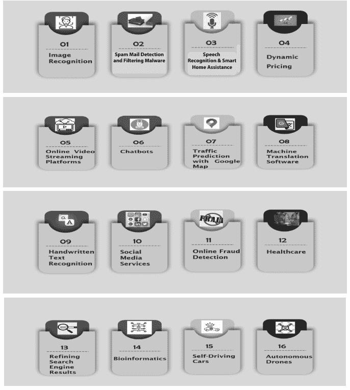

让我们讨论ML在这些领域中的应用。

#### 图像识别

在ML的背景下，图像识别是指软件识别数字图像中人物、地点和物体的能力。这是计算机科学中借助ML解决的复杂问题之一。大多数社交网络平台，如Facebook和Pinterest，使用图像识别算法来识别用户发布的照片中的人物和物体。Google Photos使用此技术根据手机相册中的人物、物体、风景等对图像进行分组。即使是自动驾驶汽车也使用此技术来识别道路上的物体和信号。

#### 垃圾邮件检测和恶意软件过滤

垃圾邮件一直是一个祸害，你可能已经观察到你喜爱的邮件服务会将邮件过滤到不同的类别，即主要、推广、社交、垃圾邮件等。在幕后，邮件服务使用ML算法对邮件进行分类。从传入邮件中过滤垃圾邮件非常重要，因为它们通常包含指向恶意网站/应用程序的链接。用户可以手动将邮件标记为垃圾邮件或非垃圾邮件。此标记用于训练ML模型，以便将来识别此类邮件。Gmail和Yahoo等邮件服务提供商使用ML模型将传入邮件分类为垃圾邮件或非垃圾邮件。

ML的另一个应用是恶意软件检测。Malware是“恶意软件”的缩写。恶意软件可以通过执行有害代码来损害我们的计算机、服务器或网络。恶意软件代码与其后代有95-98%的相似性。因此，安全系统已开始使用ML来识别相似的编码模式。使用ML驱动的安全程序，可以定期更新这些恶意软件定义，并且可以自发地检测任何恶意软件，以提供所需的保护。

#### 语音识别和智能家居助手

ML用于将语音转换为文本。此过程称为“语音识别”。语音识别用于设备控制、语音拨号、语音搜索，甚至虚拟个人助理理解语音命令。苹果的Siri、亚马逊的Alexa和Google Assistant是流行的智能家居助手，也称为智能个人助理或虚拟个人助理。所以，下次你说“嘿，Google！帮我找最近的餐厅”时，请记住，是一个ML模型将你的语音输入转换为相应的文本，然后在搜索引擎上进行查询。

#### 动态定价

如今，ML被广泛用于设置机票、体育或活动门票、出租车价格或Google Ads费用的动态价格。这些平台根据当前需求、位置、日期、时间和其他因素动态设置物品价格，如图1.2所示。为了更好地理解这一点，让我们以Uber这样的出租车服务为例。它使用ML模型来决定特定时间的最佳乘车价格。这非常准确，以至于出租车价格在高峰时段或节日期间会自动上涨。在航班的情况下也可以看到这一点。

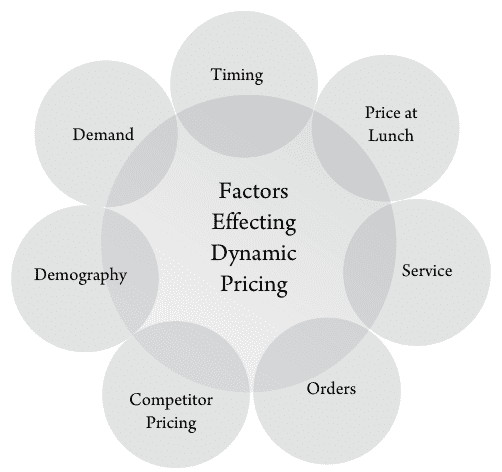

**图 1.2** 机器学习驱动的动态定价

#### 在线视频流媒体平台

近年来，数字流媒体平台的数量不断增加，但 Netflix、Amazon Prime 和 Disney Hotstar 依然难以撼动。这些平台之所以如此火爆和受欢迎，原因之一在于它们利用机器学习根据用户兴趣提供服务。

例如，Netflix 会收集用户数据，比如他们最常观看的内容类型、偏好的观看时间和日期、平均评分、搜索历史和浏览模式。它还会追踪播放、暂停、倒带、流媒体播放速度、首选语言等活动。从用户活动中捕获的数据被用于训练机器学习模型，从而向用户推荐电影和节目。这有助于让用户更长时间地留在平台上。

#### 聊天机器人

许多应用程序或服务提供商通过与专家在线聊天的方式为其客户提供支持。这些应用程序大多使用基于我们过去与客服聊天记录训练的聊天机器人。这些聊天机器人通过机器学习变得足够强大，能够实时回答用户查询。它们从网站上获取所需信息并提供给用户。最近，ChatGPT 因其卓越的功能引起了全世界的关注。

#### 谷歌地图的交通预测

如今，没有谷歌地图出行是难以想象的。它提供最短路线和最小距离，甚至能预测交通和拥堵情况。谷歌地图在幕后使用机器学习模型为用户服务。这些机器学习模型通过分析与用户寻求帮助的特定路线相关的过去和当前数据进行训练。

#### 机器翻译软件

几乎所有的机器翻译软件都利用机器学习算法将词语从一种语言转换为另一种语言。谷歌翻译就是使用机器翻译的应用程序之一。它可以将大量语音/文本输入从源语言翻译成所需语言。它还可以嵌入到智能手机和智能手表中。谷歌使用 GNMT（谷歌神经机器翻译），它依赖于自然语言处理（机器学习的一个子集）来输出最合适的句子翻译。

#### 手写文本识别

手写文本识别是机器从不同来源（如纸张、图像等）识别人类手写文本的能力。手动识别手写单词是一项繁琐的任务，需要大量专业知识，而且容易出错。手写文本识别系统应用机器学习模型来识别手写文本中的对象。这些系统在正确识别邮政邮件上的手写地址方面非常有用，甚至被法医团队用于匹配两个样本的笔迹。因此，它节省了时间，并且比手动笔迹识别方法更受青睐。

#### 社交媒体服务

你是否想过 Facebook 如何个性化我们的新闻推送？或者 Instagram 如何向我们推荐可能认识的人？从个性化广告到新闻推送，Instagram、Facebook 和其他社交网络巨头都在使用机器学习。这些平台会关注我们通常联系的人，然后根据我们的兴趣、位置和其他属性，推荐我们可能认识的人。这是一个持续学习的过程，通过机器学习模型完成。

Facebook 在向你的新闻推送推送帖子时也使用了类似的方法。根据我们喜欢、分享和评论的内容类型，底层的机器学习模型会理解我们的兴趣，然后向我们展示相关的帖子和广告。Facebook 甚至使用人脸识别（机器学习的另一个应用）来识别你发布照片中的朋友，然后自动标记他们。Facebook 能快速完成这些任务，但它使用的是在后台无缝运行和学习的复杂机器学习算法。同样，YouTube 分析我们的观看历史，然后使用机器学习在我们的推送中推荐视频。Pinterest 使用机器学习检查我们最常搜索的图像中的对象/图钉，然后根据识别出的模式对相似的图像进行分组。

#### 视频监控

一个人监控多个 CCTV 摄像头画面的日子已经一去不复返了。如今，视频监控系统由机器学习驱动，甚至能在犯罪发生前就检测到犯罪的可能性。手动观察多个摄像头中每个人的活动是一项耗时且繁琐的任务。因此，基于机器学习的视频监控系统可以检测人们的异常活动（例如长时间站在某个地方或在某些区域徘徊），并可以报告这些活动以预防犯罪。

#### 产品推荐

像亚马逊、Flipkart 和 Myntra 这样的在线购物网站使用机器学习模型向用户推荐产品。这些平台通过基于点击流分析（用户浏览活动）的广告来推荐产品。这些平台使用的机器学习算法从过去的购买记录、我们添加到购物车的商品、搜索历史等中了解我们的购物习惯。据观察，产品推荐大约为亚马逊创造了 35% 的收入。

#### 在线欺诈检测

如今，大多数货币交易都是通过 Google Pay、Paytm、PayPal 等支付网关在线完成的。为了保护用户免受在线金钱欺诈，机器学习被广泛使用。像 PayPal 这样的公司使用机器学习模型来区分合法和非法交易。现代金融系统现在已经部署了机器学习模型，通过其平台检查数百万笔交易是否存在欺诈交易。

#### 医疗保健

机器学习在医疗保健和制药领域应用最为广泛。现有的医疗技术现在正与机器学习相结合，以提高治疗质量，如图 1.3 所示。机器学习算法根据患者的病史分析其状况，然后通过建议最佳诊断或治疗方案为医生提供支持。机器学习不仅限于医学，甚至被用于机器人手术。

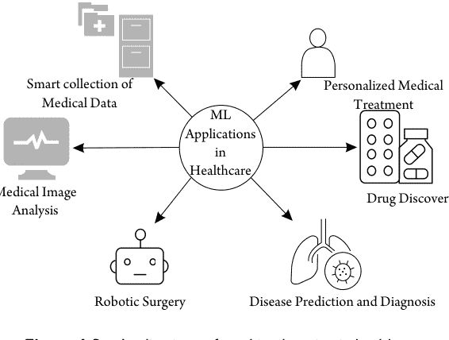

#### 优化搜索引擎结果

当我们在谷歌、必应和其他搜索引擎上搜索任何内容时，它们会遍历数万亿个网页并为我们提供搜索结果。这些搜索引擎使用机器学习算法，通过观察用户对搜索结果的响应来学习，从而改进搜索结果。例如，如果用户打开了前两个搜索结果并在网页上停留时间较长，机器学习模型就会认为显示的结果符合用户的搜索查询。因此，随着搜索引擎模型随时间推移学习得越来越多，搜索结果会不断改进。

#### 生物信息学

生物信息学是生物学、统计学、计算机科学和数学的交叉学科。生物信息学的主要任务之一是收集生物信息，例如生物体的 DNA。这些信息随后使用生物信息学算法进行分析，以确定解决现实世界问题的方案，例如为某种疾病开发疫苗。通常，这涉及手动识别重要特征。借助机器学习，特征可以被自动识别，从而提高准确性和效率。

#### 自动驾驶汽车和自主无人机

驾驶汽车时，我们需要控制速度、管理方向盘以在车流中找到出路、分析交通状况和同行驾驶员的行为等。所有这些任务都需要运动技能和人类意识。同样，要控制无人机的移动或速度，我们需要大量的技能和专业知识。一个人可以通过最少的培训获得这些技能。但当我们希望机器学习这个过程时，我们需要不同的车载机器学习技术，例如物体检测、物体定位、运动预测等。很快，市场上将充斥着自动驾驶汽车和无人机，它们正是充分利用了机器学习的优势。

通过了解上述机器学习的应用，我们可以理解机器学习在现代世界中拥有无限的可能性。因此，全球对机器学习专家的需求巨大。本书的主要目标是将你培养成这项卓越技术的专家，这项技术已经影响了我们的生活，并且在未来有着巨大的发展空间。

### 1.3 机器学习的历史

让我们深入了解机器学习的历史，了解各位研究人员为实现这一目标所付出的不懈努力。

机器学习的发展大致可分为奠基阶段、从理论到现实的过渡阶段以及当代阶段。这些阶段及其时间线如图 1.4 所示。这些阶段的主要里程碑将在后续章节中介绍。

#### 机器学习时间线

#### 1.3.1 机器学习的基础阶段（1940年之前）

机器学习的基础阶段可以追溯到计算机的演变。表1.1列举了作为机器学习发展基础的里程碑事件。

表1.1 机器学习基础阶段的关键里程碑

| 年份 | 里程碑 | 关键细节 |
|---|---|---|
| 1642 | 第一台机械计算器 | 布莱兹·帕斯卡发明了一种名为帕斯卡的机械计算器，以帮助他的父亲进行税务计算。它被设计用于执行基础的代数运算，如加、减、乘、除。 |
| 1679 | 现代二进制系统的诞生 | 德国数学家戈特弗里德·威廉·莱布尼茨发明了二进制系统，为现代计算奠定了基础。 |
| 1770 | 土耳其行棋傀儡 | “土耳其行棋傀儡”是一种设计用来像人类一样下棋的机械装置。它预示了未来全自动机器的可能性。 |
| 1834 | 穿孔卡片编程 | 现代计算之父查尔斯·巴贝奇构想了一种使用穿孔卡片编程的通用设备。 |
| 1842 | 第一个算法 | 年轻的数学家阿达·洛芙莱斯提出了一系列指令，使用查尔斯·巴贝奇的理论编程来解决一个数学问题。这是有史以来提出的第一个算法。 |
| 1847 | 布尔逻辑 | 乔治·布尔创造了一种代数形式，用于将表达式和值简化为“真”或“假”。这后来被称为布尔逻辑。基于布尔逻辑，中央处理器决定如何处理输入。 |
| 1927 | 科幻电影《大都会》上映 | 弗里茨·朗执导了一部科幻电影《大都会》，介绍了“假玛丽亚”，一台会思考的机器。这是银幕上描绘的第一个机器人。 |
| 1937 | 图灵机 | 图灵机被引入，最初旨在形式化可计算性的概念。大多数计算机科学家会肯定，图灵机是一个形式化的概念，它涵盖了所有可计算的问题。 |

#### 1.3.2 机器学习的过渡阶段（1940–2000）

基础阶段奠定的概念在过渡阶段成为现实。这一阶段提出了几种新算法。表1.2展示了机器学习过渡阶段的关键里程碑。

表1.2 机器学习过渡阶段的关键里程碑

| 年份 | 里程碑 | 关键细节 |
| :--- | :--- | :--- |
| 1943–1951 | 神经网络的诞生 | 沃尔特·皮茨和沃伦·麦卡洛克通过电路模拟了人类神经元。后来，唐纳德·赫布在他的著作中解释了神经网络的内部功能。最终，在1951年，马文·明斯基制造了第一个神经网络。 |
| 1952 | 塞缪尔的跳棋程序 | 亚瑟·塞缪尔创建了第一个自学程序，它通过经验学习，并在跳棋游戏中变得更好。 |
| 1957 | 感知器概念化 | 罗森布拉特提出了用于感知和识别的感知器。他解释了实现感知器及其工作原理的可行性。 |
| 1959 | 斯坦福大学的第一个神经网络 | 斯坦福大学开发了他们的第一个神经网络——马德琳，使用自适应滤波器消除电话线路上的回声。 |
| 1960 | 斯坦福大学的小车 | 一位斯坦福大学的毕业生开发了一辆小车，通过在一辆小车上安装电视摄像头和遥控器，解决了从地球上控制月球车的问题。 |
| 1985 | 一个能正确发音的人工神经网络 | NETtalk应用程序被开发为第一个人工神经网络，它在一周内自学正确发音了20,000个单词。 |
| 1990 | 提出提升算法 | 提升算法通过生成许多弱模型而不是单个模型来增强机器学习的预测能力。然后，通过结合它们的预测，将弱模型变为强模型。 |
| 1995 | 随机森林算法 | 引入了随机森林算法，该算法创建多个决策树并将它们合并成一个森林。 |
| 1997 | 计算机击败国际象棋大师 | IBM的深蓝击败了国际象棋大师加里·卡斯帕罗夫。这是计算机首次击败人类国际象棋专家。 |
| 1999 | 计算机辅助癌症诊断 | 芝加哥大学开发的计算机辅助诊断原型智能工作站测试了22,000张乳腺X光片。其癌症检测的准确性远高于放射科医生。 |

#### 1.3.3 机器学习的当代阶段（2000年之后）

第三阶段见证了计算能力和数据的增长，因此这一阶段对机器学习的发展贡献最大。这也是机器学习成为我们生活不可或缺一部分的阶段。这一阶段的一些里程碑总结在表1.3中。

表1.3 机器学习当代阶段的关键里程碑

| 年份 | 里程碑 | 关键细节 |
|---|---|---|
| 2006 | 创造“深度学习”一词 | 杰弗里·辛顿在2006年将神经网络研究重新命名为深度学习。他的技术如今被用于改进语音识别和图像标记工具。 |
| 2006 | 击败Netflix预测算法 | 2006年，Netflix发起了一项竞赛，旨在击败其预测消费者电影评分的算法。三年后，AT&T的科学家击败了他们的算法。 |
| 2011 | 沃森计算机战胜《危险边缘》冠军 | 沃森计算机以IBM创始人的名字命名，旨在回答《危险边缘》智力竞赛中的问题。2011年，它与《危险边缘》冠军布拉德·拉特和肯·詹宁斯竞争，并赢得了100万美元的奖金。后来，这个系统被用作医生的助手。 |
| 2012 | 谷歌大脑 | 谷歌大脑是一个深度学习人工智能研究团队，他们创建了一个神经网络来识别YouTube视频中的人类和猫。 |
| 2014 | 聊天机器人通过图灵测试 | 艾伦·图灵设计了一项测试，只有当机器在与真人对话时模仿人类，才能通过该测试。2014年，一个聊天机器人成功地说服了33%的人类测试者，让他们相信它是一个乌克兰青少年。 |
| 2015 | AlphaGo击败职业围棋选手 | 围棋是世界上最具挑战性的棋盘游戏。2015年，谷歌的AlphaGo与一位职业围棋选手比赛并获胜。 |
| 2015 | PayPal的混合欺诈检测系统 | PayPal使用混合方法来打击欺诈。首先，它检测犯罪分子的行为。然后，一个机器学习算法将这些特征作为输入参数，以识别PayPal网站上的犯罪分子。 |
| 2016 | 用于唇语识别的LipNet | 牛津大学的一个研究团队设计了一个AI系统，可以以93.4%的准确率进行唇语识别。 |
| 2016 | 具备自然语言处理能力的个人数字购物助手 | 零售巨头北面成为第一家使用IBM Watson来协助购物者的零售商。它向顾客推荐商品，并像人类销售助理一样为他们提供帮助。 |
| 2017 | 网络喷子识别器 | 字母表公司的Jigsaw团队推出了一项名为Perspective的新技术，通过该技术可以在网站上检测到网络喷子。 |
| 2018 | 深度伪造 | 深度伪造是机器生成的虚假视频，用于在录制的视频中将一个人的外貌替换为另一个人。这一年，美国前总统巴拉克·奥巴马的深度伪造视频提高了主流社会的认知。 |
| 2018 | 全球首架载客无人机 | 中国无人机制造商亿航展示了一架无人机，它使用八个电动机驱动螺旋桨，可以搭载一个人。 |
| 2019 | 汽车领域的机器学习 | 开发了各种新的算法和技术，将机器学习应用于汽车行业。特斯拉的自动驾驶仪推出了一种先进的算法，基于安装的传感器提供实时预测。 |
| 2020 | 使用机器学习控制和预测新冠疫情 | 机器学习被广泛用于接触者追踪、预测和预测大流行。 |
| 2021 | 自动驾驶汽车 | 本田推出了其新批准的3级自动驾驶系统，该系统在法律上允许驾驶员将注意力从道路上转移开。与此同时，梅赛德斯-奔驰获得了德国政府对其3级自动车道保持系统的批准。 |
| 2022 | ChatGPT | OpenAI于2022年11月推出的ChatGPT是机器学习历史上的一个重要里程碑，标志着对话式人工智能和自然语言处理能力发展的重大进步。 |

我们可以得出结论，机器学习最近经历了巨大的进步。在下一节中，我们将定义机器学习。

### 1.4 机器学习的定义

从机器学习开始 | Parteek Bhatia, https://youtu.be/KRuY3Rx7SYo

IBM的亚瑟·塞缪尔在1959年首次提出了机器学习的概念。他将机器学习定义为“一个赋予计算机无需显式编程就能学习能力的研究领域”。

与传统编程中我们为机器提供一套规则以获得输出不同，在机器学习中，我们无需向计算机提供特定的规则集。在机器学习过程中，我们只向机器提供数据作为输入，随着时间的推移，机器/计算机会通过试错从这些数据中学习。

这类似于一个孩子通过犯错和多次尝试来改进方法，从而学会将形状放入玩具的过程。孩子无需明确教导就能学会如何匹配形状。同样，机器也能在没有通过规则直接教导的情况下，解释输入数据并执行指定任务。

Arthur Samuel 在 1959 年提出了这个术语，值得注意的是，机器学习并非新技术，而是在半个多世纪前就被定义了。当时的技术还不够先进，无法促进机器学习的实现，因为它需要大量数据进行训练，并需要巨大的计算资源来构建模型。那时，数据和计算能力都很稀缺。因此，机器学习仅停留在纸面上，很少有组织能够开发这些模型。

随着具有大容量存储和高处理能力的计算机的出现，机器学习在 1990 年代初获得了发展动力。1997 年，Tom M. Mitchell 正式重新定义了机器学习。

Tom M. Mitchell 在他的著作《*机器学习*》中将机器学习定义如下：

> 一个计算机程序被称为从经验 E 中学习，针对某类任务 T 和性能度量 P，如果它在任务 T 上的性能（由 P 衡量）随着经验 E 而提高。

这个定义乍一看可能很复杂，所以让我们更清楚地理解这个定义。

机器学习的行为类似于孩子的成长；它在完成任务 T 时的经验 E 随着其发展而增加。随着任务 T 中经验 E 的增加，性能度量 P 也显示出改善。

例如，让我们考虑一个孩子有一个“形状分类块”玩具，假设这个玩具有三种形状，即圆形、三角形和正方形。在这种情况下，孩子的任务 T 是为积木找到合适的形状孔。孩子尝试执行任务 T，即为积木找到合适的孔，经过几次尝试后，他成功地为一个形状找到了孔。然后他的性能度量 P 变为 1/3，因为他匹配了 3 个正确形状中的 1 个。

由于孩子通过多次尝试获得了经验，他在该任务中的经验 E 增加了。让我们假设孩子再尝试一次。考虑到获得的经验（E），孩子尝试该任务，他可以匹配 2 个形状，这意味着他的性能（P）在该任务（T）上随着经验（E）提高到了 2/3。让我们假设，在重复该任务（T）100 次后，孩子现在能够正确地匹配所有形状，这清楚地表明孩子的性能（P）在该任务（T）上随着经验（E）而提高。

在这里，孩子的学习类似于机器学习。在机器学习中，任务是基于历史数据进行预测。这里，数据是经验（E），任务（T）是预测，每当机器进行预测时，其预测准确性是通过性能（P）来衡量的。当我们向算法提供更多数据或经验（E）时，机器在该任务（T）上的性能（P）就会提高。

因此，我们可以得出结论：如果我们向机器提供更多经验或数据来解决特定的一组任务，并且其性能因此提高，那么这就是机器学习。
这类似于在咖啡中加糖。如果我们向咖啡中加入更多糖，它会变得更甜；同样，如果我们给机器更多数据，它在一组任务上的性能就会变得更好。

#### 检验你的进度

1. 让我们考虑一个将新电子邮件检测为垃圾邮件或非垃圾邮件的程序。该程序定期跟踪用户标记为垃圾邮件或非垃圾邮件的电子邮件。它处理这些邮件并从中学习。基于这些信息，它学习如何自动预测垃圾邮件。
在这个例子中，你能根据 Tom Mitchell 给出的定义识别出任务 T、经验 E 和性能 P 吗？

**解答：**
如果我们观察这个例子，我们可以发现：
任务 T 是将电子邮件分类为垃圾邮件或非垃圾邮件。
经验 E 定期跟踪用户标记为垃圾邮件和非垃圾邮件的电子邮件。
性能 P 是正确预测为垃圾邮件或非垃圾邮件的电子邮件数量。

2. 考虑一个用于预测天气状况的机器学习模型。识别该模型的任务 T、经验 E 和性能 P。

**解答：**
这里，任务 T 是预测天气状况。为了完成这项任务，我们必须向模型提供有关过去天气状况的数据。这些数据充当经验 E。当我们向算法提供更多经验或数据时，系统的性能 P 就会提高。

3. 假设你需要开发一个程序来预测印度在 T20 板球比赛中对阵巴基斯坦的得分。在这种情况下，识别任务 T、经验 E 和性能 P。

**解答：**
在这个例子中，任务 T 是预测印度的得分，经验 E 将是两队之间所有先前比赛的数据，性能 P 是我们的程序能够进行此预测的准确性。
在理解了（E）、（T）和（P）的概念之后，让我们将机器学习与传统编程进行比较。

### 1.5 传统编程与机器学习

传统编程与机器学习有显著不同。在传统编程中，程序员需要根据需求分析编写所有规则或业务逻辑。机器根据编程规则处理这些输入数据并产生所需的输出，如图 1.5 所示。但是当系统变得复杂时，需要编写更多规则，并且很快就会变得难以维护或编写这些代码。

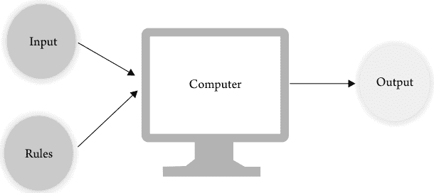

**图 1.5** 传统编程模型

随着问题复杂性的增加，机器学习就派上用场了。在机器学习中，开发者需要向机器提供输入和输出。机器学习输入和输出数据如何关联，然后自动生成规则，如图 1.6 所示。

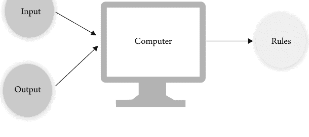

**图 1.6** 机器学习模型

在深入探讨机器学习算法的复杂性之前，让我们探索与不同变量或列相关的各种数据类型。

在机器学习中，变量通常根据其性质和所代表的数据类型进行分类。最常见的变量类型是：

1. 分类变量：这些变量代表类别或标签，可以进一步分为两个子类型：
   i. 名义变量：这些变量代表没有任何内在顺序或排名的类别或标签。示例包括性别（例如，男性、女性）、颜色（例如，红色、绿色、蓝色）、产品类型或国家名称。每个类别都同样有意义，它们之间没有特定的顺序或排名。
   ii. 有序变量：这些变量代表具有特定顺序或排名的类别。示例包括教育水平（例如，高中、学士、硕士）或客户满意度评级（例如，差、一般、优秀）。

2. 数值变量：这些变量代表数字，可以进一步分为两个子类型：
   i. 连续变量：这些变量可以在范围内取任何数值。示例包括身高、体重或温度。
   ii. 离散变量：这些变量只能取特定的、不同的值。示例包括家庭中的人数或售出物品的数量、停车场中的汽车数量。

简单来说，连续变量可以取小数（浮点）值，而离散变量始终表示为整数。

### 1.6 机器学习算法的分类

机器学习算法分为以下三种类型。如图 1.7 所示。

- 监督学习
- 无监督学习
- 强化学习

大约 70% 的现有机器学习算法基于监督学习，10-20% 基于无监督学习，其余基于强化学习。

> 本节灵感来源于 DeepLearningAI 提供的 Andrew Ng 机器学习专项课程 [课程 1]。

机器学习专项课程 [课程 1] | DeepLearningAI | Andrew Ng, https://youtu.be/vStJoetOxJg

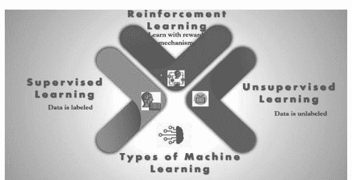

本节重点通过一些示例来理解各种机器学习算法。

#### 1.6.1 监督学习

回归：监督机器学习 | Parteek Bhatia, https://youtu.be/FZrFHbUJf_4

在监督学习中，“算法从包含输入属性和相应目标属性或类别的带标签数据中学习”。这里，“监督”一词意味着算法被提供了带有“正确答案”的数据集。简单来说，在监督学习的情况下，数据是带有标签的。

让我们用一个现实生活中的例子来理解这个概念。假设有一位名叫拉哈特的房产经纪人，他非常擅长预测房屋价格。他会实地考察房产，检查其重要特征，如卧室数量、地板、周边社区等，然后准确地预测价格。他是在该领域拥有长期经验后才培养出这种专业能力的。现在，他有一个紧急任务，需要他去另一个国家至少待上几个月。他担心自己不在期间生意如何运转。在这种情况下，他聘请了一位机器学习专家，并要求他开发一个能够像他一样准确预测任何房屋价格的系统。

新聘请的机器学习专家的首要任务将是收集该地区之前房产交易的数据，这些数据将包括房产的所有重要属性及其相应的成交价格，如图1.8所示。

| 输入属性 | 输出或类别属性 |
| :--- | :--- |
| 地块面积 | 卧室数量 | 覆盖面积（码） | 花岗岩地板 | 升级厨房 | 距离城市（公里） | 公寓房龄（年） | 价格（十万卢比） |
| 500 | 3 | 150 | Y | Y | 2 | 2 | 70 |
| 1000 | 2 | 250 | Y | Y | 1 | 1 | 140 |
| 1800 | 4 | 320 | N | Y | 2 | 1 | 200 |
| 300 | 2 | 130 | Y | Y | 3 | 2 | 60 |
| 2000 | 4 | 500 | Y | N | 5 | 3 | 200 |
| 250 | 3 | 160 | N | N | 1 | 2 | 60 |

**图 1.8** 价格预测数据集

在这里，地块面积、卧室数量、覆盖面积（码）、花岗岩地板、升级厨房、距离城市（公里）和公寓房龄（年）等属性将作为输入属性，而价格（十万卢比，1 lakh = 100000）将作为输出属性或类别。由于之前交易中的房屋价格是已知的，因此这被视为带标签数据。

在这种情况下，机器学习程序的任务是根据这些输入属性预测价格（十万卢比）。这是监督机器学习的完美设置，我们拥有带标签数据（之前交易中房屋的确切价格是已知的），而机器学习程序的任务是根据输入属性预测未知实例的输出属性或类别的值。在这里，机器学习模型需要预测一个连续值，这被称为回归问题（预测连续值）。

为了进一步理解机器学习程序在此情况下如何进行预测，让我们考虑这个数据集的一个简化版本，其中我们只有一个输入属性——地块面积，以及输出属性——价格（十万卢比），如图1.9所示，我们需要仅根据地块面积来预测房屋价格。

| 输入属性 | 输出或类别属性 |
| :--- | :--- |
| 地块面积 | 价格（十万卢比） |
| 500 | 70 |
| 1000 | 140 |
| 1800 | 200 |
| 300 | 60 |
| 2000 | 200 |
| 250 | 60 |

**图 1.9** 价格预测数据集的简化版本

为了预测房屋价格，机器学习算法将在此数据上拟合一条直线，并基于这条拟合的直线，通过绘制垂直线和水平线来预测任何新实例的价格。这已在简化数据集上进行了说明，如图1.10所示。

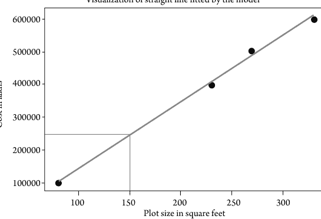

**图 1.10** 使用小型数据集预测地块成本

随着数据集的增长，添加了更多数据，系统的经验增加，使其能够更有效地将直线拟合到给定的数据点。这导致模型的准确性提高，表现为实际值与预测值之间的距离减小，如图1.11所示。值得注意的是，随着数据点数量或经验的增加，直线拟合得更好，从而更新了预测价格，使预测更加准确。

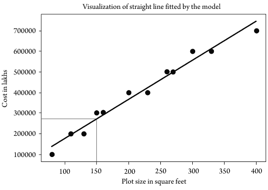

**图 1.11** 使用大型数据集预测地块成本

这里需要注意的是，通过增加数据集，即机器的经验，系统在“预测房屋价格”任务上的性能得到了提高，因此这构成了机器学习的一个案例。

需要注意的是，当我们向模型添加更多输入特征（如卧室数量、覆盖面积（码）、花岗岩等）进行训练时，模型的准确性会进一步提高，但这也会使我们的模型变得复杂。

上面讨论的例子是监督机器学习，“监督”一词意味着算法被提供了带有“正确答案”的数据集。该例子是一个回归问题。在回归问题中，系统预测一个连续值的输出（这里是房屋价格）。

据说这种学习方式类似于人类从老师那里学习的方式。老师提供一些问题及其相应的答案/解决方案给学生学习，这是老师为学生提供的一种监督，以协助他们的学习。学生从这些解决方案中学习，这样当给他们一些未解决的问题时，他们可以根据从答案手册中学到的知识来解决它。这个答案手册可以被视为带标签数据。答案手册的规模越大，学生的专业知识就越丰富。在计算机的背景下，其思想是向计算机提供大量的输入-输出对，并通过找到输入与输出之间的相关性来训练机器，以便在给定未知输入实例时产生输出。

分类：监督机器学习 | Parteek Bhatia, https://youtu.be/YD2Kb1tsAh4

让我们再举一个监督学习的例子。假设一位医生查看一份医疗记录数据集，以确定肿瘤是良性还是恶性。良性肿瘤是无害的肿瘤，而恶性肿瘤是危险且有害的肿瘤。在这种情况下，让我们假设医生拥有之前不同患者的肿瘤详细信息，这些信息包含肿瘤的不同特征或属性，如大小、mean_perimeter、mean_area、mean_smoothness以及患者的年龄，其对应的类别是诊断结果。这里0表示肿瘤是良性的，而1表示肿瘤是恶性的，如图1.12所示。

| 肿瘤大小 | 年龄 | mean_parameter | mean_area | mean_smoothness | 诊断 |
|---|---|---|---|---|---|
| 17.99 | 36 | 122.8 | 1001 | 0.1184 | 0 |
| 20.57 | 30 | 132.9 | 1326 | 0.08474 | 0 |
| 19.69 | 45 | 130 | 1203 | 0.1096 | 0 |
| 14.68 | 67 | 94.74 | 684.5 | 0.09867 | 0 |
| 16.13 | 65 | 108.1 | 798.8 | 0.117 | 0 |
| 19.81 | 23 | 130 | 1260 | 0.09831 | 0 |
| 13.54 | 78 | 87.46 | 566.3 | 0.09779 | 1 |
| 13.08 | 86 | 85.63 | 520 | 0.1075 | 1 |
| 9.504 | 20 | 60.34 | 273.9 | 0.1024 | 1 |

**图 1.12** 肿瘤和患者及其对应标签的数据集

为了简化，让我们假设我们只有一个输入属性——肿瘤大小，并在此基础上预测肿瘤是良性还是恶性，如图1.13所示。

| 肿瘤大小 | 诊断 |
|---|---|
| 17.99 | 0 |
| 20.57 | 0 |
| 19.69 | 0 |
| 14.68 | 0 |
| 16.13 | 0 |
| 19.81 | 0 |
| 13.54 | 1 |
| 13.08 | 1 |
| 9.504 | 1 |

**图 1.13** 肿瘤和患者及其对应标签的数据集的简化版本

为此，如果我们绘制一个图表，将肿瘤大小放在X轴上，肿瘤类型（即良性或恶性）放在Y轴上，如图1.14所示，你可以理解这种预测与预测房屋价格是不同的。在这个例子中，我们不是在预测一个连续值，而是将肿瘤分类为良性（0）或恶性（1）。因此，这是一个分类问题（预测离散值），而不是回归问题（预测连续值）。

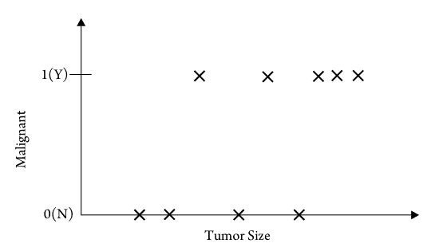

**图 1.14** 肿瘤大小与恶性程度的数据图

我们可以用这些数据训练一台机器，这样当我们有任何未知实例的数据时——意味着我们只有输入属性信息，而没有任何输出属性信息——然后我们将这个未知实例的数据映射到此图的X轴上，以预测其对应的类别或Y轴的值。例如，未知实例A在图1.15中被分类为0。

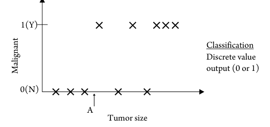

**图 1.15** 预测肿瘤大小A

上面讨论的例子是一个分类问题。“分类”一词意味着系统试图将输出预测为一个离散值，即0或1（在上面的例子中是良性或恶性）。需要注意的是，在分类问题中，输出可以有超过两个可能的值。例如，不是预测良性肿瘤和恶性肿瘤，让我们假设模型需要预测肿瘤的类型，如1、2或3。那么这将被视为一个多分类问题，模型需要在0、1、2和3之间进行预测。因此，在分类问题中，输出可能有N个类别，其中N始终是一个有限数。所以，如果一个分类器只需要预测两个类别，那么它被称为二元分类器；否则，它被称为多分类器。

在上面的例子中，我们只考虑了一个输入属性或特征，即肿瘤大小。为了提高模型的准确性，我们可以考虑更多的属性。例如，除了肿瘤大小，还可以考虑患者的年龄。在这种情况下，数据点的图形将如图1.16所示。

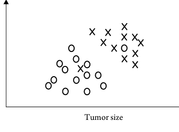

**图1.16** 将肿瘤大小和年龄作为分类特征

现在，我们需要将未知实例的年龄和肿瘤大小（如B所示）绘制在此图上以进行预测，如图1.17所示。

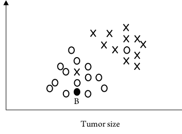

**图1.17** 对肿瘤大小B的预测

在这种情况下，机器学习算法将拟合一条直线来区分良性肿瘤和恶性肿瘤，如图1.18所示。如果一个人的肿瘤落在这条良性一侧，那么肿瘤类型将被预测为良性。

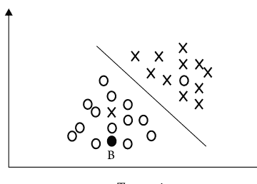

在这个例子中，我们考虑了两个特征：患者的年龄和肿瘤大小。然而，我们可以增加特征的数量以进一步提高预测的准确性。随着更多相关特征的加入，模型会变得更加复杂，但准确性也会提高。通常，机器学习算法具有多个特征。

##### 回归与分类

根据输出的性质，监督学习可以分为两种类型：回归和分类。在回归的情况下，模型预测一个连续值，例如房屋价格、学生成绩、当天温度或团队得分等。

在分类问题的情况下，模型预测一个离散类别，例如良性-恶性肿瘤、0-1-2-3（肿瘤类别）、狗-猫、A-B-C-D-E（学生等级）或赢-输-平（比赛结果）等。

#### 检验你的进度

让我们回答以下问题：
你拥有一家公司，为了解决公司的每个问题，你希望开发一个机器学习算法。
问题1：对于每个客户账户，你需要开发软件来检查该账户是否被黑客入侵。
问题2：你有大量的类似商品库存。你想知道未来三个月内这些商品中有多少会被售出。

- a) 第一个问题是一个回归问题，第二个问题是一个分类问题。
- b) 两者都是分类问题。
- c) 两者都是回归问题。
- d) 第一个问题是一个分类问题，第二个问题是一个回归问题。

希望你得到了答案，答案是选项D。
在问题1中，我们需要预测账户是否被黑客入侵。所以，如果我们考虑0表示未被入侵，1表示被入侵，我们需要预测0或1。因此，这是一个二元分类器的情况（只有两个可能的输出）。在问题2中，我们需要预测未来3个月内售出的商品数量作为一个连续值；因此，这是一个回归问题。

#### 1.6.2 无监督学习

理解无监督机器学习 | Parteek Bhatia, https://youtu.be/1dxC8WyUKjw

创建带标签的数据成本高昂且劳动密集，在大多数现实情况下，没有可用于构建机器学习模型的带标签数据。在这种情况下，无监督学习用于处理未标记的数据。未标记的数据意味着数据包含输入属性，但没有相应的已知输出属性或类别，或标签。简单来说，数据只有输入属性。这里的输出是未知的。在没有已知输出类别或标签的情况下，输入无法指导算法，这就是为什么该算法被称为“无监督”。

无监督机器学习模型在训练期间分析数据，发现模式，并根据相似性在输出中创建簇或组，如图1.19所示。

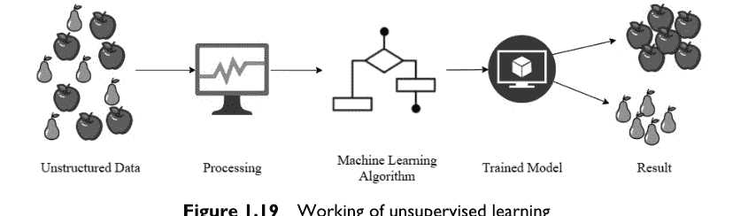

在图1.19中，机器学习算法的输入是包含水果的未标记数据（没有其标签或名称）。机器学习算法在训练期间处理数据，并发现相似项目之间的模式。这样，模型就创建了水果的簇或组，如图1.19所示。

因此，无监督学习是“当机器学习算法从没有关联标签或响应的示例中学习时，让算法独立解释数据模式”。

它基于通过观察对象的相似性和差异性来对它们进行聚类。无监督学习很有用，因为我们通常拥有未标记的数据。毕竟，生成带标签的数据非常费力且困难。因此，在大多数情况下，我们拥有无法用于监督学习的未标记数据。在这些情况下，无监督学习是有益的，因为它识别输入数据中的模式，并根据它们的相似性将其划分为簇或组。

无监督学习分为两种类型，即（i）聚类和（ii）关联挖掘。聚类的目标是根据数据的相似性和差异性发现数据中的自然分组模式。

关联挖掘的目标是发现描述数据中关联的规则。例如，它用于发现项目X和项目Y销售之间的关系。输入是包含项目的交易数据（例如，不同客户在一次访问中购买的产品）。然后可以应用关联挖掘来找出经常一起购买的商品组。例如，如果一个人买了面包，那么他很有可能会买黄油。商店经理可以利用这些信息来安排商店中的商品或制作组合，以提高商店的销售额和整体效率。Netflix推荐器或亚马逊的产品推荐也是关联挖掘的例子。

##### 无监督学习的例子

图1.20展示了一些无监督学习的现实应用。下面将逐一讨论。

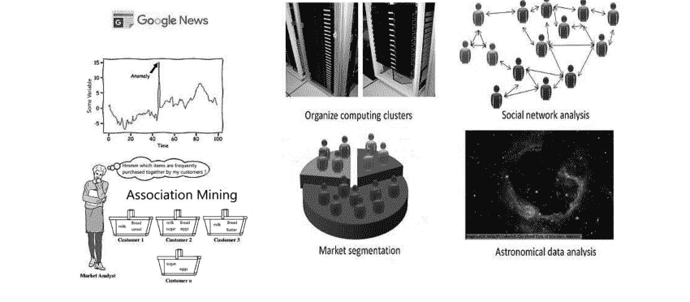

###### 谷歌新闻

谷歌新闻对新闻文章进行聚类，如图1.21所示，这是使用无监督机器学习技术对数据项进行聚类的一个例子。这里，新闻文章根据其内容进行分组。谷歌处理数百万条新闻，并通过考虑词频、页面数、句子长度、词汇等特征来识别相似性。


**图1.21** 谷歌新闻，一个聚类应用

###### 组织计算集群

服务器的地理位置是根据来自世界特定区域的网络请求的聚类来决定的。本地服务器将只包含该地区人员经常访问的数据。

###### 社交网络分析

可以执行社交网络分析，根据对评论、点赞、分享等的分析，将好友列表中的成员分组为密友、同事、亲戚、家庭成员等。

###### 市场细分

商店可以根据其之前的账单商品，将其客户聚类或分组为不同的细分市场。例如，假设一家大型超市想要向其客户发送短信，通知他们杂货商品的促销活动，而不是向所有客户发送短信。在这种情况下，最好只向那些经常购买杂货商品的客户发送短信，而不是向那些经常从商店购买服装的客户发送短信。根据客户的购买历史将其分组到不同的细分市场，将有助于商店定位客户，从而提高其利润。

##### 天文数据分析

天文学家使用大型望远镜研究星系和恒星。从天空不同区域接收到的光模式有助于识别新的星系、行星和卫星。美国宇航局使用机器学习技术，训练计算机来识别模式和新的行星。

##### 异常检测

使用聚类方法的异常检测可以发现数据集中的异常数据或离群值。这对于发现欺诈性交易很有用。

##### 关联挖掘

关联规则挖掘是一种基于规则的技术，用于发现数据集属性之间的关系。例如，如果一个人买了面包，那么他买鸡蛋的概率就很高。

### 1.7 现实场景中的监督学习与无监督学习

为了理解监督学习和无监督学习的区别，让我们考虑亚当和夏娃的学习过程。根据《圣经》文本，他们被认为是地球上的第一批人类。

亚当和夏娃可能是通过分析各种物体的属性或特征来学习的，因为在那个时代，没有任何物品附有名称或标签。他们可能根据颜色、形状、大小、气味、味道等特征对物品进行了分组或聚类。首先，他们可能将事物分为生物和非生物组。然后他们可能进一步分析每个组，并将其细分为子组。例如，他们可能将一个组识别为“动物”，并进一步将其细分为老虎、狗、猫等。简单来说，他们根据物体的特征对物体进行了聚类，后来随着语言的发展，他们为这些组和子组分配了名称。

因此，亚当和夏娃是通过无监督学习来学习的，因为在那个时代，没有任何东西被贴上标签，他们根据自己的分析创建了组和子组，后来这些组和子组获得了不同的名称。

另一方面，在当今世界，当一个孩子出生在一个家庭中时，他的学习过程与亚当和夏娃的学习过程不同，因为现在所有东西都有标签，即所有东西都有名字。我们向孩子展示不同的物品，并告诉孩子物品的名称，例如钢笔、铅笔、椅子、桌子、汽车、公交车等。在这个学习过程中，除了了解物体的所有特征外，孩子还知道该物品的名称或标签。孩子不需要看到世界上所有的铅笔才能识别它们；在对一些物品进行训练后，他就能够区分钢笔/铅笔/汽车/公交车等。因此，孩子的学习是监督学习，因为提供了带有物品所有属性的标签数据，如图1.22所示。在监督学习中，系统在一些样本数据（训练数据）上进行训练。每当遇到未知的样本数据时，系统会根据分析训练数据获得的经验进行预测。


无监督学习

**图1.22** 亚当和夏娃的学习与现代孩子的学习

简单来说，当数据被标记时，它被认为是监督学习，但当数据未被标记时，它被称为无监督学习。在监督学习中，系统进行预测，即分类或回归。在无监督学习的情况下，聚类和关联挖掘是基于物体的特征进行的。

#### 监督学习与无监督机器学习

最后，让我们以表格形式总结监督学习和无监督学习，如表1.4所示，以便进行比较。

**表1.4** 监督学习与无监督机器学习的比较

| 参数 | 监督学习 | 无监督学习 |
| :--- | :--- | :--- |
| **输入数据** | 数据被标记。 | 数据未被标记。 |
| **应用** | 用于分类和回归。 | 用于聚类和关联挖掘。 |
| **计算复杂度** | 计算复杂度较低，因为它是一种更简单的方法。 | 无监督学习的计算复杂度较高。 |
| **准确性** | 高度准确且值得信赖的方法。 | 准确性较低且不太值得信赖的方法。 |

### 1.8 强化学习

强化学习与监督学习和无监督学习完全不同。如前所述，监督学习需要标记数据，而无监督学习则在未标记数据上进行。当然，我们可以用监督学习和无监督学习解决许多问题。但是，假设你希望开发一个机器人，它可以自动进行房屋吸尘和拖地，或者我们希望开发一个机器人来替代士兵进行战斗等。同样，你可能希望开发一辆由机器自动驾驶的无人驾驶汽车，或者想要构建一个具有自动化学习能力的计算机游戏，能够击败占主导地位的人类玩家。所有这些问题陈述都无法通过回归或分类来解决，我们甚至无法应用聚类方法来解决它们。因此，监督学习和无监督机器学习方法在这些情况下都失败了。解决此类问题的解决方案是使用强化学习，它在开发这些应用中起着至关重要的作用。

这种学习不属于监督学习和无监督学习的同一领域。如图1.23所示，很明显监督学习和无监督学习相对相似，但强化学习与这两种方法之间存在巨大差异。

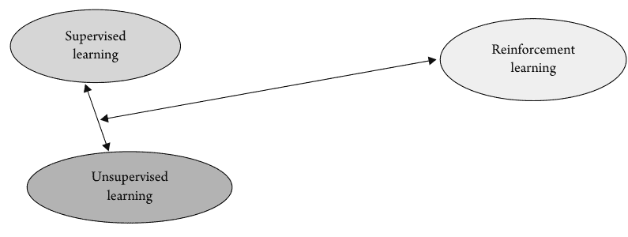

**图1.23** 监督学习、无监督学习和强化学习的比较

#### 1.8.1 强化学习的工作原理

强化学习是机器学习的一个领域，关注智能体如何在环境中采取行动以最大化累积奖励。智能体使用简单的奖励反馈机制来学习其行为。谷歌的AlphaGo程序在围棋比赛中击败了世界冠军，特斯拉汽车的自动驾驶汽车，以及亚马逊的空中配送，都基于强化学习。

强化学习的主要目标是开发一个可以像人类一样工作的AI机器。它通过试错来运行，机器选择那些能带来最大奖励的动作。

强化学习算法通过与周围环境的积极互动来获取知识。它因成功的动作而获得奖励，因错误的动作而受到惩罚。算法的目标是在没有任何人为干预的情况下，独立地优化奖励并最小化惩罚。这种学习形式与人类获取知识的试错过程非常相似。错误可能导致各种后果，如成本、时间损失、遗憾和不适，这自然会阻止个人持续做出同样的错误选择。

让我们考虑一个场景来理解奖励的概念。一个婴儿正在学习如何走路。孩子的父母在房间的另一个角落放了一块蛋糕。于是，孩子开始自己学习走向蛋糕。蛋糕就像它将要获得的奖励。在第一种情况下，婴儿开始行走并能够到达蛋糕。婴儿吃了蛋糕并感到高兴。所以，这是一个正向奖励。另一种情况可能是，婴儿开始行走，但由于中间的一些障碍物而摔倒。婴儿受伤了，并且没有得到任何蛋糕。因此，婴儿变得悲伤。所以，这是一个负向奖励。

同样，在强化学习中，模型从其过去的经验中学习新事物，就像人类的学习一样。在前面的例子中，我们有一个像智能体一样的婴儿，奖励是蛋糕。智能体应该使用最佳路径来获得奖励。因此，这种现象可以等同于强化学习。

#### 1.8.2 强化学习的组成部分

在强化学习中，智能体根据其观察结果采取某些行动。当环境向智能体提供一个状态时，学习过程就开始了。根据智能体在该状态下的行动，它会收到奖励或惩罚。这个状态-行动循环持续进行，直到环境发出终止条件信号。当达到终止状态时，意味着智能体已成功完成其任务并获得了所需的奖励。

这里关于强化学习的讨论灵感来源于Edureka的“强化学习教程”。


强化学习具有以下基本组成部分。

- 环境
- 智能体
- 状态
- 动作
- 奖励
- 策略
- 价值
- 动作价值

让我们逐一讨论强化学习的这些组成部分。

##### 环境

环境是强化学习的一个重要组成部分。它表示机器实时交互的外部世界。这可以是真实的或模拟的。

在强化学习中，机器必须从环境中学习新规则，并根据实时情况做出适当决策。

这与人类的工作方式类似，我们从环境中获取信息。同样，强化学习从可能为实时或模拟的来源中捕捉细节。人类通过眼睛、耳朵、鼻子、舌头和皮肤等感觉器官与环境互动。同样，机器也需要感觉器官来感知环境。这些感觉器官就像机器的不同传感器。机器使用这些传感器来获取环境的当前知识。当人类的感觉器官从环境中接收到足够的信息时，它会在大脑中形成对情况的理解，然后大脑会针对该情况采取适当行动。

同样，机器需要一个大脑来处理实时情况，并根据情况做出重要决策。这个基于从环境中获得的信息来采取行动的机器大脑被称为智能体。

##### 智能体

智能体是强化学习中负责所有决策的组件。它从环境中获取信息，并实时为机器做出决策。它是一个通过试错来学习的算法。智能体根据条件采取行动——例如，一个在环境中导航的机器人。智能体控制机器人采取的行动。

##### 动作

智能体必须根据环境的当前状态执行动作。例如，智能体根据从汽车传感器接收到的关于环境当前状态的信息，决定将汽车方向盘向左或向右转动。对于机器人来说，向右、向左、向上和向下移动是智能体采取的具体动作。

##### 状态

环境的信息以其状态的形式提供给智能体。智能体采取行动，状态的值在行动后发生变化。

##### 奖励点

智能体采取的行动可能是正确的，也可能是错误的。关键问题是：强化学习如何确保机器采取正确的行动？为此，强化学习使用了奖励点的概念。

这些奖励点类似于主人或训练师在训练过程中给宠物狗食物或惩罚。如果宠物狗按照指导执行动作，就会得到奖励，比如食物。而如果狗执行了不恰当的动作，狗就会受到惩罚。随后，宠物狗会理解不同的场景以获得奖励，并区分恰当和不恰当的动作。

就像狗一样，机器也需要根据动作的相关性进行训练。如果机器正确执行动作，就会得到奖励；另一方面，如果机器做出了错误的决定，奖励点就会被扣除。在此基础上，机器可以学习决策的好坏。机器的主要目标是收集最大数量的奖励。因此，如果智能体试图收集最多的奖励点，机器就必须只重复那些有助于获得更多奖励点的动作，并避免所有可能导致分数被扣除的动作。

需要注意的是，奖励点的设置必须有效才能取得成果。假设一个机器人需要解决一个迷宫问题，并考虑这样一种场景：设计者设置的奖励点是，如果机器人走了一步好棋，就奖励+1分。如果机器人走了一步坏棋，奖励为0分。那么机器人可以随机移动，并通过随机移动来尝试解决问题；因为随机情况下，有些动作可能是正确的，最终问题会在多个步骤后得到解决。但这种奖励点安排存在一个问题，因为它没有激励系统以最少的步骤解决问题。为了以最少的步骤解决问题，奖励点安排应该改变。智能体每走对一步应获得+1的奖励，每走错一步应获得-1的奖励。这样，机器就会采取更少的步骤来获得最多的奖励点，并避免所有导致奖励点被扣除的移动。这种安排将有助于实现最佳模型优化，其主要目标是减少移动次数。因此，为了成功实施强化学习，清晰地定义奖励点非常重要。

因此，奖励是智能体评估其上一个动作的即时回报。当它清除特定状态后，智能体将获得一个奖励。

##### 策略

策略是智能体用来根据当前状态确定其下一个动作的方法。它就像虚拟游戏中用来杀死敌人的方法或策略。

##### 价值

价值是带有折扣的预期长期回报，其中折扣是到达最终状态所能获得的最大奖励金额。

##### 动作价值

动作价值也称为Q值。Q值取决于智能体必须采取的特定动作。

我们将在下一节更详细地讨论奖励最大化和折扣的概念，并在接下来的章节中讨论Q值的概念。

#### 1.8.3 奖励最大化与折扣

智能体的基本目标是最大化获得的奖励。智能体必须经过训练以采取最佳行动来最大化奖励，因为强化学习的目标是基于行动最大化奖励。

让我们考虑一个麻雀、谷物和猫的例子。在图1.24中，有一只麻雀，它是我们的智能体；麻雀的目标是吃掉尽可能多的谷物，这在我们这里就是奖励，在这个过程中，它必须避免成为猫的猎物。假设一些谷物离麻雀很近，而另一堆谷物离猫更近。如果麻雀靠近猫，麻雀被猫抓住的可能性就会更高。因此，麻雀可以避开猫附近的谷物。在强化学习中，我们将这个概念称为折扣奖励。在这种情况下，远离猫的谷物将被称为折扣奖励。

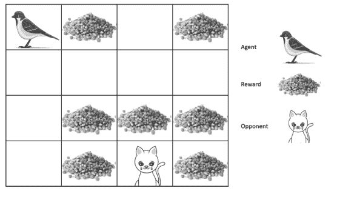

奖励的折扣作用于一个称为伽马的值。伽马的范围始终在0和1之间。伽马越小，折扣值就越大。如果伽马值较小，智能体（即麻雀）就不会试图吃靠近猫的谷物，它更依赖于折扣值，也就是靠近它的谷物。然而，如果伽马值接近1，我们的智能体将探索其他路径以获取更多谷物或奖励，并且可能靠近猫，它愿意冒险以获得更多谷物或奖励。简单来说，如果伽马接近0，折扣会很高，智能体不会冒险；如果接近1，意味着折扣会很低，智能体愿意冒险并进行探索。

这就引出了探索与利用的概念，如下所述。

#### 1.8.4 探索与利用

探索意味着通过承担更多风险来探索和获取更多关于环境的信息，而利用则意味着依赖先前已知的区域来收集奖励。

在麻雀、谷物和猫的例子中，如果麻雀依赖于靠近它的谷物，而不尝试猫附近的谷物，那么这就被称为利用，因为智能体只使用当前已知的信息。然而，如果麻雀探索更多路线，并愿意为奖励或谷物承担风险，这就被称为探索。

因此，智能体是进行探索还是利用，取决于伽马值的大小。伽马值较低意味着折扣值较高，这进一步表明智能体正在利用现有资源；而伽马值较高则意味着折扣值较低，这进一步表明智能体正在探索新事物。

#### 1.8.5 各步骤执行的时序

强化学习各步骤执行的时序至关重要。图1.25展示了这一时序，它涵盖了强化学习的所有重要组成部分。

我们通常将（状态、动作、奖励）视为一个三元组，通常称为SAR，表示为（s, a, r）。智能体使用传感器感知环境的状态（S_t），机器根据该状态执行动作（A_t）。机器将因执行的动作而获得一个奖励点。在时间戳t，机器根据其状态（S_t）执行动作（A_t），并基于该动作获得奖励点。因此，在动作和有效决策方面，时序序列至关重要。

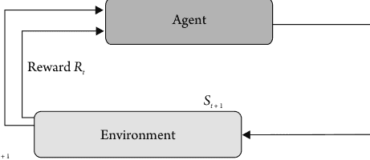

图1.25 SAR三元组

在图1.25中，环境的当前状态是（S_t），在时间戳t的当前奖励值是（R_t）。基于此，在当前时间戳，智能体执行动作，即（A_t）。奖励点应基于此动作（A_t）的结果，在下一个时间戳给予机器。在下一个时间戳（t + 1），机器获得一个奖励点（R_{t+1}）。执行动作（A_t）后，状态（S_t）也将变为（S_{t+1}），即（t+1）时间戳的状态。这表示如下。

[S_t, A_t, S_{t+1}]

这里，（S_t）是时间戳t的状态；在此状态下，执行了一个动作（A_t），由于此动作，状态变为（S_{t+1}）。这三个连续项表示为（s, a, s'），其中s是状态，a是在时间戳t执行的动作，s'是由于在时间戳t执行的动作而改变的状态。

#### 1.8.6 马尔可夫决策过程

这是一种用于映射强化学习解决方案的数学方法。它有一组参数来完成该过程。这些所需参数如下：

- 动作集合，A
- 状态集合，S
- 奖励，R
- 策略，π
- 值，V

智能体在执行任何活动时，从起始状态（S）采取动作（A）到达终止状态（S′）。智能体采取的一系列动作由策略或方法（π）定义。智能体将因执行的每个动作而获得一个奖励（R）。这些奖励的集合被定义为值（V）。

让我们尝试使用最短路径问题来理解马尔可夫过程，如图1.26所示。

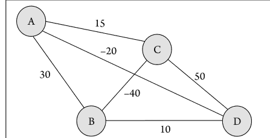

**图1.26** 用于寻找最短路径的马尔可夫决策过程

在图1.26中，智能体通过收集最大奖励来找到A和D之间的最佳路径。我们在每条边上看到的值表示奖励。从A到C的奖励是15点，从A到D的边的奖励是–20。

从A到达目的地D的可能路径如下：
A → C → B → D
A → B → C → D
A → B → D
A → D
A → C → D

因此，可以通过选择具有最大奖励点的路径来找到最佳路径，并且可以很容易地识别出具有最大奖励点的路径是A → C → D；这条路径有65个奖励点，而路径A → B → D有40个奖励点。

一般来说，事情并非如此简单。节点可能多达数百个，可能存在超过50条路径。我们必须遍历这些路径，然后决定能给我们带来最大奖励的最佳路径。

所有到达目的地的可能路径都称为策略，必须选择具有最大奖励点的策略。

在我们的例子中，可能的策略是A → C → B → D；A → B → C → D；A → B → D；A → D；以及A → C → D。在这些策略中，我们必须选择具有最大奖励点的策略，在我们的例子中，是A → C → D，拥有65个奖励点。

#### 1.8.7 理解Q-Learning

Q-Learning是一种强化学习算法。它是一种简单的算法，需要采取最佳可能的动作以获得最多的奖励。

为了理解这个概念，让我们考虑图1.27中描绘的问题。它表示一个房子，有多个房间，用标有数字0、1、2、3、4和5的方框表示。房间或方框之间的空间表示智能体可以从一个房间移动到另一个房间的门。例如，我们不能直接从房间1进入房间4；我们必须通过房间3或入口5进入，如图1.27所示。

假设我们的任务是将智能体放置在位置5，即入口处，考虑所有可能的起始点。

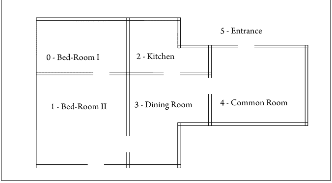

为了解决这个问题，我们可以将整个房子转换成一个图，其中房间是节点，由边（门）连接，如图1.28所示。为了给这些边添加奖励点，与我们的目的地（即位置5）直接相连的房间的边被标记为100个奖励点，其他边标记为0，如图1.28所示。在这种情况下，房间4和房间1与目的地5直接相连，因此它们的奖励点为100，而其他所有奖励点为0。

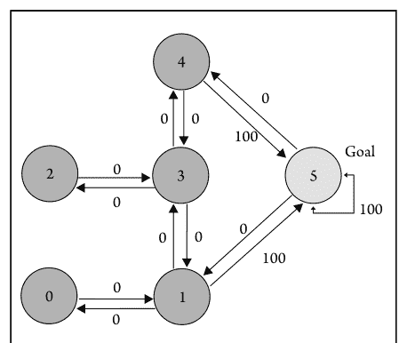

**图1.28** 以带有奖励点的图的形式表示房子

如图1.28所示，我们有6个不同的节点，任务是从任何给定节点到达节点5。从强化学习的角度来看，图1.28中的节点代表状态，而箭头描绘了智能体的动作。

让我们将所有这些奖励写入矩阵以创建奖励矩阵（R），如图1.29所示。这个奖励矩阵（R）将用于在后续步骤中计算Q值。

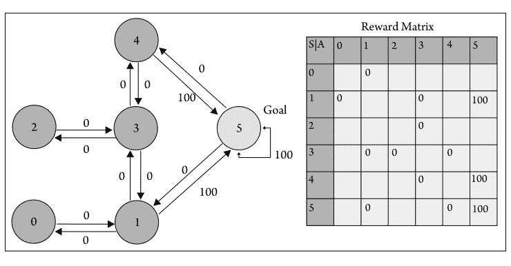

**图1.29** 奖励矩阵（R）

在图1.29中，你可以看到我们有空单元格，这些是空值，因为相应节点之间没有连接。如果节点之间有连接，它将根据与目的地节点5的直接连接被赋予权重0或100。你可以看到节点1、4和5仅与5有直接连接，因此它们的奖励点权重为100，而其他节点为0。

让我们从一个场景开始，考虑节点2作为智能体的初始节点，它必须从那里旅行到节点5。因此，初始状态将是节点2，智能体可以移动到节点3，然后是节点1或节点4，以到达终止节点5。智能体的逐步状态移动可以如下。

假设智能体从节点2遍历到节点5，那么

i. 初始状态 = 节点2
ii. 节点2 → 节点3
iii. 节点3 → 节点（2, 1, 4）
iv. 节点（1, 4） → 节点5

现在，我们将讨论如何为强化学习算法创建Q矩阵。

##### 1.8.7.1 创建Q矩阵

Q矩阵代表了智能体通过执行各种动作从经验中学习到的记忆。在我们的例子中，动作是从一个房间移动到另一个房间。这里，Q矩阵的行代表智能体的当前状态，列代表下一状态的可能动作。Q矩阵的值根据以下公式计算：

> $Q(State, Action) = R(State, Action) + Gamma*Max [Q(next state, all actions)]$

在这个公式中，$Q(State, Action)$是特定行和列的Q矩阵值。这里，行是状态，列是动作。

最初，这个矩阵的所有值都是0，这意味着空白或没有记忆，如表1.5所示，随着智能体开始遍历，这个记忆会增长，或者值会填充到这个矩阵中。

这里，$R(State, Action)$代表奖励矩阵（R）的值，如图1.29所示。

上述方程中的伽马表示从0到1的折扣奖励值。如前所述，如果伽马接近0，智能体将只考虑近期的奖励点，而不会探索周围环境。这种情况称为利用。另一方面，如果伽马值接近1，智能体将通过探索新路径和承担风险来寻求更多奖励。这种情况称为探索。

在公式中，这个伽马乘以基于下一状态和所有可能动作的Q矩阵的最大值。

为了清楚地理解这个过程，让我们考虑一个逐步的例子，通过这个例子，我们将使用这个公式填充Q矩阵的值：

> $Q(State, Action) = R(State, Action) + Gamma*Max [Q(next state, all actions)]$

**场景 1：** 假设我们的智能体从节点 1 出发，目标是到达节点 5。因此，我们将计算 *Q(1, 5)* 的值。假设 gamma 的值为 0.7。

最初，Q 矩阵全部填充为 0，因为智能体没有任何记忆，如表 1.5 所示。

**表 1.5** Q 矩阵的初始状态

| S \ A | 0 | 1 | 2 | 3 | 4 | 5 |
|---|---|---|---|---|---|---|
| 0 | 0 | 0 | 0 | 0 | 0 | 0 |
| 1 | 0 | 0 | 0 | 0 | 0 | 0 |
| 2 | 0 | 0 | 0 | 0 | 0 | 0 |
| 3 | 0 | 0 | 0 | 0 | 0 | 0 |
| 4 | 0 | 0 | 0 | 0 | 0 | 0 |
| 5 | 0 | 0 | 0 | 0 | 0 | 0 |

在这种情况下，我们将计算 *Q(1, 5)* 的值。因此，根据公式，它将如下所示：

> *Q(状态, 动作) = R (状态, 动作) + Gamma*Max [Q(下一状态, 所有动作)]*

在这种情况下，状态是 1，动作是 5。gamma 的值是 0.7。让我们讨论 *Q(下一状态, 所有动作)*。

这里，在执行动作后，下一个状态将是 5，而从 5 出发，可能的动作是访问节点 1、4 和 5，如图 1.30 所示。

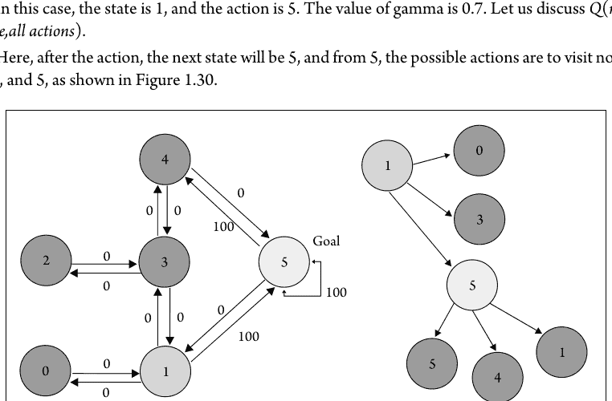

因此，公式将变为：

$$Q(1, 5) = R(1, 5) + 0.7 * Max[Q(5, 1), Q(5, 4), Q(5, 5)]$$

从奖励矩阵的图 1.29 中，我们可以看到 $R(1,5)$ 是 100，并且在此阶段，Q 矩阵（如表 1.5 所示）全部为空白或填充为 0；因此，$Q(5,1), Q(5,4), Q(5,5)$ 全部为 0。

这里，我们计算 Q 值，其中 $R(1, 5)$ 是 100。接下来是 gamma 值，即 0.7。gamma 值将乘以所有可能动作的 Q 值的最大值，即 $(5,1)$、$(5,4)$ 和 $(5,5)$ 全部为 0。

$$Q(1, 5) = R(1, 5) + 0.7 * Max[Q(5, 1), Q(5, 4), Q(5, 5)]$$

因此，$Q(1, 5) = 100 + 0.7 * 0 = 100$

这里，我们得到了智能体记忆的第一个值，即 $Q(1,5)$ 为 100，因此这个值被填入 Q 矩阵，而该矩阵的所有其他值仍然是 0。更新后的 Q 矩阵如表 1.6 所示。

**表 1.6** $Q(1,5)$ 后更新的 Q 矩阵

| S \ A | 0 | 1 | 2 | 3 | 4 | 5 |
|---|---|---|---|---|---|---|
| 0 | 0 | 0 | 0 | 0 | 0 | 0 |
| 1 | 0 | 0 | 0 | 0 | 0 | 100 |
| 2 | 0 | 0 | 0 | 0 | 0 | 0 |
| 3 | 0 | 0 | 0 | 0 | 0 | 0 |
| 4 | 0 | 0 | 0 | 0 | 0 | 0 |
| 5 | 0 | 0 | 0 | 0 | 0 | 0 |

**场景 2：** 让我们考虑下一个场景，其中初始状态是节点 2。从图 1.29 给出的图中，智能体只能从初始节点 2 移动到节点 3。因此，在这种情况下，状态是 2，动作是 3。所以，让我们根据下面给出的公式计算 $Q(2, 3)$ 的更新值：

$$Q(状态, 动作) = R(状态, 动作) + Gamma * Max[Q(下一状态, 所有动作)]$$

在这种情况下，状态是 2，动作是 3。gamma 的值是 0.7。让我们讨论 $Q(下一状态, 所有动作)$。

这里，在从状态 2 执行动作后，下一个状态将是 3，而从 3 出发，可能的动作是访问节点 1、2 和 4，如图 1.31 所示。

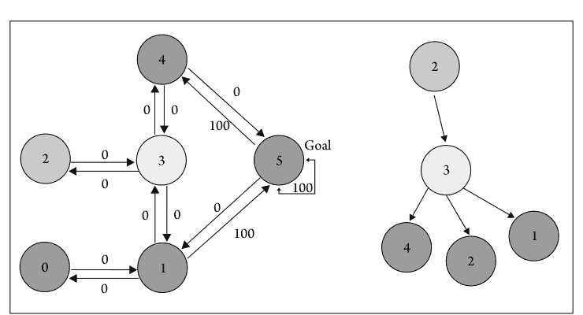

**图 1.31** 用于计算 Q(2, 3) 的图

因此，公式将变为：

$$Q(2, 3) = R(2, 3) + 0.7 * Max[Q(3, 1), Q(3, 2), Q(3, 4)]$$

从奖励矩阵的图 1.29 中，我们可以看到 $R(2, 3)$ 是 0，并且在此阶段，Q 矩阵值（如表 1.6 所示）的 $Q(3, 1)$、$Q(3, 2)$、$Q(3, 4)$ 全部为 0。

因此，

$$Q(2, 3) = 0 + 0.7 * Max[0, 0] = 0$$

这里，我们得到了智能体记忆单元格的更新值，即 $Q(2,3)$ 为 0。最初，它也是 0，因此在此步骤后 Q 矩阵将没有变化，更新后的 Q 矩阵如表 1.7 所示（$Q(2, 3)$ 的值没有变化）。

**表 1.7** $Q(2, 3)$ 后更新的 Q 矩阵

| S \ A | 0 | 1 | 2 | 3 | 4 | 5 |
|---|---|---|---|---|---|---|
| 0 | 0 | 0 | 0 | 0 | 0 | 0 |
| 1 | 0 | 0 | 0 | 0 | 0 | 100 |
| 2 | 0 | 0 | 0 | 0 | 0 | 0 |
| 3 | 0 | 0 | 0 | 0 | 0 | 0 |
| 4 | 0 | 0 | 0 | 0 | 0 | 0 |
| 5 | 0 | 0 | 0 | 0 | 0 | 0 |

**场景 3：** 现在，让我们考虑初始节点为 3，目标是节点 5。从图 1.32 中，可以看到从初始节点 3，智能体可以移动到节点 1、节点 2 或节点 4。我们必须为每个可能的动作更新 Q 矩阵。让我们考虑动作是从节点 3 移动到节点 1，即在这种情况下我们需要计算 $Q(3,1)$。

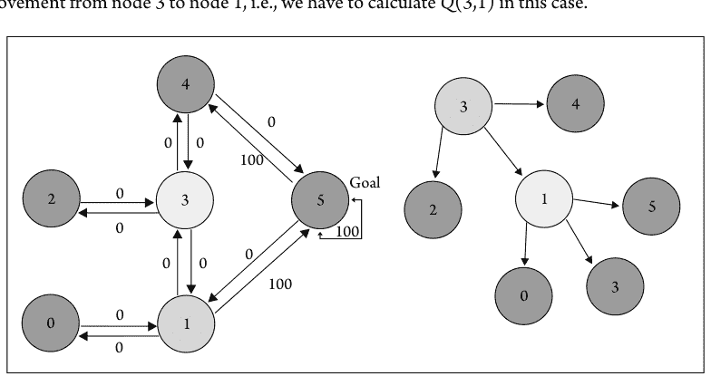

**图 1.32** 用于计算 Q(3, 1) 的图

让我们在公式中填入可能的值。

$$Q(状态, 动作) = R(状态, 动作) + Gamma * Max[Q(下一状态, 所有动作)]$$

在这种情况下，状态是 3，动作是 1。gamma 的值是 0.7。让我们讨论 $Q(下一状态, 所有动作)$。

这里，在执行动作后，下一个状态将是 1，而从 1 出发，可能的动作是前往节点 0、3 和 5，如图 1.32 所示。

因此，公式将如下所示：

$$Q(3, 1) = R(3, 1) + 0.7 * Max[Q(1, 0), Q(1, 3), Q(1, 5)]$$

从奖励矩阵的图 1.29 中，我们可以看到 $R(3, 1)$ 是 0，并且在此阶段，Q 矩阵值的 $Q(1, 0)$、$Q(1, 3)$、$Q(1, 5)$ 分别为 0、0 和 100，如表 1.7 所示。

因此，

$$Q(3, 1) = 0 + 0.7 * Max[0, 0, 100] = 70$$

这里，我们得到了智能体记忆单元格的更新值，即 $Q(3, 1)$ 为 70。最初，它是 0，在从节点 3 遍历到节点 1 学习后，它被更新为 70，如更新后的 Q 矩阵表 1.8 所示。

**表 1.8** $Q(3, 1)$ 后更新的 Q 矩阵

| S \ A | 0 | 1 | 2 | 3 | 4 | 5 |
|---|---|---|---|---|---|---|
| 0 | 0 | 0 | 0 | 0 | 0 | 0 |
| 1 | 0 | 0 | 0 | 0 | 0 | 100 |
| 2 | 0 | 0 | 0 | 0 | 0 | 0 |
| 3 | 0 | 70 | 0 | 0 | 0 | 0 |
| 4 | 0 | 0 | 0 | 0 | 0 | 0 |
| 5 | 0 | 0 | 0 | 0 | 0 | 0 |

**场景 4：** 由于我们已经在节点 1，让我们讨论从节点 1 移动到节点 5 的最终情况。让我们使用以下公式计算 *Q(1, 5)*。

*Q(状态, 动作) = R(状态, 动作) + Gamma * Max [Q(下一状态, 所有动作)]*

在这种情况下，状态是 1，动作是 5。gamma 的值是 0.7。让我们讨论 *Q(下一状态, 所有动作)*。

这里，在执行动作后，下一个状态将是 5，而从 5 出发，可能的动作是前往节点 1、4 和 5，如图 1.33 所示。

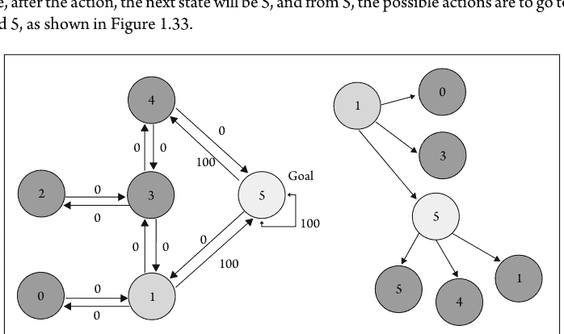

**图 1.33** 用于计算 Q(1, 5) 的图

因此，公式将如下所示：

$$Q(1, 5) = R(1, 5) + 0.7 * Max[Q(5, 1), Q(5, 4), Q(5, 5)]$$

从奖励矩阵的图 1.29 中，我们可以看到 $R(1, 5)$ 是 100，并且在此阶段，Q 矩阵值的 $Q(5, 1)$、$Q(5, 4)$、$Q(5, 5)$ 分别为 0、0 和 0，如表 1.8 所示。

因此，

$$Q(1, 5) = 100 + 0.7 * 0 = 100$$

这里，我们为节点 (1,5) 计算了另一轮 Q 值。然而，它的值在下一轮中保持不变。这意味着智能体已经计算出了该节点的最佳值。更新后的 Q 矩阵如表 1.9 所示。

**表 1.9** $Q(1,5)$ 后更新的 Q 矩阵

| S \ A | 0 | 1 | 2 | 3 | 4 | 5 |
|---|---|---|---|---|---|---|
| 0 | 0 | 0 | 0 | 0 | 0 | 0 |
| 1 | 0 | 0 | 0 | 0 | 0 | 100 |
| 2 | 0 | 0 | 0 | 0 | 0 | 0 |
| 3 | 0 | 70 | 0 | 0 | 0 | 0 |
| 4 | 0 | 0 | 0 | 0 | 0 | 0 |
| 5 | 0 | 0 | 0 | 0 | 0 | 0 |

通过这种方式，我们必须考虑所有可能的场景来填充每个单元格的值，直到当前状态和目标状态相同。基于每个场景的学习，Q 矩阵的值被更新，最终我们将为任何给定的问题获得一个完整的 Q 矩阵。

因此，计算 Q 矩阵的最终算法如下：

```
算法 1：Q 值优化

1. 为 gamma 参数选择一个值，并根据环境创建奖励矩阵 R。
2. 用零初始化一个 Q 矩阵。
3. 从一个随机的初始状态开始。
4. 将当前状态设置为初始状态。
5. 从当前状态所有可能的动作中选择一个动作。
6. 考虑执行此动作并转换到下一个状态。
7. 通过评估所有可能的动作，找到此下一个状态的最大 Q 值。
8. 使用以下公式更新 Q 值：
   Q(状态, 动作) = R(状态, 动作) + Gamma * Max[Q(下一状态, 所有动作)]
9. 重复这些步骤，直到当前状态达到目标状态。
```

该算法阐明了我们在每个动作后更新 Q 矩阵，直到当前节点与目标节点相同。

总而言之，我们可以说强化学习是机器学习的一个分支，其中智能体在给定环境中采取行动以最大化奖励点数。它包含一个通过试错来学习的智能体，负责在给定环境中执行有效动作。环境会记录智能体的当前状态和动作，而动作则是智能体为完成任务可能采取的步骤。在强化学习中，状态是环境的当前工作状态，而奖励则是智能体的收益。它遵循马尔可夫决策过程，其中智能体必须找到具有最高奖励的最优路径。Q矩阵用于训练智能体，它提出了评估所采取动作质量以确定最佳奖励的概念。可以肯定的是，未来我们将在游戏、自动驾驶汽车和机器人等领域看到大量基于强化学习基础构建的产品。

### 1.9 数据科学 vs. 数据挖掘 vs. 机器学习 vs. 深度学习 vs. 人工智能

许多其他关键术语与机器学习密切相关，例如数据科学、数据挖掘、深度学习、人工智能等。这些关键术语的范围如图1.34所示。因此，从一开始就明确它们之间的异同非常重要。

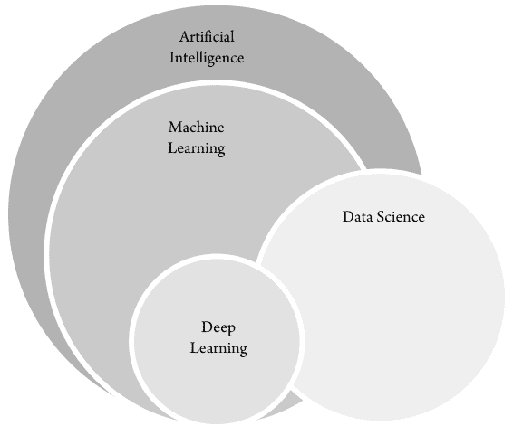

**图1.34** 所有领域的范畴

让我们简要讨论一下这些术语，以便读者能有一个大致的了解。

#### 数据科学

数据科学是一门专注于理解数据的科学研究。它基于从数据中发掘信息，涉及数据收集、准备和分析，以从数据中生成各种洞见。数据科学的主要目标是从数据中发现意义，揭示你从未意识到存在的问题，并解决复杂问题。

#### 数据挖掘

数据挖掘是从大型数据集中提取有价值模式和洞见的过程。它是数据科学的关键组成部分，因为它涉及使用技术来发现隐藏信息，这些信息随后可用于数据分析，以做出明智的决策和预测。数据挖掘过程包括两个步骤，即数据预处理和识别未知模式。

#### 机器学习

如前所述，机器学习是关于在历史数据上训练机器，使其能够基于学到的模式处理新输入，而无需显式编程。它涉及回归、分类、聚类和关联挖掘。

#### 深度学习

深度学习是机器学习的一个分支，它使用受人脑工作方式启发的复杂深度神经网络算法。它需要大量数据进行训练，并且可以在未被告知数据特征的情况下从输入数据中提取洞见。它能自动从输入数据中提取所需特征以做出准确预测。与此同时，在传统机器学习中，设计者必须指定数据特征，如图1.35所示。这里，在传统机器学习算法中，机器学习工程师必须手动进行特征提取，而在深度学习中，特征工程是通过神经网络自动完成的。

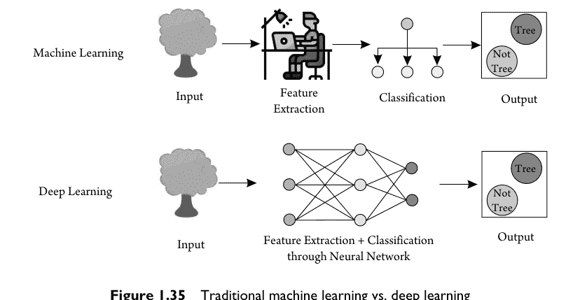

#### 人工智能

人工智能是一种技术，利用它可以创建模拟人类智能的智能系统。简单来说，人工智能是一种模型或算法，它可以使机器模仿、学习和展示人类行为。人工智能系统可以在商业世界中执行学习、规划、设定目标、决策、推理和解决问题等技能。人工智能涵盖了开发能够模仿人类认知能力和行为的智能机器的更广泛概念。在人工智能中，机器学习作为一个具体的应用或子集，使机器能够从数据中学习，而无需显式编程，如图1.36所示。

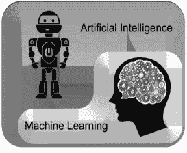

**图1.36** 人工智能是机器学习的超集

根据其能力，人工智能可以分为三种类型，如图1.37所示。

- 弱人工智能/窄人工智能
- 通用人工智能
- 强人工智能

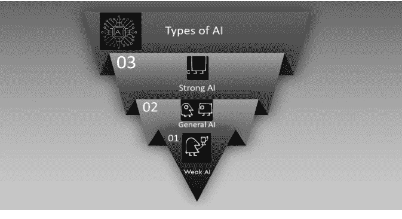

**图1.37** 人工智能的类型

我们在当今世界看到的许多人工智能应用都是弱人工智能。通用人工智能指的是能够像人类一样思考的机器。强人工智能指的是能够做比人类更多事情的机器。

通用人工智能和强人工智能的研究仍在进行中。据估计，创建这样的系统可能还需要几十年时间。让我们更详细地讨论这些人工智能类型及其在这些领域的研究进展。

##### 弱人工智能或窄人工智能

这些系统从先前的数据中学习，并能执行特定任务。弱人工智能的一些实际应用包括智能助手（如谷歌助手）、推荐引擎、聊天机器人、自动驾驶汽车等。弱人工智能系统被编程为仅在一个领域工作，而不适用于任何其他领域。弱人工智能无法模仿人类行为，但可以基于给定数据和一组参数模拟人类行为，这意味着它们仅限于特定任务。例如，一个能以接近100%准确率分类船舶和飞机的图像分类器，却无法分类恶性肿瘤和良性肿瘤，或花卉和水果。换句话说，它类似于一个按照成人指示执行任务的婴儿。

##### 通用人工智能

这些系统能够做人类能做的一切。换句话说，该系统可以处理和理解人类的语气和情感，并像人类一样做出回应。我们目前还无法开发出任何能被认定为通用人工智能的系统。这方面的研究正在进行中，开发通用人工智能机器可能还需要几年时间。

##### 强人工智能

这些系统是未来的系统，将比人类更智能。研究人员预测，我们可能还需要一百年才能开发出这样的机器。人工智能、机器学习和深度学习之间的关系在图1.38中进一步描绘。

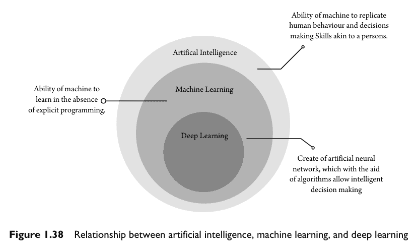

表1.10展示了数据科学、数据挖掘、人工智能和机器学习之间的主要区别。

#### 表1.10 数据科学、数据挖掘、人工智能、机器学习和深度学习的表格比较

| 数据科学 (DS) | 数据挖掘 (DM) | 人工智能 (AI) | 机器学习 (ML) | 深度学习 (DL) |
|---|---|---|---|---|
| 它是一个处理数据科学研究的领域。 | 数据挖掘是从数据中提取未知模式和知识的研究。 | 人工智能是开发能够模拟人类智能的智能机器的技术。 | 机器学习是系统从历史数据中学习并执行特定任务而无需显式编程的能力。 | 深度学习是研究创建能够像人脑神经元一样工作的神经网络的学科。 |
| 它旨在从数据中获取有价值的洞见。 | 它旨在从数据中获取有价值的洞见。 | 它旨在设计能够模仿人类的系统。 | 它旨在训练机器像人类一样执行特定任务。 | 它旨在训练机器以更高的准确性执行任务。 |
| 数据科学是所有旨在理解数据的技术的总称。 | 它是数据科学的子集。 | 它是机器学习、深度学习的超集，并与数据科学有交集。 | 它是人工智能的子集。 | 它是机器学习的子集。 |
| 它需要人类干预。 | 它需要人类干预。 | 它不需要人类干预。 | 与数据科学相比，它需要较少的人类干预。 | 与机器学习相比，它需要更少的人类干预。 |

至此，我们完成了对所有与机器学习相关的重要关键词的讨论。本章我们讨论了机器学习的所有学习策略，例如监督学习（回归和分类）、无监督学习（聚类和关联挖掘）以及强化学习。本章的讨论将为学习各种机器学习概念奠定基础。

#### 提醒我

- 数据随着互联网和智能手机呈指数级增长，而机器学习只是让这些数据变得更有用和更有意义。社交媒体、娱乐、旅行、采矿、医学、生物信息学，或者你能想到的任何领域，都以某种方式使用机器学习。
- 机器学习的发展大致可分为基础阶段、从理论到现实的过渡阶段以及当代阶段。
- IBM的Arthur Samuel在1959年首次提出了机器学习的概念。他将机器学习定义为“一个赋予计算机无需显式编程就能学习能力的研究领域”。

#### 机器学习

-   汤姆·米切尔在其著作《*机器学习*》中对机器学习的定义如下：“一个计算机程序被称为从经验 E 中学习，是针对某类任务 T 和性能度量 P 而言的，如果它在任务 T 上的性能（由 P 衡量）随着经验 E 而提升”。
-   机器学习算法分为三种类型：监督学习、无监督学习和强化学习。
-   在监督学习中，“算法从由输入属性和相应目标属性或类别组成的有标签数据中学习”。
-   在回归问题中，模型预测一个连续值，例如房屋价格、学生成绩、当天温度或团队得分等。
-   在分类问题中，模型预测一个离散类别，例如良性-恶性肿瘤、0-1-2-3（肿瘤类别）、狗-猫、A-B-C-D-E（学生等级）或胜-负-平（比赛结果）等。
-   创建有标签数据的过程既昂贵又耗费人力，这使得在许多现实场景中获取用于构建机器学习模型的有标签数据集具有挑战性。在这种情况下，无监督学习被用于处理无标签数据，使模型能够在不依赖显式标签的情况下提取有价值的见解和模式。
-   无监督学习机器学习模型在训练期间分析数据，发现模式，并根据相似性在输出中创建簇或组。
-   强化学习与监督学习和无监督学习完全不同。
-   强化学习是机器学习的一个领域，关注智能体如何在给定环境中采取行动以最大化累积奖励。
-   在强化学习中，智能体通过试错来学习。它负责在给定环境中采取有效的行动。
-   环境记录智能体的当前状态和行动，而行动是智能体为完成任务可能采取的步骤。
-   在强化学习中，状态是环境的当前工作状态，而奖励是智能体的收益。
-   它遵循马尔可夫决策过程，其中智能体必须找到必须具有最高奖励的最优路径。
-   Q 矩阵用于训练智能体。它提出了评估所采取行动质量以确定最佳奖励的概念。

#### 附加资源

##### 书籍

-   Bhatia, Parteek (2019). *《数据挖掘与数据仓库：原理与实用技术》*. 剑桥大学出版社.
-   Mitchell, Tom M. (2017). *《机器学习》*, 第1版. 麦格劳-希尔教育.

##### 视频链接

-   机器学习基础 | 什么是机器学习？ | 机器学习简介 | Edureka, https://youtu.be/hjh1ikznScg
-   监督学习 vs. 无监督学习 vs. 强化学习 | Edureka, https://youtu.be/xtOg44r6dsE
-   机器学习基础 | 什么是机器学习？ | 机器学习简介 | Simplilearn, https://youtu.be/ukzFI9rgwfU

##### 博客链接

-   什么是机器学习？机器学习入门, https://www.edureka.co/blog/what-is-machine-learning/
-   机器学习教程, https://www.tutorialspoint.com/machine_learning/index.htm
-   监督学习和无监督学习, http://dataaspirant.com/2014/09/19/supervised-and-unsupervised-learning/

#### 测试我（问题）

根据你在本章的学习回答以下选择题。

1.  一个计算机程序被称为从经验 E 中学习，是针对某类任务 T 和性能度量 P 而言的，如果它在任务 T 上的性能（由 P 衡量）随着经验 E 而提升。假设我们向一个机器学习算法输入大量历史天气数据来预测天气。在这种情况下，P 的合理选择是什么？
    a) 算法检查大量历史天气数据的过程。
    b) 它正确预测未来某天天气的概率。
    c) 天气预测任务。
    d) 以上都不是。

2.  假设你正在研究天气预测，你的气象站对每天的天气做出以下三种预测之一：多云、下雨或晴天。你想使用机器学习算法来预测明天的天气。你会将其视为回归问题还是分类问题？
    a) 回归
    b) 分类

3.  假设你在一家股票交易公司工作，你需要估计某只股票的价格在第二天是否会高于今天。你希望为此使用机器学习算法。你会将其视为回归问题还是分类问题？
    a) 回归
    b) 分类

4.  你知道对于某些问题，我们使用监督机器学习算法，而对于其他问题，我们使用无监督机器学习算法。在以下哪种情况下你会应用监督学习？（选择所有适用项。）假设对于每种情况，你的算法都可以访问一些合适的数据集。
    a) 让计算机检查一段视频片段，以检查该视频片段中是否存在枪支。
    b) 将文章自动分为四个不同的类别。
    c) 检查一个网页，并将该网页上的内容分类为“政治性”或“非政治性”。
    d) 基于大量标记为良性和恶性的图像，发现未知实例是否为良性肿瘤。

5.  以下哪项是机器学习的合理定义？
    a) 机器学习意味着从有标签的数据中学习。
    b) 机器学习是使计算机无需显式编程即可学习能力的研究领域。
    c) 机器学习是编程计算机的科学。
    d) 机器学习是允许机器人智能行动的领域。

6.  模型预测一个离散类别，如良性-恶性肿瘤、0-1-2-3（肿瘤类别）、狗-猫、A-B-C-D-E（学生等级）或胜-负-平（比赛结果），这是 _______________ 的情况。
    a) 分类
    b) 回归
    c) 聚类
    d) 关联挖掘

7.  强化学习的 _______________ 组件负责采取行动。
    a) 环境
    b) 智能体
    c) 状态
    d) 行动
    e) 奖励

8.  gamma 值低意味着 _______________ 的折扣值。
    a) 更低
    b) 更高

9.  _______________ 意味着智能体依赖于先前已知的区域来收集奖励。
    a) 利用
    b) 探索

10. _______________ 用于发现物品 X 和物品 Y 销售之间的关系。
    a) 分类
    b) 回归
    c) 聚类
    d) 关联挖掘

答案：1. b 2. b 3. b 4. a, c, d 5. b 6. a 7. b 8. b 9. a 10. d

# 2
## Python 简介

### 章节目标

-   理解 Python 的主要特性。
-   了解 Python 的各种集成开发环境。
-   使用 Python 实现基本的编程构造。
-   理解各种数据类型的使用，如数字、列表、元组、字符串、集合和字典。
-   比较各种数据类型，如列表、元组、字典和集合。
-   在 Python 中使用 if 和循环语句。
-   定义用户自定义函数。

如今，Python 被认为是最受欢迎的编程语言之一。根据 GitHub（一个为软件开发提供互联网托管服务的提供商）的统计数据，Python 是仅次于 JavaScript 的第二受欢迎的编程语言，如图 2.1 所示，并且它可能很快就会登上榜首。Python 在 2019 年超越了 Java、PHP 和其他著名语言。

Python 易于使用且功能多样。因此，它被誉为在许多新技术领域工作的主要编程语言，如机器学习（ML）、人工智能、数据科学和自然语言处理。Python 的创造者吉多·范罗苏姆在 1991 年表示，Python 是一种高级编程语言，其核心设计哲学是关于代码可读性和语法，允许程序员用几行代码表达概念。有趣的是，Python 的名字灵感来源于吉多最喜欢的电视节目《*蒙提·派森的飞行马戏团*》。

## 2.1 Python 的特性

Python 提供的特性可以在图 2.2 中可视化。深入探讨，Python 的主要特性如下：

- **初学者语言：** Python 不仅易于编码和学习，而且易于掌握，因此是任何想要学习编程的新手用户的合适选择。这就是为什么如今这种语言被引入学校教授给学生的原因。
- **解释型语言：** 与 C 或 C++ 等其他编程语言不同，Python 不需要在执行前编译程序。它是一种解释型语言，即用 Python 编写的代码会实时逐行处理。
- **交互式：** Python 的交互式特性支持实时反馈，允许程序员进行实验、调试和即时调整。
- **面向对象编程语言：** Python 遵循一种完全基于类和对象的编程范式，这些类和对象包含数据以及操作数据的方法。因此，用 Python 编写的代码是模块化的，并且可以重用。
- **可扩展性：** Python 为可扩展性提供了更好的结构和支持，这意味着与 shell 脚本相比，它在范围增加或扩展时能表现良好。
- **数据库支持：** 市场上几乎所有主要的数据库，如 Oracle、SQLite、MySQL、NoSQL 等，都可以与 Python 一起使用。
- **图形用户界面编程支持：** Python 提供了用于创建交互式用户界面的标准库。它提供了一个极其高效且功能强大的面向对象接口。
- **可移植性：** 使用 Python 开发的软件可以在不同的硬件平台上使用。
- **全面的标准库：** Python 拥有大量的库，用户可以使用这些库执行无限的功能，甚至无需编写太多代码。Python 拥有用于执行数据加载、数据选择和投影、数据预处理、机器学习模块实现以及数据和结果可视化等任务的库。因此，我们可以使用这些库编写几行代码来创建出色的应用程序。

Python 的特性已在图 2.2 中描绘。

## 2.2 Python 的历史

Python 由荷兰软件专家 Guido Van Rossum 于 1991 年在荷兰国家数学与计算机科学研究所创建。Python 1.0 的主要特性包括异常处理、函数、支持继承的类以及对列表、字典、字符串等核心数据类型的支持。Python 2.0 于 2004 年发布，引入了垃圾回收系统、一些额外的关键字、扩展的解释器以及语法的改进。

2008 年，Python 3.0 发布。此版本对语法和不同数据类型的操作进行了进一步改进。参考图 2.3 可以理解，Python 开发者非常积极地改进其特性，以确保它仍然是实现机器学习和其他应用的首选。

## 2.3 Python 的安装

现代计算机通常预装了 Python 语言。我们可以使用一些命令轻松检查已安装 Python 的状态。为此，我们需要在基于 Windows 的系统中访问命令提示符，或在 Mac/Linux 系统中访问终端。我们可以通过在 Windows 系统的开始栏中输入“cmd”来搜索命令提示符，在 Mac/Linux 系统中搜索终端。在命令行中输入“python --version”，机器将显示系统中已安装 Python 的版本号，如下所示：

```
C:\Users\hp>python --version
# Output: Python 3.7.3
```

上述代码显示了系统中预装的 Python 版本。这里，我们有 Python 3.7.3 版本。

另一方面，如果系统没有预装 Python，你可以访问 Python 的官方网站下载 Python：https://www.python.org/。在安装过程中，勾选“Add Python to PATH”复选框以自动设置 PATH 很重要，如图 2.4 所示。

**图 2.4** Python 的安装

## 2.4 我的第一个 Python 程序

在你的机器上安装好 Python 后，让我们了解如何编写第一个 Python 程序。我建议你遵循循序渐进的方法来学习本章讨论的所有概念，并且你应该自己同时执行所有命令和代码，以便深入了解 Python 的不同特性和用法。

在 Python 中执行程序有两种不同的模式，它们是：

- 交互模式
- 脚本模式

### 2.4.1 交互模式编程

在交互模式下，命令 shell 直接从命令提示符窗口执行代码的每一行语句并返回输出。

要在你的机器上启动 Python，只需在命令提示符下输入“python”，如下所示：

```
C:\Users\hp>python
# Output: Python 3.7.3 (default, Mar 27 2019, 17:13:21) [MSC v.1915 64 bit (AMD64)] :: Anaconda, Inc. on win32
>>>
```

你可以看到 Python 解释器已经启动，它显示了版本名称、版本类型等信息。解释器通常以三个大于号 >>> 开始，如上所示。

让我们用 Python 编写一个 Hello World 程序。
要显示“Hello, Welcome to Python World”，请在 Python 提示符下输入以下文本并按 Enter 键。

```
print("Hello, Welcome to Python World")
# Output: Hello, Welcome to Python World
```

上述代码通过 print() 方法将字符串“Hello, Welcome to Python World”传递给解释器。输出 *Hello, Welcome to Python World* 已显示在控制台上。

我们也可以将这个字符串的值赋给一个新变量 message，然后我们可以使用 print() 打印变量 message 的值，如下例所示：

```
message = "Hello, Welcome to Python World"
print(message)
# Output: Hello, Welcome to Python World
```

你可以理解，在 Python 中不需要定义变量的数据类型，我们可以直接使用它。它会根据赋给它的值自动采用所需的数据类型。这意味着如果我们给一个变量赋一个整数值，它将成为 int 类型。在这个例子中，我们给变量赋了一个字符串值，所以它自动成为 str 数据类型。

这里，我们使用交互模式通过 Python 实现了这个简单的程序。接下来，我们将使用脚本模式执行相同的任务。

### 2.4.2 脚本模式编程

所有 Python 文件都有 .py 扩展名。要创建脚本文件，我们可以在记事本或任何相关的文本编辑器中编写代码，并且必须将其保存为 .py 扩展名。

```
x = "Hello, Welcome to Python World"
print(x)
```

让我们使用记事本创建一个包含上述代码的文本文件，将文件保存为 hello.py，其中 hello 是脚本文件的名称，.py 是该文件的扩展名。让我们将 hello.py 文件存储在桌面文件夹中。编码文件及其保存的截图如图 2.5 所示。

这里，我们将脚本存储在 hello.py 文件中，我们可以通过运行以下代码使用 CLI（命令行界面）运行此脚本文件。

```
C:\Users\Parteek Bhatia>cd Desktop
C:\Users\Parteek Bhatia\Desktop
> C:\Users\hp> python hello.py
# Output: Hello, Welcome to Python World
```

在上面的代码中，我们首先使用 `cd` 命令（*cd* 代表 Change Directory，即更改目录）将目录切换到桌面，因为我们将 `hello.py` 存储在这个文件夹中。要运行此文件，我们首先传递解释器的名称 `python`，后跟脚本文件的名称，即 `hello.py`。输出将显示在下一行，如上所示。

## 2.4.3 通过 IDE 运行 Python 脚本

为了执行本书中讨论的代码，我们将使用 Spyder 软件，这是一个用于 Python 的集成开发环境（IDE），可在 Anaconda 环境中使用。Anaconda Navigator 是一个桌面 GUI（图形用户界面），允许程序员启动应用程序并管理不同的 `conda` 包和环境。该导航器适用于 Windows、MacOS 和 Linux。您可以从 www.anaconda.com 下载 Anaconda。下载并安装 Anaconda 后，您可以启动 Spyder IDE for Python，如图 2.6 所示。


**图 2.6** Anaconda Navigator 中的 Spyder

在 IDE 的编辑器窗口中，我们可以输入脚本，如图 2.7 所示。如图中突出显示，我们必须按下播放按钮来运行脚本。我们也可以使用“F9”键在 Spyder 中运行选定的代码单元。执行脚本后，输出将显示在控制台窗口中，如图 2.7 所示。

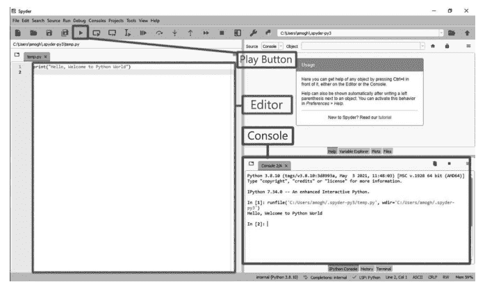

**图 2.7 Spyder IDE**

Spyder 是推荐的 Python 编程选项，因为它简单、透明、快速且易于使用。但是，您也可以使用 Jupyter notebook 来运行和记录 Python 代码。此 Jupyter notebook 也可在 Anaconda 环境中使用，用户可以从导航器启动此应用程序，如图 2.8 所示。


**图 2.8** Anaconda Navigator 中的 Jupyter

Jupyter IDE 的主页如图 2.9 所示。*Upload*（上传）和 *New*（新建）是开始在 Jupyter 中编程的两个选项。要打开现有文件，我们可以使用 *Upload* 选项；否则，要创建新脚本，您可以使用 *New* 选项，如图 2.9 所示。

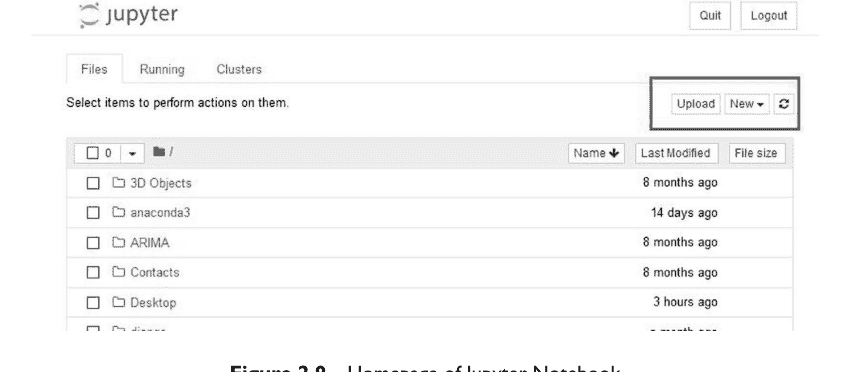

**图 2.9** Jupyter Notebook 主页

在我们的例子中，我们选择了 *New*，并在注释或文本数据部分添加了 *My First Program*，而脚本则在 *Editor*（编辑器）菜单中编写。按下 *run*（运行）按钮后，输出将立即显示在 *Editor* 模式下方，如图 2.10 所示。


**图 2.10** Jupyter IDE

Jupyter Notebook 也称为 IPython notebook（“交互式 Python”）。在这里，我们可以单独运行每个代码块，而不是像在 Spyder 中那样运行选定的行。由于 Jupyter notebook 将输出显示在执行的语句块下方，而不是像 Spyder 那样显示在控制台窗口中，因此有时在 Jupyter 中分析输出比在 Spyder 中更容易。Spyder 有一个变量资源管理器，可以非常轻松地分析变量的模式和值。另一方面，Jupyter 没有专门的已声明变量目录。

因此，您可以根据自己的舒适度使用这些 IDE 中的任何一个来执行本书中给出的代码。

此外，您还可以使用 Google Colab，或“Colaboratory”，这是 Google 的一项云服务，任何人都可以在 Google 的云服务器上执行 Python 代码，无论其机器性能如何。它允许您在浏览器中编写和执行 Python，无需任何配置要求，并免费提供 GPU 访问权限，而且使用此环境共享代码非常容易。要了解更多关于 Google Colaboratory 的信息，您可以参考以下链接：

https://colab.research.google.com/


## 2.5 Python 中的标识符

所有用于命名变量、方法、类或任何对象的用户定义名称都称为标识符。创建有意义的标识符有一些规则，如下所示：

- 标识符的名称可以以字母 A–Z 或 a–z 或下划线 (_) 开头，后跟其他字母、下划线和 0–9 数字。
- Python 中不允许在标识符名称中使用 [‘.’, ‘!’, ‘@’, ‘#’, ‘$’, ‘%’] 特殊字符。
- 标识符名称不能以数字开头，否则会导致语法错误。
- 保留字（关键字）不能用于命名变量。
- Python 推断变量的数据类型以计算数据。语句中的数据取决于分配给变量的值。
- 小写和大写标识符被视为不同。这意味着“AREA”和“area”在 Python 中是两个不同的标识符。因此，Python 是一种*区分大小写的语言*。

### 一些命名约定

- 最好让类名以大写字母开头。所有其他标识符应以小写字母开头。
- 使用下划线（‘_’）作为首字母来声明私有标识符。

## 2.6 Python 中的关键字

任何编程语言中的关键字都是保留字，具有预定义的含义，编译器或解释器可以理解这些含义以执行某些定义的操作。Python 有 36 个保留关键字用于不同的操作和函数，如图 2.11 所示。

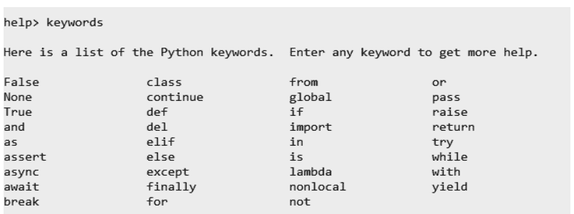

**图 2.11** Python 中的关键字列表

如前所述，我们不能将这 36 个关键字中的任何一个定义为标识符。如果尝试将其作为变量名传递，它将返回语法错误“invalid syntax”（无效语法）。

## 2.7 Python 中的缩进

缩进是代码行开头的空格。在大多数其他编程语言中，缩进用于提高代码的可读性，但在 Python 中，它的作用远不止于此。您可以从下面的代码中理解这一点，其中 if 语句用于根据条件打印消息。

```
if 5 > 1:
    print ("5 is greater than 1")
# Output: 5 is greater than 1

if 5 > 1:
print ("5 is greater than 1")
# Output: Indentation Error: expected an indented block
```

在第一个代码中，if 语句的条件为真，它打印消息而没有任何错误。而在第二个代码中，if 语句为真，但它没有打印消息，而是显示了缩进错误。错误的原因是缺少缩进来指示代码块。因此，您可以看到 Python 使用缩进来指示代码块。需要注意的是，空格的数量由程序员决定，但至少必须有一个。您必须在同一个代码块中使用相同数量的空格。否则，Python 将给出语法错误（*TabError: inconsistent use of tabs and spaces in indentation*）。因此，制表符是缩进的最佳选择，可以提供相同数量的空格。

缩进指导 Python 解释器将一系列语句视为一个特定的块。缩进的唯一块属于同一个组，称为*套件*。

## 2.8 Python 中的注释

注释是程序的描述。它帮助程序员理解代码并提高代码的可读性。其次，注释可以在测试时用于排除代码。

注释以 # 开头。下面描述了一个注释的示例。

```
# Greeting Message
print("Hello, Welcome to Python World")
```

在上面的代码中，*Greeting Message* 在代码中被注释掉了。我们可以将注释放在行尾或行下方；Python 解释器将忽略相应的行。

因此，我们可以在测试时使用井号（#）来排除代码。

如前所述，注释可以放在行尾，Python 将忽略该行的其余部分，如下所示。

```
print("Hello, Welcome to Python World") #Displaying message
```

如果我们必须注释多行，那么我们可以使用三引号（"""）字符串。它被视为一个未分配给变量的字面字符串，因此 Python 将忽略它，可用于添加多行字符串作为注释，如下所示。

```
"""
This is a multiple
line comment
"""
print("Hello, Welcome to Python World")
```

在这种情况下，输出将是 Hello, Welcome to Python World。

我们也可以为注释的每一行插入一个 #，如下所示。

```
#This is a multiple
#line comment
print("Hello, Welcome to Python World")
```

Python 没有多行注释的语法；我们必须使用三引号（"""）字符串技巧或多个 # 来在代码中引入它。

## 2.9 Python 中的变量

变量是用于存储值（如整数、小数或字符）的保留内存位置。因此，创建变量时，内存中的某些空间会被保留。变量命名的声明应符合第 2.5 节中讨论的规则。

### 2.9.1 变量的声明与赋值

等号（=）运算符用于为任何变量赋值。在 Python 中，= 运算符被解释为“被设置为”一个特定值，这意味着一个变量（x）具有一个特定的值。在 Python 中，无需显式声明任何变量。一旦为变量赋值，它就会自动声明。下面给出了一些为变量赋值的示例。

- **单个值赋给单个变量**

    ```python
    Counter = 100 # An integer assignment
    Miles = 1000.0 # A floating point
    Name = 'Rahat' # A string
    ```

    这里，*Counter* 被赋值为 100，*Miles* 为 1000.0，*Name* 为 ‘Rahat’。

- **单个值赋给多个变量**

    ```python
    a = b = c = 1
    ```

    所有三个变量 *a*、*b* 和 *c* 都被赋予相同的值 1。

- **多个值赋给多个变量**

    ```python
    a, b, c = 1, 2, 'Rahat'
    ```

    这里 *a* 被赋值为 1，*b* 为 2，*c* 为 ‘Rahat’。

- **变量本质上是不一致的。它们可以被重新声明为不同的数据类型。**

    ```python
    x = 1
    x, y, z = 'Python', 2, 3
    ```

    这里，第一个 *x* 是一个整数变量，而后面的 *x* 是一个字符串数据类型。

- **变量区分大小写。这些分配的变量可以被声明两次。**

    ```python
    a = 1
    A = 'Python'
    ```

    这里，小写 *a* 是一个整数，而大写 *A* 是一个字符串数据类型变量。

#### 变量的数据类型

需要注意的是，Python 是完全面向对象的，Python 中的每个变量都是一个对象。我们可以使用 `type()` 方法获取变量的数据类型，如下所示。

```python
m = 5
n = "Python"
print(type(m))
print(type(n))
# Output: <class 'int'>
#         <class 'str'>
```

因此，可以看到这些变量 *m* 和 *n* 分别被视为类 *int* 和 *str* 的对象，因为 5 是一个整数，而 “Python” 是一个字符串。

#### 输出变量

如前所述，Python 使用 `print()` 在控制台上打印变量的值。要显示带有文本的变量值，我们必须使用 *连接* 运算符 ‘+’，如下所示。

```python
n = "Python"
print("The value of the n is " + n)
# Output: The value of the n is Python
```

需要注意的是，我们只能将文本与字符串类型连接。如果我们尝试将其与整数类型连接，将会产生错误，如下所示。

```python
n = 5
print("The value of the n is " + n)
# Output: TypeError: can only concatenate str (not "int") to str
```

为此，我们必须使用 `str()`，它将整数转换为字符串，然后我们就可以打印其值，如下所示。

```python
n = 5
print("The value of the n is " + str(n))
# Output: The value of the n is 5
```

## 2.10 Python 中的数据类型

Python 中有六种可能的数据类型，如图 2.12 所示。

| Python 中的数据类型 |
| :---: |
| Number | String | List | Tuple | Set | Dictionary |

**图 2.12** Python 中的数据类型

在 Python 中，列表（List）、元组（Tuple）、集合（Set）和字典（Dictionary）被称为集合数据类型，它们是内置的数据结构，允许我们存储和组织多个值。

让我们逐一讨论这些数据类型。

## 2.11 Python 数字

在 Python 中，我们有 int、float 和 complex 数据类型来存储数值。它们的用法如下所述。

- 要定义一个整数，请使用以下语法。

    ```python
    myint = 17
    print(myint)
    print(type(myint))
    # Output:
    # 17
    # <class 'int'>
    ```

- 要定义一个浮点数，你可以使用以下命令。

    ```python
    myfloat = 17.0
    print(myfloat)
    print(type(myfloat))
    # Output:
    # 17.0
    # <class 'float'>
    ```

- 要定义一个复数，你可以使用以下命令。

    ```python
    mycomplex = 6j
    print(mycomplex)
    print(type(mycomplex))
    # Output:
    # 6j
    # <class 'complex'>
    ```

从输出中，我们可以得出结论：Python 中的每个变量都是一个对象，这里呈现的数字分别是类 *int*、*float* 和 *complex* 的对象。

### Python 类型转换

Python 允许将一种数据类型转换为另一种数据类型。转换意味着我们可以使用其转换方法（如 `int()`、`float()` 和 `str()`）将一种数据类型转换为另一种不同的数据类型，例如将整数转换为字符串或浮点数等，如下所示。

```python
int_var = 22
float_var = 90.8
str_var = "1992"
print(int_var, float_var, str_var)
# Output: 22 90.8 1992

int_var = int(int_var)
float_var = int(float_var)
str_var = int(str_var)
print(int_var, float_var, str_var)
# Output: 22 90 1992
```

上面的代码创建了三个变量：整数数据类型的 *int_var*、具有浮点值的 *float_var* 和字符串数据类型的 *str_var*。这些声明的变量通过使用 `int()` 方法被转换为整数数据类型。

同样，可以执行浮点类型转换，如下所示。

```python
int_var = 22
float_var = 90.8
str_var = "1992"
int_var = float(int_var)
float_var = float(float_var)
str_var = float(str_var)
print(int_var, float_var, str_var)
# Output: 22.0 90.8 1992.0
```

在上面的代码中，*int_var* 被转换为 22.0，*str_var* 被转换为 1992.0。因此，所有不同类型的数据集都被类型转换为浮点数。

同样，我们可以使用 `str()` 将类型转换为字符串，如下所示。

```python
int_var = 22
float_var = 90.8
str_var = "1992"
int_var = str(int_var)
float_var = str(float_var)
str_var = str(str_var)
print(int_var, float_var, str_var)
# Output: 22 90.8 1992
```

## 2.12 Python 字符串

字符串字面量可以通过将字符括在单引号或双引号中来形成。例如：“Parteek” 或 ‘Parteek’ 都是 Python 字符串。与其他语言不同，Python 不支持任何字符数据类型。长度为 1 的字符串将类似于字符数据类型。

```python
string1 = 'ParteekBhatia'
string2 = "ParteekBhatia"
```

在上面的字符串变量中，*string1* 和 *string2* 包含相同的值 *ParteekBhatia*。现在，让我们讨论一些对字符串数据类型执行的常见操作。

### Python 中字符串的基本操作

- **访问字符串的字符**
    我们可以将字符串作为数组来访问。要访问字符串的元素，我们使用方括号 [ ]，如下所示。

    ```python
    string1 = 'India'
    print(string1[0])
    # Output: I

    print(string1[1:3])
    # Output: nd

    print(string1[-3])
    # Output: d
    ```

    在上面的代码中，我们将字符串 'India' 传递给 *string1* 变量。使用字符串的索引值打印字符串的一个字符。*string1* 零索引处的值是 'I'。类似地，当传递一个范围值 1:3 时，解释器打印 'nd' 作为输出（从索引值 1 开始到索引值 2，即上限 3 在此情况下被排除）。在 Python 中，当解释器传递一个负索引时，它从数组的末尾开始计数。因此，print(string1[-3]) 打印 'd'，因为它是字符串 'India' 的倒数第三个元素。

- **更新字符串**
    我们可以简单地分配一个新值来更新字符串。这里，如下所示，我们通过使用连接运算符 '+' 将字符串 'is great' 连接到变量 *string1* 来更新其值。

    ```python
    string1 = 'India '
    string1 = string1 + 'is great'
    print(string1)
    # Output: India is great
    ```

- **遍历字符串**
    我们也可以对字符串变量使用 C 风格的字符串格式化。在 Python 中，'%' 运算符用于使用“参数说明符”格式化一组变量，例如 '%s' 和 '%d'。常用的参数说明符如下：
    - %s – 字符串
    - %d – 整数
    - %f – 浮点数
    这些格式说明符的用法如下所示。

    ```python
    name = "Parteek"
    age = 45
    print("Hello, %s How are you" %name)
    # Output: Hello, Parteek How are you

    print("%s is %d years old." % (name, age))
    # Output: Parteek is 45 years old.
    ```

#### 字符串长度

要获取字符串的长度，我们可以使用 `len()` 方法，如下所示。

```python
Var1 = "Hello, I am Parteek!"
print(len(Var1))
# Output: 20
```

#### 检查字符串

如下所示，我们可以使用关键字 `in` 来检查特定的关键词或短语是否存在于字符串中。

```python
text = "python is an interpreted language"
print("interpreted" in text)
# Output: True

text = "python is an interpreted language"
print("compiled" in text)
# Output: False
```

#### 决策

我们可以将关键字 `in` 与 `if` 语句一起使用，根据子字符串在字符串中的存在与否来做出决策，如下所示。

```python
text = "python is an interpreted language"
if "interpreted" in text:
    print("Yes, python is an interpreted language")
# Output: Yes, Python is an interpreted language
```

#### 字符串切片

我们可以通过将变量的索引号放在方括号中来切片 Python 字符串。让我们创建一个字符串 "Parteek Bhatia"，并使用方括号中的索引号对其进行切片，如下所示。

```python
text = "Parteek Bhatia"
print(text[0:5])
# Output: Parte
```

它从索引位置 0 打印到索引位置 4；范围的上限 5 被排除。

#### 从开头切片

我们可以从字符串的起始节点切片到特定字符，如下所示。我们将指定子字符串的最后一个元素作为字符串的结束索引。

## 2.13 Python 列表

列表用于在单个变量中存储多个项目。它是 Python 最常用的数据类型之一，因为它按顺序存储非同构数据（即不同数据类型的数据项）。列表项目是有序的、可更改的，并且允许重复值。列表项目是索引的，第一个项目的索引为 [0]，第二个项目的索引为 [1]，依此类推。列表中的所有项目都包含在方括号 [] 中，每个元素由 ','（逗号）分隔。

本节将讨论列表数据类型以及对列表可能进行的操作的详细信息。
列表项目是索引的，因此列表可以包含具有相同值的项目，如下所示。

```python
list1 = ["python", 2, True, 1992, "male", 2]
print(list1)
# Output: ['python', 2, True, 1992, 'male', 2]
```

### 2.13.1 列表数据类型的主要特征

列表数据类型的主要特征如下：

**有序**
列表数据类型是有序的，这意味着列表中的项目具有定义的顺序，并且不会改变。当我们向列表添加新项目时，新项目将被放置在列表的末尾。

**可更改**
列表数据类型是可更改的；这意味着我们可以在列表创建后更改、添加和删除列表中的项目。

**允许重复**
由于列表是索引的；因此列表可以包含具有相同值的项目。

### 2.13.2 Python 中列表的基本操作

在本节中，我们将通过示例代码讨论列表数据类型的基本操作。
如前所述，列表项目可以是任何数据类型。它可以是字符串、整数或布尔数据类型，如下所示。

```python
list1 = ["python", "java", "HTML"]
list2 = [2, 1992, 29]
list3 = [False, True, True]
print(list1)
print(list2)
print(list3)

# Output: ['python', 'java', 'HTML']
# [2, 1992, 29]
# [False, True, True]
```

我们可以使用 `type()` 方法检查列表的类型，如下所示。

```python
list1 = ["python", 2, True, 1992, "male"]
type(list1)
# Output: <class 'list'>
```

可以看到 `list1` 变量是一个对象类 `list`。
如下所示，我们可以使用 `len()` 方法确定列表变量中的元素数量。

```python
list1 = ["python", 2, True, 1992, "male"]
len(list1)
# Output: 5
```

- **从列表中访问元素**
  索引从 0 开始。如果一个列表有 5 个元素，索引计数将从 0 开始，到 4 结束，并使用索引运算符 `[ ]` 进行访问。如果尝试访问列表中不存在的索引，将发生 `IndexError`。从列表中访问元素的用法如下所示。

```python
list1 = ["python", 2, True, 1992, "male"]
print(list1[0])
# Output: python

print(list1[2])
# Output: True

print(list1[5])
# Output: IndexError: list index out of range
```

在上面的语句中，系统成功打印了创建的列表值的第零个和第二个索引元素。但是，当我们传递第五个索引时，它导致了一个错误（`IndexError: list index out of range`），因为它包含五个值，索引从 0 到 4。因此，当我们传递第五个索引时，其索引值超出了范围。

#### 负索引

负索引意味着从末尾开始索引。在这种情况下，-1 指的是最后一个项目，-2 指的是倒数第二个项目，依此类推。负索引的示例如下所示。

```python
list1 = ["python", 2, True, 1992, "male"]
print(list1[-1])
# Output: male
print(list1[-2])
# Output: 1992
```

#### 索引范围

我们还可以通过指定列表的起始和结束位置来指定列表索引的范围。具有特定范围集的列表如下所示。

```python
list1 = ["python", 2, True, 1992, "male"]
print(list1[1:3])
# Output: [2, True]
```

需要注意的是，在处理列表时，较低的索引值被包含，较高的索引值被排除。您可以看到上面的代码中打印了列表元素 1 和 2。

同样需要注意的是，通过省略起始值，范围将从第一个项目开始；通过省略结束值，范围将延伸到列表的末尾，如下所示。

```python
list1 = ["python", 2, True, 1992, "male"]
print(list1[:3])
# Output: ['python', 2, True]
print(list1[2:])
# Output: [True, 1992, 'male']
```

#### 范围中的负索引

我们可以打印列表的负索引，这将从末尾打印列表。

```python
list1 = ["python", 2, True, 1992, "male"]
print(list1[-4 :-1])
# Output: [2, True, 1992]
```

在这里，上限范围将被排除。因此，它只打印到倒数第二个项目。

- **检查项目是否存在**
  要确定列表中是否存在指定项目，我们可以将 `in` 关键字与 `if` 语句一起使用，如下所示。

```python
list1 = ["python", 2, True, 1992, "male"]
if "python" in list1:
    print("Yes, 'python' is in the list1")
# Output: Yes, 'python' is in the list1
```

在上面的代码中，正在 `list1` 中搜索 `python` 关键字。由于 `python` 关键字存在于列表的第零个索引处，`if` 语句返回 true，并打印消息“Yes, ‘python’ is on the list1”。

- **更新列表**
  可以通过使用索引值来更新列表的元素，如下所示。

```python
list1 = ["python", 2, True, 1992, "male"]
list1[1] = "8"
print(list1)
# Output: ['python', '8', True, 1992, 'male']
```

在上面的代码中，第一个索引被更改了。之前，第一个索引的值是 2，更改后，它被更新为 ‘8’。

- **切片到末尾**
  我们可以从字符串的某个字符打印到字符串的结束字符。我们将传递字符串的第一个特定索引，它将打印字符串直到字符串的最后一个字符，如下所示。

```python
text = "Parteek Bhatia"
print(text[3:])
# Output: teek Bhatia
```

需要注意的是，索引位置从 0 开始。

- **负索引**
  我们可以在字符串的切片中使用负索引。它将计算索引并从字符串的右端打印字符，如下所示。

```python
text = "Parteek Bhatia"
print(text[:-2])
# Output: Parteek Bhat
```

它从起始索引 0 打印到右边的最后 2 个字符。
您能猜出下面语句的输出吗？

```python
text = "Parteek Bhatia"
print(text[3: -3])
```

是的，输出将是：teek Bha

- **大写化**
  `upper()` 方法将打印大写的字符串，如下所示。

```python
text = "Parteek Bhatia"
print(text.upper())
# Output: PARTEEK BHATIA
```

- **小写化**
  `lower()` 方法将打印小写的字符串。

```python
text = "Parteek Bhatia"
print(text.lower())
# Output: parteek bhatia
```

- **删除空白**
  空白是实际文本前后的空格，我们经常需要删除这些空格。我们可以使用 `strip()` 函数删除这些空格，如下所示。

```python
text = " Parteek Bhatia"
print(text.strip())
# Output: Parteek Bhatia
```

- **替换字符串**
  `replace()` 函数是一个内置函数，它返回字符串的副本，其中所有出现的子字符串都被另一个子字符串替换。我们可以使用 `replace()` 替换所有子字符串，如下所示。

```python
text = "Parteek Bhatia"
print(text.replace("Bhatia", "Kumar"))
# Output: Parteek Kumar
```

在这里，"Bhatia" 已被 "Kumar" 替换。

- **分割字符串**
  `split()` 方法将字符串分割成列表。必须指定分隔符，如 `#`（井号）、`,`（逗号）、`;`（分号）或空格子字符串，才能将字符串转换为列表，如下所示。

```python
text = "Parteek Bhatia"
print(text.split(" "))
# Output: ['Parteek', 'Bhatia']
```

- **字符串连接**
  我们可以使用 `+` 运算符连接或组合两个不同的字符串，如下所示。在这里，两个字符串将合并为一个字符串。

```python
text1 = "Parteek "
text2 = "Bhatia"
text = text1 + " " + text2
print(text)
# Output: Parteek Bhatia
```

我们也可以传递一个索引范围来更新列表的多个索引，如下所示。

```python
list1 = ["python", 2, True, 1992, "male"]
list1[1:4] = [8, False, 1995]
print(list1)
# Output: ['python', 8, False, 1995, 'male']
```

我们甚至可以在指定位置向列表中插入特定项目。在这种情况下，新项目被插入到指定位置，而列表的其余项目将相应地移动，如下所示。

```python
list1 = ["python", 2, True, 1992, "male"]
list1[1:3] = [88, "java", "india"]
print(list1)
# Output: ['python', 88, 'java', 'india', 1992, 'male']
```

这里，*list1* 的元素 2, True 被 88, 'java', 'india' 替换，这样我们就将 *list1* 从 5 个元素扩展到了 6 个元素。

类似地，我们可以通过向现有列表范围传递更少的新值来缩短列表，如下所示。新值将替换列表的指定索引处的值，而其余项目将相应地移动。

```python
list1 = ["python", 2, True, 1992, "male"]
list1[0:3] = ["guitar"]
print(list1)
# Output: ['guitar', 1992, 'male']
```

现有的 *list1* 有 5 个项目，但 *list1* 中的值减少到了 3 个，因为我们为三个连续的索引传递了一个元素。因此，它用 'guitar' 替换了前三个值，并移动了列表中的其余项目。

#### 向列表中插入项目

`insert()` 方法用于在不替换任何现有值的情况下插入新的列表项。为此，我们必须指定索引号及其对应的值，我们希望在该位置插入，如下所示。

```python
list1 = ["python", 2, True, 1992, "male"]
list1.insert(1, "language")
print(list1)
# Output: ['python', 'language', 2, True, 1992, 'male']
```

`append()` 方法用于在列表末尾添加新元素，如下所示。

```python
list1 = ["python", 2, True, 1992, "male"]
list1.append(44)
list1
# Output: ['python', 2, True, 1992, 'male', 44]
```

`extend()` 方法用于将 *另一个列表* 的元素附加到当前列表，如下所示。附加的元素将被添加到列表的末尾。

```python
list1 = ["python", 2, True, 1992, "male"]
list2 = [12, "java", 30, 43]
list1.extend(list2)
print(list1)
# Output: ['python', 2, True, 1992, 'male', 12, 'java', 30, 43]
```

#### 从列表中删除元素

`remove()` 方法用于从列表中删除一个元素。

```python
list1 = ["python", 2, True, 1992, "male"]
list1.remove("python")
print(list1)
# Output: [2, True, 1992, 'male']
```

`pop()` 是另一种从列表中删除元素的方法。我们必须传递要删除的元素的索引号。

```python
list1 = ["python", 2, True, 1992, "male"]
list1.pop(1)
print(list1)
# Output: ['python', True, 1992, 'male']
```

在上面的列表中，列表的第二个元素被弹出，因为它位于 list1 的第一个索引处。如果我们让 `pop()` 为空，它将删除列表的最后一个元素，如下所示。

```python
list1 = ["python", 2, True, 1992, "male"]
list1.pop()
print(list1)
# Output: ['python', 2, True, 1992]
```

要从列表中删除一个项目，使用 `del` 语句。我们可以在 `del` 语句中精确指定要从列表中删除哪个元素。使用不指定其元素的 `del` 语句与列表一起使用将删除整个列表。`del` 语句的用法如下所示。

```python
list1 = ["python", 2, True, 1992, "male"]
# delete one item
del list1[2]
# Output: ['python', 2, 1992, 'male']
# delete the entire list
del list1
list1
# Output: NameError: name 'list1' is not defined
```

这里，`del list1` 删除了整个列表；这就是为什么在此语句执行后，`list1` 给出错误，因为没有定义 `list1` 变量。

`clear()` 方法是另一种从列表中删除元素的替代方法。它将从现有列表中弹出所有元素，并将现有列表作为空列表返回，如下所示。

```python
list1 = ["python", 2, True, 1992, "male"]
list1.clear()
print(list1)
# Output: []
```

因此，当我们调用 `list1` 的 `clear()` 方法时，它会清除所有列表元素并创建一个空列表。

#### 对列表排序

要按升序对列表的元素进行排序，我们可以使用 `sort()` 方法，如下所示。

```python
##### Ascending order
list1 = ["Car", "Truck", "Bus", "Jeep", "Plane"]
list1.sort()
print(list1)
# Output: ['Bus', 'Car', 'Jeep', 'Plane', 'Truck']
```

```python
list1 = ["88", "02", "2", "49", "67"]
list1.sort()
print(list1)
# Output: ['02', '2', '49', '67', '88']
```

要按降序对列表的元素进行排序，我们必须通过添加参数 `reverse = True` 来调用同一个函数，如下所示。

```python
##### Descending order
list1 = ["Car", "Truck", "Bus", "Jeep", "Plane"]
list1.sort(reverse = True)
print(list1)
# Output: ['Truck', 'Plane', 'Jeep', 'Car', 'Bus']
```

```python
list1 = ["88", "02", "2", "49", "67"]
list1.sort(reverse = True)
print(list1)
# Output: ['88', '67', '49', '2', '02']
```

需要注意的是，Python 中的排序是区分大小写的。如果列表包含大写和小写字母，默认的排序顺序是大写字母在前，小写字母在后，如下所示。但是，我们可以通过使用关键字参数 `key = str.lower` 来忽略这一点，如下所示。

```python
##### Upper letters first
list1 = ["Car", "truck", "bus", "Jeep", "plane"]
list1.sort()
print(list1)
# Output: ['Car', 'Jeep', 'bus', 'plane', 'truck']
```

```python
##### lower letters first
list1 = ["Car", "truck", "bus", "Jeep", "plane"]
list1.sort(key = str.lower)
print(list1)
# Output: ['bus', 'Car', 'Jeep', 'plane', 'truck']
```

#### 反转列表

可以使用 `reverse()` 方法将列表中的元素按相反顺序排列，如下所示。

```python
list1 = ["Car", "truck", "bus", "Jeep", "plane"]
list1.reverse()
print(list1)
# Output: ['plane', 'Jeep', 'bus', 'truck', 'Car']
```

#### 复制列表

Python 有一个内置方法 `copy()`，用于将列表的内容复制到另一个列表，如下所示。

```python
list1 = ["Car", "truck", "bus", "Jeep", "plane"]
print(list1)
list2 = list1.copy()
print(list2)
# Output: ['Car', 'truck', 'bus', 'Jeep', 'plane']
['Car', 'truck', 'bus', 'Jeep', 'plane']
```

将列表内容复制到另一个列表的另一种方法是使用 `list()` 方法，如下所示。

```python
list1 = ["Car", "truck", "bus", "Jeep", "plane"]
print(list1)
list2 = list(list1)
print(list2)
# Output: ['Car', 'truck', 'bus', 'Jeep', 'plane']
['Car', 'truck', 'bus', 'Jeep', 'plane']
```

我们还可以通过使用语法 `list2 = list1;` 来创建对列表的引用，在这种情况下，对 `list1` 所做的更改也会自动在 `list2` 中进行，如下所示。

```python
list1 = ["Car", "truck", "bus", "Jeep", "plane"]
list2 = list1
list1[1] = "train"
print(list1)
print(list2)
# Output: ['Car', 'train', 'bus', 'Jeep', 'plane']
['Car', 'train', 'bus', 'Jeep', 'plane']
```

#### 连接两个列表

在 Python 中，我们可以使用 `+` 运算符连接两个或多个列表，如下所示。

```python
list1 = ["Car", "truck", "bus"]
list2 = [56, 21, 73]
list3 = list1 + list2
print(list3)
# Output: ['Car', 'truck', 'bus', 56, 21, 73]
```

如前所述，我们也可以使用 `extend()` 方法来连接两个列表或将一个列表的元素添加到另一个列表，如下所示。

```python
list1 = ["Car", "truck", "bus"]
list2 = [56, 21, 73]
list2.extend(list1)
print(list2)
# Output: [56, 21, 73, 'Car', 'truck', 'bus']
```

## 2.14 Python 元组

元组用于按顺序存储值。元组数据类型类似于列表，但列表和元组之间的唯一区别是元组是不可变的或不可更改的，而列表是可更改的。一旦元组被创建，就不能再修改。元组变量用圆括号 ( ) 编写。这些元组变量在银行、安全服务和其他加密导向的服务中很有用，因为元组具有一次性数据，不能被操作或更改。因此，元组在数据安全中起着至关重要的作用。

元组数据类型的语法和用法如下所示。

```python
tuple1 = ("python", 2, True, 1992, "male")
tuple1
# Output: ('python', 2, True, 1992, 'male')
```

元组的元素可以是任何数据类型，如下所示。

```python
tuple1 = ("python", "java", "HTML")
tuple2 = (2, 6, 9)
tuple3 = (False, True, False)
print(tuple1)
print(tuple2)
print(tuple3)
# Output: ('python', 'java', 'HTML')
# (2, 6, 9)
# (False, True, False)
```

我们可以使用 `type()` 方法来检查元组的类型，如下所示。

```python
tuple1 = ("python", 2, True, 1992, "male")
print(type(tuple1))
# Output: <class 'tuple'>
```

要确定元组中的元素数量，我们可以使用 `len()` 方法，如下所示。

```python
tuple1 = ("python", 2, True, 1992, "male")
print(len(tuple1))
# Output: 5
```

### 2.14.1 元组的特性

元组的元素是有序的、不可更改的、允许重复值，其主要特性如下：

- **有序**
  元组是有序的，元素具有定义好的顺序，且不会改变。
- **不可更改**
  元组是不可更改的，这意味着在元组创建后，我们无法更改、添加或删除元素。
- **允许重复**
  元组可以包含重复的值，如下所示。

```python
tuple1 = ("python", 2, True, 1992, "male", "python")
print(tuple1)
# Output: ('python', 2, True, 1992, 'male', 'python')
```

### 2.14.2 元组数据类型的操作

本节通过示例讨论了对元组数据类型执行基本操作的语法和用法。让我们了解元组数据类型的语法和各种方法，以执行各种操作。

#### 元组的类型

要创建一个只有一个元素的元组，必须在元素后添加一个逗号，否则 Python 会将其识别为字符串数据类型。

```python
tuple1 = ("python",)
print(type(tuple1))
# Output: <class 'tuple'>
```

```python
# Not a Tuple
tuple1 = ("python")
print(type(tuple1))
# Output: <class 'str'>
```

- **访问元组的元素**
  元组有一个从 0 到 *n*-1 的索引，可以使用索引运算符 `[ ]` 来访问，类似于列表数据类型。例如，一个包含 7 个元素的元组的索引将从 0 到 6。如果尝试访问元组中不存在的索引，解释器将显示 *IndexError*。元组的一些用法示例如下：

```python
tuple1 = ("python", 2, True, 1992, "male")
print(tuple1)
# Output: ('python', 2, True, 1992, 'male')
print(tuple1[0])
# Output: python
print(tuple1[3])
# Output: 1992
print(tuple1[4])
# Output: male
print(tuple1[7])
# Output: IndexError: tuple index out of range
```

#### 负索引

负索引是指从右端开始计算索引。这里，-1 指的是元组的最后一个元素，-2 指的是元组的倒数第二个元素，依此类推，如下所示。

```python
tuple1 = ("python", 2, True, 1992, "male")
print(tuple1[-1])
# Output: male
print(tuple1[-2])
# Output: 1992
```

为了访问元组中的一系列元素，我们可以使用切片运算符，即冒号 `:`，如下所示。

```python
tuple1 = ("python", 2, True, 1992, "male")
# elements 2nd to 4th
print(tuple1[1:3])
# Output: (2, True)
```

如果我们没有指定起始值，那么范围将从第零个索引或起始节点开始，如下所示。

```python
tuple1 = ("python", 2, True, 1992, "male")
print(tuple1[:4])
# Output: ('python', 2, True, 1992)
```

在另一种情况下，如果结束索引为空，范围将一直延伸到列表的末尾并打印此元素列表。

```python
tuple1 = ("python", 2, True, 1992, "male")
print(tuple1[2:])
# Output: (True, 1992, 'male')
```

让我们确定以下语句的输出：

```python
tuple1 = ("python", 2, True, 1992, "male")
print(tuple1[-4: -1])
```

在这种情况下，输出将是 `(2, True, 1992)`。

- **检查元素是否存在于元组中**
  如果我们必须检查字符串或值是否存在于元组中，那么我们可以将关键字 `in` 与 `if` 语句一起使用，如下所示。

```python
tuple1 = ("python", 82, True, 1992, "male")
if "python" in tuple1:
    print("Yes, 'python' is in tuple1")
# Output: Yes, 'python' is in tuple1
```

- **更新元组**
  元组是不可更改的；我们无法更改、添加或删除元组的元素。这意味着一旦定义了元组，我们就无法更改其值。如果我们尝试更改其值，它将给出 `TypeError`，如下所示。

```python
tuple1 = ("python", 2, True, 1992, "male")
tuple1[1] = 3
# Output: TypeError: 'tuple' object does not support item assignment
```

更改元组数据的唯一方法是先将其转换为列表，在列表中进行更改，然后将列表重新转换为元组，如下所示。

```python
tuple1 = ("python", 2, True, 1992, "male")
list1 = list(tuple1)
list1[1] = 3
tuple1 = tuple(list1)
print(tuple1)
# Output: ('python', 3, True, 1992, 'male')
```

在这里，我们使用了 `list()` 方法将元组转换为列表数据类型。之后，索引值 1 在列表中被更新。一旦值在列表中更新，就使用 `tuple()` 方法将其转换回元组。因此，我们可以得出结论，元组是不可变的。即使你尝试使用 `append()` 向元组追加数据，它也会返回错误，如下所示。

```python
tuple1 = ("python", 2, True, 1992, "male")
tuple1.append("java")
print(tuple1)
# Output: AttributeError: 'tuple' object has no attribute 'append'
```

同样，向元组追加元素的替代方法是首先使用 `list()` 方法将元组转换为列表数据类型，然后在列表中追加值，更新值后，使用 `tuple()` 方法将其转换回元组数据类型，如下所示。

```python
tuple1 = ("python", 2, True, 1992, "male")
list1 = list(tuple1)
list1.append("Java")
tuple1 = tuple(list1)
print(tuple1)
# Output: ('python', 2, True, 1992, 'male', 'Java')
```

- **删除元素**
  在删除元组中的元素的情况下，我们不能直接从元组中删除元素，因为元组是不可更改的，如下所示。

```python
tuple1 = ("python", 2, True, 1992, "male")
del tuple1[1]
# Output: 'tuple' object doesn't support item deletion
```

如果我们必须从元组中删除一个元素，我们必须遵循上面讨论的添加或更新元组元素的相同过程。我们必须使用 `list()` 方法将元组转换为列表数据类型。然后，我们必须使用 `remove()` 方法或 `del` 语句删除列表中的值。删除值后，我们必须使用 `tuple()` 方法将它们转换回元组数据项，如下所示。

```python
tuple1 = ("python", 2, True, 1992, "male")
list1 = list(tuple1)
list1.remove("python")
tuple1 = tuple(list1)
print(tuple1)
# Output: (2, True, 1992, 'male')
```

```python
tuple1 = ("python", 2, True, 1992, "male")
list1 = list(tuple1)
del list1[2]
tuple1 = tuple(list1)
print(tuple1)
# Output: ('python', 2, 1992, 'male')
```

然而，元组是不可变的——我们不能从中删除元素——但我们可以直接删除整个元组，如下所示。

```python
tuple1 = ("python", 2, True, 1992, "male")
del tuple1
print(tuple1)
# Output: NameError: name 'tuple1' is not defined
```

#### 解包元组

将值赋给元组称为“打包”元组，如下所示。

```python
tuple1 = ("python", 2, True, 1992, "male")
```

将元组的值提取回变量的过程称为“解包”元组。其用法如下所示。

```python
tuple1 = ("python", 2, True, 1992, "male")
(language, rank, Simplicity, Year, gender) = tuple1
print(language)
print(rank)
print(Simplicity)
print(Year)
print(gender)
# Output: python
# 2
# True
# 1992
# male
```

在这里，元组的值被提取并分配给五个变量。

- **连接元组**
  我们可以使用 `+` 运算符连接两个或多个元组来创建一个新的元组，如下所示。

```python
tuple1 = ("python", 2, True, 1992, "male")
tuple2 = ("java", 6, 1880)
tuple3 = tuple1 + tuple2
print(tuple3)
# Output: ('python', 2, True, 1992, 'male', 'java', 6, 1880)
```

我们可以使用 `*` 运算符多次重复元组的内容来创建一个新的元组，如下所示。

```python
tuple1 = ("python", 2, True, 1992, "male")
tuple2 = tuple1 * 2
print(tuple2)
# Output: ('python', 2, True, 1992, 'male', 'python', 2, True, 1992, 'male')
```

### 2.14.3 列表与元组的比较

在 Python 中，元组和列表是经典的数据结构，用于按顺序存储对象或值。然而，尽管有许多相似之处，列表和元组之间还是存在差异。

列表和元组数据类型之间的相似之处如下：

- 这两种数据结构都是序列数据类型，用于存储元素的集合。
- 它们可以存储任何数据类型的元素。
- 可以通过索引访问元素。

列表和元组之间的差异见表 2.1。

**表 2.1 列表和元组之间的差异**

| 属性 | 列表 | 元组 |
| :--- | :--- | :--- |
| 语法 | 列表用方括号 `[]` 括起来。例如：`[1, 'a', 2, 'b']` | 元组用圆括号 `()` 括起来。例如：`(1, 'a', 2, 'b')` |

| 属性 | 列表 | 元组 |
| :--- | :--- | :--- |
| 可变性 | 列表是可变的，可以随时更改。 | 元组是不可变的，无法修改。 |
| 内存 | Python 为列表分配较小的内存块。 | 由于不可变，会分配更大的内存块。 |
| 遍历 | 对列表的操作相对较慢。 | 与列表相比，遍历时间更快。 |
| 复制 | 列表可以复制且可编辑。 | 元组可以复制，但不允许更改元素。 |
| 应用场景 | 列表用于数据频繁更改的场景。<br>示例：<br>在银行中记录借贷变化。<br>在学校中更新学生数据。 | 元组适用于数据集无需更改的场景。<br>示例：<br>在银行中存储账户的定期存款详情。<br>在学校中记录学生的最终成绩。 |

## 2.15 Python 字典

在 Python 中，字典以 *键:值* 对的形式存储数据值。键是数据特征，而值是与该特征相关的信息，如图 2.13 所示。

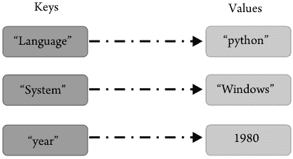

**图 2.13** 字典作为 *键:值* 对

字典是一个有序集合（在 Python 3.7 版本中，字典是有序的，而在早期版本中是无序的），它是可变的，并且不允许重复键。与列表和元组一样，字典中的项可以是任何数据类型。

字典的数据是可变的，这意味着我们可以在创建字典后更改或添加新的键，或者更改键的值。

每个字典键与其值之间用冒号 (:) 分隔，如：*键:值*。

键值对的组合与其他对之间用逗号分隔，这些对用花括号 {} 括起来，如下所示。

```python
dict1 = {
    "Language": "python",
    "System"  : "Windows",
    "year"    : 1980
}
print(dict1)
# Output: {'Language': 'python', 'System': 'Windows', 'year': 1980}
```

在上面的代码中，*dict1* 变量被创建为一个字典，其中 *Language*、*System* 和 *Year* 是键，而 *Python*、*Windows* 和 *1980* 是这些键对应的值。
*dict1* 字典的数据存储在花括号内，每个键值对之间用逗号分隔。
我们可以使用 `type()` 方法检查字典数据项的类型，如下所示。但是，两个键的值可以相同。

```python
type(dict1)
# Output: <class 'dict'>
```

- **不允许重复键**
  字典不能有两个相同键的项；它会忽略重复的键，并在键重复时为其分配最新的值，如下所示。但是，两个键的值可以相同。

```python
dict1 = {
    "Language": "python",
    "System"  : "Windows",
    "year"    : 1980,
    "year"    : 1981
}
print(dict1)
# Output: {'Language': 'python', 'System': 'Windows', 'year': 1981}
```

### 2.15.1 字典数据类型的操作

我们可以对字典数据类型执行各种操作，如下所述。

- **字典长度**
  可以使用下面的 `len()` 方法获取字典中键值对的总数。

```python
dict1 = {
    "Language": "python",
    "System"  : "Windows",
    "year"    : 1980,
    "version" : [2.9, 3.67, 4.01],
    "IDE"     : True
}
print(len(dict1))
# Output: 5
```

- **字典项可以是任何数据类型**

字典可以包含任何数据类型，例如字符串、浮点数、布尔值或任何其他数据类型，如下所示。

```python
dict1 = {
    "Language": "python",
    "System"   : "Windows",
    "year"     : 1980,
    "version"  : [2.9, 3.67, 4.01],
    "IDE"      : True
}
print(dict1)
# Output: {'Language': 'python',
'System': 'Windows',
'year': 1980,
'version': [2.9, 3.67, 4.01],
'IDE': True}
```

- **访问项**

可以通过在方括号内引用其键名来访问字典的项，如下所示。

```python
dict1 = {
    "Language": "python",
    "System"   : "Windows",
    "year"     : 1980,
    "version"  : [2.9, 3.67, 4.01],
    "IDE"      : True
}
var1 = dict1["System"]
var1
# Output: 'Windows'
```

我们也可以通过传递键名来使用字典类的 get() 方法获取其值，如下所示。

```python
var1 = dict1.get("year")
var1
# Output: 1980
```

- **获取键**

我们可以使用字典的 keys() 方法访问或遍历所有键，它将返回字典中存在的所有键的列表，如下所示。

```python
var1 = dict1.keys()
var1
# Output:dict_keys(['Language', 'System', 'year', 'version', 'IDE'])
```

- **获取值**

类似地，如下所示，我们可以使用 values() 方法返回字典中存在的所有键的值的列表。

```python
dict1 = {
    "Language": "python",
    "System"   : "Windows",
    "year"     : 1980,
    "version"  : [2.9, 3.67, 4.01],
    "IDE"      : True
}
var1 = dict1.values()
var1
# Output: dict_values(['python', 'Windows', 1980, [2.9, 3.67, 4.01], True])
```

- **获取项**

我们可以列出字典中的所有数据项。如下所示，items() 方法将列表作为每个键值对的元组返回。

```python
dict1 = {
    "Language": "python",
    "System"   : "Windows",
    "year"     : 1980,
    "version"  : [2.9, 3.67, 4.01],
    "IDE"      : True
}
var1 = dict1.items()
print(var1)
# Output: dict_items([('Language', 'python'), ('System', 'Windows'), ('year', 1980), ('version', [2.9, 3.67, 4.01]), ('IDE', True)])
```

- **添加值**

如下所示，我们可以通过使用新的索引键并为其赋值来向字典添加新值。

```python
dict1 = {
    "Language": "python",
    "System"   : "Windows",
    "year"      : 1980,
    "version"   : [2.9, 3.67, 4.01],
    "IDE"       : True
}
dict1["Software"] = "Spyder"
print(dict1)
# Output: {'Language': 'python', 'System': 'Windows', 'year': 1980,
'version': [2.9, 3.67, 4.01], 'IDE': True, 'Software': 'Spyder'}
```

- **更新值**

我们可以通过为任何键分配新值来简单地更新其值，如下所示。

```python
dict1 = {
    "Language": "python",
    "System"  : "Windows",
    "year"    : 1980,
    "version" : [2.9, 3.67, 4.01],
    "IDE"     : True
}
dict1["System"] = "Linux"
print(dict1) #after the change
# Output: {'Language': 'python', 'System': 'Linux', 'year': 1980,
'version': [2.9, 3.67, 4.01], 'IDE': True}
```

要更新字典，我们也可以使用 update() 方法，并且必须向此方法传递更新后的键值对，如下所示。

```python
dict1 = {
    "Language": "python",
    "System"  : "Windows",
    "year"    : 1980,
    "version" : [2.9, 3.67, 4.01],
    "IDE"     : True
}
dict1.update({"System":"Linux"})
print(dict1) #after the change
# Output: {'Language': 'python', 'System': 'Linux', 'year': 1980,
'version': [2.9, 3.67, 4.01], 'IDE': True}
```

- **删除元素**

有多种方法可以删除字典或从字典中移除项。下面讨论了删除字典元素的不同方法。
要从字典中移除一项，我们可以使用 pop() 方法并传递需要移除的键值，如下所示。

```python
dict1 = {
    "Language": "python",
    "System"  : "Windows",
    "year"    : 1980,
    "version" : [2.9, 3.67, 4.01],
    "IDE"     : True
}
dict1.pop("Language")
print(dict1)
# Output: {'System': 'Windows', 'year': 1980, 'version': [2.9, 3.67, 4.01], 'IDE': True}
```

这里，我们使用了 pop() 来删除键 *Language* 及其值 *python*。

popitem() 方法是删除字典键值对的另一种方法。它将删除最后添加的项（在 3.7 之前的版本中，此方法会移除一个随机项）。

```python
dict1 = {
    "Language": "python",
    "System"  : "Windows",
    "year"    : 1980,
    "version" : [2.9, 3.67, 4.01],
    "IDE"     : True
}
dict1.popitem()
print(dict1)
# Output: {'System': 'Windows', 'year': 1980, 'version': [2.9, 3.67, 4.01]}
```

del 关键字是删除字典或从字典中删除项的另一种方式，如下所示。

```python
dict1 = {
    "Language": "python",
    "System"  : "Windows",
    "year"    : 1980,
    "version" : [2.9, 3.67, 4.01],
    "IDE"     : True
}
del dict1["version"]
print(dict1)
# Output: {'Language': 'python', 'System': 'Windows', 'year': 1980, 'IDE': True}
del dict1
print(dict1)
# Output: NameError: name 'dict1' is not defined
```

你可以看到，`del dict1` 语句已将整个字典从内存中移除，并且在执行此语句后，我们得到了 `name 'dict1' is not defined` 的错误。

需要注意的是，`del` 关键字适用于所有变量类型，它只是简单地移除已定义的变量名。在上面的代码中，我们删除了一个名为 `dict1` 的变量。

然而，我们也可以使用字典的 `clear()` 方法；它移除所有字典项，而不是删除它们，如下所示。

```python
dict1 = {
    "Language": "python",
    "System" : "Windows",
    "year" : 1980,
    "version" : [2.9, 3.67, 4.01],
    "IDE" : True
}
dict1.clear()
print(dict1)
# Output: {}
```

当我们对 `dict1` 应用 `clear()` 方法时，它清空了字典并使其成为一个空字典。

#### 复制字典

我们使用字典的 `copy()` 方法来复制字典的内容，如下所示。

```python
dict1 = {
    "Language": "python",
    "System" : "Windows",
    "year" : 1980,
    "version" : [2.9, 3.67, 4.01],
    "IDE" : True
}
dict2=dict1.copy()
print(dict1)
print(dict2)
# Output: {'Language': 'python', 'System': 'Windows', 'year': 1980, 'version': [2.9, 3.67, 4.01], 'IDE': True}
{'Language': 'python', 'System': 'Windows', 'year': 1980, 'version': [2.9, 3.67, 4.01], 'IDE': True}
```

需要注意的是，我们不能简单地通过输入 `dict2 = dict1` 来复制字典，因为在这种情况下，`dict2` 只会是 `dict1` 的一个*引用*，我们对 `dict1` 所做的更改也会自动反映在 `dict2` 中，如下所示。

```python
dict1 = {
    "Language": "python",
    "System"  : "Windows",
    "year"    : 1980,
    "version" : [2.9, 3.67, 4.01],
    "IDE"     : True
}
dict2 = dict1
print(dict2)
# Output: {'Language': 'python', 'System': 'Windows', 'year': 1980, 'version': [2.9, 3.67, 4.01], 'IDE': True}
# Clearing the 1st dictionary
dict1.clear()
print(dict1)
print(dict2)
# Output: {}
{}
```

在这里，你可以看到 `clear()` 方法已应用于 `dict1`，并且由于 `dict2` 只是引用 `dict1`，它也自动应用于 `dict2`。

#### 检查键是否存在

我们可以将 `in` 关键字与 `if` 语句一起使用，以检查指定的键是否存在于字典中，如下所示。

```python
dict1 ={
"Language": "python",
"System"  : "Windows",
"year"    : 1980,
"version" : [2.9, 3.67, 4.01],
"IDE"     : True
}
if "Year" in dict1:
    print("Yes, Year key is present")
else:
    print("No, key Year is not present")

if "year" in dict1:
    print("Yes, year key is present")
else:
    print("No, key year is not present")
# Output: No, key Year is not present
Yes, year key is present
```

我们应该注意，Python 是区分大小写的，`if` 语句会据此做出判断。

## 2.16 Python 集合

Python 中的集合用于在单个变量中存储多个项目。集合是一个*无序*且*无索引*的集合。它可以包含任意数量的项目，这些项目可以是不同的数据类型，例如整数、浮点数、元组或字符串；由于集合是无索引的，它不能存储重复的值。集合中的元素是不可变的（即不能更改），但集合本身是可变的。集合的任何元素都没有附加索引。因此，我们可以得出结论：集合项是无序的、不可更改的，并且不允许重复值。

集合通过将所有项目（元素）放在花括号 {} 内来定义，项目之间用逗号分隔，如下所示。

```python
set1 = {"python", 4.02, "Windows"}
print(set1)
# Output: {'Windows', 4.02, 'python'}
```

在这个例子中，我们创建了一个名为 set1 的集合，其中包含多个项目。然而，当我们打印集合时，请注意元素的顺序与我们最初定义的顺序不同。集合会自动以无序的方式排列元素，并且会消除重复元素，确保集合中的每个项目都是唯一的。

### 不允许重复

一个集合不能有两个或更多具有相同值的项目。如果一个集合有重复的值，那么它只考虑该值的一个实例，如下所示。

```python
set1 = {"python", 4.02, "Windows", "python"}
print(set1)
# Output: {'Windows', 4.02, 'python'}
```

### 2.16.1 集合数据类型的操作

我们可以对集合数据类型执行各种操作，如下所述。

#### 集合的长度

`len()` 方法用于计算集合中的项目总数，它可以用来计算集合中的元素数量，如下所示。

```python
set1 = {"python", 4.02, "Windows"}
print(len(set1))
# Output: 3
```

#### 集合项可以是任何数据类型

一个集合变量可以包含任何数据类型，例如整数、浮点数、字符串或布尔值，如下所示。

```python
set1 = {"python", "Spyder", "Windows"}
set2 = {31, 52, 17, 39, 43}
set3 = {False, True, True, False}
print(set1, set2, set3)
# Output: {'Windows', 'Spyder', 'python'} {39, 43, 17, 52, 31}
         {False, True}
```

你可以注意到 set3 中的重复元素被消除了。
事实上，单个集合变量可以包含多种数据类型。

```python
set1 = {"python", "Windows", 31, 52, True, False}
print(set1)
# Output: {False, True, 'python', 52, 31, 'Windows'}
```

#### 检查集合的类型

正如我们讨论过的，我们可以使用 type() 方法检查变量的数据类型；因此，通过使用它，我们可以检查集合的类型，如下所示。

```python
set1 = {"python", 4.02, "Windows"}
print(type(set1))
# Output: <class 'set'>
```

你可以看到 set1 是 set 类的一个对象。

#### 访问集合

集合不能通过调用其键或引用来索引访问。如果我们尝试访问集合的项目，它将打印一个 TypeError，如下所示。

```python
set1 = {"python", 4.02, "Windows"}
print(set1[0])
# Output: TypeError: 'set' object is not subscriptable
print(set1["python"])
# Output: TypeError: 'set' object is not subscriptable
```

我们可以使用 for 循环遍历集合的项目，如下所示。

```python
set1 = {"python", 4.02, "Windows"}
for x in set1:
    print(x)
# Output:
Windows
4.02
python
```

然而，我们也可以使用 in 关键字来检查某个项目是否存在于集合中，如下所示。

```python
set1 = {"python", 4.02, "Windows"}
print("python" in set1)
# Output: True
```

#### 添加项目

在集合中，我们不能更改其项目，但我们可以使用其 `add()` 方法向集合中添加一个项目，如下所示。

```python
set1 = {"python", 4.02, "Windows"}
set1.add("Java")
print(set1)
# Output: {'Windows', 4.02, 'python', 'Java'}
```

这里，第四个项目 *Java* 已被添加到 *set1* 中。需要注意的是，集合项是无序的。

#### 添加集合

我们使用 `update()` 方法将一个集合的项目添加到另一个集合中，如下所示。

```python
set1 = {"python", 4.02, "Windows"}
set2 = {"Java", 9.30, "Linux"}
set1.update(set2)
print(set1)
# Output: {'Java', 4.02, 'python', 9.3, 'Windows', 'Linux'}
```

你可以注意到 *set1* 中的项目是无序的。
需要注意的是，`update()` 方法中的对象不必是集合；我们可以传递任何集合类型。这意味着列表、元组和字典也是允许的，如下所示。

```python
set1 = {"python", 4.02, "Windows"}
list1 = ["Java", 9.30, "Linux"]
set1.update(list1)
print(set1)
# Output: {4.02, 9.3, 'Windows', 'python', 'Linux', 'Java'}
```

#### 移除项目

在集合中，我们可以使用其 `remove()` 或 `discard()` 方法来移除一个项目，如下所示。

```python
set1 = {"python", 4.02, "Windows"}
set1.remove("python")
print(set1)
# Output: {'Windows', 4.02}
```

现在让我们使用 `discard()` 从集合中删除一个项目，如下所示。

```python
set1 = {"python", 4.02, "Windows"}
set1.discard("python")
print(set1)
# Output: {'Windows', 4.02}
```

需要注意的是，如果我们向 `remove()` 传递一个集合中不存在的项目，它将引发错误，而在 `discard()` 的情况下，如果传递的项目在集合中不存在，它不会引发错误，如下所示。

```python
set1 = {"python", 4.02, "Windows"}
set1.discard("c++")
print(set1)
# Output: {'Windows', 'python', 4.02}
set1 = {"python", 4.02, "Windows"}
set1.remove("c++")
# Output: KeyError: 'c++'
```

除了这两种方法，我们还可以使用 `pop()` 从集合中删除一个项目。它将删除集合的最后一个项目。由于集合是无序的，你将不知道使用此 `pop()` 方法会删除哪个项目。

```python
set1 = {"python", 4.02, "Windows"}
x=set1.pop()
print(x)#removed item
# Output: Python
print(set1)#set after removal of an item
# Output: {4.02, 'Windows'}
```

`clear()` 方法用于清空集合或删除其所有项目，如下所示。

```python
set1 = {"python", 4.02, "Windows"}
set1.clear()
print(set1)
# Output: set()
```

`del` 关键字用于删除变量；因此，通过将其与集合一起使用，我们可以删除集合变量，如下所示。

```python
set1 = {"python", 4.02, "Windows"}
del set1
print(set1)
# Output:
NameError: name 'set1' is not defined
```

#### 对集合数据类型执行集合操作

集合的 `union()` 方法用于创建两个集合的并集，如下所示。它返回一个包含两个不同集合中所有元素的新集合。

```
set1 = {"python", 4.02, "Windows"}
set2 = {"Java", 9.30, "Windows"}
set3 = set1.union(set2)
print(set3)
# Output: {4.02, `python`, 9.3, `Windows`, `Java`}
```

你可以注意到，使用 `union()` 创建的新集合中，公共元素只出现了一次。

`intersection()` 方法用于对集合执行交集操作，它将返回集合的公共元素，如下所示。

```
set1 = {"python", 4.02, "Windows"}
set2 = {"Java", 9.30, "Windows"}
set3 = set1.intersection(set2)
print(set3)
# Output: {`Windows`}
```

`intersection_update()` 方法用于更新集合，它将只保留同时存在于两个集合中的元素，如下所示。

> 需要注意的是，它不会返回一个新集合；它只更新原集合。

```
set1 = {"python", 4.02, "Windows"}
set2 = {"Java", 9.30, "Windows"}
set1.intersection_update(set2)
print(set1)
# Output: {`Windows`}
```

`symmetric_difference()` 方法用于创建一个包含两个集合中不共同元素的新集合，或者只保留那些不同时存在于两个集合中的元素，如下所示。

```
set1 = {"python", 4.02, "Windows"}
set2 = {"Java", 9.30, "Windows"}
set3 = set1.symmetric_difference(set2)
print(set3)
# Output: {`python`, 4.02, `Java`, 9.3}
```

`symmetric_difference_update()` 方法用于更新集合，它将只保留那些不同时存在于两个集合中的元素，如下所示。

```
set1 = {"python", 4.02, "Windows"}
set2 = {"Java", 9.30, "Windows"}
set1.symmetric_difference_update(set2)
print(set1)
# Output: {`python`, 4.02, `Java`, 9.3}
```

需要注意的是，`symmetric_difference()` 方法创建一个新集合，而 `symmetric_difference_update()` 方法更新现有集合。

#### 测试一下

在讨论了 Python 的所有数据类型之后，让我们根据可变性、有序性、索引/切片以及重复元素等标准，来比较列表、元组、字典和集合数据类型。为此，创建一个 5×5 的矩阵，将数据类型作为行标题，标准作为列标题，并根据你目前所学的知识，在每个单元格中填入勾或叉。

这个问题的解答将在下一节中讨论。因此，在进入下一节之前，请尝试回答这个问题，并将你的答案与下一节中给出的信息进行比较。

## 2.17 列表、元组、字典和集合数据类型的比较

让我们以表格形式比较这些数据类型，如表 2.2 所示。

**表 2.2** 列表、元组、字典和集合的表格比较

| 属性 | 列表 | 元组 | 字典 | 集合 |
| :--- | :--- | :--- | :--- | :--- |
| 定义 | 列表是一个动态大小的数组，在单个变量中存储多个元素。 | 元组类似于列表，但元组是不可变的，不能被修改。 | 字典是一个无序的数据项集合，其中每个元素都有一个键及其对应的值。 | 集合是无序的、不可变的，并且不允许重复值。 |
| 表示 | [] | () | {} | {} |
| 创建 | 可以使用 `list()` 方法创建列表。 | 可以使用 `tuple()` 方法创建元组。 | 可以使用 `dict()` 方法创建字典。 | 可以使用 `set()` 方法创建集合。 |
| 修改 | 列表是可变的，这意味着我们可以对列表进行任何更改。 | 元组是不可变的，这意味着我们不能对元组进行任何更改。 | 字典是可变的。 | 我们不能更改集合中的元素，但可以使用其 `add()` 方法向集合添加元素，并使用 `remove()` 方法移除元素。 |
| 重复性 | 允许 | 允许 | 键：不允许<br>值：允许 | 不允许 |
| 索引 | 是 | 是 | 否 | 否 |
| 有序性 | 有序 | 有序 | 无序 | 无序 |
| 切片 | 是 | 是 | 否 | 否 |

| | 可变 | 有序 | 索引/切片 | 重复元素 |
| :--- | :--- | :--- | :--- | :--- |
| 列表 | ✔ | ✔ | ✔ | ✔ |
| 元组 | ✘ | ✔ | ✔ | ✔ |
| 字典 | ✔ | ✘ | ✘ | ✘<br>(键不允许重复；但是，不同键的值可以相同。) |
| 集合 | ✔<br>(集合作为整体是可变的，但集合中的元素是不可变的。) | ✘ | ✘ | ✘ |

## 2.18 If 语句

Python 也像所有其他主要编程语言一样支持决策语句。决策语句决定了程序执行的流程。它用于根据条件的结果来决定是否执行一个语句块或某个特定语句。if 语句的语法如下：

```
if <condition>
    <statement>
```

这里，if 是一个关键字，<condition> 是 if 语句的一组规则，如下所示。

```
a = 10
if a == 10:
    print("Yes, The value of a is 10")
# Output: Yes, The value of a is 10
```

需要注意的是，缩进在 `if` 语句中非常重要。

- **缩进**
  在 C / C++ 等编程语言中，我们使用花括号来描述 `if` 结构下的语句块；然而，在 Python 中，我们使用空格或缩进来定义语句块。如果我们不添加这些空格，将会打印缩进错误。
  以下展示了在没有这些缩进或空格的情况下不正确使用 `if` 语句的例子。

```
a = 10
if a == 10:
print("Yes, The value of a is 10")
# Output: IndentationError: expected an indented block
```

因此，在代码中必须使用缩进来定义作用域。

- **elif**
  `elif` 关键字是另一个决策语句，它仅在之前的条件不为真时才检查条件，如下所示。

```
a = 10
b = 10
if a > b:
    print("a is greater than b")
elif a == b:
    print("a is equal to b")
# Output: a is equal to b
```

- **else**
  在 Python 中，我们有 `else` 关键字，但它的作用与大多数其他编程语言略有不同。它捕获所有未被初始条件捕获的情况，如下所示。

```
a = 5
b = 10
if a > b:
    print("a is greater than b")
elif a == b:
    print("a is equal to b")
else:
    print("a is lesser than b")
# Output: a is lesser than b
```

我们也可以只将 `else` 与 `if` 子句一起使用，如果条件不为真，则执行其语句块，如下所示。

```
a = 5
b = 10
if a == b:
    print("a is equal to b")
else:
    print("a is not equal to b")
# Output: a is not equal to b
```

### 简写 if

如果 `if` 条件下只有一条语句，我们可以使用简写的 `if` 语句。在这种情况下，我们可以在一行中传递 `if` 关键字、其条件以及它的单条语句，如下所示。

```
a = 10
b = 10
if a == b: print("The value of a is equal to b")
# Output: The value of a is equal to b
```

### 简写 if else

如果 `if` 条件下只有一条语句，并且其 `else` 部分也只有一条语句，那么我们也可以使用简写的 `if else` 语句，如下所示，将所有内容放在同一行。

```
a = 11
b = 10
print("a > b") if a > b else print("a < b")
# Output: a > b
```

### 使用逻辑运算符

在 Python 中，我们也可以使用逻辑运算符来组合条件语句，如下所示。

```
a = 20
b = 10
c = 35
if a > b and a > c:
    print("Both conditions are True")
if a > b or a > c:
    print("At least one of the conditions is True")
# Output: At least one of the conditions is True
```

这里，第二个 `if` 语句的条件为真，因此输出中显示了第二个打印语句。

- **嵌套 if**
  我们可以使用嵌套的 if 语句，如下所示。

```
x = 65
if x > 15:
    print("Above 15!")
    if x > 30:
        print("Above 30!")
        if x > 45:
            print("Above 45!")
        else:
            print("Below 15!")
# Output: Above 15!
Above 30!
Above 45!
```

if 语句的层次化声明被称为嵌套 if 语句。

- **pass 语句**
  if 语句不能为空或没有代码行，在某些情况下，如果条件 if 语句没有内容，则使用 pass 语句来执行代码。pass 语句用于提高代码的可读性，如下所示。

```
a = 33
b = 35
if b < a:
    pass
else:
    b = b - a
    print(b)
# Output: 2
```

## 2.19 循环语句

Python 中有两种循环语句，分别是 while 循环和 for 循环。缩进在循环语句中非常重要，用于定义语句块。如果我们不添加这些空格或缩进，将会打印缩进错误。
让我们逐一讨论这些循环语句。

### 2.19.1 While 循环

Python 中的 while 循环用于迭代一个代码块，直到语句的条件为真。

### 2.19.1 While 循环

while 循环的语法如下：

```
while <condition>:
    <statement>
    <statement>
```

让我们通过以下示例来理解其用法。

```
counter = 1
while counter < 5:
    print(counter)
    counter = counter + 1
#Output: 1
2
3
4
```

#### break 语句

break 语句用于终止循环，即使条件为真。它是一种在满足特定条件时停止循环迭代的方法。在大多数情况下，会使用 if 语句来中断循环，如下所示。

```
counter = 0
while counter < 5:
    counter = counter + 1
    if counter == 3:
        break
    print(counter)
#Output: 1
2
```

当 m 为 3 时退出了循环，因此只打印了 1 和 2。

#### continue 语句

如下所示，continue 语句会停止循环的当前迭代，并从下一次迭代开始恢复处理。

```
counter = 0
while counter < 5:
    counter = counter + 1
    if counter == 3:
        continue
    print(counter)
#Output:1
2
4
5
```

#### else 语句

else 语句也可以与 while 循环一起使用，当 while 循环的条件不再为真时，执行一次代码块，如下所示。

```
counter = 1
while counter <= 5:
    print(counter)
    counter = counter + 1
else:
    print("counter is larger than 5")
#Output: 1
2
3
4
5
counter is larger than 5
```

### 2.19.2 For 循环

在 Python 中，for 循环用于遍历一个序列，正如前面讨论的，我们有四种集合数据类型或序列：列表、元组、字典和集合。所有这些变量和字符串数据类型都可以用 for 循环来迭代处理它们的值。
因此，这与其他编程语言中使用的 for 循环不同，它的工作方式更像是一种迭代器方法，而不是其他面向对象编程语言中的方式。
下面展示了使用 for 循环遍历列表所有元素的用法。

```
languages = ["Java", "Python", "Cobol"]
for word in languages:
    print(word)
#Output: Java
Python
Cobol
```

#### 遍历字符串

for 循环也可以用于将字符串值作为字符序列进行迭代，如下所示。

```
for character in "Python":
    print(character)
#Output: P
y
t
h
o
n
```

#### break 语句

与在 while 循环中一样，我们可以使用 break 语句来中断 for 循环的执行，如下所示。

```
languages = ["Java", "Python", "Cobol"]
for word in languages:
    if word == "Python":
        break
    print(word)
#Output: Java
```

#### continue 语句

与在 while 循环中一样，我们可以使用 continue 语句跳过当前迭代，并从下一组即将进行的迭代开始恢复处理，如下所示。

```
languages = ["Java", "Python", "Cobol"]
for word in languages:
    if word == "Python":
        continue
    print(word)
#Output: Java
Cobol
```

#### for 循环中的 else

for 循环中的 else 关键字指定在循环完成时执行的特定代码块，如下所示。

```
languages = ["Java", "Python", "Cobol"]
for word in languages:
    print(word)
else:
    print("List is processed")
# Output: Java
Python
Cobol
List is processed
```

#### 嵌套循环

嵌套循环是循环内部的循环。在嵌套循环中，内层循环的每次迭代都会执行一次。系统将首先完成所有内层循环的迭代，当内层循环完成时，控制权将返回给外层循环。外层循环执行其下一次迭代，该过程持续进行，如下所示。

```
languages = ["Java", "Python", "Cobol"]
level = ["Beginner", "Intermediate", "Expert"]
for outer in languages:
    for inner in level:
        print(outer, inner)
# Output: Java Beginner
Java Intermediate
Java Expert
Python Beginner
Python Intermediate
Python Expert
Cobol Beginner
Cobol Intermediate
Cobol Expert
```

### pass 语句

我们也可以像在 if 语句中一样使用 pass 语句，来处理 for 循环下没有内容的情况。使用 pass 语句，我们可以避免出现错误，如下所示。

```
for counter in [7, 8, 9]:
    pass
```

#### range() 方法

range() 方法用于将循环代码执行指定的次数。它返回一个从 0 开始到指定数字的数字序列。如下所示，每次迭代将增加 1（默认值），并在指定数字处结束。

```
for counter in range(5):
    print(counter)
# Output: 0
1
2
3
4
```

在这里，你可以看到它从序列号 0 开始，并迭代到指定数字。
然而，在 range() 方法中，我们可以传递两个参数，例如起始点和结束点，如下所示。

```
for counter in range(1, 5):
    print(counter)
# Output: 1
2
3
4
```

需要注意的是，在处理过程中上限是不包含在内的，或者它将从下限迭代到指定的上限减 1。

`for` 循环的默认递增顺序是每次迭代增加 1。然而，如下所示，我们可以通过添加第三个参数来指定增量值；它将把增量值从默认的 1 更改为指定的值。

```
for counter in range(0, 45, 5):
    print(counter)
# Output: 0
5
10
15
20
25
30
35
40
```

在这个例子中，增量值是 5。

## 2.20 Python 函数

函数是一段只有在被调用时才会运行的代码块。

函数是一组用于执行特定任务的相关语句，我们可以根据需要调用这些函数。我们可以以参数的形式向函数传递数据，函数在处理后可以向调用环境返回数据。函数帮助我们将逻辑分解成不同的子集。函数还帮助用户避免重复一组语句。在本节中，我们将讨论用户定义函数的语法和用法。

### 定义函数

在 Python 中，我们可以使用 `def` 关键字来定义一个函数，如下所示。

```
def the_function():
    print("Hello!! I am python function")
```

上面的代码展示了一个函数定义的模板。

这里，`def` 关键字用于定义函数的开始。需要注意的是，定义的函数必须有一个唯一的名称；这里是 *the_function*。函数名后面必须有一个冒号（:），如上所示。函数体必须具有相同的缩进级别。`return` 关键字是一个可选语句，可用于从函数返回一个值。

### 调用函数

一旦我们定义了一个函数，我们就可以通过它的名称和适当的参数（如果需要）来调用它，如下所示。

```
def the_function():
    print("Hello!! I am a python function")
the_function()
#Output: Hello!! I am a python function
```

### 参数

参数用于从调用环境向函数传递信息。这些参数是在函数名后括号内定义的指定变量。我们可以根据需要添加任意多个参数，并且这些参数必须用逗号分隔。
在下面的例子中，我们有一个函数 `the_function`，它有一个参数 `data`。当我们调用函数并传递参数值时，它会打印传递的信息，如下所示。

```
def the_function(data):
    print(data + " is a language")

the_function("python")
the_function("Java")
the_function("HTML")
#Output: python is a language
Java is a language
HTML is a language
```

需要注意的是，函数定义中括号内列出的变量称为参数——发送给函数的值称为其参数。因此，在上面的例子中，`data` 是一个参数，而值“python”、“Java”和“HTML”是其参数。
同样，在下面的例子中，`var1` 和 `var2` 是其参数，而在调用函数时传递的字符串是其参数。默认情况下，参数和参数的数量应该相同，如下所示。这里，我们使用了两个参数和参数。

```
def the_function(var1, var2):
    print(var1 + " " + var2)
the_function("Software", "Engineer")
the_function("Data", "Analyst")
```

## 输出：软件工程师
数据分析师

如果我们传递给函数的参数数量与函数定义中指定的数量不同，将会导致 *TypeError*，如下所示。

```python
def the_function(var1, var2):
    print(var1 + " " + var2)
the_function("Software")
# Output: TypeError: the_function() missing 1 required positional argument: 'var2'
```

- **任意参数，*args**
  在我们不知道将有多少参数传递给函数的情况下，我们可以在函数定义中的参数名前添加一个星号 (*)，如下所示。

```python
def the_function(*lang):
    print("The youngest language is " + lang[1])
the_function("java", "python")
# Output: The youngest language is python
```

在上面的代码中，我们使用 * 运算符定义了一个参数。它用于以元组的形式获取特定元素。我们向函数 *the_function* 传递了两个参数 *java* 和 *python*。*the_function* 通过其索引访问这些传递参数的值。

- **通过 key = value 向参数传递值**
  我们也可以使用 key = value 将值传递给参数，如下所示。

```python
def the_function(lang3, lang2, lang1):
    print("The youngest language is " + lang3)
the_function(lang1 = "java", lang2 = "HTML", lang3 = "python")
# Output: The youngest language is python
```

- **默认参数值**
  我们也可以为参数分配一个默认值，如下所示。当我们没有向函数传递任何值或参数时，它会自动获取默认值并将其分配给参数，如下所示。

```python
def the_function(lang = "python"):
    print("The selected language is " + lang)
the_function("Java")
the_function("HTML")
the_function()
the_function("python")
```

```
# Output: The selected language is Java
The selected language is HTML
The selected language is python
The selected language is python
```

## 将各种数据类型作为函数参数传递

我们可以将任何数据类型（如字符串、数字、列表、字典）作为参数传递给函数。参数会自动充当该传递类型的变量。在下面的示例中，我们将一个列表作为参数传递给函数。

```python
def the_function(lang):
    for m in lang:
        print(m)
var1 = ["python", "html", "java"]
the_function(var1)
# Output: python
html
java
```

### 返回值

return 语句用于从函数向调用环境返回一个值，如下所示。

```python
def the_function(number):
    return 6*number
print(the_function(4))
print(the_function(6))
print(the_function(8))
# Output: 24
36
48
```

### pass 语句

要定义一个没有任何内容的函数，我们可以使用 pass 语句。在函数体中编写一条语句很重要，否则会返回错误；因此 pass 语句有助于创建一个没有任何内容的函数。这在开发逻辑时可能很有用，我们希望稍后再创建函数的代码。在下面的示例中，函数的定义保持为空。

```python
def the_function():
    pass
the_function()
# Output:
```

### 递归

Python 也支持函数递归，这意味着我们可以定义一个可以调用自身的函数，如下所示。需要注意的是，应该有一个退出递归的条件。

在给定的代码中，我们定义了一个函数 *factorial*，它在函数体内调用自身。这里，当 *n* 的值达到 1 时，它将停止递归并返回结果。

```python
def factorial(n):
    if n == 1:
        return 1
    else:
        return (n * factorial(n-1))
number = 3
print("Factorial of", number, "is", factorial(number))
# Output: Factorial of 3 is 6
```

当我们用一个正整数调用此函数时，它会通过递减自身来递归调用自身。该函数将数字与其下方数字的阶乘相乘，直到返回值 1。在这种情况下，当数字减少到 1 时，递归结束。

总之，本章获得的 Python 基础知识将极大地帮助理解和实现本书后续章节中讨论的各种机器学习算法。

要掌握使用 Python 解决计算问题的技能，我强烈建议探索我的在线课程，网址为：https://www.learncompscience.com/

为了进一步练习和获得实践经验，读者可以访问以下链接：

https://www.w3schools.com/python/python_exercises.asp

https://www.w3schools.com/python/python_quiz.asp

这些链接将提供一系列 Python 练习，并提供一个宝贵的机会来巩固在 Python 中获得的知识和技能，并通过实际应用提高熟练程度。

#### 提醒我

- Python 是仅次于 JavaScript 的第二大流行编程语言。
- Python 由荷兰软件专业人士 Guido Van Rossum 于 1991 年在荷兰国家数学与计算机科学研究所创建。
- 在命令行中输入 “python --version”，机器将显示其安装的版本。
- 在 Python 中执行程序有两种不同的模式：交互模式和 shell 模式。
- 在命令提示符下输入 “python” 以在您的机器上调用 Python。
- 代码的文本文件必须保存为 .py 扩展名。
- Anaconda Navigator 是一个桌面 GUI（图形用户界面），允许编码者启动 Python 应用程序。
- Spyder 是推荐用于 Python 编程的简单、透明、快速且易于使用的软件。
- Jupyter Notebook 也称为 IPython，它单独运行每个代码块。
- Python 是一种区分大小写的语言。
- Python 使用缩进来表示代码块，其中缩进是代码行开头的空格数。
- 在 Python 中，我们使用空格或缩进来定义语句块。如果我们不添加这些空格，它将打印缩进错误。
- Tab 键是在程序中进行缩进的最佳选择。
- 注释可用于在运行程序时忽略相应的代码行。
- 我们可以使用 # 来注释单行。
- 变量是用于存储值（如整数、浮点数或字符）的保留内存位置。
- Python 是完全面向对象的，Python 中的每个变量都是一个对象。
- Python 允许将一种数据类型转换为另一种数据类型。
- 字符串字面量可以通过将字符括在单引号 (') 或双引号 (") 中来形成。
- 字符串的字符使用字符串的索引值打印。
- 我们可以使用连接运算符 + 将两个不同的字符串连接到一个变量。
- 我们可以使用 len() 方法获取字符串的长度。
- 列表数据类型变量括在 [] 方括号中，每个元素用 ‘,’（逗号）分隔。
- 索引计数将从 0 开始，可以使用索引运算符 [ ] 访问。
- 当我们传递一个无效的索引值时，将返回 IndexError: list index out of range 错误。
- 元组数据类型类似于列表，但列表和元组之间的唯一区别是元组是不可变的，这意味着我们无法更新元组中的数据。
- 更新元组的替代方法是将元组转换为列表数据类型，然后再将其转换回元组。
- 字典以 *key:value* 对的形式存储数据值，其中 *key* 是数据特征，而 *value* 是与该特征相关的信息。
- 字典是可更改且不允许重复项的项目的集合。
- 我们可以使用 `get()` 方法打印字典的值。
- 集合可以有任意数量的项，这些项可以是任何数据类型。
- 集合中的值可以通过 `remove()` 或 `discard()` 方法移除。
- `clear()` 方法用于清空集合或删除其所有项。
- `pass` 语句用于在没有任何语句的情况下运行 `if` 语句。
- `break` 语句用于停止循环，即使条件为真。
- 在 Python 中，`for` 循环用于遍历序列，例如字符。
- 我们可以在循环中使用 `continue` 语句来跳过当前迭代。
- `range` 方法用于遍历循环代码，直到指定的次数。
- `for` 循环的默认递增顺序是每次迭代增加 1。
- `def` 关键字用于在函数开头定义一个函数，并且在函数名末尾必须有一个冒号 (:)。
- 在函数调用中，如果我们传递未定义的参数，它将导致 *TypeError*。

#### 附加资源

##### 书籍

- Havill, Jessen (2020). *Discovering Computer Science: Interdisciplinary Problems, Principles, and Python Programming*. Chapman and Hall/CRC.
- Lutz, Mark (2013). *Learning Python: Powerful Object-Oriented Programming*. O'Reilly Media, Inc.

##### 视频链接

- 如何在 Windows 10 上安装 Python 3.9.6。
  https://www.youtube.com/watch?v=xEt9dyvq3U
- Python 完整课程 – 12 小时学习 Python | Python 初学者教程 | Edureka
  https://www.youtube.com/watch?v=WGJJIrtnfpk

##### 博客相关链接

- Python 教程，https://www.w3schools.com/PYTHON/
- Python 教程，https://www.javatpoint.com/python-tutorial

#### 测试题（问题）

1.  谁创造了 Python？
    a) 吉多·范罗苏姆
    b) 詹姆斯·高斯林
    c) 丹尼斯·里奇
    d) 马克·扎克伯格

2.  Python 文件的扩展名是什么？
    a) .py
    b) .ipyb
    c) .php
    d) .pyl

3.  以下哪项是无效的语句？
    a) abc = 1,2,3
    b) a b c = 1 2 3
    c) a,b,c = 1, 2, 3
    d) a_b_c = 123

4.  我们可以在以下哪种模式下运行 Python？
    a) 交互模式
    b) 脚本模式
    c) (a) 和 (b) 都可以
    d) 以上都不是

5.  ________ 是一个推荐的基于 Python 的 IDE 软件。
    a) spyder
    b) jupyter
    c) Notepad++
    d) a 和 b

6.  __ 在 Python 中用作注释。
    a) *
    b) #
    c) /
    d) ??

7.  以下语句的输出是什么？
    str = 'HelloWorld!'
    print str[2:5]
    a) ello
    b) llo
    c) lloW
    d) elloW

8.  print() 在屏幕上显示变量的值。
    a) 是
    b) 否

9.  __ 运算符用于连接文本和值以打印消息。
    a) +
    b) #
    c) *
    d) ||

10. Manpower 和 manpower 在 Python 中是两个不同的标识符。
    a) 正确
    b) 错误

11. ____ 用于为变量赋值。
    a) >>
    b) <<
    c) =
    d) ==

12. a,b,c = 10,21,“python” 的输出会是什么？
    a) a = 21, b= 10, c = ‘python’
    b) a = 10, b = 10, c = ‘python’
    c) a = 10, b = 21, c = ‘python’
    d) a = 10, b = 21, c = ‘python’

13. 我们可以使用 ____ 来检查变量的数据类型。
    a) type()
    b) dtype()
    c) class()
    d) value()

14. Python 中的列表可以包含重复值吗？
    a) 是
    b) 否

15. 我们使用 ____ 来访问列表中某个索引的值。
    a) []
    b) {}
    c) ()
    d) <>

16. ____ 函数用于查找列表的长度。
    a) length()
    b) len()
    c) element()
    d) 以上都不是

17. 列表是可变的，这意味着我们可以对列表进行修改。
    a) 正确
    b) 错误

18. ____ 是一个用于移除空白字符的函数。
    a) strip()
    b) space()
    c) len()
    d) white()

19. 以下哪项不是 Python 支持的数据类型？
    a) int
    b) slice
    c) float
    d) string

20. __ 关键字用于定义一个函数。
    a) func
    b) def
    c) myfunc
    d) 以上都不是

21. 从给定的选项中选择 Python 中的保留关键字。
    a) import
    b) from
    c) else
    d) 以上都是

22. 我们可以在一个列表变量中存储多种数据类型。
    a) 是
    b) 否

23. IndexError 意味着
    a) 值未找到
    b) 特定的索引值超出范围
    c) 索引不允许访问
    d) 数据类型错误

24. ____ 是一个关键字，用于检查某个项是否存在于列表中。
    a) def
    b) type
    c) in
    d) value

25. 以下语句的输出会是什么？
    L = ['spam', 'Spam', 'SPAM!']
    print(L[-2])
    a) 'spam'
    b) 'Spam'
    c) 错误

26. 我们可以直接更改元组中的值。
    a) 是
    b) 否

27. _____ 是一个将元组转换为列表的函数。
    a) `type()`
    b) `append()`
    c) `list()`
    d) `remove()`

28. 在元组中，元组的值可以被赋给一个变量，这个过程称为 __________。
    a) 数组打包
    b) 数组解包
    c) 赋值数组
    d) 定义数组

29. 在 Python 的字典数据类型中，值被赋值为 ____。
    a) key:value
    b) value:key
    c) key:attribute:value
    d) key:value:attribute

30. 字典的值在未来不能被更改。
    a) 正确
    b) 错误

31. ____ 是字典中用于获取键对应值的方法。
    a) `retrieve()`
    b) `fetch()`
    c) `get()`
    d) 以上都不是

32. ______ 是一个用于删除变量的语句。
    a) del
    b) clear
    c) delete
    d) copy

33. ____ 中不允许有重复值。
    a) 集合
    b) 元组
    c) 列表
    d) 字典

34. 哪一个是错误的？
    a) list = []
    b) tuple = ()
    c) dictionary = {}
    d) set = ()

| 答案： | 1. a | 2. a | 3. b | 4. c | 5. d | 6. b | 7. b | 8. a | 9. a |
|---|---|---|---|---|---|---|---|---|---|
| | 10. a | 11. c | 12. d | 13. a | 14. a | 15. a | 16. b | 17. a | 18. a |
| | 19. b | 20. b | 21. d | 22. a | 23. b | 24. c | 25. b | 26. b | 27. c |
| | 28. b | 29. a | 30. b | 31. c | 32. a | 33. a | 34. d | | |

## 3 数据预处理

### 章节目标

-   理解数据预处理的必要性。
-   了解数据预处理的不同阶段，如数据清洗、数据集成、数据转换和数据规约。
-   理解特征缩放的必要性。
-   理解用于特征缩放的归一化和标准化技术。
-   理解用于特征提取的主成分分析。
-   为构建机器学习模型预处理分类数据。

## 3.1 数据预处理的必要性

我们生活在一个数据被视为石油的时代，因为我们需要数据来训练机器学习算法。数据分析师最重要的工作是收集、清洗和分析数据，并在清洗后的数据集上构建机器学习模型。但通常，我们获得的原始数据是嘈杂的。它包含许多差异、不一致性，并且经常有缺失值。为了理解这种情况，让我们考虑一个例子。

假设我们需要预测房价，为此，我们从一些先前的交易中收集了数据，如图 3.1 所示。

| 房屋面积（平方英尺） | 卧室数量 | 价格（千美元） |
|---|---|---|
| 500 | 1 | 115 |
| 600 | 1 | 150 |
| 700 | 2 | 210 |
| 1030 | 3 | 290 |
| 2300 | 4 | 375 |
| 2545 | 4 | 450 |

输入属性 输出属性

**图 3.1** 用于房价预测的理想数据集

在理想情况下，捕获的数据应该是这种格式，如图 3.1 所示。这里，我们有房屋面积和卧室数量作为输入特征，而价格是输出属性。我们可以通过回归来预测未知实例的价格。

但实际上，在大多数情况下，捕获的数据质量不高，通常我们得到的数据集如图 3.2 所示。

| 房屋面积（平方英尺） | 卧室数量 | 价格（千美元） |
|---|---|---|
| 500 | 1 | 115 |
| 600 | 1 | 0.001 |
| 700 | 未知 | 210 |
| 1030 | 3 | 290 |
| 2300 | 4 | 未知 |
| 未知 | 4 | 450 |

输入属性 输出属性

**图 3.2** 为房价预测收集的混乱数据

你可以看到这些数据很混乱。有很多未知或缺失的值，如果我们用这些数据训练模型，它的预测会非常差。此外，你可以识别出噪声和不正确的标签，比如第二条记录的价格是不正确的，这将导致模型训练效果不佳。

我们还可以考虑更多例子，比如在员工数据集中，有人在“工资已存入”列中输入了 -1。这没有任何意义，会被视为噪声。

有时，我们可能会遇到不切实际且不可能的数据组合；例如，让我们考虑一条记录，其中性别为男性，而怀孕状态为是。

### 精准农业应用数据收集的另一个示例

让我们通过另一个精准农业（PA）系统数据收集的例子，进一步理解数据预处理的必要性。一个广泛使用的PA应用是，通过部署在物联网（IoT）设置中的各种传感器，收集湿度、温度、光照度、气压和土壤湿度等环境参数的数据。通常，从这些传感器收集的数据需要进行数据预处理。

如图3.3所示，在将任何机器学习模型应用于该数据集之前，需要对许多缺失值和噪声进行预处理。

| 印度标准时间 | 土壤湿度 | 温度 | 湿度 | 气压 | 光照度 | 位置 |
|---|---|---|---|---|---|---|
| 2021年9月2日 14:34 | 1322.625 | 19.66 | 91.00 | 98350.5 | 424.43 | 帕蒂亚拉 |
| 2021年9月2日 14:35 | 1322.538 | 19.63 | 91.04 | 98355.11 | 423.56 | 帕蒂亚拉 |
| 2021年9月2日 14:36 | 1322.378 | 19.60 | 91.07 | 98352.4 | 422.12 | 帕蒂亚拉 |
| 2021年9月2日 14:38 | 1322.276 | | 91.11 | 98352.59 | 424.43 | 帕蒂亚拉 |
| 2021年9月2日 14:39 | 888888.880 | 19.53 | 91.15 | 98353.49 | 423.79 | 帕蒂亚拉 |
| 2021年9月2日 14:40 | 888888.880 | 19.51 | 91.18 | 98554.12 | 423.65 | 帕蒂亚拉 |
| 2021年9月2日 14:34 | 6325.502 | 14.22993 | | 98577.3 | | 卢迪亚纳 |
| 2021年9月2日 14:35 | 6325.763 | 14.22309 | 99.15 | 98577.46 | 134.74 | 卢迪亚纳 |
| 2021年9月2日 14:36 | 6326.18 | 14.21972 | 99.07 | 98577.4 | 134.70 | 卢迪亚纳 |
| 2021年9月2日 14:38 | 6326.612 | | 99.71 | 98577.7 | 134.63 | 卢迪亚纳 |
| 2021年9月2日 14:39 | 6326.882 | 14.20999 | 99.18 | | 134.27 | 卢迪亚纳 |
| 2021年9月2日 14:40 | 6327.749 | 14.20686 | 99.04 | | 134.55 | 卢迪亚纳 |
| 2021年9月2日 14:42 | | | | | | 卢迪亚纳 |
| 2021年9月2日 14:34 | 385.8 | 24.12 | 65.26 | 98251.44 | 634.84 | 斋浦尔 |
| 2021年9月2日 14:35 | 386.1 | 24.17 | 65.25 | 98251.22 | 634.27 | 斋浦尔 |
| 2021年9月2日 14:36 | 386.39 | 24.19 | 65.22 | 98250.95 | 633.68 | 斋浦尔 |
| 2021年9月2日 14:38 | 386.39 | 24.22 | | 98250.72 | 633.15 | 斋浦尔 |
| 2021年9月2日 14:39 | 386.39 | 24.26 | 65.27 | 98250.50 | 632.59 | 斋浦尔 |
| 2021年9月2日 14:40 | 386.40 | 24.34 | 65.25 | 98250.28 | 632.01 | 斋浦尔 |

图3.3 包含大量缺失值和噪声的精准农业数据

图3.3中显示的大多数收集字段是数值型的，可以直接由机器学习模型处理。但它也包括分类数据，例如城市属性，这需要在机器学习模型中进行特殊处理。我们还可以观察到，收集的数据处于不同的尺度或范围。例如，温度和湿度的范围是两位数，而土壤湿度和气压的值则非常大。这些不同尺度的输入数据也给机器学习模型带来了各种挑战，需要在输入模型之前进行称为特征缩放的特殊预处理。

同样重要的是要注意，有时数据以视频和图像的形式存在。视频和图像数据被视为非结构化数据，在输入机器学习模型之前也需要特殊的预处理。

在本章中，我们将讨论各种数据预处理技术。为了准备用于训练机器学习模型的数据，我们必须对数据进行预处理。嘈杂的数据会造成“垃圾进，垃圾出”的情况，如下所述。

### 垃圾进，垃圾出

如前所述，混乱的数据存在许多问题，其中之一就是“垃圾进，垃圾出”。缺乏高质量的数据，就无法获得高质量的结果。因此，为了做出最可靠的决策，我们需要高质量的数据；否则，重复或缺失的数据可能会产生误导性的统计信息。可以认为，垃圾数据作为输入将导致产生垃圾机器学习模型，如图3.4所示。

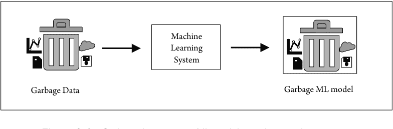

因此，对原始数据执行数据预处理以产生高质量数据非常重要。我们应该向机器学习模型输入高质量数据，以产生高质量的机器学习模型，如图3.5所示。

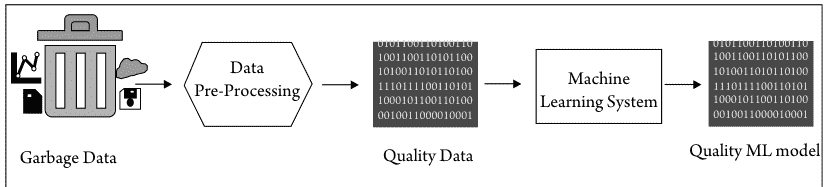

因此，数据准备、清理和转换构成了构建机器学习模型的大部分任务。这就是为什么数据预处理被认为是机器学习模型训练流程中最重要的一步。它使数据摆脱噪声，从而只考虑相关数据用于训练和构建模型。这项任务非常耗时，有时在构建机器学习模型之前，需要经过多个阶段的数据预处理。甚至在少数情况下，它占据了数据科学家80%的工作量。

数据预处理就像在烹饪前准备好食材。现实世界的数据可能杂乱、缺失、不一致或包含错误部分。因此，数据预处理有助于在我们使用数据来训练机器之前，对其进行清理和组织。这就像在开始烹饪一顿饭之前，确保你拥有所有正确的食材。

数据预处理属于数据科学中最复杂的阶段之一，称为ETL（提取、转换和加载）。它涉及从多个数据源提取数据，将其转换为标准化格式，并将数据加载到机器学习模型中进行分析。

## 3.2 数据预处理技术

数据预处理任务涉及各种活动和步骤，如下所示。

- 数据清理
- 数据集成
- 数据转换
- 数据规约

在这些广泛的活动中，应用了各种数据预处理技术，如图3.6所示。让我们逐一讨论这些任务的细节。

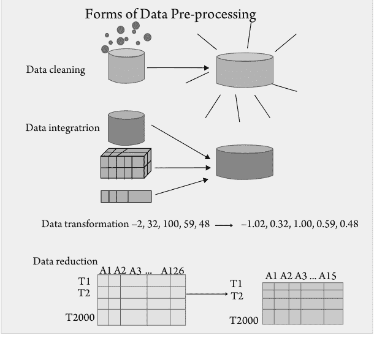

图3.6 预处理的各个阶段

### 3.2.1 数据清理

数据清理检测并移除数据中的不一致性，以提高数据质量。这些不一致性或错误是由于条目拼写错误、缺失值或数据中添加了任何其他无效参数造成的。在数据清理阶段，这些“脏”数据被转换为干净的数据。此阶段包括填充缺失值、平滑噪声数据、识别异常值、解决不一致性以及移除它们以清理数据。数据清理中处理的各种问题如下：

- 缺失值处理
- 噪声数据处理
- 聚类或异常值分析
- 不一致数据处理

让我们逐一讨论处理这些问题的技术。

#### 3.2.1.1 缺失值处理

记录缺失可能有多种原因，例如数据提取不完整、文件损坏、数据录入不完整、信息部分加载等。选择合适的技术来处理数据中的缺失值至关重要。处理缺失数据的方法选择取决于问题的领域和缺失数据的数量。

正如我们在之前讨论的房价预测和PA数据集示例中所讨论的，许多列中存在缺失值，可以使用以下技术进行处理：

- 删除包含缺失值的行/列
- 用均值/中位数/众数替换缺失值
- 通过预测其值来填充缺失值
- 通过分配唯一类别来填充缺失值
- 通过观察手动填充缺失值

让我们逐一讨论这些技术。

##### 删除包含缺失值的行/列

如果行或列的大部分值缺失或为空值，则应用此方法。由于删除包含缺失值的行/列会导致信息丢失，从而损害数据质量。因此，只有在拥有足够数据的情况下才应应用此方法。不建议对小型数据集使用此方法。

如图3.3所示，城市为卢迪亚纳的其中一行，其大部分值为空。在这种情况下，在数据预处理期间最好删除此行，因为它不携带任何信息。此技术的优缺点如下：

###### 删除包含缺失值的行/列的优点

- 如果完全移除包含缺失值的数据，可以构建一个高度准确且稳健的模型。
- 如果删除的特定列/行没有具体信息且权重较低，则会提高效率。

###### 删除包含缺失值的行/列的缺点

- 会丢失数据和信息。
- 如果缺失值的百分比相对于整个数据集较高，则此技术效果不佳。

##### 用均值/中位数/众数替换缺失值

在此策略中，缺失值被替换为该列的统计值，例如均值、中位数或众数。所选方法通常应用于具有数值数据的特征，如年龄、压力、温度等。

如果所选特征是连续的，用均值替换缺失值效果最佳，如图3.7所示。如果列值是离散的，并且所有不同值的分布几乎相等，则缺失值被替换为一组特定行的中位数值。均值和中位数只能在数值变量上计算。需要注意的是，均值是一种统计量，通过将一组数字求和并除以总数来计算其平均值。另一方面，中位数是一种统计量，它在数据集按顺序排列时识别中间值，有效地将较高值和较低值平均分配。因此，这些方法仅适用于连续和离散的数值变量。

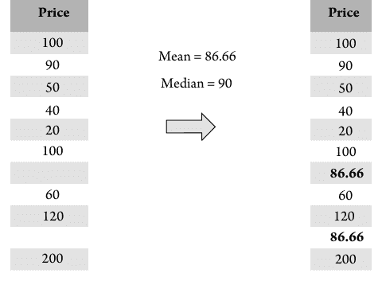

对于分类数据，缺失值用最频繁出现的值填充，即该属性的众数。例如，如果某一行的“城市”列信息缺失，可以用数据集中最频繁出现的城市来填充。用均值、中位数或众数替换空值是比删除行产生更好结果的最佳方法。此技术的优缺点如下：

###### 用均值/中位数/众数替换缺失值的优点

- 当数据规模较小时，这种方法是更好的选择。
- 与删除包含缺失值的列和行相比，此方法有助于防止数据丢失。
- 易于实现。
- 是获取完整数据集的快速方法。

###### 用均值/中位数/众数替换缺失值的缺点

- 它会增加原始变量分布的失真。
- 它会干扰数据的方差。方差衡量一组数据（数字）与其均值（平均值）的分散程度，因为我们用均值替换缺失值，假设缺失值的方差为零。

##### 通过预测值来填充缺失值

另一种填充缺失值的方法是使用机器学习技术预测相应的值。除非缺失值预期具有非常高的方差，否则该过程在准确性方面会产生更好的性能。例如，线性回归等技术可以替换温度属性中的空值。此技术的优缺点如下：

###### 通过预测值来填充缺失值的优点

- 与均值/众数/中位数方法不同，此方法考虑了变量之间的关系。
- 此方法导致模型参数的无偏估计。

###### 通过预测值来填充缺失值的缺点

- 计算量大，因为我们必须训练模型来预测缺失值。

##### 通过分配唯一类别来填充缺失值

在此方法中，当存在缺失值时，我们用特殊类别或通用标签（如“未知”或“U”）替换它们。这是处理缺失数据的一种简单方法。然而，使用此方法可能会在数据中引入重复模式，因为频繁使用“未知”等全局标签。因此，此方法并不常用。此技术的优缺点如下：

###### 通过分配唯一类别来填充缺失值的优点

- 由于没有为缺失值填充数值，因此方差较低。
- 添加了一个唯一的分类值以抵消数据丢失。

###### 通过分配唯一类别来填充缺失值的缺点

- 由于它向现有模型添加了新特征或值，可能导致性能不佳。

##### 通过观察手动填充缺失值

在此方法中，任何元组的缺失值都是手动填充的。当某些元组缺少少量字段/属性时使用此方法。此技术的优缺点如下：

###### 通过观察手动填充缺失值的优点

- 不需要为数据集中的每个属性创建带有缺失数据的预测模型。

###### 通过观察手动填充缺失值的缺点

- 耗时的过程。
- 不适用于大型数据集。

因此，我们可以得出结论，处理缺失值需要采用各种技术，如删除、用均值/中位数替换或使用高级算法，具体取决于缺失的性质和程度，以确保可靠和准确的数据分析。

#### 3.2.1.2 噪声数据的处理

噪声数据是数据清理任务中需要处理的另一个挑战。噪声可以定义为可测量变量中不需要的方差或某些随机错误。有多种技术可以处理噪声数据，如下所示。

- 平滑或分箱技术
- 聚类或异常值分析
- 回归

##### 平滑或分箱方法

我们通常使用“平滑”技术来从数据中去除噪声。为了平滑数据，我们通常使用分箱方法。分箱方法用于将属性的值划分为箱或桶。它广泛用于将一种类型的属性转换为另一种类型。例如，在处理之前，可能需要将实值数值特征（如温度）转换为具有冷、凉、暖和热值的名义特征。这被称为“离散化”数值属性。离散化有两种类型，即等间隔和等频率。

让我们通过将50名学生的数据集（分数为100分制）进行划分来理解这个过程，我们的目标是根据他们的分数将此数据集划分为10个箱。

在等间隔的情况下，我们将创建从0–10、10–20、20–30、30–40、40–50、50–60、60–70、70–80、80–90和90–100的箱。我们假设指定范围内的最大值不包括在内，即分数0–10表示分数>=0且<10。由于大多数学生的分数通常在50到80之间，有些箱可能已满，有些箱可能只有很少的实例，例如0–10、10–20、90–100等。

因此，根据等频率划分此数据集可能更好。让我们再次假设班级中有50名学生。我们想根据他们的分数将他们放入10个箱中。那么，我们不是为分数创建像0–10、10–20等的箱，而是首先根据学生的分数按降序（或升序）对记录进行排序。前五名学生（因为我们要为50名学生创建10个箱）分数最高的将被放入一个箱中，接下来的五名学生根据他们的分数将被放入另一个箱中，依此类推。如果我们的边界学生分数相同，则可以调整箱范围以将相同的学生容纳在一个箱中。例如，假设在按分数降序排列数据后，我们发现第五名和第六名学生的分数相同，都是85分。那么我们不能将一个学生放入一个箱，而将另一个分数相同的学生放入不同的箱。因此，我们调整箱范围，将前四名学生容纳在一个箱中（因为第五名和第六名学生的分数相同，我们不能将第五名学生放入箱1），接下来的五名放入另一个箱（意味着第五名和第六名学生将是箱2的成员）。或者，我们可以将箱范围向下调整，将前六名学生容纳在一个箱中（即第五名和第六名学生落入箱1），接下来的五名放入另一个箱。因此，在等频率下，每个箱的计数可能不相同，但它们会非常接近，而在等间隔的情况下，有些箱会负载很重，而大多数箱负载很轻。

因此，每个箱中具有相同数量的样本比等间隔效果更好，因为在等间隔的情况下，有些箱的成员会比其他箱少，这会影响训练模型的结果。

我们可以得出结论，在等间隔分箱中，我们计算箱大小，然后将样本放入适当的箱中。在等频率分箱中，我们允许箱大小变化，我们的目标是选择箱大小，使每个箱中大约有相同数量的样本。其思想是，如果每个箱具有相同数量的实例，则没有箱或样本会对最终结果产生更大或更小的影响。

有三种执行平滑的方法，如下所示：

**按箱均值平滑：** 在此方法中，箱中的每个值都被其均值替换。

**按箱中位数平滑：** 在此方法中，计算箱的中位数值并替换每个箱值。

**按箱边界平滑：** 在按箱边界平滑中，使用最小值和最大值确定箱边界。然后，每个计算出的箱值都被替换为最接近的边界值。

为了进一步理解平滑过程，让我们考虑以下示例。这里，我们有摄氏度的温度数据，我们希望应用分箱来去除此数据集中的噪声。

考虑温度数据（摄氏度）：24, 25, 28, 29, 21, 26, 99, 4, 8, 9, 15, 21

**按箱均值平滑：** 在第一步中，给定的温度数据（摄氏度）被排序。

排序后的数据：4, 8, 9, 15, 21, 21, 24, 25, 26, 28, 29, 99

将数据划分为等宽的区间，例如区间1（4, 8, 9, 15）、区间2（21, 21, 24, 25）、区间3（26, 28, 29, 99）

- 区间1的均值：(4+8+9+15)/4 = 9
    （区间内有4个值；因此总和除以4）
    : 9, 9, 9, 9
- 区间2的均值：(21+21+24+25)/4 = 22.75≈23
    : 23, 23, 23, 23
- 区间3的均值：(26+28+29+99)/4 = 45.5≈46
    : 46, 46, 46, 46

数据中的所有元素都将被算术平均值替换，例如区间1变为9, 9, 9, 9，区间2变为23, 23, 23, 23，区间3变为46, 46, 46, 46。

**按区间中位数平滑：** 在此方法中，我们需要计算每个区间集合的中位数，然后用该中位数替换该区间集合的所有元素。让我们将此方法应用于以下示例数据。

排序后的数据：4, 8, 9, 15, 21, 21, 24, 25, 26, 28, 29, 99

- 区间1的中位数：4, 8, 9, 15
    : 四舍五入函数 (8+9)/2 = 8
    : 8, 8, 8, 8
- 区间2的中位数：21, 21, 24, 25
    : 四舍五入函数 (21+24)/2 = 23
    : 23, 23, 23, 23
- 区间3的中位数：26, 28, 29, 99
    : 四舍五入函数 (28+29)/2 = 28
    : 28, 28, 28, 28

**按区间边界平滑：** 在此方法中，需要选取最小值和最大值，并将最小值放在左侧，最大值放在右侧。区间边界内的中间值将被移动到与其距离最近的邻居值，如下所示。

排序后的数据：4, 8, 9, 15, 21, 21, 24, 25, 26, 28, 29, 99

- 对于区间1：
    区间边界前：4, 8, 9, 15
    这里4是最小值，15是最大值。由于8更接近4，9也比15更接近4。因此，8和9都将被替换为4。
    区间边界后：4, 4, 4, 15
- 对于区间2：
    区间边界前：21, 21, 24, 25
    这里21是最小值，25是最大值。由于24更接近25。因此，24将被替换为25。
    区间边界后：21, 21, 25, 25
- 对于区间3：
    区间边界前：26, 28, 29, 99
    这里26是最小值，99是最大值。由于28和29更接近26。因此，28和29都将被替换为26。
    区间边界后：26, 26, 26, 99

##### 聚类或异常值分析

聚类或异常值分析是一种通过聚类来检测异常值的方法。在聚类中，熟悉或相似的值被组织成组或簇，而那些位于这些簇之外的值被称为异常值或噪声。簇是基于相似性和相异性创建的。如图3.8所示，相似的数据被分组到簇中。这些组之外的数据被视为数据集中的噪声而被移除。

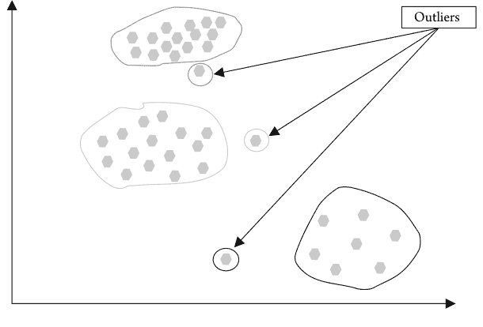

**图3.8** 数据聚类以识别异常值和噪声

##### 回归

回归是另一种通过对数据点拟合一条直线来实现数据平滑的方法。回归的核心目标是找到能够覆盖大多数数据点的最佳拟合线，而远离该线的数据点被视为噪声，如图3.9所示。

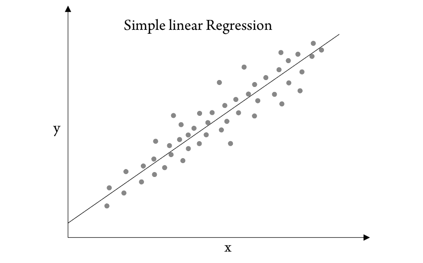

**图3.9** 用于识别噪声的回归

#### 3.2.1.3 不一致数据的处理

当数据库中同一实体的值彼此不一致时，就会发生数据不一致。简单来说，如果关于同一数据的两个条目彼此不一致，就会导致数据不一致。例如，在大学数据库中，一个表中提到学号5属于阿姆利则市。在另一个表中，提到学号5属于帕蒂亚拉。这里，同一个人（学号5）的两个条目不匹配。这被认为是数据不一致的情况。不一致通常是由数据冗余引起的。

消除不一致的解决方案是使用数据库规范化技术来减少数据冗余。有时，我们可以通过手动努力和外部参考来消除它。

### 3.2.2 数据集成

在数据收集阶段，我们通常从各种来源收集数据，而这些数据在格式、类型等方面通常彼此不匹配。因此，数据集成成为数据预处理过程中的一个关键阶段。数据集成涉及将来自多个来源（可能包括多个数据库或平面文件）的数据合并到一个统一的数据存储库中。

例如，我们有两个数据库A和B，其属性分别为Roll_Number和Rno。尽管两者含义相同，但这会导致集成问题。这个问题被称为实体识别问题。检测并解决它们对于数据集成很重要。为了解决此类问题，我们使用“元数据”。元数据是关于我们的数据的数据，它有助于解决实体识别问题。

数据集成还处理数据冗余。这是由于从多个来源集成数据而产生的。结果可能会有重复的属性或元组。可以通过仔细集成来自多个来源的数据来消除这些重复。

我们必须处理的另一个问题是数据中的度量差异。现实世界中的数据在不同来源中具有不同的值或度量的可能性非常高。例如，数据库A中的距离数据可能以公里表示，而数据库B中的距离数据可能以英里表示。此类信息在数据解释过程中会引起麻烦。为了解决这个问题，必须手动进行适当的转换，或者制定一个新的模型来完成这项工作，以使数据保持一致。

### 3.2.3 数据转换

如前所述，数据清理也涉及数据的修改。数据转换是关于将数据转换为适合分析和构建机器学习模型的适当格式。数据转换通常涉及以下操作：

- 聚合
- 特征缩放
- 特征选择
- 离散化
- 概念层次生成

让我们逐一讨论这些数据转换技术。

#### 3.2.3.1 聚合

数据聚合涉及从各种资源收集所需数据，并将其编译成汇总形式以构建机器学习模型。此过程旨在通过聚合来自多个来源的输入数据来生成高质量的数据。此过程在金融或业务数据的统计分析中很有用，可用于制定与产品、营销、定价和其他策略相关的决策。

#### 3.2.3.2 特征缩放

特征缩放意味着将数据置于相同的水平或范围内。

为了理解其重要性，让我们考虑一个房价预测数据集的例子。在这个数据集中，我们有面积、房间数量、价格等特征。面积的值尺度将与卧室数量和价格不同。价格可能是数百万或数十万，面积是数千平方英尺，而房间数量则在2到4之间。由于我们必须使用相同的算法处理数据，因此在处理之前将数据转换为相同的尺度或范围非常重要。因此，缩放就是将这些数据置于相同的水平。

使用相同的特征或属性尺度可确保在构建机器学习模型时每个属性贡献相等。

特征缩放有两种技术：归一化和标准化，如下所述。

##### 归一化

它也称为最小-最大缩放，因为变量在归一化后会缩小到0和1之间的固定数据值范围（对于正数据值）或-1和1之间的固定数据值范围（对于负数据值）。当标准差太小时，这是最好的缩放方法之一。

以下方程用于归一化输入变量：

$$X_{changed} = \frac{X - X_{min}}{X_{max} - X_{min}}$$

这里，$X_{changed}$ = 重新缩放或归一化后的值

$X$ = 输入变量的原始值

$X_{max}$ = 最大输入值

$X_{min}$ = 最小输入值

#### 归一化的局限性

归一化有一个局限性，即异常值。异常值是超出其他观测值正常范围的极端值。归一化的主要局限性在于它可能会放大异常值或极端值的影响。这意味着如果数据集中存在异常值，归一化可能无法有效处理其影响，并可能导致结果偏斜或失真。

让我们理解异常值的问题。例如，让我们考虑一个分数属性，范围从26到50。那么，在这种情况下，26将被映射到0，50将被映射到1，而此范围内的所有其他值将被拟合在0和1之间。但假设我们添加了另一个学生，他的分数是90，其余所有数据保持不变。那么，在这种情况下，26将被映射到0，90将被映射到1。同时，分数为50的学生（之前被映射到1）现在被映射到接近0.375的值，并且仅因为添加了一个异常值就显著降低，如图3.10所示。这个异常值将导致值向较低范围偏斜；同样，如果我们有一个非常小的异常值，它将导致值向较高范围偏斜。

| 添加异常值 | 添加异常值后的归一化分数 |
|---|---|
| 26 | 0 |
| 27 | 0.041 |
| 30 | 0.167 |
| 35 | 0.375 |
| 38 | 0.5 |
| 39 | 0.541 |
| 40 | 0.583 |
| 48 | 0.916 |
| 50 | 1 |

**无异常值 (90)**

| 添加异常值 | 添加异常值后的归一化分数 |
|---|---|
| 26 | 0 |
| 27 | 0.015 |
| 30 | 0.062 |
| 35 | 0.14 |
| 38 | 0.187 |
| 39 | 0.203 |
| 40 | 0.218 |
| 48 | 0.343 |
| 50 | 0.375 |
| 90 | 1 |

**有异常值 (90)**

**图 3.10** 异常值对归一化的影响

因此，如果我们的数据集中存在异常值，我们将使用另一种称为标准化的缩放技术。

## **标准化**

标准化是指对输入变量进行重新缩放，使得缩放后的所有变量保持标准差为1。

输入变量的标准分数使用以下公式计算。

$$X_{changed} = \frac{X - \mu}{\sigma}$$

其中 $X$ 是输入变量的值，$\mu$ 表示均值，$\sigma$ 是相对于 $\mu$（或均值）的标准差。

通常，对于何时使用归一化与标准化没有固定规则。但是，如果你的数据确实存在异常值，请使用标准化；否则，使用归一化。

## **3.2.3.3 特征选择**

有时，为了训练模型，我们有大量的输入特征。我们必须确保只在相关特征上训练模型。否则，模型可能会捕获不重要的相关性并从异常值（噪声）中学习。在这种情况下，模型的准确性会降低。因此，只选择相关特征来训练模型以产生高质量模型非常重要。从数据集中选择重要特征的过程称为特征选择。特征选择是决定哪些属性或特征对我们的分析最重要的过程。

因此，特征选择是通过仅使用相关数据并消除数据中的噪声来减少模型输入变量的方法。

为了进一步理解这个概念，让我们考虑图3.11中的表格。该数据包含客户，列有Customer_Id、Name、City、Age、Salary和Purchase。

| Customer_Id | Name | City | Age | Salary | Purchase |
|---|---|---|---|---|---|
| 1000 | Raj | Amritsar | 55 | 80000 | 0 |
| 1001 | Tanya | Jalandhar | 45 | 200000 | 1 |
| 1002 | Rahat | Patiala | 18 | 90000 | 1 |

**图 3.11** 客户数据集

在这个数据集中，我们需要预测客户是否会购买产品“Alexa”。直观地可以得出结论，在这种情况下，Customer_Id、Name和City不会在决策中起任何作用，而决策可以基于客户的Age和Salary。因此，我们应该只选择Age和Salary作为输入属性，并丢弃Customer_id、Name和City字段来构建机器学习模型，如图3.12所示。

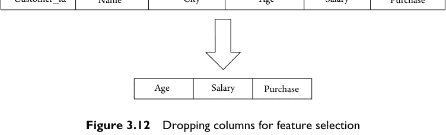

**图 3.12** 丢弃列以进行特征选择

在某些情况下，我们可以直观地决定重要特征并识别它们，但在大多数情况下，即使有领域知识，这也是不可能的。在这种情况下，包装器和过滤器是两种常用的特征选择技术。

**包装器**

包装器创建所有可能的特征子集，并通过考虑每个可能的特征子集来构建机器学习模型。包装器逐一测试每个模型，以获得最终效果最佳的特征子集。从其工作原理可以明显看出，它计算密集且速度慢，但成功率很高。

**过滤器**

过滤器根据原始特征与标签的关系对其进行排序，然后选择排名靠前的特征。为了找到输入属性与标签的关系，它使用相关性和互信息作为决策标准。我们使用P值、信息增益、卡方检验以及前向和后向消除方法来决定特征选择的重要特征。我们将在第7章“多元线性回归与多项式回归”中进一步讨论这一点。

## **3.2.3.4 离散化**

数据离散化涉及将大量数据值转换为更小、更易于管理的值。简单来说，它是一种将连续数据转换为不同区间的方法，以减少数据分析和管理的复杂性，同时力求最小化任何信息损失。

它有点类似于分箱，但通常发生在数据清理之后。让我们通过一个例子来进一步理解这个概念。假设我们有一个Age属性，其给定值如下所示。

| Age | 2, 6, 10, 5, 8, 12, 15, 18, 14, 19, 20, 32, 34, 38, 43, 45, 47, 71, 75, 79, 76 |
|---|---|

在这种情况下，我们不必直接处理Age字段中的这些数字，而是可以将它们离散化为绝对值，如child、young、mature、old，如下所示。

| Child | 年龄 2, 5, 6, 8, 10 |
|---|---|
| Young | 年龄 12, 14, 15, 18, 19, 20 |
| Mature | 年龄 32, 34, 38, 43, 45, 47 |
| Old | 年龄 71, 75, 76, 79 |

## **3.2.3.5 概念层次生成**

概念层次生成在原始数据中不存在的特征内部和之间添加层次结构，以实现更好的数据管理和分析。

例如，假设我们的数据集包含狗、马和麻雀。在这种情况下，我们可以将狗和马归入哺乳动物类别，将麻雀归入鸟类类别，以便更好地管理数据。

## **3.2.4 数据缩减**

数据缩减是关于减少维度（属性总数）。使用数据缩减技术，可以在不损害原始数据完整性的情况下，以缩减的方式表示数据集。假设我们有一个包含500个属性的数据集；那么它意味着它有500个维度。有两种技术可以减少数据维度：特征选择和特征提取。

### **特征选择**

特征选择涉及从原始特征中选择一个更小的特征子集。这样做是为了简化模型并提高计算效率。减少维度的最简单方法是使用特征选择技术移除不相关的属性或维度。特征选择中的挑战是从所有可用特征中识别不相关的特征，这有时会导致信息损失。

### **特征提取**

特征提取涉及从原始特征集中提取信息以构建新的特征子空间。特征提取背后的核心概念是在保留最重要信息的同时进行数据压缩。

特征选择和特征提取技术之间的关键区别在于，特征选择中保留了原始特征。相反，在特征提取的情况下，原始数据被转换到一个新的特征空间，如图3.13所示。

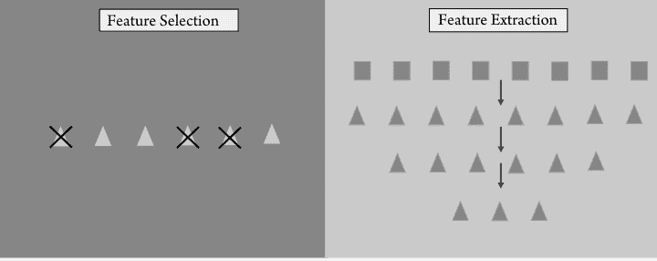

**图 3.13** 特征选择 vs. 特征提取

需要注意的是，特征提取和特征工程是密切相关但不同的概念。特征提取涉及通过主成分分析（PCA）等技术降低数据维度，而特征工程则侧重于创建或修改特征以增强机器学习模型的性能，包括组合特征、创建交互项或应用数学变换等方法。

PCA是最常用的特征提取技术，在下一小节中，我们将详细讨论这项技术。

## **3.2.4.1 主成分分析（PCA）**

PCA是一种降维方法，允许我们发现数据集中的模式和相关性。它将数据转换为重要的低维，而不会丢失任何关键信息。

### **PCA的逐步过程**

以下是执行PCA所需的步骤列表。

- i. 数据标准化
- ii. 计算协方差矩阵
- iii. 计算协方差矩阵的特征向量和特征值
- iv. 评估主成分
- v. 降低数据集的维度

让我们详细理解每个步骤。

### **步骤1：数据标准化**

标准化是将数据特征缩放到相同尺度的过程，以便所有变量及其值都位于相同的范围内。

如前所述，标准化是一种重要的特征缩放技术，用于使输入特征的值处于相同的尺度。例如，一个特征可能在0.0001的范围内，而另一个可能在数百万的范围内。因此，为了消除偏差，我们训练的模型必须通过应用以下公式使用标准化对数据进行特征缩放。

$$X_{changed} = \frac{X - \mu}{\sigma}$$

其中X是输入变量的值，$\mu$ 表示均值，$\sigma$ 是相对于 $\mu$（或均值）的标准差。

之后，下一步将是计算协方差矩阵，如下所述。

### **步骤2：计算协方差矩阵**

协方差矩阵用于识别数据集中多个特征之间的相关性和依赖性。相关性可以是两个或更多特征之间的。

协方差矩阵是一个 $n \times n$ 矩阵，其中 $n$ 是数据集中特征的最大数量。矩阵中的每个元素代表相应变量的协方差。

例如，我们有一个包含变量 $x$ 和 $y$ 的二维（2D）数据集。协方差矩阵是一个2x2矩阵，如下所示。

$$\begin{bmatrix} Cov(x,x) & Cov(x,y) \\ Cov(y,x) & Cov(y,y) \end{bmatrix}$$

这里，$Cov(x, x)$ 是变量 $x$ 与 $x$ 的协方差；$Cov(x, y)$ 表示变量 $x$ 与 $y$ 的协方差；$Cov(y, x)$ 描绘了变量 $y$ 与 $x$ 的协方差；$Cov(y, y)$ 显示了变量 $y$ 与其自身的协方差。需要注意的是，负的协方差值表示相应变量成反比，这意味着如果一个增加，另一个变量则减少（负相关）。正协方差表示两个变量彼此成正比，这意味着两个变量同时增加或减少（相关）。

下一步是从协方差矩阵中找出特征向量和特征值。

###### 步骤 3：计算协方差矩阵的特征向量和特征值以确定主成分

特征向量和特征值是用于从协方差矩阵计算主成分的基本线性代数概念。特征向量和特征值的作用如图 3.14 所示。

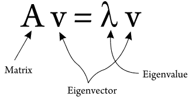

**图 3.14** 矩阵及其特征向量和特征值

这里 A 是一个矩阵，v 是一个特征向量，λ 是特征值。

为了进一步理解这个概念，假设我们有一个二维数据集，如下所示。

矩阵 A 是 $\begin{bmatrix} 2 & 4 \\ 3 & 13 \end{bmatrix}$，一个特征向量 v 是 $\begin{bmatrix} 1 \\ 3 \end{bmatrix}$。让我们求出特征值（$\lambda$）的值。

$A \times v = \begin{bmatrix} 2 & 4 \\ 3 & 13 \end{bmatrix} \begin{bmatrix} 1 \\ 3 \end{bmatrix} = \begin{bmatrix} 2 \times 1 + 4 \times 3 \\ 3 \times 1 + 13 \times 3 \end{bmatrix} = \begin{bmatrix} 14 \\ 42 \end{bmatrix}$

由于 Av = λv 且 v 是 $\begin{bmatrix} 1 \\ 3 \end{bmatrix}$。

因此，λ 将是 14，如下所示。

$14 \begin{bmatrix} 1 \\ 3 \end{bmatrix} = \begin{bmatrix} 14 \\ 42 \end{bmatrix}$

让我们简要讨论一下计算特征值（$\lambda$）的数学方法。

Av = λv

让我们在不影响结果的情况下，引入一个单位矩阵，如下所示。

Av = λIv

单位矩阵的主对角线上是 1，其他位置都是 0，如下所示。

$\begin{bmatrix} 1 & 0 & 0 \\ 0 & 1 & 0 \\ 0 & 0 & 1 \end{bmatrix}$

一个 3×3 的单位矩阵

将所有项移到等式左边。

Av - λIv = 0

当向量 v 非零时，可以使用行列式（从矩阵导出的一个数学值）来求解 λ 的值。

| A - λI | = 0

让我们将这个方程应用于前面示例中提到的数据。

$\begin{bmatrix} 2 & 4 \\ 3 & 13 \end{bmatrix} - \lambda \begin{bmatrix} 1 & 0 \\ 0 & 1 \end{bmatrix} = 0$

$\begin{bmatrix} 2 & 4 \\ 3 & 13 \end{bmatrix} \begin{bmatrix} 1-\lambda & 0 \\ 0 & 1-\lambda \end{bmatrix} = 0$

$\begin{bmatrix} 2-\lambda & 4 \\ 3 & 13-\lambda \end{bmatrix} = 0$

(2 - λ)(13 - λ) - 3 × 4 = 0

26 - 2λ - 13λ + λ² - 12 = 0

λ² - 15λ + 14 = 0

λ² - (1 + 14)λ + 14 = 0

λ² - 1λ - 14λ + 14 = 0

λ(λ - 1) - 14(λ - 1) = 0

λ = 1, 14

这里，我们得到 1 和 14 作为两个可能的特征值，这与我们之前计算的 λ 为 14 相符。

计算出特征向量和特征值后，我们可以进入下一步来评估 PCA。

###### 步骤 4：评估主成分

主成分组织信息以获取数据集或特征的所有重要属性。它通过消除不必要的成分来降低数据的维度，而不会丢失任何关键信息。PCA 将丢弃不需要的信息，剩余的成分被视为新的变量。

如果我们有 10 维数据，就会有 10 个主成分。PCA 试图将所需信息拟合到第一个成分中。同样，第二个主成分将从剩余的特征集中添加最多所需的信息。第三个成分从剩余特征列表中导入全部信息，依此类推，如图 3.15 所示。

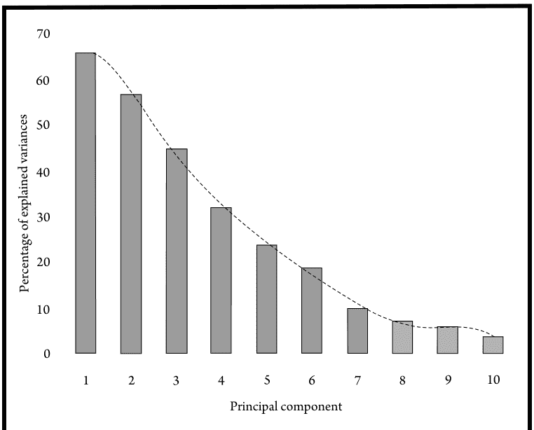

**图 3.15** 主成分的概念

主成分的组织旨在有效降低维度，同时保留基本信息。通过丢弃信息含量较低的成分，我们可以将剩余的成分视为新的变量。

重要的是要理解，主成分缺乏可解释性和现实世界意义，因为它们是通过原始变量的线性组合构建的。

###### 步骤 5：降低数据集的维度

PCA 算法依赖于计算出的特征向量和特征值，然后根据它们的特征值按降序排列。这种排列使得能够根据其重要性来识别主成分。与最高特征值相关的特征向量在此上下文中具有最重要的价值。通过这种方式，可以从特征中移除重要性较低的值，以降低数据的维度。以向量矩阵形式存在的剩余成分被称为特征向量。

计算主成分的最后一步涉及构建特征向量或特征矩阵。该矩阵包含具有关于数据集最高信息含量的基本数据变量。最终的主成分封装了最关键和最相关的数据集信息。

特征向量本质上是一个由选定的特征向量作为列组成的矩阵，作为降维的第一步。通过仅保留“*n*”个可用特征向量中的“*p*”个，结果数据集被降低到“*p*”维。这个使用协方差矩阵中的特征向量创建的特征向量，将数据从其原始轴重新定向到与主成分对齐，以进行进一步分析。

## 3.3 处理分类数据

在机器学习的数据预处理阶段，将分类数据转换为数字至关重要。如图 3.3 所示的示例数据集，最后一列 City 是分类变量。它有三个不同的值，即 *Patiala*、*Ludhiana* 和 *Jaipur*。由于字符串无法被机器学习模型直接处理，我们需要将它们转换为数字。将数据转换为二进制向量的常用方法是标签编码和独热编码。这些方法将分类数据转换为二进制向量。让我们更详细地讨论每种方法。

标签编码方法用数字标签替换分类数组的所有值。这是一种对分类变量的多行进行编码的有效方法。它用 0 到 *n*-1 之间的值对标签进行编码，其中 *n* 是不同标签的数量。在我们的示例数据集中，我们有一个 City 属性，它有三个不同的值，因此在标签编码中，我们可以为 City 的每个唯一值分配一个标签，如图 3.16 所示。

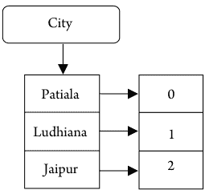

**图 3.16** 分类变量的标签化

示例数据集将使用标签编码进行处理，如图 3.17 所示。City 值已被编码为数字 0、1 和 2。

由于在数学上，2 大于 1 和 0，人们可能会误解 Jaipur（编码为 2）大于 Ludhiana（编码为 1）或 Patiala（编码为 0）。因此，在处理过程中，编码为 2 的城市将比分配了小于 2 的值的城市获得更大的权重。为了避免这种情况，使用了独热编码。

| Time IST | Soil Moisture | Temperature | Humidity | Pressure | Luminosity | City |
|---|---|---|---|---|---|---|
| 2/9/2021 14:34 | 1322.625 | 19.66 | 91.00 | 98350.5 | 424.43 | 0 |
| 2/9/2021 14:35 | 1322.538 | 19.63 | 91.04 | 98355.11 | 423.56 | 0 |
| 2/9/2021 14:36 | 6326.18 | 14.21972 | 99.67 | 98577.54 | 134.70 | 1 |
| 2/9/2021 14:38 | 6326.612 | 14.217918 | 99.71 | 98577.7 | 134.63 | 1 |
| 2/9/2021 14:39 | 386.39 | 24.26 | 65.27 | 98250.50 | 632.59 | 2 |
| 2/9/2021 14:40 | 386.40 | 24.34 | 65.25 | 98250.28 | 632.01 | 2 |

**图 3.17** 标签编码后的数据

独热编码器将每个绝对值转换为一个新列，并为这些列分配二进制值 1 或 0。在这种情况下，City 有三个唯一值，因此我们将为每个 City 的唯一值创建三个单独的列，即 Patiala、Ludhiana 和 Jaipur，如图 3.18 所示。

它根据 City 字段中的相应值在这些列中填充二进制值。第一行的 City 字段值是 Patiala，因此 Patiala 列将填充 1，而第一行的其他列将填充 0。同样，对于第 3 行，Ludhiana 字段将填充 1，其他字段填充 0。遵循相同的方法，整个数据集的最终条目如图 3.18 所示。

| Time IST | Soil Moisture | Temperature | Humidity | Pressure | Luminosity | City | Patiala | Ludhiana | Jaipur |
|---|---|---|---|---|---|---|---|---|---|
| 2/9/2021 14:34 | 1322.625 | 19.66 | 91.00 | 98350.5 | 424.43 | Patiala | 1 | 0 | 0 |
| 2/9/2021 14:35 | 1322.538 | 19.63 | 91.04 | 98355.11 | 423.56 | Patiala | 1 | 0 | 0 |
| 2/9/2021 14:36 | 6326.18 | 14.21972 | 99.67 | 98577.54 | 134.70 | Ludhiana | 0 | 1 | 0 |
| 2/9/2021 14:38 | 6326.612 | 14.217918 | 99.71 | 98577.7 | 134.63 | Ludhiana | 0 | 1 | 0 |
| 2/9/2021 14:39 | 386.39 | 24.26 | 65.27 | 98250.50 | 632.59 | Jaipur | 0 | 0 | 1 |
| 2/9/2021 14:40 | 386.40 | 24.34 | 65.25 | 98250.28 | 632.01 | Jaipur | 0 | 0 | 1 |

**图 3.18** 为每个名义值创建三个单独的属性

这些新生成的列被称为**虚拟变量**。这些向量用于编码分类信息。这些虚拟变量继承了原始分类列的属性，有效地表示并纳入了其在数据集中的范围。

我们已将名义字段City转换为对应的三个数值字段*Patiala*、*Ludhiana*和*Jaipur*。它们承载了与City字段所捕获的相同信息。因此，我们可以引入这些列并忽略City列。替代名义属性（即City）引入的列是虚拟变量（即*Patiala*、*Ludhiana*和*Jaipur*），如图3.19所示。

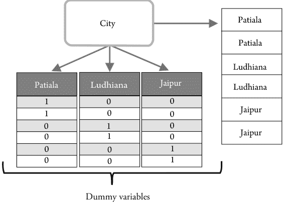

由于这三个虚拟列包含二进制值，仅需两列即可识别城市。如果其值为1，则表示其运营来自该城市；如果两个城市的值均为0，则其运营来自第三个城市。因此，我们可以仅使用两个虚拟变量而非三个来捕获相同的信息。所以，包含所有虚拟变量意味着为我们的模型增加了冗余。

一个或多个独立变量预测另一个变量（除因变量外）称为**多重共线性**。因此，在一个包含所有虚拟变量的模型中，我们可以从其他属性确定某个属性的值，因为如果给定行的所有其他属性为0，其值将为1；而如果任何其他属性的值为1，其值将为0。结果，它们将无法正常工作。这个问题被称为**虚拟变量陷阱**。

因此，如图3.20所示，所有信息可以仅使用两个虚拟变量来说明，而不是使用三个虚拟变量。

需要注意的是，对于一个具有*n*个不同值的名义列，引入的虚拟变量数量始终为*n*–1。

至此，我们结束了用于构建ML模型的不同数据预处理技术。图像数据的数据预处理已在第18章“深度学习与卷积神经网络”中讨论。

| Time 1ST | Soil Moisture | Temperature | Humidity | Pressure | Luminosity | D1 | D2 |
|---|---|---|---|---|---|---|---|
| 2/9/2021 14:34 | 1322.625 | 19.66 | 91.00 | 98350.5 | 424.43 | 0 | 0 |
| 2/9/2021 14:35 | 1322.538 | 19.63 | 91.04 | 98355.11 | 423.56 | 0 | 0 |
| 2/9/2021 14:36 | 6326.18 | 14.21972 | 99.67 | 98577.54 | 134.70 | 1 | 0 |
| 2/9/2021 14:38 | 6326.612 | 14.217918 | 99.71 | 98577.7 | 134.63 | 1 | 0 |
| 2/9/2021 14:39 | 386.39 | 24.26 | 65.27 | 98250.50 | 632.59 | 0 | 1 |
| 2/9/2021 14:40 | 386.40 | 24.34 | 65.25 | 98250.28 | 632.01 | 0 | 1 |

**图3.20** 处理后的数据

#### 提醒我

- 数据预处理是一个重要的阶段，涉及将原始数据转换为可理解的格式。
- 数据预处理的各个阶段包括数据清洗、数据集成、数据转换和数据规约。
- 在数据清洗中，填充缺失值、平滑噪声数据、解决不一致性，并识别和移除异常值以清理数据。
- 数据集成是一种将来自大量来源（如多个数据库、平面文件或数据立方体）的数据组合成统一数据存储的方法。
- 数据转换是将数据整合或转换为适合机器学习的其他标准形式。
- 数据转换通常涉及聚合、特征缩放、特征选择、离散化和概念层次生成。
- 使用数据规约技术，可以在不实际损害原始数据完整性的情况下，以规约的方式表示数据集。
- **特征选择**是从数据集中识别和选择最具信息量和相关特征的过程，以提高模型性能和可解释性。
- **特征提取**涉及从原始特征集中提取/派生信息，以创建新的特征子空间。特征提取背后的主要思想是压缩数据以保留最相关的信息。
- 特征选择和特征提取技术之间的关键区别在于，特征选择中保留了原始特征。相反，在特征提取的情况下，原始数据被转换到一个新的特征空间。
- **主成分分析（PCA）**是最常用的特征提取技术。
- PCA的步骤包括标准化数据、计算协方差矩阵、计算协方差矩阵的特征向量和特征值，以及根据它们对方差的贡献选择主成分。

#### 附加资源

##### 书籍

- Bhatia, Parteek (2019). *Data Mining and Data Warehousing: Principles and Practical Techniques*. Cambridge University Press.
- Gupta, G. K. (2014). *Introduction to Data Mining with Case Studies*. PHI Learning Pvt. Ltd.
- Han, Jiawei, Pei, Jian, and Kamber, Micheline (2011). *Data Mining: Concepts and Techniques*. Elsevier.
- Mitchell, Tom M. (2017). *Machine Learning*. McGraw Hill Education.
- Witten, Ian H., Frank, Eibe, Hall, Mark A., and Pal, Christopher J. (2016). *Data Mining: Practical Machine Learning Tools and Techniques*. Morgan Kaufmann.

##### 博客链接

- 使用Pandas清洗数据
https://www.w3schools.com/python/pandas/pandas_cleaning.asp


- 什么是数据预处理？正确执行的4个关键步骤，
https://learn.g2.com/data-preprocessing


- 机器学习中的数据预处理，https://www.javatpoint.com/data-preprocessing-machine-learning


#### 测试我（问题）

1.  数据挖掘过程中为什么需要数据清洗阶段？请用例子证明你的答案。
2.  归一化和标准化有什么区别？
3.  你所说的离散化是什么意思？为什么要执行它？
4.  等宽和等频有什么区别？请举例说明。
5.  什么是虚拟变量？
6.  举例说明数据预处理的不同阶段。
7.  你所说的特征工程是什么意思？
8.  什么是缺失值？如何处理缺失值？
9.  什么是异常值？如何检测数据中的异常值？
10. 我们所说的标签编码和序数编码是什么意思？
11. 你所说的数据转换是什么意思？
12. 解释独热编码。

# 4
## 在Python中实现数据预处理

**章节目标**

*   理解导入`NumPy`、`Pandas`、`Matplotlib`、`Scikit-Learn`等库的必要性。
*   学习导入数据集的步骤。
*   理解处理缺失值的过程。
*   讨论处理分类数据的步骤。
*   理解将数据集拆分为训练集和测试集的必要性和过程。
*   讨论使用归一化和标准化执行特征缩放的步骤。

机器学习（ML）算法在清洗后的数据上运行。通常，我们为构建ML模型收集的数据存在噪声、缺失值、不一致的数据类型和不同的数据尺度。这使得数据预处理成为准备数据以构建ML模型的一个非常重要的阶段。预处理是在将数据输入ML算法之前对数据应用转换的过程。简而言之，数据预处理代表了一组应用于数据的过程，使其适合ML算法。它通常涉及以下步骤：

**步骤1—导入库：** 涉及导入执行后续数据操作和清洗任务所需的必要库。

**步骤2—加载数据集：** 必须加载需要预处理的数据集。

**步骤3—处理缺失值：** 数据集通常包含缺失或空值；这些值需要得到适当处理。

**步骤4—处理分类数据**：在数据预处理阶段，处理通常包含多个类别的分类属性至关重要。处理分类数据成为确保这些属性得到正确处理和转换的重要一步。

**步骤5—将数据集划分为训练集和测试集**：训练和测试是机器学习最重要的部分；因此，在构建机器学习模型之前，我们需要将数据集划分为训练子集和测试子集。

**步骤6—特征缩放**：在数据集中，数据的范围通常不同，或者数据通常具有不同的尺度。因此，需要进行特征缩放以确保结果的一致性。

需要注意的是，并非所有这些步骤都必须应用于数据预处理。然而，根据数据集的性质，在构建模型时可能会跳过其中一些步骤。在接下来的章节中，我们将讨论这些步骤的重要性或必要性，并讨论如何在Python中执行这些步骤。

本章使用的所有代码和数据集均可通过以下链接获取，供您练习。您可以直接从该链接下载。

https://github.com/bhatiaparteek/ml_with_python/tree/main/chapter_4_preprocessing

本章使用的数据集灵感来源于Superdatascience的机器学习数据集。我们感谢Superdatascience允许我们参考这些数据集。

https://www.superdatascience.com/pages/machine-learning

## 4.1 步骤1：导入库

数据处理的第一步是导入库。这是一个强制性步骤，因为在使用库构建机器学习模型之前必须先导入它们。

库就像完成特定工作的工具。必须向库提供一些输入；作为回报，库将完成工作并最终返回一些输出。以下语法用于在Python中导入任何模块/库。

```
语法：import [模块/库名称]
```

让我们了解一些用于开始数据预处理任务的基本库。

**NumPy**：NumPy或Numeric Python是一个库，它将帮助您高效地管理多维数组。数组和矩阵是Python的关键部分，因此NumPy与其他机器学习模块一起构成了Python机器学习生态系统。NumPy是科学计算的基础包，包含以下组件。

- i. 其主要对象是同质的N维（多维）数组对象。
- ii. 它提供了复杂的函数（或广播函数）。
- iii. NumPy提供了集成用C/C++编写的原生语言代码的功能。
- iv. NumPy还执行线性代数运算、傅里叶变换和其他随机数运算。
- v. 所有重要的Python库都建立在NumPy之上。我们可以推断，如果不使用NumPy，我们将无法使用Matplotlib、Pandas、TensorFlow、Scikit-Learn和其他库，因为NumPy管理多维数组，这是数据科学的基本概念。

导入NumPy的语法如下：

```
import numpy
```

但有时，我们可能希望使用更短的名称来引用其类和方法，因为名称可能太长，无法在整个程序中重复使用。在这种情况下，别名就派上用场了。我们可以使用关键字“as”通过别名以更短的名称引用我们导入的模块或库。其用法如下所示。

```
语法：import [模块名称] as [别名或更短的名称]
import numpy as np
#numpy已导入，并使用关键字as将其别名为np
```

这里，#是单行注释。

**Pandas**：在数据科学中，Pandas是最受欢迎的库之一。它是一个开源库，为数据分析提供高性能工具，并为Python编程提供易于使用的数据结构。与SQL和Microsoft Excel类似，我们在Python中也使用二维（2D）表进行数据分析。

Pandas被认为是“Python的SQL”。在Python中使用Pandas，我们可以轻松处理2D数据表。Pandas在许多方面与SQL类似，因为它为我们提供了列选择、数据过滤、数据分组、运行函数（如平均值、中位数、均值、最小值、最大值等）、合并数据框等功能。其中大多数是进行任何机器学习项目之前的必要步骤，因此导入Pandas总是必要的。

要在您的笔记本中导入Pandas，请使用以下语句。

```
import pandas as pd
```

需要注意的是，NumPy提供多维数组的对象。相比之下，Pandas提供数据框——内存中的2D表，类似于SQL和Excel中分别使用的表或电子表格。

**Matplotlib**：它是Python最突出的数据可视化库之一。通过数据可视化，我们可以更好地理解数据，这可能会引导我们发现原始格式中看不到的重要信息。

Matplotlib是Python的2D绘图库。它以多种格式绘制高质量的图形。它支持不同的开发环境，如Web应用程序服务器、Jupyter笔记本等。在Matplotlib中用于绘制图形的命令类似于MATLAB。

要将Matplotlib导入您的笔记本，请使用以下语句。

```
import matplotlib
```

Matplotlib有一个称为plot的绘图框架。为了导入它，我们使用点表示法，如下所示。

```
import matplotlib.pyplot as plt
```

或者我们可以如下所示导入它。

```
from matplotlib import pyplot as plt
```

这里，我们使用了别名来直接访问它，而不是使用点表示法。

**Scikit-Learn库**：Python中最好的机器学习和预测分析库之一是Scikit-Learn。它被称为“Python中的机器学习”。它通过Python中的一致接口提供一系列算法。该库实现了所有重要的算法或机器学习模型。用户需要导入此库以执行数据预处理、模型选择、回归、分类、聚类、关联挖掘等。

导入Scikit-Learn库的语法如下：

```
import sklearn
```

可以理解Scikit-Learn库是以*sklearn*的名称导入的，它提供了多个类和方法，如下所示。

```
from sklearn.preprocessing import StandardScaler
# 用于在预处理阶段执行数据缩放。
from sklearn.model_selection import train_test_split
# 用于将数据集划分为训练集和测试集。
from sklearn.linear_model import LinearRegression
# 用于执行线性回归。
from sklearn.metrics import confusion_matrix
# 用于通过创建混淆矩阵进行性能分析。
```

我们将在接下来的章节中对此进行更多讨论。

因此，数据预处理第一步的代码片段如下：

## 代码片段：1

```
#导入所需的库
import numpy as np
import pandas as pd
import matplotlib.pyplot
from sklearn.preprocessing import StandardScaler
# 用于在预处理阶段执行数据缩放。
from sklearn.model_selection import train_test_split
# 用于将数据集划分为训练集和测试集。
from sklearn.linear_model import LinearRegression
# 用于执行线性回归。
from sklearn.metrics import confusion_matrix
# 用于通过创建混淆矩阵进行性能分析。
```

在下一步中，我们将看到如何加载合适的数据集。

## 4.2 步骤2：加载数据集

在加载数据集之前，第一步是设置工作目录。工作目录是包含数据集的文件夹，将用作代码的存储文件夹。请按照以下步骤将任何文件夹设置为工作目录。

- i. 打开Spyder。
- ii. 单击*文件资源管理器*以更改目录并移动到存储数据集文件的目录，如图4.1所示。

iii. 现在，点击*保存*按钮保存当前文件，系统会提示您指定文件存储的文件夹位置。通常，这与您存放数据集文件的位置相同。

iv. 文件保存后，点击*运行*按钮或按F5键，如图4.2所示。这将执行该文件，并将*文件资源管理器*中打开的目录设置为当前工作目录。


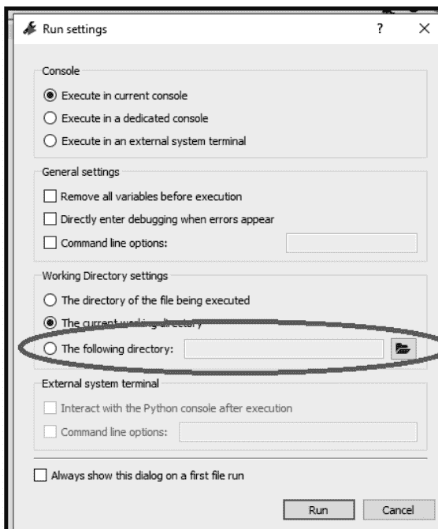

**图4.2** Spyder中的保存和运行文件选项

您也可以选择任何其他目录作为工作目录，如图4.2所示。

v. 选定当前工作目录后，我们的下一个任务是在Spyder笔记本中加载数据。这里，我们使用Pandas库的*read_csv()*方法创建一个名为*dataset*的数据框，如下所示，用于读取'salary.csv'文件。

导入数据集的代码如下。

```
代码片段：2

dataset = pd.read_csv('salary.csv')
# pd是pandas库的别名
```

如前所述，我们使用了`pandas`库的`read_csv()`方法，并将数据集文件名（`salary.csv`）作为参数传入。我们可以通过按F9键执行这行代码。现在，在控制台中，您可以看到这行代码已成功执行，没有任何问题。要查看变量`dataset`的值，我们现在转到`变量资源管理器`查看导入的数据集。双击它以查看整个数据集，如图4.3所示。

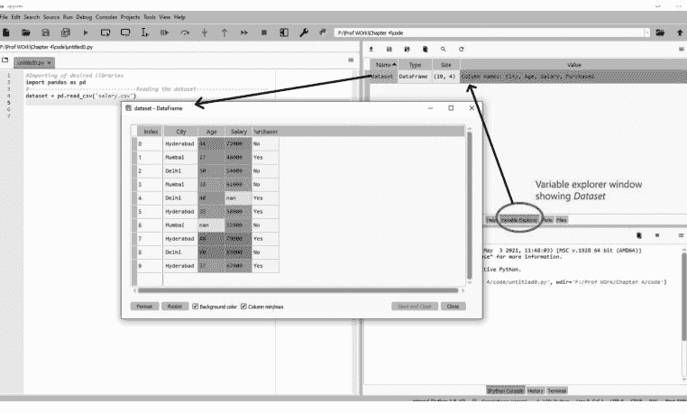

图4.4展示了本章用于数据预处理的数据集。

如图4.4所示，数据集中有10个不同人的10条观测记录。各列分别显示了他们的城市、年龄、薪资和是否购买（该人是否购买了产品）属性。必须注意，Python中的索引从0开始。因此，索引行从0开始，一直到9（共10条观测记录）。

一旦我们将整个数据集加载到数据框中，下一个任务就是为输入属性（自变量）和输出属性（因变量）创建对象数组。在我们的示例数据集（如图4.4所示）中，我们有（城市、年龄、薪资）作为输入属性，而（是否购买）是我们的输出属性。因此，我们将为输入创建一个对象数组X，为输出属性创建一个对象数组Y。

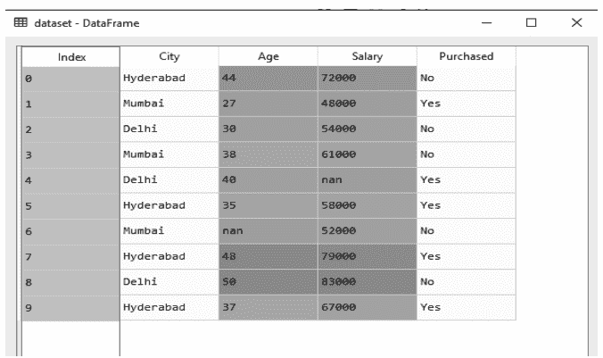

**图4.4** *dataset*数据框的内容

这可以使用Pandas数据框的`iloc[]`方法来选择所需的行和列。让我们进一步探讨`iloc[]`方法。

### iloc – Pandas选择与索引

使用Pandas库在Python中进行数据选择 | Parteek Bhatia, https://youtu.be/FXVYIIYbZNY

在Python中，我们有一个用于Pandas数据框的索引器，用于按位置或基于位置的索引进行选择。使用`iloc`的基本目的是通过数字选择行和列。

`iloc`的基本语法如下：它有两个参数，一个*行选择器*和一个*列选择器*，如下所示。

```
语法 >>>dataset.iloc[<行选择> , <列选择>]
```

有三种方式向`iloc`提供*行选择器*和*列选择器*，如图4.5所示。

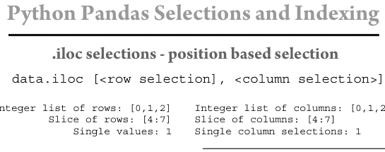

**图4.5** 执行行和列选择的各种方式

需要注意的是，在[ ]中我们使用“,”来分隔行选择和列选择。[ ]中“,”之前的所有值指的是行选择，而[ ]中“,”之后的所有值指的是列选择。

让我们详细讨论每种方式。

- i. **提供单个行和列的值**
    `dataset.iloc[1,1]`
    `#从第二行和第二列选择数据`
    `#因为索引从0开始`

- ii. **提供行列表和列列表**
    `dataset.iloc[[0, 2, 6, 24], [0, 5, 6]]`
    `#获取第一、第三、第七和第二十五行的数据`
    `#对应第一、第六和第七列`

- iii. **提供行切片和列切片**
    `dataset.iloc[0:5, 5:8]`
    `#获取前五行的数据，对应第六、第七`
    `#和第八列`

下面再举一些`iloc`的例子以帮助您理解。

```
#数据集导入
dataset = pd.read_csv('salary.csv')

基于行的操作
a = dataset.iloc[0]
# 数据框的第一行
a = dataset.iloc[1]
# 数据框的第二行
a = dataset.iloc[-1]
# 数据框的最后一行
a = dataset.iloc[-2]
# 数据框的倒数第二行

基于列的操作
c = dataset.iloc[:,0]
# 数据框的第一列，包含所有行
c = dataset.iloc[:,1]
# 数据框的第二列，包含所有行
c = dataset.iloc[:,-1]
# 数据框的最后一列，包含所有行
```

```
c = dataset.iloc[:,-2]
# 数据框的倒数第二列，包含所有行
```

## 使用iloc进行多行和多列选择

```
m = dataset.iloc[0:5]
# 数据框的前5行

m = dataset.iloc[:, 0:2]
# 数据框的所有行的前2列条目
```

### 其他操作

```
m = dataset.iloc[[0, 3, 6, 24], [0, 1]]
# 第一、第四、第七、第二十五行，对应第一和第二列。

m = dataset.iloc[[0, 3, 6, 24], [0, 5, 6]]
# 第一、第四、第七、第二十五行，对应第一、第六和第七列。

m = dataset.iloc[0:3, 5:8]
# 数据框的前3行，对应第五、第六、第七列。
```

您可以执行这些代码行并尝试它们，以验证输出，从而更好地理解。

现在，让我们继续讨论我们的问题陈述。我们的数据集有四个属性，即城市、年龄、薪资和是否购买。其中，前三个将作为输入属性，最后一个是输出属性。我们已经将数据集读入名为*dataset*的数据框中。下一步将是为输入和输出属性创建变量。在这里，我们讨论将输入属性或自变量放入X，将输出或因变量放入Y的语句。

为了准备X（自变量），我们希望选择所有行和除最后一列之外的所有列。数据集的最后一列是因变量，将构成Y。

因此，要创建X，我们可以使用以下语句。

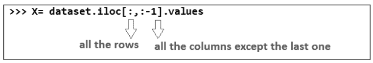

如图所示，我们将选择所有行和最后一列来准备Y。

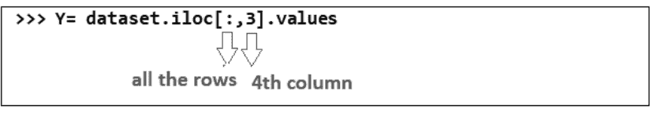

`.values`属性将提取的数据转换为NumPy数组。因此，我们可以得出结论，`iloc[]`用于提取所需的数据（行和列）。在`iloc`内部，需要在方括号内指定行和列。":"在这里表示“所有”。因此，对于X，我们使用以下语法提取除最后一列之外的所有列的所有行。

```
X = dataset.iloc[:, :-1]
```

在Python中，负索引用于表示列表最后一个元素的索引或数据集最后一列的索引。因此，-1表示除最后一列之外的所有列（-1对应最后一列）。

通过理解`iloc[]`的不同用例，我们获得了使用多种替代方法处理任务的能力。我们也可以使用以下代码来构建X。

```
X=dataset.iloc[:,0:3].values
# 所有行中第1、第2和第3列的数据。
```

这不是通用代码，因为对于不同的数据集，我们必须相应地指定列。通常，最后一列始终是类别属性，因此如果我们选择除最后一列之外的所有列来构建X，代码将更具通用性。这就是为什么我们使用这段代码来构建我们的X。

```
X=dataset.iloc[:, :-1].values
# 所有行中除最后一列之外的所有列的数据。
# 需要注意的是，这等同于下面给出的代码。
X=dataset.iloc[:, 0:-1].values
```

最后，我们运行这些命令并在控制台中输出X和Y的值，得到如图4.6所示的结果。

```
In [11]: X
Out[11]:
array([['Hyderabad', 44.0, 72000.0],
       ['Mumbai', 27.0, 48000.0],
       ['Delhi', 30.0, 54000.0],
       ['Mumbai', 38.0, 61000.0],
       ['Delhi', 40.0, nan],
       ['Hyderabad', 35.0, 58000.0],
       ['Mumbai', nan, 52000.0],
       ['Hyderabad', 48.0, 79000.0],
       ['Delhi', 50.0, 83000.0],
       ['Hyderabad', 37.0, 67000.0]], dtype=object)
In [12]: Y
Out[12]:
array(['No', 'Yes', 'No', 'No', 'Yes', 'Yes', 'No', 'Yes',
       'No', 'Yes'], dtype=object)
```

**图4.6** X和Y矩阵的内容

从图4.6可以明显看出，X包含了除Purchased列之外的所有行和列的值，同样，Y矩阵包含了最后一列（Purchased列）的所有值。这表明我们已正确准备了数据集。在图4.6中，你还可以注意到一些缺失值，它们被标记为nan（非数字），我们在图4.6中已高亮显示了这些条目。现在，让我们在完成步骤2后快速浏览一下我们的代码。

```python
#导入所需的库
import numpy as np
import pandas as pd

#-------------------------读取数据集-------------------------
dataset = pd.read_csv('salary.csv')
# pd是导入的pandas库的别名。
#-------------------为输入和输出属性创建变量-------------------
X = dataset.iloc[:, :-1].values
Y = dataset.iloc[:,3].values
```

## 4.3 步骤3：处理缺失值

在处理来自现实世界的数据集时，我们经常会遇到缺失值。在我们目前使用的数据集中，图4.6显示了两个缺失值（由nan表示）。在德里的一条观测记录中，薪资缺失（数据集的第五行），而在另一条城市为孟买的观测记录中，该人的年龄缺失（数据集的第七行）；我们在图4.6中已高亮显示了这些条目。因此，在这一步中，我们将采取一些适当的措施来处理这个问题。一些可能的措施如下：

-   删除包含缺失值的行：删除行可能不是一个合适的方法，尤其是对于小型数据集，因为它有丢失数据集中潜在有价值信息的风险。
-   用列的平均值替换缺失值是比删除行更好的方法。在这种方法中，首先确定缺失值对应的列，然后计算所选列所有值的平均值。然后，用计算出的平均值替换缺失值。

让我们编写代码来执行此操作。我们将使用Scikit-Learn库。要使用此库的方法和类，我们将首先导入它。输入以下代码以导入Scikit-Learn库的SimpleImputer类，因为它是sklearn的impute子库的一部分，如下所示。

```python
# 处理缺失数据
from sklearn.impute import SimpleImputer
```

这里，我们从`sklearn`的`impute`库中导入`SimpleImputer`类。接下来，我们将使用其构造函数创建一个名为`imputer`的`SimpleImputer`类对象，并提供一些参数，如下所示：

-   缺失值：第一个参数是`missing_values = np.nan`。这里，`nan`是数据集中需要被替换的值。这里，`np`是NumPy库，因为NumPy管理数据框的数学函数。
-   策略：不同的策略可以替换缺失值。这些策略分别是`mean`（均值）、`median`（中位数）和`most_frequent`（最频繁值）。请注意，`mean`将是默认策略。所以最终，我们有以下代码。

```python
imputer = SimpleImputer(missing_values = np.nan, strategy = 'mean')
```

`imputer`对象已设置好必要的参数，我们的下一步是将`imputer`对象拟合到我们的数据，即我们的特征矩阵X，仅关注包含缺失数据的列。

你能识别出示例数据集中包含缺失值的列索引吗？在我们的数据集中，我们有City、Age、Salary和Purchased列。是的，这是索引1和索引2。这里，索引1指的是Age列，索引2指的是Salary列，因为索引从0开始。

所以，对于X，我们将在括号内指定我们需要第2列和第3列（索引值分别为1和2）的所有观测值（行）。

从下面给出的代码片段中，在括号内，我们传递了":"作为第一个参数，表示所有行，"1:3"作为第二个参数，因为Python中的索引从0开始，并且上界总是不包含的，所以"1:3"意味着包括索引1和2，即数据集中的第二列和第三列。

```python
imputer = imputer.fit(X[:,1:3])
```

这将把imputer对象拟合到X。最后一步是用相应列的平均值替换X中的缺失数据。简单来说，我们必须用返回的值更新X，为此，我们必须使用它的`transform`方法。如下所示，我们将使用imputer对象调用`transform()`方法。

```python
X[:,1:3] = imputer.transform(X[:,1:3])
```

就是这样，我们已经完成了缺失值的处理。要查看结果，让我们运行脚本并在控制台中打印X的值。从图4.7(a)可以清楚地看出，缺失值已被处理。对于居住在德里的人，缺失的薪资现在被替换为Salary列的平均值，即63777.7777777778。同样，来自孟买的缺失年龄也被替换为Age列的平均值，即38.777777777。可以在Excel中计算这些列的平均值来验证结果，如图4.7(b)所示。

```python
In [7]: X
Out[7]:
array([['Hyderabad', 44.0, 72000.0],
       ['Mumbai', 27.0, 48000.0],
       ['Delhi', 30.0, 54000.0],
       ['Mumbai', 38.0, 61000.0],
       ['Delhi', 40.0, 63777.77777777778],
       ['Hyderabad', 35.0, 58000.0],
       ['Mumbai', 38.77777777777778, 52000.0],
       ['Hyderabad', 48.0, 79000.0],
       ['Delhi', 50.0, 83000.0],
       ['Hyderabad', 37.0, 67000.0]], dtype=object)
```

**图4.7(a)** X的缺失值已用相应列的平均值替换

| 城市 | 年龄 | 薪资 | 是否购买 |
| :--- | :--- | :--- | :--- |
| 海得拉巴 | 44 | 72000 | 否 |
| 孟买 | 27 | 48000 | 是 |
| 德里 | 30 | 54000 | 否 |
| 孟买 | 38 | 61000 | 否 |
| 德里 | 40 | nan | 是 |
| 海得拉巴 | 35 | 58000 | 是 |
| 孟买 | nan | 52000 | 否 |
| 海得拉巴 | 48 | 79000 | 是 |
| 德里 | 50 | 83000 | 否 |
| 海得拉巴 | 37 | 67000 | 是 |
| **平均值** | **38.77777778** | **63777.78** | |

**图4.7(b)** 在Excel中计算的City和Age列的平均值

## 4.4 步骤4：处理分类数据

在我们一直使用的数据集中，有两个分类变量：*城市*变量和*购买*变量。这些变量包含类别；例如，*城市*属性包含三个不同的类别：*孟买*、*德里*和*海得拉巴*。而Purchased包含*是*或*否*作为类别，被称为*分类变量*。

在处理机器学习模型时，分类变量可能会引起问题。机器学习模型是数学模型。它们基于数字工作，文本分类变量肯定会成为一个问题。因此，在构建机器学习模型之前，需要对分类变量进行预处理。这意味着我们必须将这些属性编码为数字，以便方程能够理解其属性。

预处理这些分类属性的一个简单想法是将它们标记为数字，如0、1、2、3等。为此，Scikit-Learn库在其预处理子库中有一个`LabelEncoder`类。现在，让我们编写代码，使用`LabelEncoder`类来标记这些分类属性。

首先，我们将创建一个`LabelEncoder`类的对象，命名为`labelEncoder_X`。接下来，我们将对矩阵X的第一列（即City）使用`LabelEncoder`类的`fit_transform()`方法。它将首先在X的第一列上拟合标签编码器，然后用标记值0、1、2等转换其第一列（即更新City列）。因此，它等同于`fit()`和`transform()`，即我们可以使用一个方法`fit_transform()`，而不是分别调用这两个方法。如下所示，以下代码将把City值编码为标签或数字。

```python
#对分类属性城市进行标签编码
from sklearn.preprocessing import LabelEncoder
labelEncoder_X = LabelEncoder()
X[:, 0] = labelEncoder_X.fit_transform(X[:, 0])
print(X[:, 0])
```

运行代码片段4后，我们得到如图4.8所示的输出。输出包含矩阵X第一列的10个值。但这次，这些值是经过编码的，它们不再有城市的文本名称。每个城市值都已被替换为其标签值0、1和2。因此，我们现在已正确编码了矩阵X的第一列。

```python
In [13]:
    ...: 
    ...: from sklearn.preprocessing import LabelEncoder
    ...: labelEncoder_X = LabelEncoder()
    ...: X[:, 0] = labelEncoder_X.fit_transform(X[:, 0])
    ...: print(X[:, 0])
[1 2 0 2 0 1 2 1 0 1]
```

**图4.8** 代码片段4的输出

现在，让我们在控制台中输入变量X并按回车键。这将显示X的当前值，如图4.9所示，我们可以看到*德里*被编码为0，*海得拉巴*为1，*孟买*为2。

但这种编码给我们带来了一个新问题。分类变量的问题仍然存在，尽管我们已经将文本值更改为数字，现在我们可以将这些数字包含在机器学习模型（或数学方程）中。然而，由于1大于0，2大于1，模型会解释为*德里*的优先级低于*海得拉巴*或海德拉巴的优先级低于孟买。这显然是一个谬误，因为海德拉巴、孟买和德里是三个互不相关的类别，因此无法进行比较。为避免这种情况，我们现在将通过实施独热编码来引入虚拟变量的概念。

```
In [9]: X
Out[9]:
array([[1, 44.0, 72000.0],
       [2, 27.0, 48000.0],
       [0, 30.0, 54000.0],
       [2, 38.0, 61000.0],
       [0, 40.0, 63777.],
       [1, 35.0, 58000.0],
       [2, 38.77777777777778, 52000.0],
       [1, 48.0, 79000.0],
       [0, 50.0, 83000.0],
       [1, 37.0, 67000.0]], dtype=object)
```

**图 4.9** 矩阵 X 的编码后城市列

### 4.4.1 独热编码

在独热编码中，我们将为城市列创建三个虚拟列，即虚拟列的数量等于分类属性中的唯一值数量。在城市列中，我们有三个唯一值或类别，因此我们将把它分成三列，每列对应一个城市，即一列代表德里，一列代表孟买，一列代表海德拉巴。这些列中的每一列的值都将是 0 或 1。例如，如果我们在德里列中，对于某个观测值，其值为 0，这意味着该人不属于德里；如果值为 1，则表示他属于德里。

因此，为了创建这些虚拟变量，我们将使用另一个称为 `OneHotEncoder` 类的类。Scikit-Learn 库在其预处理子库中有一个 `OneHotEncoder` 类。现在，让我们编写代码，使用 `OneHotEncoder` 类来标记这些分类属性。在 `OneHotEncoder` 中，属性的每个类别都被映射到一个包含 0 和 1 的向量，表示特征的缺失或存在。

要将编码后的数据转换回数据变量，我们必须使用 `ColumnTransformer` 类，为此，我们需要导入 sklearn 的 compose 库，如代码片段 5 所示。

代码片段：5

```
#One-hot encoding categorical attribute city
from sklearn.preprocessing import OneHotEncoder
from sklearn.compose import ColumnTransformer
ct = ColumnTransformer(transformers=[('encoder', OneHotEncoder(), [0])], remainder='passthrough')
```

```
X = np.array(ct.fit_transform(X))
print(X)
```

在这里，我们通过传递两个参数，即 `transformers` 和 `remainder`，来创建 `ColumnTransformer` 类的一个对象。在 `transformer` 参数中，我们指定编码器为 `OneHotEncoder()`，它应用于索引为 [0] 的列，即城市列。我们指定 `remainder = passthrough`，因为默认情况下，其值为 `drop`。`remainder = drop` 意味着只有 `transformers` 中指定的列会被转换并组合到输出中，而未指定的列将被丢弃。因此，如果我们使用默认值，那么只有城市列会被转换，而其他列将从数据集中被丢弃。但我们必须保留其他列，因此必须指定 `remainder = passthrough`。在这种情况下，所有未在 `transformers` 中指定的剩余列将自动被传递。这意味着当我们对 X 调用 `fit_tranform()` 方法时，它会将转换后的列（即城市列）与其他数据集列连接起来，这样，城市列就通过独热编码进行了转换，如图 4.10 和 4.11 的输出所示。

在输出中，城市的第一列现在已被三列（其值为浮点格式的 1 或 0）所取代。

```
In [21]: print(X)
[[0.0 1.0 0.0 44.0 72000.0]
 [0.0 0.0 1.0 27.0 48000.0]
 [1.0 0.0 0.0 30.0 54000.0]
 [0.0 0.0 1.0 38.0 61000.0]
 [1.0 0.0 0.0 40.0 63777.77777777778]
 [0.0 1.0 0.0 35.0 58000.0]
 [0.0 0.0 1.0 38.77777777777778 52000.0]
 [0.0 1.0 0.0 48.0 79000.0]
 [1.0 0.0 0.0 50.0 83000.0]
 [0.0 1.0 0.0 37.0 67000.0]]
```

**图 4.10** 控制台上的 OneHotEncoding 结果

在这种情况下，创建这三列被称为创建虚拟变量。它们被称为虚拟变量，因为它们并非完全存在于原始数据集中，而是为了处理属性的分类特征而创建的。

虚拟变量陷阱，也称为多重共线性问题，发生在一组虚拟变量中的一个类别可以被其他类别预测时。为了处理这个问题，一个常见的方法是简单地丢弃其中一个虚拟变量。通过移除一个类别，剩余的类别是线性无关的，从而有效地消除了多重共线性问题。

以下代码可用于解决虚拟变量陷阱。

```
#### Avoiding the Dummy Variable Trap
X = X[:, 1:]
```

通过使用 `X[:, 1:]`，我们对数组 X 进行切片，以包含所有行但排除第一列。此操作有效地从矩阵中移除了第一个虚拟变量，从而避免了虚拟变量陷阱。

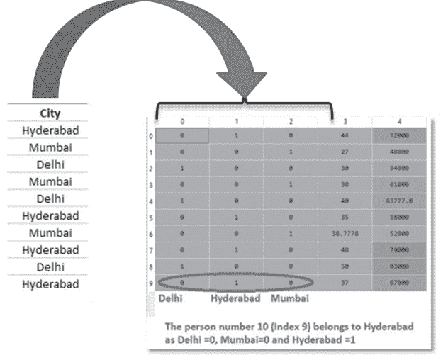

#### 独热编码的另一种方法

应用独热编码的另一种替代方法是使用 `pandas` 库的 `get_dummies` 方法，如代码片段 6 所示。

```
#Importing of desired libraries
import numpy as np
import pandas as pd
#-------------------------Reading the dataset-------------------------
dataset = pd.read_csv('salary.csv')
# pd is the alias of the Pandas library imported.
dataset = pd.get_dummies(dataset, columns=["City"], drop_first=True)
```

`get_dummies` 方法应用于整个数据框；因此，在创建名为 `dataset` 的数据框后，我们通过传递下面讨论的三个参数来调用 pandas 库的 `get_dummies` 方法。

数据框名称：*dataset*
我们需要应用独热编码的列名：`columns=["City"]`
为避免虚拟陷阱而丢弃第一个虚拟变量：`drop_first=True`
代码的最后一行如下所示。

```
dataset = pd.get_dummies(dataset, columns=["City"], drop_first=True)
```

这单行代码将对整个数据框 *dataset* 应用独热编码。之后，我们可以通过创建 *X* 和 *y* 来创建输入和输出变量，如代码片段 7 所示。

**代码片段：7**

```
X = dataset.drop("Purchased", axis=1)
y = dataset["Purchased"]
```

要创建 *X*，我们也可以使用数据框 *dataset* 的 *drop* 方法，通过传递要从数据集中丢弃的索引（行号）或列名。在这里，我们指定了列名 "Purchased"，因为这是我们的输出属性；因此，它应该为 *X* 被丢弃。由于我们使用的是列名，我们必须指定 `axis=1`。轴可以取两个可能的值，即 0 或 1。轴的默认值为 0，意味着我们根据其索引丢弃行。轴值 1 意味着我们根据其名称丢弃列。例如，`X = dataset.drop([2])` 将从数据集中丢弃索引为 2 的行。
对于 *y*，我们从数据集中选择 "Purchased" 列。
在得到 *X* 和 *y* 之后，可以根据需要应用其他预处理操作。

#### Purchased 属性的编码

我们的数据集有两个分类变量，*City* 和 *Purchased*。我们刚刚处理了 *City* 属性，现在我们将讨论 *Purchased* 属性的处理。我们将使用 `LabelEncoder` 类，因为 *Purchased* 是因变量。如图 4.12 所示，编码将 0 视为 "No"，1 视为 "Yes"，将它们视为布尔值，而不假设任何顺序关系。因此，可以使用以下代码片段来编码 Purchased 属性：

**代码片段：8**

```
#label encoding purchased attribute
labelEncoder_Y = LabelEncoder()
Y = labelEncoder_Y.fit_transform(Y)
```

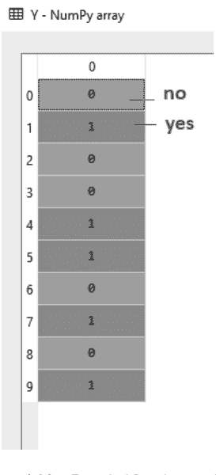

**图 4.12** 编码后的 Purchased 列

在开始第五步之前，让我们看看我们到目前为止编写的代码。

```
#Importing of desired libraries
import numpy as np
import pandas as pd
#-------------------Reading the dataset------
dataset = pd.read_csv('salary.csv')
# pd is the alias of the Pandas library imported.
X = dataset.iloc[:, :-1].values
Y = dataset.iloc[:,3].values
# handling of missing data
from sklearn.impute import SimpleImputer
imputer = SimpleImputer(missing_values = np.nan, strategy = 'mean')
imputer = imputer.fit(X[:,1:3])
X[:,1:3] = imputer.transform(X[:,1:3])
#label encoding categorical attribute city
from sklearn.preprocessing import LabelEncoder
labelEncoder_X = LabelEncoder()
X[:, 0] = labelEncoder_X.fit_transform(X[:, 0])
```

## 4.5 第五步：将数据集划分为训练集和测试集

这一步用于将我们的数据集划分为训练数据集和测试数据集。但关键问题是——我们为什么必须这样做？

需要记住的是，机器学习模型是通过理解数据集中的相关性来进行学习的。

让我们通过以下情况来理解划分训练集和测试集的必要性。假设一位老师准备了一个包含10道题的题库，用于评估学生在某个给定主题上的表现。在一种情况下，老师将所有题目及其对应的答案都分享给学生，并让他们为考试做准备。然后，老师从这10道题中抽取了4道题进行考试。由于老师已经将所有10道题及其答案都分享给了学生，学生很有可能会死记硬背或临时抱佛脚。从这10道题中抽取4道题进行考试，学生很有可能会得到100%的分数或非常好的分数。但这些高分并不能保证学生真正理解了概念。

同样地，当我们把整个数据集都交给机器学习系统进行学习，然后用同一个数据集来测试系统时，它会返回很高的准确率，但这并不能保证模型学得很好。这些结果可能是模糊的，这种情况在机器学习中通常被称为过拟合问题。

因此，为了确保学生真正理解概念，通常老师不会将所有题目都分享给学生，而是保留一些题目来测试学生的学习情况。假设老师只分享了6道题及其答案给学生，然后用剩下的4道题来测试学生。老师会通过比较学生写的答案与对应的正确答案（类似于将实际结果与预期结果进行比较）来评估学生在这4道题上的表现。根据学生在这些测试题（即4道题）上的表现，老师会给学生打分（类似于给机器学习系统打分）。

同样地，在机器学习模型评估中，我们不会给出整个数据集，而是将数据集划分为训练子集和测试子集。系统将基于训练数据进行学习，然后在测试数据上进行测试以评估模型的性能。模型在这个测试数据集上的预测值将与实际的测试数据集值进行比较，基于这种比较分析，最终会给出机器学习模型的准确率得分。

你可以进一步理解，老师可以尝试不同的训练比例和测试划分来评估表现。这意味着他可以用7道题进行训练，3道题进行测试，或者选择8道题进行训练，2道题进行测试。但如果训练数据少于测试数据（例如，3道题用于训练，7道题用于测试），那么学生在考试中表现不佳的可能性就很大，导致模型欠拟合。同样地，我们可以使用不同的比例进行训练测试划分，性能也会相应变化。通常，我们使用2/3的数据进行训练，剩下的1/3数据用于测试模型。

因此，我们需要创建两个不同的集合：一个训练集，用于构建机器学习模型；一个测试集，用于测试机器学习模型的性能。如果模型在测试数据上表现良好，就意味着该模型能够适应新的数据集和情况。

要在Python中执行数据的训练测试划分，我们需要使用`sklearn`的`model_selection`库。该库提供了`train_test_split`方法来完成此任务，如下所示。

```python
#将数据集划分为训练集和测试集
from sklearn.model_selection import train_test_split
```

现在，让我们来构建我们的训练集和测试集。如下所示，我们将创建并定义四个变量：`X_train`、`X_test`、`Y_train`和`Y_test`。

```python
X_train, X_test, Y_train, Y_test = train_test_split(X, Y, test_size = 0.2, random_state = 0)
```

`train_test_split()`方法有四个重要参数，下面将进行讨论。

前两个参数指的是数据数组的来源。在本例中，就是X和Y。然后，我们需要指定`test_size`。该参数可以接受两种类型的值：浮点数或整数。对于浮点数，其范围应在0.0到1.0之间，表示要分配给测试集的数据集比例。对于整数，它表示要分配给测试集的精确样本数量。如果未提供任何值，则默认设置为0.25。在我们的例子中，我们将其指定为0.2。这意味着你20%的数据将进入测试数据集，而80%将进入训练数据集。由于我们的数据集有10个观测值，划分后，测试数据集中将有2个观测值，而训练数据集中将有8个观测值，如图4.13所示。通常，在真实的数据集中，我们拥有的记录远不止10条。

最后一个参数是`random_state`，它有两个可能的值：None（默认设置）和任何整数。

如果`random_state`的值为“None”，则会返回一个`RandomState`对象。或者，如果`random_state`的值对应某个整数，则会用该整数为`RandomState`对象设置种子。

我们建议你将*random_state*设置为一个整数值，因为这使我们能够在多次运行代码时验证数据。如果我们把*random_state*设置为某个固定值，它将保证生成相同的结果，即相同的随机数序列，无论你运行代码多少次。这有助于验证输出。在这里，我们指定了随机数生成的种子数。当我们固定种子数时，它将始终生成相同的随机数集合，但当它未被固定时，每次重新运行代码都会生成不同的随机数序列。因此，如果*random_state=integer_value*，那么当我们重新运行时，将随机选择相同的行用于训练和测试数据。但是，如果我们将其指定为*None*，那么每次重新运行代码都会返回不同的行和列集合，给测试我们的结果带来困难。

需要注意的是，*random_state=1*或*random_state=2*或3将返回相同的行为，因为这些只是我们需要固定的种子数，用于生成随机数，每次重新运行都会返回相同的序列，因为这个种子数是固定的。在我们的代码中，我们设置了*random_state=0*，这意味着在每次运行代码时，我们将得到相同的随机数集合。

划分后*X_train*、*X_test*、*Y_train*和*Y_test*的值如图4.13所示。

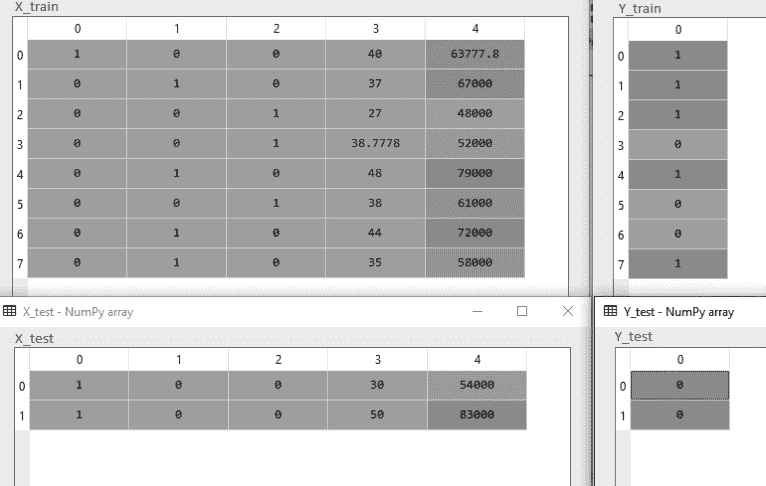

**图4.13** 划分后的*X_train*、*X_test*、*Y_train*和*Y_test*数据集

## 4.6 第六步：特征缩放

预处理的另一个重要步骤是数据的特征缩放。但在实际开始之前，我们将首先讨论特征缩放的必要性。

在我们的数据集中，我们有两个属性或列：年龄和工资，它们包含数值。如果你观察这些列的值，你会发现它们的范围不同，*年龄*的范围是27到50，而工资的范围是₹40000到₹90000。由于这两个范围不在同一尺度上，机器学习模型可能会产生问题。为什么会这样呢？这是因为许多机器学习模型是基于两个数据点之间的欧几里得距离。

例如，在本例中，员工的年龄在27到50岁之间，工资范围是₹40000到₹90000。使用简单的欧几里得度量，*年龄*特征不会起主要作用，因为它比其他特征小几个数量级。然而，它可能包含一些对任务有用的重要信息。在这里，我们必须将特征独立地缩放到相同的尺度，以便在计算距离时贡献相等。

下面，我们简要描述欧几里得距离并举例说明。

### 欧几里得距离

欧几里得距离可以定义为数据点之间或一对对象坐标之间差值的平方根，如图4.14所示。

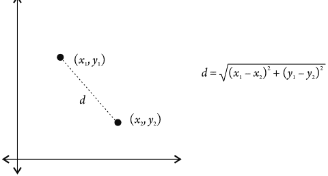

**示例：** 计算点(4, 0, -6)和(-1, 2, -3)之间的欧几里得距离。

*解答：* 我们将使用公式 $d = \sqrt{(x_1 - x_2)^2 + (y_1 - y_2)^2 + (z_1 - z_2)^2}$

$$d = \sqrt{(4 - (-1))^2 + (0 - 2)^2 + (-6 - (-3))^2}$$

$$d = \sqrt{(5)^2 + (-2)^2 + (-3)^2}$$

$$d = \sqrt{38} \text{ 单位}$$

为了将年龄和工资列的范围调整到相似的尺度，我们将对它们进行转换。缩放数据有两种方法，即归一化和标准化。

### 4.6.1 归一化

归一化也被称为最小-最大缩放，因为变量在归一化后，其值会缩小到一个固定的数据范围内：对于正值数据，范围在0到1之间；对于负值数据，范围在-1到1之间。当标准差过小时，这是最佳的缩放方法之一。

用于归一化输入变量的公式如下：

$$X_{changed} = \frac{X - X_{min}}{X_{max} - X_{min}}$$

其中，$X_{changed}$ = 重新缩放或归一化后的值

$X$ = 输入变量的原始值

$X_{max}$ = 最大输入值

$X_{min}$ = 最小输入值

#### 在Python中实现归一化

要在Python中对特定数据集进行归一化，我们需要从`sklearn`库中导入`preprocessing`库。这个`preprocessing`库有一个`normalize`方法，用于对传入的数据集进行归一化，如下所示。同时还传入了一个额外的属性`norm='l1'`，表示归一化类型。它可以设置为'l1'、'l2'或'max'。

L1范数计算为向量绝对值的总和，L2范数计算为向量值平方和的平方根。最大范数计算为向量中的最大值。

此代码将对$X\_train$和$X\_test$数据集进行归一化。图4.15展示了对给定数据集进行归一化后的输出结果。

```
#特征缩放
from sklearn import preprocessing
X_train = preprocessing.normalize(X_train, norm='l1')
X_test = preprocessing.normalize(X_test, norm='l1')
```

在图4.15中，右侧显示了归一化后的$X\_train$，而左侧显示了原始的$X\_train$。显然，对于所有属性，归一化已将属性值转换到了0-1的范围内。

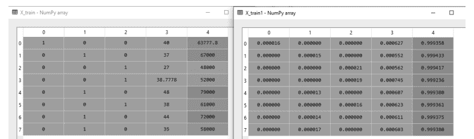

**图4.15** 归一化结果：(a) 原始 *X_train*，(b) 归一化后的 *X_train*

#### 归一化的局限性

归一化在存在异常值时会遇到一个显著的缺点——异常值是偏离其他观测值范围的极端值。当数据集中存在异常值时，对数据进行归一化可能会将正常值缩放到一个更小的区间，从而可能影响异常值的表示和解释。

让我们通过一个例子来理解异常值问题。假设我们使用一个从26到50的年龄范围。那么，在这种情况下，26将被映射到0，50将被映射到1，而此范围内的所有其他值将被拟合在0和1之间。但假设我们增加了一条年龄为90的记录，其余数据保持不变。那么，26将被映射到0，90将被映射到1。而一个年龄为50的人，之前被映射到1，现在被映射到一个接近0.375的值，仅仅因为增加了一个异常值，其值就显著降低了，如图4.16所示。这个异常值会导致数值向较低的范围偏斜；同样，如果我们有一个非常小的异常值，它会导致数值向较高的范围偏斜。

| 添加异常值 | 添加异常值后的归一化分数 |
|---|---|
| 26 | 0 |
| 27 | 0.041 |
| 30 | 0.167 |
| 35 | 0.375 |
| 38 | 0.5 |
| 39 | 0.541 |
| 40 | 0.583 |
| 48 | 0.916 |
| 50 | 1 |
| 无异常值 (90) | |

| 添加异常值 | 添加异常值后的归一化分数 |
|---|---|
| 26 | 0 |
| 27 | 0.015 |
| 30 | 0.062 |
| 35 | 0.14 |
| 38 | 0.187 |
| 39 | 0.203 |
| 40 | 0.218 |
| 48 | 0.343 |
| 50 | 0.375 |
| 90 | 1 |
| 有异常值 (90) | |

异常值 ⇒

**图4.16** 异常值对归一化的影响

因此，如果我们的数据集中存在异常值，我们将使用另一种称为标准化的缩放技术。

### 4.6.2 标准化

标准化是指对输入变量进行重新缩放，使得缩放后的所有变量都保持标准差为1。

输入变量的标准分数使用以下公式计算。

$$X_{changed} = \frac{X - \mu}{\sigma}$$

其中，X是输入变量的值，$\mu$表示均值，$\sigma$是相对于$\mu$（或均值）的标准差。

#### 在Python中实现标准化

为此，我们将导入`StandardScaler`类来创建一个对象`scale_X`，该对象将用于缩放我们的矩阵X（自变量）。为了对训练数据集进行标准化，我们首先需要创建`StandardScaler`类的对象。然后，我们需要调用其`fit_transform()`方法，将`X_train`数据集传入，并将更新后的值存回`X_train`。

在标准化`X_test`数据的情况下，我们只需要使用`transform()`方法，因为它已经拟合到训练集上了，如下方的代码片段所示。

```
#标准化数据
from sklearn.preprocessing import StandardScaler
scale_X = StandardScaler()
X_train = scale_X.fit_transform(X_train)
X_test = scale_X.transform(X_test)
```

代码片段的输出如下图4.17所示，我们可以看到转换后的`X_train`和`X_test`矩阵的所有值都在相同的范围（或尺度）内。

现在，让我们思考一下虚拟变量。我们需要对虚拟变量进行缩放吗？

答案是不需要。我们不需要对虚拟变量应用特征缩放，因为如果我们查看它们的值，会发现它们只有0和1。这些是二进制值，不需要缩放。

现在，让我们思考一下对类别属性或因变量进行缩放的必要性。我们需要对因变量应用缩放吗？

答案是，这取决于具体情况，在大多数情况下，我们不对类别属性应用缩放。因为类别属性代表类别，其值，例如1、2、3或4，指的是不同的类别，或者简单地说，这些指的是类别的代码。通常，我们希望保留类别代码，不会通过应用缩放来修改它。因此，为了保留相同的类别代码值以便更好地理解预测值，我们通常不对类别或输出属性进行缩放。

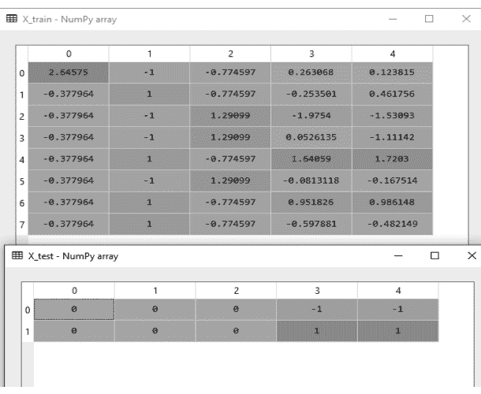

**图4.17** 缩放后的 *X_train* 和 *X_test*

因此，在上面给出的缩放代码片段中，它只应用于*X_train*和*X_test*，而没有应用于*Y_train*和*Y_test*（类别属性），因为它已经包含布尔值1或0，我们不想在预测过程中干扰这种编码。

然而，在某些情况下，当类别属性的编码不是那么重要时，我们可以对类别属性应用缩放以获得更好的准确性。例如，你可能遇到类别属性值以米为单位给出且通常非常小的情况。但为了更好地解释，你可以将它们缩放到毫米。

通过以上讨论，我们完成了数据预处理阶段的实现。本章讨论的代码如下所示，供您快速参考。它执行数据预处理的不同阶段，您可以根据需要将其包含在模型构建过程中。

#### 提醒我

- 数据预处理代表了一系列应用于数据的程序，使其适合机器学习算法。
- 数据预处理的基本步骤包括导入库、加载数据集、处理缺失值、管理分类数据（如果适用）、将数据集拆分为训练集和测试集，最后执行特征缩放。
- NumPy或Numeric Python是一个帮助您高效管理多维数组的库。
- `Matplotlib`是一个2D绘图Python库；它以各种格式绘制高质量的图形。
- Pandas被认为是“Python的SQL”。在Python中使用`Pandas`，我们可以处理2D数据表。
- 所有重要的机器学习模型算法都在Scikit-Learn库中实现。
- `Scikit-Learn`库有`SimpleImputer`类来处理缺失值。
- `Scikit-Learn`库有`LabelEncoder`类来处理分类数据。
- 要创建虚拟变量，使用`OneHotEncoder`类。
- `sklearn`的`model_selection`库用于在训练和测试数据集之间拆分数据。
- 归一化和标准化用于特征缩放。
- 归一化也称为最小-最大缩放。当标准差过小时，这是最佳的缩放方法之一。
- 预处理库有一个normalize方法，用于对数据集进行归一化。
- 归一化有异常值的局限性，如果数据集包含异常值，它效果不佳。在这种情况下，我们更倾向于使用标准化。
- 在标准化中，输入变量被重新缩放，使得缩放后的所有变量都保持标准差为1。
- `StandardScaler`类用于执行标准化。

#### 附加资源

##### 视频链接

- Python教程：什么是数据预处理？ https://youtu.be/4i9aiTjjxHY
- 使用Python进行探索性数据分析（EDA）| Python数据分析 | Edureka, https://youtu.be/-o3AxdVcUtQ


##### 博客链接

- Python数据预处理实践教程, https://analyticsindiamag.com/data-pre-processing-in-python/


#### 测试我（问题）

1.  你如何处理数据集中缺失或损坏的数据？
    a) 删除缺失的行和列
    b) 用均值/众数/中位数替换缺失值
    c) 为缺失值分配一个唯一的类别
    d) 以上所有
2.  特征缩放有助于提高模型的准确性。
    a) 正确
    b) 错误
3.  `LabelEncoder` 类的用途是什么？
    a) 它将标签编码为0到`n_classes`之间的值
    b) 它将标签编码为0到`n_classes-2`之间的值
    c) 它将标签编码为0到`n_classes-1`之间的值
    d) 以上都不是
4.  独热编码将 __________ 转换为 __________。
    a) 每个具有`n`个可能值的分类特征转换为`n`个二进制特征，其中只有一个处于激活状态
    b) 每个具有`n`个可能值的分类特征转换为`n`个二进制特征，其中最多有两个处于激活状态
    c) 每个具有`n`个可能值的分类特征转换为`n-1`个二进制特征，其中只有一个处于激活状态
    d) 每个具有`n`个可能值的分类特征转换为`n+1`个二进制特征，其中只有一个处于激活状态
5.  `read_csv` 方法是 __________ 库的方法。
    a) Matplotlib
    b) Pandas
    c) NumPy
    d) 以上都不是
6.  `sklearn` 也被称为 `Scikit-Learn`。
    a) 正确
    b) 错误
7.  `iloc` 用于通过索引提取 ________。
    a) 行
    b) 列
    c) 行和列
    d) 以上都不是
8.  `SimpleImputer` 是一种处理 ________ 值的方法。
    a) 分类值
    b) 缺失值
    c) 数值
    d) 标签值
9.  `LabelEncoder` 用于处理分类数据。
    a) 是
    b) 否
10. ________ 是管理虚拟变量的方法。
    a) `LabelEncoder()`
    b) `transform()`
    c) `train_test_split()`
    d) `OneHotEncoder()`
11. 在此数据集上构建机器学习模型需要哪种类型的预处理？

| 编号 | 学习时间 | 出勤率 | 分数 |
|---|---|---|---|
| 1 | 23 | 低 | 45 |
| 2 | 34 | 中 | 67 |
| 3 | 44 | 高 | 77 |
| 4 | 20 | 低 | 48 |

    a) 不需要预处理
    b) 标签编码
    c) 归一化
    d) 标准化
    e) 独热编码

> **答案：** 1d 2a 3c 4a 5b 6a 7c 8b 9a 10d 11b （类别之间存在固有的顺序关系（即低 < 中 < 高），标签编码是一个合适的选择，因为它保留了类别的顺序。如果模型需要捕捉不同出勤率水平之间的相对重要性或趋势，这将是有益的。）

#### 测试我（实践技能）

从以下链接下载用于贷款预测的训练和测试数据集

https://www.analyticsvidhya.com/blog/2016/07/practical-guide-data-preprocessing-python-scikit-learn/

i. 导入所需的库并加载数据集。
ii. 确定特征缩放的必要性并应用适当的特征缩放。
iii. 分析分类数据并应用 `LabelEncoder` 对分类数据进行编码。
iv. 对分类属性应用独热编码。

## 5 简单线性回归

### 章节目标

-   理解简单线性回归的必要性。
-   理解简单线性回归的假设和参数概念。
-   理解代价函数的数学建模及其最小化。
-   理解梯度下降算法的重要性和不同步骤。
-   理解梯度下降算法的数学建模。
-   理解学习率 α 的作用。

## 5.1 简单线性回归简介

如前面章节所讨论的，回归预测连续值或实值输出。本章将讨论回归如何（从数学角度）为给定数据集预测连续值。我们的第一个学习算法是简单线性回归。在本节中，我们将讨论简单线性回归的基本概念和数学建模。

我们通常有一个具有连续值的因变量，我们希望根据一个或多个自变量来预测其值。如果我们只有一个自变量或输入变量，这种情况被称为简单线性回归（也称为单变量回归）。如果我们有多个自变量或输入变量，则称为多元线性回归或多变量回归。

线性回归可用于研究不同现实场景中的模式。考虑一个研究实验室，其中研究人员想要了解津贴如何受经验年限的影响，或者简单地说，我们希望根据研究人员的经验年限来预测津贴。机器学习（ML）是从过去的经验或数据中学习。因此，为了预测研究人员的津贴，我们必须收集一些关于过去研究人员的数据，特别是他们的津贴和经验。

在监督学习模型中，我们需要一个称为训练集的数据集。我们将使用表5.1中给出的数据集来训练模型，我们的任务是构建一个机器学习模型，该模型从这些数据中学习，从而根据研究人员的经验预测其津贴。在这里，津贴将被视为因变量或输出变量，因为它取决于研究人员的经验年限。因此，经验年限将被视为自变量或输入变量。所以，我们将使用简单线性回归来构建机器学习模型。为了处理这个问题，我们将使用研究人员津贴及其相应经验年限的数据集，如表5.1所示。

**表5.1** 用于简单线性回归研究的数据集实例

| 研究经验年限 | 津贴 |
|---|---|
| 1.6 | 40343 |
| 1.8 | 47205 |
| 2 | 38731 |
| 2.5 | 44525 |
| 2.7 | 40891 |
| 3.4 | 57642 |
| 3.5 | 61150 |
| 3.7 | 55445 |
| 3.7 | 65445 |
| 4.2 | 58189 |
| 4.4 | 64218 |
| 4.5 | 56794 |
| 4.5 | 57957 |
| 4.6 | 58081 |
| 5 | 62111 |
| 5.4 | 68938 |
| 5.6 | 67029 |
| 5.8 | 84088 |
| 6.4 | 82363 |

为了直观地理解这个数据集，让我们考虑图5.1，其中分析了学者的津贴与其研究经验的关系。研究经验绘制在X轴上，而津贴考虑在Y轴上。数据值在X和Y轴上的散布如图5.2所示，显示了相应研究经验的津贴分布。

**图5.1** 研究经验与津贴关系图

**图5.2** 基于表5.1数据集的津贴与研究经验关系图

简单线性回归模型的目标是根据学者的研究经验预测其津贴。假设我们有一位名叫Rahat的研究人员，他想找出自己五年研究经验的预期津贴。为此，他必须在此数据集上拟合一个线性模型。在简单线性回归的情况下，模型是基于此数据集上最佳拟合直线构建的。

简单线性回归的直线拟合 | 机器学习，Parteek Bhatia，https://youtu.be/Y4y1N7-XSGE

由于此模型基于最佳拟合直线，为了从数学上理解此模型的工作原理，我们必须使用图5.3所示的直线方程。

**图5.3** 直线方程

它显示了自变量（假设为 $x$）和因变量（假设为 $y$）之间的关系。让我们逐一理解这些变量和系数。

在我们的示例数据集中，津贴被视为因变量（$y$），因为它取决于研究人员的经验年限。因此，经验年限被视为自变量（$x$）。

因此，我们情况下的回归公式将如下所示：

津贴 = $\phi_0 + \phi_1$ * 研究经验 (5.1)

现在，让我们理解常数（$\phi_0$）和系数（$\phi_1$）在此方程中的重要性。

常数 $\phi_0$ 指的是当自变量为0时因变量的值。在这种情况下，它意味着当研究人员的经验为0时津贴的值，或者简单地说，它是支付给没有经验的新招聘研究人员（或应届生）的津贴。

嗯，这意味着最佳拟合线在 $x = 0$ 时与垂直轴相交的点，在这种情况下，如图5.4所示，它是₹30000，这表明对于没有研究经验（研究经验 = 0）的人，津贴将等于₹30000。这意味着根据我们的数据集，从大学加入研究实验室的应届生最有可能获得约₹30000的津贴，它在方程（5.1）中由常数（$\phi_0$）表示。

在图5.5中，另一件值得注意的事情是直线的斜率。更陡峭的直线表示研究人员在增加一年研究经验后津贴的更高增长。

## 5.2 假设或函数

简单线性回归的代价函数 | 机器学习 | 数据挖掘 | Parteek Bhatia, https://youtu.be/w-jENGKvtXQ

训练数据集准备好后，我们将其输入到所需的学习算法中，在我们的案例中即简单线性回归。该学习算法输出一个称为*假设*的函数，记为 *h*。假设接受一些输入参数并产生输出。在我们的案例中，假设是一个函数，它将 *x* 或工作年限作为输入，并产生 *y* 或津贴的估计值。必须注意，*假设*只是一个标准术语。它是机器学习领域的一个旧术语，不应与它在统计学或科学中的真实含义混淆。在这里，它只是一个将 *x* 映射到 *y* 的函数。

接下来，下一步是表示假设。我们用公式 (5.2) 来表示 *h* 或*假设*。

$h_{\phi}(x) = \phi_0 + \phi_1 x$

注意：在文中，$h_{\phi}(x)$ 通常会简写为 $h(x)$。

图 5.9 展示了假设在监督学习中的作用。

## 5.3 简单线性回归的参数

这里，$\phi_1$ 是自变量的系数。它表示 $x$ 的效应或单位变化如何引起 $y$ 的单位变化。它可以被视为连接 $y$ 和 $x$ 的乘数。这个比例系数表示变化被放大或缩小的比例。这里，$\phi_0$ 是常数项。常数 $\phi_0$ 指的是当自变量为 0 时因变量的值。在这种情况下，它意味着当研究者经验为 0 时津贴的值，或者简单地说，是支付给新入职研究者（或应届生）的薪水。

因此，公式 (5.2) 意味着函数 $h(x)$ 的作用是预测 $y$ 的值，它是 $x$ 的直线函数。这个模型被称为*单变量线性回归*。一个变量对应于 $x$。

$\phi_0$ 和 $\phi_1$ 统称为*参数*，它们的值非常重要。

为了进一步理解 $\phi_0$ 和 $\phi_1$ 的关系，让我们思考以下情况。

当 $\phi_0$ 为 1.5 且 $\phi_1$ 为 0 时，你能画出一条直线吗？
这意味着当 $x$ 为 0 时 $Y$ 的值为 1.5，并且 $Y$ 相对于 $X$ 的单位变化率为 0。因此，这条直线将如图 5.10(a) 所示。

当 $\phi_0$ 为 0 且 $\phi_1$ 为 0.5 时，你能画出一条直线吗？
这意味着当 $X$ 为 0 时 $Y$ 的值为 0，并且 $Y$ 相对于 $X$ 的单位变化率为 0.5。这意味着当 $X$ 从 0 变为 1 时，$Y$ 从 0 变为 0.5。同样，当 $X$ 从 1 变为 2 时，$Y$ 从 0.5 变为 1。因此，这条直线将如图 5.10(b) 所示。

当 $\phi_0$ 为 1 且 $\phi_1$ 为 0.5 时，你能画出一条直线吗？
这意味着当 $x$ 为 0 时 $Y$ 的值为 1，并且 $Y$ 相对于 $X$ 的单位变化率为 0.5。当 $X$ 从 0 变为 1 时，$Y$ 从 1 变为 1.5（因为 $Y$ 的初始值为 1）。同样，当 $X$ 从 1 变为 2 时，$Y$ 从 1.5 变为 2。因此，这条直线将如图 5.10(c) 所示。

这些情况解释了基于 $\phi_0$ 和 $\phi_1$ 值的直线结果。

**图 5.4** 研究经验为 0 年时的津贴值

让我们通过增加一年研究经验来检查研究者津贴的增长。因此，要确定*津贴*的增加额，必须将其投影到直线（最佳拟合线）上，然后再投影到津贴轴上，如图 5.5 所示。所以，对于*研究经验*增加一年，该人员将在其当前*津贴*基础上额外获得 10000 卢比。

**图 5.5** 用于查找津贴增长的图表

这种直线斜率的效应在图 5.3 给出的方程中由一个系数（$\phi_1$）表示。需要注意的是，最佳拟合线的斜率将是研究者每增加一年经验所对应的津贴增量。如果这条线的斜率较小，那么每增加一年研究经验，津贴的增长就会较少。

因此，$\phi_1$ 是自变量的系数。它表示 $x$ 的效应或单位变化如何引起 $y$ 的单位变化。它可以被视为连接 $y$ 和 $x$ 的乘数。这个比例系数表示变化被放大或缩小的比例。

简单线性回归只有一个自变量，因为我们假设它是导致因变量变化的原因。这里，*y* 代表因变量，*x* 代表自变量。有时，自变量可能不是直接的因果因素，但两者之间总是存在某种隐含的关联。

**图 5.6** 为模型拟合一条直线

因此，将在这些数据值上拟合一条直线，如图 5.6 所示。基于这条最佳拟合直线，我们可以投影一条垂直线，以获得五年研究经验的估计薪水/津贴，如图 5.7 所示。

**图 5.7** 估计五年研究经验的津贴

这是监督学习算法的一个例子，因为对于我们数据集中的每个条目，对应于工作年限，我们都有一个津贴条目（以印度卢比或 ₹ 为单位）。此外，通过使用实际数字预测津贴，我们正在处理一个回归问题。简单来说，回归意味着我们正在尝试估计一个真实值，具体来说是津贴金额。

这就是简单回归的工作原理。因此，这里的核心目标是通过使用直线方程来获得最佳拟合，基于一个自变量来预测因变量的连续值。

简单线性回归旨在建模自变量和因变量之间的关系。从数学上讲，表示这种关系的方程如图 5.8 所示。

**图 5.8** 简单线性回归的数学方程

在简单线性回归中，为了表示数据集，通常遵循各种符号，如表 5.2 所示。这些将用于解释我们的简单线性回归模型。

**表 5.2** 简单线性回归使用的符号

| 符号 | 含义 | 使用我们表 5.1 中数据集的示例 |
| :--- | :--- | :--- |
| **X** | 输入变量或特征 | 研究工作年限 |
| **Y** | 目标或输出变量 | 津贴（印度卢比） |
| **N** | 我们数据集中的训练样本数量 | 10（因为有 10 条记录） |
| **(x, y)** | 表示一个训练样本 | - |
| **(x<sub>(i)</sub>, y<sub>(i)</sub>)** | 表示第 i<sup>个</sup>索引（或第 i<sup>行</sup>）的训练样本 | - |
| **(x<sub>(1)</sub>, y<sub>(1)</sub>)** | 表示索引 1（或第 1 行）的训练样本 | (1.6, 40343) → 表 5.1 的第一行 |
| **(x<sub>(2)</sub>, y<sub>(2)</sub>)** | 表示索引 2（或第 2 行）的训练样本 | (1.8, 47205) → 表 5.1 的第二行 |

本章的灵感来源于 Andrew Ng 通过 DeepLearningAI 提供的机器学习专项课程 [课程 1]。鼓励读者探索本课程，其详细信息在本章末尾的“其他资源”部分提供。

**图 5.10(c)** $\phi_0$ 为 1，$\phi_1$ 为 0.5

| 图 $\rightarrow$ | 图 10(a) | 图 10(b) | 图 10(c) |
| :--- | :--- | :--- | :--- |
| $\phi_0$ | **1.5** | **0** | **1** |
| $\phi_1$ | **0** | **0.5** | **0.5** |
| 假设函数 $h$ | $h(x) = 1.5 + 0x$ | $h(x) = 0.5x$ | $h(x) = 1 + 0.5x$ |

现在很明显，参数 $\phi_0$ 和 $\phi_1$ 的微小变化会改变假设函数。因此，我们的目标是找到 $\phi_0$ 和 $\phi_1$ 的值，使其对应一条拟合良好的直线。其思想是选择合适的参数值，使得 $h(x)$（即对某个输入 $x$ 的预测值）尽可能接近 $x$ 对应的实际值 $y$。这意味着我们必须选择参数的值，使预测值接近实际值。预测值与实际值之间的差异被称为误差或代价函数。因此，我们的目标是最小化这个误差或代价函数。我们通常使用平方误差和或普通最小二乘法来计算预测值与实际值之间的差异。

在普通最小二乘法中，系数 $\phi_0$ 和 $\phi_1$ 的值是通过最小化*预测误差*来找到的。例如，在图 5.11 中，散点数据点表示实际值，而直线表示预测值。如图 5.11 所示，虚线的长度表示实际津贴 $y$（由一个点表示）与预测津贴 $y'$（由实线的相应值表示）之间的差异。这提供了关于给定研究助理预测误差的信息。类似地，我们将计算每个观测点的预测误差。一旦获得每个观测点的预测误差，我们将它们平方并求和。差值的平方有助于得到一个正值，因为负值的平方总是正的。并且由于我们必须找到总误差，这些平方误差被相加。这也被称为平方误差和。

最终，机器学习模型拟合直线，使得这个平方误差和最小。模型通过改变参数 $\phi_0$ 和 $\phi_1$ 的值来尝试拟合直线，并调整这些参数以获得具有最小平方误差和的直线。具有最小平方误差和的直线被认为是最佳拟合线，这条最佳拟合直线的参数 $\phi_0$ 和 $\phi_1$ 的值最终用于进行预测。

例如，让我们考虑我们的训练数据集，这里，我们有 ₹35000 作为具有两年经验的人的津贴。根据公式 (5.1)，此实例的假设函数如下：

$h_{\phi}(x) = \phi_0 + \phi_1(2)$

为了获得最佳拟合线，我们将 $x$（即两年经验）输入假设函数 $h(x)$，然后我们将改变 $\phi_0$ 和 $\phi_1$ 的值，直到 $h(x)$ 最接近 ₹35000，即其实际值。

现在，一个大问题是：我们如何找到 $\phi_0$ 和 $\phi_1$ 的合适值？为此，我们将在简单线性回归中解决一个最小化问题，如下一节所述。

## 5.4 代价函数及其最小化

理解简单线性回归的代价函数形状 | 机器学习 | Parteek Bhatia, https://youtu.be/Bn1RH8ukAPk

我们希望最小化 $h(x)$（假设函数的输出）和 $y$（来自训练数据集的实际值）之间对于 $\phi_0$ 和 $\phi_1$（参数）的差异。但与其处理基本差异，我们将最小化假设输出与实际值（即研究人员的实际津贴）之间的平方差异。并且如我们所知，我们有 $n$ 个观测值（参见表 5.1），因此我们将对从索引 $1$ 到 $n$ 的每个训练样本的平方差异求和。让我们用数学方式表示所有这些，如下所示。

$$\sum_{i=1}^{n} (\text{预测值} - \text{实际值})^2$$

$$\sum_{i=1}^{n} (h_{\phi}(x_i) - y_i)^2$$

> [预测值由 $h_{\phi}(x_i)$ 给出，实际值由 $y_i$ 给出]

为了简化计算并获得误差的均值或平均值，我们将上述表达式除以 $2n$。这被称为均方误差。

$$\frac{1}{2n} \sum_{i=1}^{n} (h_{\phi}(x_i) - y_i)^2$$

由于这个表达式需要在 $\phi_0$ 和 $\phi_1$（参数）上最小化，以获得代价函数或误差的最小值，其数学表示由公式 (5.3) 给出

$$J(\phi_0, \phi_1) = \frac{1}{2n} \sum_{i=1}^{n} (h_{\phi}(x_i) - y_i)^2$$

(5.3)

总体目标函数将是设置 $\phi_0$ 和 $\phi_1$，使得误差值，即 $J(\phi_0, \phi_1)$ 应该最小。因此，$J(\phi_0, \phi_1)$ 被称为代价函数，我们的目标是最小化这个值。

公式 (5.3) 中定义的代价函数是对于参数 $\phi_0$ 和 $\phi_1$ 的某个特定选择的均方误差。它衡量模型预测值与实际值之间的平均差异。代价函数也可以被视为训练模型的性能度量。例如，如果模型的代价非常高，那么它的性能会很差；如果模型的代价很低，那么性能就会很好。因此，我们学习算法的最终目标是找到使可能代价 $J(\phi_0, \phi_1)$ 最小化的参数。

### 5.4.1 单参数代价函数的最小化：min$_{\phi} J(\phi)$

为了以简化的方式理解代价函数的最小化，让我们最初只考虑一个参数，即 $\phi_1$，为此，我们将 $\phi_0$ 的值固定为 0。这将帮助我们在二维 (2D) 平面上研究模型的行为，因为它将只有两个变量分量，即 $J(\phi_0, \phi_1)$ 和 $\phi_1$，否则它将有三个变量分量，即 $J(\phi_0, \phi_1)$、$\phi_0$ 和 $\phi_1$，我们需要一个三维 (3D) 平面来进行分析。

因此，假设函数可以视为如下：
$J(\phi_0, \phi_1) = \phi_0 + \phi_1 x$，当 $\phi_0 = 0$ 时，它变为
$J(\phi_1) = \phi_1 x$

现在让我们改变 $\phi_1$ 以确定代价函数的值，即 $J(\phi_1)$。为了解决这个问题，我们将取一些 $\phi_1$ 的随机值，并研究代价函数相对于所选 $\phi_1$ 值的变化。

让我们假设 $X$ 和 $Y$ 的实际值在 3 个实例中如表 5.3 所示，并绘制在图 5.12 中。

**表 5.3** 示例数据集

| X | Y |
|---|---|
| 1 | 1 |
| 2 | 2 |
| 3 | 3 |

**图 5.12** 数据集的数据点散点图

现在，当 $\phi_0 = 0$ 时，让我们改变 $\phi_1$ 以确定预测值并计算代价函数（预测值与实际值之间的平方差之和）的值，即 $J(\phi_1)$。为了解决这个问题，我们将取一些 $\phi_1$ 的随机值，并通过保持 $\phi_0$ 固定来研究所选 $\phi_1$ 值下代价函数的变化，如表 5.4 所示。

#### 表 5.4 代价函数的计算

| 参数值 | 假设 | 代价函数 |
| :--- | :--- | :--- |
| 情况 1<br>$\phi_0 = 0$<br>$\phi_1 = 1$ |  | $J(\phi_0, \phi_1) = \frac{1}{2n} \sum_{i=1}^{n} (h_{\phi}(x_i) - y_i)^2$<br>$h_{\phi}(x) = \phi_0 + \phi_1 x$ ...1<br><br>此处 $\phi_0 = 0, \phi_1 = 1, n=3$<br>$x_1 = 1, x_2 = 2, x_3 = 3$<br><br>代入公式 (1)，我们得到<br>$h_{\phi}(x_1) = 1, h_{\phi}(x_2) = 2, h_{\phi}(x_3) = 3$<br>[预测值]<br>$y_1 = 1, y_1 = 2, y_1 = 3$<br>[实际值]<br><br>$J(0,1) = \frac{1}{2*3} \{(1-1)^2$<br>$+ (2-2)^2 + (3-3)^2\}$<br><br>$J(0,1) = 0$ |
| 情况 2<br>$\phi_0 = 0$<br>$\phi_1 = 0.5$ |  | $J(\phi_0, \phi_1) = \frac{1}{2n} \sum_{i=1}^{n} (h_{\phi}(x_i) - y_i)^2$<br><br>此处 $\phi_0 = 0, \phi_1 = 0.5, n=3$<br>$x_1 = 1, x_2 = 2, x_3 = 3$<br><br>代入公式 (1)，我们得到<br>$h_{\phi}(x_1) = 0.5, h_{\phi}(x_2) = 1, h_{\phi}(x_3) = 1.5$<br>[预测值]<br>$y_1 = 1, y_1 = 2, y_1 = 3$<br>[实际值]<br><br>$J(0,0.5) = \frac{1}{2*3} \{(0.5-1)^2$<br>$+ (1-2)^2 + (1.5-3)^2\}$<br><br>$J(0,0.5) = 0.58$ |

| 参数值 | 假设 | 代价函数 |
| :--- | :--- | :--- |
| 情况 3<br>$\phi_0 = 0$<br>$\phi_1 = 0$ |  | $J(\phi_0, \phi_1) = \frac{1}{2n} \sum_{i=1}^{n} (h_{\phi}(x_i) - y_i)^2$<br><br>此处 $\phi_0 = 0, \phi_1 = 0, n=3$<br>$x_1 = 1, x_2 = 2, x_3 = 3$<br><br>代入公式 (1)，我们得到<br>$h_{\phi}(x_1) = 0, h_{\phi}(x_2) = 0, h_{\phi}(x_3) = 0$<br>[预测值]<br>$y_1 = 1, y_2 = 2, y_3 = 3$<br>[实际值]<br><br>$J(0,0) = \frac{1}{2*3} \{(0-1)^2 + (0-2)^2 + (0-3)^2\}$<br><br>$J(0,0) = 2.34$ |
| 情况 4<br>$\phi_0 = 0$<br>$\phi_1 = 2$ |  | $J(\phi_0, \phi_1) = \frac{1}{2n} \sum_{i=1}^{n} (h_{\phi}(x_i) - y_i)^2$<br><br>此处 $\phi_0 = 0, \phi_1 = 1, n=3$<br>$x_1 = 1, x_2 = 2, x_3 = 3$<br><br>代入公式 (1)，我们得到<br>$h_{\phi}(x_1) = 2, h_{\phi}(x_2) = 4, h_{\phi}(x_3) = 6$<br>[预测值]<br>$y_1 = 1, y_2 = 2, y_3 = 3$<br>[实际值]<br><br>$J(0,2) = \frac{1}{2*3} \{(2-1)^2 + (4-2)^2 + (6-3)^2\}$<br><br>$J(0,2) = 2.34$ |
| 情况 5<br>$\phi_0 = 0$<br>$\phi_1 = 1.75$ |  | $J(\phi_0, \phi_1) = \frac{1}{2n} \sum_{i=1}^{n} (h_{\phi}(x_i) - y_i)^2$<br><br>此处 $\phi_0 = 0, \phi_1 = 1, n=3$<br>$x_1 = 1, x_2 = 2, x_3 = 3$<br><br>代入公式 (1)，我们得到<br>$h_{\phi}(x_1) = 1.75, h_{\phi}(x_2) = 3.5, h_{\phi}(x_3) = 5.25$<br><br>[预测值]<br>$y_1 = 1, y_2 = 2, y_3 = 3$<br>[实际值]<br><br>$J(0, 1.75) = \frac{1}{2*3} \{(1.75-1)^2 + (3.5-2)^2 + (5.25-3)^2\}$<br><br>$J(0, 1.75) = 1.3125$ |

现在，让我们绘制上述情况得到的代价函数值，如图 5.13 所示。

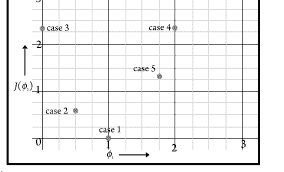

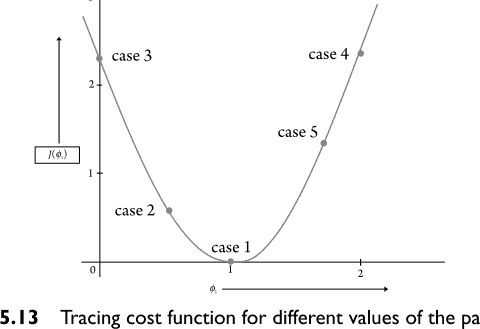

**图 5.13** 追踪不同参数值下的代价函数

从图 5.13 可以明显看出，代价函数在 $\phi_1 = 1$ 时取得最小值或极小值，即 0，我们已经计算了这种情况下的代价函数值，如下所示。这也在情况 1 的实际值和预测值图中有所体现。

$$J(0,1) = \frac{1}{2*3} \{(1-1)^2 + (2-2)^2 + (3-3)^2\}$$

$$J(0,1) = 0$$

这证实了在简单线性回归的情况下，代价函数的形状是碗状的，我们必须找到这个碗或代价函数的极小值，以使直线在数据点上达到最佳拟合。

必须注意的是，上面最小化的代价函数只有一个参数，即 $\phi_1$，因为另一个参数 $\phi_0$ 被给定为 0。这使我们能够灵活地在二维平面上直观地分析模型，因为在此场景中我们只有两个变量；一个是参数 $\phi_1$，另一个是代价函数 $J(\phi_1)$。

但在实际场景中，情况并非如此，因为代价函数将受到两个参数 $\phi_0$ 和 $\phi_1$ 的影响，这将需要在三维平面上进行分析。

在下一节中，我们将讨论在两个参数 $\phi_0$ 和 $\phi_1$ 共同影响下的代价函数最小化问题。

### 5.4.2 双参数代价函数的最小化

与之前的最小化问题不同，这次我们将在计算代价函数时同时改变 $\phi_0$ 和 $\phi_1$。因此，我们的最终目标是找到合适的 $\phi_0$ 和 $\phi_1$ 值，使代价函数取得最小值，从而得到最佳拟合直线。

早些时候，在图 5.13 中，我们使用二维图追踪了代价函数，考虑了两个变量；一个是参数 $\phi_1$，另一个是 $J(\phi_1)$。但当我们同时考虑 $\phi_0$ 和 $\phi_1$ 以及代价函数 $J(\phi_0, \phi_1)$ 时，我们得到一个三维图，如图 5.14 所示。碗状曲面就是我们的代价函数。

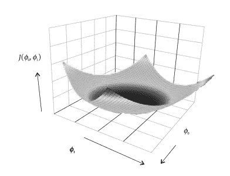

进一步处理三维图是一项关键任务；因此，我们将借助等高线图在二维空间中理解代价函数。

#### 等高线图

等高线图，通常称为水平图，在制图学（这是一门创建地图以表示地理信息的艺术和科学）中应用最为广泛。它们用于在二维平面上显示三维曲面。如果我们想研究 Z 值如何作为两个输入 X 和 Y 的函数变化，等高线图是合适的。因此，在我们的案例中，可以使用等高线图，因为我们想研究 $J(\phi_0, \phi_1)$ 的值变化，它是两个输入 $\phi_0$ 和 $\phi_1$ 的函数。代价函数三维平面的等高线图如图 5.15 所示。

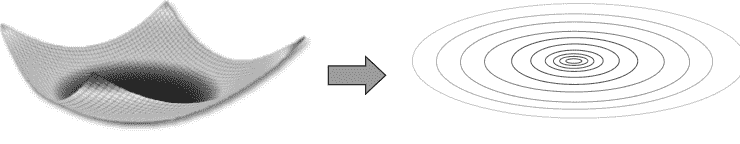

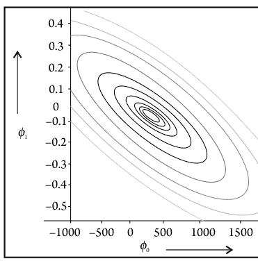

**图 5.15** 代价函数及其参数的等高线图

现在，让我们理解如何解释代价函数的等高线图。参考图 5.15，我们有参数 $\phi_0$、$\phi_1$ 分别作为 X 轴和 Y 轴，它们变化对代价函数的影响由等高线表示。每个环对应于不同参数集的相同等高线值。例如，参考图 5.16 中的环 A；我们取了三个不同的点 I、II 和 III，这些点中的每一个都有不同的 $\phi_0$ 和 $\phi_1$ 值。但是当在 I、II 和 III 处计算代价函数时，发现其值相同，因为它们代表同一条直线的不同点。

例如，参考图 5.16，其中位于同一环上的三个点具有相同的 $J(\phi_0, \phi_1)$ 值，因此对于相应的假设图，它们将位于同一条直线上，如图 5.17 所示。

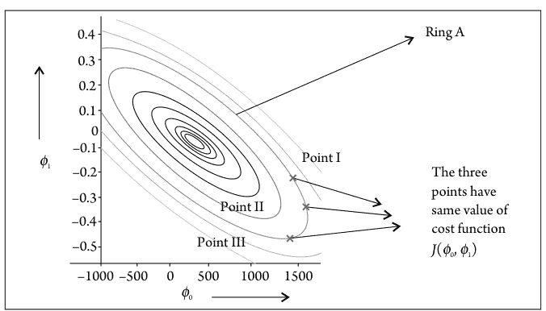

**图 5.16** 位于同一颜色环上的点具有相同的代价

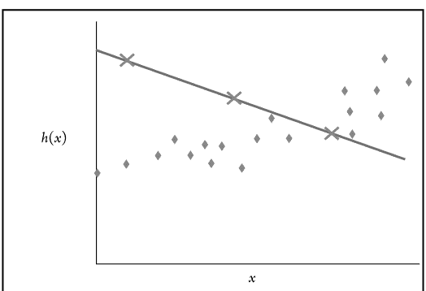

**图 5.17** 图 5.16 中给定代价函数的假设图

现在，让我们继续讨论双参数最小化问题。参考图 5.18，您会观察到代价函数在三维空间中呈碗状，因此它在碗的中心取得最小值（全局和局部）。

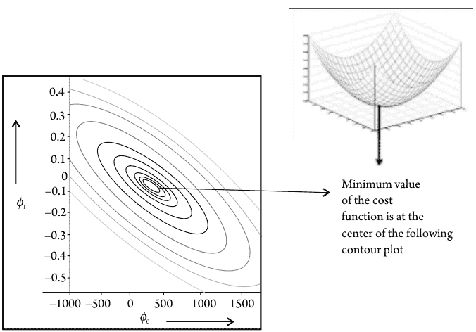

**图 5.18** 依赖于两个参数的代价函数最小值

这意味着我们越向等高线图的中心移动，就越接近代价函数的最小值。为了解释这一点，我们将考虑一些情况，其中我们将从外环到内环选择等高线图环上的一些点。在每种情况下，我们将绘制不同参数值下的假设函数，并在代价函数取得最小值或达到等高线图中心时停止。

这通过考虑具有不同参数值及其相应代价函数的不同情况来说明，如表 5.5 所讨论。

至此，我们结束了双参数最小化问题的讨论。但通常，不仅仅是两个参数；您可能会遇到具有两个或更多参数的代价函数。在多元线性回归的情况下，我们有多个参数，我们将在第 7 章中介绍。

到目前为止，我们已经了解到模型会随机改变参数值以找到最佳拟合直线或最小代价函数。但实际上，我们不能随机尝试每一个可能的参数值来找到最小代价函数。需要一种算法或程序来指导如何改变参数值，以最少的步骤找到最小代价函数。而指导参数值变化的算法被称为梯度下降算法。

因此，在下一节中，我们将学习这个算法。这是一个通用算法，可以处理具有 *n* 个参数的代价函数最小化问题。

#### 表 5.5 不同参数下的代价函数分析

| 情况 | 代价函数与假设图 |
| :--- | :--- |
| **情况 I（负斜率）** | [图像：代价函数的等高线图，点位于 (750, -0.2)，对应的假设图显示一条向下倾斜的直线 $h(x) = (-0.2)x + 750$] |
| **情况 II（零斜率）** | [图像：代价函数的等高线图，点位于 (1100, 0)，对应的假设图显示一条水平线 $h(x) = 1100$] |

我们在等高线图上选取的点距离中心较远。对于所选点，$\phi_0$ 的值为 750，$\phi_1$ 的值为 -0.2。接下来，我们使用得到的 $\phi_0$ 和 $\phi_1$ 值生成了一个假设函数。假设线并非最佳拟合线，这也是有意为之，因为我们远离代价函数图的中心，并且在所选点处并未达到最小值。

这里，我们在代价函数图的中心附近选取了一个点。由于 $\phi_0 = 1100$ 且 $\phi_1 = 0$，所得假设线的斜率为 0。同样，得到的假设图也不是我们数据点的最佳拟合线。

| 情况 | 代价函数与假设图 |
| :--- | :--- |
| 情况 III（正斜率） |  |

我们选择代价函数图中心（最内层蓝色环）的点。对于这种情况，我们得到 $\phi_0 = 950$ 和 $\phi_1 = 0.1$。所得假设线是一条具有正斜率的最佳拟合线。这证实了我们的理论，即代价函数在特定的参数值处取得最小值。假设线也是最佳拟合线，它出现在等高线图的中心。

因此，当 $\phi_0 = 950$ 且 $\phi_1 = 0.1$ 时，我们得到代价函数的最小值，从而得到最佳拟合线。

## 5.5 梯度下降算法

让我们假设一个用于简单线性回归的代价函数 $J(\phi_0, \phi_1)$。我们的目标是最小化这个代价函数，并开发一种算法，通过最少的步骤找到参数的最优值来最小化它。该算法能够处理 $n$ 个参数，例如 $J(\phi_0, \phi_1, \ldots, \phi_n)$。我们将从最小化 $\phi_0, \phi_1$ 开始，逐步扩展到 $\phi_n$。

因此，梯度下降对于具有任意数量参数的函数都适用。但为了简要描述算法的工作原理，我们将最小化具有两个参数的代价函数。图 5.19 以直观的方式展示了梯度下降的原理。

在梯度下降算法中，我们从 $\phi_0$ 和 $\phi_1$ 的初始猜测值开始，为了更好地理解，我们将它们初始化为 0 或接近 0，但我们可以选择任何其他值。现在，我们将改变这些值以最小化代价函数，即 $J(\phi_0, \phi_1)$，直到我们找到最小值或局部最小值，如图 5.19 所示。

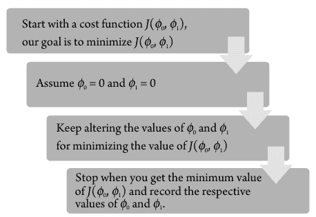

**图 5.19** 梯度下降的基本思想

考虑如图 5.20 所示的图，其中我们在 x 轴上表示 $\phi_0$，在 y 轴上表示 $\phi_1$，在 z 轴上表示代价函数 $J(\phi_0, \phi_1)$ 的相应值。所得图是使用我们的假设对不同参数值获得的代价函数值。让我们假设我们有一个代价函数，其图如图 5.20 所示。现在，我们的目标是使用梯度下降来最小化它。

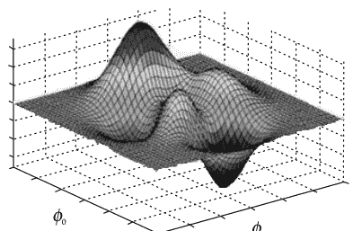

**图 5.20** 需要最小化的代价函数的 3D 图

让我们假设图 5.21 中的点 A 作为起点。这里，我们随机初始化了 $\phi_0$ 和 $\phi_1$ 的值，为此我们将得到一个特定的代价函数值，由点 A 表示。现在，我们的想法是调整 $\phi_0$ 和 $\phi_1$ 的值，以便找到代价函数的最小值。为此，我们必须通过小幅度的迭代变化来改变 $\phi_0$ 和 $\phi_1$ 的值，通过遵循最小路径来达到最近且最小的代价函数值。

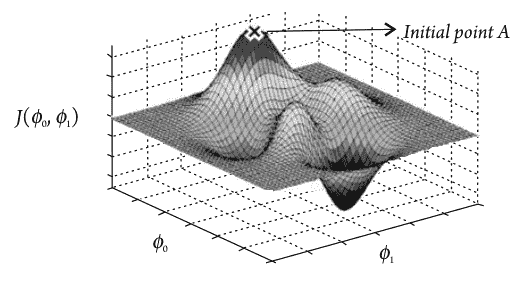

**图 5.21** 在点 A 处初始化参数

这就像你站在某个草地公园的一座山丘（初始点）上的某个位置，你的目标是尽快到达山下，如图 5.21 所示。为此，我们将朝着下坡方向迈出小步。关键问题是你应该朝哪个方向移动才能在最短的时间内到达山下。

嗯，实际上，你会环顾四周，通过迈出小步前进，最好的方向是你意识到自己已经移动到更低海拔的方向。如果你移动到了更低的海拔，那就是最好的方向；否则，考虑另一个方向。简单地说，你必须朝着斜率值最大的方向移动，因为只有这条路径才能将你带到更低的海拔。遵循这个原则，让我们假设它朝着图 5.22 所示的方向迈出了一小步。

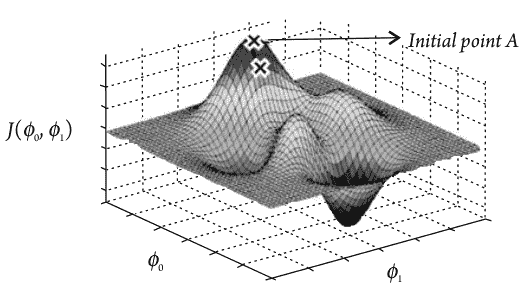

**图 5.22** 迈出一小步后的代价函数

然后，在此之后，你会再次环顾四周，并说应该朝哪个方向迈出小步下山？遵循同样的原则，让我们假设它朝着图 5.23 和 5.24 所示的方向迈出了一小步。

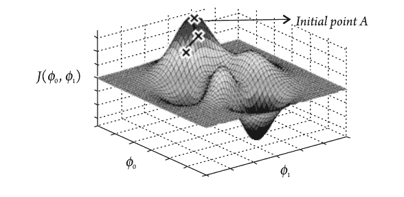

**图 5.23** 从 A 点开始向更低海拔移动

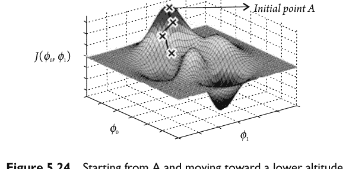

**图 5.24** 从 A 点开始向更低海拔移动

类似地，你将继续，直到收敛到一个局部最小值（下坡），如图 5.25 所示。

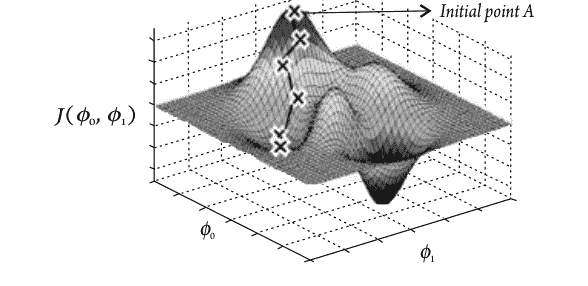

**图 5.25** 从初始点 A 到达最小值

需要注意的是，如果代价函数有多个最小值，那么我们可能会根据参数 $\phi_0$ 和 $\phi_1$ 的初始值达到不同的最小值。如图 5.26 所示，我们取了不同的初始点，因此对于相同的代价函数，我们得到了另一个最小值点。同样，这是一个基于不同初始点选择的局部最小值。

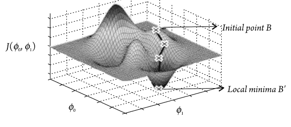

**图 5.26** 从初始点 B 向下坡移动

因此，我们可以得出结论，一个代价函数可能有多个局部最小值，并且根据我们的初始点，我们可以达到不同的局部最小值。这也在图 5.27 中进行了说明。这里，代价函数显示在 2D 平面中。

在存在多个局部最小值的情况下，从所有可用的局部最小值解中找到全局最小值将是一个挑战。如图 5.27 所示，全局最小值是 M3。我们可以使用不同的技术从可用的局部最小值集合中找到全局最小值。一种常用的寻找全局最小值的技术是应用遗传算法，其中所有局部最小值将作为种群，遗传算法选择最佳的一个，即全局最小值。我们将在第 22 章中进一步讨论遗传算法。

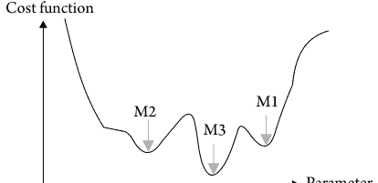

**图 5.27** 同一图的不同局部最小值

需要注意的是，在简单线性回归的情况下，代价函数总是呈碗状，如图 5.28(a) 在 3D 平面和图 5.28(b) 在 2D 平面中所示，因此它只有一个最小值，该最小值同时充当局部和全局最小值。因此，在简单线性回归的情况下，寻找全局最小值没有挑战。

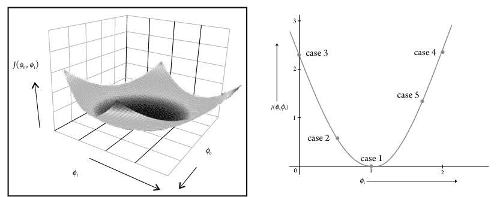

**图 5.28** 简单线性回归的代价函数

在梯度下降算法中，我们复制相同的现象。首先，我们决定应该移动的方向，然后是决定所选方向的步长值。换句话说，我们必须决定是增加还是减少参数 $\phi_0$ 和 $\phi_1$ 的初始值，然后决定这种增加或减少的量。

## 5.6 梯度下降算法的数学理解

为了从数学上理解梯度下降算法的工作原理，让我们取一个代价函数，其中只有一个变量参数 $\phi_1$，而另一个参数 $\phi_0$ 固定为 0，以便通过 2D 表示来理解它（因为它只有两个变量：一个是代价函数，另一个是参数 $\phi_1$）。代价函数相对于参数 $\phi_1$ 的表示如图 5.29 所示。

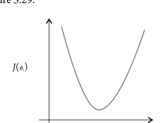

**图 5.29** 具有一个参数的代价函数图

让我们假设我们将参数 $\phi_1$ 初始化在图 5.30 所示的点 A。

### 直线的斜率

直线的斜率是衡量直线陡峭程度的指标。它用 *m* 表示，是沿直线测量的 *y* 坐标变化量与 *x* 坐标变化量的比值，如下所示。

$$\text{斜率}(m) = \frac{y \text{ 的变化量}}{x \text{ 的变化量}} = \frac{\Delta y}{\Delta x}$$

如果这对你来说数学味太浓，让我们用通俗易懂的语言来解释斜率的定义，理解这个概念。

首先，让我们假设图 5.31 是用于求斜率的直线。

**图 5.31** 需要求其斜率的给定直线

让我们从给定的直线中构造一个三角形。如果你构造正确，你的三角形看起来会有点像图 5.32。

在图 5.32 中，垂直边用 *y* 表示，三角形的水平边用 *x* 表示。直线 *m* 的斜率由下式给出：

$$m = \frac{y}{x}$$

**图 5.32** 从给定直线构造三角形

现在，想象站在三角形的顶端，从那里滚下一个球。球滚落得越快，斜率就越大。球滚动得越慢，斜率就越小。图 5.33 描绘了相同的现象。在图 5.33(a) 中，直线（球沿其滚落）的斜率比图 5.33(b) 中直线的斜率大，因为球在图 5.33(b) 中移动得非常缓慢。

**图 5.33(a)** 当直线斜率较大时

**图 5.33(b)** 当直线斜率较小时

与其说慢或快，不如说如果 Rishhan 从图 5.32 所示三角形的点 A 出发，向点 B 移动。那么，相对于起点，Rishhan 上升了多高？这正是斜率的度量。如果他上升得很高，斜率就大；否则，斜率就小。或者你可以说

$$m = \frac{y}{x}$$

其中 $m$ 是直线的斜率。

你可以看到，在图 5.33(a) 和 5.33(b) 中，$x$（分母）是相同的，而图 5.33(a) 中的 $y$ 比图 5.33(b) 中的 $y$ 大，所以图 5.33(a) 的斜率比图 5.33(b) 的斜率大。

上面的公式意味着，当我们改变宽度 $x$ 和高度 $y$ 时，斜率 $m$ 会发生变化。斜率是 $y$ 相对于 $x$ 的变化量的比值，我们得到了这个简单的公式。

所以，最终，我们得到直线的斜率 $m = \frac{y}{x} = \frac{y \text{ 的变化量}}{x \text{ 的变化量}}$

**例 5.1：** 让我们将公式应用于一些实际数字，找出 Rishhan 行走的直线 $AB$ 的斜率。他从 $B$ 到 $A$ 的路径如图 5.34 所示。

**解：** Rishhan 从 $B(6,4)$ 走到 $A(1,2)$。
$y$ 的变化量 $= 4 - 2 = 2$ 单位
而 $x$ 的变化量 $= 6 - 1 = 5$ 单位
$\Rightarrow m = \frac{y}{x} = \frac{y \text{ 的变化量}}{x \text{ 的变化量}} = \frac{2}{5}$
$\Rightarrow$ 因此，直线 $AB$ 的斜率是 $\frac{2}{5}$

**图 5.34** 计算直线 $AB$ 的斜率

需要注意的是，上述变化是通过将 $B$ 视为起点、$A$ 视为终点来计算的。如果我们交换这两个点，计算结果将与下面所示相同。

将 $A$ 视为起点，$B$ 视为终点。
$y$ 的变化量 $= 2 - 4 = -2$ 单位
而 $x$ 的变化量 $= 1 - 6 = -5$ 单位
$\Rightarrow m = \frac{y}{x} = \frac{y \text{ 的变化量}}{x \text{ 的变化量}} = \frac{-2}{-5}$
$\Rightarrow$ 因此，直线 $AB$ 的斜率是 $\frac{2}{5}$

让我们再举几个例子，以理解不同情况下直线的斜率。

**例 5.2：** 考虑图 5.35 所示的直线 $AB$。我们需要计算这条直线的斜率，然后如下所示进行计算。

$m(AB) = \frac{y \text{ 的变化量}}{x \text{ 的变化量}} = \frac{(4-1)}{(4-1)} = 1 \text{ (正斜率)}$

**图 5.35** 直线的正斜率

**例 5.3：** 考虑图 5.36 所示的直线 $AB$。我们需要计算这条直线的斜率，然后如下所示进行计算：

$m(AB) = \frac{y \text{ 的变化量}}{x \text{ 的变化量}} = \frac{(4-1)}{(1-4)} = -1 \text{ (负斜率)}$

**图 5.36** 直线的负斜率

**例 5.4：** 计算图 5.37 所示的直线 *AB* 的斜率，其中 *A* (−6, 4) 和 *B* (6, 4)。

**图 5.37** 直线的零斜率

$m(AB) = \frac{y \text{ 的变化量}}{x \text{ 的变化量}} = \frac{(4-4)}{(-6-6)} = 0$ (零斜率，如图 5.37 所示)

因此，我们可以得出结论：“上坡”表示直线的正斜率，“下坡”表示直线的负斜率，“水平”表示直线的零斜率，如图 5.38 所示。

**图 5.38** 直线斜率的各种情况

现在，让我们继续前进，看看如何确定曲线的斜率。

### 曲线的斜率

简单地弯曲一条直线，我们就得到了一条曲线。我们打算找出曲线的斜率。图 5.39 显示了一条示例曲线。让我们假设曲线的方程是 $y = f(x)$。这条曲线的斜率在其上的每一点都不同。因此，我们不谈论曲线的斜率，而是谈论曲线上某个特定点的斜率。因此，我们在曲线上取了一个随机点 T，如图 5.39 所示。如果我们假设 T 的 $x$ 坐标为 $p$，那么点 T 的坐标就是 $(p, f(p))$。这将帮助我们找到由 $f(x)$ 给出的曲线 $y$ 的斜率，如图 5.39 所示。对于给定的点 T，x 轴的值是 $p$；因此，y 轴的值将是 $f(p)$。因此，T 的坐标为 $(p, f(p))$。

**图 5.39** 由 $f(x)$ 给出的曲线在点 T 处的斜率

类似地，我们将讨论曲线上的另一个点 T'，其 $x$ 坐标比 T 远 $h$ 个单位，如图 5.40 所示。T' 的坐标是 $(p + h, f(p + h))$。

我们将在曲线上的 T 和 T' 之间构造一条直线 TT'，如图 5.41 所示。

**图 5.40** 曲线 $y = f(x)$ 上的点 T 和 T'

**图 5.41** 在曲线 $y = f(x)$ 上构造直线 TT'

直线 TT' 的斜率计算如下：

$m(TT') = \frac{y \text{ 的变化量}}{x \text{ 的变化量}} = \frac{f(p+h) - f(p)}{p+h - p} = \frac{f(p+h) - f(p)}{h}$

你可能在想，当我们感兴趣的是找出点 T 处曲线的斜率时，为什么我们要找直线的斜率。嗯，为了找出点 T 处曲线的斜率，我们将点 T' 向 T 滑动。这意味着 $h$ 会变得越来越小。我们将不断减小 $h$ 的值，直到第二个点 T' 几乎滑到点 T 的顶部。但要确保你不要让它等于 0，因为 $h = 0$ 意味着我们要除以 0，而除以 0 是数学上的噩梦！

因此，这里我们引入了 *极限* 的概念，所以现在我们可以将曲线的斜率写成如下形式。

$\lim_{h \to 0} (\text{直线 TT' 的斜率})$

这意味着 $h$ 趋近于零的极限，或者 $h$ 变得非常接近 0 但不等于 0，这样我们就可以找到曲线上某一点的斜率。因此，通过引入极限，我们将第二个点 T' 带到了点 T 上。

$\Rightarrow$ 点 $T$ 处曲线的斜率 $= \lim_{h \to 0} \left( \frac{f(p+h) - f(p)}{h} \right)$

我们通过这个表达式得到点 T 处曲线的斜率。这也是曲线 $f(x)$ 在点 T 处的导数。

因此，要找到点 T 处曲线的斜率，我们可以先求出曲线的导数，然后代入该点的坐标。

这个关于斜率的精彩解释灵感来源于 Khurshed Batliwala 和 Dinesh Ghodke 的书 *Happiness Express*。

如前所述，曲线的斜率可以通过求导来获得，如图5.42所示。首先，我们对代价函数求导，得到函数的切线。所得切线的斜率将为我们指明进一步前进的方向。因此，我们将在任意点处求导，并沿着最陡下降的方向迈出步伐。

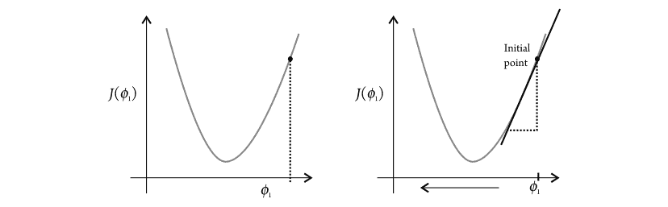

前进方向由该点的斜率决定，而步长则由学习率（记为α）决定。关于学习率及其重要性的详细内容将在下一小节中讨论。参数的更新值是根据曲线的斜率（由代价函数的导数给出）和步长（记为α）来计算的，如公式5.4所示。

梯度下降算法使用以下表达式在每一步计算 $\phi_0$ 和 $\phi_1$。

$$\phi_j := \phi_j - \alpha \frac{\partial}{\partial \phi_j} J(\phi_0, \phi_1) \text{ for } j=0 \text{ and } j=1$$

重复计算，直到我们收敛到代价函数 $J(\phi_0, \phi_1)$ 的最小值。

为简化起见，我们假设 $\phi_0 = 0$；因此，单参数的梯度下降算法如下：

$$\phi_1 := \phi_1 - \alpha \frac{\partial}{\partial \phi_1} J(\phi_1)$$

$\Rightarrow$ 重复计算，直到我们收敛到代价函数 $J(\phi_1)$ 的最小值。

**情况1：当初始点的斜率为正时**

现在让我们考虑情况1。我们已初始化参数 $\phi_1$，如图5.43所示。

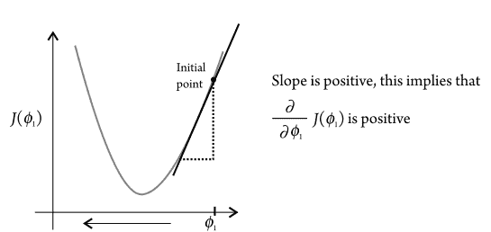

**图5.43** 情况I中初始点处的曲线斜率

此处，斜率为正；这意味着导数将返回一个正值，如图5.43所示。因此，根据梯度下降算法，参数 $\phi_1$ 的更新值将如下：

$$\Rightarrow \phi_1 = \phi_1 - \alpha \frac{\partial}{\partial \phi_1} J(\phi_1)$$

由于代价函数的导数 $\frac{\partial}{\partial \phi_1} J(\phi_1)$ 为正。因此，$\phi_1$ 的更新方程如下：

- $\Rightarrow \phi_1 = \phi_1 - \alpha * (\text{正值})$，因为斜率为正
- $\Rightarrow$ 由于 $\alpha$ 始终为正，$\phi_1$ 的值将会减小。

这意味着 $\phi_1$ 的值将减小，我们将如预期般向局部最小值移动。因此，在经过一定步数后，我们将收敛到最小值点，如图5.44所示。

这完成了梯度下降算法的第一步，我们已正确识别出向最小值移动的方向，或者说我们需要减小 $\phi_1$ 的值以达到局部最小值。然而，在所选方向上的变化量或步长值将由学习率 $\alpha$ 决定，这将在下一小节中讨论。

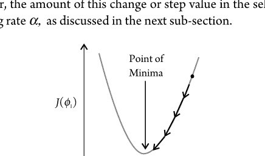

**图5.44** 收敛到最小值点

### 情况2：当初始点的斜率为负时

现在，让我们考虑情况2；我们已初始化参数 $\phi_1$，如图5.45所示。

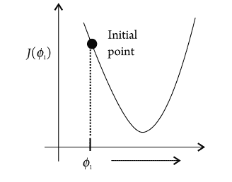

**图5.45** 梯度下降的初始点选择（情况2）

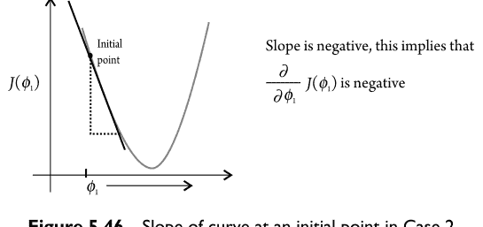

**图5.46** 情况2中初始点处的曲线斜率

此处，斜率为负，如图5.46所示，这意味着导数将返回一个负值。因此，根据梯度下降算法，参数 $\phi_1$ 的更新值将如下：

$$\Rightarrow \phi_1 = \phi_1 - \alpha \frac{\partial}{\partial \phi_1} J(\phi_1)$$

由于代价函数的导数 $\frac{\partial}{\partial \phi_1} J(\phi_1)$ 为负。因此，$\phi_1$ 的修正方程如下：

- $\Rightarrow \phi_1 = \phi_1 - \alpha * (\text{负值})$，因为斜率为负
- $\Rightarrow$ 由于 $\alpha$ 始终为正，$\phi_1$ 的值将会增加。

这意味着 $\phi_1$ 的值将增加，我们将如预期般向局部最小值移动。我们已正确识别出向最小值移动的方向。然而，同样地，在所选方向上的变化量或步长值将由学习率 $\alpha$ 决定。

因此，在经过一定步数后，我们将收敛到最小值点，如图5.47所示。

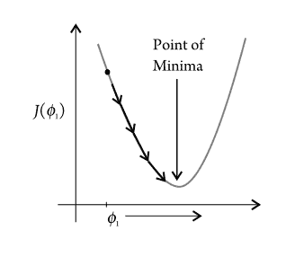

**图5.47** 收敛到最小值点

### 5.6.1 学习率 α 的作用

让我们理解学习率参数 α 的重要性。学习率参数对梯度下降算法有显著影响。由于曲线的斜率决定了变化的方向，而学习率决定了该变化的量或步长值。

学习参数的值应调整到使梯度下降能在更短时间内引导我们达到最小值。理解学习率对梯度下降算法产生显著影响的不同场景非常重要，现在，我们将逐一探讨。

**场景1：如果学习率 α 太小**

如果 α 的值太小，那么参数值变化的步长值就会很小。只需回顾参数 ϕ₁ 的更新公式即可理解这一点。

ϕ₁ = ϕ₁ - α ∂/∂ϕ₁ J(ϕ₁)

导数决定了变化的方向，而该变化的量由 α 决定。如果 α 很小，这种变化的速率就会很低。这意味着它将以较小的步长值到达最小值，并且需要更多时间才能收敛到局部最小值，如图5.48所示。

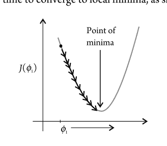

**图5.48** 当学习率较低时

因此，我们可以得出结论：到达局部最小值的移动方向由导数函数或曲线的斜率决定。相反，$\alpha$ 的值决定了该方向上的步长大小，如果 $\alpha$ 很小，则需要更多时间才能收敛到局部最小值。

#### 场景2：如果学习率 $lpha$ 太大

如果 $\alpha$ 的值很大，步长值就会很大，梯度下降将快速收敛到最小值，如图5.49所示。

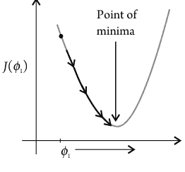

**图5.49** 当学习率较大时

但应该小心，因为如果 $\alpha$ 太大，它可能无法收敛到最小值，或者可能越过最小值，如图5.50所示。

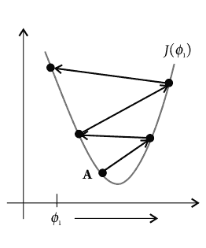

**图5.50** 当学习率过大时

你能找出这种越界的原因吗？

让我们讨论这个场景以理解它；假设我们从点A开始，使用一个很大的 $\alpha$ 值，如图5.51所示。

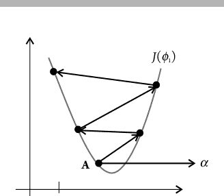

**图5.51** 使用非常大的学习率 $\alpha$ 在点A初始化

由于学习率非常大，它将导致一个很大的步长，并最终到达点B，如图5.52所示。

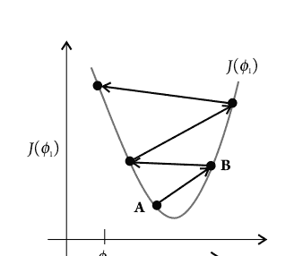

**图5.52** 从点A到点B的大步长

由于曲线在B点的斜率大于A点的斜率，且 $\alpha$ 的值相同，根据梯度下降算法，它将迈出比前一步更大的步伐。由于这个大步长，我们将最终到达点C，如图5.53所示。

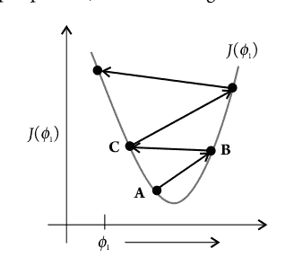

**图5.53** 从点B到点C的大步长

现在，曲线在C点的斜率大于B点的斜率，并且由于 $\alpha$ 相同，我们将再次跃得更高，并最终迈出比之前在C点时更大的步伐。这样，我们将到达点D，如图5.54所示。

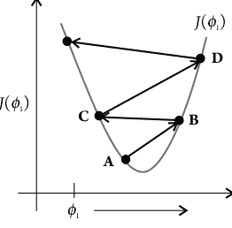

**图5.54** 从点C到点D的大步长

可以很容易地想象出，我们正在远离局部最小值。每一步之后，曲线的斜率增加，系统将继续迈出比前一步更大的步伐。最终，我们非但没有收敛到局部最小值，反而离它越来越远。更确切地说，我们可以说，由于学习率 $\alpha$ 非常大，我们从局部最小值发散了。

因此，找到合适的 $\alpha$ 值非常重要，因为如果它太小，收敛需要更多时间；如果它太大，则可能越过局部最小值，我们可能发散而不是收敛到一个点。所以，$\alpha$ 不应太小或太大。

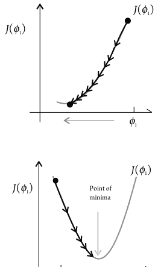

**图5.55** 接近最小值点时减小步长

关于学习率，还有另一个非常有趣的点需要注意。我们希望算法能够确保：当它远离局部最小值时，它应该朝着最小值迈出更大的步伐；而当它接近最小值时，它应该迈出更小的步伐，以确保不会错过最小值点，如图5.55所示。

曲线的斜率自动确保了这一点，并且它确保了当我们越接近最小值时，步长值会变得越小。在开始时，如果我们初始化的点远离最小值，它会迈出更大的步伐，而当我们越接近最小值时，这些步伐会变得越短，如图5.55所示。

让我们更清晰地理解这一点。假设我们在点A处初始化，并且$\alpha$是固定的。由于斜率相当大，梯度下降将大幅增加参数$\phi_0$的值，假设我们最终到达点B，如图5.56所示。

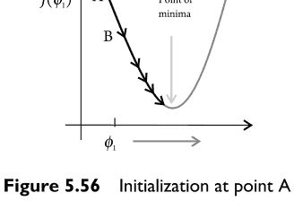

**图5.56** 在点A处初始化

在点B，曲线的斜率与点A处的斜率相比很小（这意味着导数会给出一个较小的值），并且$\alpha$是固定的；根据下面给出的公式，梯度下降将比上一步增加参数$\phi_1$的值更少（步长已自动减小），假设我们最终到达点C，如图5.57所示。

$$\phi_1 = \phi_1 - \alpha \frac{\partial}{\partial \phi_1} J(\phi_1)$$

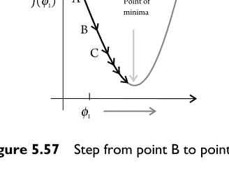

**图5.57** 从点B到点C的步骤

由于$\alpha$是固定的，并且由于B点相对于A点斜率减小，导数产生了一个较小的值，因此$\phi_1$值的变化将小于点A处的变化。所以，它迈出一小步移动到点C。

在点C，曲线的斜率与点B处的斜率相比很小，并且$\alpha$是固定的；梯度下降将比前一种情况增加参数$\phi_1$的值更少（当我们朝着最小值点前进时，步长会变得更小），梯度下降迈出更小的一步，因此我们将最终到达点D，如图5.58所示。

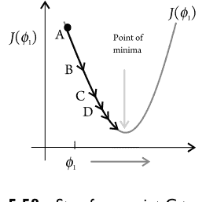

**图5.58** 从点C到点D的步骤

因此，可以很容易地得出结论：当我们越接近最小值时，由于斜率减小，步长会变得越来越短。所以，即使不减小$\alpha$的值，通过保持$\alpha$固定，我们也能达到类似的效果，因为梯度下降在接近最小值点时会自动开始减小步长。因此，即使学习率是固定的，由于斜率的变化，我们也能实现参数$\phi_1$的可变变化率。需要注意的是，当到达局部最小值时，导数将为零，因为导数线的斜率为0。因此，梯度下降算法在到达最小值点后会自动停止。

### 5.6.2 使用梯度下降算法计算参数值

如前所述，实际上我们不是调整一个参数，而是调整两个参数，因此广义的梯度下降算法将在每一步使用以下表达式来计算$\phi_0$和$\phi_1$。

$$\phi_j := \phi_j - \alpha \frac{\partial}{\partial \phi_j} J(\phi_0, \phi_1) \text{ for } j=0 \text{ and } j=1$$

重复计算，直到我们收敛到代价函数$J(\phi_0, \phi_1)$的最小值。

因此，它变为

$$\phi_0 := \phi_0 - \alpha \frac{\partial}{\partial \phi_0} J(\phi_0, \phi_1)$$

$$\phi_1 := \phi_1 - \alpha \frac{\partial}{\partial \phi_1} J(\phi_0, \phi_1)$$

让我们解读上述表达式中符号的含义并理解该过程。参考图5.59，其中解释了每个符号的含义。

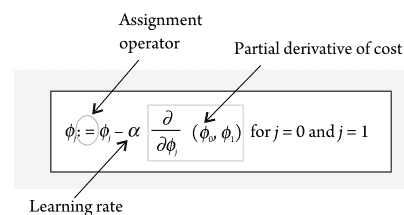

**图5.59** 梯度下降算法中使用的符号

**注意：** 赋值运算符在此处表示为“:=”（冒号后跟一个等号）；这与“=”符号不同，后者用于真值断言或检查条件（例如，$a$是否等于$b$）。

使用上述方程，我们将计算$\phi_0$和$\phi_1$的值，直到获得代价函数的最小值。需要注意的是，参数的值需要同时更新。

因为在任何时刻，我们都不能分离参数$\phi_0, \phi_1$，所以它们应该同时更新。否则，算法将无法收敛到局部最小值。

考虑表5.6中给出的场景，以便更好地理解这一点。

**表5.6** 更新参数值的场景

| 同时更新参数值 | $varTemp0 := \phi_0 - \alpha \frac{\partial}{\partial \phi_0} J(\phi_0, \phi_1)$<br><br>$varTemp1 := \phi_1 - \alpha \frac{\partial}{\partial \phi_1} J(\phi_0, \phi_1)$<br><br>首先，计算$\phi_0$和$\phi_1$的值，并将它们分别存储在临时变量$varTemp0$和$varTemp1$中。<br><br>一旦计算出的值被传递到$varTemp0$和$varTemp1$，然后同时传递给$\phi_0$和$\phi_1$。<br><br>$\phi_0 = varTemp0$<br>$\phi_1 = varTemp1$ |
| --- | --- |
| 替代（错误）的参数值更新方法 | <br><br>$varTemp0 := \phi_0 - \alpha \frac{\partial}{\partial \phi_0} J(\phi_0, \phi_1)$<br><br>首先，计算$\phi_0$的值并将其存储在$varTemp0$中，然后在下一步中，将$varTemp0$的值传递给**更新**$\phi_0$。<br><br>$\phi_0 = varTemp0$<br><br>现在，使用上一步计算出的更新后的$\phi_0$值来计算$\phi_1$。<br><br>$varTemp1 := \phi_1 - \alpha \frac{\partial}{\partial \phi_1} J(\phi_0, \phi_1)$<br><br>$\phi_1 = varTemp1$<br><br>这是错误的方法，梯度下降将无法收敛以最小化代价函数。 |

**示例：** 考虑一个代价函数的图，其中你有$A(\phi_0, \phi_1)$作为初始点，并且你需要找到代价函数的最小值。代价函数的最小值（局部最小值）在$D(\phi_0, \phi_1)$处找到。如果学习率是$\alpha$，写下使用梯度下降从A遍历到D的步骤。

解：我们将从$A(\phi_0, \phi_1)$或$(\phi_{0A}, \phi_{1A})$开始

$\Rightarrow varTemp0 := \phi_{0A} - \alpha \frac{\partial}{\partial \phi_0} J(\phi_{0A}, \phi_{1A})$

$\Rightarrow varTemp1 := \phi_{1A} - \alpha \frac{\partial}{\partial \phi_1} J(\phi_{0A}, \phi_{1A})$

$\Rightarrow \phi_0 = varTemp0$ 且 $\phi_1 = varTemp1$

**这将是我们的点B($\phi_0, \phi_1$) 或 ($\phi_{0B}, \phi_{1B}$)**

$\Rightarrow varTemp0 := \phi_{0B} - \alpha \frac{\partial}{\partial \phi_0} J(\phi_{0B}, \phi_{1B})$

$\Rightarrow varTemp1 := \phi_{1B} - \alpha \frac{\partial}{\partial \phi_1} J(\phi_{0B}, \phi_{1B})$

$\Rightarrow \phi_0 = varTemp0$ 且 $\phi_1 = varTemp1$

**这将是我们的点C($\phi_0, \phi_1$) 或 ($\phi_{0C}, \phi_{1C}$)**

$\Rightarrow varTemp0 := \phi_{0C} - \alpha \frac{\partial}{\partial \phi_0} J(\phi_{0C}, \phi_{1C})$

$\Rightarrow varTemp1 := \phi_{1C} - \alpha \frac{\partial}{\partial \phi_1} J(\phi_{0C}, \phi_{1C})$

$\Rightarrow \phi_0 = varTemp0$ 且 $\phi_1 = varTemp1$

**这将是我们的点D($\phi_0, \phi_1$) 或 ($\phi_{0D}, \phi_{1D}$)**

我们将停止，因为D是局部最小值点，所以$\phi_0$的最终值为$\phi_{0D}$，$\phi_1$的最终值为$\phi_{1D}$。这就是当参数*同时更新*时梯度下降的工作原理。

最终的梯度下降算法如下：

```
重复直到收敛（得到最小值）
{
    $\phi_0 := \phi_0 - \alpha \frac{\partial}{\partial \phi_0} J(\phi_0, \phi_1)$

    $\phi_1 := \phi_1 - \alpha \frac{\partial}{\partial \phi_1} J(\phi_0, \phi_1)$
}
```

现在，让我们计算参数$\phi_0$和$\phi_1$的值。

由于代价函数，如前面方程中所讨论的，如下所示：

$J(\phi_0, \phi_1) = \frac{1}{2n} \sum_{i=1}^{n} (h_{\phi}(x_i) - y_i)^2$

现在让我们计算$\frac{\partial}{\partial \phi_0} J(\phi_0, \phi_1)$

$\frac{\partial}{\partial \phi_0} J(\phi_0, \phi_1) = \frac{\partial}{\partial \phi_0} \left\{ \frac{1}{2n} \sum_{i=1}^{n} (h_{\phi}(x_i) - y_i)^2 \right\}$

在计算偏导数时，我们必须记住，除了$\phi_0$之外，其他一切都是常数，即$x$、$y$和$\phi_1$。

$\frac{\partial}{\partial \phi_0} J(\phi_0, \phi_1) = \frac{\partial}{\partial \phi_0} \left\{ \frac{1}{2n} \sum_{i=1}^{n} (h_{\phi}(x_i) - y_i)^2 \right\}$

应用标量乘法规则，

标量乘法规则：$\frac{d(ku)}{dx} = k. \frac{du}{dx}$，我们得到：

$\Rightarrow \quad \frac{\partial}{\partial \phi_0} J(\phi_0, \phi_1) = \frac{1}{2n} \sum_{i=1}^{n} \left\{ \frac{\partial}{\partial \phi_0} (h_{\phi}(x_i) - y_i)^2 \right\}$

现在，应用幂法则；

幂法则：$\frac{d(u^k)}{dx} = k.u^{k-1} \frac{du}{dx}$，我们得到：

$\Rightarrow \frac{\partial}{\partial \phi_0} J(\phi_0, \phi_1) = \frac{1}{2n} \sum_{i=1}^{n} \left\{ 2.(h_{\phi}(x_i) - y_i). \frac{\partial}{\partial \phi_0} (h_{\phi}(x_i) - y_i) \right\}$

$\Rightarrow \frac{\partial}{\partial \phi_0} J(\phi_0, \phi_1) = \frac{1}{2n} \sum_{i=1}^{n} \left\{ 2.(h_{\phi}(x_i) - y_i). \frac{\partial}{\partial \phi_0} ((\phi_0 + \phi_1 x) - y_i) \right\}$

将 $h_{\phi}(x)$ 替换为 $\phi_0 + \phi_1 x$（已知 $h_{\phi}(x) = \phi_0 + \phi_1 x$），且 $\frac{\partial}{\partial \phi_0} ((\phi_0 + \phi_1 x) - y_i)$ 等于 1。

$\Rightarrow \frac{\partial}{\partial \phi_0} J(\phi_0, \phi_1) = \frac{1}{2n} \sum_{i=1}^{n} \left\{ 2.(h_{\phi}(x_i) - y_i).1 \right\}$

$\Rightarrow \frac{\partial}{\partial \phi_0} J(\phi_0, \phi_1) = \frac{1}{n} \sum_{i=1}^{n} \left\{ (h_{\phi}(x_i) - y_i) \right\}$

因此，参数 $\phi_0$ 将按如下方式计算。

$\phi_0 := \phi_0 - \alpha \frac{\partial}{\partial \phi_0} J(\phi_0, \phi_1)$

将 $\frac{\partial}{\partial \phi_0} J(\phi_0, \phi_1)$ 替换为 $\frac{1}{n} \sum_{i=1}^{n} \left\{ (h_{\phi}(x_i) - y_i) \right\}$

$\phi_0 := \phi_0 - \alpha . \frac{1}{n} \sum_{i=1}^{n} \left\{ (h_{\phi}(x_i) - y_i) \right\}$

现在，让我们按如下方式计算 $\phi_1$ 的值。

$\phi_1 := \phi_1 - \alpha \frac{\partial}{\partial \phi_1} J(\phi_0, \phi_1)$

为此，我们首先需要计算 $\frac{\partial}{\partial \phi_1} J(\phi_0, \phi_1)$ 的值。

$\frac{\partial}{\partial \phi_1} J(\phi_0, \phi_1) = \frac{1}{2n} \sum_{i=1}^{n} \left\{ \frac{\partial}{\partial \phi_1} (h_{\phi}(x_i) - y_i)^2 \right\}$

$\Rightarrow \frac{\partial}{\partial \phi_1} J(\phi_0, \phi_1) = \frac{1}{2n} \sum_{i=1}^{n} \left\{ 2.(h_{\phi}(x_i) - y_i). \frac{\partial}{\partial \phi_1} (h_{\phi}(x_i) - y_i) \right\}$

将 $h_{\phi}(x_i)$ 替换为 $\phi_0 + \phi_1 x_i$（已知 $h_{\phi}(x) = \phi_0 + \phi_1 x_i$）

$$\Rightarrow \frac{\partial}{\partial \phi_1} J(\phi_0, \phi_1) = \frac{1}{2n} \sum_{i=1}^{n} \left\{ 2.(h_{\phi}(x_i) - y_i). \frac{\partial}{\partial \phi_1} ((\phi_0 + \phi_1 x_i) - y_i) \right\}$$

$$\Rightarrow \frac{\partial}{\partial \phi_1} J(\phi_0, \phi_1) = \frac{1}{2n} \sum_{i=1}^{n} \left\{ 2.(h_{\phi}(x_i) - y_i).x_i \right\}$$

$$\Rightarrow \frac{\partial}{\partial \phi_1} J(\phi_0, \phi_1) = \frac{1}{n} \sum_{i=1}^{n} \left\{ (h_{\phi}(x_i) - y_i).x_i \right\}$$

因此，参数 $\phi_1$ 将按如下方式计算。

$$\phi_1 := \phi_1 - \alpha \frac{\partial}{\partial \phi_1} J(\phi_0, \phi_1)$$

将 $\frac{\partial}{\partial \phi_1} J(\phi_0, \phi_1)$ 替换为 $\frac{1}{n} \sum_{i=1}^{n} \left\{ (h_{\phi}(x_i) - y_i).x_i \right\}$

$$\phi_1 := \phi_1 - \alpha. \frac{1}{n} \sum_{i=1}^{n} \left\{ (h_{\phi}(x_i) - y_i).x_i \right\}$$

因此，最终，根据我们的简单线性回归模型，梯度下降的修正方程如下：

> 重复直到收敛（得到最小值）
{
    $\phi_0 := \phi_0 - \alpha. \frac{1}{n} \sum_{i=1}^{n} \left\{ (h_{\phi}(x_i) - y_i) \right\}$

    $\phi_1 := \phi_1 - \alpha. \frac{1}{n} \sum_{i=1}^{n} \left\{ (h_{\phi}(x_i) - y_i).x_i \right\}$
}
$\phi_0$ 和 $\phi_1$ 将同时更新。

尽管我们从一个初始猜测开始，但随着梯度下降迭代次数的增加，我们将显著地得到一个更准确的假设，其中包含合适的 $\phi_0$ 和 $\phi_1$，使得代价函数最小。在每一步中，该方法都会检查训练集中的每个条目，因此它被称为批量梯度下降。

还必须注意，对于我们的简单线性回归模型，通过梯度下降算法得到的最小值将只给出一个最小值，并且这将同时充当局部最小值和全局最小值，因为对于线性回归，代价函数的形状是凸的或碗状的，如图 5.60 所示。


**图 5.60** 线性回归模型的代价函数

以上就是关于梯度下降算法和简单线性回归的全部内容。因此，我们可以得出结论，梯度下降算法用于寻找参数的最优值。它有助于在数据点上构建最佳拟合直线，以预测测试数据的值。

在简单线性回归的情况下，梯度下降算法用于寻找 $\phi_0$ 和 $\phi_1$ 的值，而在多元线性回归的情况下，它用于寻找 $n$ 个参数的值，因为在多元线性回归的情况下我们有多个输入属性。我们将在第 7 章详细讨论多元线性回归。

#### 提醒我

- 简单线性回归基于一个自变量（比如 $x$）来预测一个因变量（比如 $y$）。
- 简单线性回归只有一个自变量。
- 简单线性回归在数据集上构建了一条可能的拟合直线。
- 学习算法的输出被称为假设。
- 假设表示为 $h_{\phi}(x) = \phi_0 + \phi_1 x$。
- 简单线性回归模型的目标是最小化代价函数或平方误差之和，即 $\sum_{i=1}^{n} (\text{预测值} - \text{实际值})^2$。
- 梯度下降算法帮助我们实现最小化此代价函数的目标。
- 梯度下降算法有助于找到参数的最优值。
- 找到合适的学习率 $\alpha$ 值非常重要，因为如果它太小，收敛将需要更多时间；如果它太大，则可能会错过局部最小值。

#### 附加资源

##### 视频链接

- 机器学习专项课程 [课程 1，第 1 周，第 3 课]
https://youtu.be/dLc-lfEEYss?si=nz0CKsVWR0WavgJq


- 机器学习专项课程 [课程 1，第 1 周，第 3 课]
https://youtu.be/KWULpBYzIYk?si=K_ELwq0iZLKPz5oG


- 机器学习专项课程 [课程 1，第 1 周，第 3 课]
https://youtu.be/CFN5zHzEuGY?si=uvRQ6ABa5Z4MJIUJ


- 机器学习专项课程 [课程 1，第 1 周，第 3 课]
https://youtu.be/peNRqkfukYY?si=I09Vh-RJj7LAuuRw


- 机器学习专项课程 [课程 1，第 1 周，第 3 课]
https://youtu.be/bFNz2u0hl9E?si=BDDriOIFHibBRdUM


- 机器学习专项课程 [课程 1，第 1 周，第 3 课]
https://youtu.be/L5INhX5cbWU?si=JzH_qpMDOlHvtzYC


- 机器学习专项课程 [课程 1，第 1 周，第 4 课]
https://youtu.be/WtlvKq_zxPI?si=4PIKk-arRn-FvzFD


- 机器学习专项课程 [课程 1，第 1 周，第 4 课]
https://youtu.be/w_2vCijLiiM?si=nxwmdz3krZ9CCHvI


- 机器学习专项课程 [课程 1，第 1 周，第 4 课]
https://youtu.be/PKm61nrqpCA?si=XYtBjU0FwMVfQeTs


- 机器学习专项课程 [课程 1，第 1 周，第 4 课]
https://youtu.be/k0h8emRAAHE?si=spHVJ1zQCkRqJMlr


- 机器学习专项课程 [课程 1，第 1 周，第 4 课]
https://youtu.be/RGL_XUjPkGo?si=oQOiJnYq6yU0V6sx


##### 博客链接

- 数据科学简化 第 4 部分：简单线性回归模型，https://towardsdatascience.com/data-science-simplified-simple-linear-regression-models-3a97811a6a3d
- 线性回归分析，https://dataaspirant.com/2014/10/02/linear-regression/


#### 测试我（问题）

1. 线性回归是一种监督式机器学习算法。
   a) 正确
   b) 错误
2. 在这个方程中，哪个值用于研究输入单位变化对输出的影响？
   $h_{\phi}(x) = \phi_0 + \phi_1 x$。
   a) $h_{\phi}(x)$
   b) $\phi_0$
   c) $\phi_1$
   d) $x$
3. 在简单线性回归中，我们可以有多个局部最小值。
   a) 正确
   b) 错误
4. 假设我们设置 $\theta_0 = -1, \theta_1 = 0.5$。$h_{\theta}(4)$ 是多少？
   a) 1
   b) -1
   c) 2
   d) 以上都不是

## 6 实现简单线性回归

### 章节目标
- 导入必要的库并加载数据集。
- 将数据集划分为训练集和测试集。
- 构建简单线性模型并进行预测。
- 可视化训练集和测试集的结果。
- 计算平均绝对误差、均方误差和均方根误差。

在本章中，我们将使用Python实现简单线性回归。为了实现这一概念，我们将分析研究人员的津贴与其研究经验年限之间的关系。我们的目标是根据研究人员的研究经验预测其津贴。

### 问题陈述与数据集

为了执行此任务，我们将考虑一个包含两个属性的数据集：研究经验和津贴。该数据集包含30个观测值，用于绘制研究经验与其相应津贴之间的相关性。一个研究机构旨在找出研究经验与津贴之间的这种相关性。这将有助于管理层根据新研究员的研究经验年限提供适当的津贴，而不是随机决定。显而易见的是，津贴与研究经验成正比。经验越高，津贴就越多。我们将使用简单线性回归模型来解决这个问题。

让我们快速回顾一下简单线性回归模型的概念。我们知道，简单线性回归可以最佳拟合一条直线，以生成研究经验与津贴之间的关系。尽管数据集相当简单，但它具有巨大的商业价值，因为创建的模型将帮助机构根据研究人员的经验预测其津贴。因此，使用该模型，可以轻松预测新研究人员的津贴，这也体现了管理的透明度。在这里，研究经验（自变量）将作为我们的X轴，即水平轴。相反，津贴（待预测的变量，即因变量）将作为Y轴，即垂直轴，如图6.1所示。

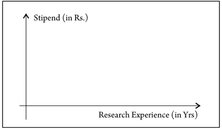

**图6.1** 问题表示

在这里，津贴依赖于自变量研究经验。因此，我们案例中的回归公式如下：

津贴 = c + 研究经验 * m

其中，c是当研究经验为0时津贴的截距，m是斜率。图6.2显示了最佳拟合我们津贴数据及其相应研究经验的截距线。

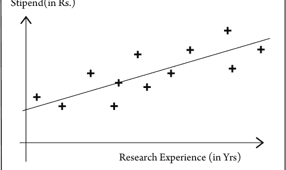

**图6.2** 津贴与研究经验关系图的最佳拟合线

这里，c指的是当自变量为0时因变量的值。在这种情况下，它意味着当研究人员的经验为0时津贴的值，或者简单地说，是支付给新招聘研究人员（或应届生）的薪水。而斜率（$m$）代表了这条直线斜率的影响，需要注意的是，最佳拟合线的斜率将是研究人员每增加一年经验所对应的津贴增量。如果这条线的斜率较小，那么每增加一年研究经验，津贴的增加量就会较小。

现在让我们在Python中对这个数据集应用简单线性回归。为此，让我们遵循以下步骤。如下所示，你可以按照代码并逐步执行以实现该模型。

https://github.com/bhatiaparteek/ml_with_python/tree/main/Chapter_6_Simple_Linear_Regresssion


Parteek Bhatia的这个在线机器学习课程全面涵盖了回归的实现，你可以通过观看教学视频进一步加深理解。

https://www.learncompscience.com/challenge-page/d9783b55-e5c1-409e-9814-2d911ca2bcea


### 6.1 步骤1：加载数据集


步骤1：导入库并加载数据集以实现简单线性回归，Parteek Bhatia，https://youtu.be/lAlWjhTABGU


第一步是加载数据集，为此，我们必须选择包含CSV格式数据文件的所需文件夹；选择后，我们将该文件夹设置为工作目录。为此，使用文件资源管理器选项选择包含数据集文件的所需文件夹，如图6.3所示。

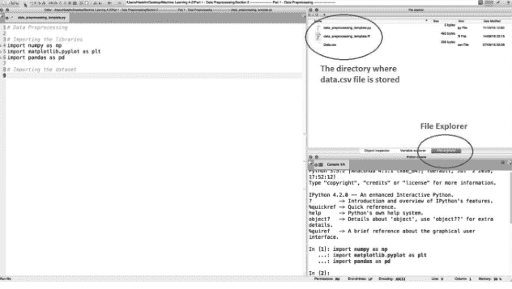

选择包含数据集的文件后，我们将处理数据。第一步是导入创建模型和处理数据所需的基本工具所需的库。这些库是NumPy、Pandas和Matplotlib的pyplot。导入这些库的代码如下所示。

```
#导入库
import numpy as np
import pandas as pd
import matplotlib.pyplot as plt
```

导入库后，我们必须使用Pandas的`read_csv`方法读取CSV文件数据集，如下所示。重要的是要确保我们的CSV文件存在于当前工作目录中。

```
# 加载数据集
dataset = pd.read_csv('StipendData.csv')
```

加载数据后，可以通过从变量资源管理器中双击数据框`dataset`来查看其内容，如图6.4(a)和6.4(b)所示。数据框`dataset`有两个属性：研究经验年限和研究助理的相应津贴。这里，研究经验是自属性（X），津贴是因变量（y），其值随经验年限而变化。接下来，我们将为因变量和自变量创建数据向量。换句话说，我们将为X（自变量）和y（因变量）创建数据向量，为此任务，我们将使用`iloc`方法，如代码片段3所示。

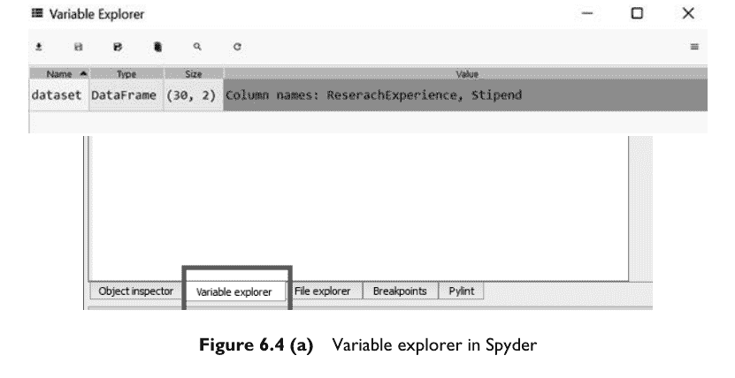

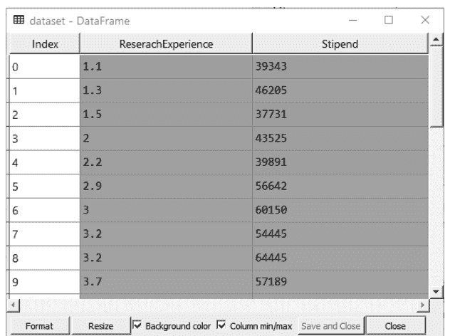

图6.4 (b) 数据框 *dataset* 的内容

代码片段：3

```
# 创建数据框
X = dataset.iloc[:, :- 1].values
y = dataset.iloc[:, 1].values
```

让我们快速回顾一下`iloc`的概念。

### iloc – Pandas选择与索引

在Python中，我们有一个用于pandas数据框的索引器，用于按位置或基于位置的索引进行选择。使用`iloc`的基本目的是按数字选择行和列。`iloc`的基本语法如下；它有两个参数，一个*行选择器*和一个*列选择器*。

```
语法 >>>data.iloc[<行选择> , <列选择>]
```

有关`iloc []`的更多详细信息，请参阅关于数据预处理的第4章，我们在其中进行了详细讨论。但是，为了清晰起见，所有重要细节都在此进行了讨论。

由于津贴是数据框的最后一列，因此必须使用除最后一列之外的所有列来创建*X*（自变量）。由于我们的数据框只包含两列，第一列，即研究经验，用于创建自变量*X*。在创建*X*期间选择数据框的所有行非常重要，因此将使用以下代码来创建*X*。

```
X = dataset.iloc[:, :-1].values
```

5. 如果学习率非常高，那么 __________。

- a) 模型将需要更多时间收敛
- b) 局部最小值可能会被越过
- c) 准确率会提高
- d) 准确率会降低

6. 为什么在梯度下降算法中学习率保持固定？

7. 学习曲线的正斜率和负斜率如何帮助决定简单线性回归中的常数和系数值？请用公式证明。

8. 用数学表达式解释代价函数。

9. 使用 $\theta_0 = 2$ 和 $\theta_1 = 2$ 如下所示，为简单线性回归拟合直线。

$Y = \theta_0 + \theta_1$

**答案：** 1. a 2. c 3. b 4. a 5. b

`iloc`的第一个参数用于指定行的范围。由于我们需要选择所有行，因此将“:”指定为第一个参数。第二个参数用于指定列的范围。在这种情况下，对于自变量*X*，我们希望使用除最后一列之外的所有列（因为最后一列是津贴，是本例中的因变量），因此我们通过未指定起始索引的数字（使用默认索引0）并使用-1来指定结束值，从而选择了除最后一列之外的所有列，如代码所示。这表示选择除最后一列之外的所有列。由于数据集仅包含两列，因此将使用研究经验来创建*X*。*values*属性将其转换为数值。

为了创建作为因变量（津贴）的*y*，我们需要选择所有行和索引为1的列（索引从0开始，ResearchExperience的索引为0，Stipend的索引为1）。因此，为了创建*y*，我们编写了以下代码片段。

```
y = dataset.iloc[:, 1].values
```

这里，第一个参数表示“所有行”，第二个参数表示“第二列（索引为1）”，即津贴。

到目前为止，在步骤1中讨论的完整代码如下所示。

```
# Importing the Libraries
import numpy as np
import pandas as pd
import matplotlib.pyplot as plt
# Loading the Dataset
dataset = pd.read_csv('StipendData.csv')
X = dataset.iloc[:, :-1].values
y = dataset.iloc[:, 1].values
```

执行此代码后，数据框*dataset*、*X*和*y*向量将在变量资源管理器选项卡中创建，其中*X*是自变量特征的数组，*y*是因变量特征的数组。

## 6.2 步骤2：将数据集拆分为训练集和测试集

步骤2a：简单线性回归实现的训练测试拆分及其必要性，Parteek Bhatia，https://youtu.be/7NWHsQRV2Ag


步骤2b：执行简单线性回归实现的训练测试拆分，Parteek Bhatia，https://youtu.be/qQswk1BeB7k


预处理阶段的下一步是将数据集拆分为训练集和测试集。由于整个数据集包含30个实例，因此将这些观测值分为两部分。在这种情况下，我们将使用20个样本用于训练目的，10个样本用于测试目的。因此，训练集的拆分比例将为2/3，这意味着`test_size`等于1/3，如下方代码所示。

为了在Python中执行数据的训练测试拆分，我们需要sklearn的`model_selection`库。该库将使用`train_test_split`方法，如下所示。

```
from sklearn.model_selection import train_test_split
```

现在，让我们构建训练集和测试集。为此，我们将同时创建并定义四个变量：`X_train`、`X_test`、`y_train`和`y_test`，如下所示。

```
X_train, X_test, y_train, y_test = train_test_split(X, y, test_size = 1/3, random_state = 0)

# the backslash \ is used as a line continuation character.
# It allows to break code into multiple lines.
```

`train_test_split()`方法有四个重要参数，如下所述。

前两个参数指的是数据数组的来源；在本例中，是X和y。然后，我们需要指定`test_size`。如前所述，在本例中`test_size`为1/3。最后一个参数是`random_state`，其值为0。

如第4章前面所讨论的，将`random_state`设置为固定值将保证每次重新运行代码时生成相同的随机数序列。这有助于验证输出。在这里，我们指定了随机数生成的种子数。当我们固定种子数时，它将始终生成相同的随机数序列，但当未固定时，它每次都会生成不同的随机数序列。如果`random_state=integer_value`，我们将为训练和测试数据获得相同数量的随机行，但如果我们将其指定为None，那么每次重新运行代码都将返回不同的行和列集，这将给测试我们的结果带来困难。需要注意的是，`random_state=1`或`random_state=2`或任何整数都将返回相同的行为，因为这些只是我们为生成随机数而固定的种子数，并且每次重新运行都将返回相同的序列，因为此种子数是固定的。

在我们的代码中，我们设置了`random_state=0`，这意味着每次运行代码时都会生成相同数量的随机数，因为种子被固定了。让我们执行下面给出的代码来执行训练测试拆分。

```
from sklearn.model_selection import train_test_split

X_train, X_test, y_train, y_test = train_test_split(X, y, test_size = 1/3, random_state = 0)

# the backslash \ is used as a line continuation character.
```

执行代码后，新变量（$X\_train$、$X\_test$、$y\_train$、$y\_test$）将在变量资源管理器中创建，如图6.5所示。

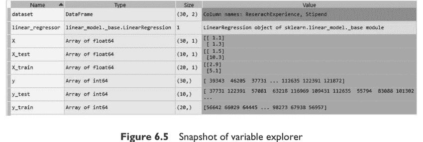

**图6.5** 变量资源管理器快照

$X\_train$是用于训练目的的数据集子集；它包含随机选择的自变量特征集（*研究经验年数*）的20个观测值。$X\_test$是用于测试的数据集子集；它包含随机选择的自变量特征集（即*研究经验年数*）的剩余10个观测值，如图6.5所示。$y\_train$是$X\_train$特征集对应的因变量（津贴）值，而$y\_test$是与$X\_test$对应的因变量（津贴）值。

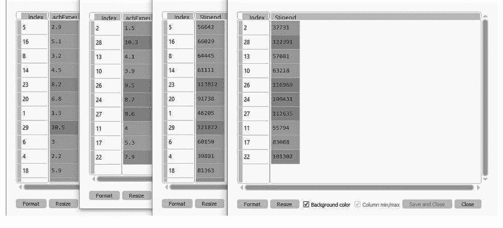

**图6.6** $X\_train$、$X\_test$、$y\_train$和$y\_test$的值

获取的变量快照如图6.6所示。它包含变量$X\_train$、$X\_test$、$y\_test$和$y\_train$的信息；典型数据预处理的下一步是特征缩放，但这里不需要，因为只有一个自变量，即本例中的研究经验。此外，`sklearn`的标准库将处理特征缩放。因此，不需要显式地应用相同的处理。

## 6.3 步骤3：构建模型并进行预测


步骤3：构建简单线性回归实现的模型，Parteek Bhatia，https://youtu.be/zHjaAolx1gA


我们将使用`sklearn`的`linear_model`库中的`LinearRegression`类来实现简单线性回归。因此，让我们首先使用下面给出的代码从`sklearn`库中导入这个类。

```
#importing LinearRegression class
from sklearn.linear_model import LinearRegression
```

导入此类后，下一步将是创建其对象。让我们为此类创建一个名为`linear_regressor`的对象，如下方代码所示。

```
#creating object
linear_regressor = LinearRegression()
```

`LinearRegression`类有两个用于构建模型和预测值的重要方法。它有一个名为`fit()`的方法，用于基于训练数据构建模型。它需要两个参数：自变量的训练数据和因变量的训练数据。因此，我们必须将`X_train`和`y_train`作为两个参数传递给此方法。为了调用此类的对象，即`linear_regressor`，如下所示。

```
#Fitting the model
linear_regressor.fit(X_train, y_train)
```

一旦创建了对象，就会调用`fit()`方法来构建模型。`fit()`方法基于训练数据学习研究经验与相应津贴值之间的相关性。

`fit()`方法在X轴和Y轴之间拟合直线以构建简单线性回归模型。一旦这条线被拟合，或者一旦模型基于`X_train`和对应的 $y\_train$，然后使用 `LinearRegression` 类的预测方法来预测 $X\_test$ 数据的值。

因此，系统从训练数据中学习（获取经验），并利用它来构建模型。一旦模型准备就绪，它就被用于对测试数据进行预测。在本例中，为了预测津贴值，我们使用已训练对象（`linear_regressor`）的 `predict()` 方法。`predict()` 方法只需要一个参数，该参数用于提供需要进行预测的测试数据值。在我们的案例中，我们必须提供 $X\_test$，因为我们希望预测这些 $X$（研究经验年限）的测试值对应的 $Y$（津贴）值，如下方代码所示。

```
# 预测测试集结果
y_pred = linear_regressor.predict(X_test)
```

使用此方法，将为给定的测试数据返回相应的预测值。这些值存储为 $y\_pred$，这是一个向量，包含与 $X\_test$ 中研究经验年限值相对应的津贴预测值。执行此代码后，变量资源管理器窗口中会创建一个新变量，即 $y\_pred$，如图 6.7 所示。

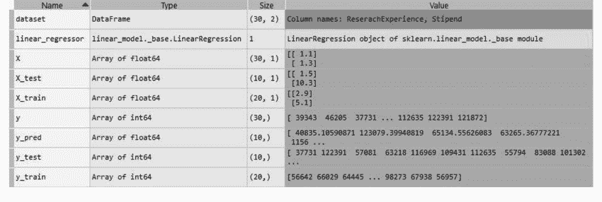

可以看出，$y\_pred$ 是为测试数据（$X\_test$）预测的一组值。此外，这些预测值可以与 $y\_test$ 向量中包含的实际津贴值进行比较。需要注意的是，$y\_test$ 包含 $X\_Test$ 中记录的实际津贴值。图 6.8 显示了 $y\_pred$ 和 $y\_test$ 的值。

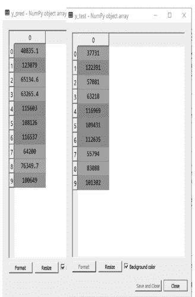

**图 6.8** *y_pred* 和 *y_test* 的值

可以对实际津贴值和相应的预测值进行分析。在图 6.8 中，可以直观地看到第一个观测值的预测工资为 40835.1，而实际为 37731（差值为 3104.1）。对于第二个观测值，预测工资为 123079，而实际为 122391（差值为 688）。在最后一个观测值中，预测工资为 100649，而实际为 101302（差值为 –653）。

因此，可以得出结论，该模型在大多数观测值上表现相当好。此外，可以观察到，简单线性回归涉及拟合一条与实际数据点紧密对齐的直线。当实际值接近该直线时，模型的准确性更高；而当这些点显著偏离该直线时，准确性会降低。当实际值与直线相差很大时，表明学习模型的准确性较低，因为预测值与测试数据中的实际值不匹配。

## 6.4 步骤 4：可视化训练集结果

步骤 4：在测试数据上预测值以实现简单线性回归，Parteek Bhatia，https://youtu.be/O2AmEsp5Nv0


在此步骤中，通过绘制观测点来可视化训练集结果。此图将帮助我们直观地看到模型拟合的直线。它还有助于我们分析简单线性回归模型的预测与实际观测值的接近程度。

为了直观地分析我们的模型，我们将使用 Matplotlib.pyplot 库。该库有一个 scatter 方法，用于在 X 轴和 Y 轴上散布数据点。它是 pyplot 的一个函数，用于可视化散点图，该图将数据显示为点的分布。笛卡尔平面中点的位置取决于 X 轴和 Y 轴的值。

```
# 可视化训练集结果
plt.scatter(X_train, y_train, color = 'red')
```

在上面的代码片段中，我们使用了 scatter() 方法，它接受三个参数：X_train（研究经验年限）、y_train（津贴），color 参数用于以指定颜色显示数据点。执行此代码后，我们得到了如图 6.9 所示的图。

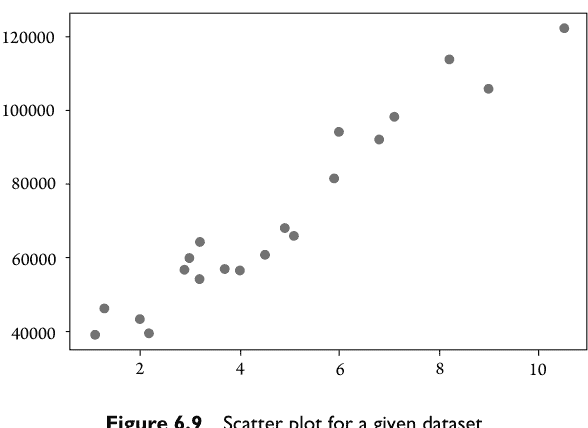

为了使图表更具可读性和信息性，下面添加了 x 和 y 标签。这里，xlabel() 和 ylabel() 方法为图表添加 x 和 y 标签，而 title() 用于为绘图添加标题，如图 6.10 所示。

```
plt.title('训练数据可视化')
plt.xlabel('研究经验年限')
plt.ylabel('津贴')
```


**图 6.10** 带标签的给定数据集散点图

现在，让我们继续绘制用于预测的回归线。要绘制模型拟合的回归线或最佳直线，我们必须使用导入库的 `plot` 方法。需要注意的是，这条回归线是一条用于预测值的直线，它是基于 `X_train` 数据构建的。

在这个 `plot` 方法中，我们需要传递三个重要参数。第一个参数是模型训练所用的 X 数据值，即本例中的 `X_train`。第二个参数是模型在 `X_train` 数据上的预测值（因为模型是在此数据上训练的，并且在此训练数据上找到了最佳拟合直线）。为此，我们将使用回归器的 predict 方法来获取 `X_train` 数据上的预测直线，如下方代码所示。

第三个参数用于定义直线的颜色，在本例中，我们选择了“蓝色”。

用于绘制直线的代码如下。执行此代码后，该模型的最佳拟合直线将被绘制出来，如图 6.11 所示。

*代码片段：12*

```
python
plt.plot(X_train, linear_regressor.predict(X_train), color = 'blue')
```

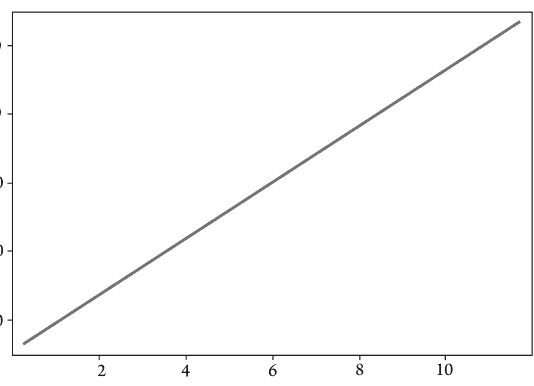

**图 6.11** 生成的回归线

使用下面的代码，让我们将回归线与散点数据点一起绘制，如图 6.10 所示。生成的图如图 6.12 所示。

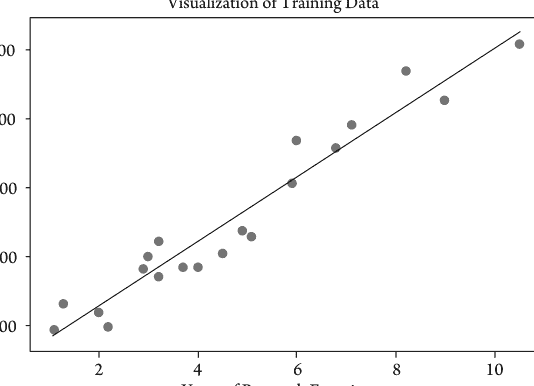

**图 6.12** 训练数据集散点图的回归线

```
# 可视化训练集结果
plt.scatter(X_train, y_train, color = 'red')
plt.plot(X_train, linear_regressor.predict(X_train), color = 'blue')
plt.title('训练数据可视化')
plt.xlabel('研究经验年限')
plt.ylabel('津贴')
plt.show()
```

这里，使用了导入库的 `title` 方法为图表添加标题。从图 6.12 可以看出，简单线性回归模型在训练数据上拟合了一条直线，以预测研究人员的津贴。在给定的图中，红点代表实际的津贴值，而蓝线代表在散点图上拟合的直线，用于对训练数据进行预测。

## 6.5 步骤 5：可视化测试集结果


步骤 5：简单线性回归实现的结果可视化，Parteek Bhatia，https://youtu.be/9xwW47OmDH8


可视化测试集结果需要执行类似的步骤。之前训练数据点被散布在图表的 X 轴和 Y 轴上，而在本例中，$X\_test$ 和 $y\_test$ 数据点将被散布，如下方代码所示。

这次，在 `plot` 方法中，我们传递的是测试数据。以下代码片段将用于可视化测试数据集的结果。

代码片段：13

```
# 可视化测试集结果
plt.scatter(X_test, y_test, color = 'red')
plt.plot(X_test, linear_regressor.predict(X_test), color = 'blue')
plt.title('测试数据可视化')
plt.xlabel('经验年限')
plt.ylabel('津贴')
plt.show()
```

图 6.13 中绘制的图表可以评估模型训练得有多好，以及回归线如何处理新的观测点。

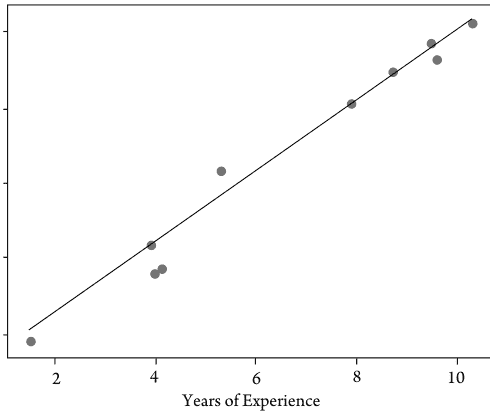

**图 6.13** 测试数据集散点图的回归线

从图 6.13 可以看出，这条直线对大多数测试值拟合得非常好。为了获得在完整训练数据上训练得到的直线以及散点测试数据点，我们也可以将训练数据传递给代码片段 14 中所示的 `plot` 方法。

**代码片段：14**

```
# Visualizing the Test set results
plt.scatter(X_test, y_test, color = 'red')
plt.plot(X_train, linear_regressor.predict(X_train), color = 'blue')
plt.title('Visualization of Test Data')
plt.xlabel('Years of Experience')
plt.ylabel('Stipend')
plt.show()
```

执行代码片段 14 后得到的绘制图形如图 6.14 所示。你可以观察到，图 6.13 和图 6.14 中的直线是相同的。如果你仔细观察，图 6.14 中显示的直线长度稍长，因为它显示了完整训练数据的预测值，而图 6.13 中显示的直线仅基于测试数据绘制。然而，需要注意的是，对于测试值接近直线或实际测试值与预测值非常接近的实例，模型表现非常好。但对于那些测试值远离直线的实例，实际测试值与其对应的预测值之间会存在差距。

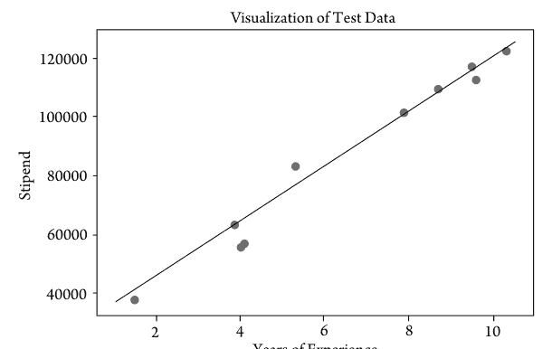

**图 6.14** 执行代码片段 13 后散点图的回归线

在大多数情况下，预测相当准确，因为测试数据的真实津贴值更接近预测的津贴值。因此，我们可以推断该模型在预测新研究人员的津贴方面做得很好。

## 6.6 第 6 步：使用回归指标评估模型

第 6 步：使用回归指标评估简单线性回归的实现模型，Parteek Bhatia，https://youtu.be/WY0kxVOZeCU

我们已经可视化了测试集结果与实际值，并基于我们的观察评估了模型的熟练程度。但还有很多其他方法可以基于模型的预测以正式或标准的方式评估模型。这些是*评估指标*。这些指标是标准的，有助于评估或比较不同的机器学习（ML）模型。通过这些指标，你可以决定模型中属性的重要性，并根据问题定义选择合适的算法。在本节中，我们将讨论使用回归评估指标来评估回归模型。三个主要的回归指标是平均绝对误差（MAE）、均方误差（MSE）和均方根误差（RMSE），如下所述。

### 平均绝对误差（MAE）

MAE 是最容易理解的，因为它呈现了平均误差。实际值与预测值之间绝对差的平均值意味着模型的预测有多错误。MAE 的唯一问题是它无法输出误差的方向，无论是预测不足还是预测过度，因为它只给出绝对值。

$$MAE = \frac{1}{n} \sum_{i=1}^{n} |actual\_value_i - predicted\_value_i|$$

为了评估回归器在 MAE 方面的性能，使用以下代码。

```
# Importing metrics library
from sklearn import metrics
# Evaluating the model and printing the results using MAE
print(metrics.mean_absolute_error(y_test, y_pred))
```

这里，从 `sklearn` 库中导入了 `metrics` 模块。它有一个名为 `mean_absolute_error()` 的方法。它需要两个参数：一个是实际值，另一个是预测值。由于在我们的例子中，实际值在 `y_test` 中，预测值在 `y_pred` 中，这两个参数被传递给 `mean_absolute_error` 方法，它通过 `print()` 方法在控制台上打印 MAE 的值。

在控制台上打印的 MAE 值如图 6.15 所示。

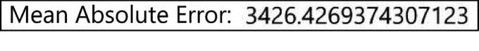

**图 6.15** MAE 的值

### 均方误差（MSE）

MSE 比 MAE（平均绝对误差）更受欢迎，它是一个估计误差平方平均值的度量。误差平方指的是预测值与真实值之间的平方差。MSE 始终为正，值越接近零意味着精度越高。MSE 包含了估计量的方差（即估计值与真实数据样本的距离）和估计量的偏差（即预测值的平均值与真实值的距离）。

计算 MSE 的公式如下。

$$MSE = \frac{1}{n} \sum_{i=1}^{n} (actual\_value_i - predicted\_value_i)^2$$

为了评估回归器在 MSE 方面的性能，使用以下代码。

```
# Evaluating the model and printing the results using MSE
print(metrics.mean_squared_error(y_test, y_pred))
```

为了计算 MSE，使用了 `sklearn` 的 `metrics` 模块的 `mean_squared_error()`。它需要两个参数：一个是实际值，另一个是预测值。由于在我们的例子中，实际值在 `y_test` 中，预测值在 `y_pred` 中，这两个参数被传递给 `mean_squared_error` 方法，它通过 `print()` 方法在控制台上打印 MSE 的值。

在控制台上打印的 MSE 值如图 6.16 所示。


### 均方根误差（RMSE）

RMSE 告诉我们真实数据值围绕最佳拟合线的集中程度。只需对 MSE 取平方根即可得到 RMSE。RMSE 值越低意味着模型拟合越好。它是衡量模型预测响应准确性的一个好指标，也是评估模型性能的重要标准。

计算 RMSE 的公式如下。

$$RMSE = \sqrt{\frac{1}{n} \sum_{i=1}^{n} (actual\_value_i - predicted\_value_i)^2}$$

为了评估回归器在 RMSE 方面的性能，使用以下代码。

```
# Evaluating the model and printing the results using RMSE
print(np.sqrt(metrics.mean_squared_error(y_test, y_pred)))
```

在获得 `mean_squared_error` 之后，调用了 NumPy 库的 `sqrt` 方法来获得回归器的 RMSE。在控制台上打印的 RMSE 值如图 6.17 所示。

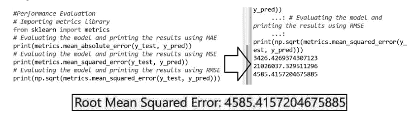

在表 6.1 中，我们还展示了在 Excel 中为同一数据集手动计算的 MSE、RMSE 和 MAE 值，以验证结果。

### 表 6.1 手动计算 MSE、MAE 和 RMSE

| y_pred | y_test | y_pred-y_test | |y_pred-y_test| | |y_pred-y_test|^2 |
|---|---|---|---|---|
| 41835.1 | 38731 | 3104.1 | 3104.1 | 9635436.81 |
| 124079 | 123391 | 688 | 688 | 473344 |
| 66134.6 | 58081 | 8053.6 | 8053.6 | 64860472.96 |
| 64265.4 | 64218 | 47.4 | 47.4 | 2246.76 |
| 116603 | 117969 | -1366 | 1366 | 1865956 |
| 109126 | 110431 | -1305 | 1305 | 1703025 |
| 117537 | 113635 | 3902 | 3902 | 15225604 |
| 65200 | 56794 | 8406 | 8406 | 70660836 |
| 77349.7 | 84088 | -6738.3 | 6738.3 | 45404686.89 |
| 101649 | 102302 | -653 | 653 | 426409 |
| **AVERAGE** | **SUM** | **34263.4** | **210258017.4** | |
| | 3426.34 | 21025801.74 | | |
| **MAE = 3426.34** | **MSE=21026037.32** | | | |
| | **RMSE = 4585.390032** | | | |

可以理解的是，这些指标的值表明给定数据集的实际值和期望值之间存在误差。主要原因是数据集规模较小。通常，在现实世界的 ML 项目中，数据集规模很大，因此在较小的数据集中，不太可能获得良好的准确性。

除了 MAE、MSE 和 RMSE，R² 是评估回归模型的另一个关键指标。下面是对 R² 的讨论。

### R 平方（R²）

R 平方（R²）是一种统计度量，用于评估回归模型的拟合优度。R² 是回归分析中的一个重要指标，因为它提供了模型拟合数据程度的见解。

R² 使用以下公式计算。

$$R^2 = 1 - \frac{SS_{residual}}{SS_{total}}$$

其中：

$SS_{residual}$ 是误差平方和或残差平方和。

$SS_{total}$ 是总平方和，它计算因变量的每个观测值与因变量总体均值之间的平方差。

让我们更详细地理解这些术语。

$SS_{residual}$ 是误差平方和或残差平方和。残差平方和（或误差平方和）的公式如下。

$$SS_{residual} = \sum_{i=1}^{n} (y_i - \hat{y}_i)^2$$

其中：

- $n$ 是数据集中的观测数量。
- $y_i$ 代表因变量的实际观测值。
- $\hat{y}_i$ 代表基于回归模型的因变量预测值。

在图 6.18 中，每个实际数据点与其对应预测数据点之间的平方距离之和提供了 $SS_{residual}$ 的值。

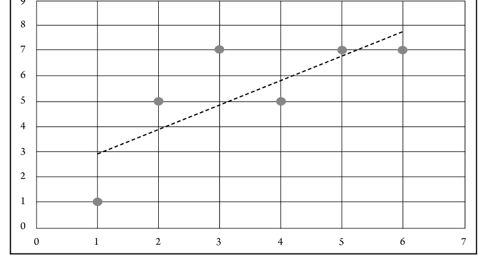

**图 6.18** 简单线性回归线

本质上，残差平方和计算的是因变量的实际观测值与通过回归模型获得的对应预测值之间的平方差。

$SS_{\text{total}}$ 是总平方和，代表因变量的总变异性。

$$SS_{\text{total}} = \sum_{i=1}^{n} (y_i - \bar{y})^2$$

其中：

- $n$ 是数据集中的观测数量。
- $y_i$ 代表因变量的实际观测值。
- $\bar{y}$ 代表因变量观测值的均值（平均值）。

本质上，总平方和计算的是因变量的每个观测值与因变量总体均值之间的平方差。这个模型作为基准，在不考虑回归模型的情况下量化因变量的总变异性。它为评估回归模型解释了多少变异性提供了一个基准，这由残差平方和所捕获。

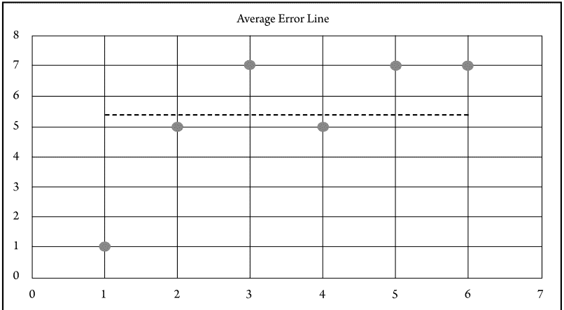

**图 6.19** 均值（平均）线

因此，R² 表示自变量解释因变量变异性的程度。如 R² 公式所示，其范围在 0 到 1 之间。

$$R^2 = 1 - \frac{SS_{\text{residual}}}{SS_{\text{total}}}$$

当 $SS_{\text{residual}}$ 为 0 时，意味着最佳拟合线穿过所有数据点，实际值与预测值之间的差值为 0；因此，R² 将为 1。所以，R² = 1 表示回归模型完美地预测了因变量。

当 $SS_{residual}$ 与基准相同，即 $SS_{total}$ 时，那么 $R^2 = 0$ 表示自变量没有解释因变量围绕其均值的任何变异性。
因此，$R^2$ 值越高，表明模型性能越好。代码片段 18 用于打印 $R^2$。

```
# 使用 R2 评估模型并打印结果
print(metrics.r2_score(y_test, y_pred))
```

从代码片段 18 中获得的训练模型的 $R^2$ 值为 0.9749154407708353，考虑到其接近 1，这反映了其高效性。

## 实现简单线性回归的完整代码

```
# 导入库
import numpy as np
import pandas as pd
import matplotlib.pyplot as plt
# 加载数据集
dataset = pd.read_csv('Stipend_Data.csv')
# 创建 X 和 y
X = dataset.iloc[:, :- 1].values
y = dataset.iloc[:, 1].values
# 执行训练测试拆分
from sklearn.model_selection import train_test_split
X_train, X_test, y_train, y_test = train_test_split(X,y,test_size= 1/3,
random_state = 0)
# 构建模型
from sklearn.linear_model import LinearRegression
linear_regressor = LinearRegression()
linear_regressor.fit(X_train, y_train)
# 预测测试集结果
y_pred = linear_regressor.predict(X_test)
# 可视化训练集结果
plt.scatter(X_train, y_train, color = 'red')
plt.plot(X_train, linear_regressor.predict(X_train), color = 'blue')
plt.title('训练数据可视化')
plt.xlabel('研究经验年数')
plt.ylabel('津贴')
plt.show()
# 可视化测试集结果
plt.scatter(X_test, y_test, color = 'red')
plt.plot(X_test, linear_regressor.predict(X_test), color = 'blue')
plt.title('测试数据可视化')
plt.xlabel('经验年数')
plt.ylabel('津贴')
plt.show()
# 性能评估
# 导入指标库
from sklearn import metrics
# 使用 MAE 评估模型并打印结果
print(metrics.mean_absolute_error(y_test, y_pred))
# 使用 MSE 评估模型并打印结果
print(metrics.mean_squared_error(y_test, y_pred))
# 使用 RMSE 评估模型并打印结果
print(np.sqrt(metrics.mean_squared_error(y_test, y_pred)))
# 使用 R2 评估模型并打印结果
print(metrics.r2_score(y_test, y_pred))
```

#### 提醒我

- 构建简单线性回归模型的第一步是导入所需的库并加载数据集。
- 要执行数据的训练测试拆分，使用 `sklearn` 的 `model_selection` 库。
- 简单线性回归在 `sklearn` 的 `linear_model` 库中的 `LinearRegression` 类中实现。
- 要可视化分析我们的模型，使用 `Matplotlib.pyplot` 库。
- `sklearn` 的 `metrics` 用于评估模型的准确性。
- `sklearn` 的 `metrics` 有一个方法 `mean_absolute_error()` 用于计算训练模型的 MAE。
- 方法 `mean_squared_error()` 用于计算训练模型的均方误差。

#### 附加资源

##### 视频链接

- 机器学习教程 Python - 2：单变量线性回归，https://youtu.be/8jazNUpO3lQ


##### 博客链接

- 线性回归（第 2 部分）：Python 实现，一个从零开始的例子，https://towardsdatascience.com/implementation-linear-regression-in-python-in-5-minutes-from-scratch-f111c8cc5c99


#### 测试我（实践技能）

- 在 kc_house_dataset 上构建简单线性回归 https://www.kaggle.com/arejet/simple-linear-regression#kc_house_data.csv


[提示：选择最合适的输入属性作为自变量来构建简单线性回归模型]

- 在薪资数据集上构建简单线性回归 https://www.kaggle.com/karthickveerakumar/salary-data-simple-linear-regression


# 7
## 多元线性回归与多项式线性回归

**章节目标**

- 理解多元线性回归的概念。
- 理解处理名义或分类属性的过程，以及标签编码、独热编码和虚拟变量的概念。
- 构建多元回归模型。
- 理解计算 P 值的必要性、概念和过程。
- 理解各种变量选择方法。
- 理解多项式线性回归的概念。
- 理解自变量次数的重要性。

### 7.1 多元线性回归简介

在简单线性回归中，我们有一个因变量和一个自变量。正如我们在上一章讨论的，研究学者的津贴取决于他的研究经验年数。

但大多数情况下，因变量受不止一个自变量的影响。当因变量依赖于多个自变量时，称为多元线性回归。

图 7.1 从数学上指出了简单回归和多元回归之间的区别。

在图 7.1(b) 中，$b_0$ 是常数，而 $x_1$、$x_2$ 和 $x_n$ 是因变量 $y$ 所依赖的自变量。你可以指出，从数学上讲，多元线性回归的推导与简单线性回归类似。主要区别在于，在多元线性回归中，我们有多个自变量，因为它是从 $x_1$ 到 $x_n$，而不仅仅是一个。

在简单线性回归的情况下，自变量为 $x_i$。同样重要的是，我们有 $b_1$ 到 $b_n$ 分别作为这些自变量的系数。

房屋的价格预测可以看作是一个多元线性回归问题，其中诸如地块面积、卧室数量和位置等因素在决定价格方面起着重要作用。与仅依赖地块面积的简单线性回归不同，多元线性回归考虑各种特征以准确估计房屋价格。

让我们通过一个现实生活中的例子来进一步理解这个概念。考虑一个案例，一位风险投资家雇佣了一位数据科学家来分析不同公司的数据以预测其利润。识别出利润最高的公司将有助于风险投资家选择他可以在不久的将来投资以赚取最大利润的公司。

当然，公司的利润将取决于多个自变量，如公司在研发上的支出、行政管理支出、营销活动支出，甚至其运营地点。所有这些都是用于预测公司利润的自变量，因为利润是因变量。

让我们考虑表 7.1 中给出的一个公司数据集，其属性包括：研发支出、行政管理费用、营销支出、州（表示公司所在地）和利润。所有这些数字均以印度卢比（INR）为单位。

本章使用的数据集源自 Kirill Eremenko 及其团队的 SuperDataScience 数据集。非常感谢 SuperDataScience 授权我们在本书中使用和引用该数据集。您可以在 https://www.superdatascience.com/pages/machine-learning 找到它。

## 表 7.1 公司数据集

| 研发支出 | 行政管理费用 | 营销支出 | 州 | 利润 |
|---|---|---|---|---|
| 165349.2 | 136897.8 | 471784.1 | 马哈拉施特拉邦 | **192261.83** |
| 162597.7 | 151377.59 | 443898.53 | 旁遮普邦 | **191792.06** |
| 153441.51 | 101145.55 | 407934.54 | 旁遮普邦 | **191050.39** |
| 144372.41 | 118671.85 | 383199.62 | 马哈拉施特拉邦 | **182901.99** |
| 142107.34 | 91391.77 | 366168.42 | 旁遮普邦 | **166187.94** |
| 131876.9 | 99814.71 | 362861.36 | 马哈拉施特拉邦 | **156991.12** |
| 134615.46 | 147198.87 | 127716.82 | 旁遮普邦 | **156122.51** |
| 130298.13 | 145530.06 | 323876.68 | 旁遮普邦 | **155752.6** |
| 120542.52 | 148718.95 | 311613.29 | 马哈拉施特拉邦 | **152211.77** |
| 123334.88 | 108679.17 | 304981.62 | 旁遮普邦 | **149759.96** |
| 101913.08 | 110594.11 | 229160.95 | 旁遮普邦 | **146121.95** |
| 100671.96 | 91790.61 | 249744.55 | 旁遮普邦 | **144259.4** |
| 93863.75 | 127320.38 | 249839.44 | 旁遮普邦 | **141585.52** |

这里，我们有以下重要组成部分。

- **因变量**——利润
- **自变量**——研发支出、行政管理费用、营销支出、州

这是一个回归案例，因为我们必须预测一个连续的利润值。这里，多个自变量可能影响因变量，因此这是一个多元线性回归案例。

让我们将此场景与图 7.1(b) 中给出的多元回归方程在数学上关联起来。为了更好地说明这个概念，我们已将利润列的位置移到了左侧，如表 7.2 所示。

## 表 7.2 多元线性回归数据集

| 利润 | 研发支出 | 行政管理费用 | 营销支出 | 州 |
|---|---|---|---|---|
| 192261.83 | 165349.2 | 136897.8 | 471784.1 | 马哈拉施特拉邦 |
| 191792.06 | 162597.7 | 151377.59 | 443898.53 | 旁遮普邦 |
| 191050.39 | 153441.51 | 101145.55 | 407934.54 | 旁遮普邦 |
| 182901.99 | 144372.41 | 118671.85 | 383199.62 | 马哈拉施特拉邦 |
| 166187.94 | 142107.34 | 91391.77 | 366168.42 | 旁遮普邦 |
| 156991.12 | 131876.9 | 99814.71 | 362861.36 | 马哈拉施特拉邦 |
| 156122.51 | 134615.46 | 147198.87 | 127716.82 | 旁遮普邦 |
| 155752.6 | 130298.13 | 145530.06 | 323876.68 | 旁遮普邦 |
| 152211.77 | 120542.52 | 148718.95 | 311613.29 | 马哈拉施特拉邦 |
| 149759.96 | 123334.88 | 108679.17 | 304981.62 | 旁遮普邦 |
| 146121.95 | 101913.08 | 110594.11 | 229160.95 | 旁遮普邦 |
| 144259.4 | 100671.96 | 91790.61 | 249744.55 | 旁遮普邦 |
| 141585.52 | 93863.75 | 127320.38 | 249839.44 | 旁遮普邦 |

这里，$y$ 指利润，而 $x_1$ 指研发支出，$x_2$ 指行政管理费用，$x_3$ 指营销支出。州属性将作为 $x_4$，但它需要特殊处理，因为它是一个分类或名义属性。正如在任何机器学习（ML）模型中一样，我们只能处理数字，而不能处理字符串或类别。

因此，州属性是一个名义属性，我们不能像处理其他变量那样处理它，因为这里我们有的是州的名称，而不是利润所依赖的某些数字。我们通过虚拟变量的概念来处理名义变量，即我们数据集中的州。

## 7.2 名义变量的处理与虚拟变量的概念

多元线性回归 | 机器学习 | 虚拟变量 | Pardeep Bhatia, https://youtu.be/NuwZ9f924mk

第 4 章关于数据预处理的内容表明，名义属性通过独热编码来处理。因此，处理此问题的第一步是为具有名义值的每个不同属性值创建列。在这种情况下，州有两个可能的值，*马哈拉施特拉邦* 和 *旁遮普邦*，因此我们将创建两个单独的列，一个用于 *马哈拉施特拉邦*，另一个用于 *旁遮普邦*，如图 7.2 所示。

| 利润 | 研发支出 | 行政管理 | 营销支出 | 州 | 马哈拉施特拉邦 | 旁遮普邦 |
|---|---|---|---|---|---|---|
| 192261.83 | 165349.2 | 136897.8 | 471784.1 | 马哈拉施特拉邦 | | |
| 191792.06 | 162597.7 | 151377.59 | 443898.53 | 旁遮普邦 | | |
| 191050.39 | 153441.51 | 101145.55 | 407934.54 | 旁遮普邦 | | |
| 182901.99 | 144372.41 | 118671.85 | 383199.62 | 马哈拉施特拉邦 | | |
| 166187.94 | 142107.34 | 91391.77 | 366168.42 | 旁遮普邦 | | |

现在，根据州字段中的相应值在这些列中填入二进制值。在第一行的情况下，州字段的值为 *马哈拉施特拉邦*，因此将在 *马哈拉施特拉邦* 列中填入 1，而在 *旁遮普邦* 列中填入 0。同样，对于第二行，*马哈拉施特拉邦* 将填入 0，而 *旁遮普邦* 字段将填入 1。遵循相同的方法，最终条目将如图 7.3 所示。

| 利润 | 研发支出 | 行政管理 | 营销支出 | 州 | 马哈拉施特拉邦 | 旁遮普邦 |
|---|---|---|---|---|---|---|
| 192261.83 | 165349.2 | 136897.8 | 471784.1 | 马哈拉施特拉邦 | 1 | 0 |
| 191792.06 | 162597.7 | 151377.59 | 443898.53 | 旁遮普邦 | 0 | 1 |
| 191050.39 | 153441.51 | 101145.55 | 407934.54 | 旁遮普邦 | 0 | 1 |
| 182901.99 | 144372.41 | 118671.85 | 383199.62 | 马哈拉施特拉邦 | 1 | 0 |
| 166187.94 | 142107.34 | 91391.77 | 366168.42 | 旁遮普邦 | 0 | 1 |

我们可以将名义字段州转换为两个对应的数字字段，*马哈拉施特拉邦* 和 *旁遮普邦*。它们承载着与州字段捕获的相同信息。

因此，我们可以引入这些列并忽略州列。替代名义属性（即州）引入的列被称为虚拟变量（即 *马哈拉施特拉邦* 和 *旁遮普邦*），如图 7.4 所示。

| 利润 | 研发支出 | 行政管理 | 营销支出 | 州 | 马哈拉施特拉邦 | 旁遮普邦 |
|---|---|---|---|---|---|---|
| 192261.83 | 165349.2 | 136897.8 | 471784.1 | 马哈拉施特拉邦 | 1 | 0 |
| 191792.06 | 162597.7 | 151377.59 | 443898.53 | 旁遮普邦 | 0 | 1 |
| 191050.39 | 153441.51 | 101145.55 | 407934.54 | 旁遮普邦 | 0 | 1 |
| 182901.99 | 144372.41 | 118671.85 | 383199.62 | 马哈拉施特拉邦 | 1 | 0 |
| 166187.94 | 142107.34 | 91391.77 | 366168.42 | 旁遮普邦 | 0 | 1 |

**图 7.4** 虚拟变量

因此，虚拟变量类似于回归分析中的布尔指示器，只能取离散值0或1。其值表示某个确定值的存在或不存在。因此，它们被编码以代表更高测量水平的变量，而整个编码过程被称为虚拟编码。

现在，由于这两个虚拟列包含二进制值，*Maharashtra*列足以识别公司的工作地点或其运营所在的邦。如果其值为1，则表示其在*Maharashtra*运营；如果为0，则在*Punjab*运营。因此，我们无需使用两个虚拟变量，只需使用一个虚拟变量即可捕获相同信息，如下图7.5所示。

| 利润 | 研发支出 | 管理费用 | 营销支出 | 邦 | Maharashtra | Punjab |
|---|---|---|---|---|---|---|
| 192261.83 | 165349.2 | 136897.8 | 471784.1 | Maharashtra | 1 | 0 |
| 191792.06 | 162597.7 | 151377.59 | 443898.53 | Punjab | 0 | 1 |
| 191050.39 | 153441.51 | 101145.55 | 407934.54 | Punjab | 0 | 1 |
| 182901.99 | 144372.41 | 118671.85 | 383199.62 | Maharashtra | 1 | 0 |
| 166187.94 | 142107.34 | 91391.77 | 366168.42 | Punjab | 0 | 1 |

为了进一步理解这个概念，设$D_1$为*Maharashtra*的虚拟变量，$D_2$为*Punjab*的虚拟变量，则$D_2 = 1 - D_1$。因此，同时包含两个虚拟变量意味着我们为模型增加了冗余。多重共线性是指在线性回归中，一个或多个自变量预测另一个变量（除因变量外）的情况。因此，在一个包含所有虚拟变量的模型中，我们将无法确定各个虚拟变量的影响，结果它们将无法正常工作。这个问题被称为虚拟陷阱。

所以，对于某个特定实例，如果*Maharashtra*的值为1，则表示该公司在*Maharashtra*运营，而不在*Punjab*；类似地，如果*Maharashtra*的值为0，则该属性表示公司在*Punjab*运营，而不在*Maharashtra*。因此，如果选择一个属性，即*Maharashtra*，它可以被视为一个开关：如果开启，你就知道公司在*Maharashtra*；如果关闭，则公司在*Punjab*。因此，一个属性就足够了，如图7.6所示的多元线性回归表示所示。这里，对于State属性，我们引入了一个虚拟变量$D_1$，其系数为$b_4$。

需要注意的是，为了处理虚拟陷阱，忽略了一个虚拟属性。

**示例 7.1：** 让我们考虑另一个名义列中有三个值的情况，如图7.7所示。

| 利润 | 研发支出 | 管理费用 | 营销支出 | 邦 |
|---|---|---|---|---|
| 192261.83 | 165349.2 | 136897.8 | 471784.1 | Maharashtra |
| 191792.06 | 162597.7 | 151377.59 | 443898.53 | Punjab |
| 191050.39 | 153441.51 | 101145.55 | 407934.54 | MP |
| 182901.99 | 144372.41 | 118671.85 | 383199.62 | Maharashtra |
| 166187.94 | 142107.34 | 91391.77 | 366168.42 | Punjab |

**图 7.7** 具有三个值的名义属性

这里，我们有三个不同的邦值，即*Maharashtra*、*Punjab*和*MP*。因此，将引入三列作为虚拟变量，如下表7.3所示。

**表 7.3** 填充了虚拟变量的表格

| Maharashtra | Punjab | MP |
|---|---|---|
| 1 | 0 | 0 |
| 0 | 1 | 0 |
| 0 | 0 | 1 |
| 1 | 0 | 0 |
| 0 | 1 | 0 |

在第一行中，State的值是*Maharashtra*，因此*Maharashtra*列将显示1，而*Punjab*和*MP*列将显示0。类似地，第二行的值是*Punjab*，因此*Punjab*列将显示1，而*Maharashtra*和*MP*列将显示0。同样，所有三个属性都已为每条记录填充；最终条目如表7.3所示。

这里，*Maharashtra*、*Punjab*和*MP*列是虚拟变量。如前所述，我们可以通过丢弃State列并仅考虑两个虚拟变量（即*Maharashtra*和*Punjab*）来表示完整信息。因为如果属性*Maharashtra*和*Punjab*的值都为0，则可以理解State是*MP*，如图7.8所示。如前所述，移除一个虚拟属性将有助于消除模型中的多重共线性，并解决虚拟陷阱问题。

| 利润 | 研发支出 | 管理费用 | 营销支出 | 邦 | Maharashtra | Punjab | MP |
|---|---|---|---|---|---|---|---|
| 192261.83 | 165349.2 | 136897.8 | 471784.1 | Maharashtra | 1 | 0 | 0 |
| 191792.06 | 162597.7 | 151377.59 | 443898.53 | Punjab | 0 | 1 | 0 |
| 191050.39 | 153441.51 | 101145.55 | 407934.54 | Punjab | 0 | 1 | 0 |
| 182901.99 | 144372.41 | 118671.85 | 383199.62 | MP | 0 | 0 | 1 |
| 166187.94 | 142107.34 | 91391.77 | 366168.42 | Punjab | 0 | 1 | 0 |

**图 7.8** 用虚拟变量替换名义属性

因此，为了处理虚拟陷阱，我们需要只使用两个虚拟变量，如图7.9所示的数学表示所示。

$$y = b_0 + b_1 * x_1 + b_2 * x_2 + b_3 * x_3 + b_4 * D_1 + b_5 * D_2$$

**图 7.9** 包含两个虚拟变量的多元线性回归的数学表示

这里，我们引入了$D_1$和$D_2$作为数值虚拟变量，其系数分别为$b_4$和$b_5$，并忽略了一个虚拟属性以处理虚拟陷阱。

**需要注意的是，对于一个具有$n$个不同值的名义列，要引入的虚拟变量数量始终为$n - 1$。**

需要注意的是，如果你有多个具有名义值的列，如图7.10所示，我们需要用相应的虚拟变量替换每一列；这已在图7.11中说明。

| 利润 | 研发支出 | 管理费用 | 营销支出 | 邦 | 公司类型 |
|---|---|---|---|---|---|
| 192261.83 | 165349.2 | 136897.8 | 471784.1 | Maharashtra | Gold |
| 191792.06 | 162597.7 | 151377.59 | 443898.53 | Punjab | Silver |
| 191050.39 | 153441.51 | 101145.55 | 407934.54 | Punjab | Gold |
| 182901.99 | 144372.41 | 118671.85 | 383199.62 | Maharashtra | Gold |
| 166187.94 | 142107.34 | 91391.77 | 366168.42 | Punjab | Silver |

**图 7.10** 包含多个分类属性的数据集——State和Company Type

如图7.11所示，我们处理了两个分类属性：

- State有三个不同的值：*Maharashtra*、*Punjab*和*MP*。因此，我们引入了（$3 - 1 = 2$）两个虚拟变量。
- Company Type有两个不同的值：*Gold*和*Silver*，因此我们引入了（$2 - 1 = 1$）一个虚拟变量。

让我们总结本节的重要学习点。

- 要替换分类变量，请使用虚拟变量。
- 并非所有虚拟变量都需要包含在模型中。
- 如果你有一个具有$n$个不同值的名义或分类属性，只选择$n - 1$个虚拟变量。
- 如果你有多个名义或分类属性，请为每个名义属性分别引入虚拟变量。

| 利润 | 研发支出 | 管理费用 | 营销支出 | 邦 | 公司类型 |
|---|---|---|---|---|---|
| 192261.83 | 165349.2 | 136897.8 | 471784.1 | Maharashtra | Gold |
| 191792.06 | 162597.7 | 151377.59 | 443898.53 | Punjab | Silver |
| 191050.39 | 153441.51 | 101145.55 | 407934.54 | Punjab | Gold |
| 182901.99 | 144372.41 | 118671.85 | 383199.62 | MP | Gold |
| 166187.94 | 142107.34 | 91391.77 | 366168.42 | Punjab | Silver |

| Maharashtra | Punjab | MP |
|---|---|---|
| 1 | 0 | 0 |
| 0 | 1 | 0 |
| 0 | 1 | 0 |
| 0 | 0 | 1 |
| 0 | 1 | 0 |

| Gold | Silver |
|---|---|
| 1 | 0 |
| 0 | 1 |
| 1 | 0 |
| 1 | 0 |
| 0 | 1 |

| Gold |
|---|
| 1 |
| 0 |
| 1 |
| 1 |
| 0 |

Company Type属性的虚拟变量

| Maharashtra | Punjab |
|---|---|
| 1 | 0 |
| 0 | 1 |
| 0 | 1 |
| 0 | 0 |
| 0 | 1 |

State属性的虚拟变量

图 7.11 处理具有两个或更多分类属性的模型

## 7.3 构建多元回归模型

在多元回归数据集中，我们有许多自变量和一个因变量。这意味着许多列都是因变量的潜在预测变量。在构建模型之前，选择合适的列非常重要。

为了理解为构建模型选择正确属性的重要性，请考虑下面给出列的STUDENT数据库。

| 学号 | 姓名 | 手机号码 | 父亲姓名 | 测验成绩 | 期中成绩 | 实验成绩 | 期末成绩 | 最终等级 |
|---|---|---|---|---|---|---|---|---|

假设我们希望构建一个机器学习模型来预测学生的最终成绩。因此，在这种情况下，最终成绩是因变量，而所有其他列，即学号、姓名、手机号码、父亲姓名、测验成绩、期中考试成绩、实验成绩和期末考试成绩，将作为自变量。

我们可以很容易地得出结论，学生的最终成绩与其学号、姓名、手机号码和父亲姓名无关，而取决于测验成绩、期中考试成绩、实验成绩和期末考试成绩。因此，重要的是只选择测验成绩、期中考试成绩、实验成绩和期末考试成绩列作为构建模型的独立输入属性，而不是考虑所有属性。

这在图7.12(a)中进行了说明。这里，$y$是一个因变量，它依赖于多个列（或潜在预测变量），如$x_1$、$x_2$、$x_3$等。预测学生最终成绩的场景也在图7.12(b)中进行了描述。这里，最终成绩是因变量，而学号、姓名、手机号码、父亲姓名、期中考试成绩、实验成绩、测验成绩和期末考试成绩被视为自变量。

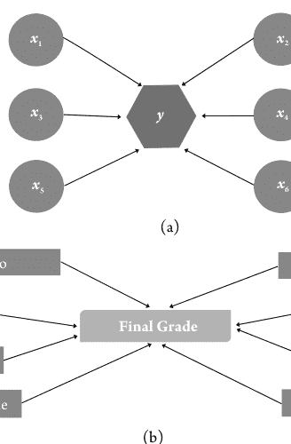

**图7.12** (a) 多元回归模型，因变量$y$依赖于多个变量；(b) 通过选择所有属性来预测学生最终成绩的多元回归模型

为了使模型更可靠且更易于理解，我们需要决定保留哪些自变量，以及必须舍弃哪些自变量，如图7.13所示。

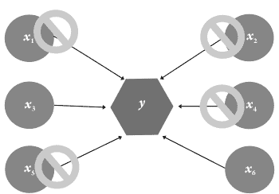

**图7.13** 选择y所依赖的属性

理解为什么在构建模型之前选择所需的列很重要，这一点至关重要。这种选择有两个主要原因，下面将进行讨论。

原因 # 1：如果我们用大量不相关的内容来使模型过载，它将不可靠。相反，它会成为一个“垃圾模型”（垃圾进–垃圾出），如图7.14所示。

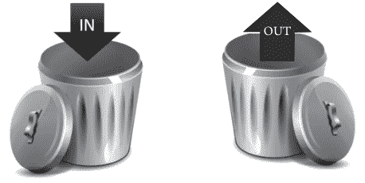

**图7.14** 垃圾进–垃圾出

原因 # 2：如果我们包含所有列，模型将变得过于复杂且难以理解，如图7.15所示。

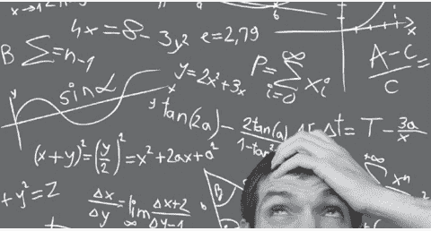

**图7.15** 过于复杂的模型

在我们的示例STUDENT数据库中，我们可以很容易地理解最终成绩仅取决于期中考试成绩、实验成绩、测验成绩和期末考试成绩，而不取决于学号、姓名、手机号码和父亲姓名，如图7.16所示。

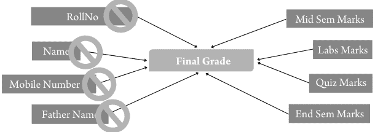

但在大多数情况下，程序员无法决定哪些自变量对于构建多元线性回归是重要的，哪些是不重要的。在这种情况下，我们必须遵循统计方法来理解每个自变量在预测因变量中的作用或重要性。执行此任务的统计方法是P值。

简而言之，有必要理解每个自变量如何影响因变量。为了了解每个自变量在预测因变量值中的重要性，使用了P值的概念。

在下一节中，我们将讨论P值的概念，然后继续讨论构建多元回归模型。

## 7.4 P值的概念与必要性

为了理解P值（概率值）的概念，让我们想象你正在使用一枚硬币来测试其公平性。通常，对于一枚公平的硬币，你会期望正面和反面出现的次数大致相等。这个起始假设，即硬币是公平的，被称为零假设。然而，如果你每次抛硬币都得到反面，你可能会质疑是否发生了不寻常的事情，并最终拒绝硬币是公平的零假设。P值帮助我们接受或拒绝这个零假设。

P值量化了在零假设成立的前提下，观察到与所得结果一样极端或更极端结果的可能性。简单地说，它告诉我们纯粹由于偶然性而得到某个结果的可能性。

让我们通过一起进行这个抛硬币实验来理解P值背后的直觉。最初，得到反面（或正面）的概率是0.5，假设我们得到了反面，这看起来很正常。例如，如果我们连续两次得到反面，这种情况发生的概率是0.5 * 0.5 = 0.25。但即便如此，我们可能仍然相信硬币是公平的，因为这可能是偶然发生的。现在，假设我们第三次抛硬币，又是反面。这种情况发生的概率是0.5 * 0.5 * 0.5 = 0.125。此时我们可能仍然相信硬币是公平的，将结果归因于偶然。然而，如果我们继续抛硬币，一次又一次地得到反面，我们对硬币公平性的信念开始动摇。假设第四次又是反面；那么这种情况发生的概率是0.5 * 0.5 * 0.5 * 0.5 = 0.0625。此时我们可能仍然相信硬币是公平的，将结果归因于偶然。假设第五次又是反面；那么这种情况发生的概率是0.5 * 0.5 * 0.5 * 0.5 * 0.5 = 0.03125。此时，我们可能会自信地说这不可能是偶然发生的，并决定拒绝硬币是公平的零假设。你拒绝零假设的那个值被称为显著性水平。在这个例子中，你可能在0.06或0.03时拒绝零假设。通常，我们将这个值设为0.05，而0.05的概率值被称为显著性水平。

因此，我们可以将显著性水平（用α表示）定义为一个预先确定的阈值，用于判断观察到的结果是否具有统计学意义。如果p值低于显著性水平，我们倾向于怀疑硬币的公平性，并拒绝硬币是公平的零假设，这表明观察到的结果不太可能仅仅由随机偶然性产生。

因此，简单地说，如果p值大于显著性水平，我们认为硬币是公平的，并接受零假设。然而，如果它小于显著性水平，我们得出结论硬币是有偏差的，并拒绝零假设。对p值和显著性水平的这种理解有助于我们从实验和测试中得出有意义的结论。

因此，我们可以将P值定义为统计学家和科学家用来判断其假设是否正确的一种统计度量。

**假设的接受或拒绝取决于P值；如果它小于某个预先确定的固定值，则拒绝零假设。**

### 假设

假设是基于某些推理提出的命题，与现实或真相无关。对于每个实验，我们可以有一个*零假设*和一个*备择假设*，它们彼此相反，即如果*零假设*为假，则*备择假设*为真，反之亦然。

例如：

**零假设**——母亲和女儿的血型没有差异。

**备择假设**——母亲和女儿的血型存在差异。

## 7.5 计算P值

P值用于确定实验的预期结果和观察结果之间的差异。让我们考虑一个例子来计算和理解P值的意义。

本节内容借鉴了Mario Banuelos合著的文章“如何计算P值”，可访问 https://www.wikihow.com/Calculate-P-Value。

**实验：** 假设我们取印度的交通记录进行分析。经过适当分析，观察到印度交通警察对两轮车公民的处罚多于对四轮车公民的处罚。为两轮车和四轮车开具的罚单（challan）比例为2:1。

基于这个实验，一名数据科学学生Rahat决定在帕蒂亚拉进行相同的实验，以确定观察到的结果是否相同。

两项研究之间的主要区别仅仅是实验变量从整个国家变为一个城市。Rahat想确定改变实验变量是否会改变观察到的结果？

在这种情况下，零假设如下：

### 交通警察数据分析案例研究的零假设

零假设指出指定群体之间没有显著差异，任何观察到的差异都是由于抽样或实验误差造成的。国家级别群体结果（印度）和城市级别群体结果（帕蒂亚拉）之间没有显著变化。如果观察到差异，那是由于抽样或实验误差造成的。

为了接受或拒绝零假设，我们将计算相同实验的P值，并确定我们零假设的有效性。

当在帕蒂亚拉进行时，实验可能会给出与国家级别相同的结果。在这种情况下，我们的零假设将被接受。

在这种情况下，备择假设将是：如果改变实验变量，观察到的结果将发生显著变化。在帕蒂亚拉进行的实验给出了与国家级别不同的结果。

那么，让我们开始计算给定零假设的P值的步骤。

### 步骤1：记下实验的预期结果

Rahat必须首先记下预期结果（他期望什么结果）。因此，考虑到在国家级别进行的实验，他期望交通警察的行为方式相同，即如果150辆车受到处罚，其中100辆是两轮车，50辆是四轮车，如图7.17所示。这是因为在国家级别，为两轮车和四轮车开具的罚单（challan）比例为2:1。

### 第二步：确定实验的实际观测结果

拉哈特需要通过观察实际交通数据来确定实际结果。经过观察，我们假设他发现在帕蒂亚拉，有90辆两轮车被处罚，而四轮车只有60辆被处罚，如图7.18所示。

**图7.18** 实验的观测结果

### 第三步：计算自由度

每个实验都存在一定的变异性。任何实验或研究中涉及的这种变异性的度量被称为自由度。计算自由度使用以下公式：

*自由度(r) = n – 1*

这里，*n* 表示实验中涉及的类别（或变量）的数量。

在本实验中，我们有两轮车和四轮车作为可能的类别。因此，*n* 在这种情况下为2。

自由度 = (2) – 1

自由度 (r) = 1

### 第四步：使用卡方检验计算并比较实际值与期望值

要开始这一步，我们必须了解卡方（发音为 kai square）。因此，让我们简要概述一下卡方。

**卡方值：** 卡方（写作“*χ²*”）是一个数值，用于衡量实验的*期望*值与*观测*值之间的差异。

卡方是进行**独立性检验**的常用统计度量。独立性检验用于检验两个变量之间是否存在关联，即它们是相互依赖还是相互独立？每个被研究的变量都会有一些期望值和观测值，使用这些值将计算卡方统计量。

计算卡方的公式如下：

$$\chi^2 = \sum \frac{(f_{observed} - f_{expected})^2}{f_{expected}}$$

$f_{observed}$ = 实验的观测频率（或值）

$f_{expected}$ = 实验的期望频率（或值）

**重要说明：** 该方程包含西格玛 Σ 算子。西格玛的意义在于，必须为每个（研究中的）变量计算 $\frac{(f_{observed} - f_{expected})^2}{f_{expected}}$，然后将它们求和，该和即为 *χ²* 的值。

在我们的实验中，有两个变量，因此我们将计算 $\frac{(f_{observed} - f_{expected})^2}{f_{expected}}$ 的值两次——一次针对两轮车，另一次针对四轮车。

因此，对于本实验，*χ²* 的值将按如下方式计算：

$$\chi^2 = \left[ \frac{(f_{observed} - f_{expected})^2}{f_{expected}} \right]_{\text{两轮车}} + \left[ \frac{(f_{observed} - f_{expected})^2}{f_{expected}} \right]_{\text{四轮车}}$$

| 变量 | 观测值 $f_{observed}$ | 期望值 $f_{expected}$ |
| :--- | :---: | :---: |
| 两轮车 | 90 | 100 |
| 四轮车 | 60 | 50 |

$$\chi^2 = \left[\frac{(90-100)^2}{100}\right]_{\text{两轮车}} + \left[\frac{(60-50)^2}{50}\right]_{\text{四轮车}}$$

$$\chi^2 = \left[\frac{(-10)^2}{100}\right]_{\text{两轮车}} + \left[\frac{(10)^2}{50}\right]_{\text{四轮车}}$$

$$\chi^2 = \left[\frac{100}{100}\right]_{\text{两轮车}} + \left[\frac{100}{50}\right]_{\text{四轮车}}$$

$$\chi^2 = 1 + 2$$

$$\chi^2 = 3$$

### 第五步：选择显著性水平值

每个实验都存在一定的不确定性。显著性水平衡量我们对实验结果的确定程度。
较低的显著性值对应于实验结果由偶然因素造成的概率较低，反之亦然。科学家们遵循一个惯例；他们有一个默认的显著性水平值。通常，他们将实验的显著性值设置为0.05或5%（默认值）。
这意味着观测值与期望值之间的差异有5%的概率是由于偶然、误差或随机抽样过程造成的。
在本实验中，我们使用显著性水平 = 0.05。

### 第六步：使用卡方分布表确定P值

到目前为止，我们已经为本实验确定了以下几点。

- 自由度 (r) = 1；
- 卡方值 $\chi^2 = 3$
- 显著性水平 = 0.05

现在，我们进入计算P值的最后一步。要使用上述参数确定P值，我们必须使用图7.19所示的卡方分布表。

284 使用Python进行机器学习

自由度 显著性水平

| df | 0.95 | 0.75 | 0.5 | 0.25 | 0.1 | 0.05 | 0.025 | 0.01 | 0.005 | 0.001 | 0.0005 | 0.00000015 | 0.00000005 |
|---|---|---|---|---|---|---|---|---|---|---|---|---|---|
| 1 | 0.04 | 0.102 | 0.455 | 1.32 | 2.71 | 3.84 | 5.024 | 6.63 | 7.88 | 10.83 | 12.12 | 27.59 | 29.72 |
| 2 | 0.103 | 0.575 | 1.386 | 2.77 | 4.61 | 5.99 | 7.378 | 9.21 | 10.60 | 13.82 | 15.20 | 31.43 | 33.62 |
| 3 | 0.352 | 1.212 | 2.366 | 4.11 | 6.25 | 7.81 | 9.348 | 11.34 | 12.84 | 16.27 | 17.73 | 34.57 | 36.83 |
| 4 | 0.711 | 1.923 | 3.357 | 5.39 | 7.78 | 9.49 | 11.143 | 13.28 | 14.86 | 18.47 | 20.00 | 37.39 | 39.70 |
| 5 | 1.145 | 2.675 | 4.351 | 6.63 | 9.24 | 11.07 | 12.833 | 15.09 | 16.75 | 20.52 | 22.11 | 39.99 | 42.35 |
| 6 | 1.635 | 3.455 | 5.348 | 7.84 | 10.64 | 12.59 | 14.449 | 16.81 | 18.55 | 22.46 | 24.10 | 42.45 | 44.86 |
| 7 | 2.167 | 4.255 | 6.346 | 9.04 | 12.02 | 14.07 | 16.013 | 18.48 | 20.28 | 24.32 | 26.02 | 44.79 | 47.25 |
| 8 | 2.733 | 5.071 | 7.344 | 10.22 | 13.36 | 15.51 | 17.535 | 20.09 | 21.95 | 26.12 | 27.87 | 47.05 | 49.54 |
| 9 | 3.325 | 5.899 | 8.343 | 11.39 | 14.68 | 16.92 | 19.023 | 21.67 | 23.59 | 27.88 | 29.67 | 49.23 | 51.77 |
| 10 | 3.94 | 6.737 | 9.342 | 12.55 | 15.99 | 18.31 | 20.483 | 23.21 | 25.19 | 29.59 | 31.42 | 51.36 | 53.93 |

图7.19 卡方分布表

需要执行以下步骤，通过卡方分布表查找P值。

i. 在卡方分布表中找到与您实验的自由度（记为 r）对应的行。在本实验中，自由度为1，因此我们将查看表格的第一行，如图7.20所示。

| df | 0.95 | 0.75 | 0.5 | 0.25 | 0.1 | 0.05 | 0.025 | 0.01 | 0.005 | 0.001 | 0.0005 | 0.00000015 | 0.00000005 |
|---|---|---|---|---|---|---|---|---|---|---|---|---|---|
| 1 | 0.04 | 0.102 | 0.455 | 1.32 | 2.71 | 3.84 | 5.024 | 6.63 | 7.88 | 10.83 | 12.12 | 27.59 | 29.72 |
| 2 | 0.103 | 0.575 | 1.386 | 2.77 | 4.61 | 5.99 | 7.378 | 9.21 | 10.60 | 13.82 | 15.20 | 31.43 | 33.62 |
| 3 | 0.352 | 1.212 | 2.366 | 4.11 | 6.25 | 7.81 | 9.348 | 11.34 | 12.84 | 16.27 | 17.73 | 34.57 | 36.83 |
| 4 | 0.711 | 1.923 | 3.357 | 5.39 | 7.78 | 9.49 | 11.143 | 13.28 | 14.86 | 18.47 | 20.00 | 37.39 | 39.70 |
| 5 | 1.145 | 2.675 | 4.351 | 6.63 | 9.24 | 11.07 | 12.833 | 15.09 | 16.75 | 20.52 | 22.11 | 39.99 | 42.35 |
| 6 | 1.635 | 3.455 | 5.348 | 7.84 | 10.64 | 12.59 | 14.449 | 16.81 | 18.55 | 22.46 | 24.10 | 42.45 | 44.86 |
| 7 | 2.167 | 4.255 | 6.346 | 9.04 | 12.02 | 14.07 | 16.013 | 18.48 | 20.28 | 24.32 | 26.02 | 44.79 | 47.25 |
| 8 | 2.733 | 5.071 | 7.344 | 10.22 | 13.36 | 15.51 | 17.535 | 20.09 | 21.95 | 26.12 | 27.87 | 47.05 | 49.54 |
| 9 | 3.325 | 5.899 | 8.343 | 11.39 | 14.68 | 16.92 | 19.023 | 21.67 | 23.59 | 27.88 | 29.67 | 49.23 | 51.77 |
| 10 | 3.94 | 6.737 | 9.342 | 12.55 | 15.99 | 18.31 | 20.483 | 23.21 | 25.19 | 29.59 | 31.42 | 51.36 | 53.93 |

图7.20 使用卡方分布表查找P值

ii. 沿着该行（在我们的情况下是第1行），从左到右移动，找到等于卡方值的列。如果找不到具有卡方精确值的列。那么我们必须寻找范围。这意味着要找到值略大于和略小于指定卡方值的列。在我们的情况下，卡方值为3，第一行中没有该值的精确匹配。因此，我们寻找值大于和小于卡方值3的列。我们在第一行中移动时遇到的第一个大于3的值是3.84，如图7.20所示。请注意此特定列对应的概率值或P值，在本例中为0.05。同样，小于3的列值为2.71。此特定列对应的概率值或P值为0.10。因此，卡方值的范围是从3.84到2.71，它们对应的P值分别为0.05和0.10，如图7.21所示。

| df | 0.95 | 0.75 | 0.5 | 0.25 | 0.1 | 0.05 | 0.025 | 0.01 | 0.005 | 0.001 | 0.0005 | 0.00000015 | 0.00000005 |
|---|---|---|---|---|---|---|---|---|---|---|---|---|---|
| 1 | 0.04 | 0.102 | 0.455 | 1.32 | 2.71 | 3.84 | 5.024 | 6.63 | 7.88 | 10.83 | 12.12 | 27.59 | 29.72 |
| 2 | 0.103 | 0.575 | 1.386 | 2.77 | 4.61 | 5.99 | 7.378 | 9.21 | 10.60 | 13.82 | 15.20 | 31.43 | 33.62 |
| 3 | 0.352 | 1.212 | 2.366 | 4.11 | 6.25 | 7.81 | 9.348 | 11.34 | 12.84 | 16.27 | 17.73 | 34.57 | 36.83 |
| 4 | 0.711 | 1.923 | 3.357 | 5.39 | 7.78 | 9.49 | 11.143 | 13.28 | 14.86 | 18.47 | 20.00 | 37.39 | 39.70 |
| 5 | 1.145 | 2.675 | 4.351 | 6.63 | 9.24 | 11.07 | 12.833 | 15.09 | 16.75 | 20.52 | 22.11 | 39.99 | 42.35 |
| 6 | 1.635 | 3.455 | 5.348 | 7.84 | 10.64 | 12.59 | 14.449 | 16.81 | 18.55 | 22.46 | 24.10 | 42.45 | 44.86 |
| 7 | 2.167 | 4.255 | 6.346 | 9.04 | 12.02 | 14.07 | 16.013 | 18.48 | 20.28 | 24.32 | 26.02 | 44.79 | 47.25 |
| 8 | 2.733 | 5.071 | 7.344 | 10.22 | 13.36 | 15.51 | 17.535 | 20.09 | 21.95 | 26.12 | 27.87 | 47.05 | 49.54 |
| 9 | 3.325 | 5.899 | 8.343 | 11.39 | 14.68 | 16.92 | 19.023 | 21.67 | 23.59 | 27.88 | 29.67 | 49.23 | 51.77 |
| 10 | 3.94 | 6.737 | 9.342 | 12.55 | 15.99 | 18.31 | 20.483 | 23.21 | 25.19 | 29.59 | 31.42 | 51.36 | 53.93 |

**图 7.21** 使用卡方值3查找P值

因此，此实验的P值介于0.05和0.1之间。

### 步骤7：决定是拒绝还是接受原假设

我们来到了计算P值的最后一步。那就是假设检验。对于假设检验，遵循一个简单的规则，如下所示：

> 如果 **P值 > 显著性水平**
>     表明反对原假设的证据较弱，因此 **接受原假设**
> 否则如果 **P值 < 显著性水平**
>     表明反对原假设的证据较强，因此 **拒绝原假设。**
> 结束判断;

在我们的案例中，P值的范围是0.05到1，显著性水平（SL）为0.05。
因此，P值 > 显著性水平，所以接受原假设。
我们实验的原假设是：如果改变实验变量（从全国到城市），观察结果没有变化。这意味着帕蒂亚拉遵循全国趋势。该市交通警察也像全国趋势一样，对两轮车发出的罚单比四轮车多，其比例通常为2:1。

我们的案例研究发现，在帕蒂亚拉，有90辆两轮车被处罚，而60辆四轮车被处罚。这意味着我们的城市遵循全国趋势。

让我们考虑更多场景，以便更好地理解这个概念。在所有以下场景中，显著性水平取为0.05，而自由度选择为1。

### 场景2

我们随机选择了在帕蒂亚拉市发给两轮车或四轮车的150张超速罚单。假设我们发现95张罚单发给了两轮车，55张发给了四轮车。这与我们预期的100张两轮车罚单和50张四轮车罚单的结果不同。

因此，卡方值将如下所示：

$$\chi^2 = \left[ \frac{(f_{observed} - f_{expected})^2}{f_{expected}} \right]_{\text{Two-Wheeler}} + \left[ \frac{(f_{observed} - f_{expected})^2}{f_{expected}} \right]_{\text{Four-Wheeler}}$$

| 变量 | 观测值 $f_{observed}$ | 期望值 $f_{expected}$ |
| :--- | :--- | :--- |
| 两轮车 | 95 | 100 |
| 四轮车 | 55 | 50 |

$$\chi^2 = \left[ \frac{(95-100)^2}{100} \right]_{\text{Two-Wheeler}} + \left[ \frac{(55-50)^2}{50} \right]_{\text{Four-Wheeler}}$$

$$\chi^2 = \left[ \frac{(-5)^2}{100} \right]_{\text{Two-Wheeler}} + \left[ \frac{(5)^2}{50} \right]_{\text{Four-Wheeler}}$$

$$\chi^2 = \left[ \frac{25}{100} \right]_{\text{Two-Wheeler}} + \left[ \frac{25}{50} \right]_{\text{Four-Wheeler}}$$

$$\chi^2 = 1/4 + 1/2$$

$$\chi^2 = 0.25 + 0.5$$

$$\chi^2 = 0.75$$

在此场景中，卡方值为0.75，第一行中没有与此值完全匹配的值。因此，我们寻找一个大于和小于卡方值0.75的列。我们在第一行中遇到的第一个大于0.75的值是1.32，如图7.22所示。请注意此特定列对应的概率值或P值为0.25。同样，小于0.75的列值为0.455。此特定列对应的概率值或P值为0.50。因此，卡方值的范围是从1.32到0.455，它们对应的P值分别为0.25和0.50。

| df | 0.95 | 0.75 | 0.5 | 0.25 | 0.1 | 0.05 | 0.025 | 0.01 | 0.005 | 0.001 | 0.0005 | 0.00000015 | 0.00000005 |
|---|---|---|---|---|---|---|---|---|---|---|---|---|---|
| 1 | 0.04 | 0.102 | 0.455 | 1.32 | 2.71 | 3.84 | 5.024 | 6.63 | 7.88 | 10.83 | 12.12 | 27.59 | 29.72 |
| 2 | 0.103 | 0.575 | 1.386 | 2.77 | 4.61 | 5.99 | 7.378 | 9.21 | 10.60 | 13.82 | 15.20 | 31.43 | 33.62 |
| 3 | 0.352 | 1.212 | 2.366 | 4.11 | 6.25 | 7.81 | 9.348 | 11.34 | 12.84 | 16.27 | 17.73 | 34.57 | 36.83 |
| 4 | 0.711 | 1.923 | 3.357 | 5.39 | 7.78 | 9.49 | 11.143 | 13.28 | 14.86 | 18.47 | 20.00 | 37.39 | 39.70 |
| 5 | 1.145 | 2.675 | 4.351 | 6.63 | 9.24 | 11.07 | 12.833 | 15.09 | 16.75 | 20.52 | 22.11 | 39.99 | 42.35 |
| 6 | 1.635 | 3.455 | 5.348 | 7.84 | 10.64 | 12.59 | 14.449 | 16.81 | 18.55 | 22.46 | 24.10 | 42.45 | 44.86 |
| 7 | 2.167 | 4.255 | 6.346 | 9.04 | 12.02 | 14.07 | 16.013 | 18.48 | 20.28 | 24.32 | 26.02 | 44.79 | 47.25 |
| 8 | 2.733 | 5.071 | 7.344 | 10.22 | 13.36 | 15.51 | 17.535 | 20.09 | 21.95 | 26.12 | 27.87 | 47.05 | 49.54 |
| 9 | 3.325 | 5.899 | 8.343 | 11.39 | 14.68 | 16.92 | 19.023 | 21.67 | 23.59 | 27.88 | 29.67 | 49.23 | 51.77 |
| 10 | 3.94 | 6.737 | 9.342 | 12.55 | 15.99 | 18.31 | 20.483 | 23.21 | 25.19 | 29.59 | 31.42 | 51.36 | 53.93 |

**图 7.22** 使用卡方值0.75查找P值

因此，此场景2的P值介于0.25和0.50之间，而显著性水平为0.05。

所以，P值 > 显著性水平，因此接受原假设。

这意味着帕蒂亚拉市遵循全国趋势。该市交通警察也像全国趋势一样，对两轮车发出的罚单比四轮车多。

由于在场景2中，我们发现帕蒂亚拉有95辆两轮车被处罚，而55辆四轮车被处罚，这意味着我们的城市遵循全国趋势。需要注意的是，在场景2中，P值高于我们之前有90张两轮车罚单和60张四轮车罚单的情况。因此，这次我们强烈接受原假设，这意味着我们更有信心帕蒂亚拉市遵循全国趋势，即与四轮车相比，两轮车收到的罚单是双倍的。

### 场景3

让我们考虑另一个场景，我们随机选择了150张超速罚单，这些罚单发给了帕蒂亚拉市的两轮车或四轮车。我们发现98张罚单发给了两轮车，52张罚单发给了四轮车。这与我们预期的100和50的结果不同。

因此，卡方值将如下所示：

$$\chi^2 = \left[ \frac{(f_{observed} - f_{expected})^2}{f_{expected}} \right]_{\text{Two-Wheeler}} + \left[ \frac{(f_{observed} - f_{expected})^2}{f_{expected}} \right]_{\text{Four-Wheeler}}$$

| 变量 | 观测值 $f_{observed}$ | 期望值 $f_{expected}$ |
| :--- | :--- | :--- |
| 两轮车 | 98 | 100 |
| 四轮车 | 52 | 50 |

$$\chi^2 = \left[ \frac{(98-100)^2}{100} \right]_{\text{Two-Wheeler}} + \left[ \frac{(52-50)^2}{50} \right]_{\text{Four-Wheeler}}$$

$$\chi^2 = \left[ \frac{(-2)^2}{100} \right]_{\text{Two-Wheeler}} + \left[ \frac{(2)^2}{50} \right]_{\text{Four-Wheeler}}$$

$$\chi^2 = \left[ \frac{4}{100} \right]_{\text{Two-Wheeler}} + \left[ \frac{4}{50} \right]_{\text{Four-Wheeler}}$$

$$\chi^2 = 0.04 + 0.08$$

$$\chi^2 = 0.12$$

在此场景中，卡方值为0.12，第一行中没有与此值完全匹配的值。因此，我们寻找一个大于和小于卡方值0.12的列。我们在最高行中遇到的第一个大于0.12的值是0.455，如图7.23所示。请注意此特定列对应的概率值或P值为0.50。同样，小于0.12的列值为0.102。此特定列对应的概率值或P值为0.75。因此，卡方值的范围是从0.455到0.102，它们对应的P值分别为0.50和0.75，如图7.23所示。

| df | 0.95 | 0.75 | 0.5 | 0.25 | 0.1 | 0.05 | 0.025 | 0.01 | 0.005 | 0.001 | 0.0005 | 0.00000015 | 0.00000005 |
| :--- | :--- | :--- | :--- | :--- | :--- | :--- | :--- | :--- | :--- | :--- | :--- | :--- | :--- |
| 1 | 0.04 | 0.102 | 0.455 | 1.32 | 2.71 | 3.84 | 5.024 | 6.63 | 7.88 | 10.83 | 12.12 | 27.59 | 29.72 |
| 2 | 0.103 | 0.575 | 1.386 | 2.77 | 4.61 | 5.99 | 7.378 | 9.21 | 10.60 | 13.82 | 15.20 | 31.43 | 33.62 |
| 3 | 0.352 | 1.212 | 2.366 | 4.11 | 6.25 | 7.81 | 9.348 | 11.34 | 12.84 | 16.27 | 17.73 | 34.57 | 36.83 |
| 4 | 0.711 | 1.923 | 3.357 | 5.39 | 7.78 | 9.49 | 11.143 | 13.28 | 14.86 | 18.47 | 20.00 | 37.39 | 39.70 |
| 5 | 1.145 | 2.675 | 4.351 | 6.63 | 9.24 | 11.07 | 12.833 | 15.09 | 16.75 | 20.52 | 22.11 | 39.99 | 42.35 |
| 6 | 1.635 | 3.455 | 5.348 | 7.84 | 10.64 | 12.59 | 14.449 | 16.81 | 18.55 | 22.46 | 24.10 | 42.45 | 44.86 |
| 7 | 2.167 | 4.255 | 6.346 | 9.04 | 12.02 | 14.07 | 16.013 | 18.48 | 20.28 | 24.32 | 26.02 | 44.79 | 47.25 |
| 8 | 2.733 | 5.071 | 7.344 | 10.22 | 13.36 | 15.51 | 17.535 | 20.09 | 21.95 | 26.12 | 27.87 | 47.05 | 49.54 |
| 9 | 3.325 | 5.899 | 8.343 | 11.39 | 14.68 | 16.92 | 19.023 | 21.67 | 23.59 | 27.88 | 29.67 | 49.23 | 51.77 |
| 10 | 3.94 | 6.737 | 9.342 | 12.55 | 15.99 | 18.31 | 20.483 | 23.21 | 25.19 | 29.59 | 31.42 | 51.36 | 53.93 |

**图 7.23** 使用卡方值0.12查找P值

因此，此情景3的P值介于0.50和0.75之间，而显著性水平为0.05。
所以，P值 > 显著性水平，因此接受原假设。
这意味着帕蒂亚拉市遵循全国趋势。该市交通警察也像全国趋势一样，对两轮车开出的罚单比四轮车多。

由于在情景3中，我们发现帕蒂亚拉有98辆两轮车被处罚，而52辆四轮车被处罚。这意味着我们的城市遵循全国趋势。需要注意的是，在情景3中，P值高于之前的情景2（当时我们有95张两轮车罚单和55张四轮车罚单）。因此，这次我们强烈接受原假设，这意味着我们更有信心认为帕蒂亚拉市遵循全国趋势，即与四轮车相比，两轮车收到的罚单是其两倍。

### 情景4

让我们考虑另一个情景，我们随机选择了150张超速罚单，这些罚单开给了两轮车或四轮车。我们发现帕蒂亚拉市有80张罚单开给了两轮车，70张开给了四轮车。它们与我们预期的100和50的结果不同。
因此，卡方值将如下所示：

$$\chi^2 = \left[ \frac{(f_{observed} - f_{expected})^2}{f_{expected}} \right]_{Two-Wheeler} + \left[ \frac{(f_{observed} - f_{expected})^2}{f_{expected}} \right]_{Four-Wheeler}$$

| 变量 | 观测值 $f_{observed}$ | 期望值 $f_{expected}$ |
| :--- | :--- | :--- |
| 两轮车 | 80 | 100 |
| 四轮车 | 70 | 50 |

$$\chi^2 = \left[ \frac{(80-100)^2}{100} \right]_{Two-Wheeler} + \left[ \frac{(70-50)^2}{50} \right]_{Four-Wheeler}$$

$$\chi^2 = \left[ \frac{(-20)^2}{100} \right]_{Two-Wheeler} + \left[ \frac{(20)^2}{50} \right]_{Four-Wheeler}$$

$$\chi^2 = \left[ \frac{400}{100} \right]_{Two-Wheeler} + \left[ \frac{400}{50} \right]_{Four-Wheeler}$$

$$\chi^2 = 4 + 8$$

$$\chi^2 = 12$$

在此情景中，卡方值为12，第一行中没有与此值完全匹配的值。因此，我们寻找一个值略大于和略小于卡方值12的列。我们在最高行移动时遇到的第一个大于12的值是12.12，如图7.24所示。请注意，此特定列对应的概率值或P值为0.0005。同样，值小于12的列是10.83。此特定列对应的概率值或P值为0.001。所以，卡方值的范围是从12.12到10.83，它们对应的P值分别为0.0005和0.001，如图7.24所示。

| df | 0.95 | 0.75 | 0.5 | 0.25 | 0.1 | 0.05 | 0.025 | 0.01 | 0.005 | 0.001 | 0.0005 | 0.00000015 | 0.00000005 |
|---|---|---|---|---|---|---|---|---|---|---|---|---|---|
| 1 | 0.04 | 0.102 | 0.455 | 1.32 | 2.71 | 3.84 | 5.024 | 6.63 | 7.88 | 10.83 | 12.12 | 27.59 | 29.72 |
| 2 | 0.103 | 0.575 | 1.386 | 2.77 | 4.61 | 5.99 | 7.378 | 9.21 | 10.60 | 13.82 | 15.20 | 31.43 | 33.62 |
| 3 | 0.352 | 1.212 | 2.366 | 4.11 | 6.25 | 7.81 | 9.348 | 11.34 | 12.84 | 16.27 | 17.73 | 34.57 | 36.83 |
| 4 | 0.711 | 1.923 | 3.357 | 5.39 | 7.78 | 9.49 | 11.143 | 13.28 | 14.86 | 18.47 | 20.00 | 37.39 | 39.70 |
| 5 | 1.145 | 2.675 | 4.351 | 6.63 | 9.24 | 11.07 | 12.833 | 15.09 | 16.75 | 20.52 | 22.11 | 39.99 | 42.35 |
| 6 | 1.635 | 3.455 | 5.348 | 7.84 | 10.64 | 12.59 | 14.449 | 16.81 | 18.55 | 22.46 | 24.10 | 42.45 | 44.86 |
| 7 | 2.167 | 4.255 | 6.346 | 9.04 | 12.02 | 14.07 | 16.013 | 18.48 | 20.28 | 24.32 | 26.02 | 44.79 | 47.25 |
| 8 | 2.733 | 5.071 | 7.344 | 10.22 | 13.36 | 15.51 | 17.535 | 20.09 | 21.95 | 26.12 | 27.87 | 47.05 | 49.54 |
| 9 | 3.325 | 5.899 | 8.343 | 11.39 | 14.68 | 16.92 | 19.023 | 21.67 | 23.59 | 27.88 | 29.67 | 49.23 | 51.77 |
| 10 | 3.94 | 6.737 | 9.342 | 12.55 | 15.99 | 18.31 | 20.483 | 23.21 | 25.19 | 29.59 | 31.42 | 51.36 | 53.93 |

**图7.24** 使用卡方值12查找P值

因此，此情景4的P值介于0.0005和0.001之间，而显著性水平为0.05。这里，P值 < 显著性水平，因此这次我们必须拒绝原假设。

这意味着帕蒂亚拉市不遵循全国趋势，该市交通警察没有像对四轮车那样对两轮车开出双倍罚单。

由于在情景4中，我们发现帕蒂亚拉有80辆两轮车被处罚，而70辆四轮车被处罚。这意味着我们的城市不遵循全国趋势。需要注意的是，在情景4中，P值低于显著性水平，因此原假设已被拒绝，这意味着帕蒂亚拉市没有遵循全国趋势，即与四轮车相比，两轮车收到的罚单是其两倍。

### 情景5

让我们考虑这最后一个情景，我们发现帕蒂亚拉市有70张罚单开给了两轮车，80张开给了四轮车。它们与我们预期的100和50的结果不同。

因此，卡方值将如下所示：

$$\chi^2 = \left[ \frac{(f_{observed} - f_{expected})^2}{f_{expected}} \right]_{Two-Wheeler} + \left[ \frac{(f_{observed} - f_{expected})^2}{f_{expected}} \right]_{Four-Wheeler}$$

| 变量 | 观测值 $f_{observed}$ | 期望值 $f_{expected}$ |
| :--- | :--- | :--- |
| 两轮车 | 70 | 100 |
| 四轮车 | 80 | 50 |

$$\chi^2 = \left[\frac{(70-100)^2}{100}\right]_{\text{Two-Wheeler}} + \left[\frac{(80-50)^2}{50}\right]_{\text{Four-Wheeler}}$$

$$\chi^2 = \left[\frac{(-30)^2}{100}\right]_{\text{Two-Wheeler}} + \left[\frac{(30)^2}{50}\right]_{\text{Four-Wheeler}}$$

$$\chi^2 = \left[\frac{900}{100}\right]_{\text{Two-Wheeler}} + \left[\frac{900}{50}\right]_{\text{Four-Wheeler}}$$

$$\chi^2 = 9 + 18$$

$$\chi^2 = 27$$

卡方值为27，我们在最高行移动时遇到的第一个大于27的值是27.59，如图7.25所示，而值略小于27的列是12.12。所以，卡方值的范围是从12.12到27.59，它们对应的P值分别为0.0005和0.00000015，如图7.25所示。

| df | 0.95 | 0.75 | 0.5 | 0.25 | 0.1 | 0.05 | 0.025 | 0.01 | 0.005 | 0.001 | 0.0005 | 0.00000015 | 0.00000005 |
| :--- | :--- | :--- | :--- | :--- | :--- | :--- | :--- | :--- | :--- | :--- | :--- | :--- | :--- |
| 1 | 0.04 | 0.102 | 0.455 | 1.32 | 2.71 | 3.84 | 5.024 | 6.63 | 7.88 | 10.83 | 12.12 | 27.59 | 29.72 |
| 2 | 0.103 | 0.575 | 1.386 | 2.77 | 4.61 | 5.99 | 7.378 | 9.21 | 10.60 | 13.82 | 15.20 | 31.43 | 33.62 |
| 3 | 0.352 | 1.212 | 2.366 | 4.11 | 6.25 | 7.81 | 9.348 | 11.34 | 12.84 | 16.27 | 17.73 | 34.57 | 36.83 |
| 4 | 0.711 | 1.923 | 3.357 | 5.39 | 7.78 | 9.49 | 11.143 | 13.28 | 14.86 | 18.47 | 20.00 | 37.39 | 39.70 |
| 5 | 1.145 | 2.675 | 4.351 | 6.63 | 9.24 | 11.07 | 12.833 | 15.09 | 16.75 | 20.52 | 22.11 | 39.99 | 42.35 |
| 6 | 1.635 | 3.455 | 5.348 | 7.84 | 10.64 | 12.59 | 14.449 | 16.81 | 18.55 | 22.46 | 24.10 | 42.45 | 44.86 |
| 7 | 2.167 | 4.255 | 6.346 | 9.04 | 12.02 | 14.07 | 16.013 | 18.48 | 20.28 | 24.32 | 26.02 | 44.79 | 47.25 |
| 8 | 2.733 | 5.071 | 7.344 | 10.22 | 13.36 | 15.51 | 17.535 | 20.09 | 21.95 | 26.12 | 27.87 | 47.05 | 49.54 |
| 9 | 3.325 | 5.899 | 8.343 | 11.39 | 14.68 | 16.92 | 19.023 | 21.67 | 23.59 | 27.88 | 29.67 | 49.23 | 51.77 |
| 10 | 3.94 | 6.737 | 9.342 | 12.55 | 15.99 | 18.31 | 20.483 | 23.21 | 25.19 | 29.59 | 31.42 | 51.36 | 53.93 |

**图7.25** 使用卡方值27查找P值

因此，此情景5的P值约为0.000000015，而显著性水平为0.05。

这里，P值 < 显著性水平，因此这次我们必须拒绝原假设。

这意味着帕蒂亚拉市不遵循全国趋势，该市交通警察没有像对四轮车那样对两轮车开出双倍罚单。

由于在情景5中，我们发现帕蒂亚拉有70辆两轮车被处罚，而80辆四轮车被处罚。这意味着我们的城市不遵循全国趋势。需要注意的是，在情景5中，P值远低于显著性水平，与情景4类似。在此情景中，原假设被拒绝的置信度更高。这意味着与情景4相比，我们更确定帕蒂亚拉市没有遵循全国趋势。在情景5中，情况相反，四轮车收到了更多罚单，P值也证明了这一点。

## 7.6 使用P值并为构建多元线性回归模型定义原假设

为了找出每个自变量在多元线性回归中预测因变量的重要性，我们可以使用P值的概念。P值用于在统计上接受或拒绝原假设。让我们首先定义构建多元线性回归模型以使用P值的原假设。

**构建多元线性回归模型的原假设**
原假设指出指定的总体之间没有显著差异，任何观察到的差异都是由于抽样或实验误差造成的。

在多元线性回归的情况下，移除一个自变量或列后，因变量的值没有显著变化。如果观察到差异，那么这是由于抽样或实验误差造成的。

简单来说，原假设指出该列不重要，可以在不影响因变量值的情况下移除。简单来说，该列在预测因变量方面没有意义，可以移除。

为了接受或拒绝原假设，我们将计算P值，并使用以下规则进行假设检验。

```
如果 P值 > 显著性水平
    接受原假设，这意味着该属性可以被移除
否则如果 P值 < 显著性水平
    拒绝原假设，这意味着该属性不能被移除
结束如果;
```

在为构建多元线性回归模型定义了零假设之后，我们将讨论选择重要属性或自变量以开发多元回归模型的不同方法。这些方法利用P值的概念来接受或拒绝零假设，或决定所选的自属性在预测因变量值时是否重要。如果所选属性不重要，它将被移除，在构建多元线性回归模型时不予考虑。

## 7.7 变量选择方法

构建模型的一个重要步骤是为其训练选择正确的属性或变量。用于选择所需列或属性的四种主要方法如下：

- i. 全部纳入法（基于知识的方法）
- ii. 向后剔除法
- iii. 向前选择法
- iv. 双向剔除法

让我们逐一讨论这些方法。

> 本节内容的灵感来源于Kirill Eremenko等人在Udemy平台上的课程“Machine Learning A-Z: AI, Python & R”。有关来源的更多信息，请参见下方。
> https://www.udemy.com/course/machinelearning/
> 我们感谢SuperDataScience的支持，并允许我们在本书中引用和参考此资源。

### 7.7.1 全部纳入法（基于知识的方法）

顾名思义，这种方法不移除任何列，所有列都用于构建模型。当我们对所处理的领域有一些先验知识时，会使用全部纳入法，因此我们选择所有变量来构建模型。当我们拥有少量自变量且对该领域有一些先验知识时，通常使用此模型。

### 7.7.2 向后剔除法

在向后剔除法中，我们从考虑所有列或属性开始。然后，我们按照下文讨论的程序，逐步剔除不需要的属性，如图7.26所示。


属性的剔除是基于P值和显著性水平对零假设的接受或拒绝，使用以下规则进行。

```
如果 P值 > 显著性水平
    接受零假设，意味着该属性可以被剔除
否则如果 P值 < 显着性水平
    拒绝零假设，意味着该属性不能被剔除
结束如果;
```

#### 构建向后剔除模型的算法

以下算法用于构建向后剔除模型。

| 步骤 | 描述 |
| :--- | :--- |
| **步骤 I** | 选择显著性水平或SL以保留在模型中（在大多数情况下，设置为SL = 0.05）。 |
| **步骤 II** | 使用所有可能的属性拟合完整模型。 |
| **步骤 III** | 接下来，考虑具有最高P值的属性。<br>如果 P值 > SL<br>接受零假设（意味着该属性可以被剔除）并转到步骤 IV<br>否则<br>拒绝零假设（意味着该属性不能被剔除），停止，并结束算法。 |
| **步骤 IV** | 移除该属性（具有最高P值），因为零假设已被接受。 |
| **步骤 V** | 使用剔除变量后的模型进行拟合。这可以称为重新拟合或重建模型。 |
| **步骤 VI** | 转到步骤 III，直到你得到的变量其最高P值小于SL。 |

通过这种方式，我们逐步剔除不重要的列。我们必须首先考虑所有属性来启动算法。然后，我们必须根据它们的P值和显著性水平逐步剔除列。

### 7.7.3 向前选择法

向前选择基于默认的属性或变量选择标准。它从一个具有零输入变量或属性的“空”模型开始，然后每次添加一个变量或属性以改进模型。这种方法一直持续到没有空间向模型中添加新的变量或属性为止，如图7.27所示。


属性的添加是基于P值和显著性水平对零假设的接受或拒绝，使用以下规则进行。

> 如果 P值 > 显著性水平
>     接受零假设，意味着该属性可以被移除
> 否则如果 P值 < 显著性水平
>     拒绝零假设，意味着该属性不能被移除
> 结束如果;

#### 构建向前选择模型的算法

以下算法用于构建向前选择模型。

| 步骤 | 描述 |
| :--- | :--- |
| **步骤 I** | 选择显著性水平或SL以保留在模型中（在大多数情况下，设置为SL = 0.05）。 |
| **步骤 II** | 通过考虑一个自属性和一个因变量，拟合所有可能的简单回归模型，并计算每个模型的P值。<br><br>这意味着通过考虑第一个自变量和因变量构建简单线性回归，并计算其P值。接下来，通过考虑第二个自变量和因变量构建简单线性回归，并计算其P值。再接下来，通过考虑第三个自变量和因变量构建简单线性回归，并计算它们的P值。<br><br>这样做直到所有自变量都用于构建其简单线性回归模型并计算其P值。 |
| **步骤 III** | 选择其简单线性回归模型与因变量产生最低P值的自变量。 |
| **步骤 IV** | 保留这个导致最低P值的自变量，并拟合所有可能的模型，这些模型在步骤 III 中选定的自属性基础上添加一个额外属性。<br><br>这意味着选定的属性将与一个额外的自属性组合，并为这个组合构建模型，计算其P值。接下来，这个额外属性被替换为另一个自属性，并计算其P值。<br><br>然后，这个额外属性被替换为另一个自属性，并计算其P值。这个过程重复进行，直到处理完所有剩余的自属性，并计算它们的P值。<br><br>最后，选择一个额外属性，该属性导致构建模型时产生最低的P值。 |
| **步骤 V** | 考虑产生最低P值的额外属性。<br>如果 P值 < SL<br>拒绝零假设（意味着该属性不能被移除），因此必须将此属性添加到模型中。要添加此属性，请转到步骤 IV<br>否则<br>接受零假设（意味着该属性可以被移除），因此此属性将不会被添加到模型中，模型完成并停止。 |

因此，向前选择法和向后剔除法之间的基本区别在于，在向前选择法中，我们从一个空模型开始并向其中添加属性。而在向后剔除法中，我们从一个包含所有属性的完整模型开始，然后删除那些不显著或不符合我们标准的属性。

### 7.7.4 双向剔除法

双向剔除法是向前选择法和向后剔除法的结合，如图7.28所示。


**图 7.28** 双向剔除法

在双向剔除法中，过程从一个空模型开始。在每一步中，该方法考虑向模型中添加一个变量（向前选择），同时也评估从模型中移除一个变量（向后剔除）。添加或移除变量的决定基于统计标准，如显著性水平。

这个迭代过程持续进行，直到根据定义的标准无法再添加或移除变量。通过双向剔除法获得的最终模型预计将包含对预测因变量最具影响力且统计上显著的变量。

#### 构建双向剔除模型的算法

以下算法用于构建双向剔除模型。

| 步骤 | 描述 |
| :--- | :--- |
| **步骤 I** | 选择进入模型（SLENTER）和保留在模型中（SLSTAY）的显著性水平。 |
| **步骤 II** | 进入向前选择的下一阶段。确保任何新的候选属性必须满足条件 P < SLENTER 才能被包含在模型中。 |
| **步骤 III** | 执行向后剔除的所有步骤。确认模型中已包含的每个变量都满足条件 P < SLSTAY 以保留在模型中。 |
| **步骤 IV** | 返回步骤 II。如果在完成步骤 II 和步骤 III 后，没有新的属性符合进入条件，也没有现有属性符合退出条件，则停止，模型最终确定。 |

我们可以得出结论，双向剔除模型通过测试其向后剔除的有效性，对通过向前选择添加的属性进行双重检查。通过这种方式，只有最重要的属性保留在模型中。

### 7.7.5 所有可能模型法

这是选择变量或属性的另一种方法，但由于其在空间和计算方面的高复杂性，通常被避免使用。要通过这种方法选择变量，必须首先选择一个拟合优度标准，接下来，我们必须构建所有可能的模型。选择其中一个模型作为我们理想的、符合我们标准的模型。关于回归模型，在处理这种方法时，必须准备好处理 $2^N - 1$ 个模型（$N$ 是属性的数量），这是相当困难的。例如，如果你的数据集中有8列（属性），那么将构建（$2^8 - 1 = 255$）255个模型来选择最佳模型。因此，这不是一种主流方法。

#### 构建所有可能模型的算法

以下算法用于构建所有可能模型。

| 步骤 | 描述 |
| :--- | :--- |
| **步骤 I** | 选择一个表示拟合优度的标准。 |
| **步骤 II** | 构建所有可能的回归模型。将生成（$2^{\text{属性数量}} - 1$）种组合。 |
| **步骤 III** | 选择拟合效果最好的模型。 |

### 7.7.6 选择最偏好的变量选择方法

通常，向后剔除法是使用最广泛的变量选择方法。其他方法确实存在一些相关的缺点。

在前向选择法中，我们需要构建大量模型。首先，我们必须通过考虑一个自变量和一个因变量来构建所有可能的简单回归模型，选择与因变量产生最低P值的简单线性回归模型所对应的自变量。接着，我们必须构建所有可能的模型，即在选定的自变量基础上增加一个额外的属性来计算其P值。这个额外的属性将被新的自变量替换，直到所有自变量都被处理完毕。简而言之，要应用前向选择法，我们需要构建许多模型。同样地，双向消除模型也相当复杂，并且同样需要大量的模型构建，因为它包含了前向选择和后向消除的过程。对于所有可能的模型，我们需要构建 $2^N - 1$ 个模型（$N$ 是属性的数量），这在空间和计算方面具有很高的复杂度，因此不是主流方法。

因此，最佳方法是使用后向消除法，它从包含所有属性的模型开始拟合，并逐步消除不需要的属性。

## 7.8 调整后R平方度量在多元线性回归中的重要性

调整后R平方（$R^2$）通常用于评估多元线性回归模型的性能。调整后R平方（调整后 $R^2$）是R平方（$R^2$）的修正版本，它对回归模型中预测变量（自变量）的数量进行了调整。它提供了更准确的拟合优度度量，尤其是在比较具有不同数量预测变量的模型时。调整后 $R^2$ 的公式如下。

$$\text{Adjusted } R^2 = 1 - \frac{(1 - R^2) \cdot (n - 1)}{n - p - 1}$$

其中：

- $R^2$ 是常规R平方。
- $n$ 是数据集中的观测数量。
- $p$ 是回归模型中预测变量（自变量）的数量。

调整后 $R^2$ 与 $R^2$ 的不同之处在于，它对添加不必要的预测变量进行了惩罚。随着更多预测变量被添加到模型中，即使这些预测变量并未显著提高模型的解释能力，常规 $R^2$ 也可能增加。调整后 $R^2$ 通过对具有更多预测变量的模型进行惩罚来调整这一点，从而提供对模型拟合优度更保守的估计。

对调整后 $R^2$ 的需求源于这样一个事实：仅使用常规 $R^2$ 可能会导致误导性结论，尤其是在比较具有不同数量预测变量的模型时。调整后 $R^2$ 通过平衡模型复杂度和拟合优度之间的权衡，帮助研究人员或分析师选择最合适的模型。它鼓励那些仅包含对解释因变量变异性有显著贡献的预测变量的模型。

在后向消除法中，调整后R平方（调整后R²）在确定最适合纳入回归模型的预测变量（自变量）集合方面起着至关重要的作用。

以下是调整后R²在后向消除法中的使用方式：

- 从完整模型开始：最初，从一个包含所有潜在预测变量的模型开始。
- 逐步移除预测变量：该过程涉及根据某些标准（例如选择具有最大p值的预测变量）迭代地从模型中一次移除一个预测变量。如果预测变量的关联p值大于0.05，则移除该预测变量，如后向消除算法中所述。
- 评估模型拟合度：移除预测变量后，重新计算模型的调整后R2。调整后R2同时考虑了模型的拟合优度和预测变量的数量。
- 比较调整后R2：比较不同模型（包含和不包含被移除属性）的调整后R2值。移除属性后，调整后R平方的值应有所改善。如果调整后R平方没有改善，则不应移除该属性。
- 停止准则：后向消除过程持续进行，直到进一步移除预测变量不会显著改善调整后R2，或者达到预定的停止准则。

总之，调整后R²在后向消除法中作为一个指导性度量，通过帮助选择在模型复杂度和解释能力之间提供最佳平衡的最合适模型。

## 7.9 多项式线性回归


我们已经讨论了两种回归模型，即简单线性回归和多元线性回归。在本节中，我们将讨论另一种回归模型，称为多项式线性回归。先前讨论的回归模型，即简单线性回归和多元线性回归，用于对因变量或输出变量相对于自变量线性变化的数据集进行预测。但是，在某些情况下，因变量可能不会对自变量的变化做出线性响应。最近，全世界都见证了COVID大流行。COVID病例数以多项式形式逐日增加。图7.29显示了2020年4月15日至2020年5月15日期间，前10个国家和全球发展线的确认病例数图表；人们可以很容易地识别出数据的多项式行为。

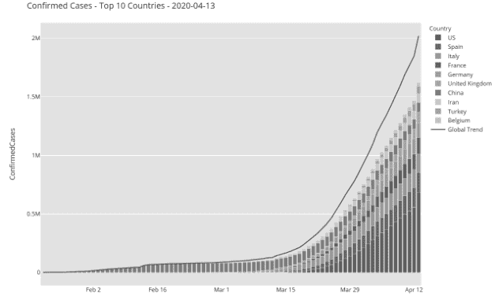

在这种情况下，多项式线性回归可以预测因变量或输出变量的值。描述各种回归模型的数学方程见表7.4。

**表7.4** 不同回归模型的数学表示

| 线性回归 | $y = b_0 + b_1x_1$ |
| --- | --- |
| 多元线性回归 | $y = b_0 + b_1x_1 + b_2x_2 + b_3x_3 + \dots + b_nx_n$ |
| 多项式回归 | $y = b_0 + b_1x_1 + b_2x_1^2 + b_3x_1^3 + \dots + b_nx_1^n$ |

观察多项式线性回归的方程，它与多元线性回归相似，但如果我们仔细观察，会发现它有显著的不同。我们发现多项式线性回归的方程包含同一变量的不同幂次（$x_1, x_1^2, x_1^3$），而在多元线性回归中，我们有不同的变量（$x_1, x_2, x_3$），每个变量的幂次都是1。这意味着多项式线性回归只处理一个自变量，类似于简单线性回归的情况，而多元线性回归处理多个自变量。

因此，我们可以将多项式回归定义为一种形式，其中因变量（$y$）和自变量（$x$）之间的关系使用n次多项式来描述。

### 为什么它被称为线性？

你一定注意到它被命名为多项式线性回归，你一定想知道这里“*线性*”的意义。

为了理解这一点，让我们再次回顾多项式线性回归的方程。

$y = b_0 + b_1x_1 + b_2x_1^2 + b_3x_1^3 + \dots + b_nx_1^n$

该方程包含自变量 $x_1$ 的高次幂项，但系数仍然是1次幂，没有被提升到任何其他幂次。一个模型是否被称为“***线性***”是基于正在学习的参数。由于参数 $b_0, b_1 \dots b_n$ 都是线性项，我们称其为*多项式线性回归*模型。

现在，我们将深入探讨多项式回归需求背后的原因及其各种案例研究。

### 7.9.1 职级与薪资案例研究

假设印度一所著名大学分享了一个*机构职位*数据集。该数据集包含一些机构职位，如院长、教授等，它们对应的职级和薪资。该数据集展示了10条记录，每个职位的职级范围从1到10（10为最高）。通常，一个人在某个职级上工作4年后才会晋升。现在，我们希望预测新员工Rahat先生的薪资，他拥有2年的副院长经验，职级在7到8之间，确切地说是7.5。管理层必须为他决定合适的薪资。作为机器学习爱好者，应该帮助管理层根据这些数据预测Rahat的薪资。该数据集如表7.5所示。

**表7.5** 机构职位数据集

| 职位 | 等级 | 薪资 |
| :--- | :---: | ---: |
| 助教 | 1 | 45000 |
| 客座教师 | 2 | 50000 |
| 合同制教师 | 3 | 60000 |
| 助理教授 | 4 | 80000 |
| 副教授 | 5 | 110000 |
| 教授 | 6 | 150000 |
| 副院长 | 7 | 200000 |
| 院长 | 8 | 300000 |
| 副校长 | 9 | 500000 |
| 校长 | 10 | 1000000 |

这是一个回归问题，因为模型需要预测薪资值，即一个连续值。在应用任何回归技术之前，让我们先在XY平面上绘制数据点并研究其行为。为此，我们得到了图7.30。

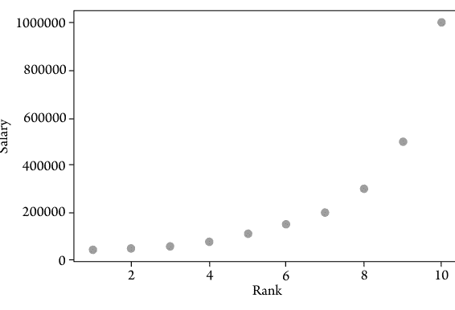

**图7.30** 薪资与职级关系图

数据点呈非线性分散。当我们对上述数据点应用多项式回归时，得到的结果如图7.31所示。

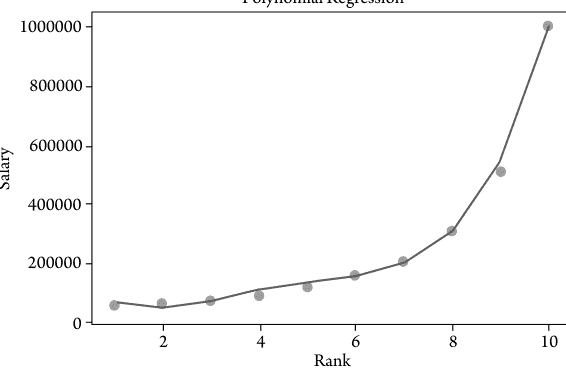

**图7.31** 使用多项式线性回归对职级-薪资问题建模

可以注意到，与图7.32所示的简单线性回归模型相比，多项式线性回归模型对数据点的拟合效果非常好。

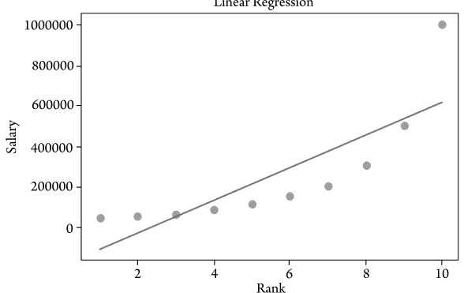

**图7.32** 使用线性回归对职级-薪资问题建模

在多项式线性回归中，自变量的次数在预测准确性中起着重要作用。自变量次数的作用将在下一小节中讨论。

#### 7.9.1.1 自变量的次数

我们已经学习到，多项式回归基于自变量 $x_1$ 的 $n$ 次幂，如下所示。

$y = b_0 + b_1x_1 + b_2x_1^2 + b_3x_1^3 \dots \dots + b_nx_1^n$

因此，要构建多项式回归模型，我们需要将自变量 $x_1$ 转换为多项式形式。为此，我们将计算 $x_1^2, x_1^3, x_1^4 \dots$ 直到 $x_1^n$。$n$ 的值取决于模型的*次数*，如表7.6所示。

**表7.6** 次数对多项式方程的影响

| 如果次数为 2<br>$\Rightarrow n=2$ | 多项式将为<br>$y = b_0 + b_1x_1 + b_2x_1^2$ |
| :--- | :--- |
| 如果次数为 3<br>$\Rightarrow n=3$ | 多项式将为<br>$y = b_0 + b_1x_1 + b_2x_1^2 + b_3x_1^3$ |
| 如果次数为 $N$<br>$\Rightarrow n=N$ | 多项式将为<br>$y = b_0 + b_1x_1 + b_2x_1^2 + b_3x_1^3 \dots \dots + b_nx_1^N$ |

因此，在实现多项式线性回归时，我们可以指定合适的次数。可以尝试不同的次数，直到获得最佳拟合模型。

在我们的职级-薪资问题中，假设自变量的次数为2，此时因变量 $y$ 的预测值如下。

$y = b_0 + b_1x_1 + b_2x_1^2$

图7.33显示了次数为2时得到的多边形。

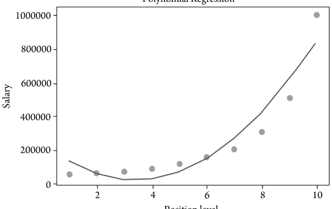

**图7.33** 次数为2时得到的多边形

现在，让我们将自变量的次数改为3，此时因变量 $y$ 的预测值如下。

$y = b_0 + b_1x_1 + b_2x_1^2 + b_3x_1^3$

次数为3时，得到的多边形如图7.34所示。

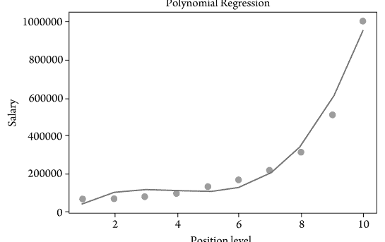

**图7.34** 次数为3时得到的多边形

让我们再将次数改为4。得到的多项式为 $y = b_0 + b_1x_1 + b_2x_1^2 + b_3x_1^3 + b_4x_1^4$，相应的多边形如图7.35所示。

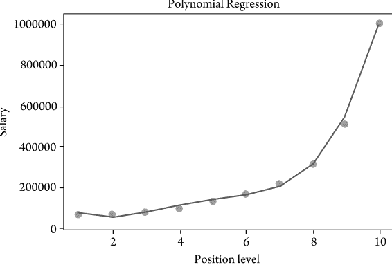

**图7.35** 次数为4时得到的多边形

我们将在下一章通过改变次数的值来执行所有这些实验。

现在，一旦我们得到了最佳拟合多边形，我们就可以通过简单地从x轴或职级轴上职级=7.5的位置向下画一条垂直线，然后将其投影到y轴上，来预测职级为7.5的人的薪资为₹220000，如图7.36所示。

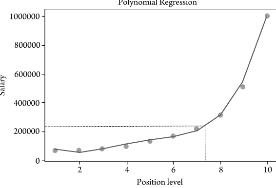

**图7.36** 预测职级为7.5的人员的薪资

让我们再举一个例子来深入理解这个概念。

### 7.9.2 化学专业学生案例研究

考虑一个案例研究，学生们在化学实验室进行了一些实验并记录了某些观察结果。这些观察结果是不同温度下水的温度和蒸气压读数。现在，要求学生们计算在特定温度 $t_0$ 下的压力。作为一个负责任的朋友，你必须帮助你的朋友使用合适的回归模型预测温度 $t_0$ 下的压力。供你参考，他们记录本中的读数如表7.7所示。

**表7.7** 温度和蒸气压读数

| 读数编号 | 温度 | 压力 |
| :--- | :--- | :--- |
| R1 | 5 | 0.0003 |
| R2 | 25 | 0.0014 |
| R3 | 45 | 0.008 |
| R4 | 65 | 0.05 |
| R5 | 85 | 0.09 |
| R6 | 100 | 0.25 |

如果我们在XY平面上绘制这些点，会得到图7.37。

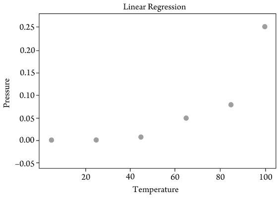

**图7.37** 案例研究的温度与压力关系图

为了建模这种情况，你可以应用一个简单的线性回归模型并绘制一条最佳拟合线，如图7.38所示。得到的回归线并不能很好地拟合我们案例研究的所有数据点。这表明线性回归在这种情况下并不是最佳策略。

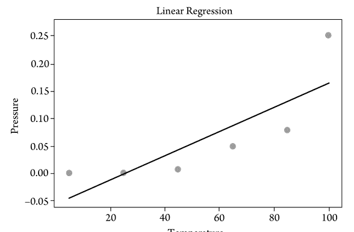

**图7.38** 应用于化学专业学生问题的线性回归

我们不应使用线性回归，而应使用多项式线性回归，这会产生一个多项式图形。得到的多项式完美地拟合了散点，如图7.39所示。

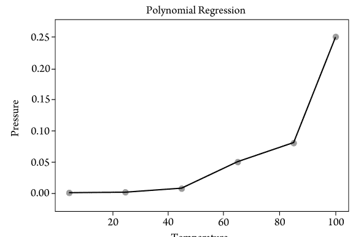

**图7.39** 连接散点后得到的多项式趋势

我们已经注意到，多项式回归的形式为：

$y = b_0 + b_1x_1 + b_2x_1^2 + b_3x_1^3 \dots + b_nx_1^n$

因此，当我们需要将线性模型转换为更好地拟合非线性数据时，多项式回归就派上了用场。

### 7.9.3 多输入属性情况下的多项式线性回归

多项式线性回归可以通过引入多项式项来容纳因变量（输出）与多个自变量（输入）之间的关系。对于一个具有多项式次数 $d$ 和两个独立属性 $x_1$ 和 $x_2$ 的模型，方程可以表示如下。

$$y = \beta_0 + \beta_1 x_1 + \beta_2 x_2 + \beta_{11} x_1^2 + \beta_{22} x_2^2 + \beta_{12} x_1 x_2 + ... + \beta_{1d} x_1^d + \beta_{2d} x_2^d + \varepsilon$$

其中：

- $y$ 是因变量。
- $x_1$ 和 $x_2$ 是自变量。
- $\beta_0$ 是 $y$ 轴截距。
- $\beta_1$ 和 $\beta_2$ 分别是与 $x_1$ 和 $x_2$ 的一次项相关的系数。
- $\beta_{11}$ 和 $\beta_{22}$ 分别是与 $x_1$ 和 $x_2$ 的平方项相关的系数。
- $\beta_{12}$ 是与交互项 $x_1 x_2$ 相关的系数。
- $\beta_{1d}$ 和 $\beta_{2d}$ 分别是与 $x_1$ 和 $x_2$ 的 $d$ 次多项式项相关的系数。
- $\varepsilon$ 代表误差项。

该方程捕获了因变量 $y$ 与自变量 $x_1$ 和 $x_2$ 之间高达 $d$ 次的多项式关系。系数 $\beta$ 通过回归过程进行估计，以最小化 $y$ 的观测值与预测值之间的误差。

在多项式回归中处理多个输入属性涉及扩展模型，以捕获输入属性与输出变量之间的二次、三次及更高阶关系。这种灵活性使得多项式回归能够捕获数据中更复杂的模式。

### 7.9.4 探索多项式回归在建模各种数据形状方面的多功能性

多项式回归具有灵活性，可以适应各种图形形状，涵盖简单和复杂的关系。

以下是一些由多项式回归有效建模的典型图形形状：

#### 线性关系

一条直线，其中响应变量随预测变量线性变化。次数为1的多项式回归（简单线性回归）可以巧妙地解决这个问题。

#### 二次关系

响应变量遵循抛物线曲线。次数为2的多项式回归可以恰当地捕获这种形状。

#### 三次关系

响应变量呈现S形曲线。次数为3的多项式回归可以准确地建模这种模式。

#### 复杂曲线

除了三次关系，多项式回归还展示了处理更复杂曲线形状的能力，如下所述并在图7.40中描绘。

三次样条：在断点处平滑过渡的分段三次函数。

对数曲线：当响应变量随预测变量对数增加或减少时。

指数曲线：响应呈指数增长或衰减。

幂律曲线：幂律曲线是指回报分布严重偏斜的情况。例如，一小部分公司占据了行业回报的很大一部分。

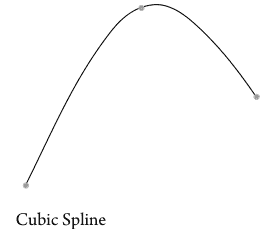

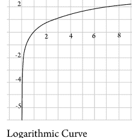

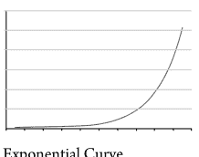

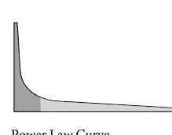

**图7.40** 复杂曲线形状

请记住，虽然多项式回归可以拟合这些形状，但选择合适的阶数至关重要。阶数过高可能导致过拟合或忽略微小变化，而阶数过低则可能遗漏重要模式。因此，务必使用统计指标来验证你的模型。

在下一章中，我们将讨论使用Python和各种数据集实现多元线性回归和多项式线性回归。

#### 提醒我

- 当因变量受多个自变量影响时，这被称为多元线性回归。
- 要处理分类变量，我们必须使用虚拟变量。
- 如果你有一个具有 $n$ 个不同值的名义或分类属性，只需选择 $n - 1$ 个虚拟变量。
- 如果你有多个名义或分类属性，请为每个名义属性分别引入虚拟变量。
- P值是统计学家和科学家用来确定假设是否正确的统计指标。
- 零假设的接受或拒绝取决于P值；如果它小于某个预先确定的固定值，则拒绝零假设。
- 要找出每个自变量在多元线性回归中预测因变量的重要性，我们可以使用P值的概念。
- P值用于在统计上接受或拒绝零假设。
- 如果 P值 > 显著性水平，则接受零假设。
- 如果 P值 < 显著性水平，则拒绝零假设。
- 有四种方法可用于选择构建多元线性回归模型所需的列或属性。
- 各种变量选择方法包括：全包含法、向后消除法、向前选择法和双向消除法。
- 通常，向后消除法是应用最广泛的变量选择方法。
- 当因变量不随自变量的变化而线性响应时，它可能以多项式方式响应，多项式回归即用于此。
- 多项式线性回归的方程为：$y = b_0 + b_1x_1 + b_2x_1^2 + b_3x_1^3 \dots + b_nx_1^n$。
- $n$ 的值取决于模型的阶数。

#### 附加资源

##### 视频链接

- 机器学习教程 Python - 3：多元线性回归，https://youtu.be/J_LnPL3Qg70
- 线性回归分析 | Python中的线性回归 | 机器学习算法 | Simplilearn，https://youtu.be/NUXdtN1W1FE
- 多项式回归，https://youtu.be/Qnt2vBRW8Io

##### 博客链接

- 如何计算P值，https://www.wikihow.com/Calculate-P-Value
- 线性回归与多项式回归简介，https://towardsdatascience.com/introduction-to-linear-regression-and-polynomial-regression-f8adc96f31cb

#### 测试我（问题）

1. 如何应用多元线性回归来确定教育水平、工作年限和认证等因素对个人薪资的影响？
2. 作为一名数据科学家，你分析发现在一个回归问题中，因变量不随自变量线性变化。你将使用哪种回归技术来构建模型，为什么？
3. 零假设是什么意思？它有什么意义？
4. 说明用于构建多元回归模型的向后消除法的过程？
5. 什么是P值？如何用它来接受或拒绝假设？解释评估其值的过程？
6. 选择构建多元线性回归所需列的最常用技术是什么？
7. 写出多项式回归的公式。

## 8 多元线性回归和多项式线性回归的实现

### 章节目标

- 通过一个案例研究，使用多元线性回归预测公司利润。
- 了解导入库和数据集的过程。
- 对数据集进行编码。
- 将数据集划分为训练集和测试集。
- 将多元线性回归模型拟合到训练集。
- 预测测试数据集的类别属性。
- 进行模型评估。
- 通过一个薪资等级的案例研究来构建多项式线性回归。
- 比较多项式线性回归和简单线性回归的性能。
- 通过一个化学实验室实验的案例研究来构建多项式线性回归。

### 8.1 多元线性回归简介

在上一章中，我们介绍了多元线性回归和多项式线性回归的概念。在那里，我们将回归定义为对连续值的预测；在多元线性回归的情况下，存在多个自变量和一个因变量。如果 $Y$ 是一个因变量，其值取决于 $X_1, X_2, X_3, \dots, X_n$ 个自变量，那么从数学上讲，多元线性回归由方程 (8.1) 表示。

$$Y = b_0 + b_1 * X_1 + b_2 * X_2 + b_3 * X_3 + b_4 * X_4 + \dots \dots \dots \dots \dots \dots \dots \dots \dots \dots \dots \dots \dots \dots \dots \dots \dots \dots \dots \dots \dots \dots \dots \dots \dots \dots \dots \dots \dots \dots \dots \dots \dots \dots \dots \dots \dots \dots \dots \dots \dots \dots \dots \dots \dots \dots \dots \dots \dots \dots \dots \dots \dots \dots \dots \dots \dots \dots \dots \dots \dots \dots \dots \dots \dots \dots \dots \dots \dots \dots \dots \dots \dots \dots \dots \dots \dots \dots \dots \dots \dots \dots \dots \dots \dots \dots \dots \dots \dots \dots \dots \dots \dots \dots \dots \dots \dots \dots \dots \dots \dots \dots \dots \dots \dots \dots \dots \dots \dots \dots \dots \dots \dots \dots \dots \dots \dots \dots \dots \dots \dots \dots \dots \dots \dots \dots \dots \dots \dots \dots \dots \dots \dots \dots \dots \dots \dots \dots \dots \dots \dots \dots \dots \dots \dots \dots \dots \dots \dots \dots \dots \dots \dots \dots \dots \dots \dots \dots \dots \dots \dots \dots \dots \dots \dots \dots \dots \dots \dots \dots \dots \dots \dots \dots \dots \dots \dots \dots \dots \dots \dots \dots \dots \dots \dots \dots \dots \dots \dots \dots \dots \dots \dots \dots \dots \dots \dots \dots \dots \dots \dots \dots \dots \dots \dots \dots \dots \dots \dots \dots \dots \dots \dots \dots \dots \dots \dots \dots \dots \dots \dots \dots \dots \dots \dots \dots \dots \dots \dots \dots \dots \dots \dots \dots \dots \dots \dots \dots \dots \dots \dots \dots \dots \dots \dots \dots \dots \dots \dots \dots \dots \dots \dots \dots \dots \dots \dots \dots \dots \dots \dots \dots \dots \dots \dots \dots \dots \dots \dots \dots \dots \dots \dots \dots \dots \dots \dots \dots \dots \dots \dots \dots \dots \dots \dots \dots \dots \dots \dots \dots \dots \dots \dots \dots \dots \dots \dots \dots \dots \dots \dots \dots \dots \dots \dots \dots \dots \dots \dots \dots \dots \dots \dots \dots \dots \dots \dots \dots \dots \dots \dots \dots \dots \dots \dots \dots \dots \dots \dots \dots \dots \dots \dots \dots \dots \dots \dots \dots \dots \dots \dots \dots \dots \dots \dots \dots \dots \dots \dots \dots \dots \dots \dots \dots \dots \dots \dots \dots \dots \dots \dots \dots \dots \dots \dots \dots \dots \dots \dots \dots \dots \dots \dots \dots \dots \dots \dots \dots \dots \dots \dots \dots \dots \dots \dots \dots \dots \dots \dots \dots \dots \dots \dots \dots \dots \dots \dots \dots \dots \dots \dots \dots \dots \dots \dots \dots \dots \dots \dots \dots \dots \dots \dots \dots \dots \dots \dots \dots \dots \dots \dots \dots \dots \dots \dots \dots \dots \dots \dots \dots \dots \dots \dots \dots \dots \dots \dots \dots \dots \dots \dots \dots \dots \dots \dots \dots \dots \dots \dots \dots \dots \dots \dots \dots \dots \dots \dots \dots \dots \dots \dots \dots \dots \dots \dots \dots \dots \dots \dots \dots \dots \dots \dots \dots \dots \dots \dots \dots \dots \dots \dots \dots \dots \dots \dots \dots \dots \dots \dots \dots \dots \dots \dots \dots \dots \dots \dots \dots \dots \dots \dots \dots \dots \dots \dots \dots \dots \dots \dots \dots \dots \dots \dots \dots \dots \dots \dots \dots \dots \dots \dots \dots \dots \dots \dots \dots \dots \dots \dots \dots \dots \dots \dots \dots \dots \dots \dots \dots \dots \dots \dots \dots \dots \dots \dots \dots \dots \dots \dots \dots \dots \dots \dots \dots \dots \dots \dots \dots \dots \dots \dots \dots \dots \dots \dots \dots \dots \dots \dots \dots \dots \dots \dots \dots \dots \dots \dots \dots \dots \dots \dots \dots \dots \dots \dots \dots \dots \dots \dots \dots \dots \dots \dots \dots \dots \dots \dots \dots \dots \dots \dots \dots \dots \dots \dots \dots \dots \dots \dots \dots \dots \dots \dots \dots \dots \dots \dots \dots \dots \dots \dots \dots \dots \dots \dots \dots \dots \dots \dots \dots \dots \dots \dots \dots \dots \dots \dots \dots \dots \dots \dots \dots \dots \dots \dots \dots \dots \dots \dots \dots \dots \dots \dots \dots \dots \dots \dots \dots \dots \dots \dots \dots \dots \dots \dots \dots \dots \dots \dots \dots \dots \dots \dots \dots \dots \dots \dots \dots \dots \dots \dots \dots \dots \dots \dots \dots \dots \dots \dots \dots \dots \dots \dots \dots \dots \dots \dots \dots \dots \dots \dots \dots \dots \dots \dots \dots \dots \dots \dots \dots \dots \dots \dots \dots \dots \dots \dots \dots \dots \dots \dots \dots \dots \dots \dots \dots \dots \dots \dots \dots \dots \dots \dots \dots \dots \dots \dots \dots \dots \dots \dots \dots \dots \dots \dots \dots \dots \dots \dots \dots \dots \dots \dots \dots \dots \dots \dots \dots \dots \dots \dots \dots \dots \dots \dots \dots \dots \dots \dots \dots \dots \dots \dots \dots \dots \dots \dots \dots \dots \dots \dots \dots \dots \dots \dots \dots \dots \dots \dots \dots \dots \dots \dots \dots \dots \dots \dots \dots \dots \dots \dots \dots \dots \dots \dots \dots \dots \dots \dots \dots \dots \dots \dots \dots \dots \dots \dots \dots \dots \dots \dots \dots \dots \dots \dots \dots \dots \dots \dots \dots \dots \dots \dots \dots \dots \dots \dots \dots \dots \dots \dots \dots \dots \dots \dots \dots \dots \dots \dots \dots \dots \dots \dots \dots \dots \dots \dots \dots \dots \dots \dots \dots \dots \dots \dots \dots \dots \dots \dots \dots \dots \dots \dots \dots \dots \dots \dots \dots \dots \dots \dots \dots \dots \dots \dots \dots \dots \dots \dots \dots \dots \dots \dots \dots \dots \dots \dots \dots \dots \dots \dots \dots \dots \dots \dots \dots \dots \dots \dots \dots \dots \dots \dots \dots \dots \dots \dots \dots \dots \dots \dots \dots \dots \dots \dots \dots \dots \dots \dots \dots \dots \dots \dots \dots \dots \dots \dots \dots \dots \dots \dots \dots \dots \dots \dots \dots \dots \dots \dots \dots \dots \dots \dots \dots \dots \dots \dots \dots \dots \dots \dots \dots \dots \dots \dots \dots \dots \dots \dots \dots \dots \dots \dots \dots \dots \dots \dots \dots \dots \dots \dots \dots \dots \dots \dots \dots \dots \dots \dots \dots \dots \dots \dots \dots \dots \dots \dots \dots \dots \dots \dots \dots \dots \dots \dots \dots \dots \dots \dots \dots \dots \dots \dots \dots \dots \dots \dots \dots \dots \dots \dots \dots \dots \dots \dots \dots \dots \dots \dots \dots \dots \dots \dots \dots \dots \dots \dots \dots \dots \dots \dots \dots \dots \dots \dots \dots \dots \dots \dots \dots \dots \dots \dots \dots \dots \dots \dots \dots \dots \dots \dots \dots \dots \dots \dots \dots \dots \dots \dots \dots \dots \dots \dots \dots \dots \dots \dots \dots \dots \dots \dots \dots \dots \dots \dots \dots \dots \dots \dots \dots \dots \dots \dots \dots \dots \dots \dots \dots \dots \dots \dots \dots \dots \dots \dots \dots \dots \dots \dots \dots \dots \dots \dots \dots \dots \dots \dots \dots \dots \dots \dots \dots \dots \dots \dots \dots \dots \dots \dots \dots \dots \dots \dots \dots \dots \dots \dots \dots \dots \dots \dots \dots \dots \dots \dots \dots \dots \dots \dots \dots \dots \dots \dots \dots \dots \dots \dots \dots \dots \dots \dots \dots \dots \dots \dots \dots \dots \dots \dots \dots \dots \dots \dots \dots \dots \dots \dots \dots \dots \dots \dots \dots \dots \dots \dots \dots \dots \dots \dots \dots \dots \dots \dots \dots \dots \dots \dots \dots \dots \dots \dots \dots \dots \dots \dots \dots \dots \dots \dots \dots \dots \dots \dots \dots \dots \dots \dots \dots \dots \dots \dots \dots \dots \dots \dots \dots \dots \dots \dots \dots \dots \dots \dots \dots \dots \dots \dots \dots \dots \dots \dots \dots \dots \dots \dots \dots \dots \dots \dots \dots \dots \dots \dots \dots \dots \dots \dots \dots \dots \dots \dots \dots \dots \dots \dots \dots \dots \dots \dots \dots \dots \dots \dots \dots \dots \dots \dots \dots \dots \dots \dots \dots \dots \dots \dots \dots \dots \dots \dots \dots \dots \dots \dots \dots \dots \dots \dots \dots \dots \dots \dots \dots \dots \dots \dots \dots \dots \dots \dots \dots \dots \dots \dots \dots \dots \dots \dots \dots \dots \dots \dots \dots \dots \dots \dots \dots \dots \dots \dots \dots \dots \dots \dots \dots \dots \dots \dots \dots \dots \dots \dots \dots \dots \dots \dots \dots \dots \dots \dots \dots \dots \dots \dots \dots \dots \dots \dots \dots \dots \dots \dots \dots \dots \dots \dots \dots \dots \dots \dots \dots \dots \dots \dots \dots \dots \dots \dots \dots \dots \dots \dots \dots \dots \dots \dots \dots \dots \dots \dots \dots \dots \dots \dots \dots \dots \dots \dots \dots \dots \dots \dots \dots \dots \dots \dots \dots \dots \dots \dots \dots \dots \dots \dots \dots \dots \dots \dots \dots \dots \dots \dots \dots \dots \dots \dots \dots \dots \dots \dots \dots \dots \dots \dots \dots \dots \dots \dots \dots \dots \dots \dots \dots \dots \dots \dots \dots \dots \dots \dots \dots \dots \dots \dots \dots \dots \dots \dots \dots \dots \dots \dots \dots \dots \dots \dots \dots \dots \dots \dots \dots \dots \dots \dots \dots \dots \dots \dots \dots \dots \dots \dots \dots \dots \dots \dots \dots \dots \dots \dots \dots \dots \dots \dots \dots \dots \dots \dots \dots \dots \dots \dots \dots \dots \dots \dots \dots \dots \dots \dots \dots \dots \dots \dots \dots \dots \dots \dots \dots \dots \dots \dots \dots \dots \dots \dots \dots \dots \dots \dots \dots \dots \dots \dots \dots \dots \dots \dots \dots \dots \dots \dots \dots \dots \dots \dots \dots \dots \dots \dots \dots \dots \dots \dots \dots \dots \dots \dots \dots \dots \dots \dots \dots \dots \dots \dots \dots \dots \dots \dots \dots \dots \dots \dots \dots \dots \dots \dots \dots \dots \dots \dots \dots \dots \dots \dots \dots \dots \dots \dots \dots \dots \dots \dots \dots \dots \dots \dots \dots \dots \dots \dots \dots \dots \dots \dots \dots \dots \dots \dots \dots \dots \dots \dots \dots \dots \dots \dots \dots \dots \dots \dots \dots \dots \dots \dots \dots \dots \dots \dots \dots \dots \dots \dots \dots \dots \dots \dots \dots \dots \dots \dots \dots \dots \dots \dots \dots \dots \dots \dots \dots \dots \dots \dots \dots \dots \dots \dots \dots \dots \dots \dots \dots \dots \dots \dots \dots \dots \dots \dots \dots \dots \dots \dots \dots \dots \dots \dots \dots \dots \dots \dots \dots \dots \dots \dots \dots \dots \dots \dots \dots \dots \dots \dots \dots \dots \dots \dots \dots \dots \dots \dots \dots \dots \dots \dots \dots \dots \dots \dots \dots \dots \dots \dots \dots \dots \dots \dots \dots \dots \dots \dots \dots \dots \dots \dots \dots \dots \dots \dots \dots \dots \dots \dots \dots \dots \dots \dots \dots \dots \dots \dots \dots \dots \dots \dots \dots \dots \dots \dots \dots \dots \dots \dots \dots \dots \dots \dots \dots \dots \dots \dots \dots \dots \dots \dots \dots \dots \dots \dots \dots \dots \dots \dots \dots \dots \dots \dots \dots \dots \dots \dots \dots \dots \dots \dots \dots \dots \dots \dots \dots \dots \dots \dots \dots \dots \dots \dots \dots \dots \dots \dots \dots \dots \dots \dots \dots \dots \dots \dots \dots \dots \dots \dots \dots \dots \dots \dots \dots \dots \dots \dots \dots \dots \dots \dots \dots \dots \dots \dots \dots \dots \dots \dots \dots \dots \dots \dots \dots \dots \dots \dots \dots \dots \dots \dots \dots \dots \dots \dots \dots \dots \dots \dots \dots \dots \dots \dots \dots \dots \dots \dots \dots \dots \dots \dots \dots \dots \dots \dots \dots \dots \dots \dots \dots \dots \dots \dots \dots \dots \dots \dots \dots \dots \dots \dots \dots \dots \dots \dots \dots \dots \dots \dots \dots \dots \dots \dots \dots \dots \dots \dots \dots \dots \dots \dots \dots \dots \dots \dots \dots \dots \dots \dots \dots \dots \dots \dots \dots \dots \dots \dots \dots \dots \dots \dots \dots \dots \dots \dots \dots \dots \dots \dots \dots \dots \dots \dots \dots \dots \dots \dots \dots \dots \dots \dots \dots \dots \dots \dots \dots \dots \dots \dots \dots \dots \dots \dots \dots \dots \dots \dots \dots \dots \dots \dots \dots \dots \dots \dots \dots \dots \dots \dots \dots \dots \dots \dots \dots \dots \dots \dots \dots \dots \dots \dots \dots \dots \dots \dots \dots \dots \dots \dots \dots \dots \dots \dots \dots \dots \dots \dots \dots \dots \dots \dots \dots \dots \dots \dots \dots \dots \dots \dots \dots \dots \dots \dots \dots \dots \dots \dots \dots \dots \dots \dots \dots \dots \dots \dots \dots \dots \dots \dots \dots \dots \dots \dots \dots \dots \dots \dots \dots \dots \dots \dots \dots \dots \dots \dots \dots \dots \dots \dots \dots \dots \dots \dots \dots \dots \dots \dots \dots \dots \dots \dots \dots \dots \dots \dots \dots \dots \dots \dots \dots \dots \dots \dots \dots \dots \dots \dots \dots \dots \dots \dots \dots \dots \dots \dots \dots \dots \dots \dots \dots \dots \dots \dots \dots \dots \dots \dots \dots \dots \dots \dots \dots \dots \dots \dots \dots \dots \dots \dots \dots \dots \dots \dots \dots \dots \dots \dots \dots \dots \dots \dots \dots \dots \dots \dots \dots \dots \dots \dots \dots \dots \dots \dots \dots \dots \dots \dots \dots \dots \dots \dots \dots \dots \dots \dots \dots \dots \dots \dots \dots \dots \dots \dots \dots \dots \dots \dots \dots \dots \dots \dots \dots \dots \dots \dots \dots \dots \dots \dots \dots \dots \dots \dots \dots \dots \dots \dots \dots \dots \dots \dots \dots \dots \dots \dots \dots \dots \dots \dots \dots \dots \dots \dots \dots \dots \dots \dots \dots \dots \dots \dots \dots \dots \dots \dots \dots \dots \dots \dots \dots \dots \dots \dots \dots \dots \dots \dots \dots \dots \dots \dots \dots \dots \dots \dots \dots \dots \dots \dots \dots \dots \dots \dots \dots \dots \dots \dots \dots \dots \dots \dots \dots \dots \dots \dots \dots \dots \dots \dots \dots \dots \dots \dots \dots \dots \dots \dots \dots \dots \dots \dots \dots \dots \dots \dots \dots \dots \dots \dots \dots \dots \dots \dots \dots \dots \dots \dots \dots \dots \dots \dots \dots \dots \dots \dots \dots \dots \dots \dots \dots \dots \dots \dots \dots \dots \dots \dots \dots \dots \dots \dots \dots \dots \dots \dots \dots \dots \dots \dots \dots \dots \dots \dots \dots \dots \dots \dots \dots \dots \dots \dots \dots \dots \dots \dots \dots \dots \dots \dots \dots \dots \dots \dots \dots \dots \dots \dots \dots \dots \dots \dots \dots \dots \dots \dots \dots \dots \dots \dots \dots \dots \dots \dots \dots \dots \dots \dots \dots \dots \dots \dots \dots \dots \dots \dots \dots \dots \dots \dots \dots \dots \dots \dots \dots \dots \dots \dots \dots \dots \dots \dots \dots \dots \dots \dots \dots \dots \dots \dots \dots \dots \dots \dots \dots \dots \dots \dots \dots \dots \dots \dots \dots \dots \dots \dots \dots \dots \dots \dots \dots \dots \dots \dots \dots \dots \dots \dots \dots \dots \dots \dots \dots \dots \dots \dots \dots \dots \dots \dots \dots \dots \dots \dots \dots \dots \dots \dots \dots \dots \dots \dots \dots \dots \dots \dots \dots \dots \dots \dots \dots \dots \dots \dots \dots \dots \dots \dots \dots \dots \dots \dots \dots \dots \dots \dots \dots \dots \dots \dots \dots \dots \dots \dots \dots \dots \dots \dots \dots \dots \dots \dots \dots \dots \dots \dots \dots \dots \dots \dots \dots \dots \dots \dots \dots \dots \dots \dots \dots \dots \dots \dots \dots \dots \dots \dots \dots \dots \dots \dots \dots \dots \dots \dots \dots \dots \dots \dots \dots \dots \dots \dots \dots \dots \dots \dots \dots \dots \dots \dots \dots \dots \dots \dots \dots \dots \dots \dots \dots \dots \dots \dots \dots \dots \dots \dots \dots \dots \dots \dots \dots \dots \dots \dots \dots \dots \dots \dots \dots \dots \dots \dots \dots \dots \dots \dots \dots \dots \dots \dots \dots \dots \dots \dots \dots \dots \dots \dots \dots \dots \dots \dots \dots \dots \dots \dots \dots \dots \dots \dots \dots \dots \dots \dots \dots \dots \dots \dots \dots \dots \dots \dots \dots \dots \dots \dots \dots \dots \dots \dots \dots \dots \dots \dots \dots \dots \dots \dots \dots \dots \dots \dots \dots \dots \dots \dots \dots \dots \dots \dots \dots \dots \dots \dots \dots \dots \dots \dots \dots \dots \dots \dots \dots \dots \dots \dots \dots \dots \dots \dots \dots \dots \dots \dots \dots \dots \dots \dots \dots \dots \dots \dots \dots \dots \dots \dots \dots \dots \dots \dots \dots \dots \dots \dots \dots \dots \dots \dots \dots \dots \dots \dots \dots \dots \dots \dots \dots \dots \dots \dots \dots \dots \dots \dots \dots \dots \dots \dots \dots \dots \dots \dots \dots \dots \dots \dots \dots \dots \dots \dots \dots \dots \dots \dots \dots \dots \dots \dots \dots \dots \dots \dots \dots \dots \dots \dots \dots \dots \dots \dots \dots \dots \dots \dots \dots \dots \dots \dots \dots \dots \dots \dots \dots \dots \dots \dots \dots \dots \dots \dots \dots \dots \dots \dots \dots \dots \dots \dots \dots \dots \dots \dots \dots \dots \dots \dots \dots \dots \dots \dots \dots \dots \dots \dots \dots \dots \dots \dots \dots \dots \dots \dots \dots \dots \dots \dots \dots \dots \dots \dots \dots \dots \dots \dots \dots \dots \dots \dots \dots \dots \dots \dots \dots \dots \dots \dots \dots \dots \dots \dots \dots \dots \dots \dots \dots \dots \dots \dots \dots \dots \dots \dots \dots \dots \dots \dots \dots \dots \dots \dots \dots \dots \dots \dots \dots \dots \dots \dots \dots \dots \dots \dots \dots \dots \dots \dots \dots \dots \dots \dots \dots \dots \dots \dots \dots \dots \dots \dots \dots \dots \dots \dots \dots \dots \dots \dots \dots \dots \dots \dots \dots \dots \dots \dots \dots \dots \dots \dots \dots \dots \dots \dots \dots \dots \dots \dots \dots \dots \dots \dots \dots \dots \dots \dots \dots \dots \dots \dots \dots \dots \dots \dots \dots \dots \dots \dots \dots \dots \dots \dots \dots \dots \dots \dots \dots \dots \dots \dots \dots \dots \dots \dots \dots \dots \dots \dots \dots \dots \dots \dots \dots \dots \dots \dots \dots \dots \dots \dots \dots \dots \dots \dots \dots \dots \dots \dots \dots \dots \dots \dots \dots \dots \dots \dots \dots \dots \dots \dots \dots \dots \dots \dots \dots \dots \dots \dots \dots \dots \dots \dots \dots \dots \dots \dots \dots \dots \dots \dots \dots \dots \dots \dots \dots \dots \dots \dots \dots \dots \dots \dots \dots \dots \dots \dots \dots \dots \dots \dots \dots \dots \dots \dots \dots \dots \dots \dots \dots \dots \dots \dots \dots \dots \dots \dots \dots \dots \dots \dots \dots \dots \dots \dots \dots \dots \dots \dots \dots \dots \dots \dots \dots \dots \dots \dots \dots \dots \dots \dots \dots \dots \dots \dots \dots \dots \dots \dots \dots \dots \dots \dots \dots \dots \dots \dots \dots \dots \dots \dots \dots \dots \dots \dots \dots \dots \dots \dots \dots \dots \dots \dots \dots \dots \dots \dots \dots \dots \dots \dots \dots \dots \dots \dots \dots \dots \dots \dots \dots \dots \dots \dots \dots \dots \dots \dots \dots \dots \dots \dots \dots \dots \dots \dots \dots \dots \dots \dots \dots \dots \dots \dots \dots \dots \dots \dots \dots \dots \dots \dots \dots \dots \dots \dots \dots \dots \dots \dots \dots \dots \dots \dots \dots \dots \dots \dots \dots \dots \dots \dots \dots \dots \dots \dots \dots \dots \dots \dots \dots \dots \dots \dots \dots \dots \dots \dots \dots \dots \dots \dots \dots \dots \dots \dots \dots \dots \dots \dots \dots \dots \dots \dots \dots \dots \dots \dots \dots \dots \dots \dots \dots \dots \dots \dots \dots \dots \dots \dots \dots \dots \dots \dots \dots \dots \dots \dots \dots \dots \dots \dots \dots \dots \dots \dots \dots \dots \dots \dots \dots \dots \dots \dots \dots \dots \dots \dots \dots \dots \dots \dots \dots \dots \dots \dots \dots \dots \dots \dots \dots \dots \dots \dots \dots \dots \dots \dots \dots \dots \dots \dots \dots \dots \dots \dots \dots \dots \dots \dots \dots \dots \dots \dots \dots \dots \dots \dots \dots \dots \dots \dots \dots \dots \dots \dots \dots \dots \dots \dots \dots \dots \dots \dots \dots \dots \dots \dots \dots \dots \dots \dots \dots \dots \dots \dots \dots \dots \dots \dots \dots \dots \dots \dots \dots \dots \dots \dots \dots \dots \dots \dots \dots \dots \dots \dots \dots \dots \dots \dots \dots \dots \dots \dots \dots \dots \dots \dots \dots \dots \dots \dots \dots \dots \dots \dots \dots \dots \dots \dots \dots \dots \dots \dots \dots \dots \dots \dots \dots \dots \dots \dots \dots \dots \dots \dots \dots \dots \dots \dots \dots \dots \dots \dots \dots \dots \dots \dots \dots \dots \dots \dots \dots \dots \dots \dots \dots \dots \dots \dots \dots \dots \dots \dots \dots \dots \dots \dots \dots \dots \dots \dots \dots \dots \dots \dots \dots \dots \dots \dots \dots \dots \dots \dots \dots \dots \dots \dots \dots \dots \dots \dots \dots \dots \dots \dots \dots \dots \dots \dots \dots \dots \dots \dots \dots \dots \dots \dots \dots \dots \dots \dots \dots \dots \dots \dots \dots \dots \dots \dots \dots \dots \dots \dots \dots \dots \dots \dots \dots \dots \dots \dots \dots \dots \dots \dots \dots \dots \dots \dots \dots \dots \dots \dots \dots \dots \dots \dots \dots \dots \dots \dots \dots \dots \dots \dots \dots \dots \dots \dots \dots \dots \dots \dots \dots \dots \dots \dots \dots \dots \dots \dots \dots \dots \dots \dots \dots \dots \dots \dots \dots \dots \dots \dots \dots \dots \dots \dots \dots \dots \dots \dots \dots \dots \dots \dots \dots \dots \dots \dots \dots \dots \dots \dots \dots \dots \dots \dots \dots \dots \dots \dots \dots \dots \dots \dots \dots \dots \dots \dots \dots \dots \dots \dots \dots \dots \dots \dots \dots \dots \dots \dots \dots \dots \dots \dots \dots \dots \dots \dots \dots \dots \dots \dots \dots \dots \dots \dots \dots \dots \dots \dots \dots \dots \dots \dots \dots \dots \dots \dots \dots \dots \dots \dots \dots \dots \dots \dots \dots \dots \dots \dots \dots \dots \dots \dots \dots \dots \dots \dots \dots \dots \dots \dots \dots \dots \dots \dots \dots \dots \dots \dots \dots \dots \dots \dots \dots \dots \dots \dots \dots \dots \dots \dots \dots \dots \dots \dots \dots \dots \dots \dots \dots \dots \dots \dots \dots \dots \dots \dots \dots \dots \dots \dots \dots \dots \dots \dots \dots \dots \dots \dots \dots \dots \dots \dots \dots \dots \dots \dots \dots \dots \dots \dots \dots \dots \dots \dots \dots \dots \dots \dots \dots \dots \dots \dots \dots \dots \dots \dots \dots \dots \dots \dots \dots \dots \dots \dots \dots \dots \dots \dots \dots \dots \dots \dots \dots \dots \dots \dots \dots \dots \dots \dots \dots \dots \dots \dots \dots \dots \dots \dots \dots \dots \dots \dots \dots \dots \dots \dots \dots \dots \dots \dots \dots \dots \dots \dots \dots \dots \dots \dots \dots \dots \dots \dots \dots \dots \dots \dots \dots \dots \dots \dots \dots \dots \dots \dots \dots \dots \dots \dots \dots \dots \dots \dots \dots \dots \dots \dots \dots \dots \dots \dots \dots \dots \dots \dots \dots \dots \dots \dots \dots \dots \dots \dots \dots \dots \dots \dots \dots \dots \dots \dots \dots \dots \dots \dots \dots \dots \dots \dots \dots \dots \dots \dots \dots \dots \dots \dots \dots \dots \dots \dots \dots \dots \dots \dots \dots \dots \dots \dots \dots \dots \dots \dots \dots \dots \dots \dots \dots \dots \dots \dots \dots \dots \dots \dots \dots \dots \dots \dots \dots \dots \dots \dots \dots \dots \dots \dots \dots \dots \dots \dots \dots \dots \dots \dots \dots \dots \dots \dots \dots \dots \dots \dots \dots \dots \dots \dots \dots \dots \dots \dots \dots \dots \dots \dots \dots \dots \dots \dots \dots \dots \dots \dots \dots \dots \dots \dots \dots \dots \dots \dots \dots \dots \dots \dots \dots \dots \dots \dots \dots \dots \dots \dots \dots \dots \dots \dots \dots \dots \dots \dots \dots \dots \dots \dots \dots \dots \dots \dots \dots \dots \dots \dots \dots \dots \dots \dots \dots \dots \dots \dots \dots \dots \dots \dots \dots \dots \dots \dots \dots \dots \dots \dots \dots \dots \dots \dots \dots \dots \dots \dots \dots \dots \dots \dots \dots \dots \dots \dots \dots \dots \dots \dots \dots \dots \dots \dots \dots \dots \dots \dots \dots \dots \dots \dots \dots \dots \dots \dots \dots \dots \dots \dots \dots \dots \dots \dots \dots \dots \dots \dots \dots \dots \dots \dots \dots \dots \dots \dots \dots \dots \dots \dots \dots \dots \dots \dots \dots \dots \dots \dots \dots \dots \dots \dots \dots \dots \dots \dots \dots \dots \dots \dots \dots \dots \dots \dots \dots \dots \dots \dots \dots \dots \dots \dots \dots \dots \dots \dots \dots \dots \dots \dots \dots \dots \dots \dots \dots \dots \dots \dots \dots \dots \dots \dots \dots \dots \dots \dots \dots \dots \dots \dots \dots \dots \dots \dots \dots \dots \dots \dots \dots \dots \dots \dots \dots \dots \dots \dots \dots \dots \dots \dots \dots \dots \dots \dots \dots \dots \dots \dots \dots \dots \dots \dots \dots \dots \dots \dots \dots \dots \dots \dots \dots \dots \dots \dots \dots \dots \dots \dots \dots \dots \dots \dots \dots \dots \dots \dots \dots \dots \dots \dots \dots \dots \dots \dots \dots \dots \dots \dots \dots \dots \dots \dots \dots \dots \dots \dots \dots \dots \dots \dots \dots \dots \dots \dots \dots \dots \dots \dots \dots \dots \dots \dots \dots \dots \dots \dots \dots \dots \dots \dots \dots \dots \dots \dots \dots \dots \dots \dots \dots \dots \dots \dots \dots \dots \dots \dots \dots \dots \dots \dots \dots \dots \dots \dots \dots \dots \dots \dots \dots \dots \dots \dots \dots \dots \dots \dots \dots \dots \dots \dots \dots \dots \dots \dots \dots \dots \dots \dots \dots \dots \dots \dots \dots \dots \dots \dots \dots \dots \dots \dots \dots \dots \dots \dots \dots \dots \dots \dots \dots \dots \dots \dots \dots \dots \dots \dots \dots \dots \dots \dots \dots \dots \dots \dots \dots \dots \dots \dots \dots \dots \dots \dots \dots \dots \dots \dots \dots \dots \dots \dots \dots \dots \dots \dots \dots \dots \dots \dots \dots \dots \dots \dots \dots \dots \dots \dots \dots \dots \dots \dots \dots \dots \dots \dots \dots \dots \dots \dots \dots \dots \dots \dots \dots \dots \dots \dots \dots \dots \dots \dots \dots \dots \dots \dots \dots \dots \dots \dots \dots \dots \dots \dots \dots \dots \dots \dots \dots \dots \dots \dots \dots \dots \dots \dots \dots \dots \dots \dots \dots \dots \dots \dots \dots \dots \dots \dots \dots \dots \dots \dots \dots \dots \dots \dots \dots \dots \dots \dots \dots \dots \dots \dots \dots \dots \dots \dots \dots \dots \dots \dots \dots \dots \dots \dots \dots \dots \dots \dots \dots \dots \dots \dots \dots \dots \dots \dots \dots \dots \dots \dots \dots \dots \dots \dots \dots \dots \dots \dots \dots \dots \dots \dots \dots \dots \dots \dots \dots \dots \dots \dots \dots \dots \dots \dots \dots \dots \dots \dots \dots \dots \dots \dots \dots \dots \dots \dots \dots \dots \dots \dots \dots \dots \dots \dots \dots \dots \dots \dots \dots \dots \dots \dots \dots \dots \dots \dots \dots \dots \dots \dots \dots \dots \dots \dots \dots \dots \dots \dots \dots \dots \dots \dots \dots \dots \dots \dots \dots \dots \dots \dots \dots \dots \dots \dots \dots \dots \dots \dots \dots \dots \dots \dots \dots \dots \dots \dots \dots \dots \dots \dots \dots \dots \dots \dots \dots \dots \dots \dots \dots \dots \dots \dots \dots \dots \dots \dots \dots \dots \dots \dots \dots \dots \dots \dots \dots \dots \dots \dots \dots \dots \dots \dots \dots \dots \dots \dots \dots \dots \dots \dots \dots \dots \dots \dots \dots \dots \dots \dots \dots \dots \dots \dots \dots \dots \dots \dots \dots \dots \dots \dots \dots \dots \dots \dots \dots \dots \dots \dots \dots \dots \dots \dots \dots \dots \dots \dots \dots \dots \dots \dots \dots \dots \dots \dots \dots \dots \dots \dots \dots \dots \dots \dots \dots \dots \dots \dots \dots \dots \dots \dots \dots \dots \dots \dots \dots \dots \dots \dots \dots \dots \dots \dots \dots \dots \dots \dots \dots \dots \dots \dots \dots \dots \dots \dots \dots \dots \dots \dots \dots \dots \dots \dots \dots \dots \dots \dots \dots \dots \dots \dots \dots \dots \dots \dots \dots \dots \dots \dots \dots \dots \dots \dots \dots \dots \dots \dots \dots \dots \dots \dots \dots \dots \dots \dots \dots \dots \dots \dots \dots \dots \dots \dots \dots \dots \dots \dots \dots \dots \dots \dots \dots \dots \dots \dots \dots \dots \dots \dots \dots \dots \dots \dots \dots \dots \dots \dots \dots \dots \dots \dots \dots \dots \dots \dots \dots \dots \dots \dots \dots \dots \dots \dots \dots \dots \dots \dots \dots \dots \dots \dots \dots \dots \dots \dots \dots \dots \dots \dots \dots \dots \dots \dots \dots \dots \dots \dots \dots \dots \dots \dots \dots \dots \dots \dots \dots \dots \dots \dots \dots \dots \dots \dots \dots \dots \dots \dots \dots \dots \dots \dots \dots \dots \dots \dots \dots \dots \dots \dots \dots \dots \dots \dots \dots \dots \dots \dots \dots \dots \dots \dots \dots \dots \dots \dots \dots \dots \dots \dots \dots \dots \dots \dots \dots \dots \dots \dots \dots \dots \dots \dots \dots \dots \dots \dots \dots \dots \dots \dots \dots \dots \dots \dots \dots \dots \dots \dots \dots \dots \dots \dots \dots \dots \dots \dots \dots \dots \dots \dots \dots \dots \dots \dots \dots \dots \dots \dots \dots \dots \dots \dots \dots \dots \dots \dots \dots \dots \dots \dots \dots \dots \dots \dots \dots \dots \dots \dots \dots \dots \dots \dots \dots \dots \dots \dots \dots \dots \dots \dots \dots \dots \dots \dots \dots \dots \dots \dots \dots \dots \dots \dots \dots \dots \dots \dots \dots \dots \dots \dots \dots \dots \dots \dots \dots \dots \dots \dots \dots \dots \dots \dots \dots \dots \dots \dots \dots \dots \dots \dots \dots \dots \dots \dots \dots \dots \dots \dots \dots \dots \dots \dots \dots \dots \dots \dots \dots \dots \dots \dots \dots \dots \dots \dots \dots \dots \dots \dots \dots \dots \dots \dots \dots \dots \dots \dots \dots \dots \dots \dots \dots \dots \dots \dots \dots \dots \dots \dots \dots \dots \dots \dots \dots \dots \dots \dots \dots \dots \dots \dots \dots \dots \dots \dots \dots \dots \dots \dots \dots \dots \dots \dots \dots \dots \dots \dots \dots \dots \dots \dots \dots \dots \dots \dots \dots \dots \dots \dots \dots \dots \dots \dots \dots \dots \dots \dots \dots \dots \dots \dots \dots \dots \dots \dots \dots \dots \dots \dots \dots \dots \dots \dots \dots \dots \dots \dots \dots \dots \dots \dots \dots \dots \dots \dots \dots \dots \dots \dots \dots \dots \dots \dots \dots \dots \dots \dots \dots \dots \dots \dots \dots \dots \dots \dots \dots \dots \dots \dots \dots \dots \dots \dots \dots \dots \dots \dots \dots \dots \dots \dots \dots \dots \dots \dots \dots \dots \dots \dots \dots \dots \dots \dots \dots \dots \dots \dots \dots \dots \dots \dots \dots \dots \dots \dots \dots \dots \dots \dots \dots \dots \dots \dots \dots \dots \dots \dots \dots \dots \dots \dots \dots \dots \dots \dots \dots \dots \dots \dots \dots \dots \dots \dots \dots \dots \dots \dots \dots \dots \dots \dots \dots \dots \dots \dots \dots \dots \dots \dots \dots \dots \dots \dots \dots \dots \dots \dots \dots \dots \dots \dots \dots \dots \dots \dots \dots \dots \dots \dots \dots \dots \dots \dots \dots \dots \dots \dots \dots \dots \dots \dots \dots \dots \dots \dots \dots \dots \dots \dots \dots \dots \dots \dots \dots \dots \dots \dots \dots \dots \dots \dots \dots \dots \dots \dots \dots \dots \dots \dots \dots \dots \dots \dots \dots \dots \dots \dots \dots \dots \dots \dots \dots \dots \dots \dots \dots \dots \dots \dots \dots \dots \dots \dots \dots \dots \dots \dots \dots \dots \dots \dots \dots \dots \dots \dots \dots \dots \dots \dots \dots \dots \dots \dots \dots \dots \dots \dots \dots \dots \dots \dots \dots \dots \dots \dots \dots \dots \dots \dots \dots \dots \dots \dots \dots \dots \dots \dots \dots \dots \dots \dots \dots \dots \dots \dots \dots \dots \dots \dots \dots \dots \dots \dots \dots \dots \dots \dots \dots \dots \dots \dots \dots \dots \dots \dots \dots \dots \dots \dots \dots \dots \dots \dots \dots \dots \dots \dots \dots \dots \dots \dots \dots \dots \dots \dots \dots \dots \dots \dots \dots \dots \dots \dots \dots \dots \dots \dots \dots \dots \dots \dots \dots \dots \dots \dots \dots \dots \dots \dots \dots \dots \dots \dots \dots \dots \dots \dots \dots \dots \dots \dots \dots \dots \dots \dots \dots \dots \dots \dots \dots \dots \dots \dots \dots \dots \dots \dots \dots \dots \dots \dots \dots \dots \dots \dots \dots \dots \dots \dots \dots \dots \dots \dots \dots \dots \dots \dots \dots \dots \dots \dots \dots \dots \dots \dots \dots \dots \dots \dots \dots \dots \dots \dots \dots \dots \dots \dots \dots \dots \dots \dots \dots \dots \dots \dots \dots \dots \dots \dots \dots \dots \dots \dots \dots \dots \dots \dots \dots \dots \dots \dots \dots \dots \dots \dots \dots \dots \dots \dots \dots \dots \dots \dots \dots \dots \dots \dots \dots \dots \dots \dots \dots \dots \dots \dots \dots \dots \dots \dots \dots \dots \dots \dots \dots \dots \dots \dots \dots \dots \dots \dots \dots \dots \dots \dots \dots \dots \dots \dots \dots \dots \dots \dots \dots \dots \dots \dots \dots \dots \dots \dots \dots \dots \dots \dots \dots \dots \dots \dots \dots \dots \dots \dots \dots \dots \dots \dots \dots \dots \dots \dots \dots \dots \dots \dots \dots \dots \dots \dots \dots \dots \dots \dots \dots \dots \dots \dots \dots \dots \dots \dots \dots \dots \dots \dots \dots \dots \dots \dots \dots \dots \dots \dots \dots \dots \dots \dots \dots \dots \dots \dots \dots \dots \dots \dots \dots \dots \dots \dots \dots \dots \dots \dots \dots \dots \dots \dots \dots \dots \dots \dots \dots \dots \dots \dots \dots \dots \dots \dots \dots \dots \dots \dots \dots \dots \dots \dots \dots \dots \dots \dots \dots \dots \dots \dots \dots \dots \dots \dots \dots \dots \dots \dots \dots \dots \dots \dots \dots \dots \dots \dots \dots \dots \dots \dots \dots \dots \dots \dots \dots \dots \dots \dots \dots \dots \dots \dots \dots \dots \dots \dots \dots \dots \dots \dots \dots \dots \dots \dots \dots \dots \dots \dots \dots \dots \dots \dots \dots \dots \dots \dots \dots \dots \dots \dots \dots \dots \dots \dots \dots \dots \dots \dots \dots \dots \dots \dots \dots \dots \dots \dots \dots \dots \dots \dots \dots \dots \dots \dots \dots \dots \dots \dots \dots \dots \dots \dots \dots \dots \dots \dots \dots \dots \dots \dots \dots \dots \dots \dots \dots \dots \dots \dots \dots \dots \dots \dots \dots \dots \dots \dots \dots \dots \dots \dots \dots \dots \dots \dots \dots \dots \dots \dots \dots \dots \dots \dots \dots \dots \dots \dots \dots \dots \dots \dots \dots \dots \dots \dots \dots \dots \dots \dots \dots \dots \dots \dots \dots \dots \dots \dots \dots \dots \dots \dots \dots \dots \dots \dots \dots \dots \dots \dots \dots \dots \dots \dots \dots \dots \dots \dots \dots \dots \dots \dots \dots \dots \dots \dots \dots \dots \dots \dots \dots \dots \dots \dots \dots \dots \dots \dots \dots \dots \dots \dots \dots \dots \dots \dots \dots \dots \dots \dots \dots \dots \dots \dots \dots \dots \dots \dots \dots \dots \dots \dots \dots \dots \dots \dots \dots \dots \dots \dots \dots \dots \dots \dots \dots \dots \dots \dots \dots \dots \dots \dots \dots \dots \dots \dots \dots \dots \dots \dots \dots \dots \dots \dots \dots \dots \dots \dots \dots \dots \dots \dots \dots \dots \dots \dots \dots \dots \dots \dots \dots \dots \dots \dots \dots \dots \dots \dots \dots \dots \dots \dots \dots \dots \dots \dots \dots \dots \dots \dots \dots \dots \dots \dots \dots \dots \dots \dots \dots \dots \dots \dots \dots \dots \dots \dots \dots \dots \dots \dots \dots \dots \dots \dots \dots \dots \dots \dots \dots \dots \dots \dots \dots \dots \dots \dots \dots \dots \dots \dots \dots \dots \dots \dots \dots \dots \dots \dots \dots \dots \dots \dots \dots \dots \dots \dots \dots \dots \dots \dots \dots \dots \dots \dots \dots \dots \dots \dots \dots \dots \dots \dots \dots \dots \dots \dots \dots \dots \dots \dots \dots \dots \dots \dots \dots \dots \dots \dots \dots \dots \dots \dots \dots \dots \dots \dots \dots \dots \dots \dots \dots \dots \dots \dots \dots \dots \dots \dots \dots \dots \dots \dots \dots \dots \dots \dots \dots \dots \dots \dots \dots \dots \dots \dots \dots \dots \dots \dots \dots \dots \dots \dots \dots \dots \dots \dots \dots \dots \dots \dots \dots \dots \dots \dots \dots \dots \dots \dots \dots \dots \dots \dots \dots \dots \dots \dots \dots \dots \dots \dots \dots \dots \dots \dots \dots \dots \dots \dots \dots \dots \dots \dots \dots \dots \dots \dots \dots \dots \dots \dots \dots \dots \dots \dots \dots \dots \dots \dots \dots \dots \dots \dots \dots \dots \dots \dots \dots \dots \dots \dots \dots \dots \dots \dots \dots \dots \dots \dots \dots \dots \dots \dots \dots \dots \dots \dots \dots \dots \dots \dots \dots \dots \dots \dots \dots \dots \dots \dots \dots \dots \dots \dots \dots \dots \dots \dots \dots \dots \dots \dots \dots \dots \dots \dots \dots \dots \dots \dots \dots \dots \dots \dots \dots \dots \dots \dots \dots \dots \dots \dots \dots \dots \dots \dots \dots \dots \dots \dots \dots \dots \dots \dots \dots \dots \dots \dots \dots \dots \dots \dots \dots \dots \dots \dots \dots \dots \dots \dots \dots \dots \dots \dots \dots \dots \dots \dots \dots \dots \dots \dots \dots \dots \dots \dots \dots \dots \dots \dots \dots \dots \dots \dots \dots \dots \dots \dots \dots \dots \dots \dots \dots \dots \dots \dots \dots \dots \dots \dots \dots \dots \dots \dots \dots \dots \dots \dots \dots \dots \dots \dots \dots \dots \dots \dots \dots \dots \dots \dots \dots \dots \dots \dots \dots \dots \dots \dots \dots \dots \dots \dots \dots \dots \dots \dots \dots \dots \dots \dots \dots \dots \dots \dots \dots \dots \dots \dots \dots \dots \dots \dots \dots \dots \dots \dots \dots \dots \dots \dots \dots \dots \dots \dots \dots \dots \dots \dots \dots \dots \dots \dots \dots \dots \dots \dots \dots \dots \dots \dots \dots \dots \dots \dots \dots \dots \dots \dots \dots \dots \dots \dots \dots \dots \dots \dots \dots \dots \dots \dots \dots \dots \dots \dots \dots \dots \dots \dots \dots \dots \dots \dots \dots \dots \dots \dots \dots \dots \dots \dots \dots \dots \dots \dots \dots \dots \dots \dots \dots \dots \dots \dots \dots \dots \dots \dots \dots \dots \dots \dots \dots \dots \dots \dots \dots \dots \dots \dots \dots \dots \dots \dots \dots \dots \dots \dots \dots \dots \dots \dots \dots \dots \dots \dots \dots \dots \dots \dots \dots \dots \dots \dots \dots \dots \dots \dots \dots \dots \dots \dots \dots \dots \dots \dots \dots \dots \dots \dots \dots \dots \dots \dots \dots \dots \dots \dots \dots \dots \dots \dots \dots \dots \dots \dots \dots \dots \dots \dots \dots \dots \dots \dots \dots \dots \dots \dots \dots \dots \dots \dots \dots \dots \dots \dots \dots \dots \dots \dots \dots \dots \dots \dots \dots \dots \dots \dots \dots \dots \dots \dots \dots \dots \dots \dots \dots \dots \dots \dots \dots \dots \dots \dots \dots \dots \dots \dots \dots \dots \dots \dots \dots \dots \dots \dots \dots \dots \dots \dots \dots \dots \dots \dots \dots \dots \dots \dots \dots \dots \dots \dots \dots \dots \dots \dots \dots \dots \dots \dots \dots \dots \dots \dots \dots \dots \dots \dots \dots \dots \dots \dots \dots \dots \dots \dots \dots \dots \dots \dots \dots \dots \dots \dots \dots \dots \dots \dots \dots \dots \dots \dots \dots \dots \dots \dots \dots \dots \dots \dots \dots \dots \dots \dots \dots \dots \dots \dots \dots \dots \dots \dots \dots \dots \dots \dots \dots \dots \dots \dots \dots \dots \dots \dots \dots \dots \dots \dots \dots \dots \dots \dots \dots \dots \dots \dots \dots \dots \dots \dots \dots \dots \dots \dots \dots \dots \dots \dots \dots \dots \dots \dots \dots \dots \dots \dots \dots \dots \dots \dots \dots \dots \dots \dots \dots \dots \dots \dots \dots \dots \dots \dots \dots \dots \dots \dots \dots \dots \dots \dots \dots \dots \dots \dots \dots \dots \dots \dots \dots \dots \dots \dots \dots \dots \dots \dots \dots \dots \dots \dots \dots \dots \dots \dots \dots \dots \dots \dots \dots \dots \dots \dots \dots \dots \dots \dots \dots \dots \dots \dots \dots \dots \dots \dots \dots \dots \dots \dots \dots \dots \dots \dots \dots \dots \dots \dots \dots \dots \dots \dots \dots \dots \dots \dots \dots \dots \dots \dots \dots \dots \dots \dots \dots \dots \dots \dots \dots \dots \dots \dots \dots \dots \dots \dots \dots \dots \dots \dots \dots \dots \dots \dots \dots \dots \dots \dots \dots \dots \dots \dots \dots \dots \dots \dots \dots \dots \dots \dots \dots \dots \dots \dots \dots \dots \dots \dots \dots \dots \dots \dots \dots \dots \dots \dots \dots \dots \dots \dots \dots \dots \dots \dots \dots \dots \dots \dots \dots \dots \dots \dots \dots \dots \dots \dots \dots \dots \dots \dots \dots \dots \dots \dots \dots \dots \dots \dots \dots \dots \dots \dots \dots \dots \dots \dots \dots \dots \dots \dots \dots \dots \dots \dots \dots \dots \dots \dots \dots \dots \dots \dots \dots \dots \dots \dots \dots \dots \dots \dots \dots \dots \dots \dots \dots \dots \dots \dots \dots \dots \dots \dots \dots \dots \dots \dots \dots \dots \dots \dots \dots \dots \dots \dots \dots \dots \dots \dots \dots \dots \dots \dots \dots \dots \dots \dots \dots \dots \dots \dots \dots \dots \dots \dots \dots \dots \dots \dots \dots \dots \dots \dots \dots \dots \dots \dots \dots \dots \dots \dots \dots \dots \dots \dots \dots \dots \dots \dots \dots \dots \dots \dots \dots \dots \dots \dots \dots \dots \dots \dots \dots \dots \dots \dots \dots \dots \dots \dots \dots \dots \dots \dots \dots \dots \dots \dots \dots \dots \dots \dots \dots \dots \dots \dots \dots \dots \dots \dots \dots \dots \dots \dots \dots \dots \dots \dots \dots \dots \dots \dots \dots \dots \dots \dots \dots \dots \dots \dots \dots \dots \dots \dots \dots \dots \dots \dots \dots \dots \dots \dots \dots \dots \dots \dots \dots \dots \dots \dots \dots \dots \dots \dots \dots \dots \dots \dots \dots \dots \dots \dots \dots \dots \dots \dots \dots \dots \dots \dots \dots \dots \dots \dots \dots \dots \dots \dots \dots \dots \dots \dots \dots \dots \dots \dots \dots \dots \dots \dots \dots \dots \dots \dots \dots \dots \dots \dots \dots \dots \dots \dots \dots \dots \dots \dots \dots \dots \dots \dots \dots \dots \dots \dots \dots \dots \dots \dots \dots \dots \dots \dots \dots \dots \dots \dots \dots \dots \dots \dots \dots \dots \dots \dots \dots \dots \dots \dots \dots \dots \dots \dots \dots \dots \dots \dots \dots \dots \dots \dots \dots \dots \dots \dots \dots \dots \dots \dots \dots \dots \dots \dots \dots \dots \dots \dots \dots \dots \dots \dots \dots \dots \dots \dots \dots \dots \dots \dots \dots \dots \dots \dots \dots \dots \dots \dots \dots \dots \dots \dots \dots \dots \dots \dots \dots \dots \dots \dots \dots \dots \dots \dots \dots \dots \dots \dots \dots \dots \dots \dots \dots \dots \dots \dots \dots \dots \dots \dots \dots \dots \dots \dots \dots \dots \dots \dots \dots \dots \dots \dots \dots \dots \dots \dots \dots \dots \dots \dots \dots \dots \dots \dots \dots \dots \dots \dots \dots \dots \dots \dots \dots \dots \dots \dots \dots \dots \dots \dots \dots \dots \dots \dots \dots \dots \dots \dots \dots \dots \dots \dots \dots \dots \dots \dots \dots \dots \dots \dots \dots \dots \dots \dots \dots \dots \dots \dots \dots \dots \dots \dots \dots \dots \dots \dots \dots \dots \dots \dots \dots \dots \dots \dots \dots \dots \dots \dots \dots \dots \dots \dots \dots \dots \dots \dots \dots \dots \dots \dots \dots \dots \dots \dots \dots \dots \dots \dots \dots \dots \dots \dots \dots \dots \dots \dots \dots \dots \dots \dots \dots \dots \dots \dots \dots \dots \dots \dots \dots \dots \dots \dots \dots \dots \dots \dots \dots \dots \dots \dots \dots \dots \dots \dots \dots \dots \dots \dots \dots \dots \dots \dots \dots \dots \dots \dots \dots \dots \dots \dots \dots \dots \dots \dots \dots \dots \dots \dots \dots \dots \dots \dots \dots \dots \dots \dots \dots \dots \dots \dots \dots \dots \dots \dots \dots \dots \dots \dots \dots \dots \dots \dots \dots \dots \dots \dots \dots \dots \dots \dots \dots \dots \dots \dots \dots \dots \dots \dots \dots \dots \dots \dots \dots \dots \dots \dots \dots \dots \dots \dots \dots \dots \dots \dots \dots \dots \dots \dots \dots \dots \dots \dots \dots \dots \dots \dots \dots \dots \dots \dots \dots \dots \dots \dots \dots \dots \dots \dots \dots \dots \dots \dots \dots \dots \dots \dots \dots \dots \dots \dots \dots \dots \dots \dots \dots \dots \dots \dots \dots \dots \dots \dots \dots \dots \dots \dots \dots \dots \dots \dots \dots \dots \dots \dots \dots \dots \dots \dots \dots \dots \dots \dots \dots \dots \dots \dots \dots \dots \dots \dots \dots \dots \dots \dots \dots \dots \dots \dots \dots \dots \dots \dots \dots \dots \dots \dots \dots \dots \dots \dots \dots \dots \dots \dots \dots \dots \dots \dots \dots \dots \dots \dots \dots \dots \dots \dots \dots \dots \dots \dots \dots \dots \dots \dots \dots \dots \dots \dots \dots \dots \dots \dots \dots \dots \dots \dots \dots \dots \dots \dots \dots \dots \dots \dots \dots \dots \dots \dots \dots \dots \dots \dots \dots \dots \dots \dots \dots \dots \dots \dots \dots \dots \dots \dots \dots \dots \dots \dots \dots \dots \dots \dots \dots \dots \dots \dots \dots \dots \dots \dots \dots \dots \dots \dots \dots \dots \dots \dots \dots \dots \dots \dots \dots \dots \dots \dots \dots \dots \dots \dots \dots \dots \dots \dots \dots \dots \dots \dots \dots \dots \dots \dots \dots \dots \dots \dots \dots \dots \dots \dots \dots \dots \dots \dots \dots \dots \dots \dots \dots \dots \dots \dots \dots \dots \dots \dots \dots \dots \dots \dots \dots \dots \dots \dots \dots \dots \dots \dots \dots \dots \dots \dots \dots \dots \dots \dots \dots \dots \dots \dots \dots \dots \dots \dots \dots \dots \dots \dots \dots \dots \dots \dots \dots \dots \dots \dots \dots \dots \dots \dots \dots \dots \dots \dots \dots \dots \dots \dots \dots \dots \dots \dots \dots \dots \dots \dots \dots \dots \dots \dots \dots \dots \dots \dots \dots \dots \dots \dots \dots \dots \dots \dots \dots \dots \dots \dots \dots \dots \dots \dots \dots \dots \dots \dots \dots \dots \dots \dots \dots \dots \dots \dots \dots \dots \dots \dots \dots \dots \dots \dots \dots \dots \dots \dots \dots \dots \dots \dots \dots \dots \dots \dots \dots \dots \dots \dots \dots \dots \dots \dots \dots \dots \dots \dots \dots \dots \dots \dots \dots \dots \dots \dots \dots \dots \dots \dots \dots \dots \dots \dots \dots \dots \dots \dots \dots \dots \dots \dots \dots \dots \dots \dots \dots \dots \dots \dots \dots \dots \dots \dots \dots \dots \dots \dots \dots \dots \dots \dots \dots \dots \dots \dots \dots \dots \dots \dots \dots \dots \dots \dots \dots \dots \dots \dots \dots \dots \dots \dots \dots \dots \dots \dots \dots \dots \dots \dots \dots \dots \dots \dots \dots \dots \dots \dots \dots \dots \dots \dots \dots \dots \dots \dots \dots \dots \dots \dots \dots \dots \dots \dots \dots \dots \dots \dots \dots \dots \dots \dots \dots \dots \dots \dots \dots \dots \dots \dots \dots \dots \dots \dots \dots \dots \dots \dots \dots \dots \dots \dots \dots \dots \dots \dots \dots \dots \dots \dots \dots \dots \dots \dots \dots \dots \dots \dots \dots \dots \dots \dots \dots \dots \dots \dots \dots \dots \dots \dots \dots \dots \dots \dots \dots \dots \dots \dots \dots \dots \dots \dots \dots \dots \dots \dots \dots \dots \dots \dots \dots \dots \dots \dots \dots \dots \dots \dots \dots \dots \dots \dots \dots \dots \dots \dots \dots \dots \dots \dots \dots \dots \dots \dots \dots \dots \dots \dots \dots \dots \dots \dots \dots \dots \dots \dots \dots \dots \dots \dots \dots \dots \dots \dots \dots \dots \dots \dots \dots \dots \dots \dots \dots \dots \dots \dots \dots \dots \dots \dots \dots \dots \dots \dots \dots \dots \dots \dots \dots \dots \dots \dots \dots \dots \dots \dots \dots \dots \dots \dots \dots \dots \dots \dots \dots \dots \dots \dots \dots \dots \dots \dots \dots \dots \dots \dots \dots \dots \dots \dots \dots \dots \dots \dots \dots \dots \dots \dots \dots \dots \dots \dots \dots \dots \dots \dots \dots \dots \dots \dots \dots \dots \dots \dots \dots \dots \dots \dots \dots \dots \dots \dots \dots \dots \dots \dots \dots \dots \dots \dots \dots \dots \dots \dots \dots \dots \dots \dots \dots \dots \dots \dots \dots \dots \dots \dots \dots \dots \dots \dots \dots \dots \dots \dots \dots \dots \dots \dots \dots \dots \dots \dots \dots \dots \dots \dots \dots \dots \dots \dots \dots \dots \dots \dots \dots \dots \dots \dots \dots \dots \dots \dots \dots \dots \dots \dots \dots \dots \dots \dots \dots \dots \dots \dots \dots \dots \dots \dots \dots \dots \dots \dots \dots \dots \dots \dots \dots \dots \dots \dots \dots \dots \dots \dots \dots \dots \dots \dots \dots \dots \dots \dots \dots \dots \dots \dots \dots \dots \dots \dots \dots \dots \dots \dots \dots \dots \dots \dots \dots \dots \dots \dots \dots \dots \dots \dots \dots \dots \dots \dots \dots \dots \dots \dots \dots \dots \dots \dots \dots \dots \dots \dots \dots \dots \dots \dots \dots \dots \dots \dots \dots \dots \dots \dots \dots \dots \dots \dots \dots \dots \dots \dots \dots \dots \dots \dots \dots \dots \dots \dots \dots \dots \dots \dots \dots \dots \dots \dots \dots \dots \dots \dots \dots \dots \dots \dots \dots \dots \dots \dots \dots \dots \dots \dots \dots \dots \dots \dots \dots \dots \dots \dots \dots \dots \dots \dots \dots \dots \dots \dots \dots \dots \dots \dots \dots \dots \dots \dots \dots \dots \dots \dots \dots \dots \dots \dots \dots \dots \dots \dots \dots \dots \dots \dots \dots \dots \dots \dots \dots \dots \dots \dots \dots \dots \dots \dots \dots \dots \dots \dots \dots \dots \dots \dots \dots \dots \dots \dots \dots \dots \dots \dots \dots \dots \dots \dots \dots \dots \dots \dots \dots \dots \dots \dots \dots \dots \dots \dots \dots \dots \dots \dots \dots \dots \dots \dots \dots \dots \dots \dots \dots \dots \dots \dots \dots \dots \dots \dots \dots \dots \dots \dots \dots \dots \dots \dots \dots \dots \dots \dots \dots \dots \dots \dots \dots \dots \dots \dots \dots \dots \dots \dots \dots \dots \dots \dots \dots \dots \dots \dots \dots \dots \dots \dots \dots \dots \dots \dots \dots \dots \dots \dots \dots \dots \dots \dots \dots \dots \dots \dots \dots \dots \dots \dots \dots \dots \dots \dots \dots \dots \dots \dots \dots \dots \dots \dots \dots \dots \dots \dots \dots \dots \dots \dots \dots \dots \dots \dots \dots \dots \dots \dots \dots \dots \dots \dots \dots \dots \dots \dots \dots \dots \dots \dots \dots \dots \dots \dots \dots \dots \dots \dots \dots \dots \dots \dots \dots \dots \dots \dots \dots \dots \dots \dots \dots \dots \dots \dots \dots \dots \dots \dots \dots \dots \dots \dots \dots \dots \dots \dots \dots \dots \dots \dots \dots \dots \dots \dots \dots \dots \dots \dots \dots \dots \dots \dots \dots \dots \dots \dots \dots \dots \dots \dots \dots \dots \dots \dots \dots \dots \dots \dots \dots \dots \dots \dots \dots \dots \dots \dots \dots \dots \dots \dots \dots \dots \dots \dots \dots \dots \dots \dots \dots \dots \dots \dots \dots \dots \dots \dots \dots \dots \dots \dots \dots \dots \dots \dots \dots \dots \dots \dots \dots \dots \dots \dots \dots \dots \dots \dots \dots \dots \dots \dots \dots \dots \dots \dots \dots \dots \dots \dots \dots \dots \dots \dots \dots \dots \dots \dots \dots \dots \dots \dots \dots \dots \dots \dots \dots \dots \dots \dots \dots \dots \dots \dots \dots \dots \dots \dots \dots \dots \dots \dots \dots \dots \dots \dots \dots \dots \dots \dots \dots \dots \dots \dots \dots \dots \dots \dots \dots \dots \dots \dots \dots \dots \dots \dots \dots \dots \dots \dots \dots \dots \dots \dots \dots \dots \dots \dots \dots \dots \dots \dots \dots \dots \dots \dots \dots \dots \dots \dots \dots \dots \dots \dots \dots \dots \dots \dots \dots \dots \dots \dots \dots \dots \dots \dots \dots \dots \dots \dots \dots \dots \dots \dots \dots \dots \dots \dots \dots \dots \dots \dots \dots \dots \dots \dots \dots \dots \dots \dots \dots \dots \dots \dots \dots \dots \dots \dots \dots \dots \dots \dots \dots \dots \dots \dots \dots \dots \dots \dots \dots \dots \dots \dots \dots \dots \dots \dots \dots \dots \dots \dots \dots \dots \dots \dots \dots \dots \dots \dots \dots \dots \dots \dots \dots \dots \dots \dots \dots \dots \dots \dots \dots \dots \dots \dots \dots \dots \dots \dots \dots \dots \dots \dots \dots \dots \dots \dots \dots \dots \dots \dots \dots \dots \dots \dots \dots \dots \dots \dots \dots \dots \dots \dots \dots \dots \dots \dots \dots \dots \dots \dots \dots \dots \dots \dots \dots \dots \dots \dots \dots \dots \dots \dots \dots \dots \dots \dots \dots \dots \dots \dots \dots \dots \dots \dots \dots \dots \dots \dots \dots \dots \dots \dots \dots \dots \dots \dots \dots \dots \dots \dots \dots \dots \dots \dots \dots \dots \dots \dots \dots \dots \dots \dots \dots \dots \dots \dots \dots \dots \dots \dots \dots \dots \dots \dots \dots \dots \dots \dots \dots \dots \dots \dots \dots \dots \dots \dots \dots \dots \dots \dots \dots \dots \dots \dots \dots \dots \dots \dots \dots \dots \dots \dots \dots \dots \dots \dots \dots \dots \dots \dots \dots \dots \dots \dots \dots \dots \dots \dots \dots \dots \dots \dots \dots \dots \dots \dots \dots \dots \dots \dots \dots \dots \dots \dots \dots \dots \dots \dots \dots \dots \dots \dots \dots \dots \dots \dots \dots \dots \dots \dots \dots \dots \dots \dots \dots \dots \dots \dots \dots \dots \dots \dots \dots \dots \dots \dots \dots \dots \dots \dots \dots \dots \dots \dots \dots \dots \dots \dots \dots \dots \dots \dots \dots \dots \dots \dots \dots \dots \dots \dots \dots \dots \dots \dots \dots \dots \dots \dots \dots \dots \dots \dots \dots \dots \dots \dots \dots \dots \dots \dots \dots \dots \dots \dots \dots \dots \dots \dots \dots \dots \dots \dots \dots \dots \dots \dots \dots \dots \dots \dots \dots \dots \dots \dots \dots \dots \dots \dots \dots \dots \dots \dots \dots \dots \dots \dots \dots \dots \dots \dots \dots \dots \dots \dots \dots \dots \dots \dots \dots \dots \dots \dots \dots \dots \dots \dots \dots \dots \dots \dots \dots \dots \dots \dots \dots \dots \dots \dots \dots \dots \dots \dots \dots \dots \dots \dots \dots \dots \dots \dots \dots \dots \dots \dots \dots \dots \dots \dots \dots \dots \dots \dots \dots \dots \dots \dots \dots \dots \dots \dots \dots \dots \dots \dots \dots \dots \dots \dots \dots \dots \dots \dots \dots \dots \dots \dots \dots \dots \dots \dots \dots \dots \dots \dots \dots \dots \dots \dots \dots \dots \dots \dots \dots \dots \dots \dots \dots \dots \dots \dots \dots \dots \dots \dots \dots \dots \dots \dots \dots \dots \dots \dots \dots \dots \dots \dots \dots \dots \dots \dots \dots \dots \dots \dots \dots \dots \dots \dots \dots \dots \dots \dots \dots \dots \dots \dots \dots \dots \dots \dots \dots \dots \dots \dots \dots \dots \dots \dots \dots \dots \dots \dots \dots \dots \dots \dots \dots \dots \dots \dots \dots \dots \dots \dots \dots \dots \dots \dots \dots \dots \dots \dots \dots \dots \dots \dots \dots \dots \dots \dots \dots \dots \dots \dots \dots \dots \dots \dots \dots \dots \dots \dots \dots \dots \dots \dots \dots \dots \dots \dots \dots \dots \dots \dots \dots \dots \dots \dots \dots \dots \dots \dots \dots \dots \dots \dots \dots \dots \dots \dots \dots \dots \dots \dots \dots \dots \dots \dots \dots \dots \dots \dots \dots \dots \dots \dots \dots \dots \dots \dots \dots \dots \dots \dots \dots \dots \dots \dots \dots \dots \dots \dots \dots \dots \dots \dots \dots \dots \dots \dots \dots \dots \dots \dots \dots \dots \dots \dots \dots \dots \dots \dots \dots \dots \dots \dots \dots \dots \dots \dots \dots \dots \dots \dots \dots \dots \dots \dots \dots \dots \dots \dots \dots \dots \dots \dots \dots \dots \dots \dots \dots \dots \dots \dots \dots \dots \dots \dots \dots \dots \dots \dots \dots \dots \dots \dots \dots \dots \dots \dots \dots \dots \dots \dots \dots \dots \dots \dots \dots \dots \dots \dots \dots \dots \dots \dots \dots \dots \dots \dots \dots \dots \dots \dots \dots \dots \dots \dots \dots \dots \dots \dots \dots \dots \dots \dots \dots \dots \dots \dots \dots \dots \dots \dots \dots \dots \dots \dots \dots \dots \dots \dots \dots \dots \dots \dots \dots \dots \dots \dots \dots \dots \dots \dots \dots \dots \dots \dots \dots \dots \dots \dots \dots \dots \dots \dots \dots \dots \dots \dots \dots \dots \dots \dots \dots \dots \dots \dots \dots \dots \dots \dots \dots \dots \dots \dots \dots \dots \dots \dots \dots \dots \dots \dots \dots \dots \dots \dots \dots \dots \dots \dots \dots \dots \dots \dots \dots \dots \dots \dots \dots \dots \dots \dots \dots \dots \dots \dots \dots \dots \dots \dots \dots \dots \dots \dots \dots \dots \dots \dots \dots \dots \dots \dots \dots \dots \dots \dots \dots \dots \dots \dots \dots \dots \dots \dots \dots \dots \dots \dots \dots \dots \dots \dots \dots \dots \dots \dots \dots \dots \dots \dots \dots \dots \dots \dots \dots \dots \dots \dots \dots \dots \dots \dots \dots \dots \dots \dots \dots \dots \dots \dots \dots \dots \dots \dots \dots \dots \dots \dots \dots \dots \dots \dots \dots \dots \dots \dots \dots \dots \dots \dots \dots \dots \dots \dots \dots \dots \dots \dots \dots \dots \dots \dots \dots \dots \dots \dots \dots \dots \dots \dots \dots \dots \dots \dots \dots \dots \dots \dots \dots \dots \dots \dots \dots \dots \dots \dots \dots \dots \dots \dots \dots \dots \dots \dots \dots \dots \dots \dots \dots \dots \dots \dots \dots \dots \dots \dots \dots \dots \dots \dots \dots \dots \dots \dots \dots \dots \dots \dots \dots \dots \dots \dots \dots \dots \dots \dots \dots \dots \dots \dots \dots \dots \dots \dots \dots \dots \dots \dots \dots \dots \dots \dots \dots \dots \dots \dots \dots \dots \dots \dots \dots \dots \dots \dots \dots \dots \dots \dots \dots \dots \dots \dots \dots \dots \dots \dots \dots \dots \dots \dots \dots \dots \dots \dots \dots \dots \dots \dots \dots \dots \dots \dots \dots \dots \dots \dots \dots \dots \dots \dots \dots \dots \dots \dots \dots \dots \dots \dots \dots \dots \dots \dots \dots \dots \dots \dots \dots \dots \dots \dots \dots \dots \dots \dots \dots \dots \dots \dots \dots \dots \dots \dots \dots \dots \dots \dots \dots \dots \dots \dots \dots \dots \dots \dots \dots \dots \dots \dots \dots \dots \dots \dots \dots \dots \dots \dots \dots \dots \dots \dots \dots \dots \dots \dots \dots \dots \dots \dots \dots \dots \dots \dots \dots \dots \dots \dots \dots \dots \dots \dots \dots \dots \dots \dots \dots \dots \dots \dots \dots \dots \dots \dots \dots \dots \dots \dots \dots \dots \dots \dots \dots \dots \dots \dots \dots \dots \dots \dots \dots \dots \dots \dots \dots \dots \dots \dots \dots \dots \dots \dots \dots \dots \dots \dots \dots \dots \dots \dots \dots \dots \dots \dots \dots \dots \dots \dots \dots \dots \dots \dots \dots \dots \dots \dots \dots \dots \dots \dots \dots \dots \dots \dots \dots \dots \dots \dots \dots \dots \dots \dots \dots \dots \dots \dots \dots \dots \dots \dots \dots \dots \dots \dots \dots \dots \dots \dots \dots \dots \dots \dots \dots \dots \dots \dots \dots \dots \dots \dots \dots \dots \dots \dots \dots \dots \dots \dots \dots \dots \dots \dots \dots \dots \dots \dots \dots \dots \dots \dots \dots \dots \dots \dots \dots \dots \dots \dots \dots \dots \dots \dots \dots \dots \dots \dots \dots \dots \dots \dots \dots \dots \dots \dots \dots \dots \dots \dots \dots \dots \dots \dots \dots \dots \dots \dots \dots \dots \dots \dots \dots \dots \dots \dots \dots \dots \dots \dots \dots \dots \dots \dots \dots \dots \dots \dots \dots \dots \dots \dots \dots \dots \dots \dots \dots \dots \dots \dots \dots \dots \dots \dots \dots \dots \dots \dots \dots \dots \dots \dots \dots \dots \dots \dots \dots \dots \dots \dots \dots \dots \dots \dots \dots \dots \dots \dots \dots \dots \dots \dots \dots \dots \dots \dots \dots \dots \dots \dots \dots \dots \dots \dots \dots \dots \dots \dots \dots \dots \dots \dots \dots \dots \dots \dots \dots \dots \dots \dots \dots \dots \dots \dots \dots \dots \dots \dots \dots \dots \dots \dots \dots \dots \dots \dots \dots \dots \dots \dots \dots \dots \dots \dots \dots \dots \dots \dots \dots \dots \dots \dots \dots \dots \dots \dots \dots \dots \dots \dots \dots \dots \dots \dots \dots \dots \dots \dots \dots \dots \dots \dots \dots \dots \dots \dots \dots \dots \dots \dots \dots \dots \dots \dots \dots \dots \dots \dots \dots \dots \dots \dots \dots \dots \dots \dots \dots \dots \dots \dots \dots \dots \dots \dots \dots \dots \dots \dots \dots \dots \dots \dots \dots \dots \dots \dots \dots \dots \dots \dots \dots \dots \dots \dots \dots \dots \dots \dots \dots \dots \dots \dots \dots \dots \dots \dots \dots \dots \dots \dots \dots \dots \dots \dots \dots \dots \dots \dots \dots \dots \dots \dots \dots \dots \dots \dots \dots \dots \dots \dots \dots \dots \dots \dots \dots \dots \dots \dots \dots \dots \dots \dots \dots \dots \dots \dots \dots \dots \dots \dots \dots \dots \dots \dots \dots \dots \dots \dots \dots \dots \dots \dots \dots \dots \dots \dots \dots \dots \dots \dots \dots \dots \dots \dots \dots \dots \dots \dots \dots \dots \dots \dots \dots \dots \dots \dots \dots \dots \dots \dots \dots \dots \dots \dots \dots \dots \dots \dots \dots \dots \dots \dots \dots \dots \dots \dots \dots \dots \dots \dots \dots \dots \dots \dots \dots \dots \dots \dots \dots \dots \dots \dots \dots \dots \dots \dots \dots \dots \dots \dots \dots \dots \dots \dots \dots \dots \dots \dots \dots \dots \dots \dots \dots \dots \dots \dots \dots \dots \dots \dots \dots \dots \dots \dots \dots \dots \dots \dots \dots \dots \dots \dots \dots \dots \dots \dots \dots \dots \dots \dots \dots \dots \dots \dots \dots \dots \dots \dots \dots \dots \dots \dots \dots \dots \dots \dots \dots \dots \dots \dots \dots \dots \dots \dots \dots \dots \dots \dots \dots \dots \dots \dots \dots \dots \dots \dots \dots \dots \dots \dots \dots \dots \dots \dots \dots \dots \dots \dots \dots \dots \dots \dots \dots \dots \dots \dots \dots \dots \dots \dots \dots \dots \dots \dots \dots \dots \dots \dots \dots \dots \dots \dots \dots \dots \dots \dots \dots \dots \dots \dots \dots \dots \dots \dots \dots \dots \dots \dots \dots \dots \dots \dots \dots \dots \dots \dots \dots \dots \dots \dots \dots \dots \dots \dots \dots \dots \dots \dots \dots \dots \dots \dots \dots \dots \dots \dots \dots \dots \dots \dots \dots \dots \dots \dots \dots \dots \dots \dots \dots \dots \dots \dots \dots \dots \dots \dots \dots \dots \dots \dots \dots \dots \dots \dots \dots \dots \dots \dots \dots \dots \dots \dots \dots \dots \dots \dots \dots \dots \dots \dots \dots \dots \dots \dots \dots \dots \dots \dots \dots \dots \dots \dots \dots \dots \dots \dots \dots \dots \dots \dots \dots \dots \dots \dots \dots \dots \dots \dots \dots \dots \dots \dots \dots \dots \dots \dots \dots \dots \dots \dots \dots \dots \dots \dots \dots \dots \dots \dots \dots \dots \dots \dots \dots \dots \dots \dots \dots \dots \dots \dots \dots \dots \dots \dots \dots \dots \dots \dots \dots \dots \dots \dots \dots \dots \dots \dots \dots \dots \dots \dots \dots \dots \dots \dots \dots \dots \dots \dots \dots \dots \dots \dots \dots \dots \dots \dots \dots \dots \dots \dots \dots \dots \dots \dots \dots \dots \dots \dots \dots \dots \dots \dots \dots \dots \dots \dots \dots \dots \dots \dots \dots \dots \dots \dots \dots \dots \dots \dots \dots \dots \dots \dots \dots \dots \dots \dots \dots \dots \dots \dots \dots \dots \dots \dots \dots \dots \dots \dots \dots \dots \dots \dots \dots \dots \dots \dots \dots \dots \dots \dots \dots \dots \dots \dots \dots \dots \dots \dots \dots \dots \dots \dots \dots \dots \dots \dots \dots \dots \dots \dots \dots \dots \dots \dots \dots \dots \dots \dots \dots \dots \dots \dots \dots \dots \dots \dots \dots \dots \dots \dots \dots \dots \dots \dots \dots \dots \dots \dots \dots \dots \dots \dots \dots \dots \dots \dots \dots \dots \dots \dots \dots \dots \dots \dots \dots \dots \dots \dots \dots \dots \dots \dots \dots \dots \dots \dots \dots \dots \dots \dots \dots \dots \dots \dots \dots \dots \dots \dots \dots \dots \dots \dots \dots \dots \dots \dots \dots \dots \dots \dots \dots \dots \dots \dots \dots \dots \dots \dots \dots \dots \dots \dots \dots \dots \dots \dots \dots \dots \dots \dots \dots \dots \dots \dots \dots \dots \dots \dots \dots \dots \dots \dots \dots \dots \dots \dots \dots \dots \dots \dots \dots \dots \dots \dots \dots \dots \dots \dots \dots \dots \dots \dots \dots \dots \dots \dots \dots \dots \dots \dots \dots \dots \dots \dots \dots \dots \dots \dots \dots \dots \dots \dots \dots \dots \dots \dots \dots \dots \dots \dots \dots \dots \dots \dots \dots \dots \dots \dots \dots \dots \dots \dots \dots \dots \dots \dots \dots \dots \dots \dots \dots \dots \dots \dots \dots \dots \dots \dots \dots \dots \dots \dots \dots \dots \dots \dots \dots \dots \dots \dots \dots \dots \dots \dots \dots \dots \dots \dots \dots \dots \dots \dots \dots \dots \dots \dots \dots \dots \dots \dots \dots \dots \dots \dots \dots \dots \dots \dots \dots \dots \dots \dots \dots \dots \dots \dots \dots \dots \dots \dots \dots \dots \dots \dots \dots \dots \dots \dots \dots \dots \dots \dots \dots \dots \dots \dots \dots \dots \dots \dots \dots \dots \dots \dots \dots \dots \dots \dots \dots \dots \dots \dots \dots \dots \dots \dots \dots \dots \dots \dots \dots \dots \dots \dots \dots \dots \dots \dots \dots \dots \dots \dots \dots \dots \dots \dots \dots \dots \dots \dots \dots \dots \dots \dots \dots \dots \dots \dots \dots \dots \dots \dots \dots \dots \dots \dots \dots \dots \dots \dots \dots \dots \dots \dots \dots \dots \dots \dots \dots \dots \dots \dots \dots \dots \dots \dots \dots \dots \dots \dots \dots \dots \dots \dots \dots \dots \dots \dots \dots \dots \dots \dots \dots \dots \dots \dots \dots \dots \dots \dots \dots \dots \dots \dots \dots \dots \dots \dots \dots \dots \dots \dots \dots \dots \dots \dots \dots \dots \dots \dots \dots \dots \dots \dots \dots \dots \dots \dots \dots \dots \dots \dots \dots \dots \dots \dots \dots \dots \dots \dots \dots \dots \dots \dots \dots \dots \dots \dots \dots \dots \dots \dots \dots \dots \dots \dots \dots \dots \dots \dots \dots \dots \dots \dots \dots \dots \dots \dots \dots \dots \dots \dots \dots \dots \dots \dots \dots \dots \dots \dots \dots \dots \dots \dots \dots \dots \dots \dots \dots \dots \dots \dots \dots \dots \dots \dots \dots \dots \dots \dots \dots \dots \dots \dots \dots \dots \dots \dots \dots \dots \dots \dots \dots \dots \dots \dots \dots \dots \dots \dots \dots \dots \dots \dots \dots \dots \dots \dots \dots \dots \dots \dots \dots \dots \dots \dots \dots \dots \dots \dots \dots \dots \dots \dots \dots \dots \dots \dots \dots \dots \dots \dots \dots \dots \dots \dots \dots \dots \dots \dots \dots \dots \dots \dots \dots \dots \dots \dots \dots \dots \dots \dots \dots \dots \dots \dots \dots \dots \dots \dots \dots \dots \dots \dots \dots \dots \dots \dots \dots \dots \dots \dots \dots \dots \dots \dots \dots \dots \dots \dots \dots \dots \dots \dots \dots \dots \dots \dots \dots \dots \dots \dots \dots \dots \dots \dots \dots \dots \dots \dots \dots \dots \dots \dots \dots \dots \dots \dots \dots \dots \dots \dots \dots \dots \dots \dots \dots \dots \dots \dots \dots \dots \dots \dots \dots \dots \dots \dots \dots \dots \dots \dots \dots \dots \dots \dots \dots \dots \dots \dots \dots \dots \dots \dots \dots \dots \dots \dots \dots \dots \dots \dots \dots \dots \dots \dots \dots \dots \dots \dots \dots \dots \dots \dots \dots \dots \dots \dots \dots \dots \dots \dots \dots \dots \dots \dots \dots \dots \dots \dots \dots \dots \dots \dots \dots \dots \dots \dots \dots \dots \dots \dots \dots \dots \dots \dots \dots \dots \dots \dots \dots \dots \dots \dots \dots \dots \dots \dots \dots \dots \dots \dots \dots \dots \dots \dots \dots \dots \dots \dots \dots \dots \dots \dots \dots \dots \dots \dots \dots \dots \dots \dots \dots \dots \dots \dots \dots \dots \dots \dots \dots \dots \dots \dots \dots \dots \dots \dots \dots \dots \dots \dots \dots \dots \dots \dots \dots \dots \dots \dots \dots \dots \dots \dots \dots \dots \dots \dots \dots \dots \dots \dots \dots \dots \dots \dots \dots \dots \dots \dots \dots \dots \dots \dots \dots \dots \dots \dots \dots \dots \dots \dots \dots \dots \dots \dots \dots \dots \dots \dots \dots \dots \dots \dots \dots \dots \dots \dots \dots \dots \dots \dots \dots \dots \dots \dots \dots \dots \dots \dots \dots \dots \dots \dots \dots \dots \dots \dots \dots \dots \dots \dots \dots \dots \dots \dots \dots \dots \dots \dots \dots \dots \dots \dots \dots \dots \dots \dots \dots \dots \dots \dots \dots \dots \dots \dots \dots \dots \dots \dots \dots \dots \dots \dots \dots \dots \dots \dots \dots \dots \dots \dots \dots \dots \dots \dots \dots \dots \dots \dots \dots \dots \dots \dots \dots \dots \dots \dots \dots \dots \dots \dots \dots \dots \dots \dots \dots \dots \dots \dots \dots \dots \dots \dots \dots \dots \dots \dots \dots \dots \dots \dots \dots \dots \dots \dots \dots \dots \dots \dots \dots \dots \dots \dots \dots \dots \dots \dots \dots \dots \dots \dots \dots \dots \dots \dots \dots \dots \dots \dots \dots \dots \dots \dots \dots \dots \dots \dots \dots \dots \dots \dots \dots \dots \dots \dots \dots \dots \dots \dots \dots \dots \dots \dots \dots \dots \dots \dots \dots \dots \dots \dots \dots \dots \dots \dots \dots \dots \dots \dots \dots \dots \dots \dots \dots \dots \dots \dots \dots \dots \dots \dots \dots \dots \dots \dots \dots \dots \dots \dots \dots \dots \dots \dots \dots \dots \dots \dots \dots \dots \dots \dots \dots \dots \dots \dots \dots \dots \dots \dots \dots \dots \dots \dots \dots \dots \dots \dots \dots \dots \dots \dots \dots \dots \dots \dots \dots \dots \dots \dots \dots \dots \dots \dots \dots \dots \dots \dots \dots \dots \dots \dots \dots \dots \dots \dots \dots \dots \dots \dots \dots \dots \dots \dots \dots \dots \dots \dots \dots \dots \dots \dots \dots \dots \dots \dots \dots \dots \dots \dots \dots \dots \dots \dots \dots \dots \dots \dots \dots \dots \dots \dots \dots \dots \dots \dots \dots \dots \dots \dots \dots \dots \dots \dots \dots \dots \dots \dots \dots \dots \dots \dots \dots \dots \dots \dots \dots \dots \dots \dots \dots \dots \dots \dots \dots \dots \dots \dots \dots \dots \dots \dots \dots \dots \dots \dots \dots \dots \dots \dots \dots \dots \dots \dots \dots \dots \dots \dots \dots \dots \dots \dots \dots \dots \dots \dots \dots \dots \dots \dots \dots \dots \dots \dots \dots \dots \dots \dots \dots \dots \dots \dots \dots \dots \dots \dots \dots \dots \dots \dots \dots \dots \dots \dots \dots \dots \dots \dots \dots \dots \dots \dots \dots \dots \dots \dots \dots \dots \dots \dots \dots \dots \dots \dots \dots \dots \dots \dots \dots \dots \dots \dots \dots \dots \dots \dots \dots \dots \dots \dots \dots \dots \dots \dots \dots \dots \dots \dots \dots \dots \dots \dots \dots \dots \dots \dots \dots \dots \dots \dots \dots \dots \dots \dots \dots \dots \dots \dots \dots \dots \dots \dots \dots \dots \dots \dots \dots \dots \dots \dots \dots \dots \dots \dots \dots \dots \dots \dots \dots \dots \dots \dots \dots \dots \dots \dots \dots \dots \dots \dots \dots \dots \dots \dots \dots \dots \dots \dots \dots \dots \dots \dots \dots \dots \dots \dots \dots \dots \dots \dots \dots \dots \dots \dots \dots \dots \dots \dots \dots \dots \dots \dots \dots \dots \dots \dots \dots \dots \dots \dots \dots \dots \dots \dots \dots \dots \dots \dots \dots \dots \dots \dots \dots \dots \dots \dots \dots \dots \dots \dots \dots \dots \dots \dots \dots \dots \dots \dots \dots \dots \dots \dots \dots \dots \dots \dots \dots \dots \dots \dots \dots \dots \dots \dots \dots \dots \dots \dots \dots \dots \dots \dots \dots \dots \dots \dots \dots \dots \dots \dots \dots \dots \dots \dots \dots \dots \dots \dots \dots \dots \dots \dots \dots \dots \dots \dots \dots \dots \dots \dots \dots \dots \dots \dots \dots \dots \dots \dots \dots \dots \dots \dots \dots \dots \dots \dots \dots \dots \dots \dots \dots \dots \dots \dots \dots \dots \dots \dots \dots \dots \dots \dots \dots \dots \dots \dots \dots \dots \dots \dots \dots \dots \dots \dots \dots \dots \dots \dots \dots \dots \dots \dots \dots \dots \dots \dots \dots \dots \dots \dots \dots \dots \dots \dots \dots \dots \dots \dots \dots \dots \dots \dots \dots \dots \dots \dots \dots \dots \dots \dots \dots \dots \dots \dots \dots \dots \dots \dots \dots \dots \dots \dots \dots \dots \dots \dots \dots \dots \dots \dots \dots \dots \dots \dots \dots \dots \dots \dots \dots \dots \dots \dots \dots \dots \dots \dots \dots \dots \dots \dots \dots \dots \dots \dots \dots \dots \dots \dots \dots \dots \dots \dots \dots \dots \dots \dots \dots \dots \dots \dots \dots \dots \dots \dots \dots \dots \dots \dots \dots \dots \dots \dots \dots \dots \dots \dots \dots \dots \dots \dots \dots \dots \dots \dots \dots \dots \dots \dots \dots \dots \dots \dots \dots \dots \dots \dots \dots \dots \dots \dots \dots \dots \dots \dots \dots \dots \dots \dots \dots \dots \dots \dots \dots \dots \dots \dots \dots \dots \dots \dots \dots \dots \dots \dots \dots \dots \dots \dots \dots \dots \dots \dots \dots \dots \dots \dots \dots \dots \dots \dots \dots \dots \dots \dots \dots \dots \dots \dots \dots \dots \dots \dots \dots \dots \dots \dots \dots \dots \dots \dots \dots \dots \dots \dots \dots \dots \dots \dots \dots \dots \dots \dots \dots \dots \dots \dots \dots \dots \dots \dots \dots \dots \dots \dots \dots \dots \dots \dots \dots \dots \dots \dots \dots \dots \dots \dots \dots \dots \dots \dots \dots \dots \dots \dots \dots \dots \dots \dots \dots \dots \dots \dots \dots \dots \dots \dots \dots \dots \dots \dots \dots \dots \dots \dots \dots \dots \dots \dots \dots \dots \dots \dots \dots \dots \dots \dots \dots \dots \dots \dots \dots \dots \dots \dots \dots \dots \dots \dots \dots \dots \dots \dots \dots \dots \dots \dots \dots \dots \dots \dots \dots \dots \dots \dots \dots \dots \dots \dots \dots \dots \dots \dots \dots \dots \dots \dots \dots \dots \dots \dots \dots \dots \dots \dots \dots \dots \dots \dots \dots \dots \dots \dots \dots \dots \dots \dots \dots \dots \dots \dots \dots \dots \dots \dots \dots \dots \dots \dots \dots \dots \dots \dots \dots \dots \dots \dots \dots \dots \dots \dots \dots \dots \dots \dots \dots \dots \dots \dots \dots \dots \dots \dots \dots \dots \dots \dots \dots \dots \dots \dots \dots \dots \dots \dots \dots \dots \dots \dots \dots \dots \dots \dots \dots \dots \dots \dots \dots \dots \dots \dots \dots \dots \dots \dots \dots \dots \dots \dots \dots \dots \dots \dots \dots \dots \dots \dots \dots \dots \dots \dots \dots \dots \dots \dots \dots \dots \dots \dots \dots \dots \dots \dots \dots \dots \dots \dots \dots \dots \dots \dots \dots \dots \dots \dots \dots \dots \dots \dots \dots \dots \dots \dots \dots \dots \dots \dots \dots \dots \dots \dots \dots \dots \dots \dots \dots \dots \dots \dots \dots \dots \dots \dots \dots \dots \dots \dots \dots \dots \dots \dots \dots \dots \dots \dots \dots \dots \dots \dots \dots \dots \dots \dots \dots \dots \dots \dots \dots \dots \dots \dots \dots \dots \dots \dots \dots \dots \dots \dots \dots \dots \dots \dots \dots \dots \dots \dots \dots \dots \dots \dots \dots \dots \dots \dots \dots \dots \dots \dots \dots \dots \dots \dots \dots \dots \dots \dots \dots \dots \dots \dots \dots \dots \dots \dots \dots \dots \dots \dots \dots \dots \dots \dots \dots \dots \dots \dots \dots \dots \dots \dots \dots \dots \dots \dots \dots \dots \dots \dots \dots \dots \dots \dots \dots \dots \dots \dots \dots \dots \dots \dots \dots \dots \dots \dots \dots \dots \dots \dots \dots \dots \dots \dots \dots \dots \dots \dots \dots \dots \dots \dots \dots \dots \dots \dots \dots \dots \dots \dots \dots \dots \dots \dots \dots \dots \dots \dots \dots \dots \dots \dots \dots \dots \dots \dots \dots \dots \dots \dots \dots \dots \dots \dots \dots \dots \dots \dots \dots \dots \dots \dots \dots \dots \dots \dots \dots \dots \dots \dots \dots \dots \dots \dots \dots \dots \dots \dots \dots \dots \dots \dots \dots \dots \dots \dots \dots \dots \dots \dots \dots \dots \dots \dots \dots \dots \dots \dots \dots \dots \dots \dots \dots \dots \dots \dots \dots \dots \dots \dots \dots \dots \dots \dots \dots \dots \dots \dots \dots \dots \dots \dots \dots \dots \dots \dots \dots \dots \dots \dots \dots \dots \dots \dots \dots \dots \dots \dots \dots \dots \dots \dots \dots \dots \dots \dots \dots \dots \dots \dots \dots \dots \dots \dots \dots \dots \dots \dots \dots \dots \dots \dots \dots \dots \dots \dots \dots \dots \dots \dots \dots \dots \dots \dots \dots \dots \dots \dots \dots \dots \dots \dots \dots \dots \dots \dots \dots \dots \dots \dots \dots \dots \dots \dots \dots \dots \dots \dots \dots \dots \dots \dots \dots \dots \dots \dots \dots \dots \dots \dots \dots \dots \dots \dots \dots \dots \dots \dots \dots \dots \dots \dots \dots \dots \dots \dots \dots \dots \dots \dots \dots \dots \dots \dots \dots \dots \dots \dots \dots \dots \dots \dots \dots \dots \dots \dots \dots \dots \dots \dots \dots \dots \dots \dots \dots \dots \dots \dots \dots \dots \dots \dots \dots \dots \dots \dots \dots \dots \dots \dots \dots \dots \dots \dots \dots \dots \dots \dots \dots \dots \dots \dots \dots \dots \dots \dots \dots \dots \dots \dots \dots \dots \dots \dots \dots \dots \dots \dots \dots \dots \dots \dots \dots \dots \dots \dots \dots \dots \dots \dots \dots \dots \dots \dots \dots \dots \dots \dots \dots \dots \dots \dots \dots \dots \dots \dots \dots \dots \dots \dots \dots \dots \dots \dots \dots \dots \dots \dots \dots \dots \dots \dots \dots \dots \dots \dots \dots \dots \dots \dots \dots \dots \dots \dots \dots \dots \dots \dots \dots \dots \dots \dots \dots \dots \dots \dots \dots \dots \dots \dots \dots \dots \dots \dots \dots \dots \dots \dots \dots \dots \dots \dots \dots \dots \dots \dots \dots \dots \dots \dots \dots \dots \dots \dots \dots \dots \dots \dots \dots \dots \dots \dots \dots \dots \dots \dots \dots \dots \dots \dots \dots \dots \dots \dots \dots \dots \dots \dots \dots \dots \dots \dots \dots \dots \dots \dots \dots \dots \dots \dots \dots \dots \dots \dots \dots \dots \dots \dots \dots \dots \dots \dots \dots \dots \dots \dots \dots \dots \dots \dots \dots \dots \dots \dots \dots \dots \dots \dots \dots \dots \dots \dots \dots \dots \dots \dots \dots \dots \dots \dots \dots \dots \dots \dots \dots \dots \dots \dots \dots \dots \dots \dots \dots \dots \dots \dots \dots \dots \dots \dots \dots \dots \dots \dots \dots \dots \dots \dots \dots \dots \dots \dots \dots \dots \dots \dots \dots \dots \dots \dots \dots \dots \dots \dots \dots \dots \dots \dots \dots \dots \dots \dots \dots \dots \dots \dots \dots \dots \dots \dots \dots \dots \dots \dots \dots \dots \dots \dots \dots \dots \dots \dots \dots \dots \dots \dots \dots \dots \dots \dots \dots \dots \dots \dots \dots \dots \dots \dots \dots \dots \dots \dots \dots \dots \dots \dots \dots \dots \dots \dots \dots \dots \dots \dots \dots \dots \dots \dots \dots \dots \dots \dots \dots \dots \dots \dots \dots \dots \dots \dots \dots \dots \dots \dots \dots \dots \dots \dots \dots \dots \dots \dots \dots \dots \dots \dots \dots \dots \dots \dots \dots \dots \dots \dots \dots \dots \dots \dots \dots \dots \dots \dots \dots \dots \dots \dots \dots \dots \dots \dots \dots \dots \dots \dots \dots \dots \dots \dots \dots \dots \dots \dots \dots \dots \dots \dots \dots \dots \dots \dots \dots \dots \dots \dots \dots \dots \dots \dots \dots \dots \dots \dots \dots \dots \dots \dots \dots \dots \dots \dots \dots \dots \dots \dots \dots \dots \dots \dots \dots \dots \dots \dots \dots \dots \dots \dots \dots \dots \dots \dots \dots \dots \dots \dots \dots \dots \dots \dots \dots \dots \dots \dots \dots \dots \dots \dots \dots \dots \dots \dots \dots \dots \dots \dots \dots \dots \dots \dots \dots \dots \dots \dots \dots \dots \dots \dots \dots \dots \dots \dots \dots \dots \dots \dots \dots \dots \dots \dots \dots \dots \dots \dots \dots \dots \dots \dots \dots \dots \dots \dots \dots \dots \dots \dots \dots \dots \dots \dots \dots \dots \dots \dots \dots \dots \dots \dots \dots \dots \dots \dots \dots \dots \dots \dots \dots \dots \dots \dots \dots \dots \dots \dots \dots \dots \dots \dots \dots \dots \dots \dots \dots \dots \dots \dots \dots \dots \dots \dots \dots \dots \dots \dots \dots \dots \dots \dots \dots \dots \dots \dots \dots \dots \dots \dots \dots \dots \dots \dots \dots \dots \dots \dots \dots \dots \dots \dots \dots \dots \dots \dots \dots \dots \dots \dots \dots \dots \dots \dots \dots \dots \dots \dots \dots \dots \dots \dots \dots \dots \dots \dots \dots \dots \dots \dots \dots \dots \dots \dots \dots \dots \dots \dots \dots \dots \dots \dots \dots \dots \dots \dots \dots \dots \dots \dots \dots \dots \dots \dots \dots \dots \dots \dots \dots \dots \dots \dots \dots \dots \dots \dots \dots \dots \dots \dots \dots \dots \dots \dots \dots \dots \dots \dots \dots \dots \dots \dots \dots \dots \dots \dots \dots \dots \dots \dots \dots \dots \dots \dots \dots \dots \dots \dots \dots \dots \dots \dots \dots \dots \dots \dots \dots \dots \dots \dots \dots \dots \dots \dots \dots \dots \dots \dots \dots \dots \dots \dots \dots \dots \dots \dots \dots \dots \dots \dots \dots \dots \dots \dots \dots \dots \dots \dots \dots \dots \dots \dots \dots \dots \dots \dots \dots \dots \dots \dots \dots \dots \dots \dots \dots \dots \dots \dots \dots \dots \dots \dots \dots \dots \dots \dots \dots \dots \dots \dots \dots \dots \dots \dots \dots \dots \dots \dots \dots \dots \dots \dots \dots \dots \dots \dots \dots \dots \dots \dots \dots \dots \dots \dots \dots \dots \dots \dots \dots \dots \dots \dots \dots \dots \dots \dots \dots \dots \dots \dots \dots \dots \dots \dots \dots \dots \dots \dots \dots \dots \dots \dots \dots \dots \dots \dots \dots \dots \dots \dots \dots \dots \dots \dots \dots \dots \dots \dots \dots \dots \dots \dots \dots \dots \dots \dots \dots \dots \dots \dots \dots \dots \dots \dots \dots \dots \dots \dots \dots \dots \dots \dots \dots \dots \dots \dots \dots \dots \dots \dots \dots \dots \dots \dots \dots \dots \dots \dots \dots \dots \dots \dots \dots \dots \dots \dots \dots \dots \dots \dots \dots \dots \dots \dots \dots \dots \dots \dots \dots \dots \dots \dots \dots \dots \dots \dots \dots \dots \dots \dots \dots \dots \dots \dots \dots \dots \dots \dots \dots \dots \dots \dots \dots \dots \dots \dots \dots \dots \dots \dots \dots \dots \dots \dots \dots \dots \dots \dots \dots \dots \dots \dots \dots \dots \dots \dots \dots \dots \dots \dots \dots \dots \dots \dots \dots \dots \dots \dots \dots \dots \dots \dots \dots \dots \dots \dots \dots \dots \dots \dots \dots \dots \dots \dots \dots \dots \dots \dots \dots \dots \dots \dots \dots \dots \dots \dots \dots \dots \dots \dots \dots \dots \dots \dots \dots \dots \dots \dots \dots \dots \dots \dots \dots \dots \dots \dots \dots \dots \dots \dots \dots \dots \dots \dots \dots \dots \dots \dots \dots \dots \dots \dots \dots \dots \dots \dots \dots \dots \dots \dots \dots \dots \dots \dots \dots \dots \dots \dots \dots \dots \dots \dots \dots \dots \dots \dots \dots \dots \dots \dots \dots \dots \dots \dots \dots \dots \dots \dots \dots \dots \dots \dots \dots \dots \dots \dots \dots \dots \dots \dots \dots \dots \dots \dots \dots \dots \dots \dots \dots \dots \dots \dots \dots \dots \dots \dots \dots \dots \dots \dots \dots \dots \dots \dots \dots \dots \dots \dots \dots \dots \dots \dots \dots \dots \dots \dots \dots \dots \dots \dots \dots \dots \dots \dots \dots \dots \dots \dots \dots \dots \dots \dots \dots \dots \dots \dots \dots \dots \dots \dots \dots \dots \dots \dots \dots \dots \dots \dots \dots \dots \dots \dots \dots \dots \dots \dots \dots \dots \dots \dots \dots \dots \dots \dots \dots \dots \dots \dots \dots \dots \dots \dots \dots \dots \dots \dots \dots \dots \dots \dots \dots \dots \dots \dots \dots \dots \dots \dots \dots \dots \dots \dots \dots \dots \dots \dots \dots \dots \dots \dots \dots \dots \dots \dots \dots \dots \dots \dots \dots \dots \dots \dots \dots \dots \dots \dots \dots \dots \dots \dots \dots \dots \dots \dots \dots \dots \dots \dots \dots \dots \dots \dots \dots \dots \dots \dots \dots \dots \dots \dots \dots \dots \dots \dots \dots \dots \dots \dots \dots \dots \dots \dots \dots \dots \dots \dots \dots \dots \dots \dots \dots \dots \dots \dots \dots \dots \dots \dots \dots \dots \dots \dots \dots \dots \dots \dots \dots \dots \dots \dots \dots \dots \dots \dots \dots \dots \dots \dots \dots \dots \dots \dots \dots \dots \dots \dots \dots \dots \dots \dots \dots \dots \dots \dots \dots \dots \dots \dots \dots \dots \dots \dots \dots \dots \dots \dots \dots \dots \dots \dots \dots \dots \dots \dots \dots \dots \dots \dots \dots \dots \dots \dots \dots \dots \dots \dots \dots \dots \dots \dots \dots \dots \dots \dots \dots \dots \dots \dots \dots \dots \dots \dots \dots \dots \dots \dots \dots \dots \dots \dots \dots \dots \dots \dots \dots \dots \dots \dots \dots \dots \dots \dots \dots \dots \dots \dots \dots \dots \dots \dots \dots \dots \dots \dots \dots \dots \dots \dots \dots \dots \dots \dots \dots \dots \dots \dots \dots \dots \dots \dots \dots \dots \dots \dots \dots \dots \dots \dots \dots \dots \dots \dots \dots \dots \dots \dots \dots \dots \dots \dots \dots \dots \dots \dots \dots \dots \dots \dots \dots \dots \dots \dots \dots \dots \dots \dots \dots \dots \dots \dots \dots \dots \dots \dots \dots \dots \dots \dots \dots \dots \dots \dots \dots \dots \dots \dots \dots \dots \dots \dots \dots \dots \dots \dots \dots \dots \dots \dots \dots \dots \dots \dots \dots \dots \dots \dots \dots \dots \dots \dots \dots \dots \dots \dots \dots \dots \dots \dots \dots \dots \dots \dots \dots \dots \dots \dots \dots \dots \dots \dots \dots \dots \dots \dots \dots \dots \dots \dots \dots \dots \dots \dots \dots \dots \dots \dots \dots \dots \dots \dots \dots \dots \dots \dots \dots \dots \dots \dots \dots \dots \dots \dots \dots \dots \dots \dots \dots \dots \dots \dots \dots \dots \dots \dots \dots \dots \dots \dots \dots \dots \dots \dots \dots \dots \dots \dots \dots \dots \dots \dots \dots \dots \dots \dots \dots \dots \dots \dots \dots \dots \dots \dots \dots \dots \dots \dots \dots \dots \dots \dots \dots \dots \dots \dots \dots \dots \dots \dots \dots \dots \dots \dots \dots \dots \dots \dots \dots \dots \dots \dots \dots \dots \dots \dots \dots \dots \dots \dots \dots \dots \dots \dots \dots \dots \dots \dots \dots \dots \dots \dots \dots \dots \dots \dots \dots \dots \dots \dots \dots \dots \dots \dots \dots \dots \dots \dots \dots \dots \dots \dots \dots \dots \dots \dots \dots \dots \dots \dots \dots \dots \dots \dots \dots \dots \dots \dots \dots \dots \dots \dots \dots \dots \dots \dots \dots \dots \dots \dots \dots \dots \dots \dots \dots \dots \dots \dots \dots \dots \dots \dots \dots \dots \dots \dots \dots \dots \dots \dots \dots \dots \dots \dots \dots \dots \dots \dots \dots \dots \dots \dots \dots \dots \dots \dots \dots \dots \dots \dots \dots \dots \dots \dots \dots \dots \dots \dots \dots \dots \dots \dots \dots \dots \dots \dots \dots \dots \dots \dots \dots \dots \dots \dots \dots \dots \dots \dots \dots \dots \dots \dots \dots \dots \dots \dots \dots \dots \dots \dots \dots \dots \dots \dots \dots \dots \dots \dots \dots \dots \dots \dots \dots \dots \dots \dots \dots \dots \dots \dots \dots \dots \dots \dots \dots \dots \dots \dots \dots \dots \dots \dots \dots \dots \dots \dots \dots \dots \dots \dots \dots \dots \dots \dots \dots \dots \dots \dots \dots \dots \dots \dots \dots \dots \dots \dots \dots \dots \dots \dots \dots \dots \dots \dots \dots \dots \dots \dots \dots \dots \dots \dots \dots \dots \dots \dots \dots \dots \dots \dots \dots \dots \dots \dots \dots \dots \dots \dots \dots \dots \dots \dots \dots \dots \dots \dots \dots \dots \dots \dots \dots \dots \dots \dots \dots \dots \dots \dots \dots \dots \dots \dots \dots \dots \dots \dots \dots \dots \dots \dots \dots \dots \dots \dots \dots \dots \dots \dots \dots \dots \dots \dots \dots \dots \dots \dots \dots \dots \dots \dots \dots \dots \dots \dots \dots \dots \dots \dots \dots \dots \dots \dots \dots \dots \dots \dots \dots \dots \dots \dots \dots \dots \dots \dots \dots \dots \dots \dots \dots \dots \dots \dots \dots \dots \dots \dots \dots \dots \dots \dots \dots \dots \dots \dots \dots \dots \dots \dots \dots \dots \dots \dots \dots \dots \dots \dots \dots \dots \dots \dots \dots \dots \dots \dots \dots \dots \dots \dots \dots \dots \dots \dots \dots \dots \dots \dots \dots \dots \dots \dots \dots \dots \dots \dots \dots \dots \dots \dots \dots \dots \dots \dots \dots \dots \dots \dots \dots \dots \dots \dots \dots \dots \dots \dots \dots \dots \dots \dots \dots \dots \dots \dots \dots \dots \dots \dots \dots \dots \dots \dots \dots \dots \dots \dots \dots \dots \dots \dots \dots \dots \dots \dots \dots \dots \dots \dots \dots \dots \dots \dots \dots \dots \dots \dots \dots \dots \dots \dots \dots \dots \dots \dots \dots \dots \dots \dots \dots \dots \dots \dots \dots \dots \dots \dots \dots \dots \dots \dots \dots \dots \dots \dots \dots \dots \dots \dots \dots \dots \dots \dots \dots \dots \dots \dots \dots \dots \dots \dots \dots \dots \dots \dots \dots \dots \dots \dots \dots \dots \dots \dots \dots \dots \dots \dots \dots \dots \dots \dots \dots \dots \dots \dots \dots \dots \dots \dots \dots \dots \dots \dots \dots \dots \dots \dots \dots \dots \dots \dots \dots \dots \dots \dots \dots \dots \dots \dots \dots \dots \dots \dots \dots \dots \dots \dots \dots \dots \dots \dots \dots \dots \dots \dots \dots \dots \dots \dots \dots \dots \dots \dots \dots \dots \dots \dots \dots \dots \dots \dots \dots \dots \dots \dots \dots \dots \dots \dots \dots \dots \dots \dots \dots \dots \dots \dots \dots \dots \dots \dots \dots \dots \dots \dots \dots \dots \dots \dots \dots \dots \dots \dots \dots \dots \dots \dots \dots \dots \dots \dots \dots \dots \dots \dots \dots \dots \dots \dots \dots \dots \dots \dots \dots \dots \dots \dots \dots \dots \dots \dots \dots \dots \dots \dots \dots \dots \dots \dots \dots \dots \dots \dots \dots \dots \dots \dots \dots \dots \dots \dots \dots \dots \dots \dots \dots \dots \dots \dots \dots \dots \dots \dots \dots \dots \dots \dots \dots \dots \dots \dots \dots \dots \dots \dots \dots \dots \dots \dots \dots \dots \dots \dots \dots \dots \dots \dots \dots \dots \dots \dots \dots \dots \dots \dots \dots \dots \dots \dots \dots \dots \dots \dots \dots \dots \dots \dots \dots \dots \dots \dots \dots \dots \dots \dots \dots \dots \dots \dots \dots \dots \dots \dots \dots \dots \dots \dots \dots \dots \dots \dots \dots \dots \dots \dots \dots \dots \dots \dots \dots \dots \dots \dots \dots \dots \dots \dots \dots \dots \dots \dots \dots \dots \dots \dots \dots \dots \dots \dots \dots \dots \dots \dots \dots \dots \dots \dots \dots \dots \dots \dots \dots \dots \dots \dots \dots \dots \dots \dots \dots \dots \dots \dots \dots \dots \dots \dots \dots \dots \dots \dots \dots \dots \dots \dots \dots \dots \dots \dots \dots \dots \dots \dots \dots \dots \dots \dots \dots \dots \dots \dots \dots \dots \dots \dots \dots \dots \dots \dots \dots \dots \dots \dots \dots \dots \dots \dots \dots \dots \dots \dots \dots \dots \dots \dots \dots \dots \dots \dots \dots \dots \dots \dots \dots \dots \dots \dots \dots \dots \dots \dots \dots \dots \dots \dots \dots \dots \dots \dots \dots \dots \dots \dots \dots \dots \dots \dots \dots \dots \dots \dots \dots \dots \dots \dots \dots \dots \dots \dots \dots \dots \dots \dots \dots \dots \dots \dots \dots \dots \dots \dots \dots \dots \dots \dots \dots \dots \dots \dots \dots \dots \dots \dots \dots \dots \dots \dots \dots \dots \dots \dots \dots \dots \dots \dots \dots \dots \dots \dots \dots \dots \dots \dots \dots \dots \dots \dots \dots \dots \dots \dots \dots \dots \dots \dots \dots \dots \dots \dots \dots \dots \dots \dots \dots \dots \dots \dots \dots \dots \dots \dots \dots \dots \dots \dots \dots \dots \dots \dots \dots \dots \dots \dots \dots \dots \dots \dots \dots \dots \dots \dots \dots \dots \dots \dots \dots \dots \dots \dots \dots \dots \dots \dots \dots \dots \dots \dots \dots \dots \dots \dots \dots \dots \dots \dots \dots \dots \dots \dots \dots \dots \dots \dots \dots \dots \dots \dots \dots \dots \dots \dots \dots \dots \dots \dots \dots \dots \dots \dots \dots \dots \dots \dots \dots \dots \dots \dots \dots \dots \dots \dots \dots \dots \dots \dots \dots \dots \dots \dots \dots \dots \dots \dots \dots \dots \dots \dots \dots \dots \dots \dots \dots \dots \dots \dots \dots \dots \dots \dots \dots \dots \dots \dots \dots \dots \dots \dots \dots \dots \dots \dots \dots \dots \dots \dots \dots \dots \dots \dots \dots \dots \dots \dots \dots \dots \dots \dots \dots \dots \dots \dots \dots \dots \dots \dots \dots \dots \dots \dots \dots \dots \dots \dots \dots \dots \dots \dots \dots \dots \dots \dots \dots \dots \dots \dots \dots \dots \dots \dots \dots \dots \dots \dots \dots \dots \dots \dots \dots \dots \dots \dots \dots \dots \dots \dots \dots \dots \dots \dots \dots \dots \dots \dots \dots \dots \dots \dots \dots \dots \dots \dots \dots \dots \dots \dots \dots \dots \dots \dots \dots \dots \dots \dots \dots \dots \dots \dots \dots \dots \dots \dots \dots \dots \dots \dots \dots \dots \dots \dots \dots \dots \dots \dots \dots \dots \dots \dots \dots \dots \dots \dots \dots \dots \dots \dots \dots \dots \dots \dots \dots \dots \dots \dots \dots \dots \dots \dots \dots \dots \dots \dots \dots \dots \dots \dots \dots \dots \dots \dots \dots \dots \dots \dots \dots \dots \dots \dots \dots \dots \dots \dots \dots \dots \dots \dots \dots \dots \dots \dots \dots \dots \dots \dots \dots \dots \dots \dots \dots \dots \dots \dots \dots \dots \dots \dots \dots \dots \dots \dots \dots \dots \dots \dots \dots \dots \dots \dots \dots \dots \dots \dots \dots \dots \dots \dots \dots \dots \dots \dots \dots \dots \dots \dots \dots \dots \dots \dots \dots \dots \dots \dots \dots \dots \dots \dots \dots \dots \dots \dots \dots \dots \dots \dots \dots \dots \dots \dots \dots \dots \dots \dots \dots \dots \dots \dots \dots \dots \dots \dots \dots \dots \dots \dots \dots \dots \dots \dots \dots \dots \dots \dots \dots \dots \dots \dots \dots \dots \dots \dots \dots \dots \dots \dots \dots \dots \dots \dots \dots \dots \dots \dots \dots \dots \dots \dots \dots \dots \dots \dots \dots \dots \dots \dots \dots \dots \dots \dots \dots \dots \dots \dots \dots \dots \dots \dots \dots \dots \dots \dots \dots \dots \dots \dots \dots \dots \dots \dots \dots \dots \dots \dots \dots \dots \dots \dots \dots \dots \dots \dots \dots \dots \dots \dots \dots \dots \dots \dots \dots \dots \dots \dots \dots \dots \dots \dots \dots \dots \dots \dots \dots \dots \dots \dots \dots \dots \dots \dots \dots \dots \dots \dots \dots \dots \dots \dots \dots \dots \dots \dots \dots \dots \dots \dots \dots \dots \dots \dots \dots \dots \dots \dots \dots \dots \dots \dots \dots \dots \dots \dots \dots \dots \dots \dots \dots \dots \dots \dots \dots \dots \dots \dots \dots \dots \dots \dots \dots \dots \dots \dots \dots \dots \dots \dots \dots \dots \dots \dots \dots \dots \dots \dots \dots \dots \dots \dots \dots \dots \dots \dots \dots \dots \dots \dots \dots \dots \dots \dots \dots \dots \dots \dots \dots \dots \dots \dots \dots \dots \dots \dots \dots \dots \dots \dots \dots \dots \dots \dots \dots \dots \dots \dots \dots \dots \dots \dots \dots \dots \dots \dots \dots \dots \dots \dots \dots \dots \dots \dots \dots \dots \dots \dots \dots \dots \dots \dots \dots \dots \dots \dots \dots \dots \dots \dots \dots \dots \dots \dots \dots \dots \dots \dots \dots \dots \dots \dots \dots \dots \dots \dots \dots \dots \dots \dots \dots \dots \dots \dots \dots \dots \dots \dots \dots \dots \dots \dots \dots \dots \dots \dots \dots \dots \dots \dots \dots \dots \dots \dots \dots \dots \dots \dots \dots \dots \dots \dots \dots \dots \dots \dots \dots \dots \dots \dots \dots \dots \dots \dots \dots \dots \dots \dots \dots \dots \dots \dots \dots \dots \dots \dots \dots \dots \dots \dots \dots \dots \dots \dots \dots \dots \dots \dots \dots \dots \dots \dots \dots \dots \dots \dots \dots \dots \dots \dots \dots \dots \dots \dots \dots \dots \dots \dots \dots \dots \dots \dots \dots \dots \dots \dots \dots \dots \dots \dots \dots \dots \dots \dots \dots \dots \dots \dots \dots \dots \dots \dots \dots \dots \dots \dots \dots \dots \dots \dots \dots \dots \dots \dots \dots \dots \dots \dots \dots \dots \dots \dots \dots \dots \dots \dots \dots \dots \dots \dots \dots \dots \dots \dots \dots \dots \dots \dots \dots \dots \dots \dots \dots \dots \dots \dots \dots \dots \dots \dots \dots \dots \dots \dots \dots \dots \dots \dots \dots \dots \dots \dots \dots \dots \dots \dots \dots \dots \dots \dots \dots \dots \dots \dots \dots \dots \dots \dots \dots \dots \dots \dots \dots \dots \dots \dots \dots \dots \dots \dots \dots \dots \dots \dots \dots \dots \dots \dots \dots \dots \dots \dots \dots \dots \dots \dots \dots \dots \dots \dots \dots \dots \dots \dots \dots \dots \dots \dots \dots \dots \dots \dots \dots \dots \dots \dots \dots \dots \dots \dots \dots \dots \dots \dots \dots \dots \dots \dots \dots \dots \dots \dots \dots \dots \dots \dots \dots \dots \dots \dots \dots \dots \dots \dots \dots \dots \dots \dots \dots \dots \dots \dots \dots \dots \dots \dots \dots \dots \dots \dots \dots \dots \dots \dots \dots \dots \dots \dots \dots \dots \dots \dots \dots \dots \dots \dots \dots \dots \dots \dots \dots \dots \dots \dots \dots \dots \dots \dots \dots \dots \dots \dots \dots \dots \dots \dots \dots \dots \dots \dots \dots \dots \dots \dots \dots \dots \dots \dots \dots \dots \dots \dots \dots \dots \dots \dots \dots \dots \dots \dots \dots \dots \dots \dots \dots \dots \dots \dots \dots \dots \dots \dots \dots \dots \dots \dots \dots \dots \dots \dots \dots \dots \dots \dots \dots \dots \dots \dots \dots \dots \dots \dots \dots \dots \dots \dots \dots \dots \dots \dots \dots \dots \dots \dots \dots \dots \dots \dots \dots \dots \dots \dots \dots \dots \dots \dots \dots \dots \dots \dots \dots \dots \dots \dots \dots \dots \dots \dots \dots \dots \dots \dots \dots \dots \dots \dots \dots \dots \dots \dots \dots \dots \dots \dots \dots \dots \dots \dots \dots \dots \dots \dots \dots \dots \dots \dots \dots \dots \dots \dots \dots \dots \dots \dots \dots \dots \dots \dots \dots \dots \dots \dots \dots \dots \dots \dots \dots \dots \dots \dots \dots \dots \dots \dots \dots \dots \dots \dots \dots \dots \dots \dots \dots \dots \dots \dots \dots \dots \dots \dots \dots \dots \dots \dots \dots \dots \dots \dots \dots \dots \dots \dots \dots \dots \dots \dots \dots \dots \dots \dots \dots \dots \dots \dots \dots \dots \dots \dots \dots \dots \dots \dots \dots \dots \dots \dots \dots \dots \dots \dots \dots \dots \dots \dots \dots \dots \dots \dots \dots \dots \dots \dots \dots \dots \dots \dots \dots \dots \dots \dots \dots \dots \dots \dots \dots \dots \dots \dots \dots \dots \dots \dots \dots \dots \dots \dots \dots \dots \dots \dots \dots \dots \dots \dots \dots \dots \dots \dots \dots \dots \dots \dots \dots \dots \dots \dots \dots \dots \dots \dots \dots \dots \dots \dots \dots \dots \dots \dots \dots \dots \dots \dots \dots \dots \dots \dots \dots \dots \dots \dots \dots \dots \dots \dots \dots \dots \dots \dots \dots \dots \dots \dots \dots \dots \dots \dots \dots \dots \dots \dots \dots \dots \dots \dots \dots \dots \dots \dots \dots \dots \dots \dots \dots \dots \dots \dots \dots \dots \dots \dots \dots \dots \dots \dots \dots \dots \dots \dots \dots \dots \dots \dots \dots \dots \dots \dots \dots \dots \dots \dots \dots \dots \dots \dots \dots \dots \dots \dots \dots \dots \dots \dots \dots \dots \dots \dots \dots \dots \dots \dots \dots \dots \dots \dots \dots \dots \dots \dots \dots \dots \dots \dots \dots \dots \dots \dots \dots \dots \dots \dots \dots \dots \dots \dots \dots \dots \dots \dots \dots \dots \dots \dots \dots \dots \dots \dots \dots \dots \dots \dots \dots \dots \dots \dots \dots \dots \dots \dots \dots \dots \dots \dots \dots \dots \dots \dots \dots \dots \dots \dots \dots \dots \dots \dots \dots \dots \dots \dots \dots \dots \dots \dots \dots \dots \dots \dots \dots \dots \dots \dots \dots \dots \dots \dots \dots \dots \dots \dots \dots \dots \dots \dots \dots \dots \dots \dots \dots \dots \dots \dots \dots \dots \dots \dots \dots \dots \dots \dots \dots \dots \dots \dots \dots \dots \dots \dots \dots \dots \dots \dots \dots \dots \dots \dots \dots \dots \dots \dots \dots \dots \dots \dots \dots \dots \dots \dots \dots \dots \dots \dots \dots \dots \dots \dots \dots \dots \dots \dots \dots \dots \dots \dots \dots \dots \dots \dots \dots \dots \dots \dots \dots \dots \dots \dots \dots \dots \dots \dots \dots \dots \dots \dots \dots \dots \dots \dots \dots \dots \dots \dots \dots \dots \dots \dots \dots \dots \dots \dots \dots \dots \dots \dots \dots \dots \dots \dots \dots \dots \dots \dots \dots \dots \dots \dots \dots \dots \dots \dots \dots \dots \dots \dots \dots \dots \dots \dots \dots \dots \dots \dots \dots \dots \dots \dots \dots \dots \dots \dots \dots \dots \dots \dots \dots \dots \dots \dots \dots \dots \dots \dots \dots \dots \dots \dots \dots \dots \dots \dots \dots \dots \dots \dots \dots \dots \dots \dots \dots \dots \dots \dots \dots \dots \dots \dots \dots \dots \dots \dots \dots \dots \dots \dots \dots \dots \dots \dots \dots \dots \dots \dots \dots \dots \dots \dots \dots \dots \dots \dots \dots \dots \dots \dots \dots \dots \dots \dots \dots \dots \dots \dots \dots \dots \dots \dots \dots \dots \dots \dots \dots \dots \dots \dots \dots \dots \dots \dots \dots \dots \dots \dots \dots \dots \dots \dots \dots \dots \dots \dots \dots \dots \dots \dots \dots \dots \dots \

如图8.1所示，下载数据集的最后一列是因变量，表示广告机构收入报告中的利润。该数据集提供了这些机构产生的不同支出、运营地点以及相应财政年度所获利润的详细信息。在此，我们的任务是根据各种输入属性预测机构的利润。

根据问题陈述和给定数据集，我们可以确定此处的因变量是利润。自变量是印刷媒体支出、社交媒体支出、户外广告支出和城市。

基于这些属性预测*机构利润*属于回归问题。此处，多个（自）变量可能影响因变量。因此，准确地说，这是一个多元线性回归问题。我们需要构建一个多元线性回归模型，通过以下步骤找出因变量与自变量之间的相关性。

## 步骤1：导入库并加载数据集

首先，我们将数据集加载到Spyder中。为此，请选择下载文件*50_AdAgency.csv*所在的文件夹，并将下载的文件复制到Spyder的当前工作目录，如图8.2所示。接下来，我们将导入所有需要的库来加载数据集。

**图8.2** 将50_AdAgency.csv数据集导入Spyder的当前工作目录

```
代码片段：1

#导入库

import numPy as np
import pandas as pd
```

代码片段1将导入所需的库，然后我们将使用以下代码片段将数据集加载到数据框中。

```
代码片段：2

#加载数据集

Dataset = pd.read_csv('50_AdAgency.csv')
```

在代码片段2中，我们刚刚导入了Pandas库，为了简化，我们为其分配了*pd*命名空间。然后，我们使用Pandas库的read_csv()方法将*50_AdAgency.csv*文件读取到名为*dataset*的数据框中。执行代码片段1和2后将创建该数据框。这可以在变量资源管理器选项卡中看到。之后，我们将创建*X*和*Y*，分别代表我们的自变量和因变量。为此，我们将使用iloc[]方法来准备*X*和*Y*，该方法从数据框中选择一系列行和列。

供您参考，iloc的基本语法如下；它有两个参数，*row_selection*和*column_selection*。

```
语法 >>>dataset.iloc[<row_selection> , <column_selection>]
```

对于自变量*X*，我们需要所有行和除最后一列外的所有列的数据，因为利润是此处的因变量；因此，使用以下命令创建*X*。

```
代码片段：3

X = Dataset.iloc[:, :-1].values
```

在代码片段3中，iloc用于通过指定行和列索引来访问pandas DataFrame中的数据。逗号前的冒号:表示我们要选择所有行。逗号后的:-1表示我们要选择除最后一列外的所有列。.values用于将选定的数据转换为NumPy数组。

因此，简单来说，该代码从数据集中提取所有行和除最后一列（利润列）外的所有列，并将该数据转换为NumPy数组，该数组被赋值给变量X。

要创建因变量Y，我们需要选取利润列的所有行。在以下代码片段4中，我们再次使用了iloc[]，第一个参数为“:”表示所有行，第二个参数为“4”表示第5列（利润），因为索引值从0开始，所以索引4将对应利润属性，如表8.1所示。因此，我们从数据集中选择列索引为4的所有行来准备因变量Y。

```
Y = Dataset.iloc[:,4].values
```

执行代码片段3和4后，X和Y数组将在变量资源管理器选项卡中创建，如图8.3所示。此处，X是引用自变量特征的对象数组，Y是引用因变量特征的浮点数数组。双击dataset、X和Y变量以查看它们的值，分别如图8.4(a)、8.4(b)和8.4(c)所示。

另外，请注意Python采用零编号（或索引）；列号（或索引）从0开始，即印刷媒体支出是*第0列*，社交媒体支出是*第1列*，依此类推。

## 步骤2：处理分类属性城市

机器学习（ML）模型处理数值数据；因此，我们将从解决分类值问题开始步骤2。如果我们检查数据集，会发现城市列包含的是城市名称而非数值。因此，它是一个*分类*或*名义*属性。分类属性的处理方式与其他（数值）数据集属性不同。因此，此类属性使用独热编码进行编码，该编码创建虚拟变量，如第4章详细讨论的那样。

要处理名义变量，第一步是为具有名义值的属性的每个不同值创建一列，如图8.5所示。

Python为此类分类属性的编码提供了一些选择。例如，`LabelEncoder`类可以将城市列编码为数字。但是，为了避免任何顺序关系，我们通常使用`OneHotEncoder`来创建虚拟变量。

因此，要创建这些虚拟变量，我们将使用一个名为`OneHotEncoder`的类。sklearn库在其`preprocessing`子库中有一个`OneHotEncoder`类。现在，让我们编写代码，使用`OneHotEncoder`类对这些分类属性进行标签编码。在`OneHotEncoder`中，属性的每个类别被映射到一个包含0和1的向量，表示特征的缺失或存在。以下代码用于执行*独热编码*。

```
#对分类属性城市进行独热编码
from sklearn.preprocessing import OneHotEncoder
from sklearn.compose import ColumnTransformer
ct = ColumnTransformer(transformers=[('encoder', OneHotEncoder(), [3])], remainder='passthrough')
X = np.array(ct.fit_transform(X))
print(X)
```

要将编码后的数据转换回数据变量$X$，我们必须使用`ColumnTransformer`类，为此，我们需要从sklearn的compose库中导入该类，如代码片段5所示。

此处，我们通过调用`ColumnTransformer`类的构造函数为其创建了一个对象。它将转换器应用于数组或Pandas数据框的列。我们必须向`ColumnTransformer`构造函数提供两个参数，即*transformers*和*remainder*。

在*transformers*中，我们必须指定一个元组列表。此处，我们使用`OneHotEncoder()`对索引值为3的列（即城市）应用'encoder'。

然后，我们指定*remainder='passthrough'*。*remainder*的默认值是'drop'，这意味着只有在transformers中指定的列会被转换并组合到输出中，未指定的列将被丢弃。因此，如果我们使用'default'，则只有城市列会被转换，其他列将从数据集中丢弃。但我们还必须保留其他列；因此，我们指定*remainder='passthrough'*。所有未在transformers中指定的剩余列将自动传递。当我们对$X$调用`fit_transform()`方法时，它将把转换后的索引值为[3]的列（即城市）与其他数据集列连接起来。执行代码片段5后，如果我们在变量资源管理器选项卡中双击$X$，将得到如图8.6所示的输出。

## 步骤 2：编码分类属性

上图显示，根据图 8.7 中解释的虚拟变量概念，已为每个城市值创建了三个独立的列。

如图 8.7 所示，City 列现在已被三个虚拟变量取代，每个变量分别对应 *Delhi*、*Chandigarh* 和 *Mumbai*。我们的因变量 *Y* 是一个包含数值的数组（图 8.4b）。因此，我们不需要对 *Y* 的值进行编码。

在第 4 章讨论 *虚拟变量* 时，我们提到了一个重要的事实：“*如果分类属性包含 n 个不同的值，那么我们只选择 n – 1 个虚拟变量，以避免虚拟变量陷阱*”。在示例中，City 是一个分类属性，包含 3 个不同的值（*Mumbai*、*Chandigarh* 和 *Delhi*）。因此，我们需要 2 个（即 3 – 1）虚拟变量来避免虚拟变量陷阱。所以，我们将删除三个虚拟变量中的一个。为了在我们的模型中避免虚拟变量陷阱，我们将使用代码片段 6。

### 代码片段：6

```python
#Avoiding the dummy variable trap
X = X[:, 1:]
```

在代码中，我们删除了索引为 0 的列（*对应于 Delhi 的列*，如图 8.9 所示）。为此，我们选择了第 1 到 5 列的所有行，最后将选择结果保存回 X。在 `X[:, 1:]` 中，第一个参数 “:” 表示 “选择所有行”，第二个参数 “1:” 表示选择从索引 1 到列索引末尾（即索引 5）的所有列。因此，只考虑了 2 个，即 *n* – 1 个虚拟变量（其中 *n* 是列中唯一分类值的数量）。更新后的 X 如图 8.8 所示。

## 步骤 3：将数据集划分为训练集和测试集

步骤 3 多元线性回归的实现 | 机器学习 | Parteek Bhatia, https://youtu.be/d5RIuw9MA-U

现在，我们到了模型构建最关键的一步。我们将把数据集划分为训练集和测试集。我们的数据集中有 50 条记录，因此让我们使用 40 个实例进行训练，10 个实例进行模型测试。为此，我们将首先从 *sklearn.model_selection* 模块导入 *train_test_split* 方法，如下所示。

### 代码片段：7

```python
#Splitting the dataset into the training set and test set
from sklearn.model_selection import train_test_split
X_train, X_test, y_train, y_test = train_test_split(X, Y, test_size = 0.2, random_state = 0)
```

`train_test_split()` 方法接受四个参数。前两个是 *X* 和 *Y* 数组（即要分割的数组），第三个是 *test_size*，第四个是 *random_state*。我们传递了 *test_size=0.2*。这意味着我们 20% 的数据记录（即 10 条记录）将用于测试，而剩余的数据记录将用于训练（即 40 条记录用于训练）。最后一个参数是 *random_state*，它有两个可能的值：None（默认设置）和任何整数。如果 *random_state* 的值为 “None”，则返回一个 *RandomState* 对象。或者，如果 *random_state* 的值对应某个整数，则会使用该整数为 *RandomState* 对象设置种子。如前所述，建议将 *random_state* 设置为整数值，因为这使我们能够在多次运行代码时验证数据。如果我们设置 *random_state* 为某个固定值，它将保证生成相同的结果，即相同的随机数序列，无论你重新运行代码多少次。这有助于验证输出。在这里，我们指定了随机数生成的种子数。当我们固定种子数时，它将始终生成相同的随机数集合，但当它未固定时，每次重新运行代码都会生成不同的随机数序列。

执行代码片段 7 后，我们将得到一些新变量，如图 8.9 的变量资源管理器选项卡所示。

这里，*X_train* 是用于训练的数据集子集，包含 40 个独立特征的观测值。*X_test* 是用于测试的数据集子集，包含剩余的 10 个独立特征的观测值。

然后 *Y_train* 是 *X_train* 特征集对应的因变量（利润）值，而 *Y_test* 包含 *X_test* 特征集的因变量（利润）值集合。这完成了我们数据的预处理。

## 步骤 4：将多元线性回归模型拟合到训练集

步骤 4 多元线性回归的实现 | 机器学习 | Parteek Bhatia, https://youtu.be/YlOmQ6T1guU

预处理完成后，我们将构建模型。为此，我们将首先从 sklearn.linear_model 模块导入 LinearRegression 类。然后，我们将创建一个对象 linear_regressor，它是 LinearRegression 类的一个实例，如代码片段 8 所示。

```python
#Building the model
from sklearn.linear_model import LinearRegression
linear_regressor = LinearRegression()
```

一旦 linear_regressor 准备就绪，我们将在 X_train 和 Y_train 上调用其 fit() 方法。fit() 方法学习自变量（印刷媒体支出、社交媒体支出、户外广告支出、城市）和因变量（利润）之间的相关性，因为我们希望模型使用训练数据进行训练；因此，我们将 X_train 和 Y_train 作为参数传递给 fit()，如代码片段 9 所示。

```python
linear_regressor.fit(X_train, y_train)
```

执行代码片段 8 和 9 后，我们会在 IPython 控制台得到一条输出消息，如图 8.10 所示。该消息表明模型已成功构建。

## 步骤 5：预测测试集结果

步骤 5 多元线性回归的实现 | 机器学习 | Parteek Bhatia, https://youtu.be/tE90_VCNTgI

最后，我们到达了一个步骤，我们将预测测试数据的利润值。为了预测利润值，我们将使用 linear_regressor 对象，并通过将 X_test（测试数据 – 独立特征集）传递给 predict() 方法来调用该方法，如代码片段 10 所示。

### 代码片段：10

```python
#Predicting the test set results
Y_pred = linear_regressor.predict(X_test)
```

执行该片段后，将为 X_test 中的每条独立值记录预测一个利润值。结果值存储在 Y_pred 中。因此，我们可以在变量资源管理器选项卡中找到 Y_pred，如图 8.11 所示。

在变量资源管理器选项卡中，让我们双击 Y_test（原始利润值）和 Y_pred（预测利润值）。会弹出两个窗口，如图 8.12 所示。在图 8.12 的左侧，我们有利润列的原始数据，X_test（测试数据），而在右侧，我们有模型预测的利润值。我们可以比较这些值并分析结果。

在图 8.12 中，对于第一个观测值（索引 0），实际利润值为 103282，而预测值为 103015（差值为 267）。在第四个观测值（索引 3），实际利润值为 77798.8，而预测值为 71976.1（差值为 5822.7）。在最后一个观测值（索引 9），实际利润值为 166188，而预测值为 167921（差值为 –1733）。因此，可以得出结论，该模型在大多数观测值上表现相当好。

在这种情况下，训练集和测试集的结果无法通过绘制图形来可视化，因为数据集有五列。在这种情况下，图形分析不可行，因为它需要一个五维图形，这是无法设计的。

然而，通过观察，我们可以发现大多数预测值都接近实际值。尽管如此，为了从统计上评估我们模型的性能，我们必须遵循以下步骤。我们将在下一步中使用评估指标来评估我们模型的性能。

## 第6步：模型评估

评估回归模型主要有三个指标：平均绝对误差（MAE）、均方误差（MSE）和均方根误差（RMSE）。我们将使用这三个指标来评估我们的模型。我们将从`sklearn`库中导入`metrics`，然后按照代码片段11所示调用所需的方法。

```python
#模型评估
# 导入metrics库
from sklearn import metrics
# 评估模型并打印MAE值
print('Mean Absolute Error')
print(metrics.mean_absolute_error(Y_test, Y_pred))
# 评估模型并打印MSE值
print('Mean Square Error')
print(metrics.mean_squared_error(Y_test, Y_pred))
# 评估模型并打印RMSE值
print('Root Mean Square Error')
print(np.sqrt(metrics.mean_squared_error(Y_test, Y_pred)))
```

评估结果如图8.13所示。在每种方法中，我们都传入了真实值和预测值。你总是可以通过添加更多数据来提高模型的准确性。这里我们只使用了50条记录，因此得到的指标值相当高。

Mean Absolute Error
7514.293659640891
Mean Square Error
83502864.03257468
Root Mean Square Error
9137.990152794797

**图8.13** 模型评估结果

## 在Python中实现多元线性回归的完整代码

讨论的完整代码和此处使用的数据集也已在以下链接中提供，供你练习
https://github.com/bhatiaparteek/ml_with_python/tree/main/Chapter_8_Multiple_Linear_Regression

代码片段：12

```python
#1. 导入库
# 导入库
import numpy as np
import pandas as pd
import matplotlib.pyplot as plt
#2. 数据获取
dataset = pd.read_csv('50_AdAgency.csv')
# 3. 创建数据框
# 创建数据框
X = dataset.iloc[:, :- 1].values
Y = dataset.iloc[:, 4].values
# 4. 独热编码
#对分类属性城市进行独热编码
from sklearn.preprocessing import OneHotEncoder
from sklearn.compose import ColumnTransformer
ct = ColumnTransformer(transformers=[('encoder', OneHotEncoder(), [3])], remainder='passthrough')
X = np.array(ct.fit_transform(X))
print(X)
# 5. 避免虚拟变量陷阱
# 避免虚拟变量陷阱
X = X[:, 1:]
# 6. 数据集划分
#训练集测试集划分
from sklearn.model_selection import train_test_split
X_train, X_test, Y_train, Y_test = train_test_split(X,Y,test_size= 0.2, random_state = 0)
#7. 模型构建
#构建线性模型
from sklearn.linear_model import LinearRegression
linear_regressor = LinearRegression()
linear_regressor.fit(X_train, Y_train)
#8. 预测
# 预测测试集结果
Y_pred = linear_regressor.predict(X_test)
# 9. 性能评估
# 导入metrics库
from sklearn import metrics
# 评估模型并打印MAE值
print('Mean Absolute Error')
print(metrics.mean_absolute_error(Y_test, Y_pred))
# 评估模型并打印MSE值
print('Mean Square Error')
print(metrics.mean_squared_error(Y_test, Y_pred))
# 评估模型并打印RMSE值
print('Root Mean Square Error')
print(np.sqrt(metrics.mean_squared_error(Y_test, Y_pred)))
# / 表示代码延续到下一行
```

## 8.2 多项式线性回归

多项式回归用于预测连续值或数字，适用于自变量与因变量之间存在多项式关系的情况。简单来说，当输出属性相对于输入属性以多项式形式变化时，我们使用多项式回归进行预测。

使用多项式线性回归预测值的数学方程如公式（8.2）所示。作为参考，简单线性回归和多元线性回归方程也分别在公式（8.3）和（8.4）中给出。

多项式回归：$y = b_0 + b_1 X_1^1 + b_2 X_1^2 + ... + b_n X_1^n$ (8.2)

简单线性回归：$y = b_0 + b_1 X_1$ (8.3)

多元线性回归：$y = b_0 + b_1 X_1 + b_2 X_2 + ... + b_n X_n$ (8.4)

从这些方程中我们可以推断，在简单线性回归中我们只有一个自变量。相比之下，在多元线性回归中我们有多个自变量。或者，在多项式线性回归中，我们有一个自变量以多项式项（$X_1^1, X_1^2 ... X_1^n$）的形式变化。让我们实现一个Python模型，使用多项式回归来预测连续值。

### 8.2.1 职位薪资案例研究

多项式线性回归的实现 第1部分 | 机器学习 | Python | Parteek Bhatia, https://youtu.be/WXIGK_IT4-4

如前一章所述，假设印度一所知名大学分享了一个*机构职位*数据集。该数据集包含一些机构职位，如院长、教授，以及它们对应的等级和薪资。该数据集展示了10条记录，每个职位都有一个从1到10的等级（10为最高等级）。通常，一个人在某个等级上工作4年后才会晋升。现在，我们希望预测Rahat先生的薪资，他过去2年一直担任副院长，等级在7和8之间，确切地说是7.5。该数据集如表8.2所示。

**表8.2** 机构职位数据集

| 职位 | 等级 | 薪资 |
| :--- | :---: | ---: |
| Teaching Assistants | 1 | 45000 |
| Guest Faculty | 2 | 50000 |
| Contractual Faculty | 3 | 60000 |
| Assistant Professor | 4 | 80000 |
| Associate Professor | 5 | 110000 |
| Professor | 6 | 150000 |
| Associate Dean | 7 | 200000 |
| Dean | 8 | 300000 |
| Vice Chancellor | 9 | 500000 |
| Chancellor | 10 | 1000000 |

由于数据集中只有10条记录，数量非常少，我们将使用整个数据集来训练模型，然后直接预测*Rahat*在等级7.5时的薪资。让我们按照下面讨论的逐步方法来实现这一点。

## 第1步：加载数据集

使用以下链接，你可以下载*csv*文件来处理此数据集。下面讨论的代码也可在此链接中获取，供你练习。
https://github.com/bhatiapartek/ml_with_python/tree/main/Chapter_8_Multiple_Linear_Regression

将数据集下载到特定目录后，将其设置为Spyder的当前工作目录，如图8.14所示。

要使用表8.2中提供的数据集，你也可以在*Excel*或*记事本*中准备你的*csv*文件，然后将文件保存到我们Spyder的当前工作目录中，如图8.14所示。

选择包含数据集的文件后，我们将处理数据。第一步是导入所需的库。这些库是NumPy、Pandas和Matplotlib的`pyplot`。导入这些库的代码如代码片段13所示。

# 图8.14 导入数据集

```python
#多项式回归
#导入库
import numpy as np
import pandas as pd
import matplotlib.pyplot as plt
```

导入这些库后，我们需要使用代码片段14中的`read_csv()`方法读取csv文件数据集。

```python
#导入库
dataset = pd.read_csv('Position_Salaries.csv')
```

在将数据读入`dataset`数据框后，可以通过双击变量资源管理器中的`dataset`数据框来查看其内容，如图8.15所示。

# 图8.15 变量资源管理器显示的数据框dataset

如图8.16所示，*dataset*数据框有三列：Position、Rank和Salary。由于Rank直接与Position标签相关，我们将使用Rank作为自变量（*X*），Salary作为因变量（*Y*），其值随Rank变化。

**图8.16** *dataset*数据框的内容

接下来，我们将创建我们的因变量和自变量。换句话说，我们将为*X*（*自变量*）和*Y*（*因变量*）创建数据向量。我们将使用`iloc`方法完成此任务，如代码片段15所示。

```python
#创建X和Y
X = dataset.iloc[:, 1].values
Y = dataset.iloc[:, 2].values
```

供你参考，`iloc`的基本语法如下；它有两个参数，*行选择*和*列选择*。

```text
语法 >>>dataset.iloc[<行选择> , <列选择>]
```

在代码片段15中，我们创建了*X*；我们希望从Rank列（*索引为1*）中选择所有行。

这里，我们需要选择索引为1的所有行和列（在Python中索引从0开始，Rank列是索引1）。因此，*X*的`iloc[]`的第一个参数是“:”（表示所有行），第二个参数显示“第二列（索引为1）”，即Rank。

接下来，在代码片段15中，我们编写了创建*Y*（因变量，Salary）的代码。这里，我们需要选择索引为2的所有行和列（Salary列是索引2）。因此，*Y*的`iloc[]`的第一个参数是“:”（表示所有行），第二个参数显示“第三列（索引为2）”，即Salary。`.values`属性用于将选定的数据转换为NumPy数组。

执行代码片段15后，我们在变量资源管理器选项卡中看到创建了X和Y。通过双击它们可以查看其内容，如图8.17所示。

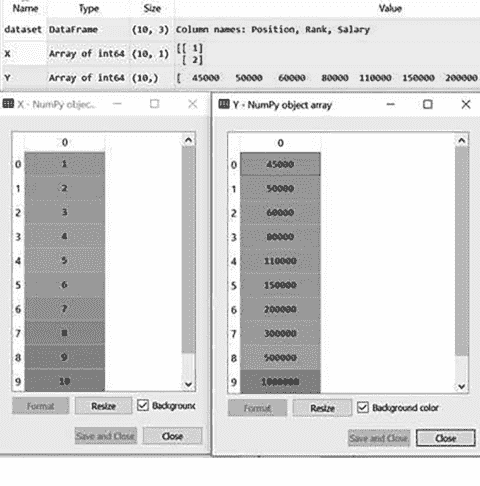

**图8.17** 独立的Rank变量和依赖的Salary变量

## 步骤2：将数据集拆分为训练集和测试集

预处理阶段的下一步是将数据集拆分为训练集和测试集。由于整个数据集仅包含10个实例，我们将使用所有实例（即完整数据集）来训练模型。因此，在给定情况下无需执行此步骤；我们将跳过它，并通过考虑所有记录来构建模型。

## 步骤3：将X转换为高阶多项式以构建多项式回归模型

多项式回归的实现包含两个步骤，如图8.18所示。首先，我们将给定数据转换为多项式形式，然后应用线性回归进行预测。在此步骤中，我们将执行多项式转换。

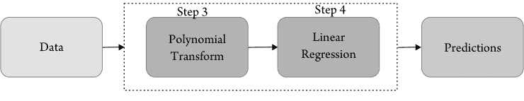

**图8.18** 拟合多项式回归模型的两步过程

之前我们学习过，多项式回归的数学表达式如公式(8.5)所示。

多项式线性回归：$y = b_0 + b_1 X^1 + b_2 X^2 + ... + b_n X^n$ (8.5)

公式(8.5)包含$X$的高阶项，如$X^1, X^2, ..., X^n$，而目前我们只有$X$（幂次为1）。因此，为了构建模型，我们必须将自变量$X$转换为多项式形式。创建一个$X\_poly$变量，将$X$数据集转换为基于$n$次幂的多项式，其中$n$取决于模型的阶数。如果选择阶数为2，则将数据集转换为两列：$X$和$X^2$；如果选择阶数为3，则将$X$数据集转换为$X, X^2, 和 X^3$。

为此，需要从`sklearn`库的`preprocessing`模块导入一个名为`PolynomialFeatures`的类。创建`Poly_reg`对象作为`PolynomialFeatures`类的实例，阶数设为2。实现多项式回归的代码如代码片段16所示。

```
#将X转换为高阶多项式项
from sklearn.preprocessing import PolynomialFeatures
Poly_reg = PolynomialFeatures(degree = 2)
X_poly = Poly_reg.fit_transform(X)
```

在上面的代码片段中，我们使用`Poly_reg`实例对$X$调用`fit_tranform()`方法，返回的值存储到$X\_poly$中。$X\_poly$是$X$变量新转换后的数据。现在，可以在变量资源管理器选项卡中找到$X\_poly$。$X\_poly$的内容如图8.19所示。

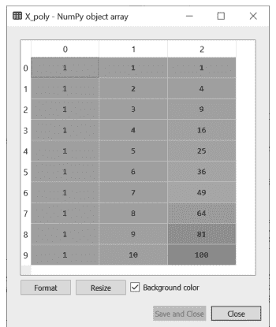

在图8.19中，第一列包含所有1的观测值，这些是模型自动添加的，代表常数项$b_0$。第二列是$X$的原始值，即从1到10的Rank（如图8.17所示）。下一列包含$X$的平方值。由于`Poly_reg`是代表我们创建的阶数为2的多项式的实例，因此我们将有一列直到$X$的平方，即三列分别代表$b_0$、$X_1^1$和$X_1^2$。

## 步骤4：拟合多项式回归模型


多项式线性回归实现 第2部分 | 机器学习 | Python | Parteek Bhatia, https://youtu.be/9A_b83VgU8Y


如图8.18所述，在将$X$转换为多项式形式后，我们已准备好使用`LinearRegression`类的实例来拟合模型。我们将创建`poly_reg_model`，作为`LinearRegression()`的实例，然后调用`fit()`方法。为了构建模型，我们使用`fit()`方法，传入两个参数：`X_poly`（转换后的多项式形式的$X$）和对应的$Y$（包含Salary值），如代码片段17所示。

```
#在整个数据集上训练多项式回归模型
from sklearn.linear_model import LinearRegression
Poly_reg_model = LinearRegression()
Poly_reg_model.fit(X_poly, Y)
```

## 步骤5：可视化多项式回归结果

我们将使用`matplotlib.pyplot`库来可视化分析我们的模型。该库有一个`scatter()`方法，用于在坐标轴上绘制数据点。它是`pyplot`的一个函数，用于形成散点图以可视化数据集的观测点。散点图是一种将数据显示为点分布的图形。在散点图中，点在笛卡尔平面上的位置取决于其数据集的值。

首先，让我们使用代码片段18可视化给定的数据集。

```
#可视化多项式回归结果
plt.scatter(X,Y, color = 'red')
```

在代码片段18中，我们使用了`scatter()`方法，它接受两个参数：$X$（Rank）和$Y$（Salary）。`color`参数用于将数据点绘制为特定颜色（例如“红色”）。该图如图8.20所示。

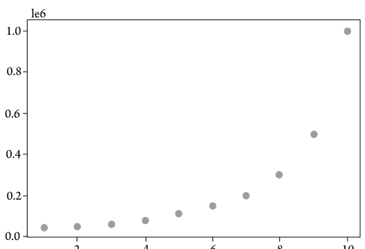

**图8.20** 给定数据集的散点图

为了使图表更具信息性，我们可以使用代码片段19添加标签，其中`xlabel()`和`ylabel()`方法用于向图表添加*x*和*y*标签，如图8.21所示。

```
plt.xlabel('Rank')
plt.ylabel('Salary')
```

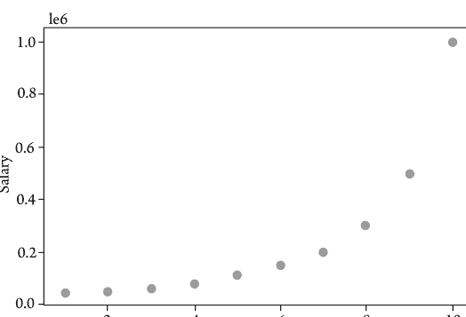

**图8.21** 带标签的给定数据集散点图

现在，让我们进一步可视化基于我们训练模型的回归线。要绘制回归线，我们必须使用导入库（`matplotlib.pyplot`）的`plot()`方法。需要注意的是，这个回归模型是基于`X`构建的。因此，在这个绘图方法中，我们必须传递三个重要参数。

第一个参数是模型训练所用的数据，即`X`。第二个参数是模型基于训练数据的预测值；这些预测值是通过使用我们训练模型的实例（即`poly_reg_model`）调用`predict()`方法获得的。在`predict()`内部，我们将传递`X_poly`，即`X`的多项式形式，因为预测是基于`X`的多项式形式（我们在步骤3中创建的）进行的。第三个参数用于定义预测线的颜色，在这种情况下，我们选择了'blue'。代码片段20显示了可视化绘图的代码。

```
plt.plot(X, poly_reg_model.predict(X_poly), color = 'blue')
```

执行片段20后，我们得到如图8.22所示的输出。

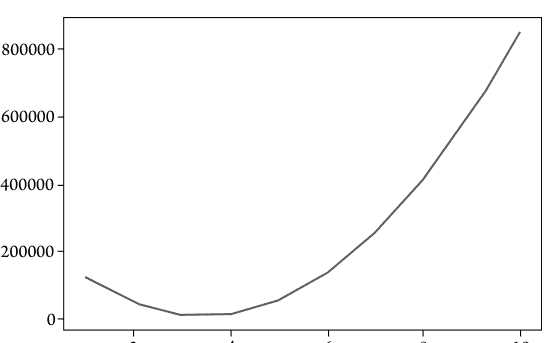

下面给出的代码片段21结合了我们到目前为止编写的所有片段，以可视化多项式回归结果步骤。

```
#可视化多项式回归结果
plt.scatter(X, Y, color = 'red')
plt.xlabel('Rank')
plt.ylabel('Salary')
plt.plot(X, poly_reg_model.predict(X_poly), color = 'blue')
plt.show()
```

执行该片段后，我们得到如图8.23所示的输出。

从图8.23所示的图中，我们可以分析出模型所做的预测（生成的回归线）是多项式形式（从图的曲率可以看出，正如我们在前一章讨论的），并且接近实际值（红色的数据点）。但模型仍然不够准确。

为了进一步提高预测精度，我们可以调整在步骤3中分配给模型的多项式特征的阶数。

但在此之前，让我们先检查使用阶数2训练的模型的准确性。

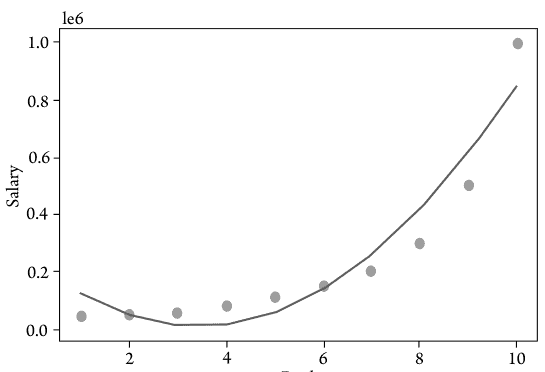

**图8.23** 训练数据集散点图的回归线

## 步骤6：阶数为2的多项式回归的性能评估

为了评估我们模型的性能，我们可以通过调用下面的代码片段22来计算各种误差指标的值。

```
# #获取阶数为2的多项式回归的预测值
Y_Pred_2=Poly_reg_model.predict(X_poly)
#阶数为2的多项式回归的性能评估
# 导入指标库
from sklearn import metrics
# 评估模型并打印MAE的值
print('Mean Absolute Error with Degree 2')
print(metrics.mean_absolute_error(Y, Y_Pred_2))
# 评估模型并打印MSE的值
print('Mean Square Error with Degree 2')
print(metrics.mean_squared_error(Y, Y_Pred_2))
# 评估模型并打印RMSE的值
```

print('Root Mean Square Error with Degree 2')
print(np.sqrt(metrics.mean_squared_error(Y, Y_Pred_2)))

执行代码片段后，错误值将打印在控制台上，如图8.24所示。

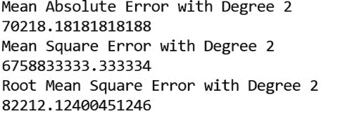

**图8.24** 2次多项式的性能评估

## **步骤7：将多项式次数更改为3**

在本步骤中，我们将研究多项式次数变化对模型及其预测的影响。

在多项式回归中，整个过程由*多项式次数*控制。只需改变次数，我们就能获得更准确的结果。之前我们取次数为2；现在，让我们将模型的次数从2更改为3。

为了实现这一更改，我们将修改代码片段16。不再写`degree=2`，现在我们将写`degree=3`。更新后的代码片段23如下所示。

*代码片段：23 [为degree=3修订]*

```
#Transforming X to higher degree polynomial terms
from sklearn.preprocessing import PolynomialFeatures
Poly_reg = PolynomialFeatures(degree = 3)
X_poly = Poly_reg.fit_transform(X)
```

其余代码片段保持不变，如下所示。

*代码片段：24*

```
#Transforming X to higher degree polynomial terms
from sklearn.preprocessing import PolynomialFeatures
Poly_reg = PolynomialFeatures(degree = 3)
X_poly = Poly_reg.fit_transform(X)
#Training the Polynomial Regression model on the whole dataset
from sklearn.linear_model import LinearRegression
Poly_reg_model = LinearRegression()
Poly_reg_model.fit(X_poly, Y)
# Visualizing the results
plt.scatter(X, Y, color = 'red')
plt.xlabel('Rank')
plt.ylabel('Salary')
plt.plot(X, Poly_reg_model.predict(X_poly), color = 'blue')
plt.show()
```

执行上述代码后发生的变化如图8.25所示。这里，我们展示了次数为3的X_poly值和最终的回归图。

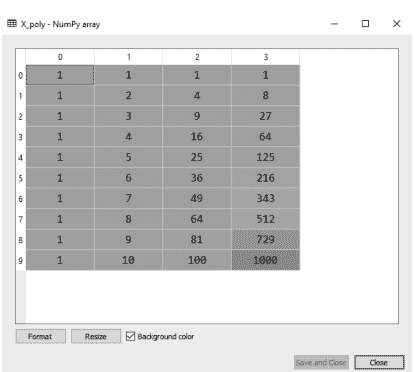

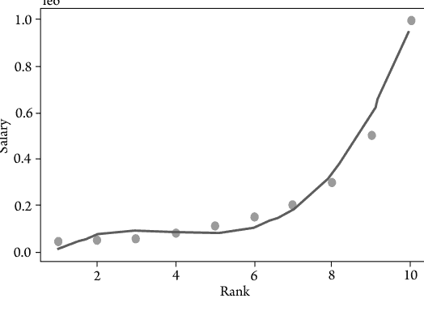

**图8.25** 3次多项式的回归图

我们注意到，预测值现在更接近实际值，模型的准确性也提高了。

## **步骤8：3次多项式回归的性能评估**

为了评估模型的性能，我们可以通过调用代码片段25来找到各种误差指标的值，如下所示。

### 代码片段：25

```
# #Getting predicted values for Polynomial Regression with degree 3
Y_Pred_3=Poly_reg_model.predict(X_poly)
#Performance Evaluation for Polynomial Regression with degree 3
# Importing metrics library
from sklearn import metrics
# Evaluating the model and printing the value of MAE
print('Mean Absolute Error with Degree 3')
print(metrics.mean_absolute_error(Y, Y_Pred_3))
# Evaluating the model and printing the value of MSE
print('Mean Square Error with Degree 3')
print(metrics.mean_squared_error(Y, Y_Pred_3))
# Evaluating the model and printing the value of RMSE
print('Root Mean Square Error with Degree 3')
print(np.sqrt(metrics.mean_squared_error(Y, Y_Pred_3)))
```

执行代码片段后，错误值将打印在控制台上，如图8.26所示。

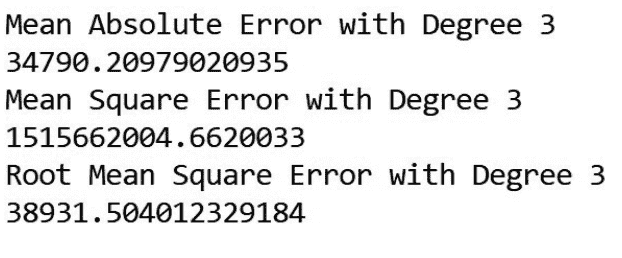

**图8.26** 3次多项式的性能评估

你可以比较2次（图8.24）和3次的性能评估结果，注意到模型在3次时的性能要好得多。

## 步骤9：将多项式次数更改为4

让我们将次数更改为4，看看结果。同样，我们将在代码片段26中进行以下更改，就像之前所做的那样。

### 代码片段：26

```
Poly_reg = PolynomialFeatures(degree = 4)
```

执行到目前为止编写的代码，将次数修改为4后，我们观察到图8.27所示的结果。

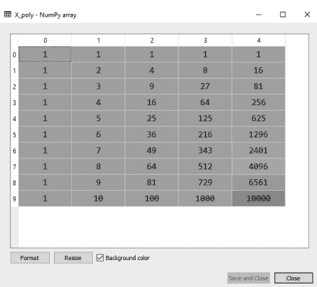

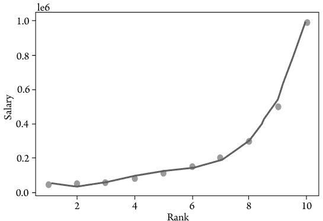

**图8.27** 4次多项式的回归图

如图8.27所示，得到的回归线几乎是数据集实际数据点的完美拟合线。因此，我们将使用4次多项式来预测Rahat的薪水。

## 步骤10：4次多项式回归的性能评估

为了评估模型的性能，我们可以通过调用代码片段27来找到各种误差指标的值，如下所示。

### 代码片段：27

```
# #Getting predicted values for Polynomial Regression with degree 4
Y_Pred_4=Poly_reg_model.predict(X_poly)
#Performance Evaluation for Polynomial Regression with degree 4
# Importing metrics library
from sklearn import metrics
# Evaluating the model and printing the value of MAE
print('Mean Absolute Error with Degree 4')
print(metrics.mean_absolute_error(Y, Y_Pred_4))
# Evaluating the model and printing the value of MSE
print('Mean Square Error with Degree 4')
print(metrics.mean_squared_error(Y, Y_Pred_4))
# Evaluating the model and printing the value of RMSE
print('Root Mean Square Error with Degree 4')
print(np.sqrt(metrics.mean_squared_error(Y, Y_Pred_4)))
```

执行代码片段后，错误值将打印在控制台上，如图8.28所示。

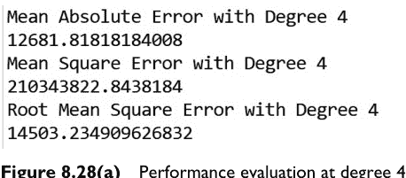

**图8.28(a)** 4次多项式的性能评估

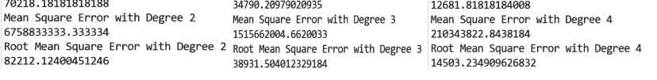

**图8.28(b)** 2次、3次和4次多项式的性能评估

你可以比较2次、3次和4次的性能评估结果，注意到模型在4次时的性能最佳。

## **步骤11：预测多项式回归结果**

到步骤10结束时，我们的多项式回归模型已经准备就绪，现在我们可以进行预测了。因此，我们的目标是预测*Rahat先生*的薪水，他的职级为7.5。为了预测他的薪水，我们将使用代码片段28。

### **代码片段：28**

```
#Predicting a new result with polynomial regression
Poly_reg_model.predict(Poly_reg.fit_transform([[7.5]]))
```

需要注意的是，要预测职级7.5，我们首先必须将其转换为多项式形式，为此，我们使用*Poly_reg*对象的*fit_transform()*方法。我们调用训练好的Poly_reg_model对象的predict()方法来获取预测的薪水。执行代码片段时得到结果，如图8.29所示。

```
Poly_reg_model.predict(Poly_reg.fit_transform([[7.5]]))
Out[19]: array([225126.29297782])
```

**图8.29** 预测职级为7.5的员工Rahat的薪水

图8.29显示了在7.5级工作的Rahat的预测薪水为₹225126.29297782。现在，这完成了Python中多项式回归的实现。

## 8.3 如果你将次数值增加太多会发生什么？

在本节中，我向你提出一个直接的问题，让你思考多项式回归模型的这个重要方面。

为了回答这个问题，让我们将次数值增加到50，如代码片段29所示，并基于此构建模型。

### 代码片段：29

```
#Transforming X to degree 50
from sklearn.preprocessing import PolynomialFeatures
poly_reg = PolynomialFeatures(degree = 50)
X_poly = poly_reg.fit_transform(X)
```

让我们在此基础上拟合模型，然后绘制回归器结果。在X_poly（转换到50次）上构建模型后的回归器图如图8.30所示。

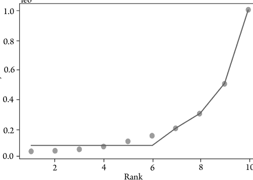

**图8.30** 50次多项式的回归图

你可以看到这不是最佳拟合模型；它没有进一步提高准确性，反而降低了。现在，你能想到其中的逻辑原因吗？

作为提示，图8.31展示了50次时的$X\_poly$值。

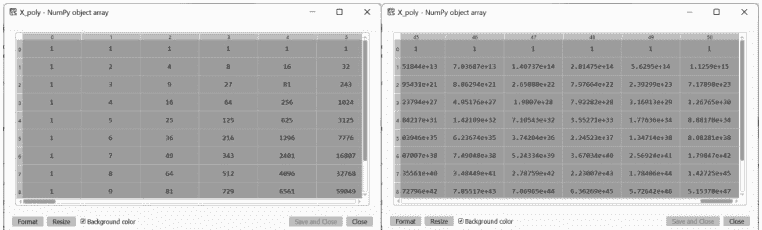

**图8.31** $X\_poly$到50次

原因是我们将$X$转换成了非常高的值，如$X\_poly$所示。由于$X\_poly$被转换成了非常大的值，这将导致模型对输入数据的微小变化变得不敏感或无响应。它只对输入属性的巨大变化做出响应，如图8.30的图所示。

我们可以通过将$X$转换到100次并绘制100次训练模型的结果来进一步可视化这种效果，如图8.32所示。

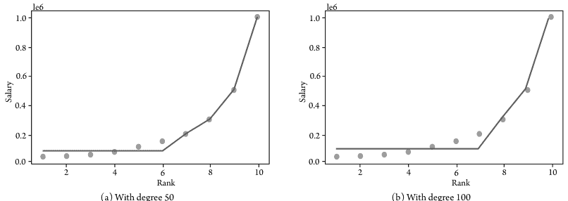

**图8.32** 50次和100次回归图的比较

从图8.32，你可以进一步验证，随着次数增加到100，模型对$X$的微小变化变得更加不敏感或无响应。因此，我们不应该将次数值增加太多，因为模型将对输入数据的微小变化变得无响应。这将降低模型的准确性。

然而，你可以尝试不同的次数值，根据模型的误差和准确性选择最合适的次数值。

为了进一步突出多项式回归在处理此类问题中的实用性，我们将使用简单线性回归对薪资预测问题进行建模。然后，在下一小节中，将使用简单线性回归获得的预测结果与多项式回归结果进行比较。

## 8.4 简单线性回归与多项式回归结果比较


第3部分 实现多项式线性回归 | 机器学习 | 数据挖掘 | Parteek Bhatia, https://youtu.be/i3ovG8I4uwU


为了进一步理解多项式回归对于自变量以多项式形式变化的此类数据集的实用性，我们将使用简单线性回归对问题进行建模。然后，我们将比较两种方法的结果。我们将继续在同一个文件中编写代码。

线性回归在Python中通过`LinearRegression`类实现，该类是sklearn的`linear_model`库的一部分。导入该类后，下一步是创建一个实例，例如`linear_regressor`，如下所示。

```python
#在全部数据集上训练线性回归模型
from sklearn.linear_model import LinearRegression
linear_regressor = LinearRegression()
```

接下来，我们将使用`LinearRegressor`的`fit()`方法来构建模型。`fit()`方法学习员工的职位等级与其相应薪资之间的相关性。它需要两个参数：自变量的训练数据和第二个参数作为因变量的相应值。因此，我们必须将X和Y作为两个参数传递给此方法。如下所示，我们将使用`linear_regressor`来调用此方法。

```python
linear_regressor.fit(X, Y)
```

为了分析我们的线性回归模型的结果，我们将对其进行可视化。可视化线性回归模型的代码片段如下：

```python
#可视化多项式回归结果
plt.scatter(X, Y, color = 'red')
plt.plot(X, linear_regressor.predict(X), color = 'blue')
plt.xlabel('Position Level')
plt.ylabel('Salary')
plt.show()
```

如果我们查看代码片段32，可以意识到我们使用了相同的`plot()`方法来可视化回归线。这次，我们向它传递了三个参数。第一个参数是X，因为它是模型训练所基于的数据。然后第二个参数是预测值，我们使用了`linear_regressor.predict(X)`，即我们使用`LinearRegression`类的实例调用`predict()`方法。但是，与多项式回归不同，这里我们没有传递`X_poly`（X的多项式形式）；因为在简单线性回归中，预测是基于X（X的单次幂）进行的。第三个参数用于定义预测线的颜色，我们使用了'blue'颜色。

代码片段执行结果生成如图8.33所示的图表。

```python
In [16]: linear_regressor = LinearRegression()
   ...: linear_regressor.fit(X, y)
   ...:
   ...: # 可视化线性回归结果
   ...: plt.scatter(X, y, color = 'red')
   ...: plt.plot(X, linear_regressor.predict(X), color = 'blue')
   ...: plt.xlabel('Position Level')
   ...: plt.ylabel('Salary')
   ...: plt.show()
```

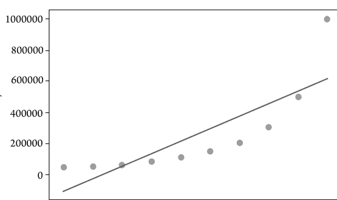

**图8.33** 可视化线性回归的结果

从图8.33可以看出，简单线性回归模型在训练数据上拟合了一条直线来预测薪资。在给定的图中，红点表示员工实际薪资的值，而蓝色直线显示了在散点图上拟合的回归线，用于对训练数据进行预测。绘制的回归线远离薪资的实际值，因为数据集是多项式的，而我们用一条直线拟合了数据点。

### 简单线性回归的性能评估

为了评估我们模型的性能，我们可以通过调用下面的代码片段33来找到各种误差度量的值。

```python
# #获取简单线性回归的预测值
Y_Pred_linear= linear_regressor.predict(X)
#简单线性回归的性能评估
# 导入度量库
from sklearn import metrics
# 评估模型并打印MAE的值
print('Mean Absolute Error for simple linear regression ')
print(metrics.mean_absolute_error(Y, Y_Pred_linear))
# 评估模型并打印MSE的值
print('Mean Square Error for simple linear regression ')
print(metrics.mean_squared_error(Y, Y_Pred_linear))
# 评估模型并打印RMSE的值
print('Root Mean Square Error for simple linear regression ')
print(np.sqrt(metrics.mean_squared_error(Y, Y_Pred_linear)))
```

执行代码片段后，误差值将打印在控制台上，如图8.34所示。

```
Mean Absolute Error for simple linear regression
128454.545454546
Mean Square Error for simple linear regression
26695878787.878788
Root Mean Square Error for simple linear regression
163388.73519272613
```

**图8.34** 简单线性回归的性能评估

你可以比较多项式回归和简单线性回归的性能评估结果，以分析简单线性回归在此情况下表现不佳的原因。

尽管如此，我们仍将尝试使用我们创建的线性回归模型来预测*Rahat的薪资*。为此，我们将使用代码片段34。

```python
#使用简单线性回归预测新结果
linear_regressor.predict([[7.5]])
```

需要注意的是，要使用简单线性回归预测等级7.5，无需将其转换为多项式形式，因此我们直接调用训练好的`linear_regressor`对象的`predict()`方法，以使用简单线性回归获得预测薪资。执行代码片段时得到结果，如图8.35所示。

执行该片段使我们得到使用简单线性回归预测的*Rahat的*薪资，如下所示：

```
In [19]: linear_regressor.predict([[7.5]])
Out[19]: array([411257.57575758])
```

**图8.35** 使用简单线性回归预测薪资

因此，根据线性回归，Rahat在等级7.5时的薪资应为₹411257.57575758，而多项式回归预测他的薪资为₹225126.29297782（在最佳情况下）。可以注意到，使用简单线性回归预测的等级7.5的薪资高于等级8的原始薪资（即300000）；我们可以直观地分析出，简单线性回归不能应用于以多项式形式变化的数据集。

我们还记录了使用不同次数时的预测薪资值，如表8.3所示。

**表8.3** 不同模型下等级7.5员工的预测薪资

| 等级7的原始薪资 | 200000 |
| 等级8的原始薪资 | 300000 |
| 模型 | 等级7.5的预测薪资 |
| 线性回归 | ₹411257.57575758 |
| 多项式回归（次数 = 2） | ₹328672.34848485 |
| 多项式回归（次数 = 3） | ₹240915.35547786 |
| 多项式回归（次数 = 4） | ₹225126.29297782 |

如果我们检查表8.3中给出的值，可以意识到Rahat作为副院长，等级为7.5，其薪资应在₹200000–300000的范围内。根据表8.3，在次数为4的多项式回归情况下，我们得到他的薪资为₹225126.29297782，这在现实生活中是可行的；而在线性回归情况下，我们得到他的薪资为₹411257.57575758，这是不可能的。因为等级7.5不可能获得比等级8更高的薪资。因此，当数据是多项式时，多项式回归的表现远优于简单线性回归。

## 8.5 化学实验室实验案例研究

让我们再来看一个化学实验室实验的案例研究。在这里，一组学生在他们的化学实验室进行了一些实验，并记录了某些观察结果。这些观察结果是不同温度下水的温度和蒸气压读数。现在要求学生计算在30°C特定温度下的压力。

我们需要使用回归来建模这个问题，然后预测30°C时的压力值。实验记录簿中的读数在表8.4中给出。

表8.4 温度和蒸气压读数

| 读数编号 | 温度 | 压力 |
| :--- | :--- | :--- |
| R1 | 5 | 0.0003 |
| R2 | 25 | 0.0014 |
| R3 | 45 | 0.008 |
| R4 | 65 | 0.05 |
| R5 | 100 | 0.25 |

我们将采用与解决*等级薪资问题*类似的方法来解决给定的问题。因此，我们将通过概览代码来讨论步骤和Python中的代码实现。

## 步骤1：加载数据集

首先，使用表8.4中提供的数据集，我们将在*Excel*或*记事本*中准备一个*csv*文件，然后将文件保存在Spyder的当前工作目录中。

你可以通过以下链接直接下载*csv*文件来处理此数据集。下面讨论的代码也可在此链接中供你练习。

https://github.com/bhatiaparteek/ml_with_python/tree/main/Chapter_8_Multiple_Linear_Regression

让我们假设*csv*文件已保存为*Chemistry_Problem.csv*，位于我们的当前工作目录中。之后，我们将使用代码片段35将数据集加载到我们的代码中。

代码片段：35

```
#Polynomial regression
#importing the libraries
import numPy as np
import pandas as pd
import matplotlib.pyplot as plt
#Loading the dataset
Dataset = pd.read_csv('Chemistry_Lab.csv')
```

执行该片段后，数据集将被下载到我们的代码中，如图8.36所示。

| 索引 | 读数编号 | 温度 | 压力 |
|---|---|---|---|
| 0 | R1 | 5 | 0.0003 |
| 1 | R2 | 25 | 0.0014 |
| 2 | R3 | 45 | 0.008 |
| 3 | R4 | 65 | 0.05 |
| 4 | R5 | 100 | 0.25 |

图8.36 数据集的内容

接下来，使用代码片段36，我们将为因变量和自变量创建变量。温度是我们问题的自变量（列索引1），压力是因变量（列索引2）。

```
X = Dataset.iloc[:, 1].values
Y = Dataset.iloc[:, 2].values
```

这将生成X（自变量的NumPy数组）和Y（因变量的NumPy数组），如图8.37所示。

## 步骤2：将数据集拆分为训练集和测试集

无需显式执行此步骤。相反，我们将跳过它，因为整个数据集仅包含5个实例；我们将通过考虑所有记录进行训练来构建模型，即X将作为我们的训练数据集。

## 步骤3：将X转换为更高次项以构建多项式回归模型

为了构建模型，我们必须将自变量X转换为多项式形式。在此步骤中，我们将把X转换为更高次项。我们这里选择多项式的次数为2。最后，转换后的X将存储在X_poly中，如图8.38所示。

```
#Transforming X to higher degree polynomial terms
from sklearn.preprocessing import PolynomialFeatures
Poly_reg = PolynomialFeatures(degree = 2)
X_poly = poly_reg.fit_transform(X)
```

## 步骤4：拟合多项式回归模型

将X转换为其多项式形式后，我们就可以使用LinearRegression类的实例来拟合模型了。为此，我们将使用代码片段38。

```
#Training the polynomial regression model on the whole dataset
from sklearn.linear_model import LinearRegression
Poly_reg_model = LinearRegression()
Poly_reg_model.fit(X_poly, Y)
```

## 步骤5：可视化多项式回归结果

为了分析我们的模型，我们将使用Matplotlib.pyplot库通过代码片段39对其进行可视化。

```
# Visualizing the Polynomial Regression results
plt.scatter(X, Y, color = 'red')
plt.plot(X, Poly_reg_model.predict(X_poly), color = 'blue')
plt.xlabel('Temperature')
plt.ylabel('Pressure')
plt.show()# Visualizing the Polynomial Regression results
```

**图8.39** 拟合数据点的回归线结果

执行上述片段后得到的图如图8.39所示。得到的回归线并非最佳拟合线。

## 步骤6：评估次数为2的多项式回归性能

为了评估我们模型的性能，我们可以通过调用代码片段40来查找各种误差度量的值，如下所示。

代码片段：40

```
# #Getting predicted values for Polynomial Regression with degree 2
Y_Pred_2=Poly_reg_model.predict(X_poly)
#Performance Evaluation for Polynomial Regression with degree 2
# Importing metrics library
from sklearn import metrics
# Evaluating the model and printing the value of MAE
print('Mean Absolute Error with Degree 2')
print(metrics.mean_absolute_error(Y, Y_Pred_2))
# Evaluating the model and printing the value of MSE
print('Mean Square Error with Degree 2')
print(metrics.mean_squared_error(Y, Y_Pred_2))
# Evaluating the model and printing the value of RMSE
print('Root Mean Square Error with Degree 2')
print(np.sqrt(metrics.mean_squared_error(Y, Y_Pred_2)))
```

执行代码片段后，误差值将打印在控制台上，如图8.40所示。

```
Mean Absolute Error with Degree 2
0.007350614173964859
Mean Square Error with Degree 2
7.255788370859692e-05
Root Mean Square Error with Degree 2
0.008518091553194114
```

**图8.40** 次数为2时的性能评估

## 步骤7：将多项式次数更改为3

为了更改次数，我们将修改代码片段39。不再写*degree=2*，现在我们将写*degree=3*。更新后的代码片段41如下所示。

代码片段：41 [为degree=3修订]

```
# Doing experiment by transforming the X to degree 3
#Transforming X to higher degree polynomial terms
from sklearn.preprocessing import PolynomialFeatures
Poly_reg = PolynomialFeatures(degree = 3)
X_poly = Poly_reg.fit_transform(X)
#Training the Polynomial Regression model on the whole dataset
from sklearn.linear_model import LinearRegression
Poly_reg_model = LinearRegression()
Poly_reg_model.fit(X_poly, Y)
# Visualizing the Polynomial Regression results
plt.scatter(X, Y, color = 'red')
plt.plot (X, Poly_reg_model.predict(X_poly), color = 'blue')
plt.xlabel('Temperature')
plt.ylabel('Pressure')
plt.show()# Visualizing the Polynomial Regression results
#Getting predicted values for Polynomial Regression with degree 3
Y_Pred_3=Poly_reg_model.predict(X_poly)
#Performance Evaluation for Polynomial Regression with degree 3
# Evaluating the model and printing the value of MAE
print('Mean Absolute Error with Degree 3')
print(metrics.mean_absolute_error(Y, Y_Pred_3))
# Evaluating the model and printing the value of MSE
print('Mean Square Error with Degree 3')
print(metrics.mean_squared_error(Y, Y_Pred_3))
# Evaluating the model and printing the value of RMSE
print('Root Mean Square Error with Degree 3')
print(np.sqrt(metrics.mean_squared_error(Y, Y_Pred_3)))
```

执行代码片段41后，我们将得到如图8.41所示的X_poly内容，得到的可视化结果如图8.42所示。相应的度量值如图8.43所示。

**图8.41** 次数为3时的X_poly

**图8.42** 次数为3时的回归线结果

```
Mean Absolute Error with Degree 3
0.0008462232541369671
Mean Square Error with Degree 3
1.0497993308416359e-06
Root Mean Square Error with Degree 3
0.0010245971553940777
```

**图8.43** 次数为3时的性能评估

得到的回归线是给定数据点的最佳拟合线，并且误差值也小于次数为2的情况。因此，在下一步中，我们将使用次数为3的多项式进行预测。

## 步骤 8：预测多项式回归结果

最后，我们将使用构建好的模型来预测温度为 30 °C 时的压力值。为此，我们使用代码片段 42。

```python
# 使用多项式回归预测新结果
Poly_reg_model.predict(poly_reg.fit_transform([[30]]))
```

该代码片段的输出如图 8.44 所示。

```
Poly_reg_model.predict(Poly_reg.fit_transform([[30]]))
array([0.0008309])
```

**图 8.44** 多项式回归做出的预测

因此，我们可以使用多项式回归来预测特定温度下的水压。所以，对于 30 °C 的温度，预测的水压为 0.0008309 单位。

## 步骤 9：比较多项式回归与简单线性回归的结果

使用代码片段 43，我们可以使用简单线性回归来建模化学学生问题。

```python
# 在整个数据集上训练线性回归模型
linear_regressor = LinearRegression()
linear_regressor.fit(X, Y)
# 可视化简单线性回归结果
plt.scatter(X, Y, color = 'red')
plt.plot(X, linear_regressor.predict(X), color = 'blue')
plt.xlabel('Temperature')
plt.ylabel('Pressure')
plt.show()
# 获取简单线性回归的预测值
Y_Pred_linear = linear_regressor.predict(X)
### 简单线性回归的性能评估
# 评估模型并打印 MAE 值
print('Mean Absolute Error with simple linear regression')
print(metrics.mean_absolute_error(Y, Y_Pred_linear))
# 评估模型并打印 MSE 值
print('Mean Square Error with simple linear regression')
print(metrics.mean_squared_error(Y, Y_Pred_linear))
# 评估模型并打印 RMSE 值
print('Root Mean Square Error with simple linear regression')
print(np.sqrt(metrics.mean_squared_error(Y, Y_Pred_linear)))
# 使用多项式回归预测 30 度时的压力
linear_regressor.predict([[30]])
```

执行该代码片段后得到的结果如图 8.45 所示。根据线性回归，30 °C 温度下的预测压力为 0.0158329 单位。此外，回归线并非给定数据点的最佳拟合线。因此，我们将认为使用多项式回归做出的预测更为可靠。

```
Mean Absolute Error with simple linear regression
0.04134657992565056
Mean Square Error with simple linear regression
0.0021166759609665426
Root Mean Square Error with simple linear regression
0.046007346815117936
Out[27]: array([0.0158329])
```

**图 8.45** 线性回归的结果

因此，我们可以得出结论：对于因变量相对于自变量呈多项式形式变化的数据集，我们可以通过将自变量转换为更高次幂来实现多项式线性回归。

#### 提醒我

- Pandas 库用于加载数据集。
- Pandas 库的 `read_csv()` 方法用于将数据集导入数据框。
- sklearn 的 `model_selection` 库用于将数据分割为训练集和测试集。
- 多元线性回归在 sklearn 的 `linear_model` 库中的 `LinearRegression` 类中实现。
- 回归器准备好后，使用 `fit()` 方法来构建模型。
- 要预测因变量的值，使用回归器对象的 `predict()` 方法。
- 要可视化分析我们的模型，使用 `Matplotlib.pyplot` 库。
- `metrics` 用于评估模型的准确性。
- `metrics` 有一个 `mean_absolute_error()` 方法来计算训练模型的平均绝对误差。
- `mean_squared_error()` 方法用于计算训练模型的均方误差。
- 要执行多项式线性回归，需要从 `sklearn` 库的预处理模块导入 `PolynomialFeatures` 类。
- 我们不应将次数值增加得太高，否则模型将对输入数据的微小变化变得不敏感，这会降低模型的准确性。

#### 附加资源

##### 视频链接

- 如何在 Python 中进行多元线性回归 | Jupyter Notebook | Sklearn, https://youtu.be/WngoqVB6cXw
- 使用 Python 机器学习预测冠状病毒, https://youtu.be/6CZiz-FLZF0

##### 博客链接

- 使用 Python 进行多元线性回归 https://stackabuse.com/multiple-linear-regression-with-python/
- 使用 IPL 数据集示例概述线性回归技术 https://medium.com/@aakashuppadhaya52/overview-of-linear-regression-technique-with-ipl-dataset-example-9d1710d70d2f

#### 测试我（实践技能）

### 任务 1

- 为 https://www.geeksforgeeks.org/ml-multiple-linear-regression-backward-elimination-technique/ 中给出的数据集，在 Python 中构建多元线性回归模型。
- 使用预处理将分类变量转换为虚拟变量。
- 避免虚拟变量陷阱。
- 将训练集和测试集分别按 2/3 和 1/3 的比例划分。
- 通过最小化平方误差和来构建回归模型。
- 执行向后消除法，并在每次迭代后识别要消除的列。
- 将预测值与实际值进行比较。
- 根据以下链接中的讨论分析你的结果。https://www.geeksforgeeks.org/ml-multiple-linear-regression-backward-elimination-technique/

### 任务 2

- 为波士顿房价数据集构建多元线性回归模型，以预测房屋价格。请参考以下链接获取数据集和问题陈述。https://towardsdatascience.com/linear-regression-on-boston-housing-dataset-f409b7e4a155

## 9 分类

### 章节目标

- 理解分类与回归技术之间的区别。
- 定义分类并理解分类的类型。
- 理解各种分类技术的工作原理。
- 理解决策树分类器。
- 了解信息增益和基尼指数在决策树分类器中的重要性。
- 理解随机森林算法。
- 讨论朴素贝叶斯分类的工作原理。
- 理解 k-NN 分类器的工作原理。
- 理解逻辑回归分类器的工作原理。
- 理解分类器的不同质量度量，如混淆矩阵、精确率、召回率和 F 值。

## 9.1 分类简介

在现代世界中，我们依赖机器学习（ML）来做出关键决策或预测。理解计算机如何使用 ML 进行这些预测非常重要。通常，ML 模型做出的预测分为两种类型，即分类和回归。ML 模型使用各种技术通过分析已有数据来预测事件的结果。由于机器从数据中学习，训练或输入数据的类型在决定机器做出准确决策和预测的能力方面起着至关重要的作用。通常，这些数据以两种形式存在，即有标签和无标签。在有标签数据中，我们知道样本输入属性的输出属性值，而在无标签数据中，我们没有输出属性值。

为了分析有标签数据，使用监督学习。分类和回归是两种监督学习技术，用于通过分析可用的有标签输入实例来预测未知实例的结果。当结果是有限或离散时，应用分类；而当结果是无限或连续时，则应用回归模型。例如，分类模型用于预测客户是否会购买产品。这里的结果是有限的，即购买或不购买。在这种情况下，回归模型预测客户可能购买的产品数量。这里的结果是无限的，即所有可能的数字，因为数量一词指的是连续数字的集合。

分类被定义为预测并将给定的一组数据分类到各个类别中。类别通常被称为标签、目标或类别。分类是统计学家和 ML 研究人员用于预测未知样本结果的经典方法。

以下是应用分类技术的一些示例。

- 检查电子邮件是否为垃圾邮件。这是分类最基本的示例。根据从训练数据中分析出的文本、词语，可以将未知电子邮件分类为垃圾邮件或非垃圾邮件。
- 预测一支球队在体育比赛中是赢还是输。在这种情况下，分析特定球队进行的比赛以及成功次数、失败次数、球队表现和对手实力等统计数据，以预测该球队在特定比赛中是赢还是输。
- 对植物物种进行分类。根据植物的结构及其属性，可以预测其物种并将其分类到可用的类别中。
- 批准或拒绝贷款。银行可以使用分类技术，通过分析客户的信用历史来预测向客户发放贷款是高风险还是安全。银行客户的信用历史及其各种属性，如工资、拥有的财富等，提供了关于客户的信息。系统分析这些数据以预测发放贷款是高风险还是安全。

在这些示例中，决策是从两个或有限数量的类别中做出的。因此，这些示例使用分类。

以下是几个回归的示例，以阐明它与分类的区别。

- 预测一支板球队在一场比赛中的得分。根据球队在之前比赛中的得分率和其他变量，可以预测球队在板球比赛中将要得到的分数。
- 预测考试期间售出的文具数量。销售历史统计数据可以预测考试期间售出的文具数量。

## 9.2 分类的类型

根据可用的类别和所需的分类类型，分类模型主要可分为三种。

- **二元分类**
  仅有两种可能输出值的分类任务被称为二元分类。
  示例：预测肿瘤是恶性还是良性；预测邮件是否为垃圾邮件；预测客户是否会接受或拒绝保险方案；预测句子的情感是积极还是消极。
- **多类分类**
  具有超过两种可能输出值的分类任务属于多类分类。
  示例：根据动物特征预测其种类；将新闻报道分类为商业、体育、金融或娱乐；预测句子的情感是憎恨、喜爱、快乐还是悲伤。
- **多标签分类**
  在此类分类任务中，每个实例可能被归入一个或多个类别，或者简单来说，一个给定的实例可能对应两个或多个输出类别属性。
  示例：预测电影的类型，一部电影可能属于动作、喜剧、恐怖、惊悚等多个不同类型；照片分类，一张照片可能包含场景中的多个物体，如自行车、交通信号灯、汽车等。

需要注意的是，有时数据集中每个类别的样本数量分布不均。对此类数据集进行分类被称为不平衡分类。这种情况通常发生在大多数样本属于正常类别，而少数样本属于异常类别时。例如，在欺诈检测中，我们获得的数据集包含更多可信交易和极少数欺诈交易；或者在中风数据集中，有大量未中风患者和少数中风患者。

根据数据集的性质，分类可分为两种类型。即：

- 后验分类
- 先验分类。

### 9.2.1 后验分类

“后验”是一个拉丁语短语，意为“从后来的”。“后验”一词指的是通过推理观察到的事实得出的结论。这种分类应用于目标类别已知的数据，即带标签的训练数据。因此，这种分类是一种监督学习方法。

### 9.2.2 先验分类

“先验”是一个拉丁语短语，意为“从先前的”。“先验”一词指的是从不言自明的命题中得出的结论。这是一种无监督的机器学习方法。这里，数据库中没有给出目标类别。但问题来了，“是否可以使用分类对未标记数据进行预测？”

是的，可以使用聚类技术，然后结合分类技术来预测未标记数据。聚类技术用于从未标记数据中形成簇。这些簇可以被赋予名称，然后可以进一步用于应用分类并进行预测。这种方法被称为“先验分类”。

本章重点介绍后验分类，即一种监督机器学习方法，用于在数据已标记的情况下预测结果。

## 9.3 输入与输出属性

在机器学习中，输入数据非常重要。通常，数据集包含两种类型的属性：输入属性和输出属性。代表所有其他属性输出的类别属性被称为输出属性或因属性，而所有其他属性被称为输入属性或自属性。由于输出属性的值取决于输入属性所取的值，因此输出属性被称为“因属性”，而输入属性被称为“自属性”。

例如，图9.1所示的数据集代表玻璃识别数据集。这里，折射率（RI）、钠（Na）、镁（Mg）、铝（Al）、硅（Si）、钾（K）、钙（Ca）、钡（Ba）、铁（Fe）是输入属性。类别是输出属性。

| 输入属性 | | | | | | | | | 标签 |
|---|---|---|---|---|---|---|---|---|---|
| 折射率 (RI) | 钠 (Na) | 镁 (Mg) | 铝 (Al) | 硅 (Si) | 钾 (K) | 钙 (Ca) | 钡 (Ba) | 铁 (Fe) | 输出属性 类别 |
| 1.52058 | 12.85 | 1.61 | 2.17 | 72.18 | 0.76 | 9.7 | 0.24 | 0.51 | 容器 |
| 1.52119 | 12.97 | 0.33 | 1.51 | 73.39 | 0.13 | 11.27 | 0 | 0.28 | 容器 |
| 1.51829 | 14.46 | 2.24 | 1.62 | 72.38 | 0 | 9.26 | 0 | 0 | 餐具 |
| 1.51131 | 13.69 | 3.2 | 1.81 | 72.81 | 1.76 | 5.43 | 1.19 | 0 | 车头灯 |
| 1.52315 | 13.44 | 3.34 | 1.23 | 72.38 | 0.6 | 8.83 | 0 | 0 | 车头灯 |

图9.1 玻璃识别数据集的输入与输出属性

根据属性值的不同，属性可以是多种类型。具有数值值的属性称为数值属性。具有分类值以存储来自有限离散类别集合的数据的属性被称为名义属性或分类属性。例如，在图9.1中，输入属性是数值类型，而输出属性是名义类型，因为输出是可能的玻璃物品名称之一。

在构建分类模型时，选择影响输出属性最终预测的适当输入属性至关重要。例如，学生的成绩取决于他们的学习时间，但成绩与学生的姓名和学号无关。此外，用于训练模型的数据集大小必须足够，才能获得良好的模型准确性。

在下一节中，我们将深入探讨分类模型的工作原理。

## 9.4 分类的工作原理

分类技术是一个两步过程。第一步是训练模型。这个阶段也称为学习阶段。第二步是测试模型的准确性。这个阶段也称为预测阶段或测试阶段。

在第一步中，通过分析示例和相关的类别标签，基于获得的训练数据构建分类器。通过分析训练数据，系统学习并创建一些预测规则。

在第二步中，将预测规则应用于测试数据，即那些我们提供了输入属性值但未提供输出属性值的实例。在此步骤中，分类器模型在训练期间学习到的规则被应用于预测输出属性或类别。在此步骤中，计算分类器的预测准确性，这意味着分类器对测试数据的预测值与实际值进行比较。实际值与预测值之间的差异被称为误差。调优是一个改进预测规则的过程。系统迭代执行调优，直到误差减小到最小值，以提高其准确性。简单来说，如果测试数据上的准确性不佳，系统将重新调整其预测规则，直到在测试数据上获得优化的准确性，如图9.2所示，该图展示了决策树分类器的学习过程。

**图9.2** 决策树分类器的学习过程

正如第4章前面讨论的，整个数据集被划分为训练数据集和测试数据集。我们理解到，假设一位老师准备了一个包含10个问题的题库，以评估学生在给定主题上的表现。在一种情况下，老师将所有问题及其对应的答案分享给学生，并要求他们为考试做准备。然后，从这10个问题中，老师在考试中提问4个问题。由于老师已经将所有10个问题及其对应的答案分享给了学生，学生很有可能将这些问题死记硬背。当从这10个问题中抽取4个问题进行考试时，学生很有可能获得100%的分数或非常好的分数。但这些好分数并不能保证学生已经理解了概念。

同样，当我们把整个数据集交给机器学习系统学习，然后用同一个数据集测试系统时，它会返回非常高的准确性，但这并不能保证模型已经学得很好。这些结果可能是模糊的，这种情况在机器学习中通常被称为过拟合问题。

因此，为确保学生掌握概念，教师通常不会将所有题目都分享给学生，而是保留部分题目用于测试学生的学习效果。假设教师只向学生分享6道题目及其答案，然后使用剩余的4道题目进行测试。教师将通过比较学生对这4道题目的回答与标准答案（类似于将预测值与实际值进行比较）来评估学生的表现。根据学生在这些测试题目（即4道题目）上的表现，将为学生分配分数（类似于为机器学习系统分配分数）。

同样，数据集将被划分为训练子集和测试子集，以评估机器学习模型，而不是使用整个数据集来构建模型。系统将基于训练数据进行学习，然后在测试数据上进行测试以评估模型的性能。模型在该测试数据集上的预测值将与实际测试数据集的值进行比较，基于此比较分析，将给出机器学习模型在准确度方面的最终分数。

因此，我们需要创建两个不同的集合——一个用于构建机器学习模型的训练集，以及一个用于测试机器学习模型性能的测试集。如果模型在测试数据上表现良好，则意味着该模型能够适应新的数据集和情况。

分类器的准确度定义为分类器正确分类的测试标签占总测试标签的百分比。计算分类器的准确度，如果其足够好，则可用于对具有未知类别标签的新数据元组进行分类。

例如，通过分析学院以往的就业数据（如图9.3所示），获得的分类规则可用于预测新学生Srinidhi的就业机会（如图9.4所示）。

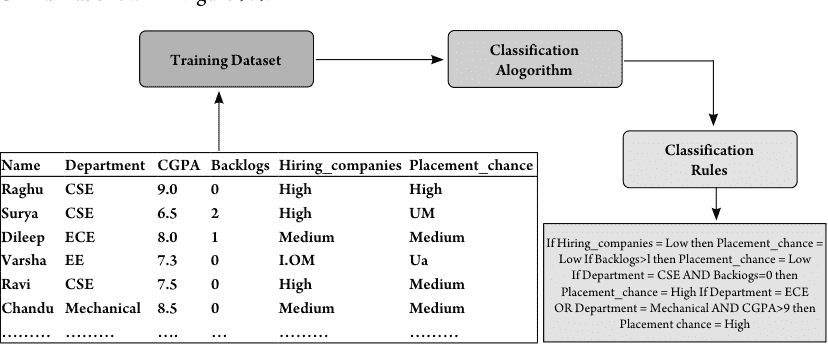

**图9.3** 构建分类器以预测就业机会

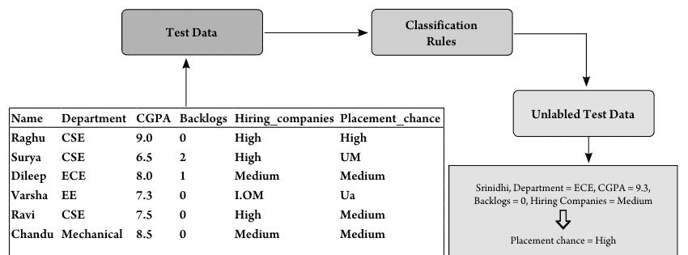

**图9.4** 基于输入属性预测学生的就业机会

同样，我们也可以通过在样本训练数据上训练分类器来识别违约借款人，然后通过将模型应用于样本测试数据进行测试，如图9.5所示。

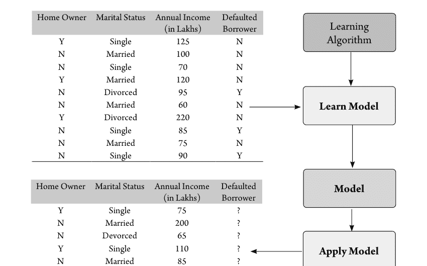

**图9.5** 分类器的训练与测试

## 9.5 训练数据集的规模与质量指南

训练数据集在分类器对数据集的高效工作中起着关键作用。如果训练数据集规模不足，或者训练数据集中各类别的样本数量存在严重不平衡，分类器可能无法给出预期结果。分类器的质量取决于训练数据集的质量。

因此，问题是：“如何选择训练数据的规模和质量？”

通常，训练样本与独立属性之间应保持平衡。如果独立或输入属性的数量较少，则所需的训练样本数量可能相对较少。同样，如果独立或输入属性的数量较多，则所需的训练样本数量可能相对较大。在训练数据集中，每个类别的元组之间必须保持平衡，即训练数据中必须包含足够数量的属于每个类别的样本。

## 9.6 懒惰学习与急切学习分类器

多年来，研究人员开发了多种分类算法。根据其学习策略，这些算法通常可分为两类：懒惰学习器和急切学习器，如下所述。

- 懒惰学习器：这些算法存储训练数据，并等待测试数据出现。在模型看到测试数据后，它会分析训练数据并预测结果。对于懒惰学习器，训练时间较短，但预测时间较长。

  示例：k-NN。

- 急切学习器：这些算法在接收测试数据之前分析训练数据并构建预测规则。由于模型构建，它们的训练时间较长，但预测时间较短。

  示例：决策树、朴素贝叶斯、支持向量机、人工神经网络、随机森林。

本章将详细讨论各种分类算法。在理解所有这些算法的工作原理后，你将清楚地理解为什么k-NN是懒惰学习器，而其他模型如决策树、朴素贝叶斯、支持向量机、人工神经网络、随机森林是急切学习器。

让我们从决策树分类器开始讨论。

## 9.7 决策树分类器简介

在决策树分类器中，预测是通过多个“如果…那么…”条件做出的，这些条件你从任何编程语言的经验中应该已经熟悉。决策树结构由根节点、分支和叶节点组成。节点表示数据集的特征或属性，作为决策规则。分支表示样本是否满足决策规则。叶节点表示决策规则的结果。决策树中最顶部的节点称为根节点。图9.6显示了决策树的组成部分。

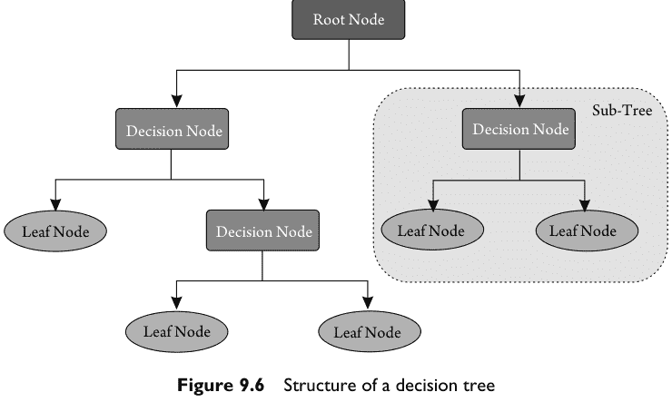

决策树结构易于理解和解释，即使对于不了解其概念的人也是如此。这是因为它很容易模拟人类的思维过程。简单来说，决策树是具有树状结构的流程图。图9.7所示的示例将帮助你进一步理解根节点、决策节点和叶节点之间的关联。决策树可以简单地视为一棵倒置的树，根在顶部，叶子在底部。这里有一个带有条件的根节点，即成本 < ₹25000。有四个决策节点（包括根节点）和五个叶节点。这代表了一个预测客户是否会购买手机的决策树。它有两个类别：购买和不购买，出现在叶节点中。

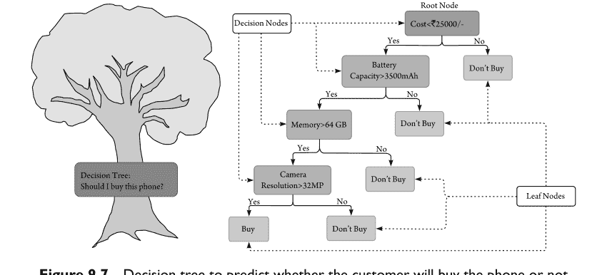

让我们讨论另一个例子。图9.8表示用于确定动物标签的决策树。它代表了一个预测动物物种的分类器。每个内部节点表示一个作为决策规则的特征。每个分支表示决策规则的可能解决方案。这里，分支表示可能的解决方案：是或否。从决策树中，可以分析出：如果动物不在陆地上生活，它可能是鱼。如果动物既生活在陆地上又生活在水中，它可能是两栖动物。如果动物生活在陆地上并产卵，它是鸟。如果动物生活在陆地上但不产卵，它是哺乳动物。系统以一定的概率制定所有这些规则。

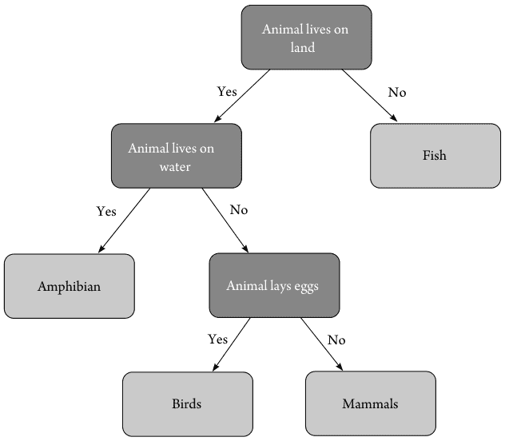

**图9.8** 用于预测动物物种的决策树

决策树可以使用if-then语句转换为分类规则。决策树分类器类似于“20个问题游戏”。在这个游戏中，一个玩家在纸上写下答案，另一个玩家必须在不看纸的情况下找出答案。为了找出答案，另一个玩家最多可以问20个问题，每个问题的答案是“是”或“否”。这个游戏可以表示为一个决策树，其中每个节点表示在几个选项之间的选择，并且选择是二元的。因此，每个节点（叶节点除外）有两个分支，表示“是”或“否”。每个叶节点指定一个预测或决策。产生此树的训练过程称为“归纳”。

它可用于分类和回归问题。

### 9.7.1 构建决策树

计算机科学家、机器学习研究员约翰·罗斯·昆兰在20世纪70年代末至80年代初开发了一种名为迭代二分法3（简称ID3）的决策树算法。他后来提出了C4.5（ID3的后继算法）。该算法已成为监督式机器学习分类器的基准。决策树（C4.5）是一种常见的分类技术，已在Weka、MATLAB等许多机器学习工具以及Python、R、Java等编程语言中实现。

让我们讨论一下决策树算法的简单框架。它包含以下步骤：

**算法：决策树分类器**

步骤1：开始。

步骤2：从所有“未访问”的属性中，根据其信息增益或基尼指数选择最佳属性来分割记录，并标记为“已访问”。

步骤3：将选定的属性设为决策节点。定义该决策节点的分支条件以分割样本。

步骤4：现在，根据样本满足的分支条件对其进行划分。

步骤5：迭代重复步骤2、3和4。当满足以下任一条件时终止循环。

- i. 所有样本属于同一类别。
- ii. 没有剩余属性。
- iii. 没有剩余样本。

步骤6：停止。

我们将在接下来的章节中解析此算法，以便对上述所有步骤有一个清晰的理解。

设计决策树的关键问题之一是在每次迭代中选择最佳属性来分割记录。用于在每次迭代中寻找最佳属性的最常用选择度量是信息增益和基尼指数。

默认情况下，ID3算法使用信息增益来寻找每次迭代的最佳分割点。在讨论信息增益之前，我们必须理解信息论的概念。

### 9.7.2 信息论的概念

决策树分类器的工作原理基于信息论。人们观察到，信息通常与不确定性直接相关。如果决策中存在不确定性，那么就存在信息。如果没有不确定性，那么就没有信息。考虑一个抛硬币的简单例子。如果硬币有偏，两面都是正面，那么抛掷结果总是正面。在这种情况下，没有不确定性。因此，这不会提供任何新信息。但如果硬币是无偏的，一面是正面，另一面是反面，那么抛掷结果可能是正面或反面。我们无法总是正确地决定结果是正面还是反面。这里，结果存在不确定性。这也提供了信息；这意味着抛掷的结果总是提供关于结果的信息。

让我们考虑另一个例子。可以肯定的是，大学/学院在周日会关闭，所以没有信息。因此，不需要每周发布通知告知学生周日是假期。但如果由于某种原因，管理部门决定让某个特定的周日上课，那么这就会成为信息和新闻。

你也可以通过考虑报纸来进一步理解这个概念。报纸刊登新闻，为读者提供信息。如果股市突然上涨或下跌，这不是预定事件，它包含大量信息，并将被刊登在报纸头版的主要标题中。

从这些例子中，我们可以观察到信息与不确定性有关。不确定性通常通过事件发生的概率来描述。因此，信息与事件发生的概率有关。但我们如何衡量信息对概率的依赖性呢？

你能回答这个问题吗？如果一个事件发生的概率很高或确定，那么我们会获得更多信息还是更少信息？

答案是我们会获得更少的信息，因为如果一个结果的概率是100%，另一个结果的概率是0%，我们对事件是确定的，所以不会有信息。正如所讨论的，抛掷有偏的硬币不携带信息，但如果每个结果的概率是50%，就像无偏硬币的情况，我们在这个事件中会有更多信息。

### 9.7.3 用概率定义信息

克劳德·香农创立了信息论。在他1948年发表的论文《通信的数学理论》中，他解释了熵的概念，熵给出了消息中的信息量。这种信息度量为信息论铺平了道路。

信息论将熵定义为数据源给出的平均信息量。熵使用以下公式计算。

```
Entropy(p_1, p_2, ..., p_n) = -p_1 log_2(p_1) - p_2 log_2(p_2) - ... - p_n log_2(p_n)
```

这里，n表示可能事件的数量，p_n指的是某个事件的概率。

因此，以下方程计算一个事件的总信息量。

```
I = \sum_{i=1}^{n} (-p_i \log_2(p_i))
```

换句话说，信息被定义为 -p_i log p_i，其中 p_i 是事件 i 的概率。由于概率 p_i 总是小于1，log p_i 总是负数，因此 -p_i log p_i 总是正数。

让我们举一些例子来复习对数的概念。重要的是要记住：

- 1的对数，即 (log 1)，总是零。
- 任何大于1的数的对数总是正数。
- 任何小于1的数的对数总是负数。

以下是一些以2为底的对数的例子。

```
log₂ (2) = 1

log₂ (2ⁿ) = n × log₂ (2) = n × 1 = n

log₂ (1/2) = log₂ (2⁻¹) = –1

log₂ (1/2ⁿ) = log₂ (2⁻ⁿ) = –n
```

#### 检验你的进度

##### 示例 9.1

计算抛掷硬币事件的信息量。可能的结果是正面（p₁）或反面（p₂）。硬币是无偏的。

##### 解答

已知硬币是无偏的。因此，每个事件的概率是0.5。

```
即 p₁ = 0.5 且 p₂ = 0.5

信息量 (I) = –0.5 log₂ (0.5) – 0.5 log₂ (0.5)

= – (0.5) * (–1) – (0.5) * (–1) [因为 log₂ (0.5) = –1]

= 0.5 + 0.5 = 1
```

结果为1.0（使用以2为底的对数），这是对于一个有两个可能结果的事件我们能获得的最大信息量。这也被称为熵。

如果硬币有偏，两面都是正面，那么正面出现的概率将是1，因为结果总是正面。同样，反面出现的概率将是0，因为硬币有偏，结果永远不可能是反面。

在这种有偏硬币的情况下，抛掷硬币的完整信息量将如下所示。

```
I = –1 log₂ (1) – 0 log₂ (0) = 0 [因为 log₂ (1) = 0]
```

这清楚地表明，当硬币有偏且两面都是正面时，抛掷不携带任何信息。但是，当硬币无偏时，抛掷携带的信息量为1。

现在，试着回答另一个问题。抛掷无偏的正方体骰子是否比抛掷无偏硬币携带更多信息？

思考一下这个问题。

答案是肯定的。抛掷无偏的正方体骰子比抛掷无偏硬币携带更多信息。其理由将在下一个示例练习中给出。

##### 示例 9.2

计算抛掷一个有六种可能结果的正方体骰子事件的信息量。骰子是无偏的。

##### 解答

由于骰子是无偏的，每个结果具有相等的概率，即每个事件的概率 = 1/6，因为总共有6种可能性。

$$I = \sum_{i=1}^{6} (-p_i \log_2(p_i)) = \sum_{i=1}^{6} (-1/6 \log_2(1/6))$$

这意味着，I = 6(-1/6) log (1/6)) = 2.585 [每个可能结果的概率是1/6，我们有从1到6的六种可能结果]。

因此，信息量是2.585，你可以看到这个信息量大于抛掷无偏硬币的信息量（即1）。

但假设骰子有偏，使得得到6的概率为25%。那么掷骰子的信息量将低于之前的值，如下所示。

I = 5(-0.1) log_2(0.1)) - 0.5 log_2(0.5) = 2.16 [一个事件的概率为0.5，而其他5个事件的概率为0.25，这使得剩余5个事件中每个事件的概率为0.25/5 = 0.05。]

让我们考虑另一种情况，骰子进一步有偏，使得得到6的概率为75%，那么掷骰子的信息量将进一步降低，如下所示。

I = -5(0.05) log_2(0.05)) - 0.75 log_2(0.75) = 1.39 [一个事件的概率为0.75，而其他5个事件的概率为0.25，这使得剩余5个事件中每个事件的概率为0.25/5 = 0.05。]

从硬币和骰子的例子中，我们可以观察到，随着事件不确定性的增加，它所携带的信息量也会增加；如果事件的不确定性降低，它所携带的信息量也会降低。

### 9.7.4 根节点和其他节点的选择规则

如前所述，每个属性所携带的信息在选择决策树的根节点和其他迭代中的节点方面起着关键作用。必须选择一个分割属性，使其应该

### 9.7.5 信息增益

信息增益详细说明了从某个属性中获得的信息量。它衡量了输入属性在预测目标属性时的优劣程度。信息增益值最高的属性将被选为下一个分裂属性。

信息增益衡量了使用某个属性对数据集进行分裂后，熵的减少量。

从数学上讲，信息增益定义为分裂前分布的熵（信息量）与分裂后分布的熵之差，如下所示。

信息增益 = (分裂前的熵) - (分裂后的熵)

当分裂后的熵（信息分布）为零时，即分裂后不存在不确定性时，信息增益值最大。如果分裂后的熵为零，意味着事件的结果是确定的，即某个事件发生的概率为1（最大），而其他事件的概率为0，因此它提供的信息量为零。最大的信息增益值表明分裂后不存在不确定性或信息量最小。因此，我们可以得出结论：

**必须选择能带来最大信息增益的属性作为下一个分裂属性。**

假设存在两个类别，P和Q。训练数据集包含s条记录，其中p条记录属于类别P，q条记录属于类别Q。在这种情况下，信息量如下：

I = -\left(\frac{p}{s}\right)\log\left(\frac{p}{s}\right) - \left(\frac{q}{s}\right)\log\left(\frac{q}{s}\right)

这里，类别P的概率是\left(\frac{p}{s}\right)，类别Q的概率是\left(\frac{q}{s}\right)。

在$p$和$q$中，如果任何一个记录值为0，即如果$p = 0$则$q = s$，或者如果$q = 0$则$p = s$，那么训练数据$s$将包含来自单一类别的所有记录，这意味着$I = 0$。如果$p = q$，概率均匀分布，等于0.5。这给出的值为$I = 1$。

因此，在决策树分类器的每次迭代中，信息增益最高的属性被认为是最佳分裂点。

### 9.7.6 使用信息增益构建决策树

本节将通过考虑各种案例研究，详细讨论使用信息增益构建决策树的逐步过程。

#### 案例研究1：构建决策树预测公司利润

让我们为表9.1中给出的数据集构建一个决策树，以预测公司的利润。在此数据集中，利润是输出属性，它表示利润的趋势，即上升或下降，并且它取决于系统的年龄、竞争和类型。为了更好的解释，添加了实例编号。在此表下方，还提到了每个可能属性值的公司数量。

**表9.1** 检查利润趋势为上升或下降的示例

| 实例 | 年龄 | 竞争 | 类型 | 利润 |
| :---: | :---: | :---: | :---: | :---: |
| 1 | 老旧 | 是 | 软件 | 下降 |
| 2 | 老旧 | 否 | 软件 | 下降 |
| 3 | 老旧 | 否 | 硬件 | 下降 |
| 4 | 中等 | 是 | 软件 | 下降 |
| 5 | 中等 | 是 | 硬件 | 下降 |
| 6 | 中等 | 否 | 硬件 | 上升 |
| 7 | 中等 | 否 | 软件 | 上升 |
| 8 | 新 | 是 | 软件 | 上升 |
| 9 | 新 | 否 | 硬件 | 上升 |
| 10 | 新 | 否 | 软件 | 上升 |

| 年龄 | 竞争 | 类型 | 利润 |
| :---: | :---: | :---: | :---: |
| 老旧 = 3 | 是 = 4 | 软件 = 6 | 下降 = 5 |
| 中等 = 4 | 否 = 6 | 硬件 = 4 | 上升 = 5 |
| 新 = 3 | | | |

上表所示的数据集有三个输入属性，即年龄、竞争、类型，以及一个输出属性，即利润。输出属性，即利润，可以取两个可能的值，即上升和下降。因此，一个元组可能属于两个类别，上升或下降。

属于每个类别的实例各有五个，如下所示。

上升 = 5（实例6, 7, 8, 9, 10）。

下降 = 5（实例1, 2, 3, 4, 5）。

让我们使用信息公式计算整个数据集包含的信息量。

I = – 类别上升的概率 × log (类别上升的概率) – 类别下降的概率 × log (类别下降的概率)。

类别上升的概率 = (类别上升的实例数/总实例数) = 5/10。

这里，类别下降的概率 = (类别下降的实例数/总实例数) = 5/10。

因此，I = –(5/10) log₂ (5/10) – (5/10) log₂ (5/10) = –(1/2) (–1) – (1/2) (–1) = 1/2 + 1/2 = 1。

现在，为了找到最佳分裂属性，让我们逐一考虑每个属性作为分裂属性，并计算每个属性的信息量。

###### 属性“年龄”

根据表9.1中给出的数据集，属性年龄取三个值中的任何一个，即老旧、中等或新。让我们逐一分析每种情况。

如表所示，对于值老旧，有三个实例：实例1、2和3，并且所有三个实例都被标记为类别下降，而没有类别上升的实例。因此，类别下降的概率是(3/3)，上升是(0/3)。

对于年龄 = 中等，有四个实例，即实例4、5、6和7。其中，实例4和5被标记为类别下降，实例6和7被标记为类别上升。因此，类别下降的概率是(2/4)，上升是(2/4)。

对于年龄 = 新，有三个实例，即8、9和10。所有三个实例都被标记为类别上升，类别下降的实例为0。因此，类别下降的概率是(0/3)，上升是(3/3)。

根据上述值，让我们计算此属性提供的信息量。我们根据年龄将数据集分为三个子集：老旧、中等或新。计算每种情况的信息量如下所示。

I(年龄 = 老旧) = I(年龄_老旧) = – (3/3) log (3/3) – (0/3) log (0/3) = 0。

I(年龄 = 中等) = I(年龄_中等) = – (2/4) log (2/4) – (2/4) log (2/4) = 1。

I(年龄 = 新) = I(年龄_新) = – (0/3) log (0/3) – (3/3) log (3/3) = 0。

三个子树的总信息量 = 年龄为老旧的概率 × I(年龄_老旧) + 年龄为中等的概率 × I(年龄_中等) + 年龄为新的概率 × I(年龄_新)。

这里，年龄为老旧的概率 = (年龄为老旧的实例数/总实例数) = 3/10。

年龄为中等的概率 = (年龄为中等的实例数/总实例数) = 4/10。

年龄为新的概率 = (年龄为新的实例数/总实例数) = 3/10。

因此，三个子树的总信息量 = (3/10) I(年龄_老旧) + (4/10) I(年龄_中等) + (3/10) I(年龄_新)
= (3/10) × 0 + (4/10) × 1 + (3/10) × 0
= 4/10 = 0.4。

#### 属性“竞争”

属性竞争有两个可能的值，即“是”或“否”。让我们逐一分析每种情况。

有四个实例的属性竞争为“是”，即实例1、4、5和8。实例1、4和5属于类别下降，而实例8属于类别上升。因此，类别下降的概率是(3/4)，类别上升是(1/4)。

有六个实例的属性竞争为“否”，即实例2、3、6、7、9和10。实例2和3属于类别下降，而实例6、7、9和10属于类别上升。因此，类别下降的概率是(2/6)，类别上升是(4/6)。

现在，让我们计算竞争属性提供的信息量。我们根据竞争属性将数据集分为两个子集：“是”或“否”。

计算每种情况的信息量，
I(竞争 = 是) = I(C_Y)
= – (3/4) log (3/4) – (1/4) log (1/4) = 0.3112 + 0.5 = 0.8112

I(竞争 = 否) = I(C_N)
= – (2/6) log (2/6) – (4/6) log (4/6) = 0.528 + 0.3899 = 0.9179

两个子树的总信息量 = 竞争为“是”的概率 × I(C_Y) + 竞争为“否”的概率 × I(C_N)。

这里，竞争为“是”的概率 = (竞争为“是”的实例数/总实例数) = 4/10。

竞争为“否”的概率 = (竞争为“否”的实例数/总实例数) = 6/10。

因此，两个子树的总信息 = (4/10) × I(C_Y) + (6/10) × I(C_N)
= 0.4 × 0.8112 + 0.6 × 0.9179
= 0.8752.

#### 属性“类型”

类型属性有两个可能的值，即软件或硬件。让我们逐一分析每种情况。
有四个实例的类型是软件，即实例1、2、4、7、8和10。其中，实例1、2和4属于“下降”类，实例7、8和10属于“上升”类。因此，“下降”类的概率是(3/6)，“上升”类的概率是(3/6)。
有四个实例的类型是硬件，即实例3、5、6和9。实例3和5属于“下降”类，实例6和9属于“上升”类。因此，“下降”类的概率是(2/4)，“上升”类的概率是(2/4)。
根据上述值，让我们计算类型属性提供的信息。我们根据系统是软件还是硬件将数据集划分为两个子集。计算每种情况的信息，
I(类型 = 软件) = I(T_S) = -(3/6) log (3/6) - (3/6) log (3/6) = 1
I(类型 = 硬件) = I(T_H) = -(2/4) log (2/4) - (2/4) log (2/4) = 1
两个子树的总信息 = 类型为软件的概率 × I(T_S) + 类型为硬件的概率 × I(T_H)。
这里，类型为软件的概率 = (类型为软件的实例数 / 总实例数) = 6/10。
类型为硬件的概率 = (类型为硬件的实例数 / 总实例数) = 4/10。
因此，两个子树的总信息 = (6/10) I(T_S) + (4/10) I(T_H)
= 6/10 + 4/10
= 1.

现在可以计算每个属性的信息增益，如下表所示。
属性年龄、竞争、类型的信息增益。

| 潜在分裂属性 | 分裂前信息 | 分裂后信息 | 信息增益 |
| :--- | :--- | :--- | :--- |
| 年龄 | 1 | 0.4 | 0.6 |
| 竞争 | 1 | 0.8752 | 0.1248 |
| 类型 | 1 | 1 | 0 |

因此，属性“年龄”（以粗体显示）；因此，它被用于分裂，如图9.9所示。

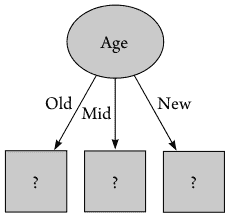

**图9.9** 基于年龄属性的数据分裂

对于年龄，由于有三个可能的值，即老、中、新，因此数据集将根据年龄属性的这些不同值分裂成三个子集，如图9.9所示。

###### 年龄为“老”的数据集

当属性年龄取值“老”时的数据集子集如下所示。

| 实例 | 竞争 | 类型 | 利润 |
| :--- | :--- | :--- | :--- |
| 1 | 是 | 软件 | 下降 |
| 2 | 否 | 软件 | 下降 |
| 3 | 否 | 硬件 | 下降 |

从上表可以看出，有三个样本，每个类别的频率如下：

- 下降 = 3（实例1、2、3）。
- 上升 = 0个实例。

由于当年龄为“老”时，所有记录都代表同一个类别“下降”，因此决策树将如图9.10所示。

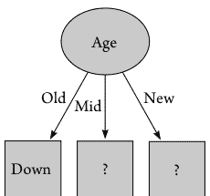

**图9.10** 属性年龄分裂为“老”后的决策树

###### 年龄为“新”的数据集

当属性年龄取值“新”时的数据集子集如下所示。

| 实例 | 竞争 | 类型 | 利润 |
| :--- | :--- | :--- | :--- |
| 1 | 是 | 软件 | 上升 |
| 2 | 否 | 硬件 | 上升 |
| 3 | 否 | 软件 | 上升 |

从上表可以看出，有三个样本，每个类别的频率如下：

- 下降 = 0。
- 上升 = 3（实例1、2、3）。

由于当年龄为“新”时，所有记录都代表同一个类别“上升”，因此决策树将如图9.11所示。

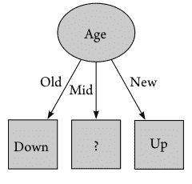

**图9.11** 属性年龄分裂为“新”后的决策树

###### 年龄为“中”的数据集

当属性年龄取值“中”时的数据集子集如下所示。

| 实例 | 竞争 | 类型 | 利润 |
| :--- | :--- | :--- | :--- |
| 1 | 是 | 软件 | 下降 |
| 2 | 是 | 硬件 | 下降 |
| 3 | 否 | 硬件 | 上升 |
| 4 | 否 | 软件 | 上升 |

从上表可以看出，当年龄值为“中”时，它同时代表“上升”和“下降”两个类别。因此，必须根据最佳分裂属性对数据集进行分裂。所以，我们需要在竞争和类型中找出最佳拟合属性。

这里，信息 = – 下降类的概率 × log (下降类的概率) – 上升类的概率 × log (上升类的概率)

= –(2/4) × log (2/4) – (2/4) × log (2/4) = 0.5 + 0.5 = 1.

让我们检查属性竞争的信息增益。

#### 属性“竞争”

对于属性竞争，实例1和2是“是”。它们都属于“下降”类。因此，“下降”类的概率是(2/2)，“上升”类的概率是(0/2)。
实例3和4是“否”。它们都属于“上升”类。因此，“下降”类的概率是(0/2)，“上升”类的概率是(2/2)。
每个属性值提供的信息如下：
I(竞争 = 是) = I(C_Y)
= - (2/2) log (2/2) - (0/2) log (0/2) = 0
I(竞争 = 否) = I(C_N)
= - (0/2) log (0/2) - (2/2) log (2/2) = 0
两个子树的总信息 = 竞争为是的概率 × I (C_Y) + 竞争为否的概率 × I (C_N)。
这里，竞争为是的概率 = 竞争为是的实例数 / 总实例数 = 2/4。
竞争为否的概率 = 竞争为否的实例数 / 总实例数 = 2/4。
两个子树的总信息 = (2/4) × 0 + (2/4) × 0 = 0。
由于我们得到属性竞争的信息为0，我们可以将此属性设置为分裂属性，因为它将具有最大的信息增益。因此，在这种情况下，无需计算属性类型的信息。图9.12表示当年龄 = 中时，基于属性竞争分裂后的决策树。
当竞争 = 是时，所有实例都属于利润为下降的类别，如下所示。

**竞争 = 是时的实例**

| 实例 | 类型 | 利润 |
| :--- | :--- | :--- |
| 1 | 软件 | 下降 |
| 2 | 硬件 | 下降 |

当竞争 = 否时，所有实例都属于利润为上升的类别，如下所示。

**竞争 = 否时的实例**

| 实例 | 类型 | 利润 |
| :--- | :--- | :--- |
| 1 | 硬件 | 上升 |
| 2 | 软件 | 上升 |

因此，我们得到了最终的决策树，如图9.12所示。

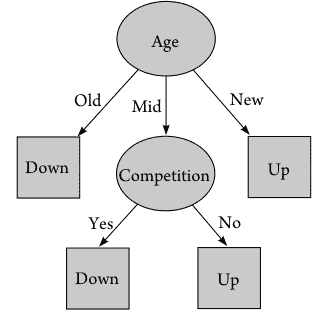

**图9.12** 基于属性“竞争”分裂后的决策树

图9.12表示基于信息增益的最终决策树。

#### 案例研究2：预测客户是否会购买计算机

让我们考虑表9.2中给出的数据集，该数据集表示一些客户的数据集，并提供了他们是否购买计算机的详细信息。这里，输入属性是年龄、收入、学生身份、信用评级，输出属性是“购买计算机”。这里添加了实例编号以便更好地解释。此数据集指示有关客户的信息，无论他是否购买了计算机，以及他的年龄、收入、信用评级和学生身份等信息。数据集中给出的十五个实例包含有关决定客户是否购买计算机的因素的信息。在此表下方，还提到了每个属性可能值的客户数量。

在本案例研究中，我们的目标是为给定的数据集构建决策树，以根据其输入属性预测客户是否会购买计算机。

**表9.2** 表示客户是否购买计算机的数据集

| 实例 | 年龄 | 收入 | 学生 | 信用评级 | 购买计算机 |
| :--- | :--- | :--- | :--- | :--- | :--- |
| 1 | <= 30 | 高 | 否 | 一般 | 否 |
| 2 | <= 30 | 低 | 否 | 优秀 | 否 |
| 3 | 31–40 | 高 | 是 | 一般 | 是 |
| 4 | > 40 | 中等 | 否 | 一般 | 是 |
| 5 | > 40 | 中等 | 是 | 一般 | 是 |
| 6 | > 40 | 中等 | 否 | 优秀 | 否 |
| 7 | 31–40 | 低 | 否 | 优秀 | 是 |
| 8 | <= 30 | 中等 | 是 | 优秀 | 是 |

| 实例 | 年龄 | 收入 | 学生 | 信用评级 | 购买电脑 |
| :--- | :--- | :--- | :--- | :--- | :--- |
| 9 | 31-40 | 低 | 是 | 优秀 | 否 |
| 10 | 31-40 | 高 | 否 | 优秀 | 是 |
| 11 | <= 30 | 中等 | 否 | 一般 | 是 |
| 12 | > 40 | 高 | 是 | 优秀 | 是 |
| 13 | <= 30 | 低 | 是 | 一般 | 是 |
| 14 | 31-40 | 高 | 否 | 一般 | 否 |
| 15 | <= 30 | 高 | 否 | 一般 | 否 |

| 年龄 | 收入 | 学生 | 信用评级 | 购买电脑 |
| :--- | :--- | :--- | :--- | :--- |
| <= 30 = 6 | 低 = 4 | 是 = 6 | 一般 = 8 | 是 = 9 |
| 31-40 = 5 | 中等 = 5 | 否 = 9 | 优秀 = 7 | 否 = 6 |
| > 40 = 4 | 高 = 6 | | | |

可以注意到，这里的输出属性“购买电脑”有两个类别，即“是”或“否”。从表中，我们可以观察到每个类别的频率如下：
类别“是”的频率 = 9（实例 3, 4, 5, 7, 8, 10, 11, 12, 13）。
类别“否”的频率 = 6（实例 1, 2, 6, 9, 14, 15）。
使用信息计算公式，整个数据集包含的信息量如下：
I = – (购买电脑的概率 × log (购买电脑的概率)) – (不购买电脑的概率 × log (不购买电脑的概率))
购买电脑的概率 = 购买电脑的实例数 / 总实例数 = 9/15。
不购买电脑的概率 = 不购买电脑的实例数 / 总实例数 = 6/15。
因此，I = – (9/15) log (9/15) – (6/15) log (6/15) = 0.4421 + 0.5287 = 0.9709。
为了找到最佳划分属性，让我们逐一考虑每个属性作为划分属性，并计算每个属性的信息增益。

###### 属性“年龄”

从数据集中，我们可以看到属性年龄有三个可能的值，即 <= 30、31–40 或 > 40。让我们逐一分析每种情况。
如表 9.2 所示，有六个实例，即 1, 2, 8, 11, 13 和 15，其属性年龄为 <= 30。实例 8, 11 和 13 被标记为类别“是”，而实例 1, 2, 15 被标记为类别“否”。因此，类别“是”的概率为 (3/6)，类别“否”的概率为 (3/6)。

对于年龄 = 31–40，有五个实例，即实例 3, 7, 9, 10 和 14。其中，实例 3, 7 和 10 被标记为类别“是”，而实例 9 和 14 被标记为类别“否”。因此，类别“是”的概率为 (3/5)，类别“否”的概率为 (2/5)。

对于年龄 > 40，有四个实例，即实例 4, 5, 6 和 12。实例 4, 5 和 12 被标记为“是”，实例 6 被标记为类别“否”。因此，类别“是”的概率为 (3/4)，类别“否”的概率为 (1/4)。

根据上述值，让我们计算此属性给出的信息。我们根据年龄 <= 30、31–40 或 > 40 将数据集分为三个子集。每种情况的信息计算如下：

I(年龄 <= 30) = I(Age_1) = – (3/6) log (3/6) – (3/6) log (3/6) = 1。

I(年龄 = 31–40) = I(Age_2) = – (3/5) log (3/5) – (2/5) log (2/5) = 0.9709。

I(年龄 > 40) = I(Age_3) = – (3/4) log (3/4) – (1/4) log (1/4) = 0.8113。

三个子集的总信息 = 年龄 <= 30 的概率 × I(Age_1) + 年龄 31–40 的概率 × I(Age_2) + 年龄 > 40 的概率 × I(Age_3)。

这里，年龄 <= 30 的概率 = (年龄 <= 30 的实例数) / (总实例数) = 6/15。

年龄 31–40 的概率 = (年龄 31–40 的实例数) / (总实例数) = 5/15。

年龄 > 40 的概率 = (年龄 > 40 的实例数) / (总实例数) = 4/15。

因此，三个子集的总信息 = (6/15) I(Age_1) + (5/15) I(Age_2) + (4/15) I(Age_3)
= (6/15) × 1 + (5/15) × 0.9709 + (4/15) × 0.8113
= 0.9399。

###### 属性“收入”

数据集的属性收入有三个值，即低、中等和高。让我们逐一分析每种情况。

如表 9.2 所示，四个实例，即实例 2, 7, 9 和 13，其收入属性取值为低。这里，实例 7 和 13 被标记为类别“是”，而实例 2 和 9 被标记为类别“否”，因此类别“是”的概率为 (2/4)，类别“否”的概率为 (2/4)。

有五个实例的收入为中等，即实例 4, 5, 6, 8 和 11。其中，实例 4, 5, 8 和 11 被标记为类别“是”，而实例 6 被标记为类别“否”。因此，类别“是”的概率为 (4/5)，类别“否”的概率为 (1/5)。

有六个实例的收入为高，即实例 1, 3, 10, 12, 14 和 15。实例 3, 10 和 12 被标记为“是”，实例 1, 14 和 15 被标记为类别“否”。因此，类别“是”的概率为 (3/6)，类别“否”的概率为 (3/6)。

根据上述值，让我们计算此属性给出的信息。我们根据收入（低、中等或高）将数据集分为三个子集。每种情况的信息计算如下：

I(收入 = 低) = I(I_L) = – (2/4) log (2/4) – (2/4) log (2/4) = 1。

I(收入 = 中等) = I(I_M) = – (4/5) log (4/5) – (1/5) log (1/5) = 0.7218。

I(收入 = 高) = I(I_H) = – (3/6) log (3/6) – (3/6) log (3/6) = 1。

三个子集的总信息 = 低收入的概率 × I(I_L) + 中等收入的概率 × I(I_M) + 高收入的概率 × I(I_H)。

这里，低收入的概率 = (收入 = 低的实例数) / (总实例数) = 4/15。

中等收入的概率 = (收入 = 中等的实例数) / (总实例数) = 5/15。

高收入的概率 = (收入 = 高的实例数) / (总实例数) = 6/15。

因此，三个子集的总信息 = (4/15) I(I_L) + (5/15) I(I_M) + (6/15) I(I_H)
= (4/15) × 1 + (5/15) × 0.7218 + (6/15) × 1
= 0.9106。

##### 属性“学生”

此属性表示客户是否为学生。此属性的两个可能值是“是”或“否”。让我们逐一分析这些情况。

如表 9.2 所示，六个实例，即实例 3, 5, 8, 9, 12 和 13，其学生属性取值为“是”。实例 3, 5, 8, 12 和 13 被标记为类别“是”（购买电脑），而实例 9 被标记为类别“否”（不购买电脑）。因此，类别“是”的概率为 (5/6)，类别“否”的概率为 (1/6)。

有九个实例的学生属性取值为“否”，即实例 1, 2, 4, 6, 7, 10, 11, 14 和 15。其中，实例 4, 7, 10 和 11 被标记为类别“是”（购买电脑），而实例 1, 2, 6, 14 和 15 被标记为类别“否”（不购买电脑）。因此，类别“是”的概率为 (4/9)，类别“否”的概率为 (5/9)。

根据上述值，让我们计算此属性给出的信息。我们将数据集分为两个子集，一个是客户是学生，另一个是客户不是学生。每种情况的信息计算如下：

I(学生 = 是) = I(S_Y) = - (5/6) log (5/6) - (1/6) log (1/6) = 0.6498。

I(学生 = 否) = I(S_N) = - (4/9) log (4/9) - (5/9) log (5/9) = 0.4711 + 0.519 = 0.9901。

两个子集的总信息 = 学生的概率 × I(S_Y) + 非学生的概率 × I(S_N)。

这里，学生的概率 = (学生 = 是的实例数) / (总实例数) = 6/15。

非学生的概率 = (学生 = 否的实例数) / (总实例数) = 9/15。

因此，两个子集的总信息 = (6/15) I(S_Y) + (9/15) I(S_N)
= (6/15) × 0.6498 + (9/15) × 0.9901
= 0.2599 + 0.59406 = 0.85396。

###### 属性“信用评级”

此属性有两个可能的值，即“一般”或“优秀”。让我们逐一分析每种情况。

如表 9.2 所示，八个实例，即实例 1, 3, 4, 5, 11, 13, 14 和 15，其信用评级属性取值为“一般”。实例 3, 4, 5, 11 和 13 被标记为类别“是”，而实例 1, 14 和 15 被标记为类别“否”。因此，类别“是”的概率为 (5/8)，类别“否”的概率为 (3/8)。

有七个实例的信用评级属性取值为“优秀”，即实例 2, 6, 7, 8, 9, 10 和 12。其中，实例 7, 8, 10 和 12 被标记为类别“是”，而实例 2, 6 和 9 被标记为类别“否”。因此，类别“是”的概率为 (4/7)，类别“否”的概率为 (3/7)。

根据上述值，让我们计算此属性给出的信息。我们将数据集分为两个子集。每种情况的信息计算如下：

I(信用评级 = 一般) = I(C_F) = - (5/8) log (5/8) - (3/8) log (3/8) = 0.9543。

I(信用评级 = 优秀) = I(C_E) = - (4/7) log (4/7) - (3/7) log (3/7) = 0.9848。

两个子集的总信息 = 一般信用评级的概率 × I(C_F) + 优秀信用评级的概率 × I(C_E)。

这里，一般信用评级的概率 = (信用评级为一般的实例数) / (总实例数) = 8/15。

优秀信用评级的概率 = (优秀信用评级的实例数) / (总实例数) = 7/15。

因此，两个子集的总信息量 = (8/15) I(C_F) + (7/15) I(C_E)
= (8/15) × 0.9543 + (7/15) × 0.9848
= 0.5089 + 0.4595 = 0.9684。

现在，是时候计算每个属性的信息增益了，如下所示。

属性收入、学生、信用评级的信息增益

| 潜在分裂属性 | 分裂前的信息量 | 分裂后的信息量 | 信息增益 |
| :--- | :--- | :--- | :--- |
| 年龄 | 0.9709 | 0.9399 | 0.031 |
| 收入 | 0.9709 | 0.9106 | 0.0603 |
| **学生** | **0.9709** | **0.85396** | **0.1169** |
| 信用评级 | 0.9709 | 0.9684 | 0.0025 |

因此，属性“学生”（以粗体显示）提供了最大的信息增益。所以，学生是根节点的最佳分裂属性。因此，它被用于分裂，如图9.13所示。

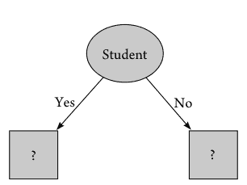

**图9.13** 基于学生属性作为根节点的数据分裂

对于学生属性，由于有两个可能的值，即“是”和“否”，因此数据集将根据学生属性的这些不同值分裂成两个子集，如图9.13所示。

选择根属性后，数据集分裂成两个集合，即学生为“是”的数据集和学生为“否”的数据集。

**学生为“是”的数据集**

学生为“是”的数据集如下所示。

##### 客户是学生时的数据集

| 实例 | 年龄 | 收入 | 信用评级 | 购买电脑 |
| :---: | :---: | :---: | :---: | :---: |
| 1 | 31–40 | 高 | 一般 | 是 |
| 2 | > 40 | 中等 | 一般 | 是 |
| 3 | <= 30 | 中等 | 优秀 | 是 |
| 4 | 31–40 | 低 | 优秀 | 否 |
| 5 | > 40 | 高 | 优秀 | 是 |
| 6 | <= 30 | 低 | 一般 | 是 |

上表中添加了一列“实例”以便更好地解释。这里，我们有三个输入属性，即年龄、收入、信用评级。数据集包含六个实例，以及两个类别，即属性“购买电脑”的“是”或“否”。在六个实例中，五个实例属于“是”类别（购买电脑），而一个实例属于“否”类别（不购买电脑）。频率如下：

“是”类别的频率 = 5。

“否”类别的频率 = 1。

使用信息计算公式，整个数据集包含的信息如下：

I = – (购买电脑的概率 * log (购买电脑的概率)) – (不购买电脑的概率 * log (不购买电脑的概率))。

这里，购买电脑的概率如下：

= (客户购买电脑的实例数 / 总实例数) = 5/6。

不购买的概率 = (客户不购买电脑的实例数 / 总实例数) = 1/6。

因此，I = (–5/6) log (5/6) – (1/6) log (1/6) = 0.6498。

让我们依次考虑每个属性作为下一个最佳分裂属性，并计算每个属性的信息量。

###### 属性“年龄”

从数据集中，属性年龄取三个值，即 <= 30、31–40 或 > 40。

对于年龄 <= 30，有两个实例，即实例3和6。它们都被标记为“是”类别。所以，“是”类别的概率是 (2/2)，“否”类别的概率是 (0/2)。

对于年龄 = 31–40，有两个实例，即实例1和4。其中，实例1是“是”类别，而实例4是“否”类别。所以，“是”类别的概率是 (1/2)，“否”类别的概率是 (1/2)。

对于年龄 > 40，有两个实例，即实例2和5。它们都被标记为“是”。所以，“是”类别的概率是 (2/2)，“否”类别的概率是 (0/2)。

根据上述值，让我们计算此属性提供的信息量。我们根据年龄 <= 30、31–40 或 > 40 将数据集分成三个子集。每种情况的信息计算如下：

I(年龄 <= 30) = I(Age_1) = – (2/2) log (2/2) – (0/2) log (0/2) = 0。

I(年龄 = 31 – 40) = I(Age_2) = – (1/2) log (1/2) – (1/2) log (1/2) = 1。

I(年龄 > 40) = I(Age_3) = – (2/2) log (2/2) – (0/2) log (0/2) = 0。

三个子集的总信息量 = 年龄 <= 30 的概率 × I(Age_1) + 年龄 31–40 的概率 × I(Age_2) + 年龄 > 40 的概率 × I(Age_3)。

这里，年龄 <= 30 的概率 = (年龄 <= 30 的实例数) / (总实例数) = 2/6。

年龄 31–40 的概率 = (年龄 31–40 的实例数) / (总实例数) = 2/6。

年龄 > 40 的概率 = (年龄 > 40 的实例数) / (总实例数) = 2/6。

因此，三个子集的总信息量 = (2/6) I(Age_1) + (2/6) I(Age_2) + (2/6) I(Age_3) = (2/6) × 0 + (2/6) × 1 + (2/6) × 0 = 0.33。

###### 属性“收入”

如数据集所示，当客户是学生（学生 = “是”）时，属性收入取三个值，即低、中等和高。

实例4和6的收入属性取值为低。其中，实例6是“是”类别，而实例4是“否”类别。所以，“是”类别的概率是 (1/2)，“否”类别的概率是 (1/2)。

实例2和3的收入取值为中等。它们被标记为“是”类别。所以，“是”类别的概率是 (2/2)，“否”类别的概率是 (0/2)。

实例1和5的收入取值为高。它们被标记为“是”类别。所以，“是”类别的概率是 (2/2)，“否”类别的概率是 (0/2)。

根据上述值，让我们计算此属性提供的信息量。我们根据收入，即低、中等或高，将数据集分成三个子集。每种情况的信息计算如下：

I(收入 = 低) = I(I_L) = – (1/2) log (1/2) – (1/2) log (1/2) = 1。

I(收入 = 中等) = I(I_M) = – (2/2) log (2/2) – (0/2) log (0/2) = 0。

I(收入 = 高) = I(I_H) = – (2/2) log (2/2) – (0/2) log (0/2) = 0。

三个子集的总信息量 = 低收入的概率 × I(I_L) + 中等收入的概率 × I(I_M) + 高收入的概率 × I(I_H)。

这里，低收入的概率 = (收入 = 低的实例数) / (总实例数) = 2/6。

中等收入的概率 = (收入 = 中等的实例数) / (总实例数) = 2/6。

高收入的概率 = (收入 = 高的实例数) / (总实例数) = 2/6。

因此，三个子集的总信息量 = (2/6) I(I_L) + (2/6) I(I_M) + (2/6) I(I_H)
= (2/6) × 1 + (2/6) × 0 + (2/6) × 0 = 0.33。

###### 属性“信用评级”

如数据集所示，当客户是学生（学生 = “是”）时，此属性有两个可能的值，即一般或优秀。

实例1、2和6的信用评级属性取值为一般。它们都属于“是”类别。所以，“是”类别的概率是 (3/3)，“否”类别的概率是 (0/3)。

实例3、4和5的信用评级属性取值为优秀。其中，实例3和5属于“是”类别，实例4属于“否”类别。所以，“是”类别的概率是 (2/3)，“否”类别的概率是 (1/3)。

根据上述值，让我们计算此属性提供的信息量。我们将数据集分成两个子集。每种情况的信息计算如下：

I(信用评级 = 一般) = I(C_F) = – (3/3) log (3/3) – (0/3) log (0/3) = 0

I(信用评级 = 优秀) = I(C_E) = – (2/3) log (2/3) – (1/3) log (1/3)
= 0.3899 + 0.5283 = 0.9182。

两个子集的总信息量 = 一般信用评级的概率 × I(C_F) + 优秀信用评级的概率 × I(C_E)。

这里，一般信用评级的概率 = (一般信用评级的实例数) / (总实例数) = 3/6。

优秀信用评级的概率 = (优秀信用评级的实例数) / (总实例数) = 3/6。

因此，两个子集的总信息量 = (3/6) I(C_F) + (3/6) I(C_E)
= (3/6) × 0 + (3/6) × 0.9182
= 0.4591。

现在，让我们计算每个属性的信息增益，如下所示。

属性年龄、收入、信用评级的信息增益

| 潜在分裂属性 | 分裂前信息 | 分裂后信息 | 信息增益 |
| :--- | :--- | :--- | :--- |
| 年龄 | 0.6498 | 0.33 | 0.3198 |
| 收入 | 0.6498 | 0.33 | 0.3198 |
| 信用评级 | 0.6498 | 0.4591 | 0.1907 |

从上表可以看出，两个属性，即年龄和收入，提供了最大的信息增益。这两个属性都是最佳分裂点。在这一层级，可以使用其中任何一个属性进行分裂。让我们选择年龄作为分裂属性。因此，它被用于分裂，如图9.14所示。

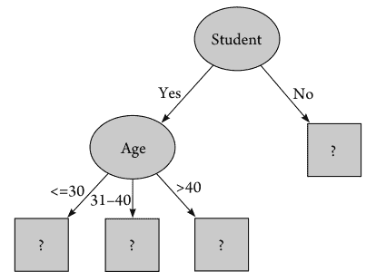

**图9.14** 基于年龄属性的数据分裂

年龄属性有三个可能的值，即 <= 30、31–40 和 > 40。因此，数据集将根据年龄属性的这些不同值分裂成三个子集，如图9.14所示。

现在，数据集可以分裂成三个集合，即年龄“<= 30”的数据集、年龄“31–40”的数据集和年龄“> 40”的数据集，如下所述。

##### 年龄“<= 30”的数据集

年龄“<= 30”的数据集如下所示。

客户年龄<= 30的实例

| 实例 | 收入 | 信用评级 | 购买电脑 |
| :--- | :--- | :--- | :--- |
| 1 | 中等 | 优秀 | 是 |
| 2 | 低 | 一般 | 是 |

在表格中，添加了一列“实例”以便更好地解释。这里，我们有两个输入属性，即收入和信用评级。数据集包含两个样本，在这两个实例中，类别都是“是”。

由于它代表相同的类别“是”，因此我们可以得出结论，当年龄<= 30时，输出类别是“是”，如图9.15所示。

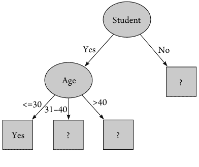

**图9.15** 属性年龄“<= 30”分裂后的决策树

##### 年龄“31–40”的数据集

年龄“31–40”的数据集如下所示。

客户年龄为31–40的实例

| 实例 | 收入 | 信用评级 | 购买电脑 |
| :--- | :--- | :--- | :--- |
| 1 | 高 | 一般 | 是 |
| 2 | 低 | 优秀 | 否 |

此表有两个输入属性，即收入和信用评级。数据集包含两个样本。每个类别的频率如下：

- 类别“是”的频率 = 1（实例1）。
- 类别“否”的频率 = 1（实例2）。

此数据集的信息如下：

I = (-1/2) log (1/2) – (1/2) log (1/2) = 1。

让我们依次考虑每个属性作为下一个最佳分裂属性，并计算每个属性的信息。

###### 属性“收入”

属性收入从数据集中取两个值，即低和高。

实例2的收入属性取值为低，标记类别为否。因此，类别“是”的概率为 (0/1)，类别“否”的概率为 (1/1)。

实例1的收入取值为高，标记类别为是。因此，类别“是”的概率为 (1/1)，类别“否”的概率为 (0/1)。

根据上述值，让我们计算此属性提供的信息。我们根据收入将数据集分为两个子集，低或高。每种情况的信息计算如下：

I(收入 = 低) = I(I_L) = - (0/1) log (0/1) - (1/1) log (1/1) = 0。

I(收入 = 高) = I(I_H) = - (1/1) log (1/1) - (0/1) log (1/1) = 0。

两个子集的总信息 = 低收入概率 × I(I_L) + 高收入概率 × I(I_H)。

这里，低收入概率 = (收入 = 低的实例数)/(总实例数) = 1/2。

高收入概率 = (收入 = 高的实例数)/(总实例数) = 1/2。

因此，两个子集的总信息 = (1/2) I(I_L) + (1/2) I(I_H)
= (1/2) × 0 + (1/2) × 0 = 0。

由于收入携带0信息，它将携带最大的信息增益。这里，可以确定收入携带最大的信息增益。因此，我们可以跳过属性信用评级的信息增益计算。我们可以直接选择收入作为分裂属性，如图9.16所示。

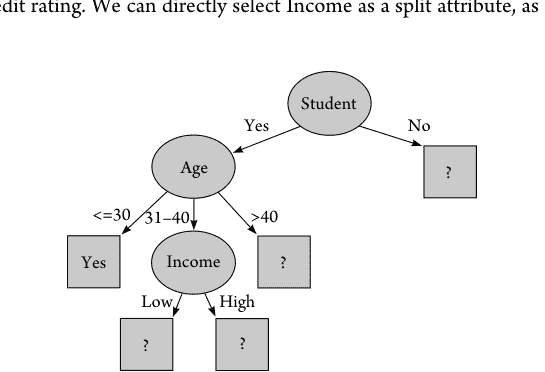

**图9.16** 当年龄为“31–40”时，选择收入作为最佳分裂后的决策树

从上表中，当属性是收入时，我们有两种情况，即低和高。

###### 收入为低时的数据集

收入 = 低时的样本

| 实例 | 收入 | 信用评级 | 购买电脑 |
| :---: | :---: | :---: | :---: |
| 1 | 低 | 优秀 | 否 |

上表可以得出结论，输出类别为否（不购买电脑）。

###### 收入为高时的数据集

收入 = 高时的样本

| 实例 | 收入 | 信用评级 | 购买电脑 |
| :---: | :---: | :---: | :---: |
| 1 | 高 | 一般 | 是 |

从上表中，我们可以得出结论，当收入高时，输出类别标记为是（购买电脑）。
因此，当收入低时，输出标记为否。当收入高时，输出标记为是。图9.17表示分裂收入属性后的决策树。

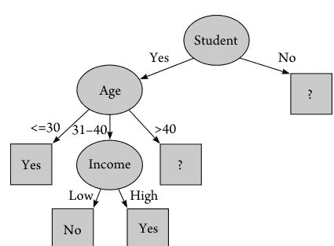

##### 年龄“> 40”的数据集

年龄> 40的数据集样本

| 实例 | 收入 | 信用评级 | 购买电脑 |
| :---: | :---: | :---: | :---: |
| 1 | 中等 | 一般 | 是 |
| 2 | 高 | 优秀 | 是 |

在上表中，我们有两个输入属性，即收入和信用评级。数据集包含两个样本。每个类别的频率如下：

类别“是”的频率 = 2。

类别“否”的频率 = 0。

它代表所有记录的收入和信用评级组合都是相同的类别“是”，如图9.18所示。

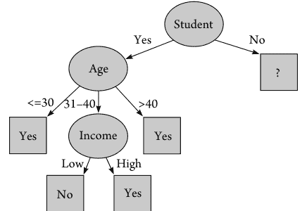

**图9.18** 属性年龄“> 40”分裂后的决策树

从图9.18中，我们可以得出结论，当客户是年龄<= 30或> 40的学生时，他们会购买电脑。当客户年龄在31到40岁之间时，如果他们的收入低，他们不会购买电脑；如果他们的收入高，他们会购买电脑。

客户是学生的分析已经完成。现在，我们将分析决策树的右侧，即当客户不是学生时。

##### 学生“否”的数据集

当客户不是学生时的数据集如下所示。此数据集是参考表9.2创建的。

客户不是学生时的数据集

| 实例 | 年龄 | 收入 | 信用评级 | 购买电脑 |
| :---: | :---: | :---: | :---: | :---: |
| 1 | <= 30 | 高 | 一般 | 否 |
| 2 | <= 30 | 低 | 优秀 | 否 |
| 3 | > 40 | 中等 | 一般 | 是 |
| 4 | > 40 | 中等 | 优秀 | 否 |
| 5 | 31–40 | 低 | 优秀 | 是 |
| 6 | 31–40 | 高 | 优秀 | 是 |
| 7 | <= 30 | 中等 | 一般 | 是 |
| 8 | 31–40 | 高 | 一般 | 否 |
| 9 | <= 30 | 高 | 一般 | 否 |

在上表中添加了一列“实例”以便更好地解释。这里，我们有三个输入属性，即年龄、收入和信用评级。数据集包含九个样本和两个类别，即“是”（购买电脑）或“否”（不购买电脑）。在九个实例中，各类别的频率如下：

- 类别“是”的频率 = 4（实例3、5、6、7）。
- 类别“否”的频率 = 5（实例1、2、4、8、9）。

使用计算信息的公式，整个数据集包含的信息如下：

I = – (购买电脑的概率 * log (购买电脑的概率)) – (不购买电脑的概率 * log (不购买电脑的概率))。

这里，购买电脑的概率
= (客户购买电脑的实例数/总实例数) = 4/9。

不购买的概率 = (客户不购买电脑的实例数/总实例数) = 5/9。

因此，I = (–4/9) log (4/9) – (5/9) log (5/9) = 0.9901。

让我们依次考虑每个属性作为下一个最佳分裂属性，并计算每个属性的信息。

###### 属性“年龄”

从数据集中，属性年龄取三个值，即 <= 30、31–40 或 > 40。

实例1、2、7和9的年龄属性取值 <= 30。实例1、2和9标记为类别“否”，实例7标记为类别“是”。因此，类别“是”的概率为 (3/4)，类别“否”的概率为 (1/4)。

对于年龄 = 31–40，有三个实例，即实例5、6和8。其中，实例5和6标记为类别“是”，而实例8标记为类别“否”。因此，类别“是”的概率为 (2/3)，类别“否”的概率为 (1/3)。

对于年龄 > 40，有两个实例，即实例3和4。实例3是类别“是”，而实例4是类别“否”。因此，类别“是”的概率为 (1/2)，类别“否”的概率为 (1/2)。

根据上述值，让我们计算此属性提供的信息。我们根据年龄 <= 30、31–40 或 > 40 将数据集分为三个子集。每种情况的信息计算如下：

I(年龄 <= 30) = I(Age_1) = – (3/4) log (3/4) – (1/4) log (1/4) = 0.8113。

I(年龄 = 31 – 40) = I(Age_2) = – (2/3) log (2/3) – (1/3) log (1/3) = 0.9182。

I(年龄 > 40) = I(Age_3) = – (1/2) log (1/2) – (1/2) log (1/2) = 1。

三个子集的总信息 = 年龄 <= 30 的概率 × I(Age_1) + 年龄 31–40 的概率 × I(Age_2) + 年龄 > 40 的概率 × I(Age_3)。

此处，年龄 <= 30 的概率 = (年龄 <= 30 的实例数)/(总实例数) = 4/9。

年龄 31–40 的概率 = (年龄 31–40 的实例数)/(总实例数) = 3/9。

而年龄 > 40 的概率 = (年龄 > 40 的实例数)/(总实例数) = 2/9。

因此，三个子集的总信息 = (4/9) I(Age_1) + (3/9) I(Age_2) + (2/9) I(Age_3)
= (4/9) × 0.8113 + (3/9) × 0.9182 + (2/9) × 1
= 0.8865。

###### 属性“收入”

数据集的属性“收入”有三个取值，即低、中、高。

实例 2 和 5 的“收入”属性取值为低。其中，实例 5 的类别为“是”，而实例 2 的类别为“否”。因此，类别“是”的概率为 (1/2)，类别“否”的概率为 (1/2)。

实例 3、4 和 7 的“收入”属性取值为中。其中，实例 3 和 7 被标记为类别“是”，实例 4 被标记为类别“否”。因此，类别“是”的概率为 (2/3)，类别“否”的概率为 (1/3)。

实例 1、6、8 和 9 的“收入”属性取值为高。其中，实例 6 被标记为类别“是”，实例 1、8 和 9 被标记为类别“否”。因此，类别“是”的概率为 (1/4)，类别“否”的概率为 (3/4)。

根据上述值，让我们计算此属性提供的信息。我们根据“收入”将数据集分为三个子集：低、中或高。每种情况的信息计算如下：

I(收入 = 低) = I(I_L) = – (1/2) log (1/2) – (1/2) log (1/2) = 1。

I(收入 = 中) = I(I_M) = – (2/3) log (2/3) – (1/3) log (1/3) = 0.9182。

I(收入 = 高) = I(I_H) = – (1/4) log (1/4) – (3/4) log (3/4) = 0.8113。

三个子集的总信息 = 低收入概率 × I(I_L) + 中等收入概率 × I(I_M) + 高收入概率 × I(I_H)。

此处，低收入概率 = (收入 = 低的实例数)/(总实例数) = 2/9。

中等收入概率 = (收入 = 中的实例数)/(总实例数) = 3/9。

因此，三个子集的总信息 = (2/9) I(I_L) + (3/9) I(I_M) + (4/9) I(I_H)
= (2/9) × 1 + (3/9) × 0.9182 + (4/9) × 0.8113
= 0.88657。

###### 属性“信用评级”

此属性有两个可能的取值，即一般或优秀。
实例 1、3、7、8 和 9 的“信用评级”属性取值为一般。其中，实例 3 和 7 属于类别“是”，实例 1、8 和 9 属于类别“否”。因此，类别“是”的概率为 (2/5)，类别“否”的概率为 (3/5)。
实例 2、4、5 和 6 的“信用评级”属性取值为优秀。其中，实例 5 和 6 属于类别“是”，实例 2 和 4 属性类别“否”。因此，类别“是”的概率为 (2/4)，类别“否”的概率为 (2/4)。
根据上述值，让我们计算此属性提供的信息。我们将数据集分为两个子集。每种情况的信息计算如下：
I(信用评级 = 一般) = I(C_F) = – (2/5) log (2/5) – (3/5) log (3/5) = 0.9709。
I(信用评级 = 优秀) = I(C_E) = – (2/4) log (2/4) – (2/4) log (2/4)
= 1。
两个子集的总信息 = 一般信用评级概率 × I(C_F) + 优秀信用评级概率 × I(C_E)。
此处，一般信用评级概率 = (信用评级为一般的实例数)/(总实例数) = 5/9。
优秀信用评级概率 = (信用评级为优秀的实例数)/(总实例数) = 4/9。
因此，两个子集的总信息 = (5/9) I(C_F) + (4/9) I(C_E)
= (5/9) ×0.9708 + (4/9) ×1
= 0.983。
既然我们已经计算了每个属性的信息，现在让我们计算每个属性的信息增益，如下所示。
当客户为非学生时，属性年龄、收入、信用评级的信息增益

| 潜在分裂属性 | 分裂前信息 | 分裂后信息 | 信息增益 |
| :--- | :--- | :--- | :--- |
| 年龄 | 0.9901 | 0.8865 | 0.1036 |
| 收入 | 0.9901 | 0.8865 | 0.1036 |
| 信用评级 | 0.9901 | 0.983 | 0.0071 |

上表显示，两个属性提供了最大的信息增益，即年龄和收入。这两个属性都是最佳分裂点。在此级别，可以使用其中任何一个属性进行分裂。让我们选择年龄作为分裂属性。因此，它被用于分裂，如图 9.19 所示。

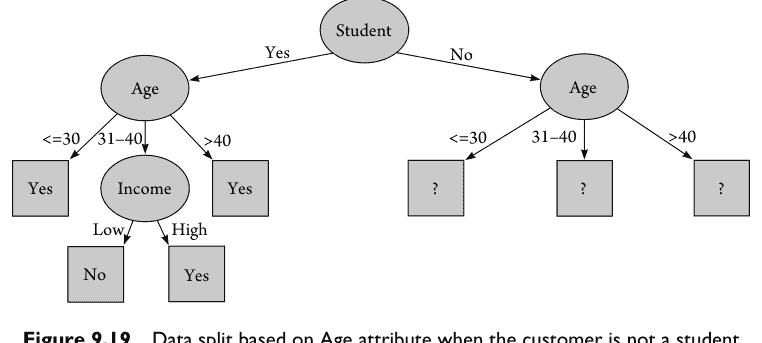

年龄属性有三个可能的取值，即 <= 30、31–40 和 > 40。因此，数据集将根据年龄属性的这些不同值分为三个子集，如图 9.19 所示。

###### 年龄 <= 30 的数据集

非学生且年龄 <= 30 的客户数据集如下所示。

非学生且年龄 <= 30 的客户

| 实例 | 收入 | 信用评级 | 购买电脑 |
| :--- | :--- | :--- | :--- |
| 1 | 高 | 一般 | 否 |
| 2 | 低 | 优秀 | 否 |
| 3 | 中 | 一般 | 是 |
| 4 | 高 | 一般 | 否 |

在上述数据集中添加了一列实例以便更好地解释。此处，我们有两个输入属性，即收入和信用评级。数据集包含四个样本。每个类别的频率如下：

类别“是”的频率 = 1（实例 3）。

类别“否”的频率 = 3（实例 1、2、4）。

信息由下式给出

```
I = (-1/4) log (1/4) – (3/4) log (3/4) = 0.8113。
```

让我们依次考虑每个属性作为下一个最佳分裂属性，并计算每个属性的信息。

###### 属性“收入”

收入有三个取值，即低、中、高。

实例 2 取值为低，其类别为否。因此，类别“是”的概率为 (0/1)，类别“否”的概率为 (1/1)。

实例 3 取值为中，其类别为是。因此，类别“是”的概率为 (1/1)，类别“否”的概率为 (0/1)。

实例 1 和 4 取值为高，其类别为否。因此，类别“是”的概率为 (0/2)，类别“否”的概率为 (2/2)。

根据上述值，让我们计算此属性提供的信息。我们根据“收入”将数据集分为三个子集：低、中或高。每种情况的信息计算如下：

I(收入 = 低) = I(I_L) = – (0/1) log (0/1) – (1/1) log (1/1) = 0。

I(收入 = 中) = I(I_M) = – (1/1) log (1/1) – (0/1) log (0/1) = 0。

I(收入 = 高) = I(I_H) = – (0/2) log (0/2) – (2/2) log (2/2) = 0。

因此，三个子集的总信息 = 0。

由于属性“收入”携带 0 信息，它将携带最大的信息增益。此处，“收入”肯定携带最大信息增益。因此，我们可以跳过属性“信用评级”的信息增益计算，直接选择“收入”作为分裂属性。图 9.20 表示在此级别使用“收入”属性进行的数据分裂。

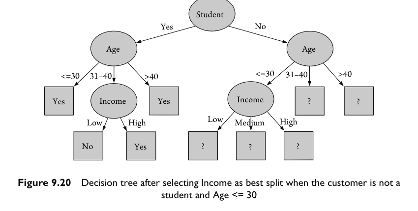

###### 收入 = “低”的数据集

非学生且收入为低的客户数据集如下所示。

收入为低的非学生客户实例

| 实例 | 收入 | 信用评级 | 购买电脑 |
| :--- | :--- | :--- | :--- |
| 1 | 低 | 优秀 | 否 |

上表显示，当收入为低时，类别被标记为否。

###### 收入 = “中”的数据集

非学生且收入为中的客户数据集如下所示。

收入为中的非学生客户实例

| 实例 | 收入 | 信用评级 | 购买电脑 |
| :--- | :--- | :--- | :--- |
| 1 | 中 | 一般 | 是 |

从上表我们可以观察到，当收入为中时，类别被标记为是。

###### 收入 = “高”的数据集

非学生且收入为高的客户数据集如下所示。

收入为高的非学生客户实例

| 实例 | 收入 | 信用评级 | 购买电脑 |
| :--- | :--- | :--- | :--- |
| 1 | 高 | 一般 | 否 |
| 2 | 高 | 一般 | 否 |

从上表我们可以观察到，当收入为高时，类别被标记为否。

因此，我们可以得出结论：当收入为“低”时，类别被标记为否。当收入为“中”时，类别被标记为是。当收入为“高”时，类别被标记为否，如图 9.21 所示。它表示分裂“收入”属性后的决策树。

##### 年龄“31–40”的数据集

非学生且年龄为“31–40”的客户数据集如下所示。

非学生且年龄为 31–40 的客户

| 实例 | 收入 | 信用评级 | 购买电脑 |
| :--- | :--- | :--- | :--- |
| 1 | 低 | 优秀 | 是 |
| 2 | 高 | 优秀 | 是 |
| 3 | 高 | 一般 | 否 |

###### 属性“信用评级”

该属性有两个可能的值，即“一般”或“优秀”。
实例1和实例2在属性“信用评级”上取值为“优秀”。它们属于类别“是”。因此，类别“是”的概率为 (2/2)，类别“否”的概率为 (0/1)。
实例3取值为“一般”，属于类别“否”。因此，类别“是”的概率为 (0/1)，类别“否”的概率为 (1/1)。
每种情况的信息计算如下：

I(信用评级 = 优秀) = I(C_E) = − (2/2) log (2/2) − (0/1) log (0/1) = 0。
I(信用评级 = 一般) = I(C_F) = − (0/1) log (0/1) − (1/1) log (1/1) = 0。
因此，两个子集的总信息 = 0。
信息增益现在可以如下表所示计算。
收入、信用评级和客户是否为学生属性的信息增益

| 潜在分裂属性 | 分裂前信息 | 分裂后信息 | 信息增益 |
| :--- | :--- | :--- | :--- |
| 收入 | 0.9182 | 0.67 | 0.2482 |
| **信用评级** | **0.9182** | **0** | **0.9182** |

由于“信用评级”具有最高的信息增益，因此它是下一个最佳分裂属性。图9.22表示了在该层级使用“信用评级”属性进行数据分裂的情况。

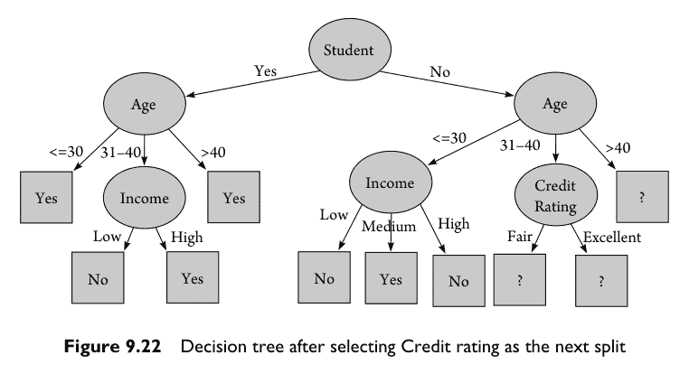

###### 信用评级 = “一般”时的数据集

信用评级为“一般”的非学生客户的数据集如下所示。

信用评级为“一般”的非学生客户实例

| 实例 | 收入 | 信用评级 | 购买电脑 |
| :--- | :--- | :--- | :--- |
| 1 | 高 | 一般 | 否 |

从上表可以看出，当信用评级为“一般”时，类别被标记为“否”。

###### 信用评级 = “优秀”时的数据集

信用评级为“优秀”的非学生客户的数据集如下所示。

信用评级为“优秀”的非学生客户实例

| 实例 | 收入 | 信用评级 | 购买电脑 |
| :--- | :--- | :--- | :--- |
| 1 | 低 | 优秀 | 是 |
| 2 | 高 | 优秀 | 是 |

从上表可以看出，当信用评级为“优秀”时，类别被标记为“是”。

因此，我们可以得出结论：当信用评级为“一般”时，类别被标记为“否”；当信用评级为“优秀”时，类别被标记为“是”。图9.23表示了分裂“信用评级”属性后的决策树。

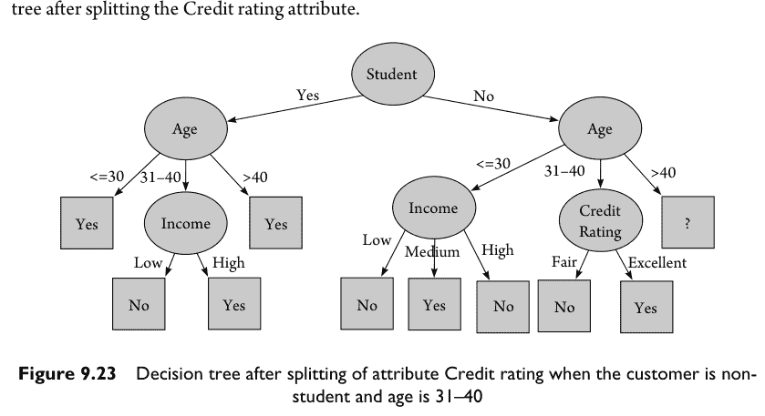

##### 年龄“> 40”时的数据集

非学生且“年龄 > 40”的客户数据集如下所示。

非学生且年龄 > 40 的客户

| 实例 | 收入 | 信用评级 | 购买电脑 |
| :---: | :---: | :---: | :---: |
| 1 | 中等 | 一般 | 是 |
| 2 | 中等 | 优秀 | 否 |

在上面给出的数据集表中，我们有两个输入属性，即“收入”和“信用评级”。数据集包含两个样本。每个类别的频率如下：
类别“是”的频率 = 1（实例1）。
类别“否”的频率 = 1（实例2）。
信息由下式给出
I = (–1/2) log (1/2) – (1/2) log (1/2) = 1。
让我们依次考虑每个属性作为下一个最佳分裂属性，并计算每个属性的信息。

###### 属性“收入”

属性“收入”在数据集中只取一个值，即“中等”。
在两个实例中，实例1被标记为类别“是”，而实例2被标记为类别“否”。因此，类别“是”的概率为 (1/2)，类别“否”的概率为 (1/2)。
根据上述值，让我们计算该属性给出的信息。这里，我们只有一种情况，即收入为中等。这种情况的信息计算如下：
I(收入 = 中等) = I(I_M) = – (1/2) log (1/2) – (1/2) log (1/2) = 1/2 + 1/2 = 1。
中等收入的概率 = (收入 = 中等的实例数) / (总实例数) = 2/2。
因此，收入的总信息 = (2/2) I(I_M)
= (2/2) ×1 = 1。

###### 属性“信用评级”

该属性有两个可能的值，即“一般”或“优秀”。
实例1在属性“信用评级”上取值为“一般”，被标记为类别“是”。因此，类别“是”的概率为 (1/1)，类别“否”的概率为 (0/1)。
实例2在属性“信用评级”上取值为“优秀”，被标记为类别“否”。因此，类别“是”的概率为 (0/1)，类别“否”的概率为 (1/1)。
根据上述值，让我们计算该属性给出的信息。我们将数据集分成两个子集。计算每种情况的信息，
I(信用评级 = 一般) = I(C_F) = – (1/1) log (1/1) – (0/1) log (0/1) = 0。
I(信用评级 = 优秀) = I(C_E) = – (0/1) log (0/1) – (1/1) log (1/1) = 0。

两个子集的总信息 = 信用评级为“一般”的概率 × I(C_F) + 信用评级为“优秀”的概率 × I(C_E)。

这里，信用评级为“一般”的概率 = (信用评级为“一般”的实例数) / (总实例数) = 1/2。

信用评级为“优秀”的概率 = (信用评级为“优秀”的实例数) / (总实例数) = 1/2。

因此，两个子集的总信息 = (1/2) I(C_F) + (1/2) I(C_E)
= (1/2) × 0 + (1/2) × 0
= 0。

信息增益现在可以如下表所示计算。

当年龄 > 40 且客户为非学生时，收入和信用评级属性的信息增益

| 潜在分裂属性 | 分裂前信息 | 分裂后信息 | 信息增益 |
| :--- | :---: | :---: | :---: |
| 收入 | 1 | 1 | 0 |
| 信用评级 | 1 | 0 | 1 |

从表中可以看出，属性“信用评级”提供了最大的信息增益。因此，它被选为最佳分裂属性。图9.24表示了此分析后的完整决策树。

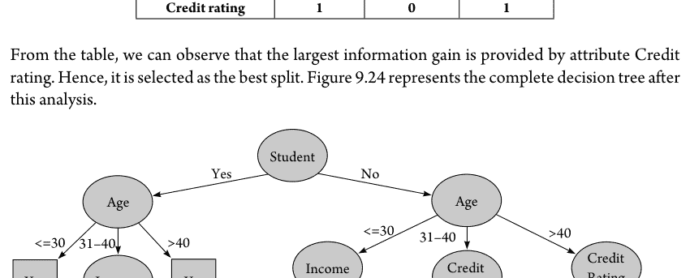

###### 信用评级 = “一般”时的数据集

非学生且信用评级为“一般”的客户数据集如下所示。

| 实例 | 收入 | 信用评级 | 购买电脑 |
| :--- | :--- | :--- | :--- |
| 1 | 中等 | 一般 | 是 |

上表显示，当信用评级为“一般”时，类别被标记为“是”。

###### 信用评级 = “优秀”时的数据集

非学生且信用评级为“优秀”的客户数据集如下所示。

| 实例 | 收入 | 信用评级 | 购买电脑 |
| :--- | :--- | :--- | :--- |
| 1 | 中等 | 优秀 | 否 |

从上表可以看出，当信用评级为“优秀”时，类别被标记为“否”。
因此，我们可以得出结论：当客户是非学生，年龄 > 40，且信用评级为“一般”时，类别被标记为“是”。当客户是非学生，年龄 > 40，且信用评级为“优秀”时，类别被标记为“否”。图9.25表示了分裂“信用评级”属性后的决策树。

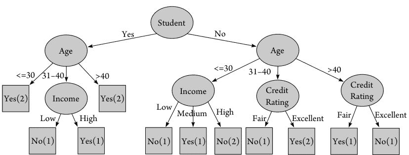

**图 9.25** 分裂信用评级属性后的决策树

因此，如果客户不是学生且其年龄小于或等于30岁，我们可以得出结论：如果其收入为中等，他将会购买电脑。
如果客户不是学生且其年龄在31-40岁之间，并且其信用评级为“一般”，他将不会购买电脑；否则，如果信用评级为“优秀”，他将会购买电脑。
如果客户不是学生且其年龄 > 40岁，并且信用评级为“一般”，他将会购买电脑；如果信用评级为“优秀”，他将不会购买电脑。

决策树叶节点中显示的数字表示被分类到该节点下的样本数量。

使用此决策树，让我们预测图9.26所示未知实例的输出属性。此处，该未知实例的输入属性为：年龄“<= 30”，收入为“中等”，学生状态为“是”，信用评级为“一般”。图9.26展示了如何使用决策树为该未知实例找到输出属性。输出属性表明该客户将购买计算机。需要注意的是，他的收入（中等）在决定类别结果时并未起到任何作用。

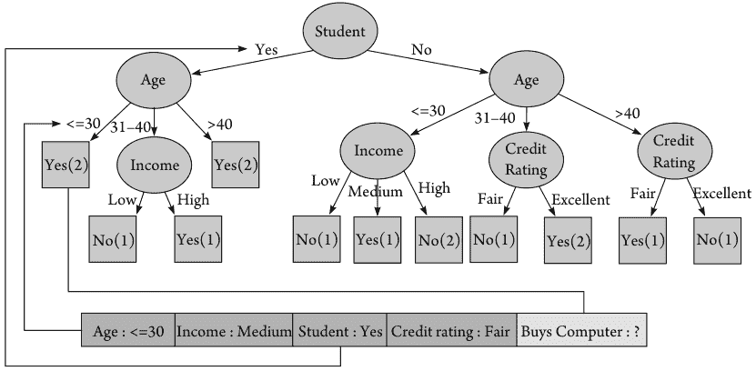

**图9.26** 对未知实例购买计算机的预测

### 9.7.7 信息增益理论的缺点

虽然信息增益可用于衡量属性的重要性，但它倾向于选择具有大量不同值的属性。

例如，假设我们为包含年龄作为属性之一的客户数据集构建决策树。此输入属性可能具有大量唯一值。因此，年龄属性可能导致高互信息，并造成选择其作为根节点或决策节点的偏差。

因此，具有许多唯一值的属性会将数据集划分为许多小集合，此问题也被称为碎片化。

### 9.7.8 基于基尼指数的分裂算法

基尼指数代表对象之间的平等或不平等程度。它也可用于构建决策树。基尼指数由意大利科学家科拉多·基尼于1912年提出，用于分析人群收入的平等分配。

让我们考虑一个社会财富分配的例子来理解基尼指数的概念。基尼指数的范围始终在0到1之间。它旨在定义贫富差距，其中0表示完全平等，即所有人收入相同；而1表示完全不平等，即只有一人获得所有收入，其余人一无所有。

由此可以得出结论：如果基尼指数非常高，则收入分配将存在巨大不平等。因此，我们会对了解一个人的收入感兴趣。但在一个人人收入相同的社会中，没有人会对了解彼此的收入感兴趣，因为每个人的薪水都一样。因此，可以根据基尼指数来决定感兴趣的属性，这意味着如果属性的基尼指数值更高，则它携带更多信息。如果其基尼指数值较低，则其信息量也较低。

图9.27以图形方式定义了基尼指数。此处，Y轴代表人口收入的百分比，X轴代表人口的百分比。

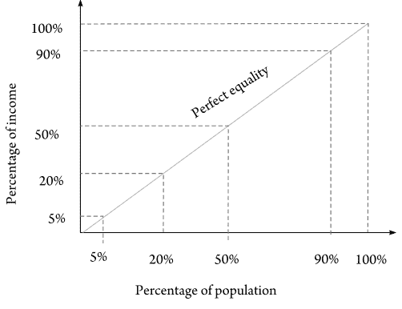

**图9.27** 表示完全平等的基尼指数

图9.27代表社会中的完全平等。此处，5%的人拥有5%的财富。同样，90%的人拥有90%的财富。图9.27中倾斜45度的线代表完全的经济平等。

从数学上讲，基尼指数定义为洛伦兹曲线与45度线之间的面积与45度线下方面积的比率。

$$\text{基尼指数 (G)} = \frac{\text{洛伦兹曲线与45度线之间的面积}}{\text{45度线下方的面积}}$$

在图9.28中，平等线与洛伦兹曲线之间的面积标记为A，平等线下方的总面积标记为(A + B)。

因此，

$$G = \frac{A}{(A + B)}$$

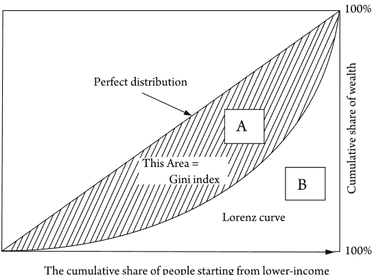

**图9.28** 洛伦兹曲线

如果比率较小，则两条曲线之间的面积较小，表示社会中收入分配均匀。

当每个人拥有相同收入时，就实现了完全平等的社会。在这种情况下，洛伦兹曲线将恰好落在完全平等线上，使得A = 0，因此G也变为0。简而言之，在完全平等的社会中，基尼指数为0。

当一个人拥有社会全部财富时，就实现了完全不平等的社会。这使得B = 0，因此G = A/A = 1。我们可以观察到G始终介于0和1之间。

一个国家的收入分配越平等，其洛伦兹曲线就越接近45度线，基尼指数就越低。一个国家的收入分配越不平等，其洛伦兹曲线离45度线就越远，基尼指数就越高。

例如，如图9.29(a)所示，最底层的10%人口拥有90%的总收入。因此，由于收入分配存在巨大不平等，平等线与洛伦兹曲线之间的面积较大，基尼指数将较大。同样，如图9.29(b)所示，最底层的20%人口拥有80%的总收入，而如图9.29(c)所示，最底层的30%人口拥有70%的总收入。图9.29(a)所示情况的基尼指数最高，图9.29(c)最低，而图9.29(b)介于两者之间。

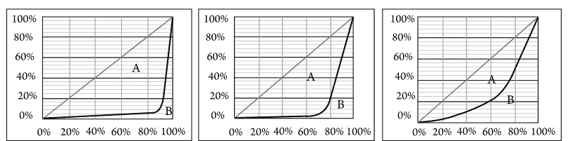

**图9.29** 具有不同收入分配的洛伦兹曲线

由此可以得出结论：如果收入完全平等分配，洛伦兹曲线将与45度线重合，基尼指数将为零。然而，如果收入完全不平等分配，洛伦兹曲线将与水平轴和右侧垂直轴重合，基尼指数将为1。

基尼指数也可以用概率来计算，如果数据集D包含来自$n$个类别的实例，则基尼指数G(D)定义为

$$G(D) = 1 - \sum_{i=1}^{n} (p_i)^2$$

此处，G(D)表示包含$n$个类别的数据集D的基尼指数。这里，$p_i$是D中类别$i$的概率。它是通过计算类别$i$的相对频率得到的。

让我们举一个例子来理解基尼指数的计算。假设有一枚均匀硬币。类别数为两个，即正面和反面。由于它是均匀的，正面和反面的概率相等，即0.5。

$$G = 1 - (\text{得到正面的概率})^2 - (\text{得到反面的概率})^2$$
$$G = 1 - (0.5)^2 - (0.5)^2 = 0.5.$$

假设硬币有偏，两面都是正面。那么，正面的概率为1，而反面的概率为0。

$$\text{基尼指数 (G)} = 1 - 1^2 - 0^2 = 0.$$

由于在抛掷有偏硬币的情况下没有不确定性，因此基尼指数为0；而在抛掷均匀硬币的情况下，其基尼指数为0.5。如果硬币有偏，使得正面出现的概率为60%，则基尼指数降至0.48。

$$G = 1 - (0.6)^2 - (0.4)^2 = 0.48.$$

同样，我们可以计算具有六种可能结果且概率相等的骰子的基尼指数如下：

$G = 1 - 6(1/6)^2 = 5/6 = 0.833$。

如果骰子有偏，假设得到6的概率为50%，其余50%由其他5个数字平分，使得除6外每个数字的概率仅为10%，则基尼指数将如下：

$G = 1 - 5(0.1)^2 - (0.5)^2 = 0.70$。

此处，基尼指数从0.833降至0.70。基尼指数的高值意味着高不确定性或高信息量。

重要的是观察到基尼指数的行为与第9.7.3节讨论的信息类似。表9.3清楚地显示了两种情况下的相同趋势。

**表9.3** 几个事件的信息和基尼指数

| 事件 | 信息 | 基尼指数 |
| :--- | :--- | :--- |
| 抛掷均匀硬币 | 1.0 | 0.5 |
| 抛掷有偏硬币（60%正面） | 0.881 | 0.42 |
| 投掷均匀骰子 | 2.585 | 0.83 |
| 投掷有偏骰子（50%概率为6） | 2.16 | 0.7 |

### 9.7.9 使用基尼指数构建决策树

在第9.7.6节中，我们讨论了如何使用信息增益构建决策树。在本节中，我们将再次考虑相同的案例研究，使用基尼指数构建决策树。

现在，让我们考虑表9.4中给出的数据集。该数据集有三个输入属性，即年龄、竞争、类型，以及一个输出属性，即利润。输出属性可以取两个值，即上涨和下跌。我们希望构建一个分类器，能够根据输入属性预测利润的值。实例列是为了说明目的而添加的。每个唯一属性值的计数也已在下表中显示。

**表9.4** 基于输入属性的利润预测数据集

| 实例 | 年龄 | 竞争 | 类型 | 利润 |
| :--- | :--- | :--- | :--- | :--- |
| 1 | 老 | 是 | 软件 | 下跌 |
| 2 | 老 | 否 | 软件 | 下跌 |
| 3 | 老 | 否 | 硬件 | 下跌 |
| 4 | 中 | 是 | 软件 | 下跌 |

| 实例 | 年龄 | 竞争 | 类型 | 利润 |
| :--- | :--- | :--- | :--- | :--- |
| 5 | 中等 | 是 | 硬件 | 下降 |
| 6 | 中等 | 否 | 硬件 | 上升 |
| 7 | 中等 | 否 | 软件 | 上升 |
| 8 | 新 | 是 | 软件 | 上升 |
| 9 | 新 | 否 | 硬件 | 上升 |
| 10 | 新 | 否 | 软件 | 上升 |

| 年龄 | 竞争 | 类型 | 利润 |
| :--- | :--- | :--- | :--- |
| 老 = 3 | 是 = 4 | 软件 = 6 | 下降 = 5 |
| 中等 = 4 | 否 = 6 | 硬件 = 4 | 上升 = 5 |
| 新 = 3 | | | |

从表9.4中，我们可以观察到各类别的频数如下：

上升 = 5（实例 6, 7, 8, 9, 10）。

下降 = 5（实例 1, 2, 3, 4, 5）。

数据集的基尼指数使用以下公式计算。

G = 1 – (类别上升的概率)² – (类别下降的概率)²

根据各类别的频数，让我们计算每个类别的概率。
类别上升的概率 = (类别上升的实例数)/(总实例数) = 5/10。

类别下降的概率 = (类别下降的实例数)/(总实例数) = 5/10。

因此，基尼指数 (G) = 1 – (5/10)² – (5/10)² = 0.5。

现在，让我们逐一计算每个属性的基尼指数增益，以找到最佳划分。

###### 属性“年龄”

属性年龄在数据集中取三个值，即老、中等或新。让我们逐一分析每种情况。

如上给定的数据集所示，实例1、2和3的值为老。所有这三个实例都被标记为类别下降。因此，类别上升的概率为 (0/3)，类别下降的概率为 (3/3)。

对于年龄 = 中等，有四个实例，即实例4、5、6、7。其中，实例4和5被标记为类别下降，实例6和7属于类别上升。因此，类别上升的概率为 (2/4)，类别下降的概率为 (2/4)。

对于年龄 = 新，有三个实例，即8、9、10。所有这三个实例都被标记为类别上升。因此，类别上升的概率为 (3/3)，类别下降的概率为 (0/3)。

根据上述值，让我们计算该属性的基尼指数。我们根据年龄将数据集划分为三个子集，即老、中等或新。每种情况的基尼指数计算如下：

G(年龄 = 老) = G(年龄_老) = 1 – (0/3)² – (3/3)² = 0。

G(年龄 = 中等) = G(年龄_中等) = 1 – (2/4)² – (2/4)² = 0.5。

G(年龄 = 新) = G(年龄_新) = 1 – (3/3)² – (0/3)² = 0。

三个子树的总基尼指数 = 年龄为老的概率 × G(年龄_老) + 年龄为中等的概率 × G(年龄_中等) + 年龄为新的概率 × G(年龄_新)。
这里，年龄为老的概率 = (年龄为老的实例数/总实例数) = 3/10。

年龄为中等的概率 = (年龄为中等的实例数/总实例数) = 4/10。

年龄为新的概率 = (年龄为新的实例数/总实例数) = 3/10。

因此，三个子树的总基尼指数 = (3/10) G(年龄_老) + (4/10) G(年龄_中等) + (3/10) G(年龄_新)
= (3/10) × 0 + (4/10) × 0.5 + (3/10) × 0
= 0.2。

#### 属性“竞争”

属性竞争有两个可能的值，即是或否。让我们逐一分析每种情况。

有四个实例的属性竞争为是，即实例1、4、5和8。实例8属于类别上升，而实例1、4和5属于类别下降。因此，类别上升的概率为 (1/4)，类别下降的概率为 (3/4)。

有六个实例的属性竞争为否，即实例2、3、6、7、9和10。实例6、7、9和10属于类别上升，而实例2和3属于类别下降。因此，类别上升的概率为 (4/6)，类别下降的概率为 (2/6)。

现在，让我们计算竞争属性的基尼指数。我们根据竞争属性将数据集划分为两个子集，即是或否。
每种情况的基尼指数计算如下：

G (竞争 = 是) = G (C_Y)
= 1 – (1/4)² – (3/4)² = 0.375。

G (竞争 = 否) = G (C_N)
= 1 – (4/6)² – (2/6)² = 0.444。

两个子树的总基尼指数 = 竞争为是的概率 × G(C_Y) + 竞争为否的概率 × G(C_N)。

这里，竞争为是的概率 = (竞争为是的实例数/总实例数) = 4/10。

竞争为否的概率 = (竞争为否的实例数/总实例数) = 6/10。

因此，两个子树的总基尼指数 = (4/10) × G(C_Y) + (6/10) × G(C_N)
= 0.4 × 0.375 + 0.6 × 0.444
= 0.4164。

#### 属性“类型”

类型属性有两个可能的值，即软件或硬件。让我们逐一分析每种情况。

有六个实例的类型为软件，即实例1、2、4、7、8和10。类别上升的实例是7、8和10，而类别下降的实例是1、2和4。因此，类别上升的概率为 (3/6)，类别下降的概率为 (3/6)。

有四个实例的类型为硬件，即实例3、5、6和9。类别上升的实例是6和9，而类别下降的实例是3和5。因此，类别上升的概率为 (2/4)，类别下降的概率为 (2/4)。

根据上述值，让我们计算类型属性提供的基尼指数。我们根据系统类型是软件还是硬件将数据集划分为两个子集。每种情况的基尼指数计算如下：

G(类型 = 软件) = G(T_S) = 1 – (3/6)² – (3/6)² = 0.5。

G(类型 = 硬件) = G(T_H) = 1 – (2/4)² – (2/4)² = 0.5。

两个子树的总基尼指数 = 类型为软件的概率 × G(T_S) + 类型为硬件的概率 × G(T_H)。

这里，类型为软件的概率 = (类型为软件的实例数/总实例数) = 6/10。

类型为硬件的概率 = (类型为硬件的实例数/总实例数) = 4/10。

因此，两个子树的总基尼指数 = (6/10) G(T_S) + (4/10) G(T_H)
= (6/10) × 0.5 +(4/10) × 0.5
= 0.4。

在计算了每个属性的基尼指数后，让我们计算每个属性的基尼指数增益，如下所示。

属性年龄、竞争、类型的基尼指数增益

| 潜在划分属性 | 划分前基尼指数 | 划分后基尼指数 | 基尼指数增益 |
|---|---|---|---|
| 年龄 | 0.5 | 0.2 | 0.3 |
| 竞争 | 0.5 | 0.4164 | 0.0836 |
| 类型 | 0.5 | 0.4 | 0.1 |

因此，属性“年龄”提供了最大的基尼指数增益，它被用于划分，如图9.30所示。

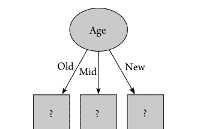

图9.30 基于年龄属性的数据划分

对于年龄，由于有三个可能的值，即老、中等和新，因此数据集将根据年龄属性的这些不同值划分为三个子集，如图9.30所示。

##### 年龄“老”的数据集

年龄“老”的数据集子集如下表所示。

| 实例 | 竞争 | 类型 | 利润 |
|---|---|---|---|
| 1 | 是 | 软件 | 下降 |
| 2 | 否 | 软件 | 下降 |
| 3 | 否 | 硬件 | 下降 |

从上表中，有三个样本。没有类别上升的实例，而类别下降的实例是1、2和3。它表示所有竞争和类型组合的记录都属于同一个类别“下降”；如图9.31所示，它代表类别“下降”。

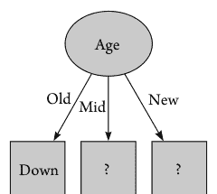

**图9.31** 属性年龄为“老”划分后的决策树

##### 年龄“新”的数据集

年龄“新”的数据集子集如下表所示。

| 实例 | 竞争 | 类型 | 利润 |
| :--- | :--- | :--- | :--- |
| 1 | 是 | 软件 | 上升 |
| 2 | 否 | 硬件 | 上升 |
| 3 | 否 | 软件 | 上升 |

从上表中，有三个样本。类别上升的实例是1、2和3，而没有类别下降的实例。它表示所有竞争和类型组合的记录都属于同一个类别“上升”；如图9.32所示，它代表类别“上升”。

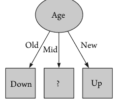

**图9.32** 属性年龄为“新”划分后的决策树

##### 年龄“中等”的数据集

年龄“中等”的数据集子集如下表所示。

| 实例 | 竞争 | 类型 | 利润 |
| :--- | :--- | :--- | :--- |
| 1 | 是 | 软件 | 下降 |
| 2 | 是 | 硬件 | 下降 |
| 3 | 否 | 硬件 | 上升 |
| 4 | 否 | 软件 | 上升 |

根据上表，我们有四个样本。类别 Up 的实例是 3 和 4，而类别 Down 的实例是 1 和 2。因此，类别 Up 的概率是 (2/4)，类别 Down 的概率是 (2/4)。

年龄为“Mid”同时代表了类别 Up 和 Down。因此，数据集必须基于最佳分裂属性进行划分。

这里，基尼指数 = 1 – (类别 Up 的概率)² – (类别 Down 的概率)²
= 1 – (2/4)² – (2/4)² = 1 – 0.25 – 0.25 = 0.5。

##### 属性 “Competition”

根据上表，Competition 为 Yes 的实例有两个，即实例 1 和 2。类别 Down 的实例是 1 和 2，当 Competition 为 Yes 时，没有类别 Up 的实例。因此，类别 Up 的概率是 (2/2)，类别 Down 的概率是 (0/2)。

Competition 为 No 的实例有两个，即实例 3 和 4。这两个实例都属于类别 Up。因此，类别 Up 的概率是 (2/2)，类别 Down 的概率是 (0/2)。

Competition 给出的基尼指数如下：
G(Competition = Yes) = G(C_Y)
= 1 – (2/2)² – (0/2)² = 0。
G(Competition = No) = G(C_N)
= 1 – (2/2)² – (0/2)² = 0。

两个子树的总基尼指数 = Competition 为 Yes 的概率 × G(C_Y) + Competition 为 No 的概率 × G(C_N)。

这里，Competition 为 Yes 的概率 = Competition 为 Yes 的实例数 / 总实例数 = 2/4。

Competition 为 No 的概率 = Competition 为 No 的实例数 / 总实例数 = 2/4。

两个子树的总基尼指数 = (2/4) × 0 + (2/4) × 0 = 0。

属性 Competition 的总基尼指数为 0。因此，它具有最大的基尼指数值。所以，它是最佳分裂属性。因此，我们可以跳过属性 Type 的基尼指数计算。因此，属性 Competition 被选为下一个最佳分裂点。让我们讨论属性 Competition 每个值的划分。当 Competition = Yes 时，所有实例都属于 Profit 为 Down 的类别，如下表所示。

当 Age 为 Mid 且 Competition= “Yes” 时的样本

| 实例 | 类型 | 利润 |
| :--- | :--- | :--- |
| 1 | Software | Down |
| 2 | Hardware | Down |

当 Competition = No 时，所有实例都属于 Profit 为 Up 的类别，如下表所示。

当 Age 为 Mid 且 Competition = “No” 时的样本

| 实例 | 类型 | 利润 |
| :--- | :--- | :--- |
| 1 | Hardware | Up |
| 2 | Software | Up |

图 9.33 表示在 Age = Mid 时，基于属性 Competition 划分后的决策树。

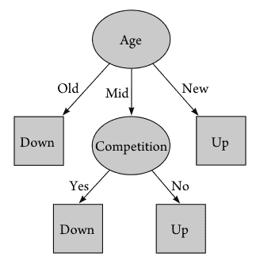

**图 9.33** 基于属性 “Competition” 划分后的决策树

图 9.33 表示基于基尼指数的最终决策树。这里，属性 “Type” 未被考虑用于决策树的分裂，因为该属性的基尼指数为 0。

从图 9.12 和图 9.33，我们可以得出结论：使用信息增益和基尼指数参数获得的决策树是相同的。

#### 案例研究 2：预测客户是否会购买计算机

让我们考虑表 9.5 中给出的数据集，该数据集表示客户是否购买计算机的数据集。我们之前也使用过这个数据集来构建基于信息增益的决策树。我们将使用相同的数据集来构建基于基尼指数的决策树。

这里，输入属性是 Age、Income、Student、Credit rating，输出属性是 “Buys Computer”。为了更好地解释，这里添加了实例编号。在这个案例研究中，我们的目标是使用给定的数据集，根据客户的输入属性来预测他们是否会购买计算机。

##### 表 9.5 表示客户是否购买计算机的数据集

| 实例 | 年龄 | 收入 | 学生 | 信用评级 | 购买计算机 |
| :---: | :---: | :---: | :---: | :---: | :---: |
| 1 | <= 30 | 高 | 否 | 一般 | 否 |
| 2 | <= 30 | 低 | 否 | 优秀 | 否 |
| 3 | 31–40 | 高 | 是 | 一般 | 是 |
| 4 | > 40 | 中等 | 否 | 一般 | 是 |
| 5 | > 40 | 中等 | 是 | 一般 | 是 |
| 6 | > 40 | 中等 | 否 | 优秀 | 否 |
| 7 | 31–40 | 低 | 否 | 优秀 | 是 |
| 8 | <= 30 | 中等 | 是 | 优秀 | 是 |
| 9 | 31–40 | 低 | 是 | 优秀 | 否 |
| 10 | 31–40 | 高 | 否 | 优秀 | 是 |
| 11 | <= 30 | 中等 | 否 | 一般 | 是 |
| 12 | > 40 | 高 | 是 | 优秀 | 是 |
| 13 | <= 30 | 低 | 是 | 一般 | 是 |
| 14 | 31–40 | 高 | 否 | 一般 | 否 |
| 15 | <= 30 | 高 | 否 | 一般 | 否 |

| 年龄 | 收入 | 学生 | 信用评级 | 购买计算机 |
| :--- | :--- | :--- | :--- | :--- |
| <= 30 = 6 | 低 = 4 | 是 = 6 | 一般 = 8 | 是 = 9 |
| 31–40 = 5 | 中等 = 5 | 否 = 9 | 优秀 = 7 | 否 = 6 |
| > 40 = 4 | 高 = 6 | | | |

输出属性 “Buys Computer” 在数据集中有两个类别，即 Yes 或 No。从上表中，我们可以观察到每个类别的频率如下：
类别 “Yes” 的频率 = 9（实例 3, 4, 5, 7, 8, 10, 11, 12, 13）。
类别 “No” 的频率 = 6（实例 1, 2, 6, 9, 14, 15）。
使用计算基尼指数的公式，整个数据集的基尼指数如下：
基尼指数 (G) = 1 – (购买计算机的概率)² – (不购买计算机的概率)²。
购买计算机的概率 = (客户购买计算机的实例数) / (总实例数) = 9/15。
不购买计算机的概率 = (客户不购买计算机的实例数) / (总实例数) = 6/15。
因此，基尼指数 (G) = 1 – (9/15)² – (6/15)² = 0.48。

为了找到最佳分裂的属性，让我们逐一考虑每个属性作为分裂属性，并计算每个属性的基尼指数增益。

##### 属性 “Age”

从数据集中，属性 Age 取三个值，即 <= 30, 31–40, 或 > 40。让我们逐一分析每种情况。

如表 9.5 所示，对于年龄值 <= 30，有六个实例，即 1, 2, 8, 11, 13, 和 15。实例 8, 11, 和 13 被标记为类别 Yes，而实例 1, 2, 和 15 被标记为类别 No。因此，类别 Yes 的概率是 (3/6)，类别 No 的概率是 (3/6)。

对于 Age = 31–40，有五个实例，即实例 3, 7, 9, 10, 和 14。实例 3, 7, 和 10 被标记为类别 Yes，而实例 9 和 14 被标记为类别 No。因此，类别 Yes 的概率是 (3/5)，类别 No 的概率是 (2/5)。

对于 Age > 40，有四个实例，即实例 4, 5, 6, 和 12。实例 4, 5, 和 12 被标记为类别 Yes，而实例 6 被标记为类别 No。因此，类别 Yes 的概率是 (3/4)，类别 No 的概率是 (1/4)。

根据上述值，让我们计算该属性的基尼指数。我们根据年龄 <= 30, 31–40, 或 > 40 将数据集分为三个子集。每种情况的基尼指数计算如下：

```
G(年龄 <= 30) = G(Age_1) = 1 – (3/6)² – (3/6)² = 0.5。
G(年龄 = 31 – 40) = G(Age_2) = 1 – (3/5)² – (2/5)² = 0.48。
G(年龄 > 40) = G(Age_3) = 1 – (3/4)² – (1/4)² = 0.375。
```

三个子树的总基尼指数 = (年龄 <= 30 的概率) × G(Age_1) + (年龄 31–40 的概率) × G(Age_2) + (年龄 > 40 的概率) × G(Age_3)。

这里，年龄 <= 30 的概率 = (年龄 <= 30 的实例数) / (总实例数) = 6/15。

年龄 31–40 的概率 = (年龄 31–40 的实例数) / (总实例数) = 5/15。

年龄 > 40 的概率 = (年龄 > 40 的实例数) / (总实例数) = 4/15。

```
因此，三个子树的总基尼指数 = (6/15) G(Age_1) + (5/15) G(Age_2) + (4/15) G(Age_3)
= (6/15) × 0.5 + (5/15) × 0.48 + (4/15) × 0.375
= 0.2 + 0.16 + 0.1 = 0.46。
```

##### 属性 “Income”

数据集的属性 Income 取三个值，即 Low, Medium, 和 High。让我们逐一分析每种情况。

如表所示，四个实例，即实例 2, 7, 9, 和 13，Income 属性的值为 Low。实例 7 和 13 被标记为类别 Yes，而实例 2 和 9 被标记为类别 No。因此，类别 Yes 的概率是 (2/4)，类别 No 的概率是 (2/4)。

有五个实例的 Income 为 Medium，即实例 4, 5, 6, 8, 和 11。实例 4, 5, 8, 和 11 被标记为类别 Yes，而实例 6 被标记为类别 No。因此，类别 Yes 的概率是 (4/5)，类别 No 的概率是 (1/5)。

有六个实例的 Income 为 High，即实例 1, 3, 10, 12, 14, 和 15。实例 3, 10, 和 12 被标记为类别 Yes，而实例 1, 14, 和 15 被标记为类别 No。因此，类别 Yes 的概率是 (3/6)，类别 No 的概率是 (3/6)。

根据上述值，让我们计算该属性的基尼指数。我们根据收入 Low, Medium, 或 High 将数据集分为三个子集。每种情况的基尼指数计算如下：

G(Income = Low) = G(I_L) = 1 – (2/4)² – (2/4)² = 0.5。

G(Income = Medium) = G(I_M) = 1 – (4/5)² – (1/5)² = 0.32。

G(Income = High) = G(I_H) = 1 – (3/6)² – (3/6)² = 0.5。

三个子树的总基尼指数 = 低收入的概率 × G(I_L) + 中等收入的概率 × G(I_M) + 高收入的概率 × G(I_H)。

这里，低收入的概率 = (Income = Low 的实例数) / (总实例数) = 4/15。

中等收入的概率 = (Income = Medium 的实例数) / (总实例数) = 5/15。

高收入的概率 = (Income = High 的实例数) / (总实例数) = 6/15。

因此，三个子树的总基尼指数 = (4/15) G(I_L) + (5/15) G(I_M) + (6/15) G(I_H)
= (4/15) × 0.5 + (5/15) × 0.32 + (6/15) × 0.5
= 0.133 + 0.1067 + 0.2 = 0.4397。

##### 属性 “Student”

此属性表示客户是否是学生。有两个可能的值，即 Yes 或 No。让我们逐一分析每种情况。

如表所示，六个实例（即实例3、5、8、9、12和13）在属性“学生”上取值为“是”。实例3、5、8、12和13被标记为类别“是”（购买电脑），而实例9被标记为类别“否”（不购买电脑）。因此，类别“是”的概率为(5/6)，类别“否”的概率为(1/6)。

有九个实例在属性“学生”上取值为“否”，即实例1、2、4、6、7、10、11、14和15。其中，实例4、7、10和11被标记为类别“是”（购买电脑），而实例1、2、6、14和15被标记为类别“否”（不购买电脑）。因此，类别“是”的概率为(4/9)，类别“否”的概率为(5/9)。

根据上述值，让我们计算该属性的基尼指数。我们将数据集划分为两个子集：一个是客户是学生的子集，另一个是客户不是学生的子集。计算每种情况的基尼指数：

G(学生 = 是) = G(S_Y) = 1 – (5/6)² – (1/6)² = 0.27。

G(学生 = 否) = G(S_N) = 1 – (4/9)² – (5/9)² = 0.4938。

两个子集的总基尼指数 = 学生概率 × G(S_Y) + 非学生概率 × G(S_N)。

这里，学生概率 = (学生 = 是的实例数)/(总实例数) = 6/15。

非学生概率 = (学生 = 否的实例数)/(总实例数) = 9/15。

因此，两个子集的总基尼指数 = (6/15) G(S_Y) + (9/15) G(S_N)
= (6/15) × 0.27 + (9/15) × 0.4938
= 0.108 + 0.296 = 0.404。

###### 属性“信用评级”

该属性有两个可能的值，即“一般”或“优秀”。让我们逐一分析每种情况。

如表9.3所示，八个实例（即实例1、3、4、5、11、13、14和15）在属性“信用评级”上取值为“一般”。实例3、4、5、11、13被标记为类别“是”，而实例1、14和15被标记为类别“否”。因此，类别“是”的概率为(5/8)，类别“否”的概率为(3/8)。

有七个实例在属性“信用评级”上取值为“优秀”，即实例2、6、7、8、9、10和12。实例7、8、10和12被标记为类别“是”，而实例2、6和9被标记为类别“否”。因此，类别“是”的概率为(4/7)，类别“否”的概率为(3/7)。

根据上述值，让我们计算该属性的基尼指数。我们将数据集划分为两个子集。计算每种情况的基尼指数：

G(信用评级 = 一般) = G(C_F) = 1 – (5/8)² – (3/8)² = 0.468。

G(信用评级 = 优秀) = G(C_E) = 1 – (4/7)² – (3/7)² = 0.489。

两个子集的总基尼指数 = 信用评级为一般的概率 × G(C_F) + 信用评级为优秀的概率 × G(C_E)。

这里，信用评级为一般的概率 = (信用评级为一般的实例数)/(总实例数) = 8/15。

信用评级为优秀的概率 = (信用评级为优秀的实例数)/(总实例数) = 7/15。

因此，两个子集的总基尼指数 = (8/15) G(C_F) + (7/15) G(C_E)
= (8/15) × 0.468 + (7/15) × 0.489
= 0.249 + 0.228 = 0.477。

在计算了每个属性的基尼指数后，我们现在可以计算基尼指数增益，如下所示。

###### 潜在分裂属性的基尼指数增益

| 潜在分裂属性 | 分裂前的基尼指数 | 分裂后的基尼指数 | 增益 |
| :--- | :--- | :--- | :--- |
| 年龄 | 0.48 | 0.46 | 0.02 |
| 收入 | 0.48 | 0.4397 | 0.0403 |
| **学生** | **0.48** | **0.404** | **0.076** |
| 信用评级 | 0.48 | 0.477 | 0.003 |

由此，我们可以观察到，属性“学生”（以粗体显示）提供了最大的增益。学生是此级别的最佳分裂属性。因此，它被用于分裂，如图9.34所示。

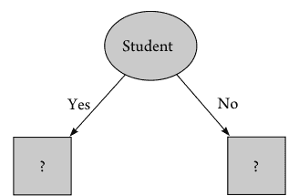

**图9.34** 基于学生属性作为根节点的数据分裂

对于学生，由于有两个可能的值，即“是”和“否”。因此，数据集将根据学生属性的这些不同值分裂成两个子集，如图9.34所示。

选择根属性后，数据集分裂成两个集合，即学生为“是”的数据集和学生为“否”的数据集。

##### 学生为“是”的数据集

当客户是学生时的数据集子集如下所示。

| 实例 | 年龄 | 收入 | 信用评级 | 购买电脑 |
| :--- | :--- | :--- | :--- | :--- |
| 1 | 31–40 | 高 | 一般 | 是 |
| 2 | > 40 | 中等 | 一般 | 是 |
| 3 | <= 30 | 中等 | 优秀 | 是 |
| 4 | 31–40 | 低 | 优秀 | 否 |
| 5 | > 40 | 高 | 优秀 | 是 |
| 6 | <= 30 | 低 | 一般 | 是 |

为了更好的解释，在上述数据集中添加了一个新的列“实例”。这里，我们有三个输入属性，即年龄、收入、信用评级。

数据集包含六个样本和两个类别，即“是”或“否”。实例1、2、3、5和6被标记为类别“是”，而实例4被标记为类别“否”。因此，类别“是”的概率为(5/6)，类别“否”的概率为(1/6)。

使用计算基尼指数的公式，整个数据集的基尼指数如下：

基尼指数 (G) = 1 – (购买概率)² – (不购买概率)²

这里，

购买概率 = (客户购买的实例数/总实例数) = 5/6。

不购买概率 = (客户不购买的实例数/总实例数) = 1/6。

因此，基尼指数 (G) =1 – (5/6)² – (1/6)² = 0.27。

让我们逐一考虑每个属性作为下一个最佳分裂属性，并计算每个属性的基尼指数。

###### 属性“年龄”

从数据集来看，属性“年龄”取三个值，即<= 30、31 – 40或> 40。

实例3和6在年龄属性上取值<= 30。实例3和6被标记为类别“是”，而没有实例被标记为类别“否”。因此，类别“是”的概率为(2/2)，类别“否”的概率为(0/2)。

年龄 = 31–40的实例有两个，即实例1和4。实例1被标记为类别“是”，而实例4被标记为类别“否”。因此，类别“是”的概率为(1/2)，类别“否”的概率为(1/2)。

对于年龄 > 40，有两个实例，即实例2和5。实例2和5被标记为类别“是”，而没有实例被标记为类别“否”。因此，类别“是”的概率为(2/2)，类别“否”的概率为(0/2)。

根据上述值，让我们计算该属性的基尼指数。我们根据年龄<= 30、31–40或> 40将数据集划分为三个子集。每种情况的基尼指数计算如下：

G(年龄 <= 30) = G(Age_1) = 1 – (2/2)² – (0/2)² = 0。

G(年龄 = 31 – 40) = G(Age_2) = 1 – (1/2)² – (1/2)² = 0.5。

G(年龄 > 40) = G(Age_3) = 1 – (2/2)² – (0/2)² = 0。

三个子集的总基尼指数 = 年龄 <= 30的概率 × G(Age_1) + 年龄 31–40的概率 × G(Age_2) + 年龄 > 40的概率 × G(Age_3)。

这里，年龄 <= 30的概率 = (年龄 <= 30的实例数)/(总实例数) = 2/6。

年龄 31–40的概率 = (年龄 31–40的实例数)/(总实例数) = 2/6。

年龄 > 40的概率 = (年龄 > 40的实例数)/(总实例数) = 2/6。

因此，三个子集的总基尼指数 = (2/6) × G(Age_1) + (2/6) × G(Age_2) + (2/6) × G(Age_3)
= (2/6) × 0 + (2/6) × 0.5 + (2/6) × 0 = 0.167。

###### 属性“收入”

数据集的属性“收入”取三个值，即“低”、“中等”和“高”。

实例4和6在收入属性上取值“低”。实例6是类别“是”，而实例4是类别“否”。因此，类别“是”的概率为(1/2)，类别“否”的概率为(1/2)。

实例2和3在收入上取值“中等”。实例2和3被标记为类别“是”，而没有实例被标记为类别“否”。因此，类别“是”的概率为(2/2)，类别“否”的概率为(0/2)。

实例1和5在收入上取值“高”。实例1和5被标记为类别“是”，而没有实例被标记为类别“否”。因此，类别“是”的概率为(2/2)，类别“否”的概率为(0/2)。

根据上述数值，我们来计算该属性的基尼指数。我们根据收入（Income）将数据集划分为三个子集：低、中、高。每种情况的基尼指数计算如下：

G(收入 = 低) = G(I_L) = 1 - (1/2)² - (1/2)² = 0.5。

G(收入 = 中) = G(I_M) = 1 - (2/2)² - (0/2)² = 0。

G(收入 = 高) = G(I_H) = 1 - (2/2)² - (0/2)² = 0。

三个子集的总基尼指数 = 低收入概率 × G(I_L) + 中等收入概率 × G(I_M) + 高收入概率 × G(I_H)。

此处，低收入概率 = (收入 = 低的实例数)/(总实例数) = 2/6。

中等收入概率 = (收入 = 中的实例数)/(总实例数) = 2/6。

高收入概率 = (收入 = 高的实例数)/(总实例数) = 2/6。

因此，三个子集的总基尼指数 = (2/6) G(I_L) + (2/6) G(I_M) + (2/6) G(I_H)
= (2/6) × 0.5 + (2/6) × 0 + (2/6) × 0 = 0.167。

###### 属性“信用评级”

该属性有两个可能的值，即“一般”或“优秀”。

实例1、2和6在属性信用评级上取值为“一般”。实例1、2和6被标记为类别“是”，而没有实例被标记为类别“否”。因此，类别“是”的概率为(3/3)，类别“否”的概率为(0/3)。

实例3、4和5在属性信用评级上取值为“优秀”。实例3和5被标记为类别“是”，而实例4被标记为类别“否”。因此，类别“是”的概率为(2/3)，类别“否”的概率为(1/3)。

根据上述数值，我们来计算该属性给出的基尼指数。我们将数据集划分为两个子集。计算每种情况的基尼指数：

G(信用评级 = 一般) = G(C_F) = 1 - (3/3)² - (0/3)² = 0。

G(信用评级 = 优秀) = G(C_E) = 1 - (2/3)² - (1/3)²
= 0.44。

两个子集的总基尼指数 = 一般信用评级概率 × G(C_F) + 优秀信用评级概率 × G(C_E)。

此处，一般信用评级概率 = (信用评级为一般的实例数)/(总实例数) = 3/6。

优秀信用评级概率 = (信用评级为优秀的实例数)/(总实例数) = 3/6。

因此，两个子集的总基尼指数 = (3/6) G(C_F) + (3/6) G(C_E)
= (3/6) × 0 + (3/6) × 0.44
= 0.22。

在计算了每个属性的基尼指数后，我们可以计算基尼指数增益，如下所示。

###### 潜在分裂属性的基尼指数增益

| 潜在分裂属性 | 分裂前基尼指数 | 分裂后基尼指数 | 增益 |
| :--- | :--- | :--- | :--- |
| 年龄 | 0.27 | 0.167 | 0.103 |
| 收入 | 0.27 | 0.167 | 0.103 |
| 信用评级 | 0.27 | 0.22 | 0.05 |

从表中我们可以观察到，最大的增益由两个属性提供，即年龄和收入。这两个属性都是最佳分裂点。在此层级，可以使用其中任何一个属性进行分裂。让我们选择年龄作为分裂属性。因此，它被用于分裂，如图9.35所示。

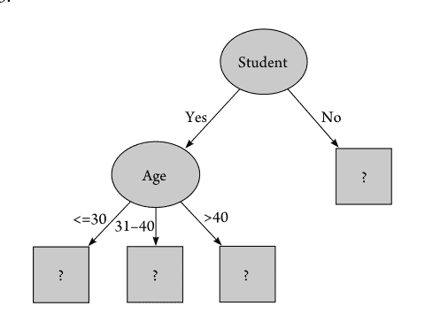

**图9.35** 基于年龄属性的数据分裂

年龄属性有三个可能的值，即<= 30、31–40和> 40。因此，数据集将根据年龄属性的这些不同值被划分为三个子集，如图9.35所示。

现在，数据集可以被划分为三个子集，即年龄“<= 30”的数据集、年龄“31–40”的数据集和年龄“> 40”的数据集，如下所述。

##### 年龄“<= 30”的数据集

年龄<= 30的学生客户子集如下所示。

| 实例 | 收入 | 信用评级 | 购买电脑 |
| :--- | :--- | :--- | :--- |
| 1 | 中 | 优秀 | 是 |
| 2 | 低 | 一般 | 是 |

表格中添加了一列“实例”以便更好地解释。此处，我们有两个输入属性，即收入和信用评级。数据集包含两个样本。实例1和2被标记为类别“是”，而没有实例被标记为类别“否”。它表示所有收入和信用评级组合的记录都属于同一类别“是”，如图9.36所示。

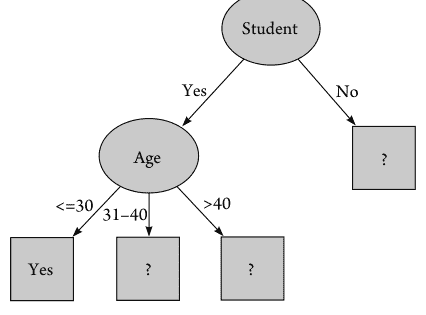

**图9.36** 属性年龄“<= 30”分裂后的决策树

##### 年龄“31–40”的数据集

年龄31–40的学生客户子集如下所示。

| 实例 | 收入 | 信用评级 | 购买电脑 |
| :--- | :--- | :--- | :--- |
| 1 | 高 | 一般 | 是 |
| 2 | 低 | 优秀 | 否 |

在表格中，我们有两个输入属性，即收入和信用评级。数据集包含两个样本。实例1被标记为类别“是”，而实例2被标记为类别“否”。因此，类别“是”的概率为(1/2)，类别“否”的概率为(1/2)。

基尼指数由下式给出

```
G = 1 – (1/2)² – (1/2)² = 0.5。
```

##### 属性收入

根据上述数据集，属性收入仅取两个值，即低和高。

实例2在收入属性上取值为低，被标记为类别“否”。因此，没有类别“是”的实例，而有一个类别“否”的实例。类别“是”的概率为(0/1)，类别“否”的概率为(1/1)。

实例1在收入上取值为高，被标记为类别“是”。因此，类别“是”的概率为(1/1)，类别“否”的概率为(0/1)。

根据上述数值，我们来计算该属性的基尼指数。我们根据收入将数据集划分为两个子集：低或高。每种情况的基尼指数计算如下：

G(收入 = 低) = G(I_L) = 1 – (0/1)² – (1/1)² = 0。

G(收入 = 高) = G(I_H) = 1 – (1/1)² – (0/1)² = 0。

两个子集的总基尼指数 = 低收入概率 × G(I_L) + 高收入概率 × G(I_H)。

此处，低收入概率 = (收入 = 低的实例数)/(总实例数) = 1/2。

高收入概率 = (收入 = 高的实例数)/(总实例数) = 1/2。

因此，两个子集的总基尼指数 = (1/2) G(I_L) + (1/2) G(I_H)
= (1/2) × 0 + (1/2) × 0 = 0。

由于收入的基尼指数为0，它将带来最大增益。因此，我们可以跳过属性信用评级的基尼指数计算。我们可以直接选择收入作为分裂属性。图9.37显示了决策树中的这一修改。

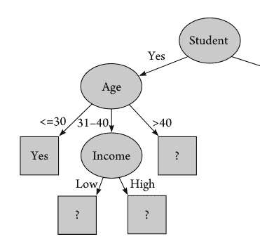

**图9.37** 选择收入作为下一个分裂属性后的决策树

从表中，当属性是收入时，我们有两种情况，即低和高。

###### 收入为低时的数据集

年龄31–40且收入为低的学生客户子集如下所示。

| 实例 | 收入 | 信用评级 | 购买电脑 |
| :--- | :--- | :--- | :--- |
| 1 | 低 | 优秀 | 否 |

根据上表，我们可以得出结论，输出类别为“否”（不购买电脑）。

###### 收入为高时的数据集

年龄31–40且收入为高的学生客户子集如下所示。

| 实例 | 收入 | 信用评级 | 购买电脑 |
| :--- | :--- | :--- | :--- |
| 1 | 高 | 一般 | 是 |

根据上表，我们可以得出结论，当收入为高时，输出类别被标记为“是”（购买电脑）。

因此，当收入为低时，输出被标记为“否”。当收入为高时，输出被标记为“是”。图9.38表示分裂收入属性后的决策树。

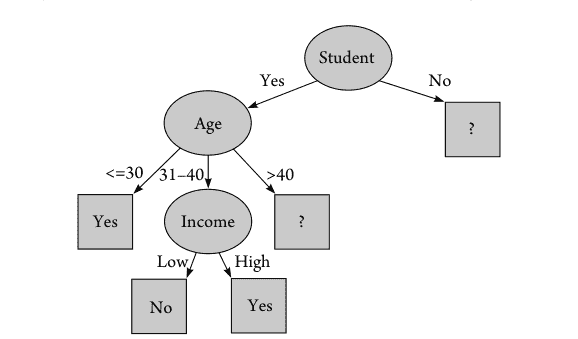

##### 年龄“> 40”的数据集

年龄> 40的学生客户子集如下所示。

| 实例 | 收入 | 信用评级 | 购买电脑 |
| :--- | :--- | :--- | :--- |
| 1 | 中 | 一般 | 是 |
| 2 | 高 | 优秀 | 是 |

在表格中，我们有两个输入属性，即收入和信用评级。数据集包含两个样本。每个类别的频率如下：

类别“是”的频率 = 2。

类别“否”的频率 = 0。

它表示所有收入和信用评级组合的记录都属于同一类别“是”，如图9.39所示。

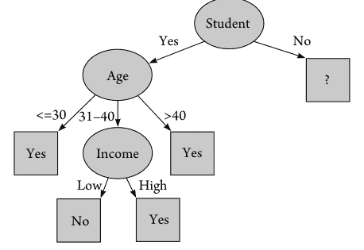

**图9.39** 属性年龄“> 40”分裂后的决策树

从图9.39，我们可以得出结论：如果客户是学生，那么当他的年龄<= 30或> 40时，他会购买电脑。当客户的年龄在31到40之间时，如果他的收入低，他将不会购买电脑。如果他的收入高，他会购买电脑。

客户是学生的分析已完成。现在，我们将分析决策树的右侧，即客户不是学生的情况。

##### 学生“否”的数据集

非学生客户子集如下所示。

| 实例 | 年龄 | 收入 | 信用评级 | 购买电脑 |
| :---: | :---: | :---: | :---: | :---: |
| 1 | <= 30 | 高 | 一般 | 否 |
| 2 | <= 30 | 低 | 优秀 | 否 |
| 3 | > 40 | 中 | 一般 | 是 |
| 4 | > 40 | 中 | 优秀 | 否 |
| 5 | 31–40 | 低 | 优秀 | 是 |

| 实例 | 年龄 | 收入 | 信用评级 | 是否购买电脑 |
| :--- | :--- | :--- | :--- | :--- |
| 6 | 31-40 | 高 | 优秀 | 是 |
| 7 | <= 30 | 中等 | 一般 | 是 |
| 8 | 31-40 | 高 | 一般 | 否 |
| 9 | <= 30 | 高 | 一般 | 否 |

在表格中，为了更好地解释，添加了一列“实例”。这里，我们有三个输入属性，即年龄、收入和信用评级。数据集包含九个样本和两个类别，即“是”或“否”。在这九个实例中，各类别的频率如下：

类别“是”的频率 = 4（实例 3, 5, 6, 7）。
类别“否”的频率 = 5（实例 1, 2, 4, 8, 9）。

使用公式计算基尼指数，整个数据集的基尼指数如下：

G = 1 – (购买概率)² – (不购买概率)²

这里，购买概率

= (客户购买的实例数/总实例数) = 4/9。

不购买概率 = (客户不购买的实例数/总实例数) = 5/9。

因此，G = 1 – (4/9)² – (5/9)² = 0.4938。

让我们再次逐一考虑每个属性作为下一个最佳分割属性，并计算每个属性的基尼指数。

###### 属性“年龄”

从数据集来看，属性年龄有三个取值，即 <= 30、31–40 或 > 40。

实例 1、2、7 和 9 的年龄属性取值为 <= 30。其中，实例 7 被标记为类别“是”，而实例 1、2 和 9 被标记为类别“否”。因此，类别“是”的概率为 (1/4)，类别“否”的概率为 (3/4)。

对于年龄 = 31–40，有三个实例，即实例 5、6 和 8。其中，实例 5 和 6 被标记为类别“是”，而实例 8 被标记为类别“否”。因此，类别“是”的概率为 (2/3)，类别“否”的概率为 (1/3)。

对于年龄 > 40，有两个实例，即实例 3 和 4。实例 3 是类别“是”，而实例 4 是类别“否”。因此，类别“是”的概率为 (1/2)，类别“否”的概率为 (1/2)。

根据上述值，让我们计算此属性给出的基尼指数。我们根据年龄 <= 30、31–40 或 > 40 将数据集划分为三个子集。每种情况的基尼指数计算如下：

G(年龄 <= 30) = G(Age_1) = 1 - (1/4)^2 - (3/4)^2 = 0.375。

G(年龄 = 31-40) = G(Age_2) = 1 - (2/3)^2 - (1/3)^2 = 0.44。

G(年龄 > 40) = G(Age_3) = 1 - (1/2)^2 - (1/2)^2 = 0.5。

三个子集的总基尼指数 = 年龄 <= 30 的概率 × G(Age_1) + 年龄 31-40 的概率 × G(Age_2) + 年龄 > 40 的概率 × G(Age_3)。

这里，年龄 <= 30 的概率 = (年龄 <= 30 的实例数)/(总实例数) = 4/9。

年龄 31-40 的概率 = (年龄 31-40 的实例数)/(总实例数) = 3/9。

年龄 > 40 的概率 = (年龄 > 40 的实例数)/(总实例数) = 2/9。

因此，三个子集的总基尼指数 = (4/9) G(Age_1) + (3/9) G(Age_2) + (2/9) G(Age_3)
= (4/9) × 0.375 + (3/9) × 0.44 + (2/9) × 0.5
= 0.167 + 0.1467 + 0.11 = 0.4237。

###### 属性“收入”

数据集的属性收入有三个取值，即低、中等和高。

实例 2 和 5 的收入属性取值为低。其中，实例 5 是类别“是”，而实例 2 是类别“否”。因此，类别“是”的概率为 (1/2)，类别“否”的概率为 (1/2)。

实例 3、4 和 7 的收入属性取值为中等。其中，实例 3 和 7 被标记为类别“是”，实例 4 被标记为类别“否”。因此，类别“是”的概率为 (2/3)，类别“否”的概率为 (1/3)。

实例 1、6、8 和 9 的收入属性取值为高。其中，实例 6 被标记为类别“是”，实例 1、8 和 9 被标记为类别“否”。因此，类别“是”的概率为 (1/4)，类别“否”的概率为 (3/4)。

根据上述值，让我们计算此属性给出的基尼指数。我们根据收入（低、中等或高）将数据集划分为三个子集。每种情况的基尼指数计算如下：

G(收入 = 低) = G(I_L) = 1 - (1/2)^2 - (1/2)^2 = 0.5。

G(收入 = 中等) = G(I_M) = 1 - (2/3)^2 - (1/3)^2 = 0.44。

G(收入 = 高) = G(I_H) = 1 - (1/4)^2 - (3/4)^2 = 0.375。

三个子集的总基尼指数 = 低收入的概率 × G(I_L) + 中等收入的概率 × G(I_M) + 高收入的概率 × G(I_H)。

这里，低收入的概率 = (收入 = 低的实例数)/(总实例数) = 2/9。

中等收入的概率 = (收入 = 中等的实例数)/(总实例数) = 3/9。

高收入的概率 = (收入 = 高的实例数)/(总实例数) = 4/9。

因此，三个子集的总信息 = (2/9) G(I_L) + (3/9) G(I_M) + (4/9) G(I_H)
= (2/9) × 0.5 + (3/9) × 0.44 + (4/9) × 0.375
= 0.4237。

###### 属性“信用评级”

此属性有两个可能的取值，即一般或优秀。

实例 1、3、7、8 和 9 的信用评级属性取值为一般。其中，实例 3 和 7 属于类别“是”，实例 1、8 和 9 属于类别“否”。因此，类别“是”的概率为 (2/5)，类别“否”的概率为 (3/5)。

实例 2、4、5 和 6 的信用评级属性取值为优秀。其中，实例 5 和 6 属于类别“是”，实例 2 和 4 属于类别“否”。因此，类别“是”的概率为 (2/4)，类别“否”的概率为 (2/4)。

根据上述值，让我们计算此属性给出的基尼指数。我们将数据集划分为两个子集。每种情况的基尼指数计算如下：

G(信用评级 = 一般) = G(C_F) = 1 – (2/5)² – (3/5)² = 0.48。

G(信用评级 = 优秀) = G(C_E) = 1 – (2/4)² – (2/4)²
= 0.5。

两个子集的总基尼指数 = 一般信用评级的概率 × G(C_F) + 优秀信用评级的概率 × G(C_E)。

这里，一般信用评级的概率 = (信用评级为一般的实例数)/(总实例数) = 5/9。

优秀信用评级的概率 = (信用评级为优秀的实例数)/(总实例数) = 4/9。

因此，两个子集的总基尼指数 = (5/9) G(C_F) + (4/9) G(C_E)
= (5/9) × 0.48 + (4/9) × 0.5
= 0.267 + 0.22 = 0.487。

计算完每一列的基尼指数后，我们可以计算基尼指数增益，如下表所示。

###### 潜在分割属性的基尼指数增益

| 潜在分割属性 | 分割前的基尼指数 | 分割后的基尼指数 | 增益 |
| :--- | :--- | :--- | :--- |
| 年龄 | 0.4938 | 0.4237 | 0.0701 |
| 收入 | 0.4938 | 0.4237 | 0.0701 |
| 信用评级 | 0.4938 | 0.487 | 0.006 |

从表中我们可以观察到，最大的增益由两个属性提供，即年龄和收入。这两个属性都是最佳分割属性。在此级别，可以使用其中任何一个属性进行分割。让我们选择年龄作为分割属性。因此，它被用于分割，如图 9.40 所示。

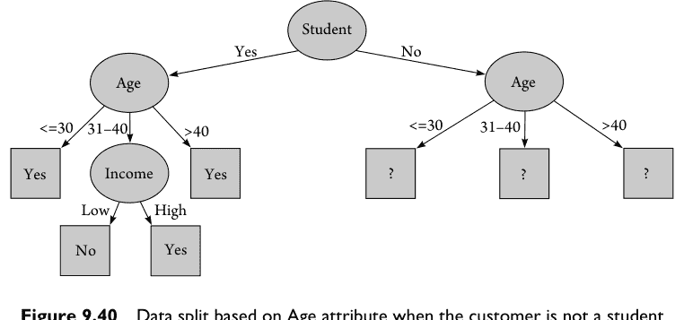

**图 9.40** 当客户不是学生时，基于年龄属性的数据分割

年龄属性有三个可能的取值，即 <= 30、31–40 和 > 40。因此，数据集将根据年龄属性的这些不同值被划分为三个子集，如图 9.40 所示。

###### 年龄 <= 30 的数据集

不是学生且年龄 <= 30 的客户数据子集如下所示。

| 实例 | 收入 | 信用评级 | 是否购买电脑 |
| :--- | :--- | :--- | :--- |
| 1 | 高 | 一般 | 否 |
| 2 | 低 | 优秀 | 否 |
| 3 | 中等 | 一般 | 是 |
| 4 | 高 | 一般 | 否 |

为了更好地解释，表格中添加了一列“实例”。这里，我们有两个输入属性，即收入和信用评级。数据集包含四个样本。各类别的频率如下：

类别“是”的频率 = 1（实例 3）。
类别“否”的频率 = 3（实例 1, 2, 4）。

基尼指数由下式给出

```
G = 1 – (1/4)² – (3/4)² = 0.375。
```

让我们逐一考虑每个属性作为下一个最佳分割属性，并计算每个属性的基尼指数。

###### 属性“收入”

收入有三个取值，即低、中等和高。实例 2 取值为低，其类别为“否”。因此，类别“是”的概率为 (0/1)，类别“否”的概率为 (1/1)。
实例 3 取值为中等，其类别为“是”。因此，类别“是”的概率为 (1/1)，类别“否”的概率为 (0/1)。
实例 1 和 4 取值为高，其类别为“否”。因此，类别“是”的概率为 (0/2)，类别“否”的概率为 (2/2)。
根据上述值，让我们计算此属性的基尼指数。我们根据收入（低、中等或高）将数据集划分为三个子集。每种情况的基尼指数计算如下：

```
G(收入 = 低) = G(I_L) = 1 – 0² – (1/1)² = 0。
G(收入 = 中等) = G(I_M) = 1 – (1/1)² – 0² = 0。
G(收入 = 高) = G(I_H) = 1 – (0/2)² – (2/2)² = 0。
```

因此，三个子集的总基尼指数 = 0。
由于属性收入的基尼指数为 0，它将带来最大的基尼指数增益。因此，我们可以跳过计算属性信用评级的信息增益，直接选择收入作为分割属性。图 9.41 表示在此级别使用收入属性进行的数据分割。

###### 当收入 = “低”时的数据集

以下是非学生客户、年龄 <= 30 且收入为低的客户数据子集。

| 实例 | 收入 | 信用评级 | 是否购买电脑 |
| :--- | :--- | :--- | :--- |
| 1 | 低 | 优秀 | 否 |

上表显示，当收入为低时，类别被标记为否。

###### 当收入 = “中”时的数据集

以下是非学生客户、年龄 <= 30 且收入为中的客户数据子集。

| 实例 | 收入 | 信用评级 | 是否购买电脑 |
| :--- | :--- | :--- | :--- |
| 1 | 中 | 一般 | 是 |

从上表中，我们可以观察到，当收入为中时，类别被标记为是。

###### 当收入 = “高”时的数据集

以下是非学生客户、年龄 <= 30 且收入为高的客户数据子集。

| 实例 | 收入 | 信用评级 | 是否购买电脑 |
| :--- | :--- | :--- | :--- |
| 1 | 高 | 一般 | 否 |
| 2 | 高 | 一般 | 否 |

从上表中，我们可以观察到，当收入为高时，类别被标记为否。

因此，我们可以得出结论：当收入为“低”时，类别被标记为否；当收入为“中”时，类别被标记为是；当收入为“高”时，类别被标记为否。图 9.42 展示了在拆分收入属性后的决策树。

**图 9.42** 当年龄 <= 30 且客户不是学生时，拆分收入属性后的决策树

##### 年龄为 “31–40” 的数据集

以下是非学生客户且年龄在 31–40 岁之间的客户数据子集。

| 实例 | 收入 | 信用评级 | 是否购买电脑 |
| :--- | :--- | :--- | :--- |
| 1 | 低 | 优秀 | 是 |
| 2 | 高 | 优秀 | 是 |
| 3 | 高 | 一般 | 否 |

在该表中，我们有两个输入属性，即收入和信用评级。数据集包含三个样本。每个类别的频率如下：

- 类别“是”的频率 = 2（实例 1, 2）。
- 类别“否”的频率 = 1（实例 3）。

基尼指数计算如下：

```
G = 1 – (2/3)² – (1/3)² = 0.44。
```

让我们依次考虑每个属性作为下一个最佳拆分属性，并计算每个属性的基尼指数。

###### 属性 “收入”

收入在此取两个值，即低和高。实例 1 取值为低，其类别为是。因此，类别是的概率为 (1/1)，类别否的概率为 (0/1)。
实例 2 和 3 取值为高。其中，实例 2 属于类别是，实例 3 属于类别否。因此，类别是的概率为 (1/2)，类别否的概率为 (1/2)。
根据上述值，让我们计算该属性的基尼指数。我们根据收入将数据集分为两个子集，即低或高。每种情况的基尼指数计算如下：

G(收入 = 低) = G(I_L) = 1 – (1/1)² – 0 = 0。
G(收入 = 高) = G(I_H) = 1 – (1/2)² – (1/2)² = 0.5。
高收入的概率 = 高收入实例数 / 总实例数 = 2/3。
因此，三个子集的总基尼指数 = 0 + (2/3) × 0.5 = 1/3 = 0.33。

###### 属性 “信用评级”

该属性有两个可能的值，即一般或优秀。
实例 3 取值为一般，它属于类别“否”。因此，类别是的概率为 (0/1)，类别否的概率为 (1/1)。
实例 1 和 2 在信用评级属性上取值为优秀。它们属于类别是。因此，类别是的概率为 (2/2)，类别否的概率为 (0/2)。
计算每种情况的基尼指数，

G(信用评级 = 一般) = G(C_F) = 1 – 0 – (1/1)² = 0。
G(信用评级 = 优秀) = G(C_E) = 1 – (2/2)² – 0 = 0。
因此，两个子集的总基尼指数 = 0。
在计算了每个属性的基尼指数后，计算基尼指数增益，如下表所示。

潜在拆分属性的基尼指数增益

| 潜在拆分属性 | 拆分前的基尼指数 | 拆分后的基尼指数 | 增益 |
| :--- | :--- | :--- | :--- |
| 收入 | 0.44 | 0.33 | 0.11 |
| 信用评级 | 0.44 | 0 | 0.44 |

属性信用评级具有最高的增益。因此，信用评级是下一个最佳拆分。图 9.43 展示了在该层级使用信用评级属性进行数据拆分的情况。

**图 9.43** 选择信用评级作为下一个拆分后的决策树

###### 当信用评级 = “一般”时的数据集

以下是非学生客户、年龄在 31–40 岁之间且信用评级为一般的客户数据子集。

| 实例 | 收入 | 信用评级 | 是否购买电脑 |
| :--- | :--- | :--- | :--- |
| 1 | 高 | 一般 | 否 |

从上表中，我们可以观察到，当信用评级为一般时，类别被标记为否。

###### 当信用评级 = “优秀”时的数据集

以下是非学生客户、年龄在 31–40 岁之间且信用评级为优秀的客户数据子集。

| 实例 | 收入 | 信用评级 | 是否购买电脑 |
| :--- | :--- | :--- | :--- |
| 1 | 低 | 优秀 | 是 |
| 2 | 高 | 优秀 | 是 |

从上表中，我们可以观察到，当信用评级为优秀时，类别被标记为是。

因此，我们可以得出结论：当信用评级为“一般”时，类别被标记为否；当信用评级为“优秀”时，类别被标记为是。图 9.44 展示了在拆分信用评级属性后的决策树。

**图 9.44** 当年龄为 31–40 且客户不是学生时，拆分信用评级属性后的决策树

##### 年龄 “> 40” 的数据集

以下是非学生客户且年龄 > 40 的客户数据子集。

| 实例 | 收入 | 信用评级 | 是否购买电脑 |
| :--- | :--- | :--- | :--- |
| 1 | 中 | 一般 | 是 |
| 2 | 中 | 优秀 | 否 |

在该表中，我们有两个输入属性，即收入和信用评级。数据集包含两个样本。每个类别的频率如下：

- 类别“是”的频率 = 1（实例 1）。
- 类别“否”的频率 = 1（实例 2）。

基尼指数计算如下：

G = 1 – (1/2)² – (1/2)² = 0.5。

###### 属性 “收入”

收入在此只取一个值，即中。实例 1 被标记为类别是，实例 2 被标记为类别否。因此，类别是的概率为 (1/2)，类别否的概率为 (1/2)。

根据上述值，让我们计算该属性的基尼指数。由于收入在此只取一个值，我们无需划分数据集。基尼指数计算如下：

G(收入 = 中) = G(I_H) = 1 – (1/2)² – (1/2)² = 0.5。

中等收入的概率 = 中等收入实例数 / 总实例数 = 2/2。

因此，收入的总基尼指数 = (2/2) × 0.5 = 0.5。

###### 属性 “信用评级”

该属性有两个可能的值，即一般或优秀。

实例 1 取值为“一般”，它属于类别是，即一个实例属于类别是，零个实例属于类别否。因此，类别是的概率为 (1/1)，类别否的概率为 (0/1)。

实例 2 取值为“优秀”并属于类别否，即零个实例属于类别是，一个实例属于类别否。因此，类别是的概率为 (0/1)，类别否的概率为 (1/1)。

计算每种情况的基尼指数，

G(信用评级 = 一般) = G(C_F) = 1 – (1/1)² – (0/1)² = 0。

G(信用评级 = 优秀) = G(C_E) = 1 – (0/1)² – (1/1)² = 0。

因此，两个子集的总基尼指数 = 0。

在计算了每个属性的基尼指数后，计算基尼指数增益，如下表所示。

潜在拆分属性的基尼指数增益

| 潜在拆分属性 | 拆分前的基尼指数 | 拆分后的基尼指数 | 增益 |
| :--- | :--- | :--- | :--- |
| 收入 | 0.5 | 0.5 | 0 |
| 信用评级 | 0.5 | 0 | 0.5 |

因此，信用评级是下一个最佳拆分。图 9.45 展示了在该层级使用信用评级属性进行数据拆分的情况。

**图 9.45** 分析年龄属性后的决策树

因此，如果客户不是学生且其年龄小于或等于 30，我们可以得出结论：如果他的收入是中等，他将会购买电脑。

如果客户不是学生且年龄在31-40岁之间，若其信用评级为一般，则不会购买电脑；若信用评级为优秀，则会购买电脑。

如果客户不是学生且年龄大于40岁，若信用评级为一般，则会购买电脑；若信用评级为优秀，则不会购买电脑。

决策树叶节点中显示的数字表示在该节点下分类的样本数量。

从图9.25和图9.45可以得出结论，使用信息增益和基尼指数参数获得的决策树是相同的。

使用此决策树，让我们预测图9.46所示未知实例的输出属性。此处，该未知实例的输入属性为年龄“<= 30”、“中等”收入、“学生”，信用评级为“一般”。图9.46展示了如何使用决策树找到输出属性。输出属性表明该客户将购买电脑。需要注意的是，我们对此未知实例的预测结果与使用信息增益决策树的情况相同。

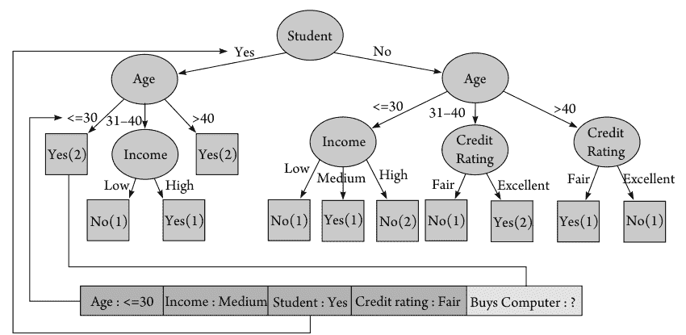

**图9.46** 对未知实例购买电脑的预测

通常，我们可以使用信息增益或基尼指数来找到最佳分割点。与信息增益相比，基尼指数的计算强度较低（与信息增益不同，基尼指数没有对数函数）。基尼指数有利于大分布，而信息增益有利于小分布。

通常，当我们在任何编程语言（如Python、R）或工具（如Weka）中实现决策树时，必须指定用于构建决策树的技术，即信息（熵）或基尼。我们将在第11章使用Python实现决策树时进一步讨论这一点。

### 9.7.10 决策树的优点

决策树分类器的优点如下：

-   决策树分类器生成易于理解的规则。来自技术和非技术背景的人都可以通过查看决策树来理解和解释结果，并且易于使用。
-   它不需要任何领域知识，因为它使用了人类在决策中采用的方法。
-   决策树可以处理各种类型的数据，如分类数据和数值数据。此外，它可以处理多输出问题。
-   决策树分类器学习简单且快速。
-   在实现决策树算法之前必须调整的初始参数为空。
-   在决策树分类器中添加新特征很容易。
-   机器学习算法可能会受到异常值的影响。但决策树对异常值具有抵抗力。因此，它需要较少的预处理。

### 9.7.11 决策树的缺点

以下是决策树分类器的主要缺点。

-   当决策树生长成许多分支时，它会变得复杂且难以理解。
-   决策树虽然提供了易于查看的图示，但也可能是难以管理的。深度较大的树（意味着在到达叶节点之前有大量的决策节点）会带来展示困难。
-   决策树容易过拟合。有时，决策树可能会创建过于复杂的树，无法很好地处理数据。
-   它们不稳定，这意味着数据的微小变化可能导致最优决策树结构的巨大变化。
-   它们通常相对不准确；与其他高级分类器相比，准确性较低。许多其他分类器在处理类似数据时表现更好。
-   决策树计算成本高，训练模型需要更多时间。

另一种重要的分类技术是随机森林分类，它是建立在决策树分类器之上的集成技术。随机森林分类和集成学习的详细内容将在下一节讨论。

## 9.8 随机森林分类


随机森林分类技术基于集成学习的原理。集成学习是一种机器学习方法，它使用多个基础模型（弱模型）的组合来产生一个最优的预测模型（强模型）。在随机森林的情况下，使用的基础模型是决策树。随机森林结合决策树并产生一个最优的预测模型。这种决策树的集合赋予了随机森林分类这个名称。

需要注意的是，有时单个模型或算法不足以给我们带来好的结果。在这种情况下，我们使用集成学习方法，将多个机器学习算法组合在一起作为一个更大的算法来运行。随机森林就是这样一种集成学习方法，它结合了许多决策树。

因此，我们可以将随机森林定义为一个由许多决策树组成的分类算法。它试图创建一个不相关树的森林，其中所有树的预测比单个决策树的预测更准确。由于这个原因，随机森林算法是最受欢迎的分类算法之一。

让我们看看算法，了解随机森林是如何运作的。

### 随机森林算法的工作原理

步骤1：从给定的训练集中随机选择*m*个数据点。

步骤2：基于这些选定的*m*个数据点生成一个决策树。

步骤3：选择一个数字*K*，表示我们想要构建的决策树数量。然后，重复步骤1和步骤2，直到我们为数据集中的每个样本拥有*K*棵决策树。

步骤4：对于一个未知实例，比如*X*，我们将允许我们的*K*棵决策树中的每一棵预测*X*的类别。最终，*X*将被分配到获得最多票数的类别或类中。

随机森林的工作原理如图9.47所示。

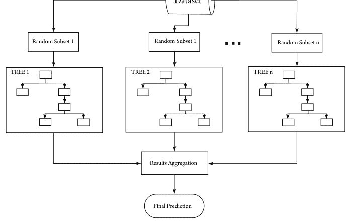

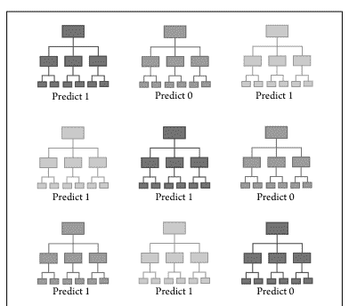

计数：六个1和三个0
预测：1

**图9.47** 随机森林算法的工作原理

在随机森林中，通过有放回抽样抽取的样本称为自助样本。集成中的每棵决策树都是通过从训练集中创建一个自助样本来构建的。除此之外，有时会随机选择特征子集，而不是考虑所有特征。这有助于进一步随机化树。因此，我们可以得出结论：对于给定的数据集，选择称为自助样本的随机子样本，并在每个自助样本上设计一个决策树。此外，将从每棵决策树获得的结果组合起来，以产生最强和最准确的预测。

随机森林分类器通常用于多种应用中，其中一个应用是微软的游戏设备Kinect。该设备检测游戏玩家的身体动作并对其动作做出响应。因此，随机森林用于识别身体部位及其动作；图9.48对此进行了演示。

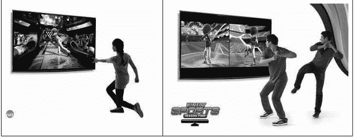

**图9.48** Kinect，一种使用随机森林对游戏玩家身体部位进行分类的游戏设备

## 9.9 朴素贝叶斯方法

朴素贝叶斯分类器：第一部分 | Parteek Bhatia
https://youtu.be/xpeTogESq24?si=hDKAUFnBCEG8PyHd

朴素贝叶斯分类器：第二部分 | Parteek Bhatia
https://youtu.be/FFAxvVXnwr0?si=xBRg1JmQthCemHp6

朴素贝叶斯分类器：第三部分 | Parteek Bhatia
https://youtu.be/o1cXwuohLFc?si=pvsBLF8KACFWwPHu

它基于托马斯·贝叶斯在十八世纪中叶提出的贝叶斯定理。令人惊讶的是，尽管这是一个如此古老的定理，但它已经进入了许多现代领域，如机器学习和人工智能。使用贝叶斯定理进行分类与决策树方法不同。该定理基于一个假设，即给定的数据样本属于某个类别。然后，计算该假设为真的概率。

让我们首先理解这个定理。由于贝叶斯定理基于概率，因此在开始时定义一些符号很重要。

P(A) 指事件A发生的概率，而 P(A|B) 指在事件B已经发生的情况下事件A的条件概率。

贝叶斯定理定义如下：

P(A|B) = P(B|A) × P(A)/P(B) (9.1)

让我们首先证明这个定理。

我们已经知道

P(A|B) = P(A & B)/P(B) (9.2)

这里，P(A|B) 是当B已经发生时下一个事件将是A的概率，P(A&B) 是事件A和B同时发生的概率。

类似地，

P(B|A) = P(B & A)/P(A) (9.3)

由公式 (9.3)

P(B & A) = P(B|A)*P(A)

将 P(B & A) 的值代入公式 (9.2)，我们得到以下结果。

P(A|B) = P(B|A)*P(A)/P(B)

这证明了贝叶斯定理。

现在，让我们考虑需要从三个给定的类别 $C_1$、$C_2$ 和 $C_3$ 中预测样本 X 的类别。这里的假设是事件 X 已经发生。因此，我们必须计算 $P(C_i|X)$，即在 X 已经发生的情况下，类别为 $C_i$ 的条件概率。

这意味着我们需要计算 $P(C_1|X)$、$P(C_2|X)$ 和 $P(C_3|X)$ 的概率。最终的预测类别将是这三个值中最大的那个类别。

为了计算 $P(C_i|X)$ 的值，使用如下所述的贝叶斯定理。

根据贝叶斯定理：

$P(C_i|X) = P(X|C_i) \times P(C_i) / P(X)$

在这个等式中，

$P(C_i|X)$ 是在 X 已经发生的情况下，类别为 $C_i$ 的条件概率，或者说是 X 属于类别 $C_i$ 的概率。

$P(X|C_i)$ 是在已知输出类别为 $C_i$ 的情况下，记录为 X 的条件概率。

$P(C_i)$ 是对象属于类别 $C_i$ 的概率。

$P(X)$ 是记录 X 发生的概率。

### 9.9.1 贝叶斯定理的实际应用

为了理解贝叶斯定理在现实生活中的应用，让我们考虑一个工厂制造不同类型螺丝的场景。两台不同的机器生产这些螺丝。假设我们有两台机器，机器 M1 和机器 M2。生产单元的每个螺丝都已按其制造单元进行了标记，无论该螺丝是由 M1 还是 M2 生产的。标记螺丝的示例如图 9.49 所示。该图中有许多螺丝，所有这些螺丝都按其制造单元进行了标记。

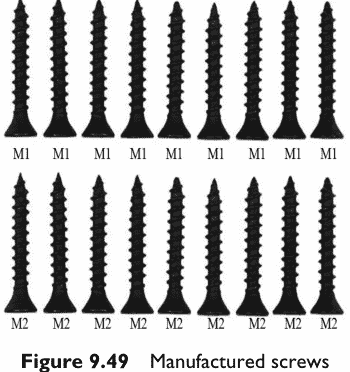

假设工厂每小时生产 40 个螺丝，其中机器 M1 每小时生产 15 个螺丝，而机器 M2 每小时生产 25 个螺丝。然而，在制造的螺丝堆中，发现一些是次品螺丝。对这些次品螺丝进行分析，注意到这些次品螺丝的数量为 1%。其中一半的次品螺丝由 M1 生产，其余的次品螺丝由 M2 生产。

在这个场景中，我们的任务是确定机器 M2 生产的螺丝是次品的概率。为了完成这项任务，让我们将问题陈述表述如下：

- 机器 M1 在一小时内制造的螺丝数量 ➔ 15 个螺丝。
- 机器 M2 在一小时内制造的螺丝数量 ➔ 25 个螺丝。
- 一小时内制造的螺丝总数 ➔ 40 个螺丝。
- 机器 M1 制造的螺丝概率 ➔ P(M1) ➔ 15/40 ➔ 0.375。
- 机器 M2 制造的螺丝概率 ➔ P(M2) ➔ 25/40 ➔ 0.625。
- 工厂制造的次品螺丝概率 ➔ P(Defective) ➔ 1% ➔ 0.01。

由于机器 M1 和 M2 各有 50% 的概率生产次品螺丝，因此机器 M1 生产的次品螺丝概率 ➔ P(M1|Defective) ➔ 0.5。

需要注意的是，这可以用条件概率来表示。条件概率是指在另一个事件已经发生的情况下，某个事件发生的概率。在这个例子中，我们知道螺丝有缺陷，因此机器 M1 生产的次品螺丝概率将表示为条件概率，这意味着在我们知道螺丝有缺陷的情况下，它是由机器 M1 生产的概率。

同样，机器 M2 生产的次品螺丝概率 ➔ P(M2|Defective) ➔ 0.5。

由于我们需要计算的是机器 M2 生产的螺丝是次品的概率。

在这种情况下，我们知道螺丝是由机器 M2 生产的，然后我们想知道它是次品的概率。因此，我们可以用条件概率来表示，如下所示。

P(Defective|M2) ➔ ?

我们可以应用贝叶斯定理，使用下面给出的公式来找出这个值。

P(A|B) = P(B|A) * P(A) / P(B)

这里，P(A|B) 是在 B 已经发生的情况下 A 发生的条件概率，P(B|A) 表示在 A 已经发生的情况下 B 发生的概率，而 P(B) 是项目 B 的概率，P(A) 是项目 A 的概率。

让我们将这个公式应用到我们的案例中，如下所示。

$$P(\text{Defective}|M2) = \frac{P(M2|\text{Defective}) * P(\text{Defective})}{P(M2)}$$

如上所述，让我们填入这些变量的值。

$$P(M2) \rightarrow 25/40 = 0.625$$

$$P(\text{Defective}) \rightarrow 0.01$$

$$P(M2 | \text{Defective}) \rightarrow 0.5$$

$$P(\text{Defective}|M2) = \frac{0.5 * 0.01}{0.625}$$

$$P(\text{Defective}|M2) = \frac{0.005}{0.625} = 0.008$$

因此，机器 M2 生产的螺丝是次品的概率为 0.008 或 0.8%。如下所示，让我们进行一些计算，以便从数字上理解这一点。

假设工厂生产了 1000 个螺丝。

机器 M1 生产的螺丝数量 = P(M1)*1000 = 0.375*1000 = 375。

机器 M2 生产的螺丝数量 = P(M2)*1000 = 0.625*1000 = 625。

次品数量 = P(Defective)*1000 = 0.01*1000 = 10。

将有 10 个次品；在所有次品中，50% 来自机器 M2，因此来自 M2 的次品数量为 5。

因此，机器 M2 生产的次品百分比为

$$M2 = \frac{\text{来自 M2 的次品数量}}{\text{来自 M2 的总数量}} = \frac{5}{625} = 0.008 = 0.8\%.$$

这与应用贝叶斯定理得到的结果相同。通过这种方式，我们证明了贝叶斯定理在这种情况下运行良好。我们得出结论，机器 M2 生产的螺丝有 0.8% 的概率是次品。

### 9.9.2 使用贝叶斯定理进行分类

为了理解贝叶斯定理在分类任务中的应用，让我们考虑一个简单的数据集，该数据集仅包含两个特征：员工的薪资和年龄。这是一个组织的员工数据，我们需要根据这些属性预测员工是骑两轮车还是四轮车来上班。因此，假设我们收集了一些实例及其对应的标签，即两轮车和四轮车，以及描述他们是骑两轮车还是四轮车通勤的图表。他们的薪资和年龄数据以及标签如图 9.50 所示。

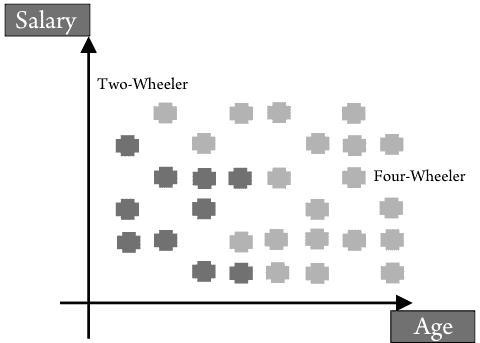

**图 9.50** 根据员工的薪资和年龄，描述他们是骑两轮车还是四轮车通勤的图表

从这个图表中，可以分析出公司里的年轻员工更喜欢两轮车，而资深员工则使用四轮车通勤上班。

本小节讨论的内容灵感来源于 Kirill Eremenko 及其团队在 SuperDataScience 主导的朴素贝叶斯教程。https://www.udemy.com/tutorial/machinelearning/naive-bayes-intuition/.

我们感谢 SuperDataScience 的支持，并允许引用和参考此资源。

现在，假设一位新员工加入了公司，如图 9.51 所示，我们需要预测他是骑两轮车还是四轮车通勤。在这种情况下，我们可以应用贝叶斯定理来执行此任务。

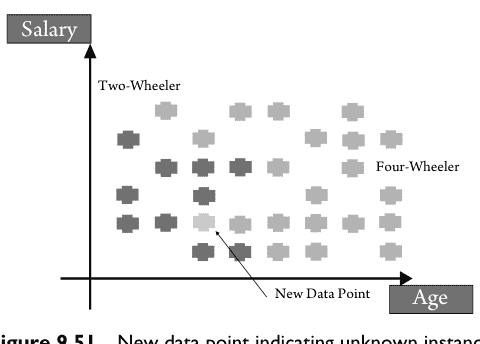

**图 9.51** 表示未知实例的新数据点

让我们首先根据贝叶斯定理来表述这个问题。

假设我们需要预测其通勤方式（两轮车或四轮车）的新员工由 X 表示。在这种情况下，我们需要找到这个人 X 骑两轮车通勤的概率，以及这个人 X 骑四轮车通勤的概率。然后，我们需要比较这两个概率，并根据它们的值，通过选择概率值更高的类别来决定预测类别。

因此，让我们根据贝叶斯定理来表述这个问题。

P(two-wheeler|X)=?

P(four-wheeler|X)=?

我们需要找到条件概率 P(two-wheeler|X)，即在 X 已经发生的情况下，类别为两轮车的条件概率，以及 P(four-wheeler|X)，即在 X 已经发生的情况下，类别为四轮车的条件概率。

我们首先根据贝叶斯定理计算 P(two-wheeler|X)。

P(two-wheeler|X) = \frac{P(X|two-wheeler)*P(two-wheeler)}{P(X)}

如下所示，P(two-wheeler) 是骑两轮车的人数比例的先验概率。

P(X) \rightarrow 是边际似然，即该类型的实例总数。

P(X|two-wheeler) 是 X 属于两轮车类别的似然度。

P(two-wheeler|X) 是后验概率，即 X 实例骑两轮车来上班的概率。

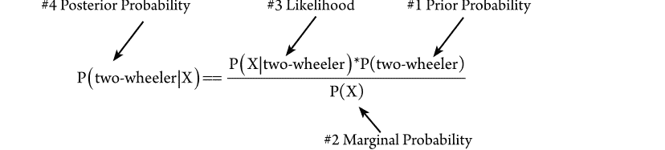

假设我们总共有 50 名员工的数据，其中 30 名员工骑两轮车通勤，20 名员工骑四轮车通勤。

因此，P(two-wheeler) = \frac{30}{50} = 0.6。

下一个重要点是计算 X 的概率，即 P(X)。这被称为边际似然。它表示挑选到一个与未知实例 X 具有相似特征的观测值的可能性。

为了计算这个，我们必须围绕未知实例 X 画一个圆圈。这被称为似然区域，我们需要找出属于这个似然区域的实例数量。这告诉我们似然区域内有多少实例与 X 相似，如图 9.52 所示。

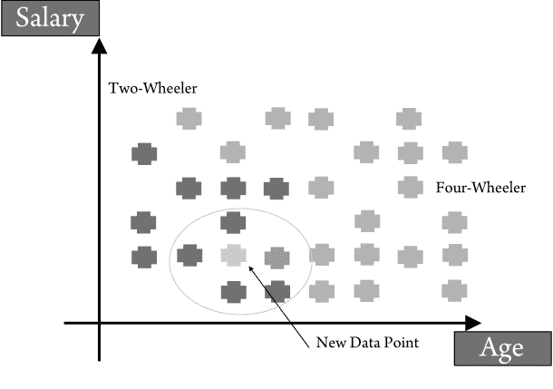

**图 9.52** 未知实例 X 周围的似然区域

在我们的案例中，这些记录在圆圈内被高亮显示。如前所述，为了找到似然概率 P(X)，我们必须计算 X 的相似记录数与总观测数的比值。由于该似然区域内的实例数为 5（不计数未知/新数据点实例），总观测数为 50。因此 P(X) 如下：

$$P(X) = \frac{\text{相似观测数}}{\text{总观测数}} = 5 / 50 = 0.1$$

现在，我们需要计算 P(X|two-wheeler)。这被称为似然概率。这里，我们需要在已知该人使用两轮车通勤的情况下，找到得到 X 的概率。

由于我们只需要考虑似然区域内使用两轮车通勤的员工，我们在更新的图中移除了所有四轮车通勤实例，如图 9.53 所示。这里，我们只显示了似然区域内使用两轮车来办公室的员工数据，并消除或忽略了使用四轮车来办公室的人员数据。

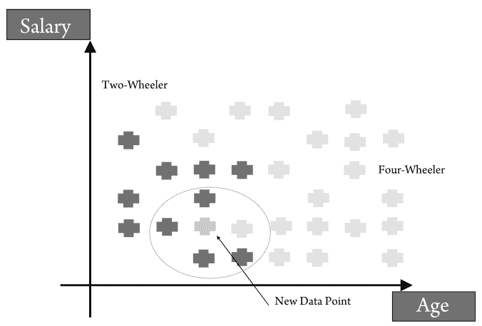

**图 9.53** 似然概率的计算

在图 9.53 中，画出的圆圈内有四个点属于两轮车类别。

因此，P(X|two-wheeler) =

$$\frac{\text{使用两轮车通勤者中的相似观测数}}{\text{两轮车观测总数}} = \frac{4}{30} = 0.133333.$$

因此，我们得到了所有需要的值，如下所示。

P(two-wheeler) = 0.6

P(X) = 0.1

P(X| two-wheeler) = 0.133333

现在，我们可以将所有获得的值代入贝叶斯定理进行计算，如下所示。

$$P(\text{two-wheeler}|X) = \frac{P(X|\text{two-wheeler}) * P(\text{two-wheeler})}{P(X)}$$

$$P(\text{two-wheeler}|X) = \frac{0.133333 * 0.6}{0.1} = \frac{0.08}{0.1} = 0.8$$

输入所有这些值后，我们发现 X 有 80% 的概率会使用两轮车通勤到办公室。

由于这是一个二元分类问题，我们可以得出结论 P(four-wheeler|X) 将是 1–0.8 = 0.2，并且由此我们可以进一步得出结论

P(two-wheeler|X) > P(four-wheeler|X)

因此，对于实例 X，最终预测将是两轮车。

然而，为了进一步理解这个概念，让我们计算 P(four-wheeler|X)。

$$P(\text{four-wheeler}|X) = \frac{P(X|\text{four-wheeler})*P(\text{four-wheeler})}{P(X)}$$

让我们首先计算 P(four-wheeler)，有 20 个四轮车实例，整个数据有 50 个实例。因此，P(four-wheeler) 如下：

$$P(\text{four-wheeler}) = \frac{20}{50} = 0.4.$$

似然概率 P(X) 将保持不变。由于该似然区域内的实例数为 5，总观测数为 50。因此，P(X) 如下：

$$P(X) = \frac{\text{相似观测数}}{\text{总观测数}} = 5/50 = 0.1.$$

现在，我们需要计算 P(X|four-wheeler)。这里，我们需要在已知该人使用四轮车通勤的情况下，找到得到 X 的概率。由于我们只需要考虑似然区域内使用四轮车通勤的员工，我们在更新的图中移除了所有两轮车通勤实例，如图 9.54 所示。

如图 9.54 所示，似然圆圈内只有一个数据点属于四轮车类别。

因此，P(X|four-wheeler) =

$$\frac{\text{使用四轮车通勤者中的相似观测数}}{\text{四轮车观测总数}} = \frac{1}{20} = 0.05.$$

获得所有输入后，我们可以实现朴素贝叶斯。

$$P(\text{four-wheeler}|X) = \frac{P(X|\text{four-wheeler})*P(\text{four-wheeler})}{P(X)}$$

$$P(\text{four-wheeler}|X) = \frac{0.05*0.4}{0.1} = \frac{0.02}{0.1} = 0.2.$$

输入所有输入后，P(four-wheeler|X) 为 0.2。

因此，P(two-wheeler|X) > P(four-wheeler|X)。

因此，对于实例 X，最终预测将是两轮车。

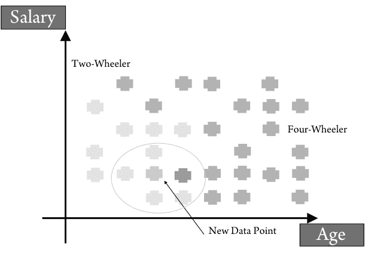

**图 9.54** 四轮车似然概率的计算

#### 朴素贝叶斯中的“朴素”是什么意思？

朴素贝叶斯分类器基于贝叶斯定理。因此，它从定理中获得了“贝叶斯”这个名字，但为什么它被称为“朴素”呢？

朴素贝叶斯被称为“朴素”是因为它假设每个输入变量都是独立的。这是朴素的，因为这（几乎）从来不是真的。然而，这项技术在许多复杂问题上仍然非常有效。

即使在示例数据集的情况下，朴素贝叶斯也假设我们的输入特征年龄和薪水是独立的，它们之间没有相关性。但在实际情况中，两者都有一定的相关性。直观地理解，一个人的薪水会随着年龄的增长而增加，这在我们的数据集中也可以观察到，如图 9.50 所示。

由于朴素贝叶斯假设输入属性彼此独立，但在大多数情况下它们并非如此，因此它被称为“朴素”。朴素贝叶斯关于输入变量彼此独立的假设很少成立；尽管如此，朴素贝叶斯的伟大之处在于，这种朴素的假设往往有助于分类。

#### 关于 P(X) 的讨论

这里有趣的是，这个概率 P(X) 在两种情况下都是相同的，即 P(two-wheeler|X) 和 P(four-wheeler|X)。

$$P(\text{two-wheeler}|X) = \frac{P(X|\text{two-wheeler}) * P(\text{two-wheeler})}{P(X)}$$

而在另一种情况下，P(four-wheeler|X) 是数据点 X 开四轮车上班的概率。P(four-wheeler|X) 的公式如下所示。

$$P(\text{four-wheeler}|X) = \frac{P(X|\text{four-wheeler}) * P(\text{four-wheeler})}{P(X)}$$

两种情况在比较中都以 P(X) 作为分母。我们必须比较这两个概率以选择最终的类别。你可以看到两种情况的分母是相同的，可以相互抵消，如下所示。

$$P(\text{two-wheeler}|X) \text{ vs } P(\text{four-wheeler}|X)$$

$$\frac{P(X|\text{two-wheeler}) * P(\text{two-wheeler})}{P(X)} \text{ vs } \frac{P(X|\text{four-wheeler}) * P(\text{four-wheeler})}{P(X)}$$

$$\frac{P(X|\text{two-wheeler}) * P(\text{two-wheeler})}{\cancel{P(X)}} \text{ vs } \frac{P(X|\text{four-wheeler}) * P(\text{four-wheeler})}{\cancel{P(X)}}$$

$$P(X|\text{two-wheeler}) * P(\text{two-wheeler}) \text{ vs } P(X|\text{four-wheeler}) * P(\text{four-wheeler})$$

我们可以将两边乘以 P(X)；这样就会消去分母。所以，你可以只比较这些计算的分子部分，而不是计算整个公式。这样，我们将摆脱分母。我们将不必执行 P(X) 的计算。因此，我们少了一项计算。我们可以得出结论，没有必要计算 P(X)，因为它对最终预测没有影响。

然而，更安全和最好的方法总是执行完整的计算。因为，在执行完整计算后，你总是可以交叉检查所有可能类别的概率之和是否为 1。

#### 对具有两个以上类别的数据集进行分类

在我们上面讨论的案例研究中，我们有两个不同的类别。在计算了一个类别的概率后，我们可以通过从 1 中减去第一个类别的概率直接找到另一个类别的概率。在这种情况下，不需要通过应用贝叶斯定理来计算第二个类别的概率。

但如果我们有超过两个类别，比如四个，那么我们不能在找到第一个类别的概率后就这样做来找到其他类别的概率。我们必须

#### 案例研究1：将朴素贝叶斯分类器应用于客户类别预测

为了进一步理解这个概念，让我们考虑以下客户数据库。客户类别根据其自有住房、婚姻状况、性别、就业状况和信用评级来定义，如表9.6所示。

**表9.6 客户数据库**

| 自有住房 | 已婚 | 性别 | 就业 | 信用评级 | 类别 |
| :---: | :---: | :---: | :---: | :---: | :---: |
| 是 | 是 | 男 | 是 | A | II |
| 否 | 否 | 女 | 是 | A | I |
| 是 | 是 | 女 | 是 | B | III |
| 是 | 否 | 男 | 否 | B | II |
| 否 | 是 | 女 | 是 | B | III |
| 否 | 否 | 女 | 是 | B | I |
| 否 | 否 | 男 | 否 | B | II |
| 是 | 否 | 女 | 是 | A | I |
| 否 | 是 | 女 | 是 | A | III |
| 是 | 是 | 女 | 是 | A | III |

在这里，我们需要预测未知实例X的类别，并假设未知样本X如表9.7所示。

**表9.7 未知样本X**

| 自有住房 | 已婚 | 性别 | 就业 | 信用评级 | 类别 |
| :---: | :---: | :---: | :---: | :---: | :---: |
| 是 | 否 | 男 | 是 | A | ? |

然后，我们需要计算当X已经发生时，类别$C_i$的概率。这里有三个类别，即I、II和III。因此，我们必须计算$P(C_I | X)$、$P(C_{II} | X)$和$P(C_{III} | X)$。最终预测的类别将是条件概率值最大的那个类别。

因此，我们可以将其概括如下：

$P(C_i|Yes,No,Male,Yes,A)=P(Yes,No,Male,Yes,A|C_i) \times P(C_i)$

让我们首先计算每个类别的概率，即$P(C_i)$。

这里有三个类别，即I、II和III。给定数据集中有10个实例，其中类别I有三个实例，类别II有三个实例，类别III有四个实例。因此，每个类别的概率如下：

类别I的概率，即$P(I) = 3/10 = 0.3$。

类别II的概率，即$P(II) = 3/10 = 0.3$。

类别III的概率，即$P(III) = 4/10 = 0.4$。

现在，让我们计算$P(X|C_i)$，即$P(Yes, No, Male, Yes, A | C_i)$。

$P(Yes, No, Male, Yes, A|C_i) = P(Owns Home=Yes|C_i) \times P(Married=No|C_i) \times P(Gender=Male|C_i) \times P(Employed=Yes|C_i) \times P(Credit rating=A|C_i)$。

因此，我们需要计算

$P(Owns Home=Yes|C_i)$,

$P(Married=No|C_i)$,

$P(Gender=Male|C_i)$,

$P(Employed=Yes|C_i)$,

$P(Credit rating=A|C_i)$。

计算这些概率的过程如表9.8所示。

**表9.8 计算数据库中未知实例的类别**

| 自有住房 | 已婚 | 性别 | 就业 | 信用评级 | 类别 |
| :--- | :--- | :--- | :--- | :--- | :--- |
| 否 | 否 | 女 | 是 | A | I |
| 否 | 否 | 女 | 是 | B | I |
| 是 | 否 | 女 | 是 | A | I |
| **是** | **否** | **男** | **是** | **A** | **? [待求]** |
| 1/3 | 1 | 0 | 1 | 2/3 | 给定类别I时，具有{是, 否, 男, 是, A}属性值的概率 |
| 是 | 是 | 男 | 是 | A | II |
| 是 | 否 | 男 | 否 | B | II |
| 否 | 否 | 男 | 否 | B | II |
| **是** | **否** | **男** | **是** | **A** | **? [待求]** |
| 2/3 | 2/3 | 1 | 1/3 | 1/3 | 给定类别II时，具有{是, 否, 男, 是, A}属性值的概率 |
| 是 | 是 | 女 | 是 | B | III |
| 否 | 是 | 女 | 是 | B | III |
| 否 | 是 | 女 | 是 | A | III |
| 是 | 是 | 女 | 是 | A | III |
| **是** | **否** | **男** | **是** | **A** | **? [待求]** |
| 1/2 | 0 | 0 | 1 | 1/2 | 给定类别III时，具有{是, 否, 男, 是, A}属性值的概率 |

因此，$P(X|I) = 1/3 \times 1 \times 0 \times 1 \times 2/3 = 0$。
$P(X|II) = 2/3 \times 2/3 \times 1 \times 1/3 \times 1/3 = 4/81$。
$P(X|III) = 1/2 \times 0 \times 0 \times 1 \times 1/2 = 0$。
$P(I|Yes, No, Male, Yes, A) = P(Yes, No, Male, Yes, A|I) \times P(I) = 0 \times 0.3 = 0$。
$P(II|Yes, No, Male, Yes, A) = P(Yes, No, Male, Yes, A|II) \times P(II) = 4/81 \times 0.3 = 0.0148$。
$P(III|Yes, No, Male, Yes, A) = P(Yes, No, Male, Yes, A|III) \times P(III) = 0 \times 0.4 = 0$。
因此，X被分配到类别II。

需要注意的是，在现实世界的数据集中，某个类别的概率为0的可能性非常小。

#### 案例研究2：将朴素贝叶斯分类器应用于“是否进行”数据集

让我们考虑另一个朴素贝叶斯分类器的例子，针对表9.9所示的数据集。它有4个输入属性：天气、温度、湿度和是否有风。是否进行是类别或输出属性。为了更好地解释，添加了实例编号属性。这14条记录包含了根据给定日期的天气条件是否举行活动的信息。
本案例研究源自Mark Polczynski在其教程“Weka朴素贝叶斯分类器教程”中的贡献。

**表9.9 基于给定日期天气条件的活动预测数据集**

| 实例编号 | 天气 | 温度 | 湿度 | 是否有风 | 是否进行 |
|---|---|---|---|---|---|
| 1 | 晴朗 | 炎热 | 高 | 否 | 否 |
| 2 | 晴朗 | 炎热 | 高 | 是 | 否 |
| 3 | 多云 | 炎热 | 高 | 否 | 是 |
| 4 | 下雨 | 温和 | 高 | 否 | 是 |
| 5 | 下雨 | 凉爽 | 正常 | 否 | 是 |
| 6 | 下雨 | 凉爽 | 正常 | 是 | 否 |
| 7 | 多云 | 凉爽 | 正常 | 是 | 是 |
| 8 | 晴朗 | 温和 | 高 | 否 | 否 |
| 9 | 晴朗 | 凉爽 | 正常 | 否 | 是 |
| 10 | 下雨 | 温和 | 正常 | 否 | 是 |
| 11 | 晴朗 | 温和 | 正常 | 是 | 是 |
| 12 | 多云 | 温和 | 高 | 是 | 是 |
| 13 | 多云 | 炎热 | 正常 | 否 | 是 |
| 14 | 下雨 | 温和 | 高 | 是 | 否 |

##### 属性值和计数

| 天气 | 温度 | 湿度 | 是否有风 | 是否进行 |
|---|---|---|---|---|
| 晴朗 = 5 | 炎热 = 4 | 高 = 7 | 是 = 6 | 是 = 9 |
| 多云 = 4 | 温和 = 6 | 正常 = 7 | 否 = 8 | 否 = 5 |
| 下雨 = 5 | 凉爽 = 4 | | | |

该数据集显示，在5个晴朗的日子里，有3天没有举行活动，如下表所示。
晴朗日举行活动与否的概率。

| 实例 | 天气 | 温度 | 湿度 | 是否有风 | 是否进行 |
|---|---|---|---|---|---|
| 1 | 晴朗 | 炎热 | 高 | 否 | 否 |
| 2 | 晴朗 | 炎热 | 高 | 是 | 否 |
| 8 | 晴朗 | 温和 | 高 | 否 | 否 |
| 9 | 晴朗 | 凉爽 | 正常 | 否 | 是 |
| 11 | 晴朗 | 温和 | 正常 | 是 | 是 |

因此，可以得出结论：在晴朗的日子里，有60%的可能性不举行活动。

由于朴素贝叶斯定理基于概率，为了计算每个事件的概率，让我们计算每个事件的计数，如图9.55所示。

| 实例 | 天气 | 温度 | 湿度 | 是否有风 | 是否进行 |
| :--- | :--- | :--- | :--- | :--- | :--- |
| 1 | 晴朗 | 炎热 | 高 | 否 | 否 |
| 2 | 晴朗 | 炎热 | 高 | 是 | 否 |
| 3 | 多云 | 炎热 | 高 | 否 | 是 |
| 4 | 下雨 | 温和 | 高 | 否 | 是 |
| 5 | 下雨 | 凉爽 | 正常 | 否 | 是 |
| 6 | 下雨 | 凉爽 | 正常 | 是 | 否 |
| 7 | 多云 | 凉爽 | 正常 | 是 | 是 |
| 8 | 晴朗 | 温和 | 高 | 否 | 否 |
| 9 | 晴朗 | 凉爽 | 正常 | 否 | 是 |
| 10 | 下雨 | 温和 | 正常 | 否 | 是 |
| 11 | 晴朗 | 温和 | 正常 | 是 | 是 |
| 12 | 多云 | 温和 | 高 | 是 | 是 |
| 13 | 多云 | 炎热 | 正常 | 否 | 是 |
| 14 | 下雨 | 温和 | 高 | 是 | 否 |

| | 是否进行 | | | 是否进行 | | | 是否进行 | | | 是否进行 | | | 是否进行 |
| :--- | :--- | :--- | :--- | :--- | :--- | :--- | :--- | :--- | :--- | :--- | :--- | :--- | :--- |
| 天气 | 是 | 否 | 温度 | 是 | 否 | 湿度 | 是 | 否 | 是否有风 | 是 | 否 | | |
| 晴朗 | 2 | 3 | 炎热 | 2 | 2 | 高 | 3 | 4 | 否 | 6 | 2 | 是 | 9 |
| 多云 | 4 | 0 | 温和 | 4 | 2 | 正常 | 6 | 1 | 是 | 3 | 3 | 否 | 5 |
| 下雨 | 3 | 2 | 凉爽 | 3 | 1 | | | | | | | | |
| 总计 | 9 | 5 | 总计 | 9 | 5 | 总计 | 9 | 5 | 总计 | 9 | 5 | 总计 | 14 |

**图9.55** 所有输入属性计数计算的汇总

现在，我们可以计算每个可能的输入属性值下举行活动的概率，如图9.56所示。例如，当天气为下雨时，有2个实例不举行活动，而在天气属性下不举行活动的实例总数为5个。

给定天气为下雨时，不举行活动的概率 = $\frac{\text{给定天气=下雨时，不举行活动的实例数}}{\text{天气属性下，不举行活动的实例总数}}$

$= 2/5 = 0.40$

### 9.9.3 使用拉普拉斯估计器的朴素贝叶斯分类器工作原理

| 天气 | 打球-是 | 打球-否 | 温度 | 打球-是 | 打球-否 | 湿度 | 打球-是 | 打球-否 | 有风 | 打球-是 | 打球-否 | 打球 |
|---|---|---|---|---|---|---|---|---|---|---|---|---|
| 晴朗 | 2 | 3 | 炎热 | 2 | 2 | 高 | 3 | 4 | 否 | 6 | 2 | 是 | 9 |
| 多云 | 4 | 0 | 温和 | 4 | 2 | 正常 | 6 | 1 | 是 | 3 | 3 | 否 | 5 |
| 下雨 | 3 | 2 | 凉爽 | 3 | 1 | | | | | | | | |
| 总计 | 9 | 5 | 总计 | 9 | 5 | 总计 | 9 | 5 | 总计 | 9 | 5 | 总计 | 14 |

拉普拉斯估计器：为每个计数加1

为计数加1（拉普拉斯估计器）

| 天气 | 打球-是 | 打球-否 | 温度 | 打球-是 | 打球-否 | 湿度 | 打球-是 | 打球-否 | 有风 | 打球-是 | 打球-否 | 打球 |
|---|---|---|---|---|---|---|---|---|---|---|---|---|
| 晴朗 | 3 | 3 | 炎热 | 3 | 3 | 高 | 4 | 5 | 否 | 7 | 3 | 是 | 9 |
| 多云 | 5 | 1 | 温和 | 5 | 3 | 正常 | 7 | 2 | 是 | 4 | 4 | 否 | 5 |
| 下雨 | 4 | 3 | 凉爽 | 4 | 2 | | | | | | | | |
| 总计 | 12 | 8 | 总计 | 12 | 8 | 总计 | 11 | 7 | 总计 | 11 | 7 | 总计 | 14 |

**图 9.60** 添加拉普拉斯估计器后的属性值

现在，对于每个修改后的输入属性值，重新计算了是否进行比赛的概率，如图 9.61 所示。

| 天气 | 打球-是 | 打球-否 | 温度 | 打球-是 | 打球-否 | 湿度 | 打球-是 | 打球-否 | 有风 | 打球-是 | 打球-否 | 打球 |
| :--- | :--- | :--- | :--- | :--- | :--- | :--- | :--- | :--- | :--- | :--- | :--- | :--- |
| 晴朗 | 0.25 | 0.50 | 炎热 | 0.25 | 0.38 | 高 | 0.36 | 0.71 | 否 | 0.64 | 0.40 | 是 | 0.64 |
| 多云 | 0.42 | 0.13 | 温和 | 0.42 | 0.38 | 正常 | 0.64 | 0.29 | 是 | 0.36 | 0.57 | 否 | 0.36 |
| 下雨 | 0.33 | 0.38 | 凉爽 | 0.33 | 0.25 | | | | | | | | |

**图 9.61** 对于每个修改后的属性值，是否进行比赛的概率

现在，对于给定的天气条件，例如天气=多云、温度=凉爽、湿度=高、有风=是，可以从图 9.62 计算出是否进行比赛的概率。

| 天气 | 打球-是 | 打球-否 | 温度 | 打球-是 | 打球-否 | 湿度 | 打球-是 | 打球-否 | 有风 | 打球-是 | 打球-否 | 打球 |
| :--- | :--- | :--- | :--- | :--- | :--- | :--- | :--- | :--- | :--- | :--- | :--- | :--- |
| 晴朗 | 0.25 | 0.50 | 炎热 | 0.25 | 0.38 | **高** | **0.36** | **0.71** | 否 | 0.64 | 0.40 | 是 | 0.64 |
| **多云** | **0.42** | **0.13** | 温和 | 0.42 | 0.38 | 正常 | 0.64 | 0.29 | **是** | **0.36** | **0.57** | 否 | 0.36 |
| 下雨 | 0.33 | 0.38 | **凉爽** | **0.33** | **0.25** | | | | | | | | |

**图 9.62** 给定示例实例的属性值

打球-是的似然度 = 0.42 * 0.33 * 0.36 * 0.36 * 0.64 = 0.0118。

打球-否的似然度 = 0.13 * 0.25 * 0.71 * 0.57 * 0.36 = 0.0046。

打球-是的概率 = 0.0118/(0.0118 + 0.0046) = 72%。

打球-否的概率 = 0.0046/(0.0118 + 0.0046) = 28%。

由此可以得出结论，我们不再认为只要天气多云就100%会打球，而是计算出在这种天气组合下打球的概率为72%，这更为现实。

因此，拉普拉斯估计器被用来处理由于训练数据较少而常见的零概率情况。

## 9.10 k-近邻算法

k-近邻 (k-NN) 分类器 | Parteek Bhatia
https://youtu.be/3j3BVPfhP4A?si=P8FP0-2e4fAjyHUn

k-近邻或k-NN是另一种用于分类未知实例的简单而强大的分类器。让我们通过以下案例研究来理解k-NN算法的工作原理。

第9.10节和第9.11节的内容灵感来源于Kirill Eremenko等人在Udemy平台上的课程“Machine Learning A-Z™: AI, Python & R”。关于该课程的更多信息，请参见下方。
https://www.udemy.com/course/machinelearning/


我们感谢SuperDataScience的支持，并允许我们在本书中引用和参考此资源。

让我们考虑与朴素贝叶斯相同的讨论数据集，以理解k-NN的原理。这里，我们有一个简单的数据集，仅包含两个特征：员工的薪资和年龄。这是一个组织的员工数据，我们需要根据这些属性预测员工是骑两轮车还是四轮车上班。因此，假设我们收集了一些实例及其对应的标签，如图9.63所示。

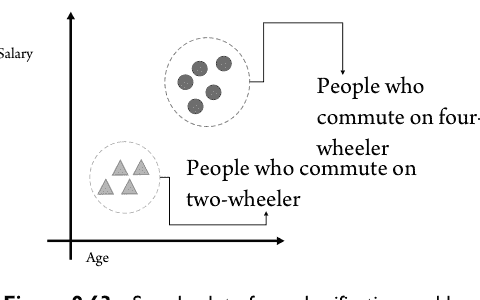

现在，考虑如果一个未知实例/新人进入场景，如图9.64所示。我们想预测他是会开四轮车还是两轮车通勤上班。为了预测这一点，这次我们将使用k-NN算法。

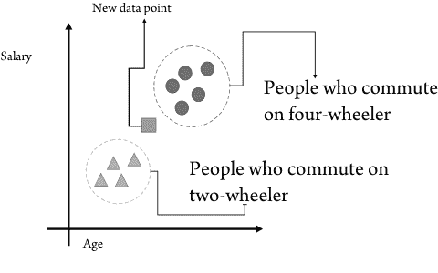

在解决之前，让我们先了解k-NN算法的步骤，然后我们将应用它们。

### 用于分类的k-NN算法

步骤1：首先，我们必须选择邻居的数量，比如k（默认情况下，我们将取k = 5）。

步骤2：取新数据点的k个最近邻居。使用欧几里得距离（也可以使用其他距离度量，如曼哈顿距离）来选择最近的邻居。

步骤3：对于每个选定的邻居，检查其类别，然后统计每个类别或类中的邻居数量。

步骤4：找到邻居数量最多的类别。这将是我们的新数据点的（预测）类别。

### 使用k-NN解决通勤问题

现在，让我们将上述算法应用于我们的分类问题，以预测未知实例/新数据点是开四轮车还是两轮车通勤上班。

步骤1：根据k-NN算法，首先让我们选择邻居数量，k = 5。这意味着我们选择数据点X周围的5个最近邻居，用方形符号表示，如图9.65所示。

步骤2：让我们选择最近的5个邻居；我们将使用欧几里得距离来完成此操作。让我们回顾一下欧几里得距离。

欧几里得距离是两点$(x_1, y_1)$和$(x_2, y_2)$之间的几何距离。这些点之间的距离由$\sqrt{(x_2 - x_1)^2 + (y_2 - y_1)^2}$给出。

因此，我们必须找到每个数据点与我们的新数据点X之间的欧几里得距离。由于我们有一个散点图，我们可以直接画线并查看哪个更近。图9.65表示了数据点X的五个最近邻居。这5个邻居与数据点X的欧几里得距离值最小。

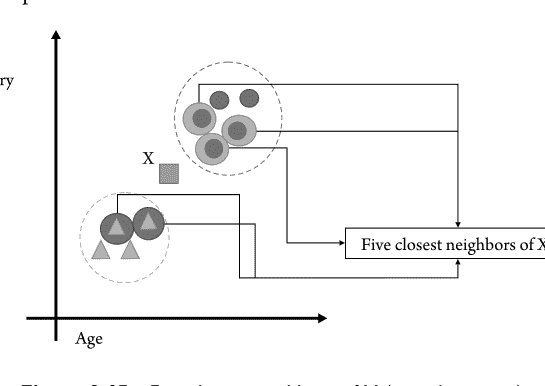

**步骤3：** 在获得的5个最近邻居中，统计每个类别中的点数。如图9.66所示，在类别1（由两轮车的三角形表示）中，我们有2个邻居，而在类别2（由四轮车的圆形表示）中，我们有3个邻居。

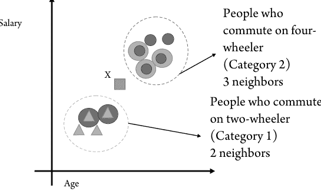

**图9.66** 按类别统计的邻居数量

**步骤4：** 从图9.66可以清楚地看出，类别2，即开四轮车通勤上班的人，对于这个新数据点拥有更多的成员或邻居。因此，我们将数据点X分配给类别2。

因此，使用k-NN，我们发现一个未知实例会倾向于开四轮车通勤上班。因此，我们对新数据点进行了分类，我们的模型已准备好进行更多预测。

因此，在k-NN中，我们识别未知实例的k个最近邻居，检查它们的类别，并遵循大多数邻居的类别。如果大多数邻居属于A类，那么预测的类别也将是A。

## 9.11 逻辑回归

逻辑回归是一种用于执行二元分类的回归类型。这意味着它用于预测真或假（两者之一）。

实际上，逻辑回归是一种用于预测0到1范围内值的回归。这个值被视为某个类别结果的概率。如果预测值小于0.5，则预测类别为0；否则为1。

因此，逻辑回归是用于描述二元因变量与一个或多个自变量之间关系的统计工具。例如，我们可以应用逻辑回归来预测团队是否会赢得比赛，以及客户是否会购买该物品。

为了理解逻辑回归，让我们考虑以下案例研究。

**案例研究：** 考虑一家保险公司旨在预测客户购买保险的可能性。因此，他们向1000名客户群发送了促销邮件。为了分析客户响应（是否购买）与其年龄之间的相关性，收集了1000名客户的数据集。

可以对收集的数据执行逻辑回归，因为客户是否购买保险是一个因变量，并且是二元的。同时，一个人的年龄被视为自变量。保险公司可以利用此分析在其营销活动中针对特定年龄段。

图9.67显示了一个示例图，用于可视化上述问题。这里，0指的是那些根据年龄未购买保险的客户，1指的是购买了保险的客户。

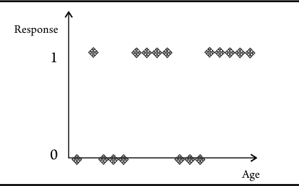

**图9.67** 客户年龄和响应（他们是否购买了保险？）

### 逻辑回归的工作原理

为了理解逻辑回归的工作原理，让我们首先尝试使用线性回归来解决同一个问题。

在第5章中，我们应用线性回归来预测研究人员的津贴，基于他们的经验。为此，绘制了一个图表来表示研究人员薪资与其经验之间的关系。然后，我们在数据集上拟合直线并进行预测，如图9.68所示。

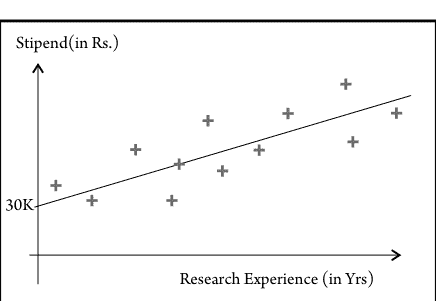

**图9.68** 研究人员津贴和相应经验的线性回归模型

简单线性回归的数学方程如下所示。

$$y = b_0 + b_1 x$$

这里，$y$是因变量（薪资），$b_0$是常数（经验为0时研究人员的薪资或应届生的薪资），$b_1$是系数（表示斜率或薪资随经验每年增加的变化），$x$是自变量（此处为经验）。

同样，让我们将线性回归应用于给定问题，并尝试在其上拟合一条直线。如果我们将线性回归应用于保险数据集，图表将如图9.69所示。

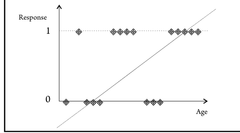

**图9.69** 使用线性回归对购买保险问题建模

线性回归不是解决给定问题原始形式的最佳方法。

为了详细理解这一点，假设我们想根据一个人的年龄预测他是否会购买保险。为了预测响应，我们必须根据他的给定年龄绘制一个投影，并在此基础上预测响应。响应值将不是0或1，而是一个实数连续值，如图9.70所示。

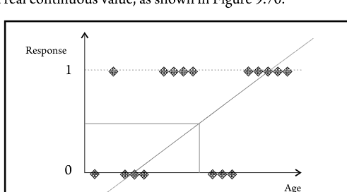

**图9.70** 给定年龄下客户购买保险的可能性

因此，我们可以说它不是以0和1的形式进行预测，而是预测一个连续值。然而，我们可以调整这个概念，将其映射到该客户购买保险的概率或可能性。

如果我们进一步分析这张图，如图9.71所示，可以直观地看到所画的线与水平线相交于两点，即当客户的年龄分别为15岁（X轴）和60岁（虚线水平线）时。这意味着15岁以下的人购买产品的可能性最小，而60岁的人购买的可能性最大。

这表明，随着我们向右移动（年龄增加），15至60岁年龄组的人购买保险的概率（介于0和1之间）会逐渐增加。

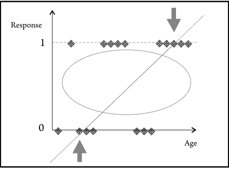

**图9.71** 研究线性回归模型的相关部分

如图9.71所示，中间的线确实有意义，但图中所示的剩余部分则没有任何意义。它们是一种谬误，因为它们暗示60岁以上的人购买保险的可能性会超过100%，而任何15岁以下不购买保险的人则具有负的可能性，如图9.72所示。此外，概率永远不可能小于0或大于1。

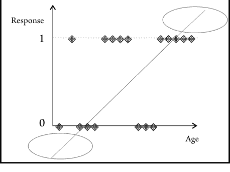

**图9.72** 研究线性回归模型的非相关部分

因此，必须进行某些更改，以便将结果的概率映射到线性回归中。我们将直接截断产生谬误的部分，并用水平部分替换它们。这将引导我们建立一个能恰当建模给定情况的模型，如图9.73所示。

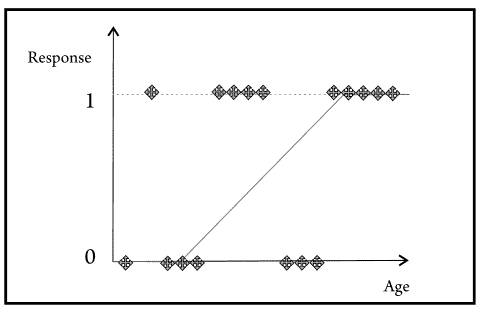

**图9.73** 修改后的图，用于建模购买保险问题

Sigmoid函数可以通过产生0到1之间的输出来实现这一点。Sigmoid函数通过将直线转换为曲线进一步改进了输出，并能更好地映射到因变量发生的概率，如图9.74所示。

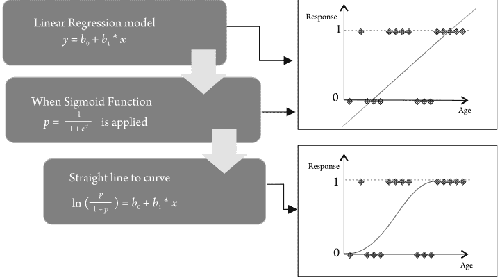

**图9.74** Sigmoid函数对线性回归模型的影响

以下步骤从数学上解释了这个概念。

要开始逻辑回归，我们将从线性回归方程开始，如下所示：

$$y = b_0 + b_1 * x$$

在数学中，我们有一个由公式(9.5)给出的sigmoid函数。

$$p = \frac{1}{1 + e^{-y}}$$ (9.5)

sigmoid函数的方程可以进一步求解，如下所示。

$$\frac{1}{p} = 1 + e^{-y}$$

$$e^{-y} = \frac{1 - p}{p}$$

取对数如下：

$$\log e^{-y} = \frac{1 - p}{p}$$

$$\log e^{y} = \frac{p}{1 - p}$$

最后，我们得到：$$y = \log_e \left( \frac{p}{1 - p} \right)$$ (9.6)

上述方程的曲线如图9.75所示。这类似于我们在图9.74中绘制的曲线。

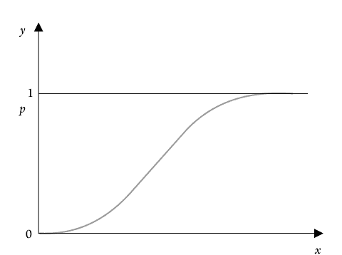

**图9.75** 公式(9.6)在XY平面上的图

因此，通过将公式(9.6)中的$y$值代入公式(9.4)，我们得到逻辑回归的最终公式。

$$\ln\left(\frac{p}{1-p}\right) = b_0 + b_1 * x \quad (9.7)$$

这就是建模逻辑回归的方程。这里，$p/(1-p)$的比率也称为优势比。

### 使用逻辑回归模型进行预测

获得最终模型后，通过识别因变量的概率值（即用户购买该物品的可能性，在Y轴上）来执行预测，该概率值对应于自变量（本例中为年龄，在X轴上）的值。

例如，如图9.75所示，已找到概率值来预测年龄为20、30、40和50的用户购买的可能性，如图9.76所示。

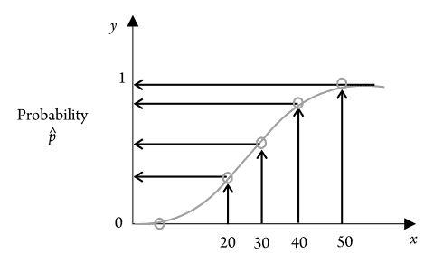

**图9.76** 预测购买保险的可能性

如果我们仔细观察图9.76，会注意到以下几点：

- 年龄小于或等于20岁的人可能性较小，概率约为0.25（购买该物品的可能性为25%）。
- 30岁的人概率约为0.45（购买该物品的可能性为45%）。
- 同样，40岁的人购买保险的概率为0.85（购买该物品的可能性为85%），而50岁的人购买的概率为0.95（购买该物品的可能性为95%），如图9.77所示。

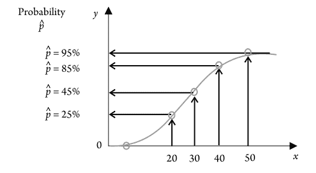

**图9.77** 计算购买保险的概率

由于逻辑回归是一种分类技术，并且必须产生二元值（是或否）作为输出，因此这些概率值被映射到二元结果，如图9.78所示。

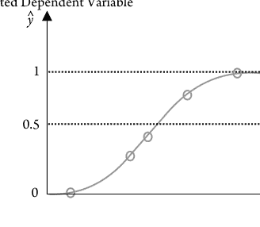

**图9.78** 将概率值映射到二元结果（0或1）

该图说明，如果概率因变量小于0.5，则将其映射到0值（否或假），即用户不会购买该物品。相反，如果概率因变量大于0.5，则将其映射到1值（是或真），即用户会购买该物品。

在我们的例子中，年龄为20和30岁的人购买该物品的概率小于0.5，因此将被映射到0，系统将预测他们不会购买该物品。而年龄为40和50岁的人购买该物品的概率大于0.5，将被映射到1，系统将预测他们会购买该物品，如图9.79所示。

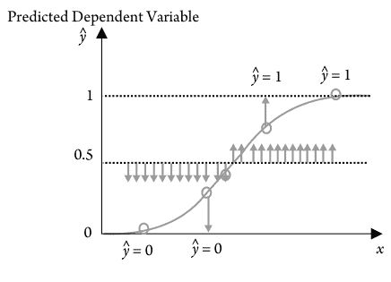

这样，逻辑回归只会产生0和1的输出，并构建一个二元分类器。因此，我们可以得出结论，逻辑回归之所以得名，是因为它使用了逻辑函数作为该方法的核心。逻辑函数或sigmoid函数是一条S形曲线，可以接受任何实数值并将其映射到0和1之间的值。由于这是一个为分类而调整的回归概念，所以被称为逻辑回归，但请始终记住这是一个分类器，而不是回归器。

## 9.12 理解评估分类器质量的指标

混淆矩阵、精确率、召回率和F值：评估分类器性能的指标 | Parteek Bhatia, https://youtu.be/v1VFwHXHNck

分类器的质量是通过真阳性、真阴性、假阳性、假阴性、精确率、召回率和F值等指标来衡量的。

让我们首先考虑那个大喊“狼来了”来愚弄村民的男孩，以理解这个概念。故事如下。

### 狼来了的男孩

有一次，一个男孩感到无聊，想捉弄一下村民。他大喊“狼来了！”，尽管根本没有狼，只是为了找点乐子。村民们跑来保护，但当他们意识到男孩在开玩笑时，非常生气。男孩重复了这个恶作剧好几次。

一天晚上，男孩看到一只真正的狼靠近，便大喊：“狼来了！”。这次村民们待在屋里，饥饿的狼把羊群变成了羊排。

根据这个故事，我们做如下定义：“狼”是**正类**，“没有狼”是**负类**。我们可以用一个2x2的混淆矩阵来总结我们的“狼来了”预测模型，该矩阵描述了所有四种可能的结果。

| | **真阳性 (TP):** | **假阴性 (FN):** |
| :--- | :--- | :--- |
| **现实：有狼威胁。**<br>男孩说：“狼来了”。<br>结果：男孩成了英雄。 | **现实：有狼威胁。**<br>男孩说：“没有狼”。<br>结果：狼吃掉了所有羊群。 |
| **假阳性 (FP):** | **真阴性 (TN):** |
| **现实：没有狼威胁。**<br>男孩说：“狼来了”。<br>结果：村民们因被吵醒而对男孩生气。 | **现实：没有狼威胁。**<br>男孩说：“没有狼”。<br>结果：一切都好。 |

考虑一个分类器，其任务是预测图像是否为鸟类。我们假设“鸟”是正类，“非鸟”是负类。

假设我们有一个包含15000张图像的数据集，其中6000张是鸟类图像，9000张是任何非鸟类的图像。说明实际与预测结果的矩阵，也称为混淆矩阵，如图9.80所示。

### 15000张验证图像的结果

（6000张是鸟类，9000张不是鸟类）

| | **预测为鸟** | **预测为非鸟** |
| :--- | :--- | :--- |
| **实际为“鸟”** | 5450<br>***真阳性*** | 550<br>***假阴性*** |
| **实际为“非鸟”** | 162<br>***假阳性*** | 8838<br>***真阴性*** |

**图9.80** 鸟类分类器的混淆矩阵

### 9.12.1 真阳性

预测类别和实际类别均为正的实例称为真阳性。简单来说，当模型准确预测出正类时，就发生了真阳性。

例如，在鸟类分类器的情况下，被正确识别为鸟类的鸟类被称为真阳性。

### 9.12.2 真阴性

预测类别和实际类别均为负的实例称为真阴性。简单来说，当模型准确预测出负类时，结果就是真阴性。

例如，在我们的鸟类分类器中，一些不是鸟类的图像被我们的分类器正确识别为“非鸟”，这些被称为真阴性。

### 9.12.3 假阳性

指预测类别/答案为正，但实际实例为负的情况。简而言之，假阳性是模型错误地预测为正类别的结果。
例如，在我们的鸟类分类器案例中，有一些图像被分类器预测为鸟类，但它们实际上是其他东西。这些就是我们的假阳性。

### 9.12.4 假阴性

指预测类别为负，但实际实例为正的情况。简而言之，假阴性是模型错误地预测为负类别的结果。
例如，在我们的鸟类分类器案例中，有一些鸟类图像被分类器识别为非鸟类。这些就是我们的假阴性。
总结一下，预测为‘鸟’的列被视为正类，如果预测正确，则该单元格被标记为真阳性，否则为假阳性。预测为‘非鸟’的列被视为负类。如果预测正确，该单元格被标记为真阴性，否则为假阴性，如图9.80所示。

### 9.12.5 混淆矩阵

混淆矩阵是一个 $N \times N$ 的表格，用于总结分类模型预测的准确性。这里，$N$ 表示输出类别的数量。在二元分类问题中，$N = 2$。简而言之，它是实际标签与模型预测标签之间的关联。在混淆矩阵中，一个轴代表模型预测的标签，另一个轴代表实际标签。
例如，让我们考虑一个用于预测患者是否有肿瘤的二元分类问题的样本混淆矩阵。

| | 预测 | 有肿瘤（预测） | 无肿瘤（预测） |
|---|---|---|---|
| 实际 | | | |
| 有肿瘤（实际） | | 18<br>真阳性 | 1<br>假阴性 |
| 无肿瘤（实际） | | 6<br>假阳性 | 452<br>真阴性 |

**图9.81** 肿瘤预测的混淆矩阵

此处显示的混淆矩阵表明，模型进行了24次正向预测；其中，有18次模型预测正确；因此，真阳性为18。在模型进行的24次正向预测中，有6次预测错误；因此，假阳性为6。类似地，模型进行了453次负向预测；其中，有452次模型预测正确；因此，真阴性为452。在模型进行的453次负向预测中，有1次预测错误；因此，假阴性为1。

我们可以进一步得出结论：在19个有肿瘤的样本中，模型正确地将18个分类为有肿瘤（18个真阳性），错误地将1个分类为无肿瘤（1个假阴性）。同样，在458个无肿瘤的样本中，有452个被正确分类（452个真阴性），有6个被错误分类（6个假阳性）。

混淆矩阵包含足够的信息来计算性能指标，包括精确率、召回率和F值。我们通常不只看整体准确率，而是计算精确率、召回率和F值。这些指标让我们清晰地了解分类器的表现如何。

在讨论精确率和召回率的概念之前，让我们先通过以下示例来理解准确率悖论。

#### 准确率悖论示例：癌症筛查测试

考虑一个旨在识别患有罕见癌症风险个体的癌症筛查测试。在一个1000人的群体中，只有10人患有这种罕见癌症，而其余990人没有癌症。

现在，让我们考虑一个假设的模型，它对每个人都预测“无癌症”，无论其实际情况如何。这个模型会将所有1000人都归类为“无癌症”，从而产生990个准确的预测，准确率为0.99（99%），如下所示：

准确率 = 正确预测数 / 总预测数 = 990/1000 = 0.99

这个模型达到了99%的准确率，因为数据集严重偏向于没有癌症的个体。虽然准确率看起来很高，但这个模型在其识别癌症患者的预期目的上实际上毫无用处。这个例子强调了不仅要考虑准确率，还要考虑其他指标（如精确率和召回率）的重要性，尤其是在处理不平衡数据集或假阴性代价很高的情况时。

### 9.12.6 精确率

精确率给出了模型在预测正类别时正确分类的样本比例。其定义为：

$$精确率 = \frac{真阳性}{真阳性 + 假阳性}$$

或者我们可以说，精确率 = 真阳性 / 所有正向预测。

换句话说，如果我们预测为正，那么它实际为正实例的频率是多少。

例如，在我们的鸟类分类器案例中，它指的是如果我们预测为鸟，那么它实际是鸟的频率。

对于图9.79所示的分类器，精确率 = 5450/(5450 + 162) = 5450/5612 = 0.9711。以百分比表示，为97.11%。

对于图9.80所示的分类器，精确率 = 18/(18 + 6) = 18/24 = 0.75。以百分比表示，为75%。

### 9.12.7 召回率

召回率给出了模型正确识别的可能正标签的比例。简而言之，它指的是我们能找到实际正实例的百分比。

例如，在我们的鸟类分类器案例中，它指的是我们找到实际鸟类的百分比。

数学上，

$$召回率 = \frac{真阳性}{所有实际正实例} = \frac{真阳性}{真阳性 + 假阴性}$$

对于图9.79所示的分类器，召回率 = 5450/(5450 + 550) = 5450/6000 = 0.9083。以百分比表示，为90.83%。

对于图9.80所示的分类器，召回率 = 18/(18 + 1) = 18/19 = 0.9473。以百分比表示，为94.73%。

表9.10显示了上述鸟类分类器的精确率和召回率值。

**表9.10 鸟类分类器的精确率和召回率**

| 精确率 | 97.11% |
| :--- | :--- |
| *如果我们预测为“鸟”，它实际是鸟的频率是多少？* | *(真阳性 ÷ 所有正向猜测)* |
| **召回率** | **90.83%** |
| *我们找到了实际鸟类的百分比是多少？* | *(真阳性 ÷ 数据集中的鸟类总数)* |

从上表中，我们的观察是精确率为97.11%，即我们的模型预测“鸟”在97.11%的情况下是准确的。召回率值为90.83%，这意味着我们能够识别出数据集中90.83%的实际鸟类。换句话说，虽然我们可能找不到数据集中的每一只鸟，但当我们找到一只时，我们相当确定！

现在，让我们将精确率和召回率的概念应用到我们之前关于癌症筛查测试假设模型的例子中。

在假设模型对每个人都预测“无癌症”的情况下，尽管达到了看似令人印象深刻的99%准确率，但使用精确率和召回率对于揭示模型的缺陷变得至关重要。让我们通过考虑其混淆矩阵（如下所示）来计算这个假设模型的精确率和召回率。

| 实际 \ 预测 | 有癌症 | 无癌症 |
| :--- | :--- | :--- |
| 有癌症（实际） | 0<br>真阳性 | 10<br>假阴性 |
| 无癌症（实际） | 0<br>假阳性 | 990<br>真阴性 |

$$精确率 = \frac{TP}{TP + FP} = \frac{0}{0 + 0}$$

由于在此场景中没有真阳性（TP）或假阳性（FP），精确率未定义或为0，强调了模型的预测缺乏正确性。

$$召回率 = \frac{TP}{TP + FN} = \frac{0}{0 + 10} = 0$$

召回率为0，因为模型未能捕捉到任何患有癌症的个体（FN），突显了其无法识别阳性病例。

因此，精确率和召回率指标有助于解决仅靠准确率无法解决的局限性。在这种情况下，精确率和召回率的重要性在于它们能够揭示模型未能正确分类阳性病例，从而提供更详细的评估。

在像医学诊断这样的场景中，错过阳性病例（假阴性）的后果可能很严重，精确率和召回率对于评估模型的实际效用至关重要。在此例中，99%的准确率是模型有效性的一个误导性度量，而精确率和召回率则引起了对更平衡和信息丰富的评估的必要性的关注。

### 9.12.8 F值

在二元分类的统计分析中，F值（也称为F分数或F-1分数）衡量测试的准确性。它同时考虑了测试的精确率 $p$ 和召回率 $r$ 来计算分数。这里，$p$ 是正确正向结果数除以分类器返回的所有正向结果数，$r$ 是正确正向结果数除以所有相关样本数（所有应被识别为正的样本）。F1分数是精确率和召回率的调和平均值，其中F1分数在1（完美的精确率和召回率）时达到最佳值，在0时最差。

$$F = 2 \times \frac{精确率 \times 召回率}{精确率 + 召回率}$$

### 9.12.9 评估具有两个以上类别的混淆矩阵

在大多数情况下，我们需要从多个类别中预测一个类别，即多分类问题。在这种情况下，混淆矩阵如表9.11所示。让我们通过识别真正例、假正例、真反例、假反例、精确率、召回率和F值来评估这个混淆矩阵。

表9.11 三分类器的混淆矩阵

| | 预测类别 | | |
|---|---|---|---|
| | A | B | C |
| 实际类别 A | 8 (单元格 1) | 1 (单元格 2) | 1 (单元格 3) |
| 实际类别 B | 2 (单元格 4) | 9 (单元格 5) | 2 (单元格 6) |
| 实际类别 C | 0 (单元格 7) | 0 (单元格 8) | 7 (单元格 9) |

我们讨论过，真正例是预测类别和实际类别均为正的实例，而真反例是预测类别和实际类别均为负的实例。假正例是那些不属于某个类别但被分配到该类别的案例。另一方面，假反例是那些属于某个类别但未被分配到该类别的案例。

让我们为每个类别计算TP、FP、TN、FN、精确率、召回率和F值。

#### 对于类别 A

真正例 = 单元格 1 = 8 (8条记录被预测为A且属于A)。
假正例 = 单元格 4 + 单元格 7 = 2 (2条记录被预测为A但属于类别B或C)。
真反例 = 单元格 5 + 单元格 6 + 单元格 8 + 单元格 9 = 18 (它们未被预测为A，意味着它们被预测为B或C且不属于A)。
假反例 = 单元格 2 + 单元格 3 = 2 (它们未被预测为A，意味着它们被预测为B或C且属于A)。

$$类别\ A\ 的精确率 = \frac{真正例}{真正例 + 假正例} = \frac{8}{8+2} = \frac{8}{10} = 0.8$$

$$类别\ A\ 的召回率 = \frac{真正例}{真正例 + 假反例} = \frac{8}{8+2} = 0.8$$

#### 对于类别 B

真正例 = 单元格 5 = 9 (9条记录被预测为B且属于B)。
假正例 = 单元格 2 + 单元格 8 = 1 (有1条记录被预测为B但属于类别A或C)。
真反例 = 单元格 1 + 单元格 3 + 单元格 7 + 单元格 9 = 16 (它们未被预测为B，意味着它们被预测为A或C且不属于B)。
假反例 = 单元格 4 + 单元格 6 = 4 (它们未被预测为B，意味着它们被预测为A或C且属于B)。

$$类别\ B\ 的精确率 = \frac{真正例}{真正例 + 假正例} = \frac{9}{9+1} = \frac{9}{10} = 0.9$$

$$类别\ B\ 的召回率 = \frac{真正例}{真正例 + 假反例} = \frac{9}{9+4} = 0.69$$

#### 对于类别 C

真正例 = 单元格 9 = 7 (7条记录被预测为C且属于C)。
假正例 = 单元格 3 + 单元格 6 = 3 (3条记录被预测为C但属于类别A或B)。
真反例 = 单元格 1 + 单元格 2 + 单元格 4 + 单元格 5 = 20 (它们未被预测为C，意味着它们被预测为A或B且不属于C)。
假反例 = 单元格 7 + 单元格 8 = 0 (它们未被预测为C，意味着它们被预测为B或C且属于C)。

$$类别\ C\ 的精确率 = \frac{真正例}{真正例 + 假正例} = \frac{7}{7+3} = \frac{7}{10} = 0.7$$

$$类别\ C\ 的召回率 = \frac{真正例}{真正例 + 假反例} = \frac{7}{7+0} = 1$$

$$整个模型的加权精确率 = \frac{0.8+0.9+0.7}{3} = 0.8$$

$$整个模型的加权召回率 = \frac{0.8+0.69+1}{3} = 0.83$$

$$整个模型的加权F值 = 2 \times \frac{精确率 \times 召回率}{精确率 + 召回率} = 2 \times \frac{0.8 \times 0.83}{0.8 + 0.83} = 2 \times \frac{0.664}{1.63} = 0.814$$

至此，我们结束了对基本分类器的讨论。在下一章中，我们将讨论另一种有用且强大的分类技术，称为支持向量机。

#### 提醒我

- 分类和回归是监督学习技术，通过分析“标记的”输入事件来预测未知事件的结果。
- 当结果是有限或离散时应用分类，而当结果是无限或连续时应用回归模型。
- 根据可用的类别和分类，分类模型可分为三种类型，即二分类、多分类和多标签分类。
- 根据数据库的性质，分类进一步定义为两种类型，即后验分类和先验分类。后验分类是一种监督机器学习方法，其中类别是预先给定的。先验分类是一种无监督机器学习方法，其中类别未预先给定。
- 分类算法通常可以根据其学习策略分为两种类型，即惰性学习器和急切学习器。惰性学习器在测试数据出现后才分析训练数据。急切学习器在接收测试数据之前就分析训练数据并构建预测规则。
- 信息增益衡量输入属性对于预测目标属性的优劣程度。信息增益值最高的属性被选为下一个分裂属性。
- 基尼指数代表对象之间平等或不平等的程度，也可用于构建决策树。其值始终在0到1之间。这里，0表示完全平等且无信息，而1表示完全不平等且信息完全。
- 集成学习是一种机器学习方法，它使用多个基础模型的组合来产生一个最优的预测模型。
- 随机森林分类技术基于集成学习的原理。在随机森林的情况下，使用的基础模型是决策树。
- 托马斯·贝叶斯提出了贝叶斯定理。该定理基于一个假设，即给定的数据样本属于某个特定类别。然后，计算该假设为真的概率。
- 朴素贝叶斯之所以被称为“朴素”，是因为它假设每个输入变量都是独立的。这个假设是朴素的，因为它（几乎）从来不是真的。然而，这项技术在许多复杂问题上仍然非常有效。
- k-NN算法选择测试数据点的k个最近邻，并记录它们的类别。然后，选择更多邻居所属的类别作为测试数据的类别。
- 逻辑回归预测事件发生的概率。逻辑回归预测概率；因此其输出值介于0和1之间。如果预测值小于0.5，则映射到0；否则映射到1。这是一个为分类任务而调整的回归概念。
- 混淆矩阵是一个N × N的表格，总结了分类模型预测的准确性。这里，N表示输出类别的数量。
- 精确率给出了模型在预测正类时正确分类的样本比例。
- 召回率给出了模型正确识别的可能正标签的比例。
- F值（也称为F分数或F-1分数）衡量测试的准确性。它同时考虑了测试的精确率 $p$ 和召回率 $r$ 来计算分数。

#### 附加资源

##### 书籍

- Bhatia, Parteek (2019). *Data Mining and Data Warehousing: Principles and Practical Techniques*, Cambridge University Press.
- Han, Jiawei, Jian Pei, Kamber, Micheline (2011). *Data Mining: Concepts and Techniques*, Elsevier.
- Gupta, G. K. (2014). *Introduction to Data Mining with Case Studies*, PHI Learning Pvt. Ltd.
- Mitchell, Tom M. (2017). *Machine Learning*, McGraw Hill Education.
- Witten, Ian H., Frank, Eibe, Hall, Mark A., and Pal, Christopher J. (2016). *Data Mining: Practical Machine Learning Tools and Techniques*. Morgan Kaufmann.

##### 视频链接

- 决策树算法 | Python中的决策树 | 机器学习算法 | Edureka, https://youtu.be/qDcl-FRnwSU
- 随机森林算法 | 随机森林完整讲解 | 数据科学培训 | Edureka, https://youtu.be/3LQI-w7-FuE
- 朴素贝叶斯，清晰讲解！！！, https://youtu.be/O2L2Uv9pdDA
- 使用Python的KNN算法 | KNN算法如何工作 | Python数据科学培训 | Edureka, https://youtu.be/6kZ-OPLNcgE


##### 博客相关链接

- 机器学习教程 Python - 8：逻辑回归（二元分类），https://youtu.be/zM4VZR0px8E
- 数据挖掘 - 分类与预测 https://www.tutorialspoint.com/data_mining/dm_classification_prediction.htm
- 分类算法简介 https://www.edureka.co/blog/classification-algorithms/
- 决策树：如何创建完美的决策树？ https://www.edureka.co/blog/decision-trees/

#### 自我检测（问题）

根据本章所学内容回答以下问题。

1. 假设你正在观看一场板球比赛。你想使用一个学习算法来预测某支队伍在比赛中的得分。请识别该问题的类型。
   a) 分类问题
   b) 回归问题

2. 假设你是一名市场销售分析师。你想预测杂货店明天的总销售额是否会高于今天的销售额。你需要使用一个学习算法来预测销售额。请识别该问题的类型。
   a) 分类问题
   b) 回归问题

3. 以下各项将使用哪种类型的机器学习技术？
   a) 预测土地价格。
   b) 预测肿瘤是恶性还是良性。
   c) 预测明天的温度。
   d) 预测明天的股价是否会高于今天。
   e) 预测你最喜欢的板球队是否会赢得比赛。

4. 训练-测试划分的意义是什么？它是如何进行的？

5. 在计算概率 P(C|X) 时，哪个概率在预测分类器时不起关键作用？
   a) P(C)
   b) P(X)
   c) P(X|C)
   d) 不存在这样的概率

6. 高假阴性率意味着：
   a) 好的分类器
   b) 差的分类器
   请证明你的答案。

7. 假设互联网上有300个关于机器学习的页面。搜索该术语返回了350个页面，其中280个属于机器学习。请计算我们算法的精确率和召回率。

8. 写出以下参数的公式。
   a) 基尼指数
   b) 信息增益

9. 下表给出了一个数据集。使用信息增益和基尼指数为给定的数据库设计一个决策树，以找到最佳划分。请列出所有中间步骤。

表：用于预测是否进行板球比赛的数据集

| 日期 | 温度 | 天气 | 湿度 | 有风 | 进行板球比赛？ |
|---|---|---|---|---|---|
| 07-03 | 热 | 晴朗 | 高 | 是 | 否 |
| 07-07 | 热 | 晴朗 | 高 | 是 | 否 |
| 07-08 | 热 | 多云 | 高 | 否 | 是 |
| 07-11 | 温和 | 下雨 | 正常 | 是 | 是 |
| 07-12 | 凉爽 | 多云 | 正常 | 是 | 是 |
| 07-14 | 凉爽 | 下雨 | 高 | 是 | 否 |
| 07-16 | 温和 | 晴朗 | 正常 | 否 | 是 |
| 07-18 | 温和 | 晴朗 | 正常 | 否 | 是 |
| 07-20 | 热 | 多云 | 正常 | 否 | 是 |
| 07-23 | 凉爽 | 下雨 | 高 | 是 | 是 |
| 07-25 | 温和 | 下雨 | 正常 | 是 | 否 |
| 07-26 | 凉爽 | 下雨 | 高 | 是 | 否 |
| 07-31 | 热 | 晴朗 | 正常 | 否 | 是 |

10. 使用朴素贝叶斯算法，根据以下训练数据库表预测客户 X 是否会购买笔记本电脑。

X = (年龄 = 30...35，薪资 = 中等，正在学习 = 是，信用度 = 一般)

表：用于预测客户是否购买笔记本电脑的数据库

| 记录 | 年龄 | 薪资 | 正在学习 | 信用度 | 购买笔记本电脑 |
|---|---|---|---|---|---|
| R1 | <30 | 中等 | 是 | 一般 | 是 |
| R2 | 30...35 | 高 | 否 | 优秀 | 是 |
| R3 | 30...35 | 中等 | 是 | 优秀 | 否 |
| R4 | <30 | 低 | 是 | 一般 | 否 |
| R5 | <30 | 中等 | 否 | 优秀 | 是 |
| R6 | >35 | 高 | 是 | 一般 | 是 |
| R7 | >35 | 低 | 否 | 一般 | 是 |
| R8 | 30...35 | 中等 | 是 | 一般 | 否 |
| R9 | >35 | 中等 | 否 | 优秀 | 否 |
| R10 | 30...35 | 低 | 是 | 优秀 | 是 |
| R11 | <30 | 高 | 是 | 优秀 | 是 |
| R12 | >35 | 高 | 否 | 一般 | 是 |
| R13 | <30 | 低 | 是 | 一般 | 否 |
| R14 | 30...35 | 中等 | 否 | 优秀 | 否 |
| R15 | <30 | 低 | 否 | 优秀 | 是 |

11. 在下表中，使用以下方法找到决策树根节点的最佳属性：
   a) 基尼指数
   b) 信息增益
   请列出所有中间步骤。

表：用于预测是否进行高尔夫球运动的数据集

| 天气 | 风力 | 进行高尔夫球运动 |
|---|---|---|
| 下雨 | 强 | 否 |
| 晴朗 | 弱 | 是 |
| 晴朗 | 弱 | 是 |
| 多云 | 强 | 否 |
| 晴朗 | 强 | 是 |
| 多云 | 弱 | 是 |
| 多云 | 强 | 否 |
| 下雨 | 弱 | 是 |
| 下雨 | 弱 | 是 |

12. 信息论在构建决策树中的作用是什么？

13. 为什么朴素贝叶斯被称为“朴素”？通过证明贝叶斯定理来解释朴素贝叶斯算法的工作原理。

14. 使用基尼指数为以下数据库表创建一个决策树。请列出所有中间步骤。

##### 训练数据库

| 示例 | 颜色 | 形状 | 大小 | 类别 |
|---|---|---|---|---|
| 1 | 红色 | 正方形 | 大 | + |
| 2 | 蓝色 | 正方形 | 大 | + |
| 3 | 红色 | 圆形 | 大 | + |
| 4 | 红色 | 圆形 | 小 | - |
| 5 | 绿色 | 正方形 | 小 | - |
| 6 | 绿色 | 正方形 | 大 | - |

15. 为了提高性能，对朴素算法进行了哪些主要改进？

16. 对于下表，使用以下方法在属性 A 和 B 中找到决策树划分的最佳属性：
   a) 基尼指数
   b) 信息增益
   请列出所有中间步骤。

##### 包含属性 A 和 B 的数据集

| A | B | 类别 |
|---|---|---|
| T | F | + |
| T | T | + |
| T | T | + |
| T | F | + |
| T | T | - |
| F | F | + |
| F | F | - |
| F | F | - |
| T | T | - |
| T | F | - |

17. 拉普拉斯估计器的必要性是什么？请举例说明。

18. 下表显示了一个训练数据库。使用基于信息论的划分算法对这些数据进行分类。请列出所有中间步骤。

##### 训练数据库

| 性别 | 汽车类型 | 衬衫尺码 | 类别 |
|---|---|---|---|
| 男 | 家庭型 | 小 | C0 |
| 男 | 运动型 | 中 | C0 |
| 男 | 运动型 | 中 | C0 |
| 男 | 运动型 | 中 | C0 |
| 男 | 运动型 | 大 | C0 |
| 男 | 运动型 | 特大 | C0 |
| 女 | 运动型 | 特大 | C0 |
| 女 | 豪华型 | 小 | C0 |
| 女 | 家庭型 | 小 | C0 |
| 女 | 家庭型 | 中 | C0 |
| 男 | 家庭型 | 大 | C1 |
| 女 | 运动型 | 中 | C1 |
| 男 | 豪华型 | 大 | C1 |
| 女 | 家庭型 | 特大 | C1 |
| 男 | 豪华型 | 特大 | C1 |
| 男 | 豪华型 | 小 | C1 |
| 女 | 豪华型 | 中 | C1 |
| 女 | 豪华型 | 中 | C1 |
| 女 | 豪华型 | 中 | C1 |
| 女 | 家庭型 | 大 | C1 |

19. 随机森林分类器的意义是什么？它与单棵决策树分类器有何不同？

20. 贝叶斯定理是如何用于构建分类器的？请举例说明。

21. 使用信息增益为下表中的数据集构建一个决策树模型。如有需要请做出假设。展示所有中间步骤。

##### 数据集

| 大小 | 形状 | 重量 | 昂贵 |
|---|---|---|---|
| 大 | 正方形 | 重 | 是 |
| 小 | 三角形 | 轻 | 是 |
| 小 | 正方形 | 轻 | 否 |
| 大 | 三角形 | 重 | 否 |
| 大 | 正方形 | 轻 | 否 |
| 大 | 正方形 | 重 | 是 |
| 小 | 三角形 | 轻 | 是 |

22. 写出 k-NN 分类器的基本原理。

> **答案：** 1. b 2. a 3. i) 回归 ii) 分类 iii) 回归 iv) 分类 v) 分类 5. b 6. b 7. 精确率 = 280/350 召回率 = 280/300

## 10 支持向量机分类器

**章节目标**

* 理解支持向量机（SVM）的工作原理。
* 理解识别正确超平面的规则。
* 理解支持向量、最大化间隔、正超平面和负超平面的概念。
* 将 SVM 分类器应用于线性和非线性数据集。
* 理解将数据点映射到高维空间的过程。
* 理解 SVM 核函数的工作原理。
* 概述 SVM 的应用。

## 10.1 支持向量机

支持向量机（SVM）是一种监督式机器学习（ML）模型，用于解决回归和分类问题。然而，它被广泛用于解决分类问题。SVM 的主要目标是通过定义决策边界或超平面，将 n 维空间划分为标签或类别。在本章中，我们将探讨 SVM 在解决分类问题中的应用。

### 10.1.1 SVM 工作原理

为了理解SVM分类器的工作原理，我们将采用一个标准的机器学习问题：让机器根据大小和颜色来区分桃子和苹果。

假设水果的大小用X轴表示，水果的颜色用Y轴表示。苹果和桃子数据集的分布如图10.1所示。

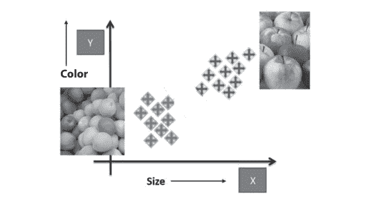

**图10.1** 基于大小和颜色的苹果与桃子数据集分布

为了进行分类，我们必须为机器提供一些水果样本库，并将库中的每个水果标记为“苹果”或“桃子”。例如，我们有一个包含约100个水果的带标签数据集，每个水果都有对应的标签，即“苹果”或“桃子”。当这些数据被输入机器时，它将分析这些水果并进行自我训练。训练完成后，如果有新的水果进入库中，机器将对其进行分类，判断它是“苹果”还是“桃子”。

大多数传统的机器学习算法通过观察库中完美的苹果和完美的桃子来学习，即它们通过观察库中理想的苹果（在大小和颜色上非常像苹果的苹果）和完美的桃子（在大小和颜色上非常像桃子的桃子）来进行自我训练。这些标准样本很可能出现在库的核心区域。库的核心区域如图10.2所示。

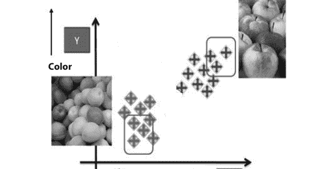

**图10.2** 数据集核心区域的标准苹果和桃子

然后，基于这种训练，对新水果进行分类。通常，大多数分类算法都是这样工作的，但SVM并非如此。SVM不是观察理想的苹果和桃子样本，而是观察那些看起来像桃子的苹果和那些看起来像苹果的桃子。SVM的工作原理很简单：如果一个分类器能够正确分类不同类别的相似对象（即特征非常相似但属于不同类别的对象），那么它也能轻松地分类标准对象（即特征非常不同且属于不同类别的对象）。

因此，在训练过程中，SVM会选择那些在大小和颜色上与桃子非常相似的苹果，如图10.3所示。SVM也会选择那些在大小和颜色上与苹果非常相似的桃子，如图10.4所示。这样，SVM基于这些极端情况进行研究并分析其特征。在分析了这些极端情况的特征后，分类器试图找到一条能够正确分离两个类别的分隔线。这条分隔线被称为超平面，如图10.5所示。处理极端情况背后的理念是，如果分类器在极端情况下表现良好，那么处理正常样本自然就很容易了。因此，SVM作为分类器非常高效。

SVM的整个理念基于识别具有相似特征但属于不同类别的数据点或向量，并在这些数据点之间创建一条分隔线；因此，这些具有相似特征但属于不同类别的数据点或向量被称为支持向量。

支持向量是更靠近超平面并影响超平面位置和方向的数据点。利用这些支持向量，我们最大化分类器的间隔。

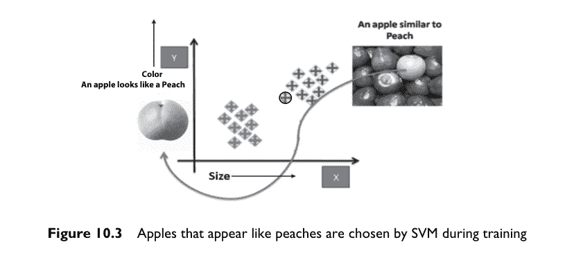

**图10.3** SVM在训练期间选择看起来像桃子的苹果

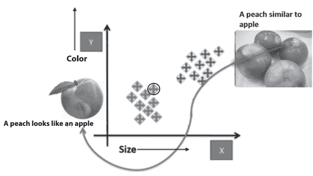

**图10.4** SVM在训练期间选择看起来像苹果的桃子

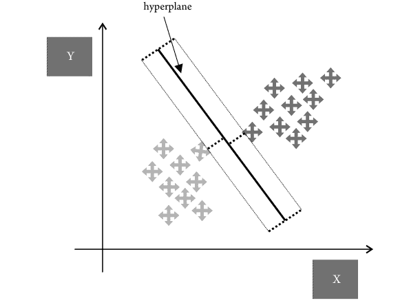

**图10.5** 分隔两个类别——苹果和桃子的超平面

因此，SVM的主要任务是通过识别一条理想线来正确分类两个类别，这条线将数据集分成两类。

这条分隔线（超平面）将作为决策线，作为分类的参考；每当有新的观测值添加到现有的观测池中时，确定新观测值所属的类别（或类）就变得相当容易。

但挑战在于，可以画出许多条线来达到预期目的；其中一些可能性如图10.6和图10.7所示。

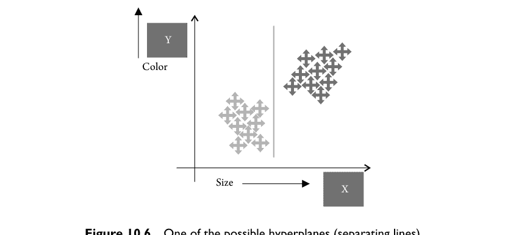

**图10.6** 一种可能的超平面（分隔线）

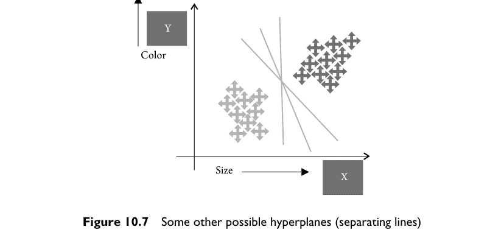

**图10.7** 其他一些可能的超平面（分隔线）

因此，SVM的挑战在于识别最佳分隔线或最优线，即最合适的线，以最佳方式进行分隔。

需要注意的是，这条线的选择非常重要，因为它将影响我们未来所有的类别预测；因此，如图10.7所示的每条可能的超平面都可能产生不同的结果，所以在所有可能的线中选择最佳分隔线非常重要。

## 10.2 识别正确超平面的规则

SVM中的主要挑战是识别正确的超平面。以下是指导SVM中最佳超平面识别的规则。这些规则如下：

### 规则1：选择能更好分隔类别的超平面

如图10.8所示，这里有三个超平面（A、B和C）。让我们将规则1应用于此数据集。

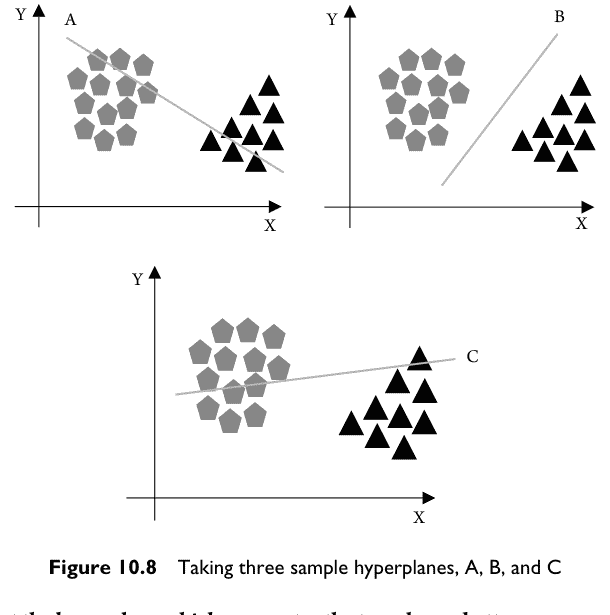

### 规则1：选择能更好分隔两个类别的超平面。

在这里，超平面A和C无法分隔类别，因为一些三角形会被分类为五边形，反之亦然。在这种情况下，将选择超平面B以最佳方式分隔两个类别。

### 规则2：选择与属于不同类别的最近数据点距离最大的超平面。

规则2确保了准确的分类，并通过选择具有最大间隔的超平面为模型增加了鲁棒性。如果SVM选择了一个具有最小间隔的超平面，可能会导致误分类。

让我们参考图10.9，你会发现三个超平面A、B和C，它们都适当地分隔了两个类别。我们将应用规则2来选择最佳超平面。

> 根据规则2，我们必须选择*与属于不同类别的最近数据点距离最大*的超平面。

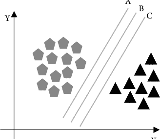

**图10.9** 基于规则2选择B作为最佳超平面

这个距离被称为***间隔***，在图10.10中用线表示超平面与每个类别最近数据点之间的距离。可以看出，超平面B的间隔大于A和C的间隔。因此，我们将选择具有最大间隔的超平面。在这种情况下，B具有最大间隔，因此它将被选为我们的超平面。

具有最大间隔值的超平面被称为***最优超平面***。

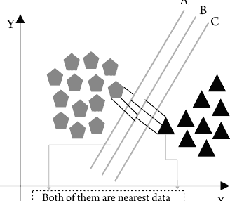

**图10.10** 选择具有最大间隔的超平面

### 规则3：忽略异常值，找到具有最大间隔的超平面

让我们为一个散点图如图10.11所示的数据集找到一个合适的超平面。一条直线无法分隔两个类别，因为其中一个三角形位于五边形的区域内。

这个数据点是一个**异常值**。

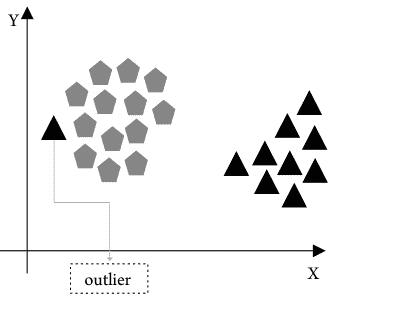

**图10.11** 发现一个异常值

SVM提供了一个重要特性，即在选择具有最大间隔的超平面时忽略异常值。因此，我们将忽略异常值来绘制一个超平面，如图10.12所示。

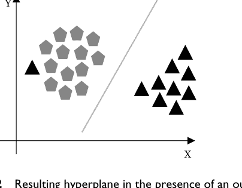

**图10.12** 存在异常值时得到的超平面

**练习**

现在，我们已经准备好为任何散点图识别超平面。根据我们对规则的讨论，在给定的超平面（A和B）中识别正确的超平面，如图10.13所示。

**解答：** 在这种情况下，正确答案是超平面B。你可能选择了超平面A，因为它的间隔比超平面B的间隔大。但不幸的是，这是错误的答案。相反，我们应该选择超平面B。让我们理解为什么？

如果我们回顾之前学习的三个规则，SVM会选择那些能准确分隔类别的超平面，并选择具有最大间隔的那个。

**图 10.13** 散点图的给定超平面

此处，超平面 A 存在一个分类错误，因为其中一个五边形（PENTAGONS）仍与三角形（TRIANGLES）混在一起，而超平面 B 则准确地对类别进行了分类。因此，尽管 B 的间隔小于 A 的间隔，我们仍然选择 B，因为它能准确地分隔数据点。所以，正确的超平面是 B。

**注意：SVM 的目标是找到具有最大间隔的超平面，但优先考虑的是那些能准确分隔类别的超平面。**

## 10.3 SVM 中使用的一些重要概念和术语

让我们以一个场景为例，其中 SVM 已应用于一个样本数据集，其结果如图 10.14 所示。让我们通过这张图来理解一些重要的概念和术语。

**图 10.14** 与 SVM 相关的一些重要术语

### 10.3.1 支持向量

支持向量是靠近超平面并影响超平面位置和方向的数据点。这些是具有相似特征但属于不同类别的数据点或向量。利用这些支持向量，我们最大化分类器的间隔。

如图 10.14 所示，各个观测值的坐标或给定数据点被称为向量。这里，我们研究的只有两个变量或属性，就像苹果和桃子例子中的颜色和大小属性一样。但在某些情况下，我们研究的属性或变量超过两个。在这种情况下，每个数据点都充当一个维度空间。因此，我们将数据点称为向量，而不仅仅是点或数据点。

### 10.3.2 最大化间隔

SVM 的主要目标是以最佳方式绘制一个决策边界来分隔两个类别。为此，SVM 最大化两个类别之间的分离平面（如图 10.14 所示，两条外部虚线之间的狭窄通道）；这个宽阔的平面被称为最大化间隔。

为了更好地理解，图 10.15 详细描绘了间隔或最大化间隔。在最大化超平面中，我们有一条中线以最佳方式分隔两个类别。这条由 SVM 搜索到的线具有最大间隔，是任何分类问题的最佳分离线，被称为**最大化间隔超平面**或**最优超平面**。

### 10.3.3 正超平面和负超平面

在图 10.16 中，我们展示了最大间隔超平面的两种可能方向。情况 I 展示了一个具有正斜率的最大间隔超平面，而情况 II 展示了一个具有负斜率的最大间隔超平面。在这两种情况下，如果我们逆时针看，最大间隔超平面右侧的超平面被称为*正超平面*。类似地，最大间隔超平面左侧的超平面被称为*负超平面*。

因此，你需要注意的最重要的事情之一是*支持向量*。确切地说，*支持向量*是位于正超平面和负超平面上的数据点。

在图 10.17 中，我们标记了正、负和最大间隔超平面。这类似于图 10.16 中所示的最大超平面的第二种情况（情况 II），其中最大间隔超平面的斜率为负。

## 10.4 SVM 分类器的类型

支持向量机或 SVM 在机器学习（ML）领域并非新成员。SVM 的历史可以追溯到 20 世纪 60 年代，当时它们首次被开发出来，但后来由于 90 年代现有算法的发展和新的补充，它成为了一种突出的机器学习算法。

SVM 算法由 Vladimir Vapnik 和 Alexey Chervonenkis 于 1963 年发明，他们提出了一个“最大间隔分类器”模型或传统 SVM，支持为线性数据绘制超平面。1992 年，Bernhard Boser、Isabelle Guyon 和 Vladimir Vapnik 建议通过将核技巧应用于最大间隔来创建非线性分类器。因此，SVM 可以处理线性和非线性数据，这样 SVM 分类器被分为两类，即线性 SVM 和非线性 SVM 分类器。

在本节中，我们将逐一讨论这些内容。

### 10.4.1 线性 SVM 分类器

在线性 SVM 分类器中，我们有可以通过直线超平面分隔的类别。

在绘制超平面时，主要关注点是最大化超平面到属于不同类别的最近数据点的距离（或间隔）。因此，绘制的超平面被称为**最大化间隔超平面**。

例如，在图 10.18 中，一条直线可以轻松地分隔两个不同的类别，三角形（TRIANGLES）和五边形（PENTAGON）。因此，这是一个线性可分数据的案例。

到目前为止，本章讨论的所有示例都属于线性 SVM 分类器，因为在所有情况下，类别都可以通过直线超平面线性分隔。

**图 10.18** 使用线性 SVM 分类器的线性可分数据

### 10.4.2 非线性 SVM 分类器

将 SVM 应用于非线性数据集 | Parteek Bhatia, https://youtu.be/TyPvpzUE4t8

与线性可分数据不同，许多现实世界的问题并不像分类苹果和桃子那样简单。它们涉及无法用简单直线分类的数据。图 10.9 显示了一些无法使用直线超平面分类的非线性数据集。

例如，如图 10.19 所示，很明显数据无法用任何直线分隔，即数据不是线性可分的。

在这些情况下，我们利用利用核技巧的非线性分类器。这种技术涉及将输入空间映射到更高维空间，从而使 SVM 能够为非线性数据集确定一个最大化间隔超平面。因此，在非线性 SVM 分类中，数据点被绘制在更高维空间中。乍一看，这可能对你来说很复杂。但不要担心；在接下来的章节中，我们将讨论将数据点转换到更高维空间的过程，因为这是使用 SVM 对非线性数据进行分类的关键。

因此，我们可以得出结论，SVM 可以应用核来构建非线性分类器，以对非线性数据集进行分类。

## 10.5 深入探讨非线性 SVM 分类器

在本节中，我们将更详细地探讨非线性 SVM 分类器。在图 10.19 中，我们有一个数据集的散点图，其中不可能找到一个线性可分的超平面来将数据集分类为两个不同的类别。这只能通过非线性超平面来实现。对于这样的数据集，找到一个可以分隔两个类别的单一超平面是困难的。图 10.20 描绘了一个类似的例子，一个非线性分布的数据集通过不同方向的单一超平面进行分隔。我们尝试使用对角线、水平、垂直和左侧超平面来分隔两个类别。没有一种可能性能完美地分隔这两个类别。

**图 10.20** 使用线性超平面的不同可能性分隔的非线性数据**

非线性数据不能仅仅通过使用平面线来分类。因此，为了处理这种类型的数据，使用了一个二维（2D）平面（X 和 Y 轴），一个特殊的映射函数，它将数据从 2D 平面映射到三维（3D）平面（到更高维空间），如图 10.21 所示。一旦我们将这些数据映射到 3D 平面，我们就可以轻松地找到三角形（TRIANGLES）和五边形（PENTAGON）类别之间的分区平面，如图 10.21 所示。因此，可以在两个类别之间绘制一个超平面来对它们进行分类。通过这种方式，映射函数和转换可以处理这种无法线性分离的数据类型。在本节中，我们将深入探讨这个概念。

### 10.5.1 案例一：当非线性数据为一维时

为了更好地理解高维空间的概念，我们将首先使用一个由九个数据点组成的一维（1D）数据集，这些数据点属于两个不同的类别，即“叉号”和“圆圈”，如图10.22所示。我们的目标是将这些数据点准确地分为两类。

**图10.22** 一维空间中的样本数据点

在之前讨论的例子中，我们有一个二维散点图，其中我们确定了一条直线来分隔数据点的类别，例如“三角形”和“五边形”的情况。现在，我们有一维数据，如图10.22所示。在一维数据点中，我们将得到一个分离点，而不是一条直线来将数据点分隔成不同的类别。因此，在一维情况下，我们的目标是找到一个分离点，该点能够线性地将数据点分隔到各自的类别中。

在我们的一维问题中，如图10.22所示，我们需要找到一个分离点或*超平面的一个实例*，该点能够完美地将“叉号”数据点与“圆圈”数据点分隔开。

让我们假设数据点的中心（比如A点）作为分离点，如图10.23所示。可以看出，A点不是一个好的分离点选择，因为在A点的左侧，我们有所有的“叉号”数据点，而A点的右侧则包含了两个类别的数据点。因此，A点无法产生正确的分类。

**图10.23** 假设A点为超平面的实例

这里，我们选择另一个点A'作为分离点，如图10.24所示。但仔细分析图10.24表明，A'同样是一个糟糕的选择，因为在A'的左侧我们有两个类别的数据点。因此，我们也舍弃A'。

**图10.24** 假设A'点为超平面的实例

因此，我们可以从这个讨论中得出结论：对于给定的数据集，不可能找到一个简单的数据点或分离点，能够线性地将数据点准确地分为两类。

图10.21提出了一种技术，通过将数据点变换到更高维空间来线性分隔此类数据集。换句话说，如果我们能将数据集的数据点从一维变换到二维（更高维度），我们就能找到一个合适的超平面或线性分隔器来分隔这两个类别。

现在，基本问题是：我们将如何执行这种变换？我们将使用一个***映射函数***将数据点从一维数据空间变换到二维数据空间。

让我们根据这些数据点各自的数值将它们标记在图表上，如图10.25所示。

**图10.25** 包含9个不同项目的非线性数据集

现在，我们将通过将数据点代入公式（10.1）给出的数学函数$f$来应用变换。

$$f = x - 4 \quad (10.1)$$

这里，$x$表示图10.25中所示数据点的相应值。通过对数据点应用函数$f$，我们从每个数据点的值中减去4。应用函数$f$后，数据点将向0的左侧移动，如图10.26所示。

**图10.26** 对数据点应用函数$f$后得到的图

之后，我们将对之前获得的数据点值进行平方。最后，在对值进行平方后，我们可以将公式（10.1）写成公式（10.2）：

$$f = (x - 4)^2 \quad (10.2)$$

我们将应用公式（10.2）给出的映射函数$f$，该函数通过添加Y轴将这些数据点变换为二维。每个数据点的$y$坐标应符合公式（10.2）。

$$y = f = (x - 4)^2$$

如果我们绘制更新后的数据点值以及得到的$f$的图形（由公式（10.2）给出），我们将得到如图10.27所示的结果。

**图10.27** 应用$f$函数后的变化

从图10.27中，我们可以得出结论：在对数据点的初始值应用函数$f$后，数据点从一维变换到了二维。最初，如图10.22所示，这些数据点表示在单个轴上。在对它们各自的值应用函数$f$后，它们转移到了二维空间，如图10.27所示，表示在X轴和Y轴上。因此，函数$f$就是**我们的映射函数**。

如果你仔细观察图10.27，你会发现将数据点从一维变换到二维的优势。在变换这些数据点之前，我们无法找到合适的超平面（或超平面的实例）。但现在我们可以轻松地为这些变换后的数据点绘制一条线性可分的直线，该直线能正确地将这些点分类到各自的类别中，如图10.28所示。

**图10.28** 数据点变换后识别超平面

因此，我们可以在二维数据空间中轻松地对每个类别的数据点（我们例子中的“叉号”和“圆圈”）进行分类，只需绘制一个超平面，如图10.29所示。在曲线上绘制了一条虚线直线或超平面，以便将每个类别的数据点分隔到不同的区域。我们可以在图10.29中看到，“叉号”的数据点都位于超平面之上，而“圆圈”的数据点则位于超平面之下。

**图10.29** 将数据点分隔为两类的超平面

因此，我们可以从讨论中得出结论：如果数据最初是非线性可分的且为一维，那么通过应用合适的映射函数$f$，我们可以将数据点变换到更高维的空间（二维空间），在那里我们可以轻松地找到一个超平面。借助超平面，我们可以准确地将数据点分类到各自的类别中。

### 10.5.2 案例二：当非线性数据为二维时

让我们考虑另一个二维数据点的例子，如图10.30所示。

**图10.30** 二维空间中的一个非线性可分数据集

我们无法线性地分隔这个数据集。因此，它是一个二维的非线性可分数据集。为了处理这个问题，我们将采用与案例一相同的方法。这里，我们将使用合适的函数$f$将数据点从二维变换到更高维（三维空间）。通过应用函数$f$将给定数据集从二维数据空间变换到三维数据空间的过程如图10.31所示。

**图10.31** 将数据点从二维数据空间映射到三维数据空间

图10.31的左侧展示了二维数据空间（X轴和Y轴）中的数据点。在使用合适的映射函数$f$变换这些数据点后，我们得到了三维空间（X、Y和Z轴）中的数据点，如图10.31右侧所示。

不知何故，三维数据空间变成了一个线性可分的数据集，如图10.31右侧所示，其中已识别出一个超平面。这个超平面不再是一条直线；相反，随着Z轴的引入，我们有了一个三维平面将数据点按其类别分隔开来。因此，SVM有助于识别一个超平面，利用它可以进行进一步的分类。当在三维数据空间中获得的结果通过映射函数投影回二维数据空间时，我们得到一个圆，如图10.32所示。这个识别出的圆是数据点的非线性分隔符，我们可以用它来区分每个类别的数据点。

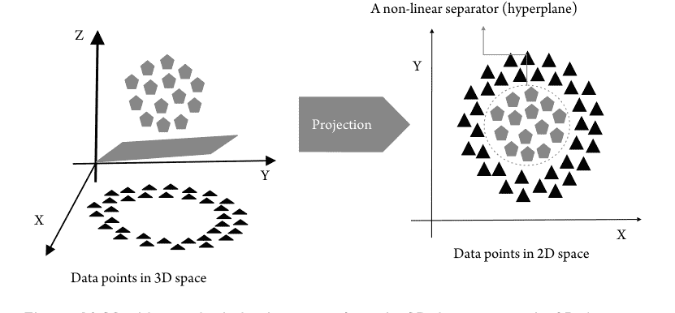

## 10.6 定义超平面

理解了这些概念之后，我们现在可以引入超平面的正式定义了。

> 在n维欧几里得空间中，超平面是一个平坦的n-1维子集，它将给定的欧几里得空间分成两个独立且不相连的部分。

请参考表10.1，该表总结了突出显示各自欧几里得空间中可能超平面的各种情况。

表10.1 不同欧几里得空间及其对应超平面的总结

| 欧几里得空间（n维） | 超平面（n-1维） |
| :--- | :--- |
| 一维或直线 | 将直线分成两等份的分隔点。 |
| 二维 | 一条能适当分隔观测点的直线就是超平面。 |
| 三维 | 二维曲线/函数就是超平面。 |

## 10.7 将数据点映射到高维空间并将其投影回低维空间的局限性

使用上述方法将数据集转换到更高维空间，我们可以轻松识别超平面并对非线性可分数据集的数据点进行分类。但这种方法存在某些局限性，例如，它需要大量的计算（就确定和应用映射函数将数据点映射到更高维空间，然后再将它们投影回低维空间而言）和巨大的处理能力。

在将数据点从低维空间转换到高维空间以及反向转换的过程中，映射函数被应用于数据集，造成处理积压、延迟以及若干其他系统问题。因此，我们可以认为所提出的方法并非最佳选择。

因此，该方法的复杂性相当高，为了降低复杂性，我们使用一种称为*核技巧*的不同方法。

核是一种数学概念，它无需将数据点从低维空间转换到高维空间以及反向转换，就能识别决策边界。

下一节将全面讨论SVM核技巧的概念。

## 10.8 SVM核

1992年，Boser、Guyon和Vapnik发现，一个旧技巧可以用来将数据点映射到一个新的空间，在这个空间里，原始学习问题变得更容易解决，而不会增加数学复杂性。

**核**就是他们发现的技巧，它使用特征映射来极其简单地完成这项任务。在上一节中，我们研究了几个案例，探讨了当数据点被转换到更高维度时，问题如何变得可被一个平面分隔。

***借助核，我们可以将数据点从维度D转换到另一个维度D（其中D小于D）。*** 例如，使用核，我们可以轻松地将数据点从二维（D）空间转换到三维（D）空间。

我们在上一节已经强调了将数据点从一个空间转换到另一个空间的方法的某些局限性。在核化过程中，我们使用核函数，通过定义一个隐式特征映射来规避这些局限性，也就是说，我们不必陷入寻找合适函数将数据点映射到更高维度的复杂性中。根据我们所处理的领域，有多种类型的核函数，例如线性（平凡）、二次、多项式以及高斯或径向基函数（RBF）核。在接下来的章节中，我们将以RBF核函数为例，这是理解核工作原理最常用的核。

### 10.8.1 径向基函数（RBF）或高斯核函数

SVM RBF Kernel | Parteek Bhatia, https://youtu.be/qYKCPcvHwDg

RBF或高斯核函数也被称为“平稳核”。它基于两个数据点之间的距离，如果两点之间的距离按相同比例变化，核函数的值保持不变。

那么，让我们首先理解函数定义。公式（10.3）表示RBF核函数（K）的公式。

$$K(x, \bar{x}) = e^{-\left( \frac{\|x - \bar{x}\|^2}{2\sigma^2} \right)}$$

乍一看，这个公式似乎相当复杂。但不用担心；我们将以非常简化的方式解码这个公式的每一项。

这里，$K(x, \bar{x})$表示核函数的值，它接受两个参数，$x$和$\bar{x}$。其中$x$和$\bar{x}$是给定数据集中的两个向量，$K$作用于其上；它们可以是数据集中的任意随机数据点，$\bar{x}$也被称为数据集的**地标**。需要注意的是，一个给定的数据集可能有多个地标。

公式（10.3）中的另一个重要符号是*超参数或sigma*，用$\sigma$表示。（我们此刻不必过多思考$\sigma$的含义或相关性，我们很快会进一步讨论它。）

因此，根据公式，$K$是通过计算一个随机数据点（$x$）与其地标（$\bar{x}$）之间欧几里得距离的平方，除以超参数（$\sigma$）平方值的两倍，最后将所得值的负值作为指数（$e$）的幂来计算的。因此，通过观察公式，我们可以说核类似于总误差的指数函数定义。

该公式涉及大量数学知识，因此为了简单理解，我们将首先分析该公式。所以，让我们参考图10.33来分析公式（10.3）中给出的公式。

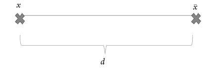

**图10.33** 两个节点之间的距离

核函数$K$接收两个参数，$x$和$\bar{x}$，它们是位于给定（低）维空间$D$中的两个数据点。

$$K(x, \bar{x}) = \exp\left(-\frac{\|x - \bar{x}\|^2}{2\sigma^2}\right) = e^{-\left(\|x - \bar{x}\|^2 / 2\sigma^2\right)}$$

然后计算这些点之间的欧几里得距离的平方，由项$\|x - \bar{x}\|^2$表示。这个欧几里得距离在*核*的工作中起着至关重要的作用，因此，点之间的距离对核的最终值有显著影响。

本小节的内容受到Vibhuti Siddhpura撰写的教程《SVM分类基础》的影响，该教程可在https://medium.com/@vibhuti.siddhpura/basics-of-svm-forclassification-99f58bb30aec获取。


这可以通过以下两种情况来理解。

#### 情况1：如果两点之间的距离增加，则核将减小

如果$x$和$\bar{x}$之间的距离很大，那么指数将作用于一个大的负项来计算核值。

$$K(x, \bar{x}) = \exp\left(-\frac{\|x - \bar{x}\|^2}{2\sigma^2}\right) = e^{-\left(\|x - \bar{x}\|^2 / 2\sigma^2\right)}$$

如表10.2，性质I所示，一个非常大的负值的指数是0。因此，*如果两点之间的距离增加，核函数的值会减小（最小值为0）*。

**表10.2 指数函数（$e^x$）的性质**

| 性质I | $e^{-\infty} = 0$ | 原因：$e^{-\infty} = \frac{1}{e^{\infty}} = \frac{1}{\infty} = 0$ |
| :--- | :--- | :--- |
| 性质II | $e^0 = 1$ | 原因：任何数的0次幂都是1。 |

#### 情况2：如果两点之间的距离减小，则核将增大

类似地，如果$x$和$\bar{x}$之间的距离很小或减小到0，那么指数将作用于0。

$$K(x, \bar{x}) = \exp\left(-\frac{\|x - \bar{x}\|^2}{2\sigma^2}\right) = e^{-\left(\|x - \bar{x}\|^2 / 2\sigma^2\right)}$$

根据表10.2的性质II，任何数的0次幂都等于1。因此，*如果两点之间的距离减小，那么核函数返回的值会增大（最大值为1）*。

所以，综合以上两种可能性，我们可以得出结论：核函数的值介于0到1之间，其中0表示数据集中的点之间不相似，1表示数据点之间相似。

根据机器学习中相似性的概念，核函数的行为是“*相似的项在某个n维空间中绘制时会彼此靠近*”。这意味着当$x$和$\bar{x}$之间的距离减小或它们相似时，核函数值将趋近于1（越接近1表示越相似）；而当$x$和$\bar{x}$之间的距离增大或它们不相似时，核函数值将趋近于0（越接近0表示数据点越不相似）。因此，核函数是根据相似性概念工作的。

核函数与点之间欧几里得距离的关系如图10.34所示。

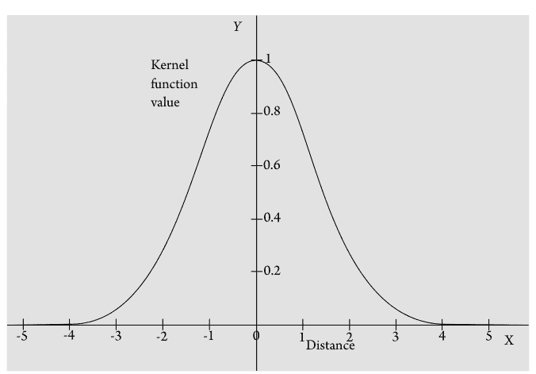

**图10.34** 核函数与点之间距离的关系（$\sigma = 4$）

在图10.34所示的图中，X轴表示$x$和$\bar{x}$之间的距离，Y轴显示了不同距离对应的核函数值。核函数的值介于0到1之间。

我们也可以通过这个图来研究这两种可能性。如图10.34的图所示，当点之间的距离较大时，比如大于4，核函数值会减小到0。如果点之间的距离小于4且大于0，核函数值可以高达1。例如，如果点之间的距离是0.1，那么核函数值近似为1；而如果距离是5，那么核函数值就是0。

图10.34中绘制的图是针对某个σ值的。一旦我们改变σ的值，就会看到图中发生显著变化。因此，σ在核函数的选择中起着至关重要的作用。如图10.34所示，凸起的宽度（*在X轴上从-4到4*）由超参数（σ）的值决定。

现在，一个重要的问题是，我们如何决定超参数（σ）的合适值？选择超参数（σ）值的指导原则将在下一节讨论。

### 10.8.2 选择超参数（σ）的合适值

sigma的值设置方式应使得一类的数据点落在核函数或锥形或凸起的区域内，而另一类的数据点落在核函数区域之外。图10.35说明了这一概念。

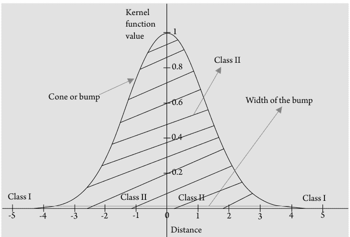

**图10.35** 选择σ的合适值

我们也可以通过以下直觉来理解。

我们已经知道，如图10.35所示，曲线的“凸起宽度”受σ值的影响。因此，我们选择σ的值，使得II类的数据点仅被封装在凸起或锥形内部，而I类的数据点位于凸起或锥形的宽度之外，如图10.35所示。

如果I类的数据点也位于凸起内部并与II类混合，则需要调整sigma（σ），使得所有I类的数据点都应位于锥形或凸起外部标记的区域。相反，II类的数据点应始终位于锥形或凸起内部，如图10.35所示。因此，锥形或凸起的宽度就是I类和II类数据点之间的超平面。

现在，让我们看另一个例子，如图10.36所示。
在图10.36所示的图中，如果我们根据目前所学的理论，那么当距离大于3时，核函数值应大致等于0；如果距离小于3但大于0，那么核函数值应介于0和1之间。

所以，让我们举几个例子来验证这是否正确。在图10.36中，如果我们有一个距离，比如1（*小于3*），那么核函数值近似为0.5；如果我们有一个距离0.5，那么核函数值近似为1。需要注意的是，如果点正好位于核函数的中心，那么距离为0，核函数值变为1。对于任何大于3的距离，核函数值近似为0，如图10.36所示。我们可以大致说，当我们从距离3处向核函数中心移动时，相应的核函数值也从0增加到1。

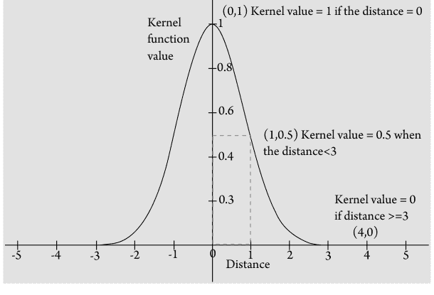

**图10.36** 核函数与距离的关系（凸起宽度从-3到3）

让我们再看一个例子，如图10.37所示，其中我们绘制了一个sigma值较大的图。如图10.37所示，如果距离大于10，*核函数*值为0；如果距离小于10但大于0，*核函数*值将在0到1的范围内。因此，I类的所有数据元素都位于*K* = 0的区域，II类的所有数据点都位于*K* > 0的区域，如图10.37所示。

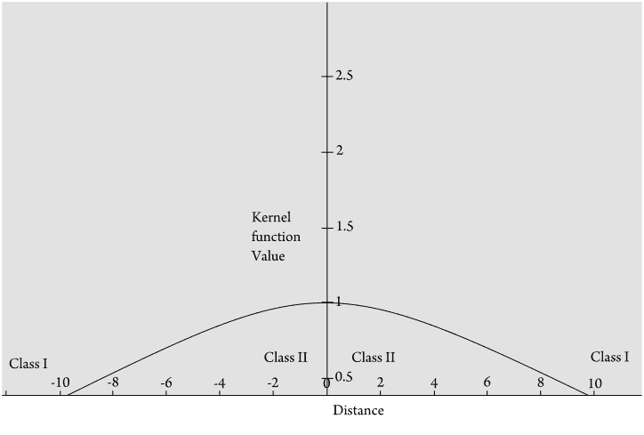

**图10.37** sigma较大时（σ = 10）核函数值与相应距离的关系图

### 10.8.3 从3D视角理解RBF核函数

让我们深入探讨核函数的概念，并将我们目前研究的曲线（从图10.34到图10.37）投影到3D空间，看看它在现实中是如何工作的。

图10.38显示了在3D空间中针对某个特定σ值的高斯RBF核图。所绘图对应的RBF核函数公式如下：

$$K(x, \bar{x}) = \exp\left(-\frac{\|x - \bar{x}\|^2}{2\sigma^2}\right) = e^{-\left(\frac{\|x - \bar{x}\|^2}{2\sigma^2}\right)}$$

这里，公式基于两点$x$和$\bar{x}$之间的欧几里得距离，其中$x$是图10.39所示$XY$平面上的一个随机点，$\bar{x}$是作为地标选取的点。在图10.39所示的3D图中，地标$\bar{x}$位于平面中央，正好在锥形点下方。它就像是3D数据空间（0,0,0）的质心。

现在，对于位于$XY$平面上的每个数据点$x$（属于I类或II类），计算地标点$\bar{x}$和数据点$x$之间的欧几里得距离，如图10.39所示，并根据上面给出的核函数$K(x, \bar{x})$公式计算核函数值。

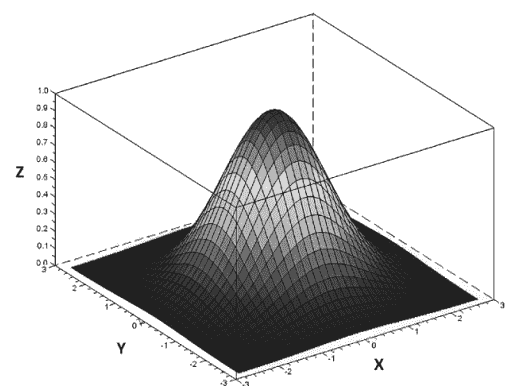

**图10.38** 3维高斯RBF核

现在，让我们继续前进，看看核技巧如何帮助我们无需进行任何复杂计算就能找到超平面。我们有两个数据点，A（I类）和B（II类），位于*XY平面*上，如图10.39所示。我们的目标是绘制一个超平面来分离I类和II类数据点。

如图10.39所示，我们可以得出结论：数据点$x$离地标$\bar{x}$越远，核函数值越趋近于0；而地标$\bar{x}$和数据点$x$之间的距离减小时，核函数值趋近于1，如下所示。

| 情况 | 条件 | 核函数值 |
| :--- | :--- | :--- |
| **情况 I** | 如果两点之间的距离增大 | 核函数值趋近于 0 |
| **情况 II** | 如果两点之间的距离减小 | 核函数值趋近于 1 |

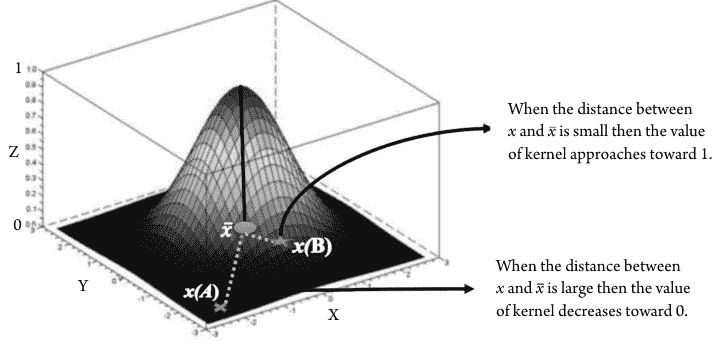

**图10.39** 地标点的选择

一旦我们基于此获得了核函数值，我们就可以绘制一个边界，将数据点分隔到各自的类别中。

让我们考虑一个2D空间中的数据点散点图，如图10.40所示。

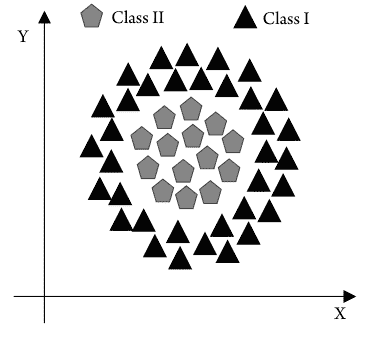

**图10.40** 数据集的2D图

这些数据点与核函数之间的关系如图10.41所示。基于所选的地标，使用核函数计算欧几里得距离（就像我们对点A和B所做的那样）。根据数据点的距离，将0到1的核函数值分配给它们。最终，在数据点上绘制一个圆。这个圆的半径由一个超参数或sigma（σ）控制，其值的选择应使得II类的所有数据点都在圆内，而I类的数据点保持在圆外，如图10.41所示。

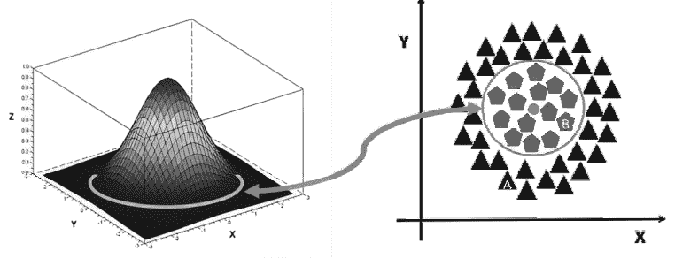

**图10.41** 数据集与*核函数*之间的关系

圆的周长使得模型能够将所有第二类点包含在圆内，其核函数值将大于0。所有第一类数据点都将位于圆外，其核函数值将等于0，如图10.41所示。

因此，如果将*核*函数应用于位于圆锥体外的数据项，它们各自的值将非常接近0，从而将其归类为第一类。另一方面，如果任何点落在圆周内，则表明它是数据集的另一类，即第二类，如图10.41所示。因此，这个*核*函数有助于将数据集分类到其各自定义的数据项类别中，即第一类或第二类。

现在，让我们强调一下**超参数或西格玛（σ）的作用**。

西格玛在决定圆的周长方面起着至关重要的作用。它帮助我们决定封装圆的确切宽度。如果西格玛（σ）的值增加，它将包含更多的数据项（即，一些第一类的数据项将进入圆内，第一类和第二类的数据点将混合）。如果西格玛（σ）的值减小，它将包含更少的数据项空间（即，一些第二类的数据点将位于圆外，同样第一类和第二类的数据点混合），如图10.42所示。

因此，需要正确的西格玛值来确定正确的*核*函数，并获得正确的分离超平面。西格玛（σ）的变化允许对每个数据集元素进行正确分类。因此，使用高维空间中的西格玛值创建了决策边界，而无需创建映射函数。最后，根据核函数为每个数据集点分配相应的类别。

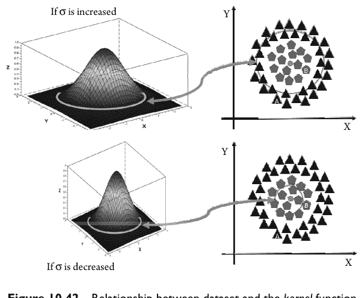

**图10.42** 数据集与*核*函数之间的关系

### 10.8.4 将多个核应用于数据集

为了理解多个核在数据集上的应用，让我们考虑一个例子，其散点图如图10.43所示。单个*核*将不足以处理这个问题。

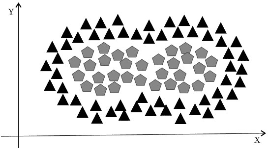

在这种情况下，我们将使用多个核来对数据集进行分类。因此，我们可以用公式（10.4）给出的以下数学表达式来表示数据集的解。

$K(x, \overline{x}_1) + K(x, \overline{x}_2)$

简单来说，公式（10.4）表示两个*核*，它们基于两个地标$\overline{x}_1$和$\overline{x}_2$用于表达式中。如图10.43所示，这两个地标对于将数据点分类到各自的类别中都是必要的。地标$\overline{x}_1$将封装左侧的数据点，地标$\overline{x}_2$将封装右侧的数据点，如图10.44所示。

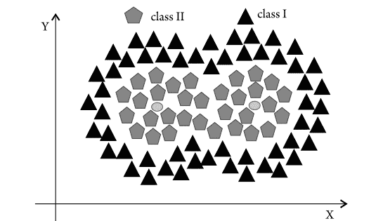

生成的核值将被相加以获得最终的超平面。必须注意的是，地标之间不会相互影响。当我们远离一个地标（距离增加）时，核的值会减小到0。因此，地标不会相互干扰，我们可以为给定的例子设置两个地标。

基于核值绘制决策边界，核采用与我们之前讨论的相同方法来划定分离圆周。公式（10.4）基于以下标准绘制决策边界。

如果$K(x, \overline{x}_1) + K(x, \overline{x}_2)$的结果值为0，则将其归类为第一类；如果大于0但小于1，则将其归类为第二类，如图10.45所示。因此，这个*核*函数有助于将数据集分类到其各自定义的数据项类别中。最后，绘制了决策边界，如图10.45所示。

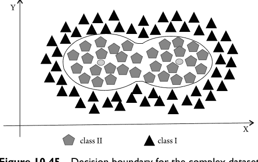

因此，我们可以得出结论，通过核技巧，复杂问题可以在更少的计算量下解决，并且可以识别非线性数据集的超平面。

## 10.9 SVM的调优参数

SVM具有“调优参数”，如gamma和正则化参数，可以调整它们的值以实现更高的准确性。因此，***调优参数***是在创建SVM分类器时传递其值的参数。一些重要的调优参数如下。

### 10.9.1 Gamma

Gamma参数定义了单个训练示例的影响范围。低gamma值意味着影响范围远，而高gamma值意味着影响范围近。具有低或高gamma值的模型准确性较低，而中间值会产生更好的决策边界，如图10.46所示。

我们还可以推断出，gamma参数与训练示例的影响区域半径成反比。

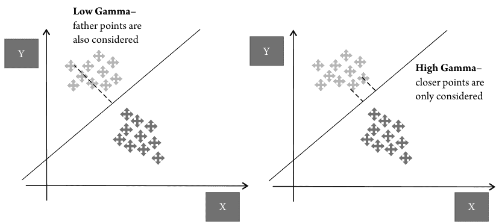

从图10.46可以推断出，非常小的gamma值（0.008）对模型限制过多，使其无法捕捉数据的复杂性或形状。另一方面，中间gamma值（0.1）产生了一个好的模型。然而，较大的gamma值（7.0）导致支持向量周围的影响区域半径较小，从而导致准确性降低。

### 10.9.2 正则化

正则化参数，也表示为C参数，决定了在识别超平面期间允许多少误分类。简单来说，它指导SVM根据允许的误分类量选择合适的超平面。正则化参数的值也用lambda或λ表示。

大的正则化值意味着在识别超平面期间不允许或只允许很少的误分类。这意味着分类器试图通过选择一个非常小的间隔超平面来正确分类所有训练点。

同样，小的正则化值意味着在识别超平面期间允许误分类。因此，SVM优化将选择一个更大的间隔分离超平面，即使该超平面会错误分类一些点。

通常，SVM旨在找到一个最大间隔超平面，最小化误分类。然而，对于难以找到超平面的不可分问题，我们通常在此类场景中允许误分类。因此，训练示例的误分类经常发生，正则化会告知SVM优化器在训练示例中允许多少误分类。

正则化参数的影响可以通过图10.47来研究，我们可以看到误分类的数量通过我们选择的正则化参数（无论是高还是低）得到调节。高的正则化参数值也有助于获得非线性超平面，以正确分类所有样本。

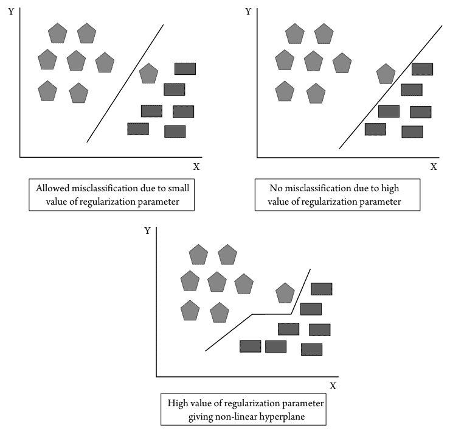

**图10.47** 正则化参数的影响

至此，我们完成了关于SVM的讨论。本章解释了SVM算法如何在*n维空间*中找到一个超平面，用于对线性和非线性平面中的数据点进行分类。我们的讨论还涵盖了核技巧在简化“识别超平面”问题方面的数学方面。

在下一章中，我们将通过不同的案例研究来讨论各种分类器的实现。

#### 提醒我

- SVM是监督式机器学习模型，用于解决回归和分类问题。
- SVM的工作原理很简单，它说：“如果一个分类器能够正确分类不同类别的相似外观对象（即，具有非常相似特征但属于不同类别的对象），那么它也能轻松分类标准对象（即，具有非常不同特征且属于不同类别的对象）。”
- 两个类别之间的分隔线称为超平面。
- 识别正确超平面的规则如下：
  - 规则1：选择能更好分隔类别的超平面。
  - 规则2：选择与最近邻数据点距离最大的超平面。
  - 规则3：忽略异常值，找到具有最大间隔的超平面。
- SVM的主要目标是绘制一个决策边界，以最佳方式分隔两个类别。
- 如果我们逆时针看，最大间隔超平面右侧的超平面称为正超平面，最大间隔超平面左侧的超平面称为负超平面。
- SVM可以处理线性和非线性数据，因此SVM分类器分为两类，即线性SVM和非线性分类器。
- 为了在非线性数据集中找到超平面，我们将数据集转换到更高维的空间。
- 但这种方法有一些局限性，例如需要大量计算（在确定和应用映射函数到每个数据点方面）和巨大的处理能力。
- 为了解决这个问题，使用了一种不同的方法，称为核技巧。
- 1992年，Boser、Guyon和Vapnik发现，可以使用一个旧技巧将数据点映射到一个新的空间，在那里原始学习问题变得更容易解决，而不会增加数学复杂性。
- 核是一个数学概念，它无需将数据点从低维空间转换到高维空间或反之亦然，就能识别决策边界。
- 径向基函数（RBF）或高斯核函数也称为“平稳核”。它基于两个数据点之间的距离，如果两点之间的距离按相同比例变化，核函数的值保持不变。
- 西格玛的值设置方式应使得一类的数据点应落在核或圆锥或凸起的区域内，而另一类的数据点应落在核区域之外。
- SVM具有“调优参数”，如gamma和正则化参数，可以调整它们的值以实现更高的准确性。

#### 附加资源

##### 视频链接

- Python中的支持向量机 | Python机器学习教程 | Python培训 | Edureka, https://youtu.be/2v430er9hkI
- 机器学习教程Python—10 支持向量机 (SVM), https://youtu.be/FB5EdxAGxQg
- 支持向量机 - 支持向量机工作原理 | 机器学习中的SVM | Simplilearn, https://youtu.be/TtKF996oEl8

##### 博客链接

- SVM分类器，支持向量机算法简介, https://dataaspirant.com/2017/01/13/support-vector-machine-algorithm/
- 第2章：SVM（支持向量机）—理论, https://medium.com/machine-learning-101/chapter-2-svm-support-vector-machine-theory-f0812effc72

#### 测试我（问题）

1. SVM是一种_______________学习算法。
   a) 监督
   b) 无监督

2. 考虑下图所示的线性SVM分类器，其中支持向量被圈出。如果我们从数据中移除任何一个被圈出的点，超平面会改变吗？

   a) 会
   b) 不会

3. 如果你从问题2给出的数据中移除非圈出的点，决策边界会改变吗？
   a) 会
   b) 不会

4. 将数据集转换到更高维空间以为非线性数据集寻找超平面的主要问题是什么。
   a) 它降低了准确性
   b) 它需要大量的计算
   c) 它只能用于回归情况
   d) 这种方法没有缺点

5. 训练样本（或样本）对超平面的影响由________控制。
   a) gamma参数
   b) 正则化
   c) 以上都不是

6. SVM的有效性取决于：
    a) 核的选择
    b) 核参数
    c) 软间隔参数C
    d) 以上所有

7. 支持向量是距离决策面最近的数据点。
    a) 正确
    b) 错误

8. 识别以下工作原理所描述的分类器名称。
    “如果一个分类器能够正确分类不同类别的相似对象（即具有非常相似特征但属于不同类别的对象），那么它也能轻松分类标准对象（即具有非常不同特征且也属于不同类别的对象）。”
    a) 逻辑回归
    b) 支持向量机
    c) 决策树
    d) 人工神经网络
    e) 朴素贝叶斯
    f) K-NN

9. 对于以下数据集，你将使用哪种核的SVM：

    a) 线性
    b) RBF
    c) 核的选择不会产生影响
    d) 集成

**答案：** 1.a  2.a  3.b  4.b  5.a  6.d  7.a  8.b  9.b

# 11

## 分类算法的实现

**章节目标**

- 了解在Python中实现分类器算法所需执行的不同步骤。
- 导入所需的库和数据集。
- 将数据集划分为训练集和测试集。
- 对数据执行特征缩放。
- 构建不同的分类模型并预测测试集结果。
- 为结果分析制作混淆矩阵。
- 可视化训练集和测试集的结果。
- 实现重要的分类算法，如决策树、随机森林、朴素贝叶斯、k-NN、逻辑回归和支持向量机。

### 11.1 分类算法简介及其实施步骤

在本章中，我们将用Python实现几种机器学习（ML）分类算法。为此，我们将考虑购买Alexa数据集，该数据集包含多个用户的信息以及他们购买Alexa的决定（“是”或“否”）。该数据集包含多个独立列和一个标记的类别属性。我们的主要目标是预测用户是否会购买Alexa（类别属性）。类别预测基于由多个独立列组成的输入属性。

为了更好地理解，我们将使用相同的数据集，即购买Alexa数据集，来实现所有分类算法，如决策树、随机森林、朴素贝叶斯、k-NN、逻辑回归和支持向量机（SVM）。这将使我们能够比较不同分类算法的结果和工作方式。我们将首先为数据集创建一个预处理数据模板，该模板将对所有分类模型通用。然后，我们将为上述每种算法实现一个分类模型。接着，将使用混淆矩阵和性能指标分析所研究模型的性能。最后，将以图形方式可视化训练和测试结果，以更好地理解分类器的工作原理。

在Python中实现分类模型的分步方法如下：

**步骤1：导入库**—需要导入库来执行与数据预处理和构建分类器相关的各种功能和步骤。

**步骤2：加载数据集**—下载所需的数据集并加载到Spyder中。

**步骤3：将数据集划分为训练集和测试集**—将加载的数据集划分为训练子集和测试子集。

**步骤4：特征缩放**—在数据集中，数据的范围或尺度通常各不相同；因此，在构建ML模型之前，需要进行变量转换或特征缩放，以确保所有属性具有相同的尺度。

**步骤5：拟合分类模型**—将在获取的数据集上训练分类器模型。训练数据集的输入和输出属性将传递给模型以进行分类器的训练，并使用它来拟合分类器。

**步骤6：预测测试集结果**—使用测试数据集的自变量，训练好的模型预测标记的类别。

**步骤7：制作混淆矩阵**—然后将训练模型的预测结果与给定数据集的实际观测值进行比较。最后，使用混淆矩阵通过计算正确和错误预测的总数来评估分类模型。接着，使用准确率、精确率和召回率来查找错误率。

**步骤8：可视化训练集结果**—将训练数据集中的数据点可视化在二维（2D）平面上。

**步骤9：可视化测试集结果**—此步骤将分析和可视化测试数据集的结果。

使用这些步骤，我们将为决策树、随机森林、朴素贝叶斯、k-NN、逻辑回归和SVM算法构建分类器模型。在为这些算法构建模型时，我们可以跳过其中一些步骤，正如我们继续这些步骤时你将发现的那样。

在接下来的章节中，我们将详细讨论每个步骤。我们还将讨论各个步骤的重要性以及相应的Python代码。

上述步骤可以归纳为三个主要步骤，如下所示：

i. **准备预处理数据模板（步骤1到步骤4）**
ii. **拟合分类模型并进行预测（步骤5和步骤6）**
iii. **通过性能指标和可视化分析结果（步骤7到步骤9）**

我们将从准备预处理数据模板（步骤1到步骤4）开始。由于我们使用相同的数据集来实现所有分类算法，因此该模板将在整个实现过程中保持一致。然后，我们将从以下分类算法中选择一种：

a) 决策树
b) 随机森林
c) 朴素贝叶斯
d) k-NN
e) 逻辑回归
f) SVM—简单和基于核的

我们将为所选算法拟合分类模型（步骤5）。接着，我们将通过可视化和性能指标分析结果（步骤6到步骤9）。

本章使用的数据集源自Kirill Eremenko及其团队的SuperDataScience数据集。非常感谢SuperDataScience允许我们在本书中使用和引用该数据集。你可以在https://www.superdatascience.com/pages/machine-learning找到它。

但是，本章使用的所有代码和数据集均可在以下链接获取。https://github.com/bhatiaparteek/ml_with_python/tree/main/Chapter_11_Classifiers

你可以从上面的链接下载完整的代码和数据集进行练习。

### 11.2 准备预处理数据模板（步骤1到步骤4）—对所有分类器模型通用

如前所述，要构建分类模型，我们必须执行基本步骤，如导入库、加载数据集、将获取的数据集划分为子集以及缩放。这些步骤共同构成了我们的数据预处理模板，在实现所有其他分类器时将保持一致。本节将讨论数据预处理任务的实现，该任务将作为我们的预处理数据模板，并作为实现本章讨论的所有分类器的初始步骤。为了准备预处理数据模板，让我们获取数据集并讨论其特征。

**理解数据集：** 我们有一个包含400个客户的示例数据集。数据集中的一些实例如表11.1所示。该数据集显示了400位重要客户的详细信息一家商店的顾客及其购买名为*Alexa*产品的相应决策。如果你不了解*Alexa*，那么它是来自*Amazon*的虚拟助手；使用该设备，你可以听音乐、听新闻并做更多事情。该数据集包含五列，分别是：*User_ID*、*Gender*、*Age*、*Minutes_of_Music_Consumed*和*Purchased_Alexa*。

## 表 11.1 *Alexa_dataset*的部分实例

| User_ID | Gender | Age | Minutes_of_Music_Consumed | Purchased_Alexa |
|---|---|---|---|---|
| 45624510 | M | 19 | 19000 | 0 |
| 45810944 | M | 35 | 20000 | 0 |
| 45668575 | F | 26 | 43000 | 0 |
| 45603246 | F | 27 | 57000 | 0 |
| 45804002 | M | 19 | 76000 | 0 |
| 45728773 | M | 27 | 58000 | 0 |
| 45598044 | F | 27 | 84000 | 0 |
| 45694829 | F | 32 | 150000 | 1 |
| 45600575 | M | 25 | 33000 | 0 |

该数据集可在GitHub上获取。因此，我们将首先从以下URL下载所需的数据集。
https://github.com/bhatiaparteek/ml_with_python/tree/main/Chapter_11_Classifiers

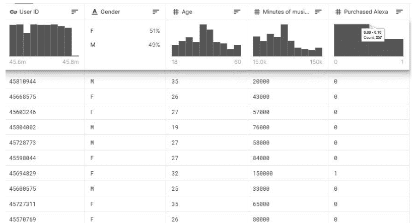

## 图 11.1 *Alexa_dataset*

在下载的数据集中，如图11.1所示，我们有五个属性：*User_ID*是顾客的唯一用户ID；*Gender*描述顾客是*男性*（*M*）还是*女性*（*F*）；顾客的年龄在*Age*属性下给出；然后，我们有*Minutes_of_Music_Consumed*，它告诉我们一个人花在听音乐上的平均时间（或总分钟数）。这些属性在预测用户是否会购买该设备方面起着作用。因此，顾客是否购买了*Alexa*的决策显示在最后一列，即*Purchased_Alexa*，其中1表示用户购买了*Alexa*，0表示用户未购买*Alexa*。

Parteek Bhatia的这门在线机器学习课程全面涵盖了分类的实现，你可以通过观看教学视频进一步加深理解。

https://www.learncompscience.com/challenge-page/d9783b55-e5c1-409e-9814-2d911ca2bcea


**问题陈述：** 一位商店经理想为即将到来的促销活动在他的商店里储备一些*Alexa*设备，但他不了解当前的需求，因此不确定应该储备多少台设备。因此，你可以通过准备一个分类器模型来帮助他，该模型可以使用*Alexa_dataset*进行预测，并预测*Alexa*设备的销售情况。

在我们的分类模型中，输出属性是获取的数据集中的*Purchase*列，因为我们必须预测用户是否会购买该产品。因此，*Purchased*列被视为因变量。其余四个属性*User_Id*、*Gender*、*Age*、*Minutes_of_Music_Consumed*是自变量。

## 步骤 1：导入库

第一部分：加载数据集并进行训练测试拆分以实现决策树分类器 | Parteek Bhatia, https://youtu.be/sXPF8fuu0W0


我们将通过导入库来开始准备预处理数据模板。我们将导入NumPy、Pandas和Matplotlib库来构建模型。这些库用于在实现中执行不同的操作，这些操作将在后续步骤中讨论。

```python
#导入库
import numpy as np
import matplotlib.pyplot as plt
import pandas as pd
```

上面编写的代码片段将导入所需的库。在图11.2中，代码片段1的输出显示在*IPython控制台*中。输出表明所有所需的库都已导入。

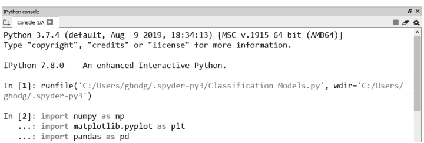

**图 11.2** 导入库

## 步骤 2：加载数据集

接下来，我们将数据集加载到Spyder中。为此，选择你下载*Alexa_dataset.csv*（来自GitHub）的所需文件夹，并将其设置为Spyder的当前工作目录，如图11.3所示。

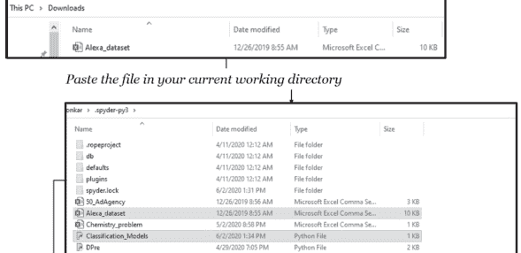

**图 11.3** 将*Alexa_dataset.csv*导入到Spyder的当前工作目录

Pandas库是加载数据集最合适的选择，因此我们将使用Pandas库读取文件"Alexa_dataset.csv"。我们使用了Pandas库的`read_csv()`方法将*Alexa_dataset.csv*文件读入名为*dataset*的数据框中。加载数据集的语法如下。

```python
#读取数据集
dataset = pd.read_csv('Alexa_dataset.csv')
```

执行代码片段2后，*dataset*数据框被创建。这可以在变量资源管理器选项卡中看到，如图11.4所示。

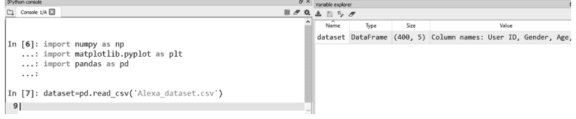

**图 11.4** 导入数据集

在变量资源管理器选项卡中双击*dataset*，我们可以看到*dataset*数据框的内容。如图11.5所示。

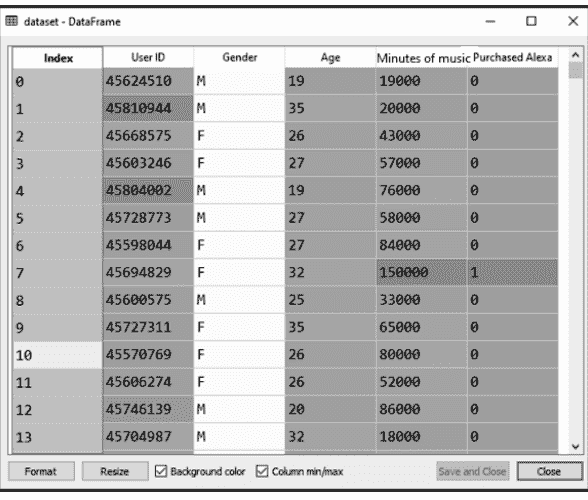

**图 11.5** *dataset*变量的内容

之后，我们创建*X*和*y*数据变量，分别代表我们的自变量和因变量。我们将使用`iloc[]`方法来准备*X*和*y*，该方法从数据框中选择一系列行和列。

对于自变量*X*，我们需要选择所需的输入属性或自变量来预测*Purchased_Alexa*列的值。可以注意到，在这种情况下，*User_Id*和*Gender*不是重要属性，而*Age*和*Minutes_of_Music_Consumed*列是因变量（即Purchased_Alexa）的决定性属性。因此，我们将忽略User_Id和Gender列，因为它们不相关，可以省略。

需要注意的是，你也可以选择Gender列作为输入属性，因为购买产品的决策可能取决于性别。但为了模型的简单性，我们只考虑两个输入属性，即Age和Minutes_of_Music_Consumed。这样，我们可以用二维图可视化我们的结果，这有助于更好地理解我们模型的行为。如果我们也考虑Gender列，我们只能用三维（3D）图可视化我们的结果，这将难以可视化和理解。因此，为了模型的简单性，我们只考虑两个输入属性进行实验，即Age和Minutes_of_Music_Consumed。

然而，对于y，我们将选择Purchased_Alexa列的所有行，因为它是我们的因变量。因此，使用以下代码片段来创建它。

**代码片段：3**

```python
x = Dataset.iloc[:, [2, 3]].values
y = Dataset.iloc[:, 4].values
```

在代码片段3中，为了创建X，我们使用了iloc[]，第一个参数为":"，表示选择所有行。需要注意的是，列的索引从0开始。因此，User_Id的索引是0，Gender是1，Age是2，Minutes_of_Music_Consumed是3，Purchased_Alexa是4。因此，iloc方法的第二个参数是"2, 3"，这意味着选择索引值为2（年龄）和3（Minutes_of_Music_Consumed）的列。其后是values属性，它将选定的行和列转换为值。同样，对于y，我们希望处理数据集的所有行，因此在iloc[]中使用":"作为第一个参数，并将4作为第二个参数传递，因为我们想选择索引值为4的列，即Purchased_Alexa列。

执行代码片段3后，X和y在变量资源管理器选项卡中被创建，其中X是自特征矩阵，y是因变量。变量资源管理器的快照如图11.6和11.7所示。

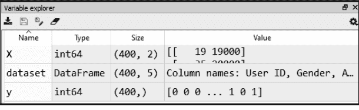

**图 11.6** 显示dataset、X和y的变量资源管理器

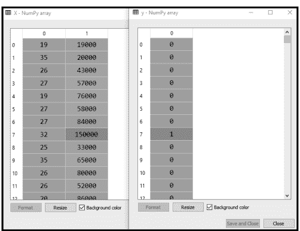

**图 11.7** X和y的内容

## 步骤 3：将数据集拆分为训练集和测试集

此步骤将把我们的数据集拆分为训练集和测试集。训练集用于训练模型。同样，测试集用于测试模型的准确性。数据拆分基于用于划分数据的不同比例，例如60:40、66:34、70:30、75:25、80:20或85:15。这里，我们的数据集中有400条记录，因此让我们使用300个实例进行训练，100个实例进行测试。为此，我们将首先从`sklearn.model_selection`模块导入`train_test_split`方法。我们将使用以下代码片段将我们的数据集拆分为训练集和测试集。

**代码片段：4**

```python
#将数据集拆分为训练集和测试集
from sklearn.model_selection import train_test_split
X_train, X_test, y_train, y_test = train_test_split(X, y, test_size = 0.25, random_state = 0)
# \ 表示代码在下一行继续
```

`train_test_split()`方法接受四个参数。前两个是X和y数组（即要拆分的数组），第三个是`test_size`，第四个是`random_state`。我们传递了`test_size = 0.25`。这意味着我们25%的数据记录（即100条记录）将用于测试，而剩余的数据记录将用于训练（即300条记录用于训练）。

`random_state`参数为0，确保每次运行的结果一致。这将使我们能够在多次运行代码时验证结果。它将在每次重新运行代码时生成相同的随机数序列。这有助于验证输出。在`random_state`参数中，我们指定了随机数生成的种子数。当我们固定种子数时，它将始终生成相同的随机数集，但当未固定时，它将在我们重新运行代码时生成不同的随机数序列。

当执行代码片段4时，变量选项卡中会创建新的变量 $X\_train$、$X\_test$、$y\_train$ 和 $y\_test$，如图11.8所示。

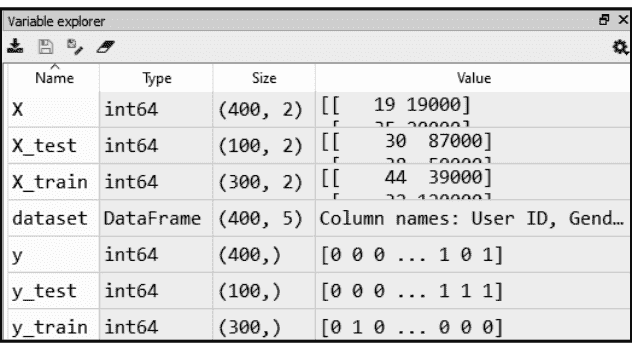

**图11.8** 变量资源管理器

这里，$X\_train$ 是将用于训练目的的数据集子集；它包含随机选择的独立特征集的300个观测值。$X\_test$ 是用于测试的数据集子集；它包含随机选择的独立特征集的剩余100个观测值。$y\_train$ 是 $X\_train$ 特征集对应的因变量（$Purchased\_Alexa$）值，而 $y\_test$ 包含 $X\_test$ 的因变量值集合。

## 步骤4：特征缩放

- 第2部分(a)：决策树分类器实现需要特征缩放 | 机器学习 | Parteek Bhatia, https://youtu.be/0EV2zUKUwhw
- 第2部分(b)：使用归一化进行决策树分类器实现的特征缩放 | Parteek Bhatia, https://youtu.be/HysAvlYLokU
- 第2部分(c)：使用标准化进行决策树分类器实现的特征缩放 | Parteek Bhatia, https://youtu.be/N19nKOUDL-Q

特征缩放将不同属性的范围置于同一尺度上。在我们的数据集中，我们有两个输入属性，即 $Age$ 和 $Minutes\_of\_Music\_Consumed$，我们将对它们进行特征缩放，因为它们具有不同的范围。如果你仔细观察这些列的值，你会发现数据值的范围差异很大。个人的年龄范围从18到60（岁），而 $Minutes\_of\_Music\_Consumed$ 从15000到150000分钟不等。因此，这两个属性具有不同的尺度，这可能会给我们的机器学习模型带来问题。归一化和标准化是用于特征缩放的两种技术（详情请参阅第3章和第4章的数据预处理）。归一化也称为最小-最大缩放。归一化将变量缩小到0到1（正数据值）或-1到1（负数据值）之间的固定数据值范围内。执行标准化是为了在重新缩放后，所有变量保持标准差为1。归一化的主要限制是它对异常值敏感。因此，在这种情况下，我们将使用标准化技术进行特征缩放。这将完成我们的数据预处理模板。

我们将导入 `StandardScaler` 类以应用标准化特征缩放，创建一个实例 `scale_X`。使用 `scale_X` 实例，我们将以 `X_train` 作为参数调用 `fit_transform()` 方法。缩放后的 `X_train` 被存储回 `X_train`。同样，我们将缩放 `X_test`。最终的代码片段如下。

```
#特征缩放
from sklearn.preprocessing import StandardScaler
scale_X = StandardScaler()
X_train = scale_X.fit_transform(X_train)
X_test = scale_X.transform(X_test)
```

由于我们已经将缩放器拟合到 `X_train` 上，我们只对 `X_test` 应用了 `transform()` 方法，如代码片段5所示。代码片段的输出如下图11.9所示，我们可以看到转换后的 `X_train` 和 `X_test` 的所有值都在同一尺度上。

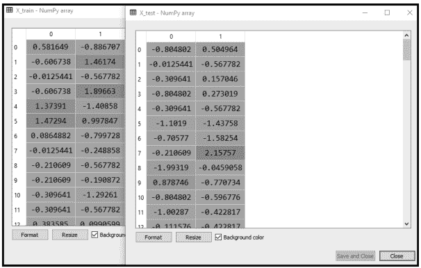

因变量 `y` 包含二进制值。因此，不需要对其进行缩放。因此，我们只缩放了 `X_train` 和 `X_test`；没有对 `y_train` 和 `y_test`（类属性）执行缩放。

这完成了我们的数据预处理模板。数据预处理之后，我们可以开始构建分类器。上述四个数据预处理步骤对于所有分类器都将保持不变。在下一节中，我们将讨论决策树分类器的实现，并将直接从步骤5开始。同样，我们将逐一讨论所有其他分类器的实现。

## 11.3 决策树分类器的实现

在本节中，我们将在给定的数据集上实现一个决策树分类器。

### 拟合分类模型并进行预测（步骤5和步骤6）

构建决策树分类器的第一步是使用以下步骤将其拟合到训练数据上。


### 步骤5：在训练集上拟合决策树

决策树使用基于树的方法来解决分类问题。决策树模型基于 *if-then* 子句的方法论。为了在Python中实现决策树分类器，我们将首先使用以下代码片段从 `sklearn.tree` 模块导入 `DecisionTreeClassifier` 类。

```
#分类器 - I（决策树分类器）
#将决策树分类拟合到训练集
from sklearn.tree import DecisionTreeClassifier
```

接下来，我们将创建导入的 `DecisionTreeClassifier` 的一个实例 *classifier*，如下代码片段所示。

```
classifier = DecisionTreeClassifier( criterion = 'entropy',
                                    random_state = 0)
```

在代码片段7中，我们在 `DecisionTreeClassifier()` 内传递了两个参数，*criterion* 和 *random_state*。*criterion* 参数用于决定构建决策树的技术或标准。

如第9章所讨论的，构建决策树的两种技术是 *entropy* 和 *Gini index*。*entropy* 用于信息增益，而 *Gini index* 衡量数据集中不均匀的程度。这里，我们将 *criterion* 指定为“entropy”。因此，我们正在使用信息增益构建决策树。但是，为了进行实验，你也可以使用“gini”，并且 criterion 参数的默认值是“gini”。

接下来，我们在 `DecisionTreeClassifier()` 内传递了 `random_state`，并将 `random_state` 参数定义为0。它控制估计器的随机性。为了在拟合过程中获得确定性行为，`random_state` 必须固定为一个整数。

执行代码片段7后，`classifier` 实例被创建，在下一个代码片段中，我们将使用它来调用其 `fit()` 方法。

```
代码片段：8

classifier.fit(X_train, y_train)
```

上面使用 `fit()` 方法来基于训练数据集构建或拟合模型。传递了两个参数：自变量的训练数据（`X_train`）和对应的因变量（`y_train`）。所以基本上，当拟合时，分类器实例学习自变量和因变量属性之间的关系，并基于这种理解构建决策树。

### 步骤6：预测测试集结果

为了进行预测，通过其对象调用 `DecisionTreeClassifier` 类的 `predict()` 方法，如下所示。

```
代码片段：9

#预测决策树分类器
y_pred = classifier.predict(X_test)
```

如上面的代码片段所示，`predict()` 方法接受一个参数，即需要进行预测的数据。它使用模型拟合期间构建的决策树来预测传递的数据集的值。在我们的例子中，我们必须提供 `X_test`，因为我们希望预测 `X`（`Age` 和 `Minutes_of_Music_Consumed`）的测试值对应的 `Y`（`Purchased_Alexa`）的值。

执行此代码后，变量资源管理器选项卡中会创建一个新变量，即 `y_pred`，如图11.10所示。

| 名称 | 类型 | 大小 | 值 |
|---|---|---|---|
| X | int64 | (400, 2) | [[ 19 19000] ...] |
| X_test | float64 | (100, 2) | [[-0.80480212 0.50496393] ...] |
| X_train | float64 | (300, 2) | [[ 0.58164944 -0.88670699] ...] |
| dataset | DataFrame | (400, 5) | 列名：User ID, Gen... |
| y | int64 | (400,) | [0 0 0 ... 1 0 1] |
| y_pred | int64 | (100,) | [0 0 0 ... 1 1 1] |
| y_test | int64 | (100,) | [0 0 0 ... 1 1 1] |
| y_train | int64 | (300,) | [0 1 0 ... 0 0 0] |

**图11.10** 显示 `y_pred` 的变量资源管理器

预测结果存储在*y_pred*中。它包含了测试数据集全部100行的预测值。图11.11(a)展示了我们因变量（*y_test*）的实际值，图11.11(b)展示了我们因变量（*y_pred*）的预测值。当你查看这两幅图时，你会发现前13个观测值（从索引值0到12）是相互匹配的；这表明模型对从实例0到12的前13个观测值做出了正确的预测，然而，例如在实例13、15和16中，预测值与实际值并不匹配。在这种情况下，用户并未购买Alexa，但模型预测用户会购买该产品。手动计算所有错误的预测是非常困难的。因此，这会消耗过多的时间和资源，所以我们必须使用混淆矩阵来统计错误预测。在下一步中，我们将为训练好的模型创建一个混淆矩阵。

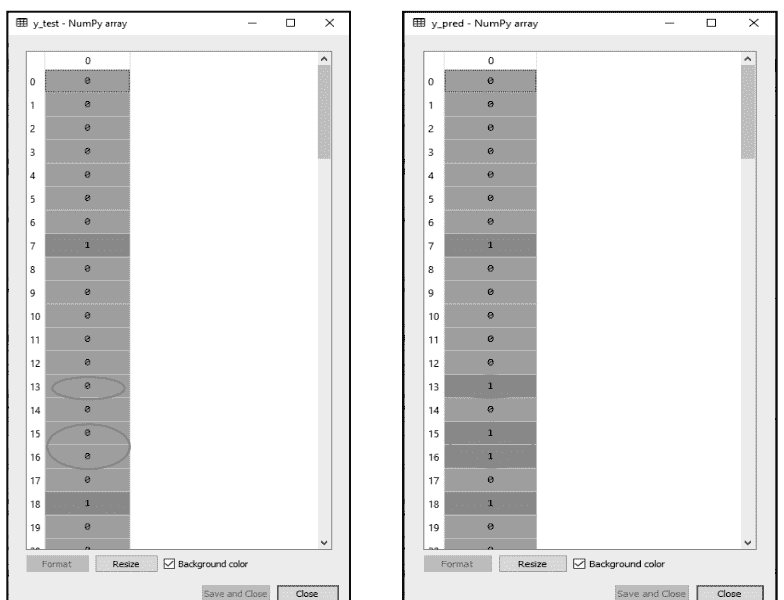

**图11.11(a)** *y_test* &nbsp;&nbsp;&nbsp;&nbsp;&nbsp;&nbsp;&nbsp;&nbsp;&nbsp;&nbsp;&nbsp;&nbsp;&nbsp;&nbsp;&nbsp;&nbsp;&nbsp;&nbsp;&nbsp;&nbsp;&nbsp;&nbsp;&nbsp;&nbsp;&nbsp;&nbsp;&nbsp;&nbsp;&nbsp;&nbsp;&nbsp;&nbsp;&nbsp;&nbsp;&nbsp;&nbsp;&nbsp;&nbsp;&nbsp;&nbsp;&nbsp;&nbsp;&nbsp;&nbsp;&nbsp;&nbsp;&nbsp;&nbsp;&nbsp;&nbsp;&nbsp;&nbsp;&nbsp;&nbsp;&nbsp;&nbsp;&nbsp;&nbsp;&nbsp;&nbsp;&nbsp;&nbsp;&nbsp;&nbsp;&nbsp;&nbsp;&nbsp;&nbsp;&nbsp;&nbsp;&nbsp;&nbsp;&nbsp;&nbsp;&nbsp;&nbsp;&nbsp;&nbsp;&nbsp;&nbsp;&nbsp;&nbsp;&nbsp;&nbsp;&nbsp;&nbsp;&nbsp;&nbsp;&nbsp;&nbsp;&nbsp;&nbsp;&nbsp;&nbsp;&nbsp;&nbsp;&nbsp;&nbsp;&nbsp;&nbsp;&nbsp;&nbsp;&nbsp;&nbsp;&nbsp;&nbsp;&nbsp;&nbsp;&nbsp;&nbsp;&nbsp;&nbsp;&nbsp;&nbsp;&nbsp;&nbsp;&nbsp;&nbsp;&nbsp;&nbsp;&nbsp;&nbsp;&nbsp;&nbsp;&nbsp;&nbsp;&nbsp;&nbsp;&nbsp;&nbsp;&nbsp;&nbsp;&nbsp;&nbsp;&nbsp;&nbsp;&nbsp;&nbsp;&nbsp;&nbsp;&nbsp;&nbsp;&nbsp;&nbsp;&nbsp;&nbsp;&nbsp;&nbsp;&nbsp;&nbsp;&nbsp;&nbsp;&nbsp;&nbsp;&nbsp;&nbsp;&nbsp;&nbsp;&nbsp;&nbsp;&nbsp;&nbsp;&nbsp;&nbsp;&nbsp;&nbsp;&nbsp;&nbsp;&nbsp;&nbsp;&nbsp;&nbsp;&nbsp;&nbsp;&nbsp;&nbsp;&nbsp;&nbsp;&nbsp;&nbsp;&nbsp;&nbsp;&nbsp;&nbsp;&nbsp;&nbsp;&nbsp;&nbsp;&nbsp;&nbsp;&nbsp;&nbsp;&nbsp;&nbsp;&nbsp;&nbsp;&nbsp;&nbsp;&nbsp;&nbsp;&nbsp;&nbsp;&nbsp;&nbsp;&nbsp;&nbsp;&nbsp;&nbsp;&nbsp;&nbsp;&nbsp;&nbsp;&nbsp;&nbsp;&nbsp;&nbsp;&nbsp;&nbsp;&nbsp;&nbsp;&nbsp;&nbsp;&nbsp;&nbsp;&nbsp;&nbsp;&nbsp;&nbsp;&nbsp;&nbsp;&nbsp;&nbsp;&nbsp;&nbsp;&nbsp;&nbsp;&nbsp;&nbsp;&nbsp;&nbsp;&nbsp;&nbsp;&nbsp;&nbsp;&nbsp;&nbsp;&nbsp;&nbsp;&nbsp;&nbsp;&nbsp;&nbsp;&nbsp;&nbsp;&nbsp;&nbsp;&nbsp;&nbsp;&nbsp;&nbsp;&nbsp;&nbsp;&nbsp;&nbsp;&nbsp;&nbsp;&nbsp;&nbsp;&nbsp;&nbsp;&nbsp;&nbsp;&nbsp;&nbsp;&nbsp;&nbsp;&nbsp;&nbsp;&nbsp;&nbsp;&nbsp;&nbsp;&nbsp;&nbsp;&nbsp;&nbsp;&nbsp;&nbsp;&nbsp;&nbsp;&nbsp;&nbsp;&nbsp;&nbsp;&nbsp;&nbsp;&nbsp;&nbsp;&nbsp;&nbsp;&nbsp;&nbsp;&nbsp;&nbsp;&nbsp;&nbsp;&nbsp;&nbsp;&nbsp;&nbsp;&nbsp;&nbsp;&nbsp;&nbsp;&nbsp;&nbsp;&nbsp;&nbsp;&nbsp;&nbsp;&nbsp;&nbsp;&nbsp;&nbsp;&nbsp;&nbsp;&nbsp;&nbsp;&nbsp;&nbsp;&nbsp;&nbsp;&nbsp;&nbsp;&nbsp;&nbsp;&nbsp;&nbsp;&nbsp;&nbsp;&nbsp;&nbsp;&nbsp;&nbsp;&nbsp;&nbsp;&nbsp;&nbsp;&nbsp;&nbsp;&nbsp;&nbsp;&nbsp;&nbsp;&nbsp;&nbsp;&nbsp;&nbsp;&nbsp;&nbsp;&nbsp;&nbsp;&nbsp;&nbsp;&nbsp;&nbsp;&nbsp;&nbsp;&nbsp;&nbsp;&nbsp;&nbsp;&nbsp;&nbsp;&nbsp;&nbsp;&nbsp;&nbsp;&nbsp;&nbsp;&nbsp;&nbsp;&nbsp;&nbsp;&nbsp;&nbsp;&nbsp;&nbsp;&nbsp;&nbsp;&nbsp;&nbsp;&nbsp;&nbsp;&nbsp;&nbsp;&nbsp;&nbsp;&nbsp;&nbsp;&nbsp;&nbsp;&nbsp;&nbsp;&nbsp;&nbsp;&nbsp;&nbsp;&nbsp;&nbsp;&nbsp;&nbsp;&nbsp;&nbsp;&nbsp;&nbsp;&nbsp;&nbsp;&nbsp;&nbsp;&nbsp;&nbsp;&nbsp;&nbsp;&nbsp;&nbsp;&nbsp;&nbsp;&nbsp;&nbsp;&nbsp;&nbsp;&nbsp;&nbsp;&nbsp;&nbsp;&nbsp;&nbsp;&nbsp;&nbsp;&nbsp;&nbsp;&nbsp;&nbsp;&nbsp;&nbsp;&nbsp;&nbsp;&nbsp;&nbsp;&nbsp;&nbsp;&nbsp;&nbsp;&nbsp;&nbsp;&nbsp;&nbsp;&nbsp;&nbsp;&nbsp;&nbsp;&nbsp;&nbsp;&nbsp;&nbsp;&nbsp;&nbsp;&nbsp;&nbsp;&nbsp;&nbsp;&nbsp;&nbsp;&nbsp;&nbsp;&nbsp;&nbsp;&nbsp;&nbsp;&nbsp;&nbsp;&nbsp;&nbsp;&nbsp;&nbsp;&nbsp;&nbsp;&nbsp;&nbsp;&nbsp;&nbsp;&nbsp;&nbsp;&nbsp;&nbsp;&nbsp;&nbsp;&nbsp;&nbsp;&nbsp;&nbsp;&nbsp;&nbsp;&nbsp;&nbsp;&nbsp;&nbsp;&nbsp;&nbsp;&nbsp;&nbsp;&nbsp;&nbsp;&nbsp;&nbsp;&nbsp;&nbsp;&nbsp;&nbsp;&nbsp;&nbsp;&nbsp;&nbsp;&nbsp;&nbsp;&nbsp;&nbsp;&nbsp;&nbsp;&nbsp;&nbsp;&nbsp;&nbsp;&nbsp;&nbsp;&nbsp;&nbsp;&nbsp;&nbsp;&nbsp;&nbsp;&nbsp;&nbsp;&nbsp;&nbsp;&nbsp;&nbsp;&nbsp;&nbsp;&nbsp;&nbsp;&nbsp;&nbsp;&nbsp;&nbsp;&nbsp;&nbsp;&nbsp;&nbsp;&nbsp;&nbsp;&nbsp;&nbsp;&nbsp;&nbsp;&nbsp;&nbsp;&nbsp;&nbsp;&nbsp;&nbsp;&nbsp;&nbsp;&nbsp;&nbsp;&nbsp;&nbsp;&nbsp;&nbsp;&nbsp;&nbsp;&nbsp;&nbsp;&nbsp;&nbsp;&nbsp;&nbsp;&nbsp;&nbsp;&nbsp;&nbsp;&nbsp;&nbsp;&nbsp;&nbsp;&nbsp;&nbsp;&nbsp;&nbsp;&nbsp;&nbsp;&nbsp;&nbsp;&nbsp;&nbsp;&nbsp;&nbsp;&nbsp;&nbsp;&nbsp;&nbsp;&nbsp;&nbsp;&nbsp;&nbsp;&nbsp;&nbsp;&nbsp;&nbsp;&nbsp;&nbsp;&nbsp;&nbsp;&nbsp;&nbsp;&nbsp;&nbsp;&nbsp;&nbsp;&nbsp;&nbsp;&nbsp;&nbsp;&nbsp;&nbsp;&nbsp;&nbsp;&nbsp;&nbsp;&nbsp;&nbsp;&nbsp;&nbsp;&nbsp;&nbsp;&nbsp;&nbsp;&nbsp;&nbsp;&nbsp;&nbsp;&nbsp;&nbsp;&nbsp;&nbsp;&nbsp;&nbsp;&nbsp;&nbsp;&nbsp;&nbsp;&nbsp;&nbsp;&nbsp;&nbsp;&nbsp;&nbsp;&nbsp;&nbsp;&nbsp;&nbsp;&nbsp;&nbsp;&nbsp;&nbsp;&nbsp;&nbsp;&nbsp;&nbsp;&nbsp;&nbsp;&nbsp;&nbsp;&nbsp;&nbsp;&nbsp;&nbsp;&nbsp;&nbsp;&nbsp;&nbsp;&nbsp;&nbsp;&nbsp;&nbsp;&nbsp;&nbsp;&nbsp;&nbsp;&nbsp;&nbsp;&nbsp;&nbsp;&nbsp;&nbsp;&nbsp;&nbsp;&nbsp;&nbsp;&nbsp;&nbsp;&nbsp;&nbsp;&nbsp;&nbsp;&nbsp;&nbsp;&nbsp;&nbsp;&nbsp;&nbsp;&nbsp;&nbsp;&nbsp;&nbsp;&nbsp;&nbsp;&nbsp;&nbsp;&nbsp;&nbsp;&nbsp;&nbsp;&nbsp;&nbsp;&nbsp;&nbsp;&nbsp;&nbsp;&nbsp;&nbsp;&nbsp;&nbsp;&nbsp;&nbsp;&nbsp;&nbsp;&nbsp;&nbsp;&nbsp;&nbsp;&nbsp;&nbsp;&nbsp;&nbsp;&nbsp;&nbsp;&nbsp;&nbsp;&nbsp;&nbsp;&nbsp;&nbsp;&nbsp;&nbsp;&nbsp;&nbsp;&nbsp;&nbsp;&nbsp;&nbsp;&nbsp;&nbsp;&nbsp;&nbsp;&nbsp;&nbsp;&nbsp;&nbsp;&nbsp;&nbsp;&nbsp;&nbsp;&nbsp;&nbsp;&nbsp;&nbsp;&nbsp;&nbsp;&nbsp;&nbsp;&nbsp;&nbsp;&nbsp;&nbsp;&nbsp;&nbsp;&nbsp;&nbsp;&nbsp;&nbsp;&nbsp;&nbsp;&nbsp;&nbsp;&nbsp;&nbsp;&nbsp;&nbsp;&nbsp;&nbsp;&nbsp;&nbsp;&nbsp;&nbsp;&nbsp;&nbsp;&nbsp;&nbsp;&nbsp;&nbsp;&nbsp;&nbsp;&nbsp;&nbsp;&nbsp;&nbsp;&nbsp;&nbsp;&nbsp;&nbsp;&nbsp;&nbsp;&nbsp;&nbsp;&nbsp;&nbsp;&nbsp;&nbsp;&nbsp;&nbsp;&nbsp;&nbsp;&nbsp;&nbsp;&nbsp;&nbsp;&nbsp;&nbsp;&nbsp;&nbsp;&nbsp;&nbsp;&nbsp;&nbsp;&nbsp;&nbsp;&nbsp;&nbsp;&nbsp;&nbsp;&nbsp;&nbsp;&nbsp;&nbsp;&nbsp;&nbsp;&nbsp;&nbsp;&nbsp;&nbsp;&nbsp;&nbsp;&nbsp;&nbsp;&nbsp;&nbsp;&nbsp;&nbsp;&nbsp;&nbsp;&nbsp;&nbsp;&nbsp;&nbsp;&nbsp;&nbsp;&nbsp;&nbsp;&nbsp;&nbsp;&nbsp;&nbsp;&nbsp;&nbsp;&nbsp;&nbsp;&nbsp;&nbsp;&nbsp;&nbsp;&nbsp;&nbsp;&nbsp;&nbsp;&nbsp;&nbsp;&nbsp;&nbsp;&nbsp;&nbsp;&nbsp;&nbsp;&nbsp;&nbsp;&nbsp;&nbsp;&nbsp;&nbsp;&nbsp;&nbsp;&nbsp;&nbsp;&nbsp;&nbsp;&nbsp;&nbsp;&nbsp;&nbsp;&nbsp;&nbsp;&nbsp;&nbsp;&nbsp;&nbsp;&nbsp;&nbsp;&nbsp;&nbsp;&nbsp;&nbsp;&nbsp;&nbsp;&nbsp;&nbsp;&nbsp;&nbsp;&nbsp;&nbsp;&nbsp;&nbsp;&nbsp;&nbsp;&nbsp;&nbsp;&nbsp;&nbsp;&nbsp;&nbsp;&nbsp;&nbsp;&nbsp;&nbsp;&nbsp;&nbsp;&nbsp;&nbsp;&nbsp;&nbsp;&nbsp;&nbsp;&nbsp;&nbsp;&nbsp;&nbsp;&nbsp;&nbsp;&nbsp;&nbsp;&nbsp;&nbsp;&nbsp;&nbsp;&nbsp;&nbsp;&nbsp;&nbsp;&nbsp;&nbsp;&nbsp;&nbsp;&nbsp;&nbsp;&nbsp;&nbsp;&nbsp;&nbsp;&nbsp;&nbsp;&nbsp;&nbsp;&nbsp;&nbsp;&nbsp;&nbsp;&nbsp;&nbsp;&nbsp;&nbsp;&nbsp;&nbsp;&nbsp;&nbsp;&nbsp;&nbsp;&nbsp;&nbsp;&nbsp;&nbsp;&nbsp;&nbsp;&nbsp;&nbsp;&nbsp;&nbsp;&nbsp;&nbsp;&nbsp;&nbsp;&nbsp;&nbsp;&nbsp;&nbsp;&nbsp;&nbsp;&nbsp;&nbsp;&nbsp;&nbsp;&nbsp;&nbsp;&nbsp;&nbsp;&nbsp;&nbsp;&nbsp;&nbsp;&nbsp;&nbsp;&nbsp;&nbsp;&nbsp;&nbsp;&nbsp;&nbsp;&nbsp;&nbsp;&nbsp;&nbsp;&nbsp;&nbsp;&nbsp;&nbsp;&nbsp;&nbsp;&nbsp;&nbsp;&nbsp;&nbsp;&nbsp;&nbsp;&nbsp;&nbsp;&nbsp;&nbsp;&nbsp;&nbsp;&nbsp;&nbsp;&nbsp;&nbsp;&nbsp;&nbsp;&nbsp;&nbsp;&nbsp;&nbsp;&nbsp;&nbsp;&nbsp;&nbsp;&nbsp;&nbsp;&nbsp;&nbsp;&nbsp;&nbsp;&nbsp;&nbsp;&nbsp;&nbsp;&nbsp;&nbsp;&nbsp;&nbsp;&nbsp;&nbsp;&nbsp;&nbsp;&nbsp;&nbsp;&nbsp;&nbsp;&nbsp;&nbsp;&nbsp;&nbsp;&nbsp;&nbsp;&nbsp;&nbsp;&nbsp;&nbsp;&nbsp;&nbsp;&nbsp;&nbsp;&nbsp;&nbsp;&nbsp;&nbsp;&nbsp;&nbsp;&nbsp;&nbsp;&nbsp;&nbsp;&nbsp;&nbsp;&nbsp;&nbsp;&nbsp;&nbsp;&nbsp;&nbsp;&nbsp;&nbsp;&nbsp;&nbsp;&nbsp;&nbsp;&nbsp;&nbsp;&nbsp;&nbsp;&nbsp;&nbsp;&nbsp;&nbsp;&nbsp;&nbsp;&nbsp;&nbsp;&nbsp;&nbsp;&nbsp;&nbsp;&nbsp;&nbsp;&nbsp;&nbsp;&nbsp;&nbsp;&nbsp;&nbsp;&nbsp;&nbsp;&nbsp;&nbsp;&nbsp;&nbsp;&nbsp;&nbsp;&nbsp;&nbsp;&nbsp;&nbsp;&nbsp;&nbsp;&nbsp;&nbsp;&nbsp;&nbsp;&nbsp;&nbsp;&nbsp;&nbsp;&nbsp;&nbsp;&nbsp;&nbsp;&nbsp;&nbsp;&nbsp;&nbsp;&nbsp;&nbsp;&nbsp;&nbsp;&nbsp;&nbsp;&nbsp;&nbsp;&nbsp;&nbsp;&nbsp;&nbsp;&nbsp;&nbsp;&nbsp;&nbsp;&nbsp;&nbsp;&nbsp;&nbsp;&nbsp;&nbsp;&nbsp;&nbsp;&nbsp;&nbsp;&nbsp;&nbsp;&nbsp;&nbsp;&nbsp;&nbsp;&nbsp;&nbsp;&nbsp;&nbsp;&nbsp;&nbsp;&nbsp;&nbsp;&nbsp;&nbsp;&nbsp;&nbsp;&nbsp;&nbsp;&nbsp;&nbsp;&nbsp;&nbsp;&nbsp;&nbsp;&nbsp;&nbsp;&nbsp;&nbsp;&nbsp;&nbsp;&nbsp;&nbsp;&nbsp;&nbsp;&nbsp;&nbsp;&nbsp;&nbsp;&nbsp;&nbsp;&nbsp;&nbsp;&nbsp;&nbsp;&nbsp;&nbsp;&nbsp;&nbsp;&nbsp;&nbsp;&nbsp;&nbsp;&nbsp;&nbsp;&nbsp;&nbsp;&nbsp;&nbsp;&nbsp;&nbsp;&nbsp;&nbsp;&nbsp;&nbsp;&nbsp;&nbsp;&nbsp;&nbsp;&nbsp;&nbsp;&nbsp;&nbsp;&nbsp;&nbsp;&nbsp;&nbsp;&nbsp;&nbsp;&nbsp;&nbsp;&nbsp;&nbsp;&nbsp;&nbsp;&nbsp;&nbsp;&nbsp;&nbsp;&nbsp;&nbsp;&nbsp;&nbsp;&nbsp;&nbsp;&nbsp;&nbsp;&nbsp;&nbsp;&nbsp;&nbsp;&nbsp;&nbsp;&nbsp;&nbsp;&nbsp;&nbsp;&nbsp;&nbsp;&nbsp;&nbsp;&nbsp;&nbsp;&nbsp;&nbsp;&nbsp;&nbsp;&nbsp;&nbsp;&nbsp;&nbsp;&nbsp;&nbsp;&nbsp;&nbsp;&nbsp;&nbsp;&nbsp;&nbsp;&nbsp;&nbsp;&nbsp;&nbsp;&nbsp;&nbsp;&nbsp;&nbsp;&nbsp;&nbsp;&nbsp;&nbsp;&nbsp;&nbsp;&nbsp;&nbsp;&nbsp;&nbsp;&nbsp;&nbsp;&nbsp;&nbsp;&nbsp;&nbsp;&nbsp;&nbsp;&nbsp;&nbsp;&nbsp;&nbsp;&nbsp;&nbsp;&nbsp;&nbsp;&nbsp;&nbsp;&nbsp;&nbsp;&nbsp;&nbsp;&nbsp;&nbsp;&nbsp;&nbsp;&nbsp;&nbsp;&nbsp;&nbsp;&nbsp;&nbsp;&nbsp;&nbsp;&nbsp;&nbsp;&nbsp;&nbsp;&nbsp;&nbsp;&nbsp;&nbsp;&nbsp;&nbsp;&nbsp;&nbsp;&nbsp;&nbsp;&nbsp;&nbsp;&nbsp;&nbsp;&nbsp;&nbsp;&nbsp;&nbsp;&nbsp;&nbsp;&nbsp;&nbsp;&nbsp;&nbsp;&nbsp;&nbsp;&nbsp;&nbsp;&nbsp;&nbsp;&nbsp;&nbsp;&nbsp;&nbsp;&nbsp;&nbsp;&nbsp;&nbsp;&nbsp;&nbsp;&nbsp;&nbsp;&nbsp;&nbsp;&nbsp;&nbsp;&nbsp;&nbsp;&nbsp;&nbsp;&nbsp;&nbsp;&nbsp;&nbsp;&nbsp;&nbsp;&nbsp;&nbsp;&nbsp;&nbsp;&nbsp;&nbsp;&nbsp;&nbsp;&nbsp;&nbsp;&nbsp;&nbsp;&nbsp;&nbsp;&nbsp;&nbsp;&nbsp;&nbsp;&nbsp;&nbsp;&nbsp;&nbsp;&nbsp;&nbsp;&nbsp;&nbsp;&nbsp;&nbsp;&nbsp;&nbsp;&nbsp;&nbsp;&nbsp;&nbsp;&nbsp;&nbsp;&nbsp;&nbsp;&nbsp;&nbsp;&nbsp;&nbsp;&nbsp;&nbsp;&nbsp;&nbsp;&nbsp;&nbsp;&nbsp;&nbsp;&nbsp;&nbsp;&nbsp;&nbsp;&nbsp;&nbsp;&nbsp;&nbsp;&nbsp;&nbsp;&nbsp;&nbsp;&nbsp;&nbsp;&nbsp;&nbsp;&nbsp;&nbsp;&nbsp;&nbsp;&nbsp;&nbsp;&nbsp;&nbsp;&nbsp;&nbsp;&nbsp;&nbsp;&nbsp;&nbsp;&nbsp;&nbsp;&nbsp;&nbsp;&nbsp;&nbsp;&nbsp;&nbsp;&nbsp;&nbsp;&nbsp;&nbsp;&nbsp;&nbsp;&nbsp;&nbsp;&nbsp;&nbsp;&nbsp;&nbsp;&nbsp;&nbsp;&nbsp;&nbsp;&nbsp;&nbsp;&nbsp;&nbsp;&nbsp;&nbsp;&nbsp;&nbsp;&nbsp;&nbsp;&nbsp;&nbsp;&nbsp;&nbsp;&nbsp;&nbsp;&nbsp;&nbsp;&nbsp;&nbsp;&nbsp;&nbsp;&nbsp;&nbsp;&nbsp;&nbsp;&nbsp;&nbsp;&nbsp;&nbsp;&nbsp;&nbsp;&nbsp;&nbsp;&nbsp;&nbsp;&nbsp;&nbsp;&nbsp;&nbsp;&nbsp;&nbsp;&nbsp;&nbsp;&nbsp;&nbsp;&nbsp;&nbsp;&nbsp;&nbsp;&nbsp;&nbsp;&nbsp;&nbsp;&nbsp;&nbsp;&nbsp;&nbsp;&nbsp;&nbsp;&nbsp;&nbsp;&nbsp;&nbsp;&nbsp;&nbsp;&nbsp;&nbsp;&nbsp;&nbsp;&nbsp;&nbsp;&nbsp;&nbsp;&nbsp;&nbsp;&nbsp;&nbsp;&nbsp;&nbsp;&nbsp;&nbsp;&nbsp;&nbsp;&nbsp;&nbsp;&nbsp;&nbsp;&nbsp;&nbsp;&nbsp;&nbsp;&nbsp;&nbsp;&nbsp;&nbsp;&nbsp;&nbsp;&nbsp;&nbsp;&nbsp;&nbsp;&nbsp;&nbsp;&nbsp;&nbsp;&nbsp;&nbsp;&nbsp;&nbsp;&nbsp;&nbsp;&nbsp;&nbsp;&nbsp;&nbsp;&nbsp;&nbsp;&nbsp;&nbsp;&nbsp;&nbsp;&nbsp;&nbsp;&nbsp;&nbsp;&nbsp;&nbsp;&nbsp;&nbsp;&nbsp;&nbsp;&nbsp;&nbsp;&nbsp;&nbsp;&nbsp;&nbsp;&nbsp;&nbsp;&nbsp;&nbsp;&nbsp;&nbsp;&nbsp;&nbsp;&nbsp;&nbsp;&nbsp;&nbsp;&nbsp;&nbsp;&nbsp;&nbsp;&nbsp;&nbsp;&nbsp;&nbsp;&nbsp;&nbsp;&nbsp;&nbsp;&nbsp;&nbsp;&nbsp;&nbsp;&nbsp;&nbsp;&nbsp;&nbsp;&nbsp;&nbsp;&nbsp;&nbsp;&nbsp;&nbsp;&nbsp;&nbsp;&nbsp;&nbsp;&nbsp;&nbsp;&nbsp;&nbsp;&nbsp;&nbsp;&nbsp;&nbsp;&nbsp;&nbsp;&nbsp;&nbsp;&nbsp;&nbsp;&nbsp;&nbsp;&nbsp;&nbsp;&nbsp;&nbsp;&nbsp;&nbsp;&nbsp;&nbsp;&nbsp;&nbsp;&nbsp;&nbsp;&nbsp;&nbsp;&nbsp;&nbsp;&nbsp;&nbsp;&nbsp;&nbsp;&nbsp;&nbsp;&nbsp;&nbsp;&nbsp;&nbsp;&nbsp;&nbsp;&nbsp;&nbsp;&nbsp;&nbsp;&nbsp;&nbsp;&nbsp;&nbsp;&nbsp;&nbsp;&nbsp;&nbsp;&nbsp;&nbsp;&nbsp;&nbsp;&nbsp;&nbsp;&nbsp;&nbsp;&nbsp;&nbsp;&nbsp;&nbsp;&nbsp;&nbsp;&nbsp;&nbsp;&nbsp;&nbsp;&nbsp;&nbsp;&nbsp;&nbsp;&nbsp;&nbsp;&nbsp;&nbsp;&nbsp;&nbsp;&nbsp;&nbsp;&nbsp;&nbsp;&nbsp;&nbsp;&nbsp;&nbsp;&nbsp;&nbsp;&nbsp;&nbsp;&nbsp;&nbsp;&nbsp;&nbsp;&nbsp;&nbsp;&nbsp;&nbsp;&nbsp;&nbsp;&nbsp;&nbsp;&nbsp;&nbsp;&nbsp;&nbsp;&nbsp;&nbsp;&nbsp;&nbsp;&nbsp;&nbsp;&nbsp;&nbsp;&nbsp;&nbsp;&nbsp;&nbsp;&nbsp;&nbsp;&nbsp;&nbsp;&nbsp;&nbsp;&nbsp;&nbsp;&nbsp;&nbsp;&nbsp;&nbsp;&nbsp;&nbsp;&nbsp;&nbsp;&nbsp;&nbsp;&nbsp;&nbsp;&nbsp;&nbsp;&nbsp;&nbsp;&nbsp;&nbsp;&nbsp;&nbsp;&nbsp;&nbsp;&nbsp;&nbsp;&nbsp;&nbsp;&nbsp;&nbsp;&nbsp;&nbsp;&nbsp;&nbsp;&nbsp;&nbsp;&nbsp;&nbsp;&nbsp;&nbsp;&nbsp;&nbsp;&nbsp;&nbsp;&nbsp;&nbsp;&nbsp;&nbsp;&nbsp;&nbsp;&nbsp;&nbsp;&nbsp;&nbsp;&nbsp;&nbsp;&nbsp;&nbsp;&nbsp;&nbsp;&nbsp;&nbsp;&nbsp;&nbsp;&nbsp;&nbsp;&nbsp;&nbsp;&nbsp;&nbsp;&nbsp;&nbsp;&nbsp;&nbsp;&nbsp;&nbsp;&nbsp;&nbsp;&nbsp;&nbsp;&nbsp;&nbsp;&nbsp;&nbsp;&nbsp;&nbsp;&nbsp;&nbsp;&nbsp;&nbsp;&nbsp;&nbsp;&nbsp;&nbsp;&nbsp;&nbsp;&nbsp;&nbsp;&nbsp;&nbsp;&nbsp;&nbsp;&nbsp;&nbsp;&nbsp;&nbsp;&nbsp;&nbsp;&nbsp;&nbsp;&nbsp;&nbsp;&nbsp;&nbsp;&nbsp;&nbsp;&nbsp;&nbsp;&nbsp;&nbsp;&nbsp;&nbsp;&nbsp;&nbsp;&nbsp;&nbsp;&nbsp;&nbsp;&nbsp;&nbsp;&nbsp;&nbsp;&nbsp;&nbsp;&nbsp;&nbsp;&nbsp;&nbsp;&nbsp;&nbsp;&nbsp;&nbsp;&nbsp;&nbsp;&nbsp;&nbsp;&nbsp;&nbsp;&nbsp;&nbsp;&nbsp;&nbsp;&nbsp;&nbsp;&nbsp;&nbsp;&nbsp;&nbsp;&nbsp;&nbsp;&nbsp;&nbsp;&nbsp;&nbsp;&nbsp;&nbsp;&nbsp;&nbsp;&nbsp;&nbsp;&nbsp;&nbsp;&nbsp;&nbsp;&nbsp;&nbsp;&nbsp;&nbsp;&nbsp;&nbsp;&nbsp;&nbsp;&nbsp;&nbsp;&nbsp;&nbsp;&nbsp;&nbsp;&nbsp;&nbsp;&nbsp;&nbsp;&nbsp;&nbsp;&nbsp;&nbsp;&nbsp;&nbsp;&nbsp;&nbsp;&nbsp;&nbsp;&nbsp;&nbsp;&nbsp;&nbsp;&nbsp;&nbsp;&nbsp;&nbsp;&nbsp;&nbsp;&nbsp;&nbsp;&nbsp;&nbsp;&nbsp;&nbsp;&nbsp;&nbsp;&nbsp;&nbsp;&nbsp;&nbsp;&nbsp;&nbsp;&nbsp;&nbsp;&nbsp;&nbsp;&nbsp;&nbsp;&nbsp;&nbsp;&nbsp;&nbsp;&nbsp;&nbsp;&nbsp;&nbsp;&nbsp;&nbsp;&nbsp;&nbsp;&nbsp;&nbsp;&nbsp;&nbsp;&nbsp;&nbsp;&nbsp;&nbsp;&nbsp;&nbsp;&nbsp;&nbsp;&nbsp;&nbsp;&nbsp;&nbsp;&nbsp;&nbsp;&nbsp;&nbsp;&nbsp;&nbsp;&nbsp;&nbsp;&nbsp;&nbsp;&nbsp;&nbsp;&nbsp;&nbsp;&nbsp;&nbsp;&nbsp;&nbsp;&nbsp;&nbsp;&nbsp;&nbsp;&nbsp;&nbsp;&nbsp;&nbsp;&nbsp;&nbsp;&nbsp;&nbsp;&nbsp;&nbsp;&nbsp;&nbsp;&nbsp;&nbsp;&nbsp;&nbsp;&nbsp;&nbsp;&nbsp;&nbsp;&nbsp;&nbsp;&nbsp;&nbsp;&nbsp;&nbsp;&nbsp;&nbsp;&nbsp;&nbsp;&nbsp;&nbsp;&nbsp;&nbsp;&nbsp;&nbsp;&nbsp;&nbsp;&nbsp;&nbsp;&nbsp;&nbsp;&nbsp;&nbsp;&nbsp;&nbsp;&nbsp;&nbsp;&nbsp;&nbsp;&nbsp;&nbsp;&nbsp;&nbsp;&nbsp;&nbsp;&nbsp;&nbsp;&nbsp;&nbsp;&nbsp;&nbsp;&nbsp;&nbsp;&nbsp;&nbsp;&nbsp;&nbsp;&nbsp;&nbsp;&nbsp;&nbsp;&nbsp;&nbsp;&nbsp;&nbsp;&nbsp;&nbsp;&nbsp;&nbsp;&nbsp;&nbsp;&nbsp;&nbsp;&nbsp;&nbsp;&nbsp;&nbsp;&nbsp;&nbsp;&nbsp;&nbsp;&nbsp;&nbsp;&nbsp;&nbsp;&nbsp;&nbsp;&nbsp;&nbsp;&nbsp;&nbsp;&nbsp;&nbsp;&nbsp;&nbsp;&nbsp;&nbsp;&nbsp;&nbsp;&nbsp;&nbsp;&nbsp;&nbsp;&nbsp;&nbsp;&nbsp;&nbsp;&nbsp;&nbsp;&nbsp;&nbsp;&nbsp;&nbsp;&nbsp;&nbsp;&nbsp;&nbsp;&nbsp;&nbsp;&nbsp;&nbsp;&nbsp;&nbsp;&nbsp;&nbsp;&nbsp;&nbsp;&nbsp;&nbsp;&nbsp;&nbsp;&nbsp;&nbsp;&nbsp;&nbsp;&nbsp;&nbsp;&nbsp;&nbsp;&nbsp;&nbsp;&nbsp;&nbsp;&nbsp;&nbsp;&nbsp;&nbsp;&nbsp;&nbsp;&nbsp;&nbsp;&nbsp;&nbsp;&nbsp;&nbsp;&nbsp;&nbsp;&nbsp;&nbsp;&nbsp;&nbsp;&nbsp;&nbsp;&nbsp;&nbsp;&nbsp;&nbsp;&nbsp;&nbsp;&nbsp;&nbsp;&nbsp;&nbsp;&nbsp;&nbsp;&nbsp;&nbsp;&nbsp;&nbsp;&nbsp;&nbsp;&nbsp;&nbsp;&nbsp;&nbsp;&nbsp;&nbsp;&nbsp;&nbsp;&nbsp;&nbsp;&nbsp;&nbsp;&nbsp;&nbsp;&nbsp;&nbsp;&nbsp;&nbsp;&nbsp;&nbsp;&nbsp;&nbsp;&nbsp;&nbsp;&nbsp;&nbsp;&nbsp;&nbsp;&nbsp;&nbsp;&nbsp;&nbsp;&nbsp;&nbsp;&nbsp;&nbsp;&nbsp;&nbsp;&nbsp;&nbsp;&nbsp;&nbsp;&nbsp;&nbsp;&nbsp;&nbsp;&nbsp;&nbsp;&nbsp;&nbsp;&nbsp;&nbsp;&nbsp;&nbsp;&nbsp;&nbsp;&nbsp;&nbsp;&nbsp;&nbsp;&nbsp;&nbsp;&nbsp;&nbsp;&nbsp;&nbsp;&nbsp;&nbsp;&nbsp;&nbsp;&nbsp;&nbsp;&nbsp;&nbsp;&nbsp;&nbsp;&nbsp;&nbsp;&nbsp;&nbsp;&nbsp;&nbsp;&nbsp;&nbsp;&nbsp;&nbsp;&nbsp;&nbsp;&nbsp;&nbsp;&nbsp;&nbsp;&nbsp;&nbsp;&nbsp;&nbsp;&nbsp;&nbsp;&nbsp;&nbsp;&nbsp;&nbsp;&nbsp;&nbsp;&nbsp;&nbsp;&nbsp;&nbsp;&nbsp;&nbsp;&nbsp;&nbsp;&nbsp;&nbsp;&nbsp;&nbsp;&nbsp;&nbsp;&nbsp;&nbsp;&nbsp;&nbsp;&nbsp;&nbsp;&nbsp;&nbsp;&nbsp;&nbsp;&nbsp;&nbsp;&nbsp;&nbsp;&nbsp;&nbsp;&nbsp;&nbsp;&nbsp;&nbsp;&nbsp;&nbsp;&nbsp;&nbsp;&nbsp;&nbsp;&nbsp;&nbsp;&nbsp;&nbsp;&nbsp;&nbsp;&nbsp;&nbsp;&nbsp;&nbsp;&nbsp;&nbsp;&nbsp;&nbsp;&nbsp;&nbsp;&nbsp;&nbsp;&nbsp;&nbsp;&nbsp;&nbsp;&nbsp;&nbsp;&nbsp;&nbsp;&nbsp;&nbsp;&nbsp;&nbsp;&nbsp;&nbsp;&nbsp;&nbsp;&nbsp;&nbsp;&nbsp;&nbsp;&nbsp;&nbsp;&nbsp;&nbsp;&nbsp;&nbsp;&nbsp;&nbsp;&nbsp;&nbsp;&nbsp;&nbsp;&nbsp;&nbsp;&nbsp;&nbsp;&nbsp;&nbsp;&nbsp;&nbsp;&nbsp;&nbsp;&nbsp;&nbsp;&nbsp;&nbsp;&nbsp;&nbsp;&nbsp;&nbsp;&nbsp;&nbsp;&nbsp;&nbsp;&nbsp;&nbsp;&nbsp;&nbsp;&nbsp;&nbsp;&nbsp;&nbsp;&nbsp;&nbsp;&nbsp;&nbsp;&nbsp;&nbsp;&nbsp;&nbsp;&nbsp;&nbsp;&nbsp;&nbsp;&nbsp;&nbsp;&nbsp;&nbsp;&nbsp;&nbsp;&nbsp;&nbsp;&nbsp;&nbsp;&nbsp;&nbsp;&nbsp;&nbsp;&nbsp;&nbsp;&nbsp;&nbsp;&nbsp;&nbsp;&nbsp;&nbsp;&nbsp;&nbsp;&nbsp;&nbsp;&nbsp;&nbsp;&nbsp;&nbsp;&nbsp;&nbsp;&nbsp;&nbsp;&nbsp;&nbsp;&nbsp;&nbsp;&nbsp;&nbsp;&nbsp;&nbsp;&nbsp;&nbsp;&nbsp;&nbsp;&nbsp;&nbsp;&nbsp;&nbsp;&nbsp;&nbsp;&nbsp;&nbsp;&nbsp;&nbsp;&nbsp;&nbsp;&nbsp;&nbsp;&nbsp;&nbsp;&nbsp;&nbsp;&nbsp;&nbsp;&nbsp;&nbsp;&nbsp;&nbsp;&nbsp;&nbsp;&nbsp;&nbsp;&nbsp;&nbsp;&nbsp;&nbsp;&nbsp;&nbsp;&nbsp;&nbsp;&nbsp;&nbsp;&nbsp;&nbsp;&nbsp;&nbsp;&nbsp;&nbsp;&nbsp;&nbsp;&nbsp;&nbsp;&nbsp;&nbsp;&nbsp;&nbsp;&nbsp;&nbsp;&nbsp;&nbsp;&nbsp;&nbsp;&nbsp;&nbsp;&nbsp;&nbsp;&nbsp;&nbsp;&nbsp;&nbsp;&nbsp;&nbsp;&nbsp;&nbsp;&nbsp;&nbsp;&nbsp;&nbsp;&nbsp;&nbsp;&nbsp;&nbsp;&nbsp;&nbsp;&nbsp;&nbsp;&nbsp;&nbsp;&nbsp;&nbsp;&nbsp;&nbsp;&nbsp;&nbsp;&nbsp;&nbsp;&nbsp;&nbsp;&nbsp;&nbsp;&nbsp;&nbsp;&nbsp;&nbsp;&nbsp;&nbsp;&nbsp;&nbsp;&nbsp;&nbsp;&nbsp;&nbsp;&nbsp;&nbsp;&nbsp;&nbsp;&nbsp;&nbsp;&nbsp;&nbsp;&nbsp;&nbsp;&nbsp;&nbsp;&nbsp;&nbsp;&nbsp;&nbsp;&nbsp;&nbsp;&nbsp;&nbsp;&nbsp;&nbsp;&nbsp;&nbsp;&nbsp;&nbsp;&nbsp;&nbsp;&nbsp;&nbsp;&nbsp;&nbsp;&nbsp;&nbsp;&nbsp;&nbsp;&nbsp;&nbsp;&nbsp;&nbsp;&nbsp;&nbsp;&nbsp;&nbsp;&nbsp;&nbsp;&nbsp;&nbsp;&nbsp;&nbsp;&nbsp;&nbsp;&nbsp;&nbsp;&nbsp;&nbsp;&nbsp;&nbsp;&nbsp;&nbsp;&nbsp;&nbsp;&nbsp;&nbsp;&nbsp;&nbsp;&nbsp;&nbsp;&nbsp;&nbsp;&nbsp;&nbsp;&nbsp;&nbsp;&nbsp;&nbsp;&nbsp;&nbsp;&nbsp;&nbsp;&nbsp;&nbsp;&nbsp;&nbsp;&nbsp;&nbsp;&nbsp;&nbsp;&nbsp;&nbsp;&nbsp;&nbsp;&nbsp;&nbsp;&nbsp;&nbsp;&nbsp;&nbsp;&nbsp;&nbsp;&nbsp;&nbsp;&nbsp;&nbsp;&nbsp;&nbsp;&nbsp;&nbsp;&nbsp;&nbsp;&nbsp;&nbsp;&nbsp;&nbsp;&nbsp;&nbsp;&nbsp;&nbsp;&nbsp;&nbsp;&nbsp;&nbsp;&nbsp;&nbsp;&nbsp;&nbsp;&nbsp;&nbsp;&nbsp;&nbsp;&nbsp;&nbsp;&nbsp;&nbsp;&nbsp;&nbsp;&nbsp;&nbsp;&nbsp;&nbsp;&nbsp;&nbsp;&nbsp;&nbsp;&nbsp;&nbsp;&nbsp;&nbsp;&nbsp;&nbsp;&nbsp;&nbsp;&nbsp;&nbsp;&nbsp;&nbsp;&nbsp;&nbsp;&nbsp;&nbsp;&nbsp;&nbsp;&nbsp;&nbsp;&nbsp;&nbsp;&nbsp;&nbsp;&nbsp;&nbsp;&nbsp;&nbsp;&nbsp;&nbsp;&nbsp;&nbsp;&nbsp;&nbsp;&nbsp;&nbsp;&nbsp;&nbsp;&nbsp;&nbsp;&nbsp;&nbsp;&nbsp;&nbsp;&nbsp;&nbsp;&nbsp;&nbsp;&nbsp;&nbsp;&nbsp;&nbsp;&nbsp;&nbsp;&nbsp;&nbsp;&nbsp;&nbsp;&nbsp;&nbsp;&nbsp;&nbsp;&nbsp;&nbsp;&nbsp;&nbsp;&nbsp;&nbsp;&nbsp;&nbsp;&nbsp;&nbsp;&nbsp;&nbsp;&nbsp;&nbsp;&nbsp;&nbsp;&nbsp;&nbsp;&nbsp;&nbsp;&nbsp;&nbsp;&nbsp;&nbsp;&nbsp;&nbsp;&nbsp;&nbsp;&nbsp;&nbsp;&nbsp;&nbsp;&nbsp;&nbsp;&nbsp;&nbsp;&nbsp;&nbsp;&nbsp;&nbsp;&nbsp;&nbsp;&nbsp;&nbsp;&nbsp;&nbsp;&nbsp;&nbsp;&nbsp;&nbsp;&nbsp;&nbsp;&nbsp;&nbsp;&nbsp;&nbsp;&nbsp;&nbsp;&nbsp;&nbsp;&nbsp;&nbsp;&nbsp;&nbsp;&nbsp;&nbsp;&nbsp;&nbsp;&nbsp;&nbsp;&nbsp;&nbsp;&nbsp;&nbsp;&nbsp;&nbsp;&nbsp;&nbsp;&nbsp;&nbsp;&nbsp;&nbsp;&nbsp;&nbsp;&nbsp;&nbsp;&nbsp;&nbsp;&nbsp;&nbsp;&nbsp;&nbsp;&nbsp;&nbsp;&nbsp;&nbsp;&nbsp;&nbsp;&nbsp;&nbsp;&nbsp;&nbsp;&nbsp;&nbsp;&nbsp;&nbsp;&nbsp;&nbsp;&nbsp;&nbsp;&nbsp;&nbsp;&nbsp;&nbsp;&nbsp;&nbsp;&nbsp;&nbsp;&nbsp;&nbsp;&nbsp;&nbsp;&nbsp;&nbsp;&nbsp;&nbsp;&nbsp;&nbsp;&nbsp;&nbsp;&nbsp;&nbsp;&nbsp;&nbsp;&nbsp;&nbsp;&nbsp;&nbsp;&nbsp;&nbsp;&nbsp;&nbsp;&nbsp;&nbsp;&nbsp;&nbsp;&nbsp;&nbsp;&nbsp;&nbsp;&nbsp;&nbsp;&nbsp;&nbsp;&nbsp;&nbsp;&nbsp;&nbsp;&nbsp;&nbsp;&nbsp;&nbsp;&nbsp;&nbsp;&nbsp;&nbsp;&nbsp;&nbsp;&nbsp;&nbsp;&nbsp;&nbsp;&nbsp;&nbsp;&nbsp;&nbsp;&nbsp;&nbsp;&nbsp;&nbsp;&nbsp;&nbsp;&nbsp;&nbsp;&nbsp;&nbsp;&nbsp;&nbsp;&nbsp;&nbsp;&nbsp;&nbsp;&nbsp;&nbsp;&nbsp;&nbsp;&nbsp;&nbsp;&nbsp;&nbsp;&nbsp;&nbsp;&nbsp;&nbsp;&nbsp;&nbsp;&nbsp;&nbsp;&nbsp;&nbsp;&nbsp;&nbsp;&nbsp;&nbsp;&nbsp;&nbsp;&nbsp;&nbsp;&nbsp;&nbsp;&nbsp;&nbsp;&nbsp;&nbsp;&nbsp;&nbsp;&nbsp;&nbsp;&nbsp;&nbsp;&nbsp;&nbsp;&nbsp;&nbsp;&nbsp;&nbsp;&nbsp;&nbsp;&nbsp;&nbsp;&nbsp;&nbsp;&nbsp;&nbsp;&nbsp;&nbsp;&nbsp;&nbsp;&nbsp;&nbsp;&nbsp;&nbsp;&nbsp;&nbsp;&nbsp;&nbsp;&nbsp;&nbsp;&nbsp;&nbsp;&nbsp;&nbsp;&nbsp;&nbsp;&nbsp;&nbsp;&nbsp;&nbsp;&nbsp;&nbsp;&nbsp;&nbsp;&nbsp;&nbsp;&nbsp;&nbsp;&nbsp;&nbsp;&nbsp;&nbsp;&nbsp;&nbsp;&nbsp;&nbsp;&nbsp;&nbsp;&nbsp;&nbsp;&nbsp;&nbsp;&nbsp;&nbsp;&nbsp;&nbsp;&nbsp;&nbsp;&nbsp;&nbsp;&nbsp;&nbsp;&nbsp;&nbsp;&nbsp;&nbsp;&nbsp;&nbsp;&nbsp;&nbsp;&nbsp;&nbsp;&nbsp;&nbsp;&nbsp;&nbsp;&nbsp;&nbsp;&nbsp;&nbsp;&nbsp;&nbsp;&nbsp;&nbsp;&nbsp;&nbsp;&nbsp;&nbsp;&nbsp;&nbsp;&nbsp;&nbsp;&nbsp;&nbsp;&nbsp;&nbsp;&nbsp;&nbsp;&nbsp;&nbsp;&nbsp;&nbsp;&nbsp;&nbsp;&nbsp;&nbsp;&nbsp;&nbsp;&nbsp;&nbsp;&nbsp;&nbsp;&nbsp;&nbsp;&nbsp;&nbsp;&nbsp;&nbsp;&nbsp;&nbsp;&nbsp;&nbsp;&nbsp;&nbsp;&nbsp;&nbsp;&nbsp;&nbsp;&nbsp;&nbsp;&nbsp;&nbsp;&nbsp;&nbsp;&nbsp;&nbsp;&nbsp;&nbsp;&nbsp;&nbsp;&nbsp;&nbsp;&nbsp;&nbsp;&nbsp;&nbsp;&nbsp;&nbsp;&nbsp;&nbsp;&nbsp;&nbsp;&nbsp;&nbsp;&nbsp;&nbsp;&nbsp;&nbsp;&nbsp;&nbsp;&nbsp;&nbsp;&nbsp;&nbsp;&nbsp;&nbsp;&nbsp;&nbsp;&nbsp;&nbsp;&nbsp;&nbsp;&nbsp;&nbsp;&nbsp;&nbsp;&nbsp;&nbsp;&nbsp;&nbsp;&nbsp;&nbsp;&nbsp;&nbsp;&nbsp;&nbsp;&nbsp;&nbsp;&nbsp;&nbsp;&nbsp;&nbsp;&nbsp;&nbsp;&nbsp;&nbsp;&nbsp;&nbsp;&nbsp;&nbsp;&nbsp;&nbsp;&nbsp;&nbsp;&nbsp;&nbsp;&nbsp;&nbsp;&nbsp;&nbsp;&nbsp;&nbsp;&nbsp;&nbsp;&nbsp;&nbsp;&nbsp;&nbsp;&nbsp;&nbsp;&nbsp;&nbsp;&nbsp;&nbsp;&nbsp;&nbsp;&nbsp;&nbsp;&nbsp;&nbsp;&nbsp;&nbsp;&nbsp;&nbsp;&nbsp;&nbsp;&nbsp;&nbsp;&nbsp;&nbsp;&nbsp;&nbsp;&nbsp;&nbsp;&nbsp;&nbsp;&nbsp;&nbsp;&nbsp;&nbsp;&nbsp;&nbsp;&nbsp;&nbsp;&nbsp;&nbsp;&nbsp;&nbsp;&nbsp;&nbsp;&nbsp;&nbsp;&nbsp;&nbsp;&nbsp;&nbsp;&nbsp;&nbsp;&nbsp;&nbsp;&nbsp;&nbsp;&nbsp;&nbsp;&nbsp;&nbsp;&nbsp;&nbsp;&nbsp;&nbsp;&nbsp;&nbsp;&nbsp;&nbsp;&nbsp;&nbsp;&nbsp;&nbsp;&nbsp;&nbsp;&nbsp;&nbsp;&nbsp;&nbsp;&nbsp;&nbsp;&nbsp;&nbsp;&nbsp;&nbsp;&nbsp;&nbsp;&nbsp;&nbsp;&nbsp;&nbsp;&nbsp;&nbsp;&nbsp;&nbsp;&nbsp;&nbsp;&nbsp;&nbsp;&nbsp;&nbsp;&nbsp;&nbsp;&nbsp;&nbsp;&nbsp;&nbsp;&nbsp;&nbsp;&nbsp;&nbsp;&nbsp;&nbsp;&nbsp;&nbsp;&nbsp;&nbsp;&nbsp;&nbsp;&nbsp;&nbsp;&nbsp;&nbsp;&nbsp;&nbsp;&nbsp;&nbsp;&nbsp;&nbsp;&nbsp;&nbsp;&nbsp;&nbsp;&nbsp;&nbsp;&nbsp;&nbsp;&nbsp;&nbsp;&nbsp;&nbsp;&nbsp;&nbsp;&nbsp;&nbsp;&nbsp;&nbsp;&nbsp;&nbsp;&nbsp;&nbsp;&nbsp;&nbsp;&nbsp;&nbsp;&nbsp;&nbsp;&nbsp;&nbsp;&nbsp;&nbsp;&nbsp;&nbsp;&nbsp;&nbsp;&nbsp;&nbsp;&nbsp;&nbsp;&nbsp;&nbsp;&nbsp;&nbsp;&nbsp;&nbsp;&nbsp;&nbsp;&nbsp;&nbsp;&nbsp;&nbsp;&nbsp;&nbsp;&nbsp;&nbsp;&nbsp;&nbsp;&nbsp;&nbsp;&nbsp;&nbsp;&nbsp;&nbsp;&nbsp;&nbsp;&nbsp;&nbsp;&nbsp;&nbsp;&nbsp;&nbsp;&nbsp;&nbsp;&nbsp;&nbsp;&nbsp;&nbsp;&nbsp;&nbsp;&nbsp;&nbsp;&nbsp;&nbsp;&nbsp;&nbsp;&nbsp;&nbsp;&nbsp;&nbsp;&nbsp;&nbsp;&nbsp;&nbsp;&nbsp;&nbsp;&nbsp;&nbsp;&nbsp;&nbsp;&nbsp;&nbsp;&nbsp;&nbsp;&nbsp;&nbsp;&nbsp;&nbsp;&nbsp;&nbsp;&nbsp;&nbsp;&nbsp;&nbsp;&nbsp;&nbsp;&nbsp;&nbsp;&nbsp;&nbsp;&nbsp;&nbsp;&nbsp;&nbsp;&nbsp;&nbsp;&nbsp;&nbsp;&nbsp;&nbsp;&nbsp;&nbsp;&nbsp;&nbsp;&nbsp;&nbsp;&nbsp;&nbsp;&nbsp;&nbsp;&nbsp;&nbsp;&nbsp;&nbsp;&nbsp;&nbsp;&nbsp;&nbsp;&nbsp;&nbsp;&nbsp;&nbsp;&nbsp;&nbsp;&nbsp;&nbsp;&nbsp;&nbsp;&nbsp;&nbsp;&nbsp;&nbsp;&nbsp;&nbsp;&nbsp;&nbsp;&nbsp;&nbsp;&nbsp;&nbsp;&nbsp;&nbsp;&nbsp;&nbsp;&nbsp;&nbsp;&nbsp;&nbsp;&nbsp;&nbsp;&nbsp;&nbsp;&nbsp;&nbsp;&nbsp;&nbsp;&nbsp;&nbsp;&nbsp;&nbsp;&nbsp;&nbsp;&nbsp;&nbsp;&nbsp;&nbsp;&nbsp;&nbsp;&nbsp;&nbsp;&nbsp;&nbsp;&nbsp;&nbsp;&nbsp;&nbsp;&nbsp;&nbsp;&nbsp;&nbsp;&nbsp;&nbsp;&nbsp;&nbsp;&nbsp;&nbsp;&nbsp;&nbsp;&nbsp;&nbsp;&nbsp;&nbsp;&nbsp;&nbsp;&nbsp;&nbsp;&nbsp;&nbsp;&nbsp;&nbsp;&nbsp;&nbsp;&nbsp;&nbsp;&nbsp;&nbsp;&nbsp;&nbsp;&nbsp;&nbsp;&nbsp;&nbsp;&nbsp;&nbsp;&nbsp;&nbsp;&nbsp;&nbsp;&nbsp;&nbsp;&nbsp;&nbsp;&nbsp;&nbsp;&nbsp;&nbsp;&nbsp;&nbsp;&nbsp;&nbsp;&nbsp;&nbsp;&nbsp;&nbsp;&nbsp;&nbsp;&nbsp;&nbsp;&nbsp;&nbsp;&nbsp;&nbsp;&nbsp;&nbsp;&nbsp;&nbsp;&nbsp;&nbsp;&nbsp;&nbsp;&nbsp;&nbsp;&nbsp;&nbsp;&nbsp;&nbsp;&nbsp;&nbsp;&nbsp;&nbsp;&nbsp;&nbsp;&nbsp;&nbsp;&nbsp;&nbsp;&nbsp;&nbsp;&nbsp;&nbsp;&nbsp;&nbsp;&nbsp;&nbsp;&nbsp;&nbsp;&nbsp;&nbsp;&nbsp;&nbsp;&nbsp;&nbsp;&nbsp;&nbsp;&nbsp;&nbsp;&nbsp;&nbsp;&nbsp;&nbsp;&nbsp;&nbsp;&nbsp;&nbsp;&nbsp;&nbsp;&nbsp;&nbsp;&nbsp;&nbsp;&nbsp;&nbsp;&nbsp;&nbsp;&nbsp;&nbsp;&nbsp;&nbsp;&nbsp;&nbsp;&nbsp;&nbsp;&nbsp;&nbsp;&nbsp;&nbsp;&nbsp;&nbsp;&nbsp;&nbsp;&nbsp;&nbsp;&nbsp;&nbsp;&nbsp;&nbsp;&nbsp;&nbsp;&nbsp;&nbsp;&nbsp;&nbsp;&nbsp;&nbsp;&nbsp;&nbsp;&nbsp;&nbsp;&nbsp;&nbsp;&nbsp;&nbsp;&nbsp;&nbsp;&nbsp;&nbsp;&nbsp;&nbsp;&nbsp;&nbsp;&nbsp;&nbsp;&nbsp;&nbsp;&nbsp;&nbsp;&nbsp;&nbsp;&nbsp;&nbsp;&nbsp;&nbsp;&nbsp;&nbsp;&nbsp;&nbsp;&nbsp;&nbsp;&nbsp;&nbsp;&nbsp;&nbsp;&nbsp;&nbsp;&nbsp;&nbsp;&nbsp;&nbsp;&nbsp;&nbsp;&nbsp;&nbsp;&nbsp;&nbsp;&nbsp;&nbsp;&nbsp;&nbsp;&nbsp;&nbsp;&nbsp;&nbsp;&nbsp;&nbsp;&nbsp;&nbsp;&nbsp;&nbsp;&nbsp;&nbsp;&nbsp;&nbsp;&nbsp;&nbsp;&nbsp;&nbsp;&nbsp;&nbsp;&nbsp;&nbsp;&nbsp;&nbsp;&nbsp;&nbsp;&nbsp;&nbsp;&nbsp;&nbsp;&nbsp;&nbsp;&nbsp;&nbsp;&nbsp;&nbsp;&nbsp;&nbsp;&nbsp;&nbsp;&nbsp;&nbsp;&nbsp;&nbsp;&nbsp;&nbsp;&nbsp;&nbsp;&nbsp;&nbsp;&nbsp;&nbsp;&nbsp;&nbsp;&nbsp;&nbsp;&nbsp;&nbsp;&nbsp;&nbsp;&nbsp;&nbsp;&nbsp;&nbsp;&nbsp;&nbsp;&nbsp;&nbsp;&nbsp;&nbsp;&nbsp;&nbsp;&nbsp;&nbsp;&nbsp;&nbsp;&nbsp;&nbsp;&nbsp;&nbsp;&nbsp;&nbsp;&nbsp;&nbsp;&nbsp;&nbsp;&nbsp;&nbsp;&nbsp;&nbsp;&nbsp;&nbsp;&nbsp;&nbsp;&nbsp;&nbsp;&nbsp;&nbsp;&nbsp;&nbsp;&nbsp;&nbsp;&nbsp;&nbsp;&nbsp;&nbsp;&nbsp;&nbsp;&nbsp;&nbsp;&nbsp;&nbsp;&nbsp;&nbsp;&nbsp;&nbsp;&nbsp;&nbsp;&nbsp;&nbsp;&nbsp;&nbsp;&nbsp;&nbsp;&nbsp;&nbsp;&nbsp;&nbsp;&nbsp;&nbsp;&nbsp;&nbsp;&nbsp;&nbsp;&nbsp;&nbsp;&nbsp;&nbsp;&nbsp;&nbsp;&nbsp;&nbsp;&nbsp;&nbsp;&nbsp;&nbsp;&nbsp;&nbsp;&nbsp;&nbsp;&nbsp;&nbsp;&nbsp;&nbsp;&nbsp;&nbsp;&nbsp;&nbsp;&nbsp;&nbsp;&nbsp;&nbsp;&nbsp;&nbsp;&nbsp;&nbsp;&nbsp;&nbsp;&nbsp;&nbsp;&nbsp;&nbsp;&nbsp;&nbsp;&nbsp;&nbsp;&nbsp;&nbsp;&nbsp;&nbsp;&nbsp;&nbsp;&nbsp;&nbsp;&nbsp;&nbsp;&nbsp;&nbsp;&nbsp;&nbsp;&nbsp;&nbsp;&nbsp;&nbsp;&nbsp;&nbsp;&nbsp;&nbsp;&nbsp;&nbsp;&nbsp;&nbsp;&nbsp;&nbsp;&nbsp;&nbsp;&nbsp;&nbsp;&nbsp;&nbsp;&nbsp;&nbsp;&nbsp;&nbsp;&nbsp;&nbsp;&nbsp;&nbsp;&nbsp;&nbsp;&nbsp;&nbsp;&nbsp;&nbsp;&nbsp;&nbsp;&nbsp;&nbsp;&nbsp;&nbsp;&nbsp;&nbsp;&nbsp;&nbsp;&nbsp;&nbsp;&nbsp;&nbsp;&nbsp;&nbsp;&nbsp;&nbsp;&nbsp;&nbsp;&nbsp;&nbsp;&nbsp;&nbsp;&nbsp;&nbsp;&nbsp;&nbsp;&nbsp;&nbsp;&nbsp;&nbsp;&nbsp;&nbsp;&nbsp;&nbsp;&nbsp;&nbsp;&nbsp;&nbsp;&nbsp;&nbsp;&nbsp;&nbsp;&nbsp;&nbsp;&nbsp;&nbsp;&nbsp;&nbsp;&nbsp;&nbsp;&nbsp;&nbsp;&nbsp;&nbsp;&nbsp;&nbsp;&nbsp;&nbsp;&nbsp;&nbsp;&nbsp;&nbsp;&nbsp;&nbsp;&nbsp;&nbsp;&nbsp;&nbsp;&nbsp;&nbsp;&nbsp;&nbsp;&nbsp;&nbsp;&nbsp;&nbsp;&nbsp;&nbsp;&nbsp;&nbsp;&nbsp;&nbsp;&nbsp;&nbsp;&nbsp;&nbsp;&nbsp;&nbsp;&nbsp;&nbsp;&nbsp;&nbsp;&nbsp;&nbsp;&nbsp;&nbsp;&nbsp;&nbsp;&nbsp;&nbsp;&nbsp;&nbsp;&nbsp;&nbsp;&nbsp;&nbsp;&nbsp;&nbsp;&nbsp;&nbsp;&nbsp;&nbsp;&nbsp;&nbsp;&nbsp;&nbsp;&nbsp;&nbsp;&nbsp;&nbsp;&nbsp;&nbsp;&nbsp;&nbsp;&nbsp;&nbsp;&nbsp;&nbsp;&nbsp;&nbsp;&nbsp;&nbsp;&nbsp;&nbsp;&nbsp;&nbsp;&nbsp;&nbsp;&nbsp;&nbsp;&nbsp;&nbsp;&nbsp;&nbsp;&nbsp;&nbsp;&nbsp;&nbsp;&nbsp;&nbsp;&nbsp;&nbsp;&nbsp;&nbsp;&nbsp;&nbsp;&nbsp;&nbsp;&nbsp;&nbsp;&nbsp;&nbsp;&nbsp;&nbsp;&nbsp;&nbsp;&nbsp;&nbsp;&nbsp;&nbsp;&nbsp;&nbsp;&nbsp;&nbsp;&nbsp;&nbsp;&nbsp;&nbsp;&nbsp;&nbsp;&nbsp;&nbsp;&nbsp;&nbsp;&nbsp;&nbsp;&nbsp;&nbsp;&nbsp;&nbsp;&nbsp;&nbsp;&nbsp;&nbsp;&nbsp;&nbsp;&nbsp;&nbsp;&nbsp;&nbsp;&nbsp;&nbsp;&nbsp;&nbsp;&nbsp;&nbsp;&nbsp;&nbsp;&nbsp;&nbsp;&nbsp;&nbsp;&nbsp;&nbsp;&nbsp;&nbsp;&nbsp;&nbsp;&nbsp;&nbsp;&nbsp;&nbsp;&nbsp;&nbsp;&nbsp;&nbsp;&nbsp;&nbsp;&nbsp;&nbsp;&nbsp;&nbsp;&nbsp;&nbsp;&nbsp;&nbsp;&nbsp;&nbsp;&nbsp;&nbsp;&nbsp;&nbsp;&nbsp;&nbsp;&nbsp;&nbsp;&nbsp;&nbsp;&nbsp;&nbsp;&nbsp;&nbsp;&nbsp;&nbsp;&nbsp;&nbsp;&nbsp;&nbsp;&nbsp;&nbsp;&nbsp;&nbsp;&nbsp;&nbsp;&nbsp;&nbsp;&nbsp;&nbsp;&nbsp;&nbsp;&nbsp;&nbsp;&nbsp;&nbsp;&nbsp;&nbsp;&nbsp;&nbsp;&nbsp;&nbsp;&nbsp;&nbsp;&nbsp;&nbsp;&nbsp;&nbsp;&nbsp;&nbsp;&nbsp;&nbsp;&nbsp;&nbsp;&nbsp;&nbsp;&nbsp;&nbsp;&nbsp;&nbsp;&nbsp;&nbsp;&nbsp;&nbsp;&nbsp;&nbsp;&nbsp;&nbsp;&nbsp;&nbsp;&nbsp;&nbsp;&nbsp;&nbsp;&nbsp;&nbsp;&nbsp;&nbsp;&nbsp;&nbsp;&nbsp;&nbsp;&nbsp;&nbsp;&nbsp;&nbsp;&nbsp;&nbsp;&nbsp;&nbsp;&nbsp;&nbsp;&nbsp;&nbsp;&nbsp;&nbsp;&nbsp;&nbsp;&nbsp;&nbsp;&nbsp;&nbsp;&nbsp;&nbsp;&nbsp;&nbsp;&nbsp;&nbsp;&nbsp;&nbsp;&nbsp;&nbsp;&nbsp;&nbsp;&nbsp;&nbsp;&nbsp;&nbsp;&nbsp;&nbsp;&nbsp;&nbsp;&nbsp;&nbsp;&nbsp;&nbsp;&nbsp;&nbsp;&nbsp;&nbsp;&nbsp;&nbsp;&nbsp;&nbsp;&nbsp;&nbsp;&nbsp;&nbsp;&nbsp;&nbsp;&nbsp;&nbsp;&nbsp;&nbsp;&nbsp;&nbsp;&nbsp;&nbsp;&nbsp;&nbsp;&nbsp;&nbsp;&nbsp;&nbsp;&nbsp;&nbsp;&nbsp;&nbsp;&nbsp;&nbsp;&nbsp;&nbsp;&nbsp;&nbsp;&nbsp;&nbsp;&nbsp;&nbsp;&nbsp;&nbsp;&nbsp;&nbsp;&nbsp;&nbsp;&nbsp;&nbsp;&nbsp;&nbsp;&nbsp;&nbsp;&nbsp;&nbsp;&nbsp;&nbsp;&nbsp;&nbsp;&nbsp;&nbsp;&nbsp;&nbsp;&nbsp;&nbsp;&nbsp;&nbsp;&nbsp;&nbsp;&nbsp;&nbsp;&nbsp;&nbsp;&nbsp;&nbsp;&nbsp;&nbsp;&nbsp;&nbsp;&nbsp;&nbsp;&nbsp;&nbsp;&nbsp;&nbsp;&nbsp;&nbsp;&nbsp;&nbsp;&nbsp;&nbsp;&nbsp;&nbsp;&nbsp;&nbsp;&nbsp;&nbsp;&nbsp;&nbsp;&nbsp;&nbsp;&nbsp;&nbsp;&nbsp;&nbsp;&nbsp;&nbsp;&nbsp;&nbsp;&nbsp;&nbsp;&nbsp;&nbsp;&nbsp;&nbsp;&nbsp;&nbsp;&nbsp;&nbsp;&nbsp;&nbsp;&nbsp;&nbsp;&nbsp;&nbsp;&nbsp;&nbsp;&nbsp;&nbsp;&nbsp;&nbsp;&nbsp;&nbsp;&nbsp;&nbsp;&nbsp;&nbsp;&nbsp;&nbsp;&nbsp;&nbsp;&nbsp;&nbsp;&nbsp;&nbsp;&nbsp;&nbsp;&nbsp;&nbsp;&nbsp;&nbsp;&nbsp;&nbsp;&nbsp;&nbsp;&nbsp;&nbsp;&nbsp;&nbsp;&nbsp;&nbsp;&nbsp;&nbsp;&nbsp;&nbsp;&nbsp;&nbsp;&nbsp;&nbsp;&nbsp;&nbsp;&nbsp;&nbsp;&nbsp;&nbsp;&nbsp;&nbsp;&nbsp;&nbsp;&nbsp;&nbsp;&nbsp;&nbsp;&nbsp;&nbsp;&nbsp;&nbsp;&nbsp;&nbsp;&nbsp;&nbsp;&nbsp;&nbsp;&nbsp;&nbsp;&nbsp;&nbsp;&nbsp;&nbsp;&nbsp;&nbsp;&nbsp;&nbsp;&nbsp;&nbsp;&nbsp;&nbsp;&nbsp;&nbsp;&nbsp;&nbsp;&nbsp;&nbsp;&nbsp;&nbsp;&nbsp;&nbsp;&nbsp;&nbsp;&nbsp;&nbsp;&nbsp;&nbsp;&nbsp;&nbsp;&nbsp;&nbsp;&nbsp;&nbsp;&nbsp;&nbsp;&nbsp;&nbsp;&nbsp;&nbsp;&nbsp;&nbsp;&nbsp;&nbsp;&nbsp;&nbsp;&nbsp;&nbsp;&nbsp;&nbsp;&nbsp;&nbsp;&nbsp;&nbsp;&nbsp;&nbsp;&nbsp;&nbsp;&nbsp;&nbsp;&nbsp;&nbsp;&nbsp;&nbsp;&nbsp;&nbsp;&nbsp;&nbsp;&nbsp;&nbsp;&nbsp;&nbsp;&nbsp;&nbsp;&nbsp;&nbsp;&nbsp;&nbsp;&nbsp;&nbsp;&nbsp;&nbsp;&nbsp;&nbsp;&nbsp;&nbsp;&nbsp;&nbsp;&nbsp;&nbsp;&nbsp;&nbsp;&nbsp;&nbsp;&nbsp;&nbsp;&nbsp;&nbsp;&nbsp;&nbsp;&nbsp;&nbsp;&nbsp;&nbsp;&nbsp;&nbsp;&nbsp;&nbsp;&nbsp;&nbsp;&nbsp;&nbsp;&nbsp;&nbsp;&nbsp;&nbsp;&nbsp;&nbsp;&nbsp;&nbsp;&nbsp;&nbsp;&nbsp;&nbsp;&nbsp;&nbsp;&nbsp;&nbsp;&nbsp;&nbsp;&nbsp;&nbsp;&nbsp;&nbsp;&nbsp;&nbsp;&nbsp;&nbsp;&nbsp;&nbsp;&nbsp;&nbsp;&nbsp;&nbsp;&nbsp;&nbsp;&nbsp;&nbsp;&nbsp;&nbsp;&nbsp;&nbsp;&nbsp;&nbsp;&nbsp;&nbsp;&nbsp;&nbsp;&nbsp;&nbsp;&nbsp;&nbsp;&nbsp;&nbsp;&nbsp;&nbsp;&nbsp;&nbsp;&nbsp;&nbsp;&nbsp;&nbsp;&nbsp;&nbsp;&nbsp;&nbsp;&nbsp;&nbsp;&nbsp;&nbsp;&nbsp;&nbsp;&nbsp;&nbsp;&nbsp;&nbsp;&nbsp;&nbsp;&nbsp;&nbsp;&nbsp;&nbsp;&nbsp;&nbsp;&nbsp;&nbsp;&nbsp;&nbsp;&nbsp;&nbsp;&nbsp;&nbsp;&nbsp;&nbsp;&nbsp;&nbsp;&nbsp;&nbsp;&nbsp;&nbsp;&nbsp;&nbsp;&nbsp;&nbsp;&nbsp;&nbsp;&nbsp;&nbsp;&nbsp;&nbsp;&nbsp;&nbsp;&nbsp;&nbsp;&nbsp;&nbsp;&nbsp;&nbsp;&nbsp;&nbsp;&nbsp;&nbsp;&nbsp;&nbsp;&nbsp;&nbsp;&nbsp;&nbsp;&nbsp;&nbsp;&nbsp;&nbsp;&nbsp;&nbsp;&nbsp;&nbsp;&nbsp;&nbsp;&nbsp;&nbsp;&nbsp;&nbsp;&nbsp;&nbsp;&nbsp;&nbsp;&nbsp;&nbsp;&nbsp;&nbsp;&nbsp;&nbsp;&nbsp;&nbsp;&nbsp;&nbsp;&nbsp;&nbsp;&nbsp;&nbsp;&nbsp;&nbsp;&nbsp;&nbsp;&nbsp;&nbsp;&nbsp;&nbsp;&nbsp;&nbsp;&nbsp;&nbsp;&nbsp;&nbsp;&nbsp;&nbsp;&nbsp;&nbsp;&nbsp;&nbsp;&nbsp;&nbsp;&nbsp;&nbsp;&nbsp;&nbsp;&nbsp;&nbsp;&nbsp;&nbsp;&nbsp;&nbsp;&nbsp;&nbsp;&nbsp;&nbsp;&nbsp;&nbsp;&nbsp;&nbsp;&nbsp;&nbsp;&nbsp;&nbsp;&nbsp;&nbsp;&nbsp;&nbsp;&nbsp;&nbsp;&nbsp;&nbsp;&nbsp;&nbsp;&nbsp;&nbsp;&nbsp;&nbsp;&nbsp;&nbsp;&nbsp;&nbsp;&nbsp;&nbsp;&nbsp;&nbsp;&nbsp;&nbsp;&nbsp;&nbsp;&nbsp;&nbsp;&nbsp;&nbsp;&nbsp;&nbsp;&nbsp;&nbsp;&nbsp;&nbsp;&nbsp;&nbsp;&nbsp;&nbsp;&nbsp;&nbsp;&nbsp;&nbsp;&nbsp;&nbsp;&nbsp;&nbsp;&nbsp;&nbsp;&nbsp;&nbsp;&nbsp;&nbsp;&nbsp;&nbsp;&nbsp;&nbsp;&nbsp;&nbsp;&nbsp;&nbsp;&nbsp;&nbsp;&nbsp;&nbsp;&nbsp;&nbsp;&nbsp;&nbsp;&nbsp;&nbsp;&nbsp;&nbsp;&nbsp;&nbsp;&nbsp;&nbsp;&nbsp;&nbsp;&nbsp;&nbsp;&nbsp;&nbsp;&nbsp;&nbsp;&nbsp;&nbsp;&nbsp;&nbsp;&nbsp;&nbsp;&nbsp;&nbsp;&nbsp;&nbsp;&nbsp;&nbsp;&nbsp;&nbsp;&nbsp;&nbsp;&nbsp;&nbsp;&nbsp;&nbsp;&nbsp;&nbsp;&nbsp;&nbsp;&nbsp;&nbsp;&nbsp;&nbsp;&nbsp;&nbsp;&nbsp;&nbsp;&nbsp;&nbsp;&nbsp;&nbsp;&nbsp;&nbsp;&nbsp;&nbsp;&nbsp;&nbsp;&nbsp;&nbsp;&nbsp;&nbsp;&nbsp;&nbsp;&nbsp;&nbsp;&nbsp;&nbsp;&nbsp;&nbsp;&nbsp;&nbsp;&nbsp;&nbsp;&nbsp;&nbsp;&nbsp;&nbsp;&nbsp;&nbsp;&nbsp;&nbsp;&nbsp;&nbsp;&nbsp;&nbsp;&nbsp;&nbsp;&nbsp;&nbsp;&nbsp;&nbsp;&nbsp;&nbsp;&nbsp;&nbsp;&nbsp;&nbsp;&nbsp;&nbsp;&nbsp;&nbsp;&nbsp;&nbsp;&nbsp;&nbsp;&nbsp;&nbsp;&nbsp;&nbsp;&nbsp;&nbsp;&nbsp;&nbsp;&nbsp;&nbsp;&nbsp;&nbsp;&nbsp;&nbsp;&nbsp;&nbsp;&nbsp;&nbsp;&nbsp;&nbsp;&nbsp;&nbsp;&nbsp;&nbsp;&nbsp;&nbsp;&nbsp;&nbsp;&nbsp;&nbsp;&nbsp;&nbsp;&nbsp;&nbsp;&nbsp;&nbsp;&nbsp;&nbsp;&nbsp;&nbsp;&nbsp;&nbsp;&nbsp;&nbsp;&nbsp;&nbsp;&nbsp;&nbsp;&nbsp;&nbsp;&nbsp;&nbsp;&nbsp;&nbsp;&nbsp;&nbsp;&nbsp;&nbsp;&nbsp;&nbsp;&nbsp;&nbsp;&nbsp;&nbsp;&nbsp;&nbsp;&nbsp;&nbsp;&nbsp;&nbsp;&nbsp;&nbsp;&nbsp;&nbsp;&nbsp;&nbsp;&nbsp;&nbsp;&nbsp;&nbsp;&nbsp;&nbsp;&nbsp;&nbsp;&nbsp;&nbsp;&nbsp;&nbsp;&nbsp;&nbsp;&nbsp;&nbsp;&nbsp;&nbsp;&nbsp;&nbsp;&nbsp;&nbsp;&nbsp;&nbsp;&nbsp;&nbsp;&nbsp;&nbsp;&nbsp;&nbsp;&nbsp;&nbsp;&nbsp;&nbsp;&nbsp;&nbsp;&nbsp;&nbsp;&nbsp;&nbsp;&nbsp;&nbsp;&nbsp;&nbsp;&nbsp;&nbsp;&nbsp;&nbsp;&nbsp;&nbsp;&nbsp;&nbsp;&nbsp;&nbsp;&nbsp;&nbsp;&nbsp;&nbsp;&nbsp;&nbsp;&nbsp;&nbsp;&nbsp;&nbsp;&nbsp;&nbsp;&nbsp;&nbsp;&nbsp;&nbsp;&nbsp;&nbsp;&nbsp;&nbsp;&nbsp;&nbsp;&nbsp;&nbsp;&nbsp;&nbsp;&nbsp;&nbsp;&nbsp;&nbsp;&nbsp;&nbsp;&nbsp;&nbsp;&nbsp;&nbsp;&nbsp;&nbsp;&nbsp;&nbsp;&nbsp;&nbsp;&nbsp;&nbsp;&nbsp;&nbsp;&nbsp;&nbsp;&nbsp;&nbsp;&nbsp;&nbsp;&nbsp;&nbsp;&nbsp;&nbsp;&nbsp;&nbsp;&nbsp;&nbsp;&nbsp;&nbsp;&nbsp;&nbsp;&nbsp;&nbsp;&nbsp;&nbsp;&nbsp;&nbsp;&nbsp;&nbsp;&nbsp;&nbsp;&nbsp;&nbsp;&nbsp;&nbsp;&nbsp;&nbsp;&nbsp;&nbsp;&nbsp;&nbsp;&nbsp;&nbsp;&nbsp;&nbsp;&nbsp;&nbsp;&nbsp;&nbsp;&nbsp;&nbsp;&nbsp;&nbsp;&nbsp;&nbsp;&nbsp;&nbsp;&nbsp;&nbsp;&nbsp;&nbsp;&nbsp;&nbsp;&nbsp;&nbsp;&nbsp;&nbsp;&nbsp;&nbsp;&nbsp;&nbsp;&nbsp;&nbsp;&nbsp;&nbsp;&nbsp;&nbsp;&nbsp;&nbsp;&nbsp;&nbsp;&nbsp;&nbsp;&nbsp;&nbsp;&nbsp;&nbsp;&nbsp;&nbsp;&nbsp;&nbsp;&nbsp;&nbsp;&nbsp;&nbsp;&nbsp;&nbsp;&nbsp;&nbsp;&nbsp;&nbsp;&nbsp;&nbsp;&nbsp;&nbsp;&nbsp;&nbsp;&nbsp;&nbsp;&nbsp;&nbsp;&nbsp;&nbsp;&nbsp;&nbsp;&nbsp;&nbsp;&nbsp;&nbsp;&nbsp;&nbsp;&nbsp;&nbsp;&nbsp;&nbsp;&nbsp;&nbsp;&nbsp;&nbsp;&nbsp;&nbsp;&nbsp;&nbsp;&nbsp;&nbsp;&nbsp;&nbsp;&nbsp;&nbsp;&nbsp;&nbsp;&nbsp;&nbsp;&nbsp;&nbsp;&nbsp;&nbsp;&nbsp;&nbsp;&nbsp;&nbsp;&nbsp;&nbsp;&nbsp;&nbsp;&nbsp;&nbsp;&nbsp;&nbsp;&nbsp;&nbsp;&nbsp;&nbsp;&nbsp;&nbsp;&nbsp;&nbsp;&nbsp;&nbsp;&nbsp;&nbsp;&nbsp;&nbsp;&nbsp;&nbsp;&nbsp;&nbsp;&nbsp;&nbsp;&nbsp;&nbsp;&nbsp;&nbsp;&nbsp;&nbsp;&nbsp;&nbsp;&nbsp;&nbsp;&nbsp;&nbsp;&nbsp;&nbsp;&nbsp;&nbsp;&nbsp;&nbsp;&nbsp;&nbsp;&nbsp;&nbsp;&nbsp;&nbsp;&nbsp;&nbsp;&nbsp;&nbsp;&nbsp;&nbsp;&nbsp;&nbsp;&nbsp;&nbsp;&nbsp;&nbsp;&nbsp;&nbsp;&nbsp;&nbsp;&nbsp;&nbsp;&nbsp;&nbsp;&nbsp;&nbsp;&nbsp;&nbsp;&nbsp;&nbsp;&nbsp;&nbsp;&nbsp;&nbsp;&nbsp;&nbsp;&nbsp;&nbsp;&nbsp;&nbsp;&nbsp;&nbsp;&nbsp;&nbsp;&nbsp;&nbsp;&nbsp;&nbsp;&nbsp;&nbsp;&nbsp;&nbsp;&nbsp;&nbsp;&nbsp;&nbsp;&nbsp;&nbsp;&nbsp;&nbsp;&nbsp;&nbsp;&nbsp;&nbsp;&nbsp;&nbsp;&nbsp;&nbsp;&nbsp;&nbsp;&nbsp;&nbsp;&nbsp;&nbsp;&nbsp;&nbsp;&nbsp;&nbsp;&nbsp;&nbsp;&nbsp;&nbsp;&nbsp;&nbsp;&nbsp;&nbsp;&nbsp;&nbsp;&nbsp;&nbsp;&nbsp;&nbsp;&nbsp;&nbsp;&nbsp;&nbsp;&nbsp;&nbsp;&nbsp;&nbsp;&nbsp;&nbsp;&nbsp;&nbsp;&nbsp;&nbsp;&nbsp;&nbsp;&nbsp;&nbsp;&nbsp;&nbsp;&nbsp;&nbsp;&nbsp;&nbsp;&nbsp;&nbsp;&nbsp;&nbsp;&nbsp;&nbsp;&nbsp;&nbsp;&nbsp;&nbsp;&nbsp;&nbsp;&nbsp;&nbsp;&nbsp;&nbsp;&nbsp;&nbsp;&nbsp;&nbsp;&nbsp;&nbsp;&nbsp;&nbsp;&nbsp;&nbsp;&nbsp;&nbsp;&nbsp;&nbsp;&nbsp;&nbsp;&nbsp;&nbsp;&nbsp;&nbsp;&nbsp;&nbsp;&nbsp;&nbsp;&nbsp;&nbsp;&nbsp;&nbsp;&nbsp;&nbsp;&nbsp;&nbsp;&nbsp;&nbsp;&nbsp;&nbsp;&nbsp;&nbsp;&nbsp;&nbsp;&nbsp;&nbsp;&nbsp;&nbsp;&nbsp;&nbsp;&nbsp;&nbsp;&nbsp;&nbsp;&nbsp;&nbsp;&nbsp;&nbsp;&nbsp;&nbsp;&nbsp;&nbsp;&nbsp;&nbsp;&nbsp;&nbsp;&nbsp;&nbsp;&nbsp;&nbsp;&nbsp;&nbsp;&nbsp;&nbsp;&nbsp;&nbsp;&nbsp;&nbsp;&nbsp;&nbsp;&nbsp;&nbsp;&nbsp;&nbsp;&nbsp;&nbsp;&nbsp;&nbsp;&nbsp;&nbsp;&nbsp;&nbsp;&nbsp;&nbsp;&nbsp;&nbsp;&nbsp;&nbsp;&nbsp;&nbsp;&nbsp;&nbsp;&nbsp;&nbsp;&nbsp;&nbsp;&nbsp;&nbsp;&nbsp;&nbsp;&nbsp;&nbsp;&nbsp;&nbsp;&nbsp;&nbsp;&nbsp;&nbsp;&nbsp;&nbsp;&nbsp;&nbsp;&nbsp;&nbsp;&nbsp;&nbsp;&nbsp;&nbsp;&nbsp;&nbsp;&nbsp;&nbsp;&nbsp;&nbsp;&nbsp;&nbsp;&nbsp;&nbsp;&nbsp;&nbsp;&nbsp;&nbsp;&nbsp;&nbsp;&nbsp;&nbsp;&nbsp;&nbsp;&nbsp;&nbsp;&nbsp;&nbsp;&nbsp;&nbsp;&nbsp;&nbsp;&nbsp;&nbsp;&nbsp;&nbsp;&nbsp;&nbsp;&nbsp;&nbsp;&nbsp;&nbsp;&nbsp;&nbsp;&nbsp;&nbsp;&nbsp;&nbsp;&nbsp;&nbsp;&nbsp;&nbsp;&nbsp;&nbsp;&nbsp;&nbsp;&nbsp;&nbsp;&nbsp;&nbsp;&nbsp;&nbsp;&nbsp;&nbsp;&nbsp;&nbsp;&nbsp;&nbsp;&nbsp;&nbsp;&nbsp;&nbsp;&nbsp;&nbsp;&nbsp;&nbsp;&nbsp;&nbsp;&nbsp;&nbsp;&nbsp;&nbsp;&nbsp;&nbsp;&nbsp;&nbsp;&nbsp;&nbsp;&nbsp;&nbsp;&nbsp;&nbsp;&nbsp;&nbsp;&nbsp;&nbsp;&nbsp;&nbsp;&nbsp;&nbsp;&nbsp;&nbsp;&nbsp;&nbsp;&nbsp;&nbsp;&nbsp;&nbsp;&nbsp;&nbsp;&nbsp;&nbsp;&nbsp;&nbsp;&nbsp;&nbsp;&nbsp;&nbsp;&nbsp;&nbsp;&nbsp;&nbsp;&nbsp;&nbsp;&nbsp;&nbsp;&nbsp;&nbsp;&nbsp;&nbsp;&nbsp;&nbsp;&nbsp;&nbsp;&nbsp;&nbsp;&nbsp;&nbsp;&nbsp;&nbsp;&nbsp;&nbsp;&nbsp;&nbsp;&nbsp;&nbsp;&nbsp;&nbsp;&nbsp;&nbsp;&nbsp;&nbsp;&nbsp;&nbsp;&nbsp;&nbsp;&nbsp;&nbsp;&nbsp;&nbsp;&nbsp;&nbsp;&nbsp;&nbsp;&nbsp;&nbsp;&nbsp;&nbsp;&nbsp;&nbsp;&nbsp;&nbsp;&nbsp;&nbsp;&nbsp;&nbsp;&nbsp;&nbsp;&nbsp;&nbsp;&nbsp;&nbsp;&nbsp;&nbsp;&nbsp;&nbsp;&nbsp;&nbsp;&nbsp;&nbsp;&nbsp;&nbsp;&nbsp;&nbsp;&nbsp;&nbsp;&nbsp;&nbsp;&nbsp;&nbsp;&nbsp;&nbsp;&nbsp;&nbsp;&nbsp;&nbsp;&nbsp;&nbsp;&nbsp;&nbsp;&nbsp;&nbsp;&nbsp;&nbsp;&nbsp;&nbsp;&nbsp;&nbsp;&nbsp;&nbsp;&nbsp;&nbsp;&nbsp;&nbsp;&nbsp;&nbsp;&nbsp;&nbsp;&nbsp;&nbsp;&nbsp;&nbsp;&nbsp;&nbsp;&nbsp;&nbsp;&nbsp;&nbsp;&nbsp;&nbsp;&nbsp;&nbsp;&nbsp;&nbsp;&nbsp;&nbsp;&nbsp;&nbsp;&nbsp;&nbsp;&nbsp;&nbsp;&nbsp;&nbsp;&nbsp;&nbsp;&nbsp;&nbsp;&nbsp;&nbsp;&nbsp;&nbsp;&nbsp;&nbsp;&nbsp;&nbsp;&nbsp;&nbsp;&nbsp;&nbsp;&nbsp;&nbsp;&nbsp;&nbsp;&nbsp;&nbsp;&nbsp;&nbsp;&nbsp;&nbsp;&nbsp;&nbsp;&nbsp;&nbsp;&nbsp;&nbsp;&nbsp;&nbsp;&nbsp;&nbsp;&nbsp;&nbsp;&nbsp;&nbsp;&nbsp;&nbsp;&nbsp;&nbsp;&nbsp;&nbsp;&nbsp;&nbsp;&nbsp;&nbsp;&nbsp;&nbsp;&nbsp;&nbsp;&nbsp;&nbsp;&nbsp;&nbsp;&nbsp;&nbsp;&nbsp;&nbsp;&nbsp;&nbsp;&nbsp;&nbsp;&nbsp;&nbsp;&nbsp;&nbsp;&nbsp;&nbsp;&nbsp;&nbsp;&nbsp;&nbsp;&nbsp;&nbsp;&nbsp;&nbsp;&nbsp;&nbsp;&nbsp;&nbsp;&nbsp;&nbsp;&nbsp;&nbsp;&nbsp;&nbsp;&nbsp;&nbsp;&nbsp;&nbsp;&nbsp;&nbsp;&nbsp;&nbsp;&nbsp;&nbsp;&nbsp;&nbsp;&nbsp;&nbsp;&nbsp;&nbsp;&nbsp;&nbsp;&nbsp;&nbsp;&nbsp;&nbsp;&nbsp;&nbsp;&nbsp;&nbsp;&nbsp;&nbsp;&nbsp;&nbsp;&nbsp;&nbsp;&nbsp;&nbsp;&nbsp;&nbsp;&nbsp;&nbsp;&nbsp;&nbsp;&nbsp;&nbsp;&nbsp;&nbsp;&nbsp;&nbsp;&nbsp;&nbsp;&nbsp;&nbsp;&nbsp;&nbsp;&nbsp;&nbsp;&nbsp;&nbsp;&nbsp;&nbsp;&nbsp;&nbsp;&nbsp;&nbsp;&nbsp;&nbsp;&nbsp;&nbsp;&nbsp;&nbsp;&nbsp;&nbsp;&nbsp;&nbsp;&nbsp;&nbsp;&nbsp;&nbsp;&nbsp;&nbsp;&nbsp;&nbsp;&nbsp;&nbsp;&nbsp;&nbsp;&nbsp;&nbsp;&nbsp;&nbsp;&nbsp;&nbsp;&nbsp;&nbsp;&nbsp;&nbsp;&nbsp;&nbsp;&nbsp;&nbsp;&nbsp;&nbsp;&nbsp;&nbsp;&nbsp;&nbsp;&nbsp;&nbsp;&nbsp;&nbsp;&nbsp;&nbsp;&nbsp;&nbsp;&nbsp;&nbsp;&nbsp;&nbsp;&nbsp;&nbsp;&nbsp;&nbsp;&nbsp;&nbsp;&nbsp;&nbsp;&nbsp;&nbsp;&nbsp;&nbsp;&nbsp;&nbsp;&nbsp;&nbsp;&nbsp;&nbsp;&nbsp;&nbsp;&nbsp;&nbsp;&nbsp;&nbsp;&nbsp;&nbsp;&nbsp;&nbsp;&nbsp;&nbsp;&nbsp;&nbsp;&nbsp;&nbsp;&nbsp;&nbsp;&nbsp;&nbsp;&nbsp;&nbsp;&nbsp;&nbsp;&nbsp;&nbsp;&nbsp;&nbsp;&nbsp;&nbsp;&nbsp;&nbsp;&nbsp;&nbsp;&nbsp;&nbsp;&nbsp;&nbsp;&nbsp;&nbsp;&nbsp;&nbsp;&nbsp;&nbsp;&nbsp;&nbsp;&nbsp;&nbsp;&nbsp;&nbsp;&nbsp;&nbsp;&nbsp;&nbsp;&nbsp;&nbsp;&nbsp;&nbsp;&nbsp;&nbsp;&nbsp;&nbsp;&nbsp;&nbsp;&nbsp;&nbsp;&nbsp;&nbsp;&nbsp;&nbsp;&nbsp;&nbsp;&nbsp;&nbsp;&nbsp;&nbsp;&nbsp;&nbsp;&nbsp;&nbsp;&nbsp;&nbsp;&nbsp;&nbsp;&nbsp;&nbsp;&nbsp;&nbsp;&nbsp;&nbsp;&nbsp;&nbsp;&nbsp;&nbsp;&nbsp;&nbsp;&nbsp;&nbsp;&nbsp;&nbsp;&nbsp;&nbsp;&nbsp;&nbsp;&nbsp;&nbsp;&nbsp;&nbsp;&nbsp;&nbsp;&nbsp;&nbsp;&nbsp;&nbsp;&nbsp;&nbsp;&nbsp;&nbsp;&nbsp;&nbsp;&nbsp;&nbsp;&nbsp;&nbsp;&nbsp;&nbsp;&nbsp;&nbsp;&nbsp;&nbsp;&nbsp;&nbsp;&nbsp;&nbsp;&nbsp;&nbsp;&nbsp;&nbsp;&nbsp;&nbsp;&nbsp;&nbsp;&nbsp;&nbsp;&nbsp;&nbsp;&nbsp;&nbsp;&nbsp;&nbsp;&nbsp;&nbsp;&nbsp;&nbsp;&nbsp;&nbsp;&nbsp;&nbsp;&nbsp;&nbsp;&nbsp;&nbsp;&nbsp;&nbsp;&nbsp;&nbsp;&nbsp;&nbsp;&nbsp;&nbsp;&nbsp;&nbsp;&nbsp;&nbsp;&nbsp;&nbsp;&nbsp;&nbsp;&nbsp;&nbsp;&nbsp;&nbsp;&nbsp;&nbsp;&nbsp;&nbsp;&nbsp;&nbsp;&nbsp;&nbsp;&nbsp;&nbsp;&nbsp;&nbsp;&nbsp;&nbsp;&nbsp;&nbsp;&nbsp;&nbsp;&nbsp;&nbsp;&nbsp;&nbsp;&nbsp;&nbsp;&nbsp;&nbsp;&nbsp;&nbsp;&nbsp;&nbsp;&nbsp;&nbsp;&nbsp;&nbsp;&nbsp;&nbsp;&nbsp;&nbsp;&nbsp;&nbsp;&nbsp;&nbsp;&nbsp;&nbsp;&nbsp;&nbsp;&nbsp;&nbsp;&nbsp;&nbsp;&nbsp;&nbsp;&nbsp;&nbsp;&nbsp;&nbsp;&nbsp;&nbsp;&nbsp;&nbsp;&nbsp;&nbsp;&nbsp;&nbsp;&nbsp;&nbsp;&nbsp;&nbsp;&nbsp;&nbsp;&nbsp;&nbsp;&nbsp;&nbsp;&nbsp;&nbsp;&nbsp;&nbsp;&nbsp;&nbsp;&nbsp;&nbsp;&nbsp;&nbsp;&nbsp;&nbsp;&nbsp;&nbsp;&nbsp;&nbsp;&nbsp;&nbsp;&nbsp;&nbsp;&nbsp;&nbsp;&nbsp;&nbsp;&nbsp;&nbsp;&nbsp;&nbsp;&nbsp;&nbsp;&nbsp;&nbsp;&nbsp;&nbsp;&nbsp;&nbsp;&nbsp;&nbsp;&nbsp;&nbsp;&nbsp;&nbsp;&nbsp;&nbsp;&nbsp;&nbsp;&nbsp;&nbsp;&nbsp;&nbsp;&nbsp;&nbsp;&nbsp;&nbsp;&nbsp;&nbsp;&nbsp;&nbsp;&nbsp;&nbsp;&nbsp;&nbsp;&nbsp;&nbsp;&nbsp;&nbsp;&nbsp;&nbsp;&nbsp;&nbsp;&nbsp;&nbsp;&nbsp;&nbsp;&nbsp;&nbsp;&nbsp;&nbsp;&nbsp;&nbsp;&nbsp;&nbsp;&nbsp;&nbsp;&nbsp;&nbsp;&nbsp;&nbsp;&nbsp;&nbsp;&nbsp;&nbsp;&nbsp;&nbsp;&nbsp;&nbsp;&nbsp;&nbsp;&nbsp;&nbsp;&nbsp;&nbsp;&nbsp;&nbsp;&nbsp;&nbsp;&nbsp;&nbsp;&nbsp;&nbsp;&nbsp;&nbsp;&nbsp;&nbsp;&nbsp;&nbsp;&nbsp;&nbsp;&nbsp;&nbsp;&nbsp;&nbsp;&nbsp;&nbsp;&nbsp;&nbsp;&nbsp;&nbsp;&nbsp;&nbsp;&nbsp;&nbsp;&nbsp;&nbsp;&nbsp;&nbsp;&nbsp;&nbsp;&nbsp;&nbsp;&nbsp;&nbsp;&nbsp;&nbsp;&nbsp;&nbsp;&nbsp;&nbsp;&nbsp;&nbsp;&nbsp;&nbsp;&nbsp;&nbsp;&nbsp;&nbsp;&nbsp;&nbsp;&nbsp;&nbsp;&nbsp;&nbsp;&nbsp;&nbsp;&nbsp;&nbsp;&nbsp;&nbsp;&nbsp;&nbsp;&nbsp;&nbsp;&nbsp;&nbsp;&nbsp;&nbsp;&nbsp;&nbsp;&nbsp;&nbsp;&nbsp;&nbsp;&nbsp;&nbsp;&nbsp;&nbsp;&nbsp;&nbsp;&nbsp;&nbsp;&nbsp;&nbsp;&nbsp;&nbsp;&nbsp;&nbsp;&nbsp;&nbsp;&nbsp;&nbsp;&nbsp;&nbsp;&nbsp;&nbsp;&nbsp;&nbsp;&nbsp;&nbsp;&nbsp;&nbsp;&nbsp;&nbsp;&nbsp;&nbsp;&nbsp;&nbsp;&nbsp;&nbsp;&nbsp;&nbsp;&nbsp;&nbsp;&nbsp;&nbsp;&nbsp;&nbsp;&nbsp;&nbsp;&nbsp;&nbsp;&nbsp;&nbsp;&nbsp;&nbsp;&nbsp;&nbsp;&nbsp;&nbsp;&nbsp;&nbsp;&nbsp;&nbsp;&nbsp;&nbsp;&nbsp;&nbsp;&nbsp;&nbsp;&nbsp;&nbsp;&nbsp;&nbsp;&nbsp;&nbsp;&nbsp;&nbsp;&nbsp;&nbsp;&nbsp;&nbsp;&nbsp;&nbsp;&nbsp;&nbsp;&nbsp;&nbsp;&nbsp;&nbsp;&nbsp;&nbsp;&nbsp;&nbsp;&nbsp;&nbsp;&nbsp;&nbsp;&nbsp;&nbsp;&nbsp;&nbsp;&nbsp;&nbsp;&nbsp;&nbsp;&nbsp;&nbsp;&nbsp;&nbsp;&nbsp;&nbsp;&nbsp;&nbsp;&nbsp;&nbsp;&nbsp;&nbsp;&nbsp;&nbsp;&nbsp;&nbsp;&nbsp;&nbsp;&nbsp;&nbsp;&nbsp;&nbsp;&nbsp;&nbsp;&nbsp;&nbsp;&nbsp;&nbsp;&nbsp;&nbsp;&nbsp;&nbsp;&nbsp;&nbsp;&nbsp;&nbsp;&nbsp;&nbsp;&nbsp;&nbsp;&nbsp;&nbsp;&nbsp;&nbsp;&nbsp;&nbsp;&nbsp;&nbsp;&nbsp;&nbsp;&nbsp;&nbsp;&nbsp;&nbsp;&nbsp;&nbsp;&nbsp;&nbsp;&nbsp;&nbsp;&nbsp;&nbsp;&nbsp;&nbsp;&nbsp;&nbsp;&nbsp;&nbsp;&nbsp;&nbsp;&nbsp;&nbsp;&nbsp;&nbsp;&nbsp;&nbsp;&nbsp;&nbsp;&nbsp;&nbsp;&nbsp;&nbsp;&nbsp;&nbsp;&nbsp;&nbsp;&nbsp;&nbsp;&nbsp;&nbsp;&nbsp;&nbsp;&nbsp;&nbsp;&nbsp;&nbsp;&nbsp;&nbsp;&nbsp;&nbsp;&nbsp;&nbsp;&nbsp;&nbsp;&nbsp;&nbsp;&nbsp;&nbsp;&nbsp;&nbsp;&nbsp;&nbsp;&nbsp;&nbsp;&nbsp;&nbsp;&nbsp;&nbsp;&nbsp;&nbsp;&nbsp;&nbsp;&nbsp;&nbsp;&nbsp;&nbsp;&nbsp;&nbsp;&nbsp;&nbsp;&nbsp;&nbsp;&nbsp;&nbsp;&nbsp;&nbsp;&nbsp;&nbsp;&nbsp;&nbsp;&nbsp;&nbsp;&nbsp;&nbsp;&nbsp;&nbsp;&nbsp;&nbsp;&nbsp;&nbsp;&nbsp;&nbsp;&nbsp;&nbsp;&nbsp;&nbsp;&nbsp;&nbsp;&nbsp;&nbsp;&nbsp;&nbsp;&nbsp;&nbsp;&nbsp;&nbsp;&nbsp;&nbsp;&nbsp;&nbsp;&nbsp;&nbsp;&nbsp;&nbsp;&nbsp;&nbsp;&nbsp;&nbsp;&nbsp;&nbsp;&nbsp;&nbsp;&nbsp;&nbsp;&nbsp;&nbsp;&nbsp;&nbsp;&nbsp;&nbsp;&nbsp;&nbsp;&nbsp;&nbsp;&nbsp;&nbsp;&nbsp;&nbsp;&nbsp;&nbsp;&nbsp;&nbsp;&nbsp;&nbsp;&nbsp;&nbsp;&nbsp;&nbsp;&nbsp;&nbsp;&nbsp;&nbsp;&nbsp;&nbsp;&nbsp;&nbsp;&nbsp;&nbsp;&nbsp;&nbsp;&nbsp;&nbsp;&nbsp;&nbsp;&nbsp;&nbsp;&nbsp;&nbsp;&nbsp;&nbsp;&nbsp;&nbsp;&nbsp;&nbsp;&nbsp;&nbsp;&nbsp;&nbsp;&nbsp;&nbsp;&nbsp;&nbsp;&nbsp;&nbsp;&nbsp;&nbsp;&nbsp;&nbsp;&nbsp;&nbsp;&nbsp;&nbsp;&nbsp;&nbsp;&nbsp;&nbsp;&nbsp;&nbsp;&nbsp;&nbsp;&nbsp;&nbsp;&nbsp;&nbsp;&nbsp;&nbsp;&nbsp;&nbsp;&nbsp;&nbsp;&nbsp;&nbsp;&nbsp;&nbsp;&nbsp;&nbsp;&nbsp;&nbsp;&nbsp;&nbsp;&nbsp;&nbsp;&nbsp;&nbsp;&nbsp;&nbsp;&nbsp;&nbsp;&nbsp;&nbsp;&nbsp;&nbsp;&nbsp;&nbsp;&nbsp;&nbsp;&nbsp;&nbsp;&nbsp;&nbsp;&nbsp;&nbsp;&nbsp;&nbsp;&nbsp;&nbsp;&nbsp;&nbsp;&nbsp;&nbsp;&nbsp;&nbsp;&nbsp;&nbsp;&nbsp;&nbsp;&nbsp;&nbsp;&nbsp;&nbsp;&nbsp;&nbsp;&nbsp;&nbsp;&nbsp;&nbsp;&nbsp;&nbsp;&nbsp;&nbsp;&nbsp;&nbsp;&nbsp;&nbsp;&nbsp;&nbsp;&nbsp;&nbsp;&nbsp;&nbsp;&nbsp;&nbsp;&nbsp;&nbsp;&nbsp;&nbsp;&nbsp;&nbsp;&nbsp;&nbsp;&nbsp;&nbsp;&nbsp;&nbsp;&nbsp;&nbsp;&nbsp;&nbsp;&nbsp;&nbsp;&nbsp;&nbsp;&nbsp;&nbsp;&nbsp;&nbsp;&nbsp;&nbsp;&nbsp;&nbsp;&nbsp;&nbsp;&nbsp;&nbsp;&nbsp;&nbsp;&nbsp;&nbsp;&nbsp;&nbsp;&nbsp;&nbsp;&nbsp;&nbsp;&nbsp;&nbsp;&nbsp;&nbsp;&nbsp;&nbsp;&nbsp;&nbsp;&nbsp;&nbsp;&nbsp;&nbsp;&nbsp;&nbsp;&nbsp;&nbsp;&nbsp;&nbsp;&nbsp;&nbsp;&nbsp;&nbsp;&nbsp;&nbsp;&nbsp;&nbsp;&nbsp;&nbsp;&nbsp;&nbsp;&nbsp;&nbsp;&nbsp;&nbsp;&nbsp;&nbsp;&nbsp;&nbsp;&nbsp;&nbsp;&nbsp;&nbsp;&nbsp;&nbsp;&nbsp;&nbsp;&nbsp;&nbsp;&nbsp;&nbsp;&nbsp;&nbsp;&nbsp;&nbsp;&nbsp;&nbsp;&nbsp;&nbsp;&nbsp;&nbsp;&nbsp;&nbsp;&nbsp;&nbsp;&nbsp;&nbsp;&nbsp;&nbsp;&nbsp;&nbsp;&nbsp;&nbsp;&nbsp;&nbsp;&nbsp;&nbsp;&nbsp;&nbsp;&nbsp;&nbsp;&nbsp;&nbsp;&nbsp;&nbsp;&nbsp;&nbsp;&nbsp;&nbsp;&nbsp;&nbsp;&nbsp;&nbsp;&nbsp;&nbsp;&nbsp;&nbsp;&nbsp;&nbsp;&nbsp;&nbsp;&nbsp;&nbsp;&nbsp;&nbsp;&nbsp;&nbsp;&nbsp;&nbsp;&nbsp;&nbsp;&nbsp;&nbsp;&nbsp;&nbsp;&nbsp;&nbsp;&nbsp;&nbsp;&nbsp;&nbsp;&nbsp;&nbsp;&nbsp;&nbsp;&nbsp;&nbsp;&nbsp;&nbsp;&nbsp;&nbsp;&nbsp;&nbsp;&nbsp;&nbsp;&nbsp;&nbsp;&nbsp;&nbsp;&nbsp;&nbsp;&nbsp;&nbsp;&nbsp;&nbsp;&nbsp;&nbsp;&nbsp;&nbsp;&nbsp;&nbsp;&nbsp;&nbsp;&nbsp;&nbsp;&nbsp;&nbsp;&nbsp;&nbsp;&nbsp;&nbsp;&nbsp;&nbsp;&nbsp;&nbsp;&nbsp;&nbsp;&nbsp;&nbsp;&nbsp;&nbsp;&nbsp;&nbsp;&nbsp;&nbsp;&nbsp;&nbsp;&nbsp;&nbsp;&nbsp;&nbsp;&nbsp;&nbsp;&nbsp;&nbsp;&nbsp;&nbsp;&nbsp;&nbsp;&nbsp;&nbsp;&nbsp;&nbsp;&nbsp;&nbsp;&nbsp;&nbsp;&nbsp;&nbsp;&nbsp;&nbsp;&nbsp;&nbsp;&nbsp;&nbsp;&nbsp;&nbsp;&nbsp;&nbsp;&nbsp;&nbsp;&nbsp;&nbsp;&nbsp;&nbsp;&nbsp;&nbsp;&nbsp;&nbsp;&nbsp;&nbsp;&nbsp;&nbsp;&nbsp;&nbsp;&nbsp;&nbsp;&nbsp;&nbsp;&nbsp;&nbsp;&nbsp;&nbsp;&nbsp;&nbsp;&nbsp;&nbsp;&nbsp;&nbsp;&nbsp;&nbsp;&nbsp;&nbsp;&nbsp;&nbsp;&nbsp;&nbsp;&nbsp;&nbsp;&nbsp;&nbsp;&nbsp;&nbsp;&nbsp;&nbsp;&nbsp;&nbsp;&nbsp;&nbsp;&nbsp;&nbsp;&nbsp;&nbsp;&nbsp;&nbsp;&nbsp;&nbsp;&nbsp;&nbsp;&nbsp;&nbsp;&nbsp;&nbsp;&nbsp;&nbsp;&nbsp;&nbsp;&nbsp;&nbsp;&nbsp;&nbsp;&nbsp;&nbsp;&nbsp;&nbsp;&nbsp;&nbsp;&nbsp;&nbsp;&nbsp;&nbsp;&nbsp;&nbsp;&nbsp;&nbsp;&nbsp;&nbsp;&nbsp;&nbsp;&nbsp;&nbsp;&nbsp;&nbsp;&nbsp;&nbsp;&nbsp;&nbsp;&nbsp;&nbsp;&nbsp;&nbsp;&nbsp;&nbsp;&nbsp;&nbsp;&nbsp;&nbsp;&nbsp;&nbsp;&nbsp;&nbsp;&nbsp;&nbsp;&nbsp;&nbsp;&nbsp;&nbsp;&nbsp;&nbsp;&nbsp;&nbsp;&nbsp;&nbsp;&nbsp;&nbsp;&nbsp;&nbsp;&nbsp;&nbsp;&nbsp;&nbsp;&nbsp;&nbsp;&nbsp;&nbsp;&nbsp;&nbsp;&nbsp;&nbsp;&nbsp;&nbsp;&nbsp;&nbsp;&nbsp;&nbsp;&nbsp;&nbsp;&nbsp;&nbsp;&nbsp;&nbsp;&nbsp;&nbsp;&nbsp;&nbsp;&nbsp;&nbsp;&nbsp;&nbsp;&nbsp;&nbsp;&nbsp;&nbsp;&nbsp;&nbsp;&nbsp;&nbsp;&nbsp;&nbsp;&nbsp;&nbsp;&nbsp;&nbsp;&nbsp;&nbsp;&nbsp;&nbsp;&nbsp;&nbsp;&nbsp;&nbsp;&nbsp;&nbsp;&nbsp;&nbsp;&nbsp;&nbsp;&nbsp;&nbsp;&nbsp;&nbsp;&nbsp;&nbsp;&nbsp;&nbsp;&nbsp;&nbsp;&nbsp;&nbsp;&nbsp;&nbsp;&nbsp;&nbsp;&nbsp;&nbsp;&nbsp;&nbsp;&nbsp;&nbsp;&nbsp;&nbsp;&nbsp;&nbsp;&nbsp;&nbsp;&nbsp;&nbsp;&nbsp;&nbsp;&nbsp;&nbsp;&nbsp;&nbsp;&nbsp;&nbsp;&nbsp;&nbsp;&nbsp;&nbsp;&nbsp;&nbsp;&nbsp;&nbsp;&nbsp;&nbsp;&nbsp;&nbsp;&nbsp;&nbsp;&nbsp;&nbsp;&nbsp;&nbsp;&nbsp;&nbsp;&nbsp;&nbsp;&nbsp;&nbsp;&nbsp;&nbsp;&nbsp;&nbsp;&nbsp;&nbsp;&nbsp;&nbsp;&nbsp;&nbsp;&nbsp;&nbsp;&nbsp;&nbsp;&nbsp;&nbsp;&nbsp;&nbsp;&nbsp;&nbsp;&nbsp;&nbsp;&nbsp;&nbsp;&nbsp;&nbsp;&nbsp;&nbsp;&nbsp;&nbsp;&nbsp;&nbsp;&nbsp;&nbsp;&nbsp;&nbsp;&nbsp;&nbsp;&nbsp;&nbsp;&nbsp;&nbsp;&nbsp;&nbsp;&nbsp;&nbsp;&nbsp;&nbsp;&nbsp;&nbsp;&nbsp;&nbsp;&nbsp;&nbsp;&nbsp;&nbsp;&nbsp;&nbsp;&nbsp;&nbsp;&nbsp;&nbsp;&nbsp;&nbsp;&nbsp;&nbsp;&nbsp;&nbsp;&nbsp;&nbsp;&nbsp;&nbsp;&nbsp;&nbsp;&nbsp;&nbsp;&nbsp;&nbsp;&nbsp;&nbsp;&nbsp;&nbsp;&nbsp;&nbsp;&nbsp;&nbsp;&nbsp;&nbsp;&nbsp;&nbsp;&nbsp;&nbsp;&nbsp;&nbsp;&nbsp;&nbsp;&nbsp;&nbsp;&nbsp;&nbsp;&nbsp;&nbsp;&nbsp;&nbsp;&nbsp;&nbsp;&nbsp;&nbsp;&nbsp;&nbsp;&nbsp;&nbsp;&nbsp;&nbsp;&nbsp;&nbsp;&nbsp;&nbsp;&nbsp;&nbsp;&nbsp;&nbsp;&nbsp;&nbsp;&nbsp;&nbsp;&nbsp;&nbsp;&nbsp;&nbsp;&nbsp;&nbsp;&nbsp;&nbsp;&nbsp;&nbsp;&nbsp;&nbsp;&nbsp;&nbsp;&nbsp;&nbsp;&nbsp;&nbsp;&nbsp;&nbsp;&nbsp;&nbsp;&nbsp;&nbsp;&nbsp;&nbsp;&nbsp;&nbsp;&nbsp;&nbsp;&nbsp;&nbsp;&nbsp;&nbsp;&nbsp;&nbsp;&nbsp;&nbsp;&nbsp;&nbsp;&nbsp;&nbsp;&nbsp;&nbsp;&nbsp;&nbsp;&nbsp;&nbsp;&nbsp;&nbsp;&nbsp;&nbsp;&nbsp;&nbsp;&nbsp;&nbsp;&nbsp;&nbsp;&nbsp;&nbsp;&nbsp;&nbsp;&nbsp;&nbsp;&nbsp;&nbsp;&nbsp;&nbsp;&nbsp;&nbsp;&nbsp;&nbsp;&nbsp;&nbsp;&nbsp;&nbsp;&nbsp;&nbsp;&nbsp;&nbsp;&nbsp;&nbsp;&nbsp;&nbsp;&nbsp;&nbsp;&nbsp;&nbsp;&nbsp;&nbsp;&nbsp;&nbsp;&nbsp;&nbsp;&nbsp;&nbsp;&nbsp;&nbsp;&nbsp;&nbsp;&nbsp;&nbsp;&nbsp;&nbsp;&nbsp;&nbsp;&nbsp;&nbsp;&nbsp;&nbsp;&nbsp;&nbsp;&nbsp;&nbsp;&nbsp;&nbsp;&nbsp;&nbsp;&nbsp;&nbsp;&nbsp;&nbsp;&nbsp;&nbsp;&nbsp;&nbsp;&nbsp;&nbsp;&nbsp;&nbsp;&nbsp;&nbsp;&nbsp;&nbsp;&nbsp;&nbsp;&nbsp;&nbsp;&nbsp;&nbsp;&nbsp;&nbsp;&nbsp;&nbsp;&nbsp;&nbsp;&nbsp;&nbsp;&nbsp;&nbsp;&nbsp;&nbsp;&nbsp;&nbsp;&nbsp;&nbsp;&nbsp;&nbsp;&nbsp;&nbsp;&nbsp;&nbsp;&nbsp;&nbsp;&nbsp;&nbsp;&nbsp;&nbsp;&nbsp;&nbsp;&nbsp;&nbsp;&nbsp;&nbsp;&nbsp;&nbsp;&nbsp;&nbsp;&nbsp;&nbsp;&nbsp;&nbsp;&nbsp;&nbsp;&nbsp;&nbsp;&nbsp;&nbsp;&nbsp;&nbsp;&nbsp;&nbsp;&nbsp;&nbsp;&nbsp;&nbsp;&nbsp;&nbsp;&nbsp;&nbsp;&nbsp;&nbsp;&nbsp;&nbsp;&nbsp;&nbsp;&nbsp;&nbsp;&nbsp;&nbsp;&nbsp;&nbsp;&nbsp;&nbsp;&nbsp;&nbsp;&nbsp;&nbsp;&nbsp;&nbsp;&nbsp;&nbsp;&nbsp;&nbsp;&nbsp;&nbsp;&nbsp;&nbsp;&nbsp;&nbsp;&nbsp;&nbsp;&nbsp;&nbsp;&nbsp;&nbsp;&nbsp;&nbsp;&nbsp;&nbsp;&nbsp;&nbsp;&nbsp;&nbsp;&nbsp;&nbsp;&nbsp;&nbsp;&nbsp;&nbsp;&nbsp;&nbsp;&nbsp;&nbsp;&nbsp;&nbsp;&nbsp;&nbsp;&nbsp;&nbsp;&nbsp;&nbsp;&nbsp;&nbsp;&nbsp;&nbsp;&nbsp;&nbsp;&nbsp;&nbsp;&nbsp;&nbsp;&nbsp;&nbsp;&nbsp;&nbsp;&nbsp;&nbsp;&nbsp;&nbsp;&nbsp;&nbsp;&nbsp;&nbsp;&nbsp;&nbsp;&nbsp;&nbsp;&nbsp;&nbsp;&nbsp;&nbsp;&nbsp;&nbsp;&nbsp;&nbsp;&nbsp;&nbsp;&nbsp;&nbsp;&nbsp;&nbsp;&nbsp;&nbsp;&nbsp;&nbsp;&nbsp;&nbsp;&nbsp;&nbsp;&nbsp;&nbsp;&nbsp;&nbsp;&nbsp;&nbsp;&nbsp;&nbsp;&nbsp;&nbsp;&nbsp;&nbsp;&nbsp;&nbsp;&nbsp;&nbsp;&nbsp;&nbsp;&nbsp;&nbsp;&nbsp;&nbsp;&nbsp;&nbsp;&nbsp;&nbsp;&nbsp;&nbsp;&nbsp;&nbsp;&nbsp;&nbsp;&nbsp;&nbsp;&nbsp;&nbsp;&nbsp;&nbsp;&nbsp;&nbsp;&nbsp;&nbsp;&nbsp;&nbsp;&nbsp;&nbsp;&nbsp;&nbsp;&nbsp;&nbsp;&nbsp;&nbsp;&nbsp;&nbsp;&nbsp;&nbsp;&nbsp;&nbsp;&nbsp;&nbsp;&nbsp;&nbsp;&nbsp;&nbsp;&nbsp;&nbsp;&nbsp;&nbsp;&nbsp;&nbsp;&nbsp;&nbsp;&nbsp;&nbsp;&nbsp;&nbsp;&nbsp;&nbsp;&nbsp;&nbsp;&nbsp;&nbsp;&nbsp;&nbsp;&nbsp;&nbsp;&nbsp;&nbsp;&nbsp;&nbsp;&nbsp;&nbsp;&nbsp;&nbsp;&nbsp;&nbsp;&nbsp;&nbsp;&nbsp;&nbsp;&nbsp;&nbsp;&nbsp;&nbsp;&nbsp;&nbsp;&nbsp;&nbsp;&nbsp;&nbsp;&nbsp;&nbsp;&nbsp;&nbsp;&nbsp;&nbsp;&nbsp;&nbsp;&nbsp;&nbsp;&nbsp;&nbsp;&nbsp;&nbsp;&nbsp;&nbsp;&nbsp;&nbsp;&nbsp;&nbsp;&nbsp;&nbsp;&nbsp;&nbsp;&nbsp;&nbsp;&nbsp;&nbsp;&nbsp;&nbsp;&nbsp;&nbsp;&nbsp;&nbsp;&nbsp;&nbsp;&nbsp;&nbsp;&nbsp;&nbsp;&nbsp;&nbsp;&nbsp;&nbsp;&nbsp;&nbsp;&nbsp;&nbsp;&nbsp;&nbsp;&nbsp;&nbsp;&nbsp;&nbsp;&nbsp;&nbsp;&nbsp;&nbsp;&nbsp;&nbsp;&nbsp;&nbsp;&nbsp;&nbsp;&nbsp;&nbsp;&nbsp;&nbsp;&nbsp;&nbsp;&nbsp;&nbsp;&nbsp;&nbsp;&nbsp;&nbsp;&nbsp;&nbsp;&nbsp;&nbsp;&nbsp;&nbsp;&nbsp;&nbsp;&nbsp;&nbsp;&nbsp;&nbsp;&nbsp;&nbsp;&nbsp;&nbsp;&nbsp;&nbsp;&nbsp;&nbsp;&nbsp;&nbsp;&nbsp;&nbsp;&nbsp;&nbsp;&nbsp;&nbsp;&nbsp;&nbsp;&nbsp;&nbsp;&nbsp;&nbsp;&nbsp;&nbsp;&nbsp;&nbsp;&nbsp;&nbsp;&nbsp;&nbsp;&nbsp;&nbsp;&nbsp;&nbsp;&nbsp;&nbsp;&nbsp;&nbsp;&nbsp;&nbsp;&nbsp;&nbsp;&nbsp;&nbsp;&nbsp;&nbsp;&nbsp;&nbsp;&nbsp;&nbsp;&nbsp;&nbsp;&nbsp;&nbsp;&nbsp;&nbsp;&nbsp;&nbsp;&nbsp;&nbsp;&nbsp;&nbsp;&nbsp;&nbsp;&nbsp;&nbsp;&nbsp;&nbsp;&nbsp;&nbsp;&nbsp;&nbsp;&nbsp;&nbsp;&nbsp;&nbsp;&nbsp;&nbsp;&nbsp;&nbsp;&nbsp;&nbsp;&nbsp;&nbsp;&nbsp;&nbsp;&nbsp;&nbsp;&nbsp;&nbsp;&nbsp;&nbsp;&nbsp;&nbsp;&nbsp;&nbsp;&nbsp;&nbsp;&nbsp;&nbsp;&nbsp;&nbsp;&nbsp;&nbsp;&nbsp;&nbsp;&nbsp;&nbsp;&nbsp;&nbsp;&nbsp;&nbsp;&nbsp;&nbsp;&nbsp;&nbsp;&nbsp;&nbsp;&nbsp;&nbsp;&nbsp;&nbsp;&nbsp;&nbsp;&nbsp;&nbsp;&nbsp;&nbsp;&nbsp;&nbsp;&nbsp;&nbsp;&nbsp;&nbsp;&nbsp;&nbsp;&nbsp;&nbsp;&nbsp;&nbsp;&nbsp;&nbsp;&nbsp;&nbsp;&nbsp;&nbsp;&nbsp;&nbsp;&nbsp;&nbsp;&nbsp;&nbsp;&nbsp;&nbsp;&nbsp;&nbsp;&nbsp;&nbsp;&nbsp;&nbsp;&nbsp;&nbsp;&nbsp;&nbsp;&nbsp;&nbsp;&nbsp;&nbsp;&nbsp;&nbsp;&nbsp;&nbsp;&nbsp;&nbsp;&nbsp;&nbsp;&nbsp;&nbsp;&nbsp;&nbsp;&nbsp;&nbsp;&nbsp;&nbsp;&nbsp;&nbsp;&nbsp;&nbsp;&nbsp;&nbsp;&nbsp;&nbsp;&nbsp;&nbsp;&nbsp;&nbsp;&nbsp;&nbsp;&nbsp;&nbsp;&nbsp;&nbsp;&nbsp;&nbsp;&nbsp;&nbsp;&nbsp;&nbsp;&nbsp;&nbsp;&nbsp;&nbsp;&nbsp;&nbsp;&nbsp;&nbsp;&nbsp;&nbsp;&nbsp;&nbsp;&nbsp;&nbsp;&nbsp;&nbsp;&nbsp;&nbsp;&nbsp;&nbsp;&nbsp;&nbsp;&nbsp;&nbsp;&nbsp;&nbsp;&nbsp;&nbsp;&nbsp;&nbsp;&nbsp;&nbsp;&nbsp;&nbsp;&nbsp;&nbsp;&nbsp;&nbsp;&nbsp;&nbsp;&nbsp;&nbsp;&nbsp;&nbsp;&nbsp;&nbsp;&nbsp;&nbsp;&nbsp;&nbsp;&nbsp;&nbsp;&nbsp;&nbsp;&nbsp;&nbsp;&nbsp;&nbsp;&nbsp;&nbsp;&nbsp;&nbsp;&nbsp;&nbsp;&nbsp;&nbsp;&nbsp;&nbsp;&nbsp;&nbsp;&nbsp;&nbsp;&nbsp;&nbsp;&nbsp;&nbsp;&nbsp;&nbsp;&nbsp;&nbsp;&nbsp;&nbsp;&nbsp;&nbsp;&nbsp;&nbsp;&nbsp;&nbsp;&nbsp;&nbsp;&nbsp;&nbsp;&nbsp;&nbsp;&nbsp;&nbsp;&nbsp;&nbsp;&nbsp;&nbsp;&nbsp;&nbsp;&nbsp;&nbsp;&nbsp;&nbsp;&nbsp;&nbsp;&nbsp;&nbsp;&nbsp;&nbsp;&nbsp;&nbsp;&nbsp;&nbsp;&nbsp;&nbsp;&nbsp;&nbsp;&nbsp;&nbsp;&nbsp;&nbsp;&nbsp;&nbsp;&nbsp;&nbsp;&nbsp;&nbsp;&nbsp;&nbsp;&nbsp;&nbsp;&nbsp;&nbsp;&nbsp;&nbsp;&nbsp;&nbsp;&nbsp;&nbsp;&nbsp;&nbsp;&nbsp;&nbsp;&nbsp;&nbsp;&nbsp;&nbsp;&nbsp;&nbsp;&nbsp;&nbsp;&nbsp;&nbsp;&nbsp;&nbsp;&nbsp;&nbsp;&nbsp;&nbsp;&nbsp;&nbsp;&nbsp;&nbsp;&nbsp;&nbsp;&nbsp;&nbsp;&nbsp;&nbsp;&nbsp;&nbsp;&nbsp;&nbsp;&nbsp;&nbsp;&nbsp;&nbsp;&nbsp;&nbsp;&nbsp;&nbsp;&nbsp;&nbsp;&nbsp;&nbsp;&nbsp;&nbsp;&nbsp;&nbsp;&nbsp;&nbsp;&nbsp;&nbsp;&nbsp;&nbsp;&nbsp;&nbsp;&nbsp;&nbsp;&nbsp;&nbsp;&nbsp;&nbsp;&nbsp;&nbsp;&nbsp;&nbsp;&nbsp;&nbsp;&nbsp;&nbsp;&nbsp;&nbsp;&nbsp;&nbsp;&nbsp;&nbsp;&nbsp;&nbsp;&nbsp;&nbsp;&nbsp;&nbsp;&nbsp;&nbsp;&nbsp;&nbsp;&nbsp;&nbsp;&nbsp;&nbsp;&nbsp;&nbsp;&nbsp;&nbsp;&nbsp;&nbsp;&nbsp;&nbsp;&nbsp;&nbsp;&nbsp;&nbsp;&nbsp;&nbsp;&nbsp;&nbsp;&nbsp;&nbsp;&nbsp;&nbsp;&nbsp;&nbsp;&nbsp;&nbsp;&nbsp;&nbsp;&nbsp;&nbsp;&nbsp;&nbsp;&nbsp;&nbsp;&nbsp;&nbsp;&nbsp;&nbsp;&nbsp;&nbsp;&nbsp;&nbsp;&nbsp;&nbsp;&nbsp;&nbsp;&nbsp;&nbsp;&nbsp;&nbsp;&nbsp;&nbsp;&nbsp;&nbsp;&nbsp;&nbsp;&nbsp;&nbsp;&nbsp;&nbsp;&nbsp;&nbsp;&nbsp;&nbsp;&nbsp;&nbsp;&nbsp;&nbsp;&nbsp;&nbsp;&nbsp;&nbsp;&nbsp;&nbsp;&nbsp;&nbsp;&nbsp;&nbsp;&nbsp;&nbsp;&nbsp;&nbsp;&nbsp;&nbsp;&nbsp;&nbsp;&nbsp;&nbsp;&nbsp;&nbsp;&nbsp;&nbsp;&nbsp;&nbsp;&nbsp;&nbsp;&nbsp;&nbsp;&nbsp;&nbsp;&nbsp;&nbsp;&nbsp;&nbsp;&nbsp;&nbsp;&nbsp;&nbsp;&nbsp;&nbsp;&nbsp;&nbsp;&nbsp;&nbsp;&nbsp;&nbsp;&nbsp;&nbsp;&nbsp;&nbsp;&nbsp;&nbsp;&nbsp;&nbsp;&nbsp;&nbsp;&nbsp;&nbsp;&nbsp;&nbsp;&nbsp;&nbsp;&nbsp;&nbsp;&nbsp;&nbsp;&nbsp;&nbsp;&nbsp;&nbsp;&nbsp;&nbsp;&nbsp;&nbsp;&nbsp;&nbsp;&nbsp;&nbsp;&nbsp;&nbsp;&nbsp;&nbsp;&nbsp;&nbsp;&nbsp;&nbsp;&nbsp;&nbsp;&nbsp;&nbsp;&nbsp;&nbsp;&nbsp;&nbsp;&nbsp;&nbsp;&nbsp;&nbsp;&nbsp;&nbsp;&nbsp;&nbsp;&nbsp;&nbsp;&nbsp;&nbsp;&nbsp;&nbsp;&nbsp;&nbsp;&nbsp;&nbsp;&nbsp;&nbsp;&nbsp;&nbsp;&nbsp;&nbsp;&nbsp;&nbsp;&nbsp;&nbsp;&nbsp;&nbsp;&nbsp;&nbsp;&nbsp;&nbsp;&nbsp;&nbsp;&nbsp;&nbsp;&nbsp;&nbsp;&nbsp;&nbsp;&nbsp;&nbsp;&nbsp;&nbsp;&nbsp;&nbsp;&nbsp;&nbsp;&nbsp;&nbsp;&nbsp;&nbsp;&nbsp;&nbsp;&nbsp;&nbsp;&nbsp;&nbsp;&nbsp;&nbsp;&nbsp;&nbsp;&nbsp;&nbsp;&nbsp;&nbsp;&nbsp;&nbsp;&nbsp;&nbsp;&nbsp;&nbsp;&nbsp;&nbsp;&nbsp;&nbsp;&nbsp;&nbsp;&nbsp;&nbsp;&nbsp;&nbsp;&nbsp;&nbsp;&nbsp;&nbsp;&nbsp;&nbsp;&nbsp;&nbsp;&nbsp;&nbsp;&nbsp;&nbsp;&nbsp;&nbsp;&nbsp;&nbsp;&nbsp;&nbsp;&nbsp;&nbsp;&nbsp;&nbsp;&nbsp;&nbsp;&nbsp;&nbsp;&nbsp;&nbsp;&nbsp;&nbsp;&nbsp;&nbsp;&nbsp;&nbsp;&nbsp;&nbsp;&nbsp;&nbsp;&nbsp;&nbsp;&nbsp;&nbsp;&nbsp;&nbsp;&nbsp;&nbsp;&nbsp;&nbsp;&nbsp;&nbsp;&nbsp;&nbsp;&nbsp;&nbsp;&nbsp;&nbsp;&nbsp;&nbsp;&nbsp;&nbsp;&nbsp;&nbsp;&nbsp;&nbsp;&nbsp;&nbsp;&nbsp;&nbsp;&nbsp;&nbsp;&nbsp;&nbsp;&nbsp;&nbsp;&nbsp;&nbsp;&nbsp;&nbsp;&nbsp;&nbsp;&nbsp;&nbsp;&nbsp;&nbsp;&nbsp;&nbsp;&nbsp;&nbsp;&nbsp;&nbsp;&nbsp;&nbsp;&nbsp;&nbsp;&nbsp;&nbsp;&nbsp;&nbsp;&nbsp;&nbsp;&nbsp;&nbsp;&nbsp;&nbsp;&nbsp;&nbsp;&nbsp;&nbsp;&nbsp;&nbsp;&nbsp;&nbsp;&nbsp;&nbsp;&nbsp;&nbsp;&nbsp;&nbsp;&nbsp;&nbsp;&nbsp;&nbsp;&nbsp;&nbsp;&nbsp;&nbsp;&nbsp;&nbsp;&nbsp;&nbsp;&nbsp;&nbsp;&nbsp;&nbsp;&nbsp;&nbsp;&nbsp;&nbsp;&nbsp;&nbsp;&nbsp;&nbsp;&nbsp;&nbsp;&nbsp;&nbsp;&nbsp;&nbsp;&nbsp;&nbsp;&nbsp;&nbsp;&nbsp;&nbsp;&nbsp;&nbsp;&nbsp;&nbsp;&nbsp;&nbsp;&nbsp;&nbsp;&nbsp;&nbsp;&nbsp;&nbsp;&nbsp;&nbsp;&nbsp;&nbsp;&nbsp;&nbsp;&nbsp;&nbsp;&nbsp;&nbsp;&nbsp;&nbsp;&nbsp;&nbsp;&nbsp;&nbsp;&nbsp;&nbsp;&nbsp;&nbsp;&nbsp;&nbsp;&nbsp;&nbsp;&nbsp;&nbsp;&nbsp;&nbsp;&nbsp;&nbsp;&nbsp;&nbsp;&nbsp;&nbsp;&nbsp;&nbsp;&nbsp;&nbsp;&nbsp;&nbsp;&nbsp;&nbsp;&nbsp;&nbsp;&nbsp;&nbsp;&nbsp;&nbsp;&nbsp;&nbsp;&nbsp;&nbsp;&nbsp;&nbsp;&nbsp;&nbsp;&nbsp;&nbsp;&nbsp;&nbsp;&nbsp;&nbsp;&nbsp;&nbsp;&nbsp;&nbsp;&nbsp;&nbsp;&nbsp;&nbsp;&nbsp;&nbsp;&nbsp;&nbsp;&nbsp;&nbsp;&nbsp;&nbsp;&nbsp;&nbsp;&nbsp;&nbsp;&nbsp;&nbsp;&nbsp;&nbsp;&nbsp;&nbsp;&nbsp;&nbsp;&nbsp;&nbsp;&nbsp;&nbsp;&nbsp;&nbsp;&nbsp;&nbsp;&nbsp;&nbsp;&nbsp;&nbsp;&nbsp;&nbsp;&nbsp;&nbsp;&nbsp;&nbsp;&nbsp;&nbsp;&nbsp;&nbsp;&nbsp;&nbsp;&nbsp;&nbsp;&nbsp;&nbsp;&nbsp;&nbsp;&nbsp;&nbsp;&nbsp;&nbsp;&nbsp;&nbsp;&nbsp;&nbsp;&nbsp;&nbsp;&nbsp;&nbsp;&nbsp;&nbsp;&nbsp;&nbsp;&nbsp;&nbsp;&nbsp;&nbsp;&nbsp;&nbsp;&nbsp;&nbsp;&nbsp;&nbsp;&nbsp;&nbsp;&nbsp;&nbsp;&nbsp;&nbsp;&nbsp;&nbsp;&nbsp;&nbsp;&nbsp;&nbsp;&nbsp;&nbsp;&nbsp;&nbsp;&nbsp;&nbsp;&nbsp;&nbsp;&nbsp;&nbsp;&nbsp;&nbsp;&nbsp;&nbsp;&nbsp;&nbsp;&nbsp;&nbsp;&nbsp;&nbsp;&nbsp;&nbsp;&nbsp;&nbsp;&nbsp;&nbsp;&nbsp;&nbsp;&nbsp;&nbsp;&nbsp;&nbsp;&nbsp;&nbsp;&nbsp;&nbsp;&nbsp;&nbsp;&nbsp;&nbsp;&nbsp;&nbsp;&nbsp;&nbsp;&nbsp;&nbsp;&nbsp;&nbsp;&nbsp;&nbsp;&nbsp;&nbsp;&nbsp;&nbsp;&nbsp;&nbsp;&nbsp;&nbsp;&nbsp;&nbsp;&nbsp;&nbsp;&nbsp;&nbsp;&nbsp;&nbsp;&nbsp;&nbsp;&nbsp;&nbsp;&nbsp;&nbsp;&nbsp;&nbsp;&nbsp;&nbsp;&nbsp;&nbsp;&nbsp;&nbsp;&nbsp;&nbsp;&nbsp;&nbsp;&nbsp;&nbsp;&nbsp;&nbsp;&nbsp;&nbsp;&nbsp;&nbsp;&nbsp;&nbsp;&nbsp;&nbsp;&nbsp;&nbsp;&nbsp;&nbsp;&nbsp;&nbsp;&nbsp;&nbsp;&nbsp;&nbsp;&nbsp;&nbsp;&nbsp;&nbsp;&nbsp;&nbsp;&nbsp;&nbsp;&nbsp;&nbsp;&nbsp;&nbsp;&nbsp;&nbsp;&nbsp;&nbsp;&nbsp;&nbsp;&nbsp;&nbsp;&nbsp;&nbsp;&nbsp;&nbsp;&nbsp;&nbsp;&nbsp;&nbsp;&nbsp;&nbsp;&nbsp;&nbsp;&nbsp;&nbsp;&nbsp;&nbsp;&nbsp;&nbsp;&nbsp;&nbsp;&nbsp;&nbsp;&nbsp;&nbsp;&nbsp;&nbsp;&nbsp;&nbsp;&nbsp;&nbsp;&nbsp;&nbsp;&nbsp;&nbsp;&nbsp;&nbsp;&nbsp;&nbsp;&nbsp;&nbsp;&nbsp;&nbsp;&nbsp;&nbsp;&nbsp;&nbsp;&nbsp;&nbsp;&nbsp;&nbsp;&nbsp;&nbsp;&nbsp;&nbsp;&nbsp;&nbsp;&nbsp;&nbsp;&nbsp;&nbsp;&nbsp;&nbsp;&nbsp;&nbsp;&nbsp;&nbsp;&nbsp;&nbsp;&nbsp;&nbsp;&nbsp;&nbsp;&nbsp;&nbsp;&nbsp;&nbsp;&nbsp;&nbsp;&nbsp;&nbsp;&nbsp;&nbsp;&nbsp;&nbsp;&nbsp;&nbsp;&nbsp;&nbsp;&nbsp;&nbsp;&nbsp;&nbsp;&nbsp;&nbsp;&nbsp;&nbsp;&nbsp;&nbsp;&nbsp;&nbsp;&nbsp;&nbsp;&nbsp;&nbsp;&nbsp;&nbsp;&nbsp;&nbsp;&nbsp;&nbsp;&nbsp;&nbsp;&nbsp;&nbsp;&nbsp;&nbsp;&nbsp;&nbsp;&nbsp;&nbsp;&nbsp;&nbsp;&nbsp;&nbsp;&nbsp;&nbsp;&nbsp;&nbsp;&nbsp;&nbsp;&nbsp;&nbsp;&nbsp;&nbsp;&nbsp;&nbsp;&nbsp;&nbsp;&nbsp;&nbsp;&nbsp;&nbsp;&nbsp;&nbsp;&nbsp;&nbsp;&nbsp;&nbsp;&nbsp;&nbsp;&nbsp;&nbsp;&nbsp;&nbsp;&nbsp;&nbsp;&nbsp;&nbsp;&nbsp;&nbsp;&nbsp;&nbsp;&nbsp;&nbsp;&nbsp;&nbsp;&nbsp;&nbsp;&nbsp;&nbsp;&nbsp;&nbsp;&nbsp;&nbsp;&nbsp;&nbsp;&nbsp;&nbsp;&nbsp;&nbsp;&nbsp;&nbsp;&nbsp;&nbsp;&nbsp;&nbsp;&nbsp;&nbsp;&nbsp;&nbsp;&nbsp;&nbsp;&nbsp;&nbsp;&nbsp;&nbsp;&nbsp;&nbsp;&nbsp;&nbsp;&nbsp;&nbsp;&nbsp;&nbsp;&nbsp;&nbsp;&nbsp;&nbsp;&nbsp;&nbsp;&nbsp;&nbsp;&nbsp;&nbsp;&nbsp;&nbsp;&nbsp;&nbsp;&nbsp;&nbsp;&nbsp;&nbsp;&nbsp;&nbsp;&nbsp;&nbsp;&nbsp;&nbsp;&nbsp;&nbsp;&nbsp;&nbsp;&nbsp;&nbsp;&nbsp;&nbsp;&nbsp;&nbsp;&nbsp;&nbsp;&nbsp;&nbsp;&nbsp;&nbsp;&nbsp;&nbsp;&nbsp;&nbsp;&nbsp;&nbsp;&nbsp;&nbsp;&nbsp;&nbsp;&nbsp;&nbsp;&nbsp;&nbsp;&nbsp;&nbsp;&nbsp;&nbsp;&nbsp;&nbsp;&nbsp;&nbsp;&nbsp;&nbsp;&nbsp;&nbsp;&nbsp;&nbsp;&nbsp;&nbsp;&nbsp;&nbsp;&nbsp;&nbsp;&nbsp;&nbsp;&nbsp;&nbsp;&nbsp;&nbsp;&nbsp;&nbsp;&nbsp;&nbsp;&nbsp;&nbsp;&nbsp;&nbsp;&nbsp;&nbsp;&nbsp;&nbsp;&nbsp;&nbsp;&nbsp;&nbsp;&nbsp;&nbsp;&nbsp;&nbsp;&nbsp;&nbsp;&nbsp;&nbsp;&nbsp;&nbsp;&nbsp;&nbsp;&nbsp;&nbsp;&nbsp;&nbsp;&nbsp;&nbsp;&nbsp;&nbsp;&nbsp;&nbsp;&nbsp;&nbsp;&nbsp;&nbsp;&nbsp;&nbsp;&nbsp;&nbsp;&nbsp;&nbsp;&nbsp;&nbsp;&nbsp;&nbsp;&nbsp;&nbsp;&nbsp;&nbsp;&nbsp;&nbsp;&nbsp;&nbsp;&nbsp;&nbsp;&nbsp;&nbsp;&nbsp;&nbsp;&nbsp;&nbsp;&nbsp;&nbsp;&nbsp;&nbsp;&nbsp;&nbsp;&nbsp;&nbsp;&nbsp;&nbsp;&nbsp;&nbsp;&nbsp;&nbsp;&nbsp;&nbsp;&nbsp;&nbsp;&nbsp;&nbsp;&nbsp;&nbsp;&nbsp;&nbsp;&nbsp;&nbsp;&nbsp;&nbsp;&nbsp;&nbsp;&nbsp;&nbsp;&nbsp;&nbsp;&nbsp;&nbsp;&nbsp;&nbsp;&nbsp;&nbsp;&nbsp;&nbsp;&nbsp;&nbsp;&nbsp;&nbsp;&nbsp;&nbsp;&nbsp;&nbsp;&nbsp;&nbsp;&nbsp;&nbsp;&nbsp;&nbsp;&nbsp;&nbsp;&nbsp;&nbsp;&nbsp;&nbsp;&nbsp;&nbsp;&nbsp;&nbsp;&nbsp;&nbsp;&nbsp;&nbsp;&nbsp;&nbsp;&nbsp;&nbsp;&nbsp;&nbsp;&nbsp;&nbsp;&nbsp;&nbsp;&nbsp;&nbsp;&nbsp;&nbsp;&nbsp;&nbsp;&nbsp;&nbsp;&nbsp;&nbsp;&nbsp;&nbsp;&nbsp;&nbsp;&nbsp;&nbsp;&nbsp;&nbsp;&nbsp;&nbsp;&nbsp;&nbsp;&nbsp;&nbsp;&nbsp;&nbsp;&nbsp;&nbsp;&nbsp;&nbsp;&nbsp;&nbsp;&nbsp;&nbsp;&nbsp;&nbsp;&nbsp;&nbsp;&nbsp;&nbsp;&nbsp;&nbsp;&nbsp;&nbsp;&nbsp;&nbsp;&nbsp;&nbsp;&nbsp;&nbsp;&nbsp;&nbsp;&nbsp;&nbsp;&nbsp;&nbsp;&nbsp;&nbsp;&nbsp;&nbsp;&nbsp;&nbsp;&nbsp;&nbsp;&nbsp;&nbsp;&nbsp;&nbsp;&nbsp;&nbsp;&nbsp;&nbsp;&nbsp;&nbsp;&nbsp;&nbsp;&nbsp;&nbsp;&nbsp;&nbsp;&nbsp;&nbsp;&nbsp;&nbsp;&nbsp;&nbsp;&nbsp;&nbsp;&nbsp;&nbsp;&nbsp;&nbsp;&nbsp;&nbsp;&nbsp;&nbsp;&nbsp;&nbsp;&nbsp;&nbsp;&nbsp;&nbsp;&nbsp;&nbsp;&nbsp;&nbsp;&nbsp;&nbsp;&nbsp;&nbsp;&nbsp;&nbsp;&nbsp;&nbsp;&nbsp;&nbsp;&nbsp;&nbsp;&nbsp;&nbsp;&nbsp;&nbsp;&nbsp;&nbsp;&nbsp;&nbsp;&nbsp;&nbsp;&nbsp;&nbsp;&nbsp;&nbsp;&nbsp;&nbsp;&nbsp;&nbsp;&nbsp;&nbsp;&nbsp;&nbsp;&nbsp;&nbsp;&nbsp;&nbsp;&nbsp;&nbsp;&nbsp;&nbsp;&nbsp;&nbsp;&nbsp;&nbsp;&nbsp;&nbsp;&nbsp;&nbsp;&nbsp;&nbsp;&nbsp;&nbsp;&nbsp;&nbsp;&nbsp;&nbsp;&nbsp;&nbsp;&nbsp;&nbsp;&nbsp;&nbsp;&nbsp;&nbsp;&nbsp;&nbsp;&nbsp;&nbsp;&nbsp;&nbsp;&nbsp;&nbsp;&nbsp;&nbsp;&nbsp;&nbsp;&nbsp;&nbsp;&nbsp;&nbsp;&nbsp;&nbsp;&nbsp;&nbsp;&nbsp;&nbsp;&nbsp;&nbsp;&nbsp;&nbsp;&nbsp;&nbsp;&nbsp;&nbsp;&nbsp;&nbsp;&nbsp;&nbsp;&nbsp;&nbsp;&nbsp;&nbsp;&nbsp;&nbsp;&nbsp;&nbsp;&nbsp;&nbsp;&nbsp;&nbsp;&nbsp;&nbsp;&nbsp;&nbsp;&nbsp;&nbsp;&nbsp;&nbsp;&nbsp;&nbsp;&nbsp;&nbsp;&nbsp;&nbsp;&nbsp;&nbsp;&nbsp;&nbsp;&nbsp;&nbsp;&nbsp;&nbsp;&nbsp;&nbsp;&nbsp;&nbsp;&nbsp;&nbsp;&nbsp;&nbsp;&nbsp;&nbsp;&nbsp;&nbsp;&nbsp;&nbsp;&nbsp;&nbsp;&nbsp;&nbsp;&nbsp;&nbsp;&nbsp;&nbsp;&nbsp;&nbsp;&nbsp;&nbsp;&nbsp;&nbsp;&nbsp;&nbsp;&nbsp;&nbsp;&nbsp;&nbsp;&nbsp;&nbsp;&nbsp;&nbsp;&nbsp;&nbsp;&nbsp;&nbsp;&nbsp;&nbsp;&nbsp;&nbsp;&nbsp;&nbsp;&nbsp;&nbsp;&nbsp;&nbsp;&nbsp;&nbsp;&nbsp;&nbsp;&nbsp;&nbsp;&nbsp;&nbsp;&nbsp;&nbsp;&nbsp;&nbsp;&nbsp;&nbsp;&nbsp;&nbsp;&nbsp;&nbsp;&nbsp;&nbsp;&nbsp;&nbsp;&nbsp;&nbsp;&nbsp;&nbsp;&nbsp;&nbsp;&nbsp;&nbsp;&nbsp;&nbsp;&nbsp;&nbsp;&nbsp;&nbsp;&nbsp;&nbsp;&nbsp;&nbsp;&nbsp;&nbsp;&nbsp;&nbsp;&nbsp;&nbsp;&nbsp;&nbsp;&nbsp;&nbsp;&nbsp;&nbsp;&nbsp;&nbsp;&nbsp;&nbsp;&nbsp;&nbsp;&nbsp;&nbsp;&nbsp;&nbsp;&nbsp;&nbsp;&nbsp;&nbsp;&nbsp;&nbsp;&nbsp;&nbsp;&nbsp;&nbsp;&nbsp;&nbsp;&nbsp;&nbsp;&nbsp;&nbsp;&nbsp;&nbsp;&nbsp;&nbsp;&nbsp;&nbsp;&nbsp;&nbsp;&nbsp;&nbsp;&nbsp;&nbsp;&nbsp;&nbsp;&nbsp;&nbsp;&nbsp;&nbsp;&nbsp;&nbsp;&nbsp;&nbsp;&nbsp;&nbsp;&nbsp;&nbsp;&nbsp;&nbsp;&nbsp;&nbsp;&nbsp;&nbsp;&nbsp;&nbsp;&nbsp;&nbsp;&nbsp;&nbsp;&nbsp;&nbsp;&nbsp;&nbsp;&nbsp;&nbsp;&nbsp;&nbsp;&nbsp;&nbsp;&nbsp;&nbsp;&nbsp;&nbsp;&nbsp;&nbsp;&nbsp;&nbsp;&nbsp;&nbsp;&nbsp;&nbsp;&nbsp;&nbsp;&nbsp;&nbsp;&nbsp;&nbsp;&nbsp;&nbsp;&nbsp;&nbsp;&nbsp;&nbsp;&nbsp;&nbsp;&nbsp;&nbsp;&nbsp;&nbsp;&nbsp;&nbsp;&nbsp;&nbsp;&nbsp;&nbsp;&nbsp;&nbsp;&nbsp;&nbsp;&nbsp;&nbsp;&nbsp;&nbsp;&nbsp;&nbsp;&nbsp;&nbsp;&nbsp;&nbsp;&nbsp;&nbsp;&nbsp;&nbsp;&nbsp;&nbsp;&nbsp;&nbsp;&nbsp;&nbsp;&nbsp;&nbsp;&nbsp;&nbsp;&nbsp;&nbsp;&nbsp;&nbsp;&nbsp;&nbsp;&nbsp;&nbsp;&nbsp;&nbsp;&nbsp;&nbsp;&nbsp;&nbsp;&nbsp;&nbsp;&nbsp;&nbsp;&nbsp;&nbsp;&nbsp;&nbsp;&nbsp;&nbsp;&nbsp;&nbsp;&nbsp;&nbsp;&nbsp;&nbsp;&nbsp;&nbsp;&nbsp;&nbsp;&nbsp;&nbsp;&nbsp;&nbsp;&nbsp;&nbsp;&nbsp;&nbsp;&nbsp;&nbsp;&nbsp;&nbsp;&nbsp;&nbsp;&nbsp;&nbsp;&nbsp;&nbsp;&nbsp;&nbsp;&nbsp;&nbsp;&nbsp;&nbsp;&nbsp;&nbsp;&nbsp;&nbsp;&nbsp;&nbsp;&nbsp;&nbsp;&nbsp;&nbsp;&nbsp;&nbsp;&nbsp;&nbsp;&nbsp;&nbsp;&nbsp;&nbsp;&nbsp;&nbsp;&nbsp;&nbsp;&nbsp;&nbsp;&nbsp;&nbsp;&nbsp;&nbsp;&nbsp;&nbsp;&nbsp;&nbsp;&nbsp;&nbsp;&nbsp;&nbsp;&nbsp;&nbsp;&nbsp;&nbsp;&nbsp;&nbsp;&nbsp;&nbsp;&nbsp;&nbsp;&nbsp;&nbsp;&nbsp;&nbsp;&nbsp;&nbsp;&nbsp;&nbsp;&nbsp;&nbsp;&nbsp;&nbsp;&nbsp;&nbsp;&nbsp;&nbsp;&nbsp;&nbsp;&nbsp;&nbsp;&nbsp;&nbsp;&nbsp;&nbsp;&nbsp;&nbsp;&nbsp;&nbsp;&nbsp;&nbsp;&nbsp;&nbsp;&nbsp;&nbsp;&nbsp;&nbsp;&nbsp;&nbsp;&nbsp;&nbsp;&nbsp;&nbsp;&nbsp;&nbsp;&nbsp;&nbsp;&nbsp;&nbsp;&nbsp;&nbsp;&nbsp;&nbsp;&nbsp;&nbsp;&nbsp;&nbsp;&nbsp;&nbsp;&nbsp;&nbsp;&nbsp;&nbsp;&nbsp;&nbsp;&nbsp;&nbsp;&nbsp;&nbsp;&nbsp;&nbsp;&nbsp;&nbsp;&nbsp;&nbsp;&nbsp;&nbsp;&nbsp;&nbsp;&nbsp;&nbsp;&nbsp;&nbsp;&nbsp;&nbsp;&nbsp;&nbsp;&nbsp;&nbsp;&nbsp;&nbsp;&nbsp;&nbsp;&nbsp;&nbsp;&nbsp;&nbsp;&nbsp;&nbsp;&nbsp;&nbsp;&nbsp;&nbsp;&nbsp;&nbsp;&nbsp;&nbsp;&nbsp;&nbsp;&nbsp;&nbsp;&nbsp;&nbsp;&nbsp;&nbsp;&nbsp;&nbsp;&nbsp;&nbsp;&nbsp;&nbsp;&nbsp;&nbsp;&nbsp;&nbsp;&nbsp;&nbsp;&nbsp;&nbsp;&nbsp;&nbsp;&nbsp;&nbsp;&nbsp;&nbsp;&nbsp;&nbsp;&nbsp;&nbsp;&nbsp;&nbsp;&nbsp;&nbsp;&nbsp;&nbsp;&nbsp;&nbsp;&nbsp;&nbsp;&nbsp;&nbsp;&nbsp;&nbsp;&nbsp;&nbsp;&nbsp;&nbsp;&nbsp;&nbsp;&nbsp;&nbsp;&nbsp;&nbsp;&nbsp;&nbsp;&nbsp;&nbsp;&nbsp;&nbsp;&nbsp;&nbsp;&nbsp;&nbsp;&nbsp;&nbsp;&nbsp;&nbsp;&nbsp;&nbsp;&nbsp;&nbsp;&nbsp;&nbsp;&nbsp;&nbsp;&nbsp;&nbsp;&nbsp;&nbsp;&nbsp;&nbsp;&nbsp;&nbsp;&nbsp;&nbsp;&nbsp;&nbsp;&nbsp;&nbsp;&nbsp;&nbsp;&nbsp;&nbsp;&nbsp;&nbsp;&nbsp;&nbsp;&nbsp;&nbsp;&nbsp;&nbsp;&nbsp;&nbsp;&nbsp;&nbsp;&nbsp;&nbsp;&nbsp;&nbsp;&nbsp;&nbsp;&nbsp;&nbsp;&nbsp;&nbsp;&nbsp;&nbsp;&nbsp;&nbsp;&nbsp;&nbsp;&nbsp;&nbsp;&nbsp;&nbsp;&nbsp;&nbsp;&nbsp;&nbsp;&nbsp;&nbsp;&nbsp;&nbsp;&nbsp;&nbsp;&nbsp;&nbsp;&nbsp;&nbsp;&nbsp;&nbsp;&nbsp;&nbsp;&nbsp;&nbsp;&nbsp;&nbsp;&nbsp;&nbsp;&nbsp;&nbsp;&nbsp;&nbsp;&nbsp;&nbsp;&nbsp;&nbsp;&nbsp;&nbsp;&nbsp;&nbsp;&nbsp;&nbsp;&nbsp;&nbsp;&nbsp;&nbsp;&nbsp;&nbsp;&nbsp;&nbsp;&nbsp;&nbsp;&nbsp;&nbsp;&nbsp;&nbsp;&nbsp;&nbsp;&nbsp;&nbsp;&nbsp;&nbsp;&nbsp;&nbsp;&nbsp;&nbsp;&nbsp;&nbsp;&nbsp;&nbsp;&nbsp;&nbsp;&nbsp;&nbsp;&nbsp;&nbsp;&nbsp;&nbsp;&nbsp;&nbsp;&nbsp;&nbsp;&nbsp;&nbsp;&nbsp;&nbsp;&nbsp;&nbsp;&nbsp;&nbsp;&nbsp;&nbsp;&nbsp;&nbsp;&nbsp;&nbsp;&nbsp;&nbsp;&nbsp;&nbsp;&nbsp;&nbsp;&nbsp;&nbsp;&nbsp;&nbsp;&nbsp;&nbsp;&nbsp;&nbsp;&nbsp;&nbsp;&nbsp;&nbsp;&nbsp;&nbsp;&nbsp;&nbsp;&nbsp;&nbsp;&nbsp;&nbsp;&nbsp;&nbsp;&nbsp;&nbsp;&nbsp;&nbsp;&nbsp;&nbsp;&nbsp;&nbsp;&nbsp;&nbsp;&nbsp;&nbsp;&nbsp;&nbsp;&nbsp;&nbsp;&nbsp;&nbsp;&nbsp;&nbsp;&nbsp;&nbsp;&nbsp;&nbsp;&nbsp;&nbsp;&nbsp;&nbsp;&nbsp;&nbsp;&nbsp;&nbsp;&nbsp;&nbsp;&nbsp;&nbsp;&nbsp;&nbsp;&nbsp;&nbsp;&nbsp;&nbsp;&nbsp;&nbsp;&nbsp;&nbsp;&nbsp;&nbsp;&nbsp;&nbsp;&nbsp;&nbsp;&nbsp;&nbsp;&nbsp;&nbsp;&nbsp;&nbsp;&nbsp;&nbsp;&nbsp;&nbsp;&nbsp;&nbsp;&nbsp;&nbsp;&nbsp;&nbsp;&nbsp;&nbsp;&nbsp;&nbsp;&nbsp;&nbsp;&nbsp;&nbsp;&nbsp;&nbsp;&nbsp;&nbsp;&nbsp;&nbsp;&nbsp;&nbsp;&nbsp;&nbsp;&nbsp;&nbsp;&nbsp;&nbsp;&nbsp;&nbsp;&nbsp;&nbsp;&nbsp;&nbsp;&nbsp;&nbsp;&nbsp;&nbsp;&nbsp;&nbsp;&nbsp;&nbsp;&nbsp;&nbsp;&nbsp;&nbsp;&nbsp;&nbsp;&nbsp;&nbsp;&nbsp;&nbsp;&nbsp;&nbsp;&nbsp;&nbsp;&nbsp;&nbsp;&nbsp;&nbsp;&nbsp;&nbsp;&nbsp;&nbsp;&nbsp;&nbsp;&nbsp;&nbsp;&nbsp;&nbsp;&nbsp;&nbsp;&nbsp;&nbsp;&nbsp;&nbsp;&nbsp;&nbsp;&nbsp;&nbsp;&nbsp;&nbsp;&nbsp;&nbsp;&nbsp;&nbsp;&nbsp;&nbsp;&nbsp;&nbsp;&nbsp;&nbsp;&nbsp;&nbsp;&nbsp;&nbsp;&nbsp;&nbsp;&nbsp;&nbsp;&nbsp;&nbsp;&nbsp;&nbsp;&nbsp;&nbsp;&nbsp;&nbsp;&nbsp;&nbsp;&nbsp;&nbsp;&nbsp;&nbsp;&nbsp;&nbsp;&nbsp;&nbsp;&nbsp;&nbsp;&nbsp;&nbsp;&nbsp;&nbsp;&nbsp;&nbsp;&nbsp;&nbsp;&nbsp;&nbsp;&nbsp;&nbsp;&nbsp;&nbsp;&nbsp;&nbsp;&nbsp;&nbsp;&nbsp;&nbsp;&nbsp;&nbsp;&nbsp;&nbsp;&nbsp;&nbsp;&nbsp;&nbsp;&nbsp;&nbsp;&nbsp;&nbsp;&nbsp;&nbsp;&nbsp;&nbsp;&nbsp;&nbsp;&nbsp;&nbsp;&nbsp;&nbsp;&nbsp;&nbsp;&nbsp;&nbsp;&nbsp;&nbsp;&nbsp;&nbsp;&nbsp;&nbsp;&nbsp;&nbsp;&nbsp;&nbsp;&nbsp;&nbsp;&nbsp;&nbsp;&nbsp;&nbsp;&nbsp;&nbsp;&nbsp;&nbsp;&nbsp;&nbsp;&nbsp;&nbsp;&nbsp;&nbsp;&nbsp;&nbsp;&nbsp;&nbsp;&nbsp;&nbsp;&nbsp;&nbsp;&nbsp;&nbsp;&nbsp;&nbsp;&nbsp;&nbsp;&nbsp;&nbsp;&nbsp;&nbsp;&nbsp;&nbsp;&nbsp;&nbsp;&nbsp;&nbsp;&nbsp;&nbsp;&nbsp;&nbsp;&nbsp;&nbsp;&nbsp;&nbsp;&nbsp;&nbsp;&nbsp;&nbsp;&nbsp;&nbsp;&nbsp;&nbsp;&nbsp;&nbsp;&nbsp;&nbsp;&nbsp;&nbsp;&nbsp;&nbsp;&nbsp;&nbsp;&nbsp;&nbsp;&nbsp;&nbsp;&nbsp;&nbsp;&nbsp;&nbsp;&nbsp;&nbsp;&nbsp;&nbsp;&nbsp;&nbsp;&nbsp;&nbsp;&nbsp;&nbsp;&nbsp;&nbsp;&nbsp;&nbsp;&nbsp;&nbsp;&nbsp;&nbsp;&nbsp;&nbsp;&nbsp;&nbsp;&nbsp;&nbsp;&nbsp;&nbsp;&nbsp;&nbsp;&nbsp;&nbsp;&nbsp;&nbsp;&nbsp;&nbsp;&nbsp;&nbsp;&nbsp;&nbsp;&nbsp;&nbsp;&nbsp;&nbsp;&nbsp;&nbsp;&nbsp;&nbsp;&nbsp;&nbsp;&nbsp;&nbsp;&nbsp;&nbsp;&nbsp;&nbsp;&nbsp;&nbsp;&nbsp;&nbsp;&nbsp;&nbsp;&nbsp;&nbsp;&nbsp;&nbsp;&nbsp;&nbsp;&nbsp;&nbsp;&nbsp;&nbsp;&nbsp;&nbsp;&nbsp;&nbsp;&nbsp;&nbsp;&nbsp;&nbsp;&nbsp;&nbsp;&nbsp;&nbsp;&nbsp;&nbsp;&nbsp;&nbsp;&nbsp;&nbsp;&nbsp;&nbsp;&nbsp;&nbsp;&nbsp;&nbsp;&nbsp;&nbsp;&nbsp;&nbsp;&nbsp;&nbsp;&nbsp;&nbsp;&nbsp;&nbsp;&nbsp;&nbsp;&nbsp;&nbsp;&nbsp;&nbsp;&nbsp;&nbsp;&nbsp;&nbsp;&nbsp;&nbsp;&nbsp;&nbsp;&nbsp;&nbsp;&nbsp;&nbsp;&nbsp;&nbsp;&nbsp;&nbsp;&nbsp;&nbsp;&nbsp;&nbsp;&nbsp;&nbsp;&nbsp;&nbsp;&nbsp;&nbsp;&nbsp;&nbsp;&nbsp;&nbsp;&nbsp;&nbsp;&nbsp;&nbsp;&nbsp;&nbsp;&nbsp;&nbsp;&nbsp;&nbsp;&nbsp;&nbsp;&nbsp;&nbsp;&nbsp;&nbsp;&nbsp;&nbsp;&nbsp;&nbsp;&nbsp;&nbsp;&nbsp;&nbsp;&nbsp;&nbsp;&nbsp;&nbsp;&nbsp;&nbsp;&nbsp;&nbsp;&nbsp;&nbsp;&nbsp;&nbsp;&nbsp;&nbsp;&nbsp;&nbsp;&nbsp;&nbsp;&nbsp;&nbsp;&nbsp;&nbsp;&nbsp;&nbsp;&nbsp;&nbsp;&nbsp;&nbsp;&nbsp;&nbsp;&nbsp;&nbsp;&nbsp;&nbsp;&nbsp;&nbsp;&nbsp;&nbsp;&nbsp;&nbsp;&nbsp;&nbsp;&nbsp;&nbsp;&nbsp;&nbsp;&nbsp;&nbsp;&nbsp;&nbsp;&nbsp;&nbsp;&nbsp;&nbsp;&nbsp;&nbsp;&nbsp;&nbsp;&nbsp;&nbsp;&nbsp;&nbsp;&nbsp;&nbsp;&nbsp;&nbsp;&nbsp;&nbsp;&nbsp;&nbsp;&nbsp;&nbsp;&nbsp;&nbsp;&nbsp;&nbsp;&nbsp;&nbsp;&nbsp;&nbsp;&nbsp;&nbsp;&nbsp;&nbsp;&nbsp;&nbsp;&nbsp;&nbsp;&nbsp;&nbsp;&nbsp;&nbsp;&nbsp;&nbsp;&nbsp;&nbsp;&nbsp;&nbsp;&nbsp;&nbsp;&nbsp;&nbsp;&nbsp;&nbsp;&nbsp;&nbsp;&nbsp;&nbsp;&nbsp;&nbsp;&nbsp;&nbsp;&nbsp;&nbsp;&nbsp;&nbsp;&nbsp;&nbsp;&nbsp;&nbsp;&nbsp;&nbsp;&nbsp;&nbsp;&nbsp;&nbsp;&nbsp;&nbsp;&nbsp;&nbsp;&nbsp;&nbsp;&nbsp;&nbsp;&nbsp;&nbsp;&nbsp;&nbsp;&nbsp;&nbsp;&nbsp;&nbsp;&nbsp;&nbsp;&nbsp;&nbsp;&nbsp;&nbsp;&nbsp;&nbsp;&nbsp;&nbsp;&nbsp;&nbsp;&nbsp;&nbsp;&nbsp;&nbsp;&nbsp;&nbsp;&nbsp;&nbsp;&nbsp;&nbsp;&nbsp;&nbsp;&nbsp;&nbsp;&nbsp;&nbsp;&nbsp;&nbsp;&nbsp;&nbsp;&nbsp;&nbsp;&nbsp;&nbsp;&nbsp;&nbsp;&nbsp;&nbsp;&nbsp;&nbsp;&nbsp;&nbsp;&nbsp;&nbsp;&nbsp;&nbsp;&nbsp;&nbsp;&nbsp;&nbsp;&nbsp;&nbsp;&nbsp;&nbsp;&nbsp;&nbsp;&nbsp;&nbsp;&nbsp;&nbsp;&nbsp;&nbsp;&nbsp;&nbsp;&nbsp;&nbsp;&nbsp;&nbsp;&nbsp;&nbsp;&nbsp;&nbsp;&nbsp;&nbsp;&nbsp;&nbsp;&nbsp;&nbsp;&nbsp;&nbsp;&nbsp;&nbsp;&nbsp;&nbsp;&nbsp;&nbsp;&nbsp;&nbsp;&nbsp;&nbsp;&nbsp;&nbsp;&nbsp;&nbsp;&nbsp;&nbsp;&nbsp;&nbsp;&nbsp;&nbsp;&nbsp;&nbsp;&nbsp;&nbsp;&nbsp;&nbsp;&nbsp;&nbsp;&nbsp;&nbsp;&nbsp;&nbsp;&nbsp;&nbsp;&nbsp;&nbsp;&nbsp;&nbsp;&nbsp;&nbsp;&nbsp;&nbsp;&nbsp;&nbsp;&nbsp;&nbsp;&nbsp;&nbsp;&nbsp;&nbsp;&nbsp;&nbsp;&nbsp;&nbsp;&nbsp;&nbsp;&nbsp;&nbsp;&nbsp;&nbsp;&nbsp;&nbsp;&nbsp;&nbsp;&nbsp;&nbsp;&nbsp;&nbsp;&nbsp;&nbsp;&nbsp;&nbsp;&nbsp;&nbsp;&nbsp;&nbsp;&nbsp;&nbsp;&nbsp;&nbsp;&nbsp;&nbsp;&nbsp;&nbsp;&nbsp;&nbsp;&nbsp;&nbsp;&nbsp;&nbsp;&nbsp;&nbsp;&nbsp;&nbsp;&nbsp;&nbsp;&nbsp;&nbsp;&nbsp;&nbsp;&nbsp;&nbsp;&nbsp;&nbsp;&nbsp;&nbsp;&nbsp;&nbsp;&nbsp;&nbsp;&nbsp;&nbsp;&nbsp;&nbsp;&nbsp;&nbsp;&nbsp;&nbsp;&nbsp;&nbsp;&nbsp;&nbsp;&nbsp;&nbsp;&nbsp;&nbsp;&nbsp;&nbsp;&nbsp;&nbsp;&nbsp;&nbsp;&nbsp;&nbsp;&nbsp;&nbsp;&nbsp;&nbsp;&nbsp;&nbsp;&nbsp;&nbsp;&nbsp;&nbsp;&nbsp;&nbsp;&nbsp;&nbsp;&nbsp;&nbsp;&nbsp;&nbsp;&nbsp;&nbsp;&nbsp;&nbsp;&nbsp;&nbsp;&nbsp;&nbsp;&nbsp;&nbsp;&nbsp;&nbsp;&nbsp;&nbsp;&nbsp;&nbsp;&nbsp;&nbsp;&nbsp;&nbsp;&nbsp;&nbsp;&nbsp;&nbsp;&nbsp;&nbsp;&nbsp;&nbsp;&nbsp;&nbsp;&nbsp;&nbsp;&nbsp;&nbsp;&nbsp;&nbsp;&nbsp;&nbsp;&nbsp;&nbsp;&nbsp;&nbsp;&nbsp;&nbsp;&nbsp;&nbsp;&nbsp;&nbsp;&nbsp;&nbsp;&nbsp;&nbsp;&nbsp;&nbsp;&nbsp;&nbsp;&nbsp;&nbsp;&nbsp;&nbsp;&nbsp;&nbsp;&nbsp;&nbsp;&nbsp;&nbsp;&nbsp;&nbsp;&nbsp;&nbsp;&nbsp;&nbsp;&nbsp;&nbsp;&nbsp;&nbsp;&nbsp;&nbsp;&nbsp;&nbsp;&nbsp;&nbsp;&nbsp;&nbsp;&nbsp;&nbsp;&nbsp;&nbsp;&nbsp;&nbsp;&nbsp;&nbsp;&nbsp;&nbsp;&nbsp;&nbsp;&nbsp;&nbsp;&nbsp;&nbsp;&nbsp;&nbsp;&nbsp;&nbsp;&nbsp;&nbsp;&nbsp;&nbsp;&nbsp;&nbsp;&nbsp;&nbsp;&nbsp;&nbsp;&nbsp;&nbsp;&nbsp;&nbsp;&nbsp;&nbsp;&nbsp;&nbsp;&nbsp;&nbsp;&nbsp;&nbsp;&nbsp;&nbsp;&nbsp;&nbsp;&nbsp;&nbsp;&nbsp;&nbsp;&nbsp;&nbsp;&nbsp;&nbsp;&nbsp;&nbsp;&nbsp;&nbsp;&nbsp;&nbsp;&nbsp;&nbsp;&nbsp;&nbsp;&nbsp;&nbsp;&nbsp;&nbsp;&nbsp;&nbsp;&nbsp;&nbsp;&nbsp;&nbsp;&nbsp;&nbsp;&nbsp;&nbsp;&nbsp;&nbsp;&nbsp;&nbsp;&nbsp;&nbsp;&nbsp;&nbsp;&nbsp;&nbsp;&nbsp;&nbsp;&nbsp;&nbsp;&nbsp;&nbsp;&nbsp;&nbsp;&nbsp;&nbsp;&nbsp;&nbsp;&nbsp;&nbsp;&nbsp;&nbsp;&nbsp;&nbsp;&nbsp;&nbsp;&nbsp;&nbsp;&nbsp;&nbsp;&nbsp;&nbsp;&nbsp;&nbsp;&nbsp;&nbsp;&nbsp;&nbsp;&nbsp;&nbsp;&nbsp;&nbsp;&nbsp;&nbsp;&nbsp;&nbsp;&nbsp;&nbsp;&nbsp;&nbsp;&nbsp;&nbsp;&nbsp;&nbsp;&nbsp;&nbsp;&nbsp;&nbsp;&nbsp;&nbsp;&nbsp;&nbsp;&nbsp;&nbsp;&nbsp;&nbsp;&nbsp;&nbsp;&nbsp;&nbsp;&nbsp;&nbsp;&nbsp;&nbsp;&nbsp;&nbsp;&nbsp;&nbsp;&nbsp;&nbsp;&nbsp;&nbsp;&nbsp;&nbsp;&nbsp;&nbsp;&nbsp;&nbsp;&nbsp;&nbsp;&nbsp;&nbsp;&nbsp;&nbsp;&nbsp;&nbsp;&nbsp;&nbsp;&nbsp;&nbsp;&nbsp;&nbsp;&nbsp;&nbsp;&nbsp;&nbsp;&nbsp;&nbsp;&nbsp;&nbsp;&nbsp;&nbsp;&nbsp;&nbsp;&nbsp;&nbsp;&nbsp;&nbsp;&nbsp;&nbsp;&nbsp;&nbsp;&nbsp;&nbsp;&nbsp;&nbsp;&nbsp;&nbsp;&nbsp;&nbsp;&nbsp;&nbsp;&nbsp;&nbsp;&nbsp;&nbsp;&nbsp;&nbsp;&nbsp;&nbsp;&nbsp;&nbsp;&nbsp;&nbsp;&nbsp;&nbsp;&nbsp;&nbsp;&nbsp;&nbsp;&nbsp;&nbsp;&nbsp;&nbsp;&nbsp;&nbsp;&nbsp;&nbsp;&nbsp;&nbsp;&nbsp;&nbsp;&nbsp;&nbsp;&nbsp;&nbsp;&nbsp;&nbsp;&nbsp;&nbsp;&nbsp;&nbsp;&nbsp;&nbsp;&nbsp;&nbsp;&nbsp;&nbsp;&nbsp;&nbsp;&nbsp;&nbsp;&nbsp;&nbsp;&nbsp;&nbsp;&nbsp;&nbsp;&nbsp;&nbsp;&nbsp;&nbsp;&nbsp;&nbsp;&nbsp;&nbsp;&nbsp;&nbsp;&nbsp;&nbsp;&nbsp;&nbsp;&nbsp;&nbsp;&nbsp;&nbsp;&nbsp;&nbsp;&nbsp;&nbsp;&nbsp;&nbsp;&nbsp;&nbsp;&nbsp;&nbsp;&nbsp;&nbsp;&nbsp;&nbsp;&nbsp;&nbsp;&nbsp;&nbsp;&nbsp;&nbsp;&nbsp;&nbsp;&nbsp;&nbsp;&nbsp;&nbsp;&nbsp;&nbsp;&nbsp;&nbsp;&nbsp;&nbsp;&nbsp;&nbsp;&nbsp;&nbsp;&nbsp;&nbsp;&nbsp;&nbsp;&nbsp;&nbsp;&nbsp;&nbsp;&nbsp;&nbsp;&nbsp;&nbsp;&nbsp;&nbsp;&nbsp;&nbsp;&nbsp;&nbsp;&nbsp;&nbsp;&nbsp;&nbsp;&nbsp;&nbsp;&nbsp;&nbsp;&nbsp;&nbsp;&nbsp;&nbsp;&nbsp;&nbsp;&nbsp;&nbsp;&nbsp;&nbsp;&nbsp;&nbsp;&nbsp;&nbsp;&nbsp;&nbsp;&nbsp;&nbsp;&nbsp;&nbsp;&nbsp;&nbsp;&nbsp;&nbsp;&nbsp;&nbsp;&nbsp;&nbsp;&nbsp;&nbsp;&nbsp;&nbsp;&nbsp;&nbsp;&nbsp;&nbsp;&nbsp;&nbsp;&nbsp;&nbsp;&nbsp;&nbsp;&nbsp;&nbsp;&nbsp;&nbsp;&nbsp;&nbsp;&nbsp;&nbsp;&nbsp;&nbsp;&nbsp;&nbsp;&nbsp;&nbsp;&nbsp;&nbsp;&nbsp;&nbsp;&nbsp;&nbsp;&nbsp;&nbsp;&nbsp;&nbsp;&nbsp;&nbsp;&nbsp;&nbsp;&nbsp;&nbsp;&nbsp;&nbsp;&nbsp;&nbsp;&nbsp;&nbsp;&nbsp;&nbsp;&nbsp;&nbsp;&nbsp;&nbsp;&nbsp;&nbsp;&nbsp;&nbsp;&nbsp;&nbsp;&nbsp;&nbsp;&nbsp;&nbsp;&nbsp;&nbsp;&nbsp;&nbsp;&nbsp;&nbsp;&nbsp;&nbsp;&nbsp;&nbsp;&nbsp;&nbsp;&nbsp;&nbsp;&nbsp;&nbsp;&nbsp;&nbsp;&nbsp;&nbsp;&nbsp;&nbsp;&nbsp;&nbsp;&nbsp;&nbsp;&nbsp;&nbsp;&nbsp;&nbsp;&nbsp;&nbsp;&nbsp;&nbsp;&nbsp;&nbsp;&nbsp;&nbsp;&nbsp;&nbsp;&nbsp;&nbsp;&nbsp;&nbsp;&nbsp;&nbsp;&nbsp;&nbsp;&nbsp;&nbsp;&nbsp;&nbsp;&nbsp;&nbsp;&nbsp;&nbsp;&nbsp;&nbsp;&nbsp;&nbsp;&nbsp;&nbsp;&nbsp;&nbsp;&nbsp;&nbsp;&nbsp;&nbsp;&nbsp;&nbsp;&nbsp;&nbsp;&nbsp;&nbsp;&nbsp;&nbsp;&nbsp;&nbsp;&nbsp;&nbsp;&nbsp;&nbsp;&nbsp;&nbsp;&nbsp;&nbsp;&nbsp;&nbsp;&nbsp;&nbsp;&nbsp;&nbsp;&nbsp;&nbsp;&nbsp;&nbsp;&nbsp;&nbsp;&nbsp;&nbsp;&nbsp;&nbsp;&nbsp;&nbsp;&nbsp;&nbsp;&nbsp;&nbsp;&nbsp;&nbsp;&nbsp;&nbsp;&nbsp;&nbsp;&nbsp;&nbsp;&nbsp;&nbsp;&nbsp;&nbsp;&nbsp;&nbsp;&nbsp;&nbsp;&nbsp;&nbsp;&nbsp;&nbsp;&nbsp;&nbsp;&nbsp;&nbsp;&nbsp;&nbsp;&nbsp;&nbsp;&nbsp;&nbsp;&nbsp;&nbsp;&nbsp;&nbsp;&nbsp;&nbsp;&nbsp;&nbsp;&nbsp;&nbsp;&nbsp;&nbsp;&nbsp;&nbsp;&nbsp;&nbsp;&nbsp;&nbsp;&nbsp;&nbsp;&nbsp;&nbsp;&nbsp;&nbsp;&nbsp;&nbsp;&nbsp;&nbsp;&nbsp;&nbsp;&nbsp;&nbsp;&nbsp;&nbsp;&nbsp;&nbsp;&nbsp;&nbsp;&nbsp;&nbsp;&nbsp;&nbsp;&nbsp;&nbsp;&nbsp;&nbsp;&nbsp;&nbsp;&nbsp;&nbsp;&nbsp;&nbsp;&nbsp;&nbsp;&nbsp;&nbsp;&nbsp;&nbsp;&nbsp;&nbsp;&nbsp;&nbsp;&nbsp;&nbsp;&nbsp;&nbsp;&nbsp;&nbsp;&nbsp;&nbsp;&nbsp;&nbsp;&nbsp;&nbsp;&nbsp;&nbsp;&nbsp;&nbsp;&nbsp;&nbsp;&nbsp;&nbsp;&nbsp;&nbsp;&nbsp;&nbsp;&nbsp;&nbsp;&nbsp;&nbsp;&nbsp;&nbsp;&nbsp;&nbsp;&nbsp;&nbsp;&nbsp;&nbsp;&nbsp;&nbsp;&nbsp;&nbsp;&nbsp;&nbsp;&nbsp;&nbsp;&nbsp;&nbsp;&nbsp;&nbsp;&nbsp;&nbsp;&nbsp;&nbsp;&nbsp;&nbsp;&nbsp;&nbsp;&nbsp;&nbsp;&nbsp;&nbsp;&nbsp;&nbsp;&nbsp;&nbsp;&nbsp;&nbsp;&nbsp;&nbsp;&nbsp;&nbsp;&nbsp;&nbsp;&nbsp;&nbsp;&nbsp;&nbsp;&nbsp;&nbsp;&nbsp;&nbsp;&nbsp;&nbsp;&nbsp;&nbsp;&nbsp;&nbsp;&nbsp;&nbsp;&nbsp;&nbsp;&nbsp;&nbsp;&nbsp;&nbsp;&nbsp;&nbsp;&nbsp;&nbsp;&nbsp;&nbsp;&nbsp;&nbsp;&nbsp;&nbsp;&nbsp;&nbsp;&nbsp;&nbsp;&nbsp;&nbsp;&nbsp;&nbsp;&nbsp;&nbsp;&nbsp;&nbsp;&nbsp;&nbsp;&nbsp;&nbsp;&nbsp;&nbsp;&nbsp;&nbsp;&nbsp;&nbsp;&nbsp;&nbsp;&nbsp;&nbsp;&nbsp;&nbsp;&nbsp;&nbsp;&nbsp;&nbsp;&nbsp;&nbsp;&nbsp;&nbsp;&nbsp;&nbsp;&nbsp;&nbsp;&nbsp;&nbsp;&nbsp;&nbsp;&nbsp;&nbsp;&nbsp;&nbsp;&nbsp;&nbsp;&nbsp;&nbsp;&nbsp;&nbsp;&nbsp;&nbsp;&nbsp;&nbsp;&nbsp;&nbsp;&nbsp;&nbsp;&nbsp;&nbsp;&nbsp;&nbsp;&nbsp;&nbsp;&nbsp;&nbsp;&nbsp;&nbsp;&nbsp;&nbsp;&nbsp;&nbsp;&nbsp;&nbsp;&nbsp;&nbsp;&nbsp;&nbsp;&nbsp;&nbsp;&nbsp;&nbsp;&nbsp;&nbsp;&nbsp;&nbsp;&nbsp;&nbsp;&nbsp;&nbsp;&nbsp;&nbsp;&nbsp;&nbsp;&nbsp;&nbsp;&nbsp;&nbsp;&nbsp;&nbsp;&nbsp;&nbsp;&nbsp;&nbsp;&nbsp;&nbsp;&nbsp;&nbsp;&nbsp;&nbsp;&nbsp;&nbsp;&nbsp;&nbsp;&nbsp;&nbsp;&nbsp;&nbsp;&nbsp;&nbsp;&nbsp;&nbsp;&nbsp;&nbsp;&nbsp;&nbsp;&nbsp;&nbsp;&nbsp;&nbsp;&nbsp;&nbsp;&nbsp;&nbsp;&nbsp;&nbsp;&nbsp;&nbsp;&nbsp;&nbsp;&nbsp;&nbsp;&nbsp;&nbsp;&nbsp;&nbsp;&nbsp;&nbsp;&nbsp;&nbsp;&nbsp;&nbsp;&nbsp;&nbsp;&nbsp;&nbsp;&nbsp;&nbsp;&nbsp;&nbsp;&nbsp;&nbsp;&nbsp;&nbsp;&nbsp;&nbsp;&nbsp;&nbsp;&nbsp;&nbsp;&nbsp;&nbsp;&nbsp;&nbsp;&nbsp;&nbsp;&nbsp;&nbsp;&nbsp;&nbsp;&nbsp;&nbsp;&nbsp;&nbsp;&nbsp;&nbsp;&nbsp;&nbsp;&nbsp;&nbsp;&nbsp;&nbsp;&nbsp;&nbsp;&nbsp;&nbsp;&nbsp;&nbsp;&nbsp;&nbsp;&nbsp;&nbsp;&nbsp;&nbsp;&nbsp;&nbsp;&nbsp;&nbsp;&nbsp;&nbsp;&nbsp;&nbsp;&nbsp;&nbsp;&nbsp;&nbsp;&nbsp;&nbsp;&nbsp;&nbsp;&nbsp;&nbsp;&nbsp;&nbsp;&nbsp;&nbsp;&nbsp;&nbsp;&nbsp;&nbsp;&nbsp;&nbsp;&nbsp;&nbsp;&nbsp;&nbsp;&nbsp;&nbsp;&nbsp;&nbsp;&nbsp;&nbsp;&nbsp;&nbsp;&nbsp;&nbsp;&nbsp;&nbsp;&nbsp;&nbsp;&nbsp;&nbsp;&nbsp;&nbsp;&nbsp;&nbsp;&nbsp;&nbsp;&nbsp;&nbsp;&nbsp;&nbsp;&nbsp;&nbsp;&nbsp;&nbsp;&nbsp;&nbsp;&nbsp;&nbsp;&nbsp;&nbsp;&nbsp;&nbsp;&nbsp;&nbsp;&nbsp;&nbsp;&nbsp;&nbsp;&nbsp;&nbsp;&nbsp;&nbsp;&nbsp;&nbsp;&nbsp;&nbsp;&nbsp;&nbsp;&nbsp;&nbsp;&nbsp;&nbsp;&nbsp;&nbsp;&nbsp;&nbsp;&nbsp;&nbsp;&nbsp;&nbsp;&nbsp;&nbsp;&nbsp;&nbsp;&nbsp;&nbsp;&nbsp;&nbsp;&nbsp;&nbsp;&nbsp;&nbsp;&nbsp;&nbsp;&nbsp;&nbsp;&nbsp;&nbsp;&nbsp;&nbsp;&nbsp;&nbsp;&nbsp;&nbsp;&nbsp;&nbsp;&nbsp;&nbsp;&nbsp;&nbsp;&nbsp;&nbsp;&nbsp;&nbsp;&nbsp;&nbsp;&nbsp;&nbsp;&nbsp;&nbsp;&nbsp;&nbsp;&nbsp;&nbsp;&nbsp;&nbsp;&nbsp;&nbsp;&nbsp;&nbsp;&nbsp;&nbsp;&nbsp;&nbsp;&nbsp;&nbsp;&nbsp;&nbsp;&nbsp;&nbsp;&nbsp;&nbsp;&nbsp;&nbsp;&nbsp;&nbsp;&nbsp;&nbsp;&nbsp;&nbsp;&nbsp;&nbsp;&nbsp;&nbsp;&nbsp;&nbsp;&nbsp;&nbsp;&nbsp;&nbsp;&nbsp;&nbsp;&nbsp;&nbsp;&nbsp;&nbsp;&nbsp;&nbsp;&nbsp;&nbsp;&nbsp;&nbsp;&nbsp;&nbsp;&nbsp;&nbsp;&nbsp;&nbsp;&nbsp;&nbsp;&nbsp;&nbsp;&nbsp;&nbsp;&nbsp;&nbsp;&nbsp;&nbsp;&nbsp;&nbsp;&nbsp;&nbsp;&nbsp;&nbsp;&nbsp;&nbsp;&nbsp;&nbsp;&nbsp;&nbsp;&nbsp;&nbsp;&nbsp;&nbsp;&nbsp;&nbsp;&nbsp;&nbsp;&nbsp;&nbsp;&nbsp;&nbsp;&nbsp;&nbsp;&nbsp;&nbsp;&nbsp;&nbsp;&nbsp;&nbsp;&nbsp;&nbsp;&nbsp;&nbsp;&nbsp;&nbsp;&nbsp;&nbsp;&nbsp;&nbsp;&nbsp;&nbsp;&nbsp;&nbsp;&nbsp;&nbsp;&nbsp;&nbsp;&nbsp;&nbsp;&nbsp;&nbsp;&nbsp;&nbsp;&nbsp;&nbsp;&nbsp;&nbsp;&nbsp;&nbsp;&nbsp;&nbsp;&nbsp;&nbsp;&nbsp;&nbsp;&nbsp;&nbsp;&nbsp;&nbsp;&nbsp;&nbsp;&nbsp;&nbsp;&nbsp;&nbsp;&nbsp;&nbsp;&nbsp;&nbsp;&nbsp;&nbsp;&nbsp;&nbsp;&nbsp;&nbsp;&nbsp;&nbsp;&nbsp;&nbsp;&nbsp;&nbsp;&nbsp;&nbsp;&nbsp;&nbsp;&nbsp;&nbsp;&nbsp;&nbsp;&nbsp;&nbsp;&nbsp;&nbsp;&nbsp;&nbsp;&nbsp;&nbsp;&nbsp;&nbsp;&nbsp;&nbsp;&nbsp;&nbsp;&nbsp;&nbsp;&nbsp;&nbsp;&nbsp;&nbsp;&nbsp;&nbsp;&nbsp;&nbsp;&nbsp;&nbsp;&nbsp;&nbsp;&nbsp;&nbsp;&nbsp;&nbsp;&nbsp;&nbsp;&nbsp;&nbsp;&nbsp;&nbsp;&nbsp;&nbsp;&nbsp;&nbsp;&nbsp;&nbsp;&nbsp;&nbsp;&nbsp;&nbsp;&nbsp;&nbsp;&nbsp;&nbsp;&nbsp;&nbsp;&nbsp;&nbsp;&nbsp;&nbsp;&nbsp;&nbsp;&nbsp;&nbsp;&nbsp;&nbsp;&nbsp;&nbsp;&nbsp;&nbsp;&nbsp;&nbsp;&nbsp;&nbsp;&nbsp;&nbsp;&nbsp;&nbsp;&nbsp;&nbsp;&nbsp;&nbsp;&nbsp;&nbsp;&nbsp;&nbsp;&nbsp;&nbsp;&nbsp;&nbsp;&nbsp;&nbsp;&nbsp;&nbsp;&nbsp;&nbsp;&nbsp;&nbsp;&nbsp;&nbsp;&nbsp;&nbsp;&nbsp;&nbsp;&nbsp;&nbsp;&nbsp;&nbsp;&nbsp;&nbsp;&nbsp;&nbsp;&nbsp;&nbsp;&nbsp;&nbsp;&nbsp;&nbsp;&nbsp;&nbsp;&nbsp;&nbsp;&nbsp;&nbsp;&nbsp;&nbsp;&nbsp;&nbsp;&nbsp;&nbsp;&nbsp;&nbsp;&nbsp;&nbsp;&nbsp;&nbsp;&nbsp;&nbsp;&nbsp;&nbsp;&nbsp;&nbsp;&nbsp;&nbsp;&nbsp;&nbsp;&nbsp;&nbsp;&nbsp;&nbsp;&nbsp;&nbsp;&nbsp;&nbsp;&nbsp;&nbsp;&nbsp;&nbsp;&nbsp;&nbsp;&nbsp;&nbsp;&nbsp;&nbsp;&nbsp;&nbsp;&nbsp;&nbsp;&nbsp;&nbsp;&nbsp;&nbsp;&nbsp;&nbsp;&nbsp;&nbsp;&nbsp;&nbsp;&nbsp;&nbsp;&nbsp;&nbsp;&nbsp;&nbsp;&nbsp;&nbsp;&nbsp;&nbsp;&nbsp;&nbsp;&nbsp;&nbsp;&nbsp;&nbsp;&nbsp;&nbsp;&nbsp;&nbsp;&nbsp;&nbsp;&nbsp;&nbsp;&nbsp;&nbsp;&nbsp;&nbsp;&nbsp;&nbsp;&nbsp;&nbsp;&nbsp;&nbsp;&nbsp;&nbsp;&nbsp;&nbsp;&nbsp;&nbsp;&nbsp;&nbsp;&nbsp;&nbsp;&nbsp;&nbsp;&nbsp;&nbsp;&nbsp;&nbsp;&nbsp;&nbsp;&nbsp;&nbsp;&nbsp;&nbsp;&nbsp;&nbsp;&nbsp;&nbsp;&nbsp;&nbsp;&nbsp;&nbsp;&nbsp;&nbsp;&nbsp;&nbsp;&nbsp;&nbsp;&nbsp;&nbsp;&nbsp;&nbsp;&nbsp;&nbsp;&nbsp;&nbsp;&nbsp;&nbsp;&nbsp;&nbsp;&nbsp;&nbsp;&nbsp;&nbsp;&nbsp;&nbsp;&nbsp;&nbsp;&nbsp;&nbsp;&nbsp;&nbsp;&nbsp;&nbsp;&nbsp;&nbsp;&nbsp;&nbsp;&nbsp;&nbsp;&nbsp;&nbsp;&nbsp;&nbsp;&nbsp;&nbsp;&nbsp;&nbsp;&nbsp;&nbsp;&nbsp;&nbsp;&nbsp;&nbsp;&nbsp;&nbsp;&nbsp;&nbsp;&nbsp;&nbsp;&nbsp;&nbsp;&nbsp;&nbsp;&nbsp;&nbsp;&nbsp;&nbsp;&nbsp;&nbsp;&nbsp;&nbsp;&nbsp;&nbsp;&nbsp;&nbsp;&nbsp;&nbsp;&nbsp;&nbsp;&nbsp;&nbsp;&nbsp;&nbsp;&nbsp;&nbsp;&nbsp;&nbsp;&nbsp;&nbsp;&nbsp;&nbsp;&nbsp;&nbsp;&nbsp;&nbsp;&nbsp;&nbsp;&nbsp;&nbsp;&nbsp;&nbsp;&nbsp;&nbsp;&nbsp;&nbsp;&nbsp;&nbsp;&nbsp;&nbsp;&nbsp;&nbsp;&nbsp;&nbsp;&nbsp;&nbsp;&nbsp;&nbsp;&nbsp;&nbsp;&nbsp;&nbsp;&nbsp;&nbsp;&nbsp;&nbsp;&nbsp;&nbsp;&nbsp;&nbsp;&nbsp;&nbsp;&nbsp;&nbsp;&nbsp;&nbsp;&nbsp;&nbsp;&nbsp;&nbsp;&nbsp;&nbsp;&nbsp;&nbsp;&nbsp;&nbsp;&nbsp;&nbsp;&nbsp;&nbsp;&nbsp;&nbsp;&nbsp;&nbsp;&nbsp;&nbsp;&nbsp;&nbsp;&nbsp;&nbsp;&nbsp;&nbsp;&nbsp;&nbsp;&nbsp;&nbsp;&nbsp;&nbsp;&nbsp;&nbsp;&nbsp;&nbsp;&nbsp;&nbsp;&nbsp;&nbsp;&nbsp;&nbsp;&nbsp;&nbsp;&nbsp;&nbsp;&nbsp;&nbsp;&nbsp;&nbsp;&nbsp;&nbsp;&nbsp;&nbsp;&nbsp;&nbsp;&nbsp;&nbsp;&nbsp;&nbsp;&nbsp;&nbsp;&nbsp;&nbsp;&nbsp;&nbsp;&nbsp;&nbsp;&nbsp;&nbsp;&nbsp;&nbsp;&nbsp;&nbsp;&nbsp;&nbsp;&nbsp;&nbsp;&nbsp;&nbsp;&nbsp;&nbsp;&nbsp;&nbsp;&nbsp;&nbsp;&nbsp;&nbsp;&nbsp;&nbsp;&nbsp;&nbsp;&nbsp;&nbsp;&nbsp;&nbsp;&nbsp;&nbsp;&nbsp;&nbsp;&nbsp;&nbsp;&nbsp;&nbsp;&nbsp;&nbsp;&nbsp;&nbsp;&nbsp;&nbsp;&nbsp;&nbsp;&nbsp;&nbsp;&nbsp;&nbsp;&nbsp;&nbsp;&nbsp;&nbsp;&nbsp;&nbsp;&nbsp;&nbsp;&nbsp;&nbsp;&nbsp;&nbsp;&nbsp;&nbsp;&nbsp;&nbsp;&nbsp;&nbsp;&nbsp;&nbsp;&nbsp;&nbsp;&nbsp;&nbsp;&nbsp;&nbsp;&nbsp;&nbsp;&nbsp;&nbsp;&nbsp;&nbsp;&nbsp;&nbsp;&nbsp;&nbsp;&nbsp;&nbsp;&nbsp;&nbsp;&nbsp;&nbsp;&nbsp;&nbsp;&nbsp;&nbsp;&nbsp;&nbsp;&nbsp;&nbsp;&nbsp;&nbsp;&nbsp;&nbsp;&nbsp;&nbsp;&nbsp;&nbsp;&nbsp;&nbsp;&nbsp;&nbsp;&nbsp;&nbsp;&nbsp;&nbsp;&nbsp;&nbsp;&nbsp;&nbsp;&nbsp;&nbsp;&nbsp;&nbsp;&nbsp;&nbsp;&nbsp;&nbsp;&nbsp;&nbsp;&nbsp;&nbsp;&nbsp;&nbsp;&nbsp;&nbsp;&nbsp;&nbsp;&nbsp;&nbsp;&nbsp;&nbsp;&nbsp;&nbsp;&nbsp;&nbsp;&nbsp;&nbsp;&nbsp;&nbsp;&nbsp;&nbsp;&nbsp;&nbsp;&nbsp;&nbsp;&nbsp;&nbsp;&nbsp;&nbsp;&nbsp;&nbsp;&nbsp;&nbsp;&nbsp;&nbsp;&nbsp;&nbsp;&nbsp;&nbsp;&nbsp;&nbsp;&nbsp;&nbsp;&nbsp;&nbsp;&nbsp;&nbsp;&nbsp;&nbsp;&nbsp;&nbsp;&nbsp;&nbsp;&nbsp;&nbsp;&nbsp;&nbsp;&nbsp;&nbsp;&nbsp;&nbsp;&nbsp;&nbsp;&nbsp;&nbsp;&nbsp;&nbsp;&nbsp;&nbsp;&nbsp;&nbsp;&nbsp;&nbsp;&nbsp;&nbsp;&nbsp;&nbsp;&nbsp;&nbsp;&nbsp;&nbsp;&nbsp;&nbsp;&nbsp;&nbsp;&nbsp;&nbsp;&nbsp;&nbsp;&nbsp;&nbsp;&nbsp;&nbsp;&nbsp;&nbsp;&nbsp;&nbsp;&nbsp;&nbsp;&nbsp;&nbsp;&nbsp;&nbsp;&nbsp;&nbsp;&nbsp;&nbsp;&nbsp;&nbsp;&nbsp;&nbsp;&nbsp;&nbsp;&nbsp;&nbsp;&nbsp;&nbsp;&nbsp;&nbsp;&nbsp;&nbsp;&nbsp;&nbsp;&nbsp;&nbsp;&nbsp;&nbsp;&nbsp;&nbsp;&nbsp;&nbsp;&nbsp;&nbsp;&nbsp;&nbsp;&nbsp;&nbsp;&nbsp;&nbsp;&nbsp;&nbsp;&nbsp;&nbsp;&nbsp;&nbsp;&nbsp;&nbsp;&nbsp;&nbsp;&nbsp;&nbsp;&nbsp;&nbsp;&nbsp;&nbsp;&nbsp;&nbsp;&nbsp;&nbsp;&nbsp;&nbsp;&nbsp;&nbsp;&nbsp;&nbsp;&nbsp;&nbsp;&nbsp;&nbsp;&nbsp;&nbsp;&nbsp;&nbsp;&nbsp;&nbsp;&nbsp;&nbsp;&nbsp;&nbsp;&nbsp;&nbsp;&nbsp;&nbsp;&nbsp;&nbsp;&nbsp;&nbsp;&nbsp;&nbsp;&nbsp;&nbsp;&nbsp;&nbsp;&nbsp;&nbsp;&nbsp;&nbsp;&nbsp;&nbsp;&nbsp;&nbsp;&nbsp;&nbsp;&nbsp;&nbsp;&nbsp;&nbsp;&nbsp;&nbsp;&nbsp;&nbsp;&nbsp;&nbsp;&nbsp;&nbsp;&nbsp;&nbsp;&nbsp;&nbsp;&nbsp;&nbsp;&nbsp;&nbsp;&nbsp;&nbsp;&nbsp;&nbsp;&nbsp;&nbsp;&nbsp;&nbsp;&nbsp;&nbsp;&nbsp;&nbsp;&nbsp;&nbsp;&nbsp;&nbsp;&nbsp;&nbsp;&nbsp;&nbsp;&nbsp;&nbsp;&nbsp;&nbsp;&nbsp;&nbsp;&nbsp;&nbsp;&nbsp;&nbsp;&nbsp;&nbsp;&nbsp;&nbsp;&nbsp;&nbsp;&nbsp;&nbsp;&nbsp;&nbsp;&nbsp;&nbsp;&nbsp;&nbsp;&nbsp;&nbsp;&nbsp;&nbsp;&nbsp;&nbsp;&nbsp;&nbsp;&nbsp;&nbsp;&nbsp;&nbsp;&nbsp;&nbsp;&nbsp;&nbsp;&nbsp;&nbsp;&nbsp;&nbsp;&nbsp;&nbsp;&nbsp;&nbsp;&nbsp;&nbsp;&nbsp;&nbsp;&nbsp;&nbsp;&nbsp;&nbsp;&nbsp;&nbsp;&nbsp;&nbsp;&nbsp;&nbsp;&nbsp;&nbsp;&nbsp;&nbsp;&nbsp;&nbsp;&nbsp;&nbsp;&nbsp;&nbsp;&nbsp;&nbsp;&nbsp;&nbsp;&nbsp;&nbsp;&nbsp;&nbsp;&nbsp;&nbsp;&nbsp;&nbsp;&nbsp;&nbsp;&nbsp;&nbsp;&nbsp;&nbsp;&nbsp;&nbsp;&nbsp;&nbsp;&nbsp;&nbsp;&nbsp;&nbsp;&nbsp;&nbsp;&nbsp;&nbsp;&nbsp;&nbsp;&nbsp;&nbsp;&nbsp;&nbsp;&nbsp;&nbsp;&nbsp;&nbsp;&nbsp;&nbsp;&nbsp;&nbsp;&nbsp;&nbsp;&nbsp;&nbsp;&nbsp;&nbsp;&nbsp;&nbsp;&nbsp;&nbsp;&nbsp;&nbsp;&nbsp;&nbsp;&nbsp;&nbsp;&nbsp;&nbsp;&nbsp;&nbsp;&nbsp;&nbsp;&nbsp;&nbsp;&nbsp;&nbsp;&nbsp;&nbsp;&nbsp;&nbsp;&nbsp;&nbsp;&nbsp;&nbsp;&nbsp;&nbsp;&nbsp;&nbsp;&nbsp;&nbsp;&nbsp;&nbsp;&nbsp;&nbsp;&nbsp;&nbsp;&nbsp;&nbsp;&nbsp;&nbsp;&nbsp;&nbsp;&nbsp;&nbsp;&nbsp;&nbsp;&nbsp;&nbsp;&nbsp;&nbsp;&nbsp;&nbsp;&nbsp;&nbsp;&nbsp;&nbsp;&nbsp;&nbsp;&nbsp;&nbsp;&nbsp;&nbsp;&nbsp;&nbsp;&nbsp;&nbsp;&nbsp;&nbsp;&nbsp;&nbsp;&nbsp;&nbsp;&nbsp;&nbsp;&nbsp;&nbsp;&nbsp;&nbsp;&nbsp;&nbsp;&nbsp;&nbsp;&nbsp;&nbsp;&nbsp;&nbsp;&nbsp;&nbsp;&nbsp;&nbsp;&nbsp;&nbsp;&nbsp;&nbsp;&nbsp;&nbsp;&nbsp;&nbsp;&nbsp;&nbsp;&nbsp;&nbsp;&nbsp;&nbsp;&nbsp;&nbsp;&nbsp;&nbsp;&nbsp;&nbsp;&nbsp;&nbsp;&nbsp;&nbsp;&nbsp;&nbsp;&nbsp;&nbsp;&nbsp;&nbsp;&nbsp;&nbsp;&nbsp;&nbsp;&nbsp;&nbsp;&nbsp;&nbsp;&nbsp;&nbsp;&nbsp;&nbsp;&nbsp;&nbsp;&nbsp;&nbsp;&nbsp;&nbsp;&nbsp;&nbsp;&nbsp;&nbsp;&nbsp;&nbsp;&nbsp;&nbsp;&nbsp;&nbsp;&nbsp;&nbsp;&nbsp;&nbsp;&nbsp;&nbsp;&nbsp;&nbsp;&nbsp;&nbsp;&nbsp;&nbsp;&nbsp;&nbsp;&nbsp;&nbsp;&nbsp;&nbsp;&nbsp;&nbsp;&nbsp;&nbsp;&nbsp;&nbsp;&nbsp;&nbsp;&nbsp;&nbsp;&nbsp;&nbsp;&nbsp;&nbsp;&nbsp;&nbsp;&nbsp;&nbsp;&nbsp;&nbsp;&nbsp;&nbsp;&nbsp;&nbsp;&nbsp;&nbsp;&nbsp;&nbsp;&nbsp;&nbsp;&nbsp;&nbsp;&nbsp;&nbsp;&nbsp;&nbsp;&nbsp;&nbsp;&nbsp;&nbsp;&nbsp;&nbsp;&nbsp;&nbsp;&nbsp;&nbsp;&nbsp;&nbsp;&nbsp;&nbsp;&nbsp;&nbsp;&nbsp;&nbsp;&nbsp;&nbsp;&nbsp;&nbsp;&nbsp;&nbsp;&nbsp;&nbsp;&nbsp;&nbsp;&nbsp;&nbsp;&nbsp;&nbsp;&nbsp;&nbsp;&nbsp;&nbsp;&nbsp;&nbsp;&nbsp;&nbsp;&nbsp;&nbsp;&nbsp;&nbsp;&nbsp;&nbsp;&nbsp;&nbsp;&nbsp;&nbsp;&nbsp;&nbsp;&nbsp;&nbsp;&nbsp;&nbsp;&nbsp;&nbsp;&nbsp;&nbsp;&nbsp;&nbsp;&nbsp;&nbsp;&nbsp;&nbsp;&nbsp;&nbsp;&nbsp;&nbsp;&nbsp;&nbsp;&nbsp;&nbsp;&nbsp;&nbsp;&nbsp;&nbsp;&nbsp;&nbsp;&nbsp;&nbsp;&nbsp;&nbsp;&nbsp;&nbsp;&nbsp;&nbsp;&nbsp;&nbsp;&nbsp;&nbsp;&nbsp;&nbsp;&nbsp;&nbsp;&nbsp;&nbsp;&nbsp;&nbsp;&nbsp;&nbsp;&nbsp;&nbsp;&nbsp;&nbsp;&nbsp;&nbsp;&nbsp;&nbsp;&nbsp;&nbsp;&nbsp;&nbsp;&nbsp;&nbsp;&nbsp;&nbsp;&nbsp;&nbsp;&nbsp;&nbsp;&nbsp;&nbsp;&nbsp;&nbsp;&nbsp;&nbsp;&nbsp;&nbsp;&nbsp;&nbsp;&nbsp;&nbsp;&nbsp;&nbsp;&nbsp;&nbsp;&nbsp;&nbsp;&nbsp;&nbsp;&nbsp;&nbsp;&nbsp;&nbsp;&nbsp;&nbsp;&nbsp;&nbsp;&nbsp;&nbsp;&nbsp;&nbsp;&nbsp;&nbsp;&nbsp;&nbsp;&nbsp;&nbsp;&nbsp;&nbsp;&nbsp;&nbsp;&nbsp;&nbsp;&nbsp;&nbsp;&nbsp;&nbsp;&nbsp;&nbsp;&nbsp;&nbsp;&nbsp;&nbsp;&nbsp;&nbsp;&nbsp;&nbsp;&nbsp;&nbsp;&nbsp;&nbsp;&nbsp;&nbsp;&nbsp;&nbsp;&nbsp;&nbsp;&nbsp;&nbsp;&nbsp;&nbsp;&nbsp;&nbsp;&nbsp;&nbsp;&nbsp;&nbsp;&nbsp;&nbsp;&nbsp;&nbsp;&nbsp;&nbsp;&nbsp;&nbsp;&nbsp;&nbsp;&nbsp;&nbsp;&nbsp;&nbsp;&nbsp;&nbsp;&nbsp;&nbsp;&nbsp;&nbsp;&nbsp;&nbsp;&nbsp;&nbsp;&nbsp;&nbsp;&nbsp;&nbsp;&nbsp;&nbsp;&nbsp;&nbsp;&nbsp;&nbsp;&nbsp;&nbsp;&nbsp;&nbsp;&nbsp;&nbsp;&nbsp;&nbsp;&nbsp;&nbsp;&nbsp;&nbsp;&nbsp;&nbsp;&nbsp;&nbsp;&nbsp;&nbsp;&nbsp;&nbsp;&nbsp;&nbsp;&nbsp;&nbsp;&nbsp;&nbsp;&nbsp;&nbsp;&nbsp;&nbsp;&nbsp;&nbsp;&nbsp;&nbsp;&nbsp;&nbsp;&nbsp;&nbsp;&nbsp;&nbsp;&nbsp;&nbsp;&nbsp;&nbsp;&nbsp;&nbsp;&nbsp;&nbsp;&nbsp;&nbsp;&nbsp;&nbsp;&nbsp;&nbsp;&nbsp;&nbsp;&nbsp;&nbsp;&nbsp;&nbsp;&nbsp;&nbsp;&nbsp;&nbsp;&nbsp;&nbsp;&nbsp;&nbsp;&nbsp;&nbsp;&nbsp;&nbsp;&nbsp;&nbsp;&nbsp;&nbsp;&nbsp;&nbsp;&nbsp;&nbsp;&nbsp;&nbsp;&nbsp;&nbsp;&nbsp;&nbsp;&nbsp;&nbsp;&nbsp;&nbsp;&nbsp;&nbsp;&nbsp;&nbsp;&nbsp;&nbsp;&nbsp;&nbsp;&nbsp;&nbsp;&nbsp;&nbsp;&nbsp;&nbsp;&nbsp;&nbsp;&nbsp;&nbsp;&nbsp;&nbsp;&nbsp;&nbsp;&nbsp;&nbsp;&nbsp;&nbsp;&nbsp;&nbsp;&nbsp;&nbsp;&nbsp;&nbsp;&nbsp;&nbsp;&nbsp;&nbsp;&nbsp;&nbsp;&nbsp;&nbsp;&nbsp;&nbsp;&nbsp;&nbsp;&nbsp;&nbsp;&nbsp;&nbsp;&nbsp;&nbsp;&nbsp;&nbsp;&nbsp;&nbsp;&nbsp;&nbsp;&nbsp;&nbsp;&nbsp;&nbsp;&nbsp;&nbsp;&nbsp;&nbsp;&nbsp;&nbsp;&nbsp;&nbsp;&nbsp;&nbsp;&nbsp;&nbsp;&nbsp;&nbsp;&nbsp;&nbsp;&nbsp;&nbsp;&nbsp;&nbsp;&nbsp;&nbsp;&nbsp;&nbsp;&nbsp;&nbsp;&nbsp;&nbsp;&nbsp;&nbsp;&nbsp;&nbsp;&nbsp;&nbsp;&nbsp;&nbsp;&nbsp;&nbsp;&nbsp;&nbsp;&nbsp;&nbsp;&nbsp;&nbsp;&nbsp;&nbsp;&nbsp;&nbsp;&nbsp;&nbsp;&nbsp;&nbsp;&nbsp;&nbsp;&nbsp;&nbsp;&nbsp;&nbsp;&nbsp;&nbsp;&nbsp;&nbsp;&nbsp;&nbsp;&nbsp;&nbsp;&nbsp;&nbsp;&nbsp;&nbsp;&nbsp;&nbsp;&nbsp;&nbsp;&nbsp;&nbsp;&nbsp;&nbsp;&nbsp;&nbsp;&nbsp;&nbsp;&nbsp;&nbsp;&nbsp;&nbsp;&nbsp;&nbsp;&nbsp;&nbsp;&nbsp;&nbsp;&nbsp;&nbsp;&nbsp;&nbsp;&nbsp;&nbsp;&nbsp;&nbsp;&nbsp;&nbsp;&nbsp;&nbsp;&nbsp;&nbsp;&nbsp;&nbsp;&nbsp;&nbsp;&nbsp;&nbsp;&nbsp;&nbsp;&nbsp;&nbsp;&nbsp;&nbsp;&nbsp;&nbsp;&nbsp;&nbsp;&nbsp;&nbsp;&nbsp;&nbsp;&nbsp;&nbsp;&nbsp;&nbsp;&nbsp;&nbsp;&nbsp;&nbsp;&nbsp;&nbsp;&nbsp;&nbsp;&nbsp;&nbsp;&nbsp;&nbsp;&nbsp;&nbsp;&nbsp;&nbsp;&nbsp;&nbsp;&nbsp;&nbsp;&nbsp;&nbsp;&nbsp;&nbsp;&nbsp;&nbsp;&nbsp;&nbsp;&nbsp;&nbsp;&nbsp;&nbsp;&nbsp;&nbsp;&nbsp;&nbsp;&nbsp;&nbsp;&nbsp;&nbsp;&nbsp;&nbsp;&nbsp;&nbsp;&nbsp;&nbsp;&nbsp;&nbsp;&nbsp;&nbsp;&nbsp;&nbsp;&nbsp;&nbsp;&nbsp;&nbsp;&nbsp;&nbsp;&nbsp;&nbsp;&nbsp;&nbsp;&nbsp;&nbsp;&nbsp;&nbsp;&nbsp;&nbsp;&nbsp;&nbsp;&nbsp;&nbsp;&nbsp;&nbsp;&nbsp;&nbsp;&nbsp;&nbsp;&nbsp;&nbsp;&nbsp;&nbsp;&nbsp;&nbsp;&nbsp;&nbsp;&nbsp;&nbsp;&nbsp;&nbsp;&nbsp;&nbsp;&nbsp;&nbsp;&nbsp;&nbsp;&nbsp;&nbsp;&nbsp;&nbsp;&nbsp;&nbsp;&nbsp;&nbsp;&nbsp;&nbsp;&nbsp;&nbsp;&nbsp;&nbsp;&nbsp;&nbsp;&nbsp;&nbsp;&nbsp;&nbsp;&nbsp;&nbsp;&nbsp;&nbsp;&nbsp;&nbsp;&nbsp;&nbsp;&nbsp;&nbsp;&nbsp;&nbsp;&nbsp;&nbsp;&nbsp;&nbsp;&nbsp;&nbsp;&nbsp;&nbsp;&nbsp;&nbsp;&nbsp;&nbsp;&nbsp;&nbsp;&nbsp;&nbsp;&nbsp;&nbsp;&nbsp;&nbsp;&nbsp;&nbsp;&nbsp;&nbsp;&nbsp;&nbsp;&nbsp;&nbsp;&nbsp;&nbsp;&nbsp;&nbsp;&nbsp;&nbsp;&nbsp;&nbsp;&nbsp;&nbsp;&nbsp;&nbsp;&nbsp;&nbsp;&nbsp;&nbsp;&nbsp;&nbsp;&nbsp;&nbsp;&nbsp;&nbsp;&nbsp;&nbsp;&nbsp;&nbsp;&nbsp;&nbsp;&nbsp;&nbsp;&nbsp;&nbsp;&nbsp;&nbsp;&nbsp;&nbsp;&nbsp;&nbsp;&nbsp;&nbsp;&nbsp;&nbsp;&nbsp;&nbsp;&nbsp;&nbsp;&nbsp;&nbsp;&nbsp;&nbsp;&nbsp;&nbsp;&nbsp;&nbsp;&nbsp;&nbsp;&nbsp;&nbsp;&nbsp;&nbsp;&nbsp;&nbsp;&nbsp;&nbsp;&nbsp;&nbsp;&nbsp;&nbsp;&nbsp;&nbsp;&nbsp;&nbsp;&nbsp;&nbsp;&nbsp;&nbsp;&nbsp;&nbsp;&nbsp;&nbsp;&nbsp;&nbsp;&nbsp;&nbsp;&nbsp;&nbsp;&nbsp;&nbsp;&nbsp;&nbsp;&nbsp;&nbsp;&nbsp;&nbsp;&nbsp;&nbsp;&nbsp;&nbsp;&nbsp;&nbsp;&nbsp;&nbsp;&nbsp;&nbsp;&nbsp;&nbsp;&nbsp;&nbsp;&nbsp;&nbsp;&nbsp;&nbsp;&nbsp;&nbsp;&nbsp;&nbsp;&nbsp;&nbsp;&nbsp;&nbsp;&nbsp;&nbsp;&nbsp;&nbsp;&nbsp;&nbsp;&nbsp;&nbsp;&nbsp;&nbsp;&nbsp;&nbsp;&nbsp;&nbsp;&nbsp;&nbsp;&nbsp;&nbsp;&nbsp;&nbsp;&nbsp;&nbsp;&nbsp;&nbsp;&nbsp;&nbsp;&nbsp;&nbsp;&nbsp;&nbsp;&nbsp;&nbsp;&nbsp;&nbsp;&nbsp;&nbsp;&nbsp;&nbsp;&nbsp;&nbsp;&nbsp;&nbsp;&nbsp;&nbsp;&nbsp;&nbsp;&nbsp;&nbsp;&nbsp;&nbsp;&nbsp;&nbsp;&nbsp;&nbsp;&nbsp;&nbsp;&nbsp;&nbsp;&nbsp;&nbsp;&nbsp;&nbsp;&nbsp;&nbsp;&nbsp;&nbsp;&nbsp;&nbsp;&nbsp;&nbsp;&nbsp;&nbsp;&nbsp;&nbsp;&nbsp;&nbsp;&nbsp;&nbsp;&nbsp;&nbsp;&nbsp;&nbsp;&nbsp;&nbsp;&nbsp;&nbsp;&nbsp;&nbsp;&nbsp;&nbsp;&nbsp;&nbsp;&nbsp;&nbsp;&nbsp;&nbsp;&nbsp;&nbsp;&nbsp;&nbsp;&nbsp;&nbsp;&nbsp;&nbsp;&nbsp;&nbsp;&nbsp;&nbsp;&nbsp;&nbsp;&nbsp;&nbsp;&nbsp;&nbsp;&nbsp;&nbsp;&nbsp;&nbsp;&nbsp;&nbsp;&nbsp;&nbsp;&nbsp;&nbsp;&nbsp;&nbsp;&nbsp;&nbsp;&nbsp;&nbsp;&nbsp;&nbsp;&nbsp;&nbsp;&nbsp;&nbsp;&nbsp;&nbsp;&nbsp;&nbsp;&nbsp;&nbsp;&nbsp;&nbsp;&nbsp;&nbsp;&nbsp;&nbsp;&nbsp;&nbsp;&nbsp;&nbsp;&nbsp;&nbsp;&nbsp;&nbsp;&nbsp;&nbsp;&nbsp;&nbsp;&nbsp;&nbsp;&nbsp;&nbsp;&nbsp;&nbsp;&nbsp;&nbsp;&nbsp;&nbsp;&nbsp;&nbsp;&nbsp;&nbsp;&nbsp;&nbsp;&nbsp;&nbsp;&nbsp;&nbsp;&nbsp;&nbsp;&nbsp;&nbsp;&nbsp;&nbsp;&nbsp;&nbsp;&nbsp;&nbsp;&nbsp;&nbsp;&nbsp;&nbsp;&nbsp;&nbsp;&nbsp;&nbsp;&nbsp;&nbsp;&nbsp;&nbsp;&nbsp;&nbsp;&nbsp;&nbsp;&nbsp;&nbsp;&nbsp;&nbsp;&nbsp;&nbsp;&nbsp;&nbsp;&nbsp;&nbsp;&nbsp;&nbsp;&nbsp;&nbsp;&nbsp;&nbsp;&nbsp;&nbsp;&nbsp;&nbsp;&nbsp;&nbsp;&nbsp;&nbsp;&nbsp;&nbsp;&nbsp;&nbsp;&nbsp;&nbsp;&nbsp;&nbsp;&nbsp;&nbsp;&nbsp;&nbsp;&nbsp;&nbsp;&nbsp;&nbsp;&nbsp;&nbsp;&nbsp;&nbsp;&nbsp;&nbsp;&nbsp;&nbsp;&nbsp;&nbsp;&nbsp;&nbsp;&nbsp;&nbsp;&nbsp;&nbsp;&nbsp;&nbsp;&nbsp;&nbsp;&nbsp;&nbsp;&nbsp;&nbsp;&nbsp;&nbsp;&nbsp;&nbsp;&nbsp;&nbsp;&nbsp;&nbsp;&nbsp;&nbsp;&nbsp;&nbsp;&nbsp;&nbsp;&nbsp;&nbsp;&nbsp;&nbsp;&nbsp;&nbsp;&nbsp;&nbsp;&nbsp;&nbsp;&nbsp;&nbsp;&nbsp;&nbsp;&nbsp;&nbsp;&nbsp;&nbsp;&nbsp;&nbsp;&nbsp;&nbsp;&nbsp;&nbsp;&nbsp;&nbsp;&nbsp;&nbsp;&nbsp;&nbsp;&nbsp;&nbsp;&nbsp;&nbsp;&nbsp;&nbsp;&nbsp;&nbsp;&nbsp;&nbsp;&nbsp;&nbsp;&nbsp;&nbsp;&nbsp;&nbsp;&nbsp;&nbsp;&nbsp;&nbsp;&nbsp;&nbsp;&nbsp;&nbsp;&nbsp;&nbsp;&nbsp;&nbsp;&nbsp;&nbsp;&nbsp;&nbsp;&nbsp;&nbsp;&nbsp;&nbsp;&nbsp;&nbsp;&nbsp;&nbsp;&nbsp;&nbsp;&nbsp;&nbsp;&nbsp;&nbsp;&nbsp;&nbsp;&nbsp;&nbsp;&nbsp;&nbsp;&nbsp;&nbsp;&nbsp;&nbsp;&nbsp;&nbsp;&nbsp;&nbsp;&nbsp;&nbsp;&nbsp;&nbsp;&nbsp;&nbsp;&nbsp;&nbsp;&nbsp;&nbsp;&nbsp;&nbsp;&nbsp;&nbsp;&nbsp;&nbsp;&nbsp;&nbsp;&nbsp;&nbsp;&nbsp;&nbsp;&nbsp;&nbsp;&nbsp;&nbsp;&nbsp;&nbsp;&nbsp;&nbsp;&nbsp;&nbsp;&nbsp;&nbsp;&nbsp;&nbsp;&nbsp;&nbsp;&nbsp;&nbsp;&nbsp;&nbsp;&nbsp;&nbsp;&nbsp;&nbsp;&nbsp;&nbsp;&nbsp;&nbsp;&nbsp;&nbsp;&nbsp;&nbsp;&nbsp;&nbsp;&nbsp;&nbsp;&nbsp;&nbsp;&nbsp;&nbsp;&nbsp;&nbsp;&nbsp;&nbsp;&nbsp;&nbsp;&nbsp;&nbsp;&nbsp;&nbsp;&nbsp;&nbsp;&nbsp;&nbsp;&nbsp;&nbsp;&nbsp;&nbsp;&nbsp;&nbsp;&nbsp;&nbsp;&nbsp;&nbsp;&nbsp;&nbsp;&nbsp;&nbsp;&nbsp;&nbsp;&nbsp;&nbsp;&nbsp;&nbsp;&nbsp;&nbsp;&nbsp;&nbsp;&nbsp;&nbsp;&nbsp;&nbsp;&nbsp;&nbsp;&nbsp;&nbsp;&nbsp;&nbsp;&nbsp;&nbsp;&nbsp;&nbsp;&nbsp;&nbsp;&nbsp;&nbsp;&nbsp;&nbsp;&nbsp;&nbsp;&nbsp;&nbsp;&nbsp;&nbsp;&nbsp;&nbsp;&nbsp;&nbsp;&nbsp;&nbsp;&nbsp;&nbsp;&nbsp;&nbsp;&nbsp;&nbsp;&nbsp;&nbsp;&nbsp;&nbsp;&nbsp;&nbsp;&nbsp;&nbsp;&nbsp;&nbsp;&nbsp;&nbsp;&nbsp;&nbsp;&nbsp;&nbsp;&nbsp;&nbsp;&nbsp;&nbsp;&nbsp;&nbsp;&nbsp;&nbsp;&nbsp;&nbsp;&nbsp;&nbsp;&nbsp;&nbsp;&nbsp;&nbsp;&nbsp;&nbsp;&nbsp;&nbsp;&nbsp;&nbsp;&nbsp;&nbsp;&nbsp;&nbsp;&nbsp;&nbsp;&nbsp;&nbsp;&nbsp;&nbsp;&nbsp;&nbsp;&nbsp;&nbsp;&nbsp;&nbsp;&nbsp;&nbsp;&nbsp;&nbsp;&nbsp;&nbsp;&nbsp;&nbsp;&nbsp;&nbsp;&nbsp;&nbsp;&nbsp;&nbsp;&nbsp;&nbsp;&nbsp;&nbsp;&nbsp;&nbsp;&nbsp;&nbsp;&nbsp;&nbsp;&nbsp;&nbsp;&nbsp;&nbsp;&nbsp;&nbsp;&nbsp;&nbsp;&nbsp;&nbsp;&nbsp;&nbsp;&nbsp;&nbsp;&nbsp;&nbsp;&nbsp;&nbsp;&nbsp;&nbsp;&nbsp;&nbsp;&nbsp;&nbsp;&nbsp;&nbsp;&nbsp;&nbsp;&nbsp;&nbsp;&nbsp;&nbsp;&nbsp;&nbsp;&nbsp;&nbsp;&nbsp;&nbsp;&nbsp;&nbsp;&nbsp;&nbsp;&nbsp;&nbsp;&nbsp;&nbsp;&nbsp;&nbsp;&nbsp;&nbsp;&nbsp;&nbsp;&nbsp;&nbsp;&nbsp;&nbsp;&nbsp;&nbsp;&nbsp;&nbsp;&nbsp;&nbsp;&nbsp;&nbsp;&nbsp;&nbsp;&nbsp;&nbsp;&nbsp;&nbsp;&nbsp;&nbsp;&nbsp;&nbsp;&nbsp;&nbsp;&nbsp;&nbsp;&nbsp;&nbsp;&nbsp;&nbsp;&nbsp;&nbsp;&nbsp;&nbsp;&nbsp;&nbsp;&nbsp;&nbsp;&nbsp;&nbsp;&nbsp;&nbsp;&nbsp;&nbsp;&nbsp;&nbsp;&nbsp;&nbsp;&nbsp;&nbsp;&nbsp;&nbsp;&nbsp;&nbsp;&nbsp;&nbsp;&nbsp;&nbsp;&nbsp;&nbsp;&nbsp;&nbsp;&nbsp;&nbsp;&nbsp;&nbsp;&nbsp;&nbsp;&nbsp;&nbsp;&nbsp;&nbsp;&nbsp;&nbsp;&nbsp;&nbsp;&nbsp;&nbsp;&nbsp;&nbsp;&nbsp;&nbsp;&nbsp;&nbsp;&nbsp;&nbsp;&nbsp;&nbsp;&nbsp;&nbsp;&nbsp;&nbsp;&nbsp;&nbsp;&nbsp;&nbsp;&nbsp;&nbsp;&nbsp;&nbsp;&nbsp;&nbsp;&nbsp;&nbsp;&nbsp;&nbsp;&nbsp;&nbsp;&nbsp;&nbsp;&nbsp;&nbsp;&nbsp;&nbsp;&nbsp;&nbsp;&nbsp;&nbsp;&nbsp;&nbsp;&nbsp;&nbsp;&nbsp;&nbsp;&nbsp;&nbsp;&nbsp;&nbsp;&nbsp;&nbsp;&nbsp;&nbsp;&nbsp;&nbsp;&nbsp;&nbsp;&nbsp;&nbsp;&nbsp;&nbsp;&nbsp;&nbsp;&nbsp;&nbsp;&nbsp;&nbsp;&nbsp;&nbsp;&nbsp;&nbsp;&nbsp;&nbsp;&nbsp;&nbsp;&nbsp;&nbsp;&nbsp;&nbsp;&nbsp;&nbsp;&nbsp;&nbsp;&nbsp;&nbsp;&nbsp;&nbsp;&nbsp;&nbsp;&nbsp;&nbsp;&nbsp;&nbsp;&nbsp;&nbsp;&nbsp;&nbsp;&nbsp;&nbsp;&nbsp;&nbsp;&nbsp;&nbsp;&nbsp;&nbsp;&nbsp;&nbsp;&nbsp;&nbsp;&nbsp;&nbsp;&nbsp;&nbsp;&nbsp;&nbsp;&nbsp;&nbsp;&nbsp;&nbsp;&nbsp;&nbsp;&nbsp;&nbsp;&nbsp;&nbsp;&nbsp;&nbsp;&nbsp;&nbsp;&nbsp;&nbsp;&nbsp;&nbsp;&nbsp;&nbsp;&nbsp;&nbsp;&nbsp;&nbsp;&nbsp;&nbsp;&nbsp;&nbsp;&nbsp;&nbsp;&nbsp;&nbsp;&nbsp;&nbsp;&nbsp;&nbsp;&nbsp;&nbsp;&nbsp;&nbsp;&nbsp;&nbsp;&nbsp;&nbsp;&nbsp;&nbsp;&nbsp;&nbsp;&nbsp;&nbsp;&nbsp;&nbsp;&nbsp;&nbsp;&nbsp;&nbsp;&nbsp;&nbsp;&nbsp;&nbsp;&nbsp;&nbsp;&nbsp;&nbsp;&nbsp;&nbsp;&nbsp;&nbsp;&nbsp;&nbsp;&nbsp;&nbsp;&nbsp;&nbsp;&nbsp;&nbsp;&nbsp;&nbsp;&nbsp;&nbsp;&nbsp;&nbsp;&nbsp;&nbsp;&nbsp;&nbsp;&nbsp;&nbsp;&nbsp;&nbsp;&nbsp;&nbsp;&nbsp;&nbsp;&nbsp;&nbsp;&nbsp;&nbsp;&nbsp;&nbsp;&nbsp;&nbsp;&nbsp;&nbsp;&nbsp;&nbsp;&nbsp;&nbsp;&nbsp;&nbsp;&nbsp;&nbsp;&nbsp;&nbsp;&nbsp;&nbsp;&nbsp;&nbsp;&nbsp;&nbsp;&nbsp;&nbsp;&nbsp;&nbsp;&nbsp;&nbsp;&nbsp;&nbsp;&nbsp;&nbsp;&nbsp;&nbsp;&nbsp;&nbsp;&nbsp;&nbsp;&nbsp;&nbsp;&nbsp;&nbsp;&nbsp;&nbsp;&nbsp;&nbsp;&nbsp;&nbsp;&nbsp;&nbsp;&nbsp;&nbsp;&nbsp;&nbsp;&nbsp;&nbsp;&nbsp;&nbsp;&nbsp;&nbsp;&nbsp;&nbsp;&nbsp;&nbsp;&nbsp;&nbsp;&nbsp;&nbsp;&nbsp;&nbsp;&nbsp;&nbsp;&nbsp;&nbsp;&nbsp;&nbsp;&nbsp;&nbsp;&nbsp;&nbsp;&nbsp;&nbsp;&nbsp;&nbsp;&nbsp;&nbsp;&nbsp;&nbsp;&nbsp;&nbsp;&nbsp;&nbsp;&nbsp;&nbsp;&nbsp;&nbsp;&nbsp;&nbsp;&nbsp;&nbsp;&nbsp;&nbsp;&nbsp;&nbsp;&nbsp;&nbsp;&nbsp;&nbsp;&nbsp;&nbsp;&nbsp;&nbsp;&nbsp;&nbsp;&nbsp;&nbsp;&nbsp;&nbsp;&nbsp;&nbsp;&nbsp;&nbsp;&nbsp;&nbsp;&nbsp;&nbsp;&nbsp;&nbsp;&nbsp;&nbsp;&nbsp;&nbsp;&nbsp;&nbsp;&nbsp;&nbsp;&nbsp;&nbsp;&nbsp;&nbsp;&nbsp;&nbsp;&nbsp;&nbsp;&nbsp;&nbsp;&nbsp;&nbsp;&nbsp;&nbsp;&nbsp;&nbsp;&nbsp;&nbsp;&nbsp;&nbsp;&nbsp;&nbsp;&nbsp;&nbsp;&nbsp;&nbsp;&nbsp;&nbsp;&nbsp;&nbsp;&nbsp;&nbsp;&nbsp;&nbsp;&nbsp;&nbsp;&nbsp;&nbsp;&nbsp;&nbsp;&nbsp;&nbsp;&nbsp;&nbsp;&nbsp;&nbsp;&nbsp;&nbsp;&nbsp;&nbsp;&nbsp;&nbsp;&nbsp;&nbsp;&nbsp;&nbsp;&nbsp;&nbsp;&nbsp;&nbsp;&nbsp;&nbsp;&nbsp;&nbsp;&nbsp;&nbsp;&nbsp;&nbsp;&nbsp;&nbsp;&nbsp;&nbsp;&nbsp;&nbsp;&nbsp;&nbsp;&nbsp;&nbsp;&nbsp;&nbsp;&nbsp;&nbsp;&nbsp;&nbsp;&nbsp;&nbsp;&nbsp;&nbsp;&nbsp;&nbsp;&nbsp;&nbsp;&nbsp;&nbsp;&nbsp;&nbsp;&nbsp;&nbsp;&nbsp;&nbsp;&nbsp;&nbsp;&nbsp;&nbsp;&nbsp;&nbsp;&nbsp;&nbsp;&nbsp;&nbsp;&nbsp;&nbsp;&nbsp;&nbsp;&nbsp;&nbsp;&nbsp;&nbsp;&nbsp;&nbsp;&nbsp;&nbsp;&nbsp;&nbsp;&nbsp;&nbsp;&nbsp;&nbsp;&nbsp;&nbsp;&nbsp;&nbsp;&nbsp;&nbsp;&nbsp;&nbsp;&nbsp;&nbsp;&nbsp;&nbsp;&nbsp;&nbsp;&nbsp;&nbsp;&nbsp;&nbsp;&nbsp;&nbsp;&nbsp;&nbsp;&nbsp;&nbsp;&nbsp;&nbsp;&nbsp;&nbsp;&nbsp;&nbsp;&nbsp;&nbsp;&nbsp;&nbsp;&nbsp;&nbsp;&nbsp;&nbsp;&nbsp;&nbsp;&nbsp;&nbsp;&nbsp;&nbsp;&nbsp;&nbsp;&nbsp;&nbsp;&nbsp;&nbsp;&nbsp;&nbsp;&nbsp;&nbsp;&nbsp;&nbsp;&nbsp;&nbsp;&nbsp;&nbsp;&nbsp;&nbsp;&nbsp;&nbsp;&nbsp;&nbsp;&nbsp;&nbsp;&nbsp;&nbsp;&nbsp;&nbsp;&nbsp;&nbsp;&nbsp;&nbsp;&nbsp;&nbsp;&nbsp;&nbsp;&nbsp;&nbsp;&nbsp;&nbsp;&nbsp;&nbsp;&nbsp;&nbsp;&nbsp;&nbsp;&nbsp;&nbsp;&nbsp;&nbsp;&nbsp;&nbsp;&nbsp;&nbsp;&nbsp;&nbsp;&nbsp;&nbsp;&nbsp;&nbsp;&nbsp;&nbsp;&nbsp;&nbsp;&nbsp;&nbsp;&nbsp;&nbsp;&nbsp;&nbsp;&nbsp;&nbsp;&nbsp;&nbsp;&nbsp;&nbsp;&nbsp;&nbsp;&nbsp;&nbsp;&nbsp;&nbsp;&nbsp;&nbsp;&nbsp;&nbsp;&nbsp;&nbsp;&nbsp;&nbsp;&nbsp;&nbsp;&nbsp;&nbsp;&nbsp;&nbsp;&nbsp;&nbsp;&nbsp;&nbsp;&nbsp;&nbsp;&nbsp;&nbsp;&nbsp;&nbsp;&nbsp;&nbsp;&nbsp;&nbsp;&nbsp;&nbsp;&nbsp;&nbsp;&nbsp;&nbsp;&nbsp;&nbsp;&nbsp;&nbsp;&nbsp;&nbsp;&nbsp;&nbsp;&nbsp;&nbsp;&nbsp;&nbsp;&nbsp;&nbsp;&nbsp;&nbsp;&nbsp;&nbsp;&nbsp;&nbsp;&nbsp;&nbsp;&nbsp;&nbsp;&nbsp;&nbsp;&nbsp;&nbsp;&nbsp;&nbsp;&nbsp;&nbsp;&nbsp;&nbsp;&nbsp;&nbsp;&nbsp;&nbsp;&nbsp;&nbsp;&nbsp;&nbsp;&nbsp;&nbsp;&nbsp;&nbsp;&nbsp;&nbsp;&nbsp;&nbsp;&nbsp;&nbsp;&nbsp;&nbsp;&nbsp;&nbsp;&nbsp;&nbsp;&nbsp;&nbsp;&nbsp;&nbsp;&nbsp;&nbsp;&nbsp;&nbsp;&nbsp;&nbsp;&nbsp;&nbsp;&nbsp;&nbsp;&nbsp;&nbsp;&nbsp;&nbsp;&nbsp;&nbsp;&nbsp;&nbsp;&nbsp;&nbsp;&nbsp;&nbsp;&nbsp;&nbsp;&nbsp;&nbsp;&nbsp;&nbsp;&nbsp;&nbsp;&nbsp;&nbsp;&nbsp;&nbsp;&nbsp;&nbsp;&nbsp;&nbsp;&nbsp;&nbsp;&nbsp;&nbsp;&nbsp;&nbsp;&nbsp;&nbsp;&nbsp;&nbsp;&nbsp;&nbsp;&nbsp;&nbsp;&nbsp;&nbsp;&nbsp;&nbsp;&nbsp;&nbsp;&nbsp;&nbsp;&nbsp;&nbsp;&nbsp;&nbsp;&nbsp;&nbsp;&nbsp;&nbsp;&nbsp;&nbsp;&nbsp;&nbsp;&nbsp;&nbsp;&nbsp;&nbsp;&nbsp;&nbsp;&nbsp;&nbsp;&nbsp;&nbsp;&nbsp;&nbsp;&nbsp;&nbsp;&nbsp;&nbsp;&nbsp;&nbsp;&nbsp;&nbsp;&nbsp;&nbsp;&nbsp;&nbsp;&nbsp;&nbsp;&nbsp;&nbsp;&nbsp;&nbsp;&nbsp;&nbsp;&nbsp;&nbsp;&nbsp;&nbsp;&nbsp;&nbsp;&nbsp;&nbsp;&nbsp;&nbsp;&nbsp;&nbsp;&nbsp;&nbsp;&nbsp;&nbsp;&nbsp;&nbsp;&nbsp;&nbsp;&nbsp;&nbsp;&nbsp;&nbsp;&nbsp;&nbsp;&nbsp;&nbsp;&nbsp;&nbsp;&nbsp;&nbsp;&nbsp;&nbsp;&nbsp;&nbsp;&nbsp;&nbsp;&nbsp;&nbsp;&nbsp;&nbsp;&nbsp;&nbsp;&nbsp;&nbsp;&nbsp;&nbsp;&nbsp;&nbsp;&nbsp;&nbsp;&nbsp;&nbsp;&nbsp;&nbsp;&nbsp;&nbsp;&nbsp;&nbsp;&nbsp;&nbsp;&nbsp;&nbsp;&nbsp;&nbsp;&nbsp;&nbsp;&nbsp;&nbsp;&nbsp;&nbsp;&nbsp;&nbsp;&nbsp;&nbsp;&nbsp;&nbsp;&nbsp;&nbsp;&nbsp;&nbsp;&nbsp;&nbsp;&nbsp;&nbsp;&nbsp;&nbsp;&nbsp;&nbsp;&nbsp;&nbsp;&nbsp;&nbsp;&nbsp;&nbsp;&nbsp;&nbsp;&nbsp;&nbsp;&nbsp;&nbsp;&nbsp;&nbsp;&nbsp;&nbsp;&nbsp;&nbsp;&nbsp;&nbsp;&nbsp;&nbsp;&nbsp;&nbsp;&nbsp;&nbsp;&nbsp;&nbsp;&nbsp;&nbsp;&nbsp;&nbsp;&nbsp;&nbsp;&nbsp;&nbsp;&nbsp;&nbsp;&nbsp;&nbsp;&nbsp;&nbsp;&nbsp;&nbsp;&nbsp;&nbsp;&nbsp;&nbsp;&nbsp;&nbsp;&nbsp;&nbsp;&nbsp;&nbsp;&nbsp;&nbsp;&nbsp;&nbsp;&nbsp;&nbsp;&nbsp;&nbsp;&nbsp;&nbsp;&nbsp;&nbsp;&nbsp;&nbsp;&nbsp;&nbsp;&nbsp;&nbsp;&nbsp;&nbsp;&nbsp;&nbsp;&nbsp;&nbsp;&nbsp;&nbsp;&nbsp;&nbsp;&nbsp;&nbsp;&nbsp;&nbsp;&nbsp;&nbsp;&nbsp;&nbsp;&nbsp;&nbsp;&nbsp;&nbsp;&nbsp;&nbsp;&nbsp;&nbsp;&nbsp;&nbsp;&nbsp;&nbsp;&nbsp;&nbsp;&nbsp;&nbsp;&nbsp;&nbsp;&nbsp;&nbsp;&nbsp;&nbsp;&nbsp;&nbsp;&nbsp;&nbsp;&nbsp;&nbsp;&nbsp;&nbsp;&nbsp;&nbsp;&nbsp;&nbsp;&nbsp;&nbsp;&nbsp;&nbsp;&nbsp;&nbsp;&nbsp;&nbsp;&nbsp;&nbsp;&nbsp;&nbsp;&nbsp;&nbsp;&nbsp;&nbsp;&nbsp;&nbsp;&nbsp;&nbsp;&nbsp;&nbsp;&nbsp;&nbsp;&nbsp;&nbsp;&nbsp;&nbsp;&nbsp;&nbsp;&nbsp;&nbsp;&nbsp;&nbsp;&nbsp;&nbsp;&nbsp;&nbsp;&nbsp;&nbsp;&nbsp;&nbsp;&nbsp;&nbsp;&nbsp;&nbsp;&nbsp;&nbsp;&nbsp;&nbsp;&nbsp;&nbsp;&nbsp;&nbsp;&nbsp;&nbsp;&nbsp;&nbsp;&nbsp;&nbsp;&nbsp;&nbsp;&nbsp;&nbsp;&nbsp;&nbsp;&nbsp;&nbsp;&nbsp;&nbsp;&nbsp;&nbsp;&nbsp;&nbsp;&nbsp;&nbsp;&nbsp;&nbsp;&nbsp;&nbsp;&nbsp;&nbsp;&nbsp;&nbsp;&nbsp;&nbsp;&nbsp;&nbsp;&nbsp;&nbsp;&nbsp;&nbsp;&nbsp;&nbsp;&nbsp;&nbsp;&nbsp;&nbsp;&nbsp;&nbsp;&nbsp;&nbsp;&nbsp;&nbsp;&nbsp;&nbsp;&nbsp;&nbsp;&nbsp;&nbsp;&nbsp;&nbsp;&nbsp;&nbsp;&nbsp;&nbsp;&nbsp;&nbsp;&nbsp;&nbsp;&nbsp;&nbsp;&nbsp;&nbsp;&nbsp;&nbsp;&nbsp;&nbsp;&nbsp;&nbsp;&nbsp;&nbsp;&nbsp;&nbsp;&nbsp;&nbsp;&nbsp;&nbsp;&nbsp;&nbsp;&nbsp;&nbsp;&nbsp;&nbsp;&nbsp;&nbsp;&nbsp;&nbsp;&nbsp;&nbsp;&nbsp;&nbsp;&nbsp;&nbsp;&nbsp;&nbsp;&nbsp;&nbsp;&nbsp;&nbsp;&nbsp;&nbsp;&nbsp;&nbsp;&nbsp;&nbsp;&nbsp;&nbsp;&nbsp;&nbsp;&nbsp;&nbsp;&nbsp;&nbsp;&nbsp;&nbsp;&nbsp;&nbsp;&nbsp;&nbsp;&nbsp;&nbsp;&nbsp;&nbsp;&nbsp;&nbsp;&nbsp;&nbsp;&nbsp;&nbsp;&nbsp;&nbsp;&nbsp;&nbsp;&nbsp;&nbsp;&nbsp;&nbsp;&nbsp;&nbsp;&nbsp;&nbsp;&nbsp;&nbsp;&nbsp;&nbsp;&nbsp;&nbsp;&nbsp;&nbsp;&nbsp;&nbsp;&nbsp;&nbsp;&nbsp;&nbsp;&nbsp;&nbsp;&nbsp;&nbsp;&nbsp;&nbsp;&nbsp;&nbsp;&nbsp;&nbsp;&nbsp;&nbsp;&nbsp;&nbsp;&nbsp;&nbsp;&nbsp;&nbsp;&nbsp;&nbsp;&nbsp;&nbsp;&nbsp;&nbsp;&nbsp;&nbsp;&nbsp;&nbsp;&nbsp;&nbsp;&nbsp;&nbsp;&nbsp;&nbsp;&nbsp;&nbsp;&nbsp;&nbsp;&nbsp;&nbsp;&nbsp;&nbsp;&nbsp;&nbsp;&nbsp;&nbsp;&nbsp;&nbsp;&nbsp;&nbsp;&nbsp;&nbsp;&nbsp;&nbsp;&nbsp;&nbsp;&nbsp;&nbsp;&nbsp;&nbsp;&nbsp;&nbsp;&nbsp;&nbsp;&nbsp;&nbsp;&nbsp;&nbsp;&nbsp;&nbsp;&nbsp;&nbsp;&nbsp;&nbsp;&nbsp;&nbsp;&nbsp;&nbsp;&nbsp;&nbsp;&nbsp;&nbsp;&nbsp;&nbsp;&nbsp;&nbsp;&nbsp;&nbsp;&nbsp;&nbsp;&nbsp;&nbsp;&nbsp;&nbsp;&nbsp;&nbsp;&nbsp;&nbsp;&nbsp;&nbsp;&nbsp;&nbsp;&nbsp;&nbsp;&nbsp;&nbsp;&nbsp;&nbsp;&nbsp;&nbsp;&nbsp;&nbsp;&nbsp;&nbsp;&nbsp;&nbsp;&nbsp;&nbsp;&nbsp;&nbsp;&nbsp;&nbsp;&nbsp;&nbsp;&nbsp;&nbsp;&nbsp;&nbsp;&nbsp;&nbsp;&nbsp;&nbsp;&nbsp;&nbsp;&nbsp;&nbsp;&nbsp;&nbsp;&nbsp;&nbsp;&nbsp;&nbsp;&nbsp;&nbsp;&nbsp;&nbsp;&nbsp;&nbsp;&nbsp;&nbsp;&nbsp;&nbsp;&nbsp;&nbsp;&nbsp;&nbsp;&nbsp;&nbsp;&nbsp;&nbsp;&nbsp;&nbsp;&nbsp;&nbsp;&nbsp;&nbsp;&nbsp;&nbsp;&nbsp;&nbsp;&nbsp;&nbsp;&nbsp;&nbsp;&nbsp;&nbsp;&nbsp;&nbsp;&nbsp;&nbsp;&nbsp;&nbsp;&nbsp;&nbsp;&nbsp;&nbsp;&nbsp;&nbsp;&nbsp;&nbsp;&nbsp;&nbsp;&nbsp;&nbsp;&nbsp;&nbsp;&nbsp;&nbsp;&nbsp;&nbsp;&nbsp;&nbsp;&nbsp;&nbsp;&nbsp;&nbsp;&nbsp;&nbsp;&nbsp;&nbsp;&nbsp;&nbsp;&nbsp;&nbsp;&nbsp;&nbsp;&nbsp;&nbsp;&nbsp;&nbsp;&nbsp;&nbsp;&nbsp;&nbsp;&nbsp;&nbsp;&nbsp;&nbsp;&nbsp;&nbsp;&nbsp;&nbsp;&nbsp;&nbsp;&nbsp;&nbsp;&nbsp;&nbsp;&nbsp;&nbsp;&nbsp;&nbsp;&nbsp;&nbsp;&nbsp;&nbsp;&nbsp;&nbsp;&nbsp;&nbsp;&nbsp;&nbsp;&nbsp;&nbsp;&nbsp;&nbsp;&nbsp;&nbsp;&nbsp;&nbsp;&nbsp;&nbsp;&nbsp;&nbsp;&nbsp;&nbsp;&nbsp;&nbsp;&nbsp;&nbsp;&nbsp;&nbsp;&nbsp;&nbsp;&nbsp;&nbsp;&nbsp;&nbsp;&nbsp;&nbsp;&nbsp;&nbsp;&nbsp;&nbsp;&nbsp;&nbsp;&nbsp;&nbsp;&nbsp;&nbsp;&nbsp;&nbsp;&nbsp;&nbsp;&nbsp;&nbsp;&nbsp;&nbsp;&nbsp;&nbsp;&nbsp;&nbsp;&nbsp;&nbsp;&nbsp;&nbsp;&nbsp;&nbsp;&nbsp;&nbsp;&nbsp;&nbsp;&nbsp;&nbsp;&nbsp;&nbsp;&nbsp;&nbsp;&nbsp;&nbsp;&nbsp;&nbsp;&nbsp;&nbsp;&nbsp;&nbsp;&nbsp;&nbsp;&nbsp;&nbsp;&nbsp;&nbsp;&nbsp;&nbsp;&nbsp;&nbsp;&nbsp;&nbsp;&nbsp;&nbsp;&nbsp;&nbsp;&nbsp;&nbsp;&nbsp;&nbsp;&nbsp;&nbsp;&nbsp;&nbsp;&nbsp;&nbsp;&nbsp;&nbsp;&nbsp;&nbsp;&nbsp;&nbsp;&nbsp;&nbsp;&nbsp;&nbsp;&nbsp;&nbsp;&nbsp;&nbsp;&nbsp;&nbsp;&nbsp;&nbsp;&nbsp;&nbsp;&nbsp;&nbsp;&nbsp;&nbsp;&nbsp;&nbsp;&nbsp;&nbsp;&nbsp;&nbsp;&nbsp;&nbsp;&nbsp;&nbsp;&nbsp;&nbsp;&nbsp;&nbsp;&nbsp;&nbsp;&nbsp;&nbsp;&nbsp;&nbsp;&nbsp;&nbsp;&nbsp;&nbsp;&nbsp;&nbsp;&nbsp;&nbsp;&nbsp;&nbsp;&nbsp;&nbsp;&nbsp;&nbsp;&nbsp;&nbsp;&nbsp;&nbsp;&nbsp;&nbsp;&nbsp;&nbsp;&nbsp;&nbsp;&nbsp;&nbsp

第4部分（b）：决策树分类器评估指标的实现 | Parteek Bhatia, https://youtu.be/z_xLm0QqRjc

在构建并预测类别属性值之后，下一步将是使用以下步骤分析分类器的性能。

### 步骤7：制作混淆矩阵

混淆矩阵是一个 $N \times N$ 的汇总表（$N$ 是数据集中的类别总数），用于总结分类模型的性能。通过混淆矩阵，可以理解数据集中实际值与预测值之间的相关性。我们将使用以下代码片段生成一个混淆矩阵。

代码片段：10

```
#制作混淆矩阵
from sklearn.metrics import confusion_matrix
cm = confusion_matrix(y_test, y_pred)
```

在代码片段10中，我们首先从 `sklearn.metrics` 模块导入了 `confusion_matrix()` 方法。我们向 `confusion_matrix()` 方法传递了两个参数：`y_test` 和 `y_pred`。这里，`y_test` 包含实际值，而 `y_pred` 包含预测值。生成的混淆矩阵随后存储在 `cm` 变量中。通过在变量窗口中双击 `cm` 变量，我们可以在图11.12中看到其内容。

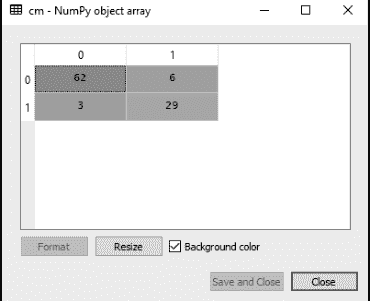

**图11.12** 决策树分类器的混淆矩阵

让我们分析一下混淆矩阵。如图11.13所示，模型预测有65个用户不会购买该产品；在这些样本中，有62个被正确分类为未购买Alexa的人（这些是*真阴性*），有3个人购买了产品。然而，他们被错误地分类到了“未购买Alexa”类别中（*假阴性*）。

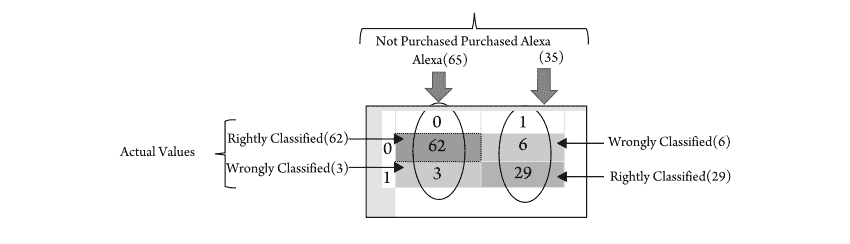

**图11.13** 分析决策树分类器的混淆矩阵

另一方面，模型还预测有35个用户会购买该产品；其中，有29个用户原本就购买了产品，并被正确分类到“已购买Alexa”类别中（*真阳性*）。而其中6个用户没有购买Alexa，却被错误地分类到了“已购买Alexa”类别中（*假阳性*）。混淆矩阵的表格表示如表11.2所示。

**表11.2** 决策树模型的混淆矩阵

| | 预测 (0) | 预测 (1) |
|---|---|---|
| 实际 (0) | 62 (真阴性 - TN) | 6 (假阳性 - FP) |
| 实际 (1) | 3 (假阴性 - FN) | 29 (真阳性 - TP) |

总结一下，预测值为1的列被认为是正类，如果预测正确，则该单元格标记为真阳性，否则为假阳性。预测值为0的列被认为是负类。如果预测正确，该单元格标记为真阴性；否则为假阴性。

计算完混淆矩阵后，我们必须评估模型的其他质量指标，例如*准确率*、*精确率*和*召回率*。

#### 准确率

模型的准确率定义为所有正确预测的数量与分类器做出的总预测数量之比。

因此，模型的准确率是评估模型的一个重要参数。计算*准确率*的公式如公式（11.1）所示。

$$Accuracy = \frac{TP + TN}{TP + TN + FP + FN}$$ (11.1)

在表11.2所示的混淆矩阵中，我们有 TP = 62 和 TN = 29。因此，我们的决策树模型做出的总正确预测数为91，而模型做出的总预测数为100。我们模型的准确率如下：

$Accuracy = \frac{62+29}{29+62+6+3} = \frac{91}{100} = 0.91$

准确率以百分比表示为91%。

#### 精确率

精确率识别模型在预测正类时正确的频率。基于混淆矩阵计算我们模型精确率的公式如下公式（11.2）所示。

$Precision = \frac{TP}{TP + FP}$

从表11.2中，我们有 TP = 29 和 FP = 6。因此，精确率得分为

$Precision = \frac{29}{29+6} = \frac{29}{35} = 0.8285$

精确率以百分比表示为82.85%。

#### 召回率

召回率识别在所有可能的正标签中，模型正确识别了多少？简单来说，它指的是我们能找到多少比例的实际正实例。计算召回率指标的公式如下公式（11.3）所示。

$Recall = \frac{TP}{TP + FN}$

从表11.2中，我们有 TP = 29 和 FN = 3。因此，精确率得分为

$Recall = \frac{29}{29+3} = \frac{29}{32} = 0.9062$

召回率以百分比表示为90.62%。

让我们通过从 `sklearn.metrics` 库导入各种方法，在Python中计算这些性能指标。它有 `accuracy_score()`、`precision_score()` 和 `recall_score()` 方法来评估模型的性能。

在下面的代码片段中，我们使用 `print()` 方法打印性能指标的结果分数。`print()` 方法是在控制台上产生输出的最简单方法之一；我们可以向此方法传递零个或多个用逗号（","）分隔的参数。代码片段11展示了为设计的分类器打印各种质量指标值的代码。

代码片段：11

```
#性能指标
#准确率
from sklearn.metrics import accuracy_score
accuracy = accuracy_score(y_test, y_pred)
print('Accuracy is ', accuracy)
#精确率
from sklearn.metrics import precision_score
precision = precision_score(y_test, y_pred)
print('Precision is ', precision)
#召回率
from sklearn.metrics import recall_score
recall = recall_score(y_test, y_pred)
print('Recall is ', recall)
```

图11.14显示了代码片段11的输出。

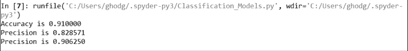

**图11.14** 我们决策树模型的性能指标结果

从图11.14中，我们可以说我们手动计算的性能指标与Python代码计算出的结果相同。在下一步中，我们将通过生成可视化图表来进一步分析分类器的工作原理。

### 步骤8：训练结果的可视化

在此步骤中，我们通过在X轴和Y轴上绘制数据点以及分类边界来可视化模型的行为。为此任务，我们定义了一个名为Visualizer的函数，它接受两个参数，即分别以NumPy数组形式表示的x轴和y轴数据，如代码片段12所示。

代码片段：12

```
#结果可视化的函数定义
def Visualizer(argument1, arguement2):
    from matplotlib.colors import ListedColormap
    X_set, y_set = argument1, arguement2
    X1, X2 = np.meshgrid(np.arange(start=X_set[:,0].min()-1, stop=X_set[:,0].max()+1, step=0.01),
            np.arange(start=X_set[:, 1].min() - 1, stop = X_set[:, 1].max() + 1, step = 0.01))
    plt.contourf(X1,X2, classifier.predict(np.array([X1.ravel(),X2.ravel()]).T).reshape(X1.shape), alpha= 0.75, cmap = ListedColormap(('red', 'green')))
    plt.xlim(X1.min(), X1.max())
    plt.ylim(X2.min(), X2.max())
    for i, j in enumerate(np.unique(y_set)):
        plt.scatter(X_set[y_set == j, 0], X_set[y_set == j, 1], c = ListedColormap(('red', 'green'))(i), label=j)
    plt.xlabel('Age')
    plt.ylabel('Minutes_of_Music_Consumed')
    plt.legend()
    plt.show()
# \ 表示代码在下一行继续
```

此代码片段12定义了一个名为“Visualizer”的Python函数，旨在可视化机器学习分类器在二维数据集上的决策边界。以下是代码功能的分解：

- i. “Visualizer”函数接受两个参数：“argument1”和“argument2”。这些参数预期是分别表示数据集特征和标签的NumPy数组。
- ii. 在函数内部，它从“matplotlib.colors”模块导入“ListedColormap”类，该类用于为决策区域着色。
- iii. 它将“X_set”和“y_set”初始化为“argument1”和“argument2”的值，以便更容易处理这些数组。
- iv. 它创建一个跨越数据集特征范围的点网格（“X1”和“X2”）。此网格将用于绘制决策边界。
- v. “plt.contourf”函数用于绘制决策边界。它使用名为“classifier”的分类器（假设在代码的其他地方已定义）预测网格点的类别标签，并相应地为区域着色。“alpha”参数控制着色区域的透明度，“cmap”参数指定颜色的颜色映射。
- vi. “plt.xlim”和“plt.ylim”函数设置绘图的x轴和y轴的限制，确保整个数据集和决策边界可见。
- vii. 代码遍历“y_set”中的唯一类别标签，并根据其类别用不同颜色绘制数据点。“enumerate”函数用于将颜色映射中的颜色分配给不同的类别。
- viii. 它为x轴和y轴设置标签，并为绘图添加图例。
- ix. 最后，它使用“plt.show()”显示绘图。

这段代码通常用于通过绘制决策边界来可视化分类器如何在二维特征空间中区分不同类别。数据集的特征由x轴和y轴表示，不同类别通过不同颜色进行视觉区分。“这里，‘红色’代表未购买该产品的用户，而‘绿色’代表已购买该产品的用户”。决策边界展示了分类器如何预测特征空间不同区域的类别标签。

为了方便您使用，这个用户自定义的`Visualizer()`方法的代码已与所有分类器的代码一起发布在我们的GitHub页面上，链接如下。因此，您可以直接从该链接使用代码。

https://github.com/bhatiaparteek/ml_with_python/tree/main/Chapter_11_Classifiers


定义好`Visualizer()`方法后，我们将在代码中通过传递训练数据集作为参数来调用此方法，即`X_train`和`y_train`，如下所示。

```
#可视化训练集结果
Visualizer(X_train, y_train)
```

生成的可视化结果如图11.15所示。

上图描绘了红色和绿色的点。这些点是我们训练数据集中的观测点。*红色*点代表*购买了Alexa*的用户（即训练数据集中二进制值为1的所有记录）。相反，*绿色*点代表*未购买Alexa*的用户（即训练数据集中二进制值为0的所有记录）。

让我们通过结果图来分析所有正确和错误的预测。如图11.15所示，正确预测是指观测点的颜色与其预测区域（“红色”或“绿色”区域）相同的那些点。或者，错误预测是指观测点的颜色与其所在预测区域不同的那些点。在我们的决策树分类器案例中，准确率相当高。因此，大多数观测点都与其预测区域匹配。

还必须注意的是，区分“红色”区域点和“绿色”区域点的预测边界在这里不是一条简单的直线，因为决策树分类器不是线性分类器。这里我们得到的是一组水平和垂直线，代表决策树的if-else条件，而不是一条直线。我们还得到了更小的矩形或子网格（预测区域），因为算法通过创建合适的if-else条件来捕获所有类别实例。因此，由于模型试图正确覆盖每个实例，可能会出现过拟合。

从这个图中，可以分析出我们的决策树模型的训练是恰当的，因为我们可以将未购买设备的用户分类到“红色”区域，将购买了Alexa的用户分类到“绿色”区域。

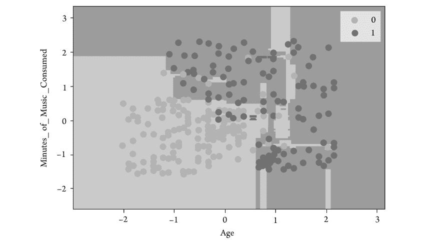

**图11.15** 决策树可视化（训练数据集）

## 步骤9：可视化测试集结果

在这一步中，我们通过绘制测试数据集的数据点及其分类边界来可视化模型的行为。为了可视化测试数据集，我们将再次调用`Visualizer()`方法。但这次，我们将传递测试数据集，即`X_test`和`y_test`，作为参数。

```
#可视化测试集结果
Visualizer(X_test, y_test)
```

生成的可视化结果如图11.16所示。

测试集的结果如图11.16所示。这些结果相当好，因为大多数红色点位于红色预测区域，绿色点位于绿色预测区域。我们可以看到图中某些地方有一些绿色点落在了红色矩形中，这些是错误预测。此外，还可以发现一些没有任何观测点的空矩形，这增加了过拟合的可能性。

至此，我们完成了决策树模型的实现。生成的模型为我们提供了准确率较高的良好预测。在下一节中，我们将实现随机森林分类器。

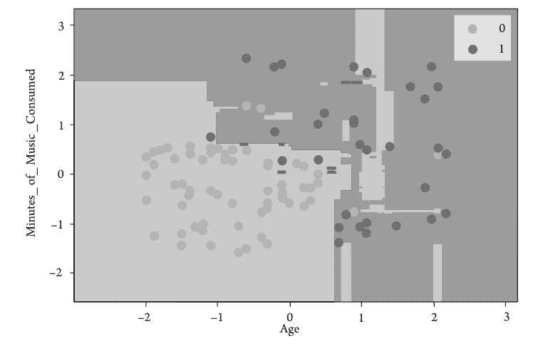

**图11.16** 决策树可视化（测试数据集）

## 11.4 随机森林分类器的实现

随机森林分类器是一种基于决策树分类器的集成方法。在本节中，我们将为*Alexa购买问题*实现一个*随机森林分类模型*。

由于我们使用的是相同的*Alexa数据集*，我们将使用之前准备好的*预处理数据模板*。数据预处理的步骤1到4将保持不变。因此，如第11.2节所述，数据预处理模板代码已被复制。

```
代码片段：15

#导入库
import NumPy as np
import matplotlib.pyplot as plt
import pandas as pd

#加载数据集
Dataset = pd.read_csv('Alexa_dataset.csv')
X = Dataset.iloc[:, [2, 3]].values
y = Dataset.iloc[:, 4].values

#将数据集划分为训练集和测试集
from sklearn.model_selection import train_test_split
X_train, X_test, y_train, y_test = train_test_split(X, y, test_size = 0.25, random_state = 0)
```

```
#特征缩放
from sklearn.preprocessing import StandardScaler
Scale_X = StandardScaler()
X_train = scale_X.fit_transform(X_train)
X_test = scale_X.transform(X_test)
# \ 表示代码在下一行继续
```

我们只需要编写使用以下步骤将随机森林分类模型拟合到训练集的代码。

## 步骤5：将随机森林拟合到训练集

随机森林基于树形方法。它类似于*决策树模型*，但与决策树不同，随机森林是一种集成学习方法，它使用多个决策树的组合进行分类。

我们将首先从`sklearn.ensemble`模块导入`RandomForestClassifier`。接下来，我们将创建一个`RandomForestClassifier`的实例，并将该实例命名为*分类器*。通过向`RandomForestClassifier()`构造函数传递一些参数来创建*分类器*。在图11.17中，我们给出了`RandomForestClassifier()`的函数定义。

图11.17中显示的参数列表很长，但我们在创建*分类器*时不会使用所有参数。让我们先看代码片段，然后我们将详细讨论所需的参数。

```
#将随机森林分类拟合到训练集
from sklearn.ensemble import RandomForestClassifier
classifier = RandomForestClassifier(n_estimators = 10, criterion = 'entropy', random_state = 0)
classifier.fit(X_train, y_train)
```

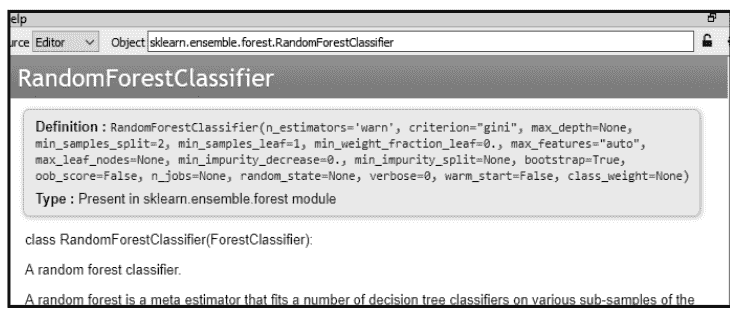

**图11.17** RandomForestClassifier的参数

在代码片段16中，我们传递给`RandomForestClassifier()`的第一个参数是`n_estimator`。它表示将用于构建随机森林的决策树数量。随机森林中的每棵决策树都是使用训练数据的随机子集构建的，并且在树的每次分裂中使用不同的特征子集。通过增加随机森林中树的数量，可以提高模型的整体准确性和稳定性，因为单个树不太容易在训练数据上过拟合。然而，树的数量和模型的计算复杂度之间存在权衡。增加树的数量可能会导致更长的训练时间和更大的内存需求。`n_estimators`的默认值是10。为了简单起见，我们在代码中使用默认值。在实践中，通常根据训练数据的大小将`n_estimators`设置为一个较大的值，例如100或500，然后使用交叉验证来确定添加更多的树是否能显著提高模型的性能。

下一个参数是`criterion`。它指定了构建决策树所使用的标准，可以是“gini”或“entropy”。这里，我们使用“entropy”作为标准方法，也可以更改为“gini”进行实验。

下一个参数是`random_state`参数。`random_state`参数为0，确保每次运行的结果一致。它用于设置伪随机数生成器的随机种子，该生成器用于在决策树的每次分裂中随机选择训练数据的子集和特征。设置特定的`random_state`可确保子集的随机选择是可重现的，这意味着如果您使用相同的`random_state`值多次运行相同的模型，您将得到相同的结果。这对于调试和测试非常有用，也可以确保不同模型之间的公平比较。

最后，使用`classifier`实例，我们将通过传递训练集（`X_train`，`y_train`）作为参数来调用`fit()`方法。代码片段17展示了这一点。

```
classifier.fit(X_train, y_train)
```

### 步骤6：预测测试集结果

使用构建好的`classifier`，我们将对测试数据集进行预测。我们将调用`predict()`方法，并提供`X_test`作为参数，因为我们希望预测`X`（`Age`和`Minutes_of_Music_Consumed`）的测试值对应的`Y`（`Purchased_Alexa`）值。相应的代码片段如下。

```
#预测测试集结果
y_pred = classifier.predict(X_test)
```

执行此代码后，变量浏览器选项卡中会创建一个新变量，即`y_pred`。在图11.18中，我们将实际值`y_test`与我们模型的预测值`y_pred`进行了比较。

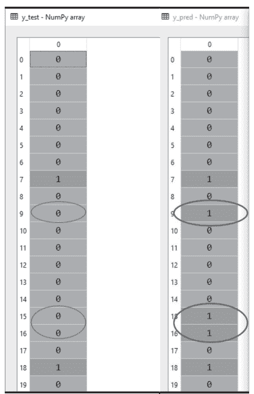

**图 11.18** *y_test* 和 *y_pred* 的前10个值

通过比较 *y_test* 和 *y_pred*，我们发现有三个预测结果，即观测实例9、15和16，被错误地预测了。根据模型，这些用户会购买Alexa，但他们实际上并未购买Alexa。手动计算所有错误预测是困难的。混淆矩阵用于统计错误预测的总数。下一步，我们将为我们的随机森林分类器创建一个混淆矩阵。

### 通过性能指标和可视化分析结果（步骤7至步骤9）

需要遵循以下步骤，通过性能指标和可视化来分析结果。

## 步骤7：创建混淆矩阵

让我们使用以下代码片段生成混淆矩阵。

*代码片段：19*

```python
#Making the confusion matrix
from sklearn.metrics import confusion_matrix
cm = confusion_matrix(y_test, y_pred)
```

执行该片段后，我们得到表示混淆矩阵的 *cm*。你可以通过查看变量浏览器来验证这一点。如果你在变量浏览器窗口中双击这个变量，你可以看到它的内容，如图11.19所示。图11.19显示了在 *Alexa_dataset* 上运行的 *随机森林分类器* 生成的混淆矩阵。我们的模型做出了9（5+4）次错误预测。

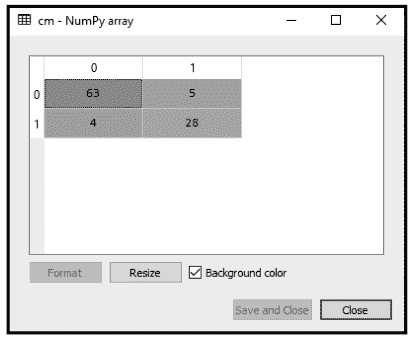

**图 11.19** 随机森林的混淆矩阵（*cm* 变量）

如图11.19所示，我们的模型预测了67个样本属于“未购买Alexa”类别；在这些样本中，有63个被正确分类为未购买Alexa的人（这些是 *真负例*），而4个人购买了该产品却被错误地分类到“未购买Alexa”类别（*假负例*）。

同样，*随机森林* 模型也预测了33个用户会购买该产品；其中，28个用户原本就购买了它，并被正确分类到“已购买Alexa”类别（*真正例*）。而其中5个用户没有购买Alexa，却被错误地分类到“已购买Alexa”类别（*假正例*）。混淆矩阵的表格表示如表11.3所示。

**表 11.3** 随机森林模型的混淆矩阵

| | 预测为0 | 预测为1 |
|---|---|---|
| 实际为0 | 63（真负例 - TN） | 5（假正例 - FP） |
| 实际为1 | 4（假负例 - FN） | 28（真正例 - TP） |

使用表11.3，我们将手动计算 *随机森林模型* 的 *准确率*、*精确率* 和 *召回率*。

$$准确率 = \frac{TP+TN}{TP+TN+FP+FN} = \frac{63+28}{63+28+5+4} = 0.91$$

$$精确率 = \frac{TP}{TP + FP} = \frac{28}{28 + 5} = 0.848$$

$$召回率 = \frac{TP}{TP + FN} = \frac{28}{28 + 4} = 0.875$$

我们可以比较决策树和随机森林分类器的准确率；在相同的数据集上，决策树分类器有9次错误分类，而随机森林分类器也做出了9次错误预测。随机森林在示例数据集上的精确率（0.848）优于决策树分类器（0.8285）。相比之下，决策树分类器具有更好的召回率（随机森林为0.875，决策树分类器为0.962）。然而，在大型数据集的情况下，随机森林通常比决策树分类器表现更好，因为它基于集成方法。在我们的案例研究中，数据集太小，从这个小规模数据集的子集中创建多棵树并没有给出好的结果。

让我们使用以下代码片段在Python中计算这些性能指标。

```python
#Performance metrics
#Accuracy
from sklearn.metrics import accuracy_score
accuracy = accuracy_score(y_test, y_pred)
print('Accuracy is ', accuracy)
#Precision
from sklearn.metrics import precision_score
precision = precision_score(y_test, y_pred)
print('Precision is ', precision)
#Recall
from sklearn.metrics import recall_score
recall = recall_score(y_test, y_pred)
print('Recall is ', recall)
```

运行该片段后，我们得到如图11.20所示的输出。

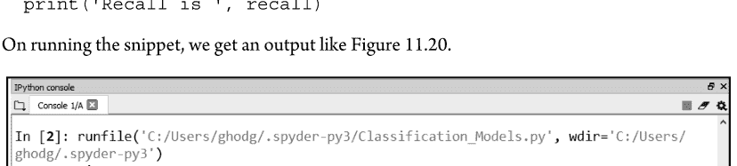

**图 11.20** 我们的随机森林模型的性能指标结果

### 步骤8：训练结果的可视化

在我们 *决策树分类器* 的Python实现中，我们编写了一个 `Visualizer()` 方法来可视化分类器的结果。我们将使用相同的代码来可视化随机森林分类器的结果。

```python
#Visualizing the training set results
Visualizer(X_train, y_train)
```

执行代码片段21后，我们得到如图11.21所示的输出。生成的图有点像我们的决策树可视化，我们得到了一个非线性预测边界。这里再次出现了一组水平和垂直线，而不是一条直线，因为它基于决策树的if-else条件。值得强调的是，在这种情况下，我们也得到了较小的矩形或子网格，称为预测区域。这些细分是由10个决策树算法中的每一个所做的单独分裂产生的，因为我们在随机森林初始化时将 *n_estimator* 设置为10。

### 步骤9：测试集结果的可视化

最后，我们将使用以下代码片段可视化测试数据集的分类器结果。

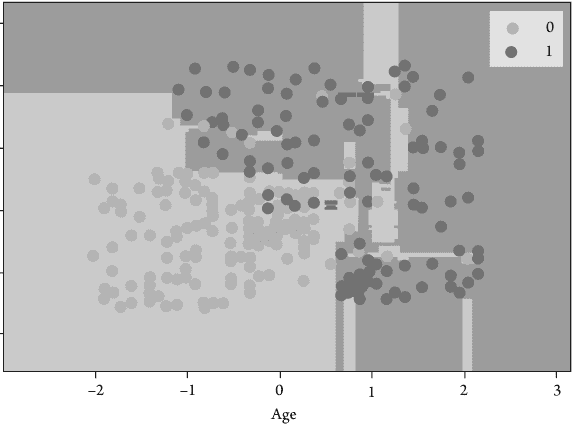

```python
#Visualizing the test set results
Visualizer(X_test, y_test)
```

生成的可视化如图11.22所示。这个图再次类似于我们训练集的图，但如果你仔细观察，你会发现一些绿色点落在了红色预测区域内。

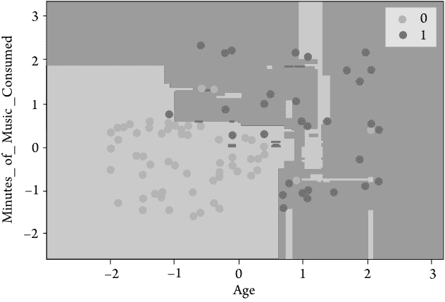

**图 11.22** 预测结果的可视化（测试数据集）

## 11.5 朴素贝叶斯分类器的实现

在本节中，我们将为 *Alexa购买问题* 实现一个 *朴素贝叶斯分类器模型*。
由于我们使用的是相同的 *Alexa_dataset*，我们将使用我们之前准备的 *预处理数据模板*。数据预处理的步骤1到步骤4将是相同的。因此，数据预处理模板代码已被复制，如第11.2节所述。

```python
#Importing the libraries
import numpy as np
import matplotlib.pyplot as plt
import pandas as pd
#Loading the dataset
Dataset = pd.read_csv('Alexa_dataset.csv')
X = Dataset.iloc[:, [2, 3]].values
y = Dataset.iloc[:, 4].values

#Splitting the dataset into the training set and test set
from sklearn.model_selection import train_test_split
X_train, X_test, y_train, y_test = train_test_split(X, y, test_size = 0.25, random_state = 0)
```

```python
#Feature scaling
from sklearn.preprocessing import StandardScaler
Scale_X = StandardScaler()
X_train = scale_X.fit_transform(X_train)
X_test = scale_X.transform(X_test)
# \ indicates continuation of the code in next line
```

### 拟合分类模型并进行预测（步骤5和步骤6）

我们只需要编写使用以下步骤拟合朴素贝叶斯分类模型的代码。

## 步骤5：将朴素贝叶斯拟合到训练集

朴素贝叶斯算法在Python中通过使用 `GaussianNB` 类来实现。
关于朴素贝叶斯的Python实现，我们有大约5种不同的变体，但我们选择 `Gaussian` 变体，因为它非常基础。`GaussianNB` 类是 `sklearn.naive_bayes` 模块的一部分。我们将使用以下代码片段导入 `GaussianNB` 类。

```python
#Classifier - III (Naive Bayes Classifier)
#Fitting naive Bayes to the training set
from sklearn.naive_bayes import GaussianNB
```

接下来，我们将创建一个 `GaussianNB` 类的对象，如下所示。

```python
classifier = GaussianNB()
```

然后，我们将使用 `fit()` 方法基于训练数据集构建或拟合模型。将向它传递两个参数——自变量的训练数据（`X_train`）和相应的因变量（`y_train`）。`classifier` 实例用于调用 `fit()` 方法。

```python
classifier.fit(X_train, y_train)
```

### 步骤6：预测测试集结果

为了进行预测，我们将使用 `predict()` 方法。

```python
#Predicting the test set results
y_pred = classifier.predict(X_test)
```

执行此代码片段后，变量浏览器选项卡中会创建一个新变量，即 `y_pred`。让我们使用图 11.23 来比较 `y_test` 中的实际值与我们模型的预测值 `y_pred`。我们可以观察到，大多数观测值都被我们的*朴素贝叶斯模型*正确预测；在前 20 个观测值中，只有一个（即第 9 个索引处的观测值）被错误预测。根据模型，第 9 个索引处的用户会购买 Alexa，但实际上他并未购买。

### 通过性能指标和可视化分析结果（步骤 7 到步骤 9）

需要遵循以下步骤，通过性能指标和可视化来分析结果。

## 步骤 7：制作混淆矩阵

让我们通过为*朴素贝叶斯分类*模型生成混淆矩阵，来理解数据集实际值与预测值之间的相关性。使用以下代码片段生成混淆矩阵。

**代码片段：28**

```python
#Making the confusion matrix
from sklearn.metrics import confusion_matrix
cm = confusion_matrix(y_test, y_pred)
```

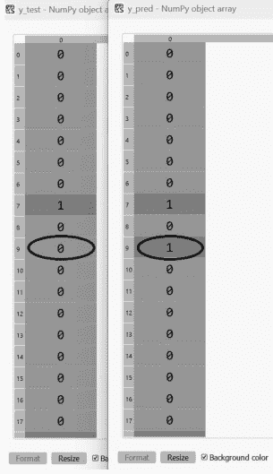

生成的混淆矩阵如图 11.24 所示。

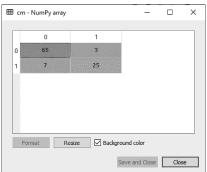

**图 11.24** 朴素贝叶斯的混淆矩阵（*cm* 变量）

如图 11.24 所示，我们的模型预测了 72 个样本属于“未购买 Alexa”类别；在这些样本中，有 65 个被正确分类为未购买该产品的人（这些是*真阴性*），而有 7 人购买了该产品却被错误地分类到“未购买 Alexa”类别中（*假阴性*）。

同样，*朴素贝叶斯*模型也预测了 28 个用户会购买该产品；其中，有 25 个用户原本就购买了该产品，并被正确分类到“*已购买 Alexa*”类别中（*真阳性*）。而其中 3 个用户并未购买 Alexa，却被错误地分类到“*已购买 Alexa*”类别中（*假阳性*）。混淆矩阵的表格表示如表 11.4 所示。

**表 11.4** 朴素贝叶斯的混淆矩阵

| | **预测为 0** | **预测为 1** |
|---|---|---|
| **实际为 0** | 65 (真阴性 - TN) | 3 (假阳性 - FP) |
| **实际为 1** | 7 (假阴性 - FN) | 25 (真阳性 - TP) |

我们可以通过计算性能指标来确定模型的准确性。让我们首先手动计算*朴素贝叶斯*分类器的*准确率*、*精确率*和*召回率*。

$$准确率 = \frac{TP+TN}{TP+TN+FP+FN} = \frac{25+65}{25+65+3+7} = 0.90$$

$$精确率 = \frac{TP}{TP+FP} = \frac{25}{25+3} = 0.89$$

$$召回率 = \frac{TP}{TP+FN} = \frac{25}{25+7} = 0.78$$

让我们使用以下代码片段在 Python 中计算这些性能指标。

**代码片段：29**

```python
#Performance metrics
#Accuracy
from sklearn.metrics import accuracy_score
accuracy = accuracy_score(y_test, y_pred)
print('Accuracy is ', accuracy)
#Precision
from sklearn.metrics import precision_score
precision = precision_score(y_test, y_pred)
print('Precision is ', precision)
#Recall
from sklearn.metrics import recall_score
recall = recall_score(y_test, y_pred)
print('Precision is ', precision)
```

执行结果如图 11.25 所示。这些度量值与我们的手动计算结果一致。

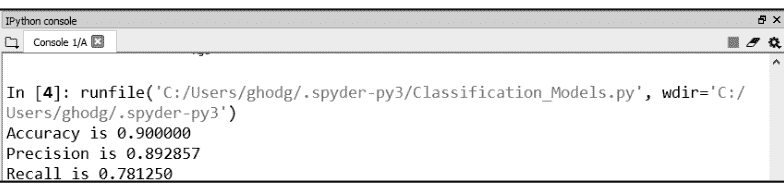

**图 11.25** 我们的朴素贝叶斯的性能指标结果

观察这些指标，我们可以推断模型的性能相当不错，你也可以将其结果与之前讨论的决策树和随机森林分类器进行比较。接下来，我们将通过绘制图表和可视化来分析分类器的结果。

## 步骤 8：训练结果的可视化

我们已经编写了一个 `Visualizer()` 方法来可视化分类器的结果。我们将使用相同的代码来可视化朴素贝叶斯分类器的结果。如下所示，你可以复制代码、粘贴并调用它，以查看朴素贝叶斯分类器训练数据集的可视化结果。

**代码片段：30**

```python
#Visualizing the training set results
Visualizer(X_train, y_train)
```

这里，我们调用 `Visualizer()` 函数，并将 `X_train` 和 `y_train` 作为其参数，以可视化训练集结果。执行此代码片段后，我们得到一个绘图，如图 11.26 所示。

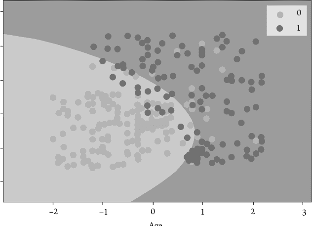

**图 11.26** 预测结果的可视化（训练数据集）

图 11.26 显示了我们的朴素贝叶斯分类器模型的结果图。与之前的分类器不同，朴素贝叶斯的结果图是一条平滑的曲线，它是非线性的（直线分离是线性的）。在朴素贝叶斯分类器的情况下，我们基于概率方法得到了这条曲线。它使用观测值的似然值来进行预测。此外，分类器的性能相当令人满意，因为大多数红点都位于红色区域，绿点也是如此。

值得注意的是，在大多数情况下，采用曲线或非线性分离的分类器往往比使用线性分离的分类器获得更高的准确率。

## 步骤 9：测试集结果的可视化

我们将调用 `Visualizer()` 函数，并将 `X_train` 和 `y_train` 作为其参数，以可视化测试集结果，如下所示。

**代码片段：31**

```python
#Visualizing the test set results
Visualizer(X_test, y_test)
```

执行上述代码片段后，我们得到一个绘图，如图 11.27 所示。

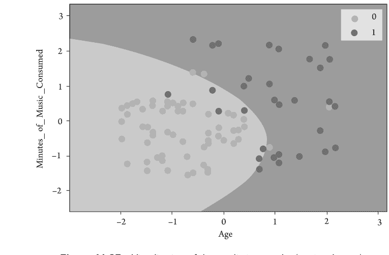

**图 11.27** 预测结果的可视化（测试数据集）

如图 11.27 所示，该模型准确地预测了大多数不购买的红色用户，有效地将他们置于正确的类别中。同样，该模型也正确预测了购买该设备的用户，将他们置于绿色区域。此绘图也可用于分析模型的错误预测。在模型的混淆矩阵中，我们发现了 10 个错误预测，如果你观察图 11.27 所示的绘图，你可以看到它们——7 个绿点位于红色区域，3 个红点位于绿色区域。

因此，朴素贝叶斯模型成功地预测了用户是否会购买该设备。

## 11.6 k-NN 的实现

在本节中，我们将为 *Alexa 购买问题*实现一个 *k-NN 模型*。

由于我们使用的是相同的 *Alexa_dataset*，我们将使用之前准备好的*预处理数据模板*。数据预处理的步骤 1 到 4 将保持不变。因此，数据预处理模板代码已被复制，如第 11.2 节所述。

**代码片段：32**

```python
#Importing the libraries
import numpy as np
import matplotlib.pyplot as plt
import pandas as pd
#Loading the dataset
Dataset = pd.read_csv('Alexa_dataset.csv')
X = Dataset.iloc[:, [2, 3]].values
y = Dataset.iloc[:, 4].values
#Splitting the dataset into the training set and test set
from sklearn.model_selection import train_test_split
X_train, X_test, y_train, y_test = train_test_split(X, y, test_size = 0.25, random_state = 0)
#Feature scaling
from sklearn.preprocessing import StandardScaler
Scale_X = StandardScaler()
X_train = scale_X.fit_transform(X_train)
X_test = scale_X.transform(X_test)
# \ indicates continuation of the code in next line
```

### 拟合分类模型并进行预测（步骤 5 和步骤 6）

我们只需使用以下步骤编写用于拟合 k-NN 分类模型的代码。

### 步骤 5：将 k-NN 拟合到训练集

为了拟合 k-NN 分类模型，我们将首先从 `sklearn.neighbors` 模块导入 `KNeighborsClassifier`。接下来，我们将创建导入类的一个实例作为*分类器*。通过向 `KNeighborsClassifier()` 传递一些参数来创建*分类器*。在图 11.28 中，我们提供了 `KNeighborsClassifier()` 的函数定义。要在你的 Spyder 笔记本中访问此定义，只需键入“KNeighborsClassifier”并选择它，然后按 *Ctrl+I*。此操作将打开*帮助*选项卡，为你提供有关 `KNeighborsClassifier` 的必要详细信息。

图 11.28 中显示的参数列表很长，但我们在创建*分类器*时不会使用所有参数。首先，让我们浏览一下拟合分类器的代码片段，然后我们将详细讨论所需的参数。

## 图 11.28 k-NN 模型的属性

*代码片段：33*

```python
#Fitting KNN to the training set
from sklearn.neighbors import KNeighborsClassifier
classifier = KNeighborsClassifier( n_neighbors = 5, metric = 'minkowski', p = 2)
```

在代码片段 33 中，我们传递给 `KNeighborsClassifier()` 的第一个参数是 `n_neighbors`。它用于指定查询邻居时要使用的最大邻居数量。`n_neighbors` 的默认值为 5。为简单起见，我们在代码中使用了默认值。不过，`n_neighbors` 的数量也可以从 5 改为任何其他数字。

下一个参数是 `metrics`。k-NN 算法使用距离度量来确定相似性和不相似性。因此，我们将通过 `metric` 参数指定模型选择的距离度量；有 3 种可能的距离度量，分别是*欧几里得距离*、*曼哈顿距离*和*闵可夫斯基距离*。我们的 k-NN 模型将使用*闵可夫斯基距离*（`metric` 的默认值是*闵可夫斯基距离*）。

下一个参数是*闵可夫斯基距离*度量的幂参数或 `p` 参数。如果 `p = 1`，则等同于*曼哈顿距离*。默认度量是*闵可夫斯基距离*，而 `p = 2` 等同于标准的欧几里得度量。

最后，使用 `classifier` 实例，我们将通过传递训练集（`X_train`，`y_train`）作为参数来调用 `fit()` 方法。代码片段 34 展示了这一点。

*代码片段：34*

```python
classifier.fit(X_train, y_train)
```

## 步骤 6：预测测试集结果

为了对测试数据进行预测，我们将使用 `predict()` 方法，并以 `X_test` 作为其参数，如下所示。

```python
#Predicting a new result with k-NN
y_pred = classifier.predict(X_test)
```

预测结果将存储在 `y_pred` 中。此外，让我们将测试数据集的实际值 `y_test` 与预测值 `y_pred` 进行比较。这两个变量（即 `y_test` 和 `y_pred`）的比较如图 11.29 所示。

通过比较 `y_test` 和 `y_pred`，我们发现有两个预测，即索引为 9 和 15 的观测值，被错误地预测了。根据模型，第 9 个和第 15 个会购买 Alexa，但实际上他们并未购买 Alexa。

### 通过性能指标和可视化分析结果（步骤 7 到步骤 9）

需要遵循以下步骤，通过性能指标和可视化来分析结果。

## 步骤 7：制作混淆矩阵

现在，让我们使用混淆矩阵来评估 *k*-NN 的性能。我们将使用以下代码片段生成混淆矩阵。

```python
#Making the confusion matrix
from sklearn.metrics import confusion_matrix
cm = confusion_matrix(y_test, y_pred)
```

生成的混淆矩阵如图 11.30 所示。

给定的 *Alexa_dataset* 模型预测有 67 个样本属于“*未购买 Alexa*”类别；在这些样本中，有 64 个被正确分类为未购买 Alexa 的人（这些是*真阴性*），而有 3 个人购买了该产品，却被错误地分类到“*未购买 Alexa*”类别中（*假阴性*）。
或者，*K-近邻*模型也预测有 33 个用户会购买该产品；其中，有 29 个用户原本购买了该产品，并被正确分类到“*已购买 Alexa*”类别中（*真阳性*）。而其中 4 个用户没有购买 Alexa，却被错误地分类到“*已购买 Alexa*”类别中（*假阳性*）。混淆矩阵的表格表示如表 11.5 所示。

### 表 11.5 k-NN 的混淆矩阵

| | 预测 (0) | 预测 (1) |
|---|---|---|
| 实际 (0) | 64 (真阴性 - TN) | 4 (假阳性 - FP) |
| 实际 (1) | 3 (假阴性 - FN) | 29 (真阳性 - TP) |

计算混淆矩阵后，我们必须评估模型的不同参数，例如*准确率*、*精确率*和*召回率*。

$$准确率 = \frac{TP+TN}{TP+TN+FP+FN} = \frac{29+64}{29+64+4+3} = 0.93$$

$$精确率 = \frac{TP}{TP+FP} = \frac{29}{29+4} = 0.87$$

$$召回率 = \frac{TP}{TP+FN} = \frac{29}{29+3} = 0.90$$

让我们使用以下代码片段在 Python 中计算这些性能指标。

```python
#Performance metrics
#Accuracy
from sklearn.metrics import accuracy_score
accuracy = accuracy_score(y_test, y_pred)
print('Accuracy is ', accuracy)
#Precision
from sklearn.metrics import precision_score
precision = precision_score(y_test, y_pred)
print('Precision is ', precision)
#Recall
from sklearn.metrics import recall_score
recall = recall_score(y_test, y_pred)
print('Recall is ', recall)
```

执行结果如图 11.31 所示。输出与我们的手动计算结果一致。

**图 11.31 我们的 *k-NN* 分类器的性能指标结果**

## 步骤 8：训练结果的可视化

在之前分类模型的 Python 实现中，我们编写了一个 `Visualizer()` 方法来可视化分类器的结果。我们将使用相同的代码来可视化 *k*-NN 的结果。

我们使用 `X_train` 和 `y_train` 作为参数调用 `Visualizer()` 方法，以可视化训练集结果，如下所示。

```python
#Visualizing the training set results
Visualizer(X_train, y_train)
```

执行代码片段 21 后，我们得到如图 11.32 所示的输出。

如图 11.32 所示，生成的预测边界是非线性的。可视化效果看起来像一张显示两个国家边界的拓扑地图。红色区域象征未购买 Alexa 设备的人，而绿色区域象征购买了 Alexa 的人。在绿色区域上出现红点或反之亦然，标志着分类器的错误预测。在图中，大多数绿点包含在绿色区域中，但偶尔会有一些红点落在绿色区域中，导致错误的预测。需要注意的是，*k*-NN 具有非线性的分隔线。

## 步骤 9：测试集结果的可视化

我们使用 `X_test` 和 `y_test` 作为参数调用 `Visualizer()` 方法，以可视化测试集结果，如下所示。

```python
#Visualizing the test set results
Visualizer(X_test, y_test)
```

在生成的图中，如图 11.33 所示，我们可以观察到 k-NN 分类器正确预测了大多数观测值。然而，模型的错误预测也可以在图中看到。我们应该有 7 个错误预测；所有这 7 个错误预测都可以在上图中看到——3 个绿点在红色区域，4 个红点在绿色区域。

总而言之，我们可以得出结论，与目前讨论的其他分类器（决策树、随机森林和朴素贝叶斯）在同一数据集上的表现相比，k-NN 模型的性能相当令人满意。它的准确率为 93%，而决策树和随机森林在同一数据集上的准确率为 91%，朴素贝叶斯分类器的准确率为 90%。

## 11.7 逻辑回归分类器的实现

在本节中，我们将为 Alexa 购买问题实现逻辑回归分类器模型。

由于我们使用的是相同的 *Alexa_dataset*，我们将使用之前准备好的*预处理数据模板*。数据预处理的步骤 1 到 4 将是相同的。因此，数据预处理模板代码已被复制，如第 11.2 节所述。

*代码片段：40*

```python
#Importing the libraries
import NumPy as np
import matplotlib.pyplot as plt
import pandas as pd
#Loading the dataset
Dataset = pd.read_csv('Alexa_dataset.csv')
X = Dataset.iloc[:, [2, 3]].values
y = Dataset.iloc[:, 4].values
#Splitting the dataset into the training set and test set
from sklearn.model_selection import train_test_split
X_train, X_test, y_train, y_test = train_test_split(X, y, test_size = 0.25, random_state = 0)
#Feature scaling
from sklearn.preprocessing import StandardScaler
Scale_X = StandardScaler()
X_train = scale_X.fit_transform(X_train)
X_test = scale_X.transform(X_test)
# \ indicates continuation of the code in next line
```

### 拟合分类模型并进行预测（步骤 5 和步骤 6）

我们只需使用以下步骤编写代码来拟合逻辑回归的分类模型。

## 步骤 5：将逻辑回归分类器拟合到训练集

预处理阶段之后，下一步是使用逻辑回归模型构建分类器。该模型使用 `sklearn.linear_model` 模块中的 `LogisticRegression` 类实现。在下面的代码片段中，我们首先导入 `LogisticRegression` 类，通过调用其构造函数 `LogisticRegression()` 来创建其对象，以创建类的实例。我们将其实例命名为 *classifier*。

*代码片段：41*

```python
#Classifier - V (Logistic Regression)
#Fitting logistic regression to the training set
from sklearn.linear_model import LogisticRegression
classifier = LogisticRegression( random_state = 0)
classifier.fit(X_train, y_train)
```

我们使用一个参数，即`random_state`，调用`LogisticRegression()`构造函数来创建分类器实例。该参数用于指定随机数生成器使用的随机种子。它控制着模型拟合前的数据打乱以及优化过程中每一步的特征选择。设置固定的`random_state`值可以确保模型训练结果的可复现性。如果未设置`random_state`，或将其设置为None，随机数生成器将在每次模型训练时使用不同的随机种子，这可能导致结果不同，并使得比较不同模型的性能变得更加困难。

最后，使用`classifier`实例，我们将通过传递训练集（`X_train`，`y_train`）作为参数来调用`fit()`方法。代码片段42展示了这一点。

```
classifier.fit(X_train, y_train)
```

## 第6步：预测测试集结果

接下来的部分是结果预测；`classifier`预测个体是否会购买该产品。我们将使用准备好的`classifier`调用`predict()`方法，并将`X_test`作为参数传递。

```
#使用逻辑回归预测新结果
y_pred = classifier.predict(X_test)
```

预测结果将存储在`y_pred`中。接下来，让我们将测试数据集的实际值`y_test`与预测值`y_pred`进行比较。这两个变量`y_test`和`y_pred`的比较如图11.34所示。

通过比较`y_test`和`y_pred`，我们发现逻辑回归分类器预测索引为9的用户会购买Alexa，但实际上他并没有购买。

### 通过性能指标和可视化分析结果（第7步至第9步）

需要遵循以下步骤，通过性能指标和可视化来分析结果。

## 第7步：制作混淆矩阵

生成混淆矩阵的代码如下。

```
#制作混淆矩阵
from sklearn.metrics import confusion_matrix
cm = confusion_matrix(y_test, y_pred)
```

生成的混淆矩阵如图11.35所示。

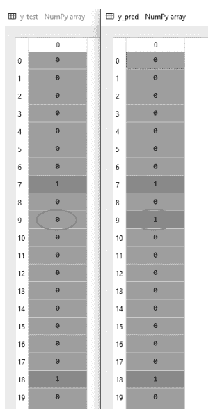

**图11.34** 比较*y_test*（实际值）与*y_pred*（预测值）

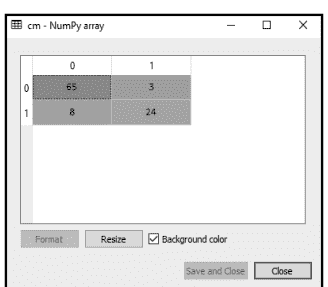

**图11.35** 逻辑回归分类器的混淆矩阵

给定的*Alexa_dataset*，*模型*预测73个样本属于“未购买Alexa”类别；在这些样本中，有65个被正确分类为未购买Alexa的人（这些是*真阴性*），而8个人购买了该产品却被错误地分类到“未购买Alexa”类别（*假阴性*）。

或者，*逻辑回归分类*模型也预测27个用户会购买该产品；其中，24个用户原本购买了该产品，并被正确分类到“已购买Alexa”类别（*真阳性*）。而其中3个用户没有购买Alexa，却被错误地分类到“已购买Alexa”类别（*假阳性*）。混淆矩阵的表格表示如表11.6所示。

**表11.6** 逻辑回归的混淆矩阵

| | 预测为0 | 预测为1 |
|---|---|---|
| 实际为0 | 65（真阴性 - TN） | 3（假阳性 - FP） |
| 实际为1 | 8（假阴性 - FN） | 24（真阳性 - TP） |

计算混淆矩阵后，我们必须评估模型的不同指标，例如*准确率、精确率和召回率*。

$$准确率 = \frac{TP+TN}{TP+TN+FP+FN} = \frac{24+65}{24+65+3+8} = 0.89$$

$$精确率 = \frac{TP}{TP+FP} = \frac{24}{24+3} = 0.88$$

$$召回率 = \frac{TP}{TP+FN} = \frac{24}{24+8} = 0.75$$

让我们使用以下代码片段在Python中计算这些性能指标。

```
#性能指标
#准确率
from sklearn.metrics import accuracy_score
accuracy = accuracy_score(y_test, y_pred)
print('Accuracy is ', accuracy)
#精确率
from sklearn.metrics import precision_score
precision = precision_score(y_test, y_pred)
print('Precision is ', precision)
#召回率
from sklearn.metrics import recall_score
recall = recall_score(y_test, y_pred)
print('Recall is ', recall)
```

执行结果如图11.36所示。输出与我们的手动计算一致。

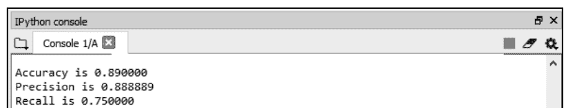

**图11.36** 我们的逻辑回归分类器的性能指标结果

## 第8步：训练结果的可视化

我们使用`X_train`和`y_train`作为参数调用`Visualizer()`方法来可视化训练集结果，如下所示。`Visualizer()`方法的详细信息在代码片段41中给出。

执行代码片段46后，我们得到如图11.37所示的输出。

```
#可视化训练集结果
Visualizer(X_train, y_train)
```

我们分类器的目标是将用户分为两类——“会购买Alexa的用户”和“不会购买Alexa的用户”。图11.37中显示的两个区域即代表了这一点。这两个区域由一条称为预测边界的直线分隔。在逻辑回归的情况下，我们得到一个线性预测边界，因为它是一个线性分类器，在两个类别之间创建直线边界。

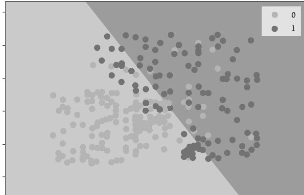

**图11.37** 预测结果的可视化（训练数据集）

由于我们使用的是黑白图像，需要注意显示的图表是灰度图。然而，在执行时，用户将看到实际的红色和绿色。大多数观测值聚集在单一颜色区域内。尽管如此，由于预测不准确，一些绿色点也出现在红色区域内，反之亦然。

## 第9步：测试集结果的可视化

最后，我们将可视化测试集结果。我们将再次使用`X_test`和`y_test`作为参数调用`Visualizer()`方法来可视化测试集结果，如下所示。

```
#可视化测试集结果
Visualizer(X_test, y_test)
```

执行代码片段43后，我们得到如图11.38所示的输出。

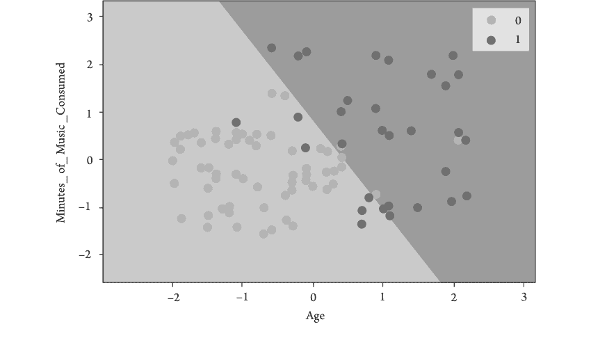

在生成的图中，我们可以观察到*逻辑回归*分类器正确预测了89个观测值。然而，模型的错误预测也可以在图中看到。我们应该有11个错误预测；所有这11个错误预测都可以在上图中看到——8个绿色点在红色区域内，3个红色点在绿色区域内。

需要注意的是，逻辑回归分类器产生了一个线性分隔线，并且在讨论的所有分类器中，对于相同的数据集，它的准确率最低。决策树和随机森林产生了垂直和水平线图，准确率为91%。朴素贝叶斯为类别分隔产生了平滑曲线，准确率为90%。相比之下，k-NN具有类似非线性分隔符的地图，准确率为93%。在逻辑回归的情况下，我们有一个线性分隔线，准确率为89%。

## 11.8 支持向量机线性模型的实现

本节将为*Alexa购买问题*实现一个*支持向量机线性模型*。

由于我们使用的是相同的*Alexa_dataset*，我们将使用之前准备好的*预处理数据模板*。数据预处理的步骤1到4将保持不变。因此，数据预处理模板代码已被复制，如第11.2节所述。

```
#导入库

import numpy as np
import matplotlib.pyplot as plt
import pandas as pd

#加载数据集
Dataset = pd.read_csv('Alexa_dataset.csv')
X = Dataset.iloc[:, [2, 3]].values
y = Dataset.iloc[:, 4].values

#将数据集拆分为训练集和测试集
from sklearn.model_selection import train_test_split
X_train, X_test, y_train, y_test = train_test_split(X, y, test_size = 0.25, random_state = 0)

#特征缩放
from sklearn.preprocessing import StandardScaler
scale_X = StandardScaler()
X_train = scale_X.fit_transform(X_train)
X_test = scale_X.transform(X_test)
```

### 拟合分类模型并进行预测（第5步和第6步）

我们只需要使用以下步骤编写用于拟合支持向量分类模型的代码。

## 第5步：将线性SVM拟合到训练集

在这一步中，我们将从`sklearn.svm`模块导入*SVC*类。*SVC*类提供了一组构建SVM模型所需的特定库和函数。接下来，我们将创建一个*SVC*类的实例，比如*classifier*。为了创建*SVC*的实例，我们将使用一些参数调用*SVC()*构造函数。*SVC()*的完整参数列表和定义如图11.39所示。我们将使用其中一些参数来创建一个*classifier*实例。

## 11.8 线性支持向量机模型的实现

### 步骤5：将SVM模型拟合到训练集

代码片段：49

```python
#Classifier – VI (SVM - Linear)
#Fitting SVM to the training set
from sklearn.svm import SVC
classifier = SVC( kernel = 'linear', random_state = 0)
```

代码片段49，为了创建一个SVC类对象，通过传递两个参数，即*kernel*和*random_state*，调用其构造函数。*kernel*指定了用于创建模型的内核类型。内核类型可以是以下五种选择之一——*linear*、*poly*、*rbf*、*sigmoid*和*precomputed*，默认值是*rbf*。在我们的实现中，我们使用“*linear*”作为内核类型。

下一个参数是*random_state*参数。我们将*random_state*固定为整数值0，这样每次重新运行代码都会返回相同的随机数集。

最后，使用*classifier*实例，我们将通过传递训练集（*X_train*，*y_train*）作为参数来调用*fit()*方法。代码片段50展示了这一点。

代码片段：50

```python
classifier.fit(X_train, y_train)
```

### 步骤6：预测测试集结果

我们训练好的模型已准备好预测用户购买Alexa的选择。我们将使用分类器实例并调用*predict()*方法进行预测。在*predict()*方法中，我们将传递*X_test*，因为我们想要预测测试数据集的结果。

代码片段：51

```python
#Predicting a new result with SVM - Linear
y_pred = classifier.predict(X_test)
```

执行代码片段51后，我们得到*y_pred*，一个包含预测值的向量数据类型，而*y_test*则包含实际值。预测值与实际值的比较如图11.40所示。

**图11.40** 比较*y_test*（实际值）与*y_pred*（预测值）的值

对于前20个观测值，*y_test*和*y_pred*的所有值都相同，但为了进行全面分析，我们应该利用各种指标和可视化方法。

### 通过性能指标和可视化分析结果（步骤7至步骤9）

需要遵循以下步骤，通过性能指标和可视化来分析结果。

### 步骤7：制作混淆矩阵

使用混淆矩阵可以找出错误预测的总数。混淆矩阵用于机器学习中的统计分类问题，也称为误差矩阵。代码片段52给出了生成混淆矩阵的代码；SVM分类器的混淆矩阵快照如图11.41所示。

```python
#Making the confusion matrix
from sklearn.metrics import confusion_matrix
cm = confusion_matrix(y_test, y_pred)
```

**图11.41** SVM模型的混淆矩阵

分类器预测有74个样本属于“未购买Alexa”类别；在这些样本中，有66个被正确分类为未购买Alexa的人（这些是*真负例*），而8个人购买了该产品却被错误地分类到“未购买Alexa”类别（*假负例*）。

或者，*线性SVM*模型也预测有26个用户会购买该产品；其中，24个用户原本购买了该产品，并被正确分类到“已购买Alexa”类别（*真正例*）。而其中2个用户没有购买Alexa，却被错误地分类到“已购买Alexa”类别（*假正例*）。混淆矩阵的表格表示如表11.7所示。

**表11.7** SVM模型的混淆矩阵

| | **预测 (0)** | **预测 (1)** |
|---|---|---|
| **实际 (0)** | 66 (真负例 - TN) | 2 (假正例 - FP) |
| **实际 (1)** | 8 (假负例 - FN) | 24 (真正例 - TP) |

计算混淆矩阵后，我们必须评估模型的不同参数，例如*准确率*、*精确率*和*召回率*。

$$准确率 = \frac{TP+TN}{TP+TN+FP+FN} = \frac{24+66}{24+66+2+8} = 0.90$$

$$精确率 = \frac{TP}{TP+FP} = \frac{24}{24+2} = 0.92$$

$$召回率 = \frac{TP}{TP+FN} = \frac{24}{24+8} = 0.75$$

让我们使用以下代码片段在Python中计算这些性能指标。执行后，你将得到如图11.42所示的输出。

```python
#Performance metrics

#Accuracy
from sklearn.metrics import accuracy_score
accuracy = accuracy_score(y_test, y_pred)
print('Accuracy is', accuracy)
#Precision
from sklearn.metrics import precision_score
precision = precision_score(y_test, y_pred)
print('Precision is', precision)
#Recall
from sklearn.metrics import recall_score
recall = recall_score(y_test, y_pred)
print('Recall is', recall)
```

**图11.42** 我们的SVM分类器的性能指标结果

### 步骤8：训练结果的可视化

在这一步中，就像我们之前分类器的实现一样，我们将使用`Visualizer()`方法来可视化训练结果。代码片段54展示了相应的代码。

```python
#Visualizing the training set results
Visualizer(X_train, y_train)
```

图11.43所示的图表捕获了两个不同的区域和训练数据集的预测边界。

**图11.43** 预测结果的可视化（训练数据集）

这里，我们使用*kernel*为*linear*来构建SVM分类器。因此，分离线是线性的。

我们已经知道，绿色区域上的红点或反之亦然表示错误的预测。在上图中，大多数红点位于红色区域，表明分类器正确预测了那些不会购买该设备的用户。但许多绿色区域的点落在红色区域，表明对将购买Alexa的用户预测不准确。此外，预测边界线性地将绿色区域的点与红色区域的点分开。让我们在下一步中可视化测试集结果，看看差异。

### 步骤9：测试集结果的可视化

我们将调用`Visualizer()`方法，并传递`X_test`和`y_test`作为参数来可视化测试集结果。

```python
#Visualizing the test set results
Visualizer(X_test, y_test)
```

**图11.44** 预测结果的可视化（测试数据集）

如图11.44所示，模型的测试集图与训练集图相似。一条直线将数据集分为红色和绿色两个部分。模型做出了许多正确的预测。尽管如此，它也做出了一些错误的预测，尤其是对中年人。总而言之，我们可以得出结论，线性SVM的结果与逻辑回归的结果非常相似。

## 11.9 非线性支持向量机模型的实现

本节将为Alexa购买问题实现一个非线性支持向量机模型。

由于我们使用的是相同的Alexa_dataset，我们将使用之前准备好的预处理数据模板。数据预处理的步骤1到步骤4将保持不变。因此，如第11.2节所述，数据预处理模板代码已被复制。

### 拟合分类模型并进行预测（步骤5和步骤6）

我们只需编写以下步骤的代码，即可使用SVM拟合非线性支持向量机分类模型。

### 步骤5：将非线性SVM拟合到训练集

拟合非线性SVM的代码类似于我们在上一节（即实现线性SVM分类器）中介绍的线性SVM拟合。首先，我们从sklearn.SVM模块导入SVC类，然后创建一个名为classifier的类实例。为了创建这个实例，我们之前使用了带有两个参数kernel和random_state的SVC()构造函数。我们已经知道内核类型可以是以下五种选择之一——linear、poly、rbf、sigmoid和precomputed；其默认值是rbf。这里，为了实现非线性SVM，我们将使用kernel为rbf，这也是内核的默认选择。最后，使用classifier实例，我们将通过传递训练集（X_train，y_train）作为参数来调用fit()方法。完整的代码片段如下所示。

```python
#Classifier - VII (Non-Linear SVM)
#Fitting non-linear SVM to the training set
from sklearn.svm import SVC
classifier = SVC(kernel = 'rbf', random_state = 0)
classifier.fit(X_train, y_train)
```

### 步骤6：预测测试集结果

下一部分是结果预测；分类器预测个人是否购买该设备。我们将使用准备好的分类器调用predict()方法，并传递X_test作为参数。

```python
#Predicting a new result
y_pred = classifier.predict(X_test)
```

预测结果将存储在y_pred中。此外，让我们将测试数据集的实际值y_test与预测值y_pred进行比较。这两个变量（即y_test和y_pred）的比较如图11.45所示。

在图11.45中，非线性SVM模型在第9个和第15个索引处错误地预测了观测值。为了进行全面分析，让我们计算各种指标并进行可视化。

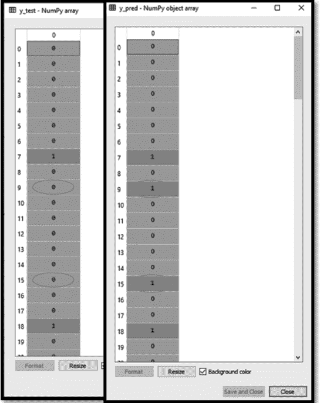

**图 11.45** 比较 *y_test*（实际值）与 *y_pred*（预测值）的数值

### 通过性能指标和可视化分析结果（步骤 7 至步骤 9）

需要遵循以下步骤，通过性能指标和可视化来分析结果。

我们不会在此处明确写出代码；要执行分析和可视化，你可以从先前分类器的实现中复制代码。

## 步骤 7：生成混淆矩阵

要为我们的非线性 SVM 模型生成混淆矩阵，我们可以使用与*线性 SVM 模型（分类器 VI）*相同的代码片段 48。生成的混淆矩阵如下图 11.46 所示。

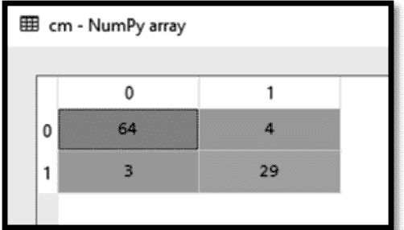

**图 11.46** *非线性 SVM* 模型的混淆矩阵

训练好的分类器预测有 67 个样本属于“*未购买 Alexa*”类别；在这些样本中，有 64 个被正确分类为未购买 Alexa 的人（这些是*真阴性*），而有 3 人购买了该产品，却被错误地分类到“*未购买 Alexa*”类别中（*假阴性*）。

或者，*非线性 SVM* 模型也预测有 33 位用户会购买该产品；其中，有 29 位用户原本购买了该产品，并被正确分类到“*已购买 Alexa*”类别中（*真阳性*）。而其中 4 位用户并未购买 Alexa，却被错误地分类到“*已购买 Alexa*”类别中（*假阳性*）。混淆矩阵的表格表示如表 11.8 所示。

**表 11.8** SVM 模型的混淆矩阵

| | 预测为 0 | 预测为 1 |
|---|---|---|
| 实际为 0 | 64（真阴性 - TN） | 4（假阳性 - FP） |
| 实际为 1 | 3（假阴性 - FN） | 29（真阳性 - TP） |

使用表 11.8 中的数值，我们将计算训练好的非线性 SVM 分类器的*准确率*、*精确率*和*召回率*。

$准确率 = \frac{TP + TN}{TP + TN + FP + FN} = \frac{29 + 64}{29 + 64 + 4 + 3} = 0.93$

$精确率 = \frac{TP}{TP + FP} = \frac{29}{29 + 4} = 0.87$

$召回率 = \frac{TP}{TP + FN} = \frac{29}{29 + 3} = 0.90$

让我们使用之前讨论过的代码片段 49 在 Python 中计算这些性能指标。执行后，你将得到类似图 11.47 的输出。

```
Accuracy: 0.930000
Precision: 0.878788
Recall: 0.906250

In [17]:
```

**图 11.47** 我们的非线性 SVM 分类器的性能指标结果

## 步骤 8：训练结果的可视化

在此步骤中，就像我们之前分类器的实现一样，我们将使用 `Visualizer()` 方法来可视化训练结果。将使用代码片段 54（线性 SVM 的）。执行代码片段 54 后，我们得到类似图 11.48 的输出。

在之前的 SVM 实现中，当核函数为“线性”时，我们得到一条将数据集划分为两个线性区域的直线。而在非线性 SVM 的情况下，核函数是“rbf”核，得到的分离线是非线性的，即曲线，如图 11.48 所示。在这种情况下，预测边界相当准确。该模型也包含了一些错误的预测。

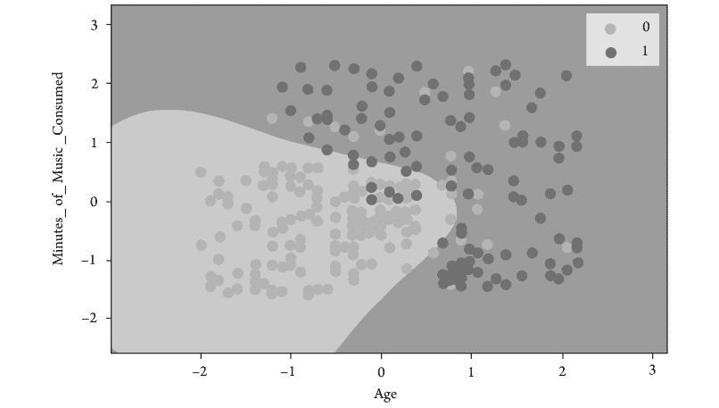

**图 11.48** 训练结果的可视化

## 步骤 9：测试集结果的可视化

要可视化测试集结果，我们将调用 `Visualizer()` 方法，并将 `X_test` 和 `y_test` 作为参数传递给它。作为参考，你可以从代码片段 55 复制代码。生成的图如下所示。

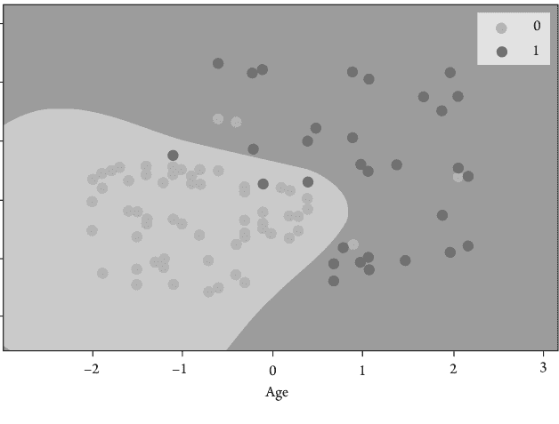

**图 11.49** 测试集结果的可视化

根据我们的混淆矩阵，有 7 个错误的预测。这些点在图 11.49 中可见，其中 3 个绿色点位于红色区域，4 个红色点位于绿色区域。需要注意的是，所示的图是灰度的，但执行时，用户会看到实际的红色和绿色。可以注意到这里的分离线本质上是非线性的。之前，在线性 SVM 的情况下，有 10 个错误的预测，而在非线性 SVM 模型中，我们将其减少到 7 个。因此，我们可以得出结论，对于给定的数据集，当使用非线性核时，SVM 的性能最佳。

## 11.10 不同分类器的比较分析

到目前为止，我们已经应用了所有分类器来预测消费者购买 Alexa 产品的决策。为了构建各种分类器，我们从*数据预处理模板*开始，然后拟合分类模型，例如*决策树、随机森林、朴素贝叶斯、K-近邻、逻辑回归*和 SVM（*线性*和*非线性*）。每个模型的性能都通过图表、混淆矩阵和显著的性能指标进行了进一步分析。表 11.9 总结了基于常用*性能指标*对这些分类模型的评估。我们还添加了一列*图表*来展示这些分类器的性质。

**表 11.9 比较给定数据集上已实现分类模型的性能**

| 分类算法 | 准确率 | 精确率 | 召回率 | 图表 | 备注 |
|---|---|---|---|---|---|
| 决策树 | 91% | 82.85% | 90.62% |  | 水平和垂直线代表 if–else 条件 |
| 随机森林 | 91% | 84.8% | 87.5% |  | 水平和垂直线代表 if–else 条件 |
| 朴素贝叶斯 | 90% | 89% | 78% |  | 平滑曲线，本质上是非线性的 |
| K-近邻 | 93% | 87% | 90% |  | 类似地图的结构，本质上是非线性的 |
| **逻辑回归** | 89% | 88% | 75% |  | 直线分隔符，本质上是线性的 |
| **线性支持向量机** | 90% | 92% | 75% |  | 直线分隔符，本质上是线性的 |
| **非线性支持向量机** | 93% | 87% | 90% |  | 曲线，本质上是非线性的 |

如果我们根据它们的分数（*准确率*、*精确率*和*召回率*）来比较这些分类器，我们会发现 *K-近邻* 和 *非线性 SVM* 的性能几乎相似；事实上，这两种算法在解决 *Alexa 购买问题* 时都优于其他模型。因此，我们可以得出结论，如果一个问题是非线性的，并且其类别边界不能用线性超平面很好地近似，那么非线性分类器通常比线性分类器更准确。通常，我们必须将各种分类器应用于给定的数据集，然后根据各种质量指标选择最佳的一个。

## 11.11 文本分类

文本是极其丰富的信息来源，但由于其非结构化的性质，从中提取见解可能很困难且耗时。机器学习和自然语言处理（NLP）的最新进展使这项任务变得简单而容易。Python 支持内置的 NLTK（自然语言工具包）和其他库来实现这一点。

根据文档或句子中存在的字符串含义对文本进行分类称为文本分类。它是 NLP 的关键任务之一。一些现实世界的文本分类应用包括情感分析、垃圾邮件检测、意图检测、虚假内容检测等。

在这个案例研究中，我们将为电影评论的情感分析构建一个文本分类器。为此，我们将使用以下链接中给出的 IBMDB 数据集。此文本分类器的代码也可在以下链接中找到。第一步是从以下链接下载数据集。

https://github.com/bhatiaparteek/ml_with_python/tree/main/Chapter_11_Classifiers


此数据集包含 50,000 条电影评论，其中一半是正面的，另一半是负面的。让我们对此数据集执行分步过程来构建一个文本分类器。我们的目标将是预测评论文本的情感是正面还是负面。

## 步骤 1：导入所需的库

首先，我们必须下载数据集，并将包含 CSV 文件的目录设置为其工作目录。我们还将导入实现所需的基本库，如代码片段 58 所述。

```python
#Importing the libraries
import pandas as pd
import re
import nltk
from nltk.corpus import stopwords
from nltk.stem.porter import PorterStemmer
```

我们第一次使用一些库；下面讨论它们的重要性。

### import re

*re* 模块提供正则表达式功能。正则表达式是一种以紧凑形式编写的字符串模式。此模块允许我们检查给定字符串中是否存在某种模式。

### import nltk

它是一个用于 NLP（即自然语言工具包）的开源 Python 库。

### from nltk.corpus import stopwords

停用词是填充词，几乎没有意义，有助于构成句子。文本可能包含像“the”、“is”、“are”这样的停用词。在处理文本之前，需要从文本中过滤停用词。为了从文本中过滤停用词，我们从 *nltk.corpus* 导入了一个 *停用词* 列表。

from nltk.stem.porter import PorterStemmer

在自然语言文本中，我们有两个或更多单词共享一个共同的词根。例如，单词 *eating*、*eats* 和 *eaten* 共有一个词根 *eat*。词干提取是一种通过去除词缀来提取单词基本形式或词根的技术。这就像把一棵树的枝叶削减到只剩下主干。这里，我们从 *nltk.stem.porter* 导入 *PorterStemmer* 类，该类包含了词干提取算法的实现。

## 步骤 2：导入数据集

在代码片段 59 中，我们从 *csv* 文件读取数据集，并为输入和输出属性创建向量。

```
#reading the dataset
dataset=pd.read_csv('IMDB Dataset.csv')
x=dataset.iloc[:,0].values  #string review text in x
y=dataset.iloc[:,1].values  #string review class in y
reviews = []    #creating an empty list to store a review
corpus = []     #creating an empty list to store corpus containing all the reviews
```

这里，在 *x* 中，我们选择索引为 0 的列的所有行，这些行包含评论文本。由于此数据集非常大，有 50000 行，为了加快训练速度以便快速测试你的代码，你可以如下面所示，在 *x* 和 *y* 中只选择几行。

```
#string review text for only 100 rows in x
x=dataset.iloc[0:100,0].values
#string review class for only 100 rows in y
y=dataset.iloc[0:100,1].values
```

但当然，通过在数据子集而非完整数据集上训练模型，准确性会降低。

## 步骤 3：文本预处理

这是整个流程中关键的步骤之一。在此步骤中，我们从评论中移除任何特殊字符或数字，将文本转换为小写，通过按空格分割将句子拆分成单词，提取词根词，并从每个评论中移除停用词。然后，所有这些预处理过的评论都被追加到一个语料库中，如代码片段 60 所示。代码中已添加注释以使其易于理解。

```
#processing of all reviews in for loop
for character in range(0, len(x)):
    """
    processing of all reviews in for loop removing any special
    characters or numbers from reviews if word is not containing
    alphabets then it will be replaced by blank space otherwise
    passed as such
    """
    review = re.sub('[^a-zA-Z]', ' ', str(x[character]))
    """
    [^a-zA-Z] means any character that IS NOT a-z OR A-Z sub
    method return the string obtained by replacing the leftmost
    non-overlapping occurrences of the pattern in string by the
    replacement mentioned as second parameter
    """
    # converting the text to lower case
    review = review.lower()
    #split the sentences into words by split it over blank space
    review = review.split()
    """
    extraction the root words and removing the stop words from
    the word in the review
    """
    ps = PorterStemmer()
    review = [ps.stem(word) for word in review if not word in set(stopwords.words('english'))]
    review = ' '.join(review)
    """
    processed words are joined to form a review text
    all processed reviews are appended into a corpus
    """
    corpus.append(review)
# \ indicates continuation of the code in next line
# Multiline comments are indicated with triple double quotes
#(""") at the beginning and end of the comment block.
```

## 步骤 4：将字符串转换为向量

文本数据不能作为机器学习模型的输入。我们必须将数据转换为数字，因为机器学习模型只能用数字进行训练。有多种技术可以将字符串转换为向量，如词袋模型（BoW）、词频（TF）、词频-逆文档频率（TF-IDF）、N-grams 等。在这个例子中，我们使用 BoW 技术。

让我们逐一讨论这些技术。

### 词袋模型（BoW）

词袋模型通过将文本中的单词替换为它们在语料库中对应的出现次数，将字符串转换为向量。它计算语料库中每个唯一单词的出现次数。它被称为“词袋”，因为文档中单词的顺序或结构信息被丢弃了。这里，单词被它们的出现次数所取代。

为了理解这一点，让我们假设我们有两个文档如下。
Document0 = “This movie made it into one of my top 10 most awful movies”
Document1 = “I remember this film; it was the first film i had watched at the cinema”

为了将这些文档准备用于机器学习，初始步骤涉及预处理以消除数字和特殊字符，将它们转换为小写，消除常见的停用词如“the”和“a”，并提取它们的词根词。预处理后，得到的处理过的文档将如下所示。

#移除停用词并用相应的词根词替换单词后
Document0 = “movie make top most awful movie”
#像 *This*、*it*、*into*、*one*、*of*、*my*、*10* 这样的停用词已被移除，*made* 已被替换为 *make*
Document1 = “remember film first film watch cinema”
#停用词 *i* 已被移除，*remembered* 已被替换为 *remember*

准备一个唯一单词列表并进行排序。然后，根据每个文档的频率为每个文档创建文档向量，如表 11.11 所示。

表 11.11 文档上的 BoW

| | awful | cinema | film | first | make | most | movie | remember | top | watch |
|---|---|---|---|---|---|---|---|---|---|---|
| Doc0 | 1 | 0 | 0 | 0 | 1 | 1 | 2 | 0 | 1 | 0 |
| Doc1 | 0 | 1 | 2 | 1 | 0 | 0 | 0 | 1 | 0 | 1 |

需要注意的是，随着语料库规模的增大，唯一单词列表会变得巨大，这会增加输入特征的大小，因为每个唯一单词都将作为输入数据集的一个特征或列。因此，为了减少特征数量，只考虑那些频繁出现的特征或单词。因此，在创建 BoW 时，指定了 *max_features* 的数量来限制特征，如代码片段 61 所示。

```
#### Applying Count Vectorizer for converting strings to vector
from sklearn.feature_extraction.text import CountVectorizer
cv = CountVectorizer(max_features = 1500)
X = cv.fit_transform(corpus).toarray()
```

这里，通过从 `sklearn.feature_extraction.text` 导入 `CountVectorizer` 类来创建 BoW。在创建其对象时，我们必须指定 `max_features`，在我们的例子中，我们将其指定为 1500。然后我们对其应用 `fit_transform` 方法于语料库以创建 X。X 有 1500 个特征，每个特征的值为整数，如图 11.50 所示。

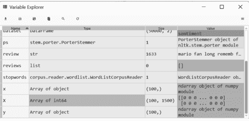

**图 11.50** BoW 操作后，在变量资源管理器选项卡中，X 是一个大小为 (100, 1500) 的 int64 数组

这里，X 有 100 行（因为我们只为语料库创建选择了数据集的前 100 行）和 1500 个特征（在应用 `CountVectorizer` 时指定）。其内容如图 11.51 所示。

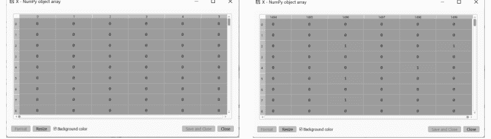

**图 11.51** 应用 `CountVectorizer` 后 X 的内容

### 将字符串转换为向量的其他技术

如下所述，除了 BoW，我们还有其他技术可以将字符串转换为向量。

#### 词频（TF）

词频（TF）指的是一个特定术语或单词在给定文档中出现的次数。它是文档分析中用于表示单词在文档中重要性的基本概念。通常，一个单词在文档中出现得越频繁，它对该文档就越重要。因此，TF 通常用作权重因子来表示术语在文档中的相关性。

TF 的公式为：
TF = (术语在文档中出现的次数) / (文档中的术语总数)

#### 逆文档频率（IDF）

逆文档频率（IDF）是一种数值度量，用于评估一个术语在文档集合或语料库中的重要性。一个术语的 IDF 分数是根据包含该术语的文档数量计算的。其思想是，出现在许多文档中的术语信息量较少或区分度较低，而出现在较少文档中的术语信息量更多，并且与特定主题更相关。因此，它是衡量单词在语料库中稀有程度的指标。一个单词越稀有，其 IDF 分数越高。

IDF 的公式为

$$IDF(t) = \log(N/df(t))$$

其中：

$t$ 是文档语料库中的一个术语或单词，$N$ 是语料库中的文档总数
$df(t)$ 是包含术语 $t$ 的文档数量。

#### 词频-逆文档频率（TF–IDF）

词频-逆文档频率（TF–IDF）是一种统计度量，用于评估一个术语在文档中相对于文档集合或语料库的重要性。它是两个指标的乘积：词频（TF）和逆文档频率（IDF）。
TF 衡量术语在文档中的频率，而 IDF 衡量术语在语料库中的稀有性。TF–IDF 结合这两个度量来为文档中的每个术语赋予权重，权重更高的术语是在文档中频繁出现但在语料库中很少出现的术语。
计算 TF–IDF 的公式为：

$$TF\text{–}IDF = TF * IDF$$

其中 TF = (术语在文档中出现的次数) / (文档中的术语总数)
IDF = log(文档总数 / 包含该术语的文档数量)

应用 TF–IDF 后，每个输入单词都被转换为一个向量。应用 TF–IDF 的代码如代码片段 62 所示。

```
#### Applying TF–IDF for converting strings to vector
from sklearn.feature_extraction.text import TfidfVectorizer
```

vectorizer = TfidfVectorizer()
X = vectorizer.fit_transform(corpus).toarray()

此处，TF-IDF是通过从`sklearn.feature_extraction.text`导入`TfidfVectorizer`类来创建的。导入后，我们创建其对象，并对语料库使用其`fit_transform`方法，将其转换为TF-IDF。应用TF-IDF后创建的X如图11.52所示。

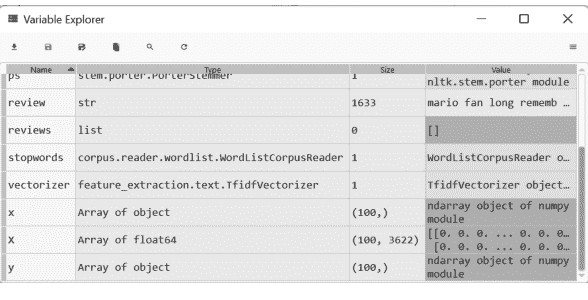

**图11.52** 在变量资源管理器选项卡中，X是一个大小为(100, 3622)的float64数组

此处，X有100行（因为我们仅选择了数据集的前100行用于创建语料库）和3622个特征，其内容如图11.53所示。

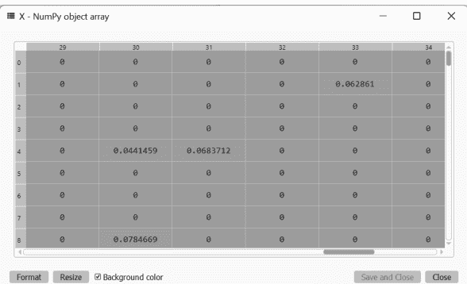

**图11.53** 应用TF-IDF后X的内容

从图11.53可以看出，X包含浮点值，而不是像词袋模型那样的整数。

除了TF、IDF和TF–IDF之外，还有其他将字符串转换为向量表示的技术，包括：

- 词嵌入：它将单词表示在高维空间中，其中含义相似的单词彼此更接近。词嵌入捕获了文本中单词之间的语义关系，从而能更好地表示含义和上下文。一些流行的词嵌入技术包括：
    - Word2Vec
    - GloVe（全局词向量表示）
    - fastText
    - BERT（来自Transformer的双向编码器表示）
- Doc2Vec：它是词嵌入的扩展，将整个文档表示为一个向量。
- 哈希向量化：它使用哈希函数将单词转换为向量，从而减少了存储向量表示所需的内存。

建议尝试不同的字符串转向量技术，并通过分析评估其准确性。

使用代码片段62，我们使用TF–IDF方法将输入字符串转换为向量。一旦此转换完成，我们的输入数据就为训练-测试拆分过程做好了准备。

## 步骤5：将数据集拆分为训练集和测试集

使用代码片段63，我们将数据集拆分为训练集和测试集。

```python
#将数据集拆分为训练集和测试集
from sklearn.model_selection import train_test_split
X_train, X_test, y_train, y_test = train_test_split(X, y, test_size = 0.20, random_state = 0)
```

## 步骤6：在训练数据上构建模型

现在，数据集已准备好构建模型，代码片段64用于构建朴素贝叶斯分类器，代码片段65用于构建随机森林分类器。

```python
#将朴素贝叶斯拟合到训练集
from sklearn.naive_bayes import GaussianNB
classifier = GaussianNB()
classifier.fit(X_train, y_train)
```

```python
#将随机森林拟合到训练集
from sklearn.ensemble import RandomForestClassifier
classifier = RandomForestClassifier(n_estimators=1200, random_state=35)
classifier.fit(X_train, y_train)
# \ 表示代码在下一行继续
```

需要注意的是，我们可以应用相同的方法来实现任何其他分类器。

## 步骤7：在测试数据上进行预测

构建模型后，我们可以使用代码片段66在测试数据上进行预测，如下所示。

```python
#预测测试集结果
y_pred = classifier.predict(X_test)
```

执行代码片段66后，你将在*y_pred*中获得预测值。你可以通过将其值与*y_test*中的实际值进行比较来检查模型的准确性，如图11.54所示。

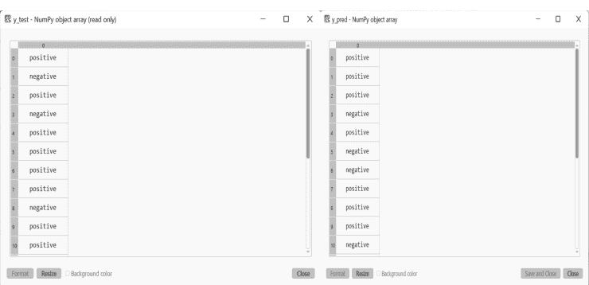

此处，我们仅在前100行上训练了模型；这个准确性并不好，但如果你在完整数据集上训练模型，结果会好得多。

## 步骤8：评估模型

我们可以将预测值与实际值进行比较，使用代码片段67为每个分类器构建混淆矩阵。我们可以利用代码片段67来计算准确率、精确率和召回率。值得注意的是，此过程可以类似地应用于其他分类器。

### 代码片段：67

```python
#制作混淆矩阵
from sklearn.metrics import confusion_matrix
cm = confusion_matrix(y_test, y_pred)
#性能指标
#准确率
from sklearn.metrics import accuracy_score
accuracy = accuracy_score(y_test, y_pred)
print('Accuracy is ', accuracy)
#精确率
from sklearn.metrics import precision_score
precision = precision_score(y_test, y_pred)
print('Precision is ', precision)
#召回率
from sklearn.metrics import recall_score
recall = recall_score(y_test, y_pred)
print('Recall is ', recall)
```

建议应用各种分类器，每个分类器采用不同的字符串到向量转换技术，以进行全面的准确性分析。提供的代码片段可用于实现多个分类器，并根据它们各自的混淆矩阵、准确率、精确率和召回率来比较其性能。

至此，我们完成了关于分类器及其在Python中实现的讨论。请读者将此学习应用于其他数据集，以进一步加强理解。本章末尾的“测试我（实践技能）”部分也提供了一些实践案例研究的链接。

#### 提醒我

在Python中实现分类模型的分步方法如下。

- **步骤1：导入库**—导入用于数据加载、预处理和构建分类器的库。
- **步骤2：加载数据集**—下载并加载数据集。
- **步骤3：将数据集拆分为训练集和测试集**—将导入的数据集拆分为训练子集和测试子集。
- **步骤4：特征缩放**—应用特征缩放，以确保尺度较大的特征不会主导尺度较小的特征，从而有助于提高机器学习算法的性能。
- **步骤5：*拟合分类模型***—将在获取的数据集上训练分类器模型。训练数据集的输入和输出变量将传递给模型，并拟合一个分类器。
- **步骤6：*预测测试集结果***—使用测试数据集的独立变量，训练好的模型预测标记的类别。
- **步骤7：*制作混淆矩阵***—训练模型后，将其预测结果与数据集中的实际观测值进行比较。然后使用混淆矩阵评估分类模型，该矩阵统计正确和错误的预测。可以使用准确率、精确率和召回率指标来计算错误率。
- **步骤8：*可视化训练集结果***—可视化来自训练数据集的数据点。
- **步骤9：*可视化测试集结果***—此步骤将分析测试数据集的结果。

##### 决策树分类器

决策树基于*if-then*规则。为了在Python中实现决策树分类器，我们将首先导入`DecisionTreeClassifier`类。此类需要从`sklearn.tree`模块导入。然后，创建导入的`DecisionTreeClassifier`的一个实例，以调用`fit()`和`predict()`方法。决策树分类器的可视化表示具有代表if-else条件的水平和垂直线。

##### 随机森林分类器

为此，从`sklearn.ensemble`模块导入`RandomForestClassifier`。接下来，创建`RandomForestClassifier`的一个实例，以调用`fit()`和`predict()`方法。随机森林分类器的可视化表示也具有代表决策树if-else条件的水平和垂直线。

##### 朴素贝叶斯

朴素贝叶斯算法在Python中通过使用`GaussianNB`类来实现。`GaussianNB`类是`sklearn.naive_bayes`模块的一部分。接下来，我们需要创建导入类的一个实例，以调用`fit()`和`predict()`方法。朴素贝叶斯分类器的可视化表示具有平滑曲线，并且是非线性的。

##### K近邻

为了拟合K近邻分类模型，我们需要从`sklearn.neighbors`模块导入`KNeighborsClassifier`。接下来，我们需要创建导入类的一个实例，以调用`fit()`和`predict()`方法。k-NN分类器的可视化表示类似于地理地图，并且是非线性的。

##### 逻辑回归

该模型使用`sklearn.linear_model`模块中的`LogisticRegression`类实现。然后创建该类的一个实例来调用`fit()`和`predict()`方法。逻辑回归分类器的可视化表示具有直线分隔符，并且是线性的。

##### 支持向量机

对于SVM，从`sklearn.svm`模块导入`SVC`类。接下来，创建`SVC`类的实例。我们必须使用带有两个参数`kernel`和`random_state`的`SVC()`构造函数来创建此实例。`kernel`类型可以是以下五种选择之一——`linear`、`poly`、`rbf`、`sigmoid`和`precomputed`；默认值是`rbf`。对于线性数据集的SVM实现，内核参数设置为"linear"。对于非线性SVM的实现，`kernel`设置为"rbf"，这也是`kernel`的默认选择。为了构建所选分类器的模型，通过将训练集（`X_train`、`y_train`）作为参数传递给相应的分类器实例的`fit()`方法来调用它。模型构建完成后，使用`predict()`方法对测试数据进行预测。线性内核的SVM的可视化表示具有直线分隔符并且是线性的，而内核为`rbf`的SVM具有曲线并且是非线性的。

#### 附加资源

##### 视频链接

- 机器学习中的分类 | 机器学习教程 | Python培训 | Edureka, https://youtu.be/pXdum128xww
- 机器学习教程Python - 9 决策树, https://youtu.be/PHxYNGo8NcI
- 机器学习教程Python - 11 随机森林, https://youtu.be/ok2s1vV9XW0
- 机器学习教程Python - 8: 逻辑回归（二元分类）, https://youtu.be/zM4VZR0px8E
- 机器学习教程Python - 10 支持向量机（SVM）, https://youtu.be/FB5EdxAGxQg

##### 博客链接

- 如何在机器学习中实现分类？ https://www.edureka.co/blog/classification-in-machine-learning/
- 使用Scikit-Learn在Python中分类方法概述, https://stackabuse.com/overview-of-classification-methods-in-python-with-scikit-learn/

#### 测试我（问题）

1.  创建决策树分类器对象的重要参数有哪些？
2.  创建随机森林分类器对象的重要参数有哪些？
3.  创建SVM分类器对象的重要参数有哪些？
4.  创建k-NN分类器对象的重要参数有哪些？
5.  写出SVM RBF的公式。
6.  写出随机森林分类器的工作原理？
7.  写出此图可能的分类器名称。
8.  写出此图可能的分类器名称。
9.  写出此图可能的分类器名称。
10. 随机森林分类器中n_estimators的含义是什么？
    a) 树的数量
    b) 邻居的数量
    c) 记录的数量
    d) 距离度量
11. 以下代码的输出是什么？
    ```
    c = dataset.iloc[:, 1]
    ```
    a) 包含所有行的第二列
    b) 包含所有行的第一列
    c) 包含所有列的第二行
    d) 包含所有列的第一行
12. 以下的精确率是多少？
    a) 5/33
    b) 28/33
    c) 63/68
    d) 4/32
    e) 63/67
    f) 4/67
    g) 28/32

> **答案：** 7.k-NN 8.逻辑线性回归或支持向量机（线性） 9.决策树或随机森林 10.a 11.a 12.b

#### 测试我（实践技能）

- 在鸢尾花数据集上实现各种分类器, https://towardsdatascience.com/exploring-classifiers-with-python-scikit-learn-iris-dataset-2bcb490d2e1b
- 在电信客户流失数据集上实现各种分类器, https://towardsdatascience.com/building-classification-models-with-sklearn-6a8fd107f0c1
- 在葡萄酒质量数据集上实现各种分类器, https://archive.ics.uci.edu/ml/datasets/wine+quality
- 用于练习各种分类器的最佳公开机器学习和数据科学数据集已提供在以下链接中。 https://pub.towardsai.net/best-datasets-for-machine-learning-data-science-computer-vision-nlp-ai-c9541058cf4f

## 12 聚类

### 章节目标

- 定义聚类，解释其应用和特征。
- 解释用于数据聚类的各种邻近度量。
- 讨论各种聚类技术。
- 解释k-means聚类算法的工作原理。
- 讨论层次聚类及其类型。
- 讨论凝聚和分裂聚类技术。
- 描述DBSCAN算法的概念。

## 12.1 聚类简介

在机器学习（ML）中，为数据打标签是关键任务之一。但有时，我们没有带标签的数据。即使数据没有标签，我们仍然可以使用聚类技术对其进行分析。如你所知，ML中的算法大致分为监督技术和无监督技术。在监督学习的情况下，输入数据点/示例是带标签的，而在无监督学习中，输入数据点/示例是不带标签的。聚类分析，也称为聚类，属于无监督学习。这里，输入数据点是不带标签的。聚类是无监督学习中最流行的技术。

**聚类被定义为根据输入数据点的相似性将其分组到不同的簇/组中。**

一个簇包含彼此更相似的对象。换句话说，在聚类分析过程中，数据被分组到类或簇中，使得簇内记录（簇内）彼此之间具有高度相似性，但与其他簇中的对象（簇间）相比具有高度不相似性。

**聚类算法旨在最小化簇内距离并最大化簇间距离，如图12.1所示。**

**图12.1** 簇的特征

图12.2展示了一个聚类示例。这里，输入中的记录具有不同的形状。这里，我们只有输入数据，没有任何形状标签。应用聚类算法后，它们被分为三种类型的簇。这里，聚类算法考虑对象的尺寸和颜色作为输入特征。特征高度相似的记录被聚集在一起形成一个簇。在这种情况下，我们得到三个簇，代表三种类型的记录，即它分别对菱形、圆形和三角形进行聚类，如图12.2所示。

**图12.2** 聚类模型

记录的相似性是根据描述对象的属性值来确定的。例如，杂货店中的物品被分组到不同的类别中（酥油、牛奶、奶酪和黄油被聚类在乳制品中）。当然，这是一种定性划分方法。在定量划分方法的情况下，产品的某些特征，如牛奶百分比等，会被测量，即牛奶百分比高的产品应该被聚类在一起。

为了进一步理解聚类，我们可以参考最早的人类，即亚当和夏娃的学习过程。他们可能是通过分析各种物体的属性或特征来学习的。在那个时代，事物还没有名字。他们通过观察发现了各种物体之间的相似性，并将它们分组归类。首先，他们可能将事物分为有生命和无生命两大类。例如，他们可能创建了一个“花卉”组，另一个“水果”组，另一个“树木”组，等等。后来，他们可能根据水果的属性，如味道、香气、颜色、形状等进行了分类。再后来，随着语言的出现，人们为这些物体分配了标签，如芒果、苹果、葡萄等。最终，所有物体都被贴上了标签。简而言之，他们根据物体的特征进行了聚类，后来随着语言的扩展，他们为这些组和子组分配了名称或标签。

## 12.2 聚类的应用

聚类在各种应用中被广泛使用。其中一些流行的应用如下：

- **过滤垃圾邮件**
  垃圾邮件可能包含营销信息或一些特殊关键词。垃圾邮件是根据这些特殊关键词和部分被过滤掉的。各种聚类技术已被证明是识别未标记数据中垃圾邮件的有效方法。
- **市场营销**
  个性化和定位客户是市场营销的关键因素。聚类帮助营销人员根据客户的购买历史找到他们的兴趣点。这将帮助他们根据客户对产品的兴趣对客户进行聚类或细分，这种聚类有助于组织改进其定向营销计划。
- **推荐引擎**
  相关项目可以聚类在一起推荐给用户。所有在线商店和娱乐门户，如YouTube、Netflix等，都使用了这些功能。
- **欺诈检测**
  聚类可用于识别欺诈行为。聚类技术可以识别数据中的异常值/异常点，这有助于检测信用卡交易欺诈。
- **文档分析**
  文档可以根据其中使用的关键词进行聚类或分组。通过分析这些关键词的频率，文档可以被聚类为政治、体育、娱乐等类别。
- **保险保单持有人细分**
  通过使用聚类，保险公司可以识别并分组那些具有高常规索赔成本的保险保单持有人。
- **识别假新闻**
  由于最近的技术创新，假新闻传播速度很快。聚类算法可以根据其内容用于识别假新闻。
- **土地使用管理**
  通过聚类，可以通过分析地球观测数据库来识别具有相似土地用途的区域。这种将土地聚类为不同类别（如肥沃、不肥沃、工业用地等）的方法可用于更好的土地管理。
- **地震研究**
  聚类有助于地震分析，因为已经注意到地震震中沿着大陆断层聚集。
- **生物学研究**
  聚类有助于根据具有相似功能的特征和基因将植物或动物分组在一起。
- **癌细胞识别**
  聚类技术可以根据细胞的特征，如形状、大小、厚度等，将细胞聚类为良性和恶性。
- **城市规划**
  聚类可用于根据不同的特征创建相似属性、房屋、道路、公园和商店的分组，以实现更好的城市规划。

因此，我们可以很容易地得出结论，聚类在不同领域有着广泛的应用，我们可以对未标记数据进行大量分析。在下一节中，我们将讨论理想聚类算法的主要特征，然后再深入探讨聚类算法。

## 12.3 理想聚类算法的特征

聚类算法最理想的特征之一是创建具有最小簇内距离和最大簇间距离的理想簇。除此之外，理想的聚类算法还应具备以下属性。

- **处理噪声数据的能力**
  噪声数据是指由测量误差、传感器故障、信号干扰或人为错误等因素引起的无关或错误数据。聚类算法应能处理这种噪声、错误或缺失数据。
- **停止和恢复的能力**
  处理大量数据可能需要很长时间。因此，聚类算法必须能够停止和恢复数据处理。聚类的这一特性简化了实现。
- **处理不同类型属性的能力**
  我们可以有不同类型的属性，如文本、数值、布尔值、分类值等。聚类算法应能够通过使用不同的技术处理各种类型的数据。
- **独立于数据顺序**
  聚类结果不应依赖于我们提供输入数据的顺序。
- **识别不同形状簇的能力**
  聚类算法必须能够识别任何形状的簇。有时，簇可能具有线性形状，如直线，或弯曲形状，如圆形或椭圆形。无论其形状如何，聚类算法都必须识别它们。
- **高性能**
  为了实现高性能并从而降低输入-输出操作的成本，理想的聚类算法应对完整数据集仅执行一次扫描。
- **最少的用户指导**
  数据科学家和程序员可能对数据集的领域知之甚少。因此，聚类算法必须简单，并且需要最少的监督或领域知识。
- **可解释性**
  聚类算法的结果应该是可解释的、合乎逻辑的和可用的。
- **可扩展性**
  聚类算法必须能够平稳地处理小型和大型数据集，或者简单地说，它应该是可扩展的。

在聚类中，距离度量在了解对象之间的相似性方面起着关键作用。在下一节中，我们将讨论在对象聚类中有用的不同距离度量。

## 12.4 距离度量

距离度量，也称为邻近度量，是一个函数 $d(x, y)$，用于指定数据集中元素之间的距离。在特定度量下，如果两个数据点之间的距离为零，则它们是相等的。距离函数提供了一种衡量两个元素接近程度的方法。这里的元素可以是矩阵、向量或任意对象，不一定是数字。
在以下小节中，将讨论用于衡量对象间相似性的重要距离度量。

### 12.4.1 欧几里得距离

欧几里得距离主要用于计算任意空间中任意两点之间的距离。根据欧几里得距离公式，平面上坐标为 $(x, y)$ 和 $(a, b)$ 的任意两点之间的距离由以下公式给出。

$(x, y), (a, b)$ 的欧几里得距离 $= \sqrt{(x-a)^2 + (y-b)^2}$

为了理解欧几里得距离，让我们参考图 12.3。

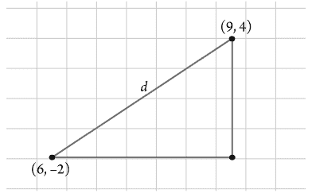

**图 12.3** $(6, -2)$ 和 $(9, 4)$ 之间的欧几里得距离

点 $(6, -2)$ 和 $(9, 4)$ 之间的欧几里得距离计算如下

欧几里得距离 $((6, -2), (9, 4)) = \sqrt{(6-9)^2 + (-2-4)^2}$
$= \sqrt{(-3)^2 + (-6)^2}$
$= \sqrt{45}$
$= 3\sqrt{5} = 6.708$

为了更好地理解欧几里得距离的计算，让我们根据表 12.1 中给出的三名学生在两门科目上的分数，计算他们之间的欧几里得距离。

**表 12.1** 用于计算三名学生之间欧几里得距离的数据

| 姓名 | 机器学习 | 数据库管理系统 |
| :--- | :---: | :---: |
| Rupinder | 70 | 65 |
| Rahat | 90 | 80 |
| Rishhan | 50 | 70 |

使用欧几里得距离公式，我们可以计算人员之间的相似距离。
Rupinder 和 Rahat 之间的距离（$d_{(\text{Rupinder, Rahat})}$）计算如下：

## 12.4.2 曼哈顿距离

曼哈顿距离也被称为L1距离或出租车范数。它被定义为两个点在所有维度上度量值的绝对差之和。之所以被称为出租车范数或街区距离，是因为计算两点之间的距离类似于在曼哈顿的方形街区中乘坐出租车行驶。名称“曼哈顿”源于曼哈顿岛大多数街道的网格状布局。在曼哈顿街道上，汽车在两个交叉路口之间能走的最短路径长度等于交叉路口之间的街区数。图12.4展示了曼哈顿距离的计算与街区数累加的相似性。

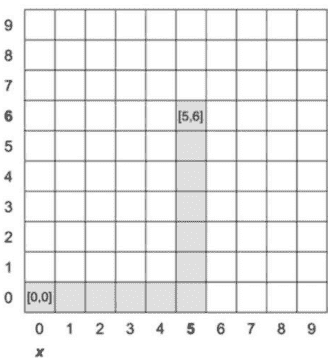

**图12.4** 曼哈顿距离

假设你在点[0, 0]处打车，想去点[5, 6]。司机会直线行驶5个街区（见灰色街区），然后左转再行驶6个街区（见灰色路径）。你需要支付的距离是5 + 6个街区 = 11个街区，表示如下：

需支付距离 = 5个街区 + 6个街区 = 11个街区

如果我们把这个表达式转换成L1范数的数学表达式，那么在坐标为$(x, y)$和$(a, b)$的平面上，两点之间的距离将根据曼哈顿距离公式计算，该公式为：

曼哈顿距离 $((x, y), (a, b)) = |x - a| + |y - b|$

让我们根据三个人在两门科目上的分数来计算他们之间的曼哈顿距离，如表12.1所示。

使用曼哈顿距离公式，我们可以计算人与人之间的相似性距离。

Rupinder和Rahat之间的距离（$d_{(Rupinder, Rahat)}$）计算如下：

曼哈顿距离 ((70, 65), (90, 80)) = |70 – 90| + |65 – 80|
= |– 20 | + | –15|
= 20 + 15
= 35

Rupinder和Rishhan之间的距离（$d_{(Rupinder, Rishhan)}$）计算如下：

曼哈顿距离 ((70, 65), (50, 70)) = |70 – 50| + |65 – 70|
= 20 + 5
= 25

Rahat和Rishhan之间的距离（$d_{(Rahat, Rishhan)}$）计算如下：

曼哈顿距离 ((90, 80), (50, 70)) = |90 – 50| + |80 – 70|
= 40 + 10
= 50

这里，距离的顺序是 $d_{(Rupinder, Rishhan)} < d_{(Rupinder, Rahat)} < d_{(Rahat, Rishhan)}$。这表明Rupinder和Rishhan最为相似，而Rahat和Rishhan最不相似。我们可以观察到，所得结论与通过欧几里得距离得到的结论相同。

曼哈顿距离的缺点是，最大值的属性可能会主导最终的距离值。但这种主导作用不如在欧几里得距离中那么显著。

## 12.4.3 闵可夫斯基距离

闵可夫斯基距离度量用于计算赋范向量空间中，即N维实空间中两个数据点之间的距离。它是曼哈顿距离和欧几里得距离的通用形式。

闵可夫斯基距离的公式为：

闵可夫斯基距离 ((x1, x2, x3, x4, ....xN), (y1, y2, y3, y4, ....yN))
= ((x1 – y1)<sup>p</sup> + (x2 – y2)<sup>p</sup> + ... + (xN – yN)<sup>p</sup>)<sup>1/p</sup>

在此公式中，
如果我们取 p = 1，得到曼哈顿距离，即 | x – a | + | y – b |
如果我们取 p 值为 2，得到欧几里得距离，即 √((x – a)<sup>2</sup> + (y – b)<sup>2</sup>)

闵可夫斯基距离可以根据 $p$ 的值以不同方式表示。

## 12.4.4 切比雪夫距离

切比雪夫距离是两个N维点在某一维度上的最大绝对距离。

切比雪夫距离的公式为：

切比雪夫距离 $((r1, f1), (r2, f2)) = \max(|r1 - r2|, |f1 - f2|)$

使用此公式，让我们计算对象A和对象B之间的距离。对象A和B的特征如表12.2所示。

**表12.2** 用于计算对象A和对象B之间切比雪夫距离的数据

| 特征 | X | Y | Z |
| :--- | :---: | :---: | :---: |
| **对象 A** | 2 | 1 | 6 |
| **对象 B** | 6 | 5 | 4 |

从表12.2可知，

对象 A 坐标 = {2, 1, 6}

对象 B 坐标 = {6, 5, 4}

根据切比雪夫距离公式：

$D = \max(|r1 - r2|, |f1 - f2|) = \max(|2 - 6|, |1 - 5|, |6 - 4|) = \max(4, 4, 2) = 4$

切比雪夫距离也被称为棋盘距离。因为在国际象棋游戏中，国王一次只能向任何方向移动一步。从一个方格移动到另一个方格所需的最少步数等于这两个方格中心之间的切比雪夫距离。切比雪夫距离的现实世界应用包括仓库物流。

让我们根据三个人在两个变量上的分数来计算他们之间的切比雪夫距离，如表12.1所示。

Rupinder和Rahat之间的距离（$d_{(Rupinder, Rahat)}$）计算如下：

切比雪夫距离 $((70, 65), (90, 80)) = \max(|70 - 90|, |65 - 80|)$

$= \max(|-20|, |-15|)$

$= 20$

Rupinder和Rishhan之间的距离（$d_{(Rupinder, Rishhan)}$）计算如下：

切比雪夫距离 $((70, 65), (50, 70)) = \max(|70 - 50|, |65 - 70|)$
$= \max(20, 5)$
$= 20$

Rahat和Rishhan之间的距离（$d_{(Rahat, Rishhan)}$）计算如下：

切比雪夫距离 $((90, 80), (50, 70)) = \max(|90 - 50|, |80 - 70|)$
$= \max(40, 10)$
$= 40$

这里，距离的顺序是 $d_{(Rupinder, Rishhan)} = d_{(Rupinder, Rahat)} < d_{(Rahat, Rishhan)}$。这表明Rupinder–Rahat和Rupinder–Rishhan之间的距离相同，而Rahat和Rishhan之间的距离比其他两对要大得多。

#### 特征缩放

有时在数据集中，一个属性的值可能与其他属性相比很小。因此，在将数据应用于聚类之前进行特征缩放很重要。否则，某些属性会比其他属性获得更大的权重。特征缩放有两种技术，即归一化和标准化，这些在第4章中已详细讨论。

## 12.5 主要聚类方法/算法

聚类算法可以分为五类，如图12.6所示。

- 划分方法
  它构建随机划分，然后迭代地进行优化。简单来说，它将 $n$ 条记录划分为 $k$ 个簇。在应用聚类算法之前，我们必须指定 $k$ 值。
- 层次方法
  此方法使用某些标准对一组记录（或对象）进行层次分解。此方法生成一个树状图。树状图是一种树状结构，表示合并簇的序列。
- 基于密度的方法
  此方法基于密度函数和连通性。在此方法中，通过寻找密度较高的区域来识别簇。我们可以使用此方法检测不同形状的簇并发现噪声/离群点。

## 12.6 划分聚类

我们已经理解，数据聚类是将数据点划分为一组相似的数据点，称为簇。在划分方法中，我们根据对象的属性将其聚类到若干个划分中。k-means聚类是划分聚类中的一项重要技术。k-means算法的详细内容将在下一小节中给出。

### 12.6.1. k-means聚类

在k-means聚类中，输入的$n$个对象根据其属性被聚类成$k$个簇或划分。这里$k < n$，$k$是一个正整数。换句话说，输入记录根据其属性或特征被分组到$k$个簇中。通过最小化输入数据点与相应簇的质心之间的距离平方和（即欧几里得距离）来对输入记录进行分组。

#### k-means聚类的工作原理

该算法的工作原理可以用以下五个步骤来说明。

##### 步骤1：选择k值，其中k = 簇的数量

在此步骤中，通过从$n$个数据样本中选取$k$个训练样本作为单元素簇来初始化$k$个簇（或质心）。这$k$个初始训练样本被称为“种子记录”或“簇的质心”。为了确定$k$的最佳值，使用肘部法则，这将在下一节中讨论。

##### 步骤2：创建质心与每个记录之间的距离矩阵

在此步骤中，计算数据中每个样本到每个簇质心的距离。此步骤涉及大量计算，这种繁重的计算是k-means算法的主要缺点。由于有$k$个质心和$n$个样本，算法必须计算$n \times k$个距离。

##### 步骤3：将数据集中的每个样本分配给最近的质心（最小距离）

在此步骤中，样本根据其到簇质心的欧几里得距离进行分组。如果任何样本不在具有最小距离的簇中，它将被移动到具有最近质心或与质心距离最小的簇中。当没有样本从一个簇移动到另一个簇时，算法结束，因为无需遵循任何后续步骤，并且获得的簇将被视为最终簇。

##### 步骤4：更新所有簇的质心

在步骤3结束时，所有样本都被分类到最近的簇中。在此步骤中，根据该簇中存在的样本的属性值更新质心的值。在此步骤中，我们必须通过计算属于相应簇的所有样本的属性平均值来更新每个簇的质心。

##### 步骤5：重复直到不再发生变化

返回算法的步骤2，创建质心与每个数据集记录之间的距离矩阵。随着质心的更新，一些簇获得数据点，而其他簇失去数据点。重复步骤3-4-5，直到满足步骤3中提到的收敛条件，即直到对训练样本的扫描导致簇的形成没有新的变化。

k-means算法的流程图如图12.6所示。

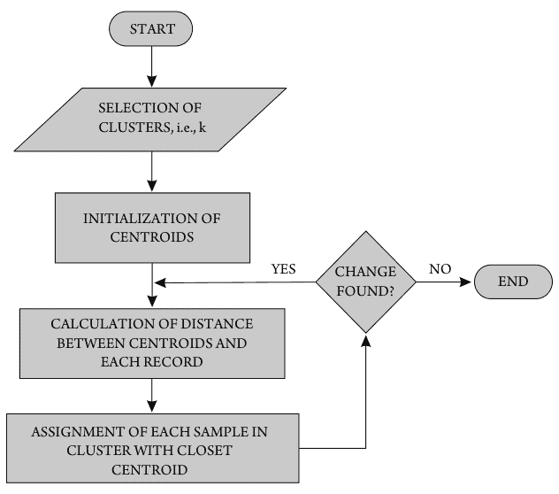

**图12.6** k-means算法流程图

#### 通过工作示例理解k-means算法

##### 示例12.1

让我们通过一个示例数据库来理解k-means算法的工作原理，其中我们有七名学生两门科目的成绩，我们希望根据他们在这些科目上的分数将他们聚类，如表12.3所示。这里，我们希望将他们聚类成两组。因此，*k*的值为2。

**表12.3** k-means算法示例数据库

| Rno | Machine Learning | DBMS |
| :---: | :---: | :---: |
| 1 | 10 | 10 |
| 2 | 15 | 20 |
| 3 | 30 | 40 |
| 4 | 50 | 70 |
| 5 | 35 | 50 |
| 6 | 45 | 50 |
| 7 | 35 | 45 |

让我们将k-means算法的每个步骤应用于此数据集。

###### 步骤1

第一步是选择*k*的值。在此问题中，*k*的值 = 2，即我们将为此数据库创建两个簇，C1和C2。假设记录编号1<sup>st</sup>和4<sup>th</sup>被选为簇的候选。通过观察表12.3中给出的数据库，我们可以得出结论，1<sup>st</sup>和4<sup>th</sup>是最不相似的记录或彼此最远。根据前面讨论的聚类基本原理，我们知道簇应该具有最大的簇间距离和最小的簇内距离。因此，我们选择了两个最远的数据点作为初始簇。否则，我们可以随机选择任意两条记录作为初始簇，这是此算法初始化的起点。

在这种情况下，两个簇的质心是：质心1（第一条记录）= (10, 10) 和质心2（第四条记录）= (50, 70)，如图12.7所示。

| Rno | Machine Learning | DBMS |
|---|---|---|
| 1 | 10 | 10 |
| 2 | 15 | 20 |
| 3 | 30 | 40 |
| 4 | 50 | 70 |
| 5 | 35 | 50 |
| 6 | 45 | 50 |
| 7 | 35 | 45 |

| | Individual | Mean Vector |
|---|---|---|
| Cluster 1 | 1 | (10, 10) |
| Cluster 2 | 4 | (50, 70) |

**图12.7** 初始化后的数据库

###### 步骤2

现在，根据欧几里得距离计算每条记录或对象到质心的距离，如表12.4所示。

下面给出了记录2 (15, 20) 到质心1和质心2的欧几里得距离，以理解该过程。

```
The Euclidean distance between (15, 20) and Centroid₁ (10, 10) = √((x-a)² + (y-b)²)
= √((15-10)² + (20-10)²)
= √(25+100)
= √(125)
= 11.18
```

The Euclidean distance between (15, 20) and Centroid₂ (50, 70) = √((x-a)² + (y-b)²)
= √((15-50)² + (20-70)²)
= √(1225 + 2500)
= √(3725)
= 61.03

数据点 (15, 20) 与质心₁ (10, 10) 之间的欧几里得距离小于 (15, 20) 与质心₂ (50, 70) 之间的欧几里得距离。因此，(15, 20) 属于质心为 (10, 10) 的簇，即簇1。

从每个质心计算距离并将每个数据点分配到最近簇的过程在表12.4中给出。

**表12.4** 第一次迭代后的数据库

| Individual | Distance from Centroid₁ (10, 10) for C1 | Distance from Centroid₂ (50, 70) for C2 | Assigned Cluster |
| :--- | :--- | :--- | :--- |
| 1 (10, 10) | √((10-10)² + (10-10)²)<br>= √(0)<br>= 0 | √((10-50)² + (10-70)²)<br>= √(1600 + 3600)<br>= √(5200)<br>= 72.111 | C1 |
| 2 (15, 20) | √((15-10)² + (20-10)²)<br>= √(25 + 100)<br>= √(125)<br>= 11.18 | √((15-50)² + (20-70)²)<br>= √(1225 + 2500)<br>= √(3725)<br>= 61.03 | C1 |
| 3 (30, 40) | √((30-10)² + (40-10)²)<br>= √(400 + 900)<br>= √(1300)<br>= 36.05<br><br>Variance = (0+125+1300)/3 = 1425/3 = 475.<br>Variance is the average of the squared Euclidean distances of each data point from the cluster's centroid. | √((30-50)² + (40-70)²)<br>= √(400 + 900)<br>= √(1300)<br>= 36.05<br><br>Variance = (1300)/1 = 1300. | Both distances are equal. But (Variance) C1 < (Variance) C2.<br>Therefore, the assigned cluster is C1.<br>The discussion on calculation of variance is given below the table. |

###### **表 12.4** 第一次迭代后的数据库

| 个体 | 到质心₁ (10, 10) 的距离 (C1) | 到质心₂ (50, 70) 的距离 (C2) | 分配的簇 |
| :--- | :--- | :--- | :--- |
| 4 (50, 70) | $\sqrt{(50-10)^2 + (70-10)^2}$<br>$= \sqrt{1600 + 3600}$<br>$= \sqrt{5200}$<br>$= 72.111$ | $\sqrt{(50-50)^2 + (70-70)^2}$<br>$= \sqrt{0}$<br>$= 0$ | C2 |
| 5 (35, 50) | $\sqrt{(35-10)^2 + (50-10)^2}$<br>$= \sqrt{625 + 1600}$<br>$= \sqrt{2225}$<br>$= 47.169$ | $\sqrt{(35-50)^2 + (50-70)^2}$<br>$= \sqrt{225 + 400}$<br>$= \sqrt{625}$<br>$= 25$ | C2 |
| 6 (45, 50) | $\sqrt{(45-10)^2 + (50-10)^2}$<br>$= \sqrt{1225 + 1600}$<br>$= \sqrt{2825}$<br>$= 53.15$ | $\sqrt{(45-50)^2 + (50-70)^2}$<br>$= \sqrt{25 + 400}$<br>$= \sqrt{425}$<br>$= 20.615$ | C2 |
| 7 (35, 45) | $\sqrt{(35-10)^2 + (45-10)^2}$<br>$= \sqrt{625 + 1225}$<br>$= \sqrt{1850}$<br>$= 43.011$ | $\sqrt{(35-50)^2 + (45-70)^2}$<br>$= \sqrt{225 + 625}$<br>$= \sqrt{850}$<br>$= 29.154$ | C2 |

如果一个数据点到不同质心的欧几里得距离相等，则将该数据点分配给加入该点后方差较小的簇。簇的方差使用以下公式计算：

$$簇\ C\ 的方差 = \frac{1}{n} \left( \sum_{i=1}^{n} \|x_i - x_C\|^2 \right)$$

其中，$n$ 是簇 $C$ 中的点数，$x_i$ 是簇中的第 $i$ 个点，$x_C$ 是簇的质心。$\|x_i - x_C\|$ 是点与簇质心之间的欧几里得距离。在公式中，对欧几里得距离进行平方是为了避免复杂的计算。

如表 12.4 所示，第 $3$ 个数据点，即 (30, 40)，到两个簇的距离相等。因此，在将该点分配给某个簇之前，需要计算两个簇的方差。当我们处理到第 $3$ 个个体点时，簇 C1 有两个点，而簇 C2 没有点。

**情况 1：** 如果我们将第 $3$ 个个体点分配给簇 C1，则 C1 中的总数据点数将为 3。

数据点 1 (10, 10) 与质心₁ (10, 10) 的欧几里得距离的平方

$=\left(\sqrt{(x-a)^2+(y-b)^2}\right)^2=\left(\sqrt{(10-10)^2+(10-10)^2}\right)^2=\left(\sqrt{0+0}\right)^2=0.$

数据点 2 (15, 20) 与质心₁ (10, 10) 的欧几里得距离的平方

$=\left(\sqrt{(15-10)^2+(20-10)^2}\right)^2=\left(\sqrt{5^2+10^2}\right)^2=\left(\sqrt{25+100}\right)^2=125.$

数据点 3 (30, 40) 与质心₁ (10, 10) 的欧几里得距离的平方

$=\left(\sqrt{(30-10)^2+(40-10)^2}\right)^2=\left(\sqrt{20^2+30^2}\right)^2=\left(\sqrt{400+900}\right)^2=1300.$

因此，簇 C1 的方差 = (0+125+1300)/3 = 1425/3 = 475。

**情况 2：** 如果我们将第 $3$ 个个体点分配给簇 C2，则 C2 中的总数据点数 = 1。

数据点 3 (30, 40) 与质心₂ (50, 70) 的欧几里得距离的平方

$=\left(\sqrt{(30-50)^2+(40-70)^2}\right)^2=\left(\sqrt{(-20)^2+(-30)^2}\right)^2=\left(\sqrt{400+900}\right)^2=1300.$

簇 C2 的方差 = (1300)/1 = 1300。

我们可以观察到，簇 C1 的方差小于簇 C2 的方差。因此，第 $3$ 个数据点，即 (30, 40)，被分配给簇 C1。

这样，我们得到两个簇，即簇 C1 = {1, 2, 3} 和簇 C2 = {4, 5, 6, 7}。

簇 C1 的更新质心将是实例 1、2 和 3 的平均值，簇 C2 的更新质心将是实例 4、5、6 和 7 的平均值，如下所示。

$\text{质心}_1 = \left(\frac{1}{3}(10+15+30),\frac{1}{3}(10+20+40)\right)=(18.33,23.33).$

$\text{质心}_2 = \left(\frac{1}{4}(50+35+45+35),\frac{1}{4}(70+50+50+45)\right)=(41.25,53.75).$

每个样本到更新后质心的欧几里得距离在表 12.5 中计算。

###### **表 12.5** 第二次迭代后的数据库

| 个体 | 到质心₁ (18.33, 23.33) 的距离 (C1) | 到质心₂ (41.25, 53.75) 的距离 (C2) | 分配的簇 |
| :--- | :--- | :--- | :--- |
| 1 (10, 10) | $\sqrt{(10-18.33)^2+(10-23.33)^2}$ = 15.718 | $\sqrt{(10-41.25)^2+(10-53.75)^2}$ = 53.76 | C1 |
| 2 (15, 20) | $\sqrt{(15-18.33)^2+(20-23.33)^2}$ = 4.709 | $\sqrt{(15-41.25)^2+(20-53.75)^2}$ = 42.75 | C1 |
| 3 (30, 40) | $\sqrt{(30-18.33)^2+(40-23.33)^2}$ = 20.348 | $\sqrt{(30-41.25)^2+(40-53.75)^2}$ = 17.76 | C2 |
| 4 (50, 70) | $\sqrt{(50-18.33)^2+(70-23.33)^2}$ = 56.40 | $\sqrt{(50-41.25)^2+(70-53.75)^2}$ = 18.45 | C2 |
| 5 (35, 50) | $\sqrt{(35-18.33)^2+(50-23.33)^2}$ = 31.45 | $\sqrt{(35-41.25)^2+(50-53.75)^2}$ = 7.28 | C2 |
| 6 (45, 50) | $\sqrt{(45-18.33)^2+(50-23.33)^2}$ = 37.71 | $\sqrt{(45-41.25)^2+(50-53.75)^2}$ = 5.30 | C2 |
| 7 (35, 45) | $\sqrt{(35-18.33)^2+(45-23.33)^2}$ = 27.34 | $\sqrt{(35-41.25)^2+(45-53.75)^2}$ = 10.75 | C2 |

形成的簇为：C1{1, 2} 和 C2{3, 4, 5, 6, 7}。
簇 1 的更新质心将是实例 1 和 2 的平均值，簇 2 的更新质心将是实例 3、4、5、6 和 7 的平均值，如下所示。

质心₁ = (½(10+15), ½(10+20)) = (12.5, 15)。

质心₂ = (⅕(30+50+35+45+35), ⅕(40+70+50+50+45)) = (39, 51)。

每个对象到更新后质心的欧几里得距离在表 12.6 中计算。

###### **表 12.6** 第三次迭代后的数据库

| 个体 | 到质心₁ (12.5, 15) 的距离 (C1) | 到质心₂ (39, 51) 的距离 (C2) | 分配的簇 |
| :--- | :--- | :--- | :--- |
| 1 (10, 10) | $\sqrt{(10-12.5)^2+(10-15)^2}$ = 5.59 | $\sqrt{(10-39)^2+(10-51)^2}$ = 50.219 | C1 |
| 2 (15, 20) | $\sqrt{(15-12.5)^2+(20-15)^2}$ = 5.59 | $\sqrt{(15-39)^2+(20-51)^2}$ = 39.204 | C1 |
| 3 (30, 40) | $\sqrt{(30-12.5)^2+(40-15)^2}$ = 30.51 | $\sqrt{(30-39)^2+(40-51)^2}$ = 14.212 | C2 |
| 4 (50, 70) | $\sqrt{(50-12.5)^2+(70-15)^2}$ = 66.56 | $\sqrt{(50-39)^2+(70-51)^2}$ = 21.95 | C2 |
| 5 (35, 50) | $\sqrt{(35-12.5)^2+(50-15)^2}$ = 41.60 | $\sqrt{(35-39)^2+(50-51)^2}$ = 4.12 | C2 |
| 6 (45, 50) | $\sqrt{(45-12.5)^2+(50-15)^2}$ = 47.76 | $\sqrt{(45-39)^2+(50-51)^2}$ = 6.08 | C2 |
| 7 (35, 45) | $\sqrt{(35-12.5)^2+(45-15)^2}$ = 37.5 | $\sqrt{(35-39)^2+(45-51)^2}$ = 7.21 | C2 |

形成的簇为：C1{1, 2} 和 C2{3, 4, 5, 6, 7}。

在这次迭代中，可以注意到簇的成员没有变化。简单来说，没有记录从一个簇移动到另一个簇。因此，算法在此处停止，最终结果包含 2 个簇，即 C1{1, 2} 和 C2{3, 4, 5, 6, 7}。这些实例可以绘制为两个簇，如图 12.8 所示。

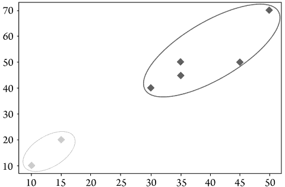

**图 12.8** *k* = 2 时的数据图

###### **k-means 算法的实现（使用 *k* = 3）**

让我们考虑 *k* = 3，对相同的数据集执行 k-means 聚类。这意味着我们希望为该数据库找到三个簇。让我们随机选择前三条记录作为簇的候选。建议读者自行进行计算，然后将他们的发现与下面列出的结果进行比较。

###### **表 12.7** k = 3 的初始数据集

| 个体 | 到质心₁ = (10, 10) 的距离 | 到质心₂ = (15, 20) 的距离 | 到质心₃ = (30, 40) 的距离 | 分配的簇 |
| :--- | :--- | :--- | :--- | :--- |
| 1 (10, 10) | $\sqrt{(10-10)^2+(10-10)^2}$ = 0 | $\sqrt{(10-15)^2+(10-20)^2}$ = 11.18 | $\sqrt{(10-30)^2+(10-40)^2}$ = 36.05 | C1 |
| 2 (15, 20) | $\sqrt{(15-10)^2+(20-10)^2}$ = 11.18 | $\sqrt{(15-15)^2+(20-20)^2}$ = 0 | $\sqrt{(15-30)^2+(20-40)^2}$ = 25 | C2 |
| 3 (30, 40) | $\sqrt{(30-10)^2+(40-10)^2}$ = 36.05 | $\sqrt{(30-15)^2+(40-20)^2}$ = 25 | $\sqrt{(30-30)^2+(40-40)^2}$ = 0 | C3 |
| 4 (50, 70) | $\sqrt{(50-10)^2+(70-10)^2}$ = 72.11 | $\sqrt{(50-15)^2+(70-20)^2}$ = 61.03 | $\sqrt{(50-30)^2+(70-40)^2}$ = 36.05 | C3 |
| 5 (35, 50) | $\sqrt{(35-10)^2+(50-10)^2}$ = 47.16 | $\sqrt{(35-15)^2+(50-20)^2}$ = 36.05 | $\sqrt{(35-30)^2+(50-40)^2}$ = 11.18 | C3 |
| 6 (45, 50) | $\sqrt{(45-10)^2+(50-10)^2}$ = 53.15 | $\sqrt{(45-15)^2+(50-20)^2}$ = 42.42 | $\sqrt{(45-30)^2+(50-40)^2}$ = 18.02 | C3 |
| 7 (35, 45) | $\sqrt{(35-10)^2+(45-10)^2}$ = 43.011 | $\sqrt{(35-15)^2+(45-20)^2}$ = 32.01 | $\sqrt{(35-30)^2+(45-40)^2}$ = 7.07 | C3 |

使用初始质心 (10, 10)、(15, 20)、(30, 40) 获得的簇分别为 {1}、{2}、{3, 4, 5, 6, 7}。

每个簇的更新质心通过取每个簇实例的平均值获得。

更新后的质心₁ = (10, 10)。

更新后的质心$_2$ = (15, 20)。

更新后的质心$_3$ = $(\frac{1}{5}(30+50+35+45+35), \frac{1}{5}(40+70+50+50+45)) = (39, 51)$。

现在，我们计算每个实例到更新后质心的距离，如表 12.8 所示。

###### 表 12.8 k = 3 时的最终分配簇

| 个体 | 到质心$_1$(10, 10) 的距离 (C1) | 到质心$_2$(15, 20) 的距离 (C2) | 到质心$_3$(39, 51) 的距离 (C3) | 分配的簇 |
| :--- | :--- | :--- | :--- | :--- |
| 1 (10, 10) | $\sqrt{(10-10)^2 + (10-10)^2} = \sqrt{0} = 0$ | $\sqrt{(10-15)^2 + (10-20)^2} = \sqrt{25+100} = 11.18$ | $\sqrt{(10-39)^2 + (10-51)^2} = \sqrt{841+1681} = 50.219$ | C1 |
| 2 (15, 20) | $\sqrt{(15-10)^2 + (20-10)^2} = \sqrt{25+100} = 11.18$ | $\sqrt{(15-15)^2 + (20-20)^2} = \sqrt{0} = 0$ | $\sqrt{(15-39)^2 + (20-51)^2} = \sqrt{576+961} = 39.20$ | C2 |
| 3 (30, 40) | $\sqrt{(30-10)^2 + (40-10)^2} = \sqrt{400+900} = 36.05$ | $\sqrt{(30-15)^2 + (40-20)^2} = \sqrt{225+400} = 25$ | $\sqrt{(30-39)^2 + (40-51)^2} = \sqrt{81+121} = 14.21$ | C3 |
| 4 (50, 70) | $\sqrt{(50-10)^2 + (70-10)^2} = \sqrt{1600+3600} = 72.11$ | $\sqrt{(50-15)^2 + (70-20)^2} = \sqrt{1225+2500} = 61.03$ | $\sqrt{(50-39)^2 + (70-51)^2} = \sqrt{121+361} = 21.95$ | C3 |
| 5 (35, 50) | $\sqrt{(35-10)^2 + (50-10)^2} = \sqrt{625+1600} = 47.16$ | $\sqrt{(35-15)^2 + (50-20)^2} = \sqrt{400+900} = 36.05$ | $\sqrt{(35-39)^2 + (50-51)^2} = \sqrt{16+1} = 4.12$ | C3 |
| 6 (45, 50) | $\sqrt{(45-10)^2 + (50-10)^2} = \sqrt{1225+1600} = 53.15$ | $\sqrt{(45-15)^2 + (50-20)^2} = \sqrt{900+900} = 42.42$ | $\sqrt{(45-39)^2 + (50-51)^2} = \sqrt{36+1} = 6.08$ | C3 |
| 7 (35, 45) | $\sqrt{(35-10)^2 + (45-10)^2} = \sqrt{625+1225} = 43.011$ | $\sqrt{(35-15)^2 + (45-20)^2} = \sqrt{400+625} = 32.01$ | $\sqrt{(35-39)^2 + (45-51)^2} = \sqrt{16+36} = 7.21$ | C3 |

从表 12.7 中，我们可以观察到所有簇的实例没有变化。因此，算法在此步骤停止。于是，最终的三个簇为 {1}, {2}, {3, 4, 5, 6, 7}。k = 3 时此数据的绘图如图 12.9 所示。

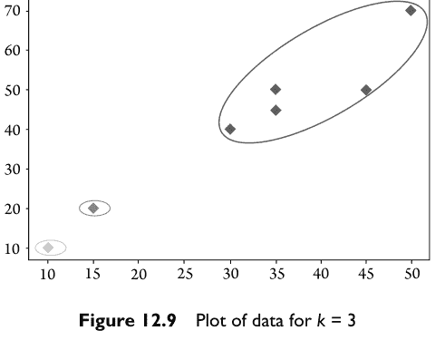

##### 示例 12.2

让我们考虑 Omaxe Mall，它是帕蒂亚拉最大的购物中心之一。他们每年有上千的客流量。这个问题是关于根据购物详情将曾在该购物中心购物的顾客分成三个簇。购物中心经理希望为购物中心的零售店定制折扣和优惠。作为机器学习爱好者，你必须帮助经理对顾客进行聚类。

**数据集描述：** 样本数据集的实例如表 12.9 所示。该数据集包含了曾在购物中心商店购物的顾客的详细信息。此数据集包含顾客的 *Customer ID*、*Gender*、*Age*、*Annual Income*（*以 lakhs 为单位*）以及顾客的 *Spending Score*。这里的 *Spending Score* 是一个介于 1 到 100 之间的数值，由购物中心的计费软件分配；该分数代表了基于顾客购买历史的消费能力。

###### 表 12.9 *Mall–Customer* 数据集的样本实例

| CustomerID | Gender | Age | Annual Income (₹) (in lakhs) | Spending Score (1–100) |
| :--- | :--- | :--- | :--- | :--- |
| 1 | Male | 19 | 15 | 39 |
| 2 | Male | 21 | 15 | 81 |
| 3 | Female | 20 | 16 | 6 |
| 4 | Female | 23 | 16 | 77 |
| 5 | Female | 31 | 17 | 40 |
| 6 | Female | 22 | 17 | 76 |
| 7 | Female | 35 | 18 | 6 |
| 8 | Female | 23 | 18 | 94 |
| 9 | Male | 64 | 19 | 3 |
| 10 | Female | 30 | 19 | 72 |

数据集的第一列是 *CustomerID*，它表示分配给访问购物中心商店的顾客的唯一标识。在 *CustomerID* 之后，列出了顾客相应的 *Gender* 和 *Age*。最后两个属性是 *customer's Annual Income* 和 *Spending Score*；消费分数是一个软件计算的值，范围在 1-100 之间，1 对应较低的购物能力，100 对应较高的购物能力。*Annual Income* 和 *Spending Score* 是理解顾客购物能力最关键的属性。因此，我们将基于这些属性对顾客进行聚类。

让我们应用 k-means 聚类算法将这些顾客分成 3 组，即 *k* = 3。

##### 步骤 1

由于 *k* = 3，让我们为三个簇随机选择三个种子值，如表 12.10 所示。需要注意的是，我们将基于 *Annual Income* 和 *Spending Score* 对数据集进行聚类。*CustomerID* 已显示以清晰地表示实例编号，它不会用于聚类数据。

###### 表 12.10 种子记录

| CustomerID | Annual Income (₹) (in Lakhs) | Spending Score (1–100) |
| :--- | :--- | :--- |
| 2 | 15 | 81 |
| 6 | 17 | 76 |
| 7 | 18 | 6 |

###### 步骤 2 和 3

计算每个实例到这些种子值或初始簇的欧几里得距离。表 12.11 显示了每条记录到种子的距离以及将记录分配到最近簇的情况。

###### 表 12.11 每条记录到种子记录的欧几里得距离

| CustomerID (Annual Income, Spending Score) | 到簇 C1 (15, 81) 的距离 | 到簇 C2 (17, 76) 的距离 | 到簇 C3 (18, 6) 的距离 | 分配到簇 |
| :--- | :--- | :--- | :--- | :--- |
| 1 (15, 39) | $\sqrt{(15-15)^2 + (39-81)^2}$<br>$= \sqrt{0 + 1764}$<br>$= 42$ | $\sqrt{(15-17)^2 + (39-76)^2}$<br>$= \sqrt{4 + 1369}$<br>$= 37.05$ | $\sqrt{(15-18)^2 + (39-6)^2}$<br>$= \sqrt{9 + 1089}$<br>$= 33.13$ | C3 |
| 2 (15, 81) | $\sqrt{(15-15)^2 + (81-81)^2}$<br>$= \sqrt{0}$<br>$= 0$ | $\sqrt{(15-17)^2 + (81-76)^2}$<br>$= \sqrt{4 + 25}$<br>$= 5.38$ | $\sqrt{(15-18)^2 + (81-6)^2}$<br>$= \sqrt{9 + 5625}$<br>$= 75.05$ | C1 |
| 3 (16, 6) | $\sqrt{(16-15)^2 + (6-81)^2}$<br>$= \sqrt{1 + 5625}$<br>$= 75.0$ | $\sqrt{(16-17)^2 + (6-76)^2}$<br>$= \sqrt{1 + 4900}$<br>$= 70.0$ | $\sqrt{(16-18)^2 + (6-6)^2}$<br>$= \sqrt{4 + 0}$<br>$= 2$ | C3 |
| 4 (16, 77) | $\sqrt{(16-15)^2 + (77-81)^2}$<br>$= \sqrt{1 + 16}$<br>$= 4.12$ | $\sqrt{(16-17)^2 + (77-76)^2}$<br>$= \sqrt{1 + 1}$<br>$= 1.41$ | $\sqrt{(16-18)^2 + (77-6)^2}$<br>$= \sqrt{4 + 5041}$<br>$= 71.03$ | C2 |
| 5 (17, 40) | $\sqrt{(17-15)^2 + (40-81)^2}$<br>$= \sqrt{4 + 1681}$<br>$= 41.04$ | $\sqrt{(17-17)^2 + (40-76)^2}$<br>$= \sqrt{0 + (36)^2}$<br>$= 36$ | $\sqrt{(17-18)^2 + (40-6)^2}$<br>$= \sqrt{1 + 1156}$<br>$= 34.01$ | C3 |
| 6 (17, 76) | $\sqrt{(17-15)^2 + (76-81)^2}$<br>$= \sqrt{4 + 25}$<br>$= 5.38$ | $\sqrt{(17-17)^2 + (76-76)^2}$<br>$= \sqrt{0}$<br>$= 0$ | $\sqrt{(17-18)^2 + (76-6)^2}$<br>$= \sqrt{1 + 4900}$<br>$= 70.0$ | C2 |
| 7 (18, 6) | $\sqrt{(18-15)^2 + (6-81)^2}$<br>$= \sqrt{9 + 5625}$<br>$= 75.06$ | $\sqrt{(18-17)^2 + (6-76)^2}$<br>$= \sqrt{1 + 4900}$<br>$= 70.0$ | $\sqrt{(18-18)^2 + (6-6)^2}$<br>$= \sqrt{0}$<br>$= 0$ | C3 |
| 8 (18, 94) | $\sqrt{(18-15)^2 + (94-81)^2}$<br>$= \sqrt{9 + 169}$<br>$= 13.34$ | $\sqrt{(18-17)^2 + (94-76)^2}$<br>$= \sqrt{1 + 324}$<br>$= 18.02$ | $\sqrt{(18-18)^2 + (94-6)^2}$<br>$= \sqrt{0 + 7744}$<br>$= 88$ | C1 |
| 9 (19, 3) | $\sqrt{(19-15)^2 + (3-81)^2}$<br>$= \sqrt{16 + 6084}$<br>$= 78.10$ | $\sqrt{(19-17)^2 + (3-76)^2}$<br>$= \sqrt{4 + 5329}$<br>$= 73.02$ | $\sqrt{(19-18)^2 + (3-6)^2}$<br>$= \sqrt{1 + 9}$<br>$= 3.16$ | C3 |
| 10 (19, 72) | $\sqrt{(19-15)^2 + (72-81)^2}$<br>$= \sqrt{16 + 81}$<br>$= 9.84$ | $\sqrt{(19-17)^2 + (72-76)^2}$<br>$= \sqrt{4 + 16}$<br>$= 4.47$ | $\sqrt{(19-18)^2 + (72-6)^2}$<br>$= \sqrt{1 + 4356}$<br>$= 66$ | C2 |

从表 12.10 中，我们可以观察到——

- 簇 1 中顾客的 CustomerID 为 2 和 8。
- 簇 2 中顾客的 CustomerID 为 4、6 和 10。
- 簇 3 中顾客的 CustomerID 为 1、3、5、7 和 9。

###### 步骤 5

更新簇的质心并从步骤 2 重复。

$Centroid_1 = (\frac{1}{2}(15+18), \frac{1}{2}(81+94)) = (16.5, 87.5)$。

$Centroid_2 = (\frac{1}{3}(16+17+19), \frac{1}{3}(77+76+72)) = (17.33, 75)$。

$Centroid_3 = (\frac{1}{5}(15+16+17+18+19), \frac{1}{5}(39+6+40+6+3)) = (17, 18.8)$。

第二次迭代：表 12.12 显示了每条记录到新质心的欧几里得距离以及将记录分配到最近簇的情况。

###### 表 12.12 各记录到修正后质心的欧氏距离

| 客户ID (年收入, 消费评分) | 到种子点 1 (16.5, 87.5) 的距离 | 到种子点 2 (17.33, 75) 的距离 | 到种子点 3 (17, 18.8) 的距离 | 分配到的簇 |
| :--- | :--- | :--- | :--- | :--- |
| 1 (15, 39) | $\sqrt{(15-16.5)^2 + (39-87.5)^2}$<br>$= \sqrt{2.25 + 2352.25}$<br>$= 48.52$ | $\sqrt{(15-17.33)^2 + (39-75)^2}$<br>$= \sqrt{5.42 + 1296}$<br>$= 36.07$ | $\sqrt{(15-17)^2 + (39-18.8)^2}$<br>$= \sqrt{4 + 408.04}$<br>$= 20.29$ | C3 |
| 2 (15, 81) | $\sqrt{(15-16.5)^2 + (81-87.5)^2}$<br>$= \sqrt{2.25 + 42.25}$<br>$= 6.67$ | $\sqrt{(15-17.33)^2 + (81-75)^2}$<br>$= \sqrt{5.42 + 36}$<br>$= 6.43$ | $\sqrt{(15-17)^2 + (81-18.8)^2}$<br>$= \sqrt{4 + 3868.84}$<br>$= 62.23$ | C2 |
| 3 (16, 6) | $\sqrt{(16-16.5)^2 + (6-87.5)^2}$<br>$= \sqrt{0.25 + 6642.25}$<br>$= 81.5$ | $\sqrt{(16-17.33)^2 + (6-75)^2}$<br>$= \sqrt{1.76 + 4761}$<br>$= 69$ | $\sqrt{(16-17)^2 + (6-18.8)^2}$<br>$= \sqrt{1 + 163.84}$<br>$= 12.8$ | C3 |
| 4 (16, 77) | $\sqrt{(16-16.5)^2 + (77-87.5)^2}$<br>$= \sqrt{0.25 + 110.25}$<br>$= 10.51$ | $\sqrt{(16-17.33)^2 + (77-75)^2}$<br>$= \sqrt{1.76 + 4}$<br>$= 2.402$ | $\sqrt{(16-17)^2 + (77-18.8)^2}$<br>$= \sqrt{1 + 3387.24}$<br>$= 58.21$ | C2 |
| 5 (17, 40) | $\sqrt{(17-16.5)^2 + (40-87.5)^2}$<br>$= \sqrt{0.25 + 2256.25}$<br>$= 47.5$ | $\sqrt{(17-17.33)^2 + (40-75)^2}$<br>$= \sqrt{0.10 + 1225}$<br>$= 35$ | $\sqrt{(17-17)^2 + (40-18.8)^2}$<br>$= \sqrt{0 + (21.2)^2}$<br>$= 21.2$ | C3 |
| 6 (17, 76) | $\sqrt{(17-16.5)^2 + (76-87.5)^2}$<br>$= \sqrt{0.25 + 132.25}$<br>$= 11.5$ | $\sqrt{(17-17.33)^2 + (76-75)^2}$<br>$= \sqrt{0.10 + 1}$<br>$= 1.05$ | $\sqrt{(17-17)^2 + (76-18.8)^2}$<br>$= \sqrt{0 + (57.2)^2}$<br>$= 57.2$ | C2 |
| 7 (18, 6) | $\sqrt{(18-16.5)^2 + (6-87.5)^2}$<br>$= \sqrt{2.25 + 6642.25}$<br>$= 81.5$ | $\sqrt{(18-17.33)^2 + (6-75)^2}$<br>$= \sqrt{1.76 + 4761}$<br>$= 69$ | $\sqrt{(18-17)^2 + (6-18.8)^2}$<br>$= \sqrt{1 + 163.84}$<br>$= 12.84$ | C3 |
| 8 (18, 94) | $\sqrt{(18-16.5)^2 + (94-87.5)^2}$<br>$= \sqrt{2.25 + 42.25}$<br>$= 6.67$ | $\sqrt{(18-17.33)^2 + (94-75)^2}$<br>$= \sqrt{0.448 + 361}$<br>$= 19.01$ | $\sqrt{(18-17)^2 + (94-18.8)^2}$<br>$= \sqrt{1 + 5655.04}$<br>$= 75.2$ | C1 |
| 9 (19, 3) | $\sqrt{(19-16.5)^2 + (3-87.5)^2}$<br>$= \sqrt{6.25 + 7140.25}$<br>$= 84.53$ | $\sqrt{(19-17.33)^2 + (3-75)^2}$<br>$= \sqrt{2.78 + 5184}$<br>$= 72.02$ | $\sqrt{(19-17)^2 + (3-18.8)^2}$<br>$= \sqrt{4 + 249.64}$<br>$= 15.92$ | C3 |
| 10 (19, 72) | $\sqrt{(19-16.5)^2 + (72-87.5)^2}$<br>$= \sqrt{6.25 + 240.25}$<br>$= 15.7$ | $\sqrt{(19-17.33)^2 + (72-75)^2}$<br>$= \sqrt{2.78 + 9}$<br>$= 3.43$ | $\sqrt{(19-17)^2 + (72-18.8)^2}$<br>$= \sqrt{4 + 2830.24}$<br>$= 53.237$ | C2 |

从表 12.11 中，我们可以观察到——

- 簇 1 中客户的客户ID为 8。
- 簇 2 中客户的客户ID为 2、4、6 和 10。
- 簇 3 中客户的客户ID为 1、3、5、7 和 9。

第二次迭代后更新质心——

$\text{质心}_1 = (18, 94)$。

$\text{质心}_2 = (\frac{1}{4}(15+16+17+19), \frac{1}{4}(81+77+76+72)) = (16.75, 76.5)$。

$\text{质心}_3 = (\frac{1}{5}(15+16+17+18+19), \frac{1}{5}(39+6+40+6+3)) = (17, 18.8)$。

第三次迭代：表 12.13 显示了各记录到新质心的欧氏距离以及记录分配到最近簇的情况。

###### 表 12.13 第二次迭代后各记录到质心的欧氏距离

| 客户ID (年收入, 消费评分) | 到种子点 1 (18, 94) 的距离 | 到种子点 2 (16.75, 76.5) 的距离 | 到种子点 3 (17, 18.8) 的距离 | 分配到的簇 |
|---|---|---|---|---|
| 1 (15, 39) | $\sqrt{(15-18)^2 + (39-94)^2}$<br>$= \sqrt{9 + 3025}$<br>$= 55.08$ | $\sqrt{(15-16.75)^2 + (39-76.5)^2}$<br>$= \sqrt{3.06 + 1406.25}$<br>$= 37.5$ | $\sqrt{(15-17)^2 + (39-18.8)^2}$<br>$= \sqrt{4 + 408.04}$<br>$= 20.29$ | C3 |
| 2 (15, 81) | $\sqrt{(15-18)^2 + (81-94)^2}$<br>$= \sqrt{9 + 169}$<br>$= 13.34$ | $\sqrt{(15-16.75)^2 + (81-76.5)^2}$<br>$= \sqrt{3.06 + 20.25}$<br>$= 4.82$ | $\sqrt{(15-17)^2 + (81-18.8)^2}$<br>$= \sqrt{4 + 3868.84}$<br>$= 62.23$ | C2 |
| 3 (16, 6) | $\sqrt{(16-18)^2 + (6-94)^2}$<br>$= \sqrt{4 + 7744}$<br>$= 88.02$ | $\sqrt{(16-16.75)^2 + (6-76.5)^2}$<br>$= \sqrt{0.56 + 4970.25}$<br>$= 70.5$ | $\sqrt{(16-17)^2 + (6-18.8)^2}$<br>$= \sqrt{1 + 163.84}$<br>$= 12.8$ | C3 |
| 4 (16, 77) | $\sqrt{(16-18)^2 + (77-94)^2}$<br>$= \sqrt{4 + 289}$<br>$= 17.11$ | $\sqrt{(16-16.75)^2 + (77-76.5)^2}$<br>$= \sqrt{0.56 + 0.25}$<br>$= 0.90$ | $\sqrt{(16-17)^2 + (77-18.8)^2}$<br>$= \sqrt{1 + 3387.24}$<br>$= 58.21$ | C2 |
| 5 (17, 40) | $\sqrt{(17-18)^2 + (40-94)^2}$<br>$= \sqrt{1 + 2916}$<br>$= 54$ | $\sqrt{(17-16.75)^2 + (40-76.5)^2}$<br>$= \sqrt{0.06 + 1332.25}$<br>$= 36.5$ | $\sqrt{(17-17)^2 + (40-18.8)^2}$<br>$= \sqrt{0 + (21.2)^2}$<br>$= 21.2$ | C3 |
| 6 (17, 76) | $\sqrt{(17-18)^2 + (76-94)^2}$<br>$= \sqrt{1 + 324}$<br>$= 18.02$ | $\sqrt{(17-16.75)^2 + (76-76.5)^2}$<br>$= \sqrt{0.06 + 0.25}$<br>$= 0.559$ | $\sqrt{(17-17)^2 + (76-18.8)^2}$<br>$= \sqrt{0 + (57.2)^2}$<br>$= 57.2$ | C2 |
| 7 (18, 6) | $\sqrt{(18-18)^2 + (6-94)^2}$<br>$= \sqrt{0 + (88)^2}$<br>$= 88$ | $\sqrt{(18-16.75)^2 + (6-76.5)^2}$<br>$= \sqrt{1.56 + 4970.25}$<br>$= 70.51$ | $\sqrt{(18-17)^2 + (6-18.8)^2}$<br>$= \sqrt{1 + 163.84}$<br>$= 12.84$ | C3 |
| 8 (18, 94) | $\sqrt{(18-18)^2 + (94-94)^2}$<br>$= \sqrt{0}$<br>$= 0$ | $\sqrt{(18-16.75)^2 + (94-76.5)^2}$<br>$= \sqrt{1.56 + 306.25}$<br>$= 17.54$ | $\sqrt{(18-17)^2 + (94-18.8)^2}$<br>$= \sqrt{1 + 5655.04}$<br>$= 75.2$ | C1 |
| 9 (19, 3) | $\sqrt{(19-18)^2 + (3-94)^2}$<br>$= \sqrt{1+(91)^2}$<br>$= 91.0$ | $\sqrt{(19-16.75)^2 + (3-76.5)^2}$<br>$= \sqrt{5.06 + 5402.25}$<br>$= 73.53$ | $\sqrt{(19-17)^2 + (3-18.8)^2}$<br>$= \sqrt{4 + 249.64}$<br>$= 15.92$ | C3 |
| 10 (19, 72) | $\sqrt{(19-18)^2 + (72-94)^2}$<br>$= \sqrt{1+(22)^2}$<br>$= 22.02$ | $\sqrt{(19-16.75)^2 + (72-76.5)^2}$<br>$= \sqrt{5.06 + 20.25}$<br>$= 5.03$ | $\sqrt{(19-17)^2 + (72-18.8)^2}$<br>$= \sqrt{4 + 2830.24}$<br>$= 53.237$ | C2 |

从表 12.11 中，我们可以观察到——

- 簇 1 中客户的客户ID为 8。
- 簇 2 中客户的客户ID为 2、4、6 和 10。
- 簇 3 中客户的客户ID为 1、3、5、7 和 9。

簇实例没有进一步变化。因此，算法将在此步骤停止。

在图 12.10 中，数据点被分组在不同的椭圆中，每个椭圆表示一个不同的簇。

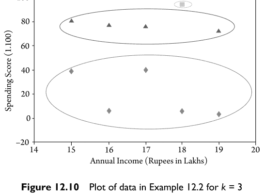

**图 12.10** 示例 12.2 中 k = 3 时的数据绘图

##### 示例 12.3

使用 k-means 算法对学生记录进行聚类，其中 $k$ 为 3。

让我们考虑另一个数据库，其中包含学生在给定课程中的考试结果。我们希望根据学生的成绩（分数）将他们聚类为 3 个簇。学生在作业、期中测试、实验和期末测试中的分数如表 12.14 所示。

**表 12.14** 学生成绩记录

| 学号 | 作业 | 期中测试 | 实验 | 期末测试 |
|---|---|---|---|---|
| 100 | 13 | 24 | 19 | 37 |
| 101 | 11 | 20 | 15 | 39 |
| 102 | 14 | 24 | 16 | 30 |
| 103 | 10 | 19 | 15 | 25 |
| 104 | 9 | 15 | 12 | 30 |
| 105 | 8 | 12 | 9 | 25 |
| 106 | 14 | 22 | 17 | 39 |
| 107 | 11 | 17 | 16 | 30 |
| 108 | 13 | 25 | 15 | 31 |
| 109 | 11 | 14 | 9 | 23 |

请注意，学生的学号（Rno）在聚类过程中不起任何作用；但是，学生将根据作业、期中测试、实验和期末测试进行聚类。

###### 步骤 1 和 2

让我们随机选择任意三名学生作为簇的种子点，如表 12.15 所示。添加学号仅为指示所选种子的实例，它不会在聚类过程中使用。然而，聚类将基于作业、期中测试、实验和期末测试进行。

**表 12.15** 种子记录

| 学号 | 作业 | 期中测试 | 实验 | 期末测试 |
|---|---|---|---|---|
| 101 | 11 | 20 | 15 | 39 |
| 106 | 8 | 12 | 9 | 25 |
| 107 | 11 | 17 | 16 | 30 |

###### 步骤 3 和 4

在此步骤中，我们需要计算聚类中心与各实例之间的距离。为简化距离计算，我们将使用曼哈顿距离，即绝对差之和。表 12.16 显示了基于所选聚类种子值，所有实例到各聚类中心的距离值。每个学生根据到 C1、C2 或 C3 中心的距离，被分配到最近的聚类。第一次迭代的结果如表 12.16 所示。

**表 12.16** 第一次迭代——将每个对象分配到其最近的聚类

| | | 分配 | 期中考试 | 实验 | 期末考试 | 到聚类的距离 | | | 分配到最近的聚类 |
|---|---|---|---|---|---|---|---|---|---|
| 种子 | C1 | 11 | 20 | 15 | 39 | | | | |
| | C2 | 8 | 12 | 9 | 25 | | | | |
| RNo | C3 | 11 | 17 | 16 | 30 | C1 | C2 | C3 | |
| 100 | | 13 | 24 | 19 | 37 | (|13-11|+|24-20|+|19-15|+|37-39|) = 12 | (|13-8|+|24-12|+|19-9|+|37-25|) = 39 | (|13-11|+|24-17|+|19-16|+|37-30|) = 19 | C1 |
| 101 | | 11 | 20 | 15 | 39 | (|11-11|+|20-20|+|15-15|+|39-39|) = 0 | (|11-8|+|20-12|+|15-9|+|39-25|) = 31 | (|11-11|+|20-17|+|15-16|+|39-30|) = 13 | C1 |
| 102 | | 14 | 24 | 16 | 30 | (|14-11|+|24-20|+|16-15|+|30-39|) = 17 | (|14-8|+|24-12|+|16-9|+|30-25|) = 30 | (|14-11|+|24-17|+|16-16|+|30-30|) = 10 | C3 |
| 103 | | 10 | 19 | 15 | 25 | 16 | 15 | 9 | C3 |
| 104 | | 9 | 15 | 12 | 30 | 19 | 12 | 8 | C3 |
| 105 | | 8 | 12 | 9 | 25 | 31 | 0 | 20 | C2 |
| 106 | | 14 | 22 | 17 | 39 | 7 | 38 | 18 | C1 |
| 107 | | 11 | 17 | 16 | 30 | 13 | 20 | 0 | C3 |
| 108 | | 13 | 25 | 15 | 31 | 15 | 30 | 12 | C3 |
| 109 | | 11 | 14 | 9 | 23 | 28 | 7 | 17 | C2 |

聚类 1（即 C1）中的实例是 100、101 和 106。

聚类 2（即 C2）中的实例是 105 和 109。

聚类 3（即 C3）中的实例是 102、103、104、107 和 108。

第一次迭代的结果是：第一个、第二个和第三个聚类中分别有 3、2 和 5 名学生。

###### 步骤 5

第一次迭代后，每个聚类的新中心被更新，如表 12.17 所示。
这里，我们计算聚类中所有实例每个属性的平均值。

**表 12.17** 第一次迭代后更新的中心

| | 分配 | 期中考试 | 实验 | 期末考试 |
|---|---|---|---|---|
| C1（记录 100, 101, 106） | Avg(13, 11, 14) = $\frac{1}{3}(13+11+14) = 12.67$ | Avg(24, 20, 22) = $\frac{1}{3}(24+20+22) = 22$ | Avg(19, 15, 17) = $\frac{1}{3}(19+15+17) = 17$ | Avg(37, 39, 39) = $\frac{1}{3}(37+39+39) = 38.33$ |
| C2（记录 105, 109） | Avg(8, 11) = $\frac{1}{2}(8+11) = 9.5$ | Avg(12, 14) = $\frac{1}{2}(12+14) = 13$ | Avg(9, 9) = $\frac{1}{2}(9+9) = 9$ | Avg(25, 23) = $\frac{1}{2}(25+23) = 24$ |
| C3（记录 102, 103, 104, 107, 108） | Avg(14, 10, 9, 11, 13) = $\frac{1}{5}(14+10+9+11+13) = 11.4$ | Avg(24, 19, 15, 17, 25) = $\frac{1}{5}(24+19+15+17+25) = 20$ | Avg(16, 15, 12, 16, 15) = $\frac{1}{5}(16+15+12+16+15) = 14.8$ | Avg(30, 25, 30, 30, 31) = $\frac{1}{5}(30+25+30+30+31) = 29.2$ |

这里，我们可以观察到聚类 C2 的平均分数明显低于聚类 C1 和 C3。同样，将重新计算每个实例到每个中心的距离，以将每个实例分配到最近的聚类。第二次迭代的结果如表 12.18 所示。

**表 12.18** 第二次迭代——将每个对象分配到其最近的聚类

| 种子 | | 分配 | 期中考试 | 实验 | 期末考试 | 到聚类的距离 | | | 分配到最近的聚类 |
|---|---|---|---|---|---|---|---|---|---|
| RNo | C1 | 12.67 | 22 | 17 | 38.33 | | | | |
| | C2 | 9.5 | 13 | 9 | 24 | | | | |
| | C3 | 11.4 | 20 | 14.8 | 29.2 | C1 | C2 | C3 | |
| 100 | | 13 | 24 | 19 | 37 | (|13-12.67|+|24-22|+|19-17|+|37-38.33|) = 5.66 | (|13-9.5|+|24-13|+|19-9|+|37-24|) = 37.5 | (|13-11.4|+|24-20|+|19-14.8|+|37-29.2|) = 17.6 | C1 |
| 101 | | 11 | 20 | 15 | 39 | (|11-12.67|+|20-22|+|15-17|+|39-38.33|) = 6.34 | (|11-9.5|+|20-13|+|15-9|+|39-24|) = 29.5 | (|11-11.4|+|20-20|+|15-14.8|+|39-29.2|) = 10.4 | C1 |
| 102 | | 14 | 24 | 16 | 30 | 12.66 | 28.5 | 8.6 | C3 |
| 103 | | 10 | 19 | 15 | 25 | 21 | 13.5 | 6.8 | C3 |
| 104 | | 9 | 15 | 12 | 30 | 24 | 11.5 | 11 | C3 |
| 105 | | 8 | 12 | 9 | 25 | 36 | 7.5 | 21.4 | C2 |
| 106 | | 14 | 22 | 17 | 39 | 2 | 36.5 | 16.6 | C1 |
| 107 | | 11 | 17 | 16 | 30 | 16 | 18.5 | 5.4 | C3 |
| 108 | | 13 | 25 | 15 | 31 | 12.66 | 29.55 | 8.6 | C3 |
| 109 | | 11 | 14 | 9 | 23 | 33 | 3.5 | 18.4 | C2 |

同样，聚类 C1、C2 和 C3 中分别有 3、2 和 5 名学生。仔细观察发现聚类完全没有变化。因此，对于这个非常简单的数据集，该方法收敛得非常快。为了更清晰，最终分配的聚类已在表 12.19 中重新列出。

###### 表 12.19 最终分配

| 种子记录 | | 分配 | 期中考试 | 实验 | 期末考试 | 分配到聚类 |
|---|---|---|---|---|---|---|
| | C1 | 12.67 | 22 | 17 | 38.33 | |
| | C2 | 9.5 | 13 | 9 | 24 | |
| | C3 | 11.4 | 20 | 14.8 | 29.2 | |
| 100 | 1 | 13 | 24 | 19 | 37 | C1 |
| 101 | 2 | 11 | 20 | 15 | 39 | C1 |
| 102 | 3 | 14 | 24 | 16 | 30 | C3 |
| 103 | 4 | 10 | 19 | 15 | 25 | C3 |
| 104 | 5 | 9 | 15 | 12 | 30 | C3 |
| 105 | 6 | 8 | 12 | 9 | 25 | C2 |
| 106 | 7 | 14 | 22 | 17 | 39 | C1 |
| 107 | 8 | 11 | 17 | 16 | 30 | C3 |
| 108 | 9 | 13 | 25 | 15 | 31 | C3 |
| 109 | 10 | 11 | 14 | 9 | 23 | C2 |

聚类成员如下：

聚类 1，即 C1——100、101 和 106。

聚类 2，即 C2——105 和 109。

聚类 3，即 C3——102、103、104、107 和 108。

需要注意的是，上述方法是 k-中位数而非 k-均值，因为我们希望使用一种简单的距离度量，读者无需使用计算器即可验证。有趣的是，当使用 k-均值时，结果将是相同的，并且该方法同样会快速收敛。

表 12.20 展示了聚类 C1 中实例到其聚类中心的平均平方和（簇内方差）距离的计算。同样，可以计算聚类 2 和聚类 3 中实例到各自中心的簇内距离。

###### 表 12.20 聚类 1 中记录与其质心 C1(12.67, 22, 17, 38.33) 的簇内距离

| 属性<br>记录 | 分配<br>|Assignment<sub>record</sub> - Assignment<sub>C1</sub>| | 期中考试<br>(MidTest<sub>record</sub> - MidTest<sub>C1</sub>) | 实验<br>(Lab<sub>record</sub> - Lab<sub>C1</sub>) | 期末考试<br>(FinalTest<sub>record</sub> - FinalTest<sub>C1</sub>) | 平方和 |
|---|---|---|---|---|---|
| 100 (13, 24, 19, 37) | |13 - 12.67| = 0.33 | |24 - 22| = 2 | |19 - 17| = 2 | |37 - 38.33| = 1.33 | (0.33)² + (2)² + (2)² + (1.33)² = 9.8778 |
| 101 (11, 20, 15, 39) | |11 - 12.67| = 1.67 | |20 - 22| = 2 | |15 - 17| = 2 | |39 - 38.33| = 0.67 | 11.237 |
| 106 (14, 22, 17, 39) | |14 - 12.67| = 1.33 | |22 - 22| = 0 | |17 - 17| = 0 | |39 - 38.33| = 0.67 | 2.2178 |
| 平方和的平均值 = ((9.8778) + (11.237) + (2.217))/3 | | | | | 7.77 |
| 平方和平均值的平方根（簇内方差） = √7.77 | | | | | 2.78 |

如表 12.20 所述，您可以计算所有簇间和簇内距离，并将您的结果与表 12.21 中给出的数据进行比较。

如表 12.21 所示，聚类 C1、C2 和 C3 中实例到其中心的平均距离分别为 2.78、2.06 和 5.036。这里，C1 和 C2 之间的距离是 19.18，而 C1 和 C3 之间的距离是 10.08。C1 实例之间的簇内距离最小，即 2.78。同样，C2 和 C3 的簇内距离也是最小的，分别为 2.06 和 5.036，如表 12.21 所示。

参考表 12.21，可以很容易地得出结论：聚类算法创建了具有最大簇间（之间）方差或距离以及最小簇内（之内）方差或距离的聚类。这里，可以注意到 C1–C1、C2–C2 和 C3–C3 之间的簇内距离，即簇内距离在每个对应的行中是最小的。它最大化了簇间距离，即 C1–C2 和 C1–C3 之间的距离，等等。

**表 12.21** 簇内和簇间距离

| 聚类 | C1 | C2 | C3 |
| :--- | :--- | :--- | :--- |
| C1 | **2.78** | 19.18 | 10.08 |
| C2 | 19.09 | **2.06** | 10.84 |
| C3 | 10.92 | 11.77 | **5.036** |

### 12.6.2 寻找最佳聚类数

通常在 k-means 算法中，初始步骤必须手动指定起始种子数和聚类数。将数据集聚类的基本步骤是找到数据可以分组的最佳聚类数。肘部法用于为数据集找到最佳聚类。

下面讨论了使用肘部法寻找最佳聚类的策略。

**肘部法：** 在此方法中，我们将聚类数从 1 变化到 *m*，并计算每个 *k* 值的 *簇内平方误差总和 (WCSS)* 或 *惯性*。让我们假设 *k* 的范围是 1 到 10。我们从 1 到 10 迭代这些 *k* 值。对于每个 *k* 值，我们将执行 *k-means* 聚类算法，然后计算 *WCSS* 或 *惯性*。最后，我们将计算出的 *WCSS* 值绘制在 Y 轴上，将相应的聚类数 *k* 绘制在 X 轴上。在生成的图中，出现肘部形成的点（如图 12.11 所示）表示最佳聚类数。

通过分析图 12.11，可以观察到 *WCSS* 值在 *k* = 3 之后仅出现边际下降，表明算法已几乎收敛。此外，在 *k* = 3 处出现肘部形成，表明该数据集的理想聚类数为 3。

换句话说，我们希望找到 *k* 的值，使得增加一个聚类不会导致 *WCSS* 值显著降低。

随着 *k* 值的增加，*WCSS* 或惯性的值会减小。需要注意的是，当数据未被充分捕获时会发生欠拟合，而当数据被过度分析以适应特定数据集，从而无法预测任何未来观察结果时，则会发生过拟合。在欠拟合和过拟合区域之间，图中会形成一个尖锐的肘部。*WCSS* 在欠拟合区域迅速下降，在过拟合区域缓慢下降。

### 12.6.3 k-means 算法的问题

尽管 k-means 算法非常易于理解，但在实现过程中存在一些挑战，且结果也存在一些问题。此处将讨论其中部分问题。

- 在 k-means 算法中，我们必须随机选择聚类的种子记录。没有特定的技术来选择种子记录。因此，不同的种子记录集合可能无法产生相同类型的聚类，即聚类的形成取决于种子记录的初始猜测。因此，结果会存在不一致性。
- 在此方法中，$k$ 值是手动选择的。虽然肘部法则可以预测最优的 $k$ 值，但肘部形状并非总是形成。因此，预测最优的 $k$ 值很困难。
- k-means 算法对异常值敏感，即有可能将噪声/异常点选为种子记录，最终导致结果不佳。
- k-means 算法仅适用于连续数据，因为它仅限于具有质心概念的数据。这是因为 k-means 算法使用欧几里得距离和簇内数据点属性的平均值。
- k-means 算法不考虑聚类的大小。形成的聚类可能小也可能大。
- 在聚类具有不同密度和大小的情况下，它给出的结果不佳。
- k-means 算法不处理重叠聚类。

为了克服 k-means 聚类的局限性，科学家们提出了层次聚类和 DBSCAN 技术。在接下来的章节中，我们将深入探讨这些技术。

## 12.7 层次聚类算法 (HCA)

层次聚类是一种特殊的聚类分析技术，它基于对象之间的相似性构建聚类，形成树状结构。它也被称为层次聚类分析 (HCA)。层次聚类形成的树状结构称为树状图。这种技术与之前讨论的技术不同。它构建嵌套聚类的层次结构，不像之前的划分技术只生成扁平的聚类集合。

根据其方法，层次聚类主要分为两种方法，即凝聚聚类和分裂聚类。

### 凝聚聚类

这种聚类算法使用自底向上的方法。它也被称为 AGNES (AGglomerative NESting)。凝聚聚类开始时将每个数据点视为一个单独的聚类。每个数据点与最近的数据点重复组合，形成更大的聚类。此过程持续进行，直到满足停止标准。停止标准可以是所需的聚类数量或最高层次级别，直到所有数据点合并形成一个大的聚类。

在图 12.12 中，上方箭头表示五个数据点的凝聚聚类，并清晰地显示了此过程中的中间步骤。在第一步，即步骤 0 中，有五个聚类，因为所有数据点都被视为单独的聚类。在步骤 1 中，数据点 *a* 和 *b* 组合成一个聚类。在此步骤中，我们有四个聚类，即 {a, b}、{c}、{d}、{e}。在步骤 2 中，数据点 *d* 和 *e* 组合成一个聚类。在此步骤中，我们有三个聚类，即 {a, b}、{c}、{d, e}。在步骤 3 中，聚类 {c} 和 {d, e} 组合形成聚类 {c, d, e}。在步骤 4 中，聚类 {a, b} 和 {c, d, e} 组合形成一个聚类 {a, b, c, d, e}。假设我们希望在形成三个聚类时停止。那么，在步骤 2 之后，算法停止，得到三个聚类，即 {a, b}、{c}、{d, e}。

#### 分裂聚类

这种聚类使用自顶向下的方法。此过程也被称为 DIANA (DIvisive ANAlysis)。在此方法中，所有数据点最初被认为存在于一个大的聚类中。在后续阶段，聚类被重复划分，直到我们获得所需数量的较小聚类或仅包含一个数据点。

如图 12.12 所示，下方箭头显示了五个数据点的分裂聚类，并指示了此过程中的所有中间步骤。在第一步，即步骤 0 中，有一个包含所有数据的单一聚类，即聚类为 {a, b, c, d, e}。在步骤 1 中，聚类 {a, b, c, d, e} 被划分为两个聚类 {a, b} 和 {c, d, e}。在步骤 2 中，聚类 {c, d, e} 被划分为聚类 {c} 和 {d, e}。在此步骤中，我们有三个聚类，即 {a, b}、{c}、{d, e}。在步骤 3 中，聚类 {d, e} 被划分为聚类 {d} 和 {e}。在此步骤中，我们有四个聚类，即 {a, b}、{c}、{d}、{e}。在步骤 4 中，聚类 {a, b} 被划分为 {a} 和 {b}。在此步骤中，我们有五个聚类，即 {a}、{b}、{c}、{d}、{e}。假设我们希望在形成四个聚类时停止。在这种情况下，在步骤 3 之后，算法停止，最终聚类为 {a, b}、{c}、{d}、{e}。

通常，凝聚聚类中的合并或分裂聚类中的划分是通过贪心方法进行的。凝聚聚类适用于识别较小的聚类，而分裂聚类适用于识别较大的聚类。

在接下来的小节中，我们将详细讨论凝聚聚类和分裂聚类。

### 12.7.1 凝聚聚类

如前所述，这是一种自底向上的方法，它将每个数据点视为一个聚类。在后续步骤中，每个数据点与最近的数据点重复组合以形成更大的聚类，此过程在满足停止标准时停止。

现在，让我们讨论凝聚聚类的逐步算法。假设给定数据集中的 N 个数据点需要进行聚类。凝聚聚类遵循以下过程。

1.  启动过程。
2.  将每个数据点分配到一个聚类。
3.  由于给定数据集中有 $N$ 个数据点，因此形成了 $N$ 个聚类。
4.  通过计算每个聚类中数据点之间的距离来计算 $N$ 个聚类之间的距离。形成一个显示聚类之间距离的距离矩阵。
5.  根据距离矩阵中的距离合并彼此接近的聚类。
6.  简单来说，选择彼此接近的数据点，即它们之间距离较小的数据点，并将它们合并。因此，我们将聚类数量从 $N$ 减少到 $N-1$。
7.  计算更新后的聚类之间的距离，并创建更新后的距离矩阵。
8.  重复步骤 4 和 5，直到形成所需数量的聚类/所有数据点合并形成一个聚类。
9.  停止过程。

由于这种类型的聚类递归地合并数据点，因此被称为凝聚聚类。

在生成完整的层次树之后，最高级别包含所有数据点在一个聚类中。但我们的目标是将数据点划分为聚类，而不是将所有数据点保持在一个聚类中。因此，当获得停止标准，即所需的聚类数量时，此过程停止。

为了进一步理解此过程，让我们考虑图 12.13。使用凝聚聚类，此图对八个数据点 a、b、c、d、e、f、g 和 h 进行聚类。

图 12.13 中的第 1 行显示了初始的八个数据点，它们被放置在八个聚类中。在下一级别，让我们假设数据点 $f$ 和 $g$ 之间的距离较小或彼此接近，因此它们被分组为一个聚类 $fg$。类似地，数据点 $d$ 和 $e$ 形成一个聚类 $de$，数据点 $b$ 和 $c$ 形成另一个聚类 $bc$。在此阶段，我们有五个聚类，即 $\{a\}$、$\{b, c\}$、$\{d, e\}$、$\{f, g\}$、$\{h\}$。这样，数据点在每个级别都被分组。在第 3 行，我们得到三个聚类，即 $\{a\}$、$\{b, c, d, e\}$ 和 $\{f, g, h\}$。这三个聚类也被称为较粗的聚类。由于一些聚类成员较多，而其他聚类成员很少，在一个聚类中，我们有 $\{b, c, d, e\}$，而在另一个聚类中，我们只有 $\{a\}$。

在另一次迭代之后，在第 4 行，有两个聚类，即 $\{a, b, c, d, e\}$ 和 $\{f, g, h\}$。在第 5 行的下一次迭代将合并为一个聚类 $\{a, b, c, d, e, f, g, h\}$。

正如在凝聚聚类和分裂聚类中一样，我们需要找到聚类之间的距离。连接度量用于找到聚类之间的距离。

在下一小节中，我们将讨论各种连接度量技术。

#### 12.7.1.1 连接度量及其在聚类中的作用

使用连接度量，可以创建一个距离矩阵，该矩阵给出了不同簇中点之间的距离。这有助于更好地理解在每个层级上哪些点应该被分组。

三种重要的连接度量，即单连接、全连接和平均连接，被用于测量簇之间的距离。让我们逐一讨论这些度量。

##### 单连接

在这种方法中，每个簇中任意两点之间的最短距离被视为两个簇之间的距离。图12.14描绘了单连接聚类。

这里，两个簇R和S之间的距离是连接它们最近两点的箭头长度。使用单连接度量计算簇间距离的公式如下。

$$L(R,S) = min(D(x_{Ri}, x_{Sj}))$$

这里，D ($x_{Ri}$, $x_{Sj}$) 是簇R的第$i^{th}$个数据点与簇S的第$j^{th}$个数据点之间的距离。

##### 全连接

在这种方法中，每个簇中任意两点之间的最长距离被视为两个簇之间的距离。图12.15描绘了全连接聚类。

这里，两个簇R和S之间的距离是连接它们最远两点的箭头长度。使用全连接度量计算簇间距离的公式如下。

$$L(R,S) = max(D(x_{Ri}, x_{Sj}))$$

这里，D ($x_{Ri}$, $x_{Sj}$) 是簇R的第$i^{th}$个数据点与簇S的第$j^{th}$个数据点之间的距离。

##### 平均连接

在这种方法中，一个簇中每个点到另一个簇中每个点的平均距离被用来确定两个簇之间的距离。图12.16描绘了平均连接聚类。在此图中，两个簇$R$和$S$之间的距离是通过计算簇$R$和簇$S$数据点之间箭头的平均长度来确定的。使用平均连接度量计算簇间距离的公式如下。

$$L(R,S) = \frac{1}{n_R n_S} \sum_{i=1}^{n_R} \sum_{j=1}^{n_S} D(x_{Ri}, x_{Sj})$$

这里，$n_R$ = 簇$R$中的样本数量

$n_S$ = 簇$S$中的样本数量

这里，$D(x_{Ri}, x_{Sj})$ 同样是簇$R$的第$i^{th}$个数据点与簇S的第$j^{th}$个数据点之间的距离。

**图12.16** 平均连接

##### 通过单连接计算距离并执行凝聚聚类

为了理解单连接聚类如何应用于解决问题，让我们考虑一个一维数据集，其值为{3, 11, 21, 25, 42}。图12.17描绘了这些点在图上的绘制。

**图12.17** 给定数据点的图形表示

这些数据点之间的单连接距离（任何两个簇之间的距离是它们数据点之间的最短距离）如图12.18所示。

**图12.18** 使用单连接对数据点进行聚类

在第1层，每个数据点被放在一个单独的簇中。在图12.18中，每个层级连接线上方的数字表示数据点之间的距离。在第1层，我们可以观察到数据点21和25更近。因此，它们在第2层被合并形成一个簇（21, 25）。

现在，让我们使用单连接计算每个相邻数据点到这个新簇（21, 25）的距离，即D (11; {21,25}) 和 D (42; {21,25})。

D (11; 21) = 10, D (11; 25) = 14。因此，D (11; {21, 25}) = min (10, 14) = 10。

D (42; 21) = 21, D (42; 25) = 17。因此，D (42; {21, 25}) = min (21, 17) = 17。

在第2层，数据点3和11很接近，因此它们在第3层被合并成一个簇（3, 11）。

现在，让我们使用单连接计算每个相邻数据点到这个新簇（3, 11）的距离，即D ({3, 11}; {21, 25})。

D (3; 21) = 18, D (11; 21) = 10, D (3; 25) = 22, D (11; 25) = 14。因此，D ({3, 11}; {21, 25}) = min (18, 10, 22, 14) = 10。

在第3层，簇（3, 11）和簇（21, 25）彼此接近，因此它们在第4层被合并成一个簇（3, 11, 21, 25），如图12.19所示。

最后，我们得到两个簇，如下所示。

簇1：3, 11, 21 和 25。

簇2：42。

##### 通过全连接计算距离并执行凝聚聚类

让我们使用上面讨论的相同数据集，但这次我们将使用全连接距离度量来计算簇之间的距离。在全连接聚类中，两个簇之间的距离是簇数据点之间的最长距离。图12.19显示了通过全连接过程进行的聚类。

在第1层，每个数据点被放在一个单独的簇中。在图12.20中，每个层级连接线上方的数字表示数据点之间的距离。在第1层，我们可以观察到数据点21和25更近。因此，它们在第2层被合并形成一个簇（21, 25）。

现在，让我们使用全连接计算每个相邻数据点到这个新簇（21, 25）的距离，即D (11; {21, 25}) 和 D (42; {21, 25})。

D (11; 21) = 10, D (11; 25) = 14。因此，D (11; {21, 25}) = max (10, 14) = 14。

D (42; 21) = 21, D (42; 25) = 17。因此，D (42; {21, 25}) = max (21, 17) = 21。

在第2层，数据点3和11彼此接近，因此它们在第3层被合并成一个簇（3, 11）。

现在，让我们使用全连接计算每个相邻数据点到这个新簇（3, 11）的距离，即D ({3, 11}; {21, 25})。

D (3; 21) = 18, D (11; 21) = 10, D (3; 25) = 22, D (11; 25) = 14。因此，D ({3, 11}; {21, 25}) = max (18, 10, 22, 14) = 22。

在第3层，簇（21, 25）和数据点（42）彼此接近，因此它们在第4层被合并成一个簇（21, 25, 42），如图12.20所示。

最后，我们得到两个簇，如下所示。

簇1：3 和 11。

簇2：21, 25 和 42。

我们可以看到，根据我们选择的连接度量，簇的形成方式有所不同，正如上述示例所演示的那样。

##### 示例12.4：

让我们考虑表12.22中给出的数据集，使用全连接度量执行凝聚聚类。该数据集以距离矩阵的形式显示。距离矩阵表示给定数据集所有数据点之间的距离。需要注意的是，距离矩阵是对称的，因为x和y之间的距离总是等于y和x之间的距离。距离矩阵对角线上的值总是零，因为每个项目与自身的距离为零。

在表12.22中，元素仅显示在下三角部分，因为上三角部分可以通过反射填充。

在表12.22中，最小距离是数据点1和数据点5之间的6。因此，这两个数据点被合并形成一个簇“1/5”。

为了获得更新的距离矩阵，1和5的条目被移除，并替换为簇1/5。由于距离度量是全连接，簇1/5与其他项之间的距离是最大距离值。

###### 表12.22 数据集的距离矩阵

| | 1 | 2 | 3 | 4 | 5 |
|---|---|---|---|---|---|
| **1** | 0 | | | | |
| **2** | 9 | 0 | | | |
| **3** | 10 | 18 | 0 | | |
| **4** | 17 | 16 | 8 | 0 | |
| **5** | 6 | 13 | 7 | 20 | 0 |

现在，让我们计算每个数据点到这个簇1/5的距离。

D (2, {1/5}) 如下。

这里，D (2, 1) = 9, D (2, 5) = 13。因此，D (2, {1/5}) = max (9, 13) = 13。

D (3, {1/5}) 如下。

D (3, 1) = 10, D (3, 5) = 7。因此，D (3, {1/5}) = max (10, 7) = 10。

D (4, {1/5}) 如下。

D (4, 1) = 17, D (4, 5) = 20。因此，D (4, {1/5}) = max (17, 20) = 20。

新的距离矩阵如表12.23所示。这里，我们可以观察到最小距离是8，在3和4之间。因此，它们在下一层被合并。

###### 表12.23 聚类1, 5后的距离矩阵

| | 1/5 | 2 | 3 | 4 |
|---|---|---|---|---|
| **1/5** | 0 | | | |
| **2** | 13 | 0 | | |
| **3** | 10 | 18 | 0 | |
| **4** | 20 | 16 | 8 | 0 |

为了获得更新的距离矩阵，3和4的条目被移除，并替换为簇3/4。由于距离度量是全连接，簇3/4与其他项之间的距离是最大距离值。

现在，让我们计算每个数据点到簇3/4的距离。

D ({1/5},{3/4}) 如下。

D ({1/5}, 3) = 10 且 D ({1/5}, 4) = 20。因此，D ({1/5},{3/4}) = max (10, 20) = 20。

D (2,{3/4}) 如下。

D (2, 3) = 18, D (2, 4) = 16。因此，D (2, {3/4}) = max (18, 16) = 18。

更新后的距离矩阵如表12.24所示。

**表12.24** 聚类3、4后的距离矩阵

| | 1/5 | 2 | 3/4 |
|---|---|---|---|
| **1/5** | 0 | | |
| **2** | 13 | 0 | |
| **3/4** | 20 | 18 | 0 |

此处，我们可以观察到最小距离是13，位于2和1/5之间。因此，它们在下一级被合并为2/1/5。此时，我们有两个簇，即{2/1/5}和{3/4}，如表12.24所示。为了得到新的距离矩阵，移除2和1/5，并用簇2/1/5替换。

现在，让我们计算每个数据点到此簇2/1/5的距离。
D ({3/4}, {2/1/5}) 如下。
D ({3/4},2) = 18 且 D ({3/4},{1/5}) = 20。因此，D ({3/4}, {2/1/5}) = max (18,20) = 20。

**表12.25** 聚类2、1/5后的距离矩阵

| | 2/1/5 | 3/4 |
|---|---|---|
| **2/1/5** | 0 | |
| **3/4** | 20 | 0 |

在下一级，这些簇被合并为一个单一的簇。
聚类的树状图如图12.20所示。左侧的条形显示了数据点之间的距离。这也称为簇高度。不同的距离度量将给出不同的簇高度和不同的树状图。

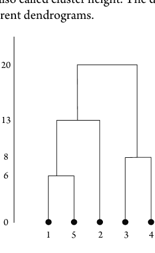

使用单链接聚类将得到不同的树状图，因为我们在每一级考虑簇之间的最短距离。使用单链接聚类为此示例寻找簇的任务留给读者。然而，为了验证你的结果，图12.21给出了使用单链接度量的此示例的最终树状图。

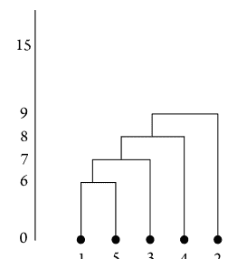

**图12.21** 使用单链接的聚类

##### 对超市数据集执行凝聚聚类

让我们执行凝聚层次聚类，根据顾客从超市购买的物品来形成顾客簇。此处，使用单链接聚类来计算簇之间的距离。表12.26显示了不同类别顾客每月购买的物品数量。

**表12.26** 顾客及其每月购买的物品

| 顾客ID | 杂货 | 衣物 | 新鲜蔬菜 | 器具 |
| :---: | :---: | :---: | :---: | :---: |
| 1 | 25 | 12 | 8 | 5 |
| 2 | 30 | 10 | 20 | 7 |
| 3 | 42 | 6 | 21 | 3 |
| 4 | 20 | 15 | 13 | 10 |
| 5 | 35 | 8 | 15 | 6 |

处理此数据集的第一步是准备一个距离矩阵。为了根据顾客的购买历史计算顾客之间的距离，我们在本例中使用曼哈顿距离。

顾客1到顾客1的曼哈顿距离是

```
$|25 - 25| + |12 - 12| + |8 - 8| + |5 - 5| = 0.$
```

顾客1到顾客2的曼哈顿距离是

$$|30 - 25| + |10 - 12| + |20 - 8| + |7 - 5| = 21.$$

顾客1到顾客3的曼哈顿距离是

$$|42 - 25| + |6 - 12| + |21 - 8| + |3 - 5| = 38.$$

顾客1到顾客4的曼哈顿距离是

$$|20 - 25| + |15 - 12| + |13 - 8| + |10 - 5| = 18.$$

顾客1到顾客5的曼哈顿距离是

$$|35 - 25| + |8 - 12| + |15 - 8| + |6 - 5| = 22.$$

现在，让我们计算顾客2到其他每个顾客的距离。没有必要计算它与顾客1的距离，因为已经计算过了，是21。

顾客2到顾客2的曼哈顿距离是

$$|30 - 30| + |10 - 10| + |20 - 20| + |7 - 7| = 0.$$

顾客2到顾客3的曼哈顿距离是

$$|42 - 30| + |6 - 10| + |21 - 20| + |3 - 7| = 21.$$

顾客2到顾客4的曼哈顿距离是

$$|20 - 30| + |15 - 10| + |13 - 20| + |10 - 7| = 25.$$

顾客2到顾客5的曼哈顿距离是

$$|35 - 30| + |8 - 10| + |15 - 20| + |6 - 7| = 13.$$

现在，让我们计算顾客3到其他每个顾客的距离。没有必要计算它与顾客1和顾客2的距离，因为已经计算过了。你也可以得出结论，没有必要计算它与自身的距离，因为它总是0。

顾客3到顾客4的曼哈顿距离是

$$|20 - 42| + |15 - 6| + |13 - 21| + |10 - 3| = 35.$$

顾客3到顾客5的曼哈顿距离是

$$|35 - 42| + |8 - 6| + |15 - 21| + |6 - 3| = 18.$$

对于顾客4，我们只需要计算顾客4和顾客5之间的距离，如下所示。

$$|35 - 20| + |8 - 15| + |15 - 13| + |6 - 10| = 28.$$

由于顾客5的所有距离都已经计算过了，因此没有必要为此情况计算任何距离。

因此，我们现在可以绘制距离矩阵，如表12.27所示。

**表12.27** 给定数据的距离矩阵

| | 1 | 2 | 3 | 4 | 5 |
|---|---|---|---|---|---|
| 1 | 0 | | | | |
| 2 | 21 | 0 | | | |
| 3 | 38 | 21 | | | |
| 4 | 18 | 25 | 35 | 0 | |
| 5 | 22 | **13** | 18 | 28 | 0 |

从表12.27中，我们可以观察到最近的顾客对是ID为2和5的顾客，因为它们之间的距离是13。这些顾客被合并为一个名为“2/5”的单一簇。

为了得到新的距离矩阵，我们移除2和5的条目，并用簇2/5替换。由于我们使用的是单链接聚类，簇2/5与其他项之间的距离是它们之间的最小距离。

现在，让我们计算每个数据点到此簇2/5的距离。
D (1; {2/5})

D (1, 2) = 21, D (1; 5) = 22。因此，D (1; {2/5}) = min (21, 22) = 21。

D (3; {2/5})

D (3, 2) = 21, D (3; 5) = 18。因此，D (3; {2/5}) = min (21, 18) = 18。

D (4; {2/5})

D (4, 2) = 25, D (4; 5) = 28。因此，D (4; {2/5}) = min (25, 28) = 25。

因此，更新后的距离矩阵将如表12.28所示。

**表12.28** 更新后的距离矩阵

| 顾客ID | 1 | 2/5 | 3 | 4 |
|---|---|---|---|---|
| 1 | 0 | | | |
| 2/5 | 21 | 0 | | |
| 3 | 38 | **18** | 0 | |
| 4 | **18** | 25 | 35 | 0 |

从表12.28中，我们可以观察到我们有两对最近的簇，距离为18。一对是顾客ID为3的簇和簇2/5。另一对是顾客ID为1和4的簇。我们可以选择这两对簇中的任何一对。让我们选择顾客1和4的簇对，并将它们合并为一个名为“1/4”的单一簇。

为了得到新的距离矩阵，我们移除1和4，并用簇1/4替换。由于我们使用的是单链接聚类，簇1/4与其他项之间的距离是它们之间的最小距离。

现在，让我们计算每个数据点到此簇1/4的距离。
D ({2/5},{1, 4})

D ({2/5}, 1) = 21, D ({2/5}, 4) = 25。因此，D ({2/5},{1, 4}) = min (21, 25) = 21。

D (3,{1, 4})

D (3, 1) = 38, D (3, 4) = 35。因此，D (3,{1, 4}) = min (38, 35) = 35。

因此，更新后的距离矩阵将如表12.29所示。

**表12.29** 更新后的距离矩阵

| 顾客ID | 1/4 | 2/5 | 3 |
| :--- | :--- | :--- | :--- |
| 1/4 | 0 | | |
| 2/5 | 21 | 0 | |
| 3 | 35 | **18** | 0 |

现在，距离矩阵中的最小距离是18，即2/5和3之间的距离。因此，簇2/5将与簇3合并，形成一个名为2/5/3的新簇。

现在，让我们计算每个数据点到此簇2/5/3的距离。
D ({1/4},{2/5/3})

D ({1/4}, {2/5}) = 21, D ({1/4}, 3) = 35。因此，D ({1/4},{2/5/3}) = min (21, 35) = 21。

因此，更新后的距离矩阵将如表12.30所示。

**表12.30** 更新后的距离矩阵

| 顾客ID | 1/4 | 2/5/3 |
| :--- | :--- | :--- |
| 1/4 | 0 | |
| 2/5/3 | 21 | 0 |

最后，我们剩下最后两个簇，即{2/5/3}和{1/4}。此完整过程的树状图如图12.22所示，图12.23表示此示例的层次树。

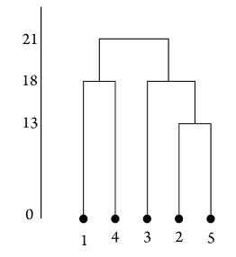

**图12.22** 顾客细分的单链接聚类树状图

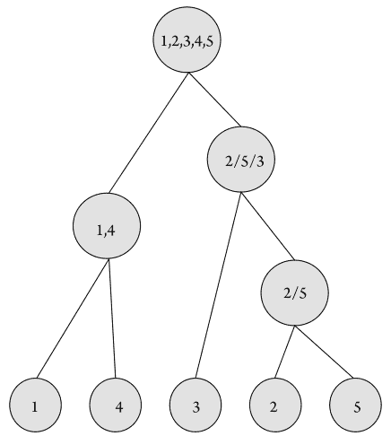

**图12.23** 顾客细分的单链接聚类层次树

##### 使用凝聚算法对学生记录进行聚类的示例

让我们将凝聚算法应用于包含学生在给定课程中考试成绩的数据库，如表12.30所示。这是我们之前应用k-means算法进行聚类的相同数据集。在本节中，我们将对相同的数据集。学生在作业、期中测试、实验和期末测试中获得的分数（满分50分）表现再次列于表12.31中。

###### 表12.31 学生成绩记录

| 编号 | 作业 | 期中测试 | 实验 | 期末测试 |
|---|---|---|---|---|
| 100 | 13 | 24 | 19 | 37 |
| 101 | 11 | 20 | 15 | 39 |
| 102 | 14 | 24 | 16 | 30 |
| 103 | 10 | 19 | 15 | 25 |
| 104 | 9 | 15 | 12 | 30 |
| 105 | 8 | 12 | 9 | 25 |
| 106 | 14 | 22 | 17 | 39 |
| 107 | 11 | 17 | 16 | 30 |
| 108 | 13 | 25 | 15 | 31 |
| 109 | 11 | 14 | 9 | 23 |

###### 步骤1

针对上述数据计算距离矩阵。同样，我们使用曼哈顿距离方法来确定每对实例之间的距离。由于距离矩阵的对称性（因为*p*与*q*之间的距离等于*q*与*p*之间的距离），表12.32中仅显示了下三角矩阵，上三角部分可以通过镜像填充。距离矩阵的对角线上为零，因为每个实例与其自身的距离为零。值*m*表示形成簇的迭代次数，它在表标题中提及，以指示从开始的若干次迭代。

表12.32中距离矩阵各行单元格的部分计算如下（数据来源于表12.31）：

- 编号100与101之间的距离 = [|11 – 13| + |20 – 24| + |15 – 19| + |39 – 37|] = 12。
- 编号100与102之间的距离 = [|14 – 13| + |24 – 24| + |16 – 19| + |30 – 37|] = 11。
- 编号101与102之间的距离 = [|14 – 11| + |24 – 20| + |16 – 19| + |30 – 37|] = 17。

类似地，你可以计算其他距离。建议读者独立计算剩余距离，并将你的结果与表12.32中给出的距离矩阵进行比较。

###### 表12.32 m:1时的距离矩阵

| 编号 | 100 | 101 | 102 | 103 | 104 | 105 | 106 | 107 | 108 | 109 |
|---|---|---|---|---|---|---|---|---|---|---|
| **100** | 0 | | | | | | | | | |
| **101** | 12 | 0 | | | | | | | | |
| **102** | 11 | 17 | 0 | | | | | | | |
| **103** | 24 | 16 | 15 | 0 | | | | | | |
| **104** | 27 | 19 | 18 | 13 | 0 | | | | | |
| **105** | 39 | 31 | 30 | 15 | 12 | 0 | | | | |
| **106** | 7 | 7 | 12 | 23 | 26 | 38 | 0 | | | |
| **107** | 19 | 13 | 10 | 9 | 8 | 20 | 18 | 0 | | |
| **108** | 11 | 15 | 4 | 15 | 18 | 30 | 14 | 12 | 0 | |
| **109** | 36 | 28 | 27 | 14 | 13 | 7 | 35 | 17 | 27 | 0 |

###### 步骤2

对此距离矩阵应用凝聚层次聚类方法，计算簇间最小距离并进行合并。距离矩阵中的最小距离为4，出现在编号102和108之间。将此簇记为C1。

因此，实例102和108被合并为一个簇C1 (102/108)。根据单链接层次聚类方法计算此新簇到所有其他实例的距离。为了得到新的距离矩阵，移除实例102和108，并用簇C1替换。由于使用的是单链接层次聚类，簇C1 (102/108)与每个其他实例之间的距离，是该实例到102的最短距离与到108的最短距离中的较小值。表12.33中高亮显示了合并编号102和108以创建新簇所涉及的单元格。

为了得到新的距离矩阵，我们移除102和108，并用簇C1 (102/108)替换它们。由于我们使用的是单链接聚类，簇102/108与其他项之间的距离是它们之间的最小距离值。

现在，让我们计算每个数据点到此簇C1，即{102/108}的距离。

D (100; {102/108}) 计算如下。

D (100, 102) = 11, D (100, 108) = 11。因此，D (100, {102/108}) = min (11, 11) = 11。

D (101, {102/108}) 计算如下。

D (101, 102) = 17, D (101, 108) = 15。因此，D (101, {102/108}) = min (17, 15) = 15。

类似地，你可以计算所有其他实例到簇{102/108}的距离。

###### 表12.33 C1涉及的单元格

| 编号 | 100 | 101 | 102 | 103 | 104 | 105 | 106 | 107 | 108 | 109 |
|---|---|---|---|---|---|---|---|---|---|---|
| 100 | 0 | | | | | | | | | |
| 101 | 12 | 0 | | | | | | | | |
| 102 | 11 | 17 | 0 | | | | | | | |
| 103 | 24 | 16 | 15 | 0 | | | | | | |
| 104 | 27 | 19 | 18 | 13 | 0 | | | | | |
| 105 | 39 | 31 | 30 | 15 | 12 | 0 | | | | |
| 106 | 7 | 7 | 12 | 23 | 26 | 38 | 0 | | | |
| 107 | 19 | 13 | 10 | 9 | 8 | 20 | 18 | 0 | | |
| 108 | 11 | 15 | 4 | 15 | 18 | 30 | 14 | 12 | 0 | |
| 109 | 36 | 28 | 27 | 14 | 13 | 7 | 35 | 17 | 27 | 0 |

下面讨论了几个更多的距离计算。

D (107, {102/108}):

D (107, 102) = 10, D (107, 108) = 12。因此，D (107, {102/108}) = min (10, 12) = 10。

D (109, {102/108}):

D (109, 102) = 27, D (109, 108) = 27。因此，D (109, {102/108}) = min (27, 27) = 27。

建议读者独立计算剩余距离，并将你的结果与表12.34中给出的距离矩阵进行比较。

###### 表12.34 m:2时更新的距离矩阵

| 编号 | 100 | 101 | C1 | 103 | 104 | 105 | 106 | 107 | 109 |
|---|---|---|---|---|---|---|---|---|---|
| 100 | 0 | | | | | | | | |
| 101 | 12 | 0 | | | | | | | |
| C1 | 11 | 15 | 0 | | | | | | |
| 103 | 24 | 16 | 15 | 0 | | | | | |
| 104 | 27 | 19 | 18 | 13 | 0 | | | | |
| 105 | 39 | 31 | 30 | 15 | 12 | 0 | | | |
| 106 | 7 | 7 | 12 | 23 | 26 | 38 | 0 | | |
| 107 | 19 | 13 | 10 | 9 | 8 | 20 | 18 | 0 | |
| 109 | 36 | 28 | 27 | 14 | 13 | 7 | 35 | 17 | 0 |

###### 步骤3

重复步骤2，直到所有簇合并完毕。

距离矩阵中的最小距离为7，出现在编号100和106之间。将此簇记为C2 (100/106)。为了得到新的距离矩阵，我们需要移除100和106的条目，并用簇C2 (100/106)替换它们。由于我们使用的是单链接聚类，簇C2 (100/106)与其他项之间的距离是最小距离值。表12.35中高亮显示了合并编号100和106以创建新簇所涉及的单元格。

###### 表12.35 簇C2 (100/106)涉及的单元格

| 编号 | 100 | 101 | C2 | 103 | 104 | 105 | 106 | 107 | 109 |
|---|---|---|---|---|---|---|---|---|---|
| 100 | 0 | | | | | | | | |
| 101 | 12 | 0 | | | | | | | |
| C2 | 11 | 15 | 0 | | | | | | |
| 103 | 24 | 16 | 15 | 0 | | | | | |
| 104 | 27 | 19 | 18 | 13 | 0 | | | | |
| 105 | 39 | 31 | 30 | 15 | 12 | 0 | | | |
| 106 | 7 | 7 | 12 | 23 | 26 | 38 | 0 | | |
| 107 | 19 | 13 | 10 | 9 | 8 | 20 | 18 | 0 | |
| 109 | 36 | 28 | 27 | 14 | 13 | 7 | 35 | 17 | 0 |

现在，让我们计算每个数据点到此簇C2，即{100/106}的距离。下面展示了几个数据点到此簇C2，即{100/106}距离的详细计算。

D (101; {100/106}):

D (101, 100) = 12, D (101, 106) = 7。因此，D (101, {100/106}) = min (12, 7) = 7。

D ({102/108}; {100/106}):

D ({102/108}, 100) = 11, D ({102/108}, 106) = 12。因此，D ({102/108}; {100/106}) = min (11, 12) = 11。

D (105; {100/106}):

D (105, 100) = 39, D (105, 106) = 38。因此，D (105; {100/106}) = min (39, 38) = 38。

D (107; {100/106}):

D (107, 100) = 19, D (107, 106) = 18。因此，D (107; {100/106}) = min (19, 18) = 18。

建议读者独立计算剩余距离，并将你的结果与表12.36中给出的距离矩阵进行比较。

###### 表12.36 m:3时更新的距离矩阵

| 编号 | C2 | 101 | C1 | 103 | 104 | 105 | 107 | 109 |
|---|---|---|---|---|---|---|---|---|
| C2 | 0 | | | | | | | |
| 101 | 7 | 0 | | | | | | |
| C1 | 11 | 15 | 0 | | | | | |
| 103 | 23 | 16 | 15 | 0 | | | | |
| 104 | 26 | 19 | 18 | 13 | 0 | | | |
| 105 | 38 | 31 | 30 | 15 | 12 | 0 | | |
| 107 | 18 | 13 | 10 | 9 | 8 | 20 | 0 | |
| 109 | 35 | 28 | 27 | 14 | 13 | 7 | 17 | 0 |

在m:3的层级，距离矩阵中的最小距离为7，出现在101与C2之间；以及105与109之间。我们可以合并其中任意一对实例，这里我们将C2和101合并为C3。表12.37中高亮显示了合并C2和101以创建C3所涉及的单元格。

###### 表12.37 C3涉及的单元格

| 编号 | C2 | 101 | C1 | 103 | 104 | 105 | 107 | 109 |
|---|---|---|---|---|---|---|---|---|
| C2 | 0 | | | | | | | |
| 101 | 7 | 0 | | | | | | |
| C1 | 11 | 15 | 0 | | | | | |
| 103 | 23 | 16 | 15 | 0 | | | | |
| 104 | 26 | 19 | 18 | 13 | 0 | | | |
| 105 | 38 | 31 | 30 | 15 | 12 | 0 | | |
| 107 | 18 | 13 | 10 | 9 | 8 | 20 | 0 | |
| 109 | 35 | 28 | 27 | 14 | 13 | 7 | 17 | 0 |

从复合对象C3（{101/C2}）到其他对象的一些新距离的计算细节如下所示。

D (C1, {101/C2}):

D (C1, 101) = 15 且 D (C1, C2) = 11。因此，D (C1, C3) = min (11, 15) = 11。

D (103, {101/C2}):

D (103, 101) = 16 且 D (103, C2) = 23。因此，D (103, C3) = min (23, 16) = 16。

D (104, {101/C2}):

D (104, 101) = 19 且 D (104, C2) = 26。因此，D (104, C3) = min (26, 19) = 19。

D (105, {101/C2}):

D (105, 101) = 31 且 D (105, C2) = 38。因此，D (105, C3) = min (38, 31) = 31。

类似地，你可以计算所有其他实例到簇{101/C2}的距离。
建议读者独立计算剩余距离，并将你的结果与表12.38中给出的距离矩阵进行比较。

**表12.38 在m:4时更新的距离矩阵**

| RNo | C3 | C1 | 103 | 104 | 105 | 107 | 109 |
| :--- | :--- | :--- | :--- | :--- | :--- | :--- | :--- |
| **C3** | 0 | | | | | | |
| **C1** | 11 | 0 | | | | | |
| **103** | 16 | 15 | 0 | | | | |
| **104** | 19 | 18 | 13 | 0 | | | |
| **105** | 31 | 30 | 15 | 12 | 0 | | |
| **107** | 13 | 10 | 9 | 8 | 20 | 0 | |
| **109** | 28 | 27 | 14 | 13 | 7 | 17 | 0 |

在m:4层级，距离矩阵中的最小距离是7，位于105和109之间。因此，105和109将合并为C4；涉及C4的单元格在表12.39中高亮显示。

###### 表12.39 涉及C4的单元格

| RNo | C3 | C1 | 103 | 104 | 105 | 107 | 109 |
|---|---|---|---|---|---|---|---|
| **C3** | 0 | | | | | | |
| **C1** | 11 | 0 | | | | | |
| **103** | 16 | 15 | 0 | | | | |
| **104** | 19 | 18 | 13 | 0 | | | |
| **105** | 31 | 30 | 15 | 12 | 0 | | |
| **107** | 13 | 10 | 9 | 8 | 20 | 0 | |
| **109** | 28 | 27 | 14 | 13 | 7 | 17 | 0 |

从复合对象C4（即簇{105/109}）到其他对象的一些新距离的计算细节如下所示。

D (C3, {105/109}):

D (C3, 105) = 31 且 D (C3, 109) = 28。因此，D (C3, C4) = min (31, 28) = 28。

D (C1, {105/109}):

D (C1, 105) = 30 且 D (C1, 109) = 27。因此，D (C1, C4) = min (30, 27) = 27。

D (103, {105/109}):

D (103, 105) = 15 且 D (103, 109) = 14。因此，D (103, C4) = min (15, 14) = 14。

类似地，你可以计算所有其他实例到簇{105/109}的距离。
建议读者独立计算剩余距离，并将你的结果与表12.40中给出的距离矩阵进行比较。

###### 表12.40 在m:5时更新的距离矩阵

| Rno | C3 | C1 | 103 | 104 | C4 | 107 |
|---|---|---|---|---|---|---|
| **C3** | 0 | | | | | |
| **C1** | 11 | 0 | | | | |
| **103** | 16 | 15 | 0 | | | |
| **104** | 19 | 18 | 13 | 0 | | |
| **C4** | 28 | 27 | 14 | 12 | 0 | |
| **107** | 13 | 10 | 9 | 8 | 17 | 0 |

在m:5层级，距离矩阵中的最小距离是8，位于104和107之间。因此，104和107将合并为C5。涉及C5的单元格在表12.41中高亮显示。

###### 表12.41 涉及C5的单元格

| RNo | C3 | C1 | 103 | 104 | C4 | 107 |
|---|---|---|---|---|---|---|
| C3 | 0 | | | | | |
| C1 | 11 | 0 | | | | |
| 103 | 16 | 15 | 0 | | | |
| 104 | 19 | 18 | 13 | 0 | | |
| C4 | 28 | 27 | 14 | 12 | 0 | |
| 107 | 13 | 10 | 9 | 8 | 17 | 0 |

从复合对象C5（即簇{104/107}）到其他对象的新距离的计算细节如下所示。

D (C3, {104/107}):

D (C3, 104) = 19 且 D (C3, 107) = 13。因此，D (C3, C5) = min (19, 13) = 13。

D (C1, {104/107}):

D (C1, 104) = 18 且 D (C1, 107) = 10。因此，D (C1, C5) = min (18, 10) = 10。

D (103, {104/107}):

D (103, 104) = 13 且 D (103, 107) = 9。因此，D (103, C5) = min (13, 9) = 9。

D (C4, {104/107}):

D (C4, 104) = 12 且 D (C4, 107) = 17。因此，D (C4, C5) = min (12, 17) = 12。

合并104和107后的更新距离矩阵如表12.42所示。

###### 表12.42 在m:6时更新的距离矩阵

| RNo | C3 | C1 | 103 | C5 | C4 |
|---|---|---|---|---|---|
| C3 | 0 | | | | |
| C1 | 11 | 0 | | | |
| 103 | 16 | 15 | 0 | | |
| C5 | 13 | 10 | 9 | 0 | |
| C4 | 28 | 27 | 14 | 12 | 0 |

在m:6层级，距离矩阵中的最小距离是9，位于103和C5之间，因此103和C5将合并为C6；涉及C6的单元格在表12.43中高亮显示。

**表12.43** 涉及C6的单元格

| RNo | C3 | C1 | 103 | C5 | C4 |
|---|---|---|---|---|---|
| **C3** | 0 | | | | |
| **C1** | 11 | 0 | | | |
| **103** | 16 | 15 | 0 | | |
| **C5** | 13 | 10 | 9 | 0 | |
| **C4** | 28 | 27 | 14 | 12 | 0 |

从复合对象C6（即簇{103/C5}）到其他对象的新距离的计算描述如下所示。

D (C3, {103/C5}):

D (C3, 103) = 16 且 D (C3, C5) = 13。因此，D (C3, C6) = min (16, 13) = 13。

D (C1, {103/C5}):

D (C1, 103) = 15 且 D (C1, C5) = 10。因此，D (C1, C6) = min (15, 10) = 10。

D (C4, {103/C5}):

D (C4, 103) = 14 且 D (C4, C5) = 12。因此，D (C4, C6) = min (14, 12) = 12。

合并103和C5后的更新距离矩阵如表12.44所示。

**表12.44** 在m:7时更新的距离矩阵

| Rno | C3 | C1 | C6 | C4 |
|---|---|---|---|---|
| **C3** | 0 | | | |
| **C1** | 11 | 0 | | |
| **C6** | 13 | 10 | 0 | |
| **C4** | 28 | 27 | 12 | 0 |

在m:7层级，距离矩阵中的最小距离是10，位于C1和C6之间。因此C6和C1将合并为C7；涉及C7的单元格在表12.45中高亮显示。

###### 表12.45 涉及C7的单元格

| RNo | C3 | C1 | C6 | C4 |
|---|---|---|---|---|
| C3 | 0 | | | |
| C1 | 11 | 0 | | |
| C6 | 13 | 10 | 0 | |
| C4 | 28 | 27 | 12 | 0 |

从复合对象C7（即簇{C1/C6}）到其他对象的新距离的计算描述如下所示。

D (C3, {C1/C6}):

D (C3, C1) = 11 且 D (C3, C6) = 13。因此，D (C3, C7) = min (11, 13) = 11。

D (C4, {C1/C6}):

D (C4, C1) = 27 且 D (C4, C6) = 12。因此，D (C4, C7) = min (27, 12) = 12。

合并C1和C6后的更新距离矩阵如表12.46所示。

###### 表12.46 在m:8时更新的距离矩阵

| Rno | C3 | C7 | C4 |
|---|---|---|---|
| C3 | 0 | | |
| C7 | 11 | 0 | |
| C4 | 28 | 12 | 0 |

在m:8层级，距离矩阵中的最小距离是11，因此C3和C7将合并为C8；涉及C8的单元格在表12.47中高亮显示。

###### 表12.47 涉及C8的单元格

| Rno | C3 | C7 | C4 |
|---|---|---|---|
| C3 | 0 | | |
| C7 | 11 | 0 | |
| C4 | 28 | 12 | 0 |

从复合对象C8（即簇{C3/C7}）到其他对象的新距离的计算描述如下所示。

D (C4, {C3/C7}):

D (C4, C3) = 28 且 D (C4, C7) = 12。因此，D (C4, C8) = min (28, 12) = 12。

在m:9时的更新矩阵如表12.48所示。

**表12.48** 在m:9时更新的距离矩阵

| RNo | C3 | C1 |
|---|---|---|
| C8 | 0 | |
| C4 | 12 | 0 |

最后，最后两个簇在层级9合并形成簇C9。图12.24显示了此示例的树状图。层次树概述了整个过程，如图12.25所示。

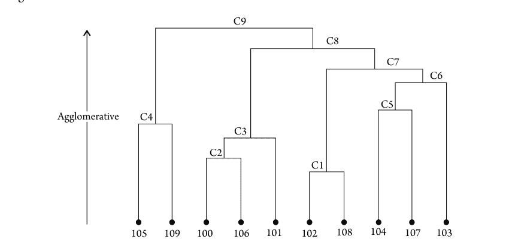

**图12.24** 通过凝聚聚类获得的树状图

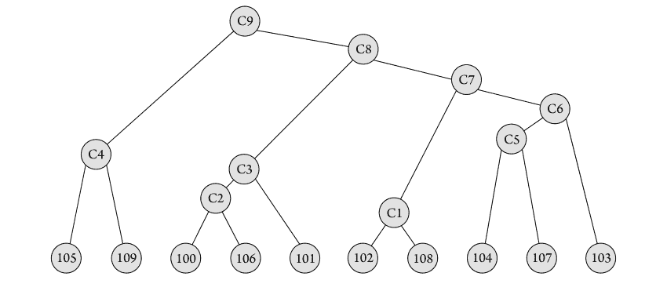

**图12.25** 基于学生考试成绩的聚类层次树

#### 12.7.1.2 凝聚聚类方法的弱点

凝聚聚类方法的主要弱点如下：

-   凝聚聚类的主要缺点是时间复杂度高。凝聚聚类方法的可扩展性较差，因为它们具有至少为O(n²)的高时间复杂度。该算法必须计算n*n个距离，其中n是数据点的数量。
-   没有机制可以撤销先前完成的任务。

### 12.7.2 分裂聚类

分裂聚类遵循自顶向下的方法。正如我们之前讨论的，在这种方法中，所有数据点或观测值最初都存在于单个簇中。该簇基于差异被重复划分，直到所有簇都只有一个实例或数据点。

为了更好地理解该算法的工作原理，请观察图12.26。如第1行所示，所有八个数据点最初都保存在单个簇中。第一次划分后，形成两个簇{a, b, c, d, e}和{f, g, h}，如第2行所示。第二次划分后，形成三个簇{a}、{b, c, d, e}和{f, g, h}，如第3行所示。下一次划分后，形成五个簇{a}、{b, c}、{d, e}、{f, g}和{h}，如第4行所示，最后在第5行，我们最终得到八个簇，每个簇包含单个数据项，如图12.26所示。

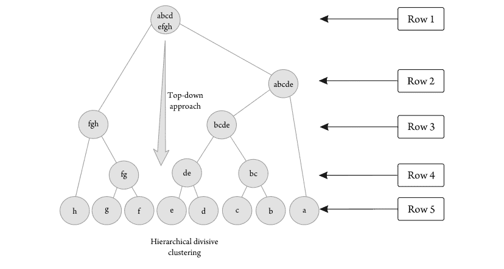

#### 分裂层次聚类示例：

让我们对之前讨论的用于k-means和凝聚聚类的相同数据库应用分裂算法，该数据库包含学生在给定课程中的考试表现。学生在作业、期中测试、实验和期末测试中的表现基于获得的分数再次在表12.49中给出。

##### 表 12.49 学生成绩记录

| RNo | 作业 | 期中测试 | 实验 | 期末测试 |
|---|---|---|---|---|
| 100 | 13 | 24 | 19 | 37 |
| 101 | 11 | 20 | 15 | 39 |
| 102 | 14 | 24 | 16 | 30 |
| 103 | 10 | 19 | 15 | 25 |
| 104 | 9 | 15 | 12 | 30 |
| 105 | 8 | 12 | 9 | 25 |
| 106 | 14 | 22 | 17 | 39 |
| 107 | 11 | 17 | 16 | 30 |
| 108 | 13 | 25 | 15 | 31 |
| 109 | 11 | 14 | 9 | 23 |

##### 步骤 1

距离矩阵的计算方式与凝聚聚类相同，使用曼哈顿距离方法计算簇之间的距离。为了表示方便，学号（RNo）已转换为实例 S1 到 S10。由于距离矩阵的对称性，我们只需表示下三角矩阵，如表 12.50 所示。

你可以参考表 12.32 中给出的计算，以理解创建此距离矩阵所涉及的计算过程。

##### 表 12.50 距离矩阵

| 实例 | S1 | S2 | S3 | S4 | S5 | S6 | S7 | S8 | S9 | S10 |
|---|---|---|---|---|---|---|---|---|---|---|
| S1 | 0 | | | | | | | | | |
| S2 | 12 | 0 | | | | | | | | |
| S3 | 11 | 17 | 0 | | | | | | | |
| S4 | 24 | 16 | 15 | 0 | | | | | | |
| S5 | 27 | 19 | 18 | 13 | 0 | | | | | |
| S6 | 39 | 31 | 30 | 15 | 12 | 0 | | | | |
| S7 | 7 | 7 | 12 | 23 | 26 | 38 | 0 | | | |
| S8 | 19 | 13 | 10 | 9 | 8 | 20 | 18 | 0 | | |
| S9 | 11 | 15 | 4 | 15 | 18 | 30 | 14 | 12 | 0 | |
| S10 | 36 | 28 | 27 | 14 | 13 | 7 | 35 | 17 | 27 | 0 |

##### 步骤 2

选取距离最大的两个对象，即本例中簇 S6 和 S1 之间的 39。现在，这两个对象成为两个新簇的种子记录。根据距离矩阵中的距离，将整个组分成两个簇，如表 12.51 所示。

**表 12.51** 将数据集拆分为两个新簇 C1 和 C2

| | S1 | S2 | S3 | S4 | S5 | S6 | S7 | S8 | S9 | S10 |
|---|---|---|---|---|---|---|---|---|---|---|
| S1，即 C1 | 0 | 12 | 11 | 24 | 27 | 39 | 7 | 19 | 11 | 36 |
| S6，即 C2 | 39 | 31 | 30 | 15 | 12 | 0 | 38 | 20 | 30 | 7 |
| 分配的簇 | C1 | C1 | C1 | C2 | C2 | C2 | C1 | C1 | C1 | C2 |

从该表中观察到：

簇 C1 包括—S1、S2、S3、S7、S8、S9，以及

簇 C2 包括—S4、S5、S6、S10。

由于停止条件尚未满足，我们将拆分较大的簇，即 C1，将其分成更小的簇。此距离矩阵将通过参考表 12.50 为 C1 计算，如表 12.52 所示。

**表 12.52** 簇 C1 的距离矩阵

| | S1 | S2 | S3 | S7 | S8 | S9 |
|---|---|---|---|---|---|---|
| S1 | 0 | | | | | |
| S2 | 12 | 0 | | | | |
| S3 | 11 | 17 | 0 | | | |
| S7 | 7 | 7 | 12 | 0 | | |
| S8 | 19 | 13 | 10 | 18 | 0 | |
| S9 | 11 | 15 | 4 | 14 | 12 | 0 |

由于最大距离是 19，C1 将以 S1 和 S8 为种子进一步拆分。它们成为两个新簇的种子。根据距离矩阵中的距离，将整个组分成这两个簇，如表 12.53 所示。

##### 表 12.53 将簇 C1 拆分为两个新簇 S1 和 S8

| | S1 | S2 | S3 | S7 | S8 | S9 |
|---|---|---|---|---|---|---|
| S1 作为簇 C3 | 0 | 12 | 11 | 7 | 19 | 11 |
| S8 作为簇 C4 | 19 | 13 | 10 | 18 | 0 | 12 |
| 分配的簇 | C3 | C3 | C4 | C3 | C4 | C3 |

簇 C3 包括 S1、S2、S7、S9，簇 C4 包括 S3 和 S8。

我们已经有一个包含四个成员的簇 C2（如表 12.50 所述），其成员包括 S4、S5、S6、S10。我们可以将簇 C2 进一步分成两个簇。

现在，最大的簇，在本例中，是 C2 或 C3（两者都有相同的 4 个成员）。让我们考虑簇 C2（包含 S4、S5、S6、S10）作为进一步拆分的候选。此距离矩阵将通过参考表 12.50 为簇 C2 计算，如表 12.54 所示。

##### 表 12.54 簇 C2 的距离矩阵

| | S4 | S5 | S6 | S10 |
|---|---|---|---|---|
| S4 | 0 | | | |
| S5 | 13 | 0 | | |
| S6 | 15 | 12 | 0 | |
| S10 | 14 | 13 | 7 | 0 |

最大距离是 15；因此，C2 将通过考虑 S4 和 S6 作为进一步拆分的种子，分成两个簇。根据距离矩阵距离将整个组分成这两个簇的结果如表 12.55 所示。

##### 表 12.55 将簇 C2 拆分为两个新簇 S4 和 S6

| | S4 | S5 | S6 | S10 |
|---|---|---|---|---|
| S4 作为簇 C5 | 0 | 13 | 15 | 14 |
| S6 作为簇 C6 | 15 | 12 | 0 | 7 |
| 分配的簇 | C5 | C6 | C6 | C6 |

C5 包括 S4，簇 C6 包括 S5、S6 和 S10。

在簇 C6 中，我们有 3 个成员，我们还有一个簇 C3，包含 4 个成员（S1、S2、S7 和 S9），以及簇 C4 包含 2 个成员（S3 和 S8）。最大的簇是 C3。因此，C3 是进一步拆分的候选。此距离矩阵将通过参考表 12.50 为 C3（包含 S1、S2、S7 和 S9）计算，如表 12.56 所示。

**表 12.56** 簇 C3 的距离矩阵

| | S1 | S2 | S7 | S9 |
|---|---|---|---|---|
| S1 | 0 | | | |
| S2 | 12 | 0 | | |
| S7 | 7 | 7 | 0 | |
| S9 | 11 | 15 | 14 | 0 |

最大距离是 15；因此，C3 将通过考虑 S2 和 S9 作为进一步拆分的种子，分成两个簇。根据距离矩阵距离将整个组分成这两个簇的结果如表 12.57 所示。

**表 12.57** 将簇 C3 拆分为两个新簇 S2 和 S9

| | S1 | S2 | S7 | S9 |
|---|---|---|---|---|
| S2 作为簇 C7 | 12 | 0 | 7 | 15 |
| S9 作为簇 C8 | 11 | 15 | 14 | 0 |
| 分配的簇 | C8 | C7 | C7 | C8 |

簇 C7 包括 S2 和 S7，簇 C8 包括 S1 和 S9。
先前计算的簇 C5 包括 S4；C4 包括 S3 和 S8；簇 C6 包括 S5、S6 和 S10。
最大的簇是 C6。因此，C6 是进一步拆分的候选。C6 的距离矩阵通过参考表 12.50 计算，如表 12.58 所示。

**表 12.58** 簇 C6 的距离矩阵

| | S5 | S6 | S10 |
|---|---|---|---|
| S5 | 0 | | |
| S6 | 12 | 0 | |
| S10 | 13 | 7 | 0 |

最大距离是 S5 和 S10 之间的 13。因此，S5 和 S10 是进一步拆分的种子。根据距离矩阵距离将整个组分成这些簇的结果如表 12.59 所示。

##### 表 12.59 将簇 C6 拆分为两个新簇 S5 和 S10

| | S5 | S6 | S10 |
|---|---|---|---|
| S5 作为簇 C9 | 0 | 12 | 13 |
| S10 作为簇 C10 | 13 | 7 | 0 |
| 分配的簇 | C9 | C10 | C10 |

这里，簇 C9 有 S5，簇 C10 包括 S6 和 S10。
在此阶段，我们有 6 个簇，其详细信息如下所示。
簇 C9：S5。
簇 C10：S6 和 S10。
簇 C7：S2 和 S7。
簇 C8：S1 和 S9。
簇 C5：S4。
簇 C4：S3 和 S8。

由于每个簇中我们只有 1 或 2 个成员，我们将在此停止。此示例的树状图如图 12.27 所示。此数据集的分裂算法的整个过程已以层次树的形式概述，如图 12.28 所示。

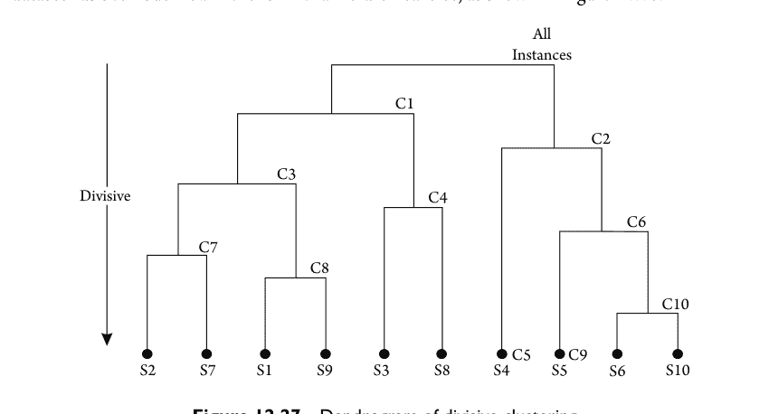

##### 图 12.27 分裂聚类的树状图

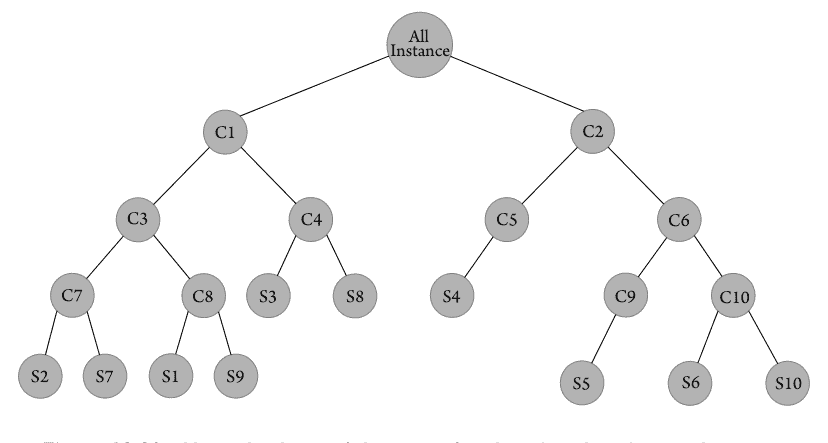

**图 12.28** 基于学生考试成绩的聚类层次树

### 12.7.3 基于密度的聚类

在前面的章节中，我们讨论了基于划分的聚类和层次聚类技术。我们观察到这些技术对正常形状的簇有效。但当数据集包含随机形状的簇或包含噪声/异常值时，基于密度的聚类技术更有效。

例如，考虑图 12.29；这里，通过 k-means 算法进行的聚类效果良好。

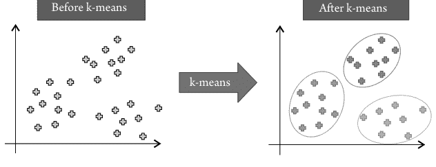

**图 12.29** 使用 k-means 进行聚类

但对于图 12.30 中给出的数据点，这些点要么以任意形状分组，要么包含噪声，k-means 和层次聚类无法正确分类它们。对于此类数据集，基于密度的聚类技术最为适合。

#### 邻域 (ε)

它用于衡量在数据点邻域内定位样本的距离或半径。符号 ε（epsilon）用于表示距离度量。如果两个点之间的距离小于或等于 ε 的阈值，则认为它们是邻居。

#### MinPts

在样本的邻域内形成簇所需的最小数据点数称为 MinPts。

图 12.31 阐明了邻域和 MinPts 的概念。在此图中，ε 表示数据点 *p*、*q* 的邻域距离。这里，MinPts 的阈值为 4。数据点 *p*、*q* 的邻域中分别有 5 个和 4 个样本。圆圈以相应的数据点为中心，表示其邻域。由于阈值 MinPts 为 4，数据点 *p*、*q* 属于一个簇。你还可以观察到数据点 *r* 的邻域中只有 2 个样本。因此，它不属于该簇。

如下所述，基于邻域和 MinPts，数据点被分类为核心点、边界点和离群点。

#### 核心点、边界点和离群点

核心点是指在其半径为 ε 的邻域内至少有 MinPts 个样本的数据点。这些点必须位于簇的内部。

如果一个数据点属于某个核心点的邻域，但其自身邻域内的样本数少于 MinPts，则称为边界点。

如果一个数据点在其邻域内没有至少 MinPts 个样本，并且不属于任何核心点的邻域，则称为离群点。简单来说，如果一个点既不是核心点也不是边界点，它就是离群点或噪声。

在图 12.31 中，点 *p*、*q* 是核心点，点 *s* 是边界点，因为它位于数据点 *p* 的邻域内。点 *r* 是离群点，因为它不在任何核心点的邻域内，并且其邻域内的样本数少于 MinPts。

图 12.32 也说明了核心点、边界点和离群点的概念。在图 12.32 中，MinPts 为 3，邻域由 ε（epsilon）表示。

因此，我们可以得出以下结论。

##### 核心数据点

在距离 ε（epsilon）范围内至少有 MinPts 个点的数据点。

##### 边界数据点

不是核心点，但位于核心点距离 ε 范围内的数据点。

##### 噪声数据点或离群点

既不是核心点也不是边界点的数据点被视为噪声数据点或离群点。

让我们考虑另一个场景来讨论这些点，如图 12.33 所示。这里，MinPts 的阈值为 7，ε 表示邻域。图 12.33(a) 显示了核心数据点。在图 12.33(b) 中，q 是边界数据点（因为其邻域内的点数少于 7），并且它位于核心数据点 p 的邻域内。图 12.33(c) 显示了一个噪声数据点或离群点，它不在任何核心点的邻域内，并且点数少于 7。

#### 可达性与连通性

可达性提供了关于一个样本从另一个样本直接或间接访问的信息。同时，连通性指出任意两个样本是否属于同一个簇。基于可达性和连通性的概念，DBSCAN 中的任意两个样本可以进一步定义为

- 直接密度可达
- 间接密度可达
- 密度相连

##### 直接密度可达

如果满足以下条件，则点 $q$ 从点 $p$ 直接密度可达：

- i. $p$ 是一个核心点，并且
- ii. $q$ 存在于 $p$ 的邻域($\varepsilon$)内。

图 12.34 展示了这个概念。在此图中，MinPts 为 4。点 $p$ 是一个核心点，因为其邻域内有 5 个数据点。由于点 $q$ 的邻域内只有 3 个点，它不是核心点。尽管 $q$ 不是核心点，但它位于核心点 $p$ 的邻域内，即它满足直接密度可达的条件（$p$ 是核心点，$q$ 在 $p$ 的邻域内）。因此，$q$ 从 $p$ 直接密度可达。

现在，让我们思考这个问题。

$p$ 是否从 $q$ 直接密度可达？

由于 $q$ 不是核心点（其邻域内有 3 个数据点），它违反了直接密度可达的第一个条件。所以，$p$ 不是从 $q$ 直接密度可达。因此，我们可以得出结论：密度可达性是直接不对称的。

##### 间接密度可达

间接密度可达的概念基于传递性。如果满足以下条件，则点 $q$ 从点 $r$ 间接密度可达：

- i. 点 $q$ 从点 $p$ 直接密度可达，并且
- ii. 点 $p$ 从点 $r$ 直接密度可达。

这个概念可以借助图 12.35 来解释。如前所述，MinPts 为 4。由于数据点 $p$ 的邻域内有 5 个点，数据点 $r$ 的邻域内也有 5 个点；数据点 $p$ 和 $r$ 都是核心点。由于 $q$ 的邻域内只有 3 个点，它不是核心点。因此，对于图 12.35 中给出的数据集，我们可以得出以下结论。

- i. $p$ 从 $r$ 直接密度可达（因为 $r$ 是核心点，$p$ 存在于 $r$ 的邻域内）。
- ii. $r$ 从 $p$ 直接密度可达（因为 $p$ 是核心点，$r$ 存在于 $p$ 的邻域内）。
- iii. $q$ 从 $p$ 直接密度可达（因为 $p$ 是核心点，$q$ 存在于 $p$ 的邻域内）。
- iv. $p$ 不是从 $q$ 直接密度可达（因为 $q$ 不是核心点，尽管 $p$ 存在于 $q$ 的邻域内）。
- v. 从 i、ii 和 iii，我们可以观察到点 $q$ 从点 $r$ 间接密度可达，即 $r \rightarrow p \rightarrow q$ 形成一条链（因为 $p \rightarrow q$ 且 $r \rightarrow p$）。

从 iii、iv 和 v，同样重要的是要注意间接密度可达的关系不是对称的，即间接密度可达是不对称的。这里，尽管 $q$ 从 $r$ 间接密度可达，但 $r$ 不是从 $q$ 间接密度可达（因为 $q$ 不是核心点）。

需要注意的是，DBSCAN 对簇的定义（即簇被定义为密度相连点的最大集合）是基于密度可达性的概念。

##### 测试你的进度

###### 问题

列出图 12.35 中数据集所有可能的密度可达关系。假设 MinPts 为 7。

###### 解答：

根据图12.35中给出的数据集，我们可以得出以下结论。

- i. 点 $p$ 的邻域内仅有5个数据点。因此，它不是一个核心点。
- ii. 点 $p_2$、$p_1$ 和 $q$ 的邻域内分别有9、10和10个数据点。因此，这些是核心点。
- iii. 点 $p_1$ 从 $q$ 直接密度可达（因为 $q$ 是核心点，且 $p_1$ 在 $q$ 的邻域内），反之亦然（因为 $p_1$ 是核心点，且 $q$ 在 $p_1$ 的邻域内）。
- iv. 点 $p_2$ 从 $p_1$ 直接密度可达（因为 $p_1$ 是核心点，且 $p_2$ 在 $p_1$ 的邻域内），反之亦然（因为 $p_2$ 是核心点，且 $p_1$ 在 $p_2$ 的邻域内）。
- v. 同样，点 $p$ 从点 $p_2$ 直接密度可达（因为 $p_2$ 是核心点，且 $p$ 在 $p_2$ 的邻域内），但反之不成立（因为 $p$ 不是核心点，尽管 $p_2$ 在 $p$ 的邻域内）。
- vi. 由 iii、iv、v 可知，基于传递性，形成了一条间接密度可达链 $q \rightarrow p_1 \rightarrow p_2 \rightarrow p$。
- vii. 由 vi 可知，点 $p$ 从点 $q$ 和 $p_1$ 间接密度可达。
- viii. 点 $q$ 从点 $p$ 不是间接密度可达的，因为 $p$ 不是核心点。如 vii 中所述，$p$ 从 $q$ 间接密度可达。因此，重要的是要注意间接密度可达性不是对称的。
- ix. 点 $q$ 也从 $p_2$ 间接密度可达，但从 $p$ 不可达，因为 $p$ 不是核心点。

##### 密度连接

如果存在一个数据点 $p$，使得数据点 $q$ 和 $r$ 都从 $p$ 密度可达，则数据点 $q$ 与数据点 $r$ 是密度连接的。这在图12.36中进行了解释。

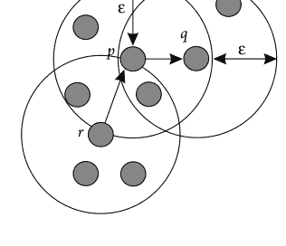

在图12.36中，MinPts为4。我们可以观察到数据点 $q$ 从 $p$ 密度可达，因为 $p$ 是核心点且 $q$ 在 $p$ 的邻域内。类似地，数据点 $r$ 从 $p$ 密度可达，因为 $p$ 是核心点且 $r$ 在 $p$ 的邻域内。因此，数据点 $q$ 与数据点 $r$ 是密度连接的。

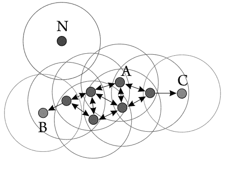

**图12.37** 密度连接示例

在图12.37中，MinPts为3。除B、C和N外，所有高亮显示的数据点都是核心点，因为它们的邻域内至少有3个点。数据点B和C是边界点，因为它们的邻域内有核心点，而数据点N是离群点。

点A和其他高亮显示的数据点（除B、C和N外）是密度可达的，并形成一个簇。点B和C是非核心点，但从点A间接密度可达。因此，数据点B和C是密度连接的。所有密度连接的点共同形成一个簇。这里，点B和C属于高亮显示数据点的簇，因为它们从簇内的点密度可达。N是离群点，它不是密度可达的，因为它不在任何核心点的邻域内。

图12.38中展示了更多DBSCAN的示例。

从可达性和连接性的概念，我们可以得出簇满足两个性质。

- 簇内的所有点都是相互密度连接的。
- 如果簇中的任何点从簇中的任何其他点密度可达，那么它也是簇的一部分。

#### 12.7.3.1 DBSCAN算法

我们已经讨论了与DBSCAN算法相关的所有重要概念。现在，我们已准备好讨论实现DBSCAN的算法。

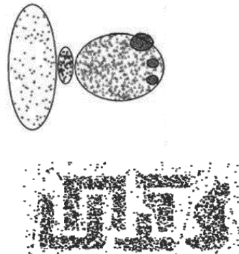

**图12.38** 更多DBSCAN示例

DBSCAN的算法如下。

**DBSCAN算法**

1.  为邻域（$\varepsilon$）和MinPts设置一个值。
2.  从数据集中随机选择一个之前未访问过的数据点，记为 $X$。
3.  找到它的邻居，如果 $X$ 的邻居数大于或等于MinPts，则将 $X$ 添加到簇中。如果 $X$ 的邻居数小于MinPts，则将 $X$ 标记为临时噪声。
4.  从 $X$ 的邻域中取一个点，并对该点重复步骤3和4。
5.  这样，对于 $X$ 邻域中的每个点，其邻域都会被添加到簇中。此过程持续进行，直到没有更多的点可以添加到簇中。

    如果 $X$ 最初被标记为噪声，在此过程之后，如果它存在于其他点的邻域中，它可能成为簇的一部分。
6.  重复步骤2-5，直到数据集中没有未访问的数据点。

#### 12.7.3.2 DBSCAN算法的优点

DBSCAN算法具有以下优点。

- 在DBSCAN中，我们无需事先指定簇的数量。
- 它不依赖于数据库中数据点的排序。它只需要两个参数，即邻域（ε）和MinPts。
- 它可以识别任意形状的簇。它还可以识别被不同簇包围的簇。图12.39展示了DBSCAN如何成功识别不同形状的簇，而k-means则失败。
- DBSCAN对离群点具有鲁棒性，并具有噪声的概念。这有助于异常检测和在数据集中发现噪声等应用。

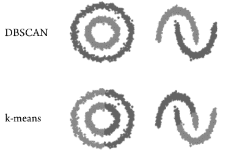

**图12.39** DBSCAN相对于k-means的优势及一些示例

#### 12.7.3.3 DBSCAN算法的缺点

DBSCAN算法具有以下缺点。

- DBSCAN算法对参数邻域（ε）和MinPts敏感。
- DBSCAN算法的质量取决于距离度量，如邻域（ε）和MinPts。
- 在某些情况下，确定ε（epsilon）的值很困难，因为它可能需要领域知识。
- DBSCAN算法无法准确聚类密度变化或密度差异较大的数据集。例如，参见图12.40。这些点的最佳或理想簇形成如图12.40(a)所示。在这种最佳排列中，簇C1、C2和C3的密度差异很大。因此，它们需要不同的epsilon（ε）值。但在DBSCAN中，我们对整个数据集使用一个epsilon值。如果epsilon值较大，例如ε₁，簇C3中的点将被识别为噪声，而C2和C1中的点可能一起形成一个簇，如图12.40(b)所示。类似地，如果epsilon值较小，所有三个簇可能合并形成一个大的簇，如图12.40(c)所示。因此，我们无法实现理想的簇形成。

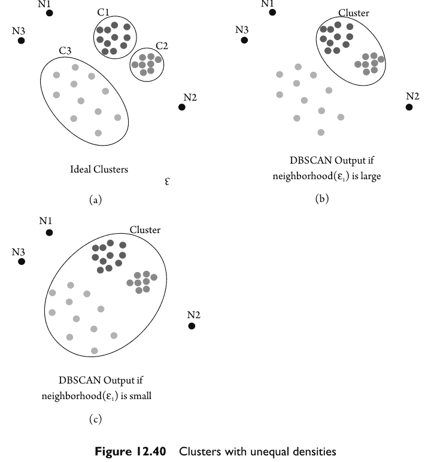

- 另一个密度不均的簇示例如图12.41所示。这里，簇C1密度高，而簇C2密度低。理想的簇形成如图12.41(a)所示。但在DBSCAN中，我们对整个数据集使用一个epsilon值。如果epsilon值较大，它将把簇C2的所有点检测为离群点，如图12.41(b)所示。较低的epsilon值将导致两个簇合并，如图12.41(c)所示。同样，由于簇的密度不同，我们无法获得理想的簇，如前所述，DBSCAN无法处理这种情况。

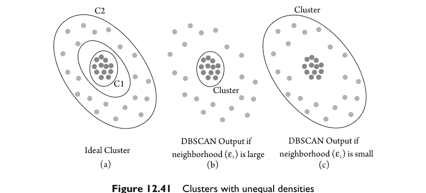

**图12.41** 密度不均的簇

至此，我们结束了对各种聚类技术的讨论，在下一章中，我们将通过各种案例研究来实现这些聚类算法。

#### 提醒我

- 聚类被定义为根据输入数据点的相似性将其分组到不同的簇/类别中。
- 聚类算法最小化簇内距离并最大化簇间距离。
- 距离度量，也称为邻近度量，是一个函数 $d(x, y)$，它将集合元素之间的距离指定为非负实数。
- 聚类算法可以分为五种方法。这些是划分方法、层次方法、基于密度的方法、基于网格的方法和基于模型的方法。
- 在k-means聚类中，输入 $n$ 个对象根据属性被聚类成 $k$ 个簇。这里 $k < n$，$k$ 是一个正整数。
- 在k-means聚类中，如果一个数据点到不同质心的欧几里得距离相等，则将该数据点分配给添加该数据点后方差较小的簇。
- 层次聚类是一种特殊的聚类分析技术，它基于对象之间的相似性构建簇，形成树状结构。它也称为层次聚类分析。
- 层次聚类形成的树状结构称为树状图。
- 层次聚类有两种类型，即凝聚型和分裂型。
- 凝聚型聚类算法使用“自底向上”的方法。它从将每个数据点视为一个单独的簇开始。每个数据点与最近的数据点重复组合，形成更大的簇。此过程持续进行，直到满足停止条件。

## 13 聚类的实现

### 章节目标

- 在Python中实现k-means聚类算法。
- 通过实现其代码来确定理想的聚类数量。
- 理解如何使用图表可视化聚类。
- 创建树状图并找到凝聚层次聚类的最优聚类数量。
- 比较k-means聚类与凝聚层次聚类的结果。
- 通过各种案例研究实现聚类。

### 13.1 k-means聚类与层次聚类的实现

在上一章中，我们讨论了各种聚类算法。我们了解到聚类算法大致分为划分方法、层次方法和基于密度的方法。k-means聚类算法遵循划分方法；凝聚和分裂算法遵循层次方法，而DBSCAN则基于密度的聚类方法。

在本章中，我们将通过遵循逐步方法，考虑各种案例研究来实现这些算法中的每一种。建议您在本章所述的数据库上自行执行所有这些步骤。

k-means算法被认为是一种划分方法和一种无监督机器学习算法，用于识别数据集中数据项的聚类。它是最著名的机器学习算法之一，其在Python中的实现相当直接。本章将考虑三个案例研究，即商场购物客户数据集、美国逮捕数据集和著名的*Iris*数据集。我们将通过这些案例研究理解k-means聚类技术的重要性，以便在Python中实现它。除了数据项的聚类外，我们还将讨论找出*最优聚类数量*的方法。为了比较*k-means*算法的结果，我们还将为这些问题实现*层次聚类*。

我们将使用以下步骤在*Spyder IDE*中启动k-means算法的实现。

- **步骤1：导入库和数据集**—将下载相应案例研究的数据集，然后导入所需的库。
- **步骤2：找到最优聚类数量**—我们将通过肘部法则为给定数据集找到最优聚类数量。
- **步骤3：将k-means拟合到数据集**—将通过在获取的数据集上训练模型来准备一个k-means模型。
- **步骤4：可视化聚类**—然后将以散点图的形式可视化k-means模型形成的聚类。

### 执行层次聚类

- **步骤5：创建树状图并找到最优聚类数量**—使用相同的数据集并继续k-means算法的步骤，将为层次聚类创建一个树状图。该树状图将用于找到水平聚类的最优聚类数量。
- **步骤6：将层次聚类模型拟合到数据集**—对于上一步从树状图中获得的K个最优聚类，将在给定数据集上训练一个凝聚模型。
- **步骤7：可视化不同的聚类**—然后将以散点图的形式可视化凝聚模型形成的聚类。

首先，让我们考虑商场客户的聚类实现。

### 13.2 案例研究I：商场客户聚类

**问题陈述：** 普鲁士商场是美国最大的商场之一。他们每年有数百万的客流量。这个问题是关于根据购物能力将曾在商场购物的客户分成不同的聚类。商场经理希望这样做是为了在商场的零售店定制折扣和优惠。作为机器学习爱好者，您必须帮助经理对客户进行聚类。

**数据集描述：** 表13.1所示实例的数据集是从商场购物数据库中收集的。该数据集包含曾在商场商店购物的客户的详细信息。数据集中包含的详细信息有—*客户ID*、*性别*、*年龄*、*年收入*

---

分裂聚类算法使用“自顶向下”的方法。在这种方法中，所有数据点最初都在一个聚类中。该聚类基于相似性度量被重复划分，直到所有聚类满足某些停止条件或仅包含单个实例。

基于密度的聚类算法的工作原理是，聚类是空间中的密集区域，与其他聚类被较低密度的区域分隔开。

在样本邻域中形成聚类所需的最小数据点数称为MinPts。

邻域表示在半径ε内存在的样本。

核心点是一个在其半径ε的邻域中至少有MinPts个样本的数据点。这些点必须位于聚类的内部。

不是核心点但位于核心点距离ε内的数据点称为边界点。

聚类中的所有点都是相互密度连接的。

如果任何点从聚类中的任何其他点是密度可达的，那么它也将是聚类的一部分。

#### 附加资源

##### 书籍

- Bhatia, Parteek (2019). *数据挖掘与数据仓库：原理与实用技术*. 剑桥大学出版社.
- Ester, Martin 等 (1996). 一种基于密度的算法，用于在大型空间数据库中发现带噪声的聚类. *kdd* 96(34).
- Gupta, G. K. (2014). *数据挖掘案例研究导论*. PHI Learning Pvt. Ltd..
- Han, Jiawei, Pei, Jian, and Kamber, Micheline (2011). *数据挖掘：概念与技术*. Elsevier.
- Mitchell, Tom M. (2017). *机器学习*. McGraw Hill Education.
- Theodoridis, Sergios, and Koutroubas, Konstantinos (2009). *模式识别*. Academic Press.
- Witten, Ian H., Frank, Eibe, Hall, Mark A., and Pal, Christopher J. (2016). *数据挖掘：实用的机器学习工具与技术*. Morgan Kaufmann.

##### 视频链接

- K-Means聚类算法 - 聚类分析 | 机器学习算法 | 数据科学 Edureka, https://www.youtube.com/watch?v=4R8nWDh-wA0
- 层次聚类（凝聚和分裂聚类）, https://www.youtube.com/watch?v=2z5wwyv0Zk4

##### 博客链接

- 聚类简介 https://www.tutorialspoint.com/data_mining/dm_cluster_analysis.htm
- 层次聚类 https://en.wikipedia.org/wiki/Hierarchical_clustering
- 层次聚类方法 http://www.saedsayad.com/clustering.htm
- 数据挖掘 https://blogs.sas.com/content/subconsciousmusings/2016/05/26/data-mining-clustering/
- DBSCAN聚类 – 详解。详细的理论解释和… | by Son Towards Data Science https://towardsdatascience.com/dbscan-clustering-explained-97556a2ad556
- DBSCAN 基于密度的带噪声应用空间聚类 https://www.kdnuggets.com/2020/04/dbscan-clustering-algorithm-machine-learning.html
- DBSCAN聚类轻松解释与实现 https://www.analyticsvidhya.com/blog/2020/09/how-dbscan-clustering-works/

#### 自我检测（问题）

根据本章的学习回答这些问题。

1. 计算以下两个对象之间的曼哈顿距离：
   i. (12, 35) 和 (16, 27)
   ii. (9, 10, 21) 和 (14, 6, 30)
   iii. (20, 16, 14, 8, 12) 和 (13, 25, 20, 6, 19)
2. 计算三个对象 (11, 16, 3, 12), (21, 9, 14, 18), (14, 21, 11, 21) 之间的曼哈顿距离。写下你从这些点之间的曼哈顿距离中得出的观察结果。
3. 计算以下两个对象之间的欧几里得距离：
   i. (18, 12) 和 (15, 6)
   ii. (3, 7, 21) 和 (4, 9, 25)
   iii. (8, 9, 11) 和 (6, 5, 16)
   iv. (10, 12, 14, 19, 2) 和 (11, 22, 12, 16, 5)
4. 用一个例子解释切比雪夫距离。
5. 主要的聚类方法有哪些？解释每一种。
6. 定义划分方法、层次方法和基于密度的聚类方法。
7. 画出k-means算法的流程图。
8. 在k-means算法中，我们如何计算聚类的质心？
9. 使用k-means算法为给定数据集创建三个聚类，以指示所有中间步骤。使用欧几里得距离作为距离度量。

| 食物编号 | 卡路里 | 价格 |
|---|---|---|
| 食物编号1 | 5 | 20 |
| 食物编号2 | 60 | 100 |
| 食物编号3 | 15 | 80 |
| 食物编号4 | 35 | 90 |
| 食物编号5 | 75 | 150 |
| 食物编号6 | 81 | 168 |
| 食物编号7 | 43 | 95 |
| 食物编号8 | 99 | 200 |
| 食物编号9 | 16 | 84 |

10. 聚类中误差平方和的重要性是什么？
11. 写出k-means算法的缺点。
12. 凝聚聚类和分裂聚类有什么区别？
13. 链接度量在层次聚类中的作用是什么？解释所有类型的链接度量。
14. 下面给出了印度城市之间的距离。应用单链接凝聚聚类算法创建两个聚类。指出中间步骤。

| | 巴廷达 | 帕蒂亚拉 | 德里 | 阿姆利则 | 马图拉 |
|---|---|---|---|---|---|
| 巴廷达 | 0 | 190 | 400 | 250 | 460 |
| 帕蒂亚拉 | 190 | 0 | 240 | 225 | 300 |
| 德里 | 400 | 240 | 0 | 450 | 60 |
| 阿姆利则 | 250 | 225 | 450 | 0 | 510 |
| 马图拉 | 460 | 300 | 60 | 510 | 0 |

15. 使用单链接凝聚聚类对以下距离矩阵描述的数据进行分组。

| | 1 | 2 | 3 | 4 |
|---|---|---|---|---|
| 1 | | 19 | 16 | 20 |
| 2 | | | 18 | 8 |
| 3 | | | | 13 |
| 4 | | | | |

16. 使用全链接凝聚聚类解决第15题中的问题。
17. 在分裂层次方法中，我们如何决定接下来要分裂哪个聚类？
18. 用一个例子区分边界点和核心点。
19. 从密度可达性和密度连通性的角度解释DBSCAN。
20. DBSCAN的优点和缺点是什么？为什么它被命名为DBSCAN？

（以千美元计），以及客户的*消费评分*。这里的*消费评分*是一个介于1到100之间的数值，由商场的计费软件分配；该评分代表了基于客户购买历史的消费能力。

本章第一个案例研究中使用的数据集源自Kirill Eremenko及其团队的SuperDataScience数据集。非常感谢SuperDataScience允许我们在本书中使用和引用该数据集。您可以在 https://www.superdatascience.com/pages/machine-learning 找到它。

然而，本章使用的所有代码和数据集均可通过以下链接获取：https://github.com/bhatiaparteek/ml_with_python/tree/main/Chapter_13_Clustering。


## **表 13.1** *商场客户*数据集的一个实例

| 客户ID | 性别 | 年龄 | 年收入（千美元） | 消费评分（1–100） |
| :--- | :--- | :--- | :--- | :--- |
| 1 | 男 | 19 | 15 | 39 |
| 2 | 男 | 21 | 15 | 81 |
| 3 | 女 | 20 | 16 | 6 |
| 4 | 女 | 23 | 16 | 77 |
| 5 | 女 | 31 | 17 | 40 |
| 6 | 女 | 22 | 17 | 76 |
| 7 | 女 | 35 | 18 | 6 |
| 8 | 女 | 23 | 18 | 94 |
| 9 | 男 | 64 | 19 | 3 |
| 10 | 女 | 30 | 19 | 72 |

数据集的第一列是*客户ID*，它描述了分配给光顾商场商店的客户的唯一标识。紧随*客户ID*之后，列出了客户的相应*性别*和*年龄*。最后两个属性是客户的*年收入*和*消费评分*；消费评分是一个介于1到100之间的软件计算值，1对应最低的购物能力，100对应最高的购物能力。客户的*年收入*和*消费评分*是理解客户购物能力最关键的属性，因此，我们将基于这些属性对客户进行聚类。

*k-means*聚类算法是解决此问题的最佳方法。让我们实现该算法来对商场客户进行聚类。

本案例研究的灵感来源于Udemy上的Machine Learning A-Z™: AI, Python & R课程，可在以下网址找到：https://www.udemy.com/course/machinelearning/"。

### 13.2.1 步骤 1：导入库和数据集

实验的第一步是导入所需的库，例如NumPy、Matplotlib和Pandas。NumPy库用于执行数学运算，Matplotlib提供图形和可视化功能，而第三个库Pandas则有助于导入、处理和管理数据集。导入库的代码如下所示。

```
# Importing the libraries
import numpy as np
import matplotlib.pyplot as plt
import pandas as pd
```

执行该代码段后，所有必需的库将被导入到Spyder环境中。接下来，我们将使用Pandas的read_csv()方法（如代码段2所示）将下载的数据集文件MallCustomerDataset.csv加载到Spyder环境中。

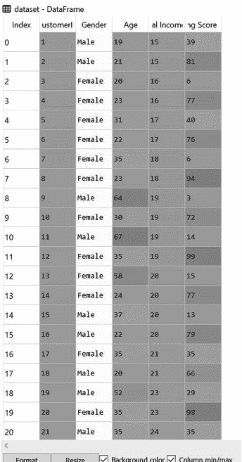

图 13.1 客户数据集

代码段：2

```
# Importing the libraries
dataset = pd.read_csv('MallCustomerDataset.csv')
```

上述代码将把*MallCustomerDataset.csv*读入*dataset*数据框。务必将*.csv*文件复制到当前活动目录中；否则，您必须提供*.csv*文件的完整路径。*dataset*的内容如图13.1所示。*dataset*数据框当前包含分布在五个属性中的数据：*客户ID*、*性别*、*年龄*、*年收入*和*消费评分*。

我们现在将使用`iloc []`构建独立变量*年收入*和*消费评分*，如代码段3所示。由于*年收入*和*消费评分*是第三和第四列索引（第一列的索引值为0），我们将在`iloc []`内传递“; [3,4]”以获取第四和第五列（即*年收入*和*消费评分*）的*所有行*数据，如代码段3所示。

代码段：3

```
X = dataset.iloc[:, [3, 4]].values
```

运行该代码段后，我们将在变量资源管理器选项卡中看到创建的变量*X*。*X*的内容如图13.2所示。

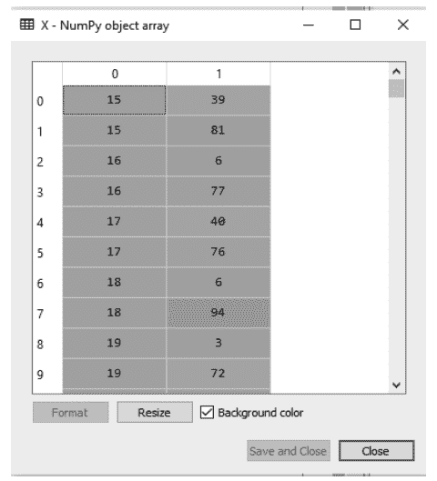

X包含客户的年收入及其相应的消费评分。在下一步中，我们将使用肘部法则计算给定问题的最优聚类数。

## 13.2.2 步骤 2：找到最优聚类数

要将数据集聚类，基本步骤是找到数据将被聚类的*最优聚类数*。为此，我们必须从`sklearn`库导入`k-means`类，然后我们将使用`elbow`方法来找出最优聚类数。

**肘部法则：** 首先，我们假设聚类数*K*在某个范围内。这里，我们假设它在1到10之间。我们从1开始迭代这些*K*值，直到10。对于每个*K*值，我们将应用*k-means*聚类算法，然后计算*簇内平方和总和（wcss）*或*惯性*。最后，我们将计算出的*WCSS*值绘制在Y轴上，将相应的聚类数*K*绘制在X轴上。生成的图看起来像人的手臂肘部。在生成的图中，形成肘部的点是聚类数最优的指标，如图13.3所示。其思想是选择*K*值，使得随着*K*值的增加，*wcss*的下降不再显著。


**图 13.3** 使用肘部法则确定最优聚类数

代码段4用于确定最优聚类数。

```
# Using the elbow method to find the optimal number of clusters
from sklearn.cluster import KMeans
wcss = []
for i in range (1, 11):
    kmeans = KMeans(n_clusters = i, init = 'k-means++', random_state = 0)
    kmeans.fit(X)
    wcss.append(kmeans.inertia_)
```

在上面的代码段中，首先，我们从`sklearn.cluster`导入`KMeans`类，然后创建一个空列表`wcss`。此列表将包含每个*K*值对应的`wcss`或`惯性`。接下来，我们使用`for`循环从1迭代到10（在`range`中，上限被排除，因此`for`循环将从1运行到10）；这些是不同的*K*值；对于每个值，我们将应用k-means算法，然后计算惯性。

我们调用`KMeans()`构造函数来创建其对象。`KMeans()`接受的参数如图13.4所示。它有三个重要参数。第一个是*n_clusters*，即聚类数，设为*i*，因为我们将为从1到10的不同聚类数（*i*）拟合*k-means聚类*。

下一个参数是*init*，用于使用*k-means++*作为初始化方法来初始化随机观测值。

最后，*random_state*被固定为一个整数值。这将保证每次重新运行代码时都生成相同的随机数序列。这有助于验证输出。这里，我们指定了随机数生成的种子数。当我们固定种子数时，它将始终生成相同的随机数序列，但当未固定时，重新运行代码将生成不同的随机数序列。需要注意的是，*random_state = 1*或*random_state = 2*或*3*将返回相同的行为，因为这些只是我们为生成随机数而固定的种子数，每次重新运行都将返回相同的序列，因为此种子数是固定的。

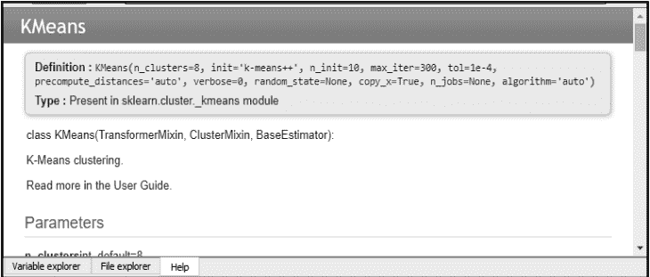

**图 13.4** `KMeans()`构造函数的参数

在代码段4的`for`循环中，还执行了两个操作，即`kmeans.fit(X)`和`wcss.append(kmeans.inertia_)`。

这里，`kmeans.fit(X)`用于将k-means算法拟合到训练数据集，即*X*。

`wcss.append(kmeans.inertia_)`用于将每行的*wcss*（即惯性）追加到*wcss*列表中。这里，使用`KMeans`类的*inertia_*属性来计算*wcss*。

执行代码段4后，我们将在*变量资源管理器*选项卡中获得一个*wcss*列表。我们的下一个任务是生成*肘部图*。我们将绘制*平方距离和*或*wcss*列表的值与相应的*k*（*聚类数*）值的关系图。该图将使用`Matplotlib`库生成。生成*肘部图*的完整代码段在代码段5中给出。

### 代码片段：5

```python
# 生成肘部图
plt.plot(range(1, 11), wcss)
plt.title('The Elbow Method')
plt.xlabel('Number of clusters')
plt.ylabel('WCSS')
plt.show()
```

在代码片段1中，我们已经导入了`matplotlib.pyplot`作为`plt`。在上面的代码片段中，我们使用相同的`plt`调用不同的方法来生成图表。在该代码片段的第一行中，我们向`plot()`方法传递了两个参数。第一个是`range(1, 11)`，表示`k`的可能取值；对应这些取值，我们有列表`wcss`中的距离平方和，它作为第二个参数传入。为了使图表更具描述性，在代码片段5中还为笛卡尔坐标轴分配了标签和标题。最后，`show()`方法在Spyder IDE的Plot选项卡上可视化该图表。

上述讨论代码的输出如图13.5所示。

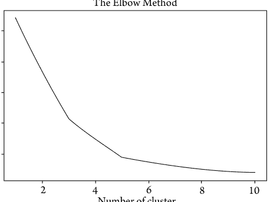

**图13.5** *用于寻找聚类数量的肘部曲线*

该图看起来像一条人的手臂。手臂的肘部将引导我们找到最优聚类数量（k）的值。如图13.6所示，可以在5处找到肘部，因为在5之后，随着K值的增加，wcss的下降并不显著。因此，该数据集的最优聚类数量为5。

在获得最优聚类数量的信息后，我们将在下一步中拟合k-means算法。

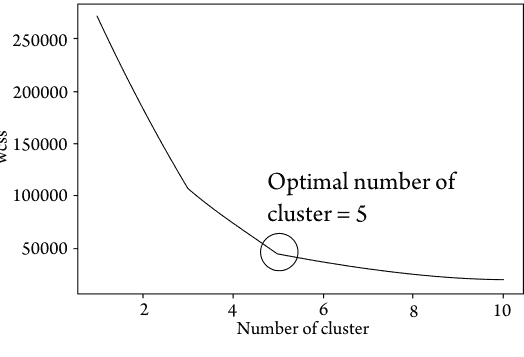

**图13.6** 肘部图中的最优聚类数量

## 13.2.3 步骤3：将k-means拟合到数据集

此步骤将使用`n_clusters`为5（即上一步计算出的最优聚类数量）将K-means算法拟合到我们的数据集。相关代码在下面的代码片段6中给出。

```
代码片段：6

# 将K-Means拟合到数据集
kmeans = KMeans(n_clusters = 5, init = 'k-means++', random_state = 0)
y_kmeans = kmeans.fit_predict(X)
```

在代码片段6中，我们调用`KMeans()`构造函数来准备`kmeans`对象。该函数通过传递`n_clusters = 5`来调用。这是给定问题的最优聚类数量；参数`init`用于使用`k-means++`作为初始化方法来初始化随机观测值。`random_state`被固定为0，以保证每次重新运行代码时生成相同的随机数序列。

一旦`kmeans`对象准备就绪，我们使用该对象调用`predict()`方法，并传递`X`（`X`包含客户的年收入和各自的消费分数），如代码片段6所示。预测值存储在`y_kmeans`中。`y_kmeans`的内容显示了每个数据值被分配到五个聚类（0、1、2、3和4）的情况，如图13.7所示。

图13.8显示了数据集中的记录与其在`y_means`中对应的预测聚类之间的映射关系。

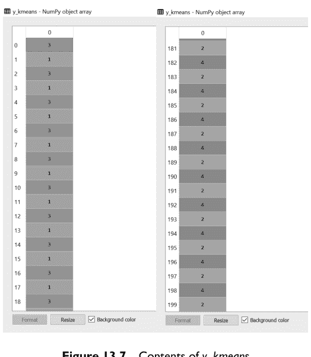

图13.7 y_kmeans的内容

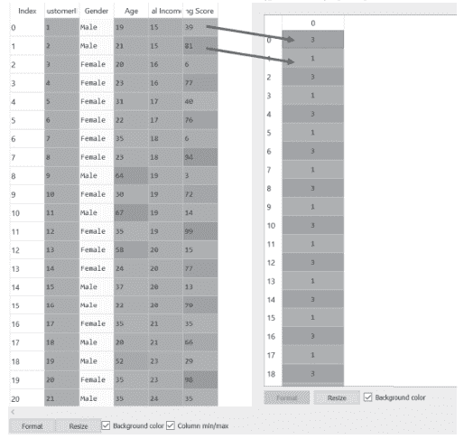

图13.8 将客户信息与其聚类编号进行映射

从图13.8中，我们可以看到第一行（索引0）的客户被映射到聚类编号3。或者，索引1处的客户被分配到聚类编号1。同样，每个客户都被映射到五个聚类中的一个。在接下来的步骤中，我们将可视化这些聚类以便更好地理解。

## 13.2.4 步骤4：可视化聚类

为了可视化聚类，我们必须使用Matplotlib库。我们将创建给定观测值的散点图，并标出各自的质心。使用Matplotlib的`plt.scatter()`将生成此散点图。

相关代码如下。

```python
# 可视化聚类
plt.scatter(X[y_kmeans == 0, 0], X[y_kmeans == 0, 1], s = 100, c = 'red', label = 'Cluster 1')
plt.scatter(X[y_kmeans == 1, 0], X[y_kmeans == 1, 1], s = 100, c = 'blue', label = 'Cluster 2')
plt.scatter(X[y_kmeans == 2, 0], X[y_kmeans == 2, 1], s = 100, c = 'green', label = 'Cluster 3')
plt.scatter(X[y_kmeans == 3, 0], X[y_kmeans == 3, 1], s = 100, c = 'cyan', label = 'Cluster 4')
plt.scatter(X[y_kmeans == 4, 0], X[y_kmeans == 4, 1], s = 100, c = 'magenta', label = 'Cluster 5')
plt.scatter(kmeans.cluster_centers_[:,0], kmeans.cluster_centers_[:, 1], s = 300, c = 'yellow', label = 'Centroids')
plt.title('Clusters of customers')
plt.xlabel('Annual Income (k$)')
plt.ylabel('Spending Score (1-100)')
plt.legend()
plt.show()
```

代码片段7用于创建k-means聚类算法生成的聚类的散点图可视化。该散点图有两个轴，分别代表客户的“年收入（k$）”和“消费分数（1-100）”特征，而不同的聚类则用不同的颜色和标记表示。

前五行代码为五个聚类中的每一个创建了单独的散点图。*X*变量代表客户的特征矩阵，而*y_kmeans*变量代表k-means算法分配的预测聚类标签。

例如，第一行代码为属于第一个聚类（聚类1）的客户创建了一个散点图，其中*X[y_kmeans == 0, 0]*代表聚类1中客户的“年收入（k$）”特征，*X[y_kmeans == 0, 1]*代表聚类1中客户的“消费分数（1-100）”特征。`s`参数将标记大小设置为100，`c`参数将颜色设置为红色，`label`参数将标签设置为“Cluster 1”。

接下来的四行代码使用相同的格式为剩余的三个聚类（聚类2到聚类5）创建散点图。

第六行代码为五个聚类的质心点创建了一个散点图。`kmeans.cluster_centers_`变量代表每个聚类的质心坐标，而[:,0]和[:,1]索引分别代表“年收入（k$）”和“消费分数（1-100）”特征。`s`参数将标记大小设置为300，`c`参数将颜色设置为黄色，`label`参数将标签设置为“Centroids”。

最后几行代码设置了散点图的标题、x轴标签、y轴标签和图例。最后，使用`show()`方法显示图表。`scatter()`方法的详细信息如图13.9所示。

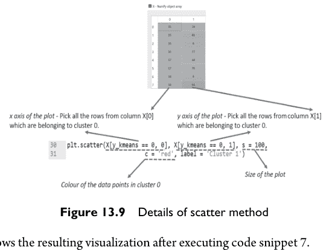

图13.10显示了执行代码片段7后的结果可视化。

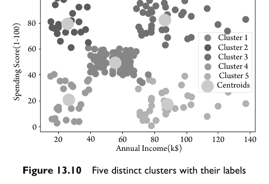

为了更好地理解，为聚类添加了边界以区分它们，如图13.11所示。

这里，我们可以观察到图13.11描绘了五个聚类。属于*聚类4*的客户收入低且消费分数较低，而*聚类2*的客户年收入较低，但消费却更多。同样，我们有*聚类3*和*聚类5*，它们的年收入都很高，但*聚类3*客户的消费分数高于*聚类5*客户。*聚类1*客户表现出平均行为，年收入中等，消费分数也居中。现在，可以根据这些聚类的行为为其分配适当的标签。

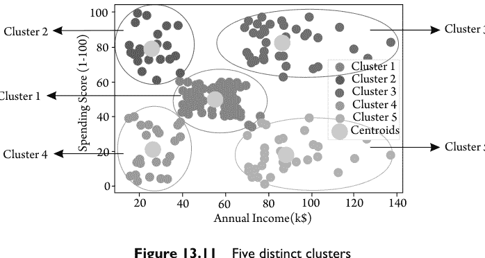

**图13.11** 五个不同的聚类

例如，*聚类1*客户是*标准*客户，*聚类2*客户是*随意型*，*聚类3*客户是*精英型*，*聚类4*客户是*谨慎型买家*，*聚类5*客户是*目标客户*。

这些聚类的信息至关重要，我们可以注意到*聚类5*应该是我们的目标群体，因为该聚类包含富人，但他们在商场的消费非常少。因此，营销团队应通过发起适当的活动来提升该目标聚类客户的消费，从而增加商场的利润。

图13.12使用这些标签可视化了聚类。

至此，我们完成了*k-means*算法在商场客户聚类中的实现。现在，我们将使用*层次模型*对客户进行聚类，然后比较两种模型（*k-means*与*层次聚类模型*）的性能。

在下一节中，我们将开始实现涉及*树状图*的层次聚类，以对客户进行聚类。

## 13.2.5 第五步：创建树状图并确定最佳聚类数

要分析层次聚类模型，需要使用树状图，而绘制树状图则必须使用 `scipy` 库。为此，我们必须导入 `scipy` 的 `scipy.cluster.hierarchy` 模块。导入库后，我们将使用 `dendrogram()` 方法创建一个名为 `dendrogram_obj` 的对象，如代码片段 8 所示。

**代码片段：8**

```python
import scipy.cluster.hierarchy as sch
dendrogram_obj = sch.dendrogram(sch.linkage(X, method = 'ward'))
plt.title('Dendrogram')
plt.xlabel('Customers')
plt.ylabel('Euclidean distances')
plt.show()
```

在此方法中，我们将传入 `sch.linkage(X, method = 'ward')`。其中，`X` 是需要聚类的数据集，聚类方法或技术通过参数 `method='ward'` 来确定。'ward' 是一种聚类技术，它使用最小方差来聚类数据点。

我们还为 X 轴和 Y 轴添加了适当的标题和标签。在 X 轴上，我们表示客户，而 Y 轴上则表示客户之间的距离。因此，Y 轴表示客户对之间的*欧几里得距离*。树状图中连接的高度代表这些点之间的距离。最后，使用 `plt.show()` 来绘制所得数据集的树状图。

图 13.13 可视化了针对给定商场客户聚类问题的最终树状图。

树状图的垂直轴代表聚类之间的欧几里得距离或相异性。水平轴代表聚类中的对象。

### 使用树状图计算最佳聚类数

树状图可以通过观察树状图中高度的最大差异来计算最佳聚类数。

**最大高度差是我们可以在树状图上移动而不触及水平条的最大垂直距离。此最大高度差框中的垂直条数量将是最佳聚类数。**

**图 13.13** 商场客户的树状图

例如，考虑图 13.14 所示的树状图，其中可能存在四种可能的水平方向移动（*用四个框高亮显示*），而不会穿过水平条。具有最大垂直长度的框就是导致最大高度差的所需框。

**图 13.14** 商场客户聚类问题树状图的可能框

可以分析出，如图 13.14 所述，有四个可能的框及其对应的聚类数。在图 13.14 中，我们可以观察到框-1 和框-3 的垂直距离（高度差）非常小。而框-2 和框-4 的高度几乎相同。仔细观察发现，框-4 的高度在所有框中是最高的。因此，我们选择框-4 来确定最佳聚类数。为了确定最佳聚类数，我们将计算框-4 内包含的垂直条数量，从图 13.14 和 13.15 可以注意到，框-4 内包含的垂直条数量为 5。所以，推荐的聚类数应为 5。

因此，使用树状图方法得出商场客户聚类问题的最佳聚类数为 5。

**图 13.15** 具有最大高度差的框内的垂直线总数

## 13.2.6 第六步：在数据集上拟合层次聚类模型

如前一章所述，实现层次聚类有两种方法——*凝聚层次聚类*和*分裂层次聚类*。在*凝聚聚类*中，数据点使用自下而上的方法进行聚类，即我们从单个点开始，然后创建聚类。或者，在*分裂层次聚类*中，采用自上而下的方法，即所有数据点被视为一个大聚类，然后形成更小的聚类。在此实现中，我们将使用*凝聚层次聚类*。

我们将首先从 `scikit-learn` 库导入 `AgglomerativeClustering` 类。然后，我们将使用一些参数调用其构造函数 `AgglomerativeClustering()`，如代码片段 9 所示，通过传入以下参数创建一个对象 `hc`。

第一个参数是 `n_clusters`，用于向算法提供聚类数；在我们的例子中，它是 5（如使用树状图确定）。

第二个参数是*亲和度*，它决定了用于计算聚类内方差的距离度量，对于我们的问题，我们使用了*欧几里得距离*，因此我们将传入 *affinity= 'euclidean'*。

最后一个参数是*链接*，它决定了所使用的聚类技术。对于我们的问题，它是 *ward* 方法（最小方差方法，如前面在代码片段 8 中讨论的）。

现在，使用该对象，我们可以对商场客户进行聚类；为此，我们将传入 X 作为参数调用 `fit_predict()`。因此，代码片段 9 中的最后一行将把我们的聚类模型拟合到商场数据集上，然后将客户聚类为五个不同的组。凝聚聚类的结果存储在变量 *y_hc* 中。

此步骤的完整代码在代码片段 9 中给出。

```python
# 在数据集上训练层次聚类模型
from sklearn.cluster import AgglomerativeClustering
hc = AgglomerativeClustering(n_clusters = 5, affinity = 'euclidean', linkage = 'ward')
y_hc = hc.fit_predict(X)
```

通过在变量资源管理器选项卡中双击变量 *y_hc*，你可以查看 *y_hc* 的内容，以获取分配给每个客户的聚类信息，如图 13.16 所示。但是，你也可以使用 `print()` 方法打印其值，如代码片段 10 所示。

```python
print(y_hc)
```

执行上述代码片段后，分配给 200 个客户的聚类将直接显示在控制台上，如图 13.16 所示。

图 13.17 显示了客户到这些聚类的映射。你可以看到，索引值为 0 的第一个客户被分配到*聚类 4*；同样，第二个客户被分配到*聚类 3*，依此类推。因此，对应于每个客户，我们在 *y_hc* 中都有一个聚类编号。

我们的模型已成功将客户聚类为五个不同的组。在下一步中，我们将对聚类进行可视化。

## 13.2.7 第七步：可视化不同的聚类

为了说明在*商场客户*数据集上执行的凝聚聚类结果，我们将使用与可视化*k-均值聚类*结果相同的可视化方法。因此，我们将重新运行代码片段 6 并进行轻微修改。我们将使用 *y_hc* 代替 *y_kmeans*，因为这次聚类结果存储在 *y_hc* 中（之前，在*k-均值聚类*的情况下，它们存储在 *y_kmeans* 中）。此外，我们还移除了突出显示质心的代码。为凝聚聚类绘制质心是一项单独的任务，涉及使用 *sklearn.neighbors.nearest_centroid* 的 *NearestCentroid*（如代码片段 12 所示）。代码片段 11 提供了可视化不同聚类的代码。结果图如图 13.18 所示。

```python
# 可视化聚类
plt.scatter(X[y_hc == 0, 0] , X[y_hc == 0, 1], s = 100, c = 'red', label = 'Cluster 1')
plt.scatter(X[y_hc == 1, 0] , X[y_hc == 1, 1], s = 100, c = 'blue', label = 'Cluster 2')
plt.scatter(X[y_hc == 2, 0] , X[y_hc == 2, 1], s = 100, c = 'green', label = 'Cluster 3')
plt.scatter(X[y_hc == 3, 0] , X[y_hc == 3, 1], s = 100, c = 'green', label = 'Cluster 4')
```plt.scatter(X[y_hc == 4, 0] , X[y_hc == 4, 1], s = 100, \
            c = 'magenta', label = 'Cluster 5')
plt.title('客户聚类结果（凝聚型）')
plt.xlabel('年收入（千美元）')
plt.ylabel('消费评分（1-100）')
plt.legend()
plt.show()

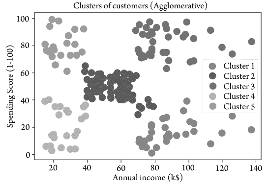

**图 13.18** 凝聚型聚类结果

代码片段 12 提供了可视化凝聚型聚类中心的代码，其绘图结果如图 13.19 所示。

代码片段：12

```
# 可视化聚类结果
plt.scatter(X[y_hc == 0, 0] , X[y_hc == 0, 1], s = 100, \
            c = 'red', label = 'Cluster 1')
plt.scatter(X[y_hc == 1, 0] , X[y_hc == 1, 1], s = 100, \
            c = 'blue', label = 'Cluster 2')
plt.scatter(X[y_hc == 2, 0] , X[y_hc == 2, 1], s = 100, \
            c = 'green', label = 'Cluster 3')
plt.scatter(X[y_hc == 3, 0] , X[y_hc == 3, 1], s = 100, \
            c = 'cyan', label = 'Cluster 4')
plt.scatter(X[y_hc == 4, 0] , X[y_hc == 4, 1], s = 100, \
            c = 'magenta', label = 'Cluster 5')
from sklearn.neighbors import NearestCentroid
clf = NearestCentroid()
clf.fit(X, y_hc)
```

plt.scatter(clf.centroids_[:, 0], clf.centroids_[:, 1], s = 300, \
          c = 'yellow', label = 'Centroids')
plt.title('客户聚类结果（凝聚型）')
plt.xlabel('年收入（千美元）')
plt.ylabel('消费评分（1-100）')
plt.legend()
plt.show()
# \ 表示代码在下一行继续

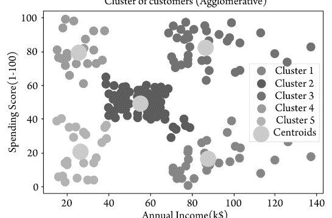

**图 13.19** 聚类及其各自的中心

在代码片段 12 中，代码的前五行用于根据层次聚类算法获得的聚类分配绘制数据点的散点图。变量 X 包含数据点的特征，y_hc 包含每个数据点的聚类分配。

表达式 `X[y_hc == 0, 0]` 选择所有 `y_hc` 等于 0 的行（即聚类 1 中的所有样本），然后选择这些行的第一列（即聚类 1 中所有样本的第一个特征）。类似地，表达式 `X[y_hc == 0, 1]` 选择所有 `y_hc` 等于 0 的行（即聚类 1 中的所有样本），然后选择这些行的第二列（即聚类 1 中所有样本的第二个特征）。同样地，它为每个聚类选择所需的数据。

散点图使用 Matplotlib 库的 `plt.scatter()` 函数创建，其中 `s` 设置标记的大小，`c` 设置标记的颜色，`label` 设置相应聚类的标签。

接下来的三行代码从 Scikit-learn 的 neighbors 模块导入 `NearestCentroid` 类，创建一个 `NearestCentroid` 分类器的实例，并将分类器拟合到数据 `X` 和聚类分配 `y_hc`。`NearestCentroid` 分类器是一种基于每个类中心的简单分类算法。

代码的下一行用于绘制从 `NearestCentroid` 分类器获得的每个聚类的中心。`clf.centroids_` 属性包含每个聚类的中心坐标，使用 `plt.scatter()` 函数绘制。中心标记被设置为更大的尺寸和黄色。

代码的最后四行用于为绘图添加标题和标签，并使用 `plt.show()` 函数显示绘图。

可以注意到，凝聚型聚类的结果与之前讨论的 k-means 算法相同。我们获得了与 k-means 算法情况下相同的聚类。这完成了我们对*凝聚型*或*层次聚类*的讨论。使用这些算法创建的聚类可以提供给商场经理，他们可以进一步与营销团队沟通，并为每个聚类发起适当的活动。这肯定会提高客户的消费评分，并使商场成为盈利的企业。

让我们考虑另一个案例研究，即美国逮捕数据集，以实现 k-means 和凝聚型聚类。

## 13.3 案例研究 II：美国逮捕数据集

**问题陈述：** 美国犯罪部门提供了美国 50 个州的犯罪数据集。让我们对数据进行聚类分析，根据犯罪率对美国各州进行聚类。

**数据集描述：** 所需数据集如表 13.2 所示，包含 1973 年美国 50 个州因袭击、谋杀和强奸等犯罪而被捕的统计数据。数据集有五列——*州*、*谋杀*、*袭击*、*强奸*（这些列中的条目是每 10 万居民的被捕人数），以及 *UrbanPop*，它表示城市人口的百分比。

让我们首先使用以下链接从 GitHub 下载数据集：https://github.com/bhatiaparteek/ml_with_python/tree/main/Chapter_13_Clustering


**表 13.2** *US_Arrests* 数据集的一个实例

| 州 | 谋杀 | 袭击 | 城市人口 | 强奸 |
| :--- | :--- | :--- | :--- | :--- |
| Alabama | 13.2 | 236 | 58 | 21.2 |
| Alaska | 10 | 263 | 48 | 44.5 |
| Arizona | 8.1 | 294 | 80 | 31 |
| Arkansas | 8.8 | 190 | 50 | 19.5 |
| California | 9 | 276 | 91 | 40.6 |
| Colorado | 7.9 | 204 | 78 | 38.7 |
| Connecticut | 3.3 | 110 | 77 | 11.1 |
| Delaware | 5.9 | 238 | 72 | 15.8 |
| Florida | 15.4 | 335 | 80 | 31.9 |

我们将为给定的数据集实现 *k-means* 聚类算法，然后将我们的结果与*凝聚型聚类*进行比较。我们将遵循与前面案例研究中相同的步骤。

### 13.3.1 步骤 1：导入库和数据集

第一步是为我们的实现导入所需的库，如代码片段 13 所示。

```
# 导入库
import numpy as np
import matplotlib.pyplot as plt
import pandas as pd
```

执行代码片段后，所有必需的库将被导入到 Spyder 环境中。接下来，我们将使用以下代码片段将下载的数据集文件 USAarrests.csv 加载到 Spyder 环境中。

```
# 导入库
dataset = pd.read_csv('USAarrests.csv')
```

一旦数据集被读取，我们将继续创建变量 X 以对此数据集进行聚类。需要注意的是，这里第一列（索引为 0 的列）是州，我们不应使用此列来聚类数据集，因为我们希望纯粹基于各种犯罪的逮捕情况及其人口进行聚类。州的名称不应影响我们的聚类。因此，为了创建 X，我们考虑索引值从 1 到 5 的列（因为上限值将被排除），如代码片段 15 所示。

```
X = dataset.iloc[:, 1: 5].values
```

上述代码片段从索引为 1、2、3 和 4 的列中提取所有行。执行代码片段后，我们将在变量资源管理器选项卡中获得变量 X。图 13.20 显示了 X 的内容。

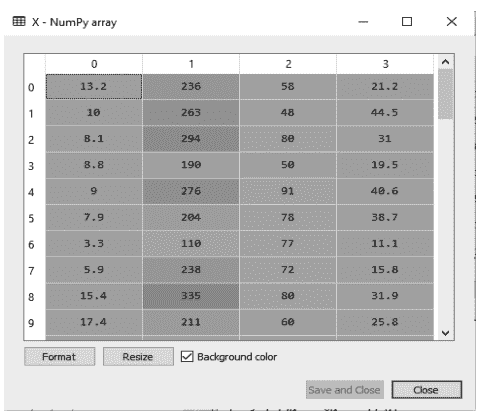

**图 13.20** X 的内容

### 13.3.2 步骤 2：找到最佳聚类数

第 13.2.2 节讨论了一种称为*肘部法则*的方法来找到*最佳聚类数*。我们将使用相同的方法来计算给定数据集的*最佳聚类数*。生成肘部图的代码保持不变，如代码片段 16 所示。

*代码片段：16*

```
# 使用肘部法则找到最佳聚类数
from sklearn.cluster import KMeans
wcss = []
for i in range (1, 11):
    kmeans = KMeans(n_clusters = i, init = 'k-means++', \
                    random_state = 0)
    kmeans.fit(X)
    wcss.append(kmeans.inertia_)
plt.plot(range (1, 11), wcss)
plt.title('肘部法则')
plt.xlabel('聚类数')
plt.ylabel('WCSS')
plt.show()
```

对于给定的数据集，生成的*肘部图*如图 13.21 所示。

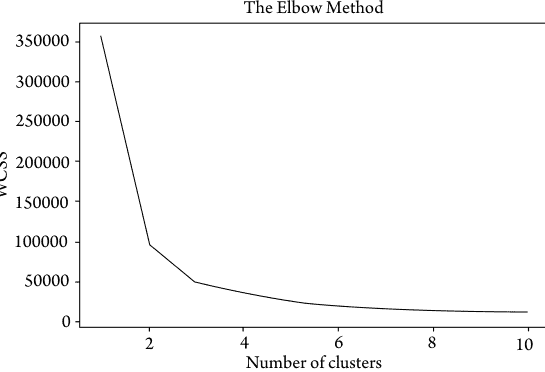

**图 13.21** 美国逮捕数据集的肘部图

从图 13.21 中，可以识别出在 *k* = 3 时形成肘部，因此在这种情况下，最佳聚类数是 3。这给出了 *n_clusters* 参数的值为 3。

### 13.3.3 步骤 3：将 k-means 拟合到数据集

我们已经为给定问题获得了最佳聚类数为 3。现在，我们将准备一个具有 3 个聚类的 *k-means* 模型，然后将模型拟合到我们的数据 *X* 中。为此，我们将使用代码片段 17。

*代码片段：17*

```
# 将 k-means 拟合到数据集
kmeans = KMeans(n_clusters = 3, init = 'k-means++', \
               random_state = 0)
y_kmeans = kmeans.fit_predict(X)
```

这与我们在第 13.2.3 节中编写的代码类似；唯一的区别在于 *n_clusters* 的值（之前是 5，现在是 3）。此外，50 个美国州中每个州的聚类预测存储在 *y_kmeans* 中。图 13.22 列出了 *y_kmeans* 的内容，美国各州与其各自聚类之间的映射如图 13.23 所示。

**图 13.22** *y_means* 变量的前10行和后10行

在图 13.23 中，你可以注意到 *Alabama, Alaska, Arizona* 以及许多其他州被归入了 *Cluster 1*。*Hawaii, Idaho, Kansas* 以及其他州则被分组到 *Cluster 0* 中。同样地，你可以将每个州与其对应的聚类编号进行映射。

**图 13.23** 美国各州与其各自聚类编号的映射数据

## 13.3.4 步骤 4：可视化聚类

*k-means* 模型将数据集聚类为三个不同的组或簇。现在，我们将创建一个散点图来可视化这些聚类。聚类可视化的代码在代码片段 18 中给出。

代码片段：18

```
# Visualizing the clusters
plt.scatter(X[y_kmeans == 0, 0] , X[y_kmeans == 0, 1], s = 100,
           c = 'red', label = 'Cluster 1')
plt.scatter(X[y_kmeans == 1, 0] , X[y_kmeans == 1, 1], s = 100,
           c = 'blue', label = 'Cluster 2')
plt.scatter(X[y_kmeans == 2, 0] , X[y_kmeans == 2, 1], s = 100,
           c = 'green', label = 'Cluster 3')
plt.scatter(kmeans.cluster_centers_[:,0], kmeans.cluster_centers_[:, 1], s = 300, c = 'yellow', label = 'Centroids')
plt.title('Clusters of US States')
plt.xlabel('Murder')
plt.ylabel('Assault')
plt.legend()
plt.show()
# \ indicates that the code continues on the next line
```

在代码片段 18 中，$X[y\_kmeans == 0, 0]$ 表示属于第一个聚类的数据点的 $X$ 的第一个特征值（即 $X$ 的第一列值），其中 $y\_kmeans == 0$ 筛选出属于第一个聚类的数据点，而 0 选择了 $X$ 的第一列。

类似地，$X[y\_kmeans == 0, 1]$ 表示属于第一个聚类的数据点的 $X$ 的第二个特征值（即 $X$ 的第二列值），其中 $y\_kmeans == 0$ 筛选出属于第一个聚类的数据点，而 1 选择了 $X$ 的第二列。

因此，plt.scatter($X[y\_kmeans == 0, 0]$, $X[y\_kmeans == 0, 1]$, $s = 100$, $c = 'red'$, label = 'Cluster 1') 在散点图中绘制属于第一个聚类的数据点，其中 $x$ 轴代表第一个聚类中数据点的 $X$ 的第一个特征值，$y$ 轴代表第一个聚类中数据点的 $X$ 的第二个特征值。数据点以红色绘制，并带有标签“Cluster 1”。

同样地，所有数据点都为每个聚类进行了散点绘制。

在代码中，`kmeans.cluster_centers_` 表示算法识别出的聚类质心的坐标。`plt.scatter()` 函数用于创建数据点的散点图，其中 $x$ 和 $y$ 坐标分别指定为 `kmeans.cluster_centers_[:, 0]` 和 `kmeans.cluster_centers_[:, 1]`。$s$ 参数指定标记的大小，$c$ 将标记的颜色设置为黄色。label 参数为绘图添加标签，以表明这些是质心。

执行代码片段 18 后，我们得到如图 13.24 所示的散点图。该图基于给定数据集的 *Murder* 和 *Assault* 列可视化了聚类。

**图 13.24** 美国各州被聚类为三个不同的组（或簇）

图 13.24 基于 *Murder* 和 *Assault* 可视化了各州的聚类。基于这两种犯罪，我们将解释该州聚类是否适合居住。这里，属于 *Cluster 1* 的州 *Murder* 和 *Assault* 率较低。因此，这些可以被视为 *安全区*。或者，*Cluster 2* 的州 *Murder* 和 *Assault* 率较高。因此，这些州形成了一个需要严格执行规则的 *危险区*。介于这两个聚类之间，我们有属于 *Cluster 3* 的州；这些州的 *Murder* 和 *Assault* 率处于平均水平，我们可以将其标记为 *中等区*。基于我们的分类，如果我们更改绘图的标签，我们将得到如图 13.25 所示的绘图。

由于我们已经在数据集上实现了 k-means 算法，我们现在将在同一数据集上实现层次聚类。接下来，我们将使用树状图方法来确定层次聚类的最佳聚类数。

**图 13.25** *美国各州*聚类的标签

## 13.3.5 步骤 5：创建树状图并找到最佳聚类数

让我们为给定的数据集生成树状图并确定最佳聚类数。为了绘制树状图，我们将使用下面所示的代码片段 19。

```python
import scipy.cluster.hierarchy as sch
dendrogram_obj = sch.dendrogram(sch.linkage(X, method = 'ward'))
plt.title('Dendrogram')
plt.xlabel('Customers')
plt.ylabel('Euclidean distances')
plt.show()
```

执行代码片段 19 后将生成树状图，如图 13.26 所示。

如图 13.26 中的树状图所示，我们可以识别出 *Box 1* 导致了最大的高度差。并且，由于 *Box 1* 内的垂直线数量为 2，我们可以发现 *凝聚聚类的最佳聚类数* 为 2。

需要注意的是，对于同一数据集，我们在 k-means 算法中选择了聚类数为 3。但是，在树状图中，对于凝聚聚类，我们得到的最佳聚类数为 2。参考图 13.21 中给出的肘部图，可以注意到我们也可以选择肘部形成点为 2。肘部法通常用于确定 k-means 算法中的最佳聚类数。对于凝聚聚类，建议选择不接触任何水平条的最高高度的框。然而，这些只是建议，应该尝试不同的选项来分析算法的行为以及不同聚类数下的数据聚类，以获得更好的结果和分析。

**图 13.26** 美国逮捕数据集的树状图

## 13.3.6 步骤 6：在数据集上拟合层次聚类模型

让我们继续在数据集上拟合一个凝聚聚类模型。相应的代码片段如下所示。

```python
# Training the hierarchical clustering model on the dataset
from sklearn.cluster import AgglomerativeClustering
hc = AgglomerativeClustering(n_clusters = 2, affinity = 'euclidean', linkage = 'ward')
y_hc = hc.fit_predict(X)

print(y_hc)
```

## 13.3.7 步骤 7：可视化不同的聚类

代码片段 21 用于可视化聚类。

```python
# Creation and fitting of a nearest centroid classifier over the dataset
from sklearn.neighbors import NearestCentroid
clf = NearestCentroid()
clf.fit(X, y_hc)

# Visualizing the clusters with centroids
plt.scatter(X[y_hc == 0, 0] , X[y_hc == 0, 1], s = 100,
c = 'red', label = 'Cluster 1')
plt.scatter(X[y_hc == 1, 0] , X[y_hc == 1, 1], s = 100,
c = 'blue', label = 'Cluster 2')
plt.scatter(clf.centroids_[:, 0], clf.centroids_[:, 1], s =300,
c = 'yellow', label = 'Centroids')
plt.title('Clusters of US States - Agglomerative clustering')
plt.xlabel('Murder')
plt.ylabel('Assault')
plt.legend()
plt.show()
```

早些时候，我们在第 13.2.8 节中使用了相同的代码；这里，我们只是将 *n_clusters* 参数更改为 2，因为图 13.26 中的树状图已确定最佳聚类数为 2。代码片段 21 产生的可视化结果如图 13.27 所示。

**图 13.27** 凝聚聚类算法形成的聚类

因此，对于 *美国逮捕* 的同一问题，*凝聚聚类* 产生了两个聚类——一个在 *危险区*（Cluster 2），另一个在 *安全区*（Cluster 1）。在下一节中，我们将实现 *k-means 算法* 来对 *鸢尾花数据集* 进行聚类。

## 13.4 案例研究 III：鸢尾花数据集

**问题陈述：** *鸢尾花数据集* 是机器学习中最流行的数据集之一。这个带标签的数据集包含来自三种 *鸢尾花* 物种（*Iris setosa*, *Iris virginica*, 和 *Iris versicolor*）各 50 个样本。你的任务是通过对数据集聚类来验证 *鸢尾花数据集* 中的类别数量，即识别鸢尾花数据集中的最佳聚类数，并可视化 *k-means 算法* 产生的聚类。

**数据集描述：** *鸢尾花数据集* 的一个实例如表 13.3 所示。*鸢尾花数据集* 包含 150 条记录，分布在五列中——*Petal Length*, *Petal Width*, *Sepal Length*, *Sepal Width* 和 *Species*。基于这些属性，花朵被分为三个 *物种*：*Iris setosa*, *Iris virginica* 和 *Iris versicolor*。在本实验中，我们将使用不带 *Species* 标签的数据集，因为聚类需要非标签数据。因此，我们必须只选择输入属性，即 *Sepal Length*, *Sepal Width*, *Petal Length* 和 *Petal Width*，来对这个数据集进行聚类。选择这些属性后，我们将应用 *k-means 聚类算法* 来聚类花朵记录。最后，我们将用数据集的原始标签来验证我们的聚类结果。

表 13.3 *鸢尾花数据集*

| Id | Sepal Length (cm) | Sepal Width (cm) | Petal Length (cm) | Petal Width (cm) | Species |
|---|---|---|---|---|---|
| 1 | 5.1 | 3.5 | 1.4 | 0.2 | Iris setosa |
| 2 | 4.9 | 3 | 1.4 | 0.2 | Iris setosa |
| 3 | 4.7 | 3.2 | 1.3 | 0.2 | Iris setosa |
| 4 | 4.6 | 3.1 | 1.5 | 0.2 | Iris setosa |
| 5 | 5 | 3.6 | 1.4 | 0.2 | Iris setosa |
| 6 | 5.4 | 3.9 | 1.7 | 0.4 | Iris setosa |
| 7 | 4.6 | 3.4 | 1.4 | 0.3 | Iris setosa |
| 8 | 5 | 3.4 | 1.5 | 0.2 | Iris setosa |
| 9 | 4.4 | 2.9 | 1.4 | 0.2 | Iris setosa |
| 10 | 4.9 | 3.1 | 1.5 | 0.1 | Iris setosa |

该数据集可以从以下链接下载：https://www.kaggle.com/datasets/uciml/iris。
或者，你可以按照下面的步骤 1 从 scikit-learn 导入数据集。

### 13.4.1 步骤一：导入库和数据集

Fisher Iris 数据集也作为 sklearn 的内置数据集提供。本实现将讨论如何使用 sklearn 库导入标准内置数据集。

代码片段 22 将指导你完成导入所需库和数据集的代码。

```python
# Importing the libraries
import numpy as np
import matplotlib.pyplot as plt
import pandas as pd
from sklearn import datasets
# Importing the libraries
dataset = datasets.load_iris()
X = dataset['data']
```

我们正在从 sklearn 导入内置数据集，导入后，我们使用其方法 `load_iris()` 将 Iris 数据集加载到字典对象 `dataset` 中。该字典对象的描述如图 13.28 所示，你可以通过在变量浏览器中双击数据集对象来获取。

根据图 13.28 中给出的详细信息，你可以注意到，输入属性的内容可以通过使用键 `data` 来获取。类属性值可以使用键 `target` 获取，而与类属性值对应的标签名称可以使用键 `target_names` 获取。所有列名可以使用键 `feature_names` 获取，而键 `filename` 提供路径，键 `DESCR` 描述数据库。我们关注的是输入属性的值，因此我们将使用键 "data" 来提取变量 X 中的值。X 的内容如图 13.29 所示。

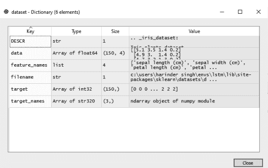

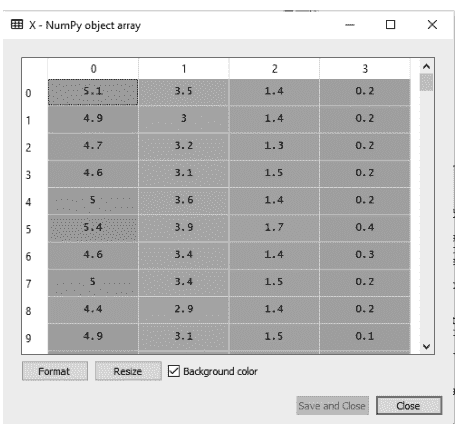

**图 13.29** X 的内容

## 13.4.2 步骤二：确定最佳聚类数

让我们使用 *肘部法则* 来确定 *Iris 数据集* 的最佳聚类数。计算 *最佳聚类数* 的代码在代码片段 23 中给出，这与之前在第 13.2.2 节中讨论的相同。

*代码片段：23*

```python
# Using the elbow method to find the optimal number of clusters
from sklearn.cluster import KMeans
wcss = []
for i in range (1, 11):
    kmeans = KMeans(n_clusters = i, init = 'k-means++',
                    random_state = 0)
    kmeans.fit(X)
    wcss.append(kmeans.inertia_)
plt.plot(range (1, 11), wcss)
plt.title('The Elbow Method')
plt.xlabel('Number of clusters')
plt.ylabel('WCSS')
plt.show()
```

得到的肘部图如图 13.30 所示。

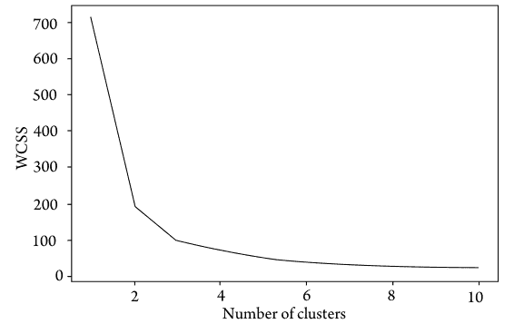

**图 13.30** *Iris* 数据集的肘部图

根据图 13.30，最佳聚类数为 3。这与 *Iris* 数据集中的类别数量一致，因为 Iris 数据集有 3 个物种，而这里我们也发现 3 是最佳聚类数。

## 13.4.3 步骤三：将 k-means 拟合到数据集

在这一步中，我们将创建一个 *k-means 聚类模型*，然后将其拟合到给定的数据集中，如代码片段 24 所示。

代码片段：24

```python
# Fitting K-Means to the dataset
kmeans = KMeans(n_clusters = 3, init = 'k-means++',
              random_state = 0)
y_kmeans = kmeans.fit_predict(X)
```

这与我们之前在 *商场客户聚类* 和 *美国犯罪数据* 案例中使用的代码相同。150 条花卉记录的聚类预测结果存储在 *y_kmeans* 中。图 13.31 列出了 *y_kmeans* 的内容，花卉记录与其各自聚类之间的映射关系如图 13.32 所示。

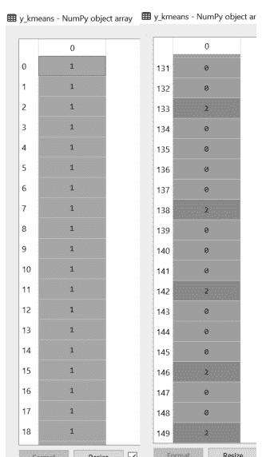

图 13.31 y_kmeans 变量的前 10 行和后 10 行（Iris 数据集）

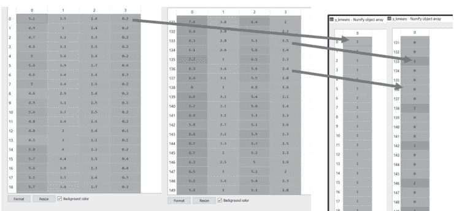

图 13.32 花卉数据与其各自聚类编号的映射

在图 13.32 中，索引 0 处的记录 1 属于聚类 1，同样地，你可以找到每条记录对应的聚类编号。

## 13.4.4 步骤四：可视化聚类

可视化聚类的代码在代码片段 25 中给出。它与我们之前案例研究中使用的代码相同。

代码片段：25

```python
# Visualizing the clusters
plt.scatter(X[y_kmeans == 0, 0] , X[y_kmeans == 0, 1], s = 100,
           c = 'red', label = 'Cluster 1')
plt.scatter(X[y_kmeans == 1, 0] , X[y_kmeans == 1, 1], s = 100,
           c = 'blue', label = 'Cluster 2')
plt.scatter(X[y_kmeans == 2, 0] , X[y_kmeans == 2, 1], s = 100,
           c = 'green', label = 'Cluster 3')
plt.scatter(kmeans.cluster_centers_[:,0], kmeans.cluster_
centers_[:, 1], s = 300, c = 'yellow', label = 'Centroids')
plt.title('Clusters of Iris Flowers')
plt.xlabel('Sepal Length')
plt.ylabel('Sepal Width')
plt.legend()
plt.show()
```

得到的散点图如图 13.33 所示。

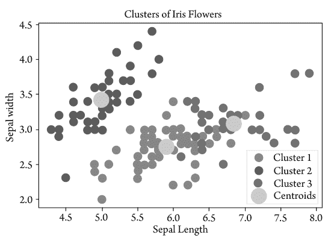

图 13.33 Iris 数据集的三个聚类

在图 13.33 中，为 150 个 Iris 花卉样本创建了三个不同的聚类。中等的是聚类 1，具有平均的花萼长度和花萼宽度。具有平均花萼长度和花萼宽度值的花卉属于 Iris versicolor。因此，聚类 1 可以标记为 Iris versicolor，如图 13.34 所示。

属于聚类 2 的花卉具有比其他聚类花卉更高的花萼宽度和更小的花萼长度。具有较大花萼宽度的花卉属于 Iris setosa。因此，我们可以将聚类 2 标记为 Iris setosa。

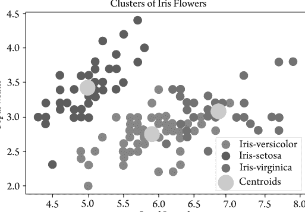

**图 13.34** *Iris* 数据集的已标记聚类

聚类 3 的花卉具有比其花萼宽度更高的花萼长度，并且观察到这类花卉属于 Iris virginica 物种。因此，我们可以将聚类 3 标记为 Iris virginica，如图 13.34 所示。

通过 *k*-means 聚类获得的结果与 *Iris* 数据集的实际理论一致，并且与花卉原始分为三个物种的分类相匹配。因此，这完成了我们关于 *Iris* 数据集的第三个案例研究。

鼓励读者在同一数据集上应用层次聚类，以将其与 k-means 聚类获得的结果进行比较。

至此，我们完成了关于 Python 中聚类算法实现的讨论。我们使用了三个案例研究来描绘聚类可以应用的不同场景。在 *商场客户聚类问题* 中，我们使用 *k*-means 和 *层次聚类方法* 将商场客户数据聚类为五个不同的聚类。然后，我们根据犯罪统计数据对美国各州进行了聚类。在第三个问题中，我们探索了 *Iris* 数据集，并将花卉样本聚类为三个类别。本章还详细介绍了两种技术——*肘部法则* 和 *树状图*——用于寻找 *最佳聚类数*。建议你执行本章中提到的所有步骤，并进一步建议你探索其他数据集并对其应用聚类算法。

#### 提醒我

- 聚类算法大致分为划分方法、层次方法和基于密度的方法。
- k-means 聚类算法遵循划分方法，凝聚和分裂算法遵循层次方法，而 DBSCAN 遵循基于密度的聚类方法。
- 在凝聚聚类中，数据点使用自下而上的方法进行聚类，即我们从单个点开始，然后创建聚类。或者，在分裂层次聚类中，采用自上而下的方法，即所有数据点被视为一个大聚类，然后形成较小的聚类。
- 要实现聚类，必须下载所需的数据集。同时，从 `sklearn.cluster` 导入必要的库。
- 可以使用肘部法则找到最佳聚类数。
- 在层次聚类的情况下，最佳聚类数是通过查看树状图中高度的最大差异来计算的。最大高度差是我们可以在树状图上移动而不触及水平条的最大垂直距离。此最大高度差框中的垂直条数量将是最佳聚类数。
- 以下是执行 k-means 和凝聚聚类的步骤。
  步骤一：导入库和加载数据集——下载相应问题的数据集，然后导入所需的库。
  步骤二：找到最佳聚类数——我们将通过肘部法则为给定数据集找到最佳聚类数。
  步骤三：将 k-means 拟合到数据集——通过在获取的数据集上训练模型来准备 k-means 模型。
  步骤四：可视化聚类——然后以散点图的形式可视化 k-means 模型形成的聚类。
- **执行层次聚类**
  步骤五：创建树状图并使用它找到最佳聚类数——使用相同的数据集，并延续 k-means 算法的步骤，将为层次聚类创建一个树状图。该树状图将用于找到最佳聚类数。
  步骤六：将层次聚类模型拟合到数据集——对于上一步从树状图中获得的 K 个最佳聚类，将在给定的数据集上训练一个凝聚模型。
  步骤七：可视化不同的聚类——然后以散点图的形式可视化凝聚模型形成的聚类。

#### 附加资源

##### 视频链接

- 客户细分教程 | Python项目 | K-Means算法 | Python培训 | Edureka, https://youtu.be/4jv1pUrG0Zk
- 无监督学习 | 无监督学习算法 | 机器学习教程 | Simplilearn, https://youtu.be/D6gtZrsYi6c

##### 博客链接

- data.world上有102个聚类数据集, https://data.world/datasets/clustering
- 谷歌开发者提供的聚类课程, https://developers.google.com/machine-learning/clustering

#### 测试我（问题）

- 通过在Python中实现肘部法则，为该数据集找到最佳聚类数, https://www.kaggle.com/datasets/dev0914sharma/customer-clustering
- 为以下链接中提供的数据集实现k-means聚类, https://www.kaggle.com/datasets/sourabhsabharwal/cities-dataset-for-clustering


# 14

##### 关联挖掘

**章节目标**

- 理解关联挖掘的概念及其应用。
- 理解支持度、置信度和提升度的作用。
- 理解用于发现关联挖掘规则的朴素算法、其局限性及改进方法。
- 了解存储事务数据库的不同方式。
- 理解并应用Apriori算法来识别关联挖掘规则。

### 14.1 关联规则挖掘简介

关联规则挖掘是一种基于规则的技术，用于发现数据集中属性之间的关系。它用于发现物品X和物品Y销售之间的关系。它通常被称为“购物篮”分析，如图14.1所示。在这里，市场分析师检查消费者经常一起购买的物品，以发现物品X和物品Y销售之间的关系。

换句话说，当顾客光顾商店时，他们可能在一次购物中购买某类物品。例如，如图14.1所示，展示了一个顾客交易（例如购物篮）的数据库，其中每笔交易包含一次访问期间购买的一组物品（例如产品），机器学习（ML）工程师可以使用关联挖掘来找出经常一起购买的一组物品（顾客购买行为）。这也被称为顾客购买行为分析。例如，“如果一个人买了面包，那么他很有可能会一起购买黄油”，因为买面包的人通常会一起买黄油是很常见的。商店经理可以利用这些信息相应地安排物品，以增加销售额和商店的整体效率。

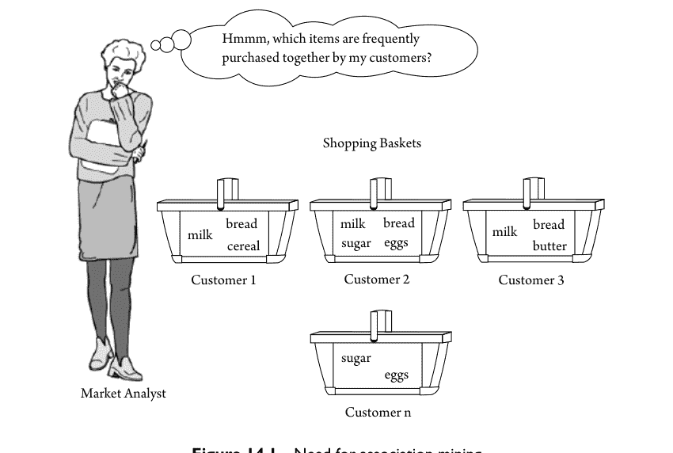

**图14.1** 关联挖掘的必要性

让我们考虑一种情况，商店经理觉得店里非常拥挤，顾客总是抱怨他商店的工作效率低。他正在探索提高商店效率的不同方法。他进行了一项关联分析，并准备了一份关联物品清单，如面包和黄油。他可能决定将所有这些关联物品放在同一个货架上或彼此靠近，以便顾客可以快速找到它们，从而减少他们的购物时间。这也将提高商店的整体效率和产品的销售额。为了进一步改善顾客的购物体验，他可以创建不同的组合并对这些组合进行促销。

在另一种情况下，假设他的商店是新开的，商店经理希望向顾客展示其所有产品。那么，在这种情况下，经过关联挖掘分析后，他可能决定将关联物品，即面包和牛奶，分开放置，以便他可以在它们之间展示其他不同的物品和促销计划，希望顾客在这种布局下会购买更多产品。因此，关联挖掘有多种应用。

有时，销售记录的分析会产生非常有趣和意想不到的结果。美国沃尔玛的一个非常流行的案例研究发现，购买尿布的人通常也会购买啤酒。这是一个意想不到的关联。由于啤酒和尿布之间的关联，人们可能会得出多种结论。有趣的是假设“睡前喝一杯啤酒意味着全家人都能睡个好觉”。轻松地说，这在图14.2中有所描绘。

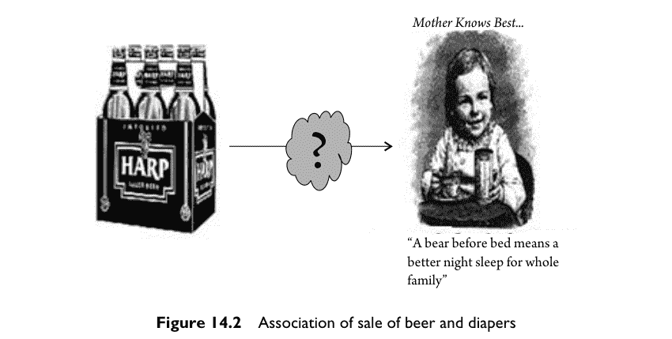

**图14.2** 啤酒和尿布销售的关联

但严肃的分析显示，女性在工作日会跳过购买大包装的尿布，因为没有足够的空间存放一周所需的食品杂货。因此，男性通常在周末购买尿布，并购买啤酒来缓解压力。当啤酒和尿布放在一起时，它们的销量增加了。图14.3和图14.4说明了啤酒与尿布的关联以及它们如何提高了销售额。

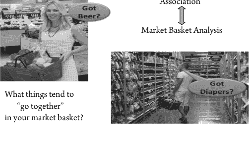

**图14.3** 啤酒和尿布销售的关联

然而，这个故事很好地说明了“一起购买”的购物篮概念，这是关联规则挖掘的基础。

我们了解了什么是关联挖掘以及它如何帮助增加销售额。但是，我们如何获得执行购物篮分析所需的数据呢？唯一的数据来源是从顾客购买账单中获得的交易信息。这告诉了我们购物车中哪些物品是一起购买的。这还可以显示哪些物品“一起购买”，以及诸如一天中的时间、工作日和年度季节信息、信用卡与现金与支票支付、商店地理位置信息等信息。发现这些属性之间的关联可以为商店楼层平面图、特别折扣、优惠券提供、产品聚类和目录设计制定基于事实的营销策略，以识别需要放入组合包装的物品，并用于设计商店，如图14.5所示。

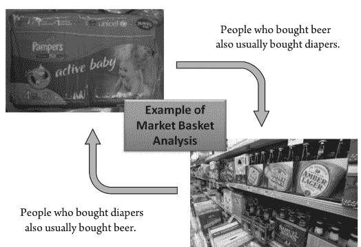

**图14.4** 啤酒和尿布销售的关联

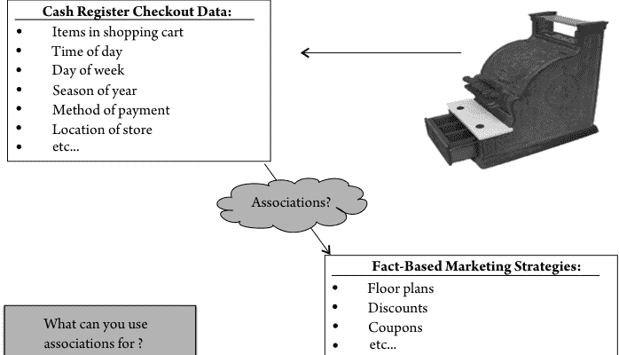

**图14.5** 啤酒和尿布销售的关联

需要注意的是，大多数在线购物网站，如亚马逊、Flipkart和Myntra，都使用关联挖掘来推荐与您购买的物品经常一起购买的产品。关联规则不仅限于购物篮分析，它们还有许多应用，如入侵检测、Web使用挖掘和生物信息学。

鼓励读者探索Parteek Bhatia在Udemy平台上提供的关于关联挖掘的在线课程。他们可以在阅读本章节的同时学习这门课程。可以通过以下链接访问该课程：https://www.udemy.com/course/association-mining-for-machine-learning/


现在，让我们总结一下使用关联规则挖掘的优势。

## 关联规则挖掘的优势

使用关联规则挖掘的主要优势如下。

- i. 营销人员和企业可以制定更好的营销策略，从而增加销售额和利润。
- ii. 库存规划变得容易。关联挖掘提供了关于高购买量物品和低购买量物品的概念。据此，可以补充库存，避免任何物品的过度库存和库存不足。
- iii. 可以在商店中组织物品以增加销售额。例如，如果面包和牛奶经常一起购买，可以将它们放在一起，这会增加面包和牛奶的销量。
- iv. 通过关联规则挖掘获得的关联物品的折扣或优惠可以提高利润。
- v. 关联挖掘可用于商店或超市的楼层规划。
- vi. 关联挖掘对医学诊断很有用。它有助于根据症状和其他因素之间的关联来发现疾病发生的概率。
- vii. 关联挖掘也可用于入侵检测、Web使用挖掘、生物信息学和自适应学习。

因此，我们可以得出结论，通常，关联挖掘用于通过观察顾客购买行为来发现顾客在购物期间购买的各种物品之间的关联，而关联挖掘的其他应用包括医学诊断、入侵检测、Web使用挖掘、生物信息学和自适应学习。这也被称为购物篮数据分析。

关联挖掘：概念与应用 | 机器学习 | Parteek Bhatia, https://youtu.be/TzbpjL38o4Y


### 14.2 定义关联规则挖掘

关联规则挖掘被定义为机器学习模型，用于分析信息并发现事务数据库、关系数据库和其他信息存储库中对象或物品集合之间的模式、关联、因果结构和相关性。

关联规则通常是if/then语句，有助于发现关系数据库或其他信息存储库中看似无关的数据之间的关系。例如，“如果一个顾客购买了快餐，那么他/她更有可能购买可乐”。

通常，关联规则由两部分组成，称为

- i. 前件（如果）和
- ii. 后件（那么）。

前件是数据中发现的对象或项，而后件是与前件组合发现的对象或项。

关联规则表示为 X → Y，这意味着当 X 出现时，Y 往往也会出现。这里，X 和 Y 可以是单个项或一组项。其中，X 是规则的前件，而 Y 是规则的后件。

例如，超市中任意两项——冰淇淋和巧克力之间的关联规则会指定，如果顾客购买了冰淇淋，他们也可能购买巧克力。该规则表示为 冰淇淋 → 巧克力。另一条规则可能是，如果顾客同时购买了西红柿和土豆，他们也可能购买胡萝卜。该规则表示为 西红柿，土豆 → 胡萝卜。

关联挖掘的概念由两位印度科学家 Rakesh Agrawal 博士和 R. Srikant 博士提出。他们的简要介绍见第 14.7.1 节。

## 14.3 关联挖掘中项的表示

本节将通过一个示例讨论事务数据库中项的表示。

**示例 14.1**
假设商店库存中有 *n* 个项。表 14.1 表示超市中的交易。这里，库存中有 13 个项；因此，*n* = 13。它们是面包、茄子、黄油、胡萝卜、鸡蛋、果酱、番茄酱、牛奶、坚果、洋葱、土豆、菠菜和西红柿。

项列表用 *I* 表示，列表中的项表示为 {i₁, i₂, i₃, i₄, ... iₙ}。

事务数量用 N 表示。在表 14.1 中，事务数量为 7，即 N = 7。

**表 14.1 销售数据库**

| 事务 ID | 购买的项 |
| :--- | :--- |
| 1 | {土豆, 西红柿, 胡萝卜, 茄子} |
| 2 | {西红柿, 洋葱, 坚果} |
| 3 | {鸡蛋, 面包, 果酱, 黄油} |
| 4 | {番茄酱, 牛奶, 洋葱, 胡萝卜} |
| 5 | {面包, 果酱, 西红柿} |
| 6 | {菠菜, 面包, 果酱, 西红柿} |
| 7 | {坚果, 土豆, 鸡蛋} |

每个事务用 T {t₁, t₂, t₃...tₙ} 表示。同时，每个事务都有一个唯一的标识符，称为事务 ID (TID)。每个事务包含顾客购买的项 n（商店中的所有项）的一个子集。

假设一个包含 m 个项的事务为 {i₁, i₂, i₃, i₄...iₘ}，其中 m <= n，因为事务中的项数应小于或等于商店中的总项数。事务通常在购买的项数上有所不同。

如果我们观察第一个事务，表示为 T1，它有四个项，即 m = 4，其中项为 i₁ = 土豆, i₂ = 西红柿, i₃ = 胡萝卜, i₄ = 茄子。类似地，事务 T5 有三个项，即 m = 3，其中项为 i₁ = 面包, i₂ = 果酱, i₃ = 西红柿。

需要注意的是，在关联挖掘任务中不考虑项的数量。在关联挖掘中，任务将是确定事务中各种项之间的关系。

## 14.4 评估关联规则强度的度量

在讨论关联挖掘算法之前，我们需要讨论用于衡量规则强度和准确性的度量。关联挖掘有三个评估度量。如下所示。

- 支持度
- 置信度
- 提升度

让我们逐一讨论这些度量。

### 14.4.1 支持度

支持度表示支持关联规则的历史数据量。设 N 为事务数量。项 X 的支持度表示为项 X 在事务数据库中出现的次数与总事务数 N 的比率。

项 X 和 Y 一起的支持度表示为项 X 和 Y 在数据库中同时出现的次数与总事务数 N 的比率。数学上，表示如下。

支持度(X) = X 出现的次数 / 总事务数(N) = P(X)

支持度(XY) = \frac{\text{X 和 Y 同时出现的次数}}{\text{总事务数(N)}} = P(X \cap Y)

换句话说，X 的支持度是 X 的概率。而 X 和 Y 的支持度是 X ∩ Y 的概率。以下示例说明了事务中项的支持度计算。

### 示例 14.2

再次使用表 14.1 作为表 14.2 来计算以下各项的支持度。需要注意的是，项在事务中按其词法顺序（升序）列出。

**表 14.2 事务数据库**

| 事务 ID | 购买的项 |
| :--- | :--- |
| 1 | {茄子, 胡萝卜, 土豆, 西红柿} |
| 2 | {坚果, 洋葱, 西红柿} |
| 3 | {面包, 黄油, 鸡蛋, 果酱} |
| 4 | {胡萝卜, 番茄酱, 牛奶, 洋葱} |
| 5 | {面包, 果酱, 西红柿} |
| 6 | {面包, 果酱, 菠菜, 西红柿} |
| 7 | {鸡蛋, 坚果, 土豆, 西红柿} |

支持度 (面包) = P (面包) = 面包出现的次数/总事务数 = 3/7。
支持度 (茄子) = P (茄子) = 茄子出现的次数/总事务数 = 1/7。
支持度 (黄油) = P (黄油) = 黄油出现的次数/总事务数 = 1/7。
支持度 (坚果) = P (坚果) = 坚果出现的次数/总事务数 = 2/7。
支持度 (西红柿) = P (西红柿) = 西红柿出现的次数/总事务数 = 5/7。
支持度 (面包, 果酱) = P (面包 ∩ 果酱) = 面包和果酱同时出现的次数/总事务数 = 3/7。
支持度 (土豆, 西红柿) = P (土豆 ∩ 西红柿) = 土豆和西红柿同时出现的次数/总事务数 = 2/7。

高支持度值意味着相应的规则将极大地引起相关业务的兴趣。
支持度是最关键的度量之一，因为如果一条规则的支持度值很低，那么该规则可能是偶然发生的，推广顾客很少一起购买的项并不是一个好主意。但如果一条规则具有高支持度，那么该关联就变得非常重要，如果实施得当，将增加收入、效率和客户满意度。

### 14.4.2 置信度

支持度表示产品 X 和 Y 在数据库中同时出现的次数，而置信度表示同时购买产品 X 和 Y 的可能性。假设规则 X → Y 的支持度为 70%。这意味着 X 和 Y 的组合非常频繁地出现。在事务中 X 和 Y 同时出现的概率为 70%。

假设我们有另一对项（P 和 Q），且 P → Q 的支持度为 50%。
与之前的规则 X → Y 相比，规则 P → Q 中的项同时出现的概率较低。但是，如果当事务包含项 P 时，项 Q 出现的概率为 90%，那么这个组合就非常值得关注。

这意味着 P 和 Q 同时出现的概率很重要，但当事务包含 P 时 Q 出现的条件概率在关联挖掘中也起着重要作用。置信度规则考虑了这种条件概率。

规则 X → Y 的置信度是 X 和 Y 一起的支持度与 X 的支持度的比率。这与在 X 已经发生的情况下 Y 的条件概率相同。数学上，如下所示。

置信度 (X → Y) = 支持度(XY) / 支持度(X) = P(X ∩ Y) / P(X) = P(Y | X)

因此，如果 X 出现的次数多于 X 和 Y 一起出现的次数，置信度就会很低。
P(Y|X) 是 Y 的条件概率，意味着在 X 已经发生的情况下 Y 的概率。

因此，置信度和支持度度量可以确定关联规则的质量。
根据置信度的值，可以证明决策的合理性。
以下示例展示了如何计算支持度和置信度。

### 示例 14.3

为了更好地理解支持度和置信度的概念，让我们看看表 14.3 和表 14.4。

表 14.3 支持度度量示例

| 事务 ID | 项 | 支持度 = 出现次数/总事务数 |
| :--- | :--- | :--- |
| 1 | PQR | 总事务数 = 5 |
| 2 | PST | 支持度 (PQ) = 2/5 = 40% |
| 3 | QR | 支持度 (QR) = 3/5 = 60% |
| 4 | QRS | 支持度 (PT) = 2/5 = 40% |
| 5 | PQT | 支持度 (PQR) = 1/5 = 20% |

## 表 14.4 置信度度量示例

| 事务 ID | 项目 | 给定 X → Y 置信度 = X 和 Y 的出现次数 / X 的出现次数 |
| :--- | :--- | :--- |
| 1 | PQR | (P → Q) 的置信度 = |
| 2 | PST | (P 和 Q) 的支持度 / (P 的支持度) = 2/3 = 66% |
| 3 | QR | (Q → R) 的置信度 = |
| 4 | QRS | (Q 和 R) 的支持度 / (Q 的支持度) = 3/4 = 75% |
| 5 | PQT | (PQ → R) 的置信度 = |
| | | (PQR) 的支持度 / (PQ 的支持度) = 1/2 = 50% |
| | | (QR → S) 的置信度 = |
| | | (QRS) 的支持度 / (QR 的支持度) = 1/3 = 33% |

让我们考虑另一个例子，以更好地理解支持度和置信度。

## 表 14.5 用于识别关联规则的数据库

| 前项 | 后项 |
| :--- | :--- |
| A | 0 |
| A | 0 |
| A | 1 |
| A | 0 |
| B | 1 |
| B | 0 |
| B | 1 |

假设从这些组合的关联中推导出两条规则。
规则 1：A 蕴含 1，即 A → 0。
规则 2：B 蕴含 0，即 B → 1。
让我们计算这两条规则的支持度和置信度。
支持度：
对于规则 1，A → 0 = A 和 0 一起出现的次数 / 事务总数 = 3/7。
对于规则 2，B → 1 = B 和 1 一起出现的次数 / 事务总数 = 2/7。

置信度：
对于规则 1，A → 0 = (A, 0) 的支持度 / A 的支持度
= {A 和 0 一起出现的次数 / 事务总数} ÷ {A 出现的次数 / 事务总数}
这里，事务总数被约掉了。
因此，规则 1 (A → 0) 的置信度 = A 和 0 一起出现的次数 / A 出现的次数 = 3/4。
规则 2 (B → 1) 的置信度 = B 和 1 一起出现的次数 / B 出现的次数 = 2/3。

基于目前的讨论，我们得出结论：对于 X → Y 规则，支持度考虑了 X 和 Y 一起出现的概率。同时，置信度进一步扩展了这一点，也考虑了数据集中 X 单独出现的概率。没有度量考虑数据集中 Y 单独出现的概率以及其他概率。而在评估 X → Y 规则的强度时，考虑 Y 出现的概率是很重要的。换句话说，必须考虑完整的数据集来衡量规则的强度。
提升度考虑了这个方面，它是评估关联规则强度的第三个重要度量。规则的提升度通过考虑 Y 的概率来决定规则的强度，从而考虑了整个数据集。

### 14.4.3 提升度

如前所述，考虑 Y 的频率或 Y 的概率对于关联挖掘规则 X → Y 的有效性非常重要。
你已经知道，置信度是当 X 已经发生时 Y 的条件概率。那么，考虑 Y 的频率对于了解置信度的有效性非常重要。
现在，让我们讨论计算提升度的公式，并观察提升度如何给出规则的强度。对于关联规则 X → Y，提升度是给定 X 时项目 Y 的条件概率与 Y 在数据库中出现的概率之比。换句话说，它是 X → Y 的置信度与 Y 的概率之比。这在数学上通过以下方程表示。

提升度 = P(Y|X) / P(Y)
或

提升度 = (X → Y) 的置信度 / P(Y)

或

提升度 = \frac{P(X \cap Y)}{P(X) / P(Y)}

提升度是置信度与后项的无条件概率之比。

为了理解提升度的重要性，让我们考虑一个场景：可乐是商店中非常常见的商品，通常出现在大多数事务中。假设我们有一条规则 蜡烛 → 可乐，支持度为 20%，置信度为 90%。可以合理地认为，由于可乐非常受欢迎，出现在 95% 的事务中，它也会与蜡烛一起出现。因此，蜡烛和可乐的关联规则将不是有效的。

但如果我们发现 蜡烛 → 火柴盒 也有 20% 的支持度和 90% 的置信度。在这种情况下，可以合理地理解，火柴盒的销售频率远低于可乐。该规则表明，当我们销售蜡烛时，有 90% 的机会火柴盒也会在同一事务中被售出；那么，这要有效和合理得多。由于火柴盒不是商店中常见的销售商品，因此这种关联比得出“当我们销售蜡烛时，我们也会销售可乐”的结论重要得多（因为可乐是受欢迎的商品，直观地看它会与大多数商品一起出现，而不仅仅是蜡烛）。

你可以注意到，两条规则的支持度和置信度是相同的，因此仅了解这两个度量不足以处理这种情况。规则的提升度处理了这种情况。在提升度的情况下，如前所述对于 X → Y，我们也考虑 Y 的概率。如果 Y 的概率较低，如蜡烛 → 火柴盒的情况（这里 Y 是火柴盒），那么提升度将比蜡烛 → 可乐（这里 Y 是可乐，其出现概率非常高）更高。

因此，提升度的最终公式考虑了这种情况。

由此，我们可以得出结论：后项的高概率使得提升度效果降低，而后项的低概率使得提升度效果增强。因此，在蜡烛 → 可乐规则中，将可乐作为后项使其效果不如在蜡烛 → 火柴盒规则中将火柴盒作为后项。

让我们考虑另一个例子，以更好地理解提升度的概念。

**示例 14.4**

表 14.5 中给出的示例已复制为表 14.6，以计算前面讨论的规则 1 和 2 的提升度。

规则 1 (A → 0) 的提升度 = P (0 | A)/P(0) = (P (A ∩ 0)/P(A))/P(0) = 置信度(A → 0)/ P(0) = (3/4)/(4/7) = 1.3125

规则 2 (B → 1) 的提升度 = P (1|B)/P(1) = (P (B ∩ 1)/P (B))/P(1) = 置信度(B → 1)/ P(1) = (2/3)/(3/7) = 1.55

## 表 14.6 数据集

| 前项 | 后项 |
|---|---|
| A | 0 |
| A | 0 |
| A | 1 |
| A | 0 |
| B | 1 |
| B | 0 |
| B | 1 |

如前所述，规则 1 的置信度为 3/4 = 0.75，规则 2 的置信度为 3/5 = 0.66。

观察到，尽管规则 1 的置信度高于规则 2，但其提升度低于规则 2。

自然地，规则 1 似乎更有价值，因为它具有更高的置信度值。但是，如果仅通过考虑置信度而忽略数据集来决定规则的重要性，这常常会产生误导。提升度度量也很重要，因为它除了考虑置信度外，还考虑了整个数据集。

为了理解提升度的重要性，请考虑表 14.7 中给出的修改后的数据集。

## 表 14.7 修改后的数据集

| 前项 | 后项 |
|---|---|
| A | 0 |
| A | 0 |
| A | 1 |
| A | 0 |
| B | 1 |
| B | 0 |
| B | 1 |
| C | 0 |
| D | 0 |
| C | 0 |
| C | 1 |
| E | 0 |

在修改后的数据库中，向现有数据库添加了另外五条记录（这些记录附加在最后）。在这五条记录中，0 出现了四次，即在修改后的数据库中，0 变得更频繁，即其概率增加了。相比之下，在修改后的数据库中，1 的概率降低了。

因此，对于第一条规则 A → 0，该规则的提升度在修改后的数据库中降低了，而其置信度值相同，计算如下。

A → 0 的支持度 = 3/12
A → 0 的置信度 = 支持度(A,0)/支持度(A) = 3/4 = 0.75
A → 0 的提升度 = A → 0 的置信度 / 支持度(0) = (3/4)/(8/12) = 36/32 = 1.125

这里，规则 1 的提升度从原始数据集中的 1.312 降低到修改后数据集中的 1.125，因此规则 1 的强度在修改后的数据集中降低了，而其置信度相同。

对于规则 2 (B → 1)，修改后的数据库提高了提升度，同时置信度值相同，计算如下。

B → 1 的支持度 = 2/12
B → 1 的置信度 = 支持度(B,1)/支持度(B) = 2/3 = 0.66
B → 1 的提升度 = (B → 1 的置信度) / 支持度(1) = (2/3)/(4/12) = 2

这里，规则 2 的提升度从原始数据集中的 1.555 增加到修改后数据集中的 2，而其置信度相同。因此，规则 2 的强度在修改后的数据集中得到了提高。因此，提升度同时考虑了置信度和整个数据集。

### 关联规则的另一种表示

在第 14.3 节中，我们讨论了关联规则的表示。支持度和置信度有时包含在表示中，如图 14.7 所示。

**图 14.7** 关联规则的表示

面包 ⇒ 牛奶 [60%, 75%]

这里，

1. 前项位于等式左侧 (LHS)。
2. 后项位于等式右侧 (RHS)，称为头部。

## 14.5 寻找关联规则的朴素算法

关联规则的朴素算法 | Parteek Bhatia, https://youtu.be/Y4Xh0rDkBY

到目前为止，我们已经讨论了关联规则以及用于有效衡量规则强度的度量指标。在本节中，我们将讨论一种寻找关联规则的朴素算法。朴素算法以支持度和置信度的阈值作为输入。支持度和置信度大于或等于阈值支持度和置信度的关联规则即为所需的关联规则。为了清晰地理解该算法，让我们考虑下面给出的例子。

## 示例 14.5

让我们考虑一家杂货店的销售记录。为简单起见，仅考虑该杂货店的四笔销售交易，这些交易仅涉及四种待售商品（面包、牛奶、黄油和鸡蛋），如表 14.8 所示，并使用一种朴素的暴力算法来执行任务，以识别销售记录中商品的关联性。

让我们找出“支持度”（最小值）为 45% 且“置信度”（最小值）为 60% 的关联规则。

## 表 14.8 杂货店的销售记录

| 交易 ID | 商品 |
| :--- | :--- |
| 1 | 面包，鸡蛋 |
| 2 | 面包，鸡蛋，牛奶 |
| 3 | 面包，黄油 |
| 4 | 面包，黄油，鸡蛋 |

### 14.5.1 朴素算法的工作原理

让我们首先通过参考其算法（如下所示）来理解朴素算法的工作原理。

- 1. 开始。
- 2. 列出库存中所有可能的商品组合。
- 3. 找出这些组合的置信度和支持度。
- 4. 识别满足支持度和置信度阈值限制的频繁组合。
- 5. 停止。

在我们的示例数据集中，如表 14.8 所示，我们有四种库存商品。为此，这四种商品可以产生 16 种组合，包括空集作为一个组合。我们忽略空组合，因此剩下 15 种组合。这些组合及其各自的频率（一个商品或商品集在数据库中出现的次数）如表 14.9 所示。

## 表 14.9 所有可能的商品集及其频率列表

| 商品集 | 频率 |
| :--- | :--- |
| **面包** | **4** |
| **黄油** | **2** |
| **鸡蛋** | **3** |
| 牛奶 | 1 |
| **{面包，黄油}** | **2** |
| **{面包，鸡蛋}** | **3** |
| {面包，牛奶} | 1 |
| {黄油，鸡蛋} | 1 |
| {黄油，牛奶} | 0 |
| {鸡蛋，牛奶} | 1 |
| {面包，黄油，鸡蛋} | 1 |
| {面包，黄油，牛奶} | 0 |
| {面包，鸡蛋，牛奶} | 1 |
| {黄油，鸡蛋，牛奶} | 0 |
| {面包，黄油，鸡蛋，牛奶} | 0 |

这里，支持度的阈值是 45%。如果一个商品集在四笔交易中只出现一次，其支持度为 1/4 = 25%。如果一个商品集出现两次，其支持度为 50%。由于支持度阈值是 45%，一个商品集必须至少出现在两笔交易中。表 14.9 显示了所有商品集的频率。我们可以观察到，面包、黄油和鸡蛋的频率大于或等于 2。因此，它们满足支持度阈值。对于 2-商品集，{面包，黄油} 和 {面包，鸡蛋} 是频繁的，且两对的频率均为 2。3-商品集和 4-商品集不是频繁的，其支持度小于 2。所有频繁商品集在表 14.9 中以粗体字母显示。频繁商品集在表 14.10 中重新列出。

我们的目标是找出为关联规则分组的商品。由于关联规则必须至少包含两个商品，因此忽略了频繁的 1-商品集，因为它们在关联挖掘中不起作用（我们只对一起出现的商品对感兴趣）。最后，我们有两个商品对，即 {面包，黄油} 和 {面包，鸡蛋}。这些将被考虑用于生成关联规则。

## 表 14.10 所有频繁商品集的集合

| 商品集 | 频率 |
| :--- | :--- |
| 面包 | 4 |
| 黄油 | 2 |
| 鸡蛋 | 3 |
| {面包，黄油} | 2 |
| {面包，鸡蛋} | 3 |

两个 2-商品集（面包，黄油）和（面包，鸡蛋）的关联规则将被确定，如果它们的置信度等于或大于置信度阈值（即 60%），则将被选中。

需要注意的是，每个 2-商品集 (X, Y) 如果都满足所需的置信度，都可以产生 X → Y 和 Y → X 规则。我们知道，X → Y 的置信度等于 X 和 Y 一起出现的支持度除以 X 的支持度。

因此，我们有四条可能的规则，其详细的置信度计算如下。

让我们找出这些关联规则的置信度。

面包 → 黄油
置信度 = {面包，黄油} 的支持度 / 面包的支持度 = 2/4 = 50%

黄油 → 面包
置信度 = {面包，黄油} 的支持度 / 黄油的支持度 = 2/2 = 100%

面包 → 鸡蛋
置信度 = {面包，鸡蛋} 的支持度 / 面包的支持度 = 3/4 = 75%

鸡蛋 → 面包
置信度 = {面包，鸡蛋} 的支持度 / 鸡蛋的支持度 = 3/3 = 100%

因此，关联规则 黄油 → 面包、面包 → 鸡蛋 和 鸡蛋 → 面包 的置信度大于阈值置信度值（60%）。因此，这些是所需的关联规则。置信度大于指定置信度的规则被称为置信规则。

### 14.5.2 朴素算法的局限性

朴素算法无法有效处理大型数据集。在表 14.8 中，我们有一个仅包含四种商品的交易数据库。但即便如此，可能的组合仍有 16 种（2^4），包括空组合。在朴素算法中，我们可以观察到必须分析所有可能的 2^n 种组合，其中 n 是库存中的唯一商品数。

例如，如果有七种唯一商品，可能的组合数是 128（2^7）。同样，如果有 10 种唯一商品，可能的组合数是 1024（2^10）。随着唯一商品数量的增加，可能的组合数可能达到数十亿。当唯一商品为 20 时，可能的组合数以百万计。因此，处理百万级的组合非常困难。为了处理更大的数据集，必须改进朴素算法。

改进的朴素算法以处理更大的数据集将在下一小节中讨论。

### 14.5.3 处理更大数据集的改进朴素算法

在改进的朴素算法中，我们只关注交易中实际售出的商品，而不是找出交易中所有可能的商品组合。因为库存中可能有数百种商品，我们只关心找出一起售出的商品之间的关联。因此，很自然地想到只关注交易中售出的商品，而不是库存中所有可用的商品。

我们可以查看每笔交易，只统计实际出现的组合；这种方法不统计频率为零的商品集。这将是一个改进。

例如，表 14.11 列出了表 14.8 中给定交易内发生的所有组合。

**表 14.11** 具有非零频率的所有可能组合的交易数据集

| 交易 ID | 商品 | 组合 |
| :--- | :--- | :--- |
| 1 | 面包，鸡蛋 | (面包，鸡蛋) |
| 2 | 面包，鸡蛋，牛奶 | (面包，鸡蛋)，(面包，牛奶)，(鸡蛋，牛奶)，(面包，鸡蛋，牛奶) |
| 3 | 面包，黄油 | (面包，黄油) |
| 4 | 面包，黄油，鸡蛋 | (面包，黄油)，(面包，鸡蛋)，(黄油，鸡蛋)，(面包，黄油，鸡蛋) |

因此，我们只需要关注表 14.11 第三列中显示的组合。这些组合及其频率在表 14.12 中给出。

## 表 14.12 所有具有非零频率的商品集的频率

| 商品集 | 频率 |
| :--- | :--- |
| 面包 | 4 |
| 黄油 | 2 |
| 鸡蛋 | 3 |
| 牛奶 | 1 |
| (面包，鸡蛋) | 3 |
| (面包，牛奶) | 1 |
| (鸡蛋，牛奶) | 1 |
| (面包，鸡蛋，牛奶) | 1 |
| (面包，黄油) | 2 |
| (黄油，鸡蛋) | 1 |
| (面包，黄油，鸡蛋) | 1 |

从表 14.12 中，我们可以观察到列表从 15 种组合减少到了 11 种组合。为了找出关联规则，我们可以遵循相同的步骤：计算支持度和置信度，并将它们的值与阈值进行比较。这里，我们需要检查关联规则的组合数量从 15 减少到 11；因此，这个过程将变得更容易、更快，但这仍然不是一个巨大的改进。

在商品数量较多的情况下，减少幅度会更大。无论减少程度如何，对于例如 1000 种商品的情况，这个列表仍然会变得非常大，因为它包含了交易数据库中存在的所有非零商品集，无论它们是否达到最小支持度。因此，朴素算法或其改进版本不适合解决大规模问题。我们将讨论其他高效的算法来解决更大数据集的关联规则问题。我们将从经典的 Apriori 算法开始。

在开始介绍 Apriori 算法之前，讨论在计算机内存中存储交易数据库的不同方式非常重要，因为它会影响大数据集的性能。在下一节中，将讨论交易存储的实现问题。

## 14.6 交易数据库存储方法

交易数据库存储方法：关联挖掘 | Parteek Bhatia, https://youtu.be/jszFbUt9GM0

在用算法处理交易数据集之前，理解存储它的不同方式很重要，因为存储是影响其性能的一个重要因素。

存储交易数据集有三种方法，具体如下。

-   简单存储
-   水平存储
-   垂直存储

我们将通过一个示例来讨论每种存储方法。

假设数据集中有五个项目，记为 {I₁, I₂, I₃, I₄, I₅}。给定的交易有七笔，交易ID为 {T₁, T₂, T₃, T₄, T₅, T₆, T₇}。这组包含五个项目的七笔交易可以使用以下三种不同的方法进行存储。

### 14.6.1 简单交易存储

简单交易存储是最常用的存储方法。每一行显示交易ID和该交易中的项目集。简单交易存储的表示如表14.13所示。需要注意的是，项目在交易中按词法顺序（升序）列出。

**表14.13** 交易作为项目列表的简单表示

| 交易ID | 项目集 |
|---|---|
| T₁ | I₁, I₃, I₅ |
| T₂ | I₂, I₄, I₅ |
| T₃ | I₁, I₂, I₃, I₄ |
| T₄ | I₂, I₃, I₄ |
| T₅ | I₁, I₂, I₄, I₅ |
| T₆ | I₂, I₅ |
| T₇ | I₁, I₅ |

### 14.6.2 水平存储

在这种表示中，每一行仍然是一个交易，但为数据集中的每个项目创建了列。在单元格中，交易中出现的项目对应位置填1，其余位置填0，如表14.14所示。

**表14.14** 水平存储表示

| 交易ID | I₁ | I₂ | I₃ | I₄ | I₅ |
|---|---|---|---|---|---|
| T₁ | 1 | 0 | 1 | 0 | 1 |
| T₂ | 0 | 1 | 0 | 1 | 1 |
| T₃ | 1 | 1 | 1 | 1 | 0 |
| T₄ | 0 | 1 | 1 | 1 | 0 |
| T₅ | 1 | 1 | 0 | 1 | 1 |
| T₆ | 0 | 0 | 0 | 1 | 1 |
| T₇ | 1 | 0 | 0 | 0 | 1 |

这种存储方式的优点是，可以通过统计给定列中1的数量来计算每个项目的频率，例如我们可以轻松计算出项目I₁的频率为4，项目I₄的频率为5。我们还可以通过统计对应列进行AND操作后得到的1的数量，来轻松计算项目对的频率。例如，项目对I₁和I₂的频率为2（对I₁和I₂的列进行AND操作，将得到两个1，即T₃和T₅）。这也接近我们通常收集交易数据时的默认设置。

### 14.6.3 垂直表示

在这种方法中，水平表示被反转，即交易列表用列表示，项目用行表示。简单来说，每一行代表一个项目，指示该项目出现的交易。列现在代表交易。垂直方法表示也称为TID列表，因为它给出了TID（交易ID）的列表。表14.15显示了示例数据集的垂直表示。

**表14.15** 垂直存储表示

| 项目 | T₁ | T₂ | T₃ | T₄ | T₅ | T₆ | T₇ |
|---|---|---|---|---|---|---|---|
| I₁ | 1 | 0 | 1 | 0 | 1 | 0 | 1 |
| I₂ | 0 | 1 | 1 | 1 | 1 | 0 | 0 |
| I₃ | 1 | 0 | 1 | 1 | 0 | 0 | 0 |
| I₄ | 0 | 1 | 1 | 1 | 1 | 1 | 0 |
| I₅ | 1 | 1 | 0 | 0 | 1 | 1 | 1 |

垂直表示的优点与水平表示类似，即统计项目和项目集的频率很简单。行中1的数量给出对应项目的频率，而在水平表示中，列中1的数量给出对应项目的频率。要计算项目对的频率，在垂直表示的情况下，必须统计行进行AND操作后1的数量。

例如，要找出项目对I₁, I₂的计数，可以通过将第1行与第2行相交（AND操作）来计算，在这种情况下，其计数为2，如表14.16所示，类似地，项目对I₂, I₄的计数为4。

**表14.16** 项目对的频率

| 项目对 | T₁ | T₂ | T₃ | T₄ | T₅ | T₆ | T₇ |
|---|---|---|---|---|---|---|---|
| I₁, I₂ | 0 | 0 | 1 | 0 | 1 | 0 | 0 |
| I₂, I₄ | 0 | 1 | 1 | 1 | 1 | 0 | 0 |

在交易数量非常大的情况下，垂直表示的存储效率不高。此外，如果算法需要垂直表示的数据，将数据从水平表示（我们通常收集数据的默认设置）转换为垂直表示会有成本。我们通常使用水平表示来存储交易数据库，因为它是最高效和自然的方法。

现在，你已经清楚地了解了存储方法，这些是理解下一节讨论的Apriori算法概念的前提。

## 14.7 Apriori算法

Apriori算法在发现事务数据库中的频繁项目集方面很有用。该算法由两位印度科学家Rakesh Agrawal博士和Ramakrishnan Srikant博士于1994年在其研究论文“Fast Algorithms for Mining Association Rules”中提出。这篇研究论文获得了“2004 VLDB 10年奖”，被评为十年来最具影响力的论文。这里，VLDB代表Very Large Databases（超大型数据库）。

通常，你在课程中学过几种算法，但我们很少发现印度名字是它们的发明者。有两位印度人R. Agrawal和R. Srikant作为关联挖掘的发明者，这令人自豪和鼓舞。他们的发现基于现代应用中常用的推荐系统，如在线购物的产品推荐、视频推荐等。

下面通过从他们的维基百科页面提取内容，简要介绍了这两位科学家的简介，以激励读者并赞赏他们的努力。

### 14.7.1 关于发明者的简要讨论

“**Rakesh Agrawal博士**是美国圣何塞Data Insights Laboratories的总裁和创始人。他还是美国国家工程院院士、计算机协会（ACM）会士、JSPS会士和IEEE会士。他是Professor Ram Kumar Memorial Foundation的总裁。他曾是印度科学研究所（班加罗尔）的Rukmini Gopalakrishnachar客座教授、瑞士洛桑联邦理工学院（EPFL）的客座教授和日本京都大学的客座教授。

他于2006年起担任微软技术研究员，并负责微软研究院的Search Labs直到2014年。在加入微软之前，他是IBM研究员，并领导了IBM Almaden研究中心的Quest小组。在IBM之前，他于1983年至1989年在贝尔实验室（Murray Hill）工作。他还曾在印度知名公司The Bharat Heavy Electricals Limited工作了三年。他于1983年获得威斯康星大学麦迪逊分校计算机科学硕士和博士学位。在此之前，他获得了印度理工学院鲁尔基分校（IIT-Roorkee）电子与通信工程学士学位。他获得了孟买国家工业工程学院（NITIE）的工业工程研究生文凭。他获得了IIT-Roorkee和NITIE颁发的杰出校友奖。

Rakesh博士是一位具有思想领导力的创新者。通过他的科学突破和实际工作系统，他正在为世界的新发展铺平道路。他获得了ACM-SIGKDD首届创新奖和ACM-SIGMOD Edgar F. Codd创新奖。在他的职业生涯中，他还两次获得ACM-SIGMOD Test of Time奖。他因与Apriori算法相关的研究论文获得了VLDB 10年最具影响力论文奖。著名科普杂志《科学美国人》将他列入前50名顶尖科学家和技术专家之列。

Rakesh已获得83项专利。他发表了200多篇研究论文。他撰写了数据库和数据挖掘领域所有论文中被引用次数第一和第二高的论文（在整个计算机科学领域被引用次数排名第18和第26）。维基百科将他的一篇论文列为最具影响力的数据库论文之一。他的论文被引用超过80万次，其中25篇以上每篇被引用超过500次，3篇每篇被引用5000次（谷歌学术）。他是数据库系统领域被引用次数最多的作者，也是计算机科学领域被引用次数第26的作者（Citeseer）。他的研究曾被NBC、《纽约时报》和其他多个媒体报道。

研究人员的工作很少能不仅创造一个产品，还能创造一个全新的行业。IBM的数据挖掘产品Intelligent Miner直接源自Rakesh的研究。IBM推出Intelligent Miner及相关服务创造了一个新的软件和服务类别。他的研究已被纳入许多其他商业产品，包括DB2 Mining Extender、DB2 OLAP Server、WebSphere Commerce Server、微软Bing搜索引擎以及许多研究原型和应用程序”。

要了解更多信息，请访问 http://rakeshagrawal.org/。

“**Ramakrishnan Srikant博士**是Google的杰出研究科学家。他的研究兴趣包括数据挖掘、在线广告和用户建模。他之前管理IBM Almaden研究中心智能信息系统研究部门的隐私研究小组。

Srikant博士已发表30多篇被广泛引用的研究论文。他已获得25项专利。Srikant博士曾是关键

## 14.7.2 Apriori算法的工作原理

该算法被命名为“apriori”，因为它利用了关于频繁项集属性的先验知识。该算法包含两个阶段，具体如下。

-   阶段一：识别频繁项集。这是通过识别支持度超过阈值支持度的项集来完成的。
-   阶段二：从频繁项集中识别关联规则。在此步骤中，从频繁项集中识别出置信度至少达到最小阈值的关联规则。

第二阶段相对直接，因为我们只需从第一阶段识别出的频繁项集中生成所有可能的关联规则，然后计算每条规则的置信度。但第一阶段在识别项集时存在大量可能的选择，且频繁项集的识别是一项计算密集型任务。因此，研究人员将更多精力放在改进第一阶段上。

为了理解Apriori算法，让我们采用实例学习的方法。我们将首先在一个简单的数据库上应用该算法来说明其工作原理，然后深入细节以更深刻地理解其概念。

## 示例 14.6

假设一家杂货店有五笔交易记录，涉及六种商品。需要使用Apriori算法，从该交易数据库中识别出支持度为50%、置信度为75%的关联规则。交易列表见表14.17。

### 表14.17 杂货店交易数据库

| 交易ID | 商品 |
|---|---|
| 1 | 香蕉，玉米片，牛奶 |
| 2 | 面包，鸡蛋，果酱，牛奶 |
| 3 | 面包，玉米片，牛奶 |
| 4 | 香蕉，面包，鸡蛋，牛奶 |
| 5 | 香蕉，玉米片，鸡蛋，果酱，牛奶 |

由于总交易数为五笔，一件商品必须至少出现在三笔交易中（3/5 = 0.6），其支持度才能超过阈值，即50%。

我们知道Apriori算法的第一阶段是寻找频繁项集。让我们从示例中的给定数据集中找出频繁项集。

## 阶段一：识别频繁项集

首先，为了识别频繁项集，我们必须识别出单个候选项目，称为候选1项集，记为C1。数据集中存在的所有项目都将作为单个候选项目C1。从表14.17可知，交易数据库中有六个独立项目。因此，表14.17的C1如下所示。

### 表14.18 数据库的候选1项集 C1

| 项目 |
|---|
| 1 | 香蕉 |
| 2 | 面包 |
| 3 | 玉米片 |
| 4 | 鸡蛋 |
| 5 | 果酱 |
| 6 | 牛奶 |

从这个候选1（C1）项集中，通过计算每个候选项目的计数，并仅选择计数等于或超过支持度阈值限制（本例中为3）的项目，即可找到频繁1项集，记为L1。因此，频繁1项集或L1如表14.19所示。

### 表14.19 频繁1项集 L1

| 项目 | 频数 |
|---|---|
| 香蕉 | 3 |
| 面包 | 3 |
| 玉米片 | 3 |
| 鸡蛋 | 3 |
| 牛奶 | 5 |

然后，从L1中找到候选2项集或C2。寻找C2的过程如下所示。

C2 = L1 JOIN L1

C2是通过将频繁1项集（L1）与自身连接而找到的。L1与自身连接的过程如下所示。

在JOIN操作中，第一步是执行笛卡尔积，即在L1和L1之间生成所有可能的配对，如下所示。

| 候选2项集 |
|---|
| 香蕉，香蕉 |
| 香蕉，面包 |
| 香蕉，玉米片 |
| 香蕉，鸡蛋 |
| 香蕉，牛奶 |
| 面包，香蕉 |
| 面包，面包 |
| 面包，玉米片 |
| 面包，鸡蛋 |
| 面包，牛奶 |
| 玉米片，香蕉 |
| 玉米片，面包 |
| 玉米片，玉米片 |
| 玉米片，鸡蛋 |
| 玉米片，牛奶 |
| 鸡蛋，香蕉 |
| 鸡蛋，面包 |
| 鸡蛋，玉米片 |
| 鸡蛋，鸡蛋 |
| 鸡蛋，牛奶 |
| 牛奶，香蕉 |
| 牛奶，面包 |
| 牛奶，玉米片 |
| 牛奶，鸡蛋 |
| 牛奶，牛奶 |

这里有25种可能的配对。在关联挖掘中，我们关注的是项目对，因此包含相同项目的配对（如面包，面包）无需考虑，应从列表中移除。同样，如果我们已经有了面包，牛奶这个项目对，就没有必要再列出牛奶，面包，因此它也应从列表中移除。

因此，我们可以将创建C2的步骤总结如下。

-   使用JOIN操作找到L1与自身的笛卡尔积。
-   从结果项集中，移除包含相同项目的项目对（例如 {香蕉，香蕉}）。
-   选择项目按词典（字母）顺序排列的项目对（例如，如果我们有项集 {面包，牛奶}，则不会选择 {牛奶，面包}）。

基于此，最终的C2将包含10个项集，如下所示。

| 候选2项集 |
| --- |
| 香蕉，面包 |
| 香蕉，玉米片 |
| 香蕉，鸡蛋 |
| 香蕉，牛奶 |
| 面包，玉米片 |
| 面包，鸡蛋 |
| 面包，牛奶 |
| 玉米片，鸡蛋 |
| 玉米片，牛奶 |
| 鸡蛋，牛奶 |

将计算这些项目对的频率，以从C2中识别频繁项集L2。表14.20显示了这些项集在交易中的频率。

### 表14.20 候选项目对 C2 的频率

| 候选2项集 | 频率 |
| :--- | :--- |
| (香蕉，面包) | 1 |
| (香蕉，玉米片) | 2 |
| (香蕉，鸡蛋) | 2 |
| (香蕉，牛奶) | 3 |
| (面包，玉米片) | 1 |
| (面包，鸡蛋) | 2 |
| (面包，牛奶) | 3 |
| (玉米片，鸡蛋) | 1 |
| (玉米片，牛奶) | 3 |
| (鸡蛋，牛奶) | 3 |

因此，从表14.20我们可以得出结论，L2中有四个频繁项目对，其支持度或频率等于或大于3，如表14.21所示。

### 表14.21 频繁2项集 L2

| 频繁 L2 项集 | 频率 |
| :--- | :--- |
| (香蕉，牛奶) | 3 |
| (面包，牛奶) | 3 |
| (玉米片，牛奶) | 3 |
| (鸡蛋，牛奶) | 3 |

## 从 L2 生成 C3

C3是通过对L2执行JOIN操作从L2生成的，如下所示。

C3 = L2 JOIN L2

这将涉及与创建C2相同的步骤，但JOIN有一个重要的前提条件，即L2中的两个项集可连接，如果它们的第一个项目相同。在一般情况下：

Ck = Lk-1 JOIN Lk-1

Lk-1中的项集可连接，如果它们的前k-2个项目相同。因此，在C3的情况下，k为3，L2中的项集可连接，如果它们的（前k-2，即1）第一个项目相同。这意味着在寻找C3时，L2中的第一个项目必须相同（因为在C3的情况下k-2为1），而在C2的情况下，L1中没有第一个项目相似性的要求（因为在C2的情况下k-2为0）。

从表14.21我们可以观察到，没有两个项集具有第一个项目相似性，即{香蕉，牛奶}、{面包，牛奶}、{玉米片，牛奶}、{鸡蛋，牛奶}中任意两个项集的第一个项目都不相同。因此，对于本示例，Apriori算法的第一阶段在此结束，并且本例中没有C3。

## 阶段二：生成关联规则

我们在表14.21所示的L2中得到了四个频繁2项集[(香蕉，牛奶)，(面包，牛奶)，(玉米片，牛奶)，(鸡蛋，牛奶)]。这些频繁2项集引出以下可能的规则。

-   香蕉 → 牛奶
-   牛奶 → 香蕉
-   面包 → 牛奶
-   牛奶 → 面包
-   玉米片 → 牛奶
-   牛奶 → 玉米片
-   鸡蛋 → 牛奶
-   牛奶 → 鸡蛋

为了从上述规则中找到有效的关联规则，我们必须计算这些规则的置信度。置信度是通过将两个项目同时出现的支持度除以前件的支持度来获得的。

所有这些规则的置信度计算如表14.22所示。

## 表 14.22 所有可能规则的置信度

| 规则 | 置信度 |
| :--- | :--- |
| 香蕉 → 牛奶 | 支持度（香蕉，牛奶）/支持度（香蕉）= 3/3 = 100% |
| 牛奶 → 香蕉 | 支持度（香蕉，牛奶）/支持度（牛奶）= 3/5 = 60% |
| 面包 → 牛奶 | 支持度（面包，牛奶）/支持度（面包）= 3/3 = 100% |
| 牛奶 → 面包 | 支持度（面包，牛奶）/支持度（牛奶）= 3/5 = 60% |
| 玉米片 → 牛奶 | 支持度（玉米片，牛奶）/支持度（玉米片）= 3/3 = 100% |
| 牛奶 → 玉米片 | 支持度（玉米片，牛奶）/支持度（牛奶）= 3/5 = 60% |
| 鸡蛋 → 牛奶 | 支持度（鸡蛋，牛奶）/支持度（鸡蛋）= 3/3 = 100% |
| 牛奶 → 鸡蛋 | 支持度（鸡蛋，牛奶）/支持度（牛奶）= 3/5 = 60% |

从表 14.22 中，我们可以观察到，在八条关联规则中，只有四条规则的置信度大于或等于问题陈述中提到的最小置信度值，即 75%。

因此，最终的关联规则如下。

香蕉 → 牛奶，面包 → 牛奶，玉米片 → 牛奶，以及鸡蛋 → 牛奶。

在这个例子中，我们讨论了根据项集中的项目数量及其在事务中的出现情况来计算 C1、L1、C2、L2 和 C3 的过程。

现在，让我们通过讨论项集的表示来概括 Apriori 算法的这个思想。

## 项集的表示

在上面的例子中，我们观察到要生成 $C_k$，我们需要 $L_{k-1}$。因此，让我们定义 $L_{k-1}$。

设 $l1, l2, l3, l4$ 是列表 $L_{k-1}$ 中的项集，符号 $li[j]$ 指的是项集 $li$ 中的第 j 个项目。

C2 是从 L1 生成的。因此，C2 表示为 $C_k$，L1 表示为 $L_{k-1}$。表 14.23 显示了 L1 中的项集，并描述了每个项目列表的表示。由于 L1 只有一个项目，其项目列表表示始终为 $li[1]$，其中 $li$ 是一个项集。

## 表 14.23 用于生成 C2（k = 2）的 L1，每个列表中只有一个元素

| 项目 | L1 中项目的表示描述 |
| :--- | :--- |
| 1 | 表示为项目列表 l1。其项目，即 1，表示为 l1[1]。 |
| 2 | 表示为项目列表 l2。其项目，即 2，表示为 l2[1]。 |
| 4 | 表示为项目列表 l3。其项目，即 4，表示为 l3[1]。 |
| 5 | 表示为项目列表 l4。其项目，即 5，表示为 l4[1]。 |
| 6 | 表示为项目列表 l5。其项目，即 6，表示为 l5[1]。 |

L2 中项目的表示如表 14.24 所示。

## 表 14.24 用于生成 C3（即 k = 3）的 L2，每个列表中有两个元素

| 项集 | L2 中项目的表示描述 |
| :--- | :--- |
| (1, 2) | 表示为项目列表 l1。其项目 1 表示为 l1[1] 或 l1[k-2]，2 表示为 l1[2] 或 l1[k-1]。 |
| (4, 5) | 表示为项目列表 l2。其项目 4 表示为 l2[1] 或 l2[k-2]，5 表示为 l2[2] 或 l2[k-1]。 |
| (2, 6) | 表示为项目列表 l3。其项目 2 表示为 l3[1] 或 l3[k-2]，6 表示为 l3[2] 或 l3[k-1]。 |

L3 中项目的表示如表 14.25 所示。

## 表 14.25 用于生成 C4（即 k = 4）的 L3，每个列表中有三个元素

| 项集 | L3 中项目的表示描述 |
| :--- | :--- |
| (1, 2, 3) | 表示为项目列表 l1。其项目 1 表示为 l1[1] 或 l1[k-3]，2 表示为 l1[2] 或 l1[k-2]，3 表示为 l1[3] 或 l1[k-1]。 |
| (1, 2, 5) | 表示为项目列表 l2。其项目 1 表示为 l2[1] 或 l2[k-3]，2 表示为 l2[2] 或 l2[k-2]，5 表示为 l2[3] 或 l2[k-1]。 |
| (2, 3, 6) | 表示为项目列表 l3。其项目 2 表示为 l3[1] 或 l3[k-3]，3 表示为 l3[2] 或 l3[k-2]，6 表示为 l3[3] 或 l3[k-1]。 |

## 定义阶段 1：识别频繁项集

Apriori 算法使用迭代方法，也称为逐层搜索，其中使用 k-项集来搜索 (k+1)-项集。首先，扫描数据库以找到频繁 1-项集的集合，并计算每个项目的计数，记为 C1，称为候选 1-项集。C1 中满足最小支持度要求的项目记为 L1，即频繁 1-项集。接下来，使用 L1 来找到 C2（候选 2-项集），C2 中满足最小支持度的项集记为 L2（频繁 2-项集）；然后使用 L2 来找到 C3（候选 3-项集）；再进一步识别 L3（频繁 3-项集），依此类推，直到找不到更多的频繁 k-项集。这个过程如图 14.8 所示。找到每个 Lk 都需要对数据库进行一次完整的扫描。

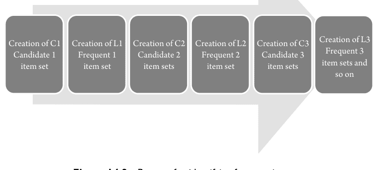

**图 14.8** 识别频繁项集的过程

如前所述，在找到 L1 之后，我们必须从 L1 创建 C2。下面通过使用项集中项目的表示来概括创建候选项集的过程。

## 从 L1 生成候选 2-项集 C2

C2 是通过使用下面所示的 JOIN 操作将 L1 与自身连接而从 L1 生成的。

**JOIN 操作：** $C_k$（一组候选 k-项集）是通过将 $L_{k-1}$ 与自身连接而生成的。在此过程中，应用一些规则来生成候选项集，如下所述。

让我们假设 $l1$、$l2$ 是 $L_{k-1}$ 中的项集，符号 $li[j]$ 指的是项集 $li$ 中的第 $j^{th}$ 个项目。例如，$l1[k-2]$ 指的是 $l1$ 中的倒数第二个项目。

按照惯例，预先假设事务或项集中的项目按其字典顺序排序。对于 (k-1) 项集 $li$，这意味着项目排序满足 $li[1] < li[2] < li[3] < \dots < li[k-1]$。

执行 $L_{k-1}$ 在 $L_{k-1}$ 上的 JOIN，其中 $L_{k-1}$ 的成员如果它们的前 (k-2) 个项目相同，则可以连接。

也就是说，$L_{k-1}$ 的成员 $l1$ 和 $l2$ 如果满足以下条件则可以连接：

$(l1[1]=l2[1]) \wedge (l1[2] = l2[2]) \wedge \dots \wedge (l1[k-2] = l2[k-2]) \wedge (l1[k-1] < l2[k-1])$。

条件 $l1[k-1] < l2[k-1]$ 确保不会生成重复项集。

通过连接 $l1$ 和 $l2$ 形成的项集是 $l1[1], l1[2], l1[3], \dots, l1[k-2], l1[k-1], l2[k-1]$。

因此，它将包括列表 $l1$ 的所有元素和列表 $l2$ 的最后一个元素。

因此，通过将 $L_{k-1}$ 与自身连接来生成候选项集 $C_k$ 有三个关键规则，如下所示。

**规则 1：$L_{k-1}$ 的成员如果它们的前 ($k-2$) 个项目相同则可以连接**

这意味着对于 C2 = L1 JOIN L1，其中 k = 2，由于 k-2 = 0，不需要有共同的前导数据项。因此，列表中的所有项目都可以连接。因此，C2 可以从 L1 形成。

考虑另一个例子；这里，L2 如表 14.27 所示。让我们检查它是否可以连接以创建 C3。

**表 14.27** L2 的项目

| L2 项集 |
|---|
| (1, 2) |
| (1, 3) |
| (2, 5) |

C3 = L2 JOIN L2

*这里，k = 3。因此，k-2 = 1。因此，只有那些前 k-2 个项目（即第一个项目）相同的项集才能连接。因此，项集 (1, 2) 和 (1, 3) 可以连接，因为两个项集的第一个项目都是 1。

现在，让我们检查另一种情况，表 14.28 中给出的列表 L3 是否可以连接以创建 C4。

## 表 14.28 L3 的项目

| L3 项集 |
|---|
| (1, 2, 3) |
| (1, 2, 5) |
| (1, 3, 5) |

C4 = L3 JOIN L3

这里，k = 4。因此，k-2 = 2。因此，那些前 k-2 个项目（即前两个项目）相同的项集可以连接。因此，项集 (1, 2, 3) 和项集 (1, 2, 5) 可以连接，因为它们的前两个项目相同，即 1 和 2。

**规则 2：在可连接的项目列表中，l1(k-1) 应在字母顺序上小于 l2(k-1)，即 l1(k-1) < l2(k-1)。此规则确保项集中的项目必须按字典顺序排列，并且没有重复的项集。**

要理解这个条件，让我们为表 14.29 中给定的 L1 找到 C2。

## 表 14.29 L1 中的项目

| L1 列表 |
|---|
| 1 |
| 2 |
| 4 |
| 5 |

由于 k = 2 且 k-2 = 0，因此不需要共同的项目来将 L1 与自身连接。因此，L1 列表上的所有项目都可以连接。

C2 = L1 JOIN L1（JOIN 的基础是两个项集的笛卡尔积），如表 14.30 所示。

## 表 14.30 C 的生成

| | | |
|---|---|---|
| 1 | JOIN | 1 |
| 2 | | 2 |
| 4 | | 4 |
| 5 | | 5 |

让我们看看每个项的可能配对。

1的可能配对是 (1, 1); (1, 2); (1, 4); (1, 5)。

(1, 1) 不会出现在最终列表中，因为这里 l1(1) = l2(1)，而根据连接规则，l1(1) 应小于 l2(1) [1 不小于 1]。

因此，为1选定的配对是 (1, 2); (1, 4); (1, 5)。

2的可能配对是 (2, 1); (2, 2); (2, 4); (2, 5)。

(2, 1) 和 (2, 2) 未被选中，因为 l1(1) 不小于 l2(1) [2 不小于 1，且 2 不小于 2]。

因此，为2选定的配对是 (2, 4); (2, 5)。

4的可能配对是 (4, 1); (4, 2); (4, 4), (4, 5)。

(4, 1); (4, 2); (4, 4) 未被选中，因为 l1(1) 不小于 l2(1) [4 不小于 1；4 不小于 2；且 4 不小于 4]。

因此，为4选定的配对只有 (4, 5)。

5的可能配对是 (5, 1); (5, 2); (5, 4), (5, 5)。

没有项会被选中，因为 l1(1) 不小于 l2(1) [5 不小于 1, 2, 4, 和 5]。

因此，C2的项集将如表14.31所示。

## 表14.31 生成的C2

| C2 项集 |
|---|
| (1, 2) |
| (1, 4) |
| (1, 5) |
| (2, 4) |
| (2, 5) |
| (4, 5) |

**规则3：由连接l1和l2形成的最终项集是 l1[1], l1[2], : : : , l1[k-2], l1[k-1], l2[k-1]。**

这意味着最终项集将包含第一个项列表的所有项，即从项1到k-1，以及第二个项列表的最后一项，即第二个列表的第k-1项，因为第二个列表的其他k-2项已经存在，它们与第一个列表是共同的。

为了说明这一点，让我们根据表14.32中给定的L2来确定C3。

## 表14.32 L2中的项列表

| L2 项集 |
|---|
| (1, 2) |
| (1, 4) |
| (1, 5) |
| (2, 4) |
| (2, 5) |

这里，项集 (1, 2)（第一个项集）和 (1, 4)（第二个项集）是可连接的，因为它们的第一个项是共同的。C3中的最终项集将是第一个集合 (1, 2) 的所有项和第二个集合的最后一项 (4)，即 (1, 2, 4)。类似地，项集 (1, 2) 和 (1, 5) 是可连接的，将产生 (1, 2, 5) 项集。同样，项集 (1, 4) 和 (1, 5) 是可连接的，将产生 (1, 4, 5) 项集。此外，项集 (2, 4) 和 (2, 5) 是可连接的，将产生 (2, 4, 5) 项集。

因此，C3将如表14.33所示。

## 表14.33 生成的C3

| C3 项集 |
|---|
| (1, 2, 4) |
| (1, 2, 5) |
| (1, 4, 5) |
| (2, 4, 5) |

让我们根据表14.34中给定的L3来确定C4。

## 表14.34 L3中的项列表

| L3 项集 |
|---|
| (1, 2, 4) |
| (1, 2, 5) |
| (1, 4, 5) |
| (2, 4, 5) |

C4 = L3 JOIN L3

在这种情况下，如果它们的前两个项是共同的，则项集是可连接的。

这里，项集 (1, 2, 4) 和 (1, 2, 5) 是可连接的。生成的C4将如表14.35所示。

## 表14.35 生成的C4

| C4 项集 | 将 (1, 2, 4) 视为第一个列表，将 (1, 2, 5) 视为第二个列表。 |
|---|---|
| (1, 2, 4, 5) | 将 (1, 2, 4) 视为第一个列表，将 (1, 2, 5) 视为第二个列表。 |

让我们通过一个例子来理解识别频繁项集的过程。

## 示例14.8

为表14.36中给定的事务数据库找出频繁项集。支持度阈值为50%，置信度阈值为70%。

## 表14.36 示例事务数据库

| 事务ID | 项集 |
|---|---|
| T1 | 1, 2, 4, 5 |
| T2 | 1, 3, 5 |
| T3 | 1, 2, 4, 5 |
| T4 | 1, 2, 3, 5 |
| T5 | 3, 5 |

### 步骤1：创建C1（候选1-项集）

它是事务数据库中的所有单个项目。表14.37显示了C1的项及其频率。

## 表14.37 C1（带计数的候选1-项集）

| 单个项目 | 频率 |
|---|---|
| 1 | 4 |
| 2 | 3 |
| 3 | 3 |
| 4 | 2 |
| 5 | 5 |

### 步骤2：找出频繁1-项集L1

这里，频率等于或大于支持度阈值（即3）的1-项集列表被添加到列表L1中。图14.9显示了从C1生成的列表L1。

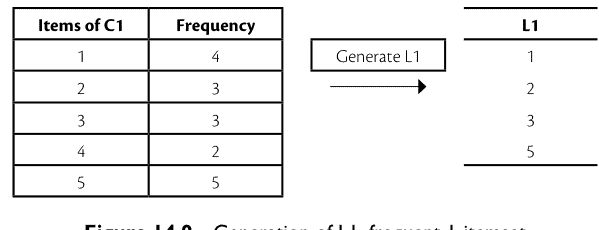

### 步骤3：从L1生成C2

从L1生成候选两项集C2。C2及其频率计数如表14.38所示。

## 表14.38 C2的生成

| C2 项集 | 频率 |
| :--- | :--- |
| (1, 2) | 3 |
| (1, 3) | 2 |
| (1, 5) | 4 |
| (2, 3) | 1 |
| (2, 5) | 3 |
| (3, 5) | 3 |

### 步骤4：找出频繁2-项集L2

通过选择支持度至少为3的候选配对来找出L2的项集。从表14.38可以看出，L2的项集将是 (1, 2), (1, 5), (2, 5), 和 (3, 5)，如下所示。

## 表14.39 L2的生成

| 项集 | 频率 |
| :--- | :--- |
| (1, 2) | 3 |
| (1, 5) | 4 |
| (2, 5) | 3 |
| (3, 5) | 3 |

### 步骤5：从L2生成C3

下一步是从L2生成C3。为了创建C3，L1中任意两个项集的第一个项必须相同。这里，(1, 2) 和 (1, 5) 的第一个元素是共同的，即1。表14.39显示了C3的项集及其频率。

## 表14.39 C3的生成

| C3 项集 | 频率 |
| :--- | :--- |
| (1, 2, 5) | 3 |

### 步骤6：找出频繁3-项集L3

我们可以观察到项集 (1, 2, 5) 的频率是3。它满足支持度阈值。因此，它是频繁3-项集，即给定数据库中列表L3的项集。

因此，L3是最终的频繁项列表，只有一个项集，即 (1, 2, 5)。这完成了Apriori算法的第一阶段。

### 第二阶段：从频繁项集生成关联规则

为了理解从频繁项集生成关联规则的过程，让我们考虑频繁项集 *l* 并遵循图14.10中给出的规则。

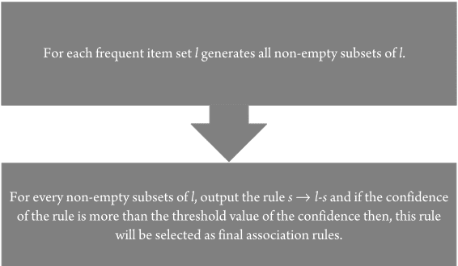

让我们为获得的频繁项集 (1, 2, 5)（表示为 *l*）生成关联规则。(1, 2, 5) 的非空子集是 {{1}, {2}, {5}, {(1, 2)}, {(1, 5)}, {(2, 5)}}。

对于每个非空子集，将按如下方式生成规则。

1 → (2, 5) [这里，1是前件 (*s*)，(2, 5)是后件 (*l-s*)]

2 → (1, 5)

5 → (1, 2)

(1, 2) → 5

(2, 5) → 1

(1, 5) → 2

现在，我们已经生成了可能的规则。下一步将是计算每个规则的置信度，如下所示。

1 → (2, 5)
置信度 = (1∩2∩5出现的支持度)/1出现的支持度 = 3/4 = 0.75

2 → (1, 5)
置信度 = (1∩2∩5出现的支持度)/2出现的支持度 = 3/3 = 1.0

5 → (1, 2)
置信度 = (1∩2∩5出现的支持度)/5出现的支持度 = 3/5 = 0.6

(1, 2) → 5
置信度 = (1∩2∩5出现的支持度)/(1∩2出现的支持度) = 3/3 = 1.0

(2, 5) → 1
置信度 = (1∩2∩5出现的支持度)/(2∩5出现的支持度) = 3/3 = 1.0

(1, 5) → 2
置信度 = (1∩2∩5出现的支持度)/(1∩5出现的支持度) = 3/4 = 0.75

已知置信度的最小阈值为70%。因此，选定的关联规则如下。

- 1 → (2, 5);
- 2 → (1, 5);
- (1, 2) → 5;
- (2, 5) → 1;
- (1, 5) → 2;

我们必须从获得的规则中找出可能的关联规则。

### 1 → (2, 5) 的可能规则

这种情况隐含地表明，规则 1 → 2 和 1 → 5 也将具有所需的置信度。这可以通过观察这些规则的置信度公式来证明。

1 → (2, 5) 的置信度 = S (1∩2∩5)/S (1)

1 → 2 的置信度 = S (1∩2)/S (1)

1 → 5 的置信度 = S (1∩5)/S (1)

所有这三个规则都有相同的分母。此外，S (1∩2∩5) ≤ S (1∩2) 且 S (1∩2∩5) ≤ S (1∩5)。这意味着 S (1∩2) 或 S (1∩5) 的支持度值将始终大于或等于 S (1∩2∩5)。并且如果规则1，[S(1∩2∩5)/S(1)] 满足阈值，那么规则2，[S(1∩2)/S(1)] 和规则3，[S(1∩5)/S(1)] 也将隐含地满足阈值。

因此，规则 1 → (2, 5) 隐含地表明规则 1 → 2 和 1 → 5 也将具有所需的置信度。

### 2 → (1, 5) 的可能规则

这种情况隐含地表明，规则 2 → 1 和 2 → 5 也将具有所需的置信度。这可以通过观察这些规则的置信度公式来证明。

2 → (1, 5) 的置信度 = S (1∩2∩5)/S (2)

2 → 1 的置信度 = S (1∩2)/S (2)

2 → 5 的置信度 = S (2∩5)/S (2)

所有这三个规则都有相同的分母。此外，S (1∩2∩5) ≤ S (1∩2) 且 S (1∩2∩5) ≤ S (2∩5)。

因此，规则 2 → (1, 5) 隐含地表明规则 2 → 1 和 2 → 5 也将具有所需的置信度。

### (1, 2) → 5 的可能规则

由于规则 (1, 2) → 5 具有所需的置信度，直观地会考虑从给定规则生成两个新规则 1 → 5 和 2 → 5。

规则 (1, 2) → 5 并不隐含地表明 1 → 5 和 2 → 5 的置信度将大于阈值。因为这些规则的分子和分母之间没有相关性，如下所示。

(1, 2) → 5 的置信度 = S (1∩2∩5)/S (1∩2)

1 → 5 的置信度 = S (1∩5)/S (1)

2 → 5 的置信度 = S (2∩5)/S (2)

因此，这个关联规则，即 (1, 2) → 5，并不隐含地表明规则 1 → 5 和 2 → 5 的置信度将大于或等于阈值。因此，需要计算这些规则的置信度，这些规则的置信度已在表14.40中计算。

## (2, 5) → 1 的可能规则

规则 (2, 5) → 1 的高置信度并不意味着规则 2 → 1 和 5 → 1 的置信度也会超过阈值。因此，需要计算这些规则的置信度，如表 14.40 所示。

## (1, 5) → 2 的可能规则

类似地，规则 (1, 5) → 2 的高置信度并不意味着规则 1 → 2 和 5 → 2 的置信度会超过阈值。因此，需要计算这些规则的置信度，如表 14.40 所示。

**表 14.40 置信度的计算**

| 规则 | 置信度 |
| :--- | :--- |
| 1 → (2, 5) | S (1∩2∩5)/S (1) = 3/4 = 0.75 |
| 1 → 2 | 直观 |
| 1 → 5 | 直观 |
| 2 → (1, 5) | S (1∩2∩5)/S (2) = 3/3 = 1.0 |
| 2 → 1 | 直观 |
| 2 → 5 | 直观 |
| (1, 2) → 5 | S (1∩2∩5)/S (1∩2) = 3/3 = 1.0 |
| 1 → 5 | S (1∩5)/S (1) = 4/4 = 1.0 |
| 2 → 5 | S (2∩5)/S (2) = 3/3 = 1.0 |
| (2, 5) → 1 | S (1∩2∩5)/S (2∩5) = 3/3 = 1.0 |
| 2 → 1 | S (1∩2)/S (2) = 3/3 = 1.0 |
| 5 → 1 | S (1∩5)/S (5) = 4/5 = 0.8 |
| (1, 5) → 2 | S (1∩2∩5)/S (1∩5) = 3/4 = 0.75 |
| 1 → 2 | S (1∩2)/S (1) = 3/4 = 0.75 |
| 5 → 2 | S (2∩5)/S (5) = 3/5 = 0.6 |

因此，最终置信度大于 75% 阈值的规则如下。重复的规则在此表中仅显示一次。

**最终关联规则**

| 最终关联规则 |
| :--- |
| 1 → (2, 5) |
| 1 → 2 |
| 1 → 5 |
| 2 → (1, 5) |
| 2 → 1 |
| 2 → 5 |
| (1, 2) → 5 |
| (2, 5) → 1 |
| 5 → 1 |
| (1, 5) → 2 |

## 14.7.3 先验性质

先验性质：通过剪枝候选项目集改进 Apriori 算法：第 1 部分 | 关联挖掘 | Parteek Bhatia, https://youtu.be/Qrm7XtMPGaI

先验性质：通过剪枝候选项目集改进 Apriori 算法：第 2 部分 | 关联挖掘 | Parteek Bhatia, https://youtu.be/8UfyuVwRuB4

先验性质用于显著提高 Apriori 算法第一阶段的性能，即识别频繁项目集。

**先验性质指出，一个频繁项目集的所有非空子集也必须是频繁的。**

这一性质对于减少候选项目集的大小非常有用。你已经观察到，要找到一个频繁项目集，我们必须计算每个候选项目集的频率。候选项目集的规模越小，意味着执行速度越快，算法效率越高。

剪枝性质意味着候选项目集的所有可能子集也应该是频繁的；否则，它就不可能是频繁的。

因此，如果一个候选项目集的所有可能子集都不是频繁的，那么该项目集将从候选项目集中移除，因为它不可能是频繁的。这一步称为候选项目集的剪枝，它将减少搜索空间并提升算法性能。因此，我们可以得出结论，先验性质要求计算更少的项目对的频率。

这些频繁项目集形成一个格结构，如下所述。

### 频繁项目集的格结构

先验性质可以通过格结构很好地可视化展示。假设数据库中有四个项目，例如 A、B、C 和 D。四项目集 ABCD 是频繁的，当且仅当其所有三项目子集 ABC、ABD、ACD 和 BCD 都是频繁的。项目集 ABC 是频繁的，当且仅当其二项目子集 AB、AC 和 BC 是频繁的。类似地，ABD 是频繁的，当且仅当其子集项目集 AB、AD 和 BD 是频繁的。同样，ACD 是频繁的，当且仅当其子集项目集 AC、AD 和 CD 是频繁的，BCD 是频繁的，当且仅当其子集项目集 BC、BD 和 CD 是频繁的。而所有这些二项目集是频繁的，当且仅当它们的子集，即 A、B、C 和 D 也是频繁的。这就形成了一个格结构，如图 14.11 所示。

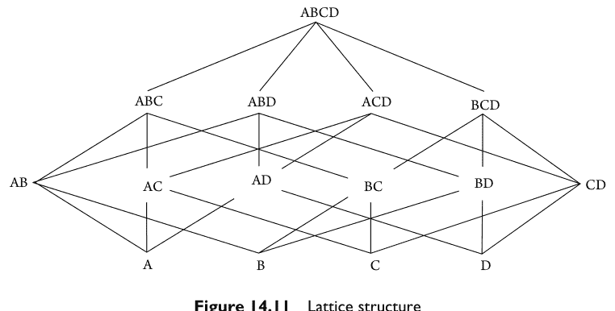

**图 14.11** 格结构

假设我们有三个项目，例如 1、2 和 3。由于超集的支持度总是小于或等于其子集的支持度，因此如果一个项目集 (1, 2, 3) 是频繁的，那么它的子集 (1, 2)、(1, 3) 和 (2, 3) 也应该是频繁的。如果这些二项目集中的任何一个不是频繁的，那么 (1, 2, 3) 也不会是频繁的。这意味着如果 (1, 3) 不是频繁的，那么 (1, 2, 3) 也不会是频繁的。

这个先验性质也解释了连接原则中要求前 k-2 个项目相同的显著意义。

假设我们有 L2 为 (1, 2) 和 (2, 3)。那么，有人可能认为它可以生成一对 (1, 2, 3) 作为 C3。但如前所述，(1, 2, 3) 只有当其所有非空子集，即 (1, 2)、(2, 3) 和 (1, 3) 都是频繁的时，才是频繁的。这里，(1, 3) 不是频繁的。因此，L2 中的项目，即 (1, 2) 和 (2, 3)，是不可连接的，项目集 (1, 2, 3) 不会被选入候选集 C3。因此，连接原则中要求前 k-2 个项目必须相同的条件被强制执行以确保这一点。

现在，如果 L2 有 (1, 2) 和 (1, 3) 但没有 (2, 3) 会怎样？那么，根据连接原则，C3 将生成为 (1, 2, 3)，但先验性质会将其丢弃，因为它的非空子集之一，即 (2, 3)，不是频繁的。

**因此，结合连接原则和先验性质使整个过程变得完整。**

总之，决定候选项目集的不仅仅是连接原则；连接原则可能产生额外的项目集，这些项目集可以进一步通过剪枝性质或先验性质移除。

## 示例 14.9

表 14.41 给出了一个杂货店的事务数据库。它包含九个事务和五个项目。当最小支持度为 30%，最小置信度为 70% 时，找出所有可能的关联规则。

**表 14.41** 杂货店的事务数据库

| 事务 ID | 项目列表 |
|---|---|
| T1 | I1, I3 |
| T2 | I2, I4 |
| T3 | I1, I2, I3, I5 |
| T4 | I2, I4, I5 |
| T5 | I1, I2, I3 |
| T6 | I4, I5 |
| T7 | I1, I3 |
| T8 | I1, I2, I4, I5 |
| T9 | I1, I2, I4, I5 |

让我们找出数据库中每个项目 C1 的频率计数。表 14.42 显示了所有项目的计数。

**表 14.42** C1 的项目及其频率

| 项目 | 频率计数 |
|---|---|
| I1 | 6 |
| I2 | 6 |
| I3 | 4 |
| I4 | 5 |
| I5 | 5 |

如果一个项目集在事务中出现三次（3/9 = 0.33），则它是频繁的，因为最小支持度为 30%。从表 14.42，我们可以得出结论，所有 C1 项目都是频繁的。因此，所有这些项目都被添加到频繁 1-项目集列表 L1 中。下一步是从 L1 生成 C2。

C2 = L1 JOIN L1

从 L1 创建 C2 并找到 L2 的过程如图 14.12 所示。

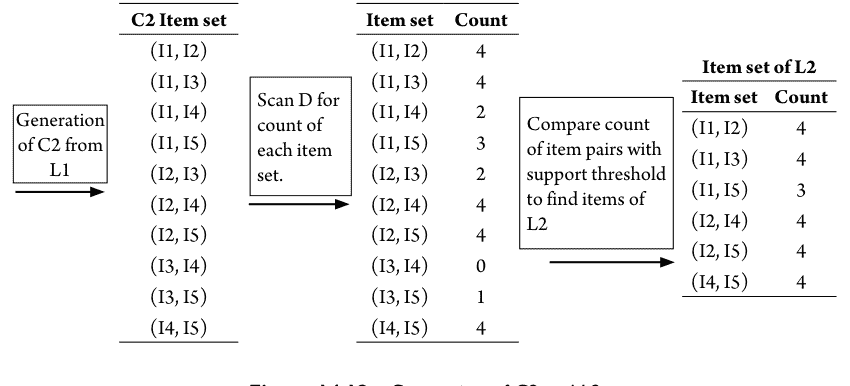

这里，L2 有六个项目。从这个 L2，使用连接原则生成 C3，条件是“前 k-2 个项目，即第一个项目必须相同（这里 k 是 3）”。连接操作后可能的 3-项目集如表 14.43 所示。

**表 14.43 C3 的生成**

| C3 的项目集 |
| :--- |
| (I1, I2, I3) |
| (I1, I2, I5) |
| (I1, I3, I5) |
| (I2, I4, I5) |

从 C3，我们需要找到频繁项目列表 L3。在找到 L3 的项目集之前，让我们使用先验性质来剪枝候选列表 C3。

应用先验性质，我们必须检查是否有任何候选项目集包含一个非频繁的子集。如果任何候选项目集有一个非频繁的子集，它将被剪枝或从候选项目集中移除。

表 14.44 显示了每个项目集的剪枝以及测试其子集是否频繁。

**表 14.44 候选项目集 C3 的剪枝**

| 项目集 | 测试子集 | 结果 |
| :--- | :--- | :--- |
| (I1, I2, I3) | (I1, I2, I3) 的二项目子集是 (I1, I2)、(I1, I3) 和 (I2, I3)。虽然 (I1, I2) 和 (I1, I3) 存在于 L2 中，但 (I2, I3) 不在 L2 中。由于 (I2, I3) 不是频繁的。因此，从 C3 中移除 (I1, I2, I3)。 | 不合格 |
| (I1, I2, I5) | (I1, I2, I5) 的二项目子集是 (I1, I2)、(I1, I5) 和 (I2, I5)。所有这些子集都存在于 L2 中。因此，将项目集 (I1, I2, I5) 保留在 C3 中。 | 合格 |
| (I1, I3, I5) | (I1, I3, I5) 的二项目子集是 (I1, I3)、(I1, I5) 和 (I3, I5)。虽然 (I1, I3) 和 (I1, I5) 存在于 L2 中，但 (I3, I5) 不在 L2 中。这里，(I3, I5) 不是频繁的。因此，从 C3 中移除 (I1, I3, I5)。 | 不合格 |
| (I2, I4, I5) | (I2, I4, I5) 的二项目子集是 (I2, I4)、(I2, I5) 和 (I4, I5)。所有这些子集都存在于 L2 中。因此，将项目集 (I2, I4, I5) 保留在 C3 中。 | 合格 |

剪枝后的最终候选项目集 C3，或称为剪枝后的 C3，如表 14.44 所示。

**表 14.44** 剪枝后的 C3

| 剪枝后 C3 的项目 |
| :--- |
| (I1, I2, I5) |
| (I2, I4, I5) |

需要注意的是，剪枝提高了算法的效率，因为在这种情况下，我们不需要计算四个 3-项目对的计数，而只需要计算两个 3-项目对（剪枝后的列表）的计数，这是系统效率的显著提升。因此，剪枝后，搜索空间从 4 减少到 2。

现在，我们需要找到这两个 3-项目集的支持计数，即我们只需要找到剪枝后列表的支持计数。通过这种方式，我们将通过识别 C3 的频繁项目集（即支持计数大于 3 的项目集）来找到 L3 的项目集，如图 14.13 所示。

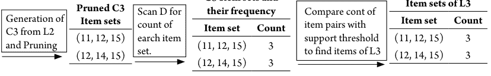

**图 14.13** C3 和 L3 的生成

这里，我们得到了两个频繁的3-项集。下一步是生成C4，如下所示。

```
C4 = L3 JOIN L3
```

要生成C4，前k-2个项，即前2个项，在项集中必须是相同的（这里，k是4）。但是项集(I1, I2, I5)和项集(I2, I4, I5)不满足这个条件。因此，候选集C4没有项，因为无法进行连接。所以，无法生成其他项集。

Apriori算法的第一阶段完成。图14.14显示了格结构。在下一阶段，必须从频繁项集中生成关联规则。

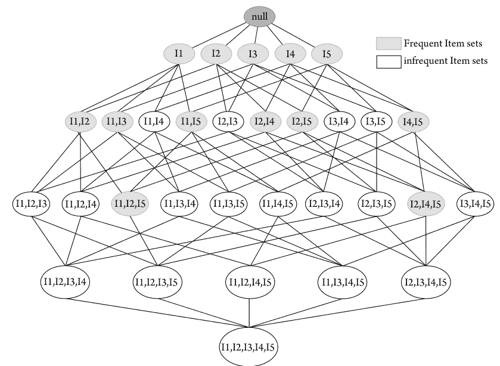

## 阶段二：从频繁项集生成关联规则

我们必须找到频繁项集的非空子集，以便为项集(I1, I2, I5)生成规则。3-项集(I1, I2, I5)有六个非空子集。它们是

```
{{I1}, {I2}, {I5}, {(I1, I2)}, {(I1, I5)}, {(I2, I5)}}.
```

对于这些非空子集，规则生成如下。

```
I1 → (I2, I5); [这里，I1是s，(I2, I5)是l-s]
I2 → (I1, I5);
I5 → (I1, I2);
(I1, I2) → I5;
(I1, I5) → I2;
(I2, I5) → I1;
```

现在，我们必须计算每条规则的置信度，如下所示。

```
I1 → (I2, I5); 置信度 = S(I1∩I2∩I5)/S(I1) = 3/6 = 0.5
I2 → (I1, I5); 置信度 = S(I1∩I2∩I5)/S(I2) = 3/6 = 0.5
I5 → (I1, I2); 置信度 = S(I1∩I2∩I5)/S(I5) = 3/5 = 0.6
(I1, I2) → I5; 置信度 = S(I1∩I2∩I5)/S(I1∩I2) = 3/4 = 0.75
(I1, I5) → I2; 置信度 = S(I1∩I2∩I5)/S(I1∩I5) = 3/3 = 1.0
(I2, I5) → I1; 置信度 = S(I1∩I2∩I5)/S(I2∩I5) = 3/4 = 0.75
```

已知置信度阈值为70%。这里，只有三条规则，即(I1, I2) → I5；(I1, I5) → I2和(I2, I5) → I1的置信度大于或等于阈值置信度。

让我们从另一个频繁项集(I2, I4, I5)生成非空子集，并检查所需的置信度规则。

非空子集是{{I2}, {I4}, {I5}, {(I2, I4)}, {(I2, I5)}, {(I4, I5)}}。

对于这些非空子集，规则生成如下。

```
I2 → (I4, I5); [这里，I2是s，(I4, I5)是l-s]
I4 → (I2, I5);
I5 → (I2, I4);
(I2, I4) → I5;
(I2, I5) → I4;
(I4, I5) → I2;
```

现在，我们必须计算每条规则的置信度，如下所示。

```
I2 → (I4, I5); 置信度 = S(I2∩I4∩I5)/S(I2) = 3/6 = 0.5
I4 → (I2, I5); 置信度 = S(I2∩I4∩I5)/S(I4) = 3/5 = 0.6
I5 → (I2, I4); 置信度 = S(I2∩I4∩I5)/S(I5) = 3/5 = 0.6
(I2, I4) → I5; 置信度 = S(I2∩I4∩I5)/S(I2∩I4) = 3/4 = 0.75
(I2, I5) → I4; 置信度 = S(I2∩I4∩I5)/S(I2∩I5) = 3/4 = 0.75
(I4, I5) → I2; 置信度 = S(I2∩I4∩I5)/S(I4∩I5) = 3/4 = 0.75
```

由于置信度阈值为70%，只有三条规则具有所需的置信度，即(I2, I4) → I5；(I2, I5) → I4和(I4, I5) → I2的置信度大于或等于70%。

因此，需要置信度的规则如下：
- (I1, I2) → I5；
- (I2, I5) → I1；
- (I1, I5) → I2；
- (I2, I4) → I5；
- (I2, I5) → I4；
- (I4, I5) → I2。

### 来自(I1, I2) → I5的可能规则

从这条规则出发，很自然地会想到创建两条新规则：I1 → I5和I2 → I5。项集(I1, I2) → I5具有所需的置信度。这并不意味着从这条规则生成的规则，即I1 → I5和I2 → I5，也具有所需的置信度。这些规则的分子和分母之间没有相关性。

```
(I1, I2) → I5的置信度 = S(I1∩I2∩I5)/S(I1∩I2)
I1 → I5的置信度 = S(I1∩I5)/S(I1)
I2 → I5的置信度 = S(I2∩I5)/S(I2)
```

因此，规则(I1, I2) → I5并不隐含地表示I1 → I5和I2 → I5具有所需的置信度。因此，我们需要计算这些规则的置信度。

类似地，规则(I2, I4) → I5具有所需的置信度。这并不隐含地表示从(I2, I4) → I5生成的规则，即I2 → I5和I4 → I5满足阈值限制。

表14.45说明了关联规则的生成过程。

### 表14.45 关联规则的生成

| 序号 | 规则 | 讨论 | 置信度 | 是否大于置信度阈值 |
|---|---|---|---|---|
| 1 | (I1, I2) → I5 | 已识别。 | 0.75 | 是 |
| 2 | I1→I5 | 之前未发现，需要计算置信度。 | I1 → I5的置信度 = S(I1∩I5)/S(I1) = 3/6 = 0.5。 | 否 |
| 3 | I2→I5 | 之前未发现，需要计算置信度。 | I2 → I5的置信度 = S(I2∩I5)/S(I2) = 4/6 = 0.67。 | 否 |
| 4 | (I2, I5) → I1 | 已识别。 | 0.75 | 是 |
| 5 | I2 → I1 | 之前未发现，需要计算置信度。 | I2 → I1的置信度 = S(I2∩I1)/S(I2) = 4/6 = 0.67。 | 否 |
| 6 | I5 → I1 | 之前未发现，需要计算置信度。 | I5 → I1的置信度 = S(I5∩I1)/S(I5) = 3/5 = 0.6。 | 否 |
| 7 | (I1, I5) → I2 | 已识别。 | 1.0 | 是 |
| 8 | I1 → I2 | 之前未发现，需要计算置信度。 | I1 → I2的置信度 = S(I1∩I2)/S(I1) = 4/6 = 0.67。 | 否 |
| 9 | I5 → I2 | 之前未发现，需要计算置信度。 | I5 → I2的置信度 = S(I5∩I2)/S(I5) = 4/5 = 0.8。 | 是 |
| 10 | (I2, I4) → I5 | 已识别。 | 0.75 | 是 |
| 11 | I2 → I5 | 已在序号3列出的规则(I1, I2) → I5中发现。 | 0.67 | 否 |
| 12 | I4 → I5 | 之前未发现，需要计算置信度。 | I4 → I5的置信度 = S(I4∩I5)/S(I4) = 4/5 = 0.8。 | 是 |
| 13 | (I2, I5) → I4 | 已识别。 | 0.75 | 是 |
| 14 | I2 → I4 | 之前未发现，需要计算置信度。 | I2 → I4的置信度 = S(I2∩I4)/S(I2) = 4/6 = 0.67 | 否 |
| 15 | I5 → I4 | 之前未发现，需要计算置信度。 | I5 → I4的置信度 = S(I5∩I4)/S(I5) = 4/5 = 0.8。 | 是 |
| 16 | (I4, I5) → I2 | 已识别。 | 0.75 | 是 |
| 17 | I4 → I2 | 之前未发现，需要计算置信度。 | I4 → I2的置信度 = S(I2∩I4)/S(I4) = 4/5 = 0.8。 | 是 |
| 18 | I5 → I2 | 已在序号9列出的规则(I1, I5) → I2中发现。 | 0.8 | 是（已列出） |

到目前为止，我们讨论了从3-项集生成的规则。在寻找关联规则时，查看L2也很重要。一些2-项集规则可能没有出现在从3-项集生成的规则中，可能会被遗漏。因此，我们需要重新检查列表L2，以确保没有遗漏任何产生式规则。表14.46讨论了频繁2-项集（来自图14.12）及其规则。

### 表14.46 从频繁2-项集（即L2）生成的关联规则

| L2的项集 | 讨论 | 新识别的规则 |
| :--- | :--- | :--- |
| (I1, I2) | 此项对已被涵盖，因为它是表14.45中讨论的(I1, I5) → I2和(I2, I5) → I1规则的子集。 | 无 |
| (I1, I3) | 此项对在之前的讨论中未被涵盖。可能的规则是I1 → I3和I3 → I1。I1 → I3的置信度 = S(I1∩I3)/S(I1) = 4/6 = 0.67。I3 → I1的置信度 = S(I1∩I3)/S(I3) = 4/4 = 1.0。 | 新规则I3 → I1的置信度大于阈值。因此，I3 → I1是新规则。 |
| (I1, I5) | 此项对已被涵盖，因为它是表14.45中讨论的(I1, I2) → I5和(I2, I5) → I1规则的子集。 | 无 |
| (I2, I4) | 此项对已被涵盖，因为它是表14.45中讨论的(I2, I5) → I4和(I4, I5) → I2规则的子集。 | 无 |
| (I2, I5) | 此项对已被涵盖，因为它是表14.45中讨论的(I2, I4) → I5和(I4, I5) → I2规则的子集。 | 无 |
| (I4, I5) | 此项对已被涵盖，因为它是表14.45中讨论的(I2, I4) → I5和(I2, I5) → I4规则的子集。 | 无 |

因此，从表14.46中，我们识别出一个新的产生式规则I3 → I1，其置信度大于或等于阈值，即70%。

因此，支持度大于或等于30%且置信度大于或等于70%的最终关联规则如下。

- (I1, I2) → I5；
- (I2, I5) → I1；
- (I1, I5) → I2；
- (I2, I4) → I5；
- (I2, I5) → I4；
- (I4, I5) → I2；
- I5 → I2；
- I4 → I5；
- I5 → I4；
- I4 → I2；
- I3→ I1。

## 14.8 闭项集与最大项集

为了提高关联挖掘过程的效率，频繁项集可以分为闭项集和最大项集。

频繁项集可以根据项集的支持计数分为闭项集和最大项集。

- 闭项集：一个频繁项集，比如X，是闭的，如果不存在与X具有相同支持计数的X的超集。
- 最大项集：一个频繁项集，比如Y，是最大的，如果它的所有直接超集都不是频繁的，即Y是最大项集当且仅当它不是任何其他频繁项集的真子集。

最大项集总是闭项集，但闭项集不一定是最大项集。图14.15显示了频繁项集、闭项集和最大项集之间的关系。

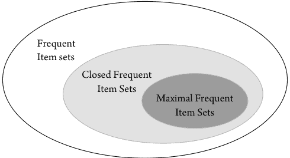

**图14.15** 频繁项集、闭项集和最大项集之间的关系

让我们考虑一个例子，了解如何在数据库中找到闭项集和最大项集。

## 示例14.10

一个购物中心的数据库有五笔交易，涉及五个项目，如表14.47所示。所需的最小支持度为40%。

## 表 14.47 用于说明闭项集和最大项集的事务数据库

| 事务 ID | 项目列表 |
|---|---|
| 1000 | 牛仔裤，长裤，T恤 |
| 1001 | 连帽衫，牛仔裤，长裤，T恤 |
| 1002 | 连帽衫，牛仔裤，围巾，T恤 |
| 1003 | 连帽衫，围巾，长裤 |
| 1004 | 牛仔裤，围巾，T恤 |

由于总共有五个事务，一个项集必须出现两次才能满足最小支持度要求。表 14.48 显示了所有支持度大于或等于 2 的频繁项集，并讨论了它们作为闭项集和最大项集的资格。

请读者自行找出表 14.47 所给数据库中支持度大于或等于 2 的频繁项集，并将结果与表 14.48 中给出的频繁项集进行比较。

## 表 14.48 表 14.47 数据库的频繁项集

| 频繁项集 | 支持度 | 是否为闭项集？ | 是否为最大项集？ | 两者都是？ |
|---|---|---|---|---|
| {长裤} | 3 | 是，因为不存在支持度 = 3 的长裤的超集。 | 否，因为它是频繁项集 {长裤，T恤，牛仔裤} 的真子集。 | 否 |
| {T恤} | 4 | 否，因为存在支持度 = 4 的T恤的超集，即 {T恤，牛仔裤}。 | 否，因为它是频繁项集 {T恤，牛仔裤，连帽衫} 的真子集。 | 否 |
| {牛仔裤} | 4 | 否，因为存在支持度 = 4 的牛仔裤的超集，即 {T恤，牛仔裤}。 | 否，因为它是频繁项集 {T恤，牛仔裤，连帽衫} 的真子集。 | 否 |
| {连帽衫} | 3 | 是，因为不存在支持度 = 3 的连帽衫的超集。 | 否，因为它是频繁项集 {T恤，牛仔裤，连帽衫} 的真子集。 | 否 |
| {围巾} | 3 | 是，因为不存在支持度 = 3 的围巾的超集。 | 否，因为它是频繁项集 {T恤，牛仔裤，围巾} 的真子集。 | 否 |
| {长裤，T恤} | 2 | 否，因为存在支持度 = 2 的 {长裤，T恤} 的超集，即 {长裤，T恤，牛仔裤}。 | 否，因为它是频繁项集 {长裤，T恤，牛仔裤} 的真子集。 | 否 |
| {长裤，牛仔裤} | 2 | 否，因为存在支持度 = 2 的 {长裤，牛仔裤} 的超集，即 {长裤，T恤，牛仔裤}。 | 否，因为它是频繁项集 {长裤，T恤，牛仔裤} 的真子集。 | 否 |
| {长裤，连帽衫} | 2 | 是，因为不存在支持度 = 2 的 {长裤，连帽衫} 的超集。 | 是，因为它不是任何其他频繁项集的真子集。 | 是 |
| {T恤，牛仔裤} | 4 | 是，因为不存在支持度 = 4 的 {T恤，牛仔裤} 的超集。 | 否，因为它是频繁项集 {T恤，牛仔裤，连帽衫} 的真子集。 | 否 |
| {T恤，围巾} | 2 | 否，因为存在支持度 = 2 的 {T恤，围巾} 的超集，即 {T恤，牛仔裤，围巾}。 | 否，因为它是频繁项集 {T恤，牛仔裤，围巾} 的真子集。 | 否 |
| {牛仔裤，连帽衫} | 2 | 否，因为存在支持度 = 2 的 {牛仔裤，连帽衫} 的超集，即 {T恤，牛仔裤，连帽衫}。 | 否，因为它是频繁项集 {T恤，牛仔裤，连帽衫} 的真子集。 | 否 |
| {牛仔裤，围巾} | 2 | 否，因为存在支持度 = 2 的 {牛仔裤，围巾} 的超集，即 {T恤，牛仔裤，围巾}。 | 否，因为它是频繁项集 {T恤，牛仔裤，围巾} 的真子集。 | 否 |
| {连帽衫，围巾} | 2 | 是，因为不存在支持度 = 2 的 {连帽衫，围巾} 的超集。 | 是，因为它不是任何其他频繁项集的真子集。 | 是 |
| {长裤，T恤，牛仔裤} | 2 | 是，因为不存在支持度 = 2 的 {长裤，T恤，牛仔裤} 的超集。 | 是，因为它不是任何其他频繁项集的真子集。 | 是 |
| {T恤，牛仔裤，连帽衫} | 2 | 是，因为不存在支持度 = 2 的 {T恤，牛仔裤，连帽衫} 的超集。 | 是，因为它不是任何其他频繁项集的真子集。 | 是 |
| {T恤，牛仔裤，围巾} | 2 | 是，因为不存在支持度 = 2 的 {T恤，牛仔裤，围巾} 的超集。 | 是，因为它不是任何其他频繁项集的真子集。 | 是 |
| 计数：16 | | 计数：9 | 计数：5 | 计数：5 |

从表 14.48 中，我们可以观察到有 16 个频繁项集。但闭项集只有 9 个，最大项集只有 5 个。我们可以观察到闭项集和最大项集的数量远少于频繁项集。由此，我们可以观察到最大项集是闭项集，但闭项集不一定是最大项集。

图 14.16 显示了示例数据集的格结构。

从格结构中我们可以得出结论，有 16 个频繁项。其中，最大项集是 {长裤，连帽衫}、{连帽衫，围巾}、{长裤，T恤，牛仔裤}、{T恤，牛仔裤，连帽衫} 和 {T恤，牛仔裤，围巾}，因为它们的超集不是频繁的。

需要注意的是，最大频繁项集或闭项集的大小通常小于频繁项集，因此它们可能是规则生成的更好选择。一个高效的算法是只挖掘最大频繁项集，而不是所有频繁项集。

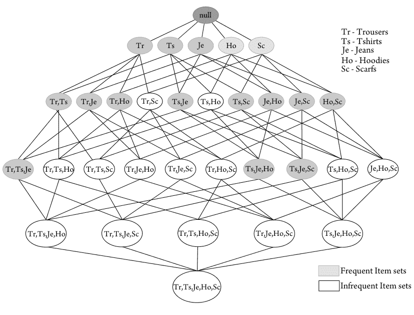

## 14.9 Apriori 算法的局限性

尽管 Apriori 算法很重要，但它有一些局限性。该算法多次扫描数据库（以查找项集的支持度计数）。这降低了速度，从而影响了整体性能。它生成大量的候选项集。由于它遵循自底向上的方法，如果我们需要一个最大子集，比如 S，只有在扫描了 S 的所有真子集（S 的真子集数量为 2^|S|-1）之后才能找到它。Apriori 算法的时间和空间复杂度非常高（O (2^|N|)，其中 N = 项目数量）。

## 14.10 用于生成关联挖掘规则的 Apriori–TID 算法

Apriori–TID 使用 Apriori 算法来生成候选项集和频繁项集；唯一的区别是它在实现时使用了 TID 或垂直存储方法（在第 14.6.3 节中讨论）。

Apriori–TID 算法的工作原理如下。

1.  扫描整个事务数据库，将其转换为 TID 存储并表示为 T1（即 T1 的每个条目由事务中的所有项目以及相应的 TID 组成）。
2.  使用 T1 计算频繁 1-项集 L1。
3.  应用 Apriori 算法下讨论的连接原则获得 C2。
4.  通过交叉相应的行，借助 T1 计算 C2 中候选项的支持度，并创建一个新的 TID 数据集，表示为 T2，其中包含两个项目对。
5.  通过常规方法从 C2 生成 L2，然后再次使用连接原则从 L2 生成 C3。
6.  使用 T2 和 C3 生成 T3。重复此过程，直到候选 k-项集的集合为空集。

为了理解其实现，让我们讨论一个示例。

## 示例 14.11

让我们考虑前面示例中讨论的事务。表 14.49 给出了一个购物中心的事务。阈值支持度为 50%。使用 Apriori–TID 算法找出频繁项集。

**表 14.49** 购物中心事务数据库

| 事务 ID | 项目列表 |
|---|---|
| 1000 | 牛仔裤，长裤，T恤 |
| 1001 | 连帽衫，牛仔裤，长裤，T恤 |
| 1002 | 连帽衫，牛仔裤，围巾，T恤 |
| 1003 | 连帽衫，围巾，长裤 |
| 1004 | 牛仔裤，围巾，T恤 |

## 步骤 1：将数据库表示转换为垂直存储

首先，扫描整个事务数据库。在 TID 存储中，每个事务以列表示。如果一个项目出现在某个事务中，则在该项目行和事务 ID 列对应的单元格中插入 1。例如，长裤出现在事务 ID 1000 中。因此，对应于 1000 和长裤项目事务 ID 的单元格取值为 1。类似地，如果一个项目未出现在某个事务中，则插入 0。表 14.50 显示了表示为 T1 的 TID 存储。

## 表 14.50 事务数据库 T1

| 项目 | 事务 ID | | | | |
| :--- | :---: | :---: | :---: | :---: | :---: |
| | 1000 | 1001 | 1002 | 1003 | 1004 |
| 连帽衫 | 0 | 1 | 1 | 1 | 0 |
| 牛仔裤 | 1 | 1 | 1 | 0 | 1 |
| 围巾 | 0 | 0 | 1 | 1 | 1 |
| 裤子 | 1 | 1 | 0 | 1 | 0 |
| T恤 | 1 | 1 | 1 | 0 | 1 |

## 步骤 2：寻找频繁 1-项集

使用表 T1 计算频繁 1-项集 L1。为此，需要计算每行中 1 的数量。

由于总事务数为 5，所需支持度为 50%，因此最小支持度计数为 3。必须选择在事务中出现三次或以上的所有项目，以找到列表 L1。表 14.51 显示了使用 T1 计算出的列表 L1。

## 表 14.51 L1 的项目

| 项集 | 支持度 |
| :--- | :---: |
| 连帽衫 | 3 |
| 牛仔裤 | 4 |
| 围巾 | 3 |
| 裤子 | 3 |
| T恤 | 4 |

## 步骤 3：生成 C2

使用 L1 上的连接原理，我们得到候选 2-项集 C2。

C2 = L1 JOIN L1

生成的 C2 如表 14.52 所示。

## 表 14.52 生成的 C2

| 项集 |
| :--- |
| (连帽衫, 牛仔裤) |
| (连帽衫, 围巾) |
| (连帽衫, 裤子) |
| (连帽衫, T恤) |
| (牛仔裤, 围巾) |
| (牛仔裤, 裤子) |
| (牛仔裤, T恤) |
| (围巾, 裤子) |
| (围巾, T恤) |
| (裤子, T恤) |

## 步骤 4：计算 C2 中项集的支持度

使用 C2 的项集创建一个新的 TID 数据集，表示为 T2。如果一个项目对出现在某个事务中，则对应的单元格取值为 1。表 14.53 表示数据集 T2。通过计算每行中 1 的数量，我们得到项目对的支持度计数。

**表 14.53 事务数据库 T2**

| 项集 | 事务 ID | | | | |
| :--- | :---: | :---: | :---: | :---: | :---: |
| | **1000** | **1001** | **1002** | **1003** | **1004** |
| (连帽衫, 牛仔裤) | 0 | 1 | 1 | 0 | 0 |
| (连帽衫, 围巾) | 0 | 0 | 1 | 1 | 0 |
| (连帽衫, 裤子) | 0 | 1 | 0 | 1 | 0 |
| (连帽衫, T恤) | 0 | 1 | 1 | 0 | 0 |
| (牛仔裤, 围巾) | 0 | 0 | 1 | 0 | 1 |
| (牛仔裤, 裤子) | 1 | 1 | 0 | 0 | 0 |
| (牛仔裤, T恤) | 1 | 1 | 1 | 0 | 1 |
| (围巾, 裤子) | 0 | 0 | 0 | 1 | 0 |
| (围巾, T恤) | 0 | 0 | 1 | 0 | 1 |
| (裤子, T恤) | 1 | 1 | 0 | 0 | 0 |

根据表 14.53，C2 项集的支持度如表 14.54 所示。

**表 14.54 C2 项集的支持度计数**

| 项集 | 支持度计数 |
| :--- | :---: |
| (连帽衫, 牛仔裤) | 2 |
| (连帽衫, 围巾) | 2 |
| (连帽衫, 裤子) | 2 |
| (连帽衫, T恤) | 2 |
| (牛仔裤, 围巾) | 2 |
| (牛仔裤, 裤子) | 2 |
| (牛仔裤, T恤) | 4 |
| (围巾, 裤子) | 1 |
| (围巾, T恤) | 2 |
| (裤子, T恤) | 2 |

## 步骤 5：识别频繁 2-项集

根据数据集 T2，计算了项集的支持度计数。现在，我们需要使用表 14.54 生成 L2。支持度计数大于或等于 3 的项集被添加到列表 L2 中。表 14.55 显示了列表 L2。

**表 14.55 L2 中的项集**

| 项集 | 支持度计数 |
|---|---|
| (牛仔裤, T恤) | 4 |

项目列表 L2 仅包含一个项集。因此，无法从 L2 生成 C3，因此扫描数据集以及生成候选和频繁项集的过程在此停止。

此外，下一阶段关联规则的生成与 Apriori 算法中使用的步骤类似，建议读者为 (牛仔裤, T恤) 生成关联规则，并检查其置信度值，选择满足置信度阈值的关联规则。

### 14.10.1 Apriori-TID 算法的优点

Apriori-TID 算法相对于 Apriori 算法的主要优势在于使用了垂直存储结构。在 Apriori-TID 中，通过计算相应行中 1 的数量来找到项目的支持度计数。对于 2-项集，对任意两行应用 AND 操作并对结果 1 求和，即可得到相应项集的计数。

另一个优点是降低了空间复杂度，因为 Tk 的大小远小于事务数据库的大小。

Apriori 和 Apriori-TID 算法都使用相同的候选生成过程、寻找频繁项集和生成关联规则。但是，在 Apriori 算法的情况下，我们需要扫描数据库以找到候选 k-项集。相比之下，在 Apriori-TID 的情况下，我们需要计算相应 Tk 行中存在的 1 的数量，以找到每个候选 k-项集的支持度计数。这加快了 Apriori-TID 算法的速度，因此其性能优于 Apriori 算法。

至此，我们结束了对关联挖掘及其各种算法的讨论。在下一章中，我们将通过各种案例研究来讨论关联挖掘的实现。

#### 提醒我

- 关联挖掘是一种在大型数据集中发现变量或项目之间关系的技术。它寻找经常同时出现的模式和相关性，例如客户倾向于一起购买哪些产品，或者哪些网页经常被一起访问。目标是识别有意义的关联，然后可用于改进业务策略或提供对消费者行为的洞察。
- “购物篮”分析是关联规则挖掘的另一个名称，因为它是一种非常有效的技术，用于发现项目 A 的销售与项目 B 的销售之间的关联。
- 在关联挖掘中，符号 A → B 表示两个项目集 A 和 B 之间的关联规则，其中 A 是前件，B 是后件。此规则表明，如果一个事务包含集合 A 中的所有项目，那么它也可能包含集合 B 中的所有项目。
- 用于评估关联规则强度的指标是支持度、置信度和提升度。
- 假设 N 是事务总数。A 的支持度等于 A 在数据库中出现的次数除以 N。
- A → B 的置信度定义为 A 和 B 一起出现的支持度与 A 的支持度之比（与 A 已经发生时 B 的条件概率相同）。
- A → B 的提升度是给定 A 时 B 的条件概率与数据集中 B 的无条件概率之比。
- 改进的朴素算法不是计算库存中所有可能的项目组合，而是仅关注在事务中售出的项目。
- 存储事务数据集有三种方式，即简单存储、水平存储和垂直存储。
- Apriori 算法包含两个阶段。在第一阶段，识别频繁项集，即那些超过最小所需支持度的项集。在第二阶段，从频繁项集中识别满足最小置信度阈值的关联规则。
- Apriori 性质指出“频繁项集的所有非空子集也必须是频繁的”。
- 要为频繁项集 l 生成关联规则，我们必须生成 l 的所有非空子集 (s)，并且对于 l 的每个非空子集 (s)，输出规则 s → l-s。如果规则的置信度大于置信度的阈值，则该规则将被选为最终关联规则。
- Apriori-TID 使用 Apriori 算法来推导候选和频繁项集；唯一的区别是它使用 TID 或垂直存储方法来实现。

#### 附加资源

##### 书籍

- Bhatia, Parteek (2019). *Data Mining and Data Warehousing: Principles and Practical Techniques*. Cambridge University Press.
- Gupta, G. K. (2014). *Introduction to Data Mining with Case Studies*. PHI Learning Pvt. Ltd.
- Han, Jiawei, Pei, Jian, and Kamber, Micheline (2011). *Data Mining: Concepts and Techniques*. Elsevier.
- Mitchell, Tom M. (2017). *Machine Learning*. McGraw Hill Education.
- Witten, Ian H., Frank, Eibe, Hall, Mark A., and Pal, Christopher J. (2016). *Data Mining: Practical Machine Learning Tools and Techniques*. Morgan Kaufmann.

##### 视频链接

- Association Mining for Machine Learning, Udemy Course By Parteek Bhatia, https://www.udemy.com/course/association-mining-for-machine-learning/
- Assignment for Support, Confidence and Lift | Parteek Bhatia, https://youtu.be/XYCOySghYx4
- Apriori Algorithm: Another Example | Parteek Bhatia, https://youtu.be/FVmnCVoHptQ
- Apriori Algorithm Explained | Association Rule Mining | Finding Frequent Itemset | Edureka, https://youtu.be/guVvtZ7ZClw

##### 博客相关链接

-   关联规则学习，https://www.javatpoint.com/association-rule-learning
-   关联规则学习 | Apriori | 机器学习，https://www.aionlinecourse.com/tutorial/machine-learning/association-rule-learning

#### 自我测试（问题）

根据本章所学内容回答以下问题。

1.  对以下数据集应用 Apriori 算法找出频繁项集；最小支持度为 50%。

| ID | 项目列表 |
|---|---|
| 100 | I1, I2, I5 |
| 200 | I2, I4 |
| 300 | I2, I3 |
| 400 | I1, I2, I4 |
| 500 | I1, I3 |
| 600 | I2, I3 |
| 700 | I1, I3 |
| 800 | I1, I2, I3, I5 |
| 900 | I1, I2, I3 |

2.  对于以下频繁 3-项集 L3，识别剪枝后的 C4。请说明理由。
{3, 4, 5}, {3, 4, 7}, {3, 5, 6}, {3, 5, 7}, {3, 5, 8}, {4, 5, 6}, {4, 5, 7}

3.  证明如果规则 ABC → D 不满足所需的最小置信度，那么像 AB → CD, A → BCD 和 C → ABD 这样的规则也不会满足最小置信度。

4.  计算以下数据集中项集 {e}, {b, d} 和 {b, d, e} 的支持度：

| 客户 ID | 交易 ID | 购买项目 |
|---|---|---|
| 1 | 0001 | {a, d, e} |
| 1 | 0024 | {a, b, c, e} |
| 2 | 0012 | {a, b, d, e} |
| 2 | 0031 | {a, c, d, e} |
| 3 | 0015 | {b, c, e} |
| 3 | 0022 | {b, d, e} |
| 4 | 0029 | {c, d} |
| 4 | 0040 | {a, b, c} |
| 5 | 0033 | {a, d, e} |
| 5 | 0038 | {a, b, e} |

同时计算关联规则 {b, d} → {e} 和 {e} → {b, d} 的置信度和提升度。

5.  考虑以下频繁 3-项集集合：
{1, 2, 3}, {1, 2, 4}, {1, 2, 5}, {1, 3, 4}, {1, 3, 5}, {2, 3, 4}, {2, 3, 5}, {3, 4, 5}。
识别候选 4-项集 (C4)。

6.  对以下数据库应用 Apriori 算法，找出最小支持度为 50% 的频繁项集。同时，找出置信度大于 75% 的关联规则。

| 交易 ID | 购买项目 |
|---|---|
| 1 | {Milk, Beer, Diapers} |
| 2 | {Bread, Butter, Milk} |
| 3 | {Milk, Diapers, Cookies} |
| 4 | {Bread, Butter, Cookies} |
| 5 | {Beer, Cookies, Diapers} |
| 6 | {Milk, Diapers, Bread, Butter} |
| 7 | {Bread, Butter, Diapers} |
| 8 | {Beer, Diapers} |
| 9 | {Milk, Diapers, Bread, Butter} |
| 10 | {Beer, Cookies} |

7.  对于 Apriori 算法，L2 如下所示：

| 项集 | 支持度计数 |
|---|---|
| {I1, I2} | 4 |
| {I1, I3} | 4 |
| {I1, I5} | 2 |
| {I2, I3} | 4 |
| {I2, I4} | 2 |
| {I2, I5} | 2 |

剪枝后的 C3 将会是什么？请说明理由。

8.  对以下数据集应用 Apriori 算法，找出最小支持度为 50% 且置信度为 75% 的关联挖掘规则。

| TID | 购买项目 |
|---|---|
| 100 | 1, 2, 3, 4 |
| 200 | 5, 6, 7, 8, 9 |
| 300 | 6, 8, 9, 10 |
| 400 | 2, 3, 9 |

9.  以下 L3 有什么问题？

| L2 |
|---|
| XY |
| XZ |
| L3 |
| XYZ |

10. 从一个 3-项集 {1, 2, 3} 可以生成哪些规则？

11. 在 A → B 的情况下，提升度是如何计算的？

12. 将给定的事务数据库转换为 TID-list 表示。

| 交易 ID | 购买项目 |
|---|---|
| 100 | Bread, Cheese |
| 200 | Bread, Cheese, Juice |
| 300 | Bread, Milk |
| 400 | Cheese, Juice, Milk |

13. 频繁 2-项集为：{1, 2}, {1, 3}, {1, 5}, {2, 3}, {2, 4}, {2, 5}。剪枝后的候选 3-项集会是什么？

14. 给定一组事务，找出规则以根据事务中其他项目的出现情况来预测某个项目的出现。支持度值为 40%，置信度为 70%。

| TID | 购买项目 |
|---|---|
| 1 | Bread, Milk |
| 2 | Bread, Diaper, Beer, Eggs |
| 3 | Milk, Diaper, Beer, Coke |
| 4 | Bread, Milk, Diaper, Beer |
| 5 | Bread, Milk, Diaper, Coke |

## 15 关联挖掘的实现

### 章节目标

-   实现用于事务数据集的 Apriori 算法。
-   将数据集准备成事务列表的形式以便处理。
-   学习 Apriori 算法的参数调优。
-   理解和分析模型产生的结果。

### 15.1 构建关联挖掘模型

在本章中，我们将在 Python 中实现 Apriori 算法来解决一个业务问题。关联规则挖掘是最受欢迎的机器学习应用之一，超市连锁店和零售店经常使用它来发现项目 X 和项目 Y 销售之间的关系。它通常被称为“购物篮”分析。发现属性之间的关联可以为商店布局、特别折扣、优惠券提供、产品聚类和目录设计制定基于事实的营销策略，以识别需要放入组合包装的项目。

让我们通过在 Python 中实现 Apriori 算法来解决一家零售商店的问题。

**问题陈述：** 考虑一家销售 16 种产品的超市。为了更好地理解不同商品销售之间的关联，商店经理决定通过 Apriori 算法进行购物篮分析。目标是找出关联挖掘规则以提高商店的销售额。商店中 16 种商品的列表如表 15.1 所示，经理正在分析这些商品销售的 25 笔交易，如表 15.2 所示。在实际应用中，商品和交易的数量会更大。在表 15.2 中，表中的每一行代表一笔交易，即一位顾客购买的商品。

在此数据集中，经理希望找出至少具有 25% 支持度和 70% 置信度的关联规则。

### 表 15.1 杂货商品列表

| 商品 ID | 商品名称 |
|---|---|
| 1 | Biscuit |
| 2 | Bournvita |
| 3 | Bread |
| 4 | Butter |
| 5 | Chocolate |
| 6 | Coffee |
| 7 | Cornflakes |
| 8 | Curd |
| 9 | Eggs |
| 10 | Jam |
| 11 | Juice |
| 12 | Milk |
| 13 | Rice |
| 14 | Soap |
| 15 | Sugar |
| 16 | Tea |

### 表 15.2 交易数据

| TID | 商品 |
|---|---|
| 1 | Biscuit, Bournvita, Butter, Cornflakes, Tea |
| 2 | Bournvita, Bread, Butter, Cornflakes |
| 3 | Butter, Coffee, Chocolate, Eggs, Jam |
| 4 | Bournvita, Butter, Cornflakes, Bread, Eggs |
| 5 | Bournvita, Bread, Coffee, Chocolate, Eggs |
| 6 | Jam, Sugar |
| 7 | Biscuit, Bournvita, Butter, Cornflakes, Jam |
| 8 | Curd, Jam, Sugar |
| 9 | Bournvita, Bread, Butter, Coffee, Cornflakes |
| 10 | Bournvita, Bread, Coffee, Chocolate, Eggs |
| 11 | Bournvita, Butter, Eggs |
| 12 | Bournvita, Butter, Cornflakes, Chocolate, Eggs |
| 13 | Biscuit, Bournvita, Bread |
| 14 | Bread, Butter, Coffee, Chocolate, Eggs |
| 15 | Coffee, Cornflakes |
| 16 | Chocolate |
| 17 | Chocolate, Curd, Eggs |
| 18 | Biscuit, Bournvita, Butter, Cornflakes |
| 19 | Bournvita, Bread, Coffee, Chocolate, Eggs |
| 20 | Butter, Coffee, Chocolate, Eggs |
| 21 | Jam, Sugar, Tea |
| 22 | Bournvita, Bread, Butter, Cornflakes |
| 23 | Coffee, Chocolate, Eggs, Jam, Juice |
| 24 | Juice, Milk, Rice |
| 25 | Rice, Soap, Sugar |

关联挖掘的实现可以分解为多个步骤。这些步骤描述如下：

**步骤 1：导入库和加载数据集**——我们必须将构建模型所需的库导入环境，然后加载所需的数据集。

**步骤 2：创建事务**——Apriori 接受以所需结构表示的一组事务作为输入；因此，我们需要准备一组包含项目组合的事务。

**步骤 3：构建模型**——将在事务列表上训练一个 Apriori 模型，并根据一些关键参数（支持度和置信度）生成规则。

**步骤 4：查看和解释挖掘出的规则**——然后查看和解释 Apriori 模型产生的最终规则集。

首先，你可以通过以下 GitHub 链接下载数据集。本章讨论的代码也在同一链接中提供。https://github.com/bhatiaparteek/ml_with_python/tree/main/Chapter_15_Association_Mining

Parteek Bhatia 的这门在线机器学习课程全面涵盖了关联挖掘的实现，您可以通过观看教学视频进一步加深理解。
https://www.learncompscience.com/challenge-page/d9783b55-e5c1-409e-9814-2d911ca2bcea
数据集的快照如图 15.1 所示。


| | A | B | C | D | E |
|---|---|---|---|---|---|
| 1 | Biscuit | Bournvita | Butter | Cornflakes | Tea |
| 2 | Bournvita | Bread | Butter | Cornflakes | |
| 3 | Butter | Coffee | Chocolate | Eggs | Jam |
| 4 | Bournvita | Butter | Cornflakes | Bread | Eggs |
| 5 | Bournvita | Bread | Coffee | Chocolate | Eggs |
| 6 | Jam | Sugar | | | |
| 7 | Biscuit | Bournvita | Butter | Cornflakes | Jam |
| 8 | Curd | Jam | Sugar | | |
| 9 | Bournvita | Bread | Butter | Coffee | Cornflakes |
| 10 | Bournvita | Bread | Coffee | Chocolate | Eggs |
| 11 | Bournvita | Butter | Eggs | | |
| 12 | Bournvita | Butter | Cornflakes | Chocolate | Eggs |
| 13 | Biscuit | Bournvita | Bread | | |
| 14 | Bread | Butter | Coffee | Chocolate | Eggs |
| 15 | Coffee | Cornflakes | | | |
| 16 | Chocolate | | | | |
| 17 | Chocolate | Curd | Eggs | | |
| 18 | Biscuit | Bournvita | Butter | Cornflakes | |
| 19 | Bournvita | Bread | Coffee | Chocolate | Eggs |
| 20 | Butter | Coffee | Chocolate | Eggs | |
| 21 | Jam | Sugar | Tea | | |
| 22 | Bournvita | Bread | Butter | Cornflakes | |
| 23 | Coffee | Chocolate | Eggs | Jam | Juice |
| 24 | Juice | Milk | Rice | | |
| 25 | Rice | Soap | Sugar | | |

**图 15.1** 数据集快照

让我们构建一个 Apriori 模型，以找到满足支持度和置信度阈值的关联规则。

## 15.2 步骤 1：导入相关库并加载数据集

首先，我们将从上述链接下载数据集。我们将导入 NumPy 和 Pandas 库来构建模型。NumPy 库提供了多个用于执行数值运算的包。同样，我们导入 Pandas 用于数据加载和选择。导入所需的库后，我们将使用 Pandas 的 `read_csv()` 方法将数据集从本地磁盘读取到 Spyder 环境中，如代码片段 1 所示。

**代码片段：1**

```
# 导入库
import numpy as np
import pandas as pd

# 数据加载
dataset = pd.read_csv('Dataset.csv')
```

执行该片段后，我们会在变量资源管理器选项卡中看到创建的 *dataset* 数据框，如图 15.2 所示。

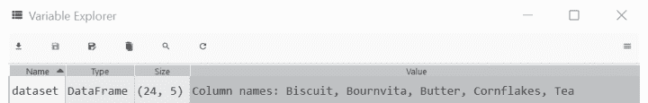

**图 15.2** 变量资源管理器

图 15.3 显示了 *dataset* 数据框的内容。您可以看到，如图 15.1 所示的原始 *Dataset.csv* 有 25 条记录；但如图 15.2 所示，导入到 *Spyder* 中的数据集仅包含 24 条记录和 5 列。这是因为第一条记录已成为数据框的列名（默认情况下，CSV 文件的第一行在 Python 中成为数据框的属性或列名或标题），如图 15.3 所示。由于这些记录是商店进行的交易，因此该数据集没有任何列名或标题。因此，我们需要将第一条记录视为数据行本身，而不是数据的标题。为此，我们必须在数据加载时提及这一点。

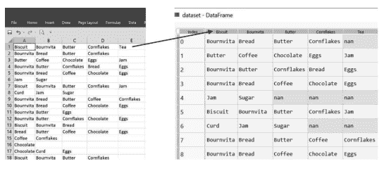

**图 15.3** 带有标题的 *dataset* 数据框内容

因此，我们将通过指示 `read_csv()` 方法不要将第一行视为标题来加载数据集，因为在这种情况下没有标题，并且每一行都是数据。为此，我们将稍微修改导入数据集的代码，如代码片段 2 所示。

**代码片段：2**

```
# 无标题的数据加载
dataset = pd.read_csv('Dataset.csv', header = None)
```

在上面的代码行中，我们向 `read_csv()` 方法传递了一个参数 *header = None*，因为 *Dataset.csv* 包含商店进行的交易列表，它们没有任何特定的标题或列名。因此，我们传递 *header = None* 以确保数据集在读取和存储时不带任何标题。运行该片段后，我们将在变量资源管理器选项卡中重新获得 *dataset* 数据框，但维度发生了变化（之前，*dataset* 数据框有 24 行；现在，它有 25 行，并且标题也已被移除）。*dataset* 数据框的修订内容如图 15.4 所示。

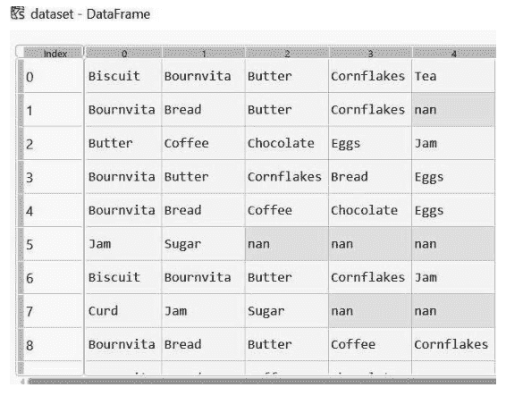

**图 15.4** 无标题的 *dataset* 更新快照

与图 15.3 相比，图 15.4 中索引 0 处的第一条记录的条目为 *Biscuit*、*Bournvita*、*Butter*、*Cornflakes*、*Tea*。我们拥有的是 0 到 4 的列索引，而不是标题名称。这完成了第一步，因为现在 *dataset* 数据框包含了数据集的所有实际观测值。

## 15.3 步骤 2：制作交易列表

我们已经读取了数据集；如前所述，这些记录中的每一条都代表一笔交易。为了创建模型，我们需要提供一个交易列表。我们将为每笔交易准备一个商品列表，然后将它们附加到另一个列表中；使用准备好的列表，我们将在后续步骤中生成关联规则。

因此，我们将运行两个循环来完成此操作，如代码片段 3 所示。外层循环遍历 25 笔交易，从 0 到 24。内层循环遍历每笔交易中的第 0 到 4 列。最终生成的列表就像一个训练集，关联规则将从中生成。

**代码片段：3**

```
# 制作交易列表
transactions = []
for i in range (0, 25):
    transactions.append([str(dataset.values[i,j]) for j in range(0, 5)])
```

在模型构建中，我们必须向模型提供交易列表。在代码片段 3 的第一行，我们创建了一个空列表 *transactions*，该列表将在后续步骤中提供给模型。为了填充 *transactions* 列表，我们使用了两个循环。提到的第一个循环将遍历 *dataset* 数据框的 25 条记录中的每一条。然后，对于每笔交易 *i*，内层循环将通过 *j* 遍历索引 0 到 4 的列，如图 15.5 所示。

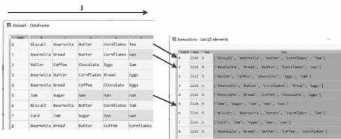

存储在第 0 到 4 列中的所有商品将被附加到某个第 i 行的列表中。所有列值都使用 `str()` 方法转换为 *字符串* 类型。此步骤将重复进行，直到我们遍历所有行。每行对应的列表将使用 `append()` 方法附加到 *transactions* 列表中。因此，最终输出将是一个列表的列表。

执行代码片段 3 后，我们在变量资源管理器选项卡中得到 *transactions* 列表。*transactions* 列表的内容如图 15.6 所示。

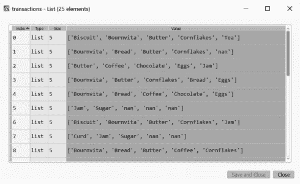

创建的 *transactions* 列表包含了 25 行列表中所有商品的信息。此外，每个列表（即行）对应一笔交易，例如 ['Biscuit', 'Bournvita', 'Butter', 'Cornflakes', 'Tea']，这些商品被放在一个篮子里，由顾客一起购买。创建这些交易列表后，我们现在将进入模型构建阶段。

## 15.4 步骤 3：构建模型

继续进行模型构建，我们需要从 `apriori_python` 库中导入 `apriori` 包。由于 `apriori_python` 库并未预装在 *anaconda* 环境（或 *Spyder* IDE）中，我们将首先安装此库，然后开始构建模型。在 Spyder 控制台中输入 `!pip install apriori_python` 语句，如图 15.7 所示，以安装 `apriori_python` 库。

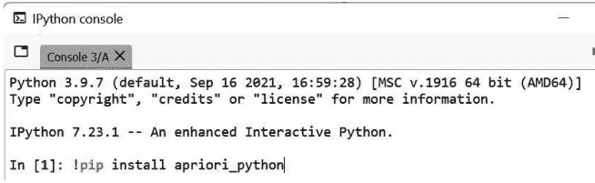

**图 15.7** 安装 `apriori_python` 库

库安装完成后，我们将把 Apriori 库导入到 Spyder 环境中。为此，我们将执行代码片段 4。

```
# 在数据集上训练 Apriori
from apriori_python import apriori
```

我们将使用 `apriori()` 方法来获取关联规则。图 15.8 显示了 `apriori_python` 的 `apriori()` 方法的文档，您可以通过按 `ctrl+i` 并将光标放在上面代码行中的 `apriori` 上来调用它。

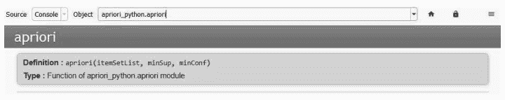

**图 15.8** *Apriori* 方法的参数

该方法接受一个可迭代的事务对象（一个包含事务列表的对象）以及一些关键参数，例如 *min_support* 和 *min_confidence*。我们将使用这两个参数来指定这些参数的阈值。创建规则的最终代码位于代码片段 5 中。

```
代码片段：5

# 构建模型
freq_Items, rules = apriori(transactions, minSup=0.249, minConf=0.699)
# \ 表示代码在下一行继续。
```

在这里，我们创建了两个变量：*freq_Items* 和 *rules*。变量 *freq_Items* 将存储支持度大于或等于 25% 的频繁项集列表。第二个变量 *rules* 将存储置信度大于或等于 70% 的最终关联规则。Apriori 模型是通过使用 *apriori()* 方法准备的。在该方法内部，第一个参数是我们在上一步创建的 *transactions* 列表。其他参数是 *minSup* 和 *minConf*，如下所述。

- *minSup* — 用于指定支持度的最小值。它表示产品在数据集中出现的频率。在问题陈述中，我们提到最小支持度为 0.25。因此，我们将该值设为 0.249。如果我们将 *minSup* 设为 0.25，那么算法将忽略支持度 = 0.25 的项集；然后，算法只考虑支持度大于 0.25 的项。因此，我们取 *minSup* 的值小于问题陈述中提到的值，以便支持度为 0.25 的项集能够包含在规则中。
- *minConf* — 用于指定置信度的最小值。它表示规则中同时购买产品的可能性。我们在问题陈述中提到最小置信度为 70%。因此，我们将其值设为 0.699（任何小于 0.7 的值），以便置信度值为 0.7 的规则能够包含在生成的规则中。

执行片段 5 后，我们将在变量资源管理器选项卡中得到 *rules*，如图 15.9 所示。

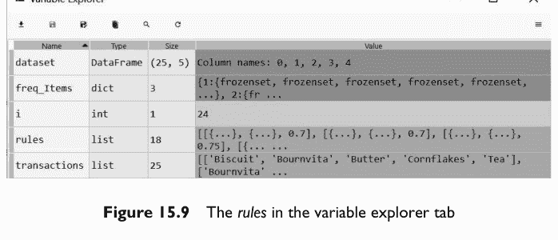

## 15.5 步骤 4：查看和解释挖掘出的规则

在图 15.9 中，你可以看到 *rules* 的大小是 *18*。规则的数据类型是列表。双击它即可查看规则，如图 15.10 所示。

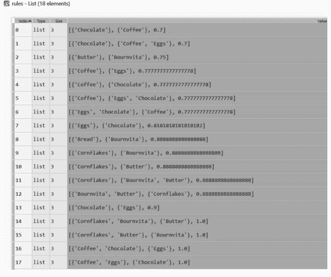

**图 15.10** *rules* 变量内容

如图 15.10 所示，*rules* 是一个包含 18 个项目的列表，其中每个项目对应于 Apriori 模型挖掘出的一个唯一规则。

表 15.2 中给定数据集的完整规则列表及其对应的置信度也显示在表 15.3 中。

**表 15.3** 给定数据库的所有关联规则

| 规则编号 | 规则 | 置信度 |
| :--- | :--- | :--- |
| 1 | 面包 → 阿华田 | 0.88 |
| 2 | 黄油 → 阿华田 | 0.75 |
| 3 | 玉米片 → 阿华田 | 0.88 |
| 4 | 玉米片 → 黄油 | 0.88 |
| 5 | 咖啡 → 巧克力 | 0.778 |
| 6 | 巧克力 → 咖啡 | 0.7 |
| 7 | 咖啡 → 鸡蛋 | 0.778 |
| 8 | 巧克力 → 鸡蛋 | 0.9 |
| 9 | 鸡蛋 → 巧克力 | 0.82 |
| 10 | 阿华田, 黄油 → 玉米片 | 0.88 |
| 11 | 阿华田, 玉米片 → 黄油 | 1 |
| 12 | 黄油, 玉米片 → 阿华田 | 1 |
| 13 | 玉米片 → 黄油, 阿华田 | 0.88 |
| 14 | 咖啡, 巧克力 → 鸡蛋 | 1 |
| 15 | 咖啡, 鸡蛋 → 巧克力 | 1 |
| 16 | 巧克力, 鸡蛋 → 咖啡 | 0.778 |
| 17 | 咖啡 → 巧克力, 鸡蛋 | 0.778 |
| 18 | 巧克力 → 咖啡, 鸡蛋 | 0.7 |

这些规则是通过对给定数据集手动应用 Apriori 算法，针对指定的支持度和置信度阈值获得的，如前一章所述。

查找这些关联规则所涉及的计算和步骤的详细信息，请参见以下链接。
https://github.com/bhatiaparteek/ml_with_python/tree/main/Chapter_15_Association_Mining

为了练习，请考虑此作业并独立执行所有计算。建议将你的结果与表 15.3 中提供的结果进行比较，并将你的中间结果与上述链接中可用的信息进行交叉核对。然而，如果你仔细观察，表 15.3 中给出的规则与我们在图 15.10 中模型生成的规则是相同的。

为了理解规则中每个值的意义，让我们从规则中取一条规则进行分析。运行代码片段 6 以从规则列表中获取第一条规则。

```
# 获取特定规则的详细信息
print(rules[0])
```

图 15.11 显示了规则中每个值的意义。图中显示的项目是巧克力、咖啡。这里，*巧克力* 是前项；*咖啡* 是后项，即巧克力 → 咖啡。该规则的置信度为 0.7。这与表 15.3 中规则编号 6 中提到的规则相同，同样你可以在你的输出中找到表 15.3 中给出的所有规则。这证实了你对该概念的准确实现。

818 使用 Python 进行机器学习

```
In [4]: print(rules[0])
[[{'Chocolate'}, {'Coffee'}], 0.7]
```

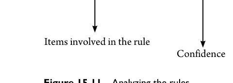

在图 15.9 中，我们可以看到 freq_Items 的类型是 dict。这些项目不能直接查看。要查看这些项目，请运行代码片段 7。

代码片段：7

```
# 显示频繁项集列表
print(freq_Items)
```

我们在控制台中得到频繁项集列表，如图 15.12 所示。

```
In [3]: print(freq_Items)
{1: {frozenset({'Bournvita'}), frozenset({'Chocolate'}), frozenset({'Jam'}), frozenset({'Cornflakes'}), frozenset({'Eggs'}), frozenset({'Butter'}), frozenset({'nan'}), frozenset({'Coffee'}), frozenset({'Bread'})}, 2: {frozenset({'Butter', 'Bournvita'}), frozenset({'Butter', 'Cornflakes'}), frozenset({'Coffee', 'Eggs'}), frozenset({'Eggs', 'Chocolate'}), frozenset({'Bournvita', 'Eggs'}), frozenset({'Coffee', 'Chocolate'}), frozenset({'Bournvita', 'Bread'}), frozenset({'Bournvita', 'Cornflakes'}), frozenset({'Butter', 'Eggs'})}, 3: {frozenset({'Butter', 'Bournvita', 'Cornflakes'}), frozenset({'Chocolate', 'Coffee', 'Eggs'})}}
```

图 15.12 频繁项集列表

让我们分析 freq_Items 以理解每个输出项的意义。图 15.13 显示了 freq_Items 中各项的意义。在这里，我们可以观察到不同长度的频繁项集是分开列出的。它提供了 L1、L2 和 L3 中的项集列表。

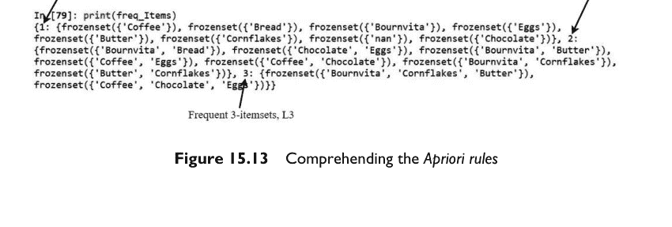

在图 15.13 中，我们可以看到 L1（频繁 1-项集）中有 7 个项目，L2（频繁 2-项集）中有 7 个项集，L3（频繁 3-项集）中有 2 个项集。你也可以将这些结果与 GitHub 链接中给出的所有中间计算进行比较。

至此，我们结束了关于实现 *Apriori 算法* 的讨论。需要注意的是，商店市场可以使用这些规则来提高销售额并构建其产品推荐系统。

#### 提醒我

- 关联规则挖掘是最受欢迎的机器学习应用之一，超市连锁店和零售店经常使用它来提高销售额和生产力，或获得有关其销售的有用见解。
- 关联挖掘的实现可以分解为多个步骤，总结如下。
  - 步骤 1：导入库并加载数据集。
  - 步骤 2：创建事务。
  - 步骤 3：构建模型。
  - 步骤 4：查看和解释挖掘出的规则。
- 要实现 Apriori 算法，我们必须导入 `apriori_python` 库。
- Apriori 模型是使用 `apriori_python` 库的 `apriori()` 方法准备的。`apriori()` 方法的参数是 *事务列表*、*minSup* 和 *minConf*。

#### 附加资源

##### 视频链接

- 在 Python 中实现 Apriori 算法，https://youtu.be/SVM_pX0oTU8


##### 博客链接

- Apriori-Python 包
  https://github.com/chonyy/apriori_python


#### 测试题（问题）

1.  在以下链接提供的数据集上实现Apriori算法。
https://www.kaggle.com/code/rashikrahmanpritom/apriori-implementation/data


最小支持度为0.001（0.1%），最小置信度为0.001（0.1%）。

2.  给定一组事务，实现一个Apriori算法，以挖掘最小支持度为40%、置信度为70%的关联规则。

| TID | 购买物品 |
|---|---|
| 1 | 面包，牛奶 |
| 2 | 面包，尿布，啤酒，鸡蛋 |
| 3 | 牛奶，尿布，啤酒，可乐 |
| 4 | 面包，牛奶，尿布，啤酒 |
| 5 | 面包，牛奶，尿布，可乐 |

3.  对以下数据库应用Apriori算法，以识别最小支持度为50%、置信度为75%的重要关联挖掘规则。

| 事务ID | 购买物品 |
|---|---|
| 1 | {牛奶，啤酒，尿布} |
| 2 | {面包，黄油，牛奶} |
| 3 | {牛奶，尿布，饼干} |
| 4 | {面包，黄油，饼干} |
| 5 | {啤酒，饼干，尿布} |
| 6 | {牛奶，尿布，面包，黄油} |
| 7 | {面包，黄油，尿布} |
| 8 | {啤酒，尿布} |
| 9 | {牛奶，尿布，面包，黄油} |
| 10 | {啤酒，饼干} |

## 16 人工神经网络

### 章节目标

-   理解人工神经网络（ANN）的概念。
-   理解人脑的工作原理，作为神经网络开发的灵感来源。
-   理解人脑神经元到ANN的映射。
-   通过案例研究理解ANN的工作原理。
-   理解权重在构建ANN中的作用。
-   执行前向和反向传播来训练神经网络。
-   理解不同的激活函数，如阈值函数、Sigmoid函数、修正线性单元函数和双曲正切函数。
-   通过使用梯度下降法和随机梯度下降算法，找到使代价函数最小化的权重优化值。
-   理解小批量方法的概念。

## 16.1 人工神经网络简介

神经网络和深度学习是当今计算机科学领域的热门词汇。如果你认为它们是这个领域的最新成员，那你可能有些误解。神经网络已经存在相当长一段时间了，只是现在才开始兴起，并对计算机科学产生了巨大的积极影响。

人工神经网络（ANN）发明于20世纪60年代和70年代。它成为常见技术讨论的一部分，人们开始认为这种机器学习（ML）技术将解决当时困扰研究人员的所有复杂问题。但很快，在接下来的十年里，这些希望和期望就破灭了。

这种衰落不能归咎于神经网络本身的缺陷，其主要原因是当时的“技术”本身。当时的技术水平不足以支持神经网络，因为它们需要大量数据进行训练，并需要巨大的计算资源来构建模型。在那个时代，数据和计算能力都很稀缺。因此，产生的神经网络只停留在纸面上，而没有成为解决现实世界问题的核心。

后来，在21世纪初，我们看到存储技术有了很大改进，导致每GB存储成本降低。由于互联网的兴起和智能手机的普及，人类见证了大数据的巨大增长。通过追溯计算机科学发展的历史，人们可以很容易地理解存储容量和计算过程的指数级增长。过去三十年，GB存储的成本发生了巨大变化。在20世纪80年代，购买一个GB存储的驱动器大约需要193000美元，而到2009年，每GB仅需0.07美元。2015年，成本降至每GB 0.026美元。2020年的成本接近每GB 0.01美元。这种指数级下降如图16.1所示。我们迟早会接近零成本，这是事实，因为许多云存储（如Google Drive和One Drive）提供15GB的免费存储空间。

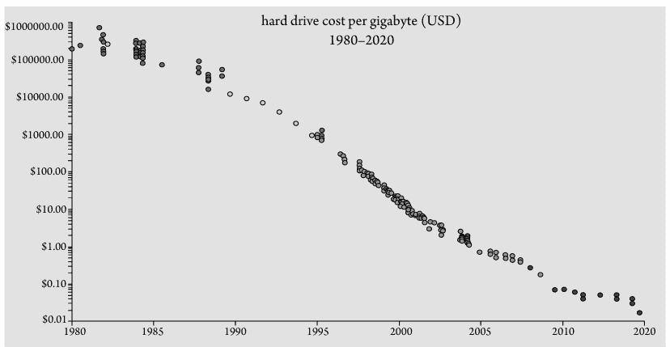

**图16.1** 存储成本历史（*来源：mkomo.com*）

技术的快速发展导致了存储成本的降低。随着时间的推移，数据存储的访问时间和持久性也得到了改善，如图16.2所示。这方面的最新发展是DNA存储，它可以将数据保存数百年，密度至少是最高密度固态硬盘的1000倍，耐久性至少是最稳定磁带的300倍。

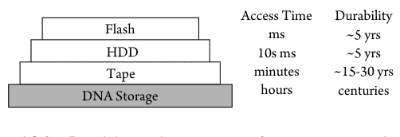

图16.3描绘了摩尔定律，展示了我们正以多快的速度进入具有更快处理能力的计算机时代。它们正变得比人脑更快。我们已经超越了老鼠大脑的计算能力，很快，计算机也可能超越人脑的能力。

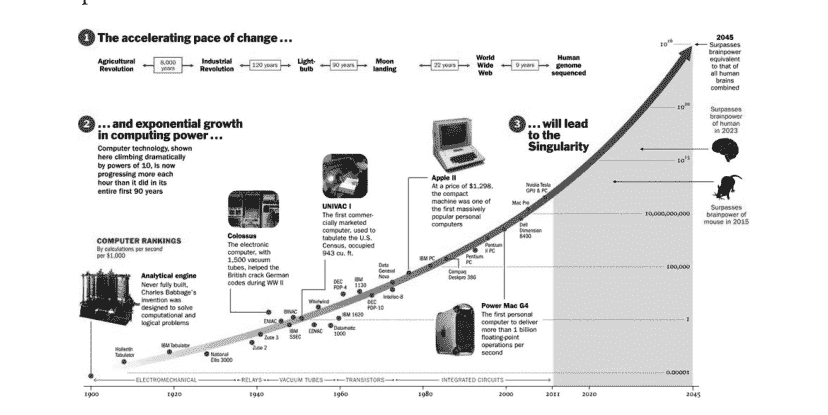

因此，显然，随着技术的进步，ANN获得了巨大关注。今天，我们处于一个拥有大数据进行训练、超级复杂的模型和强大机器来运行它们的阶段。

这一历史分析有力地说明，当前存储技术和计算资源的技术发展为神经网络的繁荣提供了绝佳环境，使其能够从纸面走向机器核心，构建能够解决我们过去几十年一直努力解决的复杂或挑战性问题的模型。这些问题包括人脸识别、目标检测、图像分析、视频分析、语音识别、机器翻译等。由于神经网络和深度学习，这些具有挑战性的问题在过去几年中得到了解决。

本章的灵感来源于SuperDataScience团队发布的题为“人工神经网络（ANN）终极指南”的博客。本章使用的大部分图表都改编自该博客。我们感谢SuperDataScience的支持，并允许我们在本书中引用和参考此资源。有关博客的详细信息，请参阅本章的“附加资源”部分。神经网络旨在模拟人脑的学习机制。因此，在下一节中，我们将讨论构建神经网络的灵感来源。

## 16.2 人脑：神经网络开发的灵感来源

神经网络得名于人脑的神经元，因为它被认为是地球上最复杂、最强大的事物之一。如果计算机能够复制人脑的学习能力，我们就能利用自然选择已经决定的东西。因此，神经网络或深度学习围绕着模仿人脑的基本思想。人工智能关注的是模拟人脑的学习方法，这是人类用来获取知识的方式。多年来，我们一直致力于开发能够匹配或超越人类智能的机器。要设计一个像人脑一样学习的机器，我们必须首先了解人脑如何学习和处理信息。人脑从所有感觉器官接收输入。这些信号由包含数十亿神经元的人脑进行处理。最后，人脑生成一个命令作为输出，用于适当的动作，如图16.4所示。

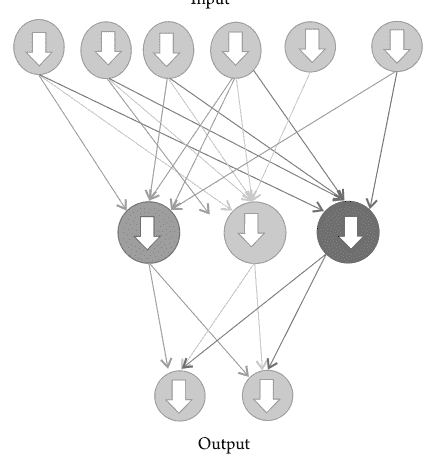

在人脑中，大约有1000亿个神经元。每个神经元与数千个其他相邻神经元相连。它就像一个由大约1000亿（$10^{10}$）个神经元组成的密集纤维通路网络，如图16.5所示。

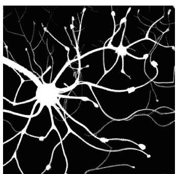

**图16.5** 神经元网络

让我们在下一小节中更详细地讨论神经元的工作原理。

### 16.2.1 神经元

神经元是人脑的基本工作单元，负责携带电和化学脉冲，以在人体不同感觉器官之间传输或收集信息。图16.6显示了神经元的显微图像。

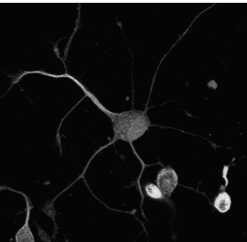

**图16.6** 神经元的显微图像

我们可以将一个神经元比作一只蚂蚁。我们知道，一只蚂蚁只能执行非常有限的任务，但当成千上万只蚂蚁集体行动时，它们能产生惊人的结果。同样，每个神经元就像一只只能执行有限任务的蚂蚁，但当这数十亿个神经元集体行动时，它们使人类成为地球上最智能的物种。图16.7中的人脑MRI显示了数十亿个神经元以受保护的方式保存在我们的颅骨内。

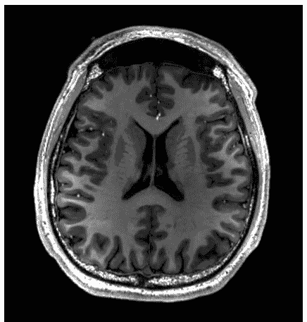

**图16.7** 显示数十亿神经元的人脑MRI
*(来源：https://huggingface.co/microsoft/BiomedCLIP-PubMedBERT_256-vit_base_patch16_224)*

如图16.8所示，人脑拥有数十亿个这样的神经元，它们协同工作。这里，无眼的头部被称为细胞核。它通过周围那些被称为树突的触手或天线，以及被称为轴突的尾巴与其他神经元相连。我们通过这些流动感知来自周围世界的电信号。

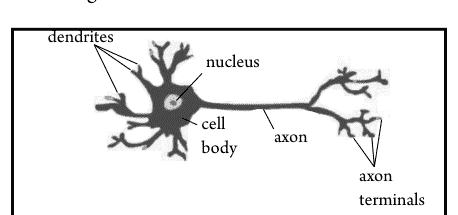

**图16.8** 神经元解剖图

图16.8和图16.9展示了一个神经元的示意图，包含以下组成部分：

- i. 树突：负责接收信号。
- ii. 细胞核：中心部分。
- iii. 轴突：负责传递信号。
- iv. 突触：神经元将信号传递给另一个神经元或目标细胞的主要结构（参见图16.9a）。

## 16.3 人脑神经元到人工神经网络的映射

如图16.9(a)所示，树突是神经元的分支延伸，负责从其他神经元接收信号，并将这些信号传向神经元的细胞体。这些信号在被称为细胞核的中心部分进行处理。细胞核处理这些信号，并通过轴突路径传递输出。而突触是神经元将信号传递给另一个神经元或目标细胞的主要结构，如图16.9(a)所示。图16.9(b)说明了人脑神经元与人工神经元之间的映射关系。

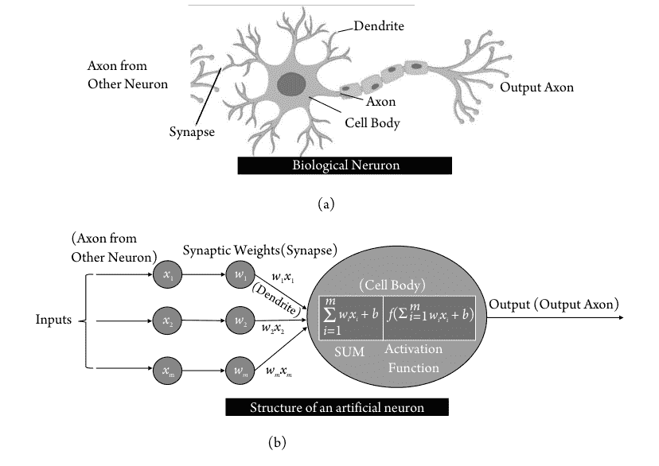

为了构建用于机器学习模型的神经网络人工结构，我们需要三个主要组件。首先是处理输入属性的输入节点（称为输入层），其次是用于构建模型的处理节点（称为隐藏层），以及用于进行预测的输出节点（称为输出层），如图16.10所示。

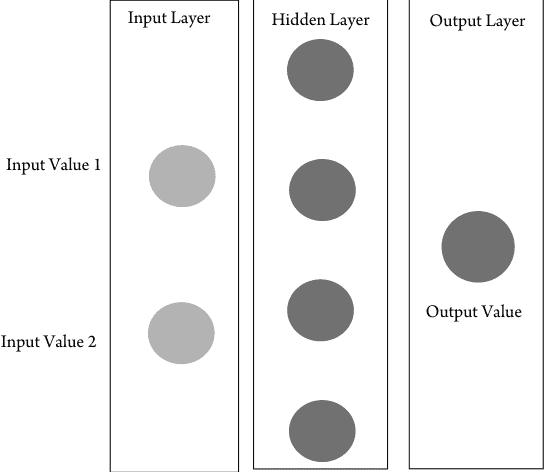

**图16.10** 人工神经网络的基本层结构

每个输入值都连接到所有代表神经元的节点以处理信息。每个中间或隐藏神经元的输出也会被发送到输出节点，以便基于这些值进行最终预测，如图16.11所示。如果一个神经网络只有一个隐藏层，那么该神经网络被称为感知机。在图16.11中，我们可以观察到该神经网络有一个输入层、一个隐藏层和一个输出层。由于只有一个隐藏层，图16.11代表的是感知机。

每个输入在到达输出层之前，都要在人脑中经过数十亿个神经元。因此，输入层的神经元与隐藏层的神经元相连，而这些又与输出层的神经元相连。因此，不仅仅只有一个隐藏层，而是像人脑一样，有多个相互连接的隐藏层。每个输入在产生输出之前都必须穿过所有这些层。

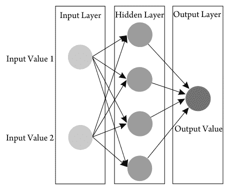

**图16.11** 基本人工神经网络中的信息流

简单来说，当我们有多个隐藏层来处理从输入层到输出层的数据时，这种人工神经网络被称为深度学习。因为它描绘了人脑的深度学习过程，所以这种网络被称为深度神经网络或深度学习，如图16.12所示。

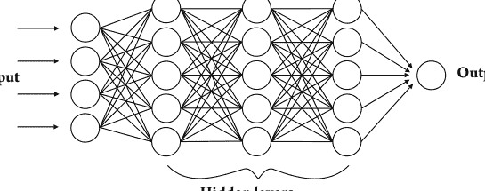

**图16.12** 深度学习神经网络

杰弗里·辛顿教授在2006年将神经网络研究重新命名为深度学习。辛顿被视为深度学习领域的领军人物之一。辛顿与约书亚·本吉奥和杨立昆共同获得了2018年图灵奖，以表彰他们在深度学习方面的工作。他们有时被称为“深度学习三巨头”。

## 16.4 人工神经网络的工作原理

如前所述，人工神经网络有三个重要组成部分，即输入层、隐藏层和输出层。

在一个机器学习问题中，我们有几个用于决定因变量值的自变量。这些自变量被称为输入变量或属性，而输出变量则指代进行预测的类别属性。

每个输入变量或自变量成为人工神经网络输入层的输入节点，而需要预测的输出类别数量则成为输出节点的数量，如图16.13所示。例如，要预测学生的考试成绩，输入参数如*学习小时数*、*期中考试成绩*、*实验表现*等将作为输入层的输入节点。在这种情况下，*最终预测成绩*，即A、B、C和D，将作为输出层的输出节点，表示每个类别的概率。

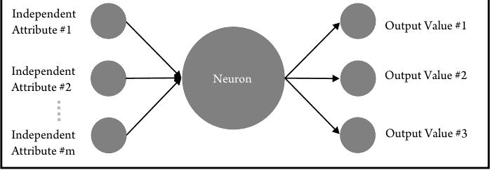

**图16.13** 多类别分类情况下的多个输出节点

让我们考虑另一个预测房地产价格的案例。这里，输入参数如*卧室数量*、*建筑面积*、*地板材料*、*升级厨房*、*距市中心距离*和*公寓房龄*将作为输入层的输入节点。由于我们的目标是预测*房地产价格*，并且给定的问题是一个回归问题，因此我们将在*输出层*中只有一个节点。

因此，在回归问题中，机器学习模型用于预测输出节点的连续值，输出节点的数量将只有一个，如图16.14所示。在二元分类问题中，输出节点的数量也是一个，因为单个节点可以用来表示真或假。

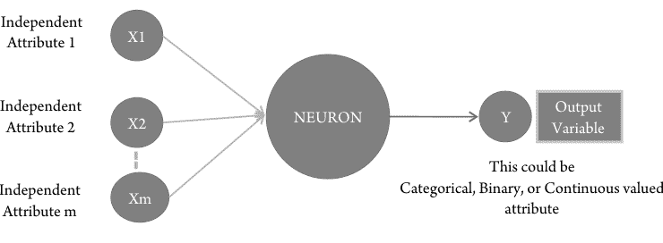

**图16.14** 回归或二元类别分类情况下的单个输出节点

问题的复杂性决定了隐藏层的数量，传统的人工神经网络只有一个隐藏层，而深度学习则有多个隐藏层，如图16.15所示。

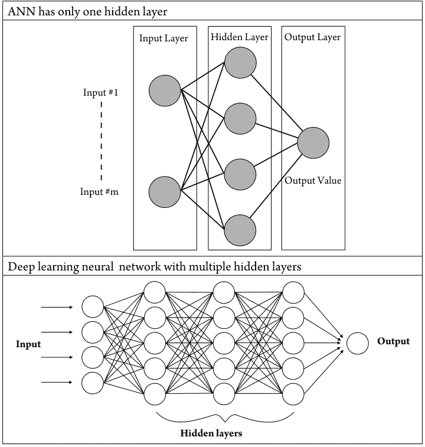

**图16.15** 典型人工神经网络和深度学习神经网络的层结构

## 16.5 人工神经网络如何处理多个输入值？

图16.16展示了一个具有多个输入属性和一个输出变量的典型人工神经网络。理解人工神经网络如何处理多个输入值非常重要。

需要注意的是，如图16.16所示，神经元的左侧和右侧记录的是同一组观测值的输入和输出值。当训练神经网络时，你输入模型的输入值和模型产生的输出值构成了一行观测数据。这在图16.17中进一步说明。因此，神经网络一次只处理一行数据。

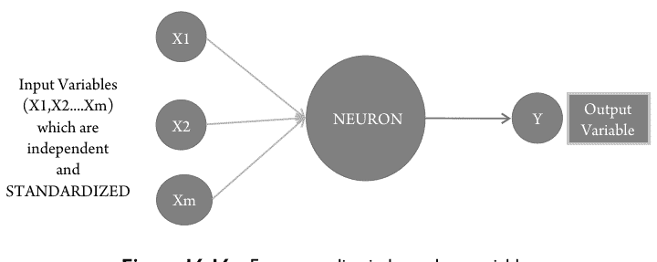

**图16.16** 特征缩放自变量

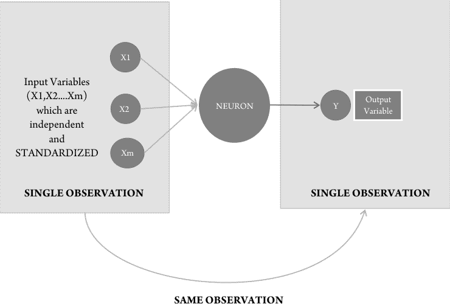

**图16.17** 同一观测值的输入和输出值

例如，让我们考虑一个场景，我们想根据客户的输入属性，如银行余额、性别、年龄等，来理解——客户是否会购买Alexa？

这里，银行余额、性别和年龄将成为输入层的三个输入节点，其值对应于数据集中每个属性的各行数据。

需要注意的是，人工神经网络模型对输入属性非常敏感，因此输入变量的值也应该在同一尺度上，即应该进行特征缩放，如图16.17所示。我们知道有两种特征缩放技术，即标准化或归一化。如果需要，使用特征缩放对输入变量进行缩放非常重要这些技术取决于数据集。正如我们在前面章节中已经讨论过的，标准化（standardization）保持不同实例之间的标准差为1，而归一化（normalization）将所有值归一化到0到1的范围内。需要注意的是，如果输入数据包含异常值，标准化效果更好；否则，我们可以使用归一化进行特征缩放。特征缩放的基本思想是将所有变量调整到相同的值域范围内。

下面是一个数据集实例，展示了来自“购买Alexa”数据集的一些样本数据。

| 序号 | 银行余额 | 性别 | 年龄 | 是否购买Alexa |
|---|---|---|---|---|
| 1 | 7500000 | 女 | 20 | 是 |
| 2 | 3200000 | 男 | 22 | 否 |

对于该实例的每一行（或观测值），人工神经网络（ANN）将把来自银行余额、性别、年龄的值作为输入，然后取同一行的“是否购买Alexa”作为输出变量。但在将每一行的数据输入到输入节点之前，会进行标签编码和标准化，以将属性值调整到相同的范围内。很明显，银行余额和年龄的值处于不同的范围（例如7500000和20的尺度不同），因此它们需要进行特征缩放。性别属性是分类型的，我们需要用标签编码对其进行预处理。应用预处理之后，我们再继续进行ANN的构建。

## 16.6 权重在构建ANN中的作用

权重是神经网络最关键的要素之一。因为权重决定了神经网络的学习方式。通过调整这些权重，神经网络可以识别来自神经元信号的重要性。事实上，信号通过神经元的程度也是由权重决定的。这些权重被分配在神经元的突触处。图16.18展示了带有权重的突触区域。

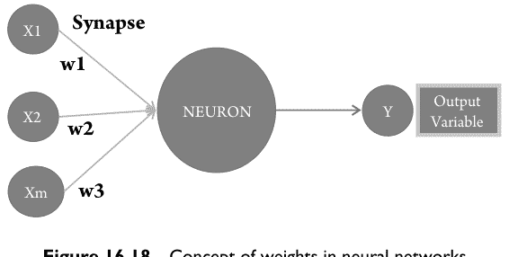

权重是神经网络运作的关键因素。每个突触对应一个被分配了权重的独立输入属性。

为了理解权重的重要性，让我们考虑这样一个场景：一位房产经纪人非常准确地预测房屋价格。他在房地产行业拥有丰富的经验。我们都知道，房产经纪人会检查房产，并详细记录诸如卧室数量、建筑面积、地板、浴室数量、与城市的距离、厨房设施、周边环境、房龄等细节。根据他的经验，他在大脑中为这些属性中的每一个内部分配权重，然后处理信息以预测房产价格。随着经验的增加，他预测房价的准确性也会提高。

同样地，现在我们希望有一台机器能完成房产经纪人的工作，预测房产的价格。要构建这样一台机器，为每个输入属性分配权重非常重要，就像房产经纪人根据经验在大脑中所做的那样。

现在，我们有一个问题陈述，其目标是为输入属性分配权重。这需要准确完成，以便预测的房价更接近房屋的实际价格。ANN正是关于这个的；它训练模型为每个输入属性找到合适的权重，以便预测的房价更接近房屋的实际价格，如图16.19所示。

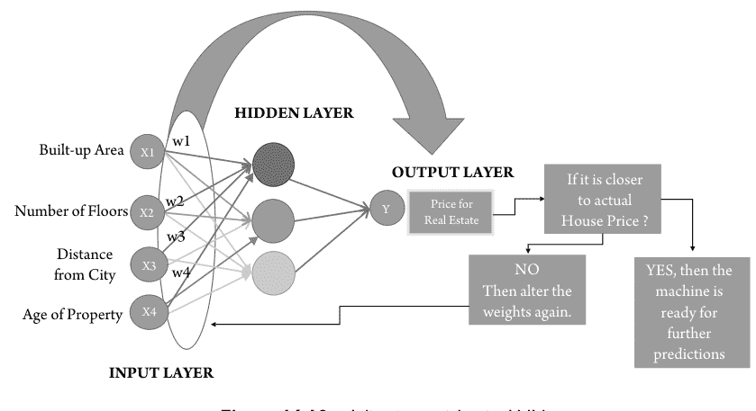

因此，权重对于构建ANN非常重要。正如钢丝的紧绷程度对于特技演员的生存至关重要一样，我们必须根据特技演员的不同参数来调整它。同样，权重被分配给每个突触，用于沿其传递的信号，如图16.20所示。


**图16.20** 突触就像特技演员的钢丝

## 16.7 神经元的三步学习过程

ANN通过遵循三个重要的动作或步骤来处理信息。下面将描述每个步骤。

**步骤1：计算加权和**
在神经元的核心部分内部，计算所有输入值的加权和。如上一节所述，权重被分配给每个输入属性，以便预测输出接近实际输出。为此，最初为输入属性input$_1$、input$_2$和input$_3$分别分配一些随机权重，如$w_1$、$w_2$、$w_3$等。然后，按照公式（16.1）计算输入值的加权和，如图16.21所示。

加权和 = $x_1*w_1 + x_2*w_2 + x_3*w_3 + \dots + x_m*w_m = \sum_{i=1}^{m} w_i x_i$  (16.1)

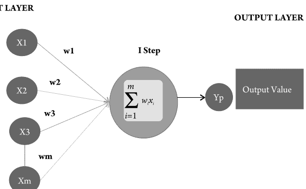

**图16.21** 计算加权和

### 步骤2：计算加权和后应用激活函数

在此步骤中，将激活函数应用于加权和（在步骤1中计算得出）以处理信息，因此这是最重要的一步。为了以简化的方式理解这一点，我们将把它与烹饪过程联系起来。

在烹饪食物时，我们将所有食材放入锅中。烹饪所需的这些原材料可以被视为输入变量。将每种食材加入锅中的量就像突触权重。就像权重一样，这些食材必须以一定的量添加才能获得正确的味道。锅类似于一个神经元。在将所有食材（输入变量）以正确的量（权重）加入锅（神经元）之后，我们然后打开燃气或用火焰加热锅。火焰可以被视为激活函数，如图16.22所示。因为火焰可以调节为低、中、高，并且我们可以根据想要烹饪的食物来控制其时间和强度。同样地，我们也可以调整激活函数，因为有许多选项可以用来处理你的输入值。就像锅下的火焰可以根据要烹饪的食物性质以多种方式调节一样，同样地，我们可以根据希望对计算出的权重执行的处理类型选择合适的激活函数。图16.22阐述了这一概念。

应用激活函数后，神经元理解了对特定信号所需的操作。


如前所述，第一步计算了加权和，在第二步中，如公式（16.2）所示，对其应用了激活函数。图16.23和图16.24展示了同样的内容。这里，*b*是添加到模型中的偏置。

步骤2：对加权和应用激活函数 = $(x_1*w_1 + x_2*w_2 + x_3*w_3 + ... X_m*w_m) + b$
$= \phi(\sum_{i=1}^{m} wixi + b)$ (16.2)

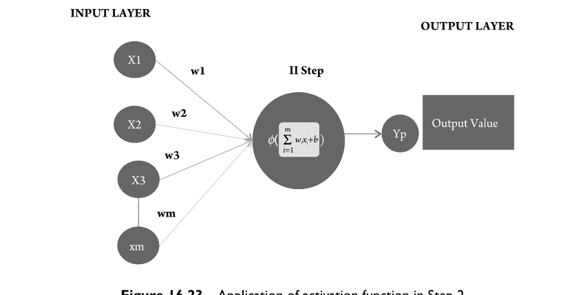

**图16.23** 步骤2中激活函数的应用

没有激活函数，神经网络仅仅是线性回归模型。因此，激活函数在神经元的工作中起着重要作用。

> 因此，我们可以将激活函数定义为一种可微函数，它将线性输入信号映射到非线性信号，赋予神经网络更强大的能力，并使其能够执行复杂任务。

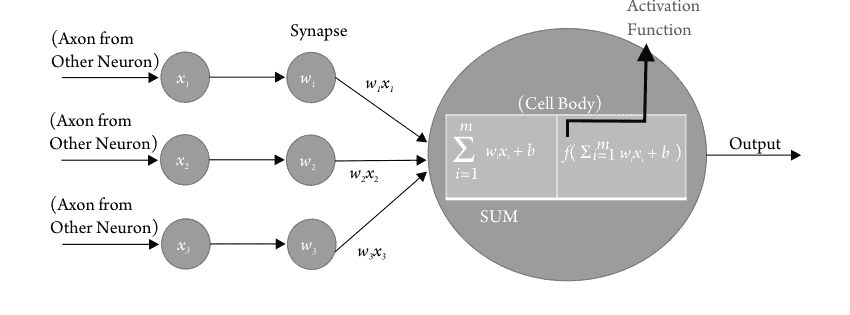

**图16.24** 激活函数在神经网络中的位置

### 16.7.1 常用的激活函数

一些常用的激活函数如下。

- 阈值函数
- Sigmoid函数
- 修正线性单元函数
- 双曲正切函数

让我们逐一讨论这些激活函数。

#### 阈值函数

阈值函数是一个阶跃函数或二元函数，产生0或1作为输出。当问题涉及二元分类时，它是最佳选择，因为它产生两个输出值，即“激活”或“未激活”。在二维平面上可视化该函数时，X轴是输入值的加权和，Y轴是0到1的值。如果Y值高于某个阈值，我们说结果值为1，即激活，否则为0，即未激活，如图16.25所示。

阈值函数由公式（16.3）给出。

$\phi(z) = 1 \text{ if } z \geq 0$

$\phi(z) = 0, \text{ if } z < 0$

其中z是输入值，$z = \sum_{i=1}^{m} w_i x_i$

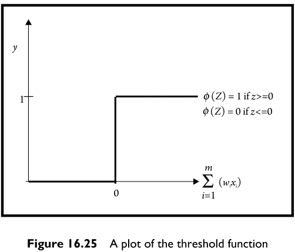

**图16.25** 阈值函数的图示

#### Sigmoid函数

Sigmoid函数接受任何实数作为输入，并将其映射到(0, 1)范围内的输出。这一特性使其在二元分类问题中特别有用，因为建模概率很重要。Sigmoid函数是一种广泛使用的激活函数，因其其支持二分类的能力。Sigmoid函数的表达式见公式(16.4)，并在图16.26中描绘。

$$y = \frac{1}{1 + e^{-z}}$$

其中z是输入值，$$z = \sum_{i=1}^{m} w_i x_i$$ (16.4)

从上述公式可以看出，sigmoid函数首先接收一个输入值，即加权和z，然后对其取反并计算$e^{-z}$。将结果值加上1，然后取倒数，得到输出值y。

如果我们在坐标轴上绘制上述公式，会发现它与图16.26相似。所得图形是逻辑函数的一个特例。与阈值函数不同，它给出的是模拟激活值，即0到1之间的连续值。因此，它具有平滑的曲线，而不是像阈值函数那样有尖锐的拐点。在图16.26中，必须观察sigmoid的曲率。当x的值小于0时，曲线趋近于0；当x的值大于0时，曲线趋近于1。

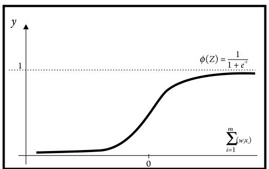

**图16.26** Sigmoid函数图

#### 修正线性单元函数

修正线性单元或ReLU函数是一个线性函数，如果输入为负则输出0，如果输入为正则输出相同的输入，如图16.27所示。如果神经网络有很多层，ReLU是激活函数的最佳选择之一。

ReLU的表达式见公式(16.5)。

$$\phi(z) = \max(z, 0)$$

其中z是输入值，$$z = \sum_{i=1}^{m} w_i x_i$$ (16.5)

该方程在图16.27中得到了很好的体现。这里，X轴代表输入值$z$，而Y轴代表$\phi(z)$，即ReLU函数的输出。我们可以观察到，当$x$值小于0时，即输入值为负时，Y轴值为0。这是因为$\phi(z)$取$(z, 0)$的最大值。负X轴代表$z < 0$。

因此，

$\phi(z) = \max(z, 0) = 0 \quad (\text{因为 } z < 0)$

类似地，当$x$值为非负时，XY图是线性的。这是因为当输入值为正时，输出将与输入相同。

$\phi(z) = \max(z, 0) = z \quad (\text{因为 } z >= 0)$

因此，当$x$值为非负时，XY图为$y = x$。

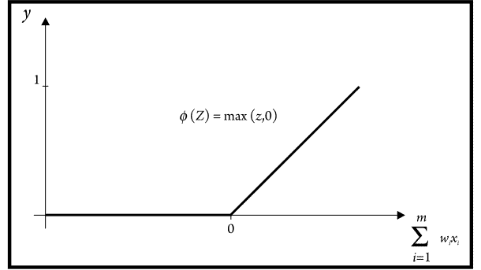

**图16.27** ReLU函数图

#### 双曲正切函数

*双曲正切*或*tanh*是一个非线性函数，将实数值输出到$-1$到$+1$的范围内。它也被称为缩放的sigmoid。它将负值映射到负输出，将零输入映射到接近零的输出。当$x$趋近于大于0的输入值时，曲线达到1，如图16.28所示。双曲正切函数的表达式见公式(16.6)。

$y = \frac{1 - e^{-2z}}{1 + e^{-2z}}$

其中$z$是输入值，$z = \sum_{i=1}^{m} w_i x_i$

(16.6)

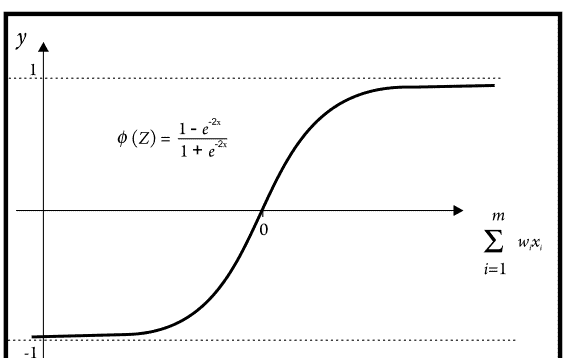

**图16.28** 双曲正切函数图

#### 检验你的进度

**问题：** 考虑一个只有一个隐藏层和一个输出层的神经网络。因变量是二元的，即其可能值为0或1。评估给定情况下每种激活函数，并确定最合适的选择。

**提示：** 根据我们对激活函数的理解，可能有两个合适的选择，即：

- a) 阈值函数，和
- b) Sigmoid函数

因为阈值函数是一个阶跃函数或二元函数，产生0或1作为输出，如图16.25所示；在sigmoid函数中，任何大于0的输入值变为1，而小于0的输入值降为0。与阈值函数不同，它给出的是模拟激活值，即0到1之间的连续值。因此，它具有平滑的曲线，而不是像阈值函数那样有尖锐的拐点。在sigmoid函数中，我们可以将阈值设置为0.5；当输出等于或大于0.5时，它将被映射为1；否则，它将被映射为0。

### 步骤3：信号传递到下一个相邻神经元

在最后一步中，如图16.29所示，由激活函数（在步骤2中应用）处理的信号被传递到下一个神经元，从而计算出最终的输出值。如果下一个隐藏层中有多个神经元，处理后的输出将传递给下一层的所有神经元。同样，最后一个隐藏层中每个神经元的输出被合并并发送到输出层。在图16.29(a)中，我们有一个感知器或单隐藏层神经网络，在这种情况下，输出信号直接从隐藏层的神经元发送到输出层。

在具有多个隐藏层的情况下，每层有多个神经元，输出被发送到下一个隐藏层的所有神经元，如图16.29(b)中高亮显示的神经元所示。

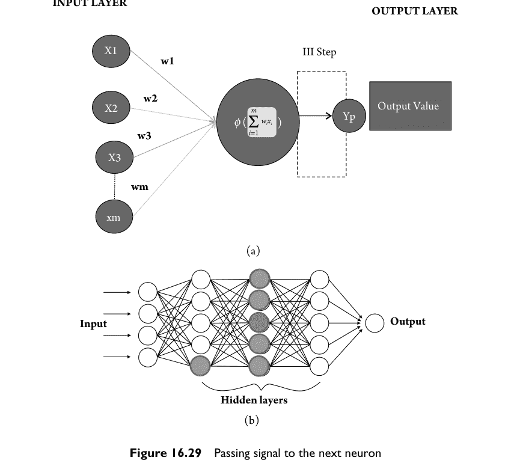

## 16.8 神经网络的训练

为了理解神经网络的训练过程，让我们考虑一个我们希望预测公寓价格的场景。为了预测房地产价格，我们需要一些输入参数。因此，让我们考虑一些输入参数，例如*卧室数量、建筑面积、地板类型、升级的厨房、与城市的距离*和*公寓房龄*。在ANN的情况下，所有这些输入参数或属性将成为输入层的输入节点。并且，由于我们的目标是预测*房地产价格*，我们将在*输出层*有一个单一节点。同时，请注意给定的问题是一个回归问题。图16.30显示了用于预测*房地产价格*的ANN架构。

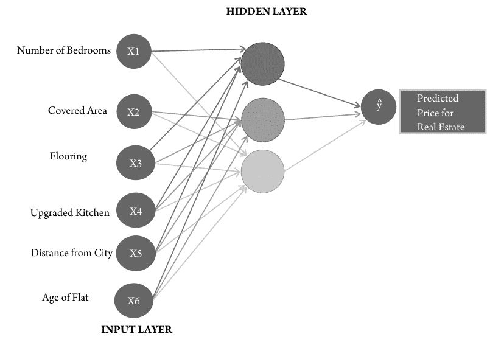

**图16.30** 用于预测房地产价格的基本神经网络

神经网络的工作始于*突触*，其中六个输入变量中的每一个都被分配了一些权重。然后，一个传递函数集体计算所有节点的加权和。进一步，这个加权和被输入到一个合适的激活函数中，该函数处理加权和。这个处理后的输出被传递到下一层的所有神经元。最后，输出层进行预测。让我们深入理解整个过程。

在图16.30中，左侧有六个输入节点，分别代表*卧室数量*、*建筑面积*、*地板类型*、*升级的厨房*、*与城市的距离*和*公寓房龄*。这些输入层神经元中的每一个都通过突触连接到所有其他隐藏层神经元，如图16.31所示。*突触*为每个输入参数分配随机的非零值。这些非零值被称为*权重*。在隐藏层的每个神经元处，计算加权和。对这个加权和应用一个合适的激活函数。最后，神经元（隐藏层）产生的各个输出被传递到输出层，在那里它们被累积以预测最终价格。

这个完整的过程称为前向传播。神经网络获取输入值，为它们分配权重，计算它们的加权和，在计算出的加权和上应用激活函数，最后产生预测值。如图16.31所示，由此产生的过程是***前向传播***。

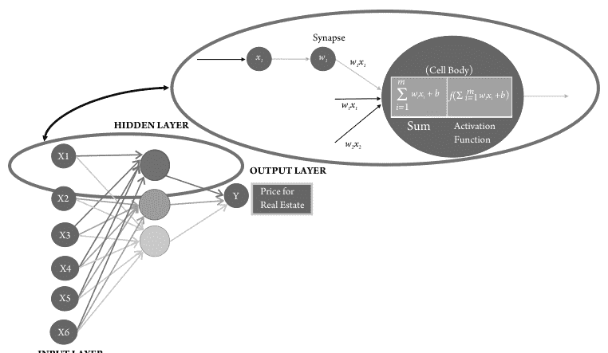

**图16.31** 神经网络中的前向传播

假设预测输出为$\hat{Y}$，实际输出为$Y$，如图16.32所示。一旦有了这两个值，它将计算$\hat{Y}$和$Y$之间的差异。实际值和预测值之间的差异就是*代价函数*。它告诉我们预测中的误差。神经网络的主要目标是最小化代价函数的值或实际值与预测值之间的差异。代价函数越低，$\hat{Y}$（预测值）就越接近$Y$（真实值）。因此，较低的代价函数值意味着我们的神经网络具有更高的准确性。

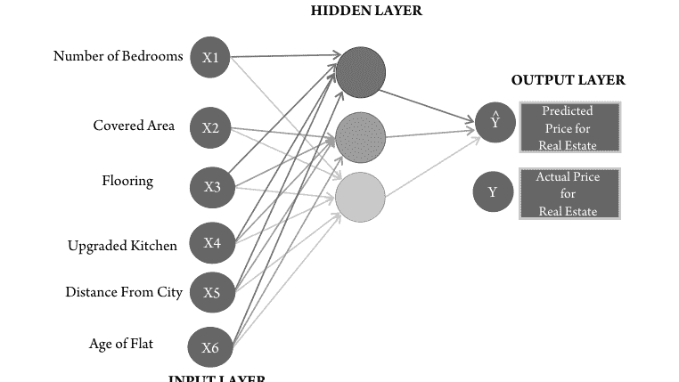

**图16.32** 比较实际值（$Y$）和预测值（$\hat{Y}$）

计算代价函数的方法有很多；最常用的是*平均平方误差和*。平均平方误差等于预测值与实际值之差的平方的一半。在我们的解释中，我们将使用*平均平方误差和*来衡量*代价函数*。

一旦计算出代价函数，我们就进行反向传播过程。我们将计算出的代价函数值反馈到神经网络中，以调整权重，并使用调整后的权重重新运行该循环。整个过程会重复进行，直到我们得到一个最小的代价函数值。因此，我们唯一能控制的是加权突触，我们可以改变每个神经元的权重。这种基于代价函数调整权重的反向过程被称为**反向传播**。

请记住，如果我们对权重进行微小的改变，就必须重新运行神经网络。这将导致一个新的代价函数值，该值将小于上一次的代价函数值。因此，我们按照图16.33（*前向和反向传播*）所示执行整个过程，直到*Y*和*Ŷ*之间没有显著差异。至此，我们准备引入另一个术语，称为*epoch*。一次完整的*前向和反向传播*周期被称为一个*epoch*，如图16.33所示。为了最小化代价函数，神经网络会经过多个*epoch*进行训练。最终，会找到一组正确的权重组合，使得实际值和预测值相互吻合。这些就是**最优权重**。

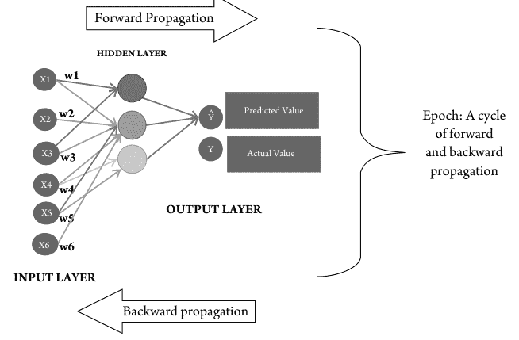

**图16.33** 一次前向和反向传播的周期构成一个epoch

现在让我们继续讨论我们的*房产价格预测问题*。在表16.1中，我们展示了用于*房产价格预测问题*的数据集的一个实例。

### 表16.1 房产价格预测问题的数据集实例

| 卧室数量 | 覆盖面积（码） | 花岗岩地板 | 升级厨房 | 距离城市（公里） | 公寓房龄（年） | 价格（十万卢比） |
|---|---|---|---|---|---|---|
| 3 | 150 | Y | Y | 2 | 2 | 70 |

基于这些变量，我们需要训练一个神经网络来预测公寓的价格，假设公寓的实际价格是70十万卢比。这将是实际值或Y。我们通过随机选择的加权突触输入变量。然后，神经网络通过前向传播过程计算出输出（或预测）值Ŷ。这在图16.34中进行了可视化。

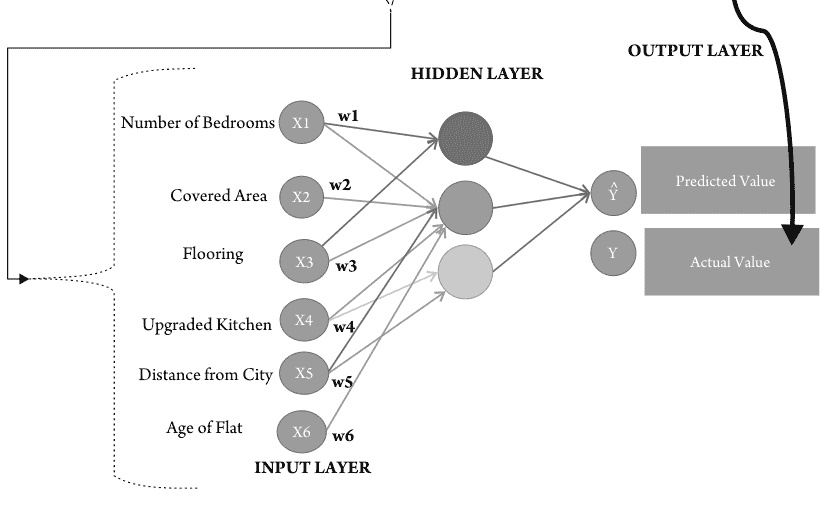

之后，通过比较预测值（Ŷ）与实际值（Y，即70十万卢比）来计算代价函数。根据得到的代价函数值，通过反向传播调整权重，数据通过神经网络反向传输，如图16.35所示。在根据代价函数调整权重后，前向传播过程会再次运行。我们不断重复前向和反向传播过程，直到得到一个最小化的代价函数值。

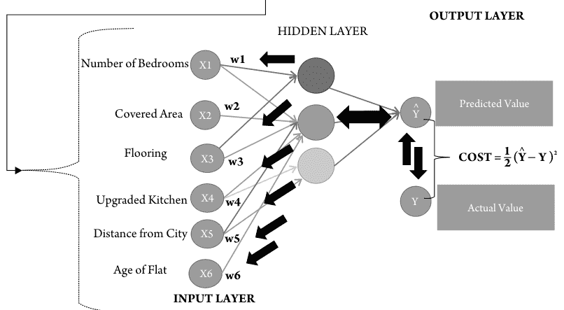

**图16.35** 通过反向传播调整权重以最小化代价函数

在*代价最小化*过程中，输入变量不会改变。只有权重会被改变。表16.1中显示的数据只是单个房产的单个实例或记录，但在实际场景中，我们有多条记录，如表16.2所示。因此，需要在完整的数据集上训练神经网络。所以，我们不是基于单个实例来预测房产价格，而是基于包含多条记录的历史数据来预测价格；表16.2展示了这些数据。

之前，我们有一个神经网络来处理单条记录，但本例中有大约六个实例，因此我们将为每个实例设置一个单独的神经网络来处理。因此，如图16.36所示，将同时运行六个神经网络来处理完整的数据集（或表16.2）。

### 表16.2 房产价格预测问题的数据集实例

| 卧室数量 | 覆盖面积（码） | 花岗岩地板 | 升级厨房 | 距离城市（公里） | 公寓房龄（年） | 价格（十万卢比） |
|---|---|---|---|---|---|---|
| 3 | 150 | Y | Y | 2 | 2 | 70 |
| 2 | 250 | Y | Y | 1 | 1 | 140 |
| 4 | 320 | N | Y | 2 | 1 | 200 |
| 1 | 130 | Y | Y | 3 | 2 | 60 |
| 4 | 500 | Y | N | 5 | 3 | 200 |
| 3 | 160 | N | N | 1 | 2 | 60 |

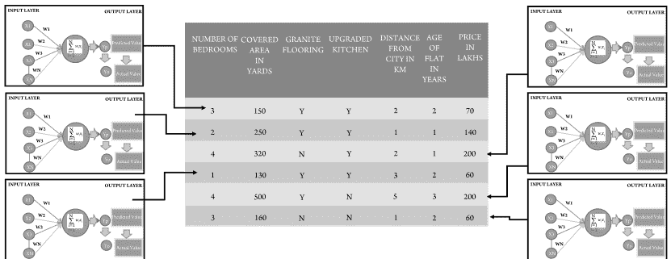

权重是随机初始化的，通过前向传播，使用同一组权重为每条记录或公寓（或每个实例）计算预测值。我们在单个神经网络情况下设置的初始权重将用于所有六个神经网络，每个网络都会为相应的实例产生一个预测值，如图16.37所示。

在图16.37中，这六个神经网络并行工作以处理数据集。每个网络处理给定数据集的一个特定实例。处理完成后，它们将产生每个房产的预测值（对应每个实例的$\hat{Y}_1$到$\hat{Y}_6$）。

前向传播完成后，使用公式(16.7)计算所有实例的累积误差或代价函数。

$\phi = \sum_{i=1}^{6} \frac{1}{2} (\hat{Y}_i - Y_i)^2$ (16.7)

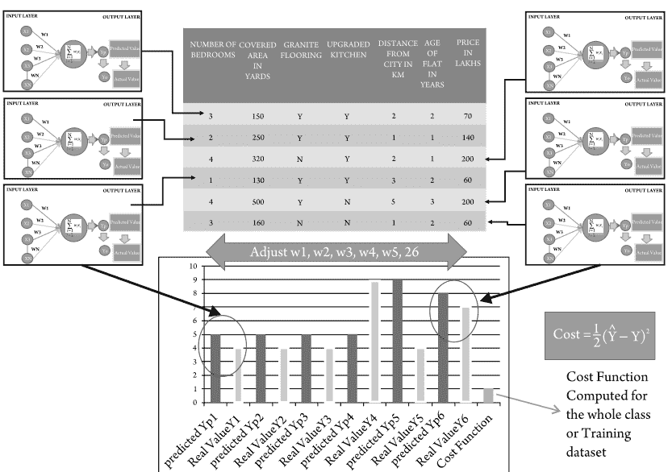

**图16.37** 预测多套公寓（六套公寓）的房产价格

简单来说，如果你总共有六套公寓，那么Y和Ŷ的比较将发生六次，整体的代价函数将基于每套公寓的实际值和预测值之间的差异来计算。因此，所有6个实例的累积误差由公式(16.8)给出。

$$\phi = \frac{1}{2}(\hat{Y}_1 - Y_1)^2 + \frac{1}{2}(\hat{Y}_2 - Y_2)^2 + \frac{1}{2}(\hat{Y}_3 - Y_3)^2 + \frac{1}{2}(\hat{Y}_4 - Y_4)^2 + \frac{1}{2}(\hat{Y}_5 - Y_5)^2 + \frac{1}{2}(\hat{Y}_6 - Y_6)^2$$ (16.8)

公式(16.8)将给出一个单一的代价函数值（即所有6个实例的误差之和）。这个代价函数值通过*反向传播*反馈回来以调整权重。这次前向和反向传播将被计为*一个epoch*。使用更新后的权重，对六个神经网络中的每一个执行*前向传播*。需要注意的是，所有记录都是使用这些更新后的权重进行处理的。前向传播完成后，重新计算误差的累积和或代价函数。然后执行反向传播以重新调整权重，这个epoch过程将重复进行，直到代价函数被最小化。这将完成我们神经网络的训练过程。

训练完成后，每个突触将获得其在0到1范围内的优化权重。那些在突触中具有较高权重值的神经元在预测中将比具有较低权重值的神经元获得更高的重要性。

例如，在图16.38中，连接隐藏层最顶层神经元与两个输入神经元（即*覆盖面积*和*距离城市*）的突触获得了较高的权重值（接近1），因为它们是连接的。或者，所有其他输入属性（*地板、卧室数量、公寓房龄*和*升级公寓*）被分配了较低的权重值（接近0），因为它们与隐藏层最顶层神经元没有连接。换句话说，输入层神经元和隐藏层之间的连接表示权重值接近1。相反，两个神经元之间的不连接表示权重值接近0。你可能会想，为什么会这样？

直观地认为，隐藏层的顶层神经元对*覆盖面积*和*距离城市*的值感兴趣。每当它获得适当的组合时，它就会激活并表现出对该房产的兴趣。也许这个神经元总是在寻找靠近城市的较大建筑面积，当它得到这种组合时，它就会触发并促使人们购买它。

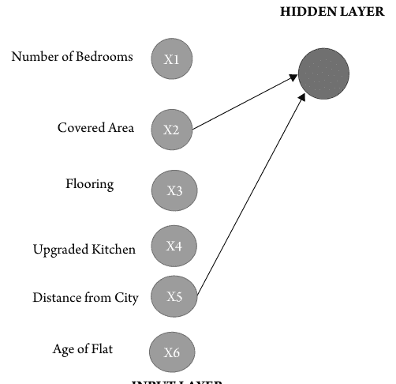

**图16.38** 隐藏层的顶层神经元与两个输入参数——*覆盖面积*和*距离城市*相连

类似地，在图16.39中，你可以看到隐藏层的最底层神经元与*公寓房龄*输入属性相连。这个神经元持续监控公寓的房龄。通常，我们对较旧的房产兴趣不大，但对历史建筑有一种特殊的吸引力，我们很乐意拥有。因此，每当房龄超过100年，表明它是一座百年历史建筑时，这个神经元就会被激活并提示人们购买该公寓。

在图16.39中，隐藏层最底部的神经元与“公寓房龄”输入属性相连。其他属性在其各自的突触处权重接近0，表明与最底部的神经元没有显著连接。当房产年龄超过阈值（例如100年）时，该神经元会被激活。它持续监控公寓的房龄，一旦超过阈值，它就会变得活跃，并增加买家对该房产的兴趣。房产价格会随着房龄增长而上升。为了确定阈值，我们对隐藏层最底部的神经元应用ReLU激活函数。这确保了如果加权和低于阈值，神经元将保持不活跃。然而，如果加权和超过阈值，神经元就会变得活跃。加权和的值越高，买家对该房产的兴趣就越大。

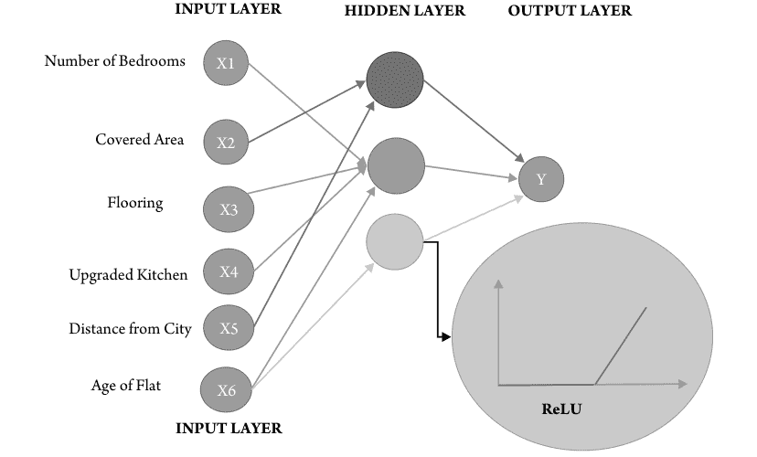

**图16.39** 输入层神经元与隐藏层神经元的连接

类似地，隐藏层中间的神经元可能对*卧室数量*、*地板材料*、*升级厨房*和*公寓房龄*感兴趣。这是一个常见的观察结果：大多数新建建筑拥有更大的建筑面积，并配备了现代化设施，如模块化厨房（或升级厨房）和地板，因此被评为昂贵的房产。因此，当神经网络在房产中发现所有这些特征时，这个特定的神经元就会激活并推高房产价格。

从以上讨论中，我们可以得出结论：每个隐藏层神经元都对某些特征或特征的组合做出响应。输入神经元与隐藏层神经元的连接性取决于在0到1范围内分配给突触的权重。这些权重的分配是通过*前向传播*和*反向传播*来执行的，同时最小化整个神经网络的成本。

我们可以在神经网络中拥有多个隐藏层，每个隐藏层包含多个神经元。这允许处理输入参数的多种组合，使得整个结构非常灵活、可扩展且功能强大。这类似于人脑通过神经元层处理信息，因此神经网络被认为是预测值的强大机器学习模型。

## 16.9 寻找最小化成本函数的权重优化值

我们有两种方法来寻找最小化成本函数的最优权重。第一种是暴力法，另一种是梯度下降法。让我们逐一讨论这些方法。

### 16.9.1 暴力法

在暴力法中，我们通过尝试所有可能的权重组合来找到合适的权重。对于每种权重组合，我们计算成本函数。最后，选择产生最小成本的最佳组合。通过这种方式，系统通过试错法找到权重的最优值。

在这种方法中，我们遵循排除法。我们可以尝试神经网络上的每一个可能的权重，并逐一接近最优的权重组合。但是，尽管试错法听起来可能很简单，但在计算上实现它是不可能的。让我们通过一些计算来理解这一点。

考虑一个具有单个隐藏层的神经网络，需要设置20个权重。让我们分析一下，如果我们使用暴力法来优化这些权重会发生什么。

假设每个权重有大约100种可能的组合，那么这意味着我们必须进行大约 $100 \times 100 \dots \times 100 = 100^{20}$ 次组合的试错。

考虑到最佳情况，假设我们使用“神威”，世界上最快的超级计算机之一，来执行这些计算。这台超级计算机每秒可以执行大约100千万亿次浮点运算（即每秒 $100 \times 10^{15}$ 次浮点运算），如果我们用它来优化神经网络的权重，那么处理 $100^{20}$ 种组合所需的时间近似计算如下。

假设测试1种组合需要1 FLOP，即我们需要1次浮点运算来测试一种组合。

Summit超级计算机每秒可以测试 $100 \times 10^{15}$ 种组合。

因此，测试 $100^{20}$ 种组合所需的时间 $= \frac{100^{20}}{100 \times 10^{15}}$ 秒，如果将其转换为年，我们将得到大约 **$3.17 \times 10^{15}$ 年**。

这甚至比宇宙当前的年龄，即 $26.7 \times 10^9$ 年还要长。

因此，即使是一台先进的超级计算机，在使用这种排除法时，也需要比宇宙存在更长的时间才能找到一个中等复杂神经网络中的所有最优权重。因此，暴力法不是一种有效的方法，不能实际用于寻找最优的权重组合。

这个问题的解决方案是梯度下降法，将在下一小节中讨论。

### 16.9.2 梯度下降法

如第5章所述，我们在梯度下降算法中从权重的初始猜测开始。然后，我们将通过取其导数来改变这些权重，以最小化成本函数，直到我们找到最小值或局部最小值。

为了复习梯度下降算法的工作原理，计算成本函数的数学方程如公式（16.9）所示。为了计算成本函数 $J(\phi_0, \phi_1)$ 的值，一个参数 $\phi_0$ 固定为0，而只改变另一个参数 $\phi_1$ 来分析成本函数的相应行为，如图16.40所示。

$$J(\phi_0, \phi_1) = \frac{1}{2n} \sum_{i=1}^{n} (y'_i - y_i)^2 \quad (16.9)$$

参数的更新值使用公式（16.10）计算。

$$\phi_j := \phi_j - \alpha \frac{\partial}{\partial \phi_j} J(\phi_0, \phi_1) \quad \text{for } j=0 \text{ and } j=1 \quad (16.10)$$

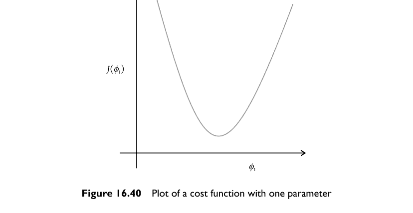

假设我们将参数 $\phi_1$ 初始化在图16.41所示的A点。

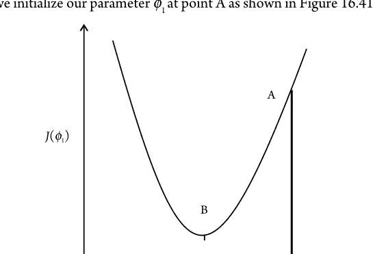

**图16.41** 梯度下降的初始点

为了到达局部最小值B，我们必须在最小值方向上迈出一个确定值的步伐。直观上，我们应该沿着斜率的方向迈步。曲线的斜率可以通过求导找到，如图16.42所示。我们对成本函数求导，得到函数的切线。所得切线的斜率将为我们提供进一步前进的方向。因此，我们将在任何点求导，并沿着最陡下降的方向迈步。

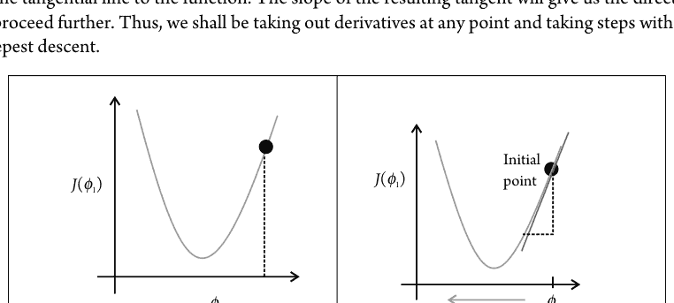

**图16.42** 寻找曲线的斜率

前进的方向由点的斜率决定，而步长由学习率（用 $\alpha$ 表示）决定，如图16.43所示。因此，参数 $\phi_1$ 的更新值是基于曲线的斜率（由成本函数的导数给出）和步长（用 $\alpha$ 表示）来计算的。

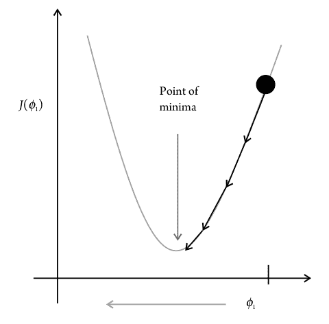

**图16.43** 收敛到最小值点

学习参数对梯度下降算法有显著影响。应调整学习参数的值，使梯度下降能在更短的时间内引导我们到达最小值。如果学习率太小，收敛到局部最小值将需要更多时间。但如果 $\alpha$ 太大，它可能不会收敛到最小值，甚至可能越过最小值。因此，应谨慎选择学习率的值。最终，通过梯度下降算法，我们可以用最少的步数到达成本函数的局部最小值点。

还必须注意，我们通过梯度下降得到的最小值总是局部最小值。但在大多数情况下，可能存在多个局部最小值。那么，挑战将是从所有可用的局部最小值解中找到全局最小值，如图16.44所示。

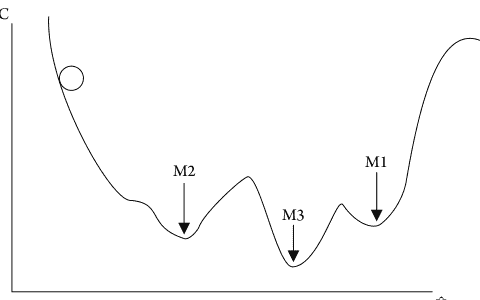

**图16.44** 成本函数的全局和局部最小值

我们可以使用不同的技术从可用的局部最小值集合中找到全局最小值。其中一种常用的技术是*随机梯度下降算法*，我们将在下一小节中讨论该算法。另一种可能的技术是应用遗传算法，我们将在第22章中讨论这个概念。

### 16.9.3 用于寻找全局最小值的随机梯度下降算法

“*随机*”一词意味着随机，但除了多了一个词之外，这两种方法之间存在显著差异。*随机梯度下降*与*梯度下降*的区别在于调整神经网络权重所采用的方法。

由于要找到全局最小值，首要任务是列出成本函数的所有可能最小值，然后第二个任务是从所有可用的解决方案中找到全局最小值。如图16.44所示，第一个任务是找到最小值——M1、M2和M3点。之后，第二步是从所有可用的最小值中选择最低的最小值点，即M3。因此，随机梯度下降的主要任务是找到所有可能的解决方案或所有可能的局部最小值点，因为简单的梯度下降只能找到一个局部最小值。

随机梯度下降通过为每一行单独寻找最佳优化权重，而不是像批量梯度下降那样为整个块（即所有记录的集合）寻找优化权重，从而找到所有可能的解决方案或可能的局部最小值点。这个概念在图16.45和图16.46中得到了说明。

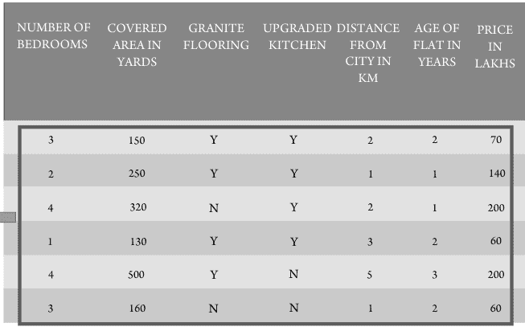

为了深刻理解这一点，让我们使用相同的*房价预测*数据集，其中有六行数据被输入到神经网络中。首先，我们将数据输入神经网络，然后使用我们之前使用的相同方法计算成本函数。

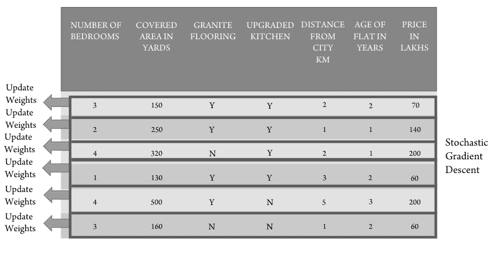

#### 梯度下降

图16.45显示，权重仅在处理完所有行之后才更新。最初，所有特征的权重都是随机设置的。然后，在处理完所有行后，使用平方误差的累积和在前向传播过程中计算成本函数。然后，在反向传播过程中根据此成本函数调整权重。

这个前向和反向传播过程会重复多次，直到我们为整个数据集找到优化的权重。在此过程中，仅为整个数据集找到一组权重，从而导致局部最小值。

#### 随机梯度方法

如图16.46所示，每一行的权重都是随机初始化的。然后，为每一行单独执行前向和反向传播，并获得优化的权重。这样，每一行都会找到不同的最优解。这有助于找到解决方案的所有局部最小值。因此，在随机方法中，我们在每一行单独进行前向和反向传播后调整权重（即按记录逐行调整），而不是在处理完所有行后调整权重。

在这种情况下，首先为第一行的所有特征随机设置权重，然后在前向传播后计算成本函数。然后，执行反向传播，并根据成本函数调整权重。这个前向和反向传播过程会重复多次，直到我们为第一条记录找到优化的权重。在此过程中，我们为第一条记录获得了一组优化的权重，从而导致局部最小值。

然后，对第二条记录重复相同的过程。最初，为第二行的所有特征随机设置权重。然后，第二行进行前向传播，其中成本函数以平方误差和的形式计算。然后，执行反向传播，并根据成本函数调整权重。这个前向和反向传播过程会重复多次，直到我们为第二条记录找到优化的权重。最后，我们为第二条记录获得了一组优化的权重，从而导致另一个局部最小值。

这个过程对每条记录都重复进行，通过这种方式，我们可以找到成本函数的所有可能的局部最小值。

因此，我们可以得出结论：我们首先为第一行运行神经网络，然后查看第一行的成本函数。然后为第一行调整权重；一旦完成，我们对下一行重复这些步骤。逐行进行，直到遍历完所有行。

在图16.47中，可以看到随机梯度下降比梯度下降方法波动更大，因为它产生的是非凸图，我们更有可能找到全局最小值而不是局部最小值。

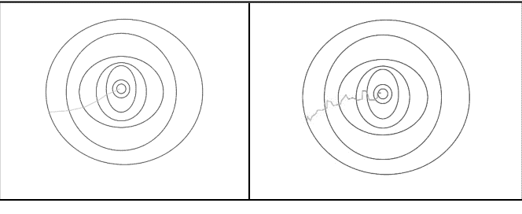

**图16.47** 梯度下降和随机梯度下降用于最小化成本函数的路径

在现实场景中，数据集通常包含数千条记录，使用前向和反向传播为每条记录寻找优化的权重在计算上代价高昂。因此，一种常用的替代方法是小批量方法，这将在下一小节中讨论。

### 16.9.4 小批量方法

在小批量方法中，包括权重初始化和前向、反向传播在内的过程，是针对一些*n*条记录（或数据的小批量）集体完成的。

我们不是为数据集的每一行执行权重初始化、前向传播、成本函数计算和反向传播，而是为一个包含*n*条记录的小批量执行这些操作。然后，对第二个小批量重复该过程。这样，每个小批量都会找到最优解，这有助于捕捉所有可能的局部最小值。

假设我们有一个包含*m*条记录的数据集，它们被随机分成*b*个小批量。假设每个小批量中有*n*条记录，如图16.48所示。这里，记录数（$m$）为6，小批量数（$b$）为2，每个小批量中的记录数（$n$）为3。

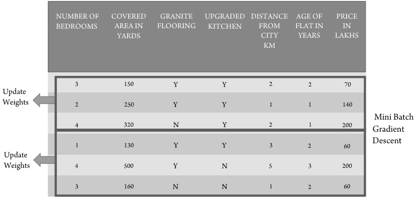

这里，在完成每个小批量的前向传播和成本函数计算后，在反向传播过程中执行权重更新。为每个小批量找到一组优化的权重，这有助于找到每个可能的局部最小值。然后，对下一个小批量重复此过程。通过这种方式，我们可以在不牺牲计算和时间需求的情况下找到多个局部最小值。

因此，我们可以得出结论：小批量梯度方法是随机梯度下降（SGD）和批量梯度下降方法之间的一种折衷。在这种方法中，权重不是在处理每条单独记录后更新（如SGD），也不是在处理整个数据集后更新（如批量梯度下降），而是在处理一个称为小批量的记录小子集后更新。小批量的大小通常选择在10到1000条记录之间，具体取决于可用的计算资源。

## 16.10 训练神经网络的最终分步流程

至此，我们可以通过以下步骤总结训练神经网络的整个过程。以下是神经网络的分步训练流程。

1.  为数据集的每个特征在输入层分配一个节点。（如果你有五个特征/属性，这意味着输入层将创建五个输入节点。）
2.  在每个节点随机初始化接近0的突触权重。
3.  *前向传播*——根据输入，神经元将被激活。从神经网络的左侧移动到右侧，最终由神经网络预测出一个值。

## 4. 代价函数计算
使用某种合适的代价函数度量（例如平方误差和），将预测值与实际值进行比较。

## 5. 反向传播
代价函数在神经网络中从右向左进行反向传播，并相应地重新调整权重。网络的学习率取决于你调整权重的程度。

## 6. 重复步骤1到5
对每个观测值（*随机梯度下降*）或在一批观测值之后（*批量下降*或*小批量下降*）进行。

## 7. 执行整个过程
从步骤1到6，直到整个数据集完成一次神经网络循环（*或完成一个周期*）。执行多个周期，直到你得到最小化的代价函数。

至此，我们结束了关于神经网络的讨论，在下一章中，我们将通过各种案例研究来实现人工神经网络。

#### 提醒我

- 当前存储空间和计算资源的技术发展为神经网络的蓬勃发展提供了绝佳环境。神经网络旨在模拟人脑的学习机制。
- 构建机器学习模型的人工神经网络结构需要三个主要组成部分。首先是处理输入属性的输入节点（称为输入层），其次是构建模型的处理节点（称为隐藏层），以及用于进行预测的输出节点（称为输出层）。
- 每个输入变量或自变量成为人工神经网络输入层的输入节点，而要预测的输出类别数量则成为输出节点的数量。
- 在回归问题中，机器学习模型用于预测输出节点的连续值，输出节点将只有一个。
- 在二元分类问题中，输出节点的数量也是一个，因为单个节点可以用于指示真或假；否则，它等于要分类的类别数量。
- 权重是神经网络运行中的关键因素。每个对应于某个独立输入属性的突触都被分配一个权重。
- 在人工神经网络过程中，在神经元的核心部分，计算所有输入值的加权和。
- 计算加权和后，对其应用激活函数。
- 一些常用的激活函数包括阈值函数、Sigmoid函数、修正线性单元函数和双曲正切函数。
- 阈值函数是一个阶跃函数或二元函数，输出为0或1。
- Sigmoid函数是最广泛使用的激活函数之一，它将任何实数映射到0到1之间的值。
- ReLU或修正线性单元函数是一个线性函数，如果输入为负则输出0，如果输入为正则输出相同的输入。
- 双曲正切或tanh是一个非线性函数，将实数值输出到-1到+1的范围内。
- 我们有两种方法来找到最小化代价函数的最优权重。第一种是暴力方法，另一种是梯度下降方法。
- 在暴力方法中，我们通过尝试所有可能的权重组合来找到合适的权重。对于每种权重组合，我们计算代价函数。最后，选择代价最小的最佳组合。通过这种方式，系统通过试错法找到权重的最优值。因此，即使使用这种排除过程，在一个中等复杂的神经网络中找到所有最优权重，即使是先进的超级计算机也需要比宇宙存在时间更长的时间。
- 解决这个问题的方案是梯度下降方法。
- 随机梯度下降方法用于从所有可用的局部最小值中找到全局最小值。
- 随机梯度下降和梯度下降之间的区别在于调整神经网络权重所使用的方法。
- 在梯度下降算法中，权重仅在处理完所有行后才更新。这个前向和反向传播过程重复多次，直到我们找到整个数据集的优化权重。在此过程中只找到一组权重，导致局部最小值。
- 在随机梯度方法中，权重在处理每一行后更新。与在处理整个数据集后调整所有权重不同，随机方法根据每条记录单独调整每个权重。它不利用整个批次或数据集，而是专注于单个样本。
- 小批量梯度方法是随机梯度下降和批量梯度下降方法之间的折中。在这种方法中，权重不是在处理每个单独记录后（如SGD）或在处理整个数据集后（如批量梯度下降）更新，而是在处理称为小批量的一小部分记录子集后更新。

#### 附加资源

##### 视频链接

- 什么是神经网络 | 神经网络解释, https://youtu.be/vpOLiDyhNUA


- 人工神经网络教程 | 使用神经网络的深度学习 | Edureka, https://youtu.be/fv6Ql3laUU


- 什么是神经网络？ | 深度学习，第1章, https://youtu.be/aircAruvnKk


##### 博客链接

- Superdatascience团队发布的人工神经网络终极指南, https://www.superdatascience.com/blogs/the-ultimate-guide-to-artificial-neural-networks-ann


- 人工神经网络教程, https://www.javatpoint.com/artificial-neural-network


#### 测试我（问题）

1. 人工神经网络中信号处理的三个步骤是什么？
2. 识别激活函数。

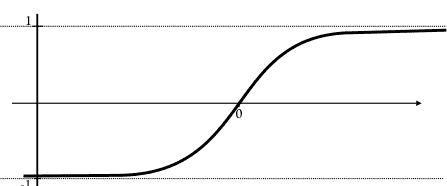

3. 在二元输出的情况下，通常应用哪种激活函数？
4. 在回归问题中，输出层的节点数量是多少？
5. 在随机梯度下降算法中，权重在每条记录后调整：正确/错误
6. 写出在人工神经网络中设置权重的过程。
7. 写出ReLU的公式。
8. 哪种激活函数通常用于表示客户对历史房产兴趣的增加？
9. 在梯度下降算法中，权重在每条记录后调整：正确/错误
10. 在以下数据集中，预测分数的人工神经网络模型将有多少个输入节点？

| 学号 | 学习时间 | 出勤率 | 分数 |
|---|---|---|---|
| 1 | 23 | 低 | 45 |
| 2 | 34 | 中 | 67 |
| 3 | 44 | 高 | 77 |
| 4 | 20 | 低 | 48 |

a) 4
b) 2
c) 3
d) 1

11. 为以下数据集构建预测分数的人工神经网络模型，找出输出层中输出节点的数量。

| 学号 | 学习时间 | 出勤率 | 分数 |
|---|---|---|---|
| 1 | w | 低 | 45 |
| 2 | 34 | 中 | 67 |
| 3 | 44 | 高 | 77 |
| 4 | 20 | 低 | 48 |

a) 4
b) 2
c) 3
d) 1

12. 对于二元分类器人工神经网络的输出节点，最佳激活函数是什么？

a) ReLU
b) Sigmoid
c) Softmax
d) 阈值

答案：2.Sigmoid 3.阈值或Sigmoid 4.1 5.正确 8.ReLU 9.错误 10.b（学号无需考虑，分数是输出属性） 11.d 12.b

# 17
## 人工神经网络的实现

### 章节目标
- 理解人工神经网络的实现过程。
- 理解Keras及其不同模块在构建人工神经网络中的作用。
- 理解向人工神经网络添加输入层、隐藏层和输出层的语法。
- 对人工神经网络模型进行编译。
- 在训练数据集上拟合人工神经网络模型。
- 使用训练好的人工神经网络模型进行预测。
- 通过使用混淆矩阵、精确率和召回率来评估人工神经网络分类器的性能。

### 17.1 构建用于癌症检测的人工神经网络

机器学习在癌症检测中可以发挥关键作用。在本章中，我们将使用乳腺癌数据集构建一个用于癌症检测的神经网络。

你可以通过以下链接下载此数据集。
https://www.kaggle.com/datasets/uciml/breast-cancer-wisconsin-data


获取的数据包含美国癌症患者的记录。这些记录由美国威斯康星大学的William H. Wolberg博士等人创建。整个数据有32列和569行。主要属性是半径、纹理、

## 17.2 加载数据集与预处理

在此步骤中，我们将执行加载数据集和预处理的任务。

### 17.2.1 步骤一：导入库

要执行此任务，我们需要导入两个库，即 Pandas 和 NumPy，如代码片段 1 所示。NumPy 便于进行数学运算，而 Pandas 则专门用于加载和提取数据集。

```python
# Importing the libraries
import numpy as np
import pandas as pd
```

Pandas 库用于导入所需的数据集，如代码片段 2 所示。这里，`read_csv()` 是从本地驱动器获取 .csv 文件的方法。在执行代码片段 2 之前，选择包含 `data.csv` 的文件夹作为工作目录非常重要。

```python
# Importing the dataset
dataset = pd.read_csv('data.csv')
```

### 17.2.2 步骤二：创建因变量和自变量

接下来，我们将创建数据集的因变量和自变量子集。$X$ 变量由输入特征矩阵组成，$y$ 由数据集的目标观测值或输出属性组成。获取的数据集的第一列包含唯一 ID，构建模型时无需考虑。在我们的数据集中，诊断属性是输出特征。如图 17.1 所示，您会注意到我们必须选择从索引位置 2 到 31 的列作为输入特征，而索引位置 1 的列，即诊断列，应被视为 $y$。关于数据框 dataset 的内容，您可以看到最后一列，即索引为 32 的列，所有值均为 null，因此不应将其视为输入属性。因此，我们仅为 $X$ 选择了索引值从 2 到 31 的列。代码片段 3 展示了 $X$ 和 $y$ 数组对象的创建。

```python
# Splitting the dataset
X = dataset.iloc[:, 2:32].values
y = dataset.iloc[:, 1].values
```

需要注意的是，`iloc` 方法中提到的上限值是被排除的；因此，$X$ 将包含索引值从 2 到 31 的列。

图 17.2 展示了更新后的变量资源管理器截图，其中包含两个新的数组对象，即 $X$ 和 $y$。图 17.3(a) 显示了 $X$ 的快照，图 17.3(b) 显示了 $y$ 的快照。

868 Machine Learning with Python

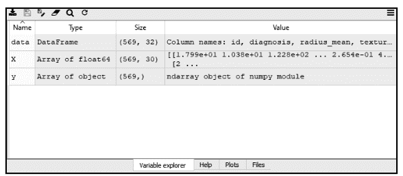

图 17.2 变量资源管理器的内容

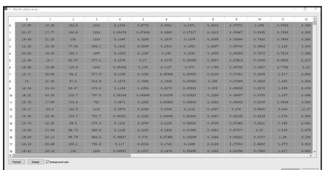

(a)

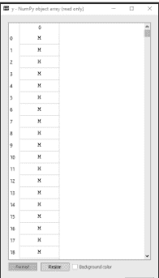

(b)

图 17.3 (a) X 的快照 (b) y 的快照

在导入数据集并将其拆分为两个子集（因变量和自变量）之后，下一步是将标记数据转换为二进制格式（0 或 1），这将在下一步中提及。

### 17.2.3 步骤三：编码分类数据

在数据集中，我们有一个类别属性 *diagnosis*；它是一个分类属性，有两个值：B（良性）和 M（恶性）。这里，良性指阴性病例，恶性指癌症的阳性病例。我们必须在预处理步骤中将此分类属性转换为标签（0 和 1）。为此，`sklearn` 库在其 `preprocessing` 子库中有一个 `LabelEncoder` 类。现在，让我们编写代码，使用 `LabelEncoder` 类对这些分类属性进行标记。

首先，我们将创建一个 `LabelEncoder` 类的对象，命名为 `labelEncoder_Y`。接下来，我们将对数据变量 `y` 使用 `LabelEncoder` 类的 `fit_transform()` 方法。

如代码片段 4 所示，我们已使用标签 0 和 1 对 *diagnosis* 列进行了编码。

```python
# Encoding categorical data
from sklearn.preprocessing import LabelEncoder
labelencoder_Y = LabelEncoder()
y = labelencoder_Y.fit_transform(y)
```

图 17.4 展示了目标变量 (y) 在标签编码前后的两个版本的比较。在图 17.4(a) 中，诊断列的值为 M 和 B。标签编码后，数据如图 17.4(b) 所示。从这两个图中，可以注意到 M 通过标签编码获得了标签 1，而 B 获得了标签 0。

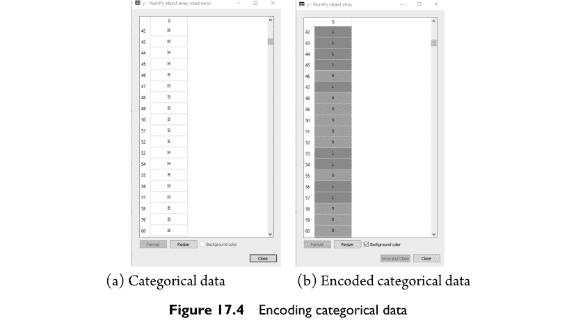

下一步是将数据集拆分为训练集和测试集。将数据集拆分为不同子集的过程将在下一步中提及。

### 17.2.4 步骤四：将数据集拆分为训练集和测试集

要执行数据的训练测试拆分，我们将需要 sklearn 的 `model_selection` 库。该库包含用于此任务的 `train_test_split` 方法。拆分数据集的代码如代码片段 5 所示。

```python
# Splitting the dataset into the training set and test set
from sklearn.model_selection import train_test_split
X_train, X_test, y_train, y_test = train_test_split(X, y, test_size = 0.3, random_state = 0)
```

这里，我们将 `test_size` 指定为 0.3，这意味着总观测值的 30% 将用于测试模型。获取的数据集的总行数为 569；因此，171 行（总数的 30%）用于测试目的，其余 398 行用于训练目的。从图 17.5 中，您可以看到已创建了四个变量：`X_train`、`X_test`、`y_train` 和 `y_test`。为 `random_state` 分配一个整数值非常重要，这固定了随机数生成器的种子值，并确保每次重新运行代码时生成相同的随机数集。

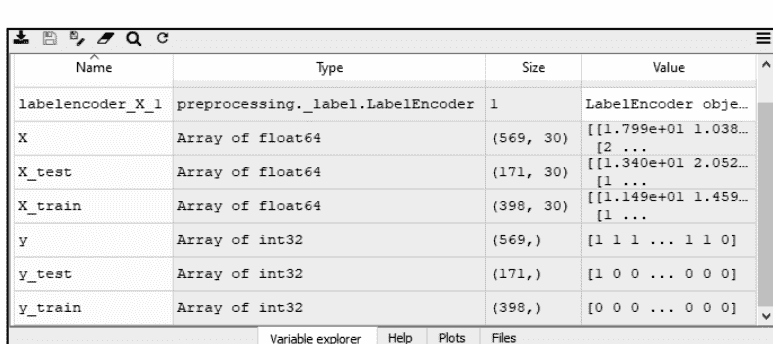

由于输入数据未缩放，数据预处理的下一步将是特征缩放。

### 17.2.5 步骤五：特征缩放

在特征缩放步骤中，特征矩阵被转换为相同的尺度。这里，我们使用标准化技术对特征值进行缩放。我们将导入 `StandardScaler` 类来创建一个对象 `scale_X`，该对象将用于缩放我们的数组对象 X（自变量）。为了对训练数据集进行标准化，我们首先需要创建 `StandardScaler` 类的对象。然后，我们需要通过将 `X_train` 数据集传递给它来调用其 `fit_transform()` 方法，并将更新后的值存储回 `X_train`。

在标准化 `X_test` 数据的情况下，我们只需使用 `transform()` 方法，因为它已经拟合到训练集，如代码片段 6 所示。

```python
# Feature scaling
from sklearn.preprocessing import StandardScaler
scale_X = StandardScaler()
X_train = scale_X.fit_transform(X_train)
X_test = scale_X.transform(X_test)
```

在对数据集执行特征缩放之后，我们已准备好将数据集传递给构建 ANN 模型。

这完成了数据集的加载和预处理，现在我们已准备好使用以下步骤构建 ANN。

## 17.3 构建人工神经网络

要构建 ANN 模型，我们必须执行以下步骤。

### 17.3.1 步骤六：导入 ANN 库

要构建 ANN，我们需要导入 `keras`。`keras` 是一个用 Python 编写的高级神经网络 API，能够在 `tensorflow` 之上运行。它是为了实现快速实验而开发的。Keras 允许轻松快速地进行原型设计。它支持卷积网络和循环网络，以及它们的组合。它可以在 CPU 和 GPU 上运行。

`keras` 使用 `tensorflow`，因此在安装 `keras` 之前，我们必须先安装 `tensorflow`。

安装 `tensorflow` 的命令如下。

- conda install -c conda-forge tensorflow

安装 `keras` 的命令如下。

- conda install -c conda-forge keras

在 Spyder 中安装 `keras` 后，如代码片段 7 所示导入 `keras` 包。

代码片段：7

```python
import keras
```

导入`keras`后，下一步是从`keras`导入其他类，如表17.1所示。

表17.1 需要从`keras`导入的其他类

| 类 | 作用 |
| :--- | :--- |
| Sequential | 它的作用是以序列化方式为人工神经网络模型创建/添加多个层。它允许逐层创建模型。 |
| Dense | 用于构建或连接人工神经网络的不同层。 |
| Dropout | 用于神经网络的正则化。它有助于防止模型过拟合。 |

`Sequential`类将从`keras.models`导入，而`Dense`和`Dropout`将从`keras.layers`导入，如代码片段8所示。

代码片段：8

```python
# 导入人工神经网络库
import keras
from keras.models import Sequential
from keras.layers import Dense, Dropout
```

下一步将是初始化人工神经网络，如下所述。

### 17.3.2 步骤7：初始化人工神经网络

要初始化人工神经网络，我们必须创建`Sequential`类的对象；这里，我们创建对象`classifier`，如代码片段9所示。

代码片段：9

```python
# 初始化人工神经网络
classifier = Sequential()
```

创建`classifier`对象后，下一步是创建层。首先，我们将添加输入层和隐藏层。

### 17.3.3 步骤8：添加输入层和第一个隐藏层

要拥有输入层和隐藏层，我们必须指定`Dense()`方法的四个重要参数，如表17.2所述。

表17.2 Dense的基本超参数

| 参数 | 描述 |
| :--- | :--- |
| *units* | 单元用于定义隐藏层中的节点数。通常，隐藏层中的节点数是输入层和输出层节点数的平均值。<br>隐藏层中的节点数 = (输入节点数 + 输出节点数)/2<br>在我们的例子中，输入节点数为30，等于输入特征的数量。在X中，我们有30列。由于这是一个二元分类器，我们只需要输出层中的1个节点。<br>因此，隐藏层中的节点数 = (30+1)/2 ≈ 16。<br>这里，units的值将等于16。 |
| *kernel_initializer* | 它用于初始化神经网络中密集层的权重。它决定了在模型训练开始前如何设置权重的初始值。这里，它被设置为“uniform”，这意味着密集层的权重将使用均匀分布进行初始化。<br>这意味着在指定范围内的所有值被选中的概率相等。 |
| *activation* | 它用于指定隐藏层的激活函数。有多种激活函数。我们通常对隐藏层使用*relu*激活函数，对输出层；在二元分类的情况下，通常使用*sigmoid*激活函数。 |
| *input_dim* | 它指定输入层中的节点数，等于输入特征或属性的数量。<br>在我们的例子中，X中有30个输入属性。因此，*input_dim*将等于30。 |

我们将把这些参数传递给Dense方法，然后作为参数传递给classifier对象的add()方法，如代码片段10所示。

根据表17.2，输入参数*units*为16，*kernel_initializer*为*uniform*，*input_dim*为30。由于我们正在为输入层添加分类器，我们使用*relu*激活函数，如代码片段10所示。

```python
# 添加第一个隐藏层
classifier.add(Dense(units=16, kernel_initializer="uniform",
                    activation="relu", input_dim=30))
```

这里，我们已经向人工神经网络模型添加了输入层和一个隐藏层。

### 17.3.4 步骤9：添加第二个和第三个隐藏层

我们也可以使用相同的add()方法添加更多隐藏层。通常，在人工神经网络中，我们有多个隐藏层。在我们的例子中，我们使用代码片段11添加第二个和第三个隐藏层。

代码片段：11

```python
# 添加第二个隐藏层
classifier.add(Dense(units=16, kernel_initializer="uniform",
                    activation="relu"))
# 添加第三个隐藏层
classifier.add(Dense(units=16, kernel_initializer="uniform",
                    activation="relu"))
```

需要注意的是，我们在第二层或任何后续隐藏层中不需要*input_dim*。第二个隐藏层将从第一个隐藏层的输出接收其输入，模型会自动获取其值。同样，第三个隐藏层将从第二个隐藏层的输出接收其输入，模型会自动获取其值。

### 17.3.5 步骤10：添加输出层

我们已经向神经网络添加了四层：一个输入层和三个隐藏层。现在，我们将添加最后一层，即神经网络的输出层。对于这一层，我们将使用classifier对象的`add`和`Dense`方法。我们还向模型添加了dropout率以避免过拟合。dropout意味着在训练过程中随机丢弃节点。它提供了一种计算成本低廉且非常有效的正则化方法，以减少过拟合并提高深度神经网络的泛化误差。这里，我们将dropout率指定为0.1。代码片段12显示了添加输出层和dropout所需的代码。

代码片段：12

```python
#### 添加输出层
classifier.add(Dense(units=1, kernel_initializer="uniform",
                    activation="sigmoid"))
# 添加dropout以防止过拟合
classifier.add(Dropout(rate=0.1))
```

由于我们正在构建一个二元分类器，因此我们为输出层指定*sigmoid*激活函数，因为它产生0到1范围内的输出。这一特性在二元分类问题中很有用，其目标是产生类似概率的输出。如果输出更接近1，则表示属于某个类别的概率更高；如果更接近0，则表示概率较低。

需要注意的是，在多类分类的情况下，我们必须为输出层使用*softmax*激活函数。*softmax*激活函数为输入数组产生多个输出。因此，我们可以使用*softmax*激活函数构建能够分类两个以上类别的神经网络模型。所有*softmax*输出的总和始终为1。通过确保输出总和为1，softmax函数允许我们将输出值解释为类别概率。每个输出值表示输入实例属于特定类别的概率。概率最高的类别被认为是该实例的预测类别，如图17.6所示。

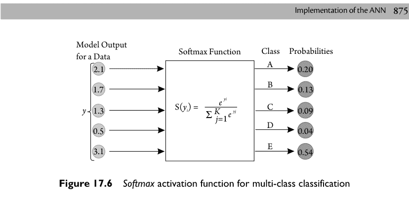

### 17.3.6 步骤11：编译人工神经网络

编译人工神经网络意味着应用随机梯度下降算法来优化权重。人工神经网络模型的编译是通过调用classifier对象的`compile`方法执行的。此方法需要三个重要参数，如表17.3所述。

表17.3 `compile`方法的参数

| 参数 | 定义 |
| :--- | :--- |
| *optimizer* | 在此参数中，我们必须指定用于在神经网络中找到最优权重的算法。有多种优化器可用于此任务，随机梯度算法在优化器`adam`中实现。因此，此参数的值设置为`adam`。 |
| *loss* | 这对应于所选优化器用于优化的损失。在这种情况下，我们使用损失函数作为平方误差之和，即实际值与预测值之间的平方差。<br><br>由于我们正在构建一个二元分类器并使用**sigmoid**激活函数，我们将损失函数指定为`binary_crossentropy`。<br><br>需要注意的是，在多类分类器的情况下，`categorical_crossentropy`用作*损失*。 |
| *metrics* | 神经元的权重在每次观测后或一批观测后更新，优化器将使用提到的`metrics`来评估模型的性能。<br><br>在这种情况下，我们将指标提及为["**accuracy**"]。我们需要在括号中指定指标，因为我们正在创建一个列表。我们这里只提到了一个指标，即准确率；但是，我们也可以将更多指标指定为列表的一部分。 |

上表总结了`compile`方法的基本参数。我们将把这些参数添加到模型中，并使用这些属性编译神经网络。编译人工神经网络模型的最终代码在代码片段13中给出。

## 编译人工神经网络

```python
classifier.compile(optimizer = "adam", loss = "binary_crossentropy",
                   metrics = ["accuracy"])
```

编译完人工神经网络模型后，下一个任务将是按照下一步所述，在训练数据集上拟合该模型。

### 17.3.7 步骤 12：将人工神经网络拟合到训练集

要拟合模型，我们必须使用分类器的 `fit` 方法。它有四个重要参数，如表 17.4 所述。

表 17.4 `fit` 方法的参数

| 参数 | 说明 |
| :--- | :--- |
| *训练数据输入属性* | 模型将拟合到训练数据。这里将指定输入自变量的训练数据。在我们的实验中，它是 `X_train`。 |
| *训练数据输出属性* | 此参数指定训练数据的输出或因变量。在我们的例子中，它是 `y_train`。 |
| *batch_size* | 这里，我们指定每个批次中执行前向和反向传播以更新权重的记录数。<br>在本实验中，我们使用 **batch_size** 为 100。但是，您可以调整此数字以找到其最佳值。 |
| *epochs* | 一次前向和反向传播的循环称为一个 epoch。在此参数中，我们必须指定模型应运行的 epoch 数，以优化代价函数。<br>在此示例中，我们使用 **epochs** 为 150。但是，您可以调整此数字以找到其最佳值。 |

拟合模型的代码如代码片段 14 所示。

```python
# 将人工神经网络拟合到训练集
classifier.fit(X_train, y_train, batch_size = 100, epochs = 150)
```

执行此行代码后，模型拟合过程将开始。模型通过优化权重并执行前向和反向传播（这被称为一个 epoch）开始拟合。系统将花费几分钟来完成 150 个 epoch，具体取决于机器的处理速度。可以在每个 epoch 后看到损失和准确率的输出，并注意到随着每个 epoch 的进行，损失在减少，准确率在提高。这些输出如图 17.7、17.8 和 17.9 所示。

```python
# 将人工神经网络拟合到训练集
classifier.fit(X_train, y_train, batch_size = 100, epochs = 150)

Epoch 1/150
4/4 [==============================] - 1s 5ms/step - loss: 1.3058 - accuracy: 0.3995
Epoch 2/150
4/4 [==============================] - 0s 4ms/step - loss: 1.1909 - accuracy: 0.4095
Epoch 3/150
4/4 [==============================] - 0s 4ms/step - loss: 1.3883 - accuracy: 0.3819
Epoch 4/150
4/4 [==============================] - 0s 4ms/step - loss: 1.4472 - accuracy: 0.3945
Epoch 5/150
4/4 [==============================] - 0s 3ms/step - loss: 1.1512 - accuracy: 0.4095
Epoch 6/150
4/4 [==============================] - 0s 4ms/step - loss: 1.0862 - accuracy: 0.3995
Epoch 7/150
4/4 [==============================] - 0s 3ms/step - loss: 1.3433 - accuracy: 0.3819
Epoch 8/150
4/4 [==============================] - 0s 3ms/step - loss: 1.1557 - accuracy: 0.3894
Epoch 9/150
4/4 [==============================] - 0s 5ms/step - loss: 1.2546 - accuracy: 0.3894
Epoch 10/150
4/4 [==============================] - 0s 3ms/step - loss: 1.4348 - accuracy: 0.3719
```

**图 17.7** 将训练集拟合到神经网络

从图 17.7 可以注意到，在 150 个 epoch 中的第 10 个 epoch，准确率为 0.3719，损失为 1.4348。此时准确率较低。

```
Epoch 55/150
4/4 [==============================] - 0s 5ms/step - loss: 0.4433 - accuracy: 0.9623
Epoch 56/150
4/4 [==============================] - 0s 8ms/step - loss: 0.5979 - accuracy: 0.9523
Epoch 57/150
4/4 [==============================] - 0s 9ms/step - loss: 0.7134 - accuracy: 0.9447
Epoch 58/150
4/4 [==============================] - 0s 5ms/step - loss: 0.5946 - accuracy: 0.9523
Epoch 59/150
4/4 [==============================] - 0s 4ms/step - loss: 0.9834 - accuracy: 0.9271
Epoch 60/150
4/4 [==============================] - 0s 5ms/step - loss: 0.7414 - accuracy: 0.9447
Epoch 61/150
4/4 [==============================] - 0s 4ms/step - loss: 0.5556 - accuracy: 0.9548
Epoch 62/150
4/4 [==============================] - 0s 4ms/step - loss: 0.5541 - accuracy: 0.9548
Epoch 63/150
4/4 [==============================] - 0s 4ms/step - loss: 0.6714 - accuracy: 0.9472
Epoch 64/150
4/4 [==============================] - 0s 5ms/step - loss: 0.4384 - accuracy: 0.9623
Epoch 65/150
4/4 [==============================] - 0s 4ms/step - loss: 0.5152 - accuracy: 0.9573
```

**图 17.8** 将训练集拟合到神经网络

从图 17.8 可以注意到，在 150 个 epoch 中的第 65 个 epoch，准确率为 0.9573，损失为 0.5152。我们可以观察到，随着每个 epoch 的进行，准确率变得更好。

从图 17.9 可以注意到，在 150 个 epoch 中的第 150 个 epoch，准确率为 0.9472，损失为 0.7216。

您可以根据准确率和损失的分析找到最佳的 epoch 数。在这种情况下，参考图 17.9，您可以分析出最好将模型运行 145 个 epoch，因为此时我们获得了最大准确率 0.9673 和最小损失 0.4444。此后，我们的模型变得过拟合，其准确率下降。要了解更多关于寻找最佳 epoch 值的内容，请参阅第 18 章的第 18.7 节“决定训练神经网络的最佳 Epoch 数”。

```
Epoch 141/150
4/4 [==============================] - 0s 5ms/step - loss: 0.6071 - accuracy: 0.9548
Epoch 142/150
4/4 [==============================] - 0s 6ms/step - loss: 0.6840 - accuracy: 0.9497
Epoch 143/150
4/4 [==============================] - 0s 5ms/step - loss: 0.5154 - accuracy: 0.9648
Epoch 144/150
4/4 [==============================] - 0s 7ms/step - loss: 0.7602 - accuracy: 0.9447
Epoch 145/150
4/4 [==============================] - 0s 5ms/step - loss: 0.4444 - accuracy: 0.9673
Epoch 146/150
4/4 [==============================] - 0s 6ms/step - loss: 0.7979 - accuracy: 0.9422
Epoch 147/150
4/4 [==============================] - 0s 4ms/step - loss: 0.5286 - accuracy: 0.9598
Epoch 148/150
4/4 [==============================] - 0s 6ms/step - loss: 0.7171 - accuracy: 0.9497
Epoch 149/150
4/4 [==============================] - 0s 5ms/step - loss: 0.7218 - accuracy: 0.9472
Epoch 150/150
4/4 [==============================] - 0s 5ms/step - loss: 0.7216 - accuracy: 0.9472
```

**图 17.9** 将训练集拟合到神经网络

拟合模型后，我们可以使用此模型进行预测，如下一节所述。

## 17.4 预测结果

拟合模型后，下一步是使用此模型进行预测，为此，我们必须执行以下步骤。

### 17.4.1 步骤 13：预测测试集结果

要进行预测，我们必须将变量 `X_test` 传递给分类器对象的 `predict` 方法。这将创建一个 `y_pred` 变量。它将返回从 0 到 1 的预测概率，如图 17.10 所示。由于我们的实际结果数据是二进制格式，我们必须通过将其值与阈值 0.5 进行比较，将 `y_pred` 转换为二进制。如果其值小于 0.5，则将其映射为 0；否则，使用代码片段 15 将其映射为 1。

```python
# 预测测试集结果
y_pred = classifier.predict(X_test)
y_pred = (y_pred > 0.5)
```

执行这些代码行后，`y_pred` 将被转换为二进制格式，如图 17.11 所示。

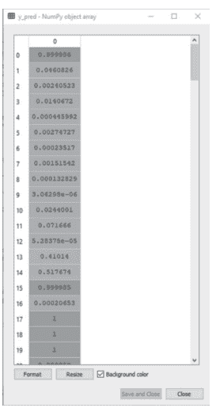

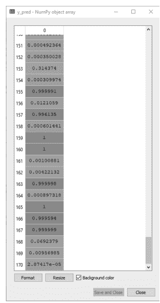

(a) 前 20 个预测

(b) 后 20 个预测

**图 17.10** 范围在 0–1 之间的预测概率

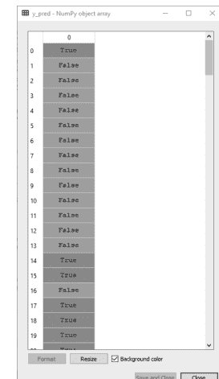

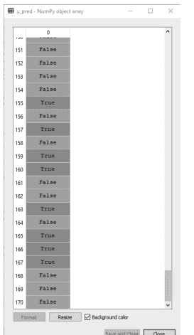

(a) 前 20 个预测

(b) 后 20 个预测

**图 17.11** 转换为二进制后的预测概率

为了验证模型，我们可以将*y_pred*的预测值与*y_test*中的实际值进行比较，如图17.12所示。为了更好地分析结果，我们必须通过执行以下步骤来构建混淆矩阵。

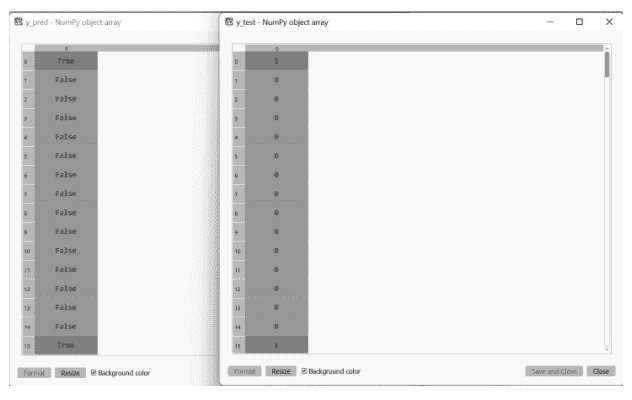

**图17.12** *y_pred*与*y_test*的比较

### 17.4.2 步骤14：构建混淆矩阵

*混淆矩阵*是一个*N* × *N*的汇总表（*N*是数据集中的类别总数），用于总结分类模型的性能。使用混淆矩阵，可以理解数据集实际值与预测值之间的相关性。我们将使用代码片段16来生成混淆矩阵。

```python
# Making the confusion matrix
from sklearn.metrics import confusion_matrix
cm = confusion_matrix(y_test, y_pred)
```

在代码片段16中，我们首先从`sklearn.metrics`模块导入了`confusion_matrix()`方法。我们向`confusion_matrix()`方法传递了两个参数：*y_test*和*y_pred*。这里，*y_test*包含实际值，而*y_pred*包含预测值。生成的混淆矩阵随后存储在*cm*变量中。通过在变量窗口中双击*cm*变量，我们可以在图17.12中看到其内容。

让我们分析一下混淆矩阵。如图17.12所示，模型预测60名患者患有恶性肿瘤；在这些样本中，59个被正确分类（这些是真阳性），而1名患者被错误地分类为患有恶性肿瘤，被认为是*假阳性*。

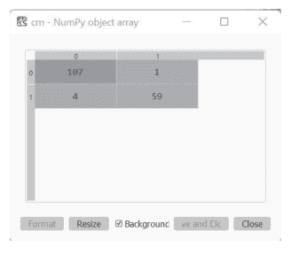

**图17.12** ANN分类器的混淆矩阵

然而，模型对111名患者做出了他们患有良性肿瘤的预测。在这些预测中，107个被正确分类为真阴性，意味着模型准确地将它们识别为良性。但是，有4名患者的肿瘤实际上是恶性的，但被错误地分类为良性，导致了假阴性。混淆矩阵的表格表示如表17.5所示。

**表17.5** 混淆矩阵分析

| | 预测 (0) | 预测 (1) |
|---|---|---|
| 实际 (0) | 107 (真阴性 - TN) | 1 (假阳性 - FP) |
| 实际 (1) | 4 (假阴性 - FN) | 59 (真阳性 - TP) |

需要注意的是，假阴性在这种情况下是一个关键参数。它指的是存在恶性肿瘤但被我们的系统错误地预测为良性的情况。对于一个好的分类器，假阴性的值应该是最小的。
计算完混淆矩阵后，我们必须评估模型的不同参数，如*准确率*、*精确率*和*召回率*。

#### 准确率

模型的准确率定义为所有正确预测的比率与分类器做出的总预测数之比。
因此，模型的准确率是评估模型的一个重要参数。
计算*准确率*的公式如公式(17.1)所示。

$$Accuracy = \frac{TP + TN}{TP + TN + FP + FN}$$ (17.1)

在表17.5所示的混淆矩阵中，我们有TP = 59，TN = 107。因此，我们的ANN模型做出的总正确预测数为166，而模型做出的总预测数为171。我们模型的准确率如下。

$$Accuracy = \frac{59+107}{107+59+1+4} = \frac{166}{171} = 0.97 \text{ 或 } 97\%$$

因此，我们ANN模型的准确率为97%。

#### 精确率

精确率识别了模型在预测正类时正确的频率。基于混淆矩阵计算我们模型精确率的公式如公式(17.2)所示。

$$Precision = \frac{TP}{TP + FP} \quad (17.2)$$

从表17.5中，我们有TP = 59，FP = 1。因此，精确率得分为

$$Precision = \frac{59}{59+1} = \frac{59}{60} = 0.9833$$

精确率的百分比为98.33%。

#### 召回率

召回率识别了在所有可能的正标签中，模型正确识别了多少？简单来说，它指的是我们能找到多少比例的实际正实例。计算召回率指标的公式如公式(17.3)所示。

$$Recall = \frac{TP}{TP + FN} \quad (17.3)$$

从表17.5中，我们有TP = 59，FN = 4。因此，召回率得分为

$$Recall = \frac{59}{59+4} = \frac{59}{63} = 0.9365$$

召回率的百分比为93.65%。在我们的分类器中，假阴性(FN)的值较高，导致召回率低于精确率。需要注意的是，在癌症检测分类系统中，召回率是一个非常重要的质量指标。

让我们通过从sklearn.metrics库导入各种方法，在Python中计算这些性能指标。它有`accuracy_score()`、`precision_score()`和`recall_score()`等方法来评估模型的性能。

在下面的代码片段17中，我们使用`print()`方法打印性能指标的结果分数。代码片段17显示了为设计的分类器打印各种质量指标值的代码。

```python
# Performance metrics
# Accuracy
from sklearn.metrics import accuracy_score
accuracy = accuracy_score(y_test, y_pred)
print('Accuracy is ', accuracy)
# Precision
from sklearn.metrics import precision_score
precision = precision_score(y_test, y_pred)
print('Precision is ', precision)
# Recall
from sklearn.metrics import recall_score
recall = recall_score(y_test, y_pred)
print('Recall is ', recall)
```

图17.13显示了代码片段17的输出。

```
Accuracy is 0.970760
Precision is 0.983333
Recall is 0.936508
```

**图17.13** 我们决策树模型的最终性能指标

从图17.13中，我们可以交叉验证我们手动计算的性能指标与Python代码的计算结果相同。

在本章中，我们讨论了使用乳腺癌数据集实现ANN的实际操作。我们讨论了ANN实现的关键步骤。这些步骤包括导入数据集、预处理数据、构建ANN以及预测结果。我们还讨论了`keras`包的重要性以及它如何简化ANN的实现。通过构建ANN模型，我们理解了`keras`包的一些关键库。最后，我们讨论了使用指标来分析神经网络模型。

鼓励所有读者完成本章末尾提供的“测试我”作业。建议参与这些作业，因为它们提供了宝贵的实践机会，并有助于巩固本章讨论的概念。

#### 提醒我

- Keras是一个基于Tensorflow的模块和函数包，用于构建ANN模型。
- Sequential类在创建或向模型添加多个顺序层方面发挥作用。
- Dense用于构建或连接ANN的不同层。
- Dense是keras库的一个模块，用于互连层中的多个神经元。
- add ( ) 方法向模型添加一个层。
- units、kernel_initializer、activation和input_dim是Dense方法向ANN添加层的四个重要参数。
- Dropout函数用于防止模型过拟合。
- 通常，隐藏层中的神经元数量是输入和输出节点数量的平均值。
- kernel_initializer用于为神经元随机分配唯一的权重。
- relu是隐藏层常用的激活函数。
- sigmoid激活函数用于二元分类情况下的输出层，softmax激活函数用于多类分类情况下的输出层。
- ANN的编译意味着应用随机梯度下降算法来优化权重。
- optimizer、loss和metrics是compile方法的重要参数。
- 要拟合ANN，我们必须指定训练输入和输出数据集、batch_size和epochs。
- 我们可以总结，要构建ANN模型，需要执行以下步骤。

**加载数据集和预处理**
步骤1：导入库。
步骤2：创建因变量和自变量。
步骤3：编码分类数据。
步骤4：将数据集分割为训练集和测试集。
步骤5：特征缩放。

**构建人工神经网络（ANN）**
步骤6：导入ANN库。
步骤7：初始化ANN。
步骤8：添加输入层和第一个隐藏层。
步骤9：添加第二个和第三个隐藏层。
步骤10：添加输出层。

步骤 11：编译人工神经网络。
步骤 12：将人工神经网络拟合到训练集。
**预测结果**
步骤 13：预测测试集结果。
步骤 14：生成混淆矩阵。

#### 附加资源

##### 视频链接

- 神经网络完整课程 | 初学者神经网络教程 | 神经网络 | Simplilearn, https://www.youtube.com/watch?v=ob1yS9g-Zcs
- 人工神经网络教程 | 使用神经网络的深度学习 | Edureka, https://www.youtube.com/watch?v=fv6Qll3laUU
- Python神经网络 | 如何用Python制作神经网络 | Python教程 | Edureka, https://www.youtube.com/watch?v=9UBqkUJVP4g

##### 博客链接

- 使用Keras在Python中从零开始构建你自己的基于流失建模数据集的人工神经网络, https://towardsdatascience.com/building-your-own-artificial-neural-network-from-scratch-on-churn-modeling-dataset-using-keras-in-690782f7d051
- 在Python中实现人工神经网络 - 分步指南 https://www.mltut.com/implementation-of-artificial-neural-network-in-python/

#### 测试我（作业）

1. 使用人工神经网络模型预测泰坦尼克号幸存者。
数据集 https://www.kaggle.com/c/titanic 包含乘客名单及其存活率。乘客的存活率基于年龄、性别、船票、票价和许多其他属性。你必须使用获取的数据集训练模型，并预测幸存者名单。


2. 构建一个人工神经网络模型来预测谷歌公司的股票价格。
从 https://finance.yahoo.com/quote/GOOG/history/ 下载谷歌的实时股价数据集，你可以预测股票的收盘价。训练集和测试集的比例必须为80:20，训练轮数（epoch）= 125。


3. 通过改变训练轮数来比较不同人工神经网络模型的准确率。
你可以使用数据集 https://www.kaggle.com/filippoo/deep-learning-az-ann 来预测客户类别以及他是否会继续使用银行服务。你可以改变训练轮数，例如100、125、150、200、250和300，并分析实验中模型的准确率水平。


4. 当使用多组隐藏层时，不同人工神经网络模型的准确率如何变化？具体来说，通过实验不同的隐藏层数量（例如1、2和3层），以及调整每层的神经元数量。对于此分析，可以使用 https://www.kaggle.com/uciml/breast-cancer-wisconsin-data 上的数据集来预测癌症的发生。此外，参考学习曲线有助于确定训练好的模型是过拟合还是欠拟合。


5. 创建一个用于预测汽车价格的人工神经网络回归器。
可以在数据集 https://www.kaggle.com/tolgahancepel/toyota-corolla 上构建一个人工神经网络回归器，其中车龄、行驶里程、燃料类型、颜色、车门数和重量将是自变量，价格可以是因变量。


6. 使用不同参数评估一个人工神经网络模型。
你可以使用 https://www.kaggle.com/jessemostipak/hotel-booking-demand/ 数据集，通过不同的激活函数（如 *sigmoid*、*tanh* 和 *relu*）来评估一个人工神经网络分类器。


7. 一位商店经理想为即将到来的促销活动在他的商店里备货一些Alexa设备，但他不了解当前的需求，因此不确定应该备货多少台设备。所以，你可以通过准备一个人工神经网络分类器模型来帮助他，该模型可以使用Alexa_dataset进行预测并预测Alexa设备的销量。
从以下链接获取数据集。
https://github.com/bhatiaparteek/ml_with_python/tree/main/Chapter_11_Classifiers


这是我们在第11章中使用的同一个问题陈述。现在，你必须在数据集上实现人工神经网络，并将其性能与其他分类器（如决策树、随机森林、朴素贝叶斯、k-近邻、逻辑回归和支持向量机）进行比较。

# 18
深度学习与卷积神经网络

**章节目标**
* 了解传统神经网络在图像识别方面的局限性。
* 理解卷积神经网络的工作原理。
* 理解卷积神经网络的架构。
* 了解卷积神经网络模型中卷积层、最大池化、展平和全连接层的重要性。
* 理解训练卷积神经网络模型的过程。
* 确定训练神经网络的最佳训练轮数。

## 18.1 图像识别

使用卷积神经网络，图像识别领域的技术发展已经发生了革命性的变化，远超我们的想象。让我们考虑图18.1所示的漫画场景，因为它为图像识别的发展提供了有趣的见解，并描绘了十年前可能的情景。在这里，一位经理要求他的计算机程序员“开发一个应用程序，当用户点击一些照片时，可以检查用户是否在国家公园里！”作为一个简单且可行的任务，计算机程序员回应说这个任务只需要几个小时。但是，经理的好奇心上来了，他进一步询问程序员是否能检查图像是否是一只鸟？令人惊讶的是，程序员回答说：“我需要一个研究团队和五年时间来完成这个任务。”


**图18.1** 一家IT公司的场景

这让经理感到惊讶，因为他以为这是一个简单的任务。但这位在该领域有专长的程序员知道，这是计算机科学中需要解决的复杂问题之一。

在过去的十年里，我们为计算机领域的许多复杂问题提供了解决方案。但是，在过去的50年里，我们一直在努力解决图像识别中的问题。然而，由于全球研究人员和计算机科学家的努力，我们现在可以解决这些问题了。即使是三岁的孩子也能识别一张鸟的照片，但找到一种让计算机完成同样任务的方法并非易事；因此，这花了将近50年的时间！

近年来，我们终于找到了一种使用深度卷积神经网络进行物体识别的有前景的方法。在本章中，我们将讨论卷积神经网络的工作原理和概念，这是一种解决图像识别问题的深度神经网络方法。

目前，市场上充斥着可以从图像中识别物体的应用程序（物体识别）。例如：在安卓系统中，我们有一个应用程序——Google Photos——一个照片分享和照片存储应用，如图18.2所示。它具有检测图像库中物体、地点或人物的令人兴奋的功能。此外，它还会自动对图库中的图像进行分类，并将它们分组到多个文件夹中，例如“人物”、“地点”、“事物”。我希望你现在已经尝试过Google Photos了；如果没有，只需点击图18.2所示的图标在你的智能手机上启动这个应用程序。


**图18.2** Google Photos应用的图标

当你打开应用程序时，你会发现多个相册（由Google Photos自动创建），名称为——人物、地点、事物等。Google根据你图像中存在的物体准备这些动态相册；例如，如果你拍摄的照片是湖泊，它将被归类到“地点”文件夹下；如果是台灯，它将被归类到名为“事物”的相册下。同样，它也会根据身份对人物进行分组。图18.3展示了Google动态相册的一个例子。

所有这一切之所以成为可能，是因为一个非常强大的卷积神经网络。为了理解卷积神经网络的概念和工作原理，我们将首先考虑从图像中的手写数字中识别数字的基本问题。我们将首先尝试用传统的机器学习技术来解决这个问题，然后讨论将传统机器学习技术应用于图像中物体识别的后果。然后我们将讨论卷积神经网络在解决此类问题中的优势和作用。


**图18.3** Google Photos应用中的Google动态相册

本章的灵感来源于SuperDataScience团队发布的题为“卷积神经网络（CNN）终极指南”的博客。本章使用的大部分图表均改编自该博客。

有关该博客的详细信息，请参阅本章的“附加资源”部分。

在本章接下来的章节中，我们将讨论用于图像和物体识别的CNN模型的工作原理和架构。

## 18.2 使用机器学习识别数字

Yann LeCun在90年代末在从手写数字中识别数字方面发挥了重要作用。他的目标是让美国邮政分拣服务比通常更快。信件根据目的地的邮政编码被路由到目的地，而读取邮政编码和分拣信件的任务是手动完成的。但这是一个耗时且容易出错的过程。科学家们希望通过开发一个系统来自动化这个过程，该系统可以通过处理信封图像中的文本来理解信封上写的邮政编码。这需要某种技术来理解图像中的手写数字。当然，这个系统可以非常快速高效地处理信件。Yann LeCun和他的团队使用CNN解决了这个问题。本节将使用传统技术然后使用CNN来解决同样的问题。这个问题陈述通常被认为是深度学习的“Hello World”问题。我们将使用MNIST（修改后的国家标准与技术研究院）数据集来解决这个问题。

### MNIST数据集

我们有一个非常流行的数据集，MNIST，由修改后的国家标准与技术研究院提供。MNIST数据集最初由Yann LeCun、Corinna Cortes和Christopher J.C. Burges提出并创建。在他们1998年题为“手写数字MNIST数据库”的论文中，他们将该数据集介绍为评估机器学习算法的基准，特别是在图像识别领域。

该数据集包含60000张用于训练的手写数字图像，以及额外的10000张用于测试的图像。每张图像都是灰度图，分辨率为28×28像素。数字范围从0到9，并标有相应的类别标签。其部分实例如图18.4所示。

自推出以来，MNIST数据集已成为机器学习社区广泛使用的标准基准，用于评估和比较各种算法和模型。

图18.5向我们展示了以18×18矩阵（或图像尺寸）格式呈现的数字图像。以下是数据集中的几个“5”。

计算机擅长处理数字，但它们不会将这些手写数字视为数字，因为它们是以图像形式存在的。相反，它将它们视为像素组。因此，第一步是将图像转换为数字。

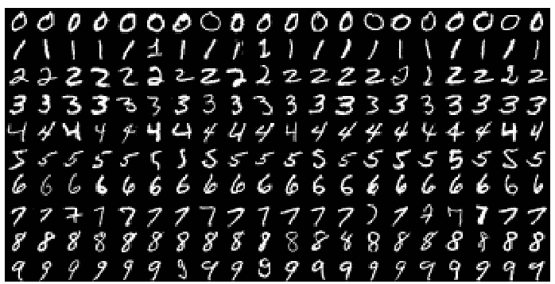

**图18.4** MNIST数据集的快照

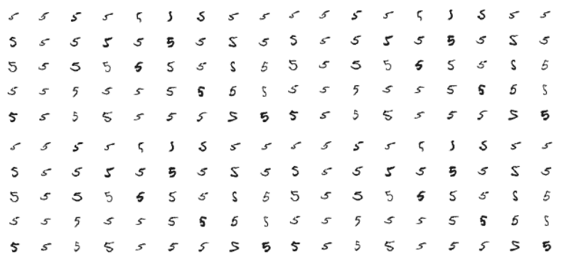

**图18.5** MNIST数据集中数字“5”的样本

### 18.2.1 将图像转换为数字

对计算机而言，图像是一组数字网格，表示每个像素的暗度，如图18.6所示。

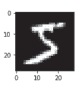

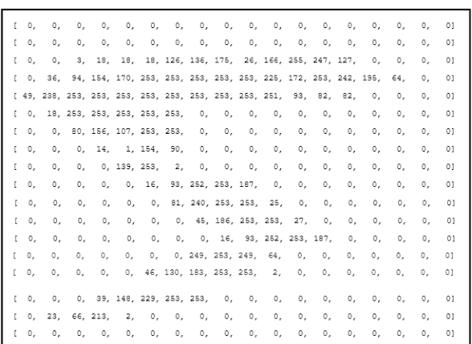

为了将图像输入我们的模型，图像被转换为像素矩阵，如图18.7所示。在这种情况下，图像被转换为18x18像素的图像。由于我们将使用向量，因此该图像将进一步转换为324个数字的数组（18x18 = 324），如图18.8所示。

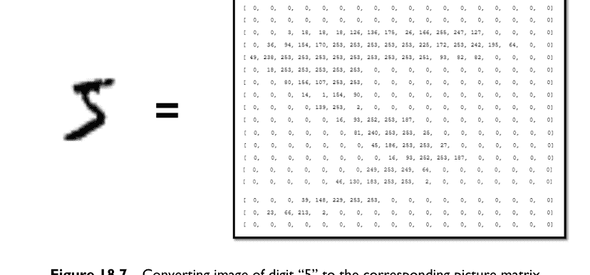

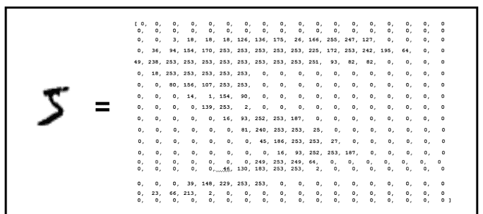

让我们尝试使用传统的人工神经网络（ANN）来解决这个问题。在这种情况下，324个数字的向量将成为我们ANN模型的输入，多个隐藏层将进一步处理它，然后输出层将预测给定数字属于哪个目标类别。为了更好地理解，请参考图18.9。

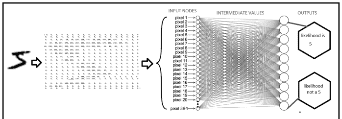

我们需要提供训练数据，让网络学习“5”的样子，以训练系统。因此，训练是使用多人以不同方式书写的“5”的图像进行的，如图18.10所示。

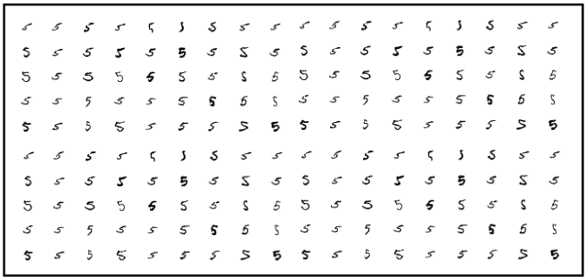

**图18.10** 以不同笔迹书写的数字“5”

系统需要在数字“5”和其他数字上进行训练，以区分“5”和其他数字。图18.11所示的数据集可以被视为训练数据的一个子集。

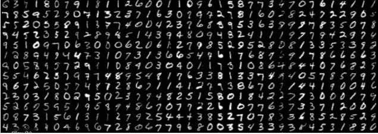

**图18.11** 包含其他手写数字的训练数据子集

### 18.2.2 这个简单图像分类器的问题

这个简单的ANN分类器在数字位于图像中心的情况下工作完美。但是，如果数字略有变形或放置在图像中的不同位置，它就无法识别，如图18.12所示。

这是因为神经网络是在包含数字位于图像中心的数据集上训练的。你可以想象，位于图像角落的数字“5”将产生与位于图像中心的数字“5”不同的像素值。

这将导致错误分类，因为我们的分类器仅在“5”出现在图像中心时的像素值上进行了训练。它没有在“5”出现在图像左-右或上-下角落的图像上进行训练。因此，分类器只有在数字出现在图像中心时才能正常工作，而在其他情况下会失败。

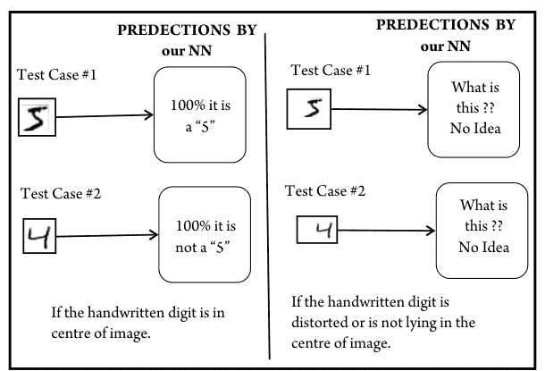

**图18.12** 手写数字位置变化对ANN结果的影响

### 18.2.3 可能的解决方案

本节的灵感来源于Adam Geitgey题为“机器学习很有趣！第3部分：深度学习和卷积神经网络”的博客。

有关该博客的详细信息，请参阅本章的“附加资源”部分。

有两种可能的解决方案来解决这个问题，如下所示。

- 生成合成数据
- 滑动窗口方法

让我们详细看看每一个。

#### 生成合成数据

在这种方法中，我们在图像中所有可能位置的数字图像上训练分类器。这意味着我们必须提供数字出现在所有可能角落的图像，而不仅仅是数字出现在中间的图像。我们还提供多种尺寸的数字图像，即非常小、小、中等、大和非常大，以进一步改进我们的训练系统。

我们如何为图像中所有可能的数字位置生成这些数据？解决方案是生成合成训练数据。我们可以再次使用机器学习模型（通常是深度神经网络）从数字的基础图像自动生成多个图像，并将各种尺寸的数字随机放置在图像的不同位置。

我们可以通过编写一个Python脚本，从已有的训练图像生成包含不同位置数字的合成训练数据。这个过程称为训练集的合成生成。在这种合成数据上进行训练及其生成将需要大量的计算资源，并减慢整个学习过程。因此，为了在这种海量数据上训练神经网络，我们通常使用深度神经网络（增加隐藏层数量），如图18.13所示。

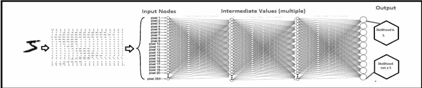

**图18.13** 用于在合成数据上训练的深度神经网络

深度神经网络比传统神经网络有更多的层。如今，我们拥有高性能设备，可以并行处理海量数据。因此，深度神经网络已经成为现实。

由于我们可以在这种大型合成数据上训练机器，但这仍然不是人类识别物体的方式。你知道，要识别一个物体，孩子不需要看到物体的所有可能位置和大小。孩子通过观察重要特征从很少的实例中学习，并且在从几个实例中学习后，孩子可以准确地识别它们。

由于孩子不需要看到物体的所有可能大小来识别它们，同样地，我们希望有一个AI系统，可以在不训练其所有可能大小和位置的情况下准确识别物体。

因此，我们必须放弃这种合成训练数据方法，需要探索另一种称为滑动窗口方法的方法。

#### 滑动窗口方法

这是一种暴力方法，其中输入图像被分解为多个窗口。每个窗口进一步测试是否存在物体。在我们的例子中，是“5”，如图18.14所示。尽管滑动窗口方法在大多数情况下工作良好，但它对于解决此类问题效率低下，因为系统必须重复且递归地检查同一图像以找到不同大小的物体。这反过来又会减慢整个过程，而且这也不是人类学习和识别物体的方式。

## 两种解决方案中存在的问题

上述讨论的方法足以解决该问题，但它们并不能满足我们的需求，因为我们正在寻找一种能够模拟人脑工作方式的方法。最终，我们的目标是构建一个像人脑一样智能的人工智能平台，并能像人脑一样从图像中识别物体。

如果这还不足以激励你，那么请深入思考一下：一个神经网络需要针对同一手写数字“5”的多种尺寸和位置的多张图像进行训练，这有什么意义呢？

应该有一种智能的方法，能够识别图像中任何位置（顶部、底部或非中心位置）书写的手写“5”，而无需对所有可能的尺寸和位置进行显式训练。

以一个孩子从一堆铅笔和钢笔中识别出铅笔的能力为例。孩子不需要接触世界上所有可能存在的铅笔。在他们的学习过程中，他们只接触过少数几种不同形状、尺寸和颜色的铅笔。人脑能够直观地从这些物体中提取关键特征，并利用它们来识别相似的物体。因此，科学家和研究人员一直在寻求一种稳健的解决方案来应对物体识别的挑战。这一探索促使 Yann LeCun 提出了 CNN，它已成为物体识别领域的一个关键里程碑。让我们深入探讨 CNN 的方法和基本原理。

## 18.3 人脑如何识别图像？

要理解 CNN 的工作原理，我们首先要了解人脑是如何识别图像的。为了理解这一点，让我们进行以下练习。

**练习 18.1**
请看图 18.15 所示的图像。只需将注意力集中在这张图像上几秒钟。你在这张图像中识别出了什么？

**图 18.15** 模糊图像
（由丹麦心理学家埃德加·鲁宾于 1915 年设计的鲁宾花瓶）

这张图像有两种含义，因为它给人两种印象。一种图像是花瓶，另一种是两个面对面的人。我们可以从中了解到，事物是根据大脑处理的特征进行分类的，而我们所关注的图像或特征部分决定了在大脑中形成的印象。

### 练习 18.2

请看图 18.16 所示的图像。只需将注意力集中在这张图像上几秒钟。你在这张图像中识别出了什么？

**图 18.16** 模糊图像
（来源：https://www.optical-illusionist.com/）

同样，这张图像也产生了两种印象。一种是一匹马的图片，但当你逆时针旋转图像并聚焦时，它看起来像一只坐在岩石上的青蛙，周围是水。同样，是我们所关注的图像部分或特征决定了在大脑中形成的印象。

### 练习 18.3

请看图 18.17 所示的图像。只需将注意力集中在这张图像上几秒钟。你在这张图像中识别出了什么？

**图 18.17** 视觉错觉（墨西哥艺术家 Octavio Ocampo 的画作）

这里也有两种印象：一种是三只鸟在树干周围飞翔，两只张着嘴等待喂食的雏鸟坐在树干里。另一种是一位年轻女士的面孔。

### 练习 18.4

请看图 18.18 所示的图像。只需将注意力集中在这张图像上几秒钟。你在这张图像中识别出了什么？

**图 18.18** 视觉错觉
（来源：https://www.optical-illusionist.com/）

这张图像给人两种印象：一种是一群树，另一种是隐藏在树中的各种动物，如狮子、马、鹿、大象等。

从这些练习中，你可以很容易地得出结论：这完全取决于大脑感知到的特征，这些特征决定了被分类的物体。这些例子说明了分类是如何基于大脑处理的图像的某些特征来执行的。然而，有时即使在现实场景中，由于没有足够的特征可供处理，事物也无法被充分识别，因此分类变得困难。

在图像分类器的情况下，我们将输入图像提供给系统，系统会提供每个类别的概率。这种情况如图 18.19 所示。

有时，由于输入图像令人困惑，分类器可能无法确定类别，如最右侧的情况所示。这也会发生，因为由于图像令人困惑或模糊，我们无法正确地对其进行分类。

如前所述，人类通过识别物体的重要特征来识别它们。CNN 的核心是从输入图像中提取重要特征。

在下一节中，我们将讨论 CNN 的工作原理。

**图 18.19** 图像分类器的输出

## 18.4 卷积神经网络（CNN）的工作原理

CNN 近年来广受欢迎。凭借强大的 GPU（图形处理单元）和 CNN 的巨大能力，我们可以解决图像中物体识别的问题。使用 CNN，我们可以对图像中的狗和猫、手写数字、道路标志以及许多其他物体进行分类。即使是 Facebook 也使用它来识别和标记你在应用上发布的照片中的亲人。在医学领域，物体识别也被用于识别肿瘤，其应用甚至延伸到复杂的情况。CNN 接收图像或分解为帧的视频作为输入，并对图像进行分类，如图 18.20 所示。

**图 18.20** 使用 CNN 的典型图像分类任务

在图 18.20 中，一个 CNN 模型使用一组预标记（已分类）的图像进行了训练。然后，这个训练好的 CNN 模型被用于识别未见过的手写数字。在众多因素中，数据在决定 CNN 模型的准确性方面起着关键作用。在开始详细讨论 CNN 之前，让我们先理解“计算机是如何看到图像的？”

对于计算机来说，图像既不美丽也不丑陋，而是将其视为一个数字矩阵。图 18.21 对比了人类感知图像的方式和计算机看到图像的方式。

此外，计算机对灰度图像和彩色图像的解释是不同的。例如，CNN 模型将灰度图像解释为一个二维（2D）数组。每个数组元素对应一个像素值，范围在 0（白色）到 255（黑色）之间。因此，在灰度图像中可以追踪到 256 种灰度，如图 18.22 所示。神经网络使用这些像素值来推断图像特征。

或者，彩色图像被表示为一个三维（3D）数组，由红色、绿色和蓝色（RGB 通道）组成。例如，考虑图 18.23，其中描绘了亚伯拉罕·林肯的彩色图像。该图像包含三个通道（红色、绿色和蓝色通道）；通过组合这些通道，我们得到彩色图像的像素值。与灰度图像类似，每个通道中的像素值也在 0 到 255 之间。

在下一节中，我们将通过一个实际例子来讨论 CNN 的架构。我们将考虑手写数字“5”的黑白图像。如图 18.24 所示，该图像将被视为一个由 0 和 1 组成的矩阵，其中 0 代表白色，1 代表黑色。

## 18.5 基本 CNN 模型的架构

CNN 模型有两个主要组成部分，如下所述。

- i. 卷积部分：该组件从给定的图像中识别和分离各种特征。因此，从根本上说，这里进行的是*特征提取*。

ii. 最终分类部分：基于提取特征的卷积部分输出，该组件预测给定图像的类别。

这些组件及其子流程在图 18.25 中进行了可视化。

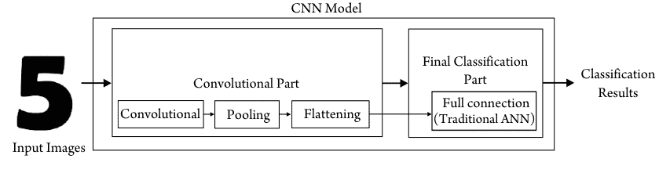

因此，总的来说，CNN 模型的工作步骤如下。

- i. 卷积
- ii. 最大池化
- iii. 展平
- iv. 全连接

让我们逐一讨论这些步骤。

### 18.5.1 卷积层

卷积是 CNN 模型的第一层。它从给定的输入图像中提取特征。在卷积操作中，像素之间的关系得以保留。我们通过一个人的身体特征来了解其身份。我们的大脑会自动从物体中提取重要特征，同样地，CNN 通过卷积操作识别特征来学习图像。

CNN 模型接受两个输入。它们是：(i) 图像矩阵和 (ii) 特征检测器或滤波器。有时特征检测器或滤波器也被称为核。

为了理解卷积操作，让我们举一个例子。考虑一个使用 CNN 识别数字“5”图像的任务。为简单起见，我们将考虑数字“5”的黑白图像，如图 18.24 所示；其像素值为 0 或 1。这里，0 表示白色区域，1 表示深色区域。对输入图像和特征检测器应用卷积操作以获得特征图。特征检测器用于识别输入图像的重要特征。这里，我们使用 3×3 矩阵的特征检测器（也称为核或滤波器）。需要注意的是，我们可以指定不同的滤波器尺寸，如 5×5 或 7×7 矩阵。通常，3×3 的特征检测器尺寸使用最为广泛。该核将仅在输入图像上操作并输出特征图，如图 18.26 所示。

此外，请参考图 18.27，它提供了在维度为 $h_i \times w_i \times d_i$ 的给定图像矩阵上应用核或特征检测器后，所得特征图的维度指南。

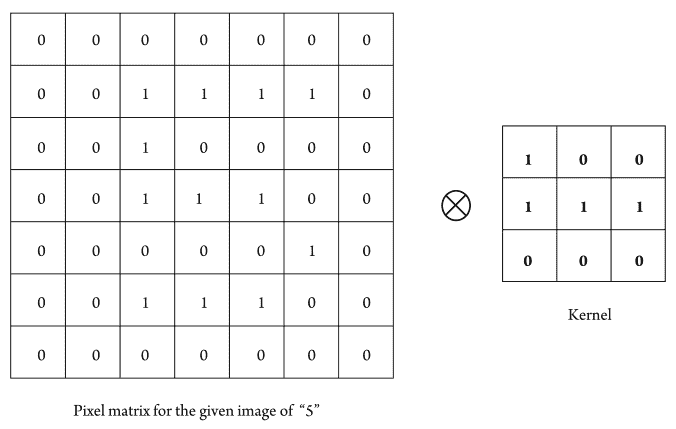

**图 18.26** 输入图像像素表示和特征检测器或核

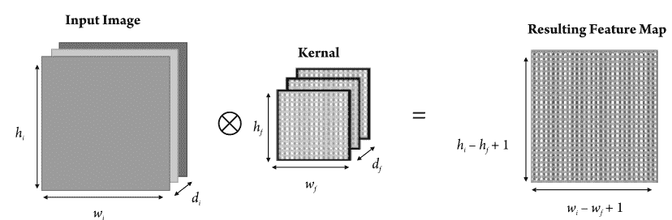

给定图像的高度 - $h_i$
给定图像的宽度 - $w_i$
给定图像中的通道数 - $d_i$

核的高度 - $h_f$
核的宽度 - $w_f$
滤波器中的通道数 - $d_f$

**图 18.27** 卷积维度指南

卷积是一种数学运算，它接受一个输入图像和一个核。因此，对于尺寸为 $h_i \times w_i \times d_i$ 的给定图像矩阵，如果我们选择一个维度为 $h_f \times w_f \times d_f$ 的滤波器，那么在对图像进行卷积后，特征图的尺寸将如下所示。

$[(h_i - h_f + 1) \times (w_i - w_f + 1) \times 1]$

现在，让我们使用上述指南计算我们案例中得到的特征图尺寸。我们有一个尺寸为 7 × 7 × 1 的图像，选择的滤波器或核尺寸为 3 × 3 × 1。因此，所得特征图的尺寸将如下所示。

[(7 – 3 + 1) × (7 – 3 + 1) × 1]，即 5 × 5 × 1，如图 18.28 所示。

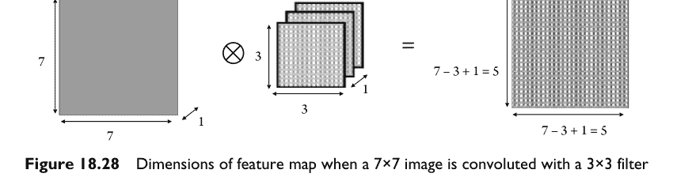

如图 18.26 所示，以像素值表示的输入图像和核已准备好在卷积层中进行处理。图像尺寸为 7 × 7，核为 3 × 3，因此在卷积中，每次将从图像中取出 3 × 3 的块。将应用卷积，从图像中取出一个 3 × 3 的块，然后与核和图像块进行逐元素乘法。此乘法的最终总和得到一个单一值，该值是特征图的一个像素，如表 18.1 所示。

现在，当前图像块滑动一个像素。图像块提取器移动一个像素的这种移动就是*步幅*；在我们的案例中，步幅为 1。然后，再次进行卷积；这些计算会针对从给定图像中取出的所有其他可能块重复进行，直到计算出特征图的所有像素。此过程在表 18.1 中进行了详细说明。

请所有读者对每个步幅应用卷积操作，并将您的输出与表 18.1 中给出的特征图进行比较。

**表 18.1** 在给定图像上步幅为 1 的卷积操作

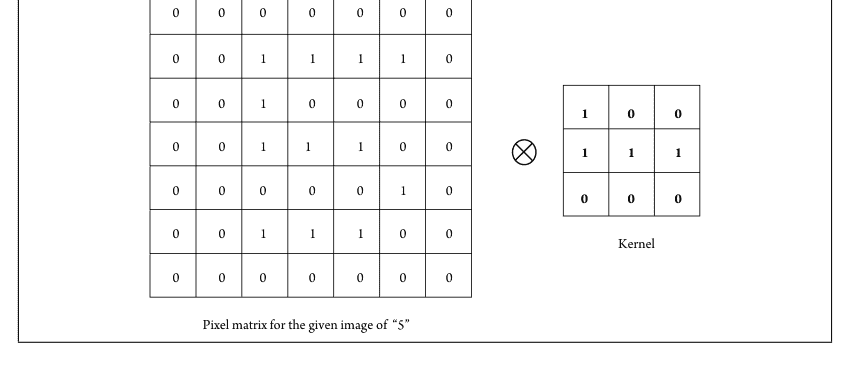

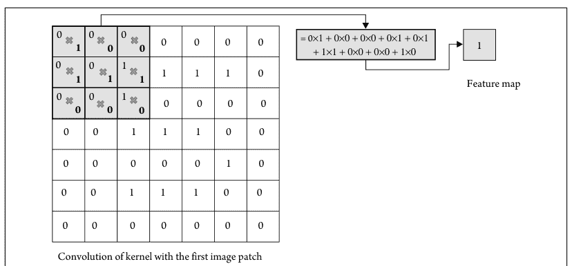

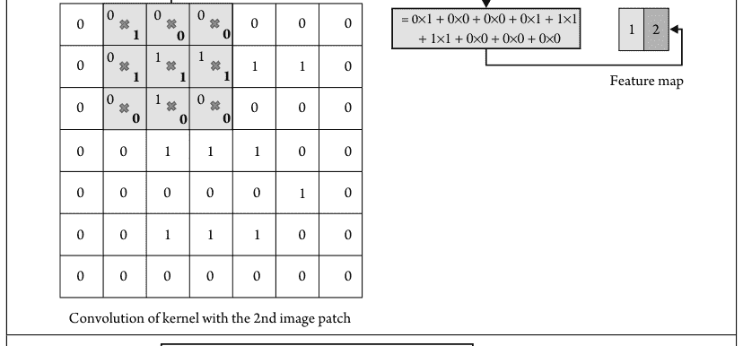

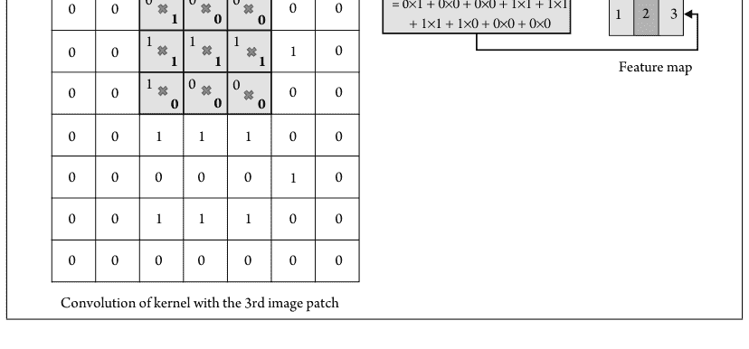

910 Python 机器学习

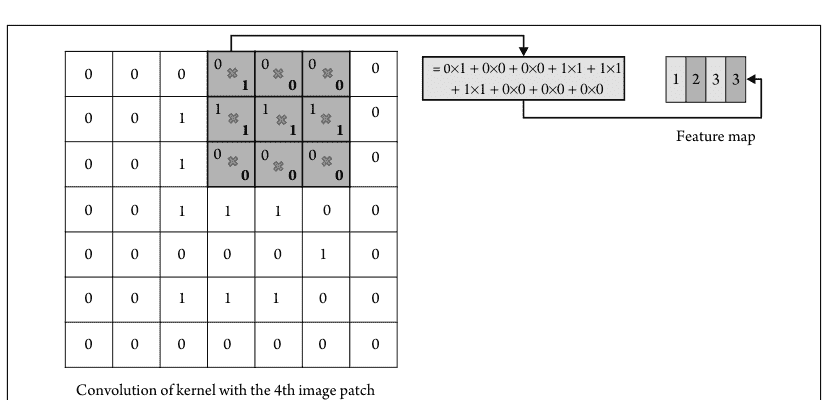

核与第 4 个图像块的卷积

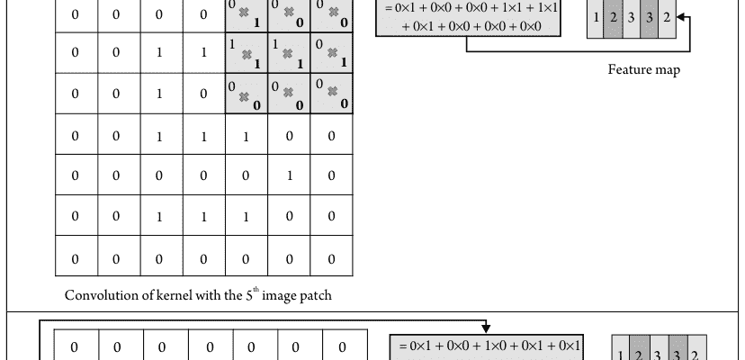

核与第 5 个图像块的卷积

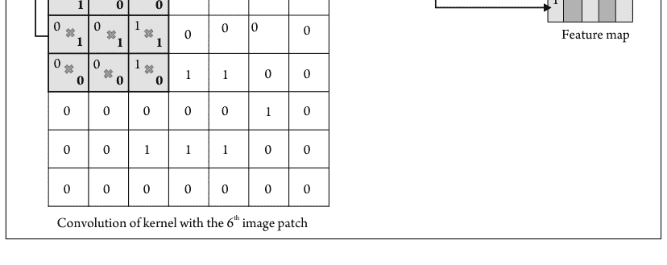

核与第 6 个图像块的卷积

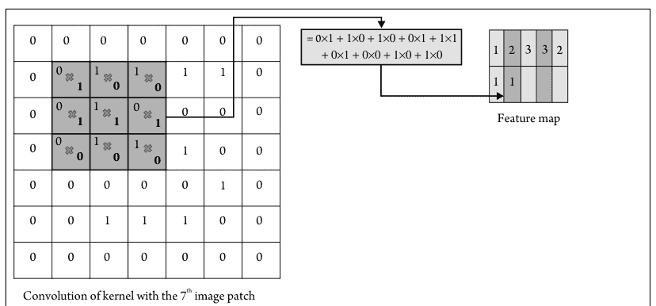

核与第 7 个图像块的卷积

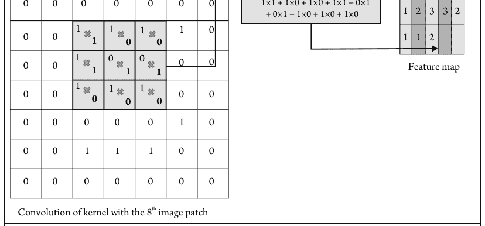

核与第 8 个图像块的卷积

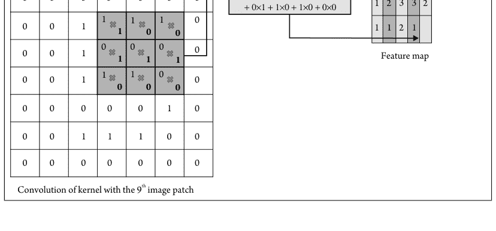

核与第 9 个图像块的卷积

912 Python 机器学习

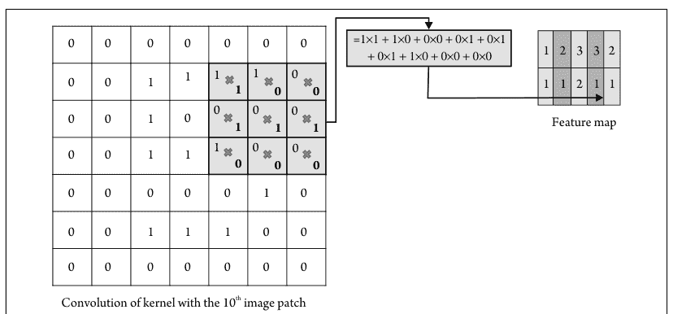

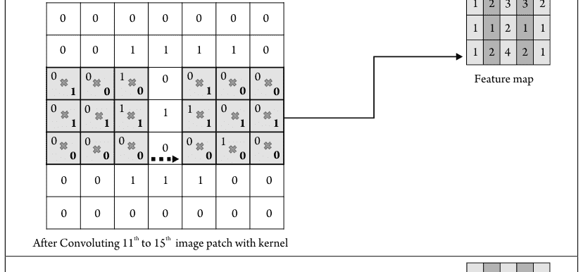

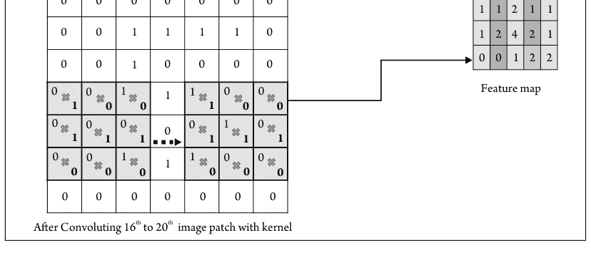

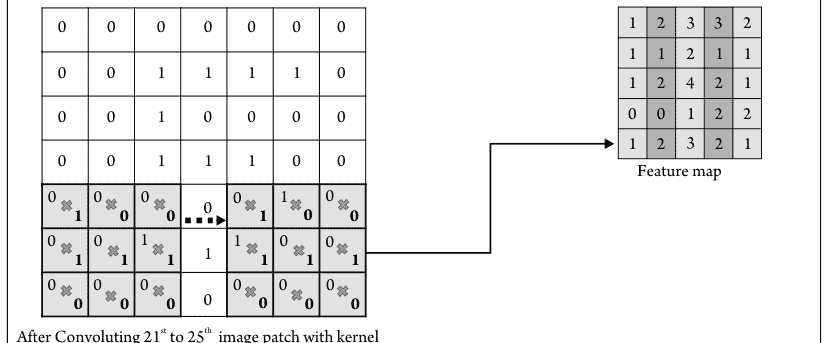

将第 21<sup>个</sup>到第 25<sup>个</sup>图像块与核卷积后

最终，得到的特征图为 5×5。

| 1 | 2 | 3 | 3 | 2 |
|---|---|---|---|---|
| 1 | 1 | 2 | 1 | 1 |
| 1 | 2 | 4 | 2 | 1 |
| 0 | 0 | 1 | 2 | 2 |
| 1 | 2 | 3 | 2 | 1 |

在上表中，我们以步幅 1 移动核，但卷积通常在步幅为 2 时效果最佳。特征图也被称为*卷积特征*。因此，在对给定的数字“5”图像应用卷积后，我们得到了图 18.29 所示的特征图。

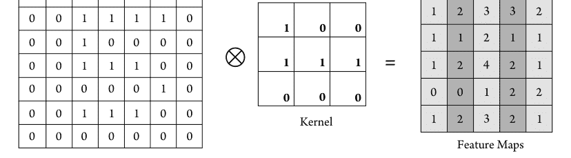

**图 18.29** 所得特征图

正如人类从图像中识别多个特征以进行识别一样。同样地，CNN 使用多个特征检测器从输入图像中识别重要特征。每个特征检测器都会产生一个不同的特征图。因此，在卷积操作中，多个特征检测器在输入图像上进行卷积，产生一层特征图，因为每个特征检测器都会产生自己的特征图。我们有许多特征图，它们构成一个单一的*卷积层*，如图 18.30 所示。

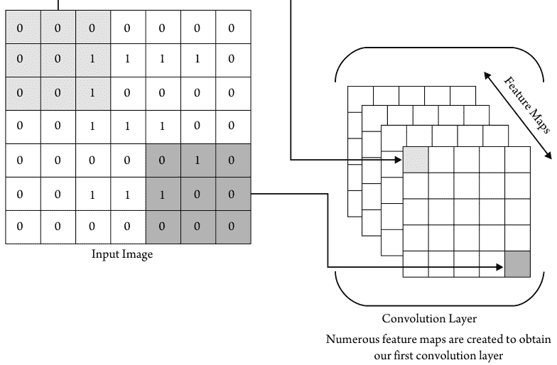

因此，在卷积层中创建多组特征图以检测图像的重要特征。在卷积操作期间使用不同的特征检测器或滤波器来生成这些特征图并收集图像的完整细节。可能有锐化滤波器、模糊滤波器、边缘增强或检测滤波器等，大多数这些滤波器会转换图像以获得所需的特征（如边缘、阴影）。

必须注意的是，这里的程序员或编码人员并没有设置这些特征检测器或滤波器的值；神经网络隐式地决定了卷积层中使用的这些滤波器的值。因此，如果我们回顾表 18.1 中的讨论，我们从未谈论过我们的滤波器选择，因为这不在我们的掌控之中；相反，神经网络为我们完成了这项工作。尽管在本章的后面部分，我们将了解 CNN 模型如何自动优化特征检测器的值。我们还将看到在训练 CNN 模型时如何调整与特征检测器相关的参数。

因此，卷积的主要目标是通过使用多个特征检测器并将它们组装成一层特征图来找到图像中的重要特征。通过这种方式，输入图像的重要特征通过卷积过程被自动检测出来。

在实现卷积层时，我们通常在其上应用激活函数修正线性单元（ReLU）。这个函数是什么，为什么我们需要它？所有这些细节将在以下小节中得到解答。

#### 18.5.1.1 在卷积层上应用修正线性单元（ReLU）激活函数

当我们人类观察事物时，我们通过其形状、颜色、轮廓和外形来识别物体的特征。例如，当我们看到一个人的脸时，我们更关注他的特征，如发际线的形状、眼睛的大小、鼻子、肤色。我们的大脑通过注意到面部特征的非线性来识别与其他面孔不同的特征。这种非线性可以是鼻子的隆起、眼睛的形状等。为了将同样的特性应用于CNN模型，ReLU激活函数被应用于卷积层，如图18.31所示。ReLU激活函数定义如下：

$$\phi(x) = \max(0, x)$$

简单来说，如果输入到ReLU函数的值是正数或零，输出将与输入相同。然而，如果输入值是负数，输出将为零。

ReLU激活函数因其多项优势在深度学习中广受欢迎。它为网络引入了非线性，使其能够学习数据中的复杂模式和关系。ReLU计算效率高，因为该函数涉及简单的阈值操作。因此，这种整流器有助于增加图像中的非线性。在CNN的背景下，整流器充当过滤器，打破图像组件之间的线性关系。

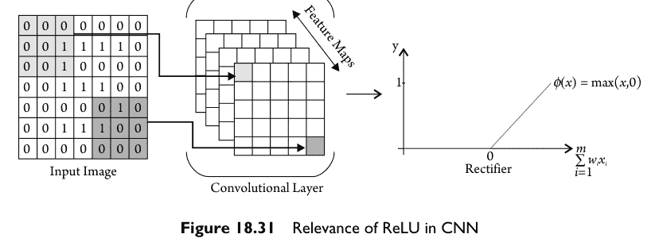

因此，为了突出输入图像中的非线性，ReLU激活函数被应用于卷积层。

### 18.5.2 池化层

CNN最具挑战性的任务是根据特定特征识别主体的图像，即使该图像是从不同角度拍摄的，或者被旋转、尺寸不同或有轻微差异。例如，在图18.32中，我们有多张狗的图片。在这些图片中，有一只狗在花园里玩耍，它的照片是从不同角度、不同姿势拍摄的。因此，CNN必须学习从这些图像中识别狗的特征。

神经网络必须识别特征，无论其在画面中的位置、大小、形状、姿势等如何。模型应表现出必要的灵活性，即使特征位于其训练过的特征附近，也能准确识别。CNN模型通过应用**池化**操作来实现这一点。但池化不仅限于此；它还有更多优势。

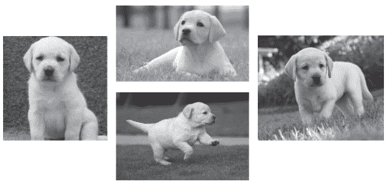

**图18.32** 具有轻微差异的狗的图像

池化还有另一个优势，即抽象化。通常，当我们看到一个物体时，我们会注意到物体的一些重要区域，这些区域携带了最多的信息，有助于我们将来识别该物体，并忽略不重要的部分。同样，在CNN进行图像处理时，我们希望只保留特征图中携带重要信息的部分。我们希望丢弃在识别物体方面重要性较低的其他信息。这将进一步帮助减小特征图的大小，以实现快速处理和预测，而池化过程有助于实现这一目标。

因此，**池化**有两个基本目的。首先，它用于捕获关键特征，无论其位置或位置如何。其次，它用于减小特征图的大小，使处理更快。

池化操作有不同类型，例如最大池化、平均池化。在下一小节中，我们将讨论常用的最大池化技术。

#### 最大池化技术

让我们通过考虑我们识别数字“S”的工作示例来理解最大池化的概念。卷积层后得到的数字“S”的特征图如图18.29所示。我们将对此特征图应用最大池化。应用最大池化时有两个重要参数：**步幅**和**窗口大小**。

让我们考虑2×2作为我们的窗口大小，它将以步幅2滑动。由于是最大池化，这个2×2的窗口将一次考虑四个元素，并存储其中的最大值，如图18.33所示。滑动池化过滤器放置在特征图的左上角。选择前四个元素的最大值，然后将其写入池化特征图的第一个单元格，如图18.33所示。现在池化窗口以步幅2移动。重复此过程，直到我们获得池化特征图的所有值，如图18.34所示。

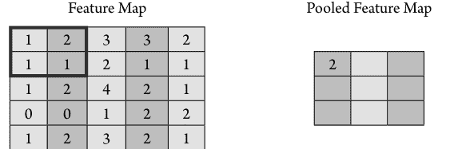

**图18.33** 窗口为2×2、步幅等于2的最大池化

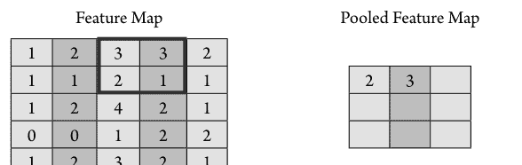

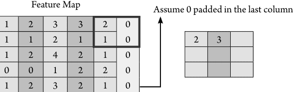

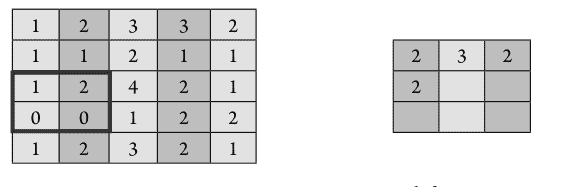

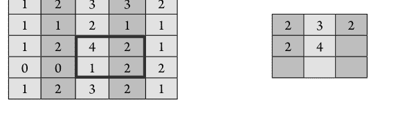

特征图

池化特征图

| 1 | 2 | 3 | 3 | 2 | 0 |
| 1 | 1 | 2 | 1 | 1 | 0 |
| 1 | 2 | 4 | 2 | 1 | 0 |
| 0 | 0 | 1 | 2 | 2 | 0 |
| 1 | 2 | 3 | 2 | 1 | 0 |

| 2 | 3 | 2 |
| 2 | 4 | 2 |

特征图

池化特征图
假设最后一行填充了0

| 1 | 2 | 3 | 3 | 2 |
| 1 | 1 | 2 | 1 | 1 |
| 1 | 2 | 4 | 2 | 1 |
| 0 | 0 | 1 | 2 | 2 |
| 1 | 2 | 3 | 2 | 1 |
| 0 | 0 | 0 | 0 | 0 |

| 2 | 3 | 2 |
| 2 | 4 | 2 |
| 2 | | |

特征图

池化特征图

| 1 | 2 | 3 | 3 | 2 |
| 1 | 1 | 2 | 1 | 1 |
| 1 | 2 | 4 | 2 | 1 |
| 0 | 0 | 1 | 2 | 2 |
| 1 | 2 | 3 | 2 | 1 |
| 0 | 0 | 0 | 0 | 0 |

| 2 | 3 | 2 |
| 2 | 4 | 2 |
| 2 | 3 | |

特征图

池化特征图

| 1 | 2 | 3 | 3 | 2 | 0 |
| 1 | 1 | 2 | 1 | 1 | 0 |
| 1 | 2 | 4 | 2 | 1 | 0 |
| 0 | 0 | 1 | 2 | 2 | 0 |
| 1 | 2 | 3 | 2 | 1 | 0 |
| 0 | 0 | 0 | 0 | 0 | 0 |

| 2 | 3 | 2 |
| 2 | 4 | 2 |
| 2 | 3 | 1 |

**图18.34** 窗口为2×2、步幅等于2的最大池化

显然，从图18.34我们可以理解，池化操作通过减小原始特征图的大小来保留其特征。在我们的示例中，池化后的特征比原始特征图小75%，因为只选择了2×2矩阵四个值中的一个最高值；因此只保留了25%的信息。

这意味着不相关信息已被丢弃，相关信息得以保留。池化操作还对图像的失真进行控制。这意味着即使特征可能已经从其位置移动，神经网络也已经以足够灵活的方式进行了训练，它将能够识别它。为了进一步增加模型的灵活性，可以选择3×3矩阵进行最大池化。因此，池化有助于保留特征，即使它们经历了空间和纹理失真。所以，池化也避免了过拟合，因为我们只向神经网络提供相关细节。

因此，我们可以得出结论，窗口大小为2×2的最大池化提供了四个像素的位置独立性，因为我们从四个像素中选择最大值，如果最大匹配的像素在这四个位置中的任何一个改变其位置，它将产生相同的输出，如图18.35所示。类似地，为了获得九个像素的位置独立性，我们可以使用窗口大小为3×3的最大池化。如果最大匹配的像素在这九个位置中改变其位置，它将产生相同的输出。

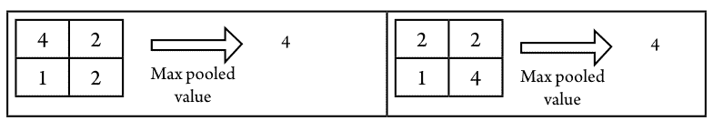

**图18.35** 2×2的最大池化窗口提供四个位置的位置独立性

#### 平均池化技术

在平均池化中，所有像素值被平均，而不是选择最大像素值；例如，让我们考虑2×2作为我们的窗口大小，它将以步幅2滑动。由于是平均池化，这个2×2的窗口将一次考虑四个像素并存储它们的平均值，如图18.36所示。

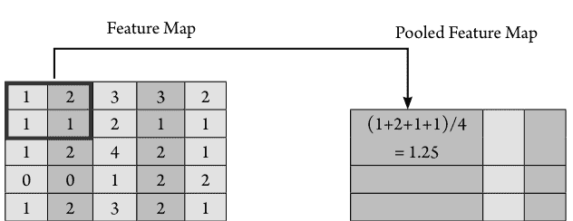

### 18.5.3 展平

下一步是展平，即从池化特征图中选取数值并将其存储在一维（1D）数组中。这样，我们就得到了一个展平的池化特征图，一个单一的1D向量。神经网络随后使用存储在这个展平向量中的值作为全连接神经网络的输入进行进一步处理。图18.38展示了展平过程。

由于我们有多个特征图的池化层，池化特征图被顺序地嵌入到一个长的1D向量中，该向量包含了每个特征图的池化值，如图18.39所示。

基于我们目前的讨论，CNN的整体架构如图18.40所示。首先，使用多个特征检测器进行卷积操作。每个特征检测器产生其特征图，我们得到一层特征图作为卷积操作的结果。这些特征图经过ReLU激活函数处理，以突出图像中的非线性。之后，对特征图进行池化以提取关键特征。最后，池化特征图被展平成一个1D向量，作为后续ANN的输入。

### 18.5.4 全连接

在上一步中，我们展平了CNN池化特征图的输出。这个输出现在连接到最终的分类模型，该模型作为全连接ANN模型的输入。换句话说，一个ANN模型被嵌入到我们现有CNN网络的输出端。因此，CNN模型的输出作为后续ANN模型或全连接层的输入，如图18.41所示。这个全连接层有一个最终层，以输出的形式产生最终的分类结果。

全连接层是一个传统的ANN，其输入来自展平操作，如图18.42所示。

因此，在CNN的情况下，ANN模型是在卷积过程（包括卷积 ▶ 池化 ▶ 展平）的输出上进行训练的。这带来了高准确性。另一方面，如果我们直接在图像像素值上训练传统的ANN模型（不经过卷积过程），准确性会很低。因此，将卷积层与ANN结合是解决图像识别任务的最佳方法，有助于获得更好的结果。

我们可以得出结论，卷积过程（包括卷积 ▶ 池化 ▶ 展平）自动帮助从图像中提取最相关的特征。然后，使用传统的ANN来训练神经网络，基于这些提取的特征进行准确的预测。

CNN的最终整体架构如图18.43所示。

## 18.6 训练CNN模型

如前所述，CNN模型的输入是图像的像素。输入的像素图像经过卷积、池化和展平，然后展平的池化特征图通过一个ANN模型，进行最终的预测，如图18.43所示。在这个过程中，特征检测器最初由模型随机设置，ANN的权重也为初始训练随机设置。基于这些特征检测器和ANN权重的初始值进行预测。在前向传播之后，计算预测值与实际值之间的差异，即代价函数（或误差）。

然后，这个误差被反向传播回卷积层，通过反向传播来微调特征检测器的值和ANN的权重。需要注意的是，在卷积层中应用的特征检测器或滤波器在此过程中会更新。使用第16章前面讨论的梯度下降方法来微调特征检测器的值和权重。在获得更新后的特征检测器和权重值后，执行前向传播以计算更新后的误差或代价函数值。基于更新后的特征检测器和ANN权重值，计算新的预测值。需要注意的是，一次前向和反向传播的循环称为一个epoch。系统通过多个epoch进行学习，直到代价函数或误差达到其最小值。每次产生的误差都会被反向传播。这个过程重复多次，直到网络被优化到期望的水平，以最大准确性进行预测。

这个前向和反向传播过程使一个epoch持续进行，直到代价函数或误差最小化。这样，就确定了特征检测器和ANN权重的最终优化值。CNN模型有助于找到最佳的特征或滤波器，这些在准确识别物体中起着关键作用。

因此，通过训练，每个神经元将获得0到1之间的权重。值越接近1，意味着神经元越活跃，并影响下一个神经元的预测或输出。权重接近1的神经元在遇到某些相关特征时会被触发，如图18.44所示。

如图18.44所示，连接到输出$y1$的神经元不如连接到$y2$的神经元活跃。因此，对于给定的输入图像，类别$y1$的概率低于类别$y2$。

最后，我们可以得出结论，在CNN中，特征不是由工程师选择和设计的，而是由机器通过训练决定的，这是CNN的主要优势。这种自动化的特征提取是CNN的一个主要优势，因为早期程序员执行特征提取任务。尽管我们尽了最大努力，我们仍无法达到制造产品所需的准确性水平。最终，CNN有助于实现特征提取过程的自动化。当机器执行此任务时，准确性大幅提升，我们达到了制造产品所需的准确性水平。需要注意的是，即使最终程序员也不知道机器识别了什么特征，因为CNN以黑盒形式执行所有操作。因此，即使是开发者也很难解释为什么CNN会做出特定的决策。整个处理过程以黑盒形式执行，即使是开发者也不知道重要的特征。这催生了另一个重要领域，称为可解释人工智能（XAI），其中使用不同的技术为深度学习模型生成解释。

有兴趣了解更多关于XAI新兴领域的人可以参考我的在线课程，链接如下。
https://www.udemy.com/course/xai-with-python/

因此，我们可以得出结论，CNN的采用使得达到产品开发所需的准确性水平成为可能，从而彻底改变了计算机视觉领域。

## 18.7 决定训练神经网络的最佳Epoch数

没有特定的公式来获得最佳的epoch数；但是，我们有一些指导原则来帮助我们决定训练CNN或神经网络的最佳epoch数。当整个数据集通过神经网络完成一次前向和反向传播时，我们计为一个epoch。最佳的epoch数因数据集而异。但是，有两个重要的指导因素来确定问题的最佳epoch数：验证误差和训练误差。

简单的经验法则是：“只要验证误差和训练误差在下降，就必须继续训练”。

训练损失表示模型在训练数据上的拟合程度，而验证损失表示模型在新数据上的拟合程度。

欠拟合和过拟合是训练模型在分类中表现不佳的场景。在讨论欠拟合和过拟合之前，我们必须知道两个基本术语。这些术语是偏差和方差。

### 高偏差导致模型欠拟合

当一个训练好的机器学习模型无法捕捉数据集的丰富性和复杂性，并且没有考虑所有相关信息时，该模型就被认为存在高偏差。

欠拟合发生在机器学习模型尽管经过训练，却无法有效拟合训练数据和新数据的情况下。这通常表现为持续的高误差值，即使增加训练轮次也不会降低，这表明模型在捕捉底层模式方面存在能力限制。在这种情况下，表明模型存在高偏差。

让我们通过一个例子来理解这个概念。图18.45展示了一个数据集，其中包含训练数据和一个新数据点。

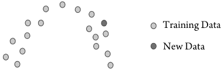

这些训练数据用于训练一个模型，假设模型被训练成一条直线，如图18.46所示。

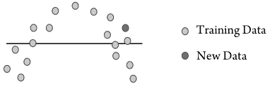

这条直线没有捕捉到我们数据点的模式；因此它存在高偏差。这也导致了高误差，因为它在新数据点上的表现非常差，如图18.46所示。

由于模型无法对训练数据和新数据点进行分类，因此它具有较高的训练误差和验证误差。如图18.47所示，即使我们增加训练轮次，代价函数仍然保持在高位。因此，这是一个欠拟合模型。

### 高方差导致模型过拟合

如果模型过于复杂以至于无法拟合一个简单的数据集，那么该模型就是过拟合的。当方差很高时，即模型变得高度依赖数据时，就会发生这种情况。从技术上讲，当一个训练好的模型能够很好地捕捉训练数据中的特征，但在新数据上表现不佳时，该模型就被称为过拟合。方差值越高，模型就越容易过拟合。

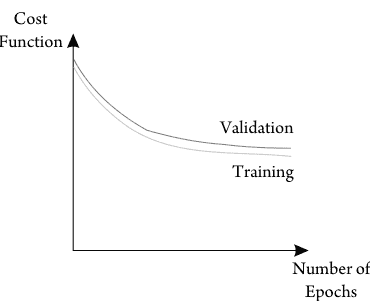

**图18.47** 欠拟合模型的图示

让我们考虑同一个例子来理解这个概念。假设模型不是拟合一条直线，而是通过尝试拟合训练数据的每一个数据点，被拟合成锯齿状曲线，如图18.48所示。

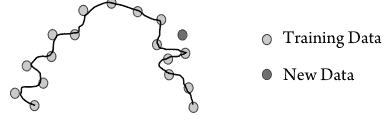

**图18.48** 模型被拟合成锯齿状曲线（过拟合模型）

在这里，我们可以观察到模型覆盖了所有训练数据点。因此，模型更依赖于训练数据，即模型具有高方差。此外，模型对数据做了较少的假设以覆盖尽可能多的数据点。因此，模型具有高方差和低偏差。由于模型对训练数据分类良好，因此训练误差较低。但当新数据出现时，模型表现不佳，因此验证误差较高。如图18.49所示，过拟合模型在训练轮次增加时训练损失减少，但验证损失在达到某个轮次之前是下降的，之后随着轮次增加而上升。在验证损失降至特定值后，它又随着轮次的每次增量而开始增加。

验证损失达到最小值的点被称为转折点。这个转折点代表了过拟合的开始。

### 寻找最优的训练轮次值

偏差和方差之间存在权衡；这完全是在它们之间找到一个最佳平衡点。当模型具有低方差和高偏差时，模型是欠拟合的。类似地，当模型具有高方差和低偏差时，模型是过拟合的。

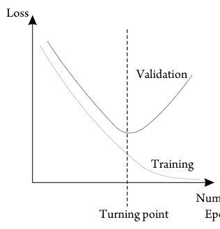

**图18.49** 过拟合模型的图示

对于示例数据集，合适的模型应该是一个抛物线，如图18.50所示。该模型在训练数据和新数据上都表现出良好的性能。

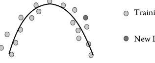

**图18.50** 正确拟合的抛物线模型

根据以上讨论，可以通过以下步骤找到正确拟合的模型。

- 当验证损失降至特定值后，随着轮次的每次增量而开始增加时，就达到了转折点。此时，必须停止训练。
- 如果在转折点之前停止训练，模型可能欠拟合。
- 如果在转折点之后停止训练，模型可能过拟合。

图18.51展示了欠拟合、良好拟合和过拟合模型的总结。

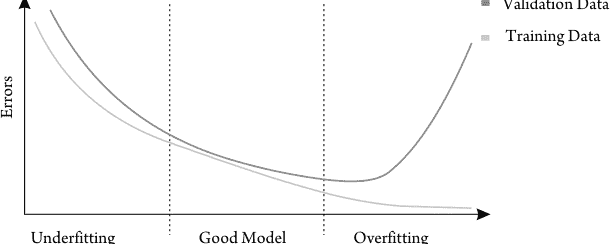

**图18.51** 训练数据和验证数据趋势与模型的比较

如果验证误差在$m$个轮次后突然开始增加，这可能表明过拟合，意味着是停止的时候了。在这种情况下，我们必须用小于$m$的某个轮次数重新训练模型。

因此，当你通过增加轮次值来训练模型时，验证误差和训练误差在每个额外的轮次值后都会显著下降，如图18.51所示。但一旦验证损失开始随着轮次的每次增加而增加，就表明模型过拟合，是时候停止训练了。

如图18.52所示，训练损失和验证损失在10个轮次内都在下降，但在10个轮次之后，验证损失开始增加，表明模型过拟合。因此，对于这个模型，轮次数是10。通过这种方式，你可以确定最优的轮次数。

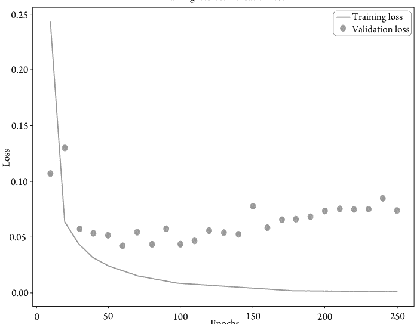

**图18.52** 基于某个模型训练的训练损失与验证损失图

之前，我们只讨论了训练数据和测试数据，在本节中，我们引入了验证数据。理解训练数据、验证数据和测试数据的重要性对于构建稳健可靠的机器学习模型至关重要。

训练数据是构建机器学习模型的基础。在训练阶段，模型学习数据中的模式和关系，调整其参数以最小化预测结果与实际结果之间的差异。

验证数据用于在训练过程中微调模型，通过提供一个模型之前未见过的独立数据集来帮助防止过拟合。通过使用单独的验证集，可以评估模型泛化到新的、未见过的数据的能力。这一步对于优化模型性能并防止其变得过于特定于训练数据至关重要。

测试数据保留用于在模型使用训练集和验证集进行训练和微调后评估其性能。该数据集代表一个全新的、未见过的示例集。它作为一个最终检查点，确保模型在训练期间未遇到的数据上表现良好，并用于评估最终训练模型的准确性。

至此，我们结束了对CNN的讨论。本章讨论了为什么使用传统神经网络构建图像识别模型效率低下，以及我们如何使用CNN来解决这个问题。此外，我们使用MNIST数据集更好地解释了CNN相对于传统神经网络的优势。我们详细讨论了涉及卷积和分类部分的CNN架构。我们通过讨论卷积层、池化层、展平和全连接来涵盖卷积步骤。此外，我们讨论了如何选择最优的轮次值。

在下一章中，我们将通过考虑各种案例研究，在图像数据集上实现CNN。

#### 提醒我

- 识别手写数字通常被认为是深度学习的“Hello World”问题。
- 如果图像不在中心，传统神经网络无法对它们进行分类。
- 生成合成数据或滑动窗口方法可以解决传统神经网络的局限性。然而，它并不满足人工智能的目标，即构建一个像人脑一样工作的模型。
- CNN模型有两个主要组成部分，即卷积部分和带有传统ANN的最终分类部分。
- 卷积部分涉及卷积、池化和展平。
- 在卷积中，使用一个内核作为图像上的滤波器来提取重要特征。
- ReLU激活函数应用于卷积层，以突出输入图像中的非线性。
- 池化主要可以分为两种类型，即最大池化和平均池化。在最大池化中，我们取窗口中的最大值。而在平均池化中，我们取窗口中所有值的平均值。
- 在展平中，池化后的特征图被顺序嵌入为一个长的一维向量。
- 从卷积部分提取的特征被传递到分类部分的传统神经网络中。

- 训练损失和验证损失值可以确定优化的轮数。
- 欠拟合是指模型在训练数据和验证数据上都表现不佳的情况。
- 过拟合是指模型在训练数据上表现良好，但在验证数据上表现不佳的情况。
- 当验证损失降至某个特定值后，随着轮数的每次增加而增加时，就达到了转折点。此时必须停止训练。如果在转折点之前停止训练，模型可能欠拟合；如果在转折点之后停止训练，模型可能过拟合。

#### 附加资源

##### 视频链接

- 卷积神经网络（CNN）分步讲解，https://youtu.be/sgL7RrqhGKI


- 吴恩达，C4W1L01 计算机视觉 | https://youtu.be/ArPaAX_PhIs


- 1993年的卷积网络演示，https://youtu.be/FwFduRA_L6Q


##### 博客链接

- 卷积神经网络（CNN）终极指南，https://www.superdatascience.com/blogs/the-ultimate-guide-to-convolutional-neuralnetworks-cnn


- 机器学习很有趣！第三部分：深度学习和卷积神经网络，Adam Geitgey，https://medium.com/@ageitgey/machine-learning-is-fun-part-3-deeplearning-and-convolutional-neural-networks-f40359318721


- Yann LeCun 的主页，http://yann.lecun.com/


#### 测试题（问题）

1. 深度学习意味着大量的
   a) 输入层
   b) 输出层
   c) 隐藏层、输入层和输出层
   d) 隐藏层
2. 卷积之后的下一步是什么？
   a) 最大池化
   b) 展平
   c) 全连接
   d) 创建滤波器
3. 最大池化之后的下一步是什么？
   a) 卷积
   b) 展平
   c) 全连接
   d) 前向和反向传播
4. CNN模型能够捕获所有重要特征，这归功于 ____________。
   a) 全连接层
   b) 最大池化层
   c) 展平层
   d) 卷积层
5. CNN需要应用多少个滤波器？
   a) 1
   b) 0
   c) 多于2个
   d) 2
6. CNN模型能够实现位置独立性，这归功于哪个层？
   a) 全连接层
   b) 最大池化层
   c) 展平层
   d) 卷积层
7. 如果像素矩阵的大小是5×5，卷积核的大小是3×3，步幅是1，那么特征图的大小是多少？
   a) 2×2
   b) 3×3
   c) 4×4
   d) 5×5
8. 为什么在卷积层上使用ReLU激活函数？
   a) 为了减小特征图的大小
   b) 为了打破图像组件之间的线性关系
   c) 为了将特征图的值保持在0和1之间
   d) 以上都不是
9. 在图像识别的情况下，CNN优于传统神经网络，因为
   a) CNN执行自动特征提取。
   b) 如果图像不在中心位置，传统神经网络可能无法预测图像。
   c) CNN捕获图像的关键特征，即使图像不在中心位置也能识别。
   d) 以上所有
10. 当模型具有以下情况时，会导致欠拟合
    a) 高偏差和低方差。
    b) 低方差和低偏差。
    c) 高方差和高偏差。
    d) 低偏差和高方差。
11. 从给定的像素矩阵生成特征图，考虑指定的卷积核，步幅为1。

像素矩阵：

| 0 | 0 | 0 | 0 | 0 | 0 | 0 |
|---|---|---|---|---|---|---|
| 0 | 1 | 0 | 0 | 0 | 1 | 0 |
| 0 | 0 | 0 | 0 | 0 | 0 | 0 |
| 0 | 0 | 0 | 1 | 0 | 0 | 0 |
| 0 | 1 | 0 | 0 | 0 | 1 | 0 |
| 0 | 0 | 1 | 1 | 1 | 0 | 0 |
| 0 | 0 | 0 | 0 | 0 | 0 | 0 |

卷积核：

| 0 | 1 | 0 |
|---|---|---|
| 0 | 0 | 0 |
| 1 | 1 | 1 |

12. 应用最大池化，考虑矩阵大小为3×3，步幅为3。

| 0 | 1 | 0 | 0 | 0 |
|---|---|---|---|---|
| 0 | 1 | 1 | 1 | 0 |
| 1 | 0 | 1 | 2 | 1 |
| 1 | 4 | 2 | 1 | 0 |

答案：1. d 2. a 3. b 4. d 5. c 6. b 7. b 8. b 9. d 10. a

11.

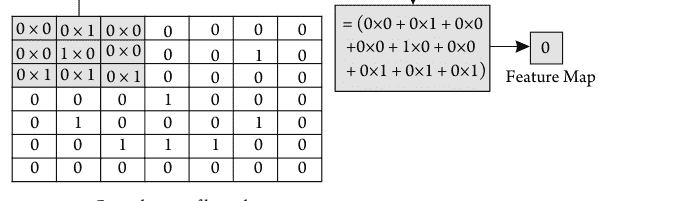

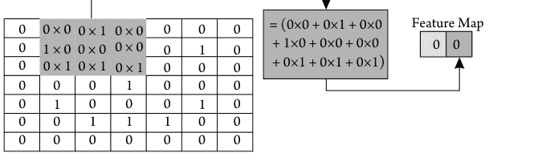

最终的特征图是

| 0 | 0 | 0 | 0 | 0 |
|---|---|---|---|---|
| 1 | 1 | 1 | 1 | 1 |
| 1 | 1 | 0 | 1 | 1 |
| 1 | 1 | 4 | 2 | 1 |
| 1 | 0 | 0 | 0 | 1 |

特征图

12.

| 1 | 2 |
|---|---|
| 4 | 1 |

## 19 卷积神经网络的实现

**章节目标**

- 使用卷积神经网络（CNN）构建各种图像分类器。
- 执行图像增强以扩展数据集。
- 导入keras库和包。
- 初始化CNN模型。
- 添加卷积层、池化、展平和全连接操作以构建CNN。
- 执行CNN模型的编译。
- 从训练好的模型获取预测结果。
- 通过添加更多的卷积层和最大池化层来提高模型的准确性。

## 19.1 使用CNN构建图像分类器

卷积神经网络（CNN）是构建图像分类器系统的完美选择。在本章中，我们将通过考虑各种案例研究，在Python中实现各种CNN分类器。

## 19.2 狗猫分类器

考虑一个图像分类问题，涉及识别照片是包含猫还是狗。我们的任务是开发一个CNN模型，能够识别图像中的对象是狗还是猫。CNN模型将在包含狗或猫的图像数据集上进行训练，然后使用这个训练好的模型进行分类。一旦模型构建完成，它就可以作为模板，用于构建其他模型，以预测训练数据集上任何图像的类别。这意味着我们可以使用相同的模型，通过在医学图像上进行训练来对肿瘤进行分类。

### 准备数据集

为了构建狗猫分类器，我们将使用11000张手动标注的狗和猫的照片，其中5500张是狗的照片，其余的是猫的照片。这是从Kaggle上可用的dogs-vs-cats数据集创建的部分数据集。此数据集的链接如下。

https://www.kaggle.com/competitions/dogs-vs-cats/data

此数据集的结构类似于图19.1。

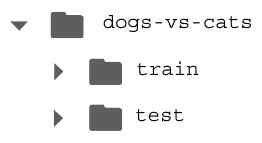

这个完整的数据集包含37500张图像（训练文件夹中有24000张，测试文件夹中有13500张），必须手动将其分隔到狗和猫的文件夹中。由于数据集庞大且分隔耗时，我们在训练文件夹中选取了10000张图像（5000张狗的图像和5000张猫的图像），在测试文件夹中选取了1000张图像（500张狗的图像和500张猫的图像）。

本章讨论的模型构建所使用的数据集和代码可以从以下GitHub链接下载，以便快速实现。
https://github.com/bhatiaparteek/ml_with_python/tree/main/Chapter_19_CNN

此数据集组织成两个主要文件夹：train和test。在每个文件夹内，有两个子文件夹，分别标记为“dog”和“cat”。训练集在“dog”子文件夹中包含5000张狗的图像，在“cat”子文件夹中包含5000张猫的图像。同样，测试集在各自的文件夹中包含每个类别500张图像。这种划分在图19.2中清楚地显示。

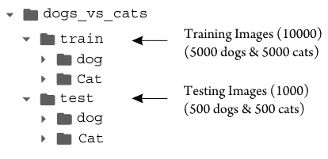

**图19.2** 创建训练集和测试集

我们将使用keras库来实现CNN。必须保持上述讨论的文件夹结构，因为它使keras能够通过其标签理解图像的类别。因此，文件夹的名称充当标签。本实验中使用的训练和测试数据集的摘要在表19.1中给出。

**表19.1** 训练和测试数据集摘要

| 类别 | 训练数据集 | 测试数据集 | 总计 |
| :--- | :--- | :--- | :--- |
| 狗 | 5000 | 500 | 5500 |
| 猫 | 5000 | 500 | 5500 |
| 总计 | 10000 | 1000 | 11000 |

我们将使用以下三个阶段来构建和测试CNN模型。

- 构建CNN模型
- 图像增强和模型拟合
- 改进CNN模型

每个阶段都提供了代码片段以展示实现。读者可以在本地机器上实现此代码。或者，此代码可以在Google Colab或“Colaboratory”上执行，这是Google的一项云服务，任何人都可以在Google的云服务器上执行Python代码，无论其机器性能如何。它允许您在浏览器中编写和执行Python，无需任何配置，并免费提供GPU访问权限，并且使用此环境共享代码非常容易。

要了解更多关于Google Colaboratory的信息，请参考以下链接。
https://colab.research.google.com/


包含本章讨论代码的Google Colab jupyter笔记本也已在以下GitHub链接中提供。
https://github.com/bhatiaparteek/ml_with_python/tree/main/Chapter_19_CNN


## 第一阶段：构建CNN模型

我们将遵循分步方法来构建CNN模型，建议读者按照这些步骤实现基于CNN的狗猫分类器。

### 19.2.1 步骤1：导入Keras库和包

实现CNN模型的第一步是从Keras库中导入特定的包，如表19.2所示。

表19.2 用于构建CNN的Keras重要包

| 包名 | 用途 |
| :--- | :--- |
| Sequential | 用于创建Sequential类的实例。该类用于初始化深度学习模型并向模型添加更多层。 |
| Conv2D | 此包用于向模型添加卷积层。 |
| MaxPooling2D | 用于添加对二维（2D）空间数据执行最大池化的池化层。 |
| Flatten | 此包将所有池化的特征图转换为一个大的特征向量。该特征向量作为全连接层的输入。 |
| Dense | 它向深度学习模型添加一个全连接层。 |

要导入这些包，我们将使用以下代码片段。

```
代码片段：1

from keras.models import Sequential
from keras.layers import Conv2D
from keras.layers import MaxPooling2D
from keras.layers import Flatten
from keras.layers import Dense
from keras.preprocessing.image import ImageDataGenerator
```

在最后一行，我们导入了ImageDataGenerator类，该类将在构建分类器的第二阶段用于预处理训练和测试图像。

### 19.2.2 步骤2：初始化CNN模型

Keras提供Sequential模型API（应用程序编程接口）来创建深度学习模型。我们已经在代码片段1中导入了此API。我们将通过创建`Sequential`类的实例来初始化我们的CNN模型。代码片段2概述了将其创建为`classifier`实例的代码。

```
# 初始化CNN
classifier = Sequential()
```

### 19.2.3 步骤3：添加卷积层

卷积是CNN模型的第一层。它用于从给定的输入图像中提取特征。由于计算机将图像视为一组像素，因此当我们将图像输入神经网络时，它会创建一个由0和1组成的矩阵，表示给定图像的像素值。对于彩色图像，使用三维（3D）矩阵，其中每个维度代表一个通道（RGB通道），如图19.3所示。

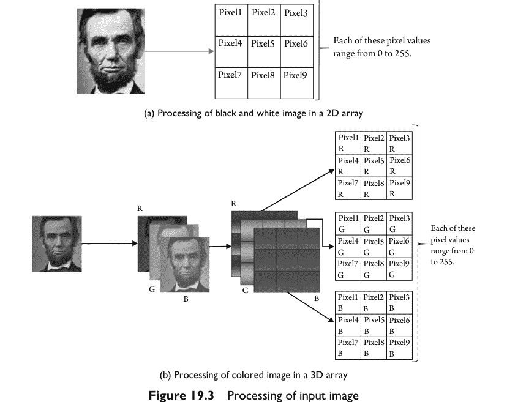

如前一章所述，CNN模型接受两个输入：（i）图像矩阵和（ii）特征检测器或滤波器或内核。多个内核应用于输入图像以从中提取所有重要特征，每个内核生成其特征图。在此过程中，我们有一层特征图作为卷积过程的输出，如图19.4所示。如前一章所述，我们还应用激活函数“relu”来突出图像的非线性。

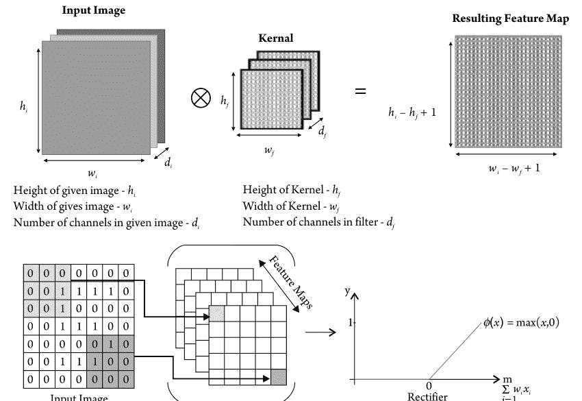

在本案例研究中，为了构建CNN模型，我们使用大小为128×128的彩色图像。因此，输入形状将为（128,128,3）。我们使用32个特征检测器或滤波器，每个大小为3×3，来对输入图像进行卷积。为了向我们的模型添加卷积层，我们将使用代码片段3。

```
# 卷积
classifier.add(Conv2D(filters=32, kernel_size=3, input_shape=[128, 128, 3], activation="relu"))
```

在代码片段3中，我们首先使用`Conv2D()`方法创建一个卷积层。这是通过使用`classifier`实例调用`add()`方法添加到我们的CNN模型中的。我们需要清楚地理解传递到`Conv2D()`内部的参数的含义，因为它们至关重要。

首先，我们传递了`filters = 32`，它决定了特征检测器的数量。这些滤波器或特征检测器的大小为（3,3）；此信息通过`kernel_size = 3`传达。在这些参数之后，我们传递了`input_shape = [128,128,3]`，它决定了我们执行卷积的输入图像的形状。对于黑白或灰度图像，通道将为1。我们还指定了`activation = "relu"`。我们已经知道ReLU（修正线性单元）是一种激活函数，它为我们的模型添加了非线性。

你可以尝试其他维度（256,256,3）或（64,64,3）来调整`input_shape`参数。但是，我建议你首先使用指定的值实现它，之后你可以尝试不同的值。

### 19.2.4 步骤4：池化

池化用于在不丢失重要特征的情况下减小特征图的大小。卷积层产生的每个特征图对应于给定图像的关键特征，如图19.5所示。

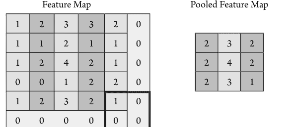

**图19.5** 窗口为2×2且步幅等于2的最大池化

为了向我们的模型添加池化层，我们将调用`MaxPooling2D()`方法，如代码片段4所示。

```
# 池化
classifier.add(MaxPooling2D(pool_size=2, strides=2))
```

这里，`pool_size`指的是池化矩阵的大小，步幅用于指定步幅值。

通常建议使用较小的*pool_size*值，以避免信息丢失并提取最大特征。这里，我们使用2×2作为最大池大小，*strides*为2。步幅是一个参数，控制滤波器表在图像上移动的量。

到此步骤，我们已经构建了CNN模型，如图19.6所示。

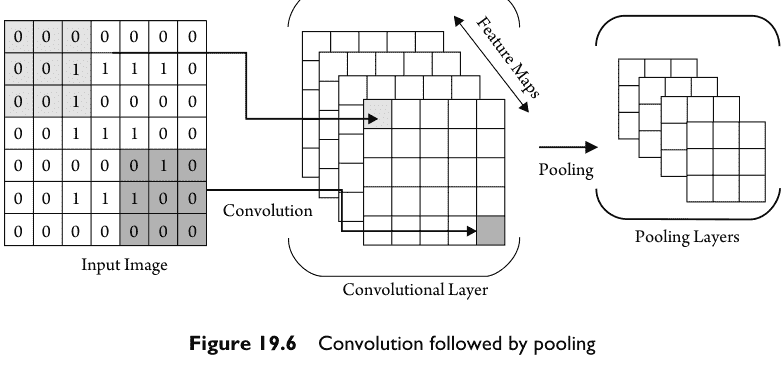

### 19.2.5 步骤5：展平

运行代码片段4后，我们将为卷积层产生的每个特征图获得一个独特的*池化特征图*。下一步是将所有这些特征图合并为一个向量。然后，这个单一向量将作为ANN模型后续层的输入。图19.7以图形方式描述了整个过程。

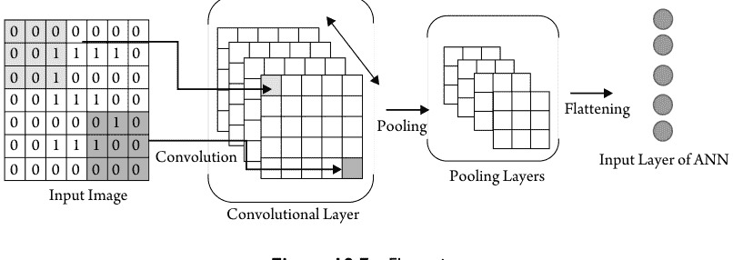

可以通过调用`Flatten()`方法简单地添加展平层。代码片段5显示了执行展平操作的代码。

```
代码片段：5

# 展平
classifier.add(Flatten())
```

这里不需要任何输入参数。`keras`模型知道前面的层已经对图像执行了卷积和池化，现在将相应地执行展平，无需指定任何参数。

你可以欣赏`keras`在简化代码方面的强大功能，并且在构建CNN模型时执行所有步骤非常简单。我们使用每个阶段一到两行代码执行了卷积层、最大池化和展平步骤。

### 19.2.6 步骤6：全连接

通过遵循前面的五个步骤，我们已经完成了卷积、最大池化和展平，现在这是构建CNN模型的最后一步。此步骤将通过添加全连接层来制作一个经典的ANN分类器。这个ANN与我们之前学习的没有什么不同，它将包含一个隐藏层和一个输出层。这个ANN的输入将是展平后得到的一维（1D）向量。这个1D向量包含图像的空间信息和像素模式。让我们首先向这个ANN模型添加一个隐藏层。

#### 添加隐藏层

隐藏层使用`Dense()`方法添加。`Dense()`方法将接受两个参数`units`和`activation`。隐藏层中的节点数将通过`units`参数确定，`activation`参数指定要使用的激活函数。激活函数决定了节点在分类器做出的最终决策或预测中的贡献。

这里，我们通过指定`units=128`和`activation="relu"`向隐藏层添加128个节点。添加隐藏层的代码如代码片段6所示。当然，你可以调整units的值，但隐藏层中的节点数应足够大，以便正确训练模型。

```
代码片段：6

##### 全连接
classifier.add(Dense(units=128, activation="relu"))
```

#### 添加输出层

要添加到我们CNN模型的最后一层是输出层。此层将再次使用`Dense()`方法添加。由于给定图像的分类将是`cat`或`dog`，因此这是一个二元分类问题。

因此，我们设置 `output_dim=1`，因为只需要一个输出节点。选择的激活函数是“sigmoid”函数，它为每个类别生成概率，专门用于二分类。代码片段7提供了添加输出层的代码。
注意：如果输出数量超过两个，即在多分类器的情况下，请使用“softmax”激活函数。

```python
# Output layer
classifier.add(Dense(units=1, activation="sigmoid"))
```

至此，我们已经构建了CNN模型，如图19.8所示。下一步，我们将编译我们的CNN模型。

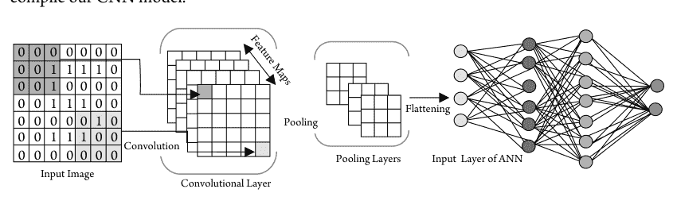

## 19.2.7 第7步：编译CNN

让我们通过选择随机梯度下降算法作为优化器、损失函数和适当的性能指标来编译CNN模型。代码片段8提供了编译CNN模型的代码。

```python
# Compiling the CNN
classifier.compile(optimizer = "adam",
                   loss = "binary_crossentropy",
                   metrics = ["accuracy"])
```

在上面的代码片段中，我们使用 `compile()` 方法编译CNN模型。我们还传递了参数：`optimizer`、`loss` 和 `metrics`。参数 `optimizer` 指定了正在使用的优化算法。我们选择“adam”作为我们的 `optimizer`，因为它是效率最高的随机梯度下降算法实现之一。
第二个参数是 `loss`，它决定了用于编译模型的损失函数。`keras` 提供了不同类型的损失函数，这里我们使用 `binary_crossentropy` 方法。二元交叉熵方法计算实际类别和预测类别之间的交叉熵损失。由于我们正在构建一个二分类器，所以我们使用 `binary_crossentropy`。或者，在多分类的情况下，你可以使用 `categorical_crossentropy`。

我们使用的最后一个参数是 *metrics*，它指定了用于编译模型的性能指标。我们传递了 `["accuracy"]` 作为 *metrics*，不过你也可以传递一个指标列表。

这完成了我们CNN实现的第一阶段。在下一阶段，我们将执行图像增强和模型拟合。

## 19.3 第二阶段：图像增强与模型拟合

有时，我们的数据集规模较小，那么我们可以通过图像增强过程来扩充或扩展我们的数据集。图像增强涉及对图像执行一些二维操作，如旋转、剪切或翻转，以创建新图像，从而增加数据集的大小。这也有助于通过拥有不同位置的图像来实现更好的模型效率。

在这个案例研究中，我们使用10000张图像进行训练，1000张进行测试。这可能不足以构建一个高精度的模型；因此，我们正在使用图像增强技术扩展我们的数据集。但是，我们可以从案例研究中Kaggle链接提供的完整数据集中获取更多图像。为了简单和快速实现，我们基于部分数据集构建模型。但在大多数情况下，数据集可能是有限的。我们执行此步骤是为了让您熟悉使用图像增强扩展数据集。

为此，您也可以参考 `keras` 的在线文档，通过以下链接获取图像增强的基本模板代码。
https://blog.keras.io/building-powerful-image-classification-models-using-very-little-data.html
此博客中给出的代码模板如图19.9所示。

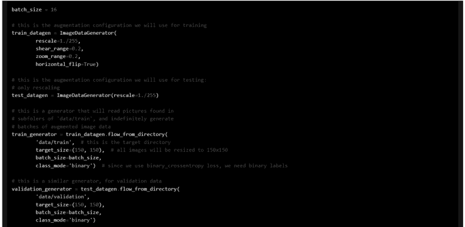

**图19.9** 图像增强的代码模板

### 增强训练数据

代码片段9和10展示了增强训练数据的代码。首先，在代码片段9中，我们为训练数据集初始化 `ImageDataGenerator`。这里，我们定义了需要对训练集图像执行的操作（重新缩放、剪切和缩放）。此代码直接取自 *keras文档*。需要注意的是，`\` 表示代码在下一行继续。

*代码片段：9*

```python
#Code from keras documentation:
#We shall use the same code without any changes.
# Image augmentation
train_datagen = ImageDataGenerator(
    rescale=1./255,
    shear_range=0.2,
    zoom_range=0.2,
    horizontal_flip=True)
```

下一步是按照 *keras文档* 中提到的创建 `train_generator`。

```python
#Code from keras documentation:
# this is a generator that will read pictures found in
# subfolders of 'data/train', and indefinitely generate
# batches of augmented image data
train_generator = train_datagen.flow_from_directory(
    'data/train',  # this is the target directory
    target_size=(150, 150),  # all images will be resized to 150x150
    batch_size=batch_size,
    class_mode='binary')  # since we use binary_crossentropy loss, we need binary labels
```

我们在这里使用了 `flow_from_directory()` 方法。此方法从指定路径加载图像，然后对其应用增强。这里，我们需要将“*data/train*”替换为我们的 *training_set* 的路径，即训练集文件夹相对于当前工作目录的路径；请注意，您不需要指定完整路径。在我们的案例中，训练图像存储在 *dataset/training_set* 目录内。因此，我们如代码片段10中所述，将“*dataset/training_set*”指定为第一个参数。我们还将 `target_size` 参数从 (150,150) 更改为 (128,128)，因为我们处理的是128×128大小的图像。（这在第一阶段添加卷积层时讨论过。）我们使用 `batch_size` 为32。由于我们处理的是二分类器，`class_mode` 将是 *binary*。

因此，对训练数据执行图像增强的最终代码将如代码片段10所示。

```python
# Code Snippet: 10

# code to create train_generator
train_generator = train_datagen.flow_from_directory(
    "dataset/training_set",
    target_size=(128, 128),
    batch_size=32,
    class_mode="binary")
```

### 增强测试数据

代码片段11和12展示了增强测试数据的代码。首先，代码片段11显示我们为测试数据初始化 `ImageDataGenerator`。这里，我们只对测试集的图像执行重新缩放操作。我们可以使用与keras文档中给出的相同代码，无需在代码片段11中进行任何更改。

```python
# Code Snippet: 11

#Code from keras documentation:
#We shall use the same code without any changes.
# Image augmentation of test data
test_datagen = ImageDataGenerator(rescale = 1./255)
```

下一步是按照 `keras` 文档中提到的创建 `test_generator`。

```python
#Code from keras documentation:

# this is a similar generator, for validation data
validation_generator = test_datagen.flow_from_directory(
    'data/validation',
    target_size=(150, 150),
    batch_size=batch_size,
    class_mode='binary')
```

这里，我们需要将“data/validation”替换为我们的 `testing_set` 的路径，即测试集文件夹相对于当前工作目录的路径。在我们的案例中，测试图像存储在 `dataset/test_set` 目录内。因此，我们指定了“dataset/test_set”。我们还将 `target_size` 参数从 `(150,150)` 更改为 `(128,128)`，因为我们处理的是128×128大小的图像。`batch_size` 是32，`class_mode` 是“binary”。最终代码将如代码片段12所示。

```python
# Code Snippet: 12

# code to create test_generator
test_generator = test_datagen.flow_from_directory(
    "dataset/test_set",
    target_size = (128, 128),
    batch_size = 32,
    class_mode="binary")
```

现在我们已经增强了训练集和测试集的图像。接下来是在增强后的图像（*train_generator* 和 *test_generator*）上拟合我们的CNN模型。
keras文档提到了此步骤的模板代码，如下所示。

```python
#Code from keras documentation:
model.fit_generator(
    train_generator,
    steps_per_epoch=2000 // batch_size,
    epochs=50,
    validation_data=validation_generator,
    validation_steps=800 // batch_size)
model.save_weights('first_try.h5')  # always save your weights after training or during training
```

将 *model* 替换为 *classifier*，因为我们为模型创建了名为 *classifier* 的实例；将 *steps_per_epoch* 替换为100，因为我们希望快速训练模型以进行测试；其余代码保持不变。
拟合模型的代码如代码片段13所示。

```python
# Code Snippet: 13

# Training the CNN on the training set and evaluating it on
# test set
classifier.fit(train_generator,
               steps_per_epoch=100,
               epochs=50,
               validation_data=test_generator,
               validation_steps=800)
```

这完成了我们的第二阶段：图像增强与模型拟合。此部分的完整代码也显示在代码片段14中（结合了片段11、12和13的代码）。
执行这些代码片段后，您将获得类似于图19.10的输出。查看这些统计数据，我们可以说我们达到了83.34%的训练准确率和79.6%的测试准确率。

## 图 19.10 我们训练的 CNN 模型的准确率

在本阶段结束时，我们的模型已训练完成。现在，是时候在一些未见过的图像上测试训练好的模型，以检查它是否能准确识别图像中的物体。此外，我们还将讨论如何提高 CNN 模型的准确率。

## 代码片段：14（合并片段 11、12 和 13）

```python
# Image augmentation
train_datagen = ImageDataGenerator(
    rescale=1./255,
    shear_range=0.2,
    zoom_range=0.2,
    horizontal_flip=True)

# Image augmentation of train data
train_generator = train_datagen.flow_from_directory(
    "dataset/training_set",
    target_size=(128, 128),
    batch_size=32,
    class_mode="binary")

# Image augmentation of test data
test_datagen = ImageDataGenerator(rescale=1./255)
test_generator = test_datagen.flow_from_directory(
    "dataset/test_set",
    target_size=(128, 128),
    batch_size=32,
    class_mode="binary")

# Training the CNN on the training set and evaluating it on the
# test set
classifier.fit(train_generator,
    steps_per_epoch=100,
    epochs=50,
    validation_data=test_generator,
    validation_steps=800)
# \ indicates continuation of the code to the next line
```

## 19.4 阶段 3：从我们的模型获取预测并改进模型

我们的模型已准备好对未见过的图像进行预测。未见过的图像是指既未用于模型训练也未用于测试的图像。让我们给模型一张未见过的图像。从互联网上选择一张狗/猫的图像，并将此图像作为输入提供给我们的模型。由于此图像未用于训练模型，因此它是一张未见过的图像。我们将使用一张未见过的图像来测试我们训练好的模型。图 19.11 展示了一张可用于预测的未见过的样本图像。

首先，我们将从 `keras.preprocessing` 库中导入 `image` 模块。同时，我们还将导入 NumPy。然后，我们将通过调用 `load_img()` 方法来加载未见过的图像，如代码片段 15 所示。在此方法中，我们将传递两个参数：*未见过的图像相对于当前目录的路径*，以及图像的 `target_size`。由于我们使用 128×128 像素的尺寸进行训练和测试图像，我们将保持 `target_size = (128,128)`。然后我们将图像转换为数组；为此，我们调用 `img_to_array()` 方法，并将 `unseen_image` 传递给它。完整代码如片段 15 所示。

```python
# Making a single prediction
import numpy as np
from keras.preprocessing import image
unseen_image = image.load_img(
    "dataset/single_prediction/cat_or_dog_2.jpg",
    target_size=(128, 128))
unseen_image = image.img_to_array(unseen_image)
# \ indicates continuation of the code to the next line
```

我们训练好的 CNN 模型接受图 19.12 所示格式的图像。

图 19.12 所示的维度用于我们图像的训练和测试。未见过的图像在输入到我们的分类器之前需要转换为这个特定维度。目前，我们未见过的图像的维度是 (128,128,3)。我们需要为此添加一个额外的批次大小维度。我们将利用 NumPy 库中的 `expand_dims()` 方法，传递两个参数：`unseen_image` 对象和希望添加维度的目标轴。

我们将传递 `axis = 0`，因为批次大小总是添加在索引 0 处。扩展图像维度后，新维度将是 (1,128,128,3)，其中批次大小为 1，因为只有一张图像被传递给 `expand_dims()` 方法。

下一步是将输入图像馈送到我们训练好的模型。我们将通过使用 `classifier` 对象调用 `predict()` 方法来完成此操作，并在 `predict()` 方法内部传递一个参数 `unseen_image`。访问 `training_set` 对象的 `class_indices` 属性以获取类标签到其对应索引的映射。最终结果将收集在 `result` 变量中。如果它等于 1，则 `unseen image` 是 `dog`，而如果它等于 0，则 `unseen image` 是 `cat`。要知道哪种动物映射到哪个数字，我们将使用 `training_set.class_indices`。以下代码片段引导您完成完整代码。

```python
unseen_image = np.expand_dims(unseen_image, axis=0)
result = classifier.predict(unseen_image)
training_set.class_indices
if result[0][0] == 1:
    prediction = "dog"
else:
    prediction = "cat"
print("The given image is of " + prediction)
```

执行上述片段后，如果我们得到的输出是“cat”，则意味着未见过的图像被分类为“cat”，如果输出是“dog”，则意味着图像被分类为“dog”。在这种情况下，您将得到狗作为输出，这意味着训练好的模型准确地分类了未见过的图像。

现在，问题是，我们的模型能否比这表现得更好？嗯，下一节将回答这个问题。

## 19.5 通过添加另一个卷积层和最大池化层进一步提高模型的准确性

总有改进的空间。我们可以通过添加一个卷积层来提高卷积模型的准确性。

目前，我们的 CNN 模型架构如下。

卷积层 → 最大池化 → 展平 → 隐藏层 → 输出层

为了提高此模型的准确性，我们可以添加另一个卷积层，后跟一个最大池化层。这将使我们的模型达到以下结构。

卷积层 → 最大池化 → 卷积层 → 最大池化 → 展平 → 隐藏层 → 输出层

改进的架构可以通过添加代码片段 17 所示的代码行来实现。

```python
# Adding second convolution layer
classifier.add(Conv2D(filters=32, kernel_size=3,
    activation="relu"))
# Adding second pooling layer
classifier.add(MaxPooling2D(pool_size=2, strides=2))
```

因此，在将代码片段 17 添加到我们现有的 CNN 实现后，构建 CNN 模型的完整代码如代码片段 18 所示。

```python
from keras.models import Sequential
from keras.layers import Conv2D
from keras.layers import MaxPooling2D
from keras.layers import Flatten
from keras.layers import Dense
from keras.preprocessing.image import ImageDataGenerator

# Initializing the CNN
classifier = Sequential()
# Convolution
classifier.add(Conv2D(filters=32, kernel_size=3,
    activation="relu"))
# Pooling
classifier.add(MaxPooling2D(pool_size=2, strides=2))
# Adding second convolution layer
classifier.add(Conv2D(filters=32, kernel_size=3,
    activation="relu"))
# Adding second pooling layer
classifier.add(MaxPooling2D(pool_size=2, strides=2))
# Flattening
classifier.add(Flatten())
# Full connection
classifier.add(Dense(units=128, activation="relu"))
# Output layer
classifier.add(Dense(units=1, activation="sigmoid"))
# Compiling the CNN
classifier.compile(optimizer="adam", loss="binary_crossentropy")
# Image augmentation
train_datagen = ImageDataGenerator(
    rescale=1./255,
    shear_range=0.2,
    zoom_range=0.2,
    horizontal_flip=True)
# Image augmentation of train data
train_generator = train_datagen.flow_from_directory(
    "dataset/training_set",
    target_size=(128, 128),
    batch_size=32,
    class_mode="binary")
# Image augmentation of test data
test_datagen = ImageDataGenerator(rescale=1./255)
test_generator = test_datagen.flow_from_directory(
    "dataset/test_set",
    target_size=(128, 128),
    batch_size=32,
    class_mode="binary")
# Training the CNN on the training set and evaluating it on the
# test set
classifier.fit(train_generator,
    steps_per_epoch=100,
    epochs=50,
    validation_data=test_generator,
    validation_steps=800)
```

epochs=50, validation_data=test_generator, validation_steps=800)

# 进行单次预测
import numpy as np
from keras.Preprocessing import image
unseen_image = image.load_img("dataset/single_prediction/cat_or_dog_2.jpg", target_size = (128, 128))
unseen_image=image.img_to_array(unseen_image)
unseen_image = np.expand_dims(unseen_image, axis = 0)
result = classifier.predict(unseen_image)
training_set.class_indices
if result[0][0] ==1:
    prediction = "dog"
else :
    prediction = "cat"
print ("The given image is of "+prediction)
# \ 表示代码延续到下一行

额外的卷积层和最大池化层帮助模型从输入图像中提取更多特征并增加抽象性。因此，在更新后的模型中可以进行更深入的输入图像分析，从而提高准确性。图19.13展示了执行代码片段18后改进的模型性能。我们改进后的模型训练准确率为87.3%，而之前的模型为83.34%。同样，测试准确率从79.6%提高到了80.31%。

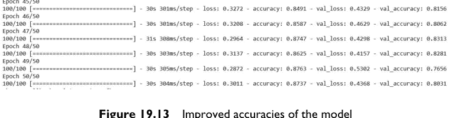

案例研究中提到的代码已作为Google Colab文件提供给读者。你可以通过网络浏览器直接访问它，在云端运行，无需任何配置。你可以通过以下GitHub链接访问提供的Google Colab文件。

https://github.com/bhatiaparteek/ml_with_python/tree/main/Chapter_19_CNN


这需要从你的驱动器挂载数据集。代码片段19用于挂载你的驱动器。你可以在Colab笔记本中访问Google Drive中的文件和文件夹。

代码片段：19

```
# 在Google Colab中挂载Google Drive
from google.colab import drive
drive.mount("/content/gdrive", force_remount=True)
```

运行代码片段19中给出的代码时，你会看到一个弹出窗口请求权限，如图19.14所示。选择“连接到Google Drive”。这将打开一个弹出窗口登录你的Gmail账户。你需要登录Gmail账户以允许访问Google Drive。


因此，你需要将GitHub链接中提供的*狗-猫*数据集，按照图19.15所示的目录结构上传到你的Google Drive中，以便Google Colab可以从你的驱动器访问此数据集。

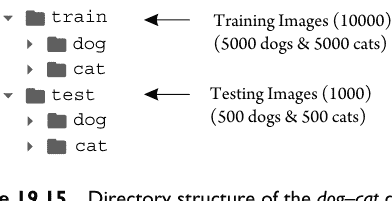

至此，我们完成了关于使用CNN进行狗猫分类器的讨论。在下一节中，我们将使用MNIST数据集创建一个手写数字分类器。

## 19.6 案例研究2：使用MNIST数据集的手写数字分类器

本节将帮助你使用CNN实现一个手写数字识别器。我们将使用0到9的手绘数字图像来训练一个CNN模型。该模型可以预测未见过的手写数字图像的正确标签。

### 问题陈述

MNIST数据集包含超过65000张从扫描文档中获取的图像。我们的任务是实现一个神经网络（CNN），能够将手写数字分类为10个类别之一（0到9的整数）。为此，我们必须使用MNIST数据集训练CNN模型。

### 数据集描述

MNIST数据集包含60000张训练图像和10000张测试图像，均为手写数字。每张图像包含10个数字之一（0或1或2或....或9）。图像是灰度图，尺寸为28×28像素。图19.16展示了从MNIST数据集中选取的一些样本图像。

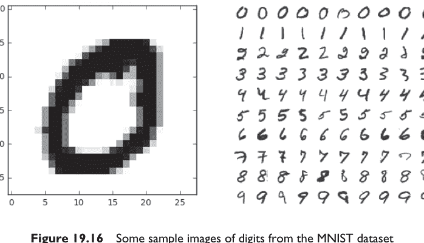

我们对MNIST数字分类器的实现分为四个部分，如下所示。

- i. 加载MNIST数据集
- ii. 数据预处理
- iii. 构建和评估CNN模型
- iv. 使用我们训练好的模型预测新的未见过的图像

### 第1部分：加载MNIST数据集

#### 步骤1：导入keras库和包

首先，我们将导入所需的包。除了在狗/猫分类器案例中导入的包外，我们还将导入TensorFlow和NumPy库。导入包和库的代码片段如下。

```
from keras.models import Sequential
from keras.layers import Conv2D
from keras.layers import MaxPooling2D
from keras.layers import Flatten
from keras.layers import Dense
from keras.layers import Dropout
# 额外的库
import tensorflow as tf
import numpy as np
```

MNIST数据集非常流行。它如此受欢迎，以至于大多数深度学习学生将其作为学习CNN的“Hello World”数据集。因此，该数据集通过tf.keras.datasets模块作为玩具数据集（已经是NumPy向量格式的数据集）提供。我们将使用相同的模块在Spyder中加载MNIST数据集。我们将使用代码片段21将MNIST数据集加载到我们的环境中。

```
# 加载MNIST数据集
mnist=tf.keras.datasets.mnist
(x_train,y_train),(x_test,y_test)=mnist.load_data()
```

在上面的代码行中，我们从tf.keras.datasets导入了mnist模块。然后，我们调用其load_data()方法，该方法返回一个NumPy数组元组——(x_train, y_train), (x_test, y_test)。

x_train和x_test是包含灰度图像数据的无符号整数NumPy数组，而y_train和y_test是包含相应图像标签（即0到9范围内的整数）的NumPy数组。

### 第2部分：数据预处理

#### 步骤2：重塑图像数据

我们在步骤1中获得的图像数据由0到255之间的无符号整数组成。这些是数据集中每张灰度图像的像素值。在将这些值输入CNN模型之前，我们必须重塑数据集。

在keras中，Conv2D层的预期维度是——（批量大小，宽度，高度，通道数）。因此，通过使用代码片段22，我们将重塑我们的训练和测试数据。

```
# 将数组重塑为4维，以便与keras API配合使用
x_train=x_train.reshape(x_train.shape[0], 28, 28, 1)
x_test=x_test.reshape(x_test.shape[0], 28, 28, 1)
input_shape=(28, 28, 1)
```

代码片段22的代码行正在重塑x_train和x_test。x_train从(60000,28,28)重塑为(60000,28,28,1)，而x_test从(10000,28,28)重塑为(10000,28,28,1)。需要注意的是，x_train.shape[0]返回训练数据集的行数，x_test.shape[0]返回测试数据集的行数，这将作为其批量大小。之后，我们在变量input_shape中指定了输入图像的大小。

#### 步骤3：归一化图像数据

神经网络在归一化数据上表现更好。因此，需要进行缩放。我们将把图像数据的像素值归一化到[0,1]范围。我们将像素值除以最大值（最大RGB值为255）。但在执行此操作之前，我们必须首先将图像数据从无符号整数值转换为浮点数；否则，除法将不会得到小数值，这可能导致数据丢失。代码片段23展示了归一化图像数据的完整代码。

```
# 确保值为浮点数
x_train=x_train.astype("float32")
x_test=x_test.astype("float32")
# 通过除以最大RGB值来归一化RGB码
x_train/=255
x_test/=255
```

### 第3部分：构建和评估CNN模型

我们为猫狗分类创建的CNN模型架构如下：

卷积层 → 最大池化 → 展平 → 隐藏层 → 输出层

我们将对此架构进行一些修改，以用于手写数字分类。步骤4到5将指导你完成这些更改。我们将使用以下架构作为我们的手写数字分类器。

卷积层 → 最大池化 → 展平 → 隐藏层 → Dropout层 → 输出层

这里，我们引入了另一个名为dropout的层，用于避免数据过拟合。

#### 步骤4：构建CNN模型

我们将通过创建*Sequential*类的实例来初始化我们的CNN模型。

`classifier = Sequential()` 初始化一个序列模型，允许我们逐层构建CNN模型。

然后，我们使用Conv2D函数向模型添加一个卷积层。它指定过滤器数量为32，内核大小为3x3，激活函数为“relu”，以及图像数据的输入形状。

之后，使用MaxPooling2D函数向模型添加一个*最大池化*层。它指定池大小为2x2，步幅为2，这会对从上一个卷积层获得的特征图进行下采样。

`classifier.add(Flatten())` 用于向模型添加展平层。它将2D特征图转换为1D特征向量，为连接到全连接（密集）层做准备。

然后，使用Dense函数向模型添加一个全连接层。它指定该层的单元（神经元）数量为200，激活函数为“relu”。

`classifier.add(Dropout(0.5))` 用于使用Dropout函数向模型添加一个dropout层。它通过在训练期间随机停用50%的神经元来帮助防止过拟合。

最后，向模型添加输出层。它有10个单元（因为我们的分类器有10个类别，范围从0到9），并使用*softmax*激活函数来产生类别上的概率分布。

代码片段24展示了构建所需CNN模型的代码。

```
# 初始化CNN
classifier =Sequential()
# 卷积
classifier.add(Conv2D(filters=32, kernel_size=3, activation="relu", input_shape=input_shape))
# 池化
classifier.add(MaxPooling2D(pool_size=2, strides=2))
# 展平
classifier.add(Flatten())
##### 全连接
classifier.add(Dense(units=200, activation="relu"))
# 添加dropout层
classifier.add(Dropout(0.5))
```

# 输出层
classifier.add(Dense(units=10, activation="softmax"))

执行代码片段24后，我们得到了一个CNN模型。下一步是通过设置优化器、损失函数和评估指标来编译CNN模型。

如代码片段25所示，我们使用“adam”作为*优化器*，因为它是随机梯度下降算法最高效的实现之一。第二个参数是*损失*，它决定了用于编译模型的损失函数。这里，我们使用`sparse_categorical_crossentropy`作为损失函数。当我们有多个互斥类别时，这是最常用的损失函数。这里有10个类别，同一时间只有一个类别是激活的，其他类别都是0，因此数据是稀疏的；所以我们使用`sparse_categorical_crossentropy`作为损失函数。我们使用的最后一个参数是*指标*，它指定了用于编译模型的性能指标。我们传入了`[“accuracy”]`作为*指标*。

**代码片段：25**

```
# 编译CNN
classifier.compile(optimizer="adam", \n                  loss="sparse_categorical_crossentropy", \n                  metrics=["accuracy"])
```

这完成了我们CNN实现的第一阶段。在下一阶段，我们将如代码片段26所示，在训练数据上拟合我们的模型。这里，我们运行了10个epoch。但是，你可以尝试不同的epoch数量，并根据训练损失和准确率寻找最优的epoch数。

最后，我们将在测试集上评估训练好的模型，因此我们将`x_test`和`y_test`提供给`evaluate()`方法。代码片段26展示了拟合和评估CNN模型的代码。

**代码片段：26**

```
# 在训练集上拟合CNN模型并在测试集上评估
classifier.fit(x=x_train, y=y_train, epochs=10)
classifier.evaluate(x=x_test, y=y_test)
```

执行代码片段26后，模型开始通过每个epoch进行拟合过程。图19.17展示了训练后模型的性能。即使只训练了10个epoch，结果也非常好！我们达到了99.31%的训练准确率和98.91%的测试准确率，如图19.17所示。

```
Epoch 1/10
1875/1875 [==============================] - 40s 21ms/step - loss: 0.2185 - accuracy: 0.9328
Epoch 2/10
1875/1875 [==============================] - 39s 21ms/step - loss: 0.0889 - accuracy: 0.9735
Epoch 3/10
1875/1875 [==============================] - 39s 21ms/step - loss: 0.0672 - accuracy: 0.9795
Epoch 4/10
1875/1875 [==============================] - 40s 21ms/step - loss: 0.0533 - accuracy: 0.9830
Epoch 5/10
1875/1875 [==============================] - 40s 21ms/step - loss: 0.0443 - accuracy: 0.9858
Epoch 6/10
1875/1875 [==============================] - 40s 21ms/step - loss: 0.0365 - accuracy: 0.9880
Epoch 7/10
1875/1875 [==============================] - 39s 21ms/step - loss: 0.0307 - accuracy: 0.9898
Epoch 8/10
1875/1875 [==============================] - 39s 21ms/step - loss: 0.0272 - accuracy: 0.9908
Epoch 9/10
1875/1875 [==============================] - 40s 21ms/step - loss: 0.0243 - accuracy: 0.9915
Epoch 10/10
1875/1875 [==============================] - 40s 21ms/step - loss: 0.0206 - accuracy: 0.9931
313/313 [==============================] - 2s 6ms/step - loss: 0.0376 - accuracy: 0.9891
[0.03755372762680054, 0.9890999794006348]
```

**图19.17** 我们的CNN模型性能

## 第4部分：使用训练好的模型预测新的未见图像

我们的CNN模型已准备好对未见图像进行预测。我们将向模型提供一张未见图像进行测试。为了进行测试，我们在一张纸上手写了数字0并进行了拍摄，如图19.18所示。生成的图像被保存为zero.jpg。随后，该图像将被输入到训练好的模型中，以评估其预测准确率。代码片段27包含了进行单次预测所需的代码。

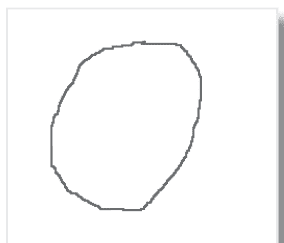

**图19.18** 手写样本数字

由于我们是在Google Colab中实现，你可以通过点击图19.19所示的上传图标，将此图像上传到Colab中用于存放输入文件的默认文件夹*sample_data*中。

964 使用Python进行机器学习

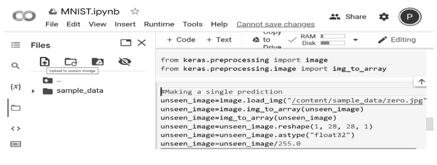

**图19.19** 将未见图像上传到sample_data文件夹

**代码片段：27**

```
#进行单次预测
unseen_image=image.load_img( \n"/content/sample_data/zero.jpg", \ncolor_mode="grayscale", target_size=(28, 28, 1))
unseen_image=image.img_to_array(unseen_image)
unseen_image=img_to_array(unseen_image)
unseen_image=unseen_image.reshape(1, 28, 28, 1)
unseen_image=unseen_image.astype("float32")
unseen_image=unseen_image/255.0
result=classifier.predict(unseen_image)
print("The given image is of",np.argmax(result) )
```

这个代码片段类似于我们在猫狗分类案例中讨论的代码（代码片段15）。

它从指定的文件路径加载图像并将其转换为灰度图。图像被调整为28x28像素大小，具有单个通道。然后，图像被转换为NumPy数组，该数组表示图像的像素值。数组被重塑为维度(1, 28, 28, 1)，添加了一个额外的维度来表示一批图像。

接着，数组的数据类型被转换为“float32”，因为这是神经网络的常用格式。图像数组的像素值通过将每个元素除以255.0进行归一化，将值缩放到0和1之间。训练好的模型（称为“classifier”）用于对预处理后的图像数组进行预测。“predict”方法返回每个可能类别的预测概率。最后，通过使用NumPy函数“argmax()”在“result”数组中找到最高概率的索引，打印出预测的类别标签。

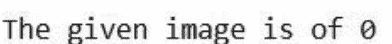

**图19.19** 对未见图像的预测

我们提供给模型的未见图像是数字“0”。因此，我们训练好的模型完美地将给定图像分类为10个数字（0-9）中的一个。此外，你可以添加更多层，尝试修改模型的参数值，看看其准确率是否会进一步提高。

案例研究中提到的代码已作为Google Colab文件提供给读者。你可以通过网络浏览器直接访问它，在云端运行，无需任何配置。

https://colab.research.google.com/drive/11Bh9KpCwNjXblFXe-FObSaBVboNefz4Q?usp=sharing


读者可以参考这个Colab笔记本实现代码。

在本章中，我们讨论了使用两个问题陈述（即猫狗数据集和MNIST数据集）实现CNN模型。我们首先讨论了使用猫狗数据集构建CNN模型。然后，讨论了数据集的增强和模型的拟合。接着，我们讨论了如何提高模型的准确率。我们还介绍了如何在未见图像上测试模型。然后我们以猫狗模型为参考，进行了一些修改，为MNIST数据集构建了一个CNN模型。猫狗数据集和MNIST数据集的CNN模型之间的主要区别在于数据预处理和模型架构。在猫狗数据集的情况下，输入数据被增强以增加图像数量，并使用不同位置的图像高效地训练模型。MNIST数据集被归一化，以从神经网络中获得更好的性能。

在此阶段，鼓励读者深入研究更多用于分类的数据集，并利用CNN的能力。你可以参考本章末尾给出的“补充资源”和“测试我”（实践技能）部分。

#### 提醒我

- 实现CNN模型的第一步是从`keras`库中导入某些包。
- `Sequential`用于创建`Sequential`类的实例。此类用于初始化深度学习模型并向模型添加更多层。
- `Conv2D`用于向模型添加卷积层。
- `MaxPooling2D`用于添加池化层，对2D空间数据执行最大池化。
- `Flatten`将所有池化的特征图转换为一个大的特征向量。该特征向量作为全连接层的输入。
- `Dense`向深度学习模型添加一个全连接层。
- 彩色图像的通道数为3，即红色、蓝色和绿色。
- 在`MaxPooling2D`层中，我们传递一个名为`pool_size`的参数。它指的是所选滤波器表的大小。通常，建议使用较小的`pool_size`值，以避免信息丢失并提取最大特征。

• 步幅（Stride）是一个控制滤波器表在图像上移动量的参数。
• 如果输出是二元的，那么在全连接层中激活函数将是“sigmoid”函数。在多类分类的情况下，则使用“softmax”激活函数。
• 损失函数`binary_crossentropy`计算实际类别与预测类别之间的交叉熵损失。它用于二元分类。在多类分类的情况下，可以使用`categorical_crossentropy`。
• 图像增强涉及对图像执行二维操作，如旋转、错切或翻转。`ImageDataGenerator`用于图像增强。
• 未见过的图像的维度必须与训练和测试图像的维度相似。在未见过的图像的维度中，其大小和通道数必须与训练/测试图像的大小和通道数相匹配。
• 可以添加一个额外的卷积层，后接一个最大池化层，以提高模型的准确性。
• 构建CNN图像分类器遵循以下步骤。

步骤1：导入keras库和包。
步骤2：初始化CNN模型。
步骤3：添加卷积层。
步骤4：池化。
步骤5：展平。
步骤6：全连接。
步骤7：编译CNN。
步骤8：图像增强和模型拟合。
步骤9：从我们的模型获取预测并改进模型。

#### 附加资源

##### 视频链接

- 猫狗CNN | Zubayer Hossain | https://youtube.com/playlist?list=PL7BhjdrBLoekxEAVfNEj_IRg6IlLCx504


- 使用CNN进行图像分类（CIFAR10数据集）| 深度学习教程24（Tensorflow & Python），https://youtu.be/7HPwo4wnJeA


- 端到端深度学习项目 | 土豆病害分类—6：ImageDataGenerator API，https://youtu.be/DQFerxe6o5g


##### 博客和数据集链接

- 狗与猫 | https://www.kaggle.com/competitions/dogs-vs-cats/


- 如何对狗和猫的照片进行分类 | Jason Brownlee | https://machinelearningmastery.com/how-to-develop-a-convolutional-neural-network-to-classify-photos-of-dogs-and-cats/


- Google Colab，https://colab.research.google.com


- 使用极少数据构建强大的图像分类模型，https://blog.keras.io/building-powerful-image-classification-models-using-very-little-data.html


##### 考考我（实践技能）

1. 使用CNN构建一个花卉识别模型。
以下链接提供的数据集包含花卉列表及其特征；你必须使用获取的数据集训练模型，以构建一个花卉识别模型。
https://www.kaggle.com/code/rajmehra03/flower-recognition-cnn-keras


2. 使用CNN构建一个乳腺癌检测模型。
数据集可以使用sklearn的datasets包导入，如以下代码片段所示。
代码片段：
from sklearn import datasets
data = datasets.load_breast_cancer()
你可以参考以下notebook来构建CNN模型。
https://www.kaggle.com/code/krutarthhd/breast-cancer-detection-using-cnn-98-accuracy/


3. 使用CNN实现表情符号识别，如以下链接所述。
https://github.com/gopikasingh/Emoji-Recognition-CNN-Model/blob/main/Cnn_model_complete.ipynb


## 20 循环神经网络

### 章节目标

- 讨论神经网络与人脑之间的关系。
- 学习将人工神经网络（ANN）扩展为循环神经网络（RNN）的方法。
- 了解前馈网络的局限性。
- 理解RNN的工作原理。
- 理解RNN的数学建模。
- 了解RNN的局限性。
- 熟悉梯度消失和梯度爆炸问题。
- 理解长短期记忆（LSTM）的概念。
- 理解RNN单元和LSTM单元之间的区别。
- 理解输入门、遗忘门、细胞状态和输出门在LSTM工作中的作用。
- 了解RNN和LSTM的应用。

## 20.1 神经网络与人脑

构建人工神经网络（ANN）的灵感源于模拟人脑工作的强烈愿望。随着我们对人脑的理解因持续的研究而日益丰富和深入，研究人员也在相应地改进ANN。其中一个近期的成果就是循环神经网络（RNN）和长短期记忆（LSTM）。在本章中，我们将以简化的方式讨论这些发展，以便我们的读者能够理解这项惊人的技术，并将其用于他们的开发项目。

第20.1节和20.2节的灵感来源于SuperDataScience团队发表的题为“循环神经网络（RNN）终极指南”的博客。这些章节中使用的大部分图表均改编自该博客。

有关该博客的详细信息，请参阅本章的“附加资源”部分。

对人脑的研究告诉我们，人脑有三个主要部分：大脑、小脑和脑干，如图20.1所示。让我们简要讨论这些部分及其组成部分的主要功能，以理解神经网络与人脑之间的联系。

### 大脑

从图20.1中，我们可以理解大脑有四个脑叶。它们分别是：

- 颞叶
- 额叶
- 枕叶
- 顶叶

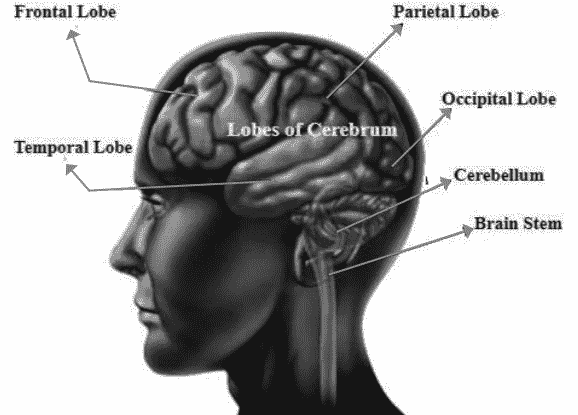

**图20.1** 人脑结构

让我们将这些脑叶与我们的ANN及其相应的目的进行类比。

### 颞叶及其与人工神经网络（ANN）的等价性

颞叶的主要目的是为我们提供长期记忆，它可以与ANN相类比，因为它的主要贡献是决定输入信息的权重。这些权重在ANN中是基于历史数据或训练过程中的先验经验，通过前向和反向传播来确定的。因此，我们可以得出结论，权重就像我们的长期记忆。因为一旦模型训练完成且权重固定，我们就可以将其关闭，稍后回来使用网络中已知的权重来处理未知的实例。抽象地说，我们可以将人脑的颞叶与我们基本的ANN相类比。它实现了长期记忆的目的。

### 枕叶及其与卷积神经网络（CNN）的等价性

从最近对人脑的研究中，我们了解到人脑的枕叶区域负责我们的视觉以及识别图像和物体的能力。因此，在神经网络中，与这个区域等价的是我们的卷积神经网络（CNN）。它被设计用于执行计算机视觉任务，让计算机能够识别图像和物体。

### 额叶及其与循环神经网络（RNN）的等价性

人脑的额叶区域负责我们的短期记忆。人类能够记住最近发生的事情，并将这些知识应用于未来。对人类来说，短期记忆是我们大脑的重要功能之一，而额叶为我们执行这一功能。

但奇怪的是，我们早期的神经网络中并没有这种短期记忆的等价概念。为了填补这一空白，计算机科学家在2017年近期开发了RNN，它可以充当ANN的短期记忆。

### 顶叶

最近的研究表明，顶叶负责我们的感觉和知觉。我们使用大脑的这一部分来构建一个空间协调系统，以表示我们周围的世界。但遗憾的是，计算机科学家仍然无法创建一个能够归入此类别的神经网络。也许像你这样的工程师/科学家将来能够为这种大脑功能开发出ANN系统。那时我们或许能够实现人工智能系统的基准。

因此，通过这个讨论，我们可以得出结论：RNN为我们的ANN提供了短期记忆，并与人脑的额叶功能相对应。

我们不能忽视短期记忆在日常生活中的重要性。既然此刻你正在阅读这本书，如果在阅读本节时你无法回忆起前一段或前一句的内容，那将是很遗憾的。因此，正如你能够记住并回顾我们刚刚讨论的内容以理解序列中的下一个主题一样，我们正在构建一个RNN，它可以参考先前的输出来学习并决定其下一个预测。

此外，让我们考虑另一个现实生活中的例子，以理解短期记忆的重要性，并了解循环神经网络背后的直觉。我们在看电影时，通常能预测下一个场景会发生什么。如果一个人中途进来，从随机场景开始观看电影，他不知道已经发生了什么，也不知道接下来会发生什么。如果被要求预测下一个场景，他无法做到。这是因为他不知道电影之前的场景。这意味着关于电影之前场景的信息在他的记忆中是不可用的。

因此，将人工神经网络扩展为循环神经网络以增加短期记忆能力非常重要。将人工神经网络扩展为循环神经网络的过程将在下一节中描述。

## 20.2 将人工神经网络扩展为循环神经网络

让我们通过一个逐步的过程，将我们简单的人工神经网络模型进行扩展，为其添加短期记忆能力，从而构建循环神经网络。为此，让我们考虑图20.2所示的一个简单的人工神经网络。

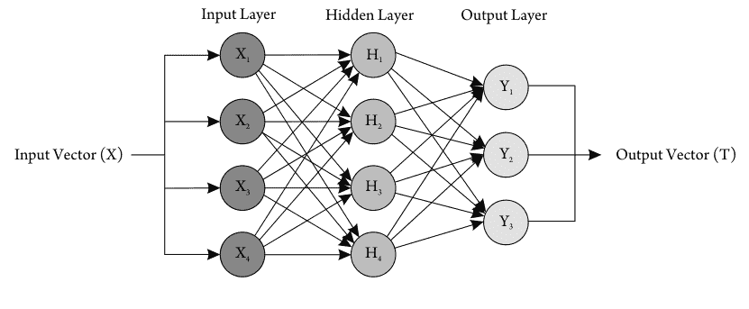

让我们分别执行以下五个步骤，创建一个能够保留短期记忆或先前输出的网络。

### 步骤1：压缩网络

为简单起见，让我们将整个神经网络压缩。这意味着各层仍然存在，但让我们想象我们只是将其挤压成一个单元，如图20.3所示。

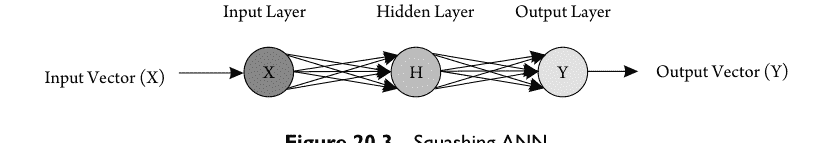

### 步骤2：将多个箭头更改为单个箭头

让我们使用一个箭头来表示多个箭头，以进一步简化此表示，如图20.4所示。

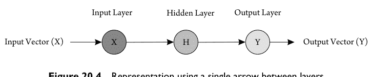

### 步骤3：将其扭曲为垂直方向

让我们将其扭曲以简化此表示，使其垂直，以向标准表示靠拢，如图20.5所示。

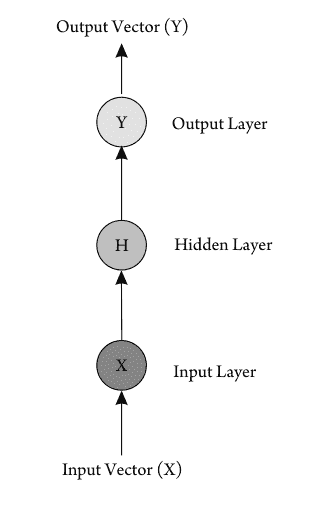

### 步骤4：添加一条线以表示时间循环

由于此网络必须记住先前的输出，让我们添加一个时间循环，如图20.6所示。这意味着隐藏层在提供输出的同时，也会反馈到自身。这意味着它在进行下一次预测时会考虑其先前的输出。

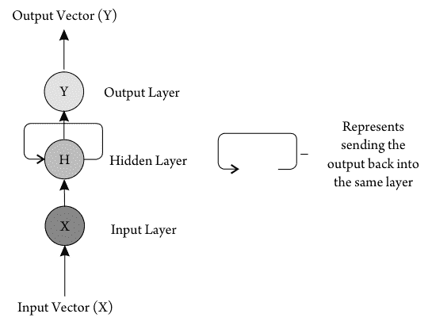

**图20.6** 带有时间循环的网络

### 步骤5：展开时间循环

在最后一步，我们展开这个时间循环，如图20.7所示。这里，每个圆圈不仅代表一个神经元，还代表一整层神经元。

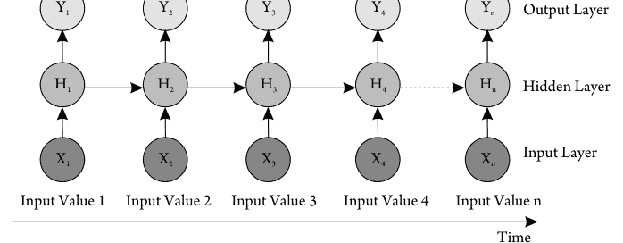

**图20.7** 展开时间循环后的网络

在这里，我们观察到循环神经网络接收输入值，具有隐藏层，并给出类似于人工神经网络的输出向量。但在循环神经网络中，主要区别在于神经元通过时间连接到自身。循环神经网络的基本思想是为神经元提供短期记忆。这种自连接允许记住神经元先前持有的信息。因此，这种连接有助于将神经元持有的值传递给未来的自身，以关联和分析信息。

因此，为了给神经元提供短期记忆，我们通过创建循环神经网络，将关于先前事件或结果的记忆添加到神经元中。

## 20.3 前馈网络的局限性

在进一步探讨循环神经网络的概念之前，让我们首先了解传统前馈网络（即人工神经网络或卷积神经网络）的局限性。这将使我们进一步了解需要循环神经网络来改进网络的原因。

第20.3节至第20.7节的灵感来源于Javapoint.com上题为“循环神经网络”的博客。这些章节中使用的大部分图表均改编自该博客。

有关该博客的详细信息，请参阅本章的“附加资源”部分。

让我们以图像分类任务为例。在这个例子中，我们有各种动物的图像。神经网络已经过训练，可以根据某些特征对这些图像进行分类。因此，当输入一张猫的图像时，模型会观察其特征，并将其分类为与猫图像相对应的标签，如图20.8所示。

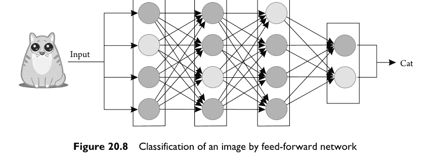

让我们再看另一个示例场景，如图20.9所示。假设在时间“t”输入一张图像，模型预测输出为猫。在时间“t+1”，同一模型预测输出为狗。这意味着在时间“t”产生的输出与在“t+1”产生的输出是独立的。

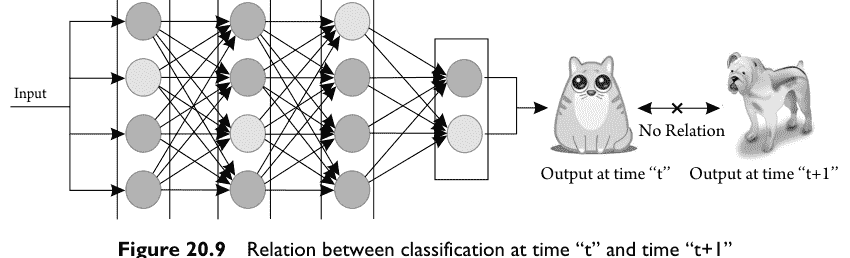

现在，让我们以用户在撰写消息时预测要输入的单词为例。在这里，我们可以观察到预测单词的下一个字母取决于其前面的字母。同样，预测句子中的下一个单词取决于前面的单词，即前面的字母和单词在查找下一个字母和单词中起着关键作用。因此，模型必须记住并使用在先前步骤中获得的输出，以预测下一步的输出。

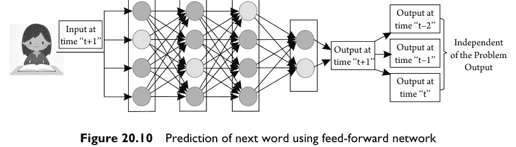

**图20.10** 使用前馈网络预测下一个单词

这里，基本概念与阅读一本书相同。在阅读时，当你进入下一节时，你必须清楚前面章节中描述的概念，才能理解并预测书中接下来的信息。

在前馈网络的情况下，时间“t+1”的输出独立于时间步“t”或时间步“t–1”或时间步“t–2”的输出，如图20.9所示。因此，前馈网络不应用于预测句子的后续单词，因为该模型中的输出独立于先前的输出。另一方面，循环神经网络可以克服这一挑战，因为它们记录了先前的输出。

## 20.4 循环神经网络的工作原理

从前几节中，我们理解了循环神经网络的必要性。现在，让我们讨论循环神经网络的工作原理。在循环神经网络的情况下，时间“t+1”的输出取决于时间“t”或时间“t–1”或时间“t–2”的输出，即时间戳的输出取决于其先前时间戳的输出。这种情况如图20.11（a和b）所示。

如图20.11(a)所示，时间“t”的神经元接收两个输入：输出网络在时间间隔“t–1”提供的信息，以及在时间“t”的输入。

类似地，网络在时间“t+1”的输入是输出网络在时间间隔“t”提供的信息，以及在时间“t+1”的输入，用于预测时间“t+1”的输出。这种依赖于不同时间间隔神经元状态的过程如图20.11(b)所示。这样，最新的输入知道来自先前时间戳的信息，并做出适当的预测。

因此，我们可以得出结论，旨在预测序列数据中模式的人工神经网络类别被称为循环神经网络。序列数据可以与文本、手写、口语、基因组、股票市场、从传感器或不同来源收集的数值时间序列数据等相关。

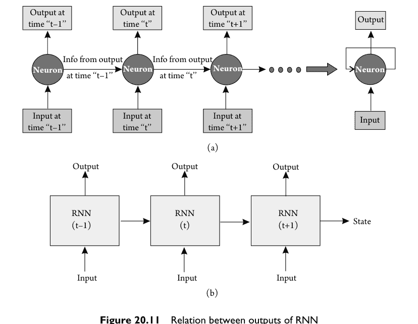

## 20.5 通过辅导中心的案例研究理解循环神经网络

让我们考虑一个工程入学考试辅导中心的案例研究，以详细了解循环神经网络的工作原理。辅导中心每日课程的顺序如图20.12所示。假设辅导中心提供物理、化学和数学的培训。辅导人员制定了培训计划，因此每日学员必须按顺序参加其中一门学科的一节课，并且在连续的几天内不得重复任何学科。因此，学科在每个交替日更换，并且在一个周期完成后，将在每个学科的最后一节课上对涵盖的所有内容进行测试。所以，让我们假设顺序是物理、化学、数学和测试。

辅导中心培训师必须确保课程按照每周计划重复。在尝试循环神经网络之前，让我们使用一个**前馈网络**来预测今天课程的学科，如图20.13所示。

该网络的输入是**星期几和月份**。前馈神经网络使用这些输入进行**训练**，以**预测**表示今天课程科目的输出标签。

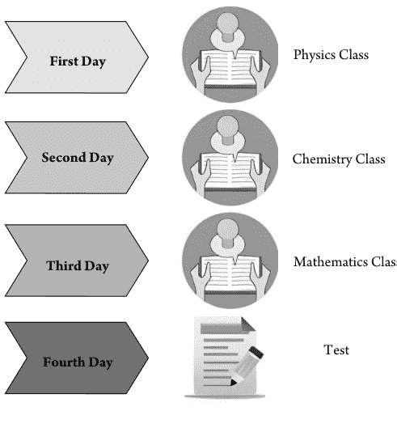

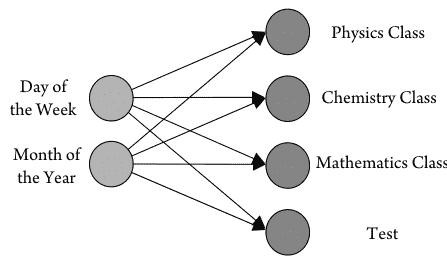

现在，假设某天由于任何原因课程没有进行。第二天，我们必须补上那节课，而剩余课程的安排将不得不顺延一天，因为我们必须确保物理、化学、数学和测试课按顺序进行。但这在简单的前馈网络中无法强制执行，因为它不携带任何关于前一天课程的信息。由于这里今天的课程科目取决于之前课程的科目，而前馈网络不考虑之前时间戳的输出。因此，考虑到模型和输入，预测将不准确。

可以使用RNN来解决这个问题，因为它考虑了之前的输出，如图20.14所示。

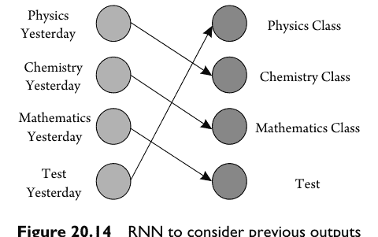

**图20.14** 考虑之前输出的RNN

输入不再是月份和星期几，而是前一天进行的课程。因此，如果你昨天上了物理课，今天就必须上化学课。同样，如果你昨天上了测试课，今天就必须上物理课。

有时课程可能不会进行。必须考虑今天之前上的最后一节课的数据，如图20.15所示。

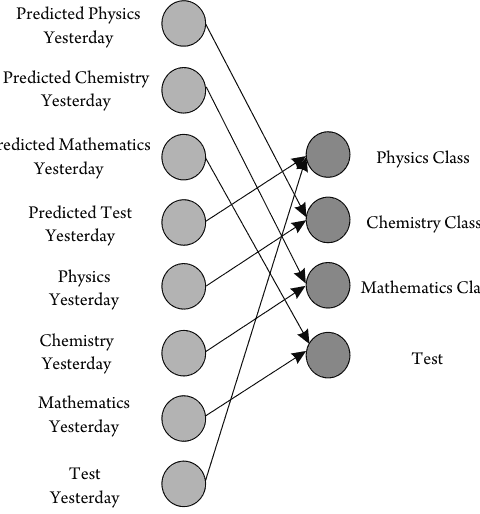

**图20.15** 考虑真实和预测输出的RNN

这里，预测的昨天课程表示根据时间表/顺序计划的课程，而昨天课程则表示课程是否实际发生的信息。考虑一个预测物理课的节点/神经元，它有两个输入。一个输入是预测的昨天课程，即预测的昨天测试课，另一个是实际信息，即昨天测试课，以表示昨天实际的测试课是否发生。如果两个输入都为真，则只有代表物理课的节点输出为1；否则，输出为0。

对于给定的示例，我们可以观察到，如果模型基于之前时间戳的输出进行训练，则可以准确预测所需的输出。

为了简化图20.15中的表示，让我们将给定数据转换为向量，即输入序列。输入向量以数字0或1的形式表示你是否参加了之前的课程。该输入向量被馈送到模型中，如图20.16所示。

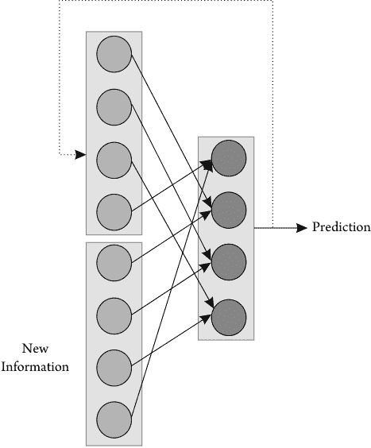

**图20.16** 预测向量和新信息以找到输出向量

## 20.6 RNN的数学建模

在本节中，我们将讨论寻找RNN当前状态和输出状态的数学公式。

不要担心数学的复杂性；我们将以非常简单的方式讨论它，以便一切都能清楚。

图20.17描绘了RNN架构中的参数以及计算神经元状态和输出的公式。


如图20.17所示，以下公式分别计算特定时间“t”的隐藏状态和输出值。

$h^{(t)} = g_h(w_I x^{(t)} + w_R h^{(t-1)} + b_h)$

$y^{(t)} = g_y(w_y h^{(t)} + b_y)$

现在让我们理解这个公式的每一项。
这里，我们考虑两个输出：隐藏层或单元状态的输出，即$h$，以及最终输出，即$y$。输入编号为$x_0$、$x_1$和$x_2$，输入权重和输出权重分别定义为$w_I$和$w_y$，而隐藏状态的权重定义为$w_R$。应用于隐藏层和输出层的激活函数分别表示为$g_h$和$g_y$。$b$表示偏置。

因此，
$y^{(t)}$是时间步“t”的输出。
$h^{(t)}$是时间“t”的隐藏层或单元状态的输出。
$x^{(t)}$是时间步“t”的输入向量。
$g_h$和$g_y$是激活函数。
$w_I$、$w_R$、$w_y$是权重矩阵，$b_h$、$b_y$是偏置参数。

为了进一步理解这个公式，让我们计算时间戳t = 0时$h^{(t)}$和$y^{(t)}$的值。
在时间步t = 0时，输入是“$x_0$”。任务是使用下面的公式找到“$h^0$”和“$y^0$”的值。

$h^{(t)} = g_h(w_i x^{(t)} + w_R h^{(t-1)} + b_h)$

$y^{(t)} = g_y(w_y h^{(t)} + b_y)$

在第一个方程中代入t = 0，函数$h^{(0)}$推导如下。

$h^{(0)} = g_0(w_i * x^{(0)} + b_h)$

这里，$h^{(t-1)}$等于0。

这非常直观；如图20.18所示，你可以看到输出$h^{(0)}$将取决于其输入的加权和，即$w_i * x^{(0)}$与偏置$b_h$，并由激活函数$g_0$处理。

类似地，时间t = 0时的输出y，即$y^{(0)}$，使用第二个方程计算如下。

$y^{(0)} = g_y(w_y * h^{(0)} + b_y)$

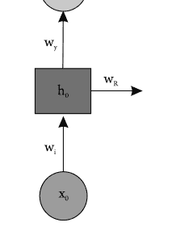

**图20.18** 时间间隔t(0)的处理

这再次非常直观，如图20.18所示，你可以看到输出$y^{(0)}$将取决于$w_y * h^{(0)}$的加权和与偏置$b_y$，并由激活函数$g_y$处理。

**类似地，让我们通过将值代入公式来计算$h^{(1)}$的值。**

$h^{(1)} = g_h(w_i * x^{(1)} + w_R * h^{(0)} + b_h)$

$y^{(1)} = g_y(w_y * h^{(1)} + b_y)$

为了理解这一点，让我们通过图20.19考虑时间间隔t = 1的处理。

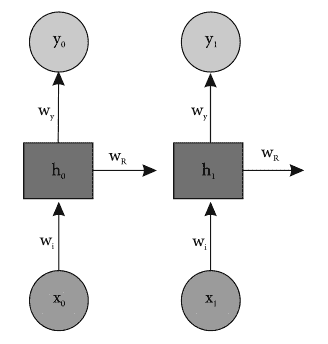

**图20.19** 时间间隔t(1)的处理

参考图20.19，我们可以理解$h^{(1)}$的输出将取决于其输入的加权和，即$w_i * x^{(1)}$与偏置$b_h$，加上之前$h^{(0)}$的加权输出$w_R * h^{(0)}$。激活函数$g_h$将处理这个值。

类似地，输出$y^{(1)}$将取决于$w_y * h^{(1)}$的加权和与偏置$b_y$，并由激活函数$g_y$处理。

为了练习和重新确认你的理解，我请求你通过将值代入公式来计算$h^{(2)}$和$y^{(2)}$的值。然后你可以将你的发现与下面给出的值进行比较。

$h^{(2)} = g_h(w_i * x^{(2)} + w_R * h^{(1)} + b_h)$

$y^{(2)} = g_y(w_y * h^{(2)} + b_y)$

使用这些方程，可以计算模型中所有时间戳的当前状态和输出。

## 20.7 循环神经网络的局限性

RNN的主要局限性是长期依赖性。换句话说，当时间步太长时，从所有之前时间步传播信息具有挑战性。此外，这会导致梯度消失和梯度爆炸等问题。为了理解梯度消失和梯度爆炸的概念，我们必须首先讨论长期依赖性。

通常，我们需要关于最近活动的信息来完成当前活动。让我们考虑一个语言模型来支持这个陈述。在语言模型中，任务是根据之前的单词预测句子的下一个单词。例如，如果我们必须预测句子“The birds are flying in the sky”中的最后一个单词，这里的最后一个单词是*sky*，预测最后一个单词*sky*，其预测所需的信息（即单词*flying*）就在它附近。我们不需要任何进一步的上下文——很明显下一个单词将是*sky*。因此，在这种情况下预测输出非常简单。因为相关信息与当前所需输出之间的差距非常小。在这种情况下，RNN可以轻松地学习和使用来自之前状态的信息，如图20.20所示。预测状态Y₃输出所需的主要信息是X₀和X₁。这些输入接近状态h₃。因此，RNN可以预测输出。

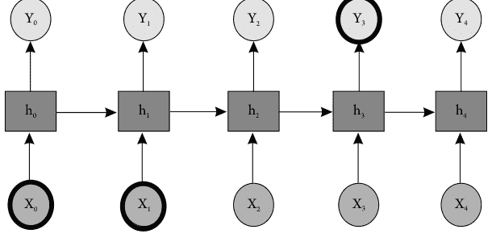

**图20.20** 短期依赖情况下的RNN

然而，其他一些场景需要更多信息。例如，如果我们必须预测句子“I spent my childhood in Spain………Hence, I have a good command of Spanish”的最后一个单词，要找到最后一个单词，即*Spanish*，观察所需信息单词之前的最近信息。该信息表明所需单词可能是一种语言的名称。但语言太多了。我们需要更多信息来预测语言；这里，句子开头提到的单词*Spain*将帮助我们将最后一个单词预测为*Spanish*。但这里的问题是单词*Spain*和最后一个单词*Spanish*之间存在巨大的差距。

因此，所需信息与其需要的位置之间可能存在巨大的差距。因此，很明显，在这个例子中，所需信息的时间戳和需要它的时间戳之间的差距是巨大的。这种情况被称为长期依赖。

从视觉上看，这在图20.21中描绘，其中时间戳Yₜ₊₁的输出依赖于输入X₀和X₁，并且这些时间戳之间存在很长的差距，这导致了长期依赖问题。

理论上，RNN能够处理“长期依赖性”。然而，实际上，即当我们实现多层RNN时，它会导致梯度消失或爆炸等问题。这个问题是RNN的一个主要局限性，并且长期以来一直是一个主要障碍，限制了大型网络的训练。

### 20.7.1 梯度消失与梯度爆炸

本小节的内容灵感来源于Kurtis Pykes的博客文章《深度神经网络中的梯度消失/爆炸问题》，更多详细信息可在本章的“补充资源”部分找到。

你知道神经网络通过前向传播和反向传播进行学习。同样，RNN也应用前向传播和反向传播。权重调整是通过反向传播算法在每个时间戳上执行的。这通常被称为时间反向传播（BTT）。它是一种用于根据先前的误差率调整和更新神经网络权重的基本算法。误差是通过计算实际输出与预测输出之间的总平方差来得出的。该公式如下所示。

$E = (\text{实际输出} - \text{预测输出})^2$

在反向传播中，权重值是使用这个误差“E”的导数来更新的。权重更新的过程如图20.22所示。

这与我们在简单线性回归（SLR）中讨论的梯度下降算法类似。在SLR中，我们必须使用下面给出的公式来找到参数的更新值，而在RNN的反向传播中，我们必须找到权重的更新值。

$$\phi_j := \phi_j - \alpha \frac{\partial}{\partial \phi_j} J(\phi_0, \phi_1)$$

通常，我们接收输入，通过隐藏层进行处理，并将结果传递到输出层以预测输出。因此，在典型的神经网络图中，我们有从输入层到隐藏层以及从隐藏层到输出层的箭头。但是，如果我们观察图20.22，箭头是反向的，即从输出层到隐藏层，再从隐藏层到输入层。这些箭头表示反向传播期间的计算流程。当我们使用梯度下降和反向传播等算法训练深度神经网络时，偏导数权重是通过反向遍历神经网络（即从最后一层到第一层）来计算的。对于网络中更深层的隐藏层，导数是使用链式法则进行连续矩阵乘法来计算的。

换句话说，如果一个网络有$n$个隐藏层，那么$n$个导数会被相乘在一起。因此，当导数非常小时，随着我们遍历模型，梯度值会呈指数级下降，直到消失。这种情况被称为梯度消失问题。当导数非常大时，随着我们遍历模型，梯度值会呈指数级增长，直到梯度值爆炸。这种情况被称为梯度爆炸问题。

现在，让我们详细讨论**梯度消失**。

#### 梯度消失

如图20.23所示，当导数$\frac{\partial E}{\partial w}$非常小时，权重的变化也非常小。因此，它变得可以忽略不计，从而导致梯度消失。

换句话说，当导数$\frac{\partial E}{\partial w}$非常小，且迭代产生的新权重极其微不足道时，权重将不会得到更新。这个问题被称为梯度消失。

在这种现象中，激活函数起着主要作用。因为激活函数，例如sigmoid函数，其范围是$[0, 1]$。所以，sigmoid函数将任何大的输入空间收敛到一个小的输入空间，即$[0, 1]$。因此，即使sigmoid函数的输入发生很大变化，它也只会引起输出的小变化。因此，导数变得很小，如图20.24所示。

在浅层网络（即层数较少的网络）的情况下，使用sigmoid函数和其他类似的激活函数并不是一个大问题。但是，如果网络很深，层数很多，梯度值会变得非常小，从而导致训练无法有效进行。

通常，较小的梯度值表明初始层的权重和偏置参数在每次训练期间没有得到显著更新。通常，初始层在识别输入数据的核心要素方面起着至关重要的作用。因此，如果初始层没有得到显著更新，可能会导致网络整体不准确。在最坏的情况下，梯度可能变为零，这将停止网络的进一步训练。

#### 梯度爆炸

如前所述，在具有$n$个隐藏层的网络中，$n$个导数将被相乘在一起。当导数非常大时，随着我们遍历模型，梯度值会呈指数级增长，直到梯度值爆炸。这种情况被称为梯度爆炸问题。在梯度爆炸的情况下，权重会发生剧烈变化，而不是微不足道的变化，如图20.25所示。

从图20.25中，我们可以观察到，当导数$\frac{\partial E}{\partial w}$的值非常大时，它会导致权重发生巨大变化。最终，这些权重会爆炸成一个巨大的数字，导致梯度爆炸问题。当梯度爆炸问题出现时，大的导数会累积并导致大的权重，使模型变得不稳定。因此，模型无法进行有效的学习。在极端的导数值下，权重的值会非常大，导致溢出，产生等于NaN（非数字，即它不代表一个定义的或可表示的值）的权重值，无法进一步更新。所以，当我们遇到梯度爆炸时，网络变得不稳定，学习无法完成。

因此，梯度爆炸和梯度消失是由于极端的梯度值引起的。有许多方法可以解决梯度消失和梯度爆炸问题。处理这个问题最有效的技术是使用LSTM。在下一节中，我们将讨论LSTM的工作原理。

## 20.8 长短期记忆网络（LSTM）

通过前面的章节，我们了解到RNN的主要问题在于它实际上无法考虑长期依赖关系。长短期记忆，称为LSTM，是一种RNN架构，旨在克服传统RNN在捕获和保留长序列信息方面的局限性。LSTM在处理数据中的长期依赖关系方面特别有效，使其非常适合自然语言处理、语音识别和时间序列预测等任务。LSTM的关键创新在于它们能够在长序列中选择性地记住或遗忘信息。

LSTM由S. Hochreiter和J. Schmidhuber在他们1997年发表的研究论文《长短期记忆》中提出。后来，许多研究人员通过他们的贡献改进了LSTM的初始版本。LSTM网络解决了梯度消失问题，并具有广泛的应用。它们是RNN中最流行和更好的版本。

简单RNN和LSTM网络的主要区别在于LSTM在隐藏层中有门控单元。这些门控单元控制从前一个时间戳传递到下一个时间戳的信息量。LSTM可以忘记或忽略不重要的信息。图20.26显示了LSTM中一个门控单元的概览。图20.26中显示的符号起初可能令人困惑。但我向你保证，在本节结束时，你将清楚地理解这些符号及其含义。

在训练过程中，门控单元学习并按重要性顺序保存数据，将所需信息向前传递，同时丢弃不重要的信息。这个过程保留了所需信息，并将其传递到后续阶段以预测序列。LSTM基于RNN实现了许多最先进的预测。LSTM用于语音识别、手写识别、文本生成、图像处理、音乐生成、语音合成、视频字幕生成等。

让我们考虑一个场景，我们想在网上购买一个产品并查看评论。根据客户的说法，其他客户的评论让我们了解一个产品的好坏。图20.27显示了来自一家在线商店的产品评论。

## **图 20.26** LSTM 中的门控单元

当我们阅读任何评论时，我们不会记住每一个词。潜意识里，我们的大脑会记住评论中的关键词，比如“amazing”（令人惊叹）、“best deal”（最划算）和“good”（好）。而像“this”（这个）、“is”（是）、“for”（为了）、“and”（和）、“about”（关于）等其他词语则会被忽略，不会被记住。如果有人让我们复述读过的评论，我们可能无法逐字逐句地完整复述，因为我们只记住了关键词。但我们可以告诉对方诸如“best deal”（最划算）、“good value for money”（物有所值）和“good storage capacity”（存储容量大）这样的关键词，从而让人了解人们对产品的看法。像“got”（得到）、“till”（直到）和“and”（和）这样的词则会从我们的记忆中淡去。简单来说，我们只记住重要的信息以做出预测，而忘记不重要的信息。就图 20.27 而言，关键词表明客户对产品感到满意，并给出了好评。

## **图 20.27** 笔记本电脑的在线评论

类似地，LSTM 被设计为在训练过程中学习所需的信息，并忘记不重要的信息。

让我们讨论一下 LSTM 如何从一个句子中学习。例如，LSTM 读取一个句子：“The camera of this mobile gave me a perfect quality of pictures”（这款手机的摄像头给了我完美的画质），如图 20.28 所示。在训练过程中，第一步是将句子中的单词转换成一系列机器可读的向量，如图 20.29 所示。

在下一步中，LSTM 将逐个学习输入的向量序列。对于每个输入向量，还会考虑先前的隐藏状态和先前的单元状态，以计算当前的隐藏状态和当前的单元状态。隐藏状态保留了模型之前看到和学习到的重要信息。因此，它充当了 LSTM 网络的记忆。

**图 20.28** 逐个处理信息

**图 20.29** 机器可读的向量

## 20.9 LSTM 的工作原理

要理解 LSTM 的工作原理，让我们首先理解其重要的构建模块，即 LSTM 的单元。在理解 LSTM 单元的内部结构之前，让我们先了解传统 RNN 单元的内部结构。

### 20.9.1 RNN 单元的内部结构

让我们使用图 20.30 来讨论 RNN 单元的内部结构。图中使用的符号将用于其解释。

一个简单的 RNN 将先前的隐藏状态 ($h_{i-1}$) 和输入向量 (input vector)$_i$ 作为输入，并将它们连接起来形成一个组合向量，如图 20.31 所示。由于这个向量是由先前的隐藏状态和输入向量形成的，它包含了关于先前输入和当前输入的信息。组合向量通过一个 *tanh* 激活函数，并输出一个隐藏状态 ($h_i$)，如图 20.31 所示。隐藏状态也被称为网络的记忆，因为它存储了关于先前输入的信息。

总结一下，RNN 单元执行的操作如图 20.31 所示。这些操作可以描述为以下四个步骤：

- i. 将输入向量 ($x_i$) 和先前的隐藏状态 ($h_{i-1}$) 作为单元输入。将它们连接起来创建一个组合向量。
- ii. 将此组合向量通过 *tanh* 激活函数处理，以产生新的隐藏状态，即 h<sub>i</sub>。
- iii. 产生的隐藏状态被发送到下一阶段。它充当下一个单元的先前隐藏状态。
- iv. 重复步骤 (i) 的过程，直到到达最后一个单元。

这里，我们讨论了每个 RNN 单元中使用 *tanh* 激活。让我们详细讨论 *tanh* 激活函数及其在调节输入方面的重要性。

## **tanh 激活函数**

在三角学中，我们学习了双曲函数。我们了解到 *tanh* 函数是通过以下公式定义的。

tanh(x) = (e<sup>x</sup> - e<sup>-x</sup>) / (e<sup>x</sup> + e<sup>-x</sup>)

在 RNN 中，*tanh* 函数被用作激活函数来调节每个单元的值。*tanh* 函数可以调节数据流，因为它压缩数值并始终将其保持在 [-1,1] 范围内，如图 20.32 所示。

如您所知，在训练过程中，输入向量会进行多种数学运算并经历许多变化。让我们假设在一个数学运算中，输入在一个单元内乘以 3。图 20.33 显示了一个初始值差异较小的输入向量，在经过几个单元后是如何爆炸的。我们可以观察到，其值之间的差异在最终输出向量中变化很大，使得向量的第二个和第三个值与第一个值相比变得微不足道。

**图 20.33** 在没有 *tanh* 函数的情况下向量的变换

*tanh* 函数通过将值调节在 -1 到 +1 的范围内，解决了向量爆炸的问题。因此，*tanh* 函数调节了神经网络的结果。图 20.34 显示了使用 *tanh* 函数如何将相同的输入向量调节在 -1 到 +1 的范围内。给定输入向量的内部变换解释如下。

输入向量索引 0 处的初始值 = 2.5

单元 1 中的操作：经过 3x 函数后的值 = 2.5 × 3 = 7.5

经过 *tanh* 函数后的值 = tanh (7.5) = 0.999

单元 2 中的操作：经过 3x 函数后的值 = 0.999 × 3 = 2.997

经过 *tanh* 函数后的值 = tanh (2.997) = 0.995

单元 3 中的操作：经过 3x 函数后的值 = 0.995 × 3 = 2.985

经过 *tanh* 函数后的值 = tanh (2.985) = 0.994

单元 4 中的操作：经过 3x 函数后的值 = 0.994 × 3 = 2.982

经过 *tanh* 函数后的值 = tanh (2.982) = 0.994

**图 20.34** 使用 *tanh* 函数的向量变换

通过应用 *tanh* 函数，发生了显著的变换。以值 2.5 为例。应用 tanh 函数将 2.5 转换为 0.994，而如果不应用，该值会放大到 202.5，如图 20.33 所示。

既然我们已经理解了传统 RNN 单元的内部结构，现在是时候理解 LSTM 单元的内部结构了。

### 20.9.2 LSTM 单元的内部结构

LSTM 和简单 RNN 中单元之间的控制流是相同的，即数据在单元中处理，并将所需信息传递给下一个单元。它们之间的主要区别在于单元内部执行的操作。图 20.35 显示了 LSTM 单元内部执行的操作。从这张图中，您可以清楚地理解 LSTM 单元比图 20.31 所示的传统 RNN 单元要先进和复杂得多。

本节内容灵感来源于 Michael Phi 的博客文章《Illustrated Guide to LSTM’s and GRU’s: A step by step explanation》。本节使用的大部分图表均改编自该博客。

有关该博客的详细信息，请参阅本章的“附加资源”部分。

LSTM 单元有多个组成部分，它们是：

- 遗忘门
- 输入门
- 单元状态
- 输出门
- 激活函数

现在，我们将详细讨论每一个组成部分。

## LSTM 单元内部的操作

LSTM 单元的主要任务是执行操作，以便能够保留有用的信息并忘记不想要的信息。在讨论每个组成部分之前，让我们先讨论 LSTM 的主要概念。

LSTM 的基本概念是其单元状态和单元内的门。单元状态充当传输高速公路，在神经网络中传递相关信息，如图 20.35 所示。因此，单元状态可以被视为网络的记忆。它主要用于携带所需信息。在处理序列时，它保留来自先前输入的有用信息。换句话说，单元状态包含了关于近期和更早事件的信息。因此，它控制了短期记忆的影响。门用于向单元状态添加或移除信息。门负责决定哪些信息必须向前传递，哪些信息必须被留下。因此，门将在训练阶段学习相关信息，并忘记不必要的信息。

除了门和单元状态，LSTM 还有激活函数来调节值。LSTM 单元使用两种激活函数，即 sigmoid 和 *tanh* 函数。我们已经讨论过 *tanh* 函数。在了解 LSTM 单元中的门之前，让我们先讨论 sigmoid 函数。

### 20.9.2.1 Sigmoid 激活函数

Sigmoid 激活函数用于保留或忘记信息。虽然 LSTM 和 RNN 都包含 *tanh* 激活函数，但只有 LSTM 包含 sigmoid 激活函数。sigmoid 函数的公式如下。

$$sigmoid(x) = \frac{1}{1+e^{-x}}$$

sigmoid 激活函数的数学图形如图 20.36 所示。它看起来与 *tanh* 激活函数相似。但是，*tanh* 函数的输出范围在 -1 和 1 之间，而 sigmoid 函数的输出范围在 0 和 1 之间。当一个数乘以零时，输出总是零；当一个数乘以一时，值不会改变。如果一个输入值的重要性较低，在 sigmoid 激活过程中，它会乘以 0，使得该值消失或被忘记。同样，如果一个值很重要，它在 sigmoid 函数中会乘以 1，因此其值不会改变，即该值被保留或记住。因此，这个函数对于保留或忘记信息非常有用。

## 20.9.2.2 遗忘门

在LSTM单元中，输入首先被传递到遗忘门，如图20.35所示。遗忘门的输入是前一个隐藏状态（$h_{t-1}$）和当前输入向量（$x_t$）信息的拼接，如图20.37所示。这个组合输入（$h_{t-1} + x_t$）通过sigmoid激活函数（$\sigma$）。如前所述，sigmoid激活函数的输出范围在0到1之间。输出值接近0表示遗忘输入，输出值接近1表示保留输入。因此，顾名思义，遗忘门用于决定哪些信息需要被遗忘，哪些信息需要被保留以进行进一步处理。图20.37展示了遗忘门的操作。

## 20.9.2.3 输入门

输入门执行的操作如图20.38所示，这些操作可以分为三个步骤描述。

- i. 前一个隐藏状态和输入向量的组合向量（$h_{t-1} + x_t$）通过激活函数（$\sigma$）。由于sigmoid函数的输出范围在0到1之间，它通过将组合向量转换到0-1的范围来更新其值。如前所述，sigmoid函数根据输入的重要性，将其乘以0或1。
- ii. 组合向量（$h_{t-1} + x_t$）也通过tanh函数以控制网络流。tanh函数将值压缩到-1到+1的范围。tanh函数的输出称为候选值（$c_t$）。
- iii. 步骤（i）的输出（即$i_t$）和步骤（ii）的输出（即$c_t$）相乘（$i_t * c_t$），产生输入门的最终输出（即$i_t * c_t$）。输入门的输出（$i_t$）决定了从候选值（$c_t$）中保留哪些信息，即sigmoid函数的输出决定了从tanh函数的输出中保留哪些信息。

图20.38说明了输入门执行的操作。

## 20.9.2.4 细胞状态

细胞状态的操作已在图20.39中说明。要计算当前细胞状态，我们需要前一个细胞状态、遗忘门的输出和输入门。让我们逐步讨论这些操作。

- i. 前一个细胞状态（$C_{t-1}$）和遗忘门的输出（$f_t$）进行逐点相乘，得到（$C_{t-1} \times f_t$）。由于遗忘门的值在$[0, 1]$范围内，在此操作中，与接近0的值相乘的前一个细胞状态值会被丢弃或遗忘。这意味着只有重要的信息会流向后续阶段进行处理。
- ii. 步骤（i）获得的结果和输入门的输出（$i_t \times c_t$）进行逐点相加（$(C_{t-1} \times f_t) + (i_t \times c_t)$），用相关信息更新当前细胞状态，如图20.39所示。因此，经过逐点相加后，我们得到当前细胞状态。

## 20.9.2.5 输出门

输出门的结果用于计算当前隐藏状态。输出门执行的操作如图20.40所示，描述如下。

- i. 前一个隐藏状态（$h_{t-1}$）和输入向量（$x_t$）的组合向量通过sigmoid函数。
- ii. 细胞状态的最新输出，即$((C_{t-1} \times f_t) + (i_t \times c_t))$，通过$tanh$函数。
- iii. 步骤（i）和（ii）获得的输出进行逐点相乘。这有助于识别隐藏状态应携带的信息，并用$h_t$表示。

因此，通过遗忘门、输入门和输出门，我们得到当前细胞状态（$C_t$）和当前隐藏状态（$h_t$）。这些被作为输入传递给序列中的下一个单元。

总结一下，遗忘门决定忘记哪些信息或记住哪些信息或传递到下一阶段。输入门决定当前输入中有用信息的数量或需要从当前步骤添加的信息。输入门和遗忘门用于计算当前细胞状态。最后，输出门计算当前隐藏状态。

请参考指定的博客（推荐为外部网络资源），以获取详细动画，说明各种门执行的操作。该博客的作者Michael Phi贴心地提供了清晰且说明性的动画，描绘了不同门执行的操作。

图解LSTM和GRU指南：分步解释，https://towardsdatascience.com/illustrated-guide-to-lstms-and-gru-s-a-step-by-stepexplanation-44e9eb85bf21

## 20.10 RNN和LSTM的应用

由于RNN和LSTM能够记住先前的输入，它们被认为是序列建模任务的有效算法。让我们讨论一些RNN和LSTM网络的应用。

- **文本生成或语言建模**
  语言建模任务涉及在给定输入序列时预测一个词序列的概率，即输入是一个词序列，输出是对另一个词序列的预测。可以使用RNN模型预测句子中一个词或单词中一个字母的概率，因为它们保留了关于先前输入的信息。我们移动键盘中的自动更正和词语预测就是语言建模的例子。它们使用RNN模型。音乐生成也与文本生成类似。这里，作为输入的音符被处理以预测并生成一系列音符。

- **图像标题生成**
  这是一种图像处理任务，其中输入是图像，输出是标题。此任务的数据集包含带有描述性标题的图像。该数据集经过训练，模型学习每张图像的有用文本。当给定新图像作为输入时，模型生成描述图像的词语作为输出。

- **机器翻译**
  此任务涉及将词语从一种语言翻译成另一种语言。这里，输入是源语言中的词序列，输出是目标语言中的词序列。因此，此任务是一个序列到序列模型。谷歌翻译是进行机器翻译的典型应用。它接受任何语言（例如希伯来语）的词或短语序列作为输入，并将其翻译成另一种语言（例如印地语）。因此，它有助于理解某人所说的话，并帮助我们即使不懂他们的语言也能与他们交流。带有编码器和解码器的LSTM网络对机器翻译很有用。这里，编码器将输入序列转换为向量形式。解码器将此向量转换为目标语言中的词序列。与语言建模不同，在机器翻译的情况下，只有在整个输入提供给模型后才产生输出。

- **命名实体识别**
  此任务涉及从文本中提取有用信息。提取的有用信息可以是表示特定实体类型的短语或词语。例如，句子“Emma has been studying at TAU University since 2020”中的实体有Emma、TAU University、2020。这些实体被归类为人名、地点和时间。命名实体识别涉及识别实体并对其进行分类。一些涉及命名实体识别的实际应用包括总结求职者的简历、搜索引擎以及用于快速响应客户投诉和查询的聊天机器人。

- **语音识别**
  此任务涉及识别输入语音的关键词并根据识别的语音执行任务。智能家居助手，如Google Home、Amazon的Alexa和Apple的Siri，接收用户给出的语音输入，对其进行处理，并为合适的任务生成关键词。我们许多人都熟悉智能家居助手提供的便利。智能家居助手的任务包括控制家用电器、播放音乐、在线搜索等。

- **视频活动识别**
  这对于预测视频中人们执行的任务或活动很有用。这里的活动可以是睡觉、坐着、走路、扔球、跳跃等。涉及CNN和RNN的神经网络模型用于视频活动识别。这里，CNN用于识别图像，而RNN用于跟踪视频中的活动。这在分析体育赛事、管理网络上的视频、机器人技术和人机交互方面很有用。

- **DNA序列分类**
  生物信息学使用RNN模型进行DNA测序。DNA序列是独特的且具有顺序性。监督机器学习模型使用输入特征来寻找输出。

## 循环神经网络的实现

**章节目标**
*   理解使用长短期记忆模型实现循环神经网络的概念框架。
*   对时间序列数据进行数据预处理。
*   安装并导入`TensorFlow`、`Keras`及其他所需软件包。
*   构建循环神经网络的架构。
*   学习编译循环神经网络的流程。
*   对编译后的循环神经网络模型执行拟合操作。
*   将测试数据集准备成所需的数据结构。
*   对结果进行可视化与分析。

### 21.1 引言

近年来，循环神经网络已成为基于时间序列数据进行预测的最突出神经网络之一。时间序列是按时间等间隔排列的数据点集合。因此，当我们想要研究某些参数随时间的变化时，时间序列分析非常有用。在循环神经网络中，前一步的输出被馈送到当前状态的输入中。因此，循环神经网络可以预测任何单词的下一个字母、句子的下一个单词，以及柴油价格、股票价格或天气。在所有这些任务中，都需要记住先前的值，因此，$t+1$时刻的输出将依赖于先前时间戳的输出。

就DNA而言，它们没有共同的特定特征。因此，我们无法基于特征对其进行分类。然而，循环神经网络可以处理序列信息。因此，循环神经网络模型被用于对DNA序列进行分类，以识别基因的功能。这有助于医学科学家检查与特定疾病相关的基因，并开发合适的疫苗/疗法。它在农业中也有助于通过使用特定基因来提高植物对虫害的抵抗力，并改善食物的营养价值。

- **情感分类**
  此任务的输入是单词或短语序列，输出是单个数字或单词。当我们想看电影时，会搜索可观看的电影、类型以及已观看者的评论。这些评论可能从数百到数千条不等。阅读所有评论并决定看哪部电影是一项繁琐的任务。循环神经网络模型处理所有评论，并以数字（如5/5、4/5）或标签（如好、优秀、极好、最差）的形式预测这些评论的情感。因此，我们可以通过查看最终评分来决定是否观看一部电影，而无需阅读所有评论。同样，情感分类在根据客户评论对产品、应用程序或电脑游戏进行评级时也很有用。

- **时间序列分析**
  时间序列数据是按时间顺序给出的输入数据序列。对于时间序列分析，输入数据按时间顺序给出，模型必须预测趋势或数值。时间序列预测涉及根据过去事件中观察到的统计数据预测未来的值。这用于多个领域，如天气分析（如天气预报、预测季节性变化、估计湿度、温度和气候变化）；金融分析（如股票市场预测、销售预测、库存分析、产品价格估算）；医疗保健分析（如调节患者健康、预测保险福利、人口普查估算）；网络分析（如入侵检测和网络使用预测）。长短期记忆网络具有长期记忆的能力，使其适合时间序列分析。

至此，我们结束了对循环神经网络的讨论，在下一章中，我们将借助各种案例研究来实现循环神经网络。

#### 提醒我

- 人工神经网络的灵感来源于对人脑工作方式的研究。
- 循环神经网络相当于人脑中负责短期记忆的额叶区域。
- 人工神经网络和循环神经网络的主要区别在于循环神经网络中神经元的自连接。这种自连接允许神经元记住先前持有的信息。
- 在前馈网络的情况下，时间“t”的输出独立于先前时间戳的输出。像在句子中找到下一个单词这样的序列问题无法用前馈网络解决，因为输出依赖于先前时间戳的输出。
- 循环神经网络在处理长期依赖性方面存在局限性，导致梯度消失和梯度爆炸等问题。
- 长期依赖性是指相关信息与需要它的时间戳之间存在较大时间间隔的情况。
- 长短期记忆可以处理长期依赖性，从而解决梯度消失和梯度爆炸问题。
- 梯度消失问题发生在反向传播过程中梯度呈指数级减小时，导致收敛缓慢和训练深度神经网络困难。相反，梯度爆炸问题发生在梯度不受控制地增长时，导致训练不稳定和收敛问题。
- 长短期记忆中存在Sigmoid函数，而循环神经网络中没有。此函数有助于保留所需信息并遗忘不必要的信息。
- 长短期记忆单元的组成部分是输入门、遗忘门、细胞状态、输出门和激活函数。
- 遗忘门决定保留或遗忘信息。输入门决定当前步骤中有用信息的数量。输入门和遗忘门决定细胞状态，而输出门计算隐藏状态。

#### 附加资源

##### 视频链接

- 深度学习专项课程5 | 序列模型—吴恩达，https://youtu.be/_i3aqgKVNQI
- 梯度消失/爆炸—吴恩达，https://youtu.be/qhXZsFVxGKo
- 深度学习专项课程5 | 循环神经网络—吴恩达，循环神经网络模型—循环神经网络 | Coursera https://www.coursera.org/lecture/nlp-sequence-models/deep-rnns-ehs0S


##### 博客链接

- 循环神经网络，https://www.javatpoint.com/keras-recurrent-neural-networks
- 深度神经网络中的梯度消失/爆炸问题，https://towardsdatascience.com/the-vanishing-exploding-gradient-problem-in-deep-neural-networks-191358470c11
- LSTM和GRU图解指南：分步解释，https://towardsdatascience.com/illustrated-guide-to-lstms-and-gru-s-a-step-by-stepexplanation-44e9eb85bf21
- 循环神经网络应用指南，https://theappsolutions.com/blog/development/recurrent-neural-networks/

#### 测试我（问题）

1.  解释人脑各部分的功能及其对应的神经网络。
2.  人工神经网络和循环神经网络有什么区别？
3.  人工神经网络的局限性是什么？循环神经网络如何处理这些局限性？请举例说明。
4.  什么是序列建模任务？哪种算法可用于解决它们？
5.  你的手机触摸键盘有一个称为预测文本的功能，它使用神经网络算法。此功能可以在你完全输入之前预测句子中的单词。分析此问题并识别键盘使用的神经网络算法。
6.  什么是长期依赖性？
7.  在循环神经网络中使用反向传播有什么优势？
8.  讨论
    a) 梯度消失问题
    b) 梯度爆炸问题
9.  梯度消失和爆炸如何影响网络的训练？
10. Sigmoid函数如何减少大输入空间的影响？
11. 哪种激活函数存在于长短期记忆中而不存在于循环神经网络中？它在长短期记忆中的重要性是什么？
12. 详细讨论长短期记忆的组成部分及其功能。
13. 哪种神经网络适合机器翻译？机器翻译在将单词或句子从一种语言翻译成另一种语言时很有用。

> **答案：** 5. 鉴于该场景是一个序列问题，所使用的神经网络是循环神经网络 11. Sigmoid 13. 长短期记忆

在时间间隔 *t* 输出。在本章中，我们将实现一个RNN来预测柴油价格的趋势。

我们将通过长短期记忆（LSTM）单元来实现一个RNN。我们将使用堆叠的LSTM层，因为RNN存在梯度消失和梯度爆炸的问题。而LSTM包含*门控*机制，可以通过它们来调节信息流。由于这一附加优势，LSTM通常被用于实现RNN。

## 21.2 在Python中实现RNN

**问题陈述：** 在本实验中，我们的主要目标是预测德里柴油价格的趋势，即我们希望预测德里柴油价格在不久的将来会呈现上升还是下降趋势。由于我们用于此问题的数据集相当小，很难预测特定某一天柴油的确切未来价格。因此，我们将使用一个RNN模型（通过堆叠的LSTM层实现）来预测德里未来柴油价格的近似值，这有助于准确预测趋势（上升或下降）。该模型将根据其从过去柴油价格数据中的学习来预测特定某一天的价格/趋势。我们将使用2003年至2017年间德里柴油价格的样本数据集。该模型将学习相关性并预测柴油价格的未来趋势。

此实现可以分解为三个主要步骤，如下所示。

- i. **数据预处理**——首先，我们将从GitHub导入数据集并执行一些基本的预处理。
- ii. **构建RNN架构**——在第二步中，我们将使用堆叠的LSTM层构建模型的架构。
- iii. **进行预测并可视化结果**——最后，使用训练好的模型，我们将预测德里柴油价格的（趋势）。这些步骤将辅以适当的可视化。

### 21.2.1 数据预处理

数据预处理是构建机器学习模型的基本步骤。我们将执行以下步骤来预处理给定的数据集。

### 步骤1：导入数据集和所需库

我们有一个为本实验收集的2003年至2017年的样本数据集。它展示了*全球原油价格*、*外汇汇率（印度卢比）*以及相应的*德里柴油价格*。该数据集的样本如表21.1所示。

此数据集和本章讨论的所有代码均可在GitHub上获取。因此，我们将首先从给定链接下载所需的数据集。
https://github.com/bhatiaparteek/ml_with_python/tree/main/Chapter_21_RNN


表21.1 *DelhiDieselPrice*数据集（训练）实例

| 日期 | 德里柴油价格 | 外汇汇率 | 原油价格 |
| :--- | :--- | :--- | :--- |
| **2003年1月1日** | 21.47 | 48.01 | 29.59 |
| **2003年1月2日** | 21.47 | 48.05 | 29.59 |
| **2003年1月3日** | 21.07 | 48 | 29.59 |
| **2003年1月4日** | 21.07 | 48 | 29.59 |
| **2003年1月5日** | 21.07 | 48 | 29.59 |
| **2003年1月6日** | 21.07 | 48.02 | 29.59 |
| **2003年1月7日** | 21.07 | 47.96 | 29.59 |
| **2003年1月8日** | 21.07 | 47.95 | 29.59 |
| **2003年1月9日** | 21.07 | 47.95 | 29.59 |
| **2003年1月10日** | 21.07 | 47.91 | 29.59 |

下载的数据集包含两个文件，一个用于*训练*，另一个用于*测试*，如图21.1所示。*训练数据集*文件包含5299条记录，展示了从2003年1月1日到2017年7月4日的数据，而*测试数据集*文件包含80条记录，时间从2017年7月5日到2017年9月21日。

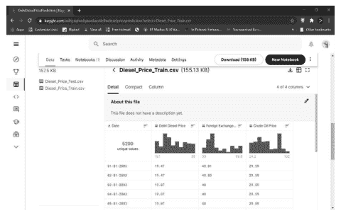

**图21.1** *DelhiDieselPrice*数据集

### 可视化下载的数据集

让我们绘制训练和测试数据，以分析德里柴油价格的趋势。为此，我们将使用*Microsoft Excel*。以下是生成*Microsoft Excel中直方图*的分步指南。

### 导入训练和测试数据

在*Microsoft Excel*中打开*DelhiDieselPriceTrain.csv*和*DelhiDieselPriceTest.csv*，如图21.2所示。

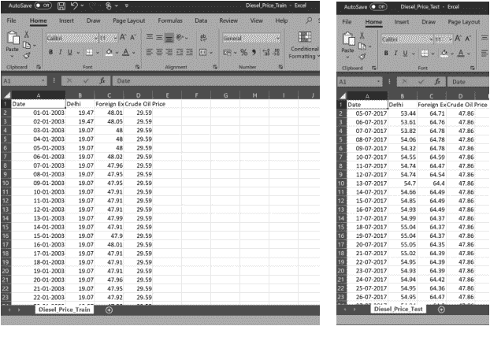

### 生成直方图

选择前两个属性，如下所示，然后单击*插入*菜单。然后单击[图表图标]以插入*堆积折线图*（参考图21.3）。这将绘制*德里柴油价格*以及所选的*日期*。


对*测试数据*也重复这些步骤。训练和测试数据的最终绘图分别如图21.4和图21.5所示。

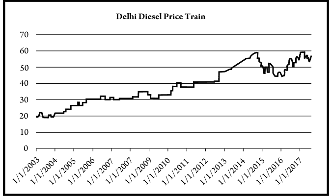

**图21.4** 基于训练数据绘制德里柴油价格趋势


**图21.5** 基于测试数据绘制德里柴油价格趋势

在大多数情况下，*训练数据集*的柴油价格记录呈现上升趋势，但在图21.4和图21.5所示的图表中也可以看到少量的下降。可以注意到，*测试数据集*的最终绘图是一条上升的曲线，而不是急剧的转折。

需要注意的是，*训练*和*测试*数据集的读数都是针对连续日期的。这是强制性的，否则如果某些特定日期的读数缺失，我们将需要进行一些密集的特征工程来克服差距。这完成了数据集的可视化分析，我们将继续步骤1以导入训练和测试数据。

下载数据集后，我们将导入一些基本库，如NumPy、Pandas和Matplotlib，如代码片段1所示。构建RNN模型所需的核心库将在我们的实现中稍后导入。

```
# Recurrent neural network
# Part 1- Data pre-processing
# Importing the libraries
import numpy as np
import matplotlib.pyplot as plt
import pandas as pd
```

首先，我们将使用Pandas库将下载的*训练数据集*从我们的驱动器加载到Spyder环境中。图21.1所示的下载训练数据集有四列，即*日期*、*德里柴油价格*、*外汇汇率*和*原油价格*。在输入属性中，我们将只考虑*德里柴油价格*来预测德里的未来趋势或柴油价格。当然，柴油价格可能取决于*外汇汇率*和*原油价格*。为了简单起见和更好的理解，我们只考虑一个属性（德里柴油价格）。考虑这一列，您将看到我们可以准确预测德里柴油价格的未来趋势。这给出了关于LSTM或RNN模型强度和能力的重要概念。

为了提取*德里柴油价格*列，我们将使用`iloc[]`方法，参数为“:”和“1:2”。这里“:”表示所有行的数据，“1:2”是列的下限和上限，表示选择索引为1的列，即*德里柴油价格*。在Spyder中导入训练集的最终代码如代码片段2所示。

```
# Importing the training set
dataset_train=pd.read_csv('Diesel_price_train.csv')
training_set=dataset_train.iloc[:, 1:2].values
```

执行上述代码片段后，我们将在变量资源管理器选项卡中获得*dataset_train*和*training_set*。这些变量的内容如图21.6所示。

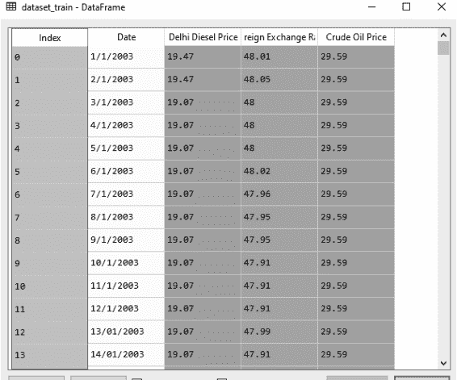

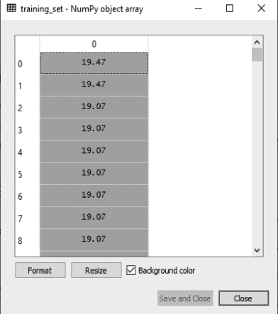

图21.6 *dataset_train*和*training_set*的内容

## 步骤2：特征缩放

关于特征缩放，我们有两种选择：*标准化*或*归一化*。这两种方法在前面的章节中已经详细讨论过。下面我们给出了每种方法的方程式以供总结。

| 标准化 | 归一化 |
| :--- | :--- |
| $X_{stand} = \frac{x - mean(x)}{Standard\ deviation(x)}$ | $X_{norm} = \frac{x - min(x)}{max(x) - min(x)}$ |

现在的问题是，我们应该使用归一化还是标准化？嗯，这取决于数据集。我们的数据集不遵循正态分布，并且数据集中不包含任何异常值。因此，在我们的实现中，我们将使用归一化。归一化*training_set*的代码在代码片段3中给出。

```
# Feature scaling
from sklearn.preprocessing import MinMaxScaler
sc=MinMaxScaler(feature_range=(0,1))
training_set_scaled=sc.fit_transform(training_set)
```

归一化训练数据后，所有的*柴油价格*都将介于0和1之间，因为在归一化公式中，$[max(x) - min(x)]$总是大于$[x - min(x)]$。这里，*x指的是德里柴油价格*属性。缩放后的*training_set*存储在*training_set_scaled*中；图21.7显示了缩放后的柴油价格。如图21.7所示，左侧是原始训练集，右侧是归一化后的缩放集。我们可以看到，第一行的值，即19.47，已被映射到0.0100125，而19.07被映射到0，因为它是数据集中的最小值。同样，所有其他值也都被映射到0和1之间。这就完成了缩放。

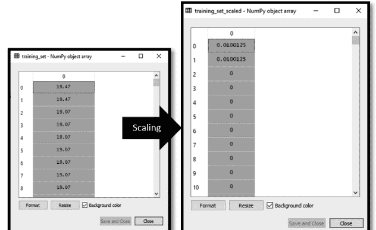

## 步骤 3：创建数据结构

在本节中，我们将首先讨论此步骤的必要性。然后，我们将讨论执行创建所需数据结构所需操作的代码。我们在前一章中讨论过，RNN 会考虑先前的状态或数据值来预测当前状态的值。在这个案例研究中，我们需要预测德里的柴油价格。由于柴油价格的值将取决于前几天的柴油价格。我们必须考虑前一天的价格来预测其当前或未来的价格。现在，问题是——预测柴油价格需要考虑多少天前的数据？

这个问题没有确切的答案；因此，在我们的实验中，我们将从某个值开始，然后使用不同的值集递归实验；根据结果和模型的准确性，我们将决定预测柴油价格应考虑的最合适天数。

在本实验中，我们从逻辑上决定使用前 120 天的数据来预测当前的柴油价格。如前所述，您可以调整这个数字并相应选择最佳数字。但此时，建议您使用 120 天，以便按照步骤操作并获得与本章讨论相同的输出。在使用 120 天的数据进行实验后，您可以尝试不同的数字并相应分析结果。

因此，我们有一个数据框 *training_set_scaled*，其中包含归一化的 *德里柴油价格*。数据框的每一行由特定日期的德里柴油价格组成。例如，在图 21.8 中，第一行表示 2003 年 1 月 1 日记录的柴油价格。同样，第二行表示 2003 年 1 月 2 日记录的柴油价格。我们将前 120 天的价格输入模型，以获得第 121 天的预测柴油价格。在图 21.9 中，我们对此进行了可视化。我们无法预测前 120 行的柴油价格，因为我们没有这些 120 行之前的数据。但我们可以预测第 121 天的价格（在索引 120 处，因为数据中的行从 0 索引开始，如图 21.8 所示），因为模型将从前 120 行（即从第 0 行到第 119 行）学习相关性。因此，120 是时间步长数。所谓时间步长，是指 RNN 模型将基于时间 *T* 之前的 120 天价格来预测某个时间 *T* 的价格。换句话说，您可以说从索引 0 到 119 的行是独立值，索引 120 处的行的值依赖于这些独立值；同样，从索引 1 到 120 的行是独立值，索引 121 处的行的值依赖于这些独立值。图 21.9 突出了在迭代数据框值时的独立变量和因变量。这将在下一部分中更加清晰，届时我们将从训练数据（*training_set_scaled*）创建 *x_train* 和 *y_train*。

### 从归一化训练数据集创建 *x_train* 和 *y_train*

*x_train* 和 *y_train* 分别是转换后的独立属性和因属性。*x_train* 将是神经网络的输入，而 *y_train* 将包含输出（或预测值）。

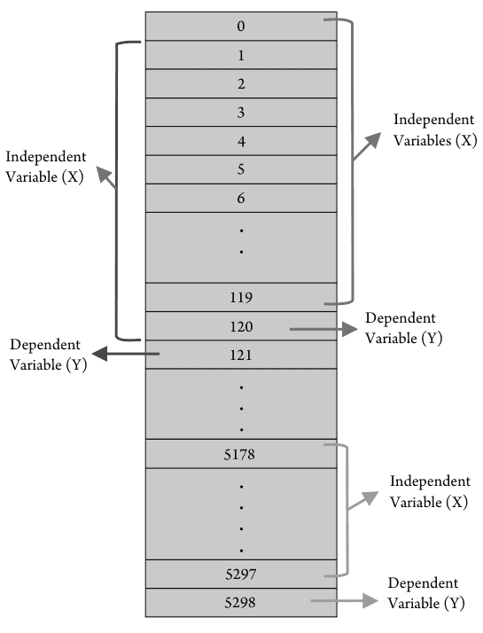

**图 21.8** 训练数据集（5299 条记录）中独立变量的不同实例及其对应的因变量

根据我们的讨论，我们可以推断出以下内容，如图 21.8 所示。

> 对于训练数据集中从行索引 120 到 5298 的每一天 D

*x_train* 将包含第 D 天之前 120 天的柴油价格数据

*y_train* 将包含第 D 天的柴油价格

**注意：** 这里，我们从行索引 120 开始，因为我们不需要为行索引 120 之前的任何数据提供前 120 行。

例如，对于索引 119 处的行，我们没有前 120 天柴油价格的数据。图 21.9 说明了将（归一化训练集）*training_set_scaled* 转换为 *x_train* 和 *y_train* 的过程。

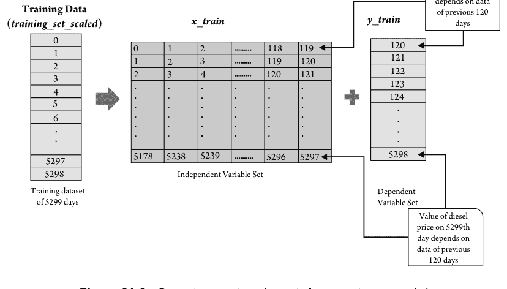

在代码片段 4 中，*x_train* 和 *y_train* 变量都使用方括号初始化为空列表。

```
# Creating empty lists for developing the data structure with
# 120 timesteps and 1 output
x_train=[]
y_train=[]
```

现在，我们将使用以下代码片段向 *x_train* 和 *y_train* 填充值。

```
# Appending data in x_train and y_train
for i in range(120, 5299):
    x_train.append(training_set_scaled[i-120:i,0])
    y_train.append(training_set_scaled[i, 0])
x_train,y_train=np.array(x_train),np.array(y_train)
```

在片段 4 中，我们创建了两个空列表 *x_train* 和 *y_train*；现在，我们将使用 append ( ) 方法向 *x_train* 添加元素。如前所述，在构建 *x_train* 和 *y_train* 时，我们必须从索引 120 开始。*x_train* 将包含 *y_train* 中每个条目之前的前 120 个值。在上面的代码片段中，我们运行一个从行索引 120 到 5298 的循环。现在让我们理解代码。我们将从第 121 天开始，其柴油价格将记录在 *y_train* 的第 1 行，而第 1 天到第 120 天的相应柴油价格将记录在 *x_train* 的第 1 行。我们将对从第 121 天到第 5299 天或从行索引 120 到 5298 的所有天数遵循相同的程序。因此，循环从 120 开始，一直遍历到第 5298 行索引（文件末尾）。

> （注意：range (120, 5299) 将生成从 120 到 5298 的列表，因为上限不包括在内。）

在每次迭代中，*x_train* 和 *y_train* 中的相应条目如表 21.2 所示。此外，*x_train* 和 *y_train* 是 Python 列表，我们需要将它们转换为 NumPy 数组。因此，在代码片段 5 中使用了 np.array() 方法。

## 表 21.2 *x_train* 和 *y_train* 的结构

| 迭代 | x_train | y_train |
| :--- | :--- | :--- |
| 值 | *训练数据集* 中前 120 天的柴油价格 | 索引处行的柴油价格 |
| 1 | | |
| 120 | 追加 *training_dataset* 的第 0 到 119 行 | 120 |
| 121 | 追加 *training_dataset* 的第 1 到 120 行 | 121 |
| ... | ................................................ | ................... |
| 5298 | 追加 *training_dataset* 的第 5178 到 5297 行 | 5298 |

执行代码片段 5 后，我们可以在 *变量浏览器* 选项卡中获得 NumPy 数组 *x_train* 和 *y_train*。这些数据结构的内容如图 21.10 和 21.11 所示。在 *x_train* 数据集中，列范围从索引 0 到 119，如图 21.10 所示。

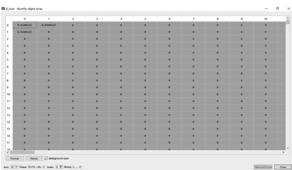

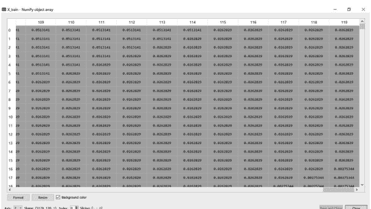

**图 21.10** *x_train* 的内容

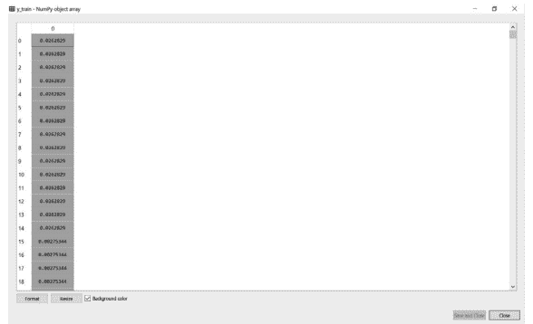

**图 21.11** *y_train* 的内容

在图 21.12 中，*y_train* 的第一条记录表示我们训练数据集中第 120 天的柴油价格。而导致此价格的相应 120 个值（从索引 0 到 119 连续 120 天的柴油价格）可以在 *x_train* 的第一行中找到。

同样，*x_train* 的第二行包含另外 120 天（从索引 1 到 120）的柴油价格；这些是 *y_train* 第二行所依赖的独立值。可以注意到，*x_train* 的大多数值是相同的，如图 21.10 所示。这里，我们获取前 120 天的柴油价格来预测第 121 天的柴油价格。当我们进一步预测第 122 天的柴油价格时，119 个柴油价格将来自前一组 120 个柴油价格，即 119 个值将与图 21.12 所示相同。这可以看作是一个大小为 120 的滑动窗口，在计算连续天数的柴油价格时以步长 1 滑动。

## 步骤4：重塑数据集

如前所述，在我们的RNN实现中，我们将使用堆叠的LSTM层。LSTM层的输入应为三维（3D）形状。输入的每个维度描述如下。

**第一维——总样本数：** 一批中的总样本或记录数，即批大小。在本例中，我们将处理一批中的所有记录，因此其值将为5179，因为我们当前在*x_train*中有5179行和120列。

**第二维——时间步长：** 时间戳或列的总数。我们考虑前120个时间步长来预测当前值，因此其值将为120。

**第三维——特征数：** 我们用于构建模型的特征或指标的总数。我们仅使用*德里柴油价格*作为一个特征或指标，因此其值将为1。需要注意的是，如果我们考虑*原油价格*作为预测柴油价格的另一个指标，其值将为2。

为了将我们的*x_train*转换为三维，我们使用NumPy库的`reshape()`方法。此`reshape()`方法需要三个参数，分别对应每个维度。

为了将*x_train*的大小作为第一个参数传递给`reshape()`，我们使用*x_train.shape[0]*，它表示*x_train*中的行数或实例数。第二个参数指的是*x_train*中的列数给出的时间戳总数。为了获取*x_train*中总列数的计数，我们将使用*x_train.shape[1]*。第三个参数指的是我们用于构建模型的特征或指标的总数。我们仅使用德里柴油价格作为一个特征或指标，因此其值将为1。

目前，我们的输入$x\_train$的大小为$(5179,120)$。重塑后，我们得到$x\_train$的大小为$(5179,120,1)$。为了执行重塑，我们将使用以下代码片段6。

```
# Reshaping
x_train=np.reshape(x_train, (x_train.shape[0], x_train.shape[1], 1))
```

在上面的代码片段中，我们使用了NumPy库的`reshape()`方法。它接受一个NumPy数组并将其重塑为三维。对于`reshape()`方法，我们传递了第一个参数为$x\_train$，因为我们需要重塑$x\_train$，然后传递了新的维度$(x\_train.shape[0], x\_train.shape[1], 1)$。在新维度中，$x\_train.shape[0]$将给出总批大小，$x\_train.shape[1]$将给出时间步长数，最后，我们有1表示指标的总数。执行代码片段6后，我们在变量资源管理器选项卡中得到重塑后的$x\_train$，如图21.13所示。

| 名称 | 类型 | 大小 | 值 |
|---|---|---|---|
| dataset_train | DataFrame | (5299, 4) | 列名：日期，德... |
| i | int | 1 | 5298 |
| sc | preprocessing._data.MinMaxScaler | 1 | MinMaxScaler对象... |
| training_set | float64数组 | (5299, 1) | [[19.47] [19.47] ...] |
| training_set_scaled | float64数组 | (5299, 1) | [[0.01001252] [0.01001252] ...] |
| x_train | float64数组 | (5179, 120, 1) | [[[0.01001252] [0.01001252] ...]] |
| y_train | float64数组 | (5179,) | [0.02628285 0.02628285 ...] |

**图21.13** 重塑$x\_train$后的变量资源管理器选项卡

图21.14显示了重塑后的$x\_train$。此外，我们可以更改轴并同时查看任意两个轴的内容。

1022 Python机器学习

图21.14 重塑后在不同轴上可视化x_train

### 21.2.2 构建RNN架构

在继续本节之前，请确保已安装Keras和TensorFlow库，因为我们使用的是Spyder，而这些库在Anaconda中并未预装。

如果您尚未安装，可以在以下链接中找到详细的安装过程。
https://www.freecodecamp.org/news/install-tensorflow-and-keras-using-anaconda-navigator-without-command-line/

## 步骤5：导入Keras库和包

在此步骤中，我们将准备神经网络模型的架构。我们将导入一些Keras库中预定义的类。导入这些库的代码片段如下。

```
代码片段：7

# 第2部分-构建RNN
# 导入Keras库和包
from keras.models import Sequential
from keras.layers import Dense
from keras.layers import LSTM
from keras.layers import Dropout
```

在上面的代码片段中，我们导入了*Sequential*类，它将用于创建神经网络实例。然后我们导入了*Dense*类，它将用于添加输出层。由于模型由堆叠的LSTM层组成，我们将使用*LSTM*类实例向模型添加新层。最后，我们有*Dropout*类，它用于避免过拟合。这些类的详细信息如下。

- *Sequential*类——顺序模型是层层堆叠的模型。使用*Sequential*类，我们可以创建一个顺序模型。
- *Dense*类——用于添加常规的、全连接的神经网络层。它用于添加输出层。
- *LSTM*类——使用LSTM类，我们可以向模型添加单独的LSTM层。它有几个参数，可以在使用LSTM()方法创建实例时传递。这些参数包括——*units*、*activation*、*dropout*、*recurrent_activation*等。
- *Dropout*类——用于对输入应用*dropout*。通过dropout，在训练过程中随机选择的神经元被忽略，以防止神经网络过拟合。

导入这些类后，我们将通过创建*Sequential*类的实例来开始构建模型的架构。让我们将该实例称为*regressor*，因为它象征着在我们的RNN模型中使用回归。我们使用名称“regressor”来预测连续值，即*德里柴油价格*，而不是某个离散值。要创建*regressor*，请遵循代码片段8。

1024 Python机器学习

代码片段：8

```
# 初始化RNN
regressor = Sequential()
```

## 步骤6：添加第一层LSTM

在此步骤中，我们将添加RNN的第一层LSTM。同时，我们还将添加一些dropout正则化，以避免每个LSTM层中的过拟合。

*Sequential*类提供了`add()`方法，用于使用*regressor*实例添加LSTM层。将*LSTM*类的对象提供给`add()`方法以添加LSTM层。*LSTM*的对象通过调用`LSTM()`创建，该方法有三个参数：*units*、*return_sequences*和*input_shape*。这些参数的详细信息见表21.3。

**表21.3 LSTM()的必需参数**

| 参数 | 描述 |
| :--- | :--- |
| *units* | **units**参数表示我们希望在LSTM层中拥有的LSTM单元或神经元的数量。 |
| *return_sequences* | 第二个参数是**return_sequences**，它必须设置为True，因为我们正在构建堆叠的LSTM，它将包含多个LSTM层。需要注意的是，对于最后一个LSTM层，此参数应设置为False。 |
| *input_shape* | 它是三维的输入形状，对应于观测值、时间步长和指标。 |

一旦创建了LSTM对象，我们将其作为参数传递给`add()`方法。代码片段9显示了添加第一层LSTM和一些dropout正则化的代码。

代码片段：9

```
# 添加第一层LSTM和一些dropout正则化
regressor.add(LSTM(units=50, return_sequences=True, input_shape=(x_train.shape[1], 1)))
regressor.add(Dropout(0.2))
```

由于捕捉柴油价格的趋势是一项复杂的任务，我们需要高维度来构建此模型。为了在模型中实现这一点，我们应该在每个LSTM层中拥有许多神经元。因此，单元数被设置为50。您可以尝试调整这个数字，但通常这个数字应该较大，不应太小，比如5或10，因为较少的神经元将无法准确捕捉上升或下降的趋势。

下一个参数是*return_sequences*，它被设置为*True*，因为我们正在构建堆叠的LSTM，并且必须在此层之后添加更多的LSTM层。第三个参数是*input_shape*，我们通过 (*x_train.shape[1]*,1) 来指定 *input_shape*。这里，*x_train.shape[1]* 对应时间步数，即本例中的120，而1表示预测变量或指标的数量，在我们的例子中为1。

然后，我们在 `add()` 方法中指定 dropout 值。我们向 `dropout()` 方法传递了0.2作为参数。这表示模型将丢弃该层20%的神经元，即在模型训练过程中，LSTM层中20%的神经元将被忽略。这有助于避免模型过拟合。对于每个LSTM层，我们选择了50个神经元；50个神经元的20%是10个神经元。因此，在前向和反向传播过程中，将有10个神经元被丢弃。

## 步骤7：向RNN模型添加更多LSTM层

如前所述，我们的RNN将采用堆叠的LSTM层。在上一步中，我们添加了第一个LSTM层。现在是时候添加更多层了。我们将以与步骤6相同的方式向RNN添加三个更多层，即使用 `regressor.add(LSTM类的对象)`，但每个层的LSTM对象将具有不同的特性。表21.4总结了提供给 `add()` 的LSTM对象的特性。

**表21.4** 我们模型中不同LSTM层的特性

| 层数 | LSTM层的特性 |
| :--- | :--- |
| | **Units** | **return_sequences** | **input_shape** |
| 2 | *50个神经元* | *TRUE*，因为我们将在此层之上添加更多层。 | 由于我们已经在第一层中描述了 *input_shape*，因此无需为所有其他模型层提及它，因为它将被自动识别。 |
| 3 | *50个神经元* | *TRUE* | 无需提及，因为它将被自动识别。 |
| 4 | *50个神经元* | *FALSE*，这是最后一个LSTM层，此层之后将不再添加LSTM层。 | 无需提及，因为它将被自动识别。 |

使用表21.4中给出的特性，我们将编写 *Python* 代码来添加LSTM模型的第二、第三和第四层。代码片段10展示了这一点。

**代码片段：10**

```
# 添加第二个LSTM层和一些dropout正则化
regressor.add(LSTM(units=50,return_sequences=True))
regressor.add(Dropout(0.2))
# 添加第三个LSTM层和一些dropout正则化
regressor.add(LSTM(units=50, return_sequences=True))
regressor.add(Dropout(0.2))
# 添加第四个LSTM层和一些dropout正则化
regressor.add(LSTM(units=50, return_sequences=False))
regressor.add(Dropout(0.2))
```

## 步骤8：添加输出层

在用LSTM层堆叠我们的模型之后，我们现在将添加最后一层，这是一个全连接层或我们RNN的输出层。我们将使用Dense类对象作为参数，即 `regressor.add(Dense类的对象)`。使用以下代码片段，我们将Dense层添加到我们的模型中。

```
#### 添加输出层
regressor.add(Dense(units=1))
```

Dense类的对象是通过调用 `Dense()` 方法并传递一个参数来准备的，该参数表示对应于输出层或预测变量维度的单元数或神经元数。我们预测第二天的柴油价格，这类似于回归。因此，我们在 `Dense()` 中传递了1，以便在输出层中只有一个节点。

## 步骤9：编译RNN

这是最重要的步骤之一，因为它涉及使用正确的优化器和损失函数来编译RNN。Sequential类使用 `compile()` 方法来编译RNN。我们将通过 `regressor` 对象调用 `compile()` 方法，并传递两个参数作为输入。这些参数分别是——优化器和损失函数。

这里，我们使用adam优化器，因为它是所有其他推荐优化器中使用最广泛且性能显著的优化器之一。它实现了梯度下降算法作为优化器。

这里，我们使用均方误差来计算损失。由于我们处理的是回归问题，预测值和实际值之间的误差可以通过均方误差来衡量。因此，我们将 `mean_squared_error` 作为第二个参数传递给 `compile()` 方法。代码片段12给出了编译RNN的代码。

```
# 编译RNN
regressor.compile(optimizer='adam',loss='mean_squared_error')
```

## 步骤10：将编译好的RNN模型拟合到训练集

让我们将训练数据拟合到目前构建的模型。我们将使用 *regressor* 对象调用 *Sequential* 类的 `fit()` 方法。`fit()` 方法需要四个参数：*训练数据输入*、*真实样本*、*epochs* 和 *batch_size*。

*前两个参数* 可以是向量、数组或矩阵；在我们的例子中，我们将提供 *x_train* 和 *y_train* 作为 `fit()` 方法的前两个参数。

下一个参数 *epochs* 是一个整数，它指定了遍历整个训练数据集以更新模型权重的迭代次数或周期数。它表示模型执行前向和反向传播以优化权重的次数。在批量训练的情况下，一批中的所有训练样本在 *一个epoch* 中同时通过学习算法，然后权重才会更新。您可以尝试不同的epochs值，如25、40、60、80、100、200等。其思想是执行前向和反向传播，直到获得最优权重。根据实验，观察到使用100个epochs时可以获得最高的性能和准确性。因此，epochs的值被设置为100。

关于确定训练神经网络的最佳epochs数的指南已在第18章标题为“决定训练神经网络的最佳epochs数”的第18.7节中讨论。

最后一个参数是 *batch_size*，它指定了每个梯度的样本数。此值可以是任何整数值（默认为32）。我们将为我们的模型采用其默认值，即32。这意味着一批32条记录将在 *一个epoch* 中同时通过学习算法，然后权重才会更新。

我们将使用以下代码片段来完成此步骤。

```
# 将RNN拟合到训练集
regressor.fit(x_train, y_train, epochs=100, batch_size=32)
```

成功执行此步骤后，如图21.15所示，人们会观察到相应的损失也随着epochs（或遍历次数）的显著增加而减少。例如，在epoch 1/100时，损失为0.113；经过10次遍历后，在epoch 10/100时，损失已降至0.0019。类似地，损失持续下降，并在第100个epoch时达到6.2706e-04（0.00062706）的值，如图21.15所示。

但请记住，损失的过度减少将导致过拟合。因此，传递给 `fit()` 方法的参数至关重要。

1028 使用Python进行机器学习

```
Epoch 1/100
163/163 [==============================] - 29s 178ms/step - loss: 0.0113
Epoch 2/100
163/163 [==============================] - 31s 187ms/step - loss: 0.0032
Epoch 3/100
163/163 [==============================] - 31s 191ms/step - loss: 0.0028
Epoch 4/100
163/163 [==============================] - 31s 192ms/step - loss: 0.0023
Epoch 5/100
163/163 [==============================] - 30s 187ms/step - loss: 0.0023
Epoch 6/100
163/163 [==============================] - 31s 188ms/step - loss: 0.0022
Epoch 7/100
163/163 [==============================] - 31s 189ms/step - loss: 0.0020
Epoch 8/100
163/163 [==============================] - 31s 189ms/step - loss: 0.0019
Epoch 9/100
163/163 [==============================] - 31s 190ms/step - loss: 0.0019
Epoch 10/100
163/163 [==============================] - 31s 189ms/step - loss: 0.0018
Epoch 11/100
163/163 [==============================] - 31s 190ms/step - loss: 0.0016
Epoch 12/100
163/163 [==============================] - 31s 193ms/step - loss: 0.0016
Epoch 13/100
163/163 [==============================] - 31s 190ms/step - loss: 0.0014
Epoch 14/100
163/163 [==============================] - 31s 193ms/step - loss: 0.0015
Epoch 15/100
163/163 [==============================] - 31s 189ms/step - loss: 0.0013
Epoch 16/100
163/163 [==============================] - 36s 219ms/step - loss: 0.0013
Epoch 17/100
163/163 [==============================] - 36s 222ms/step - loss: 0.0013
Epoch 18/100
163/163 [==============================] - 37s 224ms/step - loss: 0.0011
Epoch 19/100
163/163 [==============================] - 37s 225ms/step - loss: 0.0012
Epoch 20/100
163/163 [==============================] - 40s 248ms/step - loss: 0.0011
```

```
Epoch 80/100
163/163 [==============================] - 32s 195ms/step - loss: 6.9039e-04
Epoch 81/100
163/163 [==============================] - 31s 189ms/step - loss: 6.7581e-04
Epoch 82/100
163/163 [==============================] - 31s 190ms/step - loss: 6.9320e-04
Epoch 83/100
163/163 [==============================] - 31s 189ms/step - loss: 7.1694e-04
Epoch 84/100
163/163 [==============================] - 31s 190ms/step - loss: 6.2052e-04
Epoch 85/100
163/163 [==============================] - 31s 189ms/step - loss: 6.7262e-04
Epoch 86/100
163/163 [==============================] - 31s 191ms/step - loss: 6.6603e-04
```

### 21.2.3 进行预测与结果可视化

让我们通过获取预测结果并进行可视化来测试模型。

**步骤 11：准备测试数据集**

我们在步骤 1 中从 *GitHub* 下载的数据集包含两个文件，即 *训练* 文件和 *测试* 文件。我们已经使用了 *训练* 文件（*Diesel_Price_Train.csv*）。在本步骤中，我们将使用 *测试* 文件（*Diesel_Price_Test.csv*）来准备测试数据集。我们将重复第 21.2.1 节步骤 1 中讨论的流程来准备测试数据；我们将使用 *Pandas* 库将 *Diesel_Price_Test.csv* 文件从硬盘加载到 *Spyder* 环境中。我们之前已经讨论过，在所有列中，只有德里柴油价格列与我们相关。为了提取这一列，我们将使用 `iloc[]` 方法，参数为 “:” 和 “1:2”。这里，“:” 表示所有行的数据，“1:2” 是列的下界和上界，表示选择索引为 1 的列。如果你还记得，这就像我们将 *训练数据集* 导入 *Spyder* 时所做的那样。在 *Spyder* 中导入测试集的最终代码如代码片段 14 所示。我们在 *变量资源管理器* 选项卡中得到 *diesel_price* 和 *dataset_test*；*diesel_price* 和 *dataset_test* 的内容如图 21.16 所示。

**图 21.16** *diesel_price* 和 *dataset_test* 的内容

```
代码片段：14

# 第 3 部分 - 进行预测与结果可视化
# 获取真实的柴油价格
dataset_test=pd.read_csv('Diesel_price_test.csv')
diesel_price=dataset_test.iloc[:, 1:2].values
```

**步骤 12：将测试数据准备成所需的数据结构以输入模型**

在继续编写代码之前，让我们先理解这一步的重要性，然后我们将讨论执行此步骤的相应代码。

我们在上一步中已经为测试数据集创建了一个数据框，其中包含 2017 年 7 月 5 日至 2017 年 9 月 21 日期间的实际柴油价格。我们需要这些数据来测试我们的 RNN 模型的准确性。RNN 模型将预测从 2017 年 7 月 5 日到 2017 年 9 月 21 日每一天的柴油价格。然后，预测值将与测试数据的实际值（数据集中已列出的值）进行比较。

为了预测测试数据中列出的某一天的柴油价格，我们需要该日期之前 120 天的柴油价格（这是由于我们选择了时间步长，实验中为 120）。测试数据包含 80 条记录——连续 80 天的德里柴油价格。那么问题来了，我们如何获取所考虑日期之前 120 天的柴油价格呢？

这可以通过将训练数据的最后 120 天与测试数据合并来处理。测试数据从 2017 年 7 月 5 日开始；2017 年 7 月 5 日之前 120 天的数据是训练数据的最后 120 条记录，如图 21.17 所示。如果我们复制这 120 条记录并与测试数据的 80 条记录合并，那么对于从 2017 年 7 月 5 日到 2017 年 9 月 21 日的每一天，我们都有前 120 天的柴油价格供模型学习趋势。

为了创建包含训练数据最后 120 条记录后跟测试数据 80 条记录的数据结构，我们必须将 training_data 与 test_data 连接起来；为此，我们将使用 Pandas 库的 concat() 方法。

我们使用 Pandas 库的 concat() 方法来连接 DataFrame 和 Series。concat() 方法的行为可以通过调整其参数来控制，其中两个参数尤为重要。这些参数描述如下。

-   **axis** — 它定义连接的轴。当传递值 1 时，函数执行按列连接，而传递 0 则执行按行连接。默认值为 0。
-   **ignore_index** — 如果此参数的值为 True，则源对象的索引将被忽略，并在连接对象中从 0,1,2,...n 开始分配一个新的序列。其默认值为 False。

为了准备数据集，我们将遵循代码片段 15。

**代码片段：15**

```
# 获取预测的柴油价格
dataset_total=pd.concat((dataset_train['Delhi Diesel Price'], dataset_test['Delhi Diesel Price']), axis=0)
inputs=dataset_total[len(dataset_total)-len(dataset_test)-120:].values
inputs=inputs.reshape(-1,1)
inputs=sc.transform(inputs)
```

让我们理解这段代码。在代码的第一行，我们将 *dataset_train* 和 *dataset_test* 完全连接起来，形成一个名为 *dataset_total* 的新数据框，其内容如图 21.17 所示。由于我们想保留源对象的索引，*ignore_index* 设置为其默认值 False。这里，我们执行按行连接，因为 axis 值为 0。

然后在下一行，我们从 *dataset_total* 中提取记录，以创建图 21.18 所示的所需数据结构。

目前，*dataset_total* 包含了 *dataset_train* 和 *dataset_test* 的整体，但我们不需要所有这些记录。因此，我们应该通过指定其索引值来选择所需数据，如下表达式所示。

=len(dataset_total) - len(dataset_test) - 120
=5379 - 80 - 120 = 5179th record (record at index 5178)

因此，这行代码将简化为 *inputs=dataset_total[5179,:].values*。此后，这将为我们提供索引，我们将从该索引拉取数据以创建所需的数据结构。图 21.19 更好地解释了这一点。它将训练数据的最后 120 天与测试数据合并。

1032 使用 Python 进行机器学习

然后，在下一行代码 `inputs=inputs.reshape(-1,1)` 中，我们正在重塑 inputs，因为我们没有使用 Pandas 的 `iloc []` 方法从 `dataset_total` 中提取所需数据。因此，它仍然不是像 NumPy 数组那样的正确形状。因此，解决方案是使用带有参数 -1 和 +1 的 `reshape ()` 方法重塑 inputs，如代码片段 15 所示。

然后在下一行代码中，我们正在缩放输入值，因为我们的 RNN 模型是在缩放后的值上训练的。为了使用先前使用的缩放对象 “sc” 来缩放训练数据，我们使用 `fit_transform()` 方法，如代码片段 15 所示。重塑后 `inputs` 的内容如图 21.20 所示。

**图 21.20** 重塑和转换后的 *Inputs* 数据框

在下一步中，我们将把转换后的 `inputs` 转换为 3D 结构，这是我们的 RNN 模型所期望的。

**步骤 13：获取所需的 3D 结构**

让我们首先创建这个特殊结构，其中每一行都有 120 个先前的柴油价格，用于预测当前的柴油价格（即第 121 天的柴油价格）。

我们已经在步骤 3 的代码片段 4–6 中执行了此任务。

*回顾代码片段：4–6（步骤 3）*

```
# 创建具有 120 个时间步长和输出的数据结构
x_train=[ ]
y_train=[ ]
for i in range(120, 5299):
    x_train.append(traning_set_scaled[i -120:1, 0])
    y_train.append(training_set_scaled[i, 0])
x_train,y_train=np.array(x_train), np.array(y_train)
# 重塑
x_train=np.reshape(x_train, (x_train.shape[0], x_train.shape[1], 1))
```

让我们以这段代码为参考，并修改它以创建测试数据（*inputs* 数据框）的 3D 结构。之前，我们将 *x_train* 和 *y_train* 初始化为两个空列表。但这次，我们只需要为 *x_test* 初始化一个空列表，如下所示。然后，我们将为每一天（我们在 *test_dataset* 中考虑的）加载这些空数据结构，初始 120 个柴油价格值，如代码片段 16 所示。

```
# 为测试数据创建所需的 3D 结构
x_test=[]
for i in range(120, 200):
    x_test.append(inputs[i-120:i, 0])
```

在上面的代码片段中，我们检索了先前创建的 inputs 的值，并将它们附加到 *x_test* 数据集中。在 for 循环中，迭代从 120 到 200，因为 inputs 的长度为 120。因此，循环的下界设置为 120，上界为 200，表示测试数据从 inputs 的第 120 个索引开始（在 120 之前，值对应于训练数据的最后 120 行）。

总之，此代码段遍历从 120 到 199 的索引范围，从 inputs 数组中提取特定的值子集，并将它们添加到 *x_test* 列表中以进行进一步处理。

由于 *x_test* 是列表，我们需要将其转换为 NumPy 数组，因此将使用 *np.array()* 方法将 *x_test* 转换为 NumPy 数组。使用 *inputs* 创建数据结构的最终代码在代码片段 17 中给出。执行该代码片段后，我们在 *变量资源管理器* 选项卡中得到 *x_test*。

```
# 将 x_test 转换为数组并创建 3D 结构
x_test=np.array(x_test)
x_test=np.reshape(x_test, (x_test.shape[0], x_test.shape[1], 1))
```

一旦 *x_test* 准备就绪，我们将把它转换为三维，因为 RNN 模型要求输入为 3D 格式。如前所述，三个维度如下。

**第一维** 指的是批次中的总样本或记录数。在这种情况下，它将是 80，因为我们将在一个批次中处理所有记录。其值将通过使用 *x_test.shape[0]* 获取，因为它将给出 *x_test* 在索引 0 处的行数或实例数。

**第二维** 指定时间戳或列的总数；在这种情况下，它是 120。为了获得这个度量，我们将计算 *x_test* 中的总列数；我们可以使用 *x_test.shape[1]*，因为它将给出 *x_test* 在索引 1 处的列数或实例数。

**第三个维度**表示我们用于构建模型的特征或指标的数量。在本例中，由于我们使用数据集中的“德里柴油价格”列作为特征或指标，其值将为1。

代码片段中的第二行代码实现了这一点。

在获得正确3D结构的*x_test*后，我们将应用*predict()*回归方法来获取测试数据的预测股票价格，如代码片段18所示。

```
# Making the predictions
predicted_diesel_price=regressor.predict(x_test)
predicted_diesel_price=sc.inverse_transform(predicted_diesel_price)
```

第一行代码将返回缩放后的预测值，因为我们的数据集是缩放过的，所以为了使其与实际柴油价格一致，我们必须对预测值进行反向缩放。为了获得这些缩放预测值的原始尺度，我们需要使用片段18中的第二行代码，应用缩放对象*sc*的逆变换方法。在进行预测后，我们使用了*inverse_transform()*方法，将柴油价格恢复为正常的可读格式。

图21.21展示了将（归一化的测试集）*输入*转换为*x_test*并生成*predict_diesel_price*的过程。

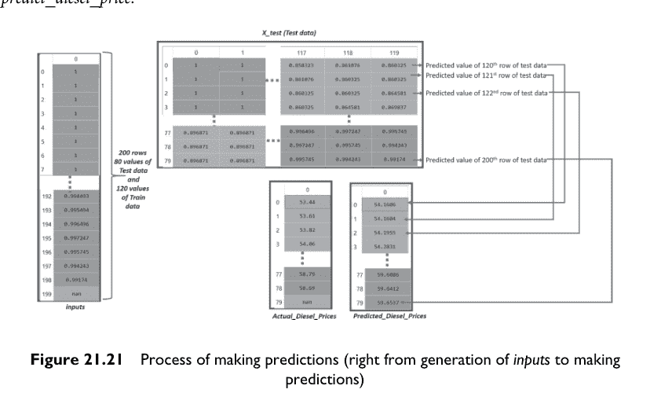

执行代码片段18后，我们将在*变量资源管理器*选项卡中看到*predicted_diesel_price*。图21.22给出了*predicted_diesel_price*和（实际价格）*diesel_price*的内容，以便进行手动比较。

参考图21.22，我们可以看到我们的预测值与测试数据中的实际柴油价格非常接近。但是，我们无法从这个表格中看出趋势，因此我们将使用可视化技术。后续步骤涉及柴油价格趋势的可视化和预测。

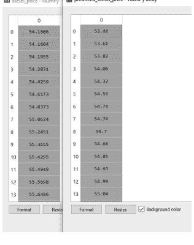

**图21.22** *predicted_diesel_price*和*diesel_price*的内容

## 步骤14：可视化结果

我们现在拥有了*predicted_diesel_price*和（实际的）*diesel_price*；在这RNN实现的最后一步中，我们将对这两个变量进行可视化比较和分析。我们将使用*plot()*方法来可视化*predicted_diesel_price*和*diesel_price*（实际柴油价格）中包含的数据点。我们将为图表添加一些标签和标题，使可视化更具描述性。可视化结果和实际观测值的最终代码如代码片段19所示。

```python
# Visualizing the results
plt.plot(diesel_price, color='red', label='Real Diesel Price')
plt.plot(predicted_diesel_price, color='blue', label='Predicted Diesel Price')
plt.title('Diesel Predictions 120 TS')
plt.xlabel('Time')
plt.ylabel('Diesel Price')
plt.legend()
plt.savefig('DieselTS', dpi=2500)
plt.show()
```

通过`plt.title()`，我们指定了图表的标题，`xlabel`和`ylabel`分别用于指定X轴和Y轴的标签。我们将实际值绘制为*红色*，预测值绘制为*蓝色*。尽管本书中的图像以灰度显示，但在执行代码时，您将看到实际值为红色，预测值为蓝色。使用`savefig()`方法，我们将生成的图表保存到本地磁盘。执行该片段后，我们得到如图21.23所示的可视化结果。

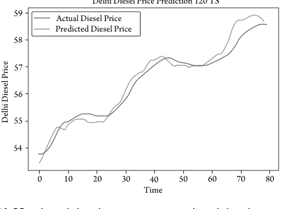

**图21.23** 德里实际柴油价格与预测柴油价格对比

在图21.23所示的结果图中，我们可以看到我们的预测值与实际值非常接近（如图所示）。*德里柴油价格*的实际值最高达到约₹59.02，而预测值的最大值约为₹58.55。数值存在轻微差异，但这是可以接受的，因为我们的目标是预测趋势，而不是精确值。此外，实验的主要目的是预测德里柴油价格的趋势，显然，预测值或蓝线试图复制实际值或红线所示的趋势。我们还可以看到，实际柴油价格上涨时，我们的模型也预测德里柴油价格将上涨。此外，两条曲线（实际和预测）形状相似，预测线与柴油价格的实际线协调一致。

如果使用时间步长=100重复整个实验，您将得到如图21.24所示的曲线。

当时间步长=100时，您可以看到我们的预测值滞后于实际值。同样，这是可以的，因为我们计划预测的是德里柴油价格的趋势，而不是德里柴油价格的具体数值。但是，通过增加时间步长，我们可以得到更准确的结果，如图21.23所示。同样，您可以调整RNN模型的其他参数，以获得更准确的预测。因此，这清楚地展示了RNN在分析基于时间序列数据方面的强大能力。

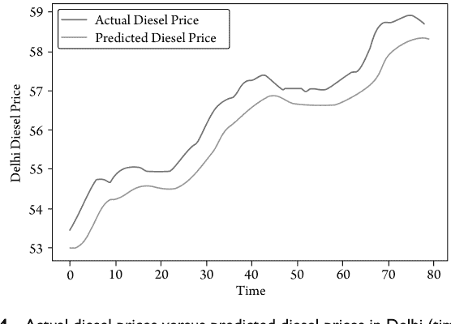

**图21.24** 德里实际柴油价格与预测柴油价格对比（时间步长 = 100）

需要注意的是，如果我们有足够的数据并考虑柴油价格预测中所有可能的指标，那么LSTM模型将能够预测未来的柴油价格，而不仅仅是趋势。由于我们的数据集有限且为了简化，我们只考虑了一个指标；因此，在这个实验中我们只能预测趋势。

同样，我们可以应用LSTM模型来预测股票趋势。要了解使用谷歌股票价格数据集实现LSTM模型进行股票预测的过程，建议参考Luke Sun题为“LSTM for Stock Price Prediction”的博客，该博客提供了预测股票趋势的分步说明。

https://towardsdatascience.com/lstm-for-google-stock-price-prediction-e35f5cc84165

也鼓励读者将LSTM模型应用于其他时间序列应用，例如预测销售数据或预测天气模式。

#### 提醒我

使用LSTM模型实现RNN可以分为三个主要步骤。

- i. 数据预处理——首先，我们将从Kaggle导入数据集并执行一些基本的预处理。
- ii. 构建RNN架构——在第二步中，我们将使用堆叠的LSTM层构建模型的架构。
- iii. 进行预测并可视化结果——在这一步中，使用训练好的模型进行预测，并分析结果。

**每个阶段的主要步骤如下。**

##### 数据预处理

- 步骤1：导入数据集和所需的库
- 步骤2：特征缩放
- 步骤3：创建数据结构
- 步骤4：重塑数据集

##### 构建RNN架构

- 步骤5：导入Keras库和包
- 步骤6：添加第一层LSTM
- 步骤7：向RNN模型添加更多LSTM层
- 步骤8：添加输出层
- 步骤9：编译RNN
- 步骤10：将编译好的RNN模型拟合到训练集

##### 进行预测并可视化结果

- 步骤11：准备测试数据集
- 步骤12：将测试数据准备成所需的数据结构以输入模型
- 步骤13：获得所需的3D结构
- 步骤14：可视化结果

#### 附加资源

##### 视频链接

- 使用Python和机器学习进行股票价格预测，https://youtu.be/QIUxPvSPJOY


- 使用堆叠LSTM进行股票价格预测和预测——深度学习，https://youtu.be/H6du_pfuznE


- Python中的时间序列分析 | 时间序列预测 | 使用Python进行数据科学 | Edureka，https://youtu.be/e8Yw4alG16Q


##### 博客链接

- 使用LSTM进行谷歌股票价格预测，https://machinelearningprojects.net/stock-price-prediction


- 使用LSTM进行时间序列预测 | 代码演练，https://medium.com/apes-ai/time-series-forecasting-using-lstm-code-walkthrough-3aae01645491


#### 测试我（实践技能）

使用Luke Sun题为“LSTM for Stock Price Prediction”的博客，通过谷歌股票价格数据集实现股票预测，该博客提供了预测股票趋势的分步说明。https://towardsdatascience.com/lstm-for-google-stock-price-prediction-e35f5cc84165


参考以下来源，使用时间序列数据集实现天气预报，https://medium.com/apes-ai/time-series-forecasting-using-lstm-code-walkthrough-3aae01645491


## 22 遗传算法

### 章节目标

-   了解遗传算法背后的灵感来源。
-   理解自然选择、重组和变异的概念。
-   理解自然与遗传算法之间的关联。
-   构建基因和适应度理论的数学表示。
-   通过轮盘赌实现自然选择。
-   实现重组或交叉。
-   实现变异过程。
-   理解精英主义及其实施。
-   讨论遗传算法的优缺点。

## 22.1 遗传算法的直觉

遗传算法（GA）的灵感源于自然，它在机器学习（ML）领域扮演着至关重要的角色。它从所有可用的可能解或候选解中选择最佳优化方案。正如自然通过进化理论选择最合适的候选者一样，GA也从可用解中选择最佳可能解。

GA在ML中的一个应用是通过自然选择，从所有可能的（局部）最小值中选出全局最小值。在前面的章节中，我们了解到在训练人工神经网络时，主要目标是获得具有最小代价函数值的权重。*梯度下降算法*通常用于寻找代价函数的局部最小值。但是，我们必须找到全局最小值才能达到最优权重。GA可用于从所有可用的局部最小值或可能解中找出全局最小值。在这种情况下，可能的局部最小值集合就变成了包含可能候选者的种群。

在本章中，我们将讨论来自自然的灵感，这是GA工作和实施的主要驱动概念。为了更好地理解GA，我们将在下一节中通过重温进化论来讨论自然选择的基础知识。

## 22.2 遗传算法背后的灵感

本章讨论的概念也以免费在线Udemy课程的形式提供，由Parteek Bhatia主讲的《机器学习遗传算法》，
https://www.udemy.com/course/genetic-algorithm-for-machine-learning/

GA是计算机科学文献中最早且最受推崇的进化算法之一。密歇根大学的研究员John Holland在1970年代提出了这个算法，但它在90年代才流行起来。GA的灵感来源于查尔斯·达尔文的达尔文进化论或达尔文主义。该理论的关键概念之一是自然选择或“适者生存”。

> 达尔文主义指出：“所有生物物种都是通过自然选择微小的、可遗传的变异而产生和发展的，这些变异增强了个体竞争、生存和繁殖的能力”。

如达尔文理论所建议的，人类的进化如图22.1所示。

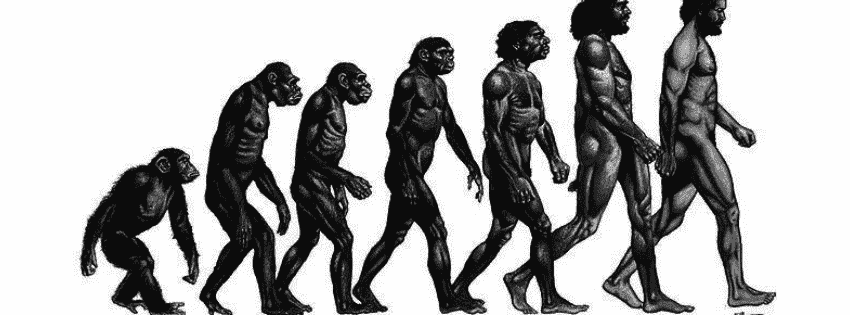

要理解上述理论或GA背后的灵感，我们需要理解一些为GA铺平道路的术语。这些重要术语如下。

-   自然选择
-   重组
-   变异

在继续讨论GA之前，让我们深入理解这些术语中的每一个。

本章的灵感来源于S. Mirjalili在Udemy上的在线课程《遗传算法导论：理论与应用》。鼓励读者探索该课程以获取更全面的细节。我们感谢Mirjalili教授慷慨地允许我们引用和参考该课程。

### 22.2.1 自然选择：适者生存

为了理解自然选择的概念，让我们考虑一个鸟类和家蝇的生态系统，如图22.2所示。在这个生态系统中，鸟类是其他鸟类或物种的食物，猎物的生存取决于它们抵御攻击的能力。而捕食者的生存则取决于它们攻击猎物的能力。在图22.2中，我们可以看到老鹰捕食麻雀，而麻雀以苍蝇/昆虫为食。在自然栖息地，它们都为食物和生存而竞争。

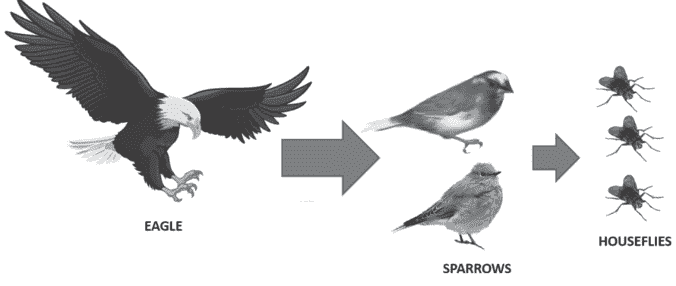

鸟类/动物根据它们的特征或适应度进行竞争，这些特征不断进化。因此，鸟类在生态系统中的生存取决于其适应度，正如达尔文在适者生存中所提到的。在自然界中，只有那些比捕食者更优秀、比竞争者更能获取食物的物种才能生存。例如，那些飞得更快、转弯更迅速、能利用周围环境掩护的麻雀，比飞得较慢、竞争力不足的麻雀有更大的生存机会。飞得更快的麻雀将存活下来，并有机会长寿、交配或繁殖，将它们的基因传递给下一代。而弱小的麻雀将成为老鹰的猎物，无法进入下一代，如图22.3所示。

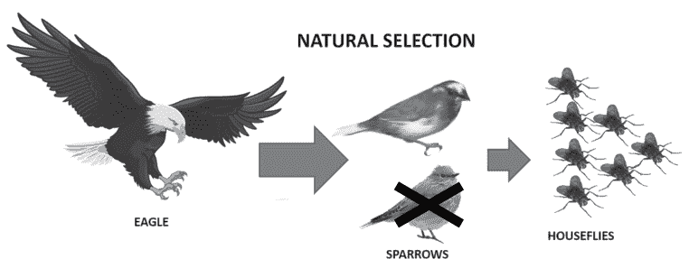

**图22.3** 最适应的麻雀有机会存活更久

通过这种方式，自然确保了最好的基因传递给下一代，而不会消亡。因此，关键点是，最适应环境的生物的基因或优良特征得以保护并传递给下一代。这些特征或优良特征因物种而异。对于老鹰来说，锋利的喙是生存和捕猎的重要特征；因此，在老鹰的世代中，强壮的喙通过自然选择得以保留。

### 22.2.2 重组：交叉

一旦通过自然选择过程选出了最适应的生物作为亲本，它们就会相互交配以产生下一代种群。这个过程被称为重组或交叉。图22.4说明了这个过程；其中一个亲本具有*ABC–ABC*染色体，而另一个具有*abc–abc*染色体。这些亲本交叉产生两个子代，其染色体分别为ABC–ABc和abC–abc，具体取决于它们的交叉点，如图22.4所示。

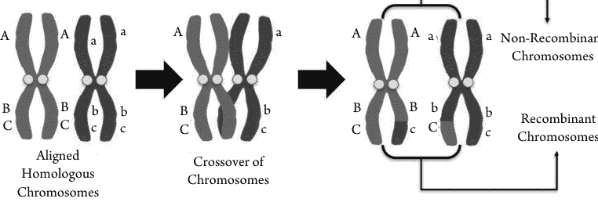

**图22.4** 重组或交叉过程

图22.5以不同的方式说明了相同的过程。这里，两个亲本（其染色体通过不同颜色表示）交叉，产生两个子代。两个子代都具有其亲本的特征。子代A更多地继承了母亲的属性，而子代B则更多地继承了父亲的特征。

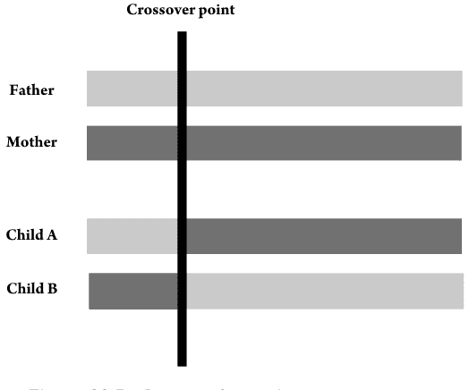

类似地，在图22.6中，我们有一对具有不同特征（这里用唯一数字表示）的父亲和母亲。亲本的交叉产生了一个子代，其特征同时继承自父亲和母亲。

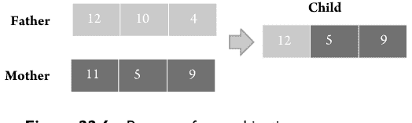

为了巩固目前所学的概念，我们将重新考虑鸟类的食物链。在图22.2中，我们了解到老鹰捕食麻雀，而麻雀捕食家蝇和其他较小的昆虫以生存。许多因素促成了自然界中物种的生存。例如，麻雀需要飞得快以躲避老鹰的攻击；为此，它们需要拥有轻盈的羽毛，并且羽毛的颜色应与周围环境相匹配，即麻雀应能很好地融入或伪装在自然环境中。随着时间的推移，那些拥有这些能力的麻雀能够抵御老鹰的攻击，而其余较弱的种群则被老鹰捕食。最终，最适应环境的麻雀种群的一部分进入下一代，并与其他麻雀重组以产生后代。这确保了麻雀的后代拥有更轻盈的羽毛，并能更好地融入周围环境。图22.7可视化了这个概念。

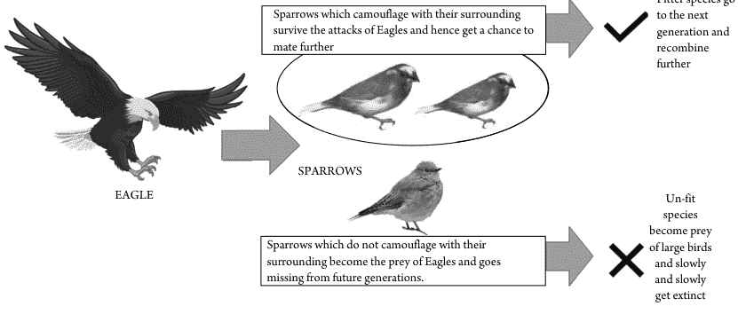

根据一句流行的说法，“没有什么是永恒的”；自然界也是如此。尽管麻雀获得了最佳特征，但并不能保证它们能永远生存。由于自然界是公平的，每个物种在其世代中都会发生变化。因此，麻雀的捕食者，即老鹰，也变得越来越强大。老鹰在未来的世代中进化，可能会发展出更强大的特征，如更锐利的眼睛、更强壮的喙等。因此，捕食者和猎物都通过重组和自然选择而进化。

### 22.2.3 变异：基因的变化

根据本章目前所学的内容，我们了解到只有最适应的候选者才有机会交配并产生后代以携带最佳基因。有可能亲本并不优秀，例如，它们适应性较差，对自然环境的适应能力不足。因此，它们的后代可能在应对未来环境条件方面表现不佳。图22.4–22.6显示，在重组过程中创建子代时会发生特征交换。因此，很明显，在这个过程中没有创造出新的特征；子代拥有一些来自父亲的基因，另一些来自母亲的基因。但自然界有一些非常有趣的东西，称为变异，可以随机地创造新特征。

在变异过程中，一些染色体在重组过程中被随机改变。这有助于物种在其世代中获得一些新的特征和变异。这种在重组过程中发生随机变化的现象被称为变异，如图22.8所示。

| 真实序列 | T | A | A | C | T | G | C | A |
|---|---|---|---|---|---|---|---|---|
| 点突变 | T | A | A | C | C | G | C | A |

**图 22.8** 突变过程

在此，我们可以注意到，某些物种的染色体因突变而发生改变。突变将“T”变成了“C”。由于这些变化是随机发生的，其中一些变化或新特征可能对该物种有益，而另一些则可能无益。

例如，图 22.9 展示了人类的进化过程。我们可以看到，我们的祖先有尾巴，但后来物种进化了，由于突变，人类摆脱了尾巴。这一变化已被证明对人类有益，因为没有尾巴，他们可以用两条腿跑得更快，站立得更稳固。


**图 22.9** 突变对人类的影响

在将突变添加到前面的例子（图 22.8）中，我们可以发现后代的染色体发生了一些新的变化，如图 22.10 所示。

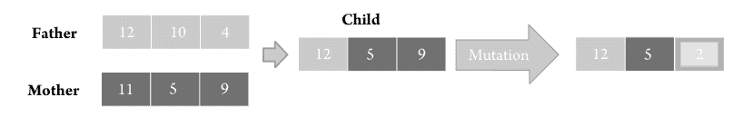

**图 22.10** 突变之后的自然选择和重组

在这里，后代获得了一条包含“2”的改变染色体，而其父母体内没有“2”。因此，突变在物种的世代中带来了新的特征。

另一个突变的例子如图 22.11 所示，左边是一个普通的苹果品种，右边是一个突变的苹果，其上有一大块黄色区域。

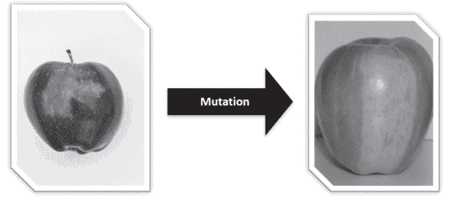

**图 22.11** 苹果的突变，其上有一块不同颜色的区域

由于突变而发生的随机变化可能对物种有益，也可能无益。让我们研究这两种可能性。假设我们有一些生活在热带地区的物种。该物种的动物依靠体毛来抵御低温，但这还不够。该物种需要引入浓密的皮毛来抵御恶劣的温度下降。突变创造了奇迹，带来了这些随机变化。由于突变，该物种的后代获得了浓密的皮毛。引入的变异会不断迭代到下一代，直到它们对该物种变得无用为止。因此，通过随机的基因变化，浓密的皮毛等新特征成为了现实。

谈到另一方面，有时突变会引入不需要的变异，这成为一个令人担忧的问题。例如，图 22.12 展示了一头出生时就有异常的小牛和一只鹿。这些由突变引起的异常会缩短它们的寿命，并且不允许该物种交配或产生下一代。最终，这些特殊情况会早逝，突变的基因也不会传递给该物种的后代。因此，在引入负面特征的情况下，自然选择会来拯救。该物种可以通过自然选择摆脱其负面或无用的特征。这防止了负面特征传递给后代。


**图 22.12** 由突变引起的异常

因此，很明显，物种的基因在某个时刻必然会发生随机变化。而且，如果物种后代中意外的变化或突变的基因优于其父母的基因，那么新特征就会通过连续的迭代传递给后代，从而带来一个更优的种群。这描绘了突变基因的重要性。突变有时有助于重新发现物种中某些丢失的特征。假设在进化过程中，某些特征在某些物种中经历了完全消失的阶段。有了突变，这些特征就可以被恢复并传递给该物种的后代。

## 22.3 自然与遗传算法之间的关联

遗传算法（GA）的灵感源于自然，它包括自然选择、重组或交叉以及突变。进化论作用于物种种群，而遗传算法则处理可能解的种群。在生物学中，我们有由基因组成的染色体，这类似于遗传算法中的问题。在遗传算法中，我们用比特/数字/字符来代替基因。让我们定义一些在遗传算法背景下常用的术语。

**种群：** 种群被定义为一组候选解；它包含针对某个任务/问题的潜在解。就像自然进化一样，那些最适合特定问题的解将被选中，其余的将被丢弃。

**染色体：** 种群中的每个候选解或个体被称为染色体。在每一代中，都会产生一组新的染色体。

**基因：** 染色体中的每个位置或一组位置就是一个基因。通常，染色体（在表示中）的每个方框或基因可以是 0 或 1。

图 22.13 展示了一个例子，说明了遗传算法和自然进化理论中的种群、染色体和基因。

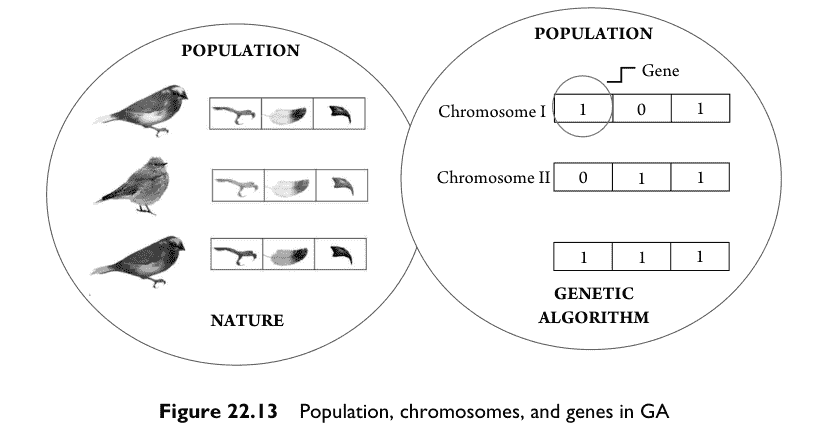

## 22.4 基因与适应度理论的数学表示

在遗传算法中，我们的最终目标是根据适应度函数或适应度值，从所有可能的解集中为给定问题选择最优化的解。

为了清晰地理解这个概念，让我们研究一个涉及选择直升机旋翼最佳设计的优化问题，如图 22.14 所示。

这个优化问题包含以下组成部分。

**变量：** 我们需要一些参数或变量来设计直升机旋翼。这些是旋翼叶片或机翼的数量以及旋翼叶片或机翼的长度或尺寸，如图 22.14 所示。

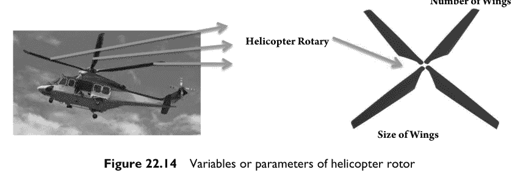

变量可能不止两个，例如重量、厚度、旋翼叶片或机翼的空气动力学特性等。为了便于理解，我们将讨论限制在两个变量。这个优化问题的另一个重要组成部分是约束条件。

**约束条件：** 它定义了所选变量或参数的限制或范围。

让我们假设对直升机旋翼叶片优化问题施加以下约束。

- 旋翼机翼数量 ➔ [1, 2, 3, 4, 5, 6, 7, 8]
- 机翼长度 ➔ [2, 4, 5, 6, 8, 10]

我们假设直升机可能的旋翼机翼数量范围是 1 到 8，而可能的机翼长度是 2、4、5、6、8 或 10 个单位。

优化问题的下一个组成部分是我们希望实现的目标或我们希望优化的参数。

**目标：** 通过确定旋翼机翼数量和机翼长度（或搜索空间）的最佳组合，获得最大升力值。简单来说，就是选择参数以使直升机获得最大升力值。

在这种情况下，我们有 8 种可能的旋翼机翼和 6 种可能的长度。因此，有 8 × 6，即 48 种可能的风扇组合，因为 6 种可能的机翼长度值可以分配给 8 种可能的机翼数量。在这种情况下，我们有 48 个可能的解，我们必须挑选出能为直升机产生最大升力的最佳可能解。因此，目标是在这个集合（或搜索空间）中寻找最佳值，以获得直升机的最大升力值，如图 22.15 所示。

**搜索空间：** 由优化问题所有可能的解或输入可能取的值组成的集合称为搜索空间。最优解是位于搜索空间中的一个点或一组点。

直升机旋翼问题的搜索空间由 48 种可能的风扇设计组成，具有不同的叶片长度和数量。图 22.16 展示了直升机旋翼问题的搜索空间。

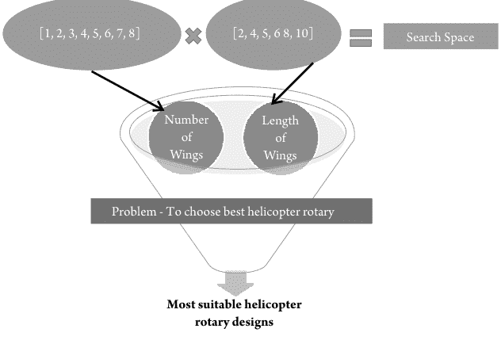

**图 22.15** 单目标优化问题

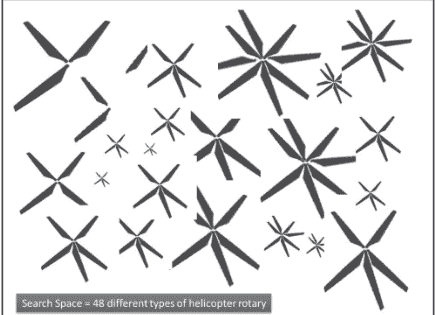

**图 22.16** 设计直升机旋翼时的搜索空间

因此，我们可以得出结论：每个优化问题都包含三个组成部分：目标、变量和约束条件。遗传算法（GA）为给定的优化问题挑选最佳或最优解。图22.17展示了遗传算法在优化给定的直升机旋翼设计问题中的定位。因此，遗传算法是一种问题解决技术或优化算法。

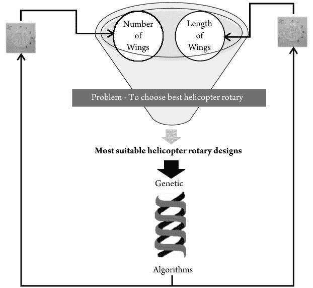

**图22.17** 遗传算法在获取优化问题最优解中的作用

从图22.17可以明显看出，遗传算法将问题视为一个黑箱，即它不关心问题的内部规格；它从问题的输入和输出角度来审视问题。因此，遗传算法会向问题提供某些输入，并根据获得的输出来评估这些输入的好坏。为了优化问题，遗传算法遵循自然选择、重组和变异。

让我们继续前进，准备我们的优化问题，以便遗传算法进行处理。我们将需要两个主要元素，即遗传表示和适应度函数，如下所述。

### 遗传表示

在遗传算法中，每个解都通过一个数组来表示。通常，这个数组由一个位图组成（位图是从某个域到位的映射）。例如，图22.18展示了一个用于从10个可能解中选择最佳解的遗传表示。

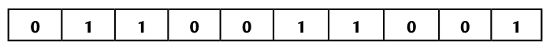

**图22.18** 遗传表示（位图）

另一个值得注意的点是这些数组的数据类型。数组可以是位、字符串、整数、分数、符号（运算符）、一组字母等等。图22.19展示了一些可能的基因表示。

| 位表示 | 0 | 1 | 1 | 0 | 0 | 1 | 1 | 0 | 0 | 1 |
|---|---|---|---|---|---|---|---|---|---|---|
| 字母 | A | B | D | G | Z | X | Y | O | Q | E |
| 数字 | 10 | 100 | 101 | 400 | 54 | 346 | 340 | 93 | 125 | 202 |
| 特殊符号 | ! | > | < | + | 122 | Sin | Tan | ^ | % | / |
| 浮点数 | 2.5 | 2.55 | 3.5 | 3.65 | 7.2 | 2.6 | 4.5 | 6.4 | 7.34 | 8.12 |

**图22.19** 一些常用的遗传表示

人们可能会惊讶地发现，我们也可以在这些数组中放入程序（指令）。在这种情况下，遗传算法将获取许多程序，并从中找出最优化的结构化程序。这被称为遗传编程。

为简单起见，我们使用位表示来进一步解释这个主题。

### 适应度函数

适应度函数用于评估可能的解，并提供选择最佳可能解的标准。因此，它决定了一个解的适应度值。它也被称为评估函数或目标函数。所以，适应度函数将基因表示（即位串）作为输入，并返回其适应度值。

例如，在我们设计直升机旋翼的案例研究中，直升机产生的升力就是其适应度函数。在这里，它就像一个模拟器，将翼的数量和翼的长度作为输入，并返回对应于每个输入组合或解的适应度值或升力。

因此，适应度函数的唯一条件是它必须是一个函数，对于每个唯一的输入（或参数）组合，都能返回一个唯一的值。

图22.20展示了一个适应度函数的作用，它接受五个输入并输出一个适应度值。基于这个适应度值，该解将在遗传算法的后续阶段被接受或拒绝。

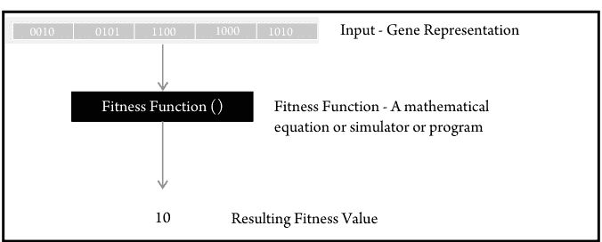

**图22.20** 适应度函数的作用

因此，在直升机旋翼系统设计的情况下，种群由48个可能的解或组合组成。在下一节中，我们将讨论在遗传算法中实现自然选择过程的不同技术和算法。

## 22.5 通过轮盘赌实现自然选择

我们讨论过自然选择是遗传算法背后的主要灵感。我们了解到，所有个体中最适应的个体将有更高的机会获得食物和交配机会。因此，这导致最适应物种的基因被同一物种的后代继承。

为了实现自然选择的过程，遗传算法使用轮盘赌的概念，根据个体的适应度值为其分配概率，然后从种群中选择最适应的个体进入下一代。让我们首先理解赌场游戏中使用的轮盘赌的工作原理和概念，以理解这个概念。

### 22.5.1 赌场游戏中轮盘赌的工作原理

轮盘赌是最受欢迎的赌场游戏之一。要理解遗传算法中的选择过程，了解轮盘赌在现实中如何进行非常重要。图22.21展示了一个典型的轮盘赌设置。

在每一轮中，庄家（主持游戏的人）沿固定方向旋转轮盘赌，然后在轮盘的圆形轨道上滚动一个小球。当轮盘停止旋转时，小球会落入轮盘边缘编号的口袋之一。在滚动小球之前，玩家可以下注小球会落入编号为0、1、2或3……或36的坑中（因为桌上有37个可能的位置）。玩家可以通过不同的方式下注。他可以下注单个数字、奇偶数字、按列、按打、红色或黑色方块等。如果小球落入正确的下注区域或下注的方块，玩家就赢了。否则，如果小球落入属于庄家（编号0）的坑或他没有下注的其他区域，他就输了钱。

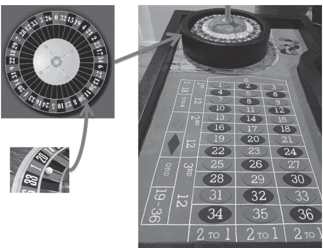

**图22.21** 赌场中典型的轮盘赌设置

因此，获胜方块的概率，$p(win)$，等于$n/37$，其中$n$是一个人下注的方块总数，37是轮盘赌中方块的总数。

$$p(win) = \frac{n}{37}$$ ...(22.1)

我们下注的方块越多，获胜的机会就越大。赔付额使用公式(22.2)计算。

$$Payout = \frac{37}{n} - 1$$ ...(22.2)

这表明，如果一个人只下一个位置的注，那么赔付额最大，即36倍；如果一个人下所有位置的注，那么赔付额最小，即0。因此，可以得出结论：获胜概率越低，赔付额越高。或者，获胜概率越高，赔付额越低。

在遗传算法的背景下，可能的解或候选解构成一个种群，可以被视为玩轮盘赌游戏的玩家，如图22.22所示。但与现实不同，我们假设在遗传算法中至少有一个玩家会赢。此外，这里的玩家将根据他们的适应度值下注。遗传算法中的每个解（或玩家）都玩轮盘赌，以获得进入下一代的资格。

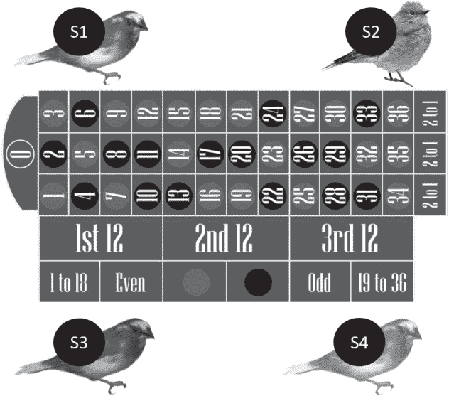

**图22.22** 物种玩轮盘赌，希望能存活到下一代

让我们假设图22.22中显示的鸟是这里的玩家，它们将根据自己的适应度值下注。这意味着适应度值高或具有更多有利特征的麻雀将在更多的方块上下注。让我们假设图22.22中显示的麻雀的适应度值顺序如下。

*麻雀1 > 麻雀2 > 麻雀3 > 麻雀4*

表22.1的第2列显示了它们假设的适应度值。根据轮盘赌的理论，下注更多方块的人获胜概率更高。这意味着麻雀1（S1）将有更高的机会赢得轮盘赌。因此，它的特征将有更高的概率获得进入下一代的资格，或者我们可以说它有更高的选择机会。

检查表22.1后，很明显，上述所有选项都不获胜的概率接近50%，这表明可能性高得惊人。这就是为什么赌场老板非常富有并赚了很多钱。但在遗传算法的轮盘赌实现中，有一个例外，即必须有一个参与者获胜。因此，我们可以说，获胜的机会是根据所有参与者的适应度值分配的。

为了将自然选择纳入遗传算法，我们将采用一种称为遗传算法轮盘赌实现的分步方法。

## 表 22.1 特定种群中鲶鱼赢得轮盘赌的概率

| 种群 | 适应度值 = 它们下注的方格数 | 获胜（或被选中）的概率使用公式 (22.1) 计算 |
| :--- | :--- | :--- |
|  | 10 | (10/37)*100 = 27% |
|  | 5 | (5/37)*100 = 14% |
|  | 3 | (3/37)*100 = 8% |
|  | 2 | (2/37)*100 = 5% |
| 以上都不是 | 37-(10+5+3+2) = 17 (轮盘赌中由赌场拥有) | (17/37)*100 = 46% |

### 实现自然选择的轮盘赌实施步骤

让我们考虑表 22.2 中给出的具有某些适应度值的五个个体。我们的任务是使用轮盘赌选择两个最适合作为父代的个体。

## 表 22.2 五个个体及其对应的适应度值

| 个体 | 适应度值 |
| :--- | :--- |
| A | 10 |
| B | 55 |
| C | 22 |
| D | 12 |
| E | 130 |

### 步骤 1：归一化适应度值

第一步是归一化每个候选解的适应度值。为此，我们将计算每个个体的适应度与所有个体适应度值总和的比率。这将产生归一化的适应度值。必须注意的是，归一化适应度值的总和必须等于一，如表 22.3 所示。

## 表 22.3 个体的归一化适应度值

| 个体 | 适应度值 | 归一化适应度值 |
| :--- | :--- | :--- |
| **A** | 10 | 10/230 = 0.043478 |
| **B** | 55 | 55/230 = 0.23913 |
| **C** | 22 | 22/230 = 0.095652 |
| **D** | 13 | 13/230 = 0.056522 |
| **E** | 130 | 130/230 = 0.565217 |
| **总计** | **230** | **1** |

### 步骤 2：根据归一化适应度值的升序排列个体

下一步是根据个体的归一化适应度值按升序排列个体，如表 22.4 所示。此步骤将帮助我们在后续步骤中绘制轮盘赌。

## 表 22.4 升序排列的归一化适应度值

| 个体 | 适应度值 | 归一化适应度值 |
| :--- | :--- | :--- |
| **A** | 10 | 0.043478 |
| **D** | 13 | 0.056522 |
| **C** | 22 | 0.095652 |
| **B** | 55 | 0.23913 |
| **E** | 130 | 0.565217 |
| **总计** | **230** | **1** |

### 步骤 3：对于每个给定的个体，计算归一化适应度值的累积和

继续步骤 2，我们将通过将个体自身的归一化适应度值与其前面个体的归一化适应度值相加来计算累积适应度值。相应的计算可以在表 22.5 中找到。

## 表 22.5 个体的累积归一化适应度值

| 个体 | 适应度值 | 归一化适应度值 | 累积归一化适应度值 |
| :--- | :--- | :--- | :--- |
| **A** | 10 | 0.043478 | **0.043478** |
| **D** | 13 | 0.056522 | 0.043478 + 0.056522 = **0.1** |
| **C** | 22 | 0.095652 | 0.043478 + 0.056522 + 0.095652 = **0.195652** |
| **B** | 55 | 0.23913 | 0.043478 + 0.056522 + 0.095652 + 0.23913 = **0.434783** |
| **E** | 130 | 0.565217 | 0.043478 + 0.056522 + 0.095652 + 0.23913 + 0.565217 = **1** |

需要注意的是，累积归一化适应度值始终为 1。

### 步骤 4：生成轮盘赌

最后，我们将根据上一步计算出的累积归一化适应度值生成轮盘赌。
首先，我们将在数轴上表示我们实验中每个个体的累积频率，如图 22.23 所示。

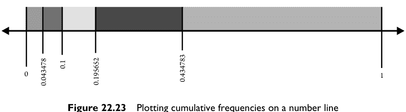

然后，以此为参考，我们绘制一个环形图，如图 22.24 所示。每个阴影区域代表我们实验中个体的归一化适应度值。
图 22.24 代表了五个个体 A、D、C、B 和 E 的轮盘赌。使用这个轮盘赌，我们将在下一步执行自然选择。

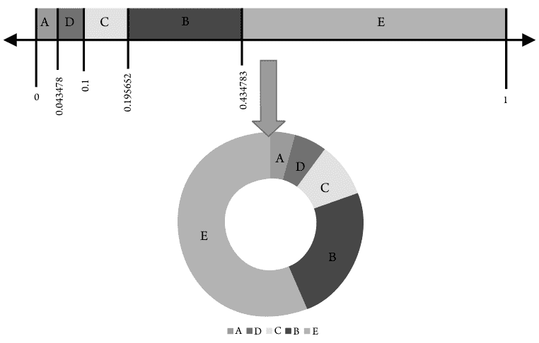

需要注意的是，具有最大适应度值的个体在轮盘赌上获得了最大的区域。简单来说，在轮盘赌的背景下，一个个体占据的轮盘部分与其相对于其他个体的整体适应度值成正比。例如，E 具有最大的适应度值 (130) 和轮盘赌上最大的区域。相比之下，A 具有最小的适应度值 (10) 和轮盘赌上最小的区域。

### 步骤 5：旋转轮盘赌以选择父代或最佳候选

轮盘赌的旋转将决定选择哪个候选。但是，在计算机上，我们没有任何方法可以旋转轮盘赌或放置小球。为此，我们可以借助随机数生成器生成一个 0 到 1 之间的随机数，因为步骤 3 中计算的累积值在 0-1 的范围内。因此，随机数生成器将帮助我们选择父代或候选。

所以，算法将生成一个 0-1 范围内的随机数，并根据生成的值选择父代。

例如，假设算法生成了一个随机数 0.6。这个数字位于 E 的区域。因此，E 将被选为父代，如图 22.25 所示。

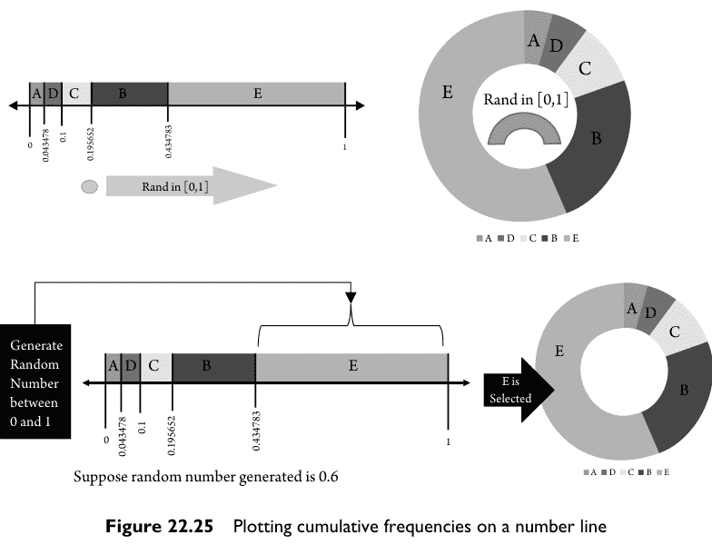

类似地，如果生成的随机数在 0.19 到 0.4 之间，B 将被选中，如图 22.26 所示。这些数字是随机生成的，每个数字都属于某人拥有的区域；这表明每个个体都有获胜的机会。由于 E 占据了更大的部分，他获胜的概率总是会比其他人大。

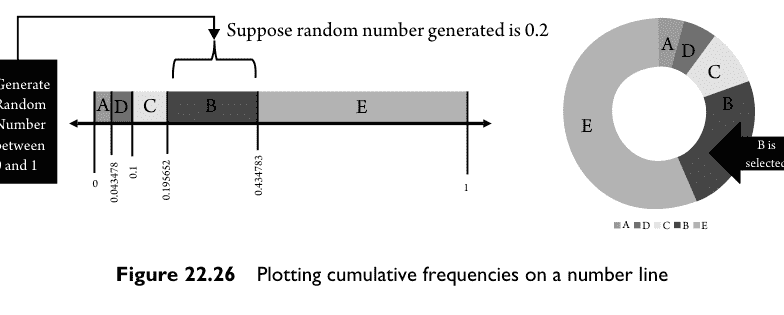

最后，我们可以使用算法 22.1 来编写表 22.5 中给出的选择条件，该算法根据上述解释工作。

## 算法 22.1：使用轮盘赌选择父代

```
RandomNumberGenerated = Random() in the range of [0,1]
If RandomNumberGenerated>0 AND RandomNumberGenerated<=0.043478
    ⇒ Select A
    Else If RandomNumberGenerated>0.043478 AND RandomNumberGenerated<=0.1
        ⇒ Select D
        Else If RandomNumberGenerated>0.1 AND RandomNumberGenerated<=0.195652
            ⇒ Select C
            Else If RandomNumberGenerated>0.195652 AND RandomNumberGenerated<=0.434783
                ⇒ Select B
                Else If RandomNumberGenerated>0.434783 AND RandomNumberGenerated<=1
                    ⇒ Select E
```

上述算法展示了轮盘赌的模拟模型，类似于自然界中适者生存的自然选择。轮盘赌存在一定的问题。它是一个随机算子。因此，较弱的个体参与下一代的可能性较小。这完全取决于较弱个体的运气，它可能走运；因此，它的基因可能成为下一代特征的一部分。

### 其他父代选择方法

在文献中，我们还有其他选择父代的方法，作为轮盘赌的替代方案来解决特定问题。这些常用的方法及其工作原理如下。

#### 随机通用采样 (SUS)

随机通用采样与轮盘赌选择非常相似；然而，我们有多个选择点，而不仅仅是一个，如图 22.27 所示。因此，所有父代只需一次轮盘旋转即可选出。它还有助于确保高度适应的个体只被选中一次。

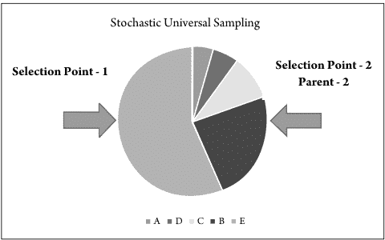

| 个体 | 适应度值 |
| :--- | :--- |
| A | 10 |
| D | 13 |
| C | 22 |
| B | 55 |
| E | 130 |

**图 22.27** 随机通用采样

#### 锦标赛选择

在锦标赛选择中，我们从种群中随机选择 N 个个体。然后，从这个小组（锦标赛）中选择最佳个体作为父代，如图 22.28 所示。锦标赛中的最佳个体是根据适应度值选择的，它在所有被选个体中具有最高的适应度。锦标赛的获胜者随后被插入到交配池中。以同样的方式选择下一个父代，并重复该过程。锦标赛选择可以处理负适应度值，并且是作为轮盘赌替代方案的常用方法。

| 适应度值 | 个体 |
|---|---|
| 10 | A |
| 13 | D |
| 22 | C |
| 55 | B |
| 130 | E |
| 120 | F |
| 115 | G |
| 100 | H |
| 90 | I |
| 85 | J |

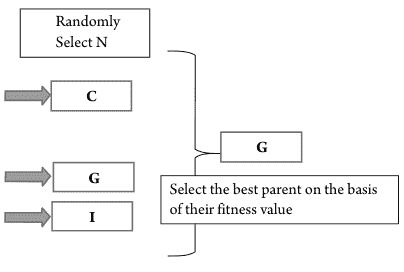

#### 排名选择

当种群中个体的适应度值非常接近时，通常使用排名选择。在这种情况下，使用轮盘赌方法，每个个体几乎拥有相等的份额，而不管其整体适应度值如何，如图 22.29 所示。因此，无论它们的相对适应度水平如何，每个个体被选为父代的概率大致相等。这反过来又导致在这种情况下父代选择效果不佳。

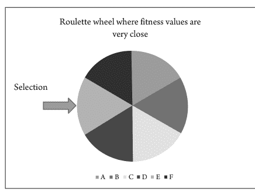

| 个体 | 适应度值 |
|---|---|
| A | 10 |
| B | 9.95 |
| C | 10.11 |
| D | 9.9 |
| E | 10.1 |
| F | 10.5 |

因此，在等级选择中，直接适应度值并不用于选择父代。但是，种群会根据其适应度值进行排序。此后，适应度值不再被考虑，而是考虑等级。父代的选择基于其等级进行。适应度值等级较高的个体将被选为父代，如表22.6所示。

**表22.6 等级选择**

| 个体 | 适应度值 | 等级 |
| :--- | :--- | :--- |
| C | 10.11 | 1 |
| E | 10.1 | 2 |
| F | 10.05 | 3 |
| A | 10 | 4 |
| B | 9.95 | 5 |
| D | 9.9 | 6 |

#### 随机选择

在这种策略中，我们从现有种群中随机选择父代。不遵循任何选择逻辑，它完全基于随机性运作。它不保证最适应的个体会被选为父代；因此，这种策略通常被避免使用。

## 22.6 遗传算法中重组或交叉的实现


遗传算法重组实现：第1部分 | GA | Parteek Bhatia, https://youtu.be/vz5UoEAHYr8


遗传算法：重组实现：第2部分 | GA | Parteek Bhatia, https://youtu.be/f5qg1gMN2pw


在上一节中，我们模拟了轮盘赌来根据个体的适应度值选择个体。在本节中，我们将使用通过自然选择选出的个体来产生后代，并学习在遗传算法中用于产生后代的不同交叉方法。

选择算子的主要目的是选择父代或一对个体来组合它们的基因，产生新的后代，或者最终产生比当前代更好的下一代。本节将学习交换父代基因以产生下一代后代的不同方法。

重组是两个染色体之间交换基因的过程。这是一种自然的交叉模拟，其中父代染色体的基因被组合。图22.30展示了这一点。

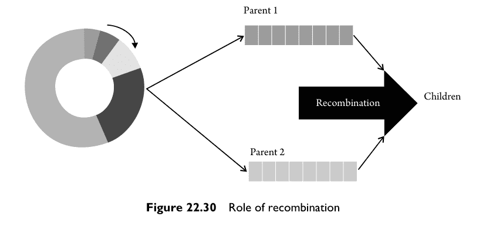

有两种常用的重组技术，即单点交叉和双点交叉。

让我们假设自然选择已经选出了两个父代（作为最适应的个体），并且它们的每个染色体都有八个基因，如图22.30所示。我们将使用以下两种技术重组它们的基因。

### 22.6.1 单点交叉

在单点交叉中，遗传算法选择一个点，然后两个父代的基因沿着所选点进行交换。

在图22.31中，我们展示了在中间基因附近执行单点交叉后获得的后代。每个后代从父代1借用四个基因，从父代2借用四个基因。因此，后代看起来像它们的父代。在外观上，它们从父代1继承了50%，其余的从父代2继承。

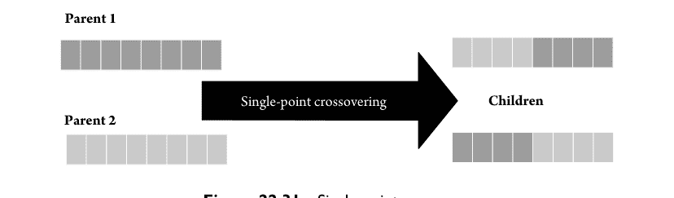

没有必要在基因的中点附近执行单点交叉。为了给单点交叉赋予随机行为，我们也可以选择一个随机的交叉点。

这些随机数将在1到 *maxLength* – 1的范围内（索引值从0开始）。如果我们选择交叉点在0或maxLength（在图22.32的情况下为7），后代将是其中一个父代的精确复制品。因此，单点交叉在1到 *maxLength* – 1的范围内选择。这确保了后代看起来与父代不同。

如图22.32所示，随机数应在方形区域突出显示的区域内选择。

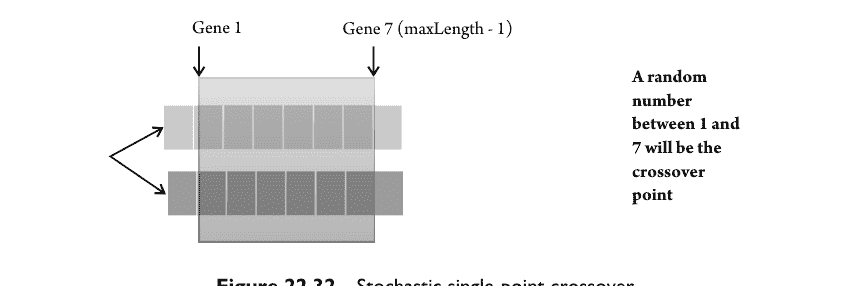

我们有索引值从0–7的八个染色体的父代；因此，选择随机数的范围将是[1, 6]。如果我们使用这个范围，那么将会出现多种情况。表22.7显示了在每种情况下形成的后代。

**表22.7 具有八个基因的父代的单点交叉**

| 交叉点 | 形成的后代 |
| :--- | :--- |
| 基因 1<br>交叉点<br>为 1 |  |
| 基因 2<br>交叉点<br>为 2 |  |
| 基因 3<br>交叉点<br>为 3 | [图片] |
| 基因 4<br>交叉点<br>为 4 | [图片] |
| 基因 5<br>交叉点<br>为 5 | [图片] |
| 基因 6<br>交叉点<br>为 6 | [图片] |
| 基因 7<br>交叉点<br>为 7 | [图片] |

#### 单点交叉的缺点

这种技术有一个缺点；单点交叉产生的后代多样性不足，因为它只有一个交叉点。因此，如果我们能使用双交叉点，我们就能在种群中获得更具多样性的后代。为此，我们将转向双点交叉的下一种技术。

### 22.6.2 双点交叉

在双点交叉中，选择两个点，然后沿着这两个点交换两个父代的基因。

例如，在图22.33中，遗传算法首先选择了两个交叉点，点CA和CB。然后，沿着这两个点交换父代的基因。这产生了后代A和B，如图22.33所示。

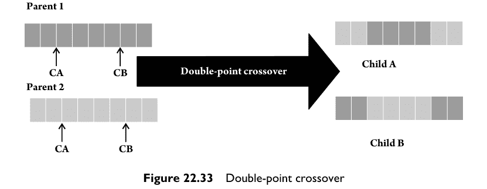

遗传算法必须避免选择相同的交叉点。如果遗传算法选择的CA和CB相互重叠，结果将与单点交叉的结果相同，如图22.34所示。

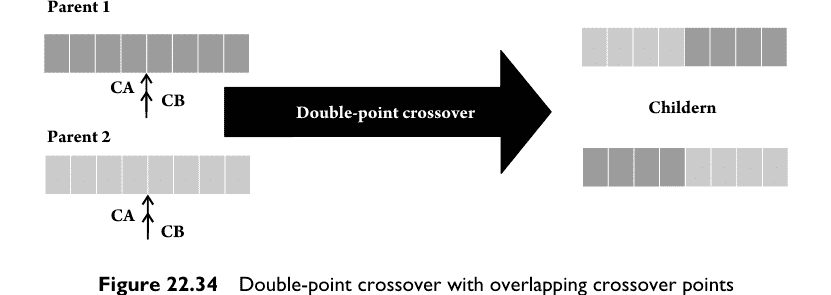

因此，遗传算法始终确保所选的交叉点是不同的。

找到这个问题的答案很重要——“使用选择和交叉算子应该产生多少个后代？”

理想情况下，产生的后代数量应与种群规模相匹配。例如，如果我们最初有50个个体交配，我们将需要50个后代用于交配并产生下一代。简单来说，每一代的种群规模应该相同。

需要注意的是，就像在自然界中一样，并不是所有父代都存在于一代中，然后所有这些父代同时灭绝，然后我们得到一个由后代组成的种群。父代和后代是共存的。父代在产生后代后并不会死亡；它们可能会与下一代的种群交配。因此，初始种群的个体可能存活两到四代。并且它们中的每一个都有机会与其他个体交配。

因此，为了模拟这一点，我们使用以下算法22.2来确保父代和后代都存在于种群中。该算法使用交叉概率，添加了一个随机组件来实现这个概念。

它定义了在种群中选择个体进行交叉的概率。由程序员定义，此参数的值应在0–1的范围内。

为了更好地理解它，我们将假设两个父代，父代1和2（由轮盘赌选择）已经交配并产生了两个后代，即后代1和2，如图22.35所示。我们假设种群的大小始终为2。下一代种群有四种可能性：只有两个父代都存活，两个后代都存活，父代1和后代2存活，以及后代1和父代2存活，如图22.35所示。

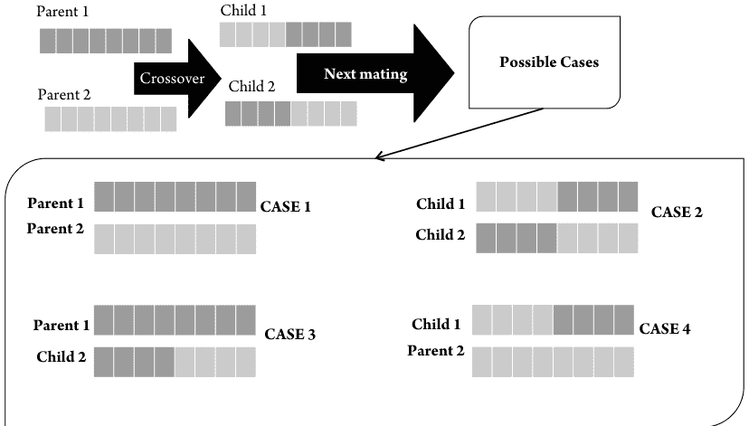

情况1：*两个后代都死亡，但父代还活着：*

后代1和后代2都死了，但它们的父代还活着，并将继续交配为下一代产生后代。

情况2：*两个父代都死亡，但后代还活着：*

父代1和2都死了，但它们的后代将交配并为下一代产生后代。

**情况3：父本存活且有一个子代：**
一个父本存活，父本1（例如，男性）有一个子代，即子代2（女性）。

**情况4：母本存活且有一个子代：**
这只是情况3的相反情况。这里母本存活，即父本2与子代1（男性）。

这个概念是借助交叉概率来实现的。

- 如果交叉概率为0，则只有父本会被传递到下一代；它们的子代不会被传递。
- 如果交叉概率为1，则所有子代都会被传递到下一代。

因此，交叉概率必须始终在0到1之间。它表示子代或交叉物种传递到下一代的概率。如果其值为0，则没有子代会被传递到下一代；如果为1，则所有子代都会被传递到下一代。

我们将生成两个随机数来选择四种情况之一，因为我们必须产生两个子代。如果有四个子代，我们将需要四个随机数，每个子代一个。因此，遗传算法将为每个子代生成一个随机数，并将其与交叉概率进行比较。如果随机数小于交叉概率，则子代将被传递（因为交叉概率较大，所以子代将传递到下一代）到下一代；否则，父本将被传递到下一代。

在此过程中，第一步，为子代1生成一个随机数并与交叉概率进行比较。如果交叉概率大于随机数，则子代1将被传递到下一代；否则，父本1有资格进入下一代。

在第二步，为子代2生成一个随机数并与交叉概率进行比较。如果交叉概率大于随机数，则子代2将被传递到下一代；否则，父本2将被传递到下一代。以下算法用于实现此情况。

## 算法 22.2：基于交叉概率的交叉算法

```
包含父本1和父本2的父本列表_List_of_parents = selectionAlgorithm(Initial_Population);
//轮盘赌算法返回父本1和父本2。
包含子代1和子代2的子代列表_List_of_Children = crossover (List_of_Parents);
//交叉将通过重组父本1和父本2的基因返回子代1和子代2
RandomNumber1 = 范围在[0,1]内的随机数Random()
    如果 (RandomNumber1 <= 交叉概率Probability_of_Crossover P_c)
        将 child_1 推入 NewPopuation_List
    否则
        将 Parent_1 推入 NewPopulation_List
    RandomNumber2 = 范围在[0,1]内的随机数Random()
    如果 (RandomNumber2 <= 交叉概率Probability_of_Crossover P_c)
        将 child_2 推入 NewPopulation_List
    否则
        将 parent_2 推入 NewPopulation_List
    返回 NewPopulation_List
结束
```

表22.8总结了基于上述算法的可能条件及相应的类别情况。

## 表 22.8 基于上述算法的情况及其执行条件

| 条件 | 被选中的情况 |
| :--- | :--- |
| RandomNumber1 > 交叉概率Probability_of_Crossover P_c 且 RandomNumber2 > 交叉概率Probability_of_Crossover P_c | 情况 I：两个子代都死亡，但它们的父本存活，并被传递。<br>父本 1 [Image] 父本 2 [Image] 情况 1 |
| RandomNumber1 <= 交叉概率Probability_of_Crossover P_c 且 RandomNumber2 <= 交叉概率Probability_of_Crossover P_c | 情况 II：两个父本都死亡，但子代存活并被传递。<br>子代 1 [Image] 子代 2 [Image] 情况 2 |
| RandomNumber1 > 交叉概率Probability_of_Crossover P_c 且 RandomNumber2 <= 交叉概率Probability_of_Crossover P_c | 情况 III：父本 1 和子代 2 被传递。<br>父本 1 [Image] 子代 2 [Image] 情况 3 |
| RandomNumber1 <= 交叉概率Probability_of_Crossover P_c 且 RandomNumber2 > 交叉概率Probability_of_Crossover P_c | 情况 IV：子代 1 和父本 2 被传递。<br>子代 1 [Image] 父本 2 [Image] 情况 4 |

## 22.7 遗传算法中变异的实现

遗传算法：变异的实现 | GA | Parteek Bhatia, https://youtu.be/CJDXd9826A

染色体在重组过程中经常面临随机变化；这些变化有助于创造新特征并保持多样性。这种在重组过程中发生随机变化的现象被称为*变异*。

在整个进化阶段，某些特征经常在物种世代中消失。通过引入变异，这些特征可以恢复到物种中。变异可以增加正面特征或负面特征。根据进化论，自然选择会介入以消除负面特征。这防止了负面特征传递给后代。

### 22.7.1 变异的数学建模

如前所述，让我们以图22.36中的例子为例。当应用单点交叉时，我们得到两个子代，即*子代A*和*子代B*。当我们将这些子代进行变异时，子代的基因会发生一些变化。子代中的变化或突变基因用*黑色*标记，这些是一些随机变化或父母中不存在的基因。例如，在*子代A'*（*突变后的子代A*）中，第四个基因是*黑色*的，即它发生了突变；在*子代B'*（*突变后的子代B*）中，第一个和倒数第二个基因发生了突变。

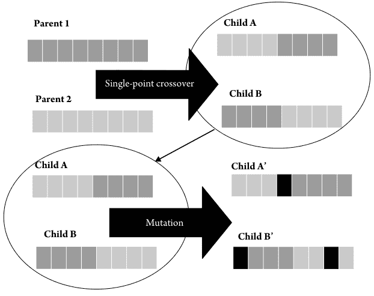

现在，这些变化可能是坏的也可能是好的。早些时候，子代在外观上与它们的父母相似，但现在我们有了一些可能改变事物的新特征。

主要问题是我们如何建模或实现变异的概念？

为此，让我们考虑父本的染色体：父本为[1, 0, 1, 1, 0, 0, 0, 0]，母本为[0, 0, 1, 1, 1, 1, 0, 1]。假设父本经过单点交叉产生两个子代，*子代A*和*子代B*，它们的染色体分别为[0, 0, 1, 1, 0, 0, 0, 0]和[1, 0, 1, 1, 1, 1, 0, 1]，如图22.37所示。

它们产生了与父母相似的后代，在*子代A*的染色体中，前四个基因遗传自母本，后四个基因遗传自父本。同样，在*子代B*的染色体中，前四个基因来自父本，后四个基因遗传自母本。图22.37描绘了这一点。

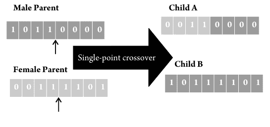

**图 22.37** 给定父本的单点交叉

在遗传算法传递这些子代之前，它将对它们执行变异。遗传算法仅仅通过将1翻转为0或将0翻转为1来执行基因变异。因此，遗传算法将随机选择子代A和子代B染色体中的基因，然后翻转所选基因的位。如果所选位是1，遗传算法将其翻转为0；如果是0，则翻转为1。

如图22.38所示，遗传算法已对子代执行了变异，最终，*子代A*变异后的染色体为[0, 0, 1, **0**, 0, 0, 0, 0]；这是通过将*子代A*的第四位从1翻转为0得到的。或者，在*子代B*中，遗传算法翻转了第一位和倒数第二位，导致其配置为[**0**, 0, 1, 1, 1, 1, **1**, 1]。

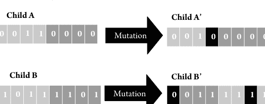

**图 22.38** 对交叉结果应用变异

现在，子代A'和子代B'的改变基因可能是好的或坏的变化；为了确定这一点，我们可以将子代的适应度值与其父母的适应度值进行比较。如果子代的适应度值优于其父母，则变异带来了好的变化；如果较低，则带来了不幸的变化。

假设子代的适应度值低于其父母。在这种情况下，这些子代很可能不会被选为下一代的父母，并且没有机会交配或执行交叉以将基因传递给下一代，因此最终这些突变基因将会丢失。但是，如果变异后子代的适应度值高于其父母，那么这些子代很可能被选为下一代的父母，并有机会交配或执行交叉以将基因传递给下一代，因此这些突变基因将在下一代中得以保留。

这就是我们通常对染色体基因应用变异算子的方式。但大问题是——“必须有多少基因发生变异？”一个基因，还是所有基因，或者部分基因，选择进行变异的基因数量非常重要。我们将在下一节中找到这个问题的答案。

### 22.7.2 如何决定要变异的基因数量？

假设我们有一组基因。当基因被进行变异时，遗传算法将迭代地遍历每一个基因，然后决定哪个基因应该被变异。

为了决定这一点，遗传算法使用一个随机算子，就像之前在交叉情况下所做的那样。在交叉的情况下，遗传算法使用了称为交叉概率的算子。类似地，遗传算法使用一个称为变异概率的新算子来执行变异。

**变异概率 ($P_m$)**
*变异概率*，用 $P_m$ 表示，是修改染色体基因（给定数组的位）的概率。每个基因都有相同的概率 $P_m$ 与之关联，这对于一个染色体是固定的。这个概率决定了基因的位是否会被翻转。*程序员分配变异概率*。虽然 $P_m$ 的值因问题而异，但其值限制在0和1之间。

因此，让我们回到最初的问题：决定哪个基因将被变异？嗯，这很简单；遗传算法为每个基因生成一个介于0和1之间的随机数。如果随机数小于或等于变异概率 $P_m$，遗传算法就对该基因进行变异；或者，如果生成的随机数大于变异概率 $P_m$，遗传算法则跳过该基因的变异。相同的概念已在图22.39中概述。

如果程序员将 $P_m$ 的值设置为1，那么给定染色体的所有基因都将被变异；一个全新的染色体被生成，从而消除了交叉效应。或者，如果我们设置 $P_m$ 的值为0，则没有基因会发生变异。因此，*变异概率 $P_m$* 的值应始终在0-1的范围内。$P_m$ 的值越大，发生变异的基因数量就越多。算法22.3定义了使用变异概率 $P_m$ 进行变异的过程。

## 算法 22.3：遗传算法中应用变异的算法

```
初始化 P_m = 0.5
对于染色体中从 i=1 到 Total_Genes_In_Chromosome 的每个基因
    生成一个在 [0,1] 范围内的随机数 RandomNumberGenerated = Random()
    如果 RandomNumberGenerated <= P_m
        翻转 Gene[i] 的位 //变异该基因
结束 循环
结束
```

此处，变异概率被初始化为 0.5，而 Total_Genes_In_Chromosomes 对应于基因的总数。在图 22.38 所示的示例中，我们有 Total_Genes_In_Chromosomes 为八。对于每个染色体基因，逐一处理，为每个基因生成一个随机数，GA 将比较 RandomNumberGenerated 与 P_m。如果它小于或等于 P_m，GA 将翻转该基因的位；否则，GA 将保持该基因不变。

## 22.8 精英主义

遗传算法：精英主义的概念与实现 | GA |
Parteek Bhatia, https://youtu.be/llDfPufkQxw

在前面的章节中，我们深入了解了 GA 的基本组成部分，包括选择、交叉和变异。这些算子在塑造 GA 的行为和有效性方面起着至关重要的作用。如图 22.40 所示，我们使用轮盘赌的概念选择了两个父代。它们通过交叉的概念结合，最后，在变异之后，子代或父代根据随机数的选择被转移到新种群。

让我们理解引入一个称为精英主义的新算子的必要性。

我们有两个具有最高适应度值的父代，*父代 1* 和 *父代 2*。这些父代结合产生两个子代，其基因进一步发生变异。但是，由于 *交叉* 和 *变异*，子代与它们的父代并不相似，但它们仍然被转移到下一代。在变异过程中，子代失去了它们父代的最佳适应基因。然而，它们仍然存活下来，因为它们足够幸运，在交叉过程中成为下一代种群的成员，并在轮盘赌中被选为交配的候选者。这样，原始父代的最佳基因集就会丢失。因此，有可能永远失去一些好的染色体，而未来无法恢复。然而，这些丢失的基因可能在交叉和变异过程中恢复，但无法保证。为了纠正这个错误，John Holland 在 1970 年代后期引入了精英主义的概念。在这种情况下，精英主义成为一种有价值的解决方案或策略。

**精英主义意味着将最适应个体（也称为精英）的基因传递给下一代种群，而不改变其基因结构。这意味着这些精英个体将不会经历交叉和变异过程，而是直接传递给下一代。**

问题是，种群或候选者或个体的多大比例被认为是精英，或者被允许在不经历交叉和变异过程的情况下将其基因传递给下一代。GA 通过使用下一小节讨论的精英比率来定义这个数字。

### 22.8.1 精英主义的实现与精英比率的概念

精英比率，用 $E_r$ 表示，是被选为精英的种群百分比，这些精英保持不变并被转移到下一代种群。

与变异概率和交叉概率一样，精英比率也介于 0–1 之间。但与它们不同的是，GA 使用精英比率的方式略有不同，即 GA 在实现它时没有使用条件表达式。

精英比率定义了被选为精英以传递给下一代的个体百分比。

例如，如果对于给定的 200 个个体的种群，选择 $E_r$ 为 0.05，那么：

$要传递给下一代的精英总数 = \frac{5 \times 200}{100}$

$要传递给下一代的精英总数 = 10\ 个精英$

让我们举一个概念性的例子来清楚地理解精英主义的结果。为此，请考虑图 22.41。

在图 22.41 中，我们有一个由七个个体组成的种群，让我们考虑精英比率 $E_r$ 为 0.2，这意味着：

要传递给下一代的精英总数 = $\frac{2 \times 7}{10}$

要传递给下一代的精英总数 = 1.4 个精英 $\simeq$ 1 个精英

因此，我们将把其中一个最适应的个体，比如 *父代 1*，原封不动地传递给下一代，不做任何改变。参与者，即父代 2–7，将经历选择、交叉和变异。

由于 GA 将精英成员移动到下一代，这意味着精英与种群的其余部分分开，并且精英在每一代中都可以作为父代被选择。这正是应该的方式；我们保存好的染色体并将其原样带入，以便它们可以与其他染色体重组以产生后代。

尽管精英从上一代传递到下一代，但这并不意味着同一个个体在每一代之后都会被保留为精英。精英的选择将在每一代中根据其适应度值进行。因此，总是有可能这些精英在下一代中被其他在适应度值方面优于它们的个体所取代。

这个过程在图 22.42 中进行了说明。在此背景下，我们从一个初始种群开始，选择了两个最适应的个体——精英 1 和精英 2——并原样带入后续世代。经过选择、交叉和变异后，我们得到了一些后代。在产生的后代中，值得注意的是，后代 3 表现出比精英 2 更高的适应度值。因此，后代 3 将取代精英 2 进入精英俱乐部。所以，每当子代变得比精英更好时，它们将被提升为精英，而先前的精英将失去这个称号。因此，精英在其整个生命周期中将不断经历一个更新过程。

**图 22.42** 精英被更适应的个体取代

## 算法 22.4：遗传算法中应用精英主义的算法

```
初始化 NewGeneration[] 数组 //用于新种群的数组
初始化 E_r = 0.2 //精英比率，可以是 0 到 1 之间的任何数字
NewPopulationNo = E_r * TotalPopulation //计算精英总数
    按适应度值降序排列成员 []
    对于从 i=0 到 NewPopulationNo 的每个成员 //从 0 到精英总数的 for 循环
        将 Member[i] 存储在 NewGeneration 中
        //将具有最高适应度值的成员作为精英传递给下一代
结束
返回 NewGeneration[]
```

在此算法中，我们定义了精英比率，然后根据此比率计算精英总数。之后，成员按其适应度值的降序排列，以便可以选择精英。然后，一个 for 循环为每个精英运行，在每个周期中，选择一个精英并存储在新生成的种群中。

在结束我们关于精英主义的讨论之前，让我们强调一下这种策略对 GA 的深远影响。

- 精英主义将最好或最适应的染色体原封不动地传递给下一代。有了精英主义，我们可以保存好的基因并改善种群的其余部分。
- 精英染色体也有资格在每一代中被选为父代。
- 精英主义对 GA 的性能有显著影响。精英主义在某些问题中非常有用，因为 GA 不必浪费宝贵的资源或计算能力。

例如，在解决问题时，如果我们在搜索空间的某个区域找到了一个有希望的解决方案，我们会保存它，然后尝试在其附近找到所有其他解决方案。我们重复这个过程，直到找到一些更好的解决方案来替换它。

## 22.9 遗传算法的优缺点

在讨论了 GA 的所有概念之后，让我们以 GA 的优缺点列表来结束。

GA 的主要优点如下。

- 它用于寻找全局最小值或全局最优解。
- 它使用自然选择从种群中选择最佳候选者，并可以处理更广泛的解空间。
- 我们可以并行运行多个 GA 以提高它们的性能和效率。

遗传算法的主要缺点如下。

-   有时，很难确定合适的适应度函数。
-   遗传算法的收敛速度可能过快或过慢。
-   必须选择各种参数的合适值，例如交叉概率、变异概率、种群规模等。错误的选择可能会影响性能。

## 22.10 遗传算法的应用

基于以上讨论，我们可以列出遗传算法的以下应用领域。

-   机器学习（ML）：遗传算法可以在机器学习中找到全局最小值。
-   优化问题：遗传算法可用于解决任何优化问题。例如，一些常见的应用包括为旅行商问题寻找优化路线、作业调度、音质优化等。

提醒我

-   遗传算法（GA）的灵感源于自然，它在机器学习（ML）领域扮演着至关重要的角色。它从所有可用的可能解或候选解中选择最佳优化解。
-   遗传算法的应用之一是利用自然选择从所有可能的（局部）最小值中选择全局最小值。
-   遗传算法的灵感源于自然，包括自然选择、重组或交叉以及变异。
-   虽然进化论在特定物种的种群内运作，但遗传算法关注的是潜在解的种群或集合。在生物学中，由基因组成的染色体是遗传算法问题的类比。此外，遗传算法用比特、数字或字符替代基因，这些代表了算法的基本构建块。
-   适应度函数用于评估可能的解，并提供选择最佳可能解的标准。
-   自然选择通过轮盘赌实现。
-   重组是两个染色体之间交换基因的过程。它有两种交叉技术，即单点交叉和双点交叉。
-   单点交叉涉及在染色体范围内选择一个特定点（通常在位置1和染色体长度-1之间），并在两个父代之间交换基因，确保后代的独特性。
-   在双点交叉中，选择两个点，然后在这两个点之间交换两个父代的基因。
-   遗传算法中的变异是一种遗传算子，它对种群中个体的基因引入随机变化或改变。在变异过程中，个体染色体中的一个或多个基因被随机修改，通常是通过翻转一个比特或引入一个随机值。这种随机扰动引入了多样性，并允许遗传算法通过探索解空间的不同区域来潜在地发现更好的解。
-   我们使用一个称为变异概率的随机算子来决定变异水平。变异概率用 $P_m$ 表示，是修改染色体基因的概率。每个基因都有一个与之相关的概率 $P_m$，该概率在染色体中是相同的。这个概率决定了基因的比特是否会被翻转。变异概率由处理优化问题的算法设计者或程序员分配。虽然 $P_m$ 的值因问题而异，但其值始终在0和1之间。
-   精英主义将最好或最适应的染色体不加任何改变地传递给下一代。有了精英主义，我们可以保存好的基因并改进种群的其余部分。
-   精英主义意味着将最适应个体（也称为精英）的基因不加任何改变地传递给下一代种群。
-   精英主义比率用 $E_r$ 表示，是一个定义种群中保持不变并传递给下一代种群的百分比的数字。

#### 附加资源

##### 视频链接

-   Udemy课程，遗传算法用于机器学习，作者Parteek Bhatia，https://www.udemy.com/course/genetic-algorithm-for-machine-learning/
-   人工智能中的遗传算法 | 遗传算法Python教程 | Edureka，https://youtu.be/ifS9Jm3jna0

##### 博客链接

-   机器学习中的遗传算法简介，https://www.softwaretestinghelp.com/genetic-algorithms-in-ml/
-   遗传算法，https://www.geeksforgeeks.org/genetic-algorithms/
-   遗传算法（GA），https://www.tutorialspoint.com/genetic_algorithms/genetic_algorithms_introduction.htm


#### 测试我（问题）

1.  为了给我们的模型添加随机特征，使用遗传算法的____________________阶段。
2.  为了产生种群，使用遗传算法的____________________阶段。
3.  当种群中个体的适应度值彼此非常接近时，我们应该使用哪种类型的选择？
    a) 随机选择
    b) 轮盘赌
    c) 排序选择
    d) 锦标赛选择
4.  输出会是什么？在这种情况下，Pc是交叉概率。
    R1>Pc 且 R2<=Pc
5.  通过填空来完成它。

```
Pm=0.5
for i=1: Gene_No
    R=random();
    ______________________ // 填写此处
    chromosome.Gene[i]=~ chromosome.Gene[i];
end;
end;
```

6.  ________确保将最佳染色体完整地传递给下一代。

| 答案：1. 变异 | 2. 交叉 | 3. c |
| :--- | :--- | :--- |
| 4. 父代1和子代2 | 5. R<=变异概率 | 6. 精英主义 |

## 索引

ACM–SIGKDD创新奖，762
激活函数，837–842
实际和预测的利润值，325
调整后的R平方（调整后的R²）方法，298–299
凝聚聚类
    AGNES，648
    平均链接，653
    自底向上方法，648
    数据点聚类，654
    学生记录聚类，663–675
    完全链接，652
    距离矩阵，656–658
    和分裂聚类，648–649
    图形表示，653–654
    HCA图，650–651
    在超市数据集上，659–663
    过程，649–650
    单链接，651–652
    弱点，675
凝聚嵌套（AGNES），648
聚合，138
Alexa购买问题，554
所有可能的模型，297
Anaconda Navigator
    Jupyter，61–62
    Spyder，60
ANN模型
    编译，875–876
    初始化，872
    输入和第一个隐藏层，872–873
    库，871–872
    输出层，874–875
    第二和第三个隐藏层，873–874
    训练集，876–878
机器学习的应用
    生物信息学，7
    聊天机器人，4
    动态定价，3–4
    手写文本识别，5
    医疗保健和制药，6
    图像识别，2–3
    机器翻译软件，5
    恶意软件检测，2–3
    在线欺诈检测，6
    在线视频流平台，4
    产品推荐，6
    搜索引擎，7
    自动驾驶汽车和自主无人机，7
    智能家居助手，2–3
    社交媒体服务，5
    垃圾邮件，2–3
    语音识别，2–3
    使用Google地图进行交通预测，4–5
    视频监控，5–6
Apriori算法
    数据库的候选1项集C1，763
    所有可能规则的置信度，768
    候选项对的频率，766
    频繁1项集，764–765
    频繁项集识别，769–770
    频繁1项集L1，764–765
    发明者，760–762
    局限性，797
    阶段，762
    性质，781–791
    示例事务数据库，775
    TID，795–800
    事务数据库，760，763
提升度，748–752
需求，739–740
基于规则的技术，739
啤酒和尿布的销售，740–742
销售数据库，744–745
支持度，745–746
天文数据分析，26
自主无人机，7
平均链接，653
平均池化技术，919–920
基本CNN模型的架构，905–914
RNN的架构
    编译，1026
    3D结构，1033–1036
    LSTM的第一层，1024–1026
    Keras库和包，1022–1024
    输出层，1026
    测试数据集，1029–1033
    训练集，1027–1029
时间反向传播（BTT），985
向后消除法，293–295
反向传播过程，845，860
双向消除法，296–297
生物信息学，7
生物神经元，827
暴力方法，852–853
人工智能（AI），46–47
人工神经网络（ANN）。*另见*权重的作用
    架构，972
    深度学习神经网络，829
    某些存储技术的持久性和访问时间，823
    信息流，829
    存储成本历史，822
    层结构，828
    多个输入值，831–833
    计算机的处理能力，823
    压缩，972
    技术，822
    颞叶和，971
    工作原理，829–831
癌症数据集，866
数据库的候选1项集C1，763
类型转换，68–69
分类属性，275，318
分类数据
    城市和购买变量，168
    虚拟变量，150
    标签编码数据，149
    标记，148
    处理后的数据，150–151
    分离属性，149
分类变量，168–169
    名义，14
    有序，15
单元状态，999–1000
聊天机器人，4
切比雪夫距离，620–621
Chervonenkis，Alexey，506
卡方分布表，284–292
城市变量，168
分类。*另见*决策树分类器
    二元和多类，361
    构建分类器，365–366
    决策树分类器，364
    定义，360
人工神经元，827
关联规则挖掘，24，26。*另见*朴素算法
    优点，743
    前件和后件，744
    置信度，747–749
    定义，743
    实现，807–819

回归示例，360–361

代价函数与参数，204

输入与输出属性，362–363

定义，204

惰性与急切学习分类器，367

梯度下降，214

多标签，361

假设图，205

后验，362

同一图的局部最小值，212

先验，362

最小值，206

训练集与测试集，365–366

单参数，213

训练数据集，367

曲线斜率，219–224

两步过程，363

直线斜率，214–219

### 分类算法

图像转数字，893–896

决策树分类器，544–554

卷积神经网络（CNN），889

数据预处理模板，534–544

计算机感知图像，904

逐步方法，534–535

卷积层，906–914

### 机器学习算法分类

二维数组，904

监督学习，15–23

三维数组，905

无监督学习，23–26

枕叶与，971

#### 支持向量机分类器

像素矩阵表示，905

历史，506

典型图像分类任务，903

线性支持向量机分类器，506

卷积层，906–914

非线性支持向量机分类器，507

CNN模型，941

闭合与最大项集，791–795

输入图像处理，941

### 聚类。*另见* 距离度量；划分聚类

与最大池化层，954–957

过程，942

应用，613–614

#### 代价函数

特征，612

等高线图，204–208

定义，611–612

定义，198

方法/算法，621–622

三维图，203

模型，612

单参数，199–203

性质，614–615

协方差矩阵，144–145

属性值，612

#### 商场客户聚类

聚类/异常值分析，136

客户年收入与消费评分，701

ColumnTransformer构造函数，319

Python注释，65

数据集，700–701

CNN编译，946–947

树状图，712–714

完全链接，652, 655, 658

肘部法则，704–707

复杂曲线，309–310

k-means，707–709

概念层次生成，142

库与数据集，702–704

混淆矩阵，480–481, 484–485, 547–548, 557–559, 880–883

SuperDataScience数据集，701

连续变量，15

可视化，709–712

#### 等高线图

#### 数据清洗

微小步长后，210

数据不一致性，137

代价函数分析，207–208

描述，130

色环，205

缺失值，130–133

噪声数据，133–137

546–547

数据框数据集，245

精确率，549

#### 数据集成

预测，369

描述，137

召回率，549–550

元数据，138

根节点，373–374

数据冗余，138

结构，367–368

数据挖掘过程，45

测试集预测，545–546

### 数据预处理。*另见* 数据清洗；

训练集，544–545

数据集成；数据缩减；数据

测试结果可视化，553–554

转换

深度学习神经网络，45, 829

垃圾进垃圾出，128–129

机器学习定义，10–11

房价预测，125–126

树状图，648

精准农业应用，127–128

描述，712

阶段，129

商场客户，712–713

#### 数据缩减

最优聚类数，713–714

特征提取，143

#### 基于密度的聚类

特征选择，143

任意形状与噪声，681–682

数据科学，45

边界数据点，684

#### 数据集与预处理

核心数据点，683

分类数据，869–870

核心点，683–684

因变量与自变量，

DBSCAN，682

867–869

密度连通性，687–688

特征缩放，871

直接密度可达，685

库，866–867

间接密度可达，685–866

训练与测试，870

k-means，681

#### 数据转换

MinPts，682–683

聚合，138

邻域（ε），682

概念层次生成，142

噪声数据点/异常值，684

离散化，142

#### 基于噪声应用的空间聚类（DBSCAN）

特征缩放，138–140

算法，688–689

特征选择，140–142

定义，682

Python中的数据类型，67

缺点，690–692

### 决策树分类器。*另见* 信息增益；

优点，690

随机森林分类模型；

密度连通性概念，687–688

支持向量机线性模型

直接密度可达，685–686

准确率，548–549

离散变量，15

优缺点，445

距离矩阵，675–679

构建，370

#### 距离度量

分类模型与预测，544

切比雪夫距离，620–621

比较分析，592–594

欧几里得距离，615–617

混淆矩阵，547–548

曼哈顿距离，618–619

相关性，368

闵可夫斯基距离度量，619–620

if–then语句，369

邻近性度量，615

信息论，370–373

#### 分裂分析（DIANA），649

性能指标与可视化，

#### 分裂聚类

树状图，680

DIANA，649

距离矩阵，676–679

层次聚类图，675

学生成绩记录，675–676

自顶向下方法，649, 675

文档分析，613

#### 狗猫分类器

CNN模型，940–941

卷积层，941–943

描述，938

下载的目录结构，938

展平，944–945

全连接，945–946

keras库与包，940

CNN模型阶段，939

池化，943–944

训练与测试集，939

双点交叉，1068–1071

#### 虚拟变量，150

布尔指示符，271–272

解释，320

多元线性回归，272, 274

与名义属性，273

名义属性替换，272

填充表，273

动态定价，3–4

特征提取，143

#### 特征缩放

属性/列，178

欧几里得距离，178

归一化，179–181

#### 特征选择，143

客户数据集，141

定义，140

删除列，141

过滤器，141–142

包装器，141

Python特性，54–55

#### 前馈网络

时间分类，975

图像分类，975

预测，976

50次多项式回归图，342

过滤器，141–142

微调权重，924

fit()方法，249–250

适应度函数，1053–1054

展平操作，920–922, 944–945

遗忘门，997–998

for循环，107–110

前向传播过程，843, 859–860

前向选择法，295–296

欺诈检测，613

额叶与循环神经网络，971

全连接，922–923, 945–946

特征向量与特征值，145–147

#### 肘部法则，646–647

KMeans()构造函数，705

聚类数，706

最优聚类数，704–707

#### 精英主义

定义，1076

与精英比例，1077–1079

遗传算法算子工作原理，1075–1076

精英比例，1077–1079

训练周期，845

预测误差，196

房产价格预测问题，846, 848

欧几里得距离，178, 615–617

假新闻识别，614

gamma参数，526–527

高斯核函数，516–519

通用人工智能，47

合成数据生成，897–898

### 遗传算法（GA）。*另见* 精英主义；重组作用

优点，1079

应用，1080

染色体，1049

约束，1050

达尔文理论，1042–1043

描述，1041

缺点，1080

适应度函数，1053–1054

基因，1049

梯度下降算法，1042

生物与人工神经元，827

变异过程，1046–1049

图像识别，900–903

自然选择，1041, 1043–1044

输入属性，828

目标，1050–1051

神经元网络，825–827

种群，1049

处理信号，824

重组/交叉过程，1044–1046

结构，970

表示，1052–1053

神经网络训练，842–852

搜索空间，1051–1052

双曲正切函数，840–842

变量，1050

超参数（σ），519–520

基尼指数，408–444

超平面，499–503

深度学习之父，829

欧几里得空间，514

Google相册，891

最大化间隔，504

Google神经机器翻译（GNMT），5

正负超平面，505–506

Google Photos应用，891

支持向量，504

梯度下降算法，853–856, 1042

假设/函数，194

Python标识符，63

三维图，代价函数，209

if语句，102–105

参数初始化，209–210

iloc（Pandas选择与索引），245–246

参数值，229–235

图像增强，947–951

图形用户界面（GUI），60

图像识别，2–3, 889–892

手写数字分类器，958–965

#### 循环神经网络实现

手写文本识别，5

数据预处理

隐藏层神经元，851, 945

数据集重塑，1020–1022

### 层次聚类算法（HCA）

数据结构，1015

凝聚聚类。*另见* 凝聚聚类

德里柴油价格数据集，1008–1009

定义，648

下载的数据集，1009

树状图，648

特征缩放，1013–1014

基于密度的聚类。*另见* 基于密度的聚类

直方图，1010–1013

分裂聚类。*另见* 分裂聚类

自变量，1016–1017

#### 机器学习历史

训练与测试数据，1010

当代阶段（2000年后），10–11

Python缩进，64

基础阶段（1940年前），8

独立等级与因变量薪资，331

发展阶段，7–8

间接密度可达，685–686

过渡阶段（1940–2000），9

#### 信息增益

Python历史，55–56

“年龄”属性，376–377, 383–384, 388–389

水平存储，758–759

检查利润趋势上升或下降，375–376

### 人脑。*另见* 人工神经网络（ANN）；卷积神经网络（CNN）；循环神经网络（RNN）；三步学习过程

“竞争”属性，377–378, 381–382

“信用评级”属性，386–387, 390–391

定义，374

基尼指数，408–444

“收入”属性，384–385, 389–390, 392–408

### "mid"属性，380–381
### "new"属性，380
### "old"属性，379
### "student"属性，385–386
### "type"属性，378–379
### "yes"属性，387–388
### 信息论，370–373
### 输入和输出属性，362–363
### 图像的输入维度，953
### 输入门，998–999
### Python安装，56–57
### 机构职位数据集，301
### 保险保单持有人，613
### 集成开发环境（IDE），60
### 智能个人助手，2–3
### 交互式模式编程，58
### 交互式Python，62
### IPython笔记本，62
### 鸢尾花数据集，729–735
### 迭代二分法3（ID3），370
### 连接元组，87
### Jupyter IDE，62
### keras库和包，940
### 核技巧
- 定义，515
- 3D视角，521–524
- 数据集的多核，525–526
- RBF/高斯核函数，516–519
### Python中的关键字，63–64
### k-均值聚类算法
- 商场顾客，700–719
- 第一次迭代后的数据库，626–627
- 初始化后的数据库，625
- 第二次迭代后的数据库，628–630
- 数据图，630
- 定义，699–700
- 欧几里得距离，637–640
- 示例数据库，624，625
- 最终分配，644–645
- 第一次迭代–分配，642
- 流程图，624
- 实现，630–633
- 实现与问题，647–648
- 输入记录，622–623
- 簇内距离，簇内记录，645
- 商场–顾客数据集，633–634
- 最优聚类数，646–647
- 学生成绩记录，641
- 第二次迭代–分配，643–644
- 种子记录，634–635，641
- Spyder IDE，700
- 更新后的质心，643
- 可视化，716–719
- 工作原理，623
### k-近邻算法，467–470
### k-NN模型，567–574
### 基于知识的方法，293
### 拉普拉斯估计器，466–467
### 懒惰和急切学习分类器，367
### L1距离/曼哈顿范数，618–619
### 学习率α，224–229
### 等高线图，204
### RNN的局限性
- 长期依赖，984–985
- 短期依赖，983–984
### 单变量线性回归，195
### 线性SVM分类器，506
### 逻辑回归分类器模型，470–478，574–581
### 长短期记忆（LSTM）
- 从图像生成标题，1001–1002
- 细胞，995–996
- 细胞状态，999–1000
- DNA序列分类，1002–1003
- 定义，989
- 遗忘门，997–998
- 门控单元，990
- 细胞间的隐藏状态流，991–992
- 输入门，998–999
- 机器可读向量，991
- 机器翻译，1002
- 命名实体识别，1002
- 笔记本电脑在线评论，990
- 输出门，1000–1001
- 情感分类，1003
- sigmoid激活函数，996–997
- 语音识别，1002
- tanh激活函数，993–995
- 文本生成/语言建模，1001
- 时间序列分析，1003
- 视频活动识别，1002
### 过于复杂的模型，277
### 变异过程
- 异常，1048
- 定义，1046
- 对人类的影响，1047
- 数学建模，1072–1074
- 自然选择和重组，1047
- 变异概率，1074–1075
### 机器可读向量，991
### 机器翻译软件，5
### 商场–顾客数据集，633–634
### 曼哈顿距离，618–619
### 购物篮分析，807
### 市场细分，25
### 马尔可夫决策过程，34–35
### 数学建模与RNN，980–983
### Matplotlib，二维绘图库，158
### "最大间隔分类器"模型，506
### 最大化间隔超平面，504–506
### 最大池化技术，916–919
### 平均绝对误差（MAE），257–258，325
### 均方误差（MSE），198，258–259，325
### 小批量方法，858–859
### 闵可夫斯基距离度量，619–620
### 最小-最大缩放，139，179
### 缺失值，166–168
- 均值/中位数/众数，131–132
- 观测，133
- 预测，132–133
- 删除行/列，130–131
### Mitchell, Tom M.，11
### MNIST数据集，958–965
### 修正的美国国家标准与技术研究院（MNIST）数据集，892–893
### 多输入值，831–833
### 多元线性回归
- 公司数据集，268–269
- 因变量和自变量，269–270
- 50_AdAgency实例，314–316
- 简单线性回归与多元线性回归，267，268
### 多元回归模型，275–278
- 因变量，276
- 垃圾进–垃圾出，277
- 属性选择，277
### 朴素算法
- 局限性，755–756
- 非零频率事务数据集，756–757
- 杂货店销售记录，753
- 工作原理，753–755
### 朴素贝叶斯分类器模型
- Alexa购买问题，561
- 分类模型和预测，562–563
- 性能指标和可视化，563–565
- 测试集可视化，566–567
- 训练可视化，565–566
### 朴素贝叶斯方法
- 用于分类，451–466
- 定义，448
- 拉普拉斯估计器，466–467
- 制造的螺丝，449–451
- 机器学习和人工智能分类，448
### 命名实体识别，1002
### 国家工业工程学院（NITIE），761
### 自然选择，1041，1043–1044
- 轮盘赌工作原理，1054–1061
### 噪声数据
- 聚类/异常值分析，136
- 数据清洗任务，133
- 回归，136–137
- 平滑/分箱方法，133–135
### 名义属性，318
- 处理，270–271
- 分离，271
- 具有三个值，273
### 名义变量，14
### 非线性SVM分类器，507
### 非线性数据，508
### 非线性可分数据，507–508
### 一维（1D）数据集，509–513
### 三角形和五边形类别，508–509
### 二维（2D）数据集，513–514
### 非线性SVM线性模型，587–592
### 归一化，139–140
- 输入变量，179
- 局限性，180–181
- 在Python中，179–180
### 非数字（NaN），989
### 零假设，292–293
### 数值变量
- 连续型，15
- 离散型，15
### NumPy/数值Python，156–157
### 枕叶与CNN，971
### OneHotEncoder，319
### 独热编码，170–175
### 在线视频流平台，4
### 最优超平面，504
### 最优轮数，925–930
### 最优权重，845
### 有序变量，15
### 输出门，1000–1001
### 输出层，945–946
### 过拟合模型，926–928
### Pandas库，157
### 顶叶与ANN，RNN，971–972
### 划分聚类
- 定义，622
- k-均值（参见k-均值聚类）
- 薪资与职位关系图，302
### 多项式线性回归
- 新冠确诊病例行为，299–300
- 化学实验室实验，348–355
- 复杂曲线，309–310
- 三次关系，309
- 数据集导入，329
- 定义，327
- 自变量，303–305
- 机构职位数据集，328
- 线性，301
- 线性关系，309
- 数学表示，300
- 多输入属性，308
- 二次关系，309
- 职位–薪资问题，302–303
- 与简单线性回归对比，344–347
- 变量浏览器，329
### 池化层，915–916，943–944
### 正负超平面，505–506
### 后验分类，362
### predict()方法，250
### 主成分分析（PCA）
- 算法，148
- 概念，147
- 协方差矩阵，144–145
- 描述，143
- 特征向量和特征值，145–147
- 标准化过程，144
### 先验分类，362
### 购买Alexa数据集，533–534，536
### 已购买变量，168
### P值（概率值）
- 实际观测结果，281
- 卡方分布表，284
- 卡方值，282–283
- 自由度，281–282
- 期望结果，280–281
- 实验，280
- 零假设，278–279
- 显著性水平，279
- 显著性水平值，283
### Python字典，88–95
### Python函数，110–114
### Python列表
- 描述，73–74
- 特性，74
- 操作，74–81
### Python数字，68–69
### Python集合，96–101
### Python字符串，69–73
### Q学习
- Q矩阵，37–44
- 强化学习算法，35
- 表示房屋，35–36
- 奖励矩阵，36–37
### Q矩阵，37–44
### 分类器质量
- 混淆矩阵，480–481
- 定义，478
- 假阴性，480
- 假阳性，480
- F度量，483
- 精确率，481–482
- 召回率，482–483
- 真阴性，479
- 真阳性，479
### Quinlan, John Ross，370
### 径向基函数（RBF），516–519
### 随机森林分类模型
- Alexa购买问题，554
- 混淆矩阵，557–559
- 拟合训练集，555–556
- 性能指标和可视化，557
- 集成学习原理，446
- 测试集预测，556–557
- 测试集可视化，560–561
- 训练可视化，560
- 工作原理，446–447
### 随机选择，1064
### 计算机编程语言排名，53–54
### 排名选择，1063–1064
### 重组/交叉过程，1044–1046
### 修正线性单元（ReLU）激活函数，915
### 修正线性单元函数，839–840
### 循环神经网络（RNN）。另见RNN的局限性
- 反向传播，985
- 辅导中心案例研究，977–980
- 梯度爆炸，988–989
- 额叶与，971
- 数学建模，980–983
- 层间的单箭头，973
- 时间循环，973–974
- 梯度消失，986–988
- 层的垂直表示，973
- 细胞内部工作，992–993
- 工作原理，976–977
### 回归指标，136–137
- 评估，257
- MAE，257–258
- MSE，258–259
- RMSE，259–260
### 正则化参数，527–528
### 强化学习。另见Q学习
- 定义，27
- 利用，33
- 探索，32
- 马尔可夫决策过程，34–35
- 奖励最大化和折扣，31–32
- SAR三元组，33
- 与监督和无监督学习对比，28
- 工作原理，28–31
### 拟合良好的模型，928
### 重组的作用
- 定义，1065
- 双点交叉，1068–1071
- 单点交叉，1065–1067
### 权重的作用，833–835
### 均方根误差（RMSE），259–260，325
### 根节点，373–374
### R平方（R²），260–264
### Samuel, Arthur，10–11
### scatter()方法，252，333
### Scikit-Learn库，158
### 脚本模式编程，59–60
### 种子记录，634–635，641
### 自动驾驶汽车，7
### 情感分类，1003
### Shannon, Claude，371
### sigmoid激活函数，838–839，996–997
### 简单图像分类器，896–897
### 简单线性回归（SLR），986

数据集，188
定义，187
直线方程，190
拟合直线建模，192
五年研究经验，192
数学方程，193
符号表示，193
参数，195–197
研究经验与津贴，241–243
研究经验与津贴关系图，189
津贴值，190–191
训练集，188

监督学习
被视为标签数据，16
数据图，20
数据集，19
定义，15–16
分类特征，21
地块成本预测，17–18
预测结果，20
价格预测数据集，16–17
回归与分类，22
与无监督学习对比，26–27

简单事务存储，758
单链接法，651–652, 659, 663
单点交叉，1065–1067
滑动窗口方法，898–899
智能家居助手，2–3

支持向量机（SVM）。*另见*
SVM分类器；超平面；核技巧；调优参数
数据集分布，496
超平面分离，497–499
机器学习模型，495
术语，503
SVM线性模型，581–587

平滑/分箱方法
箱边界，134–136
箱均值，134–135
箱中位数，134–135
数据集，134
离散化，133

*tanh*激活函数，993–995
温度与蒸汽压读数，306
颞叶与人工神经网络，971
文本分类，594–604
文本生成/语言建模，1001
三类分类器，484–485
三步学习过程，835–842
阈值函数，837–838
时间序列分析，1003
锦标赛选择，1063
传统编程与机器学习对比，13–15
训练与测试数据集，175–177, 246–249
训练集，188
train_test_split()方法，247

社交媒体服务，5
社交网络分析，25
垃圾邮件，613
语音识别，2–3, 1002

Spyder软件，60
数据集数据框，161–162
数据集导入，161
文件资源管理器，159
文件资源管理器，243
集成开发环境，61
库，244
行与列选择，162–164
保存与运行文件选项，160
变量资源管理器，244

事务数据库存储
水平存储，758–759
简单存储，758
垂直表示，759–760

标准化，140
过程，144
Python实现，181–182

调优参数
定义，526
gamma参数，526–527
正则化参数，527–528

平稳核，516–519
随机梯度下降算法，856–858
随机通用采样（SUS），1062
平方误差和，196

元组
数据类型，81–82
特性，82
与列表对比，87–88
操作，83–87

实例，719–720
k-means算法，722–724
库与数据集，720–721
最优聚类数，721–722

欠拟合模型，926

一元回归，187

无监督学习
异常检测，26
应用，24
关联规则挖掘，24, 26
天文数据分析，26
计算聚类，25
定义，23
谷歌新闻，24–25
市场细分，25
社交网络分析，25
与监督学习对比，26–27
工作原理，23

弗拉基米尔·瓦普尼克，506

变量资源管理器选项卡，250, 317

Python中的变量
声明与赋值，66–67
定义，65

视频活动识别，1002

视频监控，5–6

虚拟个人助手，2–3

弱人工智能系统，47

while循环，105–107

包装器，141

更新后的距离矩阵，661–662, 668–674

美国逮捕数据集
聚类可视化，724–726, 728–729
树状图，726–727
层次聚类法，727

X与Y矩阵，165–166

杨立昆，892

锯齿形曲线（过拟合模型），927