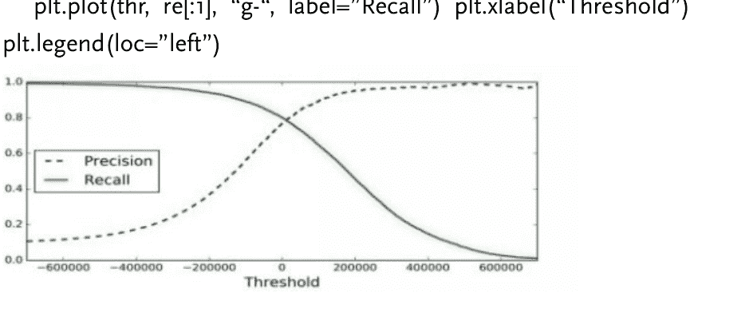
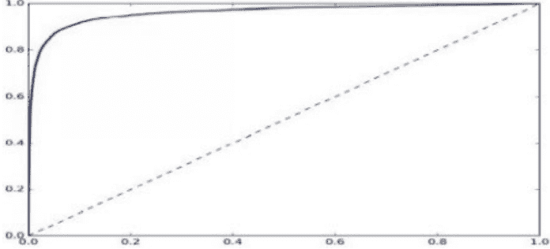
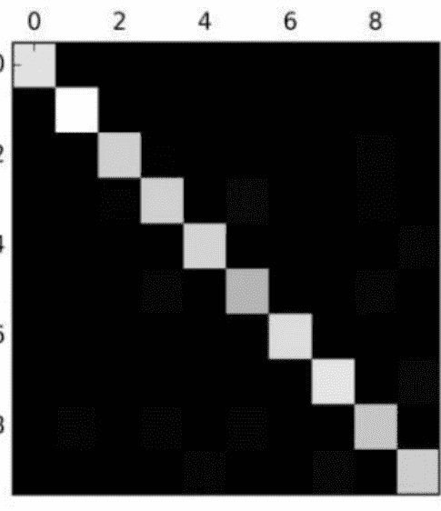
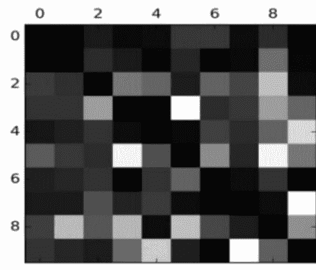
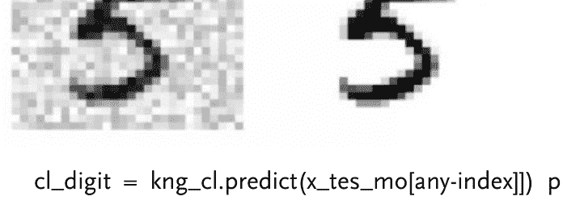
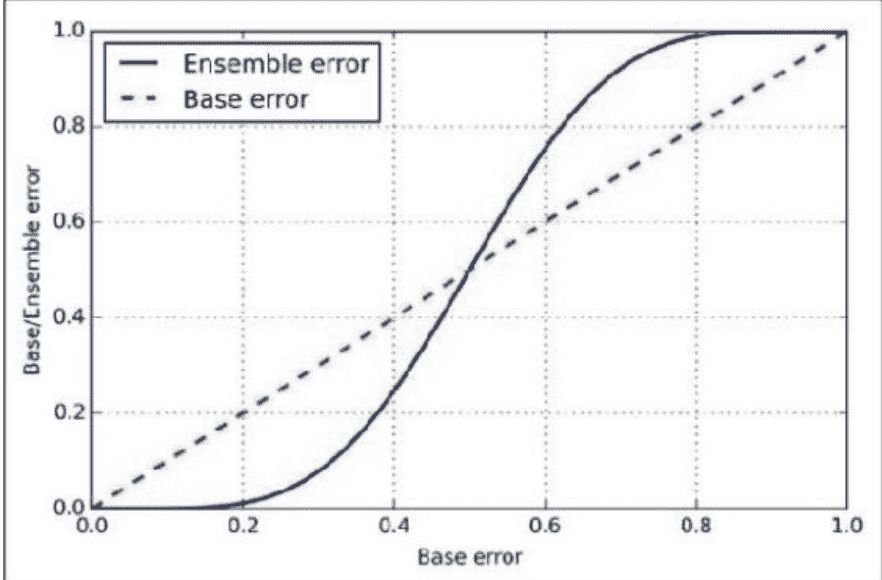
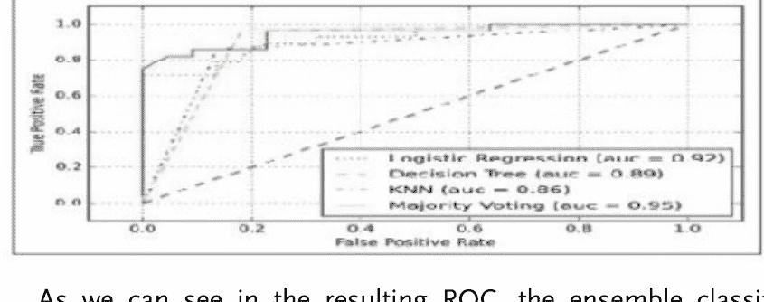
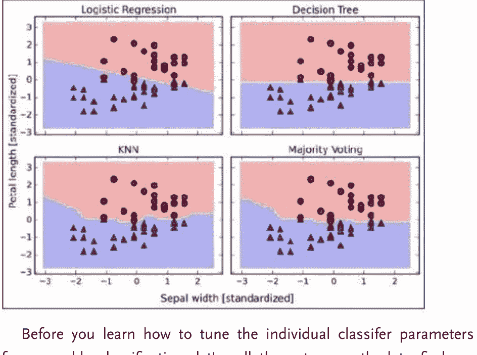

# 使用Python编程进行机器学习

成为Python编程与机器学习算法专家的全面指南

约翰·C·霍普金斯

# 机器学习

使用Python实现机器学习算法的分步指南

# 目录

# 第一章：机器学习简介

- 理论
- 什么是机器学习？为什么需要机器学习？
- 何时应使用机器学习？机器学习系统的类型
- 监督学习与无监督学习
- 监督学习
- 最重要的监督算法
- 无监督学习
- 最重要的无监督算法
- 强化学习
- 批量学习
- 在线学习
- 基于实例的学习
- 基于模型的学习
- 训练数据数量不足或质量差
- 数据质量差
- 不相关特征
- 特征工程
- 测试
- 过拟合数据的解决方案
- 欠拟合数据的解决方案
- 练习题
- 总结
- 参考文献

## 第二章：分类

- 安装
- MNIST数据集
- 性能度量
- 混淆矩阵
- 召回率
- 召回率权衡
- ROC曲线
- 多类别分类
- 训练随机森林分类器
- 错误分析
- 多标签分类
- 多输出分类
- 练习题
- 参考文献

## 第三章：如何训练模型

- 线性回归
- 计算复杂度
- 梯度下降
- 批量梯度下降
- 随机梯度下降
- 小批量梯度下降
- 多项式回归
- 学习曲线
- 正则化线性模型
- 岭回归
- Lasso回归
- 练习题
- 总结
- 参考文献

## 第四章

- 不同模型的组合
- 实现简单的多数投票分类器
- 结合不同算法进行多数投票分类

# 第一章：机器学习简介

## 理论

如果我问你关于“机器学习”的问题，你可能会想象一个机器人或类似《终结者》的东西。实际上，机器学习不仅应用于机器人技术，还涉及许多其他应用领域。你也可以将垃圾邮件过滤器想象为机器学习的早期应用之一，它帮助改善了数百万人的生活。在本章中，我将向你介绍什么是机器学习，以及它是如何工作的。

## 什么是机器学习？

机器学习是通过编程让计算机从数据中学习的实践。在上面的例子中，程序将能够轻松判断给定的电子邮件是重要的还是“垃圾邮件”。在机器学习中，数据被称为训练集或样本。

## 为什么需要机器学习？

假设你想在不使用机器学习方法的情况下编写过滤程序。在这种情况下，你将需要执行以下步骤：

- 首先，你需要查看垃圾邮件的样子。你可以根据它们使用的单词或短语（如“借记卡”、“免费”等）以及发件人姓名或邮件正文中使用的模式来选择它们。
- 其次，你需要编写一个算法来检测你看到的模式，然后如果检测到一定数量的这些模式，软件就会将邮件标记为垃圾邮件。

最后，你需要测试程序，然后重新执行前两个步骤，直到结果足够好。因为程序不是软件，它包含一个非常长的规则列表，难以维护。但如果你使用机器学习开发相同的软件，你将能够妥善维护它。

此外，电子邮件发送者可以更改他们的电子邮件模板，因此像“4U”这样的词现在变成了“for you”，因为他们的邮件已被确定为垃圾邮件。使用传统技术的程序需要更新，这意味着如果有任何其他更改，你需要一次又一次地更新代码。

另一方面，使用机器学习技术的程序将自动检测用户的这种变化，并开始标记它们，而无需你手动告诉它。

此外，我们可以使用机器学习来解决对非机器学习软件来说非常复杂的问题。例如，语音识别：当你说“一”或“二”时，程序应该能够区分差异。因此，对于这个任务，你需要开发一个测量声音的算法。

最终，机器学习将帮助我们学习，机器学习算法可以帮助我们看到我们学到了什么。

## 何时应使用机器学习？

- 当你遇到需要许多长规则列表才能找到解决方案的问题时。在这种情况下，机器学习技术可以简化你的代码并提高性能。
- 对于传统方法无法解决的非常复杂的问题。
- 非稳定环境：机器学习软件可以适应新数据。

## 机器学习系统的类型

有不同类型的机器学习系统。我们可以根据以下情况将它们分类：

- 它们是否经过人类训练
  - 监督学习
  - 无监督学习
  - 半监督学习
  - 强化学习
- 它们是否能够增量学习
  - 如果它们仅通过比较新数据点来查找数据点，或者能够检测数据中的新模式，然后构建模型。

## 监督学习与无监督学习

我们可以根据训练过程中人类监督的类型和数量对机器学习系统进行分类。如前所述，你可以找到四个主要类别。

- 监督学习
- 无监督学习
- 半监督学习
- 强化学习

### 监督学习

在这种类型的系统中，你输入算法的数据以及期望的解决方案被称为“标签”。

- 监督学习将分类任务归为一类。上面的程序就是一个很好的例子，因为它同时使用许多电子邮件及其类别进行训练。

另一个例子是预测数值，例如给定一组特征（位置、房间数量、设施）称为预测变量，预测公寓价格；这种类型的任务称为回归。

你应该记住，一些回归算法也可以用于分类，反之亦然。

### 最重要的监督算法

- K近邻算法
- 线性回归
- 神经网络
- 支持向量机
- 逻辑回归
- 决策树和随机森林

### 无监督学习

在这种类型的系统中，你可以猜测数据是无标签的。

### 最重要的无监督算法

- k均值、层次聚类分析
- 关联规则：Eclat、apriori
- 可视化和降维：核PCA、t分布、PCA

例如，假设你拥有大量关于访客使用我们其中一个算法的数据，该算法用于检测具有相似访客的群体。它可能发现65%的访客是喜欢在晚上看电影的男性，而30%的人在晚上看戏剧；在这种情况下，通过使用聚类算法，它将每个群体划分为更小的子群体。

有一些非常重要的算法，如可视化算法；这些是无监督学习算法。你需要给它们提供大量数据和无标签数据作为输入，然后你将获得2D或3D可视化作为输出。

这里的目标是在不丢失任何信息的情况下，使输出尽可能简单。为了处理这个问题，它将几个相关的特征组合成一个特征：例如，它将汽车的品牌与其型号组合在一起。这称为特征提取。

### 强化学习

强化学习是另一种机器学习系统。一个智能体（“AI系统”）会观察环境，执行给定的动作，然后获得相应的奖励。在这种类型中，智能体必须自主学习。这被称为策略。

你可以在许多学习如何行走的机器人应用中找到这种学习类型。

## 批量学习

在这类系统中，系统无法增量学习：系统必须获取所有所需数据。这意味着它将需要大量资源和大量时间，因此总是在离线状态下进行。所以，要使用这种类型的学习，首先要训练系统，然后在没有任何学习的情况下启动它。

## 在线学习

这种学习与批量学习相反。我的意思是，在这里，系统可以通过提供所有可用数据作为实例（成组或单独）来增量学习，然后系统可以即时学习。

你可以将这种类型的系统用于需要数据持续流动的问题，这些问题也需要快速适应任何变化。此外，你也可以使用这种类型的系统来处理非常大的数据集。

你应该了解你的系统适应数据变化的速度，即“学习率”。如果速度很高，意味着系统会学得相当快，但它也会很快忘记旧数据。

## 基于实例的学习

这是你应该牢记的最简单的一种学习类型。通过在我们的电子邮件程序中使用这种类型的学习，它会标记所有被用户标记过的邮件。

## 基于模型的学习

还有另一种学习类型，即从示例中学习以构建预测模型。

## 训练数据数量不足或质量差

机器学习系统不像孩子，孩子可以区分各种颜色和形状的苹果和橘子，但它们需要大量数据才能有效工作，无论你是在处理非常简单的程序和问题，还是像图像处理和语音识别这样的复杂应用。这里有一个关于数据不合理有效性的例子，展示了包含简单数据和自然语言处理复杂问题的MS项目。

### 数据质量差

如果你使用的训练数据充满错误和异常值，这将使系统很难检测到模式，因此它将无法正常工作。所以，如果你想让你的程序运行良好，你必须花更多时间清理你的训练数据。

### 不相关特征

只有当训练数据包含足够且不太不相关的特征和数据时，系统才能学习。任何机器学习项目最重要的部分是开发好的特征，即“特征工程”。

## 特征工程

特征工程的过程如下：

- **特征选择**：选择最有用的特征。
- **特征提取**：组合现有特征以提供更有用的特征。
- **创建新特征**：基于数据创建新特征。

## 测试

如果你想确保你的模型运行良好，并且模型能够泛化到新的情况，你可以通过将模型置于环境中并监控其表现来尝试新的情况。这是一个好方法，但如果你的模型不足，用户会抱怨。

你应该将你的数据分成两组，一组用于训练，第二组用于测试，这样你就可以使用第一组训练模型，使用第二组测试模型。泛化误差是在测试集上评估模型的错误率。你得到的值将告诉你你的模型是否足够好，以及它是否能正常工作。

如果错误率低，模型就是好的，会正常工作。相反，如果你的错误率高，这意味着你的模型表现会很差，无法正常工作。我的建议是使用80%的数据进行训练，20%的数据进行测试，这样测试或评估模型就非常简单了。

## 过拟合数据

如果你在外国，有人偷了你的东西，你可能会说每个人都是小偷。这是一种过度概括，在机器学习中被称为“过拟合”。这意味着机器也会做同样的事情：它们在处理训练数据时表现良好，但无法正确泛化。例如，在下图中，你会发现一个高度生活满意度模型过拟合了数据，但它在训练数据上表现良好。

当模型对于给定的训练数据量来说过于复杂时，就会发生过拟合。

### 解决方案

要解决过拟合问题，你应该做以下几点：

- 为“训练数据”收集更多数据
- 降低噪声水平
- 选择参数较少的模型

## 欠拟合数据

顾名思义，欠拟合与过拟合相反，当模型过于简单时，你会遇到这种情况。例如，以生活质量为例，现实生活比你的模型更复杂，所以即使在训练示例中，预测也不会产生相同的结果。

### 解决方案

要解决这个问题：

- 选择功能更强大的模型，它具有许多参数。
- 将最佳特征输入你的算法。这里，我指的是特征工程。
- 减少对模型的约束。

## 练习

在本章中，我们涵盖了许多机器学习的概念。接下来的章节将非常实用，你将编写代码，但你应该回答以下问题，以确保你在正确的轨道上。

- 定义机器学习
- 描述四种类型的机器学习系统。
- 监督学习和无监督学习有什么区别。
- 列出无监督任务。
- 为什么测试和验证很重要？
- 用一句话描述什么是在线学习。
- 批量学习和离线学习有什么区别？
- 你应该使用哪种类型的机器学习系统来让机器人学习如何行走？

## 总结

在本章中，你学到了许多有用的概念，所以让我们回顾一些你可能感到有点困惑的概念。机器学习：ML指的是使用给定数据使机器在某些任务上表现更好。

- 机器学习有多种类型，如监督学习、批量学习、无监督学习和在线学习。
- 要执行机器学习，你需要在训练集中收集数据，然后将该集提供给学习算法以获得输出，“预测”。
- 如果你想获得正确的输出，你的系统应该使用清晰的数据，数据不能太小，并且没有不相关的特征。

## 第2章 分类

### 安装

本章你需要安装Python、Matplotlib和Scikit-learn。只需转到参考部分并按照指示的步骤操作。

### MNIST数据集

在本章中，你将更深入地了解分类系统，并使用MNIST数据集。这是一组由学生和员工手写的70,000张数字图像。你会发现每张图像都有一个标签和一个代表它的数字。这个项目就像传统编程中的“Hello, world”示例。

所以每个机器学习的初学者都应该从这个项目开始学习分类算法。Scikit-Learn有许多函数，包括MNIST。让我们看看代码：

```
>>> from sklearn.data sets import fetch_mldata
>>> mn= fetch_mldata('MNIST original')
>>> mn
{'COL_NAMES': ['label', 'data'],
'Description': 'mldata.org data set: mn-original', 'data': array([[0,
0, 0,..., 0, 0, 0],
[0, 0, 0,..., 0, 0, 0],
[0, 0, 0,..., 0, 0, 0],
...,
[0, 0, 0,..., 0, 0, 0],
[0, 0, 0,..., 0, 0, 0],
[0, 0, 0,..., 0, 0, 0]], dataType=uint8),
'tar': array([ 0., 0., 0,..., 9., 9., 9.])} de
```

- Description是一个描述数据集的键。
- 这里的data键包含一个数组，每个实例一行，每个特征一列。
- 这个target键包含一个带有标签的数组。让我们处理一些代码：

### 性能度量

如果你想评估一个分类器，这将比回归器更困难，所以让我们来解释如何评估分类器。

在这个例子中，我们将使用交叉验证来评估我们的模型。

```python
from sklearn.model_selection import StratifiedKFold
from sklearn.base import clone
sf = StratifiedKFold(n_splits=2, random_state=40)
for train_index, test_index in sf.split(X_tr, y_tr_6):
    cl = clone(sgd_clf)
    X_tr_fd = X_tr[train_index]
    y_tr_fd = (y_tr_6[train_index])
    X_tes_fd = X_tr[test_index]
    y_tes_fd = (y_tr_6[test_index])
    cl.fit(X_tr_fd, y_tr_fd)
    y_p = cl.predict(X_tes_fd)
    print(n_correct / len(y_p))
```

我们使用 **StratifiedKFold** 类来执行分层采样，以生成包含每个类别比例的折。接下来，代码中的每次迭代都会创建一个分类器的克隆，以便在测试折上进行预测。最后，它会统计正确预测的数量及其比例。

现在，我们将使用 `cross_val_score` 函数通过 K 折交叉验证来评估 SGDClassifier。K 折交叉验证会将训练集分成 3 折，然后在每一折上进行预测和评估。

```python
from sklearn.model_selection import cross_val_score
cross_val_score(sgd_clf, X_tr, y_tr_6, cv=3, scoring="accuracy")
```

你将得到所有折上“正确预测”的准确率比例。

让我们对非6图像中的每一张图像进行分类。

```python
from sklearn.base import BaseEstimator
class Never6Classifier(BaseEstimator):
    def fit(self, X, y=None):
        pass

    def predict(self, X):
        return np.zeros((len(X), 1), dtype=bool)
```

让我们用以下代码检查这个模型的准确性：

```python
>>> never_6_cl = Never6Classifier()
>>> cross_val_score(never_6_cl, X_tr, y_tr_6, cv=3, scoring="accuracy")
Output: array(["num", "num", "num"])
```

对于输出，你将得到不低于90%的准确率：只有10%的图像是6，所以我们可以总是假设一张图像不是6。我们大约90%的时候都是对的。

请记住，如果你处理的是不平衡的数据集，准确率并不是分类器的最佳性能度量指标。

#### 混淆矩阵

有一种更好的方法来评估你的分类器的性能：混淆矩阵。

使用混淆矩阵来衡量性能很容易，只需计算类别X的实例被分类为类别Y的次数即可。例如，要获得将6分类为2的次数，你应该查看混淆矩阵的行和列。

让我们使用 `cross_val_predict()` 函数来计算混淆矩阵。

```python
from sklearn.model_selection import cross_val_predict
y_tr_pre = cross_val_predict(sgd_clf, X_tr, y_tr_6, cv=3)
```

这个函数，就像 `cross_val_score()` 函数一样，执行 K 折交叉验证，它也会返回每一折上的预测。它还会为你的训练集中的每个实例返回一个干净的预测。

现在我们准备好使用以下代码来获取矩阵。

```python
from sklearn.metrics import confusion_matrix
confusion_matrix(y_tr_6, y_tr_pred)
```

你将得到一个包含4个值的数组，“数字”。矩阵中的每一行代表一个真实类别，每一列代表一个预测类别。第一行是负类：即“包含非6图像”。你可以从矩阵中学到很多东西。

但如果你想知道正类预测的准确率，还有一个很好的指标可以使用，那就是分类器的精确率，使用以下公式计算。

精确率 = (TP) / (TP + FP) 真正例的数量 / 假正例的数量

召回率 = (TP) / (TP + FN) “敏感度”：它衡量正类实例的比例。

#### 召回率

```python
>>> from sklearn.metrics import precision_score, recall_score
>>> precision_score(y_tr_6, y_pre)
>>> recall_score(y_tr_6, y_tr_pre)
```

将精确率和召回率结合成一个指标是非常常见的，这就是 F1 分数。

F1 是精确率和召回率的平均值。我们可以用以下公式计算 F1 分数：

F1 = 2 / ((1/精确率) + (1/召回率)) = 2 * (精确率 * 召回率) / (精确率 + 召回率) = (TP) / ((TP) + (FN+FP)/2)

要计算 F1 分数，只需使用以下函数：

```python
>>> from sklearn.metrics import f1_score
>>> f1_score(y_tr_6, y_pre)
```

#### 精确率与召回率的权衡

要理解这一点，你应该看看 SGDClassifier 以及它如何做出分类决策。它基于决策函数计算分数，然后将分数与阈值进行比较。如果分数大于阈值，它就会将实例分配给“正类或负类”。

例如，如果决策阈值在中间，你会发现阈值右侧有4个真正的正例，只有一个假正例。所以精确率将只有80%。

在 Scikit-Learn 中，你不能直接设置阈值。你需要访问决策分数，它用于预测，并通过调用 `decision_function()` 来获取。

```python
>>> y_sco = sgd_clf.decision_function([any_digit])
>>> y_sco
>>> threshold = 0
>>> y_any_digit_pre = (y_sco > threshold)
```

在这段代码中，SGDClassifier 包含一个阈值，= 0，以返回与 `predict()` 函数相同的结果。

```python
>>> threshold = 20000
>>> y_any_digit_pre = (y_sco > threshold)
>>> y_any_digit_pre
```

这段代码将证实，当阈值增加时，召回率会降低。

```python
y_sco = cross_val_predict(sgd_cl, x_tr, y_tr_6, cv=3, method="decision_function")
```

现在是时候通过调用 `precision_recall_curve()` 函数来计算所有可能的精确率和召回率对应的阈值了。

```python
from sklearn.metrics import precision_recall_curve
precisions, recalls, threshold = precision_recall_curve(y_tr_6, y_sco)
```

接下来，让我们使用 Matplotlib 绘制精确率和召回率曲线。

```python
def plot_pre_re(pre, re, thr):
    plt.plot(thr, pre[:-1], "b--", label="precision")
    plt.plot(thr, re[:-1], "g-", label="Recall")
    plt.xlabel("Threshold")
    plt.legend(loc="left")
```



```python
plt.ylim([0, 1])
plot_pre_re(pre, re, thr)
plt.show()
```

#### ROC

ROC 代表受试者工作特征曲线，它是一种用于二元分类器的工具。

这个工具类似于召回率曲线，但它绘制的不是精确率和召回率：它绘制的是真正率和假正率。你还会用到 FPR，即负样本的比例。你可以想象它类似于（1 - 负类率）。另一个概念是 TNR，即特异度。召回率 = 1 - 特异度。

让我们来玩转 ROC 曲线。首先，我们需要通过调用 `roc_curve()` 函数来计算 TPR 和 FPR。

```python
from sklearn.metrics import roc_curve
fp, tp, thers = roc_curve(y_tr_6, y_sco)
```

之后，你将根据以下说明使用 Matplotlib 绘制 FPR 和 TPR。

```python
def roc_plot(fp, tp, label=None):
    plt.plot(fp, tp, linewidth=2, label=label)
    plt.plot([0, 1], [0, 1], "k--")
    plt.axis([0, 1, 0, 1])
    plt.xlabel('This is the false rate')
    plt.ylabel('This is the true rate')
roc_plot(fp, tp)
plt.show()
```



### 多类别分类

我们使用二元分类器来区分任意两个类别，但如果你想区分两个以上的类别呢？

你可以使用像随机森林分类器或贝叶斯分类器这样的方法，它们可以进行两个以上类别的比较。但另一方面，SVM（支持向量机）和线性分类器的功能类似于二元分类器。

如果你想开发一个将数字图像分类为12个类别（从0到11）的系统，你需要训练12个二元分类器，为每个分类器创建一个（例如4-检测器、5-检测器、6-检测器等等），然后你需要获取每个分类器对图像的 DS，即“决策分数”。接着，你将选择得分最高的分类器。我们称之为 OvA 策略：“一对多”。

另一种方法是为每一对数字训练一个二元分类器；例如，一个用于5和6，另一个用于5和7。——我们称这种方法为 OvO，“一对一”——要计算你需要多少个分类器，基于类别数量使用以下公式：“N = 类别数”。

N * (N-1)/2。如果你想在 MNIST 上使用这种技术，10 * (10-1)/2，结果将是45个分类器，“二元分类器”。

在 Scikit-Learn 中，当你使用二元分类算法时，会自动执行 OvA。

```python
>>> sgd_cl.fit(x_tr, y_tr)
>>> sgd_cl.predict([any_digit])
```

此外，你可以调用 `decision_function()` 来返回分数“一个类别的10个分数”。

```python
>>> any_digit_scores = sgd_cl.decision_function([any_digit])
>>> any_digit_scores
array(["num", "num", "num", "num", "num", "num", "num", "num", "num", "num"])
```

### 训练随机森林分类器

```python
>>> forest_clf.fit(x_tr, y_tr)
>>> forest_clf.predict([any_digit])
array([num])
```

如你所见，仅用两行代码训练一个随机森林分类器非常简单。

Scikit-Learn 没有执行任何 OvA 或 OvO 函数，因为这类算法——“随机森林分类器”——可以自动处理多个类别。如果你想查看分类器的可能性列表，可以调用 `predict_proba()` 函数。

```python
>>> forest_clf.predict_proba([any_digit])
array([[0.1, 0, 0, 0.1, 0, 0.8, 0, 0, 0]])
```

分类器的预测非常准确，正如你在输出中看到的；索引5处的值为0.8。

让我们使用 `cross_val_score()` 函数来评估分类器。

```python
>>> cross_val_score(sgd_cl, x_tr, y_tr, cv=3, scoring="accuracy")
array([0.84463177, 0.859668, 0.8662669])
```

在交叉验证的折中，你会得到84%以上的准确率。当使用随机分类器时，在这种情况下，你会得到10%的准确率分数。请记住，这个值越高越好。

### 错误分析

首先，在开发机器学习项目时：

-   确定问题；
-   收集数据；
-   处理并探索数据；
-   清洗数据；
-   尝试多种模型并选择最佳模型；
-   将你的模型组合成解决方案；
-   展示你的解决方案；
-   执行并测试你的系统。

首先，你应该使用混淆矩阵，并通过交叉验证函数进行预测。接下来，你将调用混淆矩阵函数：

```python
>>> y_tr_pre = cross_val_prediction(sgd_cl, x_tr_scaled, y_tr, cv=3)
>>> cn_mx = confusion_matrix(y_tr, y_tr_pre)
>>> cn_mx

array([[5625, 2, 8, 11, 44, 52, 12, 34, 6],
       [ 2, 2415, 41, 22, 8, 45, 10, 10, 9],
       [ 52, 43, 7443, 104, 89, 26, 87, 60, 166, 13],
       [ 47, 46, 141, 5342, 1, 231, 40, 50, 141, 92],
       [ 19, 29, 41, 10, 5366, 9, 56, 37, 86, 189],
       [ 73, 45, 36, 193, 64, 4582, 111, 30, 193, 94],
       [ 29, 34, 44, 2, 42, 85, 5627, 10, 45, 0],
       [ 25, 24, 74, 32, 54, 12, 6, 5787, 15, 236],
       [ 52, 161, 73, 156, 10, 163, 61, 25, 5027, 123],
       [ 50, 24, 32, 81, 170, 38, 5, 433, 80, 4250]])
```



```python
plt.matshow(cn_mx, cmap=plt.cm.gray)
plt.show()
```

首先，你应该将矩阵中的每个值除以该类别中的图像数量，然后比较错误率。

```python
rw_sum = cn_mx.sum(axis=1, keepdims=True)
nm_cn_mx = cn_mx / rw_sum
```

下一步是**将对角线上的所有值设为零**，这将有助于发现错误。

```python
np.fill_diagonal(nm_cn_mx, 0)
plt.matshow(nm_cn_mx, cmap=plt.cm.gray)
plt.show()
```



在上面的图中很容易发现错误。需要记住的一点是，行代表真实类别，列代表预测值。

### 多标签分类

在上面的例子中，每个类别只有一个实例。但如果我们想将实例分配给多个类别呢——例如人脸识别。

假设你想在同一张照片中找到多张人脸。每张人脸都会有一个标签。让我们用一个简单的例子来练习。

```python
y_tr_big = (y_tr >= 7)
y_tr_odd = (y_tr % 2 == 1)
y_multi = np.c_[y_tr_big, y_tr_odd]
kng_cl = KNeighborsClassifier()
kng_cl.fit(x_tr, y_multi)
```

在这些指令中，我们创建了一个 `y_multi` 数组，其中包含每个图像的两个标签。

第一个标签包含数字是否“大”（8,9,...）的信息，第二个标签检查它是否是奇数。

接下来，我们将使用以下指令集进行预测。

```python
>>> kng_cl.predict([any_digit])
array([False, True], dtype=bool)
```

这里的 **True** 表示它是奇数，**False** 表示它不是大数字。

### 多输出分类

至此，我们可以涵盖最后一种分类任务类型，即多输出分类。

它只是多标签分类的一个通用情况，但每个标签都将是一个多类别。换句话说，它将有多个值。

让我们用这个例子来说明，使用 MNIST 图像，并使用 NumPy 函数为图像添加一些噪声。

```python
no = rnd.randint(0, 101, (len(x_tr), 785))
no = rnd.randint(0, 101, (len(x_tes), 785))
x_tr_mo = x_tr + no
x_tes_mo = x_tes + no
y_tr_mo = x_tr
y_tes_mo = x_tes
kng_cl.fit(x_tr_mo, y_tr_mo)
```



```python
cl_digit = kng_cl.predict(x_tes_mo[any_index])
plot_digit(cl_digit)
```

## 练习

为 MNIST 数据集构建一个分类器。尝试在测试集上获得超过 96% 的准确率。

编写一个方法，将 MNIST 中的图像向右或向左平移 2 个像素。

开发你自己的反垃圾邮件程序或分类器。

- 从 Google 下载垃圾邮件示例。
- 提取数据集。
- 将数据集划分为训练集和测试集。
- 编写一个程序，将每封电子邮件转换为特征向量。
- 尝试不同的分类器，并尝试构建尽可能好的分类器，使其具有较高的召回率和精确率。

## 总结

在本章中，你学习了有用的新概念，并实现了多种类型的分类算法。你还接触了新的概念，例如：

- ROC：受试者工作特征曲线，用于二元分类器的工具。
- 误差分析：优化你的算法。
- 如何使用 Scikit-Learn 中的 forest 函数训练随机森林分类器。
- 理解多输出分类。
- 理解多标签分类。

## 第 3 章
### 如何训练模型

在使用了许多看似深不可测的黑箱机器学习模型和训练算法之后，我们能够优化回归系统，也处理过图像分类器。但我们是在不理解其内部原理和工作方式的情况下开发这些系统的，因此现在我们需要深入探究，以便掌握它们的工作原理并理解实现的细节。

深入理解这些细节将帮助你选择正确的模型和最佳的训练算法。此外，它还将帮助你进行调试和误差分析。

在本章中，我们将研究多项式回归，这是一种适用于非线性数据集的复杂模型。此外，我们将研究几种正则化技术，这些技术可以减少导致过拟合的训练。

### 线性回归

举个例子，我们取 $I_S = \theta_0 + \theta_1 \times GDP\_per\_cap$。这是一个针对输入特征 "GDP_per_cap" 的线性函数的简单模型。($\theta_0$ 和 $\theta_1$) 是模型的参数。

$$\hat{y} = \theta_0 + \theta_1x_1 + \theta_2x_2 + \cdots + \theta_nx_n$$

通常，你将使用线性模型进行预测，方法是计算输入特征的加权和，以及一个常数“偏置”，如下方公式所示。

- Y 是预测值。
- N 代表特征数量。
- X1 是特征的值。
- $\Theta_j$ 是第 j 个 theta 的模型参数。

此外，我们可以将方程写成向量化形式，如下例所示：

$$\hat{y} = h_{\theta}(\mathbf{x}) = \theta^T \cdot \mathbf{x}$$

- $\Theta$ 是使成本最小化的值。
- Y 包含从 $y^{(1)}$ 到 $y^{(m)}$ 的值。

让我们编写一些代码来练习。导入 numpy 为 np。

```python
V1_x = 2 * np.random.rand(100, 1)
V2_y = 4 + 3 * V1_x + np.random.randn(100, 1)
```

之后，我们将使用我们的方程计算 $\Theta$ 值。是时候使用我们 numpy 线性代数模块 (np.linalg) 中的 inv() 函数来计算任何矩阵的逆矩阵，以及用于矩阵乘法的 dot() 函数了。

```python
Value1 = np.c_[np.ones((100, 1)), V1_x]
myTheta = np.linalg.inv(Value1.T.dot(Value1)).dot(Value1.T).dot(V2_y)
>>> myTheta
Array([[num], [num]])
```

此函数使用以下方程 — y = 4 + 3x + 噪声 "高斯" — 来生成我们的数据。

现在让我们进行预测。

```python
>>> V1_new = np.array([[0],[2]])
>>> V1_new_2 = np.c_[np.ones((2,1)), V1_new]
>>> V2_predict = V1_new_2.dot(myTheta)
>>> V2_predict
Array([[ 4.219424], [9.74422282]])
```

现在，是时候绘制模型了。

```python
plt.plot(V1_new, V2_predict, "r-")
plt.plot(V1_x, V2_y, "b.")
plt.axis([0,2,0,15])
plt.show()
```

#### 计算复杂度

使用正规公式，我们可以计算 $M^T \cdot M$ 的逆矩阵——即一个 n*n 矩阵（n = 特征数量）。这种求逆的复杂度大约在 $O(n^{2.5})$ 到 $O(n^{3.2})$ 之间，具体取决于实现方式。

实际上，**如果你使特征数量增加**，计算时间将在 $2^{2.5}$ 到 $2^{3.2}$ 之间。

这里的好消息是，该方程是一个线性方程。这意味着它可以轻松处理大型训练集并适应内存。

训练模型后，预测速度不会慢，复杂度也会很简单，这要归功于线性模型。现在是时候深入研究训练线性回归模型的方法了，当内存中有大量特征和实例时，这种方法总是被使用。

#### 梯度下降

该算法是一种通用算法，用于优化和为各种问题提供最优解决方案。该算法的思想是以迭代方式处理参数，使成本函数尽可能简单。

梯度下降算法使用参数 theta 计算误差的梯度，并使用梯度下降法进行工作。如果梯度等于零，你就达到了最小值。

此外，你应该记住，步长大小对该算法非常重要，因为如果它非常小——意味着“学习率”很慢——它将需要很长时间才能覆盖所有需要的内容。

但是当学习率很高时，它将在短时间内覆盖所需内容，并提供最优解。

最后，你不会总是发现所有成本函数都很容易，正如你所看到的，你还会发现不规则的函数，这使得获得最优解变得非常困难。当局部最小值和全局最小值看起来像下图所示时，就会出现这个问题。

如果你在曲线上任意取两个点，你会发现线段不会将它们连接在同一条曲线上。这个成本函数看起来会像一个碗，如果特征具有许多不同的尺度，就会发生这种情况，如下图所示。

##### 批量梯度下降

如果你想实现这个算法，你应该首先使用 theta 参数计算成本函数的梯度。如果参数 theta 的值发生了变化，你需要知道成本函数的变化率。我们可以将这种变化称为偏导数。

我们可以使用以下方程计算偏导数：

但我们也将使用以下方程一起计算偏导数和梯度向量。

让我们实现这个算法。

```python
Lr = 1  # Lr 代表学习率
Num_it = 1000  # 迭代次数
L = 100
myTheta = np.random.randn(2,1)

for it in range(Num_it):
    gr = 2/L * Value1.T.dot(Value1.dot(myTheta) - V2_y)
    myTheta = myTheta - Lr * gr

>>> myTheta
Array([[num],[num]])
```

如果你尝试更改学习率值，你会得到不同的形状，如下图所示。

##### 随机梯度下降

使用批量梯度下降时，你会发现一个问题：它需要使用整个训练集来计算每一步的值，这会影响性能“速度”。

但是当使用随机梯度下降时，算法将在每一步从你的训练集中随机选择一个实例，然后计算值。通过这种方式，算法将比批量梯度下降更快，因为它不需要使用整个集合来计算值。另一方面，由于这种方法的随机性，与批量算法相比，它将是不规则的。

让我们实现这个算法。

```python
Nums = 50
L1, L2 = 5, 50

def lr_sc(s):
    return L1 / (s + L2)
```

##### 小批量梯度下降

由于你已经了解了批量算法和随机算法，这类算法非常容易理解和使用。如你所知，这两种算法分别基于整个训练集或单个实例来计算梯度值。然而，小批量算法基于小的随机子集来计算，其性能优于另外两种算法。

#### 多项式回归

当处理更复杂的数据时，特别是在线性和非线性数据的情况下，我们将使用这种技术。在为每个特征添加了幂次之后，我们可以用新的特征来训练模型。这被称为多项式回归。

现在，让我们写一些代码。

```python
L = 100
V1 = 6*np.random.rand(L, 1) - 3
V2 = 0.5 * V1**2 + V1 + 2 + np.random.randn(L, 1)
```

如你所见，直线永远无法以最有效的方式表示数据。因此，我们将使用多项式方法来解决这个问题。

```python
>>> from sklearn.preprocessing import PolynomialFeatures
>>> P_F = PolynomialFeatures(degree = 2, include_bias=False)
>>> V1_P = P_F.fit_transform(V1)
```

```python
>>> V1[0]
Array([num])
>>> V1_P[0]
```

现在，让我们用我们的数据正确地构建这个函数，并改变直线。

```python
>>> ln_r = LinearRegression()
>>> ln_r.fit(V1_P, V2)
>>> ln_r.intercept_, ln_r.coef_
```

#### 学习曲线

假设你正在使用多项式回归，并且希望它比线性回归更好地拟合数据。在下图中，你会看到一个300度的模型。我们还可以将最终结果与其他类型的回归进行比较：“普通线性回归”。

在上图中，你可以看到使用多项式时数据的过拟合。另一方面，使用线性回归时，你可以明显看到数据欠拟合。

#### 正则化线性模型

在第一章和第二章中，我们研究了如何通过稍微正则化模型来减少过拟合，例如，如果你想正则化一个多项式模型。在这种情况下，要解决这个问题，你应该减少多项式的次数。

##### 岭回归

岭回归是线性回归的另一个版本，但经过正则化并在代价函数中添加了权重，这使得它能够拟合数据，甚至使模型的权重尽可能简单。以下是岭回归的代价函数：

作为岭回归的一个例子，请看下图。

##### Lasso回归

Lasso回归代表“最小绝对收缩和选择算子”回归。这是线性回归正则化版本的另一种类型。
它看起来像岭回归，但在方程中有一个小的变化，如下图所示。
Lasso回归的代价函数：

$$J(\theta) = \text{MSE}(\theta) + \alpha \sum_{i=1}^{n} |\theta_i|$$

如下图所示，Lasso回归使用的值比岭回归更小。

## 练习

如果你有一个包含大量特征（数百万个）的数据集，你应该使用哪种回归算法，为什么？

如果你使用批量梯度下降来绘制每个周期的误差，并且突然误差率增加，你将如何解决这个问题？

如果你注意到使用小批量方法时误差变大，你应该怎么做？为什么？
从这些配对中，哪种方法更好？为什么？

- 岭回归和线性回归？
- Lasso回归和岭回归？

写出批量梯度下降算法。

## 总结

在本章中，你学习了新的概念，并学习了如何使用不同类型的算法训练模型。你还学习了何时使用每种算法，包括以下内容：

- 批量梯度下降
- 小批量梯度下降
- 多项式回归
- 正则化线性模型
  - 岭回归
  - Lasso回归

此外，你现在知道某些术语的含义：线性回归、计算复杂度和梯度下降。

## 第四章：不同模型的组合

树分类器。

下图将说明收集函数的一般目标的定义，即将不同的分类器合并成一个分类器，使其比每个单独的分类器具有更好的泛化性能。

例如，假设你收集了许多专家的预测。集成方法允许我们将这些众多专家的预测合并，得到一个比每个单独专家的预测更合适、更稳健的预测。正如你将在本部分稍后看到的，有许多不同的方法可以创建分类器的集成。在本部分中，我们将介绍关于集成如何工作以及为什么它们通常被认为能产生良好泛化性能的基本概念。

在本部分中，我们将使用最流行的集成方法，即基于多数投票原则。多数投票简单来说就是选择被大多数分类器预测的标签；即获得超过50%的选票。例如，这里的术语“投票”仅指二元分类设置。然而，将多数投票原则扩展到多类设置并不困难，这被称为相对多数投票。之后，我们将选择获得最多票数的类标签。下图说明了10个分类器集成的多数和相对多数投票的概念，其中每个唯一的符号（三角形、正方形和圆形）代表一个唯一的类标签：

使用训练集，我们首先训练m个不同的分类器（$C_1, C_2, ..., C_m$）。根据该方法，集成可以由许多分类算法构建；例如，决策树、支持向量机、逻辑回归分类器等。事实上，你可以使用相同的基础分类算法来拟合训练集的不同子集。这种方法的一个例子是随机森林算法，它使用多数投票合并了许多决策树集成。

为了通过简单的多数或相对多数投票预测类标签，我们组合每个单独分类器$C_j$的预测类标签，并选择获得最多票数的类标签$\hat{y}$：

$$\hat{y} = \text{mode}\{C_1(\mathbf{x}), C_2(\mathbf{x}), ..., C_m(\mathbf{x})\}$$

例如，在一个二元分类任务中，其中class1 = -1，class2 = +1，我们可以写出多数投票预测。

为了说明为什么集成方法可以比单独的分类器工作得更好，让我们应用组合学的简单概念。对于下面的例子，我们假设所有n个基础分类器对于一个二元分类任务具有相等的错误率$\varepsilon$。此外，我们假设分类器是独立的，并且错误率不相关。如你所见，我们可以简单地将基础分类器集成的错误统计解释为一个概率。

二项分布的质量函数：
这里，$n, k$ 是二项系数 $n$ 选 $k$。如你所见，你可以计算集成预测错误的概率。现在，让我们来看一个更具体的例子：11个基分类器（$n = 11$），错误率为0.25（$\varepsilon = 0.25$）：

你可以注意到，如果满足所有假设，集成分类器的错误率（0.034）小于每个单独分类器的错误率（0.25）。请注意，在这个简化的图中，偶数个分类器 $n$ 的50-50平局被视为错误，而实际上这只有一半的时间是正确的。为了将这种理想化的集成分类器与不同基错误率下的基分类器进行比较，让我们在Python中实现概率质量函数：

```python
>>> import math
>>> def ensemble_error(n_classifier, error):
...     q_start = math.ceil(n_classifier / 2.0)
...     probability = [comb(n_classifier, q) *
...     error**q *
...     (1-error)**(n_classifier - q)
...     for q in range(q_start, n_classifier + 2)]
...     return sum(probability)
>>> ensemble_error(n_classifier=11, error=0.25)
0.034327507019042969
```

让我们编写一些代码来计算不同错误率下的错误率，并在折线图中可视化集成错误与基错误之间的关系：

```python
>>> import numpy as np
>>> error_range = np.arange(0.0, 1.01, 0.01)
>>> en_error = [ensemble_error(n_classifier=11, error=er)
... for er in error_range]
>>> import matplotlib.pyplot as plt
>>> plt.plot(error_range, en_error,
... label='Ensemble error',
... linewidth=2)
>>> plt.plot(error_range, error_range,
... ls='--', label='Base error',
... linewidth=2)
>>> plt.xlabel('Base error')
>>> plt.ylabel('Ensemble error')
>>> plt.legend(loc='upper left')
>>> plt.grid()
>>> plt.show()
```

正如我们在结果图中看到的，只要基分类器的表现优于随机猜测（$\varepsilon < 0.5$），集成分类器的错误概率总是优于单个基分类器的错误率。你应该注意到，y轴同时描绘了基错误和集成错误（实线）：



### 实现一个简单的多数投票分类器

正如我们在上一节机器学习介绍中看到的，我们将进行一个热身训练，然后在Python编程中开发一个用于多数投票的简单分类器。如你所见，下一个算法将通过相对多数投票处理多类问题；为了简单起见，你将使用术语“多数投票”，这在文献中也经常这样做。

在下面的程序中，我们将开发并组合与置信度相关的不同分类程序，每个程序都有各自的权重。我们的目标是构建一个更强大的元分类器，以平衡各个分类器在特定数据集上的弱点。用更精确的数学术语来说，我们可以写出加权多数投票。

为了将加权多数投票的概念转化为Python代码，我们可以使用NumPy方便的argmax和bincount函数：

```python
>>> import numpy as np
>>> np.argmax(np.bincount([0, 0, 1],
... weights=[0.2, 0.2, 0.6]))
1
```

这里，$p_{ij}$ 是第 $j$ 个分类器对类别标签 $i$ 的预测概率。为了继续我们之前的例子，假设我们有一个二分类问题，类别标签 $i \in \{0, 1\}$，以及三个分类器 $C_j$（$j \in \{1, 2, 3\}$）的集成。假设分类器 $C_j$ 对特定样本 $x$ 返回以下类别成员概率：

$C_1(x) \rightarrow [0.9, 0.1], C_2(x) \rightarrow [0.8, 0.2], C_3(x) \rightarrow [0.4, 0.6]$

为了实现基于类别概率的加权多数投票，我们可以再次利用NumPy的numpy.average和np.argmax：

```python
>>> ex = np.array([[0.9, 0.1],
... [0.8, 0.2],
... [0.4, 0.6]])
>>> p = np.average(ex, axis=0, weights=[0.2, 0.2, 0.6])
>>> p
array([ 0.58, 0.42])
>>> np.argmax(p)
0
```

将所有内容整合在一起，现在让我们在Python中实现一个MajorityVoteClassifier：

```python
from sklearn.base import BaseEstimator, ClassifierMixin
from sklearn.preprocessing import LabelEncoder
from sklearn.externals import six
from sklearn.base import clone
from sklearn.pipeline import _name_estimators
import numpy as np
import operator

class MVClassifier(BaseEstimator, ClassifierMixin):
    """ A majority vote ensemble classifier

    Parameters
    ----------
    cl : array-like, shape = [n_classifiers]
        Different classifiers for the ensemble.
    vote : str, {'cl_label', 'prob'}
        Default: 'cl_label'
        If 'cl_label' the prediction is based on the argmax of class labels.
        If 'prob', the argmax of the sum of probabilities is used to predict the class label (recommended for calibrated classifiers).
    w : array-like, shape = [n_classifiers]
        Optional, default: None
        If a list of `int` or `float` values are provided, the classifiers are weighted by these values.
    """
    def __init__(self, cl, vote='cl_label', w=None):
        self.cl = cl
        self.named_cl = {key: value for
                         key, value in
                         _name_estimators(cl)}
        self.vote = vote
        self.w = w

    def fit(self, X, y):
        """ Fit classifiers.

        Parameters
        ----------
        X : {array-like, sparse matrix}, shape = [n_samples, n_features]
            Matrix of training samples.
        y : array-like, shape = [n_samples]
            Vector of target class labels.

        Returns
        -------
        self : object
        """
        # Use LabelEncoder to ensure class labels start
        # with 0, which is important for np.argmax
        # call in self.predict
        self.lablenc_ = LabelEncoder()
        self.lablenc_.fit(y)
        self.classes_ = self.lablenc_.classes_
        self.cl_ = []

        for cl in self.cl:
            fit_cl = clone(cl).fit(X, self.lablenc_.transform(y))
            self.cl_.append(fit_cl)
        return self
```

我在代码中添加了很多注释，以便更好地理解各个部分。然而，在我们实现其余方法之前，让我们稍作休息，讨论一些一开始可能看起来令人困惑的代码。我们使用了父类BaseEstimator和ClassifierMixin来免费获得一些基本功能，包括用于设置和返回分类器参数的get_params和set_params方法，以及用于计算预测准确率的score方法。另外，请注意我们导入了six，以使MajorityVoteClassifier与Python 2.7兼容。

接下来，我们将添加predict方法，以便在使用vote='classlabel'初始化新的MajorityVoteClassifier对象时，通过基于类标签的多数投票来预测类标签。或者，我们可以使用vote='probability'初始化集成分类器，以基于类别成员概率预测类标签。此外，我们还将添加一个predict_proba方法来返回平均概率，这对于计算受试者工作特征曲线下面积（ROC AUC）很有用。

```python
    def predict(self, X):
        """ Predict class labels for X.

        Parameters
        ----------
        X : {array-like, sparse matrix},
            shape = [n_samples, n_features]
            Matrix of training samples.

        Returns
        -------
        maj_v : array-like, shape = [n_samples]
            Predicted class labels.
        """
        if self.vote == 'probability':
            maj_v = np.argmax(self.predict_proba(X), axis=1)
        else:  # 'cl_label' vote
            predictions = np.asarray([cl.predict(X) for cl in
                                      self.cl_]).T
            maj_v = np.apply_along_axis(
                lambda x:
                np.argmax(np.bincount(x, weights=self.w)), axis=1,
                arr=predictions)
            maj_v = self.lablenc_.inverse_transform(maj_v)
        return maj_v

    def predict_proba(self, X):
        """ Predict class probabilities for X.

        Parameters
        ----------
        X : {array-like, sparse matrix},
            shape = [n_samples, n_features]
            Training vectors, where n_samples is the number of samples
            and n_features is the number of features.

        Returns
        -------
        av_prob : array-like, shape = [n_samples, n_classes]
            Weighted average probability for each class per sample.
        """
        probs = np.asarray([cl.predict_proba(X) for cl in self.cl_])
        av_prob = np.average(probs, axis=0, weights=self.w)
        return av_prob

    def get_params(self, deep=True):
        """ Get classifier parameter names for GridSearch"""
        if not deep:
            return super(MVClassifier, self).get_params(deep=False)
        else:
            out = self.named_cl.copy()
            for name, step in \
                    six.iteritems(self.named_cl):
                for k, value in six.iteritems(step.get_params(deep=True)):
                    out['%s__%s'
                        % (name, k)] = value
            return out
```

### 结合不同算法进行多数投票分类

现在，是时候将我们在上一节实现的MVC付诸实践了。你应该首先准备一个可以测试它的数据集。由于我们已经熟悉从CSV文件加载数据集的技术，我们将走个捷径，从scikit-learn的dataset模块加载Iris数据集。

此外，我们将只选择两个特征：花萼宽度和花瓣长度，以使分类任务更具挑战性。尽管我们的MajorityVoteClassifier（或MVC）可以推广到多类问题，但我们将只对来自两个类别的花样本（Iris-Versicolor和Iris-Virginica）进行分类，以计算ROC AUC。代码如下：

```python
>>> import sklearn as sk
>>> import sklearn.cross_validation as cv
>>> from sklearn import datasets
>>> from sklearn.preprocessing import LabelEncoder
>>> ir = datasets.load_iris()
>>> X, y = ir.data[50:, [1, 2]], ir.target[50:]
>>> le = LabelEncoder()
>>> y = le.fit_transform(y)
```

接下来，我们将Iris样本分成50%的训练数据和50%的测试数据：

```python
>>> from sklearn.cross_validation import train_test_split
>>> X_train, X_test, y_train, y_test = \
...     train_test_split(X, y,
...                      test_size=0.5,
...                      random_state=1)
```

使用训练数据集，我们现在将训练三个不同的分类器——一个逻辑回归分类器、一个决策树分类器和一个k近邻分类器——并通过10折交叉验证查看它们各自的性能。

### 分类器

在本节中，你将从测试集计算ROC曲线，以检查多数投票分类器是否能很好地泛化到未见过的数据。我们应该记住，测试集不会用于模型选择；唯一的目标是报告分类器系统准确性的估计值。让我们看看导入的指标。

```python
from sklearn.metrics import roc_curve, auc
cls = ['black', 'orange', 'blue', 'green']
ls = [':', '--', '-.', '-']
for clf, label, clr, l in zip(all_clf, clf_labels, cls, ls):
    y_pred = clf.fit(X_train, y_train).predict_proba(X_test)[:, 1]
    fpr, tpr, thresholds = roc_curve(y_true=y_test, y_score=y_pred)
    roc_auc = auc(x=fpr, y=tpr)
    plt.plot(fpr, tpr,
             color=clr,
             linestyle=ls,
             label='%s (auc = %0.2f)' % (label, roc_auc))
plt.legend(loc='lower right')
plt.plot([0, 1], [0, 1],
         linestyle='--',
         color='gray',
         linewidth=2)
plt.xlim([-0.1, 1.1])
plt.ylim([-0.1, 1.1])
plt.grid()
plt.xlabel('False Positive Rate')
plt.ylabel('True Positive Rate')
plt.show()
```



从结果ROC图中我们可以看到，集成分类器在测试集上也表现良好（ROC AUC = 0.95），而k近邻分类器似乎对训练数据过拟合了（训练集ROC AUC = 0.93，测试集ROC AUC = 0.86）。

你只选择了两个特征进行分类任务。展示集成分类器的实际决策区域会是什么样子将很有趣。

虽然在模型拟合之前标准化训练特征并非必要，因为我们的逻辑回归和k近邻管道会自动处理这一点，但你将标准化训练集，以便决策树的决策区域在视觉上处于相同的尺度。

让我们看看：

```python
sc = StandardScaler()
X_train_std = sc.fit_transform(X_train)
from itertools import product
x_min = X_train_std[:, 0].min() - 1
x_max = X_train_std[:, 0].max() + 1
y_min = X_train_std[:, 1].min() - 1
y_max = X_train_std[:, 1].max() + 1
xx, yy = np.meshgrid(np.arange(x_min, x_max, 0.1),
                     np.arange(y_min, y_max, 0.1))
f, axarr = plt.subplots(nrows=2, ncols=2, sharex='col',
                        sharey='row', figsize=(7, 5))
for idx, clf, tt in zip(product([0, 1], [0, 1]), all_clf, clf_labels):
    clf.fit(X_train_std, y_train)
    Z = clf.predict(np.c_[xx.ravel(), yy.ravel()])
    Z = Z.reshape(xx.shape)
    axarr[idx[0], idx[1]].contourf(xx, yy, Z, alpha=0.3)
    axarr[idx[0], idx[1]].scatter(X_train_std[y_train==0, 0],
                                  X_train_std[y_train==0, 1],
                                  c='blue',
                                  marker='^',
                                  s=50)
    axarr[idx[0], idx[1]].scatter(X_train_std[y_train==1, 0],
                                  X_train_std[y_train==1, 1],
                                  c='red',
                                  marker='o',
                                  s=50)
    axarr[idx[0], idx[1]].set_title(tt)
plt.text(-3.5, -4.5,
         s='Sepal width [standardized]',
         ha='center', va='center', fontsize=12)
plt.text(-10.5, 4.5,
         s='Petal length [standardized]',
         ha='center', va='center',
         fontsize=13, rotation=90)
plt.show()
```

有趣的是，但也如预期的那样，集成分类器的决策区域似乎是各个分类器决策区域的混合体。乍一看，多数投票决策边界看起来很像k近邻分类器的决策边界。然而，我们可以看到，当花萼宽度≥1时，它与y轴正交，就像决策树桩一样。



在你学习如何调整各个分类器参数以进行集成分类之前，让我们调用`get_params`方法，以了解如何访问GridSearch对象内部各个参数的基本思路：

```python
>>> mv_clf.get_params()
{'decisiontreeclassifier': DecisionTreeClassifier(class_weight=None, criterion='entropy', max_depth=1,
    max_features=None, max_leaf_nodes=None, min_samples_leaf=1,
    min_samples_split=2, min_weight_fraction_leaf=0.0, random_state=0, splitter='best'), 'decisiontreeclassifier class_weight': None, 'decisiontreeclassifier criterion': 'entropy',
'decisiontreeclassifier random_state': 0,
'decisiontreeclassifier splitter': 'best',
'pipeline-1': Pipeline(steps=[('sc', StandardScaler(copy=True, with_mean=True, with_std=True)), ('clf', LogisticRegression(C=0.001, class_weight=None, dual=False, fit_intercept=True, intercept_scaling=1, max_iter=100, multi_class='ovr', penalty='l2', random_state=0, solver='liblinear', tol=0.0001, verbose=0))]),
'pipeline-1 clf': LogisticRegression(C=0.001, class_weight=None, dual=False, fit_intercept=True, intercept_scaling=1, max_iter=100, multi_class='ovr', penalty='l2', random_state=0, solver='liblinear', tol=0.0001, verbose=0),
'pipeline-1 clf C': 0.001,
'pipeline-1 clf class_weight': None, 'pipeline-1 clf dual': False,
'pipeline-1 sc with_std': True,
'pipeline-2': Pipeline(steps=[('sc', StandardScaler(copy=True, with_mean=True, with_std=True)), ('clf',
KNeighborsClassifier(algorithm='auto', leaf_size=30,
metric='minkowski',
metric_params=None, n_neighbors=1, p=2, weights='uniform'))]),
'pipeline-2 clf': KNeighborsClassifier(algorithm='auto', leaf_size=30, metric='minkowski',
metric_params=None, n_neighbors=1, p=2, weights='uniform'),
'pipeline-2 clf algorithm': 'auto',
'pipeline-2 sc with_std': True}
```

根据`get_params`方法返回的值，你现在知道如何访问各个分类器的属性了。让我们通过网格搜索来演示逻辑回归分类器的逆正则化参数C和决策树深度。让我们看看：

```python
>>> from sklearn.grid_search import GridSearchCV
>>> params = {'decisiontreeclassifier__max_depth': [1, 2],
... 'pipeline-1__clf__C': [0.001, 0.1, 100.0]}
>>> gd = GridSearchCV(estimator=mv_clf,
... param_grid=params,
... cv=10,
... scoring='roc_auc')
>>> gd.fit(X_train, y_train)
```

网格搜索完成后，我们可以打印出不同的超参数值组合，以及通过10折交叉验证计算出的平均R_CAC分数。代码如下：

```python
>>> for params, mean_sc, scores in grid.grid_sc_:
...     print("%0.3f+/-%0.2f %r"
...           % (mean_sc, sc.std() / 2, params))
0.967+/-0.05 {'p1_cl_C': 0.001, 'dtreeclassifier_max_depth': 1}
0.967+/-0.05 {'p1_cl_C': 0.1, 'dtreeclassifier_max_depth': 1}
1.000+/-0.00 {'p1_cl_C': 100.0, 'dtreeclassifier_max_depth': 1}
0.967+/-0.05 {'p1_cl_C': 0.001, 'dtreeclassifier_max_depth': 2}
0.967+/-0.05 {'p1_cl_C': 0.1, 'dtreeclassifier_max_depth': 2}
1.000+/-0.00 {'p1_cl_C': 100.0, 'dtreeclassifier_max_depth': 2}
>>> print('Best parameters: %s' % gd.best_ps_)
Best parameters: {'p1_cl_C': 100.0, 'dtreeclassifier_max_depth': 1}
>>> print('Accuracy: %.2f' % gd.best_sc_)
Accuracy: 1.00
```