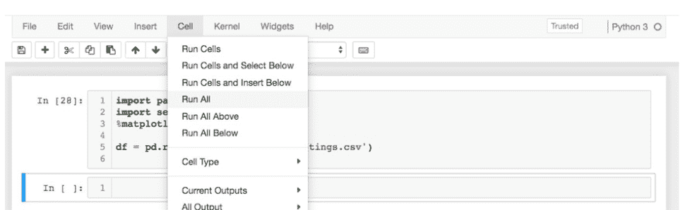
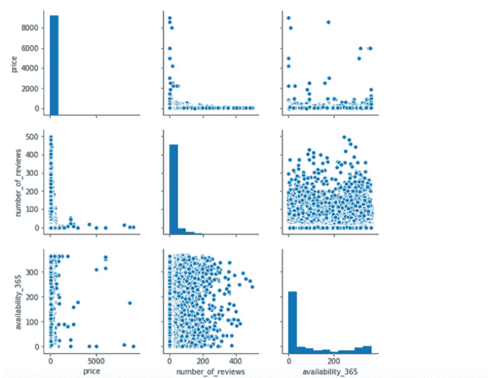
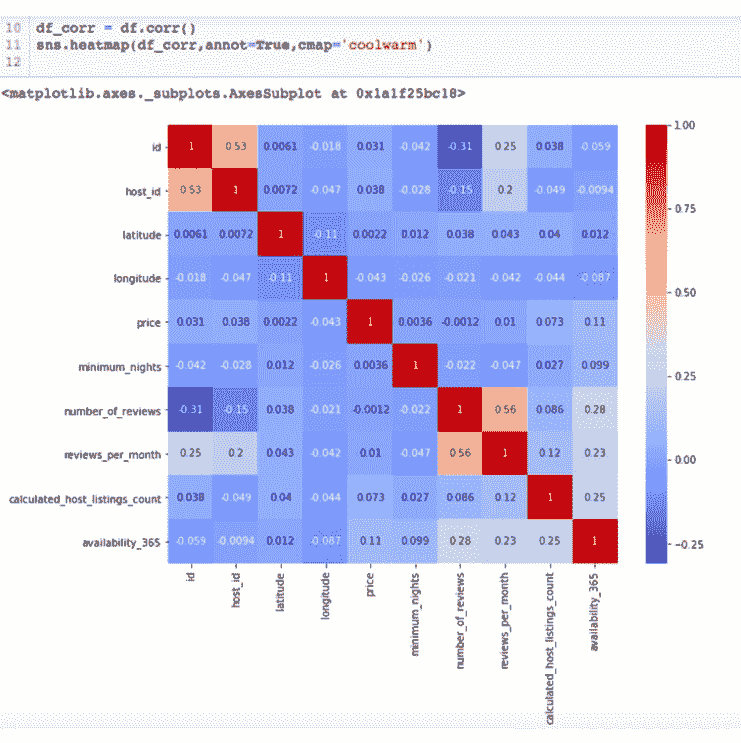
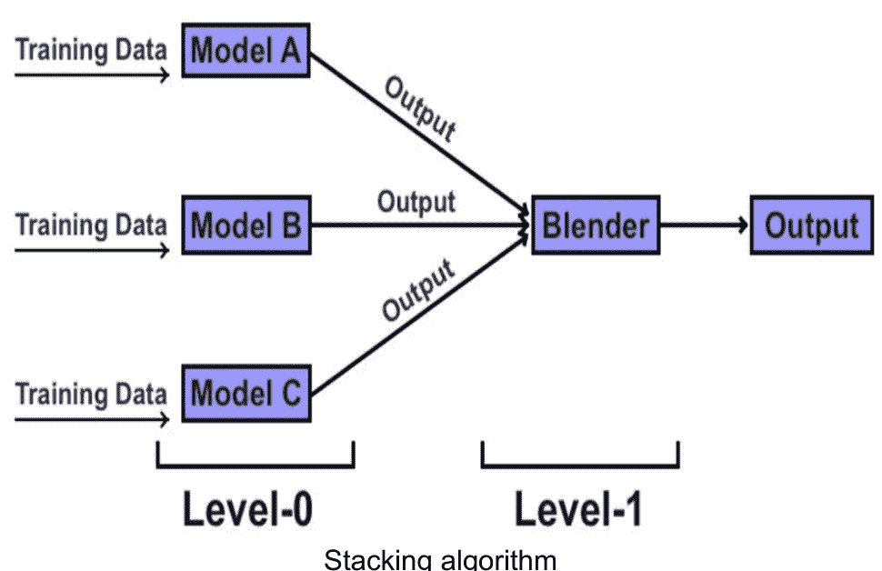

# Python机器学习

提升你的Python编程与深度学习能力，助你迈向编码与算法优化新境界的权威工具书。

马特·阿尔戈尔

# © 版权所有 2021 – 保留所有权利

未经作者或出版商直接书面许可，不得复制、转载或传播本书所含内容。在任何情况下，出版商或作者均不对因本书所含信息直接或间接造成的任何损害、赔偿或金钱损失承担任何责任或法律责任。

## 法律声明

本书受版权保护。仅供个人使用。未经作者或出版商同意，不得修改、分发、销售、使用、引用或转述本书任何部分或内容。

> 理论是当你知道一切却行不通时。实践是一切都行得通却无人知其所以然。在我们的实验室里，理论与实践相结合：行不通，且无人知其所以然。
>
> （**阿尔伯特·爱因斯坦**）

## 目录

- 引言 5
- 第1章 什么是机器学习？ 11
- 第2章 赋予计算机从数据中学习的能力 17
- 第3章 基本术语与符号 23
- 第4章 评估模型与预测未见数据实例 30
- 第5章 构建良好的训练数据集 36
- 第6章 结合不同模型进行集成学习 48
- 第7章 将机器学习应用于情感分析 51
- 第8章 条件或判断语句 57
- 第9章 函数 63
- 第10章 实际的机器学习算法 70
- 第11章 机器学习技术的应用 75
- 第12章 数据挖掘与应用 82
- 结论

## 引言

机器学习是一种无需显式编程即可学习的计算机程序。

示例：

你训练计算机识别图像中的猫和狗。你提供猫和狗的图像示例。你告诉计算机，猫在图像的左侧，狗在右侧。

完成这些后，计算机创建了一些区分猫和狗的规则。

将运行测试，让计算机区分猫和狗，并在其他图像中无法区分。这些测试将表明计算机正在学习，其新规则比初始规则更好。

### 当你尝试教机器做数学时会发生什么？

经过几年的训练，计算机唯一能可靠完成的只是一些基本任务，比如创建国际象棋游戏规则。在机器学习方面，我们可以遵循并投入时间的最佳方法包括：

### 逻辑回归

使用神经网络生成复杂的逻辑回归系统。

### 决策树

使用一组规则来识别特定的树，将数据分类到预定义的类别中，例如，将X个人分类为2组，例如黑人或白人。

### 朴素贝叶斯

### 人工神经网络

在计算机上运行，它们有一组节点和每个节点的权重列表，这些权重被存储并与数据一起输入系统。节点以某种方式相互连接，这被保存在模型中，并使用它来判断是否属于某个类别或视角。这种方法通常比逻辑回归系统产生更多非线性结果。

### 协回归模型

一组可用于构建数据集泛化的预测模型。

### 聚类算法

数据可以被分类成组，例如，计算机可以按部门分组，每个部门有一组学生。像k-means聚类这样的算法使用数据来创建能产生最佳性能的组。

### 为什么选择Python和数据科学？

Python是一种非常强大且易于使用的编程语言，可用于多种用途。如果遇到困难，很容易转向其他事情。

### 是否可以将机器学习应用于数学的某些方面？

是的。数学涉及符号（如数字和字母）的操作。数据集可以被操作。计算机可以操作数据。

### 计算机中的MATLAB能做机器学习吗？

不能。MATLAB是一种非常有限的编程语言，只适用于非常特定的事情。人们使用MATLAB是因为他们想做它擅长的事情。

### 是否可以使用计算机中的MATLAB来做机器学习？

是的。可以在计算机上安装MATLAB，安装一些库和模块来使用MATLAB执行机器学习任务，或者安装C++编译器，以便修改MATLAB程序来执行机器学习任务。

### 如何教计算机做机器学习？

教计算机做机器学习的方法有很多，最佳方法在很大程度上取决于需要解决的问题。通常，计算机需要大量示例来学习。在机器学习中，计算机需要它试图分类和预测的数据的示例。最佳数据集是至少与计算机将要预测的数据集一样大的数据集。

### 可以自动化机器学习吗？

可以。一旦计算机被教会如何执行机器学习任务，就有可能自动化该任务。许多网站举办竞赛，运行执行机器学习任务的Python脚本。网站上的Python通常像竞赛条目一样编写。当需要机器学习问题并产生输出时，可以随时运行竞赛。

### 计算机会犯错吗？

机器是逻辑的，遵循给定的规则。它们不使用判断或语言来解决问题。产生的答案受其给定规则的约束。

### 当机器犯错时，谁该负责？

当机器犯错时，没有人该负责。机器不能被责备。机器只能遵循给定的规则。

## 大数据与机器学习（ML）的关系

大数据是过于复杂且分散的数据，需要特殊算法和方法来处理，以便进行适当分析。传统处理系统无法分析极大量的数据。机器学习是一种精细的算法类别，将处理大数据。预测分析、文本算法、社交网络挖掘等算法在机器学习过程中发挥着重要作用。机器学习算法基于能够分析大量数据（结构化或非结构化）的算法。使用ML的过程是通过清理数据来准备数据，为机器学习算法做准备，训练机器学习算法通过有效组合机器学习算法来执行算法，预处理数据以形成机器学习算法的输入，将获得的输出传递给机器学习算法，并训练它们执行功能。最终目标是在最佳时间内获得最佳结果，这些通过创建有效算法来实现。

### 机器学习的用途

机器学习的应用包括实时决策、临床医学、欺诈检测、搜索引擎结果和石油分析等，仅举几例。

实施机器学习是一种使用以下算法进行预测的强大方式。开发的算法随着时间的推移不断提供更好的预测，因此机器学习算法的性能不断提高。

这些算法的预测能力也使其在广泛领域中具有实用价值。机器学习算法适用于所有数据类型，包括文本、图像、音频、社交媒体和金融市场数据。

换言之，机器学习技术的应用旨在得出一个解决方案，能够揭示肉眼无法察觉的数据中的有意义差异。

机器学习算法的学习依赖于数据中存在的多种依赖关系（或相互关联）。在许多案例中，这些数据由大量非结构化文本数据构成。通过利用所有可用于机器学习算法学习的数据，机器学习得以改进。

展望未来，机器学习正日益强大，预计它将执行那些曾经仅由专家完成的任务。

共享感知是一项新兴服务，由成熟的云提供商和新兴的智慧城市服务提供商共同提供。它指的是多个智慧城市利益相关方能够共享其网络、资源和设备的实时信息，以造福更广泛的社区。这将带来诸多益处，包括运营效率的提升。

现代企业认识到大数据对其成功的重要性，不仅是为了与他人竞争，也是为了加强业务关系、吸引客户。它已经改变了商业运作的方式，以及消费者使用服务或购买产品的方式。

例如，亚马逊从其客户那里收集数据，以提供最相关的结果。它利用人们搜索的内容、购买的商品、居住地等数据。一些客户可能不希望其个人信息被披露，因为这可能对他人构成潜在威胁。然而，大多数客户接受条款和条件，并同意亚马逊使用其数据。

另一方面，互联网服务提供商利用客户数据来创造收入。不同的互联网服务提供商有不同的方式从客户身上创收。例如，你的网络浏览器需要使用谷歌广告。互联网服务提供商也利用客户数据提供不同的服务。例如，一些互联网服务提供商将你的数据出售给市场研究公司或保险公司。这些数据可用于验证客户的电子邮件地址，从而提高电子邮件地址的可靠性。

客户也以不同方式使用数据。但是，有些人以不道德的方式使用数据，在他人不知情的情况下与他人分享数据。随着每天使用数据的人数增加，数据共享的方法也在改进，使得即时共享数据变得更加容易。

## 实际的机器学习算法

我们通过创建一个具有学习能力的算法，开启了机器学习的过程。这形成了将问题分解为一系列较小问题并在已获取的数据上解决的模式。

有许多技术可以应用于机器学习，专家们针对不同的数据集使用不同的技术。该过程始于一个具有一定程度学习能力的算法。

这使得系统能够学习什么有效，什么无效。随着每一步的推进，算法可以学习是否有可能以机器学习系统能够学习的方式对齐这两组数据。

## 第一章 什么是机器学习？

我们首先需要了解的是机器学习的基础知识。机器学习将是人工智能的应用之一，它能够为系统提供自主学习的能力，无需程序员告诉系统该做什么。系统甚至可以更进一步，根据自身经验进行改进，而这一切都不是通过在过程中明确编程计划来实现的。机器学习的理念将专注于开发计算机程序，这些程序可以访问你拥有的任何数据，然后利用这些数据学习新知识，并按照你希望的方式运行。

在使用机器学习时，我们可以探讨几种不同的应用。随着我们开始探索机器学习能做什么，你可能会注意到，多年来，它已经发展成为程序员们比以往任何时候都更乐于使用的东西。当你希望让你的机器或系统独立完成大量工作，而无需你介入并为每一步编程时，机器学习就是你的正确选择。

在科技领域，我们会发现机器学习非常独特，能为我们的编码工作增添乐趣。许多不同行业的公司（我们稍后会谈到）已经在使用机器学习，并从中获得了巨大收益。

机器学习有许多不同的应用，我们能用这种人工智能做的事情令人惊叹。在机器学习方面，我们可以遵循和专注于一些最佳方法，包括：

### 1. 统计研究

机器学习在IT领域已经取得了一些进展。你会发现机器学习可以帮助你处理大量复杂数据，寻找数据中的大型和关键模式。机器学习在此类别下的一些不同应用包括垃圾邮件过滤、信用卡和搜索引擎等。

### 2. 大数据分析

许多公司花费时间收集所谓的“大数据”，现在他们必须找到一种方法，在短时间内对这些数据进行分类和学习。这些公司可以利用这些数据来更多地了解客户如何消费，甚至帮助他们做出关于未来的重要决策。如果我们让人手动完成这项工作，那将花费太长时间。但有了机器学习，我们就能完成所有工作。医疗领域、选举活动甚至零售商店等选项已经开始转向机器学习以获得这些好处。

### 3. 金融世界

许多金融公司能够依赖机器学习。例如，在线股票交易将依赖于这类工作，我们会发现机器学习有助于欺诈检测、贷款审批等。

为了帮助我们开始并理解如何从机器学习中获得我们想要的价值，我们必须确保将最佳算法与正确的流程和工具配对。如果你使用错误的算法来处理这些数据，你将得到大量不准确的信息，结果也无法提供你需要的帮助。始终使用正确的算法会产生很大不同。

在我们致力于构建一些想要的模型时，我们也会注意到许多可用的工具和其他流程。我们需要确保选择正确的工具，以确保你正在使用的算法和模型能够按照你希望的方式运行。

机器学习可用的不同工具包括：

- 1. 全面的管理和数据质量。
- 2. 模型的自动化集成评估，以帮助识别最佳表现者。
- 3. 用于帮助构建所需模型和流程流的图形用户界面。
- 4. 轻松部署，以便快速获得可靠且可重复的结果。
- 5. 数据的交互式探索，甚至一些可视化帮助我们更容易地查看信息。
- 6. 一个集成的端到端平台，帮助自动化一些你想要遵循的数据到决策过程。
- 7. 一个用于比较不同机器学习模型的工具，帮助我们快速高效地识别最佳模型。

## 机器学习的好处

我们还需要花一些时间了解机器学习的一些好处。我们选择使用机器学习来帮助数据科学项目的原因有很多。不可能创建一些有用的算法或模型，能够准确地对你输入的数据进行预测。这还会带来许多其他好处。当我们决定使用机器学习时，我们可以看到的一些最佳服务包括：

### 1. 营销产品更容易

当你能在客户寻找你的地方——在线和社交媒体上——接触到他们时，这可以增加销售额。你可以使用

### 2. 机器学习有助于实现精准的医疗预测

机器学习能够洞察目标受众的反应，从而确保你推出的产品符合客户需求。

医疗领域总是繁忙不堪，据信目前大量的职位空缺将无人填补。即使是普通医生，一天中也需要接诊大量患者。应对这一切可能令人应接不暇。但在机器学习的帮助下，我们可以创建一个模型，通过分析图像来识别异常情况。这能为医生节省大量时间、减少麻烦，并提高他们的工作效率。

这仅仅是机器学习能够帮助医疗领域的一个方面。它还能辅助手术、为医生做笔记、在X光片和其他影像中寻找异常，甚至协助前台运营。

### 3. 能使数据录入更轻松

有时我们需要确保所有信息都能高效、快速地录入数据库。如果需要处理海量数据且时间紧迫，这似乎是一项不可能完成的任务。但借助机器学习及其配套工具，我们可以在短时间内完成所有工作。

### 4. 有助于垃圾邮件检测

得益于机器学习中的一些学习过程，我们发现它可以用来防止垃圾邮件。目前大多数主要的电子邮件服务器都会使用某种形式的机器学习来处理垃圾邮件，将其挡在你的常规收件箱之外。

### 5. 能改善金融世界

机器学习可以介入并处理金融领域的许多不同任务。它有助于欺诈检测、向客户推荐新产品、审批贷款等等。

### 6. 能提高制造业效率

制造业从业者可以利用机器学习来提升自身能力和工作水平。它能识别出哪些环节会拖慢流程并需要修复，还能预测机器部件何时可能失效，等等。

### 7. 它要求我们更好地理解客户

所有公司都希望尽可能多地了解他们的客户，以确保能够学习如何向这些人进行营销、提供哪些产品，以及采取哪些方法让客户尽可能满意。

## 监督式机器学习

我们将要了解的第一种机器学习算法是监督式机器学习。这种机器学习类型需要有人来训练系统，其方法是确保向系统提供输入以及相应的输出，以便系统知道正确答案。你还需要根据系统或机器在预测中的准确性，花时间向系统提供反馈。

## 无监督式机器学习

现在我们可以转向无监督式机器学习的概念，看看它与监督式学习相比是如何运作的。在无监督式机器学习中，我们会发现它与其他方法有很大不同，但它可以在没有所有示例和标记数据的情况下训练系统如何表现。

在无监督学习中，模型不会被提供输出来教导它如何表现。这是因为这类知识的目标是，我们希望机器能够基于未知的输入，自行学习其中的规律。设备可以自己学会如何做到这一点，而无需程序员介入完成所有工作。

## 强化式机器学习

我们需要了解的第三种机器学习方法是强化式机器学习。这种算法类型比前两种更新，它适用于所呈现的算法有示例但这些示例完全没有标签的情况。

## 第2章 赋予计算机从数据中学习的能力

我们需要一种编程语言来向机器提供指令，以执行代码并使用机器学习。我们将学习Python语言的基础知识，如何安装和启动Python。我们还将学习一些Python语法和一些运行Python的有用工具。我们还会介绍一些对机器学习有用的必要Python库。首先，为什么我们要使用Python而不是其他编程语言？

## 为什么选择Python进行机器学习？

Python是一种被广泛使用的编程语言，原因有很多。它是一种免费且开源的语言，这意味着每个人都可以使用。尽管免费，但它是一种基于社区的语言，意味着它是由一个通过互联网汇集力量来改进语言特性的社区开发和维护的。

人们选择Python的其他原因包括：

- 1. 作为一种可读性强、语法简单的语言，质量上乘
- 2. 程序可移植到任何操作系统（例如Windows、Unix），无需或只需少量修改
- 3. 执行速度快：Python无需编译，运行速度比类似的编程语言更快
- 4. 组件集成能力强，这意味着Python可以与其他程序集成，可以从C和C++库调用，也可以调用其他编程语言。

Python附带基础且强大的标准操作，以及像NumPy这样的高级预编码库，用于数值编程。Python的另一个优势是自动内存管理，无需声明变量和大小。此外，Python允许开发各种应用程序，例如开发图形用户界面（GUI）、进行数值编程、游戏编程、数据库编程、互联网脚本编写等等。

## 如何开始使用Python？

Python是一种脚本语言，与任何其他编程语言一样，需要一个解释器。后者是一个执行其他语言程序的程序。顾名思义，它充当计算机硬件的解释器来执行Python编程指令。Python作为一个软件包，可以从Python网站下载。安装Python时，解释器通常是一个可执行程序。如果你使用UNIX和LINUX，Python可能已经安装好了，很可能在/usr目录下。既然你已经安装了Python，让我们探索如何运行一些必要的代码。

要运行Python，你可以打开操作系统的命令提示符（在Windows上，打开DOS控制台窗口）并输入python。如果不行，说明Python不在Shell的路径环境变量中。在这种情况下，你应该输入Python可执行文件的完整路径。在Windows上，它应该类似于C:\Python3.7\python，在UNIX或LINUX中安装在bin文件夹中：/usr/local/bin/python（或/usr/bin/python）。

当你启动Python时，它会提供两行信息，第一行是所使用的Python版本，如下例所示：

```
Python 3.7.1 (default, Dec 10 2018, 22:54:23) [MSC v.1915 64 bit (AMD64)]: Anaconda, Inc. on win32
Type "help", "copyright", "credits" or "license" for more information.
>>>
```

一旦会话启动，Python会显示提示符>>>，表示它已准备就绪。它可以运行你输入的代码行。以下是一个打印语句的示例：

```
>>> print ('Hello World!')
Hello World!
>>>
```

在交互式会话中运行Python时，如我们所做，它会在>>>之后显示结果，如示例所示。代码是交互式执行的。要退出交互式Python会话，在Windows上按Ctrl-Z，在Unix/Linux机器上按Ctrl-D。

现在我们学会了如何启动Python并在交互式会话中运行代码。这是实验和测试代码的好方法。然而，代码永远不会被保存，需要重新输入才能再次运行语句。要存储代码，我们需要将其输入到一个称为模块的文件中。包含Python语句的文件称为模块。这些文件的扩展名是‘.py’。只需输入模块名称即可执行模块。可以使用像Notepad++这样的文本编辑器来创建模块文件。例如，让我们创建一个名为test.py的模块，它打印‘Hello World’并计算3^2。该文件应包含以下语句：

```
print ('Hello World! ')
print ('3^2 equal to ', 3**2)
```

要运行此模块，在操作系统的命令提示符中，输入以下命令行：

```
python test.py
```

如果此命令行不起作用，你应该输入Python可执行文件的完整路径和test.py文件的完整路径。你也可以通过输入test.py文件的完整cd路径来更改工作目录，然后输入python test.py。将工作目录更改为保存模块的目录是避免每次运行模块时都输入模块完整路径的好方法。输出为：

```
C:\Users>python C:\Users\test.py
Hello World!
```

3的平方等于9

当我们运行模块test.py时，结果显示在操作系统的提示符中，并且在关闭提示符后就会消失。要将结果存储到文件中，我们可以使用shell语法，输入：

```
python test.py > save.txt
```

test.py的输出被重定向并保存到save.txt文件中。

我们将学习Python语法。目前，我们将使用命令行来探索Python语法。我们将学习如何设置和使用一些强大的Python编程平台。

## Python语法

在学习一些Python语法之前，我们将探讨Python中使用的主要数据类型以及程序的结构。一个程序由一系列模块组成，模块又包含一系列包含表达式的语句。这些表达式创建和处理对象，对象是代表数据的变量。

## Python变量

在Python中，我们可以使用内置对象，即数字、字符串、列表、字典、元组和文件。Python支持常见的数值类型，如整数和浮点数，以及复数。字符串是字符链，而列表和字典是其他对象的集合，例如数字、字符串或其他列表或字典。列表和字典是索引化的，并且可以遍历。


列表和字典的主要区别在于项目的存储方式以及如何获取它们。列表中的项目是有序的，可以通过位置获取，而字典中的项目是通过键来存储和获取的。元组与列表类似，是按位置排序的对象集合。最后，Python还允许将文件创建和读取为对象。Python提供了所有工具和数学函数来处理这些对象。

Python不需要变量声明、大小或类型声明。变量在赋值时即被创建。例如：

```
>>> x=5
>>> print (x) 5
>>> x= 'Hello World! '
Hello World!
```

在上面的例子中，x先被赋值为一个数字，然后被赋值为一个字符串。实际上，Python允许在变量声明后更改其类型。我们可以使用type()函数来验证任何Python对象的类型。

```
>>> x, y, z=10,'Banana',2.4
>>> print (type(x))
<class 'int'>
>>> print(type(y))
<class 'str'>
>>> print (type(z))
<class 'float'>
```

要声明字符串变量，可以使用单引号或双引号。

变量名只能使用字母数字字符和下划线（例如，A_9）。注意变量名区分大小写，并且不应以数字开头。例如，price、Price和PRICE是三个不同的变量。可以在一行中声明多个变量，如上例所示。

## 第三章 基本术语和符号

## 机器学习的数学符号

你会意识到，在机器学习项目的整个过程中，数学命名法和符号是相辅相成的。数学中使用了各种符号、符号、值和变量来描述你可能试图实现的任何算法。

你会发现自己在这个模型开发领域中使用一些数学符号。你会发现，处理数据和学习或记忆形成过程的值总是优先考虑的。因此，以下六个示例是最常用的符号。每个符号都有一个描述，其算法解释如下：

### 代数

- 表示变化或差异：Delta。
- 给出所有值的总和：Summation。
- 描述嵌套函数：复合函数。
- 在必要时表示欧拉数和Epsilon。
- 描述所有值的乘积：大写Pi。

### 微积分

- 描述特定梯度：Nabla。
- 描述一阶导数：导数。
- 描述二阶导数：二阶导数。
- 描述当x趋近于零时的函数值：极限。

### 线性代数

- 描述大写变量是矩阵：矩阵。
- 描述矩阵转置：转置。
- 描述矩阵或向量：括号。
- 描述点积：点积。
- 描述哈达玛积：哈达玛积。
- 描述向量：向量。
- 描述大小为1的向量：单位向量。

### 概率

- 事件的概率：概率。

### 集合论

- 描述不同元素的列表：集合。

### 统计学

- 描述变量x的中位数：中位数。
- 描述变量X和Y之间的相关性：相关性。
- 描述样本集的标准差：样本标准差。
- 描述总体标准差：标准差。
- 描述总体子集的方差：样本方差。
- 描述总体值的方差：总体方差。
- 描述总体子集的均值：样本均值。
- 描述总体值的均值：总体均值。

## 机器学习使用的术语

以下术语是你在机器学习过程中最常遇到的。你可能是出于专业目的或作为人工智能（AI）爱好者而进入机器学习领域。无论如何，无论你的原因是什么，以下是你需要了解并可能理解的术语类别和子类别，以便与同事交流。以下是需要了解的机器学习术语：

### 1. 自然语言处理（NLP）

自然语言是你作为人类使用的语言，即人类语言。根据定义，NLP是一种机器学习方式，机器学习你的人类交流形式。NLP是所有（如果不是大多数）机器语言的标准基础，这些语言允许你的设备使用人类（自然）语言。这种NLP使你的机器能够听到你的自然（人类）输入，理解它，执行它，然后给出数据输出。该设备可以识别人类并进行适当的交互，或尽可能接近适当的交互。

NLP有五个主要阶段：机器翻译、信息检索、情感分析、信息提取，最后是问答。它从人类查询开始，直接导致机器翻译，然后通过所有其他四个过程，最后以问题解释本身结束。你现在可以将这五个阶段分解为子类别，如前所述：

- 文本分类和排序 - 这一步是一个过滤机制，根据相关性算法确定重要性类别，过滤掉不需要的内容，如垃圾邮件或垃圾邮件。它过滤出需要优先处理的内容以及执行顺序，直到最终任务。

- 情感分析 - 这种分析预测对机器提供的反馈的情感反应。客户关系和满意度是可能从情感分析中受益的因素。

- 文档摘要 - 正如短语所示，这是一种为复杂和复杂的描述开发简短而精确的定义的方法。总体目的是使其易于理解。

- 命名实体识别（NER） - 此活动涉及从非结构化单词集中获取结构化和可识别的数据。机器学习过程学习识别最合适的关键词，将这些词应用于语音上下文，并尝试开发最合适的响应。关键词是公司名称、员工姓名、日历日期和时间等事物。

- 语音识别 - 此机制的一个示例可以轻松地是Alexa等设备。机器学习将语音文本与语音发起者关联起来。该设备可以识别人类语音和声音来源的音频信号。

- 它理解自然语言和生成 - 与命名实体识别相反；这两个概念涉及人与计算机之间的转换。自然语言理解允许机器将人类形式的语音文本转换和解释为连贯的可理解计算机格式。另一方面，自然语言生成功能相反，即将不正确的计算机格式转换为人类可理解的音频格式。

- 机器翻译 - 此操作是将一种书面人类语言自动转换为另一种人类语言的系统。转换使来自不同种族背景和不同风格的人们能够相互理解。经过机器学习过程的人工智能实体执行此任务。

### 2. 数据集

数据集是你可用于测试机器学习可行性和进展的一系列变量。数据是机器学习进展的重要组成部分。它提供结果，表明你的发展、需要调整的领域以及微调特定因素的调整。有三种类型的数据集：训练数据 - 顾名思义，训练数据用于通过让模型进行演绎学习来预测模式。由于需要训练的因素数量庞大，确实会存在比其他因素更关键的因素。这些特征会获得训练优先级。你的机器学习模型将使用更显著的特征来预测所需的最合适模式。随着时间的推移，你的模型将通过训练不断学习。

验证数据 - 这组数据用于在完成阶段对不同模型的细微方面进行微调。验证测试不是训练阶段；它是一个最终的比较阶段。从验证中获得的数据用于选择你的最终模型。你可以根据验证数据对模型的各个方面进行比较验证，然后做出最终决定。

测试数据 - 一旦你决定了最终模型，测试数据将为你提供关于模型在现实生活中如何运作的关键信息。测试数据将使用与训练和验证期间完全不同的参数集进行。让模型通过这种测试数据将表明你的模型将如何处理其他类型的输入。你将得到诸如故障安全机制将如何反应、故障安全机制是否首先会启动等问题的答案。

### 3. 计算机视觉

计算机视觉负责提供对图像和视频数据进行高级分析的工具。在计算机视觉中你应该注意的挑战包括：

- 图像分类 - 这种训练使模型能够识别和学习各种图像和图形表示是什么。模型需要保留一个熟悉的图像以保持记忆，并在即使有颜色变化等轻微改动的情况下也能识别出正确的图像。

- 目标检测 - 与检测模型视野中是否存在图像的图像分类不同，目标检测允许它识别对象。目标识别使模型能够获取大量数据，然后将其框定以检测模式识别。它类似于面部识别，因为它在给定的视野内寻找模式。

- 图像分割 - 模型将特定的图像或视频像素与之前遇到的像素相关联。这种关联基于最可能场景的概念，该概念基于特定像素与相应的特定预定集合之间的关联频率。

- 显著性检测 - 在这种情况下，它涉及你训练并让你的模型习惯于提高其可见性。例如，广告最好放置在人流量较大的位置。因此，你的模型将学会将自己放置在社会可见度最高的位置。这种计算机视觉特性自然会吸引人类的注意力和好奇心。

### 4. 监督学习

通过使用有针对性的示例来教授模型本身，你可以实现监督学习。如果你想向模型展示如何识别给定的任务，那么你将为该特定监督任务标记数据集。然后，你将向模型呈现一组标记的示例，并通过监督来监控其学习过程。

模型通过不断接触正确的模式来学习。如果你想提升品牌知名度，你可以应用监督学习，让模型通过使用产品示例并掌握其广告艺术来学习。

### 5. 无监督学习

这种学习风格与监督学习相反。在这种情况下，你的模型通过观察来学习。不涉及监督，数据集也没有标记；因此，没有从监督方法中学到的正确基准值。

在这里，通过不断的观察，你的模型将确定自己的正确真相。无监督模型最常通过不同结构和数据集共有基本特征之间的关联来学习。由于无监督学习处理的是相关数据集的相似组，因此它们在聚类中很有用。

### 6. 强化学习

强化学习教导你的模型始终努力争取最佳结果。除了正确执行其分配的任务外，模型还会因表现良好而获得奖励。这种学习技术是对你模型的一种鼓励形式，使其始终采取正确的行动并表现良好或尽其所能。一段时间后，你的模型将学会期待奖励或好处，因此，模型将始终努力争取最佳结果。

这个例子是一种正强化形式。它奖励良好行为。然而，还有另一种支持类型称为负强化。负强化旨在惩罚或阻止不良行为。在监督者未达到预期标准的情况下，模型会受到训斥。模型了解到不良行为会招致惩罚，它将始终努力持续做好。

### 7. 神经网络

神经网络是通过人工智能相互连接的模型的概念。这些模型虽然是合成的，但具有与人类之间可观察到的相同水平的交互。由于训练和学习模型需要很长时间，它们的互连水平将取决于一个自动化的基础系统。

## 第四章 评估模型和预测未见数据实例

## 为什么在数据科学中选择 Python 而不是其他工具？

Python 一直是信息研究人员在多种情况下处理常规练习的首选编程语言，也是整个行业中使用的基本信息分析框架之一。Python 非常适合需要将数值编程整合到其输出系统或将信息整合到电子应用程序中的数据科学家。它也适用于应用系统，这是 PC 研究人员也需要做的事情。

假设应用程序是以自然和标准的方式编写的。在这种情况下，它被称为“Pythonic”。除此之外，Python 因其某些限制而一直很受欢迎，这些限制吸引了数据科学规划者的关注。

### 易于学习

Python 最吸引人的特点是，任何需要了解它的人，即使是初学者，都可以快速轻松地做到，这就是为什么初学者更喜欢数据科学而不是 Python 的原因之一。这也非常适合那些投入很少时间思考的活跃人士。- 最值得注意的是，R 能够缩短学习过程以理解语言结构，而不是多种语言。

### 数据科学庞大的库

使用 Python 进行数据科学的实际优势在于，Python 提供了与数据挖掘和 PC 处理相关的广泛资源。大多数使用 Python 的数据科学家认为，这种通用编程语言通过提供创新的方法来解决以前认为无法解决的问题，从而解决了广泛的问题。

### 可扩展性

与所有其他语言（包括 R）一样，在灵活性方面，Python 表现突出。这比 Stata 和 MATLAB 语言简单得多。这种支持规模提供了灵活性和多种途径，让数据科学家能够处理各种问题——这是 YouTube 转向该语言的原因之一。Python 可以在各个行业中找到，促进了各种用例的快速应用开发。

### Python 庞大的社区

Python 如此广为人知的一个原因是由于其社区。当数据科学团队开始理解它时，更多的人自愿构建新的数据科学存储库。它进一步促进了当今可用的最先进编程和计算技术的发展，这解释了为什么许多人使用 Python 进行数据科学。

这个社区是一个紧密的社区，有时更容易找到解决难题的方法。你只需要一个实际的网络输出，就可以快速找到特定问题的答案或与可能支持它的人交谈。在 Stack Overflow 和 Code Mentor 上，工程师甚至可以与他们的朋友联系。

### 为什么 Python 和数据科学结合得很好？

信息科学涉及从大型记录、信息库和信息存储中提取有用信息。这样的结果通常是未排序的，并且难以用任何合理的精度进行估计。ML 可能连接不同的数据集；但是，它在算法中需要重大的谬误和力量。Python 通过成为通用编程语言来满足这一需求。它使你能够在电子表格中构建 CSV 性能，以便快速读取结果。此外，还可以处理更复杂的文件输出，以便 ML 集群进行处理。

例如，气候预测基于超过一个世纪的天气报告历史测量数据。机器学习也能基于历史天气模式，使预测预报更加可靠。Python之所以能做到这一点，是因为其代码执行高效且轻量，同时功能多样。Python还支持结构化、函数式编程以及面向对象模式，这意味着其实现可以应用于任何领域。

Python软件包索引目前包含超过10万个库，并且这个数字还在持续增长。如前所述，Python提供了多个专注于数据科学的库。在谷歌上简单搜索一下，就能发现大量关于数据科学十大Python库的列表。最常用的数据分析库可能是一个名为pandas的开源库。它是一套高度优化的应用程序，使Python的数据分析任务大大简化。

无论专家们打算用Python做什么，无论是规范性分析还是预测性因果分析，Python都拥有一套工具集来执行各种强大的功能。难怪数据科学家们纷纷采用Python。

## 数据科学统计学习

统计学习是一种基于统计对结果进行解释的方法，分为无监督学习和有监督学习。

解释统计学习的一种直接方法是评估预测变量（特征、自变量）与响应变量（因变量）之间的关系，并创建一个能够基于预测变量（X）预测响应变量（Y）的客观模型。

## 推断与预测

在输入集X易于获取，但输出Y未知的情况下，我们有时将f视为一个黑箱（不关心f的确切形式），只要它能为Y产生精确的预测即可。这是一种预测。

有些情况下，我们想考虑当X变化时Y如何受影响。在这种情况下，我们想估计f，但我们的目标并非真的为Y生成预测。我们更感兴趣的是解释X和Y之间的联系。但f不能被视为黑箱，因为我们需要知道其确切结构。这就是推断。在现实生活中，你会发现各种问题涉及假设环境、推断环境，或两者的混合。

## 参数与非参数方法

如果我们取统计模型，并试图通过测量参数集合来近似f，这种方法被称为参数方法。

非参数方法不对f的形状做出明确陈述，而是旨在近似尽可能接近数据集的f。

## 模型可解释性与预测准确性

在我们用于研究统计的各种方法中，有些方法通用性较差或较为僵化。如果推断是目标，舒适且相当不灵活的数学分析方法具有优势。当我们只关注建模时，我们使用易于理解的模块化模型。

## 模型准确性评估

天下没有免费的午餐，这意味着没有任何一种方法能在所有可用数据集上都优于其他方法。在回归框架中，最广泛使用的因子是均方误差（MSE）。在分类框架中，最常用的度量是混淆矩阵。数学学习的一个基本特性是，随着模型复杂度的增加，训练误差可能会下降，但测试误差不会。

## 方差与偏差

偏差是设计者为更平滑地理解目标任务而创建的简化假设。参数模型具有高偏差，使其易于理解且更直接，但通常通用性较低。低偏差的机器学习算法包括决策树、k近邻和支持向量机。线性回归、条件逻辑回归和判别分析都是高偏差机器学习中的方法。

方差是指如果使用特定的训练数据，目标任务预测可能变化的程度。非参数方程具有较大的方差，提供了很大的变异性。逻辑回归和线性回归、线性判别分析是方差较小的机器学习技术。决策树、k近邻和支持向量机是方差较大的机器学习算法。

## 方差与偏差的关系

统计学习中方差与偏差的关系如下：

-   方差可能随偏差的增加而下降。
-   方差的增加可以减少偏差。

在这两个考虑因素与我们使用的模型之间，以及在我们想要定制它们的问题方法之间，存在着权衡。我们寻求在这种权衡中找到各种折衷方案。

在分类和回归环境中选择适当的通用性程度，对于每个预测学习过程的性能都至关重要。方差-偏差的权衡，以及由此产生的测试误差的U形曲线，将使这成为一个具有挑战性的任务。

## 大数据与机器学习（ML）的关系

随着个人和公司产生的数据量以惊人的速度增长，大数据、深度学习等概念应运而生。很自然地会问，这些事物是否能相互受益。我们将探讨大数据如何帮助机器学习辅助决策。

现代公司认识到大数据的重要性，但也意识到当与自动化流程结合时，效率可以大大提高，而这正是机器学习的优势所在。机器学习系统以各种方式支持企业，包括以前所未有的效率维护、评估和使用捕获的数据。

在一般定义中，机器学习是一系列技术，允许联网的计算机和机器通过各种方法，基于自身经验进行学习、创造和改进。如今，所有大公司、主要软件组织和计算机科学家都预测，大数据将在机器学习领域带来巨大变革。

从根本上说，机器学习确实是一种先进的人工智能类型，旨在从自身的数据集中学习新信息。它基于机器可以从结果中学习、识别用户趋势并在没有任何人类干预的情况下做出决策的前提。

尽管机器学习已经存在了几十年，但如今能够分析更复杂、更庞大的数据集，并快速、大规模地生成更可靠数据的模型已经变得可行。通过开发此类模型，公司更有可能发现有利可图的机会。

机器学习意味着无需先验假设。当机器学习算法获得正确的数据时，它们将处理数据并识别趋势。你还可以将特定发现应用于其他数据集。这种方法通常应用于高维数据集。这意味着你提供的信息越多，预测就越可靠。而这正是大数据影响力发挥作用的地方。

## 第5章 构建良好的训练数据集

我们将介绍如何将数据作为Pandas数据框进行管理，以及用于查询数据的典型探索性数据分析（EDA）技术。
作为数据检查的关键部分，EDA总结了数据集的关键特征，为后续处理做准备。这包括理解数据的形状和分布、扫描缺失值、根据相关性了解哪些特征最相关，以及熟悉数据集的内容。收集这些信息有助于指导算法选择，并突出数据集中需要清理以便后续处理的方面。
使用Pandas，我们可以使用一系列简单的技术来总结数据，并使用Seaborn和Matplotlib等附加选项来可视化数据。
让我们首先通过在Jupyter Notebook中使用以下代码导入Pandas、Seaborn和Matplotlib。

```python
import pandas as pd
import seaborn as sns
%matplotlib inline
```

请注意，使用Matplotlib的内联功能，我们可以在Jupyter Notebook或其他前端中直接在相应的代码单元格下方显示图表。

## 导入数据集

数据集可以从各种来源导入，包括内部和外部文件，以及称为blobs的随机自生成数据集。
以下示例数据集是从Kaggle下载的外部数据集，名为柏林Airbnb数据集。这些数据是通过网络爬虫获取的来自Airbnb，包含柏林详细的住宿列表信息，包括位置、价格和评论。

| 特征 | 数据类型 | 连续/离散 |
| :--- | :--- | :--- |
| id | 整数 | 离散 |
| name | 字符串 | 离散 |
| host_id | 整数 | 离散 |
| host_name | 字符串 | 离散 |
| neighbourhood_group | 字符串 | 离散 |
| neighbourhood | 字符串 | 离散 |
| latitude | 字符串 | 离散 |
| longitude | 字符串 | 离散 |
| room_type | 字符串 | 离散 |
| price | 整数 | 连续 |
| minimum_nights | 整数 | 连续 |
| number_of_reviews | 整数 | 连续 |
| last_review | 时间日期 | 离散 |
| reviews_per_month | 浮点数 | 连续 |
| calculated_host_listings_count | 整数 | 连续 |
| availability_365 | 整数 | 连续 |

柏林Airbnb数据集概览

注册一个免费账户并登录Kaggle后，将数据集下载为zip文件。然后，解压名为`listings.csv`的下载文件，并使用`pd.read_csv`将其作为Pandas数据框导入Jupyter Notebook。

```
df = pd.read_csv('~/Downloads/listings.csv')
```

请注意，你需要为数据集分配一个变量名以便后续引用。数据框的常用变量名是“df”或“dataframe”，但你也可以选择其他变量名，前提是它符合Python的命名规范。

请记住，你的数据集文件路径会因其保存位置和计算机操作系统而异。如果保存在Windows的桌面上，你需要使用类似以下示例的结构来导入.csv文件：

```
df = pd.read_csv('C:\Users\John\Desktop\listings.csv')
```

## 预览数据框

我们现在可以使用Pandas的`head()`命令在Jupyter Notebook中预览数据框。`head()`命令必须跟在数据框的变量名（即`df`）之后。

```
df.head()
```

要预览数据框，可以通过右键单击并选择“运行”，或从Jupyter Notebook菜单导航：Cell > Run All来运行代码。



代码运行后，Pandas会将导入的数据集填充为数据框，如截图所示。

```
import pandas as pd
import seaborn as sns
%matplotlib inline

df = pd.read_csv('~/Downloads/listings.csv')

df.head()
```

| | id | name | host_id | host_name | neighbourhood_group | neighbourhood | latitude | longitude | room_type | price |
|---|---|---|---|---|---|---|---|---|---|---|
| 0 | 2015 | Berlin-Mitte Value! Quiet courtyard/very central | 2217 | Ian | Mitte | Brunnenstr. Süd | 52.534537 | 13.402557 | Entire home/apt | 60 |
| 1 | 2695 | Prenzlauer Berg close to Mauerpark | 2986 | Michael | Pankow | Prenzlauer Berg Nordwest | 52.548513 | 13.404553 | Private room | 17 |
| 2 | 3176 | Fabulous Flat in great Location | 3718 | Britta | Pankow | Prenzlauer Berg Südwest | 52.534996 | 13.417579 | Entire home/apt | 90 |
| 3 | 3309 | BerlinSpot Schöneberg near KaDeWe | 4108 | Jana | Tempelhof - Schöneberg | Schöneberg-Nord | 52.498855 | 13.349065 | Private room | 26 |
| 4 | 7071 | BrightRoom with sunny greenview! | 17391 | Bright | Pankow | Helmholtzplatz | 52.543157 | 13.415091 | Private room | 42 |

在Jupyter Notebook中使用`head()`预览数据框

请注意，第一行（ID 2015，位于Mitte）在数据框中的索引位置是0。而第五行的索引位置是4。Python元素的索引从0开始，这意味着在从数据框中调用特定行时，你需要从实际行数中减去一。

数据框的列虽然没有数字标签，但也遵循相同的逻辑。第一列（ID）的索引是0，第五列（neighbourhood_group）的索引是4。这是在Python中工作的一个固定特性，在调用特定行或列时需要牢记。

默认情况下，`head()`显示数据框的前五行，但你可以通过在括号内指定`n`行数来扩展显示的行数，如图9所示。

```
df = pd.read_csv('~/Downloads/listings.csv')

df.head(10)
```

| | id | name | host_id | host_name | neighbourhood_group | neighbourhood | latitude | longitude | room_type | price | minimum_nights |
|---|---|---|---|---|---|---|---|---|---|---|---|
| 0 | 2015 | Berlin-Mitte Value! Quiet courtyard/very central | 2217 | Ian | Mitte | Brunnenstr. Süd | 52.534537 | 13.402557 | Entire home/apt | 60 | 4 |
| 1 | 2695 | Prenzlauer Berg close to Mauerpark | 2986 | Michael | Pankow | Prenzlauer Berg Nordwest | 52.548513 | 13.404553 | Private room | 17 | 2 |
| 2 | 3176 | Fabulous Flat in great Location | 3718 | Britta | Pankow | Prenzlauer Berg Südwest | 52.534996 | 13.417579 | Entire home/apt | 90 | 62 |
| 3 | 3309 | BerlinSpot Schöneberg near KaDeWe | 4108 | Jana | Tempelhof - Schöneberg | Schöneberg-Nord | 52.498855 | 13.349065 | Private room | 26 | 5 |
| 4 | 7071 | BrightRoom with sunny greenview! | 17391 | Bright | Pankow | Helmholtzplatz | 52.543157 | 13.415091 | Private room | 42 | 2 |
| 5 | 9991 | Geourgen flat - outstanding views | 33852 | Philipp | Pankow | Prenzlauer Berg Südwest | 52.533031 | 13.416047 | Entire home/apt | 180 | 6 |
| 6 | 14325 | Apartment in Prenzlauer Berg | 55531 | Chris + Oliver | Pankow | Prenzlauer Berg Nordwest | 52.547846 | 13.405562 | Entire home/apt | 70 | 90 |
| 7 | 16401 | APARTMENT TO RENT | 59666 | Melanie | Friedrichshain-Kreuzberg | Frankfurter Allee Süd FK | 52.510514 | 13.457850 | Private room | 120 | 30 |
| 8 | 16644 | In the Heart of Berlin - Kreuzberg | 64696 | Rene | Friedrichshain-Kreuzberg | nördliche Luisenstadt | 52.504792 | 13.435102 | Entire home/apt | 90 | 60 |
| 9 | 17409 | Downtown Above The Roofs In | 67590 | Wolfram | Pankow | Prenzlauer Berg Südwest | 52.529071 | 13.412843 | Private room | 45 | 3 |

## 预览数据框的前十行

参数`head(10)`用于预览数据框的前十行。你也可以通过在Jupyter Notebook中向右滚动来查看右侧隐藏的列。关于行，你只能预览代码中指定的内容。

最后，你有时会看到`head()`内部插入了`n=`，这是指定预览行数的另一种方法。

示例代码：

```
df.head(n=10)
```

## 数据框尾部

预览数据框顶部n行的逆操作是`tail()`方法，它显示数据框底部的n行。下面，我们可以看到一个使用`tail()`预览数据框的示例，它默认也显示五行。同样，你需要运行代码才能查看输出。

```
import pandas as pd
import seaborn as sns
%matplotlib inline

df = pd.read_csv('~/Downloads/listings.csv')

df.tail()
```

| id | name | host_id | host_name | neighbourhood_group | neighbourhood | latitude | longitude | room_type | price | minimum_nights |
|---|---|---|---|---|---|---|---|---|---|---|
| 22547 | 29856708 | Cozy Apartment right in the center of Berlin | 87555909 | Ulisses | Mitte | Brunnenstr. Süd | 52.533865 | 13.400731 | Entire home/apt | 60 | 2 |
| 22548 | 29857108 | Altbau/ Schöneberger Kiez / Schlafsofa | 67537363 | Jörg | Tempelhof - Schöneberg | Schöneberg-Nord | 52.496211 | 13.341738 | Shared room | 20 | 1 |
| 22549 | 29864272 | Artists loft with garden in the center of Berlin | 3146923 | Martin | Pankow | Prenzlauer Berg Südwest | 52.531800 | 13.411999 | Entire home/apt | 85 | 3 |
| 22550 | 29866805 | Room for two with private shower / WC | 36961901 | Arte Luise | Mitte | Alexanderplatz | 52.520802 | 13.378688 | Private room | 99 | 1 |
| 22551 | 29867352 | Sunny, modern and cozy flat in Berlin Neukölln :) | 177464875 | Sebastian | Neukölln | Schillerpromenade | 52.473762 | 13.424447 | Private room | 45 | 5 |

使用`tail()`预览数据框的最后五行

## 查找行项目

虽然`head`和`tail`命令对于了解数据框的基本结构很有用，但这些方法对于在大型数据集中查找单个或多个中间行并不实用。

要从数据框中检索特定行或一系列行，我们可以使用`iloc[]`命令，如下所示。

```
df.iloc[99]
```

## 使用 .loc[ ] 查找行

此处，`df.iloc[99]` 用于检索数据框中索引位置为 99 的行，即 ID 151249（一个位于弗里德里希斯海因-克罗伊茨贝格街区的房源）。

## 形状

检查数据框大小的一个快速方法是使用 `shape` 命令，它会返回数据框的行数和列数。这很有用，因为当你移除缺失值、重新创建特征或删除特征时，数据集的大小很可能会发生变化。

要查看数据框的行数和列数，你可以在数据集名称前使用 `shape` 命令（此命令不使用括号）。

```python
import pandas as pd
import seaborn as sns
%matplotlib inline

df = pd.read_csv('~/Downloads/listings.csv')

df.shape
```

(22552, 16)

检查数据框的形状（行数和列数）

对于这个数据框，它有 22,552 行和 16 列。

## 列

另一个有用的命令是 `columns`，它会打印数据框的列标题。这对于将列复制粘贴回代码或澄清特定变量的名称很有用。

`df.columns.`

```python
import pandas as pd
import seaborn as sns
%matplotlib inline

df = pd.read_csv('~/Downloads/listings.csv')

df.columns
```

Index(['id', 'name', 'host_id', 'host_name', 'neighbourhood_group',
       'neighbourhood', 'latitude', 'longitude', 'room_type', 'price',
       'minimum_nights', 'number_of_reviews', 'last_review',
       'reviews_per_month', 'calculated_host_listings_count',
       'availability_365'],
      dtype='object')

打印列

## 描述

`describe()` 方法便于生成数据框的均值、标准差和 IQR（四分位距）值的摘要。此方法在处理连续值（可以聚合的整数或浮点数）时效果最佳。

```python
import pandas as pd
import seaborn as sns
%matplotlib inline

df = pd.read_csv('~/Downloads/listings.csv')

df.describe()
```

| | id | host_id | latitude | longitude | price | minimum_nights | number_of_reviews | reviews_per_month | calculated_host_listings |
|---|---|---|---|---|---|---|---|---|---|
| count | 2.255200e+04 | 2.255200e+04 | 22552.000000 | 22552.000000 | 22552.000000 | 22552.000000 | 22552.000000 | 18638.000000 | 22552 |
| mean | 1.571560e+07 | 5.403355e+07 | 52.509824 | 13.406107 | 67.143668 | 7.157059 | 17.840679 | 1.135525 | 1 |
| std | 8.552069e+06 | 5.816290e+07 | 0.030825 | 0.057964 | 220.266210 | 40.665073 | 36.769624 | 1.507082 | 3 |
| min | 2.015000e+03 | 2.217000e+03 | 52.345803 | 13.103557 | 0.000000 | 1.000000 | 0.000000 | 0.010000 | 1 |
| 25% | 8.065954e+06 | 9.240002e+06 | 52.489065 | 13.375411 | 30.000000 | 2.000000 | 1.000000 | 0.180000 | 1 |
| 50% | 1.686638e+07 | 3.126711e+07 | 52.509079 | 13.416779 | 45.000000 | 2.000000 | 5.000000 | 0.540000 | 1 |
| 75% | 2.258393e+07 | 8.067518e+07 | 52.532669 | 13.439259 | 70.000000 | 4.000000 | 16.000000 | 1.500000 | 1 |
| max | 2.986735e+07 | 2.245081e+08 | 52.651670 | 13.757642 | 9000.000000 | 5000.000000 | 498.000000 | 36.670000 | 45 |

使用 describe 方法总结数据框

默认情况下，`describe()` 会排除包含非数值的列，而是提供包含数值的列的统计摘要。但是，也可以通过在括号内添加参数 `include='all'` 来对非数值运行此命令，以获取数值和非数值列（如果适用）的摘要统计信息。

```python
import pandas as pd
import seaborn as sns
%matplotlib inline
df = pd.read_csv('~/Downloads/listings.csv')
df.describe(include='all')
```

| | id | name | host_id | host_name | neighbourhood_group | neighbourhood | latitude | longitude | room_type | price | minimum_nights | number_of_reviews | last_review | reviews_per_month | calculated_host_listings_count | availability_365 |
|---|---|---|---|---|---|---|---|---|---|---|---|---|---|---|---|---|
| count | 2.255200e+04 | 22493 | 2.255200e+04 | 22526 | 22552 | 22552 | 22552.000000 | 22552.000000 | 22552 | 22552.000000 | 22552.000000 | 22552.000000 | 18638 | 18638.000000 | 22552 | 22552.000000 |
| unique | NaN | 21873 | NaN | 5997 | 12 | 136 | NaN | NaN | 3 | NaN | NaN | NaN | 364 | NaN | NaN | NaN |
| top | NaN | Berlin Wohnung | NaN | Anna | Friedrichshain-Kreuzberg | Tempelhofer Vorstadt | NaN | NaN | Private room | NaN | NaN | NaN | 2018-06-30 | NaN | NaN | NaN |
| freq | NaN | 14 | NaN | 216 | 5497 | 1325 | NaN | NaN | 11534 | NaN | NaN | NaN | 141 | NaN | NaN | NaN |
| mean | 1.571560e+07 | NaN | 5.403355e+07 | NaN | NaN | NaN | 52.509824 | 13.406107 | NaN | 67.143668 | 7.157059 | 17.840679 | NaN | 1.135525 | 1 | 342.849858 |
| std | 8.552069e+06 | NaN | 5.816290e+07 | NaN | NaN | NaN | 0.030825 | 0.057964 | NaN | 220.266210 | 40.665073 | 36.769624 | NaN | 1.507082 | 3 | 212.152221 |
| min | 2.015000e+03 | NaN | 2.217000e+03 | NaN | NaN | NaN | 52.345803 | 13.103557 | NaN | 0.000000 | 1.000000 | 0.000000 | NaN | 0.010000 | 1 | 0.000000 |
| 25% | 8.065954e+06 | NaN | 9.240002e+06 | NaN | NaN | NaN | 52.489065 | 13.375411 | NaN | 30.000000 | 2.000000 | 1.000000 | NaN | 0.180000 | 1 | 162.000000 |
| 50% | 1.686638e+07 | NaN | 3.126711e+07 | NaN | NaN | NaN | 52.509079 | 13.416779 | NaN | 45.000000 | 2.000000 | 5.000000 | NaN | 0.540000 | 1 | 365.000000 |
| 75% | 2.258393e+07 | NaN | 8.067518e+07 | NaN | NaN | NaN | 52.532669 | 13.439259 | NaN | 70.000000 | 4.000000 | 16.000000 | NaN | 1.500000 | 1 | 365.000000 |
| max | 2.986735e+07 | NaN | 2.245081e+08 | NaN | NaN | NaN | 52.651670 | 13.757642 | NaN | 9000.000000 | 5000.000000 | 498.000000 | NaN | 36.670000 | 45 | 365.000000 |

添加了所有变量的描述

在掌握了使用 Pandas 检查和查询数据框大小的方法之后，我们现在将转向使用 Seaborn 和 Matplotlib 生成数据的可视化摘要。

## 成对图

理解两个变量之间模式最受欢迎的探索性技术之一是成对图。成对图采用二维或三维的图表网格形式，将数据框中的变量相互绘制，如图 16 所示。

```python
import pandas as pd
import seaborn as sns
%matplotlib inline
df = pd.read_csv('~/Downloads/listings.csv')
sns.pairplot(df,vars=['price','number_of_reviews','availability_365'])
```



基于三个选定变量的成对图网格示例

使用 Seaborn 的成对图，我们绘制了三个选定变量的相互关系图，这有助于我们理解这些变量之间的关系和方差。当与其他变量（多变量）绘制时，可视化呈现为散点图；当与相同变量（单变量）绘制时，则生成一个简单的直方图。

## 热力图

热力图对于检查和理解变量之间的关系也很有用。变量在矩阵中被组织为列和行，单个值在热力图上表示为颜色。

我们可以使用 Pandas 的 `corr`（相关性）函数在 Python 中构建热力图，并使用 Seaborn 的热力图可视化结果。

```python
df_corr = df.corr()
sns.heatmap(df_corr,annot=True,cmap='coolwarm')
```



带有注释相关值的热力图示例

## 第 6 章 结合不同模型进行集成学习

在做出重要决策时，我们通常倾向于综合多种意见，而不是只听一个人的声音或第一个发表意见的人。同样，考虑并尝试多种算法以找到最适合你数据的预测方法至关重要。在高级机器学习中，使用集成建模结合模型可能具有优势，它将输出合并以构建统一的预测模型。通过结合不同模型的输出（而不是依赖单一估计），集成建模有助于就数据的含义达成共识。聚合的估计通常也比任何单一技术更准确。然而，至关重要的是，集成模型要表现出差异性，以避免对相同的错误处理不当。

在分类问题中，多个模型通过基于频率的投票系统合并为单一预测；在回归问题中，则通过数值平均来合并。集成模型也可以分为顺序或并行，以及同质或异质。

让我们先看看顺序和并行模型。在前者的情况下，通过为之前错误分类数据的分类器添加权重来减少模型的预测误差。梯度提升和 AdaBoost（专为分类问题设计）都是顺序模型的例子。相反，并行集成模型同时工作，并通过平均来减少误差。随机森林就是这种技术的一个例子。

集成模型可以使用单一技术的多种变体生成，称为同质集成；也可以通过不同的技术生成，称为异质集成。同质集成模型的一个例子是使用多个决策树形成单一预测（即 bagging）。同时，异构集成的一个例子是使用k-means聚类或神经网络与决策树算法协同工作。

自然地，选择互补的技术至关重要。例如，神经网络需要完整数据进行分析，而决策树则擅长处理缺失值。这两种技术结合在一起，比同质模型提供了额外的优势。神经网络能够准确预测大多数有值提供的实例。决策树则确保不会出现使用神经网络时因缺失值而产生的“空”结果。

虽然集成模型在大多数情况下性能优于单一算法，但模型复杂性和精密程度可能带来潜在的缺点。集成模型引发了与单个决策树和树集合相同的效益权衡。例如，决策树的透明度和易于解释性，为了更复杂算法（如随机森林、bagging或boosting）的准确性而被牺牲。模型的性能在大多数情况下会胜出，但在为你的数据选择合适的算法时，可解释性是一个需要考虑的关键因素。

在选择合适的集成建模技术方面，主要有四种方法：bagging、boosting、模型桶（a bucket of models）和stacking。

模型桶（A bucket of models）使用与异构集成技术相同的训练数据来训练多个不同的算法模型。然后，它选择在测试数据上表现最准确的模型。

众所周知，Bagging是使用同质集成的并行模型平均的一个例子，它利用随机抽取的数据并结合预测来设计一个统一的模型。

Boosting是一种流行的替代技术，它仍然是同质集成，但解决了前一次迭代的错误和被错误分类的数据，从而产生一个序列模型。梯度提升（Gradient boosting）和AdaBoost都是boosting算法的例子。

Stacking同时在数据上运行多个模型，并将这些结果结合起来产生最终模型。与boosting和bagging不同，stacking通常结合来自不同算法（异构）的输出，而不是改变同一算法的超参数（同质）。此外，stacking不是通过平均或投票对每个模型赋予同等的信任，而是试图识别并强调表现良好的模型。这是通过在将输出推送到level-1模型之前，使用加权系统平滑基础层（称为level-0）模型的错误率来实现的。它们被合并并整合成最终的预测。



虽然这种技术有时在工业界使用，但考虑到其复杂性水平，使用stacking技术的收益是微乎其微的，组织通常会选择boosting或bagging的简便性和效率。然而，对于像Kaggle挑战赛和Netflix奖这样的机器学习竞赛，stacking是首选技术。Netflix竞赛在2006年至2009年间举行，为能够显著改进Netflix内容推荐系统的机器学习模型提供奖金。来自BellKor's Pragmatic Chaos团队的一个获胜技术采用了线性stacking，它融合了使用不同算法的数百个不同模型的预测。

## 第7章 将机器学习应用于情感分析

自然语言处理（NLP）是人工智能中一个广泛使用的领域，主要涉及人类语言与计算机之间的交互。你可以在许多领域找到它的应用，例如情感分析、垃圾邮件检测、词性标注（POS Tagging）、文本摘要、语言翻译、聊天机器人等等。

### 1. 你如何向一个外行解释NLP？为什么它难以实现？

NLP代表自然语言处理，即计算机程序理解人类语言的能力。由于显而易见的原因，这是一个极具挑战性的领域。NLP需要计算机理解人类所说的话。但人类的言语往往并不精确。人类使用俚语，发音不同，并且句子中有上下文，这对计算机正确处理来说非常困难。

### 2. NLP在机器学习中的用途是什么？

目前，NLP基于深度学习。深度学习算法是机器学习的一个子集，它需要大量数据来独立地从数据中学习高级特征。NLP也采用相同的方法，使用深度学习技术来学习人类语言，并不断改进自身。

### 3. 执行文本分类的不同步骤是什么？

文本分类是一项NLP任务，用于将文本文档分类到一个或多个类别中。对电子邮件是否为垃圾邮件进行分类、分析一个人帖子中的情感等，都是文本分类问题。

一个文本分类流程按顺序涉及以下步骤：

- A. 文本清洗
- B. 文本标注以创建特征
- C. 将这些特征转换为实际的预测变量
- D. 使用预测变量训练模型
- E. 微调模型以提高其准确性。

### 4. 你对关键词归一化有什么理解？为什么需要它？

关键词归一化，也称为文本归一化，是NLP中的一个关键步骤。它用于将关键词转换为其规范形式，使其更易于处理。它移除停用词，如标点符号、像“a”、“an”、“the”这样的词，因为这些词通常不携带任何重要信息。之后，它将关键词转换为它们的标准形式，这提高了文本匹配度。

例如，将所有单词转换为小写，将所有时态转换为一般现在时。所以，如果你在一个文档中有“decoration”，在另一个文档中有“Decorated”，那么它们都会被索引为“decorate”。现在，你可以轻松地对这些文档应用文本匹配算法，包含关键词“decorates”的查询将与这两个文档都匹配。关键词归一化是降低维度的绝佳手段。

### 5. 请谈谈词性标注（POS Tagging）。

词性标注是一个将给定文本中的单词标记为词性（如名词、介词、形容词、动词等）的过程。由于其复杂性以及同一个词在不同的句子中可能代表不同的词性，这是一项极具挑战性的任务。

通常有两种技术用于开发POS标注算法。第一种技术是随机的，它假设每个单词是已知的，并且可以有一组在训练期间学习到的有限标签。第二种技术是基于规则的标注，它使用上下文信息来标注每个单词。

### 6. 你听说过依存句法分析算法吗？

依存句法分析算法是一种基于语法的文本解析技术，用于检测文本中的名词短语、主语和宾语。“依存”指的是句子中单词之间的关系。有多种方法可以解析句子并分析其语法结构。一些标准方法包括移位-归约（Shift-Reduce）和最大生成树（Maximum Spanning Tree）。

### 7. 解释向量空间模型及其用途。

向量空间模型是一种代数模型，用于将对象表示为标识符的向量。每个对象（如文本文档）被写成一个由其中存在的术语（单词）及其权重组成的向量。

例如，你有一个文档“d”，文本为“This is an amazing journal for the interview preparation.”

该文档对应的向量是：

计算这些权重的方法有很多。它们可以简单到只是文档中单词的频率（计数）。同样，任何查询也以相同的方式书写。向量操作用于将查询与文档进行比较，以找到满足查询的最相关文档。

向量空间模型在信息检索和索引领域被广泛使用。它为非结构化数据集提供了一种结构，从而使其更易于解释和分析。

### 8. 你所说的词频（Term Frequency）和逆文档频率（Inverse Document Frequency）是什么意思？

词频（tf）是指一个词在文档中出现的次数除以该文档中的总词数。

逆文档频率（idf）衡量的是一个词在所有文档中的相关性。从数学上讲，它是对数形式（文档总数除以包含该词的文档数量）。

### 9. 用简单的方式解释余弦相似度。

余弦相似度捕捉两个向量之间的相似性。如向量空间模型中所述，每个文档和查询都被表示为一个词项向量。

计算查询向量与每个文档向量的余弦值，即两个向量之间的平均余弦值。得到的余弦值代表文档与给定查询的相似度。如果余弦值为0，则表示完全没有相似性；如果为1，则表示文档与查询完全相同。

### 10. 解释N-Gram方法。

简单来说，N-gram是给定文本中n个连续项目的序列。N-gram方法是一种概率模型，用于根据前n-1个项目预测序列中的下一个项目。你可以选择项目为单词、短语等。如果n=1，则称为1-gram；如果n=2，则称为2-gram或二元组。

N-gram可用于近似匹配。由于它们将项目序列转换为一组n-gram，你可以通过测量两个序列中共同n-gram的百分比来比较一个序列与另一个序列。

### 11. 从句子 "I Love New York Style Pizza" 可以生成多少个3-Gram？

将给定句子分解为3-gram，你会得到：

- A. I love New
- B. love New York
- C. New York style
- D. York-style pizza

```python
# 我们将使用CountVectorizer包来演示如何
# 在Scikit-Learn中使用N-Gram。

# CountVectorizer将文本文档集合转换为
# 词频矩阵。

# 在我们的例子中，只有一个文档。
from sklearn.feature_extraction.text import CountVectorizer

# N-gram_range指定了要提取的
# N-gram词项范围的下限和上限。
# 在我们的例子中，范围是从3到3。

# 我们必须指定token_pattern，因为默认情况下，
# CountVectorizer将单字符词视为停用词。
vectorizer = CountVectorizer(ngram_range=(3, 3),
                            token_pattern = r"(?u)\b\w+\b",
                            lowercase=False)

# 现在，让我们用输入文本拟合模型
vectorizer.fit(["I love New York style pizza"])

# 这将用词项填充vectorizer的vocabulary_字典。

# 让我们看看这个词汇表的结果
print(vectorizer.vocabulary_.keys())
```

### 12. 你听说过词袋模型吗？

词袋模型是信息检索和自然语言处理中广泛使用的技术。它也被称为向量空间模型，在上面第6个问题中有详细描述。它使用文档中单词的出现频率作为特征值。

这种方法的一个局限性是它不考虑文档中单词的顺序，因此无法推断单词的上下文。例如，如果你取这两个句子："Apple has become a trillion-dollar company" 和 "You should eat an apple every day"，词袋模型将无法区分作为公司的Apple和作为水果的Apple。为了解决这个局限性，你可以使用N-gram模型，它存储了单词的空间信息。词袋模型是n=1时N-gram方法的一个特例。

## 第8章. 条件或决策语句

这些将是我们编写的代码的重要组成部分，因为它们将确保你的系统能够响应用户提供的输入。很难预测用户将如何使用系统。但是，你可以设置一些你希望查看的条件，并在此基础上开发程序的工作方式。

正如我们在这里可以想象的，程序员几乎不可能提前创建某些东西并猜测用户将向程序提供什么答案或输入。而且程序员也不可能在那里观察每个用户使用程序，这意味着他们需要使用条件语句。当这些语句正确设置时，它将确保程序正常运行并响应用户提供的任何信息。

有许多不同类型的程序将很好地响应我们将在本指南中讨论的条件语句。这些使用起来相当简单，我们将看一些如何使用这些条件语句进行编码的示例。

我们将探讨三种主要类型的条件语句：if语句、if-else语句和if语句。让我们看看每种语句是如何工作的，并使用这些条件语句。

### If语句

正如我们提到的，有三种类型的条件语句我们可以探讨。我们需要深入研究的第一种是if语句。在我们将花时间探讨的三种语句中，if语句是最基本的。它们不会像其他选项那样被频繁使用，因为它们通常效果有限。

然而，它们是学习这些条件语句是什么以及如何使用它们的良好跳板。

使用if语句，程序被设置为仅在用户提供符合我们预先设置条件的输入时才继续执行。如果我们从用户那里得到的输入不符合我们的条件，那么程序将停止，什么也不会发生。

正如我们已经看到的，这会有一些问题，因为我们不希望程序在得到答案后就停止。它仍然应该提供我们需要的一些基础信息。

使用此代码时会出现一些情况。如果用户进入程序并声明他们的年龄在18岁以下，程序将显示列出的消息。用户可以阅读此消息并立即结束程序。

但是，如果用户输入他们的年龄在18岁以上，事情可能会出错。这对用户来说是真实的，但因为它不符合你编码的条件。因此，程序会将其视为假。就像代码现在编写的那样，什么也不会发生，因为它没有设置来处理这种情况。每当用户输入超过18岁的年龄时，他们只会看到一个空白屏幕。

### If-Else语句

现在我们已经花了一些时间研究简单的if语句，是时候继续研究if-else语句了。if语句是练习编码的好方法，但在我们编程时需要使用这种语句的情况并不多。

当你的用户使用程序时，无论他们使用什么输入，你都希望确保屏幕上显示一些内容。

如果你使用if语句，如上面的示例所示，并且用户输入了一个答案（18岁以上），使用我们之前的代码，屏幕将返回空白。这不是我们想看到的，所以我们需要继续研究if-else语句，看看无论用户向程序输入什么信息，我们能做些什么。

if-else语句将为我们提供输出，并确保我们向用户提供这些输出，无论年龄或其他信息如何。使用上面的示例，如果用户进来说他们40岁，那么代码仍然会响应它。

有几个选项可以使用这个，但基于我们在if语句中讨论的投票选项的想法。

使用此选项，你添加else语句，它将涵盖所有不属于18岁以下的年龄。这样，如果用户确实将其列为他们的年龄，屏幕上仍然会为他们显示一些内容。这可以在编写代码时为你提供更多自由，你甚至可以添加更多层次。如果你想将其划分为四到五个年龄组，每个组得到不同的响应，你只需添加更多if语句即可实现。else语句在最后以捕获所有其他情况。

例如，你可以采用上面的代码并询问用户他们最喜欢的颜色是什么。然后你可以使用if语句来涵盖一些主要颜色，如红色、蓝色、绿色、黄色、橙色、紫色和黑色。

如果用户输入其中一种颜色，那么相应的语句将显示在屏幕上。将添加else语句以帮助捕获用户可能尝试使用的任何其他颜色，如粉色或白色。

### Elif语句

我们在此过程中可以使用的第三种条件语句称为elif语句。这些将帮助我们在其他步骤的基础上增加另一个层次。然而，它们仍然将确保我们编写的代码尽可能简单。

我们可以在代码中尽可能多地创建这些 `elif` 语句，只要在最后添加 `else` 语句即可。`else` 语句确保我们能够处理用户输入的任何其他答案，即使是我们事先可能没有想到的答案。

使用 `elif` 语句时，它类似于给用户提供一个菜单供选择。你可以决定在这个菜单中包含多少个 `elif` 语句，类似于许多游戏中常见的那样。然后，用户可以选择他们想要使用的选项。接着，你可以让特定的操作发生，或者让程序显示一条确认信息来满足你的需求。

关于 `elif` 语句的另一个注意事项是，你可以根据代码的需要添加许多不同的选项。可以创建一个只有两三个项目的小型菜单，也可以根据需要扩展到任意数量，以使代码正常工作。

在这个语句中使用的选项越少，你的代码编写就越容易，因此在确定需要多少选项时请记住这一点。

现在我们对 `elif` 语句及其工作原理有了一些了解，让我们深入探讨并看一个你可以编写的好例子。打开你的编译器并输入以下代码：

```
print("Let's enjoy a Pizza! Ok, let's go inside Pizza hut!")
print("Waiter, Please select Pizza of your choice from the menu")
pizzachoice = int(input("Please enter your choice of Pizza:"))
if pizzachoice == 1:
    print('I want to enjoy a pizza Napoletana')
elif pizzachoice == 2:
    print('I want to enjoy a pizza rustica')
elif pizzachoice == 3:
    print('I want to enjoy a pizza capricciosa')
else:
    print("Sorry, I do not want any of the listed pizza's, please bring a Coca Cola for me.")
```

通过这个选项，用户可以选择他们想要享用的披萨类型，但你可以使用相同的语法来处理代码中需要的任何内容。如果用户在代码中输入数字2，他们将得到一份披萨 rustica。如果他们不喜欢任何选项，他们可以告诉程序他们想要喝点东西，在这种情况下，是一杯可口可乐。

## 控制流

程序中的控制流突出了程序执行的步骤顺序。在 Python 程序中，控制流通过函数调用、条件语句和循环来实现。在这里，我们将处理 `if` 语句、`while` 循环和 `for` 循环。

## 第9章 函数

当你使用像 Python 这样的语言时，有时会需要使用被称为函数的东西。

这些函数将是可重用的代码块，你将使用它们来完成特定的任务。

但当你在 Python 中定义其中一个函数时，我们需要清楚了解可以使用的两种主要函数类型及其工作方式。

这里可用的两种函数类型被称为内置函数和用户定义函数。

内置函数是随 Python 中一些可用的包和库自动提供的函数。

不过，我们将花时间研究用户定义函数，因为这些是开发者将为他们编写的特殊代码创建和使用的函数。

然而，在 Python 中，无论你使用哪种函数，都要记住一点：所有函数都将被视为对象。

| | | 内置函数 | | |
|---|---|---|---|---|
| abs() | divmod() | input() | open() | staticmethod() |
| all() | enumerate() | int() | ord() | str() |
| any() | eval() | isinstance() | pow() | sum() |
| basestring() | execfile() | issubclass() | print() | super() |
| bin() | file() | iter() | property() | tuple() |
| bool() | filter() | len() | range() | type() |
| bytearray() | float() | list() | raw_input() | unichr() |
| callable() | format() | locals() | reduce() | unicode() |
| chr() | frozenset() | long() | reload() | vars() |
| classmethod() | getattr() | map() | repr() | xrange() |
| cmp() | globals() | max() | reversed() | zip() |
| compile() | hasattr() | memoryview() | round() | __import__() |
| complex() | hash() | min() | set() | |
| delattr() | help() | next() | setattr() | |
| dict() | hex() | object() | slice() | |
| dir() | id() | oct() | sorted() | |

这是个好消息，因为与我们可能在其他编程语言中看到的相比，使用这些函数会容易得多。

用户定义函数将是必不可少的，并且可以扩展我们正在做的一些工作。但我们也需要看看我们可以用内置函数做的一些工作。上面的列表包括 Python 语言中找到的许多函数。花些时间研究它们，看看它们能帮助我们完成什么任务。

### 为什么用户定义函数如此重要？

- 为了简单起见，开发者可以选择编写一些自己的函数（称为用户定义函数），或者从另一个可能与 Python 没有直接关联的库中借用函数。根据我们希望在代码中使用它们的方式和时间，这些函数有时会为我们提供一些优势。在研究这些用户定义函数并更好地理解它们的工作原理时，需要记住的一些事情是：这些函数将由可重用的代码块构成。你需要编写一次，然后就可以在代码中根据需要多次使用它们。你甚至可以将该用户定义函数用于你的其他一些应用程序。

- 这些函数也很方便。你可以用它们来帮助处理任何你想要的事情，从编写特定的业务逻辑到处理标准实用程序。你也可以根据你的要求修改它们，以使程序正常运行。

- 代码通常会对开发者友好、易于维护且组织良好。这意味着你可以支持模块化设计的方法。

你可以独立编写这些函数，如果需要，你的项目任务可以被分配以进行快速应用程序开发。一个经过深思熟虑且定义良好的用户定义函数可以帮助简化应用程序的开发过程。现在我们对用户定义函数的基础知识有了更多了解，是时候在继续使用函数的代码之前，看看这些函数可以附带的一些不同参数了。

### 函数参数的选项

任何时候你准备在代码中使用这类函数时，你会发现它们可以处理四种类型的参数。这些参数及其背后的含义是预定义的，开发者并不总是能够更改它们。相反，开发者可以选择使用它们，但要遵循那里的规则。你确实可以选择添加一些规则，以使函数按照你想要的方式工作。正如我们之前所说，你可以使用四种参数类型，包括：

- 默认参数：在 Python 中，我们会发现一种略有不同的方式来表示默认值和函数参数的语法。这些默认值将表明，如果你没有可以通过函数调用传递的参数值，函数的参数将采用该值。找出默认值的最佳方法是寻找等号。

- 必需参数：接下来的参数类型将是必需参数。某些类型的参数对于你正在使用的函数是强制性的。当函数被调用时，这些值需要按照正确的顺序和数量传递，否则代码将无法正确运行。

- 关键字参数：这些将是能够帮助 Python 内部函数调用的参数。这些关键字将是我们通过函数调用提到的，以及一些将贯穿整个过程的值。这些关键字将与函数参数映射以识别所有值，即使你在调用代码时不保持相同的顺序。

- 可变参数：我们将在这里查看的最后一个参数是可变数量的参数。当你不确定编写的代码需要传递多少个参数给函数时，这很有用。或者你可以使用它来设计你的代码，只要它们能够通过你设置的代码中的任何要求，就可以传递任意数量的参数。

### 编写函数

现在我们对这些函数是什么以及 Python 中可用的一些参数类型有了更好的了解，是时候让我们学习完成所有这些所需的步骤了。

我们将使用四个基本步骤来实现所有这一切，实际上由程序员决定你希望这有多困难或多简单。我们将从一些基础知识开始，然后你可以根据需要进行一些调整。编写用户定义函数需要采取的一些步骤包括：-   声明你的函数。你需要使用“def”关键字，然后紧跟函数名称。
-   写出参数。这些参数需要放在函数的两个括号内。以冒号结束此声明，以遵循该语言的正确书写规范。
-   添加程序此时应执行的语句。
-   结束函数。你可以选择是否使用return语句来结束。

当你想创建一个用户自定义函数时，可以使用的语法示例如下：

```
def userDefFunction (arg1, arg2, arg3, ...):
    program statement1
    program statement2
    program statement3
    return
```

使用函数是确保代码按预期运行的好方法。确保正确设置并运行这些函数，按照你希望的方式进行设置，这可能很重要。很多时候，函数会派上用场并服务于某些目的，因此花时间学习如何使用它们对于代码的成功至关重要。

## Python 模块

模块包含定义以及程序语句。例如，一个名为config.py的文件被视为一个模块。模块名称将是config。模块用于帮助将大型程序分解为更小、可管理、有组织的文件，并促进代码重用。

### 示例

创建第一个模块

```
def add(x, y):
    """This is a program to add two numbers and return the outcome."""
    outcome = x + y
    return outcome
```

### 模块导入

关键字import用于导入。

### 示例

```
import first
```

点运算符可以帮助我们访问函数，只要我们知道模块的名称。

### 示例

启动IDLE。

导航到“文件”菜单并点击“新建窗口”。

输入以下内容：

```
import mine
import mine
import mine
mine.reload(mine)
```

### Dir() 内置Python函数

为了发现模块中包含的名称，我们使用dir()内置函数。

### 语法

```
dir(module_name)
```

## Python 包

Python中的文件包含模块，而目录则存储在包中。Python中的单个包包含类似的模块。因此，不同的模块应放置在不同的Python包中。

## 第10章 实际的机器学习算法

决策树的构建类似于支持向量机，这意味着它们是一类监督机器学习算法，能够解决回归和分类问题。它们功能强大，在处理大量数据时使用。

你需要学习超越基础的知识，以便能够处理大型和复杂的数据集。此外，决策树用于创建随机森林，这可以说是最强大的学习算法。

## 决策树概述

决策树本质上是一种支持决策的工具，该决策将影响所有后续决策。这意味着从预测结果到后果和资源使用等一切都会在某种程度上受到影响。请注意，决策树通常以图形表示，可以描述为某种图表，其中训练测试显示为节点。例如，节点可以是抛硬币，它可能有两种不同的结果。此外，分支会萌发以分别表示结果，它们还有叶子，即类别标签。现在你明白为什么这个算法被称为决策树了。其结构类似于一棵真正的树。正如你可能猜到的，随机森林正如其名。它们是决策树的集合，但关于它们就说到这里。

决策树是你能使用的最强大的监督学习方法之一，尤其是对于初学者。与其他更复杂的算法不同，它们相当容易实现，并且有很多优点。决策树可以执行任何常见的数据科学任务，并且在训练过程结束时获得的结果高度准确。考虑到这一点，让我们分析一些其他优点和缺点，以便更好地理解它们的用途和实现。

让我们从优点开始：

1.  决策树设计简单，因此即使你是没有数据科学或机器学习正规教育的初学者，也容易实现。这个算法背后的概念可以用一种遵循常见编程语句类型的公式来概括：如果这样，那么那样，否则那样。此外，你将获得的结果非常容易解释，特别是由于图形表示。
2.  第二个优点是，决策树是探索、确定最重要变量以及发现它们之间联系的最有效方法之一。此外，你可以轻松构建新特征以获得更好的度量和预测。不要忘记，数据探索是处理数据最重要的阶段之一，尤其是当涉及许多变量时。你需要检测最有价值的变量，以避免耗时的过程，而决策树在这方面表现出色。
3.  实现决策树的另一个好处是，它们非常擅长清除数据中的一些异常值。不要忘记，异常值是降低预测准确性的噪声。此外，决策树受噪声的影响并不那么强烈。在许多情况下，异常值对这个算法的影响很小，如果你不需要最大化准确性分数，你甚至可以选择忽略它们。

最后，决策树可以同时处理数值变量和分类变量。请记住，我们之前讨论过的一些算法只能用于一种或另一种数据类型。另一方面，决策树被证明是通用的，可以处理更多样化的任务。

正如你所看到的，决策树功能强大、通用且易于实现，那么我们为什么还要费心使用其他东西呢？一如既往，没有完美的东西，所以让我们讨论一下使用这类算法的负面方面：

1.  在决策树实现过程中遇到的最大问题之一是过拟合。请注意，这个算法有时会创建非常复杂的决策树，由于其复杂性，在泛化数据方面存在问题。这被称为过拟合，在实现其他学习算法时也会遇到，但程度不同。幸运的是，这并不意味着你应该避免使用决策树。你需要做的就是投入一些时间来实现某些参数限制，以减少过拟合。
2.  决策树在处理连续变量时可能会有问题。当涉及连续数值变量时，决策树会丢失一定量的信息。当变量被分类时，就会出现这个问题。如果你不熟悉这些变量，连续变量可以是设定在数字范围内的值。例如，假设18至26岁的人被认为是学生年龄。在这种情况下，这个数值范围就变成了一个连续变量，因为它可以包含声明的最小值和最大值之间的任何值。
3.  虽然一些缺点可能会给决策树带来额外的工作，但优点仍然远远超过它们。

## 分类与回归树

我们之前讨论过，决策树既用于回归任务，也用于分类任务。然而，这并不意味着你在两种情况下都实现相同的决策树。决策树需要分为分类树和回归树。它们处理不同的问题；然而，它们是相似的，因为它们都是决策树。

请注意，当存在分类因变量时，会实现分类决策树。另一方面，回归树仅在连续因变量时实现。此外，在分类树的情况下，训练数据结果是所有相关观测值的众数。这意味着任何我们无法定义的观测值都将基于此值进行预测，该值代表我们最频繁识别的观测值。

另一方面，回归树的工作方式略有不同。训练阶段产生的值不是众数值，而是所有观测值的平均值。这样，未识别的观测值就用平均值来声明，该平均值来自已知的观测值。

两种类型的决策树都经历二元分裂，但是从上到下进行。这意味着一个区域中的观测值将生成两个分支，在预测空间内划分。这也被称为贪婪方法，因为学习算法在分裂时寻找最相关的变量，而忽略可能导致更强大、更准确的决策树的未来分裂。

正如你所看到的，两者之间存在一些差异和相似之处。然而，你应该从所有这些中注意到的是，分裂会影响决策树实现的准确性分数。无论树的类型如何，决策树节点都会被划分为子节点。执行这种树分裂是为了导致更均匀的节点集。

现在你了解了决策树背后的基础知识，让我们更深入地探讨过拟合问题。

## 过拟合问题

你之前了解到，过拟合是使用决策树时的主要问题之一，有时它会对结果产生严重影响。如果我们不施加任何限制，决策树可以为训练集带来100%的准确性分数。然而，这里的主要缺点是，当算法旨在消除训练误差，却增加了测试误差。这种不平衡，尽管得分尚可，却导致最终预测准确率极差。为何会发生这种情况？在此情况下，决策树生长出许多分支，这正是过拟合的原因。为解决此问题，你需要对决策树的发育程度及其能生成的分支数量施加限制。此外，你还可以对树进行修剪以保持其可控，就像你修剪真正的树木以确保其结出丰硕果实一样。

要限制决策树的大小，你需要在定义树时确定新的参数。让我们分析这些参数：

1.  `min_samples_split`：你可以做的第一件事是更改此参数，以指定一个节点执行分裂所需的观测值数量。你可以声明从一个样本到最大样本数之间的任何值。请记住，为了限制训练模型确定那些在特定决策树中非常常见的连接，你需要增加该值。换句话说，你可以用更高的值来限制决策树。
2.  `min_samples_leaf`：这是你需要调整的参数，用于确定一个节点（或换句话说，一个叶节点）所需的观测值数量。过拟合控制机制与样本分裂参数的工作方式相同。
3.  `max_features`：调整此参数以控制随机选择的特征。这些特征是用于执行最佳分裂的特征。要确定最有效的值，你应该计算总特征数的平方根。请记住，较高的值往往会导致我们在此情况下试图解决的过拟合问题。因此，你应该对你设置的值进行实验。此外，并非所有情况都相同。有时较高的值可以奏效而不会导致过拟合。
4.  `max_depth`：最后，我们有深度参数，它由决策树的深度值组成。然而，为了限制过拟合问题，我们只关注最大深度值。请注意，较高的值意味着更多的分裂，因此包含更多信息。通过调整此值，你将控制训练模型如何学习样本的连接。

修改这些参数只是掌控决策树以减少过拟合、提升性能和准确性的其中一个方面。应用这些限制之后的下一步是修剪树木。

## 第11章 机器学习技术的应用

### 虚拟个人助手

虚拟个人助手最流行的示例是 Siri 和 Alexa。这些系统能够使用简单的语音命令提供相关信息。机器学习是这些设备和系统的核心。它们收集并定义每次用户交互生成的信息，并将其用作训练数据来学习用户偏好并提供增强的体验。

### 驾驶时的预测

当今大多数车辆都使用 GPS 导航服务，该服务在中央服务器上收集诸如我们当前位置和行驶速度等信息，从而生成当前交通地图。这有助于管理交通和减少拥堵。借助机器学习，系统可以估计经常发生交通拥堵的区域和一天中的时间。机器学习算法允许像 Lyft 和 Uber 这样的拼车服务最小化其路线上的绕行，并为用户提供行程费用的预先估算。

### 视频监控

机器已经接管了监控多个视频摄像头以确保场所安全的单调工作。机器可以追踪异常行为，例如长时间静止不动、在长椅上睡觉以及蹒跚而行。然后它可以向安保人员发送警报，安保人员可以决定根据线索采取行动，避免事故发生。随着每一次报告的迭代，监控服务都在改进，因为机器学习算法在不断学习和自我完善。

### 社交媒体

像“Facebook”、“Twitter”和“Instagram”这样的社交媒体平台正在使用机器学习算法，根据用户活动和行为来训练系统，从而能够提供引人入胜且增强的用户体验。由机器学习算法驱动的一些功能示例包括 Facebook 上的“你可能认识的人”功能（它收集并学习用户的活动，例如他们经常访问的个人资料、他们自己的个人资料以及他们的朋友，以建议他们可以成为朋友的其他 Facebook 用户）和 Pinterest 上的“相似 Pin 图”功能（该功能由计算机视觉技术与机器学习协同工作，识别用户保存的“Pin 图”图像中的对象，并相应地推荐相似的“Pin 图”）。

### 电子邮件垃圾邮件和恶意软件过滤

所有电子邮件客户端，如 Gmail、Yahoo Mail 和 Hotmail，都使用机器学习算法来确保垃圾邮件过滤功能持续更新，并且不会被垃圾邮件发送者和恶意软件渗透。由机器学习支持的一些垃圾邮件过滤技术包括多层感知器和 C 4.5 决策树归纳。

### 在线客户服务

如今，大多数电子商务网站允许用户与客户服务代表聊天，通常由聊天机器人而非真人客服提供支持。这些机器人使用机器学习技术来理解用户查询，并从网站中提取信息以解决客户问题。随着每一次交互，聊天机器人变得更智能、更像人类。

### 搜索引擎结果的优化

像“Google”、“Yahoo”和“Bing”这样的搜索引擎使用机器学习算法，根据用户提供的关键词提供改进的、相关的搜索结果。对于每个搜索结果，算法都会观察并学习用户的活动，例如打开建议的链接、打开链接的显示顺序以及在打开链接上花费的时间。这有助于搜索引擎理解哪些搜索结果更优，以及进行哪些进一步的修改以改进搜索结果。

### 产品推荐

产品推荐功能现在已成为在线购物体验的核心和灵魂——机器学习算法与人工智能相结合，为产品推荐功能提供动力。系统观察并学习消费者活动和行为，例如过去的购买记录、愿望清单、最近查看的商品以及喜欢或加入购物车的商品。

### 在线欺诈检测

金融机构严重依赖机器学习算法和人工智能，通过追踪潜在的欺诈性在线货币交易来保护网络空间。例如，PayPal 正在使用机器学习算法来防止通过其平台进行洗钱。他们结合使用人工智能工具和机器学习算法来分析数百万笔交易，并区分买家和卖家之间的合法与非法交易。随着每一笔交易，系统都在学习哪些交易是合法的，哪些交易可能是潜在的欺诈。

### 预测分析

根据 SAS 的说法，预测分析是“利用数据、精确计算和人工智能方法，从历史数据中提取未来结果的可能性。其目标是超越‘知道发生了什么’，对‘接下来会发生什么’给出最佳估计。”如今，企业正在深入挖掘他们的过去，着眼于未来。这就是人工智能在营销中发挥作用的地方，利用预测分析技术。预测分析的成功与公司收集的大数据质量直接相关。

以下是预测分析在营销中的一些广泛应用：

### 客户行为预测分析

对于像“Amazon”、“Apple”和“Netflix”这样的现代巨头来说，分析客户活动和行为对其日常运营至关重要。较小的公司也越来越多地接受其作用，将预测分析纳入其商业模式。为一家公司开发一套定制的预测模型不仅资本密集，而且需要大量人力和时间。像“AgilOne”这样的营销公司提供相对简单的预测模型类型，具有跨行业的广泛适用性。他们已经确定了三种基本的预测模型类型来分析客户行为，分别是：

-   “倾向模型”——这些模型用于生成关于客户行为的“真实或准确”预测。一些最常见的倾向模型包括：“预测生命周期价值”、“购买倾向”、“流失倾向”、“转化倾向”、“参与可能性”和“退出倾向”。
-   “分群模型”——这些模型用于根据共同特征（如性别、年龄、购买历史和人口统计信息）对客户进行区分和分组。一些最基本的分群模型包括“基于产品或类别的分群”、“行为习惯分群”和“基于品牌的分群”。
-   “协同过滤”——这些模型用于根据先前的客户活动和行为生成产品、服务和推荐，以及推荐广告。一些最常见的协同过滤模型包括“追加销售”、“交叉销售”和“售后”推荐。

公司执行客户行为预测分析的主要工具是“回归分析”，它允许

## 潜在客户的能力与优先级划分

在B2B（企业对企业）预测分析营销中，有三种入门级分类方法可用于评估和排序潜在客户或“销售线索”。

这些分类包括：

- “预测评分”用于根据潜在客户实际购买的可能性对其进行排序。
- “识别模型”用于根据与公司现有客户共享的属性，识别并获取新的潜在客户。
- “自动细分”用于根据共同特征对潜在客户进行分离和分类，以便针对相同的个性化营销策略和活动进行定位。

预测分析技术需要大量的销售数据作为基础构建模块和训练材料，以提高预测模型的准确性和效率。小型实体企业无法承担扩展其计算资源的成本；因此，它们无法有效地从店内销售中收集客户行为数据。这转化为拥有更先进计算系统的大型公司的竞争优势，从而推动了大型公司相对于小企业的无节制增长。

## 识别当前市场趋势

公司可以使用“数据可视化”工具，让业务主管和管理人员通过将当前的客户行为数据可视化呈现在“报告或仪表板”上，来收集有关公司现状的洞察。这些仪表板报告往往会激发并产生以客户行为为驱动的行动。例如，公司可以使用数据可视化工具识别特定区域的关键客户需求趋势，并相应地计划为特定商店备货。相同的信息可以揭示公司根据当前市场趋势推出哪些产品和服务最为有效，这些趋势可能预示着客户需求的变化。市场趋势洞察也可应用于提高其供应链管理模型的效率。

## 客户细分与定位

优化产品供应以实现公司投资回报快速周转的最简单且最有效的方法之一，是在“合适的时间”向“合适的客户”提供适当的产品报价。这也成为预测分析在营销领域中最常见和最广泛的应用。根据“Aberdeen Group”进行的一项研究，在营销策略中使用预测分析的公司，其有效识别“高价值客户”的可能性要高出五倍以上。这首先取决于公司现有数据集的质量。强烈推荐的做法是利用每个现有客户的历史消费行为数据进行分析，以进行细分，并针对具有相似购买特征的客户提供个性化推荐和营销活动。

在此应用中使用的最基本预测分析模型包括“偏好分析”、“流失分析”和“响应建模”。通过使用这些应用，公司可以收集洞察，例如“将产品供应或目录的数字和印刷订阅合并是否明智”或“其产品或服务以月度订阅模式或一次性购买费用提供是否会更成功”。主要的销售和营销平台公司之一是“Salesforce”，它提供了一个基于云的平台，公司可以利用从各种来源（包括客户关系管理（CRM）应用程序和其他公司应用程序）收集的数据来创建客户档案。通过有选择地、谨慎地将输入的数据添加到此平台，公司可以持续跟踪其客户行为，从而逐步建立客户行为模型，以实时和长期地支持公司的决策过程。

## 营销策略的优化

预测分析和营销的另一个应用是提供对各种客户相关数据的访问，例如从社交媒体平台和公司内部结构化数据收集的数据。然后，通过分析所有可用数据并应用“行为评分”来生成客户行为模型。不同行业的所有公司都必须通过倍增营销媒介或渠道来适应不断变化或发展的客户行为。例如，公司可以使用上述任何一种预测分析模型来预测其计划的营销活动是否能在社交媒体平台或其移动应用程序上取得成功。

公司可以利用预测分析模型，根据客户在社交媒体平台上就特定主题分享的观点或情绪，来理解客户如何与他们的产品或服务进行互动。

## 第12章 数据挖掘与应用

广告的意义何在？它们出现在我们的显示器、电视屏幕、智能手机显示屏上，出现在我们最喜欢的广播节目中，以及邮箱里。无论我们转向何处，都会不断发现广告在兜售我们不感兴趣的东西。这些广告代表了传统的“散弹枪”方法，即公司只是尽可能多地向我们推送广告，并希望至少有一个能命中目标。可以想象，这种营销方式成本很高。尽管如此，公司别无他法，只能继续将资金投入古怪、离奇且令人尴尬的广告中，希望任何一种方法都能奏效。得益于机器学习，我们可能正在接近这样一个未来：计算机生成极其廉价的广告，这些广告根据我们的行为进行精准定制，并在产生最强效果的确切时刻投放。我们可能已经生活在这样一个未来中。

关于消费者行为的一点是，大多数购买是自动完成的，但重大的生活事件会打破这些习惯，使我们处于尝试新事物的边缘。这意味着无花果饼干广告的目标不一定是那些从未尝试过无花果饼干的人，而是那些喜欢甜食、并且可能因为经历重大生活事件（如离婚、购车或怀孕）而尝试不同东西的人。广告公司如何知道哪个人是哪类人？这就需要数据挖掘，收集尽可能多的关于人们的数据，让计算机尝试预测他们的行为、欲望和动机，以便在恰当时刻用恰到好处的广告来定位他们。当然，广告对我们可能永远不起作用，但机器可以学会如何具有说服力。

这里需要注意的一点是，数据挖掘过程将用于帮助我们构建机器学习模型。这些依赖于机器学习的模型可以驱动应用程序，包括许多网站上找到的推荐程序以及维持搜索引擎运行的技术。

## 数据挖掘如何运作？

那么，为什么数据挖掘是一个如此重要的关注过程呢？当谈到数据量时，你会看到惊人的数字，数据量每两年翻一番。仅看非结构化数据本身，但仅仅因为我们拥有更多信息并不意味着我们总是拥有更多知识。在数据挖掘的帮助下，你可以执行以下一些任务：

- 筛选数据中发现的所有噪音，无论是重复的还是混乱的。
- 你可以更好地理解所有这些信息中哪些是相关的，然后充分利用这些信息来评估哪些结果最符合你的需求。
- 它可以帮助你加快做出由数据驱动和指导的决策的步伐，更有可能帮助你的业务蓬勃发展和成长。

现在我们已经弄清楚了这一点，是时候看看所有这些数据挖掘将如何运作了。我们不会去抓取数据，这些趋势会自行显现，我们无需做更多工作，这就是我们能够利用数据挖掘的地方。数据挖掘是我们探索和分析大量信息以发现所有洞察、趋势和模式的好方法，这些都可以从信息中加以利用。

例如，我们可以利用数据挖掘来更多地了解用户的意见和情绪，帮助我们学习如何正确检测欺诈，协助风险管理，过滤电子邮件中的垃圾邮件，甚至用于营销。所有这些对许多不同类型的公司都很重要，当你正确使用它们时，你会发现它们将确保你能够随着时间的推移更好地服务客户。

在数据挖掘方面，我们将看到五个基本步骤。第一步，公司将花一些时间收集他们想要使用的数据，然后他们将确保确保所有这些数据都能被正确加载到他们的数据仓库中。当这一切完成后，公司就可以存储和管理数据了。有时，这是在公司内部服务器上完成的，而有时则会发送到云端。

当我们完成这个过程后，管理团队、IT专业人员甚至业务分析师都将获得访问这些数据的权限。然后他们可以确定如何组织所有这些信息。接着，我们可以使用应用软件根据用户输入的结果对数据进行排序。在最后一步，我们的最终用户将以最合理、最容易让决策者阅读和理解的格式呈现他们的发现和所有信息。

既然谈到这个话题，我们需要研究数据仓库和挖掘软件。你决定用于数据挖掘的不同程序将负责分析我们能在数据中找到的模式和关系。所有这些都将根据用户发出的请求来完成。公司可能会使用这些软件来帮助他们基于这些信息创建一些新的类别。

我们也可以进一步阐述这一点。想象一下，我们是一家餐厅，希望利用所有数据挖掘步骤来确定提供特价优惠的最佳时机。餐厅可以通过查看他们收集到的所有关于特价优惠的信息，然后观察这些特价在一天中的不同时间和一周的不同日期的表现如何来实现这一点。然后，他们可以根据顾客光顾的时间以及顾客来餐厅就餐时最可能点的菜品来创建类别。

我们也可以将此提升到下一个层次。在某些情况下，数据挖掘者会根据逻辑关系找到信息簇，或者他们可能会花一些时间看看是否存在可以得出结论的序列模式和关联，以便从长远角度更好地了解他们的客户。

数据仓库将是我们看到的数据挖掘过程中的另一个重要部分。这是一个相当简单的过程，它将包括公司能够将他们的数据集中到一个数据库或一个程序中，而不是将信息分散在多个地方。通过数据仓库，组织可以为合适的用户定期分析某些数据片段，并在特定用户需要时让他们访问。

然而，有时我们也会看到分析师在这个过程中会采取不同的路径。例如，分析师可能会选择从一些最有用的数据开始，然后他们可以根据那里的规格创建他们的数据仓库。无论企业希望如何组织他们的数据，他们都会用它来帮助支持公司管理层将要做出的一些决策。

考虑到这一点，我们还需要花一些时间来探索数据挖掘的例子。一个很好的例子是杂货店。我们经常光顾的许多超市会向顾客发放免费的忠诚卡。这对顾客很有好处，因为它让他们能够享受降价和其他该店非会员无法获得的特别优惠。

这是一个双赢的好方法。顾客会因为他们有可能省钱而乐于注册。商店则会因为他们有机会更多地了解顾客、设定价格以吸引更多人并赚取尽可能多的钱而受益。

在这里，我们需要记住，数据挖掘可能会给顾客和公司带来一些担忧。一些顾客对这个数据挖掘过程感到担忧，因为他们担心公司在使用数据时不道德。即使是一家合法诚实的公司也可能存在问题，因为他们使用的样本可能是错误的，然后他们会使用错误的信息来做出决策。

大多数公司在决定使用数据挖掘过程时需要谨慎一些，以确保他们能更好地接触客户，并通过一些有用的见解以及他们在过程中学到的更多东西在行业中取得成功。你需要专注于学习在所有这些数据中发现了哪些模式和见解。

所有这些数据在数据科学的过程中都很重要。但我们必须确保我们理解这些数据应该如何工作以及所有这些数据中包含了什么。当我们能学到所有这些时，我们会发现处理数据并为我们的需求工作比我们想象的要容易。

## 不平衡数据集

尽管不平衡数据是数据集中的一个常见问题，但处理这个问题没有通用的技术。通常，当分类器接收到不平衡数据时，分类输出会有偏差，导致总是预测多数类并错误分类少数类。因此，我们需要检测输出何时存在偏差并处理这个问题，以提高其准确性。我们将通过采用合成少数类过采样技术（SMOTE）和分层K折交叉验证方法来处理类别不平衡，对少数类进行过采样。

## 结论

机器学习是一个令人兴奋且快速发展的领域。虽然精通这个主题可能需要多年的学习，但通过获得对机器学习方法和目标的基本熟悉，可以快速入门。

尽管这个领域笼罩着神秘的光环，但许多机器学习方法都是相对简单的数学工具，已经存在了几个世纪。只是现在它们正被应用于公司和其他大型组织收集的大量数据，即所谓的“大数据”。

Python是学习机器学习的绝佳工具。Python是一种非常简单的编程语言，大多数人可以相当快地掌握。已经为Python开发了专门用于机器学习的库。因此，开发者可以轻松地使用这些工具并解决简单的机器学习问题。

前进的方法实际上是多加练习和学习。首先，通过完成你能找到的任何涵盖机器学习中使用的所有主要算法的练习。使用监督学习和无监督学习都很重要，因为任何想理解机器学习的人都需要对两者都非常熟悉。你还应该通过使用许多标准算法（如线性回归和k近邻）来练习。

我建议的一点是避免陷入只使用生成的测试数据。为了增强你的学习和发展，获取真实世界的数据集，你可以在上面运行你的算法，以进一步熟悉数据科学的实践。

许多刚接触机器学习概念的人会问，进入这个领域需要什么特定的教育资格。虽然有一些通用的指导方针，但事实是没有具体的规则。我们可以首先说，很可能任何参与科学或技术领域的人都有机会参与机器学习。这当然适用于电气或计算机工程师。

然而，一些可能更适合进入机器学习领域的人是数学家、统计学和概率学专家。一些交叉知识会有所帮助，但在某些方面，当涉及到数据科学家的日常实践时，机器学习是一个统计领域。当然，高水平的统计学和概率学知识是有帮助的。

由于它被认为是一个交叉学科，计算机科学背景会有所帮助。理想的候选人应该有扎实的计算机科学背景，并且也展示了高水平的统计学教育。你的教育水平越高，你就能越深入地进入这个领域，包括进行人工智能研究和设计更先进的系统。如果你只是在摆弄一些模型，你不会为一些新的机器人系统设计机器学习系统。那将需要计算机科学的高级教育。

然而，机器学习有不同的角色和层次。那些在商学院学习计算机系统的人，只要他们对统计学有很好的理解，就非常适合在许多公司担任数据科学家，执行机器学习任务。仅仅分析客户数据或公司内部数据以寻找趋势和模式，并不需要对人工智能有深入的理解。你的角色是使用可用的机器学习工具来提取对企业有用的那种信息。

所以，机器学习和数据科学是具有广泛复杂性和应用的领域。实际上，有适合许多不同层次和类型教育、背景和品味的专业水平。这是一个面向未来的不断发展的领域。

我们已经了解了什么是机器学习以及当今企业如何将其应用于许多不同的任务。我们了解到有监督学习和无监督学习，以及它们的不同之处。

我们还了解了在机器学习中，各种权衡取舍可能引发的问题。

我们还学习了机器学习中使用的许多主要算法，包括回归方法、k近邻方法和决策树。构建一个坚实可靠的机器学习系统，很大一部分工作在于为特定情况选择最合适的训练数据集和最佳算法。这部分将取决于你的经验，而你在实践中积累的机器学习经验越多，在为特定问题选择正确算法时就会做得越好。

我们还了解了如何使用Python来实现一些最常见的机器学习任务。我们使用Python进行回归、k近邻和其他分类方法。我们研究了TensorFlow库、Sciikit learn库和Numpy库。我们还学习了Keras，并了解了如何构建神经网络。Numpy的强大功能是许多用于构建Python机器学习模型的工具的基础。

那么，接下来该怎么做呢？第一步是持续学习。你应该通过构建更多模型和使用不同工具来构建模型，不断进行实践。然而，机器学习不仅仅是摆弄工具。你应该尽可能多地阅读期刊，并观看来自可靠来源的视频，以便学习机器学习概念背后的理论和基础知识。

如果你要更进一步，这在很大程度上取决于你当前的情况和未来的目标。如果你已经是在职专业人士，你可能不需要去学校攻读计算机科学学位。你学习这些工具可能是为了在当前工作中进行实际应用。如果是这种情况，那么实践结合自学对你来说是最好的前进道路，当然，如果你愿意并且有能力回到学校接受该学科的深入教育，这始终是一个选择。

对于那些刚刚接触该领域并希望以此选择职业道路的人来说，获得计算机科学或相关学科的大学学位可能是最好的前进方式，特别是如果你希望获得就业机会。数据科学和机器学习不太可能是那种没有相关领域大学学位就能让太多人获得就业的领域。如果可能，找一所让你专注于人工智能和机器学习的学校。

我还建议选修许多侧重于统计学和概率学的数学课程。通常建议具备一些“商业头脑”，因此选修一些管理课程也无妨。尽管许多技术人员对商学院并不那么热衷，但仍推荐这样做。你去那里不是为了成为工商管理硕士。不过，你应该对大公司的业务运营有所了解，并学习许多商业概念，如商业智能、预测分析和数据挖掘，因为这些对大公司来说是有用的概念。他们更喜欢理解这些概念的人加入他们的团队，准备好立即投入工作。

计算机工程是一个相关的领域，你也可以考虑，甚至可以考虑机械工程。这可能不会立刻浮现在脑海中，但请记住，机械工程中有大量的机器人技术研究。但请记住，大学只不过是一张入场券。机器学习是一个非常实用的领域，所描述的许多工具都将在现实世界中使用。

我希望这激发了你对机器学习的兴趣，并将帮助推动你在这个令人兴奋的领域继续你的教育和发展。