# 基于Python的机器学习

理论与应用

G. R. Liu

# 基于Python的机器学习

理论与应用

此页有意留白

# 基于Python的机器学习

理论与应用

## G. R. Liu

美国辛辛那提大学

新泽西 · 伦敦 · 新加坡 · 北京 · 上海 · 香港 · 台北 · 金奈 · 东京

由
世界科学出版有限公司出版
新加坡 Toh Tuck Link 5号，邮编 596224
美国办公室：新泽西州哈肯萨克市沃伦街27号，401-402室，邮编 07601
英国办公室：伦敦考文特花园谢尔顿街57号，邮编 WC2H 9HE

**美国国会图书馆编目出版数据**
名称：刘，G. R. (Gui-Rong)，作者。
标题：基于Python的机器学习：理论与应用 / G.R. Liu，美国辛辛那提大学。
描述：新加坡；新泽西州哈肯萨克市：世界科学出版有限公司，[2023] |
包含参考文献和索引。
标识符：LCCN 2022001048 | ISBN 9789811254178 (精装) |
ISBN 9789811254185 (机构电子书) | ISBN 9789811254192 (个人电子书)
主题：LCSH：机器学习。| Python (计算机程序语言)
分类：LCC Q325.5 .L58 2023 | DDC 006.3/1--dc23/eng2022020328
国会图书馆记录可在 https://lccn.loc.gov/2022001048 获取

**英国图书馆编目出版数据**
本书的目录记录可从英国图书馆获取。

版权 © 2023 世界科学出版有限公司

*保留所有权利。未经出版商书面许可，不得以任何形式或任何方式（电子或机械，包括影印、录制或任何目前已知或未来发明的信息存储和检索系统）复制本书或其部分内容。*

如需影印本卷材料，请通过版权结算中心支付复制费，地址：美国马萨诸塞州丹弗斯市罗斯伍德路222号，邮编 01923。在此情况下，无需获得出版商的影印许可。

有关任何可用的补充材料，请访问
https://www.worldscientific.com/worldscibooks/10.1142/12774#t=suppl

责任编辑：Jayanthi Muthuswamy/Steven Patt

由Stallion Press排版
电子邮件：enquiries@stallionpress.com

新加坡印刷

# 关于作者

**G. R. Liu** 于1991年获得日本东北大学博士学位。1991年至1993年在美国西北大学从事博士后研究。他曾是新加坡国立大学教授，直至2010年。他目前是美国辛辛那提大学教授。他是新加坡计算力学协会（SACM）的创始人，并担任SACM主席直至2010年。他曾担任亚太计算力学协会（APACM）主席（2010-2013年）和国际计算力学协会（IACM）执行理事会成员（2005-2010年；2020-2026年）。他撰写了大量期刊论文和书籍，包括两本畅销书——*无网格方法：超越有限元方法*和*光滑粒子流体动力学：一种无网格粒子方法*。他是*国际计算方法杂志*的主编，并曾担任IPSE和MANO的副编辑。他获得了众多奖项，包括新加坡国防技术奖、新加坡国立大学杰出大学研究员奖和最佳教师奖、APACM计算力学奖、JSME计算力学奖、ASME Ted Belytschko应用力学奖、APACM Zienkiewicz奖章、AJCM计算力学奖和洪堡研究奖。他于2014-2016年、2018年和2019年被汤森路透列为全球前1%最具影响力科学家（高被引研究人员）。他人ISI引用次数：约22000次；他的期刊和书籍资质如下。ISI H指数：约85；谷歌学者H指数：110。

此页有意留白

# 目录

关于作者

- 1 引言
  - 1.1 天生的问题解决学习能力
  - 1.2 基于物理定律的模型
  - 1.3 基于数据的机器学习模型
  - 1.4 训练机器学习模型的一般步骤
  - 1.5 一些数学概念、变量和空间
    - 1.5.1 简单示例
    - 1.5.2 特征空间
    - 1.5.3 仿射空间
    - 1.5.4 标签空间
    - 1.5.5 假设空间
    - 1.5.6 典型机器学习模型的定义，数学视角
  - 1.6 创建机器学习模型的要求
  - 1.7 数据类型
  - 1.8 基于物理定律的模型与基于数据的模型之间的关系
  - 1.9 本书
  - 1.10 谁可以阅读本书
  - 1.11 本书中使用的代码
  - 参考文献

- 2 Python基础
  - 2.1 一个练习

# 目录

- 2.9.10 在 MXNet NDArray 和 NumPy 之间转换

## 使用Python进行机器学习：理论与应用

### 3.1.5 张量的求和与均值

## 4 基于统计与概率的学习模型

## 4.1 事件概率分析

## 5 预测函数与通用预测理论

## 5.1 线性预测函数与仿射变换

#### 5.1.1 线性预测函数：一个基本假设

# 目录

- 5.10 非线性仿射变换

### 7.4.3 备注

Python机器学习：理论与应用

## 9 解的存在性理论与优化技术

### 9.1 引言

## Python机器学习：理论与应用

## 9.10 AdaDelta梯度算法

目录

xvii

## 10.5 用于非线性回归的神经网络模型

### 10.5.1 在波士顿房价数据集上训练模型

## 基于Python的机器学习：理论与应用

- 12.2 k分类问题的交叉熵损失函数 . . . . 447
- 12.3 案例研究1：使用单层神经网络进行手写数字分类 . . . . . . . . . . . . . . . . . . . . . . . . . . . . . . . . . . . . . . . . . . . . . . . . . . . . . . . . . . . . . . . . . . . . . . . . . . . . . . . . . . . . . . . . . . . . . . . . . . . . . . . . . . . . . . . . . . . . . . . . . . . . . . . . . . . . . . . . . . . . . . . . . . . . . . . . . . . . . . . . . . . . . . . . . . . . . . . . . . . . . . . . . . . . . . . . . . . . . . . . . . . . . . . . . . . . . . . . . . . . . . . . . . . . . . . . . . . . . . . . . . . . . . . . . . . . . . . . . . . . . . . . . . . . . . . . . . . . . . . . . . . . . . . . . . . . . . . . . . . . . . . . . . . . . . . . . . . . . . . . . . . . . . . . . . . . . . . . . . . . . . . . . . . . . . . . . . . . . . . . . . . . . . . . . . . . . . . . . . . . . . . . . . . . . . . . . . . . . . . . . . . . . . . . . . . . . . . . . . . . . . . . . . . . . . . . . . . . . . . . . . . . . . . . . . . . . . . . . . . . . . . . . . . . . . . . . . . . . . . . . . . . . . . . . . . . . . . . . . . . . . . . . . . . . . . . . . . . . . . . . . . . . . . . . . . . . . . . . . . . . . . . . . . . . . . . . . . . . . . . . . . . . . . . . . . . . . . . . . . . . . . . . . . . . . . . . . . . . . . . . . . . . . . . . . . . . . . . . . . . . . . . . . . . . . . . . . . . . . . . . . . . . . . . . . . . . . . . . . . . . . . . . . . . . . . . . . . . . . . . . . . . . . . . . . . . . . . . . . . . . . . . . . . . . . . . . . . . . . . . . . . . . . . . . . . . . . . . . . . . . . . . . . . . . . . . . . . . . . . . . . . . . . . . . . . . . . . . . . . . . . . . . . . . . . . . . . . . . . . . . . . . . . . . . . . . . . . . . . . . . . . . . . . . . . . . . . . . . . . . . . . . . . . . . . . . . . . . . . . . . . . . . . . . . . . . . . . . . . . . . . . . . . . . . . . . . . . . . . . . . . . . . . . . . . . . . . . . . . . . . . . . . . . . . . . . . . . . . . . . . . . . . . . . . . . . . . . . . . . . . . . . . . . . . . . . . . . . . . . . . . . . . . . . . . . . . . . . . . . . . . . . . . . . . . . . . . . . . . . . . . . . . . . . . . . . . . . . . . . . . . . . . . . . . . . . . . . . . . . . . . . . . . . . . . . . . . . . . . . . . . . . . . . . . . . . . . . . . . . . . . . . . . . . . . . . . . . . . . . . . . . . . . . . . . . . . . . . . . . . . . . . . . . . . . . . . . . . . . . . . . . . . . . . . . . . . . . . . . . . . . . . . . . . . . . . . . . . . . . . . . . . . . . . . . . . . . . . . . . . . . . . . . . . . . . . . . . . . . . . . . . . . . . . . . . . . . . . . . . . . . . . . . . . . . . . . . . . . . . . . . . . . . . . . . . . . . . . . . . . . . . . . . . . . . . . . . . . . . . . . . . . . . . . . . . . . . . . . . . . . . . . . . . . . . . . . . . . . . . . . . . . . . . . . . . . . . . . . . . . . . . . . . . . . . . . . . . . . . . . . . . . . . . . . . . . . . . . . . . . . . . . . . . . . . . . . . . . . . . . . . . . . . . . . . . . . . . . . . . . . . . . . . . . . . . . . . . . . . . . . . . . . . . . . . . . . . . . . . . . . . . . . . . . . . . . . . . . . . . . . . . . . . . . . . . . . . . . . . . . . . . . . . . . . . . . . . . . . . . . . . . . . . . . . . . . . . . . . . . . . . . . . . . . . . . . . . . . . . . . . . . . . . . . . . . . . . . . . . . . . . . . . . . . . . . . . . . . . . . . . . . . . . . . . . . . . . . . . . . . . . . . . . . . . . . . . . . . . . . . . . . . . . . . . . . . . . . . . . . . . . . . . . . . . . . . . . . . . . . . . . . . . . . . . . . . . . . . . . . . . . . . . . . . . . . . . . . . . . . . . . . . . . . . . . . . . . . . . . . . . . . . . . . . . . . . . . . . . . . . . . . . . . . . . . . . . . . . . . . . . . . . . . . . . . . . . . . . . . . . . . . . . . . . . . . . . . . . . . . . . . . . . . . . . . . . . . . . . . . . . . . . . . . . . . . . . . . . . . . . . . . . . . . . . . . . . . . . . . . . . . . . . . . . . . . . . . . . . . . . . . . . . . . . . . . . . . . . . . . . . . . . . . . . . . . . . . . . . . . . . . . . . . . . . . . . . . . . . . . . . . . . . . . . . . . . . . . . . . . . . . . . . . . . . . . . . . . . . . . . . . . . . . . . . . . . . . . . . . . . . . . . . . . . . . . . . . . . . . . . . . . . . . . . . . . . . . . . . . . . . . . . . . . . . . . . . . . . . . . . . . . . . . . . . . . . . . . . . . . . . . . . . . . . . . . . . . . . . . . . . . . . . . . . . . . . . . . . . . . . . . . . . . . . . . . . . . . . . . . . . . . . . . . . . . . . . . . . . . . . . . . . . . . . . . . . . . . . . . . . . . . . . . . . . . . . . . . . . . . . . . . . . . . . . . . . . . . . . . . . . . . . . . . . . . . . . . . . . . . . . . . . . . . . . . . . . . . . . . . . . . . . . . . . . . . . . . . . . . . . . . . . . . . . . . . . . . . . . . . . . . . . . . . . . . . . . . . . . . . . . . . . . . . . . . . . . . . . . . . . . . . . . . . . . . . . . . . . . . . . . . . . . . . . . . . . . . . . . . . . . . . . . . . . . . . . . . . . . . . . . . . . . . . . . . . . . . . . . . . . . . . . . . . . . . . . . . . . . . . . . . . . . . . . . . . . . . . . . . . . . . . . . . . . . . . . . . . . . . . . . . . . . . . . . . . . . . . . . . . . . . . . . . . . . . . . . . . . . . . . . . . . . . . . . . . . . . . . . . . . . . . . . . . . . . . . . . . . . . . . . . . . . . . . . . . . . . . . . . . . . . . . . . . . . . . . . . . . . . . . . . . . . . . . . . . . . . . . . . . . . . . . . . . . . . . . . . . . . . . . . . . . . . . . . . . . . . . . . . . . . . . . . . . . . . . . . . . . . . . . . . . . . . . . . . . . . . . . . . . . . . . . . . . . . . . . . . . . . . . . . . . . . . . . . . . . . . . . . . . . . . . . . . . . . . . . . . . . . . . . . . . . . . . . . . . . . . . . . . . . . . . . . . . . . . . . . . . . . . . . . . . . . . . . . . . . . . . . . . . . . . . . . . . . . . . . . . . . . . . . . . . . . . . . . . . . . . . . . . . . . . . . . . . . . . . . . . . . . . . . . . . . . . . . . . . . . . . . . . . . . . . . . . . . . . . . . . . . . . . . . . . . . . . . . . . . . . . . . . . . . . . . . . . . . . . . . . . . . . . . . . . . . . . . . . . . . . . . . . . . . . . . . . . . . . . . . . . . . . . . . . . . . . . . . . . . . . . . . . . . . . . . . . . . . . . . . . . . . . . . . . . . . . . . . . . . . . . . . . . . . . . . . . . . . . . . . . . . . . . . . . . . . . . . . . . . . . . . . . . . . . . . . . . . . . . . . . . . . . . . . . . . . . . . . . . . . . . . . . . . . . . . . . . . . . . . . . . . . . . . . . . . . . . . . . . . . . . . . . . . . . . . . . . . . . . . . . . . . . . . . . . . . . . . . . . . . . . . . . . . . . . . . . . . . . . . . . . . . . . . . . . . . . . . . . . . . . . . . . . . . . . . . . . . . . . . . . . . . . . . . . . . . . . . . . . . . . . . . . . . . . . . . . . . . . . . . . . . . . . . . . . . . . . . . . . . . . . . . . . . . . . . . . . . . . . . . . . . . . . . . . . . . . . . . . . . . . . . . . . . . . . . . . . . . . . . . . . . . . . . . . . . . . . . . . . . . . . . . . . . . . . . . . . . . . . . . . . . . . . . . . . . . . . . . . . . . . . . . . . . . . . . . . . . . . . . . . . . . . . . . . . . . . . . . . . . . . . . . . . . . . . . . . . . . . . . . . . . . . . . . . . . . . . . . . . . . . . . . . . . . . . . . . . . . . . . . . . . . . . . . . . . . . . . . . . . . . . . . . . . . . . . . . . . . . . . . . . . . . . . . . . . . . . . . . . . . . . . . . . . . . . . . . . . . . . . . . . . . . . . . . . . . . . . . . . . . . . . . . . . . . . . . . . . . . . . . . . . . . . . . . . . . . . . . . . . . . . . . . . . . . . . . . . . . . . . . . . . . . . . . . . . . . . . . . . . . . . . . . . . . . . . . . . . . . . . . . . . . . . . . . . . . . . . . . . . . . . . . . . . . . . . . . . . . . . . . . . . . . . . . . . . . . . . . . . . . . . . . . . . . . . . . . . . . . . . . . . . . . . . . . . . . . . . . . . . . . . . . . . . . . . . . . . . . . . . . . . . . . . . . . . . . . . . . . . . . . . . . . . . . . . . . . . . . . . . . . . . . . . . . . . . . . . . . . . . . . . . . . . . . . . . . . . . . . . . . . . . . . . . . . . . . . . . . . . . . . . . . . . . . . . . . . . . . . . . . . . . . . . . . . . . . . . . . . . . . . . . . . . . . . . . . . . . . . . . . . . . . . . . . . . . . . . . . . . . . . . . . . . . . . . . . . . . . . . . . . . . . . . . . . . . . . . . . . . . . . . . . . . . . . . . . . . . . . . . . . . . . . . . . . . . . . . . . . . . . . . . . . . . . . . . . . . . . . . . . . . . . . . . . . . . . . . . . . . . . . . . . . . . . . . . . . . . . . . . . . . . . . . . . . . . . . . . . . . . . . . . . . . . . . . . . . . . . . . . . . . . . . . . . . . . . . . . . . . . . . . . . . . . . . . . . . . . . . . . . . . . . . . . . . . . . . . . . . . . . . . . . . . . . . . . . . . . . . . . . . . . . . . . . . . . . . . . . . . . . . . . . . . . . . . . . . . . . . . . . . . . . . . . . . . . . . . . . . . . . . . . . . . . . . . . . . . . . . . . . . . . . . . . . . . . . . . . . . . . . . . . . . . . . . . . . . . . . . . . . . . . . . . . . . . . . . . . . . . . . . . . . . . . . . . . . . . . . . . . . . . . . . . . . . . . . . . . . . . . . . . . . . . . . . . . . . . . . . . . . . . . . . . . . . . . . . . . . . . . . . . . . . . . . . . . . . . . . . . . . . . . . . . . . . . . . . . . . . . . . . . . . . . . . . . . . . . . . . . . . . . . . . . . . . . . . . . . . . . . . . . . . . . . . . . . . . . . . . . . . . . . . . . . . . . . . . . . . . . . . . . . . . . . . . . . . . . . . . . . . . . . . . . . . . . . . . . . . . . . . . . . . . . . . . . . . . . . . . . . . . . . . . . . . . . . . . . . . . . . . . . . . . . . . . . . . . . . . . . . . . . . . . . . . . . . . . . . . . . . . . . . . . . . . . . . . . . . . . . . . . . . . . . . . . . . . . . . . . . . . . . . . . . . . . . . . . . . . . . . . . . . . . . . . . . . . . . . . . . . . . . . . . . . . . . . . . . . . . . . . . . . . . . . . . . . . . . . . . . . . . . . . . . . . . . . . . . . . . . . . . . . . . . . . . . . . . . . . . . . . . . . . . . . . . . . . . . . . . . . . . . . . . . . . . . . . . . . . . . . . . . . . . . . . . . . . . . . . . . . . . . . . . . . . . . . . . . . . . . . . . . . . . . . . . . . . . . . . . . . . . . . . . . . . . . . . . . . . . . . . . . . . . . . . . . . . . . . . . . . . . . . . . . . . . . . . . . . . . . . . . . . . . . . . . . . . . . . . . . . . . . . . . . . . . . . . . . . . . . . . . . . . . . . . . . . . . . . . . . . . . . . . . . . . . . . . . . . . . . . . . . . . . . . . . . . . . . . . . . . . . . . . . . . . . . . . . . . . . . . . . . . . . . . . . . . . . . . . . . . . . . . . . . . . . . . . . . . . . . . . . . . . . . . . . . . . . . . . . . . . . . . . . . . . . . . . . . . . . . . . . . . . . . . . . . . . . . . . . . . . . . . . . . . . . . . . . . . . . . . . . . . . . . . . . . . . . . . . . . . . . . . . . . . . . . . . . . . . . . . . . . . . . . . . . . . . . . . . . . . . . . . . . . . . . . . . . . . . . . . . . . . . . . . . . . . . . . . . . . . . . . . . . . . . . . . . . . . . . . . . . . . . . . . . . . . . . . . . . . . . . . . . . . . . . . . . . . . . . . . . . . . . . . . . . . . . . . . . . . . . . . . . . . . . . . . . . . . . . . . . . . . . . . . . . . . . . . . . . . . . . . . . . . . . . . . . . . . . . . . . . . . . . . . . . . . . . . . . . . . . . . . . . . . . . . . . . . . . . . . . . . . . . . . . . . . . . . . . . . . . . . . . . . . . . . . . . . . . . . . . . . . . . . . . . . . . . . . . . . . . . . . . . . . . . . . . . . . . . . . . . . . . . . . . . . . . . . . . . . . . . . . . . . . . . . . . . . . . . . . . . . . . . . . . . . . . . . . . . . . . . . . . . . . . . . . . . . . . . . . . . . . . . . . . . . . . . . . . . . . . . . . . . . . . . . . . . . . . . . . . . . . . . . . . . . . . . . . . . . . . . . . . . . . . . . . . . . . . . . . . . . . . . . . . . . . . . . . . . . . . . . . . . . . . . . . . . . . . . . . . . . . . . . . . . . . . . . . . . . . . . . . . . . . . . . . . . . . . . . . . . . . . . . . . . . . . . . . . . . . . . . . . . . . . . . . . . . . . . . . . . . . . . . . . . . . . . . . . . . . . . . . . . . . . . . . . . . . . . . . . . . . . . . . . . . . . . . . . . . . . . . . . . . . . . . . . . . . . . . . . . . . . . . . . . . . . . . . . . . . . . . . . . . . . . . . . . . . . . . . . . . . . . . . . . . . . . . . . . . . . . . . . . . . . . . . . . . . . . . . . . . . . . . . . . . . . . . . . . . . . . . . . . . . . . . . . . . . . . . . . . . . . . . . . . . . . . . . . . . . . . . . . . . . . . . . . . . . . . . . . . . . . . . . . . . . . . . . . . . . . . . . . . . . . . . . . . . . . . . . . . . . . . . . . . . . . . . . . . . . . . . . . . . . . . . . . . . . . . . . . . . . . . . . . . . . . . . . . . . . . . . . . . . . . . . . . . . . . . . . . . . . . . . . . . . . . . . . . . . . . . . . . . . . . . . . . . . . . . . . . . . . . . . . . . . . . . . . . . . . . . . . . . . . . . . . . . . . . . . . . . . . . . . . . . . . . . . . . . . . . . . . . . . . . . . . . . . . . . . . . . . . . . . . . . . . . . . . . . . . . . . . . . . . . . . . . . . . . . . . . . . . . . . . . . . . . . . . . . . . . . . . . . . . . . . . . . . . . . . . . . . . . . . . . . . . . . . . . . . . . . . . . . . . . . . . . . . . . . . . . . . . . . . . . . . . . . . . . . . . . . . . . . . . . . . . . . . . . . . . . . . . . . . . . . . . . . . . . . . . . . . . . . . . . . . . . . . . . . . . . . . . . . . . . . . . . . . . . . . . . . . . . . . . . . . . . . . . . . . . . . . . . . . . . . . . . . . . . . . . . . . . . . . . . . . . . . . . . . . . . . . . . . . . . . . . . . . . . . . . . . . . . . . . . . . . . . . . . . . . . . . . . . . . . . . . . . . . . . . . . . . . . . . . . . . . . . . . . . . . . . . . . . . . . . . . . . . . . . . . . . . . . . . . . . . . . . . . . . . . . . . . . . . . . . . . . . . . . . . . . . . . . . . . . . . . . . . . . . . . . . . . . . . . . . . . . . . . . . . . . . . . . . . . . . . . . . . . . . . . . . . . . . . . . . . . . . . . . . . . . . . . . . . . . . . . . . . . . . . . . . . . . . . . . . . . . . . . . . . . . . . . . . . . . . . . . . . . . . . . . . . . . . . . . . . . . . . . . . . . . . . . . . . . . . . . . . . . . . . . . . . . . . . . . . . . . . . . . . . . . . . . . . . . . . . . . . . . . . . . . . . . . . . . . . . . . . . . . . . . . . . . . . . . . . . . . . . . . . . . . . . . . . . . . . . . . . . . . . . . . . . . . . . . . . . . . . . . . . . . . . . . . . . . . . . . . . . . . . . . . . . . . . . . . . . . . . . . . . . . . . . . . . . . . . . . . . . . . . . . . . . . . . . . . . . . . . . . . . . . . . . . . . . . . . . . . . . . . . . . . . . . . . . . . . . . . . . . . . . . . . . . . . . . . . . . . . . . . . . . . . . . . . . . . . . . . . . . . . . . . . . . . . . . . . . . . . . . . . . . . . . . . . . . . . . . . . . . . . . . . . . . . . . . . . . . . . . . . . . . . . . . . . . . . . . . . . . . . . . . . . . . . . . . . . . . . . . . . . . . . . . . . . . . . . . . . . . . . . . . . . . . . . . . . . . . . . . . . . . . . . . . . . . . . . . . . . . . . . . . . . . . . . . . . . . . . . . . . . . . . . . . . . . . . . . . . . . . . . . . . . . . . . . . . . . . . . . . . . . . . . . . . . . . . . . . . . . . . . . . . . . . . . . . . . . . . . . . . . . . . . . . . . . . . . . . . . . . . . . . . . . . . . . . . . . . . . . . . . . . . . . . . . . . . . . . . . . . . . . . . . . . . . . . . . . . . . . . . . . . . . . . . . . . . . . . . . . . . . . . . . . . . . . . . . . . . . . . . . . . . . . . . . . . . . . . . . . . . . . . . . . . . . . . . . . . . . . . . . . . . . . . . . . . . . . . . . . . . . . . . . . . . . . . . . . . . . . . . . . . . . . . . . . . . . . . . . . . . . . . . . . . . . . . . . . . . . . . . . . . . . . . . . . . . . . . . . . . . . . . . . . . . . . . . . . . . . . . . . . . . . . . . . . . . . . . . . . . . . . . . . . . . . . . . . . . . . . . . . . . . . . . . . . . . . . . . . . . . . . . . . . . . . . . . . . . . . . . . . . . . . . . . . . . . . . . . . . . . . . . . . . . . . . . . . . . . . . . . . . . . . . . . . . . . . . . . . . . . . . . . . . . . . . . . . . . . . . . . . . . . . . . . . . . . . . . . . . . . . . . . . . . . . . . . . . . . . . . . . . . . . . . . . . . . . . . . . . . . . . . . . . . . . . . . . . . . . . . . . . . . . . . . . . . . . . . . . . . . . . . . . . . . . . . . . . . . . . . . . . . . . . . . . . . . . . . . . . . . . . . . . . . . . . . . . . . . . . . . . . . . . . . . . . . . . . . . . . . . . . . . . . . . . . . . . . . . . . . . . . . . . . . . . . . . . . . . . . . . . . . . . . . . . . . . . . . . . . . . . . . . . . . . . . . . . . . . . . . . . . . . . . . . . . . . . . . . . . . . . . . . . . . . . . . . . . . . . . . . . . . . . . . . . . . . . . . . . . . . . . . . . . . . . . . . . . . . . . . . . . . . . . . . . . . . . . . . . . . . . . . . . . . . . . . . . . . . . . . . . . . . . . . . . . . . . . . . . . . . . . . . . . . . . . . . . . . . . . . . . . . . . . . . . . . . . . . . . . . . . . . . . . . . . . . . . . . . . . . . . . . . . . . . . . . . . . . . . . . . . . . . . . . . . . . . . . . . . . . . . . . . . . . . . . . . . . . . . . . . . . . . . . . . . . . . . . . . . . . . . . . . . . . . . . . . . . . . . . . . . . . . . . . . . . . . . . . . . . . . . . . . . . . . . . . . . . . . . . . . . . . . . . . . . . . . . . . . . . . . . . . . . . . . . . . . . . . . . . . . . . . . . . . . . . . . . . . . . . . . . . . . . . . . . . . . . . . . . . . . . . . . . . . . . . . . . . . . . . . . . . . . . . . . . . . . . . . . . . . . . . . . . . . . . . . . . . . . . . . . . . . . . . . . . . . . . . . . . . . . . . . . . . . . . . . . . . . . . . . . . . . . . . . . . . . . . . . . . . . . . . . . . . . . . . . . . . . . . . . . . . . . . . . . . . . . . . . . . . . . . . . . . . . . . . . . . . . . . . . . . . . . . . . . . . . . . . . . . . . . . . . . . . . . . . . . . . . . . . . . . . . . . . . . . . . . . . . . . . . . . . . . . . . . . . . . . . . . . . . . . . . . . . . . . . . . . . . . . . . . . . . . . . . . . . . . . . . . . . . . . . . . . . . . . . . . . . . . . . . . . . . . . . . . . . . . . . . . . . . . . . . . . . . . . . . . . . . . . . . . . . . . . . . . . . . . . . . . . . . . . . . . . . . . . . . . . . . . . . . . . . . . . . . . . . . . . . . . . . . . . . . . . . . . . . . . . . . . . . . . . . . . . . . . . . . . . . . . . . . . . . . . . . . . . . . . . . . . . . . . . . . . . . . . . . . . . . . . . . . . . . . . . . . . . . . . . . . . . . . . . . . . . . . . . . . . . . . . . . . . . . . . . . . . . . . . . . . . . . . . . . . . . . . . . . . . . . . . . . . . . . . . . . . . . . . . . . . . . . . . . . . . . . . . . . . . . . . . . . . . . . . . . . . . . . . . . . . . . . . . . . . . . . . . . . . . . . . . . . . . . . . . . . . . . . . . . . . . . . . . . . . . . . . . . . . . . . . . . . . . . . . . . . . . . . . . . . . . . . . . . . . . . . . . . . . . . . . . . . . . . . . . . . . . . . . . . . . . . . . . . . . . . . . . . . . . . . . . . . . . . . . . . . . . . . . . . . . . . . . . . . . . . . . . . . . . . . . . . . . . . . . . . . . . . . . . . . . . . . . . . . . . . . . . . . . . . . . . . . . . . . . . . . . . . . . . . . . . . . . . . . . . . . . . . . . . . . . . . . . . . . . . . . . . . . . . . . . . . . . . . . . . . . . . . . . . . . . . . . . . . . . . . . . . . . . . . . . . . . . . . . . . . . . . . . . . . . . . . . . . . . . . . . . . . . . . . . . . . . . . . . . . . . . . . . . . . . . . . . . . . . . . . . . . . . . . . . . . . . . . . . . . . . . . . . . . . . . . . . . . . . . . . . . . . . . . . . . . . . . . . . . . . . . . . . . . . . . . . . . . . . . . . . . . . . . . . . . . . . . . . . . . . . . . . . . . . . . . . . . . . . . . . . . . . . . . . . . . . . . . . . . . . . . . . . . . . . . . . . . . . . . . . . . . . . . . . . . . . . . . . . . . . . . . . . . . . . . . . . . . . . . . . . . . . . . . . . . . . . . . . . . . . . . . . . . . . . . . . . . . . . . . . . . . . . . . . . . . . . . . . . . . . . . . . . . . . . . . . . . . . . . . . . . . . . . . . . . . . . . . . . . . . . . . . . . . . . . . . . . . . . . . . . . . . . . . . . . . . . . . . . . . . . . . . . . . . . . . . . . . . . . . . . . . . . . . . . . . . . . . . . . . . . . . . . . . . . . . . . . . . . . . . . . . . . . . . . . . . . . . . . . . . . . . . . . . . . . . . . . . . . . . . . . . . . . . . . . . . . . . . . . . . . . . . . . . . . . . . . . . . . . . . . . . . . . . . . . . . . . . . . . . . . . . . . . . . . . . . . . . . . . . . . . . . . . . . . . . . . . . . . . . . . . . . . . . . . . . . . . . . . . . . . . . . . . . . . . . . . . . . . . . . . . . . . . . . . . . . . . . . . . . . . . . . . . . . . . . . . . . . . . . . . . . . . . . . . . . . . . . . . . . . . . . . . . . . . . . . . . . . . . . . . . . . . . . . . . . . . . . . . . . . . . . . . . . . . . . . . . . . . . . . . . . . . . . . . . . . . . . . . . . . . . . . . . . . . . . . . . . . . . . . . . . . . . . . . . . . . . . . . . . . . . . . . . . . . . . . . . . . . . . . . . . . . . . . . . . . . . . . . . . . . . . . . . . . . . . . . . . . . . . . . . . . . . . . . . . . . . . . . . . . . . . . . . . . . . . . . . . . . . . . . . . . . . . . . . . . . . . . . . . . . . . . . . . . . . . . . . . . . . . . . . . . . . . . . . . . . . . . . . . . . . . . . . . . . . . . . . . . . . . . . . . . . . . . . . . . . . . . . . . . . . . . . . . . . . . . . . . . . . . . . . . . . . . . . . . . . . . . . . . . . . . . . . . . . . . . . . . . . . . . . . . . . . . . . . . . . . . . . . . . . . . . . . . . . . . . . . . . . . . . . . . . . . . . . . . . . . . . . . . . . . . . . . . . . . . . . . . . . . . . . . . . . . . . . . . . . . . . . . . . . . . . . . . . . . . . . . . . . . . . . . . . . . . . . . . . . . . . . . . . . . . . . . . . . . . . . . . . . . . . . . . . . . . . . . . . . . . . . . . . . . . . . . . . . . . . . . . . . . . . . . . . . . . . . . . . . . . . . . . . . . . . . . . . . . . . . . . . . . . . . . . . . . . . . . . . . . . . . . . . . . . . . . . . . . . . . . . . . . . . . . . . . . . . . . . . . . . . . . . . . . . . . . . . . . . . . . . . . . . . . . . . . . . . . . . . . . . . . . . . . . . . . . . . . . . . . . . . . . . . . . . . . . . . . . . . . . . . . . . . . . . . . . . . . . . . . . . . . . . . . . . . . . . . . . . . . . . . . . . . . . . . . . . . . . . . . . . . . . . . . . . . . . . . . . . . . . . . . . . . . . . . . . . . . . . . . . . . . . . . . . . . . . . . . . . . . . . . . . . . . . . . . . . . . . . . . . . . . . . . . . . . . . . . . . . . . . . . . . . . . . . . . . . . . . . . . . . . . . . . . . . . . . . . . . . . . . . . . . . . . . . . . . . . . . . . . . . . . . . . . . . . . . . . . . . . . . . . . . . . . . . . . . . . . . . . . . . . . . . . . . . . . . . . . . . . . . . . . . . . . . . . . . . . . . . . . . . . . . . . . . . . . . . . . . . . . . . . . . . . . . . . . . . . . . . . . . . . . . . . . . . . . . . . . . . . . . . . . . . . . . . . . . . . . . . . . . . . . . . . . . . . . . . . . . . . . . . . . . . . . . . . . . . . . . . . . . . . . . . . . . . . . . . . . . . . . . . . . . . . . . . . . . . . . . . . . . . . . . . . . . . . . . . . . . . . . . . . . . . . . . . . . . . . . . . . . . . . . . . . . . . . . . . . . . . . . . . . . . . . . . . . . . . . . . . . . . . . . . . . . . . . . . . . . . . . . . . . . . . . . . . . . . . . . . . . . . . . . . . . . . . . . . . . . . . . . . . . . . . . . . . . . . . . . . . . . . . . . . . . . . . . . . . . . . . . . . . . . . . . . . . . . . . . . . . . . . . . . . . . . . . . . . . . . . . . . . . . . . . . . . . . . . . . . . . . . . . . . . . . . . . . . . . . . . . . . . . . . . . . . . . . . . . . . . . . . . . . . . . . . . . . . . . . . . . . . . . . . . . . . . . . . . . . . . . . . . . . . . . . . . . . . . . . . . . . . . . . . . . . . . . . . . . . . . . . . . . . . . . . . . . . . . . . . . . . . . . . . . . . . . . . . . . . . . . . . . . . . . . . . . . . . . . . . . . . . . . . . . . . . . . . . . . . . . . . . . . . . . . . . . . . . . . . . . . . . . . . . . . . . . . . . . . . . . . . . . . . . . . . . . . . . . . . . . . . . . . . . . . . . . . . . . . . . . . . . . . . . . . . . . . . . . . . . . . . . . . . . . . . . . . . . . . . . . . . . . . . . . . . . . . . . . . . . . . . . . . . . . . . . . . . . . . . . . . . . . . . . . . . . . . . . . . . . . . . . . . . . . . . . . . . . . . . . . . . . . . . . . . . . . . . . . . . . . . . . . . . . . . . . . . . . . . . . . . . . . . . . . . . . . . . . . . . . . . . . . . . . . . . . . . . . . . . . . . . . . . . . . . . . . . . . . . . . . . . . . . . . . . . . . . . . . . . . . . . . . . . . . . . . . . . . . . . . . . . . . . . . . . . . . . . . . . . . . . . . . . . . . . . . . . . . . . . . . . . . . . . . . . . . . . . . . . . . . . . . . . . . . . . . . . . . . . . . . . . . . . . . . . . . . . . . . . . . . . . . . . . . . . . . . . . . . . . . . . . . . . . . . . . . . . . . . . . . . . . . . . . . . . . . . . . . . . . . . . . . . . . . . . . . . . . . . . . . . . . . . . . . . . . . . . . . . . . . . . . . . . . . . . . . . . . . . . . . . . . . . . . . . . . . . . . . . . . . . . . . . . . . . . . . . . . . . . . . . . . . . . . . . . . . . . . . . . . . . . . . . . . . . . . . . . . . . . . . . . . . . . . . . . . . . . . . . . . . . . . . . . . . . . . . . . . . . . . . . . . . . . . . . . . . . . . . . . . . . . . . . . . . . . . . . . . . . . . . . . . . . . . . . . . . . . . . . . . . . . . . . . . . . . . . . . . . . . . . . . . . . . . . . . . . . . . . . . . . . . . . . . . . . . . . . . . . . . . . . . . . . . . . . . . . . . . . . . . . . . . . . . . . . . . . . . . . . . . . . . . . . . . . . . . . . . . . . . . . . . . . . . . . . . . . . . . . . . . . . . . . . . . . . . . . . . . . . . . . . . . . . . . . . . . . . . . . . . . . . . . . . . . . . . . . . . . . . . . . . . . . . . . . . . . . . . . . . . . . . . . . . . . . . . . . . . . . . . . . . . . . . . . . . . . . . . . . . . . . . . . . . . . . . . . . . . . . . . . . . . . . . . . . . . . . . . . . . . . . . . . . . . . . . . . . . . . . . . . . . . . . . . . . . . . . . . . . . . . . . . . . . . . . . . . . . . . . . . . . . . . . . . . . . . . . . . . . . . . . . . . . . . . . . . . . . . . . . . . . . . . . . . . . . . . . . . . . . . . . . . . . . . . . . . . . . . . . . . . . . . . . . . . . . . . . . . . . . . . . . . . . . . . . . . . . . . . . . . . . . . . . . . . . . . . . . . . . . . . . . . . . . . . . . . . . . . . . . . . . . . . . . . . . . . . . . . . . . . . . . . . . . . . . . . . . . . . . . . . . . . . . . . . . . . . . . . . . . . . . . . . . . . . . . . . . . . . . . . . . . . . . . . . . . . . . . . . . . . . . . . . . . . . . . . . . . . . . . . . . . . . . . . . . . . . . . . . . . . . . . . . . . . . . . . . . . . . . . . . . . . . . . . . . . . . . . . . . . . . . . . . . . . . . . . . . . . . . . . . . . . . . . . . . . . . . . . . . . . . . . . . . . . . . . . . . . . . . . . . . . . . . . . . . . . . . . . . . . . . . . . . . . . . . . . . . . . . . . . . . . . . . . . . . . . . . . . . . . . . . . . . . . . . . . . . . . . . . . . . . . . . . . . . . . . . . . . . . . . . . . . . . . . . . . . . . . . . . . . . . . . . . . . . . . . . . . . . . . . . . . . . . . . . . . . . . . . . . . . . . . . . . . . . . . . . . . . . . . . . . . . . . . . . . . . . . . . . . . . . . . . . . . . . . . . . . . . . . . . . . . . . . . . . . . . . . . . . . . . . . . . . . . . . . . . . . . . . . . . . . . . . . . . . . . . . . . . . . . . . . . . . . . . . . . . . . . . . . . . . . . . . . . . . . . . . . . . . . . . . . . . . . . . . . . . . . . . . . . . . . . . . . . . . . . . . . . . . . . . . . . . . . . . . . . . . . . . . . . . . . . . . . . . . . . . . . . . . . . . . . . . . . . . . . . . . . . . . . . . . . . . . . . . . . . . . . . . . . . . . . . . . . . . . . . . . . . . . . . . . . . . . . . . . . . . . . . . . . . . . . . . . . . . . . . . . . . . . . . . . . . . . . . . . . . . . . . . . . . . . . . . . . . . . . . . . . . . . . . . . . . . . . . . . . . . . . . . . . . . . . . . . . . . . . . . . . . . . . . . . . . . . . . . . . . . . . . . . . . . . . . . . . . . . . . . . . . . . . . . . . . . . . . . . . . . . . . . . . . . . . . . . . . . . . . . . . . . . . . . . . . . . . . . . . . . . . . . . . . . . . . . . . . . . . . . . . . . . . . . . . . . . . . . . . . . . . . . . . . . . . . . . . . . . . . . . . . . . . . . . . . . . . . . . . . . . . . . . . . . . . . . . . . . . . . . . . . . . . . . . . . . . . . . . . . . . . . . . . . . . . . . . . . . . . . . . . . . . . . . . . . . . . . . . . . . . . . . . . . . . . . . . . . . . . . . . . . . . . . . . . . . . . . . . . . . . . . . . . . . . . . . . . . . . . . . . . . . . . . . . . . . . . . . . . . . . . . . . . . . . . . . . . . . . . . . . . . . . . . . . . . . . . . . . . . . . . . . . . . . . . . . . . . . . . . . . . . . . . . . . . . . . . . . . . . . . . . . . . . . . . . . . . . . . . . . . . . . . . . . . . . . . . . . . . . . . . . . . . . . . . . . . . . . . . . . . . . . . . . . . . . . . . . . . . . . . . . . . . . . . . . . . . . . . . . . . . . . . . . . . . . . . . . . . . . . . . . . . . . . . . . . . . . . . . . . . . . . . . . . . . . . . . . . . . . . . . . . . . . . . . . . . . . . . . . . . . . . . . . . . . . . . . . . . . . . . . . . . . . . . . . . . . . . . . . . . . . . . . . . . . . . . . . . . . . . . . . . . . . . . . . . . . . . . . . . . . . . . . . . . . . . . . . . . . . . . . . . . . . . . . . . . . . . . . . . . . . . . . . . . . . . . . . . . . . . . . . . . . . . . . . . . . . . . . . . . . . . . . . . . . . . . . . . . . . . . . . . . . . . . . . . . . . . . . . . . . . . . . . . . . . . . . . . . . . . . . . . . . . . . . . . . . . . . . . . . . . . . . . . . . . . . . . . . . . . . . . . . . . . . . . . . . . . . . . . . . . . . . . . . . . . . . . . . . . . . . . . . . . . . . . . . . . . . . . . . . . . . . . . . . . . . . . . . . . . . . . . . . . . . . . . . . . . . . . . . . . . . . . . . . . . . . . . . . . . . . . . . . . . . . . . . . . . . . . . . . . . . . . . . . . . . . . . . . . . . . . . . . . . . . . . . . . . . . . . . . . . . . . . . . . . . . . . . . . . . . . . . . . . . . . . . . . . . . . . . . . . . . . . . . . . . . . . . . . . . . . . . . . . . . . . . . . . . . . . . . . . . . . . . . . . . . . . . . . . . . . . . . . . . . . . . . . . . . . . . . . . . . . . . . . . . . . . . . . . . . . . . . . . . . . . . . . . . . . . . . . . . . . . . . . . . . . . . . . . . . . . . . . . . . . . . . . . . . . . . . . . . . . . . . . . . . . . . . . . . . . . . . . . . . . . . . . . . . . . . . . . . . . . . . . . . . . . . . . . . . . . . . . . . . . . . . . . . . . . . . . . . . . . . . . . . . . . . . . . . . . . . . . . . . . . . . . . . . . . . . . . . . . . . . . . . . . . . . . . . . . . . . . . . . . . . . . . . . . . . . . . . . . . . . . . . . . . . . . . . . . . . . . . . . . . . . . . . . . . . . . . . . . . . . . . . . . . . . . . . . . . . . . . . . . . . . . . . . . . . . . . . . . . . . . . . . . . . . . . . . . . . . . . . . . . . . . . . . . . . . . . . . . . . . . . . . . . . . . . . . . . . . . . . . . . . . . . . . . . . . . . . . . . . . . . . . . . . . . . . . . . . . . . . . . . . . . . . . . . . . . . . . . . . . . . . . . . . . . . . . . . . . . . . . . . . . . . . . . . . . . . . . . . . . . . . . . . . . . . . . . . . . . . . . . . . . . . . . . . . . . . . . . . . . . . . . . . . . . . . . . . . . . . . . . . . . . . . . . . . . . . . . . . . . . . . . . . . . . . . . . . . . . . . . . . . . . . . . . . . . . . . . . . . . . . . . . . . . . . . . . . . . . . . . . . . . . . . . . . . . . . . . . . . . . . . . . . . . . . . . . . . . . . . . . . . . . . . . . . . . . . . . . . . . . . . . . . . . . . . . . . . . . . . . . . . . . . . . . . . . . . . . . . . . . . . . . . . . . . . . . . . . . . . . . . . . . . . . . . . . . . . . . . . . . . . . . . . . . . . . . . . . . . . . . . . . . . . . . . . . . . . . . . . . . . . . . . . . . . . . . . . . . . . . . . . . . . . . . . . . . . . . . . . . . . . . . . . . . . . . . . . . . . . . . . . . . . . . . . . . . . . . . . . . . . . . . . . . . . . . . . . . . . . . . . . . . . . . . . . . . . . . . . . . . . . . . . . . . . . . . . . . . . . . . . . . . . . . . . . . . . . . . . . . . . . . . . . . . . . . . . . . . . . . . . . . . . . . . . . . . . . . . . . . . . . . . . . . . . . . . . . . . . . . . . . . . . . . . . . . . . . . . . . . . . . . . . . . . . . . . . . . . . . . . . . . . . . . . . . . . . . . . . . . . . . . . . . . . . . . . . . . . . . . . . . . . . . . . . . . . . . . . . . . . . . . . . . . . . . . . . . . . . . . . . . . . . . . . . . . . . . . . . . . . . . . . . . . . . . . . . . . . . . . . . . . . . . . . . . . . . . . . . . . . . . . . . . . . . . . . . . . . . . . . . . . . . . . . . . . . . . . . . . . . . . . . . . . . . . . . . . . . . . . . . . . . . . . . . . . . . . . . . . . . . . . . . . . . . . . . . . . . . . . . . . . . . . . . . . . . . . . . . . . . . . . . . . . . . . . . . . . . . . . . . . . . . . . . . . . . . . . . . . . . . . . . . . . . . . . . . . . . . . . . . . . . . . . . . . . . . . . . . . . . . . . . . . . . . . . . . . . . . . . . . . . . . . . . . . . . . . . . . . . . . . . . . . . . . . . . . . . . . . . . . . . . . . . . . . . . . . . . . . . . . . . . . . . . . . . . . . . . . . . . . . . . . . . . . . . . . . . . . . . . . . . . . . . . . . . . . . . . . . . . . . . . . . . . . . . . . . . . . . . . . . . . . . . . . . . . . . . . . . . . . . . . . . . . . . . . . . . . . . . . . . . . . . . . . . . . . . . . . . . . . . . . . . . . . . . . . . . . . . . . . . . . . . . . . . . . . . . . . . . . . . . . . . . . . . . . . . . . . . . . . . . . . . . . . . . . . . . . . . . . . . . . . . . . . . . . . . . . . . . . . . . . . . . . . . . . . . . . . . . . . . . . . . . . . . . . . . . . . . . . . . . . . . . . . . . . . . . . . . . . . . . . . . . . . . . . . . . . . . . . . . . . . . . . . . . . . . . . . . . . . . . . . . . . . . . . . . . . . . . . . . . . . . . . . . . . . . . . . . . . . . . . . . . . . . . . . . . . . . . . . . . . . . . . . . . . . . . . . . . . . . . . . . . . . . . . . . . . . . . . . . . . . . . . . . . . . . . . . . . . . . . . . . . . . . . . . . . . . . . . . . . . . . . . . . . . . . . . . . . . . . . . . . . . . . . . . . . . . . . . . . . . . . . . . . . . . . . . . . . . . . . . . . . . . . . . . . . . . . . . . . . . . . . . . . . . . . . . . . . . . . . . . . . . . . . . . . . . . . . . . . . . . . . . . . . . . . . . . . . . . . . . . . . . . . . . . . . . . . . . . . . . . . . . . . . . . . . . . . . . . . . . . . . . . . . . . . . . . . . . . . . . . . . . . . . . . . . . . . . . . . . . . . . . . . . . . . . . . . . . . . . . . . . . . . . . . . . . . . . . . . . . . . . . . . . . . . . . . . . . . . . . . . . . . . . . . . . . . . . . . . . . . . . . . . . . . . . . . . . . . . . . . . . . . . . . . . . . . . . . . . . . . . . . . . . . . . . . . . . . . . . . . . . . . . . . . . . . . . . . . . . . . . . . . . . . . . . . . . . . . . . . . . . . . . . . . . . . . . . . . . . . . . . . . . . . . . . . . . . . . . . . . . . . . . . . . . . . . . . . . . . . . . . . . . . . . . . . . . . . . . . . . . . . . . . . . . . . . . . . . . . . . . . . . . . . . . . . . . . . . . . . . . . . . . . . . . . . . . . . . . . . . . . . . . . . . . . . . . . . . . . . . . . . . . . . . . . . . . . . . . . . . . . . . . . . . . . . . . . . . . . . . . . . . . . . . . . . . . . . . . . . . . . . . . . . . . . . . . . . . . . . . . . . . . . . . . . . . . . . . . . . . . . . . . . . . . . . . . . . . . . . . . . . . . . . . . . . . . . . . . . . . . . . . . . . . . . . . . . . . . . . . . . . . . . . . . . . . . . . . . . . . . . . . . . . . . . . . . . . . . . . . . . . . . . . . . . . . . . . . . . . . . . . . . . . . . . . . . . . . . . . . . . . . . . . . . . . . . . . . . . . . . . . . . . . . . . . . . . . . . . . . . . . . . . . . . . . . . . . . . . . . . . . . . . . . . . . . . . . . . . . . . . . . . . . . . . . . . . . . . . . . . . . . . . . . . . . . . . . . . . . . . . . . . . . . . . . . . . . . . . . . . . . . . . . . . . . . . . . . . . . . . . . . . . . . . . . . . . . . . . . . . . . . . . . . . . . . . . . . . . . . . . . . . . . . . . . . . . . . . . . . . . . . . . . . . . . . . . . . . . . . . . . . . . . . . . . . . . . . . . . . . . . . . . . . . . . . . . . . . . . . . . . . . . . . . . . . . . . . . . . . . . . . . . . . . . . . . . . . . . . . . . . . . . . . . . . . . . . . . . . . . . . . . . . . . . . . . . . . . . . . . . . . . . . . . . . . . . . . . . . . . . . . . . . . . . . . . . . . . . . . . . . . . . . . . . . . . . . . . . . . . . . . . . . . . . . . . . . . . . . . . . . . . . . . . . . . . . . . . . . . . . . . . . . . . . . . . . . . . . . . . . . . . . . . . . . . . . . . . . . . . . . . . . . . . . . . . . . . . . . . . . . . . . . . . . . . . . . . . . . . . . . . . . . . . . . . . . . . . . . . . . . . . . . . . . . . . . . . . . . . . . . . . . . . . . . . . . . . . . . . . . . . . . . . . . . . . . . . . . . . . . . . . . . . . . . . . . . . . . . . . . . . . . . . . . . . . . . . . . . . . . . . . . . . . . . . . . . . . . . . . . . . . . . . . . . . . . . . . . . . . . . . . . . . . . . . . . . . . . . . . . . . . . . . . . . . . . . . . . . . . . . . . . . . . . . . . . . . . . . . . . . . . . . . . . . . . . . . . . . . . . . . . . . . . . . . . . . . . . . . . . . . . . . . . . . . . . . . . . . . . . . . . . . . . . . . . . . . . . . . . . . . . . . . . . . . . . . . . . . . . . . . . . . . . . . . . . . . . . . . . . . . . . . . . . . . . . . . . . . . . . . . . . . . . . . . . . . . . . . . . . . . . . . . . . . . . . . . . . . . . . . . . . . . . . . . . . . . . . . . . . . . . . . . . . . . . . . . . . . . . . . . . . . . . . . . . . . . . . . . . . . . . . . . . . . . . . . . . . . . . . . . . . . . . . . . . . . . . . . . . . . . . . . . . . . . . . . . . . . . . . . . . . . . . . . . . . . . . . . . . . . . . . . . . . . . . . . . . . . . . . . . . . . . . . . . . . . . . . . . . . . . . . . . . . . . . . . . . . . . . . . . . . . . . . . . . . . . . . . . . . . . . . . . . . . . . . . . . . . . . . . . . . . . . . . . . . . . . . . . . . . . . . . . . . . . . . . . . . . . . . . . . . . . . . . . . . . . . . . . . . . . . . . . . . . . . . . . . . . . . . . . . . . . . . . . . . . . . . . . . . . . . . . . . . . . . . . . . . . . . . . . . . . . . . . . . . . . . . . . . . . . . . . . . . . . . . . . . . . . . . . . . . . . . . . . . . . . . . . . . . . . . . . . . . . . . . . . . . . . . . . . . . . . . . . . . . . . . . . . . . . . . . . . . . . . . . . . . . . . . . . . . . . . . . . . . . . . . . . . . . . . . . . . . . . . . . . . . . . . . . . . . . . . . . . . . . . . . . . . . . . . . . . . . . . . . . . . . . . . . . . . . . . . . . . . . . . . . . . . . . . . . . . . . . . . . . . . . . . . . . . . . . . . . . . . . . . . . . . . . . . . . . . . . . . . . . . . . . . . . . . . . . . . . . . . . . . . . . . . . . . . . . . . . . . . . . . . . . . . . . . . . . . . . . . . . . . . . . . . . . . . . . . . . . . . . . . . . . . . . . . . . . . . . . . . . . . . . . . . . . . . . . . . . . . . . . . . . . . . . . . . . . . . . . . . . . . . . . . . . . . . . . . . . . . . . . . . . . . . . . . . . . . . . . . . . . . . . . . . . . . . . . . . . . . . . . . . . . . . . . . . . . . . . . . . . . . . . . . . . . . . . . . . . . . . . . . . . . . . . . . . . . . . . . . . . . . . . . . . . . . . . . . . . . . . . . . . . . . . . . . . . . . . . . . . . . . . . . . . . . . . . . . . . . . . . . . . . . . . . . . . . . . . . . . . . . . . . . . . . . . . . . . . . . . . . . . . . . . . . . . . . . . . . . . . . . . . . . . . . . . . . . . . . . . . . . . . . . . . . . . . . . . . . . . . . . . . . . . . . . . . . . . . . . . . . . . . . . . . . . . . . . . . . . . . . . . . . . . . . . . . . . . . . . . . . . . . . . . . . . . . . . . . . . . . . . . . . . . . . . . . . . . . . . . . . . . . . . . . . . . . . . . . . . . . . . . . . . . . . . . . . . . . . . . . . . . . . . . . . . . . . . . . . . . . . . . . . . . . . . . . . . . . . . . . . . . . . . . . . . . . . . . . . . . . . . . . . . . . . . . . . . . . . . . . . . . . . . . . . . . . . . . . . . . . . . . . . . . . . . . . . . . . . . . . . . . . . . . . . . . . . . . . . . . . . . . . . . . . . . . . . . . . . . . . . . . . . . . . . . . . . . . . . . . . . . . . . . . . . . . . . . . . . . . . . . . . . . . . . . . . . . . . . . . . . . . . . . . . . . . . . . . . . . . . . . . . . . . . . . . . . . . . . . . . . . . . . . . . . . . . . . . . . . . . . . . . . . . . . . . . . . . . . . . . . . . . . . . . . . . . . . . . . . . . . . . . . . . . . . . . . . . . . . . . . . . . . . . . . . . . . . . . . . . . . . . . . . . . . . . . . . . . . . . . . . . . . . . . . . . . . . . . . . . . . . . . . . . . . . . . . . . . . . . . . . . . . . . . . . . . . . . . . . . . . . . . . . . . . . . . . . . . . . . . . . . . . . . . . . . . . . . . . . . . . . . . . . . . . . . . . . . . . . . . . . . . . . . . . . . . . . . . . . . . . . . . . . . . . . . . . . . . . . . . . . . . . . . . . . . . . . . . . . . . . . . . . . . . . . . . . . . . . . . . . . . . . . . . . . . . . . . . . . . . . . . . . . . . . . . . . . . . . . . . . . . . . . . . . . . . . . . . . . . . . . . . . . . . . . . . . . . . . . . . . . . . . . . . . . . . . . . . . . . . . . . . . . . . . . . . . . . . . . . . . . . . . . . . . . . . . . . . . . . . . . . . . . . . . . . . . . . . . . . . . . . . . . . . . . . . . . . . . . . . . . . . . . . . . . . . . . . . . . . . . . . . . . . . . . . . . . . . . . . . . . . . . . . . . . . . . . . . . . . . . . . . . . . . . . . . . . . . . . . . . . . . . . . . . . . . . . . . . . . . . . . . . . . . . . . . . . . . . . . . . . . . . . . . . . . . . . . . . . . . . . . . . . . . . . . . . . . . . . . . . . . . . . . . . . . . . . . . . . . . . . . . . . . . . . . . . . . . . . . . . . . . . . . . . . . . . . . . . . . . . . . . . . . . . . . . . . . . . . . . . . . . . . . . . . . . . . . . . . . . . . . . . . . . . . . . . . . . . . . . . . . . . . . . . . . . . . . . . . . . . . . . . . . . . . . . . . . . . . . . . . . . . . . . . . . . . . . . . . . . . . . . . . . . . . . . . . . . . . . . . . . . . . . . . . . . . . . . . . . . . . . . . . . . . . . . . . . . . . . . . . . . . . . . . . . . . . . . . . . . . . . . . . . . . . . . . . . . . . . . . . . . . . . . . . . . . . . . . . . . . . . . . . . . . . . . . . . . . . . . . . . . . . . . . . . . . . . . . . . . . . . . . . . . . . . . . . . . . . . . . . . . . . . . . . . . . . . . . . . . . . . . . . . . . . . . . . . . . . . . . . . . . . . . . . . . . . . . . . . . . . . . . . . . . . . . . . . . . . . . . . . . . . . . . . . . . . . . . . . . . . . . . . . . . . . . . . . . . . . . . . . . . . . . . . . . . . . . . . . . . . . . . . . . . . . . . . . . . . . . . . . . . . . . . . . . . . . . . . . . . . . . . . . . . . . . . . . . . . . . . . . . . . . . . . . . . . . . . . . . . . . . . . . . . . . . . . . . . . . . . . . . . . . . . . . . . . . . . . . . . . . . . . . . . . . . . . . . . . . . . . . . . . . . . . . . . . . . . . . . . . . . . . . . . . . . . . . . . . . . . . . . . . . . . . . . . . . . . . . . . . . . . . . . . . . . . . . . . . . . . . . . . . . . . . . . . . . . . . . . . . . . . . . . . . . . . . . . . . . . . . . . . . . . . . . . . . . . . . . . . . . . . . . . . . . . . . . . . . . . . . . . . . . . . . . . . . . . . . . . . . . . . . . . . . . . . . . . . . . . . . . . . . . . . . . . . . . . . . . . . . . . . . . . . . . . . . . . . . . . . . . . . . . . . . . . . . . . . . . . . . . . . . . . . . . . . . . . . . . . . . . . . . . . . . . . . . . . . . . . . . . . . . . . . . . . . . . . . . . . . . . . . . . . . . . . . . . . . . . . . . . . . . . . . . . . . . . . . . . . . . . . . . . . . . . . . . . . . . . . . . . . . . . . . . . . . . . . . . . . . . . . . . . . . . . . . . . . . . . . . . . . . . . . . . . . . . . . . . . . . . . . . . . . . . . . . . . . . . . . . . . . . . . . . . . . . . . . . . . . . . . . . . . . . . . . . . . . . . . . . . . . . . . . . . . . . . . . . . . . . . . . . . . . . . . . . . . . . . . . . . . . . . . . . . . . . . . . . . . . . . . . . . . . . . . . . . . . . . . . . . . . . . . . . . . . . . . . . . . . . . . . . . . . . . . . . . . . . . . . . . . . . . . . . . . . . . . . . . . . . . . . . . . . . . . . . . . . . . . . . . . . . . . . . . . . . . . . . . . . . . . . . . . . . . . . . . . . . . . . . . . . . . . . . . . . . . . . . . . . . . . . . . . . . . . . . . . . . . . . . . . . . . . . . . . . . . . . . . . . . . . . . . . . . . . . . . . . . . . . . . . . . . . . . . . . . . . . . . . . . . . . . . . . . . . . . . . . . . . . . . . . . . . . . . . . . . . . . . . . . . . . . . . . . . . . . . . . . . . . . . . . . . . . . . . . . . . . . . . . . . . . . . . . . . . . . . . . . . . . . . . . . . . . . . . . . . . . . . . . . . . . . . . . . . . . . . . . . . . . . . . . . . . . . . . . . . . . . . . . . . . . . . . . . . . . . . . . . . . . . . . . . . . . . . . . . . . . . . . . . . . . . . . . . . . . . . . . . . . . . . . . . . . . . . . . . . . . . . . . . . . . . . . . . . . . . . . . . . . . . . . . . . . . . . . . . . . . . . . . . . . . . . . . . . . . . . . . . . . . . . . . . . . . . . . . . . . . . . . . . . . . . . . . . . . . . . . . . . . . . . . . . . . . . . . . . . . . . . . . . . . . . . . . . . . . . . . . . . . . . . . . . . . . . . . . . . . . . . . . . . . . . . . . . . . . . . . . . . . . . . . . . . . . . . . . . . . . . . . . . . . . . . . . . . . . . . . . . . . . . . . . . . . . . . . . . . . . . . . . . . . . . . . . . . . . . . . . . . . . . . . . . . . . . . . . . . . . . . . . . . . . . . . . . . . . . . . . . . . . . . . . . . . . . . . . . . . . . . . . . . . . . . . . . . . . . . . . . . . . . . . . . . . . . . . . . . . . . . . . . . . . . . . . . . . . . . . . . . . . . . . . . . . . . . . . . . . . . . . . . . . . . . . . . . . . . . . . . . . . . . . . . . . . . . . . . . . . . . . . . . . . . . . . . . . . . . . . . . . . . . . . . . . . . . . . . . . . . . . . . . . . . . . . . . . . . . . . . . . . . . . . . . . . . . . . . . . . . . . . . . . . . . . . . . . . . . . . . . . . . . . . . . . . . . . . . . . . . . . . . . . . . . . . . . . . . . . . . . . . . . . . . . . . . . . . . . . . . . . . . . . . . . . . . . . . . . . . . . . . . . . . . . . . . . . . . . . . . . . . . . . . . . . . . . . . . . . . . . . . . . . . . . . . . . . . . . . . . . . . . . . . . . . . . . . . . . . . . . . . . . . . . . . . . . . . . . . . . . . . . . . . . . . . . . . . . . . . . . . . . . . . . . . . . . . . . . . . . . . . . . . . . . . . . . . . . . . . . . . . . . . . . . . . . . . . . . . . . . . . . . . . . . . . . . . . . . . . . . . . . . . . . . . . . . . . . . . . . . . . . . . . . . . . . . . . . . . . . . . . . . . . . . . . . . . . . . . . . . . . . . . . . . . . . . . . . . . . . . . . . . . . . . . . . . . . . . . . . . . . . . . . . . . . . . . . . . . . . . . . . . . . . . . . . . . . . . . . . . . . . . . . . . . . . . . . . . . . . . . . . . . . . . . . . . . . . . . . . . . . . . . . . . . . . . . . . . . . . . . . . . . . . . . . . . . . . . . . . . . . . . . . . . . . . . . . . . . . . . . . . . . . . . . . . . . . . . . . . . . . . . . . . . . . . . . . . . . . . . . . . . . . . . . . . . . . . . . . . . . . . . . . . . . . . . . . . . . . . . . . . . . . . . . . . . . . . . . . . . . . . . . . . . . . . . . . . . . . . . . . . . . . . . . . . . . . . . . . . . . . . . . . . . . . . . . . . . . . . . . . . . . . . . . . . . . . . . . . . . . . . . . . . . . . . . . . . . . . . . . . . . . . . . . . . . . . . . . . . . . . . . . . . . . . . . . . . . . . . . . . . . . . . . . . . . . . . . . . . . . . . . . . . . . . . . . . . . . . . . . . . . . . . . . . . . . . . . . . . . . . . . . . . . . . . . . . . . . . . . . . . . . . . . . . . . . . . . . . . . . . . . . . . . . . . . . . . . . . . . . . . . . . . . . . . . . . . . . . . . . . . . . . . . . . . . . . . . . . . . . . . . . . . . . . . . . . . . . . . . . . . . . . . . . . . . . . . . . . . . . . . . . . . . . . . . . . . . . . . . . . . . . . . . . . . . . . . . . . . . . . . . . . . . . . . . . . . . . . . . . . . . . . . . . . . . . . . . . . . . . . . . . . . . . . . . . . . . . . . . . . . . . . . . . . . . . . . . . . . . . . . . . . . . . . . . . . . . . . . . . . . . . . . . . . . . . . . . . . . . . . . . . . . . . . . . . . . . . . . . . . . . . . . . . . . . . . . . . . . . . . . . . . . . . . . . . . . . . . . . . . . . . . . . . . . . . . . . . . . . . . . . . . . . . . . . . . . . . . . . . . . . . . . . . . . . . . . . . . . . . . . . . . . . . . . . . . . . . . . . . . . . . . . . . . . . . . . . . . . . . . . . . . . . . . . . . . . . . . . . . . . . . . . . . . . . . . . . . . . . . . . . . . . . . . . . . . . . . . . . . . . . . . . . . . . . . . . . . . . . . . . . . . . . . . . . . . . . . . . . . . . . . . . . . . . . . . . . . . . . . . . . . . . . . . . . . . . . . . . . . . . . . . . . . . . . . . . . . . . . . . . . . . . . . . . . . . . . . . . . . . . . . . . . . . . . . . . . . . . . . . . . . . . . . . . . . . . . . . . . . . . . . . . . . . . . . . . . . . . . . . . . . . . . . . . . . . . . . . . . . . . . . . . . . . . . . . . . . . . . . . . . . . . . . . . . . . . . . . . . . . . . . . . . . . . . . . . . . . . . . . . . . . . . . . . . . . . . . . . . . . . . . . . . . . . . . . . . . . . . . . . . . . . . . . . . . . . . . . . . . . . . . . . . . . . . . . . . . . . . . . . . . . . . . . . . . . . . . . . . . . . . . . . . . . . . . . . . . . . . . . . . . . . . . . . . . . . . . . . . . . . . . . . . . . . . . . . . . . . . . . . . . . . . . . . . . . . . . . . . . . . . . . . . . . . . . . . . . . . . . . . . . . . . . . . . . . . . . . . . . . . . . . . . . . . . . . . . . . . . . . . . . . . . . . . . . . . . . . . . . . . . . . . . . . . . . . . . . . . . . . . . . . . . . . . . . . . . . . . . . . . . . . . . . . . . . . . . . . . . . . . . . . . . . . . . . . . . . . . . . . . . . . . . . . . . . . . . . . . . . . . . . . . . . . . . . . . . . . . . . . . . . . . . . . . . . . . . . . . . . . . . . . . . . . . . . . . . . . . . . . . . . . . . . . . . . . . . . . . . . . . . . . . . . . . . . . . . . . . . . . . . . . . . . . . . . . . . . . . . . . . . . . . . . . . . . . . . . . . . . . . . . . . . . . . . . . . . . . . . . . . . . . . . . . . . . . . . . . . . . . . . . . . . . . . . . . . . . . . . . . . . . . . . . . . . . . . . . . . . . . . . . . . . . . . . . . . . . . . . . . . . . . . . . . . . . . . . . . . . . . . . . . . . . . . . . . . . . . . . . . . . . . . . . . . . . . . . . . . . . . . . . . . . . . . . . . . . . . . . . . . . . . . . . . . . . . . . . . . . . . . . . . . . . . . . . . . . . . . . . . . . . . . . . . . . . . . . . . . . . . . . . . . . . . . . . . . . . . . . . . . . . . . . . . . . . . . . . . . . . . . . . . . . . . . . . . . . . . . . . . . . . . . . . . . . . . . . . . . . . . . . . . . . . . . . . . . . . . . . . . . . . . . . . . . . . . . . . . . . . . . . . . . . . . . . . . . . . . . . . . . . . . . . . . . . . . . . . . . . . . . . . . . . . . . . . . . . . . . . . . . . . . . . . . . . . . . . . . . . . . . . . . . . . . . . . . . . . . . . . . . . . . . . . . . . . . . . . . . . . . . . . . . . . . . . . . . . . . . . . . . . . . . . . . . . . . . . . . . . . . . . . . . . . . . . . . . . . . . . . . . . . . . . . . . . . . . . . . . . . . . . . . . . . . . . . . . . . . . . . . . . . . . . . . . . . . . . . . . . . . . . . . . . . . . . . . . . . . . . . . . . . . . . . . . . . . . . . . . . . . . . . . . . . . . . . . . . . . . . . . . . . . . . . . . . . . . . . . . . . . . . . . . . . . . . . . . . . . . . . . . . . . . . . . . . . . . . . . . . . . . . . . . . . . . . . . . . . . . . . . . . . . . . . . . . . . . . . . . . . . . . . . . . . . . . . . . . . . . . . . . . . . . . . . . . . . . . . . . . . . . . . . . . . . . . . . . . . . . . . . . . . . . . . . . . . . . . . . . . . . . . . . . . . . . . . . . . . . . . . . . . . . . . . . . . . . . . . . . . . . . . . . . . . . . . . . . . . . . . . . . . . . . . . . . . . . . . . . . . . . . . . . . . . . . . . . . . . . . . . . . . . . . . . . . . . . . . . . . . . . . . . . . . . . . . . . . . . . . . . . . . . . . . . . . . . . . . . . . . . . . . . . . . . . . . . . . . . . . . . . . . . . . . . . . . . . . . . . . . . . . . . . . . . . . . . . . . . . . . . . . . . . . . . . . . . . . . . . . . . . . . . . . . . . . . . . . . . . . . . . . . . . . . . . . . . . . . . . . . . . . . . . . . . . . . . . . . . . . . . . . . . . . . . . . . . . . . . . . . . . . . . . . . . . . . . . . . . . . . . . . . . . . . . . . . . . . . . . . . . . . . . . . . . . . . . . . . . . . . . . . . . . . . . . . . . . . . . . . . . . . . . . . . . . . . . . . . . . . . . . . . . . . . . . . . . . . . . . . . . . . . . . . . . . . . . . . . . . . . . . . . . . . . . . . . . . . . . . . . . . . . . . . . . . . . . . . . . . . . . . . . . . . . . . . . . . . . . . . . . . . . . . . . . . . . . . . . . . . . . . . . . . . . . . . . . . . . . . . . . . . . . . . . . . . . . . . . . . . . . . . . . . . . . . . . . . . . . . . . . . . . . . . . . . . . . . . . . . . . . . . . . . . . . . . . . . . . . . . . . . . . . . . . . . . . . . . . . . . . . . . . . . . . . . . . . . . . . . . . . . . . . . . . . . . . . . . . . . . . . . . . . . . . . . . . . . . . . . . . . . . . . . . . . . . . . . . . . . . . . . . . . . . . . . . . . . . . . . . . . . . . . . . . . . . . . . . . . . . . . . . . . . . . . . . . . . . . . . . . . . . . . . . . . . . . . . . . . . . . . . . . . . . . . . . . . . . . . . . . . . . . . . . . . . . . . . . . . . . . . . . . . . . . . . . . . . . . . . . . . . . . . . . . . . . . . . . . . . . . . . . . . . . . . . . . . . . . . . . . . . . . . . . . . . . . . . . . . . . . . . . . . . . . . . . . . . . . . . . . . . . . . . . . . . . . . . . . . . . . . . . . . . . . . . . . . . . . . . . . . . . . . . . . . . . . . . . . . . . . . . . . . . . . . . . . . . . . . . . . . . . . . . . . . . . . . . . . . . . . . . . . . . . . . . . . . . . . . . . . . . . . . . . . . . . . . . . . . . . . . . . . . . . . . . . . . . . . . . . . . . . . . . . . . . . . . . . . . . . . . . . . . . . . . . . . . . . . . . . . . . . . . . . . . . . . . . . . . . . . . . . . . . . . . . . . . . . . . . . . . . . . . . . . . . . . . . . . . . . . . . . . . . . . . . . . . . . . . . . . . . . . . . . . . . . . . . . . . . . . . . . . . . . . . . . . . . . . . . . . . . . . . . . . . . . . . . . . . . . . . . . . . . . . . . . . . . . . . . . . . . . . . . . . . . . . . . . . . . . . . . . . . . . . . . . . . . . . . . . . . . . . . . . . . . . . . . . . . . . . . . . . . . . . . . . . . . . . . . . . . . . . . . . . . . . . . . . . . . . . . . . . . . . . . . . . . . . . . . . . . . . . . . . . . . . . . . . . . . . . . . . . . . . . . . . . . . . . . . . . . . . . . . . . . . . . . . . . . . . . . . . . . . . . . . . . . . . . . . . . . . . . . . . . . . . . . . . . . . . . . . . . . . . . . . . . . . . . . . . . . . . . . . . . . . . . . . . . . . . . . . . . . . . . . . . . . . . . . . . . . . . . . . . . . . . . . . . . . . . . . . . . . . . . . . . . . . . . . . . . . . . . . . . . . . . . . . . . . . . . . . . . . . . . . . . . . . . . . . . . . . . . . . . . . . . . . . . . . . . . . . . . . . . . . . . . . . . . . . . . . . . . . . . . . . . . . . . . . . . . . . . . . . . . . . . . . . . . . . . . . . . . . . . . . . . . . . . . . . . . . . . . . . . . . . . . . . . . . . . . . . . . . . . . . . . . . . . . . . . . . . . . . . . . . . . . . . . . . . . . . . . . . . . . . . . . . . . . . . . . . . . . . . . . . . . . . . . . . . . . . . . . . . . . . . . . . . . . . . . . . . . . . . . . . . . . . . . . . . . . . . . . . . . . . . . . . . . . . . . . . . . . . . . . . . . . . . . . . . . . . . . . . . . . . . . . . . . . . . . . . . . . . . . . . . . . . . . . . . . . . . . . . . . . . . . . . . . . . . . . . . . . . . . . . . . . . . . . . . . . . . . . . . . . . . . . . . . . . . . . . . . . . . . . . . . . . . . . . . . . . . . . . . . . . . . . . . . . . . . . . . . . . . . . . . . . . . . . . . . . . . . . . . . . . . . . . . . . . . . . . . . . . . . . . . . . . . . . . . . . . . . . . . . . . . . . . . . . . . . . . . . . . . . . . . . . . . . . . . . . . . . . . . . . . . . . . . . . . . . . . . . . . . . . . . . . . . . . . . . . . . . . . . . . . . . . . . . . . . . . . . . . . . . . . . . . . . . . . . . . . . . . . . . . . . . . . . . . . . . . . . . . . . . . . . . . . . . . . . . . . . . . . . . . . . . . . . . . . . . . . . . . . . . . . . . . . . . . . . . . . . . . . . . . . . . . . . . . . . . . . . . . . . . . . . . . . . . . . . . . . . . . . . . . . . . . . . . . . . . . . . . . . . . . . . . . . . . . . . . . . . . . . . . . . . . . . . . . . . . . . . . . . . . . . . . . . . . . . . . . . . . . . . . . . . . . . . . . . . . . . . . . . . . . . . . . . . . . . . . . . . . . . . . . . . . . . . . . . . . . . . . . . . . . . . . . . . . . . . . . . . . . . . . . . . . . . . . . . . . . . . . . . . . . . . . . . . . . . . . . . . . . . . . . . . . . . . . . . . . . . . . . . . . . . . . . . . . . . . . . . . . . . . . . . . . . . . . . . . . . . . . . . . . . . . . . . . . . . . . . . . . . . . . . . . . . . . . . . . . . . . . . . . . . . . . . . . . . . . . . . . . . . . . . . . . . . . . . . . . . . . . . . . . . . . . . . . . . . . . . . . . . . . . . . . . . . . . . . . . . . . . . . . . . . . . . . . . . . . . . . . . . . . . . . . . . . . . . . . . . . . . . . . . . . . . . . . . . . . . . . . . . . . . . . . . . . . . . . . . . . . . . . . . . . . . . . . . . . . . . . . . . . . . . . . . . . . . . . . . . . . . . . . . . . . . . . . . . . . . . . . . . . . . . . . . . . . . . . . . . . . . . . . . . . . . . . . . . . . . . . . . . . . . . . . . . . . . . . . . . . . . . . . . . . . . . . . . . . . . . . . . . . . . . . . . . . . . . . . . . . . . . . . . . . . . . . . . . . . . . . . . . . . . . . . . . . . . . . . . . . . . . . . . . . . . . . . . . . . . . . . . . . . . . . . . . . . . . . . . . . . . . . . . . . . . . . . . . . . . . . . . . . . . . . . . . . . . . . . . . . . . . . . . . . . . . . . . . . . . . . . . . . . . . . . . . . . . . . . . . . . . . . . . . . . . . . . . . . . . . . . . . . . . . . . . . . . . . . . . . . . . . . . . . . . . . . . . . . . . . . . . . . . . . . . . . . . . . . . . . . . . . . . . . . . . . . . . . . . . . . . . . . . . . . . . . . . . . . . . . . . . . . . . . . . . . . . . . . . . . . . . . . . . . . . . . . . . . . . . . . . . . . . . . . . . . . . . . . . . . . . . . . . . . . . . . . . . . . . . . . . . . . . . . . . . . . . . . . . . . . . . . . . . . . . . . . . . . . . . . . . . . . . . . . . . . . . . . . . . . . . . . . . . . . . . . . . . . . . . . . . . . . . . . . . . . . . . . . . . . . . . . . . . . . . . . . . . . . . . . . . . . . . . . . . . . . . . . . . . . . . . . . . . . . . . . . . . . . . . . . . . . . . . . . . . . . . . . . . . . . . . . . . . . . . . . . . . . . . . . . . . . . . . . . . . . . . . . . . . . . . . . . . . . . . . . . . . . . . . . . . . . . . . . . . . . . . . . . . . . . . . . . . . . . . . . . . . . . . . . . . . . . . . . . . . . . . . . . . . . . . . . . . . . . . . . . . . . . . . . . . . . . . . . . . . . . . . . . . . . . . . . . . . . . . . . . . . . . . . . . . . . . . . . . . . . . . . . . . . . . . . . . . . . . . . . . . . . . . . . . . . . . . . . . . . . . . . . . . . . . . . . . . . . . . . . . . . . . . . . . . . . . . . . . . . . . . . . . . . . . . . . . . . . . . . . . . . . . . . . . . . . . . . . . . . . . . . . . . . . . . . . . . . . . . . . . . . . . . . . . . . . . . . . . . . . . . . . . . . . . . . . . . . . . . . . . . . . . . . . . . . . . . . . . . . . . . . . . . . . . . . . . . . . . . . . . . . . . . . . . . . . . . . . . . . . . . . . . . . . . . . . . . . . . . . . . . . . . . . . . . . . . . . . . . . . . . . . . . . . . . . . . . . . . . . . . . . . . . . . . . . . . . . . . . . . . . . . . . . . . . . . . . . . . . . . . . . . . . . . . . . . . . . . . . . . . . . . . . . . . . . . . . . . . . . . . . . . . . . . . . . . . . . . . . . . . . . . . . . . . . . . . . . . . . . . . . . . . . . . . . . . . . . . . . . . . . . . . . . . . . . . . . . . . . . . . . . . . . . . . . . . . . . . . . . . . . . . . . . . . . . . . . . . . . . . . . . . . . . . . . . . . . . . . . . . . . . . . . . . . . . . . . . . . . . . . . . . . . . . . . . . . . . . . . . . . . . . . . . . . . . . . . . . . . . . . . . . . . . . . . . . . . . . . . . . . . . . . . . . . . . . . . . . . . . . . . . . . . . . . . . . . . . . . . . . . . . . . . . . . . . . . . . . . . . . . . . . . . . . . . . . . . . . . . . . . . . . . . . . . . . . . . . . . . . . . . . . . . . . . . . . . . . . . . . . . . . . . . . . . . . . . . . . . . . . . . . . . . . . . . . . . . . . . . . . . . . . . . . . . . . . . . . . . . . . . . . . . . . . . . . . . . . . . . . . . . . . . . . . . . . . . . . . . . . . . . . . . . . . . . . . . . . . . . . . . . . . . . . . . . . . . . . . . . . . . . . . . . . . . . . . . . . . . . . . . . . . . . . . . . . . . . . . . . . . . . . . . . . . . . . . . . . . . . . . . . . . . . . . . . . . . . . . . . . . . . . . . . . . . . . . . . . . . . . . . . . . . . . . . . . . . . . . . . . . . . . . . . . . . . . . . . . . . . . . . . . . . . . . . . . . . . . . . . . . . . . . . . . . . . . . . . . . . . . . . . . . . . . . . . . . . . . . . . . . . . . . . . . . . . . . . . . . . . . . . . . . . . . . . . . . . . . . . . . . . . . . . . . . . . . . . . . . . . . . . . . . . . . . . . . . . . . . . . . . . . . . . . . . . . . . . . . . . . . . . . . . . . . . . . . . . . . . . . . . . . . . . . . . . . . . . . . . . . . . . . . . . . . . . . . . . . . . . . . . . . . . . . . . . . . . . . . . . . . . . . . . . . . . . . . . . . . . . . . . . . . . . . . . . . . . . . . . . . . . . . . . . . . . . . . . . . . . . . . . . . . . . . . . . . . . . . . . . . . . . . . . . . . . . . . . . . . . . . . . . . . . . . . . . . . . . . . . . . . . . . . . . . . . . . . . . . . . . . . . . . . . . . . . . . . . . . . . . . . . . . . . . . . . . . . . . . . . . . . . . . . . . . . . . . . . . . . . . . . . . . . . . . . . . . . . . . . . . . . . . . . . . . . . . . . . . . . . . . . . . . . . . . . . . . . . . . . . . . . . . . . . . . . . . . . . . . . . . . . . . . . . . . . . . . . . . . . . . . . . . . . . . . . . . . . . . . . . . . . . . . . . . . . . . . . . . . . . . . . . . . . . . . . . . . . . . . . . . . . . . . . . . . . . . . . . . . . . . . . . . . . . . . . . . . . . . . . . . . . . . . . . . . . . . . . . . . . . . . . . . . . . . . . . . . . . . . . . . . . . . . . . . . . . . . . . . . . . . . . . . . . . . . . . . . . . . . . . . . . . . . . . . . . . . . . . . . . . . . . . . . . . . . . . . . . . . . . . . . . . . . . . . . . . . . . . . . . . . . . . . . . . . . . . . . . . . . . . . . . . . . . . . . . . . . . . . . . . . . . . . . . . . . . . . . . . . . . . . . . . . . . . . . . . . . . . . . . . . . . . . . . . . . . . . . . . . . . . . . . . . . . . . . . . . . . . . . . . . . . . . . . . . . . . . . . . . . . . . . . . . . . . . . . . . . . . . . . . . . . . . . . . . . . . . . . . . . . . . . . . . . . . . . . . . . . . . . . . . . . . . . . . . . . . . . . . . . . . . . . . . . . . . . . . . . . . . . . . . . . . . . . . . . . . . . . . . . . . . . . . . . . . . . . . . . . . . . . . . . . . . . . . . . . . . . . . . . . . . . . . . . . . . . . . . . . . . . . . . . . . . . . . . . . . . . . . . . . . . . . . . . . . . . . . . . . . . . . . . . . . . . . . . . . . . . . . . . . . . . . . . . . . . . . . . . . . . . . . . . . . . . . . . . . . . . . . . . . . . . . . . . . . . . . . . . . . . . . . . . . . . . . . . . . . . . . . . . . . . . . . . . . . . . . . . . . . . . . . . . . . . . . . . . . . . . . . . . . . . . . . . . . . . . . . . . . . . . . . . . . . . . . . . . . . . . . . . . . . . . . . . . . . . . . . . . . . . . . . . . . . . . . . . . . . . . . . . . . . . . . . . . . . . . . . . . . . . . . . . . . . . . . . . . . . . . . . . . . . . . . . . . . . . . . . . . . . . . . . . . . . . . . . . . . . . . . . . . . . . . . . . . . . . . . . . . . . . . . . . . . . . . . . . . . . . . . . . . . . . . . . . . . . . . . . . . . . . . . . . . . . . . . . . . . . . . . . . . . . . . . . . . . . . . . . . . . . . . . . . . . . . . . . . . . . . . . . . . . . . . . . . . . . . . . . . . . . . . . . . . . . . . . . . . . . . . . . . . . . . . . . . . . . . . . . . . . . . . . . . . . . . . . . . . . . . . . . . . . . . . . . . . . . . . . . . . . . . . . . . . . . . . . . . . . . . . . . . . . . . . . . . . . . . . . . . . . . . . . . . . . . . . . . . . . . . . . . . . . . . . . . . . . . . . . . . . . . . . . . . . . . . . . . . . . . . . . . . . . . . . . . . . . . . . . . . . . . . . . . . . . . . . . . . . . . . . . . . . . . . . . . . . . . . . . . . . . . . . . . . . . . . . . . . . . . . . . . . . . . . . . . . . . . . . . . . . . . . . . . . . . . . . . . . . . . . . . . . . . . . . . . . . . . . . . . . . . . . . . . . . . . . . . . . . . . . . . . . . . . . . . . . . . . . . . . . . . . . . . . . . . . . . . . . . . . . . . . . . . . . . . . . . . . . . . . . . . . . . . . . . . . . . . . . . . . . . . . . . . . . . . . . . . . . . . . . . . . . . . . . . . . . . . . . . . . . . . . . . . . . . . . . . . . . . . . . . . . . . . . . . . . . . . . . . . . . . . . . . . . . . . . . . . . . . . . . . . . . . . . . . . . . . . . . . . . . . . . . . . . . . . . . . . . . . . . . . . . . . . . . . . . . . . . . . . . . . . . . . . . . . . . . . . . . . . . . . . . . . . . . . . . . . . . . . . . . . . . . . . . . . . . . . . . . . . . . . . . . . . . . . . . . . . . . . . . . . . . . . . . . . . . . . . . . . . . . . . . . . . . . . . . . . . . . . . . . . . . . . . . . . . . . . . . . . . . . . . . . . . . . . . . . . . . . . . . . . . . . . . . . . . . . . . . . . . . . . . . . . . . . . . . . . . . . . . . . . . . . . . . . . . . . . . . . . . . . . . . . . . . . . . . . . . . . . . . . . . . . . . . . . . . . . . . . . . . . . . . . . . . . . . . . . . . . . . . . . . . . . . . . . . . . . . . . . . . . . . . . . . . . . . . . . . . . . . . . . . . . . . . . . . . . . . . . . . . . . . . . . . . . . . . . . . . . . . . . . . . . . . . . . . . . . . . . . . . . . . . . . . . . . . . . . . . . . . . . . . . . . . . . . . . . . . . . . . . . . . . . . . . . . . . . . . . . . . . . . . . . . . . . . . . . . . . . . . . . . . . . . . . . . . . . . . . . . . . . . . . . . . . . . . . . . . . . . . . . . . . . . . . . . . . . . . . . . . . . . . . . . . . . . . . . . . . . . . . . . . . . . . . . . . . . . . . . . . . . . . . . . . . . . . . . . . . . . . . . . . . . . . . . . . . . . . . . . . . . . . . . . . . . . . . . . . . . . . . . . . . . . . . . . . . . . . . . . . . . . . . . . . . . . . . . . . . . . . . . . . . . . . . . . . . . . . . . . . . . . . . . . . . . . . . . . . . . . . . . . . . . . . . . . . . . . . . . . . . . . . . . . . . . . . . . . . . . . . . . . . . . . . . . . . . . . . . . . . . . . . . . . . . . . . . . . . . . . . . . . . . . . . . . . . . . . . . . . . . . . . . . . . . . . . . . . . . . . . . . . . . . . . . . . . . . . . . . . . . . . . . . . . . . . . . . . . . . . . . . . . . . . . . . . . . . . . . . . . . . . . . . . . . . . . . . . . . . . . . . . . . . . . . . . . . . . . . . . . . . . . . . . . . . . . . . . . . . . . . . . . . . . . . . . . . . . . . . . . . . . . . . . . . . . . . . . . . . . . . . . . . . . . . . . . . . . . . . . . . . . . . . . . . . . . . . . . . . . . . . . . . . . . . . . . . . . . . . . . . . . . . . . . . . . . . . . . . . . . . . . . . . . . . . . . . . . . . . . . . . . . . . . . . . . . . . . . . . . . . . . . . . . . . . . . . . . . . . . . . . . . . . . . . . . . . . . . . . . . . . . . . . . . . . . . . . . . . . . . . . . . . . . . . . . . . . . . . . . . . . . . . . . . . . . . . . . . . . . . . . . . . . . . . . . . . . . . . . . . . . . . . . . . . . . . . . . . . . . . . . . . . . . . . . . . . . . . . . . . . . . . . . . . . . . . . . . . . . . . . . . . . . . . . . . . . . . . . . . . . . . . . . . . . . . . . . . . . . . . . . . . . . . . . . . . . . . . . . . . . . . . . . . . . . . . . . . . . . . . . . . . . . . . . . . . . . . . . . . . . . . . . . . . . . . . . . . . . . . . . . . . . . . . . . . . . . . . . . . . . . . . . . . . . . . . . . . . . . . . . . . . . . . . . . . . . . . . . . . . . . . . . . . . . . . . . . . . . . . . . . . . . . . . . . . . . . . . . . . . . . . . . . . . . . . . . . . . . . . . . . . . . . . . . . . . . . . . . . . . . . . . . . . . . . . . . . . . . . . . . . . . . . . . . . . . . . . . . . . . . . . . . . . . . . . . . . . . . . . . . . . . . . . . . . . . . . . . . . . . . . . . . . . . . . . . . . . . . . . . . . . . . . . . . . . . . . . . . . . . . . . . . . . . . . . . . . . . . . . . . . . . . . . . . . . . . . . . . . . . . . . . . . . . . . . . . . . . . . . . . . . . . . . . . . . . . . . . . . .

## 13.5 MLP的关键技术及其能力

## 13.6 使用MXNet进行手写数字识别案例研究

### 13.6.1 导入必要的库并加载数据

### 13.6.2 设置神经网络模型参数

### 13.6.3 Softmax交叉熵损失函数

### 13.6.4 定义神经网络模型

### 13.6.5 优化方法

### 13.6.6 模型准确率评估

### 13.6.7 训练神经网络并计时训练过程

## Python机器学习：理论与应用

### 14.3.3 定义损失函数和优化器

## 15.8 YOLO在目标检测中的应用

参考文献

## 18 强化学习 (RL)

### 18.1 基本概念

强化学习是一种机器学习方法，其核心思想是智能体（Agent）通过与环境（Environment）的交互来学习如何做出决策。智能体在每个时间步观察环境状态，选择一个动作，环境根据该动作转移到新状态并返回一个奖励信号。智能体的目标是学习一个策略（Policy），使其在长期交互中获得的累积奖励最大化。

强化学习的关键要素包括：
- **智能体**：学习和决策的主体。
- **环境**：智能体所处的外部世界，具有状态和动态转移规则。
- **状态**：对环境在某一时刻的描述。
- **动作**：智能体在特定状态下可以执行的操作。
- **奖励**：环境对智能体动作的即时反馈信号，用于衡量动作的好坏。
- **策略**：从状态到动作的映射，是智能体的决策规则。
- **价值函数**：对状态或状态-动作对的长期价值的估计，通常表示为预期累积奖励。
- **模型**：环境动态的内部表示，包括状态转移概率和奖励函数。

强化学习与监督学习和无监督学习的主要区别在于，它通过试错（Trial-and-Error）和延迟奖励（Delayed Reward）进行学习，强调在探索（Exploration）与利用（Exploitation）之间取得平衡。

## 第一章

## 引言

### 1.1 问题解决的自然习得能力

我们每天都在处理各种各样的问题，并希望解决这些问题以做出及时的决策和行动。我们可能注意到，对于许多日常生活中的问题，我们的决策往往是自发、迅速且无需太多意识的。这是因为自出生以来，我们一直在不断学习解决此类问题，因此解决方案已经编码在我们大脑的神经元细胞中。当面临类似问题时，我们的决策是自发的。

对于许多复杂的问题，尤其是在科学和工程领域，人们需要更深入地思考，甚至对相关问题进行广泛的研究和学习，才能提供解决方案。如果我们希望对这类问题也能给出自发且可靠的解决方案，该怎么办呢？一些科学家和工程师可能能够解决其中某些问题，但这样的人并不多。这些科学家经过专门设计的课程的强化训练或教育，以处理复杂问题。

如果一个普通外行也想能够解决这些具有挑战性的问题呢？一种方法是经历一个特殊的学习过程。另一种方法可能是通过机器学习，开发一种特殊的计算机模型，该模型具有可以被训练的机制，能够从经验或数据中提取特征，从而为某类问题提供可靠且即时的解决方案。

### 1.2 基于物理定律的模型

科学和工程中的问题通常要困难得多。这是因为我们人类只能体验或观察与问题相关的现象。然而，许多现象不易观察，且具有非常复杂的内在逻辑。科学家们一直试图通过发展一些理论（或定律或原理）来揭示这些内在逻辑，这些理论能够最好地描述这些现象。然后，这些理论被表述为代数、微分或积分系统方程，这些方程支配着现象中涉及的关键变量。下一步是找到一种方法来求解这些方程，以获得这些变量在空间和时间上的变化。最后一步是找到一种方法，通过观察和/或实验来测量这些变量的值，从而验证该理论。经过验证的理论被用来构建模型，以解决表现出相同现象的问题。这类模型被称为基于物理定律的模型。

上述过程本质上是地球上人类一直在努力理解自然的过程，迄今为止我们已经取得了巨大进展。在这个过程中，我们建立了大量的研究领域，如物理学、数学、生物学等，现在统称为科学。

理解自然只是故事的一部分。人类想要发明和创造新事物。对各种现象的深入理解使我们能够做到这一点，我们实际上已经建造了周围的一切：建筑、桥梁、飞机、空间站、汽车、轮船、计算机、手机、互联网、通信系统和能源系统。这样的列表无穷无尽。在这个过程中，我们人类建立了大量的发展领域，现在统称为工程学。

理解生物学帮助我们发现了药物、治疗人类和动物疾病的方法、治疗植物和环境的方法，以及处理人类、动物、植物和环境之间关系的适当措施和政策。在这个过程中，我们人类建立了大量的研究领域，包括医学、农业和生态学。

在人类历史上不懈的探索中，科学、工程和生物学等各个领域已经发展出无数的理论、定律、技术、方法等。例如，在计算力学的一个小领域——结构系统设计的研究中，我们已经开发了有限元法（FEM）[1]、光滑有限元法（S-FEM）[2]、无网格法 [3, 4]、反演技术 [5] 等，这里仅列举了作者一直在研究的几种方法。列出所有这些方法和技术既不可能也无必要。我们在此的讨论只是为了提供一个关于如何基于物理定律解决问题的总体视角。

请注意，在自然界、工程和社会中，有许多问题难以描述和找到合适的物理定律来准确有效地解决它们。因此，需要替代手段。

### 1.3 机器学习模型，基于数据

有一大类复杂问题（在科学、工程、生物学和日常生活中），目前尚无已知的支配性物理定律，或者求解支配定律的方程代价过高。另一方面，对于这类问题，我们通常拥有一些通过观察、测量或历史记录获得并积累的数据。当数据量足够大且质量良好时，就有可能开发计算机模型来从这些数据中学习。这样的模型随后可用于为这类问题找到解决方案。本书将这类计算机模型定义为基于数据的模型或机器学习模型。

不同类型的有效人工神经网络（NN）及其各种配置已被开发并广泛应用于科学和工程的实际问题中，包括多层感知器（MLP）[6–9]、卷积神经网络（CNN）[10–14] 和循环神经网络（RNN）[15–17]。作者最近还提出了 TrumpetNets [8] 和 TubeNets [9, 18–20]，用于创建双向深度网络，使用基于物理定律的模型（如 FEM [1] 和 S-FEM [2]）作为训练器。TrumpetNets 和 TubeNets 的独特之处在于它们对正问题和反问题 [5] 都有效。它具有独特的网络架构。最重要的是，反问题的解可以首次以显式公式解析推导出来。这意味着，如果基于数据的模型构建得当，人们可以非常高效地找到解决方案。

机器学习本质上是模仿发生在具有大量神经元的生物大脑中的自然学习过程。根据数据的使用方式，我们可能有三大类：

- 1. 监督学习，使用带有真实标签（教师）的数据。
- 2. 无监督学习，使用没有标签的数据。
- 3. 强化学习，使用预定义的环境。

根据要解决的问题，有以下几类：

- 1. 二元分类问题，以概率回答是或否。
- 2. $k$-分类问题，以概率回答 $k$ 个类别。
- 3. $k$-聚类问题，回答 $k$ 个数据点簇。
- 4. 回归（线性或非线性），回答连续函数的预测值。
- 5. 特征提取，回答数据集中的关键特征。
- 6. 异常检测，回答异常数据。
- 7. 反演分析，根据已知响应预测特征。

根据学习方法或算法，我们有以下几类：

- 1. 线性回归和逻辑回归，监督学习。
- 2. 决策树，监督学习。
- 3. 支持向量机（SVM），监督学习。
- 4. 朴素贝叶斯，监督学习。
- 5. 多层感知器（MLP）或人工神经网络（NN），监督学习。
- 6. $k$-近邻（$k$NN），监督学习。
- 7. 随机森林，监督学习。
- 8. 梯度提升类算法，监督学习。
- 9. 主成分分析（PCA），无监督学习。
- 10. $K$-均值、均值漂移，无监督学习。
- 11. 自编码器，无监督学习。
- 12. 马尔可夫决策过程，强化学习。

本书将涵盖其中大部分算法，但我们的重点将更多地放在基于神经网络的模型上，因为可以建立严格的理论和预测模型。

机器学习是一个非常活跃的研究和开发领域。新的模型，包括所谓的认知机器学习模型，正在被研究。也有各种操作不同机器学习模型的技术。然而，本书将不涵盖这些主题。

### 1.4 训练机器学习模型的一般步骤

训练机器学习模型的一般步骤总结如下：

- 1. 获取问题的数据集，通过您自己的数据生成方法，或从其他现有来源导入，或通过计算机合成。
- 2. 如果数据集中存在客观已知的缺陷，则清理数据集。
- 3. 确定模型的假设类型。

4.  为问题所需的算法开发或导入合适的模块。如果可能，应适当平衡模型的学习能力（学习参数的数量）与数据集的大小。否则，考虑使用正则化技术。

5.  随机初始化学习参数，或导入一些已知的预训练学习参数。

6.  使用适当的优化技术和监控措施进行训练。

7.  使用独立的测试数据集测试训练好的模型。这也可以在训练过程中进行。

8.  将训练和测试好的模型部署到收集/生成训练和测试数据集的同类问题上。

## 1.5 一些数学概念、变量和空间

为便于讨论，我们将定义本书中经常使用的变量和空间。首先声明，除非特别说明需要几何闭合操作，本书仅处理实数。让我们引入两个简单的例子。

### 1.5.1 简单示例

**简单示例-1，回归**：假设我们要构建一个机器学习模型来预测水果的质量。基于其三个**特征**——大小、重量和圆度（这些是容易观察和测量的），我们的目标是建立一个机器学习回归模型，为任何给定的水果预测两个特性——甜度和维生素C含量（这些特性难以无损量化）的值。为了构建这样的模型，我们对市场上随机选择的水果进行了8,000次测量，并创建了一个包含8,000对数据点的**数据集**。每个数据点记录了这三个特征的值，并与这两个特性的值配对。这两个特性的值被称为数据点的**标签**（真实值）。该数据集被称为有标签数据集，可用于系统地训练机器学习模型。

**简单示例-2，分类**：假设我们要构建一个机器学习模型，根据其三个**特征**（大小、重量和圆度）对水果类型进行分类。在这种情况下，我们希望机器预测任何给定的水果是苹果还是橙子，以便能够自动地将它们分开包装。为此，我们对市场上随机选择的这两种水果进行了8,000次测量，并创建了一个包含8,000对数据点的**数据集**。每个数据点记录了这三个特征的值，并与两个**标签**（真实值）配对：是/否为苹果，以及是/否为橙子。该数据集也被称为用于模型训练的有标签数据集。

理解了这两种典型类型的示例后，应该很容易将其扩展到许多其他类型的问题，而机器学习模型在这些问题上可能是有效的。

### 1.5.2 特征空间

**特征空间** $\mathbb{X}^p$：机器学习使用包含在 $\mathbb{R}$ 中观测或测量的 $p$ 个实数变量的数据集，这些变量通常被称为*特征*。在我们的两个简单示例中，$p = 3$。我们可以定义一个 $p$ 维特征空间 $\mathbb{X}^p$，它是一个在实数 $\mathbb{R}$ 上定义了内积的向量空间（https://en.wikipedia.org/wiki/Vector_space）。$\mathbb{X}^p$ 中任意点 $(x_1, x_2, \dots, x_p)$ 的向量写为

$$\mathbf{x} = [x_1, x_2, \dots, x_p], \quad \mathbf{x} \in \mathbb{X}^p \qquad (1.1)$$

根据所有向量空间的标准，$\mathbb{X}^p$ 的原点位于 $\mathbf{x} = [0, 0, \dots, 0]$。注意，我们对所有标量变量使用斜体，对所有向量和矩阵使用粗体，对空间（或集合或类似性质）使用黑板粗体，这一约定贯穿全书。此外，我们通常默认将所有向量定义为行向量，就像我们在Python编程中通常做的那样。列向量被视为只有一列的二维数组（矩阵）的特例。

显然，特征空间 $\mathbb{X}^p$ 是实空间 $\mathbb{R}^p$ 的一个特殊（定义了向量运算）情况。因此，$\mathbb{X}^p \in \mathbb{R}^p$。

此外，$x_i (i = 1, 2, \dots, p)$ 被称为线性基函数（不要与基向量混淆），因为 $x_i$ 的线性组合给出一个新的 $x$，它仍然在 $\mathbb{X}^p$ 中。二维（2D）特征空间 $\mathbb{X}^2$ 是图1.1中所示的黑色平面 $x_1 - x_2$。

一个具有 $p$ 个特征的观测数据点 $\mathbf{x}_i$ 是空间中的一个离散点，其对应的向量 $\mathbf{x}_i$ 表示为

$$\mathbf{x}_i = [x_{i1}, x_{i2}, \dots, x_{ip}], \quad \mathbf{x}_i \in \mathbb{X}^p, \forall \ i = 1, 2, \dots, m \qquad (1.2)$$

其中 $m$ 是数据集中测量、观测或数据点的数量。它也常被称为数据集中的样本数量。对于这两个简单示例，$m = 8,000$。对于图1.1所示的示例，这4个蓝色向量代表空间 $\mathbb{X}^2$ 中的四个数据点，$m = 4$。

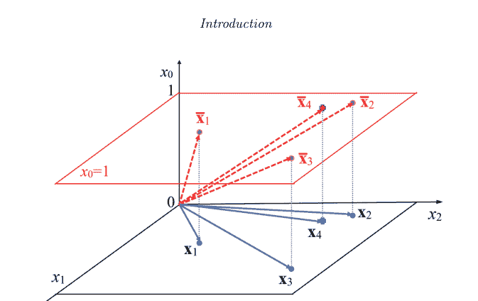

图1.1：二维特征空间 $\mathbb{X}^2$ 中的数据点，蓝色向量：$\mathbf{x}_i = [x_{i1}, x_{i2}]$；以及在增广特征空间 $\overline{\mathbb{X}}^2$（称为仿射空间）中的相同数据点，红色向量：$\overline{\mathbf{x}}_i = [1, x_{i1}, x_{i2}]$；$i = 1, 2, 3, 4$。

这些数据点 $\mathbf{x}_i (i = 1, 2, \dots, m)$ 可以堆叠形成一个**数据集**，记为 $\mathbf{X} \in \mathbb{X}^p$。这是为了公式化的方便。我们在计算中并不形成这样的矩阵，因为对于具有大 $m$ 的大数据集，它通常非常大。

### 1.5.3 仿射空间

**仿射空间 $\overline{\mathbb{X}}^p$**：它是一个**增广特征空间**。它是图1.1中所示的红色平面。它具有“完整”的线性基（或基函数）：

$$\overline{\mathbf{x}} = [1, x_1, x_2, \dots, x_p] \qquad (1.3)$$

所谓完整的线性基，我们指的是包括0阶在内的所有变量直到1阶的所有基。0阶基是常数基1，它提供了**增广**。仿射空间不是向量空间，因为 $\mathbf{0} \notin \overline{\mathbb{X}}^p$ 且 $(\overline{\mathbf{x}}_i + \overline{\mathbf{x}}_j) \notin \overline{\mathbb{X}}^p$，其中 $i, j=1$ 或 2 或 3 或 4（见图1.1）。这个特殊且根本有用的空间总是包含一个常数1作为分量，因此根据定义它没有原点。发生在仿射空间上并仍然停留在仿射空间中的操作称为仿射变换。这是主要机器学习模型中最基本的操作，也是此类模型具有预测能力的根本原因。

一个具有 $p$ 个特征的观测数据点也可以表示为 $\overline{\mathbb{X}}^p$ 空间中的一个增广离散点，并可表示为

$$\overline{\mathbf{x}}_i = [1, x_{i1}, x_{i2}, \dots, x_{ip}], \quad \overline{\mathbf{x}}_i \in \overline{\mathbb{X}}^p, \quad \forall \ i = 1, 2, \dots, m \qquad (1.4)$$

$\overline{\mathbb{X}}^p$ 空间可以通过首先引入一个新变量 $x_0$ 将 $\mathbb{X}^p$ 扩展一维到 $\mathbb{X}^{p+1}$ 来创建，即

$[x_0, x_1, x_2, \dots, x_p]$ (1.5)

然后设置 $x_0 = 1$。图1.1中显示的这4个红色向量存在于仿射空间 $\overline{\mathbb{X}}^2$ 中。

注意，仿射空间 $\overline{\mathbb{X}}^p$ 既不是 $\mathbb{X}^{p+1}$ 也不是 $\mathbb{X}^p$，而是相当特殊的。$\overline{\mathbb{X}}^p$ 中的向量属于 $\mathbb{X}^{p+1}$，但向量的尖端被限制在 $x_0 = 1$ 的“超平面”内。为了本书讨论的方便，我们说仿射空间具有一个**伪维度**，即 $p + 1$。其真实维度是 $p$，但它是 $\mathbb{X}^{p+1}$ 空间中的一个超平面。

就函数逼近而言，公式(1.3)给出的线性基可用于在特征空间中构造任何任意的线性函数。这些完整线性基的*适当*线性组合仍然在仿射空间中。这样的组合可用于执行**仿射变换**，这将在第5章详细讨论。

这些数据点 $\overline{\mathbf{x}}_i (i = 1, 2, \dots, m)$ 被堆叠形成一个**增广数据集** $\overline{\mathbf{X}} \in \overline{\mathbb{X}}^p$，这就是函数逼近理论中著名的**矩矩阵**[1–4]。同样，这是为了公式化的方便。我们在计算中可能不会形成这样的矩阵。

### 1.5.4 *标签空间*

**标签空间** $\mathbb{Y}^k$：考虑一个用于监督机器学习模型创建的有标签数据集。我们将引入在 $\mathbb{R}$ 中的实数变量 $(y_1, y_2, \dots, y_k)$。对于简单示例-1，$k = 2$。我们可以定义一个在实数上的标签空间 $\mathbb{Y}^k$。它是一个向量空间。空间 $\mathbb{Y}^k$ 中的向量可以写为

$\mathbf{y} = [y_1, y_2, \dots, y_k], \quad \mathbf{y} \in \mathbb{Y}^k \in \mathbb{R}^k$ (1.6)

数据集中的一个标签与一个数据点配对。数据点 $\mathbf{x}_i$ 的标签记为 $\mathbf{y}_i$，可以表示为

$\mathbf{y}_i = [y_{i1}, y_{i2}, \dots, y_{ik}], \quad \mathbf{y}_i \in \mathbb{Y}^k, \quad \forall i = 1, 2, \dots, m$ (1.7)

对于简单示例-1，$y_{ij} (i = 1, 2, \dots, 8000; \ j = 1, 2)$ 是二维空间 $\mathbb{Y}^2$ 中的8,000个实数。对于简单示例-2，每个标签 $y_{i1}$ 或 $y_{i2}$ 的值为0或1（或 $-1$ 或 1），但这些标签仍然可以被视为存在于 $\mathbb{Y}^2$ 中。

这些标签 $\mathbf{y}_i (i = 1, 2, \dots, m)$ 可以堆叠形成一个标签集 $\mathbf{Y} \in \mathbb{Y}^k$，尽管我们在计算中可能不会真正这样做。

通常，仿射变换在神经网络的输出层结束，并在标签空间中生成一个向量，以便在那里构建损失函数进行“终端控制”。

### 1.5.5 假设空间

机器学习模型中的学习参数 $\hat{\mathbf{w}}$ 是存在于实数域上**假设空间** $\mathbb{W}^P$ 中的连续变量。学习参数也称为训练参数或可训练参数。我们交替使用这些术语。学习参数包括每一层以及所有层中的权重和偏置。$\mathbf{w}$ 上方的帽子符号表示它是所有权重和偏置的集合，因此我们用一个向量符号来表示所有学习参数。其维度 $P$ 取决于所使用的假设类型，包括神经网络或机器学习模型的配置。这些参数始终与特征向量协同工作，通过精心设计的架构，在新的特征空间或标签空间中产生中间特征向量。

这些参数需要更新，这涉及向量运算。为确保收敛，我们需要所有学习参数的向量遵循重要的向量性质，例如内积、范数和柯西-施瓦茨不等式等。我们将在本书中多次进行此类证明。因此，我们要求 $\mathbb{W}^P$ 是一个向量空间，这样对当前学习参数的每次更新都会产生仍在同一向量空间中的新参数，直到它们收敛。

请注意，学习参数通常以矩阵形式或列向量（可视为矩阵的特例）存在。在典型的机器学习模型中，可能存在多个不同大小的矩阵。这些矩阵构成**仿射变换矩阵**，作用于仿射空间中的特征。假设空间“向量”中的一个分量实际上可能是一个矩阵，因此直观理解并不容易。最简单（且有效）的方法是将所有矩阵“展平”，然后“拼接”在一起形成一个高向量，然后将其视为普通向量。我们在Python中经常进行这种展平和拼接操作。假设空间 $\mathbb{W}^P$ 中这样一个展平的高向量 $\hat{\mathbf{w}}$ 通常可以写为：

$$\hat{\mathbf{w}} = [w_0, w_1, \dots, w_P]^\top \in \mathbb{W}^P \qquad (1.8)$$

我们将在后续章节中讨论各种模型的 $\mathbb{W}^P$ 的细节，包括维度 $P$ 的估计。

### 1.5.6 典型机器学习模型的定义，数学视角

最后，我们可以从数学上将用于预测的机器学习模型定义为一个映射算子：

$$\mathbb{M}(\hat{\mathbf{w}} \in \mathbb{W}^P; \overline{\mathbf{X}} \in \overline{\mathbb{X}}^p, \mathbf{Y} \in \mathbb{Y}^k) : \mathbb{X}^p \rightarrow \mathbb{Y}^k \quad (1.9)$$

其含义是，机器学习模型 $\mathbb{M}$ 使用给定的数据集 $\mathbf{X}$ 和 $\mathbf{Y}$ 来训练其学习参数 $\hat{\mathbf{w}}$，并生成一个映射（或巨型函数），该映射在标签空间中对特征空间中的任何点进行预测。

公式 (1.9) 所示的机器学习模型实际上是一个**数据-参数转换器**：它在训练期间将给定的数据集转换为学习参数，然后在对给定特征变量集进行预测时将参数转换回来。从数学角度看，它也可以被视为一个在特征空间 $\mathbb{X}^p$ 中具有 $k$ 个分量的巨型函数，并由 $\mathbb{W}^P$ 中的训练参数控制（参数化）。当参数被调整时，就得到了一组在特征空间上的 $k$ 个巨型函数。

另一方面，这组 $k$ 个巨型函数也可以被视为数据集中任何给定数据点的这些参数的连续（可微）函数，这些函数可用于形成一个同样可微的损失函数。这样的损失函数可以是这 $k$ 个巨型函数与数据集中给定的相应 $k$ 个标签之间的误差。它可以被视为预测函数的**泛函**，而预测函数本身又是向量空间 $\mathbb{W}^P$ 中 $\hat{\mathbf{w}}$ 的函数。训练的目标是通过更新训练参数使其成为极小值点，从而最小化数据集中所有数据点的这种损失函数。这个概览图将在后续章节中明确地转化为公式。构建高质量机器学习模型的成功因素包括：(1) 假设类型，(2) $\mathbb{W}^P$ 中学习参数的数量，(3) $\mathbb{X}^P$ 中数据集的质量（对要建模的底层问题的代表性，包括正确性、大小、数据点在特征空间上的分布以及噪声水平），以及 (4) 寻找学习参数**极小值点**以最好地生成数据集中标签的技术。我们将在后续章节中针对不同的机器学习模型详细讨论这一点。

空间的概念有助于我们后续分析机器学习模型的预测性能。读者可能在此阶段难以理解这些概念，因此建议目前只了解大致思路，并在阅读相关章节时重新回顾本节。读者可以跳到第 13.1.5 节，快速浏览公式 (13.13)，以了解空间在深度网络中是如何演变的。

另请注意，存在针对不连续特征变量的机器学习模型，其学习参数可能不需要是连续的。此类方法通常基于适当的直观规则和技术开发，我们将讨论其中一些。空间的概念可能不直接适用，但通常会有所帮助。

## 1.6 创建机器学习模型的要求

要训练一个机器学习模型，需要以下条件：

1.  一个数据集，可通过观察、实验和基于物理定律的模型获得。数据集通常（以随机方式）分为两个相互独立的子集：训练数据集和测试数据集，通常比例为 75:25。测试数据集的独立性至关重要，因为机器学习模型主要由训练数据集决定，因此其可靠性取决于客观测试。
2.  数据集的标签（如果可能）。
3.  数据集的先验信息（如果可能），例如数据质量和数据的关键特征。这对于选择适合该问题的算法以及在训练中应用正则化技术很有用。
4.  合适的计算机软件模块和/或有效的算法。
5.  一台计算机，最好连接到互联网。

## 1.7 数据类型

数据是任何基于数据模型的关键。有许多类型的数据可用于不同类型的问题，如下所示：

-   **图像**：来自相机的照片（现在更常见的是手机）、从开放网站获取的图像、计算机断层扫描（CT）、X射线、超声波、磁共振成像（MRI）等。
-   **计算机生成的数据**：来自经过验证的基于物理定律的模型的数据、其他代理模型的数据、其他经过可靠训练的机器学习模型的数据等。
-   **文本**：未分类的文本文档、书籍、电子邮件、网页、社交媒体记录等。
-   **音频和视频**：音频和视频记录。

请注意，数据集的质量和采样域在训练可靠的机器学习模型中起着重要作用。在数据采样域之外使用训练模型需要特别小心，因为它可能会意外出错，因此非常危险。

## 1.8 基于物理定律的模型与基于数据的模型之间的关系

机器学习模型通常是**学习慢，预测快**，而基于物理定律的模型不需要学习（使用现有定律），但预测速度较慢。这是因为基于物理定律的模型和基于数据的模型的策略大不相同。机器学习模型使用数据集来训练参数，而基于物理定律的模型使用定律来确定参数。

然而，在详细的计算方法层面，两种模型中使用的许多技术实际上是相同或非常相似的。例如，当我们将一个变量表示为其他变量的函数时，两种模型都使用基函数（多项式、径向基函数（RBF）或两者）。在构建目标函数时，两者都使用最小二乘误差公式。此外，使用的正则化方法也相当相似。因此，不应完全孤立地研究这些模型。思想和技术可能深度关联并可相互借鉴。这种认识有助于通过相互交流思想和技术，更好地理解和进一步开发两种模型的更有效方法。通常，对于基于物理定律的计算方法，例如无网格方法的一般形式，我们相当清楚地理解一个方法为何以及如何在理论上工作 [3]。因此，当一个方法用于某个问题时，我们对其将获得的结果相当有信心。然而，对于基于数据的方法，情况并非总是如此。因此，为基于数据的方法发展基础理论非常重要。作者进行了一些尝试 [21]，以揭示基于物理定律的模型与基于数据的模型之间的关系，并为基于数据的模型建立一些理论基础。在本书中，我们将尝试讨论当一种计算方法用于两种模型时的异同。

## 1.9 本书

本书提供了机器学习一般主题的介绍。我们的重点将放在基本概念、基础理论和本质与创建各种机器学习模型相关的计算技术。我们决定不提供涵盖所有机器学习技术、模型和算法的综合性文档。这是因为机器学习的主题非常广泛，内容上不可能做到面面俱到。同时，许多读者也确实不可能学习所有内容。此外，实际上网上已有大量公开的文档和代码。材料并不缺乏，没有必要简单地复制这些材料。在作者看来，最好的学习方法是学习最核心的基础知识并打下坚实的基础，这足以让你学习其他相关的主题、方法和算法。最重要的是，基础扎实的读者甚至可以为他们的问题开发创新且更有效的机器学习模型。

基于这一理念，本书的亮点——那些在公开文献中不易找到或不易完整找到的内容——列举如下，其中许多是作者过去多年的研究成果：

1.  对主要机器学习模型中使用的基本假设的任意线性函数的可预测性进行详细讨论和演示。
2.  仿射变换性质及其演示、仿射空间、仿射变换单元、数组、链式数组、权重和偏置的作用，以及激活函数在深度网络构建中的作用。
3.  检验高阶函数的可预测性，并提出深度网络的通用预测理论。
4.  数据-参数转换器、参数编码以及编码唯一性的概念。
5.  仿射变换在支持向量机中的作用、支持向量机公式的完整描述以及核技巧。
6.  对激活函数、神经脉冲单元进行详细讨论和演示，从而引出宽网络的通用逼近定理。
7.  函数对向量和矩阵的微分，引出自动微分和Autograd。
8.  解存在性理论、并行数据点的影响，以及解相对于标签的可预测性。
9.  神经元-样本理论首次给出了数据点数量与神经网络中神经元数量（或所涉及仿射空间的总伪维度）之间关系的一般经验法则。
10. 对吉洪诺夫正则化效应进行详细讨论和演示。

作者付出了大量努力编写Python代码来演示核心和困难的概念与公式，这使读者能够更早地理解每一章。根据作者的学习经验，这可以使学习更有效。

本书各章原则上可独立阅读，允许存在一些重复。各章之间提供的必要交叉引用保持在最低限度。

## 1.10 谁适合阅读本书

本书面向对学习机器学习基础知识感兴趣的初学者，包括已完成第一年学业的大学生、研究生、研究人员以及工程和科学领域的专业人士。希望学习构建机器学习模型的工程师和实践者也会发现本书有用。具备大学数学基础知识将有助于顺利阅读本书。

本书可用作本科生（大三或大四）和研究生的教材。如果本书被选作教材，讲师可以直接联系作者（liugr100@gmail.com）获取一些作业、课程项目和解答。

机器学习仍然是一个快速发展的研究领域。仍然存在许多具有挑战性的问题，为研究和开发新方法与算法提供了充足的机会。目前，它是一个研究和应用的热点。不同的技术每天都在发展，新的业务不断涌现。作者希望本书能对学习现有和开发中的机器学习模型有所帮助。

## 1.11 本书使用的代码

本书使用Jupyter Notebook编写，并包含代码。购买本书的读者可以直接联系作者（mailto:liugr100@gmail.com）请求包含代码（可能会更新）的电子版，注册后可免费用于学术用途。使用作者开发的书籍和代码（包括纸质版和电子版）的条件如下：

1.  用户使用任何部分的代码和技术，风险完全自负。
2.  本书和代码仅供您个人使用。未经代码作者许可，不得进一步分发。
3.  不提供用户支持。
4.  使用本书、代码、想法和技术时，必须给予适当的引用和致谢。

请注意，书中提供的手写代码主要用于学习和更好地理解机器学习方法的理论和公式。对于生产运行，应使用成熟且经过充分测试的软件包，市面上有很多，包括但不限于Scikit learn、PyTouch、TensorFlow和Keras。此外，我们提供的代码通常需要与各种软件包/模块一起运行。因此，使用这些代码时需要小心，因为代码的行为通常取决于Python以及所有这些软件包/模块的版本。当代码无法按预期运行时，版本不匹配可能是问题之一。在撰写本书时，Python和一些软件包/模块的版本如下：

- Python 3.6.13 :: Anaconda, Inc.
- Jupyter Notebook (web-based) 6.3.0
- TensorFlow 2.4.1
- keras 2.4.3
- gym 0.18.0

当运行代码遇到问题时，读者可能需要检查所使用的软件包/模块的版本。如果使用Anaconda Navigator，当Python环境被高亮显示时，会列出该Python环境中安装的所有软件包/模块的版本。您也可以在Jupyter Notebook的代码单元格中检查软件包的版本。例如，要检查当前Python环境的版本，可以使用

```
!python -V # ! 用于执行外部命令
```

Python 3.6.13 :: Anaconda, Inc.

要检查软件包/模块的版本，可以使用

- import package_name
- print('package_name version', package_name)

例如，

```
import keras
print('keras version',keras.__version__)
import tensorflow as tf
print('tensorflow version',tf.version.VERSION)
```

keras version 2.4.3
tensorflow version 2.4.1

如果版本确实是个问题，您需要要么修改代码以适应版本，要么在您的系统中安装正确的版本，可能通过创建一个替代环境。使用错误信息在网上查询非常有用，通常能找到解决方案或线索。这是作者在运行代码遇到问题时经常采用的方法。最后，本书使用了网络上可用的材料和信息，并附有链接。由于网络的特性，这些链接可能会随时间变化。处理这个问题最有效的方法（也是作者经常使用的方法）是，如果链接失效，就使用关键词在线搜索。

## 参考文献

[1] G.R. Liu and S.S. Quek, *The Finite Element Method: A Practical Course*, Butterworth-Heinemann, London, 2013.
[2] G.R. Liu and T.T. Nguyen, *Smoothed Finite Element Methods*, Taylor and Francis Group, New York, 2010.
[3] G.R. Liu, *Mesh Free Methods: Moving Beyond the Finite Element Method*, Taylor and Francis Group, New York, 2010.
[4] G.R. Liu and Gui-Yong Zhang, *Smoothed Point Interpolation Methods: G Space Theory and Weakened Weak Forms*, World Scientific, New Jersey, 2013.
[5] G.R. Liu and X. Han, *Computational Inverse Techniques in Nondestructive Evaluation*, Taylor and Francis Group, New York, 2003.
[6] F. Rosenblatt, *Principles of Neurodynamics: Perceptrons and the Theory of Brain Mechanisms*, New York, 1962. https://books.google.com/books?id=7FhRAAAAMAAJ.
[7] D.E. Rumelhart, G.E. Hinton and R.J. Williams, *Learning Internal Representations by Error Propagation*, 1986.
[8] G.R. Liu, FEA-AI and AI-AI: Two-way deepnets for real-time computations for both forward and inverse mechanics problems, *International Journal of Computational Methods*, **16**(08), 1950045, 2019.
[9] G.R. Liu, S.Y. Duan, Z.M. Zhang *et al.*, TubeNet: A special trumpetnet for explicit solutions to inverse problems, *International Journal of Computational Methods*, **18**(01), 2050030, 2021. https://doi.org/10.1142/S0219876220500309.

[10] 福岛邦彦，Neocognitron：一种不受位置偏移影响的模式识别自组织神经网络模型，*《生物控制论》*，**36**(4)，193–202，1980年4月。https://doi.org/10.1007%2Ffbf00344251。

[11] D. Ciregan, U. Meier 和 J. Schmidhuber，用于图像分类的多列深度神经网络，*2012 IEEE计算机视觉与模式识别会议*，2012年。

[12] M.V. Valueva, N.N. Nagornov, P.A. Lyakhov *等*，应用剩余数系统降低卷积神经网络实现的硬件成本，*《数学与计算机模拟》*，**177**，232–243，2020年。

[13] 段书永，马洪磊，G.R. Liu *等*，一种具有实时计算机视觉的自动割草机开发，用于避障，*《国际计算方法杂志》*，已接收，2021年。

[14] 段书永，陆宁宁，吕忠伟 *等*，一种基于类别差异的锚框设置技术用于目标检测，*《国际智能机器人与应用杂志》*，**6**，38–51，2021年。

[15] M. Warren 和 P. Walter，神经活动中内在思想的逻辑演算，*《数学生物物理学通报》*，**5**，127–147，1943年。

[16] J. Schmidhuber，*博士后资格论文：一个跨越1200个时间步或虚拟层的信用分配古老实验以及用于循环神经网络堆栈的无监督预训练*，1993年，慕尼黑工业大学。https://people.idsia.ch/~juergen/habilitation/node114.html。

[17] 余勇，司晓生，胡昌华 *等*，循环神经网络综述：LSTM单元与网络架构，*《神经计算》*，**31**(7)，1235–1270，2019年。https://direct.mit.edu/neco/article/31/7/1235/8500/A-Review-of-Recurrent-Neural-Networks-LSTM-Cells。

[18] L. Shi, F. Wang, S. Duan *等*，基于区间的双向TubeNets不确定性反演方法用于提高机器人定位精度，*第11届国际计算方法会议（ICCM2020）*，2020年。

[19] 段书永，施路通，G.R. Liu *等*，一种使用双向神经网络的不确定性反演技术用于机器人臂参数辨识，*《科学与工程中的反问题》*，**29**，3279–3304，2021年。

[20] 段书永，王力，G.R. Liu *等*，一种通过双向TubeNets反演识别机器人臂关节刚度的技术，*《科学与工程中的反问题》*，**13**，3041–3061，2021年。

[21] G.R. Liu，一种神经元方法，*《国际计算方法杂志》*，**17**(07)，2050021，2020年。

## 第2章

## Python基础

本章讨论用于编码机器学习模型的Python语言基础。Python是一种功能非常强大的高级编程语言，无需编译，但具有机器级语言的一定效率。它已成为机器学习通用领域工具和应用开发的首选热门工具。它拥有丰富的开放访问库，并且新的库正在不断开发中。该语言本身在功能方面非常强大。它是进行高效和高产编码与编程的优秀工具。它也很快速，并且该语言的结构构建良好，能够处理机器学习中常见的大量数据。

本章不是正式的Python培训，只是为了帮助读者更顺利地开始学习和实践后续章节的内容。我们将重点介绍作者熟悉的一些有用的简单技巧，以及一些经常影响我们机器学习编码的行为细微之处。熟悉Python的读者可以跳过本章。我们将使用Jupyter Notebook作为讨论平台，以便文档和演示都可以包含在单个文件中。

您可以在线安装Jupyter Notebook，例如在https://www.anaconda.com/distribution/，在那里您可以同时安装Jupyter Notebook和Python，可能还包括另一个有用的Python IDE（集成开发环境）Spyder。在我的笔记本电脑上，这三样工具都已准备就绪。

Jupyter Notebook由不同类型的“单元格”组成：用于代码的单元格和用于文本的单元格，称为“markdown”。每个单元格都有彩色边框，当单元格被点击时颜色会显示出来。绿色边框表示该单元格处于输入模式，可以输入和编辑内容。在单元格内按“ctrl + Enter”，绿色边框会变为蓝色，表示该单元格已格式化或执行，并可能产生结果。双击蓝色边框的单元格会将其设置回输入模式。右侧垂直边框加粗以便于查看。这应该足以让我们开始。通过在Notebook窗口顶部的菜单栏中操作和导航，您将获得更多技能（例如添加单元格、删除单元格和转换单元格类型）。

当遇到问题时，谷歌搜索开放的在线资源是获取帮助的绝佳方式。作者一直这样做。参考资料来源包括以下：

- https://docs.python.org/3.7/
- https://docs.scipy.org/doc/numpy/reference/?v=20191112052936
- https://medium.com/ibm-data-science-experience/markdown-for-jupyter-notebooks-cheatsheet-386c05aeebed
- https://www.dataquest.io/blog/jupyter-notebook-tips-tricks-shortcuts/
- https://www.python.org/about/
- https://www.learnpython.org/
- https://en.wikipedia.org/wiki/Python_(programming_language)
- https://www.learnpython.org/en/Basic_Operators+
- https://www.python.org/+
- https://jupyter.org/
- https://www.youtube.com/watch?v=HW29067qVWkb
- https://pynative.com/

以下列出了作者笔记本电脑当前安装中与jupyter-notebook相关的模块版本详情（使用“!”执行外部命令）：

```
!jupyter --version
jupyter core      : 4.7.1
jupyter-notebook  : 6.3.0
qtconsole         : not installed
ipython           : 7.16.1
ipykernel         : 5.3.4
jupyter client    : 6.1.12
jupyter lab       : not installed
nbconvert         : 6.0.7
ipywidgets        : 7.6.3
nbformat          : 5.1.3
traitlets         : 4.3.3
```

### 2.1 一个练习

让我们在这里进行一个不太传统的介绍。与其他计算机语言书籍不同，我们从讨论如何利用我们在学习过程中可能开发的自己的代码开始。

首先，我们从外部或内部源“导入”Python系统库或模块，以便其中的函数（也称为方法）可以在我们的代码中使用，以与您的计算机系统进行交互。最重要的环境设置是路径。

```
import sys # 导入一个外部模块 "sys"，它
# 提供了访问计算机系统的工具。
sys.path.append('grbin')
# 我在当前工作目录的 grbin 文件夹中制作了一个代码，
# 并希望稍后使用它。
#print(sys.path)
# 检查当前路径。要执行此单元格或任何
# 单元格，请使用 Ctrl-Enter（按住 Ctrl 并按 Enter）
```

请注意，代码单元格中的“#”开始一个注释行。它可以放在代码行中的任何位置。该行中#后面的所有内容都成为注释，不被视为代码的一部分。

您可以移除print(sys.path)前面的“#”，执行它，将会打印出许多路径。其中许多是在安装系统和各种代码（包括Anaconda和Python）时设置的。当前工作目录中的“grbin”刚刚使用sys.path.append()添加进去。

当需要多行注释时，我们使用“文档字符串”，如下所示：

```
'''这里面是多行注释。这是
向用户、共同编程者传达信息的好方法。
使用反斜杠来换行。'''
```

'这里面是多行注释。这是向用户、共同编程者传达信息的好方法。使用反斜杠来换行。'

仅用于演示目的，我们现在导入我们自己的“模块”（一个名为grcodes.py的Python文件）“grcodes”，然后给它一个别名“gr”，以便稍后访问模块内的属性、函数、类等时更容易引用。

import grcodes as gr  # 位于'grbin'文件夹中的Python代码文件grcodes.py。

以下单元格包含Python代码“grcodes.py”。读者可以创建“grcodes.py”文件并将其放入“grbin”文件夹（或其他任意文件夹），以便执行上方单元格并使用“gr.printx()”。

```python
from __future__ import print_function  # 导入外部模块
import sys
# 定义函数
def printx(name):
    """ 同时打印出变量名及其值。
    用法：name = 88.0;  printx('name') """
    frame=sys._getframe(1)
    print(name,'=',repr(eval(name,frame.f_globals,frame.f_locals)))
```

让我们尝试使用导入模块grcodes中的一个函数，使用其别名gr。

```python
x = 1.0              # 为x赋值。
print(x)             # Python内置的print()函数打印
                     # 给定参数x的值。
gr.printx('x')       # 来自gr模块的一个函数。它同时打印
                     # 参数名及其值。
```

```
1.0
x = 1.0
```

```python
help(gr.printx)  # 查看gr.printx函数的用法
```

```
Help on function printx in module grcodes:

printx(name)
    This prints out both the name and its value together.
    usage: name = 88.0;  printx('name')
```

很好。我实际上已经完成了一个使用Python打印“x”的简单任务，并且用了两种方式。gr.printx函数等同于执行以下操作：

```python
print('x=',x)  # 你必须输入两次相同的x
```

```
x= 1.0
```

注意，在这种情况下，你必须输入两次相同的x，这为错误留下了空间。好的代码应该尽可能减少重复，以便于维护。当需要更改时，程序员（或其他使用或维护代码的人）只需做一次即可。

或者，可以使用以下替代方式从模块导入函数：

```python
from grcodes import printx  # 你可以通过添加用","分隔的函数名
    # 来导入更多函数。
#from grcodes import *    # 从grcodes导入所有内容
    # 这不是一个很好的做法，因为当grcodes中的某些函数名
    # 恰好与代码中的函数名相同时，可能会导致问题。
```

在这种情况下，我们现在可以像在当前文件（笔记本）中编写一样使用导入的函数。

```python
gr.printx('x')
printx('x')          # 注意，不再需要"gr."了。

x = 1.0
x = 1.0
```

## 2.2 Python简介

那么，Python是什么？Python由Guido van Rossum创建，于1991年首次发布。Python的设计哲学强调代码的“可读性”。它采用面向对象的方法，旨在帮助程序员为可能由团队协作的中小型项目编写清晰、重复少、逻辑性强的代码。

Python是开源的，其解释器可用于许多操作系统。一个全球性的程序员社区开发和维护CPython，这是一个开源的参考实现。一个非营利组织Python软件基金会管理并指导Python和CPython开发的资源。

该语言的核心哲学总结在文档《Python之禅》（PEP 20）中，其中包括以下格言：

- 美丽优于丑陋。
- 显式优于隐式。
- 简单优于复杂。
- 复杂优于繁琐。
- 可读性很重要。

Guido van Rossum与一个指导委员会共同管理Python开发项目。Python有两个主要版本，Python 2和Python 3，它们差异很大。2008年发布的Python 3.0是一次重大修订。它与Python 2不完全向后兼容。由于为Python 2编写的代码数量众多，对Python 2.7（2.x系列的最后一个版本）的支持延长至2020年。在撰写本书时，Python 3.9已经发布。本教程使用Python 3.6，因为它支持更多现有的库和模块。

迄今为止，已经开发了大量（可能数以百计）的计算机编程语言。作者第一次接触计算机编程语言是在20世纪70年代，当时学习BASIC进行编程。后来他使用了ALGOL60，然后从70年代至今长期使用FORTRAN，同时也有限地使用了Matlab、C、C++，现在是Python。任何编程语言都有复杂的语法和深层次的逻辑组织。对于像作者这样的用户，学习计算机编程语言的最佳方法是通过示例和实践，同时注意语法、属性和行为。对于初学者来说，跟随示例可能是入门的最佳方法。这将是撰写本书这一部分的指导原则。关于严谨的语法，读者可以阅读网上 readily available 的相关文档。我们将给出大量示例，并以注释的形式进行解释（程序员经常这样做）。所有这些示例都可以在阅读本书时直接执行，以便读者能够实时感受，轻松观察行为并从而理解。读者也可以通过简单的复制粘贴来形成他/她的笔记本。由于这种基于示例的方法，对不同主题的讨论可能会在这里和那里跳跃一点。

要编写和执行Python代码，通常使用IDE。Jupyter Notebook、PyCharm和Spyder是流行的IDE。在本书中，我们通过发行版Anaconda（https://www.anaconda.com/）使用Jupyter Notebook（https://jupyter.org/）。Jupyter Notebook不仅可以作为IDE使用，还可以作为一个很好的文档生成器，允许在一个文档中一起编辑描述文本（markdown单元格）和代码单元格。作者机器学习课程中使用的讲义也主要使用Jupyter Notebook开发。使用Jupyter Notebook创建的文档可以导出为多种类型的文档，包括ascii doc、html、latex、markdown、pdf、Python(.py)和slides(.slides.html)。如果愿意，读者和学生可以将此笔记本用作文档（项目报告、作业等）的模板。如果需要在Jupyter Notebook的markdown单元格中输入时进行拼写检查，应在Anaconda Prompt中执行以下命令：

- %pip install jupyter_contrib_nbextensions。
- %jupyter contrib nbextension install --user。
- %jupyter nbextension enable spellchecker/main。

这将为你标记拼写错误的单词（但不会提供建议）。其他具有附加功能的必要模块也可以类似方式安装。

本书简要介绍了Python的一小部分内容。

## 2.3 变量类型

据说Python是面向对象的。Python中的每个变量都是一个对象。它是“动态类型”的：变量类型在输入时确定。你不需要在使用变量之前声明它们，或声明它们的类型。它有一些基本的变量类型：数字和字符串。这些变量可以独立存在，或形成元组、列表、字典、集合、Numpy数组等。它们都可以在代码中进行各种操作（算术、布尔、逻辑、格式化等）。注意，变量是松散定义的，意味着它可能是元组、列表、字典等。例如，一个列表可以在列表中，一个元组在列表中，或者一个列表在元组中。

### 2.3.1 数字

Python支持三种类型的数字——**整数**、**浮点数**和**复数**。
要定义一个整数变量，只需为其赋一个整数值。

```python
my_int = 48  # 通过此赋值，my_int成为一个整数
print(my_int); printx('my_int')
```

```
48
my_int = 48
```

```python
type(my_int) # 检查变量的类型。如果它是单元格中的最后一行，则不需要print()
```

```
int
```

```python
my_int = 5.0 # 通过此操作，my_int现在成为一个浮点数
```

```python
type(my_int)
```

```
float
```

```python
my_complex=8.0+5.0j # 通过此操作，my_complex成为一个复数
print(my_complex)
printx('my_complex')
```

```
(8+5j)
my_complex = (8+5j)
```

```python
my_int, my_float, my_string = 20, 10.0, "Hello!"

if my_string == "Hello!": # 比较运算符：==, !=, <, <=, >, >=
    print("A string: %s" % my_string) # 缩进4个空格

if isinstance(my_float, float) and my_float == 10.0:
    #isinstance():返回一个对象是否是某个类的实例
    print("This is a float, and it is %f" % my_float)

if isinstance(my_int, int) and my_int == 20:
    print("This is an integer, and it is: %d" % my_int)
```

```
A string: Hello!
This is a float, and it is 10.000000
This is an integer, and it is: 20
```

要列出当前内存中的所有变量、函数、模块，请尝试：

```python
#%whos # 你可以移除"#"并尝试此命令
```

变量的类型可以转换：

```python
my_float = 5.0 # 通过此赋值，my_float 变为浮点数
print(my_float)
my_float = float(6)
    # 创建一个浮点数，通过将整数转换为浮点数，使用 float()
print(my_float)
print(int(7.0))        # 浮点数被转换为整数。
print('int(7.0)')
```

```
5.0
6.0
7
int(7.0) = 7
```

要检查变量的内存地址，请使用

```python
a = 1.0
print('a=',a, 'at memory address:',id(a))
```

```
a= 1.0 at memory address: 1847993237600
```

```python
b = a
print('b=',b, 'at memory address: ',id(b))
```

```
b= 1.0 at memory address: 1847993237600
```

注意，'b' 与 'a' 具有相同的地址。

```python
a, b = 2.0, 3.0
print('a=',a, 'at memory address: ',id(a))
print('b=',b, 'at memory address: ',id(b))
```

```
a= 2.0 at memory address: 1847974064064
b= 3.0 at memory address: 1847974063944
```

注意当变量值改变时地址的变化。

### 2.3.2 下划线占位符

```python
n1=100000000000
n_1=100_000_000_000           # 便于阅读
print('Yes, n1 is same as n_1') if n1==n_1 else print('No')
                                # 三元 if 语句
n2=1_000_000_000
print('Total=',n1+n2)
print('Total=',f'{n1+n2:,}') # f-string (Python3.6 或更高版本)
total=n1+n2
print('Total=',f'{total:_}')
```

```
Yes, n1 is same as n_1
Total= 101000000000
Total= 101,000,000,000
Total= 101_000_000_000
```

### 2.3.3 字符串

**字符串**是文本片段，在编码中对于生成输出的标签和文件名非常有用。字符串可以用引号内的任何内容定义。引号可以是一对单引号或一对双引号。

```python
my_string = "How are you?"
    # 定义了字符串，其中的字符可以被索引
print(my_string, my_string[0:3],my_string[5],my_string[10:])
my_string = 'Hello,' + " hello!" + " I am here."
    # 注意字符串的 "+" 运算符是连接
print(my_string)
```

```
How are you? How r u?
Hello, hello! I am here.
```

虽然单引号和双引号都可以使用，但当字符串中包含撇号时，应使用双引号，否则如果使用单引号，这些撇号会终止字符串，反之亦然。例如，

```python
my_string = "Do not worry, just use double quotes to 'escape'."
print(my_string)
```

```
Do not worry, just use double quotes to 'escape'.
```

可以交换这两种引号的作用：

```python
my_string = 'Do not worry about "double quotes".'
print(my_string)
```

```
Do not worry about "double quotes"
```

当需要包含回车符、反斜杠和 Unicode 字符等内容时，请参考 Python 文档。以下是一些应用于数字和字符串的更方便、更简洁的运算符。你可以尝试一下，积累一些经验。

```python
one, two, three = 1, 2, 3          # 将值赋给变量。
summation = one + two + three
print('summation=',summation)      # print('summation')
```

```
summation= 6
```

```python
one, two, three = 1, 2, 3.0        # 变量类型可以混合！
summation = one + two + three
print('Summation=',summation)
```

```
Summation= 6.0
```

```python
one3 = two3 = three3 = 3  # 将相同的值赋给多个变量
print(one3, two3, three3)
```

```
3 3 3
```

更多便捷操作：

```python
hello, world = "Hello,", "world!"
helloworld = hello + " " + world + "!!!" # 连接字符串
print(helloworld, '   ', hello + " " + world)
lhw=len(helloworld)  # 字符串的长度，包括空格
                     # 和标点符号。
print('The length of the "helloworld" is',lhw)
```

```
Hello, world!!!       Hello, world!
The length of the "helloworld" is 15
```

你可以将字符串分割成一个字符串列表，每个字符串是一个单词。

```python
the_words = helloworld.split(" ") # 创建一个字符串列表
                     # 后面将介绍列表的类似操作
print("Split the words of the string: %s" % the_words)
print('Joined together again with a space as separator:',
      ' '.join(the_words))
```

```
Split the words of the string: ['Hello,', 'world!!!']
Joined together again with a space as separator: Hello, world!!!
```

要在字符串中查找一个字母（字符），可以尝试：

```python
my_string = "Hello world!"
print('"o" is right after the',my_string.index("o"),
      'th letter.')   # "" 用于换行
print('The first letter "l" is right after the',
      my_string.index("l"), 'nd letter.')
```

```
"o" is right after the 4 th letter.
The first letter "l" is right after the  2 nd letter.
```

不喜欢“4”和“th”、“2”和“nd”之间的空格？使用字符串连接：

```python
print('The position of the letter "o" is right after the ' +
      str(my_string.index("o")) + 'th letter.')
          # "+" 连接
print('The 1st letter "l" is right after the ' +
      str(my_string.index("l")) + 'nd letter.')
```

```
The position of the letter "o" is right after the 4th letter.
The 1st letter "l" is right after the 2nd letter.
```

你可能需要查找列表中每个元素的频率。

```python
from collections import Counter    # 导入 Counter 模块。
my_list = ['a','a','b','b','b','c','d','d','d','d','d']
count = Counter(my_list) # Counter 对象是一个字典
print(count)    # 包含列表中每个元素的频率
                # 另请参阅后面的字典部分
```

```
Counter({'d': 5, 'b': 3, 'a': 2, 'c': 1})
```

```python
print('The frequency of "b" is', count['b'])
          # 通过键索引的元素的频率
```

```
The frequency of "b" is 3
```

注意 Python（以及许多其他编程语言）从 0 开始计数，而不是从 1 开始。
    我们在下面列出更多可能有用的操作。

#### 字符串大小写转换

```python
my_string = "Hello world!"
print(my_string.upper(),my_string.lower(),my_string.title())
# 分别转换为大写和小写。
```

```
HELLO WORLD! hello world! Hello World!
```

-   使用切片反转字符串（另请参阅列表部分）。

```python
my_string = "ABCDEFG"
reversed_string = my_string[::-1]
print(reversed_string)
```

```
GFEDCBA
```

#### 字符串类的 title() 函数

```python
my_string = "my name is professor g r liu"
new_string = my_string.title()
print(new_string)
```

```
My Name Is Professor G R Liu
```

#### 重复操作的使用

```python
n = 8
my_list = [0]*n
print(my_list)
```

```
[0, 0, 0, 0, 0, 0, 0, 0]
```

```python
my_string = "abcdefg "
print(my_string*2)    # 连接 n 次然后打印
```

```
abcdefg abcdefg
```

```python
lotsofhellos = "Hello " * 5  # 连接 5 次
print(lotsofhellos)
```

```
Hello Hello Hello Hello Hello
```

```python
my_list = [1,2,3,4,5]
print(my_list*2)      # 连接 2 次然后打印
```

```
[1, 2, 3, 4, 5, 1, 2, 3, 4, 5]
```

#### 使用 len() 获取给定参数的长度

```python
print('The length of "ABCD" is', len('ABCD'))
```

```
The length of "ABCD" is 4
```

```python
print('The length of',my_string,'is', len(my_string))
```

```
The length of abcdefg is 8
```

```python
even_numbers, odd_numbers= [2,4,6,8], [1,3,5,7]
```

```python
length = len(even_numbers)    # 使用 len() 获取长度
all_numbers = odd_numbers + even_numbers    # 连接
print(all_numbers,' The original length is',
length, '. The new length is',len(all_numbers))
```

```
[1, 3, 5, 7, 2, 4, 6, 8] The original length is 4 . The new length is 8
```

#### 使用 sorted() 对元素排序

```python
print(sorted('BACD'),sorted('ABCD',reverse=True))
print(sorted(all_numbers), sorted(all_numbers,reverse=True))
```

```
['A', 'B', 'C', 'D'] ['D', 'C', 'B', 'A']
[1, 2, 3, 4, 5, 6, 7, 8] [8, 7, 6, 5, 4, 3, 2, 1]
```

#### 将列表中的每个元素乘以相同的数字

```python
original_list, n = [1,2,3,4], 2
new_list = [n*x for x in original_list]
        # 列表推导式用于逐元素操作
print(new_list)
```

```
[2, 4, 6, 8]
```

#### 使用 enumerate() 为列表生成索引

```python
my_list = ['a', 'b', 'c']
for index, value in enumerate(my_list):
    print('{0}: {1}'.format(index+1, value))
```

```
1: a
2: b
3: c
```

```python
for index, value in enumerate(my_list):  # 生成索引
    print(f'{index+1}: {value}')          # f-string
```

```
1: a
2: b
3: c
```

#### 错误异常跟踪代码，同时避免停止执行

```python
a, b = 1,2
try:
    print(a/b)                    # 当 b=0 时引发异常
except ZeroDivisionError:
    print("division by zero")
else:
    print("no exceptions raised")
finally:
    print("Regardless of what happened, run this always")
```

```
0.5
no exceptions raised
Regardless of what happened, run this always
```

#### 获取以字节为单位的内存大小

```python
import sys                          # 导入 sys 模块
num = "AAA"
print('The memory size is %d'%sys.getsizeof(num),'bytes')
                                    # 字符串的内存大小
```

### 2.3.4 变量类型之间的转换

内存大小为 52 字节

```python
num = 21099
print('The memory size is %d'%sys.getsizeof(num),'bytes')
# memory size of integer
```

内存大小为 28 字节

```python
num = 21099.0
print('The memory size is %d'%sys.getsizeof(num),'bytes')
# memory size of float
```

内存大小为 24 字节

# 检查字符串是否以特定内容开头或结尾

```python
astring = "Hello world!"
print(astring.startswith("Hello"),astring.endswith("asdf"),\n      astring.endswith("!"))
```

True False True

第一个打印 True，因为字符串以 "Hello" 开头。第二个打印 False，因为字符串显然不以 "asdf" 结尾。第三个打印 True，因为字符串以 "!" 结尾。它们的布尔值在创建条件时非常有用。更多此类函数：

```python
my_string="Hello World!"
my_string1="HelloWorld"
my_string2="HELLO WORLD!"
print (my_string.isalnum())    #check if all char are numbers
print (my_string1.isalpha())   #check if all char are alphabetic
print (my_string2.isupper())   #test if string is upper case
```

False
True
True

```python
my_string3, my_string4, my_string5="hello world!","  ", "8888a"
print (my_string3.istitle()) #test if contains title words
print (my_string3.islower()) #test if string is lower case
print (my_string4.isspace()) #test if string is spaces
print (my_string5.isdigit()) #test if string is digits
```

False
True
True
False

# 检查变量的类型和其他属性

```python
n, x, s = 8888,8.0, 'string'
print (type(n), type(x), type(s))    # check the type of an object
print (len(s),len(str(n)),len(str(x)))
```

<class 'int'> <class 'float'> <class 'str'>
6 4 3

当一个变量是浮点数，并与其他整数进行运算时，该变量会变成浮点数。

```python
a = 2
print('a=',a, ' type of a:',type(a))
b = 3.0; a = a + b
print('a=',a, ' type of a:',type(a))
print('b=',b, ' type of a:',type(b))
```

a= 2  type of a: <class 'int'>
a= 5.0  type of a: <class 'float'>
b= 3.0  type of a: <class 'float'>

变量的类型可以转换为其他类型。

```python
n, x, s = 8888,8.5, 'string'
sfn = str(n)            #integer to string
print(sfn,type(sfn))
sfx = str(x)            #float to string
print(sfx,type(sfx))
```

8888 <class 'str'>
8.5 <class 'str'>

```python
xfn = float(n)          #integer to float
print(xfn,type(xfn))
nfx = int(x)            #float to integer
print(nfx,type(nfx))
```

8888.0 <class 'float'>
8 <class 'int'>

```python
#a = int('Hello')       # string to integer: produces ValueError
#a = int('8.5')         # string to integer: produces ValueError
a = int('85')           # works, '85' is converted to an integer
print(a,type(a))
```

85 <class 'int'>

```python
a = float('85')         # how about this one?
print(a,type(a))
```

85.0 <class 'float'>

```python
8.0 + float("8.0")      #try this
```

16.0

```python
a = int(False)          # check this out
print(a,type(a))
```

0 <class 'int'>

但是，不允许数字和字符串混合使用运算符，这会触发 TypeError：

```python
my_mix = my_float + my_string
```

```
---------------------------------------------------------------------------
TypeError                                 Traceback (most recent call last)
<ipython-input-67-8c4f7138852e> in <module>
----> 1 my_mix = my_float + my_string

TypeError: unsupported operand type(s) for +: 'float' and 'str'
```

### 2.3.5 变量格式化

格式化在打印变量时非常有用。Python 使用 C 风格的字符串格式化来创建新的、格式化的字符串。`%` 运算符用于格式化一组包含在“元组”（一个固定大小的列表，稍后讨论）中的变量。它在由“参数说明符”（如 `%s`、`%d`、`%f` 等）指定的位置生成普通文本。理解这一点的最佳方式是通过示例。

```python
name = "John"
print("Hello, %s! how are you?" % name)   # %s is for string
# for two or more argument specifiers, use a tuple:
name, age = "Kevin", 23
print("%s is %d years old." % (name,age)) # %d is for digit
```

Hello, John! how are you?
Kevin is 23 years old.

```python
print(f"{name} is {age} years old.")
# f-string Python 3.6 or later.
```

Kevin is 23 years old.

任何非字符串对象（例如列表）也可以使用 `%s` 运算符进行格式化。`%s` 运算符使用 `repr` 方法将对象格式化为字符串并返回。例如：

```python
list1,list2,x=[1,2,3],['John','Ian'],21.5 # multi- assignment
print("List1:%s; List2:%s\n x=%s,x=%f,x=%.3f,x=%e" \n      % (list1,  list2,  x,   x,   x,      x))
```

List1:[1, 2, 3]; List2:['John', 'Ian']
x=21.5,x=21.500000,x=21.500,x=2.150000e+01

```python
print(f"List1:{list1};List2:{list2};x={x},x={x:.2f}, x={x:.3e}")
# powerful f-string
```

List1:[1, 2, 3]; List2:['John', 'Kevin']; x=21.5,x=21.50,x=2.150e+01

常用的格式化参数说明符（如果不使用 f-string）：

- %s - 字符串（或任何具有字符串表示形式的对象，如数字）。
- %d - 整数。
- %f - 浮点数。
- %.f - 固定小数点后位数的浮点数。
- %e - 科学计数法：一个浮点数乘以指定的 10 的幂。
- %x/%X - 十六进制表示的整数（小写/大写）。

## 2.4 算术运算符

加法、减法、乘法和除法运算符可用于数字。

### 2.4.1 加法、减法、乘法、除法和幂运算

+ - * / //(整除) % (整数除法的余数或取模) **

```python
number = 1 + 2 * 3 / 4.0
print(number)
```

## 2.5

取模（%）运算符返回除法的整数余数：被除数 % 除数 = 余数。

```python
numerator, denominator = 11, 2
floor = numerator // denominator #floor division
print(str(numerator)+'//'+str(denominator)+ '=', floor)
remainder = numerator % denominator
print(str(numerator) +'%'+ str(denominator) + '=', remainder)
print(floor*denominator + remainder)
```

11//2= 5
11%2= 1
11

使用两个乘号表示幂关系。

```python
squared, cubed = 7 ** 2, 2 ** 3
print('7 ** 2 =', squared, ', and 2 ** 3 =',cubed)
```

7 ** 2 = 49 , and 2 ** 3 = 8

```python
bwlg_XOR = 7^2
print(bwlg_XOR)    # ^ is XOR (bitwise logic gate) operator!
```

5

Python 允许两个变量之间进行简单的交换操作。

```python
a, b = 100, 200
print('a=',a,'b=',b)
a, b = b, a        # swapping without using a "mid-man"
print('a=',a,'b=',b)
```

a= 100 b= 200
a= 200 b= 100

### 2.4.2 内置函数

Python 提供了许多始终可用的内置函数和类型。要快速浏览，请参阅下表，或在 https://docs.python.org/3/library/functions.html 查找更多详细信息。

| | | 内置函数 | | |
|---|---|---|---|---|
| abs() | delattr() | hash() | memoryview() | set() |
| all() | dict() | help() | min() | setattr() |
| any() | dir() | hex() | next() | slice() |
| ascii() | divmod() | id() | object() | sorted() |
| bin() | enumerate() | input() | oct() | staticmethod() |
| bool() | eval() | int() | open() | str() |
| breakpoint() | exec() | isinstance() | ord() | sum() |
| bytearray() | filter() | issubclass() | pow() | super() |
| bytes() | float() | iter() | print() | tuple() |
| callable() | format() | len() | property() | type() |
| chr() | frozenset() | list() | range() | vars() |
| classmethod() | getattr() | locals() | repr() | zip() |
| compile() | globals() | map() | reversed() | __import__() |
| complex() | hasattr() | max() | round() | |

```python
#help(all)          # to find out what a builtin function does
```

## 2.5 布尔值和运算符

**布尔值**是两个常量对象：True 和 False。当用作算术运算符的参数时，它们的行为分别类似于整数 0 和 1。内置函数 `bool()` 可用于将任何值转换为布尔值。定义如下：

```python
print(bool(5),bool(-5),bool(0.2),bool(-0.1),bool(str('a')),
      bool(str('0')))
#       True  True  True  True  True  True
print(bool(0),bool(-0.0)) # These are all zero
#       False  False
print(bool(''),bool([]),bool({}),bool(()))   # all empty (0)
#       False  False  False  False
```

True True True True True True
False False
False False False False

`bool()` 仅在值为零或容器为空时返回 False。否则，返回 True。注意，`str('0')` 既不是零也不是空。

布尔运算符包括“与”和“或”。

```
print(True and True, False or True, True or True,)
#           True           True           True
print(False and False, False and True)
#           False           False
```

True True True
False False

## 2.6 列表：多样化的变量类型容器

我们之前已经多次见过**列表**。本节将提供更多细节。列表是变量的集合，它与**数组**非常相似（更多细节请参阅 NumPy 数组部分）。列表可以包含任何类型的变量，以及任意数量的变量。这些变量被保存在一对方括号 [ ] 中。列表可以在需要时进行迭代操作。它是“可迭代对象”之一。让我们看下面的例子。

### 2.6.1 列表的创建、追加、连接和更新

```
x_list = []     # 使用 [] 为 x_list 定义一个占位符。
                # 它是空的，但已分配了一个地址。
print('x_list=',x_list)
print(hex(id(x_list)))  # 十六进制的内存地址
```

x_list= []
0x1ae44e9f548

```
x_list.append(1)  # 1 作为第 0 个成员追加到此列表中
x_list.append(2)  # 2 作为第 1 个成员追加
x_list.append(3.) # 变量类型改变了！
print(x_list[0])  # 打印 1，第 0 个元素 ...
print(x_list[1])  # 打印 2
print(x_list[2])  # 打印 3
print(x_list)     # 打印列表中的所有内容
```

3.0
[1, 2, 3.0]

```
for x in x_list:   # 通过迭代打印出 1,2,3.0
    print(x, end=',')

print('\n')
x_list2 = x_list*2
  # 连接 2 个 x_list（不是逐元素
  # 乘法！）这会创建一个独立的新 x_list2
print(x_list2)
```

1,2,3.0,

[1, 2, 3.0, 1, 2, 3.0]

```
print(id(x_list),id(x_list2))  # 地址不同
```

1847992120648 1847993139592

```
id(x_list[1])          # 同样，不需要 print() 函数
                       # 因为这是单元格中的最后一行
```

1594536160

```
x_list3 = x_list   # 赋值是 x_list3 的一个“指针”
print(x_list,'    ',x_list3,)
```

[1, 2, 3.0]        [1, 2, 3.0]

```
print(id(x_list),id(x_list3))  # 它们共享相同的地址
```

1847992120648 1847992120648

```
x_list4 = x_list.copy()       # copy() 函数创建 x_list4
                               # 它是一个新的独立列表
print(x_list,'    ',x_list4)
```

[1, 2, 3.0]        [1, 2, 3.0]

```
print(id(x_list),id(x_list4))  # x_list4 有自己的地址
```

1847992120648 1847993186760

```
x_list[0] = 4.0            # 为第 0 个元素赋一个新值
print(x_list)
```

[4.0, 2, 3.0]

```
print(x_list3,' ',x_list4) # x_list3 随 x_list 一起改变，
# 因为赋值创建了一个“指针”。x_list4 没有
# 改变，因为它是使用 copy() 函数创建的。
```

[4.0, 2, 3.0]       [1, 2, 3.0]

```
print(x_list2)       # 对 x_list 的更改没有影响
```

[1, 2, 3.0, 1, 2, 3.0]

通过解包数字字符串来创建列表：

```
num = 19345678
list_of_digits=list(map(int, str(num)))    #列表可迭代对象
print(list_of_digits)
list_of_digits=[int(x) for x in str(num)] #列表推导式
print(list_of_digits)
```

[1, 9, 3, 4, 5, 6, 7, 8]
[1, 9, 3, 4, 5, 6, 7, 8]

### 2.6.2 列表的逐元素相加

列表的逐元素相加需要一点技巧。最好的方法，包括使用 numpy 数组，将在列表推导式部分讨论。这里，我们使用一种原始方法来实现这一点。

```
list1, list2= [20, 30, 40], [5, 6, 8]
print (list1, '  ', list2, '  ', list1+list2)
print ("Original list 1: " + str(list1))
print ("Original list 2: " + str(list2))

print ('"+" is not addition, but concatenation:',list1+list2)
```

[20, 30, 40]    [5, 6, 8]    [20, 30, 40, 5, 6, 8]
Original list 1: [20, 30, 40]
Original list 2: [5, 6, 8]
"+" is not addition, it is concatenation: [20, 30, 40, 5, 6, 8]

```
# 我们将使用 for 循环来实现逐元素相加：
add_list = []
for i in range(0, len(list1)):  # for 循环逐个相加！
    add_list.append(list1[i] + list2[i])

print ("Element-wise addition of 2 lists is: " + str(add_list))
```

Element-wise addition of 2 lists: [25, 36, 48]

```
id(add_list[0])                    # 检查列表的地址
```

1594536896

```
id(list1[0])
```

1594536736

```
add_list = []
for i1,i2 in zip(list1,list2): # for 循环和 zip() 来相加
    add_list.append(i1+i2)

print ("The element-wise addition of 2 lists: ",add_list)
```

The element-wise addition of 2 lists:  [25, 36, 48]

### 2.6.3 字符串和列表的切片

切片是一种有用且高效的操作，用于处理字符串、列表或数组（稍后讨论）的部分内容。我们的讨论从字符串切片开始，然后是列表。

```
my_string = "Hello world!"
#123456789TET          # 传统顺序
print('0123456789TE')   # Python 中的顺序
print (my_string)
print('5th=',my_string[4])       # 取第 5 个字符
print('7-11th=',my_string[6:11]) # 第 7 到第 11 个
```

0123456789TE
Hello world!
5th= o
7-11th= world

```
print('[6:-1]=',my_string[6:-1])
    # "-1" 表示从第 6 个到最后一个（不含）的切片
print('[:]=',my_string[:])     # 字符串中的所有字符
print('[6:]=',my_string[6:])   # 从第 7 个到末尾的切片
print('[:-1]=',my_string[:-1]) # 到最后一个（不含）
```

[6:-1]= world
[:]= Hello world!
[6:]= world!
[:-1]= Hello world

```
my_string = "Hello world!"
#123456789TET          # 传统顺序
print('[3:9:2]=',my_string[3:9:2]) # 从第 4 个到第 9 个，步长为 2
    # 语法：[start:stop:step]
my_string = "Hello world!"
```

[3:9:2]= l o

使用负步长，我们可以轻松地反转字符串，正如我们之前看到的：

```
my_string = "Hello world!"
print('string:',my_string)
print('[::-1]=',my_string[::-1])  # 所有字符但从最后一个开始
```

string: Hello world!
[::-1]= !dlrow olleH

总之，如果方括号中只有一个数字，切片会取（数字 +1）位置的字符。这是因为 Python 从零开始计数。冒号代表所有可用的。如果单独使用，切片就是整个字符串。如果其左边有一个数字，切片就是从该数字到右端，反之亦然。负数表示从右端开始计数：-3 表示“从右端数第 3 个字符”。也可以使用步长选项进行跳过。

请注意，当使用不存在的索引访问字符串时，会生成 IndexError 异常。

```
print('[14]=',my_string[14])  # 索引超出范围错误
```

```
------------------------------------------------------------
IndexError          Traceback (most recent call last)
<ipython-input-102-024f17c69a4f> in <module>
----> 1 print('[14]=',my_string[14]) # 产生索引超出范围错误

IndexError: string index out of range
```

```
print('[14:]=',my_string[14:])  # 这不会产生错误，
                                # 但什么也不返回：无法切片
```

[14:]=

上面详细描述的非常相似的规则也适用于列表，只需将列表中的变量视为一个字符。

Python 机器学习：理论与应用

```
# 创建包含混合类型变量的 my_list：
list2=[]
my_list=[0, 1, 2, 3,'4E', 5, 6, 7,[8,8], 9]
    # 1, 2, 3, 4, 5,    6, 7, 8,  9,  10 -> 索引
    # 0, 1, 2, 3, 4,    5, 6, 7,  8,   9 -> Python 索引
    #-10 -9,-8,-7,-6, -5,-4,-3, -2,   -1 -> Python 反向索引

print(my_list[0:10:1])    # [start:end:step]  end 是包含的！
print(my_list[:])         # 冒号代表所有变量
```

[0, 1, 2, 3, '4E', 5, 6, 7, [8, 8], 9]
[0, 1, 2, 3, '4E', 5, 6, 7, [8, 8], 9]

```
print(my_list[0:])        # 从 (0+1) 个到末尾
print(my_list[1:])        # 从 (1+1) 个到末尾
print(my_list[8:])        # 从 (8+1) 个到末尾
print(my_list[8:9])       # 返回一个列表中的列表
```

[0, 1, 2, 3, '4E', 5, 6, 7, [8, 8], 9]
[1, 2, 3, '4E', 5, 6, 7, [8, 8], 9]
[[8, 8], 9]
[[8, 8]]

```
print(my_list[:])         # 冒号代表所有变量
print(my_list[:3])        # 0,1,2,
print(my_list[:1])        # 从第 1 个到第 1 个：0
print(my_list[:0])        # 从第 1 个到第 0 个：空 []
print(my_list[-1])        # 读出最后一个：9
print(my_list[-1:])       # 切出最后一个：
print(my_list[::-1])      # 反转列表
```

[0, 1, 2, 3, '4E', 5, 6, 7, [8, 8], 9]
[0, 1, 2]
[0]
[]
9
[9]
[9, [8, 8], 7, 6, 5, '4E', 3, 2, 1, 0]

当使用一个不存在的索引访问列表时，会生成一个`IndexError`异常。

```python
#print(my_list[11]) # 将产生索引超出范围的错误
```

```python
print(my_list[10:]) # 从第(10+1)个到末尾：没有更多元素了，
# 不会超出范围，但会得到一个空列表
```

[]

### 2.6.4 列表的下划线占位符

```python
nlist = [10, 20, 30, 40, 50, 6.0, '7H']   # 混合变量
_, _, n3,_,*nn = nlist                       # 当只需要第3个元素时，
                                            # 跳过一个，然后获取剩余部分
print ('n3=',n3, 'the rest numbers',*nn)

nlist = [10, 20, 30, 40, 50, 60, 70]
_, _, n3, *nn, nlast = nlist                 # 需要第3个、最后一个以及
                                            # 它们之间的所有元素
print('n3=',n3,', the last=', nlast,', and all the rest numbers',*nn)
```

n3= 30 the rest numbers 50 6.0 7H
n3= 30 , the last= 70 , and all the rest numbers 40 50 60

### 2.6.5 嵌套列表（列表中的列表中的列表）

```python
nested_list = [[11, 12], ['2B',22], [31, [32,3.2]]]
            # 一个包含混合类型变量的嵌套列表
printx('nested_list')
print(len(nested_list)) # nested_list中子列表的数量
```

nested_list = [[11, 12], ['2B', 22], [31, [32, 3.2]]]
3

```python
print(nested_list[0])           # nested_list中的第1个子列表
print(nested_list[1])           # nested_list中的第2个子列表
print(nested_list[2])           # nested_list中的第3个子列表
print(nested_list)              # 打印全部以便查看
```

[11, 12]
['2B', 22]
[31, [32, 3.2]]
[[11, 12], ['2B', 22], [31, [32, 3.2]]]

```python
print(nested_list[0][0])    # 第1个子列表中的第1个元素
print(nested_list[0][1])    # 第1个子列表中的第2个元素
```

11
12

```python
print(nested_list)
print(nested_list[1][0])    # 试试这个：这会是什么？
print(nested_list[2][1])    #？
print(nested_list[2][1][0]) #？
```

[[11, 12], ['2B', 22], [31, [32, 3.2]]]
2B
[32, 3.2]
32

## 2.7 元组：值被保留

在讨论了列表之后，讨论元组就变得直截了当了。这是因为它们本质上是相同的，主要区别如下：

- 元组通常用`()`括起来，而列表用`[]`。
- 元组是不可变的，而列表是可变的。这意味着元组在创建后不能被更改。元组中的值是被保留的。

因为元组是不可变的，我们用它来存储需要保留的数据。因此，它的用途非常有限。它用于存储常量以防止它们被更改。此外，对元组的操作更快。
除了这些区别，元组的行为类似于列表。它可以通过索引访问、迭代，并赋值给其他变量。下面是一些例子。

```python
ttuple = (10, 20, 30, 40, 50, 6.0, '7H')    # 创建一个元组
gr.printx('ttuple')                          # print(ttuple)
aa = ttuple[0]
print('aa=',aa)
print(ttuple[1], '    ',ttuple[6],'    ',ttuple[-1])
```

ttuple = (10, 20, 30, 40, 50, 6.0, '7H')
aa= 10
20      7H      7H

```python
for i, data in enumerate(ttuple):
    # 使用enumerate函数同时获取索引和内容
    if i < 3:
        print(i, ':', data)
```

0 : 10
1 : 20
2 : 30

```python
# ttuple[2] = 300                          # 这会产生错误
```

以上可能就是我们需要了解的关于元组的全部内容。我们现在讨论Python中另一个有用的数据结构。

## 2.8 字典：可通过键进行索引

字典是一种类似于列表的数据类型。它包含成对的键和值。键是一个字符串，可用于索引。值可以是任何类型的对象：字符串、数字、列表等。因为键和值是成对的，所以存储在字典中的每个值都可以使用相应的键来访问。字典不包含任何重复的键。值可以有重复。

### 2.8.1 将数据赋值给字典

例如，电话号码可以按以下格式赋值给字典：

```python
phonebook1 = {}                     # 字典的占位符
phonebook1["Kevin"] = 513476565
phonebook1["Richard"] = 513387234
phonebook1["Jim"] = 513682762
phonebook1["Mark"] = 513387234   # 一个重复的值
gr.printx('phonebook1')
print(phonebook1)
```

phonebook1 = {'Kevin': 513476565, 'Richard': 513387234,
    'Jim': 513682762, 'Mark': 513387234}
{'Kevin': 513476565, 'Richard': 513387234, 'Jim': 513682762,
    'Mark': 513387234}

字典也可以通过以下方式初始化：

```python
phonebook2 = {'Joanne': 656477456, 'Yao': 656377243,
    'Das': 656662798}
print(phonebook2)
```

{'Joanne': 656477456, 'Yao': 656377243, 'Das': 656662798}

```python
phonebook0 = {
    "John" : [788567837,788347278],
                        # 这是一个列表，John有两个电话号码
    'Mark': 513683222,
    'Joanne': 656477456
}
print(phonebook0)
```

{'John': [788567837, 788347278], 'Mark': 513683222, 'Joanne':
    656477456}

### 2.8.2 迭代字典

与列表类似，字典也可以迭代。因为键和值是成对记录的，我们可以使用for循环来访问它们。

```python
for name, number in phonebook1.items():
    print("Phone number of %s is %d" % (name, number))
```

Phone number of Kevin is 513476565
Phone number of Richard is 513387234
Phone number of Jim is 513682762
Phone number of Mark is 513387234

```python
for key, value in phonebook1.items():
    print(key, value)
```

Kevin 513476565
Richard 513387234
Jim 513682762
Mark 513387234

```python
for key in phonebook1.keys():
    print(key)
```

Kevin
Richard
Jim
Mark

```python
for value in phonebook1.values():
    print(value)
```

513476565
513387234
513682762
513387234

### 2.8.3 删除一个值

要删除一对记录，我们使用内置函数`del`或`pop`，通过键来操作。

```python
phonebook2 = {'Joanne': 656477456, 'Yao': 656377243,
              'Das': 656662798}
del phonebook2["Yao"]
print(phonebook2)
value = phonebook2.pop("Das")
print(phonebook2)
print('value for poped out key',value)
```

{'Joanne': 656477456, 'Das': 656662798}
{'Joanne': 656477456}
value for poped out key 656662798

### 2.8.4 合并两个字典

首先，使用`update()`方法。

```python
phonebook1.update(phonebook2)    # phonebook1被更新了
print(phonebook1)
```

{'Kevin': 513476565, 'Richard': 513387234, 'Jim': 513682762,
 'Mark': 513387234, 'Joanne': 656477456}

现在，使用一种更简单的方法，称为双星号。这允许创建一个由两个字典组合而成的第三个新字典，而不影响原来的两个。

```python
phonebook3 = {**phonebook1, **phonebook0}
print(phonebook3)
```

{'Kevin': 513476565, 'Richard': 513387234, 'Jim': 513682762,
 'Mark': 513683222,
'Joanne': 656477456, 'John': [788567837, 788347278]}

重复的键（如果有的话）会在新字典中被移除：

```python
dict_1 = {'Apple': 7, 'Banana': 5}
dict_2 = {'Banana': 3, 'Orange': 4}  #'Banana'在dict_1中
```

```python
combined_dict = {**dict_1, **dict_2}
# dict_1中的'Banana'将在新字典中被替换
print(combined_dict)
```

{'Apple': 7, 'Banana': 3, 'Orange': 4}

## 2.9 Numpy数组：便于科学计算

Numpy数组类似于列表，但更易于进行科学计算。对Numpy数组的操作通常对大量数据要快得多。

### 2.9.1 列表 vs. Numpy数组

(1) 相似之处：

- 两者都是**可变的**（元素在创建后可以添加和移除。改变操作也称为“破坏性的”，因为它就地修改列表/数组，而不是返回一个新的）。
- 两者都可以被索引。
- 两者都可以被切片。

(2) 不同之处：

- 要使用数组，需要导入Numpy模块，而列表是内置的。
- 数组适用于逐元素操作，而列表不能（需要一些编码来实现）。
- 数组中的数据类型必须相同，但列表可以包含不同类型的数据（这是逐元素操作通常不被接受的部分原因）。
- Numpy数组可以是多维的。
- 通常，数组的操作比列表的操作快得多。
- 存储数组比存储列表使用更少的内存。
- Numpy数组在数学运算和机器学习算法中使用更方便。

### 2.9.2 Numpy数组的结构

我们首先简要介绍Numpy数组的结构，并与我们之前讨论的列表进行比较。为了开始讨论，我们导入numpy包。

import numpy as np # 导入 numpy 并为其指定别名 np

#dir(np) #尝试这个（移除 #）

x1 = np.array([28, 3, 28, 0]) # 一个一维 (1D) numpy 数组
print('x1=',x1) # numpy 数组看起来像一个列表。
gr.printx('x1') # 这指明它是一个数组。

x1 = [28 3 28 0]
x1 = array([28, 3, 28, 0])

如上所示，numpy 数组被“框”在一对方括号中（与列表相同）。

x2 = np.array([[51,22.0],[0,0],(18+9j,3.)]) # 混合类型
print('x2=',x2) # 所有元素都变成了复数值

x2= [[51.+0.j 22.+0.j]
 [ 0.+0.j 0.+0.j]
 [18.+9.j 3.+0.j]]

这是一个二维 numpy 数组。它被框在双层方括号中。列表没有多维性，除非以嵌套形式：列表中的列表。

我们也可以使用列表来创建 numpy 数组。在下面的例子中，我们首先创建两个列表，然后使用这两个列表创建 Numpy 数组：

list_w = [57.5, 64.3, 71.6, 68.2] # 列表，人们的体重（公斤）
list_h = [1.5, 1.6, 1.7, 1.65] # 列表，身高（米）
print('list_w=',list_w, '; list_h= ',list_h)

list_w= [57.5, 64.3, 71.6, 68.2] ; list_h= [1.5, 1.6, 1.7, 1.65]

narray_w = np.array(list_w) # 将列表转换为 numpy 数组
narray_h = np.array(list_h)
print('narray_w=',narray_w, '; narray_h= ',narray_h)

narray_w= [57.5 64.3 71.6 68.2] ; narray_h= [1.5 1.6 1.7 1.65]

让我们创建一个函数来打印给定 numpy 数组的信息。

def getArrayInfo(a):
    '''获取给定数组的信息：
    getArrayInfo(array)'''
    print('数组第一个轴的元素:',a[0])
    print('类型:',type(a))
    print('维度数, a.ndim:', a.ndim)
    print('a.shape:', a.shape)
    print('元素数量, a.size:', a.size)
    print('a.dtype:', a.dtype)
    print('内存地址',a.data)

help(getArrayInfo)    # 可以尝试这个

Help on function getArrayInfo in module __main__:

getArrayInfo(a)
    Get the information about a given array: getArrayInfo(array)

我们在这里看到，""" 为创建的函数提供简单的使用说明很有用。现在让我们用它来获取 nist_w 的信息。

getArrayInfo(narray_w)

数组第一个轴的元素: 57.5
类型: <class 'numpy.ndarray'>
维度数, a.ndim: 1
a.shape: (4,)
元素数量, a.size: 4
a.dtype: float64
内存地址 <memory at 0x000001AE7D549408>

我们注意到 narray_w 是一维的，其形状为 (4,)，意味着它有四个条目。numpy 数组的形状以元组形式给出。
切片也适用于 numpy 数组，方式与列表类似。让我们对数组进行切片。

print(list_w[1:3])    # 第2个和第3个元素之间的切片

[64.3, 71.6]

print(narray_w[1:3])    # 第2个和第3个元素之间的切片

[64.3 71.6]

现在让我们向列表和 numpy 数组都追加一个元素。

# 对于列表，我们使用：
list_w.append(59.8)
print(list_w)
# 对于 numpy 数组，我们将使用：
print(np.append(narray_w,59.8))

[57.5, 64.3, 71.6, 68.2, 59.8]
[57.5 64.3 71.6 68.2 59.8]

print(list_w,' ',narray_w)
print(type(list_w),' ',type(narray_w))
print(len(list_w),' ', narray_w.ndim) # 使用 len() 获取长度

[57.5, 64.3, 71.6, 68.2, 59.8]    [57.5 64.3 71.6 68.2]
<class 'list'>    <class 'numpy.ndarray'>
5    1

nwh = (narray_w,narray_h)  # 这形成了一个 np 数组的元组
print(nwh)

(array([57.5, 64.3, 71.6, 68.2]), array([1.5 , 1.6 , 1.7 , 1.65]))

要形成一个多维数组，我们可以使用以下方法（稍后会详细介绍）：

arr = np.array([narray_w,narray_h])
arr

array([[57.5 , 64.3 , 71.6 , 68.2 ],
       [ 1.5 ,  1.6 ,  1.7 ,  1.65]])

getArrayInfo(arr)

数组第一个轴的元素: [57.5 64.3 71.6 68.2]
类型: <class 'numpy.ndarray'>
维度数, a.ndim: 2
a.shape: (2, 4)
元素数量, a.size: 8
a.dtype: float64
内存地址 <memory at 0x000001AE44FB12D0>

我们注意到 arr 是二维的，其形状为 (2, 4)，意味着它在轴0上有两个条目，在轴1上有四个条目。我们再次看到 numpy 数组的形状以元组形式给出。多维 numpy 数组可以转置：

arrT = arr.T
print(arrT)
getArrayInfo(arrT)   # 查看形状从 (2,4) 变为 (4,2)

[[57.5  1.5 ]
 [64.3  1.6 ]
 [71.6  1.7 ]
 [68.2  1.65]]
数组第一个轴的元素: [57.5  1.5]
类型: <class 'numpy.ndarray'>
维度数, a.ndim: 2
a.shape: (4, 2)
元素数量, a.size: 8
a.dtype: float64
内存地址 <memory at 0x000001AE44FB12D0>

可以看到维度仍然是2，但形状从 (2,4) 变为 (4,2)。numpy 数组中条目的值可以更改。

arr = np.array([[57.5 , 64.3 , 71.6 , 68.2 ],
                [ 1.5 ,  1.6 ,  1.7 ,  1.65]])
arrb = arr
printx('arrb')
arr[0,0]= 888.0      # 更改仅作用于 arr
printx('arrb')

arrb = array([[57.5 , 64.3 , 71.6 , 68.2 ],
            [ 1.5 ,  1.6 ,  1.7 ,  1.65]])
arrb = array([[888. , 64.3 , 71.6 , 68.2 ],
            [ 1.5 ,  1.6 ,  1.7 ,  1.65]])

注意通过赋值创建的数组的行为：对一个数组的更改会影响另一个。这种行为在列表中也观察到了。要创建一个独立的数组，请使用 copy() 函数。

arr = np.array([[57.5 , 64.3 , 71.6 , 68.2 ],
                [ 1.5 ,  1.6 ,  1.7 ,  1.65]])
arrc = arr.copy()    # 这很耗时。仅在必要时使用
printx('arrc')
arr[0,0]= 77.0
printx('arr')
printx('arrc')

arrc = array([[57.5 , 64.3 , 71.6 , 68.2 ],
             [ 1.5 ,  1.6 ,  1.7 ,  1.65]])
arr = array([[77. , 64.3 , 71.6 , 68.2 ],
            [ 1.5 ,  1.6 ,  1.7 ,  1.65]])
arrc = array([[57.5 , 64.3 , 71.6 , 68.2 ],
             [ 1.5 ,  1.6 ,  1.7 ,  1.65]])

### 2.9.3 numpy 数组的轴

轴是 numpy 数组操作的一个重要概念。一维数组有轴0，二维数组有两个轴，0和1，以此类推。定义见图 2.1。

多维 numpy 数组结构和轴：
我们现在可以使用轴来堆叠数组以形成新数组，如下所示：

arr=np.stack([narray_w,narray_h],axis=0)  # 沿轴0堆叠一维数组
print(arr)

[[57.5  64.3  71.6  68.2 ]
 [ 1.5   1.6   1.7   1.65]]

我们可以使用 np.ravel 来展平数组。

print(arr)
rarr=np.ravel(arr)
print(rarr)
getArrayInfo(rarr)

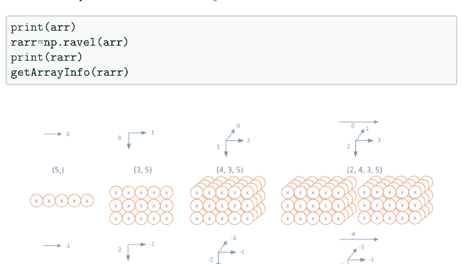

[[57.5  64.3  71.6  68.2 ]
 [ 1.5   1.6   1.7   1.65]]
[57.5  64.3  71.6  68.2   1.5   1.6   1.7   1.65]
数组第一个轴的元素: 57.5
类型: <class 'numpy.ndarray'>
维度数, a.ndim: 1
a.shape: (8)
元素数量, a.size: 8
a.dtype: float64
内存地址 <memory at 0x000001AE7D5494C8>

可以看到维度从2变为1，形状从 (2,4) 变为 (8,)。
在机器学习计算中，我们经常沿数组的某个轴对数组条目求和。这可以使用 np.sum 函数轻松完成。

print(arr)
print('列求和:',np.sum(arr,axis=0),np.sum(arr,axis=0).shape)
print('行求和:',np.sum(arr,axis=1),np.sum(arr,axis=1).shape)

[[57.5  64.3  71.6  68.2 ]
 [ 1.5   1.6   1.7   1.65]]
列求和: [59.   65.9  73.3  69.85] (4,)
行求和: [261.6   6.45] (2,)

注意求和后的数组维度减少了。

### 2.9.4 逐元素计算

使用 Numpy 数组进行逐元素计算非常方便，这与列表的计算方式非常不同。

print('listwh=',list_w+list_h)    # + 对于列表是连接操作。

listwh= [57.5, 64.3, 71.6, 68.2, 59.8, 1.5, 1.6, 1.7, 1.65]

print('narraywh=',narray_w+narray_h)
                # + 对于 numpy 数组是逐元素加法。

narraywh= [59.   65.9  73.3  69.85]

让我们计算以磅为单位的体重，使用 1kg = 2.20462 lbs。

print(narray_w * 2.20462)        # 逐元素乘法

[126.76565 141.757066 157.850792 150.355084]

让我们使用这些narray来计算身体质量指数（BMI）。

```python
bmi = narray_w / narray_h ** 2    # 计算BMI的公式
print(bmi)
```

[25.55555556 25.1171875  24.77508651 25.05050505]

这包括逐元素幂运算和除法。

```python
# lbmi = list_w / list_h ** 2    # 这样能行吗？试试看！
```

我们之前讨论过列表的逐元素操作，并使用了特殊操作（列表推导式）和特殊函数如`zip()`。另一种方法是“numpy方式”。这首先通过将列表转换为numpy数组，然后使用这些数组在numpy中执行操作，最后将结果转换回列表来完成。当列表规模很大时，这种numpy方式可以快得多，因为所有这些操作都可以在numpy中批量执行，而无需逐个元素访问内存。

```python
import numpy as np
list1 = [20, 30, 40, 50, 60]
list2 = [4,  5,  6,  2,  8]
(np.array(list1) + np.array(list2)).tolist()
```

[24, 35, 46, 52, 68]

结果与我们之前使用特殊列表逐元素操作获得的结果相同。

### 2.9.5 生成多维数组的便捷方法

在机器学习和一般的数学计算中，多维数组被频繁使用，因为人们经常需要处理大数据。Numpy支持生成、操作和运算多维数组所需的必要函数（工具）。

```python
np.arange(2, 8, 0.5, dtype=np.float)    # 等间距值
```

array([2. , 2.5, 3. , 3.5, 4. , 4.5, 5. , 5.5, 6. , 6.5, 7. , 7.5])

```python
np.linspace(1., 4., 6)
    # 具有指定元素数量且值间距相等的数组
```

array([1. , 1.6, 2.2, 2.8, 3.4, 4. ])

```python
a = np.array([1.,2.,3.])
a.fill(9.9)            # 所有条目使用相同值填充
print(a)
```

[9.9 9.9 9.9]

```python
x = np.empty((3, 4))  # 指定了形状（维度）为(3,4)，
                      # 但未初始化条目
print(x)
```

[[2.  2.5 3.  3.5]
 [4.  4.5 5.  5.5]
 [6.  6.5 7.  7.5]]

```python
x = np.zeros((6,6))   # 用零初始化
x
```

array([[0., 0., 0., 0., 0., 0.],
       [0., 0., 0., 0., 0., 0.],
       [0., 0., 0., 0., 0., 0.],
       [0., 0., 0., 0., 0., 0.],
       [0., 0., 0., 0., 0., 0.],
       [0., 0., 0., 0., 0., 0.]])

```python
y = np.ones((2,2))*2  # 一个2x2的数组，所有条目为1.0
print(y)
```

[[2. 2.]
 [2. 2.]]

```python
x[3:5,3:5] += y       # 将y赋值给x的一个切片部分
print(x)
```

[[0. 0. 0. 0. 0. 0.]
 [0. 0. 0. 0. 0. 0.]
 [0. 0. 0. 0. 0. 0.]
 [0. 0. 0. 2. 2. 0.]
 [0. 0. 0. 2. 2. 0.]
 [0. 0. 0. 0. 0. 0.]]

### 2.9.6 外部包的使用：MXNet

对于机器学习中的计算，已经开发了许多有用的包/模块/库来创建大规模机器学习模型。MXNet就是其中之一。我们将在本书中使用它。由于它是一个外部包，MXNet需要使用pip安装到你的计算机系统中。

```bash
pip install mxnet
```

请注意，如果遇到类似“No module named 'xyz'”的错误消息（在使用我们的代码进行本课程时很可能会遇到），应以类似方式安装“xyz”模块，以便可以使用其中定义的所有函数和变量。还要注意，有大量公开可用的模块/库/包，不可能全部安装。实际的做法是只在需要时才安装。安装过程中可能会遇到问题，其中许多与所涉及包的版本兼容性有关。在线搜索帮助通常可以解决这些问题，因为很可能有人之前已经遇到过类似问题，并且庞大的在线社区已经提供了一些解决方案。

安装mxnet模块后，我们将其导入到代码中。

```python
import mxnet as mx
mx.__version__
```

'1.7.0'

```python
np.set_printoptions(formatter={'float': '{: 0.3f}'.format})
from mxnet import nd    # 导入Mxnet库/包
                        # 详情请参见 https://gluon.mxnet.io
x = nd.empty((3, 4))    # 也可以尝试 x = nd.ones((3, 4))
print(x)
print(x.size)           # 打印多维mxnet或nd.array的大小（元素数量）
```

[[ 0.000  0.000  0.000  0.000]
 [ 0.000  0.000  0.000  0.000]
 [ 0.000  0.000  0.000  0.000]]
<NDArray 3x4 @cpu(0)>
12

在使用神经网络时，我们经常创建具有随机采样值的数组。在这种情况下，我们使用均值为零、方差为1的标准正态分布来初始化数组。例如，

```python
y = nd.random_normal(0, 1, shape=(3, 4))    # 均值为0，方差为1
printx('y')
y
```

y =
[[-0.681 -0.135  0.377  0.410]
 [ 0.571 -2.758  1.076 -0.614]
 [ 1.831 -1.147  0.054 -2.507]]
<NDArray 3x4 @cpu(0)>

[[-0.681 -0.135  0.377  0.410]
 [ 0.571 -2.758  1.076 -0.614]
 [ 1.831 -1.147  0.054 -2.507]]
<NDArray 3x4 @cpu(0)>

加法、乘法和幂运算的逐元素操作都适用于多维数组。

```python
x=nd.exp(y)
x
```

[[ 0.506  0.873  1.458  1.507]
 [ 1.771  0.063  2.934  0.541]
 [ 6.239  0.318  1.055  0.081]]
<NDArray 3x4 @cpu(0)>

常用的矩阵（二维数组）转置可以通过以下方式获得：

```python
y.T
```

[[-0.681  0.571  1.831]
 [-0.135 -2.758 -1.147]
 [ 0.377  1.076  0.054]
 [ 0.410 -0.614 -2.507]]
<NDArray 4x3 @cpu(0)>

现在，我们可以使用点积在numpy和MXNet中乘以维度可比的矩阵：

```python
nd.dot(x, y.T)                    # x: 3×4; y.T: 4×3
```

[[ 0.705 -1.476 -3.776]
 [ 0.114  3.662  1.970]
 [-3.860  3.774 10.910]]
<NDArray 3×3 @cpu(0)>

请注意，nd数组的行为与np数组不同。它们通常不能在没有适当转换的情况下一起工作。因此，需要特别注意。当观察到奇怪的行为时，可以打印出变量以检查数组类型。当numpy数组与其他外部模块中的数组一起工作时，通常也是如此，因为数组对象通常因模块而异。如果需要，可以使用`asnumpy()`将nd数组转换为np数组。下面是一个示例（稍后会详细介绍）：

```python
np.dot(x.asnumpy(), y.T.asnumpy())
    # 将nd数组转换为np数组，然后使用numpy的np.dot()
```

array([[ 0.705, -1.476, -3.776],
       [ 0.114,  3.662,  1.970],
       [-3.860,  3.774, 10.910]], dtype=float32)

### 2.9.7 就地操作

在机器学习中，我们经常处理大数据。为了避免昂贵且非常复杂的数据移动操作，我们更喜欢就地操作。让我们首先看看以下计算和数据的位置：

```python
print('id(y) before operation:', id(y))
y = y + x                     # x和y的形状必须兼容
print('id(y) after operation:', id(y))# y的位置发生了变化
```

id(y) before operation: 1847926752760
id(y) after operation: 1847462282128

对于就地操作，我们这样做：

```python
print('id(y) before operation:', id(y))
y[:] = x + y
    # 先进行加法，将其放入临时缓冲区，然后复制到y[:]
print('id(y) after operation:', id(y))   # y的内存保持不变
```

id(y) before operation: 1847462282128
id(y) after operation: 1847462282128

要在不使用临时缓冲区的情况下执行就地加法，我们在MXNet中这样做：

```python
print('id(y) before operation:', id(y))
print(nd.elemwise_add(x, y, out=y))   # 用于mxnet nd.arrays
print('id(y) after operation:', id(y))
                                        # 内存位置未改变
```

id(y) before operation: 1847462282128

[[ 0.837  2.485  4.752  4.931]
 [ 5.883 -2.568  9.878  1.009]
 [20.547 -0.194  3.220 -2.263]]
<NDArray 3x4 @cpu(0)>
id(y) after operation: 1847462282128

如果我们不打算重用x，那么结果可以赋值给x本身。我们可以在MXNet中这样做：

```python
print('id(x) before operation:', id(x))
x += y
print(x)
print('id(x) after operation:', id(x))
```

id(x) before operation: 1847462202168

### 2.9.8 从多维数组中切片

要从 `x` 中读取第二行和第三行，我们这样做：

```
print(x)
x[1:3]              # 从 x 中读取第二行和第三行
[[ 1.343  3.358  6.210  6.438]
 [ 7.653 -2.504 12.811  1.550]
 [26.785  0.124  4.275 -2.182]]
<NDArray 3x4 @cpu(0)>

[[ 7.653 -2.504 12.811  1.550]
 [26.785  0.124  4.275 -2.182]]
<NDArray 2x4 @cpu(0)>
```

```
x[1:2,1:3]          # 从 x 中读取第2行，第2到第3列
[[-2.504 12.811]]
<NDArray 1x2 @cpu(0)>
```

```
x[1,2] = 88.0       # 更改第2行第3列的值
print(x)
x[1:2,1:3] = 88.0   # 更改第2行，第2到第3列的值
print(x)
[[ 1.343  3.358  6.210  6.438]
 [ 7.653 -2.504 88.000  1.550]
 [26.785  0.124  4.275 -2.182]]
<NDArray 3x4 @cpu(0)>

[[ 1.343  3.358  6.210  6.438]
 [ 7.653 88.000 88.000  1.550]
 [26.785  0.124  4.275 -2.182]]
<NDArray 3x4 @cpu(0)>
```

### 2.9.9 广播

如果将一个向量（1D 数组）`y` 加到一个矩阵（2D 数组）`X` 上会发生什么？在 Python 中，这是可以做到的，并且在机器学习中经常这样做。这种操作是通过一个称为“广播”的过程来执行的：低维数组会沿着任何维度为1的轴进行复制，以匹配高维数组的形状，然后执行所需的操作。

```
import numpy as np
y = np.arange(6)            # y 的初始形状为 (6)，或 (1,6)
print('y = ', y,'y 的形状:', y.shape)
x = np.arange(24)
print('x = ', x,'x 的形状:', x.shape)
```

y =  [0 1 2 3 4 5] y 的形状: (6,)
x =  [ 0  1  2  3  4  5  6  7  8  9 10 11 12 13 14 15 16 17 18 19
      20 21 22 23]
x 的形状: (24,)

```
X = np.reshape(x,(4,6))     # 重塑为 (4,6)，以匹配 y 的 (6,)
print(X.shape)
print('X = \n', X,'X 的形状:', X.shape)
print('X + y = \n', X + y)  # y 的形状通过沿轴0复制数据
                            # 扩展为 (4,6)，然后进行加法
```

(4, 6)
X =
 [[ 0  1  2  3  4  5]
 [ 6  7  8  9 10 11]
 [12 13 14 15 16 17]
 [18 19 20 21 22 23]] X 的形状: (4, 6)
X + y =
 [[ 0  2  4  6  8 10]
 [ 6  8 10 12 14 16]
 [12 14 16 18 20 22]
 [18 20 22 24 26 28]]

```
print('X 的形状是:',X.shape, '    y 的形状是:',y.shape)
print(np.dot(X,y))
```

X 的形状是: (4, 6)    y 的形状是: (6,)
[ 55 145 235 325]

```
z = np.reshape(X,(2,3,4))
print (z)
```

[[[ 0  1  2  3]
  [ 4  5  6  7]
  [ 8  9 10 11]]

 [[12 13 14 15]
  [16 17 18 19]
  [20 21 22 23]]]

```
a = np.arange(12).reshape(3,4)
a.fill(100)
a
```

array([[100, 100, 100, 100],
       [100, 100, 100, 100],
       [100, 100, 100, 100]])

```
z + a
```

array([[[100, 101, 102, 103],
        [104, 105, 106, 107],
        [108, 109, 110, 111]],

       [[112, 113, 114, 115],
        [116, 117, 118, 119],
        [120, 121, 122, 123]]])

```
a = np.arange(4)
a.fill(100)
a
```

array([100, 100, 100, 100])

```
z + a
```

array([[[100, 101, 102, 103],
        [104, 105, 106, 107],
        [108, 109, 110, 111]],

       [[112, 113, 114, 115],
        [116, 117, 118, 119],
        [120, 121, 122, 123]]])

**广播规则：** https://docs.scipy.org/doc/numpy/user/basics.broadcasting.html。
在对两个数组进行操作时，NumPy 会逐元素地比较它们的形状。它从尾部维度开始向前比较。当两个维度满足以下条件时，它们是*兼容*的：
1.  它们相等，或者
2.  其中一个为1。

如果满足这些条件，则维度是*兼容*的，否则*不兼容*，从而引发 ValueError。图 2.2 展示了一些示例。

#### 广播操作：

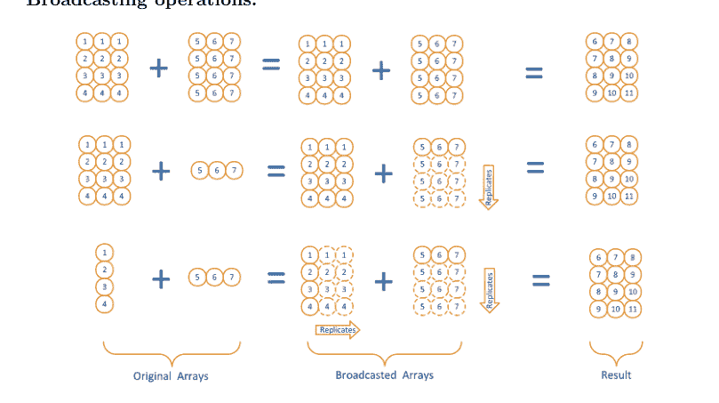

### 2.9.10 MXNet NDArray 与 NumPy 之间的转换

在 MXNet NDArray 和 NumPy 数组之间进行转换很容易。转换后的数组不共享内存。

```
import numpy as np
x = np.arange(24).reshape(4,6)
y = np.arange(6)
```

```
x
```

```
array([[ 0,  1,  2,  3,  4,  5],
       [ 6,  7,  8,  9, 10, 11],
       [12, 13, 14, 15, 16, 17],
       [18, 19, 20, 21, 22, 23]])
```

```
from mxnet import nd
ndx = nd.array(x)
npa = ndx.asnumpy()
type(npa)
```

numpy.ndarray

```
npa
```

```
array([[ 0.000,  1.000,  2.000,  3.000,  4.000,  5.000],
       [ 6.000,  7.000,  8.000,  9.000, 10.000, 11.000],
       [12.000, 13.000, 14.000, 15.000, 16.000, 17.000],
       [18.000, 19.000, 20.000, 21.000, 22.000, 23.000]],
      dtype=float32)
```

```
ndy = nd.array(npa)
ndy
```

```
[[ 0.000  1.000  2.000  3.000  4.000  5.000]
 [ 6.000  7.000  8.000  9.000 10.000 11.000]
 [12.000 13.000 14.000 15.000 16.000 17.000]
 [18.000 19.000 20.000 21.000 22.000 23.000]]
<NDArray 4x6 @cpu(0)>
```

要了解 MXNet NDArray 和 NumPy 数组之间的详细区别，可以参考 https://gluon.mxnet.io/chapter01_crashcourse/ndarray.html。

### 2.9.11 Numpy 中的子集选取

Numpy 数组的另一个特点是它们易于进行子集选取。

```
print(bmi[bmi > 25])          # 仅打印 BMI 高于 25 的值
```

```
[ 25.556  25.117  25.051]
```

### 2.9.12 Numpy 与通用函数 (ufunc)

NumPy 是一个对 Python 进行大规模数值计算（包括但不限于机器学习）非常有用的库。它支持对大型多维数组（ndarray）中的大量数据进行高效操作。它还提供了大量高级数学函数来操作这些数组 [1]。2005年，Travis Oliphant 通过将 Numarray 的特性整合到 Numeric 中创建了 NumPy，而 Numeric 最初是由 Jim Hugunin 和其他几位开发者创建的，并进行了大量修改。更多详情可在 https://en.wikipedia.org/wiki/NumPy 找到。

Numpy 文档指出：“通用函数（或简称 ufunc）是一种以逐元素方式操作 ndarray 的函数，支持数组广播、类型转换以及其他一些标准特性。ufunc 是一个函数的‘向量化’包装器，该函数接受固定数量的特定输入并产生固定数量的特定输出。在 NumPy 中，通用函数是 numpy.ufunc 类的实例（稍后讨论）。许多内置函数是用编译的 C 代码实现的。基本 ufunc 操作标量，但也存在一种泛化类型，其基本元素是子数组（向量、矩阵等），并且广播是在其他维度上进行的。还可以使用 frompyfunc 工厂函数创建自定义 ufunc 实例”。

更多关于 ufunc 的细节可以在 scipy 文档 (https://docs.scipy.org/doc/numpy/reference/ufuncs.html) 中找到。以下是众多 ufunc 中的两个。
exp(x, /[, out, where, casting, order, ...]) 计算输入数组中所有元素的指数。
log(x, /[, out, where, casting, order, ...]) 自然对数，逐元素计算。
可以使用以下命令获取更多细节。

```
# help(np.log)          # 使用此命令了解 ufunc 的功能
```

### 2.9.13 Numpy 数组与向量/矩阵

Numpy 主要使用数组结构。Numpy 数组的行为与我们在线性代数中学到的传统向量和矩阵概念相似，但又大不相同。在编码和调试过程中，这可能会相当令人困惑甚至沮丧。作者过去经常被这种差异所困扰。以下是一些可能需要注意的问题。

#### (1) Numpy 数组原则上是多维的

首先，我们注意到 numpy 数组远不止是 1D 向量和 2D 矩阵。默认情况下，我们可以拥有多达 32 维，并且这也可以更改。因此，numpy 数组功能极其强大，是一种非常适合使用多维数据集和数据流的复杂机器学习模型的数据结构。所有逐元素操作、广播、处理大量数据流等都非常高效。然而，它并不完全遵循我们在传统线性代数中建立并最常使用的向量和矩阵概念。作者认为，这在许多情况下是混淆的根本原因。理解以下要点是缓解混淆的良好开端。

#### (2) Numpy 1D 数组 vs. 向量

Numpy 1D 数组类似于线性代数中通常的向量概念。区别在于 1D 数组不区分行向量或列向量。它只是一个形状为 (n,) 的 1D 数组，其中 n 是数组的长度。它的行为在很大程度上像行向量，但又不完全一样。例如，transpose() 对它没有影响。这是因为 transpose() 函数的作用是交换具有两个或更多轴的数组的两个轴。

线性代数中的列向量在 numpy 中应被视为只有一列的 2D 数组的特例。可以通过向 1D 数组添加一个额外的轴来创建一个类似于线性代数中列向量的数组。参见以下示例。

### 2.9 Numpy 数组的维度与转置

```python
a = np.array([1, 2, 3])          # 创建一个长度为3的一维数组
print(a, a.T, a.shape, a.T.shape)  # 其形状为 (3,)
```

输出：
```
[1 2 3] [1 2 3] (3,) (3,)
```

如上所示，对于一维数组，`.T`（转置）没有效果。

```python
an = a[:,np.newaxis]    # 添加一个新轴，形状变为 (3, 1)
print(an, an.shape)      # 这是一个列向量，一种特殊的二维数组
```

输出：
```
[[1]
 [2]
 [3]] (3, 1)
```

```python
print(an.T, an.T.shape)          # .T 起作用了，它变成了行向量
```

输出：
```
[[1 2 3]] (1, 3)
```

添加了轴的数组变成了二维数组，此时转置函数起作用。它创建了一个“真正的”行向量，这是numpy中二维数组的一个特例。

同样的效果也可以通过以下技巧实现：

```python
a1 = a.reshape(a.shape+(1,))     # 重塑，增加一个维度
print(a1, a1.shape)
aN = a[:,None]                   # 添加一个新维度，不包含元素
print(aN, aN.shape)
```

输出：
```
[[1]
 [2]
 [3]] (3, 1)
[[1]
 [2]
 [3]] (3, 1)
```

添加轴可以在任意轴上进行：

```python
a0 = a[np.newaxis,:]     # 新轴被添加到第0轴
print(a0, a0.shape)      # 形状变为 (1,3)，一个行向量
```

输出：
```
[[1 2 3]] (1, 3)
```

```python
print(an+a0)  # 一个有趣的技巧，用于创建汉克尔矩阵
```

输出：
```
[[2 3 4]
 [3 4 5]
 [4 5 6]]
```

一旦知道如何创建等同于传统线性代数中通常的行向量和列向量的数组，我们在调试代码时遇到奇怪行为就会更加从容。

另一个常见的例子是求解线性方程组。从传统线性代数我们知道，右端项（rhs）应该是一个列向量，解也应该是一个列向量。在使用 `numpy.linalg.solve()` 求解线性代数方程时，我们可以输入一个一维数组作为右端向量，它将返回一个也是一维数组的解。当然，我们也可以输入一个列向量（一个只有一列的二维数组）。在这种情况下，我们将得到一个只有一列的二维数组形式的解。我们将在第3.1.11节以及后续章节的许多案例中看到这些例子。这些行为在numpy中都是预期且正确的。

### 2.9.1 Numpy 二维数组与矩阵

Numpy的二维数组在很大程度上类似于线性代数中的通常矩阵，但又不完全相同。例如，线性代数中的矩阵乘法在numpy中通常使用点积来完成，例如 `np.dot()` 或numpy（版本3.5或更高）中的“@”运算符。“*”运算符是逐元素乘法，如第2.9.4节所示。我们将在第3章及后续章节中看到更多例子。此外，对numpy数组的一些操作可能导致维度变化。例如，当对数组应用 `mean()` 时，维度会降低。因此，需要注意哪个轴被折叠了。

请注意，有一个numpy矩阵类（参见第2.14节中类的定义）可用于创建矩阵对象。这些对象的行为与线性代数中的矩阵非常相似。我们尽量不使用它，因为它有一天会被弃用，正如在线文档 `numpy-ref.pdf` 中所宣布的。

根据作者有限的经验，一旦我们意识到这些差异和行为的微妙之处（稍后遇到时会有更多讨论），我们就能开始关注这些行为的微妙之处。经常检查数组的形状通常很有帮助。这使我们能够更有效地使用强大的numpy数组，包括执行适当的线性代数分析。此时，使用一维、二维或更高维数组概念来讨论线性代数定理相当困难。在后面的章节中，我们仍将遵循一般规则、原则，并使用传统线性代数中的向量和矩阵术语，因为许多理论发现和论证都基于此。向量通常指一维numpy数组，矩阵指二维numpy数组。当检查numpy代码的结果时，我们应注意numpy数组的行为微妙之处。

## 2.10 集合：无重复

集合是一个列表，但没有重复条目。

```python
sentence1 = "His first name is Mark and Mark is his first name"
words1 = sentence1.split()  # 使用 split() 形成单词集合
print(words1)               # 打印整个单词列表
word_set1 = set(words1)     # 转换为集合
print(word_set1)            # 打印。无重复
```

输出：
```
['His', 'first', 'name', 'is', 'Mark', 'and', 'Mark', 'is', 'his', 'first', 'name']
{'and', 'His', 'is', 'first', 'Mark', 'his', 'name'}
```

使用集合来消除重复在许多情况下都很有用。许多其他有用的操作也可以应用于集合。例如，我们可能想找到两个集合的交集。为了展示这一点，让我们创建一个新列表，然后创建一个新集合。

```python
sentence2 = "Her first name is Jane and Jane is her first name"
words2 = sentence2.split()
print(words2)               # 打印整个单词列表。
word_set2 = set(words2)     # 转换为集合
print(word_set2)            # 打印。无重复
```

输出：
```
['Her', 'first', 'name', 'is', 'Jane', 'and', 'Jane', 'is', 'her', 'first', 'name']
{'her', 'Jane', 'Her', 'is', 'first', 'and', 'name'}
```

### 2.10.1 两个集合的交集

```python
print(word_set1.intersection(word_set2)) # 两个集合的交集
```

输出：
```
{'first', 'and', 'name', 'is'}
```

### 2.10.2 两个集合的差集

```python
print(word_set1.difference(word_set2))
```

输出：
```
{'his', 'His', 'Mark'}
```

这找到了在 `word_set1` 中但不在 `word_set2` 中的单词。
我们可能也想找到在 `word_set2` 中但不在 `word_set1` 中的单词，如下所示：

```python
print(word_set1.symmetric_difference(word_set2))
```

输出：
```
{'her', 'His', 'Jane', 'Her', 'Mark', 'his'}
```

我们能对列表进行类似的操作吗？试试看。

```python
#print(words1.intersection(words2))    # 两个列表的交集？
# 不行。它会抛出 AttributeError。
```

## 2.11 列表推导式

我们在特定情况下使用过几次列表推导式。列表推导式是对包括列表和numpy数组在内的所有可迭代对象进行操作的强大工具。当用于列表时，它基于另一个列表创建一个新列表，只需一行可读的代码。

在下面的例子中，我们想创建一个整数列表，指定句子中每个单词的长度，但仅当单词不是“the”时。自然的做法如下：

```python
sentence="Raises the Sun and comes the light" # 创建一个字符串。
words = sentence.split() # 使用 split() 创建单词列表。
word_lengths = []        # 用于存放单词长度的空列表
words_nothe = []         # 用于存放不是“the”的单词的空列表
for word in words:
    if word != "the":
        word_lengths.append(len(word))
        words_nothe.append(word)

print(words_nothe, ' ',word_lengths)
```

输出：
```
['Raises', 'Sun', 'and', 'comes', 'light']    [6, 3, 3, 5, 5]
```

使用列表推导式，我们只需这样做：

```python
words = sentence.split()
word_lengths = [len(word) for word in words if word != "the"]
words_nothe = [word for word in words if word != "the"]
print(words_nothe, ' ',word_lengths)
```

输出：
```
['Raises', 'Sun', 'and', 'comes', 'light']    [6, 3, 3, 5, 5]
```

下面的写法更好：

```python
words_nothe2=[]   # 用于存放单词及其长度的列表的空列表
                  # 用于存放不是“the”的单词，列表中的列表
words_nothe2=[[word,len(word)] for word in words if word != "the"]
                  # 也可以使用 () 代替内部的 []
print(words_nothe2)
```

输出：
```
[['Raises', 6], ['Sun', 3], ['and', 3], ['comes', 5], ['light', 5]]
```

下面的例子将列表推导式用于numpy数组：

```python
import numpy as np
np.set_printoptions(formatter={'float': '{: 0.3f}'.format})
fx = []
x = np.arange(-2, 2, 0.5) # 具有等间距值的Numpy数组
fx = np.array([(-xi)**0.5 if xi < 0.0 else xi**0.5 for xi in x])
    # 创建一个分段函数（例如激活函数）。
    # 创建的列表随后被转换为numpy数组。
print('x =',x); print('fx=',fx)
```

输出：
```
x = [-2.000 -1.500 -1.000 -0.500  0.000  0.500  1.000  1.500]
fx= [-1.414 -1.225 -1.000 -0.707  0.000  0.707  1.000  1.225]
```

## 2.12 条件、“if”语句、“for”和“while”循环

在机器学习编程中，经常使用条件、“if”语句、“for”和“while”循环。布尔变量用于评估条件。当表达式被比较或求值时，会返回布尔值 True 或 False。

### 2.12.1 比较运算符

比较运算符包括 ==, <, <=, >, >=, !=。== 运算符比较两个操作数的值并检查值相等性，而“!=”检查“不相等”，其他运算符检查不等式和/或相等性。

```python
x = 2
print(x == 2) # 比较结果是一个布尔值：True
print(x == 3) # 比较结果是一个布尔值：False
print(x < 3)  # 比较结果是一个布尔值：True
```

输出：
```
True
False
True
```

```python
x = 2
if x == 2:
    print("x equals 2!")
else:
    print("x does not equal to 2.")
```

输出：
```
x equals 2!
```

### 2.12.2 “in” 运算符

“in” 运算符用于检查指定对象是否存在于可迭代对象容器中，例如列表。

```python
name1, name2 = "Kevin", 'John'
groupA= ["Kevin", "Richard"]  # a list with two strings.
if name1 in groupA:
    print("The person's name is either",groupA[0], "or", groupA[1])

if name2 in groupA:
    print("The person's name is either",groupA[0], "or", groupA[1])
else:
    print(name2, "is not found in group A")
```

The person's name is either Kevin or Richard
John is not found in group A

### 2.12.3 “is” 运算符

与双等号运算符“==”不同，“is” 运算符不检查操作数的值。它检查两个操作数是否引用同一个对象。例如，

```python
x, y = ['a','b'], ['a','b']
z = y # makes z pointing to y

print(x == y,' x=',x,'y=',y,hex(id(x)),hex(id(y))) # Prints True,
                                        # because the values in x and y are equal

print(x is y,'x=',x,'y=',y,hex(id(x)),hex(id(y)))  # Prints False,
                                        # because x and y with different ID

print(y is z,' y=',y,'z=',z,hex(id(y)),hex(id(z)))  # True, y is z
```

True  x= ['a', 'b'] y= ['a', 'b'] 0x1ae25570188 0x1ae25570208
False x= ['a', 'b'] y= ['a', 'b'] 0x1ae25570188 0x1ae25570208
True  y= ['a', 'b'] z= ['a', 'b'] 0x1ae25570208 0x1ae25570208

```python
y[1]='x'                                        # change the 2nd element
print('After change one value in y')
print(x == y,'x=',x,'y=',y,hex(id(x)),hex(id(y)))  # Prints False,
                                        # their values are no longer equal

print(x is y,'x=',x,'y=',y,hex(id(x)),hex(id(y)))
                                        # False, x is # NOT y

print(y is z,' y=',y,'z=',z,hex(id(y)),hex(id(z))) # True, y is z:
                                        # they change together!
```

After change one value in y
False x= ['a', 'b'] y= ['a', 'x'] 0x1ae25570188 0x1ae25570208
False x= ['a', 'b'] y= ['a', 'x'] 0x1ae25570188 0x1ae25570208
True  y= ['a', 'x'] z= ['a', 'x'] 0x1ae25570208 0x1ae25570208

```python
y.append(x)
print('After change one value in y')
print(x == y,'x=',x,'y=',y,hex(id(x)),hex(id(y))) # Prints False,
                                        # their values are no longer equal
print(x is y,'x=',x,'y=',y,hex(id(x)),hex(id(y)))
                                        # False, x is # NOT y
print(y is z,' y=',y,'z=',z,hex(id(y)),hex(id(z))) # True, y is z:
                                        # they change together!
```

After change one value in y
False x= ['a', 'b'] y= ['a', 'x', ['a', 'b'], ['a', 'b']]
0x1ae25570188 0x1ae25570208
False x= ['a', 'b'] y= ['a', 'x', ['a', 'b'], ['a', 'b']]
0x1ae25570188 0x1ae25570208
True y= ['a', 'x', ['a', 'b'], ['a', 'b']] z= ['a', 'x', ['a', 'b'], ['a', 'b']] 0x1ae25570208 0x1ae25570208

### 2.12.4 “not” 运算符

在布尔表达式前使用“not”会反转该表达式的值。

```python
print(not False)                    # Prints out True
print(not False == False)            # Prints out False
```

True
False

“not” 运算符也可以与“is”和“in”一起使用：“is not”、“not in”：

```python
x, y = [1,2,3], [1,2,3]
z = y                    # makes z pointing to same object as y
print(x == y,' x=',x,'y=',y,hex(id(x)),hex(id(y))) # True,
                        # because the values in x and y are equal

print(x is not y,'x=',x,'y=',y,hex(id(x)),hex(id(y))) # False, the
                        # values in x in NOT y
print(y is z,' y=',y,'z=',z,hex(id(y)),hex(id(z))) # True, y is z
```

True x= [1, 2, 3] y= [1, 2, 3] 0x1ae25570348 0x1ae255702c8
True x= [1, 2, 3] y= [1, 2, 3] 0x1ae25570348 0x1ae255702c8
True y= [1, 2, 3] z= [1, 2, 3] 0x1ae255702c8 0x1ae255702c8

### 2.12.5 “if” 语句

与其他任何语言一样，“if” 语句在编程中经常使用，我们之前已经见过一些。以下是更多在“if”语句中使用Python条件和代码块的示例：

```python
temp_good = 22.0            # unit: degree Celsius (C).
temp_now1 = 48.0            # Readers may change this value and try
statement1=(temp_now1<=(temp_good+10.0))&(temp_now1>=(temp_good-10.0))
                            # comfortable
statement2 = temp_now1 < (temp_good-10.0)    # cold
statement3 = temp_now1 > (temp_good+10.0)    # hot
if statement1 is True:      # do not forget ":"
    print("Okay, it is",temp_now1,"degree C. Comfortable. Let's go.")
    pass                    # do something
elif statement2 is True:    # do not forget ":"
    print("No, it is",temp_now1,"degree C. Too cold. We cannot go.")
    pass                    # do something else
elif statement3 is True:
    print("No, it",temp_now1,"degree C. Too hot. We cannot go.")
    pass                                        # do something else
else:
    print("Let's check the temperature.")        # do another thing
    pass
```

No, it 48.0 degree C. Too hot. We cannot go.

请注意，Python对if语句中可以使用多少个代码块没有限制。

### 2.12.6 “for” 循环

Python中有两种类型的循环：for和while。我们已经使用过“for”循环。我们将在这里更详细地讨论它以及while循环。for循环遍历给定的可迭代序列。起始点、停止点和步长由序列控制，如下例所示。它是序列控制的。

```python
primes = [2, 3, 5]              # define a list (that is iterable)
for prime in primes:            # do not forget ":"
    print(prime, end='  ')
```

2 3 5

For循环可以使用“range”函数遍历数字序列。range()是一个内置函数，返回一个range对象：一个整数序列。它生成给定起始整数和停止整数之间的整数。通常用于与for循环一起遍历。

```python
print('Member in range(10) are')
for n in range(10):             # Syntax: range(start, stop[, step])
    print(n, end=',')

print('\nMembers in range(3, 8) are')
for n in range(3, 8):           # Default step is 1
    print(n, end=',')
```

Member in range(10) are
0,1,2,3,4,5,6,7,8,9,
Members in range(3, 8) are
3,4,5,6,7,

```python
print('Members in range(3, 10, 2) are')
for n in range(-3, 10, 2):      # starting from a negative value
    print(n, end=',')
```

```python
print('\nMembers in range(10, -3, -2) are')
for n in range(10, -3, -2):    # reverse range
    print(n, end=',')
```

Members in range(3, 10, 2) are
-3,-1,1,3,5,7,9,
Members in range(10, -3, -2) are
10,8,6,4,2,0,-2,

对于给定的五个数字的列表，让我们使用for循环和range()函数显示每个元素的两倍。

```python
print("Double the numbers in a list, using for-loop and range()")
given_list = [10, 30, 40, 50]
for i in range(len(given_list)):
    print("Index["+str(i)+"]","Value in the given list is",
          given_list[i],", and its double is", given_list[i]*2)
```

Double the numbers in a list, using for-loop and range()
Index[0] Value in the given list is 10 , and its double is 20
Index[1] Value in the given list is 30 , and its double is 60
Index[2] Value in the given list is 40 , and its double is 80
Index[3] Value in the given list is 50 , and its double is 100

range()函数返回一个不可变的整数序列对象，因此可以使用list类将range()输出转换为列表。例如，

```python
print("Converting python range() output to a list")
list_rng = list(range(-10,12,2))
print(list_rng)
```

Converting python range() output to a list
[-10, -8, -6, -4, -2, 0, 2, 4, 6, 8, 10]

### 2.12.7 “while” 循环

“while” 循环在满足某个布尔条件时重复执行。条件控制操作。例如，

```python
#To print out 0,1,2,3,4,5,6,7,8,9,
count = 0
while count < 10:        # do not forget ":"
    print(count, end=',')
    count += 1            # This is the same as count = count + 1
```

0,1,2,3,4,5,6,7,8,9,

### 2.12.7 “break”和“continue”语句

“break”和“continue”语句：break用于退出“for”循环或“while”循环，而continue用于跳过当前代码块，并返回到“for”或“while”语句。

```python
# 打印所有受给定数字限制的数字。
count = 0
while True:
    print(count,end=',')
    count += 1
    if count >= 10:
        break
print('\n')
# 仅打印偶数：0,2,4,6,8,
for n in range(10):        # for循环控制范围
    if n % 2 != 0:         # 检查条件，控制打印内容
        continue           # 继续计数（在for循环中）
    print(n,end=',')
```

0,1,2,3,4,5,6,7,8,9,

0,2,4,6,8,

当循环条件不满足时，则执行“else”中的代码部分。如果在for循环内执行了break语句，则会跳过“else”部分。请注意，即使在“else”部分之前有continue语句，该部分仍会被执行。

```python
# 打印0,1,2,3,4，然后打印"count value reached 5"
count=0
nlimit = 5
while(count<nlimit):
    print(count, end=',')
    count +=1
else:
    print("count value reached %d" %(nlimit))

# 打印1,2,3,4
for i in range(1, 10):
    if(i%5 == 0):  #  取模运算 (%)
        break
    print(i, end=',')
else:
    print("This is not printed because for-loop is terminated due\n          to the break but not due to fail in condition")
```

0,1,2,3,4,count value reached 5
1,2,3,4,

### 2.12.8 三元条件表达式

以下4行代码

```python
condition=True
if condition:
    x=1
else:
    x=0
print(x)
```

1

可以用三元条件表达式写成一行：

```python
condition=True
x=1 if condition else 0
print(x)
```

1

它简洁、易读且精炼。因此，条件表达式在Python中经常被使用。

## 2.13 函数（方法）

函数提供了一种便捷的方式，将代码划分为有用的代码块，这些代码块可以在需要时被无限次调用。这可以极大地减少代码重复，使代码更整洁、更易读且易于维护。此外，函数也是定义接口的好方法，便于程序员之间共享代码。

### 2.13.1 函数定义的块结构

函数具有“块”结构。块关键字包括我们已经见过的那些，例如“if”、“for”和“while”。Python中的函数使用块关键字“def”定义，后跟一个函数名，该函数名也是块的名称。函数通过函数名后跟()来调用，括号内是参数（如果有的话）。试试这个最简单的函数：

```python
def print_hello():          # 不要忘记 ":"
    print("Hello, welcome to this simple function!")
print_hello()
```

Hello, welcome to this simple function!

### 2.13.2 带参数的函数

在上面给出的简单例子中，不需要参数。函数通常带有必需的参数创建，这些参数是从调用者传递给函数的变量。

```python
def greeting_student(username, greeting):
    print(f"Hello, {username}, greetings! Wish you {greeting}")
greeting_student("Kevin", "a fun journey in using functions!")
```

Hello, Kevin, greetings! Wish you a fun journey in using functions!

函数可以使用关键字“return”创建返回值给调用者。

```python
def sum_two_numbers(a, b):
    return a + b

x, y = 2.0, 8.0
apb = sum_two_numbers(x, y)
print(f'{x} + {y} = {apb}') # print('%f + %f = %f'%(x,y,apb))
x, y = 20, 80
apb = sum_two_numbers(x, y)
print(f'{x} + {y} = {apb}, perfect!')
    #print('%d + %d = %d: perfect!'%(x,y,apb))
print(f'{x + y}, perfect!') #f-string允许使用运算
```

2.0 + 8.0 = 10.0
20 + 80 = 100, perfect!
100, perfect!

变量作用域：LEGB规则（局部、闭包、全局、内置）定义了Python搜索变量的顺序。搜索在找到变量时终止。

```python
def sum_two_numbers(a, b):
    a += 1
    print('Inside the function, a=',a)
    print('Inside the function x=',x)
    return a + b

x, y = 2.0, 8.0
print('Before the function is called,x=',x,'y=',y)
apb = sum_two_numbers(x, y)
print('After the function is called, %f + %f = %f'%(x,y,apb))
```

Before the function is called,x= 2.0 y= 8.0
Inside the function, a= 3.0
Inside the function x= 2.0
After the function is called, 2.000000 + 8.000000 = 11.000000

### 2.13.3 Lambda函数（匿名函数）

Lambda函数是单行函数。它可能是函数最简单的形式，也是最有用的形式之一。线性函数可以简单地定义为

```python
f = lambda x, k, b: k * x + b           # 不要忘记 ":"
print(f(1,1,1),f(2,2,2),f(1,2,3))
```

2 6 5

二次函数可以定义为

```python
f = lambda x, a, b, c: a*x**2 + b*x +c
print(f(2,2,-4,6))
```

6

通常，Lambda函数与普通函数一起使用，特别是在需要返回单行函数值的场景中非常方便。

```python
def func2nd_order(a,b,c):
    return lambda x: a*x**2 + b*x +c

f2 = func2nd_order(2,-4,6)
print('f2(2)=',f2(2), 'or', func2nd_order(2,-4,6)(2))
```

f2(2)= 6 or 6

## 2.14 类与对象

类是封装变量和函数（或方法）的单一实体。类本质上是创建类对象的模板。人们可以用它创建无限数量的类对象，每个类对象都从该类获得结构、变量/属性和函数（或方法）。本节中使用的参考文献包括以下内容：

- https://www.python-course.eu/python3_class_and_instance_attributes.php.
- https://realpython.com/instance-class-and-static-methods-demystified/.

### 2.14.1 一个最简单的类

```python
class C:  # 定义一个名为C的类
    ''' 一个名为"C"的最简单的类 '''
    ca = "class attribute" # 在类中定义的属性
```

```python
help(C)                                    # 查看创建了什么
```

Help on class C in module __main__:

```
class C(builtins.object)
 |  A simplest possible class named "C"
 |
 |  Data descriptors defined here:
 |
 |  __dict__
 |      dictionary for instance variables (if defined)
 |
 |  __weakref__
 |      list of weak references to the object (if defined)
 |
 |  ----------------------------------------------------------------------
 |  Data and other attributes defined here:
 |
 |  ca = 'class attribute'
```

这个例子展示了一个类的结构，类定义中用"""给出的注释用于向用户传达信息，以及如何在类中创建属性。我们现在可以用它来观察类属性和实例属性的一些行为。

```python
i1 = C()     # 创建一个实例i1（一个类对象）。
i2 = C()     # 创建一个实例i2（另一个类对象）。
print('i1.ca=',i1.ca)  # 打印：'class attribute!'
print('i2.ca=',i2.ca)  # 打印：'class attribute!'
print('C.ca =',C.ca)   # 打印：'class attribute!'
#print('ca=',ca)       # NameError:'ca'未定义
```

i1.ca= class attribute
i2.ca= class attribute
C.ca = class attribute

```python
C.ca = "This is a changed class attribute 'ca'"
                    # 通过类更改类属性
print('C.ca =',C.ca)
print('i1.ca=',i1.ca)
print('i2.ca=',i2.ca)
```

C.ca = This is a changed class attribute 'ca'
i1.ca= This is a changed class attribute 'ca'
i2.ca= This is a changed class attribute 'ca'

请注意，实例中的值也发生了变化。

```python
i1.ca = "This is a changed instance attribute 'ca'"  # 更改实例属性
print('i1.ca=',i1.ca)  # 已更改
print('C.ca =',C.ca)  # 未更改
print('i2.ca=',i2.ca)  # 未更改
```

i1.ca= This is a changed instance attribute 'ca'
C.ca = This is a changed class attribute 'ca'
i2.ca= This is a changed class attribute 'ca'

更改仅对被更改的实例属性有效。

```python
C.ca = "The 2nd changed class attribute 'ca'"  # 通过类更改类属性
print('C.ca =',C.ca)  # 应相应更改
print('i1.ca=',i1.ca)  # 不会更改！不再跟随C
# 因为它在创建后进行了更改
print('i2.ca=',i2.ca)  # 应根据类C更改
# 因为它在创建后未被更改
```

C.ca = The 2nd changed class attribute 'ca'
i1.ca= This is a changed instance attribute 'ca'
i2.ca= The 2nd changed class attribute 'ca'

类属性和对象实例属性存储在不同的字典中：

```python
C.__dict__
```

mappingproxy({'__module__': '__main__',
    '__doc__': ' A simplest possible class named "C" ',
    'ca': "The 2nd changed class attribute 'ca'",
    '__dict__': <attribute '__dict__' of 'C' objects>,
    '__weakref__': <attribute '__weakref__' of 'C' objects>})

```python
i1.__dict__
```

{'ca': "This is a changed instance attribute 'ca'"}

很明显，当在实例级别进行更改时，会创建一个字典，从而与类级别分离。

```python
i2.__dict__
```

{}

没有创建字典，因为在实例级别没有进行更改。它保持与类一致。

### 2.14.2 用于科学计算的类

让我们来看一个简单科学计算的例子。我们首先创建一个名为 `Circle` 的类，用于根据给定的半径计算圆的面积。以下是代码：

```python
class Circle:
    ''' Class "Circle": Compute the area of a circle '''
    pi = 3.14159    #class attribute of constants used class-wide
                    # and class specific

    def __init__(self, radius): # a special constructor
        # __init__ is executed when the class is called.
        # it is used to initiate a class. For this simple
        # task we need only one variable: radius.
        # "self" is used to reserve an argument place for an
        # instance (to-be-created) itself to pass along.
        # It is used for all the functions in a class.
        self.radius = radius    # This allows the instance accessing
                                # the variable: radius.
    def circle_area(self): # function computes circle area
        return self.pi * self.radius **2  # pi gets in there via
                                        # the object instance itself
```

```python
#help(Circle)    # check out what has been created
```

我们现在可以使用这个类来执行计算。

```python
r = 10
c10 = Circle(r)    # create an instance c10. c10 is now passed to
                    # self inside the class definition
                    # 10 is passed to the self.radius
print('Circle.pi before re-assignment',Circle.pi)
                    # access pi via class
print('Radius=',c10.radius)
    # access via object c10.radius is the self.radius in __init__
print('c10.pi before re-assignment', c10.pi)
    # The class attribute is accessed via instance attribute
```

Circle.pi before re-assignment 3.14159
Radius= 10
c10.pi before re-assignment 3.14159

```python
c10.pi=3.14    # this will change the constant for instance c10
            # It will not change the class-wide pi value
print('c10.pi after re-assignment via c10.pi:',c10.pi)
print('Circle.pi after re-assignment via c10.pi:',Circle.pi)
print('circle_area of c10 =',c10.circle_area())
print('circle_area of Circle100=',Circle(100).circle_area())
```

c10.pi after re-assignment via c10.pi: 3.14
Circle.pi after re-assignment via c10.pi: 3.14159
circle_area of c10 = 314.0
circle_area of Circle100= 31415.899999999998

可以看到，`Circle` 类运行良好。现在让我们创建一个子类。

### 2.14.3 子类（类继承）

子类通常可以被用来利用 Python 中的继承特性。这允许我们通过充分利用现有类的全部结构（属性和函数）来创建新的类，而不影响现有类的持续使用。因此，由于减少了重复代码，它在升级现有程序时也很有用。

假设上面创建的 `Circle` 代码已经被许多人分发和使用。我们现在决定创建另一个类来计算部分圆的面积，给定圆的部分值。我们可以为此目的创建一个名为 `P_circle` 的子类，而不影响已分发的 `Circle` 的使用。以下是代码：

```python
class P_circle(Circle):
        # Subclass P_circle referring the base (or parent)
        # Circle in (). This establishes the inheritance
    ''' Subclass "P_circle" based on Class "Circle": Compute the
        area of a circle portion '''
    def __init__(self,radius,portion):
            # with 3 attributes: self, radius, and portion.
        super().__init__(radius)    # This brings in base attributes
                                    # from the base class Circle.
        self.portion = portion # Subclass attribute.
    def pcircle_area(self):
        # define a function to compute the area of a partial circle
        return self.portion*self.circle_area() # New function in
        # subclass. The base class Circle is used here.
```

```python
#help(P_circle)    # check out what has been created
```

读者可以移除上面单元格中的“#”，执行它，并花点时间阅读这些信息，看看子类是如何构建的，它与基类的连接，`self` 如何被用来准备与未来要分配的对象的连接，以及哪些属性和函数是新创建的，哪些是从基类继承的。

```python
pc10 = P_circle(10.,0.5) # create an object instance using the
    # subclass, with argument radius=10 and portion =50%
pc10.pi    # we have the same attribute from the base class
```

3.14159

```python
pc10.radius    # we have the same attribute from the base class
```

10.0

```python
pc10.pcircle_area()    # area of a 50% partial circle is computed
```

157.0795

现在让我们通过子类实例更改常量 `pi`。

```python
pc10.pi = 3.14
pc10.pi
```

3.14

它改变了。让我们通过基类 `c10` 检查 `pi`。

```python
c10.pi
```

3.14

它保持不变。对子类的操作不会影响基类。

## 2.15 模块

我们现在来谈谈模块。模块是一段具有特定功能的 Python 文件。例如，在编写有限元程序时，我们可能会编写一个模块来创建刚度矩阵，另一个模块来求解系统方程。每个模块都是一个独立的 Python 文件，可以独立编写和编辑。这在组织和维护大型程序方面非常有帮助。

Python 中的模块是一个具有 `.py` 扩展名的 Python 文件。文件名将是模块名。这样的模块可以定义一组函数、类和变量。在一个模块中，可以按照本章开头提到的方法导入其他模块。

## 2.16 图表生成

Python 在生成图表方面也非常强大。这是通过导入公开可用的模块来完成的。在这里，我们将展示一个简单的散点圆演示图。

首先，我们导入所需的模块。

```python
import numpy as np
import matplotlib.pyplot as plt
    # matplotlib.pyplot is a plot function in the matplotlib module
%matplotlib inline
    # to have the plot generated inside the notebook
    # Otherwise, it will be generated in a new window
```

我们现在生成样本数据，然后绘制 80 个随机生成的圆。

```python
n=80
x=np.random.rand(n)    # Coordinates randomly generated
y=np.random.rand(n)
colors=np.random.rand(n)
areas=np.pi*(18*np.random.rand(n))**2
                        # circle radiuses from 0~20 randomly generated
plt.scatter(x,y,s=areas,c=colors,alpha=0.8)
plt.show()
```

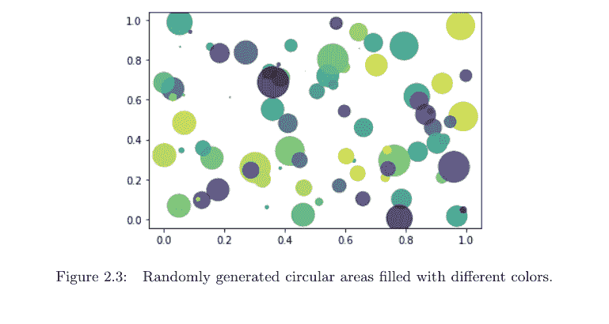

```python
# Plot a curve
x = range(1000)
y = [i ** 2 for i in x]
plt.plot(x,y)
plt.show();
```

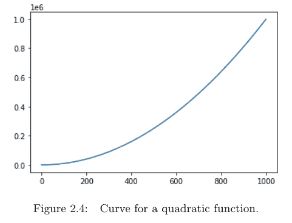

```python
x = np.linspace(0, 1, 1000)**1.5
plt.hist(x);
```

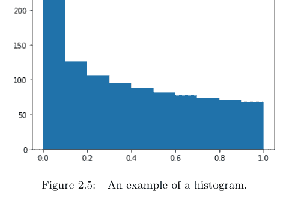

## 2.17 代码性能评估

代码的性能评估可以通过两种方式进行。下面给出了典型的示例代码。读者可以利用这些代码来评估他/她的代码的计算性能。

```python
import time # import time module
import numpy as np

g=list(range(10_000_000))
#print(g)
q=np.array(g,'float64')
#print(q)
start = time.process_time()
sg=sum(g)
t_elapsed = (time.process_time() - start)
print(sg,'Elapsed time=',t_elapsed)

start = time.process_time()
sq=np.sum(q)
t_elapsed = (time.process_time() - start)
print(sq,t_elapsed)
```

49999995000000 Elapsed time= 0.28125
49999995000000.0 0.03125

```python
%%timeit #use timeit
sg=sum(g)
```

329 ms ± 70.7 ms per loop (mean ± std. dev. of 7 runs, 1 loop each)

## 2.18 总结

掌握了 Python 及其相关模块的基础知识，以及编码的基本技巧，我们现在准备好学习为计算和机器学习技术编写代码。在这个过程中，也可以逐步提高他/她的 Python 编码技能。

## 参考文献

[1] C.R. Harris, K.J. Millman and J.v.d.W. Stéfan et al. Array programming with NumPy, *Nature*, **585**(7825), 357-362, Sep 2020. http://dx.doi.org/10.1038/s41586-020-2649-2.

## 第三章

## 基础数学计算

本章讨论使用Python代码进行典型的科学计算。我们将重点介绍数值数据如何在数学上表示，以及它们如何以有效的方式进行结构化或组织、存储、操作、运算或计算。我们将探讨Python中这些操作的细微之处。在本章末尾，还将讨论数据集的初步处理技术。本章使用的参考资料包括Numpy文档、Scipy文档、https://gluon.mxnet.io/ 和 https://jupyter.org/。我们的讨论将从对具有向量、矩阵和张量结构的数据进行一些基本的线性代数运算开始。

## 3.1 线性代数

线性代数对于任何涉及大数据的计算都至关重要，例如在机器学习中。我们计划通过使用Python编程，利用Python社区中已经开发的模块，简要回顾基本的线性代数运算。我们将介绍基本概念、数学符号、数据结构和计算过程。如果您已经对基本的线性代数计算有信心，读者可以随意浏览或跳过本章。我们的讨论将从数据结构开始。首先，我们导入必要的模块和函数。

```python
import sys                # import "sys" module
sys.path.append('grbin')  # current/relative directory,
                         # like ..\..\code
                         # Or absolute folder like 'F:\xxx\...\code'
```

```python
import grcodes as gr        # grcodes module is placed in the
                            # folder above
from grcodes import printx  # import a particular function
import numpy as np          # Import Numpy package
```

我们还将使用MXNet包。如果尚未安装，应使用以下命令安装MXNet：pip install mxnet。
安装后，我们导入MXNet。

```python
from mxnet import nd # Import NDArray and give it a alias nd
```

### 3.1.1 标量

如第2章所述，用于数学计算的标量数值主要有三种类型：整数、实数和复数。在Python中，这样的数值被赋予一个唯一的名称和一个给定的地址。它通过调用其名称来访问，可以更新，并可用作正确定义的函数（内置函数、在代码中定义的函数或在导入模块中定义的函数）的参数。在Python编程中，所有这些对数字的操作都很直接。计算中最常遇到的问题是数字可能超出计算机的位数范围（上溢或下溢），并可能成为函数的非法参数。此外，我们假设在Python中生成的数字可以覆盖整个实数空间，并具有机器精度的极限。

### 3.1.2 向量

向量是指沿一个维度堆叠了多个分量的对象。根据物理问题的类型，它可以具有物理意义。例如，三维（3D）空间中的力向量有三个分量，每个分量代表力向量在空间三个轴之一上的投影。这也被称为自由度（DoF）。在离散化的数值模型中会遇到更高的维度，例如有限元法或FEM（例如，[1]）。在FEM中，固体结构在空间上被离散化为单元和节点。这种离散化模型的自由度取决于节点的数量，节点数量可能非常大，通常在数百万的量级。因此，我们形成了具有数百万个分量或条目的向量。在机器学习模型中，特征和标签可以写成向量形式。

在本章中，我们不会过多讨论物理问题。相反，我们讨论向量在抽象意义上的一般方面，以及在给定坐标系下我们可能对向量执行的计算操作问题。向量的自由度也称为**长度**。长度为 $p$ 的向量在Python中表示为 `(p,)` 的**形状**。

```python
p = 15              # Length of the vector
x = nd.arange(p)    # Create a vector that is an nd-array
                    # using nd.arange() function
gr.printx('x')      # x is now a vector with n components
printx('x')         # Use the printx function directly
print(x.shape)
```

```
x =
[ 0.  1.  2.  3.  4.  5.  6.  7.  8.  9. 10. 11. 12. 13. 14.]
<NDArray 15 @cpu(0)>
x =
[ 0.  1.  2.  3.  4.  5.  6.  7.  8.  9. 10. 11. 12. 13. 14.]
<NDArray 15 @cpu(0)>
(15,)
```

请注意，在数学中，向量的符号通常表示为列向量。在Python中，它显示为行向量。

```python
print(x.T)          # Transpose of x
print(x.T.shape)
```

```
[ 0.  1.  2.  3.  4.  5.  6.  7.  8.  9. 10. 11. 12. 13. 14.]
<NDArray 15 @cpu(0)>
(15,)
```

在数学中，（列）向量的转置应变为行向量，反之亦然。在MXNet NDArray中，变换后的向量存储在同一位置，但标记为转置，以便可以正确执行乘法等操作。这节省了物理复制和移动数据的操作，提高了效率。为了确认这一点，我们只需打印出地址，如下所示。

```python
print(id(x))
print(id(x.T))      # Transpose of x
```

```
2212173184080
2212173184080
```

很明显，在NDArray中，向量就是向量。人们不区分它是列向量还是行向量。它的转置只是其上的一个标记，并且只存储一组数据。这是MXNet特别注意不不必要地移动内存中数据的一个例子。我们似乎在numpy数组中没有观察到这种行为，如下所示。

```python
xnp = np.arange(15)           # an Numpy array is generated
print(id(xnp), xnp.shape)
print(id(xnp.T),xnp.T.shape)  # address is changed
```

```
2212173195344 (15,)
2212173195424 (15,)
```

numpy数组的形状没有改变（仍然是行向量或向量的结构），但其转置被赋予了一个单独的地址。

### 3.1.3 矩阵

矩阵是指具有多个维度数据结构的对象，其中每个维度都有多个分量。它可以被视为具有一定长度的向量的堆叠。同样，根据物理问题的类型，它可以具有物理意义。例如，基于固体结构（如FEM）的离散化数值模型创建的刚度（和质量）矩阵具有二维（2D）结构。在每个维度中，分量的数量与自由度的数量相同。整个矩阵是结构的一种空间分布的“刚度”[1]。在机器学习模型中，特征空间中的输入数据点和假设空间中的学习参数可以写成矩阵形式。
同样，我们在这里不会过多讨论物理问题。相反，我们讨论矩阵在抽象意义上的一般方面，以及我们可能对矩阵执行的计算操作问题。这样的抽象矩阵可以在多维数组中表示，在Python中定义为第2章中的**形状**。

```python
A = x.reshape((3, 5))          # Create a 2D matrix by reshaping
                                # a 1D array
print("A=", A, "\n  A.T=", A.T)
```

```
A=
[[ 0.  1.  2.  3.  4.]
 [ 5.  6.  7.  8.  9.]
 [10. 11. 12. 13. 14.]]
<NDArray 3x5 @cpu(0)>

A.T=
[[ 0.  5. 10.]
 [ 1.  6. 11.]
 [ 2.  7. 12.]
 [ 3.  8. 13.]
 [ 4.  9. 14.]]
<NDArray 5x3 @cpu(0)>
```

```python
print(A.shape, A.T.shape)
```

```
(3, 5) (5, 3)
```

矩阵A的形状或维度是3乘5，其转置的形状变为(5, 3)。
如第2章详细讨论的那样，向量或矩阵中的每个分量（或条目）都可以通过索引或切片来访问。

```python
print('A[1, 2] = ', A[1, 2])          # via index
print('row 2', A[2, :])  # slice the 3rd row (count from 0)
print('column 1', A[:, 1])          # slice the 2nd column
```

```
A[1, 2] =
[7.]
<NDArray 1 @cpu(0)>
row 2
[10. 11. 12. 13. 14.]
<NDArray 5 @cpu(0)>
column 1
[ 1.  6. 11.]
<NDArray 3 @cpu(0)>
```

矩阵也可以转置。

```python
A.T                    # A transpose, shape becomes 5 by 3
print(id(A), id(A.T))
```

```
2212173182960 2213649918832
```

可以发现，在MXNet中，转置后的矩阵也有自己的地址。

### 3.1.4 张量

“张量”这个术语需要一些澄清。在数学或物理学中，张量具有特定且明确的含义。它指的是在坐标变换下遵循某种张量变换规则的结构化数据（单个数字、向量或多维矩阵）。因此，张量是一类非常特殊的结构化数据或对象，并非所有矩阵都能被称为张量。事实上，大多数矩阵都不是。只要遵循张量变换规则，就可以将其归入不同的阶数。标量是0阶张量，向量是1阶张量，二维矩阵是2阶张量，以此类推。

话虽如此，在机器学习（ML）社区中，任何维度高于2的矩阵都被称为张量。它可以被视为相同形状矩阵的堆叠。这种机器学习张量似乎承载了大数据需要在高维中进行结构化的含义。机器学习张量现在被用作表示任意维度或任意轴数数组的通用方式。例如，在处理可能具有3D数据结构的图像时，使用机器学习张量变得更加方便，其轴对应于高度、宽度和三个颜色（RGB）通道。在numpy中，张量是一个多维数组。

由于在机器学习中通常不进行这种坐标变换，因此在我们本书的讨论中不会引起可能的混淆。从现在开始，我们将机器学习张量称为张量，并理解它可能不遵循真正的张量变换规则，并且我们在机器学习编程中不执行这种变换。

我们现在使用`nd.range()`然后使用`reshape()`来创建一个3D nd-array。

```
X = nd.arange(24).reshape((2, 3, 4))
print('X.shape =', X.shape)
print('X =', X)
```

```
X.shape = (2, 3, 4)
X =
[[[ 0.  1.  2.  3.]
  [ 4.  5.  6.  7.]
  [ 8.  9. 10. 11.]]
 [[12. 13. 14. 15.]
  [16. 17. 18. 19.]
  [20. 21. 22. 23.]]]
<NDArray 2x3x4 @cpu(0)>
```

逐元素操作适用于所有张量。

```
A = nd.arange(8).reshape((2, 4))
B = nd.ones_like(A)*8 # get shape of A, assign uniform entries
print('A =', A, '\n B =', B)
print('A + B =', A + B, '\n A * B =', A * B)
```

```
A =
[[0. 1. 2. 3.]
 [4. 5. 6. 7.]]
<NDArray 2x4 @cpu(0)>
B =
[[8. 8. 8. 8.]
 [8. 8. 8. 8.]]
<NDArray 2x4 @cpu(0)>
A + B =
[[ 8.  9. 10. 11.]
 [12. 13. 14. 15.]]
<NDArray 2x4 @cpu(0)>
A * B =
[[ 0.  8. 16. 24.]
 [32. 40. 48. 56.]]
<NDArray 2x4 @cpu(0)>
```

### 3.1.5 张量的求和与均值

```
x = nd.arange(5)
print(x)
```

```
[0. 1. 2. 3. 4.]
<NDArray 5 @cpu(0)>
```

```
nd.sum(x) # summation of all entries/elements: 0+1+2+3+4=10
```

```
[10.] <NDArray 1 @cpu(0)>
```

```
X = nd.ones(15).reshape(3,5)
X
```

```
[[1. 1. 1. 1. 1.]
 [1. 1. 1. 1. 1.]
 [1. 1. 1. 1. 1.]]
<NDArray 3x5 @cpu(0)>
```

```
nd.sum(X) # summation of all entries/elements
```

```
[15.] <NDArray 1 @cpu(0)>
```

```
print(nd.mean(X), nd.sum(X)/X.size) # same as nd.mean()
```

```
[1.] <NDArray 1 @cpu(0)>
[1.] <NDArray 1 @cpu(0)>
```

### 3.1.6 两个向量的点积

点积可能是科学计算（包括机器学习）中应用最广泛的操作之一，即使不是最广泛使用的。我们在第2.9节中简要讨论过它。在这里，我们将更深入地讨论它在可能具有不同数据结构的向量上的应用，这会导致一些微妙之处，正如第2.9.13节中提到的。

给定两个向量**a**和**b**，它们的点积在线性代数中通常写作**a**ᵀ**b**或**a** · **b**。本质上，它只是它们逐元素乘积的和，结果是一个标量。这意味着**a**和**b**的形状必须兼容：两者具有相同的长度。让我们看一些例子。

```
a = nd.arange(5)
b = nd.ones_like(a) * 2 #This ensures the compatibility
print(f"a={a},a.shape={a.shape} \nb={b},b.shape={b.shape}")
printx('nd.dot(a, b)')
printx('nd.dot(a, b).shape')
print(f"np.dot(a, b)={np.dot(a.asnumpy(), b.asnumpy())}")
```

```
print(f"np.dot(a.T,b)={np.dot(a.asnumpy().T, b.asnumpy())}")
printx('np.dot(a.asnumpy(), b.asnumpy()).shape')
```

```
a=
[0. 1. 2. 3. 4.]
<NDArray 5 @cpu(0)>,a.shape=(5,)
b=
[2. 2. 2. 2. 2.]
<NDArray 5 @cpu(0)>,b.shape=(5,)
nd.dot(a, b) =
[20.]
<NDArray 1 @cpu(0)>
nd.dot(a, b).shape = (1,)
np.dot(a, b)=20.0
np.dot(a.T,b)=20.0
np.dot(a.asnumpy(), b.asnumpy()).shape = ()
```

请注意，对向量进行转置()`transpose()`将没有效果，因为numpy中的转置()`transpose()`交换的是二维数组的轴。一个numpy一维数组的形状是`(n,)`，因此无法执行任何操作。如第2.9.13节所讨论的，numpy一维数组不被视为矩阵。当**b**是一个列向量（二维数组的特例）时，它就像矩阵一样有两个轴。点积**a** · **b**在结果标量值方面与矩阵乘积**ab**（其中**a**定义为行向量，**b**定义为列向量）相同。因此，在我们的公式中，我们在数学上不区分它们，并且我们经常使用以下等式。

**a** · **b** = **ab** (3.1)

然而，在numpy的计算中，存在一些微妙之处。两个（一维数组）向量的点积给出一个标量，而一个（一维数组）向量与一个列向量的点积给出一个一维数组，其中唯一的元素是相同的标量。在NDArray中，观察不到这种微妙之处。读者可以仔细检查以下代码以理解这一点。

```
b_c = b.reshape(-1, 1)          # convert a 1D array to a column vector
print(b_c, 'b_c.shape=', b_c.shape)
printx('np.dot(a.asnumpy(),b.asnumpy())')    # np dot-product (scalar)
printx('np.dot(a.asnumpy(),b_c.asnumpy())')   # np dot-product (array)
print(a.asnumpy()@b_c.asnumpy())             # np matrix-product (array)
printx('nd.dot(a, b)')                       # nd dot-product (array)
printx('nd.dot(a, b_c)')                     # nd dot-product (array)
printx('nd.dot(a, b_c).shape')
```

```
[[2.]
 [2.]
 [2.]
 [2.]
 [2.]]
<NDArray 5x1 @cpu(0)> b_c.shape= (5, 1)
np.dot(a.asnumpy(),b.asnumpy()) = 20.0
np.dot(a.asnumpy(),b_c.asnumpy()) = array([20.], dtype=float32)
[20.]
nd.dot(a, b) =
[20.]
<NDArray 1 @cpu(0)>
nd.dot(a, b_c) =
[20.]
<NDArray 1 @cpu(0)>
nd.dot(a, b_c).shape = (1,)
```

如上所示，所有这些都给出了相同的标量值，但数据结构不同。

两个长度相等的列向量（特殊矩阵）**a**和**b**的点积在线性代数中写作**a**ᵀ**b**或**b**ᵀ**a**，给出相同的标量（但在一个二维数组或只有一个元素的矩阵中）。

```
a_c = a.reshape(-1, 1)       # convert a 1D array to a column vector
print(a_c),
printx('np.dot(a_c.asnumpy().T,b_c.asnumpy())') # scalar in 2D array
printx('np.dot(b_c.asnumpy().T,a_c.asnumpy())')
printx('np.dot(b_c.asnumpy().T,a_c.asnumpy()).shape')
```

```
[[0.]
 [1.]
 [2.]
 [3.]
 [4.]]
<NDArray 5x1 @cpu(0)>
np.dot(a_c.asnumpy().T,b_c.asnumpy()) = array([[20.]], dtype=float32)
np.dot(b_c.asnumpy().T,a_c.asnumpy()) = array([[20.]], dtype=float32)
np.dot(b_c.asnumpy().T,a_c.asnumpy()).shape = (1, 1)
```

要访问形状为`(1, 1)`的二维数组中的标量值，只需使用。

```
print(np.dot(a_c.asnumpy().T,b_c.asnumpy())[0][0])
```

```
20.0
```

可以使用`flatten()`将列向量变回行向量。

```
printx('np.dot(a_c.asnumpy().flatten(),b_c.asnumpy())')
printx('np.dot(a_c.asnumpy().flatten(),b_c.asnumpy()).shape')
```

```
np.dot(a_c.asnumpy().flatten(),b_c.asnumpy()) = array([20.], dtype=float32)
np.dot(a_c.asnumpy().flatten(),b_c.asnumpy()).shape = (1,)
```

要访问形状为`(1,)`的一维数组中的标量值，只需使用，

```
printx('np.dot(a_c.asnumpy().flatten(),b_c.asnumpy())[0]')
```

```
np.dot(a_c.asnumpy().flatten(),b_c.asnumpy())[0] = 20.0
```

可以使用`ravel()`将多维数组转换为一维数组（在这种情况下不会创建数组的副本）。

```
printx('np.dot(a_c.asnumpy().T,b_c.asnumpy()).ravel()')
printx('np.dot(a_c.asnumpy().T,b_c.asnumpy()).ravel()[0]')
```

```
np.dot(a_c.asnumpy().T,b_c.asnumpy()).ravel() = array([20.], dtype=float32)
np.dot(a_c.asnumpy().T,b_c.asnumpy()).ravel()[0] = 20.0
```

### 3.1.7 两个向量的外积

给定两个向量**a**和**b**，外积**a**⊗**b**成为一个矩阵；在其*ij*位置，元素是*a_i b_j*。因此，**a**和**b**的形状总是兼容的。

```
a = np.arange(3)
b = np.ones(5) * 2
print(a, b)
print('np.outer=\n',np.outer(a, b))
```

```
[0 1 2] [2. 2. 2. 2. 2.]
np.outer=
 [[0. 0. 0. 0. 0.]
 [2. 2. 2. 2. 2.]
 [4. 4. 4. 4. 4.]]
```

使用`np.outer()`函数，可以使用两个任意长度的一维数组创建一个矩阵（二维数组）。可以使用`@`运算符实现相同的结果，但**a**需要是一个形状为`(n, 1)`的列向量。且**b**必须是一个形状为(1, m)的行向量。读者可以将其作为练习尝试一下。请注意，尽管我们可能得到相同的结果，但建议使用内置的`np.outer()`函数，因为它通常快得多，且不需要额外操作。这一建议适用于所有其他类似情况。

### 3.1.8 *矩阵-向量乘积*

当维度（形状）兼容（或通过“广播”使其兼容）时，可以使用`np.dot()`函数获得矩阵-向量乘积。

```python
A35 = nd.arange(15).reshape(3,5)
d5 = nd.ones(A35.shape[1]) # 获取A35形状的第2个元素
print(A35,A35.shape, d5, d5.shape)
f = nd.dot(A35, d5)         # 形状兼容：[3,5]X[5]->长度为3的向量
                             # 
print(f,f.shape)
```

```
[[ 0.  1.  2.  3.  4.]
 [ 5.  6.  7.  8.  9.]
 [10. 11. 12. 13. 14.]]
<NDArray 3x5 @cpu(0)> (3, 5)
[1. 1. 1. 1. 1.]
<NDArray 5 @cpu(0)> (5,)

[10. 35. 60.]
<NDArray 3 @cpu(0)> (3,)
```

```python
#nd.dot(d5,A35)              # 形状错误：[5]X[3,5] 不兼容
```

```python
d3 = nd.ones(A35.shape[0])
nd.dot(d3,A35)              # 这样可行：[3]X[3,5]->长度为5的向量
```

```
[15. 18. 21. 24. 27.]
<NDArray 5 @cpu(0)>
```

### 3.1.9 *矩阵-矩阵乘法*

此外，只要形状兼容，点积也可用于矩阵-矩阵乘法。

```python
A23 = nd.ones(shape=(2, 3))
B35 = nd.ones(shape=(3, 5))
print(A23,B35)
nd.dot(A23, B35)    # [2,3]X[3,5]：形状兼容 ->[2,5]
```

```
[[1. 1. 1.]
 [1. 1. 1.]]
<NDArray 2x3 @cpu(0)>
[[1. 1. 1. 1. 1.]
 [1. 1. 1. 1. 1.]
 [1. 1. 1. 1. 1.]]
<NDArray 3x5 @cpu(0)>

[[3. 3. 3. 3. 3.]
 [3. 3. 3. 3. 3.]]
<NDArray 2x5 @cpu(0)>
```

```python
#nd.dot(B35,A23) # 这将导致点积形状错误：[4,5]X[3,4]
```

在numpy中，我们有类似的方法来执行矩阵-矩阵点积操作。

```python
import numpy as np
print('np.dot():\n',np.dot(A23.asnumpy(),B35.asnumpy()))
print('numpy @ 运算符:\n',A23.asnumpy() @ B35.asnumpy())
```

```
np.dot():
 [[3. 3. 3. 3. 3.]
 [3. 3. 3. 3. 3.]]
numpy @ 运算符:
 [[3. 3. 3. 3. 3.]
 [3. 3. 3. 3. 3.]]
```

在处理矩阵-向量、矩阵-矩阵运算时需要小心，因为维度兼容性是必需的。始终检查同一方程中所有项的维度一致性非常重要。读者可能需要花些时间来适应。Python中一维数组（行向量）之间的运算相对简单，因为只有一个维度需要检查，而且我们通常只使用点积（内积）。

### 3.1.10 范数

在Python中，范数用于衡量向量或矩阵的“大小”。有多种范数度量类型，但它们都产生一个非负的度量值。最常用或默认的是L2-范数。它是向量或矩阵或张量中元素平方和的平方根。对于矩阵，它通常被称为Frobenius范数。计算通过调用`norm()`函数完成：

```python
d = nd.ones(9)                    # 创建一个数组（向量）
print(d,nd.sum(d))
printx('nd.norm(d)')              # 使用nd.norm()
print(np.linalg.norm(d.asnumpy())) # 使用numpy linalg.norm()
```

```
[1. 1. 1. 1. 1. 1. 1. 1. 1.]
<NDArray 9 @cpu(0)>
[9.]
<NDArray 1 @cpu(0)>
nd.norm(d) =
[3.]
<NDArray 1 @cpu(0)>
3.0
```

注意区别：`nd.norm`返回一个NDArray，而`np.linalg.norm`返回一个浮点数。

```python
#help(nd.norm)                     # 有疑问时，使用这个
```

```python
print(nd.norm(A23),np.sqrt(6*1**2)) # 矩阵的nd.norm()，
                                    # 默认L2
print(np.linalg.norm(A23.asnumpy())) # 矩阵的numpy linalg.norm()
                                    # 
```

```
[2.4494898]
<NDArray 1 @cpu(0)> 2.449489742783178
2.4494898
```

```python
print(nd.norm(A23,ord=2, axis=1)) # 矩阵的nd.norm()，
                                    # 沿轴1
print(np.linalg.norm(A23.asnumpy(),ord=2, axis=1))
                                    # 矩阵的numpy linalg.norm()
```

```
[1.7320508 1.7320508]
<NDArray 2 @cpu(0)>
[1.7320508 1.7320508]
```

向量的L1-范数是向量中元素绝对值的和。矩阵的L1-范数可以定义为矩阵列向量L1-范数的最大值。为了计算向量的L1-范数，我们使用以下方法：

```python
printx('nd.sum(nd.abs(d))')       # 向量使用nd.norm()
printx('nd.norm(d,1)')
```

```
nd.sum(nd.abs(d)) =
[9.]
<NDArray 1 @cpu(0)>
nd.norm(d,1) =
[9.]
<NDArray 1 @cpu(0)>
```

```python
print(np.sum(np.abs(d.asnumpy())))    # 向量使用numpy
print(np.linalg.norm(d.asnumpy(),1)) # 向量使用np.linalg.norm()
```

```
9.0
9.0
```

```python
print(np.linalg.norm(A23.asnumpy(),1))    # 矩阵使用np.linalg.norm()
                                        # 
```

```
2.0
```

### 3.1.11 求解代数方程组

我们可以使用`numpy.linalg.solve`来求解如下给定的一组线性代数方程组：

$$\mathbf{K}\mathbf{D} = \mathbf{F}$$

其中$\mathbf{K}$是一个给定的正定（PD）方阵（例如，有限元法中的刚度矩阵），$\mathbf{F}$是一个给定的向量（有限元法中的节点力），$\mathbf{D}$是未知向量（节点位移）。对于适定的有限元模型，$\mathbf{K}$矩阵是对称正定（SPD）的[1]。

```python
import numpy as np
np.set_printoptions(formatter={'float': '{: 0.3f}'.format})

K = np.array([[1.5, 1.], [1.5, 2.]])          # 一个方阵
print('K:',K)
F = np.array([1, 1])    # 也可以尝试 F = np.array([[2], [1]])
print('F:',F)
D = np.linalg.solve(K,F)
print('D:',D)
```

```
K: [[ 1.500  1.000]
 [ 1.500  2.000]]
F: [1 1]
D: [ 0.667  0.000]
```

如果仔细观察，应该会发现输入的F是一个一维numpy数组，结果也是一个一维数组，这不符合线性代数的惯例，正如第2.9.13节所讨论的。也可以按照线性代数的惯例，故意定义一个列向量（一个只有一列的二维数组），并得到解。然而，在这种情况下，返回的解将是相同的，但以列向量形式呈现。读者可以将其作为练习尝试一下。

请注意，数值求解线性代数方程组可能非常耗时且代价高昂，尤其是对于大型系统。随着过去几十年计算机硬件和软件的发展，求解线性代数方程组的数值算法已经非常成熟。对于非常大的系统，最有效的求解器使用迭代方法。它将求解代数方程的问题转化为一个最小化问题，其中定义了一个适当的误差残差函数作为代价或损失函数。可以使用基于梯度的算法，如共轭梯度法和Krylov方法，来最小化残差误差。这些方法与机器学习中使用的方法本质上是相同的。`numpy.linalg.solve`使用广泛使用的高效线性代数包（LAPACK）中的例程。

对于非方阵，我们将使用最小二乘求解器来获得具有最小二乘误差的最佳解。numpy中的函数是`numpy.linalg.lstsq()`。我们将在后面讨论插值时看到示例。

### 3.1.12 矩阵求逆

读者可能注意到，方程(3.2)的解可以写成

$$\mathbf{D} = \mathbf{K}^{-1}\mathbf{F}$$

其中$\mathbf{K}^{-1}$是$\mathbf{K}$的逆矩阵。因此，如果能计算出$\mathbf{K}^{-1}$，解就简单地是一个矩阵-向量乘积。确实，对于小型系统，这种方法确实有效，并被许多人使用。我们现在使用`numpy.linalg.inv()`来计算矩阵的逆。

```python
from numpy.linalg import inv  # 导入inv()函数
Kinv = inv(K)
print(Kinv)
```

```
[[ 1.333 -0.667]
 [-1.000  1.000]]
```

```python
print(np.allclose(np.dot(K, Kinv), np.eye(2)))
print(np.allclose(np.dot(Kinv, K), np.eye(2)))
```

```
True
True
```

方程(3.2)的解如下获得：

```python
D = np.dot(Kinv,F)
print('D:',D)
```

```
D: [ 0.667  0.000]
```

这与之前得到的结果相同。
可以同时对多个矩阵求逆。

```python
a = np.array([[[1., 2.], [3., 4.]], [[1, 3], [3, 5]]])
print(a)
inv(a)
```

```
[[[ 1.000  2.000]
  [ 3.000  4.000]]]

[[ 1.000  3.000]
  [ 3.000  5.000]]]
```

array([[[-2.000,  1.000],
        [ 1.500, -0.500]],

       [[-1.250,  0.750],
        [ 0.750, -0.250]]])

```python
a = np.array([[1.5, 1.], [1.5, 1.]])
print(a)
#ainv = inv(a)
```

```
[[ 1.500  1.000]
 [ 1.500  1.000]]
```

请注意，与求解代数方程组相比，数值计算大尺寸矩阵的逆矩阵要昂贵得多。因此，人们希望避免计算逆矩阵。在许多情况下，我们可以将矩阵求逆问题转化为一组求解代数方程的问题。

在机器学习计算中，可能会遇到奇异矩阵，即没有逆矩阵的矩阵，这会导致计算崩溃。更常见的情况是，矩阵是近奇异的，这可能允许计算继续进行，但可能导致严重误差，表现为一些意想不到的奇怪行为。当观察到这种行为时，系统矩阵很可能是“病态的”，应该检查数据或公式化过程中可能导致近奇异系统矩阵的可能错误。如果问题根源在于数据本身，可能需要清理数据或检查数据错误。在穷尽这些方法后，可以求助于数学手段，其中之一是使用奇异值分解（SVD）从数据中获取最佳可能信息。本章后面将讨论SVD。

我们在此要强调的关键点是，控制我们能否求解代数方程组以获得高质量解的最重要因素是系统矩阵的性质（或特征或条件）。因此，研究矩阵的性质具有根本重要性。

特征值（如果存在）及其对应的特征向量是矩阵的特征。

### 3.1.13 矩阵的特征值分解

可对角化的矩阵可以进行特征值分解，这给出一组特征值和对应的特征向量。原始矩阵可以分解为一个对角线上是特征值的对角矩阵和一个由特征向量组成的矩阵。特别是，对于实对称矩阵，特征值分解很有用，并且计算可以很快，因为特征值都是实数，特征向量可以是实数且正交归一的。考虑一个实对称正定（PD）方阵 **A**。它具有以下特征值分解：

$$\mathbf{A} = \mathbf{V}\mathbf{\Lambda}\mathbf{V}^\top$$

其中 $\top$ 表示转置，$\mathbf{\Lambda}$ 是一个对角线上是特征值的对角矩阵，矩阵 $\mathbf{V}$ 由对应于特征值的特征向量构成。它是一个正交归一矩阵，因为

$$\mathbf{V}\mathbf{V}^\top = \mathbf{I}$$

这也意味着 $\mathbf{V}$ 的逆等于其转置。

$$\mathbf{V}^{-1} = \mathbf{V}^\top$$

此外，一旦矩阵被分解，计算其逆矩阵就变得很简单，只需进行矩阵乘法。为了理解这一点，我们从矩阵逆的定义 $\mathbf{A}\mathbf{A}^{-1} = \mathbf{I}$ 开始，并使用公式 (3.4) 和 (3.6)，这导致

$$\mathbf{A}^{-1} = \mathbf{V}\mathbf{\Lambda}^{-1}\mathbf{V}^\top$$

因为矩阵是正定的，其逆存在且所有特征值非零（正定）。对角矩阵 $\mathbf{\Lambda}$ 的逆就是相同的对角矩阵，其对角线元素替换为特征值的倒数。

特征值分解可以看作是SVD的一个特例。对于我们在机器学习中经常遇到的通用矩阵，SVD在矩阵分解中应用更广泛，本章后面将讨论它，因为它对所有矩阵都存在。

在本节中，让我们看一个如何在Numpy中计算特征值和对应特征向量的例子。

```python
import numpy as np
from numpy import linalg as lg   # import linalg module
A = np.array([[1, 0, 0], [0, 1, 0], [0, 0, 1]]) # Identity matrix
print('A=',A)
e, v = lg.eig(A)
print('Eigenvalues:',e)
print('Eigenvectors:\n',v)
```

```
A= [[1 0 0]
 [0 1 0]
 [0 0 1]]
Eigenvalues: [ 1.000  1.000  1.000]
Eigenvectors:

 [[ 1.000  0.000  0.000]
 [ 0.000  1.000  0.000]
 [ 0.000  0.000  1.000]]
```

可以清楚地看到，单位矩阵有三个特征值，都是1，它们对应的特征向量是三个线性无关的单位向量。让我们看一个更一般的对称矩阵。

```python
A = np.array([[1, 0.2, 0], [0.2, 1, 0.5], [0, 0.5, 1]])
# Symmetric A
print('A:\n',A)
e, v = lg.eig(A)
print('Eigenvalues:',e, '\n Eigenvectors:\n',v)
```

```
A:
 [[ 1.000  0.200  0.000]
 [ 0.200  1.000  0.500]
 [ 0.000  0.500  1.000]]
Eigenvalues: [ 1.539  1.000  0.461]
 Eigenvectors:
 [[-0.263  0.928  0.263]
 [-0.707 -0.000 -0.707]
 [-0.657 -0.371  0.657]]
```

我们得到三个特征值和它们对应的特征向量，它们都是实数。这些特征向量是正交归一的。为了验证这一点，让我们计算：

```python
print(np.dot(v,v.T))
```

```
[[ 1.000  0.000  0.000]
 [ 0.000  1.000 -0.000]
 [ 0.000 -0.000  1.000]]
```

这意味着所有这三个特征向量彼此正交，它们之间的点积成为单位。我们现在准备使用这些特征值和特征向量来恢复原始矩阵A。

```python
print(A)
lamd = np.eye(3)*e
A_recovered = v@lamd@v.T
print(A_recovered)
```

```
[[ 1.000  0.200  0.000]
 [ 0.200  1.000  0.500]
 [ 0.000  0.500  1.000]]
[[ 1.000  0.200  0.000]
 [ 0.200  1.000  0.500]
 [ 0.000  0.500  1.000]]
```

很明显，矩阵A在机器误差范围内被恢复了。这意味着矩阵 **A** 中的信息完全保存在其特征值和特征向量中。

接下来，我们使用特征值和特征向量来计算其逆矩阵，使用公式 (3.7)。

```python
lamd_inv = np.eye(3)/e
A_inv = v@lamd_inv@v.T
print(A_inv)
```

```
[[ 1.056 -0.282  0.141]
 [-0.282  1.408 -0.704]
 [ 0.141 -0.704  1.352]]
```

这与直接使用 numpy.linalg.inv() 函数得到的结果相同：

```python
from numpy.linalg import inv
print(inv(A))
```

```
[[ 1.056 -0.282  0.141]
 [-0.282  1.408 -0.704]
 [ 0.141 -0.704  1.352]]
```

现在让我们计算一个非对称矩阵的特征值和特征向量。

```python
A = np.array([[1,-0.2, 0], [0.1, 1,-0.5], [0, 0.3, 1]])
# Symmetric A
print('A:\n',A)
e, v = lg.eig(A)
print('Eigenvalues:',e, '\n Eigenvectors:\n',v)
```

```
A:
 [[ 1.000 -0.200  0.000]
 [ 0.100  1.000 -0.500]
 [ 0.000  0.300  1.000]]
Eigenvalues: [1.+0.j      1.+0.4123j 1.-0.4123j]
Eigenvectors:
[[-0.9806+0.j      0.       +0.3651j  0.       -0.3651j]
 [ 0.       +0.j      0.7528+0.j      0.7528-0.j      ]
 [-0.1961+0.j     -0.       -0.5477j -0.       +0.5477j]]
```

我们现在看到一个实特征值，但另外两个特征值是复数值。这两个复特征值是彼此的共轭。对于特征向量也有类似的观察。我们得出结论，一个实非对称矩阵可以有复特征值和特征向量。复数值矩阵通常应有复特征值和特征向量。一类特殊的复数值矩阵称为埃尔米特矩阵（自伴矩阵），具有实特征值。这个例子表明，复数空间在几何上是封闭的，但实数空间不是。一个 $n$ 乘 $n$ 的实矩阵应该有 $n$ 个特征值（和特征向量），但它们可能不全在实数空间中。其中一些进入了复数空间（实数空间是其特例）。

### 3.1.14 矩阵的条件数

矩阵的条件数是衡量“奇异性水平”的指标。计算条件数有多种范数选择。对于任何度量，它总是大于或等于1。这意味着矩阵的最佳条件是1，这是任何没有（最低）奇异性的单位矩阵的条件数。任何其他矩阵都应具有一些奇异性水平。具有最高奇异性的矩阵，其条件数为无穷大。让我们看一些例子。

```python
from numpy import linalg as lg
A = np.array([[1, 0, 0], [0, 1, 0], [0, 0, 1]])
# 一个单位矩阵
# 显然，它有3个特征值，全部为1.0
print(A, '\n A的条件数=',lg.cond(A))
# 或 lg.cond(A,2)
# 选项2-> L2范数度量
```

```
[[1 0 0]
 [0 1 0]
 [0 0 1]]
A的条件数= 1.0
```

因为矩阵A是单位矩阵，我们得到了预期的条件数1。另一个例子如下：

```python
A = np.array([[1, 0, 0], [0, 1, 0], [0, 0, 0]])
# 一个奇异矩阵
# 它有2个特征值全部为1.0，以及1个特征值为0
print(A, '\n A的条件数=',lg.cond(A))
```

```
[[1 0 0]
 [0 1 0]
 [0 0 0]]
A的条件数= inf
```

因为矩阵A是奇异的，其条件数为inf，这是numpy中表示无穷大的数，正如预期。更多例子如下：

```python
A = np.array([[1, 0, 0], [0, 1, 0], [0, 0, 10.]])
# 最后一个元素是10。
print(A, '\n A的条件数=',lg.cond(A))
```

```
[[ 1.000  0.000  0.000]
 [ 0.000  1.000  0.000]
 [ 0.000  0.000 10.000]]
A的条件数= 10.0
```

这个A的条件数是10.0，即10.0/1.0。同样，条件数是最大特征值与最小特征值的比值。我们现在可以得出结论：如果一个矩阵的最大特征值非常大，或者最小特征值非常小，那么该矩阵很可能是奇异的，这取决于它们的比值。

这一发现意味着，对矩阵进行归一化（这在机器学习中经常进行）理论上不会改变其条件数。它可能有助于减少有效数字的损失（由于计算机硬件中浮点数的有限表示）。

### 3.1.15 矩阵的秩

我们之前提到过秩。如果一个方阵具有满秩，这意味着所有列（或行）都是线性无关的。这样的矩阵不是奇异的。对于奇异矩阵，其秩应小于满秩，这称为秩亏。人们可以进一步问秩亏的程度是多少。答案是其秩的亏数。本质上，如果矩阵的秩为2，我们知道可以使用矩阵中的这些列（或行）形成两个线性无关的向量。

对于非方阵，满秩是其列数或行数中较小的那个。类似地，如果秩小于满秩，它也可能有秩亏。

现在让我们使用Numpy更详细地检查它。

```python
from numpy.linalg import matrix_rank, eig
print('秩=',matrix_rank(np.eye(4)))    # 单位矩阵
```

```
秩= 4
```

可以看到，单位矩阵的形状是4 × 4。它具有满秩。

```python
A = np.array([[1,-0.2, 0], [0.1, 1,-0.5], [0.1, 1,-0.5]])
print(A, '\n 秩=', matrix_rank(A))
```

```
[[ 1.000 -0.200  0.000]
 [ 0.100  1.000 -0.500]
 [ 0.100  1.000 -0.500]]
秩= 2
```

这个奇异矩阵有两个线性无关的列，因此秩为2。它的秩亏为1。因此，它也应该有一个零特征值，如下所示。如果矩阵的秩亏为n，它应该有n个零特征值。这很容易用Numpy验证。

```python
np.set_printoptions(formatter={'float': '{: 0.3f}'.format})
eig(A)
```

```
(array([ 0.956,  0.544, -0.000]),
array([[ 0.955, -0.296,  0.088],
       [ 0.209, -0.675,  0.438],
       [ 0.209, -0.675,  0.894]]))
```

```python
A = np.array([[1, -0.2, 0], [0.1, 1, -0.5]])
print('A:',A, '\n 秩=',matrix_rank(A))
```

```
A: [[ 1.000 -0.200  0.000]
 [ 0.100  1.000 -0.500]]
秩= 2
```

该矩阵只有两行，秩为2。它具有满秩。

## 3.2 旋转矩阵

对于二维情况，坐标变换（旋转）矩阵可以表示如下：

$$\mathbf{T} = \begin{bmatrix} \cos \theta & -\sin \theta \\ \sin \theta & \cos \theta \end{bmatrix}$$ (3.8)

其中$\mathbf{T}$是变换（或旋转）矩阵，$\theta$是旋转角度。一个给定的向量（例如位移、力）可以在坐标系中用两个分量表示如下：

$$\mathbf{d} = [u \ v]$$ (3.9)

向量$\mathbf{d}$旋转$\theta$后的新坐标$\mathbf{d}_{\theta}$可以使用旋转矩阵计算。

```python
import numpy as np
theta = 45                # 度
thetarad = np.deg2rad(theta)
c, s= np.cos(thetarad), np.sin(thetarad)
T = np.array([[c, -s],
              [s,  c]])
print('变换矩阵 T:\n',T)
```

```
变换矩阵 T:
[[ 0.707 -0.707]
 [ 0.707  0.707]]
```

```python
d = np.array([1, 0])  # 原始向量

T @ d  # 旋转theta角度
```

```
array([ 0.707,  0.707])
```

```python
T @ (T@d)  # 旋转2倍theta角度
```

```
array([-0.000,  1.000])
```

```python
T @ T  # 2倍theta旋转
```

```
array([[ 0.000, -1.000],
       [ 1.000, -0.000]])
```

```python
T @ (T@(T @ T))  # 4倍theta旋转
```

```
array([[-1.000,  0.000],
       [ 0.000, -1.000]])
```

```python
T@(T @ (T@(T @ (T @ (T@(T @ T))))))  # 8倍theta旋转 = # 无旋转
```

```
array([[ 1.000,  0.000],
       [-0.000,  1.000]])
```

## 3.3 插值

插值是一种常用的数值技术，用于根据已知数据获取近似值。机器学习在某种程度上与插值非常相似。本节使用numpy研究与插值相关的一般问题。插值也称为曲线拟合。我们在此展示一些函数插值和近似的例子，使用空间中离散点给出的值。

让我们先尝试numpy.interp。更多描述也可以在Scipy文档中找到 (https://docs.scipy.org/doc/numpy-1.13.0/reference/generated/numpy.interp.html)。

### 3.3.1 使用numpy.interp进行一维分段线性插值

```python
# 可用数据
xn = [1, 2, 3]            # 数据：给定的坐标x
fn = [3, 2, 0]            # 数据：在x处给定的函数值
# 在新的x位置查询/预测f
x = 1.5
f = np.interp(x, xn, fn)  # 获取x处的近似值
print(f'f({x:.3f})≈{f:.3f}')
```

```
f(1.500)≈2.500
```

```python
np.interp(2, xn, fn)  # 这是一个数据点通过的插值吗？
```

```
2.0
```

```python
np.interp([0, 1, 1.5, 2.72, 3.14], xn, fn)  # 在更多点查询
```

```
array([ 3.000,  3.000,  2.500,  0.560,  0.000])
```

```python
np.interp(4, xn, fn)
```

```
0.0
```

实际上，我们知道插值可能是一个相当危险的操作，因此需要格外小心，尤其是在外推时。为了避免或意识到外推，可以在插值发生在数据覆盖范围之外时设置警告。

```python
out_of_domain = -109109109.0  # 使用一个警告数字
print(np.interp(2.9, xn, fn,right=out_of_domain))
        # 当发生外推时打印该数字
print(np.interp(3.5, xn, fn,right=out_of_domain))
```

```
0.2000000000000018
-109109109.0
```

使用高阶多项式的插值可能更准确，但也可能带来更大的问题。当有密集数据可用时，分段线性近似通常被发现更安全，并且可以非常有效。下面是一个使用分段线性插值来近似正弦函数的例子。

```python
import matplotlib.pyplot as plt # 用于绘制结果的模块
x = np.linspace(0, 2*np.pi, 20) # 数据：x值
y = np.sin(x) # 数据：在x处的函数值
xvals = np.linspace(0, 2*np.pi, 50) # 生成密集的x数据
# 通过插值获取值的点
yinterp = np.interp(xvals, x, y)
plt.plot(x, y, 'o') # 绘制原始数据点
plt.plot(xvals, yinterp, '-x') # 绘制插值数据点
plt.show() # 显示绘图
```

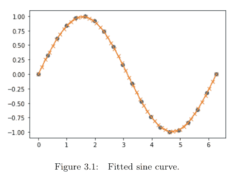

### 3.3.2 一维最小二乘解近似

这是在$x - y$平面上用一条直线拟合给定的一组数据

$$y = wx + b \quad (3.10)$$

我们将使用数据对$[x_i, y_i]$来确定梯度$w$和偏置$b$。在这个例子中，公式 (3.10) 可以重写为

$$y = \mathbf{X} \cdot \mathbf{w} \quad (3.11)$$

其中$\mathbf{X} = [x, 1]$，$\mathbf{w} = [w, b]$。现在，我们可以使用np.linalg.lstsq来求解$\mathbf{w}$：

```python
w_true,b_true = 1.0, -1.0 # 用于生成数据
x = np.array([0, 1, 2, 3]) # 生成数据的x值
X = np.vstack([x, np.ones(len(x))]).T # 构建数据矩阵
X
```

### 3.3.3 使用 interp1d 进行一维插值

```python
import numpy as np
from scipy import interpolate
from scipy.interpolate import interp1d
import matplotlib.pyplot as plt
x0, xL = 0, 18
x = np.linspace(x0, xL, num=11, endpoint=True)          # x data points
y = np.sin(-x**3/8.0)                                    # y data points
print('x.shape:',x.shape,'y.shape:',y.shape)
f = interp1d(x, y)                                       # linear interpolation
f2 = interp1d(x, y, kind='cubic')                        # Cubic interpolation
                                                          # try also quadratic
xnew = np.linspace(x0,xL,num=41,endpoint=True)           # x prediction points
plt.plot(x, y, 'o', xnew, f(xnew), '-', xnew, f2(xnew), '--')
plt.legend(['data', 'linear', 'cubic'], loc='best')
plt.show()
```

x.shape: (11,) y.shape: (11,)

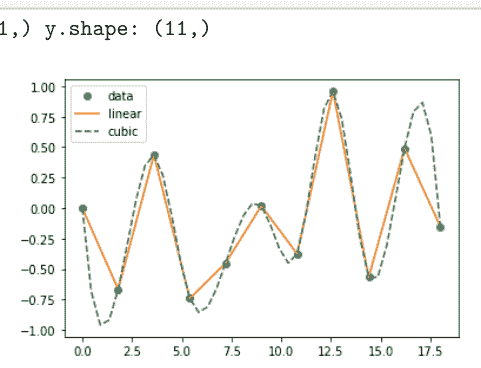

图 3.3：使用 Scipy 进行插值。

### 3.3.4 使用 bisplrep 进行二维样条表示

```python
x, y = np.mgrid[-1:1:28j, -1:1:28j]                    # x, y data grid
z = (x**2+y**2)*np.exp(-2.0*(x*x+y*y+x*y))              # z data
plt.figure()
plt.pcolor(x, y, z, shading='auto')  # plot the initial data
plt.colorbar()
plt.title("Function sampled at discrete points")
plt.show()
```

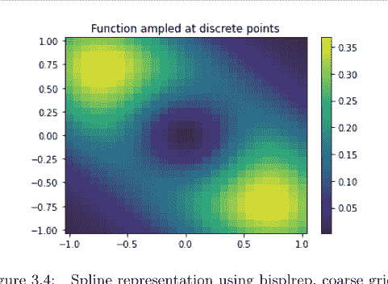

图 3.4：使用 bisplrep 进行样条表示，粗网格。

```python
xnew, ynew = np.mgrid[-1:1:88j, -1:1:88j]  # for view at grid
tck = interpolate.bisplrep(x, y, z, s=0)  # B-spline
znew = interpolate.bisplev(xnew[:,0], ynew[0,:], tck) # z value
plt.figure()
plt.pcolor(xnew, ynew, znew, shading='auto')
plt.colorbar()
plt.title("Interpolated function.")
plt.show()
```

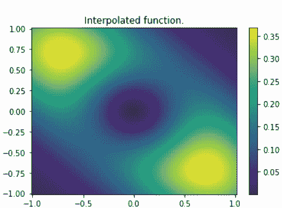

图 3.5：使用 bisplrep 进行样条表示，细网格。

### 3.3.5 用于平滑和插值的径向基函数

径向基函数（RBFs）是用于函数近似的有用基函数。RBFs 是距离函数，因此在不规则网格（甚至是随机分布的点）、高维空间中表现良好，并且通常被认为不易过拟合。它们也用于构建无网格方法 [2]。在使用 Scipy 时，RBFs 的选择如下：

- “multiquadric”：sqrt((r/self.epsilon)**2 + 1)
- “inverse”：1.0/sqrt((r/self.epsilon)**2 + 1)
- “gaussian”：exp(-(r/self.epsilon)**2)
- “linear”：r
- “cubic”：r**3
- “quintic”：r**5
- “thin_plate”：r**2 * log(r)。

默认是 “multiquadric”。
首先，让我们看一个一维的例子。

```python
import numpy as np
from scipy.interpolate import Rbf, InterpolatedUnivariateSpline
import matplotlib.pyplot as plt
```

```python
# Generate data
np.set_printoptions(formatter={'float': '{: 0.3f}'.format})
x = np.linspace(0, 10, 9)
print('x=',x)
y = np.sin(x)
print('y=',y)
# fine grids for plotting the interpolated data
xi = np.linspace(0, 10, 101)
# use fitpack2 method
ius=InterpolatedUnivariateSpline(x,y) # interpolation
# function
yi = ius(xi) # interpolated values at fine grids
plt.subplot(2, 1, 1) # have 2 sub-plots plotted together
plt.plot(x, y, 'bo') # original data points in blue dots
plt.plot(xi, np.sin(xi), 'r') # original function, red line
plt.plot(xi, yi, 'g')    # Spline interpolated, green line
plt.title('Interpolation using univariate spline')
plt.show()

# use RBF method
rbf = Rbf(x, y)
fi = rbf(xi)
plt.subplot(2, 1, 2)    # have 2 plots plotted together
plt.plot(x, y, 'bo')    # original data points in blue dots
plt.plot(xi, np.sin(xi), 'r')    # original function, red line
plt.plot(xi, fi, 'g')    # RBF interpolated, green line
plt.title('Interpolation using RBF - multiquadrics')
plt.show()
```

x= [ 0.000  1.250  2.500  3.750  5.000  6.250  7.500  8.750  10.000]
y= [ 0.000  0.949  0.598 -0.572 -0.959 -0.033  0.938  0.625 -0.544]

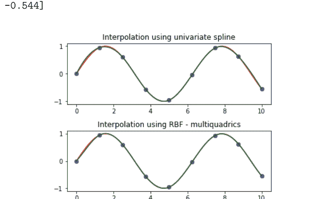

图 3.6：使用样条和径向基函数（RBF）进行插值的比较。

我们现在来看一些二维的例子。

```python
import numpy as np
from scipy.interpolate import Rbf
import matplotlib.pyplot as plt
from matplotlib import cm
```

```python
# 2-d tests - setup scattered data
x = np.random.rand(108)*4.0-2.0
y = np.random.rand(108)*4.0-2.0
z = (x+y)*np.exp(-x**2-y**2+x*y)
di = np.linspace(-2.0, 2.0, 108)
XI, YI = np.meshgrid(di, di)
```

```python
# use RBF https://docs.scipy.org/doc/scipy/reference/
# generated/scipy.
# interpolate.Rbf.html#scipy.interpolate.Rbf
rbf = Rbf(x, y, z, epsilon=2)
ZI = rbf(XI, YI)
```

```python
# plot the result
plt.pcolor(XI, YI, ZI, cmap=cm.jet, shading='auto')
plt.scatter(x, y, 88, z, cmap=cm.jet)
plt.title('RBF interpolation - multiquadrics')
plt.xlim(-2, 2)
plt.ylim(-2, 2)
plt.colorbar();
```

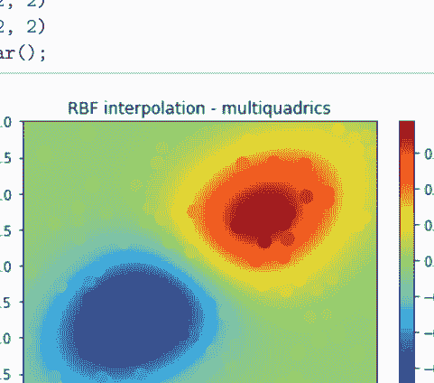

图 3.7：使用 RBF 进行二维插值。

RBFs 可用于 $N$ 维插值。下面是一个三维的例子。

```python
from scipy.interpolate import Rbf
x, y, z, d = np.random.rand(4, 20)  # randomly generated data 0~1
                                        # 4D, 50 points in each dimension
#print(d)                              # original data
rbfi = Rbf(x, y, z, d)                # RBF interpolator
xi = yi = zi = np.linspace(0, 1, 10)
di = rbfi(xi, yi, zi)                 # interpolated values
print(di)
[-0.378 -0.058  0.450  0.832  0.825  0.665  0.559  0.512
  0.430  0.497]
```

## 3.4 奇异值分解

### 3.4.1 SVD 公式

奇异值分解（SVD）是矩阵许多数值运算的基本工具，包括信号处理、统计学和机器学习。它是矩阵（实数或复数）的一种通用分解，该矩阵可以是奇异的，也可以是任意形状的。它非常强大，因为任何这样的矩阵都存在 SVD，并且可以通过数值方法找到。它是特征值分解的推广，适用于可对角化的方阵，这在本章前面已经讨论过。

一个一般的（实数或复数，方阵或非方阵）$m \times p$ 矩阵 $\mathbf{A}$ 具有以下奇异值分解：

$$\mathbf{A} = \mathbf{U}\mathbf{\Sigma}\mathbf{V}^*$$

其中 $*$ 表示共轭转置（矩阵的转置并取复数值的共轭）。

- $\mathbf{U}$ 是一个 $m \times m$ 的酉矩阵。
- $\mathbf{\Sigma}$ 是一个 $m \times p$ 的矩形对角矩阵，对角线上的元素为非负实数。
- $\mathbf{V}$ 是一个 $p \times p$ 的酉矩阵。
- $\mathbf{\Sigma}$ 中的对角线元素 $\sigma_i$ 被称为 $\mathbf{A}$ 的奇异值。
- $\mathbf{U}$ 的列被称为 $\mathbf{A}$ 的左奇异向量。
- $\mathbf{V}$ 的列被称为 $\mathbf{A}$ 的右奇异向量。

关于 SVD 的更详细讨论可以在维基百科（https://en.wikipedia.org/wiki/Singular_value_decomposition）上找到。

### 3.4.2 SVD 算法

大型矩阵的 SVD 计算可能非常昂贵。常用的 SVD 算法基于 QR 分解（https://en.wikipedia.org/wiki/QR_decomposition）及其变体。基本思想是将给定的矩阵分解为一个正交矩阵 Q 和一个上三角矩阵 R。读者可以参考维基百科页面以获取更多细节以及相关主题的线索。在这里，我们讨论一种基于成熟的特征值分解来计算 SVD 的简单方法。这种方法不用于 SVD 的数值计算。这是因为它使用了一个条件数平方的正规矩阵，导致大型系统出现数值不稳定问题。对于我们的理论分析和公式推导，这不是问题，因此将在此处使用。为了使这种简单方法有效，我们需要对矩阵 A 施加一些条件。

考虑一个实数的一般 $m \times p$ 矩阵 $\mathbf{A}$，其中 $m>p$，并假设其秩为 $p$。这样的矩阵在机器学习中经常遇到。我们首先构造一个正规矩阵 $\mathbf{B}$：

$$\mathbf{B} = \mathbf{A}^\top \mathbf{A} \quad (3.13)$$

它将是一个 $p \times p$ 的对称方阵（尺寸更小）。因此，$\mathbf{B}$ 将是正交可对角化的。因为矩阵 $\mathbf{A}$ 的秩为 $p$，$\mathbf{B}$ 也将是对称正定（SPD）的。因此，$\mathbf{B}$ 具有特征值分解，我们执行这样的分解。结果可以写成以下形式：

$$\mathbf{B} = \mathbf{V}_e \mathbf{\Lambda} \mathbf{V}_e^\top \quad (3.14)$$

其中 $\mathbf{V}_e$ 是一个 $p \times p$ 的正交矩阵，由 $\mathbf{B}$ 矩阵的 $p$ 个特征向量组成。$\mathbf{\Lambda}$ 是一个 $p \times p$ 的方阵对角矩阵。对角线元素是正实数的特征值。

另一方面，我们知道矩阵 $\mathbf{A}$ 具有 SVD 分解；因此我们也有

$$\mathbf{A} = \mathbf{U} \mathbf{\Sigma} \mathbf{V}^\top \quad (3.15)$$

因为矩阵 $\mathbf{A}$ 的秩为 $p$，$\mathbf{\Sigma}$ 中的奇异值应该都是正实数。使用公式 (3.15)，我们有

$$\mathbf{A}^\top \mathbf{A} = \left(\mathbf{U} \mathbf{\Sigma} \mathbf{V}^\top\right)^\top \left(\mathbf{U} \mathbf{\Sigma} \mathbf{V}^\top\right) = \mathbf{V} \mathbf{\Sigma} \mathbf{U}^\top \mathbf{U} \mathbf{\Sigma} \mathbf{V}^\top = \mathbf{V} \mathbf{\Sigma}^2 \mathbf{V}^\top = \mathbf{B} \quad (3.16)$$

在上述推导中，我们利用了**U**是酉矩阵的事实：$\mathbf{U}^\top \mathbf{U} = \mathbf{I}$，并且$\mathbf{\Sigma}$是对角矩阵（不受转置影响）。比较式 (3.16) 与式 (3.14)，我们得到

$$\mathbf{V} = \mathbf{V}_e$$
$$(3.17)$$
$$\mathbf{\Sigma} = \sqrt{\mathbf{\Lambda}}$$
$$(3.18)$$

现在利用式 (3.15) 以及**V**的正交归一性质：$\mathbf{V}^\top \mathbf{V} = \mathbf{I}$，我们得到

$$\mathbf{AV} = \mathbf{U\Sigma}$$
$$(3.19)$$

由于$\mathbf{\Sigma}$的所有特征值均为正，我们最终得到

$$\mathbf{U} = \mathbf{AV\Sigma}^{-1}$$
$$(3.20)$$

很容易验证**U**是酉矩阵。最后，如果**A**是秩亏的（rank(**A**)<p），矩阵**B**将具有零特征值。在这种情况下，我们只需丢弃所有零特征值及其对应的特征向量。这仍然会给出一个简化形式的SVD，并且上述所有过程仍然成立。

读者可以类似地推导出对于一个实数$m \times p$矩阵**A**（其中$p > m$）且秩为$m$的一组方程。

上述分析从理论上证明了任何矩阵都有SVD。在实际计算中，我们通常不使用上述过程来计算SVD。这是因为矩阵**B**的条件数被平方了，如式 (3.13) 所示，这会导致数值不稳定。实际的SVD算法通常使用**A**的QR分解，从而避免形成**B**。有了理论基础，我们现在用一些简单的例子来演示使用Python进行SVD的过程。

### 3.4.3 数值示例

```python
import numpy as np
a = np.random.randn(3, 6)    # matrix with random numbers
print(a)
```

```
[[-1.582  0.398  0.572 -1.060  1.000 -1.532]
 [ 0.257  0.435 -1.851  0.894  1.263 -0.364]
 [-1.251  1.276  1.548  1.039  0.165 -0.946]]
```

```python
u, s, vh = np.linalg.svd(a, full_matrices=True)
print(u.shape, s.shape, vh.shape)
```

```
(3, 3) (3,) (6, 6)
```

```python
print('u=',u,'\n','s=',s,'\n','vh=',vh)
```

```
u= [[-0.677  0.283  0.679]
 [ 0.202  0.959 -0.198]
 [-0.707  0.003 -0.707]]
s= [ 3.412  2.466  1.881]
vh= [[ 0.589 -0.318 -0.544  0.048 -0.158  0.479]
 [-0.083  0.216 -0.652  0.227  0.606 -0.318]
 [-0.128 -0.382 -0.180 -0.867  0.166 -0.159]
 [-0.510 -0.736 -0.110  0.412 -0.115 -0.066]
 [ 0.300 -0.343  0.476  0.115  0.723  0.171]
 [-0.529  0.218 -0.083 -0.104  0.210  0.781]]
```

```python
smat = np.zeros((3, 6))
smat[:3, :3] = np.diag(s)
print(smat)
```

```
[[ 3.412  0.000  0.000  0.000  0.000  0.000]
 [ 0.000  2.466  0.000  0.000  0.000  0.000]
 [ 0.000  0.000  1.881  0.000  0.000  0.000]]
```

```python
np.allclose(a, np.dot(u, np.dot(smat, vh)))
    # Is original a recovered?
```

```
True
```

```python
print(a)
print(np.dot(u, np.dot(smat, vh)))
```

```
[[-1.582  0.398  0.572 -1.060  1.000 -1.532]
 [ 0.257  0.435 -1.851  0.894  1.263 -0.364]
 [-1.251  1.276  1.548  1.039  0.165 -0.946]]
[[-1.582  0.398  0.572 -1.060  1.000 -1.532]
 [ 0.257  0.435 -1.851  0.894  1.263 -0.364]
 [-1.251  1.276  1.548  1.039  0.165 -0.946]]
```

我们在此注意到，矩阵的SVD保留了矩阵的全部信息：使用所有这些奇异值和奇异向量，可以恢复原始矩阵。如果只使用其中一部分奇异值（以及对应的奇异向量）会怎样呢？

### 3.4.4 用于数据压缩的SVD

我们可以使用SVD来压缩数据，方法是丢弃数据矩阵的某些（通常是很多）奇异值和奇异向量。以下是一个压缩$m \times n$图像数据数组的示例。

```python
from pylab import imshow,gray,figure
from PIL import Image, ImageOps
import matplotlib.pyplot as plt
import numpy as np
%matplotlib inline
np.set_printoptions(formatter={'float': '{: 0.3f}'.format})

A = Image.open('../images/hummingbird.jpg')  # open an image
print(np.shape(A))  # check the shape of A, it is a 3D tensor
A = np.mean(A,2)    # get 2-D array by averaging RBG values
m, n = len(A[:,0]), len(A[1])
r = m/n              # Aspect ratio of the original image
print(r,len(A[1]),A.shape,A.size)
fsize, dpi = 3, 80  # inch, dpi (dots per inch, resolution)
plt.figure(figsize=(fsize,fsize*r), dpi=dpi)
gray()
imshow(A)
U, S, Vh = np.linalg.svd(A, full_matrices=True)
print(U.shape, S.shape, Vh.shape)
                    # Recover the image
k = 20              # use first k singular values
S = np.resize(S,[m,1])*np.eye(m,n)
Compressed_A=np.dot(U[:,0:k],np.dot(S[0:k,0:k],Vh[0:k,:]))
#print(Compressed_A.shape, 'Compressed_A=', Compressed_A)
plt.figure(figsize=(fsize,fsize*r), dpi=dpi)
gray()
imshow(Compressed_A)
```

```
(405, 349, 3)
1.160458452722063 349 (405, 349) 141345
(405, 405) (349,) (349, 349)
```

```
<matplotlib.image.AxesImage at 0x203185a7080>
```

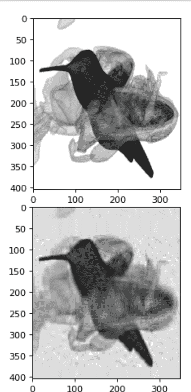

图 3.8：使用压缩数据重建的图像与原始图像的对比。

很明显，当使用$k = 20$（总共349个）奇异值时，重建的图像与原始图像非常接近。读者可以估算一下，如果保留10%的奇异值（以及对应的奇异向量），在可接受的质量损失下，可以节省多少存储空间。

## 3.5 主成分分析

主成分分析（PCA）是一种从数据集中提取特征的有效技术。它由卡尔·皮尔逊于1901年发明[3]。它是一个将可能相关的$p$个观测值（原始特征）的数据集，通过正交变换转换为一组降维变量（提取特征）的过程。通过PCA产生的主成分之间是线性不相关的，并且按其方差值排序。排序列表顶部的主成分在数据集中占更高的变异性。这是降低数据集特征空间维度的有效方法，使得神经网络等机器学习模型能够更有效地工作[4, 5]。请注意，已知PCA对原始观测值的相对缩放敏感，更多细节请参见维基百科（https://en.wikipedia.org/wiki/Principal_component_analysis#cite_note-1）。

PCA至少可以通过两种方式执行。一种是使用回归方法，以迭代方式找到一组正交轴。另一种是使用特征值分解算法。以下示例使用第二种方法。

### 3.5.1 PCA公式化

考虑一个一般的实数$m \times p$矩阵$\mathbf{A}$，其中$m>p$。我们首先构造一个矩阵$\mathbf{B}$：

$$\mathbf{B} = \mathbf{A}^\top \mathbf{A} \qquad (3.21)$$

这是一个尺寸减小的$p \times p$对称方阵。因此，它至少是半正定的，并且通常是正定的。我们可以对其进行特征值分解，得到

$$\mathbf{B} = \mathbf{V}\mathbf{\Sigma}\mathbf{V}^\top \qquad (3.22)$$

这些分解矩阵如下：

- $\mathbf{V}$是一个$p \times p$的正交归一矩阵，由$\mathbf{B}$矩阵的$p$个特征向量组成。
- $\mathbf{\Sigma}$是一个$p \times p$的方阵对角矩阵。对角线元素是非负实数的特征值。

然后PCA由下式给出

$$\mathbf{A}_{PCA} = \mathbf{A}\mathbf{V} \qquad (3.23)$$

这是$\mathbf{A}$在这些$p$个正交归一特征向量上的投影。它的形状与原始$\mathbf{A}$相同，即$m \times p$。

如果使用所有特征向量，可以使用以下公式重建**A**：

$$\mathbf{A}_r = \mathbf{A}_{PCA}\mathbf{V}^\top = \mathbf{AVV}^\top = \mathbf{A}$$

这是因为特征向量是正交归一的。通常，前几个（按特征值降序排列）特征向量包含了原始矩阵**A**的大部分信息。在这种情况下，我们可以只使用少量的特征向量来重建**A**矩阵。例如，如果我们使用$k \ll p$个特征向量，我们有

$$\mathbf{A}_r = \mathbf{A}_{PCA}[0:m, 0:k]\mathbf{V}^\top[0:k, 0:p]$$
$$= \mathbf{A}[0:m, 0:p]\mathbf{V}[0:p, 0:k]\mathbf{V}^\top[0:k, 0:p] \neq \mathbf{A}$$

这通常不等于原始的**A**，但通常可以非常接近它。在这种情况下，存储空间变为$m \times k + k \times p$，这可能比原始大小$m \times p$小得多。在式 (3.25) 中，我们使用了Python语法，因此它与Python代码中的非常接近。

请注意，如果矩阵**A**的维度是$m < p$，我们只需以同样的方式处理其转置。

也可以通过使用以下方程构造正规矩阵**B**来进行类似的分析：

$$\mathbf{B} = \mathbf{AA}^\top$$

这将是一个尺寸减小的$m \times m$对称方阵。假设它至少是半正定的，我们可以对其进行特征值分解，得到

$$\mathbf{B} = \mathbf{V}\mathbf{\Sigma}\mathbf{V}^\top$$

在这种情况下，这些分解矩阵如下：

- **V**是一个$m \times m$的正交归一矩阵，由**B**矩阵的$m$个特征向量组成。
- **Σ**是一个$m \times m$的方阵对角矩阵。对角线元素是非负实数的特征值。

然后PCA由下式给出

$$\mathbf{A}_{PCA} = \mathbf{V}^\top\mathbf{A}$$

它的形状与原始**A**相同，即$m \times p$。可以使用以下公式和所有特征向量（它们是正交归一的）重建**A**：

$$\mathbf{A}_r = \mathbf{V}\mathbf{A}_{PCA} = \mathbf{VV}^\top\mathbf{A} = \mathbf{A}$$

我们仅使用少量特征向量即可重构**A**矩阵。例如，若使用 $k \ll m$ 个特征向量，则有

$$\mathbf{A}_r = \mathbf{V}[0:k, 0:m]\mathbf{V}^\top[0:m, 0:k]\mathbf{A}_{PCA}[0:k, 0:p] \neq \mathbf{A}$$

请注意，对于大型系统，我们实际上并不构建法矩阵**B**、执行特征值分解，然后数值计算**V**。相反，我们使用QR变换类型的算法。这是因为3.4.2节开头提到的数值不稳定原因。

### 3.5.2 数值示例

#### 3.5.2.1 示例1：三行代码实现PCA

我们展示一个仅用三行代码实现PCA的示例。该代码来自 glowing-python (https://glowingpython.blogspot.com/2011/07/principal-component-analysis-with-numpy.html)，经授权使用。它受MATLAB统计工具箱中princomp函数的启发，且非常易于理解。我们修改了代码，使其完全遵循上述PCA公式。

```python
import numpy as np
from pylab import plot,subplot,axis,show,figure
def princomp(A):
    """ PCA on matrix A. Rows: m observations; columns:
        p variables. A will be zero-centered and normalized
    Returns:
    coeff: eig-vector of A^T A. Row-reduced observations,
            each column is for one principal component.
    score: the principal component - representation of A in
           the principal component space.Row-observations,
           column-components.
    latent: a vector with the eigenvalues of A^T A.
    """
    # eigenvalues and eigenvectors of covariance matrix
    # modified. It was:
    # M = (A-np.mean(A.T,axis=1))
    # [latent,coeff] = np.linalg.eig(np.cov(M))
    # score = np.dot(coeff.T,M)
    A=(A-np.array([np.mean(A,axis=0)])) # subtract the mean
    [latent,coeff] = np.linalg.eig(np.dot(A.T,A))
    score = np.dot(A,coeff)   # projection on the new space
    return coeff,score,latent
```

让我们使用一个二维数据集来测试该代码。

```python
# A simple 2D dataset
np.set_printoptions(formatter={'float': '{: 0.2f}'.format})

Data = np.array([[2.4,0.7,2.9,2.5,2.2,3.0,2.7,1.6,1.8,1.1,
                  1.6,0.9],
                 [2.5,0.5,2.2,1.9,1.9,3.1,2.3,2.0,1.4,1.0,
                  1.5,1.1]])
A = Data.T                # Note: transpose to have A with m>p
print('A.T:\n',Data)
coeff, score, latent = princomp(A) # change made. It was A.T
print('p-by-p matrix, eig-vectors of A:\n',coeff)
print('A.T in the principal component space:\n',score.T)
print('Eigenvalues of A, latent=\n',latent)
figure(figsize=(50,80))
figure()
subplot(121)
# every eigenvector describe the direction of a principal
# component.
m = np.mean(A,axis=0)
plot([0,-coeff[0,0]*2]+m[0], [0,-coeff[0,1]*2]+m[1],'--k')
plot([0, coeff[1,0]*2]+m[0], [0, coeff[1,1]*2]+m[1],'--k')
plot(Data[0,:],Data[1,:],'ob')        # the data points
axis('equal')
subplot(122)
# New data produced using the s
plot(score.T[0,:],score.T[1,:],'*g')  # Note: transpose back
axis('equal')
show()
```

```
A.T:
[[ 2.40  0.70  2.90  2.50  2.20  3.00  2.70  1.60  1.80
   1.10  1.60  0.90]
 [ 2.50  0.50  2.20  1.90  1.90  3.10  2.30  2.00  1.40  1.00
   1.50  1.10]]
p-by-p matrix, eig-vectors of A:
[[ 0.74 -0.67]
 [ 0.67  0.74]]
A.T in the principal component space:
[[ 0.82 -1.79  0.98  0.49  0.26  1.66  0.90 -0.11 -0.37
  -1.16 -0.45 -1.24]
 [ 0.23 -0.11 -0.33 -0.28 -0.08  0.27 -0.12  0.40 -0.18 -0.01
   0.03  0.20]]
Eigenvalues of A, latent=
[ 11.93  0.58]

<Figure size 3600x5760 with 0 Axes>
```

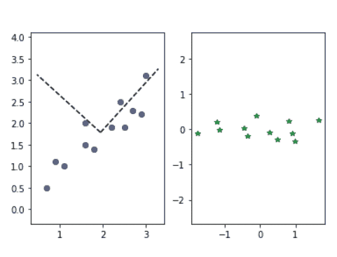

#### 3.5.2.2 示例2：截断PCA

此示例是基于前述代码的改进PCA。测试针对图像压缩应用进行。代码来自 glowing-python (https://glowingpython.blogspot.com/2011/07/pca-and-image-compression-with-numpy.html)，经授权使用。

```python
import numpy as np
def princomp(A,numpc=0):
    # computing eigenvalues and eigenvectors of covariance
    # matrix A
    A = (A-np.array([np.mean(A,axis=0)]))
                        # subtract the mean (along columns)
    [latent,coeff] = np.linalg.eig(np.dot(A.T,A))
    #was: A = (A-np.mean(A.T,axis=1)).T # subtract the mean
    #was: [latent,coeff] = np.linalg.eig(np.cov(M))

    p = np.size(coeff,axis=1)
    idx = np.argsort(latent)   # sorting the eigenvalues
    idx = idx[::-1]            # in ascending order
    # sorting eigenvectors according to eigenvalues
    coeff = coeff[:,idx]
    latent = latent[idx]       # sorting eigenvalues
    if numpc < p and numpc >= 0:
        coeff = coeff[:,range(numpc)]   # cutting some PCs

    #score = np.dot(coeff.T,M) # projection on the new space
    score = np.dot(A,coeff)
                        # projection of the data on the new space
    return coeff,score,latent
```

以下代码计算矩阵A的PCA，A是一幅彩色图像。它首先将图像A转换为灰度图。PCA完成后，使用不同数量的主成分来重构图像。

```python
from pylab import imread,subplot,imshow,title,gray,figure,
    show,NullLocator
from ipykernel import kernelapp as app
from PIL import Image, ImageOps
%matplotlib inline
#A = Image.open('./images/hummingbirdcapsized.jpg')
A = Image.open('../images/hummingbird.jpg')  # open an image
#A = ImageOps.flip(B)            # flip it if so required
# or use A = imread('./images/hummingbirdcapsized.jpg')
A = np.mean(A,2)                 # to get a 2-D array
```

```python
full_pc = np.size(A,axis=1)
    # numbers of all the principal components
r = len(A[:,0])/len(A[1])
print(r,len(A[1]),A.shape,A.size)
i = 1
dist = []
figure(figsize=(11,11*r))
for numpc in range(0,full_pc+10,50): # 0 50 100 ... full_pc
    coeff, score, latent = princomp(A,numpc)
    print(numpc,'coeff, score, latent \n',
    coeff.shape,  score.shape, latent.shape)
    Ar = np.dot(score,coeff.T)+np.mean(A,axis=0)
    #was:Ar = np.dot(coeff,score).T+np.mean(A,axis=0)
    # difference in Frobenius.norm
    dist.append(np.linalg.norm(A-Ar,'fro'))
    # showing the pics reconstructed with less than 50 PCs
    if numpc <= 250:
        ax = subplot(2,3,i,frame_on=False)
        ax.xaxis.set_major_locator(NullLocator())
        ax.yaxis.set_major_locator(NullLocator())
        i += 1
        imshow(Ar)            #imshow(np.flipud(Ar))
        title('PCs # '+str(numpc))
        gray()
figure()
imshow(A)                   #imshow(np.flipud(A))
title('numpc FULL: '+str(len(A[1])))
gray()
show()
```

```
1.160458452722063 349 (405, 349) 141345
0 coeff, score, latent
 (349, 0) (405, 0) (349,)
50 coeff, score, latent
 (349, 50) (405, 50) (349,)
100 coeff, score, latent
 (349, 100) (405, 100) (349,)
150 coeff, score, latent
 (349, 150) (405, 150) (349,)
200 coeff, score, latent
 (349, 200) (405, 200) (349,)
250 coeff, score, latent
 (349, 250) (405, 250) (349,)
300 coeff, score, latent
 (349, 300) (405, 300) (349,)
350 coeff, score, latent
 (349, 349) (405, 349) (349,)
```

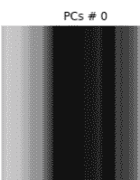


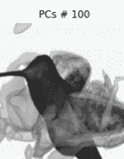

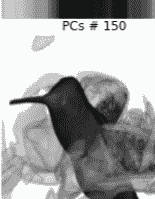


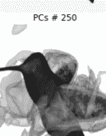

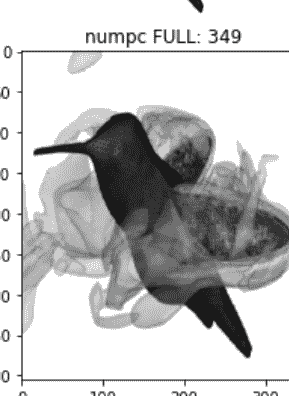

图3.10：使用降维PCA分量重构的图像与原始图像的对比。

我们可以看到，与原始图像相比，使用50个主成分重构的图像质量相当好。

为了定量评估重构质量，我们计算了在重构中使用不同数量的特征值/特征向量时，重构图像与原始图像在Frobenius范数下的距离。结果绘制在图3.11中，$x$轴表示使用的特征值/特征向量数量。特征值之和用蓝色曲线绘制，Frobenius范数用红色曲线绘制。特征值之和与方差贡献水平相关。

```python
from pylab import plot, axis, cumsum
figure()
perc = cumsum(latent)/sum(latent)
dist = dist/max(dist)
plot(range(len(perc)),perc,'b',range(0,full_pc+10,50), dist,'r')
axis([0,full_pc,0,1.1])
show()
```

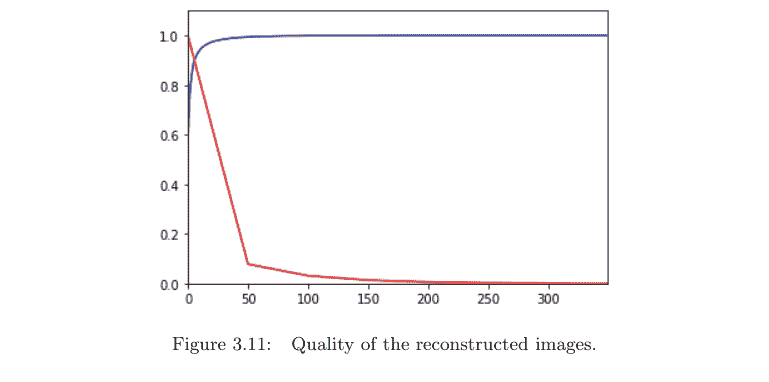

在实际计算中，可以使用QR分解来计算特征向量 $\mathbf{V}$，以避免数值稳定性问题，正如之前在SVD部分所讨论的。

## 3.6 数值求根

模块 scipy.optimize 提供了一个函数 fsolve()，用于求解由 $\mathbf{f}(\mathbf{x}) = \mathbf{0}$ 定义的一组给定非线性方程的根，并提供根的估计位置。fsolve() 是对 MINPACK 中算法的封装，其本质上使用了一种牛顿迭代法的变体 (https://en.wikipedia.org/wiki/Newton%27s_method)，该方法利用

## 3.7 数值积分

数值积分是科学与工程实际问题计算中的常规操作之一。这是因为只有简单函数才能进行解析积分，而对于实际问题，必须借助数值手段。过去已发展出多种数值积分技术，而numpy使得计算易于实现和使用。我们对这一主题的讨论从许多读者可能熟悉的经典梯形法则开始。更多参考资料可在Scipy.integrate文档（https://docs.scipy.org/doc/scipy/reference/tutorial/integrate.html）和notebook.community（https://notebook.community/sodafree/backend/build/ipython/docs/examples/notebooks/trapezoid_rule）中找到。

### 3.7.1 梯形法则

用于定积分的梯形法则使用以下公式：

$$\int_{a}^{b} f(x) \, dx \approx \frac{1}{2} \sum_{k=1}^{n_s} (x_k - x_{k-1}) (f(x_k) + f(x_{k-1})).$$

我们定义一个简单的多项式函数，并在有限范围 $[a, b]$ 内以 $n_s$ 个等间距采样点对其进行采样。

```python
%matplotlib inline
import numpy as np
import matplotlib.pyplot as plt
np.set_printoptions(formatter={'float': '{: 0.3f}'.format})
```

```python
def f(x):
    return 9*x**3-8*x**2-7*x+6    # define a polynomial function
a, b, n = -1., 2, 400    # large n for plotting the curve
x = np.linspace(a, b, n) # x at n points in [a,b]
y = f(x)                 # compute the function values
```

通过采样少量点，对函数在 $[a,b]$ 上进行积分。

```python
ns = 6                    # sample ns points for integration
xint = np.linspace(a, b, ns)
yint = f(xint)
```

绘制函数曲线及其下方的梯形（阴影）区域。

```python
plt.plot(x, y, lw=2) # plot the function as a line of width 2
#plt.axis([a, b, 0, 150])    # plot x and y axes
plt.fill_between(xint, 0, yint, facecolor='gray', alpha=0.4)
    # plot the shaded area over which the integration is done
plt.text((a+b)/2,12,r"$\int_a^b f(x)dx$", horizontalalignment='center',fontsize=15); # use \ to change line in code
```

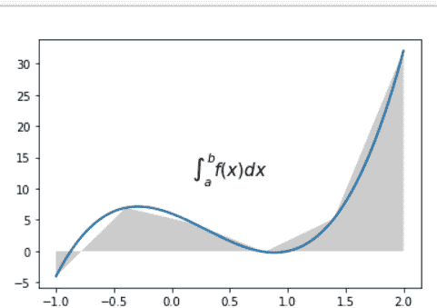

图 3.13：使用梯形法则进行积分。

梯形积分计算阴影区域的面积。因此，如图所示，它很可能是一个近似值。

```python
from scipy.integrate import quad  # quadrature (integration)
integral, error = quad(f, a, b)  # shall give the results and the error
integral_trapezoid=sum((xint[1:]-xint[:-1])*(yint[1:]+yint[:-1]))/2  # use the trapezoid formula
print("The results should be:", integral, "+/-", error)
print("The results by the trapezoid approximation with",len(xint), "points is:", integral_trapezoid)
```

The results should be: 17.25 +/- 1.9775770133077287e-13
The results by the trapezoid approximation with 6 points are: 18.240000000000002

### 3.7.2 高斯积分

高斯积分（或称求积法）被认为是最有效的数值积分技术之一。它在称为高斯点的特定点处对被积函数进行采样，并将这些采样函数值乘以对应点的高斯权重后求和。对于多项式被积函数的积分，它可以产生精确值（达到机器精度），因为高斯点的位置是定义在自然坐标[-1, 1]中的勒让德多项式的根。

如果采样点的固定位置不是问题，高斯积分在数值积分中应用广泛。它是有限元法（FEM）[1]中使用的标准积分方案。这里，我们展示一个使用Scipy模块中可用的`p_roots()`函数来寻找多项式根，然后进行积分的例子。

```python
from pylab import *
from scipy.special.orthogonal import p_roots
```

```python
def gauss(f,n,a,b):
    [x,w] = p_roots(n+1)  # roots of the Legendre polynomial
                           # and weights
    G=0.5*(b-a)*sum(w*f(0.5*(b-a)*x+0.5*(b+a)))
                           # in natural coordinates
    # sample the function values at these roots and sum up.
    return G
```

```python
def my_f(x):
    return 9*x**3-8*x**2-7*x+6 # define a polynomial function
ng = 2
integral_Gauss = gauss(my_f,ng,a,b)
print("The results should be:", integral, "+/-", error)
print("The results by the trapezoid approximation with",
      len(xint),"points is:", integral_trapezoid)
print("The results by the Gauss integration with", ng,
      'Gauss points:', "points is:", integral_Gauss)
```

The integral results should be: 17.25 +/- 1.9775770133077287e-13
The results by the trapezoid approximation with 6 points is: 18.240000000000002
The results by the Gauss integration with 2 Gauss points: points is: 17.250000000000007

可以观察到，高斯积分使用少得多的采样点就能给出更精确的解。事实上，对于这个例子，由于被积函数是3阶多项式，其解是精确的（在机器误差范围内）。我们只需要2个高斯点就能获得精确解。对于多项式被积函数，一般公式为 $n_g = \frac{n+1}{2}$，其中 $n$ 是多项式被积函数的阶数，$n_g$ 是获得积分精确解所需的高斯点数量。请注意，当使用6个采样点的梯形积分法则时，解仍然相差甚远。

对于一般的复杂被积函数，高斯积分可能无法给出精确解。然而，与梯形法则或矩形法则（我们未讨论，但与梯形法则非常相似）相比，其精度仍然要好得多。换句话说，对于相似精度的解，高斯积分使用更少的采样点。

## 3.8 初始数据处理

最后，让我们介绍常用于数据集初始处理的技术。考虑给定的训练数据集 $\mathbf{X} \in \mathbb{R}^{m \times p}$。在机器学习模型中，$m$ 是数据集中的数据点数量，$p$ 是特征变量的数量。对于实际问题，数据值通常范围很广。出于数值稳定性的考虑，我们通常在将给定数据集输入模型之前对其进行归一化。主要有两种## 3.8.1 最小-最大缩放

最小-最大缩放的公式如下所示。

$$\mathbf{X}_{scaled} = \frac{\mathbf{X} - \mathbf{X}.\min(axis=0)}{\mathbf{X}.\max(axis=0) - \mathbf{X}.\min(axis=0)} \quad (3.32)$$

其中 $\mathbf{X}.\min$ 和 $\mathbf{X}.\max$ 将是（行）向量，我们使用了 Python 的广播规则和逐元素除法语法。这将把每个特征的所有值都缩放到 $[0,1]$ 范围内。一个更通用的公式，可以将这些值缩放到任意范围 $[a,b]$，如下所示。

$$\mathbf{X}_{scaled} = a + \frac{\mathbf{X} - \mathbf{X}.\min(axis=0)}{\mathbf{X}.\max(axis=0) - \mathbf{X}.\min(axis=0)}(b-a) \quad (3.33)$$

这里我们再次使用了 Python 语法，以便标量、向量和矩阵都能在同一个公式中使用。

一旦对训练数据集完成了这样的缩放变换，就可以使用 $\mathbf{X}.\min$ 和 $\mathbf{X}.\max$ 对测试数据集执行完全相同的变换，以确保预测的一致性。

以下是使用公式 (3.32) 执行最小-最大缩放的简单代码。

```
np.set_printoptions(precision=4)
X = [[-1,  2,  8],
    [2.5, 6, 1.5],
    [3,  11, -6],
    [21,  7,  2]]
print(f"Original training dataset X:\n{X}")
X = np.array(X)
X_scaled = (X - X.min(axis=0)) / (X.max(axis=0) - X.min(axis=0))
print(f"Scaled training dataset X:\n{X_scaled}")
print(f"Maximum values for each feature:\n{X.max(axis=0)}")
print(f"Minimum values for each feature:\n{X.min(axis=0)}")
```

原始训练数据集 X:
[[-1, 2, 8], [2.5, 6, 1.5], [3, 11, -6], [21, 7, 2]]
缩放后的训练数据集 X:
[[0.       0.       1.      ]
 [0.1591 0.4444 0.5357]
 [0.1818 1.       0.      ]
 [1.      0.5556 0.5714]]
每个特征的最大值:
[21. 11.  8.]
每个特征的最小值:
[-1.  2. -6.]

我们现在可以使用训练数据集的 **X**.min 和 **X**.max 对测试数据集执行相同的变换。

```
Xtest = [[-2, 3, 7],
         [5, 4, 5.5]]
Xt_scaled = (Xtest - X.min(axis=0)) / (X.max(axis=0) - X.min(axis=0))
print(f"Scaled corresponding testing dataset Xtest:\n{Xt_scaled}")
```

缩放后的对应测试数据集 Xtest:
[[-0.0455  0.1111  0.9286]
 [ 0.2727  0.2222  0.8214]]

逆变换可以轻松完成。

```
X_back = X_scaled*(X.max(axis=0) - X.min(axis=0))+ X.min(axis=0)
print(f"Back transformed training dataset:\n{X_back}")

Xt_back = Xt_scaled*(X.max(axis=0) - X.min(axis=0))+ X.min(axis=0)
print(f"Back transformed testing dataset Xtest:\n{Xt_back}")
```

逆变换后的训练数据集:
[[-1.   2.   8. ]
 [ 2.5  6.   1.5]
 [ 3.  11.  -6. ]
 [21.   7.   2. ]]
逆变换后的测试数据集 Xtest:
[[-2.   3.   7. ]
 [ 5.   4.   5.5]]

可以清楚地看到，最小-最大缩放对数据集没有造成任何损害。可以根据需要恢复数据。使用 Sklearn 也可以进行相同的最小-最大缩放。

```
from sklearn.preprocessing import MinMaxScaler
scaler = MinMaxScaler()                # create an instance
scaler.fit(X)                          # fit with the training dataset
X_scaled = scaler.transform(X)        # perform the scaling transformation
print(f"Scaled training dataset X:\n{X_scaled}")
print(f"Maximum values for each feature:\n{scaler.data_max_}")
print(f"Minimum values for each feature:\n{scaler.data_min_}")
```

缩放后的训练数据集 X:
[[0.     0.     1.    ]
 [0.1591 0.4444 0.5357]
 [0.1818 1.     0.    ]
 [1.     0.5556 0.5714]]
每个特征的最大值:
[21. 11.  8.]
每个特征的最小值:
[-1.  2. -6.]

```
Xtest = [[-2,  3,  7],              # assumed testing dataset
         [5,  4, 5.5]]
Xt_scaled = scaler.transform(Xtest)
print(f"Scaled corresponding testing dataset:\n{Xt_scaled}")
```

缩放后的对应测试数据集:
[[-0.0455  0.1111  0.9286]
 [ 0.2727  0.2222  0.8214]]

```
X_back = scaler.inverse_transform(X_scaled)
print(f"Back transformed training dataset:\n{X_back}")

Xt_back = scaler.inverse_transform(Xt_scaled)
print(f"\nBack transformed testing dataset Xtest:\n{Xt_back}")
```

逆变换后的训练数据集:
[[-1.   2.   8. ]
 [ 2.5  6.   1.5]
 [ 3.  11.  -6. ]
 [21.   7.   2. ]]

逆变换后的测试数据集 Xtest:
[[-2.   3.   7. ]
 [ 5.   4.   5.5]]

### 3.8.2 “独热”编码

许多机器学习数据集使用分类特征。例如，一个颜色变量可能有“红色”、“绿色”和“蓝色”等值。这些值必须转换为数字才能构建机器学习模型。假设一个单列特征向量最初为 [[green], [red], [0], [blue]]，可以简单地将此特征向量编码为 [[1], [2], [0], [3]]，其中整数是任意但不同的。对以此方式编码的数据集的处理将与我们之前讨论的任何普通数据集相同。然而，这意味着颜色在数值上具有意义，这可能不是我们想要的。

为了避免这种问题，我们经常使用所谓的“独热”编码。然后，单列数据集被编码为一个具有三列的矩阵 **X**，如下方代码所示。因此，独热编码导致特征向量数量显著增加，使得所有特征都可以变得唯一，并且类别不会被赋予任何数值意义。让我们对这种数据集进行缩放。

```
# red green blue
X = [[0, 1, 0 ], # a 'one-hot' training dataset
     [1, 0, 0 ],
     [0, 0, 0 ],
     [0, 0, 1 ]]
scaler.fit(X)
print(f"Original 'one-hot' training dataset X:\n{X}")
X_scaled = scaler.transform(X) # perform the scaling transformation
print(f"Scaled 'one-hot' training dataset X:\n{X_scaled}")
print(f"Maximum values for each feature:\n{scaler.data_max_}")
print(f"Minimum values for each feature:\n{scaler.data_min_}")
```

原始“独热”训练数据集 X:
[[0, 1, 0], [1, 0, 0], [0, 0, 0], [0, 0, 1]]
缩放后的“独热”训练数据集 X:
[[0. 1. 0.]
 [1. 0. 0.]
 [0. 0. 0.]
 [0. 0. 1.]]
每个特征的最大值:
[1. 1. 1.]
每个特征的最小值:
[0. 0. 0.]

可以看到，所使用的最小-最大缩放没有改变独热数据集，正如预期的那样。它们没有数值意义。

### 3.8.3 标准缩放

当数据集的分布接近正态分布时，可以使用标准缩放。标准缩放的公式如下所示。

$$\mathbf{X}_{scaled} = \frac{\mathbf{X} - \mathbf{X}.mean(axis = 0)}{\mathbf{X}.std(axis = 0)} \quad (3.34)$$

以下是使用公式 (3.34) 执行标准缩放的简单代码。

```
X = [[-1,  2,  8],
    [2.5, 6, 1.5],
    [3,  11, -6],
    [21,  7,  2]]
print(f"Original training dataset X:\n{X}")
X = np.array(X)
X_scaled = (X - X.mean(axis=0)) / X.std(axis=0)
print(f"Standard scaled training dataset X:\n{X_scaled}")
print(f"Mean value for each feature:\n{X.mean(axis=0)}")
print(f"Standard deviation for each feature:\n{X.std(axis=0)}")
```

原始训练数据集 X:
[[-1, 2, 8], [2.5, 6, 1.5], [3, 11, -6], [21, 7, 2]]
标准缩放后的训练数据集 X:
[[-0.8592 -1.4056  1.3338]
 [-0.4515 -0.1562  0.0252]
 [-0.3932  1.4056 -1.4848]
 [ 1.7039  0.1562  0.1258]]
每个特征的均值:
[6.375 6.5   1.375]
每个特征的标准差:
[8.5832 3.2016 4.9671]

请注意，值并不局限于 $[-1, 1]$。它遵循正态分布。我们现在可以使用训练数据集的拟合实例对相应的测试数据集执行相同的变换。

```
Xtest = [[-2,  3,  7],
         [5,  4, 5.5]]
Xt_scaled = (Xtest - X.mean(axis=0)) / X.std(axis=0)
print(f"Standard scaled corresponding testing dataset Xtest:\n{Xt_scaled}")
```

标准缩放后的对应测试数据集 Xtest:
[[-0.9757 -1.0932  1.1325]
 [-0.1602 -0.7809  0.8305]]

逆变换可以轻松完成。

```
X_back = X_scaled*X.std(axis=0) + X.mean(axis=0)
print(f"Back transformed training dataset:\n{X_back}")

Xt_back = Xt_scaled*X.std(axis=0) + X.mean(axis=0)
print(f"Back transformed corresponding testing dataset Xtest:\n{Xt_back}")
```

逆变换后的训练数据集:
[[-1.   2.   8. ]
 [ 2.5  6.   1.5]
 [ 3.  11.  -6. ]
 [21.   7.   2. ]]
逆变换后的对应测试数据集 Xtest:
[[-2.   3.   7. ]
 [ 5.   4.   5.5]]

可以清楚地看到，标准缩放对数据集没有造成任何损害。可以根据需要恢复数据。使用 Sklearn 也可以进行相同的标准缩放。

```
from sklearn.preprocessing import StandardScaler
scaler = StandardScaler()   # create an instance
scaler.fit(X)
X_scaled = scaler.transform(X)
print(f"Scaled dataset X:\n{X_scaled}")
print(f"Mean values for each feature:\n{scaler.mean_}")
print(f"Standard deviations for each feature:\n{np.sqrt(scaler.var_)}")
```

缩放后的数据集 X:
[[-0.8592 -1.4056  1.3338]
 [-0.4515 -0.1562  0.0252]
 [-0.3932  1.4056 -1.4848]
 [ 1.7039  0.1562  0.1258]]
每个特征的均值:
[6.375 6.5   1.375]
每个特征的标准差:
[8.5832 3.2016 4.9671]

## 第四章

## 基于统计与概率的学习模型

本章讨论与机器学习模型相关的概率与统计主题，以及使用Python的计算技术。参考材料包括来自Numpy文档（https://numpy.org/doc/）、Jupyter文档（https://jupyter.org/）和维基百科（https://en.wikipedia.org/wiki/Main_Page）的代码。同时，也使用了来自mxnet-the-straight-dope（https://github.com/zackchase/mxnet-the-straight-dope）的代码，这些代码遵循Apache-2.0许可协议。

构建机器学习模型大多是为了基于可用数据和对数据的了解进行预测、分类或识别。预测可以是确定性的，也可以是概率性的。我们常常希望预测某个事件发生的概率，这对于某些问题可能非常有用且更切合实际。

例如，对于飞机维护，工程师可能希望根据记录和/或诊断数据，评估飞机发动机进入不健康状态的可能性。对于医生，他/她可能希望根据患者的健康记录、诊断数据和当前的健康环境，预测患者在未来一段时间内患上重病的可能性。医疗保健组织希望预测大流行发生的可能性。对于所有这些类型的任务，我们需要借助量化事件发生概率的方法。这可能是一个复杂的研究课题，而机器学习模型或许能提供帮助。

本章重点介绍一些基本概念、理论、公式和计算技术，这些是我们使用概率和统计构建机器学习模型可能需要的。在本章末尾，我们将介绍一个朴素贝叶斯分类模型。

## 4.1 事件概率分析

### 4.1.1 随机抽样，受控随机抽样

在机器学习中，经常需要以随机方式抽样数字。这可以通过数值方法实现。在Python中，我们导入`random`模块来完成此操作。然后可以使用`random()`来生成“模拟”随机数。

首先，让我们用代码生成随机整数。我们将使用`random.randint()`，它在给定范围内均匀抽样数字。

```python
# help(random.randint) # 查看帮助
```

```python
import random # random模块
na, nb, n = 1, 100, 5 # n个在na~nb范围内的整数
for i in range(n): # 首先，生成n个
    print(random.randint(na,nb),' ',end ='') # 随机整数
    # 在na~nb范围内
print('\n')
for i in range(n): # 再次生成
    print(random.randint(na,nb),' ',end ='') # n个随机整数
```

```
86 61 35 81 40

4 92 95 31 70
```

我们两次生成了5个随机整数。这些生成的数字是“随机的”，因为两次相同的生成给出了两组不同的数字。可以尝试多次执行上述单元格，应该会发现每次生成的数字集都不同。

现在，让我们重新执行相同的操作，但这次我们使用`random.seed()`为每次生成指定相同的种子。

```python
random.seed(1) # 随机数生成的种子值1
for i in range(n): # 生成n个随机整数
    print(random.randint(na, nb),' ',end ='')
print('\n')
random.seed(1) # 相同的种子值（也可以尝试seed(2)）
for i in range(n):
    print(random.randint(na, nb),' ',end ='')
```

```
18 73 98 9 33

18 73 98 9 33
```

我们现在看到生成了相同的数字集，这是通过种子值实现的某种**受控随机抽样**。使用`random.seed()`可能会让许多初学者感到困惑，但上述例子应该能消除这种困惑。函数`random.seed()`仅用于确保重新运行代码时的可重复性，这对于确保代码开发的可重现性非常重要。我们将经常使用它。

此外，我们看到计算机生成的随机数并非完全随机，在一定程度上是可控的。这理应如此，因为任何（经典）计算机本质上都是确定性的。这种伪随机特性很有用：当我们研究概率事件时，我们利用`random.randint()`或`random.random()`的随机性。当我们希望研究和代码可重复时，我们利用`random.seed()`。

请注意，种子值1可以更改为任何其他数字，使用不同的种子值会生成不同的随机数集。

现在让我们生成实数。

```python
#random.seed(1)          # 随机数生成的种子
n = 5
for i in range(n):       # 生成n个随机实数
    print(random.random())
```

```
0.11791870367106105
0.7609624449125756
0.47224524357611664
0.37961522332372777
0.20995480637147712
```

可以看到生成了0到1之间的实数。它是通过先使用`random.randint()`生成一个随机整数，然后除以其最大范围产生的。读者可以开启或关闭`random.seed(1)`或更改种子值以查看差异。

### 4.1.2 概率

概率是对事件发生或预测可能性的数值度量。例如，假设一个结构失效的概率是0.1。那么我们可以用数学符号表示为

$Pr(\text{failure}="yes") = 0.1$

在这种情况下，只有一个随机变量，它取两个可能的离散值：“yes”概率为0.1，“no”概率为0.9。这种随机变量的分布称为伯努利分布。对于一般事件，可能存在更多可能的离散随机变量和具有连续分布的随机变量。统计学研究抽样、解释和分析事件数据的技术。机器学习基于事件的可用数据集，因此统计分析帮助我们理解数据集，并有望以概率形式产生预测。

我们使用Python对数据集执行统计分析。我们首先导入必要的包，包括MXNet包（https://gluon.mxnet.io/）。

```python
import numpy as np
import mxnet as mx
from mxnet import nd
mx.random.seed(1)
```

让我们考虑一个简单的事件：掷一个有六个相同面的骰子，每个面都标有从1到6的唯一数字。在这种情况下，随机变量可以取6个可能的离散值。假设这种标记不会引入任何偏差（公平骰子），并且不会以任何方式影响投掷结果。我们想知道在多次投掷后，顶面出现特定数字的概率。然后可以进行“数值”实验：在计算机中虚拟地投掷骰子大量次数，并计算该数字出现在顶面的次数。我们使用以下代码来完成此操作：

```python
pr = nd.ones(6)/6
```

```python
Xtest = [[-2, 3, 7],
         [5, 4, 5.5]]
Xt_scaled = scaler.transform(Xtest)
print(f"缩放后的对应测试数据集Xtest:\n{Xt_scaled}")
```

```
缩放后的对应测试数据集Xtest:
[[-0.9757 -1.0932  1.1325]
 [-0.1602 -0.7809  0.8305]]
```

```python
X_back = scaler.inverse_transform(X_scaled)
print(f"逆变换后的训练数据集:\n{X_back}")

Xt_back = scaler.inverse_transform(Xt_scaled)
print(f"\n逆变换后的测试数据集Xtest:\n{Xt_back}")
```

```
逆变换后的训练数据集:
[[-1.  2.  8. ]
 [ 2.5  6.  1.5]
 [ 3.  11. -6. ]
 [21.  7.  2. ]]

逆变换后的测试数据集Xtest:
[[-2.  3.  7. ]
 [ 5.  4.  5.5]]
```

请注意，如果训练数据集中的标签不是概率分布类型的数据，也可以对它们进行相同的缩放。在对训练好的模型进行测试或使用训练好的模型进行预测时，标签应缩放回原始真实数据单位。
此外，查看数据点的分布是一个好习惯。这通常在缩放后进行，以便数据点的区域被归一化。可以简单地绘制所谓的核密度估计（KDE），例如使用`seaborn.kdeplot()`。

## 参考文献

- [1] G.R. Liu and S.S. Quek, *The Finite Element Method: A Practical Course*, Butterworth-Heinemann, 2013. London.
- [2] G.R. Liu, *Mesh Free Methods: Moving Beyond the Finite Element Method*, Taylor and Francis Group, New York, 2010.
- [3] K. Pearson, On lines and planes of closest fit to systems of points in space, *Philosophical Magazine*, **2**(1), 559-572, 1901.
- [4] G.R. Liu, S.Y. Duan, Z.M. Zhang et al., Tubenet: A special trumpetnet for explicit solutions to inverse problems, *International Journal of Computational Methods*, **18**(01), 2050030, 2021. https://doi.org/10.1142/S0219876220500309.
- [5] Shuyong Duan, Zhiping Hou, G.R. Liu et al., A novel inverse procedure via creating tubenet with constraint autoencoder for feature-space dimension-reduction, *International Journal of Applied Mechanics*, **13**(08), 2150091, 2021.

print(pr)
n_top_array = nd.sample_multinomial(pr,shape=(1))
# 使用 sample_multinomial() 函数
# 进行一次投掷
print('骰子顶面的数字 =', n_top_array)

[0.16666667 0.16666667 0.16666667 0.16666667 0.16666667 0.16666667]
<NDArray 6 @cpu(0)>
骰子顶面的数字 =
[3]
<NDArray 1 @cpu(0)>

对于这个问题，我们已知（假设）骰子顶面出现某个数字的理论或“真实”概率是 1/6≈0.1667。
上面的一次投掷得到了一个只有一个条目的 nd 数组，该条目就是骰子顶面的数字。为了获得概率，我们需要进行多次投掷以进行统计。这可以通过在便捷的 `nd.sample_multinomial()` 函数中简单地指定 nd 数组的长度来实现。

```
n_surfaces = 6              # 可能的值的数量
n_tosses = 18               # 投掷次数
mx.random.seed(1)
toss_results = nd.sample_multinomial(pr, shape=(n_tosses))
                            # 投掷 n_tosses 次
print("投掷了", n_tosses, '次。')
print("投掷结果", toss_results)
```

投掷了 18 次。
投掷结果
[3 0 0 3 1 4 4 5 3 0 0 2 2 2 4 2 4 4]
<NDArray 18 @cpu(0)>

这一次，我们投掷了 18 次，得到了一个包含 18 个条目的 nd 数组。请注意，如果在上面的单元格中没有使用 `mx.random.seed(1)`，由于随机性，每次投掷我们都会得到不同的数组。对于这次使用 `random.seed(1)` 的受控投掷（读者可以重复），我们在 18 次投掷中得到了 1 个“5”。因此，我们有 Pr(die=“5”) = 1/18。我们得到了 3 个“3”，这给出 Pr(die=“3”) = 3/18=1/6，依此类推。Pr(die=“5”) 和 Pr(die=“3”) 的值相差很大。让我们再投掷一些次数。

```
n_t = 20
print(nd.sample_multinomial(pr, shape=(n_t)))  # 投掷 n_t 次
```

[2 3 5 4 0 0 1 1 0 2 3 0 0 0 2 4 5 2 0 4]
<NDArray 20 @cpu(0)>

手动计数和计算概率很困难。让我们使用 mxnet 站点上提供的以下代码来完成：

```
# 代码修改自 https://github.com/
# zackchase/mxnet-the-straight-dope/blob/master/chapter01_
# crashcourse/probability.ipynb; 遵循 Apache-2.0 许可证。
#
n_tosses = 2000                     # 投掷次数
toss_results = nd.sample_multinomial(pr, shape=(n_tosses))
                                    # 投掷，记录结果
record=nd.zeros((n_surfaces,n_tosses)) # 统计事件（投掷）
                                    # 结果：6 个面中每个面出现在顶面的次数

n_digit_number = nd.zeros(n_surfaces)  # 初始化一个零数组，用于保存
                                    # 6 个数字在顶面出现的概率
for i, digit_number in enumerate(toss_results):
    n_digit_number[int(digit_number.asscalar())] += 1
                                    # 计数并放入
                                    # 相应的位置。
    record[:,i] = n_digit_number    # 记录结果

n_digit_number[:]=n_digit_number/n_tosses    # 计算概率
print('总投掷次数:',n_tosses)
print('6 个数字各自的概率:',n_digit_number)
print('理论（真实）概率:',pr)
```

总投掷次数: 2000
6 个数字各自的概率:
[0.1675 0.1865 0.1705 0.1635 0.15   0.162 ]
<NDArray 6 @cpu(0)>
理论（真实）概率:
[0.16667 0.16667 0.16667 0.16667 0.16667 0.16667]
<NDArray 6 @cpu(0)>

我们看到所有 6 个数字的概率值都更接近理论或真实概率。

```
import numpy as np
np.set_printoptions(suppress=True)
print(record) # 打印记录
```

```
[[  0.   0.   0. ... 333. 334. 335.]
 [  0.   0.   1. ... 373. 373. 373.]
 [  0.   1.   1. ... 341. 341. 341.]
 [  1.   1.   1. ... 327. 327. 327.]
 [  0.   0.   0. ... 300. 300. 300.]
 [  0.   0.   0. ... 324. 324. 324.]]
<NDArray 6x2000 @cpu(0)>
```

我们现在使用以下代码，通过总投掷次数对数据进行归一化，这在机器学习中经常这样做：

```
x = nd.arange(n_tosses).reshape((1,n_tosses)) + 1
#print(x)
observations = record / x # 所有投掷中 6 个数字的概率
print(observations[:,0]) # 第 1 次投掷的观测值
print(observations[:,10]) # 前 10 次投掷的观测值
print(observations[:,999]) # 前 1000 次投掷的观测值
```

```
[0. 0. 0. 1. 0. 0.]
<NDArray 6 @cpu(0)>

[0.181819 0.272728 0.090909 0.181819 0.090909 0.181819]
<NDArray 6 @cpu(0)>

[0.175 0.185 0.16  0.164 0.144 0.172]
<NDArray 6 @cpu(0)>
```

这个简单的实验为我们提供了均匀分布（6 个数字中的任何一个都有同等机会落在顶面）的六个可能值的 1,000 个观测值。当计算骰子六个面在 1,000 次投掷后出现的概率时，我们得到大约 0.14 到 0.19。由于随机性，每次进行实验时，这些概率都会略有变化。如果我们每次实验进行 10,000 次投掷，我们将得到所有概率都非常接近理论值 1/6 ≈ 0.1667。读者可以使用上面给出的代码轻松尝试这一点。

现在让我们绘制“数值”实验结果。为此，我们使用 matplotlib 库。

```
# 代码修改自 https://github.com/
# zackchase/mxnet-the-straight-dope/blob/master/chapter01_
# crashcourse/probability.ipynb; 遵循 Apache-2.0 许可证。
%matplotlib inline
from matplotlib import pyplot as plt
plt.plot(observations[0,:].asnumpy(),label="观测到的 P(die=1)")
plt.plot(observations[1,:].asnumpy(),label="观测到的 P(die=2)")
plt.plot(observations[2,:].asnumpy(),label="观测到的 P(die=3)")
plt.plot(observations[3,:].asnumpy(),label="观测到的 P(die=4)")
plt.plot(observations[4,:].asnumpy(),label="观测到的 P(die=5)")
plt.plot(observations[5,:].asnumpy(),label="观测到的 P(die=6)")
plt.axhline(y=0.166667, color='black', linestyle='dashed')
plt.legend()
plt.show()
```

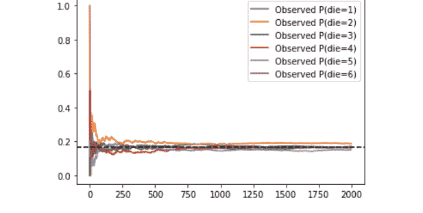

图 4.1：通过有限次采样从公平骰子的均匀分布中获得的概率。

很明显，我们做的实验越多，概率就越接近理论值 1/6。

以上讨论是针对骰子投掷的非常简单的事件。它清晰地展示了与复杂事件的统计分析和概率计算相关的一些基本问题和过程。

## 4.2 随机分布

在机器学习中，经常需要以随机方式对数字进行采样。根据问题类型的不同，一个变量的数据分布可以有不同的类型。数据的数值采样应基于给定/假设的分布类型。我们在本章开头使用均匀分布就是这样做的。我们现在将进一步探讨这一点。

### 4.2.1 均匀分布

基于均匀分布生成的这些数字，在指定范围内的任何位置出现的机会应该是相等的。为了检查使用 `random.randint()` 生成的数字的均匀性，我们可以运行大量次数，比如 100 万次，看看这些数字是如何分布的。我们使用以下代码来完成：

```
# 代码修改自 https://github.com/
# zackchase/mxnet-the-straight-dope/blob/master/chapter01_
# crashcourse/probability.ipynb; 遵循 Apache-2.0 许可证。
import numpy as np
import matplotlib.pyplot as plt
import random
na, nb, n = 0, 99, 100
counts = np.zeros(n)    # 用于保存计数数字的数组
fig, axes = plt.subplots(2,3,figsize=(15,8),sharex=True)
axes = axes.reshape(6)
n_samples = 1000001
for i in range(1, n_samples):
    counts[random.randint(na, nb)]+=1  # 随机整数
    if i in [10, 100, 1000, 10000, 100000, 1000000]:
        axes[int(np.log10(i))-1].bar(np.arange(na+1,nb+2),counts)
plt.show()
```

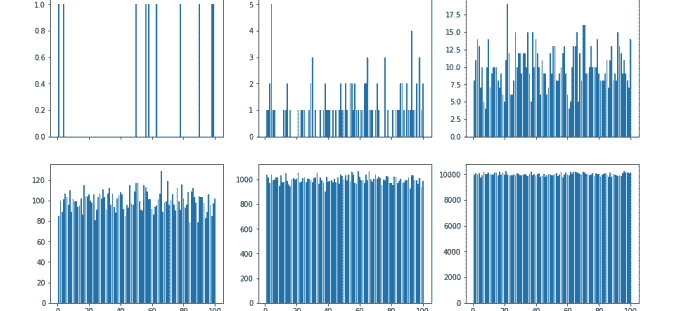

观察到，随着采样次数的增加，均匀性也随之增加。

### 4.2.2 正态分布（高斯分布）

正态分布也称为高斯分布。它在统计学中被广泛使用，因为自然界、科学和工程中的许多事件都遵循该分布通过以下关于变量 $x$ 的高斯密度函数来定义：

$$p(x) = \frac{1}{\sigma\sqrt{2\pi}}e^{-\left(\frac{x-\mu}{\sqrt{2}\sigma}\right)^2} \quad (4.2)$$

其中 $\mu$ 和 $\sigma$ 分别是该分布的均值和标准差。正态分布通常记为 $\mathcal{N}(\mu, \sigma^2)$。特别地，当 $\mu = 0$ 且 $\sigma = 1$ 时，我们得到**标准正态分布**，记为 $\mathcal{N}(0, 1)$，其密度函数简化为 $p(x) = \frac{1}{\sqrt{2\pi}}e^{-\left(\frac{x}{\sqrt{2}}\right)^2}$。

numpy 随机模块中的 `gauss()` 函数可以方便地生成服从正态分布的随机数。

```python
from random import gauss
mu, sigma, n = 0., 0.1, 10
for i in range(n):  # generates n random numbers
    print(f'{gauss(mu, sigma):.4f} ', end='')
# mu: mean; sigma: standard deviation
```

-0.1939 0.1794 0.0614 -0.1348 0.1020 0.0432 -0.2144 -0.0636 0.0502 -0.1377

让我们绘制出公式 (4.2) 定义的密度函数。该函数的钟形曲线形状你可能已经很熟悉了。

```python
x = np.arange(-0.5, 0.5, 0.001)  # define variable x
def gf(mu, sigma, x):  # define the Gauss function
    return 1/(sigma*np.sqrt(2*np.pi))*np.exp(-.5*((x-mu)/sigma)**2)
mu, sigma = 0, 0.1  # mean 0, standard deviation 0.1
plt.figure(figsize=(6, 4))
plt.plot(x, gf(mu, sigma, x))
plt.show()
```

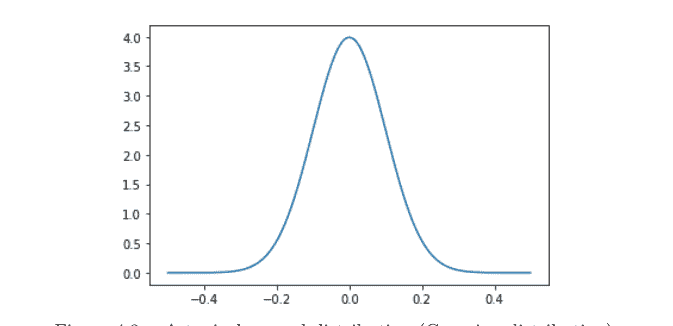

图 4.3：一个典型的正态分布（高斯分布）。

现在，让我们使用 `np.random.normal()` 生成一些高斯分布的随机样本。然后，我们将采样数据与“真实”的高斯分布进行比较。

```python
n = 500
samples = np.random.normal(mu, sigma, n) #generate samples
count, bins, ignored = plt.hist(samples, 80, density=True)
    # plot histogram of the samples
plt.plot(bins, gf(mu,sigma,bins),linewidth=2, color='r')
    # plot true Gauss distribution
plt.show()
```

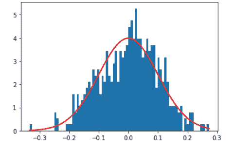

Numpy 可以生成大约 40 种不同类型的分布样本。读者在需要时可参考 numpy 文档 (https://numpy.org/doc/1.16/reference/routines.random.html) 了解详情。

## 4.3 概率的熵

对于给定的统计事件中随机变量的概率，可以计算相应的*熵*。它是该事件概率分布*不确定性*的一种度量。它是概率向量（包含随机变量的概率值）与其负对数的点积。对于一个概率为 $\mathbf{p}$ 的事件，其熵 $H_{\mathbf{p}}$ 表示为

$$H_{\mathbf{p}} = -\left(\sum_{i} p_i \log p_i\right) = -\mathbf{p} \cdot \log(\mathbf{p}) \qquad (4.3)$$

其中 $p_i$ 是变量第 $i$ 个可能值的概率，且 $\sum_i p_i = 1$。向量 $\mathbf{p}$ 是包含这些概率的向量。需要负号是因为熵是正数，而对于 $0 \leq p_i \leq 1$，$\log(p_i)$ 总是负数。在计算中，我们通常通过除以可能值的总数来对其进行归一化。熵在机器学习中非常常用，尤其是在构建目标函数时，因为它是一种需要最小化的*不确定性*度量。

由于对数被频繁使用，我们将首先使用 numpy 的 `log()` 函数更详细地研究它。

```python
import numpy as np
import matplotlib.pyplot as plt
%matplotlib inline
p = np.arange(0.01, 1.0, .01)          # generate variables
logp = -np.log(p)
    # negative sign for positive value: log(p)<0 for 0<p<1
plt.plot(p,logp,color='blue')
plt.xlabel('Probability p')
plt.ylabel('Negative log(p)')
plt.title('Negative log Value of Probability')
plt.show()
```

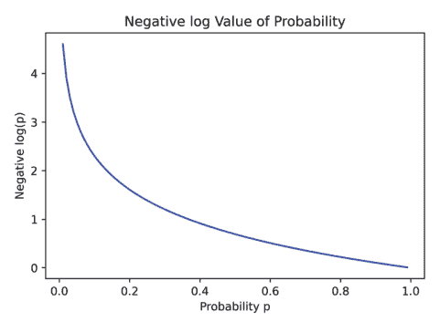

图 4.5：概率的对数函数。

让我们提及几个重要特性，它们是为什么对数在机器学习中如此频繁使用的根本原因。

- -log(p) 随参数 p 单调变化。单调性很重要，因为它不会影响原函数在取对数后驻点的位置。这对于机器学习中经常使用的优化算法来说是一个极好的特性。
- $-\log(p)$ 随概率增加而单调递减。这逆转了概率的趋势，因此它是衡量高概率范围*熵*的合适行为。这是因为当概率高时，不确定性水平低（因为我们相当确定它很可能发生），所以熵的值也低。当概率低时，不确定性也应该低（因为我们相当确定它不太可能发生）。在这种情况下，我们只需在熵方程中直接使用概率本身。
- 熵 $H_{\mathbf{p}}$ 是概率及其负对数以乘积形式的组合，如公式 (4.3) 所示。这种组合提供了所需的行为，并且通过利用对数函数的特性，它被很好地定义以适应我们的目的。

以下示例演示了熵函数的工作原理：

### 4.3.1 *示例 1：概率及其熵*

考虑一个变量取两个值的事件。我们首先进行一次观测，产生概率向量 $\mathbf{q}_1$，其分量是这两个变量对应的两个概率。然后我们进行另一次观测，产生概率 $\mathbf{q}_2$。我们希望评估这两次观测概率的熵。

```python
q1 =np.array([0.999, 0.001]) # Pr. distribution with low
    # uncertainty: quite sure whether the event is to
    # happen, because the variable is with either a
    # very high or low chance to be observed.
q2 =np.array([ 0.5,0.5 ]) # Distribution with high uncertainty:
                # Not sure whether the event is to happen,
                # because the variable is with neither a
                # high or low chance to be observed.
                # - sign for getting a positive value:
print('q1=',q1,' -log(q1)=',-np.log(q1))  # log(p): negative
                                        # for 0<p<1
print('q2=',q2,' -log(q2)=',-np.log(q2))
H_q1 = -np.dot(q1,np.log(q1))/len(q1)    #Entropy: Uncertainty
H_q2 = -np.dot(q2,np.log(q2))/len(q2)
print('H_q1=',H_q1,'H_q2=',H_q2)
```

```
q1= [0.999 0.001]  -log(q1)= [0.0010005  6.90775528]
q2= [0.5 0.5]  -log(q2)= [0.69314718 0.69314718]
H_q1= 0.003953627556116044 H_q2= 0.34657359027997264
```

在这个例子中，我们看到了 **p** 和 $-\log(\mathbf{p})$ 的相反行为。向量 $\mathbf{q}_1$ 的两个变量具有很低或很高的概率值，这意味着不确定性低，因此计算出的熵很低。另一方面，$\mathbf{q}_2$ 的两个变量具有中间的概率值，这意味着不确定性很高。计算出的熵如预期的那样很高。

### 4.3.2 示例 2：熵的变化

为了更清楚地展示这一点，我们创建一个人工事件 $\mathbf{q}_1$，其变量取两个可能值，并让这两个值的概率分别为 $v_1$ 和 $v_2$，它们以相反的方式变化，同时概率之和等于 1。我们编写以下代码来计算熵随 $v_1$ 和 $v_2$ 概率变化的情况：

```python
# An event with a variable that takes two values
v1 = np.arange(0.01, 1.0, .05)
gap = (v1[1]-v1[0])*len(v1)/3.
v1 /= (v1[0]+v1[-1])    # create an array that holds linearly
                        # changing probability values.
v2 = v1[::-1]           # create the revise of v1.
print(v1,np.sum(v1))    # to check it out
print(v2,np.sum(v2))
print(v1+v2,np.sum(v1+v2)/2)
xtick = range(len(v1))  #[0,1,2,3,4]
plt.bar(range(len(v1)),v1,width=gap*1.2,alpha=.9,color='blue')
plt.bar(range(len(v2)),v2,width=gap,alpha=.9,color='red')
plt.xlabel('Event ID, blue: v1, red: v2')
plt.ylabel('Probability')
plt.xticks(xtick)
plt.show()

H_qf = np.array([]) # initialize the array for entropy
for q1 in list(zip(v1,v2)):
    # create a pair of probability compute the entropy and append
    H_qf = np.append(H_qf,-(np.dot(q1,np.log(q1)))/2)

plt.plot(v1,H_qf)
plt.xlabel('Probability, v1 (v2=1-v1)')
plt.ylabel('Entropy of events')
plt.title('Entropy of Events')
plt.show()
```

### 4.3.3 示例 3：均匀分布下，变量取值数量不同时事件的熵

让我们来看一下变量可以取不同数量可能值的事件。我们假设所有这些事件中变量的概率分布都是均匀的。我们想找出概率分布的熵如何随事件中变量的数量变化。

```python
# 一个变量可以取多个均匀概率值的事件
N = 0
max_v = 100                     # 事件有 N 个变量
                                # 上限为 max_values。
Ni = np.array([])               # 用于存储 v 的数量
H_qf = np.array([])            # 用于存储熵值
while N < max_v:
    N += 1
    Ni = np.append(Ni,N)
    qf = np.ones(N)
    qf = qf/np.sum(qf)          # 生成均匀样本
    H_qf = np.append(H_qf,-np.dot(qf,np.log(qf))/len(qf))

print('Probability distribution:',qf[0:max_v:10])
print('H_qf=', H_qf[0:max_v:10])
import matplotlib.pyplot as plt
import numpy as np
%matplotlib inline
plt.plot(Ni,H_qf)
plt.xlabel('Number of variables, all with same probability')
plt.ylabel('Entropy')
plt.title('Events with variables of uniform distribution')
plt.show()
```

Probability distribution: [0.01 0.01 0.01 0.01 0.01 0.01 0.01 0.01 0.01 0.01]
H_qf= [-0.  0.21799048  0.14497726  0.11077378  0.09057493  0.07709462  0.06739137  0.06003774  0.05425246  0.04956988]

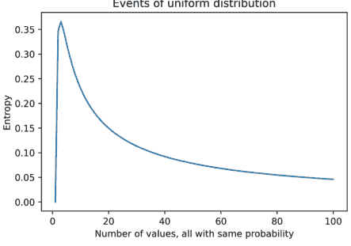

图 4.8：均匀分布事件概率的熵。

我们发现：(1) 当 $N = 1$ 时，熵为零；(2) 在 $N = 3$ 时达到峰值；(3) 当 $N$ 变得非常大时，熵变得很小，这意味着当一个事件有非常多的变量时，熵会变小。这是因为在所有这些变量的均匀概率假设下，每个变量的概率都变得非常小。

## 4.4 交叉熵：预测概率与真实概率

现在让我们来看一下交叉熵，这是统计学中常用的一个概念。分布 $\mathbf{q}$ 相对于分布 $\mathbf{p}$ 的交叉熵定义如下：

$$H_{\mathbf{pq}} = -\left(\sum_i p_i \log q_i\right) = -\mathbf{p} \cdot \log(\mathbf{q}) \quad (4.4)$$

一般来说，交叉熵是衡量两个分布（来自同一空间）相似性的度量。在机器学习中，我们关注的是预测概率 $\mathbf{q}$ 相对于真实概率 $\mathbf{p}$ 的交叉熵。在这种情况下，$H_{\mathbf{pq}}$ 可以作为预测模型性能的度量，因此常被用作机器学习模型中的目标函数或损失函数。

我们注意到以下性质：

- 交叉熵不是对称的：如果 $\mathbf{p} \neq \mathbf{q}$，则 $H_{\mathbf{pq}} \neq H_{\mathbf{qp}}$，这从公式 (4.4) 中可以明显看出。
- 我们有 $H_{\mathbf{pq}} \geq H_{\mathbf{p}}$，以及 $H_{\mathbf{qp}} \geq H_{\mathbf{q}}$。它们的差值将是 KL 散度，该值始终为正（见下一节）。
- 当这两个分布相同时，交叉熵就变成了上一节研究的熵。上述所有三个不等式都变成了等式。
- 因此，在机器学习模型中，即使预测是完美的，交叉熵也不会为零，因为真实分布本身可能具有熵。如果 $\mathbf{p}$ 是真实分布的熵，那么交叉熵 $H_{\mathbf{pq}}$ 的下界是 $H_{\mathbf{p}}$。只有当真实分布没有任何不确定性（所有变量的概率都为零，除了其中一个为 1）时，它才可能为零。

我们来看一些简单的例子。

### 4.4.1 示例 1：良好预测的交叉熵

我们考察一个简单的事件，其中变量可以取两个可能的值。假设我们有一个良好的预测，如何用交叉熵来衡量它？

```python
# 一个良好的预测案例
q_good = np.array([0.9,0.1]) # 2 个值的预测概率
y = np.array([0.99,0.01])    # 2 个值的真实概率
p = y                        # 真实值
q = q_good                   # 预测值
print('p=',p,' log(p)=',-np.log(p))
print('q=',q,' log(q)=',-np.log(q))
print(' Entropy: Hp=',-np.dot(p,np.log(p))/len(p),\n      ' Hq=',-np.dot(q,np.log(q))/len(q))
print('\nCross-entropy: Hpq=',-np.dot(p,np.log(q))/len(p),\n      'Hqp=',-np.dot(q,np.log(p))/len(q))
#Cross-entropy: Hpq>Hp; Hqp>Hq 应成立。
```

p= [0.99 0.01]   log(p)= [0.01005034 4.60517019]
q= [0.9 0.1]     log(q)= [0.10536052 2.30258509]
Entropy: Hp= 0.028000767177423672   Hq= 0.1625414866957241
Cross-entropy: Hpq= 0.06366638   Hqp= 0.234781160

可以看出，交叉熵 $H_{\mathbf{pq}}$ 很低，表明预测 $\mathbf{q}$ 是良好的。注意 $H_{\mathbf{pq}} \neq H_{\mathbf{qp}}$，$H_{\mathbf{pq}} \geq H_{\mathbf{p}}$，以及 $H_{\mathbf{qp}} \geq H_{\mathbf{q}}$。

### 4.4.2 示例 2：不良预测的交叉熵

再次考虑一个简单的事件，其中变量可以取两个可能的值。这次，我们假设有一个质量较差的预测，并考察如何用交叉熵来衡量它。

```python
# 一个完全偏离的预测案例
q_bad = np.array([0.1,0.9]) # 2 个值的预测概率
y = np.array([0.99,0.01])   # 2 个值的真实概率
p = y                       # 真实值
q = q_bad                   # 预测值
print('p=',p,' log(p)=',-np.log(p))
print('q=',q,' log(q)=',-np.log(q))

print(' Entropy: Hp=',-np.dot(p,np.log(p))/len(p),\n              ' Hq=',-np.dot(q,np.log(q))/len(q))
print('\nCross-entropy: Hpq=',-np.dot(p,np.log(q))/len(p),\n              'Hqp=',-np.dot(q,np.log(p))/len(q))
#Cross-entropy: Hpq>Hp; Hqp>Hq 应成立。
```

p= [0.99 0.01]   log(p)= [0.01005034 4.60517019]
q= [0.1 0.9]     log(q)= [2.30258509 0.10536052]
Entropy: Hp= 0.028000767177423672  Hq= 0.1625414866957241

Cross-entropy: Hpq= 1.1403064236103417  Hqp= 2.072829100487316

可以看出，交叉熵 $H_{\mathbf{pq}}$ 很高，表明预测 $\mathbf{q}$ 是糟糕的。再次注意 $H_{\mathbf{pq}} \neq H_{\mathbf{qp}}$，$H_{\mathbf{pq}} \geq H_{\mathbf{p}}$，以及 $H_{\mathbf{qp}} \geq H_{\mathbf{q}}$。
我们现在准备好讨论 KL 散度了。

## 4.5 KL 散度

Kullback-Leibler 散度或 KL 散度是衡量一个分布相对于另一个分布的相对熵的度量。对于给定的两个分布 $\mathbf{p}$ 和 $\mathbf{q}$，从 $\mathbf{q}$ 到 $\mathbf{p}$ 的 KL 散度定义为

$$D_{KL}(\mathbf{p}||\mathbf{q}) = \sum_i p_i \cdot [\log p_i - \log q_i] = \mathbf{p} \cdot [\log(\mathbf{p}) - \log(\mathbf{q})] \quad (4.5)$$

它也被称为 $\mathbf{q}$ 相对于 $\mathbf{p}$ 的相对熵，其中 $\mathbf{p}$ 可以被视为真实或参考分布。利用熵和交叉熵的定义，我们有

$$D_{KL}(\mathbf{p}||\mathbf{q}) = H_{\mathbf{pq}} - H_{\mathbf{p}} \quad (4.6)$$

注意，$\mathbf{q}$ 相对于 $\mathbf{p}$ 的 KL 散度不同于 $\mathbf{p}$ 相对于 $\mathbf{q}$ 的 KL 散度。我们还有

$$D_{KL}(\mathbf{p}||\mathbf{q}) \geq 0, \text{ 等号仅在 } \mathbf{p} = \mathbf{q} \text{ 时成立} \quad (4.7)$$

这被称为吉布斯不等式 (https://en.wikipedia.org/wiki/Gibbs%27_inequality)。

下面给出两个 KL 散度的简单例子。

### 4.5.1 示例 1：良好预测分布的 KL 散度

我们考察一个简单的事件，其中变量可以取两个可能的值。假设我们有一个相对于真实分布的良好预测分布，如何用 KL 散度来衡量它？

```python
# 良好预测案例
p = y                # 真实或参考分布
q = q_good           # 预测值
print('p=',p,' log(p)=',-np.log(p))
print('q=',q,' log(q)=',-np.log(q))
Dpq=np.sum(np.dot(p,(np.log(p)-np.log(q))))/len(p)
Dqp=np.sum(np.dot(q,(np.log(q)-np.log(p))))/len(p)
print('Dpq=',Dpq,' Dqp=',Dqp)
```

p= [0.99 0.01] log(p)= [0.01005034 4.60517019]
q= [0.9 0.1] log(q)= [0.10536052 2.30258509]
Dpq= 0.035665613538170556 Dqp= 0.07223967373775611

可以看出，KL 散度 $D_{pq}$ 和 $D_{qp}$ 都是正数。它们的值都很低，表明预测 $\mathbf{q}$ 是良好的。注意 $D_{pq} \neq D_{qp}$。

### 4.5.2 示例 2：不良预测分布的 KL 散度

再次考虑一个简单的事件，其中变量可以取两个可能的值。假设我们有一个相对于真实分布的不良预测分布，如何用 KL 散度来衡量它？到真实或参考分布。我们通过以下代码来考察它在KL散度中的度量方式：

```
# 一个预测效果差的案例
p = y
q = q_bad
print('p=',p,' log(p)=',-np.log(p))
print('q=',q,' log(q)=',-np.log(q))
Dpq=np.dot(p,(np.log(p)-np.log(q)))/len(p)
Dqp=np.dot(q,(np.log(q)-np.log(p)))/len(p)
print('Dpq=',Dpq, ' Dqp=',Dqp)
```

p= [0.99 0.01] log(p)= [0.01005034 4.60517019]
q= [0.1 0.9] log(q)= [2.30258509 0.10536052]
Dpq= 1.112305656432918 Dqp= 1.910287613791592

再次可见，KL散度 $D_{pq}$ 和 $D_{qp}$ 均为正值。它们的值都很大，表明预测 $\mathbf{q}$ 效果很差。同时注意 $D_{pq} \neq D_{qp}$。

## 4.6 二元交叉熵

最后，我们来看机器学习中所谓的二元交叉熵。对于给定的两个分布 $\mathbf{p}$ 和 $\mathbf{q}$，$\mathbf{q}$ 相对于 $\mathbf{p}$ 的二元交叉熵定义为

$$H_{\mathbf{pq}}^B = -\left(\sum_i p_i \cdot \log q_i + (1 - p_i) \cdot \log(1 - q_i)\right)$$
$$= -\mathbf{p} \cdot \log(\mathbf{q}) - (1 - \mathbf{p}) \cdot \log(1 - \mathbf{q})$$

在机器学习模型中，我们通常假设 $\mathbf{p}$ 是真实分布，其概率可能为0或1，因此不能直接取对数。二元交叉熵可以看作是预测概率相对于真实概率的熵的一种度量。它同时考虑了概率 $\mathbf{p}$ 和 $\mathbf{q}$ 以及它们的对立概率 $(1 - \mathbf{p})$ 和 $(1 - \mathbf{q})$，并计算了两者的熵。它大致将交叉熵的值翻倍，是一种对预测分布与真实分布之间差异的增强度量。它常被用来衡量模型的性能，并作为一种损失函数。我们来看一些例子。

### 4.6.1 示例1：质量预测分布的二元交叉熵

考虑一个简单事件，其变量有四个可能的取值。假设我们对一个分布相对于真实或参考分布有良好的预测。我们通过以下代码来考察它在二元交叉熵中的度量方式：

```
# 一个预测效果好的案例
import numpy as np
q = np.array([0.9,0.04,0.03,0.03])    # 预测值
p = np.array([1.0,0.0,0.,0.])         # 真实值
p_conv = 1.0 - p                       # 预测的对立面
q_conv = 1.0 - q                       # 真实的对立面
print(p, q, ' converse:',p_conv,q_conv)
cHpq = -np.sum(np.dot(p,np.log(q)))/len(p)
bcHpq = -np.sum(np.dot(p,np.log(q))+np.dot(p_conv,
            np.log(q_conv)))/len(p)
print('Cross-entropy cHpq:',cHpq)
print('Binary cross-entropy bcHpq:',bcHpq)
```

[1. 0. 0. 0.] [0.9 0.04 0.03 0.03]  converse: [0. 1. 1. 1.]
    [0.1 0.96 0.97 0.97]
Cross-entropy cHpq: 0.02634012891445657
Binary cross-entropy bcHpq: 0.05177523128687465

可以发现，二元交叉熵的值大致是交叉熵值的两倍，这符合预期。

### 4.6.2 示例2：预测效果差的分布的二元交叉熵

考虑一个事件，其变量有四个可能的取值。假设我们对一个分布相对于真实分布有较差的预测。我们再次通过以下代码来考察它在二元交叉熵中的度量方式：

```
# 一个预测效果差的案例
q = np.array([0.4,0.2,0.3,0.1])    # 预测值
p = np.array([1.0,0.0,0.,0.])      # 真实值
p_conv = 1.0 - p          # 预测的对立面
q_conv = 1.0 - q          # 真实的对立面
print(p, q, ' converse:',p_conv,q_conv)
cHpq = -np.sum(np.dot(p,np.log(q)))/len(p)
bcHpq = -np.sum(np.dot(p,np.log(q))+np.dot(p_conv,
            np.log(q_conv)))/len(p)
print('Cross-entropy cHpq:',cHpq)
print('Binary cross-entropy bcHpq:',bcHpq)
```

[1. 0. 0. 0.] [0.4 0.2 0.3 0.1]  converse: [0. 1. 1. 1.]
    [0.6 0.8 0.7 0.9]
Cross-entropy cHpq: 0.22907268296853875
Binary cross-entropy bcHpq: 0.4003674356962309

同样发现，二元交叉熵大致是交叉熵的两倍，导致差异度量增强。

### 4.6.3 示例3：真实分布更均匀时的二元交叉熵：一个质量预测

在前两个例子中，我们研究了两种真实分布处于极端情况（概率为1.0和0）的案例。对于这两个例子，我们都观察到使用二元交叉熵时熵的度量值增强了。在这个例子中，我们考虑一个更均匀的真实分布，并考察二元交叉熵的行为。

```
# 一个预测效果好的案例
q = np.array([0.4,0.2,0.3,0.1]) # 预测值
p = np.array([0.3,0.3,0.2,0.2]) # 真实值，相当均匀的分布
p_conv = 1.0 - p                # 预测的对立面
q_conv = 1.0 - q                # 真实的对立面
print(p, q, ' converse:',p_conv,q_conv)
cHpq =-np.sum(np.dot(p,np.log(q)))/len(p)
bcHpq=-np.sum(np.dot(p,np.log(q))+np.dot(p_conv,
            np.log(q_conv)))/len(p)
print('Cross-entropy cHpq:',cHpq)
print('Binary cross-entropy bcHpq:',bcHpq)
```

[0.3 0.3 0.2 0.2] [0.4 0.2 0.3 0.1]  converse: [0.7 0.7 0.8 0.8] [0.6 0.8 0.7 0.9]
Cross-entropy cHpq: 0.36475754318911824
Binary cross-entropy bcHpq: 0.5856092407474651

在这种情况下，也发现二元交叉熵并未带来增强效果。

### 4.6.4 示例4：真实分布更均匀时的二元交叉熵：一个预测效果差的案例

与前一个例子相同，但考虑一个预测效果差的案例。

```
# 一个预测效果差的案例
q = np.array([0.4,0.05,0.05,0.5]) # 预测值
p = np.array([0.1,0.3,0.2,0.2])   # 真实值，相当均匀的分布
p_conv = 1.0 - p                   # 预测的对立面
q_conv = 1.0 - q                   # 真实的对立面
print(p, q, ' converse:',p_conv,q_conv)
cHpq =-np.sum(np.dot(p,np.log(q)))/len(p)
bcHpq=-np.sum(np.dot(p,np.log(q))+np.dot(p_conv,
        np.log(q_conv)))/len(p)
print('Cross-entropy cHpq:',cHpq)
print('Binary cross-entropy bcHpq:',bcHpq)
```

[0.1 0.3 0.2 0.2] [0.4 0.05 0.05 0.5]  converse: [0.9 0.7 0.8 0.8] [0.6 0.95 0.95 0.5]
Cross-entropy cHpq: 0.43203116151910004
Binary cross-entropy bcHpq: 0.7048313483737685

在这种情况下，我们发现了一个相似之处：二元交叉熵带来了增强效果。

总之，我们对简单事件的研究表明，二元交叉熵通过同时考虑正样本（概率接近1）和“负”样本（概率接近0），增强了差异度量。

## 4.7 贝叶斯统计

考虑一个包含多个同时发生的随机变量的统计事件。当我们处理这样的多个随机变量时，我们可能想知道联合概率 Pr(A,B)：对于给定的元素 a 和 b，A = a 和 B = b 同时发生的概率。

很明显，对于任何值 a 和 b，Pr(A,B) ≤ Pr(A = a)，因为 Pr(A = a) 的度量不考虑 B 的情况。要使 A 和 B 同时发生，A 必须发生且 B 也必须发生（反之亦然）。因此，A,B 同时发生的可能性不可能大于 A 或 B 单独发生的可能性。

Pr(A,B)/Pr(A) 称为条件概率，记为 Pr(B|A)，它是在 A 已经发生的条件下 B 发生的概率。这引出了重要的贝叶斯定理。

- 根据定义，我们有：Pr(A,B) = Pr(B|A)Pr(A)。
- 根据对称性，这也成立：Pr(A,B) = Pr(A|B)Pr(B)。
- 因此我们有

$$Pr(A|B) = Pr(B|A)Pr(A)/Pr(B). \tag{4.9}$$

## 4.8 朴素贝叶斯分类：基于统计的学习

### 4.8.1 公式化

基于贝叶斯统计，一种流行的算法被开发出来，称为朴素贝叶斯分类器。考虑一个具有 $p$ 个变量 $\mathbf{x} = \{x_1, x_2, \dots, x_p\} \in \mathbb{X}^p$ 的事件。我们假设任何变量 $x_i$ 都独立于另一个变量。对于给定的标签 $y$，$\mathbf{x}$ 的条件概率表示为

$$p(\mathbf{x}|y) = \prod_i p(x_i|y) \tag{4.10}$$

根据贝叶斯定理，我们有以下公式：

$$p(y|\mathbf{x}) = \frac{p(\mathbf{x}|y)p(y)}{p(\mathbf{x})} = \frac{\prod_i p(x_i|y)p(y)}{p(\mathbf{x})} \tag{4.11}$$

尽管我们可能不知道 $p(\mathbf{x})$（即 $\mathbf{x}$ 在事件中出现的概率），但这可能不需要，因为在计算 $p(y|\mathbf{x})$ 时它只是一个归一化因子。因此，我们可以直接使用以下公式：

$$p(y|\mathbf{x}) \propto p(\mathbf{x}|y)p(y) = \prod_i p(x_i|y)p(y) \tag{4.12}$$

### 4.8.2 案例研究：手写数字识别

我们现在可以使用 mxnet-the-straight-dope (https://github.com/zackchase/mxnet-the-straight-dope/blob/master/chapter01-crashcourse/probability.ipynb) 中提供的代码来展示如何编写一个朴素贝叶斯分类器来识别手写数字。我们将使用著名的MNIST数据集。

要训练这个分类器。MNIST（https://en.wikipedia.org/wiki/MNIST_database）包含总共70,000张（60,000张用于训练，10,000张用于测试）手写数字0到9的图像，所有这些图像都带有标签。这些图像来自美国人口普查局的雇员和美国高中生。

然后，数字分类问题被转化为计算给定图像 $\mathbf{x}$ 是数字 $y$ 的概率：$p(y|\mathbf{x})$。任何图像 $\mathbf{x}$ 包含 $p$ 个像素 $x_i(i=1,2,\dots,p)$，每个像素 $x_i$ 可以取值为1（亮）或0（灭），因此是一个二元变量。

然后可以使用公式 (4.12)，其中我们需要估计 $p(y)$ 和 $p(x_i|y)$。两者都可以使用MNIST训练数据集对每个数字 $y$ 进行计算。例如，在MNIST训练数据集的60,000张数字图像中，数字4出现了5,800次，那么我们有 $p(y=4) = \frac{5800}{60000}$。为了估计 $p(x_i|y)$，我们可以估计 $p(x_i=1|y)$，因为 $x_i$ 是二元的，并且 $p(x_i=0|y) = 1 - p(x_i=1|y)$。估计 $p(x_i=1|y)$ 可以通过计算像素 $i$ 在标签数字 $y$ 下亮的次数，然后除以数据集中标签 $y$ 的出现次数来完成。在这个简单的算法中，我们所需要做的就是在MNIST训练数据集上进行计数。这是一个相当直接的策略，训练就是计数，我们可以使用以下代码来完成：

### 4.8.3 朴素贝叶斯分类算法

```python
# The codes are modified from these at https://github.com/
# zackchase/mxnet-the-straight-dope/blob/master/chapter01_
# crashcourse/probabilsty.ipynb; Under Apache-2.0 License.
# import all the necessary packages
import numpy as np
import mxnet as mx
from mxnet import nd
```

```python
def transform(data, label):  # define a function to transfer data
    return (nd.floor(data/128)).astype(np.float32),
           label.astype(np.float32)
    # floor of 255/128 = 1   pixel value = 1 when it is on.
# Divide dataset to 2 sets: one for training and one for testing
mnist_train = mx.gluon.data.vision.MNIST(train=True,
    transform=transform)
mnist_test = mx.gluon.data.vision.MNIST(train=False,
    transform=transform)
```

```python
print('type:',type(mnist_train))
```

type: <class 'mxnet.gluon.data.vision.datasets.MNIST'>

```python
import matplotlib.pyplot as plt
%matplotlib inline
image_index=8888  # Check one. Any integer <60,000
                # 8888 is digit with label 3, as printed below
print(mnist_train[image_index][1])   #image in 0; label in 1
plt.imshow(mnist_train[image_index][0].reshape((28, 28)).asnumpy(), cmap='Greys')  #image pixel: 28 by 28
```

3.0

<matplotlib.image.AxesImage at 0x1c5743ba630>

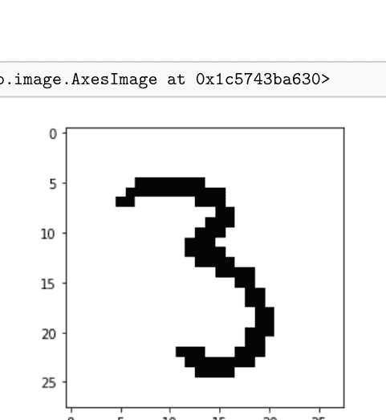

图 4.9：来自MNIST数据集的一个手写数字样本图像。

```python
# Initialize arrays for counts for computing p(y), p(xi|y)
# We initialize all numbers with a count of 1 to avoid
# division by zero, known as Laplace smoothing.

ycount = nd.ones(shape=(10))        #10 possible digits
xcount = nd.ones(shape=(784, 10))   #784 (= 28*28) variables
```

```python
# Aggregate the count of the labels in training dataset
# and number of its corresponding pixels being on (value=1)
for data, label in mnist_train:    # loop over the dataset
    x = data.reshape((784,))
    y = int(label)                 # get the digit-number
    ycount[y] += 1                 # add 1 to (digit)th entry
    xcount[:, y] += x              # add the image data to
                                   # the (digit)th column
# compute the probabilities p(xi|y) (divide per pixel counts
# by total count of the label in the training dataset)
for i in range(10):
    xcount[:, i] = xcount[:, i]/ycount[i]
# Compute the probability p(y)
py = ycount / nd.sum(ycount)
```

模型已使用训练数据集训练完成。我们现在绘制“训练好的”模型。

```python
import matplotlib.pyplot as plt
%matplotlib inline
fig, figarr = plt.subplots(1, 10, figsize=(15, 15))

for i in range(10):
    figarr[i].imshow(xcount[:,i].reshape((28,28)).asnumpy(),
                     cmap='hot')
    figarr[i].axes.get_xaxis().set_visible(False)
    figarr[i].axes.get_yaxis().set_visible(False)

plt.show()
np.set_printoptions(formatter={'float': '{: 0.3f}'.format})
print(py.asnumpy(),nd.sum(py).asnumpy())
```


图 4.10：手写数字的一种平均外观。

[0.099  0.112  0.099  0.102  0.097  0.090  0.099  0.104
 0.098  0.099] [1.000]

这些图片显示了观察到所有这10个数字中一个亮像素的估计概率分布。这些是这些数字的平均外观，或者说是基于训练数据集，一个数字平均应该是什么样子。

### 4.8.4 测试朴素贝叶斯模型

我们现在使用MNIST测试数据集来检验这个基于统计的模型的性能。上面完成的训练（只是对训练数据集的简单计数）给出了我们 $p(x_i = 1|y)$ 和 $p(y)$。对于测试数据集中的给定图像 $\mathbf{x}$，我们计算该图像对应标签 $y$ 的似然度，即使用公式 (4.12) 计算 $p(y|\mathbf{x})$，其中 $p(\mathbf{x}|y)$ 又是使用训练好的模型计算的。为了避免小概率数字的链式乘法，我们改为计算以下对数（称为“对数似然”）：

$$\log p(y|\mathbf{x}) \propto \log p(\mathbf{x}|y) + \log p(y) = \sum_i \log p(x_i|y) + \log p(y) \quad (4.13)$$

对于给定的图像 $\mathbf{x}$，特征 $x_i$ 是二元的，取值为1或0。因为我们使用训练模型来计算概率，所以我们应该有

$$p(x_i = 1|y) = p(x_i = 1|y) \quad \text{用于预测 } x_i \text{ 是亮的}$$
$$p(x_i = 0|y) = 1 - p(x_i = 1|y) \quad \text{用于预测 } x_i \text{ 是灭的} \quad (4.14)$$

公式 (4.14) 可以使用一个数学技巧写成一个单一的公式：

$$p(x_i|y) = p(x_i = 1|y)^{x_i} (1 - p(x_i = 1|y))^{1-x_i} \quad (4.15)$$

这是一个使用训练好的模型来预测正变量概率的通用公式，用于计算具有二元变量的事件的概率。我们最终得到

$$\sum_i \log p(x_i|y) = \sum_i [x_i \log p(x_i = 1|y) + (1-x_i) \log (1 - p(x_i = 1|y))] \quad (4.16)$$

现在很清楚，测试本质上是在衡量给定图像的分布（真实分布）与从数据集计算出的带标签字母的平均图像（模型分布）之间的二元交叉熵。因此，我们可以直接使用二元交叉熵公式写出公式 (4.16)。

为了避免重复计算对数，我们预先计算所有 y 的 log p(y)，以及所有像素的 log p(x_i|y) 和 log (1 - p(x_i|y))。

```python
logxcount = nd.log(xcount)                # pre-computations
logxcountneg = nd.log(1-xcount)
logpy = nd.log(py)
fig, figarr = plt.subplots(2, 10, figsize=(15, 3))
# test and show 10 images
ctr = 0   # initialize the control iterator
y = []
pxm = np.array([])
xi = ()
for data, label in mnist_test:            # for any image
    x = data.reshape((784,))
    y.append(int(label))
    # Incorporate the prior probability p(y) since p(y|x) is
    # proportional to p(x|y) p(y)
    logpx = logpy.copy() #nd.zeros_like(logpy)
    for i in range(10):
        # compute the log probability for a digit
        logpx[i]+=nd.dot(logxcount[:,i],x)+nd.dot(logxcountneg[:,i],1-x)

    # normalize to prevent overflow or underflow by
    # subtracting
    # the largest value
    logpx -= nd.max(logpx)
    # and compute the softmax using logpx
    px = nd.exp(logpx).asnumpy()
    px = px*py.asnumpy()   # this proportional to P(y|x)
    px /= np.sum(px)
    pxm = np.append(pxm,max(px))    # use the one with max Pr.
    xi = np.append(xi,np.where(px == np.amax(px)))
    # bar chart and image of digit
    figarr[1, ctr].bar(range(10), px)
    figarr[1, ctr].axes.get_yaxis().set_visible(False)
    figarr[0, ctr].imshow(x.reshape((28,28)).asnumpy(),
                          cmap='hot')
```

### 4.8.5 讨论

测试表明，该分类器在测试数据集的前10个数字中出现了一次错误分类。第9个数字本应是5，却被分类为4。对于这个错误分类的数字，其置信度非常接近1。错误的预测可能是由于不正确的假设：每个像素是独立生成的，仅取决于标签。显然，数字是图像的一个非常复杂的函数，仅靠统计信息存在局限性。这类朴素贝叶斯分类器在20世纪80年代和90年代曾广泛应用于垃圾邮件过滤等场景。对于图像处理类问题，我们现在拥有有效的分类器（例如CNN；参见第15章）。

或者，我们可以使用交叉熵或二元交叉熵的概念来进行预测。一旦我们使用训练数据集获得了 $p(x_i|y_j)$，$j = 1, 2, \ldots, 9$，就可以计算 $p(x_i|y_j)$ 与 $p(x_i|y_{test})$ 之间的（二元）交叉熵，其中 $y_{test}$ 是测试数据集（或任何其他手写数字）中的任意给定图像。给出最小（二元）交叉熵的 $y_j$ 应被视为预测的数字。

这个简单的例子确实展示了统计分析在分类和一般机器学习中的用处。我们还展示了如何为给定数据集计算统计量。利用现有的Sklearn模块（https://scikit-learn.org/stable/modules/naive_bayes.html），可以方便地训练强大的朴素分类器，用于那些严重依赖统计规律且物理定律未知的实际问题，例如医疗应用、推荐系统、文本分类以及实时预测与推荐。

## 第5章

## 预测函数与通用预测理论

要构建用于预测的机器学习模型，需要使用某种假设，该假设预先定义了连接特征变量与学习参数的预测函数。因此，一个合适的假设可能遵循函数逼近理论，这在基于物理定律的模型中已被深入研究[1-4]。最基本的规则是，预测函数必须能够通过选定的学习参数集合来预测特征空间中的任意线性函数。因此，预测函数被假设为特征变量的完整**线性函数**，这是最基本的假设之一。

事实证明，这种完整的线性预测函数对仿射空间中的模式执行仿射变换。这种变换保持**仿射性**，这意味着变换后，位于一条直线上的点之间的**距离比**（欧几里得距离）以及平行线段的**平行性**保持不变。它可能不保持原始模式中线段之间的角度和点之间的（欧几里得）距离。关于仿射变换更一般问题的进一步讨论可以在维基百科（https://en.wikipedia.org/wiki/Affine_transformation）及其链接中找到。

仿射性确保了一种特殊的、唯一的点对点无缝且无间隙的变换，这意味着当学习参数平滑变化时，它不会将两个不同的点合并为一个，也不会将一个点分裂为两个。特征变量与学习参数之间的连接也是平滑的。因为仿射变换是线性变换与由学习参数控制的平移的组合，所以特征空间中任何至多一阶的函数都可以被重现，这对于机器学习模型具有预测能力至关重要。

本章首先讨论预测函数的公式化和可预测性，然后详细讨论仿射变换的过程、性质和行为。我们将重点关注两个方面：（1）在特征空间中预测函数的能力，以及（2）仿射空间中模式的仿射变换。

接着，引入仿射变换单元（ATU）（或线性预测函数单元）作为构建模块，并将构建简单的神经网络代码来执行仿射变换并展示其行为和性质。然后研究通过学习参数进行的特征编码及其唯一性，展示数据-参数转换器的概念。接下来，将研究将ATU扩展以形成仿射变换数组（ATA），以及进一步将激活函数包装的ATA扩展以形成多层感知器（MLP）或深度网络，这展示了如何通过深度网络建立高阶非线性函数的可预测性。最后，提出通用预测理论，为深度网络为何能具有预测能力提供基本依据。

## 5.1 线性预测函数与仿射变换

图5.1展示了感觉神经元突触间隙中神经递质传递的机制。神经递质分子的图像来自扫描电子显微镜的伪彩色图像。一个终端按钮（绿色）已被打开，以显示内部的突触小泡（橙色和蓝色）。

在人工神经网络中，我们使用数据点与人工神经元中学习参数之间的所谓仿射变换，来某种程度上模拟神经递质中的信息转换过程。这种变换在许多机器学习模型中具有最根本的重要性，因此本章将详细讨论相关理论。

### 5.1.1 *线性预测函数：一个基本假设*

在机器学习模型中，基本假设是预测函数 $z$ 由以下方程给出：

$$z(\hat{\mathbf{w}}; \mathbf{x}) = \overline{\mathbf{x}} \hat{\mathbf{w}} = \underbrace{[1 \ \mathbf{x}]}_{\overline{\mathbf{x}}} \underbrace{\begin{bmatrix} b \ \mathbf{w} \end{bmatrix}}_{\hat{\mathbf{w}}} = \mathbf{x}\mathbf{w} + b$$

$$= w_1x_1 + \cdots + w_px_p + b = \sum_{i=1}^p w_ix_i + b$$

(5.1)

其中 $z(\hat{\mathbf{w}}; \mathbf{x})$ 读作“$z$ 是给定 $\mathbf{x}$ 时 $\hat{\mathbf{w}}$ 的函数”，所有向量定义为

$$\mathbf{x} = [x_1, x_2, \ldots, x_p] \in \mathbb{X}^p \in \mathbb{R}^p$$

$$\overline{\mathbf{x}} = [1 \ \mathbf{x}] = \left[ \underbrace{x_0}_{1}, x_1, x_2, \ldots, x_p \right] \in \overline{\mathbb{X}}^p \in \mathbb{R}^{p+1}$$

$$\mathbf{w} = [w_1, w_2, \ldots, w_p]^\top \in \mathbb{W}^p \in \mathbb{R}^p$$

$$\hat{\mathbf{w}} = [b \ \mathbf{w}]^\top = \left[ \underbrace{w_0}_{b}, w_1, w_2, \ldots, w_p \right]^\top \in \mathbb{W}^{p+1} \in \mathbb{R}^{p+1}$$

(5.2)

其中 $x_i(i = 1, 2, \ldots, p)$ 是特征变量，这里我们仅使用*线性基函数*；$w_i(i = 1, 2, \ldots, p) \in \mathbb{R}$ 称为权重。常数 $b \in \mathbb{R}$ 称为偏置，也常记为 $w_0 \in \mathbb{R}$。这些实数构成相应空间（在第1章中定义）中的向量，并用于上述运算。$\mathbf{w}$ 上的帽子表示其上的基。它吸收了偏置，并成为假设空间 $\mathbb{W}^{p+1}$ 中的新向量。权重和偏置都是可以调整的参数，用于精确预测特征空间中所需的任意线性函数。这些空间之间的关系在第1章中讨论。注意我们对学习参数使用了转置，这意味着它们以矩阵形式构成（在这种情况下只有一列）。特征以行向量形式构成。这就是为什么学习参数矩阵从右侧作用于特征向量。

我们有意将预测函数最常用的公式放在方程（5.1）中，形成一个统一的形式，以便所有这些变量可以一劳永逸地明确下来。读者可能需要花点时间消化这个表述，以便更容易理解后续的公式。

当我们写作 $z = \mathbf{xw} + b$ 时，我们称之为 xw+b 表述。当我们写作 $z = \overline{\mathbf{x}} \hat{\mathbf{w}}$，其中偏置 b 被吸收到 w 中时，我们称之为 xw 表述。这两种表述将在本书中交替使用，因为它们本质上是相同的。xw+b 表述允许在分析过程中分别明确观察权重和偏置的作用。xw 表述在推导过程中更为简洁，并且也允许明确表达仿射变换，这对于主要的机器学习模型至关重要。

### 5.1.2 常数的可预测性，偏置的作用

请注意，偏置 $b$ 是必须存在的。如果我们设 $b = 0$ 并且只使用 $\mathbf{w}$，那么假设将无法预测一个常数函数。这可以很容易地证明如下。

考虑一个给定的（标签）函数 $y(\mathbf{x}) = c$，其中 $c$ 是 $\mathbb{R}$ 中一个与 $\mathbf{x}$ 无关的给定常数。这意味着在 $\mathbf{x} = \mathbf{0}$ 时，$y(\mathbf{x} = \mathbf{0}) = c$。为了使用公式 (5.1) 预测 $c$，我们必须有 $z(\mathbf{w}, b; \mathbf{x} = \mathbf{0}) = c$。现在，如果我们在公式 (5.1) 中去掉 $b$，无论我们选择什么 $\mathbf{w}$，假设总是预测

$$z = \mathbf{0} \cdot \mathbf{w} = 0 \qquad (5.3)$$

这意味着没有 $b$ 的假设将永远无法预测常数 $c \in \mathbb{R}$。这也意味着，仅通过 $\mathbf{w}$ 进行纯线性变换不足以进行正确的预测，因为它甚至无法预测常数。

另一方面，当 $b$ 存在时，我们只需选择 $b = c$，假设就能产生常数 $c$。这也意味着 $z$ 必须存在于一个仿射空间 $\overline{\mathbb{X}}^p$ 中，这是一个存在于 $\mathbb{X}^{p+1}$ 中的增广特征空间。

### 5.1.3 线性函数的可预测性：权重的作用

此外，通过适当选择 $\mathbf{w}$ 和 $b$，可以使用公式 (5.1) 产生任何线性函数。这也可以很容易地证明如下。

考虑任何给定的（标签）线性函数 $y \in \mathbb{Y}$，其变量为 $\mathbf{x} \in \mathbb{X}^p$：

$$y(\mathbf{x}) = \mathbf{xk} + c \qquad (5.4)$$

其中 $c \in \mathbb{R}$ 是一个给定的常数，$\mathbf{k}$ 是 $\mathbb{W}^p$ 中的一个（列）向量。注意 $\mathbf{k}$ 通常可能在 $\mathbb{R}^p$ 中，然而，我们需要对它执行向量运算，因此它必须被限制在向量空间 $\mathbb{W}^p$ 中。

只需选择 $\mathbf{w}^* = \mathbf{k}$ 和 $b^* = c$，我们得到

$$z(\mathbf{w}^*, b^*; \mathbf{x}) = \mathbf{x}\mathbf{k} + c = y(\mathbf{x}) \quad (5.5)$$

通过这种特定的 $\mathbf{w}^*$ 和 $b^*$ 选择，给定的线性函数被精确预测。这意味着任何给定的 $\mathbf{x} \in \mathbb{X}^p$ 的任意线性函数都可以使用假设公式 (5.1) 进行预测。

### 5.1.4 线性函数的预测：一个机器学习过程

上述过程表明，使用公式 (5.1) 预测标签线性函数是直接的，因为我们可以通过观察来选择这些学习参数。对于更复杂的问题，这是不可能的，我们将使用最小化过程来找到这些学习参数。在这里，我们演示这样一个过程来找到 $\mathbf{w}^*$ 和 $b^*$。这次，让我们使用 xw 表述。我们将公式 (5.4) 重写为

$$y(\mathbf{x}) = \overline{\mathbf{x}} \hat{\mathbf{k}} \quad (5.6)$$

其中 $\hat{\mathbf{k}} = [c \ \mathbf{k}]^\top \in \mathbb{W}^{p+1} \in \mathbb{R}^{p+1}$。

**步骤 1：** 根据学习参数定义一个损失函数。损失函数应评估假设公式 (5.1) 和标签函数公式 (5.6) 之间的误差。它可以有各种形式。广泛使用的是 L2 误差函数，即误差的平方：

$$\begin{aligned} \mathcal{L}(z(\hat{\mathbf{w}})) &= \|z(\hat{\mathbf{w}}; \overline{\mathbf{x}}) - y(\overline{\mathbf{x}}))\|^2 = [z(\hat{\mathbf{w}}; \overline{\mathbf{x}}) - y(\overline{\mathbf{x}})]^2 \\ &= (\overline{\mathbf{x}} \hat{\mathbf{w}} - \overline{\mathbf{x}} \hat{\mathbf{k}})^\top (\overline{\mathbf{x}} \hat{\mathbf{w}} - \overline{\mathbf{x}} \hat{\mathbf{k}}) \quad (5.7) \\ &= (\hat{\mathbf{w}}^\top - \hat{\mathbf{k}}^\top)[\overline{\mathbf{x}}^\top \overline{\mathbf{x}}](\hat{\mathbf{w}} - \hat{\mathbf{k}}) \end{aligned}$$

很明显，损失函数 $\mathcal{L}(z)$ 是预测函数 $z(\hat{\mathbf{w}})$ 的一个标量函数，而预测函数本身又是学习参数向量 $\hat{\mathbf{w}}$ 的函数。因此，$\mathcal{L}(z)$ 实际上是一个**泛函**。它接受一个向量 $\hat{\mathbf{w}} \in \mathbb{W}^{(p+1)}$ 并产生一个 $\mathbb{R}$ 中的正数。它在 $\hat{\mathbf{w}}$ 中也是二次的。

在公式 (5.7) 的第二行中，我们首先将转置移入第一对括号，然后从这两对括号中提取出 $\overline{\mathbf{x}}^\top$ 和 $\overline{\mathbf{x}}$，形成矩阵 $[\overline{\mathbf{x}}^\top \overline{\mathbf{x}}]$，这是一个秩为 1 的 $p \times p$ 对称矩阵。所有这些都遵循矩阵运算规则。注意 $(\hat{\mathbf{w}} - \hat{\mathbf{k}})$ 是一个向量。因此，公式 (5.7) 是一个标准的二次型。如果 $[\overline{\mathbf{x}}^\top \overline{\mathbf{x}}]$ 是正定的（SPD），那么 $\mathcal{L}$ 在 $(\hat{\mathbf{w}} - \hat{\mathbf{k}}) = 0$ 或 $\hat{\mathbf{w}}^* = \hat{\mathbf{k}}$ 处有一个唯一的最小值。这将证明预测函数在特征空间中*能够*唯一地重现任何线性函数，我们就完成了。然而，由于 $[\overline{\mathbf{x}}^\top \overline{\mathbf{x}}]$ 的秩只有 1，我们需要进一步操作以获得更深入的理解。

**步骤 2：** 最小化损失函数关于 $\hat{\mathbf{w}} \in \mathbb{W}^{p+1}$。

这允许我们通过将梯度设为零来找到 $\mathcal{L}$ 的驻点 $\hat{\mathbf{w}}$。

$$\frac{\partial \mathcal{L}(\hat{\mathbf{w}})}{\partial \hat{\mathbf{w}}} = 2\overline{\mathbf{x}}^\top \overline{\mathbf{x}}(\hat{\mathbf{w}} - \hat{\mathbf{k}}) = 0 \quad (5.8)$$

在上面，我们再次使用了 $\overline{\mathbf{x}}^\top \overline{\mathbf{x}}$ 是对称的这一事实。无论其内容如何，当我们设 $\hat{\mathbf{w}} = \hat{\mathbf{w}}^* = \hat{\mathbf{k}}$ 时，公式 (5.8) 得到满足，这给出 $\mathbf{w}^* = \mathbf{k}$ 和 $b^* = c$。这与之前获得的结果完全相同。这证明了预测函数在特征空间中*能够*重现任何线性函数。由于 $\overline{\mathbf{x}}^\top \overline{\mathbf{x}}$ 是秩亏的（秩=1），解 $\hat{\mathbf{w}}^* = \hat{\mathbf{k}}$ 不是唯一的，并且存在其他（可能是无限多个）满足公式 (5.8) 的 $(\hat{\mathbf{w}} - \hat{\mathbf{k}}) \neq 0$ 的解。这些解存在于 $\overline{\mathbf{x}}^\top \overline{\mathbf{x}}$ 的零空间中。这意味着我们需要更多的数据点来使零空间为零，以获得唯一解。所有这些问题都与**解存在性理论**有关，该理论要求足够质量的数据点，这将在第 9 章中讨论。

我们现在使用典型的最小化过程，通过解析方法解决了一个预测连续函数的机器学习问题。我们刚刚研究的这个问题很简单，但我们的分析揭示了使用预测函数的机器学习模型中的基本问题。对于具有离散数据点数据集的更复杂问题，我们通常需要计算手段来解决它，但基本概念是相同的。

### 5.1.5 *仿射变换*

另一方面，公式 (5.1) 可用于执行仿射变换，其中权重 $w_i (i = 1, 2, \dots, p)$ 负责（纯）线性变换，偏置 $b$ 负责平移。$w_i$ 和 $b$ 都是机器学习模型中的学习参数。为了展示公式 (5.1) 如何明确用于执行仿射变换，我们在矩阵表述中执行以下操作：

首先，使用每个 $\hat{\mathbf{w}}_i (i = 1, 2, \dots, k)$ 和公式 (5.1)，我们得到，

$$z_i = \overline{\mathbf{x}} \hat{\mathbf{w}}_i \quad (5.9)$$

现在，构建以下向量，

$$\mathbf{z} = [z_1, z_2, \dots, z_k] = \left[ \overline{\mathbf{x}} \begin{bmatrix} b_1 \ \mathbf{w}_1 \end{bmatrix}, \overline{\mathbf{x}} \begin{bmatrix} b_2 \ \mathbf{w}_2 \end{bmatrix}, \dots, \overline{\mathbf{x}} \begin{bmatrix} b_k \ \mathbf{w}_k \end{bmatrix} \right]$$
$$= \overline{\mathbf{x}} \begin{bmatrix} \mathbf{b} \ \mathbf{W} \end{bmatrix} = \overline{\mathbf{x}} \underbrace{\begin{bmatrix} \mathbf{W}_0 \ \mathbf{W} \end{bmatrix}}_{\hat{\mathbf{W}}} \text{ 或简写为 } \mathbf{z} = \overline{\mathbf{x}} \hat{\mathbf{W}} \qquad (5.10)$$

其中 $\mathbf{b} = [b_1, b_2, \dots, b_k]$，$\mathbf{W}_0 = \underbrace{[w_{01}, w_{02}, \dots, w_{0k}]}_{b_1, b_2, \dots, b_k} = \mathbf{b}$，且 $\mathbf{W} = [\mathbf{w}_1, \mathbf{w}_2, \dots, \mathbf{w}_k]$。

注意 $\hat{\mathbf{W}}$ 将 $\mathbf{b}$ 吸收为 $\mathbf{W}$ 的“帽子”，因此汇集了预测 $\mathbf{z}$ 的所有学习参数。我们的符号 $\hat{\mathbf{W}}$ 便于追踪变量。它常用于神经网络输出层的预测，因为 $\mathbf{z} = \overline{\mathbf{x}} \hat{\mathbf{W}}$，且输出层不再需要仿射变换。

利用公式 (5.10)，我们可以进一步构建以下矩阵运算 [6]。

$$\underbrace{\begin{bmatrix} 1 \ \mathbf{z}^\top \end{bmatrix}}_{\overline{\mathbf{z}}^\top} = \underbrace{\begin{bmatrix} 1 & \mathbf{0}^\top \ \mathbf{b}^\top & \mathbf{W}^\top \end{bmatrix}}_{\overline{\mathbf{W}}^\top} \underbrace{\begin{bmatrix} 1 \ \mathbf{x}^\top \end{bmatrix}}_{\overline{\mathbf{x}}^\top} = \underbrace{\begin{bmatrix} 1 & \mathbf{0}^\top \ \mathbf{W}_0^\top & \mathbf{W}^\top \end{bmatrix}}_{\overline{\mathbf{W}}^\top} \underbrace{\begin{bmatrix} 1 \ \mathbf{x}^\top \end{bmatrix}}_{\overline{\mathbf{x}}^\top} \text{ 或}$$
$$\underbrace{[1 \quad \mathbf{z}]}_{\overline{\mathbf{z}}} = \underbrace{[1 \quad \mathbf{x}]}_{\overline{\mathbf{x}}} \underbrace{\begin{bmatrix} 1 & \mathbf{b} \ \mathbf{0} & \mathbf{W} \end{bmatrix}}_{\overline{\mathbf{W}}} = \underbrace{[1 \quad \mathbf{x}]}_{\overline{\mathbf{x}}} \underbrace{\begin{bmatrix} 1 & \mathbf{W}_0 \ \mathbf{0} & \mathbf{W} \end{bmatrix}}_{\overline{\mathbf{W}}} \text{ 或简写为} \qquad (5.11)$$
$$\overline{\mathbf{z}} = \overline{\mathbf{x}} \overline{\mathbf{W}}$$

其中 $\mathbf{0} = [0, 0, \dots, 0]^\top$ 包含 $p$ 个零。我们推导出的矩阵 $\overline{\mathbf{W}}$ 是**仿射变换矩阵**。它的维度为 $(p + 1) \times (k + 1)$，对于给定的 $\overline{\mathbf{x}}$，它执行从空间 $\mathbb{X}^p$ 到空间 $\mathbb{X}^k$ 的仿射变换。它用于神经网络的隐藏层，因为这些层中的变换必须在仿射空间中进行，以确保正确的连接。

矩阵 $\overline{\mathbf{W}}$ 将在第 13 章研究 MLP 或深度网络时使用。注意 $\overline{\mathbf{W}}$ 可以写成 $[\mathbf{e}_1 \quad \hat{\mathbf{W}}]$，其中 $\mathbf{e}_1 = [1 \quad \mathbf{0}]^\top$ 是空间 $\mathbb{W}^{p+1}$ 的第一个基向量。$\overline{\mathbf{W}}$ 包含一个单位向量（常数）作为其列，因此可训练参数在 $\hat{\mathbf{W}}$ 中。在神经网络的输出层，我们只使用 $\hat{\mathbf{W}}$，因为那里不再需要仿射变换。对于机器学习模型，$\overline{\mathbf{W}}$ 可以称为**仿射变换权重矩阵**。

上述公式清晰地揭示了仿射变换权重矩阵是如何推导出来的，以及传统的权重和偏置是如何参与仿射变换权重矩阵的。最后，我们指出以下几点：

1.  我们知道 $[1, \mathbf{x}]$ 在 $\overline{\mathbb{X}}^p$ 中。现在，在 $\overline{\mathbf{W}}$（从右侧）作用于它之后，得到的 $[1, \mathbf{z}]$ 显然也在 $\overline{\mathbb{X}}^k$ 中。这被称为仿射变换的**自同构**性质。仿射空间中的一个模式在仿射变换后仍保持在仿射空间中。我们将在示例部分演示这一点。
2.  仿射变换仅使用公式 (5.1) 中给出的 $b$ 和 $\mathbf{w}$，只是需要将其排列成 $\overline{\mathbf{W}}$ 的形式以正确作用于 $\overline{\mathbf{x}}$。这可能是公式 (5.1) 常被称为仿射变换的原因（尽管至少在概念上不完全准确）。公式 (5.1) 目前用于仿射变换的实际计算中，包括本书的许多部分。然而，我们的公式 (5.11) 允许更简洁的公式，并明确显示了自同构。当然，公式 (5.11) 和公式 (5.10) 中的最后一个等式也可以且应该用于计算。如果我们这样做，代码和数据结构可能会更整洁，因为我们只有 xw 运算，不涉及 b。
3.  对于给定的 $w_0$（或 $b$）和 $\mathbf{w}$，$\overline{\mathbf{W}}$ 是一个线性算子。权重 $\mathbf{w}$ 负责拉伸-压缩（缩放）和旋转，而 $w_0$ 负责平移。这个性质表现为前面提到的**仿射性**。我们将在接下来的部分进一步讨论这一点，并在示例部分进行演示。
4.  为了方便，我们将同时使用 xw 公式和 xw+b 公式。

让我们看一些特殊情况，当使用公式 (5.11) 执行仿射变换时。

情况 1：如果我们将所有学习参数设置为零，$\hat{\mathbf{W}} = \mathbf{0}$，我们将得到 $[1 \quad \mathbf{z}] = [1 \quad \mathbf{0}]$，这意味着仿射空间中的任何数据点 $[1 \quad \mathbf{x}]$ 都坍缩到另一个仿射空间中的同一点 $[1 \quad \mathbf{0}]$。
情况 2：如果我们将 $\mathbf{b} = \mathbf{0}$ 且 $\mathbf{W} = \mathbf{I}$，其中 $\mathbf{I}$ 是单位矩阵，我们将有 $[1 \quad \mathbf{z}] = [1 \quad \mathbf{x}]$。这意味着仿射空间中的任何原始点都保持不变（无变换）。
情况 3：如果我们将 $\mathbf{b} = \mathbf{c}$，其中 $\mathbf{c}$ 是一个常数向量，且 $\mathbf{W} = \mathbf{I}$，我们将有 $[1 \quad \mathbf{z}] = [1 \quad \mathbf{c} + \mathbf{x}]$。这意味着仿射空间中的任何原始点都平移了 $\mathbf{c}$。

情况 4：如果我们将 $\mathbf{b} = [c, 0, \ldots, 0]$，$\mathbf{W} = [\mathbf{k}, \mathbf{e}_2, \ldots, \mathbf{e}_p]$，其中 $\mathbf{e}_i$ 是 $\mathbb{W}^p$ 的一个基向量（除第 $i$ 个条目为 1 外，其余条目均为零），我们得到 $z_i = x_i (i = 2, \ldots, p)$ 和

$$z_1 = \mathbf{x} \mathbf{k} + c \quad (5.12)$$

即公式 (5.5)。这意味着特征空间中线性函数的预测可以被视为仿射空间中的仿射变换。由于 $\mathbf{W}$ 中的 $\mathbf{k}$ 是函数的梯度，它负责旋转。

## 5.2 仿射变换单元 (ATU)，最简单的网络

可以构建一个 $p \rightarrow 1$ 神经网络来预测特征空间中的任意线性函数，或对仿射空间执行仿射变换。典型架构如图 5.2 所示。

该网络可以设置为预测任意线性函数，或对给定的数据点 $x_i (i = 1, 2, \ldots, p)$ 执行公式 (5.1) 定义的仿射变换，使用学习参数集 $w_i (i = 1, 2, \ldots, p)$ 和 $b$。显然，对于给定的相同数据点 $x_i (i = 1, 2, \ldots, p)$，学习参数的任何变化都将导致函数 $z$ 的值不同。

注意图 5.2 是一个基本单元或构建块，可用于构建复杂的神经网络。因此，让我们编写代码来

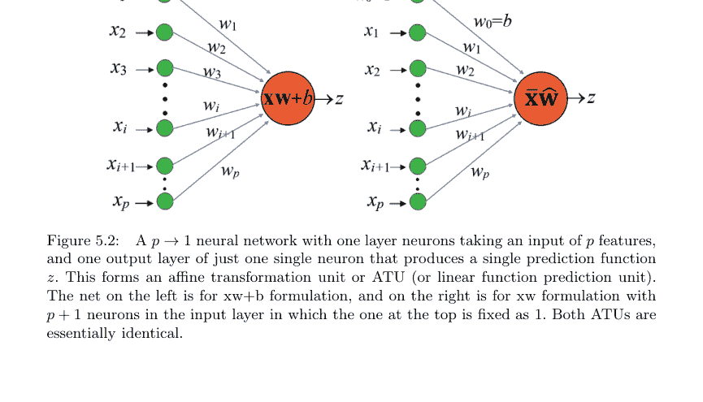

使用以下示例对其进行详细研究。让我们首先讨论数据结构。不同的 ML 算法可能使用不同的数据结构，以下是一种相当典型的数据结构。

## 5.3 典型数据结构

$p \rightarrow 1$ **网络：**

公式 (5.1) 可以写成矩阵形式，并明确指定维度如下：

$$z(\hat{\mathbf{w}}; \mathbf{x}) = \underset{1 \times p}{\mathbf{x}} \underset{p \times 1}{\mathbf{w}} + \underset{1 \times 1}{b} = \underset{1 \times (p+1)}{\overline{\mathbf{x}}} \underset{(p+1) \times 1}{\hat{\mathbf{w}}} \quad (5.13)$$

预测函数 $z \in \overline{\mathbb{X}}^p$ 现在被明确指定为对应于任何 $\mathbf{x} \in \mathbb{X}^p$ 的 $\mathbf{w}$ 和 $b$ 的函数。对于第 $i$ 个数据点 $\mathbf{x}_i$，我们有

$$z(\hat{\mathbf{w}}; \mathbf{x}_i) = \underset{1 \times p}{\mathbf{x}_i} \underset{p \times 1}{\mathbf{w}} + \underset{1 \times 1}{b} = \underset{1 \times (p+1)}{\overline{\mathbf{x}}_i} \underset{(p+1) \times 1}{\hat{\mathbf{w}}} \quad (5.14)$$

注意 $z(\hat{\mathbf{w}}; \mathbf{x})$ 对于一个数据点仍然是一个标量。此外，由于没有进一步的变换，对于单层网络不需要 $\overline{\mathbf{z}}$。

$p \rightarrow k$ **网络：**

在超空间情况下，我们将在当前层的输出中有多个（例如 $k$ 个）神经元，每个神经元基于相同的数据集（独立地）执行仿射变换（见图 5.13）。因此，输出应该是一个包含 $k$ 个条目的数组。数据可以以矩阵形式构建：

$$[z_1 \ z_2 \cdots z_k] = [x_{i1} \ x_{i2} \cdots x_{ip}] \begin{bmatrix} w_{11} & w_{12} & \cdots & w_{1k} \ w_{21} & w_{22} & \cdots & w_{2k} \ \vdots & \vdots & \ddots & \vdots \ w_{p1} & w_{p2} & \cdots & w_{pk} \end{bmatrix} + [b_1 \ b_2 \cdots b_k] \quad (5.15)$$

上述矩阵可以写成简洁的矩阵形式如下，并明确指定所有维度：

$$\mathbf{z}(\hat{\mathbf{W}}; \mathbf{x}_i) = \underset{1 \times p}{\mathbf{x}_i} \underset{p \times k}{\mathbf{W}} + \underset{1 \times k}{\mathbf{b}} = \underset{1 \times (p+1)}{\overline{\mathbf{x}}_i} \underset{(p+1) \times k}{\hat{\mathbf{W}}} \quad (5.16)$$

注意，可以在一层中堆叠任意数量的神经元，因为每个神经元的权重独立于任何其他神经元的权重。

堆栈中的神经元。这种堆叠之所以强大，是因为它使得著名的**万能逼近定理**（见第7章）变得可行。

$p \rightarrow k$ **具有 $m$ 个数据点的网络：**

对于一个包含 $m$ 个点的数据集，数据可以通过垂直堆叠 $\mathbf{x}_i$ 构建为矩阵 $\mathbf{X}_{m \times p}$。在这种情况下，可以相应地做出 $m$ 个预测，矩阵形式的公式变为

$$\begin{bmatrix} \mathbf{z}_1(\mathbf{W}, \mathbf{b}; \mathbf{x}_1) \\ \mathbf{z}_2(\mathbf{W}, \mathbf{b}; \mathbf{x}_2) \\ \vdots \\ \mathbf{z}_m(\mathbf{W}, \mathbf{b}; \mathbf{x}_m) \end{bmatrix}_{\mathbf{Z}_{m \times 1}(\mathbf{W}, \mathbf{B}; \mathbf{X})} = \begin{bmatrix} x_{11} & x_{12} & \dots & x_{1p} \\ x_{21} & x_{22} & \dots & x_{2p} \\ \vdots & \vdots & \ddots & \vdots \\ x_{m1} & x_{m2} & \dots & x_{mp} \end{bmatrix}_{\mathbf{X}_{m \times p}} \begin{bmatrix} w_{11} & w_{12} & \dots & w_{1k} \\ w_{21} & w_{22} & \dots & w_{2k} \\ \vdots & \vdots & \ddots & \vdots \\ w_{p1} & w_{p2} & \dots & w_{pk} \end{bmatrix}_{\mathbf{W}_{p \times k}} + \begin{bmatrix} \mathbf{b} \\ \mathbf{b} \\ \vdots \\ \mathbf{b} \end{bmatrix}_{\mathbf{B}_{m \times 1}} \quad (5.17)$$

其中向量 $\mathbf{B}$ 的所有元素都是相同的 $\mathbf{b}$。上述矩阵可以写成如下简洁的矩阵形式，所有维度都已明确指定：

$$\mathbf{Z}(\mathbf{W}, \mathbf{B}) = \mathbf{X} \mathbf{W} + \mathbf{B} = \overline{\mathbf{X}} \hat{\mathbf{W}} \quad (5.18)$$

请注意，在实际计算中我们并不实际构建矩阵 $\mathbf{Z}$，因为当构建损失函数时，它是对 $m$ 个或小批量大小的求和形式。我们将在后续关于实际机器学习模型的章节中经常看到这一点。

## 5.4 仿射变换的演示示例

我们现在展示一些仿射变换的例子。其执行过程如下。

对于一个由一组多个数据点 $\overline{\mathbf{X}} \in \overline{\mathbb{X}}^2$（一个仿射空间）定义的给定几何模式，其第 $i$ 行是 $\overline{\mathbf{x}}_i = [1, x_{i1}, x_{i2}]$，使用公式 (5.1) 计算：

$$z_I = \overline{\mathbf{X}} \hat{\mathbf{w}}_I \quad (5.19)$$

其中 $\hat{\mathbf{w}}_I = [b_I, \mathbf{w}_I]^\top$，这里 $b_I$ 和 $\mathbf{w}_I$ 是假设空间 $\mathbb{W}^3$ 中给定的一组学习参数，以及

$$z_{II} = \overline{\mathbf{X}} \hat{\mathbf{w}}_{II} \quad (5.20)$$

其中 $\hat{\mathbf{w}}_{II} = [b_{II}, \mathbf{w}_{II}]^\top$，这里 $b_{II}$ 和 $\mathbf{w}_{II}$ 是 $\mathbb{W}^3$ 中一组改变后的学习参数。

这导致了一个变换后的数据点 $\overline{\mathbf{Z}} = [1, z_I, z_{II}] \in \overline{\mathbb{X}}^2$。

上述过程通过对原始数据集 $\overline{\mathbf{X}} \in \overline{\mathbb{X}}^2$ 进行两次不同的 $\hat{\mathbf{w}}$ 变换，得到的变换后数据集 $\overline{\mathbf{Z}}$ 仍在同一个仿射空间 $\overline{\mathbb{X}}^2$ 中，即自同构。

我们现在编写代码来演示上述变换的仿射性。因为 $\overline{\mathbb{X}}^2$ 也是一个二维平面，我们可以方便地在空间 $\mathbb{R}^2$ 中仅使用 $z_I$ 和 $z_{II}$ 来可视化和分析原始模式和变换后的模式。我们首先定义一些函数。

```python
import numpy as np

def logistic0(z):          # The sigmoid/logistic function
    return 1. / (1. + np.exp(-z))

def net(x,w,b):            # An affine transformation net
    y = np.dot(x,w) + b
    return y

def edge(k,dd):            # Define a line pattern in 2D
                            # feature space (x1, x2)
    x = np.arange(-1.0,1.0+dd,dd)    # dd: interval
    x1 = x                           # x1 value.
    x2 = k * x                       # x2 value, k slope of the line
    x1 = np.append(x1,0)             # add the center
    x2 = np.append(x2,0)
    X = np.stack((x1, x2), axis=-1)  # X has two components.
    return x1,x2,X

def circle(r,dpi):         # Define a circular pattern in 2D
                            # feature space (x1, x2)
    x = np.arange(0.0,2*np.pi,dpi)
    x1 = r*np.cos(x)                 # circle function, for x1 value.
                            # Radius r and scaling factor c.
    x2 = r*np.sin(x)                 # for x2 value.
    x1 = np.append(x1,0)             # add the center
    x2 = np.append(x2,0)
    X = np.stack((x1, x2), axis=-1)  # X has two components.
    return x1,x2,X

def rectangle(MinX, MaxX, MinY, MaxY,dd,theta):
    # data for rectangle pattern in 2D space (x1, x2)
    x = np.arange(MinX,MaxX+dd,dd)
    ymin= np.full(x.shape,MinY)      #y=x2
    ymax= np.full(x.shape,MaxY)
    y = np.arange(MinY,MaxY+dd,dd)
    xmin= np.full(y.shape,MinX)
    xmax= np.full(y.shape,MaxX)

    x1 = np.append(np.append(np.append(x,xmax),np.flip(x)),xmin)
    x2 = np.append(np.append(np.append(ymin,y),ymax),np.flip(y))
    x1 = np.append(x1,(MaxX+MinX)/2) # add the center
    x2 = np.append(x2,(MaxY+MinY)/2)
    X1 = x1*np.cos(theta)+x2*np.sin(theta)
    X2 = x2*np.cos(theta)-x1*np.sin(theta)

    X = np.stack((X1, X2), axis=-1)  # X has two components.
    return X1,X2,X
```

```python
def spiral(alpha,c):
    # Define a spiral pattern in 2D space (x1, x2)
    xleft,xright,xdelta = 0.0, 40.01, 0.1
    x = np.arange(xleft,xright,xdelta)
    x1 = np.exp(alpha*x)*np.cos(x)/c # logarithmic spiral
    # function, x1 with decay rate alpha & scaling factor c.
    x2 = np.exp(alpha*x)*np.sin(x)/c # x2 value.
    x1 = np.append(x1,0)             # add the center
    x2 = np.append(x2,0)
    X = np.stack((x1, x2), axis=-1)  # X has two components.
    return x1,x2,X
```

现在让我们设置学习参数 w 和 b。

```python
# Set w0 & b0,so that original [x1,x2] pattern is reproduced.
w0_I=np.array([1.,0.])   # Initial 2 weights (vector),2D space
b0_I=0                   # Initial bias, so that z_I = x1
w0_II=np.array([0.,1.])  # Initial 2 weights (vector),2D space
b0_II=0                  # Initial bias, so that z_II = x2

# Set wI=w0_I, b_I=b0_I; but w_II, b_II be arbitrary.
#w_I, b_I = w0_I, b0_I   # readers may try this
w_I=np.array([.8,.2])    # Arbitrary values for the two weights
                         # to perform scaling and rotation
b_I = -0.6               # Arbitrary values for the bias to
                         # perform translation
w_II=np.array([.2,.5])   # Arbitrary values for the two weights
                         # to perform scaling and rotation
b_II = 0.6               # Arbitrary values for the bias to
                         # perform translation
```

接下来，我们定义一个函数来绘制这些模式，包括初始模式、使用 $\mathbf{w}_{II}$ 和 $b_{II}$ 进行仿射变换的模式，以及使用 $\mathbf{w}_{II}$ 和 $b_{II} = 0$ 进行线性变换的模式。

```python
%matplotlib inline
import matplotlib.pyplot as plt
def affineplot(x1,x2,X,w0_I,b0_I,w_I,b_I,w_II,b_II):
    plt.figure(figsize=(4.,4.),dpi=90)
    plt.scatter(net(X,w0_I,b0_I),net(X,w0_II,b0_II),label=\n        "Original: w0I=["+str(w0_I[0])+","+str(w0_I[1])+\n        "], b0I="+str(b0_I)+"\n w0II=["+str(w0_II[0])+","+\n        str(w0_II[1])+"], b0II="+str(b0_II),s=10,c='orange')
        #plot the initial pattern
    plt.scatter(net(X,w_I,b_I),net(X,w_II,b_II),label=\n        "Affine: wI=["+str(w_I[0])+","+str(w_I[1])+\n        "], bI="+str(b_I)+"\n wII=["+str(w_II[0])+","+\n        str(w_II[1])+"], bII="+str(b_II),s=10,c='blue')
        # plot the affine transformed pattern
    plt.scatter(net(X,w_I,b_I),net(X,w_II,b0_II),label=\n        "Linear: wI=["+str(w_I[0])+","+str(w_I[1])+\n        "], bI="+str(b_I)+"\n wII=["+str(w_II[0])+","+\n        str(w_II[1])+"], b0II="+str(b0_II),s=10,c='red')
        #plot the linear transformed pattern
    plt.xlabel('$z_{I}$')
    plt.ylabel('$z_{II}$')
    plt.title('linear and affine transformation')
    plt.grid(color='r', linestyle=':', linewidth=0.3)
    plt.legend(loc='center left', bbox_to_anchor=(1, 0.5))
    plt.axis('scaled')
    #plt.ylim(-5,9)
    plt.show()
```

### 5.4.1 仿射变换下的边缘和矩形

我们首先创建一个边缘（直线段）和一个由一组橙色点表示的矩形模式，执行公式 (5.1) 定义的仿射变换，并绘制出仿射变换（蓝色）和线性变换（红色）前后的这些模式。由于矩形由直线组成，我们很容易观察到变换的仿射性。

```python
x1,x2,X = edge(1.5,0.2)
affineplot(x1,x2,X,w0_I,b0_I,w_I,b_I,w_II,b_II)
```

### 5.4.2 圆在仿射变换下

现在让我们使用相同的代码，看看圆的仿射（和线性）变换。

```
x1,x2,X = circle(1.0,0.1)
affineplot(x1,x2,X,w0_I,b0_I,w_I,b_I,w_II,b_II)
```

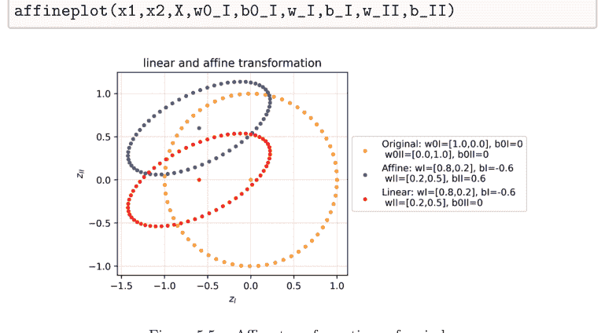

图 5.5：圆的仿射变换。

从图5.5可以清楚地看到，经过变换后，原始（橙色）圆形图案被旋转、缩放、剪切和平移成一个椭圆（蓝色）。我们在矩形中观察到的点仍然有效。

### 5.4.3 螺旋在仿射变换下

让我们研究一下更复杂图案——螺旋的仿射（和线性）变换。

```
x1,x2,X = spiral(0.1,10.)
affineplot(x1,x2,X,w0_I,b0_I,w_I,b_I,w_II,b_II)
```

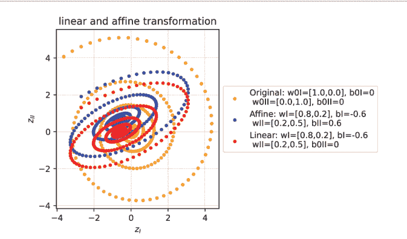

图 5.6：螺旋的仿射变换。

在这种情况下，原始（橙色）螺旋被旋转、缩放、剪切和平移成一个新的螺旋。上述两个例子中得出的观察结果仍然成立。

### 5.4.4 蕨类叶子在仿射变换下

图5.7展示了一个公共领域中可用的仿射变换的绝佳例子，由António Miguel de Campos提供（https://en.wikipedia.org/wiki/Affine_transformation）。它是一张Barnsley蕨类分形（https://en.wikipedia.org/wiki/Barnsley_fern）的图像。蕨类的一片叶子是另一片叶子通过旋转、缩放、反射和平移的组合进行的仿射变换。例如，红叶是深蓝叶或任何浅蓝叶的仿射变换。蕨类似乎在其DNA中编码了这种典型的模式，作为一个ATU。这意味着ATU与DNA一样基本。

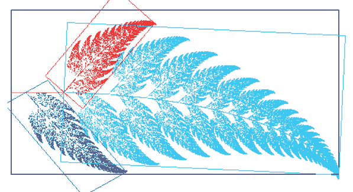

图 5.7：蕨类分形的一片叶子的图像是另一片叶子的仿射变换。

### 5.4.5 关于带仿射变换的线性预测函数

不应将线性预测函数与仿射变换混淆。它们本质上是相同的假设，但从不同的角度看待。前者关注的是使用假设公式（5.1）在特征空间中任意线性函数的可预测性，而后者关注的是当公式（5.1）用于仿射空间中的模式变换时的仿射性。任意线性函数的可预测性使得仿射变换成为可能。对常数的可预测性允许平移变换，而对线性函数的可预测性则实现了变量级别的缩放和旋转，同时保持仿射性。特征空间中线性函数的预测可以被视为仿射空间中的仿射变换。因此，我们互换使用这两个术语，知道这种微妙的区别。

### 5.4.6 用激活函数包装的仿射变换

当仿射变换 $z(\mathbf{w}, b; \mathbf{x})$ 被非线性激活函数（见第7章）包装时，输出 $\phi(z)$ 被激活函数所限制，仿射性被破坏。然而，$\phi(z)$ 现在应该具有预测非线性函数的能力，因为机器学习中使用的激活函数是连续的、光滑的（至少是分段可微的），并且随 $z$ 单调变化。

例如，我们用sigmoid函数包装仿射变换后的图案。在这种情况下，$\phi(z)$ 被限制在 $(0, 1)$ 内。我们编写以下代码来演示一些仿射映射的例子：

```
# Code for Affine transformation wrapped with sigmoid function
def sigmoidaffine(x1,x2,X,w0_I,b0_I,w0_II,b0_II,w_I,b_I,w_II,b_II):
    # We do the same affine transformation and put the
    # results to a sigmiod.
    plt.figure(figsize=(4.5, 3.0),dpi=100)
    plt.scatter(logistic0(net(X,w0_I,b0_I)),
                logistic0(net(X,w0_II,b0_II)),label=\n        "Original: w0I=["+str(w0_I[0])+","+str(w0_I[1])+
        "], b0I="+str(b0_I)+"\n w0II=["+str(w0_II[0])+","+
        str(w0_II[1])+"], b0II="+str(b0_II),s=10,c='orange')
    #plot the initial pattern
    plt.scatter(logistic0(net(X,w_I,b_I)),
                logistic0(net(X,w_II,b_II)),label=\n        "Affine: wI=["+str(w_I[0])+","+str(w_I[1])+
        "], bI="+str(b_I)+"\n wII=["+str(w_II[0])+","+
        str(w_II[1])+"], bII="+str(b_II),s=10,c='blue')
    # plot the affine transformed pattern
    plt.scatter(logistic0(net(X,w_I,b_I)),
                logistic0(net(X,w_II,b0_II)),label=\n        "Linear: wI=["+str(w_I[0])+","+str(w_I[1])+
        "], bI="+str(b_I)+"\n wII=["+str(w_II[0])+","+
        str(w_II[1])+"], b0II="+str(b0_II),s=10,c='red')
    #plot the linear transformed pattern
    plt.xlabel('$\sigma (z_{I})$')
    plt.ylabel('$\sigma (z_{II})$')
    plt.title('Affine transformation wrapped with sigmoid')
    plt.grid(color='r', linestyle=':', linewidth=0.3)

    plt.legend(loc='center left', bbox_to_anchor=(1, 0.5))
    #plt.axis('scaled')
    plt.ylim(-.05,1.1)
    plt.show()
```

```
x1,x2,X = edge(5.0,0.1)
sigmoidaffine(x1,x2,X,w0_I,b0_I,w0_II,b0_II,w_I,b_I,w_II,b_II)
```

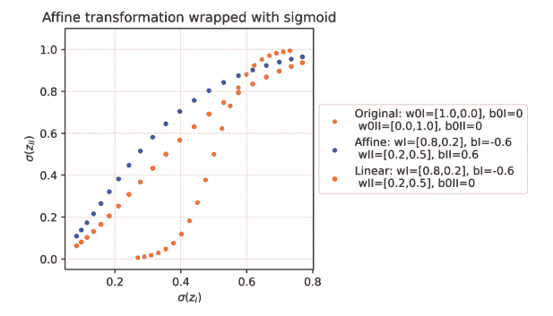

图 5.8：非线性激活函数包装的直线/边缘的仿射变换。

```
python
x1,x2,X = rectangle(-2.,2.,-1.,1.,0.2,np.pi/4)
sigmoidaffine(x1,x2,X,w0_I,b0_I,w0_II,b0_II,w_I,b_I,w_II,b_II)
```

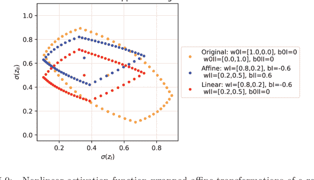

图 5.9：非线性激活函数包装的矩形的仿射变换。

对于这种sigmoid包装的仿射变换，可以得出以下观察结果：

1.  变换仍然将点唯一地映射到点，将边唯一地映射到边。使用非线性激活函数不会改变点到点映射的唯一性。这是因为激活函数是连续的、光滑的（至少是分段可微的），并且是单调变化的。
2.  然而，仿射性被破坏了：位于一条直线上的点之间的距离比发生了变化。并非所有平行线段在sigmoid变换后仍然保持平行。使用sigmoid函数显然带来了非线性。这赋予了网络以下能力：
    - 输出 $\phi(z(\hat{\mathbf{w}}; \mathbf{x}))$ 现在与特征 $\mathbf{x}$ 呈非线性依赖关系。现在可以通过训练 $\hat{\mathbf{w}}$ 将其用于标签为0或1的逻辑回归。
    - $\phi(z(\hat{\mathbf{w}}; \mathbf{x}))$ 与输入中的特征 $\mathbf{x}$ 是线性无关的。如果需要，这允许在链中进行进一步的仿射变换到下一层。
    - $\phi(z(\hat{\mathbf{w}}; \mathbf{x}))$ 也与本层使用的特征 $\hat{\mathbf{w}}$ 线性无关。当网络需要更多层时，可以独立地为下一层使用新的 $\hat{\mathbf{w}}$。这使得创建深度网络成为可能。

现在让我们看看包装后的仿射变换对圆函数的作用，使用相同的代码。

```
x1,x2,X = circle(2.5,0.1)
sigmoidaffine(x1,x2,X,w0_I,b0_I,w0_II,b0_II,w_I,b_I,w_II,b_II)
```

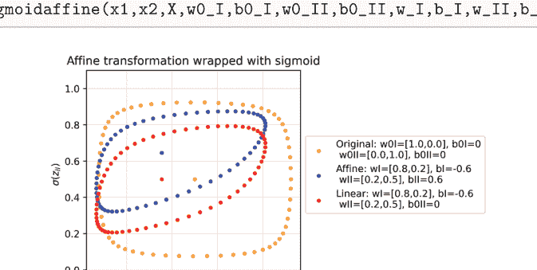

图 5.10：非线性激活函数包装的圆的仿射变换。

这种情况显示了更严重的形状破坏。点到点映射的唯一性仍然保持。以下是螺旋图案的包装仿射变换。

```
x1,x2,X = spiral(0.1,10.)
sigmoidaffine(x1,x2,X,w0_I,b0_I,w0_II,b0_II,w_I,b_I,w_II,b_II)
```

我们观察到服务器失真，这再次源于非线性激活函数sigmoid的非线性。点对点的变换仍然可见，但当 $z$ 接近 0.0 和 1.0 时，由于sigmoid的作用，原始点和变换后的点被“挤压”得更近。因此，这些区域附近的信息通过更新这些学习参数 $\mathbf{w}$ 和 $b$ 的传递大大减少。换句话说，梯度再次由于sigmoid函数的特性而趋近于零。

## 5.5 参数编码与学习的基本机制

### 5.5.1 从 $\overline{\mathbf{x}}$ 到 $\hat{\mathbf{w}}$ 的编码，一个数据-参数转换单元

基于公式 (5.1)，我们现在看到这样一种情况：一个数据集 ($\overline{\mathbf{x}}, z$) 可以被编码为假设空间中的一组学习参数 $\hat{\mathbf{w}}$。图 5.12 示意性地展示了这种编码状态。

图 5.12 中的直线被假设空间 $\mathbb{W}^2$ 中的一个点编码。例如，红线由 $w_0 = 1$ 和 $w_1 = 1$ 处的红点编码。换句话说，使用 $w_0 = 1$ 和 $w_1 = 1$，我们可以重现红线。蓝线由 $w_0 = 2$ 和 $w_1 = -0.5$ 处的蓝点编码，由此可以重现蓝线。黑线同理。机器学习过程就是利用数据集生成一组最优的点。之后，便可以生成直线。本质上，机器学习模型将数据转换或编码为 $w_i$。这意味着数据集的大小和质量与模型中使用的仿射空间的维度直接相关。

另一方面，如果调整 $w_i$，则可以在标签空间中产生不同的预测函数。因此，有可能找到这样一组 $w_i$，使得对于给定的数据点，预测与数据集中的给定标签相匹配。找到这样一组 $w_i$ 的过程就是学习。真实的机器模型要复杂得多，但这揭示了其基本机制。

### 5.5.2 编码的唯一性

我们声明，将 $\overline{\mathbf{X}}$-z 空间中的一条直线编码为假设空间中的一个点是唯一的。证明如下非常简单。

假设 $\overline{\mathbf{X}}$-z 空间中任意一条直线在假设空间中有两个不同的点 $\hat{\mathbf{w}}^{(1)}$ 和 $\hat{\mathbf{w}}^{(2)}$；使用公式 (5.9)，这条直线可以表示为

$$z = \overline{\mathbf{x}}\hat{\mathbf{w}}^{(1)} \tag{5.21}$$

该式对任意 $\overline{\mathbf{x}}$ 成立。同一条直线也可以表示为

$$z = \overline{\mathbf{x}}\hat{\mathbf{w}}^{(2)} \tag{5.22}$$

该式同样对任意 $\overline{\mathbf{x}}$ 成立。现在使用公式 (5.21) 和 (5.22)，我们得到

$$0 = \overline{\mathbf{x}}[\hat{\mathbf{w}}^{(2)} - \hat{\mathbf{w}}^{(1)}] \tag{5.23}$$

公式 (5.23) 也必须对任意 $\overline{\mathbf{x}}$ 成立。因此，我们应有

$$\hat{\mathbf{w}}^{(1)} = \hat{\mathbf{w}}^{(2)} \quad (5.24)$$

证明完成。

另一方面，我们也声明假设空间中的一个点给出一条唯一的直线。证明如下。

给定假设空间中任意一点 $\hat{\mathbf{w}}$，假设我们可以在 $\overline{\mathbf{X}}$-$z$ 空间中构造两条直线。使用公式 (5.9)，第一条直线可以表示为

$$z^{(1)} = \overline{\mathbf{x}}\hat{\mathbf{w}} \quad (5.25)$$

第二条直线可以表示为

$$z^{(2)} = \overline{\mathbf{x}}\hat{\mathbf{w}} \quad (5.26)$$

使用公式 (5.25) 和 (5.26)，我们得到

$$z^{(2)} - z^{(1)} = 0 \quad (5.27)$$

这意味着这两条直线是相同的，证明完成。

事实上，从图 5.12 可以清楚地观察到这种唯一性，因为一条直线由其斜率和偏置唯一确定，而这两者都由 $\hat{\mathbf{w}}$ 给出。

这种唯一性是高质量数据集能够基于仿射变换假设被学习参数正确编码，或者机器学习模型能够可靠地从数据中学习的最基本原因之一。

### 5.5.3 编码的唯一性：不受激活函数影响

观察到，用激活函数包装的仿射变换的编码唯一性不受激活函数影响。这是因为激活函数都是严格单调函数（如第7章所示），这不会改变其自变量的唯一性。因此，证明本质上与上述相同。

另一方面，这一性质意味着激活函数必须是单调的。第7章讨论的所有激活函数都满足这一点。

## 5.6 预测函数的梯度

预测函数相对于学习参数的梯度具有以下简单形式：

$$\nabla_{\mathbf{w}} z = \mathbf{x}$$
$$\nabla_{b} z = 1$$

这表明相对于权重的梯度与特征变量（数据）相关。然而，相对于偏置的梯度是一个单位。这是因为与偏置对应的数据是 $x_0 = 1$。这可能暗示当使用正则化技术（见第14章）时，可以为权重和偏置选择不同的正则化参数。

当使用 xw 公式时，我们有

$$\nabla_{\hat{\mathbf{w}}} z = \overline{\mathbf{x}}$$

这可用于机器学习过程中的自动求导。

## 5.7 仿射变换阵列 (ATA)

我们现在可以将图 5.2 右侧的单个神经元垂直复制 $k$ 次，并让所有神经元**密集连接**，这意味着输出中的每个神经元都与输入中的每个神经元相连（也称为全连接）。这形成了一个 $p \rightarrow k$ 的映射网络。

来自 ATA 的预测函数 $\mathbf{z}$ 可以表示为

$$\mathbf{z}(\hat{\mathbf{W}}; \mathbf{x}) = \mathbf{x}\mathbf{W} + \mathbf{b} = \overline{\mathbf{x}}\hat{\mathbf{W}}$$

其中 $\mathbf{z}$ 是一个预测函数向量，由下式给出

$\mathbf{z}(\hat{\mathbf{W}}; \mathbf{x}) = [z_1(\hat{\mathbf{w}}_1; \mathbf{x}), z_2(\hat{\mathbf{w}}_2; \mathbf{x}), \dots, z_k(\hat{\mathbf{w}}_k; \mathbf{x})]$，其中
$\hat{\mathbf{w}}_j = [w_{0j}, w_{1j}, w_{2j}, \dots, w_{pj}]$，且 $w_{0j} = b_j$ 是输出层第 $j$ 个神经元的 $(p + 1)$ 个学习参数，
$\hat{\mathbf{W}} = [\mathbf{b} \quad \mathbf{W}]^\top$ 是一个 $(p + 1) \times k$ 的矩阵，包含输出层所有神经元的所有学习参数，
$\mathbf{W} = [w_{ij}], (i = 1, 2, \dots, p; j = 1, 2, \dots, k)$ 是权重矩阵（学习参数的一部分），以及
$\mathbf{b} = [b_1, b_2, \dots, b_k]$ 是偏置向量（学习参数的一部分）。

一个 $p \rightarrow k$ ATA 的总学习参数向量 $\hat{\mathbf{w}}$ 变为，

$$\hat{\mathbf{w}} = [\hat{\mathbf{w}}_1^\top, \hat{\mathbf{w}}_2^\top, \dots, \hat{\mathbf{w}}_k^\top]^\top$$

这也可以看作是 $\widehat{\mathbf{W}}$ 的展平形式。学习参数的总数为

$$P = (p + 1) \times k$$

很明显，对于 ATA，假设空间以倍数快速增长。公式 (5.30) 是一组仿射变换的矩阵形式。

需要注意的是，每个 $z_j(\mathbf{w}_j, b_j)$ 都使用公式 (5.1) 计算，使用其自身的权重 $\mathbf{w}_j$ 和偏置 $b_j$。这使得所有 $z_j(\mathbf{w}_j, b_j), j = 1, 2, \dots, k$ 彼此独立。因此，图 5.13 中给出的 ATA 创建了最简单的映射，可用于使用具有 $p$ 个特征的数据集解决 $k$ 维回归问题。另请注意，当 $k = p$ 时，它可以执行 $p \rightarrow p$ 仿射变换。

## 5.8 深度网络高阶函数的可预测性

### 5.8.1 激活函数的作用

现在，我们用非线性激活函数包装预测函数堆栈。这导致一个向量

$$\left[ \underbrace{\phi(z_1(\mathbf{w}_1, b_1))}_{x_1^{(new)}}, \underbrace{\phi(z_2(\mathbf{w}_2, b_2))}_{x_2^{(new)}}, \dots, \underbrace{\phi(z_k(\mathbf{w}_k, b_k))}_{x_k^{(new)}} \right] \quad (5.31)$$它成为一组新的特征 $x_i^{(new)}$，$i=1,2,\dots,k$，这些特征与原始特征 $x_i$，$i=1,2,\dots,p$ 线性无关。然后，这些新特征可以作为下一层的输入。这允许为下一层使用一组新的学习参数。

显然，激活函数的作用是强制使一个 ATA 的输出与前一个 ATA 的输出线性无关，从而实现进一步的仿射变换，形成一系列 ATA，即一个深度网络。为了履行这一重要角色，激活函数必须是非线性的。

这样一系列由非线性激活函数包裹的预测函数（仿射变换）堆栈，构成了一个非常复杂的深度网络，从而产生一个复杂的预测函数。此外，当仿射变换公式 (5.1) 被空间滤波器替换时，可以构建用于目标检测的 CNN（见第 15 章）；当被时间滤波器替换时，我们可能得到用于时间序列模型的 RNN（见第 16 章），等等。

### 5.8.2 *通过链接 ATA 形成深度网络*

公式 (5.31) 给出的这些新特征现在可以作为下一层的输入，以形成深度网络。为了更清楚地说明这一点，我们考虑一个简化的 $4-2-3$ 神经元深度网络，如图 5.14 所示。

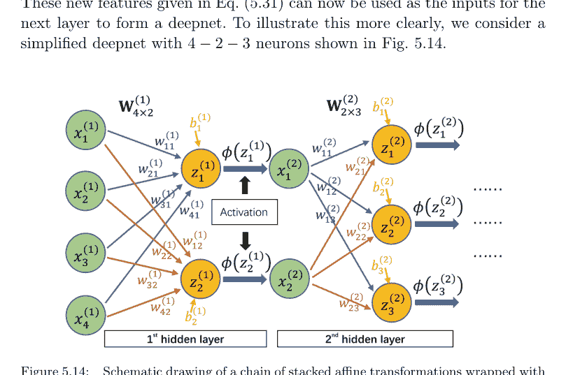

这里，让我们用括号中的数字表示层号：

1.  基于第一层的 4 个（独立输入）特征 $x_i^{(1)}(i=1\sim4)$，使用一个 $4\times2$ 的权重矩阵 $\mathbf{W}^{(1)}$ 和偏置 $b_i^{(1)}(i=1\sim2)$，进行一组 2 个仿射变换 $z_i^{(1)}(i=1\sim2)$。仿射变换 $z_1^{(1)}$ 使用 $w_{i1}^{(1)}(i=1\sim4)$ 和 $b_1^{(1)}$，而 $z_2^{(1)}$ 使用 $w_{i2}^{(1)}(i=1\sim4)$ 和 $b_2^{(1)}$。显然，这些操作使用不同的权重和偏置集独立进行。
2.  接下来，$z_1^{(1)}$ 和 $z_2^{(1)}$ 分别经过一个非线性激活函数 $\phi$，产生 2 个新特征 $x_i^{(2)}(i=1\sim2)$。由于 $\phi$ 的非线性，$x_i^{(2)}$ 将不再线性依赖于原始特征 $x_i^{(1)}(i=1\sim4)$。
3.  因此，$x_i^{(2)}(i=1\sim2)$ 现在可以作为第二层仿射变换的独立输入，使用一个 $2\times3$ 的权重矩阵 $\mathbf{W}^{(2)}$ 和偏置 $b_i^{(2)}(i=1\sim3)$，方式相同。这产生一组 3 个仿射变换 $z_i^{(3)}(i=1\sim3)$，然后可以再次用非线性激活函数包裹。这完成了链中第二层的 3 个堆叠仿射变换。

上述过程可以根据需要继续，以增加神经网络的深度。还需注意，理论上每层的神经元数量可以是任意的。由于堆叠和链接，假设空间大大增加。堆叠导致倍数增长，而链接导致加法增长。对于深度网络，预测函数可能存在于一个极高维度的空间 $\mathbb{W}^P$ 中。对于这个简单的 $4-2-3$ 深度网络，假设空间的维度变为 $P=(4\times2+2)+(2\times3+3)=19$。一般来说，对于一个 $p-q-r-k$ 的网络，例如，其公式应为

$$P = \underbrace{(p \times q + q)}_{\text{第 1 层}} + \underbrace{(q \times r + r)}_{\text{第 2 层}} + \underbrace{(r \times k + k)}_{\text{第 3 层}} \qquad (5.32)$$

MLP 中所有可训练参数的向量变为，

$$\hat{\mathbf{w}} = \left[ \hat{\mathbf{W}}^{(1)}.\text{flatten}(), \hat{\mathbf{W}}^{(2)}.\text{flatten}(), \dots, \hat{\mathbf{W}}^{(N_L)}.\text{flatten}() \right]^\top$$

其中 $N_L$ 是 MLP 中隐藏层的总数。注意，在实际的 ML 模型中，我们可能并不真正执行上述展平操作。这只是为了展示假设空间维度的增长。在实际计算中，我们可能只需将它们分组在一个 Python 列表中，并使用重要的自动微分算法来自动执行训练 MLP 所需的前向和后向计算。这种高维度的计算是通过数值方法实现的。这将在第 8 章详细讨论。

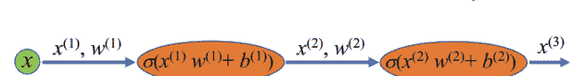

图 5.15：在隐藏层和最后一层使用 sigmoid 激活函数的 1 -> 1 -> 1 网络。

对于 MLP，预测函数现在是高维假设空间 $\mathbb{W}^P$ 中 $\hat{\mathbf{w}}$ 的函数。计算更一般 MLP 的 $P$ 的公式将在第 13 章给出。给出神经元数量与数据点数量之间关系的神经元-样本理论将在第 13.2.1 节讨论。

### 5.8.3 示例：一个 1 -> 1 -> 1 网络

考虑图 5.15 所示的最简单的 $1 \rightarrow 1 \rightarrow 1$ 神经网络。让我们使用相同的线性预测函数公式 (5.1)，并在隐藏层和最后一层使用 sigmoid 激活函数。在这种情况下，最后一层的输出 $x^{(3)}$ 可以如下获得：

$$x^{(3)} = \sigma\left(z^{(2)}\right) = \sigma\left(w^{(2)} x^{(2)} + b^{(2)}\right) = \frac{1}{1 + e^{-\left(w^{(2)} x^{(2)} + b^{(2)}\right)}} \quad (5.33)$$

其中 $x^{(2)}$ 是隐藏层的输出：

$$x^{(2)} = \sigma\left(z^{(1)}\right) = \sigma\left(w^{(1)} x^{(1)} + b^{(1)}\right) = \frac{1}{1 + e^{-\left(w^{(1)} x + b^{(1)}\right)}} \quad (5.34)$$

其中 $x^{(1)} = x$，这是可以被归一化到 $(-1, 1)$ 的输入。上标括号中的数字代表层号。由于 $x^{(2)}$ 在 $(0, 1)$ 中，我们接下来连续两次使用泰勒展开来近似 sigmoid 函数；我们得到

$$x^{(3)} = c_0 + c_1 x + c_2 x^2 + c_3 x^3 + \cdots \quad (5.35)$$

其中这些常数通过一个冗长但简单的推导给出：

$$c_0 = -\frac{1}{16} b^{(1)} b^{(2)} w^{(1)} \left[b^{(1)} - b^{(2)} w^{(1)}\right] - \frac{1}{48} b^{(2)} w^{(1)} \left[\left(b^{(2)}\right)^2 \left(w^{(1)}\right)^2 - 12\right] - \frac{1}{48} b^{(1)} \left[\left(b^{(1)}\right)^2 - 12\right]$$

$$c_1 = -\frac{1}{16}w^{(1)}w^{(2)}\left[\left(b^{(1)}\right)^2 + 2b^{(1)}b^{(2)}w^{(1)} + \left(b^{(2)}\right)^2\left(w^{(1)}\right)^2 - 4\right] \quad (5.36)$$

$$c_2 = -\frac{1}{16}\left(w^{(1)}\right)^2\left(w^{(2)}\right)^2\left(b^{(1)} + b^{(2)}w^{(1)}\right)$$

$$c_3 = -\frac{1}{48}\left(w^{(1)}\right)^3\left(w^{(2)}\right)^3$$

从公式 (5.36) 可以清楚地看出，通过适当设置（使用数据集训练）隐藏层和输出层神经元的权重和偏置，所有这些常数 $c_i, i = 1, 2, 3, 4$ 都可以被确定。输出 $x^{(3)}$ 处的预测函数变成了特征 $x$ 的 3 阶多项式，如公式 (5.35) 所示。这意味着我们的 $1 \rightarrow 1 \rightarrow 1$ 网络具有近似预测 3 阶函数的能力，而 $1 \rightarrow 1$ 网络只能预测 1 阶函数。

请注意，对于其他类型的激活函数也可以进行相同的分析。此外，如果我们截断泰勒级数中的高阶项，我们可以近似更高阶的函数。我们这里讨论的重点不在于如何很好地近似 sigmoid 函数，而是为了展示简单 $1 \rightarrow 1 \rightarrow 1$ 网络的能力。这个简单的分析支持一个非常重要的事实：增加层数赋予网络预测更高阶非线性潜在行为的能力。这就是为什么深度网络如果能够被有效训练，就会非常强大的原因。

我们无需进一步阐述地指出，增加网络的深度等同于增加基于物理定律模型（如有限元法 [1] 或无网格方法 [3]）中形函数的阶数。相比之下，增加一层中的神经元数量等同于增加单元或节点的数量 [5]。

## 5.9 通用预测理论

深度网络可以建立以下重要特性：

1.  线性预测函数（仿射变换）能够精确预测任何一阶函数的能力，以及每个 ATU 中的一对一唯一变换（无论是否使用激活函数）。
2.  在一个 ATA 中，一个神经元的函数近似（仿射变换）独立于另一个神经元（由于其独立的连接）。
3.  在每个 ATA 的每一层中，使用非线性激活函数产生新的独立特征。

## 5.10 非线性仿射变换

请注意，在上述公式中，特征 $x_i, i = 1, 2, \dots, p$ 是作为线性基函数用于仿射变换的。然而，基函数不必是线性的。以一维问题为例；当使用线性近似时，特征向量应为

$$\overline{\mathbf{x}} = [1, x] \qquad (5.37)$$

如果希望使用二阶近似（通常称为非线性回归），特征向量则变为

$$\overline{\mathbf{x}} = \left[1, x, x^2\right] \qquad (5.38)$$

如果对数据集有深入了解，并相信某个特定函数可以作为基函数，可以将其作为附加特征添加。例如，可以将 $\sin(x)$ 作为特征包含在以下形式中：

$$\overline{\mathbf{x}} = [1, x, \sin(x)] \quad (5.39)$$

使用非线性函数作为特征基也与我们将在第6章讨论的所谓支持向量机（SVM）模型相关，其中我们使用核函数处理线性不可分的类别。这种非线性特征基或核有时被称为特征函数。

在我们的神经网络模型中，高阶和丰富基函数也可以用于更高维度。例如，对于二维空间，我们可能有如下特征：

$$\overline{\mathbf{x}} = \left[1, x_1, x_2, x_1x_2, x_1^2, x_2^2, \sin(x)\right] \quad (5.40)$$

这完成了二阶多项式基函数，并用 $\sin(x)$ 函数（对 $x$ 进行适当缩放）进行了丰富。数据集 $\overline{\mathbf{X}}$ 也应按照所有这些特征的顺序排列。使用非线性基函数的仿射变换可以与本章讨论的使用线性基函数的仿射变换完全相同。事实上，我们已经对圆形和螺旋线进行了仿射变换。请注意，对于高维问题，具有非线性基的特征空间可能处于极高的维度。对于此类情况，可以应用所谓的核技巧来避免维度增加。

## 5.11 基于物理定律模型中的特征函数

使用高阶或特殊特征函数的概念与基于物理定律的计算方法本质上是相同的。在这些基于物理定律的方法中，特征函数被称为**基函数**。这些基函数用于近似由物理定律以强形式或弱形式控制的场变量（位移、应力、速度、压力等）。

例如，在有限元近似[1]和平滑有限元方法[2]中，我们经常使用称为高阶单元的高阶多项式基。也使用特殊基函数，但称为富集函数。例如，当我们希望捕捉域中的奇异应力场时，我们在基中添加 $\sqrt{r}$ [2]。在无网格方法[3]中，也可以使用距离基函数，例如径向基函数（RBFs）。

在用于求解由物理定律控制的线性力学问题的方法中，我们经常使用高阶和特殊基函数。由此产生的系统方程在场变量中仍然是线性的。核心概念是相同的：为了捕捉系统中的必要特征（由定律控制或隐藏在数据中），应使用具有必要复杂性的特征或基函数。由此产生的模型在场变量中可能仍然是线性的。

## 参考文献

- [1] G.R. Liu and S.S. Quek, *The Finite Element Method: A Practical Course*, Butterworth-Heinemann, London, 2013.
- [2] G.R. Liu and T.T. Nguyen, *Smoothed Finite Element Methods*, Taylor and Francis Group, New York, 2010.
- [3] G.R. Liu, *Mesh Free Methods: Moving Beyond the Finite Element Method*, Taylor and Francis Group, New York, 2010.
- [4] G.R. Liu and Gui-Yong Zhang, *Smoothed Point Interpolation Methods: G Space Theory and Weakened Weak Forms*, World Scientific, London, 2013.
- [5] G.R. Liu, *A Neural Element Method*, *International Journal of Computational Methods*, **17**(07), 2050021, 2020.
- [6] G.R. Liu, A thorough study on affine transformations and a novel Universal Prediction Theory, *International Journal of Computational Methods*, **19**(10), in-printing, 2022.

## 第6章

## 感知机与支持向量机

本章讨论两种基本且重要的监督机器学习算法——感知机和支持向量机（SVM），用于分类。两者在概念上相关，但在公式和算法上差异很大。在作者看来，这两种分类器在计算方法上都使用了许多关键思想。这些思想及其产生的公式非常具有启发性，可用于许多其他机器学习算法。我们希望本章的介绍能帮助读者理解这些思想。参考材料和大部分代码来自Numpy文档（https://numpy.org/doc/）、Scikit-learn文档（https://scikit-learn.org/stable/）、mxnet-the-straight-dope（https://github.com/zackchase/mxnet-the-straight-dope）、Jupyter Notebook（https://jupyter.org/）和维基百科（https://en.wikipedia.org/wiki/Main_Page）。

我们的讨论自然从感知机开始。它是Frank Rosenblatt于1957年提出的最早的机器学习算法之一[1, 2]。它用于二分类问题，是20世纪60年代研究较为深入的分类问题之一。在此，我们首先介绍典型分类问题的数学模型及其相关公式，并探讨其与仿射变换的联系。然后，我们详细研究Coli的感知机算法，该算法可在mxnet-the-straight-dope（https://github.com/zackchase/mxnet-the-straight-dope）（在Apache License 2下）获取。

对感知机的讨论自然引出对SVM [3, 4, 9]的讨论。提供了SVM公式的完整描述，包括导致二次规划问题的详细过程、用于线性不可分数据集的核技巧，以及SVM中使用的仿射变换概念。

## 6.1 线性可分分类问题

让我们考虑以下问题。给定一组具有 $p$ 个特征的 $m$ 个数据点，第 $i$ 个数据点表示为 $\mathbf{x}_i = \{x_{i1}, x_{i2}, \dots, x_{ip}\} \in \mathbb{X}^p$，其对应的标签为 $y_i \in \{\pm 1\}$（意味着一个数据点的标签可以是 $+1$ 或 $-1$）。这些标签将这些数据点区分为两类：正点和负点。我们假设这组数据点是*线性可分的*，意味着这些数据点可以使用超平面（高维空间 $\mathbb{X}^p$ 中的一条线）分离成这两个不同的类别。

考虑一个只有2个特征 $x_1$ 和 $x_2$ 的简单问题，在二维（2D）空间 $\mathbf{x} = \{x_1, x_2\} \in \mathbb{X}^2$ 中，以便我们可以进行良好的可视化。一组 $m$ 个数据点散布在2D空间中，如图6.1所示。

所有这些数据点被标记为两类：用“+”符号标记的正点，每个点标记为 $y = +1$；用“−”符号标记的负点，每个点标记为 $y = -1$。这两类点可以用直线分隔，例如图6.1中的红色虚线和红色点线。对于现实世界中的数据集，存在无限多条这样的线，形成一条*街道*。我们的目标是开发一种计算机算法，在给定的标记数据集（带有相应标签的数据点）中找到这样一条线。这是一个简单但相当典型的分类问题。

假设我们暂时知道其中一条红线的方向，例如中间的红色虚线，以便于讨论。因此，我们知道其法向量 $\mathbf{w} = [w_1, w_2]^\top \in \mathbb{W}^2$，尽管我们还不知道

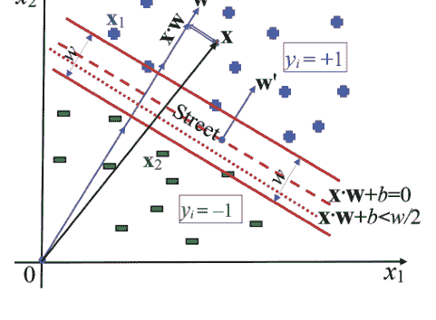

红色虚线沿其法线方向的*平移*位置。于是，单位法向量为 $\frac{\mathbf{w}}{\|\mathbf{w}\|}$，长度为1。对于二维空间中的任意点（不一定是数据点，图6.1中用小十字标记），我们可以构造一个从原点出发的向量 $\mathbf{x}$。此时，点积

$$\mathbf{x} \cdot \frac{\mathbf{w}}{\|\mathbf{w}\|} \quad (6.1)$$

就变成了 $\mathbf{x}$ 在单位法向量 $\frac{\mathbf{w}}{\|\mathbf{w}\|}$ 上的投影长度。因此，这是衡量点 $\mathbf{x}$ 沿 $\frac{\mathbf{w}}{\|\mathbf{w}\|}$ 方向距离原点多远的度量，这是一个有用的信息。由于我们尚不知道红线相对于 $\mathbf{x}$ 的平移位置，因此引入一个参数 $\frac{b}{\|\mathbf{w}\|}$，其中 $b \in \mathbb{W}^1$ 是一个可调参数，允许红线沿 $\mathbf{w}$ 上下移动。

注意在公式 (6.1) 中，我们使用了点积（内积）。这与我们在Python实现中使用的矩阵乘积相同，因为它们的形状匹配：$\mathbf{x}$ 是一个（行）向量，而 $\mathbf{w}$ 是一个列向量（单列矩阵），且长度相同。因此，在本书中我们交替使用这两种说法。

对于给定点 $\mathbf{x}$ 的任意直线方程应具有以下形式：

$$\mathbf{x} \cdot \mathbf{w} + b \quad (6.2)$$

我们现在的任务是通过选择 $\mathbb{W}^3$ 中特定的一组 $\mathbf{w}$ 和 $b$ 来找到红色虚线，使其能够分离数据点，这就是第5章讨论的*仿射*变换。*条件*应为

$$(\mathbf{x} \cdot \mathbf{w} + b) > 0, \quad \text{对于红色虚线右上方的点：} y = +1 \quad (6.3)$$

$$(\mathbf{x} \cdot \mathbf{w} + b) < 0, \quad \text{对于红色虚线左下方的点：} y = -1 \quad (6.4)$$

注意，公式 (6.3) 和 (6.4) 适用于理想情况，即这两组点可能无限接近。在实际应用中，我们通常发现这些点属于两个不同的类别，并且它们被一条宽度为 $w$（可能非常小）的*街道*分隔开。公式现在可以修改如下：

$$(\mathbf{x} \cdot \mathbf{w} + b) > w/2, \text{ 对于红色虚线右上方的点：} y = +1 \quad (6.5)$$

$$(\mathbf{x} \cdot \mathbf{w} + b) < w/2, \text{ 对于红色虚线左下方的点：} y = -1 \quad (6.6)$$

这类方程也被称为*决策规则*：当参数 **w** 和 $b$ 已知时，如果任意点 **x** 满足该条件，则它属于一个标记类别（$y = 1$ 或 $y = -1$）。我们取得了很好的进展。

显然，公式 (6.5) 和 (6.6) 可以*神奇地*通过将这两个条件与其对应的标签 $y$ 组合，写成一个方程。

$$y(\mathbf{x} \cdot \mathbf{w} + b) > w/2 \quad \text{或} \quad y(\overline{\mathbf{x}} \cdot \hat{\mathbf{w}}) > w/2 \quad \text{或} \quad m_g > w/2 \qquad (6.7)$$

这是一个简化的单方程决策规则：当任意点满足该条件时，它属于标记区域，并且不在街道内。这个单一方程对于开发称为**分类器**的算法来完成任务要方便得多。注意，$m_g$ 称为间隔，将在第11章中正式详细讨论。

我们现在需要引入一个标记数据集，使用上述决策规则来找到 **w** 和 $b$。对于任何数据点（例如第 $i$ 个，无论它属于哪个类别），它必须满足以下方程：

$$y_i(\mathbf{x}_i \cdot \mathbf{w} + b) > w/2 \quad \text{或} \quad y_i(\overline{\mathbf{x}}_i \cdot \hat{\mathbf{w}}) > w/2 \quad \text{或} \quad m_{g(i)} > w/2 \qquad (6.8)$$

其中 $m_{g(i)}$ 是第 $i$ 个数据点的间隔。由于存在无限多条直线（如图6.1所示的红色虚线和红色点线）可以实现这种分离，因此我们的问题存在多个解。我们只想找到其中一个解，使其对数据集中的所有数据点都满足公式 (6.8)。这个过程称为**训练**。由于使用了标签，这是一种监督训练。训练好的模型可以用来预测给定数据点（可能不是来自训练数据集）的类别，这通常称为**分类**或**预测**。以下是执行所有这些操作的算法：训练以及预测。

## 6.2 感知器的Python代码

以下是来自 mxnet-the-straight-dope (https://github.com/zackchase/mxnet-the-straight-dope) 的一段易于理解的代码，遵循 Apache-2.0 许可证。我们对其做了一些修改，并在代码中添加了一些详细的注释说明。

让我们来审视这个算法的细节。像往常一样，我们导入所需的库。

感知器与支持向量机

227

```python
import mxnet as mx
from mxnet import nd, autograd
import matplotlib.pyplot as plt
import numpy as np
# 我们现在为这次检查生成一个合成数据集。
mx.random.seed(1)    # 为了使此代码输出可重复
    # 定义一个函数来生成可分离的数据集，
    # 具有间隔 strt_w
def getfake(samples, dimensions, domain_size, strt_w):
    wfake = nd.random_normal(shape=(dimensions)) # 权重
    bfake = nd.random_normal(shape=(1))           # 偏置
    wfake = wfake / nd.norm(wfake)                # 归一化
    # 生成线性可分的数据，带有标签
    X = nd.zeros(shape=(samples, dimensions))     # 初始化
    Y = nd.zeros(shape=(samples))
    i = 0
    while (i < samples):
        tmp = nd.random_normal(shape=(1,dimensions))
        margin = nd.dot(tmp, wfake) + bfake
        if (nd.norm(tmp).asscalar()<domain_size) & \
                (abs(margin.asscalar())>strt_w):
            X[i,:] = tmp[0]
            Y[i] = 1 if margin.asscalar() > 0 else -1
            i += 1
    return X, Y, wfake, bfake
# 根据标签用颜色绘制数据
def plotdata(X,Y):
    for (x,y) in zip(X,Y):
        if (y.asscalar() == 1):
            plt.scatter(x[0].asscalar(),x[1].asscalar(),color='r')
        else:
            plt.scatter(x[0].asscalar(),x[1].asscalar(),color='b')
```

```python
# 定义一个函数在[-3,3] x [-3,3]区域上绘制等高线图
def plotscore(w,d):
    xgrid = np.arange(-3, 3, 0.02)                # 生成网格
    ygrid = np.arange(-3, 3, 0.02)
    xx, yy = np.meshgrid(xgrid, ygrid)
    zz = nd.zeros(shape=(xgrid.size, ygrid.size, 2))
    zz[:,:,0] = nd.array(xx)
    zz[:,:,1] = nd.array(yy)
    vv = nd.dot(zz,w) + d
    CS = plt.contour(xgrid,ygrid,vv.asnumpy())
    plt.clabel(CS, inline=1, fontsize=10)
```

```python
street_w = 0.1
ndim = 2
X,Y,wfake,bfake = getfake(50,ndim,3,street_w)
# 生成50个点，在二维空间中，间隔为 street_w
plotdata(X,Y)
plt.show()
```

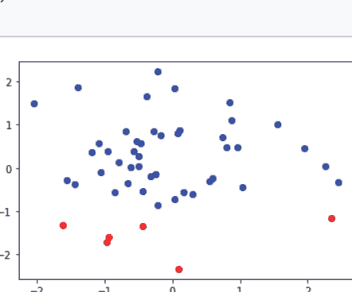

图6.2：计算机生成的、可用直线分离的数据点。

我们现在看到一个包含50个二维空间散点的数据集，这些点被一条宽度为 street_w 的街道分隔开。这些数据点可以被至少一条位于蓝色和红色数据点之间的直线清晰地分开。

让我们首先看看当所有点的向量都投影到由任意向量 w 和任意偏置 b（任意仿射变换）定义的直线上时的情况。我们同样使用生成这些点时使用的真实 w 和偏置 b 进行投影以作比较。我们编写以下代码来实现：

```python
wa = nd.array([0.5,0.5])            # 一个给定的向量
cs = (wa[0]/nd.norm(wa)).asnumpy() # 余弦值
si = (wa[1]/nd.norm(wa)).asnumpy() # 正弦值
ba = 0.5 * nd.norm(wa)              # 偏置（可以更改）
Xa = nd.dot(X,wa)/nd.norm(wa) + ba  # 投影（仿射映射）

plt.plot(Xa.asnumpy()*cs,Xa.asnumpy()*si,zorder=1) # 结果
for (x,y) in zip(Xa,Y):
    if (y.asscalar() == 1):
        plt.scatter(x.asscalar()*cs,x.asscalar()*si,color='r')
    else:
        plt.scatter(x.asscalar()*cs,x.asscalar()*si, color='b')
cs = (wfake[0]/nd.norm(wfake)).asnumpy() # 在真实法向量上的投影
```

si = (wfake [1]/nd.norm(wfake)).asnumpy()
Xa = nd.dot(X,wfake) + bfake                # 包含真实偏置

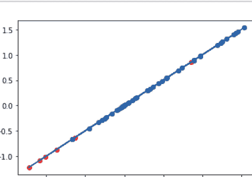

图 6.3：数据点投影到任意一条直线上。

plt.plot(Xa.asnumpy()*cs,Xa.asnumpy()*si,zorder=1)
for (x,y) in zip(Xa,Y):
    if (y.asscalar() == 1):
        plt.scatter(x.asscalar()*cs,x. asscalar()*si,color='r')
    else:
        plt.scatter(x.asscalar()*cs,x.asscalar()*si, color='b')
plt.show()

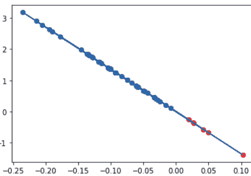

图 6.4：数据点投影到一条垂直于分隔这些数据点的直线的直线上。

可以看出，

- 当这些点投影到一个不是真实法线（沿蓝线）方向的向量上时，蓝色和红色点沿蓝线混合在一起。
- 当使用真实法线方向时，所有这些点沿橙线明显地分为两类，蓝色和红色。这个数据集是线性可分的。

让我们看看**感知机算法**如何找到一个方向和偏置，从而找到分隔这两类的红线。我们再次使用 mxnet-the-straight-dope (https://github.com/zackchase/mxnet-the-straight-dope) 中可用的算法。该算法基于以下鼓励规则：应鼓励正事件，应抑制负事件。此规则与之前讨论的决策规则一起，用于给定数据集中的每个数据点。

# 感知机算法
def Perceptron(w,b,x,y,strt_w):
    if (y*(nd.dot(w,x)+b)).asscalar()<=strt_w/2:
        # 决策规则，检查具有当前参数的直线是否在间隔内
        w += y * x           # 在间隔内，更新 w
        b += y               # 更新 b
        update = 1
    else:                    # 否则（在间隔外）
        update = 0           # 不采取行动
    return update

上述感知机算法在迭代中使用，通过遍历数据集来更新学习参数：向量 **w** 中的权重和偏置 *b*。

w = nd.zeros(shape=(ndim))    # 从零开始（最坏情况）
b = nd.zeros(shape=(1))
t = 0
print('w:',w.shape,' b:',b.shape,' X:',X.shape,' Y:',Y.shape)
for (x,y) in zip(X,Y):
    update = Perceptron(w,b,x,y,street_w)
    if (update == 1):
        t += 1
        print('In the street: update the parameters')
        print('data{}, label{}'.format(x.asnumpy(),y. asscalar()))
        print('weight{}, bias{}'.format(w.asnumpy(),b. asscalar()))

plotscore(w,b)       # 使用更新后的 w 和 b 的平面
plotdata(X,Y)        # 数据点
plt.scatter(x[0].asscalar(),x[1].asscalar(),color='g')
                     # 当前更新的数据点
plt.show()

w: (2,)  b: (1,)  X: (50, 2)  Y: (50,)
In the street: update the parameters
data  [ 0.03751943 -0.7298465 ], label -1.0
weight [-0.03751943  0.7298465 ], bias  -1.0

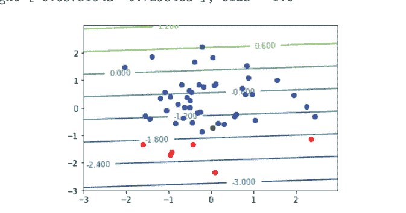

图 6.5：第一次迭代的结果。

In the street: update the parameters
data  [-2.0401056  1.4821309], label -1.0
weight [ 2.0025861 -0.7522844], bias  -2.0

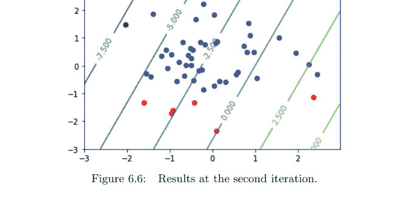

图 6.6：第二次迭代的结果。

In the street: update the parameters
data    [ 1.040828   -0.45256865], label -1.0
weight [ 0.96175814 -0.29971576], bias  -3.0

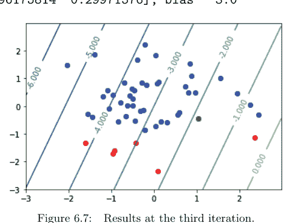

图 6.7：第三次迭代的结果。

In the street: update the parameters
data    [-0.934901   -1.5937568], label 1.0
weight [ 0.02685714 -1.8934726 ], bias  -2.0

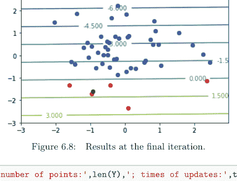

图 6.8：最后一次迭代的结果。

print('Total number of points:',len(Y),'; times of updates:',t)
print('weight {}, bias {}'.format(w.asnumpy(),b.asscalar()))
print('wfake {}, bfake {}'.format(wfake.asnumpy(),bfake. asscalar()))

Total number of points: 50 ; times of updates: 4
weight [ 0.02685714 -1.8934726 ], bias  -2.0
wfake [ 0.0738321  -0.99727064], bfake  -0.9501792788505554

可以看出，所有红点都在直线 $\mathbf{x} \cdot \mathbf{w} + b = 0$ 的正侧，该直线由学习到的权重向量 $\mathbf{w}^*$ 和偏置 $b^*$ 的参数形成。所有标记为蓝点的数据都在直线的负侧。在整个过程中，所有这些点都保持不动，更新仅在权重向量 $\mathbf{w}$ 和偏置 $b$ 上进行。我们现在将探讨这个简单算法能够工作的根本原因。

## 6.3 感知机收敛定理

**定理：** 考虑一个具有有限数量数据点的数据集。第 $i$ 个数据点与其标签配对为 $[\mathbf{x}_i, y_i]$。任何数据点 $\mathbf{x}_i$ 都满足 $\|\mathbf{x}_i\| \le R < \infty$，其标签 $y_i \in \{\pm 1\}$。

- 如果数据点是线性可分的，意味着存在至少一对参数 $(\mathbf{w}^*, b^*)$，满足 $\|\mathbf{w}^*\| \le 1$ 且 $b^2 \le 1$，使得对于所有数据对，$y_i(\mathbf{x}_i \cdot \mathbf{w}^* + b^*) \ge w/2 > 0$，其中 $w$ 是给定的间隔宽度标量，
- 那么感知机算法在最多 $t = 2(R^2+1)/w^2 \propto (\frac{R}{w})^2$ 次迭代后收敛，得到一对参数 $(\mathbf{w}_t, b_t)$，形成一条直线 $\mathbf{x}_i \cdot \mathbf{w}_t + b_t$，将数据点分为两类。

我们现在主要按照 mxnet-the-straight-dope (https://github.com/zackchase/mxnet-the-straight-dope/blob/master/chapter01_crashcourse/probability.ipynb) 中的代码流程来证明这个定理，该代码在 Apache-2.0 许可证下。我们首先数值上检查收敛行为（这可能需要几分钟运行）。

ws = np.arange(0.025,0.45,0.025) # 生成一组间隔宽度
number_iterations = np.zeros(shape=(ws.size))
number_tests = 10
for j in range(number_tests):    # 设置要进行的测试次数
    for (i,wi) in enumerate(ws):
        X,Y,_,_=getfake(1000,2,3,wi)  # 生成数据集
        for (x,y) in zip(X,Y):
            number_iterations[i] += Perceptron(w,b,x,y,wi)
            # 对于每次测试，记录更新次数
number_iterations = number_iterations / 10.0
plt.plot(ws,number_iterations,label='Average number of iterations')
plt.legend()
plt.show()

测试结果绘制在图 6.9 中。它显示迭代次数需要随着间隔宽度 $w$ 的减小而增加，并且

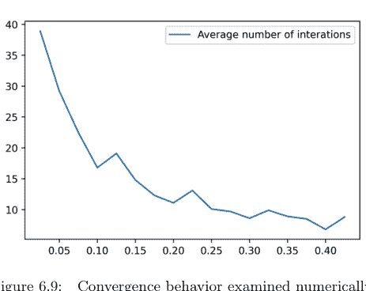

图 6.9：数值上检查的收敛行为。

速率大致是二次的（反比）。这个测试支持收敛定理。让我们现在以更严格的数学方式证明这一点。

证明假设数据是线性可分的。因此，存在一对参数 ($\mathbf{w}^*, b^*$)，满足 $\|\mathbf{w}^*\| \le 1$ 且 $b^2 \le 1$。让我们检查当前参数集 $\hat{\mathbf{w}}$ 与假设存在的 $\hat{\mathbf{w}}^*$ 在每次迭代中的内积。我们希望迭代做的是将当前的 $\hat{\mathbf{w}}$ 逐步更新到接近 $\hat{\mathbf{w}}^*$，这样它们的内积可以变得越来越大。最终，它们可以彼此平行。让我们看看在上面给出的感知机算法中是否真的发生了这种情况。我们的检查也是逐次迭代进行的，但只考虑算法进行更新的迭代，因为算法在其他情况下不执行任何操作。这意味着我们仅在第 $t$ 步满足 $y_t(\overline{\mathbf{x}}_t \cdot \hat{\mathbf{w}}_t) \le w/2$ 时执行更新。

在算法的初始设置中，$t = 0$，我们不知道 $\hat{\mathbf{w}}$ 应该是什么，因此设置 $\hat{\mathbf{w}}_0 = \mathbf{0}$。这里为了使用点积的简洁表述。我们假设列向量 $\hat{\mathbf{w}}_0$ 和 $\hat{\mathbf{w}}^*$ 被展平为（行）向量，以便 $\hat{\mathbf{w}}$ 可以直接与迭代过程中产生的任何其他（展平的）$\hat{\mathbf{w}}$ 进行点积。这可以使用 numpy 中的 flatten() 函数轻松完成。因此，在初始设置中，我们有

$$\hat{\mathbf{w}}_0 \cdot \hat{\mathbf{w}}^* = 0$$

在 $t = 1$ 时，根据算法，我们任意引入一个数据点，比如带有 $y_1$ 的 $\overline{\mathbf{x}}_1$。我们将发现 $y_1 (\overline{\mathbf{x}}_1 \cdot \hat{\mathbf{w}}_1) = 0 \le (w/2)$，因为此时当前的 $\hat{\mathbf{w}}_1$ 仍然全为零。因此，带有 $y_1$ 的数据点 $\overline{\mathbf{x}}_1$ 在由当前向量 $\hat{\mathbf{w}}_1$ 定义的直线所划分的“街道”。接下来，我们执行以下更新：

$$\hat{\mathbf{w}}_1 = \hat{\mathbf{w}}_0 + y_1\overline{\mathbf{x}}_1$$

因此我们得到，

$$\hat{\mathbf{w}}_1 \cdot \hat{\mathbf{w}}^* = \hat{\mathbf{w}}_0 \cdot \hat{\mathbf{w}}^* + y_1(\overline{\mathbf{x}}_1 \cdot \hat{\mathbf{w}}^*) \geq w/2$$

这是因为定理给出的条件 $y_i(\overline{\mathbf{x}}_i \cdot \hat{\mathbf{w}}^*) \geq w/2$。我们看到向量 $\hat{\mathbf{w}}_1$ 的方向向 $\hat{\mathbf{w}}^*$ 的方向靠近了 $w/2$。它们的对齐程度增加了 $w/2$。

类似地，在 $t = 2$ 时，根据算法，我们有以下更新。

$$\hat{\mathbf{w}}_2 = \hat{\mathbf{w}}_1 + y_2\overline{\mathbf{x}}_2$$

我们现在得到，

$$\hat{\mathbf{w}}_2 \cdot \hat{\mathbf{w}}^* = \hat{\mathbf{w}}_1 \cdot \hat{\mathbf{w}}^* + y_2(\overline{\mathbf{x}}_2 \cdot \hat{\mathbf{w}}^*) \geq 2(w/2)$$

这是因为 $t = 1$ 时得到的结果，以及定理给出的新条件 $y_i(\hat{\mathbf{w}}^* \cdot \overline{\mathbf{x}}_i) \geq w/2$。我们看到向量 $\hat{\mathbf{w}}_1$ 的方向向 $\hat{\mathbf{w}}^*$ 的方向靠近了 $2(w/2)$。它们的对齐程度现在增加了 $2(w/2)$。

很明显，内积在每次迭代中增加一个 $(w/2)$。现在在第 $t$ 次更新时，我们应有

$$\hat{\mathbf{w}}_t \cdot \hat{\mathbf{w}}^* \geq t(w/2) \qquad (6.9)$$

我们看到向量 $\hat{\mathbf{w}}_t$ 的方向向 $\hat{\mathbf{w}}^*$ 的方向靠近了 $t(w/2)$。很明显，该算法以 $(w/2)$ 的线性速率驱动 $\hat{\mathbf{w}}$ 越来越与 $\hat{\mathbf{w}}^*$ 对齐。“街道”越宽，收敛越快。

接下来我们考察向量 $\hat{\mathbf{w}}_{t+1}$ 的长度（幅度）的演变。

$$\|\hat{\mathbf{w}}_{t+1}\|^2 = \hat{\mathbf{w}}_{t+1} \cdot \hat{\mathbf{w}}_{t+1} = (\hat{\mathbf{w}}_t + y_t\overline{\mathbf{x}}_t) \cdot (\hat{\mathbf{w}}_t + y_t\overline{\mathbf{x}}_t)$$
$$= \hat{\mathbf{w}}_t \cdot \hat{\mathbf{w}}_t + 2y_t\overline{\mathbf{x}}_t \cdot \hat{\mathbf{w}}_t + y_t\overline{\mathbf{x}}_t \cdot y_t\overline{\mathbf{x}}_t \qquad (6.10)$$
$$= \|\hat{\mathbf{w}}_t\|^2 + 2y_t\overline{\mathbf{x}}_t \cdot \hat{\mathbf{w}}_t + y_t^2\|\overline{\mathbf{x}}_t\|^2$$

利用定理给出的条件：$\|\overline{\mathbf{x}}_i\| = \|\mathbf{x}_i\| + 1 \leq R + 1$，以及 $y_i \in \{\pm 1\}$，和 $y_t(\overline{\mathbf{x}}_t \cdot \hat{\mathbf{w}}_t) \leq w/2$（这是启动第 $t$ 次更新的条件），我们应有

$$\|\hat{\mathbf{w}}_{t+1}\|^2 \leq \|\hat{\mathbf{w}}_t\|^2 + R^2 + 1 + w$$

当 $t = 0$ 时，我们有 $\|\hat{\mathbf{w}}_0\| = 0$，因此，

$$\|\hat{\mathbf{w}}_1\|^2 \leq \|\hat{\mathbf{w}}_0\|^2 + R^2 + 1 + w = R^2 + 1 + w$$

当 $t = 1$ 时，我们应有，

$$\|\hat{\mathbf{w}}_2\|^2 \leq \|\hat{\mathbf{w}}_1\|^2 + R^2 + 1 + w \leq 2(R^2 + 1 + w)$$

这意味着每次迭代增加 $(R^2 + 1 + w)$。
在第 $t = T$ 次迭代时，我们应有

$$\|\hat{\mathbf{w}}_T\| \leq \sqrt{T(R^2 + 1 + w)} \tag{6.11}$$

利用柯西-施瓦茨不等式，即 $\|a\| \cdot \|b\| \geq a \cdot b$，然后结合公式 (6.9)，我们得到，

$$\|\hat{\mathbf{w}}_T\| \|\hat{\mathbf{w}}^*\| \geq \hat{\mathbf{w}}_T \cdot \hat{\mathbf{w}}^* \geq T(w/2)$$

利用定理给出的条件：$\|\hat{\mathbf{w}}^*\| = \|\mathbf{w}^*\| + \|b\| \leq 1 + 1 = 2$，我们有

$$\|\hat{\mathbf{w}}_T\| \sqrt{2} \geq T(w/2)$$

将此与不等式公式 (6.11) 结合，得到，

$$\sqrt{2T(R^2 + 1 + w)} \geq T(w/2) \tag{6.12}$$

让我们分析这个方程。迭代次数 $T$ 在公式 (6.12) 的左边是线性的，在右边是在平方根内，而其他都是常数。因此，对于大的 $T$，这个不等式不可能成立。所以，$T$ 必须被限制以满足公式 (6.12)，这意味着感知器算法将在有限次迭代内收敛，并且 $T \leq \frac{8(R^2+1+w)}{w^2} \propto \left(\frac{R}{w}\right)^2$。这也可以写成

$$\frac{R}{w} \propto \sqrt{T} \tag{6.13}$$

这意味着对于给定的相对街道宽度，感知器算法收敛所需的迭代次数是其平方根。
我们现在给出以下几点说明：

- 1. 感知器收敛性证明要求数据点可以用一条直线分开。
- 2. 收敛性与数据的维度无关。这不是证明中使用的条件。它也与观测值的数量无关。
- 3. 迭代次数随着街道宽度 $w$ 的减小而增加，且速率是（反比）二次的。这与之前进行的数值测试相呼应。
- 4. 迭代次数随着数据上界 $R$ 的增加而减少，速率也是（反比）二次的。这意味着如果数据点通常相距更远，则更容易分离，这在直觉上是容易理解的。
- 5. 该算法仅对未对齐的数据点进行更新。它只是跳过已经对齐的数据点。

## 6.4 支持向量机

### 6.4.1 问题陈述

在我们之前关于感知器的讨论中，可以看到，对于一个线性可分的数据集，只要街道宽度 $w$ 有一个有限值，假设空间中实际上存在无限多个参数 $\mathbf{w}$ 和 $b$ 的解来形成直线。读者可能会观察到，只需用不同的初始权重和偏差启动分类器，就会得到不同的直线。人们自然会问，在所有这些可能的解中，什么是最佳解。一个答案是，以最大“街道”宽度分隔这两类数据并位于街道中间线的直线可能是最佳的。为了获得最宽“街道”的**最优**解，可以将问题表述为一个优化问题。实际上，如果效率不是问题，可以简单地引入一个优化算法来控制感知器多次尝试以找到最优解。

这里，我们介绍著名的算法，称为支持向量机或 SVM。最初的想法是在 1960 年代初由 Vapnik 在其博士论文中发明的，并在 1990 年代（结合核技巧）应用于手写数字识别时变得流行起来 [3, 4]。

SVM 是一种有效的算法，它使用系统化的表述和拉格朗日乘子法构建。下面是对 SVM 的详细描述和公式化。一个很好的参考是 MIT 的 Patrick Winston 教授的精彩讲座 (https://www.youtube.com/watch?v=_PwhiWxHK8o)，以及一些在线可用的推导 (https://towardsdatascience.com/support-vector-machine-python-example-d67d9b63f1c8)。

### 6.4.2 目标函数和约束的公式化

我们的公式化延续了我们为感知器推导的公式化。这里的区别在于，在 SVM 设置中，街道宽度不再被给定。我们只是假设它存在。我们必须找到一种方法来公式化街道宽度，然后针对给定的数据集最大化它。我们首先推导街道宽度的公式。

因为我们假设数据集是线性可分的，所以必然存在一个有限值 $w$ 的街道宽度。从我们推导的决策规则中，我们知道街道中间线的方程可以写成仿射变换形式：

$$\mathbf{x} \cdot \mathbf{w} + b = 0 \quad (6.14)$$

其中 $b \in \mathbb{W}$ 是一个称为偏置的学习参数，$\mathbf{x} \in \mathbb{X}^p$ 是特征空间中任意点的位置向量，具有线性多项式基（特征）$x_1, x_2, \dots, x_p$，

$$\mathbf{x} = [x_1, x_2, \dots, x_p] \quad (6.15)$$

而 $\mathbf{w} \in \mathbb{W}^p$ 是一个权重向量，这些权重也是学习参数 $w_1, w_2, \dots, w_p$：

$$\mathbf{w} = [w_1, w_2, \dots, w_p]^\top \quad (6.16)$$

二维特征空间 $\mathbb{X}^2$ 中的这条中间线如图 6.10 中的红色点划线所示，它使用假设空间 $\mathbb{W}^3$ 中的权重 $\mathbf{w}$ 和偏置 $b$ 进行近似。

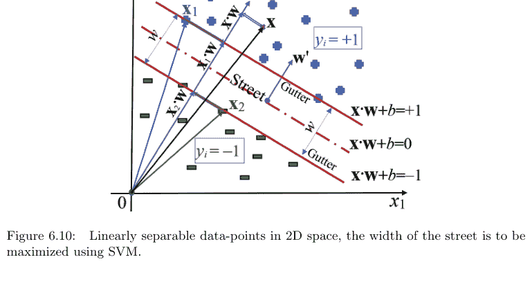

在右上方的沟槽上，至少有一个正数据点，比如 $\mathbf{x}_1$，正好位于其上。它的向量 $\mathbf{x}_1$ 是蓝色箭头，是沟槽的一个*支持向量*。因为 $\mathbf{x}_1$ 属于正类，其标签为 $+1$。这条街道沟槽线的方程可以表示为

$$\mathbf{x}_1 \cdot \mathbf{w} + b = +1 \qquad (6.17)$$

这是数据点 $\mathbf{x}_1$ 的决策边界。类似地，在左下方的沟槽上，至少有一个负数据点，比如 $\mathbf{x}_2$，正好位于其上。它的向量 $\mathbf{x}_2$ 支撑着沟槽。因为 $\mathbf{x}_2$ 属于负类，其标签为 $-1$。这条沟槽线的方程可以表示为

$$\mathbf{x}_2 \cdot \mathbf{w} + b = -1 \qquad (6.18)$$

现在考虑这两个支持向量 $\mathbf{x}_1$ 和 $\mathbf{x}_2$ 在街道中线单位法向量 $\frac{\mathbf{w}}{\|\mathbf{w}\|}$ 上的投影。$\mathbf{x}_1$ 的投影给出了右上方沟槽沿归一化 $\mathbf{w}$ 方向到原点的（欧几里得）距离。类似地，$\mathbf{x}_2$ 的投影给出了左下方沟槽沿归一化 $\mathbf{w}$ 方向到原点的距离。因此，它们的差值给出了街道的宽度：

$$w = \mathbf{x}_1 \cdot \frac{\mathbf{w}}{\|\mathbf{w}\|} + b - \mathbf{x}_2 \cdot \frac{\mathbf{w}}{\|\mathbf{w}\|} - b = \frac{\mathbf{x}_1 \cdot \mathbf{w} - \mathbf{x}_2 \cdot \mathbf{w}}{\|\mathbf{w}\|} \qquad (6.19)$$

将公式 (6.17) 和 (6.18) 代入 (6.19)，我们得到

$$w = \frac{2}{\|\mathbf{w}\|} \qquad (6.20)$$

一个非常简单的公式。现在，我们得到了街道宽度的方程，它仅取决于训练参数权重 $\mathbf{w}$！这并不难理解，因为这些权重决定了街道沟槽的方向，从而决定了街道的方向。当权重改变时，街道会相应地旋转，同时保持与两个数据点 $\mathbf{x}_1$ 和 $\mathbf{x}_2$ 接触，这导致街道宽度发生变化。偏置 $b$ 只影响直线的平移位置。因为街道宽度是两条沟槽线的差值，所以偏置被抵消了。因此，偏置 $b$ 不应影响宽度。这里，我们观察到一个事实：仿射空间不是向量空间（如第1章所述），仿射空间中两个向量的差回到了特征空间（因为增广项1被抵消了）。

然而，为什么街道宽度与 $\mathbf{w}$ 的范数成反比？这看起来可能违反直觉，但这确实是数学在起作用。为了探究这里真正发生的情况，让我们看一个更简单的设定，其中两个位于沟槽上的点 $\mathbf{x}_1$ 和 $\mathbf{x}_2$ 都位于 $x_2$ 轴上，如图 6.11 所示。

当沟槽处于水平方向时，上方沟槽的方程为

$$0 \cdot x_1 + 1 \cdot x_2 = +1 + b \quad (6.21)$$

街道宽度为 $w_0$。法向量 $\mathbf{w}$ 及其范数如下所示：

$$\mathbf{w} = [0 \ 1], \quad \|\mathbf{w}\| = \sqrt{0^2 + 1^2} = 1 \quad (6.22)$$

当这些沟槽旋转到具有斜率 $k$，同时仍由 $\mathbf{x}_1$ 和 $\mathbf{x}_2$ 支撑时，上方沟槽的方程变为

$$k \cdot x_1 + 1 \cdot x_2 = +1 + b \quad (6.23)$$

新的法向量 $\mathbf{w}_k$ 及其范数如下所示：

$$\mathbf{w}_k = [k \ 1], \quad \|\mathbf{w}_k\| = \sqrt{k^2 + 1^2} \quad (6.24)$$

很明显，旋转后的街道宽度 $w_k$ 明显小于旋转前的原始街道宽度 $w_0$，而 $\mathbf{w}$ 的范数却增加了。对于任何 $k$ 值，这都成立。当街道沿水平方向（垂直于向量 $\mathbf{x}_1 - \mathbf{x}_2$）时，其宽度达到最大。我们编写以下代码来绘制这种关系：

```python
import matplotlib.pyplot as plt
import numpy as np
%matplotlib inline
fig, figarr = plt.subplots(1, 2, figsize=(11, 4))
def w_norm(k):  # norm of vector w for a line of slope k
    return np.sqrt(1. + k**2)
k = np.arange(-10, 10, .1)
y = 2/w_norm(k) # compute the width of the street
figarr[0].plot(k,y,c='r')
figarr[0].set_xlabel('Slope of the street gutter, $k$')
figarr[0].set_ylabel('Width of the street')
figarr[1].plot(w_norm(k),y)
figarr[1].set_xlabel('Norm of the weight vector')
figarr[1].set_ylabel('Width of the street')
#figarr[1].ax1.set_title('ax1 title')
plt.show()
```

从图 6.12 可以清楚地看出，街道宽度与 **w** 的范数成反比。

最重要的是，这个分析表明，如果街道宽度最大化，**w** 必须垂直于沟槽（决策边界）。这个结论对于位于这两条沟槽上的任意一对数据点 **x**₁ 和 **x**₂ 都成立。

现在，公式 (6.19) 可以改写为

$$w = \underbrace{[\mathbf{x}_1 - \mathbf{x}_2]}_{\text{线性多项式基中的数据对}} \cdot \underbrace{\frac{\mathbf{w}}{\|\mathbf{w}\|}}_{\text{权重或优化参数}} \quad (6.25)$$

这意味着当 $w$ 最大化时，$[\mathbf{x}_1 - \mathbf{x}_2]$ 和 $\frac{\mathbf{w}}{\|\mathbf{w}\|}$ 的内积最大化（这两个向量平行），其中 $[\mathbf{x}_1 - \mathbf{x}_2]$ 是线性多项式基 $x_1, x_2, \dots$ 中的数据点对向量，用于在特征空间中近似一条直线，而 $\frac{\mathbf{w}}{\|\mathbf{w}\|}$ 是归一化权重或调优/优化参数的向量。这里使用线性多项式基是因为我们假设数据点可以被一个超平面线性分离。

记住我们最初的目标是找到最大街道宽度。根据公式 (6.20)，这等价于最小化 $\|\mathbf{w}\|$ 的范数，而这又等同于最小化 $\frac{1}{2}\|\mathbf{w}\|^2$。这种简单转换的好处很快就会显现。我们现在有了目标函数：

$$\mathcal{L} = \frac{1}{2}\|\mathbf{w}\|^2 = \frac{1}{2}\mathbf{w}^\top \mathbf{w} \quad (6.26)$$

上述函数需要被最小化。我们看到上述公式的一个很好的性质：目标函数是*二次的*，其海森矩阵是一个单位矩阵，显然是正定的。因此，它有且仅有一个最小值。局部最小值就是全局最小值。这是使用 SVM 模型时不用担心局部最小值/最优值的根本原因。

注意，我们的最小化必须在以下条件或约束下进行：

$$[y_i(\mathbf{x}_i \cdot \mathbf{w} + b) - 1] \geq 0 \quad (6.27)$$

对于所有数据点。假设对于我们的 $p$ 维问题，总共有 $m$ 个数据点。用矩阵形式表示，这组约束方程具有以下形式：

$$[\mathbf{y}(\mathbf{X} \cdot \mathbf{w} + \mathbf{1}b) - \mathbf{1}] \geq 0 \quad (6.28)$$

其中 $\mathbf{y}$ 是一个 $m \times m$ 的对角矩阵，对角线上是所有标签，$\mathbf{X}$ 是一个 $m \times p$ 的矩形矩阵，第 $i$ 行是 $\mathbf{x}_i$，$\mathbf{w}$ 是一个包含 $p$ 个未知权重参数的向量，$b$ 是未知的偏置参数，$\mathbf{1}$ 是一个 $m \times 1$ 的向量，所有元素值为 1。

### 6.4.3 带约束的修正目标函数：乘子法

因为这些约束方程需要被满足，我们的最小化变成了一个约束优化问题。目标函数很好（二次的），但有许多约束。这些约束是线性的，但以不等式形式存在。

对于这类优化问题，一个非常著名的技术是所谓的拉格朗日乘子法（发明于1902年！），它被广泛应用于许多领域，包括有限元方法中施加所谓的多点约束[5]。其基本思想是，当目标函数中的参数必须满足某些等式约束/条件时，目标函数应该被修正。修正的量取决于这些参数在多大程度上满足这些条件。然而，在我们获得使目标函数最小化的参数解之前，我们并不真正知道。在目标函数中考虑这一点的自然方法是给它增加一个代价。这样的代价应该可以通过一组额外的参数来调节，并且额外参数的数量应该对应于我们拥有的约束数量。对于我们的情况，我们有 $m$ 个约束，因此我们应该有 $m$ 个额外参数（尽管其中一些在最小化后最终会为零）。这些参数被称为拉格朗日乘子。修正后的目标函数可以写为

$$\mathcal{L} = \frac{1}{2} \mathbf{w}^\top \mathbf{w} - \boldsymbol{\lambda}^\top [\mathbf{y}(\mathbf{X} \cdot \mathbf{w} + \mathbf{1}b) - \mathbf{1}] \quad (6.29)$$

其中 $\boldsymbol{\lambda}$ 是一个 $m \times 1$ 的向量，包含 $m$ 个拉格朗日乘子 $\lambda_i$，它们是额外的未知参数。

从公式 (6.29) 可以看出，当括号中的任何 $m$ 个方程（等式部分）被完全满足时，增加的代价为零。如果不满足，不满足的程度乘以 $\boldsymbol{\lambda}$ 作为额外代价被添加到目标函数中。这意味着任何对约束的不满足都会被计入代价。此外，我们特意将这些拉格朗日乘子设为线性形式，这样如果我们对修正后的目标函数关于拉格朗日乘子求导以推导最小化条件，这些约束方程将被完全恢复。这意味着当我们的修正目标函数被最小化时，这些约束将被完全满足。

此外，由于我们原始的约束，公式 (6.29) 中方括号内的项必须大于或等于零。因此，任何不满足都将是负的。为了使增加的代价为正，我们必须对这些乘子施加以下约束（注意 $\boldsymbol{\lambda}^\top$ 前面的负号）：

$$\lambda_i \geq 0 \quad (6.30)$$

因此，公式 (6.30) 将成为我们使用修正目标函数进行最小化问题时对 $\lambda_i$ 的新约束，以确保不等式对**w**的原始约束。在稍后讨论的算法中，将实施这组新的约束。

请注意，拉格朗日乘子法仅适用于等式约束。然而，公式 (6.29) 包含受不等式约束的数据点。其合理性如下所述。

当 $[y_i(\mathbf{x}_i \cdot \mathbf{w} + b) - 1] < 0$ 时，意味着条件/约束被违反，由于 $\lambda_i$ 被设定为非负，在损失最小化时，$\lambda_i$ 将被最小化过程驱动至零。

当 $[y_i(\mathbf{x}_i \cdot \mathbf{w} + b) - 1] > 0$ 时，不等式约束部分得到满足。通过引入独立的松弛变量 $s_i^2$，这些约束可以转化为等式约束：

$$[y_i(\mathbf{x}_i \cdot \mathbf{w} + b) - 1] - s_i^2 = 0$$

现在，仅包含等式约束的修正损失函数可以写为：

$$\mathcal{L} = \frac{1}{2}\mathbf{w}^\top\mathbf{w} - \sum_{i}^m \lambda_i \left([y_i(\mathbf{x}_i \cdot \mathbf{w} + b) - 1] + s_i^2\right)$$

当 $\mathcal{L}$ 被最小化时，它在最小值点处是平稳的。将 $\mathcal{L}$ 对每个 $s_i$ 的偏导数设为零，得到：

$$\frac{\partial \mathcal{L}}{\partial s_i} = -2\lambda_i s_i = 0$$

这意味着，带有松弛变量的修正损失函数与不带松弛变量的公式 (6.29) 是相同的。此外，如果 $\lambda_i$ 或 $s_i$ 为零，上述方程即可满足。同时，当 $s_i = 0$ 时，$[y_i(\mathbf{x}_i \cdot \mathbf{w} + b) - 1] = 0$，因此我们有：

$$\lambda_i[y_i(\mathbf{x}_i \cdot \mathbf{w} + b) - 1] = 0$$

因此，对于所有满足 $[y_i(\mathbf{x}_i \cdot \mathbf{w} + b) - 1] > 0$ 的数据点（远离“街道”的数据点），对应的 $\lambda_i$ 必须为零，这意味着它是非活跃的。这证明了公式 (6.29) 可以使用，因为它只添加了零。我们将使用公式 (6.29) 来推导对偶问题的方程。

当 $[y_i(\mathbf{x}_i \cdot \mathbf{w} + b) - 1] = 0$ 时，数据点位于“沟渠”上，添加的代价为零。因此，$\lambda_i$ 可以为正的非零值。为了使其有界，需要对 $\lambda_i$ 施加一些额外的条件，这将通过最小化条件自然获得。

当一个数据点满足公式 (6.27) 中的*不等式*时，当最小化过程完成时，对应的 $\lambda$ 应自动变为零。正的非零 $\lambda$ 对应于满足公式 (6.27) *等式*部分的数据点，即正好位于沟渠上的零间隔数据点。这些数据点的向量被称为**支持向量**。这将在第 6.4.6 节给出的示例中得到证明。

最后，我们注意到约束优化问题现在总共有 $p + 1 + m$ 个参数。

请注意，还有另一种可能的方法来修改目标函数，称为惩罚法，它不会引入新参数。感兴趣的读者可以参考文献 [5]。

### 6.4.4 转换为标准二次规划问题

公式 (6.29) 对于 $\mathbf{w}$（对于固定的 $\lambda_i$）仍然是二次的，但现在存在于更高维的空间中。我们需要通过对修正后的目标函数首先对 $\mathbf{w}$ 求导，然后令其为零，来寻找其平稳点，得到：

$$\frac{\partial \mathcal{L}(\mathbf{w}, b, \boldsymbol{\lambda})}{\partial \mathbf{w}} = \mathbf{w} - \mathbf{X}^\top \mathbf{y} \boldsymbol{\lambda} = \mathbf{0} \quad (6.31)$$

注意到 $\mathcal{L}$ 是一个标量，我们寻求其对向量 $\mathbf{w}$ 的偏导数。因此，结果如预期是一个向量。公式 (6.31) 导出：

$$\mathbf{w} = \mathbf{X}^\top \mathbf{y} \boldsymbol{\lambda} = \sum_{i=1}^n \lambda_i y_i \mathbf{x}_i \quad (6.32)$$

公式 (6.32) 意味着权重参数 $\mathbf{w}$ 是附加了相应标签的数据向量的某种**线性组合**。组合的系数是拉格朗日乘子。从图 6.10 可以看出，这个发现非常合理：向量 $\mathbf{w}$ 确实被所有数据向量 $\mathbf{x}_i$ 所包围。它们的组合应该能够产生 $\mathbf{w}$。因为拉格朗日乘子在“观察”每个数据向量如何遵守这些决策规则，它们应该有“权利”来决定 $\mathbf{x}_i$ 对 $\mathbf{w}$ 的贡献系数。

接下来，我们对 $b$ 求导，然后令其为零，得到：

$$\frac{\partial \mathcal{L}(\mathbf{w}, b, \boldsymbol{\lambda})}{\partial b} = \boldsymbol{\lambda}^\top \mathbf{y} \mathbf{1} = 0 \quad (6.33)$$

这导出：

$$\lambda^\top \mathbf{y} \mathbf{1} = \mathbf{1}^\top \mathbf{y} \lambda = \sum_{i=1}^n \lambda_i y_i = 0 \quad (6.34)$$

这个方程意味着附加了标签的拉格朗日乘子之和为零。这有点意思：数据点的标签和乘子达成了某种“中立”的协议！

获得上述关系后，目标函数可以重写如下：

$$\mathcal{L} = \frac{1}{2} \lambda^\top \mathbf{y} \mathbf{X} \mathbf{X}^\top \mathbf{y} \lambda - \lambda^\top \mathbf{y} \mathbf{X} \mathbf{X}^\top \mathbf{y} \lambda - \lambda^\top \mathbf{y} \mathbf{1} b + \mathbf{1}^\top \lambda \quad (6.35)$$

这简化为所谓的对偶问题的目标函数：

$$\mathcal{L} = \mathbf{1}^\top \lambda - \frac{1}{2} \lambda^\top \mathbf{y} \mathbf{X} \mathbf{X}^\top \mathbf{y} \lambda = \sum_{i=1}^n \lambda_i - \sum_{i=1}^n \sum_{j=1}^n \lambda_i y_i \lambda_j y_j (\mathbf{x}_i \cdot \mathbf{x}_j) \quad (6.36)$$

请注意，$b$ 现在不再出现，这呼应了公式 (6.20)：街道的宽度不应依赖于 $b$。这是预期的，因为 $b$ 只影响街道的平移位置。此外，SVM 公式中使用的数据点（在特征空间中）是以**内积**的形式出现的：$(\mathbf{x}_i \cdot \mathbf{x}_j)$。这意味着重要的是这些数据点之间的相互关系。SVM 的这种特殊公式允许有效使用所谓的非线性核函数，这些函数评估具有非线性决策边界问题中数据点之间的相互关系。我们将在第 6.4.10 节进一步讨论这一点。

在实际计算中，我们可以首先计算 $\mathbf{X}_y = \mathbf{y} \mathbf{X}$，其第 $i$ 行就是 $y_i \mathbf{x}_i$，可以高效计算。公式 (6.36) 现在可以进一步简化为：

$$\mathcal{L} = \mathbf{1}^\top \lambda - \frac{1}{2} \lambda^\top \mathbf{P} \lambda \quad (6.37)$$

其中

$$\mathbf{P} = [P_{ij}] = \mathbf{X}_y \mathbf{X}_y^\top, \text{ 其中 } P_{ij} = y_i y_j (\mathbf{x}_i \cdot \mathbf{x}_j) \quad (6.38)$$

很明显，矩阵 $\mathbf{P}$ 是对称的（当然也是实的）。它是非负定的。在这种情况下，我们的目标函数对于参数 $\lambda$ 也是二次的，这是我们的优化算法所期望的性质。然而，我们看到 $\lambda$ 的二次项符号为负。因此，它相对于 $\lambda$ 的曲率是负的，这与公式 (6.26) 中的符号相反。因此，我们原始的最小化问题被转换为一个最大化问题。此外，公式 (6.29) 给出的目标函数必须具有鞍点形状：它沿 **w** 方向具有正曲率，沿 **λ** 方向具有负曲率。

在拉格朗日乘子理论中，当目标函数被 **λ** 修改时，修正函数的偏导数通常只能给出极值所在的平稳点。这些点是鞍点，这意味着沿着某些参数轴，这些点可能是最小值，而沿着其他参数轴，它们可能是最大值。因此，需要仔细检查极值是最小值还是最大值。为了更清楚地看到这个问题，让我们看一个只有两个参数 $w$ 和 $\lambda$ 的简化损失函数问题。这个简化函数仍然具有相同的基本行为，因此我们可以编写一个 Python 代码并绘制一个 3D 图形来查看实际发生的情况。

```python
import numpy as np
import matplotlib as mpl
mpl.rcParams['figure.dpi']= 220
import matplotlib.pyplot as plt
from mpl_toolkits import mplot3d
from mpl_toolkits.mplot3d import axes3d
%matplotlib inline
#%matplotlib tk
```

```python
w = np.linspace(-2.0,2.0,100)     # just one weight
l = np.linspace(-4.,4.0,100)       # just one lambda
W, L = np.meshgrid(w, l)           # create grids for 3D plot
c1, c2 = 10.0, 2.0                 # assign some constants
Loss = c1*(W*W) - c2*(L*L)         # simplified loss function
fig_s = plt.figure(figsize=(8,5)) # define sizes for 3D plot
ax = fig_s.add_subplot(1,1,1,projection='3d')
ax.set_xlabel('$w$', fontsize=12, rotation=0)
ax.set_ylabel('$\lambda$', fontsize=12)
ax.set_zlabel('$\mathcal{L}$', fontsize=12, rotation=0)
ax.yaxis._axinfo['label']['space_factor'] = 3.0
#ax.plot_wireframe(X1, X2, Z, color='b',rstride=5, cstride=5)
ax.plot_surface(W,L,Loss,color='b',rstride=2,cstride=2,
                shade=False, cmap="jet", linewidth=1)
plt.title('A simplified loss function with a saddle point, $c_1$='
          +str(c1)+', $c_2$=' +str(c2))
```

plt.legend()
fig_s.tight_layout()  # 否则y轴标签会被裁剪
plt.show()

一个带有鞍点的简化损失函数，$c_1=10.0, c_2=2.0$

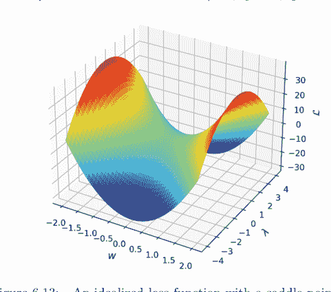

图6.13：一个带有鞍点的理想化损失函数。

我们看到一个鞍面，以及曲面中点处的一个鞍点。现在很清楚，该函数沿$w$方向（对于任何固定的$\lambda$）有极小值，沿$\lambda$方向（对于任何固定的$w$）有极大值。

回到我们在式(6.37)中给出的一般目标函数$\mathcal{L}$，让我们看看关于$\lambda$的二阶导数：

$$\frac{\partial^2 \mathcal{L}(\lambda)}{\partial \lambda^2} = -\mathbf{P}$$ (6.39)

这就是海森矩阵（$-\mathbf{P}$，曲率的一种度量），它是一个负定矩阵；因为$\mathbf{P}$是非负定的，我们可以再次清楚地看到，我们的问题现在变成了一个关于新引入的拉格朗日乘子$\lambda$的优化问题。

最后，注意到我们的目标函数带有式(6.31)和(6.34)给出的约束，我们的SVM问题可以写成

$$\max_{\lambda} -\frac{1}{2} \lambda^\top \mathbf{P} \lambda + \mathbf{1}^\top \lambda$$
约束条件为 $\lambda \geq 0$
$\mathbf{1}^\top \mathbf{y} \lambda = 0$ (6.40)

注意，$\mathbf{1}^\top \mathbf{y}$只是一个收集了所有数据点标签的行向量，可以在算法中加以利用以避免不必要的计算。

当然，我们可以通过简单地修改目标函数的符号，轻松地将我们的优化问题转化为最小化问题，如下所示：

$$\min_{\boldsymbol{\lambda}} \frac{1}{2} \boldsymbol{\lambda}^\top \mathbf{P} \boldsymbol{\lambda} - \mathbf{1}^\top \boldsymbol{\lambda}$$
$$\text{约束条件为 } \boldsymbol{\lambda} \geq 0$$
$$\mathbf{1}^\top \mathbf{y} \boldsymbol{\lambda} = 0$$
(6.41)

这个简单的改变允许我们将问题代入CVXOPT标准求解器以获得解。

现在让我们看看CVXOPT库中的标准求解器（使用`help(cvxopt.solvers.qp)`查看）。它求解如下定义的二次规划问题：

$$\text{最小化 } \frac{1}{2} \mathbf{x}^\top \mathbf{P} \mathbf{x} + \mathbf{q}^\top \mathbf{x}$$
$$\text{约束条件为 } \mathbf{G} \mathbf{x} \leq \mathbf{h}$$
$$\mathbf{A} \mathbf{x} = \mathbf{b}$$
(6.42)

与式(6.41)相比，可以清楚地看到，我们的问题最终被表述为一个典型的、标准的问题，具有二次（因此是凸的）目标函数和一组线性不等式约束，称为二次规划（QP）问题。成熟的QP技术可以很容易地用作解决此问题的标准程序，包括CVXOPT (https://cvxopt.org/)，这是一个基于Python的凸优化免费软件包。由于凸性的优良特性，人们无需担心局部最优解。它有一个且仅有一个最优解（或最小值），并且它是全局最优解。

### 6.4.5 SVM中的预测

SVM模型训练完成后，我们应该知道$\mathbf{w}$和$b$。对于任何给定的测试数据点$\mathbf{x}_j$，我们可以使用以下公式进行预测：

$$\hat{y}_j = \mathbf{x}_j \cdot \mathbf{w} + b = \sum_{i=1}^n \lambda_i y_i (\mathbf{x}_i \cdot \mathbf{x}_j)$$
(6.43)

当$\hat{y} \geq 1$时，$\mathbf{x}_j$属于正类；当$\hat{y} \leq -1$时，它属于负类；否则属于间隔带内。
注意，预测也只需要数据集特征变量的内积：$(\mathbf{x}_i \cdot \mathbf{x}_j)$。

### 6.4.6 示例：SVM的Python代码

我们现在使用（经许可）Cory Maklin在https://github.com/corymaklin/svm给出的Python代码来检验SVM方法。该代码使用了QP工具和求解器。

```python
#导入必要的库
import numpy as np
import cvxopt   # 需要安装，用于QP工具和求解器
from sklearn.datasets import make_blobs
from sklearn.model_selection import train_test_split
from matplotlib import pyplot as plt
from sklearn.svm import LinearSVC
from sklearn.metrics import confusion_matrix
print('cvxopt version',cvxopt.__version__)
```

cvxopt version 1.2.6

定义一个名为SVM的类。

```python
class SVM:
    def fit(self, X, y):
        n_samples, n_features = X.shape
        # P = X X^T
        K = np.zeros((n_samples, n_samples))
        for i in range(n_samples):
            for j in range(n_samples):
                K[i,j] = np.dot(X[j], X[i])
        P =  cvxopt.matrix(np.outer(y, y) * K)     #使用cvxopt
        print('K.shape',K.shape,' y.shape',y.shape)
        # q = -1 (1xN)
        q =  cvxopt.matrix(-1*np.ones(n_samples))
        # A = y^T
        A = cvxopt.matrix(y, (1, n_samples))
        # b = 0
        b = cvxopt.matrix(1.0)
        # -1 (NxN)
        G = cvxopt.matrix(-1*np.diag(np.ones(n_samples)))
        # O (1xN)
        h = cvxopt.matrix(np.zeros(n_samples))
        solution = cvxopt.solvers.qp(P, q, G, h, A, b) # QP
        # 拉格朗日乘子
        a = np.ravel(solution['x'])  #展平为一维数组
        # 拉格朗日乘子中非零的拉格朗日乘子
        sv = a > 1e-5
        ind = np.arange(len(a))[sv]
        self.a = a[sv]
        self.sv = X[sv]
        self.sv_y = y[sv]
        # 截距
        self.b = 0
        for n in range(len(self.a)):
            self.b += self.sv_y[n]
            self.b -= np.sum(self.a * self.sv_y * K[ind[n], sv])
        self.b /= len(self.a)
        # 权重
        self.w = np.zeros(n_features)
        for n in range(len(self.a)):
            self.w += self.a[n] * self.sv_y[n] * self.sv[n]

    def project(self, X):
        return np.dot(X, self.w) + self.b
    def predict(self, X):
        return np.sign(self.project(X))
```

接下来，我们使用scikit-learn库生成一组线性可分的数据。为了使用cvxopt，我们需要将负样本标记为−1而不是0。

```python
X, y = make_blobs(n_samples=255, centers=2,
                  random_state=0, cluster_std=0.65)
y[y == 0] = -1
tmp = np.ones(len(X))
y = tmp * y
# 让我们看看数据。
print('X.shape',X.shape)
plt.scatter(X[:, 0], X[:, 1], c=y, cmap='winter');
```

X.shape (255, 2)

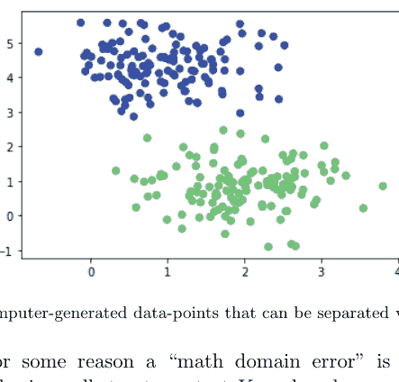

图6.14：可通过直线分离的计算机生成的数据点。

**注意：** 如果在运行以下单元格时遇到“math domain error”，请尝试重启内核并从本小节开头重新运行代码。

```python
# 我们将数据分为训练集和测试集。
X_train,X_test,y_train,y_test=train_test_split(X,y, random_state=0)
print(X_train.shape,X_test.shape,y_train.shape, y_test.shape)
# 创建一个实例，然后训练我们的SVM类的实例。
svm = SVM()
svm.fit(X_train, y_train)
#绘制决策边界和支持向量。
def f(x, w, b, c=0):
    return (-w[0] * x - b + c) / w[1]  #x1.w1 + x2.w2 + b = c

plt.scatter(X_train[:,0],X_train[:,1],c=y_train, cmap='winter')
# w.x + b = 0
a0 = -1; a1 = f(a0, svm.w, svm.b)
b0 =  4; b1 = f(b0, svm.w, svm.b)
plt.plot([a0,b0], [a1,b1], 'k')
# w.x + b = 1
a0 = -1; a1 = f(a0, svm.w, svm.b, 1)
b0 =  4; b1 = f(b0, svm.w, svm.b, 1)
plt.plot([a0,b0], [a1,b1], 'k--')
# w.x + b = -1
a0 = -1; a1 = f(a0, svm.w, svm.b, -1)
b0 =  4; b1 = f(b0, svm.w, svm.b, -1)
plt.plot([a0,b0], [a1,b1], 'k--')
w_street = 2/np.linalg.norm(svm.w) # 计算间隔带宽度
print('间隔带的宽度:',w_street)
```

(191, 2) (64, 2) (191,) (64,)
K.shape (191, 191) y.shape (191,)

pcost dcost gap pres dres
0: -2.1259e+01 -4.3138e+01 7e+02 2e+01 2e+00
1: -3.3107e+01 -3.1685e+01 3e+02 1e+01 8e-01
2: -5.5227e+01 -3.9785e+01 3e+02 8e+00 6e-01
3: -1.0725e+02 -3.9083e+01 1e+02 3e+00 3e-01
4: -1.9273e+01 -1.4357e+01 2e+01 4e-01 3e-02
5: -1.3042e+01 -1.3209e+01 3e+00 5e-02 4e-03
6: -1.2960e+01 -1.2963e+01 4e-02 6e-04 5e-05
7: -1.2961e+01 -1.2961e+01 4e-04 6e-06 5e-07
8: -1.2961e+01 -1.2961e+01 4e-06 6e-08 5e-09

找到最优解。
间隔带的宽度: 0.6301007705116851

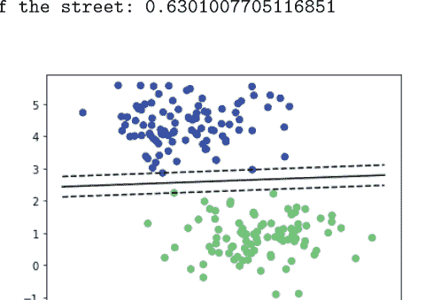

图6.15：分离这些数据点的最宽间隔带的SVM结果。

```python
# 最后，使用训练好的模型对测试数据集进行预测。
print('X_test.shape',X_test.shape)
print('y_test.shape',y_test.shape)
y_proj = svm.project(X_test)
y_pred = svm.predict(X_test)
print('投影值:', y_proj[:5])
print('预测值:', y_pred[:5])
#使用混淆矩阵显示其准确率
confusion_matrix(y_test, y_pred)
```

### 6.4.7 混淆矩阵

混淆矩阵 **C** 通常定义如下：$C_{ij}$：表示属于第 $i$ 组但被预测为第 $j$ 组的观测数量。
对于二分类问题，真负类计数为 $C_{00}$，假负类计数为 $C_{10}$。真正类计数为 $C_{11}$，假正类计数为 $C_{01}$。
对于上述问题，我们有 31 个负类计数和 33 个正类计数。两个类别都没有错误预测。

### 6.4.8 示例：一个用于 SVM 的 Scikit-learn 类

上述代码允许根据个人问题进行修改。作为替代方案，我们也可以使用现有的强大 SVM 库来解决相同的问题，以便比较各种方法。以下代码来自 Scikit-learn [6]。

```python
# 导入必要的库
import numpy as np
from sklearn.datasets import make_blobs
from sklearn.model_selection import train_test_split
from matplotlib import pyplot as plt
from sklearn.svm import LinearSVC
from sklearn.metrics import confusion_matrix
# 创建数据集
X, y = make_blobs(n_samples=255, centers=2, random_state=0,
                  cluster_std=0.65)
y[y==0] = -1
y = np.ones(len(X)) * y
print('X.shape',X.shape)    # 查看数据集
plt.scatter(X[:, 0], X[:, 1], c=y, cmap='winter');
# 将数据集分割为训练集和测试集。
X_train,X_test,y_train,y_test=train_test_split(X,y, random_state=0)
print(X_train.shape,X_test.shape,y_train.shape, y_test.shape)
```

X.shape (255, 2)
(191, 2) (64, 2) (191,) (64,)

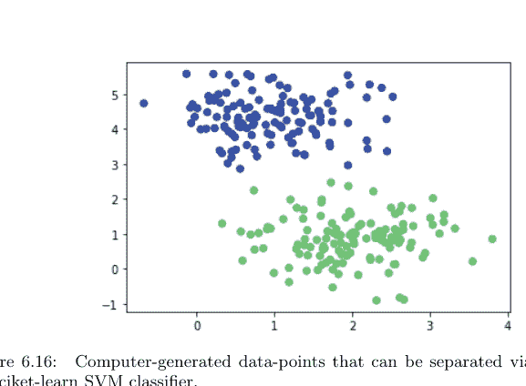

图 6.16：可通过直线分离的计算机生成数据点，用于 scikit-learn SVM 分类器。

```python
# scikit-learn SVM 类作为 SVC（支持向量分类器）
svc = LinearSVC(tol=0.0001, C=400.0,max_iter=3000) # 实例化
svc.fit(X_train, y_train) # 训练模型
# 绘制决策边界和支持向量。
plt.scatter(X_train[:,0],X_train[:,1],c=y_train,
            cmap='winter');
ax = plt.gca()
xlim = ax.get_xlim()
w = svc.coef_[0]
a = -w[0] / w[1]
w_street = 2/np.linalg.norm(w) # 计算街道宽度
print('The width of the street:',w_street)
xx = np.linspace(xlim[0], xlim[1])
yy = a * xx - svc.intercept_[0] / w[1]
plt.plot(xx, yy)
yy = a * xx - (svc.intercept_[0] - 1) / w[1]
plt.plot(xx, yy, 'k--')
yy = a * xx - (svc.intercept_[0] + 1) / w[1]
plt.plot(xx, yy, 'k--');
```

The width of the street: 0.6549977642924647

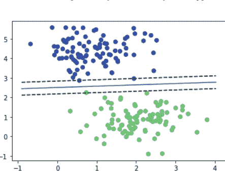

图 6.17：Scikit-learn SVM 分离这些数据点的最宽街道结果。

请注意，这里计算的街道宽度比使用先前代码获得的结果稍窄。这是因为 `LinearSVC` 允许通过设置创建 svc 实例时的 C 参数来计算所谓的软决策边界。可以尝试更改 C 值并再次运行代码以查看结果。

我们现在使用这些测试样本再次进行预测，然后以混淆矩阵的形式评估预测质量。

```python
y_pred = svc.predict(X_test)
confusion_matrix(y_test, y_pred)
```

```
array([[31,  0],
       [ 0, 33]], dtype=int64)
```

对于此示例，我们同样有 31 个负类计数和 33 个正类计数。两个类别都没有错误预测。

### 6.4.9 无法用超平面分离的数据集的 SVM

上述示例对所有可通过直线（或超平面）分离的数据点进行分类。有些数据集只能通过非线性曲线正确分离。SVM 对于此类数据集也是一种有效的方法。它是通过将特征空间扩展到更高维度来实现的，通过在公式 (6.14) 中添加非线性基函数，类似于我们在 FEM [5] 中所做的。例如，对于一个 $p = 3$ 的问题，初步特征变量为

$$\mathbf{x} = \{x_1, x_2, x_3\} \in \mathbb{X}^3$$

我们可以利用帕斯卡金字塔来包含更多非线性（NL）基函数，从而形成特征：

$$\mathbf{x}^{NL} = \left\{1, \sqrt{2}x_1, \sqrt{2}x_2, \sqrt{2}x_3, x_1x_1, x_1x_2, x_1x_3, x_2x_1, x_2x_2, x_2x_3, x_3x_1, x_3x_2, x_3x_3\right\} \in \mathbb{X}^{13}$$

扩展特征空间的维度通过 $p \times p + p + 1 = 13$ 计算得出。如果我们使用 $\mathbf{x}^{NL}$ 代替 $\mathbf{x}$，上述所有SVM公式仍然成立，但内积 $(\mathbf{x}_i \cdot \mathbf{x}_j), i, j = 1, 2, 3$ 将被替换为内积 $(\mathbf{x}_I^{NL} \cdot \mathbf{x}_J^{NL}), I, J = 1, 2, \dots, 13$。在低维空间中可被超平面分离的数据点，在映射到高维空间后可能变得可分离。一个展示此概念的优秀视频可以在“SVM with polynomial kernel visualization”（https://www.youtube.com/watch?v=OdlNM96sHio&t=0s）中找到。

然而，当 $p$ 很大时，扩展空间的维度会急剧增长，计算成本可能过高。因此，我们实际上并不构建扩展特征。相反，我们使用**核技巧**来达到使用扩展特征的效果。

### 6.4.10 核技巧

核技巧用一个计算成本低得多的合适核函数来替代内积 $(\mathbf{x}_I^{NL} \cdot \mathbf{x}_J^{NL})$。对于公式 (6.45) 中的基函数，核函数为：

$$k(\mathbf{x}, \mathbf{x}_j) = (\mathbf{x} \cdot \mathbf{x}_j + 1)^2$$

读者不难验证：

$$(\mathbf{x}_i \cdot \mathbf{x}_j + 1)^2 = (\mathbf{x}_I^{NL} \cdot \mathbf{x}_J^{NL})$$

注意，左边的计算阶数是 $p$，而右边的计算阶数是 $p^2$。使用核函数带来的节省是显著的。广义非线性多项式核可以表示为：

$$k(\mathbf{x}, \mathbf{x}_j) = (\mathbf{x} \cdot \mathbf{x}_j + c)^d$$

其中 $c$ 和 $d$ 是预定义的常数。常用的常数是 $c = 0$ 或 $1$，以及 $d = 2 \sim 5$。在一般情况下，我们可能并不确切知道扩展特征 $\mathbf{x}^{NL}$ 是什么。幸运的是，我们不需要知道。正因如此，许多类型的核函数可以在SVM中使用，而无需找到 $\mathbf{x}^{NL}$，包括径向基函数（RBFs）。例如，当使用高斯基函数（一种典型的RBF）时，我们得到高斯核：

$$k(\mathbf{x}, \mathbf{x}_j) = \exp\left(-\frac{\|\mathbf{x} - \mathbf{x}_j\|^2}{2\sigma^2}\right) \quad (6.49)$$

其中 $\sigma$ 是一个预定义的参数，控制核函数的宽度。这样的核是 $\mathbf{x}_j$ 到 $\mathbf{x}$ 的（欧几里得）距离的函数，因此也被称为**距离函数**。它有时被称为**相似性函数**，因为当 $\mathbf{x}$ 接近 $\mathbf{x}_j$ 时，$k(\mathbf{x}, \mathbf{x}_j)$ 趋近于1，因此是相似的。当 $\mathbf{x}$ 远离 $\mathbf{x}_j$ 时，$k(\mathbf{x}, \mathbf{x}_j)$ 指数级地趋近于零，表示不相似。

通过如此简单地用核函数替代内积，寻找曲线决策边界的优化参数的其余操作基本保持不变。由于使用核函数的这种便利性，机器学习包（如SK-learn (https://scikit-learn.org/stable/modules/svm.html)）允许用户定义自己的自定义核函数，以更好地适应其应用。

所有相似性函数都可以用作SVM的核，只需将公式 (6.47) 中的 $P_{ij}$ 替换为 $P_{ij} = y_i y_j k(\mathbf{x}_i \mathbf{x}_j)$，前提是该核基于[默瑟定理]是正定的。RBFs是对称的，因为它们是距离函数，因此交换 $\mathbf{x}$ 和 $\mathbf{x}_j$ 会得到相同的结果。它也是正定的，因此是正定的，如Powell [7]所证明。当使用大量数据点时，可能需要注意条件数和计算复杂性。

核的概念具有相当广泛的适用性。它不仅用于SVM，也可能用于其他机器学习技术，例如非线性PCA，只要其公式以数据点的内积形式使用。它也经常用于基于物理定律的方法，例如无网格方法 [8]。

### 6.4.11 示例：使用曲线的SVM分类

以下来自Scikit learn [6]的代码执行非线性SVM，对由曲线分隔的数据点进行分类。

```python
import numpy as np
import matplotlib.pyplot as plt
from sklearn import svm

xx, yy = np.meshgrid(np.linspace(-3, 3, 500),
                    np.linspace(-3, 3, 500))
np.random.seed(0)
X = np.random.randn(300, 2)
Y = np.logical_xor(X[:, 0] > 0, X[:, 1] > 0)
# fit the model
clf = svm.NuSVC()
clf.fit(X, Y)

# plot the decision function for each datapoint on the grid
Z = clf.decision_function(np.c_[xx.ravel(), yy.ravel()])
Z = Z.reshape(xx.shape)
plt.imshow(Z, interpolation='nearest', extent=(xx.min(),
           xx.max(), yy.min(), yy.max()), aspect='auto',
           origin='lower', cmap=plt.cm.PuOr_r)
contours = plt.contour(xx, yy, Z, levels=[0], linewidths=2)
plt.scatter(X[:, 0], X[:, 1], s=30, c=Y, cmap=plt.cm.Paired)
plt.xticks(())
plt.yticks(())
plt.axis([-3, 3, -3, 3])
plt.show()
```

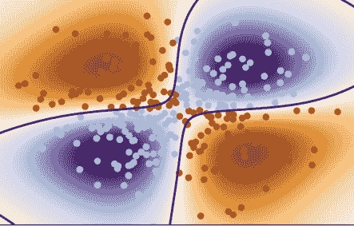

图 6.18：通过Sklearn分类器对数据点进行曲线SVM分类。

可以看出，Sklearn分类器SVC也相当正确地分类了此测试数据集中的所有这些样本。

### 6.4.12 通过SVM进行多类分类

在许多机器学习应用中，存在多类别的数据集。SVM也可用于此类分类任务。多分类中使用了多类缩减技术，包括一对多（也称为一对剩余）和一对一。让我们看以下比较案例研究。

### 6.4.13 示例：在鸢尾花数据集上使用SVM分类器

本节介绍了Sklearn团队进行的一项比较研究。它比较了在鸢尾花数据集的二维投影上使用不同线性SVM分类器的效果，考虑了数据集中的前两个特征：

- 花萼长度。
- 花萼宽度。

使用具有四种不同核的SVM分类器生成决策面。线性模型 `LinearSVC()` 和 `SVC(kernel='linear')` 给出的决策边界略有不同。这是因为

- LinearSVC最小化平方铰链损失，而SVC最小化常规铰链损失。
- LinearSVC使用一对多（也称为一对剩余）多类缩减，而SVC使用一对一多类缩减。

```python
%matplotlib inline
print(__doc__)
import numpy as np
import matplotlib.pyplot as plt
from sklearn import svm, datasets

def make_meshgrid(x, y, h=.02):
    """Create a mesh of points to plot in
    Parameters
    ----------
    x: data to base x-axis meshgrid on
    y: data to base y-axis meshgrid on
    h: stepsize for meshgrid, optional
    Returns
    -------
    xx, yy : ndarray
    """
    x_min, x_max = x.min() - 1, x.max() + 1
    y_min, y_max = y.min() - 1, y.max() + 1
    xx, yy = np.meshgrid(np.arange(x_min, x_max, h),
                         np.arange(y_min, y_max, h))
    return xx, yy

def plot_contours(ax, clf, xx, yy, **params):
    """Plot the decision boundaries for a classifier.
    Parameters
    ----------
    ax: matplotlib axes object
    clf: a classifier
    xx: meshgrid ndarray
    yy: meshgrid ndarray
    params: dictionary of params to pass to contourf, optional
    """
    Z = clf.predict(np.c_[xx.ravel(), yy.ravel()])
    Z = Z.reshape(xx.shape)
    out = ax.contourf(xx, yy, Z, **params)
    return out

# import some data to play with
iris = datasets.load_iris()
# Take the first two features. We could avoid this by using a
# two-dim dataset
X = iris.data[:, :2]
y = iris.target
# Create an instance of SVM and fit out data. We do not scale
# data since we want to plot the support vectors
C = 1.0  # SVM regularization parameter
models = (svm.SVC(kernel='linear', C=C),
          svm.LinearSVC(C=C, max_iter=10000),
          svm.SVC(kernel='rbf', gamma=0.7, C=C),
          svm.SVC(kernel='poly', degree=3, gamma='auto', C=C))
models = (clf.fit(X, y) for clf in models)
# title for the plots
titles = ('SVC with linear kernel',
          'LinearSVC (linear kernel)',
          'SVC with RBF kernel',
          'SVC with polynomial (degree 3) kernel')
```

## 第7章

## 激活函数与万能逼近定理

激活函数是基于人工神经网络的机器学习模型中最基本的要素之一。激活函数的作用是为神经网络引入必要的非线性，使其能够处理复杂问题。我们在第5章中已经讨论过这一点。本章将深入探讨这个主题。在本书中，激活函数通常用 $\phi(z)$ 表示，其自变量 $z$ 通常是神经网络中某个神经元的输入，也常常是前一层神经元输出的仿射变换结果。

已经使用过许多类型的激活函数，其中一些仍在广泛使用，还有更多正在开发中。我们的讨论将聚焦于典型的几种。在本章对这些激活函数建立清晰的理解后，理解其他函数应该会相当直接。一个相当完整的激活函数列表可以在维基百科（https://en.wikipedia.org/wiki/Activation_function）上找到。

在充分理解神经元的权重和偏置对激活函数输出的作用之后，我们就能领会神经元的基本能力。这种能力为神经网络的万能逼近定理 [1, 2] 提供了一个形象的展示。

值得注意的是，在训练神经网络时，我们通常需要损失函数对其所有训练参数的导数，而这些参数往往是激活函数自变量的一部分。因此，激活函数应该是可微的，或者至少是分段可微的。本章讨论的所有激活函数都满足这一要求。

我们首先考察著名的 Sigmoid 激活函数。

## 7.1 Sigmoid 函数 ($\sigma(z)$)

Sigmoid 函数是最早用于训练神经网络的激活函数之一。它至今仍被广泛使用，我们将在多个章节中用到它。它有一个专用符号 $\sigma$，定义如下：

$$\phi(z) = \sigma(z) = \frac{1}{1 + e^{-z}} \quad (7.1)$$

显然，对于任何给定的实数自变量 $z \in (-\infty, \infty)$，它返回一个 $(0,1)$ 区间内的正数。在机器学习中，自变量通常是一个数组，我们使用逐元素操作。因此，给定一个数组输入，$\sigma(z)$ 也是一个数组。Sigmoid 激活函数 $\sigma$ 将任何自变量值映射（或实际上压缩）到 $(0,1)$ 区间内。因此，它被称为压缩函数。它也被称为逻辑函数，因为它常用于逻辑回归，给出的结果类似于概率。

Sigmoid 函数的导数具有简洁的形式：

$$\phi'(z) = \phi(z)(1 - \phi(z)) \quad (7.2)$$

我们现在编写以下激活函数代码，并使用 mxnet 和 matplotlib 演示 Sigmoid 函数的行为。

```python
%matplotlib inline
import mxnet as mx
from mxnet import nd, autograd, gluon
import matplotlib.pyplot as plt
import numpy as np
from matplotlib import rc
def logistic0(z):    # also known as the sigmoid function
    return 1. / (1. + nd.exp(-z))

plt.figure(figsize=(4.0, 2.5),dpi=100)
z = nd.arange(-10, 10, .1)
y = logistic0(z)
plt.plot(z.asnumpy(),y.asnumpy())
plt.xlabel('z')
plt.ylabel(r'$\sigma(z) $')
plt.title('Sigmoid Function')
plt.grid(color='r',which='both',linestyle=':',linewidth=0.5)
plt.show()
```

```python
l0 = int(len (z)/2)    #take look at its value at the center
print('z=',z[l0].asscalar(),'sigmoid(0)=',
      logistic0(z[l0]). asscalar())
```

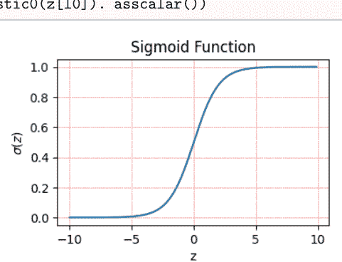

图 7.1：Sigmoid 函数的变化：正值、单调、平滑且可微。

z= 0.0 sigmoid(0)= 0.5

很明显，Sigmoid 的输出在 0 和 1 之间，因此适合作为概率输出。它在 z = 0 时的值为 0.5。因此，如果我们设定当概率大于 0.5 时输出为正，当输出小于 0.5 时为负，那么对于带有 ±1 标签的样本，它就是一个合适的预测器。

Sigmoid 函数的导数可以用以下简单代码绘制：

```python
yg = logistic0(z)*(1.-logistic0(z))
plt.figure(figsize=(4.0, 2.5),dpi=100)
plt.plot(z.asnumpy(),yg.asnumpy())
plt.xlabel('z')
plt.ylabel(r"$\sigma \ '(z) $")
plt.title('Derivative of the sigmoid Function')
plt.grid(color='r', linestyle=':', linewidth=0.5)
plt.show()
```

如图 7.1 和 7.2 所示，Sigmoid 激活函数是单调的，限制在 (0,1) 区间内，平滑且可微。其导数是正的、平滑的，并且进一步可微。这些都是机器学习模型中重要且有用的性质。高阶可微性对于使用包含高阶微分的损失函数的机器学习模型很有用。还可以观察到，对于较大的自变量（正或负），Sigmoid 函数的导数会趋近于零。这在训练深度网络时使用反向传播处理（需要梯度）会产生影响。

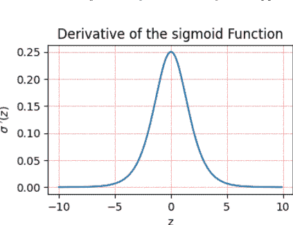

图 7.2：Sigmoid 函数导数的变化：正值、平滑且进一步可微。

## 7.2 仿射变换函数的 Sigmoid 函数

在基于神经网络的机器学习中，第一层的输入是样本或数据点的直接输入。因此，输入层不需要激活函数。对于所有后续层，如第5章所讨论的，一层神经元的输入是前一层输出的仿射变换。让我们考虑输出层的一个神经元。我们有：

$$z = \mathbf{x} \cdot \mathbf{w} + b \quad (7.3)$$

其中 $\mathbf{x}$ 是来自前一层的输入，$\mathbf{w}$ 是连接前一层到当前层的权重矩阵，$b$ 是当前层神经元的偏置。$\mathbf{w}$ 和 $b$ 都需要通过训练来更新，因此通常被称为训练（或学习）参数。在本章中，我们不研究如何更新这些参数，而是专注于它们对神经元输出的影响。当应用 Sigmoid 函数来产生当前层的输出时，我们将得到以下一般表达式。

$$x^{out} = \frac{1}{1 + e^{-(\mathbf{x} \cdot \mathbf{w} + b)}} \quad (7.4)$$

# Set-up 2×2 grid for plotting.
fig, sub = plt.subplots(2, 2, figsize=(10, 8))
plt.subplots_adjust(wspace=0.2, hspace=0.2)
X0, X1 = X[:, 0], X[:, 1]
xx, yy = make_meshgrid(X0, X1)
for clf, title, ax in zip(models, titles, sub.flatten()):
    plot_contours(ax, clf, xx, yy,
                  cmap=plt.cm.coolwarm, alpha=0.8)
    ax.scatter(X0,X1,c=y,cmap=plt.cm.coolwarm,s=40,edgecolors='k')
    ax.set_xlim(xx.min(), xx.max())
    ax.set_ylim(yy.min(), yy.max())
    ax.set_xlabel('Sepal length')
    ax.set_ylabel('Sepal width')
    ax.set_xticks(())
    ax.set_yticks(())
    ax.set_title(title)
plt.show()
```

为 IPython 交互式环境自动创建的模块

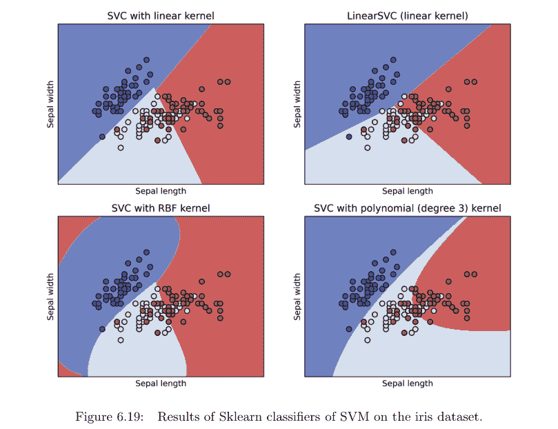

结果表明，两个线性模型都具有相交超平面的线性决策边界。非线性核模型（多项式或高斯 RBF）产生更灵活的曲线决策边界。边界的形状取决于所使用的核类型和参数。读者可以参考 Sklearn 的案例研究以获取更多细节（https://scikit-learn.org/stable/auto_examples/svm/plot_rbf_parameters.html）。

## 参考文献

- [1] F. Rosenblatt, The perceptron: A perceiving and recognizing automation, Report 85-60-1, *Cornell Aeronautical Laboratory*, 1957.
- [2] F. Rosenblatt, *Principles of Neurodynamics: Perceptrons and the Theory of Brain Mechanisms*, 1962. https://books.google.com/books?id=7FhRAAAAMAAJ.
- [3] C. Corinna and V.N. Vapnik, Support-vector networks, *Machine Learning*, **20**(3), 273–297, 1995.
- [4] B.-H. Asa, H. David, S. Hava *et al.*, Support vector clustering, *Journal of Machine Learning Research*, **2**, 125–137, 2001.
- [5] G.R. Liu and S.S. Quek, *The Finite Element Method: A Practical Course*, Butterworth-Heinemann, London, 2013.
- [6] P. Fabian, V. Gae, G. Alexandre *et al.*, Scikit-learn: Machine learning in Python, *Journal of Machine Learning Research*, **12**(85), 2825–2830, 2011. http://jmlr.org/papers/v12/pedregosa11a.html.
- [7] M.J.D. Powell, The theory of radial basis function approximation in 1990, *Advances in Numerical Analysis*, **II**, 105–210, 1992. https://ci.nii.ac.jp/naid/10008965650/en/.
- [8] G.R. Liu, *Mesh Free Methods: Moving Beyond the Finite Element Method*, Taylor and Francis Group, New York, 2010.
- [9] Y. Xiaowei, S. Lei, H. Zhifeng *et al.*, An extended Lagrangian support vector machine for classifications, *Progress in Natural Science*, **14**(6), 519–523, 2004.

## 7.3 神经脉冲单元 (NPU)

让我们编写一段 Python 代码，来考察激活函数的输出如何受权重和偏置的影响。我们还将使用 mxnet 模型进行数值计算，并将结果绘制成图形。
我们首先让 $w$ 在一个范围内变化，而 $b$ 固定为 0。

```python
def logistic(w,x,b):
    return 1. / (1. + nd.exp(-(x*w + b)))

x = nd.arange(-10, 10, .1)
w = nd.arange(1.0, 50, 5.0)
b = nd.arange(0, 50, 10)
b0=b[0]
plt.figure(figsize=(4.0, 3.5),dpi=100.)
for wi in w:
    y = logistic(x,wi,b0)           # b is fixed
    plt.plot(x.asnumpy(),y.asnumpy(),
            label="wi="+str(wi.asnumpy()))
plt.xlabel('x')
plt.ylabel(r"$\sigma(z=xw+b)$")
plt.title('Sigmoid Function with b='+str(b0.asscalar()))
plt.grid(color='r', linestyle=':', linewidth=0.5)
plt.legend()
plt.show()
```

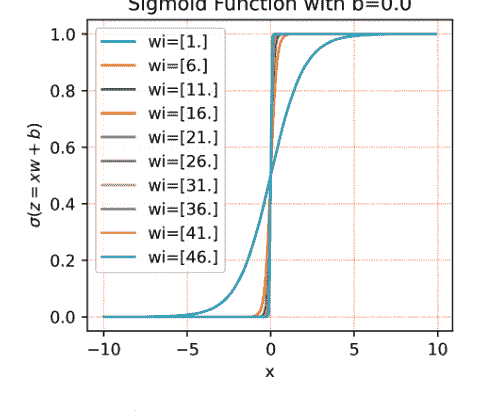

图 7.3：权重对 Sigmoid 函数的影响。

图 7.3 清楚地表明，较大的权重会使 Sigmoid 曲线在 $x = 0$ 附近变得更陡峭。实际上，通过使用一个非常大的权重，我们可以使函数尽可能地接近阶跃函数。
现在，让我们在固定权重的情况下，考察偏置对激活函数形状的影响。

```python
x = nd.arange(-10, 10, .1)
w = nd.arange(0.0, 50, 5.0)
b = nd.arange(-30, 30, 10)
w1=w[1].asscalar()
plt.figure(figsize=(4.0, 3.0),dpi=100.)
for bi in b:
    y = logistic(x,w1,bi)
    plt.plot(x.asnumpy(),y.asnumpy(),
            label="b="+str(bi[0].asnumpy()))
plt.xlabel('x')
plt.ylabel(r"$\sigma(z=xw+b) $")
plt.title('Sigmoid Function with w='+str(w1))
plt.grid(color='r', linestyle=':', linewidth=0.5)
plt.legend(loc='center right', bbox_to_anchor=(1, 0.5))
plt.show()
```

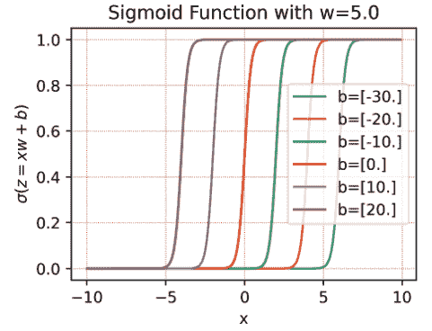

图 7.4：偏置的影响。

图 7.4 清楚地表明，偏置会使 Sigmoid 曲线发生平移：正的偏置值使曲线向左平移，负的偏置值使曲线向右平移。它实际上控制了输出在空间中的出现位置。如果我们利用权重和偏置的这些效应，就可以使用一对激活函数来产生一个接近矩形的脉冲函数。我们称之为神经脉冲单元 (NPU)。其示意图如图 7.5 所示。

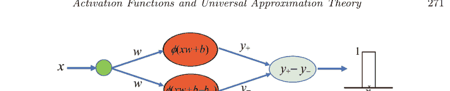

图 7.5：NPU：当使用较大的 w 值时，一对神经元能够产生一个接近矩形的脉冲。脉冲的位置和宽度由基础偏置 b0、偏置宽度 bw 和 w 控制。

脉冲中点处的宽度（在 x 坐标上），pw，由两个配对神经元中使用的偏置之差和权重控制。其公式可以通过以下步骤推导得出。

首先，Sigmoid 函数中点处的 z 值应始终为零；那么对于（上方的）神经元，我们有

$$z = x_+ \cdot w + b = 0$$ (7.5)

其中 b 是神经元对的基础偏置，如上图 7.5 所示。对于下方的神经元，

$$z = x_- \cdot w + b - b_w = 0$$ (7.6)

其中 bw 是下方神经元偏置的负偏移量。脉冲中点处的宽度 pw 变为

$$p_w = x_+ - x_- = b_w/w$$ (7.7)

它取决于 bw 和 w。

通过改变权重和偏置值，也可以在任何 x 处创建这样的脉冲。脉冲的中心位置 xc 可以使用以下公式计算

$$x_c = \frac{x_+ + x_-}{2} = -\frac{2b - b_w}{2w}$$ (7.8)

它取决于 b、bw 和 w。

可以看出，脉冲的宽度和位置仅取决于权重和偏置，这些都是可训练的参数。这意味着一旦神经元用一组固定的参数训练完成，它就能够为任何给定的输入 x 产生函数值。

我们现在编写以下代码来生成一个脉冲：

```python
x = nd.arange(-8, 8, .1)
w = nd.arange(0.0, 30, 5.0)
w1=w[-1].asscalar()
b0=10.0           # the base bias
bw=20.0           # negative shift of b at the 2nd neuron
bc = 2*b0 - bw    # compute the center value of b
xc = -0.5* bc/w1  # compute x of the center of the pulse
pw = bw/w1        # width of the pulse (at the middle)

y = logistic(x,w1,b0)-logistic(x,w1,b0-bw)
plt.figure(figsize=(4.5, 3.0),dpi=100.)
plt.plot(x.asnumpy(),y.asnumpy())
plt.xlabel('x')
plt.ylabel(r"$\sigma(x*w+b0)-\sigma(x*w+b0-bw) $")
plt.title('Neural Pulse, Sigmoid, w='
          +str(w1)+' b='+str(b0)+' bw='+str(bw))
plt.grid(color='r', linestyle=':', linewidth=0.5)
plt.show()
print('b0=',b0,'bc=',bc,'xc=',xc,'pw=',pw)
```

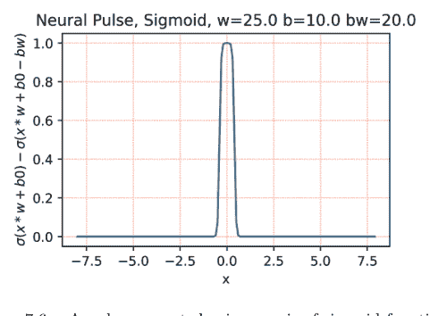

图 7.6：使用一对 Sigmoid 函数生成的脉冲。

b0= 10.0 bc= 0.0 xc= -0.0 pw= 0.8

我们成功地创建了一个在 $x = 0$ 处具有单位高度的矩形脉冲函数，如图 7.6 所示。

上述神经网络只有一个输入神经元（绿色实心圆）、一个包含两个神经元的隐藏层（中间的两个垂直橙色实心椭圆）和一个包含一个神经元的输出层（右侧的橙色实心椭圆）。为了产生脉冲，我们将两个隐藏神经元的权重都设置为相同的较大值，并让偏置发生偏移。这两个神经元的输出都将接近阶跃函数，但方向相反且阶跃上升的位置不同。最终的输出神经元将这两个阶跃函数相加，从而输出一个脉冲。它的功能就像一个 NPU。
使用多个这样的 NPU，可以生成任意多个位于不同 $x_c$ 的 NPU。下面是一段生成排列整齐的矩形单位脉冲的代码。

```python
plt.figure(figsize=(6.5, 3.0),dpi=200)
x = nd.arange(-8, 8, .1)
w = nd.arange(0.0, 51, 5.0)
b = nd.arange(-120, 190, 40)
w1=40. #w[-1].asscalar() #We use only one but large weights
                                #for all NPUs
db=20.0    #=bw            #define the width of the pulse
plt.figure(figsize=(6.5, 3.0),dpi=100.)
for bi in b:
    y = logistic(x,w1,bi)-logistic(x,w1,bi-db)
    plt.plot(x.asnumpy(),y.asnumpy(),
             label="b="+str(bi[0].asnumpy()))

plt.xlabel('x')
plt.ylabel(r"$\sigma(x*w+b)-\sigma(x*w+b-bw) $")
plt.title('Subtraction of two Sigmoid Functions with w='+str(w1)
          +' bw='+str(db))
plt.grid(color='r', linestyle=':', linewidth=0.5)
plt.legend()
plt.show()
```

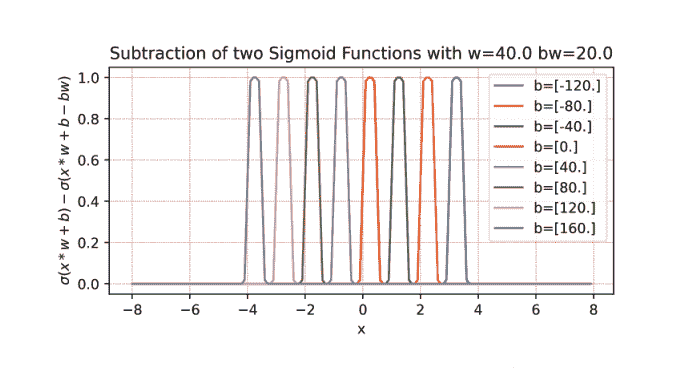

图 7.7：使用 Sigmoid 函数生成的八个脉冲。

图 7.7 显示了使用八个 NPU（隐藏层中的八对神经元）创建的八个排列整齐的脉冲。每个 NPU 负责一个以其中心值 $x_c$ 为中心的脉冲。只要我们在隐藏层中有足够数量的配对神经元，就可以创建任意数量的脉冲来覆盖 x 的感兴趣区域。

## 7.4 万能近似定理

**万能近似定理** [1] 指出，*一个在单个隐藏层中具有足够多神经元的神经网络能够近似任何连续函数*。

### 7.4.1 使用 NPU 进行函数近似

现在，当这些神经元对的输出被馈送到最终的输出神经元时，可以使用以下公式进行线性组合来近似任意给定的函数：

$$\langle f(x) \rangle = \sum_{i=1}^{N_x} f(x_i) \cdot P(x_i) \quad (7.9)$$

其中 $f(x)$ 是给定的函数，$\langle f(x) \rangle$ 表示近似的函数，$f(x_i)$ 是给定函数在 $x_i$ 处的值，$P(x_i)$ 是由第 $i$ 个神经元对为 $x_i$ 创建的单位矩形脉冲，$N_x$ 是在 x 域中采样的 $x_i$ 的数量。

让我们为这个单隐藏层神经网络编写另一段代码来完成此任务。

```python
plt.figure(figsize=(6.5, 3.0),dpi=100)
x = nd.arange(-10, 10, .1)
w = nd.arange(0.0, 50, 5.0)
b = nd.arange(-400, 470, 40)
w1=w[-1].asscalar() # use one large weights for all NPUs
bw=40.0             # negative shift (width) of the bias
for bi in b:
    bc = 2*bi - bw          # center value of b
    xc = -0.5* bc/w1        # x at the center of pulse
    fcos = nd.cos(xc/2)     # value of cosine function
    pulse = (logistic(x,w1,bi)-logistic(x,w1,bi-bw))
```

y = fcos * pulse #脉冲的线性组合
plt.plot(x.asnumpy(),y.asnumpy(),
        label="b="+str(bi[0]. asnumpy()))

xi = -0.5*(2*b - bw)/w1
plt.plot(xi.asnumpy(),np.cos(xi.asnumpy()/2),c='b',
    linewidth=2.5)
plt.xlabel('x')
plt.ylabel("cos(x/2)")
plt.title('使用神经元脉冲近似 cos(x), w='
    +str(w1)+' bw='+str(bw))
plt.grid(color='r', linestyle=':', linewidth=0.5)
#plt.legend()
plt.show()

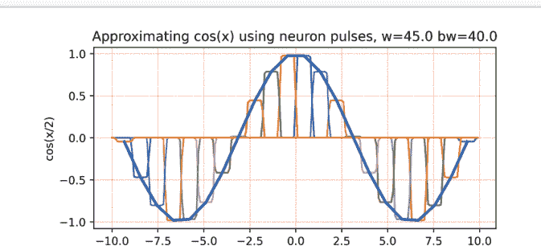

图 7.8：使用一系列神经元脉冲近似余弦函数。

上述演示（如图 7.6–7.8 所示）表明，隐藏层中最多两个神经元就可以近似曲线上的一个点。近似一条曲线所需的神经元数量取决于曲线随 $x$ 变化的复杂程度。如果需要 200 个点来以所需精度近似该曲线，则（最多）需要在隐藏层中使用 400 个神经元。

### 7.4.2 使用神经元基函数进行函数近似

我们现在改变近似方法，采用无网格方法 [3] 中的*基于节点*的近似思想。在这种情况下，我们将所有脉冲的中心点视为*节点*，将所有脉冲函数视为连续的节点形函数。我们的函数近似将变为如下形式：

$$\langle f(x) \rangle = \sum_{i=1}^{N_x} f(x_i) \cdot P(x) \quad (7.10)$$

其中 $f(x_i)$ 是函数在 $x_i$ 处的节点值，而 $P(x)$ 现在是一个连续的、脉冲状的神经元基函数。在这种情况下，近似函数 $\langle f(x) \rangle$ 变为一个连续函数，而神经元对则成为一个基函数。

使用一系列神经处理单元（NPU），这个万能近似定理（UAT）可以在图 7.9 中示意性地绘制出来。一个 UAT-Net 可以由一个输入层、一个隐藏层和一个输出层构成。如果隐藏层有足够数量的神经元对，每一对可以形成一个 NPU 单元，负责在某个位置产生一个脉冲函数。当输入层和输出层的所有权重以及隐藏层神经元的所有偏置被正确设置（或训练）后，UAT-Net 就能够对任何输入值 $x$ 近似任何连续函数。

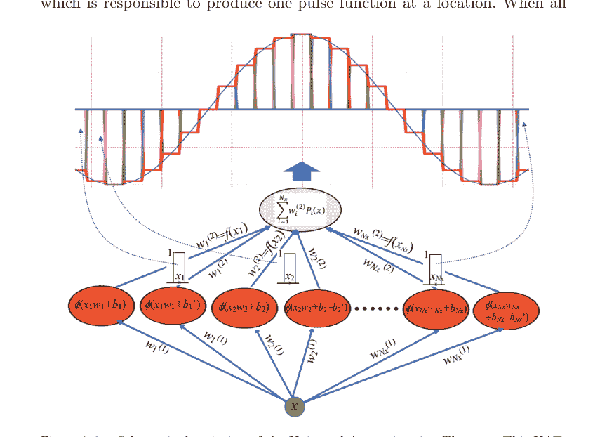

图 7.9：万能近似定理的示意图。该 UAT-Net 由一个包含足够数量神经元对的隐藏层组成。每一对形成一个 NPU 单元，负责在某个位置产生一个脉冲。当输入层和输出层的所有权重以及隐藏层神经元的所有偏置被正确设置（训练）后，就可以对任何输入值 $x$ 近似任何连续函数。

让我们绘制这个函数，看看它是什么样子。

```python
plt.figure(figsize=(6.5, 3.0),dpi=200)
x = nd.arange(-10, 10, .05)    #我们细化了点
w = nd.arange(0.0, 50., 5.0)
b = nd.arange(-400, 470, 40)

w1=w[-1].asscalar() # 对所有NPU使用一个较大的权重
bw= b[1]-b[0] #20.0            # 偏置的负向偏移
sx = int(x.size)
yfem = np.zeros(sx)
for bi in b:
    bc = 2*bi - bw          # b的中心值
    xc = -0.5* bc/w1        # 脉冲中心的x值
    fcos = nd.cos(xc/2)     # 余弦的节点函数值
    pulse = (logistic(x,w1,bi)-logistic(x,w1,bi-bw))
    y = fcos * pulse        # 脉冲的线性组合
    plt.plot(x.asnumpy(),y.asnumpy(),
             label="b="+str(bi[0]. asnumpy()))
    yfem += y.asnumpy()

plt.plot(x.asnumpy(),yfem,c='r')
                            #绘制近似函数
xi = -0.5*(2*b - bw)/w1
plt.plot(xi.asnumpy(),np.cos(xi.asnumpy()/2),c='b',
         linewidth=0.5)
plt.xlabel('x')
plt.ylabel("cos(x/2)")
plt.title('使用神经元脉冲近似 cos(x), w='
          +str(w1)+' bw='+str(bw.asscalar()))
plt.grid(color='r', linestyle=':', linewidth=0.5)
#plt.legend()
plt.show()
```

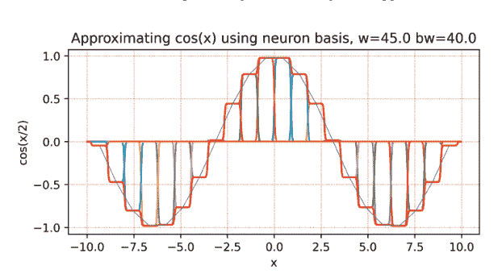

图 7.10：使用一系列脉冲状的神经元基函数近似余弦函数。

使用脉冲状神经基函数近似的函数变成了图 7.10 中较粗的红线。它明显是连续的。

也可以使用有限元法（FEM）进行类似的近似 [4]。在这种情况下，我们仍然将所有脉冲的中心点视为*节点*，而我们的单元现在可以定义为一个脉冲中心点与其下一个脉冲中心点之间的线段。每个脉冲函数成为一个节点形函数。然后，可以使用覆盖该单元的两个脉冲函数片段来完成有限元近似。近似结果将非常相似。

上述分析清楚地展示了神经元和神经网络的能力。让我们通过提及以下几点来结束本节：

1. 我们找到了**一种**可能的函数近似方法。它不一定是最好的方法。
2. 在实际应用中，如果神经网络的权重和偏置以系统性的**最优**方式进行训练，其性能应该比上述手工设计的神经网络好得多。
3. 在现实中，实际上并不需要创建脉冲函数来进行近似。这里这样做是为了以易于理解的方式展示**概念**。
4. 每个脉冲的宽度不必相同。在训练好的神经网络中，每个神经元中的训练参数是**单独调整**的，以实现由损失函数衡量的整体性能。
5. 在实际训练好的神经网络中，隐藏层的所有神经元是作为一个系统**协同工作**的，不一定是成对的。因此，由于这种灵活性，预计其性能会好得多。
6. 我们上述分析是针对一维曲线的近似。类似的思想适用于曲面甚至更高维超曲面的近似。
7. 当使用**更多隐藏层**时，可以显著减少隐藏层中的神经元数量。理论分析已经表明，如果这样的深度网络能够被适当训练，所使用的神经元总数应该少得多。这是一个**可训练性**的问题。深度网络之所以在许多应用中变得流行和实用，是因为我们现在有越来越好的方法来用大数据集训练它们。
8. 我们**很少**看到人们使用神经网络来近似函数。现实生活问题中的任务通常要复杂和实用得多。
9. 万能近似定理的意义揭示了神经网络在函数近似方面的**能力**。

在神经网络设置中应用的仿射变换在数据-预测关系（$\mathbf{x}, \hat{\mathbf{y}}$）和模型参数（$\mathbf{w}, b$）之间建立了联系。换句话说，（$\mathbf{x}, \hat{\mathbf{y}}$）或数据中的特征可以被编码在（$\mathbf{w}, b$）中。此外，当一层中的所有神经元都使用激活函数时，所有这些神经元的输出变得线性无关，并且可以被视为新的输入进一步馈送到下一层，形成一个多层感知器（MLP），从而引出用于创建机器学习模型的万能预测理论。这构成了基于神经网络的机器学习模型的基础，如第 5 章所述。

为了支持第 (3) 点，我们可以使用权重较小的值来创建节点形函数，然后近似余弦函数，如下所示。

```python
plt.figure(figsize=(6.5, 3.0),dpi=100.)
x = nd.arange(-10, 10, .05)    # 细化的点
#w = nd.arange(0.0, 50., 5.0)
#b = nd.arange(-400, 470, 40)
w = nd.arange(0.0, 10., 5.0)
b = nd.arange(-400, 470, 5)
w1=w[-1].asscalar() # 对所有NPU使用一个但较大的权重
bw= b[1]-b[0] #20.0           # 定义偏置的宽度
sx = int(x.size)
yfem = np.zeros(sx)
pu = np.zeros(sx)
```

for bi in b:
    bc = 2*bi - bw            # b的中心值
    xc = -0.5* bc/w1          # 脉冲中心的x坐标
    fcos = nd.cos(xc/2)       # 余弦的节点函数值
    pulse = (logistic(x,w1,bi)-logistic(x,w1,bi-bw))
    y = fcos * pulse          # 脉冲的线性组合
    plt.plot(x.asnumpy(),y.asnumpy(),
             label="b="+str(bi[0].asnumpy()))
    yfem += y.asnumpy()
    pu += pulse.asnumpy()     # 检查单位分解（PU）
                               # 是否满足。
plt.plot(x.asnumpy(),yfem,c='r')
plt.plot(x.asnumpy(),pu,c='b')
print(pu[:60:10])
xi = -0.5*(2*b - bw)/w1
plt.xlabel('x')
plt.ylabel("cos(x/2)")
plt.title('使用神经元脉冲近似cos(x), w='
          +str(w1)+' bw='+str(bw.asscalar()))
plt.grid(color='r', linestyle=':', linewidth=0.5)
#plt.legend()
plt.show()
```

[0.99999999 1.         0.99999999 1.         0.99999999 1.         ]

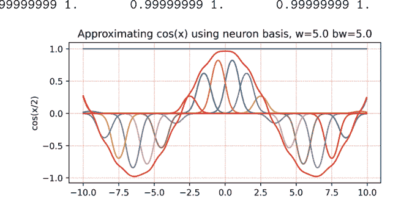

图 7.11：使用一系列神经元基函数作为“节点形函数”来近似余弦函数。

图 7.11 显示，近似函数（红线）更平滑，因此在近似余弦函数时具有更好的质量。

这是因为神经脉冲被用作节点形函数，它是平滑的，而不必是尖锐的脉冲。

请注意，单位分解（PU）性质/条件是用于力学问题数值方法的节点形函数最重要的性质之一 [3]。PU条件指出

$$\sum_{i=1}^{N_x} P(x) = 1 \qquad (7.11)$$

这需要在任何 $x$ 处都满足。在上面的代码中，我们增加了一项计算，以检查如果我们使用神经元对作为节点形函数，该性质是否满足。如图 7.11 所示，这些神经元基函数确实自然地满足了PU条件。

如果我们进一步减小脉冲宽度，我们将获得函数的非常精确的近似，如图 7.12 所示。

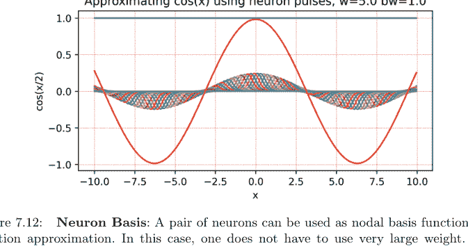

图 7.12：**神经元基**：一对神经元可用作函数近似的节点基函数。在这种情况下，不必使用非常大的权重。分辨率可以通过神经元对中使用的偏置宽度来控制。

在上述研究中，我们使用了sigmoid激活函数。接下来的章节中将讨论的许多其他激活函数也可以使用。在参考文献 [2] 中，除了sigmoid脉冲外，还构建并使用了三角脉冲来近似函数，并且它们在某些方面效果更好。

### 7.4.3 备注

请注意，公式 (7.9) 使用NPU来支持通用近似理论，这为理解提供了很好的直觉。然而，公式 (7.10) 更为通用。这是因为公式 (7.10) 中使用的神经元基函数 $P(x)$ 不必是用于函数近似的脉冲，如前两幅图所示。因此，只要激活函数是单调的以保证唯一性（见第 5.5.3 节）且是非线性的以保证线性无关（见第 5.8.2 节），任何激活函数都可以用于构建 $P(x)$。

## 7.5 双曲正切函数 (tanh)

tanh函数是另一种广泛用于神经网络以引入非线性的激活函数。其定义如下：

$$\phi(z) = \tanh(z) = \frac{e^z - e^{-z}}{e^z + e^{-z}} \quad (7.12)$$

很明显，对于任何给定的实数参数 $z$（在 $(-\infty, \infty)$ 范围内），它返回一个在 $(-1, 1)$ 范围内的实数。同样，在机器学习模型中，参数通常是一个数组。因此，我们使用逐元素操作，$\tanh(z)$ 也将是一个数组。tanh激活函数将任何参数值映射到 $(-1, 1)$，而sigmoid函数映射到 $(0, 1)$。对于许多需要输出在 $(-1, 1)$ 范围内的实数的机器学习模型，它非常方便。

tanh函数的导数具有简单的形式：

$$\phi'(z) = 1 - \phi(z)^2 \quad (7.13)$$

```
def tanhf(z):
    return nd.tanh(z)

x = nd.arange(-10, 10, .1)
y = tanhf(x)
#plt.figure(figsize=(4.5, 3.0),dpi=100.)
plt.plot(x.asnumpy(),y.asnumpy())
plt.xlabel('z')
plt.ylabel('$tanh(z)$')
plt.title('双曲正切函数')
plt.grid(color='r', linestyle=':', linewidth=0.5)
plt.show()
yg = 1.-tanhf(x)**2
plt.plot(x.asnumpy(),yg.asnumpy())
plt.xlabel('x')
plt.ylabel("$tanh(z)\ '(z) $")
plt.title('双曲正切函数的导数')
plt.grid(color='r', linestyle=':', linewidth=0.5)
plt.show()
```

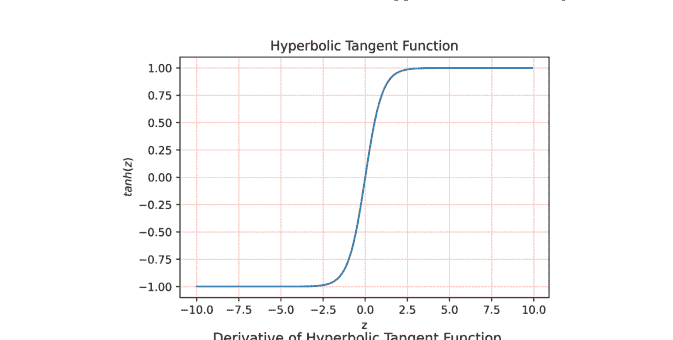

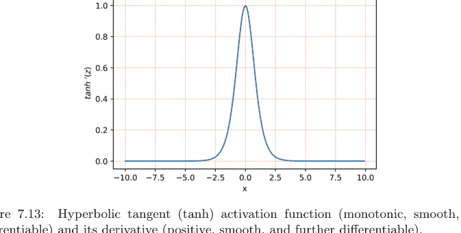

图 7.13：双曲正切 (tanh) 激活函数（单调、平滑、可微）及其导数（正、平滑、进一步可微）。

```
python
l0 = int(len (x)/2)
print('x=',x[l0].asscalar(),'tanh(0)=',tanhf(x[l0]). asscalar())
```

x= 0.0 tanh(0)= 0.0

如图 7.13 所示，双曲正切 (tanh) 激活函数是单调的，限制在 (-1, 1) 范围内，平滑且可微。其导数是正的、平滑的且进一步可微。

## 7.6 Relu 函数

Relu 代表“修正线性单元”[5]。它广泛应用于计算机视觉、语音识别等领域的深度神经网络中。由于其在缓解所谓的梯度消失问题方面的有效性，它是训练深度神经网络最流行的激活函数。其简单形式为：

$$\phi(z) = z^+ = \max(0, z) = \begin{cases} 0 & z < 0 \\ z & z \ge 0 \end{cases} \quad (7.14)$$

Relu函数也称为斜坡函数。它是电气工程中半波整流的类比。它简单地消除了负输入的影响，但保持非负输入不变，从而引入了非线性。这种对输入的剧烈折扣可能是它在密集连接的深度网络中表现良好的原因之一。

Relu函数是分段可微的。Relu函数的导数也具有非常简单的形式：

$$\phi'(z) = \begin{cases} 0 & z < 0 \\ 1 & z \ge 0 \end{cases} \quad (7.15)$$

单位梯度有助于缓解深度网络中的梯度消失，因为它不随网络深度而改变。

Relu有许多变体，包括Leaky Relu和参数化Relu。一个通用的公式可以给出如下：

$$\phi(z) = \begin{cases} k_n z & z < 0 \\ k_p z & z \ge 0 \end{cases} \quad (7.16)$$

其中 $k_n$ 和 $k_p$ 都是正常数，$k_n$ 表示负部分的导数，$k_p$ 表示正部分的导数。对于Leaky Relu，通常使用 $k_n = 0.01$ 和 $k_p = 1.0$。在参数化Relu中，我们使这些参数可训练。

广义Relu函数的导数形式为：

$$\phi'(z) = \begin{cases} k_n & z < 0 \\ k_p & z \ge 0 \end{cases} \quad (7.17)$$

可以看出，对于深度网络，由于 $k_n$ 值较小，负部分的影响会随着深度的增加而迅速消失。在这种情况下，Leaky Relu的行为可能类似于Relu。

我们现在编写一个简单的代码来演示广义Relu函数及其导数，其中包含可调参数 $k_n$ 和 $k_p$。

```
python
def reluf(z,kn,kp):
    f = [kn*zi if zi < 0.0 else kp*zi for zi in z]
    return f

def relug(z,kn,kp):
    g = [kn if zi < 0.0 else kp for zi in z]
    return g
```

```
x = np.arange(-10, 10, .1)
y = reluf(x,0.1,1.0)
plt.plot(x,y)
plt.xlabel('x')
plt.ylabel("$relu(z)$")
plt.title('Relu 函数')
plt.grid(color='r', linestyle=':', linewidth=0.5)
plt.show()
yg = relug(x,0.1,1.0)
plt.plot(x,yg)
plt.xlabel('x')
plt.ylabel("$relu(z)\ '(z) $")
plt.title('Relu 函数的导数')
plt.grid(color='r', linestyle=':', linewidth=0.5)
plt.show()
```

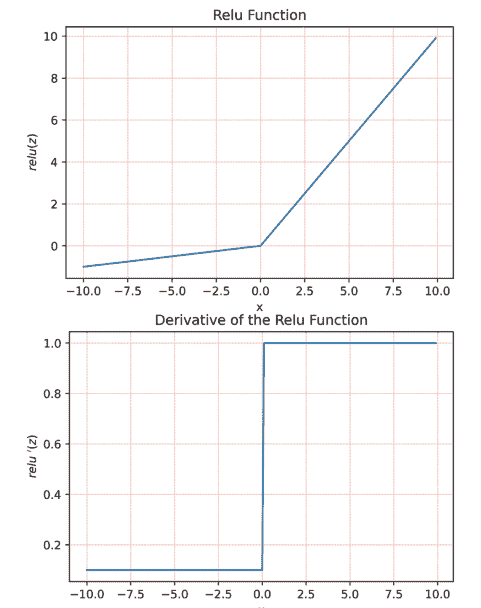

图 7.14：Relu 激活函数（单调、连续、分段平滑、可微），及其导数（正，在原点不连续）。

请注意，Relu或Leaky Relu函数不是光滑的，仅是分段可微的，并且在原点处不可微。其梯度在原点处发生跳跃，如图7.14所示。在优化过程中（将在第9章讨论），需要使用所谓的*次梯度*。次梯度可以简单地取原点两侧梯度的平均值。

Relu函数在原点处的非光滑连续性类似于有限元方法（FEM）[4]中通过单元进行的域离散化，其中近似函数在单元界面上是连续但不光滑的。FEM中处理非光滑性的方法是使用所谓的弱形式表述。

## 7.7 Softplus函数

Softplus函数的形状与ReLU相似，但在整个一维空间中是可微的。其定义如下：

$$\phi(z) = \ln(1 + e^z)$$

显然，对于任意给定的实数参数$z \in (-\infty, \infty)$，它返回一个位于$(0, \infty)$内的正数。

Softplus函数的导数为

$$\phi(z) = \sigma(z) = \frac{1}{1 + e^{-z}}$$

它就是sigmoid函数（因此也是光滑且可微的）。我们现在使用`matplotlib`绘制该函数及其导数。

```python
import mxnet as mx
from mxnet import nd, autograd, gluon
import matplotlib.pyplot as plt
import numpy as np
from matplotlib import rc
%matplotlib inline

def softplus(z):
    return np.log(1. + np.exp(z))

def softplusg(z):
    return 1./(1. + np.exp(-z))

x = np.arange(-10, 10, .1)
y = softplus(x)
plt.plot(x,y)
plt.xlabel('x')
plt.ylabel('Softplus')
plt.title('Softplus Function')
plt.grid(color='r', linestyle=':', linewidth=0.5)
plt.show()
plt.plot(x,softplusg(x))
plt.xlabel('x')
plt.ylabel('Derivative of Softplus function')
plt.grid(color='r', linestyle=':', linewidth=0.5)
plt.title('Derivative')
plt.show()
```

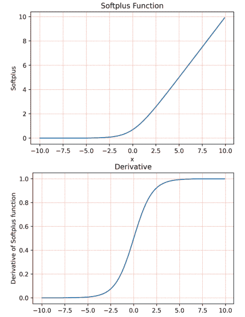

图7.15：Softplus激活函数（单调、连续、光滑且可微）及其导数（正、光滑且进一步可微）。

如图7.15所示，Softplus激活函数是单调、连续、光滑且可微的。其导数为正、光滑且进一步可微。

## 7.8 激活函数的条件

我们现在准备列出激活函数的一些条件。

- (1) 为满足唯一性要求，它应该是单调的（参见第5.5.3节）。
- (2) 为满足线性独立性要求，它应该是非线性的（参见第5.8.2节）。
- (3) 应有解析公式可用于梯度计算，如本章给出的所有示例所示。机器学习模型的梯度计算将在下一章讨论。
- (4) 它不应导致显著的梯度消失。Relu是一个很好的例子。其梯度保持为1。因此，在深层网络架构中，它不会导致梯度消失。

## 7.9 新型激活函数

基于上一节给出的条件，我们现在可以设计一些新的激活函数。我们在下面介绍这些函数。请注意，这些函数尚未在机器学习模型中进行过测试。感兴趣的读者可以尝试一下。

### 7.9.1 有理激活函数

有理函数是本书首次提出的一种新型激活函数（据作者所知）。它配备了参数$\alpha$，可用于控制函数导数的峰值。$\alpha$也可以被视为一个可训练参数，使得导数值也能被训练。它还有一个可调函数$Q(z)$。因此，它是一族激活函数。其一般形式定义如下。

$$\phi(z) = \frac{Q(z)}{\alpha + |Q(z)|}; \quad z \in (-\infty, \infty) \qquad (7.20)$$

其中$\alpha$是$\mathbb{R}$中的常数，$Q(z)$是任意函数，只要它在$z \in [0, \infty)$上是（严格）单调递增的，并且在$z \in (-\infty, 0)$上是单调递增的。注意$\phi(z) \in (-1, 1)$。其导数可以很容易地求得为

$$\phi'(z) = \frac{\alpha Q'(z)}{(\alpha + |Q(z)|)^2} \qquad (7.21)$$

其中$Q'(z)$是$Q(z)$的导数。

例如，令$Q(z) = z$，我们得到最简单的有理激活函数：

$$\phi(z) = \frac{z}{\alpha + |z|} \quad (7.22)$$

其导数可以很容易地求得为

$$\phi'(z) = \frac{\alpha}{(\alpha + |z|)^2} \quad (7.23)$$

如果我们希望有理激活函数为正：$\phi(z) \in (0, 1)$，我们只需先进行1.0的正向平移，然后进行0.5的缩放，得到

$$\phi(z) = 0.5 \left(1 + \frac{z}{\alpha + |z|}\right) \quad (7.24)$$

在这种情况下，其导数变为

$$\phi'(z) = \frac{0.5\alpha}{(\alpha + |z|)^2} \quad (7.25)$$

该激活函数及其导数的Python代码如下。

```python
# Rational activation function by GR Liu; in (-1, 1)
def raf(z, alfa):
    f = [zi/(alfa-zi) if zi < 0.0 else zi/(alfa+zi) for zi in z]
    return f                # or return z/(alfa+ np.abs(z))
    #return np.sign(z)*np.sqrt(np.abs(z))/(alfa+np.sqrt(np.abs(z)))
    #return np.sign(z)*z**2/(alfa+np.abs(z**2))

def d_raf(z,alfa):          # analytical derivative
    return alfa/(alfa+np.abs(z))**2

alfa = 2.0
x = np.arange(-10., 10., .1)    #x -> z
y = raf(x,alfa)
plt.plot(x,y)
plt.xlabel('z')
plt.ylabel('Function value')
plt.title('Rational activation function, in (-1, 1)')
plt.grid(color='r', linestyle=':', linewidth=0.5)
plt.savefig('raf.png',dpi=500,bbox_inches='tight')
plt.show()
plt.plot(x,d_raf(x,alfa))
plt.xlabel('z')
plt.ylabel('Derivative of the function')
plt.grid(color='r', linestyle=':', linewidth=0.5)
plt.title('Derivative of the Rational activation function')
plt.savefig('d_raf.png',dpi=500,bbox_inches='tight')
plt.show()
```

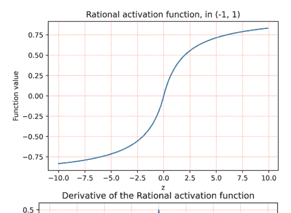

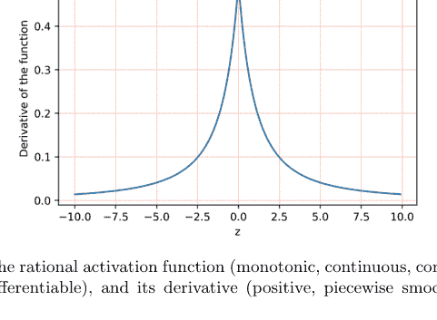

图7.16：有理激活函数（单调、连续、限制在(-1, 1)内、光滑且可微）及其导数（正、分段光滑且进一步可微）。

```python
# Rational activation function by GR Liu; in (0, 1)
def rafp(z, alfa):
    #f=[.5*alfa/(alfa-zi) if zi<0. else (.5*alfa+zi)/(alfa+zi) for zi in z]
    f = [zi/(alfa-zi) if zi<0. else zi/(alfa+zi) for zi in z]
    return 0.5*(1.+np.array(f))

def d_rafp(z,alfa):        # analytical derivative
    return .5*alfa/(alfa+np.abs(z))**2

alfa = 2.0
x = np.arange(-10., 10., .1)    #x -> z
y = rafp(x,alfa)
plt.plot(x,y)
plt.xlabel('z')
plt.ylabel('Function value')
plt.title('Rational activation function, in (0, 1)')
plt.grid(color='r', linestyle=':', linewidth=0.5)
plt.savefig('rafp.png',dpi=500,bbox_inches='tight')
plt.show()
plt.plot(x,d_rafp(x,alfa))
plt.xlabel('z')
plt.ylabel('Derivative of the function')
plt.grid(color='r', linestyle=':', linewidth=0.5)
plt.title('Derivative of the Rational activation function')
plt.savefig('d_rafp.png',dpi=500,bbox_inches='tight')
plt.show()
```

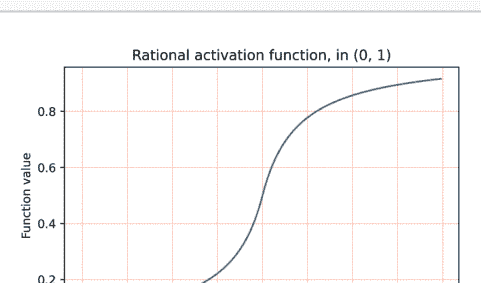

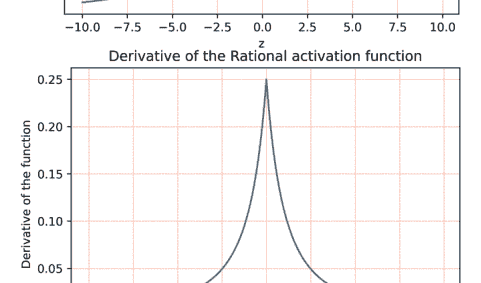

图7.17：有理激活函数（单调、连续、限制在(0, 1)内、光滑且可微）及其导数（正、分段光滑且进一步可微）。

### 7.9.2 幂函数

幂函数是本书首次提出的另一种新型激活函数（据作者所知）。它配备了参数$\alpha$，可用于控制不同网络和/或深层网络中不同层的非线性程度。这也是一族激活函数。其一般形式为

$$\phi(z) = \begin{cases} -(-z)^\alpha & z < 0 \\ z^\alpha & z \ge 0 \end{cases} \quad (7.26)$$

其中$\alpha$是一个给定的正数常数，限制在1以内。因为$\alpha < 1$，当$z$小于零时需要负号，否则输出会变成复数。当$\alpha = 1$时，它是线性的。$\alpha$越小，非线性越强。$\alpha$也可以被视为一个可训练参数，使得不同层的非线性也可以被训练。

注意，式(7.26)中定义的$\phi(z)$位于$(-1,1)$内。如果我们希望它为正：$\phi(z) \in (0,1)$，我们需要像之前对有理激活函数所做的那样进行平移和缩放。

我们也编写一段代码来检验幂函数的行为。

```python
#Power function as an activation function

def powerf(z,alpha): # power function using list comprehension
    f = [(-(-zi)**alpha if zi < 0.0 else zi**alpha) for zi in z]
    return f

x0 = np.array([0.0,2.0])
x = np.arange(-2, 2, 0.11)
#alfa = np.arange(0.2, 1.2, .2)
alfa = 1.0/np.arange(1, 9, 1.0)
nx = 1
for ai in alfa:
    y = powerf(x,ai)
    plt.plot(x,y,label = r"$\alpha$="+"{:.2f}".format(ai))

plt.xlabel('z')
plt.ylabel("$\phi(z) $")
plt.title('Power Activation Function')
plt.grid(color='r', linestyle=':', linewidth=0.5)
plt.legend()
plt.savefig('paf.png',dpi=500,bbox_inches='tight')
plt.show()
```

### 7.9.3 幂线性函数

幂线性函数是对幂函数的一种改进，它在 $z = 0$ 附近使用线性函数，从而使得导数有界。其形式如下：

$$\phi(z) = \begin{cases} -(-z)^\alpha & z < -z_m \\ k_m z & -z_m \le z < z_m \\ z^\alpha & z \ge z_m \end{cases} \quad (7.28)$$

其中 $z_m$ 是一个正值，定义了线性部分的半宽度，$k_m$ 是函数在 $z = 0$ 附近线性部分的导数，通过以下公式计算：

$$k_m = z_m^{(\alpha-1)} \quad (7.29)$$

我们使用以下代码来研究幂线性函数。

```python
#Power-linear(1) function as an activation function

def powerf1(z,alpha,xm):
    fm = xm**alpha
    km = fm / xm    # xm^(alpha-1)
    f = [-(-zi)**alpha if (zi<-xm) else km*zi if (-xm<=zi<=xm) \
            else zi**alpha for zi in z]
    return f

x0 = np.array([0.0,2.0])
x = np.arange(-1, 1, 0.01)
#alfa = np.arange(0.2, 1.2, .2)
alfa = 1.0/np.arange(1, 9, 1.0)
xm = 0.1
for ai in alfa:
    y = powerf1(x,ai,xm)
    plt.plot(x,y,label = r"$\alpha$="+"{:.2f}".format(ai))

plt.xlabel('z')
plt.ylabel("$\phi(z) $")
plt.title('Power-Linear Function')
plt.grid(color='r', linestyle=':', linewidth=0.5)
plt.legend()
plt.savefig('plaf.png',dpi=500,bbox_inches='tight')
plt.show()
```

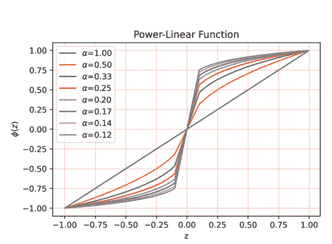

图 7.20：幂线性激活函数。它是单调的、连续的、分段光滑的，并且可微。

我们确实在 $z = 0$ 附近得到了一个线性部分，它连接了两侧的两段幂函数。现在让我们看看这个幂线性函数的导数。公式为：

$$ \phi'(z) = \begin{cases} \alpha(-z)^{\alpha-1} & z < -z_m \\ k_m & -z_m \le z < z_m \\ \alpha(z)^{\alpha-1} & z \ge z_m \end{cases} \quad (7.30) $$

```python
#Power-linear(1) function, derivative of the function

def powerg1(z,alpha,xm):
    fm = xm**alpha
    km = fm / xm
    a1 = alpha-1.
    g = [alpha*(-zi)**a1 if zi<-xm else km if (-xm<=zi<=xm) \
         else alpha*zi**a1 for zi in z]
    return g

x0 = np.array([0.0,2.0])
x = np.arange(-1, 1, 0.01)
#alfa = np.arange(0.2, 1.2, .2)
alfa = 1.0/np.arange(1, 9, 1.0)

xm = 0.1
for ai in alfa:
    yg = powerg1(x,ai,xm)
    plt.plot(x,yg,label = r"$\alpha$="+"{:.2f}".format(ai))

plt.xlabel('z')
plt.ylabel("$\phi \ ' (z) $")
plt.title('Derivative of the Power-Linear Function')
plt.grid(color='r', linestyle=':', linewidth=0.5)
plt.legend()
plt.savefig('d_plaf.png',dpi=500,bbox_inches='tight')
plt.show()
```

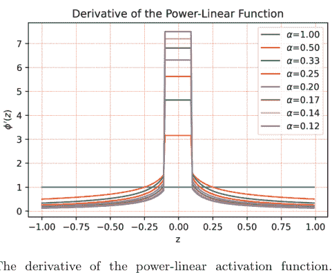

图 7.21：幂线性激活函数的导数。它是正的、连续的、分段光滑的，并且可微。

是的！导数是有上限的。我们还观察到，$\alpha$ 越小，导数值越大。这可能有助于缓解训练深度网络时的梯度消失问题。梯度消失发生在使用反向传播和梯度下降技术（将在第9章详细讨论）更新权重和偏置时，由于微分链式法则（如第8章所示）中导数的连乘，导数会变得越来越小。通过幂线性函数，如果将其恰当地放置在这些层中，可能有助于降低梯度消失的速率。

我们还看到，导数在线性范围内有一个平台期。这可以通过幂二次函数进一步改进。

### 7.9.4 幂二次函数

最后，我们研究幂二次函数。它是在幂线性函数的基础上进一步改进的，将线性函数部分替换为两段二次函数，使得导数可以线性变化。具体过程如下。

首先，我们计算 $z = 0$ 处的导数，它与幂线性函数在 $z = 0$ 处的导数相同：

$$k_m = z_m^{(\alpha-1)} \quad (7.31)$$

接下来，我们计算 $z = z_m$ 处的导数，得到：

$$k_p = \alpha z_m^{(\alpha-1)} \quad (7.32)$$

我们现在假设导数在 $[-z_m, z_m]$ 区间内线性变化，这给出：

$$\phi'(z) = \begin{cases} -\frac{k_p - k_m}{z_m}z + k_m & -z_m \leq z < 0 \\ \frac{k_p - k_m}{z_m}z + k_m & 0 \leq z < z_m \end{cases} \quad (7.33)$$

最后，我们对上述函数进行积分，并利用其在 $z = 0$ 处必须为零的条件，得到：

$$\phi(z) = \begin{cases} -\frac{k_p - k_m}{2z_m}z^2 + k_mz & -z_m \leq z < 0 \\ \frac{k_p - k_m}{2z_m}z^2 + k_mz & 0 \leq z < z_m \end{cases} \quad (7.34)$$

加上方程两侧的另外两段，我们现在得到了幂二次函数的完整定义：

$$\phi(z) = \begin{cases} -(-z)^\alpha & z < -z_m \\ -\frac{k_p - k_m}{2z_m}z^2 + k_mz & -z_m \leq z < 0 \\ \frac{k_p - k_m}{2z_m}z^2 + k_mz & 0 \leq z < z_m \\ z^\alpha & z \geq z_m \end{cases} \quad (7.35)$$

幂二次函数的导数变为：

$$\phi'(z) = \begin{cases} \alpha(-z)^{\alpha-1} & z < -z_m \\ -\frac{k_p - k_m}{z_m}z + k_m & -z_m \leq z < 0 \\ \frac{k_p - k_m}{z_m}z + k_m & 0 \leq z < z_m \\ \alpha(z)^{\alpha-1} & z \geq z_m \end{cases} \quad (7.36)$$

让我们使用以下代码来研究幂二次函数。

```python
#Power-quadratic(2) function
def apowerf2(z,alpha,xm):
    a1 = alpha-1.
    fm = xm**alpha
    km = fm/xm
    kp= alpha*xm**a1
    kg = (kp-km)/xm
    f = [-(zi)**alpha if (zi<-xm) else km*zi-0.5*kg*zi**2 \
         if (-xm<=zi<0.) else km*zi+0.5*kg*zi**2 if (0.<=zi<=xm) \
         else zi**alpha for zi in z]
    return f

x0 = np.array([0.0,2.0])
x = np.arange(-2, 2, 0.02)
#alfa = np.arange(0.2, 1.2, .2)
alfa = 1.0/np.arange(1, 9, 1.0)

xm = 0.1
for ai in alfa:
    y = apowerf2(x,ai,xm)
    plt.plot(x,y,label = r"$\alpha$="+"{:.2f}".format(ai))

plt.xlabel('z')
plt.ylabel("$\phi(z) $")
plt.title('Power-Quadratic Activation Function')
plt.grid(color='r', linestyle=':', linewidth=0.5)
plt.legend()
plt.savefig('pqaf.png',dpi=500,bbox_inches='tight')
plt.show()
```

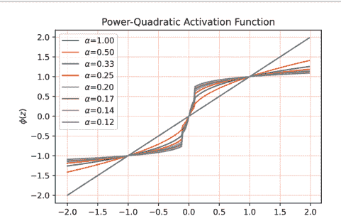

图 7.22：幂二次激活函数。它是单调的、连续的、分段光滑的，并且可微。

#### 幂二次函数，导数

```python
def apowerg2(z, alpha, xm):
    a1 = alpha - 1.
    fm = xm**alpha
    km = fm / xm
    kp = alpha * xm**a1
    kg = (kp - km) / xm
    g = [alpha * (-zi)**a1 if zi < -xm else -kg * zi + km
         if (-xm <= zi < 0.) else kg * zi + km if (0. <= zi < xm)
         else alpha * zi**a1 for zi in z]
    return g

# x0 = np.array([0.0, 2.0])
x = np.arange(-1, 1, 0.002)
# alfa = np.arange(0.2, 1.2, .2)
alfa = 1.0 / np.arange(1, 9, 1.0)

xm = 0.1
for ai in alfa:
    yg = apowerg2(x, ai, xm)
    plt.plot(x, yg, label=r"$\alpha$=" + "{:.2f}".format(ai))

plt.xlabel('z')
plt.ylabel("$\phi \ '(z) $")
plt.title('Derivative Power-Quadratic Activation Function')
plt.grid(color='r', linestyle=':', linewidth=0.5)
plt.legend()
plt.savefig('d_pqaf.png', dpi=500, bbox_inches='tight')
plt.show()
```

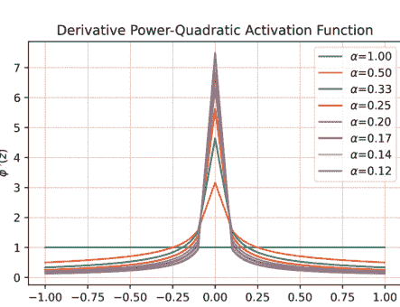

图 7.23：幂二次激活函数的导数。它是正的、连续的、分段光滑的，并且可微。

线性范围内的平台现在被移除，取而代之的是一个良好的线性变化的导数。我们仍然观察到，$\alpha$ 越小，导数值越大。这可能有助于缓解训练深度网络时的梯度消失问题。这组提出的幂函数在应用于实际问题时，需要进行彻底的测试。

## 参考文献

- [1] G. Cybenko, Approximation by superpositions of a sigmoidal function, *Mathematics of Control, Signals and Systems*, **2**, 303-314, 1989.
- [2] G.R. Liu, A neural element method, *International Journal of Computational Methods*, **17**(07), 2050021, 2020.
- [3] G.R. Liu, *Mesh Free Methods: Moving Beyond the Finite Element Method*, Taylor and Francis Group, New York, 2010.
- [4] G.R. Liu and S.S. Quek, *The finite element method: A practical course*, Butterworth-Heinemann, London, 2013.
- [5] V. Nair and G.E. Hinton, Rectified Linear Units Improve Restricted Boltzmann Machines, *Proceedings of the 27th International Conference on Machine Learning*, 2010.

## 第 8 章

## 自动微分与 Autograd

### 8.1 优化与最小化的一般问题

在机器学习中，我们希望神经网络等模型能够通过错误学习，即向其提供教学（或训练）样本，使其知道错误出在哪里。误差的度量使用所谓的**损失函数**，该函数根据某些预定义的公式评估预测结果（当前模型的输出）与训练样本给出的真实标签之间的差异。

损失函数有时也称为代价函数或目标函数。它们*本质上*是相同的，但可以有不同的名称，以便更好地理解不同目的的问题。“目标函数”这个名称更中性，可以用于优化和最小化两种场景。损失或代价函数意味着一个最小化问题，因为其目的显然是最小化代价或损失。从现在起，我们在讨论中不区分这些名称，但更常使用损失函数这个名称来指代机器学习模型。损失函数的值越小，我们通常说模型越好（在训练精度方面）。因此，训练过程本质上是一个最小化损失函数的过程。

在数学上，优化等同于最小化，因为只需将目标函数的符号取反，优化问题就变成了最小化问题，反之亦然。因此，我们在理论上不区分优化和最小化技术。在调用现有模块中的例程函数时需要注意，确保它是用于优化还是最小化。在将其输入函数之前，可能需要相应地对目标函数取反。

下一个问题是如何设计优化（或最小化）技术，以有效地找到最大值（或最小值）。过去，已经开发了相当多的优化技术（https://en.wikipedia.org/wiki/Mathematical_optimization）。有些技术使用目标函数的梯度信息，有些则不使用。一般来说，使用梯度信息的技术效率更高，因此只要能够以经济高效的方式获得梯度信息，就会使用它。对于神经网络等机器学习模型，基于梯度的技术已被证明是有效的。这是因为神经网络中使用的预测函数（第 5 章）和激活函数（第 7 章）是学习参数的连续函数，因此梯度是可计算的。基于梯度的最小化器的适用性在很大程度上取决于我们是否能够有效地计算损失函数的梯度。

在本章中，我们考虑科学和工程研究一般领域中的函数，包括机器学习。因此，在不失一般性的情况下，待微分的函数通常表示为 $f(\mathbf{x})$，其中 $\mathbf{x}$ 是自变量。同时，按照更常规的方式，$\mathbf{x}$ 被定义为列向量。然而，在机器学习中，我们的函数将是损失函数 $\mathcal{L}(\hat{\mathbf{w}})$，自变量将是学习参数 $\hat{\mathbf{w}}$。需要注意避免混淆。

计算函数梯度有三种主要方法：解析法、数值法和自动微分法（Autograd）。我们首先简要讨论解析法。

### 8.2 解析微分

解析法明确给出了函数导数的公式。表 8.1 列出了机器学习中常用的一些标量函数 $f(x)$，其中变量 $x$ 也是标量，以及它们的导数 $\frac{df(x)}{dx}$。这些公式可以直接编码用于计算导数，并且可以使用 SymPy 等符号计算工具来获得导数的表达式。然而，并非所有函数都有这样的公式可用。此外，并非所有函数都能以如此简单的封闭形式明确写出，更不用说它们的导数了。最重要的是，许多函数的导数表达式可能非常复杂，因此难以在代码中实现。

表 8.1：简单函数的导数解析公式（$c$，$n$ 是常数）。

| $f(x)$ | $c$ | $cx^n$ | $e^{cx}$ | $\log(cx)$ | $\frac{1}{1+e^{-cx}}$ | $\frac{e^{cx}-e^{-cx}}{e^{cx}+e^{-cx}}$ |
| :--- | :--- | :--- | :--- | :--- | :--- | :--- |
| $\frac{df}{dx}$ | $0$ | $ncx^{n-1}$ | $ce^{cx}$ | $\frac{1}{x}$ | $\frac{ce^{-cx}}{(e^{cx}+e^{-cx})^2}$ | $c\left(1-\left(\frac{e^{cx}-e^{-cx}}{e^{cx}+e^{-cx}}\right)^2\right)$ |

### 8.3 数值微分

数值方法本质上使用有限差分法（FDM）、曲线拟合和插值技术来计算函数的梯度或导数。在光滑有限元法 [1] 和无网格法 [2] 中使用的基于光滑域的方法已被证明对于计算低维函数的梯度是有效的。数值方法通常为所有可微函数提供近似的梯度结果，只要它们在网格节点或在感兴趣位置附近给定的一组点处的数值可用即可。然而，对于高维空间以及我们在机器学习中经常遇到的函数链来说，这可能是一个挑战。尽管结果中的近似可能不是问题，但实现的复杂性可能是问题。本书不使用数值方法来创建机器学习模型。

### 8.4 自动微分

#### 8.4.1 自动或算法微分的概念

自动微分（AD）有时也称为算法微分（http://www.autodiff.org/?module=Publications&submenu=list%20publications&id=neidinger2010ita）。它是一种通过计算机算法评估微分值的技术。**核心思想**是同时将涉及的函数及其导数计算为数值，以便它们之间的算术运算可以简单地在数值上进行，避免在表达式级别进行此类操作。这极大地简化了编码。结果是数值的，但理论上是精确的（具有机器精度），因为所有微分规则仍然被精确遵循，这与前面提到的数值微分有根本的不同。它具有以下特点：

- 它使用微分的链式法则，使得最终损失函数的微分成为*局部导数*（计算图中“节点”处局部函数的导数）的乘积。

它构建了一个将复杂函数分解为基本算术运算（加法、减法、乘法、除法、简单函数的解析微分等）的过程，从而可以使用精确的解析公式来计算这些函数的导数。
- 它将关于某个变量的微分结果与该变量本身（作为其属性之一）一起记录，以便于记录、自动化和计算。这是因为梯度与变量具有相同的形状。

在基于神经网络的机器学习模型中，自动微分（AD）是其成功的关键技术之一。基于AD的算法类型很容易获得，通常被称为自动求导（autograd）。它可以方便地以自动方式计算多个参数变量的梯度。许多库允许用户可视化所构建网络的计算图。该图本质上是计算链式节点中局部导数的逻辑路径。

### 8.4.2 函数关于向量和矩阵的微分

机器学习的损失函数通常是标量函数的形式。即使不是，也可以通过某种方式（例如，测量其范数）将其转化为标量函数。然而，它们的变量通常是向量或矩阵。考虑一个定义在 $P$ 维空间中的标量函数 $f(\mathbf{x}) \in \mathbb{R}^1$，变量向量 $\mathbf{x}$ 将属于 $\mathbb{R}^P$。函数的梯度 $\nabla f(\mathbf{x})$ 是一个向量，也将属于 $\mathbb{R}^P$。

$$\nabla f(\mathbf{x}) = \frac{\partial f(\mathbf{x})}{\partial \mathbf{x}} = \frac{\partial f(\mathbf{x})}{\partial \begin{bmatrix} x_1 \\ x_2 \\ \vdots \\ x_m \end{bmatrix}} = \begin{bmatrix} \frac{\partial f(\mathbf{x})}{\partial x_1} \\ \frac{\partial f(\mathbf{x})}{\partial x_2} \\ \vdots \\ \frac{\partial f(\mathbf{x})}{\partial x_m} \end{bmatrix} \quad (8.1)$$

当变量是矩阵形式时，我们有

$$\nabla f(\mathbf{x}) = \frac{\partial f(\mathbf{x})}{\partial \mathbf{x}} = \frac{\partial f(\mathbf{x})}{\partial \begin{bmatrix} x_{11} & x_{12} & \dots & x_{1p} \\ x_{21} & x_{22} & \dots & x_{2p} \\ \vdots & \vdots & \vdots & \vdots \\ x_{m1} & x_{m2} & \dots & x_{mp} \end{bmatrix}} = \begin{bmatrix} \frac{\partial f(\mathbf{x})}{\partial x_{11}} & \frac{\partial f(\mathbf{x})}{\partial x_{12}} & \dots & \frac{\partial f(\mathbf{x})}{\partial x_{1p}} \\ \frac{\partial f(\mathbf{x})}{\partial x_{21}} & \frac{\partial f(\mathbf{x})}{\partial x_{22}} & \dots & \frac{\partial f(\mathbf{x})}{\partial x_{2p}} \\ \vdots & \vdots & \vdots & \vdots \\ \frac{\partial f(\mathbf{x})}{\partial x_{m1}} & \frac{\partial f(\mathbf{x})}{\partial x_{m2}} & \dots & \frac{\partial f(\mathbf{x})}{\partial x_{mp}} \end{bmatrix} \quad (8.2)$$

当我们寻求标量函数关于变量向量或矩阵的导数时，其真正含义是我们希望得到函数关于向量（行或列）或矩阵中每个变量的（偏）导数。因此，我们所需要做的就是像处理表8.1中所示的标量变量情况一样，逐一地对这些变量进行函数的微分。这可以使用Python中的逐元素操作轻松完成。结果，我们只需将表8.1中的 $x$ 替换为向量或矩阵 $\mathbf{x}$。在这种情况下，函数的导数将变成一个包含函数关于每个变量的导数的向量或矩阵。这样的导数向量或矩阵可以与变量向量或矩阵具有相同的形状，可以同时计算，并作为附加属性一起存储。这本质上就是自动求导（Autograd）中所做的工作。

表8.2给出了一些常用函数及其梯度。在机器学习算法中，我们需要频繁计算向量的范数以及向量元素的求和，这导致了特殊函数：$f(\mathbf{x}) = \|\mathbf{x}\|^2$，$f(\mathbf{x}) = \text{sum}(\mathbf{x})$。这些特殊函数都是标量，上述论证仍然成立。因为它们的变量是向量，所以这些特殊函数的梯度将变成向量。对于向量 $\mathbf{x}$ 的求和函数，梯度变成一个全1向量。对于向量 $\mathbf{x}$ 的平方范数函数，梯度变成 $2\mathbf{x}$，这也是一个向量。此外，当 $f$ 是一个常数向量 $\mathbf{c}$ 时，其梯度变成零向量，如表8.2所示。

在表8.2中，$b$ 是一个常数，$c$ 是一个常数，$\mathbf{c}$ 是一个常数向量，$\mathbf{C}$ 是一个常数矩阵。所有这些常数都不随 $\mathbf{x}$ 变化。我们假设所有矩阵都具有兼容的形状（维度）。C-标量也可以是一个范数（C-范数，正定），如果 $\mathbf{C}$ 是正定矩阵。X-标量同理。$\nabla f(\mathbf{x})$ 与 $\mathbf{x}$ 具有相同的形状。

表8.2：一些有用标量函数的梯度解析公式。

| 函数名称 | $f(\mathbf{x})$ | $\nabla f(\mathbf{x})$ |
| :--- | :--- | :--- |
| 常数 | $c$ | $\mathbf{0}$ |
| 线性 | $\mathbf{x}^\top \mathbf{c} = \mathbf{c}^\top \mathbf{x}$ | $\mathbf{c}$ |
| 广义指数 | $e^{\mathbf{x}^\top \mathbf{c} + b}$ | $\mathbf{c} e^{\mathbf{x}^\top \mathbf{c} + b}$ |
| 广义对数 | $\log(\mathbf{x}^\top \mathbf{c} + b)$ | $\frac{\mathbf{c}}{\mathbf{x}^\top \mathbf{c} + b}$ |
| Sigmoid | $\frac{1}{1 + e^{-\mathbf{x}^\top \mathbf{c} + b}}$ | $\frac{\mathbf{c} e^{-\mathbf{x}^\top \mathbf{c} + b}}{(e^{\mathbf{x}^\top \mathbf{c} + e^{-\mathbf{x}^\top \mathbf{c} + b}})^2}$ |
| tanh | $\frac{e^{\mathbf{x}^\top \mathbf{c} + b} - e^{-\mathbf{x}^\top \mathbf{c} + b}}{e^{\mathbf{x}^\top \mathbf{c} + b} + e^{-\mathbf{x}^\top \mathbf{c} + b}}$ | $\mathbf{c} \left( 1 - \left( \frac{e^{\mathbf{x}^\top \mathbf{c} + b} - e^{-\mathbf{x}^\top \mathbf{c} + b}}{e^{\mathbf{x}^\top \mathbf{c} + b} + e^{-\mathbf{x}^\top \mathbf{c} + b}} \right)^2 \right)$ |
| 求和 | $\text{sum}(\mathbf{x})$ | $\mathbf{1}$ |
| 范数（关于 $\mathbf{x}$ 的二次型） | $\|\mathbf{x}\|^2 = \mathbf{x}^\top \mathbf{x}$ | $2\mathbf{x}$ |
| C-标量（关于 $\mathbf{x}$ 的二次型） | $\mathbf{x}^\top \mathbf{C} \mathbf{x}$ | $2\mathbf{C}\mathbf{x}$ |
| X-标量（关于 $\mathbf{X}$ 的线性型） | $\mathbf{c}^\top \mathbf{X} \mathbf{c}$ | $\mathbf{c}\mathbf{c}^\top$ |

表8.1是显而易见的，写下它只需要大学微积分知识。然而，写出表8.2需要仔细的推导。最好的方法可能是使用张量微积分，首先将矩阵表示法转换为（Ricci）指标表示法，执行微分，然后再转换回矩阵形式。使用张量微积分，可以进一步推导出具有张量变量的向量甚至矩阵函数的公式。这里，我们不详细讨论这一点。

## 8.5 在Numpy中实现的自动求导

自动求导将自动微分引入了Numpy (Oliphant, 2007) 和 Scipy (Jones et al., 2001)。让我们来实践一下。我们首先使用 autograd.numpy 来计算给定解析函数的导数。为此，我们需要安装 autograd（使用 `pip install autograd` 或 `conda install -c conda-forge autograd`）。然后我们导入 autograd.numpy 模块和 grad() 函数。

```python
import numpy as np
import autograd.numpy as np  # This is a thinly-wrapped numpy
from autograd import grad    # for computing grad(f)
import matplotlib.pyplot as plt
%matplotlib inline
```

```python
def f_sigma(z):           # The sigmoid function
    return 1./(1.+np.exp(-z))
def dfsa(z):
    return f_sigma(z)*(1.-f_sigma(z)) # analytical derivative

df1 = grad(f_sigma)      # function for the 1st derivative of f
df2 = grad(df1)          # for the 2nd derivative of f
df3 = grad(df2)          # ......
df4 = grad(df3)
df5 = grad(df4)
z = np.linspace(-5,5,200) # create values of arguments, z
fi = f_sigma(z)           # compute the discrete values of f()
df1i = []
for i in range(len(z)):   # compute df1 by passing z one-by-one
    df1i.append(df1(z[i]))

df1ia = grad(f_sigma)(z[0])
df2i = list(map(df2,z))   # compute df2
plt.figure(figsize=(4.5, 3.0),dpi=100)
plt.scatter(z, df1i,c='green',label='Autograd',alpha=0.2)
plt.plot(z, dfsa(z),c='red',label='Analytical')
plt.xlabel('z')
plt.ylabel(r"$\sigma'(z)$")
plt.title('Derivative of Sigmoid: analytic vs. autograd')
plt.grid(color='r', linestyle=':', linewidth=0.5)
plt.legend()
plt.show ()

plt.figure(figsize=(4.5, 3.0),dpi=100)
plt.plot(z, fi,label='Function')
plt.plot(z, df1i,label='1st derivative')
plt.plot(z, df2i,label='2nd derivative')
plt.plot(z, list(map(df3,z)),label='3rd derivative')
plt.plot(z, list(map(df4,z)),label='4th derivative')
plt.xlabel('z')
plt.ylabel(r'$\sigma(z) $'+' and its derivatives')
plt.title('Derivatives of sigmoid function via autograd')
plt.grid(color='r', linestyle=':', linewidth=0.5)
plt.legend()
plt.show ()
```

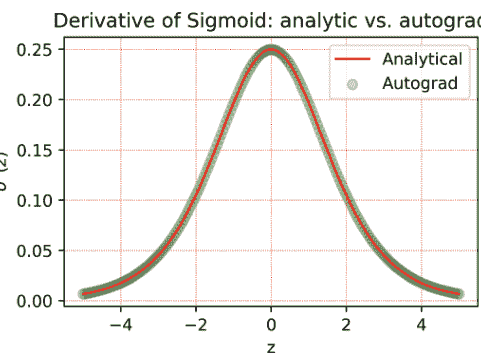

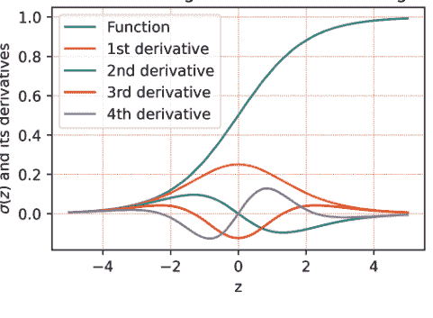

图 8.1：使用自动微分计算函数的导数。

从图 8.1 可以看出，自动微分是计算函数导数的强大工具。它能产生精确的导数（达到机器精度），并且只要函数在相应阶数可微，就能计算高阶导数。

## 8.6 MXNet 中的自动微分实现

自动微分已在许多成熟的模块中实现。接下来，我们使用 `mxnet.autograd` 模块来演示如何自动计算损失函数对其变量的导数。一旦为梯度指定了参数变量，并定义了损失函数的子函数链，自动微分就会动态构建一个计算图（https://d2l.ai/chapter_preliminaries/autograd.html）。然后，它会反向计算损失函数关于变量的梯度。以下讨论和代码参考了 mxnet-the-straight-dope（https://github.com/zackchase/mxnet-the-straight-dope）中的内容，遵循 Apache-2.0 许可证：

```
import numpy as np
import mxnet as mx
from mxnet import nd, autograd
mx.random.seed(1)
```

### 8.6.1 简单变量的标量函数梯度

作为一个简单的例子，我们取一个简单函数的梯度，定义为

$$f = 8(x^2) \quad \text{for } x \in \mathbb{R}^1 \qquad (8.3)$$

关于一维参数变量 $x$ 的梯度。在这种只有一维 $x$ 的情况下，梯度就是导数，因为只有一个参数变量。对于这个简单的函数，我们知道梯度（导数）可以使用以下方程解析计算：

$$\frac{df(x)}{dx} = 16x \quad \text{for } x \in \mathbb{R}^1 \qquad (8.4)$$

对于 $\mathbb{R}^1$ 中的任何给定 $x$ 值。

在这个演示中，我们首先分配 $x$ 的值，在这些值上可以计算 $f(x)$ 的导数。如果 $x$ 以向量、矩阵或通常以张量的形式给出，则计算相应的导数，并且结果将具有相同的形状。这与 Python 中一般的逐元素操作非常相似：对张量中的所有 $x$ 值执行相同的微分。我们现在定义一个 $x$ 值的矩阵如下：

```
x=nd.array([[1,5,10],[20,18,28]]) # initialization of x
                                        # in a matrix (tensor)
```

对于上述矩阵中的所有这些 $x$ 值，我们可以使用公式 (8.4) 中给出的解析公式轻松计算梯度。

```
print('x=',x)
grad_at_x = 16.0*x                    # analytical gradient
print('Analytical grad_at_x=', grad_at_x)
```

```
x=
[[ 1.  5. 10.]
 [20. 18. 28.]]
<NDArray 2x3 @cpu(0)>
Analytical grad_at_x=
[[ 16.  80. 160.]
 [320. 288. 448.]]
<NDArray 2x3 @cpu(0)>
```

我们注意到 x 和 grad_at_x 的形状相同。在 MXNet 中，梯度计算需要三个步骤。首先，我们请求一个变量（例如 x）的梯度。我们需要将其存储在 x.grad() 中。这通过首先调用以下命令完成：

```
x.attach_grad()           # request for gradient w.r.t
                          # all entries in matrix x
```

其次，我们需要定义函数 f，它通常由一系列函数链给出（x-> g-> f，如下例所示）。

```
with autograd.record():    # record down the path
    g = x * 8              # x -> g
    f = g * x              # g -> f
```

这定义了执行微分和相关评估的路径。这条微分路径也称为*图*。链或路径的定义构建了一个计算图。然后使用著名的微分链式法则进行微分。MXNet 使用一种记录“设备”动态构建这样的图，该设备记录路径。第三，路径定义后，我们最终可以调用

```
f.backward()    # compute the gradient in a back-propagation
```

这要求在定义的路径中反向执行微分，在机器学习中称为反向传播。至此，梯度值被计算并存储在 x.grad 中，作为对象 x 的一个属性。我们最终打印存储在 x.grad 中的梯度值。

```
print('At x=',x)
print('The gradient values of f at x=', x.grad) # autograd
print('Analytical grad_at_x=', grad_at_x)       # analytical
```

```
At x=
[[ 1.  5. 10.]
 [20. 18. 28.]]
<NDArray 2x3 @cpu(0)>
The gradient values of f at x=
[[ 16.  80. 160.]
 [320. 288. 448.]]
<NDArray 2x3 @cpu(0)>
Analytical grad_at_x=
[[ 16.  80. 160.]
 [320. 288. 448.]]
<NDArray 2x3 @cpu(0)>
```

我们再次注意到 x 和 x.grad 的形状相同。x 存储所有这些 x 值，x.grad 存储这些 x 值对应的梯度。我们可以看到，使用自动微分在 $x$ 处获得的梯度值与我们使用解析公式得到的完全相同。

### 8.6.2 高维标量函数的梯度

现在让我们考虑具有多个变量（多维问题）的标量函数的梯度。我们计算表 8.2 中列出的一些标量函数的梯度。第一个是定义在 $p$ 维空间中的线性函数。

$$f(\mathbf{x}) = \mathbf{x}^\top \mathbf{c} \quad \text{for } \mathbf{x} \in \mathbb{R}^p \qquad (8.5)$$

其中 $\mathbf{c}$ 是常数向量。它也在 $\mathbb{R}^p$ 中，因此 $f(\mathbf{x})$ 成为一个标量。

```
c = nd.array([.1, .8, .18])    # 3 constants
x = nd.array([1., 2., 3.])     # 3 independent variables
x.attach_grad()                # request gradient w.r.t x

with autograd.record():         # record the path
    f = x.T * c                 # or f = nd.dot(x, c)

f.backward()                    # compute gradient
print('At x=',x, '  Constants c = ',c)
print('The gradient values of f at x=', x.grad)
print('The analytical gradient values of f at x=', c)
```

```
At x=
[1. 2. 3.]
<NDArray 3 @cpu(0)>   Constants c =
[0.1 0.8 0.18]
<NDArray 3 @cpu(0)>
The gradient values of f at x=
[0.1 0.8 0.18]
<NDArray 3 @cpu(0)>
The analytical gradient values of f at x=
[0.1 0.8 0.18]
<NDArray 3 @cpu(0)>
```

我们观察到使用自动微分和解析方法获得的结果一致。我们现在检查 $p$ 维空间中的一般指数函数。

$$f(\mathbf{x}) = exp(\mathbf{x}^\top \mathbf{c}) \quad \text{for} \quad \mathbf{x} \in \mathbb{R}^p \qquad (8.6)$$

其中 $\mathbf{c}$ 是常数向量。它也在 $\mathbb{R}^p$ 中。

```
x.attach_grad()                # Request gradient w.r.t x
                                # that is a vector
with autograd.record():          # Record down the path
    f = nd.exp(nd.dot(x,c))

f.backward()                    # compute gradient
print('At x=',x, '  Constants c = ',c)
print('The gradient values of f at x=', x.grad)
print('The analytical gradient values of f at x=', \n      c*nd.exp(nd.dot(x,c)))
```

```
At x=
[1. 2. 3.]
<NDArray 3 @cpu(0)>   Constants c =
[0.1 0.8 0.18]
<NDArray 3 @cpu(0)>
The gradient values of f at x=
[0.93933314 7.514665  1.6907997 ]
<NDArray 3 @cpu(0)>
The analytical gradient values of f at x=
[0.93933314 7.514665  1.6907997 ]
<NDArray 3 @cpu(0)>
```

我们再次观察到使用自动微分和解析方法（在机器精度内）获得的结果一致。我们现在检查 $p$ 维空间中的一般对数函数。

$$f(\mathbf{x}) = \log(\mathbf{x}^\top \mathbf{c}) \quad \text{for} \quad \mathbf{x} \in \mathbb{R}^p \qquad (8.7)$$

其中 $\mathbf{c}$ 是常数向量。它也在 $\mathbb{R}^p$ 中。

```
c = nd.array([.1, .8, .18])    # 3 constants
x = nd.array([1, 2, 3])         # 3 independent variables
x.attach_grad()                # request gradient w.r.t. x

with autograd.record():         # record down the path
    f = nd.log(nd.dot(x,c))

f.backward() # compute gradient via back-prop.
print('At x=',x, '  Constants c = ',c)
print('The gradient values of f at x=', x.grad)
print('The analytical gradient values of f at x=',\n      c/(nd.dot(x,c)))
```

```
At x=
[1. 2. 3.]
<NDArray 3 @cpu(0)>  Constants c =
[0.1  0.8  0.18]
<NDArray 3 @cpu(0)>
The gradient values of f at x=
[0.04464286 0.35714287 0.08035714]
<NDArray 3 @cpu(0)>
The analytical gradient values of f at x=
[0.04464286 0.35714287 0.08035715]
<NDArray 3 @cpu(0)>
```

现在，sigmoid 函数的一般形式在表 8.2 中。

```
x.attach_grad()                # request gradient w.r.t. x

def sigma_nd(z):                # Define the sigmoid function
    return 1./(1.+nd.exp(-z))

def ds_nd(z):                   # analytical derivative
    return sigma_nd(z)*(1.-sigma_nd(z))
```

使用 `autograd.record()`：          # 记录计算路径
    f = sigma_nd(nd.dot(x,c))

f.backward()                    # 通过反向传播计算梯度。
print('At x=',x, '  Constants c = ',c)
print('The gradient values of f at x=', x.grad)
print('The analytical gradient values of f at x=',\n      c*ds_nd(nd.dot(x,c)))

At x=
[1. 2. 3.]
<NDArray 3 @cpu(0)>   Constants c =
[0.1  0.8  0.18]
<NDArray 3 @cpu(0)>
The gradient values of f at x=
[0.00869581 0.06956648 0.01565246]
<NDArray 3 @cpu(0)>
The analytical gradient values of f at x=
[0.00869581 0.0695665  0.01565246]
<NDArray 3 @cpu(0)>

最后，tanh 函数的一般形式见表 8.2。

```
c = nd.array([.1, .8, .18])     # 3 个常数
x = nd.array([1., 2., 3.])      # 3 个变量
x.attach_grad()                 # 请求梯度

def tanh_nd(z):                  # 定义函数
    return (nd.exp(z)-nd.exp(-z))/(nd.exp(z)+nd.exp(-z))

def dtanh_nd(z):
    return (1.-tanh_nd(z)**2)    # 解析导数

with autograd.record():          # 记录计算路径
    f = tanh_nd(nd.dot(x,c))

f.backward()                    # 计算梯度
print('At x=',x, '  Constants c = ',c)
print('The gradient values of f at x=', x.grad)
print('The analytical gradient values of f at x=',\n      c*dtanh_nd(nd.dot(x,c)))
```

At x=
[1. 2. 3.]
<NDArray 3 @cpu(0)>   Constants c =
[0.1 0.8 0.18]
<NDArray 3 @cpu(0)>
The gradient values of f at x=
[0.00443234 0.03545868 0.0079782 ]
<NDArray 3 @cpu(0)>
The analytical gradient values of f at x=
[0.00443233 0.03545866 0.0079782 ]
<NDArray 3 @cpu(0)>

接下来，我们计算一个包含变量向量的求和函数的梯度。

```
from mxnet import autograd, nd
x1d = nd.arange(4)           # 创建一个一维向量
x1d.attach_grad()            # 请求梯度
print(x1d)

with autograd.record():
    f = x1d.sum()            # 求和函数。

f.backward()                  # 通过反向传播计算梯度。
x1d.grad
```

[0. 1. 2. 3.]
<NDArray 4 @cpu(0)>

[1. 1. 1. 1.]
<NDArray 4 @cpu(0)>

如预期所示，它给出了一个全为1的向量（见表 8.2）。
点积（内积）是最常用的操作之一，它同样产生一个标量函数。它与表 8.2 中的平方范数函数相同。我们计算平方范数函数及其关于其向量变量的导数。

```
from mxnet import autograd, nd
x1d = nd.arange(4)           # 创建一个一维向量
x1d.attach_grad()            # 请求梯度
x1d
```

[0. 1. 2. 3.]
<NDArray 4 @cpu(0)>

```
x1d.grad # 当前梯度值
```

[0. 0. 0. 0.]
<NDArray 4 @cpu(0)>

```
with autograd.record(): # 定义计算路径
    f = 8 * nd.dot(x1d, x1d)
    #f = (x1d.norm())**2 # 替代公式
```

```
f.backward() # 计算梯度
x1d.grad # 查询结果。
```

[ 0. 16. 32. 48.]
<NDArray 4 @cpu(0)>

```
2 * x1d # 解析公式
```

[0. 2. 4. 6.]
<NDArray 4 @cpu(0)>

```
x1d.grad == 2* x1d # 正确吗？
```

[1. 0. 0. 0.]
<NDArray 4 @cpu(0)>

全部正确。

### 8.6.3 高维空间中具有二次变量的标量函数的梯度

考虑在高维空间中随变量二次变化的标量函数的梯度。一个在 $p$ 维空间中定义的典型二次函数可以具有以下形式：

$f(\mathbf{x}) = \mathbf{x}^\top \mathbf{C} \mathbf{x}$，其中 $\mathbf{x} \in \mathbb{R}^p$ (8.8)

其中 $\mathbf{C}$ 是一个 $p \times p$ 维的常数矩阵。显然，$f(\mathbf{x})$ 是一个依赖于 $\mathbf{x}$ 的二次标量。我们现在使用 autograd 来计算这个函数的梯度，并将其与表 8.2 中给出的解析解进行比较。

```
c = nd.array([[1.1, .8, .18],[.8, 2.8, .18],[.18, .18, 3.8]])
# 3x3 常数矩阵
x = nd.array([1., 2., 3.])
# 3 个独立变量
x.attach_grad()
# 请求梯度
with autograd.record():
# 记录计算路径
    g = nd.dot(x,c)
    f = nd.dot(g,x)
f.backward()
# 计算梯度
print('At x=',x, '  Constants c = ',c)
print('The gradient values of f at x=', x.grad)
print('The analytical gradient values of f at x=',\n    2*nd.dot(c,x))
```

At x=
[1. 2. 3.]
<NDArray 3 @cpu(0)>  Constants c =
[[1.1 0.8 0.18]
 [0.8 2.8 0.18]
 [0.18 0.18 3.8 ]]
<NDArray 3x3 @cpu(0)>
The gradient values of f at x=
[ 6.48 13.88 23.88]
<NDArray 3 @cpu(0)>
The analytical gradient values of f at x=
[ 6.48 13.88 23.88]
<NDArray 3 @cpu(0)>

autograd 计算的梯度与解析梯度一致。

### 8.6.4 高维空间中具有变量矩阵的标量函数的梯度

最后，我们构建一个包含变量矩阵的标量函数。其中一个可以定义如下：

$f(\mathbf{X}) = \mathbf{c}^\top \mathbf{X} \mathbf{c} \quad \text{for} \quad \mathbf{X} \in \mathbb{R}^{p \times p}$

其中 $\mathbf{X}$ 是一个 $p \times p$ 的变量矩阵，$\mathbf{c}$ 是一个不随 $\mathbf{X}$ 中任何变量变化的 $p$ 维常数向量。我们使用 autograd 来计算这个函数的梯度，并将其与表 8.2 中给出的解析解进行比较。

```
c = nd.array([1., 2., 3.])       # 3 个常数的向量
c1 = nd.array([[1., 2., 3.]])
X = nd.array([[1.1, .8, .18],[.8, 2.8, .18],[.18, .18, 3.8]])
                # 3x3 独立变量矩阵
X.attach_grad()                # 请求梯度
with autograd.record():         # 记录计算路径
    g = nd.dot(X,c)
    f = nd.dot(g,c)
f.backward()                    # 计算梯度
print('At x=',X, '  Constants c = ',c)
print('Gradient values of f at x=', X.grad)
print('Analytical gradient values of f at x=',\n        nd.linalg.gemm2(c1.T,c1))
```

```
At x=
[[1.1 0.8 0.18]
 [0.8 2.8 0.18]
 [0.18 0.18 3.8 ]]
<NDArray 3x3 @cpu(0)>   Constants c =
[1. 2. 3.]
<NDArray 3 @cpu(0)>
Gradient values of f at x=
[[1. 2. 3.]
 [2. 4. 6.]
 [3. 6. 9.]]
<NDArray 3x3 @cpu(0)>

Analytical gradient values of f at x=
[[1. 2. 3.]
 [2. 4. 6.]
 [3. 6. 9.]]
<NDArray 3x3 @cpu(0)>
```

### 8.6.5 头梯度

在上面的例子中，链式法则可以写成

$$\frac{d}{dx} f(g(x)) = \frac{df(g)}{dg} \frac{dg(x)}{dx}$$

函数可以由多层定义，形成一个函数链，如下所示：

$$g = x * 2 \quad (8.11)$$
$$f = g * x \quad (8.12)$$
$$h = f \quad (8.13)$$

在这种情况下，我们有

$$\frac{d}{dx} f(g(x)) = \frac{d}{dx} h(f(g(x))) = \frac{dh(f)}{df} \frac{df(g)}{dg} \frac{dg(x)}{dx} \quad (8.14)$$

第一部分 $\frac{dh}{df}$ 被称为 *头梯度*，它在机器学习中经常使用。对于上面的简单例子，我们有

$$\frac{dh}{df} = 1 \quad (8.15)$$

如果我们知道函数的头梯度，就可以通过 `f.backward()` 计算函数的梯度，将头梯度作为输入参数传入：

```
python
with autograd.record():
    g = x * 2
    f = g * x
    h = f

head_gradient=nd.ones_like(g)
    # 默认值。因此不是必需的。
h.backward(head_gradient)
    # 这允许在头部添加一个常数矩阵。
print('At x=',x, '\n The gradient values of f at x=', x.grad)
```

At x=
[1. 2. 3.]
<NDArray 3 @cpu(0)>
The gradient values of f at x=
[ 4. 8. 12.]
<NDArray 3 @cpu(0)>

```
with autograd.record():
    g = 2* x ** 2
    h = g
head_gradient=nd.ones_like(g)
h.backward(head_gradient)
print('At x=',x, '\n The gradient values of f at x=', x.grad)
```

At x=
[1. 2. 3.]
<NDArray 3 @cpu(0)>
The gradient values of f at x=
[ 4. 8. 12.]
<NDArray 3 @cpu(0)>

上面的例子很简单，但它展示了一个非常强大的工具，可以用于计算在实际应用中训练神经网络时可能遇到的复杂损失/目标函数的精确梯度。只要我们能将损失函数构建为子函数链，就可以使用 autograd。所需要做的就是告诉代码哪些参数（变量）需要“附加”其梯度，然后“记录”子函数的链式关系。代码将在请求时通过反向传播过程计算梯度，无论有多少层。

## 8.7 带有条件语句的函数的梯度

在 Python 中，我们可以构建复杂的函数，其中子函数由条件控制，从而允许在公式中构建非线性。Autograd 也可以用来计算这类函数的梯度。下面是一个例子。

```
a = nd.random_normal(shape=6)
a
```

[ 0.03629 -0.49024 -0.9501 0.03751 -0.7298 -2.0401056 ]
<NDArray 6 @cpu(0)>

```
a.attach_grad()
with autograd.record():
    b = a * 88 + 5.0
```

while (nd.norm(b) < 8888).asscalar():
    b = b * 88
if (mx.nd.sum(b) > 0).asscalar():
    c = b + 88
else:
    c = 800 * b

```
head_gradient = nd.array([0.5, 1.2, .18, 0.3, 0.6, 0.9])
c.backward(head_gradient)
```

```
print(a.grad)
```

[3097600.  7434240.5 1115136.  1858560.1 3717120.2 5575680. ]
<NDArray 6 @cpu(0)>

请注意，根据所使用的模块，可能存在自动求导不支持的操作和函数，例如原地操作。当遇到奇怪行为时，读者可参考在线[文档](https://github.com/HIPS/autograd/blob/master/docs/tutorial.md)及其中的链接以获取更多详情。

## 8.8 示例：单个神经元的L2损失函数梯度

让我们考虑一个仅包含单个神经元的最简单网络，如图8.2所示。

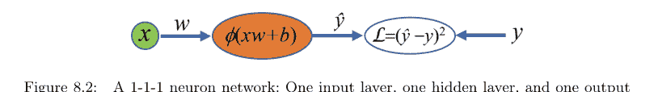

我们首先通过手算得到前馈过程中这些局部节点和阶段的所有值，以及反向传播过程中相应位置的所有梯度。结果如图8.3所示。

前馈：$x^{(1)}=1.0; w=2.0; M=2; z_1=5.0; \sigma(z_1)=\frac{1}{1+e^{-z_1}}=0.9933; \hat{y}=0.9933; D=-1.007; \mathcal{L}=1.0134$

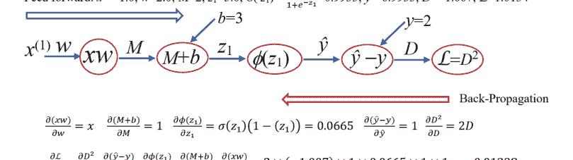

$\frac{\partial(xw)}{\partial w} = x \quad \frac{\partial(M+b)}{\partial M} = 1 \quad \frac{\partial\phi(z_1)}{\partial z_1} = \sigma(z_1)(1-(z_1)) = 0.0665 \quad \frac{\partial(\hat{y}-y)}{\partial \hat{y}} = 1 \quad \frac{\partial D^2}{\partial D} = 2D$

$\frac{\partial\mathcal{L}}{\partial w} = \frac{\partial D^2}{\partial D} \cdot \frac{\partial(\hat{y}-y)}{\partial \hat{y}} \cdot \frac{\partial\phi(z_1)}{\partial z_1} \cdot \frac{\partial(M+b)}{\partial M} \cdot \frac{\partial(xw)}{\partial w} = 2 \times (-1.007) \times 1 \times 0.0665 \times 1 \times 1 = -0.01338$

图8.3：仅包含单个神经元的最简单网络的前馈和反向传播。网络被分为五个局部节点（红色椭圆圈），如图中间所示。前馈过程：输入值 $x$、学习参数 $w$ 和 $b$ 的当前值以及标签 $y$ 值都是任意设定的。使用这些值在前馈过程中计算出的所有中间值都显示在指向这些节点的箭头上方。反向传播：所有局部节点的导数都是反向计算的，其值显示在图的底部。计算了L2函数相对于 $w$ 的最终梯度。对于 $b$ 也可以进行同样的计算，在这个简单情况下结果应该相同。

在这种情况下，我们使用最小二乘误差作为损失函数（称为L2损失函数），其中 $\phi(z)$ 是激活函数。

$$\mathcal{L} = (\phi(\mathbf{x} \cdot \mathbf{w} + b) - y)^2 \qquad (8.16)$$

其中 $y$ 是输出处给定的标签。在这种情况下，我们有

$$\frac{\partial\mathcal{L}}{\partial\mathbf{w}} = 2(\mathbf{x} \cdot \mathbf{w} + b - y)\mathbf{x}^\top \cdot \phi'(z) \qquad (8.17)$$

以及

$$\frac{\partial\mathcal{L}}{\partial b} = 2(\mathbf{x} \cdot \mathbf{w} + b - y) \cdot \phi'(z) \qquad (8.18)$$

让我们编写代码来计算所有这些，使用上述解析公式和自动求导。

```python
import mxnet as mx
from mxnet import nd, autograd, gluon

def logistic(z):          #Define the sigmoid function
    return 1. / (1. + nd.exp(-z))
```

```python
def logisticg(z):        #Analytic gradient of the sigmoid
    return logistic(z)*(1-logistic(z))

def loss2(x,w,b,y):     #Define L2 loss function
    y_hat = logistic(nd.dot(x,w)+b)
    return (y_hat-y)**2

def lossdw(x,w,b,y):    #analytic derivative of L2 w.r.t w
    y_hat = logistic(nd.dot(x,w)+b)
    return 2*(y_hat-y)*x*logisticg(nd.dot(x,w)+b)

def lossdb(x,w,b,y):    #analytic derivative of L2 w.r.t b
    y_hat = logistic(nd.dot(x,w)+b)
    return 2*(y_hat-y)*logisticg(nd.dot(x,w)+b)

b = nd.arange(3, 4, 5)  # Set the current value for b
w1 = nd.arange(2, 3, 2) # Set the current value for w
w1.attach_grad()        # request for autograd w.r.t w
b.attach_grad()         # request for autograd w.r.t b
y = 2.                  # set the label value
x = nd.arange(1, 2, 2)  # set the input value
print(' w1=',w1,'\n b=',b,'\n x=',x)
```

w1=
[2.]
<NDArray 1 @cpu(0)>
b=
[3.]
<NDArray 1 @cpu(0)>
x=
[1.]
<NDArray 1 @cpu(0)>

```python
with autograd.record():
    M = nd.dot(x, w1)
    x2 = M + b
    y_hat = logistic(x2)
    s = y_hat - y
    l2 = s*s
```

```python
head_gradient=nd.ones_like(l2)
l2.backward(head_gradient)
# print feed-forward results of the net at all local nodes
print('x=',x[0].asscalar(),'w=',w1[0].asscalar(),'M=',M[0].asscalar(),
      'x2=',x2.asscalar(), 'y_hat=',y_hat,'s=',s,'l2=',l2.asscalar())
# print the gradients from the back-propagation
print('Autograd, w1.grad',w1.grad,'  shape',np.shape(w1.grad))
print('Autograd, b.grad',b.grad)
#print the analytic results.
print('Analytic loss2=',loss2(x,w1,b,y))
print('Analytic lossdw=',lossdw(x,w1,b,y))
print('Analytic lossdb=',lossdb(x,w1,b,y))
```

```
x= <bound method NDArray.asscalar of
[1.]
<NDArray 1 @cpu(0)>> w= <bound method NDArray.asscalar of
[2.]
<NDArray 1 @cpu(0)>> M= <bound method NDArray.asscalar of
[2.]
<NDArray 1 @cpu(0)>> x2= <bound method NDArray.asscalar of
[5.]
<NDArray 1 @cpu(0)>> y_hat=
[0.9933072]
<NDArray 1 @cpu(0)> s=
[-1.0066929]
<NDArray 1 @cpu(0)> l2= <bound method NDArray.asscalar of
[1.0134306]
<NDArray 1 @cpu(0)>>
Autograd, w1.grad
[-0.0133851]
<NDArray 1 @cpu(0)>   shape (1,)
Autograd, b.grad
[-0.0133851]
<NDArray 1 @cpu(0)>
Analytic loss2=
[1.0134306]
<NDArray 1 @cpu(0)>
Analytic lossdw=
[-0.01338505]
<NDArray 1 @cpu(0)>
```

```python
Analytic lossdb=
[-0.01338505]
<NDArray 1 @cpu(0)>
```

我们再次看到，自动求导产生了精确的解。

## 8.9 示例：解析、自动求导和数值微分之间的差异

我们现在来探讨解析、自动求导和数值微分之间的差异。我们使用sigmoid函数来演示，因为它是机器学习中最常用的函数之一。

```python
import numpy as np

def logistic(z):           # Define the sigmoid function
    return 1. / (1. + nd.exp(-z))

x1 = nd.arange(-10, 10, 1)  # Define x1
x1.attach_grad()            # Request for gradient
with autograd.record():      # Define the path
    g = logistic(x1)
    h = g
head_gradient=nd.ones_like(g)
h.backward(head_gradient)
print('The gradient values of f at x=', x1.grad)
```

```
The gradient values of f at x=
[4.53958128e-05 1.23379359e-04 3.35237652e-04 9.10221133e-04
 2.46650912e-03 6.64805667e-03 1.76627077e-02 4.51766588e-02
 1.04993582e-01 1.96611941e-01 2.50000000e-01 1.96611971e-01
 1.04993574e-01 4.51766588e-02 1.76627059e-02 6.64805621e-03
 2.46650935e-03 9.10221308e-04 3.35237681e-04 1.23379359e-04]
<NDArray 20 @cpu(0)>
```

```python
import mxnet as mx
from mxnet import nd, autograd, gluon
import matplotlib.pyplot as plt
from matplotlib import rc
%matplotlib inline
```

```python
yg = logistic(x1)*(1.-logistic(x1))          # Analytic derivatives
nyg = nd.array(np.gradient(logistic(x1).asnumpy(),x1.asnumpy()))
                                        # numerical gradient using np.gradient()
dgag=yg-x1.grad              # difference between the analytical and autograd
dgng=nyg-nyg                 # difference between the analytical and numerical
m = int(len(dgag)/10)
print('dgag=',dgag[0:len(dgag):m])
print('dgng=',dgng[0:len(dgng):m])
plt.plot(x1.asnumpy(),yg.asnumpy(),dashes=[30, 5, 5, 5],color='red')
plt.plot(x1.asnumpy(),x1.grad.asnumpy(),alpha=0.5,linewidth=7.0)
plt.plot(x1.asnumpy(),nyg.asnumpy(),alpha=0.9,linewidth=1.0,color='black')
plt.plot(x1.asnumpy(),dgag.asnumpy(), color='green')
plt.plot(x1.asnumpy(),dgng.asnumpy(), color='orange')
plt.xlabel('z')
plt.ylabel(r"$\sigma \ '(z) $")
plt.title('Gradient of the sigmoid Function')
plt.show()
l0 = int(len (x1)/2)  #take look at its value at the center
print('x=',x1[l0], 'sigmoid(0)=', logistic(x1[l0]))
```

```
dgag=
[-3.6379788e-12  2.9103830e-11  0.0000000e+00 -1.8626451e-09
  0.0000000e+00  0.0000000e+00  5.2154064e-08  2.7939677e-08
 -4.3539330e-08 -1.4406396e-08]
<NDArray 10 @cpu(0)>

dgng=
[-3.2600899e-05 -5.8590609e-05 -4.2439066e-04 -2.7038064e-03
 -5.7642013e-03  1.8941417e-02 -5.7641417e-03 -2.7037859e-03
 -4.2444887e-04 -5.8584614e-05]
<NDArray 10 @cpu(0)>
```

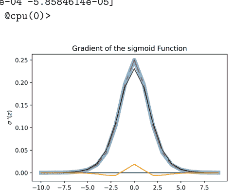

图8.4：使用不同方法计算的sigmoid函数的导数，以及结果中的误差。

x=
[0.]
<NDArray 1 @cpu(0)> sigmoid(0)=
[0.5]
<NDArray 1 @cpu(0)>

图8.4中绘制的结果清楚地表明，自动微分给出了精确解（上方的绿线为零）。数值梯度仅给出近似解（橙色线不为零）。

## 8.10 讨论

数值自动微分是计算函数梯度的强大工具，其结果是精确的（达到机器精度）。它不仅可用于机器学习，还可用于工程和科学中的许多其他计算。

我们的讨论集中在标量函数上，其变量可以是标量或向量。当变量是标量时，我们有导数；当变量是向量时，我们在局部节点处有一个梯度向量。在多层感知机层中，该层本身的函数可以是一个向量。在这些情况下，向量函数的梯度可以表示为一个矩阵，称为雅可比矩阵。其表述、过程和链式法则仍然成立，但梯度向量变成了雅可比矩阵。

## 参考文献

- [1] G.R. Liu and T.T. Nguyen, *Smoothed Finite Element Methods*. Taylor and Francis Group, New York, 2010.
- [2] G.R. Liu, *Mesh Free Methods: Moving Beyond the Finite Element Method*. Taylor and Francis Group, New York, 2010.

此页有意留白

## 第9章

## 解的存在性理论与优化技术

### 9.1 引言

开发和训练神经网络模型是为了找到一组参数（权重和偏置），以最小化损失函数（或代价函数或目标函数）。需要回答的第一个问题是，给定一个数据集，是否存在这样一组参数来创建模型。我们在第5章的理论研究已经得出结论，如果使用仿射变换，并且假设空间相对于数据集足够大，那么这样一组参数确实存在。这组参数解的唯一性需要进一步研究。这需要对模型中使用的假设以及数据集有深入的理解。本章将首先使用一个可解析处理的机器学习问题，即线性回归问题，来研究解的存在性和唯一性。我们的分析揭示了重要的**解的存在性理论**、**解的可预测性**以及数据集中**平行数据点的影响**，这些都适用于一般的复杂机器学习模型。

接下来，对于没有闭式解的一般机器学习问题，需要一个合适的工具，即优化技术，来找到这些参数。优化技术并非机器学习算法所独有，它们在工程和科学的许多设计和分析问题中被广泛使用。开发更强大的新技术或充分利用现有技术的潜力，被认为是深度学习项目中最具挑战性的工作之一。优化技术对于机器学习至关重要，原因有几个。首先，优化效率在很大程度上控制着训练效率。其次，训练的收敛性通常根植于所使用优化技术的收敛特性。

此外，优化方法通常带有一些可调参数，正确调整这些优化参数对于训练模型也至关重要。

我们的讨论将集中在基于梯度的技术上，以寻找最优解。对于这一部分，我们参考了 https://github.com/zackchase/mxnet-the-straight-dope/tree/master/chapter06_optimization （在Apache License 2下）提供的优秀材料。

### 9.2 解析优化方法：理想情况

对于目标函数非常简单的优化问题，可能能够找到解析解。例如，对于一个给定固定实数 $a$ 的目标函数 $f(w) = (w - a)^2$，可以立即找到全局且唯一的最小值 $w^* = a$。这个函数是正定的且关于 $w$ 是二次的，因此在 $\mathbb{R}^1$ 中有且仅有一个解。这个简单的问题意味着，如果函数是二次的，那么找到最小值是直接了当的。

#### 9.2.1 最小二乘公式

然而，很少有机器学习问题具有如此简单的目标函数。有些问题可以用最小二乘类型的目标函数来表述，例如线性回归问题（https://en.wikipedia.org/wiki/Linear_regression）。这类问题在科学和工程中相当常见，但又足够简单，可以解析地表述以获得某种闭式解。它是我们揭示解的存在性和可预测性等重要理论性质的绝佳问题类型。这些性质可以推广到过于复杂而无法分析的复杂机器学习模型。

给定一个包含 $m$ 个（测量）数据对的数据集，形式如下

$[y_i, x_{i1}, x_{i2}, \dots, x_{ip}], \quad i = 1, 2, \dots, m \qquad (9.1)$

其中 $y_i \in \mathbb{Y}^1$ 是在第 $i$ 个标签处获得的标签（观测或测量值），当 $p$ 个变量（特征）设置为 $x_{i1}, x_{i2}, \dots, x_{ip}$ 时。为了基于给定的线性无关变量 $x_1, x_2, \dots, x_p \in \mathbb{X}^p$ 来预测 $y$，我们可以通过假设预测器 $\hat{y}_i$ 是第5章讨论的仿射变换，在 $p$ 维空间中构建一个简单的线性回归模型：

$\hat{y}_i \equiv z_i = w_0 + w_1 x_{i1} + w_2 x_{i2}, \dots, + w_p x_{ip}, \quad i = 1, 2, \dots, m \qquad (9.2)$

其中 $w_i, i = 0, 1, 2, \ldots, p$ 是 $\mathbb{W}^{p+1}$ 中的学习参数。方程 (9.2) 可以用以下矩阵形式表示：

$$\hat{\mathbf{y}} = \overline{\mathbf{X}} \hat{\mathbf{w}} \quad (9.3)$$

其中 $\hat{\mathbf{y}}$ 是预测向量：

$$\hat{\mathbf{y}} = \{\hat{y}_1, \hat{y}_2, \ldots, \hat{y}_m\}^\top \quad (9.4)$$

而 $\overline{\mathbf{X}}$ 是一个 $m \times (p+1)$ 矩阵，其第 $i$ 行为

$$[1, x_{i1}, x_{i2}, \ldots, x_{ip}] \in \overline{\mathbb{X}}^p \quad (9.5)$$

并且

$$\hat{\mathbf{w}} = [w_0, w_1, w_2, \ldots, w_p]^\top \in \mathbb{W}^{p+1} \quad (9.6)$$

注意，方程 (9.3) 要求 $\hat{\mathbf{w}}$ 是一个列向量。这使我们能够在后面得到法方程的常规形式。我们的任务是找到一个向量 $\hat{\mathbf{w}}$，使得预测值 $\hat{\mathbf{y}}$ 最接近给定 $m$ 个数据对中的标签 $\mathbf{y}$：

$$[y_1, y_2, \ldots, y_m]^\top \quad (9.7)$$

为了存在唯一解（见后文），我们要求

$$m \geq (p+1) \quad (9.8)$$

这意味着 $\overline{\mathbf{X}}$ 的行数至少不少于其列数。换句话说，我们需要更多（通常多得多）的观测/测量数据，因此导致 $\overline{\mathbf{X}}$ 是一个“高瘦”矩阵。方程 (9.8) 也给出了样本数量 $m$ 和训练参数数量 $(p+1)$ 之间的基本关系。更详细的讨论将在第13.2节关于深度网络中给出。

#### 9.2.2 L2 损失函数

我们现在定义一个使用L2范数的损失函数，它是所有观测值上预测器 $\hat{\mathbf{y}}$ 和标签数据 $\mathbf{y}$ 之间平方差的和。它通常被称为L2损失函数。

$$\mathcal{L}(\mathbf{y}, \hat{\mathbf{y}}(\hat{\mathbf{w}})) = \|\mathbf{y} - \overline{\mathbf{X}} \hat{\mathbf{w}}\|_2^2 = (\mathbf{y} - \overline{\mathbf{X}} \hat{\mathbf{w}})^\top (\mathbf{y} - \overline{\mathbf{X}} \hat{\mathbf{w}}) \quad (9.9)$$

回归问题被表述为以下使用**最小二乘公式**的最小化问题：

$$\min_{\hat{\mathbf{w}} \in \mathbb{W}^{p+1}} \mathcal{L}(\mathbf{y}, \hat{\mathbf{y}}(\hat{\mathbf{w}})) = \min_{\hat{\mathbf{w}} \in \mathbb{W}^{p+1}} (\mathbf{y} - \overline{\mathbf{X}}\hat{\mathbf{w}})^T(\mathbf{y} - \overline{\mathbf{X}}\hat{\mathbf{w}}) \quad (9.10)$$

因为 $\mathcal{L}$ 是 $\hat{\mathbf{w}}$ 的函数，并且关于 $\hat{\mathbf{w}}$ 是二次的。因此，我们有望找到一组唯一的最优 $\hat{\mathbf{w}}^* \in \mathbb{W}^{p+1}$ 来最小化 $\mathcal{L}$，这可以通过计算其梯度（见第8章）然后令其为零来解析地找到：

$$\nabla_{\hat{\mathbf{w}}} \mathcal{L}(\mathbf{y}, \hat{\mathbf{y}}(\hat{\mathbf{w}})) = \frac{\partial \mathcal{L}(\mathbf{y}, \hat{\mathbf{y}}(\hat{\mathbf{w}}))}{\partial \hat{\mathbf{w}}} = -2\overline{\mathbf{X}}^T(\mathbf{y} - \overline{\mathbf{X}}\hat{\mathbf{w}}^*) = 0 \quad (9.11)$$

#### 9.2.3 法方程

方程 (9.11) 给出

$$\overline{\mathbf{X}}^T\overline{\mathbf{X}}\hat{\mathbf{w}}^* = \overline{\mathbf{X}}^T\mathbf{y} \quad (9.12)$$

这个方程被称为**法方程**。假设矩阵 $\overline{\mathbf{X}}^T\overline{\mathbf{X}}$ 是可逆的（$\overline{\mathbf{X}}$ 具有满秩，如第3章详细讨论的），解可以求得为

$$\hat{\mathbf{w}}^* = (\overline{\mathbf{X}}^T\overline{\mathbf{X}})^{-1}\overline{\mathbf{X}}^T\mathbf{y} \quad (9.13)$$

这是一种闭式解。

注意，对于大型系统，我们通常不构造法矩阵并求解法方程。相反，使用QR变换类型的算法来数值计算最小二乘解。这是因为第3.4.2节提到的数值不稳定原因。对于我们这里的理论分析，这种方法效果很好，因为不涉及数值运算。它可以揭示关于解的存在性的重要见解。

#### 9.2.4 解的存在性分析

在获得上述解 $\hat{\mathbf{w}}^*$ 时，$\overline{\mathbf{X}}$ 需要具有满秩，以便 $\overline{\mathbf{X}}^T\overline{\mathbf{X}}$ 可逆。让我们通过考虑一个简单的二维特征空间情况来研究这真正意味着什么：$p = 2$，$m = p + 1$。如果 $\overline{\mathbf{X}}$ 具有满秩，法方程 (9.12) 可以简化为

$$\overline{\mathbf{X}}\hat{\mathbf{w}}^* = \mathbf{y} \quad (9.14)$$它可以显式地写为

$$
\begin{bmatrix}
1 & x_{11} & x_{12} \\
1 & x_{21} & x_{22} \\
1 & x_{31} & x_{32}
\end{bmatrix}
\begin{bmatrix}
b^* \\
w_1^* \\
w_2^*
\end{bmatrix}
=
\begin{bmatrix}
y_1 \\
y_2 \\
y_3
\end{bmatrix}
\quad (9.15)
$$

现在很清楚，$\overline{\mathbf{X}}$ 与有限元方法 [1] 中公式 (7.10) 给出的三角形单元的“矩矩阵”完全相同。$\overline{\mathbf{X}}$ 具有满秩的条件是，这 3 个数据点在特征空间 $\mathbb{X}^2$（二维）中形成的面积非零。该面积是矩矩阵行列式的一半。图 9.1 绘制了空间 $\mathbb{X}^2$ 中的 3 个数据点 $\mathbf{x}_1$、$\mathbf{x}_2$ 和 $\mathbf{x}_3$，显然三角形的面积非零。如果我们用 $\mathbf{x}_3'$ 替换 $\mathbf{x}_3$，则 $\mathbf{x}_1$、$\mathbf{x}_2$ 和 $\mathbf{x}_3'$ 共线，三角形变为**退化**，面积变为零，$\overline{\mathbf{X}}$ 将是奇异的，其秩降为 2。

注意，虽然 $\mathbf{x}_1$、$\mathbf{x}_2$ 和 $\mathbf{x}_3$ 在空间 $\mathbb{X}^2$ 中线性相关，向量 $\mathbf{x}_3$ 可以表示为 $\mathbf{x}_1$ 和 $\mathbf{x}_2$ 的线性组合，因为这 3 个向量（蓝色）共面。然而，当这 3 个数据点投影到仿射平面 $\overline{\mathbb{X}}^2$（参见第 1.4.2 节）时，$\mathbb{R}^3$ 中的这 3 个向量（红色）不再共面，变为线性无关。因此，$\overline{\mathbf{X}}$ 具有满秩的另一个条件是，这 3 个数据点在 $\mathbb{R}^3$ 中空间 $\overline{\mathbb{X}}^2$ 的 $x_0 = 1$ 平面上的向量是线性无关的。如果我们用 $\overline{\mathbf{x}}_3'$ 替换 $\overline{\mathbf{x}}_3$，则 $\overline{\mathbf{x}}_1$、$\overline{\mathbf{x}}_2$ 和 $\overline{\mathbf{x}}_3'$ 现在共面，变为线性相关。在这种情况下，$\overline{\mathbf{X}}$ 将变为奇异，其秩将变为 2。因此，$\overline{\mathbf{X}}$ 的秩取决于 $\overline{\mathbf{X}}^2$ 空间中数据点向量的最大线性无关数。

现在考虑 $m > p + 1$ 且 $p = 2$ 的情况。这意味着我们仍然有 2 个特征，但数据点超过 3 个。在这些情况下，$\overline{\mathbf{X}}$ 的秩取决于 $\overline{\mathbf{X}}^2$ 空间中所有数据点在 $\mathbb{R}^3$ 中的最大线性无关向量数。因此，机会应该更高。

对于一般的高维特征空间 $\mathbb{X}^p$，$\overline{\mathbf{X}}$ 具有满秩的相同论证成立。如果我们检查 $\mathbb{X}^p$ 空间中的数据点，我们需要以任何 $p + 1$ 个数据点为顶点的最大多面体的“体积”非零。如果我们检查 $\overline{\mathbb{X}}^p$ 空间中的数据点，我们需要 $\overline{\mathbb{X}}^p$ 中所有数据点在 $\mathbb{R}^{p+1}$ 中的最小线性无关向量数为 $p + 1$。一旦 $\overline{\mathbf{X}}$ 具有满秩，我们将得到由公式 (9.13) 给出的最小二乘解。任意维度的通用分析可以在 [2] 中找到。

我们现在在以下解存在性理论中总结我们的讨论。

### 9.2.5 解存在性理论

**解存在性理论：** 考虑一个包含 $m \geq p + 1$ 个数据点的数据集。如果数据集中所有数据点在仿射空间 $\overline{\mathbb{X}}^p$ 中的最大线性无关向量数不小于 $p + 1$，则矩阵 $\overline{\mathbf{X}}$ 将具有满秩，并且存在由公式 (9.13) 给出的唯一最小二乘解。

或者，条件也可以设定为数据集中任何 $p + 1$ 个数据点作为顶点在特征空间 $\mathbb{X}^p$ 中形成的最大多面体非退化。在高维情况下，这种多面体的几何形状变得非常复杂。

在实践中，当我们有许多数据点时，$\overline{\mathbf{X}}$ 通常是一个非常高的矩阵，因此矩阵 $\overline{\mathbf{X}}^\top \overline{\mathbf{X}}$ 通常是可逆的且是 SPD（对称正定）的。

**注：** 上述分析也揭示了一个重要事实，即唯一解的存在性仅取决于数据点的数量和数据点在 $\mathbb{X}^p$ 中的分布。

当 $\overline{\mathbf{X}}$ 具有满秩时，我们可以通过公式 (9.13) 进行单步计算获得精确的最优值 $\hat{\mathbf{w}}^*$，包括一次矩阵乘法、一次矩阵求逆和两次矩阵-向量乘积。

如果数据集包含**高阶潜在特征**，可以添加高阶基，例如 $x_1, x_2, x_1^2, \dots$。解存在性理论仍然成立，解的存在性取决于所得矩矩阵 $\overline{\mathbf{X}}$ 是否具有满秩。或者，可以使用更强大的假设，例如第 13.2 节讨论的具有大量学习参数的 MLP。MLP 的解存在性的精确分析变得更加复杂，但我们可以断言*它取决于数据点的数量和分布是否支持具有学习参数的 MLP 假设*。这一断言在 ML 模型创建中很重要，因为如果无法训练模型，检查和丰富数据集或降低 MLP 的复杂性可能是有效的解决方案。

### 9.2.6 *并行数据点的影响*

让我们进一步深入探讨另一个重要问题：数据集中重复或并行数据点的影响，这可能会困扰许多构建机器学习模型的人。假设在公式 (9.15) 中，任何两个数据点是相同的或平行的。根据解存在性理论，矩矩阵将是奇异的。如果数据集中有许多数据点，其中至少有三个数据点在其对应的仿射空间 $\overline{\mathbb{X}}^2$ 中线性无关，我们仍然会有最小二乘解。在这种情况下，数据点的重复（或平行性）对解的存在性没有影响。然而，它可能会影响解的值，因为相同的数据点在 L2 损失函数中被使用了两次。如果这不是分析师的意图，则需要清理数据集，例如使用 PCA。这一发现适用于更高维度和其他复杂模型。

就以公式 (9.13) 的形式单步（无迭代）获得解而言，这个最小二乘线性回归可能就是我们能做的极限了。最多，我们可以为此类优化问题添加一些约束，导致二次规划问题，正如我们在研究 SVM 时所做的那样。

### 9.2.7 *解相对于标签的可预测性*

注意 $y_i \in \mathbb{Y}$ 不影响解的存在性。它影响解 $\hat{\mathbf{w}}^*$ 的值。在构建公式 (9.9) 中的损失函数时，我们将 $\hat{y}_i$ 与 $y_i$ 进行比较。这意味着预测 $\hat{y}_i$ 必须在标签空间 $\mathbb{Y}$ 中。这与我们在第 5 章关于使用仿射变换的假设可预测性的讨论有关。我们已经证明，公式 (9.2) 给出的预测函数可以预测数据集中可能隐藏的特征变量 $\mathbf{x}$ 的任何任意线性函数。在这种特定情况下，这种线性函数在拟合数据集时给出了公式 (9.9) 中定义的最小误差。

为了预测与数据集中标签相关的高阶和非线性潜在特征，必须添加高阶基或其他类型的非线性基，或者使用更强大的非线性模型，如前面提到的 MLP。神经元输出层的预测仍然在 $\mathbb{Y}^k$ 中。这是因为隐藏层中的每个神经元通过包装了激活函数的仿射变换确保了对仿射空间的连续覆盖。输出层的预测函数相对于学习参数是连续且可微的，正如第 5 章对仿射变换和第 7 章对激活函数的详细讨论。此外，梯度可以通过第 8 章演示的自动微分找到。因此，假设空间 $\mathbb{W}^P$ 中的学习参数可以实现预测函数的平滑连续覆盖。因此，解相对于标签的可预测性在理论上得到了保证。无论标签空间中标签的实际值如何，通过调整假设空间中的学习参数，预测应该能够以所需的精度匹配这些值。通用预测理论（参见第 5 章）确保了 MLP 的能力，只要使用适当配置的 MLP 并具有足够数量的学习参数。然而，需要有效的数值技术来找到最小化损失函数的最优学习参数。

对于大多数机器训练模型，损失函数是复杂的。通常不可能将类似于公式 (9.10) 的最小化问题转换为单个正规方程组。因此，我们必须找到一种方法直接通过数值方法求解最小化问题。通常使用迭代方法，找到一组最小化器需要许多步骤。

## 9.3 复杂问题优化的考虑

需要仔细考虑以数值方式求解最小化问题。例如，损失函数可能不是全局凸的，最优点不唯一，存在多个局部最优，以及存在鞍点。

在本章剩余的讨论中，我们考虑可用于科学和许多研究领域的一般优化技术工程领域，包括机器学习。因此，在不失一般性的情况下，待优化的函数通常表示为 $f(\mathbf{x})$，其中 $\mathbf{x}$ 是自变量。如果只有一个变量，$\mathbf{x}$ 就简化为 $x$。然而，在机器学习中，我们的函数将是损失函数 $\mathcal{L}(\hat{\mathbf{w}})$，而自变量则是学习参数 $\hat{\mathbf{w}}$。需要注意避免混淆。

### 9.3.1 局部最小值

对于大多数实际的机器学习问题，以 $x$ 为变量的目标函数 $f(x)$ 可能存在多个局部最小值，在每个局部最小值点，$f(x)$ 的值都小于其邻近点的值。只有在整个定义域上使 $f(x^*)$ 取得最小值的 $x^*$ 才被视为全局最小值点，这通常也是我们希望找到的点。

考虑以下函数：

$$f(x) = \frac{x}{2} \cdot \cos(\pi x), \quad -1.0 \le x \le 4.0. \tag{9.16}$$

让我们绘制该函数的曲线以获得直观的视图。

```python
%config InlineBackend.figure_format ='retina' # high quality plot
%matplotlib inline
import numpy as np
import matplotlib.pyplot as plt

def f(x):
    return 0.5*x * np.cos(np.pi * x)

x = np.arange(-1.0, 4.0, 0.1)
fig = plt.figure()
subplt = fig.add_subplot(111)
subplt.annotate('local minimum',xy=(-.3,-.1),xytext=(-.8,-.5),
                arrowprops=dict(facecolor='black', shrink=0.01))
subplt.annotate('local minimum',xy=(1.1,-.5),xytext=(.5, .05),
                arrowprops=dict(facecolor='black', shrink=0.05))
subplt.annotate('global minimum',xy=(3.,-1.5),xytext=(3.,.05),
                arrowprops=dict(facecolor='red', shrink=0.05))
plt.title('A cost function with multiple minima')
plt.plot(x, f(x))
plt.show()
```

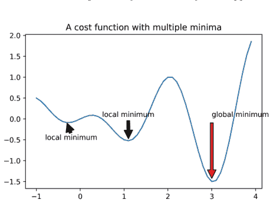

图 9.2：一个具有多个最小值的代价函数示例。

从图 9.2 可以清楚地看到，该函数在我们绘制的定义域内有两个局部最小值和一个全局最小值。局部最小值的存在带来了挑战，不幸的是，对于一般的机器学习模型，我们没有有效的方法来确保找到全局最小值。在实践中，我们能做的是多次执行优化，每次从不同的初始点开始，然后取这些多次最小值中的最小值。

### 9.3.2 鞍点

鞍点对优化技术提出了另一个挑战。损失函数在鞍点处的梯度为零，但损失函数本身在该点沿某些方向可能是最小值，而沿其他方向可能是最大值。对于高维问题（如机器学习），鞍点可能数量众多。鞍点的问题可以通过以下示例来说明。

考虑一个一维目标函数，定义为

$$f(x) = \frac{1}{2}x^3 + 2, \quad -2.0 \le x \le 2.0 \qquad (9.17)$$

该函数的导数为

$$f'(x) = \frac{3}{2}x^2, \quad -2.0 \le x \le 2.0 \qquad (9.18)$$

在 $x = 0$ 处为零，但在 $-2.0 \le x \le 2.0$ 区间内的其他地方均为正。该函数的二阶导数为

$$f''(x) = 3x \quad -2.0 \le x \le 2.0 \qquad (9.19)$$

在 $x = 0$ 处为零。然而，它在 $[-2.0, 0.0)$ 区间内为负，在 $(0.0, 2.0]$ 区间内为正。这意味着，从左侧看向 0 时，$x = 0$ 似乎是一个极大值点；而从 0 向右看时，它似乎是一个极小值点，如图 9.3 所示。鞍点两侧的梯度是相同的。

```python
x = np.arange(-2.0, 2.0, 0.1)
fig = plt.figure()
subplt = fig.add_subplot(111)
subplt.annotate('saddle point',xy=(0,1.8),xytext=(-.4,-1.),
                arrowprops=dict(facecolor='red', shrink=0.001))
plt.plot(x, 0.5 * x**3 + 2.0)
plt.show()
plt.annotate('saddle point', xy=(0., 0.1), xytext=(0., 2.),
             arrowprops=dict(facecolor='red', shrink=0.001))
plt.plot(x, 1.5 * x**2 )
plt.show()
```

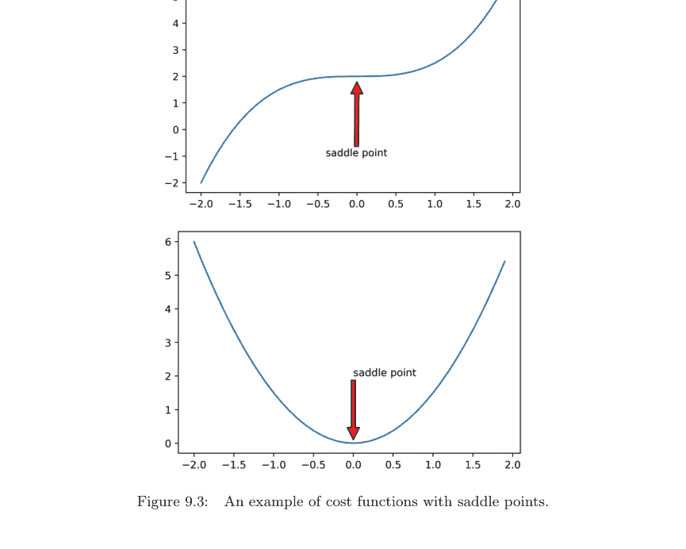

图 9.3 展示了一个具有鞍点的代价函数示例。我们之前在学习 SVM 时见过二维空间中的鞍函数。它通过解析方法得到了很好的处理，从而引出了一个二次规划问题。在机器学习中，许多复杂的函数可能具有多个类似但更复杂的鞍点。我们不太可能为一组极小值点找到解析方法。让我们编写代码来生成这样一个函数，以获得直观感受。

```python
import matplotlib as mpl
#mpl.rcParams['figure.dpi']= 80
import matplotlib.pyplot as plt
from mpl_toolkits import mplot3d
from mpl_toolkits.mplot3d import axes3d
from IPython.core.interactiveshell import InteractiveShell
#InteractiveShell.ast_node_interactivity = "all"
#%matplotlib notebook #%matplotlib tk
x1 = np.linspace(.0 ,3.5,100) # np.arange(0.5, 5.0, 5.0)
x2 = np.linspace(-1.,4.0,100) # np.arange(2.0, 6.0, 5.0)
lx1, lx2 = len(x1), len(x2)
print('length of x1=',lx1,'length of x2=',lx2)
X1, X2 = np.meshgrid(x1, x2)
a, b = 1.0, 0.5
Z = a*X1 * np.cos(np.pi * X1) + b*X2 * np.cos(np.pi * X2)
fig_s = plt.figure(figsize=(8,5))
ax = fig_s.add_subplot(1,1,1,projection='3d')
ax.set_xlabel('$x_1$', fontsize=9, rotation=80)
ax.set_ylabel('$x_2$', fontsize=9)
ax.set_zlabel('Function Value', fontsize=9, rotation=0)
ax.yaxis._axinfo['label']['space_factor'] = 2.0
#ax.plot_wireframe(X1,X2,Z,color='b',rstride=5,cstride=5)
ax.plot_surface(X1,X2,Z,color='b',rstride=1,cstride=1,
                shade=False,cmap="jet", linewidth=1)
plt.title('Parabolic Cylinder function of $x_1$ and $x_2$\n          with, a='+str(a)+', b=' +str(b))
#plt.legend()
fig_s.tight_layout()  # otherwise right y-label is clipped
plt.show()
```

length of x1= 100 length of x2= 100

Parabolic Cylinder function of $x_1$ and $x_2$ with, a=1.0, b=0.5

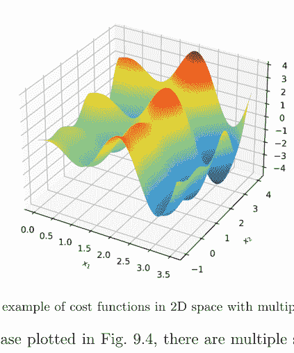

图 9.4：一个二维空间中具有多个鞍点的代价函数示例。

对于图 9.4 中绘制的这个二维情况，存在多个鞍点，在这些点上函数的梯度为零，但函数值沿 $x_1$ 方向是最大值，沿 $x_2$ 方向是最小值。

### 9.3.3 凸函数

椭圆抛物面函数易于处理，因为这类函数是凸函数且只有一个最小值。让我们编写代码并绘制一个。

```python
a, b = 1.0, 2.0    # minor & major radii for an ellipse
x1 = np.linspace(-2.0,2.0,100)
x2 = np.linspace(-4.,4.0,100)
X1, X2 = np.meshgrid(x1, x2)    # Grides for 3D plot
Z = X1*X1/a**2 + X2*X2/b**2    # an ellipse
#%matplotlib notebook
%matplotlib inline
fig_s = plt.figure(figsize=(8,6))
ax = fig_s.add_subplot(1,1,1,projection='3d')
ax.set_xlabel('$x_1$', fontsize=12, rotation=80)
ax.set_ylabel('$x_2$', fontsize=12)
ax.set_zlabel('Function Value',fontsize=12,rotation=0)
ax.yaxis._axinfo['label']['space_factor'] = 3.0
ax.plot_wireframe(X1,X2,Z,color='b',rstride=5,cstride=5)
plt.title('Elliptic Paraboloidal function of $x_1$ and '
          '$x_2$ with, a='+str(a)+', b= '+str(b))
#plt.legend()
fig_s.tight_layout()    # otherwise y-label is clipped
plt.show();
```

Elliptic Paraboloidal function of $x_1$ and $x_2$ with, a=1.0, b=2.0

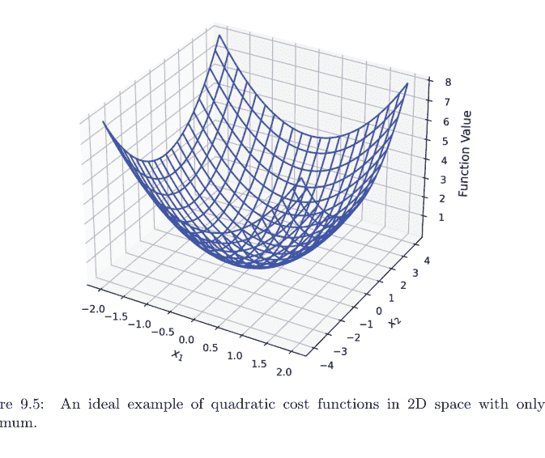

图 9.5：一个二维空间中仅有一个最小值的二次代价函数的理想示例。

如图 9.5 所示，椭圆函数表现良好，只有一个最小值。理解这类性质对于处理复杂的损失函数很有用，因为在局部最小值附近，许多复杂函数是局部椭圆的，因此可以加以利用。唯一可能出现的困难是当短轴与长轴的比率过大（或过小）时。我们稍后将再次讨论这一点。

## 9.4 用于优化的梯度下降法

*梯度下降*法是当函数的梯度可计算时，用于最小化函数的基本技术。它在科学和工程领域被广泛应用，包括机器学习。它通常是一种迭代方法，意味着解（近似解）是通过多次引导迭代。这种迭代方法在训练机器学习模型时尤为实用，因为参数空间通常具有极高的维度。

考虑一个二维空间，其中定义了一个代价函数曲面。代价函数的曲面可以看作是一个布满山谷和丘陵的地形表面。想象一下，一个人目前站在一座山丘上的某个点，想要到达山谷的最低点。最快的路径是沿着坡度最陡的方向下山。这本质上就是梯度下降法（有时也称为最陡下降法）。梯度在数学中只是对坡度的一个更正式、更严谨的术语。

在机器学习问题中定义的典型代价函数可能处于高得多的维度，可能高达数百万维。这是一个远超人类想象的空间。然而，这个曲面仍然可以被视为一个超维曲面，方向也仍然是最陡的下坡方向（或负梯度方向）。为了开发这样的计算机算法，我们需要：

-   计算梯度以确定学习方向。
-   确定在该方向上采取的步长，这决定了学习率。

让我们看看这在最简单的一维问题中是如何工作的。

### 9.4.1 一维梯度下降

假设在一个一维（1D）空间中定义了一个代价函数 $f(x)$，变量为 $x$。同时假设在感兴趣的定义域内，该函数在任何 $x$ 处至少存在一阶导数（在一维情况下即为梯度）。那么我们可以使用 $x$ 附近的泰勒级数展开，得到：

$$f(x + \delta x) \approx f(x) + f'(x)\delta x \quad (9.20)$$

其中 $(\delta x)$ 是一个很小的实数。因为函数存在一阶导数，它必须是一个有限值（否则，它就是不可微的）。因此，我们可以选择一个非常小的正实数 $\eta$ 作为标量，使得 $\eta f'(x)$ 与 $\delta x$ 一样小。这意味着 $\eta$ 应该具有 $[(\delta x) f'^{-1}(x)]$ 的单位。方程 (9.20) 现在可以重写为：

$$f(x - \eta f'(x)) \approx f(x) - \eta(f'(x))^2. \quad (9.21)$$

因为 $\eta$ 被选为正数，所以我们有：

$$f(x - \eta f'(x)) \leq f(x). \quad (9.22)$$

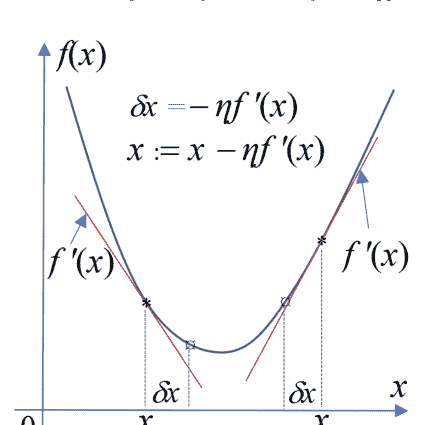

图 9.6：一维情况下的梯度下降。

这意味着，通过以下方式更新 $x$：

$$x := x - \eta f'(x) \quad (9.23)$$

将导致 $f(x)$ 的值减小。注意负号，这意味着 $x$ 的更新方向是梯度的负方向（或下坡方向）。

图 9.6 显示，无论 $x$ 位于哪一侧，梯度下降都会朝着凸函数的最小值迈进一步。

### 9.4.2 备注

基于以上分析，我们注意到以下要点：

1.  $x$ 的更新方向是梯度的负方向，因此得名 *梯度下降*。
2.  减少量与函数的梯度成正比。梯度越大，减少量越大，前提是 $\eta f'(x)$ 足够小，使得泰勒展开（以及我们的分析）仍然成立而不会过冲。
3.  标量 $\eta$ 在机器学习中被称为 *学习率* 或学习步长，其选择可能很棘手。它通常需要一些试错。
4.  一方面，我们必须沿着导数最大的方向前进。另一方面，我们不能过于贪婪地选择过大的 $\eta$，以免破坏我们分析的基础。较大的学习率可能导致过冲，从而在收敛过程中产生振荡行为，这在机器学习实践中经常观察到。
5.  当 $x$ 处的导数值 $f'(x)$ 为零时，我们没有进展。这也意味着我们已经到达了最小值（包括上一节讨论的鞍点）。
6.  如果 $x$ 处的导数值 $f'(x)$ 很小，我们的进展就 *非常*（小一个数量级）小（注意 $(f'(x))^2$ 项）。这意味着要加速这个过程，就需要利用代价函数的高阶导数（例如牛顿法等高阶方法）。

### 9.4.3 超维梯度下降

考虑一个代价函数 $f(\mathbf{x})$，其中参数 $\mathbf{x} = [x_1, x_2, \dots, x_p]^\top$ 有 $p$ 个变量（或 ML 模型中的参数）。这意味着 $f(\mathbf{x})$ 是一个 *标量*，定义在一个 $p$ 维的空间中。

因此，$f(\mathbf{x})$ 的梯度是关于所有这些变量/参数 $\mathbf{x}$ 的，它是一个 *向量*（见第 8 章），形式如下：

$$\nabla_{\mathbf{x}} f(\mathbf{x}) = \left[ \frac{\partial f(\mathbf{x})}{\partial x_1}, \frac{\partial f(\mathbf{x})}{\partial x_2}, \dots, \frac{\partial f(\mathbf{x})}{\partial x_p} \right]^\top. \quad (9.24)$$

其中 $\partial f(\mathbf{x})/\partial x_i$ 是函数关于第 $i$ 个参数的偏导数。它表示在 $\mathbf{x}$ 处，仅当 $x_i$ 发生微小变化时 $f$ 的变化。

为了衡量在 $\mathbf{x}$ 处，当沿着由单位任意向量 $\mathbf{u}$ 定义的任意方向发生微小长度变化 $(\delta l)$ 时 $f$ 的变化，我们可以写成：

$$D_{\mathbf{u}} f(\mathbf{x}) = \lim_{(\delta l) \to 0} \frac{f(\mathbf{x} + (\delta l)\mathbf{u}) - f(\mathbf{x})}{(\delta l)} \quad (9.25)$$

这实际上是 $f(\mathbf{x})$ 在任意方向 $\mathbf{u}$ 上的导数。注意 $D_{\mathbf{u}} f(\mathbf{x})$ 是一个 *标量*（对于标量函数 $f(\mathbf{x})$ 而言）。

另一方面，在 $\mathbf{x}$ 附近使用泰勒级数展开得到：

$$f(\mathbf{x} + (\delta l)\mathbf{u}) \approx f(\mathbf{x}) + \nabla_{\mathbf{x}} f(\mathbf{x}) \cdot (\delta l)\mathbf{u} \quad (9.26)$$

可以重写为：

$$\nabla_{\mathbf{x}} f(\mathbf{x}) \cdot \mathbf{u} = \lim_{(\delta l) \to 0} \frac{f(\mathbf{x} + (\delta l)\mathbf{u}) - f(\mathbf{x})}{(\delta l)} \quad (9.27)$$

利用方程 (9.25) 和 (9.27)，我们得到：

$$D_{\mathbf{u}} f(\mathbf{x}) = \nabla_{\mathbf{x}} f(\mathbf{x}) \cdot \mathbf{u}. \quad (9.28)$$

这是符合预期的，因为函数（标量）在任意方向 $\mathbf{u}$ 上的导数是函数梯度（向量）在 $\mathbf{u}$ 方向上的投影（内积）。

为了我们的最小化目标，我们希望代价函数的变化 $D_{\mathbf{u}} f(\mathbf{x})$ 尽可能为负。因此，我们针对单位向量 $\mathbf{u}$ 的所有可能方向来最小化 $D_{\mathbf{u}} f(\mathbf{x})$。方程 (9.28) 然后可以写成：

$$D_{\mathbf{u}} f(\mathbf{x}) = \|\nabla_{\mathbf{x}} f(\mathbf{x})\| \cdot \|\mathbf{u}\| \cdot \cos(\theta) = \|\nabla_{\mathbf{x}} f(\mathbf{x})\| \cdot \cos(\theta) \quad (9.29)$$

其中 $\theta$ 是 $\nabla_{\mathbf{x}} f(\mathbf{x})$ 和 $\mathbf{u}$ 之间的夹角，$0 \le \theta \le 2\pi$。$\cos(\theta)$ 的最小值是 $-1$，此时 $\theta = \pi$。因此，当 $\mathbf{u}$ 与梯度 $\nabla_{\mathbf{x}} f(\mathbf{x})$ 方向相反时，$D_{\mathbf{u}} f(\mathbf{x})$ 被最小化。

我们现在可以通过以下方式更新 $\mathbf{x}$ 来减小 $f$ 的值：

$$\mathbf{x}_i := \mathbf{x}_{i-1} - \eta \nabla_{\mathbf{x}} f(\mathbf{x}) \quad (9.30)$$

其中 $\eta$ 是一个正标量，应具有 $[(\delta x)\|\nabla_{\mathbf{x}} f(\mathbf{x}_i)\|^{-1}]$ 的单位，即学习率。

超维问题的分析与我们对一维问题所做的分析类似，但需要对方向进行额外分析。我们还注意到，标量函数关于向量变量的梯度是一个与变量向量形状相同的向量。换句话说，对标量函数求梯度本质上与求导数相同。唯一需要做的就是将标量变量更改为向量变量。根据同样的论证，上一小节中的所有备注也适用于超维问题。

### 9.4.4 凸函数的性质

凸性是函数在优化方面的一个重要特征，许多优化算法对凸函数效果良好。如果一个函数 $f(\mathbf{x})$ 被称为 **凸函数**，这意味着 (a) 存在一个 $\mathbf{x}^*$ 使得 $f(\mathbf{x}^*)$ 是最小值，并且 (b) 对于 $f(\mathbf{x})$ 定义域内的任何 $\mathbf{x}_a$ 和 $\mathbf{x}_b$，我们总有

### 9.4.5 梯度下降算法的收敛定理

**定理：** 考虑一个用于最小化函数 $f(\mathbf{x})$ 的梯度下降（GD）算法。在 $t + 1$ 时刻，它使用以下 GD 算法更新 $\mathbf{x}$：

$$\mathbf{x}_{t+1} = \mathbf{x}_t - \eta \underbrace{\left[\nabla_{\mathbf{x}_t} f(\mathbf{x}_t)\right]}_{\nabla_t} = \mathbf{x}_t - \eta \nabla_t$$

其中我们简记为

$$\nabla_t = \nabla_{\mathbf{x}_t} f(\mathbf{x}_t)$$

如果 (1) 函数 $f(\mathbf{x})$ 是凸函数；
(2) 对于所有 $t$，梯度的范数有一个上界；
(3) 更新过程中没有超调，即定义域中任意点 $\mathbf{x}_a$ 与最小点 $\mathbf{x}^*$ 之间的（欧几里得）距离是有界的；那么我们有

$$\|\mathbf{x}_a - \mathbf{x}^*\| \leq R \quad (9.36)$$

其中 $R$ 是一个与 $t$ 无关的常数。
经过 $T$ 次迭代后，我们得到

$$f\left(\frac{1}{T}\sum_{t}^{T}\mathbf{x}_t\right) \leq f(\mathbf{x}^*) + \frac{RG}{\sqrt{T}} \quad (9.37)$$

其中设置了 $\eta = \frac{R}{G\sqrt{T}}$，其单位为 $[f^{-1}R]$。

**证明。** 我们首先考察向量 $\|\mathbf{x}_{t+1} - \mathbf{x}^*\|^2$ 的长度（幅度）。

$$\begin{aligned}
\|\mathbf{x}_{t+1} - \mathbf{x}^*\|^2 &= (\mathbf{x}^* - \mathbf{x}_{t+1}) \cdot (\mathbf{x}^* - \mathbf{x}_{t+1}) \\
&= (\mathbf{x}^* - \mathbf{x}_t + \eta\nabla_t) \cdot (\mathbf{x}^* - \mathbf{x}_t + \eta\nabla_t) \\
&= \|\mathbf{x}^* - \mathbf{x}_t\|^2 - 2\eta\nabla_t \cdot (\mathbf{x}_t - \mathbf{x}^*) + \eta^2\|\nabla_t\|^2 \\
&\leq \|\mathbf{x}^* - \mathbf{x}_t\|^2 - 2\eta\nabla_t \cdot (\mathbf{x}_t - \mathbf{x}^*) + \eta^2 G^2 \quad (9.38)
\end{aligned}$$

上述等式给出

$$\nabla_t \cdot (\mathbf{x}_t - \mathbf{x}^*) \leq \frac{1}{2\eta}(\|\mathbf{x}^* - \mathbf{x}_t\|^2 - \|\mathbf{x}_{t+1} - \mathbf{x}^*\|^2) + \frac{\eta}{2}G^2 \quad (9.39)$$

我们现在考察

$$\begin{aligned}
f\left(\frac{1}{T}\sum_{t}^{T}\mathbf{x}_t\right) - f(\mathbf{x}^*) &\leq \frac{1}{T}\sum_{t}^{T}(f(\mathbf{x}_t) - f(\mathbf{x}^*)) \\
&\leq \frac{1}{T}\sum_{t}^{T}(\nabla_t \cdot (\mathbf{x}_t - \mathbf{x}^*)) \\
&\leq \frac{1}{2\eta T}\sum_{t}^{T}[\|\mathbf{x}^* - \mathbf{x}_t\|^2 - \|\mathbf{x}_{t+1} - \mathbf{x}^*\|^2] + \frac{\eta}{2}G^2 \\
&= \frac{1}{2\eta T}[\|\mathbf{x}^* - \mathbf{x}_0\|^2 - \|\mathbf{x}^* - \mathbf{x}_T\|^2] + \frac{\eta}{2}G^2 \\
&\leq \frac{R^2}{2\eta T} + \frac{\eta}{2}G^2 = \frac{RG}{\sqrt{T}} \quad (9.40)
\end{aligned}$$

在最后一步，我们设置了 $\eta = \frac{R}{G\sqrt{T}}$。证明完毕。$\square$

### 9.4.6 学习率的设置

在上面的证明中，我们简单地假设梯度被一个常数 $G < \infty$ 所界定。$\eta$ 的设置意味着学习率应依赖于步数 $t$。通过将 $G$ 与所谓的凸函数的 Lipschitz 连续常数联系起来，可以进行更详细的分析。这种分析将导致以下适用于一般凸函数的条件。

$$\sum_{n}^{\infty} \eta_{t}^{2} < \infty \quad \text{且} \quad \sum_{n}^{\infty} \eta_{t} \rightarrow \infty \qquad (9.41)$$

第一个方程确保收敛，意味着 $f(\mathbf{x}_{t})$ 最终会趋近于 $f(\mathbf{x}^{*})$，第二个方程确保收敛可以在有限步骤内实现。注意，在实践中，调整学习率可能是一项具有挑战性的任务。方程 (9.41) 是设计学习率调度方案的理论指导。下面给出的调度方案满足上述两个方程。

$$\eta_{t} = \frac{\eta_{0}}{t^{\beta}} \qquad (9.42)$$

其中 $\eta_{0}$ 是预先指定的初始学习率，且 $1/2 < \beta < 1$，以满足方程 (9.41) 中的条件。以下是此（逆）幂调度的一个简单代码。

```python
%matplotlib inline
import matplotlib.pyplot as plt
import numpy as np

def lr_schedulerP(epoch, lr0, beta):
    '''epoch: epoch number in the learning process
       lr0: starting learning rate
       beta: (inverse) power '''
    return lr0/(epoch+1)**beta

ep_list = np.array(range(2000))
lr0, beta, lr_list= 0.01, 0.51, []
for epoch in ep_list:
    lr_list.append(lr_schedulerP(epoch, lr0, beta))

fig = plt.figure()
ax = plt.axes()
ax.plot(ep_list, lr_list);
```

图 9.8 绘制了一个指数衰减学习率的例子。作者经常发现，对于许多问题，一个简单的线性调度方案就能很好地工作。读者可以尝试以下代码，并根据自己的问题进行修改。

```python
def lr_scheduler1(epoch, lr, lr1, lrT, ep_linear):
    '''Linear schedule of learning rates
        epoch: epoch number in the learning process
        lr: current learning rate
        lr1: starting point of the linear schedule
        lrT: learning rate at the final learning stage
        ep_linear: number of epochs for the linear schedule portion
        lr1_T: learning rates in the linear portion from lr1 to lrT'''

    lr1_T = (lrT-lr1)/ep_linear * epoch + lr1
    lr = [lrT if epoch>ep_linear else lr if lr1_T>lr else lr1_T][0]
    return lr

ep_list = np.array(range(1500))
lr, lr_list= 0.01, []
for epoch in ep_list:
    lr_list.append(lr_scheduler1(epoch,lr,0.02,1e-5,1000))
```

```python
fig = plt.figure()
ax = plt.axes()
ax.plot(ep_list, lr_list)
```

图 9.9：一个分段线性衰减学习率的例子。

图 9.9 所示的调度方案在开始时有一个恒定部分，这有助于在初始阶段实现快速收敛。最终阶段使用的学习率被设置为分析人员可接受的最小值。中间的学习率则线性变化。

## 9.5 随机梯度下降

梯度下降算法中梯度的计算是计算机算力的主要消耗。特别是对于具有极多变量和海量数据集的超维问题，梯度下降方法可能成本过高。随机梯度下降（SGD）方法提供了一种有效的减少计算量的方式。它利用了训练数据集足够大时的统计特性。SGD 的核心思想如下。

在训练模型时，我们使用一个包含许多数据点的数据集。代价函数实际上是每个数据点代价函数的总和。整个代价函数的梯度则通过第 $i$ 个数据点的代价函数梯度来估计，其中 $i$ 是从数据集中均匀随机采样的。当然，这种采样给出的梯度精度较低，但它是整个代价函数真实梯度的无偏估计。例如，对于一个包含一百万个数据点的数据集，每次迭代的梯度计算量减少了一百万倍！因此，这可能非常具有成本效益。

当以这种极端方式使用 SGD 时，代价函数的收敛可能变得不稳定并呈现振荡行为。这时 **小批量** 概念就派上用场了；我们不是每次只随机采样一个数据点，而是在每次迭代（epoch）中均匀随机采样一小批数据点。这可以显著改善收敛行为，而成本只略有增加，因此小批量技术可能非常有效。它是处理大数据集时最高效的机器学习算法之一。

当训练数据点具有高度冗余时，SGD 更具吸引力。随机采样的梯度可以使用小批量很好地估计整个代价函数的真实梯度。当训练数据点足够多且冗余度高时，可以使用更小的批量大小，从而节省大量成本。此外，使用随机采样梯度可以被视为一种正则化类型，具有缓解过拟合的效果。

### 9.5.1 数值实验

我们现在通过创建一个用于线性回归的简单神经网络模型来演示基于梯度的算法，使用的代码来自 mxnet-the-straight-dope (https://github.com/zackchase/mxnet-the-straight-dope/blob/master/chapter01_crashcourse/autograd.ipynb)，遵循 Apache-2.0 许可证。

我们首先定义一个基于 SGD 方法和小批量算法的最小化函数。基本小批量算法的关键步骤如下：

1.  随机打乱整个数据集中的所有数据点或样本。
2.  从打乱后的数据集中选择每个包含少量样本（称为小批量）的批次。
3.  遍历这些小批量，计算损失函数相对于其所有训练参数的梯度，并执行最小化（更新训练参数），直到过程大致收敛。这完成了一个训练 *epoch*。
4.  从整个训练数据集中随机选择另一组小批量，并重复上述过程进行另一个 epoch 的训练。此过程在多个训练周期（epoch）中持续进行，直到整个数据集中的所有样本基本被遍历完毕，且损失函数收敛到一个可接受的低水平。

由于小批量（mini-batch）的随机样本选择，我们可以期望任何一个小批量在统计上都能很好地代表整个数据集。以下函数是为小批量随机梯度下降（SGD）定义的：

```python
def sgd(params, lr, batch_size): # Mini-batch SGD.
    for param in params:      # lr: learning rate
        param[:] = param-lr*param.grad/batch_size
```

```python
import mxnet as mx
import numpy as np
from mxnet import autograd,gluon
from mxnet import ndarray as nd
import random
%matplotlib inline
import matplotlib.pyplot as plt

mx.random.seed(1)    # seed value for random number generation
random.seed(1)
# Generate data for training and testing.
n_v = 1        # n_v = 2  # number of variables/features
               # or dimension of the space for regression.
n_s = 1000     # number of samples (data pints in the dataset)
true_w = [0.8]         # one may try this: true_w = [2, -3.4]
true_b = 4.2
start_w,start_b = 1.0,3.5 # initialize w and b
X = nd.random_normal(scale=1, shape=(n_s, n_v))
                        #generate coordinates in variable space
y = true_w[0] * X[:, 0] + true_b
                        # generate the function values
                        # using the coordinates
#y = true_w[0] * X[:,0]+true_w[1]*X[:, 1]+true_b
y += .2 * nd.random_normal(scale=1, shape=y.shape)# add noise
dataset = gluon.data.ArrayDataset(X, y) #generate the dataset
```

```python
plt.scatter(X[:, 0].asnumpy(),y.asnumpy(),color='r')
plt.xlabel('$x$')
plt.ylabel("$\hat{y}$")
plt.title('data-points for Linear Regression')
plt.show()
```

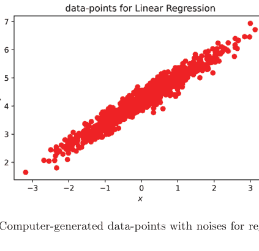

图 9.10：用于回归研究的、带有噪声的计算机生成数据点。

```python
# Data iterator for randomly generating mini-batches of data-points
def data_iter(batch_size):
    idx = list(range(n_s))        # n_s: number of samples
    random.shuffle(idx)
    for batch_i,i in enumerate(range(0,n_s,batch_size)):
        j = nd.array(idx[i: min(i + batch_size, n_s)])
        yield batch_i, X.take(j), y.take(j) # take a mini-batch

# Initialize model training parameters.
def init_params():
    w = nd.random_normal(scale=1, shape=(n_v, 1))
    b = nd.zeros(shape=(1,))
    w[0,0] = start_w              # for examination, fix starting point.
    b[0] = start_b                # print('in init;',w[0,0],b[0])
    params = [w, b]
    for param in params:
        param.attach_grad()
    return params

# Linear regression net: an affine mapping.
def net(X, w, b):
    return nd.dot(X, w) + b
```

```python
# Least squared loss function.
def square_loss(yhat, y):
    return (yhat - y.reshape(yhat.shape)) ** 2 / 2

def cost_function(X,W11,B1,y): # for plotting cost function
    W12 = np.expand_dims(W11, axis=2)
            # W11:(100,100)->(100,100,1) for X:(1000,1)
    print('shape of W12:',W12.shape,'shape of X:',X.shape)
    yh = np.inner(X.asnumpy(), W12)+ B1
    yy = np.expand_dims(y.asnumpy(), axis=-1)
    yz = np.expand_dims(yy, axis=-1)
    print('shape of yh:',yh.shape,'shape of yz is:',yz.shape)
    yhy = np.mean((yh - yz) ** 2/2,axis=0)
    return yhy
```

在定义了所有必要的函数之后，我们现在编写训练模型的算法。

```python
%matplotlib notebook
import matplotlib as mpl
mpl.rcParams['figure.dpi']= 120
import matplotlib.pyplot as plt
from mpl_toolkits import mplot3d
from mpl_toolkits.mplot3d import axes3d
import numpy as np

def train(batch_size, lr, epochs, period):
    assert period >= batch_size and period % batch_size == 0
    w, b = init_params()
    total_loss=[np.mean(square_loss(net(X, w, b), y).asnumpy())]
    wi, bi = [], []
    wi.append(w.asnumpy()[0,0])
    bi.append(b.asnumpy()[0])

    # Epoch starts from 1.
    for epoch in range(1, epochs + 1):
        if epoch > 2:
            lr *= 0.9            # Decay learning rate.
        for batch_i, data, label in data_iter(batch_size):
            #for samples in a mini-batch
            with autograd.record(): # define computational graph.
                output = net(data, w, b)
                loss = square_loss(output, label)
                loss.backward() # compute the gradient
                sgd([w, b], lr, batch_size) # update the parameters

            if batch_i * batch_size % period == 0:
                total_loss.append(np.mean(square_loss
                    (net(X,w,b),y).asnumpy()))
                bi.append(b.asnumpy()[0])
                wi.append(w.asnumpy()[0,0])

        print("Batch size %d,Learning rate %f,Epoch %d,loss %.4e"
            %(batch_size,lr,epoch, total_loss[-1]))

    return wi,bi,total_loss,epochs
```

```python
Wi,Bi,T_cost,Epochs=train(batch_size=10,lr=.2,epochs=5,
    period=10)

print(Wi[-1],Bi[-1]) #the final converged weight and bias
```

Batch size 10,Learning rate 0.200000,Epoch 1,loss 2.0546e-02
Batch size 10,Learning rate 0.200000,Epoch 2,loss 2.0513e-02
Batch size 10,Learning rate 0.180000,Epoch 3,loss 2.0435e-02
Batch size 10,Learning rate 0.162000,Epoch 4,loss 2.1135e-02
Batch size 10,Learning rate 0.145800,Epoch 5,loss 2.1392e-02
0.78678846 4.246581

最后，让我们来检查一下训练过程。

```python
nonlic =['linear','sigmoid','tanh','relu'] #nonlinearities
nsf = ['(a) ','(b) ','(c) ', '(d) ']

w11 = np.linspace(-2.0,4.0,100) # np.arange(0.5, 5.0, 5.0)
b1 = np.linspace(0.,8.0,100) # np.arange(2.0, 6.0, 5.0)
lw, lb = len(w11), len(b1)
print('length of w11=',lw,'length of b1=',lb)
W11, B1 = np.meshgrid(w11, b1)
Z = cost_function(X,W11,B1,y)
```

```python
tw,tb = [true_w],[true_b]
true_z = cost_function(X,tw,tb,y)

print('length of Wi = ',len(Wi))
#%matplotlib notebook
%matplotlib inline

fig_s = plt.figure(figsize=(8,6))    # Convergence 3D plot
ax = fig_s.add_subplot(1,1,1,projection='3d')
ax.set_xlabel('$w11$', fontsize=12, rotation=80)
ax.set_ylabel('$b1$', fontsize=12)
ax.set_zlabel(r'$error$', fontsize=12, rotation=0)
ax.yaxis._axinfo['label']['space_factor'] = 3.0
ax.plot_wireframe(W11,B1,Z,color='b', rstride=5, cstride=5)
plt.title('Error function of $w11$ and $b1$ (' + nonlic[0] +')')
marker_style = dict(markersize=20)
ax.scatter3D(Wi,Bi,T_cost, color='red',marker='.',
    cmap='hsv',s=20)
ax.scatter3D(Wi[-1],Bi[-1],T_cost[-1],color='red',
    marker='X', s=80)
ax.scatter3D(Wi[0], Bi[0],T_cost[0],color='green',
    marker='o', s=50)
ax.scatter3D(true_w[0],true_b,true_z,color='green',
    marker='o', s=50)
#plt.legend()
fig_s.tight_layout()        # otherwise y-label is clipped
plt.show()
```

length of w11= 100 length of b1= 100
shape of W12: (100, 100, 1) shape of X: (1000, 1)
shape of yh is: (1000, 100, 100) shape of yz is: (1000, 1, 1)
shape of W12: (1, 1, 1) shape of X: (1000, 1)
shape of yh is: (1000, 1, 1) shape of yz is: (1000, 1, 1)
length of Wi =  501

## w11 和 b1 的误差函数（线性）

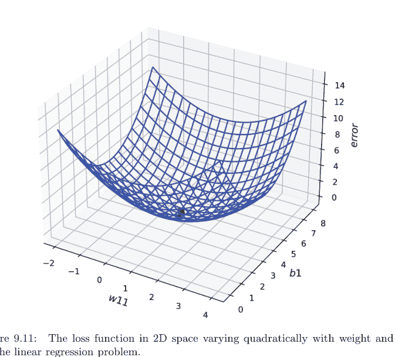

图 9.11：对于线性回归问题，损失函数在二维空间中随权重和偏置呈二次方变化。

```python
fig, ax = plt.subplots(figsize=(8,6))
plt.rcParams["font.size"] = "15"
CS = ax.contour(W11, B1, Z,20)
ax.clabel(CS, inline=1, fontsize=9)
ax.set_title('A cost function of least square error')
plt.scatter(Wi, Bi, s=20, c='r',marker='^', alpha=0.5)
plt.scatter(Wi[-1], Bi[-1], s=80, c='r',marker='X',alpha=0.9)
plt.scatter(Wi[0], Bi[0], s=80, c='r', marker='o', alpha=0.9)
plt.scatter(true_w[0],true_b,s=80,c='g',marker='o',alpha=0.5)
ax.set_xlabel('$w11$', fontsize=12, rotation=0)
ax.set_ylabel('$b1$', fontsize=12)
fig.tight_layout()
plt.show()
```

## 最小二乘误差的代价函数

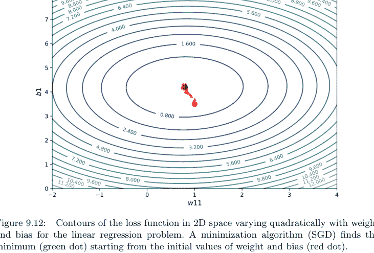

图 9.12：对于线性回归问题，损失函数在二维空间中随权重和偏置呈二次方变化的等高线图。一个最小化算法（SGD）从权重和偏置的初始值（红点）开始，找到了最小值（绿点）。

```python
#line plots: https://jakevdp.github.io/PythonDataScience
#Handbook/04.06-customizing-legends.html

fig, ax1 = plt.subplots(figsize=(8,6))
plt.rcParams["font.size"] = "15"
x_axis = np.linspace(0, Epochs, len(T_cost), endpoint=True)
plt.semilogy(x_axis, T_cost,color='black',linestyle='solid',
            label='Loss function')
plt.xlabel('Epoch')
plt.ylabel('Loss')
leg = ax1.legend(loc='center', frameon=False)
ax2 = ax1.twinx()  # second axes that shares the same x-axis
color = 'tab:blue'
ax2.set_ylabel('w11 and b1 ', color=color)
ax2.plot(x_axis,Wi,color='red',linestyle='dotted',
         label='w11')
ax2.plot(x_axis,Bi,color='blue',linestyle='dashed',
         label='b1')
ax2.tick_params(axis='y', labelcolor=color)
```

## 9.6 动量梯度下降法

梯度下降法（GD）及其变体随机梯度下降法（SGD）在每次迭代中的移动方向，完全取决于当前代价函数梯度信息的状态。它没有利用任何来自过去搜索历史的信息。因此，利用历史信息的技术可能会表现更好。动量梯度下降法（GDM）就是这类技术之一。

### 9.6.1 GD方法最关键的问题

让我们首先审视梯度下降类方法（包括GD和SGD）最关键的问题。为了便于直观分析和理解，我们使用一个二维参数空间中的简单例子。考虑一个具有两个参数 $\mathbf{x} = [x_1, x_2]$ 的代价函数 $f(\mathbf{x})$。在图9.15中，我们绘制了该函数在二维空间中的等高线。在每条等高线上，函数值相同。靠近中心的绿点是函数的真实最小值点。让GD算法从标有红星的初始点开始搜索绿点。根据最速下降的概念，负梯度方向应垂直于当前点的等高线，因为该方向是最陡峭的。由于这些等高线呈高度椭圆形，GD的一步可能会越过目标，到达下一层级的等高线，从而到达山的另一侧。在这个新位置，GD进行下一步。这一次，负梯度方向再次指向相反的一侧。这种循环持续进行，形成一条缓慢移向最小值点的锯齿形路径。很明显，GD方法在这个过程中浪费了大量的精力。

问题的根源在于连续（负）梯度向量方向的剧烈变化。对于这类具有明显椭圆形等高线的代价函数，梯度向量的两个分量差异很大（这对应于包含代价函数二阶导数的海森矩阵的病态条件）。所有这些行进箭头都有两个分量，分别指向 $x_1$（沿椭圆长轴）和 $x_2$（沿椭圆短轴）方向。它们基本上是（负）梯度向量的两个分量。很容易看出，所有行进箭头的 $x_1$ 分量大体上是一致的，大致指向目标。然而，一个行进箭头的 $x_2$ 分量与下一个箭头的 $x_2$ 分量大体上是相反的。

基于这一深刻的观察，我们现在可以设计一种算法，它使用连续步骤中梯度向量的某种加权平均。如果能做到这一点，所有的 $x_1$ 分量仍然被鼓励指向目标，而所有的 $x_2$ 分量将相互抵消，从而显著减少锯齿现象。这本质上就是动量梯度下降法的思想。

### 9.6.2 公式化

动量梯度下降法可参见参考文献[3]。其公式如下：

$$\mathbf{v}_i := \gamma \mathbf{v}_{i-1} + \eta \nabla f(\mathbf{x}_i) \quad (9.43)$$
$$\mathbf{x}_i := \mathbf{x}_{i-1} - \mathbf{v}_i \quad (9.44)$$

其中 $\mathbf{v}$ 是当前步骤的速度，$\gamma$ 是动量参数，介于0和1之间，通常设置为0.9。学习率 $\eta$ 和梯度 $\nabla f(\mathbf{x})$ 在前一节中已定义。

为了分析GDM的工作行为，让我们考虑两个简化的情况。第一种情况假设连续步骤中的所有 $\nabla f(\mathbf{x})$ 都指向相同的方向，并且具有与常数向量 $\mathbf{g}$ 相同的值。这种情况与图9.15所示情况中 $x_1$ 方向的梯度分量非常相似。我们现在开始迭代如下：

$$\mathbf{v}_0 := \mathbf{0}, \quad (9.45)$$
$$\mathbf{v}_1 := \eta \mathbf{g}, \quad (9.46)$$
$$\mathbf{v}_2 := \gamma \mathbf{v}_1 + \eta \mathbf{g} = \eta \mathbf{g}(\gamma + 1), \quad (9.47)$$
$$\mathbf{v}_3 := \gamma \mathbf{v}_2 + \eta \mathbf{g} = \eta \mathbf{g}(\gamma^2 + \gamma + 1), \quad (9.48)$$
$$\cdots \quad (9.49)$$
$$\mathbf{v}_t := \gamma \mathbf{v}_{t-1} + \eta \mathbf{g} = \eta \mathbf{g}(\gamma^{t-1} + \gamma^{t-2} + \cdots + \gamma^2 + \gamma + 1), \quad (9.50)$$
$$\cdots \quad (9.51)$$
$$\mathbf{v}_{\text{inf}} := \frac{\eta \mathbf{g}}{1 - \gamma}. \quad (9.52)$$

现在让我们考察以下情况：

1.  对于接近1的大 $\gamma$，例如 $\gamma = 0.9$，最终速度将比使用常数 $\mathbf{g}$ 的原始梯度下降快10倍。因此，带动量的迭代可以加速在所有梯度对齐方向上的前进，例如图9.15中 $x_1$ 方向的梯度分量。
2.  对于接近0的小 $\gamma$，例如 $\gamma = 0.1$，对迭代加速的效果非常小，因此GDM与原始GD算法不会有太大差异。
3.  对于中等范围的 $\gamma$，例如 $\gamma = 0.5$，在对齐方向上的加速约为50%。

这个简单的例子表明，如果梯度都很好地对齐并且使用较大的 $\gamma$，则会建立起动量，使行进速度越来越快。

在第二个例子中，我们假设连续步骤中的所有 $\nabla f(\mathbf{x})$ 都指向相反的方向，但仍然具有与常数向量 $\mathbf{g}$ 相同的值。这类似于 $x_2$ 分量的情况；标准的GD方法在该方向上不会有任何进展。让我们考察使用GDM时会发生什么。

我们现在开始迭代如下：

$$\begin{aligned}
\mathbf{v}_0 &:= \mathbf{0}, & (9.53) \\
\mathbf{v}_1 &:= \eta \mathbf{g}, & (9.54) \\
\mathbf{v}_2 &:= \gamma \mathbf{v}_1 - \eta \mathbf{g} = -\eta \mathbf{g}(1 - \gamma), & (9.55) \\
\mathbf{v}_3 &:= \gamma \mathbf{v}_2 + \eta \mathbf{g} = \eta \mathbf{g}(1 - \gamma + \gamma^2), & (9.56) \\
\mathbf{v}_4 &:= \gamma \mathbf{v}_3 - \eta \mathbf{g} = -\eta \mathbf{g}(1 - \gamma + \gamma^2 - \gamma^3), & (9.57) \\
&\cdots & (9.58) \\
\mathbf{v}_{2i-1} &:= \eta \mathbf{g}(1 - \gamma + \gamma^2, \ldots, -\gamma^{2i-3} + \gamma^{2i-2}), & (9.59) \\
\mathbf{v}_{2i} &:= -\eta \mathbf{g}(1 - \gamma + \gamma^2, \ldots, +\gamma^{2i-2} - \gamma^{2i-1}), & (9.60)
\end{aligned}$$

对于任何 $\gamma < 1$，我们注意到以下几点：

1.  只要 $\gamma < 1$，学习过程总是会减弱。
2.  公式(9.59)和(9.60)中 $\eta \mathbf{g}$ 后面的级数都将被1所界定，因此我们有

$$\begin{aligned}
\mathbf{v}_{2i-1} &\leq \eta \mathbf{g} & (9.61) \\
\mathbf{v}_{2i} &\geq -\eta \mathbf{g} & (9.62)
\end{aligned}$$

现在让我们考察以下情况：

1.  对于接近1的大 $\gamma$，例如 $\gamma = 0.9$，由于抵消作用，第2次迭代时的（负）速度值 $\mathbf{v}_2$ 减少了90%。尽管第3次的 $\mathbf{v}_3$ 再次变大，但它将始终小于原始速度。在后续迭代中保持相同的趋势。因此，带动量的迭代会降低在所有梯度相互反向的方向上的速度，例如如图9.15所示，为$x_2$方向上的梯度分量。请注意，由于$x_1$方向的速度显著加快，锯齿行为将显著减少。

2.  对于接近0的小$\gamma$值，例如$\gamma = 0.1$，抵消效应非常小，因此GDM与原始GD算法不会有太大差异。
3.  对于中等范围的$\gamma$值，例如$\gamma = 0.5$，早期迭代中的抵消约为50%。在后期迭代中抵消效应会减弱，但始终会小于原始速度。由于$x_1$方向的速度加快了约50%，锯齿行为将显著减少。预计收敛速度将比原来快50%以上。

基于以上分析，我们可以得出结论：接近1的大$\gamma$值，例如$\gamma = 0.9$，是更优的选择。总之，与原始GD相比，带动量的梯度下降收敛速度快得多，因为长轴方向的更新快得多，而短轴方向则存在一定程度的抵消。锯齿行为可以被显著抑制。

从算法中可以看出，所有先前迭代中获得的梯度都参与了当前迭代。接下来人们可能会问，这种参与的程度如何。让我们进一步分析。

我们再次开始迭代，考虑梯度在每次迭代中都在变化：

$$\mathbf{v}_0 := \mathbf{0},$$
$$\mathbf{v}_1 := \eta \nabla f(\mathbf{x}_1),$$
$$\mathbf{v}_2 := \gamma \mathbf{v}_1 + \eta \nabla f(\mathbf{x}_2) = \gamma \eta \nabla f(\mathbf{x}_1) + \eta \nabla f(\mathbf{x}_2),$$
$$\mathbf{v}_3 := \gamma \mathbf{v}_2 + \eta \nabla f(\mathbf{x}_3) = \gamma^2 \eta \nabla f(\mathbf{x}_1) + \gamma \eta \nabla f(\mathbf{x}_2) + \eta \nabla f(\mathbf{x}_3),$$
$$\cdots$$
$$\mathbf{v}_t := \gamma \mathbf{v}_{t-1} + \eta \nabla f(\mathbf{x}_t) = \gamma^{t-1} \eta \nabla f(\mathbf{x}_1) + \gamma^{t-2} \eta \nabla f(\mathbf{x}_2) + \cdots + \gamma \eta \nabla f(\mathbf{x}_{t-1}) + \eta \nabla f(\mathbf{x}_t)$$

因为$\gamma < 1$，很明显，早期迭代梯度的影响以$\gamma$的速率缓慢减弱。

最后，人们可能会从这个分析中得到启发：一个适当变化的$\gamma$可能效果更好！我们还注意到，要彻底解决这种锯齿行为，应该使用*共轭梯度法*，但它需要计算二阶梯度（海森矩阵），这可能代价高昂得多，可扩展性也可能成为问题。

### 9.6.3 数值实验

我们现在通过创建一个线性回归模型来演示GDM算法。

```python
def sgd_momentum(params, vs, lr, mom, batch_size):
    for param, v in zip(params, vs):
        v[:] = mom * v + lr * param.grad / batch_size
        param[:] = param - v
```

```python
import mxnet as mx
from mxnet import autograd, gluon
from mxnet import ndarray as nd
import random
import numpy as np

mx.random.seed(1); random.seed(1)
# 生成数据。
n_v = 2               # 变量（特征）数量
n_s = 1000            # 样本数量

true_w, true_b = [2, -3.4], 4.2
X=nd.random_normal(scale=1,shape=(n_s,n_v))
y=true_w[0] * X[:, 0] + true_w[1] * X[:, 1] + true_b
y+=.01 * nd.random_normal(scale=1, shape=y.shape)
dataset = gluon.data.ArrayDataset(X, y)
# 构建数据迭代器。
def data_iter(batch_size):
    idx = list(range(n_s))
    random.shuffle(idx)
    for batch_i,i in enumerate(range(0,n_s,batch_size)):
        j = nd.array(idx[i: min(i + batch_size, n_s)])
        yield batch_i, X.take(j), y.take(j)

# 初始化模型参数。
def init_params():
    w = nd.random_normal(scale=1, shape=(n_v, 1))
    b = nd.zeros(shape=(1,))
    params = [w, b]
    vs = []
    for param in params:
        param.attach_grad()
        vs.append(param.zeros_like())
    return params, vs

# 线性回归。
def net(X, w, b):
    return nd.dot(X, w) + b

# 损失函数。
def square_loss(yhat, y):
    return (yhat - y.reshape(yhat.shape)) ** 2 / 2
```

```python
%matplotlib inline
import matplotlib as mpl
mpl.rcParams['figure.dpi']= 120
import matplotlib.pyplot as plt
import numpy as np

def train(batch_size, lr, mom, epochs, period):
    assert period >= batch_size and period % batch_size == 0
    [w, b], vs = init_params()
    total_loss=[np.mean(square_loss(net(X,w,b),y).asnumpy())]
    # Epoch从1开始。
    for epoch in range(1, epochs + 1):
        # 衰减学习率。
        if epoch > 2:
            lr *= 0.1
        for batch_i, data, label in data_iter(batch_size):
            with autograd.record():
                output = net(data, w, b)
                loss = square_loss(output, label)
            loss.backward()
            sgd_momentum([w, b], vs, lr, mom, batch_size)
            if batch_i * batch_size % period == 0:
                total_loss.append(np.mean(square_loss(net(X,w,b),y).asnumpy()))
        print("Batch size %d, Learning rate %f, Epoch %d,loss \n    %.4e" % (batch_size, lr, epoch, total_loss[-1]))
        print('true_w:',true_w, ' true_b:',true_b)
        print('Predicted_w:', np.reshape(w.asnumpy(), (1, -1)),
              'Predicted_b:', b.asnumpy()[0], '\n')
    x_axis=np.linspace(0,epochs,len(total_loss),endpoint=True)
    plt.semilogy(x_axis, total_loss)
    plt.xlabel('epoch')
    plt.ylabel('loss')
    plt.show()
```

```python
train(batch_size=10, lr=.2, mom=.9, epochs=3, period=10)
```

Batch size 10, Learning rate 0.20, Epoch 1,loss 1.4316e-02
Batch size 10, Learning rate 0.20, Epoch 2,loss 6.2213e-05
Batch size 10, Learning rate 0.02, Epoch 3,loss 5.2174e-05
true_w: [2, -3.4] true_b: 4.2
Predicted_w: [[ 1.9999688 -3.4014332]] Predicted_b: 4.1995444

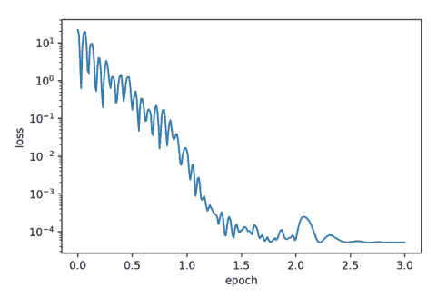

图9.16：对于相同的线性回归问题，在SGD with momentum搜索最小值的过程中，损失函数的收敛情况。

## 9.7 Nesterov加速梯度

### 9.7.1 公式

Nesterov加速梯度（NAG）[4]方法可以看作是GDM的一种改进。在计算式(9.43)中的梯度时，它不使用$\mathbf{x}_i$，而是使用$(\mathbf{x}_i - \gamma \mathbf{v}_{i-1})$。公式变为

$$\mathbf{v}_i := \gamma \mathbf{v}_{i-1} + \eta \nabla f(\mathbf{x}_i - \gamma \mathbf{v}_{i-1}) \quad (9.69)$$
$$\mathbf{x}_i := \mathbf{x}_{i-1} - \mathbf{v}_i \quad (9.70)$$

很明显，它着眼于计算未来某个时刻的梯度，而不是当前时刻的梯度，旨在实现更快的收敛。我们将在本章末尾的案例研究部分观察其行为。

## 9.8 AdaGrad梯度算法

自适应梯度算法（AdaGrad）是另一种改进的随机梯度下降（SGD）算法。它于2011年首次发表[5]，允许使用逐次迭代甚至逐参数的学习率。它旨在增加稀疏参数的学习速度，并降低密集参数的学习速度。据称，这种策略通常能提高标准SGD的收敛性能，并已成功应用于凸和非凸问题。更详细的讨论可以在维基百科页面（https://en.wikipedia.org/wiki/Stochastic_gradient_descent）上找到。

### 9.8.1 公式

Adagrad缩放基础学习率$\eta$并使用以下公式更新参数

$$\mathbf{x}_i := \mathbf{x}_{i-1} - \frac{\eta}{\sqrt{\mathbf{G}_i + \epsilon}} \nabla f(\mathbf{x}_i) \quad (9.71)$$

其中$\epsilon$是一个小的正数，仅用于防止计算过程中出现零分母。请注意，上述向量操作都是逐元素的，包括平方根操作，并且$\mathbf{G}_i$也是一个向量，由下式给出

$$\mathbf{G}_i = \sum_{q=1}^{i} (\nabla f(\mathbf{x}_q))^2 \quad (9.72)$$

它是所有先前迭代梯度的逐元素乘积之和（在迭代过程中累积）。

请注意，这是针对每个参数执行的。对于在先前迭代中收到过多更新的参数，当前更新会被抑制，而收到小更新的参数则会获得更大的学习率。

对于前面讨论的强椭圆目标函数，Adagrad倾向于促进沿长轴（$x_1$方向）的前进，同时抑制沿短轴（$x_2$方向）的移动。这实际上抑制了图9.15中所示的之字形行为。

让我们使用相同的线性回归问题来检验Adagrad算法。

### 9.8.2 数值实验

```python
# Adagrad.
def adagrad(params, sqrs, lr, batch_size):
    eps_stable = 1e-7
    for param, sqr in zip(params, sqrs):
        g = param.grad / batch_size
        sqr[:]+=nd.square(g) # Accumulate squared gradient
        div=lr*g/nd.sqrt(sqr+eps_stable)    #element-wise
        param[:] -= div

import mxnet as mx
from mxnet import autograd, gluon
from mxnet import ndarray as nd
import random

mx.random.seed(1); random.seed(1)
# Generate data.
n_v = 2                # number of variables (features)
n_s = 1000             # number of samples
true_w, true_b = [2, -3.4], 4.2
X=nd.random_normal(scale=1,shape=(n_s,n_v))
y=true_w[0] * X[:, 0] + true_w[1] * X[:, 1] + true_b
y+=.01 * nd.random_normal(scale=1, shape=y.shape)
dataset = gluon.data.ArrayDataset(X, y)

# Construct data iterator.
def data_iter(batch_size):
    idx = list(range(n_s))
    random.shuffle(idx)
    for batch_i,i in enumerate(range(0,n_s,batch_size)):
        j = nd.array(idx[i: min(i + batch_size, n_s)])
        yield batch_i, X.take(j), y.take(j)
```

```python
# Initialize model parameters.
def init_params():
    w = nd.random_normal(scale=1, shape=(n_v, 1))
    b = nd.zeros(shape=(1,))
    params = [w, b]
    sqrs = []
    for param in params:
        param.attach_grad()
        #
        sqrs.append(param.zeros_like())
    return params, sqrs

# Linear regression.
def net(X, w, b):
    return nd.dot(X, w) + b

# Loss function.
def square_loss(yhat, y):
    return (yhat - y.reshape(yhat.shape)) ** 2 / 2
```

```python
%matplotlib inline
import matplotlib as mpl
mpl.rcParams['figure.dpi']= 120
import matplotlib.pyplot as plt
import numpy as np

def train(batch_size, lr, epochs, period):
    assert period >= batch_size and period % batch_size == 0
    [w, b], sqrs = init_params()
    total_loss=[np.mean(square_loss(net(X, w, b),y).asnumpy())]

    # Epoch starts from 1.
    for epoch in range(1, epochs + 1):
        for batch_i, data, label in data_iter(batch_size):
            with autograd.record():
                output = net(data, w, b)
                loss = square_loss(output, label)
            loss.backward()
            adagrad([w, b], sqrs, lr, batch_size)
            if batch_i * batch_size % period == 0:
                total_loss.append(np.mean(square_loss\n                (net(X,w,b),y).asnumpy()))
```

```python
print("Batch size %d, Learning rate %f, Epoch %d",
      "loss %.4e" %(batch_size,lr,epoch,total_loss[-1]))
print('true_w:',true_w, 'true_b:',true_b)
print('Predicted_w:', np.reshape(w.asnumpy(), (1, -1)),
      'Predicted_b:', b.asnumpy()[0], '\n')
x_axis=np.linspace(0,epochs,len(total_loss),endpoint=True)
plt.semilogy(x_axis, total_loss)
plt.xlabel('epoch')
plt.ylabel('loss')
plt.show()
```

```python
train(batch_size=10, lr=0.9, epochs=3, period=10)
```

Batch size 10, Learning rate 0.90, Epoch 1, loss 5.1843e-05
Batch size 10, Learning rate 0.90, Epoch 2, loss 5.2248e-05
Batch size 10, Learning rate 0.90, Epoch 3, loss 5.1507e-05
true_w: [2, -3.4]  true_b: 4.2
Predicted_w: [[ 2.0000997 -3.4004908]] Predicted_b: 4.199482

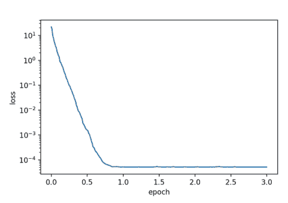

图9.17：在AdaGrad寻找最小值点的过程中，相同线性回归问题的损失函数收敛情况。

## 9.9 RMSProp梯度算法

RMSProp是Root Mean Square Propagation（均方根传播）的缩写[6]。它为每个参数缩放学习率。研究表明，RMSProp在不同应用中具有良好的学习率自适应性。更多细节可以在维基百科页面（https://en.wikipedia.org/wiki/Stochastic_gradient_descent）找到。

### 9.9.1 公式

RMSProp缩放基础学习率$\eta$并使用以下公式更新参数：

$$\mathbf{x}_i := \mathbf{x}_{i-1} - \frac{\eta}{\sqrt{\mathbf{v}_i + \epsilon}} \nabla f(\mathbf{x}_i) \qquad (9.73)$$

其中$\epsilon$是一个小的正数，用于在计算过程中防止分母为零。再次注意，这些操作是逐元素进行的。并且，第$i$次迭代的$\mathbf{v}_i$由下式给出：

$$\mathbf{v}_i := \gamma \mathbf{v}_{i-1} + (1 - \gamma)(\nabla f(\mathbf{x}_i))^2 \qquad (9.74)$$

其中$\gamma$是可调的正数，称为遗忘因子。让我们观察其行为。

### 9.9.2 数值实验

```python
# RMSProp.
def rmsprop(params, sqrs, lr, gamma, batch_size):
    eps_stable = 1e-8
    for param, sqr in zip(params, sqrs):
        g = param.grad / batch_size
        sqr[:]=gamma*sqr+(1.-gamma)*nd.square(g)
            #note the in-place computation here
        div = lr * g / nd.sqrt(sqr + eps_stable)
        param[:] -= div

import mxnet as mx
from mxnet import autograd, gluon
from mxnet import ndarray as nd
import random

mx.random.seed(1); random.seed(1)
# Generate data.
n_v = 2            # number of variables (features)
n_s = 1000         # number of samples
```

```python
true_w, true_b = [2, -3.4], 4.2
X = nd.random_normal(scale=1, shape=(n_s, n_v))
y = true_w[0] * X[:, 0] + true_w[1] * X[:, 1] + true_b
y += .01 * nd.random_normal(scale=1, shape=y.shape)
dataset = gluon.data.ArrayDataset(X, y)
# Construct data iterator.
def data_iter(batch_size):
    idx = list(range(n_s))
    random.shuffle(idx)
    for batch_i,i in enumerate(range(0,n_s,batch_size)):
        j = nd.array(idx[i: min(i + batch_size, n_s)])
        yield batch_i, X.take(j), y.take(j)

# Initialize model parameters.
def init_params():
    w = nd.random_normal(scale=1, shape=(n_v, 1))
    b = nd.zeros(shape=(1,))
    params = [w, b]
    sqrs = []
    for param in params:
        param.attach_grad()
        sqrs.append(param.zeros_like())
    return params, sqrs

# Linear regression.
def net(X, w, b):
    return nd.dot(X, w) + b

# Loss function.
def square_loss(yhat, y):
    return (yhat - y.reshape(yhat.shape)) ** 2 / 2
```

```python
%matplotlib inline
import matplotlib as mpl
mpl.rcParams['figure.dpi']= 120
import matplotlib.pyplot as plt
import numpy as np
```

```python
def train(batch_size, lr, gamma, epochs, period):
    assert period >= batch_size and period % batch_size == 0
    [w, b], sqrs = init_params()
    total_loss=[np.mean(square_loss(net(X,w,b),y).asnumpy())]

    # Epoch starts from 1.
    for epoch in range(1, epochs + 1):
        for batch_i, data, label in data_iter(batch_size):
            with autograd.record():
                output = net(data, w, b)
                loss = square_loss(output, label)
            loss.backward()
            rmsprop([w, b], sqrs, lr, gamma, batch_size)
            if batch_i * batch_size % period == 0:
                total_loss.append(np.mean(square_loss\n                (net(X, w, b), y).asnumpy()))
        print("Batch size %d,Learning rate %f, Epoch %d,loss\n            %.4e" %(batch_size, lr, epoch, total_loss[-1]))

    print('true_w:',true_w,' true_b:',true_b)
    print('Predicted_w:', np.reshape(w.asnumpy(), (1, -1)),
          'Predicted_b:', b.asnumpy()[0], '\n')
    x_axis=np.linspace(0,epochs,len(total_loss),
        endpoint=True)
    plt.semilogy(x_axis, total_loss)
    plt.xlabel('epoch')
    plt.ylabel('loss')
    plt.show()
```

```python
train(batch_size=10, lr=.02, gamma=.9, epochs=3, period=10)
```

Batch size 10,Learning rate 0.020, Epoch 1,loss 6.2608e+00
Batch size 10,Learning rate 0.020, Epoch 2,loss 5.9297e-01
Batch size 10,Learning rate 0.020, Epoch 3,loss 5.6944e-05
true_w: [2, -3.4]  true_b: 4.2
Predicted_w: [[ 2.0020406 -3.397886 ]] Predicted_b: 4.2007647

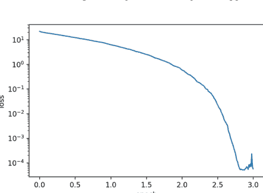

图9.18：在RMSProp寻找最小值点的过程中，相同线性回归问题的损失函数收敛情况。

## 9.10 AdaDelta梯度算法

### 9.10.1 核心思想

Adadelta梯度算法是Adagrad的一个更稳健的扩展[7]。它使用梯度的滑动窗口来调整学习率，而不是像Adagrad那样累积所有过去的梯度。使用AdaDelta时，无需设置初始学习率。关于AdaDelta的简明清晰的说明也可以在http://akyrillidis.github.io/notes/AdaDelta找到。

### 9.10.2 数值实验

```python
# Adadelta.
def adadelta(params, sqrs, deltas, rho, batch_size):
    eps = 1e-5           # epsilon for stabilization
    for param, sqr, delta in zip(params, sqrs, deltas):
        g = param.grad / batch_size
        sqr[:] = rho * sqr + (1. - rho) * nd.square(g)
        cur_delta=nd.sqrt(delta+eps)/nd.sqrt(sqr+eps)*g
        delta[:]=rho*delta+(1.-rho)*cur_delta*cur_delta
        # update weight
        param[:] -= cur_delta

import mxnet as mx
from mxnet import ndarray as nd
from mxnet import autograd, gluon
import random
```

mx.random.seed(1)
# 生成数据。
n_v = 2                # 变量（特征）数量
n_s = 1000             # 样本数量
true_w, true_b = [2, -3.4], 4.2
X = nd.random_normal(scale=1, shape=(n_s, n_v))
y = true_w[0] * X[:, 0] + true_w[1] * X[:, 1] + true_b
y += .01 * nd.random_normal(scale=1, shape=y.shape)
dataset = gluon.data.ArrayDataset(X, y)
# 构建数据迭代器。
def data_iter(batch_size):
    idx = list(range(n_s))
    random.shuffle(idx)
    for batch_i, i in enumerate(range(0, n_s, batch_size)):
        j = nd.array(idx[i: min(i + batch_size, n_s)])
        yield batch_i, X.take(j), y.take(j)

# 初始化模型参数。
def init_params():
    w = nd.random_normal(scale=1, shape=(n_v, 1))
    b = nd.zeros(shape=(1,))
    params = [w, b]
    sqrs = []
    deltas = []
    for param in params:
        param.attach_grad()
        sqrs.append(param.zeros_like())
        deltas.append(param.zeros_like())
    return params, sqrs, deltas

# 线性回归。
def net(X, w, b):
    return nd.dot(X, w) + b

# 损失函数。
def square_loss(yhat, y):
    return (yhat - y.reshape(yhat.shape)) ** 2 / 2

%matplotlib inline
import matplotlib as mpl
mpl.rcParams['figure.dpi']= 120
import matplotlib.pyplot as plt
import numpy as np

def train(batch_size, rho, epochs, period):
    assert period >= batch_size and period % batch_size == 0
    [w, b], sqrs, deltas = init_params()
    total_loss=[np.mean(square_loss(net(X,w,b),y).asnumpy())]

    # Epoch 从 1 开始。
    for epoch in range(1, epochs + 1):
        for batch_i, data, label in data_iter(batch_size):
            with autograd.record():
                output = net(data, w, b)
                loss = square_loss(output, label)
            loss.backward()
            adadelta([w, b], sqrs, deltas, rho, batch_size)
            if batch_i * batch_size % period == 0:
                total_loss.append(np.mean(square_loss(net(X, w, b), y).asnumpy()))
        print("Batch size %d, Epoch %d, loss %.4e" %
              (batch_size, epoch, total_loss[-1]))

    print('true_w:',true_w, 'true_b:',true_b)
    print('Predicted_w:', np.reshape(w.asnumpy(), (1, -1)),
          'Predicted_b:', b.asnumpy()[0], '\n')
    x_axis=np.linspace(0,epochs,len(total_loss), endpoint=True)
    plt.semilogy(x_axis, total_loss)
    plt.xlabel('epoch')
    plt.ylabel('loss')
    plt.show()

train(batch_size=10, rho=.9999, epochs=3, period=10)

Batch size 10, Epoch 1, loss 5.3295e-05
Batch size 10, Epoch 2, loss 5.2909e-05
Batch size 10, Epoch 3, loss 5.2828e-05
true_w: [2, -3.4]  true_b: 4.2
Predicted_w: [[ 1.999908  -3.4017406]] Predicted_b: 4.19924

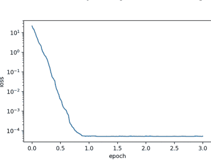

图 9.19：在 AdaDelta 搜索最小值的过程中，相同线性回归问题的损失函数收敛情况。

## 9.11 Adam 梯度算法

自适应矩估计（Adam）梯度算法 [8] 是 RMSProp 算法的一个改进版本。它同时使用了 RMSProp 梯度和梯度二阶矩的运行平均值。

### 9.11.1 公式

在第 $i$ 次训练迭代中，对于给定的参数 $\mathbf{x}_i$ 和损失函数 $f(\mathbf{x}_i)$，Adam 算法缩放基础学习率 $\eta$ 并使用以下公式更新参数：

$$\mathbf{x}_i := \mathbf{x}_{i-1} - \frac{\eta \mathbf{m}_i}{\sqrt{\hat{\mathbf{v}}_i} + \epsilon} \quad (9.75)$$

其中 $\epsilon$ 是一个很小的正数，用于在计算过程中防止分母为零，而 $\mathbf{m}_i$ 和 $\hat{\mathbf{v}}_i$ 由以下公式给出：

$$\mathbf{m}_i := \frac{\mathbf{m}_i}{1 - \beta_1} \quad (9.76)$$
$$\hat{\mathbf{v}}_i := \frac{\mathbf{v}_i}{1 - \beta_2} \quad (9.77)$$

其中 $\mathbf{m}_i$ 和 $\mathbf{v}_i$ 分别使用以下公式更新：

$$\mathbf{m}_i := \beta_1 \mathbf{m}_{i-1} + (1 - \beta_1)(\nabla f(\mathbf{x}_i)) \quad (9.78)$$
$$\mathbf{v}_i := \beta_2 \mathbf{v}_{i-1} + (1 - \beta_2)[\nabla f(\mathbf{x}_i)]^2 \quad (9.79)$$

在公式 (9.78) 和 (9.79) 中，$\beta_1$ 和 $\beta_2$ 都是正数常量，分别是梯度和梯度二阶矩的遗忘因子。

Adam 算法本质上是 GDM 和 RMSProp 的结合。它兼具这两者的特点。它经过精心设计，通过除以 $(1 - \beta)$ 对一阶矩和二阶矩进行了统计偏差修正。为了说明这一点，让我们以一阶矩为例进行考察。

$$t = 0 : \mathbf{m}_0 = 0 \quad (9.80)$$
$$t = 1 : \mathbf{m}_1 = (1 - \beta_1) \nabla f(\mathbf{x}_1) \quad (9.81)$$
$$t = 2 : \mathbf{m}_2 = \beta_1(1 - \beta_1) \nabla f(\mathbf{x}_1) + (1 - \beta_1) \nabla f(\mathbf{x}_2) \quad (9.82)$$
$$t = 3 : \mathbf{m}_3 = \beta_1^2(1 - \beta_1) \nabla f(\mathbf{x}_1) + \beta_1(1 - \beta_1) \nabla f(\mathbf{x}_2) + (1 - \beta_1) \nabla f(\mathbf{x}_3) \quad (9.83)$$
$$\dots \quad (9.84)$$
$$t = t : \mathbf{m}_t = (1 - \beta_1) \sum_{i=1}^{t} \beta_1^{t-i} \nabla f(\mathbf{x}_i) \quad (9.85)$$

公式 (9.85) 的期望变为
$$E[\mathbf{m}_t] = E\left[(1 - \beta_1) \sum_{i=1}^{t} \beta_1^{t-i} \nabla f(\mathbf{x}_i)\right] = (1 - \beta_1) \frac{1 - \beta_1^t}{1 - \beta_1} E[\nabla f(\mathbf{x}_t)] = (1 - \beta_1^t) E[\nabla f(\mathbf{x}_t)] \quad (9.86)$$

为了确保 $\mathbf{m}_t$ 和 $\nabla f(\mathbf{x}_t)$ 在期望上具有统计等价性，$\mathbf{m}_t$ 需要除以 $(1 - \beta_1^t)$。
让我们观察其行为。

### 9.11.2 数值实验

# Adam。
def adam(params, vs, sqrs, lr, batch_size, t):
    beta1, beta2 = 0.9, 0.999
    eps = 1e-8                # 用于稳定性的 epsilon
    for param, v, sqr in zip(params, vs, sqrs):
        g = param.grad / batch_size
        v[:] = beta1 * v + (1.-beta1)*g    # 动量
        sqr[:] = beta2 * sqr + (1.-beta2)* nd.square(g)
        v_bias_corr = v / (1. - beta1 ** t)
        sqr_bias_corr = sqr / (1. - beta2 ** t)
        div=lr*v_bias_corr/(nd.sqrt(sqr_bias_corr)+eps)
        param[:] = param - div   #RMSprop

import mxnet as mx
from mxnet import autograd, gluon
from mxnet import ndarray as nd
import random

mx.random.seed(1); random.seed(1)
# 生成数据。
n_v = 2                     # 变量（特征）数量
n_s = 1000                  # 样本数量
true_w, true_b = [2, -3.4], 4.2
X = nd.random_normal(scale=1, shape=(n_s, n_v))
y = true_w[0] * X[:, 0] + true_w[1] * X[:, 1] + true_b
y += .01 * nd.random_normal(scale=1, shape=y.shape)
dataset = gluon.data.ArrayDataset(X, y)

# 构建数据迭代器。
def data_iter(batch_size):
    idx = list(range(n_s))
    random.shuffle(idx)
    for batch_i, i in enumerate(range(0, n_s, batch_size)):
        j = nd.array(idx[i: min(i + batch_size, n_s)])
        yield batch_i, X.take(j), y.take(j)

# 初始化模型参数。
def init_params():
    w = nd.random_normal(scale=1, shape=(n_v, 1))
    b = nd.zeros(shape=(1,))
    params = [w, b]
    vs = []
    sqrs = []
    for param in params:
        param.attach_grad()
        vs.append(param.zeros_like())
        sqrs.append(param.zeros_like())
    return params, vs, sqrs

# 线性回归。
def net(X, w, b):
    return nd.dot(X, w) + b

# 损失函数。
def square_loss(yhat, y):
    return (yhat - y.reshape(yhat.shape)) ** 2 / 2

%matplotlib inline
import matplotlib as mpl
mpl.rcParams['figure.dpi']= 120
import matplotlib.pyplot as plt
import numpy as np

def train(batch_size, lr, epochs, period):
    assert period >= batch_size and period % batch_size == 0
    [w, b], vs, sqrs = init_params()
    total_loss=[np.mean(square_loss(net(X,w,b),y).asnumpy())]

    t = 0
    # Epoch 从 1 开始。
    for epoch in range(1, epochs + 1):
        for batch_i, data, label in data_iter(batch_size):
            with autograd.record():
                output = net(data, w, b)
                loss = square_loss(output, label)
            loss.backward()
            # 在调用 adam 之前增加 t。
            t += 1
            adam([w, b], vs, sqrs, lr, batch_size, t)
            if batch_i * batch_size % period == 0:
                total_loss.append(np.mean(square_loss(net(X, w, b), y).asnumpy()))
        print("Batch size %d, Learning rate %f, Epoch %d, loss %.4e"%(batch_size,lr,epoch,total_loss[-1]))

print('true_w:',true_w,' true_b:',true_b)
print('Predicted_w:', np.reshape(w.asnumpy(), (1, -1)),
      'Predicted_b:', b.asnumpy()[0], '\n')

## 9.12 案例研究：比较MLPClassifier中使用的最小化技术

我们现在展示由scikit-learn团队[9]完成的一项案例研究。该研究考察了使用不同随机最小化技术（包括SGD和Adam）的性能并绘制了损失函数演变图。代码可在Sklearn示例站点（https://scikit-learn.org/stable/auto_examples/neural_networks/plot_mlp_training_curves.html#）获取。图9.21是使用该代码获得的结果。

根据这项对四个数据集（iris、digits、circles和moons）的研究，观察到SDM（动量）、Nesterov的SDM和Adam是表现最佳的算法之一，而Adam似乎是总体最佳的。请注意，某些技术可能存在偏差，测试结果可能因不同数据集而异。这项研究仍能对这些不同技术给出一个良好的总体指示。还需注意，这些结果可能高度依赖于某些参数。更详细的研究检查可在Sklearn示例站点找到。

## 9.13 其他算法

- 开放文献中还有许多其他版本的梯度下降算法。
- 另一个发展方向是高阶方法和算法，包括牛顿法、拟牛顿法和共轭梯度法。
- 这些方法通常使用线搜索算法，以确保每次迭代都能获得合理质量的解，从而使匹配显著加快，并为收敛提供必要条件。
- 通常，高阶方法可以大幅减少迭代次数（最多可减少数百倍）。
- 然而，在每次迭代中，高阶方法在线搜索和新方向上需要花费更多时间。
- 通常，高阶方法在最小值附近收敛非常快，这是由于那里局部凸性的改善以及二次收敛特性。
- 对于复杂和大型机器学习问题，高阶方法的鲁棒性（对线搜索和噪声数据的敏感性）和效率可能需要进一步改进。
- 使用一阶鲁棒算法将解驱动到接近最小值，然后使用高阶算法完成它，可能是一个好主意。

## 参考文献

[1] G.R. Liu and S.S. Quek, *The Finite Element Method: A Practical Course*, Butterworth-Heinemann, London, 2013.
[2] G.R. Liu, Solution existence theory for artificial neural networks, *International Journal of Computational Methods*, **19**(8), in-printing, 2022.
[3] D.E. Rumelhart, G.E. Hinton, and R.J. Williams, Learning representations by back-propagating errors, *Nature*, **323**(6088), 533-536, 1986. http://www.nature.com/articles/323533a0.
[4] Y. Nesterov, A method for unconstrained convex minimization problem with the rate of convergence o(1/k^2), *Doklady ANSSSR* (translated as Soviet.Math.Docl.), **269**, 543-547. 1983.
[5] J.C. Duchi, H. Elad and S. Yoram, Adaptive subgradient methods for online learning and stochastic optimization, *J. Mach. Learn. Res.*, **12**, 2121-2159, 2011. http://dblp.uni-trier.de/db/journals/jmlr/jmlr12.html#DuchiHS11.
[6] T. Tieleman and G. Hinton, Lecture 6.5-rmsprop: Divide the gradient by a running average of its recent magnitude, *COURSERA, Neural Networks for Machine Learning*, **4**(1), 26-31, 2012.
[7] M. Zeiler, ADADELTA: An adaptive learning rate method, arXiv, 1212.5701, 2012.
[8] D.P. Kingma and J. Ba, Adam: A method for stochastic optimization, 2014. http://arxiv.org/abs/1412.6980.
[9] P. Fabian, V. Gae, G. Alexandre *et al.*, Scikit-learn: Machine Learning in Python, *Journal of Machine Learning Research*, **12**(85), 2825-2830, 2011. http://jmlr.org/papers/v12/pedregosa11a.html.

## 第10章

## 回归的损失函数

回归是工程系统分析中应用最广泛的工具之一。它也是构建数值模型的重要技术，既适用于基于物理定律的方法（如点插值法PIM [1]，以及无网格方法中使用的移动最小二乘法MLS [2]），也适用于机器学习模型。在机器学习环境中，一旦回归模型建立/训练完成，它接收数据集的输入并产生一个实数的预测。

在第9章中，我们讨论了一个使用L2损失函数具有解析闭式解的线性回归问题，揭示了解存在的条件。本章首先介绍回归问题的各种类型的损失函数。所有损失函数的共同特征是，对于给定的学习参数和数据集，它们都产生一个正实数。我们的讨论将集中于它们的差异。我们提供了用于求解第9章推导出的正规方程的Python代码。使用相应阶数的基作为特征，在线性和非线性数据集上执行线性回归。

然后，将构建一个简单的神经网络，包含一层输入神经元和一个输出层神经元。它被训练来执行线性回归任务，使用随机梯度下降（SGD）作为最小化器来数值求解。将使用来自mxnet-the-straight-dope（https://github.com/zackchase/mxnet-the-straight-dope/tree/master/chapter06_optimization）的材料和代码（在Apache License 2下）来展示详细过程。scikit-learn团队开发的代码也被使用[3]。

## 10.1 线性回归的公式

### 10.1.1 数学模型

回归的数学模型是为给定的数据集预测一个实数值$y$，该数据集在$p$维空间$\mathbb{X}^p$中定义了$p$个线性无关的**特征**。特征空间中的任意点可以表示为

$$\mathbf{x} = [x_1, x_2, \dots, x_p] \qquad (10.1)$$

在工程设计问题中，这些特征可能是工程结构的设计参数，例如。

在线性回归中，我们**假设**预测函数$\hat{y}$是仿射变换$z(\mathbf{w}, b; \mathbf{x})$：

$$\hat{y} \equiv z(\mathbf{w}, b; \mathbf{x}) = w_1x_1 + \cdots + w_px_p + b = \sum_{i=1}^p w_ix_i + b = \mathbf{x} \cdot \mathbf{w} + b \quad (10.2)$$

其中$\mathbf{w} = [w_1, w_2, \dots, w_p]^\top \in \mathbb{W}^p$称为权重，$b \in \mathbb{W}^1$称为偏置。学习（或训练）参数在$\mathbb{W}^{p+1}$中。

### 10.1.2 神经网络配置

如果我们构建一个神经网络来执行线性回归，这类网络的典型架构可以如下所示。

如图10.1所示，对于给定的一组数据点，需要最小化损失函数$\mathcal{L}(\hat{y}, y)$，以迫使预测尽可能接近标签$\mathbf{y}$。这是通过使用数据集作为输入及其对应的标签值$\mathbf{y}$来训练网络完成的。数据结构可以与第5章讨论的完全相同，只需将$z$替换为$\hat{y}$。这种替换通常在输出神经元的最后一层进行，在那里将预测与标签$y$进行比较。

### 10.1.3 $xw$公式

通过xw公式，方程(10.2)可以写为

$$\hat{y} = \sum_{i=1}^{p} w_i x_i + b = \sum_{i=0}^{p} w_i x_i = \overline{\mathbf{x}} \hat{\mathbf{w}} \quad (10.3)$$

其中$x_0 = 1$，$w_0 = b$。更明显的是，神经元获取的信息只是输入的加权聚合。在这种情况下，神经网络具有如图10.2所示的架构。

## 10.2 线性回归的损失函数

理想的损失函数对于给定类型的数据集和所使用的ML模型的假设，应该在学习参数上大致是二次的，这样最小化技术才能有效地找到最小值。L2损失函数就是线性回归问题的这样一个函数。

### 10.2.1 均方误差损失或L2损失函数

损失（代价、目标）函数用于衡量模型预测值与真实标签数据之间的差距。优化器利用它来调整训练参数。这里，我们介绍一种在工程和科学领域广泛使用的损失函数，称为均方误差（MSE）或L2损失函数，它在第9章中已有使用。假设我们有 $m$ 个标签或测量/观测到的实际数据。损失函数可以定义如下：

$$\mathcal{L}(\hat{\mathbf{y}}, \mathbf{y}) = \frac{1}{2m} \sum_{i=1}^{m} (\hat{y}_i - y_i)^2 = \frac{1}{2m} \sum_{i=1}^{m} (r_i)^2 = \frac{1}{2m} (\mathbf{r}^\top \mathbf{r}) = \frac{1}{2m} \|\mathbf{r}\|_2^2 \quad (10.4)$$

其中 $i$ 是第 $i$ 个训练样本的虚拟索引，$m$ 是训练数据集中的样本总数。$r_i$ 是残差向量 $\mathbf{r}$ 中的第 $i$ 个元素，是由第 $i$ 个预测值相对于标签值产生的残差。公式 (10.4) 给出了一个损失泛函，它将 $m$ 组数据映射到一个正实数。MSE损失函数之所以被称为L2损失函数，是因为它使用了L2范数，如公式 (10.4) 所示。

MSE或L2损失函数具有以下性质：

1.  它关于预测值是二次的，因此当在线性回归中使用仿射变换时，它关于权重和偏置也是二次的。我们可以得到最小化器的闭式解，如前一章所示。
2.  它关于残差是平滑且凸的，因此便于与使用梯度的优化算法结合使用。
3.  L2损失是基于（欧几里得）距离的，因为它仅依赖于残差，因此也被称为残差损失。当残差为零时，损失为零。
4.  此外，它是平移不变的，因为L2损失是基于距离的。这意味着

$$\mathcal{L}(\hat{\mathbf{y}} + \mathbf{c}, \mathbf{y} + \mathbf{c}) = \mathcal{L}(\hat{\mathbf{y}}, \mathbf{y}) \quad (10.5)$$

其中 $\mathbf{c}$ 是任意常数向量。因此，它可能不适用于使用相对误差的度量，例如 $\frac{\hat{y}_i - y_i}{y_i}$。
5.  由于平方运算，当残差大于1时，它会高估误差，因此对异常值（少数偏离其余数据的数据样本）敏感。当残差小于1时，它会低估误差。当误差水平较低时，损失函数对残差的变化变得不敏感，进而对训练参数的变化也不敏感。因此，可以预期在开始时收敛较快，而在接近最小值时收敛变慢。

对于我们的线性回归问题，损失函数衡量的是数据点到预测直线的平均平方距离，如图10.3所示的一维问题，其中我们只有一个设计参数或特征、一个权重和一个偏置。

误差关于 $\hat{\mathbf{y}}$ 是线性的，而 $\hat{\mathbf{y}}$ 关于权重和偏置又是线性的。因此，平方误差损失函数关于权重和偏置是二次的。最小化将导致一组线性系统方程，我们可以得到最小化器的闭式解，如第9章所示。在本章中，我们将通过数值计算来求解，并演示如何训练神经网络来完成此任务。

### 10.2.2 绝对误差损失或L1损失函数

另一种损失函数是平均绝对误差（MAE）损失函数，简称L1损失。它同样衡量模型预测值与真实标签数据之间的距离。假设我们有 $m$ 个标签或测量/观测到的实际数据。L1损失函数由下式给出：

$$\mathcal{L}(\hat{\mathbf{y}}, \mathbf{y}) = \frac{1}{m} \sum_{i=1}^{m} (|\underbrace{\hat{y}_i - y_i}_{r_i}|) = \frac{1}{m} \sum_{i=1}^{m} |r_i| = \frac{1}{m} \|\mathbf{r}\|_1 \quad (10.6)$$

MAE或L1损失函数也被称为拉普拉斯损失。它具有以下性质：

1.  根据定义或所有范数都是凸的事实，它关于残差仍然是凸的。
2.  然而，L1损失在残差为零的样本点处不可微。需要使用特殊技术（次梯度）来应用基于梯度的优化算法。
3.  它是基于距离的，仅依赖于残差。当残差为零时，损失为零。它也是平移不变的（基于距离）。
4.  因为L1衡量的是绝对残差，所以它与残差呈线性关系。因此，与L2损失相比，它对异常值更具鲁棒性。

### 10.2.3 Huber损失函数

Huber损失是L1和L2损失的组合。它对数据集中的异常值不太敏感，在这方面表现更像L1损失。通过让残差较小时损失为二次函数，使其在0点处可微。从线性到二次的转换取决于一个可调的超参数 $\delta$。当 $\delta$ 接近零时，Huber损失趋近于L1损失；当 $\delta$ 变得非常大时，趋近于L2损失。公式如下：

$$\mathcal{L}(\hat{\mathbf{y}}, \mathbf{y}, \delta) = \begin{cases} \frac{1}{2m} \|\hat{\mathbf{y}} - \mathbf{y}\|_2^2 & \text{当 } \|\hat{\mathbf{y}} - \mathbf{y}\|_1 \leq \delta; \\ \frac{1}{m} \delta \|\hat{\mathbf{y}} - \mathbf{y}\|_1 - \frac{1}{2m} \delta^2 & \text{其他情况。} \end{cases}$$

Huber损失具有以下性质：

1.  它是凸的，并且在残差接近零时是二次的。
2.  它处处可微。
3.  它有一个可调的超参数。
4.  当误差较大时，误差度量关于残差是线性的。因此，与L2损失相比，它对异常值不太敏感。

### 10.2.4 Log-cosh损失函数

Log-cosh损失是残差的双曲余弦的对数。公式如下：

$$\mathcal{L}(\hat{\mathbf{y}}, \mathbf{y}) = \frac{1}{m} \sum_{i=1}^{m} \log(\cosh(\hat{y}_i - y_i)) = \frac{1}{m} \sum_{i=1}^{m} \log(\cosh(r_i))$$

1.  对于小残差，它近似等于 $\frac{r^2}{2}$，因此在零点附近表现更像L2损失。
2.  当残差较大时，它趋近于 $abs(r) - \log(2)$，因此更像L1损失。
3.  它是凸的、平滑的，并且处处可微。
4.  与L2损失相比，它对异常值不太敏感。

现在，让我们编写一个Python代码，使用单个样本来更详细地从数值和图形上检查这些损失函数。我们首先从数值上检查所有损失函数。

### 10.2.5 这些损失函数之间的比较

```python
import numpy as np
huber=lambda r,dlt: np.where(np.abs(r)<dlt,0.5*((r)**2),dlt*np.abs(r)-0.5*(dlt**2))
for r in np.linspace(0.1,1.0,10): #range(0.1,1, 11):
    print(f'r={r:.3f}    |r|= {r:.3f}    r^2= {r*r:.3f}\n    Huber={huber(r,1.0):.3f} logcosh={np.log(np.cosh(r)):.3f}')
```

```
r=0.100    |r|= 0.100    r^2= 0.010    Huber=0.005 logcosh=0.005
r=0.200    |r|= 0.200    r^2= 0.040    Huber=0.020 logcosh=0.020
r=0.300    |r|= 0.300    r^2= 0.090    Huber=0.045 logcosh=0.044
r=0.400    |r|= 0.400    r^2= 0.160    Huber=0.080 logcosh=0.078
r=0.500    |r|= 0.500    r^2= 0.250    Huber=0.125 logcosh=0.120
r=0.600    |r|= 0.600    r^2= 0.360    Huber=0.180 logcosh=0.170
r=0.700    |r|= 0.700    r^2= 0.490    Huber=0.245 logcosh=0.227
r=0.800    |r|= 0.800    r^2= 0.640    Huber=0.320 logcosh=0.291
r=0.900    |r|= 0.900    r^2= 0.810    Huber=0.405 logcosh=0.360
r=1.000    |r|= 1.000    r^2= 1.000    Huber=0.500 logcosh=0.434
```

我们注意到，L2、Huber和log-cosh损失对小残差非常不敏感。

```python
for r in np.linspace(10,100,10): #range(0.1,1, 11):
    print(f'r={r:.1f}    |r|= {r:.1f}    r^2= {r*r:.1f}\n    Huber={huber(r,1.0):.1f} logcosh={np.log(np.cosh(r)):.1f}')
```

```
r=10.0    |r|= 10.0    r^2= 100.0    Huber=9.5 logcosh=9.3
r=20.0    |r|= 20.0    r^2= 400.0    Huber=19.5 logcosh=19.3
r=30.0    |r|= 30.0    r^2= 900.0    Huber=29.5 logcosh=29.3
```

我们注意到，L2损失对大残差非常敏感。

### 10.2.6 这些损失函数的Python代码

接下来，我们通过运行代码来查看所有这些损失函数的图形。

```python
# 均方误差损失（函数）
def mse(ylabel, yhat):
    r = ylabel-yhat
    return 0.5*r**2

# 平均绝对误差损失
def mae(ylabel, yhat):
    r = ylabel-yhat
    return np.abs(r)

# Huber损失
def huber(ylabel, yhat, dlt=1.0):
    r = ylabel-yhat
    abr = np.abs(r)
    loss=np.where(abr<dlt,0.5*((r)**2), dlt*abr-0.5*(dlt**2))
    return loss

# Log-cosh损失
def logcosh(ylabel, yhat):
    r = ylabel-yhat
    return np.log(np.cosh(r))
```

```python
%matplotlib inline
import matplotlib.pyplot as plt
import numpy as np
from matplotlib import rc
```

```python
plt.figure(figsize=(4.5, 2.8),dpi=100)

xleft,xright,xdelta =-1.5,1.6, 0.1
rs = np.arange(xleft,xright,xdelta) # 残差
lxd = len(rs)
y = np.arange(xleft,xright,xdelta) # y标签

y_hat = y + rs    # 模拟预测值

plt.plot(rs,mse(y,y_hat),label = "MSE损失")
plt.plot(rs,mae(y,y_hat),label = "MAE损失")
dlt = 1.0
plt.plot(rs,huber(y,y_hat,dlt),label="Huber损失, $\delta=$"
        +str(f"{dlt:.1f}"))
plt.plot(rs,logcosh(y,y_hat),label = "logcosh损失")

plt.xlabel('残差')
plt.ylabel('损失（残差）')
plt.title('损失函数比较')
plt.grid(color='r', linestyle=':', linewidth=0.5)
plt.legend()
plt.show()
```

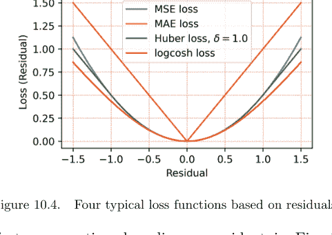

图10.4. 四种基于残差的典型损失函数。

前面提到的关键特征在图10.4中显而易见。读者可以尝试运行代码，修改超参数，从而对这些损失函数有不同的理解。更详细的讨论，请参阅题为《5 Regression Loss Functions All Machine Learners Should Know》的文章（heartbeat.fritz.ai/5-regression-loss-functions-all-machine-learners-should-know-4fb140e9d4b0）。

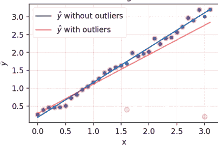

图10.5：使用线性多项式和带噪声数据点的回归结果。

## 10.3 回归的Python代码

现在，让我们根据上面给出的公式，编写一个执行线性回归的代码。我们首先使用以下代码，通过设置 `reg_type = 1`，使用线性多项式函数进行线性回归。同时，我们可以检验L2损失对异常值数据点的敏感性。结果绘制在图10.5中。
可以清楚地看到，这两个异常值将回归线显著地向下推移。图10.5是使用以下代码生成的。读者可以通过稍微修改代码，使用不同的特征函数来尝试运行代码。

```python
import numpy as np
%matplotlib inline
import matplotlib.pyplot as plt

def datagen1(x,noise=0.3):
    # 生成具有1, x（线性）特征的数据
    lx = len(x)
    
    One = np.ones(lx)
    np.random.seed(8)
    X = np.stack((One, x), axis=-1)    # 用于线性多项式
    y = x + np.random.rand(lx)*noise   # y向量
    return X,y
```

```python
def datagen2(x,noise=0.3):    # 具有1, x, x^2特征的数据
    lx = len(x)
    One = np.ones(lx)
    np.random.seed(8)
    X = np.stack((One, x,x2), axis=-1)    # 二阶多项式
    y = x**2.+ x + np.random.rand(lx)*noise # 构建y向量
    return X, y

def datagen3(x,noise=0.3):    # 具有1,x,sin(x)特征的数据
    lx = len(x)
    One = np.ones(lx)
    np.random.seed(8)
    X = np.stack((One, x,np.sin(x)), axis=-1)
    y = 1.+ 0.1*x + np.sin(x) + np.random.rand(lx)*noise
    return X, y

xleft,xright,xdelta = 0.0, np.pi, 0.1
x = np.arange(xleft,xright,xdelta)
lx = len(x)
print('x的长度=',lx, x)
noise = 0.3
reg_type = 3    # 1:线性, 2:二阶多项式, 3:sin(x)

if reg_type ==1:
    X, y = datagen1(x,noise)    # 数据，线性多项式
elif reg_type ==2:
    X, y = datagen2(x,noise)    # 数据，二阶多项式
else:
    X, y = datagen3(x,noise=0.1)    # 具有sin(x)的数据

yout = y.copy()
yout[int(lx/2)],yout[int(lx-2)] = 1.0, 0.8    # 2个异常值
print('y=',y,y.shape)

XTy = np.dot(X.T,y)    # 计算 X.T * y
XTyout = np.dot(X.T,yout)
print('XTy=',XTy,XTy.shape)

XTX = np.matmul(X.T,X)    # 计算 X.T * X
print('XTX=',XTX,XTX.shape)

def y_hat(X,cr):    # 给定解 cr* 时，预测回归线的函数
    return np.dot(X,cr)    # X = [1  x1] ;  cr* = [b*  w*]^T
```

```python
plt.figure(figsize=(4.5, 2.9),dpi=100)
c = np.linalg.solve(XTX,XTy)
cout = np.linalg.solve(XTX,XTyout)
print(' c*=',c,c.shape)
plt.plot(x,y_hat(X,c),label = "$\hat{y}$ 无异常值")
plt.plot(x,y_hat(X,cout), c='r',alpha=0.5,
         label = "$\hat{y}$ 有异常值")
# 计算预测线并绘图。

plt.scatter(x, y, s=15., c='b', alpha=0.8)
plt.scatter(x, yout, s=45., c='r', alpha=0.2)
plt.xlabel('x')
plt.ylabel('$\hat{y}$')
plt.title('线性回归')
plt.grid(color='r', linestyle=':', linewidth=0.3)
plt.legend()
plt.show()
```

x的长度= 32 [0.  0.1 0.2 0.3 0.4 0.5 0.6 0.7 0.8 0.9 1.
    1.1 1.2 1.3 1.4 1.5 1.6 1.7
 1.8 1.9 2.  2.1 2.2 2.3 2.4 2.5 2.6 2.7 2.8 2.9 3.  3.1]
y= [1.08734294 1.20668748 1.30558878 1.37860578 1.45269118
 1.53056542
 1.66768936 1.75445282 1.84962356 1.92116609 1.99700663
 2.05554596
 2.12812864 2.16479564 2.18741794 2.19010416 2.18848111
 2.25905033
 2.18722504 2.15818019 2.11587827 2.17149642 2.04128198
 2.00791829
 1.92255747 1.87094914 1.81486486 1.78699438 1.64953431
 1.62772427
 1.44399321 1.38674914] (32,)
XTy= [58.51029079 93.63832045 39.77958804] (3,)
XTX= [[ 32.          49.6         19.9954796 ]
 [ 49.6        104.16        31.42797769]
 [ 19.9954796   31.42797769  15.70789511]] (3, 3)
c*= [1.06733004 0.09226871 0.98918366] (3,)

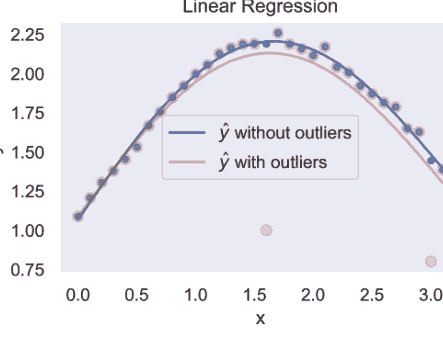

图10.6：使用二次多项式对数据点进行线性回归。

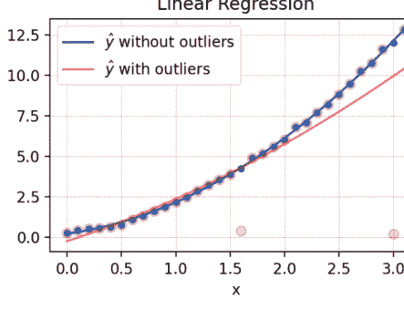

图10.7：使用二阶多项式和带噪声数据点的回归结果。

### 10.3.1 使用高阶多项式和其他特征函数的线性回归

我们现在使用上面给出的代码，通过添加二次项 $x^2$ 作为第二个特征（基函数），来执行二阶多项式回归。在代码中，我们只需设置 `reg_type = 2`。结果绘制在图10.7中。

图10.8展示了使用正弦特征（基函数）的回归结果。

# 线性回归


图10.8：使用正弦特征函数和带噪声数据点的回归结果。

使用Scikit-Learn中内置的类来执行回归（曲线拟合）是很方便的。

```python
from sklearn.preprocessing import PolynomialFeatures
from sklearn.pipeline import make_pipeline
from sklearn.linear_model import LinearRegression
%matplotlib inline
import matplotlib.pyplot as plt
import seaborn as sns; sns.set()
import numpy as np
```

```python
# 创建一个6次多项式模型
poly7_model = make_pipeline(PolynomialFeatures(6),
                           LinearRegression())
```

```python
rng = np.random.RandomState(1)
x = 10 * rng.rand(50)
y = np.sin(x) + 0.05 * rng.randn(50)
xfit = np.linspace(0, 10, 1000)
poly7_model.fit(x[:, np.newaxis], y)
yfit = poly7_model.predict(xfit[:, np.newaxis])
plt.figure(figsize=(3.5, 3.0),dpi=100)
plt.scatter(x, y, s=15., c='b', alpha=0.8)
plt.plot(xfit, yfit,c='b',label = "使用6阶多项式\n拟合", alpha=0.9)
plt.plot(xfit, np.sin(xfit),c='r',label = "原始真实正弦\n函数",alpha=0.9)
plt.grid(color='r', linestyle=':', linewidth=0.3)
```

plt.legend(bbox_to_anchor=(2.02, 0.5), loc='center right')
plt.show()

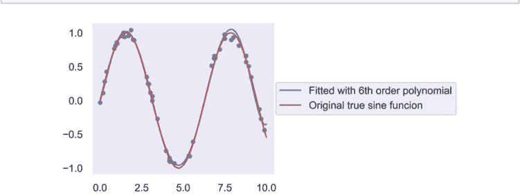

图 10.9：使用 Sklearn 对数据点进行高阶多项式线性回归。

从图 10.9 可以看出，使用 6 阶多项式基函数，我们可以拟合一组由正弦函数和 5% 白噪声创建的非线性数据。请注意，当这种高阶多项式拟合用于数据集之外的预测时，可能非常危险。我们可以打印出 6 阶多项式的特征（变量的所有幂次）：

```python
x1 = np.arange(2, 4, 4)    # one-dimensional, 6 data-points
poly7_data = PolynomialFeatures(7, include_bias=False)
poly7_data.fit_transform(x1[:, None])
```

array([[  2.,   4.,   8.,  16.,  32.,  64., 128.]])

我们可以看到，随着多项式阶数的增加，其值增长非常快。让我们在拟合域之外稍作预测。

```python
xfit = np.linspace(0, 11, 1000)
yfit = poly7_model.predict(xfit[:, np.newaxis])
plt.figure(figsize=(4.5, 2.9), dpi=100)
plt.scatter(x, y, s=15., c='b', alpha=0.8)
plt.plot(xfit, yfit, c='b', label="Fitted with 6th order\npolynomial")
plt.plot(xfit, np.sin(xfit), c='r', label="Original true\nsine function")
plt.legend();
```

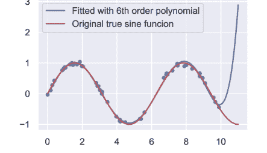

图 10.10：使用高阶多项式对数据点进行线性回归。请注意外推的危险。

从图 10.10 可以清楚地看出，高阶多项式拟合应谨慎使用，尤其是在进行外推时。

### 10.3.2 使用高斯基函数的线性回归

我们现在将使用 Scikit-Learn 和线性回归代码 (https://jakevdp.github.io/PythonDataScienceHandbook/05.06-linear-regression.html)，使用高斯基函数作为特征函数。

```python
from sklearn.base import BaseEstimator, TransformerMixin

class GaussianFeatures(BaseEstimator, TransformerMixin):
    """Uniformly spaced Gaussian features for one-dimensional input"""

    def __init__(self, N, width_factor=2.0):
        self.N = N
        self.width_factor = width_factor

    @staticmethod
    def _gauss_basis(x, y, width, axis=None):
        arg = (x - y) / width
        return np.exp(-0.5 * np.sum(arg ** 2, axis))

    def fit(self, X, y=None):
        # create N centers spread along the data range
        self.centers_ = np.linspace(X.min(), X.max(), self.N)
        self.width_ = self.width_factor * (self.centers_[1] - self.centers_[0])
        return self

    def transform(self, X):
        return self._gauss_basis(X[:, :, np.newaxis], self.centers_, self.width_, axis=1)

xfit = np.linspace(0, 10, 1000)
gauss_model = make_pipeline(GaussianFeatures(20),
                            LinearRegression())
gauss_model.fit(x[:, np.newaxis], y)
yfit = gauss_model.predict(xfit[:, np.newaxis])
plt.figure(figsize=(4.5, 2.9), dpi=100)
plt.scatter(x, y, s=15., c='b', alpha=0.8)
plt.plot(xfit, yfit, c='b', label="Fitted with Gaussian basis")
plt.plot(xfit, np.sin(xfit), c='r', label="Original true sine function")
plt.legend(bbox_to_anchor=(1.72, 0.5), loc='center right');
# plt.xlim(0, 10)
```

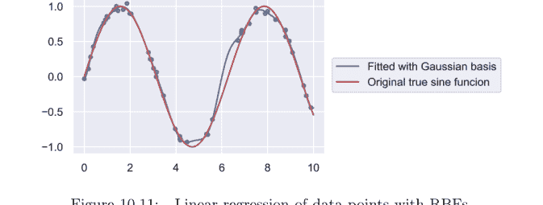

图 10.11：使用 RBFs 对数据点进行线性回归。

如图 10.11 所示，这确实是一个极好的拟合。让我们在拟合域之外稍作预测。

```python
xfit = np.linspace(0, 11, 1000)
yfit = gauss_model.predict(xfit[:, np.newaxis])
plt.figure(figsize=(4.5, 2.9), dpi=100)
plt.scatter(x, y, s=15., c='b', alpha=0.8)
plt.plot(xfit, yfit, c='b', label="Fitted with Gaussian basis")
plt.plot(xfit, np.sin(xfit), c='r', label="Original true sine function")
plt.legend()
plt.ylim(-1.5, 3)
```

(-1.5, 3.0)

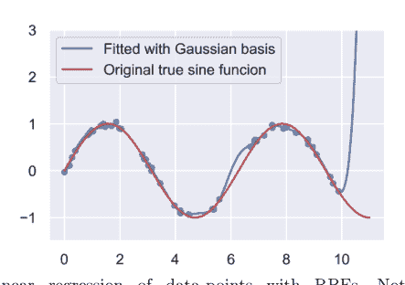

图 10.12：使用 RBFs 对数据点进行线性回归。请注意外推的危险。

我们观察到使用高斯基函数时出现了类似的现象。使用非线性特征函数进行曲线拟合时需要谨慎，尤其是在进行外推时。

## 10.4 用于大数据集线性回归的神经网络模型

### 10.4.1 设置神经网络模型

可以构建一个神经网络模型，形成一个系统性的过程，以有效地最小化损失函数，该函数可以具有前面讨论过的多种形式。损失函数是神经元权重和偏置的函数，这些是学习（或训练）参数。训练的目标是找到最小化器，即一组使损失函数达到最小值的权重和偏置。因为我们的损失函数是可微的（或次可微的），我们可以使用基于梯度的最小化技术来实现这一目标。

我们现在使用 mxnet-the-straight-dope (https://github.com/zackchase/mxnet-the-straight-dope/tree/master/chapter02_supervised-learning) 在 Apache-2.0 许可证下提供的代码，来完成使用神经网络训练线性回归模型的过程。我们将执行以下操作：

- 生成一组合成数据和相应的标签，类似于我们在第 9.5.1 节中所做的。
- 数据集应使用 nd.random_normal 生成，其均值接近 0，方差接近 1。因此，数据集的协方差将接近对角矩阵，数据集中的相应特征将几乎是独立的。
- 标签使用“真实”特征生成，并添加了人工噪声，以模拟测量误差。噪声生成使用均值为零、方差为小百分比（例如 10%；读者可以更改）的随机高斯分布。

我们首先导入此任务所需的库。

```python
# The following codes are modified from these at https://
# github.com/zackchase/mxnet-the-straight-dope/tree/master/
# chapter02_supervised-learning
# Under Apache-2.0 License.

from __future__ import print_function
import mxnet as mx
from mxnet import nd, autograd, gluon
import random
import numpy as np
mx.random.seed(1)        # fix seed for repeatable random numbers

# Specify GPU or CPU computation
data_ctx = mx.cpu()
model_ctx = mx.cpu()
num_inputs = 2            # 2D space with two features: x1 and x2
num_outputs = 1           # one prediction y
num_samples = 1000       # Sample number, use 10 for demonstration,
                         # but 100 or more for actual running.

def real_fn(X):           # linear func.,
                         # w1,w2,b1: 3 learning parameters
    return 2*X[:,0] - 3.4*X[:,1] + 4.2  # 2*x1-3.4*x2+4.2

X = nd.random_normal(shape=(num_samples, num_inputs), ctx=data_ctx)
                         # randomly generate samples for x1 and x2
noise = .1 * nd.random_normal(shape=(num_samples,), ctx=data_ctx)
                         # 10% noise, zero mean, 1 variance
y = real_fn(X) + noise   # Generate labels with noise.
```

为了将数据与前面给出的方程联系起来，我们有 p=num_inputs，m=num_samples。矩阵 X 的维度为 num_samples x num_inputs，y 是一个包含 num_samples 个条目的一维数组。

作为良好的实践，我们应始终尝试尽可能多地了解数据集。首先，检查数据结构，使用以下代码：

```python
print('y=', y[0:10])
print(y.shape)
print(X[:5])
print(X.shape)
```

y=
[ 6.0136046  2.2423     9.592255   3.569859   2.2450843
  4.9734535  5.285636   6.4735103 10.942213   8.004087 ]
<NDArray 10 @cpu(0)>
(1000,)

[[ 0.03629482 -0.49024424]
 [-0.9501793   0.03751943]
 [-0.7298465  -2.0401056 ]
 [ 1.4821309   1.040828  ]
 [-0.45256865  0.3116043 ]]
<NDArray 5x2 @cpu(0)>
(1000, 2)

接下来，让我们计算 X 的协方差矩阵，以查看这两个变量的独立性水平。

```python
print('Covariance Matrix of X:\n', np.cov(X.asnumpy().T))
```

Covariance Matrix of X:
[[ 1.05065641 -0.01452139]
 [-0.01452139  1.08663854]]

这两个变量相当独立，这是个好消息，很可能可以构建一个高质量的模型。此外，让我们检查第一个样本的预测值与标签的差距：

```python
print('y_hat=', 2 * X[0, 0] - 3.4 * X[0, 1] + 4.2,
      'Label y_1=', y[0])
```

y_hat=
[5.9394197]
<NDArray 1 @cpu(0)> Label y_1=
[6.0136046]
<NDArray 1 @cpu(0)>

这些值非常接近。我们可以期待相当快的训练速度。

最后，让我们使用 matplotlib 绘制所有数据点以便于查看。为了使用 matplotlib，我们需要使用 .asnumpy() 函数将 NDArray 中的数据数组转换为 NumPy 数组。

### 10.4.2 创建数据迭代器

为了快速计算，数据被打包成便于批量操作的形式。在 MXNet 中，数据迭代器提供了获取和操作数据的实用工具。在我们的例子中，我们通过调用 `gluon.data.ArrayDataset(X, y)` 将训练数据对 X 和 y 加载到一个 ArrayDataset 中。X 可以是一个多维输入数组（例如，图像），y 可以只是一个一维数组。它们在第一个轴上的长度必须相等，即 `len(X) == len(y)`。

给定一个 ArrayDataset，我们创建一个 DataLoader，它从 ArrayDataset 中随机抓取数据批次。我们需要为分组训练样本决定 `batch_size`，它指定了我们一次（一个 epoch）想使用多少个样本。我们应指定是否在迭代之间对数据集进行打乱。

```
batch_size = 4
train_data = gluon.data.DataLoader(gluon.data.
    ArrayDataset(X, y), batch_size=batch_size, shuffle=True)
```

我们现在使用 DataLoader 初始化了 `train_data`。它变成了一个可迭代对象，可以像 Python 列表一样轻松地按批次获取数据。要解包数据，我们只需使用以下循环进行迭代：

```
for i, (data, label) in enumerate(train_data):
    # Get samples after shuffling the data pool.
    print(data, label)
    break
```

```
[[-0.7022906  0.6857335 ]
 [-0.02577175 0.43850085]
 [-0.38564655 0.6393674 ]
 [-0.6317411  -1.3817437 ]]
<NDArray 4x2 @cpu(0)>
[0.22829296 2.823702  1.2765092 7.6593714 ]
<NDArray 4 @cpu(0)>
```

当我们再次运行相同的代码时，我们将得到一组不同的 4 个样本，因为我们设置了 `shuffle=True`。

```
for i, (data, label) in enumerate(train_data):
    print(data, label)
    break
```

```
[[-2.206704   2.3855615 ]
 [ 0.7445208 -0.2434989 ]
 [-1.0826081  -1.027927  ]
 [ 0.09882921 -0.86426044]]
<NDArray 4x2 @cpu(0)>
[-8.413907  6.1686425 5.5676003 7.5225515]
<NDArray 4 @cpu(0)>
```

让我们看看我们有多少个批次，然后确保这是合理的。

```
for i, (data, label) in enumerate(train_data):
    pass
print(i+1)
```

250

### 10.4.3 训练参数

首先，为权重和偏置初始化训练参数。通常，这是通过分配一些随机数来完成的。

```
w = nd.random_normal(shape=(num_inputs, num_outputs),
    ctx=model_ctx)
b = nd.random_normal(shape=num_outputs, ctx=model_ctx)
params = [w, b]
print(params)
print('w=',w, '\n b=',b)
```

```
[
[[-2.3237102]
 [-1.109485 ]]
<NDArray 2x1 @cpu(0)>,
[-0.48563406]
<NDArray 1 @cpu(0)>]
w=
[[-2.3237102]
 [-1.109485 ]]
<NDArray 2x1 @cpu(0)>
 b=
[-0.48563406]
<NDArray 1 @cpu(0)>
```

为损失函数相对于所有学习参数的梯度分配一些内存。

```
for param in params:
    param.attach_grad()
print(param.grad)
```

```
[0.]
<NDArray 1 @cpu(0)>
```

可以看到，只分配了位置。

### 10.4.4 定义神经网络

根据公式部分给出的公式，网络可以简单地定义如下：

```
def net(X):
    return mx.nd.dot(X, w) + b
```

### 10.4.5 定义损失函数

我们使用 L2 损失函数，即预测值与标签值之间的平方距离。

```
def square_loss(yhat, y):
    return nd.mean((yhat - y) ** 2)
```

### 10.4.6 使用优化器

让我们使用随机梯度下降（SGD）来训练网络。这是通过小批量完成的。在每次迭代中，从数据集中随机抽取一批训练样本。然后，我们将计算损失函数相对于所有训练参数（权重和偏置）的梯度。梯度提供了更新训练参数的方向，并且将指定一个学习率 *lr*（通常是一个小数字）来确定在该方向上每一步参数应该更新多快。

```
def SGD(params, lr):    # lr: the learning rate determine
                         # how fast the parameters are updated
    for param in params:
        param[:] = param - lr * param.grad
```

### 10.4.7 执行训练

训练分阶段进行。每个阶段称为一个 epoch，即在整个数据集上抽取数据批次的次数。然后，对于每次遍历，我们迭代 `train_data`，抓取一批样本及其对应的标签。

```
epochs = 10
learning_rate = .01
num_batches = num_samples/batch_size

for e in range(epochs):
    cumulative_loss = 0
    for i, (data, label) in enumerate(train_data):
        data = data.as_in_context(model_ctx)
        label = label.as_in_context(model_ctx).reshape((-1, 1))
        with autograd.record(): # record the path for gradient
            output = net(data)
            loss = square_loss(output, label)
        loss.backward()        # compute gradient via backward prop.
        SGD(params, learning_rate)        # perform optimization
        cumulative_loss += loss.asscalar() # update the loss.
    print(cumulative_loss / num_batches)
```

4.694164189037867
0.010493556420027745
0.010353110232390463
0.01032697731954977
0.010341777712805197
0.010346036787843332
0.010346328813116997
0.010331496173050254
0.01031649975432083
0.010330414514523

### 10.4.8 检查训练进度

```
# Re-initialize parameters because they were already
# trained earlier
w[:] = nd.random_normal(shape=(num_inputs, num_outputs),
        ctx=model_ctx)
b[:] = nd.random_normal(shape=num_outputs, ctx=model_ctx)
# Function to plot the losses over epoch
def plot(losses, X, sample_size=100):
    xs = list(range(len(losses)))
    f, (fg1, fg2) = plt.subplots(1, 2)
    fg1.set_title('Loss during training')
    fg1.plot(xs, losses, '-r')
    fg2.set_title('Estimated vs real function')
    fg2.plot(X[:sample_size, 1].asnumpy(),
        net(X[:sample_size,:]).asnumpy(),'or', label='Estimated')
    fg2.plot(X[:sample_size, 1].asnumpy(),
        real_fn(X[:sample_size,:]).asnumpy(),'*g', label='Real')
    fg2.legend()
    plt.show()

learning_rate = .01
losses = []
plot(losses, X)

for e in range(epochs):
    cumulative_loss = 0
    for i, (data, label) in enumerate(train_data):
        data = data.as_in_context(model_ctx)
        label=label.as_in_context(model_ctx).reshape((-1, 1))
        with autograd.record():
            output = net(data)
            loss = square_loss(output, label)
        loss.backward()
        SGD(params, learning_rate)
        cumulative_loss += loss.asscalar()

    print("Epoch %s, batch %s. Mean loss: %s" % (e, i,
        cumulative_loss/num_batches))
    losses.append(cumulative_loss/num_batches)

plot(losses, X)
```

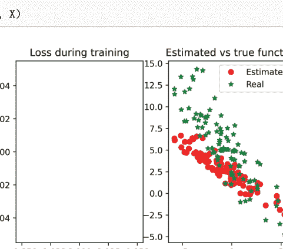

图 10.14：训练前神经网络的结果。

```
Epoch 0, batch 249. Mean loss: 4.427614943831228
Epoch 1, batch 249. Mean loss: 0.010421961726155131
Epoch 2, batch 249. Mean loss: 0.010315687943017111
Epoch 3, batch 249. Mean loss: 0.01035601595134358
Epoch 4, batch 249. Mean loss: 0.01037310311215697
Epoch 5, batch 249. Mean loss: 0.010365772993071004
Epoch 6, batch 249. Mean loss: 0.01032915258151479
Epoch 7, batch 249. Mean loss: 0.010371889414265752
Epoch 8, batch 249. Mean loss: 0.010340319244773128
Epoch 9, batch 249. Mean loss: 0.010389118599705397
```

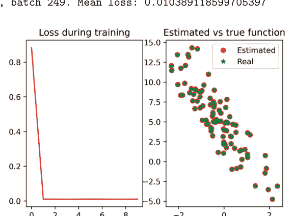

图 10.15：训练后神经网络的结果。

## 10.5 用于非线性回归的神经网络模型

我们现在介绍一个由 scikit-learn 团队 [3] 完成的案例研究。该研究使用多层感知机网络（MLPRegressor 类）结合决策树回归 [4,5]，使用波士顿房价数据集执行非线性回归。提供了一段代码来执行回归，然后绘制偏依赖曲线。`plot_partial_dependence` 函数返回一个 `PartialDependenceDisplay` 类对象，该对象包含必要的属性，可用于绘图而无需重新计算偏依赖。

### 10.5.1 在波士顿房价数据集上训练模型

我们在波士顿房价数据集上训练一个决策树（本书不作讨论）和一个多层感知机。可以使用帮助功能来了解Sklearn中内置的这些类。例如，使用“help(MLPRegressor)”来查看使用MLPRegressor类时神经网络的设置。

```python
boston = load_boston()
X = pd.DataFrame(boston.data, columns=boston.feature_names)
y = boston.target
tree = DecisionTreeRegressor()
mlp = make_pipeline(StandardScaler(),
                    MLPRegressor(hidden_layer_sizes=(100, 100), tol=1e-2,
                                 max_iter=500, random_state=0))    # 2 hidden layers, Relu.
tree.fit(X, y)
mlp.fit(X, y); # you may remove # to view outputs.
```

### 10.5.2 绘制两个特征的偏依赖图

我们使用`plot_partial_dependence()`为决策树绘制两个特征“LSTAT”和“RM”的偏依赖曲线。这两个图的网格间距由`ax`定义。

```python
fig, ax = plt.subplots(figsize=(12, 6))
ax.set_title("Decision Tree")
tree_disp=plot_partial_dependence(tree,X,["LSTAT", "RM"],ax=ax)
```

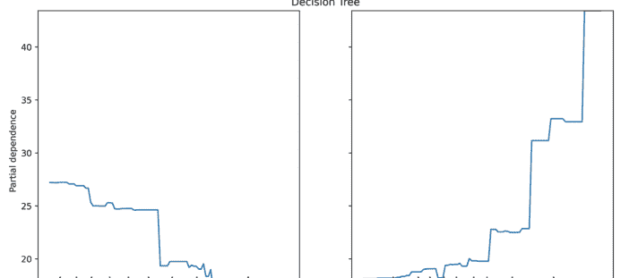

图 10.16：在波士顿房价数据集上使用Sklearn决策树的结果。

接下来，为多层感知机绘制偏依赖曲线。

```python
fig, ax = plt.subplots(figsize=(12, 6))
ax.set_title("Multi-layer Perceptron")
mlp_disp = plot_partial_dependence(mlp, X, ["LSTAT", "RM"], ax=ax,
                                  line_kw={"c": "red"})
```

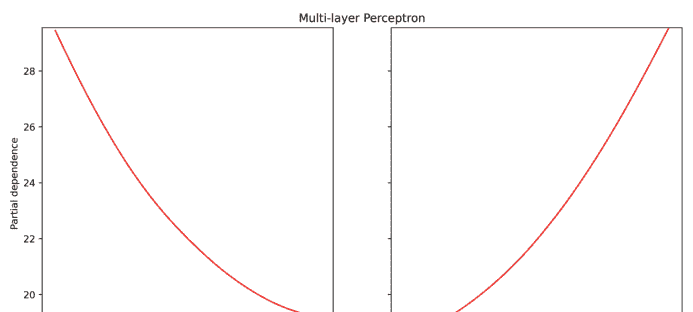

图 10.17：在波士顿房价数据集上使用Sklearn多层感知机的结果。

### 10.5.3 将曲线叠加绘制

最后，我们使用以下代码将这些偏依赖曲线叠加绘制在一起：

```python
# Sets this image as the thumbnail for sphinx gallery
# sphinx_gallery_thumbnail_number = 4
fig, (ax1, ax2) = plt.subplots(1, 2, figsize=(10, 6))

tree_disp.plot(ax=[ax1,ax2],line_kw={"label":"Decision Tree"})
mlp_disp.plot(ax=[ax1, ax2], line_kw={"label":"Multi-layer Perceptron","c": "red"})

ax1.legend()
ax2.legend();
```

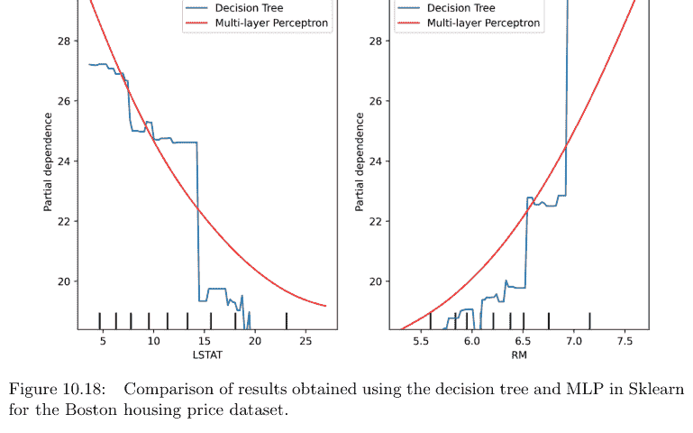

## 10.6 关于非线性回归

请注意，上述讨论的回归模型实际上是线性模型，即使我们使用了非线性特征函数，例如高阶多项式、许多其他特殊的特征函数以及SVM中的核函数。回归中使用的特征函数本质上与有限元法中的基函数相同，只是名称不同。

我们还可以在此注意到，当回归模型使用非线性特征函数时，有时被称为非线性回归。这与有限元法类型的模型不同，在有限元法模型中，即使使用了非线性基函数，模型仍然被称为线性的。当我们说非线性有限元模型时，它才是真正非线性的，因为系统矩阵将依赖于未知场变量，因此非线性有限元模型的求解通常是迭代的。

事实上，人们不应混淆回归模型本身是线性的，即使使用了非线性特征函数，因为系统矩阵$\mathbf{X}^\top \mathbf{X}$不依赖于回归参数$[\hat{\mathbf{w}}]$，并且$[\hat{\mathbf{w}}]$可以通过线性方程求解器一步获得。预测被假定为特征和回归参数的线性组合，如上式所示，并且在稍后编写的代码中也将明确看到。这似乎只是一个术语上的小问题，但它可能具有概念上的意义。此外，还存在真正的非线性回归模型，其中回归参数和某些（或所有）特征不能写成线性组合的形式。对于这种真正的非线性回归模型，应通过迭代或连续拟合过程来获得解。

## 10.7 结论

我们以以下几点结束本章：

1. 回归是从数据集中推导出特征函数的过程。一旦模型定义，函数的形式就确定了。模型参数（例如，多层感知机的权重和偏置）在模型训练时确定。这些参数现在记录了数据集的特征。
2. 线性回归模型可以使用非线性特征函数来更好地拟合复杂的数据集。使用非线性特征函数类似于在SVM中使用非线性核函数。
3. 可以使用各种机器学习模型进行回归。
4. 一个构建和训练得当的神经网络能够从包含复杂标签-特征关系的大型数据集中生成预测函数。它能够从数据集中提取线性和非线性特征。

## 参考文献

[1] G.R. Liu and G.Y. Zhang, *Smoothed Point Interpolation Methods: G Space Theory and Weakened Weak Forms*, World Scientific, Singapore, 2013.

[2] G.R. Liu, *Mesh Free Methods: Moving Beyond the Finite Element Method*, Taylor and Francis Group, New York, 2010.

[3] P. Fabian, V. Gae, G. Alexandre *et al.*, Scikit-learn: Machine Learning in Python, *Journal of Machine Learning Research*, **12**(85), 2825-2830, 2011. http://jmlr.org/papers/v12/pedregosa11a.html.

[4] X. Wu, R.J. Kumar Vipin *et al.*, Top 10 algorithms in data mining, *Knowledge and Information Systems*, **14**, 1–37, 2007.

[5] W. Pushkar and G.R. Liu, Real-time prediction of projectile penetration to laminates by training machine learning models with finite element solver as the trainer, *Defence Technology*, **17**(1), 147–160, 2021. https://www.sciencedirect.com/science/article/pii/S2214914720303275.

## 第11章

## 分类的损失函数与模型

在许多实际应用中，我们通常只需要做出“是”或“否”类型的决策。概率预测通常是做出此类决策的最佳选择。例如，一台机器在未来一个月内发生故障的可能性有多大？一种病毒在未来一个季节内成为区域大流行病的概率是多少？这类问题需要评估事件发生的概率，是一个典型的*分类*问题。最简单的分类问题是*二元分类*：只有两个类别，“是”或“否”，用于决策。本章将重点讨论这类问题，重点关注可用于使用神经网络对二元标签进行最佳预测的必要方法、公式和技术。本章的参考资料包括：

- David S. Rosenberg（彭博CTO办公室）的讲座系列。
- Hastie, Tibshirani和Friedman的著作：《统计学习基础》。
- James, Witten, Hastie和Tibshirani的著作：《统计学习导论》。
- Shalev-Shwartz和Ben-David的著作：《理解机器学习：从理论到算法》。
- mxnet-the-straight-dope (https://github.com/zackchase/mxnet-the-straight-dope)（在Apache License 2下）。

## 11.1 预测函数

为了制定合适的损失函数，我们必须为神经网络模型的最后一层定义一个预测函数。因此，我们的讨论从制定可用于二元分类的不同类型的预测函数开始。预测函数也称为评分函数，预测函数的值称为模型获得的分数。

### 11.1.1 线性函数

对于给定输入$\mathbf{x}$，第一个也是最简单的预测函数是第5章讨论的仿射变换函数：

$$z = \sum_{i=1}^{p} w_i x_i + b = \mathbf{x} \cdot \mathbf{w} + b = \mathbf{x} \mathbf{w} + b \quad (11.1)$$

或者使用xw公式

$$z = \sum_{i=0}^{p} w_i x_i = \overline{\mathbf{x}} \hat{\mathbf{w}} \quad (11.2)$$

其中$x_0 = 1$，$w_0 = b$，$\hat{\mathbf{w}}$包含所有训练参数（权重和偏置）。输出值$z$通常是实数。

线性预测函数在神经网络的输出（最后一）层直接使用$z$值（线性）：

$$\hat{y} = z \quad (11.3)$$

线性预测函数的值在$\mathbb{Y}^1$中，是$(-\infty, \infty)$中的实数。

### 11.1.2 逻辑预测函数

一个二分类问题对于给定输入$\mathbf{x}_i$有两个标签1或0：正类标记为$y_i = 1$，负类标记为$y_i = 0$。我们的问题可以表述为预测事件相对于这些标签的概率值。因此，使用以下逻辑（或Sigmoid）激活函数$\sigma$非常有意义，它将任意实数输出$z$映射到$(0, 1)$范围内：

$$\hat{y} = \sigma(z) = \frac{1}{1 + e^{-z}} \quad (11.4)$$

它将$(-\infty, \infty)$中的任何参数值$z$压缩到$(0, 1)$范围内。使用仿射变换，我们的预测公式变为

$$\hat{y} = \frac{1}{1 + e^{-(\mathbf{x}\mathbf{w}+b)}} = \frac{1}{1 + e^{-(\overline{\mathbf{x}}\hat{\mathbf{w}})}} \quad (11.5)$$

由于逻辑预测函数的值落在 (0, 1) 区间内，因此现在可以与给定的标签进行比较。

### 11.1.3 tanh 预测函数

二分类问题中的正类和负类也可以分别标记为 1 和 −1。这类问题可以重新标记为 1 和 0。或者，双曲正切 (tanh) 预测函数就派上用场了。其定义如下：

$$\hat{y} = \tanh(z) = \frac{e^z - e^{-z}}{e^z + e^{-z}} \quad (11.6)$$

其中 $z$ 由公式 (11.1) 或 (11.2) 给出。显然，对于任何实数 $z \in (-\infty, \infty)$，tanh 预测函数返回一个 $(-1, 1)$ 区间内的实数。

## 11.2 分类问题的损失函数

损失函数是衡量预测相对于真实标签（在二分类问题中是离散的）正确性的度量。构建损失函数需要仔细考虑。我们首先定义一些术语。

### 11.2.1 间隔概念

间隔 $m(x)$ 也称为间隔函数。它常用于定义二分类问题的损失函数。令 $\hat{y}$ 为预测函数。二分类问题的设置主要有两种情况。情况 I：标签给定为 $y \in \{-1, +1\}$。在这种情况下，间隔 $m(x)$ 定义为

$$m_g(x) = y\hat{y}(x) = \begin{cases} -\hat{y}, & \text{当 } y = -1 \\ \hat{y}, & \text{当 } y = 1 \end{cases} \quad (11.7)$$

上述定义告诉我们以下几点：

- 假设标签 $y$ 和预测 $\hat{y}$ 符号相同，则预测正确，间隔 $m_g$ 为正。
- 假设标签 $y$ 和预测 $\hat{y}$ 符号不同，则预测错误，间隔 $m_g$ 为负。
- 因此，间隔 $m_g$ 是预测正确性水平的度量。因此，我们希望最大化间隔 $m_g(x)$，以实现具有最大可能间隔的正确预测。

情况 II：标签给定为 $y \in \{0, 1\}$。在这种情况下，间隔 $m(x)$ 定义为

$$m_g(x) = y\hat{y}(x) + (1-y)(1-\hat{y}(x)) = \begin{cases} (1-\hat{y}), & \text{当 } y=0 \\ \hat{y}, & \text{当 } y=1 \end{cases} \quad (11.8)$$

此定义确保以下几点：

- 当标签 $y = 0$ 时，$\hat{y}$ 应接近 0 才能使预测正确，并且间隔 $m_g$ 可以为正并最大化以实现最佳可能的预测。
- 当标签 $y = 1$ 时，$\hat{y}$ 应接近 1 才能使预测正确，并且间隔 $m_g$ 可以为正并最大化以实现最佳可能的预测。
- 在任一情况下，间隔 $m_g$ 都成为预测正确程度的度量。最大化间隔 $m_g(x)$ 可实现具有最大可能间隔的正确预测。

一旦根据这两种不同的标签情况正确地定义了间隔，那么二分类问题的损失函数的定义就可以统一这两种情况。所需要做的就是通过最小化损失函数来获得最大化的间隔。这类损失函数称为基于间隔的损失，与第 10 章讨论的基于距离的损失相对。

我们在第 6 章讨论 SVM 时见过类似的概念，当时我们称间隔为决策街的宽度。我们经历了一个最大化它的过程，使用了一个漂亮的原始-对偶（拉格朗日乘子）公式，导出一个标准的二次规划问题，并使用常规可用的软件包求解。

### 11.2.2 0–1 损失

对于给定的间隔函数，0–1 损失函数可以定义如下：

$$\mathcal{L}(m_g) = \mathbb{1}(m_g \leq 0) \quad (11.9)$$

其中 $\mathbb{1}()$ 是指示函数。图 11.1 示意性地展示了 0–1 损失。

0–1 损失函数具有以下性质：

1. 当间隔小于或等于零时，该函数的值为 1。否则为零，此时给出正确的预测。最小化损失就是最大化间隔。

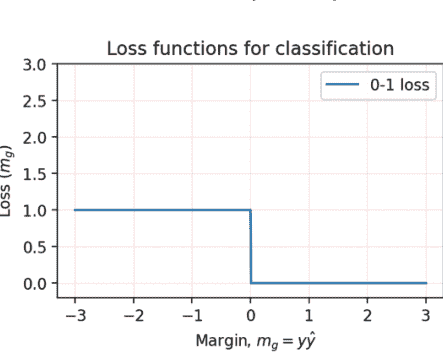

图 11.1：分类的 0–1 损失函数。

2. 它明显是不连续且不可微的。因此，很难与基于梯度的最小化算法一起使用。
3. 它也不是凸的，因此即使基于梯度的最小化算法对其可行，也不能保证能找到最小值。

### 11.2.3 合页损失

对于给定的间隔函数，合页损失函数具有以下形式：

$$\mathcal{L}(m_g) = \max(1 - m_g, 0)$$

图 11.2 示意性地展示了合页损失以及 0–1 损失。

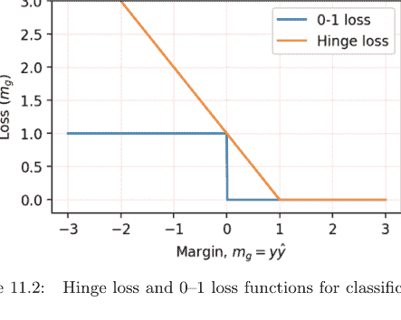

图 11.2：分类的合页损失和 0–1 损失函数。

合页损失函数具有以下性质：

1. 当间隔小于 1 时，它是一个斜率为 $-1$ 且经过 $[0, 1]$ 的线性函数。当间隔大于 1 时，它为零。我们再次看到，最小化损失就是最大化间隔。
2. 它是凸的，但不是严格凸的，并且有多个最小值。
3. 它是 0-1 损失的上界。
4. 在 $m_g = 1$ 处不可微。
5. 当 $0 < m_g < 1$ 时存在间隔误差：即使预测正确，它也有损失。

合页损失可用于使用基于梯度的最小化算法训练 SVM 模型。

### 11.2.4 逻辑损失

对于给定的间隔函数，逻辑损失函数具有以下形式：

$$\mathcal{L}(m_g) = \log(1 + e^{-m_g})$$

图 11.3 示意性地展示了逻辑损失以及合页损失和 0-1 损失。

逻辑损失函数具有以下性质：

1. 它是光滑的、可微的和凸的。
2. 它永远不会达到零（最小化器总是想要更多的间隔）。
3. 当间隔为负且很小时，其斜率接近合页损失。

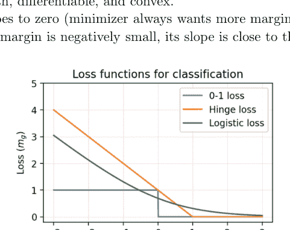

图 11.3：分类的逻辑损失、合页损失和 0-1 损失函数。

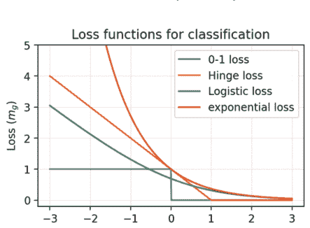

图 11.4：分类的指数损失、逻辑损失、合页损失和 0–1 损失函数。

### 11.2.5 指数损失

对于给定的间隔函数，指数损失函数具有以下形式：

$$\mathcal{L}(m_g) = \exp(-m_g)$$

图 11.4 示意性地展示了指数损失以及合页损失和 0–1 损失。

指数损失函数具有以下性质：

1. 它是光滑的、可微的和凸的。
2. 它永远不会达到零（最小化器总是想要更多的间隔）。
3. 它是 0–1 损失的上界。
4. 它对负间隔的惩罚非常重。

### 11.2.6 平方损失

平方损失函数使用 L2 损失，它也可以写成间隔的函数：

$$\mathcal{L}(\hat{y}, y) = (\hat{y} - y)^2 = (1 - \hat{y}y)^2 = (1 - m_g)^2 = \mathcal{L}(m_g)$$

这是因为对于标签 $y \in \{-1, +1\}$，$y^2 = 1$。

平方损失函数的性质已在第 10 章详细讨论：

1. 它是光滑的、可微的、凸的，并且 $m_g = 1$ 是损失函数的最小值点。

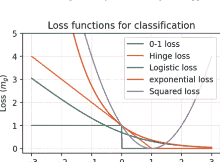

图 11.5：用于二分类的神经网络。

2. 它对异常值敏感。
3. 与合页损失和逻辑损失相比，它可能具有更高的复杂度，因此需要更多的样本 [1]。

图 11.5 将所有这四种损失绘制在一起以供检查。
我们编写代码来计算这些损失函数并绘制上述图形。

```python
# 分类的损失函数
# 0-1 损失
def zerone(mg):
    return np.where(mg <= 0 , 1.0,0.)

# 合页损失
def hinge(mg):
    return np.where(mg <= 1. , 1.-mg,0.) #np.max(1-mg,0)

# 逻辑损失
def logloss(mg):
    return np.log(1.+np.exp(-mg))

# 指数损失
def exploss(mg):
    return np.exp(-mg)

# 平方误差损失
def squared(mg):
    return (1-mg)**2
```

```python
%matplotlib inline
import matplotlib.pyplot as plt
import numpy as np
from matplotlib import rc

xleft,xright,xdelta =-3.0,3.01, .01
mg = np.arange(xleft,xright,xdelta) # 间隔
lxd = len(mg)
#print('Length of mg=',lxd, mg)

plt.figure(figsize=(4.5, 2.8),dpi=100)
plt.plot(mg,zerone(mg),label = "0-1 loss") #+str(f"{L:.2f}"))
plt.plot(mg,hinge(mg),label = "Hinge loss")
plt.plot(mg,logloss(mg),label = "Logistic loss")
plt.plot(mg,exploss(mg),label = "exponential loss")
plt.plot(mg,squared(mg),label = "Squared loss")
dlt = 1.0
plt.xlabel('间隔, $m_g=y\hat{y}$')
plt.ylabel('损失 ($m_g$)')
plt.title('分类的损失函数')
plt.grid(color='r', linestyle=':', linewidth=0.2)
plt.legend()
plt.ylim(-0.2, 5)
plt.show()
```

上述代码生成了前面的图形。

### 11.2.7 二元交叉熵损失

考虑一个给定的包含 $m$ 个样本的数据集，$\mathbf{x}_s, (s = 1, 2, \ldots, m)$。我们现在想要评估在给定这 $m$ 个样本的情况下，标签为真的总体概率，使用一个具有训练参数 $\hat{\mathbf{w}}$ 的神经网络。这需要计算以下概率：

$P_{\hat{\mathbf{w}}}((y_1, \ldots, y_m)|\mathbf{x}_1, \ldots, \mathbf{x}_m)$

如果每个样本都独立于其他样本，并且每个标签仅对应其自身的样本，那么这 $m$ 个事件就是独立的。因此，整体概率是每个样本所有概率的乘积。公式 (11.14) 变为

$P_{\hat{\mathbf{w}}}(y_1|\mathbf{x}_1)P_{\hat{\mathbf{w}}}(y_2|\mathbf{x}_2)\dots P_{\hat{\mathbf{w}}}(y_m|\mathbf{x}_m)$ (11.15)

这是多个概率的乘积，直接用作损失函数不太方便。此外，所有概率都小于或等于 1.0，如果 $m$ 是一个非常大的数，它们的乘积可能会是一个非常小的数。对概率乘积取对数得到

$\log P_{\hat{\mathbf{w}}}(y_1|\mathbf{x}_1) + \dots + \log P_{\hat{\mathbf{w}}}(y_m|\mathbf{x}_m)$ (11.16)

这是更优的选择，我们将使用它来代替。因为对数函数是一个关于递增正参数的单调递增函数，它不会改变原始函数的趋势，因此也不会改变输入到对数函数的原始函数的极值点位置。这可以通过以下生成图 11.6 的代码来观察：

```
x = np.arange(0.001, 10, .1)
y = np.log(x)
plt.plot(x,y)
plt.xlabel('x')
plt.ylabel('$log(x) $')
plt.title('Log Function: Monotonic!')
plt.show()
print('log(0.5)=',np.log(0.5),'log(1.0)=',np.log(1.0))
```

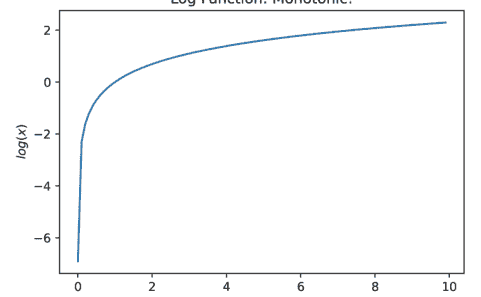

图 11.6：对数函数的曲线。它是单调变化的。

log(0.5)= -0.6931471805599453 log(1.0)= 0.0

现在，我们的目标是找到预测值 $\hat{y}_i$ 尽可能接近标签 $y_i$，但需要以概率的形式表示。此外，我们已经知道，当使用 sigmoid 逻辑函数来压缩任何给定的输入时，$\hat{y}_i$ 将是一个介于 0 和 1 之间的值。而且，由于在二元分类问题中，标签 $y_i$ 被给定为 1 或 0，预测值 $\hat{y}_i$ 应与标签 $y_i$ 具有以下对应关系：

- 当 $y_i$ 属于正类（即 $y_i = 1$）时，对于给定的第 $i$ 个样本，观察到 $y_i$ 的概率应设置为 $\hat{y}_i$。这是因为当 $\hat{y}_i$ 在训练参数 $\hat{\mathbf{w}}$ 上最大化时，我们得到了正确的对应关系。
- 另一方面，当 $y_i$ 属于负类（即 $y_i = 0$）时，对于给定的第 $i$ 个样本，观察到 $y_i$ 的概率应设置为 $1 - \hat{y}_i$。这是因为当 $\hat{y}_i$ 在训练参数 $\hat{\mathbf{w}}$ 上最大化时，$1 - \hat{y}_i$ 被最小化以接近 0。我们再次得到了正确的对应关系。

上述设置很好地涵盖了我们二元分类问题的两种可能情况。因此，对于第 $i$ 个样本，这种设置可以用以下公式表示：

$$P_{\hat{\mathbf{w}}}(y_i|\mathbf{x}_i) = \begin{cases} \hat{y}_i, & \text{if } y_i = 1 \\ 1 - \hat{y}_i, & \text{if } y_i = 0 \end{cases} \quad (11.17)$$

使用一个数学技巧，公式 (11.17) 可以重写为一个单一的表达式

$$P_{\hat{\mathbf{w}}}(y_i|\mathbf{x}_i) = \hat{y}_i^{y_i}(1 - \hat{y}_i)^{1-y_i} \quad (11.18)$$

最后，对所有样本的上述概率取对数；我们的损失函数可以表示为

$$\mathcal{L}(\mathbf{y}, \hat{\mathbf{y}}) = -\sum_{i=1}^{m} (y_i \log \hat{y}_i + (1 - y_i) \log(1 - \hat{y}_i)), \quad (11.19)$$

其中添加了负号，因为在训练过程中损失函数将被最小化而不是优化。还要注意，再次使用对数函数是为了使幂函数在梯度计算中更容易处理。现在很清楚，上述损失函数正是标签分布相对于预测分布的二元交叉熵的度量，这在第 4 章的最后一节中给出。这个损失函数被称为“对数损失”或“二元交叉熵”，或“负对数似然”。它是交叉熵的一个特例，可用于多分类问题。

### 11.2.8 备注

请注意，上面讨论的损失函数是基本的。也有针对特定问题的损失函数。例如，当我们处理 $k$ 分类问题时，交叉熵损失可能是一个更好的选择（见下一章）。此外，在设计人脸识别神经网络时，我们可能会使用一种称为三元组损失的特殊损失函数。

## 11.3 用于分类的简单神经网络

在所有概念都正确设置后，让我们构建一个前馈网络来执行二元分类。该神经网络的示意图如图 11.7 所示。
这个简单的神经网络只有一个输入层和一个输出层。它使用了仿射映射、逻辑预测函数和二元交叉熵损失的组合。根据应用问题，可以选择其他类型的组合。网络的训练需要一个反向过程来更新权重和偏置的学习参数。

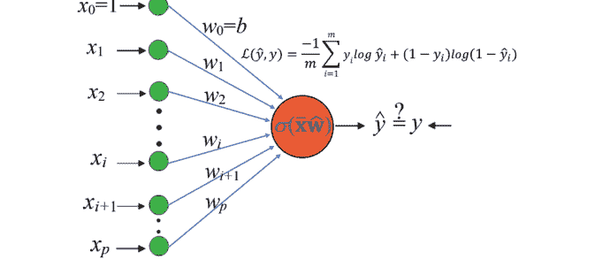

图 11.7：一个用于二元分类的简单神经网络，仅有一个输入层和一个输出层：仿射映射、逻辑预测函数和二元交叉熵损失。

## 11.4 使用 mxnet 的神经网络进行二元分类的示例

### 11.4.1 二元分类的数据集

我们在此演示 mxnet-the-straight-dope (https://github.com/zackchase/mxnet-the-straight-dope)（在 Apache License 2 下）提供的一个二元分类示例。这次，我们使用来自 UCI 存储库 (http://archive.ics.uci.edu/ml/datasets/) 的真实数据集。它由 Barry Becker 于 1994 年构建，包含 14 个特征，包括年龄、教育、职业、性别和原籍国。在台湾大学托管的版本 (https://www.csie.ntu.edu.tw/~cjlin/libsvmtools/datasets/binary.html) 中，数据经过重新处理，具有 123 个特征。标签是一个二元指示符，表示对应于每行的人在 1994 年的收入是高于 ($y_i = 1$) 还是低于 ($y_i = 0$) $50,000。该数据集包含 30,956 个训练样本和 1,605 个测试样本。

我们首先读取数据集中的以下内容：

```
import numpy as np
import mxnet as mx
from mxnet import nd, autograd, gluon
import matplotlib.pyplot as plt

data_ctx = mx.cpu()
# Change this to mx.gpu(0) to train on an NVIDIA GPU
model_ctx = mx.cpu()

with open("datasets/a1a.train") as f:
    train_raw = f.read()

with open("datasets/a1a.test") as f:
    test_raw = f.read()

print(len(test_raw))
print(test_raw[0:216])
```

114816
-1 3:1 11:1 14:1 19:1 39:1 42:1 55:1 64:1 67:1 73:1 75:1 76:1 80:1 83:1
-1 3:1 6:1 17:1 27:1 35:1 40:1 57:1 63:1 69:1 73:1 74:1 76:1 81:1 103:1
-1 4:1 6:1 15:1 21:1 35:1 40:1 57:1 63:1 67:1 73:1 74:1 77:1 80:1 83:1

上面打印了数据的前三行。每行中的第一个条目是标签值。后面的标记是非零特征的索引。数字“1”是多余的。让我们使用以下代码来处理数据集。

```
def process_data(raw_data):
    train_lines = raw_data.splitlines()
    num_examples = len(train_lines)
    num_features = 123
    X = nd.zeros((num_examples, num_features), ctx=data_ctx)
    Y = nd.zeros((num_examples, 1), ctx=data_ctx)
    for i, line in enumerate(train_lines):
        tokens = line.split()
        label = (int(tokens[0])+1)/2  #Change label:{-1,1} to {0,1}
        Y[i] = label
        for token in tokens[1:]:
            index = int(token[:-2]) - 1
            X[i, index] = 1
    return X, Y
```

通过检查数组的形状来验证数据。

```
Xtrain, Ytrain = process_data(train_raw)
Xtest, Ytest = process_data(test_raw)
```

```
print('Xtrain:',Xtrain.shape)
print('Ytrain:',Ytrain.shape)
num_sample = len(Xtrain[0:])
print('num_sample=',num_sample)
print('Xtest:',Xtest.shape)
print('Ytest:',Ytest.shape)
```

Xtrain: (30956, 123)
Ytrain: (30956, 1)
num_sample= 30956
Xtest: (1605, 123)
Ytest: (1605, 1)

已确认数据集 **X** 总共有 $m = 30,956$ 个训练样本，每个样本有 $p = 123$ 个数值。每个训练样本对应一个标签 $y$，总共有 30,956 个标签。测试数据集总共有 1605 个样本，每个样本也有 $p = 123$ 个数值。每个测试样本对应一个标签 $y$，总共有 1,605 个标签。

每个样本的数据值以1.0或0.0给出，分别对应“是”或“否”。这些标签也是如此。
检查训练集和测试集中正样本的比例。这将为我们提供训练和测试数据整体分布的指示。

```python
print(nd.sum(Ytrain)/len(Ytrain))
print(nd.sum(Ytest)/len(Ytest))
```

[0.24053495]
<NDArray 1 @cpu(0)>

[0.24610592]
<NDArray 1 @cpu(0)>

让我们实例化一个数据加载器

```python
batch_size = 64
train_data = gluon.data.DataLoader(gluon.data.ArrayDataset
    (Xtrain, Ytrain), batch_size=batch_size, shuffle=True)
test_data = gluon.data.DataLoader(gluon.data.ArrayDataset
    (Xtest, Ytest), batch_size=batch_size, shuffle=True)
```

### 11.4.2 定义损失函数

我们编写了前面讨论的损失函数的代码以供使用和检验。读者可以通过简单地更改训练中的函数名称来尝试这些函数。作者之前尝试的结果在注释行中给出。

```python
def logistic(z):                    # Sigmoid函数
    return 1. / (1. + nd.exp(-z))

def cross_entropy(output,y):        # 这个效果不好，尝试用于k分类
    yhat = logistic(output)
    return - nd.nansum(y * nd.log(yhat+1e-6))

def log_loss(output, y):            # 读者可以尝试不同的损失函数
    yhat = logistic(output)
    #return nd.mean((1-y*yhat)**2)  # 快速，不准确：0.241
    #return nd.sum(nd.maximum(1.-(y*yhat+(1-y)*(1-yhat))),
    # nd.zeros_like(y))) 有效：0.837
    return nd.nansum((1-y*yhat-(1-y)*(1-yhat))**2)
    #效果最佳：0.849。

    #return - nd.nansum( y * nd.log(yhat) + (1-y)
    #* nd.log(1-yhat)) 标准：0.848
```

```python
import numpy as np

# 定义并初始化神经网络模型
# 当从头重新训练模型时，从这里开始，
# 以便学习参数可以随机重置。
net = gluon.nn.Dense(1)
net.collect_params().initialize(mx.init.Normal(sigma=1.),
    ctx=model_ctx)

# 实例化优化器
# 在这里选择优化器和学习率。

trainer = gluon.Trainer(net.collect_params(),'sgd',
    {'learning_rate':0.01})

# 估计最大轮次
max_epochs = int(num_sample/batch_size + 1)
# 决定轮次数量，或使用max_epochs
epochs = 100    # max_epochs
print('num_sample=',num_sample,'epochs=',epochs,'max_epochs='
    ,max_epochs,' batch_size=',batch_size)
print('初始损失的数量级为',
    int(-np.log(0.5)*num_sample))
loss_sequence = []
num_examples = len(Xtrain)

for e in range(epochs):
    cumulative_loss = 0
    for i, (data, label) in enumerate(train_data):
        data = data.as_in_context(model_ctx)
        label = label.as_in_context(model_ctx)
        with autograd.record():
            output = net(data)        # output=z, net=x.w+b
            loss = log_loss(output, label)

        loss.backward()
        trainer.step(batch_size)
        cumulative_loss += nd.sum(loss).asscalar()
    if e%20 == 0 or e == epochs-1:
        print("Epoch %s, loss: %s" % (e, cumulative_loss ))
    loss_sequence.append(cumulative_loss)
```

num_sample= 30956 epochs= 100 max_epochs= 484 batch_size= 64
初始损失的数量级为 21457
Epoch 0, loss: 7092.165759086609

### 11.4.3 绘制损失函数的收敛曲线

```python
# 绘制估计损失函数的收敛情况
%matplotlib inline
import matplotlib
import matplotlib.pyplot as plt
plt.figure(num=None,figsize=(8, 6))
plt.plot(loss_sequence)
plt.grid(True, which="both")
plt.xlabel('epoch',fontsize=14)
plt.ylabel('average loss',fontsize=14)
```

### 11.4.4 计算训练后模型的准确率

收敛曲线显示了学习参数在训练过程中得到改进的过程。它并不是训练模型准确率的精确度量。为了评估训练后模型的好坏，我们必须使用独立的测试数据集。这可以使用以下代码完成。同时，检查模型在训练数据上的表现也是一个好习惯。

```python
num_correct = 0.0
num_total = len(Xtrain)
for i, (data, label) in enumerate(train_data):
    data = data.as_in_context(model_ctx)
    label = label.as_in_context(model_ctx)
    output = net(data)
    prediction = (nd.sign(output) + 1) / 2
    num_correct += nd.sum(prediction == label)

print("Accuracy: %0.3f (%s/%s)" % (num_correct.asscalar()/
    num_total,num_correct.asscalar(),num_total))
```

准确率看起来不错。它应该不错，因为我们已经使用这些数据训练了网络。因此，这仅表明训练本身进行得很好。让我们最后使用测试数据进行更客观的评估，这能指示训练后模型的准确性和实用性。

```python
num_correct = 0.0
num_total = len(Xtest)
for i, (data, label) in enumerate(test_data):
    data = data.as_in_context(model_ctx)
    label = label.as_in_context(model_ctx)
    output = net(data)
    prediction = (nd.sign(output) + 1) / 2
    num_correct += nd.sum(prediction == label)

print("Accuracy: %0.3f (%s/%s)" % (num_correct.asscalar()/
    num_total, num_correct.asscalar(), num_total))
```

我们现在看到了在指定轮次训练完成后，使用训练集和测试集得到的训练后模型的准确率。我们还使用了483轮（即max_epochs）运行了相同的代码，这使得模型几乎看到了所有的训练样本，测试集的准确率可以达到约84%。

这个模型很简单，但它能为训练类似问题的神经网络提供良好的经验。

## 11.5 使用Sklearn进行二分类的示例

我们现在介绍scikit-learn团队[2]完成的一个案例研究。它在三个合成数据集上使用了scikit-learn中的总共10个分类器，并将决策边界绘制在一起以便于比较。

```python
%matplotlib inline
print(__doc__)
# 代码来源：Gaël Varoquaux
#            Andreas Müller
# 由Jaques Grobler为文档修改
# 许可证：BSD 3条款
```

```python
import numpy as np
import matplotlib.pyplot as plt
from matplotlib.colors import ListedColormap
from sklearn.model_selection import train_test_split
from sklearn.preprocessing import StandardScaler
from sklearn.datasets import make_moons,
    make_circles, make_classification
from sklearn.neural_network import MLPClassifier
from sklearn.neighbors import KNeighborsClassifier
from sklearn.svm import SVC
from sklearn.gaussian_process import GaussianProcessClassifier
from sklearn.gaussian_process.kernels import RBF
from sklearn.tree import DecisionTreeClassifier
from sklearn.ensemble import RandomForestClassifier, AdaBoostClassifier
from sklearn.naive_bayes import GaussianNB
from sklearn.discriminant_analysis import QuadraticDiscriminantAnalysis

h = .02  # 网格中的步长
names = ["Nearest Neighbors", "Linear SVM", "RBF SVM",
         "Gaussian Process", "Decision Tree", "Random Forest",
         "Neural Net", "AdaBoost", "Naive Bayes", "QDA"]
classifiers = [
    KNeighborsClassifier(3),
    SVC(kernel="linear", C=0.025),
    SVC(gamma=2, C=1),
    GaussianProcessClassifier(1.0 * RBF(1.0)),
    DecisionTreeClassifier(max_depth=5),
    RandomForestClassifier(max_depth=5, n_estimators=10,
        max_features=1),
    MLPClassifier(alpha=1, max_iter=1000),
    AdaBoostClassifier(),
    GaussianNB(),
    QuadraticDiscriminantAnalysis()]

X, y = make_classification(n_features=2, n_redundant=0,
    n_informative=2,random_state=1,n_clusters_per_class=1)
rng = np.random.RandomState(2)
X += 2 * rng.uniform(size=X.shape)
linearly_separable = (X, y)
```

```python
datasets = [make_moons(noise=0.3, random_state=0),
            make_circles(noise=.2, factor=.5, random_state=1),
            linearly_separable
            ]

figure = plt.figure(figsize=(27, 9))
i = 1
# 遍历数据集
for ds_cnt, ds in enumerate(datasets):
    # 预处理数据集，分割为训练和测试部分
    X, y = ds
    X = StandardScaler().fit_transform(X)
    X_train, X_test, y_train, y_test = \
        train_test_split(X, y, test_size=.4, random_state=42)

    x_min, x_max = X[:, 0].min() - .5, X[:, 0].max() + .5
    y_min, y_max = X[:, 1].min() - .5, X[:, 1].max() + .5
    xx, yy = np.meshgrid(np.arange(x_min, x_max, h),
                         np.arange(y_min, y_max, h))

    # 首先只绘制数据集
    cm = plt.cm.RdBu
    cm_bright = ListedColormap(['#FF0000', '#0000FF'])
    ax = plt.subplot(len(datasets), len(classifiers) + 1, i)
    if ds_cnt == 0:
        ax.set_title("Input data")
    # 绘制训练点
    ax.scatter(X_train[:, 0], X_train[:, 1], c=y_train,
               cmap=cm_bright,edgecolors='k')
    # 绘制测试点
    ax.scatter(X_test[:,0],X_test[:,1],c=y_test, cmap=cm_bright,
               alpha=0.6,edgecolors='k')
    ax.set_xlim(xx.min(), xx.max())
    ax.set_ylim(yy.min(),yy.max())
    ax.set_xticks(())
    ax.set_yticks(())
    i += 1

    # 遍历分类器
    for name, clf in zip(names, classifiers):
        ax=plt.subplot(len(datasets),len(classifiers)+1,i)
        clf.fit(X_train, y_train)
        score = clf.score(X_test, y_test)
```

## 11.6 使用决策树、AdaBoost和梯度提升进行回归

决策树、AdaBoost和梯度提升同样可以应用于回归问题。Scikit Learn提供了多个易于理解的示例。读者可以参考以下示例：

- 决策树回归。
- 使用AdaBoost的决策树回归 [3]。
- 梯度提升回归。
- 一项关于使用神经网络和决策树实时预测弹体穿透层合板的研究 [4]。

## 参考文献

[1] R. Lorenzo, De Vito Ernesto, C. Andrea et al., Are loss functions all the same?, *Neural Computation*, **16**(5), 1063–1076, May 2004. https://doi.org/10.1162/089976604773135104.
[2] P. Fabian, V. Gae, G. Alexandre et al., Scikit-learn: Machine learning in Python, *Journal of Machine Learning Research*, **12**(85), 2825–2830, 2011. http://jmlr.org/papers/v12/pedregosa11a.html.
[3] H. Drucker, *Improving regressors using boosting techniques*, Proc. 14th International Conference on Machine Learning, 1997.
[4] W. Pushkar and G.R. Liu, Real-time prediction of projectile penetration to laminates by training machine learning models with finite element solver as the trainer, *Defence Technology*, **17**(1), 147–160, 2021. https://www.sciencedirect.com/science/article/pii/S2214914720303275.

## 第12章

## 多分类

在上一章中，我们讨论了用于二分类的神经网络，它适用于“是”或“否”类型的问题。这也是处理许多多分类问题的基础，因为人们通常可以将一个多分类问题转化为一组二分类问题。这些技术包括一对多、一对一及其变体，正如我们在第6章关于SVM的讨论中所述。有许多成熟的模块可用于此类目的，例如Scikit learn。在本章中，我们讨论一种处理多分类问题的系统方法，也称为**k分类**问题，其中我们通常有一个包含$k$个类别的数据集。

## 12.1 用于$k$分类的Softmax激活神经网络

对于二元逻辑回归问题，我们通常使用以下激活函数来预测最终层神经元的输出：

$$\hat{y} = \sigma(z) = \frac{1}{1 + e^{-z}} = \frac{1}{1 + e^{-(\mathbf{x} \cdot \mathbf{w} + b)}} = \frac{1}{1 + e^{-(\mathbf{x} \cdot \hat{\mathbf{w}})}} \quad (12.1)$$

其中$\sigma$代表sigmoid函数。它将任意实数压缩到0和1之间的数字，从而成为一种概率输出。

对于$k$分类问题，我们在输出层创建一个具有$k$个神经元的神经网络。如果有$p$个输入$x_i (i = 1, 2, \dots, p)$，则输入层应有$p$个神经元。最简单的神经网络结构如图12.1所示。

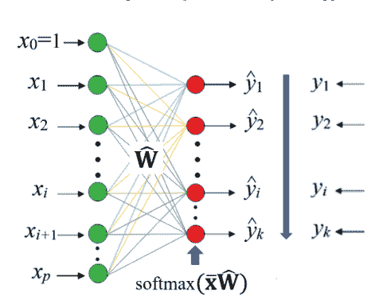

图12.1：用于$k$分类的简单单层网络。

为了获得概率类型的输出，我们需要使用一种特殊的激活函数（而不是sigmoid）来强制输出层为所有这$k$个类别产生一组（而不仅仅是一个）概率。这就是著名的softmax函数，定义为

$$\text{softmax}(\mathbf{z}) = \frac{e^{\mathbf{z}}}{\sum_{j=1}^{k} e^{z_j}} \quad (12.2)$$

其中$\mathbf{z}$可以是一个具有$k$个分量$z_j(i = 1, 2, \dots, k)$的向量，并且指数运算都是逐元素进行的。以矩阵形式表示，$\mathbf{z}$可以给出，例如，以下形式：

$$\mathbf{z} = \mathbf{x} \mathbf{W} + \mathbf{b} = \bar{\mathbf{x}} \hat{\mathbf{W}} \quad (12.3)$$

第$j$个分量$z_j$可以表示为

$$z_j = \bar{\mathbf{x}} \hat{\mathbf{W}}[j] \quad (12.4)$$

读者可以参考第5章了解这些符号。对于图像分类问题，$p$是图像中的像素总数。

很明显，softmax函数使用$e^{\mathbf{z}}$将所有值转换为严格正数，然后进行归一化，使得所有值之和为1。

最终层这$k$个神经元的输出成为一个向量

$$\hat{\mathbf{y}} = \text{softmax}(\overline{\mathbf{x}} \hat{\mathbf{W}}) = \frac{e^{(\overline{\mathbf{x}} \hat{\mathbf{W}})}}{\sum_{j=1}^{k} e^{(\overline{\mathbf{x}} \hat{\mathbf{W}}[j])}} \quad (12.5)$$

Softmax激活函数广泛应用于$k$分类，也称为softmax回归或多项式回归。

## 12.2 用于$k$分类的交叉熵损失函数

在$k$分类问题中，$k$个标签中的一个是1（正确的或热的），其余都是0。因此，我们可以使用以下交叉熵函数（见第4章）作为损失函数：

$$\mathcal{L}(\mathbf{y}, \hat{\mathbf{y}}) = \frac{1}{m} \sum_{s=1}^{m} \left( - \sum_{j=1}^{k} y_j \log \hat{y}_j \right) = - \frac{1}{m} \sum_{s=1}^{m} (\mathbf{y}_s \cdot \log \hat{\mathbf{y}}_s) \quad (12.6)$$

其中$s$代表数据集中的第$s$个样本。上述损失函数本质上只关心与正确标签相关的损失。请注意，这个交叉熵损失函数仍然是一个标量函数。

与二分类问题中使用的损失函数相比，我们可以预期二元交叉熵损失函数是$k$分类损失函数的一个特例。为了证明这一点，我们只需在公式(12.6)中令$k = 2$，得到

$$\mathcal{L}(\mathbf{y}, \hat{\mathbf{y}}) = - \frac{1}{m} \sum_{s=1}^{m} \left( \sum_{j=1}^{2} y_j \log \hat{y}_j \right)_s = - \frac{1}{m} \sum_{s=1}^{m} (y_{j=1} \log \hat{y}_{j=1} + y_{j=2} \log \hat{y}_{j=2})_s \quad (12.7)$$

注意索引$j$用于类别，$s$代表第$s$个样本。现在，在二分类的情况下，我们必须有

$$y_{j=2} = 1 - y_{j=1}, \quad \text{and} \quad \hat{y}_{j=2} = 1 - \hat{y}_{j=1} \quad (12.8)$$

对于任何样本，这个结论都成立。将式 (12.8) 代入 (12.7)，由于 $j = 1$ 是唯一剩下的索引，我们将其省略，然后将索引 $s$ 移入求和符号内，得到

$$\mathcal{L}(\mathbf{y}, \hat{\mathbf{y}}) = -\frac{1}{m} \sum_{s=1}^{m} (y_s \log \hat{y}_s + (1 - y_s) \log (1 - \hat{y}_s)), \quad (12.9)$$

这与我们在第 11 章看到的二元分类方程完全相同（除了除以 $m$ 的归一化）。这个证明意味着，如果只使用两个标签（$k = 1, 2$）并按照多分类器的方式组织数据集，就应该能够执行二元分类。

## 12.3 案例研究 1：使用单层神经网络进行手写数字分类

我们现在准备演示 $k$-分类：对手写数字进行分类。我们之前使用朴素贝叶斯分类器做过这个任务。现在，我们使用一个简单的单层（只有输入层和输出层，没有隐藏层）神经网络来做同样的事情。我们将使用 mxnet-the-straight-dope（在 Apache 许可证 2 下）中可用的代码，并做了一些小的修改，来讨论详细过程。和往常一样，我们首先导入必要的库。

```python
# Import necessary libraries
from __future__ import print_function
import numpy as np
import mxnet as mx
from mxnet import nd, autograd, gluon
mx.random.seed(1)
```

### 12.3.1 根据计算机硬件设置上下文

我们可以使用 `model_ctx` 或 `mx.gpu(0)` 来设置计算上下文，具体取决于你的选择。在这个演示中，我们使用 cpu。

```python
data_ctx = mx.cpu()
model_ctx = mx.cpu()  # model_ctx = mx.gpu() # alternative
```

### 12.3.2 加载 MNIST 数据集

我们再次使用真实的 MNIST 数据进行此演示。MNIST 数据集包含总共 70,000 张手写数字（0-9）图像，每张图像是 28x28 像素的中心裁剪黑白照片。我们将训练 $k$-分类模型来对 $\{0-9\}$ 中的手写数字进行分类。

我们首先使用 MXNet 的工具获取 MNIST 数据集的副本，然后预处理其中的每个项目。数据和标签被转换为浮点数并归一化到 $[0, 1]$ 范围。70,000 张图像被随机划分为包含 60,000 张图像的训练数据集和包含 10,000 张图像的测试数据集。x\_train 和 x\_test 部分包含灰度 RGB 码（从 0 到 255），而 y\_train 和 y\_test 部分包含标签（从 0 到 9），代表手写体的实际数字。为了可视化这些数字，我们可以使用 matplotlib。

```python
def transform(data, label):
    return data.astype(np.float32)/255, label.astype(np.float32)
    # data type conversion & normalization
mnist_train=gluon.data.vision.MNIST(train=True,transform=transform)
    #get the data for training
mnist_test=gluon.data.vision.MNIST(train=False,transform=transform)
    #get the data for testing
```

训练（和测试）数据集中的每个项目都是一个图像与标签配对的元组：

```python
print(len(mnist_train))
image,label=mnist_train[100]   # unpack the 100th data pair
print(image.shape, label)      # check the shape and label
#print(image)                  # print the image in floats
```

```
60000
(28, 28, 1) 5.0
```

这表明每张图像的格式是一个三元组（高度，宽度，通道）。这里的通道是一维的，因为图像是黑白的。对于彩色图像，通道将有三个维度（红、绿、蓝）。

接下来，我们定义输入和输出的数量变量。

```python
num_inputs = 784       # 28×28=784
num_outputs = 10       # 10 digits
num_examples = 60000   # number of training samples
```

因为 matplotlib 期望输入是（高度，宽度）或（高度，宽度，通道）且通道为 RGB，所以我们通过将单通道广播到 3 来重塑数据。

```python
im = mx.nd.tile(image, (1,1,3))  #This should be a 5
print(im.shape)
```

```
(28, 28, 3)
```

我们现在将可视化图像，以查看图像是否与标签一致。

```python
import matplotlib.pyplot as plt
plt.imshow(im.asnumpy())
plt.show()
print('label=',label)
```

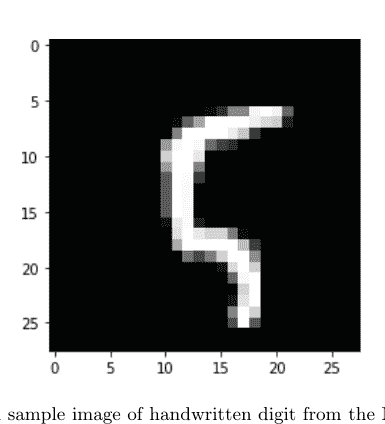

图 12.2：来自 MNIST 数据集的手写数字样本图像。

```
label= 5.0
```

让我们以指定的批量大小，分批加载图像训练数据集（用于随机梯度下降优化）。这是以随机方式完成的（通过将 shuffle 设置为 True）。我们还加载了测试数据集，但不进行打乱。

```python
batch_size = 64
train_data=mx.gluon.data.DataLoader(mnist_train,batch_size,
            shuffle=True)
test_data=mx.gluon.data.DataLoader(mnist_test,batch_size,
            shuffle=False)
```

### 12.3.3 设置模型参数

我们的模型参数应如下：

1.  我们需要进行 10 分类，因此 $k = 10$。
2.  我们决定使用 64 个训练样本作为一个批次。
3.  因为图像数据是 $28 \times 28$ 的矩阵，我们应该将其展平为一个具有 $28 \times 28 = 784$ 个分量的一维行向量。因此，这种情况下的 $p$ 是 784。
4.  这些样本中的任何一个的维度都是一个具有 784 个维度的行向量 $\mathbf{x}$。
5.  因为我们有 10 个类别，权重矩阵 $\mathbf{W}$ 应该是 $784 \times 10$。
6.  我们模型的预测输出应该是 10 个概率值，分别对应于这 10 个数字 $\mathbf{c}$ 作为给定图像 $\mathbf{x}$ 的标签数字的可能性：$P(\mathbf{y} = \mathbf{c} \mid \mathbf{x})$。
7.  最后，偏置 $\mathbf{b}$ 的行向量维度是 10。

### 12.3.4 多类逻辑回归

为我们的 10 分类问题定义 softmax 函数。

```python
def softmax(y_linear):
    exp=nd.exp(y_linear-nd.max(y_linear,axis=1).reshape((-1,1)))
    norms = nd.sum(exp, axis=1).reshape((-1,1))
    return exp / norms
```

```python
sample_y_linear = nd.random_normal(shape=(2,10))
sample_yhat = softmax(sample_y_linear)
print(sample_yhat)
print(nd.sum(sample_yhat, axis=1))
```

```
[[0.08024886 0.04739863 0.02992393 0.08034719 0.03729992
  0.01006166 0.3406885  0.2191301  0.04921847 0.10568278]
 [0.02349378 0.02465977 0.06156655 0.04537923 0.11654365
  0.04362861 0.5023322  0.02725256 0.1258423  0.02930132]]
<NDArray 2x10 @cpu(0)>

[1. 1.]
<NDArray 2 @cpu(0)>
```

这证实了每一行的总和为 1，正如预期的那样。

### 12.3.5 定义神经网络模型

我们现在定义我们的 10 分类模型。

```python
def net(X):
    y_linear = nd.dot(X, W) + b
    yhat = softmax(y_linear)
    return yhat
```

### 12.3.6 定义交叉熵损失函数

因为我们的 $k$-分类问题是预测概率，所以相关的损失函数应该是交叉熵函数。在数字分类的情况下，标签向量 $\mathbf{y}$ 的条目中总有一个 1（热）。因此，它有时被称为 one-hot 向量。对应于正确标签数字的值设置为 1，其余设置为 0。例如，如果标签是 2，我们设置

> $\mathbf{y} = [0, 1, 0, 0, 0, 0, 0, 0, 0, 0]$

因为我们只关心 $\hat{\mathbf{y}}$ 中对应于 2 的分量，而交叉熵只计算热 1。然后，最小化算法可以通过更新网络中的 $\mathbf{W}$ 中的权重和 $\mathbf{b}$ 中的偏置来驱动 $\hat{\mathbf{y}}$ 接近 $\mathbf{y}$。

交叉熵的代码定义如下：

```python
def cross_entropy(yhat, y):          # cross-entropy loss
    return - nd.sum(y * nd.log(yhat+1e-6))
    # return nd.sum((y - yhat)**2)    # one may try this too
```

### 12.3.7 优化方法

我们使用随机梯度下降（SGD）进行优化。

```python
def SGD(params, lr):
    for param in params:
        param[:] = param - lr * param.grad
```

### 12.3.8 准确性评估

我们可以通过计算正确答案数量与总测试数量的比率，来评估模型在当前学习参数下的准确性。我们使用以下评估循环来完成此操作：

```python
def evaluate_accuracy(data_iterator, net):
    numerator = 0.
    denominator = 0.
    for i, (data, label) in enumerate(data_iterator):
        data = data.as_in_context(model_ctx).reshape((-1,784))
        label = label.as_in_context(model_ctx)
        label_one_hot = nd.one_hot(label, 10)
        output = net(data)
        predictions = nd.argmax(output, axis=1)
        numerator += nd.sum(predictions == label)
        denominator += data.shape[0]
    return (numerator / denominator).asscalar()
```

对于随机初始化的模型，大约十分之一的样本可能属于 10 个类别中的每一个。因此，我们期望的准确性是 0.1。现在，我们准备好训练模型了。

### 12.3.9 模型初始化与训练执行

```python
# Initialize the learning parameters randomly
W=nd.random_normal(shape=(num_inputs, num_outputs),ctx=model_ctx)
b=nd.random_normal(shape=num_outputs,ctx=model_ctx)

params = [W, b]
print(W.shape,b.shape)
```

# 让 MXNet 知道，在训练过程中需要计算这些参数的梯度。

for param in params:
    param.attach_grad()

# 评估未经训练模型的准确率
print("未经训练模型的准确率：",
      evaluate_accuracy(test_data, net))

import time      # 用于计时
epochs = 10      #20
learning_rate = .005

print('参数设置：epochs =', epochs, ' learning_rate =',
      learning_rate, ' batch_size=', batch_size)

start_t = time.process_time()
for e in range(epochs):
    cumulative_loss = 0
    for i, (data, label) in enumerate(train_data):
        data = data.as_in_context(model_ctx).reshape((-1, 784))
        label = label.as_in_context(model_ctx)
        label_one_hot = nd.one_hot(label, 10)
        with autograd.record():
            output = net(data)
            loss = cross_entropy(output, label_one_hot)
        loss.backward()
        SGD(params, learning_rate)
        cumulative_loss += nd.sum(loss).asscalar()

    test_accuracy = evaluate_accuracy(test_data, net)
    train_accuracy = evaluate_accuracy(train_data, net)
    if e % 3 == 0 or e == epochs - 1:
        print("Epoch %s. 损失: %s, 训练准确率 %s, 测试准确率 %s" %
              (e, cumulative_loss / num_examples, train_accuracy,
               test_accuracy))

t_elapsed = (time.process_time() - start_t)
print('单层神经网络，训练时间 =',
      f'{t_elapsed}', '秒')

(784, 10) (10,)
未经训练模型的准确率： 0.1152
参数设置：epochs = 10 learning_rate = 0.005 batch_size= 64
Epoch 0. 损失: 1.3851381640116374, 训练准确率 0.8584833, 测试准确率 0.8635
Epoch 3. 损失: 0.4689176872412364, 训练准确率 0.898, 测试准确率 0.8941
Epoch 6. 损失: 0.39240473754405975, 训练准确率 0.9094, 测试准确率 0.9035
Epoch 9. 损失: 0.3527593985239665, 训练准确率 0.9142333, 测试准确率 0.9077
单层神经网络，训练时间 = 1696.734375 秒

### 12.3.10 使用训练好的模型进行预测

我们从测试数据集中随机选取10个样本，然后使用我们训练好的模型进行预测。

```
# 定义预测函数
def model_predict(net, data):
    output = net(data)
    return nd.argmax(output, axis=1)

# 让我们从测试集中随机抽取10个数据点

plt.figure(figsize=(15, 60))

sample_data = mx.gluon.data.DataLoader(mnist_test, 10, shuffle=True)
start_t = time.process_time()
for i, (data, label) in enumerate(sample_data):
    data = data.as_in_context(model_ctx)
    print(data.shape)
    im = nd.transpose(data, (1, 0, 2, 3))
    im = nd.reshape(im, (28, 10 * 28, 1))
    imtiles = nd.tile(im, (1, 1, 3))

    plt.imshow(imtiles.asnumpy())
    plt.show()
    pred = model_predict(net, data.reshape((-1, 784)))
    print('模型预测结果为：', pred)
    break

t_elapsed = (time.process_time() - start_t)
print('单层神经网络，预测时间=',
      f'{t_elapsed}', '秒')
```

(10, 28, 28, 1)

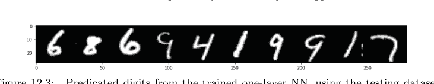

图 12.3：使用MNIST测试数据集，由训练好的单层神经网络预测的数字。

```
模型预测结果为：
[6. 8. 6. 4. 4. 1. 9. 9. 1. 7.]
<NDArray 10 @cpu(0)>
单层神经网络，预测时间= 0.5 秒
```

**本研究总结：** 经过五个epoch的训练，准确率约为90%，在作者笔记本电脑上的训练时间约为500秒。预测10个数字的时间仅约0.55秒。当使用10个epoch时，测试准确率提高到91%，训练时间为1,100秒（约两倍）。当使用50个epoch时，测试准确率提高到92%。当使用100个epoch时，测试准确率提高到92.3%。使用此模型进一步训练可能不会有太大差异。为了进一步提高，可能需要增加网络的学习能力，以捕捉手写数字图像的更多非线性特征。根据万能近似定理，这可以通过使用更多隐藏层（称为多层感知机，MLP，见下一章）来实现。

## 12.4 案例研究2：使用Sklearn随机森林多分类器进行手写数字分类

为了比较，让我们使用梯度提升分类器进行相同的数字预测。它是分类问题的强大技术之一。读者可以阅读Harshdeep Singh在towards datascience上发表的一篇在线文章。我们将不详细讨论此技术，而是简单地使用scikit learn（或Sklearn）[1]提供的模型和代码进行此比较研究。我们对代码进行了轻微修改，以便读者可以查看不同参数设置下结果的更多详细差异。

```
import numpy as np
import pandas as pd
from matplotlib import pyplot as plt
from sklearn.ensemble import RandomForestClassifier
from sklearn.model_selection import train_test_split
%matplotlib inline
```

```
# 读取并查看数据
data = pd.read_csv('mnist.csv') # mnist数据已经在一个
# 本地目录下的csv文件中
data.head() # 查看前几行
```

| label | 1x1 | 1x2 | 1x3 | 1x4 | 1x5 | 1x6 | 1x7 | 1x8 | 1x9 | ... | 28x19 | 28x20 | 28x21 | 28x22 | 28x23 | 28x24 | 28x25 | 28x26 | 28x27 | 28x28 |
|---|---|---|---|---|---|---|---|---|---|---|---|---|---|---|---|---|---|---|---|---|
| 0 | 5 | 0 | 0 | 0 | 0 | 0 | 0 | 0 | 0 | ... | 0 | 0 | 0 | 0 | 0 | 0 | 0 | 0 | 0 | 0 |
| 1 | 0 | 0 | 0 | 0 | 0 | 0 | 0 | 0 | 0 | ... | 0 | 0 | 0 | 0 | 0 | 0 | 0 | 0 | 0 | 0 |
| 2 | 4 | 0 | 0 | 0 | 0 | 0 | 0 | 0 | 0 | ... | 0 | 0 | 0 | 0 | 0 | 0 | 0 | 0 | 0 | 0 |
| 3 | 1 | 0 | 0 | 0 | 0 | 0 | 0 | 0 | 0 | ... | 0 | 0 | 0 | 0 | 0 | 0 | 0 | 0 | 0 | 0 |
| 4 | 9 | 0 | 0 | 0 | 0 | 0 | 0 | 0 | 0 | ... | 0 | 0 | 0 | 0 | 0 | 0 | 0 | 0 | 0 | 0 |

5 行 x 785 列

```
# 查看一个数字的图像。
digit_array = data.iloc[4, 1:].values
digit_image = digit_array.reshape(28, 28).astype('uint8')
plt.imshow(digit_image)
```

<matplotlib.image.AxesImage at 0x1eea6883dd8>

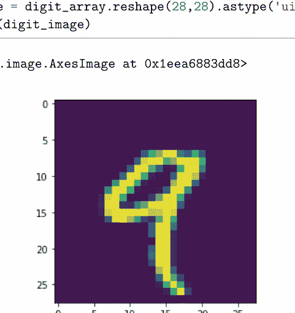

图 12.4：MNIST数据集中的一个手写数字样本图像。

```
# 将数据分割为训练集和测试集。
df_x = data.iloc[:, 1:]
df_y = data.iloc[:, 0]
x_train, x_test, y_train, y_test = train_test_split(df_x, df_y,
                                test_size=0.25, random_state=4)
y_train.head()  # 查看它
```

50965    8
1315     3
57499    4
11420    2
1328     5
Name: label, dtype: int64

```
# 使用sklearn RandomForestClassifier()训练模型。
rf = RandomForestClassifier()
                                #(n_estimators=200, min_samples_split=4)
rf.fit(x_train, y_train)
# 预测测试集中的数字。
predicted_digits = rf.predict(x_test)
```

```
# 打印结果和图像
print('测试集中前10个真实数字：', y_test.values[0:10])
fig, figs = plt.subplots(1, 10, figsize=(15, 15))
for i in range(10):
    digit_array = x_test.iloc[i, :].values
    figs[i].imshow(digit_array.reshape(28, 28).astype('uint8'))
    figs[i].axes.get_xaxis().set_visible(False)
    figs[i].axes.get_yaxis().set_visible(False)

plt.show()
print('测试集中前10个的预测数字：',
      predicted_digits[0:10])
```

测试集中前10个真实数字： [0 6 5 6 2 8 9 5 0 9]

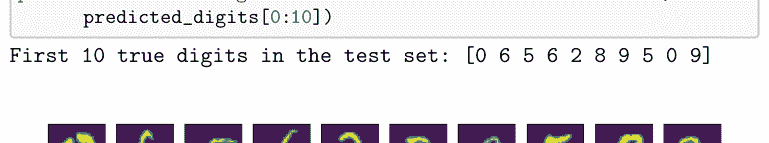

图 12.5：使用Sklearn随机森林和MNIST测试数据集预测的手写数字。

测试集中前10个的预测数字：
[0 6 5 6 2 7 9 5 0 9]

```
# 计算整个测试集的准确率
print('测试集中的数字总数：',
      len(predicted_digits))
correct = 0
for i in range(len(predicted_digits)):
    if predicted_digits[i] == y_test.values[i]:
        correct += 1

print('正确预测的数字总数：', correct)
print('准确率为：', 100 * correct / len(predicted_digits), '%')
```

测试集中的数字总数： 17500
正确预测的数字总数： 16964
准确率为： 96.93714285714286 %

**本研究总结：** 结果优于单层神经网络。在不讨论细节的情况下，进一步测试得出了以下发现：

- 当使用 n_estimators = 50 和 min_samples_split=2 时，准确率为：96.11%。
- 当使用 n_estimators = 50 和 min_samples_split=2 时，准确率为：96.81%。
- 当使用 n_estimators = 100 和 min_samples_split=2 时（这是默认设置），准确率为：96.96%。
- 当使用 n_estimators = 100 和 min_samples_split=4 时，准确率为：96.91%。
- 当使用 n_estimators = 200 和 min_samples_split=2 时，准确率为：97.15%。
- 当使用 n_estimators = 400 和 min_samples_split=2 时，准确率为：97.14%。
- 当使用 n_estimators = 200 和 min_samples_split=4 时，准确率为：97.01%。
- 当使用 n_estimators = 400 和 min_samples_split=4 时，准确率为：97.14%。

## 12.5 案例研究3：随机森林、极端随机树与梯度提升在多分类问题中的比较

我们现在介绍一项关于随机森林、极端随机树和梯度提升方法在多分类问题上的比较研究，使用相同的MNIST数字预测数据集以及scikit-learn团队提供的模块[1]。

```python
from sklearn.datasets import load_digits
from sklearn.ensemble import RandomForestClassifier
from sklearn.ensemble import ExtraTreesClassifier
from sklearn import ensemble
from sklearn import metrics
from sklearn.model_selection import train_test_split
from matplotlib import pyplot as plt
import numpy as np
import pandas as pd
import time
%matplotlib inline
```

```python
# 读取数据并查看
data=pd.read_csv('mnist.csv')
#data.head()
```

```python
# 将数据划分为训练集和测试集。
df_x=data.iloc[:,1:]
df_y=data.iloc[:,0]
x_train,x_test,y_train,y_test=train_test_split(df_x, df_y,
                                                test_size=0.25, random_state=4)
y_train.head()  # 查看数据
```

```
50965    8
1315     3
57499    4
11420    2
1328     5
Name: label, dtype: int64
```

```python
# 使用sklearn中的分类器训练模型，并计时
# %%timeit 不起作用，使用time
n_e=10 #n_e = 100: 对于GradientBoostingClassifier来说非常慢
m_s=2
print('Parameters:n_estimators=',n_e,' min_samples_split=',m_s)

rf=RandomForestClassifier(n_estimators=n_e,min_samples_split=m_s)
start_t = time.process_time()
rf.fit(x_train,y_train)
t_elapsed = (time.process_time() - start_t)
print('RandomForestClassifier, training time =',f'{t_elapsed}','s')

ef = ExtraTreesClassifier(n_estimators=n_e, min_samples_split=m_s)
start_t = time.process_time()
ef.fit(x_train,y_train)
t_elapsed = (time.process_time() - start_t)
print('ExtraTreesClassifier, training time =',f'{t_elapsed}','s')

gf = ensemble.GradientBoostingClassifier(n_estimators=n_e,
                                        min_samples_split=m_s)
start_t = time.process_time()
gf.fit(x_train,y_train)
t_elapsed = (time.process_time() - start_t)
print('GradientBoostingClassifier,training time=',
      f'{t_elapsed}','s')
```

```
Parameters:n_estimators= 10  min_samples_split= 2
RandomForestClassifier, training time = 4.5625 s
ExtraTreesClassifier, training time = 3.65625 s
GradientBoostingClassifier,training time= 187.71875 s
```

上述测试条件如下：

- 所有分类器的 $n\_estimators = n\_e = 100$，$min\_samples\_split = m\_s= 2$。
- 所有其他参数均为相应分类器的默认设置。

测试结果如下：

- RandomForestClassifier，训练时间 = 40.625 秒，比单层神经网络快约10倍。
- ExtraTreesClassifier，训练时间 = 39.141 秒。
- GradientBoostingClassifier，训练时间 = 1958.8 秒，比单层神经网络慢约4倍。

当测试条件设置为以下值时：

- 所有分类器的 $n\_estimators = n\_e = 10$，$min\_samples\_split = m\_s= 2$。
- 所有其他参数均为相应分类器的默认设置。

测试结果如下：

- RandomForestClassifier，训练时间 = 5.2969 秒。
- ExtraTreesClassifier，训练时间 = 4.8594 秒。
- GradientBoostingClassifier，训练时间 = 211.97 秒。

时间复杂度与 $n\_estimators$ 大致呈线性关系。

```python
# 预测测试集中的数字，并计时。
print('Parameter setting:n_estimators=',n_e,
      'min_samples_split=',m_s)

start_t = time.process_time()
rf_predicted_digits =rf.predict(x_test)
t_elapsed = (time.process_time() - start_t)
print('RandomForestClassifier, prediction time=',
      f'{t_elapsed:.5f}','s')

start_t = time.process_time()
ef_predicted_digits =ef.predict(x_test)
t_elapsed = (time.process_time() - start_t)
print('ExtraTreesClassifier, prediction time =',
      f'{t_elapsed:.5f}','s')

start_t = time.process_time()
gf_predicted_digits =gf.predict(x_test)
t_elapsed = (time.process_time() - start_t)
print('GradientBoostingClassifier,prediction time=',
      f'{t_elapsed:.5f}','s')
```

```
Parameter setting:n_estimators= 10  min_samples_split= 2
RandomForestClassifier, prediction time= 0.14062 s
ExtraTreesClassifier, prediction time = 0.09375 s
GradientBoostingClassifier,prediction time= 0.17188 s
```

训练的测试条件如下：

- 所有分类器的 $n\_estimators = n\_e = 100$，$min\_samples\_split = m\_s= 2$。
- 所有其他参数均为相应分类器的默认设置。

分类器预测时间的测试结果如下：

- RandomForestClassifier，预测时间 = 1.40625 秒。
- ExtraTreesClassifier，预测时间 = 1.12500 秒。
- GradientBoostingClassifier，预测时间 = 1.50000 秒。

当训练的测试条件为以下值时：

- 所有分类器的 $n\_estimators = n\_e = 10$，$min\_samples\_split = m\_s= 2$。
- 所有其他参数均为相应分类器的默认设置。

分类器预测时间的测试结果如下：

- RandomForestClassifier，预测时间 = 0.20312 秒。
- ExtraTreesClassifier，预测时间 = 0.20312 秒。
- GradientBoostingClassifier，预测时间 = 0.21875 秒。

很明显，预测时间与 $n\_estimators$ 的关系远非线性，并且总体上它们都非常快。

```python
print('Total number of digits in the test set:',
      len(rf_predicted_digits))
rf_accuracy = metrics.accuracy_score(y_test, rf_predicted_digits)
ef_accuracy = metrics.accuracy_score(y_test, ef_predicted_digits)
gf_accuracy = metrics.accuracy_score(y_test, gf_predicted_digits)
print('The rf_accuracy is:', f'{rf_accuracy:.5f}', '%')
print('The ef_accuracy is:', f'{ef_accuracy:.5f}', '%')
print('The gf_accuracy is:', f'{gf_accuracy:.5f}', '%')
```

```
Total number of digits in the test set: 17,500
The rf_accuracy is: 0.94657 %
The ef_accuracy is: 0.94829 %
The gf_accuracy is: 0.83806 %
```

训练条件如下：

- 所有分类器的 $n\_estimators = n\_e = 100$，$min\_samples\_split = m\_s= 2$。
- 所有其他参数均为相应分类器的默认设置。

分类器预测的测试准确率结果如下：

- 测试集中的数字总数：17,500。
- rf_accuracy 为：0.97023%。
- ef_accuracy 为：0.97160%。
- gf_accuracy 为：0.94651%。

当使用以下条件进行训练时：

- 所有分类器的 $n\_estimators = n\_e = 10$，$min\_samples\_split = m\_s= 2$。
- 所有其他参数均为相应分类器的默认设置。

分类器预测的测试准确率结果变为：

- 测试集中的数字总数：17,500。
- rf_accuracy 为：0.94577%，比单层神经网络高约4%。
- ef_accuracy 为：0.95011%。
- gf_accuracy 为：0.83806%，比单层神经网络低约6%。

```python
# 打印结果和图像
print('True digits for the 10 first in the test set:',
      y_test.values[0:10])
print('rf_predicated digits for first 10 in testset:',
      rf_predicted_digits[0:10])
print('ef_predicated digits for first 10 in testset:',
      ef_predicted_digits[0:10])
print('gf_predicated digits for first 10 in testset:',
      gf_predicted_digits[0:10])
```

```
True digits for the 10 first in the test set: [0 6 5 6 2 8 9 5 0 9]
rf_predicated digits for first 10 in testset: [0 6 5 6 2 9 9 3 0 9]
ef_predicated digits for first 10 in testset: [0 6 5 6 2 3 9 5 0 9]
gf_predicated digits for first 10 in testset: [0 6 5 6 2 7 9 8 0 9]
```

## 12.6 通过TensorFlow进行多分类

由于过去几十年的快速发展，许多Python包已经被开发出来用于解决$k$分类问题。TensorFlow就是其中一个优秀的包。读者可以查看TensorFlow关于服装图像分类的教程问题，网址为 https://www.tensorflow.org/tutorials/keras/classification。在学习完本章后，读者理解这个TensorFlow教程应该不会有太大问题。

## 12.7 备注

请注意，模块的性能可能取决于一系列因素，包括计算机硬件设置、数据集、计算机系统状态，甚至运行时间。上述比较测试中使用的设置参数对于某些分类器可能并非完全公平。因此，测试结果具有很强的主观性。在开发大规模机器学习模型时，如果计算资源有限，可以使用较小规模的模型（例如将 $n\_estimators$ 设置为较小的值），快速测试模型在数据集上的表现，然后为大规模项目选择合适的模型。

## 参考文献

[1] P. Fabian, V. Gae, G. Alexandre *et al.*, Scikit-learn: Machine learning in Python, *Journal of Machine Learning Research*, **12**(85), 2825-2830, 2011. http://jmlr.org/papers/v12/pedregosa11a.html.

## 第13章

## 用于回归和分类的多层感知机（MLP）

在上一章中，我们看到了使用简单（输入和输出层，仅一层具有学习参数）神经网络进行手写数字 $k$ 分类的示例。我们发现仍有改进空间，并且我们已经证明随机森林和极端随机森林等其他分类器比单层神经网络表现更好。本章将展示，通过增加更多层（添加一些隐藏层）的神经网络是改进的方法之一。这类神经网络通常被称为多层感知机（MLP）[1–5]。

MLP 的基本理论基础是第5章讨论的通用近似定理。它使用一系列堆叠的仿射变换，并包裹非线性激活函数，从而扩展假设空间的维度，增加学习参数，提供所需的学习能力。它被认为是一个具有无限学习能力的通用模型，至少在理论上，可以训练并应用于所有类型的问题 [1–3]，包括分类、回归和力学问题的反演分析 [6–9]。

### 13.1 MLP 的一般架构和公式

#### 13.1.1 *一般架构*

MLP 与单层神经网络在配置上的区别在于，除了输入和输出两层之外，MLP 还具有若干**隐藏层**。它是许多其他现代神经网络配置的基础网络。MLP 的典型配置如图 13.1 所示。

图 13.1 所示的 MLP 具有 $n_h$ 个**隐藏层**，其中神经元以灰色显示。连同具有 $p$ 个绿色神经元的输入层和具有 $k$ 个红色神经元的输出层，该网络总共有 $N_L = n + 2$ 层。只有 $N_L = n + 1$ 层具有学习参数 $\hat{\mathbf{W}}$。因此，它被称为 $N_L$ 层网络。从输入层开始，每一层依次向左（向前）馈送到下一层，直到输出层。这是用于 $p \rightarrow k$ 映射的 MLP 网络的典型架构。

我们可以有任意数量的隐藏层，每一层可以有任意数量的神经元。一层中的每个神经元都与下一层的神经元完全连接，称为全连接（除非我们使用特殊技术，如丢弃法，使连接稀疏化，主要用于正则化目的）。全连接层也称为密集层。

使用更多隐藏层会导致神经网络复杂度增加，从而提高学习能力。原则上，一个密集 MLP 可以拥有大量的训练参数来建模复杂问题。

### 13.1.2 $xw+b$ 公式

在输入层，我们有一个包含 $p$ 个特征的训练样本输入向量：

$$\mathbf{x}^{(0)} = \mathbf{x} = [x_1, x_2, \dots, x_p] \qquad (13.1)$$

在输出层，我们可以有一个或多个神经元，具体取决于要建模的问题需求。通常，我们设有 $k$ 个神经元。

寻找损失函数最小化器（针对所有学习参数）所需的优化算法，原则上与之前研究的这些神经网络相同。人们可以预期在训练此类深度网络时困难会增加，主要是由于梯度消失问题。Relu 激活函数成为隐藏层神经元的常用选择，以克服此类问题，这将在下一节详细讨论。

回顾一下，在 $k$ 分类问题中，我们在神经网络的**输出层**使用 softmax 作为预测函数。其定义为

$$\hat{\mathbf{y}} = \mathrm{softmax}(\mathbf{z}^{(N_L)}) = \frac{e^{\mathbf{z}^{(N_L)}}}{\sum_{i=1}^k e^{z_i^{(N_L)}}} = \frac{e^{(\overline{\mathbf{x}}^{(N_L-1)} \widehat{\mathbf{W}}^{(N_L)})}}{\sum_{i=1}^k e^{(\overline{\mathbf{x}}^{(N_L-1)} \widehat{\mathbf{W}}^{(N_L)}[i])}} \qquad (13.2)$$

其中 $\mathbf{z}^{(N_L)}$ 是一个具有 $k$ 个分量 $z_i^{(N_L)} (i = 1, 2, \dots, k)$ 的仿射变换向量，指数计算是逐元素进行的。所有这些矩阵的维度可以从以下形式中看出：

$$\mathbf{z}^{(N_L)}_{1 \times k} = \mathbf{x}^{(N_L-1)}_{1 \times p} \mathbf{W}^{(N_L)}_{p \times k} + \mathbf{b}^{(N_L)}_{1 \times k} = \overline{\mathbf{x}}^{(N_L-1)}_{1 \times (p+1)} \widehat{\mathbf{W}}^{(N_L)}_{(p+1) \times k} \qquad (13.3)$$

对于 MLP 网络，$\mathbf{x}^{(N_L-1)}$ 是最后一个隐藏层的输出，可以写成向量形式：

$$\mathbf{x}^{(N_L-1)} = [x_1^{(N_L-1)}, x_2^{(N_L-1)}, \dots, x_{n_h}^{(N_L-1)}] \qquad (13.4)$$

其中下标 $n_h$ 是 MLP 最后一个隐藏层中的神经元数量。

对于 MLP，在前馈过程中，神经元接收和产生的值为：

$$\mathbf{x}^{(0)} = \mathbf{x} = [x_1, x_2, \dots, x_p]$$ 输入层的特征
$$\mathbf{x}^{(1)} = \phi^{(1)}(\underbrace{\mathbf{x}^{(0)}\mathbf{W}^{(1)} + \mathbf{b}^{(1)}}_{\mathbf{z}^{(1)}})$$ 第1个隐藏层的特征
$$\mathbf{x}^{(2)} = \phi^{(2)}(\underbrace{\mathbf{x}^{(1)}\mathbf{W}^{(2)} + \mathbf{b}^{(2)}}_{\mathbf{z}^{(2)}})$$ 第2个隐藏层的特征
$$\dots$$
$$\mathbf{x}^{(i)} = \phi^{(i)}(\underbrace{\mathbf{x}^{(i-1)}\mathbf{W}^{(i)} + \mathbf{b}^{(i)}}_{\mathbf{z}^{(i)}})$$ 第 $i$ 个隐藏层的特征 (13.5)
$$\dots$$
$$\hat{\mathbf{y}} = \mathbf{x}^{(N_{Li})}$$
$$= \phi^{(N_{Li})}(\underbrace{\mathbf{x}^{(N_{Li}-1)}\mathbf{W}^{(N_{Li})} + \mathbf{b}^{(N_{Li})}}_{\mathbf{z}^{(N_{Li})}})$$ 输出层的预测

这里，上标括号中的数字代表层号。花括号上方的项是仿射变换函数 $\mathbf{z}^{(i)}(i = 1, 2, \dots, N_L)$，它们可以逐层变化，并带来过去层的信息。经过激活函数拟合后，它成为下一层的新独立“特征”。新特征空间的维度相应变化。

上述网络流的链式方程也可以表示为：
$$\hat{\mathbf{y}} = \phi^{(N_L)}(\dots \phi^{(2)}(\phi^{(1)}(\mathbf{x}\mathbf{W}^{(1)} + \mathbf{b}^{(1)})\mathbf{W}^{(2)} + \mathbf{b}^{(2)}) \dots \mathbf{W}^{(N_L)} + \mathbf{b}^{(N_L)})$$ (13.6)

我们现在清楚地看到，我们的 MLP 模型确实是一个在特征空间 $\mathbb{X}^P$ 中具有 $k$ 个分量的巨大函数，并由 $\mathbb{W}^P$ 中的训练参数控制（参数化），如第 1.5.5 节所述。当这些参数 $\mathbf{W}^{(i)}(i = 1, 2, \dots, N_L - 1)$ 被调整时，就得到了在特征空间 $\mathbb{X}^P$ 上的 $k$ 个巨大函数。另一方面，这组 $k$ 个巨大函数也可以被视为这些参数对于数据集中任何给定数据点的可微函数，可以使用数据集中相应的 $k$ 个标签形成可微损失函数。训练的目标是通过更新训练参数使其成为最小化器，来最小化数据集中所有数据点的此类损失函数。

这个前馈网络创建了一个链式“反应”，这种良好的流动结构被用于计算所谓的反向传播或反向传播或 BP [10] 中的梯度，使用微分的链式法则。反向传播过程可以通过第 8 章详细讨论的自动微分来实现。MLP 中的每一层都有自己的一组学习参数（在权重矩阵和偏置向量中）。随着层随着层数增加，学习参数的总数会快速增长。还需注意，每层使用的激活函数在理论上可以不同，尽管在当前许多实践中，隐藏层通常使用相同类型的激活函数，典型的是Relu和tanh。

对于最后的输出层，激活函数的选择通常根据网络所构建的应用问题而不同。对于许多回归类型的工程问题，我们可能简单地使用线性激活函数，这意味着我们对最后一层不做任何处理，直接输出接收到的内容。

$$\hat{\mathbf{y}} = \mathbf{x}^{(N_L)} = \mathbf{z}^{(N_L)} = \mathbf{x}^{(N_L-1)}\mathbf{W}^{(N_L)} + \mathbf{b}^{(N_L)} = \overline{\mathbf{x}}^{(N_L-1)}\widehat{\mathbf{W}}^{(N_L)} \quad (13.7)$$

在这种情况下，通常使用均方误差（或L2）损失函数并将其最小化。

对于分类问题，对于二元分类，我们可能使用sigmoid或tanh函数。通常，可以使用softmax作为预测函数，如公式(13.2)所示。请注意，我们在前一章已经证明，二元分类问题可以视为$k$分类问题的特例。

### 13.1.3 $xw$公式，仿射变换权重矩阵的使用

使用第5章定义的*仿射变换权重矩阵* $\overline{\mathbf{W}}$，对于第$i$层，我们有

$$\overline{\mathbf{W}}^{(j)} = \begin{bmatrix} 1 & \mathbf{b}^{(j)} \\ \mathbf{0} & \mathbf{W}^{(j)} \end{bmatrix}, \quad j = 1, 2, \dots, N_L \quad (13.8)$$

然后我们可以执行一系列ATA变换。MLP的前馈过程可以有以下简洁的公式。

$$\overline{\mathbf{x}}^{(0)} = [1, x_1, x_2, \dots, x_p] \quad \in \overline{\mathbb{X}}^{n_0} \text{ 在输入层}$$
$$\overline{\mathbf{x}}^{(1)} = \phi^{(1)} \left( \overline{\mathbf{x}}^{(0)}\overline{\mathbf{W}}^{(1)} \right) \quad \in \overline{\mathbb{X}}^{n_1} \text{ 在第1个隐藏层}$$
$$\overline{\mathbf{x}}^{(2)} = \phi^{(2)} \left( \overline{\mathbf{x}}^{(1)}\overline{\mathbf{W}}^{(2)} \right) \quad \in \overline{\mathbb{X}}^{n_2} \text{ 在第2个隐藏层}$$
$$\dots \quad (13.9)$$
$$\overline{\mathbf{x}}^{(j)} = \phi^{(j)} \left( \overline{\mathbf{x}}^{(j-1)}\overline{\mathbf{W}}^{(j)} \right) \quad \in \overline{\mathbb{X}}^{n_j} \text{ 在第 } i\text{ 个隐藏层}$$
$$\dots$$
$$\hat{\mathbf{y}} = \phi^{(N_L)} \left( \overline{\mathbf{x}}^{(N_L-1)}\overline{\mathbf{W}}^{(N_L)} \right) \in \mathbb{Y}^{n_{N_L}} \text{ 在输出层的预测}$$

其中$n_j$是第$j$层*仿射空间*的*伪维度*，或者是层间特征的神经元数量加1。对于输入层，$n_0 = p + 1$，对于输出层，$n_{N_L} = k$，连接在此终止，这些$k$个输出神经元不再需要仿射变换。

注意，在xw公式中，我们假设对常数1应用了线性（即无）激活函数。在此条件下，我们可以轻松证明

$$\phi^{(j)}\left(\overline{\mathbf{x}}^{(j-1)}\overline{\mathbf{W}}^{(j)}\right) = \phi^{(j)}\left(\overline{\mathbf{x}}^{(j-1)}\begin{bmatrix} 1 & \mathbf{b}^{(j)} \\ \mathbf{0} & \mathbf{W}^{(j)} \end{bmatrix}\right)$$
$$= \phi^{(j)}\left(\begin{bmatrix} 1 & \mathbf{x}^{(j-1)} \end{bmatrix}\begin{bmatrix} 1 & \mathbf{b}^{(j)} \\ \mathbf{0} & \mathbf{W}^{(j)} \end{bmatrix}\right) \quad (13.10)$$
$$= \phi^{(j)}\left(\begin{bmatrix} 1 & \mathbf{x}^{(j-1)}\mathbf{W}^{(j)} + \mathbf{b}^{(j)} \end{bmatrix}\right)$$
$$= \begin{bmatrix} 1 & \phi^{(j)}\left(\mathbf{x}^{(j-1)}\mathbf{W}^{(j)} + \mathbf{b}^{(j)}\right) \end{bmatrix}$$
$$= \begin{bmatrix} 1 & \mathbf{x}^{(j)} \end{bmatrix} = \overline{\mathbf{x}}^{(j)}$$

在公式(13.10)的第三行中，我们将$\phi^{(j)}$移入数组内部，因为我们假设常数1不受激活，并且$\phi^{(j)}$操作是逐元素的。很明显，公式(13.10)实现了与公式(13.5)相同的结果，但在数组中多了一个常数1分量。当移动到下一层时，常数1会自动生成。这是因为仿射变换保持在仿射空间中，如第5章所示。仿射变换权重矩阵$\overline{\mathbf{W}}^{(j)}$执行从一个仿射空间到另一个仿射空间的变换。因此，当使用我们的xw公式时，无需向每个神经元注入偏置$b$，这是与xw+b公式的一个主要区别。

还需注意，在输出层，仿射变换结束，我们仅使用$\hat{\mathbf{W}}^{(N_L)}$，如第5章所讨论，自然地将预测输出回向量标签空间$\mathbf{Y}^{(k)}$，现在可以使用给定标签构建损失函数进行“终端”控制。

使用仿射变换矩阵，公式(13.6)简洁地变为，

$$\hat{\mathbf{y}} = \phi^{(N_L)}\left(\cdots \phi^{(2)}\left(\phi^{(1)}\left(\overline{\mathbf{x}}\overline{\mathbf{W}}^{(1)}\right)\overline{\mathbf{W}}^{(2)}\right)\cdots \hat{\mathbf{W}}^{(N_L)}\right) \quad (13.11)$$

假设第$j$层的（总）神经元数量为$n_j$，仿射变换权重矩阵$\overline{\mathbf{W}}^{(j)}$的维度为$n_{j-1} \times n_j$，为链式ATA的矩阵计算提供了自然的匹配。

### 13.1.4 使用仿射变换权重矩阵的MLP配置

使用仿射变换权重矩阵，我们的MLP可以具有如图13.2所示的配置。

计算MLP总学习参数数量的通用公式变为，

$$P = \underbrace{[n_0(n_1 - 1)]}_{\text{第1层}} + \underbrace{[n_1(n_2 - 1)]}_{\text{第2层}} + \cdots + \underbrace{[n_{i-1}(n_i - 1)]}_{\text{第 } i \text{ 层}}$$
$$+ \cdots + \underbrace{[n_{N_L-1}(n_{N_L} - 1)]}_{\text{第 } N_L \text{ 层}}$$
$$(13.12)$$

括号中减去1的原因是仿射变换权重矩阵$\overline{\mathbf{W}}^{(j)}$的第一列包含所有不可训练的常数（1或零），如公式(13.8)所示。公式(13.12)是基于xw+b公式的公式(5.32)的替代方程。当在模块中创建MLP模型时，这个数字通常会在摘要报告中报告。可训练参数向量$\hat{\mathbf{w}}$位于空间$\mathbb{W}^P$中，如第1.5.5节所讨论。

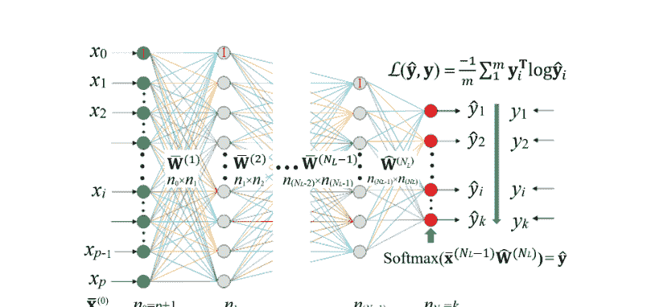

图13.2：一个具有多个隐藏层的MLP，使用堆叠仿射变换链进行$n_0 \rightarrow k$映射。当使用仿射变换权重矩阵时，每层顶部神经元中的常数特征1会自动生成。网络自然流动，无需注入偏置，并且所有这些层间权重矩阵的维度自然匹配。这里使用交叉熵损失进行分类，但也可以使用第12章讨论的损失函数。当MLP用于回归时，可以使用L2损失或第10章讨论的任何其他损失函数。

### 13.1.5 MLP中的空间演化过程

我们在第1章开头讨论了机器学习模型中的空间。我们现在准备在以下方程中建立详细的联系。

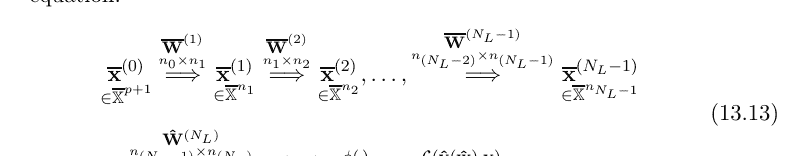

公式(13.13)清晰地展示了$p \rightarrow k$映射的链式结构。该映射由学习参数$\hat{\mathbf{w}} \in \mathbb{W}^P$通过一个巨大的损失函数$\mathcal{L}(\hat{\mathbf{y}}(\hat{\mathbf{w}}), \mathbf{y})$控制，该损失函数根据要建模的问题类型选择。关于$\hat{\mathbf{w}}$如何与公式(13.13)中的权重矩阵相关的讨论在第1.5.5节中。

我们再次强调，损失函数相对于所有学习参数是连续且可微的，因为所有层中使用的所有预测和激活函数相对于局部参数都是连续且可微的。此外，MLP的链式结构允许Autograd通过各层有效地工作，通过著名的微分链式法则计算梯度。因此，第9章讨论的最小化技术可用于寻找这些学习参数的最小化器。唯一的微妙之处在于使用Relu函数时。它是连续的、分段可微的，但在原点不可微。梯度在原点跳跃，如第7.6节图形所示。因此，我们需要计算其子梯度，即原点两侧梯度的平均值，并在最小化过程中使用它，如第7.6节末尾所讨论。

## 13.2 神经元-样本理论

机器学习社区最常问的问题是关于神经网络中神经元/层数与训练该神经网络所需的数据集样本（或数据点）数量之间的关系。然而，直到现在，还没有具体的答案。作者曾寻找过这样令人信服的答案但未成功。在过去几年中，作者研究了各种神经网络，这导致了本节提出的神经元-样本理论[13]。

### 13.2.1 仿射空间与多层感知机中使用的训练参数

利用公式 (13.12)，我们可以计算给定多层感知机的可训练参数总数 $P$。$P$ 值确实与数据集的样本数 $m$ 相关，但关联性较弱。直接的关系由我们的*神经元-样本理论*给出，该理论使用一个 $P^*$ 值，它是机器学习模型中涉及的*仿射空间的伪维数*之和。多层感知机的公式如下所示。

$$P^* = \underbrace{n_0}_{\text{第1层}} + \underbrace{n_1}_{\text{第2层}} + \cdots + \underbrace{n_{j-1}}_{\text{第 } j \text{ 层}} + \cdots + \underbrace{n_{N_L-1}}_{\text{第 } N_L \text{ 层}} \qquad (13.14)$$

$P^*$ 值随着层数和前序层神经元数量的增加而增加。换句话说，$P^*$ 值也是多层感知机中的*神经元总数*，包括输入层的神经元，但不包括输出层的神经元，因为输出层不再需要仿射变换。

推导公式 (13.14) 需要仔细分析和深入理解仿射空间的伪维数 $n_{j-1}$、该仿射空间中的数据集 $\overline{\mathbf{X}}_{(j-1)}$ 以及其在第 $j$ 层对应的仿射变换权重矩阵 $\overline{\mathbf{W}}^{(j)}$ 之间的关系。

*层内的最优学习参数*：考虑一个给定的多层感知机，我们从中分离出一个 $n_{j-1} \rightarrow 1$ 的神经网络（第5.2节讨论的ATU），其层间输入为 $n_{j-1}$ 个神经元，第 $j$ 层有一个输出神经元，如图5.2所示。这个单一的输出神经元是该层的第 $i$ 个神经元。利用公式 (9.12)，该神经元的学习参数最优解 $\hat{\mathbf{w}}_i^*$ 可以写成如下形式。

$$\left[ \overline{\mathbf{X}}_{(j-1)}^\top \overline{\mathbf{X}}_{(j-1)} \right] \hat{\mathbf{w}}_i^* = \overline{\mathbf{X}}_{(j-1)}^\top \mathbf{y}_i \qquad (13.15)$$

其中 $\overline{\mathbf{X}}_{(j-1)}$ 表示仿射空间中包含 $m$ 个数据点的层间数据集，输入层的原始数据集为 $\overline{\mathbf{X}}_{(0)}$。而 $\mathbf{y}_i$ 是与该层第 $i$ 个神经元对应的假设标签向量。它是数据集中这 $m$ 个数据点的向量。我们通常不知道这些隐藏层 $\mathbf{y}_i$ 的内容。幸运的是，我们不需要知道，因为其内容在此分析中并不相关。

现在，对于同一 $j$ 层的第 $(i+1)$ 个神经元，我们有

$$\left[ \overline{\mathbf{X}}_{(j-1)}^\top \overline{\mathbf{X}}_{(j-1)} \right] \hat{\mathbf{w}}_{i+1}^* = \overline{\mathbf{X}}_{(j-1)}^\top \mathbf{y}_{i+1} \qquad (13.16)$$

其中 $\mathbf{y}_{i+1}$ 是与同一层第 $(i+1)$ 个神经元对应的假设标签向量。

比较公式 (13.15) 和 (13.16) 可以发现，（唯一）解 $\hat{\mathbf{w}}_i^*$ 和 $\hat{\mathbf{w}}_{i+1}^*$ 的存在性都依赖于相同的层间数据集 $\overline{\mathbf{X}}_{(j-1)}$：即 $[\overline{\mathbf{X}}_{(j-1)}^\top \overline{\mathbf{X}}_{(j-1)}]$ 是否可逆。这两个方程右侧的项是无关的。这揭示了一个非常重要的事实：给定层中所有神经元的 $\hat{\mathbf{w}}_i^*$ 仅依赖于包含 $m$ 个数据点的相同数据集。在这方面，一个 $n_{(j-1)} \to n_j$ 的网络与一个 $n_{(j-1)} \to 1$ 的网络是相同的。换句话说，所有这些 $\hat{\mathbf{w}}_i^*$ 都存在于同一个假设空间 $\mathbb{W}^{n_{(j-1)}}$ 中，其中 $n_{(j-1)}$ 是第 $j$ 层仿射空间的伪维数（对于输入层，$n_{(0)} = p+1$）。

从另一个角度来看，我们知道第 $j$ 层的仿射空间是 $\overline{\mathbf{X}}_{(j-1)}$，其对应的假设空间只能是 $\mathbb{W}^{n_{(j-1)}}$。

注意，$\hat{\mathbf{w}}_i^*$ 对于不同的 $i$ 可能是不同的向量，但它们都只是存在于矩阵 $[\overline{\mathbf{X}}_{(j-1)}^\top \overline{\mathbf{X}}_{(j-1)}]$ 的列空间中的向量。当矩阵 $[\overline{\mathbf{X}}_{(j-1)}^\top \overline{\mathbf{X}}_{(j-1)}]$ 的列空间是满秩时（当 $m$ 足够大时），其零空间为零，$\hat{\mathbf{w}}_i^*$ 将是唯一的。因此，第 $j$ 层仿射空间的伪维数应该是与该层 $m$ 直接相关的数字。第 $j$ 层的最优学习参数应为：$P_{(j-1)}^* = n_{(j-1)}$。

*多层感知机中的最优学习参数*：上述讨论适用于多层感知机中的每个单独层。然而，当多个层连接在一起形成多层感知机时（在所有隐藏层中使用非线性激活函数），这些层间输入在层与层之间是线性独立的，这意味着一层中 $\hat{\mathbf{w}}_i$ 的变化范围仅由该层仿射空间的伪维数 $n_{j-1}$ 决定。此外，一层中 $\hat{\mathbf{w}}_i$ 的值会受到其他层中值的影响。因此，总的最优训练参数实际上增加了，这应该是所有层仿射空间维度的总和，从而得到公式 (13.14)。这再次表明了在隐藏层中使用非线性激活函数对于增加多层感知机最优训练参数的重要性，从而增强其学习能力。

### 13.2.2 多层感知机的神经元-样本理论

我们现在可以陈述神经元-样本理论了。

*神经元-样本理论*：训练一个能够产生唯一解的多层感知机所需的数据集样本数 $m$ 必须不小于 $P^*$ 值，该值是 $1 \sim N_L$ 层中使用的所有仿射空间维度之和。

$$m \geq P^* \quad (13.17)$$

换句话说，$P^*$ 值是 $m$ 的下界。

或者，该定理可以表述为：训练一个能够产生唯一解的多层感知机所需的数据集样本数 $m$ 必须不小于多层感知机中的神经元总数。在此表述中，神经元总数包括每层顶部的常数1神经元。它包括输入层的神经元，但不包括输出层的神经元。它被定义为公式 (13.14) 中的 $P^*$ 值。

基于我们的分析，我们注意到以下几点：

- 1. $P^*$ 值本质上是网络中的神经元总数。换句话说，神经元数量是理想模型的数据点数量。
- 2. $P^*$ 值是网络中使用的所有仿射空间维度之和。
- 3. $P^*$ 值与输出神经元的数量无关。
- 4. 公式 (13.14) 也可用于估计多层感知机所需的层数 $N_L$：

$$N_L = \frac{P^*}{\overline{n}} \leq \frac{m}{\overline{n}} \quad (13.18)$$

其中 $\overline{n}$ 是 $0 \sim (N_L - 1)$ 层中使用的平均神经元数量。

我们提到，公式 (13.14) 是估计基于仿射变换的机器学习模型（包括标准多层感知机、循环神经网络和卷积神经网络）训练所需最小数据点数量的最重要和最基本的方程。

请注意，在公开可用的机器学习模块中，多层感知机中使用的学习参数是公式 (13.12) 给出的总数 $P$。在所有这些多层感知机或深度网络算法中，确实允许 $P$ 个参数独立变化。然而，由于多层感知机的特殊构造，第 $j$ 层所有神经元的 $\hat{w}_i$ 仅存在于相同的假设空间 $\mathbb{W}^{n(j-1)}$ 中，这只是 $\mathbb{W}^{n(j-1) \times (n(j)-1)}$ 的一个小子空间，正如本节所讨论的。因此，直接与数据集中样本数相关的是公式 (13.14) 给出的 $P^*$，而不是公式 (13.12)。$P^*$ 值是 $m$ 的下界。

请注意，上述分析基于回归公式。对于分类问题，存在一些微妙之处，因为损失函数可能使用概率。在这种情况下，正确的预测不一定需要预测概率与给定标签的值完美匹配。然而，我们上述分析的原则应该适用。

## 13.3 隐藏层的非线性激活函数

对于多层感知机中的隐藏层，必须使用一些非线性激活函数来利用多层效应。如果整个网络只使用线性函数，它将等同于使用简单的单层网络，因为隐藏层的输出将线性依赖于前一层的输出。这在下面的推导中可以更清楚地看到，使用xw公式：

$$\hat{\mathbf{y}} = (\cdots((\overline{\mathbf{x}}\overline{\mathbf{W}}^{(1)})\overline{\mathbf{W}}^{(2)})\cdots\cdots\hat{\mathbf{W}}^{(N_L)})$$
$$= \overline{\mathbf{x}}\overline{\mathbf{W}}^{(1)}\cdot\overline{\mathbf{W}}^{(2)}\cdots\cdots\hat{\mathbf{W}}^{(N_L)} = \overline{\mathbf{x}}\mathbf{W}^{combined}$$
$$(13.19)$$

其中 $\mathbf{W}^{combined}$ 是权重矩阵的乘积：

$$\mathbf{W}^{combined} = \overline{\mathbf{W}}^{(1)}\cdot\overline{\mathbf{W}}^{(2)}\cdots\cdots\hat{\mathbf{W}}^{(N_L)}$$
$$(13.20)$$

这不过是一个单层网络的单一权重矩阵。使用这样的隐藏层不会增加假设空间维度和独立学习参数。因此，在多层感知机的任何层中使用线性激活函数完全没有意义。在多层感知机的一层中使用线性激活函数实际上等同于从多层感知机中移除该层。

## 13.4 估计多层感知机学习参数的一般规则

基于神经元-样本理论，我们现在可以确定层数和每层的神经元数量。在实践中，我们还应考虑要建模的问题类型。以下是一般规则。

对于一个包含 $m$ 个数据点的给定数据集，多层感知机中使用的 $P^*$ 值的上限应为 $m$。

$$P^* \leq m$$
$$(13.21)$$

其中 $P^*$ 使用公式 (13.14) 计算。对于具有单个输出神经元的最简单线性回归模型，$P^* = p + 1$，公式 (13.21) 是

第9章公式(9.8)的等式部分。为估算所需层数，可使用公式(13.7)。

数据集质量定义为对所建模底层问题的代表性，包括正确性、规模、特征空间中的数据点分布以及噪声水平。该准则非常简单，因为它仅取决于数据集的规模。这基于两个假设：(1) 数据集中的$m$个数据点全部线性无关；(2) 根据通用预测理论（见第5章），模型中的训练参数线性无关。对于多层感知机，若$P^* < m$，训练后的多层感知机可能无法通过所有数据点，但泛化能力更强。若$P^* = m$，当多层感知机完全训练后，可能复现所有数据点。若$P^* > m$，完全训练的多层感知机能够生成可能带有噪声的数据点，这可能导致过拟合（见第14章），通常不建议使用。实践中需注意，我们可能使用$P^* > m$的多层感知机却未观察到过拟合，这是因为多层感知机尚未完全训练。

值得再次强调的是，$m$仅为$P^*$的上界。实际中，$P^*$可能远小于$m$。

## 13.5 多层感知机的关键技术及其能力

我们之前已讨论过通用逼近定理。该定理指出，只要隐藏层足够"宽"（神经元数量足够多），具有单隐藏层的网络就能以所需精度逼近任意函数。基于我们对通用预测理论的讨论，增加层数可进一步提升多层感知机的学习能力。因此产生一个问题：应使用宽网络（单层神经元更多）还是更深的网络（层数更多）？普遍理解是：(1) 当层数增加时，可显著减少网络宽度；(2) 研究发现，与宽网络相比，使用更深的神经网络可能更"紧凑"地逼近更复杂的函数，即深度网络可使用更少的神经元总数。这是因为多层感知机引入了非线性。因此，它更擅长建模非线性行为，并能产生高度非线性的决策边界。

然而，与宽网络相比，多层感知机因损失函数的梯度消失（或爆炸）问题而更难训练。因此，过去更常使用宽网络，直到近期深度网络训练技术或算法的突破。主要技术可能包括（但不限于）以下几种：

- 1. **Relu激活函数。** 由于Relu函数在正区域是线性的（梯度为1），它允许一层神经元中的仿射变换信息在不受影响的情况下传播到网络更深处。不会出现sigmoid类激活函数在$z=1$附近梯度趋近于零的压缩现象。此外，Relu函数在负区域消失，因此仍能为深度网络提供所需的非线性。这种截断也可能提供一定的正则化效果。而且，负区域的消失同时作用于$z$函数值及其局部梯度，消除了其他可能的复杂性。作者基于神经元-样本理论认为，简单地忽略多层感知机中信息的负半部分不应引发太多问题。多层感知机中的训练参数$P$通常远多于$P^*$数量。即使丢弃负半部分信息，多层感知机仍有充足空间调整学习参数以寻找最小值。
- 2. **稀疏连接。** 该技术降低了训练参数的"密度"，例如卷积神经网络使用滤波器实现稀疏连接，从而大幅减少一层中的学习参数（权重和偏置）。当学习参数不那么拥挤时，数值条件得到改善。丢弃部分连接的合理性也源于神经元-样本理论，以及多层感知机中连续的$P$数量。
- 3. **跳跃连接（或捷径）。** 这是另一种使网络能够向更深层次发展的技术。它用于所谓的ResNet开发，将在第15章进一步讨论。本质上，它允许一层神经元的激活值在应用激活函数之前馈送到下下层（跳过一层）。这有效缓解了深度网络中的梯度消失问题。
- 4. **长短期记忆网络（LSTM）[11]。** 该技术有助于克服梯度消失问题。它广泛应用于循环神经网络（RNN，第16章），该网络通常具有非常深的连接以处理时间序列输入，例如语言翻译模型。

由于多层感知机具有良好的链式堆叠结构、简单的仿射变换、具有解析微分公式的激活函数以及自动微分算法，我们执行前向计算和反向传播以计算梯度并无额外困难。这与我们在前面章节中为宽网络所做的方式基本相同。由于梯度消失（或爆炸）问题得到有效缓解，现在可以构建并成功训练非常深的神经网络，这些网络具有建模复杂问题所需的复杂性。这就是深度网络在过去几年快速发展的原因。

## 13.6 使用MXNet进行手写数字识别案例研究

现在让我们构建一个具有两个隐藏层和一个输出层的多层感知机，用于相同的手写数字识别任务。我们使用mxnet-the-straight-dope中提供的代码（稍作修改），该代码基于Apache-2.0许可证，允许我们逐步完成整个过程。我们将使用熟悉的MNIST数据集。

### 13.6.1 导入必要库并加载数据

```
from __future__ import print_function
import mxnet as mx
import numpy as np

from mxnet import nd, autograd, gluon
# 根据计算机硬件设置上下文
ctx = mx.gpu() if mx.test_utils.list_gpus() else mx.cpu()
data_ctx = ctx
model_ctx = ctx
# 加载MNIST数据集
num_inputs = 784
num_outputs = 10
batch_size = 64
num_examples = 60000

def transform(data, label):
    return data.astype(np.float32)/255, label.astype(np.float32)

train_data = gluon.data.DataLoader(mx.gluon.data.vision.
    MNIST(train=True, transform=transform),
    batch_size, shuffle=True)
test_data = gluon.data.DataLoader(mx.gluon.data.vision.
    MNIST(train=False, transform=transform),
    batch_size, shuffle=False)
```

### 13.6.2 设置神经网络模型参数

```
# 这里我们设置具有两个隐藏层的模型
# 可以轻松修改网络并进行尝试
num_hidden = 256
weight_scale = .01
# 为第一隐藏层分配参数
W1 = nd.random_normal(shape=(num_inputs, num_hidden),
    scale=weight_scale, ctx=model_ctx)
b1 = nd.random_normal(shape=num_hidden,
    scale=weight_scale, ctx=model_ctx)
# 为第二隐藏层分配参数
W2 = nd.random_normal(shape=(num_hidden,
    num_hidden), scale=weight_scale,ctx=model_ctx)
b2 = nd.random_normal(shape=num_hidden,
    scale=weight_scale, ctx=model_ctx)
# 为输出层分配参数
W3 = nd.random_normal(shape=(num_hidden, num_outputs),
    scale=weight_scale, ctx=model_ctx)
b3 = nd.random_normal(shape=num_outputs,
    scale=weight_scale, ctx=model_ctx)
params = [W1, b1, W2, b2, W3, b3]
# 现在为每个参数的梯度分配空间。
for param in params:
    param.attach_grad()
```

### 13.6.3 Softmax交叉熵损失函数

在计算$k$分类问题输出的第$j$个分量时，我们使用以下softmax函数：

$$\hat{y}_j = \frac{e^{z_j}}{\sum_{i=1}^k e^{z_i}} \qquad (13.22)$$

其中$z_j$是公式(13.2)中输入$\mathbf{z}$的第$j$个元素，$j = 1, 2, \ldots, k$。
计算这些指数时可能存在数值问题，因为参数$z_i$可能非常大或非常小。因此，其指数$e^{z_i}$可能极大或极小，导致在精度有限的计算机中可能出现上溢或下溢。解决方案这是使用所谓的 LogSumExp 技巧 (https://en.wikipedia.org/wiki/LogSumExp)。

正如我们在前一章中所示，我们知道对数函数是单调的，并且不会影响一个正参数函数（$\hat{y}_j$）的极值位置。因此，我们对等式 (13.22) 的两边取对数，得到

$$\log(\hat{y}_j) = \log\left(\frac{e^{z_j}}{\sum_{i=1}^k e^{z_i}}\right) = \log(e^{z_j}) - \log\left(\sum_{i=1}^k e^{z_i}\right) = z_j - \log\left(\sum_{i=1}^k e^{z_i}\right)$$
(13.23)

请注意，$e^{z^i}$ 仍然存在于最后一项中。接下来，我们使用以下公式计算最后一项

$$\log\left(\sum_{i=1}^k e^{z_i}\right) = z^* + \log\left(\sum_{i=1, i \neq i^*}^k e^{z_i - z^*}\right)$$
(13.24)

其中，我们简单地从第一个求和式中提取出 $e^{z^*}$，其中 $z^* = max(z_1, z_2, \dots, z_k)$，$i^*$ 是 $z^*$ 的索引。

现在很清楚，计算中涉及的所有数字现在都是有界的。在这些计算中，我们只需要 $\mathbf{z}$ 作为输入。这个公式被称为 softmax 交叉熵，因为它同时使用了 softmax 和对数交叉熵的思想。使用 mxnet，其定义如下：

```
def softmax_cross_entropy(yhat, y):
    return -nd.nansum(y*nd.log_softmax(yhat), axis=0, exclude=True)
```

### 13.6.4 定义神经网络模型

```
def relu(z):
    return nd.maximum(z, nd.zeros_like(z))
```

```
def net(X):
    h1_linear = nd.dot(X, W1) + b1    # 1st hidden layer
    h1 = relu(h1_linear)              # Relu activation
    h2_linear = nd.dot(h1, W2) + b2   # 2nd hidden layer
    h2 = relu(h2_linear)
    yhat_linear = nd.dot(h2, W3) + b3 # output layer
    return yhat_linear
```

### 13.6.5 优化方法

这里，我们选择使用随机梯度下降（SGD）方法。读者可以尝试其他方法。

```
def SGD(params, lr):
    for param in params:
        param[:] = param - lr * param.grad
```

### 13.6.6 模型精度评估

以下函数是为模型精度评估而定义的。

```
def evaluate_accuracy(data_iterator, net):
    numerator = 0.
    denominator = 0.
    for i, (data, label) in enumerate(data_iterator):
        data=data.as_in_context(model_ctx).reshape((-1, 784))
        label = label.as_in_context(model_ctx)
        output = net(data)
        predictions = nd.argmax(output, axis=1)
        numerator += nd.sum(predictions == label)
        denominator += data.shape[0]
    return (numerator / denominator).asscalar()
```

### 13.6.7 训练神经网络并计时

```
import time                    # timing the performance
num_inputs = 784
num_outputs = 10
epochs = 10                    # readers may change this and try
learning_rate = .001           # readers may change this and try
smoothing_constant = .01       # readers may change this and try
print('Parameter setting: epochs=',epochs,' num of neurons in
      hidden layers =', num_hidden,'\n learning_rate =',
      learning_rate, 'batch_size=',batch_size,
      'smoothing_constant=',smoothing_constant)
start_t = time.process_time()

for e in range(epochs):
    cumulative_loss = 0
    for i, (data, label) in enumerate(train_data):
        data = data.as_in_context(model_ctx).reshape((-1,
                num_inputs))
        label = label.as_in_context(model_ctx)
        label_one_hot = nd.one_hot(label, num_outputs)
        with autograd.record():
            output = net(data)
            loss = softmax_cross_entropy(output, label_one_hot)

        loss.backward()
        SGD(params, learning_rate)
        cumulative_loss += nd.sum(loss).asscalar()

    test_accuracy = evaluate_accuracy(test_data, net)
    train_accuracy = evaluate_accuracy(train_data, net)
    if e%3 == 0 or e == epochs-1:
        print("Epoch %s. Loss: %s, Train_acc %s, Test_acc %s" %
              (e,cumulative_loss/num_examples,train_accuracy,
               test_accuracy))

t_elapsed = (time.process_time() - start_t)
print('3-layer neural network, training time =',f'{t_elapsed}','s')
```

参数设置：epochs= 10，隐藏层神经元数量 = 256
learning_rate = 0.001，batch_size= 64，smoothing_constant= 0.01
Epoch 0. Loss: 1.2388756741285325, Train_acc 0.8823, Test_acc 0.8849
Epoch 3. Loss: 0.1648619899849097, Train_acc 0.95958334,
    Test_acc 0.9578
Epoch 6. Loss: 0.08768035567005475, Train_acc 0.9797, Test_acc 0.973
Epoch 9. Loss: 0.056695277426143484, Train_acc 0.98615,
    Test_acc 0.9746
3层神经网络，训练时间 = 2798.078125 s

当参数设置为 epochs = 10, learning_rate = 0.001,
batch_size = 64, 和 smoothing_constant = 0.01 时，我们发现：

- 在第5个epoch，Loss: 0.12915, Train_acc 0.96988, Test_acc 0.9654
- 在第10个epoch，Loss: 0.056414, Train_acc 0.98768, Test_acc 0.9757。

这个3层神经网络（包含两个隐藏层，每层256个神经元）需要1,653秒的训练时间，并产生约97.6%的测试准确率。与前一章中使用的没有隐藏层的1层网络（训练时间为1100秒，准确率为91%）相比，准确率提高了多达5.6%，这是一个相当显著的改进。这是通过捕捉手写数字的非线性特征实现的。请注意，这些数字可能会因计算机系统和计算机的繁忙程度而异。

### 13.6.8 使用训练好的模型进行预测

我们从测试集中随机选择一些数据点来进行预测。

```
%matplotlib inline
import matplotlib.pyplot as plt
# Define the function to do prediction
def model_predict(net,data):
    output = net(data)
    return nd.argmax(output, axis=1)

samples = 10
mnist_test=mx.gluon.data.vision.MNIST(train=False,
            transform=transform)

# Sample randomly "samples"  data-points from the test set
sample_data=mx.gluon.data.DataLoader(mnist_test,samples,
            shuffle=True)
plt.figure(figsize=(10, 60))
for i, (data, label) in enumerate(sample_data):
    data = data.as_in_context(model_ctx)
    im = nd.transpose(data,(1,0,2,3))
    im = nd.reshape(im,(28,samples*28,1))
    imtiles = nd.tile(im, (1,1,3))
    plt.imshow(imtiles.asnumpy())
    plt.show()
    pred=model_predict(net,data.reshape((-1,784)))
    print('model predictions are:', pred)
    print('true labels :', label)
    break
```

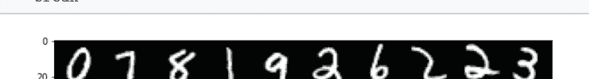

图 13.3：在MNIST测试数据集上使用3层MLP预测的数字。

```
model predictions are:
[0. 7. 8. 1. 9. 2. 6. 2. 2. 3.]
<NDArray 10 @cpu(0)>
true labels :
[0. 7. 8. 1. 9. 2. 6. 2. 2. 3.]
<NDArray 10 @cpu(0)>
```

也可以尝试使用训练数据集进行预测。这应该能反映模型训练的效果。

```
mnist_test=mx.gluon.data.vision.MNIST(train=True,
        transform=transform)
# Sample randomly "samples"  data-points from the test set
sample_data=mx.gluon.data.DataLoader(mnist_test,samples,
        shuffle=True)
plt.figure(figsize=(10, 60))
for i, (data, label) in enumerate(sample_data):
    data = data.as_in_context(model_ctx)
    im = nd.transpose(data,(1,0,2,3))
    im = nd.reshape(im,(28,samples*28,1))
    imtiles = nd.tile(im, (1,1,3))
    plt.imshow(imtiles.asnumpy())
    plt.show()
    pred=model_predict(net,data.reshape((-1,784)))
    print('model predictions are:', pred)
    print('true labels :', label)
    break
```

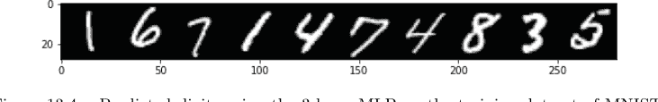

图 13.4：在MNIST训练数据集上使用3层MLP预测的数字，只是为了看看训练效果有多好。

```
model predictions are:
[1. 6. 7. 1. 4. 7. 4. 8. 3. 5.]
<NDArray 10 @cpu(0)>
true labels :
[1. 6. 7. 1. 4. 7. 4. 8. 3. 5.]
<NDArray 10 @cpu(0)>
```

### 13.6.9 备注

通过两个隐藏层（三层带有W），每层包含256个神经元，MLP模型达到了超过97%的准确率，与前一章使用的1层网络相比，我们获得了约6%的改进。

当参数设置为 epochs = 10, learning_rate = 0.001, batch_size = 64, 和 smoothing_constant = 0.01 时，这个3层神经网络需要训练时间 = 1,653秒，这比前一章使用的随机森林模型慢约3倍。准确率比随机森林模型高约0.5%。

相同的手写数字MNIST和时尚MNIST识别也可以使用Tensorflow和Keras模块轻松完成。读者可以参考以下参考资料获取更多详细信息：

- 对于数字MNIST：https://www.youtube.com/watch?v=wQ8BIBpya2k。
- 对于时尚MNIST：https://www.tensorflow.org/tutorials/keras/classification。

## 13.7 使用Sklearn可视化MLP权重

我们现在展示由scikit-learn团队[12]完成的一个案例研究，关于在MNIST数据集上可视化MLP权重。为了使模型运行更快，我们只使用一个隐藏层，并且只训练少量的迭代次数。

### 13.7.1 导入必要的Sklearn模块

```
import matplotlib.pyplot as plt
from sklearn.datasets import fetch_openml
from sklearn.neural_network import MLPClassifier
import time
```

### 13.7.2 加载MNIST数据集

```
%matplotlib inline
# Load data from https://www.openml.org/d/554
X, y = fetch_openml('mnist_784', version=1, return_X_y=True)
X = X / 255.
# rescale the data, use the traditional train/test split
X_train, X_test = X[:60000], X[60000:]
y_train, y_test = y[:60000], y[60000:]
```

### 13.7.3 设置MLP模型

```python
hls= 50        # hidden_layer_sizes
mx_iter=8      # Maximum number of iterations for optimization
alpha=1e-2     # L2 penalty parameter for L2 regularization
lri=.1         # initial learning rate
mlp = MLPClassifier(hidden_layer_sizes=(hls,), max_iter=mx_iter,
                   alpha=alpha, solver='sgd', verbose=10,
                   random_state=1, learning_rate_init=lri)
print('Parameter setting: epochs=',epochs,'max_iter=',mx_iter,
      ' learning_rate_init =',lri)
```

参数设置：epochs= 10 max_iter= 8  learning_rate_init = 0.1

### 13.7.4 训练MLP模型并计时

```python
start_t = time.process_time()
mlp.fit(X_train, y_train)
print("Training set score: %f" % mlp.score(X_train, y_train))
print("Test set score: %f" % mlp.score(X_test, y_test))
t_elapsed = (time.process_time() - start_t)
print('One-layer neural network, training time=',
      f'{t_elapsed}','s')
```

Iteration 1, loss = 0.32484982
Iteration 2, loss = 0.15960803
Iteration 3, loss = 0.12264513
Iteration 4, loss = 0.10188910
Iteration 5, loss = 0.08910487
Iteration 6, loss = 0.08259557
Iteration 7, loss = 0.07394721
Iteration 8, loss = 0.06810929

训练集得分：0.987083
测试集得分：0.970700
单层神经网络，训练时间= 27.78125 s

### 13.7.5 性能分析

当参数设置为 epochs = 10, max_iter = 10, learning_rate_init = 0.1 时，在第10个epoch，我们得到以下结果：

训练集得分：0.9868，测试集得分：0.9700。

这个单层神经网络仅需30秒即可完成训练，比随机森林模型快约30%。其准确度与我们在上一章中使用的随机森林模型大致相同。

### 13.7.6 将权重矩阵可视化为图像

有时，观察训练好的神经网络中学习到的参数可以提供一些关于学习行为的见解。例如，如果权重看起来没有结构，这些权重可能不太有用。如果观察到非常大的权重，则正则化可能太低，或者学习率可能太高。下面我们绘制在MNIST数据集上训练的MLPClassifier中某些第一层的权重。让我们以图像的形式查看权重。MNIST数据集中的输入数据由28×28像素图像中的手写数字组成。因此，数据集中有784个（像素）特征。第一层网络中的权重矩阵形状应为(784, hidden_layer_sizes[0])。我们将784个权重的单列重塑回28×28像素的图像，以便展示。

```python
#plt.figure(figsize=(50, 100))
fig, axes = plt.subplots(5, 10, figsize=(20, 10))
# use global min/max to ensure all weights are shown on
# the same scale
print(mlp.coefs_[0].shape,mlp.coefs_[1].shape)
vmin, vmax = mlp.coefs_[0].min(), mlp.coefs_[0].max()
for coef, ax in zip(mlp.coefs_[0].T, axes.ravel()):
    ax.matshow(coef.reshape(28, 28), cmap=plt.cm.gray,
               vmin=.5 * vmin, vmax=.5 * vmax)
    ax.set_xticks(())
    ax.set_yticks(())

plt.show()
```

(784, 50) (50, 10)

## 13.8 用于非线性回归的MLP

MLP也是回归的强大工具。正如我们所讨论的，MLP在所有这些隐藏层中总是使用非线性激活函数。因此，MLP回归是非线性的，可以处理复杂的问题。这里，我们介绍一个由scikit-learn团队完成的案例研究[12]。它研究了目标函数与一组“目标”特征之间的依赖关系，同时对所有其他特征（补充特征）的值进行边缘化。为了可能的结果可视化，目标特征应为一个或两个。因此，我们选择重要的目标特征进行绘图。

该研究使用了加利福尼亚住房数据集[3]。该数据集共有8个特征，其中4个被发现对房价有相对更大的影响。我们将构建MLP模型来揭示这些影响。为了比较，我们还将构建一个梯度提升回归器模型进行相同的研究。

```python
# import necessary modules
%matplotlib inline
print(__doc__)
from time import time
import numpy as np
import pandas as pd
import matplotlib.pyplot as plt
from mpl_toolkits.mplot3d import Axes3D

from sklearn.model_selection import train_test_split
from sklearn.preprocessing import QuantileTransformer
from sklearn.pipeline import make_pipeline
from sklearn.inspection import partial_dependence
from sklearn.inspection import plot_partial_dependence
from sklearn.experimental import enable_hist_gradient_boosting
from sklearn.ensemble import HistGradientBoostingRegressor
from sklearn.neural_network import MLPRegressor
from sklearn.tree import DecisionTreeRegressor
from sklearn.datasets import fetch_california_housing
```

为IPython交互环境自动创建的模块

### 13.8.1 加利福尼亚住房数据与预处理

```python
# get the dataset
cal_housing = fetch_california_housing()

X = pd.DataFrame(cal_housing.data, columns=cal_housing.feature_names)
y = cal_housing.target
print(' data-points:',y.shape,'\n Some samples of labels:', y) # check the raw label data
```

data-points: (20640,)
Some samples of labels: [4.526 3.585 3.521 ... 0.923 0.847 0.894]

```python
y -= y.mean() # gradient boosting
    # with 'recursion' method does not account for initial
    # estimator (here the average target, by default)
X_train, X_test, y_train, y_test = train_test_split(X, y,
    test_size=0.1, random_state=0) #split the data
X.head()
```

| | MedInc | HouseAge | AveRooms | AveBedrms | Population |
|---|---|---|---|---|---|
| 0 | 8.3252 | 41.0 | 6.984127 | 1.023810 | 322.0 |
| | 2.555556 | 37.88 | -122.23 | | |
| 1 | 8.3014 | 21.0 | 6.238137 | 0.971880 | 2401.0 |
| | 2.109842 | 37.86 | -122.22 | | |
| 2 | 7.2574 | 52.0 | 8.288136 | 1.073446 | 496.0 |
| | 2.802260 | 37.85 | -122.24 | | |
| 3 | 5.6431 | 52.0 | 5.817352 | 1.073059 | 558.0 |
| | 2.547945 | 37.85 | -122.25 | | |
| 4 | 3.8462 | 52.0 | 6.281853 | 1.081081 | 565.0 |
| | 2.181467 | 37.85 | -122.25 | | |

总共有八个特征，这意味着回归是在一个八维空间中进行的，因此不可能在如此高维的空间中查看所有特征。因此，我们逐一绘制价格依赖曲线，或两两绘制等高线图。绘图的目标特征是4个相对重要的特征：收入中位数（MedInc）、每户平均居住人数（AvgOccup）、房屋年龄中位数（HouseAge）和每户平均房间数（AveRooms）。为了比较，我们还添加了两个不太重要的特征“AveBedrms”和“Population”到图中。

请注意，这个表格数据集中这些特征的值范围差异很大。由于神经网络可能对具有不同尺度的特征敏感，因此预处理这些数值特征至关重要。

```python
print(' data-points:',y.shape,'\n Some samples of labels:', y)
# check if zero centered
```

data-points: (20640,)
Some samples of labels: [ 2.45744183  1.51644183  1.45244183
 ... -1.14555817 -1.22155817  -1.17455817]

```python
print(X_train.shape, X_test.shape, y_train.shape, y_test.shape)
```

(18576, 8) (2064, 8) (18576,) (2064,)

### 13.8.2 配置、训练和测试MLP

让我们拟合一个MLPRegressor并计算单变量偏依赖图。

```python
print("Training MLPRegressor...")
tic = time ()
# a pipeline to scale the numerical input
# features and tuned the neural network size and learning rate.
mlp = make_pipeline(QuantileTransformer(),
                   MLPRegressor(hidden_layer_sizes=(50, 50),
                                learning_rate_init=0.01, early_stopping=True))
                                        #configure the MLP
mlp.fit(X_train, y_train)              #Train the MLP
print("Done in {:.3f}s".format(time() - tic))
print("Test R2 score: {:.2f}".format(mlp.score(X_test,
                                              y_test)))  # Check the performance
```

Training MLPRegressor...
Done in 20.779s
Test R2 score: 0.80

可以增加MLP的复杂度以获得更强的学习能力。然而，为了避免过拟合，MLP的复杂度应与训练集中的数据点数量相匹配。

### 13.8.3 计算并绘制部分依赖图

现在，让我们使用MLP来计算并绘制部分依赖图。

```python
print('Compute and plot the partial dependence...')
tic = time()
# If compute the 2-way PDP (5, 1), it would be much slower
# with the brute method.
features = ['MedInc', 'AveOccup', 'HouseAge', 'AveRooms',
            ('AveOccup', 'HouseAge'), ('AveBedrms', 'MedInc')]
# Select features to plot

plot_partial_dependence(mlp, X_train, features, n_jobs=3,
                       grid_resolution=20)
print("done in {:.3f}s".format(time() - tic))
fig = plt.gcf()
fig.suptitle('Partial dependence of house value on\n'
             'non-location features for the California\n'
             'housing dataset, with MLPRegressor')
fig.subplots_adjust(wspace=0.4, hspace=0.4)
```

计算并绘制部分依赖图...
耗时 60.972 秒

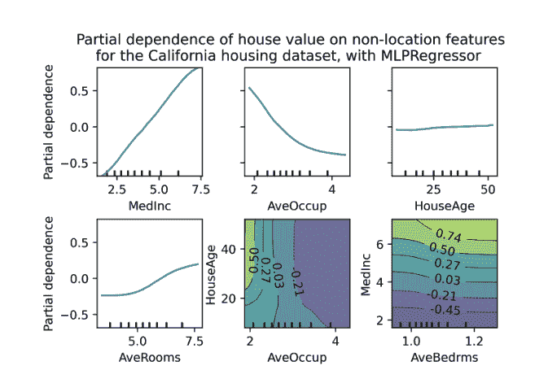

图 13.6：使用Sklearn中的MLP回归器对加州住房数据集进行价格-特征依赖性分析的结果。

上述图中$x$轴上的刻度线代表数据集中特征值的十分位数。我们可以观察到以下发现：

- 房屋中位价与收入中位数大致呈线性依赖关系（左上图）。
- 房屋价格随着每户平均居住人数的增加而下降（中上图）。
- 房屋年龄对房价没有强烈影响，每户平均房间数也是如此。

等高线图显示了两个目标特征对房价的交互作用。例如，对于平均居住人数大于二的情况，房价几乎与房屋年龄无关。对于平均居住人数小于二的情况，则存在一定的依赖性。

### 13.8.4 不同回归器的比较研究

为了进行比较，我们还使用Scikit Learn包中的GradientBoostingRegressor和DecisionTreeRegressor对同一数据集进行回归分析，并绘制这些结果。

### 13.8.5 梯度提升回归器

现在，我们训练一个梯度提升回归器模型。

```python
print("Training GradientBoostingRegressor...")
tic = time()
gbr = HistGradientBoostingRegressor()
gbr.fit(X_train, y_train)
print("done in {:.3f}s".format(time() - tic))
print("Test R2 score: {:.2f}".format(gbr.score(X_test, y_test)))
```

```
Training GradientBoostingRegressor...
done in 1.600s
Test R2 score: 0.85
```

对于这个表格数据集，我们发现梯度提升回归器在训练速度上显著更快，并且在测试数据集上的准确性也高于MLP。它也相对更容易调整超参数，并且默认设置通常效果良好。

```python
print('Computing partial dependence plots...')
tic = time()
features = ['MedInc', 'AveOccup', 'HouseAge', 'AveRooms',
            ('AveOccup', 'HouseAge'), ('AveBedrms', 'MedInc')]
plot_partial_dependence(gbr, X_train, features,
                       n_jobs=3, grid_resolution=20)
print("done in {:.3f}s".format(time() - tic))
# fig = plt.figure(figsize=(45, 29))
fig = plt.gcf()
fig.suptitle('Partial dependence of house value on\n'
             'non-location features for the California\n'
             'housing dataset, with Gradient Boosting')
fig.subplots_adjust(wspace=0.4, hspace=0.4)
```

计算部分依赖图...
耗时 0.530 秒

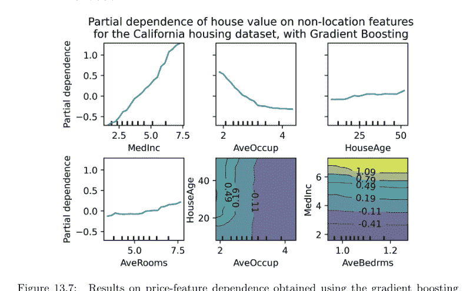

图 13.7：使用Sklearn中的梯度提升回归器对加州住房数据集进行价格-特征依赖性分析的结果。

```python
fig, ax = plt.subplots(figsize=(8, 4))
ax.set_title("Gradient Boosting Regressor")
gbr_disp = plot_partial_dependence(gbr, X_train,
                                  ["MedInc", "AveOccup"], ax=ax)
```

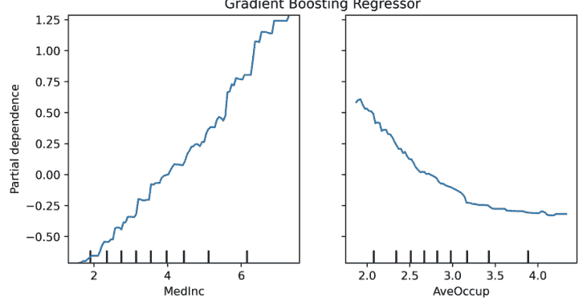

图 13.8：使用Sklearn中的梯度提升回归器对加州住房数据集进行分析的结果。

```python
fig, ax = plt.subplots(figsize=(8, 4))
ax.set_title("Multi-layer Perceptron")
mlp_disp = plot_partial_dependence(mlp, X, ["MedInc", "AveOccup"],
                                  ax=ax, line_kw={"c": "red"})
```

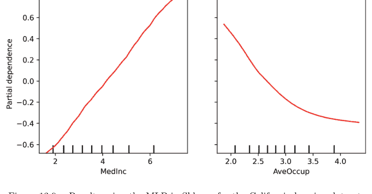

图 13.9：使用Sklearn中的MLP对加州住房数据集进行分析的结果。

我们观察到MLP的结果是平滑的。

### 13.8.6 决策树回归器

接下来我们训练一个决策树回归器。

```python
print("Training DecisionTreeRegressor...")
tic = time()
tree = DecisionTreeRegressor()
tree.fit(X_train, y_train)
print("done in {:.3f}s".format(time() - tic))
print("Test R2 score: {:.2f}".format(tree.score(X_test, y_test)))
```

```
Training DecisionTreeRegressor...
done in 0.243s
Test R2 score: 0.61
```

```python
fig, ax = plt.subplots(figsize=(8, 4))
ax.set_title("Decision Tree Regressor")
tree_disp = plot_partial_dependence(tree, X, ["MedInc",
                                   "AveOccup"], ax=ax, line_kw={"c": "m"})
```

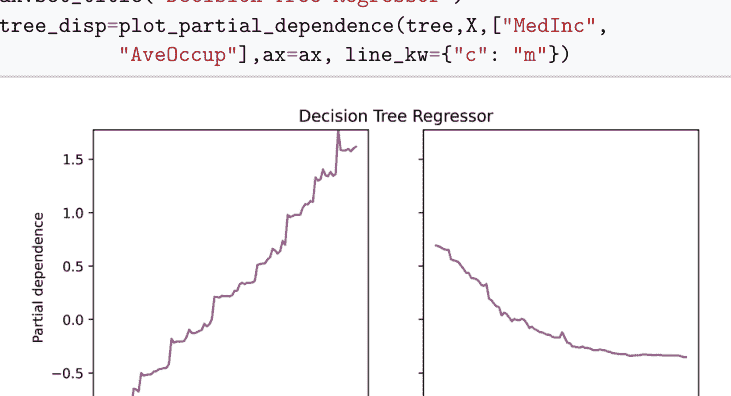

图 13.10：使用Sklearn中的决策树回归器对加州住房数据集进行分析的结果。

```python
fig, (ax1, ax2) = plt.subplots(1, 2, figsize=(10, 5))
gbr_disp.plot(ax=[ax1, ax2], line_kw={"label": "Gradient Boosting Regressor"})
mlp_disp.plot(ax=[ax1, ax2], line_kw={"label": "Multi-layer Perceptron", "c": "red"})
tree_disp.plot(ax=[ax1, ax2], line_kw={"label": "Decision Tree Regressor", "c": "m"})
ax1.legend()
ax2.legend()
```

<matplotlib.legend.Legend at 0x18e35abb128>

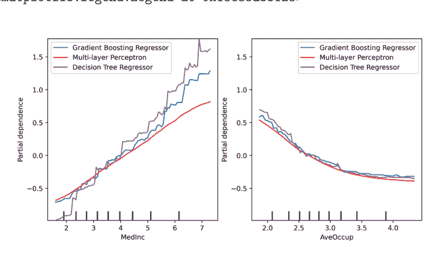

图 13.11：使用Sklearn中三种回归器对加州住房数据集进行分析的结果比较。

图 13.11 显示，MLP的预测曲线比梯度提升和决策树回归器的曲线平滑得多。

请注意，所有测试结果在很大程度上取决于用于设置模型的超参数设置、数据集、计算机系统，甚至运行时间。上述测试中使用的设置参数可能对某些模型不公平。因此，测试结果是主观的。

## 参考文献

- [1] D.E. Rumelhart and J.L. McClelland, Learning internal representations by error propagation, in *Parallel Distributed Processing: Explorations in the Microstructure of Cognition: Foundations*, pp. 318-362, MIT Press, Cambridge, MA, 1987.
- [2] J. Orbach, Principles of neurodynamics: Perceptrons and the theory of brain mechanisms, *Archives of General Psychiatry*, 7(3), 218-219, 09 1962. https://doi.org/10.1001/archpsyc.1962.01720030064010.
- [3] T. Hastie, R. Tibshirani and J. Friedman, *Elements of Statistical Learning Ed.* p. 2, Springer, New York, 2009.
- [4] G.R. Liu, FEA-AI and AI-AI: Two-way deepnets for real-time computations for both forward and inverse mechanics problems, *International Journal of Computational Methods*, **16**(08), 1950045, 2019.
- [5] G.R. Liu, S.Y. Duan, Z.M. Zhang *et al.*, Tubenet: A special trumpetnet for explicit solutions to inverse problems, *International Journal of Computational Methods*, **18**(01), 2050030, 2021. https://doi.org/10.1142/S0219876220500309.
- [6] G.R. Liu and X Han, *Computational Inverse Techniques in Nondestructive Evaluation.*, Taylor and Francis Group, New York, 2003.
- [7] D. Shuyong, W. Li, G.R. Liu *et al.*, A technique for inversely identifying joint-stiffnesses of robot arms via two-way TubeNets, *Inverse Problems in Science & Engineering*, **29**, 3041-3061, 2021.
- [8] D. Shuyong, H. Zhiping, G.R. Liu *et al.*, A novel inverse procedure via creating tubenet with constraint autoencoder for feature-speace dimension-reduction, *International Journal of Applied Mechanics*, Revised, 2021.
- [9] L. Shi, F. Wang, G. Liu *et al.*, Two-way tubeNets uncertain inverse methods for improving positioning accuracy of robots based on interval, *The 11th International Conference on Computational Methods (ICCM2020)*, 2020.
- [10] R. David, H. Geoffrey and W. Ronald, Learning representations by back-propagating errors, *Nature*, **323**(6088), 533-536, October 1986.
- [11] H. Sepp and S. Jürgen, Long short-term memory, *Neural Computation*, **9**(8), 1735-1780, 1997. https://doi.org/10.1162/neco.1997.9.8.1735.
- [12] P. Fabian, V. Gae, G. Alexandre *et al.*, Scikit-learn: Machine Learning in Python, *Journal of Machine Learning Research*, **12**(85) 2825-2830, 2011. http://jmlr.org/papers/v12/pedregosa11a.html.
- [13] G.R. Liu, Neurons-Samples Theorem, *International Journal of Computational Methods*, **19**(9), in-printing, 2022.

## 第14章

## 过拟合与正则化

### 14.1 为何需要正则化

机器学习中的正则化与监督训练中经常出现的所谓“过拟合”现象密切相关。过拟合主要取决于两个方面：训练数据点的数量 $m$ 和假设空间 $\mathbb{W}^P$ 的维度（即神经网络或其他机器学习模型的复杂度）。一个优质的模型应具有恰到好处的复杂度，既能从数据集中捕捉重要特征，又对数据中的噪声不敏感。如果模型仅仅复制了训练数据集中的全部或大部分数据点，就可能产生过拟合。这样的模型几乎没有实际用途，因为它无法泛化用于部署。一个粗略的**通用准则**可表述如下：

$$m \geq P^*$$

其中 $P^*$ 使用第13章的公式 (13.14) 计算。当 $m < P^*$ 时，理论上，一个完全训练的模型的预测可能通过所有数据点，标签被精确产生，损失为零。此时可能存在过拟合风险，需要某种类型的正则化。

为了使公式 (14.1) 成为有效的指导，我们假设数据集具有相当好的质量（定义见第5.9节末尾）。例如，如果数据集有太多平行的数据点，那么数据点的数量就意义不大。在这种情况下，$m$ 应仅计算这些线性独立的样本。换句话说，即使满足公式 (14.1)，由于数据集质量不足，仍可能存在过拟合。

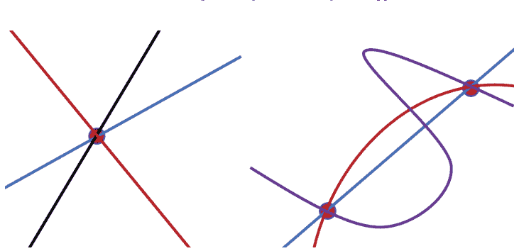

图 14.1：数据点拟合。左图：一个数据点，有无数条直线可用于拟合该数据；右图：两个数据点，一条直线完美拟合这些数据点，但有无数条高阶曲线可以拟合这两个数据点。

图 14.1 示意性地展示了过拟合的简单情况。考虑只有一个数据点的最简单情况。如果使用一条直线（或任何其他类型的曲线）来完美拟合该数据点，我们将得到无数条直线。这些直线中的任何一条都不太可能对其他测试数据点具有预测性。为了生成一条稳健的预测线，需要更多的数据点。正则化技术可能有助于获得唯一的直线，但如果数据如此稀缺，则需要一些关于数据特征的信息。

类似地，当有两个数据点时，一条直线可以完美拟合这些数据点，但有无数条高阶曲线可以拟合这两个数据点。所有这些高阶曲线都可能是过拟合的预测，因为它可能错误地预测测试数据点。

过拟合也可能发生在分类的机器学习模型中。图 14.2 显示了二维空间中给定数据点的可能情况。橙色线给出了过于简化的边界，绿色线给出了过拟合的边界，而黑色线为给定的数据点以及可能未用于模型训练的测试数据点提供了更好的拟合边界。

因此，在使用这种过拟合的机器学习模型解决实际问题时需要谨慎，因为当将其应用于训练数据集之外的其他数据点，或者当数据点存在噪声时，其性能将不可靠。对于给定的数据集，我们可能能够训练出一个精度极高、甚至损失为零的模型。然而，这样的模型通常不能用于现实问题的预测。因此，进行**客观测试**非常重要：使用从整个数据集中随机选择的、未用于模型训练的足够数量的数据来测试训练好的模型。

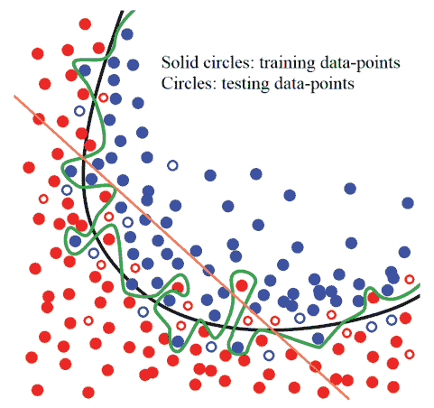

图 14.2：拟合以找到分类问题的决策边界。橙色线：过于简化的边界；绿色线：过拟合的边界；黑色线：更好的拟合边界。基于 Wikimedia Commons 上 Chabacano 的图像修改 (https://en.wikipedia.org/wiki/Overfitting)，遵循 CC BY-SA 4.0 许可协议。

为了克服过拟合，使用了各种类型的正则化技术。然而，在模型中引入正则化会将你的一些偏见赋予模型的特征。因此，它不可避免地会给模型引入额外的误差。所以，应谨慎使用它。为了使正则化有效工作，还应注意以下事项：

-   始终注意模型中可训练参数的数量。这是模型的自由度。当这个数量很大时，模型就有可能过拟合。
-   相反，（独立的）训练样本的数量起着关键作用。当这个数量与模型中的 $P^*$ 数相比太小时，模型就有可能过拟合。
-   考虑你拥有的训练数据集的数量和质量，然后相应地构建模型，确保高质量样本的数量足够大。$P^*$ 数只是一个下限。在实践中，$m$ 可以远大于 $P^*$ 数。这让数据发挥作用。将正则化用作预防工具或最后的手段。

常用的正则化技术包括以下几种：

1.  训练过程中的早停：通过使用随机选择的独立验证数据集来监控训练来完成。当验证误差与训练误差相交时，考虑停止训练。
2.  Dropout：在训练过程中简单地随机丢弃神经元及其连接，以限制过拟合能力。
3.  具有完善数学基础的吉洪诺夫正则化。

早停技术直接且易于实现。Dropout 技术需要确定要丢弃的神经元比例。这将取决于神经元-样本理论以及模型中有多少连续的训练参数。可能需要采用试错法来训练模型。我们将详细讨论具有清晰数学基础的吉洪诺夫正则化。

### 14.2 吉洪诺夫正则化

吉洪诺夫正则化是一种广泛使用的正则化技术。它以俄罗斯科学家安德烈·吉洪诺夫的名字命名。它通常用于正则化病态问题的解，例如工程中的反问题 [1]。它在统计学中也称为岭回归。它在机器学习中广泛用于正则化训练参数。

让我们回顾一下我们在第9章开头提出的线性回归的一般公式，其中我们试图通过求解以下方程来找到 $\hat{\mathbf{w}}$ 的解：

$$\hat{\mathbf{y}} = \overline{\mathbf{X}}\hat{\mathbf{w}} \quad (14.2)$$

对于给定的数据集 $\overline{\mathbf{X}}$ 和标签 $\mathbf{y}$，我们构建了一个损失函数：$\mathcal{L}(\mathbf{y}, \hat{\mathbf{y}}(\hat{\mathbf{w}})) = [\mathbf{y} - \overline{\mathbf{X}}\hat{\mathbf{w}}]^\top [\mathbf{y} - \overline{\mathbf{X}}\hat{\mathbf{w}}]$。然后我们进行了分析最小化过程，解以以下矩阵形式找到：

$$\hat{\mathbf{w}}^* = (\overline{\mathbf{X}}^T \overline{\mathbf{X}})^{-1} \overline{\mathbf{X}}^T \mathbf{y} \quad (14.3)$$

如果仔细思考，自然会产生三个重要问题：

1.  $\overline{\mathbf{X}}^T \overline{\mathbf{X}}$ 可逆吗？如果不可逆怎么办？
2.  假设 $\overline{\mathbf{X}}^T \overline{\mathbf{X}}$ 可逆，并且我们确实得到了解，这个解对测试数据集可用吗？
3.  假设 $\overline{\mathbf{X}}^T \overline{\mathbf{X}}$ 可逆，并且我们确实得到了解，当测试数据集有噪声时，解的表现如何？

我们有兴趣回答这些问题，并将看到吉洪诺夫正则化方法在哪些方面可以提供帮助。

当使用吉洪诺夫正则化方法（最简单的形式）时，我们的公式从重写损失函数开始：

$$\mathcal{L}(\mathbf{y}, \hat{\mathbf{y}}(\hat{\mathbf{w}}), \lambda) = [\mathbf{y} - \mathbf{X}\hat{\mathbf{w}}]^\top [\mathbf{y} - \mathbf{X}\hat{\mathbf{w}}] + \lambda [\hat{\mathbf{w}} - \hat{\mathbf{w}}_0]^\top [\hat{\mathbf{w}} - \hat{\mathbf{w}}_0] \quad (14.4)$$

右边的第一项是数据损失。第二项是作为正则化损失添加的。$\lambda$ 是正则化参数，是一个预先指定的正实数。向量 $\hat{\mathbf{w}}_0$ 也是为首选参数 $\hat{\mathbf{w}}$ 预先指定的。$\hat{\mathbf{w}}_0$ 通常设置为零，因为我们通常不知道什么是首选的。如果我们对 $\hat{\mathbf{w}}_0$ 有一些了解，我们可以将其放入，我们将得到偏移正则化。因此，$\hat{\mathbf{w}}_0$ 也是一个正则化参数（在示例研究中会更多讨论）。

添加正则化项意味着，如果参数 $\hat{\mathbf{w}}$ 偏离首选向量，损失函数将受到惩罚。偏离越远，惩罚按正则化参数缩放得越多。因此，需要达成妥协，既要拟合数据，又要使正则化惩罚最小。

我们现在进行相同的分析最小化过程，以找到上述损失函数的最小化器，即正则化解：

$$\min_{\hat{\mathbf{w}}} \mathcal{L}(\mathbf{y}, \hat{\mathbf{y}}(\hat{\mathbf{w}}), \lambda) = \min_{\hat{\mathbf{w}}} ([\mathbf{y} - \mathbf{X}\hat{\mathbf{w}}]^T [\mathbf{y} - \mathbf{X}\hat{\mathbf{w}}] + \lambda [\hat{\mathbf{w}} - \hat{\mathbf{w}}_0]^T [\hat{\mathbf{w}} - \hat{\mathbf{w}}_0]) \quad (14.5)$$

很明显，这个函数在 $\hat{\mathbf{w}}$ 上也是二次的。这一次，我们可以相当确定，无论数据 $\overline{\mathbf{X}}$ 如何，都存在一个唯一的 $\hat{\mathbf{w}}^*$ 来最小化修改后的损失函数。这是因为只要 $\lambda$ 不为零，至少正则化项是严格正的。这样的正则化解可以通过将目标函数的导数设为0来找到：

$$\frac{\partial \mathcal{L}(\mathbf{y}, \hat{\mathbf{y}}(\hat{\mathbf{w}}), \lambda)}{\partial \hat{\mathbf{w}}} = -2\overline{\mathbf{X}}^T (\mathbf{y} - \overline{\mathbf{X}}\hat{\mathbf{w}}^*) + 2\lambda [\hat{\mathbf{w}}^* - \hat{\mathbf{w}}_0] = 0 \quad (14.6)$$

这给出了一个正则化解：

$$\hat{\mathbf{w}}_R^* = [\overline{\mathbf{X}}^T \overline{\mathbf{X}} + \lambda \mathbf{I}]^{-1} \{\overline{\mathbf{X}}^T \mathbf{y} - \lambda \hat{\mathbf{w}}_0\}$$ (14.7)

这是一种闭式解。

现在，即使由于某些原因（数据集太小、数据点高度相关等），矩阵 $\overline{\mathbf{X}}^T \overline{\mathbf{X}}$ 是奇异的或接近奇异的，$\lambda \mathbf{I}$ 无论如何都是严格正定的。此外，通过调整 $\lambda$，可以使其“正定性”足够强，以确保方括号中的矩阵始终可逆，从而保证正则化解的存在性。这回答了第一个问题。

使用范数向损失函数中添加项很方便，因为损失函数需要是一个正泛函，而范数根据定义满足正定性要求。可能的范数有

$$\text{norm} = \left( \sum_{i=0}^{P} |w_i|^q \right)^{\frac{1}{q}}$$ (14.8)

其中 $P$ 是学习参数的总数。式 (14.8) 中括号内的项乘以一个正则化参数后被添加到损失函数中。图 14.3 给出了使用上述方程中定义的范数，针对不同 $q$ 值的函数等高线。

在我们修改后的损失函数式 (14.4) 中，我们对正则化项使用了 L2 范数，它是二次的，在当前实践中很流行。它具有良好的凸性，并且在公式化和实现上都很简单。也可以选择使用其他范数，例如 L1 范数（称为 Lasso）来正则化训练参数的绝对值。L1 范数函数仍然是凸的，但其导数不连续。

当损失函数被正则化项修改后，我们需要找到组合损失函数的最小化器。这种情况在图 14.4 中进行了示意性绘制。组合最小化器应位于*数据损失函数*等高线与*正则化损失函数*等高线的*相切*点。当使用二次正则化函数时，相切点通常具有多个非零特征参数，除非数据损失最小化器恰好位于某个特征轴上，而这不太可能发生。当使用 L1 范数时，其等高线具有尖锐的涡旋。因此，数据损失函数的椭圆形等高线可以在涡旋处相切，即使数据损失最小化器并未恰好位于任何特征轴上。由于这个原因，组合最小化器倾向于选择部分特征并使其他特征为零，在最小化过程中创建一个稀疏模型（具有许多零参数）。因此，L1 正则化也可用于使机器学习模型稀疏。

在式 (14.4) 中，我们将相同的 $\lambda$ 平等地应用于上述公式中的所有参数。这并非必须如此。如果你非常了解模型的特征，你可以为单个参数选择不同的 $\lambda$ 值。在这种情况下，$\lambda$ 应该是一个对角矩阵。在 Python 中，可以定义一个向量来存储这些 $\lambda$，并使用其逐元素乘积（如下方示例代码所示）将不同的 $\lambda$ 应用于不同的特征。

在某些实践中，正则化仅应用于权重，而不应用于偏置。这等价于使用一个对角 $\lambda$ 矩阵，但将对应于偏置的对角项设置为零。我们将在下面的示例中演示这一点。

我们现在准备用一个非常简单的例子来测试这个方法，以便我们能看透这个过程并感受正则化是如何工作的。

### 14.2.1 演示示例：单个数据点

**案例 1：** 考虑最简单的一维问题，只有一个数据点 $(x_1, y_1)$。我们希望基于这个数据点找到一个线性回归 $y = xw + b$。在这种情况下，我们有 $\hat{\mathbf{w}} = [w_0, w_1]^\top = [b, w]^\top$。显然，这条直线有两个模型参数：$w$ 和 $b$。因此，如果你使用式 (14.3)，我们可以有无限多条满足要求的直线。这可以通过下面附带的代码的**第一部分**清楚地看到，设置 `xdata = np.arange(2, 5, 6)`，这给出了一个数据点 $x_1 = 2.$；当 $x_0 = 1$ 时，我们有 $\overline{\mathbf{X}} = [1 \quad x_1] = [1., \quad 2.]$。同时令 $y = [2.]$。

请注意，我们的代码是为多个数据点编写的。可以只使用一个数据点来看看我们得到什么，然后尝试使用多个数据点。

```python
import numpy as np
import random

# Part I code: No regularization, one data-point,
# two regression parameters, b and w

xdata = np.arange(2, 5, 6)  # for 1 data-point
#xdata = np.arange(1, 5, 2) # for 2 data-points
#xdata = np.arange(1, 7, 2) # for 3 data-points

lxd = len(xdata)
One = np.ones(lxd)
print('Length of xdata=',lxd, '   Value of xdata=', xdata)
X = np.stack((One, xdata), axis=-1)    # form X matrix
print('X=',X,X.shape)

np.random.seed(8)
y=xdata.T+np.random.randn(lxd)*0. # Label y, 1 data-point
#y=xdata.T+np.random.rand(lxd)*2. # Label y, >=3 data-points,
    # using random number so that [x_i, y_i] will not be inline.
#y=2.*xdata.T+np.random.randn(lxd)*2.
    # form y, for >= 3 data-points,
    # using random number so that [x_i, y_i] will not be inline.
print('y=',y,y.shape)

XTy = np.dot(X.T,y)                # Compute X.T * y
print('XTy=',XTy,XTy.shape)

XTX = np.matmul(X.T,X)             # Compute X.T * X
print('XTX=',XTX,XTX.shape)

cd = np.linalg.cond(XTX) # c=np.linalg.solve(XTX,XTy) will not
                          # work for 1 data-point. Check condition number

print('Condition number=',cd,' Rank=',np.linalg.matrix_rank(XTX))
                                    # check the rank also

if lxd >= 2:
    w = np.linalg.solve(XTX,XTy)    # only for data-points >=2.
    print('w*=', w, w.shape)
```

Length of xdata= 1    Value of xdata= [2]
X= [[1. 2.]] (1, 2)
y= [2.] (1,)
XTy= [2. 4.] (2,)
XTX= [[1. 2.]
 [2. 4.]] (2, 2)
Condition number= 4.804857307547117e+16  Rank= 1

很明显，当只使用一个数据点时，$\mathbf{X}^\top\mathbf{X}$ 矩阵的条件数非常大，且 $\mathbf{X}^\top\mathbf{X}$ 矩阵的秩仅为 1。$\hat{\mathbf{w}}^* = [w_0^*, w_1^*]^\top = [b^*, w^*]^\top$ 是不可解的。这意味着有无限多个 $[w_0, w_1]^\top = [b, w]^\top$ 可以作为解，它们都符合数据。

我们现在使用式 (14.7) 来计算这个线性回归的正则化解，使用不同的正则化参数 $\lambda$ 设置。我们使用下面给出的代码的第二部分进行计算，第三部分绘制结果。这里，我们将研究三个案例，通过在下面代码中的向量 L0=np.array([lb0, lw0]) 中设置不同的 lb0 和 lw0 值。对于所有这些案例，由于正则化的作用，我们将得到一个唯一解。然而，解的行为也会不同，受到 $b$ 和/或 $w$ 的正则化参数设置的影响。让我们首先检查案例 2。

```python
# Part II code: Regularized linear regression, 2 parameters, b, w
# The code works for multiple data-points. Try one point first.
# For multiple data-points, use proper settings in Part I code.

w0 = np.array([.0,.0]) # Case 2,3,4; pre-specified parameters: b,w

#w0 = np.array([.4,.8]) # Case 5; with setting
# L0=np.array([1.,1.])
#w0 = np.array([.6,1.0]) # Case 5-1: 2 data, L0=np.array([1.,1.])
#w0 = np.array([.45341,1.]) # Case 5: 2 data, L0=np.array([1.,1.])
#w0 = np.array([.0,1.]) # Case 5: 2 data, L0 = np.array([1.,1.])
#w0 = np.array([1.8138,.99788]) # Case 5: 3 data,
# L0=np.array([1.,1.])
#w0 = np.array([0.65, 2.0]) # Case 5: 3 data, L0=np.array([1.,1.])

print('w0=',w0,w0.shape)

L0 = np.array([1.,0.]) # Case 2; # define base lambdas for b and w
# [lb0, lw0]) # One may try 3 cases: regularize b
# only set [1.,0]; [0.,1]; [1.,1.]

#L0 = np.array([0.,1.]) # Case 3; # regularize w only

#L0 = np.array([1.,1.]) # Case 4; # regularize both b and w

# Case 5; with w0 = np.array([.4,.8])
print('Lambda for b w =',L0, L0.shape)
L = 0.5 * L0 # set lambda value
I = np.identity(2)
print('I=',I,' L*I=',L*I) # regularization matrix lambda

K = XTX+L*I # regularized system matrix

XTy0 = XTy+L*w0 # regularized y vector
print('XTy=',XTy,XTy.shape,'w0=',w0,'XTy0=',XTy0)

crd = np.linalg.cond(K) # condition number of regularized
# system matrix. Should be small.
```

print('crd=',np.linalg.cond(K),' Rank=', np.linalg.matrix_rank(K))
# 检查秩
wr = np.linalg.solve(K,XTy0) # 正则化解
print('wr=',wr)

w0= [0. 0.] (2,)
Lambda for b w = [1. 0.] (2,)
I= [[1. 0.]
 [0. 1.]] L*I= [[0.5 0. ]
 [0. 0. ]]
XTy= [2. 4.] (2,) w0= [0. 0.] XTy0= [2. 4.]
crd= 13.048362028288917 Rank= 2
wr= [0. 1.]

注意上面代码中，输入`XTy`是一个一维numpy数组，结果也是一个一维数组，这不符合线性代数的惯例，如第2.9.13节所讨论的。也可以按照线性代数的惯例，特意定义一个列向量（一个只有一列的二维数组），并得到解。解将是相同的，但会是一个列向量。使用一维numpy数组会更高效。我们在第3.1.11节也见过一个例子。

**案例2：** 使用与案例1相同的数据（一个数据点 $x_0 = 1, x_1 = 2., \overline{X} = [1 \ 2.], y = [2.]$），但将正则化参数设置为 L0 = np.array([1.0, 0.])，这只对偏置 $b$ 进行正则化。

我们编写以下代码来计算和绘制结果。

```python
# 第三部分：绘制回归直线。

%matplotlib inline
import matplotlib.pyplot as plt
import numpy as np
from matplotlib import rc

def y_hat(X, w): # 给定解 wr* 的预测回归直线函数
 return np.dot(X, w) # X = [1 x1] ; wr* = [b* w*]^T

x = np.arange(0, 9, 1.) # x轴上的点
lx = len(x)
One = np.ones(lx)
```

512 用Python进行机器学习：理论与应用

```python
print('Length of x=',lx, x)
Xm = np.stack((One, x), axis=-1) # 使用点x构建X。

#Lmda = np.arange(0.1, 1.5, 0.4) # 控制lambda的范围
#Lmda = np.arange(0.01, 15., 4)
Lmda = np.arange(0.1, 20., 6)

I = np.identity(2)
print('w0=', w0, w0.shape)
print('Lambda base for b, and w =',L0, L0.shape)
print('X=',X,X.shape)
print('y=',y,y.shape)

plt.figure(figsize=(4.5, 2.9),dpi=100)
for L in Lmda:
    lmd = L*L0
    K = XTX+lmd*I                #正则化系统矩阵。
    XTy0 = XTy +lmd*w0          #正则化y向量。
    wr = np.linalg.solve(K,XTy0)
    print('Lambda='+str(f"{L:.2f}"), ' wr=', wr,XTy.shape,
          w0.shape,XTy0.shape,L.shape)
    plt.plot(x,y_hat(Xm, wr),label="Lambda="+str(f"{L:.2f}"))
    # 计算预测直线并绘制。

plt.scatter(xdata, y, s=35., c='r', alpha=0.5)
plt.xlabel('x')
plt.ylabel('$\hat{y}$')
plt.title('$\hat{w}_0=$'+str(f"{w0[0]:.3f}")+','+
          str(f"{w0[1]:.3f}")+']', lb0='+str(L0[0])+',lw0 ='+str(L0[1]))
plt.grid(color='r', linestyle=':', linewidth=0.5)
plt.legend()
plt.show()
```

Length of x= 9 [0. 1. 2. 3. 4. 5. 6. 7. 8.]
w0= [0. 0.] (2,)
Lambda base for b, and w = [1. 0.] (2,)
X= [[1. 2.]] (1, 2)
y= [2.] (1,)
Lambda=0.10  wr= [0. 1.] (2,) (2,) (2,) ()
Lambda=6.10  wr= [0. 1.] (2,) (2,) (2,) ()
Lambda=12.10  wr= [0. 1.] (2,) (2,) (2,) ()
Lambda=18.10  wr= [0. 1.] (2,) (2,) (2,) ()

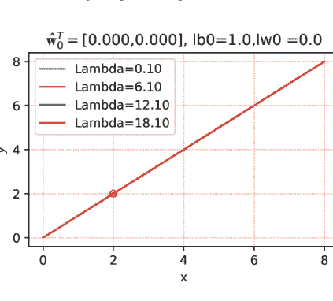

图14.5：针对一个数据点的简单线性回归，偏置在不同水平下被正则化。

在这个案例中，我们只对 $b$ 进行正则化，而让 $w$ 自由（不受正则化）。结果绘制在图14.5中。我们将观察到以下几点：

- 这个解会对 $b$ 产生一个零解，因为它被正则化了，而对 $w$ 会产生某个值，因为它被允许自由变化。
- 正如我们所看到的，这是一条通过原点且具有斜率的直线。这是因为 $b$ 的解为零，而 $w$（负责斜率）不为零。
- 回归直线通过了那个数据点。这是因为我们正则化了一个参数，而另一个参数是自由的。因此，我们总共有两个条件：一个是通过数据点，另一个是零偏置 $b$。这两个条件唯一地确定了两个回归参数 $b$ 和 $w$。
- $\lambda$ 的大小对解没有影响，因为这个案例的设置是两个条件和两个参数。正则化的量是无关紧要的。
- 很明显，Tikhonov正则化帮助我们为那个有无穷多解的问题（案例1）获得了一个唯一解。这就是为什么Tikhonov正则化技术也用于获得不可逆矩阵的*伪逆*。

再次使用我们代码的第二和第三部分，我们现在研究案例3：

**案例3：** 使用与案例2相同的数据集，但设置 L0 = np.array([0.0, 1.0])，这只对 $w_0$ 进行正则化。

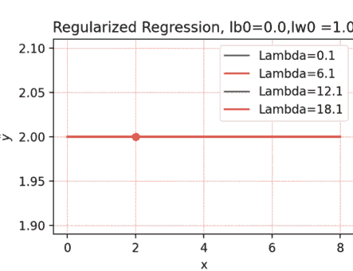

图14.6：案例3的回归直线：只有 $w$ 被正则化，但结果不受正则化参数 $\lambda$ 的影响（这4条线是重叠的）。$b$ 被设置为不受正则化。

在这个案例中，$b$ 被留下自由（不受正则化）。结果如图14.6所示。我们将观察到以下几点：

- 这个解会对 $w$ 产生一个零解（因此斜率将为零），因为它被正则化了，而对 $b$ 会产生某个值，因为它被允许自由变化。
- 正如我们所看到的，正如预期的那样，这是一条水平线。这是因为 $w$ 的解为零，而它负责斜率。
- 这条线不再通过原点，因为 $b$ 不再为零。
- 回归直线仍然通过那个数据点。这是因为我们正则化了一个参数，而另一个参数是自由的。因此，我们总共有两个条件：一个是通过数据点，另一个是零斜率 $w$。这两个条件唯一地确定了两个回归参数 $b$ 和 $w$。
- $\lambda$ 的大小再次对解没有影响，因为设置是两个条件和两个参数。正则化的量是无关紧要的。
- 很明显，Tikhonov正则化再次帮助我们为那个有无穷多解的问题（案例1）获得了一个唯一解。但是，由于正则化应用的方式不同，解也不同。

再次使用我们代码的第二和第三部分，我们现在研究案例4，其中我们对 $b$ 和 $w$ 都进行正则化。

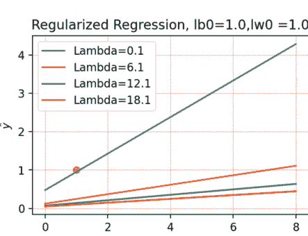

图14.7：案例4的回归直线：$b$ 和 $w$ 都被正则化。

**案例4：** 使用与案例2相同的数据集，但在代码第二部分中设置 L0 = np.array([1.0, 1.0])。

在这个案例中，$b$ 和 $w$ 都被正则化，如图14.7所示。我们将观察到以下几点：

- 这个解会对 $b$ 和 $w$ 都产生非零解，因此截距和斜率都将非零。这是因为两者都不能自由变化。
- 回归直线不再通过那个数据点。这是因为我们正则化了两个参数。因此，我们总共有三个条件：一个是通过数据点，一个是非零偏置 $b$，一个是非零斜率 $w$。因为我们只有两个回归参数 $b$ 和 $w$，所以这些条件都不会被满足。解是一个折衷。
- 这一次，$\lambda$ 的大小很重要。当它非常小（例如0.1）时，直线几乎通过数据点。否则，直线将不会通过数据点，原因与上述点中提到的相同。
- 很明显，Tikhonov正则化再次帮助我们为那个有无穷多解的问题（案例1）获得了一个唯一解。但是，解是不同的，取决于所使用的正则化参数的水平。

图14.8绘制了使用小正则化参数的回归直线。这再次强调了正则化的水平是由正则化参数控制的。因此，设置合适的正则化参数很重要。

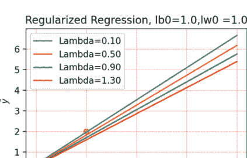

图14.8：案例4的回归直线：$b$ 和 $w$ 都使用小的正则化参数进行正则化。

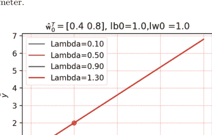

图14.9：案例5的回归直线：$b$ 和 $w$ 都被正则化，相对于设置在真实解 (0.4, 0.8) 的首选解集。

使用我们的代码，我们发现当我们在案例4（其中 $b$ 和 $w$ 都被正则化）中使用非常小的 Lambda=0.01 时，得到的正则化解变为 [0.3992016 0.79840319]。然后我们可以猜测真实解应该是 [0.4, 0.8]。现在让我们研究以下案例。

**案例5：** 在第二部分代码中设置 L0 = np.array([1.0, 1.0]) 和 $\hat{w}_0 = [0.4, 0.8]^\top$。

在这个案例中，$b$ 和 $w$ 都相对于一个首选解（即真实解）进行正则化。结果绘制在图14.9中。

我们将观察到以下几点：

- 这个解变成了 $b$ 和 $w$ 的真实解，这意味着如果我们知道真实解，我们可以将其放入正则化项中，并且

### 14.2.2 演示示例：两个数据点

在理解了使用单个数据点的简单示例后，我们现在可以将研究扩展到两个数据点的情况，这将加深我们对正则化效应及其与数据关系的理解。我们将参考之前为单个数据点研究的所有5种情况来进行。

对于**情况1**，当我们有两个数据点，并且仍然使用一维空间中的线性回归模型时，只要这两个数据点不重合，我们就会有一个唯一的解。这是因为系统矩阵 $\overline{\mathbf{X}}^\top \overline{\mathbf{X}}$ 的秩为2。解将精确地通过这两个数据点。当这两个数据点为 $\mathbf{X} = [[1.\ 1.], [1.\ 3.]]$ 和 $\mathbf{y} = [1.4534\ 3.4534]$（注意是随机生成的）时，真实（未正则化的）解为 $\hat{\mathbf{w}}^* = [0.45341172, 1.]^\top$。

对于使用两个数据点的**情况2**，我们也设置 L0 = np.array([1.0, 0.])。在这种情况下，我们只对 $b$ 进行正则化，而让 $w$ 自由（不受正则化约束）。解绘制在图14.11中。

我们应观察以下几点：

- 除非将正则化参数设置为零，否则回归线不会通过这两个数据点。这是因为我们正则化了一个参数（而另一个参数是自由的）。因此，我们总共有三个条件：两个用于通过这两个数据点，一个用于使偏置 $b$ 为零。正则化解是一个折衷方案。
- 当正则化参数非常小（本例中为0.01，图14.11中的蓝线）时，解线紧密地通过这两个点，结果接近使用两个数据点的情况1。
- 当正则化参数较大时，直线会调整以给出一个接近零的偏置 $b$，同时最小化数据损失（这两个数据点到回归线的距离之和）。
- $\lambda$ 的大小对解有影响。$\lambda$ 越大，$b$ 越接近零。
- Tikhonov正则化帮助我们获得了一个折衷解。它唯一地依赖于数据和正则化参数。

**情况3**（两个数据点）：设置 L0 = np.array([0.0, 1.0])。
在这种情况下，我们只对 $w$ 进行正则化，而让 $b$ 自由（不受正则化约束），同时数据损失针对两个数据点。结果绘制在图14.12中。
我们应观察以下几点：

- 除非将正则化参数设置为零，否则回归线不会通过这两个数据点。这是因为我们正则化了一个参数（而另一个参数是自由的）。因此，我们总共有三个条件：两个用于通过这两个数据点，一个用于使权重 $w$ 较小。正则化解是折衷方案。
- 当正则化参数非常小（本例中为0.01，图14.12中的蓝线）时，解线紧密地通过这两个数据点，结果接近使用两个数据点的情况1。
- 当正则化参数较大时，直线会调整以给出一个由 $w$ 控制的小斜率，同时最小化数据损失（这两个数据点到回归线的距离之和）。
- $\lambda$ 的大小对解有影响。$\lambda$ 越大，斜率 $w$ 越接近零。

**情况4**（两个数据点）：在代码第二部分中设置 L0 = np.array([1.0, 1.0])，并使用两个数据点。
在这种情况下，$b$ 和 $w$ 都被正则化。我们代码的结果绘制如下。
我们应提及以下几点：

- 除非将正则化参数设置为零，否则回归线不会通过这两个数据点。这是因为我们正则化了两个参数。因此，我们总共有四个条件：两个用于通过这两个数据点，两个用于使权重 $w$ 较小。正则化解是一个折衷方案。
- 当正则化参数非常小（本例中为0.01，图14.13中的蓝线）时，解线紧密地通过这两个数据点，结果接近使用两个数据点的情况1。
- 当正则化参数较大时，直线会调整以给出一个由 $w$ 控制的小斜率，并且向下平移以给出一个由 $b$ 控制的较小截距，同时最小化数据损失（这两个数据点到回归线的距离之和）。
- $\lambda$ 的大小对解有影响。$\lambda$ 越大，截距越小，斜率 $w$ 越接近零。

通过研究使用两个数据点的情况1，我们得到了真实（未正则化的）解 $\hat{\mathbf{w}}^* = [0.4534, 1.]^\top$。然后我们可以使用这个真实解进行平移正则化。

**情况5**（两个数据点）：在第二部分代码中设置 L0 = np.array([1.0, 1.0]) 和 $\hat{\mathbf{w}}_0 = [0.4534, 1.0]^\top$。

在这种情况下，$b$ 和 $w$ 都被正则化，其参考的首选解是真实解。结果绘制在图14.14中。

我们应观察以下一点：

- 这个解对于 $b$ 和 $w$ 都变成了真实解，这意味着如果我们知道真实解，可以将其放入正则化项中，我们的代码将重现它。无论正则化水平如何，回归线都会通过这两个数据点。

### 14.2.3 演示示例：三个数据点

我们现在可以将研究扩展到三个数据点的情况。

对于**情况1**，当我们有三个数据点，并且仍然使用一维空间中的线性回归模型时，只要这三个数据点不重合，我们就会有一个唯一的解。这是因为系统矩阵 $\overline{\mathbf{X}}^\top \overline{\mathbf{X}}$ 的秩变为2。然而，解不会精确地通过这三个数据点，因为它是一个最小二乘解，只确保这些点到直线的距离最小。当这三个数据点为 $\overline{\mathbf{X}} = [[1.\ 1.], [1.\ 3.], [1.\ 5.]]$ 和 $y = [2.7469\ 4.9379\ 6.7389]$（随机生成的）时，真实的最小二乘解（未正则化的）为 $\hat{\mathbf{w}}^* = [1.8138, 0.9979]^\top$。

### 14.2.4 案例研究总结

这些研究表明，Tikhonov正则化具有以下主要效果：

-   对于小数据集，它允许利用数据知识来弥补信息不足，从而获得唯一解。
-   对于过量数据集，它提供了控制训练参数大小的方法，以防止过拟合。
-   对于含噪声数据集，正则化提供了缓解误差的方法。基于我们对万能逼近理论的研究，我们发现权重和偏置负责产生用于逼近函数的脉冲（参见第7.3节）。我们还证明，权重越大，脉冲越陡峭，因此在逼近更复杂函数时具有更强的能力。如果权重值足够大，它甚至可能捕捉到噪声，而噪声通常在频率上具有更高的变化性。当应用Tikhonov正则化时，如这些案例研究明确所示，权重值通常会减小。因此，模型对噪声的敏感性会降低。
-   所有这些都通过使用正则化参数来实现，包括以下内容：

(1) 参数 $\lambda$ 或 $\lambda$ 参数矩阵，用于控制所有或部分或单个特征的范数。

(2) 偏移参数 $\widehat{\mathbf{w}}_0$，也可以为单个特征指定，以使正则化损失与数据损失更一致。

-   正则化参数可以根据特征类型进行不同设置。
-   其他范数也可用于计算正则化损失。

## 14.3 使用MXNet研究正则化效果的案例研究

基于上述使用简单示例的详细研究，我们将很好地理解正则化如何作用于机器学习模型。我们已准备好研究其对真实机器学习模型的影响。我们现在重新审视之前研究过的MNIST数据集上的手写数字分类问题。

请注意，我们之前的模型没有过拟合，因为我们使用了全部60,000个训练样本，这远超过那些模型中的 $P^*$-数，有时甚至超过 $P$-数。例如，我们使用了一个具有 $P = 7,850$ 个参数的单层网络：$784 \times 10 = 7,840$ 个权重加上10个偏置，而 $P^* = 785$（这是单层仿射空间的伪维度）。因此，$m \gg P^*$ 且 $m \gg P$。

让我们进行一个案例研究，考察如果我们使用更少的训练样本，比如2,000个，可能会发生什么。对于单层网络，我们有 $m > P^*$ 但 $m \ll P$。这项研究将详细展示正则化技术在缓解过拟合方面的效果。它是按照研究并使用 mxnet-the-straight-dope (https://github.com/zackchase/mxnet-the-straight-dope/blob/master/chapter02_supervisedlearning/regularization-scratch.ipynb, 基于Apache-2.0许可证) 中的代码完成的。

```python
from __future__ import print_function
import mxnet as mx
import mxnet.ndarray as nd
from mxnet import autograd
import numpy as np
ctx = mx.cpu()
mx.random.seed(1)
# for plotting purposes
```

### 14.3.1 加载MNIST数据集

```python
%matplotlib inline
import matplotlib
import matplotlib.pyplot as plt
```

```python
mnist = mx.test_utils.get_mnist()
num_examples = 2000
batch_size = 64
train_data = mx.gluon.data.DataLoader(mx.gluon.data.ArrayDataset(
    mnist["train_data"][:num_examples], mnist["train_label"]
    [:num_examples].astype(np.float32)), batch_size, shuffle=True)

test_data = mx.gluon.data.DataLoader(mx.gluon.data.ArrayDataset(
    mnist["test_data"][:num_examples], mnist["test_label"]
    [:num_examples].astype(np.float32)), batch_size, shuffle=False)
```

### 14.3.2 定义神经网络模型

我们使用一个简单的线性模型，以softmax作为激活函数作为预测函数。我们建立以下神经网络模型：

```python
W = nd.random_normal(shape=(784,10))  #Allocate model parameters
b = nd.random_normal(shape=10)
params = [W, b]

for param in params:
    param.attach_grad()              # request for gradient

def net(X):
    y_linear = nd.dot(X, W) + b      # Define the affine mapping
    yhat = nd.softmax(y_linear, axis=1)
    return yhat                      # return the prediction function
```

### 14.3.3 定义损失函数和优化器

我们使用交叉熵作为损失函数，这在前面已经详细讨论过。

```python
def cross_entropy(yhat, y):
    return - nd.sum(y * nd.log(yhat), axis=0, exclude=True)

def SGD(params, lr):
    for param in params:
        param[:] = param - lr * param.grad
```

### 14.3.4 定义评估准确率的函数

我们使用以下函数来计算平均损失函数，作为训练过程中模型准确率的度量：

```python
def evaluate_accuracy(data_iterator, net):
    numerator = 0.
    denominator = 0.
    loss_avg = 0.
    for i, (data, label) in enumerate(data_iterator):
        data = data.as_in_context(ctx).reshape((-1,784))
        label = label.as_in_context(ctx)
        label_one_hot = nd.one_hot(label, 10)
        output = net(data)
        loss = cross_entropy(output, label_one_hot)
        predictions = nd.argmax(output, axis=1)
        numerator += nd.sum(predictions == label)
        denominator += data.shape[0]
        loss_avg=loss_avg*i/(i+1)+nd.mean(loss).asscalar()/(i+1)
    return (numerator / denominator).asscalar(), loss_avg
```

### 14.3.5 定义绘制收敛曲线的实用函数

以下函数用于绘制损失函数在最小化过程中随迭代次数的变化：

```python
def plot_learningcurves(loss_tr,loss_ts, acc_tr,acc_ts):
    xs = list(range(len(loss_tr)))
    f = plt.figure(figsize=(12,6))
    fg1 = f.add_subplot(121)
    fg2 = f.add_subplot(122)
    fg1.set_xlabel('epoch',fontsize=14)
    fg1.set_title('Comparing loss functions')
    fg1.semilogy(xs, loss_tr)
    fg1.semilogy(xs, loss_ts)
    fg1.grid(True,which="both")
    fg1.legend(['training loss', 'testing loss'],fontsize=14)

    fg2.set_title('Comparing accuracy')
    fg2.set_xlabel('epoch',fontsize=14)
    fg2.plot(xs, acc_tr)
    fg2.plot(xs, acc_ts)
    fg2.grid(True,which="both")
    fg2.legend(['training accuracy', 'testing accuracy'],
               fontsize=14)
```

### 14.3.6 训练神经网络模型

我们现在将神经网络模型训练到其最大的学习能力。

```python
epochs = 1000
moving_loss = 0.
niter=0
loss_seq_train = []
loss_seq_test = []
acc_seq_train = []
acc_seq_test = []

for e in range(epochs):
    for i, (data, label) in enumerate(train_data):
        data = data.as_in_context(ctx).reshape((-1,784))
        label = label.as_in_context(ctx)
        label_one_hot = nd.one_hot(label, 10)
        with autograd.record():
            output = net(data)
            loss = cross_entropy(output, label_one_hot)
        loss.backward()
        SGD(params, .001)
        # Keep a moving average of the losses
        niter +=1
        moving_loss=.99*moving_loss+.01*nd.mean(loss).asscalar()
        est_loss = moving_loss/(1-0.99**niter)

    test_accuracy, test_loss = evaluate_accuracy(test_data, net)
    train_accuracy, train_loss=evaluate_accuracy(train_data, net)
    # save them for later
    loss_seq_train.append(train_loss)
    loss_seq_test.append(test_loss)
    acc_seq_train.append(train_accuracy)
    acc_seq_test.append(test_accuracy)

    if e % 300 == 299:
        print("Epoch %s. Train Loss:%.2e, Test Loss:%.2e, Train_acc:%.2e, Test_acc:%.2e" %
              (e+1,train_loss, test_loss,train_accuracy, test_accuracy))

# Plotting the learning curves
plot_learningcurves(loss_seq_train,loss_seq_test, acc_seq_train, acc_seq_test)
```

```
Epoch 300. Train Loss:1.61e-01, Test Loss:1.16e+00, Train_acc:9.64e-01, Test_acc:7.75e-01
Epoch 600. Train Loss:6.72e-02, Test Loss:1.15e+00, Train_acc:9.90e-01, Test_acc:7.83e-01
Epoch 900. Train Loss:3.73e-02, Test Loss:1.16e+00, Train_acc:9.98e-01, Test_acc:7.85e-01
```

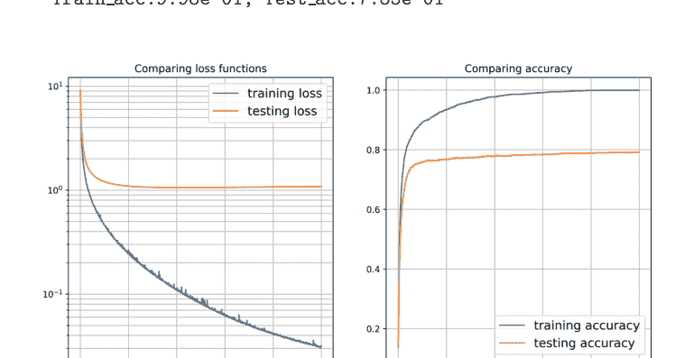

图14.19：当使用单层网络处理仅包含2,000个样本的MNIST缩减数据集时，出现过拟合的案例。

### 14.3.7 训练后模型的评估：一个典型的过拟合案例

在上面的例子中，可以看到在第1,000个epoch时，MLP模型在训练数据上达到了100%的准确率（损失函数仍然离零相当远，部分原因是$m > P^*$）。然而，它仅能正确分类约79%的测试数据。这是一个典型的过拟合案例。显然，这样一个“训练良好”的模型不可能在测试数据集或模型在训练期间未见过的真实世界数据集上表现良好。

如果将样本数量减少到1,000，其他所有设置保持不变，这个MLP模型将在第700个epoch时在训练数据上达到100%的准确率，但它仅能正确分类约75%的测试数据。

### 14.3.8 L2正则化的应用

我们现在通过将参数的L2范数惩罚项添加到原始损失函数中来应用L2正则化。我们使用以下函数来实现：

```python
def l2_penalty(params):
    penalty = nd.zeros(shape=1)
    for param in params:
        penalty = penalty + nd.sum(param ** 2)
    return penalty
```

### 14.3.9 重新初始化参数

我们随机重新初始化参数，以擦除训练模型中的这些参数。

```python
for param in params:
    param[:] = nd.random_normal(shape=param.shape)
```

### 14.3.10 训练L2正则化的神经网络模型

```python
epochs = 1000
moving_loss = 0.
l2_lambda = 0.1 #0.3          # regularization parameter
niter=0
loss_seq_train = []
loss_seq_test = []
acc_seq_train = []
acc_seq_test = []

for e in range(epochs):
    for i, (data, label) in enumerate(train_data):
        data = data.as_in_context(ctx).reshape((-1,784))
        label = label.as_in_context(ctx)
        label_one_hot = nd.one_hot(label, 10)
        with autograd.record():
            output = net(data)
            loss = nd.sum(cross_entropy(output, label_one_hot)) + \
                   l2_lambda*l2_penalty(params) # regularization
                                           # loss added
        loss.backward()
        SGD(params, .001)

        # Keep a moving average of the losses
        niter +=1
        moving_loss=.99*moving_loss+.01*nd.mean(loss).asscalar()
        est_loss = moving_loss/(1-0.99**niter)

    test_accuracy, test_loss = evaluate_accuracy(test_data, net)
    train_accuracy,train_loss= evaluate_accuracy(train_data, net)

    # save them for later
    loss_seq_train.append(train_loss)
    loss_seq_test.append(test_loss)
    acc_seq_train.append(train_accuracy)
    acc_seq_test.append(test_accuracy)
    if e % 300 == 299:
        print("Epoch %s. Train Loss:%.2e, Test Loss:%.2e, Train_acc:%.2e, Test_acc:%.2e" %
              (e+1,train_loss,test_loss,train_accuracy, test_accuracy))

# Plotting the learning curves
plot_learningcurves(loss_seq_train,loss_seq_test,acc_seq_train, acc_seq_test)
print('Regularization parameter=',l2_lambda)
```

```
Epoch 300. Train Loss:1.93e-01, Test Loss:5.19e-01, Train_acc:9.65e-01, Test_acc:8.38e-01
Epoch 600. Train Loss:1.91e-01, Test Loss:5.03e-01, Train_acc:9.67e-01, Test_acc:8.45e-01
```

第900轮。训练损失：1.91e-01，测试损失：5.03e-01，
训练准确率：9.67e-01，测试准确率：8.46e-01
正则化参数= 0.1

### 14.3.11 L2正则化的效果

当我们使用2,000个训练样本时，与未正则化的过拟合情况相比，添加$L_2$正则化产生了以下效果：

- 当正则化参数设置为0.1，其他所有设置不变时，在第1,000次迭代时，我们的MLP模型在测试数据集上的准确率从78.6%提高到84.5%，提升了5.7%。训练数据集上的准确率从100%降低到94.7%。正则化后的模型更稳健，对未见数据的泛化能力应该更好。
- 当正则化参数设置为0.3时，测试数据集上的准确率从78.6%提高到84.4%，提升了5.8%。训练数据集上的准确率从100%降低到93.6%。这个正则化模型几乎没有变化。这表明，对于这个问题，0.1到0.3之间的正则化参数可能是一个合适的选择。

当训练中只使用1,000个训练样本（上述代码中其他所有设置不变）时，与相应的未正则化过拟合情况相比，发现如下：

- 对于设置为0.1的正则化参数，我们的MLP模型在测试数据集上的准确率从75%提高到83.3%，提升了8.3%。训练数据集上的准确率从100%降低到99.1%。正则化后的模型更稳健，对未见数据的泛化能力应该更好。
- 当正则化参数设置为0.3时，测试数据集上的准确率从75%提高到84.9%，提升了9.9%。训练数据集上的准确率从100%降低到96.7%。与使用0.1正则化参数的情况相比，这个正则化模型对未见数据甚至更稳健。这可能表明，当样本数量变小时，正则化参数应相应增加。

理想情况下，我们希望模型在训练和测试数据集上具有相同水平的准确率。调整正则化参数有助于实现这一目标，但这通常是一项具有挑战性的任务。读者可以使用上述代码尝试一下。

我们最后指出，正则化参数的选择是一个问题。经验可能有所帮助，或者可能需要通过试错来训练一个稳健的模型。下面是另一个案例研究。

## 14.4 使用Sklearn的正则化参数案例研究

我们现在介绍scikit-learn团队[2]进行的另一个分类案例研究，以调查正则化参数对预测决策边界的影响。我们对原始代码进行了微小更改，以修复可能由模块版本差异引起的问题。我们还对参数进行了一些调整。这项研究是关于正则化参数“alpha”（等同于我们公式中的lambda）的效果。该研究使用用于分类的合成数据集，图表将显示使用不同alpha值时产生的不同决策边界。

```python
%matplotlib inline
print(__doc__)
# Author: Issam H. Laradji, License: BSD 3 clause
import numpy as np
from matplotlib import pyplot as plt
from matplotlib.colors import ListedColormap
from sklearn.model_selection import train_test_split
from sklearn.preprocessing import StandardScaler
from sklearn.datasets import make_moons,make_circles, make_classification
from sklearn.neural_network import MLPClassifier
```

```python
h = .02  # step size in the mesh
alphas = np.logspace(-5, 3, 5)
names = ['alpha ' + str(i) for i in alphas]

classifiers = []
for i in alphas:
    classifiers.append(MLPClassifier(solver='lbfgs', alpha=i,
        max_iter=1500,random_state=1, hidden_layer_sizes=[100, 100]))

X, y = make_classification(n_features=2, n_redundant=0,
        n_informative=2, random_state=0, n_clusters_per_class=1)
rng = np.random.RandomState(2)
X  += 2 * rng.uniform(size=X.shape)
linearly_separable = (X, y)

datasets = [make_moons(noise=0.2, random_state=0),
            make_circles(noise=0.1, factor=0.5, random_state=1),
            linearly_separable]

figure = plt.figure(figsize=(17, 9))
i = 1
# iterate over datasets
for X, y in datasets:
    # preprocess dataset, split into training and test part
    X = StandardScaler().fit_transform(X)
    X_train,X_test,y_train,y_test=train_test_split(X,y,
            test_size=.4)

    x_min, x_max = X[:, 0].min() - .5, X[:, 0].max() + .5
    y_min, y_max = X[:, 1].min() - .5, X[:, 1].max() + .5
    xx, yy = np.meshgrid(np.arange(x_min, x_max, h),
                         np.arange(y_min, y_max, h))
    # just plot the dataset first
    cm = plt.cm.RdBu
    cm_bright = ListedColormap(['#FF0000', '#0000FF'])
    ax = plt.subplot(len(datasets), len(classifiers) + 1, i)
    # Plot the training points
    ax.scatter(X_train[:,0],X_train[:, 1], c=y_train )
    # and testing points
    ax.scatter(X_test[:,0],X_test[:,1], c=y_test, alpha=.4)
    ax.set_xlim(xx.min(), xx.max())
    ax.set_ylim(yy.min(), yy.max())
    ax.set_xticks(())
    ax.set_yticks(())
    i += 1
```

```python
# iterate over classifiers
for name, clf in zip(names, classifiers):
    ax=plt.subplot(len(datasets),len(classifiers)+1,i)
    clf.fit(X_train, y_train)
    score = clf.score(X_test, y_test)
    # Plot the decision boundary. Assign a color to each
    # point in the mesh [x_min, x_max]x[y_min, y_max].
    if hasattr(clf, "decision_function"):
        Z = clf.decision_function(np.c_[xx.ravel(),
                                       yy.ravel()])
    else:
        Z = clf.predict_proba(np.c_[xx.ravel(),
                                    yy.ravel()])[:,1]

    # Put the result into a color plot
    Z = Z.reshape(xx.shape)
    ax.contourf(xx, yy, Z, cmap=cm, alpha=.8)

    # Plot also the training points
    ax.scatter(X_train[:,0],X_train[:,1], c=y_train,
               cmap=cm_bright,edgecolors='black')
    # and testing points

    ax.scatter(X_test[:,0], X_test[:,1], c=y_test,
               cmap=cm_bright,alpha=0.4, edgecolors='black')

    ax.set_xlim(xx.min(), xx.max())
    ax.set_ylim(yy.min(), yy.max())
    ax.set_xticks(())
    ax.set_yticks(())
    ax.set_title(name)
    ax.text(xx.max()-.3,yy.min()+.3,
            ('%.2f' % score).lstrip('0'), size=15,
            horizontalalignment='right')
    i += 1

figure.subplots_adjust(left=.02, right=.98)
plt.show();
```

为IPython交互环境自动创建的模块

图14.21显示了所使用的正则化参数的效果。

研究发现，较大的alpha（抑制较大的权重）会导致决策边界不那么尖锐，这有助于避免过拟合。另一方面，较小的alpha为权重留下了更大的空间，导致决策边界更尖锐，这有助于缓解欠拟合。这项研究再次表明，选择合适的正则化参数很重要，而这通常是一个挑战。

## 参考文献

- [1] G.R. Liu and X. Han, *Computational Inverse Techniques in Nondestructive Evaluation*, Taylor and Francis Group, New York, 2003.
- [2] P. Fabian, V. Gae, G. Alexandre *et al.*, Scikit-learn: Machine learning in Python, *Journal of Machine Learning Research*, **12**(85), 2825-2830, 2011. http://jmlr.org/papers/v12/pedregosa11a.html.

## 第15章

## 用于分类和目标检测的卷积神经网络（CNN）

卷积神经网络（CNN）或ConvNet [1–6]是机器学习中最强大的工具之一，尤其适用于处理多维图像和基于图像的分类。它目前被广泛使用，许多包/库（如Scikit learn、PyTouch、TensorFlow和Keras）都提供了有效的模块。CNN使用了许多特殊技术，与前面章节讨论的神经网络相比，其网络配置有很大不同。CNN仍然使用仿射变换，但这些变换是专门设计的，使用空间滤波器来捕获图像的空间特征。这些细节通常隐藏在各种库中可用模块的黑匣子中。本章简要介绍了CNN中使用的关键思想和技术，然后演示了CNN。更详细的信息可以在丰富的开放文献和每个CNN网络给出的原始论文中找到。Andrew Ng也提供了一个优秀的在线课程。

我们的讨论从简要描述CNN的一般结构、一些标志性的CNN网络、图像分类的演示开始，最后是一些使用CNN进行目标检测的例子。

## 15.1 滤波器与卷积

如第5章所述，机器学习模型中做出的最基本假设是仿射变换。对于不同类型的问题，自然需要设计合适的仿射变换单元。CNN在处理与图像相关的问题时特别有效，因为所使用的关键技术根植于计算机视觉相关技术。以卷积方式进行的滤波就是其中之一。考虑一个理想的6×6像素“图像”，如图15.1所示。

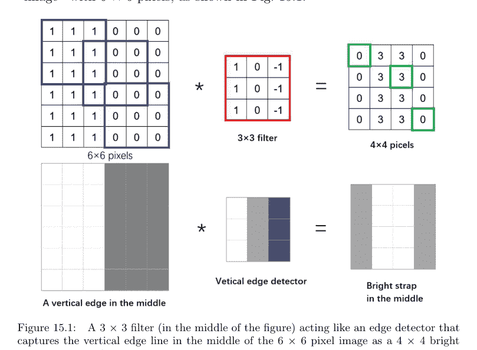

图15.1中使用的**滤波器**（有时称为核）是位于图中红色方框内的3×3二维矩阵。其左侧为1向量，中间为0向量，右侧为-1向量。**卷积**运算符用“*”表示，它与6×6像素图像中蓝色方框内的二维子矩阵元素执行以下操作，同时红色方框在6×6图像上逐像素滑动。在许多机器学习模块中，它被称为conv2D。

> $$\sum_{i=1}^{3} \sum_{j=1}^{3} x_{ij} \times w_{ij} = \text{与滤波器中心对应的绿色方框中的值}$$ (15.1)

上述计算是蓝色矩阵与红色矩阵（形状相同）的一种“点积”：即这两个矩阵中所有对应元素乘积的总和。这种滑动（卷积）的“二维矩阵点积”产生一个4×4像素的图像。它捕捉了6×6像素图像中间的垂直边缘线，形成一个中间带有明亮条带的4×4图像。因此，它就像一个垂直边缘检测器。我们可以预期：

- 如果我们旋转红色滤波器矩阵，我们将得到一个水平边缘检测器。
- 如果我们以任意角度旋转红色滤波器矩阵，我们将得到一个倾斜边缘检测器。
- 还可以有许多其他类型的滤波器，例如“Sobel”滤波器和“Scharr”滤波器。

本质上，滤波器是一个其元素具有期望值的矩阵。改变这些值会改变滤波器的功能。在CNN中，这里的**关键**在于我们并非使用这种手动设计的滤波器。相反，我们将通过向网络输入大量图像来让网络学习滤波器中的这些值，这将在下一节中讨论。这里，我们还需注意以下几点：

- 在上述情况下，滤波器逐像素滑动，即“步幅”为1。可以有多个步幅，例如每次滑动两个步幅。
- 滤波器尺寸也可以改变，5×5（但通常是奇数，以便始终有一个中心像素）也是常用的滤波器尺寸。
- 上述卷积会导致滤波后的图像尺寸减小。为避免这种情况，可以使用一种称为“填充”的技术：通过填充零来扩展原始6×6像素图像的边界像素，使原始图像变大，从而使滤波后的图像可以保持相同尺寸。

图15.2是Dumoulin和Visin [7]在MIT许可下制作的图片（https://github.com/vdumoulin/conv_arithmetic）。

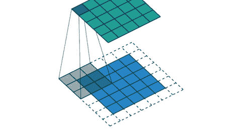

图15.2：一个3×3滤波器（灰色）以步幅=1、填充=1（填充部分未着色）在5×5像素图像（蓝色）上滑动。它生成一个与蓝色图像尺寸相同（5×5）的青色图像。

不同步幅和填充的设置如图15.3所示。

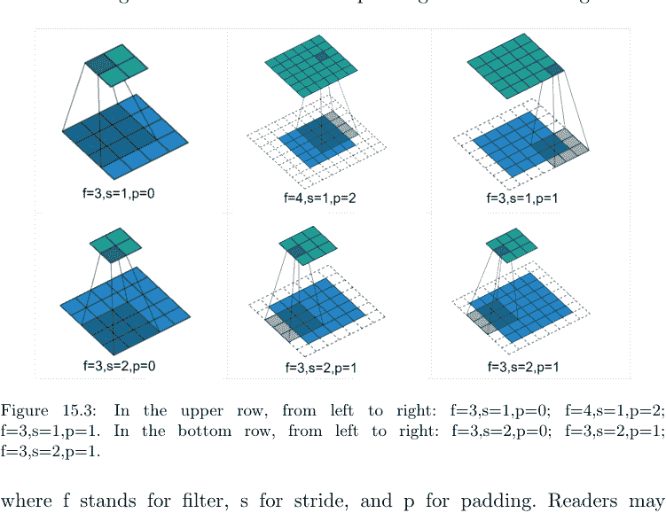

其中f代表滤波器，s代表步幅，p代表填充。读者可以查看动画和图片以获得更多动画，从而更好地理解。

## 15.2 CNN中的仿射变换单元

在CNN中，我们不使用手工制作的滤波器。相反，我们让滤波器矩阵中的元素成为可训练参数（**w**和**b**）。这可能是CNN中最重要的技巧之一：我们让基于样本的训练最终决定使用何种滤波器，以便从训练样本中获得正确的标签。这种滤波器矩阵的参数化为CNN创建了一个特殊的仿射变换单元（ATU）。图15.4示意性地说明了卷积层中一个conv2d通道的CNN模型。

我们提及CNN模型的以下关键点：

- 无论图像大小如何，同一组权重和偏置（本例中共10个学习参数）用于对整个图像进行滤波。这被称为参数共享。因此，CNN中的训练参数通常比密集连接的神经网络（如标准MLP）少得多。这导致学习参数急剧减少。根据第13.2.2节给出的神经元-样本理论，我们知道MLP中的学习参数数量可能非常大，因为$P$通常远大于$P^*$。因此，有很大的减少空间。
- 由于学习参数的减少，CNN不太容易过拟合。
- 参数共享对于图像处理特别有效，因为相同的滤波器能够捕捉同一图像不同部分的特征（如边缘）。
- 参数共享导致稀疏连接：每组学习参数一次只连接到输入图像的非常小的一部分。这也与密集连接的神经网络非常不同。
- 通常在一个卷积层中使用多个通道（文献中也称为深度）。学习参数的数量将随着通道数量的增加而成比例增加。这使得在CNN卷积层中训练不同类型的滤波器（每个通道是一个具有自己$\mathbf{w}$的不同滤波器）成为可能，以捕捉图像中的不同特征。

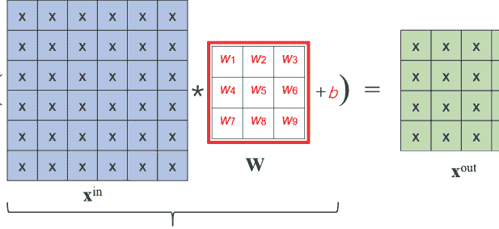

图15.4：包裹激活函数的典型仿射变换单元（ATU）示意图。在CNN一层中使用$3 \times 3$滤波器的单个conv2D通道中的学习参数、权重$w_i$和偏置$b$。$\phi$代表激活函数（通常是Relu）。对于$3 \times 3$滤波器，我们总共有9个权重和一个偏置，导致ATU的假设空间为$\mathcal{W}^{10}$。对于这个步幅为1、无填充的6×6像素图像，输出是一个4×4图像。这个输出图像可能会经过“池化”，然后进入另一层卷积。

## 15.3 池化

CNN中另一个常用的技术是池化。它使用一个类似于滤波器（但不涉及参数）的薄片，称为池化滤波器，来覆盖滤波后图像的一部分。池化操作主要有两种类型：最大池化和平均池化。最大池化简单地取池化滤波器覆盖的所有像素中的最大像素值，如图15.5所示。

平均池化与最大池化非常相似，但它取覆盖像素的平均值，而不是最大值，如图15.6所示。

对于池化操作，我们注意以下几点：

- 池化操作中没有引入训练参数。因此，它可以被视为一个CNN层的一部分。
- 似乎最大池化能够从图像中提取出显著特征，因此它比平均池化使用得更频繁。
- 在覆盖图像时，也可以采用不同的步幅数量。
- 也可以使用不同尺寸的覆盖区域。

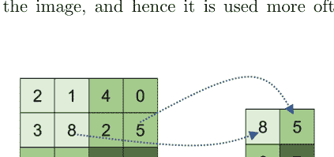

图15.5：CNN中的最大池化：一个2×2池化滤波器覆盖滤波后的4×4图像中的2×2像素。它从这四个覆盖区域的每个2×2像素中取最大像素值，并形成一个2×2的新图像。

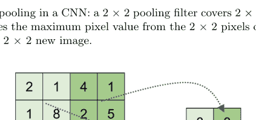

图15.6：CNN中的平均池化：一个2×2池化滤波器覆盖滤波后的4×4图像中的2×2像素。它获取这些覆盖的2×2像素的平均像素值。对这四个覆盖区域中的每一个都执行此操作，从而产生一个2×2的新图像。

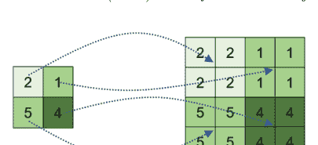

图15.7：CNN中的上采样：一个具有$2 \times 2$像素的图像被扩展为一个具有$4 \times 4$像素的新图像。在这种情况下，原始图像中一个像素的值在放大图像的相应位置被复制四次。

## 15.4 上采样

CNN中另一个常用的技术是上采样（或上池化）。它通过将一个像素扩展为四个具有相同值的像素来放大图像，如图15.7所示。当需要放大图像时使用此技术，例如在自编码器（将在第17章讨论）的解码器部分。

请注意，图像处理中还有许多其他类似操作。在介绍了上述基本操作后，我们现在可以配置一个CNN网络。

## 15.5 典型CNN的配置

典型CNN的配置如图15.8所示。一张黑白或RGB图像首先被输入到一组滤波器（F）中，该组滤波器由若干（6-64）个滤波器通道组成，每个通道都有自己的一组权重和一个偏置。滤波器尺寸可以是$3 \times 3$、$5 \times 5$或另一个方向上的奇数。滤波后的图像可能会经过一个可能的池化（P）操作，该操作通常是$2 \times 2$大小。这会使高度和宽度都减半，但通道数量保持不变。池化执行固定操作：最大池化或平均池化。它不引入任何额外的训练参数。可能会应用另一组滤波器，这会进一步增加滤波器通道的数量。如果另一个

## 15.6 一些里程碑式的CNN

利用我们目前讨论过的基本构建模块，可以为计算机视觉和基于图像的物体检测等非常复杂的任务构建一个真正复杂的神经网络。该领域的发展非常迅速，已经提出了许多有用的特殊网络。本节将简要讨论一些广泛使用的里程碑式CNN网络。这些网络建立在全连接层、卷积层及其变体和组合的基本配置之上。人们发明了许多新的特殊技术和技巧来提高学习能力和效率。事实上，我们能构建的神经网络类型实际上没有限制，但有些网络对某些问题效果很好，有些则可能不行。在开始构建新网络之前，对这些成功的里程碑式网络有一个整体的了解会非常有用。其中许多网络的源代码已在GitHub上公开，可以根据那里指定的许可证有效利用。

我们无法涵盖所有优秀的里程碑式CNN网络，但读者可以在开源资源中找到更多，通常只需用关键词进行谷歌搜索即可。吴恩达的在线课程也对该主题进行了非常清晰的讨论。本节的目的只是提供一个概要讨论。首先，我们来看看LeNet-5。

### 15.6.1 LeNet-5

这个著名的CNN由LeCun等人于1998年提出[8]。其基本（不完全相同）结构如图15.9所示。它使用大小为(32 × 32 × 1)的黑白图像作为输入，隐藏层使用sigmoid激活函数，输出层使用softmax。与LeNet-5网络配置相关的详细数字列于图15.10。

| 模型设置 | 图像数据形状 | 数据大小 | 学习参数 | 总学习参数 |
| :--- | :--- | :--- | :--- | :--- |
| 输入层 | (32,32,1) | 3072 | 0 | 0 |
| 第1层 | 卷积层-1 (f=5, s=1) | (28,28,6) | 4704 | 1×5×5×6+6= 156 |
| 第2层 | 平均池化层-1 (f=2, s=2) | (14,14,6) | 1176 | 0 |
| 第3层 | 卷积层-2 (f=5, s=1) | (10,10,16) | 1600 | 6×5×5×16+16= 2416 |
| 第4层 | 平均池化层-2 (f=2, s=2) | (5,5,16) | 400 | 0 |
| 第5层 | 全连接层1 | (120,1) | 120 | 400×120+120= 48120 |
| 第6层 | 全连接层2 | (84,1) | 84 | 120×84+84= 10164 |
| 输出层 | (10,1) | 10 | 84×10+10= 850 | 61706 |

图15.10：LeNet-5的数据大小和学习参数。它总共有61,706个训练参数。卷积层的训练参数非常少，大部分学习参数来自全连接层。

图15.10清晰地展示了如何计算流经网络的前向数据数量以及每一层和总的学习参数数量。类似的计算可用于检查其他网络。

### 15.6.2 AlexNet

另一个著名的里程碑式CNN网络由Alex Krizhevsky、Ilya Sutskever和Geoffrey E. Hinton于2012年提出。该网络赢得了2012年ImageNet LSVRC-2012竞赛。其配置如图15.11所示。详细信息可在原始论文[9]中找到。这是一篇被广泛使用的论文，很容易在网上找到。它与LeNet-5有一些相似之处，但多了3个卷积层和一个全连接层。这3个全连接层拥有更多的神经元。它是为ImageNet上的1000类分类任务构建的。AlexNet的规模要大得多。它还使用了许多新技术，包括Relu激活函数来处理梯度消失问题，以及在前两个全连接层使用dropout技术来缓解过拟合。

读者可以阅读原始论文以找到更多细节。吴恩达的在线讲座和高浩的文章也对AlexNet进行了很好的分析。

图15.11：AlexNet：它有1个输入层，5个卷积层，3个隐藏全连接层和1个输出全连接层。总学习参数约为6230万，其中约6%来自卷积层，94%来自全连接层。

### 15.6.3 VGG-16

另一个流行的传奇CNN网络是VGG-16，它在AlexNet的基础上进行了多项改进。它将层数从8层增加到16层，并采用了精心设计的卷积和最大池化。其配置具有以下吸引人的统一性：

-   所有卷积层都统一使用相同的 $3 \times 3$ 滤波器大小、步幅1和填充1，后接一个最大池化层。
-   所有最大池化层都使用相同的 $2 \times 2$ 大小和步幅2。
-   网络块的高度和宽度从一个卷积层到下一个大致减半。
-   滤波器通道数从一个卷积层到下一个总是翻倍。

VGG-16由K. Simonyan和A. Zisserman在其论文[10]中提出。VGG-16是提交给ILSVRC-2014的最佳模型之一。它在包含超过1400万张图像、1000个类别的ImageNet数据集上达到了92.7%的准确率。感兴趣的读者可以阅读原始论文和在线文章，例如Nerohive上的文章。TensorFlow-vgg提供了VGG-16的实现。它在Keras和Pytorch中也有实现。

### 15.6.4 ResNet

ResNet代表残差神经网络。它由何恺明、张祥雨、任少卿和孙剑于2015年提出[11]。ResNet与上述网络（如VGG-16）的主要区别在于使用了**跳跃连接**：一层（卷积层或全连接层）的激活可以跳过一层，连接到下一层，然后应用激活函数（通常是Relu）。这很好地缓解了梯度消失问题，使得网络可以构建得更深，因此达到了152层。它总共有约2300万个学习参数。深度能力对于许多视觉识别任务非常重要。ResNet在COCO物体检测数据集上获得了28%的相对改进。它是ILSVRC & COCO 2015竞赛的基础，作者在ImageNet检测、ImageNet定位、COCO检测和COCO分割任务中均获得了第一名。

跳跃连接是一种有用的技术，可以轻松实现。例如，对于一个全连接的MLP，在前馈过程中，ResNet中的激活值变为（与第13章公式(13.5)比较）

$$
\begin{aligned}
\mathbf{x}^{(0)} &= \mathbf{x} = [x_1, x_2, ..., x_p] & &\text{输入特征} \\
\mathbf{x}^{(1)} &= \phi^{(1)}(\underbrace{\mathbf{x}^{(0)}\mathbf{W}^{(1)} + \mathbf{b}^{(1)}}_{\mathbf{z}^{(1)}}) & &\text{第1隐藏层} \\
\mathbf{x}^{(2)} &= \phi^{(2)}(\underbrace{\mathbf{x}^{(1)}\mathbf{W}^{(2)} + \mathbf{b}^{(2)}}_{\mathbf{z}^{(2)}}) & &\text{第2隐藏层} \\
\mathbf{x}^{(3)} &= \phi^{(3)}(\underbrace{\mathbf{x}^{(2)}\mathbf{W}^{(3)} + \mathbf{b}^{(3)}}_{\mathbf{z}^{(3)}} + \mathbf{x}^{(0)}\mathbf{W}^{(1)}) & &\text{第3隐藏层} \\
\mathbf{x}^{(4)} &= \phi^{(4)}(\underbrace{\mathbf{x}^{(3)}\mathbf{W}^{(4)} + \mathbf{b}^{(4)}}_{\mathbf{z}^{(4)}} + \mathbf{x}^{(1)}\mathbf{W}^{(2)}) & &\text{第4隐藏层} \\
&\cdots & & \\
\mathbf{x}^{(n)} &= \phi^{(n)}(\underbrace{\mathbf{x}^{(n-2)}\mathbf{W}^{(n-1)} + \mathbf{b}^{(n-1)}}_{\mathbf{z}^{(n)}} + \mathbf{x}^{(n-4)}\mathbf{W}^{(n-3)}) & &\text{第n隐藏层} \\
\hat{\mathbf{y}} &= \mathbf{x}^{(N_L)} \\
&= \phi^{(N_L)}(\underbrace{\mathbf{x}^{(N_L-2)}\mathbf{W}^{(N_L-1)} + \mathbf{b}^{(N_L-1)}}_{\mathbf{z}^{(N_L)}} + \mathbf{x}^{(N_L-4)}\mathbf{W}^{(N_L-3)}) & &\text{输出预测}
\end{aligned}
$$

这里上标括号中的数字代表层号。花括号上方的项是仿射变换函数 $\mathbf{z}^{(i)} (i = 1, 2, \ldots, N_L - 1)$，它们可以逐层变化，并为过去层的信息提供新的独立“特征”，作为下一层的输入（在馈入激活函数之后）。新特征空间的维度相应地变化。对于从前面层获取输入的层，维度会累加。这可能是缓解梯度消失问题的原因。

公式(15.1)假设跳跃连接应用于从第3个隐藏层开始的所有层。人们可以选择不跳过某些层。在这种情况下，相应层中的蓝色项应该被移除。还假设跳跃只跨越一层。当执行多层跳跃时，公式(15.1)可以很容易地相应调整。注意，理论上每一层使用的激活函数可以不同，尽管我们通常在ResNet中对所有层使用Relu。此外，任何层 $\mathbf{z}_l$ 的激活都可以替换为卷积层的激活。这同样适用于具有混合全连接层和卷积层的网络。

关于ResNet的更详细描述可以在原始论文中找到，也可以在Towards Data Science网站上的一篇文章中找到，其中给出了ResNet的详细架构，并与VGG-19（VGG-16的后期版本）和所谓的plain网络（无跳跃连接）进行了比较。

读者也可以查看一个干净的Keras残差网络实现。

### 15.6.5 Inception

Inception网络是CNN发展中的又一个里程碑。它由Christian Szegedy、Wei Liu以及其他七位合著者于2014年提出[12]，其中给出了详细的架构。多年来它不断改进，当前版本是Inception v4和Inception-ResNet。

Inception在2014年ImageNet大规模视觉识别挑战赛（ILSVRC14）中为分类和检测设立了新的技术标杆。它也被称为GoogLeNet。与前面讨论的网络相比，Inception网络使用了以下关键思想：

- 它使用了所谓的跨通道1×1卷积。这允许在卷积层内配置一个跨通道的密集连接的一维网络，称为网络中的网络。1×1卷积由Min Lin、Qiang Chen和Shuicheng Yan于2014年提出[13]。
- 使用网络中的网络配置可以减少卷积层内的通道数，从而大幅节省计算量。
- 它构建了**Inception模块**，该模块封装了多个卷积操作，包括1×1、3×3、5×5卷积和最大池化，全部在一个卷积层中，这使得网络能够学习在卷积层中使用哪些最佳操作和滤波器（或卷积核）尺寸。这在1×1卷积的帮助下得以实现并保持高效。
- Inception模块成为构建深度Inception网络的新构建块。

读者可以从原始论文和Towards Data Science上的一篇介绍文章中找到更多细节。

### 15.6.6 YOLO：用于目标检测的卷积网络

在相关行业（如自动驾驶汽车）竞赛的推动下，CNN的发展越来越快。对于许多实际应用，例如自动驾驶汽车，我们必须拥有基于图像的快速可靠的实时目标检测。YOLO是用于此类任务的杰出深度网络之一。YOLO代表“你只需看一次”[14]，由Joseph Redmon、Santosh Divvala、Ross Girshick和Ali Farhadi提出。当前版本是YOLO-v3。这里，我们总结了YOLO网络中使用的许多关键技术：

- 它对给定的完整图像应用单个卷积神经网络来执行检测，这消除了扫描图像并逐帧处理子图像帧的需要。这允许非常快速的预测。
- 目标所需的不同类型的预测，包括目标的类型（类别）、目标的位置和目标的（框）尺寸，都被标记出来，以便网络可以一次性训练以实现快速检测（你只需看一次）。
- 它将给定图像划分为区域，并预测每个区域中类别存在的概率和边界框。

YOLO中开发和实现了许多其他技术和技巧。感兴趣的读者可以阅读原始论文和在线文章，例如Towards Data Science上的那篇。也可以访问YOLO项目网站，在那里可以找到关于COCO数据集上目标检测性能的基准研究。还可以跟进那里的最新发展。

本课程为读者准备了大量机器学习的基础知识。我们现在有了很多构建块，并且已经看到了一些杰出的实现。现在是时候尝试将这些构建块组合起来，解决手头的一些问题了。当网络变深时，有许多不同的方法可以添加不同类型的连接，并将事物组合起来完成复杂任务。我们还将继续研究并发明新的技术和技巧。跟进这个非常活跃的发展领域中领跑者的当前工作也可能是富有成效的。每天都有许多新颖的技术和技巧被开发出来，其中一些不仅对你可能正在从事的项目有用，而且如果你对相关领域的研究感兴趣，也有助于开发新想法。作者和合作者也在相关领域进行了一些研究[6]。

最后，让我们看一个由TensorFlow提供的CNN网络示例。

## 15.7 卷积神经网络示例

本教程演示了训练一个简单的CNN来对CIFAR图像进行分类。因为本教程使用Keras Sequential API（应用程序编程接口），创建和训练CNN模型只需几行代码。本材料根据Apache License, Version 2.0授权。

### 15.7.1 导入TensorFlow

```python
import tensorflow as tf
from tensorflow.keras import datasets, layers, models
import matplotlib.pyplot as plt
```

### 15.7.2 下载和准备CIFAR10数据集

CIFAR10数据集包含60,000张10个类别的彩色图像，每个类别有6,000张图像。数据集分为50,000张训练图像和10,000张测试图像。这些类别是互斥的，它们之间没有重叠。

```python
(train_images, train_labels), (test_images, test_labels) = \
    datasets.cifar10.load_data()
# Normalize pixel values to be between 0 and 1
train_images, test_images = train_images / 255., test_images / 255.
```

### 15.7.3 数据验证

为了验证数据集，让我们绘制训练集中的前25张图像，并在每张图像下方显示类别名称。

```python
class_names = ['airplane', 'automobile', 'bird', 'cat', 'deer',
               'dog', 'frog', 'horse', 'ship', 'truck']

plt.figure(figsize=(10,10))

for i in range(36):
    plt.subplot(6,6,i+1)
    plt.xticks([])
    plt.yticks([])
    plt.grid(False)
    plt.imshow(train_images[i], cmap=plt.cm.binary)
    # The CIFAR labels happen to be arrays,
    # which is why you need the extra index
    plt.xlabel(class_names[train_labels[i][0]])
plt.show()
```

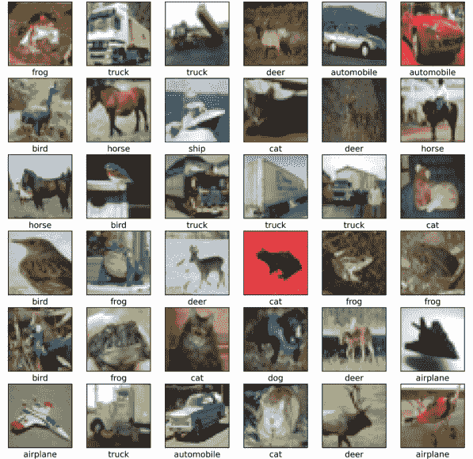

图15.12：CIFAR10数据集中的样本图像。

### 15.7.4 创建Conv2D层

下面的代码使用一个常见模式定义了一个CNN：Conv2D和MaxPooling2D层的堆栈。它以形状为（图像高度，图像宽度，颜色通道）的张量形式接收图像。颜色通道指的是（R,G,B）。本示例配置了一个CNN来处理形状为（32, 32, 3）的输入，这是CIFAR图像的格式。这是通过将参数`input_shape`传递给第一层来完成的。

```python
model = models.Sequential()
model.add(layers.Conv2D(32, (3, 3), activation='relu',
                        input_shape=(32, 32, 3)))
model.add(layers.MaxPooling2D((2, 2)))
model.add(layers.Conv2D(64, (3, 3), activation='relu'))
model.add(layers.MaxPooling2D((2, 2)))
model.add(layers.Conv2D(64, (3, 3), activation='relu'))
```

让我们显示我们的CNN模型的架构。

```python
model.summary()
```

Model: "sequential"

| 层（类型） | 输出形状 | 参数数量 |
| :--- | :--- | :--- |
| conv2d (Conv2D) | (None, 30, 30, 32) | 896 |
| max_pooling2d (MaxPooling2D) | (None, 15, 15, 32) | 0 |
| conv2d_1 (Conv2D) | (None, 13, 13, 64) | 18496 |
| max_pooling2d_1 (MaxPooling2D) | (None, 6, 6, 64) | 0 |
| conv2d_2 (Conv2D) | (None, 4, 4, 64) | 36928 |

总参数：56,320
可训练参数：56,320
不可训练参数：0

可以看出，每个Conv2D和MaxPooling2D层的输出都是一个具有自身形状（高度，宽度，通道）的3D张量。宽度和高度的维度通常设置为缩小，而通道的维度随着网络加深而设置为增加。自然地，随着Conv2D层宽度和高度的缩小，可以添加更多的输出通道。每个Conv2D层的输出通道数（例如，本示例中的32或64）由第一个参数控制。

### 15.7.5 在Conv2D层上添加Dense层

最后一个Conv2D层的输出张量形状为（4, 4, 64），被馈送到一个或多个密集层以执行多分类。因为密集层接受一维向量作为输入，所以3D的Conv2D输出需要被展平为一维。由于CIFAR在输出端有10个类别，最终的Dense层应有10个输出神经元，并使用softmax激活函数。

```python
model.add(layers.Flatten())
model.add(layers.Dense(64, activation='relu'))
model.add(layers.Dense(10))
```

我们CNN模型的完整架构如下所列：

```python
model.summary()
```

Model: "sequential"

| 层（类型） | 输出形状 | 参数数量 |
| :--- | :--- | :--- |
| conv2d (Conv2D) | (None, 30, 30, 32) | 896 |
| max_pooling2d (MaxPooling2D) | (None, 15, 15, 32) | 0 |
| conv2d_1 (Conv2D) | (None, 13, 13, 64) | 18496 |
| max_pooling2d_1 (MaxPooling2D) | (None, 6, 6, 64) | 0 |
| conv2d_2 (Conv2D) | (None, 4, 4, 64) | 36928 |
| flatten (Flatten) | (None, 1024) | 0 |
| dense (Dense) | (None, 64) | 65600 |
| dense_1 (Dense) | (None, 10) | 650 |

总参数：122,570
可训练参数：122,570
不可训练参数：0

如上所示，`conv2d_2`层输出的3D (4, 4, 64) 张量在输入第一个全连接层之前，被展平为形状为 (1024) 的1D向量。

### 15.7.6 编译和训练CNN模型

```python
model.compile(optimizer='adam',
              loss=tf.keras.losses.SparseCategoricalCrossentropy(
                  from_logits=True), metrics=['accuracy'])

history = model.fit(train_images, train_labels, epochs=10,
                    validation_data=(test_images, test_labels))
```

```
Epoch 1/10
1563/1563 [==============================] - 45s 28ms/step - loss: 1.7221 - accuracy: 0.3648 - val_loss: 1.2347 - val_accuracy: 0.5573
Epoch 2/10
1563/1563 [==============================] - 42s 27ms/step - loss: 1.1582 - accuracy: 0.5869 - val_loss: 1.0298 - val_accuracy: 0.6363
.....
Epoch 9/10
1563/1563 [==============================] - 39s 25ms/step - loss: 0.5681 - accuracy: 0.7993 - val_loss: 0.8510 - val_accuracy: 0.7178
Epoch 10/10
1563/1563 [==============================] - 39s 25ms/step - loss: 0.5337 - accuracy: 0.8114 - val_loss: 0.9123 - val_accuracy: 0.6919
```

我们的CNN模型训练了10个周期，每个周期大约需要40秒的运行时间。

### 15.7.7 训练好的CNN模型的评估

```python
plt.plot(history.history['accuracy'], label='accuracy')
plt.plot(history.history['val_accuracy'], label='val_accuracy')
plt.xlabel('Epoch')
plt.ylabel('Accuracy')
plt.ylim([0.5, 1])
plt.legend(loc='lower right')
test_loss, test_acc = model.evaluate(test_images, test_labels, verbose=2)
```

```
313/313 - 3s - loss: 0.9123 - accuracy: 0.6919
```

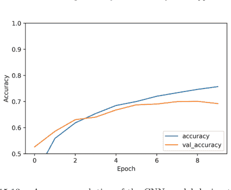

图15.13：CNN模型在训练过程中的准确率变化。

这个简单的CNN模型达到了约70%的测试准确率，如图15.13所示。对于几行代码来说，这已经很不错了！关于另一个CNN模型，读者可以参考这里使用Keras子类化API和`tf.GradientTape`的一个示例。

## 15.8 YOLO在目标检测中的应用

目标检测涉及从给定图像中识别目标，包括它们的存在、身份、尺寸和位置。我们需要高效的技术，如目标识别、分类、定位和尺寸确定。对于自动驾驶汽车等实际应用，我们需要实时执行这种目标检测。YOLO是最佳选择之一。

YOLO各版本的复杂源代码和预训练模型是可用的，许多在官方的DarkNet GitHub仓库中，用C语言编写，并附有使用教程。也有第三方在Keras中实现的YOLO。一个广泛使用的项目是Huynh Ngoc Anh的“keras-yolo3：使用YOLO3训练和检测目标”。该项目简称experiencor。项目中的代码在MIT开源许可下可用，该许可是宽松的。它提供了加载、使用预训练YOLO模型的脚本，以及在新数据集上迁移学习以开发新YOLOv3模型的方法。

在本节中，我们将介绍使用预训练YOLOv3模型对给定图像进行目标检测的基本流程。本节使用的材料和代码基于Jason Brownlee在experiencor YOLO3项目上发表的一篇非常清晰详细的在线文章。代码有点长，因此不会在此列出，但在建立基本理解后应该很容易遵循。来源也列在附加参考部分。

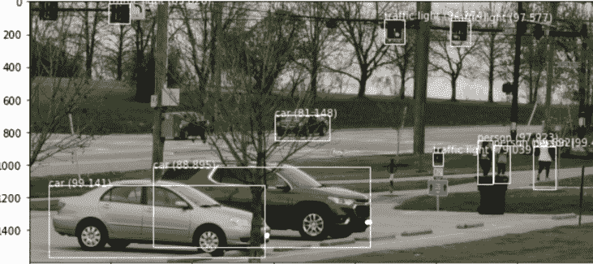

图15.14：YOLOv3目标检测：交通灯路口周围的汽车、行人、交通灯。

首先，我们拍摄一张包含一些感兴趣目标的照片，以检测其中是否包含行人、汽车和交通灯。我们使用训练好的YOLOv3模型对照片中的目标进行预测。结果如图15.14所示。

YOLOv3在4辆汽车中定位了3辆。漏掉的那辆被遮挡太多，即使是人也可能看不到它。所有三个行人都被正确定位。它定位了4个交通灯，其中3个是正确的。被检测为交通灯的小方框是公园用户的容器箱。它不完全是一个交通灯，但非常相似。因此，这可能有争议。总的来说，YOLOv3在从如此杂乱的图像中定位所有这些感兴趣目标方面做得非常出色。在作者的笔记本电脑上，检测所花费的时间约为20秒。

使用相同的代码，我们检测了更多照片，结果总结如下。

对于上述情况，YOLOv3以95.86%的置信度在卡车上发现了一个行人。它还以66.15%的置信度定位了卡车（因为它实际上是一个拖车），以及所有四辆汽车，置信度分别为61.95%、84.14%、99.63%和98.79%。所有这些目标都被定位并框出，如图15.15和15.18所示。

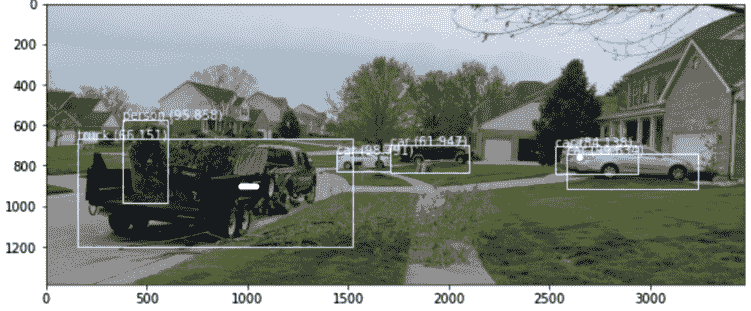

图15.15：YOLOv3成功检测到一名站在卡车上的男子（在照片右侧，人类很难看到），尽管图像的该部分相当暗。

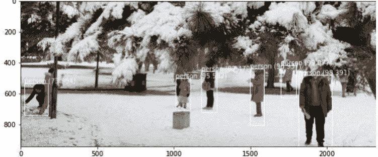

图15.16：训练好的YOLOv3检测到的穿着冬装的行人。

附加参考和延伸阅读：

- Jason Brownlee, 2019, How to Perform Object Detection With YOLOv3 in Keras.
- experiencor/keras-yolo3, GitHub.
- You Only Look Once: Unified, Real-Time Object Detection, 2015.
- YOLO9000: Better, Faster, Stronger, 2016.
- YOLOv3: An Incremental Improvement, 2018.
- matplotlib.patches.Rectangle API.
- YOLO: Real-Time Object Detection, Homepage.
- Official DarkNet and YOLO Source Code, GitHub.

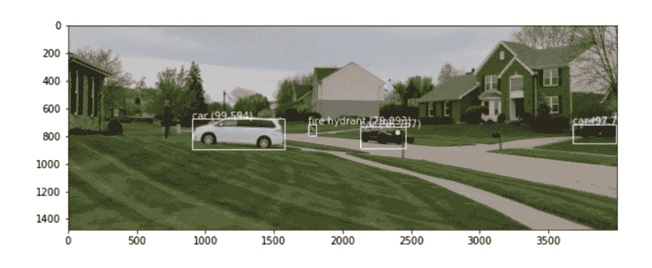

图15.17：训练好的YOLOv3检测到的四辆汽车和一个消防栓。

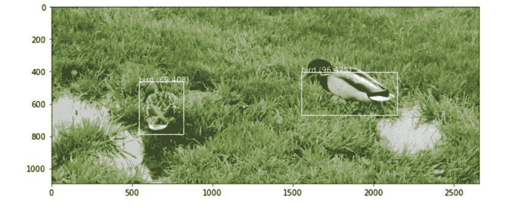

图15.18：训练好的YOLOv3检测到的沼泽地上的两只鸟。

- Official YOLO: Real Time Object Detection.
- Huynh Ngoc Anh, experiencor, Home Page.
- allanzelener/YAD2K, GitHub.
- qqwweee/keras-yolo3, GitHub.
- xiaochus/YOLOv3 GitHub.
- Blog of Rahmad Sadli.

在结束本章之前，我们可能注意到，从MLP到conv2D，发生了相当显著的变化。这种变化导致了机器学习的巨大进步。这告诉我们，我们的思想需要对科学技术的进步保持开放。有人可能会问：我们能有conv1D吗？答案是肯定的。感兴趣的读者可以参考Jason Brownlee在https://machinelearningmastery.com/cnn-models-for-human-activity-recognition-time-series-classification/上的在线文章。那么，conv3D呢？是的，你猜对了。

## 参考文献

[1] K. Fukushima, Neocognitron: A self-organizing neural network model for a mechanism of pattern recognition unaffected by shift in position, *Biological Cybernetics*, **36**, 193–202, 2004.

[2] D. Ciresan, M. Ueli and J. Schmidhuber, Multi-column deep neural networks for image classification, *2012 IEEE Conference on Computer Vision and Pattern Recognition*, 3642–3649, 2012.

[3] I. Goodfellow, B. Yoshua and C. Aaron, Deep learning, *Nature*, **521**, 436–444, 2015.

[4] M.V. Valueva, N.N. Nagornov, P.A. Lyakhov *et al.*, Application of the residue number system to reduce hardware costs of the convolutional neural network implementation, *Mathematics and Computers in Simulation*, **177**, 232–243, 2020. https://www.sciencedirect.com/science/article/pii/S0378475420301580.

[5] Duan Shuyong, Ma Honglei, G.R. Liu *et al.*, Development of an automatic lawnmower with real-time computer vision for obstacle avoidance, *International Journal of Computational Methods*, Accepted, 2021.

[6] Duan Shuyong, Lu Ningning, Lyu Zhongwei *et al.*, An anchor box setting technique based on differences between categories for object detection, *International Journal of Intelligent Robotics and Applications*, 1–14, 2021.

[7] V. Dumoulin and F. Visin, A guide to convolution arithmetic for deep learning, arXiv, 1603.07285, 2018.

[8] Y. Lecun, L. Bottou, Y. Bengio *et al.*, Gradient-based learning applied to document recognition, *Proceedings of the IEEE*, **86**(11), 2278–2324, 1998.

[9] A. Krizhevsky, I. Sutskever and G. E., Imagenet classification with deep convolutional neural networks, *Advances in Neural Information Processing Systems*, 2012.

[10] S. Karen and Z. Andrew, Very deep convolutional networks for large-scale image recognition, arXiv preprint arXiv:1409.1556, 2014. https://www.bibsonomy.org/bibtex/2bc3ee27a1dd159f48b10ac3555879865/buch_jon.

[11] He Kaiming, Zhang Xiangyu, Ren Shaoqing *et al.*, Deep residual learning for image recognition, *CoRR*, abs/1512.03385, 2015. http://arxiv.org/abs/1512.03385.

[12] Christian Szegedy, Wei Liu, Yangqing Jia *et al.*, Going Deeper with Convolutions, 2014.

[13] Min Lin, Qiang Chen and Shuicheng Yan, *Network In Network*, 2014. https://arxiv.org/abs/1312.4400.

[14] R. Joseph, D. Santosh, G. Ross *et al.*, You only look once: Unified, real-time object detection, *CoRR*, abs/1506.02640, (1), 2015. http://arxiv.org/abs/1506.02640.

## 第16章

## 循环神经网络（RNN）与序列特征模型

循环神经网络（RNNs）是另一类相当特殊的人工神经网络（NNs），适用于具有序列或时间意义特征的数据集。RNN通常具有一个记录在记忆单元中的内部状态，因此它可以处理序列输入，例如视频和语音记录。仿射变换被用于一个扩展的仿射空间，该空间将记忆状态作为附加特征包含在内。RNN在许多领域都有重要应用，包括自然语言处理、语音识别、翻译、音乐创作、机器人控制和无约束手写识别[1]，仅举几例。关于RNN的最新综述可参见[2]。

已经开发了不同类型的RNN [2]。本章重点介绍最初由Sepp Hochreiter和Jürgen Schmidhuber提出的所谓长短期记忆网络（LSTMs）[3]。这是因为（1）LSTM应用和研究最为广泛；（2）一旦充分理解了LSTM，就相对容易理解其他RNN；（3）大多数公开可用的模块都内置了LSTM类，可随时使用。

一个典型的LSTM单元由一个**单元**、一个**更新门**、一个**遗忘门**和一个**输出门**组成。该单元记忆与序列数据输入相对应的时间序列上的值。这三个门调节记忆单元与新输入数据之间的信息交换。调节水平由具有学习参数的嵌套神经网络（NN）层控制。这些参数通过类似于前面章节讨论的NN或MLP模型的监督过程进行训练。

LSTMs的开发是为了解决在训练传统NN时遇到的梯度消失问题，因为它们允许信息通过LSTM内部建立的互联在层间深度传播。

在撰写本章时，除了参考文献部分列出的资料外，还参考了以下材料：Keras关于LSTM的文档、维基百科关于LSTM的页面等。

### 16.1 LSTM的典型结构

图16.1展示了在处理序列数据集时展开的LSTM的示意图。考虑一个具有$p$维向量且随时间变化的数据集。设

$T$：时间序列的数量
$p$：特征向量的维度
$l$：LSTM输出空间的维度

我们记，

输入数据：
$\mathbf{x} = [\mathbf{x}^{(1)}, \mathbf{x}^{(2)}, \dots, \mathbf{x}^{(t)}, \dots, \mathbf{x}^{(T)}]^\top \in \mathbb{X}^{T \times p}, \quad \mathbf{x}^{(t)} \in \mathbb{X}^p$

激活状态：
$\mathbf{a} = [\mathbf{a}^{(0)}, \mathbf{a}^{(1)}, \mathbf{a}^{(2)}, \dots, \mathbf{a}^{(t)}, \dots, \mathbf{a}^{(T)}] \in \mathbb{X}^{(T+1) \times l}, \quad \mathbf{a}^{(t)} \in \mathbb{X}^l$

记忆单元状态：
$\mathbf{c} = [\mathbf{c}^{(0)}, \mathbf{c}^{(1)}, \mathbf{c}^{(2)}, \dots, \mathbf{c}^{(t)}, \dots, \mathbf{c}^{(T)}] \in \mathbb{X}^{(T+1) \times l}, \quad \mathbf{c}^{(t)} \in \mathbb{X}^l$

在LSTM中，初始向量$\mathbf{a}^{(0)}$和$\mathbf{c}^{(0)}$通常设置为零。这些激活状态可以在每个时间序列输出，也可以仅在最终时间$T$输出，这取决于手头问题训练中使用的标签类型。

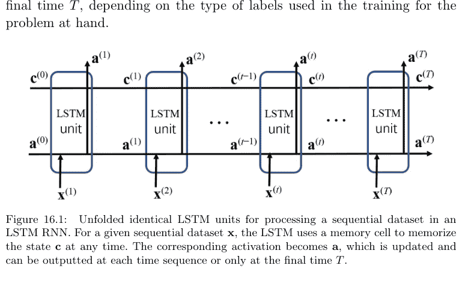

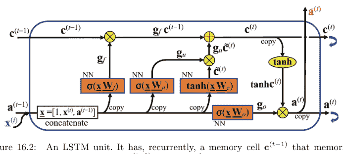

图16.2：一个LSTM单元。它递归地包含一个记忆状态$\mathbf{c}^{(t-1)}$和一个激活状态$\mathbf{a}^{(t-1)}$，两者均在$\mathbb{X}^l$中。该单元对应于时间$t$的数据输入$\mathbf{x}^{(t)} \in \mathbb{X}^p$。橙色方块是神经网络层或MLP，它们在扩展仿射空间$\overline{\mathbb{X}}^{1+p+l}$中执行仿射变换，生成一个$\mathbb{X}^l$中的向量。黄色圆圈和椭圆表示逐元素操作。

这些门配备了独立的学习参数，用于控制$\mathbf{x}$、$\mathbf{a}$和$\mathbf{c}$之间的信息交换。

请注意，图16.1用于展示LSTM内部的序列处理过程。在实际计算中，只需要一个LSTM单元在循环中运行，通过将$\mathbf{a}^{(t)}$和$\mathbf{c}^{(t)}$反馈到下一个时间序列。一个典型的单元如图16.2所示，其中显示了所有详细操作。

### 16.2 LSTM的公式化

#### 16.2.1 一般公式化

考虑时间$t$。开始时，激活状态为$\mathbf{a}^{(t-1)}$，记忆单元为$\mathbf{c}^{(t-1)}$。设$l$为LSTM输出的维度。数据$\mathbf{x}^{(t)}$是一个具有$p$个分量的向量，现在被输入。数据$\mathbf{x}^{(t)}$和先前的激活$\mathbf{a}^{(t-1)}$被连接在一起形成一个扩展仿射空间，其维度为$1 + p + l$。我们使用所有当前学习参数执行以下操作：

$\overline{\mathbf{x}}_a = [1, \mathbf{x}^{(t)}, \mathbf{a}^{(t-1)}] \in \overline{\mathbb{X}}^{1+l+p}$ 扩展仿射空间
$\tilde{\mathbf{c}} = \tanh(\overline{\mathbf{x}}_a \hat{\mathbf{W}}_c) \in (-1, 1)^l$ 候选记忆
$\mathbf{g}_u = \sigma(\overline{\mathbf{x}}_a \hat{\mathbf{W}}_u) \in (0, 1)^l$ 更新门
$\mathbf{g}_f = \sigma(\overline{\mathbf{x}}_a \hat{\mathbf{W}}_f) \in (0, 1)^l$ 遗忘门
$\mathbf{g}_o = \sigma(\overline{\mathbf{x}}_a \hat{\mathbf{W}}_o) \in (0, 1)^l$ 输出门
$\mathbf{c}^{(t)} = \mathbf{g}_u * \tilde{\mathbf{c}} + \mathbf{g}_f * \mathbf{c}^{(t-1)} \in (-1, 1)^l$ 新记忆
$\mathbf{a}^{(t)} = \mathbf{g}_o * \tanh(\mathbf{c}^{(t)}) \in (-1, 1)^l$ 新激活

(16.3)

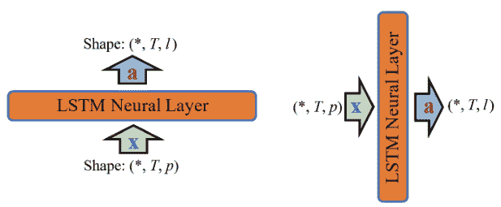

图16.3：LSTM层。LSTM可以简单地视为一个普通的NN层，可以水平放置（左）或垂直放置（右）。输入x的典型形状为(m, T, p)，输出a的形状为(m, T, l)，其中m代表小批量大小。如果只需要最终的激活输出，则a^(T)的形状为(m, l)。

我们用蓝色突出显示输入，用红色突出显示输出。这两者是LSTM单元之间的连接点。学习参数是W_c、W_u、W_f和W_o。如果在LSTM中使用单个NN层，它们都在W^{(1+l+p)×l}中，因此训练参数的总数为P = 4 × (1 + l + p) × l。方程(16.3)实际上是LSTM的计算图，它给出了前向和后向路径。由于所有这些操作都是链式的，并且所有这些激活函数的导数都是可用的，因此可以使用自动微分以标准方式计算关于任何这些训练样本的梯度，如第8章所讨论的。

#### 16.2.2 LSTM层与标准神经层

需要注意的是，方程(16.3)和图示可能看起来很复杂，但它可以简单地视为一个单一的NN层。LSTM的输入只有x^(t)，输出只有a^(t)。所有其他都是内部变量。LSTM层可以如图16.3所示。因此，LSTM层非常易于使用，可以作为神经网络模型中的隐藏层，该模型在整个模型的终端输出层定义了适当的损失函数。

#### 16.2.3 简化LSTM

现在考虑一个特殊情况，即时间序列数量T = 1。在这种情况下，a^(t-1) = c^(t-1) = 0。我们的公式化简化为

$\overline{\mathbf{x}} = [1, \mathbf{x}^{(t)}] \in \overline{\mathbb{X}}^{1+p}$ 标准仿射空间
$\tilde{\mathbf{c}} = \tanh(\overline{\mathbf{x}} \hat{\mathbf{W}}_c) \in (-1, 1)^l$ 候选记忆
$\mathbf{g}_u = \sigma(\overline{\mathbf{x}} \hat{\mathbf{W}}_u) \in (0, 1)^l$ 更新门
$\mathbf{g}_f = \sigma(\overline{\mathbf{x}} \hat{\mathbf{W}}_f) \in (0, 1)^l$ 遗忘门
$\mathbf{g}_o = \sigma(\overline{\mathbf{x}} \hat{\mathbf{W}}_o) \in (0, 1)^l$ 输出门
$\mathbf{c}^{(t)} = \mathbf{g}_u * \tilde{\mathbf{c}} \in (-1, 1)^l$ 新记忆
$\mathbf{a}^{(t)} = \mathbf{g}_o * \tanh(\mathbf{c}^{(t)}) \in (-1, 1)^l$ 新激活

可以简化为

$\mathbf{a}^{(t)} = \sigma(\overline{\mathbf{x}} \hat{\mathbf{W}}_o) * \tanh\left(\sigma(\overline{\mathbf{x}} \hat{\mathbf{W}}_u) * \tanh(\overline{\mathbf{x}} \hat{\mathbf{W}}_c)\right) \in (-1, 1)^l$ 新激活

请注意，$*$表示逐元素乘法。学习参数变为$\hat{\mathbf{W}}_c$、$\hat{\mathbf{W}}_u$和$\hat{\mathbf{W}}_o$。它们现在都在$\mathbb{W}^{(1+p) \times l}$中。它本质上是从标准仿射空间$\overline{\mathbb{X}}^{1+p}$到$(-1, 1)^l \in \mathbb{X}^l$的映射。与从$\overline{\mathbb{X}}^{1+p}$映射到$(-1, 1)^l \in \mathbb{X}^l$的标准NN层相比，简化LSTM配备了三倍的学习参数。训练参数的总数为$P = 3 \times (1 + p) \times l$。

方程(16.5)右边的第1项本质上是一个具有sigmoid激活的标准NN层，它由一个tanh函数调节，而该tanh函数本身又是另一个由tanh激活调节的NN的函数。这种配置使得所有这三组学习参数相互独立。因此，简化LSTM是一个由另外两个嵌套调节的NN调节的NN，从而导致三倍的学习参数。

### 16.3 窥孔LSTM

还有许多其他版本的LSTM，窥孔LSTM [4]就是其中之一。据说窥孔LSTM允许门访问恒定误差轮盘，使用单元状态$\mathbf{c}^{(t-1)}$而不是激活$\mathbf{a}^{(t-1)}$。请注意，如前所述，$\mathbf{c}^{(t-1)}$和$\mathbf{a}^{(t-1)}$具有相同的形状。因此，公式化非常相似，如下所示：

$\overline{\mathbf{x}} = [1, \mathbf{x}^{(t)}] \in \overline{\mathbb{X}}^{1+p}$ 标准仿射空间
$\overline{\mathbf{x}}_c = [\overline{\mathbf{x}}, \mathbf{c}^{(t-1)}] \in \overline{\mathbb{X}}^{1+l+p}$ 扩展仿射空间

$\tilde{\mathbf{c}} = \tanh(\overline{\mathbf{x}} \hat{\mathbf{W}}_c) \in (-1, 1)^l$ 候选记忆
$\mathbf{g}_u = \sigma(\overline{\mathbf{x}}_c \hat{\mathbf{W}}_u) \in (0, 1)^l$ 更新门
$\mathbf{g}_f = \sigma(\overline{\mathbf{x}}_c \hat{\mathbf{W}}_f) \in (0, 1)^l$ 遗忘门
$\mathbf{g}_o = \sigma(\overline{\mathbf{x}}_c \hat{\mathbf{W}}_o) \in (0, 1)^l$ 输出门
$\mathbf{c}^{(t)} = \mathbf{g}_u * \tilde{\mathbf{c}} + \mathbf{g}_f * \mathbf{c}^{(t-1)} \in (-1, 1)^l$ 新记忆
$\mathbf{a}^{(t)} = \mathbf{g}_o * \tanh(\mathbf{c}^{(t)}) \in (-1, 1)^l$ 新激活值

窥孔LSTM的所有其他操作与LSTM类似。

## 16.4 门控循环单元（GRU）

门控循环单元（GRU）由Kyunghyun Cho等人[5]提出。它可以被视为一种没有专用记忆单元的LSTM版本，因此比LSTM的学习参数更少。其公式如下。

考虑时间$t$。其前一时刻的激活状态为$\mathbf{a}^{(t-1)}$，其中$\mathbf{a}^{(0)} = \mathbf{0}$。设$l$为GRU输出的维度。数据$\mathbf{x}^{(t)}$是一个包含$p$个分量的向量，现在作为输入。数据$\mathbf{x}^{(t)}$和先前的激活$\mathbf{a}^{(t-1)}$被连接在一起，形成一个扩展的仿射空间，其维度应为$1 + p + l$。我们执行以下操作：

$\overline{\mathbf{x}}_a = [1, \mathbf{x}^{(t)}, \mathbf{a}^{(t-1)}] \in \overline{\mathbb{X}}^{1+l+p}$ 扩展仿射空间
$\mathbf{g}_u = \sigma(\overline{\mathbf{x}}_a \hat{\mathbf{W}}_u) \in (0, 1)^l$ 更新门
$\mathbf{g}_r = \sigma(\overline{\mathbf{x}}_a \hat{\mathbf{W}}_r) \in (0, 1)^l$ 重置门
$\overline{\mathbf{x}}_{ra} = [1, \mathbf{x}^{(t)}, \mathbf{g}_r \mathbf{a}^{(t-1)}] \in \overline{\mathbb{X}}^{1+l+p}$ 重置扩展仿射空间
$\tilde{\mathbf{a}} = \tanh(\overline{\mathbf{x}}_{ra} \hat{\mathbf{W}}_a) \in (-1, 1)^l$ 候选激活值
$\mathbf{a}^{(t)} = (1 - \mathbf{g}_u)\mathbf{a}^{(t-1)} + \mathbf{g}_u \tilde{\mathbf{a}} \in (-1, 1)^l$ 新输出激活值

GRU中的学习参数是$\hat{\mathbf{W}}_u$、$\hat{\mathbf{W}}_r$和$\hat{\mathbf{W}}_a$，是LSTM中参数的3/4。GRU也有其他变体版本。感兴趣的读者可以访问GRU的Wiki页面，然后查看其中的链接。

## 16.5 示例

### 16.5.1 一个用于回归的、带有标准神经网络层的简化LSTM

让我们首先看一个可以轻松手工构建以理解的简化LSTM示例。我们将使用第10章中逐步探讨的简单且熟悉的回归问题，使用合成数据集和MxNet。问题设置的细节将不再重复。在以下代码中，我们将遵循我们的xw公式：

```python
from __future__ import print_function
from mxnet import nd, autograd, gluon
import numpy as np
import mxnet as mx
import matplotlib.pyplot as plt
%matplotlib inline
np.set_printoptions(precision=4)

mx.random.seed(1)           # fix seed for repeatable random numbers.

# Specify GPU or CPU for the computation, mxnet's syntax.
data_ctx, model_ctx = mx.cpu(), mx.cpu()
num_inputs = 2               # p, 2D space with two features: x1, x2
num_outputs = 1              # k, one prediction y
num_samples = 1000           # Sample number, m, use 10 for debugging

p1 = num_inputs + 1          # dimension of the affine space

wr=nd.array([[4.2],[2.0],[-3.4]]) # true w_=[b,w0,w1].T,1 neuron
print(f" True w:{wr},{wr.shape}")

def true_fn(X, w): # linear func, 3 learning parameters:w1,w2,b
    return nd.dot(X,w)       # X is the X_; 2*x1-3.4*x2 + 4.2

X=nd.random_normal(shape=(num_samples,p1),ctx=data_ctx)
                            # randomly generate samples for x1 and x2
noise=.1*nd.random_normal(shape=(num_samples,num_outputs),
                           ctx=data_ctx)
                            # 10% noise, zero mean, 1 variance
X[:,0] = 1.0 # / num_samples
print(f" X in affine space:{X[0:4]},{X.shape}")

y = true_fn(X, wr) + noise  # Generate labels with noise.
print(f"y={y[0:4]}{y.shape}") # A peek at the dataset
```

True w:
[[ 4.2]
 [ 2. ]
 [-3.4]]
<NDArray 3x1 @cpu(0)>,(3, 1)
X in affine space:
[[ 1.    -0.4902 -0.9502]
 [ 1.    -0.7298 -2.0401]
 [ 1.     1.0408 -0.4526]
 [ 1.    -0.8367 -0.7883]]
<NDArray 4x3 @cpu(0)>,(1000, 3)
y=
[[6.5203]
 [9.5923]
 [7.7648]
 [5.2164]]
<NDArray 4x1 @cpu(0)>(1000, 1)

```python
# Plot the data points.
plt.scatter(X[:, 1].asnumpy(),y.asnumpy(),color='r') # 1st feature
plt.scatter(X[:, 2].asnumpy(),y.asnumpy(),color='b') # 2nd feature
plt.show()
```

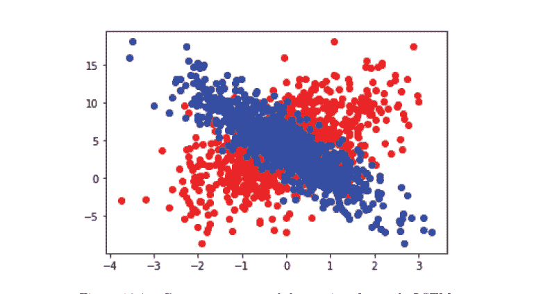

图16.4：用于研究LSTM的计算机生成数据点。

循环神经网络（RNN）与序列特征模型

571

```python
# Create data iterators
batch_size=32
train_data=gluon.data.DataLoader(gluon.data.ArrayDataset(X,y),
                                batch_size=batch_size, shuffle=True)

# Initialize the training parameters, only W_ is needed!
def init_wb(p1,l,k):           # p1: affine space dimension
    '''p:model num_inputs; l:lstm outputs; k:model num_outputs'''
    wo = nd.random_normal(shape=(p1,l),ctx=model_ctx)
    wu = nd.random_normal(shape=(p1,l),ctx=model_ctx)
    wc = nd.random_normal(shape=(p1,l),ctx=model_ctx)
    w  = nd.random_normal(shape=(l,k),ctx=model_ctx)
    return w, wo, wu, wc

l = 50
w, wo, wu, wc = init_wb(p1,l,num_outputs)  #p1 = p+1
params = [w, wo, wu, wc]

# Request for gradients
for param in params:
    param.attach_grad()
#print(param.grad)           # check initial gradients
```

```python
# Define a reduced LSTM layer

def rd_lstm(X):                          #only X_ is needed!
    '''Reduced LSTM, no T-loop'''
    tc = nd.tanh(nd.dot(X, wc))
    su = nd.sigmoid(nd.dot(X, wu))
    rd_lstm = nd.sigmoid(nd.dot(X, wo))*nd.tanh(su*tc)
    return rd_lstm

# Define a standard NN layer
def net(X):                              # X_ is needed
    return nd.dot(X, w)                  # only w_ is needed!

# Define a L2 loss function for regression
def square_loss(yhat, y):
    return nd.mean((yhat - y) ** 2)

# Optimizer using the stochastic gradient descent (SGD)
def SGD(params, lr):                     # lr: learning rate
    for param in params:
        param[:] = param - lr * param.grad
```

```python
# Training and plot the training process and results.

epochs = 50  # times of getting batch-data from dataset
num_batches = num_samples/batch_size

# Re-initialize parameters. They may be trained earlier
w, wo, wu, wc = init_wb(p1,l,num_outputs)  # p1 = p+1
params = [w, wo, wu, wc]
for param in params:
    param.attach_grad()

# Function to plot the losses over time
def plot(losses, X, s_s = 100):            #s_s: sample_size
    xs = list(range(len(losses)))
    f, (fg1, fg2) = plt.subplots(1, 2)
    fg1.set_title('Loss during training')
    fg1.plot(xs, losses, '-r')
    fg2.set_title('Estimated vs real function')
    fg2.plot(X[:s_s,2].asnumpy(),net(rd_lstm(X[:s_s,:])).asnumpy(),
             'or',label='Estimated')
    fg2.plot(X[:s_s, 2].asnumpy(), true_fn(X[:s_s,:],wr).asnumpy(),
             '*g',label='Real')
    fg2.legend()
    plt.show()

learning_rate = .1
losses = []
plot(losses, X)

for e in range(epochs):
    cumulative_loss = 0
    for i, (data, label) in enumerate(train_data):
        data = data.as_in_context(model_ctx)
        label = label.as_in_context(model_ctx).reshape((-1,1))

        with autograd.record():            #Computational graph
            output = net(rd_lstm(data))
            loss = square_loss(output, label)

        loss.backward()
        SGD(params, learning_rate)
        cumulative_loss += loss.asscalar()

    if e%10 ==0:
        print("Epoch %s, batch %s. Mean loss: %s" %
              (e, i, cumulative_loss/num_batches))

    losses.append(cumulative_loss/num_batches)

    plot(losses, X)
```

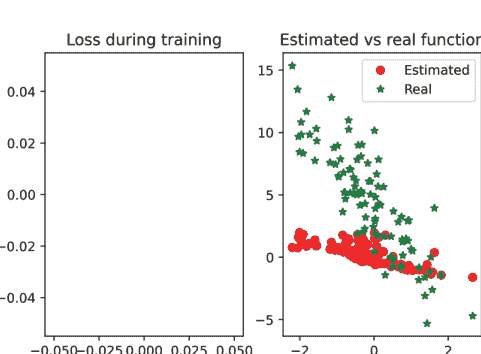

图16.5：使用训练前的LSTM进行预测。

Epoch 0, batch 31. Mean loss: 3.1009296717643737
Epoch 10, batch 31. Mean loss: 0.03779914233088493
Epoch 20, batch 31. Mean loss: 0.020572829380631447
Epoch 30, batch 31. Mean loss: 0.01705670604109764
Epoch 40, batch 31. Mean loss: 0.01468234208971262

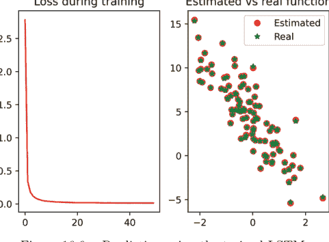

图16.6：使用训练后的LSTM进行预测。

本示例演示了一个简化版LSTM与标准神经网络层结合可以执行回归任务。对于这个简单示例，使用LSTM可能并无助益。事实上，它使模型不必要地复杂化，属于过度设计。然而，本示例清晰地展示了LSTM可以以嵌套方式内置多个可学习参数，这可能使其在处理复杂问题时具有更强的能力。

我们可以在简单代码中轻松创建一个循环，将简化版LSTM转换为完整LSTM。不过，更简单的方法是直接利用公开模块中已开发完善的LSTM类。

### 16.5.2 tensorflow.keras中的LSTM类

这次我们使用tensorflow.keras中的LSTM类。首先，我们使用随机生成的合成数据集来检查LSTM输入和输出的维度。

```python
import numpy as np
import tensorflow as tf
from tensorflow.keras.models import Sequential
from tensorflow.keras.layers import LSTM, Dense
```

```python
np.set_printoptions(precision=3)
tf.keras.backend.clear_session()

m, T, p = 32, 100, 28  # T: 时间步长; p: 特征数; m: 小批量大小
l = 4                  # l: LSTM输出维度

tf.random.set_seed(8)
inputs = tf.random.normal([m, T, p])
#inputs: 形状为 [m, T, p] 的3D张量。

lstm1 = tf.keras.layers.LSTM(l) # 创建一个LSTM实例
output0 = lstm1(inputs)

print(inputs[-1, T-1,0:p:10],'\n',inputs.shape)
print(output0[-1,:],'\n',output0.shape)  #(32, 4)
```

```
tf.Tensor([ 0.521 -1.34   1.215], shape=(3,), dtype=float32)
(32, 100, 28)
tf.Tensor([ 0.113  0.059 -0.321  0.248], shape=(4,), dtype=float32)
(32, 4)
```

```python
lstm2=tf.keras.layers.LSTM(1,return_sequences=True,return_state=True)

whole_seq_output, final_memory_state, final_carry_state=lstm2(inputs)

print(f"whole_seq_output.shape: {whole_seq_output.shape}")     #(32,100,4)
print(f"final_memory_state.shape:{final_memory_state.shape}")  #(32,4)
print(f"final_carry_state.shape:{final_carry_state.shape}")    #(32,4)
print(f"final_memory_states:{final_memory_state[-1,:]}")
print(f"final_carry_state",
      f"{final_carry_state[-1,:]}")
```

```
whole_seq_output.shape: (32, 100, 4)
final_memory_state.shape:(32, 4)
final_carry_state.shape:(32, 4)
final_memory_states:[ 0.079  0.01  -0.295  0.048]
final_carry_state [ 0.17   0.018 -0.863  0.099]
```

### 16.5.3 使用LSTM进行手写数字识别

我们现在使用LSTM进行手写数字识别。首先，我们使用MNIST的训练数据集训练一个LSTM模型，然后使用测试数据集进行测试，以检验训练好的LSTM模型的识别准确率。

我们第四次使用MNIST数据集。它包含带标签的28x28数字图像。这是一个静态数据集。然而，它可以被视为动态数据集。我们首先将图像中一行的像素视为一个特征向量，因此 p = 28。然后将每一行视为一个时间序列，这给出 T = 28。我们简单地使用LSTM模型的默认小批量大小，即 m = 32。

```python
mnist=tf.keras.datasets.mnist     # 28x28带标签的图像
(x_train,y_train),(x_test,y_test)=mnist.load_data()

x_train, x_test = x_train/255., x_test/255.   #归一化

print(x_train.shape, x_train.shape[1:])
T = x_train.shape[1:][0]
p = x_train.shape[1:][1]
k = len(np.unique(y_train))          # MNIST数据集的类别数 k
l = int(x_train[0].shape[0]*x_train[0].shape[1]/10)
# 使用总图像特征的1/10作为LSTM输出，l
p1 = 1 + p + l       # 扩展仿射空间的维度
print(f"Number of classes k ={k}")
```

```
(60000, 28, 28) (28, 28)
Number of classes k =10
```

```python
print(f"Number of features p ={p}")
print(f"Dimension of the affine space ={p1}")
print(f"Number of outputs from the LSTM layer ={l}")
print(f"Training Parameters in LSTM ={4*p1*l}")

model = Sequential()
# LSTM层处理序列数据 [m, T, k]
# 它产生输出 [m, l]。使用默认激活函数：tanh
# 仅输出最终激活值 a^T。
model.add(LSTM(l, input_shape=(x_train.shape[1:])))
# 添加一个用于k分类的密集层，使用LSTM输出。
model.add(Dense(k, activation='softmax')) # a^T 在此输入
optimizer=tf.keras.optimizers.Adam(learning_rate=.01,decay=1e-6)

# 编译模型：1个LSTM层，1个密集层，使用Adam优化器
model.compile(loss='sparse_categorical_crossentropy',
              optimizer=optimizer, metrics=['accuracy'])

model.summary()
```

```
Number of features p =28
Dimension of the affine space =107
Number of outputs from the LSTM layer =78
Training Parameters in LSTM =33384
Model: "sequential"
```

| 层 (类型) | 输出形状 | 参数数量 |
| :--- | :--- | :--- |
| lstm_2 (LSTM) | (None, 78) | 33384 |
| dense (Dense) | (None, 10) | 790 |
| **总参数:** | **34,174** | |
| **可训练参数:** | **34,174** | |
| **不可训练参数:** | **0** | |

我们的模型LSTM层有33,384个训练参数，与我们的计算一致。整个模型由一个LSTM层和一个密集神经网络层组成。我们现在开始训练模型。

```python
model.fit(x_train,y_train,epochs=3,validation_data=(x_test,y_test));
# 使用默认的小批量大小32
```

```
Epoch 1/3
1875/1875 [==============================] - 32s 16ms/step - loss: 0.2583 - accuracy: 0.9175 - val_loss: 0.1020 - val_accuracy: 0.9703
Epoch 2/3
1875/1875 [==============================] - 29s 16ms/step - loss: 0.1091 - accuracy: 0.9683 - val_loss: 0.0897 - val_accuracy: 0.9716
Epoch 3/3
1875/1875 [==============================] - 30s 16ms/step - loss: 0.0882 - accuracy: 0.9731 - val_loss: 0.0792 - val_accuracy: 0.9772
```

该模型达到了约98%的准确率，表现相当出色。可以轻松添加额外的LSTM层和/或密集层来构建深度网络。以下代码构建了一个LSTM-MLP，仅作演示目的：

```python
Lmlp = Sequential()
l = int(l/2)   # 减少LSTM输出，因为使用了更多层
Lmlp.add(LSTM(l, input_shape=(x_train.shape[1:]),
    return_sequences=True)) # True：允许馈送到下一层
Lmlp.add(LSTM(l, input_shape=(x_train.shape[1:])))
Lmlp.add(Dense(2*k, activation='relu'))   # a^T 在此输入
Lmlp.add(Dense(k, activation='softmax'))  # 用于分类
optimizer=tf.keras.optimizers.Adam(learning_rate=.001,decay=1e-6)

# 编译我们的Lmlp：2个LSTM层，2个密集层，使用Adam优化器
Lmlp.compile(loss='sparse_categorical_crossentropy',
    optimizer=optimizer, metrics=['accuracy'])

Lmlp.summary()
```

```
Model: "sequential_1"
```

| 层 (类型) | 输出形状 | 参数数量 |
| :--- | :--- | :--- |
| lstm_3 (LSTM) | (None, 28, 39) | 10608 |
| lstm_4 (LSTM) | (None, 39) | 12324 |
| dense_1 (Dense) | (None, 20) | 800 |
| dense_2 (Dense) | (None, 10) | 210 |
| **总参数:** | **23,942** | |
| **可训练参数:** | **23,942** | |
| **不可训练参数:** | **0** | |

```python
Lmlp.fit(x_train,y_train,epochs=3,validation_data=(x_test,y_test));
```

```
Epoch 1/3
1875/1875 [==============================] - 39s 19ms/step - loss: 0.4861 - accuracy: 0.8447 - val_loss: 0.1857 - val_accuracy: 0.9420
Epoch 2/3
1875/1875 [==============================] - 36s 19ms/step - loss: 0.1394 - accuracy: 0.9597 - val_loss: 0.1105 - val_accuracy: 0.9674
Epoch 3/3
1875/1875 [==============================] - 36s 19ms/step - loss: 0.0965 - accuracy: 0.9711 - val_loss: 0.0818 - val_accuracy: 0.9755
```

这个“深度”LSTM-MLP以大约2/3的训练参数达到了相似的准确率水平。

### 16.5.4 使用LSTM预测二维空间中向量的运动动态

本示例构建一个LSTM，用于预测二维空间中向量随时间的运动。

```python
import numpy as np
import keras
import tensorflow as tf
from keras.models import Sequential
from keras.layers.core import Dense, Activation
from keras.layers.recurrent import LSTM
import matplotlib.pylab as plt
import sys
%matplotlib inline
```

## 循环神经网络（RNN）与序列特征模型

```python
print(f"keras:{keras.__version__}, tensorflow: {tf.__version__}")
```

keras:2.6.0, tensorflow: 2.6.2

```python
np.set_printoptions(precision=5)
tf.keras.backend.clear_session()

# 生成一个移动二维向量的原始数据集
x1=np.array(np.sin( 2*np.pi*np.arange(0,10,.001))) #分量1
x2=np.array(np.cos(2.3*np.pi*np.arange(0,10,.001))) #分量1

noise_level = 0.1                # 10% 高斯噪声
noise = np.random.normal(0, 1, len(x1)) * noise_level
x1 = x1 + noise
noise = np.random.normal(0, 1, len(x1)) * noise_level
x2 = x2 + noise
print(x1[:5],x1.shape, x2.shape)

X = np.vstack((x1,x2)).T        # 构成数据集
print(X[:5],X.shape,len(X))
```

[ 0.00639 -0.04602  0.06577  0.07202  0.04981] (10000,) (10000,)
[[ 0.00639  0.8971 ]
 [-0.04602  0.9104 ]
 [ 0.06577  1.22828]
 [ 0.07202  0.982  ]
 [ 0.04981  1.01548]] (10000, 2) 10000

```python
# 设置模型的配置参数
T, p, L = 100, 2, 20  # T：时间步长；p：特征数
                      #L：LSTM输出的维度
out_d = 2             # 整个模型的输出维度，或k
p1 = 1 + p + L        # 扩展仿射空间的维度
print(f"最终输出维度 ={out_d}")
print(f"时间序列数 T={T}")
print(f"特征数 p ={p}")
print(f"扩展仿射空间的维度 ={p1}")
print(f"LSTM层的输出数 ={L}")
print(f"LSTM中的训练参数数量 ={4*p1*L}")
```

最终输出维度 =2
时间序列数 T=100
特征数 p =2
扩展仿射空间的维度 =23
LSTM层的输出数 =20
LSTM中的训练参数数量 =1840

```python
# 查看原始数据
plt.rcParams["figure.figsize"] = (4, 2.5)
plt.figure(dpi=300)
plt.plot(X[:1000:10][:,0],"-")
plt.plot(X[:1000:10][:,1],"--")
plt.xlabel('时间 t')
plt.ylabel('二维向量的坐标')
plt.legend(["x1", "x2"]);
```

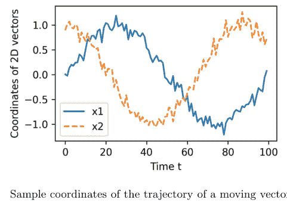

图 16.7：带噪声的移动向量轨迹的样本坐标。

```python
def createDataset(X, T = 100):
    '''为keras LSTM类创建合适形状的数据集
    输入：X[*,p]；输出：Xt[*,T,p]'''
    Xt, yt = [], []
    for i in range(len(X)-T):
        Xt.append(X[i:i+T])
        yt.append(X[i+T])
    Xt = np.array(Xt)
    yt = np.array(yt)
    return Xt, yt
```

```python
def sequentialSplit(X, y, train_rate=0.8):
    '''顺序分割数据，不进行随机打乱。
    第一部分用于训练，其余用于测试'''
    n_train = round(len(X) * train_rate)
    X_train, y_train = X[0:n_train], y[0:n_train]
    X_test, y_test = X[n_train:], y[n_train:]
    return X_train, y_train, X_test, y_test

def randomSplit(Xt, yt):           # 本示例中未使用
    '''此代码可用于重新打乱的数据批次'''
    from sklearn.model_selection import train_test_split
    X_train, X_test, y_train, y_test = train_test_split(
            Xt, yt, train_size=.8, random_state=8)
    return X_train, y_train, X_test, y_test
```

```python
Xt, yt = createDataset(X, T = T )
print(Xt[1][0],Xt.shape,Xt.shape[1])
print(yt[1],yt.shape)
```

[-0.04602  0.9104 ] (9900, 100, 2) 100
[0.61192 0.61808] (9900, 2)

我们顺序分割数据集，以便使用数据的第一部分训练模型，然后预测二维向量的未来运动。也可以打乱数据集后再分割。在这种情况下，我们训练模型以预测数据集的隐藏特征。

```python
X_train, y_train, X_test, y_test = sequentialSplit(Xt, yt)
#X_train, y_train, X_test, y_test = randomSplit(Xt, yt)
```

```python
print(X_train[1][0],X_train.shape)
print(X_test[1][0],X_test.shape)
```

[-0.04602  0.9104 ] (7920, 100, 2)
[-0.62915  0.92939] (1980, 100, 2)

```python
# 构建LSTM-NN模型
model = Sequential()
model.add(LSTM(L, input_shape=(T, p)))
model.add(Dense(out_d, input_dim=L))
model.add(Activation("linear"))
model.compile(loss="mean_squared_error", optimizer="rmsprop")

model.summary()
```

模型："sequential"

| 层（类型） | 输出形状 | 参数数量 |
| :--- | :--- | :--- |
| lstm (LSTM) | (None, 20) | 1840 |
| dense (Dense) | (None, 2) | 42 |
| activation (Activation) | (None, 2) | 0 |

总参数：1,882
可训练参数：1,882
不可训练参数：0

```python
model.fit(X_train,y_train,batch_size=128,epochs=5,validation_split=.05);
```

Epoch 1/5
59/59 [==============================] - 8s 78ms/step - loss: 0.1552 - val_loss: 0.0290
Epoch 2/5
59/59 [==============================] - 4s 73ms/step - loss: 0.0151 - val_loss: 0.0154
Epoch 3/5
59/59 [==============================] - 4s 73ms/step - loss: 0.0124 - val_loss: 0.0126
Epoch 4/5
59/59 [==============================] - 4s 73ms/step - loss: 0.0121 - val_loss: 0.0128
Epoch 5/5
59/59 [==============================] - 4s 73ms/step - loss: 0.0119 - val_loss: 0.0125

```python
# 精度评估
from numpy.linalg import norm
predicted = model.predict(X_test)
rmse = np.sqrt(((predicted - y_test) ** 2).mean(axis=0))
print(f"均方根误差 = {rmse}")
print(f"相对均方根误差= {rmse/norm(y_test)}")
```

均方根误差 = [0.10676 0.11551]
相对均方根误差= [0.00238 0.00257]

```python
# 绘制预测结果
nt, ns = len(y_test), 50
plt.rcParams["figure.figsize"] = (4, 2.5)
plt.figure(dpi=300)
plt.plot(predicted[:nt:ns][:,0],"--")
plt.plot(y_test[:nt:ns][:,0],":")
plt.legend(["预测", "测试"])
plt.xlabel('时间 t')
plt.ylabel('向量坐标, x1');
```

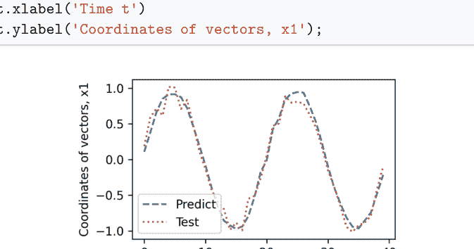

图 16.8：LSTM预测的移动向量轨迹坐标 $x_1$，与测试数据的比较。

```python
plt.rcParams["figure.figsize"] = (4, 2.5)
plt.figure(dpi=300)
plt.plot(predicted[:nt:ns][:,1],"--")
plt.plot(y_test[:nt:ns][:,1],":")
plt.legend(["预测", "测试"])
plt.xlabel('时间 t')
plt.ylabel('向量坐标, x2');
```

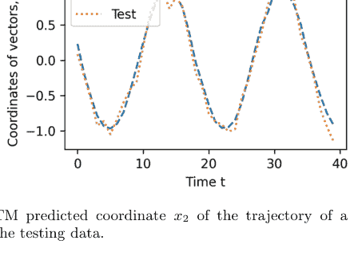

图 16.9：LSTM预测的移动向量轨迹坐标 $x_2$，与测试数据的比较。

从图 16.9 可以看出，我们的LSTM模型基于此数据集给出了合理的预测。它捕捉到了移动向量的主要波动特征。

## 16.6 LSTM用于语音识别的示例

LSTM是语音识别中最强大的工具之一。有许多开源示例。感兴趣的读者可以查看mxnet上的Speech LSTM。源代码也可在其GitHub站点上找到。

## 参考文献

- [1] G. Alex, L. Marcus, F. Santiago et al., “A Novel Connectionist System for Unconstrained Handwriting Recognition”, *IEEE Transactions on Pattern Analysis and Machine Intelligence*, **31**, pp. 855–868, 2009.
- [2] Yu Yong, Si Xiaosheng, Hu Changhua et al., “A Review of Recurrent Neural Networks: LSTM Cells and Network Architectures”, *Neural Computation*, **31**(7), 1235–1270, 2019.
- [3] H. Sepp and S. Jürgen, “Long Short-Term Memory”, *Neural Computation*, **9**(8), 1735–1780, 1997. https://doi.org/10.1162/neco.1997.9.8.1735.
- [4] F.A. Gers and E. Schmidhuber, “Recurrent networks learn simple context-free and context-sensitive languages”, *IEEE Transactions on Neural Networks*, **12**(6), 1333–1340, 2001.
- [5] Cho KyungHyun, On the Properties of Neural Machine Translation: Encoder-Decoder Approaches, CoRR, abs/1409.1259, 2014. http://arxiv.org/abs/1409.1259.

## 第17章

## 无监督学习技术

### 17.1 背景

当今世界拥有海量数据，并且数据量还在不断增长。如何利用这些数据变得非常重要。使数据有用主要有两种方式。一种是让相关领域的专家检查数据并进行标注，然后这些数据可用于训练机器学习模型。然而，标注数据是一项非常昂贵且耗时的任务。另一种方式是开发机器学习算法来读取（未标注的）原始数据，并尝试从数据中提取一些潜在的特征或特性。这就是我们本章要讨论的无监督学习。

无监督学习有许多应用，包括数据压缩、去噪、聚类、推荐、异常检测、分类等，不一而足。

无监督机器学习方法包括用于从数据集中提取主值的主成分分析（PCA）、*K*-均值聚类方法族、均值漂移方法以及自编码器族。我们已经在第3章讨论过PCA，因此这里将简单地将其用于聚类算法。在本章中，我们将详细讨论*K*-均值聚类、均值漂移聚类和自编码器。我们将更侧重于这些方法的基础知识，以帮助读者理解本书未涵盖的其他相关方法和技术。

### 17.2 用于聚类的*K*-均值

*K*-均值聚类是一种使用未标注数据集的无监督机器学习算法。它最初源于信号处理，用于将将数据点云划分为 $k$ 个簇。在每个簇中，数据点相对于其簇中心或质心具有最近的均值。$K$-均值聚类最小化簇内方差，即平方（欧几里得）距离（因此，它成为一个最小二乘最小化问题，是二次的）。这样的算法本质上将这些数据点划分为使用 $k$ 个质心生成的 Voronoi 单元。

聚类问题通常是 NP 难的，意味着它在理论上计算上是难以处理的。然而，已经开发了高效的启发式算法来有效地找到局部最优解。$K$-均值就是这样的算法之一，它将给定的无标签数据点聚类为预先指定的 $k$ 个簇。它与 $k$-近邻分类器有松散的联系，并且有许多变体。均值漂移聚类算法就是其中一种变体，其中簇的数量不需要预先指定。关于 $K$-均值及其与其他算法关系的更多细节可以在维基百科页面 (https://en.wikipedia.org/wiki/K-means_clustering) 和广泛使用的 Sklearn 网站上找到。

典型的 $K$-均值算法使用迭代更新过程。它被称为 Lloyd 算法。在这里，我们详细讨论这个基本算法，希望这有助于理解和使用其他相关和更高级的算法。$K$-均值算法从初始化 $k$ 个均值开始。

### 17.2.1 均值的初始化

考虑一个数据集，其中在具有 $p$ 个特征的特征空间 $X^p$ 中有 $n$ 个数据点云。我们的目标是通过提取这些数据点的 $k$ 个几何分布特征，将这些数据点分组为 $k$ 个簇（子云）。典型的 $K$-均值算法从随机生成 $k$ 个初始均值开始。Hamerly 和 Elkan 在一篇论文 [1] 中讨论了随机初始化方法。其中一种方法是从给定数据集中随机选择 $k$ 个点，并将它们用作初始均值，当然这可能远离真实均值。另一种方法随机分配簇，然后计算这些簇的初始均值。在这种情况下，这种初始聚类也将远离真实聚类。无论哪种情况，初始开始都涉及一些随机性。因此，通常需要多次运行 $K$-均值，每次使用一组随机的初始均值，然后根据某个标准选择最佳的一个。

有许多专门为 $K$-均值初始化设计的策略，包括随机子样本的质心、组代表点、随机最远点或 $k$-均值++。感兴趣的读者可以参考这个在线讨论页面 (https://stats.stackexchange.com/questions/317493/methods-of-initializing-k-means-clustering) 以获取更多细节。我们将在后面的基准研究示例问题中使用 $k$-均值++。

PCA（在第 3 章讨论）可以是生成初始 $k$ 个均值的好选择。可以使用给定数据集进行 PCA 以获得 $k$ 个主成分，然后将这些主成分用作初始 $k$ 个均值。在这种情况下，初始化变得有些确定性，并且只进行一次 $K$-均值运行。据信这可以提高聚类结果的准确性，因为已知 $K$-均值对缩放敏感，而 PCA 可以提供更稳定的缩放和降噪特性。PCA 也可能由于更好的初始猜测而有助于收敛行为。此外，PCA 用于可视化 $K$-均值聚类的结果。如第 3 章所述，PCA 可能代价高昂。幸运的是，在 $K$-均值应用中，$k$ 通常不是一个大数字（与大数据集中的样本数量相比），因此 PCA 成本通常对许多问题来说不是大问题。我们将在后面使用示例问题来检验这一点。现在让我们看看典型 $K$-均值聚类的基本过程、公式和算法。它是迭代的，每次迭代主要有两个步骤。

### 17.2.2 将数据点分配给簇

在 $t = 0$ 时，对于给定的 $\mathbb{X}^p$ 中的数据点云，我们有一组初始 $k$ 个均值 $\mathbf{m}_1^{(0)}, \mathbf{m}_2^{(0)}, \ldots, \mathbf{m}_k^{(0)}$，对应于这些初始 $k$ 个簇。这些均值也称为簇的质心或中心。注意，在 $K$-均值聚类中，我们预先指定簇的数量 $k$。此外，$\mathbf{m}_i^{(t)}$ 通常是 $\mathbb{X}^p$ 中的一个向量。

在步骤 $t$，我们计算数据点 $\mathbf{x}_q$ 到这些均值的平方欧几里得距离，然后将该数据点分配给具有“最近均值”的簇，这意味着数据点与簇均值之间的欧几里得距离最短。

$$\mathbb{S}_i^{(t)} = \{\mathbf{x}_q : \|\mathbf{x}_q - \mathbf{m}_i^{(t)}\|^2 \leq \|\mathbf{x}_q - \mathbf{m}_j^{(t)}\|^2 \; \forall j, 1 \leq j \leq k\}, \quad i = 1, 2, \ldots, k \qquad (17.1)$$

如果有多个最近均值，我们选择其中一个，以便数据点 $\mathbf{x}_q$ 只分配给一个集合 $\mathbb{S}_i^{(t)}$。对数据集中的所有数据点执行此过程，这导致所有这些数据点被这些均值生成的 Voronoi 图的边划分（这将在后面的案例研究示例中更清楚地显示）。每个 Voronoi 单元包含一个簇，其中的数据点在集合 $\mathbb{S}_i^{(t)}$ 中。

### 17.2.3 均值的更新

当划分完成后，我们使用分配给每个簇的数据点重新计算 $k$ 个簇中每个簇的均值。对于第 $i$ 个簇，我们有

$$\mathbf{m}_i^{(t+1)} = \frac{1}{n_i} \sum_{\mathbf{x}_j \in \mathbb{S}_i^{(t)}} \mathbf{x}_j, \quad i = 1, 2, \ldots, k \qquad (17.2)$$

其中 $n_i$ 是集合 $\mathbb{S}_i^{(t)}$ 中的数据点数量。

这导致 $t+1$ 步的一组更新的 $k$ 个均值，然后用于新一轮的迭代：使用公式 (17.1) 将数据点重新分配给一组新的 $k$ 个簇，然后重新更新 $t+2$ 步的 $k$ 个均值。这个过程持续进行直到收敛，意味着这些 $k$ 个均值根据某些标准没有显著变化。

注意，该算法不保证找到全局最优解 [2]。然而，在实践中，$K$-均值算法很快，它可能是可用于局部最小值的最快的聚类算法之一。由于 $k$ 个均值的初始化具有随机性质，可能需要执行多次聚类并选择最佳结果。

上面讨论的 Lloyd 算法的平均复杂度为 $O(kmT)$，其中 $m$ 是数据点数量，$T$ 是迭代次数。已经开发了更快的 Lloyd 算法变体，其中之一是 Elkan 算法，它使用三角形不等式性质显著提高效率。Elkan 算法经常使用，我们将在案例研究示例中演示 Elkan 算法。

还要注意，对于这些 $K$-均值类型的算法，可以使用除平方欧几里得距离之外的不同距离范数度量。这可能会改变收敛行为。更多细节可以在维基百科页面 (https://en.wikipedia.org/wiki/K-means_clustering) 及其链接中找到。

图 17.1 是 Chire 制作的精美动画图片，采用 CC BY-SA 4.0 (https://creativecommons.org/licenses/by-sa/4.0) 通过 Wikimedia Commons (https://commons.wikimedia.org/wiki/File:K-means_convergence.gif)。该动画清楚地展示了典型 $K$-均值算法中迭代是如何执行的。

无监督学习技术

589

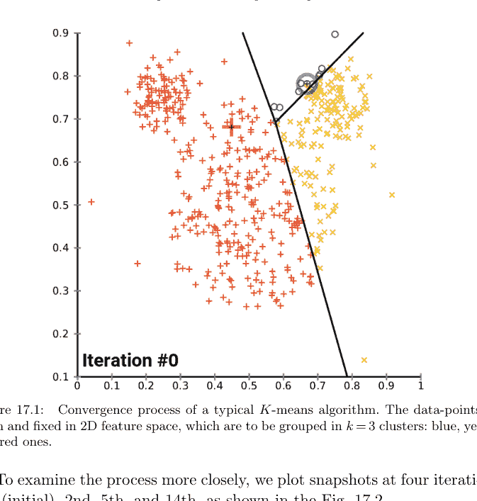

图 17.1：典型 $K$-均值算法的收敛过程。数据点在二维特征空间中给定且固定，要分组为 $k=3$ 个簇：蓝色、黄色和红色。

为了更仔细地检查该过程，我们绘制了四次迭代的快照：第 0 次（初始）、第 2 次、第 5 次和第 14 次，如图 17.2 所示。

如图 17.1 所示，数据点在二维空间中给定且固定，要分组为 $k = 3$ 个簇。开始时，基于这些数据点生成一组 3 个均值（随机或其他方式）。这三个均值（簇中心）分别用蓝色圆圈、黄色 x 和红色叉标记。基于这 3 个均值，通过计算数据点到这 3 个均值的平方欧几里得距离，根据“最近均值”标准形成 Voronoi 图。Voronoi 图的边（这 3 条黑线）将数据点划分为 3 个簇：蓝色、黄色和红色。在第 0 次迭代时，这 3 个均值放置得相当随机。蓝色圆圈非常接近黄色 x，两者都远离红色叉。接下来，使用公式 (17.2) 计算这 3 个簇的数据点坐标的 3 个均值。这导致 3 个更新的均值。在第 2 次迭代时，这 3 个均值更合理地分离，数据点也更好地聚类。使用更新的 3 个均值，通过最近均值标准重新聚类数据点。这个过程迭代进行，直到更新变得足够小。聚类过程收敛。在

### 17.2.4 示例1：K-means聚类初始化方法比较的案例研究

在第一个示例中，我们将使用各种评估指标，从计算时间和聚类结果质量两个方面，比较K-means聚类的各种初始化方法。本研究将使用随机生成的合成数据，以便我们能为此研究设计四种不同的案例。我们将使用Scikit-learn [3]中可用的例程，为此研究编写一个简单的代码。

#### 17.2.4.1 定义用于基准测试研究的函数

我们将使用以下函数来评估方法的性能。它使用SKlearn类`make_pipeline`来计算评估指标。当使用某种初始化方法完成一次K-means运行时，将调用此函数。

```python
# From Sklearn online examples
# import all necessary modules
import numpy as np
import matplotlib.pyplot as plt
from sklearn.cluster import MeanShift, estimate_bandwidth
from sklearn.datasets import make_blobs
from sklearn.datasets import load_digits
from sklearn import metrics
from sklearn.pipeline import make_pipeline
from sklearn.preprocessing import StandardScaler
from time import time
%matplotlib inline

def bench_k_means(kmeans, name, data, labels):
    """To evaluate the KMeans initialization methods.

    Parameters
    ----------
    kmeans : KMeans instance
        class:``sklearn.cluster.KMeans`` instance with the
        initialization already set.
    name : str
        Name given to the strategy. It will be used to show
        the results in a table.
    data : ndarray of shape (n_samples, n_features)
        The data for clustering.
    labels : ndarray of shape (n_samples,)
        The labels used to compute the clustering metrics
        which require some supervision.
    """
    t0 = time()
    (n_samples, n_features), n_k = data.shape,
        np.unique(labels).size
    estimator = make_pipeline(StandardScaler(), kmeans).fit(data)
    fit_time = time() - t0
    results = [name, fit_time, estimator[-1].inertia_]
```

```python
# Define the metrics which require only the true labels
# and estimated labels
clustering_metrics = [metrics.homogeneity_score,
                     metrics.completeness_score,
                     metrics.v_measure_score,
                     metrics.adjusted_rand_score,
                     metrics.adjusted_mutual_info_score,]

results+=[m(labels,estimator[-1].labels_) for m in
clustering_metrics]

# The silhouette score requires the full dataset
results+=[metrics.silhouette_score(data, estimator[-1].labels_,
           metric="euclidean", sample_size=n_samples,)]

# Show the results
formatter_result = ("{:9s}\t{:.3f}s\t{:.0f}\t{:.3f}\t{:.3f}"
                    "\t{:.3f}\t{:.3f}\t{:.3f}\t{:.3f}")
print(formatter_result.format(*results))
```

```python
# function to print out key information about the dataset

def print_data_info(data, labels,n_features,n_k,n_samples,n_comp):
    print('data=',data[0:1,0:10], '\n data.shape=', data.shape)

    print(f"No of clusters k:{n_k}; No of samples:{n_samples};"
          "+ f"No of features p:{n_features};"
          "No of PCA  comps:{n_comp}")

    print('data.shape:',data.shape)
    print('labels:',labels,' Shape:',labels.shape)

#_______________________________________________________________________

# Function to print out evaluation metrics
def print_evaluation_metrics():
    print('inertia: sum of squared distances of samples to their
          centroid')
    print('homo: homogeneity [0,1] of the clusters with their own
          data-points')
    print('compl: completeness [0,1], how well the same
          class points fit the clusters')
    print('v_meas: v_measure score [0,1], consistence btw two
          clustering results')
```

```python
print('ARI: adjusted rand index [-1,1], distances btw different sample splits')
print('AMI: adjusted mutual info index [0,1], the mutual infor. for two splits')
print('silht: silhouette [-1,1] mean-distance ratio of in- & btw-clusters points')
```

```python
#-----------------------------------------------------------------------
# Define a function to plot the clusters
# The data needs to be reduced to 2D, if it not already 2D
# kmeans needs already been fitted
```

```python
def plot_clusters(reduced_data,kmeans,fig_title):

    # Mesh step size. Decrease to increase the quality of VQ.
    h = .02     # points in [x_min, x_max]x[y_min, y_max].

    plt.figure(figsize=(4.0, 4.0),dpi=100)
    # Plot the decision boundary. Assign a color to each
    x_min, x_max = reduced_data[:, 0].min() - 1,
                   reduced_data[:, 0].max() + 1
    y_min, y_max = reduced_data[:, 1].min() - 1,
                   reduced_data[:, 1].max() + 1
            xx, yy = np.meshgrid(np.arange(x_min, x_max, h),
                       np.arange(y_min, y_max, h))

    # Labels for each point in mesh. Use last trained model.
    Z = kmeans.predict(np.c_[xx.ravel(), yy.ravel()])

    # Put the result into a color plot
    Z = Z.reshape(xx.shape)
    plt.figure(1)
    plt.clf()
    plt.imshow(Z, interpolation="nearest",
               extent=(xx.min(), xx.max(), yy.min(), yy.max()),
               cmap=plt.cm.Paired, aspect="auto", origin="lower")

    plt.plot(reduced_data[:, 0], reduced_data[:, 1], 'k.',
             markersize=2)

    # Plot the centroids as a white X
    centroids = kmeans.cluster_centers_
    plt.scatter(centroids[:, 0], centroids[:, 1], marker="x",
                s=169, linewidths=3, color="w", zorder=10)

    plt.title(fig_title)
```

```python
#xyd = 3.5
xyd = min(abs(x_min), x_max, abs(y_min), y_max)
x_min, x_max, y_min, y_max = -xyd, xyd, -xyd, xyd
plt.xlim(x_min, x_max)
plt.ylim(y_min, y_max)

plt.xticks(())
plt.yticks(())
plt.show()

#print('centroids=', centroids)
```

#### 17.2.4.2 合成数据点的生成

我们现在使用SKlearn的`make_blobs`类以随机方式生成一组合成数据点。在此示例中，我们设计了总共四个研究案例，详情见下方单元格。读者只需将一个数字（从1到4）赋值给变量“Case”，然后就会生成该案例的数据点。

```python
# Choose a case to generate a set of synthetic data-points.
# Number of features (n_features) and number of clusters (k)
# will be computed after the data-points are generated

Case=3 # 1 or 2 or 3 or 4 # 4 cases designed for this example

if Case == 1:
    #-----------------------------------------------------------------
    # Case 1: synthetic sample with 2 groups of data-points
    # in 2D space, n_features=2, n_k=2
    centers = [[1, 1], [-1, -1]] # centers for 2D points
    #-----------------------------------------------------------------
elif Case == 2:
    # Case 2: synthetic sample data that has 3 groups of
    # data-points in 3D space, n_features=3, n_k=3
    centers = [[1, 1, 1], [-1,-1,-1], [1,-1,0.5]] # for 3D points
    #-----------------------------------------------------------------
elif Case == 3:
    # Case 3: synthetic sample data that has 3 groups of
    # data-points in 2D space, n_features=2, n_k=3
    centers = [[1, 1], [-1,-1], [1,-1]]  # set 3 centers 2D points
    #-----------------------------------------------------------------
elif Case == 4:
    # Case 4: synthetic sample data that has 2 groups of
    # data-points in 6D space, n_features=6, n_k=5
    centers = [[ 1, 0, 1, 1, 1, 0], [-1,-1,-1,-1, 0,-1],
              [1,-1,-1, 0,-1,-1],  [ 1, 1, 0,-1,-1,-1],
              [ 0, 1, 1, 0,-1, -1]]
    # set 5 centers for 5 group of data-points in 6D
    #-------------------------------------------------------
else:
    print('There are a total of 4 cases for this example!!!')

print('Cluster centers set for the data-points =', centers)

# Generation of data-points
n_s, c_std = 1888, 0.4888       # n_s: number of samples;
    #c_std: standard deviation for random data-points generation
data,labels=make_blobs(n_samples=n_s,centers=centers,
    cluster_std=c_std)           # number of samples

(n_samples, n_features), n_k = data.shape, np.unique(labels).size

n_comp = min(n_features, n_k)   # number of prin. cmpnts when
    # PCA is used to create initial means for K-means

# print out key data information
print('This example has a total of 4 cases. This is Case-'
    +str(Case)+'; Data:'+str(n_features)+'D')

print_data_info(data, labels,n_features,n_k,n_samples,n_comp)
```

为数据点设置的聚类中心 =
    [[1, 1], [-1, -1], [1, -1]]
此示例共有4个案例。这是案例-3；数据：2D
data= [[ 0.60389228 -1.62706035]]
    data.shape= (1888, 2)
聚类数 k:3；样本数:1888；特征数 p:2；
    PCA 成分数:2
data.shape: (1888, 2)
labels: [2 0 2 ... 1 0 2]  Shape: (1888,)

#### 17.2.4.3 不同初始化方法的检验

我们对K-means聚类的不同初始化方法进行了比较研究。这包括三种初始化方法：

-   使用kmeans++方法进行初始化。这是一种为初始均值生成而采用的随机最远点法。我们将运行初始化和聚类n_i次，并根据惯性值选择最佳结果。
-   使用“random”选项进行初始化。这也是一种纯随机方法。我们将运行初始化和聚类n_i次，并根据惯性值选择最佳结果。
-   使用PCA进行初始化。PCA的主成分将被用作初始均值。这是一种确定性方法，运行一次即可。

```python
# Comparison study runs
from sklearn.cluster import KMeans
from sklearn.decomposition import PCA

print('This example has a total of 4 cases. This is Case-'+
      str(Case)+'; Data:'+str(n_features)+'D')
print_data_info(data, labels,n_features,n_k,n_samples,n_comp)
print(78 * '_')
print('init\t\ttime\tinertia\thomo\tcompl\tv-meas\tARI\n      tAMI \tsilht')
n_i = 5  # The times the k-means algorithm will run with
         # different centroid seeds. The final results will be the
         # best output of n_i consecutive runs in terms of inertia.

if Case != 3:   # (2D, n_features=2, n_k=3, PCA not applicable
    pca = PCA(n_components=n_comp).fit(data)
    kmeans = KMeans(init=pca.components_, n_clusters=n_k, n_init=1)
    bench_k_means(kmeans=kmeans,name="PCA-init",data=data,
                  labels=labels)
kmeans = KMeans(init="random",n_clusters=n_k,n_init=n_i,
                random_state=0)
                # by default it uses the Elkan algorithm
bench_k_means(kmeans=kmeans, name="random", data=data,
              labels=labels)

kmeans = KMeans(init="k-means++", n_clusters=n_k, n_init=n_i,
                random_state=0)
bench_k_means(kmeans=kmeans, name="k-means++",data=data,
              labels=labels)
r_data = PCA(n_components=n_comp).fit_transform(data)
bench_k_means(kmeans=kmeans,name="k-means++pca",data=r_data,
              labels=labels)

print(78 * '_')
print_evaluation_metrics()
```

本示例共有4种情况。这是情况-3；数据：2维
data= [[ 0.60389228 -1.62706035]]
data.shape= (1888, 2)
聚类数 k:3；样本数:1888；特征数 p:2；
    PCA成分数:2
data.shape: (1888, 2)
labels: [2 0 2 ... 1 0 2]  Shape: (1888,)

| init | time | inertia | homo | compl | v-meas | ARI | AMI | silht |
|---|---|---|---|---|---|---|---|---|
| random | 0.018s | 763 | 0.890 | 0.890 | 0.890 | 0.929 | 0.890 | 0.561 |
| k-means++ | 0.015s | 763 | 0.890 | 0.890 | 0.890 | 0.929 | 0.890 | 0.561 |
| k-means++pca | 0.013s | 892 | 0.830 | 0.830 | 0.830 | 0.878 | 0.830 | 0.555 |

inertia: 样本到其质心的平方距离之和
    homo: 同质性 [0,1]，聚类与其自身数据点的匹配程度
    compl: 完整性 [0,1]，同一类别的点拟合聚类的程度
    v_meas: v_measure分数 [0,1]，两种聚类结果之间的一致性
    ARI: 调整兰德指数 [-1,1]，不同样本划分之间的距离
    AMI: 调整互信息指数 [0,1]，两种划分的互信息
    silht: 轮廓系数 [-1,1]，簇内与簇间点的平均距离比

在上面给出的代码中设置 Case = 1；聚类已在作者的笔记本电脑上完成，结果汇总在上面的同一输出表中。我们可以观察到以下几点：

-   首先是聚类的计算时间。它们都非常快，数量级在20毫秒。使用PCA初始化均值的$K$-means（PCA-init方法）耗时约7毫秒，运行最快（不包括PCA的时间）。这是因为它只运行一次。其他三种方法的时间大致相同，且比PCA-init慢，因为它们被设置为运行5次。由于我们的合成数据玩具问题规模非常小，计算时间的度量并不精确。我们无法得出太多结论。
-   其次是聚类质量。输出表中列出的前三种方法在所有测量指标上给出了相同质量的结果。因为这个玩具问题太简单，可能只有一个全局最优解，这些方法中的任何一种都会给出相同的答案。然而，$k$-means++pca给出的结果与其他三种方法都不同，尤其是在惯性值上。这是因为$K$-means是在PCA处理后的数据上进行的。对于情况-1，PCA没有降低数据维度，而是将数据集投影到其两个主轴上。主成分空间中的数据集变得更平坦（见第3章）。因此，测量的惯性值变得大得多。其他指标测量的分数有一些变化，但不是很大。
-   使用相同的代码，我们将n_init设置为1（而不是5）并运行。我们得到了相同的结果。这也支持了这样一个论点：这个玩具问题可能只有一个最优解，因为随机选择的初始均值对于所有使用的方法都没有给出不同的解。读者可以使用提供的代码轻松确认这一点。

读者可以将Case设置为其他数字（2或3或4）。对于所有这些玩具情况，都可以进行类似的观察。

#### 17.2.4.4 可视化聚类结果

我们的玩具示例问题有两个情况（情况-2和情况-4），其特征空间中的数据维度较高（$p = 3$和$p = 6$）。$K$-means可以在这些高维空间中对所有这些数据集进行聚类。然而，在高维空间中可视化这些聚类很困难。因此，我们将使用PCA将数据集投影到二维主成分空间，进行$K$-means聚类，然后在二维平面上绘制数据点及其聚类。这是使用以下代码和之前定义的plot_clusters()函数完成的：

```python
import matplotlib.pyplot as plt

if Case == 1 or Case == 3: # Case 1 or 3: data in 2D space,
    n_k =2 or 3
    #_________________________________________________________
    pca_compf = 0           # no PCA used for plotting the data
    reduced_data = data     # no dimension reduction
    #_________________________________________________________
elif Case == 2 or Case == 4:  # Case 2: 3 group data in 3D space,
    #                       n_features=3, n_k =3
    # Case 4: 5 group data in 6D space,
    #                       n_features=6, n_k=5
    pca_compf = 2           # dimension reduction to show in 2D
    reduced_data = PCA(n_components=pca_compf).fit_transform(data)
    #_________________________________________________________
else:
    print('There are a total of 4 cases for this example!!!')

print_data_info(data, labels,n_features,n_k,n_samples,n_comp)
kmeans = KMeans(init="k-means++", n_clusters=n_k, n_init=n_i)
kmeans.fit(reduced_data)
fig_title = "Case-"+str(Case)
plot_clusters(reduced_data,kmeans,fig_title)
print('Cluster centers set for the data-points =', centers)
```

data= [[ 0.60389228 -1.62706035]]
data.shape= (1888, 2)
聚类数 k:3；样本数:1888；特征数 p:2；
PCA成分数:2
data.shape: (1888, 2)
labels: [2 0 2 ... 1 0 2]  Shape: (1888,)

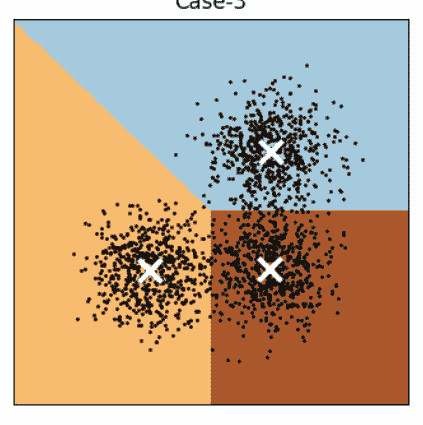

图17.3：使用*K*-means对情况-3的数据点进行聚类。

数据点的聚类中心设置为 = [[1,1], [-1,-1], [1,-1]]

图17.4绘制了所有这四种情况的聚类和数据点。
我们注意到以下几点：

-   所有这些情况都使用*K*-means算法进行了良好的聚类，每个聚类都有一个收敛的质心（用白色X标记）。

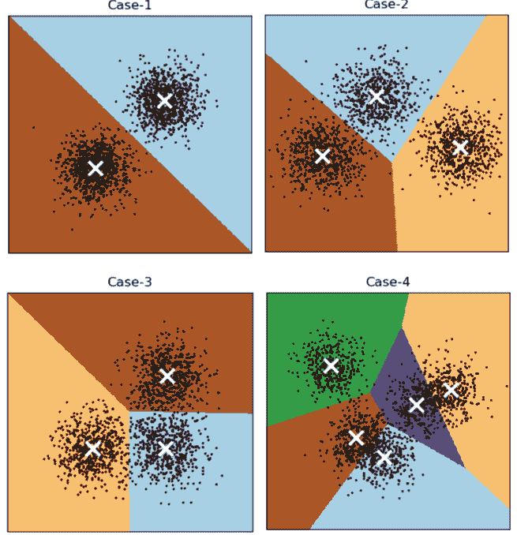

图17.4：为四种不同情况的数据集随机生成的合成数据点的*K*-means聚类。情况-2和情况-4的原始数据集位于更高维度的特征空间中。对于这些数据集，其特征空间被降至二维，然后进行*K*-means聚类。

-   这些聚类位于彩色的Voronoi单元格中（每个颜色一个聚类），这些Voronoi单元格之间的边界划分了这些聚类。
-   连接这些质心（对于每种情况）的线垂直于（正交于）Voronoi单元格边界（或其延长直线）。这种正交性证明了这些单元格本质上就是定义上的Voronoi单元格。它是由*K*-means聚类算法中最小化簇内点到其质心的平方欧几里得距离所产生的。

我们现在准备看一个更复杂的现实生活中的例子。

### 17.2.5 示例2：在手写数字数据集上进行K-means聚类

我们现在将K-means聚类算法应用于一组手写数字图像。该数据集是UCI ML手写数字数据集（https://archive.ics.uci.edu/ml/datasets/Optical+Recognition+of+Handwritten+Digits）的测试集。之前为我们的玩具数据集示例定义的函数可以直接用于本研究。我们也可以使用相同的度量标准来评估聚类的效率和质量。

#### 17.2.5.1 加载手写数字数据集

我们首先使用SKlearn的`load_digits()`加载数据集，并使用相同的SKlearn K-means进行聚类。该数据集包含10个手写数字（0到9）的图像。我们希望每个聚类包含相同数字的图像。因此，我们为该问题设置了k = 10个聚类。每张图像的大小为8 × 8像素，这意味着特征数量为64。

```python
# Import necessary module for this task
import numpy as np
from sklearn.datasets import load_digits
import matplotlib.pyplot as plt
%matplotlib inline
# load the digits dataset
data, labels = load_digits(return_X_y=True)
(n_samples,n_features),n_digits=data.shape,np.unique(labels).size
n_k = n_digits
n_comp = 2
print_data_info(data, labels,n_features,n_k,n_samples,n_comp)
print('Take a look at the image for digit 9:')
plt.imshow(data[9].reshape(8,8))
```

data= [[ 0.  0.  5. 13.  9.  1.  0.  0.  0.  0.]]
data.shape= (1797, 64)
No of clusters k:10; No of samples:1797; No of features p:64;
No of PCA comps:2
data.shape: (1797, 64)
labels: [0 1 2 ... 8 9 8]  Shape: (1797,)
Take a look at the image for digit 9:
<matplotlib.image.AxesImage at 0x1fdcd0ca1d0>

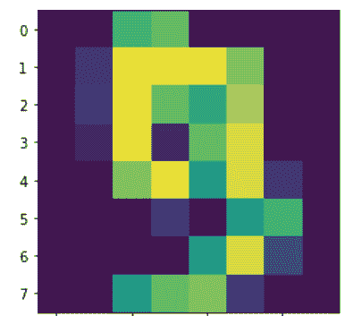

图17.5：UCI ML手写数字数据集中的手写数字样本图像。

如图17.5所示，在该数据集中，每张图像都有64个特征，这些特征是8 × 8像素位置的图像值。

#### 17.2.5.2 不同初始化方法的检验

我们对K-means聚类的不同初始化方法进行了比较研究。我们比较了与前一个示例相同的三种初始化方法，并采用了类似的方式。

```python
from sklearn.cluster import KMeans
from sklearn.decomposition import PCA

print('data.shape:',data.shape)
print(f"Number of digits (k):{n_digits}; Number of samples (n):\n{n_samples};Number of features (p) {n_features}")
print(78 * '_')
print('init\t\ttime\tinertia\thomo\tcompl\tv-meas\tARI\n\tAMI\tsilht')
n_i = 5
pca = PCA(n_components=n_digits).fit(data)
kmeans = KMeans(init=pca.components_, n_clusters=n_digits,
                n_init=1)
bench_k_means(kmeans=kmeans, name="PCA-init", data=data,
              labels=labels)  # by default it uses the Elkan algorithm
kmeans = KMeans(init="random",n_clusters=n_digits,n_init=n_i,
                random_state=0)
bench_k_means(kmeans=kmeans, name="random", data=data,
              labels=labels)
kmeans = KMeans(init="k-means++", n_clusters=n_digits, n_init=n_i,
                random_state=0)
bench_k_means(kmeans=kmeans, name="k-means++", data=data,
              labels=labels)

n_compr = 10 # n_digits
r_data = PCA(n_components=n_compr).fit_transform(data)
bench_k_means(kmeans=kmeans,name="k-means++pca",data=r_data,
              labels=labels)

print(78 * '_')
print_evaluation_metrics()
```

data.shape: (1797, 64)
Number of digits (k):10; Number of samples (n):1797;
    Number of features (p) 64

| init | time | inertia | homo | compl | v-meas | ARI | AMI | silht |
|---|---|---|---|---|---|---|---|---|
| PCA-init | 0.065s | 72686 | 0.636 | 0.658 | 0.647 | 0.521 | 0.643 | 0.146 |
| random | 0.089s | 69952 | 0.545 | 0.616 | 0.578 | 0.415 | 0.574 | 0.137 |
| k-means++ | 0.143s | 69485 | 0.613 | 0.660 | 0.636 | 0.482 | 0.632 | 0.162 |
| k-means++pca | 0.072s | 9169 | 0.722 | 0.727 | 0.724 | 0.650 | 0.721 | 0.246 |

inertia: 样本到其质心的平方距离之和
homo: 同质性 [0,1]，聚类与其自身数据点的匹配程度
compl: 完整性 [0,1]，同一类别的点拟合聚类的程度
v_meas: V-度量分数 [0,1]，两个聚类结果之间的一致性
ARI: 调整兰德指数 [-1,1]，不同样本划分之间的距离
AMI: 调整互信息指数 [0,1]，两个划分的互信息
silht: 轮廓系数 [-1,1]，簇内与簇间点的平均距离比

上述输出表中的结果告诉我们以下信息：

- 首先是聚类所花费的计算时间。对于这个手写数字数据集，它们都非常快。使用PCA初始化均值的$K$-means（PCA-init方法）仅需约20毫秒。它运行最快（不包括PCA的时间）。这是因为它只运行一次。其他三种方法的时间大致相同，并且比PCA-init慢，因为它们被设置为运行5次。$k$-means++方法花费的时间大约是其5倍。注意，运行时间也可能根据计算机是否同时执行其他任务而变化。
- 惯性值是样本到其质心的平方距离之和。random和$k$-means++方法给出了相当接近的惯性值。PCA-init给出了较高的值，而$k$-means++pca给出了小得多的值。这是因为在$k$-means++聚类之前使用PCA将特征空间维度从64降低到10，导致惯性值显著降低。
- 其他五个评估指标（homo、compl、v-meas、ARI和AMI）是对聚类结果质量的客观度量，因为这些度量都使用原始数据的真实标签作为比较基础，尽管测量方法不同。根据上面的输出表，PCA-init的质量最差，部分原因是它只运行一次。与PCA-init相比，random方法在所有这些指标上都取得了更好的分数，部分原因是它运行了五次。读者可以将`n_init`数量更改为1并重新运行代码，我们仍然会发现random方法在这个示例中表现更好。$k$-means++方法略优于random方法。$k$-means++pca给出了最佳结果，即在所有这些指标上都显著优于$k$-means++。这主要是由于在$k$-means++聚类之前对原始数据集进行了降维。
- 轮廓系数（显示在输出表的最后一列）的计算没有使用真实标签。它基于聚类结果，衡量簇内数据点的平均距离与簇间数据点的平均距离的比率。这个度量的客观性较低，因为没有使用真实标签作为比较基础。然而，这个度量很有用，因为在无监督学习中我们通常没有真实标签。在这个轮廓度量中，PCA-init的得分最低。random和$k$-means++方法都给出了更高的分数。表现最好的仍然是$k$-means++pca方法。注意，轮廓度量在未预先指定聚类数量$k$的$K$-means方法中也很有用。它可以用于确定未标记数据集的最佳$k$值。

读者可以轻松尝试不同的设置，并使用给定的代码运行此示例。

现在让我们借助（再次）PCA将聚类后的数据点绘制在二维平面上。

#### 17.2.5.3 使用PCA可视化手写数字聚类结果

手写数字数据集在特征空间中是64维的。我们无法在如此高的维度中可视化聚类结果。因此，我们使用PCA将特征空间降低到二维PCA主成分空间，然后绘制数据及其聚类。

```python
import matplotlib.pyplot as plt
pca_components = 2    # we can only view this well in 2D space
reduced_data = PCA(n_components=pca_components).
    fit_transform(r_data)
kmeans = KMeans(init="k-means++", n_clusters=n_digits, n_init=n_i)
kmeans.fit(reduced_data)
fig_title = str(n_digits)+" handwritten digits"
plot_clusters(reduced_data,kmeans,fig_title)
```

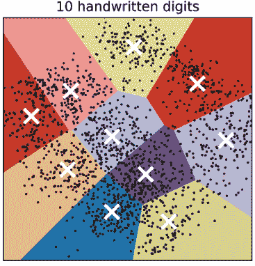

图17.6：使用UCI ML手写数字数据集进行10-means聚类的结果。

从图17.6中我们注意到，对于10-means聚类问题，我们得到了一个更复杂的Voronoi图。

## 17.3 无需预先指定$k$的均值漂移聚类

在使用$K$-means类型的算法时，我们通常需要预先指定聚类数量$k$。这意味着我们确实知道关于数据集的一些信息。在许多无监督学习应用中，我们甚至不知道$k$，但需要对数据集中的数据点进行聚类。本节讨论一种用于此类任务的方法，称为均值漂移方法。均值漂移聚类旨在发现数据点“云”中的“团块”。它是一种基于质心的算法，通过将质心候选点更新为给定区域内数据点的均值来工作。然后在后处理阶段过滤这些候选点，以消除近乎重复的点，从而形成最终的质心集。更多细节可以在Sklearn文档和参考文献[4]中找到。

让我们来看一个使用平坦核的均值漂移聚类算法的演示。该演示可在 Scikit-learn [3] 中找到。

```python
%matplotlib inline
print(__doc__)
import numpy as np
from sklearn.cluster import MeanShift, estimate_bandwidth
from sklearn.datasets import make_blobs

# 生成具有3组数据点的合成样本数据
n_s, c_std = 1888, 0.4888
centers = [[1, 1], [-1, -1], [1, -1]] # 设置这些数据点的3个中心

X, _ = make_blobs(n_samples=n_s, centers=centers,
                  cluster_std=c_std)
print('X=',X[0:2:], ' X.shape=', X.shape)
# 此数据集与示例1中的案例3相同

# 使用MeanShift进行聚类计算
# 首先，估计带宽，这是MeanShift算法所需的
bandwidth = estimate_bandwidth(X, quantile=0.2, n_samples=500)
print('Bandwidth=', bandwidth)

# MeanShift聚类
ms = MeanShift(bandwidth=bandwidth, bin_seeding=True)
ms.fit(X)
labels = ms.labels_
cluster_centers = ms.cluster_centers_
# print('Predicted cluster centers=', cluster_centers)

labels_unique = np.unique(labels)
                        # 查找数组中的唯一元素
n_clusters_ = len(labels_unique)

print("Number of estimated clusters : %d" % n_clusters_)
# 绘制聚类结果
import matplotlib.pyplot as plt
from itertools import cycle

fig_title ='MeanShift Clusters'
plot_clusters(X,ms,fig_title)
print('Cluster centers set for generating the dataset =', centers)
centroids_kmeans = [[ 0.98774496,  0.99979977],
       [-0.96779894, -0.9892344 ], [ 1.02407913, -0.98301746]]
```

```python
print('Cluster centers found by the kmeans++ was =', centroids_kmeans)
```

为IPython交互式环境自动创建的模块
X= [[ 0.55586883 -0.56830437]
 [ 1.02971177 -1.1907716 ]] X.shape= (1888, 2)
Bandwidth= 0.8892415258145057
Number of estimated clusters : 3

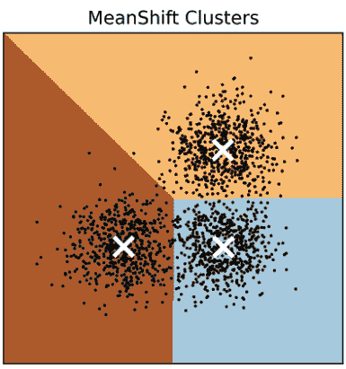

图 17.7：一个均值漂移聚类产生三个簇的示例。

Cluster centers set for generating the dataset = [[1, 1],
[-1, -1], [1, -1]]
Cluster centers found by the kmeans++ was = [[0.98774496,
0.99979977], [-1.95703334], [1.02407913, -0.98301746]]

```python
# 使用MeanShift进行聚类计算
# 估计带宽，这是MeanShift算法所需的
# estimate_bandwidth函数的复杂度至少是n_samples的二次方。对于大型数据集，请使用较小的值。
bandwidth = estimate_bandwidth(reduced_data, quantile=0.0519,
 n_samples=450)
# 注意：estimate_bandwidth可能对参数quantile和n_samples敏感。
print('Bandwidth=', bandwidth)
```

```python
# MeanShift聚类
ms = MeanShift(bandwidth=bandwidth, bin_seeding=True)
ms.fit(reduced_data)
labels = ms.labels_
cluster_centers = ms.cluster_centers_
# print('Predicted cluster centers=', cluster_centers)

labels_unique = np.unique(labels)
# 查找数组中的唯一元素
n_clusters_ = len(labels_unique)
print("Number of estimated clusters : %d" % n_clusters_)
fig_title ='MeanShift for Digits'
plot_clusters(reduced_data,ms,fig_title)
print('Centroids by MeanShift is:    Centroids by
        kmeans++ was:\n')
ms_cntr = np.sort(ms.cluster_centers_,axis=0)
# 排序以便于比较
km_cntr = np.sort(kmeans.cluster_centers_,axis=0)
for i in range(n_clusters_):
    print (f'{ms_cntr[i,0]:12.4f}{ms_cntr[i,1]:9.4f}'
           f'{km_cntr[i,0]:19.4f}{km_cntr[i,1]:9.4f}')
```

Bandwidth= 5.722875000219844
Number of estimated clusters : 10

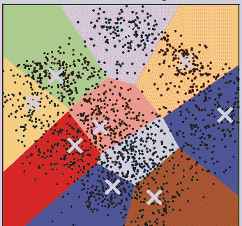

图 17.8：使用UCI ML手写数字数据集进行均值漂移聚类的结果。

Centroids by MeanShift is: Centroids by kmeans++ was:

```
-21.2030 -19.2417
-15.6402 -16.6971
-11.0635 -11.4488
 -5.0131  -6.4602
 -1.9861  -1.9128
  1.1829   1.0722
  1.5387   4.0261
  8.0474  10.8061
 15.6139  14.2532
 25.0669  21.7812

-22.0921 -19.5846
-14.1853 -16.6444
-12.8868  -8.2211
 -3.7937  -6.8557
 -3.6150  -0.3548
  1.4639   0.3682
  4.6894   5.7448
  9.2011  11.3140
 15.9470  12.9644
 22.6392  21.6084
```

我们从这项研究中注意到以下几点：

-   这个手写数字数据集有64个特征。为了简化这个问题，我们使用PCA将维度数量减少到10。这也使我们能够将均值漂移的结果与我们在前一个示例中获得的$K$-均值结果进行比较。
-   可以发现，使用均值漂移获得的聚类结果与使用$K$-均值获得的结果相似但差异很大，如上表中列出的质心结果所示。
-   还需注意，`estimate_bandwidth`可能对`quantile`和`n_samples`参数相当敏感。使用`quantile=0.0519`和`n_samples=450`的设置为手写数字数据集产生了10个簇。将这些更改为其他数字可能会首先对带宽产生完全不同的结果，然后对最终的聚类结果产生影响。例如，当`quantile`更改为0.04时，我们获得了16个簇。因此，在运行此类预测时需要谨慎。
-   此示例还证明，构建无监督机器学习模型通常是一项相当困难的任务。获得关于未标记数据集的某种信息可能会有所帮助。该领域需要更具体的研究，因此它是最热门的研究课题之一。

## 17.4 自编码器

数据压缩被广泛使用，因为存储和传输大数据成本高昂且可能非常耗时，尽管计算机电信技术有所进步。在特征损失不大的情况下压缩数据的技术非常重要。已经为不同形式的数据开发了许多压缩技术。主成分分析（PCA）技术是压缩数据并可控精度损失的优秀工具。我们在第3章中看到了一些例子。PCA是一种非常通用且普遍有用的工具，用于压缩具有大部分线性特征的数据。基于神经网络的自编码器[5-9]也可以用于各种类型的数据，包括具有线性或非线性特征的大型数据集。

### 17.4.1 自编码器的基本结构

自编码器是一种使用人工神经网络自动编码数据的技术，该网络在没有标签数据的情况下进行训练。它本质上由三个主要部分组成：**编码器**、**瓶颈层**和**解码器**，如图17.9所示。

编码器可以有一个或多个具有训练参数（权重和偏差）的层。它接收原始输入数据集，使用这些参数对其进行编码，然后将其馈送到瓶颈神经元。然后，压缩后的数据被馈送到解码器，解码器可能有一个或多个层及其自己的训练参数。解码器解码压缩数据以重建数据。

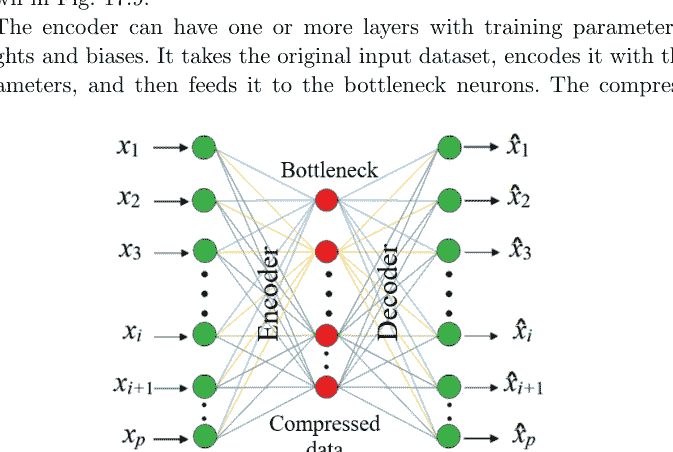

图 17.9：用于自编码器的神经网络。它由两个子网络组成，一个用于编码器，一个用于解码器，它们通过瓶颈层**z**连接。输入数据**x**进入编码器，在当前训练参数下产生潜在特征**z**。相同的**z**随后被馈送到解码器并产生输出**x̃**。输入**x**本身被用作最终输出层的标签，并且最小化残差**r** = **x̃** - **x**以强制输出**x̃**接近输入**x**。一旦使用数据集正确训练，自编码器在瓶颈处产生潜在特征，这些特征是数据集中提取/隐藏的特征。

该网络使用一个简单的标准进行训练：输出层的解码（重建）数据必须尽可能接近原始输入数据。这就是为什么训练不需要输入数据被标记的原因。上一章中定义的成本函数可以用于满足不同类型数据的这一标准。训练过程本质上与训练任何其他神经网络相同，通过反向传播过程。一旦训练完成，这三个部分中的所有训练参数都被设置，自编码器能够在需要时使用压缩数据重建数据。这是自编码器的基本策略。

自编码器可以使用各种类型的层构建，包括全连接层、卷积层、它们的组合以及其他形式的层。

### 17.4.2 示例1：图像压缩和去噪

可以使用现有的ML包（如Keras）轻松构建自编码器，只需按照类似于图17.9的配置堆叠神经元层。读者可以查看Ali Abdelaal在其在线文章“Python和Keras中的图像重建自编码器”（https://stackabuse.com/autoencoders-for-image-reconstruction-in-python-and-keras/）中提供的示例和代码。它使用LFW（http://vis-www.cs.umass.edu/lfw/）数据集，并展示了图像压缩和去噪的详细过程及代码。

### 17.4.3 示例2：图像分割

图像分割在自动驾驶汽车中可能很有用，其中可能需要分割行人、动物、自行车和汽车等对象。CNN和自编码器的技术对于创建有效的图像分割模型很有用。以下是一些使用像素库（https://github.com/ayoolaolafenwa/PixelLib）进行图像分割的示例：

```python
import matplotlib.pyplot as plt
import numpy as np
from PIL import Image
%matplotlib inline
```

import pixellib
from pixellib.semantic import semantic_segmentation
segment_image = semantic_segmentation()
segment_image.load_pascalvoc_model('deeplabv3_xception_tf_dim_ordering_tf_kernels.h5')
segment_image.segmentAsPascalvoc('../images/inkedcars15.jpg',
    output_image_name = '../images/cars15-s.jpg')
img = Image.open('../images/inkedcars15.jpg')
plt.figure(figsize=(10, 15))
plt.imshow(img);

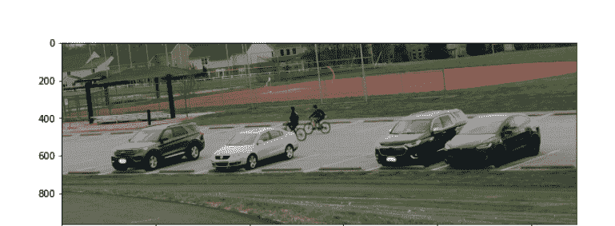

图 17.10：用于分割的原始图像。

```
img = Image.open('../images/cars15-s.jpg')
plt.figure(figsize=(10, 15))
plt.imshow(img);
```

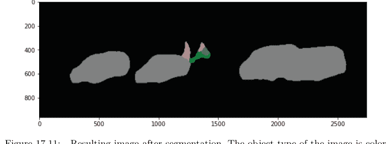

图 17.11：分割后的结果图像。图像中的物体类型通过颜色编码进行区分。

颜色编码用于区分物体类型。颜色编码的详细信息可以在像素库网站上找到。也可以将分割后的物体与原始图像叠加显示。

```
segment_image.segmentAsPascalvoc('../images/inkedcars15.jpg',
    output_image_name = '../images/cars15-s.jpg', overlay = True)
img = Image.open('../images/cars15-s.jpg')
plt.figure(figsize=(10, 15))
plt.imshow(img);
```

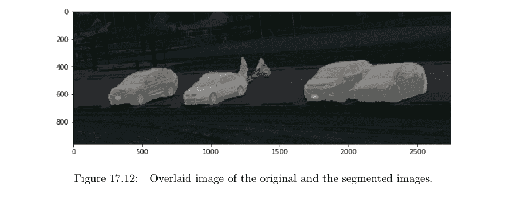

```
import pixellib
from pixellib.semantic import semantic_segmentation
import time
from pixellib.instance import instance_segmentation
segment_image = instance_segmentation()
segment_image.load_model("mask_rcnn_coco.h5")
start = time.time()
segment_image.segmentImage("../images/inkedcars-blocked.jpg",
    output_image_name = "../images/cars-blocked-s.jpg")
end = time.time()
print(f"Inference Time: {end-start:.2f}seconds")
img = Image.open("../images/inkedcars-blocked.jpg")
plt.figure(figsize=(10, 15));
plt.imshow(img);
```

处理后的图像已成功保存在当前工作目录中。
推理时间：19.08秒

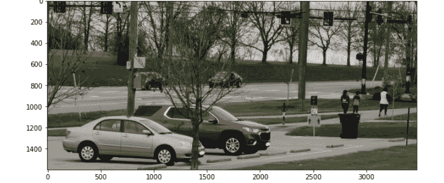

图 17.13：用于分割的原始图像。

```
python
img = Image.open("../images/cars-blocked-s.jpg")
plt.figure(figsize=(10, 15))
plt.imshow(img)
```

```
output
<matplotlib.image.AxesImage at 0x1fa39721108>
```

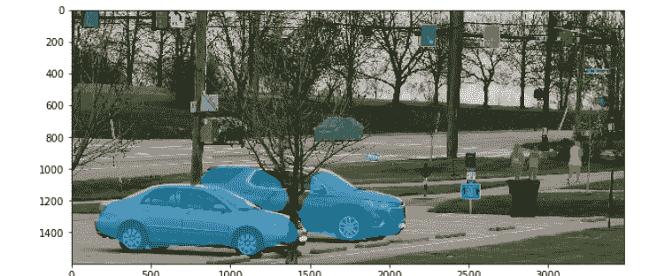

图 17.14：原始图像与分割图像的叠加图。物体类型通过颜色编码进行区分。

```
python
segment_image.segmentImage("../images/inkedcars-blocked.jpg",
                          output_image_name = "../images/cars-blocked-sf.jpg",
                          show_bboxes = True)
img = Image.open("../images/cars-blocked-sf.jpg")
plt.figure(figsize=(10, 15))
plt.imshow(img);
```

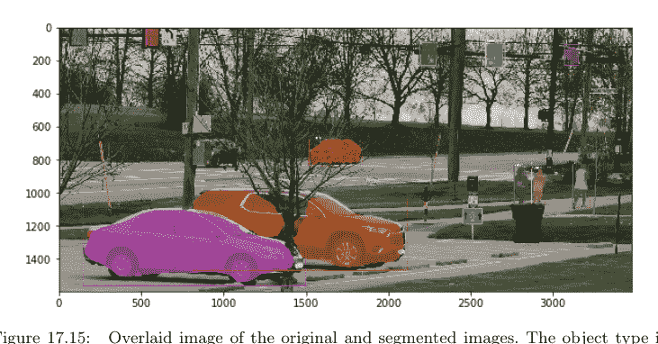

图 17.15：原始图像与分割图像的叠加图。物体类型通过颜色编码进行区分。物体被框选出来。

使用 MNIST 数据集和 Keras 团队代码的自编码器示例可在 Keras 博客 (https://blog.keras.io/building-autoencoders-in-keras.html) 上找到。变分自编码器 (VAE) 也可用于分割。关于 VAE 的理论讨论将在本章最后一节给出。自编码器还有许多其他应用，包括文本嵌入 (http://yaronvazana.com/2019/09/28/training-an-autoencoder-to-generate-text-embeddings/)、异常检测和流行度预测等，仅举几例。

## 17.5 自编码器与主成分分析

上述示例展示了自编码器的构建、训练和使用过程。要构建一个高质量且定义良好的自编码器，需要对其数学基础有深入的理解。在此，我们试图建立对自编码器更好的数学理解，并考察单层自编码器与我们在第3章学习的主成分分析之间的异同。本研究参考了 Ranjan 的一篇优秀文章 (https://towardsdatascience.com/build-the-right-Autoencodertune-and-optimize-using-pca-principles-part-i-1f01f821999b)。读者可参考原文获取更多细节。图 17.16 来自该文章，清晰地说明了自编码器和主成分分析中使用的数学运算。请注意，其公式与本书中的略有不同。

图 17.16 展示了一个单层线性自编码器及其涉及的数学运算。图的底部显示了编码过程与主成分变换的相似性。主成分变换将原始输入数据投影到其主成分上，以产生正交特征，称为主成分得分或潜变量。解码过程也类似于使用主成分得分进行主成分分析的重构过程。自编码器和主成分分析模型中的这些权重都是通过最小化 $p$ 个特征之间的误差来确定的。两个模型使用相同的输入数据：

- 自编码器的输入层有 $p$ 个神经元。
- 主成分分析使用相同的 $p$ 个输入样本。

对于自编码器中的编码器和主成分分析中的特征值分解，其数学运算的结果是等价的。特别地，可以注意以下几点：

- 自编码器中编码器层的代码大小为 $k$。
- 在主成分分析中，$k$ 是所选主成分（PCs，或潜变量）的数量。在两个模型中，我们都应有 $k < p$，以实现降维。
- 当 $k \geq p$ 时，可能导致过表示模型，并且如果训练或重构成功，重构误差可以为零。由于存在多个解，使用其中一种模型获得的解可能与另一种不同。
- 上图中编码器彩色单元格中的 $w_{ij}$ 对应于瓶颈层中第 $i$ 个神经元与输入数据的第 $j$ 个特征（参数）之间的权重，其中 $i = 1, 2, \ldots, k$ 且 $j = 1, 2, \ldots, p$。$\mathbf{W}_{k \times p}$ 等价于主成分分析算法中生成的前 $k$ 个特征向量的矩阵。

- 如果在瓶颈神经元中使用线性激活函数，自编码器瓶颈层的输出变为 $\mathbf{z}_{k \times 1} = \mathbf{W}_{k \times p} \mathbf{x}_{p \times 1}$，这等价于主成分分析中的 $k$ 个主成分（或得分）。

对于自编码器中的解码器和主成分分析中的重构过程，其数学运算的结果也是等价的。特别地，可以注意以下几点：

- 自编码器解码器输出层的神经元数量与主成分分析重构的输出数量相同，都等于 $p$，即输入数据中的特征数量。
- 解码器（从瓶颈神经元获取输出后）的输出（重构）数据变为 $\hat{\mathbf{x}}_{p \times 1} = \mathbf{W}'_{p \times k} \mathbf{z}_{k \times 1}$，等价于主成分分析中的 $p$ 个输出，这些输出是使用前 $k$ 个特征向量矩阵的转置，将主成分得分投影回原始空间（从主成分空间）的结果。

解码器输出神经元中的多种颜色表明，与瓶颈神经元相关的权重都可能对解码器输出神经元有所贡献。

上述比较使用了“相似”和“等价”等词语。如果使用线性激活函数，通过在训练过程中适当地施加一组约束（包括绑定编码器和解码器中的权重，以及对权重施加正交条件），可以将自编码器训练得与线性主成分分析相同。更多细节可参考 Ranjan 的文章。约束自编码器 [9] 用于 Tubenets [11–13] 逆分析的特征空间降维。

## 17.6 变分自编码器

变分自编码器是自编码器一个近期有趣的版本。它不是训练来编码数据集中的通常*离散*特征，而是学习概率*分布*的参数。当从学习到的分布中采样时，可以重构，也可以生成新的数据样本。因此，变分自编码器被称为“生成模型”。它具有如图 (17.17) 所示的架构，与标准自编码器非常相似。

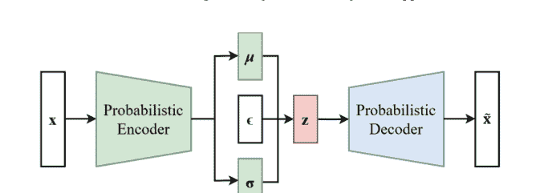

图 17.17：一个变分自编码器（VAE）。它由两个子网络组成，一个用于编码器，一个用于解码器，两者通过瓶颈层 z 连接。z 由三个部分组成：均值向量 μ、协方差矩阵 Σ 和从标准正态分布中抽取的向量 ε。输入数据 x 进入编码器，在当前训练参数下，产生 μ 和 Σ，它们与 ε 一起用于形成潜在特征 z，z 服从正态分布。相同的 z 随后被送入解码器并产生输出 x̃。输入 x 本身被用作最终输出层的标签，并且最小化残差 r = x − x̃ 以迫使输出 x̃ 接近输入 x，同时标准正态分布与 z 的分布之间的 KL 散度也被最小化。一旦用数据集正确训练，自编码器在瓶颈处产生潜在分布特征，这些特征可用于重构输入数据集中的数据点，或生成可能不在数据集中的新数据点。[图片基于 Wikimedia Commons 上 EugenioTL 的作品修改，遵循 CC BY-SA 4.0 许可协议]。

### 17.6.1.1 VAE 的关键思想

VAE 中使用的关键思想如下。

- 首先，VAE 编码器将输入样本 x 转换到一个由两组潜在特征控制的分布变量的潜在空间中：瓶颈处的分布均值 μ 和协方差矩阵 Σ。
- 接下来，我们从正态分布 N(μ, Σ) 中随机采样点 z，
  $$z = \mu + \Sigma^{1/2}\epsilon$$
  其中 ε 是从均值为零、标准差为单位值的标准正态分布 N(0, I) 中随机生成的向量。这是因为对于正态分布，我们有
  $$N(\mu, \Sigma) = \mu + \Sigma^{1/2}N(0, I) \quad (17.3)$$
- 最后，VAE 解码器将这些采样的潜在空间点映射以重构输入数据或生成新数据。
- VAE 模型的参数使用以下损失函数进行训练。
  $$\mathcal{L}_{vae} \left( \mathbf{W}, \tilde{\mathbf{W}}; \mathbf{x}, \mathcal{N}(\mathbf{0}, \mathbf{I}) \right) = \mathcal{L}(\tilde{\mathbf{x}}, \mathbf{x}) + D_{KL} \left( q_{\mathbf{W}}(\mathbf{z}|\mathbf{x}) \| p_{\tilde{\mathbf{W}}}(\tilde{\mathbf{x}}|\mathbf{z}) \right) \quad (17.4)$$

其中 $\mathbf{W}$ 是编码器中使用的训练参数，$\tilde{\mathbf{W}}$ 是解码器中使用的参数。该损失函数由两部分组成：一部分是重构损失，迫使重构样本与输入匹配。可以使用第 10、11 和 12 章中定义的损失函数。另一部分是第 4 章中定义的 KL 散度，它衡量潜在分布 $q_{\mathbf{W}}(\mathbf{z}|\mathbf{x})$ 和作为正则化项的先验分布 $p_{\tilde{\mathbf{W}}}(\tilde{\mathbf{x}}|\mathbf{z})$ 之间的差异。KL 散度需要被最小化，以迫使分布与先验分布匹配。

请注意，任何两个正态分布之间的 KL 散度都有一个仅用它们的均值和方差表示的简单闭式解，这对于 VAE 的实际实现至关重要。为了说明这一点，我们使用连续形式的正态分布 KL 散度。

### 17.6.1.2 两个单变量正态分布的 KL 散度

考虑两个单变量 $x \in \mathbb{R}^1$ 的正态分布 $p(x)$ 和 $q(x)$。它们的概率密度函数由下式给出

$$p(x) = \mathcal{N}(\mu_p, \sigma_p^2) = \frac{1}{\sqrt{2\pi}\sigma_p} e^{-\left(\frac{x-\mu_p}{\sqrt{2}\sigma_p}\right)^2} ;$$

$$q(x) = \mathcal{N}(\mu_q, \sigma_q^2) = \frac{1}{\sqrt{2\pi}\sigma_q} e^{-\left(\frac{x-\mu_q}{\sqrt{2}\sigma_q}\right)^2}$$

(17.5)

其中 $\mu$ 和 $\sigma$ 分别是下标指定的分布的均值和标准差。注意，在这种情况下，$p(x)$ 和 $q(x)$ 都是 $x$ 的标量函数，它们的分布完全由它们的均值和标准差控制。

从 $q(x)$ 到 $p(x)$ 的 KL 散度可以写为

$$D_{KL}(q||p) = \int q(x) \left[ \log(q(x)) - \log(p(x)) \right] dx$$

$$= \int q(x) \left[ -\log(\sigma_q) - \frac{1}{2} \left( \frac{x-\mu_q}{\sigma_q} \right)^2 + \log(\sigma_p) + \frac{1}{2} \left( \frac{x-\mu_p}{\sigma_p} \right)^2 \right] dx$$

$$= \int q(x) \left[ \log\left( \frac{\sigma_p}{\sigma_q} \right) + \frac{1}{2} \left( \frac{x-\mu_p}{\sigma_p} \right)^2 - \frac{1}{2} \left( \frac{x-\mu_q}{\sigma_q} \right)^2 \right] dx$$

$$= E_q \left[ \log\left( \frac{\sigma_p}{\sigma_q} \right) + \frac{1}{2} \left( \left( \frac{x-\mu_p}{\sigma_p} \right)^2 - \left( \frac{x-\mu_q}{\sigma_q} \right)^2 \right) \right]$$

$$= \log \left(\frac{\sigma_p}{\sigma_q}\right) + \frac{1}{2\sigma_p^2} E_q\left[(x - \mu_p)^2\right] - \frac{1}{2\sigma_q^2} E_q\left[(x - \mu_q)^2\right]$$

$$= \log \left(\frac{\sigma_p}{\sigma_q}\right) + \frac{1}{2\sigma_p^2} E_q\left[(x - \mu_p)^2\right] - \frac{1}{2}$$

$$= \log \left(\frac{\sigma_p}{\sigma_q}\right) + \frac{\sigma_q^2 + (\mu_q - \mu_p)^2}{2\sigma_p^2} - \frac{1}{2}$$

$$= \frac{1}{2} \left[ 2 \log \left(\frac{\sigma_p}{\sigma_q}\right) + \frac{\sigma_q^2}{\sigma_p^2} + \frac{(\mu_q - \mu_p)^2}{\sigma_p^2} - 1 \right] \quad (17.6)$$

在最后一步中，我们使用了以下简单的变形：

$(x - \mu_p)^2 = (x - \mu_q + \mu_q - \mu_p)^2 = (x - \mu_q)^2 + 2(x - \mu_q)(\mu_q - \mu_p) + (\mu_q - \mu_p)^2, \quad (17.7)$

其关于 $q(x)$ 的期望因此变为

$E_q[(x - \mu_p)^2] = E_q[(x - \mu_q)^2] + E_q[2(x - \mu_q)(\mu_q - \mu_p)] + E_q[(\mu_q - \mu_p)^2]$
$= \sigma_q^2 + 0 + (\mu_q - \mu_p)^2 \quad (17.8)$

等式 (17.8) 右边的第二项消失，因为 $(x - \mu_q)(\mu_q - \mu_p)$ 是一个奇函数，而 $q(x)$ 是对称的。容易验证，如果 $q(x)$ 和 $p(x)$ 是相同的分布，KL 散度变为零，正如预期的那样。

现在，如果 $p(x)$ 是标准正态分布：$\mu_p = 0$ 且 $\sigma_p = 1$，我们将有，

$D_{KL}(q \| p) = \frac{\sigma_q^2 + \mu_q^2}{2} - \log \sigma_q - \frac{1}{2}, \quad (17.9)$

此外，当 $q(x)$ 也是标准正态分布时，KL 散度变为零。

### 17.6.1.3 两个多变量正态分布的 KL 散度

现在考虑两个多变量 $\mathbf{x} \in \mathbb{R}^k$ 的正态分布 $p(\mathbf{x})$ 和 $q(\mathbf{x})$。域的维度变为 $k$，且 $\mathbf{x} = [x_1, x_2, \dots, x_k]^\top$ 在 $\mathbb{R}^k$ 中。概率密度函数由下式给出

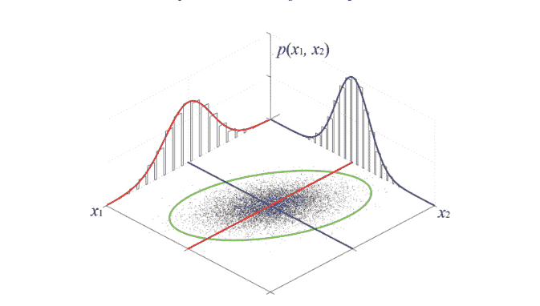

图 17.18：一个 $k = 2$ 的多变量正态分布示例。沿红色和蓝色直线的样本概率分布分别由红色和蓝色高斯钟形曲线给出。[图片基于 Wikimedia Commons 上 IkamusumeFan 的作品修改，遵循 CC BY-SA 3.0 许可协议]。

$$p(\mathbf{x}) = \mathcal{N}(\mathbf{x}; \boldsymbol{\mu}_p, \boldsymbol{\Sigma}_p) = \frac{1}{\sqrt{(2\pi)^k |\boldsymbol{\Sigma}_p|}} \exp\left(-\frac{1}{2}(\mathbf{x} - \boldsymbol{\mu}_p)^\top \boldsymbol{\Sigma}_p^{-1}(\mathbf{x} - \boldsymbol{\mu}_p)\right)$$

$$q(\mathbf{x}) = \mathcal{N}(\mathbf{x}; \boldsymbol{\mu}_q, \boldsymbol{\Sigma}_q) = \frac{1}{\sqrt{(2\pi)^k |\boldsymbol{\Sigma}_q|}} \exp\left(-\frac{1}{2}(\mathbf{x} - \boldsymbol{\mu}_q)^\top \boldsymbol{\Sigma}_q^{-1}(\mathbf{x} - \boldsymbol{\mu}_q)\right)$$

(17.10)

其中 $\boldsymbol{\mu} = [\mu_1, \mu_2, \ldots, \mu_k]^\top$ 是 $\mathbb{R}^k$ 中的均值向量，$\boldsymbol{\Sigma}$ 是 $\mathbb{R}^{k \times k}$ 中的协方差矩阵。$p(\mathbf{x})$ 和 $q(\mathbf{x})$ 仍然是标量函数，它们的分布由它们的均值和协方差控制。图 17.18 显示了一个 $k = 2$ 的多变量正态分布示例。从 $q(\mathbf{x})$ 到 $p(\mathbf{x})$ 的 KL 散度可以从一个多维积分开始写为以下形式。

$$D_{KL}(q \| p) = \int q(\mathbf{x}) \left[ \log(q(\mathbf{x})) - \log(p(\mathbf{x})) \right] d\mathbf{x}$$
$$= \int q(\mathbf{x}) \frac{1}{2} \left[ \log \frac{\det \boldsymbol{\Sigma}_p}{\det \boldsymbol{\Sigma}_q} + (\mathbf{x} - \boldsymbol{\mu}_p)^\top \boldsymbol{\Sigma}_p^{-1}(\mathbf{x} - \boldsymbol{\mu}_p) - (\mathbf{x} - \boldsymbol{\mu}_q)^\top \boldsymbol{\Sigma}_q^{-1}(\mathbf{x} - \boldsymbol{\mu}_q) \right] d\mathbf{x}$$= \frac{1}{2} E_q \left[ \log \frac{\det \Sigma_p}{\det \Sigma_q} + (\mathbf{x} - \boldsymbol{\mu}_p)^\top \Sigma_p^{-1} (\mathbf{x} - \boldsymbol{\mu}_p) - (\mathbf{x} - \boldsymbol{\mu}_q)^\top \Sigma_q^{-1} (\mathbf{x} - \boldsymbol{\mu}_q) \right]

= \frac{1}{2} \left( \log \frac{\det \Sigma_p}{\det \Sigma_q} + E_q[(\mathbf{x} - \boldsymbol{\mu}_p)^\top \Sigma_p^{-1} (\mathbf{x} - \boldsymbol{\mu}_p)] - E_q[(\mathbf{x} - \boldsymbol{\mu}_q)^\top \Sigma_q^{-1} (\mathbf{x} - \boldsymbol{\mu}_q)] \right)

= \frac{1}{2} \left( \log \frac{\det \Sigma_p}{\det \Sigma_q} + E_q[(\mathbf{x} - \boldsymbol{\mu}_p)^\top \Sigma_p^{-1} (\mathbf{x} - \boldsymbol{\mu}_p)] - k \right)

= \frac{1}{2} \left( \log \frac{\det \Sigma_p}{\det \Sigma_q} + tr(\Sigma_p^{-1} \Sigma_q) + (\boldsymbol{\mu}_q - \boldsymbol{\mu}_p)^\top \Sigma_p^{-1} (\boldsymbol{\mu}_q - \boldsymbol{\mu}_p) - k \right) \quad (17.11)

在第4步中，我们使用了矩阵乘积的迹和期望操作的性质：

E_q \left[ (\mathbf{x} - \boldsymbol{\mu}_q)^\top \Sigma_q^{-1} (\mathbf{x} - \boldsymbol{\mu}_q) \right] = E_q \left[ tr \left( (\mathbf{x} - \boldsymbol{\mu}_q)^\top \Sigma_q^{-1} (\mathbf{x} - \boldsymbol{\mu}_q) \right) \right]

= tr \left[ E_q \left( (\mathbf{x} - \boldsymbol{\mu}_q)^\top \Sigma_q^{-1} (\mathbf{x} - \boldsymbol{\mu}_q) \right) \right] \quad (17.12)

= tr \left[ E_q \left( (\mathbf{x} - \boldsymbol{\mu}_q)(\mathbf{x} - \boldsymbol{\mu}_q)^\top \Sigma_q^{-1} \right) \right]

= tr \left[ \Sigma_q \Sigma_q^{-1} \right] = tr[\mathbf{I}] = k

在最后一步中，我们使用了类似于公式 (17.7) 的矩阵版本操作。

很容易验证，如果 $q(\mathbf{x})$ 和 $p(\mathbf{x})$ 是相同的分布，KL散度将变为零，正如预期的那样。

现在，如果 $p(\mathbf{x})$ 是标准正态分布，我们有

D_{KL}(q \| p) = \frac{1}{2} \left( -\log(\det \Sigma_q) + tr(\Sigma_q) + \boldsymbol{\mu}_q^\top \boldsymbol{\mu}_q - k \right) \quad (17.13)

此外，当 $q(\mathbf{x})$ 也是标准正态分布时，KL散度变为零。

在VAE中，我们通常假设协方差矩阵 $\Sigma_q$ 是对角的：$\Sigma_q = diag(\Sigma_{q1}, \Sigma_{q2}, \dots, \Sigma_{qk})$。因此，它的迹将是这些方差的和。它的行列式将是这些方差的乘积。因此，公式 (17.13) 可以进一步简化为

$$D_{KL}(q||p) = \frac{1}{2} \left( -\log(\prod_{i}^{k} \Sigma_{qi}) + \sum_{i}^{k} \Sigma_{qi} + \sum_{i}^{k} \mu_{qi}^2 - \sum_{i}^{k} 1 \right)$$
$$= \frac{1}{2} \left( -\sum_{i}^{k} \log(\Sigma_{qi}) + \sum_{i}^{k} \Sigma_{qi} + \sum_{i}^{k} \mu_{qi}^2 - \sum_{i}^{k} 1 \right) \quad (17.14)$$
$$= \frac{1}{2} \sum_{i}^{k} (-\log(\Sigma_{qi}) + \Sigma_{qi} + \mu_{qi}^2 - 1)$$

最后，出于数值稳定性的原因，我们经常用 $\exp(\Sigma_{qi})$ 替换 $\Sigma_{qi}$，VAE中常用的KL散度最终公式如公式 (17.4) 所示。

$$D_{KL}(q||p) = \frac{1}{2} \sum_{i}^{k} (\exp(\Sigma_{qi}) + \mu_{qi}^2 - \log(\Sigma_{qi}) - 1), \quad (17.15)$$

其中，均值和方差是使用 $q$ 的当前学习参数 $\mathbf{W}$ 和 $p$ 的确定性部分的 $\tilde{\mathbf{W}}$ 计算的。随机部分使用标准正态分布，如公式 (17.3) 所示。这允许在训练过程中进行反向传播，绕过瓶颈层，而随机部分不影响VAE模型中关于 $\mathbf{W}$ 的梯度计算。这就是所谓的*重参数化技巧*。

通过上述公式，现在可以构建一个与标准自编码器相比改动最小的VAE。一个示例代码可在 https://keras.io/examples/generative/vae/ 获取，其中逐步介绍了如何创建、训练和使用VAE模型。

## 参考文献

- [1] G. Hamerly and C. Elkan, Alternatives to the k-means algorithm that find better clusterings, 2002. https://doi.org/10.1145/584792.584890.
- [2] J.A. Hartigan and M.A. Wong, Algorithm AS 136: A K-Means Clustering Algorithm, *Journal of the Royal Statistical Society. Series C (Applied Statistics)*, **28**(1), 100-108, 1979. http://www.jstor.org/stable/2346830.
- [3] P. Fabian, V. Gae, G. Alexandre *et al.*, Scikit-learn: Machine learning in Python, *Journal of Machine Learning Research*, **12**(85), 2825-2830, 2011. http://jmlr.org/papers/v12/pedregosa11a.html.
- [4] D. Comaniciu and P. Meer, Mean shift: A robust approach toward feature space analysis, *IEEE Transactions on Pattern Analysis and Machine Intelligence*, **24**(5), 603–619, 2002.
- [5] A. Kramer Mark, Nonlinear principal component analysis using autoassociative neural networks, *AIChE Journal*, **37**(2), 233–243, 1991. https://aiche.onlinelibrary.com/doi/abs/10.1002/aic.690370209.
- [6] I. Goodfellow, Y. Bengio and A. Courville, Deep Learning, 2016.
- [7] P. Diederik and W. Max, An introduction to variational autoencoders, *CoRR*, abs/1906.02691, 2019. http://arxiv.org/abs/1906.02691.
- [8] G.E. Hinton, A. Krizhevsky and S.D. Wang, Transforming auto-encoders, *Artificial Neural Networks and Machine Learning — ICANN 2011*, 2011.
- [9] D. Shuyong, H. Zhiping, G.R. Liu *et al.*, A novel inverse procedure via creating tubenet with constraint autoencoder for feature-space dimension-reduction, *International Journal of Applied Mechanics*, **13**(8), 2150091, 2021.
- [10] C. Ranjan, *Understanding Deep Learning: Application in Rare Event Prediction*, Connaissance Publishing, 2020. www.understandingdeeplearning.com.
- [11] G.R. Liu, S.Y. Duan, Z.M. Zhang *et al.*, Tubenet: A special trumpetnet for explicit solutions to inverse problems, *International Journal of Computational Methods*, **18**(01), 2050030, 2021. https://doi.org/10.1142/S0219876220500309.
- [12] L. Shi, F. Wang, G. Liu *et al.*, Two-way TubeNets Uncertain Inverse methods for improving Positioning Accuracy of robots Based on Interval, *The 11th International Conference on Computational Methods (ICCM2020)*, 2020.
- [13] D. Shuyong, S. Lutong, G.R. Liu *et al.*, An uncertainty inverse method for parameters identification of robot arms based on two-way neural network, *Inverse Problems in Science & Engineering*, Revised, 2021.

## 第18章

## 强化学习 (RL)

### 18.1 基本概念

#### 18.1.1 *问题陈述*

我们对监督和无监督机器学习技术应该已经有了相当好的了解。本章讨论另一种重要的技术，称为强化学习 (RL)。

当一个孩子大约1岁时，他/她开始学习走路。如果仔细观察学习过程，孩子会尝试通过移动不同的肌肉部位来调整向前的步伐，而不摔倒或避免受到重力（一个他/她未知的环境）的惩罚。我们可能还会注意到，如果一位家长蹲在他/她面前，他/她会迈出更大的步伐，学习通常进展得更快。这是因为孩子看到了更高的安全性和一种奖励，这强化了学习过程。在某种程度上，机器RL是模仿这种学习走路的过程，机器孩子被称为**智能体**。智能体学习在一个具有未知分布惩罚或奖励的环境中采取行动，学习通过累积奖励和/或避免惩罚的过程得到强化。

RL与监督学习的主要区别在于学习指导原则。监督学习需要一个具有预定义输入-标签对的数据集，学习目标是最小化给定标签与使用相应输入进行的预测之间的差异。然而，在RL中，智能体没有这样的数据集。它被赋予一个对智能体未知的环境。它需要通过尝试**行动**来学习环境，当在环境的**状态**中采取适当的行动时，这些行动可能会带来一些**奖励**。

许多与强化学习相关的技术已在博弈论、运筹学、控制理论和最优控制等多个学科中发展起来。这些技术包括蒙特卡洛方法、Q学习、深度Q网络、深度确定性策略梯度以及信赖域策略优化[1–4]。强化学习分为基于模型和无模型两类。如果存在可用于预测环境动态的仿真模型，那么基于模型的强化学习可能是一个不错的选择，因为智能体可以在执行动作时，根据当前状态以一定概率预测下一状态。如果不存在这样的预测模型，则必须使用无模型强化学习。在本章中，我们将首先简要介绍强化学习的基本原理和理论。我们的重点将放在所谓的Q学习方法上，这是一种基本的代表性技术，属于无模型方法。我们还将介绍Q学习的神经网络实现：Q网络。在最后一节，我们将讨论一些目前最流行的策略梯度方法，包括强大的近端策略优化（PPO）。读者可以参考《强化学习：导论》[1]以及维基百科页面及其参考链接，以获取关于各种强化学习技术的更多细节。

### 18.1.2 在科学、工程和商业中的应用

强化学习算法可用于解决科学、工程和商业环境中需要操作自动化的问题。

- **服务与制造机器人：** 智能体（机器人）感知并与环境交互，学习以最有效的方式完成任务。
- **自动与最优控制：** 智能体通过试错学习，在环境中采取最稳定或最优的位置和动作。
- **配送无人机：** 智能体（无人机）学习寻找安全且最经济的路径，并导航至目的地。
- **运筹学：** 智能体学习寻找与资源管理相关的任务的最佳可能操作。
- **个性化推荐：** 智能体通过学习和预测用户行为，学习向用户推荐最佳的新闻或广告。
- **游戏：** 智能体学习采取最佳行动以最大化得分。每个动作都会影响智能体在游戏环境中的状态。一个典型的例子是广为人知的AlphaGo。

### 18.1.3 *强化学习方法*

图18.1是强化学习过程的示意图。给定一个环境，其中包含一些奖励和/或惩罚的分布。这些分布对智能体是未知的。智能体开始对其进行探索。它采取行动，然后观察环境。由于环境最初对智能体未知，它一开始只能随机采取行动。偶然情况下，它可能走错一步并需要重新开始。或者，偶然走对一步并获得奖励，然后再次尝试。这种试错学习循环不断迭代，旨在实现最优累积奖励。在每次尝试中，它都需要解释环境并更新其状态。需要一种算法来确保这种更新能带来最佳的累积奖励（或有效避免惩罚）。为此，我们需要一些理论来指导此类算法的构建。

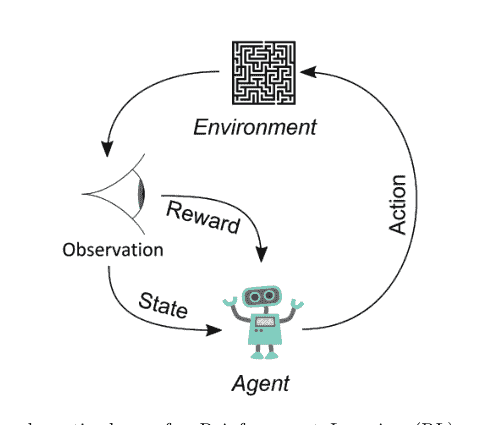

图18.1：强化学习（RL）过程示意图：智能体在具有分布式奖励（或惩罚）的环境中，于某一状态采取行动。智能体迭代一个试错学习循环，旨在实现最优累积奖励。基于Megajuice在[CC0](https://commons.wikimedia.org/w/index.php?curid=57895741)许可下的原始图像修改。

### 18.1.4 离散时间中的动作：求解策略

从前几章我们知道，任何优化问题都有一个目标函数，该函数以学习参数的形式给出。学习过程本质上是利用目标函数的梯度信息来寻找最小值。在强化学习过程中，目标是尽可能多地累积奖励，但智能体不知道奖励在给定环境中的位置。

显然，智能体需要在不同时间点分步采取行动。它必须跟踪动作结果的*状态*随时间如何演变。在每个时间点，当前状态是采取行动以更新状态的基础，这将导致下一个时间的新状态。显然，每个时间点的结果部分是随机的，部分取决于所采取的行动。因此，马尔可夫决策过程或**MDP**可以作为我们问题的恰当描述。

在任何时间点，我们需要一个规则来告诉智能体在给定任何可能的状态值时如何行动。这种将动作确定为状态函数的规则，称为**策略**或策略函数[5]，以及非常基本的方程，即贝尔曼方程。

我们自然希望状态以最佳方式演变，以便在演变的状态上采取的行动能够最大化我们的目标，即累积奖励。累积奖励的最佳可能值，写成状态的函数，称为**状态值函数**。当它写成动作的函数（因此也隐含地是状态的函数）时，称为**动作值函数**。我们的强化学习问题现在被表述为一个以动作值函数为目标函数的离散时间优化问题。

最后一个重要的策略是如何找到优化动作值函数的优化器（最优动作和状态）。为此，我们使用**贝尔曼方程**，它给出了一个时间点的动作值函数与下一个时间点的动作值函数之间的关系。我们离散时间中的优化问题以逐步递归的形式（称为反向归纳法）陈述。这导致了所谓的值迭代，即*基于值的算法*。

或者，强化学习也可以被表述为一个策略优化问题，让智能体学习最优策略。这是因为在MDP过程中，当策略被优化并收敛时，值函数也会收敛到最优。在MDP过程中，策略和值函数是直接相互关联的。这导致了*基于策略的算法*。

为了有效实现，各种类型的神经网络（NN），读者现在应该已经熟悉，在基于值和基于策略的强化学习算法/方法中被广泛使用。以下各节将阐述所有这些关键策略要素：MDP、策略、动作值函数和贝尔曼方程。将展示并检验基于值和基于策略算法的示例和代码。

## 18.2 马尔可夫决策过程

马尔可夫决策过程（MDP）是一个离散时间的随机决策过程。它是一个用于结果依赖于随机变量和决策变量的问题的数学模型。关于MDP的详细讨论可以在多个来源中找到，包括贝尔曼的一篇文章、罗纳德·霍华德的著作《动态规划与马尔可夫过程》以及维基百科页面。它是马尔可夫链的扩展。MDP考虑一个一般的动态过程。在每个时间步，过程处于一个状态，智能体在该状态下采取一个动作。过程根据动作和一些随机变量转移到下一个状态，同时智能体获得一个奖励。过程转移到下一个状态的概率由当前采取的动作以及当前时间步的随机变量决定。重要的假设是动态过程具有马尔可夫性质，这意味着从当前状态转移到下一个状态的概率不条件依赖于所有先前的状态和动作。这个假设为建模我们的强化学习过程提供了一种实用的手段，并使其在算法上成为可能。从数学上讲，强化学习中的MDP定义如下。

- **状态空间** $\mathbb{S}$：智能体与之交互并从中观察。
- **动作空间** $\mathbb{A}$：定义智能体可能采取的动作。
- **转移概率函数** $P(s \rightarrow s'; a)$：定义在动作 $a$ 下从状态 $s$ 转移到状态 $s'$ 的概率。
- **奖励函数** $R(s \rightarrow s'; a)$：定义在动作 $a$ 下从 $s$ 转移到 $s'$ 后的即时奖励。
- **折扣因子** $\gamma \in (0, 1)$：对过程中未来步骤的奖励进行折扣。

该过程本质上是奖励驱动的，并且在理论上通过折扣因子确保了收敛性，该折扣因子限制了整个过程中可获得的总奖励。

*挑战*在于：

-   1. 智能体最初完全不知道环境的状态；
-   2. 动作的选择（策略）基本上是随机的（尽管动作空间是确定性的）；以及
-   3. 从一个状态到下一个状态的转移也是随机的。智能体必须以某种方式学习状态和策略（基于价值优化、基于策略优化或两者结合），以便其动作能获得最大化的奖励。

因此，学习需要通过一系列的探索和利用来完成。

## 18.3 策略

策略 $\pi$ 定义了智能体在状态 $s \in \mathbb{S}$ 下如何选择动作 $a \in \mathbb{A}$。它被定义为以下映射。

$$\pi : \mathbb{S} \times \mathbb{A} \rightarrow [0, 1] \qquad (18.1)$$

它是一个条件概率：

$$\pi(a, s) = \Pr(a_t = a \mid s_t = s) \qquad (18.2)$$

**最优策略：** 可能存在大量的策略（状态空间和动作空间中变量的组合）。智能体需要找到一个最优策略，以最大化*累积奖励*的期望回报。在基于价值的算法中，智能体最简单的“最优”策略是贪婪策略，即在每一步都选择可能动作中能带来最佳价值的动作。然而，这种单次时间的最佳选择在整个马尔可夫决策过程中可能并非最佳。因此，在基于策略的算法中，目标是让智能体学习一个在马尔可夫决策过程中多个连续状态上更平滑的最优策略，这可以使用多层感知机（第13章）来实现，同时智能体探索环境。

## 18.4 价值函数

当智能体采取一个动作时，它应获得当前动作的即时奖励。此外，智能体将在未来的时间步采取更多动作，为此它也应获得奖励。然而，在考虑未来奖励时，应对其进行折扣。这种折扣不仅在现实中合理，而且具有数学意义。如果不对未来奖励进行折扣，所有这些未来奖励的总和可能是无界的，因此在数学上是不允许的。因此，我们需要一个合适的定义来衡量智能体从当前和未来奖励中获得的回报。

**回报：** 我们现在正式定义状态 $s_t$ 处的*回报* $R_t$，考虑来自未来的可能奖励：

$$R_t = \sum_{k=0}^{\infty} \gamma^k r_{t+k+1} \quad (18.3)$$

其中 $\gamma \in (0, 1)$ 是*折扣率*，考虑了来自未来的奖励 $r_{t+k+1}$，该奖励在当前应被赋予较低的价值。还需注意，来自遥远未来终端状态（如果有的话）的奖励回报应趋近于零。

当智能体在某个状态遵循策略 $\pi$ 时，状态价值函数 $V_{\pi}(s)$ 现在可以定义为从状态 $s_t$ 开始的未来*期望回报*。它估计了所有这些未来奖励的总回报：

$$V_{\pi}(s) = \mathrm{E}[R \mid s_t = s, \pi] = \mathrm{E}\left[\sum_{k=0}^{\infty} \gamma^k r_{t+k+1} \mid s_t = s, \pi\right] \quad (18.4)$$

这是在策略 $\pi$ 下的**状态价值函数**。

策略 $\pi$ 下的**动作价值函数** $Q_{\pi}(s, a)$ 可以用类似的方式定义：

$$Q_{\pi}(s, a) = \mathrm{E}[R \mid s_t = s, a_t = a, \pi] = \mathrm{E}\left[\sum_{k=0}^{\infty} \gamma^k r_{t+k+1} \mid s_t = s, a_t = a, \pi\right] \quad (18.5)$$

## 18.5 贝尔曼方程

在马尔可夫决策过程中，强化学习中使用的动作价值函数（公式18.5）具有递归关系。例如，对于贪婪策略，我们有贝尔曼方程：

$$Q(s, a) = \max_{a \in \mathbb{A}} \left(r(s, a) + \gamma Q(s', a)\right) \quad (18.6)$$

贝尔曼方程用下一个时间步的值 $Q' = Q(s', a)$ 来表示当前时间步的 $Q(s, a)$ 值，这被称为反向归纳。使用公式(18.6)，我们可以设计以下简单但非常基础的算法，这是Q-learning算法的基础。

-   **初始化**：在时间 $t = 0$ 时，$Q(s, a), \forall s \in \mathbb{S}, a \in \mathbb{A}$ 简单地初始化为零。智能体的动作变量 $a^*$ 根据最优策略计算，得到 $a^* = \text{argmax}_{a \in \mathbb{A}} Q(s_0, a)$，并加上一个随机生成的小值。因为 $Q$ 在此初始阶段为空，所以 $a^*$ 只有随机值。这意味着初始动作是随机的，智能体随机进入一个新状态 $s_1$。现在，我们可以搜索*未来奖励* $\text{max}_{a \in \mathbb{A}} Q(s_1, a)$，然后使用公式(18.6)更新 $Q$ 值为 $Q(s_0, a_0)$。这完成了初始化。

-   **一次典型迭代**：考虑在任意时间步 $t \ge 1$，当前的 $Q(s_t, a_t)$ 是已知的。我们计算 $a^* = \text{argmax}_{a \in \mathbb{A}} Q(s_t, a)$，并加上一个较小的随机值。智能体以 $a^*$ 执行动作，并进入下一个状态 $s_{t+1}$。我们现在可以搜索*未来奖励* $\text{max}_{a \in \mathbb{A}} Q(s_{t+1}, a)$，并使用公式(18.6)更新 $Q$ 值为 $Q(s_t, a_t)$。这完成了一次典型迭代，并移动到下一个时间步 $t+1$。我们在这里清楚地看到了重要的**反向归纳**机制：当前状态的智能体进入下一个状态，然后使用公式(18.6)更新其当前状态。如果当前状态的值为零，而下一个状态有值（或奖励），这次迭代将给当前状态返回一些值！换句话说，下个状态的部分价值被“归纳”回了当前状态。因为 $Q$ 初始化为全零，智能体必须进行足够的随机移动才能进入一个有奖励的状态。然后该奖励可以在未来的迭代中逐渐反向归纳到先前的状态。我们注意到，Q-learning算法的基本机制是 $Q$ 值在状态空间中反向更新。

-   迭代持续进行，直到 $Q$ 值收敛。注意，在实践中我们应控制随机生成的值。随机值随着迭代次数的增加而逐渐减小，并在迭代趋于无穷时消失。

最后，我们可以对算法的收敛性进行一个简单的直观分析。首先，因为 $\gamma < 1$，如果奖励 $r$ 对于所有可能的策略 $\pi$（包括最优策略）都是有限的，那么公式(18.3)给出的回报对于所有 $k$ 都将是有限的。因此，来自公式(18.6)的 $Q$ 值将始终是有界的。其次，因为在所有时间步都使用了最优策略，使用公式(18.6)的迭代可以随着迭代次数的增加将 $Q$ 值进一步推向其上界。因此，$Q$ 必须收敛，因为算法将其推向越来越大的上界。

上述基于贝尔曼方程的算法将用于示例部分给出的代码中。

## 18.6 Q-learning算法

Q-learning算法是一种基础且有用的强化学习过程，由Watkins (1989) [2]在其博士论文《从延迟奖励中学习》（英国剑桥）中提出。该算法的收敛性证明在[3]中得到了完善。它被称为“无模型”，因为更新过程不需要为环境预定义模型。该算法基于马尔可夫决策过程，具有最优策略，并使用贝尔曼方程。智能体通过迭代学习采取改进的动作，同时更新环境价值函数。

“Q”是动作价值函数的名称，它是算法中使用的最大期望累积奖励。它是一个形状为（状态维度，动作维度）的矩阵，并在迭代过程中更新。我们将使用以下示例来介绍Q算法。

### 18.6.1 示例1：机器人使用Q-learning算法探索有未知障碍物的房间

考虑一个机器人（作为智能体）想要到达房间中的一个目标。然而，房间里有障碍物。为了简化问题，让我们使用一个均匀的规则网格将房间地板划分为4×4个规则单元格。因此，状态空间的维度是16（= 4 × 4）。这些障碍物占据了一些单元格，但机器人不知道是哪些。机器人能够从任何空单元格向四个方向（上、下、左、右）走到下一个单元格。因此，动作空间的维度是4。这是机器人决定走向哪个方向。它从左上角的单元格（方格一）开始，走向一个放置了奖励的目标单元格。如果机器人到达目标单元格，它将获得奖励。然后它将返回起始单元格并再次尝试。尝试（称为一个回合）继续进行。如果它撞到障碍物，这次尝试被视为失败，它必须返回起始单元格并重新开始。机器人被允许尝试任意多次。目标是让机器人自己学会，随着尝试次数的增加，它能以越来越高的概率在环境中获得奖励。

我们现在设计一个Q算法，使得配备该算法的机器人能够找到一条到达目标单元格的有效路径。显然，机器人需要多次失败和尝试，而唯一能让它进行更好尝试的就是获得奖励。我们使用一个Q矩阵来记录机器人收到的累积奖励。这个记录必须是房间中空间的离散函数，对应于每个可能的动作。

机器人可以采取的行动，以及每个单元格的值。它还必须从机器人采取的四种行动中选择一种。因此，我们可以构建一个记录表，并称之为Q表，其形状为(16, 4)。起初，什么都没有发生，因此Q表初始化为全零。在目标单元格，我们将其奖励值设为1.0。所有被障碍物占据的单元格（机器人起初不知道其位置）都会将机器人送回起点。

在此设置下，结合前面章节介绍的公式，Q算法中更新$Q$的公式可以轻松写为

$$Q^{new}(s_t, a_t) \leftarrow Q^{old}(s_t, a_t) + l_r \cdot \left( \underbrace{r_t + \gamma \cdot \underbrace{\max_a Q(s_{t+1}, a)}_{\text{t+1时刻的最优值}}}_{\text{时间目标（类似标签）}} - Q^{old}(s_t, a_t) \right)$$

在学习过程中，因此当它到达目标单元格（如果它能到达的话）时，所采取的步数可能相当大（大于16）。即使它因为撞到障碍物而未能到达目标单元格并结束该回合，步数也可能相当大，因为存在“漫游”的可能性。

### 18.6.2 OpenAI Gym

我们现在准备好编写Q-learning算法的代码了。我们现在需要一个名为Gym的模块，它基于MIT许可证，版权所有(c) 2016 [OpenAI](https://openai.com)。这是一个用于开发和比较强化学习算法的工具包。对于我们的示例，我们将使用OpenAI Gym来设置环境，即带有障碍物的房间。我们还将使用TensorFlow来构建算法，并使用matplotlib来绘制结果。首先，我们导入必要的模块。以下代码来自awjuliani/DeepRL-Agent，基于MIT许可证：

```python
# https://github.com/awjuliani/DeepRL-Agents
# awjuliani/DeepRL-Agents is licensed under the MIT License
# import necessary modules
import numpy as np
import gym
import random
import tensorflow as tf
import matplotlib.pyplot as plt
%matplotlib inline
```

接下来，我们加载Gym模块中可用的环境FrozenLake-v0。这个环境是为人们在有洞的冰冻湖面上行走而设置的。设置由Gym固定，无法更改，但它完美契合我们的问题，无需修改。

```python
env = gym.make('FrozenLake-v0')  # create an environment instance
```

该环境有一个简单的网格，包含4 × 4个单元格：
- SFFF（S：起始单元格，安全）。
- FHFH（F：自由单元格，可安全行走）。
- FFFH（H：硬障碍物，失败并返回起点）。
- HFFG（G：目标单元格，任务完成，获得奖励并返回起点）。

请注意，机器人在开始前并不知道这个设置。我们现在将研究机器人探索带有障碍物的房间的Q-learning算法。

### 18.6.3 定义实用函数

```python
# Compute the moving average curve of a curve
env=gym.make('FrozenLake-v0') # create environment instance

def mv_avg(x, n):    # move average over past n points
    return [sum(x[i:i+n])/n for i in range(len(x)-n)]

def print_state(Q,ns,na):
    #Q = (env.observation_space.n,env.action_space.n)
    print('Initial Q-Table Values: (',ns,',',na,')')
    print('Norm of Q=',np.linalg.norm(Q,np.inf))
    for s in range(ns//na):
        for a in range(na):
            print (f'{Q[4*a,s]:7.4f}{Q[4*a+1,s]:7.4f}'
                   f'{Q[4*a+2,s]:7.4f}{Q[4*a+3,s]:7.4f}')

def tweak_reward(reward, done):
    if reward == 0:
        reward = -0.01
    if done:
        if reward < 1:
            reward = -1
    return reward

def schedule(p0,n_episodes,beta): # schedule parameter decay
    return p0/(np.arange(1,episodes+2))**beta
```

### 18.6.4 一个简单的Q-learning算法

```python
# Set learning parameters for Q-learning
np.set_printoptions(formatter={'float': '{:  0.3f}'.format})

episodes = 2000       # maximum episodes (trials)
jwSteps = 299         # maximum walk steps in an episode
lr_0 = 0.90 #0.85    # initial learning rate (lr)
beta_lr = 0.01       # lr decay power

gamma_0 = .98        # initial discount rate (back reduction)
beta_g = 0.001       # gamma decay power

eps_0 = 0.01         # initial epsilon (random action)
beta_eps = 0.80      # epsilon decay power

lrv = schedule(lr_0,episodes,beta_lr)
gav = schedule(gamma_0,episodes,beta_g)
epsv = schedule(eps_0,episodes,beta_eps)

print(f'lrv_last={lrv[episodes]:.4e}', f'gav_last={gav[episodes]:.4e}',f'epsv_last={epsv[episodes]:.4e}')
# initialize lists for recording the total rewards and steps
jList = []           # walked steps in episodes

rList = []           # total rewards received in episodes
norm_Q = []          # maximum (inf norm) value in Q-table
# Initialize the Q-table with all zeros
Q = np.zeros([env.observation_space.n,env.action_space.n])
    # Q: array of shape (env.observation_space.n,env.action_space.)
    # both env.observation_space.n and env.action_space are
    # attributes from Gym once the evn instance is created.
    # For FrozenLake-v0, the values are in (16,4),cells
    # For our example: observation space is state space

np.random.seed(1)

for e in range(episodes):       # episodes+1: maximum episodes
    # reset the environment, which gives an initial state
    s = env.reset()
    #print('e=',e,' s=',s)
    rAll = 0
        # to record the total rewards received in an episode
    done = False                # is the attempt over?
    j = 0
    lrr = lrv[e]
    gam = gav[e]
    eps = epsv[e]
    #The Q-learning algorithm
    while j < jwSteps:
        # maximum walk steps over the state space in an episode
        #env.render('human')    # visualizing the training
        j+=1
        # compute the action values using the greedy policy
        # using the current Q-table

        a=np.argmax(Q[s,:]+np.random.randn(1,env.action_space.n)*eps)
        # The action values are added with random values
        # The random value is a must at the initial episode
        # because the robot has no choice but walk randomly
        # It should be reduced with increase of episodes.
        # It shall vanish when the episode gets infinite.

        # Take a step with a, move to a new state s1 and get a
        # reward r from the environment, and check where the
        # attempt is over (either hits a obstacle or arrive
        # at the goal cell)
        s1,r,done,_ = env.step(a)
        # Tweaking the reward to help the agent learn faster
        # r = tweak_reward(r0, done)    # one may try this

        if done and e%500 == 0: #%100  # monitoring the progress
            if r == 1:
                print("episode:{}/{},score:{:.2f},goal!".
                      format(e,episodes,r))
                #print_state(Q,env.observation_space.n,
                #            env.action_space.n)
            else:
                print("episode:{}/{},score:{:.2f}".
                      format(e, episodes, rAll))
        # Update Q-Table using the Bellman equation with a
        # learning rate lr
        Q[s,a] = Q[s,a] + lrr*(r + gam*np.max(Q[s1,:]) - Q[s,a])

        #if np.max(Q[s1,:]) != 0 and e%500 == 0:
        #    print('e=',e,'j=',j,' s1=',s1,' s=',s,' a=',a)
        #    print('Q:',Q,'\n Q[s1,:]:',Q[s1,:],' \n  qm:',
        #    np.max(Q[s1,:]))

        rAll += r
        s = s1                                    # update the state
        if done: break

    norm_Q.append(np.linalg.norm(Q,np.inf))  # max value in
                                             # Q-table
    jList.append(j)     # record walked steps in episodes
    rList.append(rAll)  # record total rewards received
                        # in episodes
print("Score over time: " +  str(sum(rList)/episodes))
#print_state(Q,env.observation_space.n,env.action_space.n)
N_avg = 100
plt.plot(rList,label="Current Reward")
plt.plot(mv_avg(rList, N_avg),label="Average reward over
        "+str(N_avg))
plt.title('Reward received')
plt.legend(loc='lower right')
plt.show()

plt.plot(norm_Q, label="Max Q value")
plt.plot(mv_avg(norm_Q, N_avg),label="Averaged max Q over"
        +str(N_avg))
plt.title('Maximum Q value')
plt.legend()
plt.show()
```

lrv_last=8.3412e-01  gav_last=9.7258e-01  epsv_last=2.2856e-05
episode:0/2000,score:0.00
episode:500/2000,score:0.00
episode:1000/2000,score:1.00, goal!
episode:1500/2000,score:0.00
Score over time: 0.4445

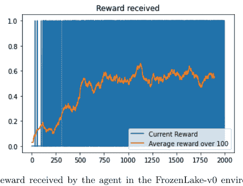

图18.2：机器人在FrozenLake-v0环境中通过Q-learning获得的奖励。

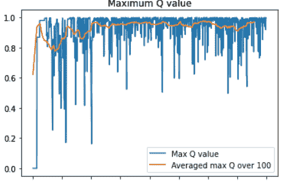

图18.3：Q-learning过程中FrozenLake-v0环境中Q值的演变。

图18.2显示了机器人从随机动作（随机生成的Q表）开始，每次尝试回合所获得奖励的记录。可以看出，机器人在最初的几百个回合中处于漫游状态。它似乎学会了以较高的成功率到达目标单元格的方法。

图18.3显示了Q表中最大值在每个回合中的演变。在几百个回合后，这些值变得非常接近1.0。

### 18.6.5 超参数与收敛性

请注意，上述Q-learning算法具有一定程度的不稳定性，这意味着其性能取决于超参数（学习率、折扣率等）的设置以及给定的环境。这可能部分是由于算法中使用的随机过程。更精细地选择这些参数或为这些参数设计合适的时间调度，有助于实现更稳定的收敛。这是以更慢的收敛速度为代价，以换取更稳定的收敛。例如，对于学习率，可以让它随着回合数缓慢衰减。一般规则在第9章的公式(9.41)中给出。对于Q-learning算法，这个规则可能并不总是有效，因为这里的“损失函数”可能远非凸函数。

对于折扣率[3]和控制随机动作的超参数，也可以进行类似的调整。基本的潜在原则是，当Q算法理想收敛时，所有这些学习、反向归纳和随机动作都不再需要。所有这些调整可能都很困难。

## 18.7 Q网络学习

在充分理解Q学习算法以及前面章节建立的神经网络知识后，我们现在可以介绍一种用于Q学习的神经网络，称为Q网络。Q网络与我们之前研究的网络的主要区别在于损失函数，如公式 (18.7) 所示。

我们将展示如何为同一个示例1建立和训练一个Q网络，但这次为机器人使用Q网络。我们还将使用OpenAI Gym来设置带有障碍物的房间环境。我们将使用TensorFlow图来构建Q网络结构，并通过TensorFlow会话执行训练。以下代码来自awjuliani/DeepRL-Agent，遵循MIT许可协议。为了便于初学者理解，代码已进行修改并添加了更详细的解释。大部分解释以注释形式与代码行一起给出，以便于跟随理解。

### 18.7.1 示例2：机器人使用Q网络探索未知障碍物的房间

```python
# Import necessary modules
from __future__ import division
import gym
import numpy as np
import random
#import tensorflow as tf
import tensorflow.compat.v1 as tf
    # This code works only for tf version 1
tf.disable_v2_behavior()
from tensorflow.keras.models import Sequential
from tensorflow.keras.layers import Dense, InputLayer
import matplotlib.pyplot as plt
%matplotlib inline
```

```python
# Create the environment instant using Gym module
env = gym.make('FrozenLake-v0')

# a utility function
def mv_avg(x, n):    # move average over past n points
    return [sum(x[i:i+n])/n for i in range(len(x)-n)]
```

### 18.7.2 构建TensorFlow图

```python
tf.reset_default_graph()    # define the graph for Q-Network
#tf.compat.v1.reset_default_graph()
```

以下过程用于设置我们Q网络的图。它应该在输入层有一个包含16个神经元的数组，一个16 × 4的权重矩阵，以及在输出层有一个包含4个神经元的数组。该结构具有简单的16 × 4 × 1配置。

```python
# Graph for our Q-Network
# First, a placeholder for a tensor to-be-fed. This is for the
# input layer (with 16 inputs) for our Q-Network
inputs1 = tf.placeholder(shape=[1,16],dtype=tf.float32)

# variables in the graph for the Q-Network. Initiated with random
# values and to-be updated during the learning process, when the
# session is run
W = tf.Variable(tf.random_uniform([16,4],0,0.01))

# A matrix-multiply function to produce the output for the
# Q-Network
Qout = tf.matmul(inputs1,W)

# An instance for a prediction following the greedy optimal policy
predict = tf.argmax(Qout,1)

# A placeholder for a tensor to-be-fed. This is for the
# output layer (with 4 outputs) for our Q-Network
nextQ = tf.placeholder(shape=[1,4],dtype=tf.float32)

# A loss function using the tensorflow mean-squared-difference
# between the temporal-target Q and the predicted Q values from
# the Q-Network.
loss = tf.reduce_sum(tf.square(nextQ - Qout))

# A trainer instance using the gradient descent optimizer with lr
trainer = tf.train.GradientDescentOptimizer(learning_rate=0.1)

# A training instance for our Q-Network
updateModel = trainer.minimize(loss)
```

在定义了必要的数组（张量）、变量、实例和函数后，我们现在准备创建并运行一个会话，根据Q学习算法来训练Q网络。

```python
# Set learning parameters
gamma = .99                # discount rate
epsi = 0.1                 # epsilon to control random actions
episodes = 2000            # maximum episodes (trials)
jwSteps = 99               # maximum walk steps in an episode

# initialize lists for recording the total rewards and steps
jList = []                 # walked steps in episodes
rList = []                 # total rewards received in episodes
jRate = []

init=tf.global_variables_initializer()
# instance for initializing variables one more piece for the graph

with tf.Session() as sess:                # Create a session
    sess.run(init) # variable initialization for the session

    for i in range(episodes):
        # Reset the room environment, which gives an initial
        # state for robot agent
        s = env.reset()

        rAll = 0   # initialization variable for the episode
        done = False
        j = 0

        # The algorithm for the Q-Network
        while j < jwSteps:
            j+=1
            # Run the "predict" and 'Qout' defined in the
            # graph for the Q-network
            a,allQ = sess.run([predict,Qout],
              feed_dict={inputs1:np.identity(16)[s:s+1]})
              # feed values to placeholder inputs1.
              # It is a zero vector but with 1 at entry s.

            if np.random.rand(1) < epsi: # sample a small
                                         # random action
                a[0] = env.action_space.sample()

            # Take the action with a, gets into a new state,
            # receive a reward from the room environment,
            # and check whether or not this attempt
            # (episode) is over (done)
            s1,r,done,_ = env.step(a[0])

            # Compute the Q' values in the new state through
            # our network
            Q1 = sess.run(Qout,feed_dict={inputs1:np.
                    identity(16)[s1:s1+1]})

            # Obtain the greedy maxQ' and set our target value
            # for chosen action.
            maxQ1 = np.max(Q1)    # Obtain the greedy maxQ'
            targetQ = allQ
            targetQ[0,a[0]] = r + gamma*maxQ1 # target value
            #Train the Q-Network using target and predicted
            #Q values
            _,W1 = sess.run([updateModel,W],
                    feed_dict={inputs1:np.identity(16)[s:s+1],
                    nextQ:targetQ})
            rAll += r
            s = s1
            if done:
                #Reduce chance of random action as we train
                #the model.
                epsi = 1./((i/50) + 10)
                break

        jList.append(j)
        rList.append(rAll)
        jRate.append(rAll/j)

    print("Score over time: " + str(sum(rList)/episodes))
```

Score over time: 0.433

### 18.7.3 Q网络的结果

我们现在以与示例1类似的方式绘制结果。

```python
N_avg = 100
plt.plot(rList,label="Current Reward")
plt.plot(mv_avg(rList, N_avg),label="Average reward over"
        +str(N_avg))
plt.title('Reward received')
plt.legend(loc='lower right')
plt.show()
```

```python
plt.plot(norm_Q, label="Max Q value")
plt.plot(mv_avg(norm_Q, N_avg),label="Averaged max Q over"
        +str(N_avg))
plt.title('Maximum Q value')
plt.legend()
plt.show()
```

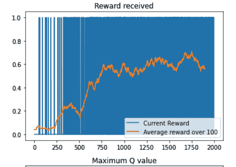

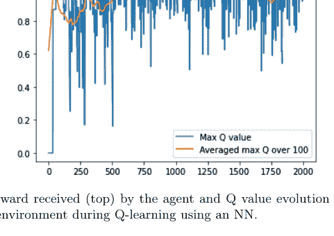

图18.4：在使用神经网络进行Q学习期间，智能体在FrozenLake-v0环境中获得的奖励（上）和Q值演变（下）。

结果和学习过程如图18.4所示。可以观察到与示例1非常相似的现象。

理解了如何构建Q网络后，学习构建用于Q学习的深度网络应该不会有太大困难。我们的研究发现，当在每一步使用贪婪策略时，这种单次最佳选择在整个过程中可能并非最佳。智能体可能陷入局部最优而无法达到全局最优，如上例所示。基于策略的算法可以克服这个问题。

## 18.8 策略梯度方法

前面章节研究的Q学习和DQN被称为基于价值的方法，旨在最大化Q值。这类算法通常可以观察到不稳定性。或者，可以优化策略，称为基于策略的方法，例如策略梯度方法。这些方法在过去几年中得到了相当深入的研究，并取得了一些显著的改进。这些方法旨在优化策略，而不是价值。因为转移概率 $P(s \rightarrow s'; a)$ 决定了回报 $R$，并且是在动作 $a$ 下，而动作 $a$ 又反过来由策略 $\pi$ 控制（条件化）。因此，如果我们能找到一个最大化回报的最优策略，我们的目标就实现了。过去几年已经开发了许多策略梯度方法和技术，研究所有这些方法可能是一个挑战。在本节中，我们首先介绍表现最佳的方法之一——近端策略优化（PPO）[6]，然后推导一个概述通往PPO主要路径的公式化过程。

### 18.8.1 带有神经网络策略的PPO

优势演员评论家（A2C）、异步优势演员评论家（A3C）[7]、信任域策略优化（TRPO）[7]和近端策略优化（PPO）[6]是典型的策略梯度方法。PPO是对TRPO的改进。读者可以参考Pieter Abbeel关于这个主题的优秀在线讲座系列。

研究发现，策略梯度方法通常也对超参数（如步长）相当敏感，这限制了其性能和应用，此外还有其样本效率问题。我们知道监督学习具有相当好的收敛性，并且使用相对较少的超参数。此外，由于缺乏可靠的标签，强化学习通常稳定性差得多。因此需要仔细的采样策略来平滑搜索过程。这些策略可能很复杂、昂贵，并且需要额外的超参数。PPO旨在在简单公式化、易于实现和样本效率之间找到平衡。它在每一步计算更新，同时确保更新后的策略与旧策略相差不远，以减少方差并增加训练的稳定性。这是通过“裁剪”完成的。损失函数设计如下。

$$\mathcal{L}^{CLIP}(\hat{\mathbf{w}}) = \mathbb{E}_t \left[ \min \left( r_t(\hat{\mathbf{w}}) A_t, \text{clip}(r_t(\hat{\mathbf{w}}), 1 - \varepsilon, 1 + \varepsilon) A_t \right) \right]$$其中

- $\hat{\mathbf{w}}$ 是策略模型所有参数的向量。
- $\mathbb{E}_t$ 表示在时间步上的经验期望。
- $r_t$ 是当前策略与旧策略下概率的比值。
- $A_t$ 是估计的优势函数（一个状态的期望回报减去其基线）。
- $\varepsilon$ 是一个超参数，通常设置为 0.1 或 0.2。

裁剪函数定义为

$$clip(x, 1 - \varepsilon, 1 + \varepsilon) = \begin{cases} 1 - \varepsilon & \text{if } x < 1 - \varepsilon \\ 1 + \varepsilon & \text{if } x > 1 + \varepsilon \\ x & \text{else} \end{cases} \quad (18.9)$$

### 18.8.2 策略梯度方法和 PPO 中使用的策略

#### 18.8.2.1 为策略构建神经网络模型

在典型的策略梯度方法（如 PPO）中，我们首先构建一个神经网络模型（如 MLP、CNN 等），将 dim$\mathbb{S} \rightarrow$ dim$\mathbb{A}$ 进行映射。这是通过让智能体首先自行探索环境，例如 $m$ 个时间步来完成的。在这 $m$ 步中生成的所有数据（状态、动作、价值、奖励和终止标志）都会被存储。存储的数据集现在用于训练一个（或两个）用于 dim$\mathbb{S} \rightarrow$ dim$\mathbb{A}$ 映射的神经网络。这些神经网络的训练本质上与我们之前章节讨论的分类和回归相同。在为各种策略梯度方法定义损失函数时需要谨慎。训练好的神经网络接下来被智能体用于接下来的 $m$ 个时间步的进一步探索，并将生成一个新的数据集，用于训练一个新的 dim$\mathbb{S} \rightarrow$ dim$\mathbb{A}$ 映射策略。这个过程持续进行，我们将在每 $m$ 个时间步拥有一个新的和旧的策略。读者可以参考 philtabor 公开的代码以获取更多细节。我们将这样的神经网络模型表示为 $\pi_{\hat{\mathbf{w}}}$，其中 $\hat{\mathbf{w}}$ 代表训练参数。以下关键公式对于理解策略梯度方法很有用。特别是，TRPO 和 PPO 都使用两个（新和旧）策略来形成所谓的比率策略，以更好地控制稳定性。

#### 18.8.2.2 P 和 R 公式

令 $\tau$ 表示一个状态-动作序列，$s_0, a_0, s_1, a_1, \dots, s_T, a_T$。从公式 (18.4) 开始，问题可以表述为

$$\max_{\hat{\mathbf{w}}} \mathbb{E}\left[\sum_{t=0}^{T} R(s_t, a_t) \mid \pi_{\hat{\mathbf{w}}}\right] \Rightarrow \max_{\hat{\mathbf{w}}} \mathbb{E}\left[R(\tau) \mid \pi_{\hat{\mathbf{w}}}\right] \Rightarrow \max_{\hat{\mathbf{w}}} \sum_{\tau} P(\tau; \hat{\mathbf{w}}) R(\tau)$$

$$\underbrace{\sum_{t=0}^{T} R(s_t, a_t)}_{R(\tau)}$$

$$\underbrace{\sum_{\tau} P(\tau; \hat{\mathbf{w}}) R(\tau)}_{U(\hat{\mathbf{w}})}$$

$$(18.10)$$

为了解决上述问题，我们需要计算 $U(\hat{\mathbf{w}})$ 关于 $\hat{\mathbf{w}}$ 的梯度。

$$\nabla_{\hat{\mathbf{w}}} U(\hat{\mathbf{w}}) = \nabla_{\hat{\mathbf{w}}} \sum_{\tau} P(\tau; \hat{\mathbf{w}}) R(\tau) = \sum_{\tau} \nabla_{\hat{\mathbf{w}}} P(\tau; \hat{\mathbf{w}}) R(\tau)$$

$$= \sum_{\tau} P(\tau; \hat{\mathbf{w}}) \frac{\nabla_{\hat{\mathbf{w}}} P(\tau; \hat{\mathbf{w}})}{P(\tau; \hat{\mathbf{w}})} R(\tau)$$

$$= \sum_{\tau} P(\tau; \hat{\mathbf{w}}) \left[\nabla_{\hat{\mathbf{w}}} \log P(\tau; \hat{\mathbf{w}})\right] R(\tau)$$

$$(18.11)$$

使用 $m$ 个样本路径和策略 $\pi_{\hat{\mathbf{w}}}$，上述期望可以近似为求和，我们得到，

$$\nabla_{\hat{\mathbf{w}}} U(\hat{\mathbf{w}}) \approx \frac{1}{m} \sum_{i=1}^{m} \left(\left[\nabla_{\hat{\mathbf{w}}} \log P(\tau^{(i)}; \hat{\mathbf{w}})\right] R(\tau^{(i)})\right)$$

$$(18.12)$$

注意这里的梯度仅应用于 $P$。因此，$R$ 不需要是光滑的，可以是离散的。

$P \rightarrow \pi$

我们现在准备使用状态和动作，建立转移概率函数 $P$ 与策略 $\pi$ 之间的联系。

$$\nabla_{\hat{\mathbf{w}}} \log P(\tau^{(i)}; \hat{\mathbf{w}}) = \nabla_{\hat{\mathbf{w}}} \log \left[\prod_{t=0}^{T} \underbrace{P\left(s_{t+1}^{(i)} \mid s_t^{(i)}, a_t^{(i)}\right)}_{\text{转移概率}} \cdot \underbrace{\pi_{\hat{\mathbf{w}}}\left(a_t^{(i)} \mid s_t^{(i)}\right)}_{\text{策略}}\right]$$

$$= \nabla_{\hat{\mathbf{w}}} \left[\sum_{t=0}^{T} \log P\left(s_{t+1}^{(i)} \mid s_t^{(i)}, a_t^{(i)}\right) + \sum_{t=0}^{T} \log \pi_{\hat{\mathbf{w}}}\left(a_t^{(i)} \mid s_t^{(i)}\right)\right]$$

$$= \sum_{t=0}^{T} \underbrace{\nabla_{\hat{\mathbf{w}}} \log \pi_{\hat{\mathbf{w}}}\left(a_t^{(i)} \mid s_t^{(i)}\right)}_{\text{仅策略}}$$

$$(18.13)$$

$R \rightarrow A$

公式 (18.12) 现在可以写成

$$\nabla_{\hat{\mathbf{w}}} U(\hat{\mathbf{w}}) \approx \frac{1}{m} \sum_{i=1}^{m} \left( \left[ \sum_{t=0}^{T} \nabla_{\hat{\mathbf{w}}} \log \pi_{\hat{\mathbf{w}}}\left(a_{t}^{(i)} \mid s_{t}^{(i)}\right) \right] \left[ \underbrace{R\left(\tau^{(i)}\right)-b_{R}}_{A_{t}} \right] \right) \quad (18.14)$$

其中 $A$ 被称为**优势函数**，它是 $R$ 减去 $b_{R}$，后者是回报的*基线*。它可以例如使用以下公式计算

$$b_{R} \approx \frac{1}{m} \sum_{i=1}^{m} R\left(\tau^{(i)}\right) \quad (18.15)$$

因为 $b_{R}$ 是一个期望，这种减法不会引入任何偏差。它增强了超出基线的回报效果，因此在策略梯度算法中被广泛使用。优势项可以进一步改进：

$$\begin{aligned} A_{t} &= R\left(\tau^{(i)}\right)-b_{R} = \sum_{t=0}^{T-1} R\left(s_{t}^{(i)}, a_{t}^{(i)}\right)-b_{R} \\ &= \underbrace{\sum_{k=0}^{t-1} R\left(s_{k}^{(i)}, a_{k}^{(i)}\right)}_{\text{与 } a_{t}^{(i)} \text{ 无关，移除}} + \sum_{k=t}^{T-1} R\left(s_{k}^{(i)}, a_{k}^{(i)}\right)-b_{R} \quad (18.16) \\ &= \sum_{k=t}^{T-1} R\left(s_{k}^{(i)}, a_{k}^{(i)}\right)-b_{R} \end{aligned}$$

移除与当前动作无关的项有助于降低方差。

使用公式 (18.10) 和 (18.14)，我们的问题现在可以重新表述为

$$\max _{\hat{\mathbf{w}}} \mathbb{E}_{t}\left[\pi_{\hat{\mathbf{w}}}\left(a_{t} \mid s_{t}\right) A_{t}\right] \quad (18.17)$$

许多优秀的算法都是基于公式 (18.17) 开发的，包括优势演员-评论家（A2C）、异步优势演员-评论家（A3C）[7]，以及其他演员-评论家方法。

### 18.8.3 比率策略

现在使用重要性采样，公式 (18.17) 通过利用上一次迭代的旧模型进行修改。

$$\begin{aligned} \max _{\hat{\mathbf{w}}} \mathbb{E}_{t}\left[r_{t}(\hat{\mathbf{w}})\left(a_{t} \mid s_{t}\right) A_{t}\right] \\ \text { subject to } \mathbb{E}_{t}\left(K L\left[\pi_{\hat{\mathbf{w}}_{\text {old }}}\left(\cdot \mid s_{t}\right), \pi_{\hat{\mathbf{w}}}\left(a_{t} \mid s_{t}\right)\right]\right) \leq \delta \end{aligned}$$

其中 KL 散度（在第 4 章讨论，也在第 17 章用于 VAEs）被用来约束损失，以防止当前策略与旧策略偏离太远，$r_t$ 是策略 $\pi$ 相对于策略 $\pi_{old}$ 的比率，后者是使用先前训练参数的神经网络模型。

$$r_t(\hat{\mathbf{w}}) = \frac{\pi_{\hat{\mathbf{w}}}(a_t \mid s_t)}{\pi_{\hat{\mathbf{w}}_{old}}(a_t \mid s_t)} \quad (18.18)$$

公式 (18.18) 用于 TRPO 方法。

现在，KL 约束可以使用惩罚方法来实现，这导致了 PPO 的早期版本。当使用裁剪函数施加约束时，我们得到了公式 (18.8) 中定义损失的 PPO。

这个带有裁剪的目标函数实现了一阶近似的信赖域更新，这与广泛使用的有效随机梯度下降（SGD）算法兼容。定义了这样的目标函数后，神经网络可以方便地用于实现。带有裁剪的 PPO 在连续控制任务和许多其他类型的任务上表现出色。我们通过两个例子来演示它：CartPole 和 CarRacing。

### 18.8.4 PPO：控制杆保持直立

考虑一个通过铰链关节连接到小车上的杆。小车可以沿着无摩擦的一维轨道移动。我们的目标是通过控制小车移动 $+1$ 或 $-1$ 来使杆保持垂直向上。当一个强化学习智能体学会实现这个目标时，它被置于一个环境中，当杆保持直立时，每个时间步都会给予 $+1$ 的奖励。当杆从垂直位置倾斜超过 15 度，或者小车移动超过中心 2.4 个单位时，该回合结束。关于此环境的更多详细信息可以在 OpenAI Gym 中找到。

这次我们使用 stable-baselines3 模块来训练强化学习智能体。philtabor 和 github 上的 Nicholas Renotte 也公开了一些代码来执行这些任务。下面介绍的例子使用了 stable-baselines3（需要安装 stable-baselines3）。

```python
#!pip install stable-baselines3[extra]  #一个有用的强化学习模型
```

```python
import os
import gym
from stable_baselines3 import PPO
```

from stable_baselines3.common.evaluation import evaluate_policy
from stable_baselines3.common.vec_env import DummyVecEnv
import matplotlib.pyplot as plt
%matplotlib inline

# 加载并创建环境
Env_str = "CartPole-v0"
Environment2Solve = Env_str  # gym环境之一
# https://gym.openai.com/envs/#classic_control
Env = gym.make(Environment2Solve)

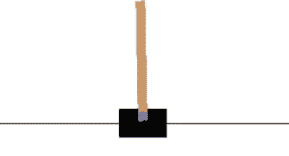

图18.5展示了一个智能体在CartPole-v0环境中的随机状态。以下代码生成了CartPole环境样本的动画。它简单地重复着倒下和重置的过程。

# 在训练前采样环境的若干回合
episodes = 2  # 可以尝试更多
print(f"查看 {Env_str} 的 {episodes} 个样本")
for episode in range(1, episodes+1):
    s = Env.reset()  # 当前状态
    done = False
    rAll = 0

    while not done:
        Env.render()
        action = Env.action_space.sample()
        n_state, reward, done, info = Env.step(action)
        rAll += reward

    print(f"回合 {episode}: 得分={rAll}")

# Env.close()  # 需要时优雅地关闭环境

查看 CartPole-v0 的 2 个样本
回合 1: 得分=41.0
回合 2: 得分=20.0

# 理解环境
# 动作-0：将小车推向左侧，动作-1：推向右侧
print(f"动作空间的类型:{Env.action_space}")
print(f"空间中的一个样本:{Env.action_space.sample()}")

动作空间的类型:Discrete(2)
空间中的一个样本:1

np.set_printoptions(precision=3)
# [小车位置, 小车速度, 杆角度, 杆角速度]
print(f"观测空间的类型:{Env.observation_space}")
print(f"空间中的一个样本:{Env.observation_space.sample()}")

观测空间的类型:Box(4,)
空间中的一个样本:[-4.199e+00 -3.231e+38  2.745e-01
    -1.295e+38]

Env = DummyVecEnv([lambda: Env])
model = PPO('MlpPolicy', Env, verbose=2)

使用cpu设备

model.learn(total_timesteps=50_000)  # 让智能体学习

| time/ | |
| --- | --- |
| fps | 995 |
| iterations | 1 |
| time_elapsed | 2 |
| total_timesteps | 2048 |

| time/ | |
| --- | --- |
| fps | 679 |
| iterations | 2 |
| time_elapsed | 6 |
| total_timesteps | 4096 |

| train/ | | |
| --- | --- | --- |
| approx_kl | 0.0033051167 | |
| clip_fraction | 0.0277 | |
| clip_range | 0.2 | |
| entropy_loss | -0.305 | |
| explained_variance | 0.123 | |
| learning_rate | 0.0003 | |
| loss | 196 | |
| n_updates | 1240 | |
| policy_gradient_loss | -0.00145 | |
| value_loss | 169 | |

......

| time/ | | |
| --- | --- | --- |
| fps | 625 | |
| iterations | 25 | |
| time_elapsed | 81 | |
| total_timesteps | 51200 | |
| train/ | | |
| approx_kl | 0.0022214411 | |
| clip_fraction | 0.0128 | |
| clip_range | 0.2 | |
| entropy_loss | -0.241 | |
| explained_variance | 0.391 | |
| learning_rate | 0.0003 | |
| loss | 83.3 | |
| n_updates | 1470 | |
| policy_gradient_loss | -0.000732 | |
| value_loss | 154 | |

<stable_baselines3.ppo.ppo.PPO at 0x1aeda592518>

训练相当快。在作者的笔记本电脑上训练20万步大约需要三分钟。

### 18.8.5 保存和重新加载已训练的模型

model_path = os.path.join('Trained_Models', 'PPO_' + Env_str)
model.save(model_path)

model = PPO.load(model_path, env=Env)  # 重新加载已训练的模型

### 18.8.6 评估和查看已训练的模型

from stable_baselines3.common.evaluation import evaluate_policy
evaluate_policy(model, Env, n_eval_episodes=2, render=True)

(200.0, 0.0)

Env.close()

为了对已训练的模型进行彻底的定量测试，我们编写了以下代码。它运行多个测试回合，在每个回合中，我们将已训练（或未训练）的模型（智能体）置于重置后的环境中，最多运行指定步数，并接收奖励。记录每个测试回合获得的总奖励，并将其绘制在图中。

test_episodes = 200  # 测试回合数
jwSteps = 100  # 状态上的最大步数
rList = []  # 回合中获得的总奖励
for e in range(1, test_episodes+1):
    rAll = 0  # 记录获得的总奖励
    done = False
    s = Env.reset()
    j = 0
    while j < jwSteps:  # 状态上的最大步数
        # a=[Env.action_space.sample()]  # 使用未训练的样本
        a, _ = model.predict(s)  # 使用已训练模型的动作
        s1, r, done, info = Env.step(a)  # s1：下一个状态
        j += 1
        if done:
            # print(f"完成！ j={j}; info")
            break
        rAll += r  # 累积奖励
        s = s1  # 更新状态并继续下一步

rList.append(rAll/jwSteps)  # 一个回合中获得的总奖励

N_avg = 100
x, y = np.array([range(N_avg, len(rList))]).T, mv_avg(rList, N_avg)
plt.plot(rList, label="当前奖励")
plt.plot(x, y, label=str(N_avg) + "步平均奖励")
plt.title('训练10k步后获得的奖励')
plt.legend(loc='upper left')  # 'lower right')
plt.savefig('images/' + Env_str + '_50k.png', dpi=300)
plt.show()

图18.6展示了未训练的智能体在CartPole-v0环境中的表现。它随机行动。平均得分约为0.2。

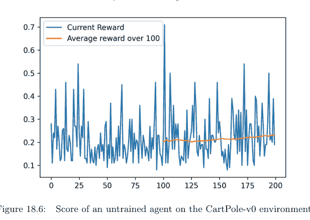

图18.6：未训练的智能体在CartPole-v0环境中的得分。

经过10k步训练后，智能体的性能显著提高，如图18.7所示。平均得分约为0.97。经过50k步训练后，智能体在此测试中达到了完美分数，如图18.8所示。

以下代码（或第17.8.5节给出的代码）可以生成动画，这很难在书中呈现。读者可以运行代码，应该会发现经过200k步训练后，CartPole能很好地保持平衡。

656 机器学习与Python：理论与应用

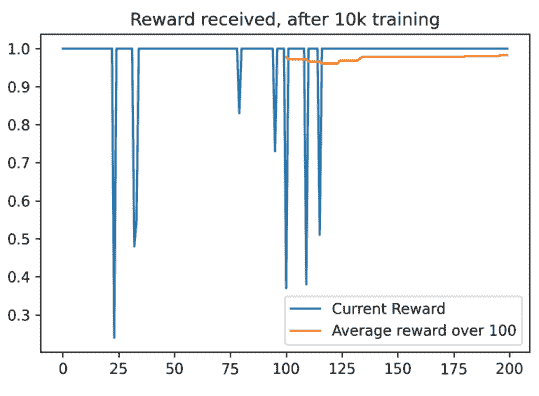

图18.7：在CartPole-v0环境中经过10k步训练的智能体。

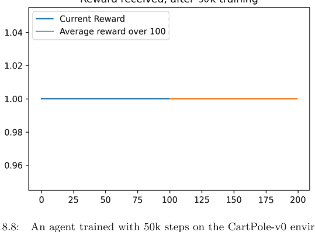

图18.8：在CartPole-v0环境中经过50k步训练的智能体。

observed = Env.reset()
frames = []
jwSteps = 100
while j < jwSteps:  # 状态上的最大步数
    action, _states = model.predict(observed)
    observed, rewards, done, info = Env.step(action)

# frames.append(Env.render(mode="rgb_array"))  # 用于录制
Env.render()  # 用于查看状态
if done:
    print(f"完成！ {info}")
    break
j += 1

也可以使用其他算法，例如深度Q网络（DQN）来训练模型。代码同样简单。

# from stable_baselines3 import DQN
# model = DQN('MlpPolicy', Env, verbose=2)

### 18.8.7 PPO：自动驾驶汽车

我们最后看一个汽车在赛道环境中完全自主学习驾驶的例子。对于这个例子，我们需要安装SWIG。除了stable-baselines3，我们还需要安装gym[box2d]和pyglet==1.3.2。Nicholas Renotte在github上公开的代码也将被使用。

要使用的环境是CarRacing-v0。图18.9展示了CarRacing环境中的赛道。状态空间是一个96×96像素的方形区域，其中包含一条封闭的蜿蜒赛道。汽车需要学会保持在赛道上。奖励是每帧-0.1，每经过一个赛道格子+1000/N，其中N是赛道中的总格子数。例如，如果汽车在732帧内完成，奖励是1000 - 0.1*732 = 926.8分。当所有格子都被访问过时，一个回合结束。

#!pip install gym[box2d] pyglet==1.3.2
import gym
from stable_baselines3 import PPO
from stable_baselines3.common.vec_env import VecFrameStack
from stable_baselines3.common.evaluation import evaluate_policy
import os
import matplotlib.pyplot as plt
%matplotlib inline

### 18.8.8 训练前查看赛车样本

以下代码将生成来自 CarRacing 环境的样本动画，其中有一辆赛车在运行。在训练前，赛车只是直线行驶。

```python
# 训练前采样环境的若干片段
episodes = 2           # 可以尝试更多
print(f"查看 {Env_str} 的 {episodes} 个样本")

for episode in range(1, episodes+1):
    state = Env.reset()
    done = False
    rAll = 0
    frames = []
    while not done:
        Env.render() # 窗口内实时渲染
        action = Env.action_space.sample()
        n_state, reward, done, info = Env.step(action)
        rAll+=reward
    print(f"片段 {episode}: 得分={rAll}")
#Env.close()           # 用于温和地关闭环境
```

查看 CarRacing-v0 的 2 个样本
赛道生成：1130..1417 -> 287 块赛道
片段 1：得分=-30.069930069930493
赛道生成：1130..1416 -> 286 块赛道
片段 2：得分=-33.3333333333333826

```python
Env.close()    # 用于温和地关闭环境
```

我们可以使用以下代码检查环境。

```python
print(f"动作空间:{Env.action_space}")
print(f"动作空间中的一个样本:{Env.action_space.sample()}")
```

动作空间:Box(3,)
动作空间中的一个样本:[0.5832531  0.9261694  0.27739018]

动作空间是一个三维盒子，允许赛车左右转向和控制速度。

```python
print(f"观测空间:{Env.observation_space}")
print(f"观测样本的一部分:\n    {Env.observation_space.sample()[0,0:5,:]}")
```

观测空间:Box(96, 96, 3)
观测样本的一部分:
[[139 246 145]
 [ 18 144 155]
 [ 95 226  46]
 [215  70  49]
 [105  88   1]]

### 18.8.9 使用 CNN 策略训练赛车

```python
log_path = os.path.join('Trained_Models','Logs_'+Env_str)
model_path = os.path.join('Trained_Models','PPO_500k'+Env_str)
```

```python
model=PPO("CnnPolicy",Env,verbose=2,tensorboard_log=log_path)
```

使用 cpu 设备
使用 'Monitor' 包装器包装环境
将环境包装在 DummyVecEnv 中。
将环境包装在 VecTransposeImage 中。

```python
model.learn(total_timesteps=500_000)
    # 先尝试较小的步数 model.save(model_path)
```

使用 cpu 设备
使用 `Monitor` 包装器包装环境
将环境包装在 DummyVecEnv 中。
将环境包装在 VecTransposeImage 中。
赛道生成：1041..1324 -> 283 块赛道
重试生成赛道（如果此类消息不多则正常）
赛道生成：1084..1359 -> 275 块赛道
记录到 Trained_Models\Logs_CarRacing-v0\PPO_1
赛道生成：1284..1609 -> 325 块赛道
赛道生成：1129..1418 -> 289 块赛道
重试生成赛道（如果此类消息不多则正常）
赛道生成：1292..1619 -> 327 块赛道

| rollout/ | | |
| --- | --- | --- |
| ep_len_mean | 1e+03 | |
| ep_rew_mean | -54.4 | |
| time/ | | |
| fps | 39 | |
| iterations | 1 | |
| time_elapsed | 51 | |
| total_timesteps | 2048 | |

### 18.8.10 评估并查看学习到的模型

以下代码将生成 CarRacing 赛车在赛道上运行的动画。

```python
evaluate_policy(model,Env,n_eval_episodes=2,render=True)
```

赛道生成：1214..1522 -> 308 块赛道
赛道生成：1219..1538 -> 319 块赛道
赛道生成：996..1258 -> 262 块赛道

(-93.59801837056875, 0.11267495155334473)

```python
Env.close() # 用于温和地关闭环境
```

```python
model = PPO.load(model_path, env=Env) # 重新加载训练好的模型
```

使用 `Monitor` 包装器包装环境
将环境包装在 DummyVecEnv 中。
将环境包装在 VecTransposeImage 中。

```python
episodes = 2 #5
for episode in range(1, episodes+1):
    s = Env.reset()    # 初始状态
    done = False
    rAll = 0
    frames = []
    while not done:
        Env.render()    # 窗口内实时渲染
        action, _ = model.predict(s.copy())
        s1, reward, done, info = Env.step(action)
        rAll+=reward
        s = s1
print(f"片段 {episode}: 得分={rAll}")
```

赛道生成：1151..1443 -> 292 块赛道
片段 1：得分=-55.32646048110042
赛道生成：1140..1429 -> 289 块赛道
片段 2：得分=-54.861111111111186

我们使用屏幕录制器录制了训练好的赛车的视频。当使用录制的文件执行以下代码时，视频会播放。

```python
from IPython.display import Video
#Video('./images/PPO_10k_Driving.mp4', width=600, height=600)
Video('./images/PPO_500k_Driving.mp4', width=600, height=600)
```

<IPython.core.display.Video object>

我们的测试发现，训练步数较少（<20k）且训练不充分的赛车会疯狂行驶。当训练 500k 步时，它运行得相当好。训练在作者的笔记本电脑上花费了数小时。感兴趣的读者可以运行上述代码，或联系作者获取这些视频。我们的测试发现，与 Q 算法相比，PPO 稳定得多。

## 18.9 备注

最后，我们提到，迄今为止机器学习确实取得了巨大进展，但挑战始终伴随着进步。在开发机器学习技术以应对日益严峻的问题、造福人类的旅程中，我们的探索将一如既往地继续。正如本文多次提到的，重大进展需要机器学习相关所有领域的开放思想研究者，包括整合来自成熟的且仍在发展的基于物理定律的方法的思想和技术。探索永无止境。

## 参考文献

- [1] R. Sutton and A. Barto, *Reinforcement Learning: An Introduction*, MIT Press, Cambridge, MA, 2018.
- [2] C.J.C.H. Watkins, *Learning from Delayed Rewards*, PhD thesis, May 1989, Cambridge, UK. http://www.cs.rhul.ac.uk/~chrisw/new_thesis.pdf.
- [3] C.J.C.H. Watkins and P. Dayan, Q-learning, *Machine Learning*, **8**(1), 279-292. https://doi.org/10.1007/BF00992698.
- [4] Duan Shuyong, Zhang Linxin, G.R. Liu *et al.*, A smoothed-shortcut Q-learning algorithm for optimal robot agent path planning, *Journal of Mechanical Engineering*, Accepted, 2021.
- [5] R.E. Bellman, *Dynamic Programming*, Dover, 1957.
- [6] Schulman John, “Proximal Policy Optimization Algorithms”, CoRR, vol. abs/1707.06347, arXiv, 2017. online.
- [7] Mnih Volodymyr, “Asynchronous Methods for Deep Reinforcement Learning”, CoRR, vol. abs/1602.01783, 2016. online.
- [8] Schulman John, “Trust Region Policy Optimization”, CoRR, vol. abs/1502.05477, arXiv, 2015. online.

## 索引

**A**

异常检测, 585
动作价值函数, 626, 629
动作, 623
激活函数, 214, 265
AdaBoost, 443
AdaDelta, 378
adagrad 梯度算法, 371
adam 梯度算法, 381
自适应梯度算法 (AdaGrad), 371
自适应矩估计 (Adam), 381
添加轴, 74
优势, 647
仿射空间, 7, 338, 475
仿射变换, 8, 190, 194, 199, 223, 268, 332, 471
仿射变换数组 (ATA), 190, 213
仿射变换矩阵, 9, 195, 472
仿射变换单元 (ATU), 190, 197, 543
CNN 中的仿射变换单元, 542
仿射变换权重矩阵, 195, 471, 473, 565
亲和性, 189, 196
智能体, 623
AlexNet, 548
代数系统方程, 109
解析微分, 304
解析优化方法, 332
解析最小化过程, 505
匿名函数, 86
算术运算符, 39
变量属性, 36
增强, 7
增强数据集, 8
增强离散点, 7
增强特征空间, 7
自编码器, 610
自动微分, 307, 327
自动微分 (AD), 305
自同构, 196
平均池化, 544
奖励, 623
轴, 60

**B**

反向传播, 323-324
逆向归纳, 630
病态, 112
基线, 647
基函数, 220
贝叶斯统计, 180
贝尔曼方程, 626, 629
更好的拟合边界, 503
二分类, 223, 254, 421, 438, 448
二分类问题, 431
二元交叉熵, 177-180, 188
二元交叉熵损失, 429, 432
二元逻辑回归, 445

## C

块结构，84
布尔运算符，42
布尔值，41
波士顿房价数据集，416
瓶颈，610，618
广播机制，67
内置函数，40

卷积算子，540
卷积神经网络（CNN），539
协方差矩阵，408，622
交叉熵，173-175，188
交叉熵损失函数，447，452
曲线拟合，120，402
CVXOPT，249

## D

10分类，451
候选记忆，565
CarRacing，655
CartPole，649
案例，197
链式乘法，185
堆叠仿射变换链，215，473
链式结构，474
链式ATA，215
CIFAR图像，552
CIFAR10数据集，553
类继承，86，90
分类，5
裁剪函数，645
闭式解，334，392
闭式，619
CNN策略，657
COCO数据集，552
代码性能，93
矩阵的列空间，476
注释行，21
比较运算符，77，460
完备线性基，8
计算复杂度，258
计算图，305
拼接，42，565
条件数，116-117
条件概率，181
激活函数的条件，288
CNN的配置，545-546
混淆矩阵，254
共轭梯度法，367，386
受控随机采样，158-159
卷积层，546
Conv2D层，556
收敛过程，347，589
收敛定理，349
凸函数，343，348
ConvNet，539
卷积滤波器，540

数据压缩，133，211，585
数据编码参数，211
数据迭代器，356，368，372，376，379，383，409
数据损失函数，507
数据缩放（归一化），149
数据类型，11
基于数据的模型，3
数据-参数转换器，10，190，210
数据点，5-7，228，226
数据集，5-7
去噪，585
分类问题的决策边界，241，443，503，538
决策规则，226
决策树，443
解码器，610
更深（更多层）的网络，479
去噪，611
全连接层，556
密集连接，213
函数的导数，348
对角矩阵，129
不同的步幅和填充，542
折扣因子，627
折扣率，629
距离函数，239，258
基于距离的，424
距离，189
分布式奖励，625
文档字符串，21
点积，102，106，115，167，225，317
双星号，54

## E

边缘检测器，540-541
L2正则化的效果，533
并行数据点的影响，331，337
特征值分解，113，136
逐元素计算，61
逐元素操作，65，266，565
编码器，610
鼓励规则，230
丰富函数，220
概率的熵，167
错误异常，34
期望回报，629
指数损失，427
扩展仿射空间，565，568
极端随机森林，460

## F

f-string，39
特征函数，220，401，404
特征空间，6
特征，5，7
前馈，323–324
前馈过程，470
滤波器与卷积，539
滤波器矩阵，541
拟合数据点，502
展平的高向量，9
遗忘门，563
FrozenLake-v0，633
全连接，468
完全训练的模型，501
预测函数的泛函，10
带条件的函数，322

## G

门控循环单元（GRU），568
高斯分布，167
高斯积分，147
高斯点，147
高斯权重，147
高斯基函数，404，406
高斯分布，407
高斯核，258
高斯朴素贝叶斯，443
高斯过程，443
GD算法，349
通用指南，501
全局最小值，340
全局最优，598，643
全局最优解，249，588
GoogLeNet，551
梯度提升回归器，443，460，495
梯度下降（GD），344
超维梯度下降，347
一维梯度下降，345
梯度下降动量（GDM），363，365
梯度消失，288
基于梯度的算法，354
基于梯度的技术，332
贪婪策略，628

## H

手写数字识别，181
头部梯度，320–321
埃尔米特矩阵，116
海森矩阵，248，364
隐藏层，467–468，478
高阶多项式拟合，401，403–404
高阶曲线，502
高阶函数，218
高阶非线性潜在行为，218
高阶多项式基，220
高度椭圆形，363
铰链损失，425
Huber损失函数，394
超参数，638
双曲余弦，394
双曲正切函数（tanh），282
超参数，495
假设空间，9，217，477

## I

图像压缩，611
图像分割，611
导入外部模块，22
原地操作，66
inception模块，551
inception网络，551
独立连接，218
独立特征，218
独立学习参数，478，565
指示函数，424
不等式约束，249
初始数据处理，148–149
均值初始化，586
内积，6，234，246，250
集成开发环境（IDE），19
插值，120
鸢尾花数据集，260

## J

联合概率，180
Jupyter Notebook，19，24

## K

K均值聚类，585
核密度估计（KDE），149
核技巧，257
KL散度，175–177，619–620，648
Krylov方法，110

## L

0–1损失，424
L1损失函数，393
L2损失函数，333，392
用于正则化的L2范数，506
L2正则化，531
标签空间，8
有标签数据集，226
标签（真实值），5–6
拉格朗日乘子，243–247
Lambda函数，86
里程碑式CNN，546
LAPACK，110
Lasso，506
Leaky Relu，284
学习方向，345
学习参数，9–10，196
学习率，345–346，348，351，369
最小二乘公式，332，334
最小二乘解，122
左奇异向量，129
LEGB规则，85
LeNet-5，547
线性代数，95
线性基函数，6
线性组合，245
线性函数预测单元，189，197，422
线性预测函数，190，218
线性回归，368，390
线性调度，352
线性SVM，443
线性可分，224，230，234
利普希茨连续性，351
列表推导式，76
局部导数，305
局部最小值，339
log-cosh损失函数，394

对数似然，185
逻辑函数，266
逻辑损失，426
逻辑预测函数，422
长短期记忆（LSTM），480，563
损失函数代码，9，412，396，421
损失函数比较，395
分类损失函数，423
回归损失函数，389
LSTM层，566
LSTM输出空间，564
LSTM单元，564–565
LSTM-MLP，577

## M

10均值聚类，605
2D矩阵点积，540
makedown，19
间隔函数，226，423，425
基于间隔的，424
马尔可夫决策过程（MDP），626–627
数学技巧，185
矩阵求逆，111
变量矩阵，319
矩阵乘法，106
最大池化，544
MaxPooling2D，555
平均绝对误差（MAE）损失函数，393
均值漂移，605
均方误差（MSE），392
内存地址，27
内存大小，35
最小-最大缩放，149
小批量算法，354
小批量SGD，355
学习参数的最小化器，10
最少数据点数，477
MINPACK，143
MLPClassifier，385
MNIST数据集，181，448，481，488，526，575
修改后的函数，247
修改后的目标函数，242–243
Python中的模块，92
模块，91
矩矩阵，8，335
动量参数，365
单调递增函数，430

移动向量，578
多维数组，62，67
多类分类，260，445
多维积分，621
多维numpy数组，60
多层感知机（MLP），467
多项式回归，447
多通道，543
多步幅，541
乘子法，242
必须的非线性，265
MXNet，63
MXNet NDArrays，70–71，97

numpy 1D数组与向量，74
numpy 2D数组与矩阵，74
numpy数组，55–56，71

## N

1 → 1 → 1网络，217
朴素贝叶斯分类，181–182
最近邻，443
负方向，346
Nesterov加速梯度（NAG），370
用于k分类的网络，446
神经网络配置，390
用于分类的神经网络，432
神经网络（NN），627
神经脉冲单元（NPU），269，271
神经元基函数，275
神经元-样本理论，474–476
牛顿法，386
NN正则化，567
非负定，248
非线性激活函数，206，478
非线性仿射变换，219
非线性特征函数，406
非线性核函数，246
非线性核模型，263
非线性PCA，258
非线性回归，415，418
范数，108
正态分布（高斯分布），165，618
正规方程，334
正规矩阵，130，334
NP难，586
零空间，476
数据点数，477
层数，475，477
神经元数，475
样本数，6，477
数值微分，305，327

## O

2阶多项式基函数，220
3阶函数，218
6阶多项式，403
目标检测，86，539，558
目标函数，242，249
客观测试，503
独热编码，149，452
一对一唯一变换，218
OpenAI Gym，633
最优学习参数，219，475–476
最优策略，628
优化技术，331
异常值，398
输出门，563
输出层，469
过拟合，501
过度拟合的边界，503
过度简化的边界，503

## P

p → k映射，219，468
p → 1神经网络，390–391
p → k网络，213
p → k神经网络，214
P*-数，475，477
填充，542
配对的键和值，51
并行数据点，337
并行性，189
参数编码，210
帕斯卡金字塔，257
PCA公式，135
窥孔LSTM，567
感知机，223
感知机算法，230
感知机收敛证明，236
感知机收敛定理，233
基于物理定律的模型，1–2，220
点对点变换，209–210
策略函数，626
策略梯度算法，647

策略梯度方法，644-645
基于策略的算法，643
多项式核，257
池化，544
可能的范数，506
幂激活函数，288
幂调度，351
幂线性函数，288
幂二次函数，288
常数的可预测性，192
线性函数的可预测性，192
高阶函数的可预测性，214
解的可预测性，331
预测复杂非线性函数，219
预测函数梯度，213
预测函数，189, 193, 421
线性函数的预测，193
主成分分析（PCA），135, 585
主成分，135, 140
先验分布，619
概率与统计，157
合适的正则化参数，538
凸函数的性质，348
近端策略优化（PPO），644
仿射空间的伪维度，8, 472, 475-476
脉冲位置，271
脉冲宽度，271
感知器的Python代码，226
Python环境，15
Python语言，19

## Q

Q算法，632
Q学习，624
Q学习算法，630-631, 633-634
Q网络，624, 639
Q表，632
QR分解，130
QR变换，334
二次判别分析（QDA），443
二次规划（QP），249
二次规划问题，245
拟牛顿方法，386

## R

径向基函数（RBFs），126
随机分布，164
随机森林，443, 456, 460
随机采样，158
随机初始化的模型，453
秩亏，118
矩阵的秩，118
比率策略，647
有理激活函数，288
距离比率，189
RBF SVM，443
推荐，585
数据重构，611
重构，143
循环神经网络（RNNs），563
简化LSTM，566
回归，5
正则化效果，501, 526
正则化损失函数，507
正则化参数，505, 533-534
正则化技术，504
正则化模型，533-534
正则化解，506
强化学习（RL），623
Relu函数，283
ResNet，480, 549-550
回报，629
奖励函数，627
右奇异向量，129
RMSProp，374
求根，143
旋转矩阵，119
学习参数估计规则，478

## S

鞍点，247-248, 340
序列特征模型，563
序列数据集，564
Sigmoid曲线偏移，270
Sigmoid函数（σ(z)），266, 268
Sigmoid包裹的仿射变换，208
相似度函数，258
奇异值分解（SVD），112, 129
跳跃连接，480, 549
松弛变量，244
切片，46
小子空间，477
Softmax激活，445, 447, 469
Softmax交叉熵，483
Softmax函数，446, 451, 482
Softmax回归，447
Softplus函数，286
解的存在性理论，194, 331, 334, 336
解的可预测性，337
空间演化过程，474
机器学习模型中的空间，474
稀疏模型，507
语音识别，584
平方损失，427
平方差，333
挤压函数，266
stable-baselines，3, 648
堆叠仿射变换，216
标准仿射空间，567
标准正态分布，166
标准缩放，149
状态空间，627
状态值函数，626, 629
状态，623
驻点，247
期望的统计等价性，382
阶跃函数，270
随机梯度下降（SGD），353, 412
严格正定，506
步幅，542
LSTM的结构，564
次梯度，394
子类，90
所有仿射空间维度之和，477
求和函数，317
支持向量机（SVM），223, 237
支持向量，245
SVD算法，130
SVD分解，130
SVM问题，248

## T

TensorFlow图，464, 539, 640
终端控制，9
三元条件，84
测试数据集，11
Tikhonov正则化，504
时间序列，575
学习参数总数，473, 506
神经元总数，477
可训练参数，216, 473
训练数据集，11
训练参数，475
转移概率函数，627
转置为一维数组，74
梯形法则，145
信赖域更新，648
可调超参数，394
过拟合的典型情况，531
典型数据结构，198
tanh预测函数，423
泰勒级数展开，347
张量，100

## U

UCI ML手写数字，601
UCI数据库，433
下划线占位符，28, 49
均匀分布，165
唯一编码，211–212
唯一最小值，332
酉矩阵，129
万能逼近定理，274, 479
万能逼近理论，265
万能函数，71
万能预测理论，189, 218–219, 279, 338, 456, 467, 479
解包字符串，44
无监督学习技术，585
上采样，545
更新门，563
均值更新，588

## V

值函数，628
变量格式化，38
变量类型，25
变分自编码器（VAE），617
向量空间，6
Python版本，15
VGG-16，549
查看权重矩阵，490
Voronoi图，587, 589

## W

宽（层中神经元更多）网络，479
包裹的仿射变换，209
用激活函数包裹，338

## X

xw公式，192, 213, 391
xw+b公式，192, 214

## Y

YOLO，551
YOLOv3目标检测，559

## Z

锯齿行为，364
锯齿路径，364