Tarkeshwar Barua, Kamal Kant Hiran, Ritesh Kumar Jain, Ruchi Doshi

# 使用Python进行机器学习

## 同样值得关注


移动应用开发：基于Kivy框架的Python实践
Tarkeshwar Barua, Ruchi Doshi, Kamal Kant Hiran, 2021
ISBN 978-3-11-068938-9, e-ISBN (PDF) 978-3-11-068948-8

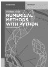

科学计算中的Python数值方法
William Miles, 2023
ISBN 978-3-11-077645-4, e-ISBN (PDF) 978-3-11-077664-5

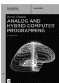

模拟与混合计算机编程
Bernd Ulmann, 2023
ISBN 978-3-11-078759-7, e-ISBN (PDF) 978-3-11-078773-3

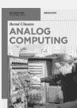

模拟计算
Bernd Ulmann, 2022
ISBN 978-3-11-078761-0, e-ISBN (PDF) 978-3-11-078774-0

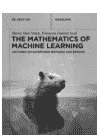

机器学习的数学基础：监督学习方法及其他
Maria Han Veiga, François Gaston Ged, 2024
ISBN 978-3-11-128847-5, e-ISBN (PDF) 978-3-11-128899-4


De Gruyter工程与信息科学数学应用丛书
Mangey Ram 主编
ISSN 2626-5427, e-ISSN 2626-5435

Tarkeshwar Barua, Kamal Kant Hiran,
Ritesh Kumar Jain, Ruchi Doshi

# 使用Python进行机器学习

DE GRUYTER

## 作者

Tarkeshwar Barua
计算机应用教授
昌迪加尔学院集团
印度旁遮普邦
tbarua1@gmail.com

Ritesh Kumar Jain
吉坦贾利技术学院
乌代浦尔
印度
riteshkrjain@gmail.com

Kamal Kant Hiran
计算机科学与工程系
西尔·帕达姆帕特·辛加尼亚大学
印度乌代浦尔
kamal.hiran@spsu.ac.in

Ruchi Doshi
创始人兼首席执行官
RESAISHALA Technocrats 有限公司
印度拉贾斯坦邦乌代浦尔
doshiruchi18@gmail.com

ISBN 978-3-11-069716-2
e-ISBN (PDF) 978-3-11-069718-6
e-ISBN (EPUB) 978-3-11-069725-4

## 美国国会图书馆控制号：2024934747

## 德国国家图书馆出版的书目信息

德国国家图书馆将此出版物收录于《德国国家书目》；详细的书目数据可在互联网上查阅，网址为 http://dnb.dnb.de。

© 2024 Walter de Gruyter GmbH, 柏林/波士顿
封面图片：style-photography/iStock/Getty Images Plus
排版：Integra Software Services Pvt. Ltd.
印刷与装订：CPI books GmbH, Leck

www.degruyter.com

## 目录

## 第1章
机器学习简介 — 1

- 1.1 什么是机器学习？ — 1
- 1.1.1 机器学习的定义 — 1
- 1.1.2 历史背景 — 2
- 1.1.3 机器学习的类型 — 4
- 1.1.4 机器学习的应用 — 7
- 1.1.5 机器学习中的挑战 — 8
- 1.2 机器学习领域的Python — 11
- 1.2.1 为什么选择Python进行机器学习？ — 11
- 1.2.2 常用的Python机器学习库 — 12
- 1.2.3 Python与其他编程语言在机器学习中的比较 — 13
- 1.2.4 Python机器学习的社区与资源 — 14
- 1.3 设置你的Python环境 — 15
- 1.3.1 安装Python — 15
- 1.3.2 虚拟环境及其重要性 — 16
- 1.3.3 机器学习必备的Python库 — 17
- 1.3.4 使用包管理器：Pip和Conda — 19
- 1.3.5 设置Jupyter Notebook — 20
- 1.3.6 在Python中管理机器学习项目的最佳实践 — 22
- 总结 — 25
- 练习（选择题） — 26
- 答案 — 27
- 填空题 — 27
- 答案 — 28
- 简答题 — 28

## 第2章
Python编程基础 — 30

- 2.1 为什么选择Python？ — 30
- 2.1.1 Python的缺点 — 30
- 2.1.2 Python的历史 — 31
- 2.1.3 Python的主要特性 — 31
- 2.1.4 市场需求 — 32
- 2.1.5 为什么在移动应用开发中使用Python？ — 33
- 2.1.6 Python版本 — 36
- 2.2 Python语法与结构 — 36
- 2.2.1 缩进与空白 — 36
- 2.2.2 注释与文档 — 37
- 2.3 数据类型与变量 — 38
- 2.3.1 基本数据类型 — 39
- 2.3.2 列表与元组 — 39
- 2.3.3 字典与集合 — 50
- 2.4 控制结构 — 60
- 2.4.1 条件语句 — 60
- 2.4.2 循环 — 62
- 2.5 函数与模块 — 63
- 2.5.1 定义函数 — 63
- 2.5.2 Lambda函数 — 65
- 2.5.3 模块与包 — 66
- 2.6 文件操作 — 68
- 2.6.1 文件输入/输出 — 68
- 2.7 使用库 — 72
- 2.7.1 导入库 — 72
- 2.7.2 常用Python库概览 — 73
- 2.8 Python中的面向对象编程 — 77
- 2.8.1 类与对象 — 77
- 2.8.2 继承与多态 — 80
- 总结 — 85
- 练习（选择题） — 85
- 答案 — 87
- 填空题 — 87
- 答案 — 88
- 简答题 — 88

## 第3章
Python中的数据预处理 — 90

- 3.1 使用NumPy和SciPy进行数值与科学计算 — 90
- 3.1.1 使用NumPy进行数值计算 — 90
- 3.1.2 使用SciPy进行科学计算 — 105
- 3.2 使用Pandas加载数据 — 109
- 3.2.1 DataFrame与Series — 109
- 3.2.2 使用Pandas进行数据操作 — 114
- 3.3 数据清洗与转换 — 120
- 3.3.1 处理缺失数据 — 121
- 3.3.2 数据类型转换 — 122
- 3.4 特征工程 — 123
- 3.4.1 分类变量编码 — 124
- 3.4.2 特征缩放 — 126
- 3.5 使用Matplotlib和Seaborn进行数据可视化 — 129
- 3.5.1 使用Matplotlib进行基础绘图 — 130
- 3.5.2 使用Seaborn进行高级可视化 — 140
- 3.6 处理不平衡数据 — 143
- 3.6.1 重采样技术 — 144
- 3.6.2 合成数据生成 — 145
- 总结 — 147
- 练习（选择题） — 147
- 答案 — 149
- 填空题 — 149
- 答案 — 149
- 简答题 — 150

## 第4章
机器学习基础 — 152

- 4.1 监督学习与无监督学习 — 153
- 4.1.1 分类与回归 — 154
- 4.1.2 聚类与关联 — 156
- 4.2 过拟合与正则化 — 159
- 4.2.1 偏差-方差权衡 — 159
- 4.2.2 L1和L2正则化 — 163
- 4.3 评估指标 — 167
- 4.3.1 分类指标 — 168
- 4.3.2 回归指标 — 171
- 4.4 交叉验证 — 175
- 4.4.1 k折交叉验证 — 176
- 4.4.2 留一法与分层K折 — 178
- 总结 — 182
- 练习（选择题） — 183
- 答案 — 185
- 填空题 — 186
- 答案 — 186
- 简答题 — 187

## 第5章
经典机器学习算法 — 188

- 5.1 线性回归 — 189
- 5.1.1 简单线性回归 — 190
- 5.1.2 多元线性回归 — 197
- 5.1.3 多项式回归 — 203
- 5.2 逻辑回归 — 206
- 5.2.1 二元分类 — 210
- 5.2.2 多类分类 — 214
- 5.2.3 逻辑回归中的正则化 — 217
- 5.3 决策树与随机森林 — 222
- 5.3.1 构建决策树 — 224
- 5.3.2 熵与信息增益 — 230
- 5.3.3 随机森林与Bagging — 234
- 5.4 支持向量机 — 239
- 5.4.1 线性SVM — 242
- 5.4.2 核SVM — 250
- 5.4.3 SVM中的超参数调优 — 255
- 5.5 K-Means聚类 — 260
- 5.5.1 聚类基础 — 261
- 5.5.2 选择聚类数量 — 262
- 5.6 主成分分析 — 270
- 5.6.1 降维 — 273
- 5.6.2 特征向量与特征值 — 275
- 5.7 朴素贝叶斯 — 281
- 5.7.1 高斯朴素贝叶斯 — 285
- 5.7.2 多项式朴素贝叶斯 — 293
- 5.8 集成方法：Boosting, Bagging — 297
- 5.8.1 Bagging与Boosting概览 — 298
- 5.8.2 AdaBoost与梯度提升 — 303
- 总结 — 310
- 练习（选择题） — 311
- 答案 — 313
- 填空题 — 313
- 答案 — 314
- 简答题 — 314

## 第6章
高级机器学习技术 — 316

- 6.1 梯度提升树：XGBoost与LightGBM — 316
- 6.1.1 XGBoost算法 — 319
- 6.1.2 LightGBM与XGBoost的比较 — 327
- 6.2 核方法 — 331
- 6.2.1 核技巧 — 332
- 6.2.2 径向基函数（RBF）核 — 333
- 6.2.3 超越k-Means的聚类技术 — 336
- 6.3 异常检测 — 347
- 6.3.1 统计方法 — 347
- 6.3.2 基于距离的方法 — 350
- 6.4 聚类 — 351
- 6.4.1 孤立森林 — 352
- 6.4.2 基于密度的方法 — 352
- 6.4.3 其他技术 — 353
- 总结 — 354
- 练习（选择题） — 356
- 简答题 — 358
- 填空题 — 359
- 答案 — 359
- 判断题 — 359

## 第7章
神经网络与深度学习 — 360

- 7.1 神经网络简介 — 360
- 7.2 感知机 — 362
- 7.2.1 感知机的结构 — 362
- 7.2.2 感知机的功能 — 363
- 7.2.3 感知机的应用场景 — 363
- 7.2.4 激活函数的应用场景 — 363
- 7.3 TensorFlow — 367
- 7.3.1 计算图 — 367
- 7.3.2 即时执行 — 368
- 7.3.3 Keras — 369
- 7.3.4 会话 — 370
- 7.3.5 常用操作 — 370
- 7.4 使用TensorFlow实现神经网络 — 370
- 7.5 使用Keras框架构建神经网络 — 373
- 7.5.1 Keras与TensorFlow的区别 — 373
- 7.6 卷积神经网络（CNN） — 374
- 7.6.1 模型："sequential_2" — 386
- 7.6.2 CNN架构 — 389
- 7.7 Dropout层 — 390
- 7.8 循环神经网络（RNN） — 391
- 7.8.1 RNN的类型 — 391
- 7.9 序列到序列模型 — 398
- 7.10 迁移学习 — 400
- 7.11 使用预训练模型 — 406
- 7.12 微调与特征提取 — 407
- 7.12.1 选择正确的微调方法 — 407
- 7.13 生成对抗网络（GAN） — 408
- 7.13.1 GAN的架构 — 408
- 7.13.2 GAN的最佳实践 — 409
- 7.13.3 GAN的应用 — 409
- 7.14 深度学习中的正则化与优化 — 409
- 7.15 批量归一化 — 413
- 7.15.1 批量归一化的工作原理？ — 414

## 第8章
专业应用与案例研究

- 8.1 自然语言处理简介
- 8.1.1 分词
- 8.1.2 词嵌入
- 8.1.3 NLP的序列建模
- 8.2 时间序列预测
- 8.2.1 自回归积分滑动平均模型
- 8.2.2 Prophet与神经网络在时间序列中的应用
- 8.3 推荐系统
- 8.4 计算机视觉应用
- 8.4.1 目标检测与分割
- 8.5 强化学习
- 8.5.1 强化学习的核心要素
- 8.5.2 学习过程
- 8.6 强化学习的应用
- 8.7 强化学习的挑战
- 8.8 Q学习
- 8.9 深度Q网络
- 8.10 策略梯度方法
- 总结
- 练习（选择题）
- 答案要点
- 一些基础问题
- 填空题
- 答案

参考文献

索引

## 第1章
### 机器学习简介

#### 1.1 什么是机器学习？

机器学习是人工智能领域内的一个学科，专注于创建算法和模型，使计算机系统能够在无需明确编程的情况下获取知识并做出预测或决策。机器学习的主要目标是使计算机能够基于经验或数据自主学习并提升其性能。

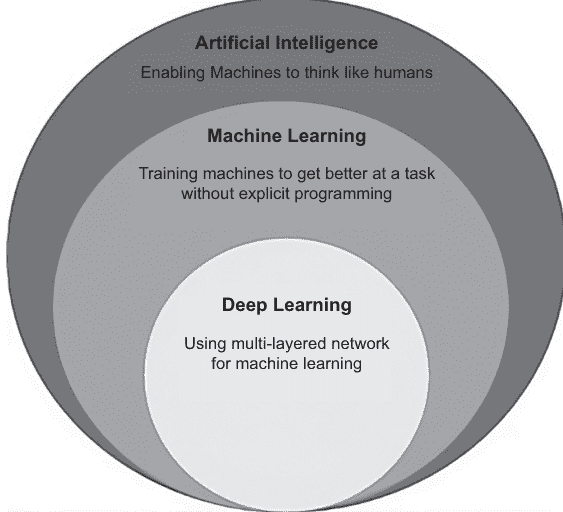

##### 1.1.1 机器学习的定义

不同的专家和资料来源可能会提供略有差异的机器学习定义，这反映了对该领域的不同视角。以下是不同权威人士给出的一些不同定义：

https://doi.org/10.1515/9783110697186-001

Arthur Samuel (1959)
“机器学习是一个研究领域，它赋予计算机无需明确编程即可学习的能力。”

Tom Mitchell (1997)
“对于某类任务T和性能度量P，如果一个计算机程序在T中的任务上，以P衡量的性能，随着经验E而改善，则称该程序从经验E中学习。”

Andrew Ng（Coursera联合创始人，斯坦福大学）
“机器学习是让计算机在无需明确编程的情况下行动的科学。”

Pedro Domingos（《终极算法》作者）
“机器学习是发现的自动化，它负责让我们的智能手机工作，帮助医生诊断疾病，在棋类游戏中击败人类，以及更多。”

Ian Goodfellow 和 Yoshua Bengio（《深度学习》作者）
“机器学习是一个研究领域，它赋予计算机无需明确编程即可学习的能力。它是一种人工智能，为系统提供了从经验中自动学习和改进的能力。”

微软 Azure 机器学习文档
“机器学习是使用算法使计算机在无需明确编程的情况下做出决策的过程。这些算法使用统计模型，使计算机能够在没有特定编程的情况下执行任务。”

##### 1.1.2 历史背景

机器学习的历史进程跨越了数十年，其发展以重要的里程碑和贡献为特征。以下是机器学习历史背景的简要概述。

**1950年代 – 早期概念**

机器学习的建立可以追溯到1950年代，当时像艾伦·图灵这样的著名人物做出了重大贡献。图灵提出了机器能够通过经验获取知识的概念，这为该领域的未来发展铺平了道路。

**1956年 – 达特茅斯会议**

“人工智能”一词在1956年的达特茅斯会议上被提出。这次会议为人工智能和机器学习作为多学科研究领域的发展奠定了基础。

**1960年代 – 决策树与最近邻算法**

决策树算法的发展和最近邻算法的引入发生在1960年代，从而为早期的模式识别技术做出了显著贡献。

**1970年代 – 反向传播与基于规则的系统**

用于训练人工神经网络的算法，即反向传播，于1970年代首次被提出。同样，强调决策规则明确编程的基于规则的系统，在这一时期也经历了流行度的激增。

**1980年代 – 专家系统**

采用基于规则的逻辑来模仿人类决策的专家系统，在1980年代获得了显著地位。然而，由于它们无法有效处理不确定性并轻松适应新信息，人们的注意力发生了转移。

**1990年代 – 支持向量机与提升算法**

1990年代见证了支持向量机在分类任务中的出现，以及提升算法在增强弱学习器效能方面的应用。

**1990年代末 – 数据挖掘的兴起**

由于大型数据集的可用性增加，1990年代末人们对数据挖掘的兴趣激增，这是一个与机器学习密切相关的领域，专注于从数据中提取知识。

**2000年代 – 集成学习与深度学习**

2000年代见证了集成学习技术的流行激增，该技术结合多个模型以提升性能。与此同时，深度学习的出现——机器学习的一个分支，专注于具有多层的神经网络——是由计算能力的进步推动的。

**2010年代 – 深度学习的主导地位**

2010年代见证了深度学习在各个领域的盛行，在图像和语音识别、自然语言理解等领域取得了重大进展。技术基础设施的进步，特别是图形处理单元的使用，被证明是深度学习成功的关键。

**当前 – 持续进步**

机器学习正在经历快速演变，其特点是在强化学习、迁移学习和可解释人工智能等多个领域持续进行研究和开发。该领域的应用跨越了医疗保健、金融和自主系统等多个行业。

机器学习的历史背景展示了从最初的构想到当今复杂算法和广泛实际应用时代的演进。计算能力的进步、大规模数据集的可用性以及跨学科合作共同推动了该领域的发展。

##### 1.1.3 机器学习的类型

机器学习是人工智能的一个分支，使计算机能够在无需明确指令的情况下获取知识并得出结论。这一革命性的学科包含不同的方法论，每种方法论都旨在解决特定的学习情境。机器学习的主要形式包括监督学习、无监督学习和强化学习，每种形式都为解决各种问题提供了不同的方法和应用。现在，让我们深入探讨这些基础分类。

###### 1.1.3.1 监督学习

在监督学习中，算法在一个已标记的数据集上进行训练，其中输入数据与相应的输出标签相匹配。目标是让算法学习从输入到输出的映射，以便在面对新的、未见过的输入数据时，能够对相应的输出做出准确的预测。

###### 关键特征

**训练数据**：用于训练的数据集由输入与对应输出的配对组成，每个输入都提供了其正确的输出。
**学习目标**：算法旨在学习输入与输出之间的关系或映射。
**示例**：常见应用包括图像分类、垃圾邮件过滤和回归问题。

###### 示例场景

**任务**：预测一封电子邮件是否为垃圾邮件。
**训练数据**：已分类为垃圾邮件或非垃圾邮件的电子邮件。
**学习目标**：算法通过识别其训练数据中的重复模式，获取对新邮件进行分类的知识。

###### 1.1.3.2 无监督学习

无监督学习涉及处理未标记的数据，算法在没有关于其用途的明确指令的情况下接收数据。系统致力于发现数据中固有的模式、关系或结构。

###### 关键特征

**训练数据：** 数据集是未标记的，这意味着没有预定义的输出标签。
**学习目标：** 揭示数据中隐藏的模式或相互关联。
**示例：** 聚类、降维和关联规则学习是无监督学习领域中的常见任务。

###### 示例场景

**任务：** 将相似的客户购买行为分组。
**训练数据：** 没有特定标签的购买数据。
**学习目标：** 算法识别相似购买模式的自然分组或聚类。

###### 1.1.3.3 强化学习

强化学习涉及一个智能体通过在给定环境中执行动作来学习做出决策。智能体以奖励或惩罚的形式获得输入，使其能够学习技能以改进其行为并实现特定目标。

###### 关键特征

**环境：** 智能体与环境交互并采取行动以实现目标。
**反馈：** 智能体通过根据其执行的动作给予奖励或惩罚来获得反馈。
**学习目标：** 学习一个将状态映射到动作的策略，以最大化累积奖励。
**示例：** 游戏玩法（如AlphaGo的案例）、机器人控制和自主系统的开发。

###### 示例场景

**任务：** 教授计算机程序玩一个游戏。
**环境：** 游戏环境。
**学习目标：** 智能体学习一个策略（策略），以采取随时间推移最大化游戏分数的动作。

上述三种机器学习分类根据手头数据的特征和学习过程的目标，展示了不同的问题解决方法。每种分类都有其自身的一套实际应用，并且非常适合特定场景。

##### 1.1.4 机器学习的应用

机器学习已渗透到多个领域，从根本上改变了执行任务和做出决策的方法。机器学习的应用多种多样且功能强大，涵盖医疗保健、金融、营销等多个领域。以下段落将对一些主要应用进行详细分析。

###### 医疗保健

**疾病诊断：** 机器学习通过分析医学图像（例如X光和MRI）并识别指示特定病症的模式来帮助诊断疾病。
**预测分析：** 预测模型用于预测疾病爆发的可能性、患者再入院的可能性以及估计个人健康风险，从而实现主动的医疗干预。

###### 金融

**欺诈检测：** 机器学习算法审查交易数据，以实时识别异常模式并确定潜在的欺诈活动。
**算法交易：** 预测模型利用其分析能力来研究市场趋势和历史数据，从而在算法交易领域做出明智决策，进而优化投资策略。

###### 营销与电子商务

**推荐系统：** 机器学习为电子商务平台和流媒体服务提供个性化推荐引擎，通过推荐相关产品或内容来增强用户体验。
**客户细分：** 聚类算法能够根据客户行为对客户进行细分，从而使企业有机会为不同的客户群定制营销策略。

###### 自然语言处理（NLP）

**聊天机器人和虚拟助手：** 自然语言处理促进了能够理解和回应人类语言的对话代理的创建，从而增强客户支持和用户互动。
**语言翻译：** 机器学习实现了语言的即时翻译，从而消除语言障碍并促进全球沟通。

###### 自动驾驶汽车

**物体检测与识别：** 机器学习算法用于分析传感器数据，以识别和分类各种实体，如物体、行人和障碍物。这些算法在自动驾驶汽车的决策过程中起着至关重要的作用。
**路径规划：** 强化学习应用于路径规划，使车辆能够在复杂环境中导航并做出动态决策。

###### 图像与语音识别

**面部识别：** 机器学习被用于安全系统、设备解锁和身份验证中的面部识别。
**语音转文本和文本转语音：** 自然语言处理模型将口语转换为书面文本，反之亦然，从而支持语音命令和无障碍功能。

###### 制造业与工业

**预测性维护：** 机器学习能够通过分析传感器数据来预测设备故障和维护需求，从而减少停机时间并提高运营效率。
**质量控制：** 计算机视觉系统检查并识别制造产品中的缺陷，确保符合质量标准。

###### 教育

**个性化学习：** 机器学习模型根据学生的个人进度调整教育内容，根据特定需求定制学习体验。
**学生成绩预测：** 预测分析识别有学业挑战风险的学生，以便及时干预和支持。

上述应用是机器学习在不同领域多面性和强大能力的典范，促进了创新和效率，以解决复杂问题。随着技术的不断进步，机器学习应用的广度预计将扩大，从而改革各个行业并改善日常生活。

##### 1.1.5 机器学习的挑战

尽管机器学习取得了显著进展，但它也面临着各种障碍，这些障碍影响了其进展、实施和有效性。解决这些障碍对于推动该领域发展并确保道德、稳健和可理解的机器学习系统至关重要。以下是机器学习中遇到的主要挑战。

###### 数据质量与数量

**挑战：** 机器学习模型在很大程度上依赖于高质量和足够数量的训练数据。不完整、有偏见或包含噪声的数据集可能导致不准确或有偏见的预测。
**缓解措施：** 严格的数据预处理、数据增强以及确保数据集的多样性和代表性有助于缓解这些挑战。

###### 偏见与公平性

**挑战：** 模型可能继承训练数据中存在的偏见，从而延续不公平和歧视性的结果。确保不同人口群体预测的公平性是一个关键问题。
**缓解措施：** 实施公平感知算法、审计模型偏见以及在数据收集过程中促进多样性是解决偏见的策略。

###### 可解释性与可理解性

**挑战：** 许多机器学习模型，特别是深度神经网络，被认为是“不透明系统”，难以理解和解释其决策机制。
**缓解措施：** 开发可解释的模型、使用与模型无关的可解释性工具以及结合可解释性技术可以提高透明度。

###### 过拟合与欠拟合

**挑战：** 模型可能变得过于复杂（过拟合）并记住训练数据，导致泛化能力差。相反，过于简单的模型（欠拟合）可能无法捕捉潜在模式。
**缓解措施：** 通过使用正则化、交叉验证和集成技术等方法，可以在过拟合和欠拟合问题之间实现和谐平衡。

###### 缺乏标准化

**挑战：** 缺乏标准化的评估指标、数据集和模型架构可能会阻碍可重复性，并阻碍不同模型之间的公平比较。

**缓解措施：** 鼓励开放科学实践、共享基准测试并采用标准化评估协议，有助于提高透明度和协作性。

###### 计算复杂性与资源需求

**挑战：** 训练和部署复杂模型，尤其是深度学习模型，可能需要大量的计算资源，这限制了小型组织或研究人员的可及性。
**缓解措施：** 优化技术、模型压缩以及使用专用硬件有助于管理计算需求。

###### 伦理考量

**挑战：** 偏见模型、人工智能的潜在误用，以及在医疗保健和刑事司法等关键领域自动化决策的伦理影响，引发了伦理方面的担忧。
**缓解措施：** 在模型开发中融入伦理考量、促进多样性和包容性，并遵守伦理准则和标准至关重要。

###### 对抗性攻击

**挑战：** 对抗性攻击涉及操纵输入数据以误导机器学习模型，从而损害其性能和可靠性。
**缓解措施：** 开发稳健的模型、引入对抗性训练，并定期更新模型以应对新出现的攻击策略，是应对这一挑战的策略。

###### 持续学习

**挑战：** 许多机器学习模型是为静态数据集设计的，如何随时间适应不断演变的数据（概念漂移）是一个挑战。
**缓解措施：** 实施在线学习方法、定期重新训练模型，并对数据分布的变化保持警惕，有助于应对持续学习的挑战。

###### 隐私问题

**挑战：** 处理训练数据中的敏感信息引发了隐私担忧，尤其是在医疗保健和金融应用中。
**缓解措施：** 采用隐私保护技术，如联邦学习和差分隐私，有助于在允许模型训练的同时保护个人隐私。

应对这些挑战需要机器学习社区的协作、持续的研究，以及对合乎伦理和负责任的人工智能开发的承诺。随着该领域的发展，找到应对这些挑战的有效解决方案，对于机器学习系统的广泛和负责任部署至关重要。

#### 1.2 Python 在机器学习领域的地位

Python 凭借其多功能性、易用性以及丰富的库和框架，已成为机器学习领域占主导地位的编程语言。其简洁的语法和高度的可读性使其对新手和经验丰富的程序员都易于上手。Python 对数据操作、统计分析以及 Scikit-learn、TensorFlow 和 PyTorch 等机器学习库的广泛支持，在其广泛采用中发挥了重要作用。

除了强大的库之外，Python 还拥有一个充满活力且积极参与的社区，为机器学习工具的开发和改进做出了贡献。该语言的集成能力和与其他技术的兼容性使其成为构建全面机器学习流程的首选。此外，其在从数据科学、金融到医疗保健和自主系统等各个行业的应用，进一步凸显了其受欢迎程度。随着 Python 的不断发展，其在机器学习领域的地位依然至关重要，为研究人员、数据科学家和开发者推动该领域的创新和进步提供了坚实的基础。

##### 1.2.1 为什么选择 Python 进行机器学习？

Python 已成为机器学习的首选编程语言，这归功于多种令人信服的因素。其简单易懂的语法促进了高效开发，使其对新手和经验丰富的开发者都易于上手。Python 广泛的生态系统包含了 Scikit-learn、TensorFlow 和 PyTorch 等强大的库，为从数据预处理到复杂深度学习模型的各种任务提供了强大的工具。

该语言的多功能性体现在其能够与其他技术无缝集成，从而顺利融入不同的数据科学工作流和框架。Python 强大的社区支持发挥着至关重要的作用，确保了丰富的资源、教程和用于解决问题的论坛。其受欢迎程度超越了机器学习领域，促进了跨学科的合作。Python 的开源性质及其与各种平台的兼容性，促进了其在研究、工业和学术界的广泛采用。因此，Python 用户友好的特性、丰富的库和社区支持共同使其成为从业者和研究人员在多样化的机器学习领域中的首选语言。

##### 1.2.2 用于机器学习的流行 Python 库

在机器学习领域，Python 与丰富的库生态系统同义，这些库使开发者和研究人员能够构建和部署复杂的模型。以下是三个在塑造机器学习领域格局方面发挥关键作用的突出库：

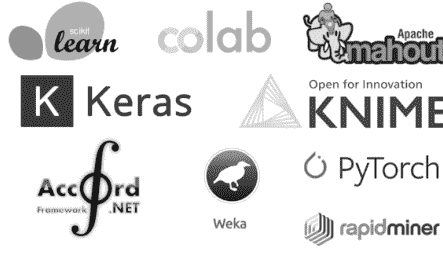

图 1.3：用于机器学习的流行 Python 库和工具。

###### 1.2.2.1 Scikit-learn

机器学习库 Scikit-learn 以其适应性和以用户为中心的设计而闻名，为数据的分析和构建提供了各种简单有效的资源。它涵盖了广泛的算法，适用于分类、回归、聚类和降维任务。

###### 1.2.2.2 TensorFlow

由 Google 开发的 TensorFlow 是一个极其强大的开源库，在深度学习应用领域表现出卓越的性能。其卓越的适应性和扩展能力使其非常适合从新手到经验丰富的专业人士。TensorFlow 为创建和实现复杂的神经网络框架提供了广泛的支持。

###### 1.2.2.3 PyTorch

PyTorch 是一个动态且流行的深度学习库，以其命令式编程风格而闻名。它受到研究人员和开发者的青睐，PyTorch 有助于构建动态计算图，在尝试各种神经网络架构时提供了灵活性和便利性。

这些库是 Python 机器学习生态系统的支柱，各自贡献了独特的优势和功能。它们的广泛采用凸显了它们在机器学习应用开发和进步中的重要性。

##### 1.2.3 Python 与其他编程语言在机器学习中的比较

Python 已成为机器学习领域主流的编程语言；然而，将其与该领域常用的其他语言进行评估至关重要。

表 1.1：Python 与其他编程语言的比较。

| 方面 | Python | R | Java | C++ |
| :--- | :--- | :--- | :--- | :--- |
| **多功能性** | ✔ 综合生态系统 | ✘ 在更广泛的软件开发中受限 | ✔ 适合企业集成 | ✘ 学习曲线更陡峭 |
| **可读性** | ✔ 语法可读性强 | ✘ 学习曲线更陡峭 | ✘ 冗长 | ✘ 冗长 |
| **社区支持** | ✔ 庞大且活跃的社区 | ✘ 社区较小 | ✔ 对企业有强大支持 | ✘ 社区较小 |
| **统计重点** | ✘ 对统计的强调较少 | ✔ 强大的统计能力 | ✘ 统计重点有限 | ✘ 统计重点有限 |
| **数据可视化** | ✘ 能力中等 | ✔ 强大的可视化能力 | ✘ 能力有限 | ✘ 能力有限 |
| **性能** | ✘ 通常性能较低 | ✘ 通常性能较低 | ✔ 在某些情况下性能更好 | ✔ 高效且高性能 |
| **学习曲线** | ✔ 对初学者友好 | ✘ 学习曲线更陡峭 | ✘ 学习曲线中等 | ✘ 学习曲线更陡峭 |
| **企业集成** | ✘ 通用性限制 | ✘ 通用性限制 | ✔ 强大，适合集成 | ✘ 通用性限制 |
| **底层控制** | ✘ 底层控制有限 | ✘ 底层控制有限 | ✘ 底层控制有限 | ✔ 提供底层控制 |

至关重要的是要考虑到，编程语言的选择通常取决于机器学习项目的具体需求、开发者对该语言的熟悉程度以及效率方面的考虑。每种语言都有其优点，并且适合特定的情况。

##### 1.2.4 Python 机器学习的社区与资源

Python 机器学习社区是一个充满活力、协作紧密的生态系统，在机器学习项目的开发、传播和改进中发挥着至关重要的作用。以下是该社区的概览以及在机器学习领域可供使用的丰富资源。

###### 开源协作

**协作开发：** Python 机器学习社区的繁荣得益于开源协作，全球各地的开发者为各种库、框架和工具贡献力量。这种集体努力带来了持续的改进、错误修复以及生态系统的演进。

###### 在线论坛与讨论组

**Stack Overflow：** Python 开发者在 Stack Overflow 等平台上积极参与讨论，就广泛的机器学习主题寻求和提供帮助。
**Reddit (r/MachineLearning)：** Reddit 上的机器学习板块是讨论、分享研究论文以及向社区寻求建议的中心。

###### 会议与聚会

**PyCon：** Python 会议，如 PyCon，通常设有专门的机器学习分会场和环节，为建立联系、知识共享和协作提供了平台。
**本地聚会：** Python 和机器学习爱好者经常组织本地聚会，促进社区建设和面对面交流。

###### 教育平台

**Coursera、edX 和 Udacity：** 这些平台提供了大量使用 Python 的机器学习课程和专项课程，为学习者提供了全面的资源和实践项目。
**Kaggle：** Kaggle 既是一个竞赛平台，也是一个学习资源，允许用户探索数据集、参与竞赛并协作开展机器学习项目。

###### 文档与教程

**官方文档：** Scikit-learn、TensorFlow 和 PyTorch 等库拥有详尽且维护良好的文档，提供全面的指南、教程和示例。
**在线博客与网站：** 众多博客和网站，如 Towards Data Science 和 Analytics Vidhya，提供了关于 Python 机器学习的深入教程、案例研究和最佳实践。

###### 版本控制与协作

**GitHub：** Python 机器学习社区大量使用 GitHub 进行版本控制、协作开发和代码仓库共享。该平台促进了开源项目的协作，并提升了代码的透明度。

###### 社交媒体互动

**Twitter：** 许多研究人员、从业者和组织在 Twitter 上分享关于 Python 机器学习的见解、研究论文和最新动态，促进了实时沟通和信息传播。
**LinkedIn 群组：** LinkedIn 上专注于机器学习的群组为专业人士提供了一个交流经验、探讨工作机会和分享宝贵资料的平台。

###### 邮件列表与新闻通讯

**Scikit-learn 邮件列表：** Scikit-learn 社区维护着一个用于讨论、公告和社区更新的邮件列表。
**每周新闻通讯：** 像“Pycoders Weekly”这样的新闻通讯会整理最新的 Python 和机器学习新闻、文章和资源，让社区保持信息畅通。

Python 机器学习社区的协作性和包容性，加上丰富的教育资源和平台，使其成为开发者、研究人员和学习者蓬勃发展并为 Python 机器学习领域不断演进的格局做出贡献的理想环境。

#### 1.3 设置你的 Python 环境

开展机器学习项目需要一个配置良好的 Python 环境。建立正确的基础可确保开发顺利、协作高效并保证结果可复现。以下是为机器学习成功设置 Python 环境的简明指南。

##### 1.3.1 安装 Python

安装 Python 是任何机器学习工作的基础步骤。请按照以下步骤进行无缝安装：

###### 下载 Python

访问 Python 官方网站 https://www.python.org/downloads/，获取与你指定操作系统兼容的最新版本。

###### 运行安装程序

执行已下载的安装程序。在安装过程中，务必检查并选择标有“Add Python to PATH”的选项。这样，你就可以通过命令行界面方便地访问 Python。

###### 验证安装

在 Windows 上启动命令提示符，或在 macOS/Linux 上启动终端，然后输入命令“python –version”或“python –V”。将显示已安装的 Python 版本，从而确认安装成功完成。

```
$ python --version
Python 3.8.12
```

图 1.4：Python 版本。

此示例演示了如何检查 Python 版本，结果显示已安装 Python 3.8.12。现在，Python 已安装完毕，你可以继续进行设置机器学习环境的下一步。

##### 1.3.2 虚拟环境及其重要性

在 Python 中，虚拟环境对于管理项目依赖项和隔离不同项目至关重要。以下是虚拟环境为何重要以及如何使用它们。

###### 依赖隔离

虚拟环境为 Python 项目创建了隔离的空间。每个环境都有自己的一套已安装包，防止项目依赖项之间发生冲突。

###### 版本控制

通过将项目的依赖项封装在虚拟环境中，可以控制用于特定项目的库版本。这确保了项目在其生命周期内的可复现性得以保持。

###### 干净的开发环境

虚拟环境使你的系统全局 Python 环境保持干净。你可以尝试不同版本的库和框架，而不会影响其他项目或系统级的 Python 安装。

###### 易于复制

虚拟环境使得在另一台机器上复制开发环境变得容易。通过共享 requirements.txt 或 environment.yml 文件，其他人可以重建用于该项目的完全相同的环境。

###### 安装与激活

使用 venv 模块或借助 virtualenv 或 Conda 等外部工具来创建虚拟环境。使用“source venv/bin/activate”（适用于 Linux/macOS）或“venv\Scripts\activate”（适用于 Windows）等命令来激活环境。
示例（命令行）：

```
# 创建一个名为 'myenv' 的虚拟环境
$ python -m venv myenv

# 激活虚拟环境
$ source myenv/bin/activate   # 在 Linux/macOS 上
$ myenv\Scripts\activate       # 在 Windows 上
```

图 1.5：Python 环境。

激活后，终端提示符会发生变化以指示当前活动的虚拟环境，确保任何已安装的包都特定于与该环境关联的项目。
理解和利用虚拟环境是 Python 开发中的最佳实践，尤其是在机器学习项目中，因为依赖项可能因项目而异，并且会随时间演变。

##### 1.3.3 机器学习必备的 Python 库

几个关键的 Python 库在推动机器学习发展方面发挥着至关重要的作用，它们为数据操作、统计分析和构建机器学习模型等任务提供了一系列有用的工具。接下来的部分将深入探讨这些不可或缺的库。

##### NumPy

**描述：** NumPy 是一个使用 Python 编程语言进行数值计算的基础库。它为处理大型多维数组和矩阵提供了全面的支持，同时也提供了高效的数学运算来有效操作这些数组。
**重要性：** NumPy 是机器学习领域中数据操作和执行数值运算的基础框架。它是更广泛生态系统中许多其他库的基本构建块。

##### Pandas

**描述：** Pandas 库是一个灵活的数据操作工具，提供多种数据结构，如 DataFrame，特别适合管理结构化数据。它提供了一系列用于数据清洗、探索和分析的工具。
**重要性：** Pandas 简化了数据预处理过程，从而有助于为机器学习模型优化数据。其优势在于能够有效处理表格数据和时间序列数据。

##### Matplotlib

**描述：** Matplotlib 是一个全面的绘图库，用于生成基于 Python 的可视化，包括 2D 静态、动画和交互式表示。它提供了一个通用的框架来构建各种图表和图形。
**重要性：** 可视化对于理解数据模式至关重要。Matplotlib 有助于创建信息丰富的图表，辅助数据探索和沟通。

##### Scikit-learn

**描述：** Scikit-learn 是一个经典的机器学习库，提供了简单有效的工具来提取有价值的信息和分析数据。该库包含用于分类、回归、聚类等多种任务的算法。
**重要性：** Scikit-learn 是部署机器学习模型的主要资源。凭借其标准化的应用程序编程接口（API）和全面的文档，它为各个专业水平的人员提供了可访问性。

###### TensorFlow

**描述：** TensorFlow 是一个开源的机器学习库，由 Google 创建，能够支持深度学习和传统机器学习。该库简化了开发和训练复杂神经网络模型的过程。

**重要性：** TensorFlow 被广泛应用于深度学习实现，涵盖图像与语音识别、自然语言处理及其他相关领域。其适应性与可扩展性使其适用于各类项目。

###### PyTorch

**描述：** PyTorch 以其适应性和用户友好界面著称，是一个动态的开源深度学习框架。它提供动态计算图，非常适合研究和实验。
**重要性：** PyTorch 因其用户友好的架构和灵活的计算能力而被研究人员广泛采用，在学术界和工业界均被广泛用于构建最先进的深度学习模型。

###### Keras

**描述：** Keras 是一个基于 Python 的高级神经网络 API，旨在 TensorFlow、Theano 或 Microsoft Cognitive Toolkit 上运行。它为构建和探索神经网络提供了用户友好的平台。
**重要性：** Keras 简化了神经网络架构的开发，通常是快速原型设计和实验的首选。它抽象了底层细节，让开发者能够专注于模型设计。

这些核心 Python 库共同构成了一个强大的机器学习开发生态系统。理解它们的功能并将其集成到项目中，可以实现高效的数据处理、模型构建和可视化。

##### 1.3.4 使用包管理器：Pip 和 Conda

包管理器是管理 Python 库和依赖项的基本工具。Python 生态系统中两个广泛使用的包管理器是 pip 和 conda。以下是它们的使用概述。

###### pip

**描述：** pip 是 Python 编程语言的主要包管理器。它简化了 Python 包的安装、升级和管理过程。
**安装：** 如果您使用的是 Python 3.4 或更新版本，很可能 pip 包管理器已经存在。要将 pip 包管理器升级到最新版本，请执行以下命令：

```
$ python -m pip install --upgrade pip
```

安装包：
```
$ pip install package_name
```

示例（安装 NumPy）：
```
$ pip install numpy
```

###### conda

**描述：** conda 是一个跨平台的包管理器和环境管理系统。它在管理具有复杂依赖项的包方面特别强大。
**安装：** 通过下载并安装 Anaconda 或 Miniconda 来安装 conda。

```
创建虚拟环境
$ conda create --name myenv
激活虚拟环境：
$ conda activate myenv
安装包：
(myenv) $ conda install package_name
示例（安装 NumPy）：
(myenv) $ conda install numpy
停用虚拟环境：
(myenv) $ conda deactivate
移除虚拟环境：
$ conda env remove --name myenv
```

正确使用 pip 和 conda 对于管理 Python 环境中的依赖项至关重要。选择最适合您项目需求和生态系统兼容性的工具。通常，对于通用 Python 包使用 pip，对于具有非 Python 依赖项的包或在数据科学环境中使用 conda。

##### 1.3.5 设置 Jupyter Notebook

Jupyter Notebook 被广泛用于交互式数据分析、探索和机器学习开发，具有强大的功能。这里提供了一个全面的教程，概述了在您的 Python 环境中设置 Jupyter Notebook 的过程。

###### 安装

- 确保您的 Python 环境已激活（全局或在虚拟环境中）。
- 使用 **pip** 安装 Jupyter Notebook：
  ```
  $ pip install jupyter
  ```

###### 启动 Jupyter Notebook

- 要启动 Jupyter Notebook 服务器，请在终端或命令提示符中执行以下命令。
  ```
  $ jupyter notebook
  ```

此操作将在网络浏览器中启动一个新标签页，显示 Jupyter Notebook 仪表板。

###### 创建新笔记本

- 在 Jupyter Notebook 仪表板中，应选择“New”按钮，然后选择“Python”选项来创建一个新的 Python 笔记本。

###### 使用 Jupyter Notebooks

- Jupyter Notebooks 由单元格组成，可以包含代码或 Markdown（文本）。可以通过选择单元格并点击“Run”按钮或使用相应的键盘快捷键（通常是 Shift + Enter）来执行单元格。
- 要添加额外的单元格，可以使用工具栏中的“+”图标，或者按键盘上的 B 键在当前选定单元格下方插入一个单元格。

###### 安装额外内核

- Jupyter 通过不同的内核支持多种编程语言。如果您希望使用标准 Python 环境以外的虚拟环境，可以为该环境获取内核。通过安装 ipykernel 包，可以生成一个新的内核。
  ```
  $ pip install ipykernel
  $ python -m ipykernel install --user --name=myenv --display-name="My Environment"
  ```

现在，在您的 Jupyter Notebook 中，可以选择“My Environment”作为内核。

###### 导出笔记本

- 您可以将 Jupyter Notebooks 导出为多种格式，包括 HTML、PDF 和 Markdown。使用“File”菜单访问“Download as”选项，然后选择您喜欢的格式。

###### 关闭 Jupyter Notebook

- 要停止 Jupyter Notebook 服务器，请返回到运行它的终端，然后按 Ctrl + C。确认时输入 Y 并按 Enter。

设置 Jupyter Notebook 为构建机器学习模型、可视化数据和记录工作提供了一个交互式和直观的环境。它与 Python 框架无缝集成，使其成为数据科学家和程序员的多功能工具。

##### 1.3.6 在 Python 中管理机器学习项目的最佳实践

在 Python 中管理机器学习项目不仅仅是编写代码。采用最佳实践可确保项目组织、可重复性和协作。以下是详细指南。

###### 项目结构

- 使用清晰的目录结构组织您的项目。常用的结构包括将数据、代码和文档分离到不同的目录中。

```
my_project/
├── data/
├── src/
│   ├── __init__.py
│   ├── data_processing.py
│   └── model_training.py
├── notebooks/
├── README.md
└── requirements.txt
```

###### 使用 Git 进行版本控制

- 使用 Git 进行版本控制。在项目根目录初始化一个 Git 仓库并定期提交。将代码托管在 GitHub 或 GitLab 等平台上以便协作和备份。

```
$ git init
$ git add .
$ git commit -m "Initial commit"
```

###### 虚拟环境

- 始终使用虚拟环境来隔离项目依赖项。包含一个 **requirements.txt** 或 **environment.yml** 文件来记录和重建环境。
  ```
  $ python -m venv venv
  $ source venv/bin/activate
  (venv) $ pip install -r requirements.txt
  ```

###### 文档

- 确保维护完整的文档。通过使用 README 文件、文档字符串和注释来阐明代码的功能。提供配置环境和执行项目的说明。

###### 自动化测试

- 实施单元测试以确保代码正确性。可以使用 pytest 等工具进行自动化测试。定期运行测试以尽早发现潜在问题。
  ```
  (venv) $ pip install pytest
  (venv) $ pytest tests/
  ```

###### 持续集成 (CI)

- 建立一个持续集成 (CI) 框架，例如 GitHub Actions 或 Travis CI，以便在向仓库提交修改时自动执行测试和验证。这确保了代码库始终正常运行。

```yaml
# 示例 GitHub Actions 工作流
name: CI
on: [push, pull_request]
jobs:
  test:
    runs-on: ubuntu-latest
    steps:
      - name: Set up Python
        uses: actions/setup-python@v2
        with:
          python-version: 3.8
      - name: Install dependencies
```

###### 日志记录与监控

- 在代码中实施适当的日志记录，以捕获重要信息和错误。利用日志库（例如，Python中的logging模块）来管理日志。对于机器学习模型，需要监控模型性能随时间的变化和漂移。

###### 可复现性

- 记录复现实验的步骤。包括数据来源、预处理步骤和模型超参数等信息。这确保了其他人能够复现你的结果。

###### 代码审查

- 采用代码审查实践。同行评审有助于发现错误、提高代码质量，并确保项目遵循编码标准。

###### 环境变量

- 使用环境变量来保护敏感数据，例如API密钥或数据库凭证。不建议将这些值直接嵌入到代码中。

###### 扩展与部署

- 如果适用，请规划机器学习模型的扩展。考虑使用容器化（例如，Docker）进行部署，并设计模型以处理生产级别的负载。

###### 协作平台

- 利用协作平台，如Jupyter Notebooks或Google Colab，进行交互式开发和分享见解。

通过整合这些最佳实践，你为管理Python中的机器学习项目奠定了坚实的基础。这促进了协作和可维护性，并确保了工作的可复现性。

## 总结

- 机器学习是人工智能的一个组成部分，它使计算机能够通过经验学习来获取知识和做出判断，而无需进行显式编程。
- 机器学习从20世纪50年代的基础概念发展而来，经历了关键里程碑，包括专家系统、支持向量机（SVMs）以及2010年代深度学习的主导地位。
- 监督学习涉及使用带注释的数据来指导算法，其中系统被引导通过输入-输出对来理解输入和输出之间的相关性。图像分类和垃圾邮件过滤是该方法广为人知的应用。
- 无监督学习涉及处理没有标签的数据，从而迫使算法在没有预设输出标签的情况下揭示数据中存在的模式或相关性。所涵盖的任务包括聚类和降维，例如对相似的客户购买行为进行分组。
- 强化学习的核心是智能体通过与环境的主动交互来学习决策技能，其中它以奖励或惩罚的形式获得反馈。这种方法应用于游戏（例如，AlphaGo）和机器人控制等多个领域，最终目标是学习一种策略，以在给定环境中最大化累积奖励。
- 机器学习广泛应用于各行各业，通过疾病诊断和预测分析改变医疗保健，通过欺诈检测和算法交易增强金融，通过推荐系统改进市场营销，并为自动驾驶汽车、图像识别、教育等做出贡献。
- 关键挑战包括确保数据质量和减轻偏差、解决复杂模型的可解释性问题、平衡过拟合和欠拟合、促进标准化以进行公平比较、管理计算复杂性、应对伦理考量、抵御对抗性攻击、适应持续学习，以及处理敏感信息时的隐私问题。
- Python的通用性、可读性和广泛的库支持（包括Scikit-learn、TensorFlow和PyTorch）使其成为机器学习领域的主导编程语言。其活跃的社区和集成能力促进了其在各行业的广泛采用。
- 用于机器学习开发的基础Python库包括用于数据操作的NumPy和Pandas，用于可视化的Matplotlib，用于机器学习算法的Scikit-learn，用于深度学习的TensorFlow和PyTorch，以及用于高级神经网络API的Keras。
- 根据项目需求，使用pip和conda来管理Python库和依赖项。
- 设置Jupyter Notebook进行交互式数据分析和机器学习开发，允许与Python库无缝集成。

## 练习（选择题）

1. **什么是机器学习？**
   a) 显式编程
   b) 人工智能的子集
   c) 数据操作
   d) 虚拟环境

2. **监督学习主要基于什么？**
   a) 无标签数据
   b) 强化
   c) 带标签的数据集
   d) 聚类

3. **哪个库以其在深度学习中的命令式编程风格而闻名？**
   a) Scikit-learn
   b) TensorFlow
   c) PyTorch
   d) Keras

4. **虚拟环境在Python中的作用是什么？**
   a) 处理数据
   b) 管理机器学习模型
   c) 隔离项目依赖项
   d) 运行Jupyter Notebook

5. **哪个Python库对于数值计算至关重要，并支持大型数组？**
   a) Matplotlib
   b) TensorFlow
   c) Pandas
   d) NumPy

6. **conda在Python开发中主要用于什么？**
   a) 版本控制
   b) 包管理和环境管理
   c) 数据可视化
   d) 深度学习

7. **哪个工具广泛用于Python项目中的版本控制？**
   a) Pip
   b) Jupyter Notebook
   c) Git
   d) Conda

8. **Jupyter Notebook在机器学习中通常用于什么？**
   a) 运行Python脚本
   b) 管理虚拟环境
   c) 交互式数据分析和开发
   d) 版本控制

9. **持续集成（CI）系统的一个例子是什么？**
   a) PyTorch
   b) Jupyter Notebook
   c) Travis CI
   d) Scikit-learn

10. **为什么在机器学习代码中进行适当的日志记录很重要？**
    a) 为了编写文档
    b) 为了捕获错误和重要信息
    c) 为了创建可视化
    d) 为了实现单元测试

## 答案

1. b) 人工智能的子集
2. c) 带标签的数据集
3. c) PyTorch
4. c) 隔离项目依赖项
5. d) NumPy
6. b) 包管理和环境管理
7. c) Git
8. c) 交互式数据分析和开发
9. c) Travis CI
10. b) 为了捕获错误和重要信息

## 填空题

1. 机器学习是人工智能的一个子集，它使计算机能够学习和做出决策，而无需被________编程。
2. 在监督学习中，算法在________数据集上进行训练，其中输入数据与相应的输出标签配对。
3. 无监督学习处理________数据，其中算法被给予数据，但没有明确的指示如何处理它。
4. 强化学习涉及一个智能体通过在________中采取行动来学习做出决策。
5. 机器学习在各行各业有着广泛的应用，包括医疗保健、金融、市场营销等，彻底改变了任务执行和决策制定的方式。这些应用展示了机器学习在各个领域的通用性和变革潜力，推动了解决________问题的创新和效率。
6. Python因其________、易用性以及丰富的库和框架生态系统，已成为机器学习领域的主导编程语言。
7. Scikit-learn、TensorFlow和PyTorch是Python机器学习生态系统中________库的例子。
8. Python中的虚拟环境对于管理项目依赖项和隔离不同项目至关重要。它们为Python项目创建了隔离的空间，防止________之间的冲突。
9. ________是Python的默认包管理器，简化了安装、升级和管理Python包的过程。
10. Jupyter Notebook是一个强大的工具，广泛用于交互式数据分析、探索和机器学习开发。它提供了一个交互式和可视化的环境，用于开发机器学习模型、可视化数据和记录你的工作。它与Python________无缝集成，使其成为数据科学家和开发人员的通用工具。

## 答案

1. 显式
2. 带标签的
3. 无标签的
4. 环境
5. 复杂
6. 通用性
7. 机器学习
8. 项目依赖项
9. pip
10. 生态系统

## 描述性问题

1. 解释概述中讨论的机器学习的基本类型，突出它们的关键特征，并为每种类型提供示例。
2. 讨论机器学习在各行业的变革性应用，深入探讨医疗保健、金融、市场营销和自动化系统中的具体用例。
3. 为什么Python成为机器学习领域的主导编程语言？提供全面的解释，涉及其特性、生态系统和社区支持。
4. 探讨虚拟环境在Python机器学习项目中的重要性。解释它们如何有助于依赖项隔离、版本控制和维护干净的开发环境。

## 第2章
Python编程基础

### 2.1 为什么选择Python？

Python是一种广泛使用的通用型解释型编程语言，已获得巨大普及。它拥有动态类型系统、自动内存管理，并支持多种编程范式，如命令式、函数式和过程式。Python能够为各种任务创建自动化解决方案。目前，包括谷歌、微软和苹果在内的主要IT公司都依赖Python作为其主要编程语言。值得注意的是，Python是在短时间内最容易学习的编程语言。得益于丰富的框架和库，它使开发者能够以最少的编码工作量构建各种应用程序，如桌面应用、Web应用和移动应用。

此外，Python是免费且开源的，拥有全面的在线文档。Python主要强调业务逻辑而非基本编程概念。尽管Python有多个版本，但我们将主要关注3.7版本，而即将于2019年10月发布的Python 3.8将引入新功能并解决与性能相关的问题。Python具有动态类型、自动垃圾回收和内存管理能力等特性，同时支持多种编程范式，包括过程式、面向对象和函数式。它是一种敏捷语言，允许在短时间内快速开发定制解决方案。此外，Python促进了模块化应用开发，使开发者能够在最终发布前无缝地将模块组合在一起。

#### 2.1.1 Python的缺点

所有编程语言都有其优点和缺点。Python也不例外，它也存在一些缺点，以下列举了其中一些。

- 与C、C++和Java等其他编程语言相比，Python的程序执行速度相当慢。Java作为最快的语言，其速度归功于Java虚拟机（JVM）和即时（JIT）编译器。如需更详细信息，请参考YouTube视频。
- 生成复杂的图形会带来沉重的计算负担，导致图形质量下降。
- 在没有Cython的情况下，代码执行会变得迟缓。Cython允许在C级别编译代码，利用C编译器优化。
- 提高性能需要使用GPU或Cython。
- 为避免资源浪费，可以限制应用程序的速度。

#### 2.1.2 Python的历史

Python语言由Guido van Rossum于1991年创建，其名称并非源于蛇的种类，而是以一个名为“蒙提·派森的飞行马戏团”的英国喜剧团体命名。Guido van Rossum是该团体及其古怪幽默的忠实粉丝，为表敬意而命名了该语言。在Python 1.0首次发布10年后的2000年，Python 2.0发布，引入了推导式、循环检测垃圾回收和Unicode支持等新功能。Python程序经常通过将该团体的笑话和名言融入代码中来向其致敬。

Python有两个主要版本：Python 3.x和Python 2.x。Python 2.x被视为旧版，将支持到2020年，而Python 3.x是更新更频繁、更受欢迎的版本。Python 3的一些功能可以通过“__future__”模块导入到Python 2.x中。2008年发布的Python 3.0是一个重大版本，缺乏向后兼容性，这意味着用Python 2.x编写的代码无法在Python 3.x系列上运行。

然而，这个问题在Python 2.7中得到了解决，因为Python 2.x系列中已经编写了大量代码。最初，对Python 2.7的支持定于2015年结束，但后来延长至2020年。Guido van Rossum负责领导Python项目，直到2018年7月，他将这一角色移交给了一个五人指导委员会。该委员会现在将负责发布Python的未来版本。

#### 2.1.3 Python的主要特性

- 由于使用制表符空格而非花括号，阅读和理解变得容易，使其易于学习。
- 使用英语语言有助于编写Python程序，使过程显著简化。
- Python编程语言建立在解释型语言之上，这大大减少了执行应用程序所需的时间。
- Python通过Thread模块支持过程式编程、面向对象编程和函数式编程，允许使用多线程。
- 解析Python、Android和iOS模板有助于为客户生成动态页面。
- 交互式语言，Python代码不会将人类可读的代码转换为可执行代码。这一特性使Python具有高度交互性，因为它允许实时修改。
- KIVY框架为Python、Android和iOS提供支持。
- 由于平台独立性，相同的代码可以在所有可用平台上执行。

#### 2.1.4 市场需求

目前市场上有许多用于应用开发的编程语言。然而，我想提供一些来自各种互联网平台的事实。这些事实涵盖主要的入门语言、按行业划分的需求、薪资考虑和市场份额。

图2.1描绘了过去十年全球各种编程语言的市场需求趋势。该图展示了Python、Java、C++和JavaScript等语言在不同行业和地区的需求波动。图2.2对具有这些编程语言技能的专业人员的平均年薪进行了比较分析。数据收集自全球主要科技中心进行的广泛调查，以提供每种语言的薪酬水平洞察。此外，图2.3展示了这些编程语言的相对受欢迎程度，衡量标准包括在线搜索趋势、编程课程注册情况以及在软件开发项目中的采用率等。这个受欢迎程度指数提供了编程语言动态格局的完整视图，有助于识别新趋势和未来可能的需求变化。

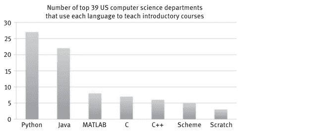

图2.1：编程语言的市场需求。
来源：https://doi.org/10.1515/9783110689488 (第8页)

##### 2016年美国开发者平均薪资

| 排名 | indeed.com估算值（美元） | 语言 |
|---|---|---|
| #1 | 115,000 | Swift |
| #2 | 107,000 | Python |
| | | Ruby |
| #3 | 104,000 | C++ |
| #5 | 102,000 | Java |
| | | C |
| #6 | 99,000 | JavaScript |
| #7 | 94,000 | C |
| #8 | 92,000 | SQL |
| #9 | 89,000 | PHP |

图2.2：按语言划分的平均薪资。

#### 2.1.5 为什么在移动应用开发中选择Python？

在当今世界，移动设备已成为我们日常生活中不可或缺的一部分，人们几乎无法在没有智能手机的情况下正常运作。这些设备极大地简化了我们的生活。认识到这一点，许多软件公司已将重点转向移动应用开发。然而，由于存在各种移动电话平台（如Android、iOS、Windows等），每个平台都有其独特的软件要求，开发移动应用面临诸多挑战。因此，程序员需要为每个平台编写原生代码，这是一项耗时的任务。为缓解此问题，建议采用跨平台方法。Python以其易用性和广泛的库支持，简化了应用开发过程。

Python的重要性可以从下图中看出，该图突出了各个行业的市场需求。Python以其简单性和多功能性而闻名，因为它可以在多个平台上学习和使用。它提供了与各种技术的强大集成能力，从而在整个开发生命周期中提高了编程生产力。Python特别适合大型和

#### 2.1.6 Python 版本

表 2.1：Python 版本。

| 版本 | 发布日期 |
| --- | --- |
| Python 1.0 | 1991 |
| Python 2.0 | 2000年10月 |
| Python 2.1 | 2001年4月 |
| Python 2.2 | 2001年12月 |
| Python 2.3 | 2003年7月 |
| Python 2.4 | 2004年11月 |
| Python 2.5 | 2006年9月 |
| Python 2.6 | 2008年10月 |
| Python 2.7 | 2010年7月 |
| Python 3.0 | 2008年12月 |
| Python 3.1 | 2009年6月 |
| Python 3.2 | 2011年2月 |
| Python 3.3 | 2012年9月 |
| Python 3.4 | 2014年3月 |
| Python 3.5 | 2015年9月 |
| Python 3.6 | 2016年12月 |
| Python 3.7 | 2018年6月 |
| Python 3.8 | 2019年10月 |
| Python 3.9 | 2020年10月 |
| Python 3.10 | 2021年10月 |
| Python 3.11 | 2022年10月 |
| Python 3.12 | 2023年10月 |

### 2.2 Python 语法与结构

Python 的语法与结构涵盖了指导 Python 代码编写和组织的规则与原则。

#### 2.2.1 缩进与空白字符

**缩进**
Python 采用缩进来定义代码块。与许多使用花括号 `{}` 或 `begin` 和 `end` 等关键字来界定代码块的其他编程语言不同，Python 依赖于统一的缩进。这一特性是 Python 的显著标志，对于代码的可读性和组织性至关重要。

```
def welcome(name):
    if name == "Ritesh":
        print("Hello, Ritesh!")
    else:
        print("Hello, stranger!")

# Call the function
welcome("Bob")
```

上面的例子说明了 `if-else` 代码块的范围是如何由缩进（即 `print` 语句和 `else` 语句前的空白）决定的。通常，这种缩进由四个空格组成，但也可以使用制表符。在整个代码库中保持所选缩进风格的一致性至关重要。

**空白字符**

空白字符（包括空格和制表符）在 Python 代码中用于分隔和提高清晰度。然而，过度或不一致地使用空白字符可能导致语法错误。

```
# Good use of whitespace for readability
total = 5 + 3 * 2

# Avoid excessive whitespace
total = 5 + 3 * 2
```

在示例中，第一种空白字符的使用清晰明了，增强了可读性。第二种使用方式，空格过多，虽然技术上正确，但可能会妨碍对代码的理解。通常建议遵循 PEP 8（Python 代码风格指南），该指南为代码布局（包括空白字符的使用）提供了指导。

#### 2.2.2 注释与文档

**注释**

Python 中的注释用于解释代码，使其更易于理解。注释不会被执行，并以 `#` 符号开头。

```
# This is a single-line comment

def add_numbers(a, b):
    # This function adds two numbers
    return a + b
```

注释对于记录代码、解释复杂部分或为其他开发者留下说明至关重要。然而，关键是要避免过度使用注释或陈述显而易见的内容，因为代码应尽可能做到自解释。

**文档**

文档指的是对代码更详尽的解释，通常以文档字符串的形式提供。文档字符串是三引号字符串，用于记录模块、函数、类或方法。

```
def multiply(a, b):
    """
    Multiply two numbers.

    Parameters:
    - a (int): The first number.
    - b (int): The second number.

    Returns:
    int: The result of multiplying a and b.
    """
    return a * b
```

此示例中的文档字符串提供了关于该函数的详细信息，包括其目标、参数和返回值。拥有适当文档的重要性怎么强调都不为过，因为它在帮助其他开发者理解如何使用你的代码方面起着至关重要的作用，同时也便于自动文档生成器等工具的顺畅运行。

### 2.3 数据类型与变量

Python 是一种动态类型语言，这意味着不需要显式声明变量的数据类型。然而，理解数据类型对于熟练编程至关重要。

#### 2.3.1 基本数据类型

基本数据类型是构建复杂数据结构的基本组成部分。在 Python 领域，常见的基本数据类型包括：
- **int (整数)：** 表示整数。
- **float (浮点数)：** 表示小数。
- **str (字符串)：** 表示文本数据。
- **bool (布尔值)：** 表示 True 或 False 值。
- **NoneType：** 表示值的缺失。

```
# Integer
age = 25

# Float
height = 5.8

# String
name = "John"

# Boolean
is_student = True

# NoneType
no_value = None
```

理解这些基本数据类型是在 Python 中使用变量的基础。

#### 2.3.2 列表与元组

**列表**

在 Python 编程语言领域，列表是一种高度灵活和动态的数据结构，在元素的组织和操作中扮演着关键角色。列表是可变的，遵循特定的顺序，并可以容纳不同数据类型的元素。本章深入探讨列表的复杂细节，通过大量示例阐明其创建、操作和各种操作。

**创建列表**

在方括号 `[]` 内定义一系列元素是 Python 中的一个基本操作，称为创建列表。列表是可变的，能够存储不同数据类型的数据，并允许在初始创建后修改其内容。

- **基本列表创建：**
要创建一个列表，只需将元素放在方括号内，并用逗号分隔。

```
fruits = ["apple", "banana", "orange"]
```

- **包含混合数据类型的列表：**
Python 列表能够容纳各种数据类型的元素，从而提供了高度的灵活性。

```
mixed_list = [1, "apple", 3.14, True]
```

- **空列表：**
空列表在创建时不包含任何元素，可用于动态填充。

```
empty_list = []
```

- **使用 `list()` 构造函数：**
可以通过使用构造函数 `list()` 从可迭代对象（如字符串、元组或其他列表）创建列表。

```
word_list = list("Python")

# Output: ['P', 'y', 't', 'h', 'o', 'n']
```

**嵌套列表**

列表可以嵌套，从而创建多维结构。

```
matrix = [[1, 2, 3], [4, 5, 6], [7, 8, 9]]
```

这里，`matrix` 是一个表示矩阵的二维列表。

**访问元素**

从 Python 列表中检索特定值涉及根据其索引访问元素。Python 中列表的索引从零开始，即第一个元素的索引为 0，第二个元素的索引为 1，依此类推。

- **基本索引：**
使用索引表示法访问列表中的元素，索引从 0 开始。

```
fruits = ["apple", "banana", "orange"]
first_fruit = fruits[0]

# Output: apple
```

- **负索引：**
负索引是列表中的一项功能，使我们能够从列表末尾检索元素，提供了一种向后导航元素的实用方法。最后一个元素的索引为 -1，倒数第二个元素的索引为 -2，依此类推。

```
fruits = ["apple", "banana", "orange", "kiwi", "grape"]

# Accessing elements using negative indexing
last_fruit = fruits[-1]   # Equivalent to fruits[4]
second_last = fruits[-2]  # Equivalent to fruits[3]

print(last_fruit)         # Output: grape
print(second_last)        # Output: kiwi
```

**列表切片**

列表切片能够通过从现有列表中提取元素子集来创建一个新列表。切片语法 **`list[start:stop:step]`** 使用起始索引作为起点，停止索引作为终点，步长作为元素之间的间隔。

```
numbers = [1, 2, 3, 4, 5, 6, 7, 8, 9]

# Basic slicing
subset1 = numbers[2:6]    # Elements from index 2 to 5
print(subset1)            # Output: [3, 4, 5, 6]
# Slicing with step
```

##### 修改元素

修改 Python 列表中的元素是处理可变数据结构的关键环节。列表允许我们更改特定索引处现有元素的值。

- **基本修改：**
要修改列表中的某个元素，可以使用其索引并为该索引指定一个新值。

```
fruits = ["apple", "banana", "orange"]
fruits[1] = "kiwi"

# 输出：["apple", "kiwi", "orange"]
```

- **修改多个元素：**
使用切片可以修改多个元素，方法是将一个新列表赋值给指定的索引范围。

```
numbers = [1, 2, 3, 4, 5]
numbers[1:4] = [10, 20, 30]

# 输出：[1, 10, 20, 30, 5]
```

- **使用负索引进行修改：**
负索引也可以用于修改，其用法与正索引类似。

```
fruits = ["apple", "kiwi", "orange"]
fruits[-1] = "grape"
# 输出：["apple", "kiwi", "grape"]
```

##### 添加元素

向 Python 列表中添加元素是一项基本操作，它允许你动态地扩展列表的大小。有多种方法可以向列表中添加元素，每种方法都有其特定的用途。

- **使用 append() 方法：**
可以使用 append() 等方法来添加元素，从而使列表能够动态增长。append() 方法用于将元素添加到列表的末尾。

```
fruits = ["apple", "banana", "orange"]
fruits.append("grape")

# 输出：["apple", "banana", "orange", "grape"]
```

- **使用 insert() 方法：**
insert() 方法允许在特定索引处添加一个元素。

```
fruits = ["apple", "banana", "orange"]
fruits.insert(1, "kiwi")

# 输出：["apple", "kiwi", "banana", "orange"]
```

- **使用 extend() 方法或 += 运算符：**
extend() 方法将一个可迭代对象（如另一个列表）中的元素添加到当前列表的末尾。+= 运算符可以实现相同的效果。

```
fruits = ["apple", "banana", "orange"]
new_fruits = ["grape", "kiwi"]
fruits.extend(new_fruits)

# 输出：["apple", "banana", "orange", "grape", "kiwi"]
```

在这个例子中，来自 `new_fruits` 列表的元素被添加到了 `fruits` 列表的末尾。

- **使用 += 运算符添加单个元素：**
+= 运算符也可以将单个元素添加到列表的末尾。

```
fruits = ["apple", "banana", "orange"]
fruits += ["grape"]

# 输出：["apple", "banana", "orange", "grape"]
```

在这个特定的例子中，元素 "grape" 通过使用 += 运算符被添加到了 `fruits` 列表中。

##### 移除元素

从 Python 列表中移除元素是维护和调整列表的一项基本操作。可以根据具体需求采用不同的方法。

- **使用 remove() 方法：**
remove() 函数负责从列表中移除第一个匹配的指定元素。

```
fruits = ["apple", "banana", "orange", "banana"]
fruits.remove("banana")

# 输出：["apple", "orange", "banana"]
```

在这个例子中，第一个 "banana" 元素从水果列表中被移除了。

- **使用 pop() 方法：**
pop() 方法用于移除并返回指定索引处的元素。如果未指定索引，则该方法会移除并返回最后一个元素。

```
fruits = ["apple", "banana", "orange"]
removed_fruit = fruits.pop(1)

# 输出：removed_fruit = "banana", fruits = ["apple", "orange"]
```

这里，索引为 1 的元素（"banana"）被移除并赋值给了变量 `removed_fruit`。

- **使用 del 语句：**
del 语句可用于按索引移除元素或删除整个列表。

```
fruits = ["apple", "banana", "orange"]
del fruits[1]

# 输出：["apple", "orange"]
```

在这个例子中，使用 del 语句移除了索引为 1 的元素（"banana"）。

- **使用 clear() 方法：**
clear() 方法会移除列表中的所有元素，使其变为空列表。

```
fruits = ["apple", "banana", "orange"]
fruits.clear()

# 输出：[]
```

##### 列表的长度

len() 函数用于计算给定列表中元素的数量。

```
num_elements = len(numbers)

# 输出：5
```

##### 嵌套列表

在 Python 编程语言中创建嵌套列表，意味着创建一个列表，其元素本身也是列表。这种技术有助于生成复杂的数据结构，包括但不限于矩阵或包含其他列表的列表。需要注意的是，外层列表中的每个元素本身都有可能是一个列表。

```
nested_list = [[1, 2, 3], ["a", "b", "c"]]
print(nested_list[0][1])

# 输出：2
```

##### 元组

Python 元组是一个由有序且不可变的元素组成的集合。元组一旦创建，其元素就不能被修改、添加或删除。元组使用圆括号 `()` 创建，可以存储多种数据类型，包括可以容纳不同数据类型的元素。下面将详细介绍元组操作，并附有示例和详细说明。

###### 创建元组

在 Python 中创建元组是一个简单的过程，只需使用圆括号 `()`。元组可以包含不同数据类型的元素，一旦创建，其值就不能更改。有多种方法可以创建元组：

- **使用圆括号：**
通常通过将元素括在圆括号中来创建元组，这是最常用的方法。

```
fruits_tuple = ("apple", "banana", "orange")
```

在这个例子中，`fruits_tuple` 是一个包含三个字符串元素的元组。

- **不使用圆括号：**
元组也可以在没有显式圆括号的情况下创建。仅使用逗号就足以定义一个元组。

```
numbers_tuple = 1, 2, 3
```

在这种情况下，`numbers_tuple` 是一个包含三个整数元素的元组。

- **混合数据类型：**
元组可以包含来自不同数据类型的元素。

```
mixed_tuple = (1, "apple", 3.14, True)
```

这里，`mixed_tuple` 是一个包含整数、字符串、浮点数和布尔值的元组。

- **创建空元组：**
可以使用一对空的圆括号来创建一个空元组。

```
empty_tuple = ()
```

`empty_tuple` 是一个没有元素的元组。

- **单元素元组：**
只包含一个元素的元组需要包含一个尾随逗号，以将其与括在圆括号中的普通值区分开来。

```
single_element_tuple = ("apple",)
```

这里，`single_element_tuple` 是一个包含单个字符串元素的元组。

###### 访问元素

访问元组中的元素与访问 Python 中其他序列（如列表或字符串）中的元素类似。元组使用从零开始的索引，可以使用方括号 `[]` 来检索单个元素。

- **基本索引：**
要访问元组中的元素，请在方括号内指定其索引。

```
fruits_tuple = ("apple", "banana", "orange")
first_fruit = fruits_tuple[0]

# 输出："apple"
```

在这个例子中，`first_fruit` 被赋值为索引 0 处的值，即 "apple"。

- **负索引：**
负索引可以从元组的末尾开始检索元素。

```
last_fruit = fruits_tuple[-1]

# 输出："orange"
```

这里，`last_fruit` 使用负索引被赋值为最后一个元素的值。

- **切片：**
元组切片允许你通过提取元素的子集来创建一个新的元组。

```
numbers_tuple = (1, 2, 3, 4, 5)
subset = numbers_tuple[1:4]

# 输出：(2, 3, 4)
```

在这个例子中，`subset` 包含从索引 1 到 3 的元素。

- **省略索引：**
在对元组进行切片时，如果未提供起始或结束索引，则默认行为是分别使用元组的开头或结尾。

##### 不可变特性

元组在Python中区别于其他数据结构（如列表）的特征在于其不可变性。不可变性意味着，一旦元组被创建，其元素就不能被更改、调整、追加或删除。

```python
tuple2[1] = "kiwi" # 引发 TypeError
```

- **不允许修改元素：**
  - 元组一旦创建，就不能更改其元素的值。
  - 修改元组将导致 `TypeError` 的发生。

```python
fruits_tuple = ("apple", "banana", "orange")
fruits_tuple[1] = "kiwi" # 引发 TypeError
```

- **禁止添加和删除元素：**
  - 元组不支持像 `append()` 或 `remove()` 这样就地修改元组的操作。
  - 我们无法向现有元组添加或删除元素。

```python
fruits_tuple.append("grape") # 引发 AttributeError
```

- **通过迭代保持不可变：**
  - 元组的不可变性延伸到其包含的所有元素。
  - 如果元组包含可变对象（例如列表），元组本身保持不可变，但其内部的对象可以被修改。

```python
nested_tuple = ([1, 2, 3], "apple")
nested_tuple[0][1] = 10 # 有效，因为元组内的列表是可变的
```

##### 元组解包

元组解包是Python编程语言中的一项功能，它便于在单行代码中将元组的值分配给单独的变量。这一特性提供了一种实用且高效的方法，从元组中提取元素并将其分配给变量，从而消除了对多条赋值语句的需求。

###### 基本元组解包

```python
# 创建一个元组
coordinates = (3, 7)

##### 元组解包
x, y = coordinates

# 变量 x 和 y 现在分别持有值 3 和 7
```

在此示例中，`coordinates` 元组的值被分解到变量 `x` 和 `y` 中。赋值左侧的变量数量必须与元组中的元素数量相对应，这一点至关重要。

### 在函数中解包：

元组解包常用于函数返回值，以便方便地捕获多个值。

```python
def get_coordinates():
    return 5, 10

# 调用函数并解包结果
x, y = get_coordinates()
# x 现在是 5，y 现在是 10
```

这里，函数 `get_coordinates` 返回一个元组，在调用函数时，值被解包到变量 `x` 和 `y` 中。

### 扩展解包：

在Python中，我们可以使用 `*` 运算符在解包时捕获剩余的元素。

```python
# 创建一个元组
numbers = (1, 2, 3, 4, 5)

# 使用扩展解包
first, *rest, last = numbers

# first 是 1，rest 是 [2, 3, 4]，last 是 5
```

在此示例中，`*rest` 语法捕获了元组中第一个和最后一个元素之间的所有元素。

- **忽略元素：**
  我们可以在解包期间使用下划线 `_` 来忽略特定元素。

```python
# 创建一个元组
point = (8, 3, 5)

# 解包并忽略中间值
x, _, z = point

# x 是 8，z 是 5
```

这里，下划线 `_` 用于忽略元组中的第二个元素。

#### 2.3.3 字典和集合

##### 字典

Python字典是一种键值对的非序列聚合，其中每个键必须是唯一的。在其他编程语言中，字典被称为关联数组或哈希映射。它们通过使用花括号 `{}` 创建，并包含键及其对应的值。

###### 创建字典

使用花括号 `{}` 定义一组键值对是创建Python字典的基本步骤。字典中的每个键都必须是唯一的，这一点至关重要，因为键与其对应的值是内在关联的。字典提供了一种灵活且有效的方式来组织和通过键检索数据。

- **基本字典创建：**

```python
# 创建一个学生信息字典
student = {
    "name": "John Doe",
    "age": 20,
    "grade": "A",
    "courses": ["Math", "Physics", "English"]
}
```

在这个特定实例中，创建了一个名为“student”的字典，由四对键值组成。这些键确实是字符串——具体是“name”、“age”、“grade”和“courses”——而值可以是各种数据类型。这些数据类型包括字符串、整数、列表，甚至有趣的是，其他字典。

- **创建空字典：**
  可以通过使用空的花括号 `{}` 来生成一个空字典。

```python
# 创建一个空字典
empty_dict = {}
```

- **包含混合数据类型的字典：**
  字典能够存储属于各种数据类型的值。

```python
# 创建一个包含混合数据类型的字典
mixed_dict = {
    "name": "Alice",
    "age": 25,
    "is_student": False,
    "grades": {"Math": "A", "English": "B"}
}
```

这里，“grades”键关联到另一个包含科目成绩的字典。

- **使用 `dict()` 构造函数：**
  我们也可以通过使用 `dict()` 构造函数并提供键值对作为参数来构建字典。

```python
# 使用 dict() 构造函数创建字典
fruit_dict = dict(apple=3, banana=5, orange=2)
```

###### 访问字典中的元素

在Python中访问字典中的元素涉及检索与特定键关联的值。字典使用键来唯一标识和访问其对应的值。

- **基本访问：**

```python
# 创建一个学生信息字典
student = {
    "name": "John Doe",
    "age": 20,
    "grade": "A",
    "courses": ["Math", "Physics", "English"]
}

# 使用键访问元素
student_name = student["name"]
student_age = student["age"]
```

在此示例中，与键“name”和“age”关联的值被访问并分配给变量。

### 使用 `get()` 获取默认值：

`get()` 方法允许指定一个默认值，该值将在未找到键时返回。

```python
# 使用 get() 提供默认值
instructor = student.get("instructor", "Not specified")

# 如果 "instructor" 键存在，instructor 将包含其值；
# 否则，它将是 "Not specified"
```

### 处理键错误：

如果尝试检索字典中不存在的键，将导致 `KeyError` 的发生。为防止这种情况，可以使用 `get()` 方法，如果未找到指定的键，它将返回 `None` 值。

```python
# 使用 get() 处理键错误
grade = student.get("grade")

# 如果 "grade" 键存在，grade 将包含其值；否则，它
# 将是 None
```

### 检查键是否存在：

我们可以在访问字典中的特定键之前，使用“in”关键字来验证其是否存在。

```python
###### 检查键是否存在
if "courses" in student:
    student_courses = student["courses"]
else:
    student_courses = []
```

- **使用 `keys()`、`values()` 和 `items()` 方法：**
  `keys()`、`values()` 和 `items()` 方法分别提供了检索键、值和键值对的手段。

```python
###### 访问键、值和项
all_keys = student.keys()
all_values = student.values()
all_items = student.items()
```

###### 修改和添加字典中的元素

在Python中修改和添加字典中的元素是常见操作，允许我们更新字典的内容。

- **修改现有元素：**

```python
# 创建一个学生信息字典
student = {
    "name": "John Doe",
    "age": 20,
    "grade": "A",
    "courses": ["Math", "Physics", "English"]
}
# 修改与 "age" 键关联的值
student["age"] = 21
```

在此实例中，与标识符“age”关联的数值已从20更改为21。

- **添加新元素：**

```python
# 创建一个学生信息字典
student = {
    "name": "John Doe",
    "age": 20,
    "grade": "A",
    "courses": ["Math", "Physics", "English"]
}
# 添加一个新的键值对用于 "gender" 信息
student["gender"] = "Male"
```

这里，一个由键“gender”和值“Male”组成的新键值对被添加到字典中。

## 修改或添加多个元素：
`update()` 方法允许同时修改或添加多个元素。

```python
# 创建一个学生信息字典
student = {
    "name": "John Doe",
    "age": 20,
    "grade": "A",
    "courses": ["Math", "Physics", "English"]
}

# 修改和添加多个元素
student.update({"age": 21, "gender": "Male", "city": "New York"})
```

在这个特定实例中，`update()` 方法被用于更改与“age”键关联的值，为“gender”属性引入一个新的键值对，并为“city”属性添加另一个新的键值对。

###### 从字典中删除元素
在 Python 中处理字典时，删除特定的键值对是一项常见任务。这可以通过多种方法来实现。

- 使用 `del` 语句：
`del` 语句提供了从字典中删除特定键及其对应值的功能。

```python
# 创建一个学生信息字典
student = {
    "name": "John Doe",
    "age": 20,
    "grade": "A",
    "courses": ["Math", "Physics", "English"]
}

# 删除 "grade" 键及其值
del student["grade"]
```

在这个特定实例中，字典的键“grade”及其对应的值通过使用 `del` 语句从字典中提取出来。

- 使用 `pop()` 方法：
`pop()` 函数有效地删除一个指定的键，并随后返回与之关联的值。此外，该函数还提供了在找不到指定键时提供预设值的能力。

```python
# 创建一个学生信息字典
student = {
    "name": "John Doe",
    "age": 20,
    "grade": "A",
    "courses": ["Math", "Physics", "English"]
}

# 删除并获取与 "courses" 键关联的值
courses = student.pop("courses")
```

“courses”键及其对应的值从字典中提取出来，然后该值被赋给变量 `courses`。

- 使用 `popitem()` 方法：
`popitem()` 函数用于删除并返回字典中找到的最后一个键值对。需要认识到的是，从 Python 3.7 开始，数据插入的顺序保持不变。

```python
# 创建一个学生信息字典
student = {
    "name": "John Doe",
    "age": 20,
    "grade": "A",
    "courses": ["Math", "Physics", "English"]
}

# 删除并获取最后一个键值对
last_item = student.popitem()
```

在这个实例中，字典中的最后一个键值对被删除并赋给变量 `last_item`。

- 使用 `clear()` 方法：
`clear()` 函数从字典中删除所有键值对，使其变为空状态。

```python
# 创建一个学生信息字典
student = {
    "name": "John Doe",
    "age": 20,
    "grade": "A",
    "courses": ["Math", "Physics", "English"]
}

# 清空字典中的所有元素
student.clear()
```

调用 `clear()` 后，字典为空。

##### 集合
Python 集合是一个无序的、由不同元素组成的集合。集合通过使用花括号 `{}` 建立，对于多种操作非常有用，例如验证成员资格、发现交集、并集和集合之间的差异。

###### 创建集合
在 Python 中创建集合是定义一个无序的唯一元素集合的过程。集合用花括号 `{}` 表示，可以通过使用现有的可迭代对象（如列表）或显式地声明元素来形成。

- 基本集合创建：

```python
# 使用显式元素创建集合
fruits_set = {"apple", "banana", "orange"}

# 创建一个空集合
empty_set = set()
```

在第一个实例中，建立了一个名为 `fruits_set` 的集合，包含三个元素：“apple”、“banana”和“orange”。在后续示例中，一个名为 `empty_set` 的空集合通过使用 `set()` 构造函数生成。

- 从可迭代对象创建集合：

```python
# 从列表创建集合
colors_list = ["red", "green", "blue", "red"]

colors_set = set(colors_list)
```

在这个实例中，`set()` 构造函数被用于从名为 `colors_list` 的列表生成一个名为 `colors_set` 的集合。需要注意的是，集合本质上会消除任何重复元素，从而生成一个仅包含唯一元素的集合。

###### 向集合中添加元素
在 Python 中向集合中添加项目的过程是通过使用 `add()` 函数添加单个元素和使用 `update()` 函数添加多个元素来完成的。

- 添加单个元素：
要向集合中添加单个元素，可以使用 `add()` 方法。

```python
# 创建一个集合
fruits_set = {"apple", "banana", "orange"}

# 添加单个元素
fruits_set.add("kiwi")
```

在这个特定实例中，通过使用 `add()` 方法将元素“kiwi”添加到 `fruits_set` 中。

- 添加多个元素：
要向集合中添加多个元素，可以通过提供一个可迭代对象（如列表或另一个集合）来使用 `update()` 函数。

```python
# 创建一个集合
fruits_set = {"apple", "banana", "orange"}

# 添加多个元素
fruits_set.update(["grape", "pineapple"])
```

`fruits_set` 通过使用 `update()` 方法添加了元素“grape”和“pineapple”。

###### 从集合中删除元素
在 Python 中从集合中删除元素需要使用诸如 `remove()`、`discard()` 和 `pop()` 等技术。这些技术提供了从集合中删除元素的不同方法。

- 使用 `remove()` 方法：
`remove()` 函数用于从集合中删除特定元素。如果该元素不存在，它将引发一个 `KeyError`。

```python
# 创建一个集合
fruits_set = {"apple", "banana", "orange"}

# 删除特定元素
fruits_set.remove("banana")
```

在这个示例中，元素“banana”从 `fruits_set` 中被移除。

- 使用 `discard()` 方法：
`discard()` 方法从集合中删除特定元素。如果该元素不存在，则不执行任何操作，也不会引发错误。

```python
# 创建一个集合
fruits_set = {"apple", "banana", "orange"}

# 丢弃一个元素
fruits_set.discard("kiwi")
```

这里，元素“kiwi”从 `fruits_set` 中被丢弃，但如果“kiwi”不存在，它不会引发错误。

- 使用 `pop()` 方法：
`pop()` 函数负责从集合中删除并返回一个任意元素。如果集合为空，它将生成一个 `KeyError`。

```python
# 创建一个集合
fruits_set = {"apple", "banana", "orange"}

# 弹出一个任意元素
popped_element = fruits_set.pop()
```

在这个实例中，一个随机元素从 `fruits_set` 中被移除，其值随后被赋给变量 `popped_element`。

- 清空整个集合：
`clear()` 方法从集合中删除所有元素，使其变为空集合。

```python
# 创建一个集合
fruits_set = {"apple", "banana", "orange"}

# 清空集合中的所有元素
fruits_set.clear()
```

调用 `clear()` 后，`fruits_set` 变成一个空集合。

###### 集合操作
Python 中的集合支持各种操作，使我们能够执行常见的集合相关任务。以下是基本的集合操作：

- 并集 (`|`) – 合并集合：
两个集合的并集包含来自两个集合的所有不同元素。

```python
set1 = {1, 2, 3}
set2 = {3, 4, 5}

union_set = set1 | set2
# 或者使用方法：union_set = set1.union(set2)

# 输出：{1, 2, 3, 4, 5}
```

- 交集 (`&`) – 共同元素：
两个集合的交集包含两个集合共有的元素。

```python
set1 = {1, 2, 3}
set2 = {3, 4, 5}

intersection_set = set1 & set2
# 或者使用方法：intersection_set = set1.intersection(set2)

# 输出：{3}
```

- 差集 (`-`) – 在第一个集合中但不在第二个集合中的元素：
两个集合的差集包含存在于第一个集合中但不属于第二个集合的元素。

```python
set1 = {1, 2, 3}
set2 = {3, 4, 5}
```

### 2.4 控制结构

Python 中的控制语句用于调节程序内的执行流程。它们使我们能够根据预定条件做出决策、遍历代码块或跳过特定代码部分。Python 中的关键控制语句包括以下几种：

- 条件语句
- 循环

#### 2.4.1 条件语句

编程中的条件语句是允许根据指定条件执行不同代码块的结构。这些结构使程序能够进行判断、在不同操作之间进行选择，并控制执行流程。条件语句对于编写动态和适应性强的代码至关重要。

条件语句在设计算法、处理用户输入以及响应程序中的各种场景方面发挥着基础性作用。它们有助于构建计算机程序的逻辑结构和决策能力。

其基本概念是评估特定条件的真假，然后根据结果执行不同的代码部分。

- **if 语句：**
if 语句用于在指定条件为真时执行一段代码块。

###### 语法

```python
if condition:
    # 如果条件为真，则执行此代码

x = 10
if x > 5:
    print("x is greater than 5")
```

在此示例中，仅当条件 `x > 5` 被验证为真时，才会执行 print 语句。

- **if-else 语句：**
if-else 语句提供了在给定条件为真时执行特定代码块，而在条件为假时执行另一段不同代码块的能力。

```python
if condition:
    # 如果条件为真，则执行此代码
else:
    # 如果条件为假，则执行此代码

x = 3

if x % 2 == 0:
    print("x is even")
else:
    print("x is odd")
```

在此实例中，程序将根据条件输出 x 是偶数还是奇数。

- **if-elif-else 语句：**
if-elif-else 语句是 if-else 语句的扩展，允许按顺序检查多个条件。

```python
if condition1:
    # 如果 condition1 为真，则执行此代码
elif condition2:
    # 如果 condition2 为真，则执行此代码
else:
    # 如果没有条件为真，则执行此代码

x = 0

if x > 0:
    print("x is positive")
elif x < 0:
    print("x is negative")
else:
    print("x is zero")
```

此示例中的程序会验证 x 是正数、负数还是零，并显示相应的通知。

#### 2.4.2 循环

编程中的循环语句允许根据指定条件多次执行指定的代码块。它们在自动化重复任务、遍历数据集合以及执行操作直到满足特定条件方面起着至关重要的作用。Python 提供两种主要的循环语句类型：for 循环和 while 循环。

- **for 循环：**
for 循环用于遍历一个序列，无论是列表、元组、字符串、范围，还是任何其他可迭代对象。此循环对序列中的每个元素执行一组指令。

###### 语法

```python
for variable in iterable:
    # 每次迭代要执行的代码

fruits = ["apple", "banana", "orange"]
for fruit in fruits:
    print(fruit)
```

在此示例中，for 循环遍历水果列表，循环内的代码打印每个水果。

- **while 循环：**
while 循环在指定条件保持为真时持续执行一段代码块。它会迭代执行，直到条件变为假。

###### 语法

```python
while condition:
    # 只要条件为真，就执行此代码

count = 0
while count < 5:
    print(count)
    count += 1
```

在此特定情况下，while 循环会输出 count 值，并在每次迭代中将其增加 1，前提是 count 小于 5。

### 2.5 函数与模块

函数和模块是 Python 中的基本原则，它们支持代码的组织、可读性和可重用性。函数封装了代码逻辑，而模块和包则提供了一种结构化的方法来组织和聚合相关功能。

Python 中的函数使我们能够封装和重用代码，从而提高程序的可读性和可维护性。

模块和包有助于将代码组织成可管理的单元，从而便于代码重用和维护。

#### 2.5.1 定义函数

在 Python 中，函数是为了执行特定任务而创建的可重用代码块。函数在组织代码、提高可读性和鼓励代码重用方面起着至关重要的作用。

在 Python 中定义函数时，使用 `def` 关键字，后跟函数名、一组可包含可选参数的括号和一个冒号。函数体是缩进的，并且可以包含一个 return 语句，该语句指定函数的输出。

###### 语法

```python
def function_name(parameters):
    # 要执行的代码
    return result # 可选
```

**示例 1：简单的加法函数：**

```python
def add_numbers(a, b):
    sum_result = a + b
    return sum_result

# 调用函数
result = add_numbers(5, 3)
print(result) # 输出：8
```

在此示例中，`add_numbers` 函数接受两个参数 `a` 和 `b`，对它们执行求和操作，然后将结果作为返回值提供。

**示例 2：问候函数：**

```python
def greet(name):
    greeting_message = f"Hello, {name}!"
    return greeting_message

# 调用函数
message = greet("Alice")
print(message) # 输出：Hello, Alice!
```

这里，`greet` 函数接受一个 `name` 参数，并返回一条个性化的问候消息。

**示例 3：带默认参数的平方函数：**

```python
def square_number(number, power=2):
    result = number ** power
    return result

# 调用函数
square_result = square_number(4)
print(square_result) # 输出：16

# 使用不同的幂次调用函数
cube_result = square_number(4, 3)
print(cube_result) # 输出：64
```

在此特定示例中，`square_number` 函数的默认行为是计算给定数字的平方，但也可以将其配置为计算立方或任何其他所需的幂次。

#### 2.5.2 Lambda 函数

Lambda 函数，也称为“匿名函数”，其特点是简洁，常用于执行小型、简单的任务。这些函数通过使用 `lambda` 关键字建立，能够接受任意数量的参数；但是，它们仅限于包含单个表达式。当处理可以作为参数传递给高阶函数的临时操作时，使用 Lambda 函数尤其有利。

当需要一个小型的一次性函数，并且使用 `def` 定义完整函数显得过于冗长时，Lambda 函数特别有用。它们通常用于函数被视为一等公民的情况，例如将函数作为参数传递给高阶函数时。

###### 语法

```python
lambda arguments: expression
```

`lambda` 关键字后跟一系列参数、一个冒号和一个表达式。表达式的结果构成了 lambda 函数的输出值。

##### 示例 1：两数相加

```python
add_numbers = lambda x, y: x + y

result = add_numbers(5, 3)
print(result) # Output: 8
```

在此示例中，定义了一个名为 `add_numbers` 的 lambda 函数，用于计算两个数字的和。随后，使用参数 5 和 3 调用该 lambda 函数，并显示结果。

##### 示例 2：数字平方

```python
square = lambda x: x ** 2
result = square(4)
print(result) # Output: 16
```

定义了一个名为 `square` 的 lambda 函数，用于计算给定数字的平方。接着，使用输入参数 4 调用该 lambda 函数，并显示结果。

##### 示例 3：检查数字是否为偶数

```python
is_even = lambda x: x % 2 == 0
result = is_even(7)
print(result) # Output: False
```

在此示例中，建立了一个名为 `is_even` 的 lambda 函数，用于验证给定数字是否能被二整除而无余数。随后，使用参数 7 调用该 lambda 函数，并显示结果。

#### 2.5.3 模块与包

Python 中用于增强代码组织性、可读性和可复用性的基本概念是模块和包。模块允许将相关代码封装到不同的文件中，而包则提供了一种在分层目录中组织这些模块的方法。

##### 模块

Python 模块是一个包含 Python 定义、语句和函数的文件。这使得可以将相关代码组织到不同的文件中，从而提高代码的模块化和可维护性。通过将模块导入到其他 Python 脚本中，可以使用该模块中定义的函数、类和变量。

###### 创建模块的语法 (my_module.py)

```python
# my_module.py

def add(a, b):
    return a + b

def subtract(a, b):
    return a - b
```

###### 在另一个脚本中使用模块 (main_program.py)

```python
# main_program.py

import my_module

result = my_module.add(5, 3)
print(result) # Output: 8
```

在此特定示例中，模块 `my_module` 包含用于加法和减法的函数。将此模块导入到 `main_program.py` 文件中，即可使用 `add` 函数。

##### 包

包是一种在统一目录结构中组织相关模块的方法。其目的是防止不同模块之间的命名冲突。本质上，包是一个包含多个 Python 文件（也称为“模块”）的目录。要使一个目录被视为包，必须包含一个名为 `__init__.py` 的指定文件。

###### 包结构

```
my_package/
|-- __init__.py
|-- module1.py
|-- module2.py
```

###### 使用包中的模块 (main_program.py)

```python
# main_program.py

from my_package import module1

result = module1.square(4)
print(result) # Output: 16
```

在此示例中，`my_package` 是一个包，`module1` 是该包中的一个模块。`main_program.py` 中使用了来自 `module1` 的 `square` 函数。

### 2.6 文件操作

在任何编程语言中，从文件读取和写入文件的能力都是数据存储、检索和操作的关键方面。在 Python 中，借助内置函数和方法，文件操作变得简单。打开、读取和写入文件允许进行持久化数据存储以及程序间的信息交换。

在 Python 中处理文件对于管理数据持久性和外部数据源至关重要。它提供了一种与存储在磁盘上的数据交互的方式，使得 Python 程序能够与外部数据集成，并促进高效的数据管理。

#### 2.6.1 文件 I/O

Python 中的文件 I/O 涉及从文件检索数据和将数据存储到文件的过程。Python 提供了一系列用于文件 I/O 的预定义函数和方法，使您能够与操作系统上的文件进行交互。文件 I/O 的基本组成部分包括启动文件访问、从文件获取数据、将数据写入文件以及最终终止文件访问。

##### 打开文件

Python 的 `open()` 函数是一个内置函数，用于启动打开文件的过程。此函数是 Python 编程语言中文件管理的重要组成部分，支持多种与文件相关的任务，如读取、写入和追加。执行 `open()` 函数后，会返回一个文件对象，该对象提供了一系列用于操作文件的方法。

###### 语法

```python
file = open("filename.txt", "mode")
```

- `file`：指定文件路径或名称。
- `mode`：指定操作模式（可选；默认为 'r'，表示读取）。

###### 模式

- 'r'：以读取模式打开文件。
- 'w'：以写入模式打开文件。如果文件已存在，则将其截断。
- 'a'：以写入模式打开文件，但如果文件已存在，则将新数据追加到末尾。
- 'b'：在模式后附加 'b' 表示二进制文件（例如 'rb' 或 'wb'）。
- 'x'：如果文件已存在，则失败。
- 't'：在模式后附加 't' 表示文本文件（例如 'rt' 或 'wt'）。

```python
# 以读取模式打开文件
file = open("example.txt", "r")
```

###### 使用 "with" 语句

`with` 语句与文件操作结合使用，以确保在操作完成后正确关闭文件。

```python
with open("example.txt", "r") as file:
    content = file.read()
    # 对内容执行操作

# 文件在 "with" 块外自动关闭
```

##### 从文件读取

在 Python 中从文件读取涉及以特定模式打开文件、读取其内容，然后关闭文件。Python 提供了多种方法来从文件读取不同数量的数据。

- **打开文件进行读取：**
  使用 `open()` 函数以读取模式 ('r') 启动访问文件的过程。或者，可以显式指定 'rt' 以表示文本模式。

```python
with open("example.txt", "r") as file:
    # 文件操作在此处进行
```

- **读取全部内容：**
  `read()` 函数检索文件的完整内容，并将其作为统一的字符串呈现。

```python
with open("example.txt", "r") as file:
    content = file.read()
    print(content)
```

- **逐行读取：**
  `readline()` 函数负责在每次调用时从文档中读取单行。此功能在处理大文件时非常有用。

```python
with open("example.txt", "r") as file:
    line = file.readline()
    while line:
        print(line.strip()) # strip() 移除换行符
        line = file.readline()
```

- **将所有行读入列表：**
  名为 `readlines()` 的方法负责读取并检索文件中的所有行，然后以列表形式呈现它们。

```python
with open("example.txt", "r") as file:
    lines = file.readlines()
    for line in lines:
        print(line.strip())
```

- **使用 for 循环遍历行：**
  我们还可以直接遍历文件对象，从而自动读取行。

```python
with open("example.txt", "r") as file:
    for line in file:
        print(line.strip())
```

##### 写入文件

要在 Python 中执行文件写入操作，首先需要使用指定模式打开文件，然后将所需数据写入其中，最后关闭文件。在 Python 编程语言中，存在多种方法可以方便地将数据写入文件。

- **打开文件进行写入：**
  使用 `open()` 函数以写入模式 ('w') 启动打开文件的过程。如果文件已存在，以写入模式打开将导致其当前内容被删除。相反，如果文件不存在，则会生成一个新文件。

```python
with open("output.txt", "w") as file:
    # 文件操作在此处进行
```

- **将内容写入文件：**
  使用 `write()` 函数将信息写入文件。它能够写入各种类型的数据，例如字符串、数字或任何其他可以转换为字符串的数据格式。

```python
with open("output.txt", "w") as file:
    file.write("This is a sample sentence.")
```

- **追加到文件：**
  要向现有文件追加新内容而不替换其当前内容，可以以追加模式 ('a') 打开文件。随后，`write()` 方法会将新内容追加到文件的末尾。

```python
with open("output.txt", "a") as file:
    file.write("\nAppending new content.")
```

-   写入多行内容：
可以通过重复使用 `write()` 方法，或者向 `writelines()` 方法提供字符串序列，将多行内容写入文件。

```
lines = ["Line 1\n", "Line 2\n", "Line 3\n"]
with open("output.txt", "w") as file:
    file.writelines(lines)
```

### 2.7 使用库

在 Python 中，库（也称为模块或包）是预先编写的代码集合，它们提供了超出 Python 语言基本功能的能力。使用库是 Python 开发的一个基本方面，它使我们能够利用现有代码来高效地解决特定问题。

#### 2.7.1 导入库

在 Python 中导入库是编程不可或缺的一部分，因为它使我们能够利用其他人创建的现有代码和功能。导入过程可以通过多种方法完成，以下示例说明了不同的方法。这使我们能够利用广泛的功能，从而提高代码的效率和可管理性。

-   导入整个库：

```
# 示例：使用 math 库计算平方根
import math

result = math.sqrt(25)
print(result) # 输出：5.0
```

在此示例中，使用 `import` 关键字导入整个 `math` 库。随后，使用 `math.sqrt()` 函数计算 25 的平方根。

-   导入特定模块或函数：

```
# 示例：仅从 math 库导入 sqrt 函数
from math import sqrt

result = sqrt(25)
print(result) # 输出：5.0
```

在此情况下，仅从 `math` 库导入 `sqrt` 函数。这种方法消除了在使用函数时需要在其前面加上库名的需要。

-   使用别名导入：

```
# 示例：为 pandas 库使用别名
import pandas as pd

data = pd.read_csv("data.csv")
print(data.head())
```

这里，`pandas` 库以别名 `pd` 导入。这是一种常见的约定，旨在简化代码并使其更具可读性。然后使用 `pd` 别名调用 `pandas` 库中的函数。

-   从库中导入所有模块：

```
# 示例：从 datetime 库导入所有模块
from datetime import *

current_date = date.today()
print(current_date) # 输出：2023-12-12
```

使用 `*` 通配符导入所有模块，允许我们使用所有函数和类，而无需显式提及它们。然而，这种方法通常不被推荐，以避免名称冲突。

#### 2.7.2 常用 Python 库概览

Python 库构成了各种 Python 应用程序的支柱，为数据科学、机器学习、网络开发等不同领域提供解决方案。根据我们的项目需求，我们可以选择最适合我们需求的库。

##### NumPy

-   **描述：** NumPy 是 Numerical Python 的缩写，包含一个专门为 Python 设计的全面的数值运算函数集合。

##### 主要特性

-   通过使用多维数组，可以实现对大型、同质数组的高效操作。
-   数学函数：提供广泛的数学函数以方便数组操作。

###### 用例

-   科学计算和数据分析。
-   线性代数运算。
-   信号处理和图像分析。

##### Pandas

-   **描述：** Pandas 是一个用于操作和分析数据的库。

##### 主要特性

-   DataFrame：用于数据操作的二维表格。
-   Series：一维带标签的数组。
-   数据清理、合并和重塑工具。

###### 用例

-   数据探索和分析。
-   数据清理和准备。
-   时间序列数据分析。

##### Matplotlib

-   **描述：** Matplotlib 是一个备受推崇的用于生成可视化的库，涵盖静态、动画和交互式可视化领域。

##### 主要特性

-   折线图、散点图、柱状图等。
-   支持 LaTeX 数学表达式。
-   可自定义的图表和样式。

###### 用例

-   用于分析和展示的数据可视化。
-   创建出版物质量的图表。

##### Requests

-   **描述：** Requests 是一个旨在简化 HTTP 请求执行的库。

##### 主要特性

-   HTTP 方法（GET、POST、PUT、DELETE 等）。
-   会话处理和 Cookie 支持。
-   使用 **asyncio** 进行异步请求。

###### 用例

-   网页抓取和数据提取。
-   与 RESTful API 交互。
-   发送 HTTP 请求和处理响应。

##### Scikit-learn

-   **描述：** Scikit-learn 是一个用于经典机器学习算法的库，是机器学习领域广泛使用的工具。

##### 主要特性

-   分类、回归、聚类和降维算法可归类为数据分析的不同计算技术类型。
-   模型选择和评估工具。
-   支持预处理和特征工程。

###### 用例

-   构建和评估机器学习模型。
-   数据分析和探索。

##### TensorFlow 和 PyTorch

-   **描述：** TensorFlow 和 PyTorch 是深度学习库。

##### 主要特性

-   定义、训练和部署神经网络。
-   支持自动微分。
-   广泛的机器学习和深度学习生态系统。

###### 用例

-   深度学习模型开发。
-   自然语言处理和计算机视觉任务。

##### Django 和 Flask

-   **描述：** Django 和 Flask 是用于构建 Web 应用程序的 Web 框架。

##### 主要特性

-   Django：具有内置功能（管理后台、身份验证等）的高级框架。
-   Flask：用于轻量级和灵活应用程序的微框架。

###### 用例

-   开发 Web 应用程序和 API。
-   快速开发和可扩展性。

##### Beautiful Soup

-   **描述：** Beautiful Soup 是一个用于从 HTML 和 XML 文件中提取数据的网页抓取库。

##### 主要特性

-   解析 HTML 和 XML 文档。
-   导航解析树并搜索特定元素。

###### 用例

-   从网站抓取数据。
-   从 HTML 和 XML 中提取信息。

##### SQLAlchemy

-   **描述：** SQLAlchemy 是一个作为 SQL 操作工具包的库，同时也提供对象关系映射（ORM）功能。

##### 主要特性

-   SQL 表达式语言和 ORM。
-   连接池和事务管理。

###### 用例

-   Python 中的数据库交互。
-   数据库的对象关系映射。

##### OpenCV

-   **描述：** OpenCV 是一个用于图像和视频处理的计算机视觉库。

##### 主要特性

-   图像和视频操作。
-   特征提取和目标检测。

###### 用例

-   计算机视觉应用。
-   图像和视频分析。

### 2.8 Python 中的面向对象编程

面向对象编程（OOP）是一种编程范式，它采用“对象”来组织和构建代码。对象是类的实例，类是由用户创建的数据类型，它封装了数据（属性）和操作数据的过程（方法）。Python 是一种遵循面向对象编程原则的编程语言，这些原则被巧妙地融入其语法和设计中。

#### 2.8.1 类和对象

##### 类

-   类作为创建对象的蓝图或模板，指定了对象的属性和方法。
-   在 Python 中定义类使用关键字 `class`。

在 Python 中声明类的结构如下所示：

```
class ClassName:
    def __init__(self, parameter1, parameter2, ...):
        # 构造函数或初始化方法
        # 设置实例属性
```

def method1(self, parameter1, parameter2, ...):
    # 方法1定义
    # 使用 self 访问实例属性
def method2(self, parameter1, parameter2, ...):
    # 方法2定义
    # 使用 self 访问实例属性

- `class` 关键字用于声明一个类。在提供的示例中，类的名称由 `ClassName` 表示。
- 构造函数（`__init__`）方法：
    - `__init__` 方法被称为“构造函数”，它是一个特殊的方法，在从类创建对象时会自动执行。
    - 它负责初始化对象的属性。`self` 参数用于引用类的实例，并引用实例属性。
- 其他方法：
    - 类中的其他方法像普通函数一样定义，以 `self` 作为第一个参数。
    - 这些方法可以执行各种操作并访问实例属性。

##### 示例

```python
class Car:
    def __init__(self, make, model, year):
        self.make = make
        self.model = model
        self.year = year

    def display_info(self):
        return f"{self.year} {self.make} {self.model}"
```

给定的示例演示了一个名为 `Car` 的类的实现。这个类拥有 `make`、`model` 和 `year` 属性，以及一个名为 `display_info` 的方法。初始化方法 `__init__` 负责为 `Car` 对象的属性赋值。

##### 对象

在 Python 中，对象代表一个类的实例。类是指定特性和功能的设计蓝图，而对象则是该设计的具体体现。对象在 Python 中扮演着至关重要的角色，因为它们使我们能够在代码中模拟和与现实世界的实体进行交互。对象的建立有助于维护模块化和结构化的框架，从而提高代码的可读性和可管理性。

- **创建对象：**
    要实例化一个类的实例，可以像调用函数一样调用该类。这样做会调用构造函数（`__init__`）方法，并传递指定的初始值。

    ```python
    # 创建类的对象
    object_name = ClassName(initial_value1, initial_value2, ...)

    # 创建 Car 类的对象
    car1 = Car("Toyota", "Camry", 2022)
    car2 = Car("Honda", "Civic", 2021)
    ```

    这里，`car1` 和 `car2` 是 `Car` 类的实例。在创建这些对象时，`__init__` 方法会被自动调用，初始化它们的属性。

- **访问属性和调用方法：**
    我们可以使用点（`.`）表示法来访问属性。在这种情况下，`car1.make` 返回 `make` 属性的值。类似地，`car2.display_info()` 调用 `display_info` 方法。

    ```python
    # 访问属性和调用方法
    print(car1.make) # 输出：Toyota
    print(car2.display_info()) # 输出：2021 Honda Civic
    ```

###### 示例 1

```python
class Car:
    def __init__(self, make, model, year):
        self.make = make
        self.model = model
        self.year = year

    def display_info(self):
        return f"{self.year} {self.make} {self.model}"

# 创建 Car 类的对象
car1 = Car("Toyota", "Camry", 2022)
car2 = Car("Honda", "Civic", 2021)

# 访问属性和调用方法
print(car1.make) # 输出：Toyota
print(car2.display_info()) # 输出：2021 Honda Civic
```

这个示例演示了创建一个简单的 `Car` 类、实例化对象（`car1` 和 `car2`）以及访问它们的属性和方法。

###### 示例 2

```python
class Dog:
    def __init__(self, name, age):
        self.name = name
        self.age = age

    def bark(self):
        return "Woof!"

# 创建 Dog 类的对象
my_dog = Dog("Buddy", 3)

# 访问属性和调用方法
print(my_dog.name)        # 输出：Buddy
print(my_dog.bark())      # 输出：Woof!
```

在这个特定的示例中，类被命名为“Dog”，而一个名为“my_dog”的对象是从上述类创建的。初始化方法“__init__”用于建立属性（name 和 age），而 bark 方法是连接到 Dog 类的一个函数，可以在类的实例上调用。随后，对象 my_dog 能够访问其属性并调用在类中定义的方法。

#### 2.8.2 继承与多态

##### Python 中的继承

在面向对象编程领域，继承的概念具有重要意义，因为它允许一个新类从一个已存在的类中获取属性和方法。这个已存在的类通常被称为“基类”或“父类”，而新形成的类则扮演派生类或子类的角色。通过利用继承，可以促进代码的重用并建立包含各种类的层次结构。

```python
# 基类
class Animal:
    def __init__(self, name):
        self.name = name

    def speak(self):
        return "Some generic sound"

# 派生类（继承自 Animal）
class Dog(Animal):
    def speak(self):
        return "Woof!"

# 创建对象
animal = Animal("Generic Animal")
dog = Dog("Buddy")

# 调用 speak 方法
print(animal.speak()) # 输出：Some generic sound
print(dog.speak()) # 输出：Woof!
```

在这个特定的示例中，基类 `Animal` 拥有一个名为 `speak` 的方法。派生自 `Animal` 的 `Dog` 类覆盖了 `speak` 方法。`Animal` 和 `Dog` 这两个类都可以被使用，并且 `speak` 方法根据类的不同表现出不同的行为。

###### 继承的类型

1.  **单继承：** 一个类获取单个基类的属性和行为。例如，派生类定义为 `class DerivedClass(BaseClass)`。
2.  **多继承：** 一个类获取多个基类的属性和行为。例如，派生类定义为 `class DerivedClass(BaseClass1, BaseClass2, ...)`。
3.  **多级继承：** 一个类获取另一个类的属性和行为，而该类本身又继承自一个基类。例如，派生类定义为 `class DerivedClass(IntermediateClass)`。
4.  **层次继承：** 多个类继承单个基类的属性和行为。例如，派生类定义为 `class DerivedClass1(BaseClass)` 和 `class DerivedClass2(BaseClass)`。
5.  **混合继承：** 结合使用两种或更多种类型的继承。例如，一个类可能通过多继承从一个类继承，通过单继承从另一个类继承。

###### 单继承示例

```python
# 基类
class Animal:
    def __init__(self, name):
        self.name = name

    def speak(self):
        return "Some generic sound"

# 派生类（继承自 Animal）
class Dog(Animal):
    def bark(self):
        return "Woof!"

# 创建对象
animal = Animal("Generic Animal")
dog = Dog("Buddy")

# 访问基类和派生类的方法
print(animal.speak()) # 输出：Some generic sound
print(dog.speak()) # 输出：Some generic sound
print(dog.bark()) # 输出：Woof!
```

在这个特定的示例中，`Animal` 类作为基类，而 `Dog` 类作为子类。`Dog` 类从其父类 `Animal` 获取了 `speak` 方法。

###### 多继承示例

```python
# 基类
class Engine:
    def start(self):
        return "Engine started"

class Electric:
    def charge(self):
        return "Charging electric power"

# 派生类（同时继承自 Engine 和 Electric）
class HybridCar(Engine, Electric):
    def drive(self):
        return "Driving in hybrid mode"

# 创建对象
hybrid_car = HybridCar()

# 访问基类的方法
print(hybrid_car.start()) # 输出：Engine started
print(hybrid_car.charge()) # 输出：Charging electric power
print(hybrid_car.drive()) # 输出：Driving in hybrid mode
```

该示例演示了一个名为“HybridCar”的派生类的使用，它同时继承自 `Engine` 和 `Electric` 基类。这使得 `HybridCar` 类能够访问其两个基类提供的方法。

###### 多级继承示例

```python
# 基类
class Animal:
    def speak(self):
        return "Some generic sound"

# 中间类（继承自 Animal）
class Dog(Animal):
    def bark(self):
        return "Woof!"

# 派生类（继承自 Dog）
class Poodle(Dog):
    def dance(self):
        return "Poodle is dancing"

# 创建对象
poodle = Poodle()
```

###### 从所有继承层级访问方法

```python
print(poodle.speak()) # Output: Some generic sound
print(poodle.bark()) # Output: Woof!
print(poodle.dance()) # Output: Poodle is dancing
```

在这个特定实例中，`Poodle` 代表一个子类，它从 `Dog` 获取特性，而 `Dog` 又从父类 `Animal` 获取特性。它具备从所有继承层级访问方法的能力。

##### Python 中的多态

多态允许将来自不同类的对象用作一个共享基类的对象。它允许通过单一接口（方法）表示各种类型的对象。多态通过方法重写实现，其中子类拥有一个与父类中方法同名的方法。

```python
class Shape:
    def area(self):
        return "Some generic area calculation"

class Square(Shape):
    def __init__(self, side):
        self.side = side

    def area(self):
        return self.side ** 2

class Circle(Shape):
    def __init__(self, radius):
        self.radius = radius

    def area(self):
        return 3.14 * self.radius ** 2

# Using polymorphism
shapes = [Square(5), Circle(3)]
for shape in shapes:
    print(f"Area: {shape.area()}")
```

```
# Output
# Area: 25
# Area: 28.26
```

在这个特定实例中，`Shape` 类作为基础类，包含一个用于计算面积的方法。`Square` 和 `Circle` 类是 `Shape` 的子类，并拥有 `area` 方法的重写版本。列表 `shapes` 包含来自两个类的对象，使用相同的方法（`area`）来计算面积，从而体现了多态的概念。

## 总结

- Python 语法非常强调可读性，使用缩进来表示代码块结构。
- 在 Python 中，正确使用缩进至关重要，因为它作为底层代码块结构的关键指示器。
- 注释作为文档的一种形式，由 `#` 符号表示。Python 支持多种数据类型，包括整数、浮点数、字符串和布尔值。
- 变量用于存储数据并根据需要操作数据。列表是可变的，意味着它们可以被修改，而元组是不可变的，意味着它们不能被更改。
- 字典使用键值对，而集合仅包含唯一元素。
- Python 是一种面向对象的语言，类和对象是其核心概念。
- 类作为创建对象的蓝图，而对象是类的实例。
- 继承允许一个类从另一个类继承属性和方法。
- 多态允许不同类型的对象被当作公共类型的对象来处理。

## 练习（选择题）

1. **Python 语法中缩进的主要目的是什么？**
   A. 增强美观性
   B. 强制代码风格
   C. 表示代码块结构
   D. 提高执行速度

2. **Python 中使用哪个字符表示注释？**
   A. //
   B. #
   C. –
   D. /* */

3. **Python 中变量的目的是什么？**
   A. 存储数据
   B. 执行数学运算
   C. 创建循环
   D. 定义函数

4. **以下哪项是 Python 中的基本数据类型？**
   A. 列表
   B. 元组
   C. 字符串
   D. 字典

5. **Python 中哪种数据类型是可变的？**
   A. 列表
   B. 元组
   C. 字符串
   D. 字典

6. **Python 中的集合包含什么？**
   A. 重复元素
   B. 有序元素
   C. 唯一元素
   D. 键值对

7. **在 Python 中如何访问列表或元组中的元素？**
   A. 使用点表示法
   B. 使用方括号和索引
   C. 使用圆括号和索引
   D. 使用 get 方法

8. **Python 中的类是什么？**
   A. 一个函数
   B. 一个模块
   C. 创建对象的蓝图
   D. 一个循环结构

9. **在面向对象编程中，类的实例被称为什么？**
   A. 对象
   B. 函数
   C. 变量
   D. 方法

10. **继承在 Python 中允许什么？**
    A. 代码重复
    B. 代码重用
    C. 方法重载
    D. 变量重载

11. **哪种类型的继承涉及一个类从多个基类继承？**
    A. 单继承
    B. 多重继承
    C. 多级继承
    D. 层次继承

## 答案

1. C
2. B
3. A
4. C
5. A
6. C
7. B
8. C
9. A
10. B
11. B

## 填空题

1. 在 Python 中，正确的 ________ 对于表示代码块结构至关重要。
2. Python 中的注释以 ________ 字符开头。
3. Python 支持多种数据类型，包括整数、浮点数、字符串和 ________。
4. ________ 数据类型表示单个值。
5. Python 中的列表是 ________，而元组是 ________。
6. Python 中的字典使用 ________ 对，而集合包含 ________ 元素。
7. 在 Python 中，列表或元组中的元素使用方括号和 ________ 访问。
8. 在 Python 中，类是创建对象的 ________。
9. 面向对象编程中类的实例被称为 ________。
10. Python 中的继承允许一个类从 ________ 类继承属性和方法。
11. ________ 继承涉及一个类从多个基类继承。

## 答案

1. 缩进
2. #
3. 布尔值
4. 基本
5. 可变的，不可变的
6. 键值，唯一
7. 索引
8. 蓝图
9. 对象
10. 另一个
11. 多重

## 描述性问题

1. 解释 Python 语法中正确缩进的重要性及其如何影响代码结构。
2. 概述 Python 中的基本数据类型，并解释变量在 Python 编程上下文中的目的。
3. 讨论 Python 中列表和元组的区别，强调它们的可变性或不可变性。
4. 解释 Python 中字典和集合的关键特征，突出它们的用例和独特属性。
5. 定义 Python 面向对象编程范式中类和对象的概念，并提供示例以便更好地理解。
6. 阐述 Python 中继承的概念，讨论它如何实现代码重用。提供一个示例来说明多态。
7. 描述 Python 中各种类型的继承，包括单继承、多重继承、多级继承、层次继承和混合继承。
8. 逐步讲解涉及 `Shape`、`Square` 和 `Circle` 类的多态示例。解释如何使用公共接口（`area` 方法）。
9. 探索 Python 中的控制语句，包括 `if`、`for` 和 `while` 语句。提供示例来演示它们的用法。
10. 讨论函数在 Python 中的作用，并解释定义函数的过程。此外，解释模块的概念以及它们如何增强代码组织。
11. 概述 Python 中的文件操作，解释 `open()` 函数和文件输入/输出操作。
12. 解释库在 Python 编程中的重要性，并讨论导入库的过程。提供流行的 Python 库示例。
13. 深入探讨面向对象编程概念，特别关注定义类、创建对象以及封装属性和方法。
14. 阐述 Python 中的文件输入/输出操作，包括从文件读取和写入文件。解释用于处理文件的 `with` 语句。
15. 详细解释 Python 中的条件语句，包括 `if`、`elif` 和 `else` 语句的语法和用法。
16. 编写一个 Python 程序，接受一个数字列表，对每个元素求平方，并打印结果列表。
17. 创建一个包含你最喜欢的水果名称的元组。编写一个程序，询问用户输入并检查该水果是否在元组中。
18. 设计一个程序，提示用户输入一本书的信息（书名、作者和出版年份），并将其存储在字典中。最后打印该字典。
19. 实现一个 Python 程序，包含表示几何形状（例如圆形、正方形）的类，这些类继承自一个公共基类。使用多态来计算并打印每个形状的面积。
20. 创建一个包含一些内容的文本文件。编写一个 Python 程序，读取文件内容，计算单词数量，并打印结果。
21. 编写一个函数，接受一个数字列表作为输入，并返回列表中所有偶数的和。
22. 创建一个 Python 模块，定义一个计算矩形面积的函数。在另一个程序中，导入该模块并使用该函数计算矩形的面积。
23. 编写一个程序，从用户那里获取两个集合作为输入，并打印集合的并集、交集和差集。
24. 使用类设计一个简单的电影数据库。为电影、导演和演员创建类，允许用户添加和检索有关电影、导演和演员的信息。
25. 编写一个程序，询问用户的年龄。根据年龄，打印不同的消息，例如“你是个孩子”、“你是个青少年”或“你是个成年人”。

## 第3章
Python中的数据预处理

### 3.1 使用NumPy和SciPy进行数值与科学计算

在本节中，我们将深入探讨使用两个强大的Python库——NumPy和SciPy——进行数值与科学计算的基础要素。这些库在科学计算中扮演着关键角色，为处理大规模多维数组和执行各种数学计算提供了基础。

#### 3.1.1 使用NumPy进行数值计算

- **NumPy简介**
NumPy是Numerical Python的缩写，它是一个强大的开源Python库，为大规模多维数组和矩阵提供支持。此外，它还包含一系列高级数学函数，用于对这些数组执行操作。值得注意的是，它已成为Python科学计算中不可或缺的库，并且是数据科学和机器学习领域众多其他库和工具的基础。
以下是NumPy的关键方面，这些方面构成了其重要性：

1.  **数组：**
    **多维数据结构：** NumPy提供了`ndarray`对象，该对象能够表示多维数组，例如向量、矩阵以及更高维度的数组。这一特性使得以高效的方式存储和操作大规模数据集成为可能。
    **逐元素操作：** NumPy支持逐元素计算，从而允许在无需显式迭代的情况下对整个数组执行数学运算。这使得代码变得简洁而高效。
2.  **数学运算：**
    **通用函数（ufuncs）：** NumPy提供了大量的通用函数（ufuncs），用于对数组执行逐元素计算。这些ufuncs涵盖了广泛的数学运算，包括基本算术、三角函数、对数等。
    **线性代数：** NumPy包含大量专门用于线性代数运算的函数，涵盖矩阵乘法、特征值分解以及求解线性方程组等任务。
3.  **性能：**
    **高效的数据存储：** NumPy数组是用C和Fortran语言实现的，从而能够高效地存储和操作数值数据。在处理大规模数据集和执行复杂计算时，这一能力至关重要。
    **广播机制：** NumPy的广播机制允许对形状和大小不同的数组执行操作。这一特性简化了对不同维度数组执行运算的过程。
4.  **与其他库的集成：**
    **互操作性：** NumPy可以轻松地与Python生态系统中的各种库和资源集成，包括SciPy、Matplotlib和scikit-learn，它们分别服务于科学计算、绘图与可视化以及机器学习等不同目的。
5.  **应用：**
    **科学计算：** NumPy在科学计算领域应用广泛，涉及数据分析、模拟以及解决数学难题等任务。
    **数据科学与机器学习：** 数据科学和机器学习领域的许多库，如Pandas和scikit-learn，都严重依赖NumPy数组来表示和操作数据。
6.  **社区与文档：**
    **活跃的社区：** NumPy社区拥有庞大而活跃的开发者和贡献者群体，这确保了持续的更新、错误的修复以及多样化资源的获取。
    **文档：** NumPy的文档全面且维护良好，提供了函数的详细说明、示例以及最佳实践。

对于任何从事数值和科学计算的Python开发者来说，NumPy都是一个不可或缺的工具。其高效性、易用性和集成潜力使其成为数据科学和计算领域Python生态系统的基础要素。

##### 数组的创建与操作

- NumPy提供了多种创建数组的方法，包括`np.array()`、`np.zeros()`、`np.ones()`和`np.arange()`。这些方法允许用户用指定的值、零、一来初始化数组，或者生成具有指定值范围的数组。`np.array()`函数可以将现有的Python列表或元组转换为NumPy数组。
- 可以使用嵌套列表或通过`reshape()`等方法重塑现有数组来创建多维数组。
- NumPy数组支持强大的索引和切片操作。通过方括号表示法可以检索数组元素，而通过冒号（`:`）运算符可以提取数组切片。这一特性使得能够高效、简洁地提取子数组。
- NumPy提供了一系列用于操作数组的函数，包括`np.reshape()`、`np.flatten()`和`np.concatenate()`。这些函数可以修改数组的形状、展平其结构以及连接多个数组。
- 转置是重新排列数组维度的常见操作，可通过`np.transpose()`或`.T`属性实现。

###### 数组创建

####### 使用 `np.array()`

`np.array()`函数是NumPy库中生成数组的基本方法。该函数接受一个类序列对象（如列表或元组）作为输入，然后返回一个NumPy数组。

示例1：创建一维数组：

```python
import numpy as np

# 从Python列表创建一维数组
arr1d = np.array([1, 2, 3, 4, 5])
print("一维数组:")
print(arr1d)
```

在这个例子中，我们使用`np.array()`函数对Python列表`[1, 2, 3, 4, 5]`进行操作，生成了一个一维数组（`arr1d`）。生成的数组可用于各种数值计算。

示例2：创建二维数组：

```python
# 从嵌套的Python列表创建二维数组
arr2d = np.array([[1, 2, 3], [4, 5, 6]])
print("\n二维数组:")
print(arr2d)
```

在这个例子中，从一个嵌套的Python列表生成了一个二维数组（`arr2d`）。外层列表代表行，内层列表代表每行的元素。因此，生成的结构是一个二维数组。

示例3：创建包含混合数据类型的数组：

```python
# 创建包含混合数据类型的数组
mixed_array = np.array([1, 2.5, "hello"])
print("\n混合数据类型数组:")
print(mixed_array)
```

NumPy数组具有同质性，即倾向于包含相同数据类型的元素。然而，NumPy会尝试将元素转换为共同的数据类型。在给定的示例中，数组包含整数和一个字符串，因此NumPy将所有元素更改为共同的数据类型，即Unicode。

示例4：指定数据类型：

```python
# 指定数组的数据类型
arr_float = np.array([1, 2, 3], dtype=float)
print("\n指定数据类型（float）的数组:")
print(arr_float)
```

我们可以通过使用`dtype`参数来显式指定数组的数据类型。在给定的示例中，我们生成了一个由整数组成的一维数组，并将其指定为浮点数类型。

####### 使用 `np.zeros()`

`np.zeros()`函数用于生成一个只包含零的数组。它接受数组的形状作为参数。

示例1：创建一维零数组：

```python
import numpy as np

# 创建一个填充零的一维数组
zeros_1d = np.zeros(5)
print("一维零数组:")
print(zeros_1d)
```

在这个例子中，通过使用`np.zeros()`函数，生成了一个由五个元素组成的一维数组（`zeros_1d`），所有元素初始值均为零。

示例2：创建二维零数组：

```python
# 创建一个填充零的二维数组
zeros_2d = np.zeros((3, 4)) # 3行，4列
print("\n二维零数组:")
print(zeros_2d)
```

这里，使用`np.zeros()`创建了一个具有三行四列的二维数组（`zeros_2d`），所有元素初始化为零。

####### 使用 `np.ones()`

`np.ones()`函数与`np.zeros()`类似，但它创建的是一个填充为1的数组。

示例1：创建一维全1数组：

```python
# 创建一个填充1的一维数组
ones_1d = np.ones(6)
print("\n一维全1数组:")
print(ones_1d)
```

此示例演示了使用`np.ones()`创建一个包含六个元素的一维数组（`ones_1d`），所有元素初始化为1。

## 示例 2：创建一个全为 1 的二维数组：

```python
# 创建一个全为 1 的二维数组
ones_2d = np.ones((2, 3)) # 2 行，3 列
print("\n全为 1 的二维数组：")
print(ones_2d)
```

在这个特定的例子中，通过使用 `np.ones()` 函数生成了一个二维数组（称为 `ones_2d`）。该数组包含两行三列，所有元素初始值均为 1。
`np.zeros()` 和 `np.ones()` 都允许你使用 `dtype` 参数来指定额外的参数，例如数据类型。

## 示例 3：使用 `np.zeros()` 指定数据类型：

```python
# 创建一个指定数据类型（float）的全为 0 的一维数组
zeros_float = np.zeros(4, dtype=float)
print("\n指定数据类型（float）的全为 0 的一维数组：")
print(zeros_float)
```

在这个例子中，使用 `np.zeros()` 创建了一个指定数据类型（float）的一维数组（`zeros_float`）。

## 示例 4：使用 `np.ones()` 指定数据类型：

```python
# 创建一个指定数据类型（int）的全为 1 的二维数组
ones_int = np.ones((3, 2), dtype=int)
print("\n指定数据类型（int）的全为 1 的二维数组：")
print(ones_int)
```

这里，使用 `np.ones()` 创建了一个指定数据类型（int）的二维数组（`ones_int`）。

####### 使用 `np.arange()`

`np.arange()` 函数用于生成一个包含在指定范围内均匀分布值的数组。它类似于 Python 中已有的 `range()` 函数；然而，它返回的是一个 NumPy 数组。

## 示例：使用 `np.arange()` 创建一维数组

```python
import numpy as np
# 创建一个包含从 0 到 9 的值的一维数组
arr1d = np.arange(10)
print("一维数组：")
print(arr1d)
```

在这个例子中，使用 `np.arange(10)` 创建了一个一维数组（`arr1d`）。该数组包含从 0 到 9（不包括 9）的值。`np.arange()` 函数功能多样，可以接受 `start`、`stop` 和 `step` 等参数来自定义数组。

## 自定义 `np.arange()` 参数

```python
# 创建一个从 2 到 10（不包括 10），步长为 2 的一维数组
arr_custom = np.arange(2, 10, 2)
print("\n自定义的一维数组：")
print(arr_custom)
```

在这个特定的示例中，`np.arange()` 方法使用了指定的参数 `start = 2`、`stop = 10`（不包括 10）和 `step = 2`。因此，得到了一个一维数组（`arr_custom`），它包含元素 [2, 4, 6, 8]。

## 使用 `np.arange()` 生成浮点数值

```python
# 创建一个包含浮点数值的一维数组
arr_float = np.arange(0, 1, 0.1)
print("\n包含浮点数值的一维数组：")
print(arr_float)
```

在这个上下文中，`np.arange()` 函数被用来生成一个一维数组（`arr_float`），它包含从 0 到 1（不包括 1）的浮点数值，增量为 0.1。

## 使用 `np.arange()` 指定数据类型

```python
# 创建一个指定数据类型（float）的一维数组
arr_float_dtype = np.arange(5, dtype=float)
print("\n指定数据类型（float）的一维数组：")
print(arr_float_dtype)
```

`dtype` 参数使我们能够指定结果数组的数据类型。在当前情况下，生成了一个维度为 1 的数组（`arr_float_dtype`），其值范围从 0 到 4，并为其分配了特定的数据类型（float）。

####### 使用 `reshape()` 重塑数组

重塑数组是 NumPy 中的一项关键操作，涉及修改现有数组的形状或维度。在 NumPy 中操作 `reshape()` 方法是实现此目标的一种广泛使用的方法。

**示例 1：将一维数组重塑为二维数组：**

```python
import numpy as np

# 创建一个一维数组
arr1d = np.arange(6)
print("原始一维数组：")
print(arr1d)

# 重塑为具有 2 行和 3 列的二维数组
arr2d = arr1d.reshape(2, 3)
print("\n重塑后的二维数组：")
print(arr2d)
```

在这个特定的示例中，我们从一个一维数组开始，该数组通过使用 `np.arange()` 生成，记为 `arr1d`。随后，我们使用 `reshape()` 函数将其转换为一个二维数组，称为 `arr2d`，包含两行三列。

**示例 2：将一维数组重塑为三维数组：**

```python
# 重塑为具有 2 个平面、2 行和 3 列的三维数组
arr3d = arr1d.reshape(2, 2, 3)
print("\n重塑后的三维数组：")
print(arr3d)
```

在这个特定的场景中，我们将相同的一维数组（`arr1d`）转换为一个三维数组（`arr3d`），它包含两个平面、两行和三列。

## 示例 3：将二维数组重塑为展平的一维数组：

```python
# 创建一个二维数组
arr2d_original = np.array([[1, 2, 3], [4, 5, 6]])
print("\n原始二维数组：")
print(arr2d_original)

# 重塑为展平的一维数组
arr_flattened = arr2d_original.reshape(-1)
print("\n展平的一维数组：")
print(arr_flattened)
```

这里，我们首先使用一个二维数组，记为 `arr2d_original`，然后使用 `reshape()` 方法来生成一个展平的一维数组，称为 `arr_flattened`。在 `reshape()` 方法中包含 `-1` 参数会自动承担确定剩余维度尺寸的任务。

##### 数组操作

NumPy 中的数组操作涉及修改数组形状、内容和结构的各种操作。

###### 索引和切片

NumPy 数组支持强大的索引和切片操作。

```python
import numpy as np
# 创建一个二维数组
arr2d = np.array([[1, 2, 3], [4, 5, 6], [7, 8, 9]])
print("原始二维数组：")
print(arr2d)

# 使用索引访问元素
print("\n第 1 行，第 2 列的元素：", arr2d[1, 2])

# 切片一维数组
print("切片的第 2 行：", arr2d[1, :])

# 切片二维数组
print("切片的子数组：")
print(arr2d[:2, 1:])
```

###### 数组连接

沿现有轴组合多个数组。

```python
# 创建两个数组
arr1 = np.array([1, 2, 3])
arr2 = np.array([4, 5, 6])

# 连接一维数组
concatenated_arr = np.concatenate([arr1, arr2])
print("连接后的一维数组：")
print(concatenated_arr)

# 创建两个二维数组
arr2d_1 = np.array([[1, 2], [3, 4]])
arr2d_2 = np.array([[5, 6]])

# 沿行（axis=0）连接二维数组
concatenated_2d_arr = np.concatenate([arr2d_1, arr2d_2], axis=0)
print("\n沿行连接后的二维数组：")
print(concatenated_2d_arr)
```

###### 转置

改变轴的顺序，交换行与列。

```python
# 创建一个二维数组
arr2d_original = np.array([[1, 2, 3], [4, 5, 6]])
print("原始二维数组：")
print(arr2d_original)

# 转置二维数组
arr2d_transposed = arr2d_original.T
print("\n转置后的二维数组：")
print(arr2d_transposed)
```

###### 重塑

改变数组的形状或维度。

```python
# 创建一个一维数组
arr1d = np.arange(6)
print("原始一维数组：")
print(arr1d)

# 重塑为具有 2 行和 3 列的二维数组
arr2d_reshaped = arr1d.reshape(2, 3)
print("\n重塑后的二维数组：")
print(arr2d_reshaped)
```

###### 分割数组

通过数组分区过程，可以沿指定轴将数组分割成多个子数组。

```python
# 创建一个一维数组
arr1d_to_split = np.array([1, 2, 3, 4, 5, 6])

# 将一维数组分割成三部分
split_arr = np.split(arr1d_to_split, [2, 4])
print("分割后的数组：")
print(split_arr)
```

###### 添加/删除元素

修改数组涉及改变其大小和内容。

```python
# 创建一个一维数组
arr1d_original = np.array([1, 2, 3, 4, 5])

# 追加一个元素
arr1d_appended = np.append(arr1d_original, 6)
print("追加后的一维数组：")
print(arr1d_appended)

# 按索引删除一个元素
arr1d_removed = np.delete(arr1d_original, 2)
print("\n删除索引 2 处元素后的数组：")
print(arr1d_removed)
```

##### 基本数值运算

NumPy 中的基本数值运算包括对数组执行数学运算或数组之间的交互。NumPy 支持逐元素操作，即操作单独应用于数组的每个元素。

###### 逐元素操作

逐元素计算涉及执行基本的算术运算，包括但不限于加法、减法、乘法和除法。

```python
import numpy as np

# 创建两个数组
arr1 = np.array([1, 2, 3])
arr2 = np.array([4, 5, 6])

# 加法
result_addition = arr1 + arr2
print("加法：", result_addition)

# 减法
result_subtraction = arr1 - arr2
print("减法：", result_subtraction)

# 乘法
result_multiplication = arr1 * arr2
print("乘法：", result_multiplication)

# 除法
result_division = arr1 / arr2
print("除法：", result_division)
```

###### 数学函数

NumPy 提供了一系列作用于每个元素的数学运算，从而提供了丰富的数学函数。

```python
# 创建数组
arr = np.array([1, 2, 3, 4, 5])

# 平方根
result_sqrt = np.sqrt(arr)
print("Square Root:", result_sqrt)

# 指数
result_exp = np.exp(arr)
print("Exponential:", result_exp)

# 对数（自然对数）
result_log = np.log(arr)
print("Natural Logarithm:", result_log)

# 三角函数
result_sin = np.sin(arr)
print("Sine:", result_sin)

result_cos = np.cos(arr)
print("Cosine:", result_cos)
```

###### 聚合与归约

聚合函数对整个数组执行计算，将其归约为单个值。

```python
# 求和
sum_result = np.sum(arr)
print("Sum:", sum_result)

# 均值
mean_result = np.mean(arr)
print("Mean:", mean_result)

# 最小值和最大值
min_value = np.min(arr)
max_value = np.max(arr)
print("Minimum:", min_value)
print("Maximum:", max_value)
```

##### 高级数组操作

NumPy 中的高级数组操作涉及更复杂和专门的操作，这些操作超越了基本的算术和数学函数。

###### 广播

在 NumPy 中使用广播，可以方便地对具有不同形状和大小的数组执行操作。此功能会自动扩展较小的数组以匹配较大数组的维度。

```python
import numpy as np

# 创建一个二维数组
arr2d = np.array([[1, 2, 3], [4, 5, 6]])

# 将标量广播到整个数组
result_broadcasting = arr2d + 10
print("Broadcasting Result:")
print(result_broadcasting)
```

在此特定实例中，标量 10 被均匀地分配到二维数组 `arr2d` 的所有元素。

###### 向量化

向量化是 NumPy 中的一个关键概念，其中操作应用于整个数组，而不是使用显式循环逐个元素地操作。它使代码更具可读性和计算效率。

```python
# 使用向量化操作进行逐元素平方
arr = np.array([1, 2, 3, 4, 5])
result_squared = arr**2
print("Vectorized Square Operation:")
print(result_squared)
```

在此实例中，平方操作在数组内的每个单独元素上执行，消除了对显式循环的需求。

###### 通用函数 (ufuncs)

通用函数是指以逐元素方式对数组执行操作的函数。这些函数是 NumPy 库提供的功能的重要组成部分，因为它们为各种数学操作提供了优化且高效的计算。

```python
# 使用 ufunc 进行逐元素平方根
arr = np.array([1, 4, 9, 16, 25])
result_sqrt = np.sqrt(arr)
print("Element-wise Square Root using ufunc:")
print(result_sqrt)
```

这里，`np.sqrt()` 函数是一个通用函数，它对数组应用逐元素的平方根操作。

###### 数组广播

广播是一个强大的特性，它使 NumPy 能够对不同形式和维度的数组执行操作。它会自动调整较小数组的形状以匹配较大的数组，从而无需显式循环即可进行有效的逐元素操作。

```python
# 将一维数组广播到二维数组
arr1d = np.array([1, 2, 3])
arr2d = np.array([[10, 20, 30], [40, 50, 60]])

result_broadcasting_2d = arr1d + arr2d
print("Broadcasting 1D array to 2D array:")
print(result_broadcasting_2d)
```

在此特定实例中，一维数组 `arr1d` 被广播，扩展以适应二维数组 `arr2d` 中每一行的维度。

#### 3.1.2 使用 SciPy 进行科学计算

SciPy 是一个用于科学和技术计算的 Python 库，是一个开源平台。它通过提供用于优化、信号处理、统计操作、线性代数等多种目的的补充模块，增强了 NumPy 的功能。在不同学科工作的研究人员、科学家和工程师发现 SciPy 是一个不可或缺的资源。

##### 主要特性

- **功能广泛：** SciPy 包含大量数学和科学计算操作，使其成为一个适用于众多学术领域的综合性库。
- **与 NumPy 集成：** SciPy 与 NumPy 无缝集成，从而增强了两个库的功能，并为数值计算创建了一个强大的环境。
- **跨学科工具：** SciPy 库包含一系列模块，涵盖优化、插值、信号和图像处理、统计分析以及其他功能。这种广泛的能力使其适用于各种应用。
- **开源和社区驱动：** 作为一个开源项目，SciPy 受益于庞大的贡献者社区，确保定期更新、错误修复和新功能的加入。

##### 安装与设置

要利用 SciPy 的功能，强烈建议确保其与 NumPy 和其他必要的库同时安装。安装过程涉及使用像 `pip` 这样的包管理器。为此，必须打开终端或命令提示符并执行必要的命令：

```bash
pip install scipy
```

此命令将安装最新版本的 SciPy 及其依赖项。

###### 验证安装

安装后，您可以通过在 Python 脚本或 Python 交互式环境中导入 SciPy 来验证它：

```python
import scipy

# 检查版本
print("SciPy Version:", scipy.__version__)
```

如果没有错误并且打印出版本，则表示 SciPy 已成功安装。

###### 依赖项

SciPy 依赖于 NumPy，因此必须安装 NumPy。NumPy 可以单独安装，或者如前所述，与 SciPy 一起安装。SciPy 中的特定模块还存在其他可选依赖项，例如用于绘图功能的 Matplotlib。

###### 设置虚拟环境

为了获得干净且隔离的环境，建议在安装 SciPy 之前设置一个虚拟环境。此步骤可确保依赖项不会干扰全局 Python 环境。

```bash
# 创建虚拟环境
python -m venv myenv

# 激活虚拟环境
# 在 Windows 上
.\myenv\Scripts\activate
# 在 macOS/Linux 上
source myenv/bin/activate
```

激活后，按照前面提到的方式安装 SciPy。

##### 使用 SciPy 进行科学计算的基础

###### 数组和矩阵

数组和矩阵是科学计算中的基本数据结构。SciPy 建立在 NumPy 的数组功能之上。它扩展了这些功能，包括用于科学应用的专用函数和数据结构。

```python
import numpy as np
from scipy import linalg # 导入 SciPy 的线性代数模块

# 创建一维数组
arr_1d = np.array([1, 2, 3])

# 创建二维矩阵
matrix_2d = np.array([[1, 2, 3], [4, 5, 6], [7, 8, 9]])

print("1D Array:")
print(arr_1d)
print("\n2D Matrix:")
print(matrix_2d)
```

###### 线性代数操作

####### 线性方程组求解

SciPy 提供了多种可用于求解线性方程组的函数，例如函数 `scipy.linalg.solve()`。

考虑线性方程组
2x + y = 8
3x - y = 1

```python
# 系数矩阵
coeff_matrix = np.array([[2, 1], [3, -1]])

# 右侧向量
rhs_vector = np.array([8, 1])

# 求解线性方程组
solution = linalg.solve(coeff_matrix, rhs_vector)

print("Solution to the Linear System:")
print(solution)
```

####### 特征值和特征向量

特征值和特征向量在各种科学应用中至关重要。SciPy 的 `scipy.linalg.eig()` 函数计算特征值和特征向量。

考虑矩阵

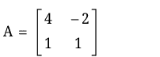

```python
# 矩阵 A
matrix_A = np.array([[4, -2], [1, 1]])
```

## 计算特征值和特征向量

```python
eigenvalues, eigenvectors = linalg.eig(matrix_A)

print("Eigenvalues:")
print(eigenvalues)
print("\nEigenvectors:")
print(eigenvectors)
```

###### 奇异值分解 (SVD)

SVD 是一种在数值线性代数中广泛使用的分解方法。SciPy 的 `scipy.linalg.svd()` 函数用于计算矩阵的 SVD。
考虑一个矩阵

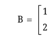

```python
# 矩阵 B
matrix_B = np.array([[1, 2], [2, 3]])

# 计算奇异值分解
U, S, Vt = linalg.svd(matrix_B)

print("U matrix:")
print(U)
print("\nS matrix (singular values):")
print(S)
print("\nVt matrix (transpose of V):")
print(Vt)
```

###### 数值积分

SciPy 通过 `scipy.integrate` 提供了强大的数值积分方法。`quad()` 函数是常用的函数。
考虑在区间 [0, 1] 上对 f(x) = x² 进行积分

```python
from scipy import integrate

# 要积分的函数
def func(x):
    return x**2

###### 数值积分
result, error = integrate.quad(func, 0, 1)

print("Result of Numerical Integration:")
print(result)
```

###### 数值微分

`scipy.misc.derivative()` 使用数值方法计算函数在给定点的导数。
考虑在 x = 2 处对 g(x) = e^x 进行微分

```python
from scipy.misc import derivative
# 要微分的函数
def func_g(x):
    return np.exp(x)

###### 数值微分
derivative_at_2 = derivative(func_g, 2.0, dx=1e-6)

print("Result of Numerical Differentiation at x=2:")
print(derivative_at_2)
```

### 3.2 使用 Pandas 加载数据

#### 3.2.1 DataFrame 和 Series

##### DataFrame

DataFrame 是 pandas 中的一种二维表格型数据结构，与关系型数据库中的表非常相似。它由行和列组成，其中每一列可以拥有不同的数据类型。

###### 特性

- 表格结构：数据以行和列的形式组织。
- 列名：每一列都有一个名称或标签。
- 索引：每一行都有一个索引，可以显式设置或自动生成。
- 灵活性：列可以具有不同的数据类型。
- 可扩展性：支持添加新列。

创建 DataFrame 的示例：

```python
import pandas as pd

# 从字典创建 DataFrame
data = {'Name': ['Alice', 'Bob', 'Charlie'],
        'Age': [25, 30, 35],
        'City': ['New York', 'San Francisco', 'Los Angeles']}
df = pd.DataFrame(data)
print(df)
```

##### 输出

```
      Name  Age         City
0    Alice   25     New York
1      Bob   30  San Francisco
2  Charlie   35   Los Angeles
```

图 3.1 展示了用于创建 pandas DataFrame 实现的代码片段生成的结果。该可视化图表显示了 DataFrame 的结构和内容，包括其行、列以及存储在每个单元格中的相应数据对象。

##### Series

Series 是 pandas 库中的一种一维带标签的数组。它本质上是从 DataFrame 中提取的单列，但也可以独立存在。Series 数据结构能够存储各种数据类型，包括整数、浮点数、字符串和其他形式的数据。

###### 特性

- 一维：由单列或单个数据数组组成。
- 带标签的索引：Series 中的每个元素都有一个索引。
- 同质数据：Series 中的所有元素具有相同的数据类型。
- 类似于 NumPy 数组：NumPy 数组中的许多操作都可以应用于 Series。

###### 创建 Series 的示例

```python
###### 从列表创建 Series
ages = pd.Series([25, 30, 35], name='Age')

print(ages)
```

##### 输出

```
0    25
1    30
2    35
Name: Age, dtype: int64
```

图 3.2 展示了负责创建 pandas Series 对象的实现规则生成的结果。该可视化图表显示了序列的布局和元素，这是 pandas 库中的一种一维带标签的布局。输出显示了与序列中每个值相关的索引标签，并清晰地展示了数据在此数据结构中的组织和存储方式。

| 区别 | Series | DataFrame |
| :--- | :--- | :--- |
| **1. 维度：** | 一维结构。 | 二维结构。 |
| **2. 元素：** | 带索引的单列数据。 | 以表格结构组织的多列数据，具有行和列索引。 |
| **3. 用例：** | 适用于表示单个变量或特征。 | 适用于表示具有多个变量的数据集，每个变量作为一列。 |
| **4. 灵活性：** | 所有元素的数据类型相同。 | 列可以具有不同的数据类型。 |
| **5. 可视化：** | 通常可视化为单列数据。 | 可视化为具有多列的表格。 |
| **6. 操作：** | 操作通常应用于单列数据。 | 操作可以应用于整个列或行，提供更大的灵活性。 |

##### 创建 DataFrame 的方法

###### 从字典创建

字典中的键作为列名，对应的值作为数据。

```python
import pandas as pd

# 从字典创建 DataFrame
data_dict = {'Name': ['Alice', 'Bob', 'Charlie'],
            'Age': [25, 30, 35],
            'City': ['New York', 'San Francisco', 'Los Angeles']}

df_from_dict = pd.DataFrame(data_dict)

print("DataFrame from Dictionary:")
print(df_from_dict)
```

输出：

```
DataFrame from Dictionary:
          Name  Age         City
0       Alice   25     New York
1         Bob   30  San Francisco
2     Charlie   35   Los Angeles
```

图 3.3：从字典创建 DataFrame。

###### 从嵌套列表创建

主列表中的每个子列表代表一行，而主列表本身包含所有行。

```python
# 从嵌套列表创建 DataFrame
data_list = [['Alice', 25, 'New York'],
            ['Bob', 30, 'San Francisco'],
            ['Charlie', 35, 'Los Angeles']]
df_from_list = pd.DataFrame(data_list, columns=['Name', 'Age', 'City'])

print("\nDataFrame from List of Lists:")
print(df_from_list)
```

输出：

```
DataFrame from List of Lists:
          Name  Age         City
0       Alice   25     New York
1         Bob   30  San Francisco
2     Charlie   35   Los Angeles
```

图 3.4：从嵌套列表创建 DataFrame。

###### 从 NumPy 数组创建

利用 NumPy 数组创建 DataFrame。

```python
import numpy as np

# 从 NumPy 数组创建 DataFrame
data_array = np.array([['Alice', 25, 'New York'],
                      ['Bob', 30, 'San Francisco'],
                      ['Charlie', 35, 'Los Angeles']])

df_from_array = pd.DataFrame(data_array, columns=['Name', 'Age', 'City'])
print("\nDataFrame from NumPy Array:")
print(df_from_array)
```

输出：

```
DataFrame from NumPy Array:
          Name  Age         City
0       Alice   25     New York
1         Bob   30  San Francisco
2     Charlie   35   Los Angeles
```

图 3.5：从 NumPy 数组创建 DataFrame。

##### 创建 Series 的方法

###### 从列表创建 Series

Series 是从 DataFrame 中提取的单列。

```python
###### 从列表创建 Series
ages_list = [25, 30, 35]
ages_series = pd.Series(ages_list, name='Age')

print("Series from List:")
print(ages_series)
```

输出：

```
Series from List:
0    25
1    30
2    35
Name: Age, dtype: int64
```

图 3.6：从列表创建 Series。

###### 从 NumPy 数组创建 Series

类似于从列表创建 Series。

```python
###### 从 NumPy 数组创建 Series
ages_array = np.array([25, 30, 35])
ages_series_np = pd.Series(ages_array, name='Age')

print("\nSeries from NumPy Array:")
print(ages_series_np)
```

输出：

```
Series from NumPy Array:
0    25
1    30
2    35
Name: Age, dtype: int32
```

图 3.7：从 NumPy 数组创建 Series。

#### 3.2.2 使用 Pandas 进行数据操作

使用 pandas 进行数据操作是 Python 数据分析的基础要素。它提供了一个强大而灵活的工具包，用于清理、转换和重塑数据集。在此过程中，可以有效地处理缺失数据，并识别和消除重复记录。Pandas 促进了无缝的数据转换，包括通过透视操作重塑数据和将宽格式数据进行融合。DataFrame 的合并和连接允许整合来自不同来源的信息。GroupBy 操作能够对数据进行分组，从而便于分析特定的子集，而聚合函数则提供了汇总信息的见解。

Pandas 通过提供重采样和移位工具简化了时间序列数据的处理。高级数据操作技术涉及使用 apply 应用自定义函数以及利用向量化操作以提高效率。Pandas 数据操作的最佳实践包括优化内存使用和采用清晰易读的链式操作。总而言之，pandas 为数据科学家和分析师提供了一系列全面的工具，以高效地操作和分析数据。这使其成为 Python 生态系统中用于数据操作任务不可或缺的库。

##### 使用 Pandas 进行数据清洗

使用 pandas 进行数据清洗涉及数据集的准备和精炼，以确保其适合分析。数据清洗的基本要素包括管理缺失数据以及识别和消除重复记录。Pandas 提供了诸如 `dropna()` 和 `fillna()` 等方法来处理缺失值，而 `drop_duplicates()` 函数则用于处理重复行。这些操作在维护数据完整性和保证分析准确性方面起着关键作用。

此外，pandas 通过诸如 `info()` 和 `describe()` 等函数提供了探索和理解数据的能力，这些函数有助于识别异常值或异常情况。Pandas 的多功能性便于数据操作，包括更改数据类型或转换分类变量。通过利用这些工具，使用 pandas 进行数据清洗可确保数据集保持一致、全面，并为有意义的分析和洞察做好准备。

###### 处理缺失数据

处理缺失数据是数据分析过程中的一个关键阶段，pandas 提供了强大的工具来实现这一目标。两种常用方法涉及缺失值的识别和处理：

-   **识别缺失值：**
    Pandas 通过使用 `isnull()` 或 `info()` 等函数来方便地识别缺失值。一个显著的例子是 `df.isnull().sum()` 函数，它提供了每一列缺失值的计数。

```python
import pandas as pd
import numpy as np

# Creating a DataFrame with missing values
data = {'Name': ['Alice', 'Bob', np.nan, 'Charlie'],
        'Age': [25, np.nan, 35, 40],
        'City': ['New York', 'San Francisco', 'Los Angeles', np.nan]}
df = pd.DataFrame(data)

# Identifying missing values using isnull() and sum()
missing_values_count = df.isnull().sum()

print("DataFrame with Missing Values:")
print(df)
print("\nMissing Values Count:")
print(missing_values_count)
```

**输出：**

```
DataFrame with Missing Values:
      Name   Age         City
0    Alice  25.0     New York
1      Bob   NaN  San Francisco
2      NaN  35.0  Los Angeles
3  Charlie  40.0          NaN

Missing Values Count:
Name    1
Age     1
City    1
dtype: int64
```

图 3.8：DataFrame 中的缺失值计数。

**处理缺失值：**

一旦识别出来，缺失值可以使用 `dropna()` 等技术来消除包含不完整信息的行或列，或者使用 `fillna()` 将缺失值替换为指定的值。例如，`df.fillna(0)` 可以有效地将 DataFrame 中的所有 NaN 值替换为零。

```python
# Handling missing values using dropna()
df_cleaned_dropna = df.dropna()

# Handling missing values using fillna()
df_cleaned_fillna = df.fillna({'Name': 'Unknown', 'Age': 0, 'City': 'Unknown'})

print("\nDataFrame after Dropna:")
print(df_cleaned_dropna)
print("\nDataFrame after Fillna:")
print(df_cleaned_fillna)
```

**输出：**

```
DataFrame after Dropna:
    Name   Age         City
0  Alice  25.0    New York

DataFrame after Fillna:
       Name   Age         City
0     Alice  25.0    New York
1       Bob   0.0  San Francisco
2   Unknown  35.0   Los Angeles
3   Charlie  40.0      Unknown
```

图 3.9：处理 DataFrame 中的缺失值。

在给定的示例中，我们首先创建了一个包含缺失值的 DataFrame。随后，使用 `isnull().sum()` 函数来确定每一列的缺失值数量。为了处理缺失值，我们展示了两种方法：`dropna()` 用于消除包含缺失值的行，`fillna()` 用于将缺失值替换为预定的值。这些技术为根据分析的具体需求处理缺失数据提供了灵活性。

###### 处理重复值

处理重复值是 pandas 库中数据清洗的一个关键组成部分，因为它保证了数据的完整性并防止分析出现偏差。可以通过使用 `duplicated()` 方法来识别重复行，允许基于列值或整行来探索冗余记录。`drop_duplicates()` 函数有助于消除重复行，从而生成一个仅包含唯一记录的 DataFrame。为了保持分析的准确性并防止可能由重复数据点引起的偏差，对重复值进行策略性管理至关重要。当处理大型数据集或从多个来源整合数据时，这些操作具有特殊价值，因为它们确保生成的 DataFrame 准确地反映了底层信息。

**识别重复值：**
识别和处理重复行对于维护数据完整性至关重要。Pandas 提供了基于列值或整行来识别重复行的方法。

```python
import pandas as pd

# Creating a DataFrame with duplicate rows
data = {'Name': ['Alice', 'Bob', 'Alice', 'Charlie', 'Bob'],
        'Age': [25, 30, 25, 35, 30],
        'City': ['New York', 'San Francisco', 'New York', 'Los Angeles', 'San Francisco']}
df = pd.DataFrame(data)

# Identifying duplicates using duplicated()
duplicates = df[df.duplicated()]

print("DataFrame with Duplicates:")
print(df)
print("\nIdentified Duplicates:")
print(duplicates)
```

**输出：**

```
DataFrame with Duplicates:
      Name  Age         City
0    Alice   25     New York
1      Bob   30  San Francisco
2    Alice   25     New York
3  Charlie   35   Los Angeles
4      Bob   30  San Francisco

Identified Duplicates:
    Name  Age         City
2  Alice   25     New York
4    Bob   30  San Francisco
```

图 3.10：识别 DataFrame 中的重复值。

###### 移除重复值

使用 `drop_duplicates()` 函数来移除重复行。这确保了 DataFrame 仅包含唯一记录。

```python
# Removing duplicates using drop_duplicates()
df_no_duplicates = df.drop_duplicates()

print("\nDataFrame after Removing Duplicates:")
print(df_no_duplicates)
```

**输出：**

```
DataFrame after Removing Duplicates:
          Name  Age         City
0       Alice   25     New York
1         Bob   30  San Francisco
3     Charlie   35   Los Angeles
```

图 3.11：移除 DataFrame 中的重复值。

在本例中，通过使用 `duplicated()` 方法对 DataFrame 中的重复行进行了识别。生成的 DataFrame（表示为 `duplicates`）展示了被识别出的重复行。随后，通过 `drop_duplicates()` 函数执行了重复行的移除操作，从而生成了一个没有任何重复项的 DataFrame。这些操作对于保证数据的准确性以及确保所进行的分析不因冗余信息的存在而失真至关重要。

##### 数据转换与重塑

pandas 中的数据转换和重塑涉及重构数据集以更好地满足分析需求。这个过程对于在不同格式之间转换数据、聚合信息以及为进一步分析做准备至关重要。关键技术包括：

###### 使用 pivot 进行重塑

在 pandas 库中使用 `pivot` 函数是一个强大的工具，能够将数据从长格式转换为宽格式。当处理以堆叠或垂直方式构建的数据集，并需要将其转换为水平或表格格式时，此特定功能提供了显著的好处。此过程中的关键元素包括索引、列和值，它们共同决定了生成的 DataFrame 的框架。

```python
import pandas as pd

# Creating a DataFrame
data = {'Date': ['2022-01-01', '2022-01-01', '2022-01-02', '2022-01-02'],
        'Category': ['A', 'B', 'A', 'B'],
        'Value': [10, 20, 15, 25]}
df = pd.DataFrame(data)

# Reshaping with pivot
df_pivot = df.pivot(index='Date', columns='Category', values='Value')

print("Original DataFrame:")
print(df)
print("\nDataFrame after Pivot:")
print(df_pivot)
```

**输出：**

```
Original DataFrame:
         Date Category  Value
0  2022-01-01        A     10
1  2022-01-01        B     20
2  2022-01-02        A     15
3  2022-01-02        B     25

DataFrame after Pivot:
Category     A   B
Date              
2022-01-01  10  20
2022-01-02  15  25
```

图 3.12：使用 pivot 进行重塑。

在此示例中，原始 DataFrame 采用长格式，每个日期都有单独的行对应类别 A 和 B。应用 pivot 后，数据被重塑为宽格式，日期作为索引，类别作为列，提供了更清晰的表格结构。

**数据融合：**
在 pandas 库中使用 `melt` 函数对于将宽格式数据转换为长格式至关重要。当数据以表格或水平结构排列并需要转换为堆叠或垂直格式时，这变得特别有价值。该方法中包含的 `id_vars`、`var_name` 和 `value_name` 参数提供了自定义融合后 DataFrame 的机会。

import pandas as pd

# 创建 DataFrame
data = {'Date': ['2022-01-01', '2022-01-02'],
        'Category_A': [10, 15],
        'Category_B': [20, 25]}
df = pd.DataFrame(data)

print("原始 DataFrame:")
print(df)

# 使用 melt 函数进行数据透视
df_melted = pd.melt(df, id_vars=['Date'], var_name='Category',
                    value_name='Value')

print("\n透视后的 DataFrame:")
print(df_melted)

**输出：**

```
原始 DataFrame:
        Date  Category_A  Category_B
0  2022-01-01           10          20
1  2022-01-02           15          25

透视后的 DataFrame:
        Date    Category  Value
0  2022-01-01  Category_A     10
1  2022-01-02  Category_A     15
2  2022-01-01  Category_B     20
3  2022-01-02  Category_B     25
```

图 3.13：数据透视。

### 3.3 数据清洗与转换

数据清洗和数据转换是数据预处理流程中的基础阶段，其目标是提升数据集在分析或建模方面的质量和效用。数据清洗过程涉及识别并修正数据集中的错误、不一致和缺失值。这可能包括删除重复记录、通过插补或删除处理缺失数据，以及纠正错误值。另一方面，数据转换则涉及对数据进行重组或重构，使其适合分析或建模。这可能包括对分类变量进行编码、对数值特征进行缩放，或通过应用特征工程技术创建新特征。

此外，数据转换还可能涉及数据的聚合或汇总、创建衍生变量，或实施降维。通过确保数据集无杂质、具有一致性并符合适当的格式，数据清洗和转换过程有助于进行更精确和可靠的分析，从而提升洞察力和决策能力。

#### 3.3.1 处理缺失数据

处理缺失数据是数据预处理的一个关键方面，它确保了分析和模型的稳健性和准确性。处理缺失数据有多种策略，包括插补、删除和建模。插补是指利用其他可用数据来估计缺失值，例如对数值变量使用均值、中位数或众数，或对分类变量使用出现频率最高的类别。

删除是指完全或部分地移除包含缺失值的记录或特征，如果缺失数据量少且随机，这种方法可能是合适的。建模则是将缺失值视为一个独立的类别，或使用机器学习算法根据其他变量来预测缺失值。

```python
import pandas as pd
from sklearn.impute import SimpleImputer

# 包含缺失值的示例数据集
data = {'Age': [30, None, 50, 60],
        'Income': [50000, 60000, None, 80000],
        'Education_Level': [12, 16, 18, None]}
df = pd.DataFrame(data)

# 使用均值进行插补
imputer = SimpleImputer(strategy='mean')
df_imputed = pd.DataFrame(imputer.fit_transform(df), columns=df.columns)

print("原始 DataFrame:")
print(df)
print("\n插补后的 DataFrame:")
print(df_imputed)
```

**输出：**

```
原始 DataFrame:
   Age   Income  Education_Level
0  30.0  50000.0             12.0
1   NaN  60000.0             16.0
2  50.0      NaN             18.0
3  60.0  80000.0              NaN

插补后的 DataFrame:
   Age        Income  Education_Level
0  30.000000  50000.000000        12.000000
1  46.666667  60000.000000        16.000000
2  50.000000  63333.333333        18.000000
3  60.000000  80000.000000        15.333333
```

图 3.14：对 DataFrame 中的缺失值进行插补。

在这个特定的例子中，'Age'、'Income' 和 'Education_Level' 列中存在缺失值。为了解决这个问题，我们使用了著名的 scikit-learn 库中的 SimpleImputer 模块，用每列的均值来插补缺失值。结果得到的 DataFrame 包含了插补后的值，从而保证了数据集的完整性，并为后续的分析和建模工作提供了便利。

#### 3.3.2 数据类型转换

数据类型转换在数据预处理中扮演着至关重要的角色，因为它允许以适合分析、建模或存储的方式来表示数据。这个过程涉及将数据从一种类型更改为另一种类型，例如，将字符串转换为数值，或将分类变量转换为数值表示。

数据类型转换旨在确保数据的一致性及其与各种算法和工具的兼容性。例如，通过使用独热编码或标签编码等编码技术将分类变量转换为数值格式，可以促进机器学习算法对这些变量的有效处理。同样，将数值从一种数据类型转换为另一种，例如从整数转换为浮点数，可能是为了满足精度或缩放要求而必需的。

```python
import pandas as pd

# 包含混合数据类型的示例 DataFrame
data = {'ID': ['001', '002', '003', '004'],
        'Age': [30, 40, 50, 60],
        'Income': ['50000', '60000', '70000', '80000'],
        'Education_Level': [12.5, 16.2, 18.9, 20.7]}
df = pd.DataFrame(data)

# 将 'ID' 列从字符串转换为整数
df['ID'] = df['ID'].astype(int)

# 将 'Income' 列从字符串转换为整数
df['Income'] = df['Income'].astype(int)

print("数据类型转换后的 DataFrame:")
print(df)
```

**输出：**

```
数据类型转换后的 DataFrame:
   ID  Age  Income  Education_Level
0   1   30   50000             12.5
1   2   40   60000             16.2
2   3   50   70000             18.9
3   4   60   80000             20.7
```

图 3.15：数据类型转换。

在这个例子中，我们有一个包含混合数据类型的 DataFrame。我们使用 pandas 中的 astype 方法将 'ID' 和 'Income' 列从字符串转换为整数，以确保一致性并允许对这些列进行数值运算或分析。同样，可以根据需要执行其他数据类型转换，以便为后续处理或建模准备数据。

### 3.4 特征工程

特征工程涉及将原始数据转换为更适合机器学习算法的格式的过程，其目标是提升模型的性能。它包括特征的选择、创建和修改，以从数据中提取有意义的模式和见解。这可能包括使用独热编码或标签编码等技术将分类变量转换为数值表示。此外，特征工程还包括特征缩放，即对数值特征进行标准化或归一化，以确保不同尺度下的一致性和可比性。它还涉及降低数据维度的技术，例如主成分分析（PCA）和旨在减少特征数量并消除不相关或冗余特征的特征选择方法。有效实施特征工程可以显著提升模型的准确性、可解释性以及对新数据的泛化能力，使其成为机器学习流程中的关键步骤。

#### 3.4.1 对分类变量进行编码

对分类变量进行编码是特征工程中的一个关键步骤，尤其是在与机器学习相关的任务中。它涉及将分类数据转换为算法能够理解的数值格式。一种常见的技术称为“独热编码”，其中每个类别在单独的列中用一个二进制值（0 或 1）表示。这种方法保留了分类信息，而不会强加任何顺序性。另一种方法是标签编码，其中每个类别被分配一个唯一的整数。然而，标签编码可能会引入原始数据中不存在的顺序性，从而可能误导算法。因此，选择合适的编码方法对于确保在模型训练过程中准确表示分类变量至关重要。

##### 独热编码

独热编码是一种用于将分类变量转换为适合机器学习算法的数值格式的技术。在这种方法中，每个类别被表示为一个二进制向量，其中只有一个位被赋值为 1，以表示相应类别的存在。这种方法确保了分类信息得以保留，而不会引入任何形式的顺序性。例如，如果我们有三个类别，即‘红色’、‘绿色’和‘蓝色’，它们将分别被编码为 [1, 0, 0]、[0, 1, 0] 和 [0, 0, 1]。

```python
import pandas as pd

# 示例分类数据
data = {'Color': ['Red', 'Green', 'Blue', 'Red', 'Blue']}
df = pd.DataFrame(data)

##### 独热编码
one_hot_encoded = pd.get_dummies(df['Color'])

print("原始 DataFrame:")
print(df)
print("\n独热编码后的 DataFrame:")
print(one_hot_encoded)
```

## 输出：

```
原始数据框：
   颜色
0    红色
1  绿色
2   蓝色
3    红色
4   蓝色

独热编码后的数据框：
   蓝色  绿色    红色
0  False  False   True
1  False   True  False
2   True  False  False
3  False  False   True
4   True  False  False
```

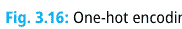

在这个具体实例中，分类变量‘颜色’通过独热编码过程被转换为二进制向量，该向量传达了每个类别的存在或不存在。这种特定的转换使得机器学习算法能够有效地理解和利用分类数据。

##### 标签编码

标签编码是一种用于将分类变量转换为数值格式的方法，它为每个类别分配一个唯一的整数。这种特定技术涉及用一个数值替换每个类别，从0开始递增到n-1，其中n代表不同类别的数量。虽然其简单性显而易见，但必须认识到标签编码可能会无意中为数据引入一种顺序感，从而暗示类别之间存在实际并不存在的有意义的排序。例如，如果我们考察三个类别：‘红色’、‘绿色’和‘蓝色’，它们将被分别编码为0、1和2。

```python
from sklearn.preprocessing import LabelEncoder
import pandas as pd

# 示例分类数据
data = {'Color': ['Red', 'Green', 'Blue', 'Red', 'Blue']}
df = pd.DataFrame(data)

##### 标签编码
label_encoder = LabelEncoder()
df['Color_LabelEncoded'] = label_encoder.fit_transform(df['Color'])
```

```python
print("原始数据框:")
print(df[['Color']])
print("\n标签编码后的数据框:")
print(df[['Color_LabelEncoded']])
```

输出：

```
原始数据框:
   Color
0    Red
1  Green
2   Blue
3    Red
4   Blue

标签编码后的数据框:
   Color_LabelEncoded
0                   2
1                   1
2                   0
3                   2
4                   0
```

图 3.17：标签编码。

在这个例子中，分类变量‘颜色’已被编码为代表数值的标签。每个不同的类别根据其在数据中出现的顺序被赋予一个数值标签。然而，在使用标签编码时需要谨慎，特别是在分类变量缺乏内在顺序性的情况下。这是由于机器学习算法可能会误解编码后的标签，从而导致对数据的错误解读。

#### 3.4.2 特征缩放

特征缩放是一种预处理技术，用于标准化或归一化给定数据集中数值特征的范围。主要目的是确保所有特征具有可比的尺度，从而减少某些特征在模型训练过程中主导其他特征的可能性。标准化涉及将数据转换为均值为0、标准差为1，而归一化则将数据缩放到0到1的范围。

特征缩放对于严重依赖基于距离度量的算法（如k近邻和支持向量机）尤为重要。此外，对于由梯度下降驱动的优化算法（如线性回归和神经网络）也至关重要。通过将所有特征置于可比的尺度，特征缩放有可能提高收敛速度、防止数值不稳定，并增强机器学习模型的性能和可解释性。通常采用多种方法进行特征缩放，包括最小-最大缩放、Z分数缩放和鲁棒缩放。

##### 标准化

标准化是一种用于规范化数值特征的方法，通过转换使其均值为0、标准差为1。此过程涉及从每个特征的相应值中减去其均值，然后将结果除以标准差。

标准化的使用对于假设输入数据符合正态分布并赋予所有特征同等重要性的算法是有益的。它确保具有较大尺度的特征不会主导学习过程。例如，在一个包含年龄、收入和教育水平等具有不同尺度特征的数据集中，标准化将能够实现这些特征之间的比较。

```python
from sklearn.preprocessing import StandardScaler
import pandas as pd

# 示例数值数据
data = {'Age': [30, 40, 50, 60],
        'Income': [50000, 60000, 70000, 80000],
        'Education_Level': [12, 16, 18, 20]}
df = pd.DataFrame(data)

##### 标准化
scaler = StandardScaler()
df_scaled = pd.DataFrame(scaler.fit_transform(df), columns=df.columns)

print("原始数据框:")
print(df)
print("\n标准化后的数据框:")
print(df_scaled)
```

输出：

```
原始数据框:
   Age  Income  Education_Level
0   30   50000               12
1   40   60000               16
2   50   70000               18
3   60   80000               20

标准化后的数据框:
        Age    Income  Education_Level
0 -1.341641 -1.341641        -1.521278
1 -0.447214 -0.447214        -0.169031
2  0.447214  0.447214         0.507093
3  1.341641  1.341641         1.183216
```

图 3.18：数据框的标准化。

在这个实例中，描述年龄、收入和教育水平的初始数值数据通过使用scikit-learn中实现的StandardScaler进行了标准化。每个特征都被调整为具有平均值0和标准差1，从而使它们能够在不同尺度上进行比较。这种保障确保了在严重依赖数值数据的机器学习算法中，没有任何单个特征对学习过程产生不当影响。

##### 归一化

归一化是一种特征缩放技术，它将数值数据转换为通常在0到1之间的标准化尺度。此过程涉及调整每个特征的值，使其落在此范围内，同时保留它们的相对关系。

当特征的量级表现出显著差异时，归一化尤其有利，因为它确保所有特征对学习过程的贡献是公平的。它被广泛应用于要求输入数据限制在特定范围内的算法，例如神经网络和基于距离的算法（如k近邻）。详细来说，例如，如果我们拥有年龄、收入和教育水平等具有不同尺度的特征，归一化将它们统一到一个标准化尺度上，从而便于直接比较。

```python
from sklearn.preprocessing import MinMaxScaler
import pandas as pd

# 示例数值数据
data = {'Age': [30, 40, 50, 60],
        'Income': [50000, 60000, 70000, 80000],
        'Education_Level': [12, 16, 18, 20]}
df = pd.DataFrame(data)

##### 归一化
scaler = MinMaxScaler()
df_normalized = pd.DataFrame(scaler.fit_transform(df), columns=df.columns)

print("原始数据框:")
print(df)
print("\n归一化后的数据框:")
print(df_normalized)
```

**输出：**

```
原始数据框:
   Age  Income  Education_Level
0   30   50000               12
1   40   60000               16
2   50   70000               18
3   60   80000               20

归一化后的数据框:
        Age    Income  Education_Level
0  0.000000  0.000000             0.00
1  0.333333  0.333333             0.50
2  0.666667  0.666667             0.75
3  1.000000  1.000000             1.00
```

图 3.19：数据框的归一化。

在这个实例中，表示年龄、收入和教育水平的初始数值信息通过使用scikit-learn中的MinMaxScaler进行了归一化。每个特征的值被调整到0到1的范围内，从而在保持其相对关系的同时，确保了不同尺度之间的一致性。这有助于特征之间的公平比较，并防止任何单个属性在机器学习算法中占据主导地位，从而维护了学习过程的完整性。

### 3.5 使用Matplotlib和Seaborn进行数据可视化

在彻底探索、细致分析和有效传达从数据中获得的见解时，使用Matplotlib和Seaborn进行数据可视化是不可或缺的。Matplotlib是Python中广泛使用的绘图库，在生成各种静态图（包括折线图、散点图、直方图、条形图等）方面提供了高度的自定义能力。它赋予用户能够精确控制各种绘图元素，例如颜色、标记、标签和注释。

Seaborn构建于Matplotlib之上，提供了更高级的接口，用于创建信息丰富且视觉吸引力强的统计图形。通过提供便捷的函数，它可以用最少的代码绘制数据，从而简化了原本复杂的可视化生成过程。Seaborn擅长制作视觉上引人注目的统计分析图表，包括一些专门的图表，如小提琴图、箱线图、配对图和热力图。

总的来说，Matplotlib和Seaborn构成了一个强大的数据可视化工具包，使分析师和数据科学家能够快速有效地探索数据集中的模式、趋势和关系。这些库有助于创建出版物质量的图表，从而增强数据叙事和展示能力，因此它们在数据分析工作流程中是不可或缺的工具。

#### 3.5.1 使用Matplotlib进行基础绘图

使用Matplotlib进行绘图是数据可视化的一个重要方面，它能够创建各种图表来检查数据分布、趋势和关系。Matplotlib是一个功能多样的Python绘图库，提供了一个灵活且直观的接口，用于生成适合出版的高质量静态可视化。通过使用Matplotlib，分析师和研究人员可以生成不同类型的图表，包括折线图、散点图、条形图、直方图、饼图、箱线图、小提琴图、热力图、面积图和等高线图。

这些图表服务于不同的目的，允许用户检查数值分布、比较分类变量、可视化变量之间的关系、识别异常值以及探索数据中的模式。无论是可视化时间序列数据、研究相关性，还是展示分类分布，Matplotlib都提供了创建信息丰富且富有洞察力的可视化所需的工具。

通过使用Matplotlib中的基础绘图技术，可以建立数据探索和分析工作流程的基础。这些技术提供了对数据集的关键理解，有助于决策制定、实现发现并有效传达结果。掌握使用Matplotlib进行基础绘图对于数据科学和分析领域的从业者至关重要，这是一项基本技能，能够从数据中提取可操作的见解。

##### 折线图

折线图用于表示数据点在连续时间段内的轨迹。它们通过用线段连接数据点来构建。例如，可以构建一个折线图来描述股票价格在给定时间段内的变化。

```python
import matplotlib.pyplot as plt

x = [1, 2, 3, 4, 5]
y = [2, 3, 5, 7, 11]

plt.plot(x, y)
plt.xlabel('X-axis')
plt.ylabel('Y-axis')
plt.title('Line Plot Example')
plt.show()
```

**输出：**

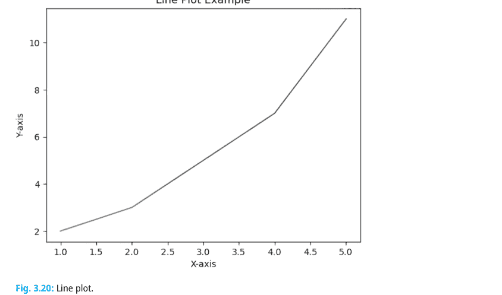

图 3.20：折线图。

##### 散点图

散点图将单个数据点作为标记显示在笛卡尔平面上，使其非常适合说明两个数值变量之间的相关性。例如，可以创建一个图表来描述汽车的里程数与其相应价格之间的关系。

```python
import matplotlib.pyplot as plt

x = [1, 2, 3, 4, 5]
y = [2, 3, 5, 7, 11]

plt.scatter(x, y)
plt.xlabel('X-axis')
plt.ylabel('Y-axis')
plt.title('Scatter Plot Example')
plt.show()
```

输出：

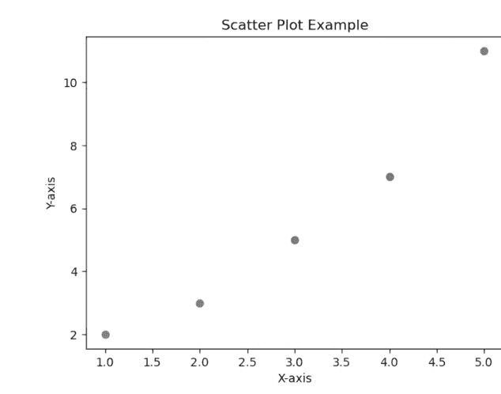

图 3.21：散点图。

##### 条形图

条形图使用矩形条来描绘分类数据，其中每个条的长度表示相应类别的值。这种可视化在比较与各种类别相关的数量时非常有价值。例如，它们可用于评估不同产品的销售业绩。

```python
import matplotlib.pyplot as plt

categories = ['A', 'B', 'C', 'D']
values = [10, 20, 15, 25]

plt.bar(categories, values)
plt.xlabel('Categories')
plt.ylabel('Values')
plt.title('Bar Plot Example')
plt.show()
```

**输出：**

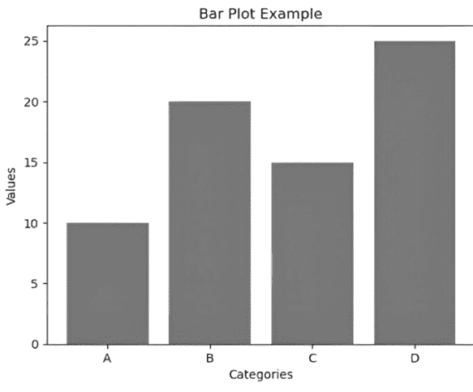

*图 3.22：条形图。*

##### 直方图

直方图通过将数据划分为区间并计算每个区间内的数据点数量来描绘定量数据的分布。它们是理解特定变量频率分布的宝贵工具。直方图的一个适用实例是可视化人口中的年龄分布。

```python
import matplotlib.pyplot as plt

data = [1, 2, 2, 3, 3, 3, 4, 4, 4, 4, 5, 5, 5, 5, 5]

plt.hist(data, bins=5)
plt.xlabel('Values')
plt.ylabel('Frequency')
plt.title('Histogram Example')
plt.show()
```

输出：

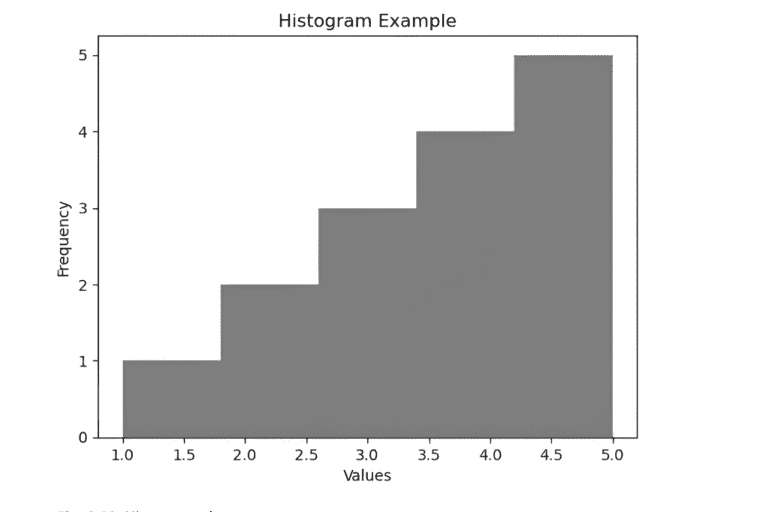

图 3.23：直方图。

##### 饼图

饼图通过将一个圆分成若干扇形来描绘分类信息，每个扇形代表一个特定类别，其大小表示该类别在整体中的比例。这些图表在展示整体构成方面具有实际用途，例如预算中的支出分配。

```python
import matplotlib.pyplot as plt

sizes = [15, 30, 45, 10]
labels = ['A', 'B', 'C', 'D']

plt.pie(sizes, labels=labels, autopct='%1.1f%%')
plt.title('Pie Chart Example')
plt.show()
```

输出：

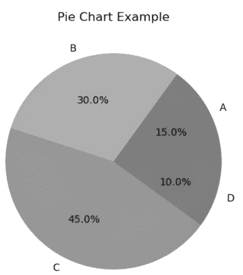

图 3.24：饼图。

##### 箱线图

箱线图，也称为箱须图，用于以图形方式表示数值数据的分布，从而显示中位数、四分位数和异常值。它们的价值在于识别异常值以及理解数据的离散程度和集中趋势。例如，它们可用于比较不同学生群体的考试成绩分布。

```python
import matplotlib.pyplot as plt
import numpy as np

np.random.seed(10)
data = np.random.normal(0, 1, 100)

plt.boxplot(data)
plt.title('Box Plot Example')
plt.show()
```

输出：

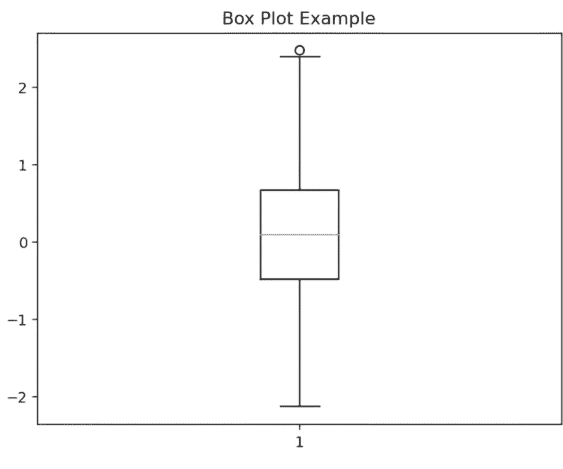

图 3.25：箱线图。

##### 小提琴图

小提琴图结合了箱线图和核密度图来展示数值数据的分布。与箱线图相比，它们提供了更复杂的数据分布视角。例如，它们可用于可视化不同年龄组的身高分布。

```python
import matplotlib.pyplot as plt
import seaborn as sns
import numpy as np

np.random.seed(10)
data = np.random.normal(0, 1, 100)

sns.violinplot(data)
plt.title('Violin Plot Example')
plt.show()
```

输出：

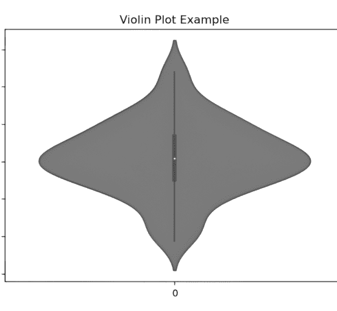

图 3.26：小提琴图。

##### 热力图

热力图通过根据单元格的值为其分配颜色，以表格格式可视化数据。它们通常用于可视化大型数据集中的相关性或关系。示例：可视化数据集中数值变量的相关矩阵。

```python
import matplotlib.pyplot as plt
import seaborn as sns
import numpy as np

np.random.seed(10)
data = np.random.rand(10, 10)

sns.heatmap(data, annot=True, cmap='YlGnBu')
plt.title('Heatmap Example')
plt.show()
```

输出：

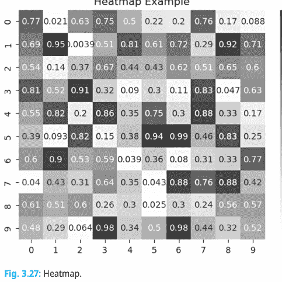

图 3.27：热力图。

##### 面积图

面积图类似于折线图，但填充了线下的区域，这使得它们对于可视化累积数据或堆叠数据非常有用。例如，可视化不同产品类别的累积销售额随时间的变化。

```python
import matplotlib.pyplot as plt

x = [1, 2, 3, 4, 5]
y1 = [1, 2, 3, 4, 5]
y2 = [1, 4, 9, 16, 25]

plt.fill_between(x, y1, color='skyblue', alpha=0.4)
plt.fill_between(x, y2, color='orange', alpha=0.4)
plt.title('Area Plot Example')
plt.show()
```

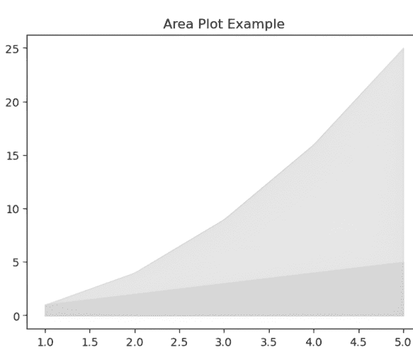

图 3.28：面积图。

##### 等高线图

等高线图通过显示等值线或恒定值线，将三维数据在二维平面上表示出来。它们通常用于可视化地理或科学数据。例如，在地图上可视化海拔数据。

```python
import matplotlib.pyplot as plt
import numpy as np

x = np.linspace(-3, 3, 100)
y = np.linspace(-3, 3, 100)
X, Y = np.meshgrid(x, y)
Z = np.sin(X) + np.cos(Y)

plt.contour(X, Y, Z)
plt.title('Contour Plot Example')
plt.show()
```

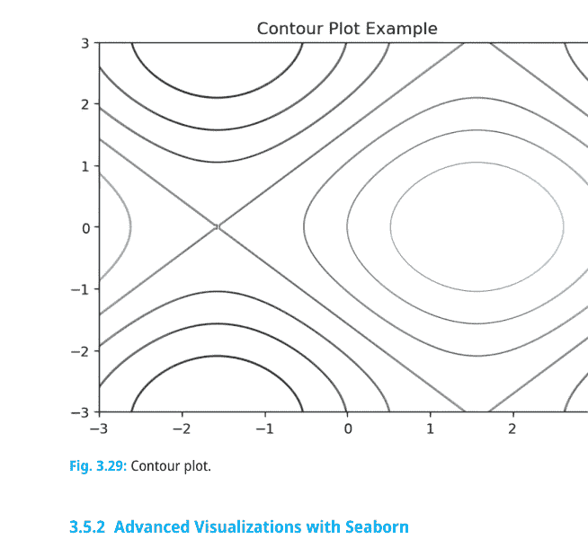

图 3.29：等高线图。

#### 3.5.2 使用 Seaborn 进行高级可视化

Seaborn 是一款高级可视化工具，为数据展示提供了强大的功能，与 Matplotlib 等基础绘图库相比，展现出卓越的能力。Seaborn 构建于 Matplotlib 之上，提供了更高级别的接口，使得创建具有统计信息且视觉吸引力强的图形成为可能。

以下是 "dataset.csv" 文件的示例结构：

```
x_variable,y_variable,category
1,2,A
2,3,B
3,4,A
4,5,B
5,6,A
6,7,B
```

##### 成对图

成对图通过为数值变量呈现散点图，为对角轴呈现直方图，来描绘数据集中变量之间的成对关系。

```python
import seaborn as sns
import pandas as pd

data = pd.read_csv('dataset.csv')
sns.jointplot(x='x_variable', y='y_variable', data=data, kind='scatter')
```

输出：

```
<seaborn.axisgrid.PairGrid at 0x218f9693950>
```

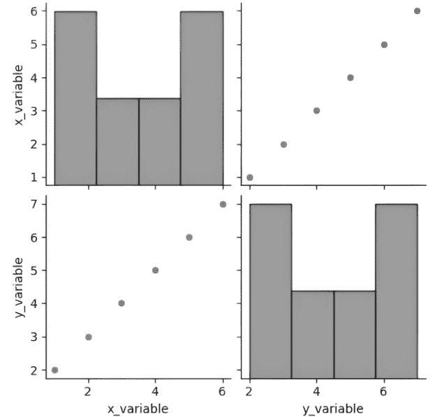

图 3.30：成对图。

##### 联合图

联合图整合了散点图和直方图，除了展示两个定量变量各自的分布外，还直观地表示了它们之间的相关性。

```python
import seaborn as sns
import pandas as pd

data = pd.read_csv('dataset.csv')
sns.jointplot(x='x_variable', y='y_variable', data=data, kind='scatter')
```

输出：

```
<seaborn.axisgrid.JointGrid at 0x218fa33d6d0>
```

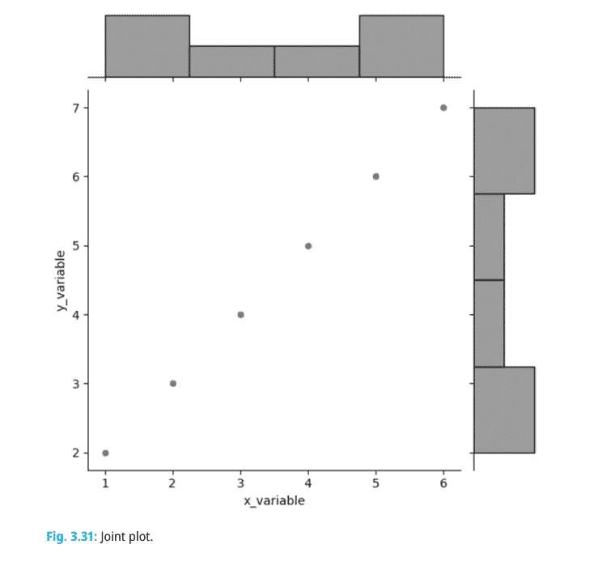

##### PairGrid

PairGrid 允许通过访问单个子图来自定义成对图，便于详细探索成对关系。

```python
import seaborn as sns
import pandas as pd

data = pd.read_csv('dataset.csv')
g = sns.PairGrid(data)
g.map(sns.scatterplot)
```

输出：

```
<seaborn.axisgrid.PairGrid at 0x218fce7a950>
```

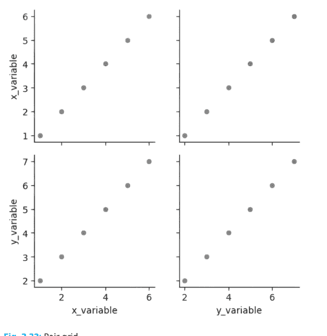

图 3.32：成对网格图。

### 3.6 处理不平衡数据

处理不平衡数据是机器学习领域的一项重要任务，其中某一类别的样本数量显著超过另一类别的样本数量。

不平衡数据集在模型训练中带来挑战，因为算法倾向于偏向样本数量较多的类别，导致对样本较少类别的预测产生偏差且性能较差。为解决此问题，采用了多种方法，包括重采样技术，如过采样（增加少数类别的样本数量）和欠采样（减少多数类别的样本数量）。

此外，还使用了合成数据生成技术，如 SMOTE（合成少数类过采样技术）和 ADASYN（自适应合成采样），为少数类别生成人工数据点，从而实现平衡的数据集。处理不平衡数据确保机器学习模型在更具代表性的数据集上进行训练，从而提高所有类别的性能和泛化能力。

#### 3.6.1 重采样技术

重采样方法通过修改类别分布来处理不平衡数据集。一种常见策略是使用过采样，即增加少数类中的实例数量。这种增强可以通过复制现有样本或生成合成数据点来实现。相比之下，欠采样是一种替代方法，其中从多数类中随机删除实例以减少其大小。这两种技术都旨在均衡类别分布，从而提高机器学习模型的性能。以下是使用 imbalanced-learn 库进行过采样的示例：

```python
from imblearn.over_sampling import RandomOverSampler
import numpy as np

# Sample imbalanced dataset
X = np.array([[1, 2], [3, 4], [5, 6], [7, 8]])
y = np.array([0, 0, 1, 1])

# Instantiate RandomOverSampler
ros = RandomOverSampler()

# Resample dataset
X_resampled, y_resampled = ros.fit_resample(X, y)

print("Original class distribution:", np.bincount(y))
print("Resampled class distribution:", np.bincount(y_resampled))
```

在这个特定实例中，第一步是建立一个包含两个不同类别的不平衡数据集。随后，我们使用来自 imbalanced-learn 库的 RandomOverSampler 函数来对少数类别进行过采样。最后，我们展示重采样前后的类别分布，使我们能够观察到产生的平衡效果。

以下是使用 imbalanced-learn 库进行欠采样的编程示例：

```python
from imblearn.under_sampling import RandomUnderSampler
import numpy as np

# Sample imbalanced dataset
X = np.array([[1, 2], [3, 4], [5, 6], [7, 8], [9, 10]])
y = np.array([0, 0, 1, 1, 1])

# Instantiate RandomUnderSampler
rus = RandomUnderSampler()

# Resample dataset
X_resampled, y_resampled = rus.fit_resample(X, y)

print("Original class distribution:", np.bincount(y))
print("Resampled class distribution:", np.bincount(y_resampled))
```

在这个特定实例中，我们建立了一个包含两个不同类别的代表性不平衡数据集。为了实现欠采样，我们使用来自 imbalanced-learn 库的 RandomUnderSampler 函数。通过调用 fit_resample 方法，我们执行欠采样操作。最终，我们通过展示欠采样前后的类别分布来演示平衡的效果。

#### 3.6.2 合成数据生成

合成数据生成方法用于解决数据集中的类别不平衡问题，特别关注少数类别。SMOTE 和 ADASYN 等方法利用现有数据点为少数类别生成合成实例。

SMOTE 通过在少数类别的实例之间进行插值来创建合成样本，从而实现这一点，而 ADASYN 则通过考虑特征空间中样本的密度来调整生成过程。这些方法通过用人工生成的数据点增强数据集，有助于减轻类别不平衡的影响，从而提高机器学习模型的性能。

下面展示了一个说明 SMOTE 应用的示例：

146 — 第 3 章 Python 中的数据预处理

```python
from imblearn.over_sampling import SMOTE
import numpy as np

# Sample imbalanced dataset
X = np.array([[1, 2], [3, 4], [5, 6], [7, 8]])
y = np.array([0, 0, 1, 1])

# Instantiate SMOTE
smote = SMOTE()

# Generate synthetic samples
X_synthetic, y_synthetic = smote.fit_resample(X, y)

print("Original class distribution:", np.bincount(y))
print("Synthetic class distribution:", np.bincount(y_synthetic))
```

在这个实例中，SMOTE 被用于为数据集中代表性不足的类别生成人工数据点。fit_resample 技术用于执行合成数据的生成，并比较应用 SMOTE 前后的类别分布，以观察实现平衡的效果。

以下是一个说明性编程示例，展示了如何利用 ADASYN（自适应合成采样）为不平衡数据集中代表性不足的类别创建合成数据点：

```python
from imblearn.over_sampling import ADASYN
import numpy as np

# Sample imbalanced dataset
X = np.array([[1, 2], [3, 4], [5, 6], [7, 8]])
y = np.array([0, 0, 1, 1])

# Instantiate ADASYN
adasyn = ADASYN()

# Generate synthetic samples
X_synthetic, y_synthetic = adasyn.fit_resample(X, y)

print("Original class distribution:", np.bincount(y))
print("Synthetic class distribution:", np.bincount(y_synthetic))
```

在本例中，我们面对的是一个数据集中各类别实例数量不平衡的数据集，其中少数类的实例数量较少。为解决此问题，我们应用了ADASYN算法，该算法专门用于为少数类生成合成数据点。随后，调用`fit_resample`方法来执行合成数据的生成。最后，为观察平衡处理的效果，我们展示了应用ADASYN前后的类别分布情况。

## 总结

- 使用NumPy和SciPy进行数值与科学计算：涵盖了使用NumPy和SciPy库进行数组创建、操作以及各种数值运算。
- 使用pandas加载数据：介绍了用于数据操作和分析的pandas库，包括DataFrame和Series，以及数据操作技术。
- 数据清洗与转换：讨论了处理数据集中缺失数据和数据类型转换的策略。
- 特征工程：涵盖了诸如编码分类变量和特征缩放等为机器学习准备数据的技术。
- 使用Matplotlib和Seaborn进行数据可视化：介绍了用于数据可视化的Matplotlib和Seaborn库，包括基础和高级绘图技术。
- 处理不平衡数据：讨论了不平衡数据集在机器学习中带来的挑战，以及重采样和合成数据生成等解决类别不平衡的技术。

## 练习（选择题）

1. **Python语法中缩进的目的是什么？**
   a) 表示注释
   b) 分隔代码块
   c) 标记数据类型
   d) 定义类属性

2. **Python中常用于数值和科学计算的库是哪个？**
   a) Pandas
   b) Matplotlib
   c) NumPy
   d) Seaborn

3. **pandas中用于存储和操作数据的主要数据结构是什么？**
   a) 数组
   b) 列表
   c) DataFrame
   d) 元组

4. **pandas中用于处理缺失数据的技术是哪个？**
   a) 重采样
   b) 特征缩放
   c) 数据类型转换
   d) 插补

5. **机器学习中特征缩放的目的是什么？**
   a) 将分类变量转换为数值表示
   b) 平衡不平衡数据集
   c) 标准化或归一化特征
   d) 可视化数据分布

6. **Python中常用于数据可视化的库是哪个？**
   a) NumPy
   b) SciPy
   c) Pandas
   d) Matplotlib

7. **Seaborn中用于可视化变量间成对关系的图类型是哪个？**
   a) 散点图
   b) 成对图
   c) 直方图
   d) 热力图

8. **机器学习数据集中常用于解决类别不平衡的技术是哪个？**
   a) 过采样
   b) 特征工程
   c) 数据清洗
   d) 降维

9. **SMOTE和ADASYN等合成数据生成技术的目的是什么？**
   a) 为多数类创建人工数据点
   b) 从数据集中移除异常值
   c) 将分类变量转换为数值表示
   d) 标准化数据集中的特征

10. **以下哪项不是特征工程技术？**
    a) 编码分类变量
    b) 特征缩放
    c) 数据插补
    d) 降维

## 答案

1. b
2. c
3. c
4. d
5. c
6. d
7. b
8. a
9. a
10. a

## 填空题

1. ________ 和 ________ 是Python中常用于数值和科学计算任务的库。
2. 在pandas中，用于存储和操作数据的主要数据结构称为 ________。
3. 重采样技术如 ________ 和 ________ 用于解决机器学习数据集中的类别不平衡问题。
4. 特征缩放技术旨在标准化或归一化数据集中特征的 ________。
5. Matplotlib和Seaborn是Python中常用于 ________ 的流行库。
6. 成对图在Seaborn中用于可视化变量间的 ________ 关系。
7. SMOTE和ADASYN是用于在不平衡数据集中生成 ________ 数据点的技术。
8. ________ 和 ________ 是特征工程中用于编码分类变量的方法。
9. 数据清洗涉及处理 ________ 值并转换数据类型以进行分析。
10. 在面向对象编程中，类是创建 ________ 的蓝图。

## 答案

1. NumPy, SciPy
2. DataFrame
3. 过采样, 欠采样
4. 尺度
5. 数据可视化
6. 成对
7. 合成
8. 标签编码, 独热编码
9. 缺失
10. 对象

## 描述性问题

1. 解释Python语法中正确缩进的重要性及其对代码可读性的影响。
2. 描述pandas在数据操作和分析中的作用，并提供DataFrame操作的示例。
3. 讨论特征工程在机器学习中的重要性，并解释编码分类变量与特征缩放之间的区别。
4. 解释使用Matplotlib和Seaborn进行数据可视化的过程，并提供基础和高级绘图技术的示例。
5. 描述不平衡数据集在机器学习中带来的挑战，并讨论重采样和合成数据生成等解决类别不平衡的技术。
6. 解释特征缩放的概念，并讨论其在为机器学习模型准备数据中的重要性。
7. 讨论Python代码中注释的作用及其对代码文档和可读性的贡献。
8. 解释Python中面向对象编程的概念，包括类、对象、继承和多态。
9. 讨论处理数据集中缺失数据的策略以及数据插补在数据预处理中的重要性。
10. 描述特征工程中编码分类变量的过程，并讨论标签编码与独热编码之间的区别。
11. 编写一个Python程序，创建一个二维NumPy数组并执行以下操作：
    a. 计算数组的均值、中位数和标准差。
    b. 将数组重塑为不同的形状。
    c. 与另一个数组执行逐元素加法和乘法。
12. 编写一个Python程序，使用pandas加载CSV文件并执行以下操作：
    a. 显示DataFrame的前几行。
    b. 计算数值列的汇总统计信息。
    c. 使用标签编码将分类列转换为数值列。
13. 编写一个Python程序，使用Matplotlib生成折线图以可视化时间序列数据集。
    a. 包含x轴和y轴的标签。
    b. 为图表添加标题。
    c. 自定义线条样式和颜色。
14. 编写一个Python程序，加载一个不平衡数据集，并使用imbalanced-learn库中的SMOTE技术实现过采样。
    a. 显示过采样前后的类别分布。
    b. 在平衡数据集上训练一个简单的机器学习模型（例如逻辑回归）并评估其性能。
15. 编写一个Python程序，使用特征工程技术为机器学习预处理数据集。
    a. 使用独热编码编码分类变量。
    b. 使用最小-最大缩放或标准化缩放数值特征。
    c. 将数据集拆分为训练集和测试集以进行模型评估。

## 第4章
机器学习基础

整个机器学习领域运作所依赖的基石构成了本学科的根基。这些基础要素涵盖了不可或缺的原则和概念，它们是制定、构建和评估机器学习算法的基础。其核心目标是使计算机能够从数据中获取知识，而无需进行显式编程。本章深入探讨了每个从业者为熟练驾驭机器学习复杂领域所必须理解的基本方面。

理解机器学习的一个基本初始步骤在于区分监督学习和无监督学习。监督学习的特点是使用带标签的数据，而无监督学习则在没有此类标签的情况下运作。后续小节将进行考察以阐明分类与回归、聚类与关联的概念。这些概念提供了对不同形式学习任务及其相应应用的见解。

过拟合和正则化的概念强调了在捕捉数据中复杂模式的能力与泛化到未观测实例的能力之间取得微妙平衡的重要性。过拟合指的是模型过度适应训练数据，导致在未见数据上表现不佳的情况。正则化技术，如偏差-方差权衡和L1/L2正则化，提供了缓解过拟合和增强模型鲁棒性的方法。

评估指标在评估机器学习模型性能方面起着至关重要的作用。本章概述了针对分类和回归任务的指标。这些指标提供了关于模型准确性、精确度、召回率和其他关键性能度量的宝贵见解。

交叉验证作为模型评估和选择的重要工具应运而生。它通过系统地将数据划分为训练集和验证集来降低过拟合的可能性。对不同技术（如k折交叉验证、留一法和分层K折）的全面解释使专业人员能够有效地验证其模型。

机器学习的基本精髓在于为学习者提供构建智能系统所需的基本原则和方法论。这些基础为后续章节中更复杂概念和技术的探索奠定了坚实稳定的基础。

### 4.1 监督学习与无监督学习

监督学习和无监督学习是机器学习领域的两大基本框架，各自针对不同的学习任务类别和方法论。

监督学习侧重于利用带标签的信息训练模型，将每个输入数据点与一个输出标签或目标相关联。其主要目标是建立从输入到输出的映射，使模型能够对新数据进行预测。监督学习常用于分类任务（旨在将输入实例分配到特定类别或标签）以及回归任务（目标是预测一个连续值）。监督学习中的著名算法包括决策树、支持向量机和神经网络。

相比之下，无监督学习处理的是未标记的数据，要求模型在没有明确指导的情况下识别潜在的模式或结构。无监督学习算法的目标不是对特定输出进行预测，而是揭示数据中固有的关系或分组。聚类算法（如K均值和层次聚类）根据相似性将数据划分为不同的簇，而关联算法（如Apriori）则发现不同属性之间的规则或关联。无监督学习在异常检测、数据压缩和特征提取任务中尤其具有优势。

监督学习依赖带标签的数据来学习输入与输出之间的相关性，从而实现预测任务。相反，无监督学习则基于未标记数据来揭示隐藏的结构或模式，在没有明确指导的情况下提供对原始数据的洞察和理解。这两种范式在各种机器学习应用中都扮演着重要角色，根据具体问题和可用数据，各自提供独特的优势和挑战。

#### 监督学习的类型

**分类：** 分类的目标是利用先前的观察结果，对新实例的类别标签进行预测。当输出变量为类别值时，会使用这种方法。例如电子邮件垃圾识别、情感分析和医疗诊断。

**回归：** 回归是根据输入特征来估计连续的输出值。当输出变量为数值时，会使用这种方法。例如预测房价、股票价格和温度预测。

#### 无监督学习的类型

**聚类：** 聚类算法根据数据点的相似性将其划分为簇或组。其目标是在没有任何预定标签的情况下，发现数据中的自然分组。客户细分、文档聚类和图像分割是常见的例子。

**关联：** 关联规则学习是一种在大型数据集中识别变量之间有趣关系或关联的方法。其主要关注点是发现项目之间的共现或相关模式。市场篮子分析是关联规则学习的一个具体应用，旨在发现经常一起购买的商品。另一方面，推荐系统则根据用户行为推荐相关产品或内容。这两个例子都说明了关联规则学习在实践中的应用。

监督学习和无监督学习方法涵盖了广泛的技术和算法，是应对金融、医疗保健、电子商务等众多领域现实世界挑战不可或缺的工具。

#### 4.1.1 分类与回归

分类和回归是机器学习领域监督学习任务的两个基本类别，各自有独特的目标并需要特定的方法。

在分类领域，目标是将输入数据点分配到预先存在的类别或标签中。当输出变量具有类别特征时，通常使用这种方法。例如，在电子邮件垃圾检测中，目标是根据发件人、主题和内容等各种属性，将电子邮件分类为“垃圾邮件”或“非垃圾邮件”。同样，在情感分析中，文本数据根据所表达的情感被分类为“积极”、“消极”或“中性”。用于分类的著名算法包括逻辑回归、决策树和支持向量机。

相比之下，回归是利用输入特征来预测连续的输出值。当输出变量具有数值特征时，会使用这种方法。例如，在房地产领域，回归可用于根据位置、面积和设施等因素预测房价。在股票市场分析领域，可以通过分析历史数据和市场指标，使用回归模型来预测未来的股票价格。常见的回归技术包括线性回归、多项式回归和决策树回归。

举个例子，让我们来看一个简单的分类问题：预测银行的贷款申请人是否会无法偿还贷款。这种情况下的输入特征可能包括申请人的信用评分、收入和债务收入比，而输出则是一个二元标签，表示“违约”或“不违约”。可以使用逻辑回归模型在历史数据上进行训练，从而根据这些特征对潜在的贷款申请人进行分类。

相反，假设我们想根据房屋的面积、卧室数量和地理位置来预测其价格。这种情况引入了一个回归问题，因为输出变量（即房屋价格）表现出连续特征。在这种情况下，可以利用线性回归模型，通过使用包含历史房地产交易的数据集，来建立输入属性与房屋价格之间的联系。这样，我们就能对新建房屋的价格进行预测。

分类涉及将数据分类到类别或标签中，而回归则侧重于预测数值。在选择合适的算法和方法以有效解决各种现实世界问题时，全面理解这两种监督学习任务之间的差异至关重要。

##### 分类的类型

**二元分类：** 在二元分类中，目标是将实例分为两个不同的类别之一。实例可能包括垃圾邮件识别（将电子邮件区分为垃圾邮件或非垃圾邮件）、欺诈检测（区分欺诈性和非欺诈性交易）以及医疗诊断（确定疾病的存在与否）。

**多类分类：** 多类分类涉及将实例分类到多个不同的类别或类别中。实例可能包括识别手写数字（0到9）、进行情感分析（将实例识别为积极、消极或中性）以及将文档分类到不同主题。

##### 回归的类型

**线性回归：** 线性回归使用线性方程构建一个模型，表示因变量与一个或多个自变量之间的关系。其应用在于预测连续的数值。例如根据面积和卧室数量预测房价、利用历史数据预测股票价格以及考虑营销费用来估计销售收入。

**多项式回归：** 多项式回归通过使用多项式函数（而不仅仅是直线）来拟合数据，从而扩展了线性回归的范围。这种方法有效地捕捉了

#### 4.1.2 聚类与关联

聚类和关联是机器学习领域中两类独立的无监督学习任务，它们服务于不同的目的，并采用不同的方法论。

聚类涉及将相似的数据点根据其内在特征分组在一起的过程，无需任何预定义的标签。其主要目标是发现数据中固有的分组或簇。例如，在客户细分的背景下，聚类算法可以根据客户的购买行为、人口统计特征或其他相关特征，有效地将客户划分为不同的群体。一个著名的聚类算法是K-means算法，它通过最小化每个数据点与其所属簇的质心之间的距离，将数据点分配到簇中。另一种称为“层次聚类”的技术，则通过递归地合并或分裂簇来构建簇的层次结构，其依据是簇之间的相似性。

相反，关联规则学习旨在揭示大型数据集中各种变量之间有趣的联系或关联。其主要重点在于识别项目之间的共现模式或相关性。一个典型的例子是购物篮分析，其中关联规则被用来揭示在交易中经常一起购买的产品之间的关系。Apriori算法通常被用于这项工作，因为它系统地生成潜在的项集，并剔除那些不满足最小支持度标准的项集，从而有效地识别频繁项集和关联规则。

举例来说，让我们考虑一家希望分析客户获取数据的零售企业。通过运用聚类，该企业可以根据客户在采购商品时的偏好，有效地将客户分类为不同的类别。这些宝贵的数据随后可用于制定有针对性的营销策略或个性化推荐。与此同时，关联分析可以揭示诸如“购买尿布的客户也倾向于购买婴儿配方奶粉”这样的模式，从而使该企业能够优化产品定位或促销活动。

总而言之，聚类的重点在于识别数据中的自然分组或簇。另一方面，关联规则学习主要关注发现变量之间的关系或共现模式。这两种方法的运用对于从无标签数据中发掘洞见和模式都极具价值。最终，这使得企业能够做出明智的决策并提高其运营效率。

##### 聚类的类型

**K-means聚类：** K-means聚类技术将数据划分为预先设定数量（k）的簇，旨在最小化数据点与其指定簇的质心之间的距离。这个迭代过程会更新质心，直到达到收敛。K-means聚类因其简单性和有效性而被广泛使用，尽管它需要预先指定簇的数量。

**层次聚类：** 相反，层次聚类通过基于数据点相似性的迭代合并或分裂簇，构建一个树状图（dendrogram），即一种树状结构。它不需要预先指定簇的数量，并且可以提供对数据层次结构的宝贵理解。层次聚类中两种常用的技术是凝聚（自底向上）和分裂（自顶向下）聚类。

**DBSCAN：** 基于密度的聚类（DBSCAN）是一种通过考虑被低密度区域分隔的高密度区域来检测簇的聚类算法。这种方法可以识别各种形状的簇，并且对噪声和异常值具有鲁棒性。DBSCAN是“基于密度的带噪声应用空间聚类”的缩写，是一种广泛使用的基于密度的聚类算法，它需要指定两个参数：epsilon，表示点之间被视为同一簇部分的最大距离；以及minPts，表示形成密集区域所需的最小点数。

**均值漂移聚类：** 另一方面，均值漂移聚类是一种无参数的聚类技术，它通过将质心向数据密度更高的区域移动来检测簇。与层次聚类类似，它不需要预先指定簇的数量，并且可以根据数据的分布自主确定最佳的簇数。

##### 关联的类型

**Apriori算法：** 广为人知的Apriori算法是关联规则学习的一个著名算法。该算法用于在事务数据集中识别频繁项集。通过生成候选项集，然后剔除那些不满足最小支持度标准的项集，该算法有效地识别频繁项集。从这些频繁项集中，可以导出关联规则，从而提供关于在购买一个项目的情况下购买另一个项目的概率的宝贵见解。

**FP-growth算法：** FP-growth算法为挖掘事务数据集中的频繁项集提供了一种替代技术。它通过构建一种称为FP-tree（频繁模式树）的简洁数据结构来高效地识别频繁项集，无需显式生成候选项集。这一特性使其在处理包含大量事务的大型数据集时尤其具有优势。

**Eclat算法：** Eclat算法是另一种广泛认可的关联规则学习算法。它通过交叉事务的事务ID集来探索频繁项集。利用支持度的向下封闭性，它有效地检测频繁项集。

**PrefixSpan算法：** 另一方面，PrefixSpan算法专门用于从序列数据库中提取序列模式。它采用递归方法，通过扩展前缀模式来生成频繁序列，随后优化搜索空间以有效地识别频繁序列模式。

各种类型的聚类和关联技术在数据挖掘和模式识别领域扮演着至关重要的角色。它们有助于从涵盖市场篮子分析、客户细分和推荐系统等广泛领域的大型数据集中，识别出重要的模式和有价值的洞见。

### 4.2 过拟合与正则化

过拟合和正则化是机器学习中的两个基本概念，尤其是在训练预测模型的背景下。当模型对训练数据学习得过于深入，包括了数据中的噪声或随机波动，而非底层规律时，就会发生过拟合。因此，模型在训练数据上表现良好，但在未见过的数据上泛化能力不足。这可能导致在实际应用中表现不佳和预测错误。另一方面，正则化是一种通过在模型的损失函数中加入惩罚项来解决过拟合的技术。这个惩罚项通过限制模型参数，来抑制高方差的复杂模型的出现。

L2正则化，也称为“岭回归”，是一种常见的正则化形式，它涉及在损失函数中添加一个惩罚项。这个惩罚项与模型权重的平方大小成正比。L1正则化，也称为“Lasso回归”，是另一种正则化形式，它包含一个与模型权重的绝对大小成正比的惩罚项。这些正则化技术通过鼓励使用系数更小的更简单模型，有效地防止过拟合。因此，它们降低了模型复杂度并提高了泛化性能。

正则化方法可以通过修改超参数来优化，例如正则化因子，它控制着精确拟合训练数据和降低模型复杂度之间的平衡。选择合适的超参数通常通过交叉验证来实现，交叉验证在独立的验证数据集上评估模型的有效性。

当模型从训练数据中学习到噪声或无关模式时，就会发生过拟合，导致泛化性能不足。使用正则化技术，如L2和L1正则化，可以通过惩罚复杂模型并倡导简单性来缓解过拟合。为了构建能够有效泛化到未见数据并在现实场景中提供准确预测的模型，必须采用适当的正则化并进行超参数调优。

#### 4.2.1 偏差-方差权衡

平衡偏差和方差的概念是机器学习领域的一个基本方面。这种平衡对于在特定模型的偏差和方差之间取得平衡至关重要。偏差代表模型的预期预测与真实值之间的差异，而方差则衡量模型在不同训练数据集上预测的变异性。

让我们考虑一个简单的例子，涉及将多项式回归模型应用于一组数据点。假设我们有一个数据集，只包含一个标记为“x”的特征及其对应的目标变量“y”。我们的目标是构建一个多项式回归模型，能够根据“x”有效地预测“y”的值。为了完成这个任务，我们可以用以下方式表达我们的模型：

$$y = \beta_0 + \beta_1x + \beta_{2x2} + \dots + \beta_{nxn} + \epsilon$$

其中 $\epsilon$ 代表误差项，$\beta_0, \beta_1, \dots, \beta_n$ 是多项式项的系数。

模型的偏差可以通过确定模型的预期预测与实际值之间的差异来衡量，计算如下：

$$\text{Bias}(\hat{f}(x)) = E[\hat{f}(x)] - f(x)$$

其中 $\hat{f}(x)$ 代表模型的预测值，$f(x)$ 是真实值，$E[\hat{f}(x)]$ 是在不同训练数据集上预测的期望值。

相反，模型的方差量化了在考虑模型的不同实例时，特定点上预测的变化量。可以通过以下计算确定：

$$\text{Var}(\hat{f}(x)) = E[(\hat{f}(x) - E[\hat{f}(x)])^2]$$

目标是找到一个在偏差和方差之间达到最佳平衡的模型。一个表现出高偏差但低方差的模型，比如线性回归模型，可能会过度简化数据中的潜在关系，从而导致系统性误差（欠拟合）。另一方面，一个表现出低偏差但高方差的模型，比如高次多项式回归模型，可能会捕捉训练数据中存在的噪声，导致对训练集中的波动更加敏感（过拟合）。

为了说明偏差和方差之间的权衡，我们将研究将多项式回归模型拟合到特定数据集的过程，其中多项式的次数不同。在这种情况下，随着多项式次数的增加，偏差减小（导致模型更灵活，能够捕捉数据中更复杂的关系），而方差增加（导致模型对训练数据中的波动更敏感）。

通过选择合适的多项式次数，我们的目标是找到偏差和方差之间的和谐平衡，以最小化总误差（偏差平方和与方差之和）。这个目标通常通过交叉验证或正则化等方法来实现，这些方法通过惩罚过于复杂的模型来解决过拟合问题。

总之，偏差-方差权衡突出了机器学习模型偏差和方差之间存在的基本权衡。理解这种权衡对于选择合适的模型复杂度和防止实际应用中的欠拟合或过拟合至关重要。

平衡偏差和方差的概念是机器学习领域的一个关键原则。它涉及在模型精确把握数据集内在规律的能力（降低偏差）和其对不同数据集的适应性（降低方差）之间取得平衡。有许多Python库可用，提供了理解和处理这种权衡的资源和方法。

scikit-learn是一个Python库，广泛用于各种机器学习任务，包括监督学习和无监督学习。虽然scikit-learn没有提供专门用于测量偏差和方差的函数，但它提供了一系列评估模型的工具。这些工具包括交叉验证、学习曲线和验证曲线，用于评估模型的偏差和方差。

以下是使用scikit-learn中的学习曲线来可视化偏差-方差权衡的一个示例：

```python
import numpy as np
import matplotlib.pyplot as plt
from sklearn.datasets import load_iris
from sklearn.model_selection import learning_curve
from sklearn.linear_model import LogisticRegression

# Load Iris dataset
iris = load_iris()
X, y = iris.data, iris.target

# Define model
model = LogisticRegression()

# Plot learning curves
train_sizes, train_scores, test_scores = learning_curve(model, X, y, cv=5)
train_mean = np.mean(train_scores, axis=1)
train_std = np.std(train_scores, axis=1)
test_mean = np.mean(test_scores, axis=1)
test_std = np.std(test_scores, axis=1)

plt.plot(train_sizes, train_mean, color='blue', marker='o', label='Training accuracy')
plt.fill_between(train_sizes, train_mean - train_std, train_mean + train_std, alpha=0.15, color='blue')
plt.plot(train_sizes, test_mean, color='green', linestyle='--', marker='s', label='Validation accuracy')
plt.fill_between(train_sizes, test_mean - test_std, test_mean + test_std, alpha=0.15, color='green')

plt.xlabel('Number of training samples')
plt.ylabel('Accuracy')
plt.legend()
plt.show()
```

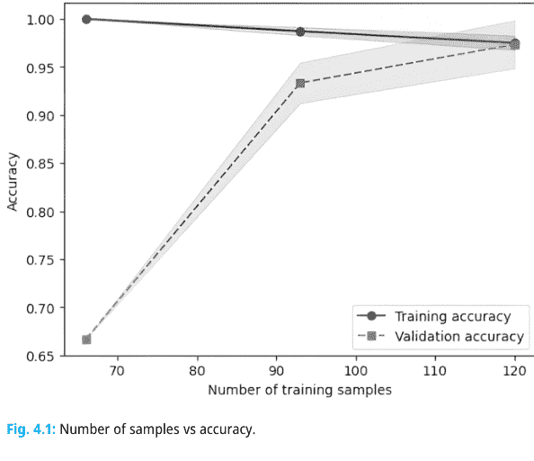

图 4.1：样本数量与准确率。

图 4.1 展示了偏差-方差权衡的可视化表示，说明了样本数量与模型准确率之间的关系。该图描绘了模型性能（以准确率衡量）如何随着训练数据集大小的变化而变化。

**TensorFlow 和 Keras：** TensorFlow 及其相关的高级 API Keras 提供了多种工具和方法来构建和训练深度学习模型。这些库提供了实现正则化技术、Dropout 和早停法的功能，所有这些都有助于有效解决偏差-方差权衡问题。

```python
import tensorflow as tf
from tensorflow.keras.models import Sequential
from tensorflow.keras.layers import Dense, Dropout
```

from sklearn.datasets import load_iris
from sklearn.model_selection import train_test_split

# 加载鸢尾花数据集
iris = load_iris()
X, y = iris.data, iris.target

# 将数据划分为训练集和测试集
X_train, X_test, y_train, y_test = train_test_split(X, y, test_size=0.2,
    random_state=42)

# 定义带有dropout正则化的模型
model = Sequential([
    Dense(64, activation='relu', input_shape=(4,)),
    Dropout(0.2),
    Dense(3, activation='softmax')
])

# 编译模型
model.compile(optimizer='adam', loss='sparse_categorical_crossentropy',
    metrics=['accuracy'])

# 训练模型
history = model.fit(X_train, y_train, epochs=50, batch_size=32,
    validation_data=(X_test, y_test))

#### 4.2.2 L1和L2正则化

L1和L2正则化是通过在代价函数中引入额外的惩罚项来解决机器学习模型过拟合问题的技术。这些正则化方法旨在通过惩罚较大的系数值来鼓励创建更简单的模型，尽管每种技术实现这一目标的方式各不相同。

让我们考察一个通过添加L1和L2正则化增强的线性回归模型。传统的线性回归模型旨在最小化残差平方和，也称为普通最小二乘法，其数学表示为：

$$J(\theta) = \frac{1}{2m} \sum_{i=1}^{m} \left( h_{\theta}\left(x^{(i)}\right) - y^{(i)} \right)^2$$

其中 $J(\theta)$ 是代价函数，$h_{\theta}(x^{(i)})$ 是第 $i$ 个样本的预测值，$y^{(i)}$ 是真实值，$m$ 是训练样本的数量。

在L2范数正则化的背景下，也称为“岭回归正则化”，代价函数中加入了一个与模型系数大小的平方成正比的额外项：

$$J_{L2}(\theta) = J(\theta) + \lambda \sum_{j=1}^{n} \theta_j^2$$

正则化参数（用 $\lambda$ 表示）和特征数量（用 $n$ 表示）是此背景下的关键组成部分。正则化参数负责控制正则化的强度，其值越高，正则化效果越强。

在L1正则化的背景下，也称为“Lasso正则化”，代价函数中加入了一个与模型系数的绝对值成正比的额外项：

$$J_{L1}(\theta) = J(\theta) + \lambda \sum_{j=1}^{n} |\theta^j|$$

正则化的强度由正则化参数 $\lambda$ 控制，与L2正则化相同。

为了阐明L1和L2正则化之间的差异，我们将考虑一个包含两个特征（$n = 2$）的线性回归基本实例。假设我们拥有一个包含五个训练样本的数据集：

$$x^{(1)} = [1, 2], y^{(1)} = 3$$
$$x^{(2)} = [1, 3], y^{(2)} = 4$$
$$x^{(3)} = [1, 4], y^{(3)} = 5$$
$$x^{(4)} = [1, 5], y^{(4)} = 6$$
$$x^{(5)} = [1, 6], y^{(5)} = 7$$

我们使用L1和L2正则化（$\lambda = 0.1$）将线性回归模型拟合到此数据集。训练模型后，我们检查系数 $\theta_0$ 和 $\theta_1$ 的值。

使用L2正则化，得到的系数可能为：

$$\theta_0 = 0.5$$
$$\theta_1 = 0.9$$

使用L1正则化，得到的系数可能为：

$$\theta_0 = 0.7$$
$$\theta_1 = 0.8$$

在这个特定案例中，很明显L2正则化比L1正则化更倾向于将系数逐渐减小到接近零。相反，L1正则化则倾向于将系数完全减小到零，从而通过消除不相关特征有效地执行特征选择。这种现象可以归因于L1惩罚项具有生成稀疏解的特性，这在需要特征稀疏性的情况下是有益的。

总之，L1和L2正则化是通过惩罚具有较大值的系数来防止机器学习模型过拟合的方法。L2正则化惩罚系数的平方大小，而L1正则化惩罚系数的绝对大小。理解这些正则化方法之间的差异对于选择最合适的技术并有效控制模型复杂性至关重要。

Python中的几个库提供了L1和L2正则化方法的实现，这些方法在机器学习中经常用于减轻过拟合并增强模型的泛化能力。scikit-learn和TensorFlow/Keras是两个常用的库。在下一节中，我将通过一个使用鸢尾花数据集的示例，阐明如何使用这些库执行L1和L2正则化。

**scikit-learn：** Scikit-learn提供了支持L1和L2正则化的线性模型。这些模型包括LogisticRegression、LinearRegression和Ridge等。

```python
from sklearn.datasets import load_iris
from sklearn.model_selection import train_test_split
from sklearn.preprocessing import StandardScaler
from sklearn.linear_model import LogisticRegression

# 加载鸢尾花数据集
iris = load_iris()
X, y = iris.data, iris.target

# 将数据划分为训练集和测试集
X_train, X_test, y_train, y_test = train_test_split(X, y, test_size=0.2,
    random_state=42)

# 标准化特征
scaler = StandardScaler()
X_train_scaled = scaler.fit_transform(X_train)
X_test_scaled = scaler.transform(X_test)

# 使用L1正则化训练逻辑回归模型
model = LogisticRegression(penalty='l1', solver='liblinear', C=1.0) # C是正则化强度的倒数
model.fit(X_train_scaled, y_train)

# 评估模型
accuracy = model.score(X_test_scaled, y_test)
print("Accuracy:", accuracy)
```

Accuracy: 0.9666666666666667

**TensorFlow/Keras：** TensorFlow及其高级API Keras提供了一系列正则化器，可以在神经网络的层中实现。这些正则化器包括l1、l2和l1_l2。

```python
import tensorflow as tf
from sklearn.datasets import load_iris
from sklearn.model_selection import train_test_split
from sklearn.preprocessing import StandardScaler

# 加载鸢尾花数据集
iris = load_iris()
X, y = iris.data, iris.target

# 将数据划分为训练集和测试集
X_train, X_test, y_train, y_test = train_test_split(X, y, test_size=0.2,
    random_state=42)

# 标准化特征
scaler = StandardScaler()
X_train_scaled = scaler.fit_transform(X_train)
X_test_scaled = scaler.transform(X_test)

# 定义一个带有L2正则化的简单神经网络模型
model = tf.keras.Sequential([
    tf.keras.layers.Dense(64, activation='relu', kernel_regularizer=tf.keras.regularizers.l2(0.01)),
    tf.keras.layers.Dense(3, activation='softmax')
])

# 编译模型
model.compile(optimizer='adam', loss='sparse_categorical_crossentropy',
    metrics=['accuracy'])

# 训练模型
model.fit(X_train_scaled, y_train, epochs=50, batch_size=32,
          validation_data=(X_test_scaled, y_test))

# 评估模型
test_loss, test_accuracy = model.evaluate(X_test_scaled, y_test)
print("Test Accuracy:", test_accuracy)
```

在这两个实例中，应用L1和L2正则化都有助于减轻过拟合问题。L1正则化涉及添加一个与系数绝对值大小相对应的惩罚项，而L2正则化则包含一个与系数平方大小相对应的惩罚项。通过调整正则化强度参数，例如scikit-learn的LogisticRegression中的C或TensorFlow/Keras层中的kernel_regularizer，可以有效地控制所实施的正则化程度。

### 4.3 评估指标

评估指标是评估机器学习模型有效性的基本工具，提供了关于模型泛化能力和在新数据上做出准确预测能力的宝贵信息。这些指标衡量模型性能的各个方面，例如准确率、精确率、召回率和F1分数等。理解和选择合适的评估指标对于评估模型的有效性和指导改进其性能的策略至关重要。

准确率是分类任务中常用的评估指标，它评估正确分类的实例占总实例的比例。然而，仅依赖准确率可能无法全面反映模型性能，尤其是在处理一个类别占主导地位的不平衡数据集时。在这种情况下，精确率和召回率成为关键指标。精确率衡量所有正预测中真正例预测的比例，而召回率衡量所有实际正实例中真正例预测的比例。F1分数是精确率和召回率的调和平均数，在这两个指标之间取得了平衡，使其成为不平衡数据集的合适选择。

在回归任务的背景下，评估指标包括三种度量：均方误差（MSE）、平均绝对误差（MAE）和R平方（R^2）分数。MSE量化了预测值与真实值之间平均平方差，而MAE提供了平均绝对差的度量。另一方面，R^2分数量化了模型解释方差的程度，其值越高表示拟合度越强。

受试者工作特征曲线下面积（AUC-ROC）和精确率-召回率曲线下面积（AUC-PR）是二元分类任务中常用的额外评估指标。AUC-ROC评估了灵敏度（真正例率）与假正例率之间的平衡，为模型在不同阈值下区分正负实例的能力提供了有价值的见解。在精确率和召回率至关重要的不平衡数据集背景下，AUC-PR简洁地概括了精确率-召回率曲线的性能。

交叉验证是一种常用的评估模型性能的方法，尤其在数据不足的情况下。它涉及将数据集划分为若干子集，在一个子集上训练模型，然后在其余子集上评估其性能。此过程重复多次，并计算各子集上的平均性能，以获得模型性能的可靠估计。

总而言之，评估标准在评估机器学习模型在各种任务和数据集中的有效性方面起着关键作用。通过仔细选择合适的评估标准并利用交叉验证等方法，专家可以深入了解模型性能，并做出明智的选择以提高模型的准确性和泛化能力。

#### 4.3.1 分类指标

机器学习模型在涉及分类输出变量的任务中的有效性评估，严重依赖于分类指标。这些指标为模型将实例准确分类到不同类别的能力提供了宝贵的见解，从而可以评估其准确性、精确率、召回率和其他与性能相关的因素。

准确性是分类基础指标中一个值得注意的指标。它衡量正确分类的实例数与总实例数的比例。准确性的计算需要应用以下公式：

$$Accuracy = \frac{TP + TN}{TP + TN + FP + FN}$$

TP代表正确正向预测的数量，TN代表正确负向预测的数量，FP代表不正确正向预测的数量，FN代表不正确负向预测的数量。

然而，单独的准确性可能无法全面反映模型的性能，尤其是在数据分布不均、某一类别占主导地位的数据集中。在这种情况下，精确率和召回率作为指标就变得至关重要。精确率衡量正确正向预测相对于所有正向预测的比例，其计算如下：

Precision = TP / (TP + FP)

召回率，也称为灵敏度或真正例率，量化了正确正向预测相对于所有真实正向实例的比例，其计算可通过以下方式完成：

Recall = TP / (TP + FN)

F1分数，即精确率和召回率的调和平均数，在这两个指标之间提供了平衡，在处理不平衡数据集时尤其有利。可以使用以下公式计算：

F1 = 2 * (Precision * Recall) / (Precision + Recall)

让我们通过一个数值示例来阐明上述指标。假设我们面临一个二元分类难题，旨在预测一封电子邮件是垃圾邮件（正类）还是非垃圾邮件（负类）。因此，我们拥有一个包含恰好100封电子邮件的数据集，其中80封被归类为非垃圾邮件，20封被归类为垃圾邮件。随后，我们训练一个分类模型并获得以下混淆矩阵。

| 真实/预测 | 非垃圾邮件 | 垃圾邮件 |
| :--- | :---: | :---: |
| 非垃圾邮件 | 70 | 5 |
| 垃圾邮件 | 10 | 15 |

使用此混淆矩阵，我们可以推导出模型的准确性、精确率、召回率和F1分数。

准确性 = (70 + 15) / (70 + 5 + 10 + 15) = 85%
精确率 = 70 / (70 + 10) = 87.5%
召回率 = 70 / (70 + 5) = 93.3%
F1分数 = 2 * (0.875 * 0.933) / (0.875 + 0.933) = 90.3%

在这个特定实例中，模型达到了85%的正确率，意味着85%的预测是准确的。87.5%的精确率意味着在所有被预测为垃圾邮件的邮件中，87.5%确实是垃圾邮件。93.3%的召回率表明模型准确识别了93.3%的真实垃圾邮件。90.3%的F1分数提供了精确率和召回率的平衡评估，同时考虑了假正例和假负例。

分类指标通过量化模型的准确性、精确率、召回率和F1分数，为其性能提供了宝贵的见解。理解这些指标对于评估分类模型的有效性以及在机器学习应用中做出明智决策至关重要。

多个Python库提供了计算分类模型评估常用指标的功能。

**scikit-learn：** Scikit-learn是一个在Python中广泛使用的机器学习库，为分类分析提供了广泛的工具。在此库中，可以找到能够计算各种分类指标的函数，包括准确性、精确率、召回率、F1分数和ROC曲线下面积（ROC AUC）。

```python
from sklearn.metrics import accuracy_score, precision_score,
recall_score, f1_score, roc_auc_score

# 计算准确性
accuracy = accuracy_score(y_true, y_pred)

# 计算精确率
precision = precision_score(y_true, y_pred)

# 计算召回率
recall = recall_score(y_true, y_pred)

# 计算F1分数
f1 = f1_score(y_true, y_pred)

# 计算ROC AUC分数
roc_auc = roc_auc_score(y_true, y_pred_proba)
```

**TensorFlow 和 PyTorch：** 虽然TensorFlow和PyTorch主要是深度学习库，但它们也提供了计算分类指标的功能。在使用神经网络模型时，这些库特别有用。

```python
import tensorflow as tf

# 计算准确性
accuracy = tf.keras.metrics.Accuracy()
accuracy.update_state(y_true, y_pred)
accuracy_result = accuracy.result().numpy()

# 计算精确率、召回率和F1分数
precision, recall, f1 = tf.keras.metrics.Precision(), tf.keras.metrics.Recall(), tf.keras.metrics.F1Score()
precision.update_state(y_true, y_pred)
recall.update_state(y_true, y_pred)
f1.update_state(y_true, y_pred)
precision_result = precision.result().numpy()
recall_result = recall.result().numpy()
f1_result = f1.result().numpy()
```

**Pandas 和 NumPy：** Pandas和NumPy是Python编程语言中用于数据操作和数值计算的基本库。尽管它们没有专门用于计算分类指标的函数，但它们经常与其他库结合使用，用于预处理数据和手动推导指标。

```python
import numpy as np
import pandas as pd

# 计算准确性
accuracy = np.mean(y_true == y_pred)

# 计算精确率
true_positives = np.sum((y_true == 1) & (y_pred == 1))
false_positives = np.sum((y_true == 0) & (y_pred == 1))
precision = true_positives / (true_positives + false_positives)

# 计算召回率
false_negatives = np.sum((y_true == 1) & (y_pred == 0))
recall = true_positives / (true_positives + false_negatives)

# 计算F1分数
f1 = 2 * (precision * recall) / (precision + recall)
```

#### 4.3.2 回归指标

当输出变量是连续值时，回归指标对于评估机器学习模型的有效性至关重要。这些指标为模型准确预测数值的能力提供了宝贵的见解，并有助于评估其精确度、准确性以及其他与性能相关的方面。

回归分析中使用的主要指标之一是MSE，它衡量预测值与实际值之间平均平方差。其计算涉及使用以下公式：

$$\text{MSE} = \frac{1}{n} \sum_{i=1}^{n} (y_i - \hat{y}_i)^2$$

其中$n$是实例数量，$y_i$是真实值，$\hat{y}_i$是第$i$个实例的预测值。

MAE是另一个常用的指标。它量化了预测值与实际值之间的平均绝对差异。计算涉及确定绝对差值：

$$\text{MAE} = \frac{1}{n} \sum_{i=1}^{n} |y_i - \hat{y}_i|$$

其中$|\cdot|$表示绝对值。

均方根误差（RMSE）是MSE的另一种形式，它提供了残差标准差的评估。通过对MSE取平方根，可以计算RMSE：

$$\text{RMSE} = \sqrt{\text{MSE}}$$

这些指标从不同角度评估模型性能。MSE和RMSE对较大误差的惩罚更重，因此对异常值更敏感。而MAE则平等对待所有误差，对异常值更稳健。

让我们考虑一个数值示例来说明这些指标。假设我们有一个包含五个实例的数据集：

$$(x_1, y_1) = (1, 3)$$
$$(x_2, y_2) = (2, 5)$$
$$(x_3, y_3) = (3, 7)$$
$$(x_4, y_4) = (4, 9)$$
$$(x_5, y_5) = (5, 11)$$

使用一个回归模型，以$x$作为输入对$y$进行预测。模型做出了以下预测：

$$\hat{y}_1 = 2$$
$$\hat{y}_2 = 4$$
$$\hat{y}_3 = 6$$
$$\hat{y}_4 = 8$$
$$\hat{y}_5 = 10$$

利用这些估计值，可以计算模型的MSE、MAE和RMSE：

$$\text{MSE} = \frac{1}{5} \sum_{i=1}^{5} (y_i - \hat{y}_i)^2 = \frac{1}{5} \times (0^2 + 1^2 + 1^2 + 1^2 + 1^2) = 0.8$$
$$\text{MAE} = \frac{1}{5} \sum_{i=1}^{5} |y_i - \hat{y}_i| = \frac{1}{5} \times (0 + 1 + 1 + 1 + 1) = 0.8$$
$$\text{RMSE} = \sqrt{\text{MSE}} = \sqrt{0.8} \approx 0.894$$

上述示例展示了模型实现了0.8的MSE。这个数值本质上代表了预测值与实际值之间平方差的平均值，为0.8。MAE同样为0.8，表示预测值与实际值之间的平均绝对差异。此外，RMSE约为0.894，它作为残差标准差的度量，为模型预测的典型误差提供了有价值的见解。

总之，回归指标（如MSE、MAE和RMSE）通过评估模型的准确性和精确度，为其性能提供了重要见解。在评估回归模型的有效性以及在机器学习应用领域做出明智决策时，全面理解这些指标至关重要。

多个Python库提供了计算常用于评估回归模型的指标的功能。以下是一些流行的库：

**scikit-learn：** Scikit-learn是一个被广泛使用的Python机器学习库，它提供了用于回归分析的广泛工具集。它包含计算各种回归指标的功能，包括但不限于MSE、MAE和R^2分数。

```
from sklearn.metrics import mean_squared_error, mean_absolute_error, r2_score

# 计算均方误差
mse = mean_squared_error(y_true, y_pred)

# 计算平均绝对误差
mae = mean_absolute_error(y_true, y_pred)

# 计算R平方分数
r2 = r2_score(y_true, y_pred)
```

**TensorFlow和PyTorch：** 虽然TensorFlow和PyTorch主要是深度学习库，但它们也提供了计算回归指标的功能。当处理神经网络模型时，这些库特别有用。

```
import torch
import torch.nn as nn

# 定义一个自定义损失函数（例如，均方误差）
criterion = nn.MSELoss()

# 计算均方误差
mse = criterion(y_pred, y_true)

# 可选地，手动计算平均绝对误差和R平方分数
mae = torch.mean(torch.abs(y_pred - y_true))
r2 = 1 - (torch.sum((y_true - y_pred)**2) / torch.sum((y_true - torch.mean(y_true))**2))
```

**Pandas和NumPy：** Pandas和NumPy是Python编程语言中用于操作数据和执行数值计算的基本库。虽然这些库没有提供专门用于计算回归指标的功能，但它们经常与其他库一起用于预处理数据和手动计算指标。

```
import numpy as np
import pandas as pd

# 使用NumPy计算均方误差
mse = np.mean((y_true - y_pred)**2)

# 使用NumPy计算平均绝对误差
mae = np.mean(np.abs(y_true - y_pred))

# 使用NumPy计算R平方分数
r2 = 1 - (np.sum((y_true - y_pred)**2) / np.sum((y_true - np.mean(y_true))**2))
```

### 4.4 交叉验证

交叉验证是机器学习领域中用于评估模型有效性并推断其泛化到未见数据能力的基本过程。该技术涉及将数据集划分为几个子集，称为折，模型在部分数据上进行训练，并在剩余部分上进行评估。这个迭代过程会重复多次，每一折恰好一次作为验证集。交叉验证的应用有效解决了由于训练和测试数据分区的随机波动而导致的模型性能过于乐观或悲观的问题。

在各种交叉验证方法中，最普遍的方法之一通常被称为“k折交叉验证”。该方法涉及将数据集划分为k折，每折大小相等。然后模型在k-1折上进行训练，并在剩余的一折上进行评估。这个过程重复k次，每一折恰好一次作为验证集。通常，最终的性能指标是通过计算所有折的性能指标的平均值来获得的。这种k折交叉验证方法在估计模型性能方面非常可靠，并有效解决了随机数据分区引入的变异性。

另一种形式的交叉验证称为“留一法交叉验证”（LOOCV），其中数据集中的每个实例都作为一个单独的验证集，模型在剩余的实例上进行训练。LOOCV对于规模有限的数据集具有显著优势，因为它提供了更准确的模型性能评估。然而，对于实例数量庞大的数据集，这种方法可能计算密集。

分层k折交叉验证是k折交叉验证方法的一种改进，它确保原始数据集的类别分布在每一折中得以保留。这在处理不平衡数据集时尤其重要，因为其中一个类别的代表性可能较低。使用分层k折交叉验证可以保证每个类别在训练集和验证集中都按比例代表，从而导致更可靠的性能估计。

交叉验证在模型选择和超参数调优过程中至关重要，因为它能够发现最有效的模型结构和超参数的最佳值。通过比较不同折的模型性能，从业者能够做出明智的选择，并防止对训练数据的过拟合。

交叉验证在计算成本方面可能存在潜在限制，尤其是在面对庞大的数据集或复杂的模型时。然而，获得可靠的模型性能评估所带来的优势通常超过了计算负担。此外，使用并行化和优化等方法有助于减轻与交叉验证相关的计算开销。

交叉验证是机器学习领域的一项关键技术，用于评估模型性能并选择最高效的模型。通过减少随机数据划分的影响并提供可靠的模型泛化估计，交叉验证使从业者能够做出明智的决策，并构建能有效泛化到新数据的模型。

#### 4.4.1 k折交叉验证

k折交叉验证是机器学习领域中一种普遍的做法，用于评估模型的有效性。该技术涉及将数据集划分为k个折，每个折的大小相等。随后，模型在k-1个折上进行训练，并在剩余的一个折上进行评估。此过程迭代k次，以确保每个折恰好一次作为验证集。通过计算所有折的平均性能指标，可以获得对模型有效性的全面估计。

让我们考虑一个包含100个实例的数据集，我们选择使用k=5的k折交叉验证。在此特定场景中，数据集被划分为5个折，每个折包含20个实例。

在第一次迭代中，折1用作验证集，而折2至折5用作训练集。模型在折2至折5上进行训练，并在折1上评估其性能。计算此特定迭代的性能指标，例如准确率。

在随后的迭代中，折2作为验证集，折1、3、4和5用作训练集。模型在折1、3、4和5上进行训练，并在折2上评估其性能。相应地计算性能指标。

剩余的迭代涉及重复此过程，其中每个迭代使用不同的折作为验证集。一旦所有迭代完成，通过平均所有折的性能指标，获得模型性能的最终估计。

k折交叉验证提供了多项好处。它通过将数据集中的每个实例都包含在训练和验证目的中，实现了可用数据的高效利用。这种方法有效地减少了随机数据划分引入的变异性，从而提供了更可靠的模型性能估计。此外，k折交叉验证确保模型性能在不同数据子集上保持一致，这在处理小数据集或评估数据有限的模型时尤为重要。

k折交叉验证的计算复杂性可能构成一个潜在的缺点，尤其是在处理大型数据集或复杂模型时。然而，获得可靠模型性能估计的优势通常超过了额外的计算负担。

k折交叉验证是一种用于评估机器学习模型性能的重要方法。通过系统地评估多个折上的模型，从业者可以获得可靠的模型性能估计。这使他们能够就模型选择和超参数调整做出明智的决策。

在Python编程语言中，有许多库可用于实现k折交叉验证。这些库被广泛用于评估机器学习模型的性能。以下是一些通常用于k折交叉验证的流行Python库：

**scikit-learn：** Scikit-learn是一个强大的Python机器学习库，为数据分析和建模提供了广泛的资源。在sklearn的model_selection模块中，它包含一个灵活的KFold类，该类支持将数据集划分为k个折，从而便于进行交叉验证。

```python
from sklearn.model_selection import KFold

# Initialize KFold with number of splits (k)
kf = KFold(n_splits=5, shuffle=True, random_state=42)

# Iterate over the splits
for train_index, test_index in kf.split(X):
    X_train, X_test = X[train_index], X[test_index]
    y_train, y_test = y[train_index], y[test_index]
    # Train and evaluate model
```

**TensorFlow 和 PyTorch：** TensorFlow 和 PyTorch 虽然主要作为深度学习库，但也具备执行k折交叉验证的能力。然而，由于缺乏专门的内置交叉验证功能，实现k折交叉验证的过程可能需要包含额外的步骤。

```python
import numpy as np
from sklearn.model_selection import KFold
import torch

# Assuming data X, y are already loaded
X = torch.tensor(X, dtype=torch.float32)
y = torch.tensor(y, dtype=torch.long)

# Initialize KFold with number of splits (k)
kf = KFold(n_splits=5, shuffle=True, random_state=42)

# Iterate over the splits
for train_index, test_index in kf.split(X.numpy(), y.numpy()):
    X_train, X_test = X[train_index], X[test_index]
    y_train, y_test = y[train_index], y[test_index]
    # Train and evaluate model
```

**Pandas 和 NumPy：** Pandas 和 NumPy 是 Python 中用于数据操作和数值计算的基本库。尽管它们本身不具备交叉验证功能，但这些库经常与其他库结合使用，以预处理数据并促进交叉验证。

```python
import numpy as np
import pandas as pd
from sklearn.model_selection import KFold

# Assuming data X, y are already loaded into pandas DataFrames
kf = KFold(n_splits=5, shuffle=True, random_state=42)

# Iterate over the splits
for train_index, test_index in kf.split(X):
    X_train, X_test = X.iloc[train_index], X.iloc[test_index]
    y_train, y_test = y.iloc[train_index], y.iloc[test_index]
    # Train and evaluate model
```

#### 4.4.2 留一法与分层K折

留一法交叉验证和分层k折交叉验证是两种广泛用于评估机器学习模型有效性的技术。

留一法涉及将数据集划分为*n*个折，其中*n*表示数据集中的实例数量。在每次迭代中，排除一个实例并用作验证集，而模型在剩余的*n-1*个实例上进行训练。此过程重复*n*次，每个实例恰好一次作为验证集。留一法提供了对模型性能的精确评估，尽管它可能计算量很大，尤其是对于大型数据集。

让我们用一个数值示例来说明留一法的方法。我们可以假设我们有一个包含100个实例的数据集。在第一次迭代中，模型在实例2到100上进行训练，并在实例1上评估其性能。进入第二次迭代，模型在实例1和3到100上进行训练，并在实例2上评估性能。此过程对所有实例重复进行，导致为每次迭代计算性能指标（例如准确率）。通过平均所有实例的性能指标，获得模型性能的最终估计。

分层k折交叉验证是k折交叉验证的一种变体，它确保交叉验证过程中的每个折都保持与原始数据集相同的类别分布。这在处理不平衡数据集时尤为重要，因为其中一个类别可能被过度代表。分层方法保证每个类别在训练集和验证集中都按比例代表，从而产生更可靠的性能估计。

让我们通过一个数值示例来阐述分层k折交叉验证的概念。假设我们面临一个二元分类问题，总共有100个实例。在这些实例中，80个属于类别0，其余20个属于类别1。我们的目标是应用*k*值为5的分层k折交叉验证。通过将数据集划分为5个折，我们确保每个折都保持原始数据集的类别分布。这保证了每个折都包含两个类别的比例代表，从而产生更可靠的性能评估。

留一法和分层k折交叉验证是两种用于评估机器学习模型有效性的强大方法。留一法提供了对模型性能的准确评估，尽管这是以计算开销为代价的。另一方面，分层k折交叉验证确保每个折都保留原始数据集的类别分布，从而产生更可靠的性能估计，尤其是在处理不平衡数据集时。

留一法和分层k折交叉验证是评估机器学习模型有效性的常用方法。有多个Python库可用于促进这些方法的实现。

**scikit-learn：** Scikit-learn是一个广泛认可的Python机器学习库，以其为数据分析和建模提供有效工具而闻名。它包含广泛的函数和类，便于执行各种交叉验证技术，包括但不限于留一法和分层k折交叉验证。

**LeaveOneOut：** LeaveOneOut类属于sklearn的model_selection模块，它创建留一法交叉验证的实例。该技术生成训练/测试索引，将数据划分为单独的训练集/测试集，确保每个样本恰好一次用作测试集。

**StratifiedKFold：** StratifiedKFold类位于sklearn的model_selection模块中，负责实现分层k折交叉验证。该技术涉及将数据集划分为k个折，同时保持每个类别的样本比例。通过这样做，它确保每个折都准确地代表数据集内类别的整体分布。

from sklearn.model_selection import LeaveOneOut, StratifiedKFold
from sklearn.datasets import load_iris
from sklearn.linear_model import LogisticRegression
from sklearn.metrics import accuracy_score

# 加载数据集
iris = load_iris()
X, y = iris.data, iris.target

# 留一法交叉验证示例
loo = LeaveOneOut()
model = LogisticRegression()
accuracies_loo = []
for train_index, test_index in loo.split(X):
    X_train, X_test = X[train_index], X[test_index]
    y_train, y_test = y[train_index], y[test_index]
    model.fit(X_train, y_train)
    y_pred = model.predict(X_test)
    accuracies_loo.append(accuracy_score(y_test, y_pred))

mean_accuracy_loo = sum(accuracies_loo) / len(accuracies_loo)
print("使用LOOCV的平均准确率:", mean_accuracy_loo)

# 分层K折交叉验证示例
skf = StratifiedKFold(n_splits=5, shuffle=True, random_state=42)
accuracies_skf = []
for train_index, test_index in skf.split(X, y):
    X_train, X_test = X[train_index], X[test_index]
    y_train, y_test = y[train_index], y[test_index]
    model.fit(X_train, y_train)
    y_pred = model.predict(X_test)
    accuracies_skf.append(accuracy_score(y_test, y_pred))

mean_accuracy_skf = sum(accuracies_skf) / len(accuracies_skf)
print("使用分层K折的平均准确率:", mean_accuracy_skf)

**TensorFlow 和 PyTorch：** 尽管 TensorFlow 和 PyTorch 主要被视作深度学习库，但它们也可用于实现交叉验证技术。然而，与 scikit-learn 相比，可能需要额外的步骤。

**对于 TensorFlow：** TensorFlow 缺乏内置的交叉验证函数，因此需要在循环中手动划分数据集并训练模型，以实现留一法或分层K折交叉验证。TensorFlow 的灵活性允许根据特定需求进行自定义。

**对于 PyTorch：** 与 TensorFlow 类似，PyTorch 也未提供内置的交叉验证函数。可以使用循环中的K折划分等技术手动实现交叉验证，随后据此训练和评估模型。

```python
import numpy as np
from sklearn.model_selection import StratifiedKFold
import torch
import torch.nn as nn
import torch.optim as optim

# 使用PyTorch的示例
# 假设数据 X, y 已加载
X = torch.tensor(X, dtype=torch.float32)
y = torch.tensor(y, dtype=torch.long)

# 分层K折交叉验证示例
skf = StratifiedKFold(n_splits=5, shuffle=True, random_state=42)
accuracies_skf = []
for train_index, test_index in skf.split(X.numpy(), y.numpy()):
    X_train, X_test = X[train_index], X[test_index]
    y_train, y_test = y[train_index], y[test_index]

    # 定义模型架构
    model = nn.Sequential(
        nn.Linear(4, 64),
        nn.ReLU(),
        nn.Linear(64, 3)
    )

    # 定义损失函数和优化器
    criterion = nn.CrossEntropyLoss()
    optimizer = optim.Adam(model.parameters(), lr=0.001)

    # 训练模型
    for epoch in range(100):
        optimizer.zero_grad()
        outputs = model(X_train)
        loss = criterion(outputs, y_train)
        loss.backward()
        optimizer.step()

    # 评估模型
    with torch.no_grad():
        outputs = model(X_test)
        _, predicted = torch.max(outputs, 1)
        accuracy = (predicted == y_test).sum().item() / len(y_test)
        accuracies_skf.append(accuracy)

mean_accuracy_skf = np.mean(accuracies_skf)
print("使用分层K折的平均准确率 (PyTorch):", mean_accuracy_skf)
```

这些库为实现交叉验证方法提供了有效且可靠的资源，使专业人士能够准确评估模型性能，并在模型选择和超参数微调方面做出明智的决策。

## 总结

- 引言部分涉及监督学习与无监督学习的二分法、过拟合问题、正则化概念、评估指标的使用以及交叉验证等基本概念。
- 监督学习涉及使用带标签的数据进行训练，而无监督学习则围绕处理未标记的数据展开。
- 监督学习关注基于输入-输出对进行预测，而无监督学习主要侧重于识别数据中的模式或结构。
- 分类是一种涉及预测离散类别标签的学习形式，而回归则涉及预测连续的数值。
- 例如，分类可用于预测鸢尾花的种类，而回归可用于预测房价。
- 聚类是一种根据数据点的特征将相似数据点分组的过程，而关联则关注识别变量之间的模式或关系。例如，聚类可用于根据客户的购买行为对其进行分组，而关联可用于在购物篮分析中识别频繁项集。
- 当模型对训练数据过度调优，导致在面对未见过的数据时表现不佳时，就会发生过拟合。为防止过拟合，会实施L1和L2等正则化技术来惩罚较大的参数值。
- 多种评估指标，包括准确率、精确率、召回率、F1分数、MSE、MAE和R^2，被用于评估模型性能。
- 交叉验证技术，如K折、留一法和分层K折，被用于估计模型在未见过数据上的性能。
- Python库，如scikit-learn、TensorFlow、PyTorch和Yellowbrick，提供了一系列用于实现机器学习算法和技术的工具。
- 代码示例展示了数据集的加载、数据的预处理、模型的训练，以及使用适当的指标和交叉验证技术进行性能评估。

## 练习（选择题）

1. 哪种技术旨在防止机器学习模型中的过拟合？
   A) 正则化
   B) 交叉验证
   C) 聚类
   D) 降维

2. 监督学习和无监督学习的主要区别是什么？
   A) 监督学习涉及带标签的数据，而无监督学习涉及未标记的数据。
   B) 监督学习需要比无监督学习更大的数据集。
   C) 无监督学习总是优于监督学习。
   D) 监督学习用于分类，而无监督学习用于回归。

3. 预测房价属于哪种类型的问题？
   A) 分类   B) 回归   C) 聚类   D) 关联

4. 哪种技术涉及根据特征将相似的数据点分组在一起？
   A) 聚类   B) 关联   C) 分类   D) 回归

5. L1正则化惩罚什么？
   A) 大的参数值
   B) 小的参数值
   C) 均方误差
   D) 平均绝对误差

6. 当类别不平衡时，使用哪种指标来评估分类模型的性能？
   A) 准确率   B) 精确率   C) 召回率   D) F1分数

7. 哪种交叉验证技术将数据集划分为k折，并且每个折恰好用作一次测试集？
   A) K折交叉验证
   B) 留一法交叉验证
   C) 分层K折交叉验证
   D) 随机划分交叉验证

8. 偏差-方差权衡旨在平衡什么？
   A) 模型复杂度和计算资源
   B) 模型灵活性和可解释性
   C) 欠拟合和过拟合
   D) 训练时间和测试时间

9. 哪个Python库为实现机器学习算法和技术提供了全面的工具？
   A) NumPy   B) TensorFlow   C) Matplotlib   D) Pandas

10. 哪种类型的正则化鼓励模型中的稀疏性？
    A) L1正则化
    B) L2正则化
    C) L1和L2正则化
    D) 既非L1也非L2正则化

11. 哪种指标不受类别不平衡的影响？
    A) 准确率   B) 精确率   C) 召回率   D) F1分数

12. 哪种指标对大的预测误差惩罚更严重？
    A) 均方误差 (MSE)
    B) 平均绝对误差 (MAE)
    C) R平方 (R^2)
    D) 均方根误差 (RMSE)

13. 哪种交叉验证技术计算成本高，但能提供最可靠的模型性能估计？
    A) K折交叉验证
    B) 留一法交叉验证
    C) 分层K折交叉验证
    D) 随机划分交叉验证

## 第5章
### 经典机器学习算法

经典机器学习算法构成了当代数据科学的基础框架，是数据分析和预测不可或缺的工具。这些算法涵盖了广泛的技术，对于理解机器学习的原理和应用至关重要。

线性回归，尽管简单，却是一种强大的算法，用于建模自变量和因变量之间的相关性。它广泛应用于预测分析和预测任务中，其变体如简单线性回归、多元线性回归和多项式回归，针对不同场景进行了定制。

逻辑回归，尽管名称如此，却是一种分类算法，通常用于二元分类问题，例如垃圾邮件检测或医学诊断。它估计给定输入属于特定类别的概率，当特征与目标变量之间的关系为非线性时，它尤其有价值。

决策树和随机森林是在分类和回归任务中广泛使用的算法。决策树使用递归过程将输入空间划分为区域，这使得它们易于解释。另一方面，随机森林由多个决策树组成，它们通过结合这些树的预测来提高预测准确性并防止过拟合。

支持向量机（SVM）是强大的监督学习模型，用于分类和回归任务。它们通过识别特征空间中能最好地分隔类别的超平面来工作，这使得它们在高维空间中非常有效，并且特别适合复杂的数据集。

k-均值聚类是一种无监督学习算法，用于将数据划分为簇。其主要目标是将相似的数据点分组在一起，同时确保不相似的点保持分离。这使得k-均值聚类在客户细分和异常检测等任务中很有用。

主成分分析（PCA）是一种通过将数据转换为低维表示来降低数据维度的技术，同时保留重要信息。它在数据可视化、降噪和加速学习算法方面有多种应用。

朴素贝叶斯是一种使用贝叶斯定理并假设特征之间具有强独立性的分类器。尽管简单，但它在实践中表现良好，并广泛用于文本分类和垃圾邮件过滤等任务。

集成方法，如提升（Boosting）和袋装（Bagging），结合多个基础学习器以提高预测性能。AdaBoost按顺序训练弱学习器，重点关注难以分类的实例。梯度提升逐步构建模型，针对先前模型的错误进行优化。

### 5.1 线性回归

线性回归是一种统计技术，用于描述一个或多个自变量与一个连续因变量之间的关系。它假设这种关系大致是线性的，这意味着自变量的变化与因变量的变化以线性方式相应地关联。

在最基本的配置中，称为简单线性回归，只有一个自变量。模型的方程表示为 y = mx + b，其中 y 代表因变量，x 代表自变量，m 表示直线的斜率（表示 y 相对于 x 的变化率），b 代表 y 轴截距（表示当 x 等于零时 y 的值）。

在多元线性回归中，包含两个或多个自变量导致模型方程扩展。这个扩展的方程包含所有变量，表示为 y = b0 + b1x1 + b2x2 + . . . + bnxn。这里，b0 代表截距，而 b1, b2, . . . , bn 对应于预测变量 x1, x2, . . . , xn 的系数。

线性回归的主要目标是找到最优的线（或超平面，当考虑多个变量时），使因变量的观测值与线性方程预测值之间的平方差总和最小化。这个过程通常通过使用最小二乘法来完成。

线性回归模型可以使用不同的指标进行评估，例如决定系数（R^2），它量化了自变量解释因变量变异性的程度，以及假设检验来确定回归系数的统计显著性。

以下是线性回归的基本假设：线性、观测值的独立性、同方差性（误差的恒定方差）、残差的正态性（误差的正态分布）以及无多重共线性（自变量之间没有显著依赖性）。

线性回归广泛应用于各个领域，包括经济学、金融、社会科学、工程和自然科学，用于执行多种任务，包括预测未来结果、理解变量之间的关系以及评估干预或治疗的影响。尽管简单，线性回归仍然是统计工具库中最强大和最易理解的工具之一。

14. 哪种可视化技术有助于分析训练规模与模型性能之间的关系？
A) 学习曲线
B) 验证曲线
C) 残差图
D) 混淆矩阵

15. 哪个库提供了用于构建和训练深度学习模型的高级API？
A) Matplotlib
B) TensorFlow
C) Scikit-learn
D) PyTorch

16. 哪种技术通常用于降低高维数据集的维度？
A) 聚类
B) 关联
C) 主成分分析（PCA）
D) K近邻（KNN）

## 答案

- 1. A) 正则化
- 2. A) 监督学习涉及标记数据，而无监督学习涉及未标记数据。
- 3. B) 回归
- 4. A) 聚类
- 5. A) 大参数值
- 6. D) F1分数
- 7. A) k折交叉验证
- 8. C) 欠拟合和过拟合
- 9. B) TensorFlow
- 10. A) L1正则化
- 11. A) 准确率
- 12. A) 均方误差（MSE）
- 13. B) 留一法交叉验证
- 14. A) 学习曲线
- 15. D) PyTorch
- 16. C) 主成分分析（PCA）

## 填空题

- 1. 在机器学习中，当模型学会______训练数据并在未见过的数据上表现不佳时，就会发生过拟合。
- 2. 监督学习使用______数据进行训练，而无监督学习处理______数据。
- 3. 分类预测______类别标签，而回归预测______数值。
- 4. 聚类根据特征将______数据点分组在一起，而关联识别变量之间的______。
- 5. L1和L2正则化技术用于防止机器学习模型中的______。
- 6. F1分数是一个结合了______和______的指标。
- 7. 在k折交叉验证中，数据集被分成______个大小相等的折。
- 8. 偏差-方差权衡平衡模型的______和______。
- 9. TensorFlow和PyTorch是构建和训练______模型的流行库。
- 10. L1正则化添加一个等同于系数大小______的惩罚，而L2正则化添加一个等同于系数大小______的惩罚。
- 11. 精确率衡量______预测与______预测的比率。
- 12. MSE代表______，计算为预测值与实际值之间平方______的平均值。
- 13. Keras，一个用于构建神经网络的高级API，现已集成到______中作为其官方高级API。
- 14. 主成分分析（PCA）是一种通常用于降低高维数据集______的技术。

## 答案

- 1. 记忆
- 2. 标记的，未标记的
- 3. 离散的，连续的
- 4. 相似的，模式或关系
- 5. 过拟合
- 6. 精确率，召回率
- 7. k
- 8. 复杂度，方差
- 9. 神经网络
- 10. 绝对值，平方
- 11. 真正例，所有正例
- 12. 均方误差，误差
- 13. TensorFlow
- 14. scikit-learn
- 15. 维度

## 描述性问题

- 1. 解释机器学习中过拟合的概念，并提供缓解它的策略。
- 2. 比较和对比监督学习和无监督学习技术，并提供每种技术的示例。
- 3. 描述机器学习中分类任务和回归任务的区别，并提供现实世界的例子。
- 4. 讨论正则化技术（如L1和L2）在防止过拟合中的作用，并解释它们的工作原理。
- 5. 什么是机器学习中的评估指标，它们为什么重要？提供常用指标的示例。
- 6. 解释交叉验证的概念及其在评估机器学习模型中的重要性。提供交叉验证技术的示例。
- 7. 讨论机器学习中的偏差-方差权衡及其对模型性能的影响。提供示例进行说明。
- 8. 描述Python库（如scikit-learn、TensorFlow和PyTorch）在实现机器学习算法中的作用。
- 9. 机器学习中用于特征选择和降维的一些常见技术是什么？简要解释每种技术。
- 10. 讨论无监督学习中不同类型聚类算法的优缺点。
- 11. 给定一个包含100个样本和10个特征的数据集，在5折交叉验证中，每个折中会有多少个数据点？
- 12. 计算一个回归模型的均方误差（MSE），其实际值为[5, 10, 15]，预测值为[4, 11, 16]。
- 13. 假设一个分类模型正确预测了100个正例中的80个和100个负例中的90个。计算准确率、精确率、召回率和F1分数。
- 14. 使用Python和scikit-learn在数据集上实现k折交叉验证（k = 3），并评估一个逻辑回归模型。
- 15. 使用L1正则化与逻辑回归模型对Iris数据集中的样本进行分类，并调整正则化强度参数以优化模型性能。
- 16. 使用NumPy计算Iris数据集中一个特征的均值和标准差。

#### 5.1.1 简单线性回归

线性回归被广泛应用于经济学、金融、社会科学、工程和自然科学等多个领域，用于执行多种任务，包括预测未来结果、理解变量之间的关系以及评估干预或治疗的影响。尽管其性质简单，线性回归仍然是统计工具库中最强大和最易理解的工具之一。

该模型假设自变量和因变量之间的关系大致是线性的。这种关系可以用数学公式表示为 y = mx + b，其中 b 代表 y 轴截距，m 代表直线的斜率，表示 y 相对于 x 的变化率。

简单线性回归模型通过最小化线性方程预测值与因变量实际值之间的平方差之和来选择最有效的直线。这个过程通常通过应用最小二乘法来完成。

将模型拟合到数据后，它可以用来理解变量之间的关系、进行预测以及得出结论。相关系数，通常称为皮尔逊 r，其值范围从 -1 到 1，使我们能够使用简单线性回归来衡量变量之间关系的强度和方向。

简单线性回归的基本假设是：变量之间存在线性关系，观测值相互独立，误差是同方差的（具有恒定方差），且残差服从正态分布。

简单线性回归被广泛用于预测未来结果、理解因果关系以及计算一个变量对另一个变量的影响等任务，应用于经济学、社会科学、工程和自然科学等多个领域。尽管简单，简单线性回归仍然是数据分析和解释的强大且适应性强的工具。

现在让我们看一个简单的线性回归例子，其中根据学生的学习时间来预测其考试成绩。执行简单线性回归的步骤如下。

**步骤 1：数据收集**
假设我们收集了以下数据：

| 学习时间 (x) | 考试成绩 (y) |
|---|---|
| 2 | 65 |
| 3 | 70 |
| 4 | 75 |
| 5 | 80 |
| 6 | 85 |

**步骤 2：数据可视化**
首先将数据点绘制在散点图上，以查看学习时间和考试成绩之间的关系。

```python
import matplotlib.pyplot as plt

hours_studied = [2, 3, 4, 5, 6]
exam_scores = [65, 70, 75, 80, 85]

plt.scatter(hours_studied, exam_scores)
plt.xlabel('Hours Studied')
plt.ylabel('Exam Score')
plt.title('Relationship Between Hours Studied and Exam Score')
plt.show()
```

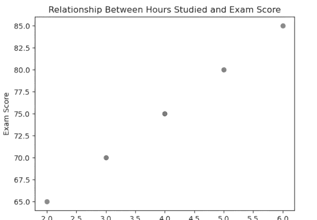

图 5.1：学习时间与考试成绩之间的关系。

图 5.1 展示了在视觉上应用简单线性回归之前，学习时间与相应考试成绩之间关系的散点图。图中的数据点显示了这两个变量的分布，允许对学习时间与学业成绩之间潜在关系进行初步检查。

**步骤 3：模型拟合**
现在，使用简单线性回归模型为数据拟合一条直线。
我们将使用的公式是 y = mx + b。
其中：

- x 是学习时间；
- m 是直线的斜率；
- b 是 y 轴截距；
- y 是预测的考试成绩。

**步骤 4：计算斜率 (m) 和截距 (b)**
使用以下公式计算 m 和 b：

$$m = \frac{n(\sum xy) - (\sum x)(\sum y)}{n(\sum x^2) - (\sum x)^2}$$

$$b = \frac{\sum y - m(\sum x)}{n}$$

其中：

- n 是数据点的数量，
- $\sum xy$ 是 x 和 y 乘积的总和，
- $\sum x$ 是 x 值的总和，
- $\sum y$ 是 y 值的总和，
- $\sum x^2$ 是 x 值平方的总和。

对于上述示例：

- n = 5
- $\sum xy = 1550$
- $\sum x = 20$
- $\sum y = 375$
- $\sum x^2 = 90$

$$m = \frac{5 * 1550 - 20 * 375}{5 * 90 - 20^2}$$

$$m = \frac{7750 - 7500}{450 - 400}$$

$$m = \frac{250}{50}$$

$$m = 5$$

$$b = \frac{375 - 5 * 20}{5}$$
$$b = \frac{375 - 100}{5}$$
$$b = \frac{275}{5}$$
$$b = 55$$

计算后，斜率 m = 5，y 轴截距 b = 55。
拟合在数据上的最佳拟合线为：

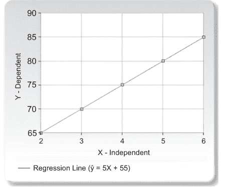

图 5.2：线性回归最佳拟合线。

图 5.2 显示了叠加在考试成绩与练习时间散点图上的线性回归最佳拟合线。最佳拟合线是一种线性模型，旨在最好地表示两个变量之间的关系，最小化实际数据点与线上预测值之间的偏差。

**步骤 5：进行预测**
使用直线方程对新数据点进行预测。例如，如果一个学生学习七小时，我们可以预测其考试成绩如下：

$$y = (5 \times 7) + 55 = 90$$

因此，学习 7 小时的学生的预测考试成绩为 90。

**步骤 6：评估模型**
为了确定我们的模型与数据的匹配程度，我们最后可以使用均方误差 (MSE) 或 R² 等指标来分析其性能。
评估模型的 Python 代码：

```python
import numpy as np

# 给定数据
hours_studied = np.array([2, 3, 4, 5, 6])
exam_scores = np.array([65, 70, 75, 80, 85])

# 步骤 1：计算预测值
predictions = 5 * hours_studied + 55

# 步骤 2：计算残差
residuals = exam_scores - predictions

# 步骤 3：计算均方误差
mse = np.mean(residuals**2)

# 步骤 4：计算总平方和
tss = np.sum((exam_scores - np.mean(exam_scores))**2)

# 步骤 5：计算残差平方和
rss = np.sum(residuals**2)

# 步骤 6：计算 R^2
r_squared = 1 - (rss / tss)

print("Mean Squared Error :", mse)
print("R^2:", r_squared)
```

**均方误差：0.0**

**R^2：1.0**

因此，R^2 值为 1.00，MSE 为 0.0。这些测量值显示了模型与数据的匹配程度，学习时间解释了考试成绩几乎 100% 的变异。
让我们看另一个场景，我们希望根据房屋的平方英尺数来估计其成本。我们将使用 scikit-learn 工具包和 Python 来进行简单线性回归。

**sklearn.linear_model**
scikit-learn 中的这个模块包含用于线性模型的各种类，包括回归模型。

**LinearRegression 类**

- 使用 **sklearn.linear_model** 提供的 **LinearRegression** 类将线性回归模型拟合到数据。
- 线性回归是使用线性技术对因变量和一个或多个自变量之间的关系进行建模。
- 在简单线性回归（如示例中所用）中，只有一个自变量。然而，scikit-learn 的 **LinearRegression** 类也可以处理多个自变量（多元线性回归）。
- **LinearRegression** 类实现了普通最小二乘 (OLS) 回归。它通过最小化残差平方和来找到通过数据点的最佳拟合线（或超平面）。
- 模型使用训练数据通过 **fit()** 方法训练后，可以使用 **predict()** 函数进行预测。

以下是代码：

```python
import numpy as np
from sklearn.linear_model import LinearRegression
import matplotlib.pyplot as plt

# 示例数据：房屋面积（平方英尺）和相应价格
house_sizes = np.array([800, 1000, 1200, 1500, 1800]).reshape(-1, 1) # 重塑为列向量
house_prices = np.array([100000, 150000, 180000, 210000, 250000])

# 步骤 1：创建并拟合模型
model = LinearRegression()
model.fit(house_sizes, house_prices)

# 步骤 2：进行预测
predicted_prices = model.predict(house_sizes)

# 步骤 3：可视化数据和回归线
plt.scatter(house_sizes, house_prices, color='blue', label='Actual Prices')
plt.plot(house_sizes, predicted_prices, color='red', label='Predicted Prices')
```

plt.xlabel('房屋面积（平方英尺）')
plt.ylabel('房屋价格（美元）')
plt.title('简单线性回归：房价预测')
plt.legend()
plt.show()

# 步骤 4：打印直线的斜率（系数）和截距
print("斜率（系数）:", model.coef_[0])
print("截距:", model.intercept_)

# 步骤 5：评估模型（可选）
mse = np.mean((predicted_prices - house_prices) ** 2)
r_squared = model.score(house_sizes, house_prices)
print("均方误差（MSE）:", mse)
print("R^2 分数:", r_squared)

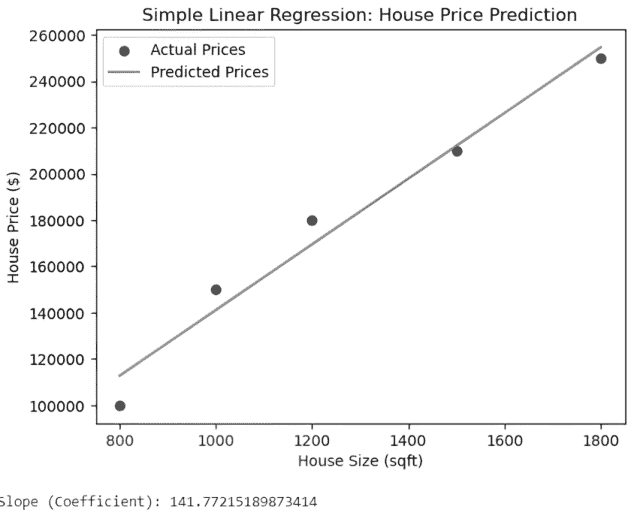

斜率（系数）: 141.77215189873414
截距: -632.911392405018
均方误差（MSE）: 75443037.97468361
R^2 分数: 0.9711609182053962

**图 5.3：** 样本线性回归：房价预测。

图 5.3 展示了一个使用线性回归根据房产面积预测房价的例子。散点图显示了房屋的平方英尺数或总居住面积与其相应售价之间的关系。使用线性回归技术估计的最佳拟合线叠加在数据点上，代表了一个旨在捕捉房屋面积与房价这一目标变量之间关系的线性模型。

#### 5.1.2 多元线性回归

作为简单线性回归的扩展，多元线性回归允许对因变量和多个自变量之间的相关性进行建模。它假设自变量和因变量之间存在线性关系。模型的方程具有以下格式：

$$y = b0 + b1x1 + b2x2 + \dots + bnxn$$

该方程中的因变量是 y，而自变量是 x1、x2、...、xn。对应于每个自变量，有系数（或权重）b0、b1、b2、...、bn。有趣的是，截距项是 b0。

使用诸如普通最小二乘法（OLS）之类的方法来估计系数，该方法最小化实际值与预测值之间差异的平方和。使用诸如 MSE 和 R2 之类的指标来评估模型的性能并确定其拟合优度。

多元线性回归能够对多个预测变量之间更复杂的关系和交互作用进行建模，使其成为金融、经济学、工程和社会科学等多个领域的通用工具。然而，它假设线性、预测变量的独立性、误差的恒定方差以及残差的正态分布，所有这些在解释之前都应进行检验。

多元线性回归模型的系数通过评估每个自变量对因变量的影响来解释，同时保持其他变量不变。假设所有其他变量保持不变，系数表示因变量相对于相应自变量的每单位变化如何变化。

可以使用多种方法执行多元线性回归，每种方法都有其优点和缺点。

##### 普通最小二乘法（OLS）方法

普通最小二乘法（OLS）是将多元线性回归模型拟合给定数据集的常用策略。其主要目标是找到回归模型的系数或权重，以最小化因变量的观测值与预测值之间差异的平方和。OLS 方法计算效率高，并产生系数的客观估计。

- 普通最小二乘法是拟合多元线性回归模型最常用的方法。
- 其目标是减少因变量的期望值与观测值之间差异的总平方和。
- OLS 通过确定使残差平方和（RSS）最小化的值来估计自变量的系数（权重）。
- 这种方法产生无偏的系数估计，并且计算效率高且易于应用。

要在 Python 中执行 OLS，可以使用 statsmodels 库，它为拟合统计模型（包括线性回归）提供了便捷的接口。以下是使用 statsmodels 执行 OLS 所涉及步骤的概述：

```python
import numpy as np
import pandas as pd
import statsmodels.api as sm

# 示例数据集
data = {
    'X1': [1, 2, 3, 4, 5],
    'X2': [2, 3, 4, 5, 6],
    'Y': [2, 3, 4, 5, 6]
}
df = pd.DataFrame(data)

# 向自变量添加截距项
X = sm.add_constant(df[['X1', 'X2']])
y = df['Y']

# 拟合 OLS 模型
model = sm.OLS(y, X).fit()

# 打印模型摘要
print(model.summary())
```

- 首先导入所需的库：用于数据集处理的 statsmodels、pandas，以及用于数值运算的 numpy。`statsmodels.api` 是 OLS 模型拟合的标准库。
- 描述一个包含因变量 Y 和自变量 X1、X2 的示例数据集。
- 使用 Pandas 将数据构造成 DataFrame df。
- 使用 `sm.add_constant()` 函数向自变量添加截距项，以便拟合 OLS 模型，这会向 DataFrame 添加一个表示截距项的单列。
- 指定哪些变量是因变量（y），哪些是自变量（X）。
- 使用 `sm.OLS(y, X).fit()` 拟合 OLS 模型，传入因变量 y 和自变量 X。
- 最后，使用 **model.summary()** 打印拟合模型的摘要，它提供了关于回归系数、标准误差、p 值以及拟合优度统计量（如 R 平方和调整后 R 平方）的详细信息。

```
OLS 回归结果
==============================================================================
因变量:                      Y   R 平方:                       1.000
模型:                            OLS   调整后 R 平方:                  1.000
方法:                 最小二乘法   F 统计量:                 3.977e+30
日期:                2024年2月16日，星期五   Prob (F 统计量):           2.78e-46
时间:                        10:54:44   对数似然值:                 164.57
观测数:                   5   AIC:                            -325.1
残差自由度:                       3   BIC:                            -325.9
模型自由度:                           1                                         
协方差类型:            非稳健                                         
==============================================================================
                 系数    标准误差          t      P>|t|      [0.025      0.975]
------------------------------------------------------------------------------
常数项          0.3333   1.26e-15   2.64e+14      0.000       0.333       0.333
X1             0.3333   8.69e-16   3.84e+14      0.000       0.333       0.333
X2             0.6667   4.09e-16   1.63e+15      0.000       0.667       0.667
==============================================================================
Omnibus:                          nan   Durbin-Watson:                   0.033
Prob(Omnibus):                    nan   Jarque-Bera (JB):                0.545
偏度:                          -0.111   Prob(JB):                        0.762
峰度:                       1.398   条件数:                     1.77e+16
==============================================================================

注释:
[1] 标准误差假设误差的协方差矩阵被正确指定。
[2] 最小特征值为 4.75e-31。这可能表明存在严重的多重共线性问题或设计矩阵是奇异的。
```

**图 5.4：** 普通最小二乘法（OLS）方法。

图 5.4 提供了普通最小二乘法（OLS）方法的可视化表示，这是线性回归分析中采用的基本技术。

上面显示的程序输出总结了 OLS 回归模型。它包括系数、标准误差、p 值、R 平方等数据。该摘要阐明了自变量和因变量之间的联系以及模型的整体拟合优度。

##### 梯度下降法

梯度下降是一种迭代优化过程，通过修改模型的系数或参数来最小化指定的成本函数。梯度下降是一种专门用于线性回归的技术，旨在选择最佳系数以最小化代价函数，该函数通常表示为均方误差。为此，需沿代价函数梯度的反方向更新系数。

- 一种旨在降低代价函数（如均方误差）的流行优化方法是梯度下降。通过迭代调整系数来实现这一目标。
- 在多元线性回归中使用梯度下降时，通过沿代价函数最陡下降方向前进来更新系数。
- 当面对数据量过大无法存入内存的大规模数据集时，梯度下降可以通过分批或小批量处理数据来使用。
- 值得注意的是，梯度下降可能不会收敛到预期的全局最小值，而是收敛到局部最小值。因此，微调学习率等超参数变得至关重要。

梯度下降算法的一种更直接的实现方式可用于在Python中执行该算法的操作。

```python
import numpy as np
import matplotlib.pyplot as plt

# Generate example data
X = 2 * np.random.rand(100, 1)
y = 4 + 3 * X + np.random.randn(100, 1)

# Add intercept term to independent variables
X_b = np.c_[np.ones((100, 1)), X]

# Gradient Descent parameters
eta = 0.1  # Learning rate
n_iterations = 1000
m = 100  # Number of data points

# Random initialization of coefficients
theta = np.random.randn(2, 1)

# Gradient Descent
for iteration in range(n_iterations):
    gradients = 2/m * X_b.T.dot(X_b.dot(theta) - y)
    theta -= eta * gradients

# Plot data points
plt.scatter(X, y, color='blue', label='Data Points')

# Plot regression line
X_new = np.array([[0], [2]])
X_new_b = np.c_[np.ones((2, 1)), X_new]
y_predict = X_new_b.dot(theta)
plt.plot(X_new, y_predict, color='red', label='Regression Line')

plt.xlabel('X')
plt.ylabel('y')
plt.title('Gradient Descent Linear Regression')
plt.legend()
plt.show()

# Print final coefficients
print("Intercept:", theta[0][0])
print("Slope:", theta[1][0])
```

- 创建一个名为X和Y的样本数据集，其中X代表一个特征，Y代表目标变量。
- `np.c_[np.ones((100, 1)), X]` 用于向自变量添加截距项。
- 建立梯度下降的设置，包括数据点数量（m）、迭代次数（n_iterations）和学习率（eta）。
- 随机初始化系数theta。
- 使用代价函数相对于系数的梯度更新系数theta，并执行预定次数的梯度下降迭代。
- 使用Matplotlib绘制回归线和数据点。
- 最后打印回归线的最终系数。

程序输出是一个包含数据点和通过梯度下降拟合的回归线的图表。此外，还会打印出反映斜率和截距的最终回归线系数。

##### 矩阵求逆法

矩阵求逆法是一种通过直接求解正规方程来寻找多元线性回归模型系数的机制。正规方程源于最小化因变量预测值与观测值之间平方差之和的优化问题。通过求解此方程，我们可以找到回归模型的理想系数。

##### 梯度下降线性回归

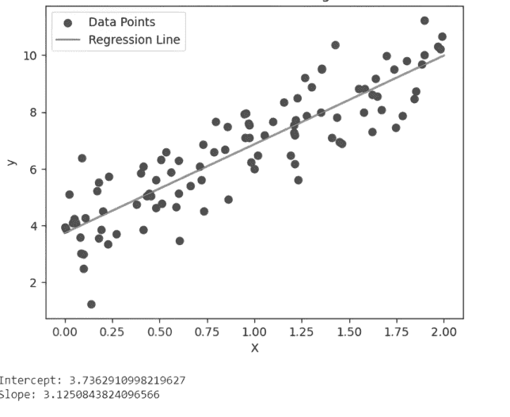

Intercept: 3.7362910998219627
Slope: 3.1250843824096566

图 5.5：梯度下降线性回归。

图 5.5 展示了梯度下降的概念，这是线性回归中广泛使用的优化算法。

- 该方法涉及求解正规方程 $(X^TX)^{-1}X^Ty$，其中 X 是自变量矩阵，y 是因变量向量，$(X^TX)^{-1}$ 是矩阵 $X^TX$ 的逆矩阵。
- 多元线性回归模型的系数可以通过矩阵求逆以代数表达式的形式求解。
- 当应用于大型数据集时，此操作可能非常耗费资源，因为需要计算矩阵的逆。当矩阵条件不佳时尤其如此。
- 然而，矩阵求逆确保了无需迭代优化即可获得精确解，因此对于较小规模的数据集具有优势。

```python
import numpy as np
import matplotlib.pyplot as plt

# Generate synthetic dataset
X = 2 * np.random.rand(100, 1)
y = 4 + 3 * X + np.random.randn(100, 1)

# Add intercept term to feature matrix
X_b = np.c_[np.ones((100, 1)), X]
# Compute coefficients using matrix inversion method
theta_best = np.linalg.inv(X_b.T.dot(X_b)).dot(X_b.T).dot(y)

# Plot data points
plt.scatter(X, y, color='blue', label='Data Points')

# Plot regression line
X_new = np.array([[0], [2]])
X_new_b = np.c_[np.ones((2, 1)), X_new]
y_predict = X_new_b.dot(theta_best)
plt.plot(X_new, y_predict, color='red', label='Regression Line')

plt.xlabel('X')
plt.ylabel('y')
plt.title('Multiple Linear Regression with Matrix Inversion Method')
plt.legend()
plt.show()

# Print final coefficients
print("Intercept:", theta_best[0][0])
print("Slope:", theta_best[1][0])
```

##### 方法选择

- 方法的选择取决于多种因素，包括数据集的规模、计算资源的可用性以及对可解释性的需求。
- 对于较小规模的数据集且可解释性至关重要时，普通最小二乘法（OLS）是首选方法。
- 梯度下降非常适合大规模数据集和支持并行处理的环境。
- 矩阵求逆法适用于从小到中等规模的数据集，前提是计算资源充足。

#### 5.1.3 多项式回归

使用“n次”多项式函数分析回归数据以确定自变量（用‘x’表示）与因变量（用‘y’表示）之间关系的过程称为多项式回归。

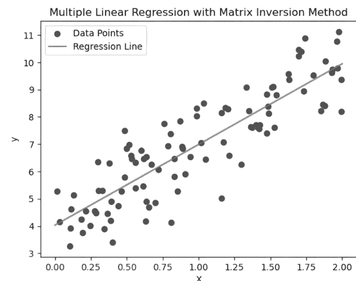

```
Intercept: 4.028910964982237
Slope: 2.9589962022044998
```

图 5.6：使用矩阵求逆法的多元线性回归。

与假设变量之间存在线性关系的简单线性回归不同，多项式回归能够高效地表示复杂和非线性的关系。

图 5.6 展示了一个多元线性回归模型的可视化表示，该模型涉及多个自变量，并使用矩阵求逆法进行拟合。

#### 工作原理

1. 模型表示：多项式回归使用n次多项式函数 y = θ0 + θ1x + θ2x2 + ⋯ + θnxn + ε 来表示 x 和 y 之间的关系。系数为 θ0, θ1, . . ., 和 θn，误差项用 ε 表示。
2. 多项式次数：模型的复杂性基于多项式的次数。更高的次数可能过拟合，但也能捕捉更复杂的交互作用。
3. 模型拟合：在多项式回归中，使用矩阵求逆、梯度下降或普通最小二乘法（OLS）等方法将模型拟合到训练数据集上。
4. 评估：使用交叉验证、R2分数和MSE等指标来评估模型的性能。
5. 预测：可以训练模型对新的数据点进行预测。

例如，考虑一个我们拥有温度（x）与冰淇淋销售率（y）之间关系数据的场景。简单线性回归可能无法充分捕捉这种非线性关系。在这种情况下，可以使用多项式回归（如二次或三次回归）来更好地建模关系中的曲率，从而可能提高预测准确性。

#### 应用

- **曲线拟合**：多项式回归通常用于变量之间关系为非线性的曲线拟合应用。
- **工程与物理**：它广泛应用于工程和物理领域，用于建模物理系统中变量之间的关系。
- **经济学**：在经济学中，多项式回归可以建模表现出非线性行为的经济变量之间的关系。

使用Python，我们可以利用NumPy和scikit-learn等库进行多项式回归。NumPy将用于数值运算，scikit-learn提供了用于回归建模和多项式特征的有用方法。我们将使用Matplotlib可视化数据。

```python
import numpy as np
import matplotlib.pyplot as plt
from sklearn.preprocessing import PolynomialFeatures
from sklearn.linear_model import LinearRegression

# Generate example data
X = np.linspace(-3, 3, 100).reshape(-1, 1)
y = 2 * X + np.random.normal(0, 1, size=X.shape)

# Polynomial features
poly_features = PolynomialFeatures(degree=2)  # Quadratic regression
X_poly = poly_features.fit_transform(X)

# Fit polynomial regression model
poly_reg = LinearRegression()
poly_reg.fit(X_poly, y)

# Predictions
y_pred = poly_reg.predict(X_poly)

# Plot data points
plt.scatter(X, y, color='blue', label='Data Points')
```

## 绘制回归直线

```python
plt.plot(X, y_pred, color='red', label='Polynomial Regression')
plt.xlabel('X')
plt.ylabel('y')
plt.title('Polynomial Regression Example')
plt.legend()
plt.show()

# Print coefficients
print("Intercept:", poly_reg.intercept_)
print("Coefficients:", poly_reg.coef_)
```

- 导入NumPy进行数值计算，导入Matplotlib进行数据可视化。
- 生成具有线性关系（y = 2x）并添加了一些噪声的示例数据。
- 使用scikit-learn中的PolynomialFeatures生成最高至2次（二次回归）的多项式特征。
- 利用多项式特征，拟合一个线性回归模型。
- 基于拟合好的模型进行预测。
- 可以使用Matplotlib绘制回归直线和数据点。
- 然后应打印多项式回归模型的系数。

程序的最终输出描绘了一个图形表示，该图既展示了数据点，也展示了利用多项式回归（在此特定实例中更具体地说是二次回归）拟合的回归直线。此外，它还提供了与多项式回归模型相关的系数的打印表示，包括截距和与多项式特征相关的系数。

### 5.2 逻辑回归

逻辑回归是监督学习中一种广受欢迎的算法，通常用于二元分类任务，其中目标变量表现出两种可能的结果。与其名称相反，逻辑回归被归类为分类算法，而非回归算法。

图5.7展示了一个多项式回归模型，这是一种回归分析形式，用于拟合自变量与因变量之间的非线性关系。

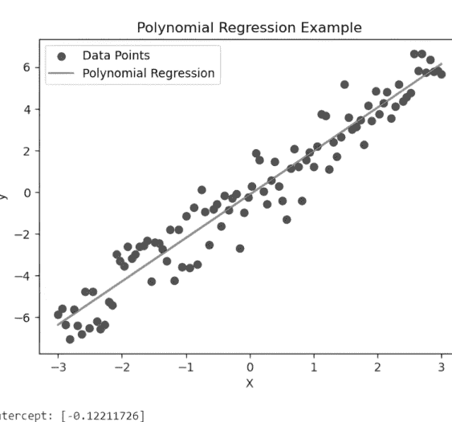

```
Intercept: [-0.12211726]
Coefficients: [[0.00000000e+00 2.08372128e+00 1.31488961e-03]]
```

图5.7：多项式回归。

#### 工作原理

1.  **模型表示**：逻辑回归是一种统计模型，用于估计输入属于特定类别的可能性。它使用逻辑函数（也称为sigmoid函数）将特征的线性组合结果转换为0到1之间的概率值。

    $$P(y=1|x) = \frac{1}{1+e^{-z}}$$

    特征值的线性组合，记为z，可以表示为θ0 + θ1x1 + θ2x2 + ... + θnxn，其中θ代表系数。

2.  **决策边界**：逻辑回归通过判断预测概率是否超过指定阈值（通常设为0.5）来对类别标签进行预测。决策边界是特征空间中区分不同类别的超曲面。

3.  **训练**：模型通过使用梯度下降或牛顿法等优化算法进行训练，目的是找到能使逻辑损失函数最小化的最优系数。

4.  **评估**：模型性能的评估通过使用准确率、精确率、召回率、F1分数和ROC-AUC等指标进行。

5.  **预测**：模型训练完成后，能够估计新实例属于每个类别的可能性，然后根据预定阈值分配相应的类别标签。

#### 优点

-   **简单高效**：逻辑回归计算效率高且易于实现。
-   **可解释性**：逻辑回归系数提供了关于单个特征重要性及其影响目标变量方向的宝贵见解。
-   **概率解释**：逻辑回归输出概率，允许进行不确定性估计。

#### 局限性

-   **线性决策边界**：逻辑回归假设特征与因变量的对数几率之间存在线性关系，这可能无法涵盖复杂的非线性关系。
-   **二元分类**：逻辑回归仅限于二元分类任务，未经修改无法直接应用于多类问题。

#### 应用

-   **医疗诊断**：逻辑回归用于医疗诊断，例如根据患者特征预测疾病的可能性。
-   **信用评分**：它被用于信用评分模型，根据财务属性预测违约的可能性。
-   **营销分析**：逻辑回归用于营销分析中的客户细分和预测客户流失。

##### 示例

考虑这样一种情况：我们希望根据电子邮件内容的特征（如词频和特定关键词的出现情况）来预测该邮件是否被归类为垃圾邮件。逻辑回归能够在标记的电子邮件集合（垃圾邮件或非垃圾邮件）上进行训练，从而根据新电子邮件的内容属性将其分类为垃圾邮件或非垃圾邮件。

让我们逐步进行一个简单逻辑回归的数值示例：

##### 步骤1：数据准备

假设我们拥有一个包含两个特征x和y以及一个二元目标变量y的数据集，该变量表示学生是否通过（1）或未通过（0）考试。以下是我们数据集的简略版本：

| x | y | 通过/失败 |
|---|---|---|
| 2.5 | 3.5 | 1 |
| 3.0 | 4.0 | 1 |
| 2.0 | 3.0 | 0 |
| 2.5 | 3.0 | 1 |
| 3.5 | 4.0 | 0 |

##### 步骤2：模型表示

我们使用逻辑回归来描述特征与考试成功可能性之间的关系：

$$P(y=1|x) = \frac{1}{1+e^{-z}}$$

其中 $z = \theta_0 + \theta_1x_1 + \theta_2x_2$ 是特征和系数的线性组合。

##### 步骤3：训练

我们使用梯度下降等优化算法来找到能使逻辑损失函数最小化的最优系数（$\theta_0$, $\theta_1$, $\theta_2$）。逻辑损失函数衡量预测概率与真实类别之间的差异。

##### 步骤4：预测

逻辑回归模型训练完成后，就能够根据新学生的特征值预测其考试成功的可能性。例如，如果一个新学生的x = 2.8，y = 3.7，我们可以使用获得的系数来预测其成功的概率。

##### 步骤5：评估

我们在一个独立的验证或测试数据集上，使用准确率、精确率、召回率和F1分数等各种指标来评估模型的性能。这些指标用于衡量模型准确预测真实类别的能力。

##### 示例

让我们考虑一个我们已经成功训练了一个逻辑回归模型的场景。该模型的系数为θ0 = −1, θ1 = 2, θ2 = 3。

对于一个x = 2.8，y = 3.7的新学生，我们计算：

$$z = -1 + 2 \times 2.8 + 3 \times 3.7 = 8.4$$

$$P(y=1|x) = \frac{1}{1+e^{-8.4}} \approx 0.9997$$

因此，逻辑回归模型以高概率预测该新学生将通过考试。

#### 5.2.1 二元分类

二元分类是机器学习领域的一项基本任务，其主要目标是将输入数据归类到两个可能的类别或类别之一。这包括确定一封电子邮件是否被视为垃圾邮件，一个肿瘤是恶性还是良性，或者一笔交易是欺诈性的还是合法的。现在让我们全面深入地探讨二元分类的复杂领域：

#### 工作原理

-   二元分类的目标是学习输入特征与离散二元标签（通常表示为0或1，代表两个类别）之间的关系。
-   数据集准备：数据集被划分为自变量（特征）及其对应的因变量（二元标签）。每个数据点包含特征值和相关的类别标签。
-   模型选择：多种算法，包括但不限于逻辑回归、决策树、支持向量机（SVM）、随机森林和神经网络，都有可能被用于二元分类。
-   模型训练：所选算法在标记数据集的帮助下进行训练，使其能够掌握各种特征与类别标签之间的复杂模式和相互关系。在训练过程中，算法会调整其内部参数，以最小化预设的损失或误差函数。
-   模型评估：训练好的模型通过使用准确率、精确率、召回率、F1分数和受试者工作特征（ROC）曲线等评估指标进行评估。这些指标用于衡量模型的性能。

##### 二元分类

二元分类是机器学习中的一项基本任务，其目标是将输入数据划分为两个不同的类别或分类之一。模型学习根据数据的特征来区分这两个类别。

- **预测**：在训练和评估过程完成后，模型可用于对新的数据实例进行预测。这是通过将每个实例根据其关联的特征值分类到两个类别之一来实现的。

##### 评估指标

- 准确率指标表示正确分类的实例占总实例数的比例。
- 精确率则表示真正例预测占所有正例预测的比例，它突出了模型在减少假阳性方面的有效性。
- 召回率，也称为灵敏度，衡量真正例预测占所有实际正例的比例，从而展示了模型检测所有正例的能力。
- F1分数作为精确率和召回率的调和平均数，提供了对这两个指标的平衡评估。
- ROC-AUC评估受试者工作特征曲线下的面积，从而评估模型在不同阈值下区分正负类的能力。

#### 应用

二元分类应用于多个领域，涵盖广泛的应用场景：

- 医疗诊断：根据症状或医学检测结果识别疾病。
- 垃圾邮件检测：将电子邮件分类为垃圾邮件或合法邮件。
- 信用风险评估：预测贷款申请人是否可能违约。
- 欺诈检测：在金融系统中识别欺诈性交易。
- 情感分析：确定文本的情感倾向，判断其传达的是积极还是消极的语气，这是一项重要任务。

##### 示例

假设我们有一个包含客户交易信息的数据集，包括交易金额、交易时间以及交易是欺诈性（1）还是合法（0）。通过在这个数据集上训练一个二元分类模型，我们可以预测未来的交易是否可能具有欺诈性，从而采取主动措施防止欺诈活动。

让我们考虑一个使用逻辑回归进行二元分类的Python代码示例，包括绘图和评估指标。我们将使用scikit-learn中著名的鸢尾花数据集，其中我们将分类给定的鸢尾花是否属于“山鸢尾”物种。

- 加载鸢尾花数据集，并仅获取与“山鸢尾”物种相关的特征和目标标签。
- 将数据集划分为训练集和测试集。
- 使用逻辑回归模型对数据进行分类训练。
- 使用测试数据生成预测，并通过准确率、精确率、召回率、F1分数和混淆矩阵来评估模型性能。
- 以可视化方式表示数据点和决策边界，以便于分类可视化。

```python
import numpy as np
import matplotlib.pyplot as plt
import seaborn as sns
from sklearn.datasets import load_iris
from sklearn.model_selection import train_test_split
from sklearn.linear_model import LogisticRegression
from sklearn.metrics import accuracy_score, precision_score, recall_score, f1_score, confusion_matrix

# Load the Iris dataset
iris = load_iris()
X = iris.data[:, :2] # Take only first two features for simplicity
y = (iris.target == 0).astype(int) # Binary classification: Setosa or not

# Split the dataset into training and testing sets
X_train, X_test, y_train, y_test = train_test_split(X, y, test_size=0.2, random_state=42)

# Train a logistic regression model
model = LogisticRegression()
model.fit(X_train, y_train)

# Make predictions on the test set
y_pred = model.predict(X_test)

# Evaluate the model
accuracy = accuracy_score(y_test, y_pred)
precision = precision_score(y_test, y_pred)
recall = recall_score(y_test, y_pred)
f1 = f1_score(y_test, y_pred)
conf_matrix = confusion_matrix(y_test, y_pred)
print("Accuracy:", accuracy)
print("Precision:", precision)
print("Recall:", recall)
print("F1-score:", f1)
print("Confusion Matrix:\n", conf_matrix)

# Plot decision boundary
x_min, x_max = X[:, 0].min() - 1, X[:, 0].max() + 1
y_min, y_max = X[:, 1].min() - 1, X[:, 1].max() + 1
xx, yy = np.meshgrid(np.arange(x_min, x_max, 0.01), np.arange(y_min, y_max, 0.01))
Z = model.predict(np.c_[xx.ravel(), yy.ravel()])
Z = Z.reshape(xx.shape)
plt.contourf(xx, yy, Z, alpha=0.3)
sns.scatterplot(x=X_test[:, 0], y=X_test[:, 1], hue=y_test)
plt.xlabel('Sepal Length')
plt.ylabel('Sepal Width')
plt.title('Binary Classification (Setosa vs. Not Setosa)')
plt.show()
```

准确率：1.0
精确率：1.0
召回率：1.0
F1分数：1.0
混淆矩阵：
[[20  0]
 [ 0 10]]

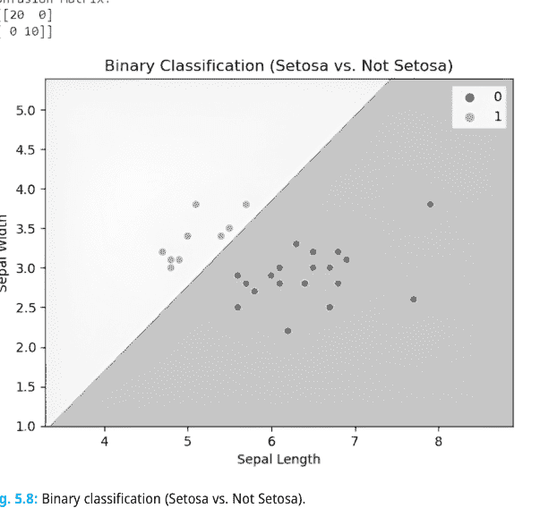

图 5.8：二元分类（山鸢尾 vs. 非山鸢尾）。

图 5.8 展示了二元分类问题的可视化表示，具体区分了鸢尾花的山鸢尾物种和所有其他非山鸢尾物种。该图显示了数据点的散点图，其中每个点代表一个单独的鸢尾花样本。

- 代码的结果包含多种评估指标，包括准确率、精确率、召回率、F1分数和混淆矩阵。
- 准确率表示正确分类的实例占总实例数的比例。
- 精确率表示真正例预测占所有正例预测的比例，而召回率衡量真正例预测占所有实际正例的比例。
- F1分数是精确率和召回率之间平衡性的度量，计算为这两个指标的调和平均数。混淆矩阵显示了真正例、真负例、假正例和假负例预测的频率。
- 此外，代码生成了决策边界与测试数据点的可视化表示，这有助于理解分类。被分类为“山鸢尾”的数据点以一种颜色显示，而被分类为“非山鸢尾”的数据点则以另一种颜色表示。

#### 5.2.2 多类分类

多类分类涉及机器学习中的一项任务，其目标是将输入数据划分为三个或更多类别或分类。与仅涉及两个类别的二元分类不同，多类分类涵盖了对多个可能结果的预测。我们现在将通过一个数值示例来阐明多类分类的概念。

##### 示例

考虑一个由手写数字（范围从0到9）图像组成的数据集。每个单独的图像表示为一个包含像素值的矩阵。主要目标是将每个图像准确分类到十个可能的数字类别之一，即0、1、2、...、9。

#### 工作原理

多类分类背后的基本原理是学习从输入特征到离散类标签的映射。在此上下文中，每个数据点被分配到一个且仅一个类别。

- **数据集准备**：数据集被划分为不同的特征（代表输入数据）及其对应的类标签。需要注意的是，每个数据点由多个特征表征，并被分配到多个类别之一。
- **模型选择**：有许多算法可用于多类分类，例如逻辑回归、决策树、随机森林、支持向量机（SVM）和神经网络。一些算法本身支持多类分类，而其他算法可以使用一对多（OvR）或一对一（OvO）等技术进行扩展。
- **模型训练**：所选算法使用带标签的数据集进行训练，在此过程中学习特征和类标签之间的潜在模式和关系。在整个训练过程中，算法调整其内部参数以最小化预定义的损失或误差函数。
- **模型评估**：使用各种指标评估训练后模型的性能，包括准确率、精确率、召回率、F1分数和混淆矩阵。这些指标评估了模型对未见数据预测真实类标签的有效性。
- **预测**：一旦模型经过训练和评估，就可以用于对新的数据实例进行预测。这涉及根据每个实例的特征值将其分配到多个类别之一。

##### 评估指标

- **准确率**：准确率定义为正确分类的实例与总实例数的比率。
- **精确率**：另一方面，精确率是每个类的真正例预测与该类所有正例预测的比率。
- **召回率（灵敏度）**：召回率，也称为灵敏度，是每个类的真正例预测与该类所有实际正例的比率。
- **F1分数**：F1分数是精确率和召回率的调和平均数，作为平衡两者的一种手段。
- **混淆矩阵**：混淆矩阵是一个表格，显示每个类的真正例、真负例、假正例和假负例预测的计数。

#### 应用

多类分类在各个领域有许多实际应用，包括：

- 手写数字识别
- 语音识别
- 图像分类
- 自然语言处理（例如，情感分析、主题分类）
- 医疗诊断（例如，疾病分类）

多类分类是机器学习中的一项关键任务，为各种应用中的决策提供了有价值的见解和预测。

以下是一个说明性的Python代码示例，它利用广泛认可的Iris数据集（可在scikit-learn中获取）来执行多类分类。我们的目标是将鸢尾花分为三个物种之一，即Setosa、Versicolor或Virginica。为了实现这一目标，我们将使用一个基本的逻辑回归模型。

- 加载Iris数据集并提取特征和目标标签。
- 将数据集划分为训练集和测试集。
- 在训练数据上训练一个逻辑回归模型。
- 在测试数据上进行预测。
- 通过准确率、精确率、召回率、F1分数和混淆矩阵来评估模型。
- 通过绘制混淆矩阵图来可视化模型的性能。

```python
import numpy as np
import matplotlib.pyplot as plt
import seaborn as sns
from sklearn.datasets import load_iris
from sklearn.model_selection import train_test_split
from sklearn.linear_model import LogisticRegression
from sklearn.metrics import accuracy_score, precision_score, recall_score, f1_score, confusion_matrix

# Load the Iris dataset
iris = load_iris()
X = iris.data
y = iris.target

# Split the dataset into training and testing sets
X_train, X_test, y_train, y_test = train_test_split(X, y, test_size=0.2, random_state=42)

# Train a logistic regression model
model = LogisticRegression(max_iter=1000)
model.fit(X_train, y_train)

# Make predictions on the test set
y_pred = model.predict(X_test)

# Evaluate the model
accuracy = accuracy_score(y_test, y_pred)
precision = precision_score(y_test, y_pred, average='weighted')
recall = recall_score(y_test, y_pred, average='weighted')
f1 = f1_score(y_test, y_pred, average='weighted')
conf_matrix = confusion_matrix(y_test, y_pred)

print("Accuracy:", accuracy)
print("Precision:", precision)
print("Recall:", recall)
print("F1-score:", f1)
print("Confusion Matrix:\n", conf_matrix)

# Plot confusion matrix
plt.figure(figsize=(8, 6))
sns.heatmap(conf_matrix, annot=True, fmt='d', cmap='Blues', xticklabels=iris.target_names, yticklabels=iris.target_names)
plt.xlabel('Predicted Label')
plt.ylabel('True Label')
plt.title('Confusion Matrix')
plt.show()
```

代码产生的结果包含一系列指标，包括准确率、精确率、召回率、F1分数以及混淆矩阵。
- 准确率衡量的是正确分类的实例占总实例的比例。
- 精确率、召回率和F1分数为模型在分类每个单独类别时的有效性提供了有价值的见解。
- 混淆矩阵提供了每个类别中真正例、真负例、假正例和假负例预测数量的全面细分。
- 此外，代码还生成了混淆矩阵的热力图，以直观地描绘模型的性能。矩阵的对角线元素对应于正确的分类，而非对角线元素则表示错误的分类。

#### 5.2.3 逻辑回归中的正则化

正则化是机器学习中用于解决过拟合问题的一种技术，它通过在损失函数中引入一个额外的项来实现。在逻辑回归中，正则化通过惩罚大的系数值，在控制模型复杂度方面起着至关重要的作用。这可以防止模型过度依赖训练数据，从而提高泛化能力和在未见数据上的性能。

```
Accuracy: 1.0
Precision: 1.0
Recall: 1.0
F1-score: 1.0
Confusion Matrix:
[[10  0  0]
 [ 0  9  0]
 [ 0  0 11]]
```

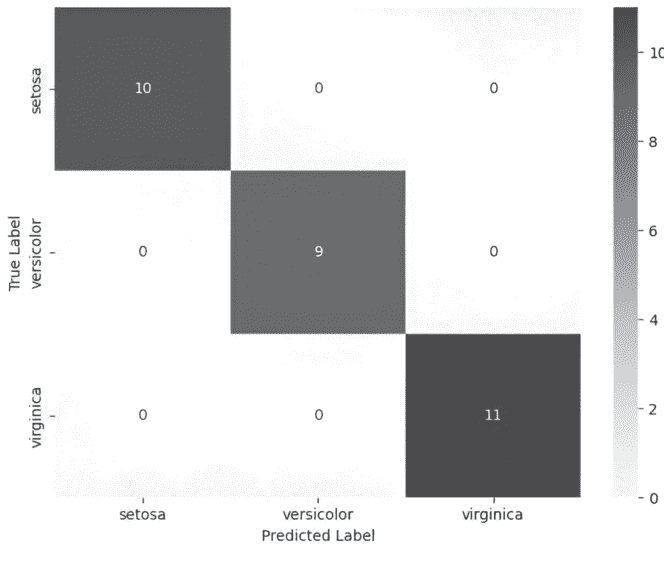

图 5.9：多类分类。

图 5.9 全面展示了多类分类问题，包括各种评估指标和混淆矩阵。

#### 工作原理

- 逻辑回归的主要目标是确定最优系数，以最小化逻辑损失函数，并将实例有效地分类到其对应的类别中。
- **正则化项：** 正则化在损失函数中引入了一个惩罚项，从而抑制了系数值过大的情况。在逻辑回归中，两种常见的正则化方法是L1正则化（也称为Lasso）和L2正则化（通常称为Ridge）。
- **L1正则化（Lasso）：** L1正则化将系数的绝对值纳入损失函数。这种机制通过将某些系数驱动为零来促进模型的稀疏性，从而有效地执行特征选择。
- **L2正则化（Ridge）：** L2正则化将系数的平方值包含在损失函数中。它惩罚大的系数值，导致其减小并防止过拟合。
- **正则化参数（λ）：** 正则化的强度由一个称为λ（lambda）的超参数决定。λ值越高，正则化越强，导致系数值越小，模型越简单。

##### 示例

假设构建了一个具有两个特征（即x1和x2）的逻辑回归模型，以及一个二元目标变量y，表示客户是否会购买产品（1）或不会（0）。在没有正则化的情况下，模型可能完美地拟合训练数据，但其泛化到新数据的能力可能有限。

通过实施L1或L2正则化，损失函数中会引入一个惩罚项，该惩罚项考虑了系数的大小。例如，当使用L2正则化时，损失函数被修改为：

$$Loss = -\frac{1}{N} \sum_{i=1}^{N} [y_i \log(\hat{y}_i) + (1 - y_i) \log(1 - \hat{y}_i)] + \lambda \sum_{j=1}^{p} \theta_j^2$$

其中，正则化参数λ、实例数量N、特征数量p以及系数θj都是此上下文中的重要因素。

正则化带来了几个好处。首先，它作为防止过拟合的预防措施。通过有效管理模型的复杂度，正则化确保模型不会对训练数据中存在的噪声过于敏感。此外，正则化增强了模型的泛化能力。包含正则化技术通常会使模型更擅长外推到未见数据，因为它有助于最小化方差。

下面展示了一个Python代码示例，演示了在逻辑回归中实施L2正则化（也称为Ridge）的方法。此示例包括绘图和评估指标的使用。为了应用正则化并防止过拟合，使用了scikit-learn中的Iris数据集。

- 加载Iris数据集并获取特征以及目标标签。
- 将数据集划分为单独的训练集和测试集。
- 使用带有L2正则化（Ridge）的逻辑回归模型来训练数据。
- 在测试数据上生成预测。
- 使用准确率、精确率、召回率、F1分数和混淆矩阵评估模型的性能。
- 通过绘制模型的决策边界来说明正则化对其的影响。

```python
import numpy as np
import matplotlib.pyplot as plt
import seaborn as sns
from sklearn.datasets import load_iris
from sklearn.model_selection import train_test_split
from sklearn.linear_model import LogisticRegression
from sklearn.metrics import accuracy_score, precision_score, recall_score, f1_score, confusion_matrix

# Load the Iris dataset
iris = load_iris()
X = iris.data[:, :2] # Take only first two features for simplicity
y = (iris.target == 0).astype(int) # Binary classification: Setosa or not

# Split the dataset into training and testing sets
X_train, X_test, y_train, y_test = train_test_split(X, y, test_size=0.2, random_state=42)

# Train a logistic regression model with L2 regularization (Ridge)
model = LogisticRegression(penalty='l2', max_iter=1000, C=1) # C is the inverse of regularization strength
model.fit(X_train, y_train)

# Make predictions on the test set
y_pred = model.predict(X_test)

# Evaluate the model
accuracy = accuracy_score(y_test, y_pred)
precision = precision_score(y_test, y_pred)
recall = recall_score(y_test, y_pred)
f1 = f1_score(y_test, y_pred)
conf_matrix = confusion_matrix(y_test, y_pred)

print("Accuracy:", accuracy)
print("Precision:", precision)
print("Recall:", recall)
```

print("F1-score:", f1)
print("Confusion Matrix:\n", conf_matrix)

# 绘制决策边界
x_min, x_max = X[:, 0].min() - 1, X[:, 0].max() + 1
y_min, y_max = X[:, 1].min() - 1, X[:, 1].max() + 1
xx, yy = np.meshgrid(np.arange(x_min, x_max, 0.01), np.arange(y_min, y_max, 0.01))
Z = model.predict(np.c_[xx.ravel(), yy.ravel()])
Z = Z.reshape(xx.shape)
plt.contourf(xx, yy, Z, alpha=0.3)
sns.scatterplot(x=X_test[:, 0], y=X_test[:, 1], hue=y_test)
plt.xlabel('花萼长度')
plt.ylabel('花萼宽度')
plt.title('逻辑回归中的正则化 (L2)')
plt.show()

```
Accuracy: 1.0
Precision: 1.0
Recall: 1.0
F1-score: 1.0
Confusion Matrix:
[[20  0]
 [ 0 10]]
```

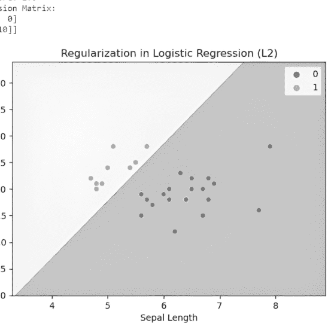

图 5.10：逻辑回归中的正则化 (L2)。

图 5.10 展示了对逻辑回归模型应用 L2 正则化的效果。

- 代码的结果涵盖了几个评估指标，即准确率、精确率、召回率、F1 分数和混淆矩阵。
- 准确率指标衡量的是正确分类的实例占总实例数的比例。
- 精确率、召回率和 F1 分数为模型在分类正类时的性能提供了有价值的见解。
- 混淆矩阵提供了真正例、真负例、假正例和假负例预测的细分。
- 此外，代码生成了一个可视化表示，展示了决策边界以及测试数据点。
- 正则化技术的使用有助于平滑决策边界，从而降低过拟合训练数据的风险，并增强模型对新数据的泛化能力。

### 5.3 决策树与随机森林

决策树和随机森林作为用于分类和回归任务的机器学习算法，已经获得了相当大的普及。

#### 决策树

定义：决策树是类似于树的层次结构。这些结构中的每个内部节点代表基于特定特征的决策。同时，每个分支表示该决策的结果。最后，每个叶节点代表最终的决策或预测。

**工作原理：** 决策树通过考虑输入特征的值来反复划分特征空间。在每个节点，算法选择最能有效地将数据分离成相似子集的特征。这个过程持续进行，直到所有数据点都被分配到同一类别，或者满足预定的停止标准。

**优点：**
可解释性：决策树具有直接和易于理解的特性，使其适合解释预测背后的原理。
非参数性：它们不对数据的底层分布做出假设。同时适用于数值数据和分类数据。

**缺点：**
容易过拟合：决策树倾向于产生过于复杂的模型，这些模型过度拟合训练数据，从而导致在未见数据上泛化不足。
不稳定性：数据的微小波动可能导致不同的树结构，因此它们容易受到噪声的影响。

#### 随机森林

**定义：** 随机森林是一种集成学习方法，由一组决策树组成。森林中的每棵树都在训练数据的随机子集和特征的随机子集上进行训练。然后，将每棵树的预测结果结合起来，形成最终的预测。

**工作原理：** 随机森林结合了多个决策树的预测能力，以提高泛化性能并减轻过拟合。在训练阶段，每棵树使用训练数据和特征的随机子集独立生长。最终预测是通过平均所有树的预测（对于回归）或通过多数投票（对于分类）获得的。

**优点：**
增强的泛化能力：随机森林通过聚合多个单独树的预测来缓解过拟合问题。
鲁棒性：由于集合作用，它们能很好地处理噪声数据和异常值。
特征重要性：它们提供了特征重要性的度量，使用户能够识别出对预测最相关的特征。

**缺点：**
复杂性：与单个决策树相比，随机森林表现出更大的复杂性，使其更难以解释。
计算成本：使用随机森林进行训练和预测可能会产生相当大的计算开销，尤其是在处理大型数据集时。

#### 应用

决策树和随机森林广泛应用于各个领域，包括但不限于：

- 金融：信用评估和欺诈活动识别。
- 医疗保健：疾病诊断和预后评估。
- 营销：客户细分和流失预测。
- 环境科学：物种分类和土地覆盖分类。

决策树和随机森林是强大的机器学习算法，各有其优缺点。决策树提供了透明度和简单性，而随机森林则通过集成学习提供了更强的泛化能力和鲁棒性。

#### 5.3.1 构建决策树

构建决策树的过程涉及根据输入特征值迭代地划分数据集，从而形成一个类似于树的层次结构。在这个结构中，内部节点表示决策，而叶节点表示最终的预测。

示例：预测贷款批准
假设我们有一个贷款申请人的数据集，包含收入、信用评分和就业状况等特征，目标变量表示贷款是否被批准（是或否）。

- 构建决策树的过程始于选择最佳划分，这涉及识别能够最有效地将数据集划分为独立的、同质子集的特征。例如，信用评分特征可能能够创建纯度最高的组。换句话说，每个组主要由属于单个类别标签的实例组成，例如贷款批准的“是”或“否”。
- 一旦确定了最有利的划分，就在树的顶部建立一个决策节点，以表示所选属性及其相关的划分。这在决策过程中起到了关键节点的作用。
- 决策节点建立后，数据集根据所选特征的值被划分为子组。每个子组对应于从决策节点发出的一个分支，便于进一步的检查和研究。
- 随后发生递归划分过程，其中对每个子集重复上述措施。这种迭代策略持续进行，直到满足以下终止条件之一：
    - 子集中的所有数据点都属于同一类别，表明具有高度的同质性。
    - 已达到树的最大深度，表明进一步的划分不会带来显著的改进。
    - 节点中的最小数据点数量已达到，表明进一步的划分不会提供有意义的见解。
- 一旦满足停止标准，就开始构建叶节点。这些叶节点封装了在子集中找到的多数类的标签。因此，树能够利用提供的数据生成精确的预测。

总之，构建决策树的过程涉及一系列精心执行的步骤，包括选择最佳划分、创建决策节点和叶节点，以及递归划分的迭代过程。这些步骤最终创建了一个强大且可解释的模型，用于做出数据驱动的决策。

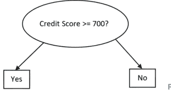

图 5.11：决策树：信用卡。

图 5.11 显示了信用卡批准的决策树。在这个例子中，决策树根据信用评分特征划分数据集。如果申请人的信用评分是 700 或更高，他们将被批准贷款；否则，他们将被拒绝。

让我们看一个更复杂的数值示例，该示例构建决策树以根据人口统计和行为属性预测消费者是否会购买产品。

示例：预测购买决策
假设我们有一个客户数据集，包含以下特征：

- 年龄（数值型）
- 性别（分类型：男性，女性）
- 收入（数值型）
- 网站访问时长（数值型）
- 产品评论（数值型）

目标变量表示客户是否进行了购买（是或否）。

- 选择最佳划分：我们的第一步是选择能够在数据集中产生最同质子集的特征。例如，我们可能发现根据年龄对数据进行划分会导致纯度最高的子集。
- 生成决策节点：在树的顶部，我们建立一个决策节点，表示所选特征及其划分点。例如，如果最佳划分是年龄 < 30，我们生成一个标记为“年龄 < 30？”的决策节点。

#### 5.3.1 决策树

- **数据的细分：** 数据集根据所选属性的值被划分为子组。每个子组代表从决策节点延伸出的一个分支。
- **递归划分：** 我们对每个子集递归执行上述过程，直到满足以下指定的停止条件之一：
    - 子集中的所有数据点属于同一类别（同质）。
    - 已达到树的最大深度。
    - 已达到节点内的最小数据点数量。未观察到杂质减少的显著增强。
- **生成终端节点：** 当满足停止条件时，我们生成包含相应子集中发现的多数类标签的终端节点。

图 5.12：决策树：消费者将采购产品。

图 5.12 描绘了一个决策树模型，用于预测消费者是否会采购特定产品。

在这个特定示例中，如果顾客年龄低于 30 岁且收入低于 50 K，或者他们是男性，决策树预测会发生交易。在任何其他情况下，决策树会根据访问网站的持续时间进行划分，如果访问持续时间低于 10 分钟，则预测会发生交易。

scikit-learn 库通常用于决策树，在该领域被广泛使用。这个库是一个强大的机器学习工具，提供了一系列算法，例如决策树，用于构建可以做出准确预测的模型。关于 scikit-learn 的 DecisionTreeClassifier 的全面说明如下：

- DecisionTreeClassifier 是在 scikit-learn 库中实现的一个类，它作为专门为分类任务设计的决策树算法的实现。
- DecisionTreeClassifier 的一个显著特点是它能够适应多种分裂标准，即基尼不纯度和熵（信息增益）。通过将 criterion 参数指定为 “gini” 或 “entropy”，用户可以灵活地为其分类需求选择最合适的标准。
- 为了缓解过拟合问题并提高对未见数据进行准确预测的整体能力，scikit-learn 中的 DecisionTreeClassifier 实现提供了各种剪枝技术。这些技术涉及应用约束，例如树的最大深度、每个叶节点允许的最小样本数以及分裂所需的最小样本数。
- 在处理分类特征方面，DecisionTreeClassifier 通过执行独热编码或整数编码来自动处理它们。
- 此外，DecisionTreeClassifier 具有处理缺失值的能力。它通过根据特征是否存在来在节点中创建分裂来实现这一点。
- 训练后，DecisionTreeClassifier 提供了一个 feature_importances_ 属性，允许用户评估每个特征在预测过程中的重要性。
- DecisionTreeClassifier 模型的训练过程包括从 DecisionTreeClassifier 类实例化一个对象，然后调用 fit 方法。这个特定方法需要特征矩阵 (X_train) 和目标向量 (y_train) 作为其输入参数。
- 一旦 DecisionTreeClassifier 模型训练完成，就可以通过使用 predict 方法并提供新数据的特征矩阵，利用它对新数据进行预测。
- 在考虑决策树的可视化时，可以使用 graphviz 和 matplotlib 等工具。为了简化可视化过程，scikit-learn 提供了 plot_tree 函数，可以直接可视化决策树。
- 用户可以通过使用不同的评估指标（包括准确率、精确率、召回率、F1 分数和混淆矩阵）来评估 DecisionTreeClassifier 模型的有效性。这些指标可以通过 sklearn 库中的 metrics 模块访问。

示例：

```python
from sklearn.tree import DecisionTreeClassifier
from sklearn.datasets import load_iris
from sklearn.model_selection import train_test_split
from sklearn.metrics import accuracy_score

# Load the Iris dataset
iris = load_iris()
X = iris.data
y = iris.target

# Split the dataset into training and testing sets
X_train, X_test, y_train, y_test = train_test_split(X, y, test_size=0.2, random_state=42)

# Train a DecisionTreeClassifier model
model = DecisionTreeClassifier()
model.fit(X_train, y_train)

# Make predictions on the test set
y_pred = model.predict(X_test)

# Evaluate the model
accuracy = accuracy_score(y_test, y_pred)
print("Accuracy:", accuracy)
```

输出：
Accuracy: 1.0

下面是一个示例 Python 代码片段，展示了在 scikit-learn 库的糖尿病数据集上实现决策树回归。该代码包含多个步骤，如数据集加载、使用 DecisionTreeRegressor 进行模型训练、生成预测、模型评估以及决策树的可视化。

```python
import numpy as np
import matplotlib.pyplot as plt
from sklearn.datasets import load_diabetes
from sklearn.model_selection import train_test_split
from sklearn.tree import DecisionTreeRegressor, plot_tree
from sklearn.metrics import mean_squared_error

# Load the Diabetes dataset
diabetes = load_diabetes()
X = diabetes.data
y = diabetes.target

# Split the dataset into training and testing sets
X_train, X_test, y_train, y_test = train_test_split(X, y, test_size=0.2, random_state=42)

# Train a DecisionTreeRegressor model
model = DecisionTreeRegressor(random_state=42)
model.fit(X_train, y_train)

# Make predictions on the test set
y_pred = model.predict(X_test)

# Evaluate the model
mse = mean_squared_error(y_test, y_pred)
print("Mean Squared Error:", mse)

# Visualize the decision tree
plt.figure(figsize=(15, 10))
plot_tree(model, filled=True, feature_names=diabetes.feature_names)
plt.show()
```

输出：
Mean Squared Error: 4976.797752808989

代码执行 MSE 计算，以确定测试集上目标值 (y_test) 和预测值 (y_pred) 之间的差异。MSE 代表实际值和预测值之间的平均平方偏差，从而提供模型精度的指示。

图 5.13：糖尿病数据集的决策树。

图 5.13 展示了一个在糖尿病数据集上训练的决策树模型。树结构由内部节点组成，这些节点代表基于各种特征或属性的测试或决策。

通过 scikit-learn 的 plot_tree 函数可以方便地可视化决策树。它通过使用节点和分支来描绘决策树的结构。每个节点对应于基于特定特征的决策，而每个叶节点对应于预测的目标值。

数据的输出和可视化为决策树回归模型在糖尿病数据集上训练的性能和决策过程提供了宝贵的见解。理解决策树的组织结构并解释其节点和分支，对于深入了解特征与目标变量之间的关系至关重要。此外，通过使用 MSE 等指标评估模型的性能，有助于评估其在生成预测方面的准确性和有效性。

#### 5.3.2 熵与信息增益

熵和信息增益是决策树中用于确定在每个节点划分数据的最佳属性的原则。

##### 熵

熵量化了给定数据集中不纯度或不确定性的程度，它通过分析数据集中各类别或分类的分布来确定。

公式：对于一个有 K 个类别且第 i 类占比为 $p_i$ 的数据集：

$$Entropy(S) = -\sum_{i=1}^{K} p_i log_2(p_i)$$

考虑一个包含 10 个实例的数据集，其中 6 个实例属于 A 类，其余 4 个实例属于 B 类。

A 类的占比：

$$p_A = \frac{6}{10} = 0.6$$

B 类的占比：

$$p_B = \frac{4}{10} = 0.4$$

$$Entropy(S) = -0.6 \log_2(0.6) + 0.4 \log_2(0.4)$$

$$Entropy(S) = -0.6 * (-0.737) + 0.4 * (-1.322)$$

$$Entropy(S) = -(-0.4422 - 0.5288)$$

$$Entropy(S) = 0.971$$

##### 信息增益

信息增益评估了根据特定特征划分数据集后，熵或不确定性的减少程度。它量化了该特征为类标签提供信息的程度。

对于一个包含 $N$ 个实例的数据集 $S$，以及根据特征 $A$ 划分后得到的 $m$ 个子集：

$$IG(S, A) = Entropy(S) - \sum_{j=1}^{m} \frac{N_j}{N} * Entropy(S_j)$$

假设我们希望根据一个特定特征（记为 X）对数据集进行划分，从而得到两个子集 S1 和 S2，分别包含 7 个和 3 个实例。

划分前的熵：$Entropy(S) = 0.971$

子集 $S_1$ 的熵：$Entropy(S_1) = -(0.7 * \log_2(0.7) + 0.3 * \log_2(0.3))$

子集 $S_2$ 的熵：$Entropy(S_2) = -(0.3 * \log_2(0.3) + 0.7 * \log_2(0.7))$

$IG(S, X) = 0.971 - \left(\frac{7}{10} * Entropy(S_1) + \frac{3}{10} * Entropy(S_2)\right)$

| 天气情况 | 温度 | 是否踢足球 |
| :--- | :--- | :--- |
| 晴天 | 炎热 | 否 |
| 晴天 | 炎热 | 否 |
| 多云 | 炎热 | 是 |
| 雨天 | 温和 | 是 |
| 雨天 | 凉爽 | 是 |
| 雨天 | 凉爽 | 否 |
| 多云 | 凉爽 | 是 |
| 晴天 | 温和 | 否 |
| 晴天 | 凉爽 | 是 |
| 雨天 | 温和 | 是 |
| 晴天 | 温和 | 是 |
| 多云 | 温和 | 是 |
| 多云 | 炎热 | 是 |
| 雨天 | 温和 | 否 |

让我们考察一个根据气象条件决定是否参与足球运动的典型实例。我们将计算每个特征的熵和信息增益，以确定最适合划分数据集的特征。

假设我们拥有一个包含十四个实例的数据集，其特征包括两个不同的特征：天气情况（晴天、多云、雨天）和温度（炎热、温和、凉爽），目标变量表示是否踢足球的决定（是或否）。

###### 步骤 1：计算目标变量（是否踢足球）的熵

- 总实例数 $N = 14$
- 踢足球 = 是 的实例数 $P_{Yes} = 9$
- 踢足球 = 否 的实例数 $P_{No} = 5$

$Entropy(S) = -\left(\frac{9}{14} \log_2\left(\frac{9}{14}\right) + \frac{5}{14} \log_2\left(\frac{5}{14}\right)\right)$

$Entropy(S) = -\left(\frac{9}{14} * -0.764 + \frac{5}{14} * -1\right)$

$Entropy(S) = -(-0.439 + -0.357)$

$Entropy(S) = 0.796$

###### 步骤 2：计算每个特征的信息增益

####### 对于天气情况：

- 根据天气情况（晴天、多云、雨天）划分数据集
- 计算每个子集中实例的比例及相应的熵。
- 计算熵的加权平均值以得到信息增益。

$IG(S, Outlook) = Entropy(S) - \left(\frac{5}{14} \times Entropy(S_{sunny}) + \frac{4}{14} \times Entropy(S_{Overcast}) + \frac{5}{14} \times Entropy(S_{Rainy})\right)$
$= 0.796 - \left(\frac{5}{14} \times 0.971 + \frac{4}{14} \times 0 + \frac{5}{14} \times 0.971\right)$
$= 0.796 - (0.347 + 0 + 0.347)$
$= 0.796 - 0.694$
$IG(S, Outlook) = 0.102$

####### 对于温度：

- 根据温度（炎热、温和、凉爽）划分数据集
- 计算每个子集中实例的比例及相应的熵。
- 计算熵的加权平均值以得到信息增益。

$IG(S, Temperature) = Entropy(S) - \left(\frac{4}{14} \times Entropy(S_{Hot}) + \frac{6}{14} \times Entropy(S_{Mild}) + \frac{4}{14} \times Entropy(S_{Cool})\right)$
$= 0.796 - \left(\frac{4}{14} \times 0.811 + \frac{6}{14} \times 0.918 + \frac{4}{14} \times 0.811\right)$
$= 0.796 - (0.23 + 0.405 + 0.23)$
$= 0.796 - 0.865$
$IG(S, Temperature) = -0.069$

- 目标变量（是否踢足球）的熵为 0.796。
- 天气情况的信息增益为 0.102，温度的信息增益为 -0.069。
- 在决策树中，选择具有最大信息增益（天气情况）的属性来划分数据集，因为它能最大程度地降低不确定性。

#### 5.3.3 随机森林与 Bagging

随机森林和 Bagging 是特定的集成学习技术，旨在通过合并多个独立模型来提升机器学习模型的有效性和鲁棒性。

Bagging，也称为自助聚合，是一种方法，其中多个基础模型（通常是决策树）在训练数据的随机子集上独立训练。这个选择过程涉及有放回抽样，由于固有的随机性，每个基础模型都能获得对底层数据的独特见解。这些模型生成的预测随后通过平均或聚合技术进行组合，以形成最终预测。

例如，考虑一个包含 1,000 个实例的数据集，目标是训练一个决策树。在 Bagging 的背景下，会采取以下步骤：

1. 选择一个随机样本，包含 70% 的实例（有放回抽样），用于训练第一个决策树。
2. 重复此过程多次以训练多个决策树，每个模型使用不同的数据子集。
3. 为了形成预测，将所有决策树得出的预测进行聚合，对于回归问题采用平均法，对于分类问题采用投票法。

通过遵循 Bagging 的原则，上述步骤有助于创建一个集成模型，该模型能够利用各个基础模型获得的不同视角。

随机森林是一种在 Bagging 思想基础上构建的方法，它引入了额外的随机性元素。这是通过在每个决策树节点选择一个随机的特征子集来实现的。这种随机特征选择的目的是降低树之间的相关性，从而减少过拟合的风险并提高整体泛化能力。

##### 示例

延续前面的例子，在随机森林中：

1. 在训练每个决策树时，我们不使用所有特征，而是随机选择一个特征子集。
2. 使用该特征子集来确定树中每个节点的最佳划分。
3. 特征选择过程中的变异性确保了集合中的每个决策树都获得了数据集的不同特征，从而导致模型集合更加多样化。
4. 预测的聚合方式与 Bagging 相同。

##### 优势

- 通过使用 Bagging 和随机森林，可以有效缓解过拟合现象，因为这些方法采用对从众多模型获得的预测进行平均的策略，而每个模型都是在可用数据的不同子集上训练的。
- 随机森林特别擅长通过引入额外的随机性元素来增强模型的泛化能力，从而促进开发出更多样化的模型，这些模型在泛化方面表现出更优越的性能。
- 集成技术的一个显著优势在于其处理数据中噪声问题的能力。通过聚合来自不同模型的预测，集成有助于减轻噪声数据点和异常值的影响，从而增强方法的弹性。

用于随机森林和 Bagging 的 Python 库主要由 scikit-learn 实现，这是一个著名的 Python 机器学习库。在此背景下，我们找到了用于执行随机森林和 Bagging 的主要库：

#### scikit-learn (sklearn)

- **ensemble**：scikit-learn 中的 **ensemble** 模块提供了用于实现集成学习技术的类，包括随机森林和 Bagging。
- **RandomForestClassifier**：此类实现了用于分类任务的随机森林算法。
- **RandomForestRegressor**：此类实现了用于回归任务的随机森林算法。
- **BaggingClassifier**：此类实现了用于分类任务的 Bagging 集成方法。
- **BaggingRegressor**：此类实现了用于回归任务的 Bagging 集成方法。
- 这些类提供了易于使用的接口，用于训练集成模型和进行预测。

##### numpy (np)

- numPy 是 Python 编程语言中进行科学计算的基本模块。
- 它为处理多维数组和矩阵提供了全面的支持，这对于在各种机器学习算法中有效管理数据至关重要。
- 在随机森林和 Bagging 的背景下，numpy 通常用于数据操作和数值计算。

##### matplotlib.pyplot (plt)

- matplotlib.pyplot 是一个用于在 Python 中创建可视化的绘图库。
- 它提供了创建各种类型图表的函数，例如折线图、散点图和直方图。
- 在随机森林和 Bagging 的背景下，matplotlib.pyplot 用于可视化决策边界和其他用于模型评估的相关图表。

这些库为在 Python 编程语言中实现和评估随机森林与 Bagging 算法提供了一整套全面的工具。它们提供了这些集成技术的高效实现，并提供了数据预处理、评估和可视化的补充功能，使其成为构建稳健机器学习模型不可或缺的工具。

下面是一个 Python 代码示例，演示了如何使用 scikit-learn 中的 Iris 数据集来应用随机森林和 Bagging。它包括加载数据集、训练随机森林和 Bagging 分类器、进行预测、评估模型以及可视化决策边界。

```python
import numpy as np
import matplotlib.pyplot as plt
from sklearn.datasets import load_iris
from sklearn.model_selection import train_test_split
from sklearn.ensemble import RandomForestClassifier, BaggingClassifier
from sklearn.tree import DecisionTreeClassifier
from sklearn.metrics import accuracy_score
from itertools import product

# Load the Iris dataset
iris = load_iris()
X = iris.data[:, :2] # Using only the first two features for visualization purposes
y = iris.target

# Split the dataset into training and testing sets
X_train, X_test, y_train, y_test = train_test_split(X, y, test_size=0.2, random_state=42)

# Create Decision Tree, Random Forest, and Bagging classifiers
dt = DecisionTreeClassifier(random_state=42)
rf = RandomForestClassifier(n_estimators=10, random_state=42)
bagging = BaggingClassifier(base_estimator=dt, n_estimators=10, random_state=42)

# Train classifiers
dt.fit(X_train, y_train)
rf.fit(X_train, y_train)
bagging.fit(X_train, y_train)

# Make predictions
y_pred_dt = dt.predict(X_test)
y_pred_rf = rf.predict(X_test)
y_pred_bagging = bagging.predict(X_test)

# Evaluate classifiers
accuracy_dt = accuracy_score(y_test, y_pred_dt)
accuracy_rf = accuracy_score(y_test, y_pred_rf)
accuracy_bagging = accuracy_score(y_test, y_pred_bagging)

print("Decision Tree Accuracy:", accuracy_dt)
print("Random Forest Accuracy:", accuracy_rf)
print("Bagging Accuracy:", accuracy_bagging)

# Plot decision boundaries
plt.figure(figsize=(15, 5))
for i, clf in enumerate([dt, rf, bagging]):
    plt.subplot(1, 3, i + 1)
    # Plot decision boundaries
    x_min, x_max = X[:, 0].min() - 1, X[:, 0].max() + 1
    y_min, y_max = X[:, 1].min() - 1, X[:, 1].max() + 1
    xx, yy = np.meshgrid(np.arange(x_min, x_max, 0.1),
                         np.arange(y_min, y_max, 0.1))
    Z = clf.predict(np.c_[xx.ravel(), yy.ravel()])
    Z = Z.reshape(xx.shape)
    plt.contourf(xx, yy, Z, alpha=0.4)

    # Plot data points
    plt.scatter(X[:, 0], X[:, 1], c=y, s=20, edgecolor='k')
    plt.title(['Decision Tree', 'Random Forest', 'Bagging'][i])
plt.show()
```

决策树准确率: 0.6333333333333333
随机森林准确率: 0.7666666666666667
Bagging 准确率: 0.7

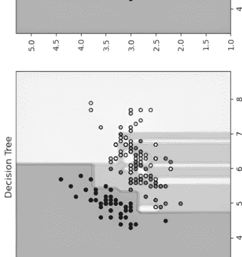

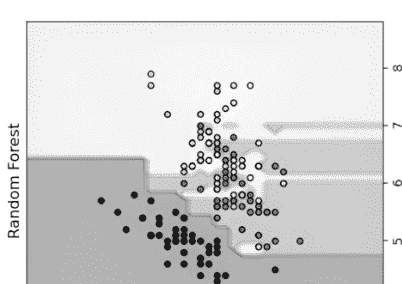

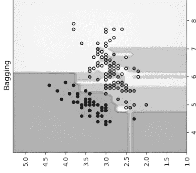

图 5.14：决策树、随机森林和 Bagging 的准确率比较。

图 5.14 展示了决策树、随机森林和 Bagging 准确率比较的图表。

该代码使用了 Iris 数据集，该数据集包含 150 个样本，每个样本有 4 个特征（花萼长度、花萼宽度、花瓣长度和花瓣宽度）。为了可视化目的，仅使用了前两个特征。

##### 输出

- 显示了决策树、随机森林和 Bagging 分类器应用于测试数据时的精确度。
- 绘制了每个分类器的决策边界，以可视化其在分离不同类别方面的性能。

##### 解释

- 数据集首先被划分为训练集和测试集。
- 随后，实例化了决策树、随机森林和 Bagging 分类器。通过使用 fit 方法，每个分类器都在训练数据上进行了训练。
- 通过使用 predict 方法，在测试数据上生成了预测结果。
- 使用 scikit-learn 中的 accuracy_score 函数，计算了每个分类器的准确率分数。
- 最后，绘制了决策边界，以直观地表示每个分类器如何在特征空间中分离类别。

##### 可视化

为每个分类器绘制了决策边界，显示了每个类别被预测的区域。不同的颜色代表不同的类别，数据点以标记形式绘制。决策边界有助于可视化每个分类器在特征空间中的分类性能。

### 5.4 支持向量机

支持向量机是一种用于分类和回归的监督学习算法。它在高维空间中表现出显著的有效性，并且能够有效捕捉数据中的复杂关系。SVM 通过识别特征空间中分离类别的最优超平面来工作。这个过程在最大化类别间间隔的同时，最小化了分类错误。

SVM 的基本原理包括支持向量（即最接近超平面的数据点）和间隔（即超平面与支持向量之间的距离）。

SVM 的目标是最大化这个间隔，从而使决策边界对噪声和异常值具有鲁棒性。在类别无法线性分离的情况下，SVM 可以使用核函数将输入特征映射到更高维度的空间。这允许建立非线性的决策边界。

SVM 的多功能性体现在其广泛的应用中，包括文本分类、图像识别和生物信息学。由于其有效性和可扩展性，SVM 在二分类和多分类问题中都被广泛使用。然而，应该注意的是，SVM 可能会带来显著的计算负担，并且需要仔细选择超参数以达到最佳性能。总而言之，SVM 是分类任务的强大工具，因为它们在处理各种数据集时提供了灵活性、准确性和鲁棒性。

#### 支持向量机的类型

**线性支持向量机：** 线性支持向量机通过检测在特征空间中有效分离类别的最优超平面来对数据进行分类。当数据表现出线性可分性时，它表现出令人印象深刻的性能。

**核支持向量机：** 核支持向量机通过应用核函数（如多项式核和径向基函数）将输入特征转换到更高维度的空间，从而增强了线性支持向量机的能力，进而建立非线性的决策边界。核支持向量机能够高效地处理非线性可分的数据。

#### 工作原理

- 支持向量机旨在发现能够最大化间隔的超平面，该间隔是指超平面与每个类别中最近的数据点（称为支持向量）之间的距离。
- 对于线性可分的数据，超平面的方程可以表示为 w·x + b = 0，其中 w 代表权重向量，x 表示特征向量，b 表示偏置项。
- 间隔计算为 $\frac{2}{||w||}$，目标是在最小化分类错误的同时最大化这个间隔。

#### 执行 SVM 的步骤

数据准备：我们首先准备数据集，包括特征（x1 和 x2）以及相应的类别标签。

模型训练：

- 接下来，在数据集上训练 SVM 模型。
- SVM 算法旨在识别能够有效分离特征空间中两个类别的最优超平面。
- 线性 SVM 超平面方程表示为 $w \cdot x + b = 0$，其中 $w$ 代表权重向量，$x$ 表示特征向量，$b$ 表示偏置项。
- 目标是确定 $w$ 和 $b$ 参数，以最大化超平面与最近支持向量（即每个类别的数据点）之间的间隔。

模型评估：

- 模型训练过程完成后，我们继续使用一系列指标（包括准确率、精确率、召回率和 F1 分数）来评估其性能。
- 此外，我们采用可视化决策边界的技术，以深入了解支持向量机在特征空间中分离类别的有效性。

执行支持向量机通常涉及使用 Python 库，这些库主要由 scikit-learn 提供，它是 Python 编程语言中一个流行的机器学习库。在接下来的讨论中，我们将介绍用于实现 SVM 的主要库。

#### scikit-learn (sklearn)

- scikit-learn 是一个涵盖机器学习领域的广泛 Python 库，提供了多种算法的优化实现，其中包括支持向量机。
- scikit-learn 中的 **svm** 模块包含与 SVM 相关的类和函数。
- **SVC**（支持向量分类器）：此类实现了用于分类任务的 SVM 算法。

#### 5.4.1 线性SVM

线性支持向量机（SVM）是一种监督学习技术，用于二元分类任务。其主要目标是确定最合适的超平面，以高效地在特征空间中划分不同类别。以下是对线性SVM的详细说明：

**目标：** 线性支持向量机（SVM）的目标是找到具有最大间隔的超平面，从而在特征空间中区分不同类别。

**超平面：** 超平面的数学表示为方程 w·x + b = 0，其中权重向量 w 垂直于超平面，特征向量 x 代表特征，偏置项 b 起着重要作用。

**间隔：** 间隔定义为超平面与每个类别最近支持向量之间的距离。线性SVM的目标是优化这个间隔，使其最大化。

**优化：** 线性SVM的公式化涉及一个优化问题，旨在最小化权重向量 w 的范数，同时确保对所有训练实例 (xi, yi) 满足约束条件 yi(w·xi + b) ≥ 1。

**分类：** 训练完成后，线性SVM根据数据点相对于超平面的位置将其分配到相应类别。落在超平面一侧的数据点被分配到一个类别，而落在另一侧的数据点则被分配到另一个类别。

**核技巧：** 虽然线性SVM在处理线性可分数据时表现良好，但利用核函数可以将数据转换到更高维度的空间。这种转换有效地使数据变得线性可分，从而便于对非线性可分数据进行分类。

**正则化：** 线性SVM包含正则化参数，以处理异常值并在最大化间隔和最小化分类误差之间取得平衡。

**可扩展性：** 线性SVM以其高效性和可扩展性为特点，使其成为处理具有高维特征空间的大型数据集的合适选择。

线性支持向量机（SVM）算法在执行二元分类任务时表现出显著的有效性，展现出强大的错误鲁棒性、显著的计算效率以及处理海量数据集的能力。它能够识别出最合适的超平面，以有效地区分特征空间中的不同类别，从而使其在各种机器学习任务中得到广泛应用。

让我们考虑一个涉及两个不同特征（记为 x1 和 x2）的二元分类问题。在此场景中，我们有一个如下描述的数据集：

| x1 | x2 | 类别 |
|---|---|---|
| 1 | 2 | 0 |
| 2 | 3 | 0 |
| 3 | 4 | 1 |
| 4 | 5 | 1 |

我们的目标是训练一个线性支持向量机（SVM），以便将数据点分为两个不同的类别：类别0和类别1。

**步骤：**

**数据准备：**
数据集通过整合特征（x1 和 x2）及其对应的类别标签（0 或 1）来准备。

**模型训练：**
- 使用提供的数据集训练线性SVM模型。
- SVM算法计算出最大化不同类别之间间隔的最优超平面。
- 超平面的方程表示为 w·x + b = 0，其中 w 代表垂直于超平面的权重向量，b 代表偏置项。
- 假设权重向量 w = [1,1]，偏置项 b = -5，则超平面的方程可以表示为 x1 + x2 - 5 = 0。

**模型评估：**
通过在测试数据上进行预测并与实际标签进行比较，来评估线性支持向量机（SVM）模型。为了衡量模型的性能，计算了不同的指标，如准确率、精确率、召回率和F1分数。此外，还直观地展示了有效分隔两个类别的决策边界（即超平面）。

让我们考虑一个执行线性SVM的Python代码：

```python
import numpy as np
import matplotlib.pyplot as plt
from sklearn import svm

# Generate synthetic data
np.random.seed(0)
X = np.r_[np.random.randn(20, 2) - [2, 2], np.random.randn(20, 2) + [2, 2]]
y = [-1] * 20 + [1] * 20

# Plot data before SVM
plt.figure(figsize=(10, 5))
plt.scatter(X[:, 0], X[:, 1], c=y, cmap=plt.cm.Paired)
plt.title('Data Before SVM')
plt.xlabel('X1')
plt.ylabel('X2')

# Train Linear SVM
clf = svm.SVC(kernel='linear')
clf.fit(X, y)

# Plot decision boundary and support vectors
w = clf.coef_[0]
b = clf.intercept_[0]
x0_min, x0_max = X[:, 0].min() - 1, X[:, 0].max() + 1
x1_min, x1_max = X[:, 1].min() - 1, X[:, 1].max() + 1
xx0, xx1 = np.meshgrid(np.arange(x0_min, x0_max, 0.1),
                       np.arange(x1_min, x1_max, 0.1))
Z = clf.predict(np.c_[xx0.ravel(), xx1.ravel()])
Z = Z.reshape(xx0.shape)

# Plot data after SVM
plt.figure(figsize=(10, 5))
plt.contourf(xx0, xx1, Z, alpha=0.3, cmap=plt.cm.Paired)
plt.scatter(X[:, 0], X[:, 1], c=y, cmap=plt.cm.Paired)
plt.title('Data After SVM with Hyperplane')
plt.xlabel('X1')
plt.ylabel('X2')

# Plot support vectors
plt.scatter(clf.support_vectors_[:, 0], clf.support_vectors_[:, 1],
            s=100, edgecolors='k', facecolors='none', linewidths=1)

# Plot hyperplane
plt.plot([x0_min, x0_max], [-(w[0]*x0_min + b)/w[1], -(w[0]*x0_max +
          b)/w[1]], 'k--')
plt.xlim(x0_min, x0_max)
plt.ylim(x1_min, x1_max)
plt.show()
```

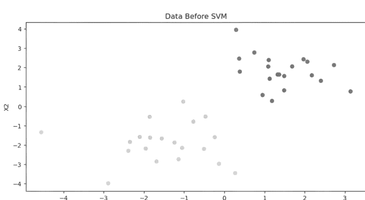

图 5.15：SVM之前的数据。

图 5.15 展示了应用支持向量机（SVM）算法之前数据集的散点图可视化。该图显示了数据点，每个点代表一个单独的观测值或实例，分布在两个维度或特征上。这些特征分别由x轴和y轴表示。

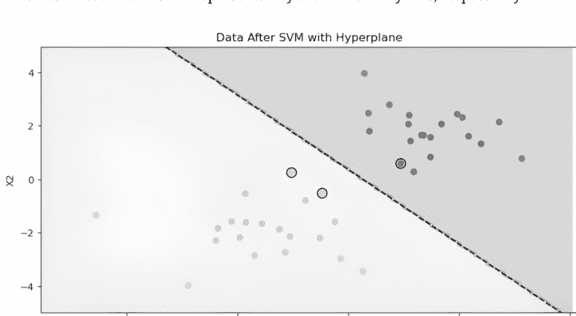

图 5.16：带有超平面的SVM之后的数据。

图 5.16 展示了应用支持向量机（SVM）算法之后数据集的散点图可视化。与之前的散点图（图 5.15）类似，数据点被绘制在特征空间中，x轴和y轴代表两个选定的特征或维度。

然而，在此图中，散点图上叠加了一个额外的组件：SVM模型学习到的决策边界或分离超平面。这个决策边界是一条线（或者在特征更多时是更高维度的超平面），它最优地分隔了数据集中存在的不同类别或类别。

这段代码生成人工数据，在使用支持向量机（SVM）之前对其进行可视化，随后训练一个线性SVM模型，并在使用SVM后可视化数据，展示决策边界（超平面）和支持向量。

代码解释：
- 导入必要的库：numpy用于数值计算，matplotlib.pyplot用于可视化，以及sklearn中的svm模块用于支持向量机。
- 生成合成数据：
    - 使用np.r_函数连接两组随机生成的二维点来生成合成数据。
    - 第一组数据点从中心在(-2, -2)的标准分布生成，标记为类别-1。
    - 第二组数据点从中心在(2, 2)的标准分布生成，标记为类别1。
    - 获取的数据存储在变量X中，对应的标签存储在变量y中。
- 训练线性SVM：
    - 我们使用svm.SVC创建一个SVM分类器对象，其中kernel = 'linear'，表示线性核。
    - 分类器使用fit方法在合成数据上进行训练。
- 绘制SVM之后的数据：
    - 我们创建一个等高线图来可视化应用SVM后获得的决策边界（超平面）。
    - 决策边界与支持向量和数据点一起绘制。
    - 支持向量用圆圈标记，超平面绘制为虚线。
    - 为清晰起见，在图中添加了标题和轴标签。

此代码示例展示了如何使用scikit-learn在伪造数据上执行线性SVM分类。首先，它生成伪造数据并在应用SVM之前绘制图形。随后，它继续训练一个线性SVM模型，并在应用SVM后以图形方式展示数据，展示决策边界和支持向量。

让我们检查另一个Python代码，该代码在从scikit-learn获取的数据集（具体是load_iris数据集）上执行线性SVM。

import numpy as np
import matplotlib.pyplot as plt
from sklearn import datasets
from sklearn.pipeline import Pipeline
from sklearn.preprocessing import StandardScaler
from sklearn.svm import LinearSVC

# 加载鸢尾花数据集
iris = datasets.load_iris()
X = iris.data[:, :2] # 我们只取前两个特征
y = iris.target

# 创建一个管道来缩放数据并应用SVM
clf = Pipeline([
    ('scaler', StandardScaler()),
    ('linear_svc', LinearSVC(C=1, loss='hinge', random_state=42))
])

# 拟合管道
clf.fit(X, y)

# 绘制应用SVM之前的数据
x0_min, x0_max = X[:, 0].min() - 1, X[:, 0].max() + 1
x1_min, x1_max = X[:, 1].min() - 1, X[:, 1].max() + 1
xx, yy = np.meshgrid(np.arange(x0_min, x0_max, 0.1),
                     np.arange(x1_min, x1_max, 0.1))

plt.figure(figsize=(10, 6))
plt.subplot(1, 2, 1)
plt.title('SVM之前的数据')
plt.scatter(X[:, 0], X[:, 1], c=y, cmap=plt.cm.Set1, edgecolor='k')

# 绘制应用SVM之后的数据
plt.subplot(1, 2, 2)
plt.title('SVM之后的数据')
Z = clf.predict(np.c_[xx.ravel(), yy.ravel()])
Z = Z.reshape(xx.shape)
plt.contourf(xx, yy, Z, cmap=plt.cm.Set1, alpha=0.8)
plt.scatter(X[:, 0], X[:, 1], c=y, cmap=plt.cm.Set1, edgecolor='k')
plt.xlim(xx.min(), xx.max())
plt.ylim(yy.min(), yy.max())
plt.xticks(())
plt.yticks(())

plt.show()

上述代码的步骤：

- 从scikit-learn库加载鸢尾花数据集，并仅选择前两个特征。
- 创建一个管道，首先使用StandardScaler缩放数据，然后使用LinearSVC应用线性SVM。
- 将管道拟合到数据上。
- 创建一个网格，用于绘制应用SVM之前和之后的数据。
- 在第一个子图中绘制原始数据（SVM之前）。
- 在第二个子图中绘制应用SVM之后的数据，包括使用plt.contourf绘制的决策边界（超平面）。
- 显示绘图。

上述代码显示了两个子图。第一个子图显示了应用SVM之前的原始数据点，根据其类别标签着色。第二个子图显示了应用线性SVM之后的数据点，以及分隔类别的决策边界（超平面），如下所示。

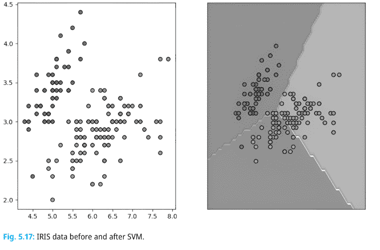

图 5.17：SVM之前的IRIS数据和之后的IRIS数据。

图 5.17 展示了应用支持向量机（SVM）算法之前和之后的鸢尾花数据集的对比可视化。

#### 5.4.2 核SVM

核支持向量机（SVM）以其相对于传统SVM算法的重大进步而闻名。这使得SVM能够对无法线性分离的数据进行分类。这是通过将数据隐式映射到更高维度的特征空间来实现的。

核SVM的主要目标是在特征空间中找到能够分隔类别的最优超平面。这是通过使用核函数对数据进行非线性变换来实现的。

被称为核技巧的技术在允许计算高维特征空间中的点积方面起着至关重要的作用，同时避免了对数据的显式变换。使用了各种核函数，例如线性核、多项式核、径向基函数（RBF）核和Sigmoid核，来衡量不同数据点之间的相似性。

通过将数据转换到更高维度的空间，核SVM使得在原始特征空间中建立本质上非线性的决策边界成为可能。这允许对类别进行线性分离。

核SVM有多种类型的核可用：

- 线性核：计算输入特征之间的点积。
- 多项式核：基于输入特征的多项式展开计算相似性。
- RBF核：基于高斯径向基函数计算相似性。
- Sigmoid核：基于双曲正切函数计算相似性。

核SVM的优化问题通过诸如序列最小优化（SMO）算法或二次规划等技术来解决。这些方法通过最大化类别之间的间隔或最小化分类误差来确定高维空间中的最优超平面。

在可扩展性方面，对于大型数据集，核SVM可能在计算上要求很高，特别是当涉及非线性核和高维特征空间时。

核SVM在各种机器学习任务中得到了广泛应用，包括分类、回归和异常检测，其中数据中存在明显的非线性关系。

总之，核SVM是一种处理数据中非线性关系的通用且有效的算法，能够在特征空间中构建复杂的决策边界。它使用核函数隐式转换数据的能力使其适用于广泛的机器学习应用。

下面是一个演示核SVM实现的Python代码。

步骤：

- 首先使用scikit-learn中的make_circles函数生成合成数据，创建带有一些噪声的圆形簇。
- 使用plt.scatter绘制应用SVM之前生成的数据。
- 使用scikit-learn库中的支持向量分类器（SVC）训练一个具有径向基函数（RBF）核的模型，以进行核支持向量机（SVM）训练。
- SVM模型训练完成后，需要通过绘图可视化数据，并使用contourf方法叠加从SVM模型得出的决策边界。

```python
import numpy as np
import matplotlib.pyplot as plt
from sklearn.datasets import make_circles
from sklearn.svm import SVC

# 生成合成数据
X, y = make_circles(n_samples=100, noise=0.1, factor=0.4,
                    random_state=42)

# 绘制SVM之前的数据
plt.figure(figsize=(10, 5))
plt.scatter(X[:, 0], X[:, 1], c=y, cmap='coolwarm', edgecolors='k')
plt.title('SVM之前的数据')
plt.xlabel('特征 1')
plt.ylabel('特征 2')

# 训练核SVM
svm_model = SVC(kernel='rbf', gamma='auto')
svm_model.fit(X, y)

# 绘制SVM之后的数据
plt.figure(figsize=(10, 5))
plt.scatter(X[:, 0], X[:, 1], c=y, cmap='coolwarm', edgecolors='k')

# 绘制决策边界
ax = plt.gca()
xlim = ax.get_xlim()
ylim = ax.get_ylim()
xx, yy = np.meshgrid(np.linspace(xlim[0], xlim[1], 50),
    np.linspace(ylim[0], ylim[1], 50))
Z = svm_model.decision_function(np.c_[xx.ravel(), yy.ravel()])
Z = Z.reshape(xx.shape)
plt.contourf(xx, yy, Z, cmap='coolwarm', alpha=0.3)
plt.title('应用SVM及超平面后的数据')
plt.xlabel('特征 1')
plt.ylabel('特征 2')

plt.show()
```

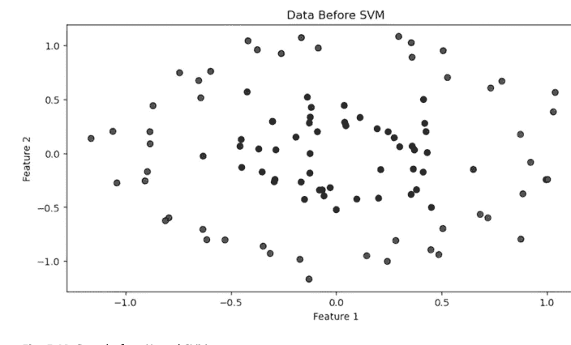

图 5.18：应用核SVM之前的数据。

图 5.18 展示了应用核支持向量机（SVM）算法之前的数据集的散点图可视化。该图显示了数据点，每个点代表一个单独的观察值或实例，分布在两个维度或特征上。这些特征分别由x轴和y轴表示。

然而，在此图中，散点图上叠加了一个额外的组件：核SVM模型在变换后的高维特征空间中学习到的决策边界或分离超平面。

- 第一个图显示了使用 **make_circles** 函数生成的合成数据。
- 属于不同类别的数据点用不同的颜色表示。
- 由于其圆形分布，原始特征空间不允许线性分离。

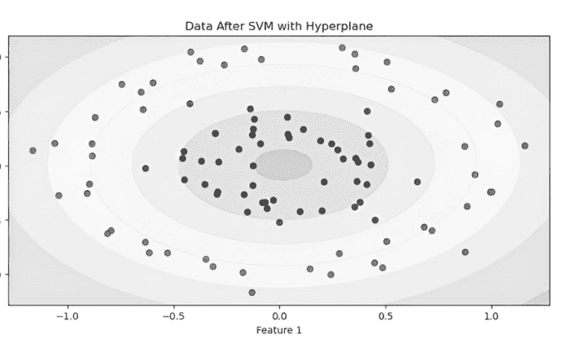

图 5.19：应用核SVM及超平面后的数据。

图 5.19 展示了应用核支持向量机（SVM）算法之后的数据集的散点图可视化。与之前的散点图（图 5.18）类似，数据点绘制在特征空间中，x轴和y轴代表两个选定的特征或维度。

- 第二个图显示了应用核SVM之后的相同合成数据。
- 数据点再次用不同的颜色描绘，以表示不同的类别。
- 此外，SVM模型学习到的决策边界以等高线图的形式展示。
- 决策边界有效地将圆形簇分隔成不同的区域，展示了核SVM的非线性分离能力。

现在让我们检查另一个Python代码，该代码在scikit-learn库中的鸢尾花数据集上执行核支持向量机（SVM）算法，使用径向基函数（RBF）核。

步骤：

- 从scikit-learn库加载鸢尾花数据集，并专门选择前两个特征。
- 创建一个管道，首先使用StandardScaler缩放数据，然后使用SVC(kernel = 'rbf')应用带有RBF核的核SVM。
- 将管道拟合到数据上。
- 创建一个网格，用于绘制应用SVM之前和之后的数据。
- 在第一个子图中绘制原始数据（SVM之前）。

#### 5.4.3 支持向量机中的超参数调优

支持向量机（SVM）中的超参数调优过程涉及选择一组能够优化SVM模型性能的超参数。这些超参数在训练过程之前预先设定，无法直接从数据中估计得出。

SVM包含多个超参数，包括：

-   核函数类型指的是所使用的具体核函数类型，例如线性核、多项式核或径向基函数（RBF）核。
-   正则化参数（C）在平衡间隔最大化优化和分类误差最小化方面起着至关重要的作用。
-   此外，特定于核函数的参数，例如多项式核的阶数或RBF核的gamma参数，进一步有助于核函数的定制和微调。

超参数的选择对SVM模型的性能有显著影响。次优的超参数可能导致泛化能力不足、过拟合或欠拟合。

超参数调优技术：

-   网格搜索：该方法涉及建立一个包含一系列超参数值的网格，然后评估模型在每种可能的值组合下的效能。随后，选择过程包括识别那些能产生最佳性能的超参数集。
-   随机搜索：与网格搜索类似，随机搜索从预定义的分布中随机采样超参数值。它比网格搜索的计算强度更低，并且对于高维超参数空间可能更有效。
-   贝叶斯优化：该技术利用概率模型来搜索最优的超参数集。它在探索和利用之间取得平衡，以高效地识别超参数空间中有希望的区域。
-   交叉验证：交叉验证经常与超参数优化结合使用，以评估各种超参数配置的整体性能。它是减轻过拟合验证集风险的宝贵工具。

可以使用各种评估指标来评估不同超参数配置的性能，例如准确率、精确率、召回率、F1分数或ROC曲线下面积（AUC）。

超参数优化可以使用scikit-learn等库来实现，这些库提供了用于网格搜索（GridSearchCV）和随机搜索（RandomizedSearchCV）的内置函数。使用交叉验证，在预定义的超参数范围内最大化所选的评估指标（例如准确率）。

超参数调优通常涉及一个迭代过程，在此过程中尝试不同的超参数组合，并评估模型的性能，直到获得满意的结果。

SVM中的超参数调优涉及选择最合适的超参数集以增强模型性能的过程。这一步至关重要，因为它有助于提高SVM模型的泛化能力并实现更高的预测准确性。为了高效地探索超参数空间并识别最优配置，可以采用各种技术，如网格搜索、随机搜索和贝叶斯优化。

以下Python代码示例展示了使用网格搜索对SVM进行超参数调优的过程。此外，它还包括描绘超参数调优阶段前后SVM模型性能的图表。在此演示中，将使用通过scikit-learn库的make_classification函数生成的合成数据。

```python
import numpy as np
import matplotlib.pyplot as plt
from sklearn.datasets import make_classification
from sklearn.model_selection import train_test_split, GridSearchCV
from sklearn.svm import SVC

# 步骤 1：生成合成数据
X, y = make_classification(n_samples=100, n_features=2, n_classes=2,
                           n_clusters_per_class=1, n_redundant=0, random_state=42)

# 步骤 2：将数据分割为训练集和测试集
X_train, X_test, y_train, y_test = train_test_split(X, y, test_size=0.2,
                                                    random_state=42)

# 步骤 3：定义网格搜索的参数网格
param_grid = {'C': [0.1, 1, 10], 'gamma': [0.1, 1, 10], 'kernel':
              ['rbf', 'poly', 'sigmoid']}

# 步骤 4：执行带交叉验证的网格搜索
svm_model = GridSearchCV(SVC(), param_grid, cv=5)
svm_model.fit(X_train, y_train)

# 步骤 5：绘制SVM前的数据
plt.figure(figsize=(10, 5))
plt.scatter(X[:, 0], X[:, 1], c=y, cmap='coolwarm', edgecolors='k')
plt.title('Data Before SVM')
plt.xlabel('Feature 1')
plt.ylabel('Feature 2')

# 步骤 6：绘制带超平面的SVM后的数据
plt.figure(figsize=(10, 5))
plt.scatter(X[:, 0], X[:, 1], c=y, cmap='coolwarm', edgecolors='k')

# 绘制决策边界
ax = plt.gca()
xlim = ax.get_xlim()
ylim = ax.get_ylim()
xx, yy = np.meshgrid(np.linspace(xlim[0], xlim[1], 50),
                     np.linspace(ylim[0], ylim[1], 50))
Z = svm_model.predict(np.c_[xx.ravel(), yy.ravel()])
Z = Z.reshape(xx.shape)
plt.contourf(xx, yy, Z, cmap='coolwarm', alpha=0.3)
plt.title('Data After SVM with Hyperplane')
plt.xlabel('Feature 1')
plt.ylabel('Feature 2')

plt.show()
```

```python
# 步骤 7：显示最佳超参数
print("Best Hyperparameters:", svm_model.best_params_)
```

```python
# 步骤 8：评估模型性能
accuracy = svm_model.score(X_test, y_test)
print("Accuracy:", accuracy)
```

步骤：

1.  使用make_classification函数生成具有两个特征的人工数据。
2.  使用train_test_split函数将数据分割为训练集和测试集。
3.  定义一个参数网格，指定要调整的超参数及其可能的值。
4.  使用GridSearchCV函数进行带交叉验证（cv = 5）的网格搜索，以识别超参数的最优组合。
5.  可视化应用SVM之前的人工数据。随后，在实施SVM后再次绘制数据。
6.  此外，描绘从SVM模型得出的决策边界。
7.  展示最佳超参数：我们展示通过网格搜索选出的最佳超参数。
8.  评估模型性能：我们通过使用准确率分数来评估模型在测试集上的性能。

-   在第二个子图中绘制应用SVM后的数据，包括使用plt.contourf绘制的决策边界。
-   显示图表。

```python
import numpy as np
import matplotlib.pyplot as plt
from sklearn import datasets
from sklearn.pipeline import Pipeline
from sklearn.preprocessing import StandardScaler
from sklearn.svm import SVC

# 加载鸢尾花数据集
iris = datasets.load_iris()
X = iris.data[:, :2] # 我们只取前两个特征
y = iris.target

# 创建一个管道来缩放数据并应用SVM
clf = Pipeline([
    ('scaler', StandardScaler()),
    ('svc', SVC(kernel='rbf', C=10, gamma=0.1, random_state=42))
])

# 拟合管道
clf.fit(X, y)

# 绘制应用SVM之前的数据
x0_min, x0_max = X[:, 0].min() - 1, X[:, 0].max() + 1
x1_min, x1_max = X[:, 1].min() - 1, X[:, 1].max() + 1
xx, yy = np.meshgrid(np.arange(x0_min, x0_max, 0.1),
                     np.arange(x1_min, x1_max, 0.1))

plt.figure(figsize=(10, 6))
plt.subplot(1, 2, 1)
plt.title('Data before SVM')
plt.scatter(X[:, 0], X[:, 1], c=y, cmap=plt.cm.Set1, edgecolor='k')

# 绘制应用SVM之后的数据
plt.subplot(1, 2, 2)
plt.title('Data after SVM')
Z = clf.predict(np.c_[xx.ravel(), yy.ravel()])
Z = Z.reshape(xx.shape)
plt.contourf(xx, yy, Z, cmap=plt.cm.Set1, alpha=0.8)
plt.scatter(X[:, 0], X[:, 1], c=y, cmap=plt.cm.Set1, edgecolor='k')
plt.xlim(xx.min(), xx.max())
plt.ylim(yy.min(), yy.max())
plt.xticks(())
plt.yticks(())

plt.show()
```

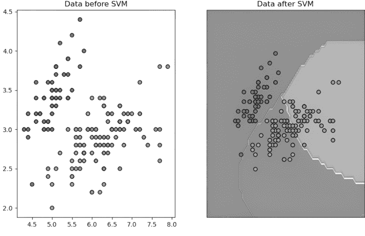

图 5.20：核SVM前后的IRIS数据。

图 5.20展示了应用核支持向量机（SVM）算法前后Iris数据集的对比可视化。代码显示了两个子图。第一个子图显示了应用SVM之前的数据点，根据其类别标签着色。第二个子图显示了应用带有RBF核的核SVM之后的数据点，以及分隔类别的决策边界。

### 5.5 K-Means 聚类

K-Means 聚类是机器学习领域中的一项技术，用于将数据集划分为不同的簇。该过程涉及将数据点分配到最近的簇中心，并根据已分配数据点的均值更新中心点。本文将详细解释 K-Means 聚类：

K-Means 聚类的主要目标是将数据点分组到簇中，使得同一簇内的点彼此之间比不同簇中的点具有更高的相似度。

算法步骤：

-   初始化：第一步是确定簇的数量（k），并随机初始化这些簇的中心点。
-   分配步骤：接下来，我们利用距离度量（通常是欧几里得距离）将每个数据点分配到最近的中心点。
-   更新步骤：然后，我们通过计算分配给每个簇的所有数据点的均值来重新计算簇的中心点。
-   收敛：最后，我们重复分配和更新步骤，直到满足收敛标准，例如达到最大迭代次数或观察到中心点的微小变化。

初始化方法：

-   随机初始化：从可用数据点中随机选择中心点。
-   K-Means 初始化：选择策略性间隔开的中心点，以增强收敛性并避免陷入较差的局部最优解。

簇的数量（k）：

确定簇的数量（k）非常重要，通常基于该领域的专业知识或通过使用诸如肘部法则或轮廓分析等方法。肘部法则涉及绘制簇内平方和（WCSS）与簇数量的关系图，并识别下降速率减缓的点，即“肘部”点。另一方面，轮廓分析涉及计算不同 k 值的轮廓系数，并选择产生最高轮廓系数的值。

可扩展性：

K-Means 计算效率高，能够处理具有大量特征的大型数据集。

假设：

K-Means 假设簇是球形的且大小相似。此外，它假设每个特征的分布在所有簇中的方差是相等的。

应用：

K-Means 聚类在客户细分、图像分割、异常检测和推荐系统等多个领域得到广泛应用。

局限性：

根据初始中心点的不同，K-Means 可能会收敛到局部最优解。它对 k 的选择高度敏感，如果真实簇数量未知或簇呈现不规则形状或大小不一，可能会产生次优结果。

总而言之，K-Means 聚类是一种通用且广泛使用的算法，用于将数据划分为簇。尽管它简单高效，但必须仔细关注初始化方法、k 的选择以及结果的解释，以确保有意义的聚类。

#### 5.5.1 聚类基础

聚类作为一种无监督学习方法，用于检测给定数据集中的内在结构或模式。该技术的主要目的是根据相似性将数据点分组，无需标记实例。

在聚类中，数据点被划分为簇，旨在最大化簇内相似度并最小化簇间相似度。常见的聚类算法包括 K-Means、层次聚类和 DBSCAN，每种算法都有其定义簇的方法。

-   K-Means 迭代地将数据点分配到最近的簇中心并更新中心点，直到收敛。
-   层次聚类通过根据链接准则重复合并或分割的过程，构建簇的层次结构。
-   DBSCAN 基于密度识别簇，将高密度区域中的点分组，同时将低密度区域视为噪声。

聚类具有多样化的应用，包括客户细分、图像分割、异常检测和推荐系统。聚类中的挑战包括确定最佳簇数量、处理高维数据、处理噪声和异常值，以及有效解释簇分配。理解聚类基础对于选择合适的算法、解释结果以及从未标记数据中提取有意义的见解至关重要。

#### 5.5.2 选择簇的数量

选择合适的簇数量是聚类分析中的一个关键阶段，因为它直接影响聚类结果的质量。在本节中，我们全面阐述选择簇数量的过程：

领域知识：

该领域的先前知识或专业知识可以提供关于数据集中预期簇数量的见解。理解数据的基本结构及其背景可以指导选择合适的簇数量。

肘部法则：

肘部法则是一种启发式技术，通过分析簇内平方和（WCSS）作为簇数量（k）的函数来确定最佳簇数量。WCSS 作为簇间接近程度的度量，WCSS 的减少意味着聚类的改进。通常，绘制 WCSS 与簇数量的关系图会产生一条类似于“肘部”的曲线。WCSS 下降速率减缓的点通常被认为是最佳簇数量。

轮廓分析：

轮廓分析是一种评估技术，通过测量簇之间的分离程度来评估聚类质量。轮廓系数作为数据点与其自身簇相对于其他簇的相似度的定量度量。较高的轮廓分数表示更好的聚类性能。可以计算不同 k 值的轮廓分数，最佳簇数量通过选择使所有数据点的平均轮廓分数最大化的 k 值来确定。

间隙统计量：

间隙统计量用于比较簇内的离散度与参考零分布的离散度，以确定最佳簇数量。此过程涉及生成具有随机均匀分布的参考数据集，然后计算每个 k 值的间隙统计量。使间隙统计量最大化的 k 值表示最佳簇数量。

专家评审与迭代：

审查从各种方法获得的结果并考虑其他因素（如可解释性、实用性和分析的具体目标）至关重要。选择过程可能涉及迭代不同的 k 值并评估聚类结果，直到获得满意的解决方案。

视觉检查：

可视化数据和聚类结果可以提供对底层结构的见解，并有助于选择最佳簇数量。可以使用散点图、热图或树状图等技术来可视化簇并评估其质量。

交叉验证方法，包括k折交叉验证，可用于评估聚类算法在不同k值下的鲁棒性和有效性，衡量其稳定性和泛化能力。

总之，选择聚类数量的过程结合了统计方法、领域知识和专家判断。这是一个迭代过程，需要仔细考虑各种因素，以确定最佳的聚类数量，从而获得有意义且可解释的结果。

考虑一个数值示例，其中有一个二维点数据集，目标是通过使用肘部法来确定最佳聚类数量。

假设我们有以下数据集：

```
X = [(2, 4), (3, 5), (4, 6), (10, 12), (11, 13), (12, 14), (20, 22),
(21, 23), (22, 24)]
```

我们可以可视化该数据集并观察其结构：

```
import numpy as np
import matplotlib.pyplot as plt

X = np.array([(2, 4), (3, 5), (4, 6), (10, 12), (11, 13), (12, 14), (20,
22), (21, 23), (22, 24)])

plt.scatter(X[:, 0], X[:, 1])
plt.xlabel('Feature 1')
plt.ylabel('Feature 2')
plt.title('Dataset Visualization')
plt.show()
```

散点图表明该数据集包含可能形成簇的点。接下来，我们将对不同的k值应用K-Means聚类算法，并使用肘部法来确定最佳的聚类数量。

##### 数据集可视化

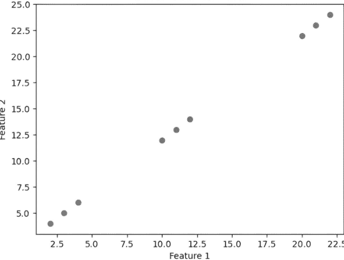

图 5.23：数据集可视化。

图 5.23 展示了用于选择聚类数量的数据集的散点图。

```
from sklearn.cluster import KMeans
# Define a range of k values
k_values = range(1, 6)
inertia = []

# Apply K-Means for each k value and compute inertia
for k in k_values:
    kmeans = KMeans(n_clusters=k, random_state=42)
    kmeans.fit(X)
    inertia.append(kmeans.inertia_)

# Plot the elbow curve
plt.plot(k_values, inertia, marker='o')
plt.xlabel('Number of Clusters (k)')
plt.ylabel('Within-Cluster Sum of Squares (WCSS)')
plt.title('Elbow Method for Optimal k')
plt.xticks(k_values)
plt.show()
```

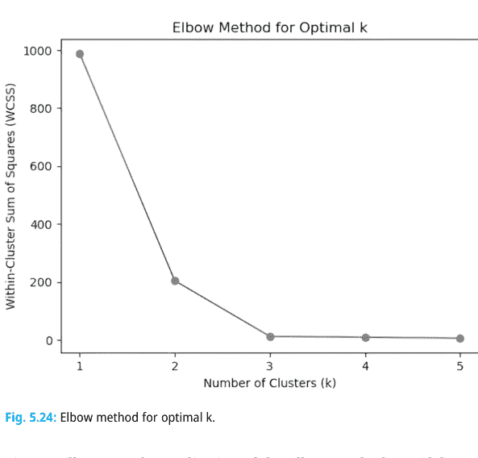

图 5.24：用于确定最佳k值的肘部法。

图 5.24 展示了肘部法的应用，这是一种广泛用于确定k-means聚类中最佳聚类数量（k）的技术。该图可能包含两个子图或面板。肘部法帮助我们识别簇内平方和（WCSS）下降速度减缓的拐点。在当前场景中，我们在 k = 3 处观察到一个肘部拐点。因此，我们可以推断出该数据集最合适的聚类数量是3。

以下是一个Python脚本，它有助于执行K-Means聚类方法，包括K-Means前后的可视化表示，以及对每个步骤和相应结果的全面解释。

步骤：

1.  利用scikit-learn中的make_blobs函数创建合成数据。该特定数据集包含300个样本，涵盖2个特征和4个簇。
2.  在应用K-Means聚类技术之前，可视化生成的数据。
3.  首先初始化K-Means聚类算法并将其拟合到数据。为了确保可重复性，我们设置随机状态并将聚类数量指定为4。
4.  在完成K-Means模型拟合后，我们获得聚类中心以及分配给每个数据点的标签。
5.  接着绘制K-Means聚类后的数据，其中每个数据点根据其分配的簇进行颜色编码，聚类中心用红色十字标记。

266 — 第5章 经典机器学习算法

```
import numpy as np
import matplotlib.pyplot as plt
from sklearn.datasets import make_blobs
from sklearn.cluster import KMeans

# Step 1: Generate Synthetic Data
X, _ = make_blobs(n_samples=300, centers=4, cluster_std=0.60,
                  random_state=0)

# Step 2: Plot Data Before K-Means
plt.figure(figsize=(10, 5))
plt.scatter(X[:, 0], X[:, 1], s=50)
plt.title('Data Before K-Means Clustering')
plt.xlabel('Feature 1')
plt.ylabel('Feature 2')

# Step 3: Apply K-Means Clustering
kmeans = KMeans(n_clusters=4, random_state=0)
kmeans.fit(X)

# Step 4: Get Cluster Centers and Labels
cluster_centers = kmeans.cluster_centers_
cluster_labels = kmeans.labels_

# Step 5: Plot Data After K-Means
plt.figure(figsize=(10, 5))
plt.scatter(X[:, 0], X[:, 1], c=cluster_labels, s=50, cmap='viridis')
plt.scatter(cluster_centers[:, 0], cluster_centers[:, 1], c='red',
            s=200, alpha=0.75)
plt.title('Data After K-Means Clustering')
plt.xlabel('Feature 1')
plt.ylabel('Feature 2')
plt.show()
```

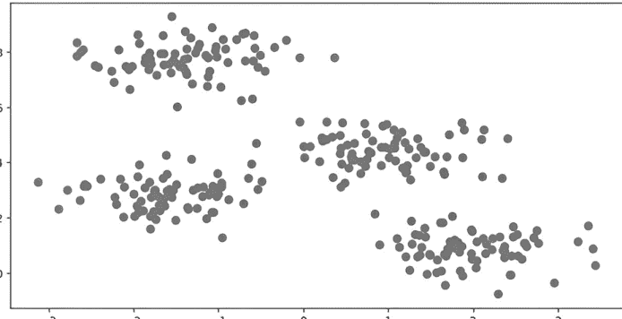

图 5.25：K-Means聚类前的数据。

图 5.25 展示了应用k-means聚类算法之前数据集的散点图可视化。该图显示了数据点，每个点代表一个单独的观测值或实例，分布在两个维度或特征上。这些特征分别由x轴和y轴表示。

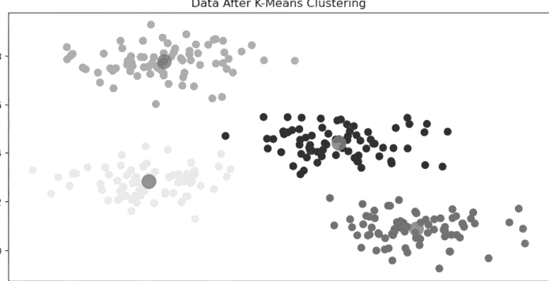

图 5.26：K-Means聚类后的数据。

图 5.26 算法。与之前的散点图（图 5.25）类似，数据点绘制在特征空间中，x轴和y轴代表两个选定的特征或维度。

然而，在此图中，散点图上叠加了一个额外的组件：k-means算法产生的聚类分配结果。

-   第一个图展示了实施K-Means聚类之前的合成数据。
-   第二个图显示了使用K-Means聚类后的数据。每个点根据其分配的簇进行着色，聚类的质心用红色标记。这种可视化帮助我们理解K-Means如何根据相似性将数据分组为簇。

让我们检查另一个Python脚本，该脚本对从scikit-learn获取的数据集执行k-means聚类算法，同时生成使用k-means聚类算法前后的数据图形描述。

```
import numpy as np
import matplotlib.pyplot as plt
from sklearn import datasets
from sklearn.cluster import KMeans

# Load the iris dataset
iris = datasets.load_iris()
X = iris.data[:, :2] # We only take the first two features

# Plot the data before applying k-means
plt.figure(figsize=(10, 6))
plt.subplot(1, 2, 1)
plt.title('Data before K-Means')
plt.scatter(X[:, 0], X[:, 1], cmap='viridis')

# Apply k-means clustering
kmeans = KMeans(n_clusters=3, random_state=42)
kmeans.fit(X)
labels = kmeans.labels_

# Plot the data after applying k-means
plt.subplot(1, 2, 2)
plt.title('Data after K-Means')
plt.scatter(X[:, 0], X[:, 1], c=labels, cmap='viridis')

# Plot the cluster centers
centers = kmeans.cluster_centers_
plt.scatter(centers[:, 0], centers[:, 1], c='red', s=100, alpha=0.5)

plt.show()
```

步骤：

1.  导入执行各种操作所需的库。需要导入的库包括用于执行数值操作的numpy，用于可视化的matplotlib.pyplot，以及分别用于处理数据集和聚类算法的sklearn中的datasets和cluster。
2.  从scikit-learn库加载鸢尾花数据集，并选择仅使用前两个属性进行可视化。
3.  使用plt.figure和plt.subplot创建一个包含两个子图的图形。
4.  在第一个子图中，使用plt.scatter绘制原始数据点，使用cmap = 'viridis'颜色映射（你可以选择任何你喜欢的颜色映射）。
5.  实例化一个KMeans对象，设置n_clusters = 3（因为鸢尾花数据集有3个类别），并指定random_state以确保可重复性。
6.  通过在kmeans对象上调用fit方法，在数据集上训练KMeans模型。
7.  利用kmeans.labels_属性获取每个数据点的聚类标签。
8.  在第二个子图中，使用plt.scatter绘制数据点，但这次根据它们的聚类标签使用c = labels和cmap = 'viridis'颜色映射进行着色。
9.  使用kmeans.cluster_centers_获取聚类中心的坐标。
10. 使用plt.scatter绘制聚类中心，设置c = 'red'（红色），s = 100（较大尺寸），alpha = 0.5（半透明）。
11. 使用plt.show()显示图形。

-   第一个子图显示了应用k-means聚类之前的原始数据点，使用连续颜色映射（此处为viridis）着色。
-   第二个子图显示了应用k-means聚类后的数据点，其中每个点根据其分配的簇进行着色。此外，聚类中心被绘制为较大的红点。

### 5.6 主成分分析

PCA，即主成分分析，是一种在机器学习、数据挖掘和信号处理等多个领域中广泛使用的降维方法。它是一种经验性过程，能够将高维数据集转换为低维子空间，同时保留原始数据的大部分变异性。尤其是在处理高维数据集时，PCA被证明非常有益，因为它有助于简化计算复杂度、消除噪声，并在低维空间中促进数据可视化。

#### PCA中使用的数学概念

**协方差矩阵：** PCA首先对数据进行标准化，使每个特征的均值为零，标准差为一。随后，计算协方差矩阵以捕捉特征对之间的关联。

两个特征xi和xj之间的协方差计算如下：

```
cov(x_i, y_i) = 1/(n-1) * Σ_{k=1}^{n} (x_{ki} - x̄_i) (x_{kj} - x̄_j)
```

其中n代表样本总数，xki和xkj分别表示第k个样本的第i个和第j个特征的值，μi和μj分别对应特征xi和xj的均值。

##### 特征分解

PCA对协方差矩阵进行特征分解以确定主成分。该矩阵的特征向量封装了最大方差的方向，通常被称为主成分。此外，相应的特征值提供了关于每个不同成分所解释方差比例的重要信息。

协方差矩阵 × 特征向量 = 特征值 × 特征向量

此外，特征向量彼此正交，并共同为数据建立一个新的基础。

##### 选择主成分

- 主成分根据特征值按降序排列，第一个成分捕捉最高量的方差，第二个成分捕捉第二高的方差，依此类推。
- 一个广泛接受的惯例是选择总方差的特定百分比（例如90%）作为确定要保留的主成分数目的阈值。

##### 投影

最后，将数据投影到指定的主成分上，以获得降维后的表示。此投影通过将原始数据矩阵与由所选特征向量（主成分）组成的矩阵相乘来完成。

##### 数学表示

- 设X表示标准化的数据矩阵，其维度为n × m，其中n代表样本数，m代表特征数。
- PCA识别出k个主成分，其中k小于或等于m，这些主成分由来自X协方差矩阵的特征向量V表征。前k个主成分根据其相关的特征值进行选择。
- 数据的降维表示Y通过将X投影到所选主成分上获得：

$$Y = X \cdot Vk$$

其中Vk是前k个特征向量的矩阵。

PCA是一种用于数据预处理、可视化和特征提取的强大工具。其广泛的应用可见于机器学习、信号处理和图像分析等多个领域。通过其数学基础，PCA为理解高维数据的内在结构提供了有价值的视角，从而能够高效地计算降维表示。

PCA有多种应用，例如数据的可视化表示、噪声降低、特征提取和数据压缩。它被广泛用作机器学习流程中的初步步骤，特别是在处理高维数据时，例如图像、信号或文本数据。

以下是执行PCA的步骤：

1. **数据预处理：**
    - 通过从每个特征中减去均值，然后除以标准差来实现数据的标准化。这一关键步骤确保所有特征具有统一的尺度，并在后续分析中具有同等的重要性。
2. **计算协方差矩阵：**
    - 计算标准化数据的协方差矩阵，其中协方差矩阵表示特征之间的方差和协方差的度量。
3. **计算特征向量和特征值：**
    - 计算协方差矩阵的特征向量和相关的特征值。
    - 特征向量描述主成分，而特征值表示每个主成分捕捉方差的程度。
4. **按特征值对特征向量排序：**
    - 根据对应的特征值，将特征向量按降序排列。
    - 捕捉数据中最大方差的主成分是与最高特征值相关的特征向量。
5. **选择主成分：**
    - 通过考虑希望保留的方差程度或预期的降维程度，决定要保留的主成分数目。
    - 一种常见的方法是选择捕捉数据总方差特定百分比（例如95%）的前k个主成分。
6. **将数据投影到主成分上：**
    - 通过将原始数据与所选特征向量相乘，将原始数据投影到所选主成分上。
    - 此过程将数据从初始特征空间转换到由主成分指定的后续子空间。
7. **降维：**
    - 转换后的数据现在存在于由所选主成分定义的低维子空间中。
    - 如果选择k个主成分，数据的维度将从初始特征数减少到k维。
8. **可选：重建或可视化：**
    - 可选地，可以通过将转换后的数据与转置的所选特征向量相乘，从降维表示中恢复初始数据。
    - 在低维子空间中可视化转换后的数据，以用于探索或解释目的。

需要强调的是，PCA是一种无监督技术，这意味着它不考虑任何类别标签或目标变量。它仅专注于捕捉数据中的最大方差，而这对于特定的监督学习任务可能重要也可能不重要。

#### 5.6.1 降维

降维是机器学习和数据分析领域的一项关键技术，尤其是在处理包含大量维度的数据时。降维的主要目标是在保留尽可能多相关信息的同时，减少数据集中的特征或维度数量。

降维的最终目标是将高维数据转换为低维空间，使其更易于管理和计算效率更高。通过这样做，它有助于克服“维度灾难”带来的挑战，即数据复杂性随维度数量呈指数级增长。这反过来会导致过拟合、计算成本增加和数据稀疏等问题。

降维有两种主要方法：特征选择和特征提取。特征选择涉及从原始特征中选择一个子集，而特征提取涉及通过组合或转换原始特征来创建新特征。

PCA是一种常用的特征提取技术。它识别数据中方差最大的方向，并将数据投影到由这些方向定义的低维子空间上，这些方向被称为主成分。

其他值得注意的降维技术包括线性判别分析（LDA），其目标是最大化类别之间的可分性，以及t-分布随机邻域嵌入（t-SNE），这是一种适用于在低维空间中可视化高维数据的非线性技术。

降维有可能通过消除不相关或冗余特征、降低噪声和增强数据的可解释性来提高机器学习模型的性能。然而，重要的是要在降维和保留特定任务所需的基本信息之间取得平衡。降维技术在图像和信号处理、文本挖掘、生物信息学和推荐系统等多个领域得到广泛应用。它们在机器学习工作流程中的数据预处理、可视化和特征工程流程中发挥着基础性作用。

特征选择和特征提取是机器学习和数据分析领域中两种常用的方法，旨在降低数据集的维度并提高模型的效率。以下是对每种方法的详细阐述：

##### 特征选择

特征选择涉及从数据集中仔细选择原始特征的一个子集，排除任何被认为不相关或冗余的特征。主要目标是通过抑制过拟合、降低计算复杂度和增强可解释性来改善模型性能。用于特征选择的技术可分为三种不同类型：

- **过滤方法：** 过滤方法独立于所选学习算法评估特征的相关性。标准技术包括相关性分析、信息增益和统计检验，如方差分析（ANOVA）和卡方检验。
- **包装方法：** 包装方法通过使用不同的特征组合迭代训练模型并评估其性能来评估特征子集。诸如前向选择、后向消除和递归特征消除（RFE）等技术属于此类。

##### 特征提取

特征提取是通过组合或改变初始特征来生成一组新特征的过程，同时保留关键信息。其主要目标是在尽可能保留最多相关信息的同时，降低数据集的维度。特征提取方法主要分为两类：线性技术和非线性技术：

- 线性方法：线性技术，包括主成分分析（PCA）和线性判别分析（LDA），通过形成初始特征的线性组合来生成新特征。PCA检测方差最大的方向，而LDA则专注于增强类别之间的区分度。
- 非线性方法：非线性技术，如t-分布随机邻域嵌入（t-SNE）和等距映射（Isomap），通过捕捉数据中的非线性关系来生成新特征。这些方法在将高维数据表示在低维空间的同时保留局部结构方面尤其具有优势。

优点：有效降低维度，捕捉数据中的基本结构，并增强可视化和可解释性。

缺点：牺牲了可解释性，因为新特征可能无法直接对应原始特征，并且非线性方法可能需要大量的计算资源。

#### 5.6.2 特征向量与特征值

特征向量和特征值是线性代数中的核心概念，在机器学习和数据分析等多个领域具有广泛的应用。

##### 特征向量

- 特征向量是与线性变换相关的特殊向量，表示在该变换下仅被拉伸或压缩而方向保持不变的向量方向。
- 从数学角度来看，如果一个向量v满足以下方程，则它被归类为方阵A的特征向量：

$$A \cdot v = \lambda \cdot v$$

其中$\lambda$是一个标量，称为v对应的特征值。
- 为了保持一致性，特征向量通常被调整为单位长度，即满足条件$|| v || = 1$。

##### 特征值

- 特征值是标量，表示在相应线性变换中对应特征向量被拉伸或压缩的因子。
- 矩阵A的每个特征向量都对应一个唯一的特征值。
- 特征值对确定线性变换的特性有重大影响，例如矩阵对角化、稳定性分析和求解微分方程。

特征向量和特征值的计算可以通过求解特征方程$\det(A - \lambda I) = 0$来完成，其中I代表单位矩阵。
获得特征值后，可以通过对每个特征值求解方程$(A - \lambda I)v = 0$来推导出相应的特征向量。

#### 应用

- 图像和信号处理：特征向量用于图像压缩和降噪。
- 结构分析：特征值决定结构的稳定性和固有频率。
- 机器学习：特征向量和特征值用于降维、特征提取和聚类算法。

以下Python代码演示了使用PCA进行降维的实现。

```python
import numpy as np

# Original data
X = np.array([[2.5, 2.4, 0.5, 0.7],
              [2.1, 1.9, 1.8, 1.3],
              [1.6, 1.6, 1.5, 1.1],
              [1.0, 0.9, 1.0, 0.7],
              [0.5, 0.6, 0.7, 0.5]])

# Step 1: Calculate the mean of each feature (dimension)
mean = np.mean(X, axis=0)
print("Mean:", mean)

# Step 2: Subtract the mean from each observation to center the data
X_centered = X - mean

# Step 3: Calculate the covariance matrix
covariance_matrix = np.cov(X_centered.T)
print("\nCovariance Matrix:")
print(covariance_matrix)

# Step 4: Calculate the eigenvalues and eigenvectors of the covariance matrix
eigenvalues, eigenvectors = np.linalg.eig(covariance_matrix)
print("\nEigenvalues:", eigenvalues)

# Step 5: Sort the eigenvectors in descending order of their corresponding eigenvalues
sorted_indices = np.argsort(eigenvalues)[::-1]
sorted_eigenvectors = eigenvectors[:, sorted_indices]
sorted_eigenvalues = eigenvalues[sorted_indices]

print("\nSorted Eigenvectors:")
for i, eigenvector in enumerate(sorted_eigenvectors.T):
    print(f"PC{i+1}: {eigenvector}")

# Step 6: Project the centered data onto the new subspace defined by the principal components
X_projected = X_centered @ sorted_eigenvectors
print("\nProjected Data:")
print(X_projected)
```

此代码遵循了您概述的使用PCA进行降维的步骤。以下是代码功能的分解：

1. 原始数据X被定义为一个NumPy数组。
2. 计算每个特征的均值并从数据中减去以使其居中（步骤1和2）。
3. 使用np.cov计算协方差矩阵（步骤3）。
4. 通过使用np.linalg.eig函数计算协方差矩阵的特征值和特征向量，如步骤4所述。
5. 根据对应的特征值对特征向量进行降序排序（步骤5）。
6. 使用矩阵乘法将居中数据X_centered投影到由排序后的特征向量定义的新子空间上（步骤6）。

```
Mean: [1.54 1.48 1.1  0.86]

Covariance Matrix:
[[0.653 0.5885 0.0775 0.142 ]
 [0.5885 0.537  0.05   0.119 ]
 [0.0775 0.05   0.295  0.165 ]
 [0.142  0.119  0.165  0.108 ]]

Eigenvalues: [1.23214566e+00 3.57843561e-01 3.01078173e-03 4.32153957e-18]

Sorted Eigenvectors:
PC1: [-0.7246738 -0.65326858 -0.12634088 -0.17923735]
PC2: [-0.11283679 -0.16433601  0.87715334  0.43687934]
PC3: [-0.67701497  0.70717358 -0.05268396  0.19692806]
PC4: [ 0.06137164 -0.21480074 -0.46028731  0.85920298]

Projected Data:
[[-1.19221144e+00 -8.55705150e-01  7.67212816e-04  1.11022302e-16]
 [-8.47493183e-01  6.74024515e-01 -3.23459052e-02  2.22044605e-16]
 [-2.15425975e-01  4.29221847e-01  7.04290811e-02 -2.49800181e-16]
 [ 8.11531693e-01 -1.36927178e-03 -7.08126875e-02  3.60822483e-16]
 [ 1.44359890e+00 -2.46171940e-01  3.19622988e-02 -5.55111512e-17]]
```

图5.28：用于降维的主成分分析（PCA）。

图5.28展示了主成分分析（PCA）的结果，这是一种用于降维的技术，展示了转换后的数据集，其中数据点在低维空间中表示，同时保留了原始特征中最重要的方差。

代码打印出均值、协方差矩阵、特征值、排序后的特征向量（标记为PC1、PC2等）以及投影数据X_projected。

下面是一个Python代码示例，展示了在IRIS数据集上实现PCA。此外，它还演示了PCA前后结果的可视化。

```python
import numpy as np
import matplotlib.pyplot as plt
from sklearn.datasets import load_iris
from sklearn.preprocessing import StandardScaler
from sklearn.decomposition import PCA

# Load the Iris dataset
iris = load_iris()
X = iris.data
y = iris.target

# Standardize the features
scaler = StandardScaler()
X_scaled = scaler.fit_transform(X)

# Instantiate PCA and fit the data
pca = PCA(n_components=2)
X_pca = pca.fit_transform(X_scaled)

# Plot original data
plt.figure(figsize=(10, 5))
plt.subplot(1, 2, 1)
plt.scatter(X[:, 0], X[:, 1], c=y, cmap='viridis', edgecolor='k')
plt.title('Original Data')
plt.xlabel('Feature 1')
plt.ylabel('Feature 2')
plt.colorbar()

# Plot data after PCA
plt.subplot(1, 2, 2)
plt.scatter(X_pca[:, 0], X_pca[:, 1], c=y, cmap='viridis', edgecolor='k')
plt.title('Data After PCA')
plt.xlabel('Principal Component 1')
plt.ylabel('Principal Component 2')
plt.colorbar()

plt.tight_layout()
plt.show()
```

步骤：

1.  导入所需的库，包括 numpy、matplotlib.pyplot、sklearn datasets 中的 load_iris、sklearn preprocessing 中的 StandardScaler 以及 sklearn.decomposition 中的 PCA。
2.  加载鸢尾花数据集。
3.  使用 StandardScaler 对特征进行标准化。
4.  实例化 **PCA**，指定所需的主成分数量（本例中为 2），并将其拟合到标准化后的数据上。
5.  通过使用调整好的 PCA 模型，将初始数据集转换到低维空间。
6.  通过 matplotlib.pyplot.scatter 函数可视化初始数据集以及经过 PCA 处理后的数据集。
7.  设置合适的标题、标签和颜色条以获得更好的可视化效果。
8.  使用 **plt.show()** 显示图表。

此代码生成两个子图：一个显示原始数据，另一个显示经过 PCA 处理后的数据。数据点根据目标标签（物种）着色，以可视化 PCA 前后的任何模式或聚类。

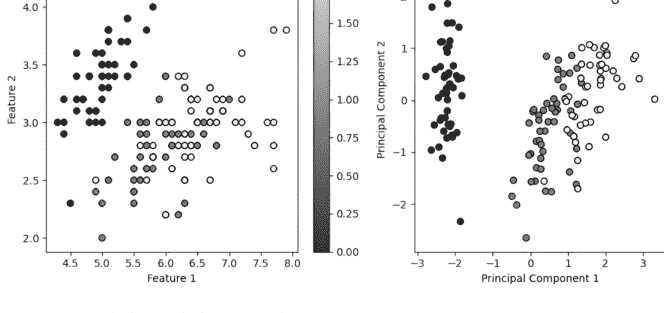

**图 5.29：** 主成分分析前后的数据。

图 5.29 展示了经过主成分分析（PCA）变换前后的鸢尾花数据集。该图可能展示了 PCA 如何在保留最重要信息的同时降低数据的维度，从而有助于可视化数据集的结构和潜在的聚类模式。

### 5.7 朴素贝叶斯

朴素贝叶斯是一种利用贝叶斯定理并假设特征之间相互独立的分类算法，它既简单又有效。尽管其假设过于简化，但在实际场景中，尤其是在文本分类问题领域，它通常表现得非常出色。

朴素贝叶斯的核心思想是根据被分类实例的特征值计算每个类别的概率。随后，通过选择概率最高的类别来进行预测。

朴素贝叶斯是一种强大的概率分类器，它依赖于贝叶斯定理，并以一种直接的方式假设特征独立性。

#### 贝叶斯定理

朴素贝叶斯基于贝叶斯定理，这是一个阐述在给定证据下假设概率的原则：

$P(class|data) = (P(data|class) * P(class)) / P(data)$

其中：

-   P(class|data) 表示在给定数据条件下类别的可能性，由特征值决定。
-   P(data|class) 表示在给定类别条件下数据的条件概率。
-   P(class) 表示与该类别相关的先验概率。
-   P(data) 作为证据，起到缩放概率的常数作用。

“朴素”假设源于朴素贝叶斯假设在给定类别标签的情况下，所有特征之间条件独立。这种简化使得 P(data|class) 的计算可以按如下方式进行：

数学上表示为：

$P(data|class) = P(feature1|class) * P(feature2|class) * ... * P(featureN|class)$

这个假设，尽管在实际场景中很少成立，但使得计算变得显著更易于处理，并使得朴素贝叶斯能够应用于高维度问题。

要训练一个朴素贝叶斯分类器，必须根据可用的训练数据计算先验概率 P(class) 和似然概率 P(feature|class)。对于数值特征，通常假设它们服从高斯分布，因此需要估计每个类别的均值和方差。至于分类特征，则可以简单地计算每个类别中每个特征值的频率。

在预测阶段，利用训练阶段估计的先验概率和似然概率，为每个类别计算后验概率 P(class|data)。随后，选择具有最大后验概率的类别作为给定样本的预测类别。

尽管简单，朴素贝叶斯经常作为可靠的基准分类器，并且在特征独立性假设没有被严重违反的情况下，可以表现出显著的有效性。此外，它在训练和预测方面都非常高效，使其非常适合实时应用和大型数据集。

朴素贝叶斯分类器有不同的变体，包括：

-   高斯朴素贝叶斯：假设连续特征服从高斯（正态）分布。
-   多项式朴素贝叶斯：适用于离散属性，例如文本分类任务中的词频。
-   伯努利朴素贝叶斯：假设特征是二元的，常用于文档分类任务。

让我们考虑一个使用朴素贝叶斯进行电子邮件垃圾邮件分类的简单例子。

我们考虑一个由电子邮件组成的数据集，每封邮件被分类为“垃圾邮件”或“非垃圾邮件”（正常邮件）。我们的目标是构建一个朴素贝叶斯分类器，通过分析电子邮件正文中特定单词的存在与否，来预测新邮件是否为垃圾邮件。

假设我们有以下训练数据：

```
邮件 1（正常）："You have won a free vacation!"
邮件 2（垃圾邮件）："Make money fast with our secret system!"
邮件 3（正常）："Meeting at 3 pm to discuss project."
邮件 4（垃圾邮件）："Earn $$$$ from home today!"
```

我们可以从数据集中提取唯一的单词（特征）：

```
['you', 'have', 'won', 'free', 'vacation', 'make', 'money', 'fast',
'secret', 'system', 'meeting', 'pm', 'discuss', 'project', 'earn',
'from', 'home', 'today']
```

为了训练朴素贝叶斯分类器，需要计算先验概率 P(spam) 和 P(ham)，以及每个单词的似然概率 P(word|spam) 和 P(word|ham)。

鉴于训练数据中垃圾邮件和正常邮件的数量相等，先验概率如下：

P(spam) = P(ham) = 0.5

对于似然概率，我们可以计算每个单词在垃圾邮件和正常邮件中出现的频率。例如：

P(won|ham) = 1/2（won 在 2 封正常邮件中出现一次）
P(won|spam) = 0（won 在任何垃圾邮件中都没有出现）
P(make|spam) = 1/2（make 在 2 封垃圾邮件中出现一次）
P(make|ham) = 0（make 在任何正常邮件中都没有出现）

一旦从训练数据中估计出所有必要的概率，就可以利用贝叶斯定理和朴素独立性假设，通过计算后验概率 P(spam|email) 和 P(ham|email) 来对新邮件进行分类。预测是通过选择具有最高后验概率的类别来做出的。

例如，假设我们有一封新邮件，内容为：“Get rich quickly with our system!” 要对这封邮件进行分类，我们将使用训练阶段估计的概率计算 P(spam|email) 和 P(ham|email)，并选择概率较高的类别。

这个特定的例子展示了朴素贝叶斯在文本分类背景下的基本操作。在实际应用中，通常会采用更复杂的技术，如特征选择、平滑处理和处理未出现事件，以提高朴素贝叶斯分类器的性能。

让我们考虑一个使用朴素贝叶斯进行分类的数值例子。
假设我们拥有一个包含天气观测的数据集，其中每个实例根据四个特征被分类为“Play”或“Don't Play”：Outlook（Sunny, Overcast, Rain）、Temperature（Hot, Mild, Cool）、Humidity（High, Normal）和 Wind（Strong, Weak）。
以下是训练数据集：

| Outlook | Temperature | Humidity | Wind | Play? |
| :--- | :--- | :--- | :--- | :--- |
| Sunny | Hot | High | Weak | No |
| Sunny | Hot | High | Strong | No |
| Overcast | Hot | High | Weak | Yes |
| Rain | Mild | High | Weak | Yes |
| Rain | Cool | Normal | Weak | Yes |
| Rain | Cool | Normal | Strong | No |
| Overcast | Cool | Normal | Strong | Yes |
| Sunny | Mild | High | Weak | No |
| Sunny | Cool | Normal | Weak | Yes |
| Rain | Mild | Normal | Weak | Yes |
| Sunny | Mild | Normal | Strong | Yes |
| Overcast | Mild | High | Strong | Yes |
| Overcast | Hot | Normal | Weak | Yes |
| Rain | Mild | High | Strong | No |

我们可以从训练数据中计算先验概率：

- P(Play) = 9/14 = 0.643
- P(Don't Play) = 5/14 = 0.357

接下来，我们计算给定类别下每个特征值的似然概率：
例如，让我们计算 P(Outlook = Sunny|Play) 和 P(Outlook = Sunny| Don't Play)：

- P(Outlook = Sunny|Play) = 2/9 = 0.222（在9个Play实例中，有2个实例的Outlook = Sunny）
- P(Outlook = Sunny|Don't Play) = 3/5 = 0.6（在5个Don't Play实例中，有3个实例的Outlook = Sunny）

我们可以类似地计算所有特征值和类别的似然概率。
现在，让我们对一个具有以下特征值的新实例进行分类：Outlook = Overcast, Temperature = Cool, Humidity = High, Wind = Strong。
为了确定每个类别的后验概率，我们使用了贝叶斯定理和特征独立性假设，通常被称为“朴素”假设。

- P(Play|features) = (P(Overcast | Play) * P(Cool|Play) * P(High|Play) * P(Strong| Play) * P(Play)) / P(features)
- P(Don't Play| features) = (P(Overcast|Don't Play) * P(Cool|Don't Play) * P(High| Don't Play) * P(Strong|Don't Play) * P(Don't Play)) / P(features)

代入计算出的先验概率和似然概率，我们得到：

- P(Play|features) = (0.444 * 0.333 * 0.667 * 0.333 * 0.643) / P(features)
= 0.027 / P(features)
- P(Don't Play|features) = (0.2 * 0.4 * 0.2 * 0.6 * 0.357) / P(features)
= 0.009 / P(features)

我们不需要计算P(features)，因为它是一个缩放因子，我们只关心相对概率。
由于 P(Play|features) > P(Don't Play|features)，我们将这个新实例分类为“Play”。
这个例子说明了训练和使用朴素贝叶斯分类器所涉及的计算。在实践中，通常使用拉普拉斯平滑等技术来处理零概率并防止过拟合。

#### 应用

- 朴素贝叶斯常用于文本分类、垃圾邮件过滤、情感分析和推荐系统。
- 在机器学习任务中，它作为与更复杂分类器进行比较的基线模型。

#### 5.7.1 高斯朴素贝叶斯

高斯朴素贝叶斯技术是朴素贝叶斯算法的一种变体，在处理连续或数值特征时被证明具有显著优势。它基于一个假设：对于每个类别，连续属性都服从高斯（正态）分布。

高斯朴素贝叶斯的关键步骤是：

1. 从训练数据中计算每个类别的先验概率 P(class)。
2. 对于每个连续特征，计算该特征在每个类别中的均值和标准差。
3. 假设服从高斯分布，使用概率密度函数计算给定类别下特征值 x 的似然：

$$P(x|class) = \left( \frac{1}{\sqrt{2\pi * \sigma^2}} \right) * exp \left( - \frac{(x - \mu)^2}{2\sigma^2} \right)$$

其中 μ 和 σ 分别表示该类别中特征的均值和标准差。
4. 对于分类特征，像常规朴素贝叶斯一样计算似然概率。
5. 要对新实例进行分类，使用贝叶斯定理计算每个类别的后验概率：P(class|data) = (P(data|class) * P(class)) / P(data)
6. P(data|class) 计算为每个特征似然概率的乘积，假设特征独立：P(data|class) = P(x1|class) * P(x2|class) * ... * P(xn|class)
7. 将给定实例分类为具有最大后验概率的类别。

高斯假设使得高斯朴素贝叶斯在处理连续数据时特别有效，因为它捕捉了每个类别内特征值的分布。然而，如果特征分布显著偏离高斯分布，或者特征之间存在强依赖性，其性能可能不佳。

与常规朴素贝叶斯一样，高斯朴素贝叶斯计算效率高，可以作为一个很好的基线分类器，特别是在处理高维连续数据时。然而，对于复杂的数据分布，可能需要更先进的技术，如核密度估计或半监督学习。

让我们考虑一个使用高斯朴素贝叶斯进行分类的数值示例。
假设我们拥有一组鸢尾花的测量数据，其中每个个体被归类为三个不同物种之一：Setosa、Versicolor 或 Virginica。该数据集包含的属性有花萼长度、花萼宽度、花瓣长度和花瓣宽度，所有测量值均以厘米为单位。
以下是训练数据集的一个小子集：

| 花萼长度 | 花萼宽度 | 花瓣长度 | 花瓣宽度 | 物种 |
|---|---|---|---|---|
| 5.1 | 3.5 | 1.4 | 0.2 | Setosa |
| 4.9 | 3.0 | 1.4 | 0.2 | Setosa |
| 7.0 | 3.2 | 4.7 | 1.4 | Versicolor |
| 6.4 | 3.2 | 4.5 | 1.5 | Versicolor |
| 6.3 | 3.3 | 6.0 | 2.5 | Virginica |
| 5.8 | 2.7 | 5.1 | 1.9 | Virginica |

首先，我们从训练数据中计算每个类别的先验概率：

- P(Setosa) = 2/6 = 0.333
- P(Versicolor) = 2/6 = 0.333
- P(Virginica) = 2/6 = 0.333

接下来，我们计算每个类别中每个连续属性的均值和标准差。

对于 Setosa：

- 花萼长度：μ = 5.0, σ = 0.0707
- 花萼宽度：μ = 3.25, σ = 0.354
- 花瓣长度：μ = 1.4, σ = 0.0
- 花瓣宽度：μ = 0.2, σ = 0.0

对于 Versicolor：

- 花萼长度：μ = 6.7, σ = 0.424
- 花萼宽度：μ = 3.2, σ = 0.0
- 花瓣长度：μ = 4.6, σ = 0.141
- 花瓣宽度：μ = 1.45, σ = 0.071

对于 Virginica：

- 花萼长度：μ = 6.05, σ = 0.354
- 花萼宽度：μ = 3.0, σ = 0.424
- 花瓣长度：μ = 5.55, σ = 0.636
- 花瓣宽度：μ = 2.2, σ = 0.424

现在，让我们对一个具有以下特征值的新实例进行分类：花萼长度 = 6.2，花萼宽度 = 3.4，花瓣长度 = 5.4，花瓣宽度 = 2.3。

为了计算每个类别的后验概率，我们使用贝叶斯定理和连续特征的高斯概率密度函数：

P(Setosa | data) = (P(6.2 | Setosa) * P(3.4 | Setosa) * P(5.4 | Setosa) * P(2.3 | Setosa) * P(Setosa)) / P(data)
P(Versicolor | data) = (P(6.2 | Versicolor) * P(3.4 | Versicolor) * P(5.4 | Versicolor) * P(2.3 | Versicolor) * P(Versicolor)) / P(data)
P(Virginica | data) = (P(6.2 | Virginica) * P(3.4 | Virginica) * P(5.4 | Virginica) * P(2.3 | Virginica) * P(Virginica)) / P(data)

代入计算出的均值、标准差和先验概率，我们得到：

- P(Setosa | data) = 1.97 x 10^-19
- P(Versicolor | data) = 1.86 x 10^-6
- P(Virginica | data) = 1.93 x 10^-3

由于 P(Virginica | data) 最高，我们将这个新实例分类为 Virginica 物种。

这个例子展示了训练和使用高斯朴素贝叶斯分类器处理连续属性所涉及的计算。在实际应用中，可能需要特征缩放和缺失值处理等方法来提高性能。

以下是一个在数据集上实现高斯朴素贝叶斯分类的 Python 代码。

步骤：

- 首先，必须为手头的任务导入所需的库。这些库包括用于执行数值运算的 numpy，用于绘图的 matplotlib.pyplot，允许我们生成合成数据集的 sklearn datasets 中的 make_blobs，作为高斯朴素贝叶斯分类器的 sklearn naive_bayes 中的 GaussianNB，用于将数据拆分为训练集和测试集的 sklearn model_selection 中的 train_test_split，以及用于计算分类准确率的 sklearn metrics 中的 accuracy_score。
- 要生成一个包含两个簇的合成数据集，我们可以使用 make_blobs 函数。该函数将生成一个包含 1,000 个样本、两个特征和两个类别的数据集。
- 为了评估模型的性能，有必要将数据拆分为训练集和测试集。为此，我们可以使用 train_test_split 函数。在这种情况下，我们将 80% 的数据用于训练，剩余的 20% 用于测试。
- 在将朴素贝叶斯分类器应用于训练数据之前，可视化数据并观察类别的可分性是有益的。这可以通过使用 plt scatter 函数绘制训练数据来实现。

#### 5.7.2 多项式朴素贝叶斯

多项式朴素贝叶斯算法是朴素贝叶斯算法的一种变体，它非常适合涉及文本分类的任务。在这些任务中，特征表示文档中单词或标记的出现频率。
多项式朴素贝叶斯的关键假设是：

1.  数据来自多项式分布，其中每个特征（单词）都是从相同的词汇表中独立抽取的。

-   接下来，我们将创建一个高斯朴素贝叶斯分类器的实例，并使用 `gnb.fit(X_train, y_train)` 命令将其拟合到训练数据上。
-   分类器训练完成后，我们就可以在测试集上进行预测了。这可以通过 `y_pred = gnb.predict(X_test)` 命令来完成。
-   为了评估模型的性能，我们需要计算分类准确率。这可以通过使用 `accuracy_score` 函数并传入真实标签（`y_test`）和预测标签（`y_pred`）来实现。然后可以打印出得到的准确率以供进一步分析。
-   最后，我们可以可视化应用朴素贝叶斯分类器后的测试数据。这可以通过绘制测试数据并根据预测的类别标签（`y_pred`）为点着色来完成。

```python
import numpy as np
import matplotlib.pyplot as plt
from sklearn.datasets import make_blobs
from sklearn.naive_bayes import GaussianNB
from sklearn.model_selection import train_test_split
from sklearn.metrics import accuracy_score

# Generate synthetic dataset
X, y = make_blobs(n_samples=1000, centers=2, n_features=2,
                  random_state=0)

# Split data into train and test sets
X_train, X_test, y_train, y_test = train_test_split(X, y, test_size=0.2,
                                                    random_state=0)

# Plot the data before applying Naive Bayes
plt.figure(figsize=(10, 6))
plt.scatter(X_train[:, 0], X_train[:, 1], c=y_train, cmap='viridis',
            edgecolor='k')
plt.title('Data before applying Naive Bayes')
plt.xlabel('Feature 1')
plt.ylabel('Feature 2')
plt.show()

# Train the Gaussian Naive Bayes classifier
gnb = GaussianNB()
gnb.fit(X_train, y_train)

# Make predictions on the test set
y_pred = gnb.predict(X_test)

# Calculate accuracy
accuracy = accuracy_score(y_test, y_pred)
print(f'Accuracy: {accuracy:.2f}')

# Plot the data after applying Naive Bayes
plt.figure(figsize=(10, 6))
plt.scatter(X_test[:, 0], X_test[:, 1], c=y_pred, cmap='viridis',
            edgecolor='k')
plt.title('Data after applying Naive Bayes')
plt.xlabel('Feature 1')
plt.ylabel('Feature 2')
plt.show()
```

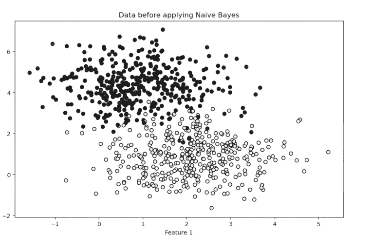

**图 5.30：** 应用朴素贝叶斯之前的数据。

图 5.30 展示了一个散点图，可视化了应用朴素贝叶斯分类算法之前的数据集。
准确率：0.94
该代码生成两个图：一个显示应用朴素贝叶斯之前的原始数据，另一个显示应用朴素贝叶斯之后的数据，其中的点根据其预测的类别标签着色。你还应该在控制台看到打印出的分类准确率。

输出结果将取决于用于生成合成数据集的随机状态，但由于数据被很好地分成了两个簇，你应该会得到一个相当高的准确率。

此示例展示了在 Python 编程语言中使用高斯朴素贝叶斯分类器。此外，它还展示了在应用算法之前和之后的数据可视化。此外，还通过使用准确率指标对算法的性能进行了评估。

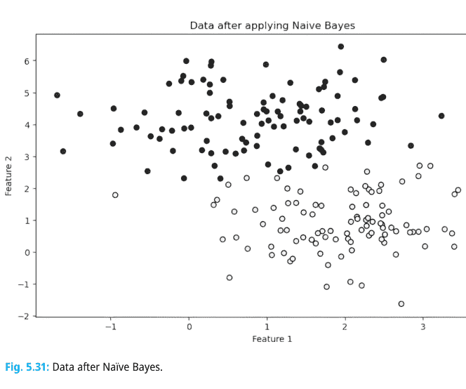

图 5.31：应用朴素贝叶斯之后的数据。

图 5.31 展示了一个散点图，可视化了应用朴素贝叶斯分类算法之后的数据集。该图展示了算法如何根据数据点的特征将其分类到不同的类别中，从而提供了关于朴素贝叶斯分类器根据特征分离数据点的有效性的见解。

让我们考虑另一个 Python 代码示例，该示例在 scikit-learn 的鸢尾花数据集上实现了高斯朴素贝叶斯分类。

**步骤：**

-   首先，应导入必要的库。这些库包括用于执行数值运算的 numpy、用于生成绘图的 matplotlib.pyplot、用于加载鸢尾花数据集的 sklearn datasets 中的 load_iris、用于实现高斯朴素贝叶斯分类器的 sklearn naive_bayes 中的 GaussianNB、用于将数据分割为训练集和测试集的 sklearn model_selection 中的 train_test_split，以及用于计算分类准确率的 sklearn metrics 中的 accuracy_score。
-   要加载鸢尾花数据集，可以使用 scikit-learn 中的 `load_iris()` 函数。为了专注于可视化，只选择了前两个特征，即花萼长度和花萼宽度。
-   为了将数据划分为训练集和测试集，使用了 `train_test_split` 函数。在这个特定案例中，80% 的数据被分配用于训练，而剩余的 20% 被指定用于测试。
-   为了在应用朴素贝叶斯算法之前可视化训练数据，可以使用 `plt.scatter` 函数。这将提供数据和类别可分离性的可视化表示。
-   通过创建一个 GaussianNB 分类器的实例并使用 `gnb.fit(X_train, y_train)` 语法将其拟合到训练数据上，可以实现该算法。
-   要在测试集上进行预测，可以执行 `y_pred = gnb.predict(X_test)` 代码。
-   一旦做出预测，就可以使用 `accuracy_score(y_test, y_pred)` 函数计算分类的准确率。然后可以打印结果。
-   最后，为了可视化应用朴素贝叶斯算法后的测试数据，可以使用预测的类别标签 `y_pred` 为点着色。这可以通过绘制测试数据并根据预测标签分配颜色来实现。

```python
import numpy as np
import matplotlib.pyplot as plt
from sklearn.datasets import load_iris
from sklearn.naive_bayes import GaussianNB
from sklearn.model_selection import train_test_split
from sklearn.metrics import accuracy_score

# Load the iris dataset
iris = load_iris()
X = iris.data[:, :2] # We only take the first two features for visualization
y = iris.target

# Split data into train and test sets
X_train, X_test, y_train, y_test = train_test_split(X, y, test_size=0.2, random_state=42)

# Plot the data before applying Naive Bayes
plt.figure(figsize=(10, 6))
plt.scatter(X_train[:, 0], X_train[:, 1], c=y_train, cmap='viridis', edgecolor='k')
plt.title('Iris Data before applying Naive Bayes')
plt.xlabel('Sepal Length')
plt.ylabel('Sepal Width')
plt.show()

# Train the Gaussian Naive Bayes classifier
gnb = GaussianNB()
gnb.fit(X_train, y_train)
# Make predictions on the test set
y_pred = gnb.predict(X_test)

# Calculate accuracy
accuracy = accuracy_score(y_test, y_pred)
print(f'Accuracy: {accuracy:.2f}')

# Plot the data after applying Naive Bayes
plt.figure(figsize=(10, 6))
plt.scatter(X_test[:, 0], X_test[:, 1], c=y_pred, cmap='viridis', edgecolor='k')
plt.title('Iris Data after applying Naive Bayes')
plt.xlabel('Sepal Length')
plt.ylabel('Sepal Width')
plt.show()
```

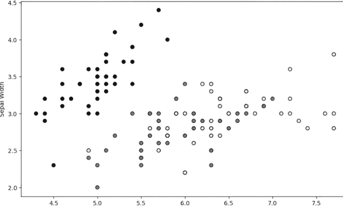

图 5.32：应用朴素贝叶斯之前的 IRIS 数据。

图 5.32 展示了应用朴素贝叶斯分类算法之前 IRIS 数据集的可视化。
准确率：0.90
第一个图显示了应用朴素贝叶斯之前的鸢尾花数据，其中的点根据其真实类别标签着色。第二个图显示了应用朴素贝叶斯之后的数据，其中的点根据其预测的类别标签着色。高斯朴素贝叶斯分类器在使用花萼长度和花萼宽度特征区分三个类别方面的性能被认为是令人满意的。

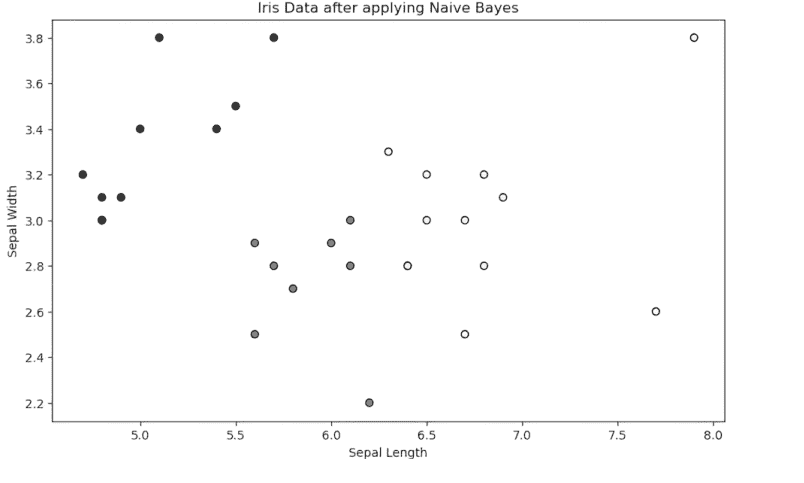

图 5.33：应用朴素贝叶斯之后的 IRIS 数据。

图 5.33 展示了应用朴素贝叶斯分类算法之后 IRIS 数据集的可视化。

2. 特征向量是稀疏的，这意味着对于给定文档，大多数词频为零。
3. 文档中单词的顺序并不重要，只有词频才是关键。

算法的工作原理如下：
1. 从训练数据中计算每个类别的先验概率，P(class)。
2. 对于每个类别，通过将其建模为多项式分布来计算观察到特定词频向量的可能性：

$$P(words|class) = (n! / (n1! * n2! * ... * nk!)) * (p1^{n1} * p2^{n2} * ... * pk^{nk})$$

在给定的上下文中，n 代表单词总数，k 表示词汇表的大小，ni 表示单词 i 的计数，pi 表示单词 i 在该特定类别中的概率。

3. 概率 pi 从训练数据中估计为 (单词 i 在类别中的计数 + alpha) / (类别中的总词数 + alpha * 词汇表大小)，其中 alpha 是一个平滑参数，用于避免零概率。
4. 要对新记录进行分类，必须利用贝叶斯定理计算每个类别的后验概率：

$$P(class | words) = (P(word | class) * P(class)) / (words)$$

5. 在考虑先验概率后，将文档分类为具有最大可能性的类别。

多项式朴素贝叶斯对于文本分类特别有效，因为它捕捉了单词的频率信息，这通常比单词在文档中是否存在更重要。它还能很好地处理文本数据的稀疏性。

然而，它假设单词是独立的，这在自然语言中可能不是一个有效的假设。此外，它没有考虑单词顺序或单词之间的语义关系。

尽管存在这些局限性，多项式朴素贝叶斯是一种简单高效的算法，在实践中通常能很好地完成文本分类任务。它被广泛用作基线模型或更复杂的集成模型的一部分。

让我们考虑一个使用多项式朴素贝叶斯进行文本分类的数值示例。

假设我们拥有一小部分电影评论，每条评论被归类为“正面”或“负面”。这些评论的特征是每条评论中使用的单词频率的数值表示。

以下是训练数据集：

| 评论 | 标签 |
|---|---|
| "great movie loved it" | 正面 |
| "terrible acting awful plot" | 负面 |
| "amazing visuals good story" | 正面 |
| "boring predictable waste of time" | 负面 |

首先，必须构建一个仅包含从数据集中提取的独特术语的词汇表：词汇表 = ["great", "movie", "loved", "it", "terrible", "acting", "awful", "plot", "amazing", "visuals", "good", "story", "boring", "predictable", "waste", "of", "time"]

接下来，我们从训练数据中计算每个类别的先验概率：

- P(正面) = 2/4 = 0.5
- P(负面) = 2/4 = 0.5

现在，我们计算每个单词和类别的似然概率 P(word|class)。为避免零概率，我们使用 α = 1 的加性平滑。

对于正面类别：

- 总词数 = 7（不包括重复项）
- P(great|正面) = (1 + 1) / (7 + 1 * 17) = 0.125
- P(movie|正面) = (1 + 1) / (7 + 1 * 17) = 0.125
- P(loved|正面) = (1 + 1) / (7 + 1 * 17) = 0.125
- . . .（其余单词的概率 = 1 / (7 + 1 * 17) = 0.0625）

对于负面类别：

- 总词数 = 9（不包括重复项）
- P(terrible|负面) = (1 + 1) / (9 + 1 * 17) = 0.115
- P(acting|负面) = (1 + 1) / (9 + 1 * 17) = 0.115
- P(awful|负面) = (1 + 1) / (9 + 1 * 17) = 0.115
- . . .（其余单词的概率 = 1 / (9 + 1 * 17) = 0.0577）

现在，让我们对一条新评论进行分类："good movie but boring plot."

我们使用贝叶斯定理和多项式似然来确定每个类别的后验概率。

```
P(正面|评论) = (P(good|正面) * P(movie|正面) * P(but|正面) * P(boring|正面) * P(plot|正面) * P(正面)) / P(评论)
P(负面|评论) = (P(good|负面) * P(movie|负面) * P(but|负面) * P(boring|负面) * P(plot|负面) * P(负面)) / P(评论)
```

代入计算出的概率，我们得到：

- P(正面|评论) = (0.125 * 0.125 * 0.0625 * 0.0625 * 0.0625 * 0.5) / P(评论) = 1.95 x 10^-6 / P(评论)
- P(负面|评论) = (0.0577 * 0.0577 * 0.0577 * 0.115 * 0.115 * 0.5) / P(评论) = 2.66 x 10^-7 / P(评论)

由于 P(正面|评论) > P(负面|评论)，我们将这条新评论归类为“正面”。

这个特定示例旨在演示在训练和使用多项式朴素贝叶斯分类器进行文本分类过程中所需的计算。在实践中，可能需要额外的预处理步骤，如分词、停用词移除和特征选择，以获得更好的性能。

以下是多项式朴素贝叶斯的 Python 代码：

```python
import numpy as np
import matplotlib.pyplot as plt
from sklearn.naive_bayes import MultinomialNB
from sklearn.model_selection import train_test_split
from sklearn.preprocessing import LabelEncoder
from sklearn.metrics import accuracy_score

# Sample data
X = np.array([['young', 'yes', 'no', 'good'],
    ['young', 'yes', 'no', 'poor'],
    ['old', 'yes', 'yes', 'good'],
    ['old', 'yes', 'yes', 'poor'],
    ['young', 'no', 'no', 'good'],
    ['young', 'no', 'yes', 'poor'],
    ['old', 'no', 'yes', 'good'],
    ['old', 'no', 'yes', 'poor']])

y = np.array([1, 0, 1, 0, 1, 0, 0, 0])

# Label encode categorical data
label_encoder = LabelEncoder()
X_encoded = np.empty(X.shape)
for i in range(X.shape[1]):
    X_encoded[:, i] = label_encoder.fit_transform(X[:, i])

# Split the data into train and test
X_train, X_test, y_train, y_test = train_test_split(X_encoded, y, test_size=0.2, random_state=0)

# Model training
mnb = MultinomialNB()
mnb.fit(X_train, y_train)

# Predictions
y_pred = mnb.predict(X_test)

# Calculate accuracy
accuracy = accuracy_score(y_test, y_pred)
print("Accuracy: ", accuracy)

# Output: Accuracy: 0.5
```

### 5.8 集成方法：Boosting, Bagging

集成方法是一类机器学习技术，旨在通过组合多个基础模型来提高预测性能。集成方法的基本原理是，多个模型的预测组合通常比单个独立模型的整体性能更优。由于其能够减轻过拟合、提高稳定性和改善泛化性能的能力，集成方法在实际应用中被广泛实施。

存在多种集成方法，但其中最流行的两种是 Bagging 和 Boosting：

**Bagging（自助聚合）：** Bagging 涉及在训练数据的不同子集上训练同一基础模型的多个实例，这些子集是通过有放回抽样得到的。每个模型独立训练，预测通过平均（用于回归）或投票（用于分类）进行组合。通过在数据的不同子集上训练模型，Bagging 有助于减少过拟合并提高最终预测的稳定性。随机森林是一种基于 Bagging 的流行集成方法，它在数据的随机子集上训练决策树，并组合它们的预测以做出最终预测。

**Boosting：** Boosting 是一种迭代技术，它顺序构建多个弱学习器。每个弱学习器在先前模型的残差上进行训练，并更强调被错误分类的实例。最终预测通过聚合所有弱学习器的预测来确定，通常通过加权求和。Boosting 算法，如 AdaBoost 和 Gradient Boosting，逐步构建模型以最小化损失函数，重点调整误分类实例的权重。Boosting方法在减少偏差和提高预测精度方面尤为擅长。

集成方法具有多项优势，包括增强的预测性能、对噪声和异常值的鲁棒性，以及处理数据中复杂关系的能力。然而，由于需要训练多个模型，它们可能会引入更高的计算复杂度和训练时间。此外，必须仔细调整超参数以优化集成方法的性能。

总体而言，集成方法是机器学习工具箱中的强大工具，被广泛应用于各个领域，以应对艰巨的预测任务并实现尖端性能。

#### 5.8.1 Bagging与Boosting概述

Bagging（自助聚合）和Boosting是两种著名的集成学习方法，它们通过整合多个基础模型来提升预测性能。

Bagging，也称为自助聚合，涉及在训练数据的不同子集（通过有放回抽样获得）上训练同一基础模型的多个实例。每个模型独立训练，其预测结果通过平均（用于回归）或投票（用于分类）进行组合。Bagging通过在不同的数据子集上训练模型，有助于缓解过拟合问题，从而降低最终预测的方差。Bagging的一个例子是随机森林算法，它构建一个决策树集合，每棵树在特征和数据实例的随机子集上进行训练。最终预测是通过对所有决策树的预测结果取平均值得到的，从而提高了泛化性能和鲁棒性。

相比之下，Boosting是一种迭代技术，它按顺序构建多个弱学习器。每个弱学习器在前一个模型的残差上进行训练，并更关注误分类的实例。Boosting算法旨在纠正前一个模型所犯的错误，并专注于难以分类的实例。最终预测是通过聚合所有弱学习器的预测结果得到的，通常采用加权求和的方式。两种流行的Boosting算法是AdaBoost和梯度提升。例如，在AdaBoost中，每个弱学习器根据其性能被分配一个权重，最终预测是通过组合所有弱学习器的加权预测得到的。梯度提升按顺序构建模型以最小化损失函数，每个模型专注于减少前一个模型所犯的错误。

现在让我们考虑一个二元分类问题，目标是根据电子邮件的特征预测其是否为垃圾邮件。在Bagging方法中，我们可以在电子邮件数据集的不同子集上训练多个决策树分类器，然后使用多数投票来组合它们的预测，从而对新电子邮件进行分类。在Boosting方法中，我们可以按顺序训练决策树分类器，每个后续模型都专注于前一个模型误分类的电子邮件。通过聚合所有模型的预测，Bagging和Boosting方法与使用单个决策树模型相比，可以显著提高垃圾邮件分类的准确性。这些集成技术在各个领域的实际应用中被广泛使用，以提高预测性能和鲁棒性。

以下是Bagging算法的Python代码：

- 首先，使用sklearn中的`make_classification`函数生成具有两个特征和两个类别的合成数据。
- 然后，使用`train_test_split`方法将数据划分为训练集和测试集。
- 在应用Bagging之前，通过绘图可视化数据。
- 在Bagging之前，在训练数据上训练一个随机森林分类器，并在测试集上进行预测。
- 显示Bagging之前的准确率。
- Bagging之后，使用Bagging训练多个随机森林分类器，并将它们的预测叠加在图上，从而再次绘制数据。
- 最后，展示Bagging前后的两个图。

```python
from sklearn.ensemble import BaggingClassifier
from sklearn.tree import DecisionTreeClassifier
from sklearn.datasets import make_classification
from sklearn.model_selection import train_test_split
import matplotlib.pyplot as plt

# Generate sample dataset
X, y = make_classification(n_samples=1000, n_features=4,
                           n_informative=2, n_redundant=0, random_state=0, shuffle=False)

# Split dataset into train and test sets
X_train, X_test, y_train, y_test = train_test_split(X, y, test_size=0.2,
                                                    random_state=42)

# Base Model
base_model = DecisionTreeClassifier(max_depth=4)
base_model.fit(X_train, y_train)
base_pred = base_model.predict(X_test)
base_acc = round(base_model.score(X_test, y_test) * 100, 2)

# Bagging model
model = BaggingClassifier(base_estimator=base_model, n_estimators=100,
                          random_state=0)
model.fit(X_train, y_train)
bag_pred = model.predict(X_test)
bag_acc = round(model.score(X_test, y_test) * 100, 2)

# Plot before bagging
plt.figure(figsize=(10, 7))
plt.scatter(X[:,0], X[:,1], c=y)
plt.title("Before Bagging: Accuracy= "+str(base_acc))
plt.xlabel('Feature 1')
plt.ylabel('Feature 2')

# Plot after bagging
plt.figure(figsize=(10, 7))
plt.title("After Bagging: Accuracy= "+str(bag_acc))
plt.xlabel('Feature 1')
plt.ylabel('Feature 2')
plt.scatter(X[:,0], X[:,1], c=model.predict(X))

plt.show()
```

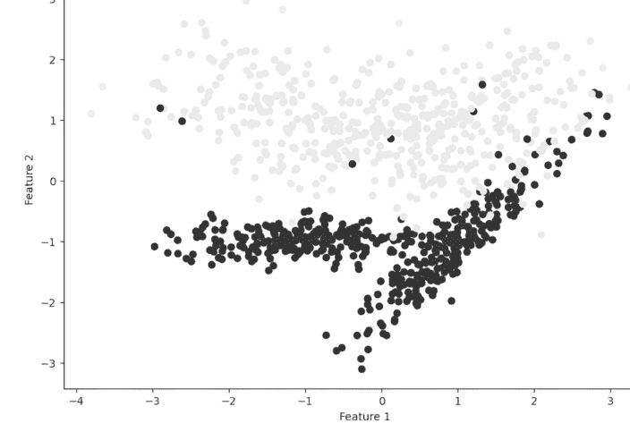

图 5.34：Bagging之前的准确率。

图 5.34 展示了应用Bagging集成技术之前的数据集图示。

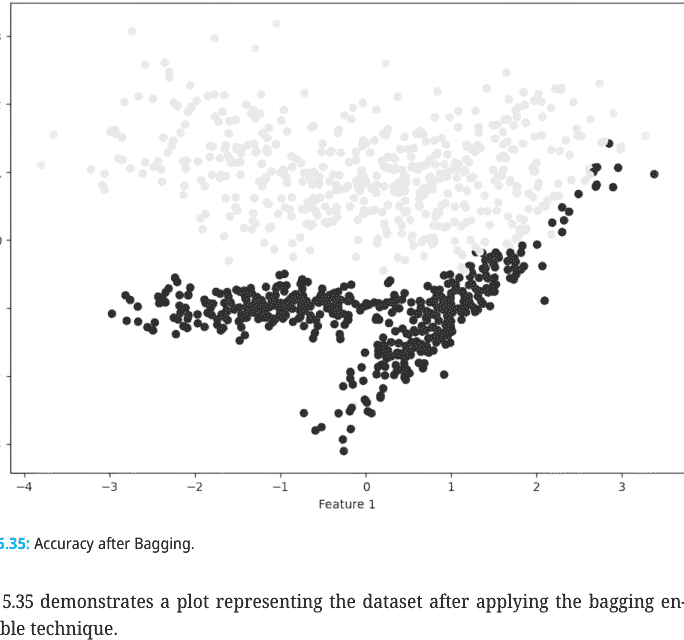

图 5.35：Bagging之后的准确率。

图 5.35 展示了应用Bagging集成技术之后的数据集图示。

执行此代码将产生两个图形表示：

- Bagging之前的图：显示Bagging实施之前数据点的分布。
- Bagging之后的图：显示应用Bagging与多个决策树分类器后数据点的分布。

以下是Boosting算法的Python代码：

```python
import numpy as np
import matplotlib.pyplot as plt
from sklearn.ensemble import GradientBoostingClassifier
from sklearn.datasets import make_classification
from sklearn.model_selection import train_test_split

# Generate synthetic dataset
X, y = make_classification(n_samples = 1000, n_features=10, n_classes=2,
                           random_state=123)

# Split data into train and test
X_train, X_test, y_train, y_test = train_test_split(X, y, test_size=0.2,
                                                    random_state=123)

# Base GBM model
gbc = GradientBoostingClassifier(learning_rate=0.1, n_estimators=100,
                                max_depth=3, random_state=123)
gbc.fit(X_train, y_train)

# Accuracy
acc = gbc.score(X_test, y_test)
print("Accuracy: ", acc)

# Plot Before Boosting
plt.figure(figsize = (6, 6))
plt.scatter(X[:,0], X[:,1], c = y)
plt.title("Before Boosting")
plt.xlabel('Feature 1')
plt.ylabel('Feature 2')
plt.show()

# Plot After Boosting
plt.figure(figsize = (6, 6))
plt.scatter(X[:,0], X[:,1], c = gbc.predict(X))
plt.title("After Boosting")
plt.xlabel('Feature 1'); plt.ylabel('Feature 2')
plt.show()
```

Accuracy: 0.995

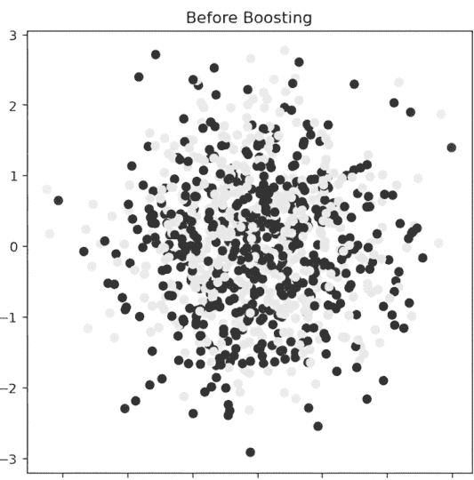

图 5.36：Boosting之前的准确率。

图 5.36 展示了应用Boosting集成技术之前的数据集图示。

#### 5.8.2 AdaBoost与梯度提升

AdaBoost，即自适应提升，是一种Boosting集成技术，它结合了多个弱学习器或模型以构建一个强学习器。以下是基本步骤：

1. 将训练样本的权重初始化为相等。
2. 对于每一轮或迭代：
   a. 使用加权训练数据训练一个基础或弱学习器模型。
   b. 通过将其预测与相应的实际值进行仔细比较，评估模型在训练数据上的有效性。
   c. 计算alpha参数，该参数根据模型的误差表示其重要性。
   d. 增加模型错误预测的样本的权重。
   e. 减少模型正确预测的样本的权重。

3.  对指定数量的估计器或迭代次数重复上述步骤。
4.  最终模型使用alpha权重组合每个弱学习器模型。

图 5.37：提升后的准确率。

图 5.37 展示了应用提升集成技术后的数据集图表。AdaBoost背后的关键概念是，它在每一轮中为被前一轮模型错误分类的样本分配更高的重要性。因此，后续模型旨在纠正其前驱模型所犯的错误。alpha参数控制每个弱学习器对最终强学习器模型的贡献。更高的alpha值表示更好的模型。通过在先前模型的错误上训练后续模型，并组合多个弱模型，AdaBoost减轻了偏差和方差，从而提高了性能。AdaBoost的一些优点包括易于实现、几乎不需要调参，并且兼容各种简单的弱学习器模型，从而产生强大的性能。

用于AdaBoost的Python库是**sklearn.ensemble.AdaBoostClassifier**或**sklearn.ensemble.AdaBoostRegressor**，具体取决于你处理的是分类还是回归问题。这些类包含在scikit-learn库中，该库被广泛认为是Python编程语言中一个重要的机器学习库。

以下是**AdaBoostClassifier**和**AdaBoostRegressor**类关键组件的简要说明：

1.  **AdaBoostClassifier：**
    -   此类用于分类任务。
    -   它实现了用于分类的AdaBoost算法。
    -   主要参数包括**base_estimator**、**n_estimators**、**learning_rate**和**algorithm**。
    -   **base_estimator**参数指定用于训练的基础学习器（默认是决策树）。
    -   **n_estimators**参数确定提升轮数，即使用弱学习器的数量。
    -   **learning_rate**调节每个弱学习器对最终预测的贡献。
    -   **algorithm**指定用于提升的算法（SAMME或SAMME.R）。
    -   经过训练后，该模型能够预测新数据点的分类标签。
2.  **AdaBoostRegressor：**
    -   此类用于回归任务。
    -   它实现了用于回归的AdaBoost算法。
    -   它具有与**AdaBoostClassifier**类似的参数，但用于预测连续的目标变量，而不是离散的类标签。
    -   训练后，该模型可以预测新数据点的连续目标值。

**AdaBoostClassifier**和**AdaBoostRegressor**都遵循scikit-learn估计器API，这意味着它们可以与其他scikit-learn函数（如**fit**、**predict**、**score**和交叉验证方法）结合使用。

梯度提升是一种集成学习方法，它通过逐步、累加和顺序地组合多个影响力较小的模型来生成一个强大的预测模型。以下是关键步骤：

1.  从一个初始模型/估计开始（例如一个小的决策树）。
2.  计算损失函数（例如偏差损失）以量化初始模型在训练数据上预测的误差。
3.  拟合一个新的弱模型来预测前一个模型的残差或错误。该模型试图纠正前一个模型的错误。
4.  将新的弱模型以乘数（学习率）添加到集成中。更新来自聚合集成的预测。
5.  重复步骤2-4，拟合新的弱模型以尝试纠正残差错误，直到达到满意的限制。

与AdaBoost的关键区别在于，梯度提升中的每个新模型都试图纠正前一步的残差错误，而不是专注于错误分类的示例。学习率会缩减每个模型的贡献以防止过拟合。树的深度也保持较小。

沿着残差误差梯度进行的类梯度下降式改进，带来了强大的整体预测能力。组合多个累加模型，即使单个模型较弱，也能产生稳健的性能。

优点是内置正则化并能处理各种数据。但如果调参不当，可能会过拟合。

用于梯度提升的Python库是**sklearn.ensemble.GradientBoostingClassifier**（用于分类任务）和**sklearn.ensemble.GradientBoostingRegressor**（用于回归任务）。该库是scikit-learn (sklearn)包的重要组成部分，该包被广泛认为是基于Python的机器学习库。

以下是梯度提升库关键组件的简要说明：

1.  **GradientBoostingClassifier**：此类用于分类任务。它实现了用于分类的梯度提升。它可以处理二分类和多分类问题。
2.  **GradientBoostingRegressor**：此类用于回归任务。它实现了用于回归的梯度提升。它适用于预测连续的目标变量。
3.  **参数**：GradientBoostingClassifier和GradientBoostingRegressor都拥有大量可调整的参数，以提升模型性能。一些值得注意的参数包括提升阶段的数量（n_estimators）、模型的学习率（learning_rate）、单个回归估计器的最大深度（max_depth）以及损失函数（loss）等。
4.  **集成学习**：梯度提升是一种集成学习方法，它顺序地组合多个弱学习器，最常见的是决策树。该技术中的后续模型旨在纠正其前驱模型所犯的错误，最终形成一个强大的学习器。
5.  **梯度提升算法**：梯度提升在集成中构建一系列树。在每次迭代中，都会拟合一棵新树来处理前一次迭代的残差。拟合过程涉及通过使用梯度下降来最小化损失函数。
6.  **特征重要性**：梯度提升提供了一个特征重要性属性，使用户能够理解每个特征在预测过程中的重要性。

下面提供的Python代码示例演示了AdaBoost和梯度提升分类器的应用：

```python
import numpy as np
import matplotlib.pyplot as plt
from sklearn.datasets import make_classification
from sklearn.model_selection import train_test_split
from sklearn.ensemble import AdaBoostClassifier, GradientBoostingClassifier
from sklearn.tree import DecisionTreeClassifier
from sklearn.metrics import accuracy_score

# Generate synthetic dataset
X, y = make_classification(n_samples=100, n_features=2, n_classes=2,
                           n_clusters_per_class=1, n_redundant=0, random_state=42)

# Split data into train and test sets
X_train, X_test, y_train, y_test = train_test_split(X, y, test_size=0.2,
                                                    random_state=42)

# Define base estimator (decision tree)
base_estimator = DecisionTreeClassifier(max_depth=1)

# AdaBoost classifier
ada_boost = AdaBoostClassifier(base_estimator=base_estimator,
                               n_estimators=50, random_state=42)
ada_boost.fit(X_train, y_train)

# Gradient Boosting classifier
grad_boost = GradientBoostingClassifier(n_estimators=50,
                                        learning_rate=0.1, random_state=42)
grad_boost.fit(X_train, y_train)

# Predictions
y_pred_ada = ada_boost.predict(X_test)
y_pred_grad = grad_boost.predict(X_test)

# Calculate accuracy scores
accuracy_ada = accuracy_score(y_test, y_pred_ada)
accuracy_grad = accuracy_score(y_test, y_pred_grad)

# Plotting
plt.figure(figsize=(18, 5))

# Before Boosting
plt.subplot(1, 3, 1)
plt.scatter(X_train[:, 0], X_train[:, 1], c=y_train, cmap='coolwarm', marker='o', edgecolors='k')
plt.title('Before Boosting')
plt.xlabel('Feature 1')
plt.ylabel('Feature 2')

# After AdaBoost
plt.subplot(1, 3, 2)
plt.scatter(X_train[:, 0], X_train[:, 1], c=ada_boost.predict(X_train), cmap='coolwarm', marker='o', edgecolors='k')
plt.title('After AdaBoost')
plt.xlabel('Feature 1')
plt.ylabel('Feature 2')

# After Gradient Boosting
plt.subplot(1, 3, 3)
plt.scatter(X_train[:, 0], X_train[:, 1], c=grad_boost.predict(X_train), cmap='coolwarm', marker='o', edgecolors='k')
plt.title('After Gradient Boosting')
plt.xlabel('Feature 1')
plt.ylabel('Feature 2')

plt.tight_layout()
plt.show()
```

图 5.38 展示了使用AdaBoost和梯度提升分类器的图表。

#### 5.8 集成方法：Boosting 与 Bagging

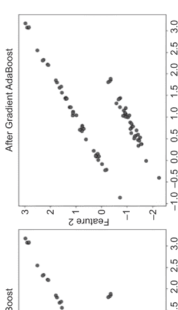

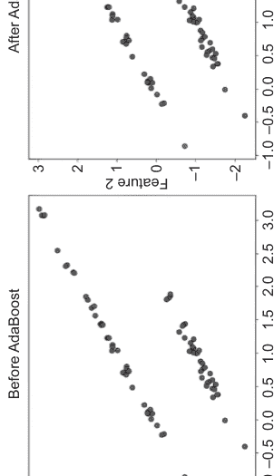

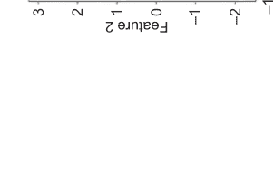

图 5.38：AdaBoost 与梯度提升分类器。

## 总结

-   线性回归通过线性方程来建模因变量与一个或多个自变量之间的相关性。
-   逻辑回归用于二分类或多分类任务，估计样本属于特定类别的可能性。
-   决策树和随机森林可用于分类和回归任务，创建类似树的结构，根据特征值进行决策。
-   支持向量机用于分类和回归任务，在高维空间和复杂数据集上尤其有效。
-   k-均值聚类用于无监督学习任务，根据相似性将数据点聚类为 k 个簇。主成分分析用于降维，在保留数据变异的同时，将高维数据转换到低维空间。
-   朴素贝叶斯用于分类任务，特别是在文本分类和垃圾邮件过滤中，基于贝叶斯定理并具有强独立性假设。
-   集成方法如 boosting 和 bagging 通过将多个弱学习器组合成一个强学习器来提高模型性能，方法包括 boosting（迭代改进）或 bagging（并行改进）。
-   梯度下降法通过使用梯度信息迭代地最小化代价函数来优化模型参数。
-   矩阵求逆法通过直接使用矩阵运算计算参数估计值来解决线性回归问题。
-   多项式回归通过将多项式函数拟合到数据中，来捕捉特征与目标之间的非线性关系。
-   逻辑回归中的正则化通过惩罚大的参数值来防止逻辑回归模型中的过拟合。
-   聚类基础用于识别数据中的自然分组，辅助数据探索和分割任务。
-   多类分类用于在单个任务中预测多个类别，常应用于图像识别、自然语言处理和情感分析领域。
-   对 bagging 和 boosting 的综合分析通过整合来自不同模型（每个模型在不同数据子集上训练）的预测，来增强模型的鲁棒性和泛化能力。

## 练习（选择题）

1.  线性回归的主要任务是什么？
    a) 分类
    b) 聚类
    c) 回归
    d) 降维

2.  逻辑回归用于：
    a) 回归任务
    b) 分类任务
    c) 聚类任务
    d) 降维

3.  决策树用于：
    a) 回归
    b) 分类
    c) 聚类
    d) 降维

4.  SVM 在以下方面有效：
    a) 高维空间
    b) 低维空间
    c) 仅线性可分数据
    d) 仅非线性可分数据

5.  k-均值聚类的主要目标是什么？
    a) 分类
    b) 回归
    c) 降维
    d) 聚类

6.  PCA 用于：
    a) 特征选择
    b) 降维
    c) 模型评估
    d) 聚类

7.  朴素贝叶斯基于：
    a) 贝叶斯定理
    b) 回归
    c) 决策树
    d) SVM

8.  集成方法结合：
    a) 多个弱学习器
    b) 单个强学习器
    c) 线性模型
    d) 非线性模型

9.  梯度下降的主要目的是什么？
    a) 最小化代价函数
    b) 最大化代价函数
    c) 求解线性方程
    d) 生成随机数

10. 矩阵求逆法用于：
    a) 分类
    b) 聚类
    c) 求解线性回归
    d) 降维

11. 多项式回归用于：
    a) 建模线性关系
    b) 建模非线性关系
    c) 聚类
    d) 降维

12. 逻辑回归中的正则化有助于：
    a) 增加过拟合
    b) 减少过拟合
    c) 增加偏差
    d) 减少方差

13. 聚类是以下哪项的例子：
    a) 监督学习
    b) 无监督学习
    c) 强化学习
    d) 半监督学习

14. 多类分类用于预测：
    a) 二元结果
    b) 多个类别
    c) 连续值
    d) 非数值数据

15. Bagging 和 Boosting 用于：
    a) 提高模型性能
    b) 降低模型复杂度
    c) 增加过拟合
    d) 减少方差

## 答案

1.  c) 回归
2.  b) 分类
3.  b) 分类
4.  a) 高维空间
5.  d) 聚类
6.  b) 降维
7.  a) 贝叶斯定理
8.  a) 多个弱学习器
9.  a) 最小化代价函数
10. c) 求解线性回归
11. b) 建模非线性关系
12. b) 减少过拟合
13. b) 无监督学习
14. b) 多个类别
15. a) 提高模型性能

## 填空题

1.  线性回归基于一个或多个______变量来预测______变量。
2.  逻辑回归用于______任务，其中结果是二元或分类的。
3.  决策树根据最能分离数据的______递归地将数据分割成子集。
4.  SVM 旨在找到能将数据最佳分离到不同类别的______。
5.  在 k-均值聚类中，目标是将数据划分为______个簇。
6.  PCA 是一种用于高维数据______和______的技术。
7.  朴素贝叶斯基于______定理，并假设特征是______的。
8.  集成方法结合多个______学习器以提高______。
9.  梯度下降是一种优化算法，用于______模型的参数。
10. 矩阵求逆法直接计算______以找到线性模型的参数。
11. 多项式回归将______曲线拟合到数据，允许捕捉______关系。
12. 逻辑回归中的正则化通过向______函数添加惩罚项来帮助防止______。
13. 聚类是______学习的一个例子，其目标是将相似的数据点分组在一起。
14. 多类分类涉及从两个以上的类别中预测输入的______。
15. Bagging 和 boosting 是集成方法，通过结合多个弱学习器来______模型性能。

## 答案

1.  因变量，自变量
2.  分类
3.  特征
4.  超平面
5.  不同的
6.  降维，可视化
7.  贝叶斯，独立的
8.  弱，性能
9.  优化
10. 逆矩阵
11. 非线性，复杂
12. 过拟合，代价
13. 无监督
14. 类别
15. 提高

## 描述性问题

1.  描述监督学习和无监督学习之间的区别。
2.  解释过拟合的概念以及如何缓解它。
3.  描述分类任务和回归任务之间的区别。
4.  解释决策树背后的主要思想以及它们如何进行预测。
5.  描述支持向量机（SVM）中支持向量的概念。
6.  解释 k-均值聚类算法及其工作原理。
7.  描述主成分分析（PCA）在降维中的目的。
8.  解释朴素贝叶斯分类器的工作原理及其所做的假设。
9.  描述 bagging 和 boosting 集成方法之间的区别。
10. 解释逻辑回归中正则化的概念及其目的。
11. 使用波士顿房价数据集（来自 `sklearn.datasets import load_boston`）基于平均房间数和犯罪率等特征预测房价。
12. 使用鸢尾花数据集（来自 `sklearn.datasets import load_iris`）根据花萼和花瓣测量值将鸢尾花分类为不同的物种。
13. 使用鸢尾花数据集构建决策树分类器来预测鸢尾花的物种。
14. 使用 `sklearn.datasets` 中的 `make_blobs` 生成合成数据集，并应用 k-均值聚类来识别簇。
15. 将 PCA 应用于鸢尾花数据集以降低数据维度并可视化转换后的数据。

## 第6章
高级机器学习技术

### 6.1 梯度提升树：XGBoost 与 LightGBM

20世纪90年代，罗伯特·沙皮尔和约阿夫·弗罗因德开发了一种非常流行的算法，称为AdaBoost，它首次引入了欠拟合和减少偏差的概念。AdaBoost被称为所有梯度提升决策树的鼻祖。在同一系列的算法发展中，梯度提升树（GBTs）是一种强大且多功能的机器学习技术，可用于回归和分类任务。GBT是另一种流行的模型集成方法，它通过将多个弱学习器（如决策树）与一个强学习器相结合来工作。每个弱学习器都经过训练以改进前一个学习器的预测，最终的预测是通过结合所有弱学习器的预测得出的。GBTs的各种优势进一步描述如下。

#### 高精度
GBTs通常可以在各种任务上实现高精度，即使面对复杂的数据集也是如此。

#### 灵活性
通过改变弱学习器的类型、损失函数和其他超参数，GBTs可以适应广泛的任务。

#### 更快的可解释性
与其他一些机器学习模型不同，GBTs相对容易解释，这有助于理解模型为何做出某些预测。

#### 快速响应
XGBoost以其慢速学习和快速响应而闻名。

https://doi.org/10.1515/9783110697186-006

#### 无需预处理
如果我们使用XGBoost，则无需进行数据预处理。

#### 接受任何数据
使用XGBoost，可以接受任何类型的数据来训练和测试模型。

#### 更快的预测
算法的顺序构建非常复杂，这是一个非常耗时的过程，但当涉及到预测时，它却相当快。这就是为什么我们可以说“以慢速训练换取快速预测”。

无论如何，GBTs在深度学习领域表现非常出色，这一点毋庸置疑，但它也有一些缺点，就像硬币有两面一样。在进一步的发展中，可以通过适当的损失函数来优化提升。这基于“一大组弱学习器可以创建一个强学习器”的概念。XGBoost源自梯度提升决策树算法。决策树一直被称为弱学习器，因此许多实验都围绕它进行。尽管如此，我们仍然可以说算法中存在一些缺点。

1. **计算成本：** 训练GBT模型可能计算成本高昂，尤其是对于大型数据集。
2. **过拟合：** 如果不进行仔细的正则化，GBTs可能容易过拟合。

过拟合是任何机器学习技术中的一个重大挑战，我们在测试和生产环境中会发现不同的输出。这个问题影响了模型训练的性能和准确性。换句话说，我们可以说GBT是一种强大且多功能的机器学习技术，可用于广泛的任务。它们特别适合需要高精度和可解释性的任务。让我们看看下面的代码：

图6.1展示了基于年龄购买智能手机的决策树。

```python
import seaborn as sns
import pandas as pd
import numpy as np
import matplotlib.pyplot as plt
import warnings

warnings.filterwarnings("ignore")
```


```python
diamonds = sns.load_dataset("diamonds")
diamonds.head()
diamonds.shape
diamonds.describe()
diamonds.describe(exclude=np.number)
from sklearn.model_selection import train_test_split

# Extract feature and target arrays
X, y = diamonds.drop('price', axis=1), diamonds[['price']]
# Extract text features
cats = X.select_dtypes(exclude=np.number).columns.tolist()
# Convert to Pandas category
for col in cats:
    X[col] = X[col].astype('category')

X.dtypes
# Split the data
X_train, X_test, y_train, y_test = train_test_split(X, y,
    random_state=1)
import xgboost as xgb

# Create regression matrices
dtrain_reg = xgb.DMatrix(X_train, y_train, enable_categorical=True)
dtest_reg = xgb.DMatrix(X_test, y_test, enable_categorical=True)
```

在上面的代码中，我们看到了数据集的逐步准备以及训练和测试数据的准备过程。数据集用于训练和测试的比例可以根据应用进行调整。但在许多情况下，我们保留20%用于测试，80%用于训练。在梯度提升中，每一步都会训练一个新的弱模型来预测当前强模型的“误差”，我们知道误差是预测值与期望值之间的差异。低误差模型比高误差率模型更好：

$$F_{i+1} = F_i - f_i$$

其中 $F_{i+1}$ 是计算出的最终误差，$F_i$ 是第 $i$ 步的强模型，$f_i$ 是第 $i$ 步的弱模型。这个操作不断重复，直到达到给定的最大精度。下面给出了一些要点，将帮助我们理解GBTs的内部工作机制：

1. GBT通过迭代构建决策树来工作。每棵树都经过训练以改进前一棵树的预测，最终的预测是通过结合所有树的预测得出的。
2. 损失函数衡量模型预测与数据的拟合程度。损失函数用于训练每棵树，也用于确定何时停止训练模型。
3. GBTs有许多可以调整以提高模型性能的超参数。这些超参数包括树的数量、学习率和树的最大深度。

#### 6.1.1 XGBoost 算法

XGBoost，全称*eXtreme Gradient Boosting*，是GBTs的一种具体且非常流行的实现。在前面的代码中，我们看到了数据收集以及按指定比例对训练和测试数据集进行采样。现在让我们看看如何计算均方误差（MSE）以提高训练模型的准确性。

```python
import numpy as np

mse = np.mean((actual - predicted) ** 2)
rmse = np.sqrt(mse)
# Define hyperparameters
params = {"objective": "reg:squarederror", "tree_method": "gpu_hist"}
n = 100
model = xgb.train(
    params=params,
    dtrain=dtrain_reg,
    num_boost_round=n,
)
from sklearn.metrics import mean_squared_error

preds = model.predict(dtest_reg)
rmse = mean_squared_error(y_test, preds, squared=False)

print(f"RMSE of the base model: {rmse:.3f}")
```

总的来说，我们可以说所有这些提升算法都遵循一个共同原则，即使用提升来创建学习器的集成，它们不仅继承了GBTs的优点，如高精度、灵活性和可解释性，而且还具有多项改进和独特特性：

1. **可扩展性：** XGBoost针对速度和效率进行了优化，使其能够比传统的GBT实现更快地处理大型数据集。
2. **正则化：** XGBoost结合了各种正则化技术来防止过拟合，这是GBTs的一个常见问题。这使其能够在未见过的数据上实现更好的性能。
3. **并行化：** XGBoost可以轻松地在多个核心或机器上并行化，进一步提高其训练速度。
4. **二阶优化：** XGBoost在其损失函数中使用二阶泰勒近似，与标准GBTs相比，这带来了更快的收敛速度和潜在的更高精度。
5. **稀疏数据处理：** XGBoost能够高效处理稀疏数据，即大多数观测值的大多数特征都缺失值。这对于许多现实世界的数据集至关重要。
6. **可定制性：** XGBoost提供了众多超参数，可以针对特定任务和数据特征微调模型。

由于其出色的性能和灵活性，XGBoost已在各个领域得到广泛应用，包括：

1. **金融：** 预测贷款违约、信用风险和股票价格
2. **电子商务：** 推荐产品、预测客户流失和检测欺诈交易
3. **制造业：** 预测机器故障、优化生产流程和改进质量控制
4. **医疗保健：** 预测疾病诊断、分析医学图像和个性化治疗方案

XGBoost是机器学习从业者的一个强大工具，为各种预测和分类任务提供了稳健且适应性强的解决方案。让我们看看下面的代码：

```python
import xgboost as xgb
from sklearn.datasets import load_iris
from sklearn.model_selection import train_test_split
from sklearn.metrics import accuracy_score

# Load the Iris dataset
iris = load_iris()
X = iris.data
y = iris.target

# Split the data into training and testing sets
X_train, X_test, y_train, y_test = train_test_split(X, y, test_size=0.2, random_state=42)

# Create an XGBoost classifier
xgb_model = xgb.XGBClassifier(objective='multi:softmax', # For multi-class classification
                               num_class=3, # Number of classes in the dataset
                               n_estimators=100, # Number of trees
                               learning_rate=0.1, # Step size shrinkage
                               max_depth=5, # Maximum depth of each tree
                               gamma=0.2, # Minimum loss reduction required to make a further partition
                               )

# Train the model
xgb_model.fit(X_train, y_train)
# Make predictions on the test set
```

y_pred = xgb_model.predict(X_test)

# 评估模型的准确率
accuracy = accuracy_score(y_test, y_pred)
print("Accuracy:", accuracy)

梯度提升技术解决了一个被称为偏差的最大问题。通常，我们在决策树中会遇到一个欠拟合数据的问题。它只对数据集进行少数几次分割，试图分离数据，但技术上我们可以将其分成两个小部分。这就是我们如何提高模型性能的方法。随机森林在这里是一个很好的例子，它根据所需数据进行剪枝和生长。Bagging 是这里用来减少算法实现整体方差的技术：

$$H(x) = \sum_{j=1}^{m} a_j h_j(x)$$

其中 $a_j$ 是学习率，$h_j(x)$ 是一个弱学习器，如果我们将其求和，它就变得比弱学习器的集成更强大。让我们看看另一个用于生产环境的极端梯度提升代码，与之前的示例相比，它将产生更好的准确率。这里，我们提供了从开始到结束的完整代码：

```python
import seaborn as sns
import pandas as pd
import numpy as np
import matplotlib.pyplot as plt
import warnings

warnings.filterwarnings("ignore")

diamonds = sns.load_dataset("diamonds")
diamonds.head()

diamonds.shape
diamonds.describe()
diamonds.describe(exclude=np.number)
from sklearn.model_selection import train_test_split

# 提取特征和目标数组
X, y = diamonds.drop('price', axis=1), diamonds[['price']]
# 提取文本特征
cats = X.select_dtypes(exclude=np.number).columns.tolist()

# 转换为 Pandas 类别
for col in cats:
    X[col] = X[col].astype('category')

X.dtypes
# 划分数据
X_train, X_test, y_train, y_test = train_test_split(X, y,
    random_state=1)
import xgboost as xgb

# 创建回归矩阵
dtrain_reg = xgb.DMatrix(X_train, y_train, enable_categorical=True)
dtest_reg = xgb.DMatrix(X_test, y_test, enable_categorical=True)

import numpy as np

mse = np.mean((actual - predicted) ** 2)
rmse = np.sqrt(mse)
# 定义超参数
params = {"objective": "reg:squarederror", "tree_method": "gpu_hist"}
n = 100
model = xgb.train(
    params=params,
    dtrain=dtrain_reg,
    num_boost_round=n,
)
from sklearn.metrics import mean_squared_error

preds = model.predict(dtest_reg)
rmse = mean_squared_error(y_test, preds, squared=False)

print(f"RMSE of the base model: {rmse:.3f}")


params = {"objective": "multi:softprob", "tree_method": "gpu_hist",
"num_class": 5}
n = 1000

results = xgb.cv(
    params, dtrain_clf,
    num_boost_round=n,
    nfold=5,
    metrics=["mlogloss", "auc", "merror"],
)
results.keys()
```

```
Index(['train-mlogloss-mean', 'train-mlogloss-std', 'train-auc-mean',
       'train-auc-std', 'train-merror-mean', 'train-merror-std',
       'test-mlogloss-mean', 'test-mlogloss-std', 'test-auc-mean',
       'test-auc-std', 'test-merror-mean', 'test-merror-std'],
      dtype='object')
```

```python
results['test-auc-mean'].max()
import xgboost as xgb

# 使用 scikit-learn API 训练模型
xgb_classifier = xgb.XGBClassifier(n_estimators=100, objective='binary:logistic', tree_method='hist', eta=0.1, max_depth=3, enable_categorical=True)
xgb_classifier.fit(X_train, y_train)

# 将模型转换为原生 API 模型
model = xgb_classifier.get_booster()
```

##### 6.1.1.1 集成学习

集成学习是一种基于多个不同模型进行预测的模型。通过结合多个不同的模型，集成学习往往更灵活，偏差更小，方差或数据敏感性也更低。在本节中，Bagging 和 Boosting 是最常见的方法，其中 Bagging 是以并行方式训练一组模型，并从数据的随机子集中学习。让我们看看下面的代码，它展示了在 5,000 个随机数上实现梯度提升分类器的实际过程：

```python
from sklearn.ensemble import HistGradientBoostingClassifier
from sklearn.datasets import make_hastie_10_2

X, y = make_hastie_10_2(random_state=0)
X_train, X_test = X[:5000], X[5000:]
y_train, y_test = y[:5000], y[5000:]

clf = HistGradientBoostingClassifier(max_iter=100).fit(X_train, y_train)
score = clf.score(X_test, y_test)
print(score)
```

上述代码将给我们一个 *0.9274285714285714* 的分数，这在初始阶段是系统中最好的。如果我们再次训练这个模型，由于 Bagging 和 Boosting 技术，准确率将会提高。

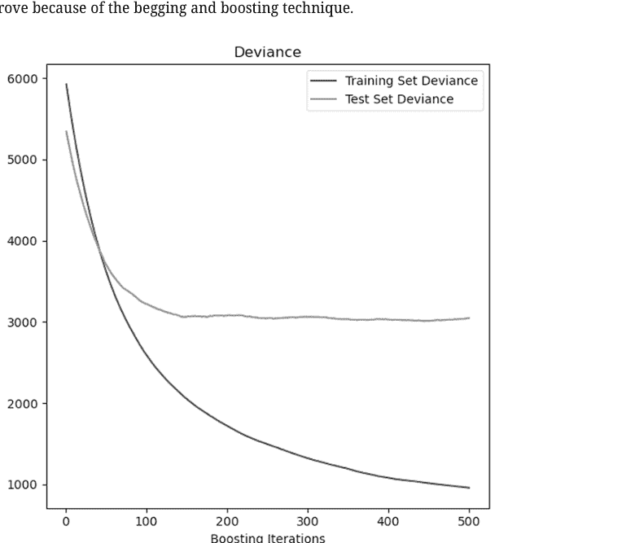

图 6.1：训练模型中的 Boosting 迭代和偏差。

图 6.1 显示了训练模型中 Boosting 迭代和偏差的图表。
Bagging 的最佳示例是随机森林。另一方面，Boosting 意味着顺序训练一组模型，其中每个模型都从之前的错误中学习。Boosting 的最佳示例是梯度提升树。让我们看看下面的图片

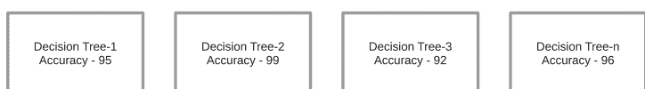

图 6.2 展示了 Bagging 方法。Boosting 技术顺序地组合弱学习器，以便每棵新树都能纠正前一棵树的错误。有几种不同的损失函数，但对于多类分类，交叉熵是一个非常流行的选项。分布 $q$ 相对于给定集合上分布 $p$ 的交叉熵在交叉熵公式中定义如下：

$$H(p,q) = -E_p[\log(q)]$$

其中 $E_p[\cdot]$ 是关于分布 $p$ 的期望算子。
具有相同支撑集 $x$ 的离散概率分布 $p$ 和 $q$ 如下：

$$H(p,q) = -\sum_{x \in X} p(x)\log q(x)$$

最后，我们可以说 Boosting 是 XGBoost 中的一个核心概念，在其令人印象深刻的性能和能力中起着至关重要的作用。它与传统的梯度提升线完全不同。它顺序地构建一个弱学习器（通常是决策树）的集成。每个新的学习器都专注于纠正先前学习器所犯的错误，并使用损失函数的梯度来指导学习过程。XGBoost 的一些关键组件如下所示：

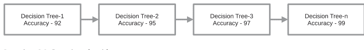

**二阶优化：** 采用泰勒近似来优化损失函数，从而实现更快的收敛和潜在的更高精度。

**正则化：** 结合了 L1/L2 正则化和收缩等多种技术，以防止过拟合并提高泛化能力。

**并行化：** 利用跨核心和机器的并行化，显著加快了大型数据集的训练速度。

**稀疏数据处理：** 高效处理具有许多缺失值的数据，使其适用于现实场景。

提升 XGBoost 性能有几个步骤，其中一些如下所示：

**初始化：** 从一个常量预测开始（例如，目标变量的均值）。

图 6.3 展示了 Boosting 算法。

###### 迭代

- a) 计算每个数据点的残差（实际值与预测值之间的差异）。
- b) 在残差上构建一个新的决策树，专注于减少错误。
- c) 根据学习率对新树的预测进行加权，更新最终预测。
- d) 重复：迭代步骤 a-c，直到满足停止标准（例如，最大迭代次数，最小进展）。

#### 6.1.2 LightGBM 与 XGBoost

LightGBM，全称“轻量级梯度提升机”，是一个强大的开源机器学习库，它利用梯度提升来处理回归和分类任务。LightGBM 以其极快的训练速度而闻名。它优于许多梯度提升替代方案，使其成为大型数据集的理想选择。即使在资源有限的机器上处理更大的数据集，它消耗的内存也明显少于所有其他算法。它支持同时执行多台机器。这就是我们如何减少训练和执行时间的方法。它可以处理更多的超参数集，并对学习过程进行细粒度控制。LightGBM 是机器学习任务的一个引人注目的选择，其中速度、效率和内存使用至关重要。其令人印象深刻的性能和易用性使其成为初学者和专家的宝贵工具。该算法可用于多个领域，例如：

- 1. **金融：** 欺诈检测、信用风险评估和股票价格预测
- 2. **电子商务：** 产品推荐、客户流失预测和异常检测
- 3. **自然语言处理 (NLP)：** 文本分类、情感分析和机器翻译
- 4. **计算机视觉：** 图像分类、目标检测和图像分割

这两种算法在不同领域都被广泛使用，但我们下面有一些比较：

#### 6.1 LightGBM与XGBoost算法比较

表 6.1：LightGBM与XGBoost算法比较。

| 特性 | LightGBM | XGBoost |
| :--- | :--- | :--- |
| 速度 | 更快 | 较慢 |
| 内存使用 | 低 | 较高 |
| 准确性 | 相同 | 相同 |
| 易用性 | 更容易 | 复杂 |

表 6.1展示了LightGBM和XGBoost算法在速度、内存使用、准确性和易用性方面的比较。让我们通过动手编码来一探究竟，下面给出了一个样本数据集的快照。在执行此代码之前，请不要忘记使用以下命令安装“lightgbm”库：

```
pip install lightgbm
```

下面的代码将显示训练准确度为0.9647，测试准确度为0.8163。根据您计算机上的数据集大小，结果可能会有所不同：

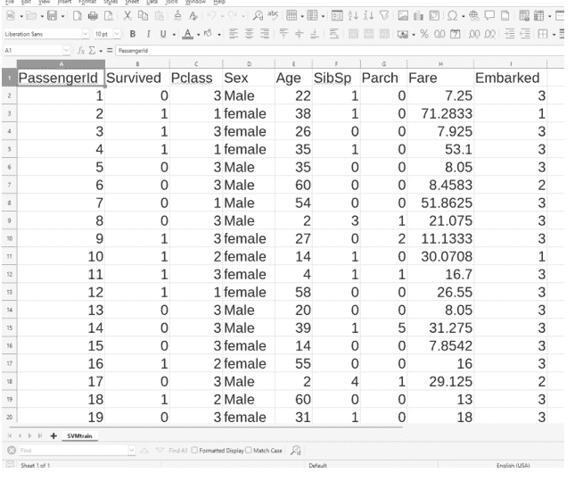

图 6.2：用于LightGBM模型训练的数据集。

图 6.2展示了用于LightGBM模型训练的数据集。

```
import pandas as pd
from sklearn.model_selection import train_test_split
import lightgbm as lgb

data = pd.read_csv("SVMtrain.csv")
# 定义输入和输出特征
x = data.drop(['Embarked', 'PassengerId'], axis=1)
y = data.Embarked
# 划分训练集和测试集
x_train, x_test, y_train, y_test = train_test_split(x, y,
test_size=0.33, random_state=42)
model = lgb.LGBMClassifier(learning_rate=0.09, max_depth=-5,
random_state=42)
model.fit(x_train, y_train, eval_set=[(x_test, y_test), (x_train,
y_train)],
verbose=20, eval_metric='logloss')
print('Training accuracy {:.4f}'.format(model.score(x_train, y_train)))
print('Testing accuracy {:.4f}'.format(model.score(x_test, y_test)))
```

##### LightGBM的组件

主要有两个组件：

1.  **基于梯度的单边采样 (GOSS)：** 该技术根据梯度智能地采样数据实例，专注于对改进模型贡献更多的信息性示例。它是在提升过程的每次迭代中高效选择训练数据子集的一种方法。
2.  **互斥特征捆绑 (EFB)：** 在树构建过程中将相似的特征捆绑在一起，减少内存使用并可能提高效率。EFB旨在减少学习过程中涉及的特征数量，同时最小化信息损失。它专注于“互斥”特征，即很少同时取非零值的特征。让我们假设代表不同颜色（红色、蓝色和绿色）的特征。它们是互斥的，因为一个物体不能同时是红色和蓝色。
3.  **梯度集中 (GC) 算法：** 它围绕梯度优化计算，从而加快训练速度，并旨在通过修改优化过程中使用的梯度来提高训练效率，甚至可能提高最终模型的性能。在这里，梯度告诉优化器在每一步中更新神经网络权重的程度。GC集中这些梯度，这意味着它从梯度矩阵的每一列中减去平均值。这本质上迫使梯度的平均值为零。GC不同于梯度裁剪，后者限制单个梯度的大小。虽然裁剪可以防止梯度爆炸，但GC专注于整体梯度方向。总的来说，我们可以说GC算法是一种有前景的技术，可以改善深度神经网络的训练。它实现相对简单，并在各种应用中显示出积极的结果。然而，重要的是要考虑其局限性，并根据具体情况评估其有效性。

##### 实现GOSS工作的步骤

GOSS是一种强大的技术，有助于提高LightGBM模型的效率和准确性。它专为梯度提升算法设计，可能不直接适用于其他机器学习模型。

1.  **计算梯度：** 对于每个数据点，算法计算损失函数相对于当前模型预测的梯度。想象一个景观，其中损失函数代表山谷和山丘，梯度指向最陡下降的方向。
2.  **按梯度排序：** 然后根据梯度的绝对大小对数据点进行排序。具有较大梯度的点（意味着它们远离理想预测）被认为对训练更“重要”。

##### 选择性采样

1.  **大梯度：** 所有具有大梯度的数据点都**保留**用于训练。这些点包含用于改进的有价值信息。
2.  **小梯度：** 具有小梯度的点**以一定的概率随机采样**。这在训练集中保持了多样性，同时专注于更具信息性的点。

##### 使用EFB的步骤

EFB是一种有价值的技术，可以提高LightGBM模型的效率和潜在准确性，尤其是在处理大型数据集和高维特征空间时。然而，重要的是要考虑其局限性，并根据您的具体情况评估其有效性。步骤如下：

1.  **识别互斥特征：** 算法搜索在非零值上重叠最小的特征。
2.  **创建捆绑包：** 这些识别出的特征被分组为一个单一的“捆绑包”。这个捆绑特征充当各个特征的组合表示。
3.  **决策树分裂：** 在树构建过程中，算法考虑这些捆绑包而不是单个特征进行分裂决策。这减少了搜索空间和整体计算量。
4.  **解绑（可选）：** 如果需要，可以将预测“解绑”回原始特征以进行解释。

### 6.2 核方法

核方法是一种强大的技术，用于各种机器学习任务，如分类、回归和聚类。它们提供了一种有效处理非线性数据的方法，通过隐式地将其转换到更高维空间，在那里复杂的关系变得更加明显。想象一下试图在二维平面上分离不同颜色的点。让我们看看下面的代码：

```
# 从PIL包中导入Image和ImageFilter模块
from PIL import Image, ImageFilter

# 创建一个图像对象
im1 = Image.open(r"author.jpg")

# 应用核滤波器
im2 = im1.filter(ImageFilter.Kernel((3, 3),
                                    (-1, -1, -1, -1, 9, -1, -1, -1, -1), 1, 0))

im2 = im2.show()
```

通过仅将图像分类器作为核方法应用，更新内存中加载的照片中的像素。如果我们应用以下更改，那么我们将看到一些黑色图像，这是从图像中提取重要和所需特征的方式。此图像将如下快照所示：

```
im2 = im1.filter(ImageFilter.Kernel((3, 3),
                                    (-1, -1, -1, -1, 9, -1, -1, -1, -1), 1, 0))
```


图 6.3展示了应用核方法之前作者的原始图像。

如果这些点是线性可分的（例如，一条直线可以将它们分开），传统的线性算法如线性回归或线性支持向量机（SVM）效果很好。然而，如果这些点形成更复杂的模式，比如一个圆圈或一个螺旋呢？线性算法将无法有效地分离它们。


图 6.4展示了应用核方法后作者的图像。

核方法来拯救了！它们隐式地将数据映射到更高维空间，在那里分离变得线性。这种映射是使用称为核的数学函数完成的。

#### 核方法如何工作？

1.  **核函数：** 此函数接受两个数据点作为输入，并计算它们之间的相似性度量。不同的核适用于不同的数据类型和问题（例如，线性核、高斯核和多项式核）。
2.  **特征空间：** 核函数本质上表示高维特征空间中的内积，即使我们从未显式计算该空间中数据点的坐标。
3.  **线性算法：** 标准线性算法，如线性SVM或线性回归，使用核提供的相似性度量在此高维空间中运行。

#### 6.2.1 核技巧

“核技巧”是有效使用核方法进行机器学习的一个关键方面。它指的是核方法在不显式地将数据转换到高维空间的情况下处理数据的巧妙方式，从而节省计算时间。以及内存。想象一下，你有一些数据点在原始低维空间中不是线性可分的。为了使用线性算法进行分类或回归，你需要显式地将数据映射到一个更高维的空间，在那里数据变得线性可分。然而，对于大型数据集，这种转换可能计算成本高昂且内存密集。

核技巧不是显式地执行转换，而是利用一个称为核的特殊函数。这个核函数以两个数据点作为输入，并基于它们在高维空间中的内积计算它们的相似性度量。

##### 关于核技巧需要记住的重要要点

1.  核从不显式计算数据点的高维坐标。它只计算相似性度量，这本质上捕获了学习算法所需的相关信息。
2.  这避免了高维表示的计算负担，同时仍然能够在非线性场景中使用线性算法。
3.  存在不同的核函数，每种都捕获数据点之间不同类型的关系。选择合适的核对于模型的性能至关重要。

核技巧将通过选择合适的核来帮助我们，其超参数对于良好性能至关重要。我们可以用它来理解模型在高维空间中的行为，这可能具有挑战性。如果正则化不当，核方法可能容易过拟合。核技巧是一种强大的技术，它释放了核方法在机器学习中的潜力。通过在高维空间中高效地捕获数据相似性而无需显式计算，它为非线性问题提供了灵活而强大的解决方案。

#### 6.2.2 径向基函数（RBF）核

径向基函数（RBF）核，也称为高斯核，是机器学习中最流行和用途最广的核之一，特别是在支持向量机（SVM）和其他核方法中。它擅长处理非线性数据，使其成为分类、回归和聚类等各种任务的宝贵工具。想象一下散布在二维平面上的数据点。如果数据形成一条直线，线性核可以轻松地将它们分开。但如果数据形成一个圆或更复杂的形状呢？这就是RBF的用武之地。它隐式地将数据点映射到一个更高维的空间，在那里分离变得更加线性。这种映射是通过基于每对数据点之间的欧几里得距离计算它们之间的相似性来完成的。在原始空间中更接近的点在高维空间中具有更高的相似性，由更大的核值表示。采用RBF插值的加权和形式的插值函数是一种无网格方法，这意味着节点（域中的点）不需要位于结构化网格上，并且不需要形成网格。即使在高维情况下，对于大量节点，它通常也是谱精确且稳定的。

图6.5展示了RBF优化的不同阶段。

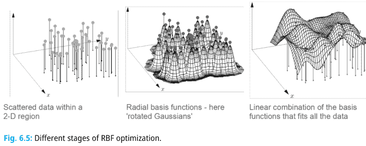

有许多类型的RBF可用，下面给出其中一些。

1.  **高斯型：** 高斯RBF是各种机器学习算法中使用的强大工具，特别用于处理非线性数据。它是一类通用的函数，基于两个数据点之间的距离来衡量它们的相似性。一种特定类型的RBF形状像钟形曲线，其中较近的点比较远的点具有更高的相似性分数。
2.  **多二次型：** 多二次RBF（MQ-RBF）是另一种用于机器学习的RBF类型，特别用于插值和近似任务。它与高斯RBF有一些相似之处。下面给出一些函数：
    (i) 与钟形的高斯不同，MQ-RBF的形式为：$\varphi(r) = \sqrt{(r^2 + c^2)}$，其中$r$是两个数据点之间的距离，$c$是一个形状参数。
    (ii) 它结合了线性和反多二次RBF的特点，使其比单独使用任何一种都更灵活。
3.  **反二次型：** 一个函数的反函数是另一个“撤销”原始函数的函数。当应用于二次函数时，求反函数并不总是直接的。二次函数通常不通过水平线测试，这意味着一个输入可能有多个输出，这不是函数及其反函数的属性：
    1.  然而，如果我们限制二次函数的定义域到一个特定范围，使得每个输入只有一个输出（通过水平线测试），那么我们就可以找到它的反函数。这个受限的函数称为双射。
    2.  在这种情况下求二次函数的反函数涉及：
        (i) 将函数的输出（通常用y表示）替换为一个新变量（通常用x'表示）。
        (ii) 在方程中交换x和x'的角色。
        (iii) 解出x'关于y（现在代表输入）的方程。
    3.  这个过程可能根据原始二次函数产生不同的解。你可能需要根据你定义的受限定义域选择合适的解。

让我们看看下面给出的代码：

```python
import pandas as pd
import numpy as np
from keras.layers import Layer
from keras import backend as K

class RBFLayer(Layer):
    def __init__(self, units, gamma, **kwargs):
        super(RBFLayer, self).__init__(**kwargs)
        self.units = units
        self.gamma = K.cast_to_floatx(gamma)

    def build(self, input_shape):
        # print(input_shape)
        # print(self.units)
        self.mu = self.add_weight(name='mu',
                                  shape=(int(input_shape[1]), self.units),
                                  initializer='uniform',
                                  trainable=True)
        super(RBFLayer, self).build(input_shape)

    def call(self, inputs):
        diff = K.expand_dims(inputs) - self.mu
        l2 = K.sum(K.pow(diff, 2), axis=1)
        res = K.exp(-1 * self.gamma * l2)
        return res

    def compute_output_shape(self, input_shape):
        return (input_shape[0], self.units)
```

```python
# following dataset can be download from the URL
# https://www.kaggle.com/datasets/anokas/kuzushiji?resource=download&select=k49-train-imgs.npz
# https://www.kaggle.com/datasets/anokas/kuzushiji?resource=download&select=k49-train-labels.npz
X = np.load('k49-train-imgs.npz')['arr_0']
y = np.load('k49-train-labels.npz')['arr_0']
y = (y <= 25).astype(int)

from keras.layers import Dense, Flatten
from keras.models import Sequential
from keras.losses import binary_crossentropy

model = Sequential()
model.add(Flatten(input_shape=(28, 28)))
model.add(RBFLayer(10, 0.5))
model.add(Dense(1, activation='sigmoid', name='foo'))

model.compile(optimizer='rmsprop', loss=binary_crossentropy)

model.fit(X, y, batch_size=256, epochs=3)
```

```
==============================Output==============================
Epoch 1/3
WARNING:tensorflow:From C:\Users\23188\PycharmProjects\workshop\.venv\Lib\site-packages\keras\src\utils\tf_utils.py:492: The name tf.ragged.RaggedTensorValue is deprecated. Please use tf.compat.v1.ragged.RaggedTensorValue instead.
908/908 [==============================] - 7s 7ms/step - loss: 0.6821
Epoch 2/3
908/908 [==============================] - 7s 8ms/step - loss: 0.6805
Epoch 3/3
908/908 [==============================] - 10s 11ms/step - loss: 0.6805
====================================================================
```

#### 6.2.3 超越k-Means的聚类技术

k-Means是一种流行且直接的聚类算法，但它确实有一些局限性。因此，超越k-Means探索，为处理更复杂的聚类结构和需求打开了一个多样化的工具箱。这是一个使用不同技术的实验，使用适当的指标评估它们的性能，并选择最适合你需求的。记住，没有“一刀切”的解决方案，超越k-Means探索为有效的数据聚类开启了无限可能！下面给出一些重要的技术：

**层次聚类：** 这种方法构建一个聚类层次结构，可以是凝聚式（自底向上）或分裂式（自上而下），基于点的邻近性进行分组。它很灵活，但缺乏选择“最佳”粒度级别的明确指导。

**Ward方法：** 这种方法最小化每个聚类内的方差，旨在形成紧凑且球形的聚类。然而，它可能难以处理细长或不规则的形状。

**平均链接：** 这种方法基于聚类中所有点对之间的平均距离来连接聚类，从而产生更平衡的聚类，但可能牺牲紧凑性。

**基于密度的带噪声应用空间聚类（DBSCAN）：** 这种方法基于核心点（高密度）及其连接的邻居来识别聚类，允许不规则形状的聚类并有效处理噪声。它是一种强大的聚类算法，超越了k-Means的局限性。我们可以在异常检测（噪声识别）、图像分割、客户细分、市场研究和科学数据分析中使用DBSCAN。DBSCAN是你数据分析工具箱中的宝贵工具，但理解其优势和局限性对于有效应用至关重要。

DBSCAN也有一些优势：

- **基于密度：** 基于**密度**识别聚类，专注于有许多附近点的区域，并排除被视为噪声的稀疏区域。
- **无需预定义聚类数量：** 与k-Means不同，你不需要事先指定聚类数量。DBSCAN基于数据固有的密度自动发现它们。
- **有效处理噪声：** 能够识别并排除异常值或低密度区域的点，使其对噪声数据具有鲁棒性。
- **发现任意形状的聚类：** 与假设球形聚类的k-Means不同，DBSCAN可以发现任何形状的聚类，包括细长或不规则的形式。

##### DBSCAN 的工作原理？

- 定义以下两个参数：
  - ε (epsilon)：被视为邻居的点之间的最大距离。
  - MinPts (minimum points)：一个点成为核心点（高密度）所需的最小邻居数。
- 识别核心点：在 ε 距离内至少有 MinPts 个邻居的点。
- 扩展簇：从核心点开始，迭代地添加那些同样拥有 MinPts 个邻居的邻居，形成簇。
- 标记剩余点：不属于任何簇扩展的点被视为噪声。

图 6.6 显示了排序观测值与 k-NN 距离的关系图。
让我们看看下面的代码，它实现了 DBSCAN 算法：

```python
import pandas as pd
from numpy import array

df = pd.read_csv("https://reneshbedre.github.io/assets/posts/tsne/tsne_scores.csv")
df.head(2)
# check the shape of dataset
print(df.shape)

import numpy as np
from sklearn.neighbors import NearestNeighbors
# n_neighbors = 5 as kneighbors function returns distance of point to itself (i.e. first column will be zeros)
nbrs = NearestNeighbors(n_neighbors = 5).fit(df)
# Find the k-neighbors of a point
neigh_dist, neigh_ind = nbrs.kneighbors(df)
# sort the neighbor distances (lengths to points) in ascending order # axis = 0 represents sort along first axis i.e. sort along row
sort_neigh_dist = np.sort(neigh_dist, axis = 0)

import matplotlib.pyplot as plt
k_dist = sort_neigh_dist[:, 4]
plt.plot(k_dist)
plt.ylabel("k-NN distance")
plt.xlabel("Sorted observations (4th NN)")
plt.show()
```

```python
from kneed import KneeLocator
kneedle = KneeLocator(x = range(1, len(neigh_dist)+1), y = k_dist, S = 1.0,
                     curve = "concave", direction = "increasing", online=True)
```

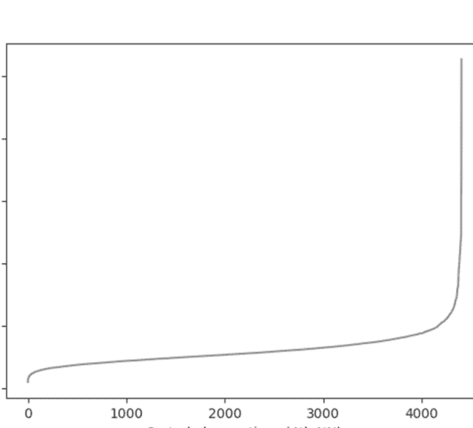

```python
# get the estimate of knee point
print(kneedle.knee_y)

kneedle.plot_knee()
plt.show()
```

```python
from sklearn.cluster import DBSCAN
clusters = DBSCAN(eps = 4.54, min_samples = 4).fit(df)
# get cluster labels
clusters.labels_
```

```python
# check unique clusters
set(clusters.labels_)
```

```python
from collections import Counter
Counter(clusters.labels_)
```

```python
import seaborn as sns
import matplotlib.pyplot as plt
p = sns.scatterplot(data = df, x = "t-SNE-1", y = "t-SNE-2", hue =
clusters.labels_, legend = "full", palette = "deep")
sns.move_legend(p, "upper right", bbox_to_anchor = (1.17, 1.), title =
'Clusters')
plt.show()
```

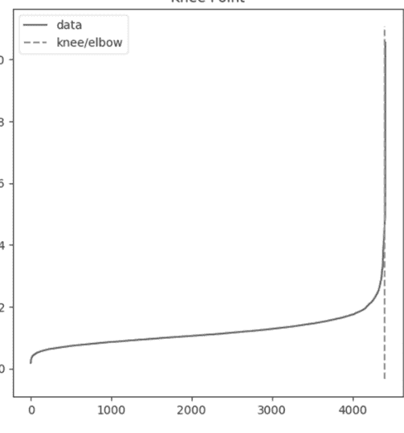

图 6.7 显示了寻找拐点的图。

##### 何时不应使用 DBSCAN？

- **参数敏感性：** 为 ε 和 MinPts 选择最佳值会影响结果，并且需要一些实验。
- **维度灾难：** 由于距离计算的影响，在高维数据中效果可能较差。
- **通过快速搜索和排序点进行聚类 (CLARA)：** 该算法将数据划分为 k 个簇，同时最小化在簇之间移动点的成本，从而形成紧凑且分离良好的簇。这是一种基于密度的聚类算法，以其效率和无需预设簇数即可识别簇的能力而闻名。CLARA 可用于异常检测（噪声识别）、图像分割、客户细分、市场研究和科学数据分析。

图 6.8 显示了实施 DBSCAN 后的最终聚类图。

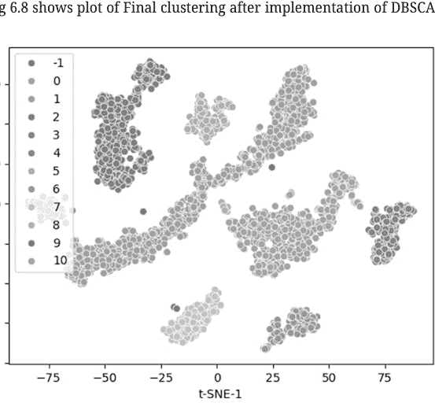

CLARA 的一些重要特性如下：

- **基于密度：** 与 DBSCAN 类似，它基于**密度**识别簇，专注于有许多邻居点的区域，并排除稀疏区域。
- **快速搜索：** 利用决策图高效地识别核心点及其潜在的簇成员关系。
- **无需预定义簇数：** 与 DBSCAN 类似，您无需事先指定簇数。CFSFDP 根据数据固有的密度来发现它们。
- **有效处理噪声：** 能够识别并排除异常值或低密度区域的点。
- **发现任意形状的簇：** 与 DBSCAN 类似，它可以发现任何形状的簇，包括细长或不规则的形状。

##### CLARA 的工作原理？

1. 计算局部密度和可达距离：
   1. **局部密度 (ρ)：** 特定距离内的邻居数量。
   2. **可达距离 (δ)：** 到具有更高密度的最远邻居的距离。
2. **识别核心点：** 同时具有高密度和大可达距离的点。
3. **构建决策图：** 根据可达距离连接核心点。
4. **排序点：** 从高密度到低密度遍历决策图，根据连接关系将点分配到簇中。
5. **细化簇：** 可选地根据其他标准调整簇边界。

##### 何时不应使用 CLARA？

- **参数敏感性：** 与 DBSCAN 类似，选择最佳参数（距离阈值和密度比率）会影响结果。
- **维度灾难：** 与 DBSCAN 类似，在高维数据中性能可能会下降。

**混合模型：** 这些模型假设数据来自概率分布的混合，其中每个分布代表一个簇。常见的例子包括高斯混合模型 (GMM) 和潜在狄利克雷分配 (LDA)。GMM 是数据聚类和密度估计的强大工具，特别适用于处理可以表示为多个重叠高斯分布混合的数据，而 LDA 是一种强大且通用的概率主题建模技术，广泛用于文本分析和自然语言处理任务。我们可以将它们用于*文档分类和组织、文本摘要和主题提取、信息检索和推荐系统、异常检测和抄袭检测、情感分析和观点挖掘，以及语言建模和对话系统*。不建议在以下情况使用混合模型：

1. **选择主题数量：** 需要仔细考虑和评估。
2. **对超参数敏感：** 调整这些参数会影响结果。
3. **黑盒性质：** 虽然识别了主题，但它们的语义含义可能需要进一步解释。

- **谱聚类：** 这种方法利用相似矩阵的谱性质来对数据点进行分组。它通常对高维数据和揭示非线性关系有效。谱聚类是一种强大的无监督学习技术，它利用线性代数的力量将数据划分为有意义的簇。我们可以将其用于图像分割（将像素分组为区域）、社交网络分析（识别社区）、异常检测（发现异常数据点）、文档聚类（根据相似性对文档进行分组）以及计算机视觉（对象识别和图像分类）。让我们看看下面的 CLARA 内部工作原理代码。别忘了使用 *pip install pyclustering* 安装 pyclustering 库：

```python
from pyclustering.cluster.clarans import clarans;
from pyclustering.utils import timedcall;
from sklearn import datasets

# import iris dataset from sklearn library
iris = datasets.load_iris();

# get the iris data. It has 4 features, 3 classes and 150 data points.
data = iris.data

"""!
The pyclustering library clarans implementation requires list of lists
as its input dataset.
Thus we convert the data from numpy array to list.
"""
data = data.tolist()

# get a glimpse of dataset
print("A peek into the dataset : ", data[:4])

"""!
@brief Constructor of clustering algorithm CLARANS.
@details The higher the value of maxneighbor, the closer is CLARANS to
K-Medoids, and the longer is each search of a local minima.
@param[in] data: Input data that is presented as list of points
(objects), each point should be represented by list or tuple.
@param[in] number_clusters: amount of clusters that should be allocated.
@param[in] numlocal: the number of local minima obtained (amount of
iterations for solving the problem).
@param[in] maxneighbor: the maximum number of neighbors examined.
"""
clarans_instance = clarans(data, 3, 6, 4);

# calls the clarans method 'process' to implement the algorithm
(ticks, result) = timedcall(clarans_instance.process);
print("Execution time : ", ticks, "\n");
```

# 返回聚类结果
clusters = clarans_instance.get_clusters();

# 返回中心点
medoids = clarans_instance.get_medoids();
print("属于某个簇的点的索引：", clusters)
print("每个数据点的目标类别：", iris.target)
print("算法找到的最佳中心点索引：", medoids)

================================输出================================
数据集预览：[[5.1, 3.5, 1.4, 0.2], [4.9, 3.0, 1.4, 0.2], [4.7, 3.2, 1.3, 0.2], [4.6, 3.1, 1.5, 0.2]]
执行时间：1.2831659999792464

属于某个簇的点的索引：[[50, 51, 52, 53, 54, 55, 56, 57, 58, 59, 60, 61, 62, 63, 64, 65, 66, 67, 68, 69, 70, 71, 72, 73, 74, 75, 76, 77, 78, 79, 80, 81, 82, 83, 84, 85, 86, 87, 88, 89, 90, 91, 92, 93, 94, 95, 96, 97, 98, 99, 101, 106, 113, 119, 121, 123, 126, 127, 133, 138, 142, 149], [77, 100, 102, 103, 104, 105, 107, 108, 109, 110, 111, 112, 114, 115, 116, 117, 118, 120, 122, 124, 125, 128, 129, 130, 131, 132, 134, 135, 136, 137, 139, 140, 141, 143, 144, 145, 146, 147, 148], [0, 1, 2, 3, 4, 5, 6, 7, 8, 9, 10, 11, 12, 13, 14, 15, 16, 17, 18, 19, 20, 21, 22, 23, 24, 25, 26, 27, 28, 29, 30, 31, 32, 33, 34, 35, 36, 37, 38, 39, 40, 41, 42, 43, 44, 45, 46, 47, 48, 49]]
每个数据点的目标类别：[0 0 0 0 0 0 0 0 0 0 0 0 0 0 0 0 0 0 0 0 0 0 0 0 0 0 0 0 0 0 0 0 0 0 0 0 0 0 0 0 0 0 0 0 0 0 0 0 0 0 1 1 1 1 1 1 1 1 1 1 1 1 1 1 1 1 1 1 1 1 1 1 1 1 1 1 1 1 1 1 1 1 1 1 1 1 1 1 1 1 1 1 1 1 1 1 1 1 1 1 2 2 2 2 2 2 2 2 2 2 2 2 2 2 2 2 2 2 2 2 2 2 2 2 2 2 2 2 2 2 2 2 2 2 2 2 2 2 2 2 2 2 2 2 2 2 2 2 2 2]
算法找到的最佳中心点索引：[78, 128, 2]
================================================================

##### 谱聚类的工作原理？

1. **构建相似度图**：将数据点表示为节点，并根据相似度（基于相似度加权）连接相似的点。
2. **计算拉普拉斯矩阵**：该矩阵编码了节点之间的连接关系，并反映了相似度图的结构。
3. **提取特征向量和特征值**：计算拉普拉斯矩阵的特征向量和特征值。
4. **将数据投影到低维空间**：使用与最小特征值相关的特征向量，将数据点投影到低维空间。
5. **在投影空间中执行聚类**：对投影后的数据应用传统聚类算法（例如 k-means）以识别簇。

##### 谱聚类不适用于哪些场景？

1. **计算成本高**：对于大型数据集，计算特征值和特征向量可能计算量很大。
2. **选择簇的数量**：虽然它避免了预先指定簇的数量，但确定合适的簇数仍然需要评估。
3. **可解释性挑战**：理解特征向量和生成的簇的含义可能具有挑战性。

**均值漂移**：这种非参数技术通过迭代地将点移动到更密集的区域直到收敛，从而识别任意形状的簇。均值漂移是一种基于密度的聚类算法，擅长发现数据中任意形状的簇。它可用于*异常检测（噪声识别）、图像分割、客户细分、市场研究和科学数据分析*。

##### 均值漂移的工作原理？

1. **定义核函数**：该函数决定了邻近点的影响如何随距离增加而减小。（常用的核函数包括均匀核和高斯核。）
2. **从每个数据点开始：**
    (i) 计算其在核带宽内的邻近点的平均值（均值）。
    (ii) 将该点向计算出的均值移动。
3. **重复步骤 1 和 2**：迭代地将每个点向其邻域的均值移动，直到收敛（即点不再显著移动）。
4. **识别簇**：收敛到同一位置的点形成一个簇。

##### 均值漂移不适用于哪些场景？

1. **参数敏感性**：选择核函数和带宽的最优值会影响结果，需要一些实验。
2. **维度灾难**：由于距离计算的影响，在高维数据中效果可能较差。
3. **计算成本高**：迭代性质和对距离计算的依赖可能导致比某些其他方法更高的计算成本。

- **自组织映射（SOM）**：这些人工神经网络将高维数据投影到低维网格上，保留拓扑关系并可视化地揭示簇。它们也被称为 *Kohonen 映射*，是一种用于降维和数据可视化的神经网络。它们擅长在低维空间中表示高维数据，同时保留拓扑关系。我们可以将其用于客户细分、图像和文档聚类、欺诈检测、市场研究和异常检测。其一些优点是：

1. **无监督学习**：无需标记样本即可发现数据中的模式和关系。
2. **降维**：将高维数据投影到低维网格（通常是 2D），使其更易于可视化和分析。
3. **拓扑保持**：尽可能保持原始高维空间中数据点之间的相对距离在低维映射中。
4. **可视化解释**：该映射直观地表示了数据中存在的结构和关系。

##### SOM 的工作原理？

1. **初始化映射**：在低维空间中创建一个神经元网格，每个神经元具有随机分配的权重。
2. **呈现一个数据点**：从高维空间中随机选择一个数据点。
3. **找到获胜神经元**：使用相似性度量（例如欧几里得距离）计算数据点与每个神经元之间的距离。将最接近数据点的神经元识别为“获胜者”。
4. **更新权重**：调整获胜神经元及其邻居的权重，使其向数据点靠近，从而在未来对类似的数据点更具响应性。
5. **重复步骤 2–4**：多次迭代数据点，根据数据分布优化映射。

##### SOM 不适用于哪些场景？

1. **参数选择**：选择合适的网格大小和学习率会影响结果。
2. **可解释性**：虽然视觉上信息丰富，但理解映射上特定区域的含义可能需要进一步分析。
3. **高维性能**：随着输入数据维度的增加，有效性可能会降低。

##### 选择合适的技术

最佳的聚类技术取决于您的具体数据和目标。考虑以下因素：

1. **数据类型**：数值型、分类型、文本型等。
2. **簇的数量**：事先已知还是未知？
3. **簇的形状**：球形、细长形还是不规则形？
4. **噪声的存在**：数据是否包含异常值？
5. **可解释性**：理解簇背后的原因有多重要？

### 6.3 异常检测

异常检测代表*识别异常*，也称为离群点检测，涉及识别数据集中显著偏离预期模式的数据点。这是从欺诈检测到系统健康监控等各个领域的一项重要任务。一些重要的异常检测技术根据其检测异常的类型描述如下。

#### 6.3.1 统计方法

##### 6.3.1.1 Z 分数

Z 分数，也称为标准分数，是一种简单而强大的异常检测统计方法。它告诉你某个数据点距离数据集均值有多少个标准差，提供了偏离平均值的标准化度量。它衡量数据点距离均值有多少个标准差。Z 分数高的点是潜在的异常值：

$$Z - score = \frac{x - mean}{standard\ deviation}$$

其中 mean 是数据集中所有数据点的平均值，standard deviation 衡量数据围绕均值的离散程度。

Z 分数为 0 表示数据点恰好等于均值。正 Z 分数表示高于均值的点，值越大表示偏差越大。负 Z 分数表示低于均值的点，绝对值表示偏差程度。通常，绝对 Z 分数大于 2 或 3 的数据点被认为是潜在的异常值，因为它们落在大多数数据点的预期范围之外。但是，可以根据您的具体数据和所需的灵敏度调整此阈值。让我们看一下代码：

import pandas as pd
import numpy as np

# 生成一些示例数据（请替换为你的数据集）
data = np.random.normal(loc=0, scale=1, size=100)

# 计算每个数据点的z分数
z_scores = (data - np.mean(data)) / np.std(data)

# 设置异常检测的阈值（例如，z分数 > 2 或 < -2）
threshold = 2

# 识别异常值
anomalies = np.where(np.abs(z_scores) > threshold)[0]

print(f"异常数据点: {anomalies}")

###### Z分数适用于哪些场景？

- **异常检测：** Z分数被广泛用于识别异常数据点，例如欺诈交易、系统错误或科学实验中的离群值。
- **特征缩放：** 在机器学习中，Z分数常用于在算法处理前标准化特征，确保所有特征具有相似的尺度，防止某个特征主导分析过程。
- **质量控制：** 在制造业或其他行业中监控过程变量时，常使用Z分数来检测偏离正常操作范围的情况。

###### Z分数不适用于哪些场景？

1. 本身可能对离群值敏感，因为离群值会影响用于归一化的均值和标准差。
2. 对于偏斜或重尾的数据分布效果较差。

##### 6.3.1.2 四分位距（IQR）

四分位距（IQR）是统计学中一种稳健的变异性度量，它关注数据中间的50%。它帮助你理解数据的离散程度，而不会像极差那样过度受到极端值的影响。它识别的是位于第一四分位数（Q1，第25百分位数）和第三四分位数（Q3，第75百分位数）范围之外的点。

###### 计算IQR的步骤

- 将所有数据点从小到大排序（升序）。
- 确定第一四分位数（Q1）：数据下半部分的中位数。
- 确定第三四分位数（Q3）：数据上半部分的中位数。
- 计算IQR：Q3–Q1。

###### IQR适用于哪些场景？

1. **离群值检测：** 落在Q1 – 1.5 IQR 和 Q3 + 1.5 IQR范围之外的点可被视为潜在的离群值。
2. **数据探索：** IQR能快速把握数据的集中趋势和离散程度，是对中位数的补充。
3. **比较数据分布：** 你可以比较不同组或数据集的IQR，以了解它们的相对变异性。
4. **稳健的变异性度量：** 与极差相比，IQR对离群值不那么敏感，使其在偏斜或有噪声的数据中更可靠。

###### IQR不适用于哪些场景？

- 无法提供关于整个数据范围的信息。
- 对中间50%数据中出现的少数极大或极小值敏感。

##### 6.3.1.3 单类支持向量机（OCSVM）

单类支持向量机（OCSVM）也被称为用于异常检测的正常性学习。OCSVM是一种强大且通用的异常检测工具，它利用支持向量机的原理来学习数据的*正常*行为，并识别显著偏离的点。让我们想象一下，你有一个只包含“正常”数据示例的训练数据集。OCSVM分析这些数据，并在其周围构建一个边界，捕捉正常性的本质特征。它学习正常数据周围的边界，并将边界外的点标记为异常。落在该边界之外的数据点随后被标记为潜在的异常。一些著名的应用包括*欺诈检测、传感器数据中的异常检测、网络入侵检测*和*工业过程监控*。

###### OCSVM如何工作？

1. **选择核函数**：与支持向量机类似，OCSVM使用核函数将数据点转换到更高维空间，从而可能实现正常区域和异常区域的更好分离。
2. **优化边界**：算法试图在高维空间中找到最大间隔超平面（决策边界），该边界以尽可能大的间隔包围大部分训练数据。
3. **识别异常**：新的数据点被投影到相同的高维空间。落在学习到的边界之外或超过距离阈值的点被视为异常。

###### OCSVM不适用于哪些场景？

- **参数调优**：选择最优的核函数和正则化参数会影响性能。
- **高维数据挑战**：在极高维设置中，性能可能会下降。
- **单类限制**：仅需要正常数据进行训练，这限制了其在异常样本稀缺的场景中的应用。

#### 6.3.2 基于距离的方法

##### 6.3.2.1 最近邻

最近邻（NN）是一种通用的异常检测技术。与其他点相比，邻居非常少或非常多的点可能是异常点。其假设是，正常数据点倾向于聚集在一起，而异常点则偏离这些簇，拥有更少（或更多）的相似邻居。通过分析每个数据点的最近邻数量，我们可以识别出那些显著不同的点，并将其标记为潜在的异常。我们可以在*欺诈检测*、*网络入侵检测*和*传感器数据异常检测*中使用最近邻。

###### 工业过程监控

一些非常流行的方法如下：

1. **k-近邻（kNN）**：定义要考虑的固定邻居数量（k）。在其局部区域内，邻居数量显著少于或多于典型数量的点可能是异常点。
2. **局部离群因子（LOF）**：计算一个点的局部密度（近邻数量）与其邻居的邻居的密度之比。高的LOF值表示潜在的异常。
3. **孤立森林**：随机划分数据并测量每个点的隔离深度，这反映了将其完全隔离所需的分割次数。异常点更容易被隔离，因此深度较低。

###### 最近邻不适用于哪些场景？

- 性能可能对kNN中“k”参数的选择敏感。
- 对于大型数据集，尤其是高维数据，计算成本可能很高。
- 对于复杂的异常形状或重叠的簇可能效果不佳。

#### 6.4 聚类

深度学习中的聚类是指使用深度神经网络，根据数据点的内在相似性，自动将它们分组到有意义的簇中。与传统的聚类算法不同，深度学习方法可以发现数据点之间复杂的非线性关系，使其特别适合分析高维数据。未被分配到任何簇或属于小簇的数据点可能是异常的。我们可以在以下领域使用它：

- **图像分割**：根据内容将像素分组为区域（例如，分割图像中的物体）
- **文档聚类**：根据主题或主题对文档进行分类
- **客户细分**：根据行为或偏好对客户进行分组
- **异常检测**：识别显著偏离典型簇的数据点
- **科学数据分析**：发现复杂数据集中隐藏的模式和关系

聚类技术的一些优势是*自动特征学习*、*处理复杂数据*、*识别复杂簇*和*可扩展性*。一些常见的方法如下：

- **深度自编码器**：这些网络学习数据的压缩表示，相似的数据点具有相似的编码表示。可以在这些编码表示上执行聚类。
- **使用生成模型进行聚类：** 生成模型，如变分自编码器，可以学习生成与输入数据相似的数据。聚类可以基于控制生成过程的潜在变量进行。
- **基于图的方法：** 深度学习技术可以与基于图的聚类方法结合，以利用某些数据类型固有的网络结构。

##### 6.4.1 孤立森林

孤立森林是一种强大的异常检测算法，它利用孤立树来识别数据中的异常。它通过随机划分数据空间并测量每个点的隔离深度来隔离异常。其功能如下：

1. 随机选择特征及其范围内的分割点。
2. 根据选择的分割将数据分成两个分支。
3. 递归地重复步骤1和2，直到达到隔离或最大深度。
4. 每个数据点都有一个路径长度，代表将其隔离所需的分割次数。
5. 计算森林中所有孤立树上某个数据点的平均路径长度。
6. 路径长度较短（更容易隔离）的点被认为更异常。

##### 6.4.2 基于密度的方法

**LOF：** LOF是另一种强大的异常检测算法，它利用局部密度的概念来识别偏离其周围环境的数据点。它用于计算一个点的局部密度与其邻居的密度之比。高的LOF值表示潜在的异常。LOF比较一个数据点（其邻域）的局部密度与其邻居的局部密度。异常被认为是局部密度显著较低的点，表明与它们的邻居相比，它们位于稀疏区域。其工作原理和步骤如下：

1. **定义邻域：** 选择一个参数“k”，表示为每个数据点考虑的最近邻数量。
2. **计算可达距离：** 测量从每个点到其邻居的可达距离，同时考虑它们的距离和邻域的密度。
3. **计算局部密度：** 通过取其k个最近邻的平均可达距离的倒数来估计每个点的局部密度。
4. **计算LOF：** 将一个点的局部密度除以其k个最近邻的平均局部密度。

##### 6.4.3 其他技术

1. **时间序列分析**：时间序列分析是研究和理解随时间收集的数据点序列的强大工具。它通过检测数据偏离预期模式或趋势来发现时间相关数据中的异常。时间序列分析侧重于从按时间顺序排列的数据点中提取有意义的信息和模式。以下是一些关于时间序列分析的关键点：
    - **分解**：将时间序列分解为趋势、季节性和残差分量，以便分别分析每个方面。
    - **自相关和偏自相关**：检查不同时间滞后数据点之间的关系，以识别模式和依赖关系。
    - **统计建模**：将各种统计模型（例如 ARIMA 和 SARIMA）拟合到数据中，以捕捉季节性、趋势和随机分量。
    - **机器学习**：利用循环神经网络或长短期记忆网络等技术，自动学习复杂模式并进行预测。

这可能涉及从股票价格到网站流量，从传感器读数到天气数据的任何内容。它有助于回答以下问题：
    1. *数据中是否存在任何趋势或季节性？*
    2. *驱动数据行为的潜在模式是什么？*
    3. *我们能否根据历史数据预测未来值？*

2. **频谱分析**：频谱分析也被称为深入频域。频谱分析是一种强大的技术，用于将信号分解为其组成频率，揭示在时域中可能被掩盖的隐藏模式和见解。它分析数据的频域以识别异常模式。想象一个复杂的信号，如音乐、语音或脑电图记录。我们可以使用以下领域：
    - **音频分析**：识别音符、分析语音模式和检测音频异常。
    - **图像处理**：根据频率内容识别纹理、边缘和对象。
    - **信号处理**：过滤噪声、提取特定频率分量和分析机械系统中的振动。
    - **经济学和金融学**：研究金融时间序列中的趋势和周期性。
    - **地球物理学和气象学**：分析天气模式、理解海浪和研究地震。

虽然它随时间表现为单个波形，但实际上是由各种频率共同构成其整体声音或行为。频谱分析将此信号分解为其组成频率，就像棱镜将白光分离为其组成颜色一样。一些关键方法用于：
    1. **傅里叶变换 (FT)**：基本工具，将信号分解为不同频率和幅度的正弦和余弦波之和。
    2. **快速 FT**：一种计算高效的 FT 算法，使其适用于大型数据集。
    3. **功率谱密度 (PSD)**：这表示功率（或能量）在不同频率上的分布，提供对主导频率及其相对重要性的见解。
    4. **频谱图**：PSD 随时间变化的可视化表示，显示频率内容在信号持续时间内的变化。

## 总结

梯度提升树是一种强大的机器学习技术，用于回归和分类任务。它们通过将多个弱学习器（通常是决策树）组合成一个强学习器来工作：XGBoost 与 LightGBM，两个梯度提升领域的巨头。XGBoost 和 LightGBM 都是流行的 GBT 实现，以其高精度和高效率而闻名。它们是梯度提升的强大算法，通过组合弱学习器（决策树）来提高准确性和性能。

集成学习是一种强大的机器学习技术，它结合多个模型的预测以实现比任何单一模型更好的性能。这就像让多位专家对一个问题发表意见，然后根据他们的综合见解做出最佳猜测。

核方法是机器学习中一类强大的算法，尤其以其处理数据中**非线性关系**的能力而闻名。虽然传统的线性模型仅限于线性关系，但核方法可以通过隐式地将数据映射到更高维空间来学习复杂模式，在这些空间中这些关系变得线性。“核技巧”是核方法的一个关键方面，通常被称为其魔力的关键。它允许它们在保持计算效率的同时处理非线性数据。换句话说，我们可以说它们将数据转换到更高维度以进行线性分离，从而实现特征之间的复杂关系。

RBF 核是一种流行且强大的核函数，广泛用于各种机器学习算法，特别是 SVM。它仅支持非线性数据。

虽然 k-means 是一种流行且广泛使用的聚类技术，但它确实有其局限性。根据您的具体需求和数据特征，以下是一些您可以考虑的替代聚类技术：

DBSCAN 是一种强大的聚类算法，它根据数据点的密度和连通性对其进行分组。它特别适用于：
    - **识别任意形状和大小的簇**：与需要预定义球形簇的 k-means 不同，DBSCAN 可以处理具有复杂形状的簇，使其适用于各种数据类型。
    - **检测异常值**：DBSCAN 可以识别并将异常值与主簇分离，使其成为嘈杂数据集的理想选择。
    - **处理没有预定义簇数的数据**：您不需要事先指定簇的数量，这在簇数未知或在不同数据集中变化时很有帮助。

最近邻是机器学习中的一个基本概念，在分类和回归任务中都有应用。它是一种简单而强大的技术，利用数据点之间的**相似性**进行预测。

聚类是无监督机器学习中的一项基本技术，涉及将相似的数据点分组在一起。它是发现未标记数据中隐藏模式和结构的强大工具，在各个领域提供有价值的见解。

基于距离的方法指的是机器学习中利用数据点之间**距离**概念进行各种任务的广泛技术。这些方法在**分类**和**回归**中都有应用，使其成为不同领域的宝贵工具。

单类 SVM 是一种强大的异常检测技术，它利用 SVM 的原理进行无监督学习任务。它学习正常数据周围的边界，将边界外的点标记为异常。

四分位距是统计学中衡量变异性的稳健指标。它告诉你数据中间 50% 的分布范围，排除了最顶部和最底部的潜在异常值。

Z 分数基于与均值的标准差来识别异常值，其本身对异常值敏感。异常检测是数据分析的一个关键方面，侧重于识别显著偏离预期模式或规范的数据点。它在各个领域都发挥着至关重要的作用，从金融领域的欺诈检测到制造领域的设备故障预测。

自组织映射，也称为 Kohonen 映射，是一种用于**降维**和高维数据**可视化**的人工神经网络。它们擅长在将数据映射到较低维空间（通常是 2D 网格）时保留数据的**拓扑结构**。

均值漂移是机器学习和数据分析中一种强大且通用的技术，尤其适用于**无监督学习**任务，如**聚类**和**密度估计**。它通过迭代地将数据点向其邻域内“最密集”的区域移动来运作，最终收敛到潜在数据分布中的**众数**或**峰值**。

谱聚类是机器学习中一种强大的技术，常用于**无监督学习**任务，如**聚类**和**图划分**。它利用相似度矩阵的**谱性质**，根据数据的潜在结构对其进行分组。这使得它特别适用于**识别非凸簇**和**处理具有复杂形状的数据**，而其他聚类算法如k-means可能在此类任务上表现不佳。

## 练习（选择题）

1.  **什么是GBT？**
    A) 一种通过迭代构建树来改进预测的回归技术
    B) 一种使用决策树对数据点进行分类的分类技术
    C) 一种将数据投影到低维子空间的降维技术
    D) 一种基于相似性对数据点进行分组的聚类算法

2.  **XGBoost的主要优势是什么？**
    A) 与LightGBM相比，训练速度更快且内存效率更高
    B) 内置特征重要性分析工具
    C) (A)和(B)都是
    D) 以上都不是

3.  **在优化方面，XGBoost和LightGBM的关键区别是什么？**
    A) XGBoost使用二阶导数，而LightGBM使用一阶导数
    B) XGBoost专注于最小化L1损失，而LightGBM最小化L2损失
    C) XGBoost并行化程度更高，而LightGBM利用GOSS
    D) XGBoost依赖于树级剪枝，而LightGBM使用叶级剪枝

4.  **哪种场景最适合使用XGBoost？**
    A) 具有高维度的大规模数据集
    B) 需要可解释性的任务
    C) (A)和(B)都是
    D) 特征较少的小型数据集

5.  **在什么情况下LightGBM可能是比XGBoost更好的选择？**
    A) 如果速度和内存效率至关重要
    B) 如果可解释性至关重要且可解释模型的性能相当
    C) (A)和(B)都是
    D) 以上都不是

6.  **以下哪项不是DBSCAN的特性？**
    A) 它需要预先指定簇的数量。
    B) 它可以识别任意形状的簇。
    C) 它对异常值敏感。
    D) 它计算效率高。

7.  **DBSCAN中eps参数的作用是什么？**
    A) 它定义了一个点被视为核心点所需的最小邻居数
    B) 它定义了两个点被视为邻居的最大距离
    C) 它确定了聚类的密度阈值
    D) 以上都是

8.  **DBSCAN中min_samples参数的作用是什么？**
    A) 它定义了一个点被视为核心点所需的最小邻居数
    B) 它定义了两个点被视为邻居的最大距离
    C) 它确定了聚类的密度阈值
    D) 它在DBSCAN中不使用

9.  **DBSCAN的时间复杂度是多少？**
    A) O(n^2)
    B) O(n log n)
    C) O(n)
    D) 取决于簇的数量

10. **DBSCAN有哪些局限性？**
    A) 它对异常值敏感
    B) 它无法处理密度变化的簇
    C) 它需要仔细调整参数
    D) 以上都是

11. **如何将DBSCAN用于异常检测？**
    A) 未被分配到任何簇的点被视为异常值
    B) 被分类为噪声的点被视为异常值
    C) (A)和(B)都是
    D) (A)和(B)都不是

12. **DBSCAN有哪些实际应用？**
    A) 图像分割
    B) 异常检测
    C) 客户细分
    D) 以上都是

13. **如何将DBSCAN与其他聚类算法（如k-means）进行比较？**
    A) DBSCAN对高维数据更有效
    B) k-Means需要预先指定簇的数量，而DBSCAN不需要
    C) k-Means对异常值更敏感
    D) 以上都是

14. **DBSCAN和OPTICS之间有什么区别？**
    A) OPTICS可以找到密度变化的簇，而DBSCAN不能
    B) OPTICS比DBSCAN更高效
    C) OPTICS需要预先指定簇的数量，而DBSCAN不需要
    D) 以上都不是

15. **在实践中使用DBSCAN有哪些挑战？**
    A) 为eps和min_samples选择合适的值
    B) 处理高维数据
    C) 处理大型数据集
    D) 以上都是

## 描述性问题

1.  学习率在GBTs中的作用是什么？
2.  早停法如何帮助防止GBTs过拟合？
3.  XGBoost和LightGBM中有哪些不同的正则化技术？
4.  如何比较XGBoost和LightGBM在特定数据集上的性能？
5.  GBTs有哪些局限性？
6.  解释GBTs如何用于回归和分类任务。
7.  在什么情况下，其他集成方法（如随机森林）可能比GBTs更可取？
8.  如何调整GBTs以获得最佳性能？
9.  讨论特征工程对GBTs的重要性。
10. 梯度提升领域有哪些新兴发展？
11. 详细解释DBSCAN的工作原理。
12. 使用DBSCAN对数据集聚类涉及哪些步骤？
13. 如何为eps和min_samples选择合适的值？
14. 如何评估DBSCAN在聚类任务上的性能？
15. 有哪些可以替代DBSCAN的聚类算法？

## 填空题

1.  ___________被称为所有梯度提升决策树的父代。
2.  如果GBTs没有经过仔细的正则化，它们可能容易____________。
3.  XGBoost针对____________进行了优化，使其能够比传统的GBT实现更快地处理大型数据集。
4.  ___________是一种基于多个不同模型进行预测的模型。
5.  ___________是机器学习任务的一个引人注目的选择，其中速度、效率和内存使用至关重要。

## 答案

1.  AdaBoost
2.  过拟合
3.  速度和效率
4.  集成学习
5.  LightGBM

## 判断题

1.  DBSCAN是一种层次聚类算法。（错误）
2.  DBSCAN是一种基于密度的聚类算法。（正确）
3.  DBSCAN可以处理任意形状的簇。（正确）
4.  DBSCAN总是聚类数据的最佳选择。（错误）
5.  DBSCAN需要定义距离度量。（正确）

## 第7章
### 神经网络与深度学习

#### 7.1 神经网络简介

神经网络是一种受人脑启发的人工智能。它们由称为神经元的互连节点组成，其处理信息的方式与生物神经元相似。它受到构成人脑的生物神经网络的启发。经过训练的系统可以像人类一样学习和做出决策。这一切都基于给定的先验数据及其训练。它从错误中学习，并随时间改进系统。从根本上模仿人脑，以开发算法来构建预测模型和复杂模式。人脑由称为神经元的基本细胞组成，用于存储和处理信息。这些神经元将以电子信号的形式处理输入数据。信号被传递给其他神经元。组件刺激通过神经元的树突接收信号。结果，处理后的信息在神经元细胞中产生并作为输出。处理后产生的结果通过轴突传递到下一个可用的神经元。这取决于信号的强度。然后最终取决于神经元是否可以接受或拒绝产生的输出，直到输出准确率达到最大水平，如图7.1所示。

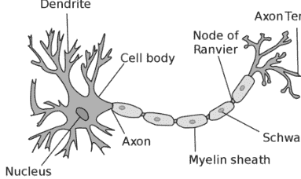

**图7.1：** 人脑中的生物神经元。

图7.1显示了人脑中的生物神经元。
这些网络通过根据数据调整神经元之间的连接来学习，使其能够执行复杂任务，例如：

-   **图像识别：** 对图像中的对象进行分类（例如，猫、狗和汽车）
-   **自然语言处理：** 理解和生成文本（例如，机器翻译和聊天机器人）
-   **推荐系统：** 推荐用户可能喜欢的产品或内容
-   **欺诈检测：** 识别可疑的金融交易

https://doi.org/10.1515/9783110697186-007

以下是理解神经网络的一些关键概念：

1.  **神经元：** 神经网络的基本单元。每个神经元接收来自其他神经元的输入，应用激活函数进行处理，然后将其输出发送给其他神经元。
2.  **层：** 神经元被组织成层：输入层（接收原始数据）、隐藏层（处理信息）和输出层（生成最终输出）。
3.  **激活函数：** 决定神经元如何转换其输入。常见类型包括 sigmoid、ReLU 和 tanh。
4.  **学习：** 神经网络通过调整神经元之间连接的权重来学习。这是通过反向传播等算法完成的，该算法最小化网络输出与期望输出之间的误差。在神经网络的世界里，激活函数扮演着至关重要的角色，它们就像守门员，决定哪些信息被传递到下一层。它们接收神经元输入的加权和，并将其转换为输出值，引入非线性，使网络能够学习复杂的模式。
5.  **训练数据：** 需要大量数据才能有效训练神经网络。数据的质量和数量对性能有显著影响。

图 7.2 展示了人工神经网络。

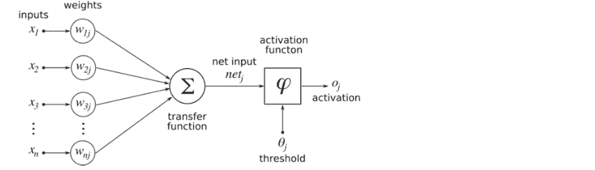

图 7.2：人工神经网络。

##### 神经网络的类型

- **前馈：** 信息单向流动，从输入到输出。常见例子包括多层感知机（MLPs）和卷积神经网络（CNNs）。
- **循环：** 信息可以循环流动，使其能够处理序列数据，如文本或时间序列。例子包括长短期记忆（LSTM）网络。

##### 神经网络的优势

- **高精度**：可以在许多任务上实现最先进的性能：

  $$Accuracy = \frac{True\ positive + true\ negative}{True\ positive + true\ negative + false\ positive + false\ negative}$$

- **灵活性**：可以通过改变架构和训练数据来适应各种任务。
- **从数据中学习**：可以从大量数据中学习复杂的模式，无需显式编程。

##### 神经网络的挑战

- **数据需求**：需要大量数据进行训练，这可能既昂贵又耗时。
- **黑箱问题**：可能难以理解它们如何做出决策。
- **计算成本**：训练大型网络可能需要大量的计算能力。

#### 7.2 感知机

感知机是神经网络的基本构建块，作为计算的基本单元。虽然看似简单，但当它们组合并经过训练时，具有巨大的能力，可以实现复杂的学习和问题解决。以下是其关键特征的分解：

##### 7.2.1 感知机的结构

- **输入**：感知机接收多个输入，代表数据的特征或属性。
- **权重**：每个输入都与一个权重相关联，该权重决定了其影响输出的重要性。这些权重最初是随机的，并在训练过程中进行调整。
- **求和**：计算所有输入的加权和。
- **激活函数**：此函数将总和转换为输出值。常见的有阶跃函数（二元输出）和 sigmoid 函数（连续输出）。
- **输出**：最终结果，代表感知机的分类或预测。

##### 7.2.2 感知机的功能

感知机充当线性分类器，这意味着它们只能学习和表示线性可分的模式。这一局限性促使了更复杂架构的发展，例如具有多层和非线性激活函数的 MLPs。尽管存在局限性，感知机仍然是理解神经网络基本原理和学习算法（如感知机学习规则）的强大工具。

##### 7.2.3 感知机的应用场景

虽然不再用于复杂任务，但感知机仍然应用于：
- 简单的分类问题，如垃圾邮件过滤
- 特征提取和降维
- 理解神经网络的理论基础
- 要深入了解，可以考虑探索以下概念：
- MLPs 及其学习非线性关系的能力
- 不同的激活函数及其对学习的影响
- 感知机学习规则及其局限性
- 基于感知机构建的高级神经网络架构，如 CNNs 和循环神经网络（RNNs）

##### 7.2.4 激活函数的应用场景

**非线性：** 没有激活函数，神经网络将仅限于学习线性关系，这对于现实世界的问题是不够的。激活函数引入了非线性，使网络能够建模复杂的曲线和特征之间的交互。

- **梯度传播：** 激活函数对于反向传播至关重要，反向传播是用于调整网络中权重和偏差的训练算法。它们为这些调整提供了必要的梯度（斜率），使网络能够从错误中学习。反向传播在下图中展示。
- **稀疏性和效率：** 一些激活函数，如 ReLU，鼓励稀疏性，即大多数神经元输出为零。这可以提高效率并减少需要训练的参数数量。

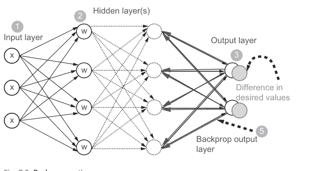

图 7.3 展示了反向传播方法。

在选择正确的激活函数时，我们需要注意以下几点：

- **问题类型：** 分类、回归还是其他任务？
- **网络架构：** 深层网络还是浅层网络？
- **计算效率：** 需要多快的运行速度？
- **稀疏性：** 是否需要鼓励稀疏性？

以下是一些常见的激活函数：

- **Sigmoid：** 输出一个介于 0 和 1 之间的值，类似于平滑的 S 形曲线。用途广泛，但在深层网络中可能会出现梯度消失问题。
- **Tanh：** 类似于 Sigmoid，但输出范围为 -1 到 1。受梯度消失的影响较小，但在极端值处可能会饱和。
- **ReLU（修正线性单元）：** 简单且计算效率高，如果输入为正则直接输出输入，否则输出零。因其速度和稀疏性而广受欢迎。
- **Leaky ReLU：** 类似于 ReLU，但允许负输入有一个小的非零梯度，防止神经元完全“死亡”。
- **ELU（指数线性单元）：** 在线性和非线性行为之间平滑过渡，解决了 ReLU 的一些问题。

让我们看看 Python 代码实现

```python
import numpy as np
from sklearn.preprocessing import MinMaxScaler
import matplotlib.pyplot as plt
```

```python
# Create a Training and Test Data Set
input_train = np.array([[0, 1, 0], [0, 1, 1], [0, 0, 0],
                        [10, 0, 0], [10, 1, 1], [10, 0, 1]])
output_train = np.array([[0], [0], [0], [1], [1], [1]])
input_pred = np.array([1, 1, 0])

input_test = np.array([[1, 1, 1], [10, 0, 1], [0, 1, 10],
                       [10, 1, 10], [0, 0, 0], [0, 1, 1]])
output_test = np.array([[0], [1], [0], [1], [0], [0]])
```

```python
# Scale the Data
scaler = MinMaxScaler()
input_train_scaled = scaler.fit_transform(input_train)
output_train_scaled = scaler.fit_transform(output_train)
input_test_scaled = scaler.fit_transform(input_test)
output_test_scaled = scaler.fit_transform(output_test)
```

```python
# Create a Neural Network Class
class NeuralNetwork():
    # Create an Initialize Function
    def __init__(self, ):
        self.inputSize = 3
        self.outputSize = 1
        self.hiddenSize = 3

        self.W1 = np.random.rand(self.inputSize, self.hiddenSize)
        self.W2 = np.random.rand(self.hiddenSize, self.outputSize)

        self.error_list = []
        self.limit = 0.5
        self.true_positives = 0
        self.false_positives = 0
        self.true_negatives = 0
        self.false_negatives = 0
```

```python
# Create a Forward Propagation Function
def forward(self, X):
    self.z = np.matmul(X, self.W1)
    self.z2 = self.sigmoid(self.z)
    self.z3 = np.matmul(self.z2, self.W2)
    o = self.sigmoid(self.z3)
    return o
```

##### 7.2 Python中的神经网络实现

```python
def sigmoid(self, s):
    return 1 / (1 + np.exp(-s))

def sigmoidPrime(self, s):
    return s * (1 - s)
```

```python
# 创建反向传播函数
def backward(self, X, y, o):
    self.o_error = y - o
    self.o_delta = self.o_error * self.sigmoidPrime(o)
    self.z2_error = np.matmul(self.o_delta,
                             np.matrix.transpose(self.W2))
    self.z2_delta = self.z2_error * self.sigmoidPrime(self.z2)
    self.W1 += np.matmul(np.matrix.transpose(X), self.z2_delta)
    self.W2 += np.matmul(np.matrix.transpose(self.z2),
                         self.o_delta)
```

```python
# 创建训练函数
def train(self, X, y, epochs):
    for epoch in range(epochs):
        o = self.forward(X)
        self.backward(X, y, o)
        self.error_list.append(np.abs(self.o_error).mean())
```

```python
# 创建预测函数
def predict(self, x_predicted):
    return self.forward(x_predicted).item()
```

```python
# 绘制平均绝对误差变化图
def view_error_development(self):
    plt.plot(range(len(self.error_list)), self.error_list)
    plt.title('Mean Sum Squared Loss')
    plt.xlabel('Epoch')
    plt.ylabel('Loss')
```

```python
# 计算准确率及其组成部分
def test_evaluation(self, input_test, output_test):
    for i, test_element in enumerate(input_test):
        if self.predict(test_element) > self.limit and \
                output_test[i] == 1:
            self.true_positives += 1
        if self.predict(test_element) < self.limit and \
                output_test[i] == 1:
            self.false_negatives += 1
        if self.predict(test_element) > self.limit and \
                output_test[i] == 0:
            self.false_positives += 1
        if self.predict(test_element) < self.limit and \
                output_test[i] == 0:
            self.true_negatives += 1
    print('True positives: ', self.true_positives,
        '\nTrue negatives: ', self.true_negatives,
        '\nFalse positives: ', self.false_positives,
        '\nFalse negatives: ', self.false_negatives,
        '\nAccuracy: ',
        (self.true_positives + self.true_negatives) /
        (self.true_positives + self.true_negatives +
        self.false_positives + self.false_negatives))
```

```python
# 运行训练和评估神经网络模型的脚本
NN = NeuralNetwork()
NN.train(input_train_scaled, output_train_scaled, 200)
NN.predict(input_pred)
NN.view_error_development()
NN.test_evaluation(input_test_scaled, output_test_scaled)
```

#### 7.3 TensorFlow

TensorFlow是一个强大且流行的开源库，用于构建和训练机器学习模型，特别是在深度学习领域。TensorFlow中的基本数据结构是张量。它表示数值的多维数组，类似于线性代数中的矩阵。张量具有特定的数据类型（整数、浮点数等）和形状（维度数以及每个维度的元素数量）。TensorFlow中的操作在张量上执行，从而允许进行计算和操作。

##### 7.3.1 计算图

- TensorFlow将计算表示为一个图，其中节点是操作，边是数据依赖关系。
- 这个图定义了数据在模型中的流动方式。
- TensorFlow可以自动对该图进行微分（计算梯度），从而实现通过反向传播进行训练。

##### 7.3.2 即时执行

- TensorFlow 2.0引入了即时执行，允许你立即逐行查看操作的结果，类似于传统的脚本语言。
- 与旧的符号执行模式相比，这使得学习和调试更容易。

让我们看看执行TensorFlow即时执行的Python代码：

```python
import tensorflow as tf

print("TensorFlow version:", tf.__version__)
mnist = tf.keras.datasets.mnist

(x_train, y_train), (x_test, y_test) = mnist.load_data()
x_train, x_test = x_train / 255.0, x_test / 255.0
model = tf.keras.models.Sequential([
    tf.keras.layers.Flatten(input_shape=(28, 28)),
    tf.keras.layers.Dense(128, activation='relu'),
    tf.keras.layers.Dropout(0.2),
    tf.keras.layers.Dense(10)
])
predictions = model(x_train[:1]).numpy()
predictions
tf.nn.softmax(predictions).numpy()

loss_fn = tf.keras.losses.SparseCategoricalCrossentropy(from_logits=True)
loss_fn(y_train[:1], predictions).numpy()

model.compile(optimizer='adam',
              loss=loss_fn,
              metrics=['accuracy'])
model.fit(x_train, y_train, epochs=5)
model.evaluate(x_test, y_test, verbose=2)
probability_model = tf.keras.Sequential([
    model,
    tf.keras.layers.Softmax()
])

probability_model(x_test[:5])
```

```
==============================输出==============================
Epoch 1/5
- WARNING:tensorflow:From C:\Users\23188\PycharmProjects\workshop\.venv\Lib\site-packages\keras\src\utils\tf_utils.py:492: The name tf.ragged.RaggedTensorValue is deprecated. Please use tf.compat.v1.ragged.RaggedTensorValue instead.
- WARNING:tensorflow:From C:\Users\23188\PycharmProjects\workshop\.venv\Lib\site-packages\keras\src\engine\base_layer_utils.py:384: The name tf.executing_eagerly_outside_functions is deprecated. Please use tf.compat.v1.executing_eagerly_outside_functions instead.
- 1875/1875 [==============================] - 6s 2ms/step - loss: 0.2924 - accuracy: 0.9146
- Epoch 2/5
- 1875/1875 [==============================] - 4s 2ms/step - loss: 0.1407 - accuracy: 0.9585
- Epoch 3/5
- 1875/1875 [==============================] - 5s 3ms/step - loss: 0.1039 - accuracy: 0.9687
- Epoch 4/5
- 1875/1875 [==============================] - 6s 3ms/step - loss: 0.0874 - accuracy: 0.9734
- Epoch 5/5
- 1875/1875 [==============================] - 9s 5ms/step - loss: 0.0734 - accuracy: 0.9770
- 313/313 - 2s - loss: 0.0697 - accuracy: 0.9786 - 2s/epoch - 5ms/step
===================================================================
```

##### 7.3.3 Keras

- Keras是一个构建在TensorFlow之上的高级API，为构建神经网络提供了用户友好的接口。
- 它提供了预构建的层、优化器和损失函数，简化了模型创建过程。
- Keras是入门TensorFlow并尝试不同架构的好方法。

##### 7.3.4 会话

- 在TensorFlow 1.x中，会话用于管理计算图的执行。
- 有了即时执行，会话不再需要，这使得代码更简洁、更直观。

##### 7.3.5 常用操作

- TensorFlow提供了各种内置操作，用于数学计算、线性代数、数据操作和机器学习特定任务。
- 示例包括加法、矩阵乘法、卷积和激活函数。让我们看看下面给出的代码：

```python
import tensorflow as tf

# 创建两个张量
a = tf.constant([1, 2, 2])
b = tf.constant([4, 5, 6])

# 张量相加
c = tf.add(a, b)

# 打印结果
print(c) # 输出: tf.Tensor([5 7 9], shape=(3,), dtype=int32)
```

上面的代码演示了创建张量、执行简单的数学运算以及打印结果。

#### 7.4 使用TensorFlow实现神经网络

使用TensorFlow和Keras实现神经网络可以是一次有益的体验，让你能够从零开始构建强大的机器学习模型。从简单的任务开始，随着经验的积累逐渐增加复杂性。利用教程和在线资源获取具体的示例和代码实现。尝试不同的架构和超参数，为你的任务找到性能最佳的模型。考虑使用TensorBoard等工具来可视化训练进度和模型行为。以下是涉及的关键步骤分解：

1. **定义你的问题：**
    1. 你试图解决什么类型的问题？（例如，分类、回归和图像识别）
    2. 你拥有什么类型的数据？（例如，图像、文本和数值数据）
2. **选择你的网络架构：**
    1. 什么类型的神经网络适合你的问题？（例如，前馈网络、CNN和RNN）
    2. 你的网络应该有多少层和神经元？
3. **设置TensorFlow和Keras：**
    1. 使用`pip install tensorflow keras`安装TensorFlow和Keras库。
    2. 在你的Python代码中导入必要的库。
4. **构建你的神经网络模型：**
    1. 使用Keras的Sequential API或Functional API来定义你的网络结构。
    2. 根据你选择的架构指定层，如Dense、Conv2D和LSTM。
    3. 为每一层设置激活函数（例如，ReLU和sigmoid）。
5. **准备你的数据：**
    1. 预处理你的数据，包括归一化、缩放和独热编码（如果需要）。
    2. 将你的数据划分为训练集、验证集和测试集。
6. **编译你的模型：**
    1. 定义适合你任务的优化器（例如，Adam和SGD）和损失函数（例如，分类交叉熵、均方误差）。
    2. 设置评估模型性能的指标（例如，准确率、精确率和召回率）。
7. **训练你的模型：**
    1. 使用fit方法在训练数据上训练你的模型。
    2. 在验证数据上监控训练进度以防止过拟合。
    3. 如果需要，调整超参数（例如，学习率和训练轮数）。
8. **评估你的模型：**
    1. 使用evaluate方法评估在测试数据上的性能。
    2. 分析指标以了解模型的优势和劣势。
9. **保存和加载你的模型：** 使用save和load方法保存你训练好的模型以备将来使用。

让我们看看下面给出的代码，它演示了使用TensorFlow深度学习框架即时执行的简单线性回归模型：

import tensorflow as tf

# 定义训练数据
x_train = tf.constant([1.0, 2.0, 3.0, 4.0])
y_train = tf.constant([2.0, 4.0, 6.0, 8.0])

# 初始化权重和偏置变量
w = tf.Variable(tf.random.normal([1]))
print("权重 : ", w)
b = tf.Variable(tf.random.normal([1]))
print("偏置 : ", b)

# 定义模型函数
def predict(x):
    return w * x + b

# 定义损失函数
def loss(x, y):
    # print(x, " : ", y)
    return tf.reduce_mean(tf.square(predict(x) - y))

# 优化器
optimizer = tf.keras.optimizers.SGD(learning_rate=0.1)

# 训练循环
for epoch in range(100):
    # 计算损失
    current_loss = loss(x_train, y_train)

    # 根据损失更新权重和偏置
    optimizer.minimize(lambda: loss(x_train, y_train), var_list=[w, b])

    # 打印当前损失
    print(f"Epoch {epoch + 1}, 损失: {current_loss}")

# 进行预测
prediction = predict(5)
print(f"x = 5 的预测值: {prediction}")

#### 7.5 使用 Keras 框架构建神经网络

```python
import tensorflow as tf
from tensorflow.keras.models import Sequential
from tensorflow.keras.layers import Dense, Flatten

# 加载 MNIST 数据集
(x_train, y_train), (x_test, y_test) = tf.keras.datasets.mnist.load_data()

# 预处理数据
x_train = x_train.reshape(60000, 28 * 28).astype("float32") / 255.0
x_test = x_test.reshape(10000, 28 * 28).astype("float32") / 255.0

# 对标签进行独热编码
y_train = tf.keras.utils.to_categorical(y_train, 10)
y_test = tf.keras.utils.to_categorical(y_test, 10)

# 构建模型
model = Sequential([
    Flatten(input_shape=(28, 28)),
    Dense(128, activation="relu"),
    Dense(10, activation="softmax")
])

# 编译模型
model.compile(optimizer="adam", loss="categorical_crossentropy",
              metrics=["accuracy"])

# 训练模型
model.fit(x_train, y_train, epochs=5, validation_data=(x_test, y_test))

# 评估模型
loss, accuracy = model.evaluate(x_test, y_test)
print(f"测试准确率: {accuracy:.4f}")
```

##### 7.5.1 Keras 与 TensorFlow 的区别

Keras 是一个构建在 TensorFlow 之上的高级 API，旨在易于使用和快速原型开发。它提供了预构建的组件，如层、优化器和损失函数，简化了构建和实验神经网络的过程。Keras 以其可读性和 Pythonic 语法而闻名，与 TensorFlow 的低级 API 相比，更易于学习和使用。Keras 广泛用于快速实验、构建原型以及开发优先考虑简单性和速度的深度学习模型。另一方面，TensorFlow 是一个全面的框架，为各种机器学习任务提供了广泛的功能，包括数据操作、数值计算和深度学习。它提供了低级 API，让你能够对模型架构和训练过程进行细粒度控制。这提供了灵活性和可定制性，但需要更多的编码工作量和对底层概念的理解。TensorFlow 通常用于研究、复杂任务和生产级模型，其中微调和控制至关重要。

如果你是深度学习新手，或者想快速尝试不同的架构，Keras 是一个很好的起点。随着你获得经验并需要更多控制或灵活性，你可以逐渐过渡到使用 TensorFlow 的低级 API。你甚至可以结合使用 Keras 和 TensorFlow：使用 Keras 的高级 API 构建模型，然后使用 TensorFlow 的低级功能微调特定部分。我们可以根据模型需求对 TensorFlow 和 Keras 应用进行分类。表 7.1 显示了基于不同特性的 TensorFlow 和 Keras 框架之间的区别：

表 7.1：TensorFlow 和 Keras 框架的区别。

| 特性 | TensorFlow | Keras |
| :--- | :--- | :--- |
| 层级 | 框架 | 高级 API |
| 重点 | 灵活性、控制 | 易用性、原型开发 |
| 学习曲线 | 较陡峭 | 较平缓 |
| 应用 | 研究、复杂任务、生产 | 实验、原型开发、较简单的模型 |

#### 7.6 卷积神经网络 (CNN)

CNN 是一种强大的深度学习架构，专门设计用于处理网格状数据，最著名的是图像。它们能够从视觉输入中自动提取和学习特征，这使它们成为从图像分类和目标检测到自动驾驶汽车和医学图像分析等各种应用的基石。CNN 以图像处理而闻名。与需要手动特征工程的传统方法不同，CNN 直接从数据中自动学习相关特征。这对于手动识别特征不切实际的复杂数据集至关重要。由于使用了共享权重和池化，CNN 对输入图像中的小位移不太敏感。这使得它们对物体位置和视角的变化具有鲁棒性。通过添加更多层和增加过滤器数量，CNN 可以轻松扩展到更大、更复杂的数据集。以下是一些关键概念：

1.  **卷积：** CNN 的核心操作涉及将过滤器（核）应用于输入图像。该过滤器在图像上滑动，在每个位置计算其元素与图像对应元素之间的点积。此过程有助于识别边缘、纹理和颜色等局部特征。
2.  **池化：** 卷积之后，池化层降低数据的维度，总结过滤器提取的信息。常见的池化方法包括最大池化（从区域中选择最大值）和平均池化（取平均值）。平均池化计算窗口内的平均值。这总结了区域内的整体信息，有助于捕获纹理等更平滑的特征。池化层用于降低计算成本，因为较小的数据尺寸意味着训练和推理期间所需的计算更少，从而使模型运行更快。过拟合预防是任何 AI 模型中非常重要的一部分。池化层通过降低数据复杂性来帮助我们。池化有助于控制模型容量，防止其过于紧密地记忆训练数据，从而在未见过的数据上获得更好的泛化能力。池化有时可以通过突出最重要的信息并抑制不重要的细节来带来更好的特征提取。
3.  **激活函数：** 正如第 7.2.4 节已经讨论过的，CNN 使用激活函数来引入非线性并提高模型学习复杂模式的能力。流行的选择包括 ReLU 和 Leaky ReLU。
4.  **层：** CNN 通常由多个卷积层和池化层堆叠而成，后接用于分类或回归任务的全连接层。每一层从前一层的输出中学习越来越复杂的特征。

CNN 在识别图像中的物体、场景和活动方面表现最佳（例如，对手写数字进行分类和检测照片中的面部）。它在定位和分类图像中的物体方面表现良好（例如，在自动驾驶汽车应用中识别汽车、行人和交通标志）。图像分割是 CNN 的一个非常强大的功能，它通过将图像划分为对应于物体或语义类别的不同区域来帮助我们（例如，在医学图像中分割器官）。CNN 擅长将一张图像的艺术风格应用到另一张图像上（例如，创建看起来像是由梵高绘制的图像）。一些流行的 CNN 架构包括 *LeNet-5*、*AlexNet*、*VGGNet*、*ResNet* 和 *Inception*。TensorFlow 和 PyTorch 等框架提供了构建和训练 CNN 的工具。让我们看看在 Python 中训练的 CNN 模型：

376 — 第 7 章 神经网络与深度学习

```python
import matplotlib.pyplot as plt
import numpy as np
import PIL
import tensorflow as tf

from tensorflow import keras
from tensorflow.keras import layers
from tensorflow.keras.models import Sequential

import pathlib
```

```python
dataset_url = "https://storage.googleapis.com/download.tensorflow.org/example_images/flower_photos.tgz"
data_dir = tf.keras.utils.get_file('flower_photos.tar',
                                  origin=dataset_url, extract=True)
data_dir = pathlib.Path(data_dir).with_suffix('')
image_count = len(list(data_dir.glob('*/*.jpg')))
print(image_count)
```

```python
roses = list(data_dir.glob('roses/*'))
PIL.Image.open(str(roses[0]))
PIL.Image.open(str(roses[1]))
tulips = list(data_dir.glob('tulips/*'))
PIL.Image.open(str(tulips[0]))
PIL.Image.open(str(tulips[1]))
```

```python
batch_size = 32
img_height = 180
img_width = 180
```

```python
train_ds = tf.keras.utils.image_dataset_from_directory(
  data_dir,
  validation_split=0.2,
  subset="training",
  seed=123,
  image_size=(img_height, img_width),
  batch_size=batch_size)
```

```python
val_ds = tf.keras.utils.image_dataset_from_directory(
  data_dir,
  validation_split=0.2,
  subset="validation",
```

seed=123,
image_size=(img_height, img_width),
batch_size=batch_size)
class_names = train_ds.class_names
print(class_names)

import matplotlib.pyplot as plt

plt.figure(figsize=(10, 10))
for images, labels in train_ds.take(1):
  for i in range(9):
    ax = plt.subplot(3, 3, i + 1)
    plt.imshow(images[i].numpy().astype("uint8"))
    plt.title(class_names[labels[i]])
    plt.axis("off")

for image_batch, labels_batch in train_ds:
  print(image_batch.shape)
  print(labels_batch.shape)
  break

AUTOTUNE = tf.data.AUTOTUNE

train_ds = train_ds.cache().shuffle(1000).prefetch(buffer_size=AUTOTUNE)
val_ds = val_ds.cache().prefetch(buffer_size=AUTOTUNE)

normalization_layer = layers.Rescaling(1. / 255)
normalized_ds = train_ds.map(lambda x, y: (normalization_layer(x), y))
image_batch, labels_batch = next(iter(normalized_ds))
first_image = image_batch[0]
# 注意像素值现在位于 `[0,1]` 区间。
print(np.min(first_image), np.max(first_image))

num_classes = len(class_names)

model = Sequential([
  layers.Rescaling(1. / 255, input_shape=(img_height, img_width, 3)),
  layers.Conv2D(16, 3, padding='same', activation='relu'),
  layers.MaxPooling2D(),
  layers.Conv2D(32, 3, padding='same', activation='relu'),
  layers.MaxPooling2D(),
  layers.Conv2D(64, 3, padding='same', activation='relu'),
  layers.MaxPooling2D(),
  layers.Flatten(),
  layers.Dense(128, activation='relu'),
  layers.Dense(num_classes)
])

model.compile(optimizer='adam',
              loss=tf.keras.losses.SparseCategoricalCrossentropy(from_logits=True),
              metrics=['accuracy'])
model.summary()

epochs = 10
history = model.fit(
  train_ds,
  validation_data=val_ds,
  epochs=epochs
)

acc = history.history['accuracy']
val_acc = history.history['val_accuracy']

loss = history.history['loss']
val_loss = history.history['val_loss']

epochs_range = range(epochs)
plt.figure(figsize=(8, 8))
plt.subplot(1, 2, 1)
plt.plot(epochs_range, acc, label='训练准确率')
plt.plot(epochs_range, val_acc, label='验证准确率')
plt.legend(loc='lower right')
plt.title('训练与验证准确率')

plt.subplot(1, 2, 2)
plt.plot(epochs_range, loss, label='训练损失')
plt.plot(epochs_range, val_loss, label='验证损失')
plt.legend(loc='upper right')
plt.title('训练与验证损失')
plt.show()

data_augmentation = keras.Sequential(
    [
        layers.RandomFlip("horizontal",
                         input_shape=(img_height,
                                      img_width,
                                      3)),
        layers.RandomRotation(0.1),
        layers.RandomZoom(0.1),
    ]
)
plt.figure(figsize=(10, 10))
for images, _ in train_ds.take(1):
    for i in range(9):
        augmented_images = data_augmentation(images)
        ax = plt.subplot(3, 3, i + 1)
        plt.imshow(augmented_images[0].numpy().astype("uint8"))
        plt.axis("off")

model = Sequential([
    data_augmentation,
    layers.Rescaling(1. / 255),
    layers.Conv2D(16, 3, padding='same', activation='relu'),
    layers.MaxPooling2D(),
    layers.Conv2D(32, 3, padding='same', activation='relu'),
    layers.MaxPooling2D(),
    layers.Conv2D(64, 3, padding='same', activation='relu'),
    layers.MaxPooling2D(),
    layers.Dropout(0.2),
    layers.Flatten(),
    layers.Dense(128, activation='relu'),
    layers.Dense(num_classes, name="outputs")
])
model.compile(optimizer='adam',
              loss=tf.keras.losses.SparseCategoricalCrossentropy(
                  from_logits=True),
              metrics=['accuracy'])

model.compile(optimizer='adam',
              loss=tf.keras.losses.SparseCategoricalCrossentropy(
                  from_logits=True),
              metrics=['accuracy'])
model.summary()

epochs = 15
history = model.fit(
    train_ds,
    validation_data=val_ds,
    epochs=epochs
)

acc = history.history['accuracy']
val_acc = history.history['val_accuracy']

loss = history.history['loss']
val_loss = history.history['val_loss']

epochs_range = range(epochs)

plt.figure(figsize=(8, 8))
plt.subplot(1, 2, 1)
plt.plot(epochs_range, acc, label='训练准确率')
plt.plot(epochs_range, val_acc, label='验证准确率')
plt.legend(loc='lower right')
plt.title('训练与验证准确率')

plt.subplot(1, 2, 2)
plt.plot(epochs_range, loss, label='训练损失')
plt.plot(epochs_range, val_loss, label='验证损失')
plt.legend(loc='upper right')
plt.title('训练与验证损失')
plt.show()

sunflower_url = "https://storage.googleapis.com/download.tensorflow.org/example_images/592px-Red_sunflower.jpg"
sunflower_path = tf.keras.utils.get_file('Red_sunflower',
                                          origin=sunflower_url)

img = tf.keras.utils.load_img(
    sunflower_path, target_size=(img_height, img_width)
)
img_array = tf.keras.utils.img_to_array(img)
img_array = tf.expand_dims(img_array, 0) # 创建一个批次

predictions = model.predict(img_array)
score = tf.nn.softmax(predictions[0])

print(
    "此图像最可能属于 {}，置信度为 {:.2f}%。"
    .format(class_names[np.argmax(score)], 100 * np.max(score))
)

# 转换模型。
converter = tf.lite.TFLiteConverter.from_keras_model(model)
tflite_model = converter.convert()

# 保存模型。
with open('model.tflite', 'wb') as f:
    f.write(tflite_model)

TF_MODEL_FILE_PATH = 'model.tflite' # 保存的 TensorFlow Lite 模型的默认路径

interpreter = tf.lite.Interpreter(model_path=TF_MODEL_FILE_PATH)
interpreter.get_signature_list()
classify_lite = interpreter.get_signature_runner('serving_default')
classify_lite
predictions_lite = classify_lite(sequential_1_input=img_array)['outputs']
score_lite = tf.nn.softmax(predictions_lite)
print(
    "此图像最可能属于 {}，置信度为 {:.2f}%。"
    .format(class_names[np.argmax(score_lite)], 100 * np.max(score_lite))
)
print(np.max(np.abs(predictions - predictions_lite)))

==============================输出==============================
3670
找到属于 5 个类别的 3670 个文件。
使用 2936 个文件进行训练。
2024-02-26 08:25:07.145531: I tensorflow/core/platform/cpu_feature_guard.cc:182] 此 TensorFlow 二进制文件已针对性能关键操作中使用可用 CPU 指令进行了优化。
要启用以下指令：SSE SSE2 SSE3 SSE4.1 SSE4.2 AVX2 AVX512F AVX512_VNNI FMA，请使用相应的编译器标志重新构建 TensorFlow。

图 7.4 展示了特征分类列表。


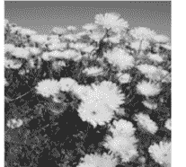


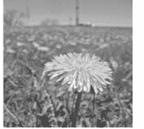

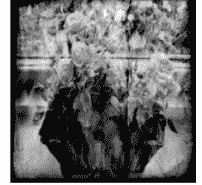


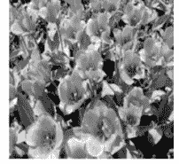

图 7.4：特征分类列表。

找到属于 5 个类别的 3670 个文件。
使用 734 个文件进行验证。
['daisy', 'dandelion', 'roses', 'sunflowers', 'tulips']
(32, 180, 180, 3)
(32,)
警告：tensorflow：来自 C:\Users\23188\PycharmProjects\workshop\.venv\Lib\site-packages\keras\src\backend.py:873：名称 tf.get_default_graph 已弃用。请改用 tf.compat.v1.get_default_graph。

0.0 1.0
警告：tensorflow：来自 C:\Users\23188\PycharmProjects\workshop\.venv\Lib\site-packages\keras\src\layers\pooling\max_pooling2d.py:161：名称 tf.nn.max_pool 已弃用。请改用 tf.nn.max_pool2d。

警告：tensorflow：来自 C:\Users\23188\PycharmProjects\workshop\.venv\Lib\site-packages\keras\src\optimizers\__init__.py:309：名称 tf.train.Optimizer 已弃用。请改用 tf.compat.v1.train.Optimizer。

模型："sequential"

| 层（类型） | 输出形状 | 参数数量 |
| :--- | :--- | :--- |
| rescaling_1 (Rescaling) | (None, 180, 180, 3) | 0 |
| conv2d (Conv2D) | (None, 180, 180, 16) | 448 |
| max_pooling2d (MaxPooling2D) | (None, 90, 90, 16) | 0 |
| conv2d_1 (Conv2D) | (None, 90, 90, 32) | 4640 |
| max_pooling2d_1 (MaxPooling2D) | (None, 45, 45, 32) | 0 |
| conv2d_2 (Conv2D) | (None, 45, 45, 64) | 18496 |
| max_pooling2d_2 (MaxPooling2D) | (None, 22, 22, 64) | 0 |
| flatten (Flatten) | (None, 30976) | 0 |
| dense (Dense) | (None, 128) | 3965056 |
| dense_1 (Dense) | (None, 5) | 645 |

总参数：3989285 (15.22 MB)
可训练参数：3989285 (15.22 MB)
不可训练参数：0 (0.00 Byte)

Epoch 1/10
警告：tensorflow：来自 C:\Users\23188\PycharmProjects\workshop\.venv\Lib\site-packages\keras\src\utils\tf_utils.py:492：名称 tf.ragged.RaggedTensorValue 已弃用。请改用 tf.compat.v1.ragged.RaggedTensorValue。

警告：tensorflow：来自 C:\Users\23188\PycharmProjects\workshop\.venv\Lib\site-packages\keras\src\engine\base_layer_utils.py:384：名称 tf.executing_eagerly_outside_functions 已弃用。请改用 tf.compat.v1.executing_eagerly_outside_functions。

92/92 [==============================] - 26s 234ms/step - loss: 1.2905 - accuracy: 0.4554 - val_loss: 1.0338 - val_accuracy: 0.5845

Epoch 2/10
92/92 [==============================] - 15s 164ms/step - loss: 0.9812 - accuracy: 0.6158 - val_loss: 0.9164 - val_accuracy: 0.6362

Epoch 3/10
92/92 [==============================] - 10s 105ms/step - loss: 0.7951 - accuracy: 0.7010 - val_loss: 0.8786 - val_accuracy: 0.6567

Epoch 4/10
92/92 [==============================] - 10s 104ms/step - loss: 0.6330 - accuracy: 0.7653 - val_loss: 1.0108 - val_accuracy: 0.6172

Epoch 5/10
92/92 [==============================] - 10s 106ms/step - loss: 0.4579 - accuracy: 0.8372 - val_loss: 0.8921 - val_accuracy: 0.6567
Epoch 6/10
92/92 [==============================] - 10s 108ms/step - loss: 0.2728 - accuracy: 0.9108 - val_loss: 1.0403 - val_accuracy: 0.6635
Epoch 7/10
92/92 [==============================] - 10s 110ms/step - loss: 0.1597 - accuracy: 0.9499 - val_loss: 1.2018 - val_accuracy: 0.6894
Epoch 8/10
92/92 [==============================] - 11s 115ms/step - loss: 0.0928 - accuracy: 0.9751 - val_loss: 1.4531 - val_accuracy: 0.6485
Epoch 9/10
92/92 [==============================] - 12s 126ms/step - loss: 0.0579 - accuracy: 0.9857 - val_loss: 1.4830 - val_accuracy: 0.6635
Epoch 10/10
92/92 [==============================] - 19s 201ms/step - loss: 0.0295 - accuracy: 0.9922 - val_loss: 1.7615 - val_accuracy: 0.6335
=================================================================

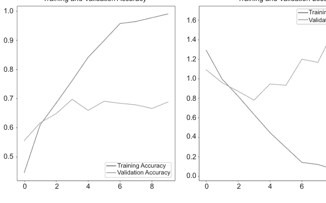

图 7.5：训练与验证准确率及训练与验证损失。

图 7.5 展示了训练与验证准确率及训练与验证损失。

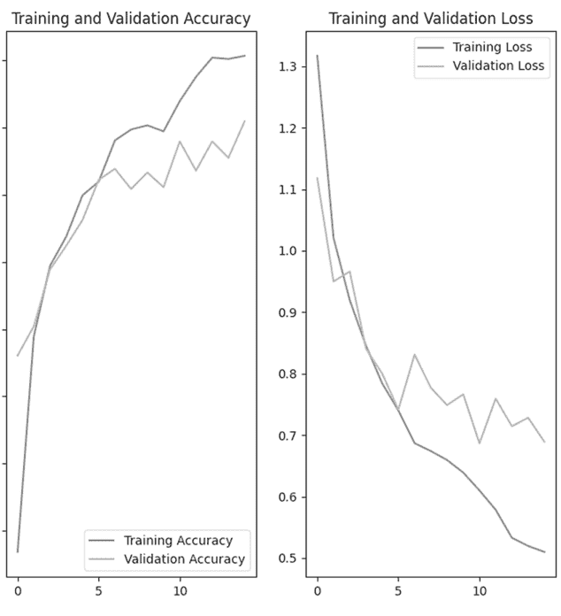

图 7.6：15 个轮次下的训练与验证准确率及训练与验证损失。

图 7.6 展示了 15 个轮次下的训练与验证准确率及训练与验证损失。
相同的模型在 15 个轮次上进行训练，并观察

##### 7.6.1 模型："sequential_2"


图 7.7：经过 15 个轮次训练的模型。

图 7.7 展示了经过 15 个轮次训练的模型。

| 层（类型） | 输出形状 | 参数数量 |
| :--- | :--- | :--- |
| sequential_1 (Sequential) | (None, 180, 180, 3) | 0 |
| rescaling_2 (Rescaling) | (None, 180, 180, 3) | 0 |
| conv2d_3 (Conv2D) | (None, 180, 180, 16) | 448 |
| max_pooling2d_3 (MaxPooling2D) | (None, 90, 90, 16) | 0 |
| conv2d_4 (Conv2D) | (None, 90, 90, 32) | 4640 |
| max_pooling2d_4 (MaxPooling2D) | (None, 45, 45, 32) | 0 |
| conv2d_5 (Conv2D) | (None, 45, 45, 64) | 18496 |
| max_pooling2d_5 (MaxPooling2D) | (None, 22, 22, 64) | 0 |
| dropout (Dropout) | (None, 22, 22, 64) | 0 |
| flatten_1 (Flatten) | (None, 30976) | 0 |
| dense_2 (Dense) | (None, 128) | 3965056 |
| outputs (Dense) | (None, 5) | 645 |

=================================================================
总参数：3989285 (15.22 MB)
可训练参数：3989285 (15.22 MB)
不可训练参数：0 (0.00 Byte)
_________________________________________________________________
Epoch 1/15
92/92 [==============================] - 17s 161ms/step - loss: 1.3169 - accuracy: 0.4343 - val_loss: 1.1176 - val_accuracy: 0.5804
Epoch 2/15
92/92 [==============================] - 15s 159ms/step - loss: 1.0208 - accuracy: 0.5947 - val_loss: 0.9498 - val_accuracy: 0.6022
Epoch 3/15
92/92 [==============================] - 16s 173ms/step - loss: 0.9197 - accuracy: 0.6471 - val_loss: 0.9662 - val_accuracy: 0.6444
Epoch 4/15
92/92 [==============================] - 16s 169ms/step - loss: 0.8458 - accuracy: 0.6689 - val_loss: 0.8407 - val_accuracy: 0.6621
Epoch 5/15
92/92 [==============================] - 15s 167ms/step - loss: 0.7843 - accuracy: 0.6996 - val_loss: 0.8002 - val_accuracy: 0.6812
Epoch 6/15
92/92 [==============================] - 15s 160ms/step - loss: 0.7400 - accuracy: 0.7098 - val_loss: 0.7416 - val_accuracy: 0.7112
Epoch 7/15
92/92 [==============================] - 15s 160ms/step - loss: 0.6869 - accuracy: 0.7405 - val_loss: 0.8310 - val_accuracy: 0.7193
Epoch 8/15
92/92 [==============================] - 15s 168ms/step - loss: 0.6741 - accuracy: 0.7486 - val_loss: 0.7771 - val_accuracy: 0.7044
Epoch 9/15
92/92 [==============================] - 15s 162ms/step - loss: 0.6595 - accuracy: 0.7517 - val_loss: 0.7488 - val_accuracy: 0.7166
Epoch 10/15
92/92 [==============================] - 14s 155ms/step - loss: 0.6391 - accuracy: 0.7473 - val_loss: 0.7664 - val_accuracy: 0.7057
Epoch 11/15
92/92 [==============================] - 15s 162ms/step - loss: 0.6100 - accuracy: 0.7698 - val_loss: 0.6865 - val_accuracy: 0.7398
Epoch 12/15
92/92 [==============================] - 17s 183ms/step - loss: 0.5785 - accuracy: 0.7878 - val_loss: 0.7593 - val_accuracy: 0.7180
Epoch 13/15
92/92 [==============================] - 15s 159ms/step - loss: 0.5330 - accuracy: 0.8021 - val_loss: 0.7144 - val_accuracy: 0.7398
Epoch 14/15
92/92 [==============================] - 16s 169ms/step - loss: 0.5198 - accuracy: 0.8011 - val_loss: 0.7283 - val_accuracy: 0.7275
Epoch 15/15
92/92 [==============================] - 14s 157ms/step - loss: 0.5101 - accuracy: 0.8035 - val_loss: 0.6892 - val_accuracy: 0.7548

正在从 https://storage.googleapis.com/download.tensorflow.org/example_images/592px-Red_sunflower.jpg 下载数据
117948/117948 [==============================] - 0s 3us/step
1/1 [==============================] - 0s 207ms/step
此图像最有可能属于向日葵，置信度为 99.46%。

```
2024-02-26 08:38:03.604528: W tensorflow/compiler/mlir/lite/python/tf_tfl_flatbuffer_helpers.cc:378] Ignored output_format.
2024-02-26 08:38:03.604626: W tensorflow/compiler/mlir/lite/python/tf_tfl_flatbuffer_helpers.cc:381] Ignored drop_control_dependency.
2024-02-26 08:38:03.606292: I tensorflow/cc/saved_model/reader.cc:83] Reading SavedModel from: C:\Users\23188\AppData\Local\Temp\tmp8t3deiwx
2024-02-26 08:38:03.611666: I tensorflow/cc/saved_model/reader.cc:51] Reading meta graph with tags { serve }
2024-02-26 08:38:03.611753: I tensorflow/cc/saved_model/reader.cc:146] Reading SavedModel debug info (if present) from: C:\Users\23188\AppData\Local\Temp\tmp8t3deiwx
2024-02-26 08:38:03.624259: I tensorflow/compiler/mlir/mlir_graph_optimization_pass.cc:388] MLIR V1 optimization pass is not enabled
2024-02-26 08:38:03.626929: I tensorflow/cc/saved_model/loader.cc:233] Restoring SavedModel bundle.
2024-02-26 08:38:03.803367: I tensorflow/cc/saved_model/loader.cc:217] Running initialization op on SavedModel bundle at path: C:\Users\23188\AppData\Local\Temp\tmp8t3deiwx
2024-02-26 08:38:03.838746: I tensorflow/cc/saved_model/loader.cc:316] SavedModel load for tags { serve }; Status: success: OK. Took 232444 microseconds.
2024-02-26 08:38:03.924814: I tensorflow/compiler/mlir/tensorflow/utils/dump_mlir_util.cc:269] disabling MLIR crash reproducer, set env var `MLIR_CRASH_REPRODUCER_DIRECTORY` to enable.
```

未转换操作摘要：
-----------------------------

+   * 接受的方言：tfl, builtin, func
* 未转换操作：11，总操作数 23，未转换比例 = 47.83 %
* 11 个 ARITH 操作
- arith.constant：出现 11 次 (f32: 10, i32: 1)
(f32: 3)
(f32: 2)
(f32: 3)
(f32: 1)
此图像最有可能属于向日葵，置信度为 99.46%。
9.536743e-07
============================================================

##### 7.6.2 CNN 架构

CNN 架构，即 CNN 中层的排列和配置，对其从图像中学习和提取特征的能力起着至关重要的作用。CNN 算法的一些核心构建模块如下：

- 1. **卷积层：** CNN 的核心，负责通过在图像上应用滤波器（核）来提取特征。滤波器在图像上滑动，计算点积以识别边缘和纹理等局部模式。
- 2. **池化层：** 降低数据的维度，总结卷积层捕获的信息。常见方法包括最大池化和平均池化。池化层在*降低*数据维度的同时保留重要特征方面起着至关重要的作用。这种压缩有助于管理计算成本，防止过拟合，甚至可以增强特征提取过程。池化层降低数据的空间维度（宽度和高度），通常降低 2 倍或更多。这导致输出更小，元素更少。通过应用不同的池化操作，该层总结输入数据特定区域内的信息。该区域通常称为池化窗口。
- 3. **激活函数：** 引入非线性，使网络能够学习特征之间的复杂关系。流行的选择包括 ReLU 和 Leaky ReLU。
- 4. **全连接层：** 通常用于分类或回归等任务的最后阶段。将一层中的所有神经元连接到下一层中的所有神经元，整合学习到的特征。

任何 CNN 中的常见架构有：

- 1. **LeNet-5：** 开创性的 CNN 架构，用于手写数字识别。
- 2. **AlexNet：** 引入了更深层的架构，使用堆叠的卷积层和池化层，在 ImageNet 分类上实现了最先进的性能。
- 3. **VGGNet：** 探索了使用更小的滤波器和更深的网络，展示了增加深度的好处。
- 4. **ResNet：** 引入了跳跃连接，允许梯度直接流过网络，解决了深层架构中的梯度消失问题。

##### 7.6 CNN架构选择

5.  **Inception**：使用滤波器分解和并行处理来高效提取特征。

最佳架构取决于您的具体问题、数据集大小和计算资源。实验和探索是找到最适合您需求配置的关键。在开发任何CNN模型之前，必须牢记以下几点：

-   **层数**：更深的网络通常能学习更复杂的特征，但需要更多的数据和计算资源。
-   **滤波器大小和数量**：较小的滤波器捕捉局部细节，而较大的滤波器捕捉更大的特征。更多的滤波器允许学习更广泛的模式。
-   **池化类型和步幅**：最大池化识别主导特征，而平均池化汇总信息。步幅控制下采样率。最大池化选择池化窗口内的最大值。这强调了最强的激活，对于检测边缘等主导特征很有用。
-   **激活函数**：选择取决于任务和所需属性（例如，ReLU用于效率，Leaky ReLU用于避免神经元死亡）。
-   **批归一化**：有助于稳定训练并提高泛化能力。
-   **正则化技术**：Dropout和L1/L2正则化通过降低模型复杂度来防止过拟合。
-   **迁移学习**：利用在大型数据集（如ImageNet）上预训练的模型作为起点，在您的特定任务上进行微调。
-   **数据增强**：通过变化（如翻转和旋转）人为扩展数据集，以提高泛化能力。

#### 7.7 Dropout层

Dropout层是防止过拟合的强大工具，过拟合是一个主要挑战，即模型过于紧密地记忆训练数据，无法很好地泛化到未见过的示例。在训练期间，Dropout层会随机丢弃每一层中一定比例的神经元（单元），有效地在该训练迭代中关闭它们。这些被丢弃的神经元在该特定步骤中不参与计算或更新。这个过程迫使剩余的神经元学习更鲁棒和独立的特征表示，因为它们不能依赖于任何特定神经元的存在。通过防止神经元变得过度相互依赖，Dropout鼓励它们学习更多样化和可泛化的特征，提高模型在新数据上的表现。由于在每次训练迭代中丢弃不同的神经元，模型有效地学习了略有不同的网络的集成，使其对训练数据中的特定噪声或模式不那么敏感。通过在训练期间有效减少网络的有效大小，Dropout有时可以带来更快的收敛和训练时间，特别是对于较大的模型。

#### 7.8 循环神经网络（RNNs）

循环神经网络（RNNs）因其处理和学习序列数据的能力而脱颖而出，其中元素是有序的且具有依赖性。这使得它们非常适合自然语言处理（NLP）、语音识别和时间序列分析等任务。与传统神经网络不同，RNNs具有内部记忆，允许它们保留先前输入的信息并用于处理当前输入。这种记忆使它们能够捕获序列中的上下文和关系，如图7.8所示。

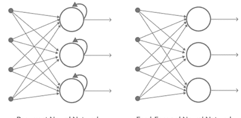

图7.8：循环神经网络。

图7.8展示了循环神经网络。

可以将RNN想象为将其层在时间上展开，其中每一层不仅接收当前输入，还接收来自前一层的隐藏状态，从而有效地跨时间步携带信息。我们可以在NLP机器翻译、情感分析、文本生成、聊天机器人、将口语转换为文本、预测序列中的未来值（例如股票价格和天气模式）以及创作逼真连贯的音乐作品中使用RNNs。

##### 7.8.1 RNN的类型

1.  **普通RNN**：基本的RNN架构，但可能遭受梯度消失和爆炸问题，限制了其学习长期依赖性的能力。普通RNNs在梯度消失和爆炸方面存在困难，使得学习长序列的依赖性变得困难。LSTMs通过引入控制信息流的门控机制来解决这个问题。
2.  **长短期记忆（LSTM）**：引入门控机制来控制信息流，解决梯度问题并实现长期依赖性的学习。LSTM网络因其学习和利用序列数据中长期依赖性的能力而脱颖而出，如图7.9所示。

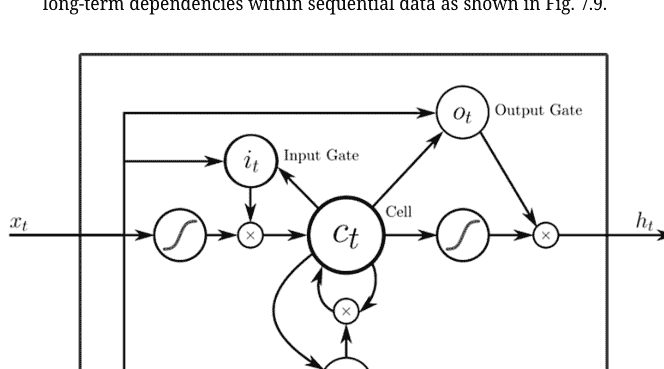

**图7.9：** 长短期记忆。

图7.9展示了长短期记忆。

这使得它们特别适合NLP、语音识别和时间序列预测等任务，在这些任务中，理解跨越较长时间段的上下文至关重要。三个主要的重要门控是：

-   **A) 遗忘门：** 决定丢弃前一个单元状态（记忆）中的哪些信息。
-   **B) 输入门：** 控制将当前输入的哪些信息整合到单元状态中。
-   **C) 输出门：** 决定将单元状态的哪一部分作为单元的输出暴露出来。

3.  **门控循环单元（GRU）：** 与LSTM类似，但架构更简单，参数更少，在性能和效率之间提供了平衡。GRU作为LSTMs的一个引人注目的替代方案而出现。虽然两者都擅长学习序列数据中的长期依赖性，但GRUs提供了更简化的架构，具有某些优势。GRUs旨在提供与LSTMs相当的性能，同时更简单且可能计算成本更低。GRUs将LSTMs的遗忘门和输入门合并为一个更新门，并引入一个重置门来控制信息流。与LSTMs相比，这减少了参数和操作的数量。

让我们看一下RNN的Python代码：

```python
import numpy as np # linear algebra
import pandas as pd # data processing, CSV file I/O (e.g. pd.read_csv)
import matplotlib.pyplot as plt

# Input data files are available in the "../input/" directory.
# For example, running this (by clicking run or pressing Shift+Enter)
# will list the files in the input directory

import os
print(os.listdir("../input"))
dataset_train = pd.read_csv('../input/stockprice-train/Stock_Price_Train.csv')
dataset_train.head()
train = dataset_train.loc[:, ['Open']].values #array'e çevirdik
train
from sklearn.preprocessing import MinMaxScaler #bununla, 0-1 arasına scale ettik
scaler = MinMaxScaler(feature_range = (0, 1))
train_scaled = scaler.fit_transform(train)
train_scaled

plt.plot(train_scaled)

# ilk 1-50 yi alıp X_train'e, 51. data point'i de y_train'e,
# 2-51'i alıp X_train'e, 52'yi y_train'e ...olacak şekilde data frame i oluşturuyoruz:
X_train = []
y_train = []
timesteps = 50

for i in range(timesteps, 1250):
    X_train.append(train_scaled[i - timesteps:i, 0])
    y_train.append(train_scaled[i, 0])

X_train, y_train = np.array(X_train), np.array(y_train)

#Reshaping:
X_train = np.reshape(X_train, (X_train.shape[0], X_train.shape[1], 1))
```

```python
#import libraries and packages:
from keras.models import Sequential
from keras.layers import Dense
from keras.layers import SimpleRNN
from keras.layers import Dropout
```

```python
#Initialize RNN:
regressor = Sequential()
```

```python
#Adding the first RNN layer and some Dropout regularization
regressor.add(SimpleRNN(units = 50, activation='tanh',
return_sequences=True, input_shape= (X_train.shape[1],1)))
regressor.add(Dropout(0.2))
```

```python
#Adding the second RNN layer and some Dropout regularization
regressor.add(SimpleRNN(units = 50, activation='tanh',
return_sequences=True))
regressor.add(Dropout(0.2))
```

```python
#Adding the third RNN layer and some Dropout regularization
regressor.add(SimpleRNN(units = 50, activation='tanh',
return_sequences=True))
regressor.add(Dropout(0.2))
```

```python
#Adding the fourth RNN layer and some Dropout regularization
regressor.add(SimpleRNN(units = 50))
regressor.add(Dropout(0.2))
```

```python
#Adding the output layer
regressor.add(Dense(units = 1))
```

```python
#Compile the RNN
regressor.compile(optimizer='adam', loss='mean_squared_error')
```

```python
#Fitting the RNN to the Training set
regressor.fit(X_train, y_train, epochs=100, batch_size=32)
```

```python
dataset_test = pd.read_csv('../input/stockprice-test/Stock_Price_Test.csv')
dataset_test.head()
```

```python
real_stock_price = dataset_test.loc[:, ['Open']].values
real_stock_price
```

```python
# 获取预测的股票价格
dataset_total = pd.concat((dataset_train['Open'], dataset_test['Open']),
                         axis=0)
inputs = dataset_total[len(dataset_total)-len(dataset_test) -
                      timesteps:].values.reshape(-1,1)
inputs = scaler.transform(inputs) # minmax scaler
inputs
```

```python
X_test = []
for i in range(timesteps, 70):
    X_test.append(inputs[i-timesteps:i,0])
X_test = np.array(X_test)
X_test = np.reshape(X_test, (X_test.shape[0], X_test.shape[1], 1))
predicted_stock_price = regressor.predict(X_test)
predicted_stock_price = scaler.inverse_transform(predicted_stock_price)
# 通过 inverse_transform，我们将缩放后预测的值
# 转换回真实的数值范围
```

```python
plt.plot(real_stock_price, color='red', label='Real Google Stock Price')
plt.plot(predicted_stock_price, color='blue', label='Predicted Google Stock Price')
plt.title('Google Stock Price Prediction')
plt.xlabel('Time')
plt.ylabel('Google Stock Price')
plt.legend()
plt.show()
```

```python
data = pd.read_csv('../input/international-airline-passengers/international-airline-passengers.csv')
data.head()
```

```python
dataset = data.iloc[:, 1].values
plt.plot(dataset)
plt.xlabel('time')
plt.ylabel('number of passengers (in thousands)')
plt.title('Passengers')
plt.show()
```

```python
dataset = dataset.reshape(-1,1) # 将形状从 (145, ) 转换为 (145,1)
dataset = dataset.astype('float32')
dataset.shape

scaler = MinMaxScaler(feature_range=(0,1))
dataset = scaler.fit_transform(dataset)

train_size = int(len(dataset)*0.5)
test_size = len(dataset)- train_size

train = dataset[0:train_size, :]
test = dataset[train_size:len(dataset), :]

print('train size: {}, test size: {}'.format(len(train), len(test)))

dataX = []
datay = []
timestemp = 10

for i in range(len(train) - timestemp - 1):
    a = train[i:(i + timestemp), 0]
    dataX.append(a)
    datay.append(train[i + timestemp, 0])

trainX, trainy = np.array(dataX), np.array(datay)

dataX = []
datay = []

for i in range(len(test) - timestemp - 1):
    a = test[i:(i + timestemp), 0]
    dataX.append(a)
    datay.append(test[i + timestemp, 0])

testX, testy = np.array(dataX), np.array(datay)
```

```python
# 创建 LSTM 模型
from keras.models import Sequential
from keras.layers import Dense
from keras.layers import LSTM
from sklearn.preprocessing import MinMaxScaler
from sklearn.metrics import mean_squared_error

# 模型
model = Sequential()
model.add(LSTM(10, input_shape=(1, timestemp))) # 10 个 LSTM 神经元（块）
model.add(Dense(1))
model.compile(loss='mean_squared_error', optimizer='adam')
model.fit(trainX, trainy, epochs=50, batch_size=1)

# 进行预测
trainPredict = model.predict(trainX)
testPredict = model.predict(testX)

# 反向转换预测值
trainPredict = scaler.inverse_transform(trainPredict)
trainy = scaler.inverse_transform([trainy])
testPredict = scaler.inverse_transform(testPredict)
testy = scaler.inverse_transform([testy])

import math
# 计算均方根误差
trainScore = math.sqrt(mean_squared_error(trainy[0], trainPredict[:,0]))
print('Train Score: %.2f RMSE' % (trainScore))
testScore = math.sqrt(mean_squared_error(testy[0], testPredict[:,0]))
print('Test Score: %.2f RMSE' % (testScore))

# 移动训练预测结果以便绘图
trainPredictPlot = np.empty_like(dataset)
trainPredictPlot[:, :] = np.nan
trainPredictPlot[timestemp:len(trainPredict)+timestemp, :] = trainPredict
# 移动测试预测结果以便绘图
testPredictPlot = np.empty_like(dataset)
testPredictPlot[:, :] = np.nan
testPredictPlot[len(trainPredict)+(timestemp*2)+1:len(dataset)-1, :] = testPredict
```

```python
# 绘制基准线和预测结果
plt.plot(scaler.inverse_transform(dataset))
plt.plot(trainPredictPlot)
plt.plot(testPredictPlot)
plt.show()
```

#### 7.9 序列到序列模型

**Seq2seq** 模型因其能够处理和转换一个数据序列为另一个序列的能力而脱颖而出。这使得它们在机器翻译、文本摘要、语音识别和聊天机器人等任务中非常宝贵，因为在这些任务中，理解和生成序列至关重要。Seq2seq 模型有两个主要的重要组成部分：编码器-解码器架构和注意力机制。Seq2seq 模型的编码器-解码器架构由两个主要组件组成：

- **编码器：** 处理输入序列，捕获其含义和上下文。它可以是像 LSTM 或 GRU 这样的 RNN，也可以是基于 Transformer 的架构。
- **解码器：** 生成输出序列，其生成基于编码器编码的信息。它也使用 RNN 或基于 Transformer 的架构，通常带有注意力机制，以关注编码序列的相关部分。

另一方面，注意力机制是允许解码器在生成输出序列的每个元素时，有选择地关注编码序列不同部分的关键组件。这有助于捕获长距离依赖关系，并提高生成输出的准确性和连贯性。我们可以将其用于将文本从一种语言翻译成另一种语言（同时考虑两种语言的上下文和语法），以及生成较长文本文档的简洁摘要（捕获要点和整体含义）。

Seq2seq 可用于将口语转换为文本（同时考虑发音和上下文的细微差别），以及构建能够以自然方式理解和响应用户查询的对话代理。它在基于图像视觉内容生成图像描述，以及基于特定风格或主题创作音乐作品方面非常有用。Seq2seq 架构包括基于 Transformer 的模型，如 T5 和 BART。我们可以学习高级注意力机制，如自注意力和掩码注意力，并尝试不同的损失函数和 Seq2seq 模型的训练技术。我们可以利用 TensorFlow 和 PyTorch 等库来构建和训练 Seq2seq 模型。让我们看看 Python 实现：

```python
import tensorflow as tf
from tensorflow.keras.layers import Embedding, LSTM, Dense
from tensorflow.keras.models import Model

# 定义编码器
class Encoder(tf.keras.Model):
    def __init__(self, vocab_size, embedding_dim, enc_units):
        super(Encoder, self).__init__()
        self.embedding = Embedding(vocab_size, embedding_dim)
        self.lstm = LSTM(enc_units, return_sequences=True,
                         return_state=True)

    def call(self, x):
        x = self.embedding(x)
        output, state_h, state_c = self.lstm(x)
        return output, state_h, state_c

# 定义解码器
class Decoder(tf.keras.Model):
    def __init__(self, vocab_size, embedding_dim, dec_units):
        super(Decoder, self).__init__()
        self.embedding = Embedding(vocab_size, embedding_dim)
        self.lstm = LSTM(dec_units, return_sequences=True,
                         return_state=True)
        self.dense = Dense(vocab_size, activation='softmax')

    def call(self, x, initial_state):
        x = self.embedding(x)
        output, _, _ = self.lstm(x, initial_state=initial_state)
        prediction = self.dense(output)
        return prediction

# 定义 Seq2Seq 模型
class Seq2SeqModel(tf.keras.Model):
    def __init__(self, encoder, decoder):
        super(Seq2SeqModel, self).__init__()
        self.encoder = encoder
        self.decoder = decoder

    def call(self, inputs):
        source, target = inputs
        enc_output, enc_state_h, enc_state_c = self.encoder(source)
        dec_output = self.decoder(target, initial_state=[enc_state_h, enc_state_c])
        return dec_output
```

```python
# 定义超参数并实例化模型
vocab_size = 10000 # 示例词汇表大小
embedding_dim = 256
enc_units = 512
dec_units = 512

encoder = Encoder(vocab_size, embedding_dim, enc_units)
decoder = Decoder(vocab_size, embedding_dim, dec_units)
seq2seq_model = Seq2SeqModel(encoder, decoder)
```

```python
# 编译模型（你可以选择合适的优化器和损失函数）
seq2seq_model.compile(optimizer='adam', loss='categorical_crossentropy', metrics=['accuracy'])
```

#### 7.10 迁移学习

迁移学习作为一种强大的技术，用于加速和增强训练过程，尤其适用于复杂任务和有限数据的情况。它涉及利用从一个任务（源任务）的预训练模型中获得的知识，来提高在相关任务（目标任务）上的性能。你无需从头开始在你的特定数据集上训练模型，而是利用一个已经在与你任务相关的大型数据集上学习到有价值表示的预训练模型。这节省了时间和计算资源。

预训练模型通常包含丰富的特征表示，这些表示可以适应你的目标任务，从而实现更快的收敛，并且可能比从头训练获得更好的性能。当你对特定任务的有标签数据有限时，迁移学习允许你利用来自更大数据集的知识，从而缓解数据稀缺的问题。你不是简单地复制整个预训练模型。相反，你通常会微调其层，使用你有限的数据调整权重和偏差，使其适应你的特定任务。这平衡了预训练知识的好处与适应你特定问题的需求。

迁移学习为深度学习实践者提供了一个宝贵的工具箱，能够实现更快的训练、更好的性能以及对有限数据的高效利用。通过仔细选择预训练模型、设计合适的微调策略并考虑其局限性，你可以利用这项技术来释放其力量

针对你的特定任务，深度学习模型的使用。让我们来看一下下面展示实现的代码：

```python
import numpy as np
import keras
from keras import layers
import tensorflow_datasets as tfds
import matplotlib.pyplot as plt

layer = keras.layers.Dense(3)
layer.build((None, 4)) # Create the weights

print("weights:", len(layer.weights))
print("trainable_weights:", len(layer.trainable_weights))
print("non_trainable_weights:", len(layer.non_trainable_weights))
layer = keras.layers.BatchNormalization()
layer.build((None, 4)) # Create the weights

print("weights:", len(layer.weights))
print("trainable_weights:", len(layer.trainable_weights))
print("non_trainable_weights:", len(layer.non_trainable_weights))

layer = keras.layers.Dense(3)
layer.build((None, 4)) # Create the weights
layer.trainable = False # Freeze the layer

print("weights:", len(layer.weights))
print("trainable_weights:", len(layer.trainable_weights))
print("non_trainable_weights:", len(layer.non_trainable_weights))

# Make a model with 2 layers
layer1 = keras.layers.Dense(3, activation="relu")
layer2 = keras.layers.Dense(3, activation="sigmoid")
model = keras.Sequential([keras.Input(shape=(3,)), layer1, layer2])

# Freeze the first layer
layer1.trainable = False

# Keep a copy of the weights of layer1 for later reference
initial_layer1_weights_values = layer1.get_weights()
```

```python
# Train the model
model.compile(optimizer="adam", loss="mse")
model.fit(np.random.random((2, 3)), np.random.random((2, 3)))
```

```python
# Check that the weights of layer1 have not changed during training
final_layer1_weights_values = layer1.get_weights()
np.testing.assert_allclose(
    initial_layer1_weights_values[0], final_layer1_weights_values[0]
)
np.testing.assert_allclose(
    initial_layer1_weights_values[1], final_layer1_weights_values[1]
)
```

```python
inner_model = keras.Sequential(
    [
        keras.Input(shape=(3,)),
        keras.layers.Dense(3, activation="relu"),
        keras.layers.Dense(3, activation="relu"),
    ]
)
```

```python
model = keras.Sequential(
    [
        keras.Input(shape=(3,)),
        inner_model,
        keras.layers.Dense(3, activation="sigmoid"),
    ]
)
```

```python
model.trainable = False # Freeze the outer model
assert inner_model.trainable == False # All layers in `model` are now
frozen assert inner_model.layers[0].trainable == False # `trainable` is
propagated recursively
```

```python
base_model = keras.applications.Xception(
    weights='imagenet', # Load weights pre-trained on ImageNet.
    input_shape=(150, 150, 3),
    include_top=False) # Do not include the ImageNet classifier at the
top.
base_model.trainable = False
```

```python
inputs = keras.Input(shape=(150, 150, 3))
# We make sure that the base_model is running in inference mode here, # by passing `training=False`. This is important for fine-tuning, as you
will # learn in a few paragraphs.
x = base_model(inputs, training=False)
# Convert features of shape `base_model.output_shape[1:]` to vectors
x = keras.layers.GlobalAveragePooling2D()(x)
# A Dense classifier with a single unit (binary classification)
outputs = keras.layers.Dense(1)(x)
model = keras.Model(inputs, outputs)

model.compile(optimizer=keras.optimizers.Adam(),
              loss=keras.losses.BinaryCrossentropy(from_logits=True),
              metrics=[keras.metrics.BinaryAccuracy()])
# model.fit(new_dataset, epochs=20, callbacks=..., validation_data=...)

# Unfreeze the base model
base_model.trainable = True

# It's important to recompile your model after you make any changes
# to the `trainable` attribute of any inner layer, so that your changes
# are take into account
model.compile(optimizer=keras.optimizers.Adam(1e-5),
              # Very low learning rate
              loss=keras.losses.BinaryCrossentropy(from_logits=True),
              metrics=[keras.metrics.BinaryAccuracy()])

# Train end-to-end. Be careful to stop before you overfit!
# model.fit(new_dataset, epochs=10, callbacks=..., validation_data=...)

tfds.disable_progress_bar()

train_ds, validation_ds, test_ds = tfds.load(
    "cats_vs_dogs",
    # Reserve 10% for validation and 10% for test
    split=["train[:40%]", "train[40%:50%]", "train[50%:60%]"],
    as_supervised=True, # Include labels
)
print(f"Number of training samples: {train_ds.cardinality()}")
print(f"Number of validation samples: {validation_ds.cardinality()}")
print(f"Number of test samples: {test_ds.cardinality()}")
plt.figure(figsize=(10, 10))
for i, (image, label) in enumerate(train_ds.take(9)):
    ax = plt.subplot(3, 3, i + 1)
```

```python
plt.imshow(image)
plt.title(int(label))
plt.axis("off")
```

```python
resize_fn = keras.layers.Resizing(150, 150)
```

```python
train_ds = train_ds.map(lambda x, y: (resize_fn(x), y))
validation_ds = validation_ds.map(lambda x, y: (resize_fn(x), y))
test_ds = test_ds.map(lambda x, y: (resize_fn(x), y))
```

```python
augmentation_layers = [
    layers.RandomFlip("horizontal"),
    layers.RandomRotation(0.1),
]
```

```python
def data_augmentation(x):
    for layer in augmentation_layers:
        x = layer(x)
    return x
```

```python
train_ds = train_ds.map(lambda x, y: (data_augmentation(x), y))
```

```python
from tensorflow import data as tf_data
```

```python
batch_size = 64
```

```python
train_ds = train_ds.batch(batch_size).prefetch(tf_data.AUTOTUNE).cache()
validation_ds = validation_ds.batch(batch_size).prefetch(tf_data.AUTOTUNE).cache()
test_ds = test_ds.batch(batch_size).prefetch(tf_data.AUTOTUNE).cache()
```

```python
for images, labels in train_ds.take(1):
    plt.figure(figsize=(10, 10))
    first_image = images[0]
    for i in range(9):
        ax = plt.subplot(3, 3, i + 1)
        augmented_image = data_augmentation(np.expand_dims(first_image, 0))
        plt.imshow(np.array(augmented_image[0]).astype("int32"))
        plt.title(int(labels[0]))
        plt.axis("off")
```

```python
base_model = keras.applications.Xception(
    weights="imagenet", # Load weights pre-trained on ImageNet.
    input_shape=(150, 150, 3),
    include_top=False,
) # Do not include the ImageNet classifier at the top.

# Freeze the base_model
base_model.trainable = False

# Create new model on top
inputs = keras.Input(shape=(150, 150, 3))

# Pre-trained Xception weights requires that input be scaled
# from (0, 255) to a range of (-1., +1.), the rescaling layer
# outputs: `(inputs * scale) + offset`
scale_layer = keras.layers.Rescaling(scale=1 / 127.5, offset=-1)
x = scale_layer(inputs)

# The base model contains batchnorm layers. We want to keep them in
# inference mode
# when we unfreeze the base model for fine-tuning, so we make sure that
# the
# base_model is running in inference mode here.
x = base_model(x, training=False)
x = keras.layers.GlobalAveragePooling2D()(x)
x = keras.layers.Dropout(0.2)(x) # Regularize with dropout
outputs = keras.layers.Dense(1)(x)
model = keras.Model(inputs, outputs)

model.summary(show_trainable=True)

model.compile(
    optimizer=keras.optimizers.Adam(),
    loss=keras.losses.BinaryCrossentropy(from_logits=True),
    metrics=[keras.metrics.BinaryAccuracy()],
)

epochs = 2
print("Fitting the top layer of the model")
model.fit(train_ds, epochs=epochs, validation_data=validation_ds)

# Unfreeze the base_model. Note that it keeps running in inference mode
# since we passed `training=False` when calling it. This means that
# the batchnorm layers will not update their batch statistics.
# This prevents the batchnorm layers from undoing all the training
# we've done so far.
base_model.trainable = True
model.summary(show_trainable=True)
model.compile(
    optimizer=keras.optimizers.Adam(1e-5), # Low learning rate
    loss=keras.losses.BinaryCrossentropy(from_logits=True),
    metrics=[keras.metrics.BinaryAccuracy()],
)

epochs = 1
print("Fitting the end-to-end model")
model.fit(train_ds, epochs=epochs, validation_data=validation_ds)

print("Test dataset evaluation")
model.evaluate(test_ds)
```

#### 7.11 使用预训练模型

在深度学习领域，预训练模型是强大的盟友，为处理新任务提供了显著的先发优势。通过利用它们预先学到的知识，你可以加速训练、提升性能，并克服数据稀缺的挑战。这些是在大型、多样化数据集上针对图像识别或自然语言处理等通用任务预先训练好的深度神经网络。它们充当你构建进一步能力的基础。这是你将预训练模型作为特定任务起点的核心技术。它涉及：

- **特征提取：** 预训练模型的早期层提取通用特征，如图像中的边缘或文本中的词嵌入。
- **微调：** 你使用自己的、特定任务的数据调整预训练模型的最终层，以使这些特征适应你的独特需求。

我们可以考虑使用预训练模型来利用预先学到的特征，与从头开始训练相比，节省时间和计算资源。预训练模型通常能捕获有价值的表示，从而在你的任务上取得更好的结果，尤其是在数据有限的情况下。如果你缺乏针对特定任务的大量标记数据，预训练模型可以弥合差距，提升模型的性能。专注于构建和微调最终层，加速开发过程。

#### 7.12 微调与特征提取

在使用预训练模型进行迁移学习的领域中，**微调**和**特征提取**在将预训练知识适配到你的特定任务时都扮演着至关重要的角色。这涉及将预训练模型的早期层用作特征提取器。这些层在大规模、多样化的数据集上训练，已经学会了捕捉边缘、纹理和词嵌入等通用特征。将你自己的输入数据通过预训练模型传递到特定层，通常是负责原始任务（例如分类）的最终层之前。其优势如下：

-   无需从头训练即可高效提取有意义的特征。
-   当你自己的数据有限时非常有用，可以利用预训练模型的知识。
-   可以与其他特征工程技术结合使用，以进一步丰富特征。

微调涉及使用你自己的特定任务数据来调整预训练模型的权重和偏置，通常是在**后期层**。这将之前提取的通用特征适配到你的具体问题上。用你的数据训练模型，但只更新所选层的权重（微调），同时保持早期层（预训练层）冻结（不更新）。微调提供以下优势：

-   将预训练特征适配到你的特定任务，有可能提高性能。
-   比特征提取更灵活，允许进行更量身定制的适配。
-   与特征提取相比，需要更多的数据进行训练。

##### 7.12.1 选择正确的微调方法

1.  **特征提取**：适用于以下情况：
    1.  你的特定任务数据有限。
    2.  你需要一种快速高效的特征提取方法。
    3.  你的任务与预训练模型的原始任务密切相关。
2.  **微调**：适用于以下情况：
    1.  你的特定任务有充足的数据。
    2.  你需要显著调整预训练特征以适应你的任务。
    3.  你的任务与预训练模型的原始任务有些不同。
3.  **其他考虑因素**：
    1.  **微调的层数**：取决于任务复杂性和数据可用性。从较少的层开始，如果需要再逐步增加。
    2.  **学习率**：与从头训练相比，微调时使用较低的学习率，以避免破坏预训练知识。
    3.  **数据质量和数量**：高质量、标注良好的数据对于有效的微调至关重要。
4.  **结合特征提取和微调：**
    1.  你通常可以结合这些技术。例如，你可以从早期层提取特征，并专门微调后期层。
    2.  这可以在效率和性能之间取得平衡，特别是当你拥有中等数量的数据，且任务与预训练模型的原始任务有一定关联时。

#### 7.13 生成对抗网络（GANs）

生成对抗网络（GANs）融合了前述方法的优势，并解决了其中提到的一些缺点。GANs因其能够创建逼真且多样化的数据而脱颖而出，为图像生成、文本创作等激动人心的应用铺平了道路。本文将深入探讨其内部工作原理，探索其能力，并讨论有效使用它们的关键考量。GANs是一个强大但复杂的工具。理解其核心概念、优势、局限性和最佳实践，对于成功实施并实现你期望的生成结果至关重要。

##### 7.13.1 GANs的架构

-   **双人博弈：** 一个GAN由两个相互竞争的神经网络组成：
    -   **生成器：** 旨在生成逼真且新颖的数据样本，模仿目标数据分布。
    -   **判别器：** 试图区分真实数据和生成器的输出，扮演批评者的角色。
-   **对抗训练：** 通过持续的“猫鼠游戏”，生成器根据判别器的反馈学习改进其创作，而判别器则磨练其检测假数据的能力。
-   **损失函数：** 衡量两个网络的成功程度。生成器旨在最小化判别器将其输出正确分类为假的能力，而判别器则旨在最大化其识别真实和假数据的准确性。神经网络工作的准确性由代价函数衡量。代价函数用于衡量神经网络。隐藏层通过神经网络处理最终输出。神经网络预测的输出更接近期望输出。如果给定的神经网络在隐藏层中发现任何错误，代价函数将惩罚该网络。代价函数的主要目标是提高预测准确性并最小化误差。代价函数的最小值即为优化后的输出。如果代价函数定义为均方误差，则该函数可写为

均方误差 = $\frac{1}{N} \sum_{i=1}^{N} (y_2 - y_1)$

##### 7.13.2 GANs的最佳实践

1.  **选择合适的架构：** 不同的GAN架构（如DCGAN、WGAN和StyleGAN）各有其优缺点。选择与你的数据类型和期望的控制水平相匹配的架构。
2.  **损失函数和评估指标：** 使用适当的损失函数和指标来评估生成数据的真实性和多样性，避免过拟合到特定的训练样本。
3.  **训练稳定性：** 采用梯度惩罚、谱归一化或渐进式增长等技术来稳定训练，并缓解梯度消失等常见问题。
4.  **数据预处理和增强：** 仔细准备你的训练数据，并考虑数据增强以提高生成样本的质量和多样性。
5.  **监控和可视化：** 持续监控训练过程并可视化生成的输出，以识别潜在问题并评估进展。

##### 7.13.3 GANs的应用

1.  **图像生成：** 创建人脸、物体或场景的逼真图像，可用于产品设计、虚拟现实和艺术生成等应用。
2.  **文本生成：** 生成诗歌、代码或剧本等创造性文本格式，辅助内容创作、机器翻译和对话系统。
3.  **音乐生成：** 创作各种风格的原创音乐作品，对音乐创作和个性化推荐很有价值。
4.  **数据增强：** 使用合成数据扩展数据集，增强其他机器学习模型的训练。

#### 7.14 深度学习中的正则化与优化

**正则化**和**优化**在引导训练过程走向成功结果方面发挥着相互交织的作用。让我们深入探讨各自的细微差别，以及它们如何协同工作以创建强大而有效的模型。正则化用于防止过拟合并实现良好泛化。想象一个神经网络完美地记住了每一个训练样本。虽然这看起来很理想，但这样的模型在未见过的数据上很可能会惨败——这种现象被称为**过拟合**。正则化技术旨在通过引入约束来惩罚过于复杂的模型，并鼓励它们学习可泛化的模式，从而防止这种情况发生。优化是在训练模型中寻找最小损失的技术。

将损失函数想象成一个包含代表不同模型配置的山谷和山峰的景观。优化算法在这个景观中导航，试图找到损失最低的山谷——即你模型的最优权重集。下面给出一些常用的正则化技术：

1.  **L1和L2正则化**：这些方法在损失函数中添加一个惩罚项，该惩罚项基于网络权重的绝对值之和（L1）或平方和（L2）。这抑制了大权重，促进了更简单的模型。
2.  **Dropout**：在训练过程中，一些神经元被随机停用，迫使网络学习不依赖于特定激活的鲁棒特征。
3.  **早停法**：当模型在验证集上的性能开始下降时停止训练，以防止进一步的过拟合。
4.  **数据增强**：人为地增加训练数据的大小和多样性可以提高模型的泛化能力。

正则化可以使优化景观更平滑，局部最小值更少，从而使优化算法更容易找到全局最小值。优化算法可以影响正则化的有效性。例如，使用过高的学习率可能会抵消正则化的好处。没有一种放之四海而皆准的方法。正则化和优化技术的最佳组合取决于你的具体问题、数据和计算资源。实验至关重要。让我们看看下面给出的线性回归代码：

```python
import mglearn as ml
from sklearn.linear_model import LinearRegression
from sklearn.model_selection import train_test_split
from numpy import genfromtxt

dataset = genfromtxt('https://raw.githubusercontent.com/m-mehdi/tutorials/main/boston_housing.csv', delimiter=',')
X = dataset[:, :-1]
y = dataset[:, -1]
X_train, X_test, y_train, y_test = train_test_split(X, y, test_size=0.25, random_state=0)

lr = LinearRegression().fit(X_train, y_train)
print(f"Linear Regression-Training set score: {lr.score(X_train, y_train):.2f}")
```

#### 7.15 批量归一化

批量归一化是一种稳定训练并加速收敛的技术，能够带来更好、更快的神经网络训练效果。BatchNorm 在深度神经网络的每一层中引入了一个额外的归一化步骤。它**归一化激活值**（输出），使得当前批次样本中每一层的激活值均值为 0，标准差为 1。让我们看一下图 7.10。

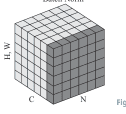

图 7.10：批量归一化。

图 7.10 展示了批量归一化。

这种简单而强大的修改带来了显著的好处：

1.  **更快的收敛速度：** 通过归一化激活值，BatchNorm 减少了训练过程中可能出现的内部协变量偏移，使学习过程更加稳定，让网络学习得更快。
2.  **性能提升：** 稳定的学习过程通常会带来更好的整体性能，与没有 BatchNorm 的模型相比，能达到更高的准确率。
3.  **对初始化敏感度降低：** BatchNorm 使神经网络对初始权重的选择不那么敏感，简化了训练过程，并降低了陷入不良局部最小值的风险。
4.  **减少梯度消失/爆炸：** 归一化有助于缓解梯度消失或爆炸的问题，这些问题会阻碍深度网络的训练。

我们对小批量数据应用批量归一化层如下：

$$X_i = \frac{X_i - \text{Mean}_i}{\text{Std Dev}_i}$$
$$\mu_B = \frac{1}{m} \sum_{i=1}^{m} x_i$$
$$\sigma_B^2 = \frac{1}{m} \sum_{i=1}^{m} (x_i - \mu_B)^2$$
$$\hat{x}_i = \frac{x_i - \mu_B}{\sqrt{\sigma_B^2 + \epsilon}}$$
$$y_i = \gamma \hat{x}_i + \beta = \text{BN}_{\gamma, \beta}(x_i)$$

其中 $\gamma$ 和 $\beta$ 是可学习的参数。

##### 7.15.1 BatchNorm 如何工作？

BatchNorm 是训练深度神经网络的宝贵工具，它提供了更快的收敛速度、更好的性能以及对初始化敏感度的降低。通过理解其核心原理、优势和注意事项，你可以有效地利用 BatchNorm 在深度学习项目中取得更好的结果。BatchNorm 的工作原理如下：

- **计算均值和标准差：** 对于每一层和每一批数据，BatchNorm 计算该批次中激活值的均值和标准差。
- **归一化激活值：** 然后，批次中的每个激活值减去均值并除以标准差。
- **缩放和偏移：** 为了保留信息，归一化的激活值会乘以可学习的缩放和偏移参数（gamma 和 beta），使网络能够适应归一化步骤。

##### 7.15.2 BatchNorm 的最佳实践

1.  **批量大小：** BatchNorm 通常与较小的批量大小一起使用，因为它依赖于每个批次内的准确统计信息。
2.  **超参数调优：** 调整学习率和缩放/偏移参数对于获得最佳性能至关重要。
3.  **小批量统计：** BatchNorm 使用当前小批量的统计信息，这可能是总体统计信息的近似值。这可能导致训练和推理期间出现轻微的不一致。
4.  **替代归一化技术：** 存在其他归一化技术，如层归一化和组归一化，它们提供了不同的权衡，并在特定场景下可能带来更好的性能。

#### 7.16 梯度裁剪

**梯度裁剪**作为一种关键技术应运而生，旨在解决一个潜在的陷阱：**梯度爆炸**。梯度值的过度增大会阻碍训练，导致模型发散并无法收敛。顾名思义，梯度裁剪就像一个安全网，防止梯度变得过大而破坏训练过程的稳定性。想象一下训练一个具有许多层的深度神经网络。当误差信号（梯度）在反向传播过程中通过各层传播时，它会累积，并在每一层显著增大。这可能是由于较浅层的梯度消失等因素导致的，从而在较深层放大了梯度。梯度裁剪为梯度的大小设置了一个**最大阈值**。任何超过此阈值的梯度值都会被“裁剪”到该阈值，从而有效地防止其进一步增长。

##### 7.16.1 梯度裁剪的优势

- **保持稳定性：** 通过控制梯度，梯度裁剪防止模型发散，并使其能够收敛到更好的解。
- **改善训练：** 梯度裁剪有时可以帮助模型通过防止因梯度过大而陷入局部最小值，从而更快地找到更好的解。
- **降低对超参数的敏感度：** 梯度裁剪可以使模型对学习率等超参数不那么敏感，使训练更加稳健。

梯度裁剪是深度学习实践者的宝贵工具，它为梯度爆炸提供了安全网，并有助于稳定高效的训练。通过理解其原理、优势和注意事项，你可以有效地实施梯度裁剪，以增强深度学习模型的性能和鲁棒性。可用的梯度裁剪方法有三种：

1.  **全局裁剪：** 将所有梯度裁剪到一个最大值。
2.  **逐层裁剪：** 为每一层独立裁剪梯度，允许根据层的敏感性进行自定义。
3.  **基于范数的裁剪：** 根据梯度的范数（长度）进行裁剪，确保它们保持在特定半径内。

让我们通过以下 Python 代码深入了解梯度裁剪。

```python
import tensorflow as tf
from tensorflow.keras import Model, layers
import numpy as np
import tensorflow_datasets as tfds

# Hyperparameters
num_classes = 10 # total classes (0-9 digits).
num_features = 784 # data features (img shape: 28*28).

# Training Parameters
learning_rate = 0.001
```

尝试不同的技术和组合，以找到最适合你任务的方法。监控模型在训练和验证数据上的性能，以避免过拟合。通过理解正则化和优化的作用，你可以做出明智的决策，训练出既准确又具有泛化能力的深度学习模型，在未见过的数据上表现良好，并避免过拟合的陷阱。请记住，达到最佳性能的过程通常涉及对这些关键要素的迭代实验和仔细调整。一些常用的优化算法包括：

- **梯度下降（GD）：** 一种经典算法，通过在每次迭代中沿减小损失的方向更新权重，每次迈一小步。梯度下降是一种优化算法。它也被称为函数的斜率。如果梯度更高，则斜率更陡，模型学习得越快。它用于最小化成本并提高模型的准确性。例如，如果我们想下山，我们应该迈小步，而不是一下子跳下去。就像同一个例子，如果我们从点 'a' 开始，我们必须慢慢走下去。即我们及时更新位置到 x，并持续这样做，直到我们到达底部。底部被认为是成本的最低点。
- **动量梯度下降（Momentum GD）：** 类似于 GD，但引入了动量，累积过去的梯度以加速向最小值的收敛。
- **Adam：** 一种自适应学习率优化算法，根据每个权重的过去更新自动调整其学习率，通常能带来更快的收敛。

让我们看一下岭回归

```python
import mglearn as ml
from sklearn.linear_model import LinearRegression
from sklearn.model_selection import train_test_split
from numpy import genfromtxt

dataset = genfromtxt('https://raw.githubusercontent.com/m-mehdi/tutorials/main/boston_housing.csv', delimiter=',')
X = dataset[:, :-1]
y = dataset[:, -1]
X_train, X_test, y_train, y_test = train_test_split(X, y,
test_size=0.25, random_state=0)
from sklearn.linear_model import Ridge

ridge = Ridge(alpha=0.7).fit(X_train, y_train)
print(f"Ridge Regression-Training set score: {ridge.score(X_train,
y_train):.2f}")
print(f"Ridge Regression-Test set score: {ridge.score(X_test,
y_test):.2f}")
```

```
================================Output================================
Ridge Regression-Training set score: 0.90
Ridge Regression-Test set score: 0.76
=====================================================================
```

```python
import mglearn as ml
from sklearn.linear_model import LinearRegression
from sklearn.model_selection import train_test_split
from numpy import genfromtxt

dataset = genfromtxt('https://raw.githubusercontent.com/m-mehdi/tutorials/main/boston_housing.csv', delimiter=',')
X = dataset[:, :-1]
y = dataset[:, -1]
X_train, X_test, y_train, y_test = train_test_split(X, y,
test_size=0.25, random_state=0)

from sklearn.linear_model import Lasso

lasso = Lasso(alpha=1.0).fit(X_train, y_train)
print(f"Lasso Regression-Training set score: {lasso.score(X_train,
y_train):.2f}")
print(f"Lasso Regression-Test set score: {lasso.score(X_test,
y_test):.2f}")
```

```
==============================Lasso Regression==============================
Lasso Regression-Training set score: 0.29
Lasso Regression-Test set score: 0.21
===========================================================================
```

```python
print(f"Linear Regression-Test set score: {lr.score(X_test, y_test):.2f}")
```

```
================================Output================================
Linear Regression-Training set score: 0.95
Linear Regression-Test set score: 0.61
======================================================================
```

##### 第7章 神经网络与深度学习

```python
training_steps = 1000
batch_size = 32
display_step = 100
# Network Parameters
# MNIST image shape is 28*28px, we will then handle 28 sequences of 28
# timesteps for every sample.
num_input = 28 # number of sequences.
timesteps = 28 # timesteps.
num_units = 32 # number of neurons for the LSTM layer.

print(tf.__version__)

import neptune

run = neptune.init_run(project='common/tf-keras-integration',
                       api_token='ANONYMOUS')

from tensorflow.keras.datasets import mnist
(x_train, y_train), (x_test, y_test) = mnist.load_data()
# Convert to float32.
x_train, x_test = np.array(x_train, np.float32), np.array(x_test, np.float32)
# Flatten images to 1-D vector of 784 features (28*28).
x_train, x_test = x_train.reshape([-1, 28, 28]), x_test.reshape([-1, num_features])
# Normalize images value from [0, 255] to [0, 1].
x_train, x_test = x_train / 255., x_test / 255.

# Use tf.data API to shuffle and batch data.
train_data = tf.data.Dataset.from_tensor_slices((x_train, y_train))
train_data = train_data.repeat().shuffle(5000).batch(batch_size).prefetch(1)

# Create LSTM Model.
class Net(Model):
    # Set layers.
    def __init__(self):
        super(Net, self).__init__()
        # RNN (LSTM) hidden layer.
        self.lstm_layer = layers.LSTM(units=num_units)
        self.out = layers.Dense(num_classes)

    # Set forward pass.
    def __call__(self, x, is_training=False):
        # LSTM layer.
        x = self.lstm_layer(x)
        # Output layer (num_classes).
        x = self.out(x)
        if not is_training:
            # tf cross entropy expect logits without softmax, so only
            # apply softmax when not training.
            x = tf.nn.softmax(x)
        return x

# Build LSTM model.
network = Net()

# Cross-Entropy Loss.
# Note that this will apply 'softmax' to the logits.
def cross_entropy_loss(x, y):
    # Convert labels to int 64 for tf cross-entropy function.
    y = tf.cast(y, tf.int64)
    # Apply softmax to logits and compute cross-entropy.
    loss = tf.nn.sparse_softmax_cross_entropy_with_logits(labels=y,
                                                          logits=x)
    # Average loss across the batch.
    return tf.reduce_mean(loss)

# Accuracy metric.
def accuracy(y_pred, y_true):
    # Predicted class is the index of highest score in prediction vector
    # (i.e. argmax).
    correct_prediction = tf.equal(tf.argmax(y_pred, 1), tf.cast(y_true,
                                                                tf.int64))
    return tf.reduce_mean(tf.cast(correct_prediction, tf.float32), axis=-1)

# Adam optimizer.
optimizer = tf.optimizers.Adam(learning_rate)

# Optimization process.
def run_optimization(x, y):
    # Wrap computation inside a GradientTape for automatic differentiation.
    with tf.GradientTape() as tape:
        # Forward pass.
        pred = network(x, is_training=True)
        # Compute loss.
        loss = cross_entropy_loss(pred, y)

    # Variables to update, i.e. trainable variables.
    trainable_variables = network.trainable_variables

    # Compute gradients.
    gradients = tape.gradient(loss, trainable_variables)

    # Clip-by-value on all trainable gradients
    gradients = [(tf.clip_by_value(grad, clip_value_min=-1.0,
        clip_value_max=1.0)) for grad in gradients]

    # Update weights following gradients.
    optimizer.apply_gradients(zip(gradients, trainable_variables))

# Run training for the given number of steps.
for step, (batch_x, batch_y) in enumerate(train_data.take(training_steps), 1):
    # Run the optimization to update W and b values.
    run_optimization(batch_x, batch_y)

    if step % display_step == 0:
        pred = lstm_net(batch_x, is_training=True)
        loss = cross_entropy_loss(pred, batch_y)
        acc = accuracy(pred, batch_y)

        run['monitoring/logs/loss'].log(loss)
        run['monitoring/logs/acc'].log(acc)

        print("step: %i, loss: %f, accuracy: %f" % (step, loss, acc))
```

以下是一些梯度裁剪方法的最佳实践：

- **裁剪阈值：** 选择合适的裁剪阈值至关重要。阈值过高可能无效，而阈值过低则可能影响训练速度。
- **对性能的影响：** 虽然梯度裁剪有益，但在某些情况下可能会略微降低模型的最终准确性。
- **实验与评估：** 尝试不同的裁剪方法和阈值，以找到最适合您特定模型和任务的方法。
- **替代技术：** 其他技术，如梯度归一化和自适应学习率，也有助于解决梯度爆炸问题。

## 总结

人工神经网络（ANN）的灵感来源于人脑，而神经网络是**相互连接的人工神经元层**，用于处理信息。每个神经元执行简单的计算，它们之间的连接决定了网络的整体行为。这些网络通过根据训练数据调整神经元之间的连接来学习。感知器和激活函数是构建神经网络的基本要素，为复杂的学习和决策能力铺平了道路。让我们深入探讨它们各自的作用以及它们如何协同工作。将感知器想象成一个简单的类神经元结构，它接收输入信号，处理它们，并生成输出。它是神经网络的构建模块，负责基本的计算和信息流。TensorFlow是一个强大且通用的开源软件库，主要用于**开发和部署机器学习和深度学习模型**。它为从图像识别和自然语言处理到自动驾驶汽车和科学计算等各种任务提供了灵活高效的平台。Keras是一个**用于构建和训练深度学习模型的高级API**，由Google开发和维护。它构建在TensorFlow和Theano等强大库之上，为深度学习任务提供了更简单、更用户友好的接口。以下是您需要了解的关于Keras的内容。

**卷积神经网络（CNN）**已成为图像和视频分析领域的佼佼者。其独特的架构，灵感来源于人类视觉系统，使其在图像识别、目标检测和视频分类等任务中表现出色。让我们深入探讨CNN的核心概念和能力。**CNN**在图像处理中扮演着关键角色，由于其独特的架构（灵感来源于人类视觉系统），在各种任务中表现出色。让我们更深入地了解CNN如何为图像处理做出贡献，并探索具体的应用。在迷人的图像处理世界中，**CNN架构**是CNN的蓝图，它规定了信息的流动，并使其能够出色地完成图像分类、目标检测和图像分割等任务。

**池化层和Dropout层**在提升性能和防止过拟合方面发挥着不同但至关重要的作用。以下是它们各自功能的分解以及它们如何协同工作。**循环神经网络（RNN）**成为处理序列数据的强大工具，其中元素的顺序很重要。与处理独立输入的传统神经网络不同，RNN与前馈神经网络相比引入了一个关键区别：**内部记忆**。这种记忆使它们能够保留先前输入的信息，并用它来处理当前输入，从而能够捕获序列数据中的依赖关系和上下文。**序列数据**是一种独特的信息类型，其中**元素的顺序至关重要**。与独立的数据点不同，理解序列数据需要在其内在结构中考虑过去并预测未来。想象一个句子、一首歌、一个股市时间线或一个视频片段。这些都代表序列数据，其中每个元素（单词、音符、价格点、帧）都具有内在意义，并影响后续元素。有效地处理序列数据需要能够捕获这些依赖关系和上下文的方法。

**长短期记忆网络（LSTM）**和**门控循环单元（GRU）**网络作为处理**序列数据**的强大工具脱颖而出，其中顺序很重要。两者都是**RNN**的特殊类型，旨在克服传统RNN的一个主要局限性：梯度消失问题。这个问题阻碍了它们学习序列中长期依赖关系的能力。序列到序列（seq2seq）模型代表弥合不同序列之间的鸿沟。它成为一种强大而通用的工具，用于涉及**将一个数据序列转换为另一个**的任务。从翻译语言到为图像生成说明文字，这些模型擅长捕获序列中的关系和上下文，使它们能够执行各种令人印象深刻的任务。迁移学习代表基于现有知识实现更快进展。它成为一种强大的技术，允许您**利用从一个任务中获得的知识来提高相关任务的性能**。想象一下训练一只狗去取一个特定的玩具；每次它遇到一个新物体时，你都不会从头开始。同样，迁移学习使模型能够“记住”它们之前学到的东西，并将其适应新的情况，从而显著加速学习过程并改善结果。微调涉及**修改预训练模型的权重**以使其适应新任务。通常，捕获一般特征的模型较低层被冻结，而负责更具体学习的较高层则在您自己的数据集上进行微调。

**生成对抗网络（GAN）**作为一种强大而迷人的技术脱颖而出，用于生成新数据，如图像、文本或音乐。想象一下创作从未存在过的人的逼真肖像，或者以你最喜欢的艺术家的风格创作音乐——这就是GAN能够实现的魔力！

- **原始GAN**：最初的GAN架构，具有独立的生成器和判别器网络。
- **深度卷积GAN（DCGAN）**：在生成器和判别器中都利用卷积层，特别适用于图像生成。
- **Wasserstein GAN（WGAN）**：通过使用不同的损失函数和梯度惩罚来提高训练稳定性。
- **带梯度惩罚的生成对抗网络（GAN-GP）**：结合了DCGAN和WGAN的方面，以提高稳定性和性能。
- **StyleGAN**：利用风格迁移技术生成高度多样化和逼真的图像。

**正则化和优化**是两种基本技术，它们携手合作以提高模型的性能和泛化能力。**批归一化（BatchNorm）**成为一种强大的技术，可以**提高神经网络的训练速度和稳定性**。它就像一种**神奇的配料**，平滑训练过程，并通常带来更好的性能。**梯度裁剪**成为**防止梯度爆炸**的关键技术。梯度，这一现象可能阻碍训练过程，导致模型不稳定甚至发散。想象一下训练一只狗：你不会用力拉扯牵引绳，因为这可能会让它抗拒甚至逃跑。同样，梯度裁剪通过为模型权重的更改设置合理的限制，帮助你“控制”学习过程。

## 练习（选择题）

1.  **在卷积神经网络（CNN）中，“池化层”的作用是什么？**
    A) 归一化前一层的激活值
    B) 降低特征图的维度
    C) 与特定卷积核进行逐元素乘法
    D) 学习特征之间的非线性关系

2.  **以下哪项不是神经网络的有效激活函数？**
    A) Sigmoid   B) ReLU   C) Softmax   D) Linear

3.  **梯度下降和Adam这两种流行的神经网络优化算法的主要区别是什么？**
    A) Adam使用自适应学习率，而梯度下降使用固定学习率。
    B) Adam在大数据集上更快，而梯度下降在小数据集上更好。
    C) 与梯度下降相比，Adam需要更少的超参数调整。
    D) Adam比梯度下降更容易过拟合。

4.  **神经网络中dropout的目的是什么？**
    A) 通过减少过拟合来提高准确性
    B) 通过跳过一些连接来加速训练
    C) 防止深层网络中的梯度消失
    D) 通过鼓励多样性来学习更鲁棒的特征

5.  **训练生成对抗网络（GANs）的主要挑战是什么？**
    A) 为生成器和判别器选择合适的架构
    B) 确保训练稳定并避免模式崩溃
    C) 有效评估生成数据的质量
    D) 以上所有

6.  **以下哪种技术通常不用于深度学习中的正则化？**
    A) L1和L2正则化
    B) 批量归一化
    C) 早停法
    D) 带标签平滑的数据增强

7.  **如何解释训练好的神经网络的权重以理解它学到了什么？**
    A) 直接分析权重值
    B) 使用显著性图等可视化技术
    C) 通过特征反演来重构输入数据
    D) 以上所有

8.  **在深度学习中使用预训练模型有哪些优势？**
    A) 训练更快，并在新任务上提升性能
    B) 减少对大型数据集和计算资源的需求
    C) 能够针对特定应用微调模型
    D) 以上所有

9.  **使用深度学习模型，尤其是在大型数据集上训练的模型，涉及哪些伦理考量？**
    A) 决策中的偏见和公平性
    B) 模型预测的可解释性和可理解性
    C) 隐私问题和数据安全
    D) 以上所有

10. **深度学习领域的最新进展和研究方向是什么？**
    A) 可解释人工智能（XAI）用于可理解的模型
    B) 持续学习以适应新的数据流
    C) 用于自然语言处理及更多领域的Transformer
    D) 用于更高效硬件的神经形态计算

## 答案

1.  b) 降低特征图的维度
2.  d) Linear
3.  a) Adam使用自适应学习率，而梯度下降使用固定学习率。
4.  a) 通过减少过拟合来提高准确性
5.  d) 以上所有
6.  d) 带标签平滑的数据增强
7.  d) 以上所有
8.  d) 以上所有
9.  d) 以上所有
10. c) 用于自然语言处理及更多领域的Transformer

## 一些基础问题

1.  神经网络中的神经元和层有什么区别？
2.  用于二分类神经网络输出层的激活函数是什么？
3.  反向传播在训练神经网络中的目的是什么？
4.  哪种类型的神经网络最适合图像识别？
5.  卷积神经网络（CNNs）和循环神经网络（RNNs）的主要区别是什么？
6.  注意力机制在Transformer中的作用是什么？
7.  神经网络如何用于自然语言处理（NLP）？
8.  生成对抗网络（GANs）有哪些应用？
9.  神经网络如何用于时间序列预测？
10. 解释反向传播的概念及其在训练神经网络中的作用。

## 填空题

1.  __________是一种受人脑启发的**人工智能**。
2.  __________接收多个输入，代表数据的特征或属性。
3.  __________降低了数据的维度，总结了卷积层捕获的信息。
4.  __________是训练深度神经网络的宝贵工具，提供更快的收敛速度、改进的性能和对初始化敏感性的降低。
5.  梯度裁剪为梯度的大小设置了一个__________。

## 答案

1.  神经网络
2.  感知机
3.  池化层
4.  批量归一化
5.  最大阈值

## 第8章
### 专业应用与案例研究

#### 8.1 自然语言处理（NLP）简介

自然语言处理（NLP）是人工智能（AI）的一个领域，涉及计算机与人类语言之间的交互。其目标是使计算机能够以类似于人类的方式理解、解释和操作自然语言。其主要目标是使计算机能够以有意义且有用的方式理解、解释和生成人类语言。这包括书面文本、口语甚至手语。NLP技术通常结合统计模型、机器学习算法和语言规则来有效处理和理解人类语言。深度学习的最新进展，特别是像Transformer这样的模型，已经在各种NLP任务中带来了显著的改进，实现了更准确和多功能的语言处理能力。让我们看一个基本的Python代码，用于下载和安装NLTK库及其一些包。我们可以在终端使用**pip install nltk**命令安装NLTK库，然后执行以下代码：

```python
import nltk

# downloading and installing required libraries
nltk.download('maxent_ne_chunker')
nltk.download('punkt')
nltk.download('words')
nltk.download('wordnet')
nltk.download('stopwords')
nltk.download('averaged_perceptron_tagger')

from nltk.tokenize import sent_tokenize, word_tokenize

text = """Natural Language Processing (NLP) is a field of artificial intelligence (AI) that deals with the interaction between computers and human language. Its goal is to enable computers to understand, interpret, and manipulate natural language in a way that is similar to how humans do. Its primary goal is to enable computers to understand, interpret, and generate human language in a manner that is both meaningful and useful. This includes written text, spoken language, and even sign language."""

sentences = sent_tokenize(text)
print(sentences)
words = word_tokenize(text)
print(words)
```

```
========================================Output========================================
['Natural Language Processing (NLP) is a field of artificial intelligence (AI) that deals \nwith the interaction between computers and human language.', 'Its goal is to enable computers \nto understand, interpret, and manipulate natural language in a way that is similar to how \nhumans do.', 'Its primary goal is to enable computers to understand, interpret, and generate \nhuman language in a manner that is both meaningful and useful.', 'This includes written text, \nspoken language, and even sign language.']
['Natural', 'Language', 'Processing', '(', 'NLP', ')', 'is', 'a', 'field', 'of', 'artificial', 'intelligence', '(', 'AI', ')', 'that', 'deals', 'with', 'the', 'interaction', 'between', 'computers', 'and', 'human', 'language', '.', 'Its', 'goal', 'is', 'to', 'enable', 'computers', 'to', 'understand', ',', 'interpret', ',', 'and', 'manipulate', 'natural', 'language', 'in', 'a', 'way', 'that', 'is', 'similar', 'to', 'how', 'humans', 'do', '.', 'Its', 'primary', 'goal', 'is', 'to', 'enable', 'computers', 'to', 'understand', ',', 'interpret', ',', 'and', 'generate', 'human', 'language', 'in', 'a', 'manner', 'that', 'is', 'both', 'meaningful', 'and', 'useful', '.', 'This', 'includes', 'written', 'text', ',', 'spoken', 'language', ',', 'and', 'even', 'sign', 'language', '.']
========================================================================================================
```

上述代码将对单词和句子进行分词。它表明NLP是一个快速发展的领域，有潜力彻底改变我们与计算机和信息交互的方式。NLP技术可以分析语言的结构和语义，以理解词语和句子背后的意图。NLP可用于创建文本、翻译语言，甚至撰写各种创意内容。我们可以在以下一些领域使用NLP：

1.  **机器翻译**：将文本从一种语言翻译成另一种语言。自动将文本从一种语言翻译成另一种语言。这包括语言翻译、语言检测和多语言文本分析等任务。通过使用词嵌入来编码源语言和目标语言单词，提高机器翻译系统的质量。
2.  **聊天机器人和虚拟助手**：以自然的方式理解和响应用户查询。
3.  **情感分析**：确定一段文本中表达的情感或观点是积极的、消极的还是中性的。这对于分析客户反馈、社交媒体情绪和产品评论很有用。它通过将单词表示在连续向量空间中，捕捉细微的语义差异，从而增强情感分析模型的性能。
4.  **文本摘要和分类**：将大量文本数据总结和分类成简洁且信息丰富的格式。生成简洁在保留关键信息和要点的同时，对较长文本进行摘要。这对于从大型文档或文章中快速提取重要信息非常有用。

5.  **自动语言识别**：识别一段文本所使用的语言。理解用户查询或命令背后的含义和意图。这涉及对话系统中的意图识别、槽位填充和对话管理等任务。
6.  **语音识别与文本转语音**：将语音转换为文本，反之亦然。将口语转换为文本。这是 Siri、Alexa 和 Google Assistant 等虚拟助手背后的技术。
7.  **命名实体识别 (NER)**：识别并分类文本中提到的命名实体，将其归入预定义类别，如人名、组织名和地名。
8.  **文本生成**：根据给定的输入或提示生成类似人类的文本。这可用于各种应用，如聊天机器人、内容生成和对话系统。
9.  **问答**：基于给定的上下文或知识库，自动回答用自然语言提出的问题。这包括阅读理解和常见问题解答系统等任务。
10. **文本挖掘**：从大量文本数据中提取有用的见解和模式。这包括文本聚类、主题建模和趋势分析等技术。
11. **词性 (POS) 标注**：它通过将词嵌入作为特征整合到机器学习模型中，有助于提高序列标注任务的性能。让我们看看下面的代码：

```python
from nltk.tokenize import word_tokenize
from nltk import pos_tag
text = """Natural Language Processing (NLP) is a field of artificial intelligence (AI) that deals with the interaction between computers and human language. Its goal is to enable computers to understand, interpret, and manipulate natural language in a way that is similar to how humans do. Its primary goal is to enable computers to understand, interpret, and generate human language in a manner that is both meaningful and useful. This includes written text, spoken language, and even sign language."""
words = word_tokenize(text)
tagged_words = pos_tag(words)
print(tagged_words)
```

```
========================================Output========================================
[('Natural', 'JJ'), ('Language', 'NNP'), ('Processing', 'NNP'), ('(', '('), ('NLP', 'NNP'), (')', ')'), ('is', 'VBZ'), ('a', 'DT'), ('field', 'NN'), ('of', 'IN'), ('artificial', 'JJ'), ('intelligence', 'NN'), ('(', '('), ('AI', 'NNP'), (')', ')'), ('that', 'IN'), ('deals', 'NNS'), ('with', 'IN'), ('the', 'DT'), ('interaction', 'NN'), ('between', 'IN'), ('computers', 'NNS'), ('and', 'CC'), ('human', 'JJ'), ('language', 'NN'), ('.', '.'), ('Its', 'PRP$'), ('goal', 'NN'), ('is', 'VBZ'), ('to', 'TO'), ('enable', 'JJ'), ('computers', 'NNS'), ('to', 'TO'), ('understand', 'VB'), (',', ','), ('interpret', 'VB'), (',', ','), ('and', 'CC'), ('manipulate', 'VB'), ('natural', 'JJ'), ('language', 'NN'), ('in', 'IN'), ('a', 'DT'), ('way', 'NN'), ('that', 'WDT'), ('is', 'VBZ'), ('similar', 'JJ'), ('to', 'TO'), ('how', 'WRB'), ('humans', 'NNS'), ('do', 'VBP'), ('.', '.'), ('Its', 'PRP$'), ('primary', 'JJ'), ('goal', 'NN'), ('is', 'VBZ'), ('to', 'TO'), ('enable', 'JJ'), ('computers', 'NNS'), ('to', 'TO'), ('understand', 'VB'), (',', ','), ('interpret', 'VB'), (',', ','), ('and', 'CC'), ('generate', 'VB'), ('human', 'JJ'), ('language', 'NN'), ('in', 'IN'), ('a', 'DT'), ('manner', 'NN'), ('that', 'WDT'), ('is', 'VBZ'), ('both', 'DT'), ('meaningful', 'JJ'), ('and', 'CC'), ('useful', 'JJ'), ('.', '.'), ('This', 'DT'), ('includes', 'VBZ'), ('written', 'VBN'), ('text', 'NN'), (',', ','), ('spoken', 'JJ'), ('language', 'NN'), (',', ','), ('and', 'CC'), ('even', 'RB'), ('sign', 'JJ'), ('language', 'NN'), ('.', '.')]
================================================================================
```

12. **语义相似度：** 基于词嵌入的相似性计算单词或短语之间的相似度。这对于信息检索、推荐系统和问答等任务非常有用。

NLP 使用各种机器学习技术，如深度学习，来分析和处理语言数据。这些方法用于分析语言不同元素之间的模式和关系。NLP 结合了语法、句法、语义和语用学知识，以理解人类语言的细微差别。NLP 有助于打破语言障碍，促进人与机器之间的沟通。NLP 可以自动化目前需要人工干预的任务，例如分析客户反馈或翻译文档。NLP 可以通过从大量文本数据中提供见解来帮助组织做出更好的决策。就像每一枚硬币都有两面，一面是正面，一面是反面一样，尽管 NLP 有许多优点，但它也面临一些挑战，其中一些如下：

1.  **语言歧义性：** 人类语言常常具有歧义性，可以有多种不同的解释。
2.  **上下文依赖性：** 一个单词或短语的含义可能取决于其使用的上下文。
3.  **语言的持续演变：** 语言在不断演变，这给 NLP 系统跟上发展带来了挑战。

##### 8.1.1 分词

分词是 NLP 中的一项基本任务，涉及将文本分解为称为标记的较小单元。这些标记可以是单词、子词、字符，甚至是短语，具体取决于手头任务的具体要求。分词过程在许多 NLP 任务中起着至关重要的作用，因为它构成了进一步分析和处理的基础。根据具体任务和所选技术，这些标记可以是单个单词、字符、句子，甚至是短语。计算机无法直接理解连续文本的含义。分词将其转换为机器可以处理和分析的格式。分词为情感分析、机器翻译和文本分类等各种 NLP 任务奠定了基础。我们在分词方面也面临一些挑战，其中一些如下：

-   **处理缩写和特殊字符：** NLP 系统需要决定是否拆分缩写（例如，“don't”）以及如何处理表情符号或符号等特殊字符。
-   **特定语言的挑战：** 不同语言具有不同的句子结构和标点符号，需要为每种语言制定特定的分词规则。
-   **依赖上下文的单词：** 像“to”或“a”这样的单词，其含义可能因上下文而异，这对分词算法构成了挑战。

通过分解复杂的文本结构，分词使 NLP 模型能够专注于关键信息，并更高效、更准确地执行这些任务。分词通常是 NLP 流水线中的初始步骤之一，它为后续任务（如词性标注、命名实体识别、句法解析和语义分析）奠定了基础。分词策略的选择取决于 NLP 任务的具体要求、所处理的语言以及文本数据的特征。我们可以说，分词是 NLP 任务中至关重要的第一步，它为机器进一步处理和分析文本数据做好了准备。我们可以根据其应用和使用情况对分词进行分类。其中一些如下：

###### 8.1.1.1 分词类型

1.  **单词分词：** 在单词分词中，文本根据空格或标点边界被分割成单个单词。这是最常见的类型，它根据空格或标点符号将文本分割成单个单词。例如，句子“The quick brown fox jumps over the lazy dog”将被分词为 [“The”, “quick”, “brown”, “fox”, “jumps”, “over”, “the”, “lazy”, “dog”]。
2.  **句子分词：** 句子分词涉及将段落或文档分割成单个句子。这对于需要分析的任务很有用句子级别的文本。例如，段落“NLP是一个迷人的领域。它涉及计算机与人类通过自然语言的交互。”会被分词为[“NLP是一个迷人的领域。”，“它涉及计算机与人类通过自然语言的交互。”]。这会在句号、感叹号或问号处将文本分割成独立的句子。

3.  **子词分词：** 子词分词将单词分解为更小的有意义单元，称为子词或语素。这对于处理词汇表外单词和处理具有复杂形态学的语言特别有用。字节对编码和WordPiece等技术通常用于子词分词。
4.  **字符分词：** 在字符分词中，文本中的每个字符都成为一个独立的标记。当需要在非常细粒度的级别分析文本或处理具有复杂文字系统的语言时，这种方法很有用。它将文本分解为单个字符，这对于拼写纠正或字符级语言模型等某些任务很有用。
5.  **短语分词：** 短语分词涉及根据预定义的规则或模式，将连续的单词分组为短语或块。这对于命名实体识别或分块等任务很有用。
6.  **N-gram分词：** 这会创建n个连续单词的序列，对于语言建模和机器翻译等任务很有用。

##### 8.1.2 词嵌入

词嵌入是自然语言处理中的一种词表示方法，旨在将单词的语义含义捕获在一个连续的向量空间中。传统的词表示方法，如独热编码或词袋模型，缺乏捕获单词之间语义关系的能力，并且通常导致高维和稀疏的表示。词嵌入通过将单词表示为连续向量空间中的稠密向量来解决这些限制，其中相似的单词被映射到附近的点。这些嵌入是使用无监督或半监督技术（如神经网络模型）从大型文本语料库中学习到的。词嵌入是将单词表示为数值向量的强大技术。这些向量捕获了单词的语义含义和关系，使机器能够理解超越单个单词本身的语言细微差别。词嵌入是许多自然语言处理任务的基础构建块。通过编码语义含义和关系，它们使机器能够以更接近人类的方式理解和处理语言。有两种流行的方法或算法用于生成词嵌入，例如：

1.  **Word2Vec：** Word2Vec是一种流行的算法，通过分析句子或周围上下文中单词的共现来学习词嵌入。由谷歌研究人员开发的Word2Vec是一个浅层神经网络模型，它通过预测文本窗口内单词的上下文来学习词嵌入。它包含两种主要架构：连续词袋模型和Skip-gram。CBOW根据上下文词预测目标词，而Skip-gram则根据给定的目标词预测上下文词。
2.  **GloVe（全局词向量表示）：** GloVe是一种使用全局单词共现统计的方法，基于单词在整个语料库中共同出现的频率来捕获语义关系。GloVe是一种无监督学习算法，通过对语料库中单词的共现矩阵进行分解来获得词嵌入。它利用整个语料库的全局统计信息来学习词表示。
3.  **FastText：** 该算法由Facebook AI Research开发，FastText是Word2Vec的扩展，它考虑了子词信息。FastText不是仅为完整单词学习嵌入，而是为字符n-gram构建嵌入，并对它们进行平均以获得每个单词的表示。这种方法对于处理词汇表外单词和形态丰富的语言特别有用。

###### 8.1.2.1 词嵌入是如何工作的？

-   **将单词映射到向量：** 词汇表中的每个单词都被分配一个唯一的向量，通常包含数十或数百个维度。
-   **学习单词关系：** 这些向量表示是通过分析大量文本数据自动学习到的。学习过程考虑了单词出现的上下文，使它们能够捕获语义相似性。
-   **相似的单词具有相似的向量：** 在高维空间中，含义相似的单词将具有更接近的向量表示。这意味着对向量进行简单的数学运算就可以揭示单词之间的语义关系。

词嵌入在以下领域非常有帮助：

1.  **捕获语义含义：** 与简单的将单词表示为唯一标识符的传统独热编码不同，词嵌入捕获了单词的语义含义和关系。
2.  **提高自然语言处理任务的性能：** 通过编码语义信息，词嵌入显著提高了各种自然语言处理任务的性能，例如：
    1.  **机器翻译：** 通过理解不同语言中单词的含义和关系来翻译文本。
    2.  **情感分析：** 通过理解与单词及其关系相关的情感来分析文本数据的情感。
    3.  **文本分类：** 根据词嵌入中编码的含义将文本数据分类到特定组中。
    4.  **问答：** 通过理解查询和文本数据中单词的上下文和关系来准确回答问题。

##### 8.1.3 自然语言处理的序列建模

序列建模是自然语言处理中的一项基础技术，涉及构建能够理解和生成数据序列（如单词、字符或标记）的模型。这些模型旨在捕获序列数据中存在的时间依赖性和上下文信息，使其非常适合语言建模、机器翻译、情感分析和命名实体识别等任务。序列建模技术在神经网络架构、训练方法和大规模数据集可用性的推动下不断发展。通过有效捕获自然语言数据的序列特性，这些模型能够实现广泛的自然语言处理应用，并提高准确性和性能。换句话说，序列建模是指一组专门设计用于处理和分析序列数据（如文本、语音和时间序列数据）的技术。这些数据固有地具有顺序和上下文，这对于理解其含义至关重要。我们可以在以下算法中使用序列建模技术：

1.  **循环神经网络：** RNN是一类专门设计用于处理序列数据的神经网络。它们一次处理一个输入序列元素，同时维护内部状态或记忆。这使它们能够捕获随时间变化的依赖关系。然而，传统的RNN存在梯度消失问题，这限制了它们捕获长期依赖关系的能力。这些模型具有内部循环，允许它们保留序列中先前元素的信息并使用它来处理当前元素。
2.  **长短期记忆网络：** LSTM是一种RNN架构，旨在解决梯度消失问题。它们引入了专门的记忆单元和门控机制，允许它们在长序列中选择性地记住或忘记信息。由于其捕获长期依赖关系的能力，LSTM已成为各种自然语言处理序列建模任务的热门选择。LSTM是一种特殊类型的RNN，旨在解决梯度消失问题，允许它们学习序列中的长期依赖关系。
3.  **门控循环单元：** GRU是RNN的另一种变体，通过将输入门和遗忘门组合成单个更新门，简化了与LSTM相比的架构。虽然它们在概念上与LSTM相似，但GRU具有参数更少，计算效率更高，因此适用于计算资源有限的应用场景。

4. **Transformer模型：** Transformer是序列建模领域的一项近期进展，在自然语言处理中获得了广泛普及。它们依赖自注意力机制来捕捉输入序列与输出序列之间的全局依赖关系。Transformer由编码器-解码器架构组成，其中编码器处理输入序列，解码器生成输出序列。像BERT（来自Transformer的双向编码器表示）和GPT（生成式预训练Transformer）这样的模型，通过利用Transformer架构，在各种自然语言处理任务上取得了最先进的性能。这些模型在处理每个元素时，使用注意力机制聚焦于序列中最相关的部分，克服了循环神经网络在处理长序列时的局限性。

5. **卷积神经网络（CNN）：** 虽然主要用于图像处理，但CNN也可以应用于自然语言处理中的序列建模任务。CNN在固定大小的输入窗口上操作，并通过在输入序列上应用卷积滤波器来学习层次化的特征表示。它们在文本分类和情感分析等任务中尤其有效。

总的来说，我们可以说序列建模在现代自然语言处理中扮演着至关重要的角色。通过考虑数据点的顺序和上下文，这些模型使机器能够理解复杂的关系，并以更高的准确性和效率执行各种自然语言处理任务。

###### 为什么序列建模很重要？

1. **捕捉依赖关系：** 传统的自然语言处理技术通常将单词或句子独立对待，忽略了它们之间至关重要的依赖关系。序列模型通过考虑序列中单词或元素的顺序和上下文来解决这个问题。

2. **理解复杂关系：** 语言涉及单词、句子和段落之间错综复杂的关系。序列模型擅长捕捉这些关系，使其能够执行如下任务：
    1. **机器翻译：** 理解一种语言句子的上下文，并将其准确翻译成另一种语言，同时保留意义和结构。
    2. **情感分析：** 通过考虑不仅是单个单词，还有它们的序列以及它们如何相互影响意义，来分析文本的情感。
    3. **语音识别：** 通过理解声音序列及其关系，将口语转换为文本。
    4. **文本摘要：** 通过考虑思想的流程和顺序，从一段文本中识别并提取要点。

#### 8.2 时间序列预测

自然语言处理中的时间序列预测涉及基于历史模式和序列来预测文本数据中的未来值或趋势。虽然传统的时间序列预测方法通常应用于数值数据，但也有技术和方法可以应用于自然语言处理中的预测任务。虽然自然语言处理和时间序列预测是不同的领域，但它们可以在某些应用中结合使用，以增强基于文本数据对未来事件的预测。自然语言处理中的时间序列预测涉及调整来自这两个领域的现有方法和技术，以预测文本数据中的未来趋势和模式。通过利用词嵌入、语言模型、神经网络架构和注意力机制，可以为各种自然语言处理任务构建准确的预测模型。虽然仍在发展中，但自然语言处理与时间序列预测的结合，通过利用文本数据中的宝贵见解，有望增强对未来事件的预测。我们可以在以下应用中使用它：

1. **用于时间序列的词嵌入：** 在自然语言处理中，单词或标记可以被视为时间序列数据，尤其是在随时间变化的情感分析或主题建模等任务中。词嵌入，如Word2Vec或GloVe，可以在时间上下文中捕捉单词之间的语义关系。通过分析词嵌入随时间的变化，可以预测语言使用或情感的未来趋势。
2. **语言模型：** 大型预训练语言模型，如GPT或BERT，已被用于自然语言处理中的时间序列预测。通过在历史文本数据上微调这些模型，它们可以生成对未来文本序列的预测。例如，它们可以预测句子中的下一个单词，或根据过去的模式生成整段文本。
3. **时间卷积网络（TCN）：** TCN是为序列数据处理（包括时间序列数据）设计的神经网络架构。它们使用带有因果填充的卷积层来捕捉输入序列中的时间依赖性。TCN已被应用于文本数据，用于语言建模和文本生成等任务，使其适用于自然语言处理中的时间序列预测。
4. **循环神经网络（RNN）和长短期记忆（LSTM）网络：** RNN和LSTM通常用于序列数据处理，包括时间序列预测。在自然语言处理中，这些架构可以被调整以建模文本数据的时间动态，并对未来序列进行预测。例如，它们可以被训练来预测句子中的下一个单词或未来文本的情感。
5. **注意力机制：** 注意力机制，通常用于BERT和GPT等Transformer架构中，可以被利用于自然语言处理中的时间序列预测。这些机制允许模型关注输入序列的相关部分，这对于捕捉文本数据中的时间模式非常有用。通过关注历史文本序列，模型可以对未来趋势或语言使用进行预测。

毫无疑问，自然语言处理并非一个完美的算法，但在模型训练中我们仍然面临一些挑战，例如：

**数据集成：** 由于格式和结构的差异，将文本数据与数值时间序列数据集成可能具有挑战性。

**模型复杂性：** 结合自然语言处理和时间序列预测技术可能导致更复杂的模型，需要更大的数据集和计算资源。

**数据质量和偏差：** 文本数据源的质量和潜在偏差会影响整体预测的准确性和可靠性。

##### 8.2.1 自回归积分移动平均（ARIMA）模型

自回归积分移动平均（ARIMA）模型是一种强大的统计技术，用于预测时间序列数据。它们广泛应用于金融、经济和商业等各个领域，以基于历史数据预测未来值。它们特别适用于捕捉和预测序列数据中存在的时间依赖性和模式，使其适用于包括经济学、金融学和流行病学在内的各个领域。虽然ARIMA模型主要用于数值时间序列，但它们可以被调整并应用于文本数据分析的某些方面，特别是在处理文本信息中的时间序列趋势时。ARIMA是三个组件的组合：

**自回归（AR）：** 该组件考虑了时间序列过去值对预测的影响。它考虑了多少个过去值（称为滞后）在统计上对当前值有显著影响，或者换句话说，我们可以说。AR组件表示序列当前值与其过去值之间的关系。它对当前观测值对其滞后（过去）值的依赖性进行建模。“p”参数决定了模型中包含的滞后观测值数量，其中p、d和q分别代表：

- **p：** 自回归项数（滞后阶数）
- **d：** 实现平稳性所需的差分阶数
- **q：** 移动平均项数

选择适当的p、d和q值对于准确预测至关重要。使用各种统计检验和信息准则来识别最佳拟合模型。

**积分（I）：** I组件代表对时间序列进行差分以使其平稳。平稳性是ARIMA建模中的一个关键假设，因为它确保了该序列的统计特性随时间保持不变。参数“d”决定了实现平稳性所需的差分阶数。该部分处理非平稳时间序列数据，即其均值、方差或季节性随时间变化的数据。对数据应用差分以实现平稳性，使其在统计上稳定，便于分析和预测。

**移动平均（MA）：** MA部分表示当前观测值与过去误差项（残差）线性组合之间的依赖关系。它对时间序列中的噪声或随机波动进行建模。参数“q”决定了模型中包含的滞后残差数量。该部分考虑过去误差（预测值与实际值之差）的平均值，通过考虑数据中的随机波动来改进预测。

ARIMA模型通常表示为ARIMA(p, d, q)，其中“p”代表AR阶数，“d”代表差分阶数，“q”代表MA阶数。

虽然ARIMA模型主要用于数值数据，但它们也可以应用于文本数据分析的某些方面，特别是在处理文本信息中的时间序列趋势时。例如，ARIMA模型可用于预测文本语料库中某些关键词或短语随时间出现的频率。这对于分析社交媒体对话趋势、监控公众舆论变化或基于文本数据预测特定产品或服务的需求等任务可能很有用。我们可以在预测未来销售额、预测股票价格、估计客户需求和分析经济趋势中使用ARIMA模型。

然而，需要注意的是，ARIMA模型可能并不直接适用于文本数据分析的所有方面，尤其是在处理非结构化文本信息时。在这种情况下，其他技术如自然语言处理和机器学习可能更适合从文本数据中提取见解和进行预测。

ARIMA模型是时间序列预测的重要工具，提供了一种稳健且可解释的方法。然而，重要的是要意识到它们的局限性，并考虑针对非平稳或复杂数据或长期预测需求的替代方法。ARIMA算法在某些情况下无法使用，例如：

- 1. **平稳性假设：** ARIMA模型要求数据是平稳的，而并非所有现实世界的时间序列数据都满足这一条件。
- 2. **处理非线性关系的能力有限：** ARIMA模型主要关注过去值和未来值之间的线性关系，可能无法有效捕捉复杂的非线性模式。
- 3. **长期预测的挑战：** ARIMA模型的准确性通常会随着预测时间范围的延长而下降。

##### 8.2.2 用于时间序列的Prophet和神经网络

Prophet和神经网络是用于时间序列预测的两种不同方法，各有其优势和应用领域。Prophet和神经网络都是时间序列预测的强大工具，但它们各有优缺点。Prophet和神经网络为时间序列预测提供了不同的方法，各有其优势和劣势。Prophet提供了一个简单而强大的框架，适用于具有强季节性模式和特殊事件的预测，而神经网络则为建模序列数据中的复杂依赖关系提供了灵活性和可扩展性。这些方法之间的选择取决于数据的性质、季节性模式的存在以及可用于模型训练和部署的计算资源等因素。

**Prophet：** Prophet是Facebook核心数据科学团队开发的一个开源预测工具。它旨在处理具有强季节性和多重季节性模式的时间序列数据。Prophet对于涉及趋势变化、节假日和特殊事件的预测任务特别有用。Prophet的一些关键特性包括：

- 1. 自动检测和处理季节性，包括年度、每周和每日的季节性模式。
- 2. 在建模各种不确定性来源（如异常值和缺失数据）方面具有灵活性。
- 3. 直观的模型诊断和可视化工具，用于分析预测结果。
- 4. 内置支持对影响时间序列的节假日和特殊事件进行建模。

Prophet相对易于使用，需要最少的数据预处理，使其适合不同专业水平的用户。它提供了一个强大且用户友好的时间序列预测界面，使其既适合初学者也适合经验丰富的从业者。

**神经网络：** 神经网络，特别是循环神经网络及其变体如长短期记忆网络，是一类能够学习序列数据中复杂模式和依赖关系的深度学习模型。当应用于时间序列预测时，神经网络具有以下几个优势：

- 1. 能够捕捉数据中的非线性关系和复杂模式。
- 2. 在建模各种类型的时间序列数据方面具有灵活性，包括单变量和多变量序列。
- 3. 可扩展以处理大规模数据集和高维输入特征。
- 4. 能够从原始数据中自动提取相关特征，减少对人工特征工程的需求。

然而，训练用于时间序列预测的神经网络通常需要大量的数据和计算资源。此外，神经网络可能容易过拟合，尤其是在处理小型或嘈杂数据集时。适当的模型调整和正则化技术对于在未见数据上实现良好性能和泛化能力至关重要。表8.1显示了Prophet的优缺点。

表8.1：Prophet的优缺点。

| 优点 | 缺点 |
|---|---|
| **简单且用户友好：** 易于使用和理解，需要最少的数据预处理和代码。 | **灵活性有限：** 在捕捉数据中复杂的非线性关系方面不如神经网络灵活。 |
| **可解释的模型：** 提供对影响预测的因素的见解，如趋势、季节性和节假日。 | **可能难以处理非平稳数据：** 对于表现出显著趋势或方差随时间变化的数据，可能表现不佳。 |
| **处理季节性和节假日：** 能够自动捕捉和建模季节性模式和节假日效应。 | **特征工程有限：** 除了提供的模型组件外，整合额外特征的选项有限。 |
| **快速高效：** 与神经网络相比，需要更少的计算资源。 | |

表8.2显示了神经网络的一些优缺点。

表8.2：神经网络的优缺点。

| 优点 | 缺点 |
|---|---|
| **高灵活性：** 能够捕捉数据中复杂的非线性关系，使其适用于多样化的预测任务。 | **复杂性和使用难度：** 设置可能很复杂，需要更多的数据科学和机器学习专业知识。 |
| **可以处理非平稳数据：** 能够从各种类型的数据中学习，包括非平稳数据。 | **可解释性：** 可能难以解释模型预测背后的内部工作原理和推理过程。 |
| **整合额外特征：** 可以与时间序列数据以外的其他特征结合以提高准确性。 | **计算成本：** 训练神经网络可能计算成本高昂且资源密集。 |
| **数据需求：** 通常需要较少的数据量即可达到最佳性能。 | **数据需求：** 通常需要较大量的数据才能达到最佳性能。 |

###### 何时选择哪种方法？

在Prophet和神经网络之间做出最佳选择取决于几个因素：

- 1. **数据特征：**
    - 1. 如果你的数据表现出季节性、节假日和有限的非线性，Prophet可能是一个不错的选择，因为它简单且可解释。
    - 2. 如果你的数据复杂、非平稳，并且需要捕捉复杂的模式，神经网络可能更合适，因为它具有灵活性。
- 2. **项目要求：**
    - 1. 如果时间紧迫且可解释性至关重要，**速度和易用性**可能是优先考虑的因素。
    - 2. 如果资源允许，**专注于高准确性和捕捉复杂模式**可能比复杂性问题更重要。
- 3. **其他选项：**
    - 1. **混合方法：** 将Prophet与XGBoost等另一种算法结合，可以利用Prophet的可解释性，同时提高其处理非线性的能力。
    - 2. **先进的神经网络架构：** 探索专为时间序列预测设计并能处理复杂模式的特定神经网络架构，如LSTM或Transformer。

#### 8.3 推荐系统

推荐系统是一种信息过滤系统，旨在预测用户的偏好或兴趣，并推荐可能感兴趣的物品（如产品、电影、音乐和文章）。这些系统在各种在线平台和服务中发挥着至关重要的作用，帮助用户发现相关内容，并提高用户参与度和满意度。自然语言处理通过从文本数据中提取有意义的见解，为增强推荐系统提供了强大的工具包，从而为用户提供更准确、个性化和有洞察力的推荐。推荐系统广泛应用于电子商务平台、流媒体服务、社交媒体、新闻网站和其他在线平台，以个性化用户体验、增加用户参与度并推动业务收入。特定推荐系统的选择取决于数据的特征、可用的特征、可扩展性要求以及所需的推荐准确性水平等因素。有几种类型的推荐系统，每种都采用不同的算法和技术：

#### 8.3 自然语言处理应用

1.  **协同过滤：** 协同过滤（CF）方法通过分析用户的交互行为和偏好来生成推荐。CF 主要有五种方法：

    -   **基于用户的协同过滤：** 该方法根据品味相似的用户偏好向用户推荐物品。它识别具有相似物品评分或交互行为的用户，并推荐这些相似用户喜欢或交互过的物品。
    -   **基于物品的协同过滤：** 在这种方法中，根据用户的评分或交互行为计算物品之间的相似度。它推荐与用户已交互或喜欢的物品相似的物品。
    -   **丰富用户和物品画像：** 利用自然语言处理技术从用户评论或反馈中提取情感、主题和主旨，丰富用户画像，从而提供更细致入微的推荐。
    -   **基于方面的情感分析：** 分析用户评论，以理解用户对物品特定方面（例如价格和性能）的看法，从而实现满足用户优先级的推荐。
    -   **自然语言理解（NLU）：** 利用自然语言处理模型理解用户查询背后的上下文和意图，根据自然语言表达的用户具体需求来优化推荐。

2.  **基于内容的过滤：** 基于内容的过滤方法根据物品的属性或特征以及用户的偏好向用户推荐物品。它分析物品的内容（如文本描述、元数据或特征），并推荐与用户过去喜欢或交互过的物品在内容上相似的物品。基于内容的过滤可以分为以下几种技术。

    -   **文本相似度：** 分析用户偏好（例如评论和产品描述）与可用物品之间的相似性，基于通过词嵌入等自然语言处理技术提取的关键词、主题或语义含义。
    -   **命名实体识别（NER）：** 从文本数据中识别和提取相关实体，如产品、地点或人物，从而能够根据过去交互中提到的特定用户兴趣进行推荐。让我们看看下面的代码：

```python
from nltk.tokenize import word_tokenize
from nltk import pos_tag, ne_chunk

text = """Natural Language Processing (NLP) is a field of
artificial intelligence (AI) that deals with the interaction
between computers and human language. Its goal is to enable
computers to understand, interpret, and manipulate natural
language in a way that is similar to how humans do. Its primary goal is to enable computers to understand, interpret, and generate human language in a manner that is both meaningful and useful. This includes written text, spoken language, and even sign language."""

words = word_tokenize(text)
tagged_words = pos_tag(words)
named_entities = ne_chunk(tagged_words)
print(named_entities)
```

```
========================Output========================
(S
Natural/JJ
Language/NNP
Processing/NNP
(/(
(ORGANIZATION NLP/NNP)
))/)
is/VBZ
a/DT
field/NN
of/IN
artificial/JJ
intelligence/NN
(/(
AI/NNP
))/)
that/IN
deals/NNS
with/IN
the/DT
interaction/NN
between/IN
computers/NNS
and/CC
human/JJ
language/NN
./.
Its/PRP$
goal/NN
is/VBZ
to/TO
enable/JJ
computers/NNS
to/TO
understand/VB
,/,
interpret/VB
,/,
and/CC
manipulate/VB
natural/JJ
language/NN
in/IN
a/DT
way/NN
that/WDT
is/VBZ
similar/JJ
to/TO
how/WRB
humans/NNS
do/VBP
./.
Its/PRP$
primary/JJ
goal/NN
is/VBZ
to/TO
enable/JJ
computers/NNS
to/TO
understand/VB
,/,
interpret/VB
,/,
and/CC
generate/VB
human/JJ
language/NN
in/IN
a/DT
manner/NN
that/WDT
is/VBZ
both/DT
meaningful/JJ
and/CC
useful/JJ
./.
This/DT
includes/VBZ
written/VBN
text/NN
,/,
spoken/JJ
language/NN
,/,
and/CC
even/RB
sign/JJ
language/NN
./.)
========================================
```

    -   **主题建模：** 揭示用户评论或产品描述中隐藏的主题结构，以便对物品进行分类，并推荐符合用户偏好的主题内的物品。
    -   **关键词提取：** 从用户交互或物品描述中识别和提取关键术语，以便根据用户偏好或物品特征个性化推荐。

3.  **混合推荐系统：** 混合推荐系统结合了多种推荐技术，如协同过滤和基于内容的过滤，以提高推荐质量并解决单一方法的局限性。混合系统可以利用不同方法的优势，提供更准确和多样化的推荐。
4.  **矩阵分解：** 矩阵分解技术将用户-物品交互矩阵分解为表示用户和物品潜在因子的低维矩阵。这些潜在因子捕捉数据中的潜在模式和偏好，并用于生成推荐。矩阵分解方法在处理稀疏和高维数据方面特别有效。
5.  **基于深度学习的推荐系统：** 深度学习模型，如神经网络，可用于从用户-物品交互数据中学习复杂的模式和表示。基于深度学习的推荐系统可以从原始数据中自动提取特征，并捕捉用户和物品之间错综复杂的关系，从而提供更准确的推荐。

自然语言处理在性能和准确性方面表现非常出色，但仍面临一些挑战，这些挑战在表 8.3 中给出：

表 8.3：自然语言处理的优势与挑战。

| 优势 | 挑战 |
| :--- | :--- |
| **提高准确性和个性化：** 通过整合文本数据的细微洞察，自然语言处理可以增强推荐的准确性和个性化程度。 | **数据质量和偏差：** 文本数据的质量和潜在偏差会影响推荐的准确性和公平性。 |
| **处理多样化的文本数据：** 自然语言处理使系统能够理解各种形式的用户输入，包括评论、社交媒体帖子或搜索查询。 | **计算成本：** 自然语言处理技术可能计算成本高昂，需要强大的硬件和高效的算法。 |
| **发现隐藏模式：** 自然语言处理技术可以揭示文本数据中的隐藏模式，为用户带来意想不到且有价值的推荐。 | **语义歧义：** 语言可能存在歧义，自然语言处理模型可能会误解用户生成文本的含义或意图。 |

#### 8.4 计算机视觉应用

计算机视觉是人工智能的一个领域，专注于使计算机能够解释和理解来自现实世界的信息。它在各个领域拥有众多应用，正在革新各行各业并增强人类能力。计算机视觉在各行各业都有广泛的应用。以下是一些最常见的应用：

以下是一些常见的计算机视觉应用。

1.  **目标检测与识别：** 计算机视觉系统可以检测和识别图像或视频中的物体。此功能用于各种应用，例如自动驾驶汽车、监控系统和增强现实（AR）。目标检测在零售业的库存管理以及医疗保健中识别医学影像中的解剖结构方面也至关重要。计算机视觉算法可以检测和跟踪图像和视频中的物体。该技术用于各种应用，包括安全监控、交通监控和机器人技术。
2.  **图像分类：** 图像分类涉及将图像归类到预定义的类别或分类中。此应用广泛用于内容审核，将图像分类为对特定受众安全或不安全。图像分类也用于农业中识别作物病害、制造业中的质量控制以及电子商务中的视觉搜索。

##### 8.4.1 目标检测与分割

目标检测与分割是计算机视觉中的两项重要任务，都涉及在图像或视频中识别和定位物体。目标检测与分割是计算机视觉的基础任务，拥有众多应用，包括自动驾驶、监控、医学成像和增强现实。这些任务使机器能够理解和交互视觉数据，为广泛的智能应用和服务铺平了道路。

- **目标检测：** 目标检测的任务是在图像或视频帧中定位和分类多个物体。它涉及识别图像中物体的存在并确定其各自的类别或分类。目标检测通常使用边界框来勾勒物体所在区域。常见的目标检测技术包括：
    - **单次多框检测器（SSD）：** SSD是一种流行的实时目标检测方法，它直接从多个尺度的特征图预测边界框和类别概率。它通过CNN的单次前向传播高效处理图像，实现了高速度和高精度。
    - **Faster R-CNN：** Faster R-CNN是一个两阶段目标检测框架，它使用区域提议网络生成候选物体区域，然后通过检测网络优化提议并对物体进行分类。它通过联合优化区域提议和目标检测实现了高精度。
    - **YOLO（You Only Look Once）：** YOLO是另一种实时目标检测方法，它将输入图像划分为网格单元，并为每个网格单元预测边界框和类别概率。它通过CNN的单次前向传播处理整个图像，使其比Faster R-CNN等两阶段方法更快。
- **目标分割：** 目标分割的任务是将图像分割或划分为多个区域，每个区域对应一个不同的物体或物体实例。与识别物体存在及其边界框的目标检测不同，目标分割为图像中的每个物体提供像素级的掩码。常见的目标分割技术包括：
    - **Mask R-CNN：** Mask R-CNN扩展了Faster R-CNN，在预测边界框和类别概率的同时，增加了一个用于预测分割掩码的分支。它为图像中的每个物体实例生成像素级掩码，能够精确分割具有复杂形状和重叠实例的物体。
    - **U-Net：** U-Net是一种全卷积网络（FCN）架构，最初为生物医学图像分割设计，但也广泛应用于其他领域。它由编码器-解码器结构组成，并带有跳跃连接，以保留不同尺度的空间信息。U-Net以其在有限训练数据下分割物体的有效性而闻名。
    - **语义分割：** 语义分割为图像中的每个像素分配一个类别标签，而不区分同一类别的不同实例。它提供整个图像的密集像素级分类，允许场景理解和像素级分析。FCN和DeepLab等技术通常用于语义分割任务。

让我们看看下面的代码：

```python
from nltk.corpus import wordnet

syn = wordnet.synsets('dog')[0]

# Get hyponyms for dog
hyponyms = syn.hyponyms()
print("Hyponyms of 'dog': ", [h.lemmas()[0].name() for h in hyponyms])

syn = wordnet.synsets('poodle')[0]

# Get hypernyms for poodle
hypernyms = syn.hypernyms()
print("Hypernyms of 'dog': ", [h.lemmas()[0].name() for h in hypernyms])

# Get Antonym
synsets = wordnet.synsets('good')
antonym = None

# Search for an antonym in all synsets/lemmas
for syn in synsets:
    for lemma in syn.lemmas():
        if lemma.antonyms():
            antonym = lemma.antonyms()[0].name()
            break
    if antonym:
        break
if antonym:
    print("Antonym of 'good': ", antonym)
else:
    print("No antonym found for 'good'")
```

```
==============================Output==============================
Hyponyms of 'dog': ['basenji', 'corgi', 'cur', 'dalmatian', 'Great_Pyrenees', 'griffon', 'hunting_dog', 'lapdog', 'Leonberg', 'Mexican_hairless', 'Newfoundland', 'pooch', 'poodle', 'pug', 'puppy', 'spitz', 'toy_dog', 'working_dog']
Hypernyms of 'dog': ['dog']
Antonym of 'good': evil
===================================================================
```

#### 8.5 强化学习

强化学习（RL）是机器学习的一个强大分支，专注于训练智能体在交互环境中做出最优决策，以最大化累积奖励。RL是一种机器学习范式，智能体通过与环境交互来学习决策，以最大化某种累积奖励的概念。与监督学习（模型在标记的输入-输出对上训练）和无监督学习（模型在未标记数据中学习模式）不同，RL通过试错从环境中接收反馈来学习。RL为训练智能体在动态和交互环境中做出最优决策提供了一种强大的方法。凭借其在没有明确指令的情况下学习和适应的能力，RL正在改变各个领域，并有望在未来得到更广泛的应用。RL算法，如Q学习、深度Q网络（DQN）、策略梯度方法和演员-评论家方法，通过与环境的迭代交互来学习优化智能体的策略。RL在多个领域有应用，包括机器人、游戏、自主系统、推荐系统和金融等。以下是关键方面的分解：

##### 8.5.1 强化学习的核心要素

1. **智能体：** 与环境交互并做出决策的学习实体。智能体是与环境交互的实体。它观察环境状态，选择动作，并根据其动作接收奖励或惩罚。其行动。智能体的目标是学习一个策略——一个从状态到行动的映射——以最大化随时间累积的奖励。

2. **环境：** 智能体与之交互的系统或世界，通过奖励和惩罚提供反馈。环境代表智能体与之交互的外部系统或过程。它由一组状态、行动和转移动态定义。环境还根据智能体的行动，以奖励或惩罚的形式向其提供反馈。

3. **行动：** 智能体在环境中可以做出的选择。行动是智能体做出的、影响环境状态的决策或选择。行动可以是离散的（例如，从有限选项集中选择）或连续的（例如，在连续范围内指定一个值）。

4. **奖励：** 环境提供给智能体的反馈信号，指示其行动的好坏。奖励是环境在每次行动后提供给智能体的标量反馈信号。它表示智能体所采取行动的即时可取性或质量。智能体的目标是学习一个能最大化随时间累积奖励的策略。

5. **策略：** 智能体根据环境当前状态选择行动的策略。策略是一个从状态到行动的映射，定义了智能体的行为。它指定了智能体在每个状态下应采取的行动，以最大化预期累积奖励。策略可以是确定性的或随机性的，取决于它们是直接指定行动还是提供行动的概率分布。

6. **状态：** 状态表示环境的当前情况或配置。它包含智能体做出决策所需的所有相关信息。状态可以是离散的或连续的，取决于环境的性质。

7. **价值函数：** 价值函数估计智能体从给定状态或状态-行动对中可实现的预期累积奖励。它量化了处于特定状态或采取特定行动的可取性，并用于指导智能体的决策过程。

8. **探索与利用：** 强化学习涉及在探索（尝试新行动以发现潜在更好的策略）和利用（根据当前知识选择已知能产生高奖励的行动）之间的权衡。平衡探索与利用对于有效学习至关重要。

##### 8.5.2 学习过程

1. **试错：** 通过与环境交互并接收奖励，智能体通过试错进行学习。它通过选择能随时间带来更高奖励的行动来逐步改进其策略。

2. **无明确指令：** 与监督学习不同，强化学习智能体不会收到关于如何执行任务的明确指令。它们完全通过奖励反馈机制进行学习。

3. **延迟满足：** 强化学习智能体需要考虑其行动的长期后果，而不仅仅是即时奖励，以实现最佳结果。

让我们看看 Python 代码实现：

```python
import gymnasium as gym
import math
import random
import matplotlib
import matplotlib.pyplot as plt
from collections import namedtuple, deque
from itertools import count

import torch
import torch.nn as nn
import torch.optim as optim
import torch.nn.functional as F

env = gym.make("CartPole-v1")

# set up matplotlib
is_ipython = 'inline' in matplotlib.get_backend()
if is_ipython:
    from IPython import display

plt.ion()

# if GPU is to be used
device = torch.device("cuda" if torch.cuda.is_available() else "cpu")
Transition = namedtuple('Transition',
                        ('state', 'action', 'next_state', 'reward'))

class ReplayMemory(object):

    def __init__(self, capacity):
        self.memory = deque([], maxlen=capacity)

    def push(self, *args):
        """Save a transition"""
        self.memory.append(Transition(*args))

    def sample(self, batch_size):
        return random.sample(self.memory, batch_size)

    def __len__(self):
        return len(self.memory)

class DQN(nn.Module):

    def __init__(self, n_observations, n_actions):
        super(DQN, self).__init__()
        self.layer1 = nn.Linear(n_observations, 128)
        self.layer2 = nn.Linear(128, 128)
        self.layer3 = nn.Linear(128, n_actions)

    # Called with either one element to determine next action, or a batch
    # during optimization. Returns tensor([[left0exp,right0exp]. . .]).
    def forward(self, x):
        x = F.relu(self.layer1(x))
        x = F.relu(self.layer2(x))
        return self.layer3(x)

# BATCH_SIZE is the number of transitions sampled from the replay buffer
# GAMMA is the discount factor as mentioned in the previous section
# EPS_START is the starting value of epsilon
# EPS_END is the final value of epsilon
# EPS_DECAY controls the rate of exponential decay of epsilon, higher
# means a slower decay
# TAU is the update rate of the target network
# LR is the learning rate of the ``AdamW`` optimizer
BATCH_SIZE = 128
GAMMA = 0.99
EPS_START = 0.9
EPS_END = 0.05
EPS_DECAY = 1000
TAU = 0.005
LR = 1e-4

# Get number of actions from gym action space
n_actions = env.action_space.n

# Get the number of state observations
state, info = env.reset()
n_observations = len(state)

policy_net = DQN(n_observations, n_actions).to(device)
target_net = DQN(n_observations, n_actions).to(device)
target_net.load_state_dict(policy_net.state_dict())

optimizer = optim.AdamW(policy_net.parameters(), lr=LR, amsgrad=True)
memory = ReplayMemory(10000)

steps_done = 0

def select_action(state):
    global steps_done
    sample = random.random()
    eps_threshold = EPS_END + (EPS_START - EPS_END) * \
        math.exp(-1. * steps_done / EPS_DECAY)
    steps_done += 1
    if sample > eps_threshold:
        with torch.no_grad():
            # t.max(1) will return the largest column value of each row.
            # second column on max result is index of where max element was
            # found, so we pick action with the larger expected reward.
            return policy_net(state).max(1).indices.view(1, 1)
    else:
        return torch.tensor([[env.action_space.sample()]], device=device,
                            dtype=torch.long)

episode_durations = []

def plot_durations(show_result=False):
    plt.figure(1)
    durations_t = torch.tensor(episode_durations, dtype=torch.float)
    if show_result:
        plt.title('Result')
    else:
        plt.clf()
        plt.title('Training...')
    plt.xlabel('Episode')
    plt.ylabel('Duration')
    plt.plot(durations_t.numpy())
    # Take 100 episode averages and plot them too
    if len(durations_t) >= 100:
        means = durations_t.unfold(0, 100, 1).mean(1).view(-1)
        means = torch.cat((torch.zeros(99), means))
        plt.plot(means.numpy())

    plt.pause(0.001) # pause a bit so that plots are updated
    if is_ipython:
        if not show_result:
            display.display(plt.gcf())
            display.clear_output(wait=True)
        else:
            display.display(plt.gcf())

def optimize_model():
    if len(memory) < BATCH_SIZE:
        return
    transitions = memory.sample(BATCH_SIZE)
    # Transpose the batch (see https://stackoverflow.com/a/19343/3343043 for
    # detailed explanation). This converts batch-array of Transitions
    # to Transition of batch-arrays.
    batch = Transition(*zip(*transitions))

    # Compute a mask of non-final states and concatenate the batch elements
    # (a final state would've been the one after which simulation ended)
    non_final_mask = torch.tensor(tuple(map(lambda s: s is not None,
                                          batch.next_state)), device=device, dtype=torch.bool)
    non_final_next_states = torch.cat([s for s in batch.next_state
                                    if s is not None])
    state_batch = torch.cat(batch.state)
    action_batch = torch.cat(batch.action)
    reward_batch = torch.cat(batch.reward)

    # Compute Q(s_t, a) - the model computes Q(s_t), then we select the
    # columns of actions taken. These are the actions which would've been taken
    # for each batch state according to policy_net
    state_action_values = policy_net(state_batch).gather(1, action_batch)
```

#### 8.6 强化学习的应用

1.  **机器人技术：** 训练机器人在环境中导航、操作物体并有效执行任务。
2.  **游戏博弈：** 开发能够学习以超人水平下棋或围棋等复杂游戏的AI智能体。
3.  **资源管理：** 优化交通信号灯控制、电网和网络路由等系统中的资源分配。
4.  **推荐系统：** 根据用户过去的交互和偏好，向其推荐产品或内容。
5.  **金融与交易：** 在金融市场中做出投资决策并管理投资组合。

#### 8.7 强化学习的挑战

**探索与利用困境：** 智能体需要在探索新动作以发现潜在奖励与**利用**已学到的成功动作之间取得平衡。

**高计算成本：** 训练强化学习智能体可能计算成本高昂，尤其是在复杂环境中。

**数据稀缺：** 在强化学习中有效学习通常需要通过与环境交互收集大量数据。

#### 8.8 Q-learning

Q-learning是一种流行的强化学习算法，用于在马尔可夫决策过程中学习最优策略，特别是在智能体完全了解环境的情况下。它是一种无模型、基于价值的算法，通过学习一个动作价值函数（Q函数）来确定在给定状态下采取特定动作的质量。Q-learning是一种特定的无模型强化学习算法，用于训练智能体在环境中做出最优决策。它属于一类称为基于价值方法的算法，通过估计在不同状态下采取特定动作的长期价值来进行学习。随着时间的推移，随着智能体探索环境并接收反馈，Q值会收敛到最优动作价值，这表示在每个状态下采取每个动作的预期累积奖励。然后，智能体通过在每个状态下选择具有最高Q值的动作来遵循最优策略。

Q-learning特别适用于具有有限状态和动作空间的离散和确定性环境。然而，它也可以通过函数近似方法和经验回放技术扩展到处理连续和随机环境。尽管简单，Q-learning已成功应用于包括机器人技术、游戏博弈和自主系统在内的多个领域。总的来说，Q-learning是强化学习领域的一个基础且通用的算法。其简单性和离策略学习能力使其成为各种应用的热门选择。然而，在复杂任务中实施Q-learning时，解决探索、收敛和维度灾难的挑战至关重要。Q-learning中使用的一些术语如下：

1.  **Q值 (Q(s, a))**：这表示智能体期望通过在状态“s”下采取动作“a”而获得的估计未来奖励。
2.  **状态 (s)**：智能体所处的当前情况或配置。
3.  **动作 (a)**：智能体在给定状态下可以做出的可能选择。
4.  **奖励 (r)**：智能体采取动作后环境提供的反馈信号。

任何基于Q-learning的模型训练都需要以下步骤：

**初始化**：将Q函数 $Q(s,a)$ 初始化为任意值，其中 $s$ 是状态，$a$ 是动作。所有Q值最初都设置为一个选定的值（例如0）。

**探索与利用**：在每个时间步，智能体根据其当前策略选择一个动作。策略可以是贪婪的（选择具有最高Q值的动作）或探索性的（以一定概率选择一个随机动作）。

**动作选择**：给定当前状态 $s$，智能体根据策略选择一个动作 $a$。

**交互**：智能体在当前状态 (s) 下采取一个动作 (a)。

**观察与奖励**：智能体观察下一个状态 $s'$ 以及由于在状态 $s$ 下采取动作 $a$ 而获得的奖励 $r$。智能体接收一个奖励 ($r$) 并观察下一个状态 ($s'$)。

**更新Q值**：智能体使用贝尔曼方程更新当前状态-动作对 (s, a) 的Q值：

$$Q(s, a) = Q(s, a) + \alpha [r + \gamma \max_{a'} Q(s', a') - Q(s, a)]$$

其中 $\alpha$ 是学习率，控制更新的步长。它控制赋予新信息（从当前经验中学习）的权重。

- $\gamma$ 是折扣因子，决定未来奖励的重要性（平衡即时和长期利益）。
- $r + \gamma \max_{a'} Q(s', a')$ 是目标值，表示在状态 $s$ 下采取动作 $a$ 然后遵循最优策略的预期累积奖励。

**终止：** 重复步骤3（交互）至5（终止），直到满足终止条件（例如，达到最大迭代次数且Q值收敛）。

接下来，表8.4展示了Q-learning的优势及其挑战。

**表8.4：Q-learning的优势与挑战。**

| 优势 | 挑战 |
| :--- | :--- |
| **无模型：** 不需要环境的详细模型，使其适用于各种情况。 | **探索与利用：** 平衡探索新动作与利用已知好动作仍然至关重要。 |
| **离策略学习：** 可以从使用不同策略收集的数据中学习，从而实现对环境的高效探索。 | **收敛性：** 在复杂环境中，收敛到最优策略可能很慢甚至不可能。 |
| **简单高效：** 易于理解和实现，使其成为强化学习应用的热门选择。 | **维度灾难：** 随着状态和动作空间变大，需要学习的Q值数量可能变得非常高，导致学习效率低下。 |

#### 8.9 深度Q网络

DQN，也称为深度Q-learning，是强化学习中的一项强大进展，它将Q-learning的基于价值方法与深度神经网络的函数近似能力相结合。DQN是一种深度强化学习算法，它将Q-learning与深度神经网络相结合，以处理强化学习问题中的高维状态空间。它由DeepMind于2015年提出，此后已成为深度强化学习领域的基石。DQN通过使用深度神经网络近似Q函数来扩展传统的Q-learning，使其能够处理复杂和连续的状态空间。DQN已成功应用于广泛的强化学习任务，包括从原始像素输入玩Atari游戏、连续控制任务和机器人技术。与传统强化学习算法相比，它展示了强大的性能和样本效率，为深度强化学习的进一步发展铺平了道路。以下是一些使用DQN的步骤：

- **神经网络架构：** DQN的核心是一个深度神经网络，它以状态s作为输入，并输出所有可能动作的**Q值**。该神经网络通常由几个卷积层后接全连接层组成。使用卷积层使DQN能够高效处理高维输入图像。
- **经验回放：** DQN采用经验回放来提高样本效率并稳定训练。在与环境交互期间，智能体将转换 (s, a, r, s)（状态、动作、奖励、下一个状态）存储在回放缓冲区中。在训练期间，从回放缓冲区中均匀采样小批量转换来更新网络。这打破了连续经验之间的相关性，并允许智能体从多样化的过去经验中学习，从而提高稳定性和数据效率。

经验回放缓冲区用于存储过去的经验（状态、动作、奖励、下一个状态），并用于更新Q网络参数。经验回放有助于去相关训练样本并打破数据中的时间相关性。这使得网络能够从多样化的经验中学习，并克服仅从连续经验中学习的局限性。

- **目标网络：** 为了稳定训练，DQN引入了一个独立的目标网络，该网络被周期性更新以近似目标Q值。目标网络是Q网络的一个副本，其参数被冻结，用于计算更新Q网络的目标Q值。周期性更新目标网络有助于防止训练过程中的振荡和发散。目标网络引入了一个独立的目标网络，该网络被周期性地用主Q网络的权重更新。这有助于通过减少Q学习更新中目标与动作选择之间的相关性来稳定学习过程。
- **损失函数：** DQN使用预测Q值与目标Q值之间的均方误差损失来更新Q网络参数。目标Q值是使用目标网络通过贝尔曼方程计算得出的。
- **ε-贪婪探索：** 为了平衡探索与利用，DQN采用ε-贪婪探索，其中智能体以概率ε选择随机动作，以概率1 – ε选择具有最高Q值的动作。ε的值随时间逐渐衰减，以逐步从探索转向利用。
- **训练过程：** 在训练期间，智能体与环境交互，收集经验，并使用基于采样的小批量转换的随机梯度下降来更新Q网络参数。目标网络被周期性更新以跟踪Q网络的变化。

Q网络的挑战与优势如下表所示：

| 优势 | 挑战 |
| :--- | :--- |
| **可扩展性：** 通过神经网络的函数近似，有效处理大型状态和动作空间。 | **复杂性：** 设计和训练深度神经网络需要更多的专业知识和计算资源。 |
| **性能提升：** 与传统Q学习相比，可以在复杂任务上实现更高的性能。 | **探索与利用：** 平衡探索与利用对于最优学习仍然至关重要。 |
| **样本效率：** 由于经验回放，可以从较少量的数据中有效学习。 | **超参数调优：** 调整神经网络和学习算法的超参数对于获得良好性能至关重要。 |

#### 8.10 策略梯度方法

策略梯度方法是一类强大的强化学习算法，它直接优化智能体的策略，以最大化其在环境中的长期奖励。与专注于学习状态和动作价值的基于价值的方法（如Q学习）不同，策略梯度方法直接学习一个将状态映射到动作的策略。策略梯度方法通过优化期望累积奖励来直接学习策略——一个从状态到动作的映射。与估计状态-动作对价值的基于价值的方法（如Q学习）不同，策略梯度方法直接参数化策略并更新其参数以最大化期望回报。策略梯度方法提供了几个优势，包括学习随机策略和处理连续动作空间的能力。策略梯度方法中使用的一些术语如下：

1. **策略 (π)：** 表示智能体在给定状态下可能采取的动作的概率分布。
2. **状态 (s)：** 智能体所处的当前情况或配置。
3. **动作 (a)：** 智能体在给定状态下可能做出的选择。
4. **奖励 (r)：** 智能体采取动作后环境提供的反馈信号。

它们已成功应用于广泛的强化学习任务，包括机器人技术、游戏和自然语言处理。策略梯度方法的例子包括REINFORCE、演员-评论家方法和近端策略优化。策略梯度方法为强化学习提供了一种强大的方法，使智能体能够学习复杂任务的有效策略。然而，解决方差、样本效率和超参数调优的挑战对于成功应用至关重要。以下是一些步骤，展示了策略梯度方法的工作原理：

步骤1. **策略参数化：** 智能体遵循其当前策略与环境交互并收集数据（状态-动作-奖励元组）。在策略梯度方法中，策略通常由神经网络或其他函数近似器参数化。策略网络的参数用**θ**表示，策略本身用**πθ (a | s)**表示，表示在给定参数**θ**的情况下，在状态**s**中采取动作**a**的概率。

步骤2. **目标函数：** 策略梯度方法的目标是最大化期望累积奖励，也称为回报。这可以形式化为最大化策略下累积奖励的期望值：

$$J(\theta) = E_{\pi\theta} \left[ \sum_{t=0}^{T} \gamma^t r_t \right]$$

其中 $r_t$ 是在时间步 $t$ 收到的奖励，$T$ 是时间范围，$\gamma$ 是折扣因子，决定了未来奖励的重要性。

步骤3. **梯度上升：** 策略梯度方法使用梯度上升，沿着目标函数 $J(\theta)$ 的梯度方向更新策略参数 $\theta$。$J(\theta)$ 关于策略参数的梯度由下式给出：

$$\nabla_{\theta}J(\theta) = E_{\pi_{\theta}}\left[\sum_{t=0}^{T} \nabla_{\theta}\log\pi_{\theta}(a_t | s_t).G_t\right]$$

其中 $G_t$ 是从时间步 $t$ 开始的回报，也称为回报或优势。

步骤4. **策略更新：** 策略参数使用随机梯度上升进行更新：

$$\theta \leftarrow \theta + \alpha\nabla_{\theta}J(\theta)$$

其中 $\alpha$ 是学习率。

步骤5. **回报差分：** 在实践中，策略梯度方法通常使用回报差分公式，其中梯度由从当前时间步开始的回报缩放，而不是总回报。这有助于减少梯度估计中的方差并提高训练稳定性。

策略梯度方法的挑战与优势如下表所示：

| 优势 | 挑战 |
| :--- | :--- |
| **直接策略优化：** 它们直接优化策略，这可能比学习状态-动作值更有效，尤其是在大型状态空间中。 | **高方差：** 估计策略梯度可能很嘈杂并导致学习不稳定，需要仔细实施和方差缩减等技术。 |
| **策略可解释性：** 在某些情况下，学习到的策略可以被解释，从而深入了解智能体的决策过程。 | **样本效率：** 它们可能样本效率低下，这意味着它们可能需要大量数据才能有效学习。 |
| **通用性：** 它们可以应用于各种任务和环境，包括连续动作空间。 | **超参数调优：** 调整学习算法和策略网络的超参数对于获得良好性能至关重要。 |

有几种流行的策略梯度方法：

1. **REINFORCE：** 这是一种简单的策略梯度方法，它直接使用奖励与所选动作对数概率的梯度的乘积来更新策略。
2. **演员-评论家方法：** 这些方法结合了一个执行动作的**演员**（策略网络）和一个估计当前状态价值的**评论家**（价值网络）。然后，评论家的反馈被用来改进演员的策略。

##### 近端策略优化

这种先进的方法解决了**策略梯度消失问题**等问题，并确保更新后的策略与原始策略保持接近，从而带来更稳定的学习过程。

请查看下面给出的代码：

```python
import gym

env = gym.make('CartPole-v1')
env.observation_space
env.action_space

import numpy as np

class LogisticPolicy:

    def __init__(self, θ, α, γ):
        # Initialize paramters θ, learning rate α and discount factor γ

        self.θ = θ
        self.α = α
        self.γ = γ

    def logistic(self, y):
        # definition of logistic function

        return 1 / (1 + np.exp(-y))

    def probs(self, x):
        # returns probabilities of two actions

        y = x @ self.θ
        prob0 = self.logistic(y)

        return np.array([prob0, 1 - prob0])

    def act(self, x):
        # sample an action in proportion to probabilities

        probs = self.probs(x)
        action = np.random.choice([0, 1], p=probs)
        return action, probs[action]

    def grad_log_p(self, x):
        # calculate grad-log-probs

        y = x @ self.θ
        grad_log_p0 = x - x * self.logistic(y)
        grad_log_p1 = - x * self.logistic(y)

        return grad_log_p0, grad_log_p1

    def grad_log_p_dot_rewards(self, grad_log_p, actions,
                          discounted_rewards):
        # dot grads with future rewards for each action in episode

        return grad_log_p.T @ discounted_rewards

    def discount_rewards(self, rewards):
        # calculate temporally adjusted, discounted rewards

        discounted_rewards = np.zeros(len(rewards))
        cumulative_rewards = 0
        for i in reversed(range(0, len(rewards))):
            cumulative_rewards = cumulative_rewards * self.γ + rewards[i]
            discounted_rewards[i] = cumulative_rewards

        return discounted_rewards

    def update(self, rewards, obs, actions):
        # calculate gradients for each action over all observations
        grad_log_p = np.array([self.grad_log_p(ob)[action] for ob, action in
                           zip(obs, actions)])

        assert grad_log_p.shape == (len(obs), 4)

        # calculate temporaly adjusted, discounted rewards
        discounted_rewards = self.discount_rewards(rewards)

        # gradients times rewards
        dot = self.grad_log_p_dot_rewards(grad_log_p, actions,
                                      discounted_rewards)

        # gradient ascent on parameters
        self.θ += self.α * dot

def run_episode(env, policy, render=False):
    observation = env.reset()
    totalreward = 0

    observations = []
    actions = []
    rewards = []
    probs = []

    done = False

    while not done:
        if render:
            env.render()

        observations.append(observation)

        action, prob = policy.act(observation)
        observation, reward, done, info = env.step(action)

        totalreward += reward
        rewards.append(reward)
        actions.append(action)
        probs.append(prob)

    return totalreward, np.array(rewards), np.array(observations), np.array(actions), np.array(probs)

def train(θ, α, γ, Policy, MAX_EPISODES=1000, seed=None, evaluate=False):
    # initialize environment and policy
    env = gym.make('CartPole-v0')
    if seed is not None:
        env.seed(seed)
    episode_rewards = []
    policy = Policy(θ, α, γ)

    # train until MAX_EPISODES
    for i in range(MAX_EPISODES):
        # run a single episode
        total_reward, rewards, observations, actions, probs = run_episode(env, policy)

        # keep track of episode rewards
        episode_rewards.append(total_reward)

        # update policy
        policy.update(rewards, observations, actions)
        print("EP: " + str(i) + " Score: " + str(total_reward) + " ",
              end="\r", flush=False)

    # evaluation call after training is finished - evaluate last trained
    # policy on 100 episodes
    if evaluate:
        env = Monitor(env, 'pg_cartpole/', video_callable=False, force=True)
        for _ in range(100):
            run_episode(env, policy, render=False)
        env.env.close()

    return episode_rewards, policy

#from gym.wrappers.monitoring.video_recorder import VideoRecorder
from gym.wrappers.monitoring.video_recorder import Monitor, load_results

# for reproducibility
GLOBAL_SEED = 0
np.random.seed(GLOBAL_SEED)

episode_rewards, policy = train(θ =np.random.rand(4),
                                α =0.002,
                                γ =0.99,
                                Policy=LogisticPolicy,
                                MAX_EPISODES=2000,
                                seed=GLOBAL_SEED,
                                evaluate=True)
import matplotlib.pyplot as plt

plt.plot(episode_rewards)
```

## 总结

自然语言处理是人工智能的一个子领域，致力于使计算机能够理解和处理人类语言。它旨在弥合人类交流与机器理解之间的鸿沟，使计算机能够更自然地与我们交互，并执行涉及人类语言的任务。其主要目标是使计算机能够以有意义且符合上下文的方式理解、解释和生成人类语言。**分词**和**词嵌入**是自然语言处理中的基本概念，它们协同工作，使机器能够理解和处理人类语言。将文本分解为更小的单元（如单词或句子）的过程称为分词。在自然语言处理中，**序列建模**在涉及分析和处理**序列数据**（如文本、语音，甚至生物信息学中的蛋白质序列）的任务中起着至关重要的作用。与将数据点视为独立的传统机器学习方法不同，序列模型考虑了序列中元素的**顺序和上下文**。ARIMA模型是一类常用于时间序列分析和预测的统计模型。当处理表现出非平稳性的数据时，它们特别有用，这意味着数据的统计特性（如均值和方差）随时间变化。当数据表现出**平稳性**时，它们也特别有用，这意味着统计特性（均值、方差和自相关性）随时间保持不变。Prophet是Facebook核心数据科学团队开发的一个开源预测工具。它旨在处理具有强烈季节性效应和多重季节性的时间序列数据。Prophet使用加法模型，其中时间序列的不同组成部分（趋势、季节性和节假日效应）被分别建模并组合以进行预测。**Prophet**和**神经网络**都是**时间序列预测**的强大工具，但它们在方法、优势和劣势上有所不同：

协同过滤是一种在推荐系统中使用的技术，用于根据相似用户或物品的偏好来预测用户的偏好。它是在各个领域（如推荐产品、电影、音乐甚至新闻文章）个性化推荐的强大工具。其基本思想是利用一组用户的集体智慧来推断个体用户的偏好。

## 练习（选择题）

1.  **以下哪项不是自然语言处理中的常见任务？**
    A) 机器翻译
    B) 图像识别
    C) 文本摘要
    D) 情感分析

2.  **将单词转换为其基本形式的过程称为什么？**
    A) 分词
    B) 词形还原
    C) 词干提取
    D) 归一化

3.  **以下哪项是停用词的例子？**
    A) 计算机
    B) 这个
    C) 算法
    D) 语言

4.  **词袋模型的主要目的是什么？**
    A) 识别文本中的命名实体
    B) 捕获单词之间的语义关系
    C) 将文本表示为单词的频率分布
    D) 基于现有数据生成新文本

5.  **哪种类型的神经网络架构常用于情感分析和机器翻译等自然语言处理任务？**
    A) 决策树
    B) K近邻
    C) 循环神经网络
    D) 支持向量机

6.  **以下哪项不是时间序列的组成部分？**
    A) 趋势
    B) 季节性
    C) 周期性
    D) 随机误差

7.  **哪种类型的模型使用过去的观测值来预测未来值，而无需明确识别趋势或季节性？**
    A) ARIMA模型
    B) 指数平滑模型
    C) 线性回归模型
    D) 朴素预测模型

8.  **均方误差是评估时间序列预测性能的常用指标。较低的均方误差表示：**
    A) 预测值与实际值之间偏差较大。
    B) 预测值与实际值之间拟合较好。
    C) 预测值与实际值之间没有关系。
    D) 预测总是准确的。

9.  **在以下哪种场景中，季节性ARIMA模型最为合适？**
    A) 预测没有明显趋势的月度销售数据。
    B) 预测每日频率的股票价格。
    C) 估算年度经济增长率。
    D) 预测具有显著周模式的每日网站流量。

10. **以下哪项不是时间序列预测中的常见挑战？**
    A) 缺失数据点
    B) 数据的平稳性
    C) 识别影响序列的相关因素
    D) 模型对训练数据过拟合

## 答案要点

- 1. b) 图像识别
- 2. c) 词干提取
- 3. b) The
- 4. c) 将文本表示为单词的频率分布
- 5. c) 循环神经网络 (RNN)
- 6. c) 周期性（非普遍组成部分，仅存在于某些时间序列中）
- 7. d) 朴素预测模型（假设未来值等于最后观测值）
- 8. b) 预测值与实际值之间更好的拟合（误差越低意味着预测值越接近实际值）
- 9. d) 预测具有显著周模式的每日网站流量（ARIMA 模型可以捕捉季节性）
- 10. d) 模型对训练数据过拟合（这是所有机器学习任务的挑战，并非时间序列预测所特有）
- 11. d) 人口统计过滤（非常见类型）
- 12. c) 基于用户过去交互的相似性
- 13. c) a 和 b 都是（冷启动同时影响新用户和新物品）
- 14. b) 仅协同过滤（用于降低用户-物品矩阵的维度）
- 15. d) 消除对人工干预的需求（并非完全替代，人类在系统设计和优化中仍发挥作用）

## 一些基本问题

- 1. 解释图像分割如何用于医学影像分析。有哪些具体应用，以及对患者和医疗专业人员的潜在益处是什么？
- 2. 解释自然语言中歧义的概念，并讨论它对机器翻译和情感分析等 NLP 任务构成的挑战。NLP 算法如何处理这些挑战？
- 3. 比较和对比两种不同的文本摘要方法：抽象式摘要和抽取式摘要。讨论每种方法的优缺点。
- 4. 解释强化学习系统的关键组成部分：智能体、环境、状态、动作和奖励。这些组成部分在学习过程中如何相互作用？
- 5. 比较和对比两种不同的强化学习算法，例如 Q-learning 和 DQN。讨论它们在不同场景下的优势和劣势。
- 6. 强化学习通常用于环境部分可观察或动态变化的情况。RL 算法如何处理这些复杂性？在此类环境中学习存在哪些挑战和潜在解决方案？
- 7. 解释时间序列预测过程涉及的步骤，从数据收集和预处理到模型选择、评估和解释。每个步骤有哪些重要的考虑因素和挑战？

## 填空题

- 1. 通过使用 __________ 来编码源语言和目标语言单词，从而提高机器翻译系统的质量。
- 2. 分词是自然语言处理（NLP）中的一项基本任务，涉及将文本 __________ 为称为标记的更小单元。
- 3. __________ 涉及将段落或文档分割成单个句子。
- 4. __________ 是一种使用全局词共现统计的方法，基于单词在整个语料库中共同出现的频率来捕捉语义关系。
- 5. GRU 是 __________ 的另一种变体，通过将输入门和遗忘门合并为单个更新门，简化了与 LSTM 相比的架构。

## 答案

- 1. 词嵌入
- 2. 分解
- 3. 句子分词
- 4. GloVe
- 5. RNNs

## 参考文献

- [1] Raschka, S. & Mirjalili, V. (2019). Python Machine Learning: Machine Learning and Deep Learning with Python, Scikit-learn, and TensorFlow 2 (3rd ed.). Packt Publishing.
- [2] Géron, A. (2019). Hands-On Machine Learning with Scikit-Learn, Keras, and TensorFlow: Concepts, Tools, and Techniques to Build Intelligent Systems (2nd ed.). O’Reilly Media.
- [3] Barua, T., Doshi, R. & Hiran, K.K. (2020). Mobile Applications Development: With Python in Kivy Framework Walter de Gruyter GmbH & Co KG.
- [4] Müller, A.C. & Guido, S. (2016). Introduction to Machine Learning with Python: A Guide for Data Scientists O’Reilly Media.
- [5] Testas, A. (2023, November 27). Distributed Machine Learning with PySpark Apress.
- [6] Brownlee, J. (2016). Machine Learning Mastery with Python: Understand Your Data, Create Accurate Models, and Work Projects End-To-End Machine Learning Mastery.
- [7] Hiran, K.K., Doshi, R., Kant, K., Ruchi, H. & Lecturer, D.S. (2013). Robust & Secure Digital Image Watermarking Technique Using Concatenation Process Cloud Computing View Project Digital Image Processing View Project Robust & Secure Digital Image Watermarking Technique Using Concatenation Process. International Journal of ICT and Management, 117, https://www.researchgate.net/publication/320404232
- [8] Harrington, P. (2012). Machine Learning in Action Manning Publications.
- [9] Patel, R. (2018). Python Deep Learning: Next Generation Techniques to Revolutionize Computer Vision, AI, and Deep Learning Packt Publishing.
- [10] Pedregosa, F., Varoquaux, G., Gramfort, A., Michel, V., Thirion, B., Grisel, O., Blondel, M., Prettenhofer, P., Weiss, R., Dubourg, V., Vanderplas, J., Passos, A., Cournapeau, D., Brucher, M., Perrot, M. & Duchesnay, É. (2011). Scikit-learn: Machine Learning in Python. Journal of Machine Learning Research, 12, 2825–2830.
- [11] Aggarwal, C.C. (2018). Python for Data Science: A Guide to Successful Python Tools for Data Science Springer.
- [12] Jain, R.K. (2023, April 10). A Survey on Different Approach Used for Sign Language Recognition Using Machine Learning. Asian Journal of Computer Science and Technology, 12(1), 11–15. https://doi.org/10.51983/ajcst-2023.12.1.3554
- [13] Vasques, X. (2024, March 6). Machine Learning Theory and Applications John Wiley & Sons.
- [14] Wireko, J.K., Hiran, K.K. & Doshi, R. (2018). Culturally Based User Resistance to New Technologies in the Age of IoT in Developing Countries: Perspectives from Ethiopia. International Journal of Emerging Technology and Advanced Engineering, 8(4), 96–105.
- [15] Heaton, J. (2018). Introduction to Deep Learning Using Python: A Guide for Data Scientists CreateSpace Independent Publishing Platform.
- [16] Jain, R.K., Kant Hiran, K., Maheshwari, R. & Vaishali,. (2023, April 20). Lung Cancer Detection Using Machine Learning Algorithms. 2023 International Conference on Computational Intelligence, Communication Technology and Networking (CICTN), https://doi.org/10.1109/cictn57981.2023.10141467
- [17] VanderPlas, J. (2016). Python Data Science Handbook: Essential Tools for Working with Data O’Reilly Media.
- [18] LeCun, Y., Bengio, Y. & Hinton, G. (2015). Deep Learning. Nature, 521(7553), 436–444.
- [19] Jain, R.K. & Agarwal, V. (2023, May 24). Comparative Analysis of Visual Positioning Techniques for Indoor Navigation Systems. Asian Journal of Engineering and Applied Technology, 12(1), 18–22. https://doi.org/10.51983/ajeat-2023.12.1.3596
- [20] Bengio, Y. (2009). Learning Deep Architectures for AI. Foundations and Trends® in Machine Learning, 2(1), 1–127. https://doi.org/10.1515/9783110697186-009

## 参考文献

[21] Kingma, D.P. & Ba, J. (2014). Adam: A Method for Stochastic Optimization. arXiv preprint arXiv:1412.6980.

[22] Dadhich, M., Hiran, K.K. & Rao, S.S. (2021). Teaching–learning perception toward blended E-learning portals during pandemic lockdown. In Sharma, T., Ahn, Chang, Verma, O, Panigrahi, B, Soft Computing: Theories and Applications: Proceedings of SoCTA 2020, Volume Vol. 2 (pp. 119–129). Springer Singapore, Singapore.

[23] Hiran, K.K., Henten, A., Shryas, M.K. & Doshi, R. (2018, August). Hybrid educloud model in higher education: The case of Sub-Saharan Africa, Ethiopia. In Quist-Aphetsi K, Kuada E., 2018 IEEE 7th International Conference on Adaptive Science & Technology (ICAST) (pp. 1–9). IEEE Ghana Section, IEEE.

[24] Mijwil, M.M., Aggarwal, K., Doshi, R., Hiran, K.K. & Sundaravadivazhagan, B. (2022). Deep Learning Techniques for COVID-19 Detection Based on Chest X-ray and CT-scan Images: A Short Review and Future Perspective. Asian Journal of Applied Sciences. 24: Volume 10, Issue 3 (Page. 224-231).

[25] Dadhich, M., Hiran, K.K., Rao, S.S. & Sharma, R. (2022). Factors Influencing Patient Adoption of the IoT for E-health Management Systems (E-hms) Using the UTAUT Model: A High Order SEM-ANN Approach. International Journal of Ambient Computing and Intelligence (IJACI), 13(1), 1–18.

[26] Srivastava, N., Hinton, G., Krizhevsky, A., Sutskever, I. & Salakhutdinov, R. (2014). Dropout: A Simple Way to Prevent Neural Networks from Overfitting. Journal of Machine Learning Research, 15(1), 1929–1958.

[27] Hiran, K.K., Khazanchi, D., Vyas, A.K. & Padmanaban, S. (2021). Machine Learning for Sustainable Development. Machine Learning for Sustainable Development, https://doi.org/10.1515/9783110702514

[28] Saini, H.K., Jain, K.L., Hiran, K.K. & Bhati, A. (2021). Paradigms to Make Smart City Using Blockchain. Blockchain 3.0 For Sustainable Development. 10, p.21.

[29] Tyagi, S.K.S., Mukherjee, A., Pokhrel, S.R. & Hiran, K. (2020a). An Intelligent and Optimal Resource Allocation Approach in Sensor Networks for Smart Agri-IoT. Smart Agri-IoT. IEEE Sensors Journal, 21(16), 17439–17446. https://doi.org/10.1109/JSEN.2020.3020889

[30] Jain, R.K. & Rathi, S.K. (2021). A review paper on sign language recognition using machine learning techniques. In Emerging Trends in Data Driven Computing and Communications (Ed. Mathur, R. et al.) Springer. Page. 91–98.

[31] Abadi, M., Agarwal, A., Barham, P., Brevdo, E., Chen, Z., Citro, C., Corrado, G.S., Davis, A., Dean, J., Devin, M., Ghemawat, S., Goodfellow, I., Harp, A., Irving, G., Isard, M., Jia, Y., Jozefowicz, R., Kaiser, L., Kudlur, M. & Zheng, X. (2016). TensorFlow: Large-scale Machine Learning on Heterogeneous Systems. Software available from tensorflow.org.

[32] Zeiler, M.D. & Fergus, R. (2014). Visualizing and understanding convolutional networks. In Fleet, D, Pajdla, Schiele, B, Tuytelaars, T European Conference on Computer Vision (pp. 818–833). Springer, Cham.

[33] Prajapati, R.K., Bhardwaj, Y., Jain, R.K. & Kamal Kant Hiran, D. (2023, April 20). A review paper on automatic number plate recognition using machine learning: An in-depth analysis of machine learning techniques in automatic number plate recognition: Opportunities and limitations. In 2023 International Conference on Computational Intelligence, Communication Technology and Networking (CICTN). https://doi.org/10.1109/cictn57981.2023.10141318

[34] Wong, K.K.L. (2023, October 31). Cybernetical Intelligence John Wiley & Sons.

[35] Jain, R. & Hiran, K.K. (2024). BIONET. Advances in Systems Analysis, Software Engineering, and High Performance Computing Book Series. https://doi.org/10.4018/979-8-3693-1131-8.ch004

[36] Simonyan, K. & Zisserman, A. (2014). Very Deep Convolutional Networks for Large-scale Image Recognition. arXiv preprint arXiv:1409.1556.

[37] Acharya, S., Jain, U., Kumar, R., Prajapat, S., Suthar, S. & Jain, R.K. JARVIS: A Virtual Assistant for Smart Communication. ijaem, (3(6), pp. 460–465.

[38] Pajankar, A., & Joshi, A. (2022). Hands-on Machine Learning with Python: Implement Neural Network Solutions with Scikit-learn and PyTorch. apress.

[39] Hochreiter, S. & Schmidhuber, J. (1997). Long Short-term Memory. Neural Computation, 9(8), 1735–1780.

[40] Goodfellow, I., Bengio, Y., Courville, A. & Bengio, Y. (2016). Deep Learning (Adaptive Computation and Machine Learning Series) The MIT Press.

[41] Jain, R.K., Hiran, K. & Paliwal, G. (2012). Quantum Cryptography: A New Generation Of Information Security System. Proceedings of International Journal of Computers and Distributed Systems, ISSN, 2278–5183, 2(1), Page No. 42–45.

[42] Kuhn, M. & Johnson, K. (2013). Applied Predictive Modeling Springer.

[43] Marsland, S. (2015). Machine Learning: An Algorithmic Perspective Chapman and Hall/CRC.

[44] McKinney, W. (2017). Python for Data Analysis: Data Wrangling with Pandas, NumPy, and IPython (2nd ed.). O’Reilly Media.

[45] Hossain, E. (2023, December 26). Machine Learning Crash Course for Engineers Springer Nature.

[46] Russakovsky, O., Deng, J., Su, H., Krause, J., Satheesh, S., Ma, S. & Fei-Fei, L. (2015). ImageNet Large Scale Visual Recognition Challenge. International Journal of Computer Vision, 115(3), 211–252.

[47] Szegedy, C., Liu, W., Jia, Y., Sermanet, P., Reed, S., Anguelov, D. & Rabinovich, A. (2015). Going deeper with convolutions. In Proceedings of the IEEE Conference on Computer Vision and Pattern Recognition IEEE Xplore, USA (pp. 1–9).

[48] Abadi, M., Barham, P., Chen, J., Chen, Z., Davis, A., Dean, J. . . . Kudlur, M. (2016). TensorFlow: A system for large-scale machine learning. In 12th USENIX Symposium on Operating Systems Design and Implementation, USENIX ASSOCIATION, (OSDI 16) (pp. 265–283).

[49] Goodfellow, I., Pouget-Abadie, J., Mirza, M., Xu, B., Warde-Farley, D., Ozair, S. & Bengio, Y. (2014). Generative Adversarial Nets. Advances in Neural Information Processing Systems, 3(11), 2672–2680.

[50] Oliphant, T.E. (2007). Python for Scientific Computing. Computing in Science & Engineering, 9(3), 10–20.

[51] Hiran, K.K. & Doshi, R. (2013). An Artificial Neural Network Approach for Brain Tumor Detection Using Digital Image Segmentation. Brain, 2(5), 227–231.

[52] Hiran, K.K. & Henten, A. (2020). An Integrated TOE–DoI Framework for Cloud Computing Adoption in the Higher Education Sector: Case Study of Sub-Saharan Africa, Ethiopia. International Journal of System Assurance Engineering and Management, 11, 441–449.

[53] Mahrishi, M., Hiran, K.K., Meena, G. & Sharma, P. (Eds.) (2020). Machine Learning and Deep Learning in Real-time Applications IGI global.

[54] Hiran, K.K., Jain, R.K., Lakhwani, K. & Doshi, R. (2021). Machine Learning: Master Supervised and Unsupervised Learning Algorithms with Real Examples (English Edition) BPB Publications.

[55] Chollet, F. (2017). Deep Learning with Python Manning Publications.

[56] Hiran, K.K., Jain, R.K., Lakhwani, K. & Doshi, R. (2021). Machine Learning: Master Supervised and Unsupervised Learning Algorithms with Real Examples BPB Publications.

[57] Bisong, E. (2019, September 27). Building Machine Learning and Deep Learning Models on Google Cloud Platform.

[58] Khazanchi, D., Vyas, A.K., Hiran, K.K. & Padmanaban, S. (Eds.) (2021). Blockchain 3.0 For Sustainable Development Vol. 10 Walter de Gruyter GmbH & Co KG.

[59] Ye, A. & Wang, Z. (2022, December 27). Modern Deep Learning for Tabular Data Apress.

[60] Lakhwani, K., Gianey, H.K., Wireko, J.K & Hiran, K.K. (2020). Internet of Things (IoT): Principles, Paradigms and Applications of IoT (English Edition).

[61] Hiran, K.K., Doshi, R., Fagbola, T. & Mahrishi, M. (2019). Cloud Computing: Master the Concepts, Architecture and Applications with Real-world Examples and Case Studies Bpb Publications.

[62] Hiran, K.K. & Doshi, R. (2013). Robust & Secure Digital Image Watermarking Technique Using Concatenation Process. International Journal of ICT and Management. Vol- I, Issue - 2, Page no. 117–121.

[63] Müller, A.C. (2016). Advanced Machine Learning with Python: Explore the Most Sophisticated Algorithms and Techniques for Building Intelligent Systems Packt Publishing.

[64] Acharya, R. (2019). Python Data Science Cookbook: Discover the Latest Python Tools and Techniques to Help You Tackle the World of Data Acquisition and Analysis Packt Publishing.

[65] Priyadarshi, N., Padmanaban, S., Hiran, K.K., Holm-Nielson, J.B. & Bansal, R.C. (Eds.) (2021). Artificial Intelligence and Internet of Things for Renewable Energy Systems Vol. 12 Walter de Gruyter GmbH & Co KG.

[66] Doshi, R. & Hiran, K.K. (2024). Explainable artificial intelligence as a cybersecurity aid. In Ghonge, M. M., Pradeep, N., Jhanjhi, N., & Kulkarni, P. Advances in Explainable AI Applications for Smart Cities (pp. 98–113). IGI Global.

[67] Lakhwani, K., Bhargava, S., Somwanshi, D., Doshi, R. & Hiran, K.K. (2020, December). An enhanced approach to infer potential host of coronavirus by analyzing its spike genes using multilayer artificial neural network. In 2020 5th IEEE International Conference on Recent Advances and Innovations in Engineering (ICRAIE) (pp. 1–5). IEEE Delhi Section, India.

[68] Hardas, M., Mathur, S., Dadhich, M., Bhaskar, A. & Hiran, K.K. (2023, August). Multi-class classification of retinal fundus images in diabetic retinopathy using probabilistic neural network. In 2023 International Conference on Emerging Trends in Networks and Computer Communications (ETNCC) (pp. 275–282). IEEE South Africa Section.

[69] Narkhede, N., Mathur, S., Bhaskar, A.A., Hiran, K.K., Dadhich, M. & Kalla, M. (2023, August). A new methodical perspective for classification and recognition of music genre using machine learning classifiers. In 2023 International Conference on Emerging Trends in Networks and Computer Communications (ETNCC) (pp. 94–99). IEEE South Africa Section.

[70] Mijwil, M.M., Hiran, K.K., Doshi, R., Dadhich, M., Al-Mistarehi, A.H. & Bala, I. (2023). ChatGPT and the Future of Academic Integrity in the Artificial Intelligence Era: A New Frontier. Al-Salam. Journal for Engineering and Technology, 2(2), 116–127.

[71] Prajapati, R.K., Bhardwaj, Y., Jain, R.K. & Hiran, K.K. (2023, April). A review paper on automatic number plate recognition using machine learning: An in-depth analysis of machine learning techniques in automatic number plate recognition: Opportunities and limitations. In 2023 International Conference on Computational Intelligence, Communication Technology and Networking (CICTN) (pp. 527–532). IEEE UP section, India.

## 索引

- append( ) 43
- 数组 90
- 关联 154
- Apriori 算法 158
- 准确率 167
- AdaBoost 303
- 异常检测 347
- 激活函数 363
- 自回归积分滑动平均模型 (ARIMA) 434

- 广播 103
- 箱线图 135
- 偏差-方差 159
- 二分类 210
- Bagging 与 Boosting 298
- 批量归一化 413

- Conda 20
- 持续集成 23
- 注释 37
- 控制结构 60
- 条件语句 60
- 类 77
- 连接 99
- 等高线图 139
- 分类 153
- 聚类 154, 156, 261, 351
- 交叉验证 175
- 计算图 367
- 卷积神经网络 (CNN) 374
- 计算机视觉 443

- 数据类型 38
- 字典 50
- DataFrame 109
- DBSCAN 157
- 决策树 222, 224
- Dropout 层 390
- 深度学习 409
- 深度 Q 457
- Django 76

- 编码 124
- Eclat 算法 158
- 评估指标 167
- 熵 230

- 特征向量 275
- 特征值 275
- 集成方法 297
- 即时执行 368
- 专家系统 3

- 特征 31
- 函数 63
- 文件 68
- Flask 76
- 特征工程 123
- FP-growth 算法 158
- 特征提取 407

- 高斯朴素贝叶斯 285
- 梯度提升 303
- 生成对抗网络 (GANs) 408
- 梯度裁剪 414
- GitHub 15

- 超参数 255
- 层次继承 82
- 混合继承 82
- 热力图 137

- 缩进 36
- 继承 80
- 不平衡数据 143
- 信息增益 230
- 孤立森林 352
- insert( ) 43
- 不可变 48

- Jupyter Notebook 20

- k 折 176, 178
- 核函数 250
- K-Means 聚类 157, 260
- Keras 19, 369
- Kaggle 14

- 景观 11
- 列表 39
- 循环 62
- Lambda 函数 65
- 库 72
- 标签编码 125

- Lasso 回归 156
- 线性回归 189
- 逻辑回归 206
- 线性 SVM 242
- LightGBM 316, 327

- 移动应用开发 33
- 模块 67
- 多重继承 81
- 缺失数据 121
- Matplotlib 129, 130
- 指标 167, 171
- 模式 69

- NumPy 18, 90
- 朴素贝叶斯 281
- 神经网络 360
- 自然语言处理 (NLP) 424
- 最近邻 3
- 归一化 128

- 面向对象编程 77
- 对象 77
- OpenCV 77
- 过拟合 159
- 目标检测 445

- Python 30
- Python 库 12, 17
- PyTorch 19
- Python 环境 15
- Pip 19
- Python 语法 36
- 原始类型 39
- pop() 44, 55
- 包 67
- 多态 80
- Pandas 18, 109
- PrefixSpan 算法 158
- 多项式回归 155, 203
- 主成分分析 270
- 感知机 362
- Prophet 436
- 策略梯度方法 459

- Q-learning 455

- 重采样 144
- 回归 153

- 岭回归 156
- 正则化 159, 163, 217
- 随机森林 222, 234
- 径向基函数 (RBF) 333
- 循环神经网络 (RNNs) 391
- 推荐系统 438
- 强化学习 447
- remove() 44
- 重塑 100

- SciPy 90, 105
- 集合 50
- 单一继承 81
- Series 110
- 标准化 127
- Seaborn 129, 140
- 合成数据 145
- 监督学习 153
- 支持向量机 239
- 统计方法 347
- 会话 370
- 分割 445
- Scikit-learn 12, 18
- Stack overflow 14
- 切片 47
- SQLAlchemy 76

- 元组 39
- 转置 99
- 转换 120
- TensorFlow 18, 367, 373
- 迁移学习 400
- 分词 428
- 时间序列预测 433

- 无监督学习 153
- 解包 48

- 虚拟环境 16
- 变量 38
- 向量化 103
- 小提琴图 136

- 空白符 37
- 词嵌入 429

- XGBoost 316, 319