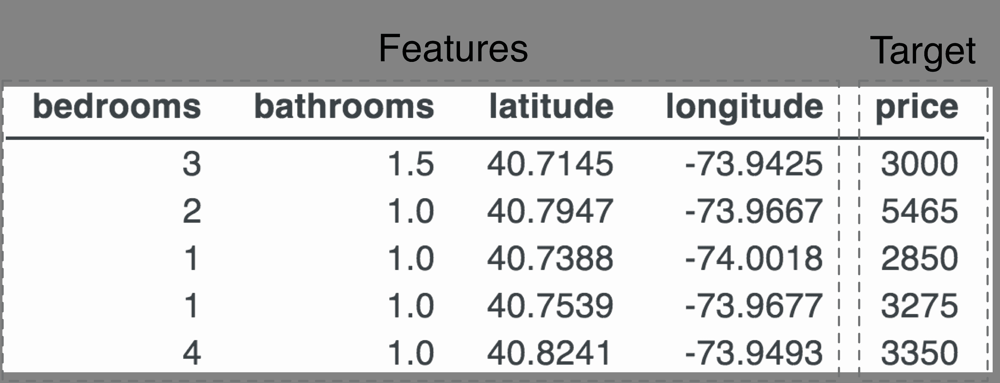
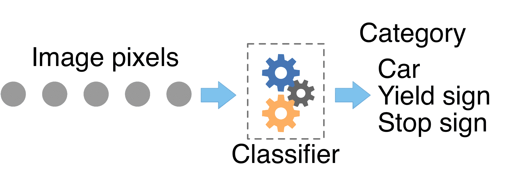

# 2 如何机器学习工作

> 原文：[`mlbook.explained.ai/intro.html`](https://mlbook.explained.ai/intro.html)

[Terence Parr](http://parrt.cs.usfca.edu) 和 [Jeremy Howard](http://www.fast.ai/about/#jeremy)

版权所有 © 2018-2019 Terence Parr。保留所有权利。

*请勿在网络上复制或以任何方式分发。*

这本书是由 markup+markdown+python+latex 源代码生成的，使用 [Bookish](https://github.com/parrt/bookish)。

您可以通过访问此页面的注释版本来对此页进行 **评论或注释**。您会看到现有的注释部分以黄色突出显示。它们是 *公开可见的*。或者，您可以直接向 Terence 发送评论、建议或修正。

目录

+   学习关于公寓数据的知识

    +   死记硬背学习

    +   了解邻居

    +   划清界限

    +   在树林中漫步

+   随机森林回归器

+   随机森林分类器

+   整体图景

“*没有数据，你只是另一个有意见的人*” — W. Edwards Deming

在人口密集的城市，如旧金山和纽约，人们最喜欢的主题是住房成本。没有什么比支付每月 4200 美元的租金来租一个单间公寓（就像在旧金山使命区的 Terence 住所附近租房的人一样）更让人振奋了。人们总是比较租金价格，因为他们想知道自己是否支付过高或得到了一个好交易。想法是收集类似公寓的信息，然后比较价格。房地产经纪人通常拥有更多数据，并有望提供更准确的租金估计。

1Navid Amini 的一次很好的押韵 https://scholar.google.com/citations?user=tZTnipEAAAAJ

当然，问题是大量数据很快就会让人脑不堪重负，所以我们转向计算机寻求帮助。不幸的是，基本的统计学不足以处理像公寓租金预测这样的有趣问题。相反，我们需要 *机器学习* 来发现数据中的关系和模式，这正是本书的主题。简单来说，机器学习将经验转化为专业知识，从训练数据中推广到新情况（对于以前未见过的数据）进行准确的预测或分类。

本章的目标是了解机器学习是如何工作的。为了做到这一点，让我们尝试发明一种预测纽约市公寓租金价格的技术。这将突出问题的难度，并帮助我们理解机器学习的方法。如果不理解底层算法，我们就无法成功应用机器学习。我们必须能够为特定问题选择正确的算法，并能够为该算法正确准备数据。通过从简单开始并走一些弯路，我们也将激发更复杂技术的构建。在这个过程中，我们将定义许多机器学习从业者常用的术语和概念，并对机器学习过程提供一个概述。

## 2.1 学习关于公寓数据

就像任何问题解决练习一样，首先清楚地定义问题是明智的。给定公寓的四个属性，卧室数量、浴室数量和位置（经度、纬度），我们想要*预测*（确定）价格。这些公寓属性被称为*特征*，价格被称为*目标*。我们通常以表格的形式提供数据，如下所示。



这组数据被称为*训练数据*或*训练集*，因为我们或一个程序必须从这种“经验”中学习，以便做出预测。（通常将单个记录的所有特征视为单个*特征向量*是很方便的；*向量*是一系列数字。）

机器学习的核心问题是要构建一个系统，该系统能够准确预测，但又不至于过于特定于训练数据（假设数据具有一个基础关系来捕捉）。

构建一个系统，使其能够对训练集中的物品做出准确预测是很简单的。我们只需要记住公寓及其价格（在这个上下文中），然后在需要时查找训练数据中的公寓价格。在另一个极端，我们可以计算所有公寓的平均租金，并为任何公寓预测这个价格，无论是在训练数据内部还是外部。对于特定公寓来说，整体平均租金可能不会非常准确，但它会给出一个大致的数字，很容易区分租金和，比如说，在东休斯顿街的 Katz 熟食店的一个热培根三明治（21.45 美元）。

记忆化不能推广到训练数据之外，但非常精确。将所有公寓混合在一起显然可以预测我们提出的任何公寓的价格，但并不精确。在两者之间存在着有效的机器学习。让我们从仅仅记忆训练数据开始，逐步构建一个能够正确推广的系统。

### 2.1.1 死记硬背学习

给定训练数据，我们可以合理地预测一个位于坐标 40.7947,-73.9667 的带有两个卧室和一个浴室的公寓的价格为$5,465，因为这直接来自表格的第二行。为了获得完美的准确性，我们可以从概念上理解学习过程就是填充一个将四个元素键映射到单个值（价格）的字典，就像这样：

```py
model = {}
def train(bedrooms, bathrooms, latitude, longitude, price):
    model[(bedrooms, bathrooms, latitude, longitude)] = price
```

在机器学习的术语中，我们是在“*训练*一个*模型*”，这里的模型是一个字典数据结构。在这个情况下，训练简单意味着记住所有公寓数据，并实现完美的回忆。

但这个训练过程假设所有公寓记录都是唯一的，这并不是一个有效的假设。例如，这里有四个具有相同（卧室，卫生间，纬度，经度）特征向量但价格不同的（令人眼花缭乱的！）公寓：

|  | 卧室 | 卫生间 | 纬度 | 经度 | 价格 |
| --- | --- | --- | --- | --- | --- |
|  |
| --- |
| 1470 | 0 | 1.0000 | 40.7073 | -73.9664 | 2650 |
| 36509 | 0 | 1.0000 | 40.7073 | -73.9664 | 2850 |
| 39241 | 0 | 1.0000 | 40.7073 | -73.9664 | 2950 |
| 46405 | 0 | 1.0000 | 40.7073 | -73.9664 | 2850 |

对于同一个特征向量存在多个价格表示存在不确定性。模型应该返回四个价格中的哪一个？价格差异可能有一个很好的原因，比如视野或面积，但我们没有这些数据。或者，正如我们在**第五章** *探索和去噪您的数据集*中将要看到的，数据有时是嘈杂的或者完全是错误的。无论如何，我们需要处理这种不确定性，因为重复的键会导致我们的基本训练过程覆盖先前的价格。

因为我们的目标是进行泛化，为训练数据中不存在的公寓提供一个良好的估计，我们应该考虑整个城市具有相同属性的所有公寓的预期租金值。预期值的另一个术语是“平均”，所以我们只记录平均值，这是人类专家会隐含做的事情。在这种情况下，我们会记录一个平均价格（$2,825）并在被要求预测具有这些特征的公寓价格时提供该值。我们训练数据中对于特定一组公寓属性拥有的样本价格越多，我们得到的真实平均价格的估计就越好。这效果很好，实际上是一种有损压缩，因为我们合并了记录，代价是预测的特异性降低。

对具有相同公寓特征向量的记录进行汇总并记录其平均租金，这涉足到机器学习尚且模糊的水域。我们在某种程度上学习了一个特定类型的典型公寓的价格，或者说是预期价格。这给我们一个暗示，机器学习只是数据结构、算法和统计学的合理组合。随着我们继续前进，希望你能看到机器学习并不是某种神秘且复杂的机制，需要花费很长时间才能学会。

### 2.1.2 认识邻居

基本字典模型的问题是它非常僵化，无法处理公寓特征向量本身的不确定性。（在查找时，以前未见过公寓特征组合会引发“键错误”）。我们应该如何预测那些特征与训练数据中的条目不完全匹配的公寓的价格？

一个有趣的解决方案是保留原始的训练数据不变，然后扫描寻找与我们要估算价格的公寓特征最接近的公寓记录。与之前一样，可能存在多个与最接近匹配记录的价格，因此我们想要对这些价格进行平均以得到预测值。信不信由你，这样一个简单的模型（对于适当的数据集来说）非常强大，并且是所谓的**k 最近邻**预测器的一种变体（参见[kNN](https://en.wikipedia.org/wiki/K-nearest_neighbors_algorithm)）。

最近邻模型唯一的问题是性能。我们必须保留整个训练数据集作为模型，并且必须线性扫描所有记录以寻找与公寓特征向量最接近的匹配项。与字典模型相比，没有训练过程，但公寓查找（预测）非常慢。

另一种处理公寓特征不确定性的方法是，像之前那样合并记录。我们可以通过卧室和浴室的组合来分组公寓记录，并计算每个组合的平均价格。这种方法在本例中有效，因为卧室和浴室的组合数量有限；我们可以覆盖所有这些组合。例如，以下是前几个卧室/浴室组合的平均价格：

|   | 卧室 | 浴室 | 价格 |
| --- | --- | --- | --- |
|  |
| --- |
| 0 | 0 | 0.0000 | 2872.9272 |
| 1 | 0 | 1.0000 | 2442.5502 |
| 2 | 0 | 1.5000 | 3391.1111 |
| 3 | 0 | 2.0000 | 5354.0714 |
| 4 | 0 | 4.0000 | 7995.0000 |
| 5 | 1 | 0.0000 | 2944.1918 |
| 6 | 1 | 1.0000 | 3015.5427 |

（你必须喜欢纽约市及其古怪的公寓；显然，你可以租到没有卧室但有 4 个浴室的地方，平均每月租金为 7995 美元！）

以牺牲特定性为代价，合并大大减少了数据集的大小，从 48,266 条记录减少到这个数据集的 51 条记录。字典或线性扫描可以快速找到卧室/浴室组合以进行预测。当然，这种方法完全忽略了位置，我们知道位置很重要。组平均值隐藏了公寓之间的许多变异性。我们可以创建一个二级索引，按纬度/经度对公寓进行分组，以仅基于位置获得第二个估计。但 unclear 如何将两个租金估计合并为一个预测。这种*临时*方法有时有效，但需要大量思考，并且高度依赖于数据集。我们需要一个更系统的方法。

### 2.1.3 绘制线条

我们可以尝试一种“数学”方法，即根据每个特征的重要性对其进行加权，然后使用加权总和来估计租金价格：


这个方程将所有我们的租金训练数据简化为仅由五个数字组成，这构成了我们的模型（四个权重，w[i]，以及一个最小租金的标量）。这是一个惊人的压缩！更好的是，做出预测非常快，因为它只需要四个乘法和四个加法。

这种方法通常效果很好，被称为[线性模型](https://en.wikipedia.org/wiki/Linear_regression)或*线性回归*，因为它试图在训练数据中绘制一条线（或当给定超过两个维度时为平面）。（回想一下高中代数中线的公式，。）这项技术已经存在了 200 多年，数学家有一个优雅的公式来生成合适的 w[i]权重。*回归*是预测基于训练数据和相关模型的通用术语，而该模型被称为*回归器*。


**图 2.1**. 每间浴室的价格和线性回归拟合线

对于这个数据集，不幸的是，线性模型不是一个好的选择，因为这样的模型将每个特征视为一个单一趋势，一边租金较低，另一边租金较高，或者反之亦然。例如，假设租金价格会随着浴室数量的增加而上升是合理的，但数据并不支持这个结论。**图 2.1**显示了具有相同浴室数量的所有公寓的平均租金，用点表示我们实际拥有的数据。

“最佳拟合”，红色线条最小化了线条与实际平均价格之间的差异，但显然是一个糟糕的价格预测器。在这种情况下，在 4 个浴室之后似乎有某种奇怪的事情发生。（10 个浴室而每月只有 3500 美元？人们只能想象这些地方的样子。）因此，单一线条是一个较差的拟合，并且不能很好地捕捉这种锯齿状的关系。

### 2.1.4 遍历树

一种更复杂的方法是分别处理特征值的不同范围，为每个范围提供一个不同的租金估计。每个特征范围将有一个不同的典型公寓。但是，我们必须小心不要创建一个过于特定于训练数据的模型，因为它不会很好地泛化。我们不希望回到另一个极端，即回到一个记忆精确公寓特征向量到价格关系的字典模型。

我们希望有一个模型能够优雅地调整速度，将一个特征值分成尽可能多的范围，以获得良好的准确性，但又不会创建太多紧密的范围而损害其通用性。为了了解这样的模型可能如何工作，让我们考虑纽约一个非常小的矩形区域中一室、一室和两室公寓的租金价格：

|   | 房间数 | 卫生间 | 纬度 | 经度 | 价格 |
| --- | --- | --- | --- | --- | --- |
|  |
| --- |
| 701 | 1 | 1.0000 | 40.6661 | -73.9882 | 2200 |
| 41397 | 1 | 1.0000 | 40.6661 | -73.9882 | 2100 |
| 41476 | 1 | 1.0000 | 40.6661 | -73.9882 | 2100 |
| 42254 | 1 | 1.0000 | 40.6661 | -73.9882 | 2200 |
| 45510 | 1 | 1.0000 | 40.6661 | -73.9882 | 2100 |
| 408 | 2 | 1.0000 | 40.6661 | -73.9882 | 2500 |
| 16876 | 2 | 1.0000 | 40.6661 | -73.9882 | 2500 |
| 40852 | 2 | 1.0000 | 40.6661 | -73.9882 | 2500 |
| 165 | 1 | 1.0000 | 40.6663 | -73.9402 | 1800 |
| 9113 | 1 | 1.0000 | 40.6663 | -73.9402 | 1800 |
| 27085 | 2 | 1.0000 | 40.6663 | -73.9402 | 2350 |

一种简单但繁琐的方法来捕捉特征值与相关价格之间的关系，就是在 Python 中定义一些规则：

```py
if bedrooms==1 and bathrooms==1.0 and \
   latitude>=40.6661 and latitude<=40.6663 and \
   longitude>=-73.9882 and longitude<=-73.9402:
	price = 2143 # average of 2200,2100,2100,2200,2100,1800,1800
if bedrooms==2 and bathrooms==1.0 and \
   latitude>=40.6661 and latitude<=40.6663 and \
   longitude>=-73.9882 and longitude<=-73.9402:
	price = 2462 # average of 2500,2500,2500,2350
```

有足够的咖啡，我们应该能够想出规则来划分*特征空间*（所有可能的房间、卫生间、纬度、经度组合的 4 维空间）成聚类。理想情况下，每个聚类都包含具有相似属性和相似租金的公寓，就像这个子样本的情况一样。为了进行租金预测，我们会执行这些规则，直到找到与感兴趣的公寓特征相匹配的规则。

与字典模型不同，这些规则可以处理以前未见过的数据。例如，想象一个位于 40.6612,-73.9800 的一室一卫公寓，它不在训练数据中。第一条规则适用，因此模型会预测租金为$2,143。这个模型泛化（至少在一定程度上）因为它处理的是特征值的范围，而不是精确的特征值。

模型使用的特征值范围的大小和数量代表了一种准确性的“旋钮”。旋转旋钮一个方向可以增加泛化性，但会使模型可能更不准确。相反方向，我们可以使范围更紧，模型更准确，但可能失去泛化性。一个过度特定于训练数据且泛化性不足的模型被称为*过度拟合*训练数据。自然地，相反的是*欠拟合*模型，它没有很好地捕捉训练数据中的关系，这也意味着它不会很好地泛化。

好的，现在我们有一个可能准确且通用的模型，但是通过执行多个`if`语句的顺序预测会相当慢。使预测变得高效的技巧是将规则进行因式分解和嵌套，以便它们共享比较以避免重复测试：

```py
if bathrooms==1.0:
    if latitude>=40.6661 and latitude<=40.6663 and \ 
       longitude>=-73.9882 and longitude<=-73.9402:
        if bedrooms==1: price = 2143
        elif bedrooms==2: price = 2462
```


**图 2.2**. 样本部分回归决策树

另一种用树数据结构编码嵌套规则的方法是，其中每个节点执行比较。**图 2.2**是这样一个树可能看起来什么样的视觉表示。使用这样的树预测租金只需要进行四次比较，因为我们从根节点下降到适当的叶子节点，在下降过程中测试特征。树的叶子包含所有符合从根节点到该叶子节点路径上标准的价格。这种类型的树被称为*决策树*，如果我们允许同一特征被多次测试，决策树可以将特征空间分割成任意紧密的簇。

决策树的问题在于它们往往会变得过于具体；它们过度拟合训练数据。例如，我们可以构建一个决策树，将特征空间分割成每个叶子节点对应一个单独的公寓。这将提供精确的答案，但就像我们的原始字典模型一样，这样一个特定的树无法泛化。

## 2.2 随机森林回归器

为了防止过度拟合，我们可以通过以下非常具体的方式降低决策树的准确性：通过在训练数据的一个随机子集上训练树，而不是数据集的所有成员。（技术上，我们正在进行[自助法](https://en.wikipedia.org/wiki/Bootstrapping_(statistics))，它随机选择记录，但可以进行替换，这意味着记录可以在自助样本中出现多次。）为了进一步减少过度拟合，我们有时可以忘记某些特征的存在，例如卧室数量。因为原始数据集中的不是所有元素都存在，所以我们有更粗糙的训练数据视图，因此决策树节点中的比较范围必然更广。

为了补偿这种弱学习器，我们可以创建很多这样的模型，并取它们各自预测的平均值来做出整体的租金预测。我们称之为[集成学习](https://cs.nju.edu.cn/zhouzh/zhouzh.files/publication/springerEBR09.pdf)，这是一种非常优秀的通用技术，可以提高准确性，而不会过度拟合。引入更多的随机性给我们带来了*随机森林*™，我们将它简称为*RF*。

随机森林（RF）的行为非常类似于一群房地产经纪人寻找可比的公寓并合作估算公寓价格（“众包”）。在训练过程中，经纪人会独立选择并参观纽约市可用的公寓。公寓的选择应该是随机的，以减少经纪人只参观，比如说，一室公寓的可能性。这样的经纪人会“过度拟合”，因为他们只能对一室公寓给出合理的答案。随机选择公寓可以减少这种采样偏差。每个经纪人都会在不同的公寓样本上训练，但会有一些重叠。增加更多的经纪人可以提高我们的预测准确性和模型泛化能力，而不会增加过度拟合的概率。

要预测具有特定特征的公寓价格，每个经纪人都会从他们的训练集中找到可比的（相似或相同的）公寓，并报告这些公寓的平均值。然后，整体预测将是所有经纪人平均值的平均值。

我们将在第十七章“随机决策树森林”中学习随机森林的细节，以及如何在第十八章“实现随机森林”中实现它们。随机森林是机器学习世界的瑞士军刀™，我们建议将其作为你在实践中遇到的多数机器学习问题的首选模型。

通过一个小调整，我们可以使用随机森林来完成一个相关且同样有用的任务：预测离散类别，如癌症/非癌症，而不是连续值，如价格。

## 2.3 随机森林分类器

我们都去过医生那里，展示一系列症状并请求诊断。我们想知道那个皮疹是毒葛、擦伤、病毒还是皮肤癌。作为回应，医生会提供由疾病或条件名称组成的诊断。或者，我们可能只是想知道我们的症状是否值得担心，在这种情况下，医生会提供一个二进制的是/否答案。提供这种诊断的机器学习模型被称为*分类器*，因为它预测一个类别或类别（疾病名称），而不是预测像租金价格这样的数值。

医生通过他们的经验隐式地计算疾病可能性，以便做出诊断。大致来说，医生通过思考：“我见过类似的症状 10 次；其中 7 人有疾病 A，2 人有疾病 B，1 人有疾病 C。”然后，如果应用一个选择“投票”最多（最高可能性）的疾病的决策规则，诊断就是疾病 A。这听起来就像我们在**第 2.1.2 节**“了解邻居”中使用的最近邻（kNN）方法来预测租金价格。

kNN 分类器根据症状的特征向量找到 k 个相似的病例历史，并在这些 k 个病例中采取多数诊断“投票”。kNN 回归器和分类器之间的唯一区别在于，回归器为 k 个相似记录的目标值提供平均值，而 kNN 分类器为 k 个相似记录中占多数的目标类别提供目标类别。

在摘要中，决策树将特征空间划分为与 kNN 模型类似的一组相似观测值。每个叶子节点代表这些组中的一个。回归树和分类树之间的区别在于，回归树的叶子节点预测数值，而分类树的叶子节点预测离散类别。回归树的叶子节点预测该叶子节点中分组观测值的平均目标值，而分类树的叶子节点预测最常见的目标类别。RF 分类器只是一个分类决策树的集合，它从这些树中预测最可能的类别。从这个意义上说，它有点像一种元投票方案，因为 RF 分类器统计森林中树的意见，而树本身在叶子节点中统计观测值之间的意见。


**图 2.3**. 样本部分分类决策树

继续我们的公寓价格示例，考虑预测公寓广告页面的兴趣而不是预测租金价格的问题。我们可以想象，拥有多个卧室和合理价格的公寓会比没有浴室但价格非常低的公寓产生更多的兴趣（尽管，在纽约市，你永远不知道）。RF 可以捕捉公寓特征与低、中、高兴趣类别之间的关系，就像它可以捕捉与价格之间的关系一样。**图 2.3**展示了预测中等和高兴趣的叶子节点，这取决于卧室数量、浴室数量和价格。

既然我们已经对高层次的情况有了了解，让我们将本章学到的关键概念和术语集中到几个段落中。

## 2.4 大图景


**图 2.4**. 特征向量 X 和目标 y

机器学习使用模型来捕捉训练数据集中特征向量与某些目标变量之间的关系。特征向量是一组特征或属性，用于描述特定对象，例如公寓的卧室数量、浴室数量和位置。目标是标量值，如租金价格，或者是一个整数分类，例如“有信用”或“不是癌症”。特征和目标以特征向量列表和目标值列表的形式呈现给模型进行训练，形式为抽象矩阵 X 和向量 y（**图 2.4**）。X 的  行被标记为 x[i]，代表我们对特定实体的所有了解，例如一个公寓。目标值  被标记为 y[i]。（我们将矩阵大写，粗体向量，类似于在 Java 或 C++ 等编程语言中声明类型。）一个实体的特征向量 x[i] 和目标值 y[i] 的向量被称为 *观测值*。


**图 2.5**. 预测器框图

**图 2.6**. 分类器框图

**图 2.7**. 预测器通过数据绘制曲线

**图 2.8**. 分类器在分隔类的空间中绘制曲线

如果目标是数值，我们正在构建一个预测器（也常称为回归器），如图 **图 2.5** 所示。如果目标是离散类别或类别，我们正在构建一个分类器（**图 2.6**）。我们将在 [foo] 中学习关于分类器的知识，但简单来说，预测器和分类器之间的区别如图 **图 2.7** 和 **图 2.8** 所示。预测器通常是将曲线拟合到数据中，而分类器是在与各种类别相关的数据点之间绘制决策边界。有一种趋势认为预测器和分类器是两个完全不同的问题，具有不同的解决方案，但实际上它们是同一个核心问题，大多数模型都有预测器和分类器变体。实际上，分类器变体有时不过是预测器变体加上一个额外的函数，该函数可以剪辑、缩放或调整预测器的输出。

具有特征向量 `x` 和已知目标 `y` 的机器学习任务属于**监督学习**类别，这也是本书的重点。**无监督学习**任务只涉及 `x`，目标变量是未知的；我们说数据是无标签的。最常见的无监督任务是**聚类**，它试图将相似的数据点聚集在一起，就像**图 2.8**所示。然而，在监督的情况下，我们不仅知道有多少个类别，还知道哪些记录与哪个类别相关。聚类的目标是发现类别的数量并将记录分配到类别中。正如我们在**第一章**中提到的**欢迎**，绝大多数机器学习问题都是监督学习，而且，在掌握监督技术之后，无监督技术也容易学习。


**图 2.9**. 从训练数据中提取模型参数

模型是由数据结构、算法和数学组成，它捕捉了一组（特征向量，目标）对所描述的关系。模型在其数据结构中记录了训练数据的浓缩，这可以是未改变的训练集（最近邻模型）到一组决策树（随机森林模型）再到少量权重（线性模型）。这个数据结构构成了模型的参数，这些参数是从训练数据中计算得出的。**图 2.9**展示了这个过程。

计算模型参数的过程被称为训练模型或拟合数据。如果一个模型无法捕捉特征向量和目标之间的关系，那么这个模型就是欠拟合（假设存在可捕捉的关系）。在另一个极端，如果一个模型对训练数据过于具体，并且泛化能力不好，那么这个模型就是过拟合。泛化的意思是我们对训练集中未出现的特征向量也能得到准确的预测。

模型也有超参数，这些超参数决定了模型的总体架构或其他方面。例如，最近邻模型更具体地称为“k-最近邻”，因为模型找到最近的 k 个对象，然后平均它们的目标值来做出预测。k 是模型的超参数。在随机森林中，森林中的树的数量是最常见的超参数。在神经网络中，超参数通常包括层数和神经元数量。超参数由程序员指定，而不是从训练数据中计算得出，并且通常用于调整模型以提高特定数据集的准确性。

为了测试泛化能力，我们要么需要同时获得验证集和训练集，要么需要将提供的单个数据集拆分为训练集和验证集。模型仅暴露于训练集，将验证集保留用于测量泛化能力和调整模型。（稍后我们将讨论一个用作泛化最终测试的*测试集*；测试集在训练或调整模型时永远不会使用。）验证集包含特征向量和目标，因此我们可以将模型的预测与已知的正确目标进行比较，以计算准确度指标。

这需要吸收很多信息，但随着我们处理更多示例，它将越来越清晰。在下一章中，我们将看到在有趣且真实的数据集上训练随机森林模型是多么容易。
